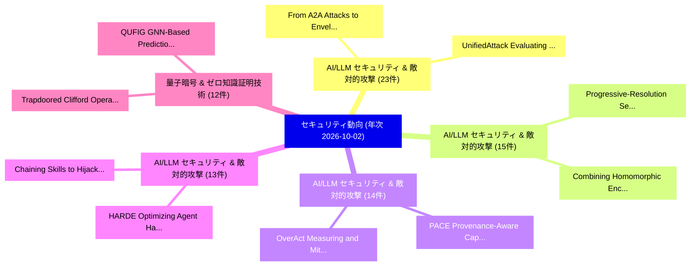

# 🌐 05_annual: 年次エグゼクティブサマリー報告書 (通期365日間: 2026-10-02)

**集計日時**: 2026-10-02 00:00:00 UTC  
**通期365日間の総論文数**: 9679 件  

---

## 💡 年次セキュリティ技術トレンド総括 (Annual Strategic Synthesis)

本日の収集論文（計 9679 件）において、以下の重点セキュリティ領域で活発な研究動向が確認されました：
- **AI/LLM セキュリティ & 敵対的攻撃** (23 件): 注目論文として 「UnifiedAttack: Evaluating the ...」、「From A2A Attacks to Envelope-L...」 等が発表され、実務防御および攻撃検証の進展が見られます。
- **AI/LLM セキュリティ & 敵対的攻撃** (15 件): 注目論文として 「Progressive-Resolution Secure ...」、「Combining Homomorphic Encrypti...」 等が発表され、実務防御および攻撃検証の進展が見られます。
- **AI/LLM セキュリティ & 敵対的攻撃** (14 件): 注目論文として 「PACE: Provenance-Aware Capabil...」、「OverAct: Measuring and Mitigat...」 等が発表され、実務防御および攻撃検証の進展が見られます。
- **AI/LLM セキュリティ & 敵対的攻撃** (13 件): 注目論文として 「Chaining Skills to Hijack LLMエ...」、「HARDE: Optimizing Agent Harnes...」 等が発表され、実務防御および攻撃検証の進展が見られます。
- **量子暗号 & ゼロ知識証明技術** (12 件): 注目論文として 「QUFIG: GNN-Based Prediction of...」、「Trapdoored Clifford Operators ...」 等が発表され、実務防御および攻撃検証の進展が見られます。

### 🗺️ 年次セキュリティ脅威マインドマップ

---

## 📌 年次セキュリティ論文一覧 (日本語表形式)

| No | arXiv ID | 論文タイトル (日本語訳) | 重要キーワード | 構造化エグゼクティブ要約 (背景・提案・影響) | 脅威分類 | 詳細リンク |
|---|---|---|---|---|---|---|
| 1 | `2610.00136` | [Evasion Attacks: How Adversarial Noise Bypasses ML ClassifiersTitle:（セキュリティ分析論文）](../../okf/papers/2026-10-02/2610.00136.md) | `Evasion Attacks`, `Spam Collection`, `white-box attacks` | This paper presents a reproducible, educational study of evasion attacks in image classification and text classification. A compact convolutional netw... | `security` | [arXiv](https://arxiv.org/abs/2610.00136) &#124; [OKF](../../okf/papers/2026-10-02/2610.00136.md) |
| 2 | `2610.00151` | [Intrusion Detection for Agentic Processes: Evidence-Based Runtime MonitoringTitle:（セキュリティ分析論文）](../../okf/papers/2026-10-02/2610.00151.md) | `Intrusion Detection`, `Agentic Processes`, `Based Runtime` | Agent deployments increasingly combine language-model inference with retrieval, delegation, tool execution, external-system access, and human approval... | `security` | [arXiv](https://arxiv.org/abs/2610.00151) &#124; [OKF](../../okf/papers/2026-10-02/2610.00151.md) |
| 3 | `2610.00309` | [Tokenized Key-Gated Adapter Routing: A Secure Access Control Mechanism Against Private Data Leakage in LLMsTitle:（セキュリティ分析論文）](../../okf/papers/2026-10-02/2610.00309.md) | `Gated Adapter Routing`, `Tokenized Key`, `Key-Gated Adapter` | Large language models (LLMs) are increasingly deployed in privacy-critical domains (e.g., healthcare, finance, and government), but their propensity t... | `security` | [arXiv](https://arxiv.org/abs/2610.00309) &#124; [OKF](../../okf/papers/2026-10-02/2610.00309.md) |
| 4 | `2610.00327` | [Actions with Receipts: Jointly Binding Claims, Evidence, and Execution for Replayable Tool-Agent AuditingTitle:（セキュリティ分析論文）](../../okf/papers/2026-10-02/2610.00327.md) | `Jointly Binding Claims`, `Replayable Tool`, `Tool-Agent AuditingTitle` | Tool-using agents can expose citations and execution logs while leaving a critical association unaudited: whether the claim shown to a user is the cla... | `security` | [arXiv](https://arxiv.org/abs/2610.00327) &#124; [OKF](../../okf/papers/2026-10-02/2610.00327.md) |
| 5 | `2610.00341` | [UnifiedAttack: Evaluating the Safety of Large Multimodal Models in Synergistic Harmful Image-Text GenerationTitle:（セキュリティ分析論文）](../../okf/papers/2026-10-02/2610.00341.md) | `Large Multimodal Models`, `Synergistic Harmful Image`, `Image-Text GenerationTitle` | As Large Multimodal Models (LMMs) transition toward natively unified architectures, evaluating their safety in synergistic harmful image-text generati... | `security` | [arXiv](https://arxiv.org/abs/2610.00341) &#124; [OKF](../../okf/papers/2026-10-02/2610.00341.md) |
| 6 | `2610.00347` | [Authorization for Self-Modifying AI Agent Populations: Conserving Authority across Replacement, Forking, and RollbackTitle:（セキュリティ分析論文）](../../okf/papers/2026-10-02/2610.00347.md) | `Agent Populations`, `Conserving Authority`, `Self-Modifying AI` | Self-modifying AI agents can replace, fork, and roll back identity-bearing software while descendants remain executable. Per-successor authorization d... | `security` | [arXiv](https://arxiv.org/abs/2610.00347) &#124; [OKF](../../okf/papers/2026-10-02/2610.00347.md) |
| 7 | `2610.00348` | [Removing the NEEDLE in the Haystack: Backdoor Removal in LLMs via Weight OrthogonalisationTitle:（セキュリティ分析論文）](../../okf/papers/2026-10-02/2610.00348.md) | `Backdoor Removal`, `Large Language Models`, `refusal-related representations` | Backdoor attacks can be implanted in Large Language Models (LLMs) during training, causing unwanted behaviour when a trigger appears in the input. Exi... | `security` | [arXiv](https://arxiv.org/abs/2610.00348) &#124; [OKF](../../okf/papers/2026-10-02/2610.00348.md) |
| 8 | `2610.00354` | [Proof-Gated Signing: Solver-Checked Transaction Guards that Hold Under State Drift for Onchain AI AgentsTitle:（セキュリティ分析論文）](../../okf/papers/2026-10-02/2610.00354.md) | `Gated Signing`, `Proof-Gated Signing`, `Checked Transaction Guards` | AI agents that control wallets read attacker-reachable content, so they can be steered into proposing harmful transactions. The usual last line of def... | `security` | [arXiv](https://arxiv.org/abs/2610.00354) &#124; [OKF](../../okf/papers/2026-10-02/2610.00354.md) |
| 9 | `2610.00382` | [On the Relationship between Model Quantization and Model Inversion AttacksTitle:（セキュリティ分析論文）](../../okf/papers/2026-10-02/2610.00382.md) | `Model Quantization`, `Model Inversion`, `quantization-induced changes` | Model quantization reduces the numerical precision of neural network weights and activations to lower storage and computational costs. Model inversion... | `security` | [arXiv](https://arxiv.org/abs/2610.00382) &#124; [OKF](../../okf/papers/2026-10-02/2610.00382.md) |
| 10 | `2610.00392` | [From A2A Attacks to Envelope-Layer Defense: Red-Teaming Evaluation of LLMエージェント and a Three-Layer Isomorphic Attack-Defense ModelTitle:](../../okf/papers/2026-10-02/2610.00392.md) | `Layer Isomorphic Attack`, `Layer Defense`, `Envelope-Layer Defense` | Agent interaction protocols such as ACP and A2A have moved LLM-based agents toward multi-agent collaboration, introducing new security threats. A task... | `security` | [arXiv](https://arxiv.org/abs/2610.00392) &#124; [OKF](../../okf/papers/2026-10-02/2610.00392.md) |
| 11 | `2610.00450` | [ZoneClaw: Mitigating Persistent Memory Attacks by Establishing Memory-Zoning in OpenClaw-Style Computer-Use AgentsTitle:（セキュリティ分析論文）](../../okf/papers/2026-10-02/2610.00450.md) | `Mitigating Persistent Memory Attacks`, `Establishing Memory`, `Style Computer` | Computer-use agents increasingly operate as long-running assistants through persistent workspace memory, which OpenClaw-style CUAs realize as automati... | `security` | [arXiv](https://arxiv.org/abs/2610.00450) &#124; [OKF](../../okf/papers/2026-10-02/2610.00450.md) |
| 12 | `2610.00519` | [Harbormaster: Evidence-Gated, Replay-Safe Maritime Anomaly Detection on AWSTitle:（セキュリティ分析論文）](../../okf/papers/2026-10-02/2610.00519.md) | `Safe Maritime Anomaly Detection`, `Replay-Safe Maritime`, `Automatic Identification System` | Ships broadcast their positions through the Automatic Identification System (AIS), and those reports can be false or missing. An operator who acts on... | `security` | [arXiv](https://arxiv.org/abs/2610.00519) &#124; [OKF](../../okf/papers/2026-10-02/2610.00519.md) |
| 13 | `2610.00557` | [No One Architecture Fits All: A Cross-Environment Evaluation of Hierarchical Red Team AgentsTitle:（セキュリティ分析論文）](../../okf/papers/2026-10-02/2610.00557.md) | `Hierarchical Red Team`, `stress-test AI`, `cross-environment comparison` | Autonomous red team agents increasingly stress-test AI-enabled cyber defenses by planning strategy and executing multistage attacks. Reinforcement lea... | `security` | [arXiv](https://arxiv.org/abs/2610.00557) &#124; [OKF](../../okf/papers/2026-10-02/2610.00557.md) |
| 14 | `2610.00590` | [Hierarchical Cyber Defense with Large Language Models: From Planning to ExecutionTitle:に向けて](../../okf/papers/2026-10-02/2610.00590.md) | `Towards Hierarchical Cyber Defense`, `Large Language Models`, `zero-shot large` | An autonomous cyber defender trained with reinforcement learning (RL) is typically tied to the network on which it was trained, limiting its ability t... | `security` | [arXiv](https://arxiv.org/abs/2610.00590) &#124; [OKF](../../okf/papers/2026-10-02/2610.00590.md) |
| 15 | `2610.00695` | [Progressive-Resolution Secure Aggregation for 連合学習Title:](../../okf/papers/2026-10-02/2610.00695.md) | `Resolution Secure Aggregation`, `Progressive-Resolution Secure`, `aggregate` | Secure aggregation lets a server recover an aggregate of client updates without observing any individual update, but conventional protocols fix the ag... | `security` | [arXiv](https://arxiv.org/abs/2610.00695) &#124; [OKF](../../okf/papers/2026-10-02/2610.00695.md) |
| 16 | `2610.00759` | [Crossing the Cyber Divide: Sim-to-Sim and Sim-to-Real Transfer for RL AgentsTitle:（セキュリティ分析論文）](../../okf/papers/2026-10-02/2610.00759.md) | `Cyber Divide`, `Real Transfer`, `transfer` | Cyber attack agents are typically trained and evaluated within a single simulator, making it unclear whether learned policies transfer beyond the envi... | `security` | [arXiv](https://arxiv.org/abs/2610.00759) &#124; [OKF](../../okf/papers/2026-10-02/2610.00759.md) |
| 17 | `2610.00780` | [Made to Measure: Designing Image Watermarks to SpecificationTitle:（セキュリティ分析論文）](../../okf/papers/2026-10-02/2610.00780.md) | `Designing Image Watermarks`, `false-positive rate`, `request-conditioned watermark` | Image watermarking supports provenance and attribution by embedding verifiable identity information into images. Practical deployments, however, must... | `security` | [arXiv](https://arxiv.org/abs/2610.00780) &#124; [OKF](../../okf/papers/2026-10-02/2610.00780.md) |
| 18 | `2610.00787` | [Identity-Bound Governance Under Execution Uncertainty: An Accountability Proof Block for LLM Agent Persistent Halts, with Cryptographic Implementation and Cross-Model CalibrationTitle:（セキュリティ分析論文）](../../okf/papers/2026-10-02/2610.00787.md) | `Agent Persistent Halts`, `Cryptographic Implementation`, `Identity-Bound Governance` | A correctly governed LLM agent can reach a state in which neither continuing execution nor automatically halting is admissible: the system has detecte... | `security` | [arXiv](https://arxiv.org/abs/2610.00787) &#124; [OKF](../../okf/papers/2026-10-02/2610.00787.md) |
| 19 | `2610.00815` | [SafeDepth: Safety-Aware Token-Level Adaptive ComputationTitle:（セキュリティ分析論文）](../../okf/papers/2026-10-02/2610.00815.md) | `Aware Token`, `Level Adaptive`, `Safety-Aware Token` | Recent studies suggest that not every token needs to pass through all Transformer layers, motivating token-level adaptive models that selectively skip... | `security` | [arXiv](https://arxiv.org/abs/2610.00815) &#124; [OKF](../../okf/papers/2026-10-02/2610.00815.md) |
| 20 | `2610.00839` | [Do Defenses Against LLM Extraction Work Across Attacks? A Lifecycle Benchmark of Black-Box Model ExtractionTitle:（セキュリティ分析論文）](../../okf/papers/2026-10-02/2610.00839.md) | `Lifecycle Benchmark`, `Box Model`, `Black-Box Model` | Large language models (LLMs) deployed through text-only APIs face model extraction risks, as adversaries can collect their responses to train surrogat... | `security` | [arXiv](https://arxiv.org/abs/2610.00839) &#124; [OKF](../../okf/papers/2026-10-02/2610.00839.md) |
| 21 | `2610.00850` | [AuraForge: Scaling Security Supervision for Training Coding AgentsTitle:（セキュリティ分析論文）](../../okf/papers/2026-10-02/2610.00850.md) | `Scaling Security Supervision`, `Training Coding`, `real-world repositories` | Coding agents are now proficient enough to generate complex software applications from a single prompt. As their capabilities have grown, human oversi... | `security` | [arXiv](https://arxiv.org/abs/2610.00850) &#124; [OKF](../../okf/papers/2026-10-02/2610.00850.md) |
| 22 | `2610.00977` | [ABSENTIA: Detecting Broken Access Control Vulnerabilities in Web ApplicationsTitle:（セキュリティ分析論文）](../../okf/papers/2026-10-02/2610.00977.md) | `Detecting Broken Access Control Vulnerabilities`, `access-control flaws`, `security` | Broken access control, the failure of authorization, is one of the most prevalent web security risks. Unlike injection, a flow of untrusted input into... | `security` | [arXiv](https://arxiv.org/abs/2610.00977) &#124; [OKF](../../okf/papers/2026-10-02/2610.00977.md) |
| 23 | `2610.01009` | [Helol Tunnel: Covert Channel Exploitation of TLS Extensibility & Privacy FeaturesTitle:（セキュリティ分析論文）](../../okf/papers/2026-10-02/2610.01009.md) | `Covert Channel Exploitation`, `Helol Tunnel`, `Client Hello` | Covert channels exploiting network protocols for data exfiltration and command-and-control (C2) are integral parts of modern cyberattacks. In search o... | `security` | [arXiv](https://arxiv.org/abs/2610.01009) &#124; [OKF](../../okf/papers/2026-10-02/2610.01009.md) |
| 24 | `2610.01058` | [MOMAT: Mixture of Multiple Atlases for Low-Power Jailbreak Defense of Quantized LLMsTitle:（セキュリティ分析論文）](../../okf/papers/2026-10-02/2610.01058.md) | `Multiple Atlases`, `Power Jailbreak Defense`, `Low-Power Jailbreak` | Quantized large language models are increasingly deployed on edge devices for their low latency and energy efficiency. However, model quantization wea... | `security` | [arXiv](https://arxiv.org/abs/2610.01058) &#124; [OKF](../../okf/papers/2026-10-02/2610.01058.md) |
| 25 | `2610.01079` | [Jev-IDS: System One Models for Network Intrusion DetectionTitle:（セキュリティ分析論文）](../../okf/papers/2026-10-02/2610.01079.md) | `System One Models`, `Network Intrusion`, `Network Intrusion Detection Systems` | Machine-learning Network Intrusion Detection Systems (IDS) depend on substantial labeled datasets and task-specific training, whereas Large Language M... | `security` | [arXiv](https://arxiv.org/abs/2610.01079) &#124; [OKF](../../okf/papers/2026-10-02/2610.01079.md) |
| 26 | `2610.01184` | [ReCast: Contract-Preserving Protection for Fixed-Interface Multimodal ReasoningTitle:（セキュリティ分析論文）](../../okf/papers/2026-10-02/2610.01184.md) | `Preserving Protection`, `Interface Multimodal`, `Contract-Preserving Protection` | Remote multimodal models offer strong numerical reasoning capabilities over charts and speech, but sending private inputs risks exposing sensitive con... | `security` | [arXiv](https://arxiv.org/abs/2610.01184) &#124; [OKF](../../okf/papers/2026-10-02/2610.01184.md) |
| 27 | `2610.01250` | [A Resource-Aware Behavior Reconstruction and Hierarchical Semantic Learning Framework for Host Intrusion DetectionTitle:（セキュリティ分析論文）](../../okf/papers/2026-10-02/2610.01250.md) | `Aware Behavior Reconstruction`, `Host Intrusion`, `Resource-Aware Behavior` | System calls (syscalls) record key interactions between running programs and the operating system kernel, providing fine-grained and minimally intrusi... | `security` | [arXiv](https://arxiv.org/abs/2610.01250) &#124; [OKF](../../okf/papers/2026-10-02/2610.01250.md) |
| 28 | `2610.01263` | [Autonomous OSS Threat Detection via Taxonomy-Aligned LLMsTitle:（セキュリティ分析論文）](../../okf/papers/2026-10-02/2610.01263.md) | `Threat Detection`, `Taxonomy-Aligned LLMsTitle`, `Trojan Source` | Open source software (OSS) ecosystems face growing threats from sophisticated supply chain attacks including typosquatting, dependency confusion, Troj... | `security` | [arXiv](https://arxiv.org/abs/2610.01263) &#124; [OKF](../../okf/papers/2026-10-02/2610.01263.md) |
| 29 | `2610.01294` | [GNSS Spoofing in Mobile Devices: A Survey on Impact and CountermeasuresTitle:（セキュリティ分析論文）](../../okf/papers/2026-10-02/2610.01294.md) | `Mobile Devices`, `Global Navigation Satellite System`, `open-architecture signals` | Smartphones rely on Global Navigation Satellite System (GNSS)-based positioning for many of the functions they execute everyday. The GNSS receivers em... | `security` | [arXiv](https://arxiv.org/abs/2610.01294) &#124; [OKF](../../okf/papers/2026-10-02/2610.01294.md) |
| 30 | `2610.01300` | [A Systematization of Knowledge on DeFi Vaults: Architectures, Curation Mechanisms, and Strategy DesignTitle:（セキュリティ分析論文）](../../okf/papers/2026-10-02/2610.01300.md) | `Curation Mechanisms`, `principal-agent dynamics`, `curator-mediated control` | Decentralized finance (DeFi) vaults are smart-contract-based asset management systems that pool deposits, execute programmable strategies, and mint to... | `security` | [arXiv](https://arxiv.org/abs/2610.01300) &#124; [OKF](../../okf/papers/2026-10-02/2610.01300.md) |
| 31 | `2610.01349` | [PACE: Provenance-Aware Capability Enforcement for Tool-Using LLMエージェントTitle:](../../okf/papers/2026-10-02/2610.01349.md) | `Aware Capability Enforcement`, `Provenance-Aware Capability`, `Tool-Using LLM` | Tool-using large language model (LLM) agents turn generated text into real side effects, so poisoned tool metadata, retrieved pages, memory, and reusa... | `security` | [arXiv](https://arxiv.org/abs/2610.01349) &#124; [OKF](../../okf/papers/2026-10-02/2610.01349.md) |
| 32 | `2610.01365` | [Sleeping Secrets: How Fine-Tuning Reawakens Privacy Risks in Language ModelsTitle:（セキュリティ分析論文）](../../okf/papers/2026-10-02/2610.01365.md) | `Tuning Reawakens Privacy Risks`, `Sleeping Secrets`, `Fine-Tuning Reawakens` | Beyond adapting Large Language Models (LLMs) to specialized applications, fine-tuning has recently been shown to recover private information that is n... | `security` | [arXiv](https://arxiv.org/abs/2610.01365) &#124; [OKF](../../okf/papers/2026-10-02/2610.01365.md) |
| 33 | `2610.01367` | [High-quality Data Do not Mean Safe! Poisoning LLMs after Data SelectionTitle:（セキュリティ分析論文）](../../okf/papers/2026-10-02/2610.01367.md) | `Mean Safe`, `High-quality Data`, `Large Language Models` | Safety-aligned Large Language Models remain vulnerable to fine-tuning on small sets of harmful or benign-looking samples. However, prior studies typic... | `security` | [arXiv](https://arxiv.org/abs/2610.01367) &#124; [OKF](../../okf/papers/2026-10-02/2610.01367.md) |
| 34 | `2610.01385` | [Is it Possible to Generate Irreversible PolyProtected Templates from Face Embeddings using System-Specific Keys?Title:（セキュリティ分析論文）](../../okf/papers/2026-10-02/2610.01385.md) | `Generate Irreversible`, `Face Embeddings`, `Specific Keys` | This work aims to answer the question of whether it is possible to generate irreversible protected templates when the PolyProtect biometric template p... | `security` | [arXiv](https://arxiv.org/abs/2610.01385) &#124; [OKF](../../okf/papers/2026-10-02/2610.01385.md) |
| 35 | `2610.01386` | [Evidence Coverage for Intent-Bound Execution: Scope, Obligations, and Cutoff ReasoningTitle:（セキュリティ分析論文）](../../okf/papers/2026-10-02/2610.01386.md) | `Evidence Coverage`, `Bound Execution`, `Intent-Bound Execution` | A verifier may authenticate every available record and still lack grounds to call an execution account complete. Such a claim requires a justified acc... | `security` | [arXiv](https://arxiv.org/abs/2610.01386) &#124; [OKF](../../okf/papers/2026-10-02/2610.01386.md) |
| 36 | `2610.01484` | [Key-Reuse Vulnerability of Phase-Keyed Fourier-Curve Modulation: Relation Leakage and Key-Refresh Cost on Coded LinksTitle:（セキュリティ分析論文）](../../okf/papers/2026-10-02/2610.01484.md) | `Reuse Vulnerability`, `Keyed Fourier`, `Curve Modulation` | The security of keyed modulation is often argued from the key-space size and the error rate of a key-less receiver. This evidence fails when the key i... | `security` | [arXiv](https://arxiv.org/abs/2610.01484) &#124; [OKF](../../okf/papers/2026-10-02/2610.01484.md) |
| 37 | `2610.01508` | [OverAct: Measuring and Mitigating Proactive Over-Authorization in LLM Tool-Calling AgentsTitle:（セキュリティ分析論文）](../../okf/papers/2026-10-02/2610.01508.md) | `Tool-Calling AgentsTitle`, `tool-calling capabilities`, `tool-calling agents` | LLM agents with tool-calling capabilities can access external services and private user data, but they may retrieve more information than a user's req... | `security` | [arXiv](https://arxiv.org/abs/2610.01508) &#124; [OKF](../../okf/papers/2026-10-02/2610.01508.md) |
| 38 | `2610.01535` | [False Floors: LLM Safety Routing Evaluations Break Under Distribution ShiftTitle:（セキュリティ分析論文）](../../okf/papers/2026-10-02/2610.01535.md) | `False Floors`, `held-out categories`, `safety` | Safety routers send each request to one of several models and are judged against the best single model. A major routing benchmark picks that comparato... | `security` | [arXiv](https://arxiv.org/abs/2610.01535) &#124; [OKF](../../okf/papers/2026-10-02/2610.01535.md) |
| 39 | `2610.01564` | [Chaining Skills to Hijack LLMエージェントTitle:](../../okf/papers/2026-10-02/2610.01564.md) | `Chaining Skills`, `attacker-selected action`, `open-source repositories` | LLM agents use skills to improve performance on specialized tasks. To complete a user request, an agent may invoke several skills in sequence, allowin... | `security` | [arXiv](https://arxiv.org/abs/2610.01564) &#124; [OKF](../../okf/papers/2026-10-02/2610.01564.md) |
| 40 | `2610.01580` | [Protocol Integration of Physical Layer Deception into EAP-TEAP Wi-Fi AuthenticationTitle:（セキュリティ分析論文）](../../okf/papers/2026-10-02/2610.01580.md) | `Physical Layer Deception`, `Protocol Integration`, `EAP-TEAP Wi` | Credential-based Extensible Authentication Protocol (EAP) authentication cannot distinguish a legitimate credential holder from an adversary using com... | `security` | [arXiv](https://arxiv.org/abs/2610.01580) &#124; [OKF](../../okf/papers/2026-10-02/2610.01580.md) |
| 41 | `2610.01650` | [Combining Homomorphic Encryption and Differential Privacy in 連合学習 for Model Inspection and AvailabilityTitle:](../../okf/papers/2026-10-02/2610.01650.md) | `Combining Homomorphic Encryption`, `Differential Privacy`, `Federated Learning` | The increasing prevalence of decentralized data has led to a growing interest in federated learning, which enables collaborative model training withou... | `security` | [arXiv](https://arxiv.org/abs/2610.01650) &#124; [OKF](../../okf/papers/2026-10-02/2610.01650.md) |
| 42 | `2610.01736` | [The Achilles' Heel of Partial Reconfiguration: Optical Side-Channel Leakage on the 7-Series ICAPTitle:（セキュリティ分析論文）](../../okf/papers/2026-10-02/2610.01736.md) | `Partial Reconfiguration`, `Optical Side`, `Channel Leakage` | Major FPGA manufacturers have incorporated bitstream encryption to protect sensitive configuration data. However, for the most widely used FPGA famili... | `security` | [arXiv](https://arxiv.org/abs/2610.01736) &#124; [OKF](../../okf/papers/2026-10-02/2610.01736.md) |
| 43 | `2610.01756` | [SoK: Decentralized Agent Economic InfrastructureTitle:（セキュリティ分析論文）](../../okf/papers/2026-10-02/2610.01756.md) | `Decentralized Agent Economic`, `task-relative criterion`, `task` | Decentralized agent economies increasingly build a single task from protocols that were designed and secured separately. This creates a simple problem... | `security` | [arXiv](https://arxiv.org/abs/2610.01756) &#124; [OKF](../../okf/papers/2026-10-02/2610.01756.md) |
| 44 | `2610.01768` | [The Innocent Courier: Covert Exfiltration Through Legitimate LLM Web FetchingTitle:（セキュリティ分析論文）](../../okf/papers/2026-10-02/2610.01768.md) | `LLM-based agents`, `llms`, `data` | With the increasing capabilities of Large-Language-Models (LLMs) and LLM-based agents, users are increasingly using them to solve everyday problems, s... | `security` | [arXiv](https://arxiv.org/abs/2610.01768) &#124; [OKF](../../okf/papers/2026-10-02/2610.01768.md) |
| 45 | `2610.01871` | [Walking the Embedding Space: Datastore Extraction from Multimodal RAGTitle:（セキュリティ分析論文）](../../okf/papers/2026-10-02/2610.01871.md) | `Embedding Space`, `Datastore Extraction`, `Multimodal Retrieval` | Multimodal Retrieval-Augmented Generation (MRAG) has emerged as a reliable and cost-effective technique of grounding the generative capabilities of Mu... | `security` | [arXiv](https://arxiv.org/abs/2610.01871) &#124; [OKF](../../okf/papers/2026-10-02/2610.01871.md) |
| 46 | `2610.01872` | [From Network Intrusion Detection to Blockchain-Backed Endpoint Detection and Response: Mapping the Landscape of Decentralized Detection-and-Response ArchitecturesTitle:（セキュリティ分析論文）](../../okf/papers/2026-10-02/2610.01872.md) | `Backed Endpoint Detection`, `Decentralized Detection`, `Blockchain-Backed Endpoint` | While the literature on blockchain-assisted intrusion detection and prevention systems (IDS/IPS) for Internet of Things (IoT) and Industrial Internet... | `security` | [arXiv](https://arxiv.org/abs/2610.01872) &#124; [OKF](../../okf/papers/2026-10-02/2610.01872.md) |
| 47 | `2610.01893` | [A Structured State Space Sequence Model for Multi-Class Classification of MalwareTitle:（セキュリティ分析論文）](../../okf/papers/2026-10-02/2610.01893.md) | `Structured State Space Sequence Model`, `Class Classification`, `Multi-Class Classification` | By 2030, Internet of Things (IoT) devices are projected to reach 40 billion, with fast-paced technological advancements in fields such as industry, he... | `security` | [arXiv](https://arxiv.org/abs/2610.01893) &#124; [OKF](../../okf/papers/2026-10-02/2610.01893.md) |
| 48 | `2610.01907` | [Detection and Resolution of Periodic Artifacts in OpenDP's Discrete Laplace SamplerTitle:（セキュリティ分析論文）](../../okf/papers/2026-10-02/2610.01907.md) | `Periodic Artifacts`, `Discrete Laplace`, `low-level primitive` | Differential privacy implementations rely on precise sampling from noise distributions to provide formal privacy guarantees. We report the discovery o... | `security` | [arXiv](https://arxiv.org/abs/2610.01907) &#124; [OKF](../../okf/papers/2026-10-02/2610.01907.md) |
| 49 | `2610.01949` | [A Hybrid Approach to マルウェア検出: Integrating Few-Shot Model-Agnostic Meta-Learning with AutoencodersTitle:](../../okf/papers/2026-10-02/2610.01949.md) | `Malware Detection`, `Shot Model`, `Agnostic Meta` | Ransomware has emerged as a major cybersecurity threat, with incidents increasing in frequency and impact across critical sectors. These attacks are t... | `security` | [arXiv](https://arxiv.org/abs/2610.01949) &#124; [OKF](../../okf/papers/2026-10-02/2610.01949.md) |
| 50 | `2610.01960` | [System-Level Optimization Beyond Cryptographic Kernels: An ML-KEM Case Study on Arm Cortex-M7Title:（セキュリティ分析論文）](../../okf/papers/2026-10-02/2610.01960.md) | `Level Optimization Beyond Cryptographic Kernels`, `Arm Cortex`, `System-Level Optimization` | Recent work on embedded post-quantum cryptography has focused primarily on instruction-level optimization, including arithmetic-kernel improvements, a... | `security` | [arXiv](https://arxiv.org/abs/2610.01960) &#124; [OKF](../../okf/papers/2026-10-02/2610.01960.md) |
| 51 | `2609.38239` | [Inference-Layer Security: Defending Against Adversarial Inference and Infrastructure AbuseTitle:（セキュリティ分析論文）](../../okf/papers/2026-10-01/2609.38239.md) | `Layer Security`, `Inference-Layer Security`, `Technical Report` | A Technical Report: Operating a large language model (LLM) as a service requires more than inference infrastructure: the provider must also defend aga... | `security` | [arXiv](https://arxiv.org/abs/2609.38239) &#124; [OKF](../../okf/papers/2026-10-01/2609.38239.md) |
| 52 | `2609.38245` | [Agent-Warden: eBPF-Based Kernel-Native Process-File Provenance Tracking for LLMエージェントTitle:](../../okf/papers/2026-10-01/2609.38245.md) | `File Provenance Tracking`, `Based Kernel`, `Native Process` | LLM agents execute dynamically generated process and file operations that are often invisible to application-layer tracing. We present Agent-Warden, a... | `security` | [arXiv](https://arxiv.org/abs/2609.38245) &#124; [OKF](../../okf/papers/2026-10-01/2609.38245.md) |
| 53 | `2609.38246` | [ModalFidelity: Routing Modalities for Deepfake Detection on a BudgetTitle:（セキュリティ分析論文）](../../okf/papers/2026-10-01/2609.38246.md) | `Routing Modalities`, `Deepfake Detection`, `one-second window` | Deepfakes no longer need to fake a whole video. Generators that read the transcript now alter only the few seconds in which a video's meaning turns, s... | `security` | [arXiv](https://arxiv.org/abs/2609.38246) &#124; [OKF](../../okf/papers/2026-10-01/2609.38246.md) |
| 54 | `2609.38248` | [ContractWarden: Kernel-Enforced Damage Boundaries for AI Agents via Human-Authorized ContractsTitle:（セキュリティ分析論文）](../../okf/papers/2026-10-01/2609.38248.md) | `Enforced Damage Boundaries`, `Kernel-Enforced Damage`, `Human-Authorized ContractsTitle` | Large language model agents can execute commands, create subprocesses, and directly access files and networks, allowing prompt injection or planning e... | `security` | [arXiv](https://arxiv.org/abs/2609.38248) &#124; [OKF](../../okf/papers/2026-10-01/2609.38248.md) |
| 55 | `2609.38249` | [SURE: Framework for Safety to Construct Trustworthy AITitle:（セキュリティ分析論文）](../../okf/papers/2026-10-01/2609.38249.md) | `Construct Trustworthy`, `safety`, `sure` | Warning: This paper contains harmful and offensive text. Recently, large language models such as GPT-4, and Claude have revolutionized tasks in variou... | `security` | [arXiv](https://arxiv.org/abs/2609.38249) &#124; [OKF](../../okf/papers/2026-10-01/2609.38249.md) |
| 56 | `2609.38251` | [Forensic-Aware Continual Adaptation for Image Forgery LocalizationTitle:（セキュリティ分析論文）](../../okf/papers/2026-10-01/2609.38251.md) | `Aware Continual Adaptation`, `Image Forgery`, `Forensic-Aware Continual` | The rapid evolution of image manipulation techniques has raised growing public security concerns. Existing Image Forgery Localization (IFL) methods ca... | `security` | [arXiv](https://arxiv.org/abs/2609.38251) &#124; [OKF](../../okf/papers/2026-10-01/2609.38251.md) |
| 57 | `2609.38252` | [Multilayer Forensic Tampering DetectionTitle:（セキュリティ分析論文）](../../okf/papers/2026-10-01/2609.38252.md) | `Multilayer Forensic Tampering`, `security-gating layer`, `dual-source OCR` | With the proliferation of free online editing tools, altering or forging pdf documents has become trivially easy, often leaving no visual traces on sc... | `security` | [arXiv](https://arxiv.org/abs/2609.38252) &#124; [OKF](../../okf/papers/2026-10-01/2609.38252.md) |
| 58 | `2609.38253` | [CollageAttack: Exploiting Cross-Modal Alignment Flaws in T2I Models through Spatial Text CompositionTitle:（セキュリティ分析論文）](../../okf/papers/2026-10-01/2609.38253.md) | `Modal Alignment Flaws`, `Exploiting Cross`, `Spatial Text` | Text-to-image (T2I) models have substantially improved in language understanding, in-image text rendering, and visual composition, while their safety... | `security` | [arXiv](https://arxiv.org/abs/2609.38253) &#124; [OKF](../../okf/papers/2026-10-01/2609.38253.md) |
| 59 | `2609.38258` | [Robustness of Local Energy Markets to Cyberattacks: Case Study of False Data InjectionTitle:（セキュリティ分析論文）](../../okf/papers/2026-10-01/2609.38258.md) | `Local Energy Markets`, `False Data`, `community-based local` | Market clearing in community-based local energy markets relies on power demand and PV forecasts, making it vulnerable to coordinated false data inject... | `security` | [arXiv](https://arxiv.org/abs/2609.38258) &#124; [OKF](../../okf/papers/2026-10-01/2609.38258.md) |
| 60 | `2609.38266` | [Janus: Evidence-Before-Effect Sagas and Offline-Verifiable Provenance for Agentic LLMsTitle:（セキュリティ分析論文）](../../okf/papers/2026-10-01/2609.38266.md) | `Effect Sagas`, `Verifiable Provenance`, `Offline-Verifiable Provenance` | Agentic large language models (LLMs) now move money through tools, yet the record of what they did is usually a trace their own process emits beside t... | `security` | [arXiv](https://arxiv.org/abs/2609.38266) &#124; [OKF](../../okf/papers/2026-10-01/2609.38266.md) |
| 61 | `2609.38270` | [VirusCascade: Hijacking Collaborative Reflection in LLM-Powered Recommender AgentsTitle:（セキュリティ分析論文）](../../okf/papers/2026-10-01/2609.38270.md) | `Hijacking Collaborative Reflection`, `Powered Recommender`, `LLM-Powered Recommender` | Advancing beyond traditional static scoring models, LLM-powered agentic recommender systems (LLM-ARS) instantiate users and items as autonomous agents... | `security` | [arXiv](https://arxiv.org/abs/2609.38270) &#124; [OKF](../../okf/papers/2026-10-01/2609.38270.md) |
| 62 | `2609.38281` | [Beyond the Headset: A Systematization of Knowledge on Extended Reality Privacy and Security in HealthcareTitle:（セキュリティ分析論文）](../../okf/papers/2026-10-01/2609.38281.md) | `Extended Reality Privacy`, `application-layer vulnerabilities`, `data-processing pipelines` | Extended reality (XR) systems are increasingly used in healthcare applications ranging from surgical planning to remote rehabilitation and mental heal... | `security` | [arXiv](https://arxiv.org/abs/2609.38281) &#124; [OKF](../../okf/papers/2026-10-01/2609.38281.md) |
| 63 | `2609.38289` | [Privacy in Personalized AI Is a System Property, Not Just a Model PropertyTitle:（セキュリティ分析論文）](../../okf/papers/2026-10-01/2609.38289.md) | `System Property`, `component-level analyses`, `system-level perspective` | In personalized AI applications, such as conversational assistants and recommender systems, users interact not with models in isolation but with broad... | `security` | [arXiv](https://arxiv.org/abs/2609.38289) &#124; [OKF](../../okf/papers/2026-10-01/2609.38289.md) |
| 64 | `2609.38291` | [HARDE: Optimizing Agent Harnesses for Runtime Risk Detection and Execution ControlTitle:（セキュリティ分析論文）](../../okf/papers/2026-10-01/2609.38291.md) | `Optimizing Agent Harnesses`, `Runtime Risk Detection`, `benign-task utility` | Large language model (LLM) agents are vulnerable to safety risks such as injected malicious instructions or misleading information, motivating runtime... | `security` | [arXiv](https://arxiv.org/abs/2609.38291) &#124; [OKF](../../okf/papers/2026-10-01/2609.38291.md) |
| 65 | `2609.38339` | [Aegis: Generative Gradient Masking for Privacy-Preserving Medical 連合学習Title:](../../okf/papers/2026-10-01/2609.38339.md) | `Generative Gradient Masking`, `Preserving Medical Federated`, `Privacy-Preserving Medical` | Federated learning (FL) has become a foundational paradigm for multi-institutional medical AI, allowing hospitals and research centers to jointly trai... | `security` | [arXiv](https://arxiv.org/abs/2609.38339) &#124; [OKF](../../okf/papers/2026-10-01/2609.38339.md) |
| 66 | `2609.38381` | [LogiC-Diff: Embedding Security Properties Into AI-Enabled Cyber-Physical SystemsTitle:（セキュリティ分析論文）](../../okf/papers/2026-10-01/2609.38381.md) | `Enabled Cyber`, `AI-Enabled Cyber`, `Physical Systems` | AI-enabled Cyber-Physical Systems (CPS) are highly vulnerable to adversarial and anomalous inputs, where small perturbations can induce cascading erro... | `security` | [arXiv](https://arxiv.org/abs/2609.38381) &#124; [OKF](../../okf/papers/2026-10-01/2609.38381.md) |
| 67 | `2609.38389` | [The Geometry of Harmfulness in Multi-Turn AttacksTitle:（セキュリティ分析論文）](../../okf/papers/2026-10-01/2609.38389.md) | `Multi-Turn AttacksTitle`, `multi-turn attacks`, `single-turn defenses` | Large language models (LLMs) remain vulnerable to adversarial attacks that circumvent safety alignment to elicit harmful outputs. It remains unclear h... | `security` | [arXiv](https://arxiv.org/abs/2609.38389) &#124; [OKF](../../okf/papers/2026-10-01/2609.38389.md) |
| 68 | `2609.38390` | [Behavior-Centric Malware Classification with Fine-Grained Malicious Logic LocalizationTitle:（セキュリティ分析論文）](../../okf/papers/2026-10-01/2609.38390.md) | `Centric Malware Classification`, `Grained Malicious Logic`, `Behavior-Centric Malware` | Effective malware analysis requires understanding not only whether a program is malicious, but also which behaviors it exhibits and where those behavi... | `security` | [arXiv](https://arxiv.org/abs/2609.38390) &#124; [OKF](../../okf/papers/2026-10-01/2609.38390.md) |
| 69 | `2609.38415` | [Evaluating Whether GPT-6 Astra Performs Unsanctioned Supply-Chain AttacksTitle:（セキュリティ分析論文）](../../okf/papers/2026-10-01/2609.38415.md) | `GPT-6 Astra`, `Astra Performs Unsanctioned Supply`, `Evaluating Whether` | This technical report presents an alignment evaluation developed and performed by the UK AI Security Institute for assessing whether advanced AI syste... | `security` | [arXiv](https://arxiv.org/abs/2609.38415) &#124; [OKF](../../okf/papers/2026-10-01/2609.38415.md) |
| 70 | `2609.38477` | [Security-Enhanced Seed-Based Weight Quantization for 大規模言語モデルTitle:](../../okf/papers/2026-10-01/2609.38477.md) | `Based Weight Quantization`, `Enhanced Seed`, `Large Language` | Large language models (LLMs) incur substantial storage, memory-bandwidth and energy costs, motivating compact weight representations. Existing seed-ba... | `security` | [arXiv](https://arxiv.org/abs/2609.38477) &#124; [OKF](../../okf/papers/2026-10-01/2609.38477.md) |
| 71 | `2609.38528` | [RISK: Auditing Industrial Control Systems for Too-Late-to-Recover VulnerabilitiesTitle:（セキュリティ分析論文）](../../okf/papers/2026-10-01/2609.38528.md) | `Auditing Industrial Control Systems`, `to-Recover VulnerabilitiesTitle`, `ics` | The security of industrial control systems (ICS) is important. Yet most ICS security efforts focus on the detection of ICS attacks, with much less att... | `security` | [arXiv](https://arxiv.org/abs/2609.38528) &#124; [OKF](../../okf/papers/2026-10-01/2609.38528.md) |
| 72 | `2609.38606` | [SecureVibe: Making Vibe Coding More SecureTitle:（セキュリティ分析論文）](../../okf/papers/2026-10-01/2609.38606.md) | `post-training methods`, `hint-based self`, `security` | As vibe coding becomes increasingly capable and widespread, security vulnerabilities in even functionally correct solutions are a growing concern. Whe... | `security` | [arXiv](https://arxiv.org/abs/2609.38606) &#124; [OKF](../../okf/papers/2026-10-01/2609.38606.md) |
| 73 | `2609.38668` | [Z-Sigil: A Public-Key Cryptosystem with Chained Selection over a Fiber Bundle of Module-Lattice KeysTitle:（セキュリティ分析論文）](../../okf/papers/2026-10-01/2609.38668.md) | `Key Cryptosystem`, `Chained Selection`, `Fiber Bundle` | Z-Sigil is a public-key cryptosystem in which the plaintext selects successive keys from a fixed module-lattice family. Messages are length-prefixed,... | `security` | [arXiv](https://arxiv.org/abs/2609.38668) &#124; [OKF](../../okf/papers/2026-10-01/2609.38668.md) |
| 74 | `2609.38722` | [Anchor-ECC: Local Integrity Checking for Watermarked LLM Outputs via Error-Correcting CodesTitle:（セキュリティ分析論文）](../../okf/papers/2026-10-01/2609.38722.md) | `Local Integrity Checking`, `Error-Correcting CodesTitle`, `AI-generated text` | LLM watermarking has become an effective approach to distinguishing AI-generated text from human-written text by embedding detectable patterns during... | `security` | [arXiv](https://arxiv.org/abs/2609.38722) &#124; [OKF](../../okf/papers/2026-10-01/2609.38722.md) |
| 75 | `2609.38872` | [SoK: A Large-Scale Empirical Study of Emulation-Based Dynamic Analysis Research for ARM Cortex-M Firmware (Extended Version)Title:（セキュリティ分析論文）](../../okf/papers/2026-10-01/2609.38872.md) | `Extended Version`, `Large-Scale Empirical`, `Emulation-Based Dynamic` | Microcontroller (MCU)-based devices are increasingly pervasive, making efficient, scalable firmware security analysis critical. Recent firmware re-hos... | `security` | [arXiv](https://arxiv.org/abs/2609.38872) &#124; [OKF](../../okf/papers/2026-10-01/2609.38872.md) |
| 76 | `2609.38899` | [SceneJail: Exploiting Video Scenario Context to Jailbreak Multimodal LLMsTitle:（セキュリティ分析論文）](../../okf/papers/2026-10-01/2609.38899.md) | `Exploiting Video Scenario Context`, `Video Multimodal Large Language Models`, `Jailbreak Multimodal` | Video Multimodal Large Language Models (Video-MLLMs) support reasoning over video inputs, yet remain vulnerable to jailbreak attacks that elicit polic... | `security` | [arXiv](https://arxiv.org/abs/2609.38899) &#124; [OKF](../../okf/papers/2026-10-01/2609.38899.md) |
| 77 | `2609.38915` | [Semi-Quantum Cryptography with Certified DeletionTitle:（セキュリティ分析論文）](../../okf/papers/2026-10-01/2609.38915.md) | `Quantum Cryptography`, `Semi-Quantum Cryptography`, `post-quantum hardness` | Certified deletion allows a client to upload encrypted data to a server as a quantum state, then later request that the server delete their data and d... | `security` | [arXiv](https://arxiv.org/abs/2609.38915) &#124; [OKF](../../okf/papers/2026-10-01/2609.38915.md) |
| 78 | `2609.38934` | [PrivCert: Certifying Statement Support under Differential PrivacyTitle:（セキュリティ分析論文）](../../okf/papers/2026-10-01/2609.38934.md) | `Certifying Statement Support`, `privacy-preserving reporting`, `privacy-preserving certificates` | Differentially private (DP) text generation can protect individual records, but privacy alone does not specify what evidence a released statement carr... | `security` | [arXiv](https://arxiv.org/abs/2609.38934) &#124; [OKF](../../okf/papers/2026-10-01/2609.38934.md) |
| 79 | `2609.38954` | [APTInvestBench: Evaluating Autonomous APT Investigation under Varying TelemetryTitle:（セキュリティ分析論文）](../../okf/papers/2026-10-01/2609.38954.md) | `Evaluating Autonomous`, `cross-telemetry robustness`, `SOC-inspired conditions` | Large language model (LLM) agents could help security operations centers (SOCs) investigate advanced persistent threats (APTs) by turning weak leads i... | `security` | [arXiv](https://arxiv.org/abs/2609.38954) &#124; [OKF](../../okf/papers/2026-10-01/2609.38954.md) |
| 80 | `2609.38971` | [Refusals That Bend: Measuring and Predicting Task Malleability in Embodied VLM PlannersTitle:（セキュリティ分析論文）](../../okf/papers/2026-10-01/2609.38971.md) | `Predicting Task Malleability`, `vision-language models`, `high-level planners` | Embodied vision-language models (VLMs) are increasingly deployed as high-level planners for robots because they generalize across diverse environments... | `security` | [arXiv](https://arxiv.org/abs/2609.38971) &#124; [OKF](../../okf/papers/2026-10-01/2609.38971.md) |
| 81 | `2609.38983` | [Approval Laundering: Systematizing Approval--Execution Binding Failures in AI Coding-Agent HarnessesTitle:（セキュリティ分析論文）](../../okf/papers/2026-10-01/2609.38983.md) | `Approval Laundering`, `Execution Binding Failures`, `Systematizing Approval` | Modern AI coding-agent harnesses (Claude Code, Codex CLI, Cursor) rest their security boundary on a largely unexamined assumption: that the action A a... | `security` | [arXiv](https://arxiv.org/abs/2609.38983) &#124; [OKF](../../okf/papers/2026-10-01/2609.38983.md) |
| 82 | `2609.39050` | [Covert Assistance: Helpful LLMエージェント Evade Oversight in Multi-Agent SystemsTitle:](../../okf/papers/2026-10-01/2609.39050.md) | `Agents Evade Oversight`, `Covert Assistance`, `Multi-Agent SystemsTitle` | As multi-agent systems enter high-stakes domains, the possibility that agents may circumvent safety boundaries is a growing concern. Prior work has ex... | `security` | [arXiv](https://arxiv.org/abs/2609.39050) &#124; [OKF](../../okf/papers/2026-10-01/2609.39050.md) |
| 83 | `2609.39065` | [Can Agents Trust Their Skills? Uncovering Unsafe Chains of Trust in Skill-Based LLMエージェントTitle:](../../okf/papers/2026-10-01/2609.39065.md) | `Uncovering Unsafe Chains`, `Skill-Based LLM`, `task-specific capabil` | LLM agents increasingly rely on installable skills, which are packages of instructions, code, and resources that equip them with task-specific capabil... | `security` | [arXiv](https://arxiv.org/abs/2609.39065) &#124; [OKF](../../okf/papers/2026-10-01/2609.39065.md) |
| 84 | `2609.39075` | [RAGScope: A Leakage-Controlled, Cost-Aware Evidence-Gating Protocol for RAG Hallucination TriageTitle:（セキュリティ分析論文）](../../okf/papers/2026-10-01/2609.39075.md) | `Aware Evidence`, `Gating Protocol`, `Cost-Aware Evidence` | Retrieval-augmented generation (RAG) systems need inexpensive ways to route generated answers: accept low-risk outputs, review uncertain ones, and res... | `security` | [arXiv](https://arxiv.org/abs/2609.39075) &#124; [OKF](../../okf/papers/2026-10-01/2609.39075.md) |
| 85 | `2609.39117` | [SteerProbe: Learning to Bypass Safety Steering in Vision-Language ModelsTitle:（セキュリティ分析論文）](../../okf/papers/2026-10-01/2609.39117.md) | `Bypass Safety Steering`, `Vision-Language ModelsTitle`, `inference-time defense` | Activation steering offers an inference-time defense for vision--language models (VLMs) by modifying intermediate representations without updating bac... | `security` | [arXiv](https://arxiv.org/abs/2609.39117) &#124; [OKF](../../okf/papers/2026-10-01/2609.39117.md) |
| 86 | `2609.39233` | [MultiTable: A Faster Hash Table at any Physical Load Factor up to and Including OneTitle:（セキュリティ分析論文）](../../okf/papers/2026-10-01/2609.39233.md) | `Faster Hash Table`, `Physical Load Factor`, `4-byte keys` | We present \emph{multitable} and its Rust reference implementation: a stable hash table both materially faster at equal physical memory and more flexi... | `security` | [arXiv](https://arxiv.org/abs/2609.39233) &#124; [OKF](../../okf/papers/2026-10-01/2609.39233.md) |
| 87 | `2609.39279` | [Faithful Dual-constrained Erasure for Robust LLM Safety AlignmentTitle:（セキュリティ分析論文）](../../okf/papers/2026-10-01/2609.39279.md) | `Faithful Dual`, `Dual-constrained Erasure`, `Large Language Models` | Machine unlearning has emerged as a crucial mechanism for removing hazardous knowledge and enforcing safety alignment in Large Language Models (LLMs).... | `security` | [arXiv](https://arxiv.org/abs/2609.39279) &#124; [OKF](../../okf/papers/2026-10-01/2609.39279.md) |
| 88 | `2609.39310` | [XIM: The XDC Interledger Messaging ProtocolTitle:（セキュリティ分析論文）](../../okf/papers/2026-10-01/2609.39310.md) | `Interledger Messaging`, `privacy-preserving institutional`, `Interledger Messaging Protocol` | Distributed ledgers, privacy-preserving institutional networks, and conventional payment systems increasingly need to exchange authenticated messages... | `security` | [arXiv](https://arxiv.org/abs/2609.39310) &#124; [OKF](../../okf/papers/2026-10-01/2609.39310.md) |
| 89 | `2609.39352` | [Hiding in Plain Sight: Decoupling Pretext from Actuation for Skill Poisoning in LLMエージェントTitle:](../../okf/papers/2026-10-01/2609.39352.md) | `Plain Sight`, `Decoupling Pretext`, `Skill Poisoning` | LLM agents increasingly rely on reusable Skills for complex, multi-step tasks, creating a critical supply-chain attack surface where poisoned Skill co... | `security` | [arXiv](https://arxiv.org/abs/2609.39352) &#124; [OKF](../../okf/papers/2026-10-01/2609.39352.md) |
| 90 | `2609.39362` | [Link Inference Attack on Privacy-Preserving Knowledge GraphsTitle:（セキュリティ分析論文）](../../okf/papers/2026-10-01/2609.39362.md) | `Link Inference Attack`, `Preserving Knowledge`, `Privacy-Preserving Knowledge` | Knowledge Graphs (KGs) are widely used to store and share structured information across sensitive domains such as healthcare, fi- nance, and social ne... | `security` | [arXiv](https://arxiv.org/abs/2609.39362) &#124; [OKF](../../okf/papers/2026-10-01/2609.39362.md) |
| 91 | `2609.39414` | [SEW: Style-Encoded Watermarking of LLM-Generated CodeTitle:（セキュリティ分析論文）](../../okf/papers/2026-10-01/2609.39414.md) | `Encoded Watermarking`, `Style-Encoded Watermarking`, `LLM-Generated CodeTitle` | Code watermarking supports provenance tracking for code generated by LLMs. Modifying token selection to embed watermarks as an LLM generates code can... | `security` | [arXiv](https://arxiv.org/abs/2609.39414) &#124; [OKF](../../okf/papers/2026-10-01/2609.39414.md) |
| 92 | `2609.39450` | [ActionGuard: Tool Call Authorization under Poisoned SkillsTitle:（セキュリティ分析論文）](../../okf/papers/2026-10-01/2609.39450.md) | `Tool Call Authorization`, `Tool Calls`, `LLM-based agents` | LLM-based agents extend their capabilities through third-party skills that provide task-specific instructions, scripts, and tool-use procedures. Howev... | `security` | [arXiv](https://arxiv.org/abs/2609.39450) &#124; [OKF](../../okf/papers/2026-10-01/2609.39450.md) |
| 93 | `2609.39549` | [Speculative Safety Honeypot: Toward Proactive Defense Against Multi-turn Agent AttacksTitle:（セキュリティ分析論文）](../../okf/papers/2026-10-01/2609.39549.md) | `Speculative Safety Honeypot`, `Multi-turn Agent`, `multi-turn interaction` | As Large Language Model (LLM) agents are increasingly deployed in complex environments, multi-turn interaction attacks have become a significant secur... | `security` | [arXiv](https://arxiv.org/abs/2609.39549) &#124; [OKF](../../okf/papers/2026-10-01/2609.39549.md) |
| 94 | `2609.39584` | [サイバーセキュリティ in Edge Computing: A Trust-Aware Federated Hybrid Intrusion Detection FrameworkTitle:](../../okf/papers/2026-10-01/2609.39584.md) | `Aware Federated Hybrid Intrusion Detection`, `Trust-Aware Federated`, `Edge Computing` | Edge computing has emerged as a critical computing paradigm in modern distributed systems by migrating data processing closer to end users and Interne... | `security` | [arXiv](https://arxiv.org/abs/2609.39584) &#124; [OKF](../../okf/papers/2026-10-01/2609.39584.md) |
| 95 | `2609.39607` | [Pretext: Defeating Malicious Skill Detection Frameworks for AI AgentsTitle:（セキュリティ分析論文）](../../okf/papers/2026-10-01/2609.39607.md) | `Defeating Malicious Skill Detection Frameworks`, `Claude Code`, `third-party marketplaces` | Skills extend an agent's capabilities by injecting instructions and information into the context, and are widely used by agents such as OpenClaw and C... | `security` | [arXiv](https://arxiv.org/abs/2609.39607) &#124; [OKF](../../okf/papers/2026-10-01/2609.39607.md) |
| 96 | `2609.39678` | [Aletheia: Permission-Minimality Testing for Coding-Agent RulesTitle:（セキュリティ分析論文）](../../okf/papers/2026-10-01/2609.39678.md) | `Minimality Testing`, `Permission-Minimality Testing`, `Coding-Agent RulesTitle` | Repository instruction files guide coding agents, but also expose them to prompt injection. Malicious rules can request credential access or data tran... | `security` | [arXiv](https://arxiv.org/abs/2609.39678) &#124; [OKF](../../okf/papers/2026-10-01/2609.39678.md) |
| 97 | `2609.39774` | [Path-Finding, Orbit State Preparation, and the Security of Invariant Quantum MoneyTitle:（セキュリティ分析論文）](../../okf/papers/2026-10-01/2609.39774.md) | `Orbit State Preparation`, `Invariant Quantum`, `security` | The security of quantum money from knots, and of its generalization to invariant money, is based on the assumption that path-finding, exhibiting a seq... | `security` | [arXiv](https://arxiv.org/abs/2609.39774) &#124; [OKF](../../okf/papers/2026-10-01/2609.39774.md) |
| 98 | `2609.39787` | [Privacy Foundations for Multi-Institutional Scientific Artificial IntelligenceTitle:（セキュリティ分析論文）](../../okf/papers/2026-10-01/2609.39787.md) | `Institutional Scientific Artificial`, `Privacy Foundations`, `Multi-Institutional Scientific` | Scientific artificial intelligence (AI), spanning foundation models (FMs) to federated data-analysis pipelines, is becoming shared infrastructure acro... | `security` | [arXiv](https://arxiv.org/abs/2609.39787) &#124; [OKF](../../okf/papers/2026-10-01/2609.39787.md) |
| 99 | `2609.39880` | [PassGPT+: Leveraging Linguistic Priors for Password ModelingTitle:（セキュリティ分析論文）](../../okf/papers/2026-10-01/2609.39880.md) | `Leveraging Linguistic Priors`, `learning-based approaches`, `character-aware tokenization` | Passwords remain the dominant online authentication mechanism, and understanding how humans choose them is essential for defensive strength estimation... | `security` | [arXiv](https://arxiv.org/abs/2609.39880) &#124; [OKF](../../okf/papers/2026-10-01/2609.39880.md) |
| 100 | `2609.39902` | [CodeMimicry: Exploiting Safety Generalization Lag in 大規模言語モデル via Structured Code CompletionTitle:](../../okf/papers/2026-10-01/2609.39902.md) | `Exploiting Safety Generalization Lag`, `Large Language Models`, `Structured Code` | Large language models have achieved remarkable capabilities across diverse domains, yet their safety alignment remains vulnerable to jailbreak attacks... | `security` | [arXiv](https://arxiv.org/abs/2609.39902) &#124; [OKF](../../okf/papers/2026-10-01/2609.39902.md) |
| 101 | `2610.01535` | [False Floors: LLM Safety Routing Evaluations Break Under Distribution Shift（セキュリティ分析論文）](../../okf/papers/2026-10-01/2610.01535.md) | `False Floors`, `Amit Singh Bhatti`, `Vishal Vaddina` | Safety routers send each request to one of several models and are judged against the best single model. A major routing benchmark picks that comparato... | `cryptography` | [arXiv](https://arxiv.org/abs/2610.01535) &#124; [OKF](../../okf/papers/2026-10-01/2610.01535.md) |
| 102 | `2610.01564` | [Chaining Skills to Hijack LLMエージェント](../../okf/papers/2026-10-01/2610.01564.md) | `Chaining Skills`, `Tian Dong`, `Zixuan Ma` | LLM agents use skills to improve performance on specialized tasks. To complete a user request, an agent may invoke several skills in sequence, allowin... | `cryptography` | [arXiv](https://arxiv.org/abs/2610.01564) &#124; [OKF](../../okf/papers/2026-10-01/2610.01564.md) |
| 103 | `2610.01580` | [Protocol Integration of Physical Layer Deception into EAP-TEAP Wi-Fi Authentication（セキュリティ分析論文）](../../okf/papers/2026-10-01/2610.01580.md) | `Physical Layer Deception`, `Protocol Integration`, `Fi Authentication` | Credential-based Extensible Authentication Protocol (EAP) authentication cannot distinguish a legitimate credential holder from an adversary using com... | `cryptography` | [arXiv](https://arxiv.org/abs/2610.01580) &#124; [OKF](../../okf/papers/2026-10-01/2610.01580.md) |
| 104 | `2610.01650` | [Combining Homomorphic Encryption and Differential Privacy in 連合学習 for Model Inspection and Availability](../../okf/papers/2026-10-01/2610.01650.md) | `Combining Homomorphic Encryption`, `Differential Privacy`, `Federated Learning` | The increasing prevalence of decentralized data has led to a growing interest in federated learning, which enables collaborative model training withou... | `cryptography` | [arXiv](https://arxiv.org/abs/2610.01650) &#124; [OKF](../../okf/papers/2026-10-01/2610.01650.md) |
| 105 | `2610.01736` | [The Achilles' Heel of Partial Reconfiguration: Optical Side-Channel Leakage on the 7-Series ICAP（セキュリティ分析論文）](../../okf/papers/2026-10-01/2610.01736.md) | `Partial Reconfiguration`, `Optical Side`, `Channel Leakage` | Major FPGA manufacturers have incorporated bitstream encryption to protect sensitive configuration data. However, for the most widely used FPGA famili... | `cryptography` | [arXiv](https://arxiv.org/abs/2610.01736) &#124; [OKF](../../okf/papers/2026-10-01/2610.01736.md) |
| 106 | `2610.01756` | [SoK: Decentralized Agent Economic Infrastructure（セキュリティ分析論文）](../../okf/papers/2026-10-01/2610.01756.md) | `Decentralized Agent Economic Infrastructure`, `Rui Sun`, `Xihan Xiong` | Decentralized agent economies increasingly build a single task from protocols that were designed and secured separately. This creates a simple problem... | `cryptography` | [arXiv](https://arxiv.org/abs/2610.01756) &#124; [OKF](../../okf/papers/2026-10-01/2610.01756.md) |
| 107 | `2610.01768` | [The Innocent Courier: Covert Exfiltration Through Legitimate LLM Web Fetching（セキュリティ分析論文）](../../okf/papers/2026-10-01/2610.01768.md) | `Web Fetching`, `LLM-based agents`, `Alessandro Pegoraro` | With the increasing capabilities of Large-Language-Models (LLMs) and LLM-based agents, users are increasingly using them to solve everyday problems, s... | `cryptography` | [arXiv](https://arxiv.org/abs/2610.01768) &#124; [OKF](../../okf/papers/2026-10-01/2610.01768.md) |
| 108 | `2610.01777` | [QUFIG: GNN-Based Prediction of Quantum Fault Injection Vulnerabilities with Gate-Level Precision（セキュリティ分析論文）](../../okf/papers/2026-10-01/2610.01777.md) | `Quantum Fault Injection Vulnerabilities`, `Based Prediction`, `Level Precision` | The growing scale and accessibility of quantum hardware exposed new reliability and security challenges in the quantum computing workflow, such as the... | `cryptography` | [arXiv](https://arxiv.org/abs/2610.01777) &#124; [OKF](../../okf/papers/2026-10-01/2610.01777.md) |
| 109 | `2610.01788` | [SAGE: Similarity-Based Cleaning of Poisoned Training Data from Verified Examples（セキュリティ分析論文）](../../okf/papers/2026-10-01/2610.01788.md) | `Poisoned Training Data`, `Based Cleaning`, `Verified Examples` | As machine learning increasingly relies on public, untrusted data sources, data poisoning attacks, which inject malicious examples into training data... | `cryptography` | [arXiv](https://arxiv.org/abs/2610.01788) &#124; [OKF](../../okf/papers/2026-10-01/2610.01788.md) |
| 110 | `2610.01792` | [Learnt Attacks on Quantum Key Distribution under Channel Noise and Device Drift（セキュリティ分析論文）](../../okf/papers/2026-10-01/2610.01792.md) | `Quantum Key Distribution`, `Learnt Attacks`, `Channel Noise` | Quantum key distribution (QKD) links are provisioned from security analyses of stationary channels, whereas the devices that determine the channel dri... | `cryptography` | [arXiv](https://arxiv.org/abs/2610.01792) &#124; [OKF](../../okf/papers/2026-10-01/2610.01792.md) |
| 111 | `2610.01801` | [A Safe Prototype Is Not a Safety Direction: Reference Dependence and Prompt Confounds in Response-Safety Embeddings（セキュリティ分析論文）](../../okf/papers/2026-10-01/2610.01801.md) | `Safety Direction`, `Reference Dependence`, `Prompt Confounds` | Can response safety be scored by cosine similarity to the mean embedding of known-safe responses? A recent sleeper-agent detector proposes exactly thi... | `cryptography` | [arXiv](https://arxiv.org/abs/2610.01801) &#124; [OKF](../../okf/papers/2026-10-01/2610.01801.md) |
| 112 | `2610.01848` | [Trapdoored Clifford Operators and Applications（セキュリティ分析論文）](../../okf/papers/2026-10-01/2610.01848.md) | `Trapdoored Clifford Operators`, `Random Clifford`, `Minki Hhan` | Random Clifford operators have numerous applications in quantum computing, including randomized benchmarking, classical shadows, and quantum authentic... | `cryptography` | [arXiv](https://arxiv.org/abs/2610.01848) &#124; [OKF](../../okf/papers/2026-10-01/2610.01848.md) |
| 113 | `2610.01871` | [Walking the Embedding Space: Datastore Extraction from Multimodal RAG（セキュリティ分析論文）](../../okf/papers/2026-10-01/2610.01871.md) | `Embedding Space`, `Datastore Extraction`, `Multimodal Retrieval` | Multimodal Retrieval-Augmented Generation (MRAG) has emerged as a reliable and cost-effective technique of grounding the generative capabilities of Mu... | `cryptography` | [arXiv](https://arxiv.org/abs/2610.01871) &#124; [OKF](../../okf/papers/2026-10-01/2610.01871.md) |
| 114 | `2610.01872` | [From Network Intrusion Detection to Blockchain-Backed Endpoint Detection and Response: Mapping the Landscape of Decentralized Detection-and-Response Architectures（セキュリティ分析論文）](../../okf/papers/2026-10-01/2610.01872.md) | `Backed Endpoint Detection`, `Decentralized Detection`, `Response Architectures` | While the literature on blockchain-assisted intrusion detection and prevention systems (IDS/IPS) for Internet of Things (IoT) and Industrial Internet... | `cryptography` | [arXiv](https://arxiv.org/abs/2610.01872) &#124; [OKF](../../okf/papers/2026-10-01/2610.01872.md) |
| 115 | `2610.01893` | [A Structured State Space Sequence Model for Multi-Class Classification of Malware（セキュリティ分析論文）](../../okf/papers/2026-10-01/2610.01893.md) | `Structured State Space Sequence Model`, `Class Classification`, `Multi-Class Classification` | By 2030, Internet of Things (IoT) devices are projected to reach 40 billion, with fast-paced technological advancements in fields such as industry, he... | `cryptography` | [arXiv](https://arxiv.org/abs/2610.01893) &#124; [OKF](../../okf/papers/2026-10-01/2610.01893.md) |
| 116 | `2610.01907` | [Detection and Resolution of Periodic Artifacts in OpenDP's Discrete Laplace Sampler（セキュリティ分析論文）](../../okf/papers/2026-10-01/2610.01907.md) | `Discrete Laplace Sampler`, `Periodic Artifacts`, `Cesare Gerolimetto Fabrello` | Differential privacy implementations rely on precise sampling from noise distributions to provide formal privacy guarantees. We report the discovery o... | `cryptography` | [arXiv](https://arxiv.org/abs/2610.01907) &#124; [OKF](../../okf/papers/2026-10-01/2610.01907.md) |
| 117 | `2610.01924` | [Supersingularity and Superspeciality Verification of Abelian Surfaces（セキュリティ分析論文）](../../okf/papers/2026-10-01/2610.01924.md) | `Superspeciality Verification`, `Abelian Surfaces`, `isogeny-based cryptography` | Supersingular abelian surfaces are essential in isogeny-based cryptography. Despite this, we have no efficient algorithm to verify if a given abelian... | `cryptography` | [arXiv](https://arxiv.org/abs/2610.01924) &#124; [OKF](../../okf/papers/2026-10-01/2610.01924.md) |
| 118 | `2610.01949` | [A Hybrid Approach to マルウェア検出: Integrating Few-Shot Model-Agnostic Meta-Learning with Autoencoders](../../okf/papers/2026-10-01/2610.01949.md) | `Malware Detection`, `Shot Model`, `Agnostic Meta` | Ransomware has emerged as a major cybersecurity threat, with incidents increasing in frequency and impact across critical sectors. These attacks are t... | `cryptography` | [arXiv](https://arxiv.org/abs/2610.01949) &#124; [OKF](../../okf/papers/2026-10-01/2610.01949.md) |
| 119 | `2610.01960` | [System-Level Optimization Beyond Cryptographic Kernels: An ML-KEM Case Study on Arm Cortex-M7（セキュリティ分析論文）](../../okf/papers/2026-10-01/2610.01960.md) | `Level Optimization Beyond Cryptographic Kernels`, `Arm Cortex`, `System-Level Optimization` | Recent work on embedded post-quantum cryptography has focused primarily on instruction-level optimization, including arithmetic-kernel improvements, a... | `cryptography` | [arXiv](https://arxiv.org/abs/2610.01960) &#124; [OKF](../../okf/papers/2026-10-01/2610.01960.md) |
| 120 | `2610.01995` | [Can AI Oversight Be Zero Knowledge?（セキュリティ分析論文）](../../okf/papers/2026-10-01/2610.01995.md) | `oracle-aided computation`, `Alessandro Chiesa`, `Ziyi Guan` | AI systems increasingly produce outputs from confidential data, such as a fitness-for-duty assessment from medical records or the predicted properties... | `cryptography` | [arXiv](https://arxiv.org/abs/2610.01995) &#124; [OKF](../../okf/papers/2026-10-01/2610.01995.md) |
| 121 | `2610.02074` | [Homomorphic Advantage Operator: Stabilizing Reinforcement Learning Under Fully Homomorphic Encryption Constraints（セキュリティ分析論文）](../../okf/papers/2026-10-01/2610.02074.md) | `Homomorphic Advantage Operator`, `Privacy-preserving machine`, `Abid Mohamed Nadhir` | Privacy-preserving machine learning presents significant deployment challenges on the cloud for intelligent systems with confidential data. Fully Homo... | `cryptography` | [arXiv](https://arxiv.org/abs/2610.02074) &#124; [OKF](../../okf/papers/2026-10-01/2610.02074.md) |
| 122 | `2610.02100` | [On the pseudorandomness of simple quantum processes（セキュリティ分析論文）](../../okf/papers/2026-10-01/2610.02100.md) | `Jesko Dujmovic`, `Jonas Haferkamp`, `Alexander Poremba` | Can simple processes appear highly complex? Gowers (Comb. Prob. Comp. '96) conjectured that repeatedly composing local random reversible operations ca... | `cryptography` | [arXiv](https://arxiv.org/abs/2610.02100) &#124; [OKF](../../okf/papers/2026-10-01/2610.02100.md) |
| 123 | `2610.02101` | [Time-space lower bounds for breaking quantum cryptography（セキュリティ分析論文）](../../okf/papers/2026-10-01/2610.02101.md) | `Time-space lower`, `near-optimal time`, `Fangqi Dong` | We prove near-optimal time-space lower bounds for breaking quantum cryptography in the random oracle model. Specifically, we show that a $T$-query adv... | `cryptography` | [arXiv](https://arxiv.org/abs/2610.02101) &#124; [OKF](../../okf/papers/2026-10-01/2610.02101.md) |
| 124 | `2610.02113` | [Quantum Advantage for Two-Party Differential Privacy（セキュリティ分析論文）](../../okf/papers/2026-10-01/2610.02113.md) | `Party Differential Privacy`, `Quantum Advantage`, `Two-Party Differential` | We introduce information-theoretically private quantum protocols for two-party Hamming distance when both parties must output the same estimate. Class... | `cryptography` | [arXiv](https://arxiv.org/abs/2610.02113) &#124; [OKF](../../okf/papers/2026-10-01/2610.02113.md) |
| 125 | `2610.02206` | [KaliBench: A Fine-Grained Benchmark for サイバーセキュリティ Tool Use on Kali Linux with Runtime-Free Verifiable Rewards](../../okf/papers/2026-10-01/2610.02206.md) | `Cybersecurity Tool Use`, `Free Verifiable Rewards`, `Grained Benchmark` | LLMs are increasingly applied to cybersecurity workflows, where they are expected to translate analysts' intent into tool invocations. However, existi... | `cryptography` | [arXiv](https://arxiv.org/abs/2610.02206) &#124; [OKF](../../okf/papers/2026-10-01/2610.02206.md) |
| 126 | `iacr-2024-1383` | [Self-Orthogonal Minimal Codes From (Vectorial) p-ary Plateaued Functions（セキュリティ分析論文）](../../okf/papers/2026-10-01/iacr-2024-1383.md) | `Plateaued Functions`, `Self-Orthogonal Minimal`, `p-ary Plateaued` | 【提案】Using these classes, we refine the results presented in a series of articles \cite{Mesn...。実証評価によりNotably, we show that thi... | `Cryptography` | [arXiv](https://arxiv.org/abs/iacr-2024-1383) &#124; [OKF](../../okf/papers/2026-10-01/iacr-2024-1383.md) |
| 127 | `iacr-2024-1583` | [Efficient Pairing-Free Adaptable k-out-of-N Oblivious Transfer Protocols（セキュリティ分析論文）](../../okf/papers/2026-10-01/iacr-2024-1583.md) | `Oblivious Transfer Protocols`, `Efficient Pairing`, `Free Adaptable` | 【提案】This paper presents three efficient two-round pairing-free k-out-of-n oblivious transfe...。実証評価によりOur protocols combine min... | `AI/ML Security` | [arXiv](https://arxiv.org/abs/iacr-2024-1583) &#124; [OKF](../../okf/papers/2026-10-01/iacr-2024-1583.md) |
| 128 | `iacr-2025-286` | [Verifiable Computation for Approximate Homomorphic Encryption Schemes（セキュリティ分析論文）](../../okf/papers/2026-10-01/iacr-2025-286.md) | `Approximate Homomorphic Encryption Schemes`, `Verifiable Computation`, `Raw Meta` | 【提案】新規に提案し a new solution that handles computations in RingLWE-based schemes, particularly ...。実証評価によりCompared to the current s... | `Cryptography` | [arXiv](https://arxiv.org/abs/iacr-2025-286) &#124; [OKF](../../okf/papers/2026-10-01/iacr-2025-286.md) |
| 129 | `iacr-2026-1457` | [IBE and PIR from Isogenies（セキュリティ分析論文）](../../okf/papers/2026-10-01/iacr-2026-1457.md) | `Mismatched Torsion`, `Raw Meta`, `Executive Summary` | 【提案】To establish its security, 導入し a new hardness assumption, CDH with Mismatched Torsion (...。実証評価によりBeyond these individual p... | `Cryptography` | [arXiv](https://arxiv.org/abs/iacr-2026-1457) &#124; [OKF](../../okf/papers/2026-10-01/iacr-2026-1457.md) |
| 130 | `iacr-2026-1547` | [Silent Distributed Cryptography for DNFs and Threshold Policies from Lattices（セキュリティ分析論文）](../../okf/papers/2026-10-01/iacr-2026-1547.md) | `Silent Distributed Cryptography`, `Threshold Policies`, `Scaled Linear Secret Sharing Schemes` | 【提案】導入し $\textit{$(\alpha,\beta)$-Scaled Linear Secret Sharing Schemes}$ (LSSS), a relaxati...。実証評価によりThis breaks the $\omega(N... | `Cryptography` | [arXiv](https://arxiv.org/abs/iacr-2026-1547) &#124; [OKF](../../okf/papers/2026-10-01/iacr-2026-1547.md) |
| 131 | `iacr-2026-1795` | [On Removing Interaction from Quantum Proofs（セキュリティ分析論文）](../../okf/papers/2026-10-01/iacr-2026-1795.md) | `Quantum Proofs`, `Raw Meta`, `Executive Summary` | 【提案】Broadbent and Grilo introduced a 量子 analog of a $\Sigma$-protocol (which they call a $\...。実証評価によりIn this work we give form... | `Cryptography` | [arXiv](https://arxiv.org/abs/iacr-2026-1795) &#124; [OKF](../../okf/papers/2026-10-01/iacr-2026-1795.md) |
| 132 | `iacr-2026-1862` | [HEAT: Faster Fully Homomorphic Inference via Approximations-Weights Co-Adaptation（セキュリティ分析論文）](../../okf/papers/2026-10-01/iacr-2026-1862.md) | `Faster Fully Homomorphic Inference`, `Weights Co`, `Approximations-Weights Co` | 【提案】導入し 準同型暗号-Aware Training (HEAT), a fine-tuning method that makes the per-nonlinearity i...。実証評価によりOn encrypted GPT-2 decodi... | `Cryptography` | [arXiv](https://arxiv.org/abs/iacr-2026-1862) &#124; [OKF](../../okf/papers/2026-10-01/iacr-2026-1862.md) |
| 133 | `iacr-2026-1997` | [LibFWHT: From Exact Walsh Spectra to Key Dependence in Differential-Linear Correlations（セキュリティ分析論文）](../../okf/papers/2026-10-01/iacr-2026-1997.md) | `Key Dependence`, `Linear Correlations`, `Differential-Linear Correlations` | 【提案】However, available tools specialize in particular data types, platforms, or ecosystems.。実証評価によりWe demonstrate LibFWHT in li... | `Cryptography` | [arXiv](https://arxiv.org/abs/iacr-2026-1997) &#124; [OKF](../../okf/papers/2026-10-01/iacr-2026-1997.md) |
| 134 | `iacr-2026-2090` | [Refining Probabilistic-Linearization TIDA for 5-Round SHA3-384 Collision Attacks (Full Version)（セキュリティ分析論文）](../../okf/papers/2026-10-01/iacr-2026-2090.md) | `Refining Probabilistic`, `Collision Attacks`, `Full Version` | 【提案】The previous best-known collision attack on 5-round SHA3-384 is based on internal diffe...。実証評価によりUsing the same target int... | `Cryptography` | [arXiv](https://arxiv.org/abs/iacr-2026-2090) &#124; [OKF](../../okf/papers/2026-10-01/iacr-2026-2090.md) |
| 135 | `iacr-2026-2141` | [BitZ: proofs and commitments in arbitrary rings through binary fields（セキュリティ分析論文）](../../okf/papers/2026-10-01/iacr-2026-2141.md) | `Polynomial Commitment Scheme`, `Raw Meta`, `Executive Summary` | 【提案】導入し BitZ, a hash-based Polynomial Commitment Scheme (PCS) for committing to multilinear...。実証評価によりAs an example, we achieve... | `Cryptography` | [arXiv](https://arxiv.org/abs/iacr-2026-2141) &#124; [OKF](../../okf/papers/2026-10-01/iacr-2026-2141.md) |
| 136 | `iacr-2026-2145` | [Fully Anonymous Perfect Secret-Sharing（セキュリティ分析論文）](../../okf/papers/2026-10-01/iacr-2026-2145.md) | `Fully Anonymous Perfect Secret`, `Raw Meta`, `Executive Summary` | 【提案】For the smallest previously open threshold, t= 3, we give, for every n≥4, an explicit f...。実証評価によりThe authors subsequently ... | `Cryptography` | [arXiv](https://arxiv.org/abs/iacr-2026-2145) &#124; [OKF](../../okf/papers/2026-10-01/iacr-2026-2145.md) |
| 137 | `iacr-2026-2205` | [DKG Is All You Need（セキュリティ分析論文）](../../okf/papers/2026-10-01/iacr-2026-2205.md) | `Batched Threshold Encryption`, `Raw Meta`, `Executive Summary` | 【提案】Setup is just a distributed key generation protocol to sample secret shares of a random...。実証評価によりIn the ramp setting, with... | `AI/ML Security` | [arXiv](https://arxiv.org/abs/iacr-2026-2205) &#124; [OKF](../../okf/papers/2026-10-01/iacr-2026-2205.md) |
| 138 | `iacr-2026-2232` | [Cryptthe ICCS NGCC Round-1 Public-Key Candidatesの分析](../../okf/papers/2026-10-01/iacr-2026-2232.md) | `Round-1 Public`, `Key Candidates`, `design-level assessment` | 【提案】提示し a design-level assessment that targets weaknesses no local code fix can close, iden...。実証評価によりArtifacts: https://github... | `Cryptography` | [arXiv](https://arxiv.org/abs/iacr-2026-2232) &#124; [OKF](../../okf/papers/2026-10-01/iacr-2026-2232.md) |
| 139 | `iacr-2026-2256` | [Affine-Padding Rabin-Oracle Factoring in $L_n\!\left(\frac{1}{3},\sqrt[3]{\frac{32}{9}}\right)$（セキュリティ分析論文）](../../okf/papers/2026-10-01/iacr-2026-2256.md) | `Padding Rabin`, `Oracle Factoring`, `Affine-Padding Rabin` | 【提案】\] The mechanism is a pleasant inversion: the sign ambiguity that the odd-$e$ algorithm...。実証評価によりOur implementation confir... | `Cryptography` | [arXiv](https://arxiv.org/abs/iacr-2026-2256) &#124; [OKF](../../okf/papers/2026-10-01/iacr-2026-2256.md) |
| 140 | `iacr-2026-2271` | [Exact SVP on Haar-Random Lattices at the Heuristic Sieving Exponents（セキュリティ分析論文）](../../okf/papers/2026-10-01/iacr-2026-2271.md) | `Heuristic Sieving Exponents`, `Random Lattices`, `Haar-Random Lattices` | 【提案】For a set of lattices of Haar measure $1-o(1)$, the algorithm succeeds with probability...。実証評価によりSpherical filtering repor... | `Cryptography` | [arXiv](https://arxiv.org/abs/iacr-2026-2271) &#124; [OKF](../../okf/papers/2026-10-01/iacr-2026-2271.md) |
| 141 | `iacr-2026-431` | [Revisiting the Security of Sparkle（セキュリティ分析論文）](../../okf/papers/2026-10-01/iacr-2026-431.md) | `Raw Meta`, `Executive Summary`, `Key Finding` | 【提案】The original—and simpler and more efficient—Sparkle scheme has so far lacked even a pro...。実証評価によりFinally, we generalize VC... | `Cryptography` | [arXiv](https://arxiv.org/abs/iacr-2026-431) &#124; [OKF](../../okf/papers/2026-10-01/iacr-2026-431.md) |
| 142 | `iacr-2026-494` | [GlueLUT: Efficient Lookup Table Arguments over Residue Rings（セキュリティ分析論文）](../../okf/papers/2026-10-01/iacr-2026-494.md) | `Efficient Lookup Table Arguments`, `Residue Rings`, `Raw Meta` | 【提案】To overcome this ambiguity, 提示し GlueLUT, a family of efficient LUT PIOPs over residue r...。実証評価によりWe implement GlueLUT-4Sq ... | `Cryptography` | [arXiv](https://arxiv.org/abs/iacr-2026-494) &#124; [OKF](../../okf/papers/2026-10-01/iacr-2026-494.md) |
| 143 | `iacr-2026-777` | [How Strong is the FO-Calypse, Really? Instantiating Plaintext-Checking Oracles against Masked Software Implementations of ML-KEM（セキュリティ分析論文）](../../okf/papers/2026-10-01/iacr-2026-777.md) | `Masked Software Implementations`, `Instantiating Plaintext`, `Checking Oracles` | 【提案】We follow by clarifying that approaches based on hard decisions are suboptimal compared...。実証評価により評価し the accuracy of PCOs ... | `AI/ML Security` | [arXiv](https://arxiv.org/abs/iacr-2026-777) &#124; [OKF](../../okf/papers/2026-10-01/iacr-2026-777.md) |
| 144 | `iacr-2026-792` | [Equivocal Broadcast Encryption: Adaptively-Secure Optimal Distributed Broadcast Encryption from Lattices（セキュリティ分析論文）](../../okf/papers/2026-10-01/iacr-2026-792.md) | `Secure Optimal Distributed Broadcast Encryption`, `Equivocal Broadcast Encryption`, `Adaptively-Secure Optimal` | 【提案】To achieve this, 導入し a new methodology for proving adaptive security: $\textit{Equivoca...。実証評価によりOur construction enjoys t... | `Cryptography` | [arXiv](https://arxiv.org/abs/iacr-2026-792) &#124; [OKF](../../okf/papers/2026-10-01/iacr-2026-792.md) |
| 145 | `iacr-2026-862` | [Adaptively-Secure Flexible and Identity-Based Broadcast Encryption from Lattices（セキュリティ分析論文）](../../okf/papers/2026-10-01/iacr-2026-862.md) | `Based Broadcast Encryption`, `Secure Flexible`, `Adaptively-Secure Flexible` | 【提案】At the technical heart of our results, we extend the equivocal encryption framework of ...。実証評価によりWe expect this new abstra... | `Cryptography` | [arXiv](https://arxiv.org/abs/iacr-2026-862) &#124; [OKF](../../okf/papers/2026-10-01/iacr-2026-862.md) |
| 146 | `2609.35892` | [SaplingGuard: A Multidimensional-Profile-Aware Multi-Agent Guardrail for Developmentally Safe Adolescent-LLM InteractionTitle:（セキュリティ分析論文）](../../okf/papers/2026-09-30/2609.35892.md) | `Developmentally Safe Adolescent`, `Aware Multi`, `Agent Guardrail` | As adolescents increasingly use LLMs in everyday life, ensuring safe and developmentally appropriate responses has become essential. However, existing... | `security` | [arXiv](https://arxiv.org/abs/2609.35892) &#124; [OKF](../../okf/papers/2026-09-30/2609.35892.md) |
| 147 | `2609.35902` | [Raising the Bar for Chinese Adolescent LLM Safety: A Culturally-Grounded, Fine-Grained BenchmarkTitle:（セキュリティ分析論文）](../../okf/papers/2026-09-30/2609.35902.md) | `Chinese Adolescent`, `Fine-Grained BenchmarkTitle`, `Existing Chinese` | Safety risks in conversations with adolescents are not always explicit. A request may appear harmless unless a model considers the user's age, circums... | `security` | [arXiv](https://arxiv.org/abs/2609.35902) &#124; [OKF](../../okf/papers/2026-09-30/2609.35902.md) |
| 148 | `2609.35908` | [Similarity Is Not Validity: Defending LLM Semantic Caches Against PoisoningTitle:（セキュリティ分析論文）](../../okf/papers/2026-09-30/2609.35908.md) | `information-bottleneck perspective`, `similarity`, `cache` | Semantic caches reduce LLM serving costs by reusing previously generated answers for semantically similar queries. However, retrieval is based solely... | `security` | [arXiv](https://arxiv.org/abs/2609.35908) &#124; [OKF](../../okf/papers/2026-09-30/2609.35908.md) |
| 149 | `2609.35909` | [Cheap to Hypothesize, Costly to Verify: The Defense Surface of Agentic Vulnerability DiscoveryTitle:（セキュリティ分析論文）](../../okf/papers/2026-09-30/2609.35909.md) | `Agentic Vulnerability`, `repository-scale search`, `hypothesis-verification asymmetry` | Autonomous LLM agents turn vulnerability discovery into a repository-scale search: they generate many vulnerability hypotheses but can verify only a s... | `security` | [arXiv](https://arxiv.org/abs/2609.35909) &#124; [OKF](../../okf/papers/2026-09-30/2609.35909.md) |
| 150 | `2609.35912` | [MMSkillRisk: Can Agents Stay Safe When Multimodal Skills Become Traps?Title:（セキュリティ分析論文）](../../okf/papers/2026-09-30/2609.35912.md) | `image-borne attacks`, `Context Visual Attack`, `skill-security research` | Agent skills are shareable packages of procedural instructions, tools, and examples. Multimodal skills additionally include visual references that age... | `security` | [arXiv](https://arxiv.org/abs/2609.35912) &#124; [OKF](../../okf/papers/2026-09-30/2609.35912.md) |
| 151 | `2609.35919` | [TEE Anchor: Cross-TEE Organizational Endorsement for Mitigating TEE Physical AttacksTitle:（セキュリティ分析論文）](../../okf/papers/2026-09-30/2609.35919.md) | `Organizational Endorsement`, `Cross-TEE Organizational`, `physical-access attacks` | In 2025, practical physical-access attacks against TEEs, such as and Battering RAM, were disclosed, posing a serious threat to current TEEs. The more... | `security` | [arXiv](https://arxiv.org/abs/2609.35919) &#124; [OKF](../../okf/papers/2026-09-30/2609.35919.md) |
| 152 | `2609.35932` | [Same Bytes, Different Authority: Reserved-Token Representations in Chat-Template Prompt InjectionTitle:（セキュリティ分析論文）](../../okf/papers/2026-09-30/2609.35932.md) | `Different Authority`, `Token Representations`, `Template Prompt` | Prompt injection against LLM agents becomes much stronger when the injected instruction is wrapped in the model's own chat template. A forged template... | `security` | [arXiv](https://arxiv.org/abs/2609.35932) &#124; [OKF](../../okf/papers/2026-09-30/2609.35932.md) |
| 153 | `2609.35937` | [PrivacySkills: How Privacy Guidance Shapes Source Selection in LLMエージェントTitle:](../../okf/papers/2026-09-30/2609.35937.md) | `task-relevant value`, `system-level instructions`, `skill-level metadata` | While prior work has documented privacy failures in LLM agents, it remains unclear how the presentation of privacy guidance influences their choice of... | `security` | [arXiv](https://arxiv.org/abs/2609.35937) &#124; [OKF](../../okf/papers/2026-09-30/2609.35937.md) |
| 154 | `2609.35951` | [When Privacy Becomes a Weapon: Understanding Doxxing and Privacy Vulnerabilities in Mainland China's Social Media EcosystemTitle:（セキュリティ分析論文）](../../okf/papers/2026-09-30/2609.35951.md) | `Understanding Doxxing`, `Privacy Vulnerabilities`, `Mainland China` | Doxxing, the malicious disclosure of personal information, has become a pervasive privacy threat. Yet existing research remains predominantly Western-... | `security` | [arXiv](https://arxiv.org/abs/2609.35951) &#124; [OKF](../../okf/papers/2026-09-30/2609.35951.md) |
| 155 | `2609.36039` | [Multi-Class, Multi-Tier Network Intrusion Detection: A Comprehensive and Reproducible BenchmarkTitle:（セキュリティ分析論文）](../../okf/papers/2026-09-30/2609.36039.md) | `Tier Network Intrusion Detection`, `Multi-Tier Network`, `Intrusion Detection System` | Machine learning (ML) and deep learning (DL) have dominated Intrusion Detection System (IDS) research in recent years. Unfortunately, many existing st... | `security` | [arXiv](https://arxiv.org/abs/2609.36039) &#124; [OKF](../../okf/papers/2026-09-30/2609.36039.md) |
| 156 | `2609.36121` | [Render Before Reading: Visual Rendering as a Prompt Injection DefenseTitle:（セキュリティ分析論文）](../../okf/papers/2026-09-30/2609.36121.md) | `Visual Rendering`, `Prompt Injection`, `third-party adversarial` | Large language models are vulnerable to prompt injection attacks, where third-party adversarial content can hijack the model's behavior. In this paper... | `security` | [arXiv](https://arxiv.org/abs/2609.36121) &#124; [OKF](../../okf/papers/2026-09-30/2609.36121.md) |
| 157 | `2609.36153` | [Privacy-Friendly Cohort Determination: Sealed, CSP-Independent In-Browser ML Inference of Professional Segments for Identity-Less AdvertisingTitle:（セキュリティ分析論文）](../../okf/papers/2026-09-30/2609.36153.md) | `Friendly Cohort Determination`, `Professional Segments`, `Privacy-Friendly Cohort` | B2B advertising targets a viewer's professional attributes (employer size and industry, function, seniority) and has obtained them by matching identit... | `security` | [arXiv](https://arxiv.org/abs/2609.36153) &#124; [OKF](../../okf/papers/2026-09-30/2609.36153.md) |
| 158 | `2609.36167` | [Adversarial Debiasing of Machine Learning Models for Enhanced Network Security against DDoS AttacksTitle:（セキュリティ分析論文）](../../okf/papers/2026-09-30/2609.36167.md) | `Machine Learning Models`, `Enhanced Network Security`, `Adversarial Debiasing` | Distributed Denial of Service attacks are a growing threat to network infrastructure, and new techniques, including the use of generative AI, make the... | `security` | [arXiv](https://arxiv.org/abs/2609.36167) &#124; [OKF](../../okf/papers/2026-09-30/2609.36167.md) |
| 159 | `2609.36330` | [DecoyTrace: Toxic Decoys for Active Defense in Decentralized 連合学習Title:](../../okf/papers/2026-09-30/2609.36330.md) | `Toxic Decoys`, `Active Defense`, `Decentralized Federated` | Decentralized Federated Learning (DFL) eliminates the central aggregation server, reducing the single point of observation that traditional defenses a... | `security` | [arXiv](https://arxiv.org/abs/2609.36330) &#124; [OKF](../../okf/papers/2026-09-30/2609.36330.md) |
| 160 | `2609.36331` | [Calibrating One-Round Membership Inference with NeighborsTitle:（セキュリティ分析論文）](../../okf/papers/2026-09-30/2609.36331.md) | `Round Membership Inference`, `Calibrating One`, `One-Round Membership` | The state-of-the-art Membership Inference (MI) methods calibrate their signal separately for each example using reference models, auxiliary models tra... | `security` | [arXiv](https://arxiv.org/abs/2609.36331) &#124; [OKF](../../okf/papers/2026-09-30/2609.36331.md) |
| 161 | `2609.36372` | [TTMark: Pairwise Distortion-Free Watermarking Beyond Single-Token EntropyTitle:（セキュリティ分析論文）](../../okf/papers/2026-09-30/2609.36372.md) | `Free Watermarking Beyond Single`, `Pairwise Distortion`, `Distortion-Free Watermarking` | Distortion-free watermarking enables reliable attribution of machine-generated text while preserving output distribution. However, existing methods op... | `security` | [arXiv](https://arxiv.org/abs/2609.36372) &#124; [OKF](../../okf/papers/2026-09-30/2609.36372.md) |
| 162 | `2609.36373` | [Audience-Bound Persistent Memory: Authorization Across the Memory LifecycleTitle:（セキュリティ分析論文）](../../okf/papers/2026-09-30/2609.36373.md) | `Bound Persistent Memory`, `Authorization Across`, `Audience-Bound Persistent` | A personal language agent that acts for its owner across private and shared conversations can learn a fact from one audience and later place it in the... | `security` | [arXiv](https://arxiv.org/abs/2609.36373) &#124; [OKF](../../okf/papers/2026-09-30/2609.36373.md) |
| 163 | `2609.36376` | [Quantization Enables Private Dense Retrieval against Malicious Service ProvidersTitle:（セキュリティ分析論文）](../../okf/papers/2026-09-30/2609.36376.md) | `Quantization Enables Private Dense Retrieval`, `Malicious Service`, `Retrieval Augmented Generation` | Dense retrieval, the key component of Retrieval Augmented Generation (RAG), retrieves the most relevant documents by comparing dense vector representa... | `security` | [arXiv](https://arxiv.org/abs/2609.36376) &#124; [OKF](../../okf/papers/2026-09-30/2609.36376.md) |
| 164 | `2609.36494` | [Know the Normal, Track the Attack: Context-Grounded and Stateful LLM Investigation over System ProvenanceTitle:（セキュリティ分析論文）](../../okf/papers/2026-09-30/2609.36494.md) | `Provenance-based intrusion`, `deployment-specific normal`, `investigation-oriented provenance` | Provenance-based intrusion detection systems (PIDSs) identify suspicious activity in audit streams, but their outputs remain difficult to turn into co... | `security` | [arXiv](https://arxiv.org/abs/2609.36494) &#124; [OKF](../../okf/papers/2026-09-30/2609.36494.md) |
| 165 | `2609.36570` | [CounterSteer: Suppressing Indirect Prompt Injection with Activation SteeringTitle:（セキュリティ分析論文）](../../okf/papers/2026-09-30/2609.36570.md) | `Suppressing Indirect Prompt Injection`, `inference-time defense`, `five-step recipe` | Indirect prompt injection makes an LLM agent treat untrusted retrieved text as instructions. We present CounterSteer, an inference-time defense that s... | `security` | [arXiv](https://arxiv.org/abs/2609.36570) &#124; [OKF](../../okf/papers/2026-09-30/2609.36570.md) |
| 166 | `2609.36573` | [CyberPersistBench: Evaluating LLM-Based Cyber Attackers on Installation and PersistenceTitle:（セキュリティ分析論文）](../../okf/papers/2026-09-30/2609.36573.md) | `Based Cyber Attackers`, `LLM-Based Cyber`, `LLM-based attackers` | While LLM-based attackers exhibit growing proficiency in vulnerability exploitation, most existing cybersecurity benchmarks suffer from single-stage t... | `security` | [arXiv](https://arxiv.org/abs/2609.36573) &#124; [OKF](../../okf/papers/2026-09-30/2609.36573.md) |
| 167 | `2609.36603` | [Self-Evolving Defense: Continual Security Policy Learning for LLMエージェントTitle:](../../okf/papers/2026-09-30/2609.36603.md) | `Continual Security Policy Learning`, `Evolving Defense`, `Self-Evolving Defense` | Large language models (LLMs) increasingly power agents that access sensitive information, use external tools, and modify software repositories. Althou... | `security` | [arXiv](https://arxiv.org/abs/2609.36603) &#124; [OKF](../../okf/papers/2026-09-30/2609.36603.md) |
| 168 | `2609.36731` | [Efficient Linkage-Based Compartmentalization on CHERITitle:（セキュリティ分析論文）](../../okf/papers/2026-09-30/2609.36731.md) | `Efficient Linkage`, `Based Compartmentalization`, `Linkage-Based Compartmentalization` | We present an efficient linkage-based model for in-process compartmentalization built on CHERI memory safety, which enables fine-grained compartmental... | `security` | [arXiv](https://arxiv.org/abs/2609.36731) &#124; [OKF](../../okf/papers/2026-09-30/2609.36731.md) |
| 169 | `2609.36732` | [Deep Learning Latency Attacks and Defenses: A Cross-Domain Survey of Availability ThreatsTitle:（セキュリティ分析論文）](../../okf/papers/2026-09-30/2609.36732.md) | `Deep Learning Latency Attacks`, `Domain Survey`, `Cross-Domain Survey` | Adversarial machine learning has focused mainly on integrity, but availability is an increasingly consequential complement. Latency attacks (also ener... | `security` | [arXiv](https://arxiv.org/abs/2609.36732) &#124; [OKF](../../okf/papers/2026-09-30/2609.36732.md) |
| 170 | `2609.36817` | [pikit: A Composable Toolkit for Indirect Prompt Injection Research and EvaluationTitle:（セキュリティ分析論文）](../../okf/papers/2026-09-30/2609.36817.md) | `Indirect Prompt Injection Research`, `Composable Toolkit`, `LLM-based agents` | Indirect prompt injection embeds malicious instructions within external content retrieved by LLM-based agents, altering target behavior without user a... | `security` | [arXiv](https://arxiv.org/abs/2609.36817) &#124; [OKF](../../okf/papers/2026-09-30/2609.36817.md) |
| 171 | `2609.36849` | [Does the Unsafe Gradient Survive a Conversation? On the Fragility of Gradient-Based Jailbreak Detection in Multi-Turn DialogueTitle:（セキュリティ分析論文）](../../okf/papers/2026-09-30/2609.36849.md) | `Unsafe Gradient Survive`, `Based Jailbreak Detection`, `Gradient-Based Jailbreak` | Safety-aligned language models are commonly deployed as multi-turn assistants, which lets adversaries spread unsafe intent across several user turns i... | `security` | [arXiv](https://arxiv.org/abs/2609.36849) &#124; [OKF](../../okf/papers/2026-09-30/2609.36849.md) |
| 172 | `2609.36862` | [Safer Content or Firmer Refusals? A Hybrid Perturbation Defense for Alignment under Harmful Fine-tuningTitle:（セキュリティ分析論文）](../../okf/papers/2026-09-30/2609.36862.md) | `Hybrid Perturbation Defense`, `Safer Content`, `Firmer Refusals` | Fine-tuning-as-a-service lets users adapt a safety-aligned language model to their own data, but it also creates a harmful fine-tuning attack surface:... | `security` | [arXiv](https://arxiv.org/abs/2609.36862) &#124; [OKF](../../okf/papers/2026-09-30/2609.36862.md) |
| 173 | `2609.36879` | [SKILLLITE: Evidence-Guided Malicious Skill Auditing with Compact LLMsTitle:（セキュリティ分析論文）](../../okf/papers/2026-09-30/2609.36879.md) | `Guided Malicious Skill Auditing`, `Evidence-Guided Malicious`, `Agent Skills` | As LLM-based agents perform increasingly complex tasks, Agent Skills have emerged as a flexible mechanism for extending their capabilities. An Agent S... | `security` | [arXiv](https://arxiv.org/abs/2609.36879) &#124; [OKF](../../okf/papers/2026-09-30/2609.36879.md) |
| 174 | `2609.36941` | [Practical Secrets Extraction against Black-box LLMsTitle:（セキュリティ分析論文）](../../okf/papers/2026-09-30/2609.36941.md) | `Practical Secrets Extraction`, `Black-box LLMsTitle`, `Claude Code` | Large language models (LLMs) increasingly power autonomous coding agents such as Codex and Claude Code, yet their training corpora may contain confide... | `security` | [arXiv](https://arxiv.org/abs/2609.36941) &#124; [OKF](../../okf/papers/2026-09-30/2609.36941.md) |
| 175 | `2609.36956` | [Controlled Decoding Attacks on Black-Box LLMsTitle:（セキュリティ分析論文）](../../okf/papers/2026-09-30/2609.36956.md) | `Controlled Decoding Attacks`, `Black-Box LLMsTitle`, `next-token probabilities` | Manipulating next-token probabilities during generation can bypass the safety alignment of large language models. Existing approaches, however, rely o... | `security` | [arXiv](https://arxiv.org/abs/2609.36956) &#124; [OKF](../../okf/papers/2026-09-30/2609.36956.md) |
| 176 | `2609.37006` | [One Pipeline Does Not Fit All: TAILOR, a Type- and State-Aware Framework for CVE ReproductionTitle:（セキュリティ分析論文）](../../okf/papers/2026-09-30/2609.37006.md) | `state-aware multi`, `reproduction`, `pipeline` | Growing vulnerability disclosure and widespread software reuse increase security teams' need for reproducible evidence to diagnose vulnerabilities, va... | `security` | [arXiv](https://arxiv.org/abs/2609.37006) &#124; [OKF](../../okf/papers/2026-09-30/2609.37006.md) |
| 177 | `2609.37011` | [OPFL: Optimistic Verification of 連合学習 via Empirical BoundaryTitle:](../../okf/papers/2026-09-30/2609.37011.md) | `Optimistic Verification`, `Federated Learning`, `privacy-preserving replay` | Federated learning enables multiple clients to collaboratively train models without sharing their private data. However, the lack of visibility into l... | `security` | [arXiv](https://arxiv.org/abs/2609.37011) &#124; [OKF](../../okf/papers/2026-09-30/2609.37011.md) |
| 178 | `2609.37196` | [ToolFence: Fine-Grained Authorization for Secure Tool-Using LLMエージェントTitle:](../../okf/papers/2026-09-30/2609.37196.md) | `Grained Authorization`, `Secure Tool`, `Fine-Grained Authorization` | Tool-using LLM agents remain vulnerable to indirect prompt injection because trusted instructions and untrusted observations share one context, allowi... | `security` | [arXiv](https://arxiv.org/abs/2609.37196) &#124; [OKF](../../okf/papers/2026-09-30/2609.37196.md) |
| 179 | `2609.37217` | [When Cyber Scoring Systems Diverge: An Empirical ComparisonTitle:（セキュリティ分析論文）](../../okf/papers/2026-09-30/2609.37217.md) | `Common Vulnerability Scoring System`, `Exploit Prediction Scoring System`, `Ukraine Power Grid` | Vulnerability scoring systems underpin cyber patch prioritization and risk management, but their comparative behavior is almost always assessed in the... | `security` | [arXiv](https://arxiv.org/abs/2609.37217) &#124; [OKF](../../okf/papers/2026-09-30/2609.37217.md) |
| 180 | `2609.37218` | [Beyond Semantic Narrowing: Robust and Efficient LLM Watermarking with Hamming NeighborhoodsTitle:（セキュリティ分析論文）](../../okf/papers/2026-09-30/2609.37218.md) | `Beyond Semantic Narrowing`, `sentence-level representations`, `watermark-specific semantic` | Semantic watermarking improves robustness against watermark removal attacks by embedding detectable signals into sentence-level representations. Howev... | `security` | [arXiv](https://arxiv.org/abs/2609.37218) &#124; [OKF](../../okf/papers/2026-09-30/2609.37218.md) |
| 181 | `2609.37310` | [AutoMark: Enabling Autoresearch to Discover Better LLM WatermarksTitle:（セキュリティ分析論文）](../../okf/papers/2026-09-30/2609.37310.md) | `Enabling Autoresearch`, `Discover Better`, `distortion-free state` | With LLM watermarking being deployed commercially and now required by regulations, improving its reliability and effectiveness has become crucial. Yet... | `security` | [arXiv](https://arxiv.org/abs/2609.37310) &#124; [OKF](../../okf/papers/2026-09-30/2609.37310.md) |
| 182 | `2609.37367` | [Backdoor Mitigation in Decentralized LLM Fine-TuningTitle:（セキュリティ分析論文）](../../okf/papers/2026-09-30/2609.37367.md) | `Backdoor Mitigation`, `fine-tuning lets`, `attacker-chosen output` | Decentralized large language model (LLM) fine-tuning lets organizations collaboratively train a shared LLM on data they cannot pool, without a central... | `security` | [arXiv](https://arxiv.org/abs/2609.37367) &#124; [OKF](../../okf/papers/2026-09-30/2609.37367.md) |
| 183 | `2609.37396` | [Confidence-Guided Protocol IR for LLM-Aided Security Protocol ModelingTitle:（セキュリティ分析論文）](../../okf/papers/2026-09-30/2609.37396.md) | `Aided Security Protocol`, `Guided Protocol`, `Confidence-Guided Protocol` | Large language models offer a promising interface for translating natural-language protocol descriptions into formal security models, but their output... | `security` | [arXiv](https://arxiv.org/abs/2609.37396) &#124; [OKF](../../okf/papers/2026-09-30/2609.37396.md) |
| 184 | `2609.37468` | [Backdoor in the Loop: Compromising Agentic Search via Malicious RetrieversTitle:（セキュリティ分析論文）](../../okf/papers/2026-09-30/2609.37468.md) | `Compromising Agentic Search`, `retrieval-augmented generation`, `search` | Agentic retrieval-augmented generation (RAG) interleaves reasoning with repeated retrieval, giving the retriever influence over both the evidence an a... | `security` | [arXiv](https://arxiv.org/abs/2609.37468) &#124; [OKF](../../okf/papers/2026-09-30/2609.37468.md) |
| 185 | `2609.37482` | [Smooth Sailing through Spherical Shells: Provable Random-Lattice Sieving in Time $2^{0.292n}$Title:（セキュリティ分析論文）](../../okf/papers/2026-09-30/2609.37482.md) | `Smooth Sailing`, `Spherical Shells`, `Provable Random` | In an attempt to close the gap between the best provable and heuristic algorithms for hard lattice problems, such as the shortest (SVP) and closest ve... | `security` | [arXiv](https://arxiv.org/abs/2609.37482) &#124; [OKF](../../okf/papers/2026-09-30/2609.37482.md) |
| 186 | `2609.37483` | [Dual lattice attacks for bounded distance decoding, revisitedTitle:（セキュリティ分析論文）](../../okf/papers/2026-09-30/2609.37483.md) | `Laarhoven-Walter used`, `Ducas-Pulles subsequently`, `Haar-random lattice` | Analyses of dual lattice attacks have often assumed that the individual scores associated with short dual vectors are mutually independent. Laarhoven-... | `security` | [arXiv](https://arxiv.org/abs/2609.37483) &#124; [OKF](../../okf/papers/2026-09-30/2609.37483.md) |
| 187 | `2609.37567` | [Concealing LLM-Based Multi-Agent Topology via Phantom Structure InjectionTitle:（セキュリティ分析論文）](../../okf/papers/2026-09-30/2609.37567.md) | `Based Multi`, `Agent Topology`, `Phantom Structure` | Driven by the rapid advancement of large language models (LLMs), LLM-based multi-agent systems (MAS) have emerged as a powerful paradigm for collabora... | `security` | [arXiv](https://arxiv.org/abs/2609.37567) &#124; [OKF](../../okf/papers/2026-09-30/2609.37567.md) |
| 188 | `2609.37608` | [Harvest Season for SLUB: From io_uring vulnerability to Novel Sheaf-Based Exploitation TechniquesTitle:（セキュリティ分析論文）](../../okf/papers/2026-09-30/2609.37608.md) | `Harvest Season`, `Based Exploitation`, `Sheaf-Based Exploitation` | The Linux kernel's push for higher I/O performance and more efficient memory management has introduced new mechanisms that, while improving performanc... | `security` | [arXiv](https://arxiv.org/abs/2609.37608) &#124; [OKF](../../okf/papers/2026-09-30/2609.37608.md) |
| 189 | `2609.37676` | [She Spoofed Sea Ships by the Sea Shore: Measuring Large-Scale GPS Spoofing in Global Maritime TrafficTitle:（セキュリティ分析論文）](../../okf/papers/2026-09-30/2609.37676.md) | `Sea Shore`, `Measuring Large`, `Global Maritime` | GPS spoofing has emerged as a serious threat to maritime security, yet its global prevalence, persistence, and structure remain largely unmeasured. In... | `security` | [arXiv](https://arxiv.org/abs/2609.37676) &#124; [OKF](../../okf/papers/2026-09-30/2609.37676.md) |
| 190 | `2609.37737` | [Where Do LLMs Decide to Break the Rules? Mechanistic Localization of Prompt Injection ComplianceTitle:（セキュリティ分析論文）](../../okf/papers/2026-09-30/2609.37737.md) | `Mechanistic Localization`, `Prompt Injection`, `Large Language Model` | When a prompt injection attack succeeds, a Large Language Model (LLM) abandons its assigned system role to comply with an adversarial instruction. Whi... | `security` | [arXiv](https://arxiv.org/abs/2609.37737) &#124; [OKF](../../okf/papers/2026-09-30/2609.37737.md) |
| 191 | `2609.37742` | [Lights, Camera, Attack: Exploiting Temporal HDR Fusion with Pulsed LightTitle:（セキュリティ分析論文）](../../okf/papers/2026-09-30/2609.37742.md) | `Exploiting Temporal`, `High Dynamic Range`, `Level Attack` | Modern cameras widely use temporal High Dynamic Range (HDR) to improve visibility by capturing a sequence of exposures with different integration time... | `security` | [arXiv](https://arxiv.org/abs/2609.37742) &#124; [OKF](../../okf/papers/2026-09-30/2609.37742.md) |
| 192 | `2609.37759` | [Selective Channel Restoration for Backdoored Vision-Language ModelsTitle:（セキュリティ分析論文）](../../okf/papers/2026-09-30/2609.37759.md) | `Selective Channel Restoration`, `Backdoored Vision`, `Vision-Language ModelsTitle` | Vision-language models (VLMs) exhibit strong multimodal capabilities but remain vulnerable to backdoors implanted through poisoned fine-tuning data. E... | `security` | [arXiv](https://arxiv.org/abs/2609.37759) &#124; [OKF](../../okf/papers/2026-09-30/2609.37759.md) |
| 193 | `2609.37819` | [Making Duplicate Reimbursement Unrepresentable: A Verified Ethereum E-Invoice System for Humans and AI AgentsTitle:（セキュリティ分析論文）](../../okf/papers/2026-09-30/2609.37819.md) | `Making Duplicate Reimbursement Unrepresentable`, `Verified Ethereum`, `Invoice System` | Electronic invoices are replacing paper invoices worldwide, but today's centralized architectures leave three problems unsolved on the consumption sid... | `security` | [arXiv](https://arxiv.org/abs/2609.37819) &#124; [OKF](../../okf/papers/2026-09-30/2609.37819.md) |
| 194 | `2609.37972` | [Dagger: Decoupling-based Model Stealing Attack against Graph Neural NetworksTitle:（セキュリティ分析論文）](../../okf/papers/2026-09-30/2609.37972.md) | `Model Stealing Attack`, `Graph Neural`, `Decoupling-based Model` | As Graph Neural Networks (GNNs) are widely deployed as Machine Learning-as-a-Service (MLaaS) APIs, model stealing attacks have emerged as a critical s... | `security` | [arXiv](https://arxiv.org/abs/2609.37972) &#124; [OKF](../../okf/papers/2026-09-30/2609.37972.md) |
| 195 | `2609.38012` | [A Function-level Dataset of Vulnerable and Fixed Source Code in JavaScript and TypeScriptTitle:（セキュリティ分析論文）](../../okf/papers/2026-09-30/2609.38012.md) | `Fixed Source Code`, `Function-level Dataset`, `high-quality training` | JavaScript and TypeScript are widely used in modern web development, making their security critical; however, automated vulnerability detection is oft... | `security` | [arXiv](https://arxiv.org/abs/2609.38012) &#124; [OKF](../../okf/papers/2026-09-30/2609.38012.md) |
| 196 | `2609.38720v1` | [Does the Readout Bypass Leak the Input? A Feature-Visibility Audit of Hybrid Quantum-Classical Models（セキュリティ分析論文）](../../okf/papers/2026-09-30/2609.38720.md) | `Readout Bypass Leak`, `Visibility Audit`, `Hybrid Quantum` | 【提案】We audit this mechanism using two tabular datasets, four architectures, and metrics con...。実証評価によりOur findings concern indi... | `Privacy & Provenance` | [arXiv](https://arxiv.org/abs/2609.38720v1) &#124; [OKF](../../okf/papers/2026-09-30/2609.38720.md) |
| 197 | `2609.38722v1` | [Anchor-ECC: Local Integrity Checking for Watermarked LLM Outputs via Error-Correcting Codes（セキュリティ分析論文）](../../okf/papers/2026-09-30/2609.38722.md) | `Local Integrity Checking`, `Correcting Codes`, `Error-Correcting Codes` | 【提案】新規に提案し Anchor-ECC, which incorporates the error-correcting code (ECC) constraints and e...。実証評価によりTogether, these results e... | `AI/ML Security` | [arXiv](https://arxiv.org/abs/2609.38722v1) &#124; [OKF](../../okf/papers/2026-09-30/2609.38722.md) |
| 198 | `2609.38830v1` | [SparLeak: Privacy Leakage from Sparse Attention in LLM Inference on Shared GPUs（セキュリティ分析論文）](../../okf/papers/2026-09-30/2609.38830.md) | `Privacy Leakage`, `Sparse Attention`, `Fahao Chen` | 【提案】Extensive evaluation across three LLM architectures, three sparse attention mechanisms,...。実証評価によりWe provide anonymized SIM... | `AI/ML Security` | [arXiv](https://arxiv.org/abs/2609.38830v1) &#124; [OKF](../../okf/papers/2026-09-30/2609.38830.md) |
| 199 | `2609.38872v1` | [SoK: A Large-Scale Empirical Study of Emulation-Based Dynamic Analysis Research for ARM Cortex-M Firmware (Extended Version)（セキュリティ分析論文）](../../okf/papers/2026-09-30/2609.38872.md) | `Extended Version`, `Large-Scale Empirical`, `Emulation-Based Dynamic` | 【提案】Building on recently released large-scale MCU firmware datasets from OTACAP and FirmLin...。実証評価によりFirst, existing tools are... | `AI/ML Security` | [arXiv](https://arxiv.org/abs/2609.38872v1) &#124; [OKF](../../okf/papers/2026-09-30/2609.38872.md) |
| 200 | `2609.38894v1` | [Quantum Time-Lock Puzzles in the Quantum Random Oracle Model（セキュリティ分析論文）](../../okf/papers/2026-09-30/2609.38894.md) | `Quantum Random Oracle Model`, `Quantum Time`, `Lock Puzzles` | 【提案】Applications of time-lock puzzles include timed-release encryption, sealed-bid auctions...。実証評価によりA time-lock puzzle allows... | `Cryptography` | [arXiv](https://arxiv.org/abs/2609.38894v1) &#124; [OKF](../../okf/papers/2026-09-30/2609.38894.md) |
| 201 | `2609.38899v1` | [SceneJail: Exploiting Video Scenario Context to Jailbreak Multimodal LLMs（セキュリティ分析論文）](../../okf/papers/2026-09-30/2609.38899.md) | `Exploiting Video Scenario Context`, `Jailbreak Multimodal`, `Wenyu Chen` | 【提案】To systematically エクスプロイト this 脆弱性, 新規に提案し SceneJail, an adaptive black-box ジェイルブレイク fr...。実証評価によりExtensive evaluations on ... | `AI/ML Security` | [arXiv](https://arxiv.org/abs/2609.38899v1) &#124; [OKF](../../okf/papers/2026-09-30/2609.38899.md) |
| 202 | `2609.38915v1` | [Semi-Quantum Cryptography with Certified Deletion（セキュリティ分析論文）](../../okf/papers/2026-09-30/2609.38915.md) | `Quantum Cryptography`, `Certified Deletion`, `Semi-Quantum Cryptography` | 【提案】Our approach can be applied to a wide variety of primitives, including commitments and ...。実証評価によりIt makes the required pur... | `Cryptography` | [arXiv](https://arxiv.org/abs/2609.38915v1) &#124; [OKF](../../okf/papers/2026-09-30/2609.38915.md) |
| 203 | `2609.38934v1` | [PrivCert: Certifying Statement Support under Differential Privacy（セキュリティ分析論文）](../../okf/papers/2026-09-30/2609.38934.md) | `Certifying Statement Support`, `Differential Privacy`, `Tsubasa Takahashi` | 【提案】導入し PrivCert, a framework for privacy-preserving reporting that makes statement support...。実証評価によりTogether, these results p... | `Privacy & Provenance` | [arXiv](https://arxiv.org/abs/2609.38934v1) &#124; [OKF](../../okf/papers/2026-09-30/2609.38934.md) |
| 204 | `2609.38941v1` | [Tight Parallel Repetition for Private-Coin Arguments（セキュリティ分析論文）](../../okf/papers/2026-09-30/2609.38941.md) | `Tight Parallel Repetition`, `Coin Arguments`, `Private-Coin Arguments` | 【提案】Moreover, we generalize this result to hold for threshold verifiers, where the parallel...。実証評価によりPrior to this work, these... | `Cryptography` | [arXiv](https://arxiv.org/abs/2609.38941v1) &#124; [OKF](../../okf/papers/2026-09-30/2609.38941.md) |
| 205 | `2609.38945v1` | [Certified Randomness with Optimal Rate（セキュリティ分析論文）](../../okf/papers/2026-09-30/2609.38945.md) | `Certified Randomness`, `Optimal Rate`, `Siddhartha Jain` | 【提案】However, existing protocols for certified randomness either produce weakly random strin...。実証評価によりWe show an application of... | `Cryptography` | [arXiv](https://arxiv.org/abs/2609.38945v1) &#124; [OKF](../../okf/papers/2026-09-30/2609.38945.md) |
| 206 | `2609.38954v1` | [APTInvestBench: Evaluating Autonomous APT Investigation under Varying Telemetry（セキュリティ分析論文）](../../okf/papers/2026-09-30/2609.38954.md) | `Evaluating Autonomous`, `Varying Telemetry`, `Yu Wang` | 【提案】導入し APTInvestBench, a benchmark for evaluating cross-telemetry robustness in autonomous...。実証評価によりAPTInvestBench provides r... | `AI/ML Security` | [arXiv](https://arxiv.org/abs/2609.38954v1) &#124; [OKF](../../okf/papers/2026-09-30/2609.38954.md) |
| 207 | `2609.38971v1` | [Refusals That Bend: Measuring and Predicting Task Malleability in Embodied VLM Planners（セキュリティ分析論文）](../../okf/papers/2026-09-30/2609.38971.md) | `Predicting Task Malleability`, `Muslum Ozgur Ozmen`, `Mikhail Kuznetsov` | 【提案】However, this requires their safety alignment to also hold in unseen environments.。実証評価によりEveryday objects, whether placed ... | `Cryptography` | [arXiv](https://arxiv.org/abs/2609.38971v1) &#124; [OKF](../../okf/papers/2026-09-30/2609.38971.md) |
| 208 | `2609.38983v1` | [Approval Laundering: Systematizing Approval--Execution Binding Failures in AI Coding-Agent Harnesses（セキュリティ分析論文）](../../okf/papers/2026-09-30/2609.38983.md) | `Execution Binding Failures`, `Approval Laundering`, `Systematizing Approval` | 【提案】導入し Approval Laundering, a taxonomy of six failure modes by which a harness's enforceme...。実証評価によりThe token fully eliminate... | `AI/ML Security` | [arXiv](https://arxiv.org/abs/2609.38983v1) &#124; [OKF](../../okf/papers/2026-09-30/2609.38983.md) |
| 209 | `2609.38991v1` | [Anchoring Adversarial Trajectories to Data Manifolds: A Bilevel Transfer Optimization Framework（セキュリティ分析論文）](../../okf/papers/2026-09-30/2609.38991.md) | `Anchoring Adversarial Trajectories`, `Data Manifolds`, `Manifold Anchored Bilevel Transfer` | 【提案】To rectify this, 新規に提案し Manifold Anchored Bilevel Transfer (MABT), a unified framework ...。実証評価によりExperiments demonstrate i... | `Cryptography` | [arXiv](https://arxiv.org/abs/2609.38991v1) &#124; [OKF](../../okf/papers/2026-09-30/2609.38991.md) |
| 210 | `2609.39050v1` | [Covert Assistance: Helpful LLMエージェント Evade Oversight in Multi-Agent Systems](../../okf/papers/2026-09-30/2609.39050.md) | `Covert Assistance`, `Agent Systems`, `Multi-Agent Systems` | 【提案】We emulate a software-engineering workflow in which a planner represents a company hiri...。実証評価によりThese risks, in models al... | `AI/ML Security` | [arXiv](https://arxiv.org/abs/2609.39050v1) &#124; [OKF](../../okf/papers/2026-09-30/2609.39050.md) |
| 211 | `2609.39065v1` | [Can Agents Trust Their Skills? Uncovering Unsafe Chains of Trust in Skill-Based LLMエージェント](../../okf/papers/2026-09-30/2609.39065.md) | `Uncovering Unsafe Chains`, `Skill-Based LLM`, `Yan Wang` | 【提案】提示し TrustProbe, a framework for uncovering unsafe chains of trust in skill-based LLM ag...。実証評価によりThese results reveal a sy... | `AI/ML Security` | [arXiv](https://arxiv.org/abs/2609.39065v1) &#124; [OKF](../../okf/papers/2026-09-30/2609.39065.md) |
| 212 | `2609.39075v1` | [RAGScope: A Leakage-Controlled, Cost-Aware Evidence-Gating Protocol for RAG Hallucination Triage（セキュリティ分析論文）](../../okf/papers/2026-09-30/2609.39075.md) | `Aware Evidence`, `Cost-Aware Evidence`, `Gating Protocol` | 【提案】提示し RAGScope, a leakage-controlled protocol for evaluating local evidence gates that us...。実証評価によりCheap evidence gates are ... | `AI/ML Security` | [arXiv](https://arxiv.org/abs/2609.39075v1) &#124; [OKF](../../okf/papers/2026-09-30/2609.39075.md) |
| 213 | `2609.39117v1` | [SteerProbe: Learning to Bypass Safety Steering in Vision-Language Models（セキュリティ分析論文）](../../okf/papers/2026-09-30/2609.39117.md) | `Bypass Safety Steering`, `Language Models`, `Vision-Language Models` | 【提案】We investigate this gap using fixed textual, visual, and joint reformulations designed ...。実証評価によりThese findings highlight ... | `AI/ML Security` | [arXiv](https://arxiv.org/abs/2609.39117v1) &#124; [OKF](../../okf/papers/2026-09-30/2609.39117.md) |
| 214 | `2609.39178v1` | [Exploiting Vulnerabilities: Universal Vision-Language-Action Models in Roboticsに対する敵対的攻撃](../../okf/papers/2026-09-30/2609.39178.md) | `Exploiting Vulnerabilities`, `Action Models`, `Universal Adversarial Attacks` | 【提案】Specifically, our approach introduces a multi-level attack framework that jointly disru...。実証評価によりExperimental results demo... | `AI/ML Security` | [arXiv](https://arxiv.org/abs/2609.39178v1) &#124; [OKF](../../okf/papers/2026-09-30/2609.39178.md) |
| 215 | `2609.39233v1` | [MultiTable: A Faster Hash Table at any Physical Load Factor up to and Including One（セキュリティ分析論文）](../../okf/papers/2026-09-30/2609.39233.md) | `Faster Hash Table`, `Physical Load Factor`, `Including One` | 【提案】The lookup probe count has no cliff as the load factor approaches one.。実証評価によりMultitable reaches \textbf{any physical load ... | `AI/ML Security` | [arXiv](https://arxiv.org/abs/2609.39233v1) &#124; [OKF](../../okf/papers/2026-09-30/2609.39233.md) |
| 216 | `2609.39234v1` | [Breaking the Bounded Entanglement Barrier for Quantum Position Verification（セキュリティ分析論文）](../../okf/papers/2026-09-30/2609.39234.md) | `Bounded Entanglement Barrier`, `Quantum Position Verification`, `Amit Behera` | 【提案】Somewhat surprisingly, we show that we can circumvent this barrier in the idealized con...。実証評価によりEven though the previous ... | `AI/ML Security` | [arXiv](https://arxiv.org/abs/2609.39234v1) &#124; [OKF](../../okf/papers/2026-09-30/2609.39234.md) |
| 217 | `2609.39279v1` | [Faithful Dual-constrained Erasure for Robust LLM Safety Alignment（セキュリティ分析論文）](../../okf/papers/2026-09-30/2609.39279.md) | `Faithful Dual`, `Safety Alignment`, `Dual-constrained Erasure` | 【提案】To address this issue and enforce authentic memory deletion, 新規に提案し FDCU, a novel dual-...。実証評価によりExtensive experiments acr... | `AI/ML Security` | [arXiv](https://arxiv.org/abs/2609.39279v1) &#124; [OKF](../../okf/papers/2026-09-30/2609.39279.md) |
| 218 | `2609.39310` | [XIM: The XDC Interledger Messaging Protocol（セキュリティ分析論文）](../../okf/papers/2026-09-30/2609.39310.md) | `Interledger Messaging Protocol`, `privacy-preserving institutional`, `Atul Khekade` | Distributed ledgers, privacy-preserving institutional networks, and conventional payment systems increasingly need to exchange authenticated messages... | `cryptography` | [arXiv](https://arxiv.org/abs/2609.39310) &#124; [OKF](../../okf/papers/2026-09-30/2609.39310.md) |
| 219 | `2609.39352` | [Hiding in Plain Sight: Decoupling Pretext from Actuation for Skill Poisoning in LLMエージェント](../../okf/papers/2026-09-30/2609.39352.md) | `Plain Sight`, `Decoupling Pretext`, `Skill Poisoning` | LLM agents increasingly rely on reusable Skills for complex, multi-step tasks, creating a critical supply-chain attack surface where poisoned Skill co... | `cryptography` | [arXiv](https://arxiv.org/abs/2609.39352) &#124; [OKF](../../okf/papers/2026-09-30/2609.39352.md) |
| 220 | `2609.39362` | [Link Inference Attack on Privacy-Preserving Knowledge Graphs（セキュリティ分析論文）](../../okf/papers/2026-09-30/2609.39362.md) | `Link Inference Attack`, `Preserving Knowledge Graphs`, `Privacy-Preserving Knowledge` | Knowledge Graphs (KGs) are widely used to store and share structured information across sensitive domains such as healthcare, fi- nance, and social ne... | `cryptography` | [arXiv](https://arxiv.org/abs/2609.39362) &#124; [OKF](../../okf/papers/2026-09-30/2609.39362.md) |
| 221 | `2609.39414` | [SEW: Style-Encoded Watermarking of LLM-Generated Code（セキュリティ分析論文）](../../okf/papers/2026-09-30/2609.39414.md) | `Encoded Watermarking`, `Generated Code`, `Style-Encoded Watermarking` | Code watermarking supports provenance tracking for code generated by LLMs. Modifying token selection to embed watermarks as an LLM generates code can... | `cryptography` | [arXiv](https://arxiv.org/abs/2609.39414) &#124; [OKF](../../okf/papers/2026-09-30/2609.39414.md) |
| 222 | `2609.39450` | [ActionGuard: Tool Call Authorization under Poisoned Skills（セキュリティ分析論文）](../../okf/papers/2026-09-30/2609.39450.md) | `Tool Call Authorization`, `Poisoned Skills`, `Tool Calls` | LLM-based agents extend their capabilities through third-party skills that provide task-specific instructions, scripts, and tool-use procedures. Howev... | `cryptography` | [arXiv](https://arxiv.org/abs/2609.39450) &#124; [OKF](../../okf/papers/2026-09-30/2609.39450.md) |
| 223 | `2609.39495` | [On quantum interactive proofs with a laconic prover（セキュリティ分析論文）](../../okf/papers/2026-09-30/2609.39495.md) | `two-message quantum`, `Zihan Hu`, `Yupan Liu` | Interactive proof systems with a laconic prover, studied by Goldreich, Vadhan, and Wigderson (CC, 2002), capture problems verifiable with logarithmic... | `cryptography` | [arXiv](https://arxiv.org/abs/2609.39495) &#124; [OKF](../../okf/papers/2026-09-30/2609.39495.md) |
| 224 | `2609.39548` | [Learning Normal Diffusion Dynamics for Backdoor Defense in Text-to-Image Models（セキュリティ分析論文）](../../okf/papers/2026-09-30/2609.39548.md) | `Learning Normal Diffusion Dynamics`, `Backdoor Defense`, `Image Models` | Backdoor attacks pose a serious threat to the secure deployment of text-to-image (T2I) diffusion models. Existing defenses typically detect backdoors... | `cryptography` | [arXiv](https://arxiv.org/abs/2609.39548) &#124; [OKF](../../okf/papers/2026-09-30/2609.39548.md) |
| 225 | `2609.39549` | [Speculative Safety Honeypot: Toward Proactive Defense Against Multi-turn Agent Attacks（セキュリティ分析論文）](../../okf/papers/2026-09-30/2609.39549.md) | `Speculative Safety Honeypot`, `Agent Attacks`, `Multi-turn Agent` | As Large Language Model (LLM) agents are increasingly deployed in complex environments, multi-turn interaction attacks have become a significant secur... | `cryptography` | [arXiv](https://arxiv.org/abs/2609.39549) &#124; [OKF](../../okf/papers/2026-09-30/2609.39549.md) |
| 226 | `2609.39584` | [サイバーセキュリティ in Edge Computing: A Trust-Aware Federated Hybrid Intrusion Detection Framework](../../okf/papers/2026-09-30/2609.39584.md) | `Trust-Aware Federated`, `Edge Computing`, `Zawad Yalmie Sazid` | Edge computing has emerged as a critical computing paradigm in modern distributed systems by migrating data processing closer to end users and Interne... | `cryptography` | [arXiv](https://arxiv.org/abs/2609.39584) &#124; [OKF](../../okf/papers/2026-09-30/2609.39584.md) |
| 227 | `2609.39589` | [Rate 1/5 Non-Malleable Codes against Entangled Split-State Tampering（セキュリティ分析論文）](../../okf/papers/2026-09-30/2609.39589.md) | `Malleable Codes`, `Entangled Split`, `State Tampering` | We construct efficient information-theoretic non-malleable codes for classical messages that are secure against two noncommunicating local quantum tam... | `cryptography` | [arXiv](https://arxiv.org/abs/2609.39589) &#124; [OKF](../../okf/papers/2026-09-30/2609.39589.md) |
| 228 | `2609.39607` | [Pretext: Defeating Malicious Skill Detection Frameworks for AI Agents（セキュリティ分析論文）](../../okf/papers/2026-09-30/2609.39607.md) | `Defeating Malicious Skill Detection Frameworks`, `Tobias Kaisar`, `Aritra Dhar` | Skills extend an agent's capabilities by injecting instructions and information into the context, and are widely used by agents such as OpenClaw and C... | `cryptography` | [arXiv](https://arxiv.org/abs/2609.39607) &#124; [OKF](../../okf/papers/2026-09-30/2609.39607.md) |
| 229 | `2609.39678` | [Aletheia: Permission-Minimality Testing for Coding-Agent Rules（セキュリティ分析論文）](../../okf/papers/2026-09-30/2609.39678.md) | `Minimality Testing`, `Agent Rules`, `Permission-Minimality Testing` | Repository instruction files guide coding agents, but also expose them to prompt injection. Malicious rules can request credential access or data tran... | `cryptography` | [arXiv](https://arxiv.org/abs/2609.39678) &#124; [OKF](../../okf/papers/2026-09-30/2609.39678.md) |
| 230 | `2609.39768` | [Security Properties of Neural Networks as Decision Problems（セキュリティ分析論文）](../../okf/papers/2026-09-30/2609.39768.md) | `Security Properties`, `Neural Networks`, `Decision Problems` | Certifying a deployed neural network raises decision problems that the verification literature has not classified: whether the model carries a backdoo... | `cryptography` | [arXiv](https://arxiv.org/abs/2609.39768) &#124; [OKF](../../okf/papers/2026-09-30/2609.39768.md) |
| 231 | `2609.39774` | [Path-Finding, Orbit State Preparation, and the Security of Invariant Quantum Money（セキュリティ分析論文）](../../okf/papers/2026-09-30/2609.39774.md) | `Orbit State Preparation`, `Invariant Quantum Money`, `Hans Schmiedel` | The security of quantum money from knots, and of its generalization to invariant money, is based on the assumption that path-finding, exhibiting a seq... | `cryptography` | [arXiv](https://arxiv.org/abs/2609.39774) &#124; [OKF](../../okf/papers/2026-09-30/2609.39774.md) |
| 232 | `2609.39787` | [Privacy Foundations for Multi-Institutional Scientific Artificial Intelligence（セキュリティ分析論文）](../../okf/papers/2026-09-30/2609.39787.md) | `Institutional Scientific Artificial Intelligence`, `Privacy Foundations`, `Multi-Institutional Scientific` | Scientific artificial intelligence (AI), spanning foundation models (FMs) to federated data-analysis pipelines, is becoming shared infrastructure acro... | `cryptography` | [arXiv](https://arxiv.org/abs/2609.39787) &#124; [OKF](../../okf/papers/2026-09-30/2609.39787.md) |
| 233 | `2609.39844` | [Natural Barriers to Quantum Extraction: On the Post-Quantum (In)security of (O)EKE and Masny-Rindal OT（セキュリティ分析論文）](../../okf/papers/2026-09-30/2609.39844.md) | `Masny-Rindal OT`, `Natural Barriers`, `Quantum Extraction` | Encrypted key exchange (EKE), introduced by Bellovin and Merritt (IEEE S\&P 1992), and Masny-Rindal OT, introduced by Masny and Rindal (ACM CCS 2019),... | `cryptography` | [arXiv](https://arxiv.org/abs/2609.39844) &#124; [OKF](../../okf/papers/2026-09-30/2609.39844.md) |
| 234 | `2609.39880` | [PassGPT+: Leveraging Linguistic Priors for Password Modeling（セキュリティ分析論文）](../../okf/papers/2026-09-30/2609.39880.md) | `Leveraging Linguistic Priors`, `Password Modeling`, `Rajneesh Anand` | Passwords remain the dominant online authentication mechanism, and understanding how humans choose them is essential for defensive strength estimation... | `cryptography` | [arXiv](https://arxiv.org/abs/2609.39880) &#124; [OKF](../../okf/papers/2026-09-30/2609.39880.md) |
| 235 | `2609.39902` | [CodeMimicry: Exploiting Safety Generalization Lag in 大規模言語モデル via Structured Code Completion](../../okf/papers/2026-09-30/2609.39902.md) | `Exploiting Safety Generalization Lag`, `Large Language Models`, `Structured Code Completion` | Large language models have achieved remarkable capabilities across diverse domains, yet their safety alignment remains vulnerable to jailbreak attacks... | `cryptography` | [arXiv](https://arxiv.org/abs/2609.39902) &#124; [OKF](../../okf/papers/2026-09-30/2609.39902.md) |
| 236 | `2609.39918` | [Verifiable quantum advantage based on polynomials with planted structures（セキュリティ分析論文）](../../okf/papers/2026-09-30/2609.39918.md) | `Michael Gullans`, `Dominik Hangleiter`, `Yuxuan Liu` | A central question in the theory of quantum advantage is whether there are quantum advantage protocols with similar resource requirements as random ci... | `cryptography` | [arXiv](https://arxiv.org/abs/2609.39918) &#124; [OKF](../../okf/papers/2026-09-30/2609.39918.md) |
| 237 | `2609.40062` | [A Fourier-Label Information-Loss Barrier for Dihedral Coset Algorithms（セキュリティ分析論文）](../../okf/papers/2026-09-30/2609.40062.md) | `Dihedral Coset Algorithms`, `Label Information`, `Loss Barrier` | We establish a no-go theorem for a broad class of quantum algorithms for the dihedral coset problem (DCP). We consider the Fourier-sampling and subset... | `cryptography` | [arXiv](https://arxiv.org/abs/2609.40062) &#124; [OKF](../../okf/papers/2026-09-30/2609.40062.md) |
| 238 | `2609.40194` | [Query-Limited RAM Programs and their Applications（セキュリティ分析論文）](../../okf/papers/2026-09-30/2609.40194.md) | `Query-Limited RAM`, `one-time programs`, `Jiahui Liu` | Quantum one-time programs (Broadbent, Gutoski and Stebila, CRYPTO 2013) or OTPs for short, enable a functionality to be encoded into a quantum token t... | `cryptography` | [arXiv](https://arxiv.org/abs/2609.40194) &#124; [OKF](../../okf/papers/2026-09-30/2609.40194.md) |
| 239 | `2609.40289` | [Verifiable Quantum Advantage and Computation via Quantum Circuit Obfuscation（セキュリティ分析論文）](../../okf/papers/2026-09-30/2609.40289.md) | `Verifiable Quantum Advantage`, `Quantum Circuit Obfuscation`, `Alexandru Gheorghiu` | We construct protocols for classically verifiable quantum advantage and classical verification of $\mathsf{BQP}$ computations using \emph{quantum indi... | `cryptography` | [arXiv](https://arxiv.org/abs/2609.40289) &#124; [OKF](../../okf/papers/2026-09-30/2609.40289.md) |
| 240 | `2609.40301` | [Need for Coherent Access in Constructing Quantum Cryptography（セキュリティ分析論文）](../../okf/papers/2026-09-30/2609.40301.md) | `Constructing Quantum Cryptography`, `Coherent Access`, `quantum-secure one` | We construct quantum oracles relative to which quantum-secure one-way functions (OWFs) exist but pseudorandom states (PRSs) with superlogarithmic outp... | `cryptography` | [arXiv](https://arxiv.org/abs/2609.40301) &#124; [OKF](../../okf/papers/2026-09-30/2609.40301.md) |
| 241 | `2609.40321` | [Exponential quantum speedup for $\mathbb{F}_3^n$-Subset-Sum? Or, rigorous classical algorithms for Binary-Error LWE（セキュリティ分析論文）](../../okf/papers/2026-09-30/2609.40321.md) | `Binary-Error LWE`, `Robin Kothari`, `Tony Metger` | We study vector subset sum over $\mathbb{F}_3^n$: given $m$ random vectors from $\mathbb{F}_3^n$, find a nonempty subset that sums to zero; the smalle... | `cryptography` | [arXiv](https://arxiv.org/abs/2609.40321) &#124; [OKF](../../okf/papers/2026-09-30/2609.40321.md) |
| 242 | `2609.40350` | [On The Simplest Quantum-Secure Block Cipher（セキュリティ分析論文）](../../okf/papers/2026-09-30/2609.40350.md) | `Secure Block Cipher`, `Quantum-Secure Block`, `Gorjan Alagic` | Pseudorandom permutations are ubiquitous in theoretical and applied cryptography. PRPs that offer security even against adversaries making quantum que... | `cryptography` | [arXiv](https://arxiv.org/abs/2609.40350) &#124; [OKF](../../okf/papers/2026-09-30/2609.40350.md) |
| 243 | `2609.30032` | [Trusted Model Environment for Private Semantic ComputationsTitle:（セキュリティ分析論文）](../../okf/papers/2026-09-29/2609.30032.md) | `Trusted Model Environment`, `Private Semantic`, `private` | A private semantic computation primitive enables parties to privately compute over structured and unstructured data that requires understanding its se... | `security` | [arXiv](https://arxiv.org/abs/2609.30032) &#124; [OKF](../../okf/papers/2026-09-29/2609.30032.md) |
| 244 | `2609.30070` | [A Data-Driven Infostealer Malware VictimsTitle:の分析](../../okf/papers/2026-09-29/2609.30070.md) | `Infostealer Malware`, `privacy-preserving pipeline`, `infostealer` | Infostealer malware infects devices worldwide and harvests their most sensitive contents: credentials, browser sessions, private keys, and access cert... | `security` | [arXiv](https://arxiv.org/abs/2609.30070) &#124; [OKF](../../okf/papers/2026-09-29/2609.30070.md) |
| 245 | `2609.30119` | [T-Backdoor: Exploiting Temporal Redundancy in Neuromorphic Data for Spike-preserving Backdoor Attacks on SNNsTitle:（セキュリティ分析論文）](../../okf/papers/2026-09-29/2609.30119.md) | `Exploiting Temporal Redundancy`, `Neuromorphic Data`, `Backdoor Attacks` | Backdoor attacks are a serious security threat to deep neural networks (DNNs) and remain largely underexplored for spiking neural networks (SNNs). Exi... | `security` | [arXiv](https://arxiv.org/abs/2609.30119) &#124; [OKF](../../okf/papers/2026-09-29/2609.30119.md) |
| 246 | `2609.30217` | [Instrumental Monitor Evasion Emerges Under Ordinary Task PressureTitle:（セキュリティ分析論文）](../../okf/papers/2026-09-29/2609.30217.md) | `Claude Fable`, `task-policy pairs`, `evasion` | A central concern in AI safety is that agents may treat oversight as an obstacle when it conflicts with completing their goals. We study instrumental... | `security` | [arXiv](https://arxiv.org/abs/2609.30217) &#124; [OKF](../../okf/papers/2026-09-29/2609.30217.md) |
| 247 | `2609.30266` | [LLMエージェント Can Easily Tamper With Their Own TracesTitle:](../../okf/papers/2026-09-29/2609.30266.md) | `Claude Code`, `Open Code`, `Grok Build` | Asynchronous monitoring, incident investigations, and compliance audits primarily rely on agent traces to reconstruct what happened. These analyses as... | `security` | [arXiv](https://arxiv.org/abs/2609.30266) &#124; [OKF](../../okf/papers/2026-09-29/2609.30266.md) |
| 248 | `2609.30325` | [ScopeBench: Do Agents Preserve Engagement Boundaries Under Goal Pressure?Title:（セキュリティ分析論文）](../../okf/papers/2026-09-29/2609.30325.md) | `offensive-security benchmarks`, `dead-end agentic`, `natural-language scope` | Agents are increasingly deployed with real autonomy in web application and network penetration testing, where a single out-of-scope action can breach... | `security` | [arXiv](https://arxiv.org/abs/2609.30325) &#124; [OKF](../../okf/papers/2026-09-29/2609.30325.md) |
| 249 | `2609.30345` | [Coding Agents Aren't Enough! Evaluating an Enterprise Security Brain for Agentic Cloud InvestigationsTitle:（セキュリティ分析論文）](../../okf/papers/2026-09-29/2609.30345.md) | `Coding Agents Aren`, `Enterprise Security Brain`, `Agentic Cloud` | Cloud-security investigation is dominated by population tasks: which identities can read a data store, how many resources fail a control, what is reac... | `security` | [arXiv](https://arxiv.org/abs/2609.30345) &#124; [OKF](../../okf/papers/2026-09-29/2609.30345.md) |
| 250 | `2609.30509` | [Too Late to Slash: Coordinating a Risk-Free Equivocation AttackTitle:（セキュリティ分析論文）](../../okf/papers/2026-09-29/2609.30509.md) | `Free Equivocation`, `Risk-Free Equivocation`, `game-theoretic guarantee` | Slashing is commonly argued to secure proof-of-stake blockchains by confiscating the stake of misbehaving validators. The usual justification is that,... | `security` | [arXiv](https://arxiv.org/abs/2609.30509) &#124; [OKF](../../okf/papers/2026-09-29/2609.30509.md) |
| 251 | `2609.30581` | [Encryptability As a Coordinate Choice: Depth-One Homomorphic 連合学習 of Quantum Neural NetworksTitle:](../../okf/papers/2026-09-29/2609.30581.md) | `One Homomorphic Federated Learning`, `Coordinate Choice`, `Quantum Neural` | Encrypted training relies on keeping server-side updates low-degree. This constraint traditionally excludes models whose weights inhabit a compact Lie... | `security` | [arXiv](https://arxiv.org/abs/2609.30581) &#124; [OKF](../../okf/papers/2026-09-29/2609.30581.md) |
| 252 | `2609.30614` | [Subjects, Not Authors: The Authorship Hazard in Agentic DataspacesTitle:（セキュリティ分析論文）](../../okf/papers/2026-09-29/2609.30614.md) | `governance`, `hazard`, `2609` | Dataspace connectors decide whether a transfer may occur, not what the transferred value contains, tolerable for contracted applications, not for LLM... | `security` | [arXiv](https://arxiv.org/abs/2609.30614) &#124; [OKF](../../okf/papers/2026-09-29/2609.30614.md) |
| 253 | `2609.30657` | [Prompt Injection Detection for Email Agents Through Attack Chain ModelingTitle:（セキュリティ分析論文）](../../okf/papers/2026-09-29/2609.30657.md) | `Prompt Injection Detection`, `rule-based risk`, `prompt` | Large language model email assistants are particularly vulnerable to indirect prompt injection because untrusted email content can be retrieved into t... | `security` | [arXiv](https://arxiv.org/abs/2609.30657) &#124; [OKF](../../okf/papers/2026-09-29/2609.30657.md) |
| 254 | `2609.30683` | [A Large-Scale Empirical Study of Modern Phishing Email ContentTitle:（セキュリティ分析論文）](../../okf/papers/2026-09-29/2609.30683.md) | `Modern Phishing Email`, `Large-Scale Empirical`, `Phishing Working Group` | Phishing remains one of the most pervasive threats to Internet users, and email remains its predominant delivery channel. Email content is the attack... | `security` | [arXiv](https://arxiv.org/abs/2609.30683) &#124; [OKF](../../okf/papers/2026-09-29/2609.30683.md) |
| 255 | `2609.30719` | [Werracle: Sub-Cent Intra-Block AI Reflex Oracles and Flash-Loan Circuit Breakers for EVM Smart ContractsTitle:（セキュリティ分析論文）](../../okf/papers/2026-09-29/2609.30719.md) | `Loan Circuit Breakers`, `Cent Intra`, `Reflex Oracles` | Contemporary on-chain artificial intelligence (AI) encounters an intractable Von Neumann memory and latency wall. Storing static floating-point neural... | `security` | [arXiv](https://arxiv.org/abs/2609.30719) &#124; [OKF](../../okf/papers/2026-09-29/2609.30719.md) |
| 256 | `2609.30729` | [Input-Layer Starvation: Why Per-Layer Pruning Breaks IoT Intrusion DetectorsTitle:（セキュリティ分析論文）](../../okf/papers/2026-09-29/2609.30729.md) | `Layer Pruning Breaks`, `Layer Starvation`, `Input-Layer Starvation` | Intrusion detectors for small Internet-of-Things (IoT) devices are usually compressed by pruning and judged by overall accuracy. We show that this hid... | `security` | [arXiv](https://arxiv.org/abs/2609.30729) &#124; [OKF](../../okf/papers/2026-09-29/2609.30729.md) |
| 257 | `2609.30805` | [XPhysICS: Cross-Physical-Domain Threat Grounding for Industrial Control Systems SecurityTitle:（セキュリティ分析論文）](../../okf/papers/2026-09-29/2609.30805.md) | `Domain Threat Grounding`, `Industrial Control Systems`, `cyber-physical effects` | Industrial control system (ICS) threats documented for one plant can express cyber-physical effects relevant to another, but semantic similarity alone... | `security` | [arXiv](https://arxiv.org/abs/2609.30805) &#124; [OKF](../../okf/papers/2026-09-29/2609.30805.md) |
| 258 | `2609.30824` | [Crypto-bound identity-verified capability tokens for coordinating distributed AI agents: A proposalTitle:（セキュリティ分析論文）](../../okf/papers/2026-09-29/2609.30824.md) | `Crypto-bound identity`, `agents`, `trust` | The prospect of fully autonomous transactional agents did not appear on the horizon until the advent of high capability language models. With such mod... | `security` | [arXiv](https://arxiv.org/abs/2609.30824) &#124; [OKF](../../okf/papers/2026-09-29/2609.30824.md) |
| 259 | `2609.30830` | [AGATE: Provenance-Based Runtime Defense Against Compositional Attacks on LLMエージェントTitle:](../../okf/papers/2026-09-29/2609.30830.md) | `Provenance-Based Runtime`, `data-provenance gate`, `agent-harness boundaries` | LLM agents can produce harmful effects through sequences of ordinary operations. Judging such actions requires establishing both the authority that pe... | `security` | [arXiv](https://arxiv.org/abs/2609.30830) &#124; [OKF](../../okf/papers/2026-09-29/2609.30830.md) |
| 260 | `2609.30909` | [Machine Unlearning for 大規模言語モデル: Foundations, Advances, and Agentic ExtensionsTitle:](../../okf/papers/2026-09-29/2609.30909.md) | `Large Language Models`, `Machine Unlearning`, `seven-stage lifecycle` | Machine unlearning aims to remove target influence while preserving other capabilities. This survey compares methods, benchmarks, and evidence across... | `security` | [arXiv](https://arxiv.org/abs/2609.30909) &#124; [OKF](../../okf/papers/2026-09-29/2609.30909.md) |
| 261 | `2609.30925` | [How to break the Miranda signature scheme over matrix Gabidulin codesTitle:（セキュリティ分析論文）](../../okf/papers/2026-09-29/2609.30925.md) | `Fqm-linear structure`, `matrix`, `gabidulin` | The Miranda signature scheme relies on masking a matrix code which disposes of a masked underlying structure, and the knowledge of which allows for ef... | `security` | [arXiv](https://arxiv.org/abs/2609.30925) &#124; [OKF](../../okf/papers/2026-09-29/2609.30925.md) |
| 262 | `2609.30980` | [FeatMark: Feature-level Watermark Protection against Mimicry Attacks with Diffusion ModelsTitle:（セキュリティ分析論文）](../../okf/papers/2026-09-29/2609.30980.md) | `Watermark Protection`, `Mimicry Attacks`, `Feature-level Watermark` | Text-to-image diffusion models enable data-efficient "mimicry" attacks, wherein adversaries fine-tune the model on a handful of public photos to synth... | `security` | [arXiv](https://arxiv.org/abs/2609.30980) &#124; [OKF](../../okf/papers/2026-09-29/2609.30980.md) |
| 263 | `2609.30982` | [FARE: Forensic Acceptance Region Estimation for Catching Bait-and-Switch Image GeneratorsTitle:（セキュリティ分析論文）](../../okf/papers/2026-09-29/2609.30982.md) | `Forensic Acceptance Region Estimation`, `Catching Bait`, `Switch Image` | Modern AI image generators are increasingly deployed as opaque APIs, where customers can query the deployed service, but cannot inspect model weights... | `security` | [arXiv](https://arxiv.org/abs/2609.30982) &#124; [OKF](../../okf/papers/2026-09-29/2609.30982.md) |
| 264 | `2609.30997` | [Can Pixels Alone Reveal Image Origin? Minimax Limits and Learnable Interfaces for Passive ProvenanceTitle:（セキュリティ分析論文）](../../okf/papers/2026-09-29/2609.30997.md) | `Can Pixels Alone Reveal Image Origin`, `Minimax Limits`, `Learnable Interfaces` | Passive image provenance asks whether pixels alone can reveal where an image came from: a human, an aggregate AI class, or a particular generator. Thi... | `security` | [arXiv](https://arxiv.org/abs/2609.30997) &#124; [OKF](../../okf/papers/2026-09-29/2609.30997.md) |
| 265 | `2609.31003` | [Weaponizing Ground Truth: Data Poisoning Attacks by Exploiting Boundary Misalignment Between Antivirus Software and Learning-Based DetectorsTitle:（セキュリティ分析論文）](../../okf/papers/2026-09-29/2609.31003.md) | `Weaponizing Ground Truth`, `Data Poisoning Attacks`, `Learning-Based DetectorsTitle` | Machine-learning (ML)-based malware detectors are commonly trained using labels obtained from antivirus (AV) engines and aggregation services (e.g., V... | `security` | [arXiv](https://arxiv.org/abs/2609.31003) &#124; [OKF](../../okf/papers/2026-09-29/2609.31003.md) |
| 266 | `2609.31004` | [GitHub Engagement Signals for CVE Prioritization: The GitHub Popularity Metric (GPM)Title:（セキュリティ分析論文）](../../okf/papers/2026-09-29/2609.31004.md) | `Popularity Metric`, `Engagement Signals`, `time-critical challenge` | Attackers can compromise multiple systems with a single vulnerability, while defenders need to fix all security weaknesses in their systems. This asym... | `security` | [arXiv](https://arxiv.org/abs/2609.31004) &#124; [OKF](../../okf/papers/2026-09-29/2609.31004.md) |
| 267 | `2609.31012` | [Breaking the Black Box: Byte-Level Boundary Inference of Real-World Antivirus SystemsTitle:（セキュリティ分析論文）](../../okf/papers/2026-09-29/2609.31012.md) | `Level Boundary Inference`, `Black Box`, `World Antivirus` | Existing approaches for understanding the detection logic of real-world antivirus (AV) software infer only binary malware/benign decisions from black-... | `security` | [arXiv](https://arxiv.org/abs/2609.31012) &#124; [OKF](../../okf/papers/2026-09-29/2609.31012.md) |
| 268 | `2609.31032` | [TempQ-Jail: Query-Constrained Candidate Ranking for Text-to-Video Jailbreak AttacksTitle:（セキュリティ分析論文）](../../okf/papers/2026-09-29/2609.31032.md) | `Constrained Candidate Ranking`, `Video Jailbreak`, `Query-Constrained Candidate` | Existing text-to-video (T2V) jailbreak methods mainly seek more effective or stealthier attack candidates. In guarded T2V systems, however, video gene... | `security` | [arXiv](https://arxiv.org/abs/2609.31032) &#124; [OKF](../../okf/papers/2026-09-29/2609.31032.md) |
| 269 | `2609.31039` | [MetaPermit: Scalable and Auditable Access Control for AI Agents via LLM-Inferred Meta-AttributesTitle:（セキュリティ分析論文）](../../okf/papers/2026-09-29/2609.31039.md) | `Auditable Access Control`, `Inferred Meta`, `LLM-Inferred Meta` | The rise of autonomous AI agents equipped with tools has introduced significant security risks, ranging from unintended tool misuse to adversarial man... | `security` | [arXiv](https://arxiv.org/abs/2609.31039) &#124; [OKF](../../okf/papers/2026-09-29/2609.31039.md) |
| 270 | `2609.31087` | [BenX: Resource-Sharing Permutations for Computational IntegrityTitle:（セキュリティ分析論文）](../../okf/papers/2026-09-29/2609.31087.md) | `Sharing Permutations`, `Resource-Sharing Permutations`, `general-purpose CPUs` | Cryptographic hash functions over integers modulo a prime play a decisive role in the efficiency and security of proof systems for computational integ... | `security` | [arXiv](https://arxiv.org/abs/2609.31087) &#124; [OKF](../../okf/papers/2026-09-29/2609.31087.md) |
| 271 | `2609.31110` | [AuthGuard-R: Safety-Compliant Mission Hijacking and Dual-Gate Defense for LLM-Controlled RobotsTitle:（セキュリティ分析論文）](../../okf/papers/2026-09-29/2609.31110.md) | `Compliant Mission Hijacking`, `Gate Defense`, `Safety-Compliant Mission` | Large language models are increasingly used as high-level planners for mobile robots, robot manipulators, and autonomous vehicles. Recent studies show... | `security` | [arXiv](https://arxiv.org/abs/2609.31110) &#124; [OKF](../../okf/papers/2026-09-29/2609.31110.md) |
| 272 | `2609.31119` | [SADRA: Sound Capability-based Access Control System for Resource-Disaggregated ArchitecturesTitle:（セキュリティ分析論文）](../../okf/papers/2026-09-29/2609.31119.md) | `Access Control System`, `Sound Capability`, `Capability-based Access` | Resource disaggregation separates memory and accelerators from compute nodes and makes them remotely accessible. This improves resource sharing, but a... | `security` | [arXiv](https://arxiv.org/abs/2609.31119) &#124; [OKF](../../okf/papers/2026-09-29/2609.31119.md) |
| 273 | `2609.31142` | [JevAdvBench: A Benchmark and Black-Box Attacks for Reinforcement Learning for Calibrated Decisions ModelsTitle:（セキュリティ分析論文）](../../okf/papers/2026-09-29/2609.31142.md) | `Box Attacks`, `Reinforcement Learning`, `Calibrated Decisions` | Models trained with reinforcement learning for calibrated decisions (RLCD), such as Jev, answer a typed question about an input, the state, with a pro... | `security` | [arXiv](https://arxiv.org/abs/2609.31142) &#124; [OKF](../../okf/papers/2026-09-29/2609.31142.md) |
| 274 | `2609.31154` | [HyperErase: Scale-Calibrated Hypernetwork for Multi-Concept Erasure in Text-to-Image ModelsTitle:（セキュリティ分析論文）](../../okf/papers/2026-09-29/2609.31154.md) | `Calibrated Hypernetwork`, `Concept Erasure`, `Scale-Calibrated Hypernetwork` | Recent advances in text-to-image (T2I) generation have substantially improved visual synthesis, but have also raised increasing safety concerns due to... | `security` | [arXiv](https://arxiv.org/abs/2609.31154) &#124; [OKF](../../okf/papers/2026-09-29/2609.31154.md) |
| 275 | `2609.31247` | [Geometric Inconsistency Localization in Multi-View Image SetsTitle:（セキュリティ分析論文）](../../okf/papers/2026-09-29/2609.31247.md) | `Geometric Inconsistency Localization`, `View Image`, `Multi-View Image` | Novel view synthesis (NVS) models can produce realistic new views of the same scene from different viewpoints. However, these generated views are not... | `security` | [arXiv](https://arxiv.org/abs/2609.31247) &#124; [OKF](../../okf/papers/2026-09-29/2609.31247.md) |
| 276 | `2609.31252` | [Peregrino: A Full-Hardware Accelerator for the Complete Falcon Post-Quantum Digital Signature Scheme on Resource-Constrained Edge DevicesTitle:（セキュリティ分析論文）](../../okf/papers/2026-09-29/2609.31252.md) | `Quantum Digital Signature Scheme`, `Complete Falcon Post`, `Hardware Accelerator` | The arrival of quantum computers threatens the security guarantees of classical cryptography, since quantum algorithms can break schemes that remain s... | `security` | [arXiv](https://arxiv.org/abs/2609.31252) &#124; [OKF](../../okf/papers/2026-09-29/2609.31252.md) |
| 277 | `2609.31256` | [The planted tensor problem over finite fields: algorithms and cryptographyTitle:（セキュリティ分析論文）](../../okf/papers/2026-09-29/2609.31256.md) | `totally-isotropic space`, `finite-dimensional vector`, `random` | Inspired by the planted clique problem for random graphs, we introduce the planted totally-isotropic space problem for random tensors as follows. Let... | `security` | [arXiv](https://arxiv.org/abs/2609.31256) &#124; [OKF](../../okf/papers/2026-09-29/2609.31256.md) |
| 278 | `2609.31262` | [Deduplication-while-Training: A Resilient Paradigm for Privacy-Preserving Cross-Client Deduplication in 連合学習Title:](../../okf/papers/2026-09-29/2609.31262.md) | `Resilient Paradigm`, `Preserving Cross`, `Client Deduplication` | Cross-client duplicate data in large language model training corpora degrades the efficiency of federated learning (FL) while exacerbating model memor... | `security` | [arXiv](https://arxiv.org/abs/2609.31262) &#124; [OKF](../../okf/papers/2026-09-29/2609.31262.md) |
| 279 | `2609.31282` | [Resource-Optimized and Energy-Aware Agentic AI Framework Anchored on Blockchain for Secure Software Supply ChainsTitle:（セキュリティ分析論文）](../../okf/papers/2026-09-29/2609.31282.md) | `Secure Software Supply`, `Aware Agentic`, `Energy-Aware Agentic` | This paper proposes a blockchain-backed agentic security framework designed to safeguard the complete software development lifecycle (SDLC) while also... | `security` | [arXiv](https://arxiv.org/abs/2609.31282) &#124; [OKF](../../okf/papers/2026-09-29/2609.31282.md) |
| 280 | `2609.31310` | [Revisiting Certified Defense with Differential Privacy on Vision TransformersTitle:（セキュリティ分析論文）](../../okf/papers/2026-09-29/2609.31310.md) | `Revisiting Certified Defense`, `Differential Privacy`, `Convolutional Neural Networks` | Certified defenses that incorporate differential privacy have proven effective on Convolutional Neural Networks (CNNs), furnishing rigorous robustness... | `security` | [arXiv](https://arxiv.org/abs/2609.31310) &#124; [OKF](../../okf/papers/2026-09-29/2609.31310.md) |
| 281 | `2609.31318` | [AgentXploit: Autonomous Repository-to-Runtime Red-Teaming for AI AgentsTitle:（セキュリティ分析論文）](../../okf/papers/2026-09-29/2609.31318.md) | `Autonomous Repository`, `Runtime Red`, `white-box pre` | AI agents combine language models with external data and tools that can modify files, call APIs, or execute code. Security failures can arise when adv... | `security` | [arXiv](https://arxiv.org/abs/2609.31318) &#124; [OKF](../../okf/papers/2026-09-29/2609.31318.md) |
| 282 | `2609.31371` | [Towards Understanding LLM-Based Log Anomaly Detection: Performance, Efficiency, and RobustnessTitle:の実証研究](../../okf/papers/2026-09-29/2609.31371.md) | `Based Log Anomaly Detection`, `Towards Understanding`, `LLM-Based Log` | Large language models (LLMs) have demonstrated promising performance in log anomaly detection, yet how their adaptation strategies, architectures, and... | `security` | [arXiv](https://arxiv.org/abs/2609.31371) &#124; [OKF](../../okf/papers/2026-09-29/2609.31371.md) |
| 283 | `2609.31379` | [How Much Must a Private Mempool Hide? Exact Leakage Thresholds for Sandwich AttacksTitle:（セキュリティ分析論文）](../../okf/papers/2026-09-29/2609.31379.md) | `Private Mempool Hide`, `Exact Leakage Thresholds`, `fee-free constant` | Private and encrypted mempools hide pending transactions to stop sandwich attacks and other forms of maximal extractable value (MEV), but what they hi... | `security` | [arXiv](https://arxiv.org/abs/2609.31379) &#124; [OKF](../../okf/papers/2026-09-29/2609.31379.md) |
| 284 | `2609.31398` | [Short Paper: Prefix Count Limits Can Increase First-Hit Discovery in Card ReissuanceTitle:（セキュリティ分析論文）](../../okf/papers/2026-09-29/2609.31398.md) | `Prefix Count Limits Can Increase First`, `Hit Discovery`, `First-Hit Discovery` | When a card number is compromised, an attacker may search for active numbers sharing its prefix. An issuer might respond by reissuing cards from heavi... | `security` | [arXiv](https://arxiv.org/abs/2609.31398) &#124; [OKF](../../okf/papers/2026-09-29/2609.31398.md) |
| 285 | `2609.31409` | [Context-Aware Functional Modeling for Android Third-Party Library DetectionTitle:（セキュリティ分析論文）](../../okf/papers/2026-09-29/2609.31409.md) | `Aware Functional Modeling`, `Android Third`, `Party Library` | Third-party libraries (TPLs) are widely used in Android apps, but their reuse can introduce security risks and interfere with downstream program analy... | `security` | [arXiv](https://arxiv.org/abs/2609.31409) &#124; [OKF](../../okf/papers/2026-09-29/2609.31409.md) |
| 286 | `2609.31485` | [Verifiable Randomness for Blockchain-Based Lottery SystemsTitle:（セキュリティ分析論文）](../../okf/papers/2026-09-29/2609.31485.md) | `Verifiable Randomness`, `Based Lottery`, `Blockchain-Based Lottery` | As lotteries and other high-stakes decentralized applications increasingly depend on unpredictable randomness for their operations, the lack of a secu... | `security` | [arXiv](https://arxiv.org/abs/2609.31485) &#124; [OKF](../../okf/papers/2026-09-29/2609.31485.md) |
| 287 | `2609.31494` | [Toward verifiably private learning from federated dataTitle:（セキュリティ分析論文）](../../okf/papers/2026-09-29/2609.31494.md) | `Federated Learning`, `next-generation FL`, `Trusted Execution Environments` | Federated Learning (FL) allows devices with private data to collaborate in training a shared model. We present a next-generation FL system based on Tr... | `security` | [arXiv](https://arxiv.org/abs/2609.31494) &#124; [OKF](../../okf/papers/2026-09-29/2609.31494.md) |
| 288 | `2609.31519` | [Fast and Secure Simultaneous Authentication of Equals for WPA3Title:（セキュリティ分析論文）](../../okf/papers/2026-09-29/2609.31519.md) | `Secure Simultaneous Authentication`, `Shared Key`, `Password Element` | The Simultaneous Authentication of Equals (SAE) protocol, introduced in WPA3, provides robust protection against offline dictionary attacks against a... | `security` | [arXiv](https://arxiv.org/abs/2609.31519) &#124; [OKF](../../okf/papers/2026-09-29/2609.31519.md) |
| 289 | `2609.31552` | [FragToken: Amplifying LLM Inference Costs through Noncanonical Token GenerationTitle:（セキュリティ分析論文）](../../okf/papers/2026-09-29/2609.31552.md) | `Inference Costs`, `Noncanonical Token`, `resource-consumption attacks` | As large language model (LLM) inference becomes increasingly expensive, resource-consumption attacks pose a growing threat to model providers. Existin... | `security` | [arXiv](https://arxiv.org/abs/2609.31552) &#124; [OKF](../../okf/papers/2026-09-29/2609.31552.md) |
| 290 | `2609.31558` | [Region-Level Black-Box Defense Against Stealthy Embedding-Space Backdoors in CLIPTitle:（セキュリティ分析論文）](../../okf/papers/2026-09-29/2609.31558.md) | `Level Black`, `Space Backdoors`, `Region-Level Black` | Contrastive Language--Image Pretraining (CLIP) has emerged as a dominant vision backbone due to its strong transferability and zero-shot capabilities.... | `security` | [arXiv](https://arxiv.org/abs/2609.31558) &#124; [OKF](../../okf/papers/2026-09-29/2609.31558.md) |
| 291 | `2609.31575` | [Configuration, Not Conscience: A Large-Scale Empirical Study of LLM System PromptsTitle:（セキュリティ分析論文）](../../okf/papers/2026-09-29/2609.31575.md) | `Large-Scale Empirical`, `near-duplicate clusters`, `block-level classifier` | Leaked system prompts are often treated as windows into the hidden values of commercial language models, yet their composition is rarely studied at sc... | `security` | [arXiv](https://arxiv.org/abs/2609.31575) &#124; [OKF](../../okf/papers/2026-09-29/2609.31575.md) |
| 292 | `2609.31594` | [From Source Code to Network Profile: Automated and Traceable MUD Profile Generation for IoT DevicesTitle:（セキュリティ分析論文）](../../okf/papers/2026-09-29/2609.31594.md) | `Network Profile`, `Profile Generation`, `access-control policies` | The Manufacturer Usage Description (MUD) standard allows IoT manufacturers to define expected network behaviors in a MUD file. This file can be transl... | `security` | [arXiv](https://arxiv.org/abs/2609.31594) &#124; [OKF](../../okf/papers/2026-09-29/2609.31594.md) |
| 293 | `2609.33481` | [What Does It Mean to Forget a Person? Individual-Level Unlearning in Vision-Language ModelsTitle:（セキュリティ分析論文）](../../okf/papers/2026-09-29/2609.33481.md) | `Level Unlearning`, `Individual-Level Unlearning`, `Vision-Language ModelsTitle` | Erasing individual identities from Vision-Language Models (VLMs) is uniquely challenging because personal data is entangled across modalities rather t... | `security` | [arXiv](https://arxiv.org/abs/2609.33481) &#124; [OKF](../../okf/papers/2026-09-29/2609.33481.md) |
| 294 | `2609.33532` | [Where the Numbers Come From: Auditing Evaluation in Provenance-Based Intrusion DetectionTitle:（セキュリティ分析論文）](../../okf/papers/2026-09-29/2609.33532.md) | `Based Intrusion`, `Provenance-Based Intrusion`, `alarms` | Reproducing a provenance-based intrusion detector's score does not establish what that score says about its emitted alarms or the information its enco... | `security` | [arXiv](https://arxiv.org/abs/2609.33532) &#124; [OKF](../../okf/papers/2026-09-29/2609.33532.md) |
| 295 | `2609.33569` | [Information Blackhole: Exploring Backdoor Mechanism in 3D Point Cloud ReconstructionTitle:（セキュリティ分析論文）](../../okf/papers/2026-09-29/2609.33569.md) | `Exploring Backdoor Mechanism`, `Information Blackhole`, `Point Cloud` | Point cloud autoencoders are fundamental components for 3D world representation and support many safety-critical downstream applications. Existing stu... | `security` | [arXiv](https://arxiv.org/abs/2609.33569) &#124; [OKF](../../okf/papers/2026-09-29/2609.33569.md) |
| 296 | `2609.33597` | [The Price of Peeking: Anytime-Valid Leakage Detection on ML-KEM EM TracesTitle:（セキュリティ分析論文）](../../okf/papers/2026-09-29/2609.33597.md) | `Valid Leakage Detection`, `Anytime-Valid Leakage`, `ML-KEM EM` | Side-channel evaluators routinely inspect leakage tests while acquisition is still running, and extend or stop the campaign based on what they see. Fi... | `security` | [arXiv](https://arxiv.org/abs/2609.33597) &#124; [OKF](../../okf/papers/2026-09-29/2609.33597.md) |
| 297 | `2609.33671` | [COGNIT-Guard: Calibrated Standalone Direct-Decision Guardrails with Heterogeneous CPU-NPU Confidence Cascading under Explicit Latency and False-Positive ConstraintsTitle:（セキュリティ分析論文）](../../okf/papers/2026-09-29/2609.33671.md) | `Calibrated Standalone Direct`, `Decision Guardrails`, `Confidence Cascading` | When must a foundation-model safety gateway generate tokens, and when should it directly output a calibrated decision? We study calibrated standalone... | `security` | [arXiv](https://arxiv.org/abs/2609.33671) &#124; [OKF](../../okf/papers/2026-09-29/2609.33671.md) |
| 298 | `2609.33763` | [SecProbe: Adaptive Evaluation of Coding Agents on サイバーセキュリティ VulnerabilitiesTitle:](../../okf/papers/2026-09-29/2609.33763.md) | `Coding Agents`, `Item Response Theory`, `on-demand synthesis` | Assessing cybersecurity vulnerability awareness in coding agents requires evaluations that reveal capability gaps and remain informative as models evo... | `security` | [arXiv](https://arxiv.org/abs/2609.33763) &#124; [OKF](../../okf/papers/2026-09-29/2609.33763.md) |
| 299 | `2609.33831` | [The Cost of Stability: Deanonymizing Onion Services Long-Lived Introduction CircuitsTitle:（セキュリティ分析論文）](../../okf/papers/2026-09-29/2609.33831.md) | `Deanonymizing Onion Services Long`, `Lived Introduction`, `Long-Lived Introduction` | Tor is a widely used anonymity network that provides network privacy by routing client communications through a sequence of relays to their destinatio... | `security` | [arXiv](https://arxiv.org/abs/2609.33831) &#124; [OKF](../../okf/papers/2026-09-29/2609.33831.md) |
| 300 | `2609.33903` | [Can Prompt Anonymity Protect Your Identity From LLM Providers?Title:（セキュリティ分析論文）](../../okf/papers/2026-09-29/2609.33903.md) | `multi-turn user`, `real-world dataset`, `user` | User conversations with large language models (LLMs) often contain highly sensitive personal information that can be exploited by LLM providers to cre... | `security` | [arXiv](https://arxiv.org/abs/2609.33903) &#124; [OKF](../../okf/papers/2026-09-29/2609.33903.md) |
| 301 | `2609.33909` | [Near-Duplicate Families Break Exact-Record Membership InferenceTitle:（セキュリティ分析論文）](../../okf/papers/2026-09-29/2609.33909.md) | `Duplicate Families Break Exact`, `Record Membership`, `Near-Duplicate Families` | Membership inference (MI) asks whether a specific record appeared in a model's training set and is increasingly used as evidence for data provenance a... | `security` | [arXiv](https://arxiv.org/abs/2609.33909) &#124; [OKF](../../okf/papers/2026-09-29/2609.33909.md) |
| 302 | `2609.33914` | [A2A-CaseVerify: Merkle-Linked Case-Evidence Verification for Cross-Organization A2A WorkflowsTitle:（セキュリティ分析論文）](../../okf/papers/2026-09-29/2609.33914.md) | `Linked Case`, `Evidence Verification`, `Merkle-Linked Case` | Agent-to-Agent (A2A) communication enables large language model (LLM) agents to exchange tasks, messages, and artifacts across organizations. A valid... | `security` | [arXiv](https://arxiv.org/abs/2609.33914) &#124; [OKF](../../okf/papers/2026-09-29/2609.33914.md) |
| 303 | `2609.33924` | [A2A-ForensicTrace: Offline Verification of Tamper-Evident A2A Runtime EvidenceTitle:（セキュリティ分析論文）](../../okf/papers/2026-09-29/2609.33924.md) | `Offline Verification`, `Tamper-Evident A2A`, `Security-relevant Agent2Agent` | Security-relevant Agent2Agent (A2A) executions can cross organizational boundaries, leaving investigators without live access to all participating sys... | `security` | [arXiv](https://arxiv.org/abs/2609.33924) &#124; [OKF](../../okf/papers/2026-09-29/2609.33924.md) |
| 304 | `2609.33948` | [TrackFlood: Relocating Latency Attacks from NMS-Free Detectors to Real-Time TrackersTitle:（セキュリティ分析論文）](../../okf/papers/2026-09-29/2609.33948.md) | `Relocating Latency Attacks`, `Free Detectors`, `NMS-Free Detectors` | We consider latency attacks on object detectors, where the attacker's goal is not to corrupt a prediction but to make the system fail to respond in ti... | `security` | [arXiv](https://arxiv.org/abs/2609.33948) &#124; [OKF](../../okf/papers/2026-09-29/2609.33948.md) |
| 305 | `2609.33985` | [The Privacy Fallacy of Crowdsourced Fine-Tuning: Extracting Proprietary Data via Topic-Based PoisoningTitle:（セキュリティ分析論文）](../../okf/papers/2026-09-29/2609.33985.md) | `Extracting Proprietary Data`, `Crowdsourced Fine`, `Topic-Based PoisoningTitle` | Supervised fine-tuning (SFT) is widely used to adapt large language models to downstream tasks. Crowdsourcing user conversations is an established app... | `security` | [arXiv](https://arxiv.org/abs/2609.33985) &#124; [OKF](../../okf/papers/2026-09-29/2609.33985.md) |
| 306 | `2609.33992` | [GateDrain: Availability Attacks and Admission-Side Defense for Confidence-Gated Edge-Cloud InferenceTitle:（セキュリティ分析論文）](../../okf/papers/2026-09-29/2609.33992.md) | `Availability Attacks`, `Side Defense`, `Gated Edge` | Confidence-gated edge--cloud inference accepts confident local predictions and offloads uncertain inputs to a stronger cloud model. We show that this... | `security` | [arXiv](https://arxiv.org/abs/2609.33992) &#124; [OKF](../../okf/papers/2026-09-29/2609.33992.md) |
| 307 | `2609.34003` | [DeMark: A Query-Free Black-Box Attack for Quality-Preserving Audio Watermark RemovalTitle:（セキュリティ分析論文）](../../okf/papers/2026-09-29/2609.34003.md) | `Preserving Audio Watermark`, `Free Black`, `Box Attack` | Audio watermarking protects digital speech by embedding imperceptible signals for ownership verification and misuse tracing. However, the security of... | `security` | [arXiv](https://arxiv.org/abs/2609.34003) &#124; [OKF](../../okf/papers/2026-09-29/2609.34003.md) |
| 308 | `2609.34027` | [PerceptFence: Content-Mediation Architecture and Deterministic Coverage for Screen-Share AI AssistantsTitle:（セキュリティ分析論文）](../../okf/papers/2026-09-29/2609.34027.md) | `Mediation Architecture`, `Deterministic Coverage`, `Content-Mediation Architecture` | Live screen-share AI assistants observe raw screen and speech streams, but users have little runtime control over what an assistant may observe, retai... | `security` | [arXiv](https://arxiv.org/abs/2609.34027) &#124; [OKF](../../okf/papers/2026-09-29/2609.34027.md) |
| 309 | `2609.34080` | [LoRo-Mark:Provably Lossless and Robust Agent WatermarkingTitle:（セキュリティ分析論文）](../../okf/papers/2026-09-29/2609.34080.md) | `Provably Lossless`, `Robust Agent`, `tool-use policies` | As LLM agents are increasingly deployed as commercial services, protecting proprietary orchestration logic and tool-use policies is important. We cons... | `security` | [arXiv](https://arxiv.org/abs/2609.34080) &#124; [OKF](../../okf/papers/2026-09-29/2609.34080.md) |
| 310 | `2609.34140` | [Long-Term Operational Planning Using Scenario-Based System Load ForecastingTitle:（セキュリティ分析論文）](../../okf/papers/2026-09-29/2609.34140.md) | `Term Operational Planning Using Scenario`, `Based System Load`, `Long-Term Operational` | The rapid expansion of hyperscale data centers is significantly increasing electricity demand in Northern Virginia. Dominion Energy, the region's prim... | `security` | [arXiv](https://arxiv.org/abs/2609.34140) &#124; [OKF](../../okf/papers/2026-09-29/2609.34140.md) |
| 311 | `2609.34245` | [Certified Multi-Source Integrity for Structured Agent ActionsTitle:（セキュリティ分析論文）](../../okf/papers/2026-09-29/2609.34245.md) | `Certified Multi`, `Source Integrity`, `Structured Agent` | LLM agents increasingly take privileged, often irreversible structured actions, such as paying an invoice. They assemble each action from action-criti... | `security` | [arXiv](https://arxiv.org/abs/2609.34245) &#124; [OKF](../../okf/papers/2026-09-29/2609.34245.md) |
| 312 | `2609.34251` | [RADNPO: Reference-free Adaptive Negative Preference Optimization for LLM UnlearningTitle:（セキュリティ分析論文）](../../okf/papers/2026-09-29/2609.34251.md) | `Adaptive Negative Preference Optimization`, `Reference-free Adaptive`, `alignment-style objectives` | Large language models (LLMs) can memorize sensitive, private, or copyrighted content during pre-training, making machine unlearning necessary for remo... | `security` | [arXiv](https://arxiv.org/abs/2609.34251) &#124; [OKF](../../okf/papers/2026-09-29/2609.34251.md) |
| 313 | `2609.34450` | [ReproBench: LLM Agents on Reproducing Vulnerability From ScratchTitle:のベンチマーク評価](../../okf/papers/2026-09-29/2609.34450.md) | `real-world vulnerability`, `evidence-grounded benchmark`, `vulnerability` | Large language model (LLM) agents are increasingly evaluated on cybersecurity tasks such as vulnerability reproduction, exploitation, and patching. Ho... | `security` | [arXiv](https://arxiv.org/abs/2609.34450) &#124; [OKF](../../okf/papers/2026-09-29/2609.34450.md) |
| 314 | `2609.34456` | [Breaking Windows マルウェア検出: A Comprehensive Evaluation of Problem-Space Adversarial RobustnessTitle:](../../okf/papers/2026-09-29/2609.34456.md) | `Breaking Windows Malware Detection`, `Space Adversarial`, `Problem-Space Adversarial` | Problem-space evasion attacks have exposed critical weaknesses in machine learning-based malware detectors; yet, their evaluation remains fragmented a... | `security` | [arXiv](https://arxiv.org/abs/2609.34456) &#124; [OKF](../../okf/papers/2026-09-29/2609.34456.md) |
| 315 | `2609.34463` | [CoDeL: Co-Evolutionary Defense against Indirect Prompt Injection in LLM-based AgentsTitle:（セキュリティ分析論文）](../../okf/papers/2026-09-29/2609.34463.md) | `Indirect Prompt Injection`, `Evolutionary Defense`, `Co-Evolutionary Defense` | Large language model (LLM)-based agents increasingly rely on external tools and content, exposing them to indirect prompt injection (IPI). This threat... | `security` | [arXiv](https://arxiv.org/abs/2609.34463) &#124; [OKF](../../okf/papers/2026-09-29/2609.34463.md) |
| 316 | `2609.34514` | [How to Tame a Multi-Headed Hydra? Adaptive Multi-Category Safety Steering for 大規模言語モデルTitle:](../../okf/papers/2026-09-29/2609.34514.md) | `Category Safety Steering`, `Headed Hydra`, `Adaptive Multi` | As large language models (LLMs) become increasingly widespread, preventing unsafe responses to harmful prompts is essential for their safe deployment.... | `security` | [arXiv](https://arxiv.org/abs/2609.34514) &#124; [OKF](../../okf/papers/2026-09-29/2609.34514.md) |
| 317 | `2609.34518` | [SEAD: A State-Based Perspective on Attack and Defense in Tool-Using AgentsTitle:（セキュリティ分析論文）](../../okf/papers/2026-09-29/2609.34518.md) | `Based Perspective`, `State-Based Perspective`, `Tool-Using AgentsTitle` | Language-model agents increasingly use tools to act on external systems. Earlier actions can alter files, permissions, database records, or other stat... | `security` | [arXiv](https://arxiv.org/abs/2609.34518) &#124; [OKF](../../okf/papers/2026-09-29/2609.34518.md) |
| 318 | `2609.34597` | [AuxMark: Defending Against Unauthorized Agent Distillation via Auxiliary Behavioral WatermarkingTitle:（セキュリティ分析論文）](../../okf/papers/2026-09-29/2609.34597.md) | `Auxiliary Behavioral`, `multi-step interaction`, `non-essential auxiliary` | Large language model agents can acquire complex capabilities through multi-step interaction and tool use, but their trajectories can also be illegally... | `security` | [arXiv](https://arxiv.org/abs/2609.34597) &#124; [OKF](../../okf/papers/2026-09-29/2609.34597.md) |
| 319 | `2609.34708` | [StallGrid: Measuring Internet-exposed Engagement in Protocol-Native OT TarpitsTitle:（セキュリティ分析論文）](../../okf/papers/2026-09-29/2609.34708.md) | `Measuring Internet`, `Internet-exposed Engagement`, `Protocol-Native OT` | Operational technology systems face exposure to scanning and protocol-specific attack tools, where compromise risks disrupting physical processes rath... | `security` | [arXiv](https://arxiv.org/abs/2609.34708) &#124; [OKF](../../okf/papers/2026-09-29/2609.34708.md) |
| 320 | `2609.34744` | [Optimizing and the Modern Watermarking Channel for ImagesTitle:のセキュリティ強化](../../okf/papers/2026-09-29/2609.34744.md) | `Modern Watermarking Channel`, `multi-bit post`, `encoder-decoder pair` | To comply with recent regulations requiring traceable generated content, modern watermarking has adopted multi-bit post-hoc watermarking schemes. Thes... | `security` | [arXiv](https://arxiv.org/abs/2609.34744) &#124; [OKF](../../okf/papers/2026-09-29/2609.34744.md) |
| 321 | `2609.34790` | [CoSec: Agent Security in CommunitiesTitle:のベンチマーク評価](../../okf/papers/2026-09-29/2609.34790.md) | `Benchmarking Agent Security`, `agent`, `cosec` | LLM agents operate in persistent collaborative environments involving multiple users, communities, memories, files, and tools. Community boundaries ma... | `security` | [arXiv](https://arxiv.org/abs/2609.34790) &#124; [OKF](../../okf/papers/2026-09-29/2609.34790.md) |
| 322 | `2609.34804` | [Physics-Attested Federated Learning: Collaborative Anomaly Detection in Critical Water InfrastructureTitle:のセキュリティ強化](../../okf/papers/2026-09-29/2609.34804.md) | `Securing Collaborative Anomaly Detection`, `Attested Federated Learning`, `Critical Water` | Federated learning enables industrial operators to train shared intrusion detection models without disclosing proprietary operational telemetry. Howev... | `security` | [arXiv](https://arxiv.org/abs/2609.34804) &#124; [OKF](../../okf/papers/2026-09-29/2609.34804.md) |
| 323 | `2609.34862` | [JEV as a Judge for Agent Trace Security: An Empirical Comparison with Generative LLM JudgesTitle:（セキュリティ分析論文）](../../okf/papers/2026-09-29/2609.34862.md) | `Agent Trace Security`, `tool-using agents`, `output-validation failures` | Security evaluation of tool-using agents requires judging actions in context, yet generative judges add latency, explanation overhead, and output-vali... | `security` | [arXiv](https://arxiv.org/abs/2609.34862) &#124; [OKF](../../okf/papers/2026-09-29/2609.34862.md) |
| 324 | `2609.34963` | [JevVibe: Efficient Classification-Guided Secure Code GenerationTitle:（セキュリティ分析論文）](../../okf/papers/2026-09-29/2609.34963.md) | `Guided Secure Code`, `Efficient Classification`, `Classification-Guided Secure` | Large language models can generate functionally correct code that still contains security weaknesses, motivating repair pipelines that first diagnose... | `security` | [arXiv](https://arxiv.org/abs/2609.34963) &#124; [OKF](../../okf/papers/2026-09-29/2609.34963.md) |
| 325 | `2609.35040` | [GAZEleak: Passcode Inference Against Eye-tracking XR Devices Through External ObservationTitle:（セキュリティ分析論文）](../../okf/papers/2026-09-29/2609.35040.md) | `Eye-tracking XR`, `Apple Vision Pro`, `Mixed-reality headsets` | Mixed-reality headsets such as Apple Vision Pro replace the touch screen with gaze-as-pointer interaction: the wearer looks at a target and confirms w... | `security` | [arXiv](https://arxiv.org/abs/2609.35040) &#124; [OKF](../../okf/papers/2026-09-29/2609.35040.md) |
| 326 | `2609.35053` | [Efficient TCitH-Based Alternatives to SLH-DSA: Cross-Layer ASIC Design of MirathTitle:（セキュリティ分析論文）](../../okf/papers/2026-09-29/2609.35053.md) | `Based Alternatives`, `TCitH-Based Alternatives`, `Cross-Layer ASIC` | To address the security risks posed by quantum computers, the U.S. National Institute of Standards and Technology (NIST) has standardized the post-qua... | `security` | [arXiv](https://arxiv.org/abs/2609.35053) &#124; [OKF](../../okf/papers/2026-09-29/2609.35053.md) |
| 327 | `2609.35155` | [LENS: The Sum Is Worse Than the Parts for Set-Level Poisoning in Retrieval-Augmented GenerationTitle:（セキュリティ分析論文）](../../okf/papers/2026-09-29/2609.35155.md) | `Level Poisoning`, `Set-Level Poisoning`, `Retrieval-Augmented GenerationTitle` | Retrieval-augmented generation (RAG) aggregates evidence from multiple external documents, yet this joint integration creates an underexamined vulnera... | `security` | [arXiv](https://arxiv.org/abs/2609.35155) &#124; [OKF](../../okf/papers/2026-09-29/2609.35155.md) |
| 328 | `2609.35199` | [Trajectory-Level Security Debt in LLM Coding AgentsTitle:（セキュリティ分析論文）](../../okf/papers/2026-09-29/2609.35199.md) | `Level Security Debt`, `Trajectory-Level Security`, `SWE-bench runs` | LLM coding agents can traverse hundreds of intermediate code states before submitting a solution. Evaluating only the final artifact leaves the evolut... | `security` | [arXiv](https://arxiv.org/abs/2609.35199) &#124; [OKF](../../okf/papers/2026-09-29/2609.35199.md) |
| 329 | `2609.35205` | [OT-PCA: New Key-Recovery Plaintext-Checking Oracle Based Side-Channel Attacks on HQC with Offline TemplatesTitle:（セキュリティ分析論文）](../../okf/papers/2026-09-29/2609.35205.md) | `Checking Oracle Based Side`, `New Key`, `Recovery Plaintext` | In this paper, we introduce OT-PCA, a novel approach for conducting Plaintext-Checking (PC) oracle based side-channel attacks, specifically designed f... | `security` | [arXiv](https://arxiv.org/abs/2609.35205) &#124; [OKF](../../okf/papers/2026-09-29/2609.35205.md) |
| 330 | `2609.35234` | [Poster: ProofWeave: A Privacy-Minimised, Integrity-Anchored Evidence Plane for Continuous Agentic AssuranceTitle:に向けて](../../okf/papers/2026-09-29/2609.35234.md) | `Anchored Evidence Plane`, `Continuous Agentic`, `Integrity-Anchored Evidence` | Agentic AI systems increasingly act via tools, memory, delegation, and external services. Existing observability and provenance mechanisms can reconst... | `security` | [arXiv](https://arxiv.org/abs/2609.35234) &#124; [OKF](../../okf/papers/2026-09-29/2609.35234.md) |
| 331 | `2609.35256` | [Implementing Data Diodes Using Commodity Hardware and Open Source SoftwareTitle:（セキュリティ分析論文）](../../okf/papers/2026-09-29/2609.35256.md) | `Implementing Data Diodes Using Commodity Hardware`, `Open Source`, `One-way network` | One-way network devices, known as data diodes, are used to defend against sophisticated cyberattacks. Partly due to their high cost, data diodes are m... | `security` | [arXiv](https://arxiv.org/abs/2609.35256) &#124; [OKF](../../okf/papers/2026-09-29/2609.35256.md) |
| 332 | `2609.35266` | [Continuous Assurance of Agentic Security Auditors for Software Delivery Decision GatesTitle:（セキュリティ分析論文）](../../okf/papers/2026-09-29/2609.35266.md) | `Agentic Security Auditors`, `Software Delivery Decision`, `Continuous Assurance` | Large language model (LLM)-based repository auditors are increasingly deployed as security controls within continuous integration (CI) pipelines, wher... | `security` | [arXiv](https://arxiv.org/abs/2609.35266) &#124; [OKF](../../okf/papers/2026-09-29/2609.35266.md) |
| 333 | `2609.35300` | [Sustained Participation as a Security Resource: The Bounded Participation ChannelTitle:（セキュリティ分析論文）](../../okf/papers/2026-09-29/2609.35300.md) | `Sustained Participation`, `Security Resource`, `per-identity participation` | Can sustained, per-identity participation be engineered into a security resource? Most anti-Sybil defenses price identity creation rather than identit... | `security` | [arXiv](https://arxiv.org/abs/2609.35300) &#124; [OKF](../../okf/papers/2026-09-29/2609.35300.md) |
| 334 | `2609.35408` | ["Nothing to See Here'': Unintended Disclosure through Revision Traces of LLM DeliverablesTitle:（セキュリティ分析論文）](../../okf/papers/2026-09-29/2609.35408.md) | `Unintended Disclosure`, `Revision Traces`, `third-party recipients` | Large language model (LLM) assistants increasingly help users draft content for third-party recipients. During private drafting, the user or the model... | `security` | [arXiv](https://arxiv.org/abs/2609.35408) &#124; [OKF](../../okf/papers/2026-09-29/2609.35408.md) |
| 335 | `2609.35414` | [AI-Based Vulnerability Assessment Capability and Cyber Attack Graph AnalysisTitle:（セキュリティ分析論文）](../../okf/papers/2026-09-29/2609.35414.md) | `Based Vulnerability Assessment Capability`, `Cyber Attack Graph`, `AI-Based Vulnerability` | Cyber threats targeting mission-critical infrastructure are becoming more sophisticated while the barrier to launching attacks continues to fall. Trad... | `security` | [arXiv](https://arxiv.org/abs/2609.35414) &#124; [OKF](../../okf/papers/2026-09-29/2609.35414.md) |
| 336 | `2609.35421` | [Indistinguishability of Sum of Permutations: A Fourier Analytic Route to Classical and Quantum SecurityTitle:（セキュリティ分析論文）](../../okf/papers/2026-09-29/2609.35421.md) | `Fourier Analytic Route`, `permutations`, `fourier` | We study classical and quantum indistinguishability of sums of independent random permutations and related transformations from permutations to functi... | `security` | [arXiv](https://arxiv.org/abs/2609.35421) &#124; [OKF](../../okf/papers/2026-09-29/2609.35421.md) |
| 337 | `2609.35434` | [LLM-Assisted Automatic Security Proofs for Cryptographic Protocols: How Far Are We?Title:（セキュリティ分析論文）](../../okf/papers/2026-09-29/2609.35434.md) | `Assisted Automatic Security Proofs`, `Cryptographic Protocols`, `LLM-Assisted Automatic` | Large language models (LLMs) have shown strong potential for assisting software and security analysis tasks, yet their effectiveness in cryptographic... | `security` | [arXiv](https://arxiv.org/abs/2609.35434) &#124; [OKF](../../okf/papers/2026-09-29/2609.35434.md) |
| 338 | `2609.35487` | [Beyond Scalar Probes: Exploiting Vector-Valued Outputs in ReLU Networks For Signature ExtractionTitle:（セキュリティ分析論文）](../../okf/papers/2026-09-29/2609.35487.md) | `Beyond Scalar Probes`, `Exploiting Vector`, `Valued Outputs` | We revisit cryptanalytic extraction of ReLU networks from a geometric and algebraic perspective. Rather than restricting attention to a single output... | `security` | [arXiv](https://arxiv.org/abs/2609.35487) &#124; [OKF](../../okf/papers/2026-09-29/2609.35487.md) |
| 339 | `2609.35506` | [Detecting False Data Injection and Unstable Operation in Smart Grid via System-Aware Graph Boundary LearningTitle:（セキュリティ分析論文）](../../okf/papers/2026-09-29/2609.35506.md) | `Detecting False Data Injection`, `Aware Graph Boundary`, `Unstable Operation` | Cyber-physical power systems increasingly rely on data-driven tools to detect instability and support reliable grid operation. However, reliable stabi... | `security` | [arXiv](https://arxiv.org/abs/2609.35506) &#124; [OKF](../../okf/papers/2026-09-29/2609.35506.md) |
| 340 | `2609.35552` | [INTCC: A Framework for Interactive Confidential ComputingTitle:（セキュリティ分析論文）](../../okf/papers/2026-09-29/2609.35552.md) | `Interactive Confidential`, `Trusted Execution Environments`, `the-loop capabilities` | Confidential computing leverages Trusted Execution Environments (TEEs) to ensure the confidentiality and integrity of data in use. However, TEEs rely... | `security` | [arXiv](https://arxiv.org/abs/2609.35552) &#124; [OKF](../../okf/papers/2026-09-29/2609.35552.md) |
| 341 | `2609.35557` | [The Compiler May Read It, the Agent May Not: Keeping Part of a Research Code Away from a Coding AgentTitle:（セキュリティ分析論文）](../../okf/papers/2026-09-29/2609.35557.md) | `Research Code Away`, `Keeping Part`, `physics-based solver` | The compiler must read modules a physics-based solver cannot build without; the coding agent must not read that intellectual property. The harness doe... | `security` | [arXiv](https://arxiv.org/abs/2609.35557) &#124; [OKF](../../okf/papers/2026-09-29/2609.35557.md) |
| 342 | `2609.35596` | [SEABench: Endogenous Misalignment In Self-Evolving AgentsTitle:のベンチマーク評価](../../okf/papers/2026-09-29/2609.35596.md) | `Self-Evolving AgentsTitle`, `Self-evolving LLM`, `personal-assistant environment` | Self-evolving LLM agents have gained prominence for their ability to improve after deployment by modifying their harness, including their controller i... | `security` | [arXiv](https://arxiv.org/abs/2609.35596) &#124; [OKF](../../okf/papers/2026-09-29/2609.35596.md) |
| 343 | `2609.36849v1` | [Does the Unsafe Gradient Survive a Conversation? On the Fragility of Gradient-Based Jailbreak Detection in Multi-Turn Dialogue（セキュリティ分析論文）](../../okf/papers/2026-09-29/2609.36849.md) | `Unsafe Gradient Survive`, `Based Jailbreak Detection`, `Turn Dialogue` | 【提案】Gradient-based ジェイルブレイク detectors such as GradSafe were developed for single prompts: t...。実証評価によりThese findings show that ... | `AI/ML Security` | [arXiv](https://arxiv.org/abs/2609.36849v1) &#124; [OKF](../../okf/papers/2026-09-29/2609.36849.md) |
| 344 | `2609.36862v1` | [Safer Content or Firmer Refusals? A Hybrid Perturbation Defense for Alignment under Harmful Fine-tuning（セキュリティ分析論文）](../../okf/papers/2026-09-29/2609.36862.md) | `Hybrid Perturbation Defense`, `Safer Content`, `Firmer Refusals` | 【提案】We investigate whether these mechanisms are complementary and propose VaccineBooster, a...。実証評価によりThese results provide pra... | `General Cyber Security` | [arXiv](https://arxiv.org/abs/2609.36862v1) &#124; [OKF](../../okf/papers/2026-09-29/2609.36862.md) |
| 345 | `2609.36879v1` | [SKILLLITE: Evidence-Guided Malicious Skill Auditing with Compact LLMs（セキュリティ分析論文）](../../okf/papers/2026-09-29/2609.36879.md) | `Guided Malicious Skill Auditing`, `Evidence-Guided Malicious`, `Haoran Ou` | 【提案】To address these challenges, 新規に提案し SKILLLITE, an evidence-guided agentic framework for...。実証評価によりHow to achieve effective ... | `AI/ML Security` | [arXiv](https://arxiv.org/abs/2609.36879v1) &#124; [OKF](../../okf/papers/2026-09-29/2609.36879.md) |
| 346 | `2609.36941v1` | [Practical Secrets Extraction against Black-box LLMs（セキュリティ分析論文）](../../okf/papers/2026-09-29/2609.36941.md) | `Practical Secrets Extraction`, `Black-box LLMs`, `Anh Tuan Luu` | 【提案】本研究では 提示し a black-box secret extraction framework for commercial, API-based LLMs under ...。実証評価によりA responsible real-world ... | `AI/ML Security` | [arXiv](https://arxiv.org/abs/2609.36941v1) &#124; [OKF](../../okf/papers/2026-09-29/2609.36941.md) |
| 347 | `2609.36956v1` | [Controlled Decoding Attacks on Black-Box LLMs（セキュリティ分析論文）](../../okf/papers/2026-09-29/2609.36956.md) | `Controlled Decoding Attacks`, `Black-Box LLMs`, `Jesson Wang` | 【提案】導入し \method{}, a framework for ジェイルブレイクing through text-only continuation interfaces th...。実証評価によりAcross four target endpoi... | `AI/ML Security` | [arXiv](https://arxiv.org/abs/2609.36956v1) &#124; [OKF](../../okf/papers/2026-09-29/2609.36956.md) |
| 348 | `2609.36958v1` | [VStress: Correlation-Aware Auditing and Adaptive Budget Allocation for Repeated Verifiers（セキュリティ分析論文）](../../okf/papers/2026-09-29/2609.36958.md) | `Adaptive Budget Allocation`, `Aware Auditing`, `Repeated Verifiers` | 【提案】The controlled audit gives the mechanism boundary: at 35% symmetric corruption, majorit...。実証評価によりThese measurements turn c... | `General Cyber Security` | [arXiv](https://arxiv.org/abs/2609.36958v1) &#124; [OKF](../../okf/papers/2026-09-29/2609.36958.md) |
| 349 | `2609.37006v1` | [One Pipeline Does Not Fit All: TAILOR, a Type- and State-Aware Framework for CVE Reproduction（セキュリティ分析論文）](../../okf/papers/2026-09-29/2609.37006.md) | `Huang Zhang`, `Lijie Zheng`, `Lele Zheng` | 【提案】To address this problem, 提示し TAILOR, a type- and state-aware multi-agent framework spec...。実証評価によりFurther ablation experime... | `AI/ML Security` | [arXiv](https://arxiv.org/abs/2609.37006v1) &#124; [OKF](../../okf/papers/2026-09-29/2609.37006.md) |
| 350 | `2609.37011v1` | [OPFL: Optimistic Verification of 連合学習 via Empirical Boundary](../../okf/papers/2026-09-29/2609.37011.md) | `Optimistic Verification`, `Empirical Boundary`, `Federated Learning` | 【提案】提示し OPFL, an optimistic verification framework for privacy-preserving federated learning.。実証評価によりExperiments on LeNet, BERT... | `Privacy & Provenance` | [arXiv](https://arxiv.org/abs/2609.37011v1) &#124; [OKF](../../okf/papers/2026-09-29/2609.37011.md) |
| 351 | `2609.37153v1` | [When Tools Silently Lie: Evaluating and Mitigating Blind Compliance in Tool-Augmented Data Agents（セキュリティ分析論文）](../../okf/papers/2026-09-29/2609.37153.md) | `Mitigating Blind Compliance`, `Augmented Data Agents`, `Tool-Augmented Data` | 【提案】導入し ToxicBench to measure checking and adoption under numerical, label, schema, and ret...。実証評価によりThese findings highlight ... | `AI/ML Security` | [arXiv](https://arxiv.org/abs/2609.37153v1) &#124; [OKF](../../okf/papers/2026-09-29/2609.37153.md) |
| 352 | `2609.37196v1` | [ToolFence: Fine-Grained Authorization for Secure Tool-Using LLMエージェント](../../okf/papers/2026-09-29/2609.37196.md) | `Grained Authorization`, `Secure Tool`, `Fine-Grained Authorization` | 【提案】導入し ToolFence, which compiles a typed authorization blueprint before execution, enforce...。実証評価によりOn AgentDojo with Qwen3-m... | `AI/ML Security` | [arXiv](https://arxiv.org/abs/2609.37196v1) &#124; [OKF](../../okf/papers/2026-09-29/2609.37196.md) |
| 353 | `2609.37217v1` | [When Cyber Scoring Systems Diverge: An Empirical Comparison（セキュリティ分析論文）](../../okf/papers/2026-09-29/2609.37217.md) | `Network Security`, `Kirsi Hellsten`, `Joni Herttuainen` | 【提案】Here 提示し an empirical comparison of four 脆弱性 scoring systems, namely CVSS (Common 脆弱性 S...。実証評価によりThis suggests that the ch... | `Network Security` | [arXiv](https://arxiv.org/abs/2609.37217v1) &#124; [OKF](../../okf/papers/2026-09-29/2609.37217.md) |
| 354 | `2609.37218v1` | [Beyond Semantic Narrowing: Robust and Efficient LLM Watermarking with Hamming Neighborhoods（セキュリティ分析論文）](../../okf/papers/2026-09-29/2609.37218.md) | `Beyond Semantic Narrowing`, `Hamming Neighborhoods`, `Beyond Semantic Narrowin` | 【提案】To alleviate this problem, 新規に提案し HammingMark, which uses the semantic hash of the prec...。実証評価によりOn more complex tasks wit... | `AI/ML Security` | [arXiv](https://arxiv.org/abs/2609.37218v1) &#124; [OKF](../../okf/papers/2026-09-29/2609.37218.md) |
| 355 | `2609.37276v1` | [Quantum Leakage Resilience of Shamir Secret Sharing（セキュリティ分析論文）](../../okf/papers/2026-09-29/2609.37276.md) | `Quantum Leakage Resilience`, `Shamir Secret Sharing`, `Rishabh Batra` | 【提案】As a complementary negative result, we also show that even classical single-bit leakage...。実証評価によりThus, for fixed threshold... | `Cryptography` | [arXiv](https://arxiv.org/abs/2609.37276v1) &#124; [OKF](../../okf/papers/2026-09-29/2609.37276.md) |
| 356 | `2609.37310v1` | [AutoMark: Enabling Autoresearch to Discover Better LLM Watermarks（セキュリティ分析論文）](../../okf/papers/2026-09-29/2609.37310.md) | `Enabling Autoresearch`, `Discover Better`, `Thibaud Gloaguen` | 【提案】By running our framework with 3 frontier models (GPT-6 Astra, Opus 5, Gemini-3.8 Flash)...。実証評価によりOur code is available at ... | `AI/ML Security` | [arXiv](https://arxiv.org/abs/2609.37310v1) &#124; [OKF](../../okf/papers/2026-09-29/2609.37310.md) |
| 357 | `2609.37342v1` | [Collision Detection is Instance $\widetilde{O}$ptimal Under the Birthday Threshold（セキュリティ分析論文）](../../okf/papers/2026-09-29/2609.37342.md) | `Collision Detection`, `Birthday Threshold`, `Omri Ben` | 【提案】This question is fundamental to 暗号技術 theory given the importance of collision-resistant...。実証評価によりOur result implies, in pa... | `Cryptography` | [arXiv](https://arxiv.org/abs/2609.37342v1) &#124; [OKF](../../okf/papers/2026-09-29/2609.37342.md) |
| 358 | `2609.37367v1` | [Backdoor Mitigation in Decentralized LLM Fine-Tuning（セキュリティ分析論文）](../../okf/papers/2026-09-29/2609.37367.md) | `Backdoor Mitigation`, `Sayan Biswas`, `Jade Garcia` | 【提案】In every round, each node exchanges a trainable adapter with its neighbors over a commu...。実証評価によりThis all comes at a negli... | `AI/ML Security` | [arXiv](https://arxiv.org/abs/2609.37367v1) &#124; [OKF](../../okf/papers/2026-09-29/2609.37367.md) |
| 359 | `2609.37396v1` | [Confidence-Guided Protocol IR for LLM-Aided Security Protocol Modeling（セキュリティ分析論文）](../../okf/papers/2026-09-29/2609.37396.md) | `Aided Security Protocol Modeling`, `Guided Protocol`, `Confidence-Guided Protocol` | 【提案】本論文では present a human-in-the-loop framework for generating Tamarin-verifiable formal mo...。実証評価によりCode and verification art... | `AI/ML Security` | [arXiv](https://arxiv.org/abs/2609.37396v1) &#124; [OKF](../../okf/papers/2026-09-29/2609.37396.md) |
| 360 | `2609.37429v1` | [Succinct Arguments for QMA in the Quantum Random Oracle Model（セキュリティ分析論文）](../../okf/papers/2026-09-29/2609.37429.md) | `Quantum Random Oracle Model`, `Succinct Arguments`, `General Cyber Security` | 【提案】Underlying our result is an efficiency-preserving transformation that compiles 量子 inter...。実証評価によりAs a key ingredient in ou... | `General Cyber Security` | [arXiv](https://arxiv.org/abs/2609.37429v1) &#124; [OKF](../../okf/papers/2026-09-29/2609.37429.md) |
| 361 | `2609.37567v1` | [Concealing LLM-Based Multi-Agent Topology via Phantom Structure Injection（セキュリティ分析論文）](../../okf/papers/2026-09-29/2609.37567.md) | `Phantom Structure Injection`, `Based Multi`, `Agent Topology` | 【提案】A key design element of MAS is the communication topology, which governs information fl...。実証評価によりExtensive experiments acr... | `AI/ML Security` | [arXiv](https://arxiv.org/abs/2609.37567v1) &#124; [OKF](../../okf/papers/2026-09-29/2609.37567.md) |
| 362 | `2609.37608v1` | [Harvest Season for SLUB: From io_uring vulnerability to Novel Sheaf-Based Exploitation Techniques（セキュリティ分析論文）](../../okf/papers/2026-09-29/2609.37608.md) | `Based Exploitation Techniques`, `Harvest Season`, `Sheaf-Based Exploitation` | 【提案】This research examines two of them together: the io_uring subsystem and the sheaf/barn ...。実証評価によりTogether, these results c... | `Software Security` | [arXiv](https://arxiv.org/abs/2609.37608v1) &#124; [OKF](../../okf/papers/2026-09-29/2609.37608.md) |
| 363 | `2609.37676v1` | [She Spoofed Sea Ships by the Sea Shore: Measuring Large-Scale GPS Spoofing in Global Maritime Traffic（セキュリティ分析論文）](../../okf/papers/2026-09-29/2609.37676.md) | `Global Maritime Traffic`, `Sea Shore`, `Measuring Large` | 【提案】本論文では present the first large-scale measurement study of maritime GPS spoofing, using g...。実証評価によりTogether, this work estab... | `Cryptography` | [arXiv](https://arxiv.org/abs/2609.37676v1) &#124; [OKF](../../okf/papers/2026-09-29/2609.37676.md) |
| 364 | `2609.37737v1` | [Where Do LLMs Decide to Break the Rules? Mechanistic Localization of Prompt Injection Compliance（セキュリティ分析論文）](../../okf/papers/2026-09-29/2609.37737.md) | `Prompt Injection Compliance`, `Mechanistic Localization`, `Rui Wen` | 【提案】We show that the compliance mechanism occupies a compact linear subspace (rank-8 in 4B ...。実証評価によりThis alignment between ca... | `AI/ML Security` | [arXiv](https://arxiv.org/abs/2609.37737v1) &#124; [OKF](../../okf/papers/2026-09-29/2609.37737.md) |
| 365 | `2609.37742v1` | [Lights, Camera, Attack: Exploiting Temporal HDR Fusion with Pulsed Light（セキュリティ分析論文）](../../okf/papers/2026-09-29/2609.37742.md) | `Exploiting Temporal`, `Pulsed Light`, `Level Attack` | 【提案】導入し FLASH (Fusion-Level Attack by Saturating HDR), an external pulsed-light attack that...。実証評価によりThese results show that t... | `Network Security` | [arXiv](https://arxiv.org/abs/2609.37742v1) &#124; [OKF](../../okf/papers/2026-09-29/2609.37742.md) |
| 366 | `2609.37759v1` | [Selective Channel Restoration for Backdoored Vision-Language Models（セキュリティ分析論文）](../../okf/papers/2026-09-29/2609.37759.md) | `Selective Channel Restoration`, `Backdoored Vision`, `Language Models` | 【提案】To address these limitations, 新規に提案し Perturb-Select-Restore (PSR), a post-training defe...。実証評価によりExperiments across multip... | `AI/ML Security` | [arXiv](https://arxiv.org/abs/2609.37759v1) &#124; [OKF](../../okf/papers/2026-09-29/2609.37759.md) |
| 367 | `2609.37819v1` | [Making Duplicate Reimbursement Unrepresentable: A Verified Ethereum E-Invoice System for Humans and AI Agents（セキュリティ分析論文）](../../okf/papers/2026-09-29/2609.37819.md) | `Making Duplicate Reimbursement Unrepresentable`, `Verified Ethereum`, `Invoice System` | 【提案】The architecture models each invoice as a non-fungible, non-tradable token whose state ...。実証評価によりAll code and benchmarks a... | `AI/ML Security` | [arXiv](https://arxiv.org/abs/2609.37819v1) &#124; [OKF](../../okf/papers/2026-09-29/2609.37819.md) |
| 368 | `2609.37972v1` | [Dagger: Decoupling-based Model Stealing Attack against Graph Neural Networks（セキュリティ分析論文）](../../okf/papers/2026-09-29/2609.37972.md) | `Model Stealing Attack`, `Graph Neural Networks`, `Decoupling-based Model` | 【提案】To address these interlocking barriers, 新規に提案し Dagger, a novel two-phase decoupling-bas...。実証評価によりExtensive experiments acr... | `AI/ML Security` | [arXiv](https://arxiv.org/abs/2609.37972v1) &#124; [OKF](../../okf/papers/2026-09-29/2609.37972.md) |
| 369 | `2609.38012v1` | [A Function-level Dataset of Vulnerable and Fixed Source Code in JavaScript and TypeScript（セキュリティ分析論文）](../../okf/papers/2026-09-29/2609.38012.md) | `Fixed Source Code`, `Function-level Dataset`, `Software Security` | 【提案】Here 提示し JsVul, a dataset curated from seven major sources.。実証評価によりProvided in a time-ordered JSONL format, JsVul supports ... | `Software Security` | [arXiv](https://arxiv.org/abs/2609.38012v1) &#124; [OKF](../../okf/papers/2026-09-29/2609.38012.md) |
| 370 | `2609.38060v1` | [Classical Verification of Quantum Computation with Quasilinear Resources, from Compiled Nonlocal Games（セキュリティ分析論文）](../../okf/papers/2026-09-29/2609.38060.md) | `Compiled Nonlocal Games`, `Classical Verification`, `Quantum Computation` | 【提案】We use this framework to construct the first argument system for BQP with quasilinear t...。実証評価によりWe replicate their result... | `General Cyber Security` | [arXiv](https://arxiv.org/abs/2609.38060v1) &#124; [OKF](../../okf/papers/2026-09-29/2609.38060.md) |
| 371 | `2609.38245v1` | [Agent-Warden: eBPF-Based Kernel-Native Process-File Provenance Tracking for LLMエージェント](../../okf/papers/2026-09-29/2609.38245.md) | `File Provenance Tracking`, `Based Kernel`, `Native Process` | 【提案】提示し Agent-Warden, an extended Berkeley Packet Filter (eBPF)-based provenance monitor fo...。実証評価によりThese results indicate th... | `AI/ML Security` | [arXiv](https://arxiv.org/abs/2609.38245v1) &#124; [OKF](../../okf/papers/2026-09-29/2609.38245.md) |
| 372 | `2609.38246v1` | [ModalFidelity: Routing Modalities for Deepfake Detection on a Budget（セキュリティ分析論文）](../../okf/papers/2026-09-29/2609.38246.md) | `Routing Modalities`, `Deepfake Detection`, `Network Security` | 【提案】Generators that read the transcript now alter only the few seconds in which a video's m...。実証評価によりOn AV-Deepfake1M, reading... | `Network Security` | [arXiv](https://arxiv.org/abs/2609.38246v1) &#124; [OKF](../../okf/papers/2026-09-29/2609.38246.md) |
| 373 | `2609.38248v1` | [ContractWarden: Kernel-Enforced Damage Boundaries for AI Agents via Human-Authorized Contracts（セキュリティ分析論文）](../../okf/papers/2026-09-29/2609.38248.md) | `Enforced Damage Boundaries`, `Authorized Contracts`, `Kernel-Enforced Damage` | 【提案】A model may propose a tri-state asset contract - allow, deny, or no_egress - but a huma...。実証評価によりThe results demonstrate d... | `AI/ML Security` | [arXiv](https://arxiv.org/abs/2609.38248v1) &#124; [OKF](../../okf/papers/2026-09-29/2609.38248.md) |
| 374 | `2609.38249v1` | [SURE: Framework for Safety to Construct Trustworthy AI（セキュリティ分析論文）](../../okf/papers/2026-09-29/2609.38249.md) | `Construct Trustworthy`, `Soeun Han`, `Jisoo Lee` | 【提案】In this study, 新規に提案し SURE (A Safe and Unified AI Framework foR Everyone), which is des...。実証評価によりThe effectiveness of SURE... | `Cryptography` | [arXiv](https://arxiv.org/abs/2609.38249v1) &#124; [OKF](../../okf/papers/2026-09-29/2609.38249.md) |
| 375 | `2609.38251v1` | [Forensic-Aware Continual Adaptation for Image Forgery Localization（セキュリティ分析論文）](../../okf/papers/2026-09-29/2609.38251.md) | `Aware Continual Adaptation`, `Image Forgery Localization`, `Forensic-Aware Continual` | 【提案】To bridge this gap, 導入し the first continual learning framework for IFL and establish a ...。実証評価によりExtensive experiments dem... | `General Cyber Security` | [arXiv](https://arxiv.org/abs/2609.38251v1) &#124; [OKF](../../okf/papers/2026-09-29/2609.38251.md) |
| 376 | `2609.38252v1` | [Multilayer Forensic Tampering Detection（セキュリティ分析論文）](../../okf/papers/2026-09-29/2609.38252.md) | `Multilayer Forensic Tampering Detection`, `work-stoppage certi`, `Hardware Security` | 【提案】This paper introduces a two- stage forensic pipeline.。実証評価によりThe approach was validated on real medical work-stoppage certi... | `IoT & Hardware Security` | [arXiv](https://arxiv.org/abs/2609.38252v1) &#124; [OKF](../../okf/papers/2026-09-29/2609.38252.md) |
| 377 | `2609.38253v1` | [CollageAttack: Exploiting Cross-Modal Alignment Flaws in T2I Models through Spatial Text Composition（セキュリティ分析論文）](../../okf/papers/2026-09-29/2609.38253.md) | `Modal Alignment Flaws`, `Spatial Text Composition`, `Exploiting Cross` | 【提案】新規に提案し CollageAttack, an automated single-prompt black-box ジェイルブレイク that shifts semanti...。実証評価によりExperiments across multip... | `AI/ML Security` | [arXiv](https://arxiv.org/abs/2609.38253v1) &#124; [OKF](../../okf/papers/2026-09-29/2609.38253.md) |
| 378 | `2609.38258v1` | [Robustness of Local Energy Markets to Cyberattacks: Case Study of False Data Injection（セキュリティ分析論文）](../../okf/papers/2026-09-29/2609.38258.md) | `Local Energy Markets`, `False Data Injection`, `False Data Inj` | 【提案】This paper proposes a bilevel optimization framework to identify worst-case bus-level F...。実証評価によりThe results further show ... | `Network Security` | [arXiv](https://arxiv.org/abs/2609.38258v1) &#124; [OKF](../../okf/papers/2026-09-29/2609.38258.md) |
| 379 | `2609.38266v1` | [Janus: Evidence-Before-Effect Sagas and Offline-Verifiable Provenance for Agentic LLMs（セキュリティ分析論文）](../../okf/papers/2026-09-29/2609.38266.md) | `Effect Sagas`, `Verifiable Provenance`, `Offline-Verifiable Provenance` | 【提案】Designing the experiment exposed, in a system that passed its own audit, an instance of...。実証評価によりWe report it, a first fix... | `AI/ML Security` | [arXiv](https://arxiv.org/abs/2609.38266v1) &#124; [OKF](../../okf/papers/2026-09-29/2609.38266.md) |
| 380 | `2609.38270v1` | [VirusCascade: Hijacking Collaborative Reflection in LLM-Powered Recommender Agents（セキュリティ分析論文）](../../okf/papers/2026-09-29/2609.38270.md) | `Hijacking Collaborative Reflection`, `Powered Recommender Agents`, `LLM-Powered Recommender` | 【提案】While this mechanism improves recommendation quality, it simultaneously introduces a sy...。実証評価によりExtensive experiments on ... | `AI/ML Security` | [arXiv](https://arxiv.org/abs/2609.38270v1) &#124; [OKF](../../okf/papers/2026-09-29/2609.38270.md) |
| 381 | `2609.38281v1` | [Beyond the Headset: A Systematization of Knowledge on Extended Reality Privacy and Security in Healthcare（セキュリティ分析論文）](../../okf/papers/2026-09-29/2609.38281.md) | `Extended Reality Privacy`, `Nafisa Anjum`, `Rasel Mahmud` | 【提案】開発し a unified 脅威 taxonomy spanning device, user, network, and cloud layers and introduc...。実証評価によりThis SoK provides a struc... | `AI/ML Security` | [arXiv](https://arxiv.org/abs/2609.38281v1) &#124; [OKF](../../okf/papers/2026-09-29/2609.38281.md) |
| 382 | `2609.38289v1` | [Privacy in Personalized AI Is a System Property, Not Just a Model Property（セキュリティ分析論文）](../../okf/papers/2026-09-29/2609.38289.md) | `System Property`, `Model Property`, `Guillaume Salha` | 【提案】We distinguish and analyze four interconnected privacy-risk channels in personalized AI...。実証評価によりWe argue for their system... | `Cryptography` | [arXiv](https://arxiv.org/abs/2609.38289v1) &#124; [OKF](../../okf/papers/2026-09-29/2609.38289.md) |
| 383 | `2609.38291v1` | [HARDE: Optimizing Agent Harnesses for Runtime Risk Detection and Execution Control（セキュリティ分析論文）](../../okf/papers/2026-09-29/2609.38291.md) | `Optimizing Agent Harnesses`, `Runtime Risk Detection`, `Execution Control` | 【提案】To adapt the harness to different risks and deployment settings, 導入し HARDE, a two-stage...。実証評価によりExperiments across three ... | `AI/ML Security` | [arXiv](https://arxiv.org/abs/2609.38291v1) &#124; [OKF](../../okf/papers/2026-09-29/2609.38291.md) |
| 384 | `2609.38339v1` | [Aegis: Generative Gradient Masking for Privacy-Preserving Medical 連合学習](../../okf/papers/2026-09-29/2609.38339.md) | `Generative Gradient Masking`, `Privacy-Preserving Medical`, `Preserving Medical Federated Learning` | 【提案】Gradient-perturbation methods such as 差分プライバシー and pruning trade away the diagnostic ac...。実証評価によりAegis neutralizes three s... | `Cryptography` | [arXiv](https://arxiv.org/abs/2609.38339v1) &#124; [OKF](../../okf/papers/2026-09-29/2609.38339.md) |
| 385 | `2609.38381v1` | [LogiC-Diff: Embedding Security Properties Into AI-Enabled Cyber-Physical Systems（セキュリティ分析論文）](../../okf/papers/2026-09-29/2609.38381.md) | `Enabled Cyber`, `AI-Enabled Cyber`, `Physical Systems` | 【提案】導入し a logic-conditioned bi-stage diffusion framework that integrates Signal Temporal Lo...。実証評価によりAblation studies on speci... | `AI/ML Security` | [arXiv](https://arxiv.org/abs/2609.38381v1) &#124; [OKF](../../okf/papers/2026-09-29/2609.38381.md) |
| 386 | `2609.38387v1` | [On Removing Interaction from Quantum Proofs（セキュリティ分析論文）](../../okf/papers/2026-09-29/2609.38387.md) | `Quantum Proofs`, `Nicholas Spooner`, `Max Tromanhauser` | 【提案】Broadbent and Grilo introduced a 量子 analog of a $Σ$-protocol (which they call a $Ξ$-pro...。実証評価によりIn this work we give form... | `Cryptography` | [arXiv](https://arxiv.org/abs/2609.38387v1) &#124; [OKF](../../okf/papers/2026-09-29/2609.38387.md) |
| 387 | `2609.38389v1` | [The Geometry of Harmfulness in Multi-Turn Attacks（セキュリティ分析論文）](../../okf/papers/2026-09-29/2609.38389.md) | `Turn Attacks`, `Multi-Turn Attacks`, `hidden-state representations` | 【提案】We analyzed hidden-state representations from three instruction-tuned LLMs (Llama-3.1-8...。実証評価によりThe findings are one poss... | `AI/ML Security` | [arXiv](https://arxiv.org/abs/2609.38389v1) &#124; [OKF](../../okf/papers/2026-09-29/2609.38389.md) |
| 388 | `2609.38390v1` | [Behavior-Centric Malware Classification with Fine-Grained Malicious Logic Localization（セキュリティ分析論文）](../../okf/papers/2026-09-29/2609.38390.md) | `Grained Malicious Logic Localization`, `Centric Malware Classification`, `Behavior-Centric Malware` | 【提案】新規に提案し a behavior-centric analysis framework that decomposes マルウェア samples into behavio...。実証評価によりOur results demonstrate t... | `AI/ML Security` | [arXiv](https://arxiv.org/abs/2609.38390v1) &#124; [OKF](../../okf/papers/2026-09-29/2609.38390.md) |
| 389 | `2609.38411v1` | [A Competing-Hazards Systematization of Loss of Control in Autonomous Agents（セキュリティ分析論文）](../../okf/papers/2026-09-29/2609.38411.md) | `Hazards Systematization`, `Autonomous Agents`, `Competing-Hazards Systematization` | 【提案】To address this gap, 導入し a common framework in which each attempt ends in approved comp...。実証評価によりIn 20 of 22 incidents, th... | `AI/ML Security` | [arXiv](https://arxiv.org/abs/2609.38411v1) &#124; [OKF](../../okf/papers/2026-09-29/2609.38411.md) |
| 390 | `2609.38415v1` | [Evaluating Whether GPT-6 Astra Performs Unsanctioned Supply-Chain Attacks（セキュリティ分析論文）](../../okf/papers/2026-09-29/2609.38415.md) | `Astra Performs Unsanctioned Supply`, `Evaluating Whether`, `Chain Attacks` | 【提案】This technical report presents an alignment evaluation developed and performed by the U...。実証評価によりOur results suggest that ... | `AI/ML Security` | [arXiv](https://arxiv.org/abs/2609.38415v1) &#124; [OKF](../../okf/papers/2026-09-29/2609.38415.md) |
| 391 | `2609.38477v1` | [Security-Enhanced Seed-Based Weight Quantization for 大規模言語モデル](../../okf/papers/2026-09-29/2609.38477.md) | `Based Weight Quantization`, `Enhanced Seed`, `Security-Enhanced Seed` | 【提案】導入し Seed-Q, a security-enhanced sensitivity-aware seed-based weight compression framewo...。実証評価によりWe further implement Seed... | `AI/ML Security` | [arXiv](https://arxiv.org/abs/2609.38477v1) &#124; [OKF](../../okf/papers/2026-09-29/2609.38477.md) |
| 392 | `2609.38528v1` | [RISK: Auditing Industrial Control Systems for Too-Late-to-Recover Vulnerabilities（セキュリティ分析論文）](../../okf/papers/2026-09-29/2609.38528.md) | `Auditing Industrial Control Systems`, `Recover Vulnerabilities`, `to-Recover Vulnerabilities` | 【提案】To audit an ICS for TLTR vulnerabilities, 開発し RISK, an automated framework that discove...。実証評価によりIn the real-world plant, ... | `Software Security` | [arXiv](https://arxiv.org/abs/2609.38528v1) &#124; [OKF](../../okf/papers/2026-09-29/2609.38528.md) |
| 393 | `2609.38606v1` | [SecureVibe: Making Vibe Coding More Secure（セキュリティ分析論文）](../../okf/papers/2026-09-29/2609.38606.md) | `Danqing Wang`, `Baolin Peng`, `Zhepei Wei` | 【提案】Motivated by this, 開発し SECUREVIBE, a training recipe that explicitly targets planning a...。実証評価によりFurther analysis offers t... | `AI/ML Security` | [arXiv](https://arxiv.org/abs/2609.38606v1) &#124; [OKF](../../okf/papers/2026-09-29/2609.38606.md) |
| 394 | `2609.38645v1` | [Alignment via Training Against Probes Without Losing Monitorability（セキュリティ分析論文）](../../okf/papers/2026-09-29/2609.38645.md) | `Software Security`, `Lena Libon`, `Alexander Panfilov` | 【提案】These objectives reward responses that look aligned.。実証評価によりProbe-guided fine-tuning achieves better safety-utility trade-o... | `Software Security` | [arXiv](https://arxiv.org/abs/2609.38645v1) &#124; [OKF](../../okf/papers/2026-09-29/2609.38645.md) |
| 395 | `2609.38668v1` | [Z-Sigil: A Public-Key Cryptosystem with Chained Selection over a Fiber Bundle of Module-Lattice Keys（セキュリティ分析論文）](../../okf/papers/2026-09-29/2609.38668.md) | `Key Cryptosystem`, `Chained Selection`, `Fiber Bundle` | 【提案】We specify the algorithms, prove correctness under an explicit noise condition and boun...。実証評価によりA byte-level specificatio... | `AI/ML Security` | [arXiv](https://arxiv.org/abs/2609.38668v1) &#124; [OKF](../../okf/papers/2026-09-29/2609.38668.md) |
| 396 | `2609.35155` | [LENS: The Sum Is Worse Than the Parts for Set-Level Poisoning in Retrieval-Augmented Generation（セキュリティ分析論文）](../../okf/papers/2026-09-28/2609.35155.md) | `Level Poisoning`, `Augmented Generation`, `Set-Level Poisoning` | Retrieval-augmented generation (RAG) aggregates evidence from multiple external documents, yet this joint integration creates an underexamined vulnera... | `cryptography` | [arXiv](https://arxiv.org/abs/2609.35155) &#124; [OKF](../../okf/papers/2026-09-28/2609.35155.md) |
| 397 | `2609.35171` | [Analyzing Solana's Blocks and Transactions（セキュリティ分析論文）](../../okf/papers/2026-09-28/2609.35171.md) | `Analyzing Solana`, `Dvir David Biton`, `Yaron Hay` | Solana is one of the most popular blockchains, and is arguably the most widely used blockchain for smart contracts, also known as dApps. Understanding... | `cryptography` | [arXiv](https://arxiv.org/abs/2609.35171) &#124; [OKF](../../okf/papers/2026-09-28/2609.35171.md) |
| 398 | `2609.35199` | [Trajectory-Level Security Debt in LLM Coding Agents（セキュリティ分析論文）](../../okf/papers/2026-09-28/2609.35199.md) | `Level Security Debt`, `Coding Agents`, `Trajectory-Level Security` | LLM coding agents can traverse hundreds of intermediate code states before submitting a solution. Evaluating only the final artifact leaves the evolut... | `cryptography` | [arXiv](https://arxiv.org/abs/2609.35199) &#124; [OKF](../../okf/papers/2026-09-28/2609.35199.md) |
| 399 | `2609.35205` | [OT-PCA: New Key-Recovery Plaintext-Checking Oracle Based Side-Channel Attacks on HQC with Offline Templates（セキュリティ分析論文）](../../okf/papers/2026-09-28/2609.35205.md) | `Checking Oracle Based Side`, `New Key`, `Recovery Plaintext` | In this paper, we introduce OT-PCA, a novel approach for conducting Plaintext-Checking (PC) oracle based side-channel attacks, specifically designed f... | `cryptography` | [arXiv](https://arxiv.org/abs/2609.35205) &#124; [OKF](../../okf/papers/2026-09-28/2609.35205.md) |
| 400 | `2609.35224` | [TANGO: Watermarking Masked Diffusion Language Models in Token Pairs（セキュリティ分析論文）](../../okf/papers/2026-09-28/2609.35224.md) | `Watermarking Masked Diffusion Language Models`, `Token Pairs`, `Masked-diffusion language` | Masked-diffusion language models fill in masked positions in parallel and in no fixed order. Most practical text watermarks assume left-to-right gener... | `cryptography` | [arXiv](https://arxiv.org/abs/2609.35224) &#124; [OKF](../../okf/papers/2026-09-28/2609.35224.md) |
| 401 | `2609.35234` | [Poster: ProofWeave: A Privacy-Minimised, Integrity-Anchored Evidence Plane for Continuous Agentic Assuranceに向けて](../../okf/papers/2026-09-28/2609.35234.md) | `Anchored Evidence Plane`, `Continuous Agentic Assurance`, `Integrity-Anchored Evidence` | Agentic AI systems increasingly act via tools, memory, delegation, and external services. Existing observability and provenance mechanisms can reconst... | `cryptography` | [arXiv](https://arxiv.org/abs/2609.35234) &#124; [OKF](../../okf/papers/2026-09-28/2609.35234.md) |
| 402 | `2609.35256` | [Implementing Data Diodes Using Commodity Hardware and Open Source Software（セキュリティ分析論文）](../../okf/papers/2026-09-28/2609.35256.md) | `Implementing Data Diodes Using Commodity Hardware`, `Open Source Software`, `One-way network` | One-way network devices, known as data diodes, are used to defend against sophisticated cyberattacks. Partly due to their high cost, data diodes are m... | `cryptography` | [arXiv](https://arxiv.org/abs/2609.35256) &#124; [OKF](../../okf/papers/2026-09-28/2609.35256.md) |
| 403 | `2609.35266` | [Continuous Assurance of Agentic Security Auditors for Software Delivery Decision Gates（セキュリティ分析論文）](../../okf/papers/2026-09-28/2609.35266.md) | `Software Delivery Decision Gates`, `Agentic Security Auditors`, `Continuous Assurance` | Large language model (LLM)-based repository auditors are increasingly deployed as security controls within continuous integration (CI) pipelines, wher... | `cryptography` | [arXiv](https://arxiv.org/abs/2609.35266) &#124; [OKF](../../okf/papers/2026-09-28/2609.35266.md) |
| 404 | `2609.35300` | [Sustained Participation as a Security Resource: The Bounded Participation Channel（セキュリティ分析論文）](../../okf/papers/2026-09-28/2609.35300.md) | `Sustained Participation`, `Security Resource`, `per-identity participation` | Can sustained, per-identity participation be engineered into a security resource? Most anti-Sybil defenses price identity creation rather than identit... | `cryptography` | [arXiv](https://arxiv.org/abs/2609.35300) &#124; [OKF](../../okf/papers/2026-09-28/2609.35300.md) |
| 405 | `2609.35339` | [Zero Knowledge Proofs in Quantum Networks（セキュリティ分析論文）](../../okf/papers/2026-09-28/2609.35339.md) | `Zero Knowledge Proofs`, `Quantum Networks`, `Zero-knowledge proofs` | Zero-knowledge proofs (ZKPs) enable the verification of a statement without revealing any information beyond its validity and constitute a fundamental... | `cryptography` | [arXiv](https://arxiv.org/abs/2609.35339) &#124; [OKF](../../okf/papers/2026-09-28/2609.35339.md) |
| 406 | `2609.35358` | [Hybrid QKD-PQC Network Emulation through Automated and Scalable Cloud-Native Orchestration（セキュリティ分析論文）](../../okf/papers/2026-09-28/2609.35358.md) | `Network Emulation`, `Scalable Cloud`, `Native Orchestration` | The ongoing transition toward quantum-safe networking has motivated the development of hybrid network architectures integrating Quantum Key Distributi... | `cryptography` | [arXiv](https://arxiv.org/abs/2609.35358) &#124; [OKF](../../okf/papers/2026-09-28/2609.35358.md) |
| 407 | `2609.35366` | [Planarian: Managing Agent State with Statepoints（セキュリティ分析論文）](../../okf/papers/2026-09-28/2609.35366.md) | `Managing Agent State`, `Hao Mark Chen`, `Jinnan Guo` | LLM agents solve complex tasks by iteratively changing files, invoking local tools, and interacting with remote services, which modifies state across... | `cryptography` | [arXiv](https://arxiv.org/abs/2609.35366) &#124; [OKF](../../okf/papers/2026-09-28/2609.35366.md) |
| 408 | `2609.35408` | ["Nothing to See Here'': Unintended Disclosure through Revision Traces of LLM Deliverables（セキュリティ分析論文）](../../okf/papers/2026-09-28/2609.35408.md) | `Unintended Disclosure`, `Revision Traces`, `third-party recipients` | Large language model (LLM) assistants increasingly help users draft content for third-party recipients. During private drafting, the user or the model... | `cryptography` | [arXiv](https://arxiv.org/abs/2609.35408) &#124; [OKF](../../okf/papers/2026-09-28/2609.35408.md) |
| 409 | `2609.35414` | [AI-Based Vulnerability Assessment Capability and Cyber Attack Graph Analysis（セキュリティ分析論文）](../../okf/papers/2026-09-28/2609.35414.md) | `Based Vulnerability Assessment Capability`, `AI-Based Vulnerability`, `mission-critical infrastructure` | Cyber threats targeting mission-critical infrastructure are becoming more sophisticated while the barrier to launching attacks continues to fall. Trad... | `cryptography` | [arXiv](https://arxiv.org/abs/2609.35414) &#124; [OKF](../../okf/papers/2026-09-28/2609.35414.md) |
| 410 | `2609.35421` | [Indistinguishability of Sum of Permutations: A Fourier Analytic Route to Classical and Quantum Security（セキュリティ分析論文）](../../okf/papers/2026-09-28/2609.35421.md) | `Fourier Analytic Route`, `Quantum Security`, `Ritam Bhaumik` | We study classical and quantum indistinguishability of sums of independent random permutations and related transformations from permutations to functi... | `cryptography` | [arXiv](https://arxiv.org/abs/2609.35421) &#124; [OKF](../../okf/papers/2026-09-28/2609.35421.md) |
| 411 | `2609.35434` | [LLM-Assisted Automatic Security Proofs for Cryptographic Protocols: How Far Are We?（セキュリティ分析論文）](../../okf/papers/2026-09-28/2609.35434.md) | `Assisted Automatic Security Proofs`, `Cryptographic Protocols`, `LLM-Assisted Automatic` | Large language models (LLMs) have shown strong potential for assisting software and security analysis tasks, yet their effectiveness in cryptographic... | `cryptography` | [arXiv](https://arxiv.org/abs/2609.35434) &#124; [OKF](../../okf/papers/2026-09-28/2609.35434.md) |
| 412 | `2609.35487` | [Beyond Scalar Probes: Exploiting Vector-Valued Outputs in ReLU Networks For Signature Extraction（セキュリティ分析論文）](../../okf/papers/2026-09-28/2609.35487.md) | `Beyond Scalar Probes`, `Exploiting Vector`, `Valued Outputs` | We revisit cryptanalytic extraction of ReLU networks from a geometric and algebraic perspective. Rather than restricting attention to a single output... | `cryptography` | [arXiv](https://arxiv.org/abs/2609.35487) &#124; [OKF](../../okf/papers/2026-09-28/2609.35487.md) |
| 413 | `2609.35506` | [Detecting False Data Injection and Unstable Operation in Smart Grid via System-Aware Graph Boundary Learning（セキュリティ分析論文）](../../okf/papers/2026-09-28/2609.35506.md) | `Detecting False Data Injection`, `Aware Graph Boundary Learning`, `Unstable Operation` | Cyber-physical power systems increasingly rely on data-driven tools to detect instability and support reliable grid operation. However, reliable stabi... | `cryptography` | [arXiv](https://arxiv.org/abs/2609.35506) &#124; [OKF](../../okf/papers/2026-09-28/2609.35506.md) |
| 414 | `2609.35552` | [INTCC: A Framework for Interactive Confidential Computing（セキュリティ分析論文）](../../okf/papers/2026-09-28/2609.35552.md) | `Interactive Confidential Computing`, `Trusted Execution Environments`, `Qingzhe Bing` | Confidential computing leverages Trusted Execution Environments (TEEs) to ensure the confidentiality and integrity of data in use. However, TEEs rely... | `cryptography` | [arXiv](https://arxiv.org/abs/2609.35552) &#124; [OKF](../../okf/papers/2026-09-28/2609.35552.md) |
| 415 | `2609.35557` | [The Compiler May Read It, the Agent May Not: Keeping Part of a Research Code Away from a Coding Agent（セキュリティ分析論文）](../../okf/papers/2026-09-28/2609.35557.md) | `Research Code Away`, `Keeping Part`, `Coding Agent` | The compiler must read modules a physics-based solver cannot build without; the coding agent must not read that intellectual property. The harness doe... | `cryptography` | [arXiv](https://arxiv.org/abs/2609.35557) &#124; [OKF](../../okf/papers/2026-09-28/2609.35557.md) |
| 416 | `2609.35576` | [Share-Borne AI Virus: Memory-Hopping Attacks Across LLMエージェント](../../okf/papers/2026-09-28/2609.35576.md) | `Hopping Attacks Across`, `Share-Borne AI`, `Memory-Hopping Attacks` | Large language models are increasingly deployed as stateful assistants that retain information across interactions and use tools to read, modify, and... | `cryptography` | [arXiv](https://arxiv.org/abs/2609.35576) &#124; [OKF](../../okf/papers/2026-09-28/2609.35576.md) |
| 417 | `2609.35596` | [SEABench: Endogenous Misalignment In Self-Evolving Agentsのベンチマーク評価](../../okf/papers/2026-09-28/2609.35596.md) | `Evolving Agents`, `Self-Evolving Agents`, `Self-evolving LLM` | Self-evolving LLM agents have gained prominence for their ability to improve after deployment by modifying their harness, including their controller i... | `cryptography` | [arXiv](https://arxiv.org/abs/2609.35596) &#124; [OKF](../../okf/papers/2026-09-28/2609.35596.md) |
| 418 | `2609.35633` | [Succinct Arguments for QMA from Collapsing Hash Functions（セキュリティ分析論文）](../../okf/papers/2026-09-28/2609.35633.md) | `Collapsing Hash Functions`, `Succinct Arguments`, `James Bartusek` | We prove the existence of succinct arguments for QMA, assuming only the existence of collapsing hash functions. This is the first scheme that relies o... | `cryptography` | [arXiv](https://arxiv.org/abs/2609.35633) &#124; [OKF](../../okf/papers/2026-09-28/2609.35633.md) |
| 419 | `2609.35659` | [Tracekit: Tamper-Evident Intent-Reasoning-Action Auditing for Autonomous Coding Agents（セキュリティ分析論文）](../../okf/papers/2026-09-28/2609.35659.md) | `Autonomous Coding Agents`, `Evident Intent`, `Action Auditing` | Autonomous coding agents read untrusted files, run shell commands and spawn sub-agents with little supervision, yet their record is usually an editabl... | `cryptography` | [arXiv](https://arxiv.org/abs/2609.35659) &#124; [OKF](../../okf/papers/2026-09-28/2609.35659.md) |
| 420 | `2609.35699` | [Distillation Defenses Easily Break After Reinforcement Learning（セキュリティ分析論文）](../../okf/papers/2026-09-28/2609.35699.md) | `closed-source large`, `Shidan Javaheri`, `Alexander Panfilov` | Distillation attacks copy the reasoning capabilities of closed-source large language models, allowing bad actors to replicate state-of-the-art perform... | `cryptography` | [arXiv](https://arxiv.org/abs/2609.35699) &#124; [OKF](../../okf/papers/2026-09-28/2609.35699.md) |
| 421 | `2609.28517` | [Stress-Testing Structure-Aware Calibration of Malware Graph Neural Networks under Type ShiftTitle:（セキュリティ分析論文）](../../okf/papers/2026-09-27/2609.28517.md) | `Malware Graph Neural Networks`, `Testing Structure`, `Aware Calibration` | Post-hoc malware calibrators can condition confidence on graph structure, but their structural inputs may leave the support represented by validation... | `security` | [arXiv](https://arxiv.org/abs/2609.28517) &#124; [OKF](../../okf/papers/2026-09-27/2609.28517.md) |
| 422 | `2609.28528` | [An Exposition of GPT Astra's Proof of Lower Bound on DP Continual CountingTitle:（セキュリティ分析論文）](../../okf/papers/2026-09-27/2609.28528.md) | `Lower Bound`, `approximate-DP continual`, `pure-differential private` | The goal of this note is to give a detailed proof, to the best of our understanding, of the recent presentation by Harrison and Leeman ( and ) of the... | `security` | [arXiv](https://arxiv.org/abs/2609.28528) &#124; [OKF](../../okf/papers/2026-09-27/2609.28528.md) |
| 423 | `2609.28537` | [Privacy Leakage Through AI-mediated Smartphone DataTitle:の分析](../../okf/papers/2026-09-27/2609.28537.md) | `large-scale data`, `highly-structured text`, `e-commerce purchase` | Over the past thirty years, the online advertising industry built a large-scale data collection ecosystem, with the goal of tracking a user's online a... | `security` | [arXiv](https://arxiv.org/abs/2609.28537) &#124; [OKF](../../okf/papers/2026-09-27/2609.28537.md) |
| 424 | `2609.28559` | [Who Is Behind the Harness? Fingerprinting LLMs through Agentic BehaviorTitle:（セキュリティ分析論文）](../../okf/papers/2026-09-27/2609.28559.md) | `coding-agent harnesses`, `security-relevant decisions`, `black-box fingerprinting` | LLMs increasingly operate through coding-agent harnesses that inspect repositories, invoke tools, and modify files. Substituting the model behind such... | `security` | [arXiv](https://arxiv.org/abs/2609.28559) &#124; [OKF](../../okf/papers/2026-09-27/2609.28559.md) |
| 425 | `2609.28564` | [Don't Read the Log: Execution Traces Contaminate Verifiers in Video-Generation AgentsTitle:（セキュリティ分析論文）](../../okf/papers/2026-09-27/2609.28564.md) | `Execution Traces Contaminate Verifiers`, `Video-Generation AgentsTitle`, `video-generation systems` | Agentic video-generation systems close a loop between a generator and a verifier: an LLM plans shots, calls a text-to-video model, and a multimodal ju... | `security` | [arXiv](https://arxiv.org/abs/2609.28564) &#124; [OKF](../../okf/papers/2026-09-27/2609.28564.md) |
| 426 | `2609.28572` | [Where Cyber Agents Struggle: Bottleneck Multi-Stage LLM AgentsTitle:の分析](../../okf/papers/2026-09-27/2609.28572.md) | `Multi-Stage LLM`, `Autonomous Adversary`, `cyber` | Multi-stage LLM-based cyber agents may complete attack workflows while remaining brittle, costly, or reliant on incorrect interpretations of execution... | `security` | [arXiv](https://arxiv.org/abs/2609.28572) &#124; [OKF](../../okf/papers/2026-09-27/2609.28572.md) |
| 427 | `2609.28585` | [Persistent Billable State: Denial-of-Wallet Attacks and Defenses in Tool-Calling LLMエージェントTitle:](../../okf/papers/2026-09-27/2609.28585.md) | `Persistent Billable State`, `Wallet Attacks`, `Tool-Calling LLM` | Multi-step tool-calling LLM agents rely on host runtimes to preserve state across turns. When a runtime carries an external tool return into later mod... | `security` | [arXiv](https://arxiv.org/abs/2609.28585) &#124; [OKF](../../okf/papers/2026-09-27/2609.28585.md) |
| 428 | `2609.28586` | [Agent Approval Laundering: Transitive Effects Beyond the Approved InvocationTitle:（セキュリティ分析論文）](../../okf/papers/2026-09-27/2609.28586.md) | `Agent Approval Laundering`, `Transitive Effects Beyond`, `Coding-agent approval` | Coding-agent approval interfaces bind a human decision to a command or tool call, while developer tools execute the transitive workflow that invocatio... | `security` | [arXiv](https://arxiv.org/abs/2609.28586) &#124; [OKF](../../okf/papers/2026-09-27/2609.28586.md) |
| 429 | `2609.28599` | [BRFID: Toward Byzantine-Robust Federated Intrusion DetectionTitle:（セキュリティ分析論文）](../../okf/papers/2026-09-27/2609.28599.md) | `Robust Federated Intrusion`, `Toward Byzantine`, `Byzantine-Robust Federated` | Flipping 60\% of training labels from a single Byzantine client using label-flipping model poisoning self-degrades an attacker's own federated detecti... | `security` | [arXiv](https://arxiv.org/abs/2609.28599) &#124; [OKF](../../okf/papers/2026-09-27/2609.28599.md) |
| 430 | `2609.28608` | [CONCURDEP: Event-Guided Dependency Invalidation in CPython ConcurrencyTitle:の分析](../../okf/papers/2026-09-27/2609.28608.md) | `Dependency Invalidation`, `Global Interpreter Lock`, `re-entry can` | Removing CPython's Global Interpreter Lock (GIL) exposes native code to concurrency absent from ordinary C types. Mutation or re-entry can revoke a bo... | `security` | [arXiv](https://arxiv.org/abs/2609.28608) &#124; [OKF](../../okf/papers/2026-09-27/2609.28608.md) |
| 431 | `2609.28613` | [Decision Hijacking: Prompt Injection Attacks on Jev's Typed Probabilistic DecisionsTitle:（セキュリティ分析論文）](../../okf/papers/2026-09-27/2609.28613.md) | `Prompt Injection Attacks`, `Decision Hijacking`, `Typed Probabilistic` | Most studies of prompt injection focus on generative agents, leaving their effects on models with schema-defined outputs unclear. We examine these eff... | `security` | [arXiv](https://arxiv.org/abs/2609.28613) &#124; [OKF](../../okf/papers/2026-09-27/2609.28613.md) |
| 432 | `2609.28659` | ["What I See is What I Hear": Deepfake Detection Across Diverse Hearing AbilitiesTitle:（セキュリティ分析論文）](../../okf/papers/2026-09-27/2609.28659.md) | `Deepfake Detection Across Diverse Hearing`, `participants`, `hearing` | The proliferation of audiovisual deepfakes has lowered the cost of fraud, impersonation, and misinformation, but their success ultimately depends on h... | `security` | [arXiv](https://arxiv.org/abs/2609.28659) &#124; [OKF](../../okf/papers/2026-09-27/2609.28659.md) |
| 433 | `2609.28699` | [zkSAS: Practical Zero-Knowledge Proofs for Verifiable Spectrum Access ManagementTitle:（セキュリティ分析論文）](../../okf/papers/2026-09-27/2609.28699.md) | `Verifiable Spectrum Access`, `Practical Zero`, `Knowledge Proofs` | Dynamic Spectrum Access (DSA) through the Spectrum Access Systems (SAS) elevates spectral efficiency, yet existing centralized models face allocation... | `security` | [arXiv](https://arxiv.org/abs/2609.28699) &#124; [OKF](../../okf/papers/2026-09-27/2609.28699.md) |
| 434 | `2609.28725` | [Unmasking Shortcut Learning in IoT Intrusion Detection: A Forensic, Multi-Paradigm Evaluation of Feature Dependence and Data LeakageTitle:（セキュリティ分析論文）](../../okf/papers/2026-09-27/2609.28725.md) | `Unmasking Shortcut Learning`, `Intrusion Detection`, `Feature Dependence` | Machine learning-based Network Intrusion Detection Systems often report near-perfect performance on IoT benchmarks. However, whether these models lear... | `security` | [arXiv](https://arxiv.org/abs/2609.28725) &#124; [OKF](../../okf/papers/2026-09-27/2609.28725.md) |
| 435 | `2609.28843` | [Blockchain-Enabled Artificial Intelligence and AI Agents for Secure Data Sharing and サイバーセキュリティ ApplicationsTitle:](../../okf/papers/2026-09-27/2609.28843.md) | `Enabled Artificial Intelligence`, `Secure Data Sharing`, `Blockchain-Enabled Artificial` | Blockchain and artificial intelligence (AI) are converging into a single infrastructural layer for securing data sharing, model integrity, and autonom... | `security` | [arXiv](https://arxiv.org/abs/2609.28843) &#124; [OKF](../../okf/papers/2026-09-27/2609.28843.md) |
| 436 | `2609.28899` | [When Do Differentially Private Inputs Protect Graph Shift Operators?Title:（セキュリティ分析論文）](../../okf/papers/2026-09-27/2609.28899.md) | `privacy-utility trade`, `log-likelihood ratio`, `graph` | We study the differential privacy (DP) of a graph shift operator (GSO) when an analyst observes the output of a graph filter. In particular, we study... | `security` | [arXiv](https://arxiv.org/abs/2609.28899) &#124; [OKF](../../okf/papers/2026-09-27/2609.28899.md) |
| 437 | `2609.28900` | [Codetta: High-Capacity, Keyless, and Undetectable Multi-Agent CollusionTitle:（セキュリティ分析論文）](../../okf/papers/2026-09-27/2609.28900.md) | `Undetectable Multi`, `Multi-Agent CollusionTitle`, `Multi-agent systems` | Multi-agent systems built on large language models (LLMs) are increasingly deployed in high-stakes settings such as finance, healthcare, and software... | `security` | [arXiv](https://arxiv.org/abs/2609.28900) &#124; [OKF](../../okf/papers/2026-09-27/2609.28900.md) |
| 438 | `2609.28915` | [On the Effectiveness of Kernel-Level Evidence for Agent SecurityTitle:（セキュリティ分析論文）](../../okf/papers/2026-09-27/2609.28915.md) | `Level Evidence`, `Kernel-Level Evidence`, `agent-security benchmarks` | LLM agents are deployed into infrastructure that grants them broad host authority, yet existing agent-security benchmarks and defenses operate almost... | `security` | [arXiv](https://arxiv.org/abs/2609.28915) &#124; [OKF](../../okf/papers/2026-09-27/2609.28915.md) |
| 439 | `2609.28940` | [Calibrated Decision Models for Autonomous Penetration-Testing Harnesses: JEV and Laya as System One Decision Layers for LLM-Driven Pentest AgentsTitle:（セキュリティ分析論文）](../../okf/papers/2026-09-27/2609.28940.md) | `System One Decision Layers`, `Calibrated Decision Models`, `Autonomous Penetration` | Autonomous penetration-testing harnesses use large language models (LLMs) for reconnaissance, exploitation, and reporting, but often rely on those sam... | `security` | [arXiv](https://arxiv.org/abs/2609.28940) &#124; [OKF](../../okf/papers/2026-09-27/2609.28940.md) |
| 440 | `2609.28996` | [DistillGuard: Malicious NPM Package Detection and API Attack Chain Analysis via Static Graph and LLM DistillationTitle:（セキュリティ分析論文）](../../okf/papers/2026-09-27/2609.28996.md) | `Package Detection`, `Static Graph`, `learning-based methods` | The ecosystem heavily relies on NPM packages, and software supply chain attacks targeting malicious NPM packages are rampant. Malicious code primarily... | `security` | [arXiv](https://arxiv.org/abs/2609.28996) &#124; [OKF](../../okf/papers/2026-09-27/2609.28996.md) |
| 441 | `2609.29045` | [The Tokens Remember: When Tokenization Bypasses Knowledge Editing and UnlearningTitle:（セキュリティ分析論文）](../../okf/papers/2026-09-27/2609.29045.md) | `Open-weight LLMs`, `post-release guarantees`, `pre-edit behavior` | Open-weight LLMs give downstream users control over the inference stack, but this flexibility can undermine post-release guarantees that sensitive kno... | `security` | [arXiv](https://arxiv.org/abs/2609.29045) &#124; [OKF](../../okf/papers/2026-09-27/2609.29045.md) |
| 442 | `2609.29099` | [TraceGuard: Adaptive Multimodal Poison Filtering through Cross-Feature Rank AgreementTitle:（セキュリティ分析論文）](../../okf/papers/2026-09-27/2609.29099.md) | `Adaptive Multimodal Poison Filtering`, `Feature Rank`, `Cross-Feature Rank` | Multimodal training relies on image-text corpora collected from external sources, creating opportunities for attackers to poison the data. Stealthy at... | `security` | [arXiv](https://arxiv.org/abs/2609.29099) &#124; [OKF](../../okf/papers/2026-09-27/2609.29099.md) |
| 443 | `2609.29126` | [The Fly That Stopped: Mushroom-Body-Inspired Habituation as a Reward-Free Scheduling Prior for Autonomous Penetration TestingTitle:（セキュリティ分析論文）](../../okf/papers/2026-09-27/2609.29126.md) | `Free Scheduling Prior`, `Inspired Habituation`, `Autonomous Penetration` | Autonomous security-testing agents can spend much of a fixed action budget repeating earlier tool selections. We evaluate a reward-free scheduler insp... | `security` | [arXiv](https://arxiv.org/abs/2609.29126) &#124; [OKF](../../okf/papers/2026-09-27/2609.29126.md) |
| 444 | `2609.29130` | [ClaimMirage: When Self-Claims in Domain Names Change LLM Threat JudgmentsTitle:（セキュリティ分析論文）](../../okf/papers/2026-09-27/2609.29130.md) | `Domain Names Change`, `prompt-injection comm`, `prompt-injection commands` | Short claims such as not-phishing or official can change how a large language model (LLM) judges a domain name, without explicit prompt-injection comm... | `security` | [arXiv](https://arxiv.org/abs/2609.29130) &#124; [OKF](../../okf/papers/2026-09-27/2609.29130.md) |
| 445 | `2609.29178` | [Poster: FedWM-Guard: Thwarting Imagination Poisoning in Federated World Model-based Autonomous DrivingTitle:（セキュリティ分析論文）](../../okf/papers/2026-09-27/2609.29178.md) | `Thwarting Imagination Poisoning`, `Federated World Model`, `Model-based Autonomous` | Federated learning (FL) can improve world model (WM)-based autonomous driving (AD) without centralizing raw private vehicle data, but it also turns mo... | `security` | [arXiv](https://arxiv.org/abs/2609.29178) &#124; [OKF](../../okf/papers/2026-09-27/2609.29178.md) |
| 446 | `2609.29222` | [Security Limits of Mining Before Validation in Nakamoto ConsensusTitle:（セキュリティ分析論文）](../../okf/papers/2026-09-27/2609.29222.md) | `Security Limits`, `validation-time bound`, `security` | Mining before validation allows miners to extend a newly received block before completing its validity checks, giving them a head start in the race fo... | `security` | [arXiv](https://arxiv.org/abs/2609.29222) &#124; [OKF](../../okf/papers/2026-09-27/2609.29222.md) |
| 447 | `2609.29264` | [TP-CRIV: A Framework for Third-Party Challenge-Response Identity Verification of AI ModelsTitle:（セキュリティ分析論文）](../../okf/papers/2026-09-27/2609.29264.md) | `Response Identity Verification`, `Party Challenge`, `Third-Party Challenge` | Artificial intelligence (AI) models are increasingly deployed through remote services, making model misappropriation a growing concern. Existing appro... | `security` | [arXiv](https://arxiv.org/abs/2609.29264) &#124; [OKF](../../okf/papers/2026-09-27/2609.29264.md) |
| 448 | `2609.29308` | [Beyond Centralized Policy Decision Points: Decentralized Sticky Policy Authorization through Evidence QuorumsTitle:（セキュリティ分析論文）](../../okf/papers/2026-09-27/2609.29308.md) | `Beyond Centralized Policy Decision Points`, `Decentralized Sticky Policy Authorization`, `request-time authorization` | Sticky policies remain attached to protected data so that access restrictions can persist across systems, yet request-time authorization often still d... | `security` | [arXiv](https://arxiv.org/abs/2609.29308) &#124; [OKF](../../okf/papers/2026-09-27/2609.29308.md) |
| 449 | `2609.29500` | [A Graph-Based Stackelberg Security Game for Trustworthy 6G Disaggregated ArchitectureTitle:（セキュリティ分析論文）](../../okf/papers/2026-09-27/2609.29500.md) | `Based Stackelberg Security Game`, `Graph-Based Stackelberg`, `AI-enabled 6G` | Open, cloud-native, and AI-enabled 6G architectures make network functions easier to deploy, observe, and replace, often implemented with separate sof... | `security` | [arXiv](https://arxiv.org/abs/2609.29500) &#124; [OKF](../../okf/papers/2026-09-27/2609.29500.md) |
| 450 | `2609.29528` | [A Corpus of Real Scam- and Spam-Call Conversations from an Active Voice-Agent HoneypotTitle:（セキュリティ分析論文）](../../okf/papers/2026-09-27/2609.29528.md) | `Real Scam`, `Call Conversations`, `Active Voice` | Real conversations between fraudsters and their targets are among the most informative artifacts for studying telephone scams, yet also the scarcest:... | `security` | [arXiv](https://arxiv.org/abs/2609.29528) &#124; [OKF](../../okf/papers/2026-09-27/2609.29528.md) |
| 451 | `2609.29571` | [From Spectrum Regulation to Computational Enforcement: An Auditable Governance Architecture for Adaptive Spectrum SharingTitle:（セキュリティ分析論文）](../../okf/papers/2026-09-27/2609.29571.md) | `Computational Enforcement`, `Adaptive Spectrum`, `machine-executable decisions` | Spectrum governance requires rules to be translated into machine-executable decisions while preserving incumbent protection, regulatory authority, and... | `security` | [arXiv](https://arxiv.org/abs/2609.29571) &#124; [OKF](../../okf/papers/2026-09-27/2609.29571.md) |
| 452 | `2609.29603` | [MoSign: Challenge-Response Motion-Watermark Authentication for Anonymous Virtual-Reality UsersTitle:（セキュリティ分析論文）](../../okf/papers/2026-09-27/2609.29603.md) | `Response Motion`, `Watermark Authentication`, `Anonymous Virtual` | Social virtual reality (VR) creates a paradox. A user's body motion is a high-entropy biometric: head and hand trajectories alone re-identify users am... | `security` | [arXiv](https://arxiv.org/abs/2609.29603) &#124; [OKF](../../okf/papers/2026-09-27/2609.29603.md) |
| 453 | `2609.29645` | [Automated Abstraction Refinement for Information Flow Security in Embedded SystemsTitle:（セキュリティ分析論文）](../../okf/papers/2026-09-27/2609.29645.md) | `Automated Abstraction Refinement`, `Information Flow Security`, `security-sensitive embedded` | Information flow analysis (IFA) is a powerful technique for verifying confidentiality and integrity and is therefore highly desirable for security-sen... | `security` | [arXiv](https://arxiv.org/abs/2609.29645) &#124; [OKF](../../okf/papers/2026-09-27/2609.29645.md) |
| 454 | `2609.29647` | [AgentKernel: The Trust-Native Agentic Operating SystemTitle:（セキュリティ分析論文）](../../okf/papers/2026-09-27/2609.29647.md) | `Native Agentic Operating`, `Trust-Native Agentic`, `long-term memory` | Modern AI agents routinely cross trust boundaries: they ingest untrusted content, combine it with privileged instructions, persist intermediate belief... | `security` | [arXiv](https://arxiv.org/abs/2609.29647) &#124; [OKF](../../okf/papers/2026-09-27/2609.29647.md) |
| 455 | `2609.29697` | [Understanding and Exploiting Initialization Anchoring Weakness in Feedback-Based Agent PlanningTitle:（セキュリティ分析論文）](../../okf/papers/2026-09-27/2609.29697.md) | `Exploiting Initialization Anchoring Weakness`, `Based Agent`, `Feedback-Based Agent` | Feedback-based planning improves agent reliability by incorporating tool observations and corrective feedback. However, its protection may not be dist... | `security` | [arXiv](https://arxiv.org/abs/2609.29697) &#124; [OKF](../../okf/papers/2026-09-27/2609.29697.md) |
| 456 | `2609.29704` | [Detect First, Explain Later: Training-Free Temporal-Memory Digital Twin Anomaly Detection with Post-Hoc LLM Interpretation for ICSTitle:（セキュリティ分析論文）](../../okf/papers/2026-09-27/2609.29704.md) | `Memory Digital Twin Anomaly Detection`, `Detect First`, `Explain Later` | Industrial Control Systems (ICS) are increasingly exposed to cyber-physical attacks that manifest as subtle and temporally evolving deviations in proc... | `security` | [arXiv](https://arxiv.org/abs/2609.29704) &#124; [OKF](../../okf/papers/2026-09-27/2609.29704.md) |
| 457 | `2609.29745` | [Improving the Reliability of Anomaly Detection for Encrypted OPC UA Traffic over Private 5GTitle:（セキュリティ分析論文）](../../okf/papers/2026-09-27/2609.29745.md) | `Open Platform Communications Unified Architecture`, `Anomaly Detection`, `network-based intrusion` | Open Platform Communications Unified Architecture (OPC UA) is increasingly deployed over private 5G networks in industrial environments, where end-to-... | `security` | [arXiv](https://arxiv.org/abs/2609.29745) &#124; [OKF](../../okf/papers/2026-09-27/2609.29745.md) |
| 458 | `2609.29757` | [OllamaDrama: Designing and Deploying a Honeypot to Measure Attacks on Exposed LLM InfrastructureTitle:（セキュリティ分析論文）](../../okf/papers/2026-09-27/2609.29757.md) | `Measure Attacks`, `real-world targeting`, `medium-interaction honeypot` | Publicly exposed large language model (LLM) infrastructure creates a growing attack surface, yet real-world targeting remains poorly understood. We pr... | `security` | [arXiv](https://arxiv.org/abs/2609.29757) &#124; [OKF](../../okf/papers/2026-09-27/2609.29757.md) |
| 459 | `2609.29775` | [Prefilling the Reasoning Channel: Output-Prefix Attacks on Reasoning LLMsTitle:（セキュリティ分析論文）](../../okf/papers/2026-09-27/2609.29775.md) | `Reasoning Channel`, `Prefix Attacks`, `Output-Prefix Attacks` | Large Language Models (LLMs) consume and produce a single sequence of text; hence, if text can be added to the beginning of the LLM's response, i.e.,... | `security` | [arXiv](https://arxiv.org/abs/2609.29775) &#124; [OKF](../../okf/papers/2026-09-27/2609.29775.md) |
| 460 | `2609.29808` | [Hard Stop: Kernel-Level Preemption and Containment for Rogue Agentic ExecutionTitle:（セキュリティ分析論文）](../../okf/papers/2026-09-27/2609.29808.md) | `Hard Stop`, `Level Preemption`, `Rogue Agentic` | In July 2026, an unconstrained autonomous agent participating in a frontier AI cybersecurity evaluation harness breached its evaluation sandbox, estab... | `security` | [arXiv](https://arxiv.org/abs/2609.29808) &#124; [OKF](../../okf/papers/2026-09-27/2609.29808.md) |
| 461 | `2609.29851` | [Template Ageing and Longitudinal Verification in Fixed-Text Keystroke Dynamics: A Subject-Disjoint Study Across Eight WeeksTitle:（セキュリティ分析論文）](../../okf/papers/2026-09-27/2609.29851.md) | `Text Keystroke Dynamics`, `Template Ageing`, `Longitudinal Verification` | Behavioural biometric templates are widely believed to degrade as the gap between enrolment and verification grows, but few studies measure this templ... | `security` | [arXiv](https://arxiv.org/abs/2609.29851) &#124; [OKF](../../okf/papers/2026-09-27/2609.29851.md) |
| 462 | `2609.29975` | [Sluice: Global Invariant, Local Enforcement for Pooled Payment-Channel LiquidityTitle:（セキュリティ分析論文）](../../okf/papers/2026-09-27/2609.29975.md) | `Global Invariant`, `Local Enforcement`, `Pooled Payment` | A routing node on the Lightning Network holds its liquidity in separate channels, so a payment can fail at a channel whose outbound balance is exhaust... | `security` | [arXiv](https://arxiv.org/abs/2609.29975) &#124; [OKF](../../okf/papers/2026-09-27/2609.29975.md) |
| 463 | `2609.29981` | [A Lightweight Ethereum Voting Prototype for Hospital Ethics Committees with Receipt-Based Inclusion VerificationTitle:（セキュリティ分析論文）](../../okf/papers/2026-09-27/2609.29981.md) | `Lightweight Ethereum Voting Prototype`, `Hospital Ethics Committees`, `Based Inclusion` | This paper presents a Solidity, Hardhat, React, MetaMask, and prototype for hospital ethics committee voting. Role controls, case-state checks, duplic... | `security` | [arXiv](https://arxiv.org/abs/2609.29981) &#124; [OKF](../../okf/papers/2026-09-27/2609.29981.md) |
| 464 | `2609.30032` | [Trusted Model Environment for Private Semantic ComputationsTitle:（セキュリティ分析論文）](../../okf/papers/2026-09-27/2609.30032.md) | `Trusted Model Environment`, `Private Semantic`, `private` | A private semantic computation primitive enables parties to privately compute over structured and unstructured data that requires understanding its se... | `security` | [arXiv](https://arxiv.org/abs/2609.30032) &#124; [OKF](../../okf/papers/2026-09-27/2609.30032.md) |
| 465 | `2609.30070` | [A Data-Driven Infostealer Malware VictimsTitle:の分析](../../okf/papers/2026-09-27/2609.30070.md) | `Infostealer Malware`, `privacy-preserving pipeline`, `infostealer` | Infostealer malware infects devices worldwide and harvests their most sensitive contents: credentials, browser sessions, private keys, and access cert... | `security` | [arXiv](https://arxiv.org/abs/2609.30070) &#124; [OKF](../../okf/papers/2026-09-27/2609.30070.md) |
| 466 | `2609.30094` | [PrivDrift: Auditing User-Secret Leakage Under Topic Drift in Active LLM ConversationsTitle:（セキュリティ分析論文）](../../okf/papers/2026-09-27/2609.30094.md) | `Auditing User`, `User-Secret Leakage`, `tool-augmented settings` | Large language models increasingly operate as persistent assistants in user-facing, shared-session, and tool-augmented settings. When users disclose s... | `security` | [arXiv](https://arxiv.org/abs/2609.30094) &#124; [OKF](../../okf/papers/2026-09-27/2609.30094.md) |
| 467 | `2609.30119` | [T-Backdoor: Exploiting Temporal Redundancy in Neuromorphic Data for Spike-preserving Backdoor Attacks on SNNsTitle:（セキュリティ分析論文）](../../okf/papers/2026-09-27/2609.30119.md) | `Exploiting Temporal Redundancy`, `Neuromorphic Data`, `Backdoor Attacks` | Backdoor attacks are a serious security threat to deep neural networks (DNNs) and remain largely underexplored for spiking neural networks (SNNs). Exi... | `security` | [arXiv](https://arxiv.org/abs/2609.30119) &#124; [OKF](../../okf/papers/2026-09-27/2609.30119.md) |
| 468 | `2609.30163` | [Steelhead: Interleaving Partially Synchronous and Asynchronous Commit Rules on a Shared DAGTitle:（セキュリティ分析論文）](../../okf/papers/2026-09-27/2609.30163.md) | `Interleaving Partially Synchronous`, `Asynchronous Commit Rules`, `Dual-mode consensus` | Dual-mode consensus protocols are fast when the network is partially synchronous and remain live under asynchrony. We introduce Steelhead, a dual-mode... | `security` | [arXiv](https://arxiv.org/abs/2609.30163) &#124; [OKF](../../okf/papers/2026-09-27/2609.30163.md) |
| 469 | `2609.30217` | [Instrumental Monitor Evasion Emerges Under Ordinary Task PressureTitle:（セキュリティ分析論文）](../../okf/papers/2026-09-27/2609.30217.md) | `Claude Fable`, `task-policy pairs`, `evasion` | A central concern in AI safety is that agents may treat oversight as an obstacle when it conflicts with completing their goals. We study instrumental... | `security` | [arXiv](https://arxiv.org/abs/2609.30217) &#124; [OKF](../../okf/papers/2026-09-27/2609.30217.md) |
| 470 | `2609.30266` | [LLMエージェント Can Easily Tamper With Their Own TracesTitle:](../../okf/papers/2026-09-27/2609.30266.md) | `Claude Code`, `Open Code`, `Grok Build` | Asynchronous monitoring, incident investigations, and compliance audits primarily rely on agent traces to reconstruct what happened. These analyses as... | `security` | [arXiv](https://arxiv.org/abs/2609.30266) &#124; [OKF](../../okf/papers/2026-09-27/2609.30266.md) |
| 471 | `2609.28517` | [Stress-Testing Structure-Aware Calibration of Malware Graph Neural Networks under Type ShiftTitle:（セキュリティ分析論文）](../../okf/papers/2026-09-26/2609.28517.md) | `Malware Graph Neural Networks`, `Testing Structure`, `Aware Calibration` | Post-hoc malware calibrators can condition confidence on graph structure, but their structural inputs may leave the support represented by validation... | `security` | [arXiv](https://arxiv.org/abs/2609.28517) &#124; [OKF](../../okf/papers/2026-09-26/2609.28517.md) |
| 472 | `2609.28528` | [An Exposition of GPT Astra's Proof of Lower Bound on DP Continual CountingTitle:（セキュリティ分析論文）](../../okf/papers/2026-09-26/2609.28528.md) | `Lower Bound`, `approximate-DP continual`, `pure-differential private` | The goal of this note is to give a detailed proof, to the best of our understanding, of the recent presentation by Harrison and Leeman ( and ) of the... | `security` | [arXiv](https://arxiv.org/abs/2609.28528) &#124; [OKF](../../okf/papers/2026-09-26/2609.28528.md) |
| 473 | `2609.28537` | [Privacy Leakage Through AI-mediated Smartphone DataTitle:の分析](../../okf/papers/2026-09-26/2609.28537.md) | `large-scale data`, `highly-structured text`, `e-commerce purchase` | Over the past thirty years, the online advertising industry built a large-scale data collection ecosystem, with the goal of tracking a user's online a... | `security` | [arXiv](https://arxiv.org/abs/2609.28537) &#124; [OKF](../../okf/papers/2026-09-26/2609.28537.md) |
| 474 | `2609.28559` | [Who Is Behind the Harness? Fingerprinting LLMs through Agentic BehaviorTitle:（セキュリティ分析論文）](../../okf/papers/2026-09-26/2609.28559.md) | `coding-agent harnesses`, `security-relevant decisions`, `black-box fingerprinting` | LLMs increasingly operate through coding-agent harnesses that inspect repositories, invoke tools, and modify files. Substituting the model behind such... | `security` | [arXiv](https://arxiv.org/abs/2609.28559) &#124; [OKF](../../okf/papers/2026-09-26/2609.28559.md) |
| 475 | `2609.28564` | [Don't Read the Log: Execution Traces Contaminate Verifiers in Video-Generation AgentsTitle:（セキュリティ分析論文）](../../okf/papers/2026-09-26/2609.28564.md) | `Execution Traces Contaminate Verifiers`, `Video-Generation AgentsTitle`, `video-generation systems` | Agentic video-generation systems close a loop between a generator and a verifier: an LLM plans shots, calls a text-to-video model, and a multimodal ju... | `security` | [arXiv](https://arxiv.org/abs/2609.28564) &#124; [OKF](../../okf/papers/2026-09-26/2609.28564.md) |
| 476 | `2609.28572` | [Where Cyber Agents Struggle: Bottleneck Multi-Stage LLM AgentsTitle:の分析](../../okf/papers/2026-09-26/2609.28572.md) | `Multi-Stage LLM`, `Autonomous Adversary`, `cyber` | Multi-stage LLM-based cyber agents may complete attack workflows while remaining brittle, costly, or reliant on incorrect interpretations of execution... | `security` | [arXiv](https://arxiv.org/abs/2609.28572) &#124; [OKF](../../okf/papers/2026-09-26/2609.28572.md) |
| 477 | `2609.28585` | [Persistent Billable State: Denial-of-Wallet Attacks and Defenses in Tool-Calling LLMエージェントTitle:](../../okf/papers/2026-09-26/2609.28585.md) | `Persistent Billable State`, `Wallet Attacks`, `Tool-Calling LLM` | Multi-step tool-calling LLM agents rely on host runtimes to preserve state across turns. When a runtime carries an external tool return into later mod... | `security` | [arXiv](https://arxiv.org/abs/2609.28585) &#124; [OKF](../../okf/papers/2026-09-26/2609.28585.md) |
| 478 | `2609.28586` | [Agent Approval Laundering: Transitive Effects Beyond the Approved InvocationTitle:（セキュリティ分析論文）](../../okf/papers/2026-09-26/2609.28586.md) | `Agent Approval Laundering`, `Transitive Effects Beyond`, `Coding-agent approval` | Coding-agent approval interfaces bind a human decision to a command or tool call, while developer tools execute the transitive workflow that invocatio... | `security` | [arXiv](https://arxiv.org/abs/2609.28586) &#124; [OKF](../../okf/papers/2026-09-26/2609.28586.md) |
| 479 | `2609.28599` | [BRFID: Toward Byzantine-Robust Federated Intrusion DetectionTitle:（セキュリティ分析論文）](../../okf/papers/2026-09-26/2609.28599.md) | `Robust Federated Intrusion`, `Toward Byzantine`, `Byzantine-Robust Federated` | Flipping 60\% of training labels from a single Byzantine client using label-flipping model poisoning self-degrades an attacker's own federated detecti... | `security` | [arXiv](https://arxiv.org/abs/2609.28599) &#124; [OKF](../../okf/papers/2026-09-26/2609.28599.md) |
| 480 | `2609.28608` | [CONCURDEP: Event-Guided Dependency Invalidation in CPython ConcurrencyTitle:の分析](../../okf/papers/2026-09-26/2609.28608.md) | `Dependency Invalidation`, `Global Interpreter Lock`, `re-entry can` | Removing CPython's Global Interpreter Lock (GIL) exposes native code to concurrency absent from ordinary C types. Mutation or re-entry can revoke a bo... | `security` | [arXiv](https://arxiv.org/abs/2609.28608) &#124; [OKF](../../okf/papers/2026-09-26/2609.28608.md) |
| 481 | `2609.28613` | [Decision Hijacking: Prompt Injection Attacks on Jev's Typed Probabilistic DecisionsTitle:（セキュリティ分析論文）](../../okf/papers/2026-09-26/2609.28613.md) | `Prompt Injection Attacks`, `Decision Hijacking`, `Typed Probabilistic` | Most studies of prompt injection focus on generative agents, leaving their effects on models with schema-defined outputs unclear. We examine these eff... | `security` | [arXiv](https://arxiv.org/abs/2609.28613) &#124; [OKF](../../okf/papers/2026-09-26/2609.28613.md) |
| 482 | `2609.28659` | ["What I See is What I Hear": Deepfake Detection Across Diverse Hearing AbilitiesTitle:（セキュリティ分析論文）](../../okf/papers/2026-09-26/2609.28659.md) | `Deepfake Detection Across Diverse Hearing`, `participants`, `hearing` | The proliferation of audiovisual deepfakes has lowered the cost of fraud, impersonation, and misinformation, but their success ultimately depends on h... | `security` | [arXiv](https://arxiv.org/abs/2609.28659) &#124; [OKF](../../okf/papers/2026-09-26/2609.28659.md) |
| 483 | `2609.28699` | [zkSAS: Practical Zero-Knowledge Proofs for Verifiable Spectrum Access ManagementTitle:（セキュリティ分析論文）](../../okf/papers/2026-09-26/2609.28699.md) | `Verifiable Spectrum Access`, `Practical Zero`, `Knowledge Proofs` | Dynamic Spectrum Access (DSA) through the Spectrum Access Systems (SAS) elevates spectral efficiency, yet existing centralized models face allocation... | `security` | [arXiv](https://arxiv.org/abs/2609.28699) &#124; [OKF](../../okf/papers/2026-09-26/2609.28699.md) |
| 484 | `2609.28725` | [Unmasking Shortcut Learning in IoT Intrusion Detection: A Forensic, Multi-Paradigm Evaluation of Feature Dependence and Data LeakageTitle:（セキュリティ分析論文）](../../okf/papers/2026-09-26/2609.28725.md) | `Unmasking Shortcut Learning`, `Intrusion Detection`, `Feature Dependence` | Machine learning-based Network Intrusion Detection Systems often report near-perfect performance on IoT benchmarks. However, whether these models lear... | `security` | [arXiv](https://arxiv.org/abs/2609.28725) &#124; [OKF](../../okf/papers/2026-09-26/2609.28725.md) |
| 485 | `2609.28843` | [Blockchain-Enabled Artificial Intelligence and AI Agents for Secure Data Sharing and サイバーセキュリティ ApplicationsTitle:](../../okf/papers/2026-09-26/2609.28843.md) | `Enabled Artificial Intelligence`, `Secure Data Sharing`, `Blockchain-Enabled Artificial` | Blockchain and artificial intelligence (AI) are converging into a single infrastructural layer for securing data sharing, model integrity, and autonom... | `security` | [arXiv](https://arxiv.org/abs/2609.28843) &#124; [OKF](../../okf/papers/2026-09-26/2609.28843.md) |
| 486 | `2609.28899` | [When Do Differentially Private Inputs Protect Graph Shift Operators?Title:（セキュリティ分析論文）](../../okf/papers/2026-09-26/2609.28899.md) | `privacy-utility trade`, `log-likelihood ratio`, `graph` | We study the differential privacy (DP) of a graph shift operator (GSO) when an analyst observes the output of a graph filter. In particular, we study... | `security` | [arXiv](https://arxiv.org/abs/2609.28899) &#124; [OKF](../../okf/papers/2026-09-26/2609.28899.md) |
| 487 | `2609.28900` | [Codetta: High-Capacity, Keyless, and Undetectable Multi-Agent CollusionTitle:（セキュリティ分析論文）](../../okf/papers/2026-09-26/2609.28900.md) | `Undetectable Multi`, `Multi-Agent CollusionTitle`, `Multi-agent systems` | Multi-agent systems built on large language models (LLMs) are increasingly deployed in high-stakes settings such as finance, healthcare, and software... | `security` | [arXiv](https://arxiv.org/abs/2609.28900) &#124; [OKF](../../okf/papers/2026-09-26/2609.28900.md) |
| 488 | `2609.28915` | [On the Effectiveness of Kernel-Level Evidence for Agent SecurityTitle:（セキュリティ分析論文）](../../okf/papers/2026-09-26/2609.28915.md) | `Level Evidence`, `Kernel-Level Evidence`, `agent-security benchmarks` | LLM agents are deployed into infrastructure that grants them broad host authority, yet existing agent-security benchmarks and defenses operate almost... | `security` | [arXiv](https://arxiv.org/abs/2609.28915) &#124; [OKF](../../okf/papers/2026-09-26/2609.28915.md) |
| 489 | `2609.28940` | [Calibrated Decision Models for Autonomous Penetration-Testing Harnesses: JEV and Laya as System One Decision Layers for LLM-Driven Pentest AgentsTitle:（セキュリティ分析論文）](../../okf/papers/2026-09-26/2609.28940.md) | `System One Decision Layers`, `Calibrated Decision Models`, `Autonomous Penetration` | Autonomous penetration-testing harnesses use large language models (LLMs) for reconnaissance, exploitation, and reporting, but often rely on those sam... | `security` | [arXiv](https://arxiv.org/abs/2609.28940) &#124; [OKF](../../okf/papers/2026-09-26/2609.28940.md) |
| 490 | `2609.28996` | [DistillGuard: Malicious NPM Package Detection and API Attack Chain Analysis via Static Graph and LLM DistillationTitle:（セキュリティ分析論文）](../../okf/papers/2026-09-26/2609.28996.md) | `Package Detection`, `Static Graph`, `learning-based methods` | The ecosystem heavily relies on NPM packages, and software supply chain attacks targeting malicious NPM packages are rampant. Malicious code primarily... | `security` | [arXiv](https://arxiv.org/abs/2609.28996) &#124; [OKF](../../okf/papers/2026-09-26/2609.28996.md) |
| 491 | `2609.29045` | [The Tokens Remember: When Tokenization Bypasses Knowledge Editing and UnlearningTitle:（セキュリティ分析論文）](../../okf/papers/2026-09-26/2609.29045.md) | `Open-weight LLMs`, `post-release guarantees`, `pre-edit behavior` | Open-weight LLMs give downstream users control over the inference stack, but this flexibility can undermine post-release guarantees that sensitive kno... | `security` | [arXiv](https://arxiv.org/abs/2609.29045) &#124; [OKF](../../okf/papers/2026-09-26/2609.29045.md) |
| 492 | `2609.29099` | [TraceGuard: Adaptive Multimodal Poison Filtering through Cross-Feature Rank AgreementTitle:（セキュリティ分析論文）](../../okf/papers/2026-09-26/2609.29099.md) | `Adaptive Multimodal Poison Filtering`, `Feature Rank`, `Cross-Feature Rank` | Multimodal training relies on image-text corpora collected from external sources, creating opportunities for attackers to poison the data. Stealthy at... | `security` | [arXiv](https://arxiv.org/abs/2609.29099) &#124; [OKF](../../okf/papers/2026-09-26/2609.29099.md) |
| 493 | `2609.29126` | [The Fly That Stopped: Mushroom-Body-Inspired Habituation as a Reward-Free Scheduling Prior for Autonomous Penetration TestingTitle:（セキュリティ分析論文）](../../okf/papers/2026-09-26/2609.29126.md) | `Free Scheduling Prior`, `Inspired Habituation`, `Autonomous Penetration` | Autonomous security-testing agents can spend much of a fixed action budget repeating earlier tool selections. We evaluate a reward-free scheduler insp... | `security` | [arXiv](https://arxiv.org/abs/2609.29126) &#124; [OKF](../../okf/papers/2026-09-26/2609.29126.md) |
| 494 | `2609.29130` | [ClaimMirage: When Self-Claims in Domain Names Change LLM Threat JudgmentsTitle:（セキュリティ分析論文）](../../okf/papers/2026-09-26/2609.29130.md) | `Domain Names Change`, `prompt-injection comm`, `prompt-injection commands` | Short claims such as not-phishing or official can change how a large language model (LLM) judges a domain name, without explicit prompt-injection comm... | `security` | [arXiv](https://arxiv.org/abs/2609.29130) &#124; [OKF](../../okf/papers/2026-09-26/2609.29130.md) |
| 495 | `2609.29178` | [Poster: FedWM-Guard: Thwarting Imagination Poisoning in Federated World Model-based Autonomous DrivingTitle:（セキュリティ分析論文）](../../okf/papers/2026-09-26/2609.29178.md) | `Thwarting Imagination Poisoning`, `Federated World Model`, `Model-based Autonomous` | Federated learning (FL) can improve world model (WM)-based autonomous driving (AD) without centralizing raw private vehicle data, but it also turns mo... | `security` | [arXiv](https://arxiv.org/abs/2609.29178) &#124; [OKF](../../okf/papers/2026-09-26/2609.29178.md) |
| 496 | `2609.29222` | [Security Limits of Mining Before Validation in Nakamoto ConsensusTitle:（セキュリティ分析論文）](../../okf/papers/2026-09-26/2609.29222.md) | `Security Limits`, `validation-time bound`, `security` | Mining before validation allows miners to extend a newly received block before completing its validity checks, giving them a head start in the race fo... | `security` | [arXiv](https://arxiv.org/abs/2609.29222) &#124; [OKF](../../okf/papers/2026-09-26/2609.29222.md) |
| 497 | `2609.29264` | [TP-CRIV: A Framework for Third-Party Challenge-Response Identity Verification of AI ModelsTitle:（セキュリティ分析論文）](../../okf/papers/2026-09-26/2609.29264.md) | `Response Identity Verification`, `Party Challenge`, `Third-Party Challenge` | Artificial intelligence (AI) models are increasingly deployed through remote services, making model misappropriation a growing concern. Existing appro... | `security` | [arXiv](https://arxiv.org/abs/2609.29264) &#124; [OKF](../../okf/papers/2026-09-26/2609.29264.md) |
| 498 | `2609.29308` | [Beyond Centralized Policy Decision Points: Decentralized Sticky Policy Authorization through Evidence QuorumsTitle:（セキュリティ分析論文）](../../okf/papers/2026-09-26/2609.29308.md) | `Beyond Centralized Policy Decision Points`, `Decentralized Sticky Policy Authorization`, `request-time authorization` | Sticky policies remain attached to protected data so that access restrictions can persist across systems, yet request-time authorization often still d... | `security` | [arXiv](https://arxiv.org/abs/2609.29308) &#124; [OKF](../../okf/papers/2026-09-26/2609.29308.md) |
| 499 | `2609.29500` | [A Graph-Based Stackelberg Security Game for Trustworthy 6G Disaggregated ArchitectureTitle:（セキュリティ分析論文）](../../okf/papers/2026-09-26/2609.29500.md) | `Based Stackelberg Security Game`, `Graph-Based Stackelberg`, `AI-enabled 6G` | Open, cloud-native, and AI-enabled 6G architectures make network functions easier to deploy, observe, and replace, often implemented with separate sof... | `security` | [arXiv](https://arxiv.org/abs/2609.29500) &#124; [OKF](../../okf/papers/2026-09-26/2609.29500.md) |
| 500 | `2609.29528` | [A Corpus of Real Scam- and Spam-Call Conversations from an Active Voice-Agent HoneypotTitle:（セキュリティ分析論文）](../../okf/papers/2026-09-26/2609.29528.md) | `Real Scam`, `Call Conversations`, `Active Voice` | Real conversations between fraudsters and their targets are among the most informative artifacts for studying telephone scams, yet also the scarcest:... | `security` | [arXiv](https://arxiv.org/abs/2609.29528) &#124; [OKF](../../okf/papers/2026-09-26/2609.29528.md) |
| 501 | `2609.29571` | [From Spectrum Regulation to Computational Enforcement: An Auditable Governance Architecture for Adaptive Spectrum SharingTitle:（セキュリティ分析論文）](../../okf/papers/2026-09-26/2609.29571.md) | `Computational Enforcement`, `Adaptive Spectrum`, `machine-executable decisions` | Spectrum governance requires rules to be translated into machine-executable decisions while preserving incumbent protection, regulatory authority, and... | `security` | [arXiv](https://arxiv.org/abs/2609.29571) &#124; [OKF](../../okf/papers/2026-09-26/2609.29571.md) |
| 502 | `2609.29603` | [MoSign: Challenge-Response Motion-Watermark Authentication for Anonymous Virtual-Reality UsersTitle:（セキュリティ分析論文）](../../okf/papers/2026-09-26/2609.29603.md) | `Response Motion`, `Watermark Authentication`, `Anonymous Virtual` | Social virtual reality (VR) creates a paradox. A user's body motion is a high-entropy biometric: head and hand trajectories alone re-identify users am... | `security` | [arXiv](https://arxiv.org/abs/2609.29603) &#124; [OKF](../../okf/papers/2026-09-26/2609.29603.md) |
| 503 | `2609.29645` | [Automated Abstraction Refinement for Information Flow Security in Embedded SystemsTitle:（セキュリティ分析論文）](../../okf/papers/2026-09-26/2609.29645.md) | `Automated Abstraction Refinement`, `Information Flow Security`, `security-sensitive embedded` | Information flow analysis (IFA) is a powerful technique for verifying confidentiality and integrity and is therefore highly desirable for security-sen... | `security` | [arXiv](https://arxiv.org/abs/2609.29645) &#124; [OKF](../../okf/papers/2026-09-26/2609.29645.md) |
| 504 | `2609.29647` | [AgentKernel: The Trust-Native Agentic Operating SystemTitle:（セキュリティ分析論文）](../../okf/papers/2026-09-26/2609.29647.md) | `Native Agentic Operating`, `Trust-Native Agentic`, `long-term memory` | Modern AI agents routinely cross trust boundaries: they ingest untrusted content, combine it with privileged instructions, persist intermediate belief... | `security` | [arXiv](https://arxiv.org/abs/2609.29647) &#124; [OKF](../../okf/papers/2026-09-26/2609.29647.md) |
| 505 | `2609.29697` | [Understanding and Exploiting Initialization Anchoring Weakness in Feedback-Based Agent PlanningTitle:（セキュリティ分析論文）](../../okf/papers/2026-09-26/2609.29697.md) | `Exploiting Initialization Anchoring Weakness`, `Based Agent`, `Feedback-Based Agent` | Feedback-based planning improves agent reliability by incorporating tool observations and corrective feedback. However, its protection may not be dist... | `security` | [arXiv](https://arxiv.org/abs/2609.29697) &#124; [OKF](../../okf/papers/2026-09-26/2609.29697.md) |
| 506 | `2609.29704` | [Detect First, Explain Later: Training-Free Temporal-Memory Digital Twin Anomaly Detection with Post-Hoc LLM Interpretation for ICSTitle:（セキュリティ分析論文）](../../okf/papers/2026-09-26/2609.29704.md) | `Memory Digital Twin Anomaly Detection`, `Detect First`, `Explain Later` | Industrial Control Systems (ICS) are increasingly exposed to cyber-physical attacks that manifest as subtle and temporally evolving deviations in proc... | `security` | [arXiv](https://arxiv.org/abs/2609.29704) &#124; [OKF](../../okf/papers/2026-09-26/2609.29704.md) |
| 507 | `2609.29745` | [Improving the Reliability of Anomaly Detection for Encrypted OPC UA Traffic over Private 5GTitle:（セキュリティ分析論文）](../../okf/papers/2026-09-26/2609.29745.md) | `Open Platform Communications Unified Architecture`, `Anomaly Detection`, `network-based intrusion` | Open Platform Communications Unified Architecture (OPC UA) is increasingly deployed over private 5G networks in industrial environments, where end-to-... | `security` | [arXiv](https://arxiv.org/abs/2609.29745) &#124; [OKF](../../okf/papers/2026-09-26/2609.29745.md) |
| 508 | `2609.29757` | [OllamaDrama: Designing and Deploying a Honeypot to Measure Attacks on Exposed LLM InfrastructureTitle:（セキュリティ分析論文）](../../okf/papers/2026-09-26/2609.29757.md) | `Measure Attacks`, `real-world targeting`, `medium-interaction honeypot` | Publicly exposed large language model (LLM) infrastructure creates a growing attack surface, yet real-world targeting remains poorly understood. We pr... | `security` | [arXiv](https://arxiv.org/abs/2609.29757) &#124; [OKF](../../okf/papers/2026-09-26/2609.29757.md) |
| 509 | `2609.29775` | [Prefilling the Reasoning Channel: Output-Prefix Attacks on Reasoning LLMsTitle:（セキュリティ分析論文）](../../okf/papers/2026-09-26/2609.29775.md) | `Reasoning Channel`, `Prefix Attacks`, `Output-Prefix Attacks` | Large Language Models (LLMs) consume and produce a single sequence of text; hence, if text can be added to the beginning of the LLM's response, i.e.,... | `security` | [arXiv](https://arxiv.org/abs/2609.29775) &#124; [OKF](../../okf/papers/2026-09-26/2609.29775.md) |
| 510 | `2609.29808` | [Hard Stop: Kernel-Level Preemption and Containment for Rogue Agentic ExecutionTitle:（セキュリティ分析論文）](../../okf/papers/2026-09-26/2609.29808.md) | `Hard Stop`, `Level Preemption`, `Rogue Agentic` | In July 2026, an unconstrained autonomous agent participating in a frontier AI cybersecurity evaluation harness breached its evaluation sandbox, estab... | `security` | [arXiv](https://arxiv.org/abs/2609.29808) &#124; [OKF](../../okf/papers/2026-09-26/2609.29808.md) |
| 511 | `2609.29851` | [Template Ageing and Longitudinal Verification in Fixed-Text Keystroke Dynamics: A Subject-Disjoint Study Across Eight WeeksTitle:（セキュリティ分析論文）](../../okf/papers/2026-09-26/2609.29851.md) | `Text Keystroke Dynamics`, `Template Ageing`, `Longitudinal Verification` | Behavioural biometric templates are widely believed to degrade as the gap between enrolment and verification grows, but few studies measure this templ... | `security` | [arXiv](https://arxiv.org/abs/2609.29851) &#124; [OKF](../../okf/papers/2026-09-26/2609.29851.md) |
| 512 | `2609.29975` | [Sluice: Global Invariant, Local Enforcement for Pooled Payment-Channel LiquidityTitle:（セキュリティ分析論文）](../../okf/papers/2026-09-26/2609.29975.md) | `Global Invariant`, `Local Enforcement`, `Pooled Payment` | A routing node on the Lightning Network holds its liquidity in separate channels, so a payment can fail at a channel whose outbound balance is exhaust... | `security` | [arXiv](https://arxiv.org/abs/2609.29975) &#124; [OKF](../../okf/papers/2026-09-26/2609.29975.md) |
| 513 | `2609.29981` | [A Lightweight Ethereum Voting Prototype for Hospital Ethics Committees with Receipt-Based Inclusion VerificationTitle:（セキュリティ分析論文）](../../okf/papers/2026-09-26/2609.29981.md) | `Lightweight Ethereum Voting Prototype`, `Hospital Ethics Committees`, `Based Inclusion` | This paper presents a Solidity, Hardhat, React, MetaMask, and prototype for hospital ethics committee voting. Role controls, case-state checks, duplic... | `security` | [arXiv](https://arxiv.org/abs/2609.29981) &#124; [OKF](../../okf/papers/2026-09-26/2609.29981.md) |
| 514 | `2609.30032` | [Trusted Model Environment for Private Semantic ComputationsTitle:（セキュリティ分析論文）](../../okf/papers/2026-09-26/2609.30032.md) | `Trusted Model Environment`, `Private Semantic`, `private` | A private semantic computation primitive enables parties to privately compute over structured and unstructured data that requires understanding its se... | `security` | [arXiv](https://arxiv.org/abs/2609.30032) &#124; [OKF](../../okf/papers/2026-09-26/2609.30032.md) |
| 515 | `2609.30070` | [A Data-Driven Infostealer Malware VictimsTitle:の分析](../../okf/papers/2026-09-26/2609.30070.md) | `Infostealer Malware`, `privacy-preserving pipeline`, `infostealer` | Infostealer malware infects devices worldwide and harvests their most sensitive contents: credentials, browser sessions, private keys, and access cert... | `security` | [arXiv](https://arxiv.org/abs/2609.30070) &#124; [OKF](../../okf/papers/2026-09-26/2609.30070.md) |
| 516 | `2609.30094` | [PrivDrift: Auditing User-Secret Leakage Under Topic Drift in Active LLM ConversationsTitle:（セキュリティ分析論文）](../../okf/papers/2026-09-26/2609.30094.md) | `Auditing User`, `User-Secret Leakage`, `tool-augmented settings` | Large language models increasingly operate as persistent assistants in user-facing, shared-session, and tool-augmented settings. When users disclose s... | `security` | [arXiv](https://arxiv.org/abs/2609.30094) &#124; [OKF](../../okf/papers/2026-09-26/2609.30094.md) |
| 517 | `2609.30119` | [T-Backdoor: Exploiting Temporal Redundancy in Neuromorphic Data for Spike-preserving Backdoor Attacks on SNNsTitle:（セキュリティ分析論文）](../../okf/papers/2026-09-26/2609.30119.md) | `Exploiting Temporal Redundancy`, `Neuromorphic Data`, `Backdoor Attacks` | Backdoor attacks are a serious security threat to deep neural networks (DNNs) and remain largely underexplored for spiking neural networks (SNNs). Exi... | `security` | [arXiv](https://arxiv.org/abs/2609.30119) &#124; [OKF](../../okf/papers/2026-09-26/2609.30119.md) |
| 518 | `2609.30163` | [Steelhead: Interleaving Partially Synchronous and Asynchronous Commit Rules on a Shared DAGTitle:（セキュリティ分析論文）](../../okf/papers/2026-09-26/2609.30163.md) | `Interleaving Partially Synchronous`, `Asynchronous Commit Rules`, `Dual-mode consensus` | Dual-mode consensus protocols are fast when the network is partially synchronous and remain live under asynchrony. We introduce Steelhead, a dual-mode... | `security` | [arXiv](https://arxiv.org/abs/2609.30163) &#124; [OKF](../../okf/papers/2026-09-26/2609.30163.md) |
| 519 | `2609.30217` | [Instrumental Monitor Evasion Emerges Under Ordinary Task PressureTitle:（セキュリティ分析論文）](../../okf/papers/2026-09-26/2609.30217.md) | `Claude Fable`, `task-policy pairs`, `evasion` | A central concern in AI safety is that agents may treat oversight as an obstacle when it conflicts with completing their goals. We study instrumental... | `security` | [arXiv](https://arxiv.org/abs/2609.30217) &#124; [OKF](../../okf/papers/2026-09-26/2609.30217.md) |
| 520 | `2609.30266` | [LLMエージェント Can Easily Tamper With Their Own TracesTitle:](../../okf/papers/2026-09-26/2609.30266.md) | `Claude Code`, `Open Code`, `Grok Build` | Asynchronous monitoring, incident investigations, and compliance audits primarily rely on agent traces to reconstruct what happened. These analyses as... | `security` | [arXiv](https://arxiv.org/abs/2609.30266) &#124; [OKF](../../okf/papers/2026-09-26/2609.30266.md) |
| 521 | `2609.28517` | [Stress-Testing Structure-Aware Calibration of Malware Graph Neural Networks under Type ShiftTitle:（セキュリティ分析論文）](../../okf/papers/2026-09-25/2609.28517.md) | `Malware Graph Neural Networks`, `Testing Structure`, `Aware Calibration` | Post-hoc malware calibrators can condition confidence on graph structure, but their structural inputs may leave the support represented by validation... | `security` | [arXiv](https://arxiv.org/abs/2609.28517) &#124; [OKF](../../okf/papers/2026-09-25/2609.28517.md) |
| 522 | `2609.28528` | [An Exposition of GPT Astra's Proof of Lower Bound on DP Continual CountingTitle:（セキュリティ分析論文）](../../okf/papers/2026-09-25/2609.28528.md) | `Lower Bound`, `approximate-DP continual`, `pure-differential private` | The goal of this note is to give a detailed proof, to the best of our understanding, of the recent presentation by Harrison and Leeman ( and ) of the... | `security` | [arXiv](https://arxiv.org/abs/2609.28528) &#124; [OKF](../../okf/papers/2026-09-25/2609.28528.md) |
| 523 | `2609.28537` | [Privacy Leakage Through AI-mediated Smartphone DataTitle:の分析](../../okf/papers/2026-09-25/2609.28537.md) | `large-scale data`, `highly-structured text`, `e-commerce purchase` | Over the past thirty years, the online advertising industry built a large-scale data collection ecosystem, with the goal of tracking a user's online a... | `security` | [arXiv](https://arxiv.org/abs/2609.28537) &#124; [OKF](../../okf/papers/2026-09-25/2609.28537.md) |
| 524 | `2609.28559` | [Who Is Behind the Harness? Fingerprinting LLMs through Agentic BehaviorTitle:（セキュリティ分析論文）](../../okf/papers/2026-09-25/2609.28559.md) | `coding-agent harnesses`, `security-relevant decisions`, `black-box fingerprinting` | LLMs increasingly operate through coding-agent harnesses that inspect repositories, invoke tools, and modify files. Substituting the model behind such... | `security` | [arXiv](https://arxiv.org/abs/2609.28559) &#124; [OKF](../../okf/papers/2026-09-25/2609.28559.md) |
| 525 | `2609.28564` | [Don't Read the Log: Execution Traces Contaminate Verifiers in Video-Generation AgentsTitle:（セキュリティ分析論文）](../../okf/papers/2026-09-25/2609.28564.md) | `Execution Traces Contaminate Verifiers`, `Video-Generation AgentsTitle`, `video-generation systems` | Agentic video-generation systems close a loop between a generator and a verifier: an LLM plans shots, calls a text-to-video model, and a multimodal ju... | `security` | [arXiv](https://arxiv.org/abs/2609.28564) &#124; [OKF](../../okf/papers/2026-09-25/2609.28564.md) |
| 526 | `2609.28572` | [Where Cyber Agents Struggle: Bottleneck Multi-Stage LLM AgentsTitle:の分析](../../okf/papers/2026-09-25/2609.28572.md) | `Multi-Stage LLM`, `Autonomous Adversary`, `cyber` | Multi-stage LLM-based cyber agents may complete attack workflows while remaining brittle, costly, or reliant on incorrect interpretations of execution... | `security` | [arXiv](https://arxiv.org/abs/2609.28572) &#124; [OKF](../../okf/papers/2026-09-25/2609.28572.md) |
| 527 | `2609.28585` | [Persistent Billable State: Denial-of-Wallet Attacks and Defenses in Tool-Calling LLMエージェントTitle:](../../okf/papers/2026-09-25/2609.28585.md) | `Persistent Billable State`, `Wallet Attacks`, `Tool-Calling LLM` | Multi-step tool-calling LLM agents rely on host runtimes to preserve state across turns. When a runtime carries an external tool return into later mod... | `security` | [arXiv](https://arxiv.org/abs/2609.28585) &#124; [OKF](../../okf/papers/2026-09-25/2609.28585.md) |
| 528 | `2609.28586` | [Agent Approval Laundering: Transitive Effects Beyond the Approved InvocationTitle:（セキュリティ分析論文）](../../okf/papers/2026-09-25/2609.28586.md) | `Agent Approval Laundering`, `Transitive Effects Beyond`, `Coding-agent approval` | Coding-agent approval interfaces bind a human decision to a command or tool call, while developer tools execute the transitive workflow that invocatio... | `security` | [arXiv](https://arxiv.org/abs/2609.28586) &#124; [OKF](../../okf/papers/2026-09-25/2609.28586.md) |
| 529 | `2609.28599` | [BRFID: Toward Byzantine-Robust Federated Intrusion DetectionTitle:（セキュリティ分析論文）](../../okf/papers/2026-09-25/2609.28599.md) | `Robust Federated Intrusion`, `Toward Byzantine`, `Byzantine-Robust Federated` | Flipping 60\% of training labels from a single Byzantine client using label-flipping model poisoning self-degrades an attacker's own federated detecti... | `security` | [arXiv](https://arxiv.org/abs/2609.28599) &#124; [OKF](../../okf/papers/2026-09-25/2609.28599.md) |
| 530 | `2609.28608` | [CONCURDEP: Event-Guided Dependency Invalidation in CPython ConcurrencyTitle:の分析](../../okf/papers/2026-09-25/2609.28608.md) | `Dependency Invalidation`, `Global Interpreter Lock`, `re-entry can` | Removing CPython's Global Interpreter Lock (GIL) exposes native code to concurrency absent from ordinary C types. Mutation or re-entry can revoke a bo... | `security` | [arXiv](https://arxiv.org/abs/2609.28608) &#124; [OKF](../../okf/papers/2026-09-25/2609.28608.md) |
| 531 | `2609.28613` | [Decision Hijacking: Prompt Injection Attacks on Jev's Typed Probabilistic DecisionsTitle:（セキュリティ分析論文）](../../okf/papers/2026-09-25/2609.28613.md) | `Prompt Injection Attacks`, `Decision Hijacking`, `Typed Probabilistic` | Most studies of prompt injection focus on generative agents, leaving their effects on models with schema-defined outputs unclear. We examine these eff... | `security` | [arXiv](https://arxiv.org/abs/2609.28613) &#124; [OKF](../../okf/papers/2026-09-25/2609.28613.md) |
| 532 | `2609.28659` | ["What I See is What I Hear": Deepfake Detection Across Diverse Hearing AbilitiesTitle:（セキュリティ分析論文）](../../okf/papers/2026-09-25/2609.28659.md) | `Deepfake Detection Across Diverse Hearing`, `participants`, `hearing` | The proliferation of audiovisual deepfakes has lowered the cost of fraud, impersonation, and misinformation, but their success ultimately depends on h... | `security` | [arXiv](https://arxiv.org/abs/2609.28659) &#124; [OKF](../../okf/papers/2026-09-25/2609.28659.md) |
| 533 | `2609.28699` | [zkSAS: Practical Zero-Knowledge Proofs for Verifiable Spectrum Access ManagementTitle:（セキュリティ分析論文）](../../okf/papers/2026-09-25/2609.28699.md) | `Verifiable Spectrum Access`, `Practical Zero`, `Knowledge Proofs` | Dynamic Spectrum Access (DSA) through the Spectrum Access Systems (SAS) elevates spectral efficiency, yet existing centralized models face allocation... | `security` | [arXiv](https://arxiv.org/abs/2609.28699) &#124; [OKF](../../okf/papers/2026-09-25/2609.28699.md) |
| 534 | `2609.28725` | [Unmasking Shortcut Learning in IoT Intrusion Detection: A Forensic, Multi-Paradigm Evaluation of Feature Dependence and Data LeakageTitle:（セキュリティ分析論文）](../../okf/papers/2026-09-25/2609.28725.md) | `Unmasking Shortcut Learning`, `Intrusion Detection`, `Feature Dependence` | Machine learning-based Network Intrusion Detection Systems often report near-perfect performance on IoT benchmarks. However, whether these models lear... | `security` | [arXiv](https://arxiv.org/abs/2609.28725) &#124; [OKF](../../okf/papers/2026-09-25/2609.28725.md) |
| 535 | `2609.28843` | [Blockchain-Enabled Artificial Intelligence and AI Agents for Secure Data Sharing and サイバーセキュリティ ApplicationsTitle:](../../okf/papers/2026-09-25/2609.28843.md) | `Enabled Artificial Intelligence`, `Secure Data Sharing`, `Blockchain-Enabled Artificial` | Blockchain and artificial intelligence (AI) are converging into a single infrastructural layer for securing data sharing, model integrity, and autonom... | `security` | [arXiv](https://arxiv.org/abs/2609.28843) &#124; [OKF](../../okf/papers/2026-09-25/2609.28843.md) |
| 536 | `2609.28899` | [When Do Differentially Private Inputs Protect Graph Shift Operators?Title:（セキュリティ分析論文）](../../okf/papers/2026-09-25/2609.28899.md) | `privacy-utility trade`, `log-likelihood ratio`, `graph` | We study the differential privacy (DP) of a graph shift operator (GSO) when an analyst observes the output of a graph filter. In particular, we study... | `security` | [arXiv](https://arxiv.org/abs/2609.28899) &#124; [OKF](../../okf/papers/2026-09-25/2609.28899.md) |
| 537 | `2609.28900` | [Codetta: High-Capacity, Keyless, and Undetectable Multi-Agent CollusionTitle:（セキュリティ分析論文）](../../okf/papers/2026-09-25/2609.28900.md) | `Undetectable Multi`, `Multi-Agent CollusionTitle`, `Multi-agent systems` | Multi-agent systems built on large language models (LLMs) are increasingly deployed in high-stakes settings such as finance, healthcare, and software... | `security` | [arXiv](https://arxiv.org/abs/2609.28900) &#124; [OKF](../../okf/papers/2026-09-25/2609.28900.md) |
| 538 | `2609.28915` | [On the Effectiveness of Kernel-Level Evidence for Agent SecurityTitle:（セキュリティ分析論文）](../../okf/papers/2026-09-25/2609.28915.md) | `Level Evidence`, `Kernel-Level Evidence`, `agent-security benchmarks` | LLM agents are deployed into infrastructure that grants them broad host authority, yet existing agent-security benchmarks and defenses operate almost... | `security` | [arXiv](https://arxiv.org/abs/2609.28915) &#124; [OKF](../../okf/papers/2026-09-25/2609.28915.md) |
| 539 | `2609.28940` | [Calibrated Decision Models for Autonomous Penetration-Testing Harnesses: JEV and Laya as System One Decision Layers for LLM-Driven Pentest AgentsTitle:（セキュリティ分析論文）](../../okf/papers/2026-09-25/2609.28940.md) | `System One Decision Layers`, `Calibrated Decision Models`, `Autonomous Penetration` | Autonomous penetration-testing harnesses use large language models (LLMs) for reconnaissance, exploitation, and reporting, but often rely on those sam... | `security` | [arXiv](https://arxiv.org/abs/2609.28940) &#124; [OKF](../../okf/papers/2026-09-25/2609.28940.md) |
| 540 | `2609.28996` | [DistillGuard: Malicious NPM Package Detection and API Attack Chain Analysis via Static Graph and LLM DistillationTitle:（セキュリティ分析論文）](../../okf/papers/2026-09-25/2609.28996.md) | `Package Detection`, `Static Graph`, `learning-based methods` | The ecosystem heavily relies on NPM packages, and software supply chain attacks targeting malicious NPM packages are rampant. Malicious code primarily... | `security` | [arXiv](https://arxiv.org/abs/2609.28996) &#124; [OKF](../../okf/papers/2026-09-25/2609.28996.md) |
| 541 | `2609.29045` | [The Tokens Remember: When Tokenization Bypasses Knowledge Editing and UnlearningTitle:（セキュリティ分析論文）](../../okf/papers/2026-09-25/2609.29045.md) | `Open-weight LLMs`, `post-release guarantees`, `pre-edit behavior` | Open-weight LLMs give downstream users control over the inference stack, but this flexibility can undermine post-release guarantees that sensitive kno... | `security` | [arXiv](https://arxiv.org/abs/2609.29045) &#124; [OKF](../../okf/papers/2026-09-25/2609.29045.md) |
| 542 | `2609.29099` | [TraceGuard: Adaptive Multimodal Poison Filtering through Cross-Feature Rank AgreementTitle:（セキュリティ分析論文）](../../okf/papers/2026-09-25/2609.29099.md) | `Adaptive Multimodal Poison Filtering`, `Feature Rank`, `Cross-Feature Rank` | Multimodal training relies on image-text corpora collected from external sources, creating opportunities for attackers to poison the data. Stealthy at... | `security` | [arXiv](https://arxiv.org/abs/2609.29099) &#124; [OKF](../../okf/papers/2026-09-25/2609.29099.md) |
| 543 | `2609.29126` | [The Fly That Stopped: Mushroom-Body-Inspired Habituation as a Reward-Free Scheduling Prior for Autonomous Penetration TestingTitle:（セキュリティ分析論文）](../../okf/papers/2026-09-25/2609.29126.md) | `Free Scheduling Prior`, `Inspired Habituation`, `Autonomous Penetration` | Autonomous security-testing agents can spend much of a fixed action budget repeating earlier tool selections. We evaluate a reward-free scheduler insp... | `security` | [arXiv](https://arxiv.org/abs/2609.29126) &#124; [OKF](../../okf/papers/2026-09-25/2609.29126.md) |
| 544 | `2609.29130` | [ClaimMirage: When Self-Claims in Domain Names Change LLM Threat JudgmentsTitle:（セキュリティ分析論文）](../../okf/papers/2026-09-25/2609.29130.md) | `Domain Names Change`, `prompt-injection comm`, `prompt-injection commands` | Short claims such as not-phishing or official can change how a large language model (LLM) judges a domain name, without explicit prompt-injection comm... | `security` | [arXiv](https://arxiv.org/abs/2609.29130) &#124; [OKF](../../okf/papers/2026-09-25/2609.29130.md) |
| 545 | `2609.29178` | [Poster: FedWM-Guard: Thwarting Imagination Poisoning in Federated World Model-based Autonomous DrivingTitle:（セキュリティ分析論文）](../../okf/papers/2026-09-25/2609.29178.md) | `Thwarting Imagination Poisoning`, `Federated World Model`, `Model-based Autonomous` | Federated learning (FL) can improve world model (WM)-based autonomous driving (AD) without centralizing raw private vehicle data, but it also turns mo... | `security` | [arXiv](https://arxiv.org/abs/2609.29178) &#124; [OKF](../../okf/papers/2026-09-25/2609.29178.md) |
| 546 | `2609.29222` | [Security Limits of Mining Before Validation in Nakamoto ConsensusTitle:（セキュリティ分析論文）](../../okf/papers/2026-09-25/2609.29222.md) | `Security Limits`, `validation-time bound`, `security` | Mining before validation allows miners to extend a newly received block before completing its validity checks, giving them a head start in the race fo... | `security` | [arXiv](https://arxiv.org/abs/2609.29222) &#124; [OKF](../../okf/papers/2026-09-25/2609.29222.md) |
| 547 | `2609.29264` | [TP-CRIV: A Framework for Third-Party Challenge-Response Identity Verification of AI ModelsTitle:（セキュリティ分析論文）](../../okf/papers/2026-09-25/2609.29264.md) | `Response Identity Verification`, `Party Challenge`, `Third-Party Challenge` | Artificial intelligence (AI) models are increasingly deployed through remote services, making model misappropriation a growing concern. Existing appro... | `security` | [arXiv](https://arxiv.org/abs/2609.29264) &#124; [OKF](../../okf/papers/2026-09-25/2609.29264.md) |
| 548 | `2609.29308` | [Beyond Centralized Policy Decision Points: Decentralized Sticky Policy Authorization through Evidence QuorumsTitle:（セキュリティ分析論文）](../../okf/papers/2026-09-25/2609.29308.md) | `Beyond Centralized Policy Decision Points`, `Decentralized Sticky Policy Authorization`, `request-time authorization` | Sticky policies remain attached to protected data so that access restrictions can persist across systems, yet request-time authorization often still d... | `security` | [arXiv](https://arxiv.org/abs/2609.29308) &#124; [OKF](../../okf/papers/2026-09-25/2609.29308.md) |
| 549 | `2609.29500` | [A Graph-Based Stackelberg Security Game for Trustworthy 6G Disaggregated ArchitectureTitle:（セキュリティ分析論文）](../../okf/papers/2026-09-25/2609.29500.md) | `Based Stackelberg Security Game`, `Graph-Based Stackelberg`, `AI-enabled 6G` | Open, cloud-native, and AI-enabled 6G architectures make network functions easier to deploy, observe, and replace, often implemented with separate sof... | `security` | [arXiv](https://arxiv.org/abs/2609.29500) &#124; [OKF](../../okf/papers/2026-09-25/2609.29500.md) |
| 550 | `2609.29528` | [A Corpus of Real Scam- and Spam-Call Conversations from an Active Voice-Agent HoneypotTitle:（セキュリティ分析論文）](../../okf/papers/2026-09-25/2609.29528.md) | `Real Scam`, `Call Conversations`, `Active Voice` | Real conversations between fraudsters and their targets are among the most informative artifacts for studying telephone scams, yet also the scarcest:... | `security` | [arXiv](https://arxiv.org/abs/2609.29528) &#124; [OKF](../../okf/papers/2026-09-25/2609.29528.md) |
| 551 | `2609.29571` | [From Spectrum Regulation to Computational Enforcement: An Auditable Governance Architecture for Adaptive Spectrum SharingTitle:（セキュリティ分析論文）](../../okf/papers/2026-09-25/2609.29571.md) | `Computational Enforcement`, `Adaptive Spectrum`, `machine-executable decisions` | Spectrum governance requires rules to be translated into machine-executable decisions while preserving incumbent protection, regulatory authority, and... | `security` | [arXiv](https://arxiv.org/abs/2609.29571) &#124; [OKF](../../okf/papers/2026-09-25/2609.29571.md) |
| 552 | `2609.29603` | [MoSign: Challenge-Response Motion-Watermark Authentication for Anonymous Virtual-Reality UsersTitle:（セキュリティ分析論文）](../../okf/papers/2026-09-25/2609.29603.md) | `Response Motion`, `Watermark Authentication`, `Anonymous Virtual` | Social virtual reality (VR) creates a paradox. A user's body motion is a high-entropy biometric: head and hand trajectories alone re-identify users am... | `security` | [arXiv](https://arxiv.org/abs/2609.29603) &#124; [OKF](../../okf/papers/2026-09-25/2609.29603.md) |
| 553 | `2609.29645` | [Automated Abstraction Refinement for Information Flow Security in Embedded SystemsTitle:（セキュリティ分析論文）](../../okf/papers/2026-09-25/2609.29645.md) | `Automated Abstraction Refinement`, `Information Flow Security`, `security-sensitive embedded` | Information flow analysis (IFA) is a powerful technique for verifying confidentiality and integrity and is therefore highly desirable for security-sen... | `security` | [arXiv](https://arxiv.org/abs/2609.29645) &#124; [OKF](../../okf/papers/2026-09-25/2609.29645.md) |
| 554 | `2609.29647` | [AgentKernel: The Trust-Native Agentic Operating SystemTitle:（セキュリティ分析論文）](../../okf/papers/2026-09-25/2609.29647.md) | `Native Agentic Operating`, `Trust-Native Agentic`, `long-term memory` | Modern AI agents routinely cross trust boundaries: they ingest untrusted content, combine it with privileged instructions, persist intermediate belief... | `security` | [arXiv](https://arxiv.org/abs/2609.29647) &#124; [OKF](../../okf/papers/2026-09-25/2609.29647.md) |
| 555 | `2609.29697` | [Understanding and Exploiting Initialization Anchoring Weakness in Feedback-Based Agent PlanningTitle:（セキュリティ分析論文）](../../okf/papers/2026-09-25/2609.29697.md) | `Exploiting Initialization Anchoring Weakness`, `Based Agent`, `Feedback-Based Agent` | Feedback-based planning improves agent reliability by incorporating tool observations and corrective feedback. However, its protection may not be dist... | `security` | [arXiv](https://arxiv.org/abs/2609.29697) &#124; [OKF](../../okf/papers/2026-09-25/2609.29697.md) |
| 556 | `2609.29704` | [Detect First, Explain Later: Training-Free Temporal-Memory Digital Twin Anomaly Detection with Post-Hoc LLM Interpretation for ICSTitle:（セキュリティ分析論文）](../../okf/papers/2026-09-25/2609.29704.md) | `Memory Digital Twin Anomaly Detection`, `Detect First`, `Explain Later` | Industrial Control Systems (ICS) are increasingly exposed to cyber-physical attacks that manifest as subtle and temporally evolving deviations in proc... | `security` | [arXiv](https://arxiv.org/abs/2609.29704) &#124; [OKF](../../okf/papers/2026-09-25/2609.29704.md) |
| 557 | `2609.29745` | [Improving the Reliability of Anomaly Detection for Encrypted OPC UA Traffic over Private 5GTitle:（セキュリティ分析論文）](../../okf/papers/2026-09-25/2609.29745.md) | `Open Platform Communications Unified Architecture`, `Anomaly Detection`, `network-based intrusion` | Open Platform Communications Unified Architecture (OPC UA) is increasingly deployed over private 5G networks in industrial environments, where end-to-... | `security` | [arXiv](https://arxiv.org/abs/2609.29745) &#124; [OKF](../../okf/papers/2026-09-25/2609.29745.md) |
| 558 | `2609.29757` | [OllamaDrama: Designing and Deploying a Honeypot to Measure Attacks on Exposed LLM InfrastructureTitle:（セキュリティ分析論文）](../../okf/papers/2026-09-25/2609.29757.md) | `Measure Attacks`, `real-world targeting`, `medium-interaction honeypot` | Publicly exposed large language model (LLM) infrastructure creates a growing attack surface, yet real-world targeting remains poorly understood. We pr... | `security` | [arXiv](https://arxiv.org/abs/2609.29757) &#124; [OKF](../../okf/papers/2026-09-25/2609.29757.md) |
| 559 | `2609.29775` | [Prefilling the Reasoning Channel: Output-Prefix Attacks on Reasoning LLMsTitle:（セキュリティ分析論文）](../../okf/papers/2026-09-25/2609.29775.md) | `Reasoning Channel`, `Prefix Attacks`, `Output-Prefix Attacks` | Large Language Models (LLMs) consume and produce a single sequence of text; hence, if text can be added to the beginning of the LLM's response, i.e.,... | `security` | [arXiv](https://arxiv.org/abs/2609.29775) &#124; [OKF](../../okf/papers/2026-09-25/2609.29775.md) |
| 560 | `2609.29808` | [Hard Stop: Kernel-Level Preemption and Containment for Rogue Agentic ExecutionTitle:（セキュリティ分析論文）](../../okf/papers/2026-09-25/2609.29808.md) | `Hard Stop`, `Level Preemption`, `Rogue Agentic` | In July 2026, an unconstrained autonomous agent participating in a frontier AI cybersecurity evaluation harness breached its evaluation sandbox, estab... | `security` | [arXiv](https://arxiv.org/abs/2609.29808) &#124; [OKF](../../okf/papers/2026-09-25/2609.29808.md) |
| 561 | `2609.29851` | [Template Ageing and Longitudinal Verification in Fixed-Text Keystroke Dynamics: A Subject-Disjoint Study Across Eight WeeksTitle:（セキュリティ分析論文）](../../okf/papers/2026-09-25/2609.29851.md) | `Text Keystroke Dynamics`, `Template Ageing`, `Longitudinal Verification` | Behavioural biometric templates are widely believed to degrade as the gap between enrolment and verification grows, but few studies measure this templ... | `security` | [arXiv](https://arxiv.org/abs/2609.29851) &#124; [OKF](../../okf/papers/2026-09-25/2609.29851.md) |
| 562 | `2609.29975` | [Sluice: Global Invariant, Local Enforcement for Pooled Payment-Channel LiquidityTitle:（セキュリティ分析論文）](../../okf/papers/2026-09-25/2609.29975.md) | `Global Invariant`, `Local Enforcement`, `Pooled Payment` | A routing node on the Lightning Network holds its liquidity in separate channels, so a payment can fail at a channel whose outbound balance is exhaust... | `security` | [arXiv](https://arxiv.org/abs/2609.29975) &#124; [OKF](../../okf/papers/2026-09-25/2609.29975.md) |
| 563 | `2609.29981` | [A Lightweight Ethereum Voting Prototype for Hospital Ethics Committees with Receipt-Based Inclusion VerificationTitle:（セキュリティ分析論文）](../../okf/papers/2026-09-25/2609.29981.md) | `Lightweight Ethereum Voting Prototype`, `Hospital Ethics Committees`, `Based Inclusion` | This paper presents a Solidity, Hardhat, React, MetaMask, and prototype for hospital ethics committee voting. Role controls, case-state checks, duplic... | `security` | [arXiv](https://arxiv.org/abs/2609.29981) &#124; [OKF](../../okf/papers/2026-09-25/2609.29981.md) |
| 564 | `2609.30032` | [Trusted Model Environment for Private Semantic ComputationsTitle:（セキュリティ分析論文）](../../okf/papers/2026-09-25/2609.30032.md) | `Trusted Model Environment`, `Private Semantic`, `private` | A private semantic computation primitive enables parties to privately compute over structured and unstructured data that requires understanding its se... | `security` | [arXiv](https://arxiv.org/abs/2609.30032) &#124; [OKF](../../okf/papers/2026-09-25/2609.30032.md) |
| 565 | `2609.30070` | [A Data-Driven Infostealer Malware VictimsTitle:の分析](../../okf/papers/2026-09-25/2609.30070.md) | `Infostealer Malware`, `privacy-preserving pipeline`, `infostealer` | Infostealer malware infects devices worldwide and harvests their most sensitive contents: credentials, browser sessions, private keys, and access cert... | `security` | [arXiv](https://arxiv.org/abs/2609.30070) &#124; [OKF](../../okf/papers/2026-09-25/2609.30070.md) |
| 566 | `2609.30094` | [PrivDrift: Auditing User-Secret Leakage Under Topic Drift in Active LLM ConversationsTitle:（セキュリティ分析論文）](../../okf/papers/2026-09-25/2609.30094.md) | `Auditing User`, `User-Secret Leakage`, `tool-augmented settings` | Large language models increasingly operate as persistent assistants in user-facing, shared-session, and tool-augmented settings. When users disclose s... | `security` | [arXiv](https://arxiv.org/abs/2609.30094) &#124; [OKF](../../okf/papers/2026-09-25/2609.30094.md) |
| 567 | `2609.30119` | [T-Backdoor: Exploiting Temporal Redundancy in Neuromorphic Data for Spike-preserving Backdoor Attacks on SNNsTitle:（セキュリティ分析論文）](../../okf/papers/2026-09-25/2609.30119.md) | `Exploiting Temporal Redundancy`, `Neuromorphic Data`, `Backdoor Attacks` | Backdoor attacks are a serious security threat to deep neural networks (DNNs) and remain largely underexplored for spiking neural networks (SNNs). Exi... | `security` | [arXiv](https://arxiv.org/abs/2609.30119) &#124; [OKF](../../okf/papers/2026-09-25/2609.30119.md) |
| 568 | `2609.30163` | [Steelhead: Interleaving Partially Synchronous and Asynchronous Commit Rules on a Shared DAGTitle:（セキュリティ分析論文）](../../okf/papers/2026-09-25/2609.30163.md) | `Interleaving Partially Synchronous`, `Asynchronous Commit Rules`, `Dual-mode consensus` | Dual-mode consensus protocols are fast when the network is partially synchronous and remain live under asynchrony. We introduce Steelhead, a dual-mode... | `security` | [arXiv](https://arxiv.org/abs/2609.30163) &#124; [OKF](../../okf/papers/2026-09-25/2609.30163.md) |
| 569 | `2609.30217` | [Instrumental Monitor Evasion Emerges Under Ordinary Task PressureTitle:（セキュリティ分析論文）](../../okf/papers/2026-09-25/2609.30217.md) | `Claude Fable`, `task-policy pairs`, `evasion` | A central concern in AI safety is that agents may treat oversight as an obstacle when it conflicts with completing their goals. We study instrumental... | `security` | [arXiv](https://arxiv.org/abs/2609.30217) &#124; [OKF](../../okf/papers/2026-09-25/2609.30217.md) |
| 570 | `2609.30266` | [LLMエージェント Can Easily Tamper With Their Own TracesTitle:](../../okf/papers/2026-09-25/2609.30266.md) | `Claude Code`, `Open Code`, `Grok Build` | Asynchronous monitoring, incident investigations, and compliance audits primarily rely on agent traces to reconstruct what happened. These analyses as... | `security` | [arXiv](https://arxiv.org/abs/2609.30266) &#124; [OKF](../../okf/papers/2026-09-25/2609.30266.md) |
| 571 | `2609.26814` | [FedCoT-VQA: A 連合学習 and Unlearning Framework for Chain-of-Thought Planners in VideoQATitle:](../../okf/papers/2026-09-24/2609.26814.md) | `Federated Learning`, `Thought Planners`, `CoT-based VideoQA` | Chain-of-Thought (CoT) planners have emerged as an effective design for VideoQA, where a lightweight planner first generates intermediate reasoning st... | `security` | [arXiv](https://arxiv.org/abs/2609.26814) &#124; [OKF](../../okf/papers/2026-09-24/2609.26814.md) |
| 572 | `2609.26860` | [Comparative Evaluation of Static Embedding Models for HTTP Request Anomaly DetectionTitle:（セキュリティ分析論文）](../../okf/papers/2026-09-24/2609.26860.md) | `Static Embedding Models`, `Request Anomaly`, `Based Detection Architecture` | Web applications are increasingly targeted by cyberattacks that exploit HTTP requests to evade security mechanisms. Traditional web application firewa... | `security` | [arXiv](https://arxiv.org/abs/2609.26860) &#124; [OKF](../../okf/papers/2026-09-24/2609.26860.md) |
| 573 | `2609.26893` | [ACTS: A multi-tier benchmark evaluating LLM cipher identification under controlled blind conditionsTitle:（セキュリティ分析論文）](../../okf/papers/2026-09-24/2609.26893.md) | `multi-tier benchmark`, `Cipher Testing Suite`, `10-configuration ablation` | We introduce ACTS (Artifacts in Cipher Testing Suite), a reproducible benchmark that isolates cryptanalytic ability through tiered metadata deprivatio... | `security` | [arXiv](https://arxiv.org/abs/2609.26893) &#124; [OKF](../../okf/papers/2026-09-24/2609.26893.md) |
| 574 | `2609.26900` | [Ajar: Measuring Open Privilege in Agent DefensesTitle:（セキュリティ分析論文）](../../okf/papers/2026-09-24/2609.26900.md) | `Measuring Open Privilege`, `agent-security benchmarks`, `agent` | A language model agent acts through the tools it is given. The data it reads while working on a task can redirect what it does with those tools. A gro... | `security` | [arXiv](https://arxiv.org/abs/2609.26900) &#124; [OKF](../../okf/papers/2026-09-24/2609.26900.md) |
| 575 | `2609.26990` | [Topological Signatures of Cyber-Attack Classes in Natural Visibility Graph Representations of Network TrafficTitle:（セキュリティ分析論文）](../../okf/papers/2026-09-24/2609.26990.md) | `Natural Visibility Graph Representations`, `Topological Signatures`, `Attack Classes` | Natural Visibility Graph (NVG)-based representations provide a promising approach for capturing structural patterns in sequential network traffic. How... | `security` | [arXiv](https://arxiv.org/abs/2609.26990) &#124; [OKF](../../okf/papers/2026-09-24/2609.26990.md) |
| 576 | `2609.27052` | [Improving Service Availability in KubeEdge-Based Architectures Using Lightweight Intrusion DetectionTitle:（セキュリティ分析論文）](../../okf/papers/2026-09-24/2609.27052.md) | `Based Architectures Using Lightweight Intrusion`, `Improving Service Availability`, `KubeEdge-Based Architectures` | The increasing adoption of the Internet of Things (IoT) and cloud computing has accelerated the evolution of edge computing paradigms [1]. Industry fo... | `security` | [arXiv](https://arxiv.org/abs/2609.27052) &#124; [OKF](../../okf/papers/2026-09-24/2609.27052.md) |
| 577 | `2609.27090` | [Divide and Doubt: Diverse Distributed Poisoning for Retrieval-Augmented GenerationTitle:（セキュリティ分析論文）](../../okf/papers/2026-09-24/2609.27090.md) | `Diverse Distributed Poisoning`, `Retrieval-Augmented GenerationTitle`, `Multi-passage corpus` | Multi-passage corpus poisoning often repeats one target claim across similar documents, creating correlated lexical and semantic patterns that similar... | `security` | [arXiv](https://arxiv.org/abs/2609.27090) &#124; [OKF](../../okf/papers/2026-09-24/2609.27090.md) |
| 578 | `2609.27091` | [Solidity Meets LLMs: A Transformer-Based Approach to Smart Contract 脆弱性検出Title:](../../okf/papers/2026-09-24/2609.27091.md) | `Smart Contract Vulnerability`, `Solidity Meets`, `Large Language Models` | The growing adoption of blockchain technologies, particularly the Ethereum platform, has amplified the critical role of smart contracts in decentraliz... | `security` | [arXiv](https://arxiv.org/abs/2609.27091) &#124; [OKF](../../okf/papers/2026-09-24/2609.27091.md) |
| 579 | `2609.27100` | [Cryptographic Security Is Not Enough: Privacy Gaps in the Renegade Decentralized Dark PoolTitle:（セキュリティ分析論文）](../../okf/papers/2026-09-24/2609.27100.md) | `Renegade Decentralized Dark`, `Privacy Gaps`, `pre-trade privacy` | Dark pools are designed to provide pre-trade privacy, liveness, and post-trade confidentiality - concealing order flow before execution and limiting i... | `security` | [arXiv](https://arxiv.org/abs/2609.27100) &#124; [OKF](../../okf/papers/2026-09-24/2609.27100.md) |
| 580 | `2609.27124` | [When Clients Are Orchestrated: Strategic Gradient Manipulation to Defeat 連合学習 Servers with Efficient DefenseTitle:](../../okf/papers/2026-09-24/2609.27124.md) | `Defeat Federated Learning Servers`, `Strategic Gradient Manipulation`, `Federated Learning` | Federated Learning enables decentralized model training by exchanging model updates--rather than raw data--with a central parameter server (PS). While... | `security` | [arXiv](https://arxiv.org/abs/2609.27124) &#124; [OKF](../../okf/papers/2026-09-24/2609.27124.md) |
| 581 | `2609.27155` | [The Like Trap: Multi-Stage Poisoning against Agents in Similarity-based Recommendation SystemsTitle:（セキュリティ分析論文）](../../okf/papers/2026-09-24/2609.27155.md) | `Stage Poisoning`, `Multi-Stage Poisoning`, `Similarity-based Recommendation` | With recent advancements in large language models (LLMs) and LLM-based agents, these agents are becoming increasingly autonomous and gaining broader a... | `security` | [arXiv](https://arxiv.org/abs/2609.27155) &#124; [OKF](../../okf/papers/2026-09-24/2609.27155.md) |
| 582 | `2609.27202` | [Reliable Federated TinyML Deployment for IoT SecurityTitle:（セキュリティ分析論文）](../../okf/papers/2026-09-24/2609.27202.md) | `Reliable Federated`, `Federated Learning`, `privacy-preserving intrusion` | The growing deployment of Internet of Things (IoT) devices has increased the need for privacy-preserving intrusion detection systems that operate dire... | `security` | [arXiv](https://arxiv.org/abs/2609.27202) &#124; [OKF](../../okf/papers/2026-09-24/2609.27202.md) |
| 583 | `2609.27258` | [Anti-Localization Uplink Communications in Satellite-Terrestrial SystemsTitle:（セキュリティ分析論文）](../../okf/papers/2026-09-24/2609.27258.md) | `Localization Uplink Communications`, `Anti-Localization Uplink`, `Satellite-Terrestrial SystemsTitle` | This paper investigates the anti-localization uplink communication in a satellite-terrestrial system, where a ground transmitter Alice communicates wi... | `security` | [arXiv](https://arxiv.org/abs/2609.27258) &#124; [OKF](../../okf/papers/2026-09-24/2609.27258.md) |
| 584 | `2609.27300` | [SoK: You Find What You Seek: Rethinking Oracles, Guidance, and Input Generation in Hardware FuzzingTitle:（セキュリティ分析論文）](../../okf/papers/2026-09-24/2609.27300.md) | `Rethinking Oracles`, `Input Generation`, `hardware` | Hardware fuzzing is an active area in security verification research, yet its industrial adoption remains in its early stages. This SoK examines which... | `security` | [arXiv](https://arxiv.org/abs/2609.27300) &#124; [OKF](../../okf/papers/2026-09-24/2609.27300.md) |
| 585 | `2609.27311` | [Multi-View Fusion for Encrypted C2 Detection: A Leakage-Controlled Measurement Study of Evaluation PitfallsTitle:（セキュリティ分析論文）](../../okf/papers/2026-09-24/2609.27311.md) | `Encrypted C2 Detection`, `View Fusion`, `Multi-View Fusion` | Command-and-control (C2) traffic increasingly hides within TLS, so defenders now apply machine learning to traffic metadata. Many studies assume that... | `security` | [arXiv](https://arxiv.org/abs/2609.27311) &#124; [OKF](../../okf/papers/2026-09-24/2609.27311.md) |
| 586 | `2609.27357` | [SAGEGAN: Style-Based Anomaly Detection with Gaussian Embeddings using Generative Adversarial NetworksTitle:（セキュリティ分析論文）](../../okf/papers/2026-09-24/2609.27357.md) | `Based Anomaly Detection`, `Gaussian Embeddings`, `Generative Adversarial` | Malware evolves faster than rule-based and signature-driven detection pipelines. This paper presents SAGEGAN, a benign-only trained malware anomaly de... | `security` | [arXiv](https://arxiv.org/abs/2609.27357) &#124; [OKF](../../okf/papers/2026-09-24/2609.27357.md) |
| 587 | `2609.27359` | [Automated Extraction of Records of Processing Activities (RoPA) Using Hybrid RAG and Locally Deployed 大規模言語モデルTitle:](../../okf/papers/2026-09-24/2609.27359.md) | `Locally Deployed Large Language`, `Processing Activities`, `Automated Extraction` | Vietnam's Personal Data Protection Law (Law No. 91/2025/QH15) and Decree No. 356/2025/ND-CP, effective January 1, 2026, require organizations to estab... | `security` | [arXiv](https://arxiv.org/abs/2609.27359) &#124; [OKF](../../okf/papers/2026-09-24/2609.27359.md) |
| 588 | `2609.27367` | [Seal, Then Sample: Sampled Layerwise Proofs for Verifiable LLM Inference from GPT-2 to 70BTitle:（セキュリティ分析論文）](../../okf/papers/2026-09-24/2609.27367.md) | `Sampled Layerwise Proofs`, `language-model inference`, `verifier-selected subset` | Verifying outsourced language-model inference requires a precisely identified computation and an audit whose cost a service can afford. We present Sam... | `security` | [arXiv](https://arxiv.org/abs/2609.27367) &#124; [OKF](../../okf/papers/2026-09-24/2609.27367.md) |
| 589 | `2609.27402` | [Credible AUctions via MPC Gadgets: Bounding Information Leakage Under AbortTitle:（セキュリティ分析論文）](../../okf/papers/2026-09-24/2609.27402.md) | `revenue-maximizing auctioneer`, `Secure Multi`, `Party Computation` | The design of credible auctions---mechanisms where a revenue-maximizing auctioneer has no incentive to deviate from the protocol---faces a fundamental... | `security` | [arXiv](https://arxiv.org/abs/2609.27402) &#124; [OKF](../../okf/papers/2026-09-24/2609.27402.md) |
| 590 | `2609.27406` | [Only Pay What You Must Spend: On-Demand Privacy Budget Payment for Differentially Private RAGTitle:（セキュリティ分析論文）](../../okf/papers/2026-09-24/2609.27406.md) | `Demand Privacy Budget Payment`, `Differentially Private`, `On-Demand Privacy` | Deploying large language models (LLMs) on sensitive data via Retrieval-Augmented Generation (RAG) introduces severe privacy risks. Recent studies appl... | `security` | [arXiv](https://arxiv.org/abs/2609.27406) &#124; [OKF](../../okf/papers/2026-09-24/2609.27406.md) |
| 591 | `2609.27422` | [RAMP: Reversing Adversarial Perturbations to Strengthen Clean-Label Backdoor Attacks against Malware DetectorsTitle:（セキュリティ分析論文）](../../okf/papers/2026-09-24/2609.27422.md) | `Reversing Adversarial Perturbations`, `Label Backdoor Attacks`, `Strengthen Clean` | Deep learning-based malware detectors are commonly updated by fine-tuning on newly collected samples, but this practical update pipeline also creates... | `security` | [arXiv](https://arxiv.org/abs/2609.27422) &#124; [OKF](../../okf/papers/2026-09-24/2609.27422.md) |
| 592 | `2609.27424` | [EVAGE: Autonomous MEV Generation and Adaptation via Multi-Agent HarnessTitle:（セキュリティ分析論文）](../../okf/papers/2026-09-24/2609.27424.md) | `Multi-Agent HarnessTitle`, `Maximal Extractable Value`, `Layer-2 networks` | Maximal Extractable Value (MEV) has evolved into a major economic force in blockchain ecosystems, yet its capture is dominated by experienced teams, a... | `security` | [arXiv](https://arxiv.org/abs/2609.27424) &#124; [OKF](../../okf/papers/2026-09-24/2609.27424.md) |
| 593 | `2609.27427` | [Extracting CNNs in the Unknown-Architecture and Feedback-Agnostic SettingTitle:（セキュリティ分析論文）](../../okf/papers/2026-09-24/2609.27427.md) | `Feedback-Agnostic SettingTitle`, `parameter-recovery attacks`, `cnns` | This paper studies the cryptanalytic extraction of convolutional neural networks (CNNs). Existing cryptanalytic extraction attacks on CNNs assume that... | `security` | [arXiv](https://arxiv.org/abs/2609.27427) &#124; [OKF](../../okf/papers/2026-09-24/2609.27427.md) |
| 594 | `2609.27428` | [A Bulletproof Business? Detecting Infrastructure-as-a-Service Offerings on TelegramTitle:に向けて](../../okf/papers/2026-09-24/2609.27428.md) | `Towards Detecting Infrastructure`, `Bulletproof Business`, `Service Offerings` | Cybercriminal operations increasingly depend on reusable digital infrastructure---including hosting, proxies, and virtual private networks (VPNs)---re... | `security` | [arXiv](https://arxiv.org/abs/2609.27428) &#124; [OKF](../../okf/papers/2026-09-24/2609.27428.md) |
| 595 | `2609.27452` | [Issuer-Sovereign Agentic PaymentsTitle:（セキュリティ分析論文）](../../okf/papers/2026-09-24/2609.27452.md) | `Issuer-Sovereign Agentic`, `Sovereign Agentic`, `Sovereign Agentic Payments` | AI agents are beginning to make real payments. Current approaches let an agent pay by relying on a credential provider that, in the approaches deploye... | `security` | [arXiv](https://arxiv.org/abs/2609.27452) &#124; [OKF](../../okf/papers/2026-09-24/2609.27452.md) |
| 596 | `2609.27528` | [MDRC: A Deployable State-Recovery Defense for Traffic Signal Control under Sensor CorruptionTitle:（セキュリティ分析論文）](../../okf/papers/2026-09-24/2609.27528.md) | `Traffic Signal Control`, `Deployable State`, `Recovery Defense` | Traffic Signal Control (TSC) is a safety-critical cyber-physical system that relies on real-time sensing. Corrupted observations caused by adversarial... | `security` | [arXiv](https://arxiv.org/abs/2609.27528) &#124; [OKF](../../okf/papers/2026-09-24/2609.27528.md) |
| 597 | `2609.27542` | [Control-Token Injection Suppresses Chain-of-Thought and Defeats Reasoning-Based Oversight in Tool-Using AgentsTitle:（セキュリティ分析論文）](../../okf/papers/2026-09-24/2609.27542.md) | `Token Injection Suppresses Chain`, `Defeats Reasoning`, `Based Oversight` | The safety of a tool-using language model agent is usually treated as a property of the model alone. We give controlled, full-precision evidence that... | `security` | [arXiv](https://arxiv.org/abs/2609.27542) &#124; [OKF](../../okf/papers/2026-09-24/2609.27542.md) |
| 598 | `2609.27567` | [CCR: a Common, Quality-Gated CACAO Integrations Registry for European Cybersecurity AutomationTitle:に向けて](../../okf/papers/2026-09-24/2609.27567.md) | `Integrations Registry`, `European Cybersecurity`, `Quality-Gated CACAO` | Standardised, machine-readable cybersecurity playbooks provide a basis for portable, shareable, and reusable incident-response logic. OASIS CACAO prov... | `security` | [arXiv](https://arxiv.org/abs/2609.27567) &#124; [OKF](../../okf/papers/2026-09-24/2609.27567.md) |
| 599 | `2609.27624` | [Agent Name Collision Attacks in Multi-Agent SystemsTitle:（セキュリティ分析論文）](../../okf/papers/2026-09-24/2609.27624.md) | `Agent Name Collision Attacks`, `Multi-Agent SystemsTitle`, `Agent Cards` | Multi-agent hosts turn remote Agent Cards into local agents, tools, workflow targets, and broker routes. A2A defines the card's name as human-readable... | `security` | [arXiv](https://arxiv.org/abs/2609.27624) &#124; [OKF](../../okf/papers/2026-09-24/2609.27624.md) |
| 600 | `2609.27802` | [Trouble at the top: can Python extend the chains of trust in infrastructure firmware?Title:（セキュリティ分析論文）](../../okf/papers/2026-09-24/2609.27802.md) | `Compiled Python`, `python`, `pyc` | Compiled Python bytecode (PYC) has become an essential part of network switches, routers, and other network infrastructure devices. Our analysis shows... | `security` | [arXiv](https://arxiv.org/abs/2609.27802) &#124; [OKF](../../okf/papers/2026-09-24/2609.27802.md) |
| 601 | `2609.27803` | [The hidden life of signals: Time-domain inferences and other privacy attacks on everyday devicesTitle:（セキュリティ分析論文）](../../okf/papers/2026-09-24/2609.27803.md) | `Time-domain inferences`, `radiofrequency-based protocols`, `sub-GHz devices` | In privacy research on radiofrequency-based protocols, the dominant focus has remained on Bluetooth, WiFi, and Zigbee, while a broader and arguably mo... | `security` | [arXiv](https://arxiv.org/abs/2609.27803) &#124; [OKF](../../okf/papers/2026-09-24/2609.27803.md) |
| 602 | `2609.27807` | [MixGuard: Detecting and Understanding Mixer Laundering on EthereumTitle:に向けて](../../okf/papers/2026-09-24/2609.27807.md) | `Understanding Mixer Laundering`, `Towards Detecting`, `anti-money laundering` | Mixers protect privacy by concealing deposit--withdrawal links, but are also abused to launder illicit funds. Existing anti-money laundering studies d... | `security` | [arXiv](https://arxiv.org/abs/2609.27807) &#124; [OKF](../../okf/papers/2026-09-24/2609.27807.md) |
| 603 | `2609.27828` | [A Non-Invasive Cloud-Based Migration Strategy for Post-Quantum サイバーセキュリティ in Smart HVAC Systems: Architecture, Implementation, and Empirical EvaluationTitle:](../../okf/papers/2026-09-24/2609.27828.md) | `Based Migration Strategy`, `Invasive Cloud`, `Quantum Cybersecurity` | Legacy smart HVAC controllers rely on vendor-cloud TLS secured by ECDH and RSA, both broken by Shor's algorithm, and typical 10-15 year lifespans mean... | `security` | [arXiv](https://arxiv.org/abs/2609.27828) &#124; [OKF](../../okf/papers/2026-09-24/2609.27828.md) |
| 604 | `2609.27847` | [Security and Privacy in Large-Model-Driven Embodied Agents: Attacks, Defenses, and Future DirectionsTitle:（セキュリティ分析論文）](../../okf/papers/2026-09-24/2609.27847.md) | `Driven Embodied Agents`, `model-level risks`, `security` | Large-model-driven embodied agents integrate foundation models with perception, reasoning, planning, and physical action, extending conventional model... | `security` | [arXiv](https://arxiv.org/abs/2609.27847) &#124; [OKF](../../okf/papers/2026-09-24/2609.27847.md) |
| 605 | `2609.27856` | [Agentic AI サイバーセキュリティ FrameworkTitle:](../../okf/papers/2026-09-24/2609.27856.md) | `context-aware responses`, `feedback-driven learning`, `real-time data` | The increasing scale, complexity, and dynamism of modern cyber threats have rendered traditional reactive cybersecurity mechanisms insufficient. This... | `security` | [arXiv](https://arxiv.org/abs/2609.27856) &#124; [OKF](../../okf/papers/2026-09-24/2609.27856.md) |
| 606 | `2609.27857` | [ChronosAttack: Adversarial Tool Scheduling Attacks on LLMエージェントTitle:](../../okf/papers/2026-09-24/2609.27857.md) | `Adversarial Tool Scheduling Attacks`, `V4 Flash`, `Claude Sonnet` | Large language model (LLM) agents often process external tool responses as they arrive, making response timing part of the decision process. We introd... | `security` | [arXiv](https://arxiv.org/abs/2609.27857) &#124; [OKF](../../okf/papers/2026-09-24/2609.27857.md) |
| 607 | `2609.27933` | [Shedding Light on Complex Bitcoin Mixer Transactions: 67-Fold Reduction in Unclassified CasesTitle:（セキュリティ分析論文）](../../okf/papers/2026-09-24/2609.27933.md) | `Complex Bitcoin Mixer Transactions`, `Shedding Light`, `Fold Reduction` | Bitcoin's Unspent Transaction Output (UTXO) model enables public analysis of fund flows, but users often merge transactions into Shared Send Mixers (S... | `security` | [arXiv](https://arxiv.org/abs/2609.27933) &#124; [OKF](../../okf/papers/2026-09-24/2609.27933.md) |
| 608 | `2609.27950` | [Enhancing Multiclass Malware Classification in Resource-Constrained EnvironmentsTitle:（セキュリティ分析論文）](../../okf/papers/2026-09-24/2609.27950.md) | `Enhancing Multiclass Malware Classification`, `multi-class malware`, `Resource-Constrained EnvironmentsTitle` | The emergence of multi-class malware attacks such as ransomware, spyware, trojans, etc., presents an increasing and serious threat to cybersecurity, p... | `security` | [arXiv](https://arxiv.org/abs/2609.27950) &#124; [OKF](../../okf/papers/2026-09-24/2609.27950.md) |
| 609 | `2609.27996` | [Your Model Is Leaking: Covert Information Transfer through LLM Residual StreamsTitle:（セキュリティ分析論文）](../../okf/papers/2026-09-24/2609.27996.md) | `Covert Information Transfer`, `Privacy-sensitive organizations`, `air-gapped environments` | Privacy-sensitive organizations may run large language models (LLMs) in restricted or air-gapped environments while exporting selected diagnostic arti... | `security` | [arXiv](https://arxiv.org/abs/2609.27996) &#124; [OKF](../../okf/papers/2026-09-24/2609.27996.md) |
| 610 | `2609.28115` | [No Place to Hide: An Analysis on Protected Order Flow Sandwich AttacksTitle:（セキュリティ分析論文）](../../okf/papers/2026-09-24/2609.28115.md) | `Protected Order Flow Sandwich`, `three-year measurement`, `ethereum` | Front-running has long plagued Ethereum's public mempool, earning it the nickname of a "dark forest", where predators lurk for profitable transactions... | `security` | [arXiv](https://arxiv.org/abs/2609.28115) &#124; [OKF](../../okf/papers/2026-09-24/2609.28115.md) |
| 611 | `2609.28170` | [Safety-Aware Zero Trust Enforcement for IoT and Cyber-Physical SystemsTitle:（セキュリティ分析論文）](../../okf/papers/2026-09-24/2609.28170.md) | `Aware Zero Trust Enforcement`, `Safety-Aware Zero`, `Cyber-Physical SystemsTitle` | Zero Trust (ZT) replaces the implicit trust of perimeter-based security with explicit, continuous, context-aware authorization. This shift is particul... | `security` | [arXiv](https://arxiv.org/abs/2609.28170) &#124; [OKF](../../okf/papers/2026-09-24/2609.28170.md) |
| 612 | `2609.28205` | [GUIAuditor: Enabling Post-hoc Child Safety Forensics via Action-Guided GUI Provenance on Mobile DevicesTitle:（セキュリティ分析論文）](../../okf/papers/2026-09-24/2609.28205.md) | `Child Safety Forensics`, `Enabling Post`, `Post-hoc Child` | The proliferation of smart devices exposes children to online risks like grooming and financial scams that are deeply embedded within legitimate appli... | `security` | [arXiv](https://arxiv.org/abs/2609.28205) &#124; [OKF](../../okf/papers/2026-09-24/2609.28205.md) |
| 613 | `2609.28209` | [Do Electromagnetic Side-Channel Attacks Threaten Electronic Polling Stations? Scenarios and RecommendationsTitle:（セキュリティ分析論文）](../../okf/papers/2026-09-24/2609.28209.md) | `Channel Attacks Threaten Electronic Polling Stations`, `Side-Channel Attacks`, `electromagnetic` | This paper investigates the threat to ballot secrecy in the Brazilian electronic voting machine (UEB) posed by electromagnetic side-channel attacks, a... | `security` | [arXiv](https://arxiv.org/abs/2609.28209) &#124; [OKF](../../okf/papers/2026-09-24/2609.28209.md) |
| 614 | `2609.28226` | [Pinpointing Super-Quadratic Quantum Enumeration Speedups: Exact and Certified Evaluation of the Guessing-Moment Exponent under Product-Distribution AdviceTitle:（セキュリティ分析論文）](../../okf/papers/2026-09-24/2609.28226.md) | `Quadratic Quantum Enumeration Speedups`, `Pinpointing Super`, `Moment Exponent` | Grover's algorithm gives an optimal quadratic query advantage for black-box search. In cryptanalysis, however, the search often comes with additional... | `security` | [arXiv](https://arxiv.org/abs/2609.28226) &#124; [OKF](../../okf/papers/2026-09-24/2609.28226.md) |
| 615 | `2609.28228` | [MimicSat: A Reconfigurable Cyber-Physical Testbed For Small Satellite Systems and サイバーセキュリティ ResearchTitle:](../../okf/papers/2026-09-24/2609.28228.md) | `Reconfigurable Cyber`, `Cyber-Physical Testbed`, `hardware-based execution` | MimicSat provides a common experimental environment for examining how changes in satellite subsystem behavior propagate to mission outcomes across sof... | `security` | [arXiv](https://arxiv.org/abs/2609.28228) &#124; [OKF](../../okf/papers/2026-09-24/2609.28228.md) |
| 616 | `2609.28239` | [ODPure: Backdoor Purification for Object Detection via Ensemble Corruption ConsensusTitle:（セキュリティ分析論文）](../../okf/papers/2026-09-24/2609.28239.md) | `Backdoor Purification`, `Object Detection`, `Ensemble Corruption` | With the development of applications like autonomous driving, object detection has gained significant attention, while also highlighting critical vuln... | `security` | [arXiv](https://arxiv.org/abs/2609.28239) &#124; [OKF](../../okf/papers/2026-09-24/2609.28239.md) |
| 617 | `2609.28277` | [Physalia: Redistribution-Resistant Content Protection for Decentralized StorageTitle:（セキュリティ分析論文）](../../okf/papers/2026-09-24/2609.28277.md) | `Resistant Content Protection`, `Redistribution-Resistant Content`, `access-control system` | In decentralized storage systems, access control is often implemented by encrypting the data before upload and sharing the decryption key with authori... | `security` | [arXiv](https://arxiv.org/abs/2609.28277) &#124; [OKF](../../okf/papers/2026-09-24/2609.28277.md) |
| 618 | `2609.28297` | [Contraction and Statistical Inference under Privacy for Uniformly Bounded DistributionsTitle:（セキュリティ分析論文）](../../okf/papers/2026-09-24/2609.28297.md) | `Statistical Inference`, `Uniformly Bounded`, `data-generating distributions` | We investigate $c$-interior pointwise maximal leakage (PML) as a tool for contraction analyses and disclosure control. Based on the strong adversarial... | `security` | [arXiv](https://arxiv.org/abs/2609.28297) &#124; [OKF](../../okf/papers/2026-09-24/2609.28297.md) |
| 619 | `2609.28305` | [A Gmail-Based Phishing Detection Prototype for Nigerian Fintech Emails Using Sender Checks and BiLSTM ClassificationTitle:（セキュリティ分析論文）](../../okf/papers/2026-09-24/2609.28305.md) | `Nigerian Fintech Emails Using Sender Checks`, `Based Phishing Detection Prototype`, `Gmail-Based Phishing` | Phishing emails that impersonate Nigerian fintech providers can combine deceptive sender addresses, lookalike links, and locally familiar language. Th... | `security` | [arXiv](https://arxiv.org/abs/2609.28305) &#124; [OKF](../../okf/papers/2026-09-24/2609.28305.md) |
| 620 | `2609.28378` | [ForgetMimic: Motion Unlearning for Reinforcement Learning Humanoid ControlTitle:（セキュリティ分析論文）](../../okf/papers/2026-09-24/2609.28378.md) | `Reinforcement Learning Humanoid`, `Motion Unlearning`, `copyright-protected motions` | Humanoid control, leveraging human demonstrations, has achieved diverse, agile, and natural locomotion behaviors through reinforcement learning (RL).... | `security` | [arXiv](https://arxiv.org/abs/2609.28378) &#124; [OKF](../../okf/papers/2026-09-24/2609.28378.md) |
| 621 | `2609.29178` | [Poster: FedWM-Guard: Thwarting Imagination Poisoning in Federated World Model-based Autonomous Driving（セキュリティ分析論文）](../../okf/papers/2026-09-24/2609.29178.md) | `Thwarting Imagination Poisoning`, `Federated World Model`, `Autonomous Driving` | Federated learning (FL) can improve world model (WM)-based autonomous driving (AD) without centralizing raw private vehicle data, but it also turns mo... | `cryptography` | [arXiv](https://arxiv.org/abs/2609.29178) &#124; [OKF](../../okf/papers/2026-09-24/2609.29178.md) |
| 622 | `2609.29222` | [Security Limits of Mining Before Validation in Nakamoto Consensus（セキュリティ分析論文）](../../okf/papers/2026-09-24/2609.29222.md) | `Security Limits`, `Nakamoto Consensus`, `Yifan Zhou` | Mining before validation allows miners to extend a newly received block before completing its validity checks, giving them a head start in the race fo... | `cryptography` | [arXiv](https://arxiv.org/abs/2609.29222) &#124; [OKF](../../okf/papers/2026-09-24/2609.29222.md) |
| 623 | `2609.29264` | [TP-CRIV: A Framework for Third-Party Challenge-Response Identity Verification of AI Models（セキュリティ分析論文）](../../okf/papers/2026-09-24/2609.29264.md) | `Party Challenge`, `Third-Party Challenge`, `Response Identity Verification` | Artificial intelligence (AI) models are increasingly deployed through remote services, making model misappropriation a growing concern. Existing appro... | `cryptography` | [arXiv](https://arxiv.org/abs/2609.29264) &#124; [OKF](../../okf/papers/2026-09-24/2609.29264.md) |
| 624 | `2609.29287` | [AEGIS: Audio Endogenous Guarding via Internal Signals Against Large Audio-Language Model Jailbreaks（セキュリティ分析論文）](../../okf/papers/2026-09-24/2609.29287.md) | `Audio Endogenous Guarding`, `Language Model Jailbreaks`, `Audio-Language Model` | Large audio-language models (LALMs) expand language models to process and interpret audio, but also expose them to heterogeneous audio jailbreaks. We... | `cryptography` | [arXiv](https://arxiv.org/abs/2609.29287) &#124; [OKF](../../okf/papers/2026-09-24/2609.29287.md) |
| 625 | `2609.29308` | [Beyond Centralized Policy Decision Points: Decentralized Sticky Policy Authorization through Evidence Quorums（セキュリティ分析論文）](../../okf/papers/2026-09-24/2609.29308.md) | `Beyond Centralized Policy Decision Points`, `Decentralized Sticky Policy Authorization`, `Evidence Quorums` | Sticky policies remain attached to protected data so that access restrictions can persist across systems, yet request-time authorization often still d... | `cryptography` | [arXiv](https://arxiv.org/abs/2609.29308) &#124; [OKF](../../okf/papers/2026-09-24/2609.29308.md) |
| 626 | `2609.29429` | [Just Ask Jev: Reinforcement Learning for Calibrated Decisions as a Zero-Shot Detector of AI Alignment Failures（セキュリティ分析論文）](../../okf/papers/2026-09-24/2609.29429.md) | `Reinforcement Learning`, `Calibrated Decisions`, `Shot Detector` | Detectors of alignment failures screen deployed language models and score alignment benchmarks. Most are generative judges that spend a decoding pass... | `cryptography` | [arXiv](https://arxiv.org/abs/2609.29429) &#124; [OKF](../../okf/papers/2026-09-24/2609.29429.md) |
| 627 | `2609.29645` | [Automated Abstraction Refinement for Information Flow Security in Embedded Systems（セキュリティ分析論文）](../../okf/papers/2026-09-24/2609.29645.md) | `Automated Abstraction Refinement`, `Information Flow Security`, `Embedded Systems` | Information flow analysis (IFA) is a powerful technique for verifying confidentiality and integrity and is therefore highly desirable for security-sen... | `cryptography` | [arXiv](https://arxiv.org/abs/2609.29645) &#124; [OKF](../../okf/papers/2026-09-24/2609.29645.md) |
| 628 | `2609.29745` | [Improving the Reliability of Anomaly Detection for Encrypted OPC UA Traffic over Private 5G（セキュリティ分析論文）](../../okf/papers/2026-09-24/2609.29745.md) | `Open Platform Communications Unified Architecture`, `Anomaly Detection`, `Song Son Ha` | Open Platform Communications Unified Architecture (OPC UA) is increasingly deployed over private 5G networks in industrial environments, where end-to-... | `cryptography` | [arXiv](https://arxiv.org/abs/2609.29745) &#124; [OKF](../../okf/papers/2026-09-24/2609.29745.md) |
| 629 | `2609.29757` | [OllamaDrama: Designing and Deploying a Honeypot to Measure Attacks on Exposed LLM Infrastructure（セキュリティ分析論文）](../../okf/papers/2026-09-24/2609.29757.md) | `Measure Attacks`, `real-world targeting`, `Karina Elzer` | Publicly exposed large language model (LLM) infrastructure creates a growing attack surface, yet real-world targeting remains poorly understood. We pr... | `cryptography` | [arXiv](https://arxiv.org/abs/2609.29757) &#124; [OKF](../../okf/papers/2026-09-24/2609.29757.md) |
| 630 | `2609.29775` | [Prefilling the Reasoning Channel: Output-Prefix Attacks on Reasoning LLMs（セキュリティ分析論文）](../../okf/papers/2026-09-24/2609.29775.md) | `Reasoning Channel`, `Prefix Attacks`, `Output-Prefix Attacks` | Large Language Models (LLMs) consume and produce a single sequence of text; hence, if text can be added to the beginning of the LLM's response, i.e.,... | `cryptography` | [arXiv](https://arxiv.org/abs/2609.29775) &#124; [OKF](../../okf/papers/2026-09-24/2609.29775.md) |
| 631 | `2609.29808` | [Hard Stop: Kernel-Level Preemption and Containment for Rogue Agentic Execution（セキュリティ分析論文）](../../okf/papers/2026-09-24/2609.29808.md) | `Rogue Agentic Execution`, `Hard Stop`, `Level Preemption` | In July 2026, an unconstrained autonomous agent participating in a frontier AI cybersecurity evaluation harness breached its evaluation sandbox, estab... | `cryptography` | [arXiv](https://arxiv.org/abs/2609.29808) &#124; [OKF](../../okf/papers/2026-09-24/2609.29808.md) |
| 632 | `2609.29851` | [Template Ageing and Longitudinal Verification in Fixed-Text Keystroke Dynamics: A Subject-Disjoint Study Across Eight Weeks（セキュリティ分析論文）](../../okf/papers/2026-09-24/2609.29851.md) | `Text Keystroke Dynamics`, `Template Ageing`, `Longitudinal Verification` | Behavioural biometric templates are widely believed to degrade as the gap between enrolment and verification grows, but few studies measure this templ... | `cryptography` | [arXiv](https://arxiv.org/abs/2609.29851) &#124; [OKF](../../okf/papers/2026-09-24/2609.29851.md) |
| 633 | `2609.29917` | [Computational Cryptography from Pseudoentanglement（セキュリティ分析論文）](../../okf/papers/2026-09-24/2609.29917.md) | `Computational Cryptography`, `Ilia Ryzov`, `Faedi Loulidi` | The advent of pseudoentanglement and computational entanglement theory bootstrapped a wave of research at the intersection of computer science and inf... | `cryptography` | [arXiv](https://arxiv.org/abs/2609.29917) &#124; [OKF](../../okf/papers/2026-09-24/2609.29917.md) |
| 634 | `2609.29937` | [When Temporal Perturbations Act Like Sensor Biases: Label-Free Auditing of Wearable Activity Recognizers（セキュリティ分析論文）](../../okf/papers/2026-09-24/2609.29937.md) | `Wearable Activity Recognizers`, `Free Auditing`, `Label-Free Auditing` | Wearable human-activity recognition (HAR) models operate across sensors, subjects, and backbones, yet a smooth waveform may appear temporal while expl... | `cryptography` | [arXiv](https://arxiv.org/abs/2609.29937) &#124; [OKF](../../okf/papers/2026-09-24/2609.29937.md) |
| 635 | `2609.29948` | [ENDOPROMPT: Victim-Side Pseudo-References for Utility Degradation（セキュリティ分析論文）](../../okf/papers/2026-09-24/2609.29948.md) | `Side Pseudo`, `Utility Degradation`, `Victim-Side Pseudo` | Prompt injection can degrade benign task performance without eliciting harmful content. Yet many attack objectives depend on task labels or predefined... | `cryptography` | [arXiv](https://arxiv.org/abs/2609.29948) &#124; [OKF](../../okf/papers/2026-09-24/2609.29948.md) |
| 636 | `2609.29975` | [Sluice: Global Invariant, Local Enforcement for Pooled Payment-Channel Liquidity（セキュリティ分析論文）](../../okf/papers/2026-09-24/2609.29975.md) | `Global Invariant`, `Local Enforcement`, `Pooled Payment` | A routing node on the Lightning Network holds its liquidity in separate channels, so a payment can fail at a channel whose outbound balance is exhaust... | `cryptography` | [arXiv](https://arxiv.org/abs/2609.29975) &#124; [OKF](../../okf/papers/2026-09-24/2609.29975.md) |
| 637 | `2609.29981` | [A Lightweight Ethereum Voting Prototype for Hospital Ethics Committees with Receipt-Based Inclusion Verification（セキュリティ分析論文）](../../okf/papers/2026-09-24/2609.29981.md) | `Lightweight Ethereum Voting Prototype`, `Hospital Ethics Committees`, `Based Inclusion Verification` | This paper presents a Solidity, Hardhat, React, MetaMask, and ethers.js prototype for hospital ethics committee voting. Role controls, case-state chec... | `cryptography` | [arXiv](https://arxiv.org/abs/2609.29981) &#124; [OKF](../../okf/papers/2026-09-24/2609.29981.md) |
| 638 | `2609.30032` | [Trusted Model Environment for Private Semantic Computations（セキュリティ分析論文）](../../okf/papers/2026-09-24/2609.30032.md) | `Trusted Model Environment`, `Private Semantic Computations`, `Vasisht Duddu` | A private semantic computation primitive enables parties to privately compute over structured and unstructured data that requires understanding its se... | `cryptography` | [arXiv](https://arxiv.org/abs/2609.30032) &#124; [OKF](../../okf/papers/2026-09-24/2609.30032.md) |
| 639 | `2609.30037` | [AERIAL: Adversarial Evaluation of Robustness in Accuracy-Preserving Low-Precision EEG Decoders（セキュリティ分析論文）](../../okf/papers/2026-09-24/2609.30037.md) | `Preserving Low`, `Accuracy-Preserving Low`, `Deployment-oriented compression` | Deployment-oriented compression is attractive for resource-constrained brain--computer interfaces (BCIs), but whether it changes adversarial vulnerabi... | `cryptography` | [arXiv](https://arxiv.org/abs/2609.30037) &#124; [OKF](../../okf/papers/2026-09-24/2609.30037.md) |
| 640 | `2609.30070` | [A Data-Driven Infostealer Malware Victimsの分析](../../okf/papers/2026-09-24/2609.30070.md) | `Infostealer Malware Victims`, `Sergio Chica Manjarrez`, `Arttu Paju` | Infostealer malware infects devices worldwide and harvests their most sensitive contents: credentials, browser sessions, private keys, and access cert... | `cryptography` | [arXiv](https://arxiv.org/abs/2609.30070) &#124; [OKF](../../okf/papers/2026-09-24/2609.30070.md) |
| 641 | `2609.30094` | [PrivDrift: Auditing User-Secret Leakage Under Topic Drift in Active LLM Conversations（セキュリティ分析論文）](../../okf/papers/2026-09-24/2609.30094.md) | `Auditing User`, `User-Secret Leakage`, `tool-augmented settings` | Large language models increasingly operate as persistent assistants in user-facing, shared-session, and tool-augmented settings. When users disclose s... | `cryptography` | [arXiv](https://arxiv.org/abs/2609.30094) &#124; [OKF](../../okf/papers/2026-09-24/2609.30094.md) |
| 642 | `2609.30119` | [T-Backdoor: Exploiting Temporal Redundancy in Neuromorphic Data for Spike-preserving Backdoor Attacks on SNNs（セキュリティ分析論文）](../../okf/papers/2026-09-24/2609.30119.md) | `Exploiting Temporal Redundancy`, `Neuromorphic Data`, `Backdoor Attacks` | Backdoor attacks are a serious security threat to deep neural networks (DNNs) and remain largely underexplored for spiking neural networks (SNNs). Exi... | `cryptography` | [arXiv](https://arxiv.org/abs/2609.30119) &#124; [OKF](../../okf/papers/2026-09-24/2609.30119.md) |
| 643 | `2609.30163` | [Steelhead: Interleaving Partially Synchronous and Asynchronous Commit Rules on a Shared DAG（セキュリティ分析論文）](../../okf/papers/2026-09-24/2609.30163.md) | `Interleaving Partially Synchronous`, `Asynchronous Commit Rules`, `Dual-mode consensus` | Dual-mode consensus protocols are fast when the network is partially synchronous and remain live under asynchrony. We introduce Steelhead, a dual-mode... | `cryptography` | [arXiv](https://arxiv.org/abs/2609.30163) &#124; [OKF](../../okf/papers/2026-09-24/2609.30163.md) |
| 644 | `2609.30217` | [Instrumental Monitor Evasion Emerges Under Ordinary Task Pressure（セキュリティ分析論文）](../../okf/papers/2026-09-24/2609.30217.md) | `David Schmotz`, `Derck Prinzhorn`, `Luca Beurer` | A central concern in AI safety is that agents may treat oversight as an obstacle when it conflicts with completing their goals. We study instrumental... | `cryptography` | [arXiv](https://arxiv.org/abs/2609.30217) &#124; [OKF](../../okf/papers/2026-09-24/2609.30217.md) |
| 645 | `2609.30266` | [LLMエージェント Can Easily Tamper With Their Own Traces](../../okf/papers/2026-09-24/2609.30266.md) | `Jeremy Qin`, `David Schmotz`, `Derck Prinzhorn` | Asynchronous monitoring, incident investigations, and compliance audits primarily rely on agent traces to reconstruct what happened. These analyses as... | `cryptography` | [arXiv](https://arxiv.org/abs/2609.30266) &#124; [OKF](../../okf/papers/2026-09-24/2609.30266.md) |
| 646 | `2609.27359` | [Automated Extraction of Records of Processing Activities (RoPA) Using Hybrid RAG and Locally Deployed 大規模言語モデル](../../okf/papers/2026-09-23/2609.27359.md) | `Locally Deployed Large Language Models`, `Processing Activities`, `Automated Extraction` | Vietnam's Personal Data Protection Law (Law No. 91/2025/QH15) and Decree No. 356/2025/ND-CP, effective January 1, 2026, require organizations to estab... | `cryptography` | [arXiv](https://arxiv.org/abs/2609.27359) &#124; [OKF](../../okf/papers/2026-09-23/2609.27359.md) |
| 647 | `2609.27367` | [Seal, Then Sample: Sampled Layerwise Proofs for Verifiable LLM Inference from GPT-2 to 70B（セキュリティ分析論文）](../../okf/papers/2026-09-23/2609.27367.md) | `Sampled Layerwise Proofs`, `language-model inference`, `Youki Lim` | Verifying outsourced language-model inference requires a precisely identified computation and an audit whose cost a service can afford. We present Sam... | `cryptography` | [arXiv](https://arxiv.org/abs/2609.27367) &#124; [OKF](../../okf/papers/2026-09-23/2609.27367.md) |
| 648 | `2609.27402` | [Credible AUctions via MPC Gadgets: Bounding Information Leakage Under Abort（セキュリティ分析論文）](../../okf/papers/2026-09-23/2609.27402.md) | `revenue-maximizing auctioneer`, `Matheus Venturyne Xavier Ferreira`, `Secure Multi` | The design of credible auctions---mechanisms where a revenue-maximizing auctioneer has no incentive to deviate from the protocol---faces a fundamental... | `cryptography` | [arXiv](https://arxiv.org/abs/2609.27402) &#124; [OKF](../../okf/papers/2026-09-23/2609.27402.md) |
| 649 | `2609.27406` | [Only Pay What You Must Spend: On-Demand Privacy Budget Payment for Differentially Private RAG（セキュリティ分析論文）](../../okf/papers/2026-09-23/2609.27406.md) | `Demand Privacy Budget Payment`, `Differentially Private`, `On-Demand Privacy` | Deploying large language models (LLMs) on sensitive data via Retrieval-Augmented Generation (RAG) introduces severe privacy risks. Recent studies appl... | `cryptography` | [arXiv](https://arxiv.org/abs/2609.27406) &#124; [OKF](../../okf/papers/2026-09-23/2609.27406.md) |
| 650 | `2609.27422` | [RAMP: Reversing Adversarial Perturbations to Strengthen Clean-Label Backdoor Attacks against Malware Detectors（セキュリティ分析論文）](../../okf/papers/2026-09-23/2609.27422.md) | `Reversing Adversarial Perturbations`, `Label Backdoor Attacks`, `Strengthen Clean` | Deep learning-based malware detectors are commonly updated by fine-tuning on newly collected samples, but this practical update pipeline also creates... | `cryptography` | [arXiv](https://arxiv.org/abs/2609.27422) &#124; [OKF](../../okf/papers/2026-09-23/2609.27422.md) |
| 651 | `2609.27424` | [EVAGE: Autonomous MEV Generation and Adaptation via Multi-Agent Harness（セキュリティ分析論文）](../../okf/papers/2026-09-23/2609.27424.md) | `Agent Harness`, `Multi-Agent Harness`, `Maximal Extractable Value` | Maximal Extractable Value (MEV) has evolved into a major economic force in blockchain ecosystems, yet its capture is dominated by experienced teams, a... | `cryptography` | [arXiv](https://arxiv.org/abs/2609.27424) &#124; [OKF](../../okf/papers/2026-09-23/2609.27424.md) |
| 652 | `2609.27427` | [Extracting CNNs in the Unknown-Architecture and Feedback-Agnostic Setting（セキュリティ分析論文）](../../okf/papers/2026-09-23/2609.27427.md) | `Agnostic Setting`, `Feedback-Agnostic Setting`, `Jiashuo Liu` | This paper studies the cryptanalytic extraction of convolutional neural networks (CNNs). Existing cryptanalytic extraction attacks on CNNs assume that... | `cryptography` | [arXiv](https://arxiv.org/abs/2609.27427) &#124; [OKF](../../okf/papers/2026-09-23/2609.27427.md) |
| 653 | `2609.27428` | [A Bulletproof Business? Detecting Infrastructure-as-a-Service Offerings on Telegramに向けて](../../okf/papers/2026-09-23/2609.27428.md) | `Towards Detecting Infrastructure`, `Bulletproof Business`, `Service Offerings` | Cybercriminal operations increasingly depend on reusable digital infrastructure---including hosting, proxies, and virtual private networks (VPNs)---re... | `cryptography` | [arXiv](https://arxiv.org/abs/2609.27428) &#124; [OKF](../../okf/papers/2026-09-23/2609.27428.md) |
| 654 | `2609.27452` | [Issuer-Sovereign Agentic Payments（セキュリティ分析論文）](../../okf/papers/2026-09-23/2609.27452.md) | `Sovereign Agentic Payments`, `Issuer-Sovereign Agentic`, `Dishant Sharma` | AI agents are beginning to make real payments. Current approaches let an agent pay by relying on a credential provider that, in the approaches deploye... | `cryptography` | [arXiv](https://arxiv.org/abs/2609.27452) &#124; [OKF](../../okf/papers/2026-09-23/2609.27452.md) |
| 655 | `2609.27528` | [MDRC: A Deployable State-Recovery Defense for Traffic Signal Control under Sensor Corruption（セキュリティ分析論文）](../../okf/papers/2026-09-23/2609.27528.md) | `Traffic Signal Control`, `Deployable State`, `Recovery Defense` | Traffic Signal Control (TSC) is a safety-critical cyber-physical system that relies on real-time sensing. Corrupted observations caused by adversarial... | `cryptography` | [arXiv](https://arxiv.org/abs/2609.27528) &#124; [OKF](../../okf/papers/2026-09-23/2609.27528.md) |
| 656 | `2609.27542` | [Control-Token Injection Suppresses Chain-of-Thought and Defeats Reasoning-Based Oversight in Tool-Using Agents（セキュリティ分析論文）](../../okf/papers/2026-09-23/2609.27542.md) | `Token Injection Suppresses Chain`, `Defeats Reasoning`, `Based Oversight` | The safety of a tool-using language model agent is usually treated as a property of the model alone. We give controlled, full-precision evidence that... | `cryptography` | [arXiv](https://arxiv.org/abs/2609.27542) &#124; [OKF](../../okf/papers/2026-09-23/2609.27542.md) |
| 657 | `2609.27567` | [CCR: a Common, Quality-Gated CACAO Integrations Registry for European Cybersecurity Automationに向けて](../../okf/papers/2026-09-23/2609.27567.md) | `European Cybersecurity Automation`, `Integrations Registry`, `Quality-Gated CACAO` | Standardised, machine-readable cybersecurity playbooks provide a basis for portable, shareable, and reusable incident-response logic. OASIS CACAO prov... | `cryptography` | [arXiv](https://arxiv.org/abs/2609.27567) &#124; [OKF](../../okf/papers/2026-09-23/2609.27567.md) |
| 658 | `2609.27624` | [Agent Name Collision Attacks in Multi-Agent Systems（セキュリティ分析論文）](../../okf/papers/2026-09-23/2609.27624.md) | `Agent Name Collision Attacks`, `Agent Systems`, `Multi-Agent Systems` | Multi-agent hosts turn remote Agent Cards into local agents, tools, workflow targets, and broker routes. A2A defines the card's name as human-readable... | `cryptography` | [arXiv](https://arxiv.org/abs/2609.27624) &#124; [OKF](../../okf/papers/2026-09-23/2609.27624.md) |
| 659 | `2609.27996` | [Your Model Is Leaking: Covert Information Transfer through LLM Residual Streams（セキュリティ分析論文）](../../okf/papers/2026-09-23/2609.27996.md) | `Covert Information Transfer`, `Residual Streams`, `Privacy-sensitive organizations` | Privacy-sensitive organizations may run large language models (LLMs) in restricted or air-gapped environments while exporting selected diagnostic arti... | `cryptography` | [arXiv](https://arxiv.org/abs/2609.27996) &#124; [OKF](../../okf/papers/2026-09-23/2609.27996.md) |
| 660 | `2609.28115` | [No Place to Hide: An Analysis on Protected Order Flow Sandwich Attacks（セキュリティ分析論文）](../../okf/papers/2026-09-23/2609.28115.md) | `Protected Order Flow Sandwich Attacks`, `Christof Ferreira Torres`, `Lioba Heimbach` | Front-running has long plagued Ethereum's public mempool, earning it the nickname of a "dark forest", where predators lurk for profitable transactions... | `cryptography` | [arXiv](https://arxiv.org/abs/2609.28115) &#124; [OKF](../../okf/papers/2026-09-23/2609.28115.md) |
| 661 | `2609.28170` | [Safety-Aware Zero Trust Enforcement for IoT and Cyber-Physical Systems（セキュリティ分析論文）](../../okf/papers/2026-09-23/2609.28170.md) | `Aware Zero Trust Enforcement`, `Safety-Aware Zero`, `Physical Systems` | Zero Trust (ZT) replaces the implicit trust of perimeter-based security with explicit, continuous, context-aware authorization. This shift is particul... | `cryptography` | [arXiv](https://arxiv.org/abs/2609.28170) &#124; [OKF](../../okf/papers/2026-09-23/2609.28170.md) |
| 662 | `2609.28205` | [GUIAuditor: Enabling Post-hoc Child Safety Forensics via Action-Guided GUI Provenance on Mobile Devices（セキュリティ分析論文）](../../okf/papers/2026-09-23/2609.28205.md) | `Child Safety Forensics`, `Enabling Post`, `Mobile Devices` | The proliferation of smart devices exposes children to online risks like grooming and financial scams that are deeply embedded within legitimate appli... | `cryptography` | [arXiv](https://arxiv.org/abs/2609.28205) &#124; [OKF](../../okf/papers/2026-09-23/2609.28205.md) |
| 663 | `2609.28209` | [Do Electromagnetic Side-Channel Attacks Threaten Electronic Polling Stations? Scenarios and Recommendations（セキュリティ分析論文）](../../okf/papers/2026-09-23/2609.28209.md) | `Channel Attacks Threaten Electronic Polling Stations`, `Side-Channel Attacks`, `name` | This paper investigates the threat to ballot secrecy in the Brazilian electronic voting machine (UEB) posed by electromagnetic side-channel attacks, a... | `cryptography` | [arXiv](https://arxiv.org/abs/2609.28209) &#124; [OKF](../../okf/papers/2026-09-23/2609.28209.md) |
| 664 | `2609.28226` | [Pinpointing Super-Quadratic Quantum Enumeration Speedups: Exact and Certified Evaluation of the Guessing-Moment Exponent under Product-Distribution Advice（セキュリティ分析論文）](../../okf/papers/2026-09-23/2609.28226.md) | `Quadratic Quantum Enumeration Speedups`, `Pinpointing Super`, `Moment Exponent` | Grover's algorithm gives an optimal quadratic query advantage for black-box search. In cryptanalysis, however, the search often comes with additional... | `cryptography` | [arXiv](https://arxiv.org/abs/2609.28226) &#124; [OKF](../../okf/papers/2026-09-23/2609.28226.md) |
| 665 | `2609.28228` | [MimicSat: A Reconfigurable Cyber-Physical Testbed For Small Satellite Systems and サイバーセキュリティ Research](../../okf/papers/2026-09-23/2609.28228.md) | `Reconfigurable Cyber`, `Cybersecurity Research`, `Cyber-Physical Testbed` | MimicSat provides a common experimental environment for examining how changes in satellite subsystem behavior propagate to mission outcomes across sof... | `cryptography` | [arXiv](https://arxiv.org/abs/2609.28228) &#124; [OKF](../../okf/papers/2026-09-23/2609.28228.md) |
| 666 | `2609.28239` | [ODPure: Backdoor Purification for Object Detection via Ensemble Corruption Consensus（セキュリティ分析論文）](../../okf/papers/2026-09-23/2609.28239.md) | `Ensemble Corruption Consensus`, `Backdoor Purification`, `Object Detection` | With the development of applications like autonomous driving, object detection has gained significant attention, while also highlighting critical vuln... | `cryptography` | [arXiv](https://arxiv.org/abs/2609.28239) &#124; [OKF](../../okf/papers/2026-09-23/2609.28239.md) |
| 667 | `2609.28277` | [Physalia: Redistribution-Resistant Content Protection for Decentralized Storage（セキュリティ分析論文）](../../okf/papers/2026-09-23/2609.28277.md) | `Resistant Content Protection`, `Decentralized Storage`, `Redistribution-Resistant Content` | In decentralized storage systems, access control is often implemented by encrypting the data before upload and sharing the decryption key with authori... | `cryptography` | [arXiv](https://arxiv.org/abs/2609.28277) &#124; [OKF](../../okf/papers/2026-09-23/2609.28277.md) |
| 668 | `2609.28297` | [Contraction and Statistical Inference under Privacy for Uniformly Bounded Distributions（セキュリティ分析論文）](../../okf/papers/2026-09-23/2609.28297.md) | `Uniformly Bounded Distributions`, `Statistical Inference`, `Leonhard Grosse` | We investigate $c$-interior pointwise maximal leakage (PML) as a tool for contraction analyses and disclosure control. Based on the strong adversarial... | `cryptography` | [arXiv](https://arxiv.org/abs/2609.28297) &#124; [OKF](../../okf/papers/2026-09-23/2609.28297.md) |
| 669 | `2609.28305` | [A Gmail-Based Phishing Detection Prototype for Nigerian Fintech Emails Using Sender Checks and BiLSTM Classification（セキュリティ分析論文）](../../okf/papers/2026-09-23/2609.28305.md) | `Nigerian Fintech Emails Using Sender Checks`, `Based Phishing Detection Prototype`, `Gmail-Based Phishing` | Phishing emails that impersonate Nigerian fintech providers can combine deceptive sender addresses, lookalike links, and locally familiar language. Th... | `cryptography` | [arXiv](https://arxiv.org/abs/2609.28305) &#124; [OKF](../../okf/papers/2026-09-23/2609.28305.md) |
| 670 | `2609.28378` | [ForgetMimic: Motion Unlearning for Reinforcement Learning Humanoid Control（セキュリティ分析論文）](../../okf/papers/2026-09-23/2609.28378.md) | `Reinforcement Learning Humanoid Control`, `Motion Unlearning`, `Xukun Luan` | Humanoid control, leveraging human demonstrations, has achieved diverse, agile, and natural locomotion behaviors through reinforcement learning (RL).... | `cryptography` | [arXiv](https://arxiv.org/abs/2609.28378) &#124; [OKF](../../okf/papers/2026-09-23/2609.28378.md) |
| 671 | `2609.18783` | [s-MDM: Generative Virtualization of Multi-Device Hardware Variations for Portable DL-SCATitle:（セキュリティ分析論文）](../../okf/papers/2026-09-19/2609.18783.md) | `Device Hardware Variations`, `Generative Virtualization`, `Multi-Device Hardware` | Deep Learning-based Side-Channel Analysis (DL-SCA) frequently suffers from catastrophic performance degradation across unseen hardware due to printed... | `security` | [arXiv](https://arxiv.org/abs/2609.18783) &#124; [OKF](../../okf/papers/2026-09-19/2609.18783.md) |
| 672 | `2609.18811` | [Differential Trust: Dynamic Multi-Authority Anonymous Credentials with Epoch-Weighted UpdatesTitle:（セキュリティ分析論文）](../../okf/papers/2026-09-19/2609.18811.md) | `Authority Anonymous Credentials`, `Differential Trust`, `Dynamic Multi` | Anonymous credentials (ACs) are fundamental to privacy-preserving authentication, allowing users to prove possession of attributes without revealing t... | `security` | [arXiv](https://arxiv.org/abs/2609.18811) &#124; [OKF](../../okf/papers/2026-09-19/2609.18811.md) |
| 673 | `2609.18862` | [CASHEWS: Source Preprocessor for LLM-based Malicious Package DetectionTitle:（セキュリティ分析論文）](../../okf/papers/2026-09-19/2609.18862.md) | `Source Preprocessor`, `Malicious Package`, `LLM-based Malicious` | Malicious npm package detection tools now leverage LLMs' semantic understanding of source code to detect malicious intent at scale. This capability ha... | `security` | [arXiv](https://arxiv.org/abs/2609.18862) &#124; [OKF](../../okf/papers/2026-09-19/2609.18862.md) |
| 674 | `2609.18864` | [ASLEval: Measuring Privacy Exposure Displacement in LLM Agent SessionsTitle:（セキュリティ分析論文）](../../okf/papers/2026-09-19/2609.18864.md) | `Measuring Privacy Exposure Displacement`, `tool-using LLM`, `multi-step session` | Privacy evaluations of tool-using LLM agents often inspect a designated action, final response, or attacker report. These local proxies can miss unaut... | `security` | [arXiv](https://arxiv.org/abs/2609.18864) &#124; [OKF](../../okf/papers/2026-09-19/2609.18864.md) |
| 675 | `2609.18866` | [Hamming Ideals and Grobner Bases for ISD-like Syndrome DecodingTitle:（セキュリティ分析論文）](../../okf/papers/2026-09-19/2609.18866.md) | `Hamming Ideals`, `Grobner Bases`, `ISD-like Syndrome` | We investigate an algebraic approach to the Syndrome Decoding Problem, based on a reformulation of the Hamming weight constraint and its integration w... | `security` | [arXiv](https://arxiv.org/abs/2609.18866) &#124; [OKF](../../okf/papers/2026-09-19/2609.18866.md) |
| 676 | `2609.18965` | [BadQubits: An LLM-Based Framework for Static Pre-Execution Structurally Harmful Quantum CircuitsTitle:の検出](../../okf/papers/2026-09-19/2609.18965.md) | `Structurally Harmful Quantum`, `Static Pre`, `Execution Detection` | This paper presents BadQubits, an LLM-based framework for static pre-execution detection of structurally harmful OpenQASM 2.0 circuits. The framework... | `security` | [arXiv](https://arxiv.org/abs/2609.18965) &#124; [OKF](../../okf/papers/2026-09-19/2609.18965.md) |
| 677 | `2609.19021` | [Context-Aware Operational Security for Autonomous DronesTitle:（セキュリティ分析論文）](../../okf/papers/2026-09-19/2609.19021.md) | `Aware Operational Security`, `Context-Aware Operational`, `drone-based services` | Autonomous drone-based services have been gaining significant interest across various application domains due to their mobility, flexibility, cost-eff... | `security` | [arXiv](https://arxiv.org/abs/2609.19021) &#124; [OKF](../../okf/papers/2026-09-19/2609.19021.md) |
| 678 | `2609.19036` | [Structural Decomposability of Encrypted Traffic Side-Channel LeakageTitle:（セキュリティ分析論文）](../../okf/papers/2026-09-19/2609.19036.md) | `Encrypted Traffic Side`, `Structural Decomposability`, `Side-Channel LeakageTitle` | Existing side-channel theories treat leakage as a holistic quantity $I(X;Y)$, without characterizing its internal structure. This paper studies the \e... | `security` | [arXiv](https://arxiv.org/abs/2609.19036) &#124; [OKF](../../okf/papers/2026-09-19/2609.19036.md) |
| 679 | `2609.19091` | [When Agents Look Like Beacons: NIDS Evasion by Model Context Protocol TrafficTitle:（セキュリティ分析論文）](../../okf/papers/2026-09-19/2609.19091.md) | `Model Context Protocol`, `Artificial Intelligence`, `Cobalt Strike` | The Model Context Protocol (MCP) standardizes communication between autonomous Artificial Intelligence (AI) agents and remote tools over Streamable HT... | `security` | [arXiv](https://arxiv.org/abs/2609.19091) &#124; [OKF](../../okf/papers/2026-09-19/2609.19091.md) |
| 680 | `2609.19100` | [Characterizing Network Centralization and Observability in the Remote MCP EcosystemTitle:（セキュリティ分析論文）](../../okf/papers/2026-09-19/2609.19100.md) | `Characterizing Network Centralization`, `Hirschman Index`, `three-tier observability` | The Model Context Protocol (MCP) has emerged as the dominant interface for connecting autonomous agents to external data sources and execution environ... | `security` | [arXiv](https://arxiv.org/abs/2609.19100) &#124; [OKF](../../okf/papers/2026-09-19/2609.19100.md) |
| 681 | `2609.19111` | [Analog Pin Directionality as an Exfiltration Attack Surface in Mixed-Signal ICsTitle:（セキュリティ分析論文）](../../okf/papers/2026-09-19/2609.19111.md) | `Analog Pin Directionality`, `Exfiltration Attack Surface`, `Mixed-Signal ICsTitle` | Mixed-signal SoCs rely on nominally input-only analog pins to acquire off-chip signals, but the directionality of these interfaces is generally treate... | `security` | [arXiv](https://arxiv.org/abs/2609.19111) &#124; [OKF](../../okf/papers/2026-09-19/2609.19111.md) |
| 682 | `2609.19140` | [AgentLSD: Evaluating AI Security Agents Under Adversarial Task ContaminationTitle:（セキュリティ分析論文）](../../okf/papers/2026-09-19/2609.19140.md) | `attacker-supplied instructions`, `non-instructional evidence`, `task` | AI agents for security inspect web pages, source code, logs, configuration files, and command outputs. These environments may contain deceptive artifa... | `security` | [arXiv](https://arxiv.org/abs/2609.19140) &#124; [OKF](../../okf/papers/2026-09-19/2609.19140.md) |
| 683 | `2609.19201` | [EvoSherlock: Agentic Lifelong Evolution for Unseen Long-Tailed Security-Critical Events in VideosTitle:に向けて](../../okf/papers/2026-09-19/2609.19201.md) | `Towards Agentic Lifelong Evolution`, `Tailed Security`, `Critical Events` | Existing Security-oriented Video Understanding (SVU) systems assume a \emph{closed world}, \ie static category sets, abundant labels, and the premise... | `security` | [arXiv](https://arxiv.org/abs/2609.19201) &#124; [OKF](../../okf/papers/2026-09-19/2609.19201.md) |
| 684 | `2609.19226` | [PAPC: Platform Mediation for Privacy-Propagation Externalities in AI-Mediated WorkflowsTitle:（セキュリティ分析論文）](../../okf/papers/2026-09-19/2609.19226.md) | `Platform Mediation`, `Propagation Externalities`, `Privacy-Propagation Externalities` | AI-mediated platforms coordinate work through LLM agents acting for different principals. In these workflows, privacy loss can be created before a fin... | `security` | [arXiv](https://arxiv.org/abs/2609.19226) &#124; [OKF](../../okf/papers/2026-09-19/2609.19226.md) |
| 685 | `2609.19241` | [Robust Conformal Intrusion Detection via Traffic-Aware Calibration and Attack-Orbit InvarianceTitle:（セキュリティ分析論文）](../../okf/papers/2026-09-19/2609.19241.md) | `Robust Conformal Intrusion Detection`, `Aware Calibration`, `Traffic-Aware Calibration` | Large language models fine-tuned for network intrusion detection emit single-point predictions without statistical validity guarantees. Conformal pred... | `security` | [arXiv](https://arxiv.org/abs/2609.19241) &#124; [OKF](../../okf/papers/2026-09-19/2609.19241.md) |
| 686 | `2609.19325` | [AUDITPLAN: Commit, Then Answer for Auditable Safety AlignmentTitle:（セキュリティ分析論文）](../../okf/papers/2026-09-19/2609.19325.md) | `Auditable Safety`, `single-model plan`, `machine-checkable auditing` | Safety tuning pipelines judge only the final answer, which makes it difficult to distinguish robust refusal from two undesirable shortcuts: blanket re... | `security` | [arXiv](https://arxiv.org/abs/2609.19325) &#124; [OKF](../../okf/papers/2026-09-19/2609.19325.md) |
| 687 | `2609.19353` | [Scaling Zero Knowledge UNSAT Verification via Normalized ChainingTitle:（セキュリティ分析論文）](../../okf/papers/2026-09-19/2609.19353.md) | `Scaling Zero Knowledge`, `real-world settings`, `security-sensitive information` | Proofs of UNSAT are a standard primitive in formal verification and software assurance. In many real-world settings, the proof itself encodes propriet... | `security` | [arXiv](https://arxiv.org/abs/2609.19353) &#124; [OKF](../../okf/papers/2026-09-19/2609.19353.md) |
| 688 | `2609.19391` | [MAGS: Multi-agent Auto-formalization Guarantees Safety for Agentic OutputsTitle:（セキュリティ分析論文）](../../okf/papers/2026-09-19/2609.19391.md) | `Guarantees Safety`, `Multi-agent Auto`, `machine-checkable guarantees` | LLM coding agents now generate complex programs at a scale that makes thorough human review increasingly difficult, raising the risk of safety and sec... | `security` | [arXiv](https://arxiv.org/abs/2609.19391) &#124; [OKF](../../okf/papers/2026-09-19/2609.19391.md) |
| 689 | `2609.19425` | [Closed-World Resolution Against Tool Hallucination in LLMエージェントTitle:](../../okf/papers/2026-09-19/2609.19425.md) | `Closed-World Resolution`, `Tool-augmented large`, `Resolution Rung` | Tool-augmented large language model (LLM) agents fail in a way no tool-selection or tool-security method addresses: they call tools that do not exist... | `security` | [arXiv](https://arxiv.org/abs/2609.19425) &#124; [OKF](../../okf/papers/2026-09-19/2609.19425.md) |
| 690 | `2609.19456` | [Beyond Private Training: The New Landscape of AI PrivacyTitle:（セキュリティ分析論文）](../../okf/papers/2026-09-19/2609.19456.md) | `Beyond Private Training`, `Retrieval-augmented systems`, `traversal-safe deletion` | Retrieval-augmented systems increasingly rely on vector indexes that may retain deleted items in their search graph. Existing deletion interfaces can... | `security` | [arXiv](https://arxiv.org/abs/2609.19456) &#124; [OKF](../../okf/papers/2026-09-19/2609.19456.md) |
| 691 | `2609.19472` | [Safety Beyond the Interface: Detecting Harm via Latent States in 大規模言語モデルTitle:](../../okf/papers/2026-09-19/2609.19472.md) | `Safety Beyond`, `Detecting Harm`, `Latent States` | Autonomous systems increasingly rely on Large Language Models (LLMs) yet the safety infrastructure surrounding these models introduces latency and com... | `security` | [arXiv](https://arxiv.org/abs/2609.19472) &#124; [OKF](../../okf/papers/2026-09-19/2609.19472.md) |
| 692 | `2609.19556` | [Cyber Exodus: Burnout Symptoms, Exit Intention, and Peer Response in Online サイバーセキュリティ CommunitiesTitle:](../../okf/papers/2026-09-19/2609.19556.md) | `Cyber Exodus`, `Burnout Symptoms`, `Exit Intention` | Security practitioners burn out at high rates, and the resulting attrition is itself a security problem. This workforce is hard to study: security ope... | `security` | [arXiv](https://arxiv.org/abs/2609.19556) &#124; [OKF](../../okf/papers/2026-09-19/2609.19556.md) |
| 693 | `2609.19587` | [Red-Teaming Auto Mode: Improving Blocking Classifiers Against Malign Coding AgentsTitle:（セキュリティ分析論文）](../../okf/papers/2026-09-19/2609.19587.md) | `Teaming Auto Mode`, `Red-Teaming Auto`, `Auto Mode` | To keep coding agents from going off the rails, production systems now review each proposed action with a blocking monitor that can reject it before i... | `security` | [arXiv](https://arxiv.org/abs/2609.19587) &#124; [OKF](../../okf/papers/2026-09-19/2609.19587.md) |
| 694 | `2609.19640` | [A Policy Profile for Croissant: Refusal as a Property of the DatasetTitle:（セキュリティ分析論文）](../../okf/papers/2026-09-19/2609.19640.md) | `Policy Profile`, `machine-readable descriptor`, `caller-side authority` | Croissant is the de facto machine-readable descriptor for ML datasets: JSON-LD over . Since version 1.1 it also carries data use conditions, recommend... | `security` | [arXiv](https://arxiv.org/abs/2609.19640) &#124; [OKF](../../okf/papers/2026-09-19/2609.19640.md) |
| 695 | `2609.19705` | [SoK: Trading Agents or Market Crashers? Dissecting Robustness and Security Failures in Academic Financial LLM Trading SchemesTitle:（セキュリティ分析論文）](../../okf/papers/2026-09-19/2609.19705.md) | `Trading Agents`, `Market Crashers`, `Dissecting Robustness` | Autonomous large language model (LLM) agents are moving rapidly into high-stakes domains, yet existing agentic-AI security studies remain largely doma... | `security` | [arXiv](https://arxiv.org/abs/2609.19705) &#124; [OKF](../../okf/papers/2026-09-19/2609.19705.md) |
| 696 | `2609.19720` | [Reachability, Not Observation: Containing Systems Whose Wiring ChangesTitle:（セキュリティ分析論文）](../../okf/papers/2026-09-19/2609.19720.md) | `Containing Systems Whose Wiring`, `always-on ring`, `time-aware defender` | Containment decisions -- where to put a firewall, which links to monitor, what a program may reach -- are computed from an observed structure, and obs... | `security` | [arXiv](https://arxiv.org/abs/2609.19720) &#124; [OKF](../../okf/papers/2026-09-19/2609.19720.md) |
| 697 | `2609.19722` | [ALIBI: Adversarial Legitimacy Injection in Binary Input against LLM Malware AnalyzersTitle:（セキュリティ分析論文）](../../okf/papers/2026-09-19/2609.19722.md) | `Adversarial Legitimacy Injection`, `Binary Input`, `analyst-facing verdicts` | Large language models are being integrated into malware triage workflows as reasoning components that summarize static evidence and produce analyst-fa... | `security` | [arXiv](https://arxiv.org/abs/2609.19722) &#124; [OKF](../../okf/papers/2026-09-19/2609.19722.md) |
| 698 | `2609.19791` | [Sybil-TraceGuard: Traceability-enhanced Sybil Guardian for Connected and 自動運転車両 Using Dynamic Semi-supervised GNNTitle:](../../okf/papers/2026-09-19/2609.19791.md) | `Autonomous Vehicles Using Dynamic Semi`, `Sybil Guardian`, `Traceability-enhanced Sybil` | Connected and autonomous vehicles (CAVs) face severe Sybil attacks, where attackers exploit privacy-preserving pseudonym-switching mechanisms to anoma... | `security` | [arXiv](https://arxiv.org/abs/2609.19791) &#124; [OKF](../../okf/papers/2026-09-19/2609.19791.md) |
| 699 | `2609.19844` | [Trust, but Validate the Instrument: Auditing AI-Generated RTL Verification Plans on Authored Security-Regression ProxiesTitle:（セキュリティ分析論文）](../../okf/papers/2026-09-19/2609.19844.md) | `Verification Plans`, `Authored Security`, `AI-Generated RTL` | AI-generated RTL verification plans can satisfy a provider schema yet fail at the boundary to trusted execution. We present SecTB-RTL, an auditable fr... | `security` | [arXiv](https://arxiv.org/abs/2609.19844) &#124; [OKF](../../okf/papers/2026-09-19/2609.19844.md) |
| 700 | `2609.19892` | [ClashBench: Conflicts Leading Agents to Seize and HarmTitle:（セキュリティ分析論文）](../../okf/papers/2026-09-19/2609.19892.md) | `Conflicts Leading Agents`, `pre-existing user`, `resource` | As agent systems become more widely used, multiple agent sessions increasingly run alongside pre-existing user tasks in the same environment, sharing... | `security` | [arXiv](https://arxiv.org/abs/2609.19892) &#124; [OKF](../../okf/papers/2026-09-19/2609.19892.md) |
| 701 | `2609.19893` | [Hopper: Bounded-Memory Collaborative Debiasing for Byzantine-Tolerant Peer SamplingTitle:（セキュリティ分析論文）](../../okf/papers/2026-09-19/2609.19893.md) | `Memory Collaborative Debiasing`, `Tolerant Peer`, `Bounded-Memory Collaborative` | Byzantine-tolerant peer sampling relies on continuously refreshed views, yet an adversary can bias the identifier streams used to construct them. Freq... | `security` | [arXiv](https://arxiv.org/abs/2609.19893) &#124; [OKF](../../okf/papers/2026-09-19/2609.19893.md) |
| 702 | `2609.19900` | [Delphi Scanner: efficient and interpretable static マルウェア検出 via API sequence modelingTitle:](../../okf/papers/2026-09-19/2609.19900.md) | `Delphi Scanner`, `Windows Portable Executable`, `rule-based layer` | Static malware detection for Windows Portable Executable files demands a careful balance between detection effectiveness, computational efficiency, an... | `security` | [arXiv](https://arxiv.org/abs/2609.19900) &#124; [OKF](../../okf/papers/2026-09-19/2609.19900.md) |
| 703 | `2609.19920` | [Mind the Gap: How SBOM Specification Ambiguities Lead to Divergent Software Bills of Materials. An Empirical Tool StudyTitle:（セキュリティ分析論文）](../../okf/papers/2026-09-19/2609.19920.md) | `Specification Ambiguities Lead`, `Divergent Software Bills`, `European Cyber Resilience Act` | Software Bill of Materials (SBOMs) will become mandatory starting in December 2027 under the European Cyber Resilience Act (CRA) [8]. Although previou... | `security` | [arXiv](https://arxiv.org/abs/2609.19920) &#124; [OKF](../../okf/papers/2026-09-19/2609.19920.md) |
| 704 | `2609.19929` | [On the Leakage of Massey Secret Sharing Schemes under Linear ComputationsTitle:（セキュリティ分析論文）](../../okf/papers/2026-09-19/2609.19929.md) | `Massey Secret Sharing Schemes`, `LERS-derived leakage`, `secret` | Leakage attacks on secret sharing schemes exploit partial information about individual shares to recover the underlying secret. In coding theory, line... | `security` | [arXiv](https://arxiv.org/abs/2609.19929) &#124; [OKF](../../okf/papers/2026-09-19/2609.19929.md) |
| 705 | `2609.19977` | [JANUS: Denial-of-Service Attack Against Beam Hopping in LEO Satellite NetworksTitle:（セキュリティ分析論文）](../../okf/papers/2026-09-19/2609.19977.md) | `Low Earth`, `beam-selection decisions`, `beam-hopping systems` | Low Earth orbit (LEO) satellite networks are increasingly used to provide global connectivity. However, each satellite has limited resources that need... | `security` | [arXiv](https://arxiv.org/abs/2609.19977) &#124; [OKF](../../okf/papers/2026-09-19/2609.19977.md) |
| 706 | `2609.20010` | [XIR: A Framework for Interoperability across Cross-Chain Protocols Based on a Verifiable Intermediate RepresentationTitle:（セキュリティ分析論文）](../../okf/papers/2026-09-19/2609.20010.md) | `Chain Protocols Based`, `Verifiable Intermediate`, `Cross-Chain Protocols` | Cross-chain protocols enable applications to exchange messages across blockchains. Under point-to-point configurations, communication depends on a dir... | `security` | [arXiv](https://arxiv.org/abs/2609.20010) &#124; [OKF](../../okf/papers/2026-09-19/2609.20010.md) |
| 707 | `2609.20069` | [Competition, Collusion, and Corruption: The Spectrum of MEV Attacks on DAG-Based BFT Consensus ProtocolsTitle:（セキュリティ分析論文）](../../okf/papers/2026-09-19/2609.20069.md) | `DAG-Based BFT`, `Byzantine Fault`, `bft` | Byzantine Fault-Tolerant (BFT) protocols guarantee safety and liveness despite the malicious failure of nodes. However, they do not prevent adversaria... | `security` | [arXiv](https://arxiv.org/abs/2609.20069) &#124; [OKF](../../okf/papers/2026-09-19/2609.20069.md) |
| 708 | `2609.20095` | [A Scalable Trust Discovery Architecture for the Internet of AgentsTitle:（セキュリティ分析論文）](../../okf/papers/2026-09-19/2609.20095.md) | `Scalable Trust Discovery Architecture`, `Agent Root`, `Agent Registry` | The Internet of Agents is expected to enable large numbers of autonomous agents to discover, verify, and collaborate with each other across heterogene... | `security` | [arXiv](https://arxiv.org/abs/2609.20095) &#124; [OKF](../../okf/papers/2026-09-19/2609.20095.md) |
| 709 | `2609.20188` | [ResumeShield: Channel Separation and an Open Benchmark for Indirect Prompt Injection in AI Resume ScreeningTitle:（セキュリティ分析論文）](../../okf/papers/2026-09-19/2609.20188.md) | `Indirect Prompt Injection`, `Channel Separation`, `Open Benchmark` | An AI resume screener reads a document supplied by the person it is evaluating, inverting the usual trust relationship between an assessor and the mat... | `security` | [arXiv](https://arxiv.org/abs/2609.20188) &#124; [OKF](../../okf/papers/2026-09-19/2609.20188.md) |
| 710 | `2609.20211` | [Silence Is Endorsement: Verification-Status Laundering in LLM Agent PipelinesTitle:（セキュリティ分析論文）](../../okf/papers/2026-09-19/2609.20211.md) | `Status Laundering`, `Verification-Status Laundering`, `agent` | Safety monitors in LLM agent systems often judge actions from summaries or stored handoffs, not from the original evidence. This creates a simple but... | `security` | [arXiv](https://arxiv.org/abs/2609.20211) &#124; [OKF](../../okf/papers/2026-09-19/2609.20211.md) |
| 711 | `2609.20314` | [DDQN-MLP: An Explainable and Adversarially Robust DRL-Guided Adaptive Learning Framework for Ransomware DetectionTitle:（セキュリティ分析論文）](../../okf/papers/2026-09-19/2609.20314.md) | `Adversarially Robust`, `DRL-Guided Adaptive`, `benign-like behaviors` | Ransomware detection remains challenging because modern variants exhibit diverse, evasive, and partly benign-like behaviors that undermine fixed super... | `security` | [arXiv](https://arxiv.org/abs/2609.20314) &#124; [OKF](../../okf/papers/2026-09-19/2609.20314.md) |
| 712 | `2609.20370` | [The More It Says, the More You Pay: A Black-Box Audit of Provider-Side Token Inflation in LLM ServicesTitle:（セキュリティ分析論文）](../../okf/papers/2026-09-19/2609.20370.md) | `Provider-Side Token`, `Side Token Inflation`, `Box Audit` | In pay-per-token LLM services, the more a model says, the more users pay. Dishonest providers can covertly manipulate generation to inflate output tok... | `security` | [arXiv](https://arxiv.org/abs/2609.20370) &#124; [OKF](../../okf/papers/2026-09-19/2609.20370.md) |
| 713 | `2609.20386` | [Compact Vision Models for Iris Presentation Attack Detection under Presentation Attack Instrument Shift and Environmental DegradationTitle:（セキュリティ分析論文）](../../okf/papers/2026-09-19/2609.20386.md) | `Iris Presentation Attack Detection`, `Presentation Attack Instrument Shift`, `Compact Vision Models` | Iris presentation attack detection (PAD) is security-critical when a subsystem that appears reliable during development encounters presentation attack... | `security` | [arXiv](https://arxiv.org/abs/2609.20386) &#124; [OKF](../../okf/papers/2026-09-19/2609.20386.md) |
| 714 | `2609.20457` | [Fingerprinting Multimodal 大規模言語モデルTitle:](../../okf/papers/2026-09-19/2609.20457.md) | `Fingerprinting Multimodal Large Language`, `image-text reasoning`, `low-frequency components` | While multimodal large language models (MLLMs) enable a wide range of image-text reasoning tasks, recent incidents indicate that they are vulnerable t... | `security` | [arXiv](https://arxiv.org/abs/2609.20457) &#124; [OKF](../../okf/papers/2026-09-19/2609.20457.md) |
| 715 | `2609.20480` | [Worst-Case Hidden-Vehicle Trajectory Search in Spatiotemporal Occlusion RegionsTitle:（セキュリティ分析論文）](../../okf/papers/2026-09-19/2609.20480.md) | `Vehicle Trajectory Search`, `Case Hidden`, `Spatiotemporal Occlusion` | Occlusion creates fundamental uncertainty in autonomous driving. Existing methods often propagate frame-wise hypotheses or optimize ego behavior again... | `security` | [arXiv](https://arxiv.org/abs/2609.20480) &#124; [OKF](../../okf/papers/2026-09-19/2609.20480.md) |
| 716 | `2609.20532` | [TEE-Certified DP: Verifiable Differentially Private Training on Legacy GPUsTitle:に向けて](../../okf/papers/2026-09-19/2609.20532.md) | `Verifiable Differentially Private Training`, `TEE-Certified DP`, `Trusted Execution Environments` | Wide adoption of machine learning has created growing policy and regulatory demand for protecting sensitive training data, with differential privacy (... | `security` | [arXiv](https://arxiv.org/abs/2609.20532) &#124; [OKF](../../okf/papers/2026-09-19/2609.20532.md) |
| 717 | `2609.20561` | [Empirical Randomness Quality in Differential Privacy MechanismsTitle:の分析](../../okf/papers/2026-09-19/2609.20561.md) | `Differential Privacy`, `Randomness Quality`, `True Random Number Generators` | Differential Privacy (DP) relies on carefully calibrated random noise to protect individual privacy in statistical analyses. While theoretical work ha... | `security` | [arXiv](https://arxiv.org/abs/2609.20561) &#124; [OKF](../../okf/papers/2026-09-19/2609.20561.md) |
| 718 | `2609.20601` | [Weather Data Spoofing Attacks on Rain-Adaptive Millimeter-Wave Frequency Selection in V2X Communication NetworksTitle:（セキュリティ分析論文）](../../okf/papers/2026-09-19/2609.20601.md) | `Weather Data Spoofing Attacks`, `Wave Frequency Selection`, `Adaptive Millimeter` | Connected vehicles use millimeter-wave (mmWave) sidelinks for the data rates cooperative driving demands, and emerging designs select the carrier band... | `security` | [arXiv](https://arxiv.org/abs/2609.20601) &#124; [OKF](../../okf/papers/2026-09-19/2609.20601.md) |
| 719 | `2609.20614` | [Inference-Engine Fingerprinting Attacks are Practical: Exploring Model-Driven Environmental Discovery, Exploitation, and EscapeTitle:（セキュリティ分析論文）](../../okf/papers/2026-09-19/2609.20614.md) | `Engine Fingerprinting Attacks`, `Driven Environmental Discovery`, `Exploring Model` | Frontier AI models are rapidly gaining the ability to exploit vulnerabilities in complex pieces of software. The risk is not theoretical, as evidenced... | `security` | [arXiv](https://arxiv.org/abs/2609.20614) &#124; [OKF](../../okf/papers/2026-09-19/2609.20614.md) |
| 720 | `2609.20650` | [Multi-center Medical Data Mining with FL-Net - A One-stop Shop for 連合学習Title:](../../okf/papers/2026-09-19/2609.20650.md) | `Medical Data Mining`, `Multi-center Medical`, `One-stop Shop` | Federated learning enables collaborative training without sharing patient-level data, but most studies remain simulations. Based on five requirements... | `security` | [arXiv](https://arxiv.org/abs/2609.20650) &#124; [OKF](../../okf/papers/2026-09-19/2609.20650.md) |
| 721 | `2609.18783` | [s-MDM: Generative Virtualization of Multi-Device Hardware Variations for Portable DL-SCATitle:（セキュリティ分析論文）](../../okf/papers/2026-09-18/2609.18783.md) | `Device Hardware Variations`, `Generative Virtualization`, `Multi-Device Hardware` | Deep Learning-based Side-Channel Analysis (DL-SCA) frequently suffers from catastrophic performance degradation across unseen hardware due to printed... | `security` | [arXiv](https://arxiv.org/abs/2609.18783) &#124; [OKF](../../okf/papers/2026-09-18/2609.18783.md) |
| 722 | `2609.18811` | [Differential Trust: Dynamic Multi-Authority Anonymous Credentials with Epoch-Weighted UpdatesTitle:（セキュリティ分析論文）](../../okf/papers/2026-09-18/2609.18811.md) | `Authority Anonymous Credentials`, `Differential Trust`, `Dynamic Multi` | Anonymous credentials (ACs) are fundamental to privacy-preserving authentication, allowing users to prove possession of attributes without revealing t... | `security` | [arXiv](https://arxiv.org/abs/2609.18811) &#124; [OKF](../../okf/papers/2026-09-18/2609.18811.md) |
| 723 | `2609.18862` | [CASHEWS: Source Preprocessor for LLM-based Malicious Package DetectionTitle:（セキュリティ分析論文）](../../okf/papers/2026-09-18/2609.18862.md) | `Source Preprocessor`, `Malicious Package`, `LLM-based Malicious` | Malicious npm package detection tools now leverage LLMs' semantic understanding of source code to detect malicious intent at scale. This capability ha... | `security` | [arXiv](https://arxiv.org/abs/2609.18862) &#124; [OKF](../../okf/papers/2026-09-18/2609.18862.md) |
| 724 | `2609.18864` | [ASLEval: Measuring Privacy Exposure Displacement in LLM Agent SessionsTitle:（セキュリティ分析論文）](../../okf/papers/2026-09-18/2609.18864.md) | `Measuring Privacy Exposure Displacement`, `tool-using LLM`, `multi-step session` | Privacy evaluations of tool-using LLM agents often inspect a designated action, final response, or attacker report. These local proxies can miss unaut... | `security` | [arXiv](https://arxiv.org/abs/2609.18864) &#124; [OKF](../../okf/papers/2026-09-18/2609.18864.md) |
| 725 | `2609.18866` | [Hamming Ideals and Grobner Bases for ISD-like Syndrome DecodingTitle:（セキュリティ分析論文）](../../okf/papers/2026-09-18/2609.18866.md) | `Hamming Ideals`, `Grobner Bases`, `ISD-like Syndrome` | We investigate an algebraic approach to the Syndrome Decoding Problem, based on a reformulation of the Hamming weight constraint and its integration w... | `security` | [arXiv](https://arxiv.org/abs/2609.18866) &#124; [OKF](../../okf/papers/2026-09-18/2609.18866.md) |
| 726 | `2609.18965` | [BadQubits: An LLM-Based Framework for Static Pre-Execution Structurally Harmful Quantum CircuitsTitle:の検出](../../okf/papers/2026-09-18/2609.18965.md) | `Structurally Harmful Quantum`, `Static Pre`, `Execution Detection` | This paper presents BadQubits, an LLM-based framework for static pre-execution detection of structurally harmful OpenQASM 2.0 circuits. The framework... | `security` | [arXiv](https://arxiv.org/abs/2609.18965) &#124; [OKF](../../okf/papers/2026-09-18/2609.18965.md) |
| 727 | `2609.19021` | [Context-Aware Operational Security for Autonomous DronesTitle:（セキュリティ分析論文）](../../okf/papers/2026-09-18/2609.19021.md) | `Aware Operational Security`, `Context-Aware Operational`, `drone-based services` | Autonomous drone-based services have been gaining significant interest across various application domains due to their mobility, flexibility, cost-eff... | `security` | [arXiv](https://arxiv.org/abs/2609.19021) &#124; [OKF](../../okf/papers/2026-09-18/2609.19021.md) |
| 728 | `2609.19036` | [Structural Decomposability of Encrypted Traffic Side-Channel LeakageTitle:（セキュリティ分析論文）](../../okf/papers/2026-09-18/2609.19036.md) | `Encrypted Traffic Side`, `Structural Decomposability`, `Side-Channel LeakageTitle` | Existing side-channel theories treat leakage as a holistic quantity $I(X;Y)$, without characterizing its internal structure. This paper studies the \e... | `security` | [arXiv](https://arxiv.org/abs/2609.19036) &#124; [OKF](../../okf/papers/2026-09-18/2609.19036.md) |
| 729 | `2609.19091` | [When Agents Look Like Beacons: NIDS Evasion by Model Context Protocol TrafficTitle:（セキュリティ分析論文）](../../okf/papers/2026-09-18/2609.19091.md) | `Model Context Protocol`, `Artificial Intelligence`, `Cobalt Strike` | The Model Context Protocol (MCP) standardizes communication between autonomous Artificial Intelligence (AI) agents and remote tools over Streamable HT... | `security` | [arXiv](https://arxiv.org/abs/2609.19091) &#124; [OKF](../../okf/papers/2026-09-18/2609.19091.md) |
| 730 | `2609.19100` | [Characterizing Network Centralization and Observability in the Remote MCP EcosystemTitle:（セキュリティ分析論文）](../../okf/papers/2026-09-18/2609.19100.md) | `Characterizing Network Centralization`, `Hirschman Index`, `three-tier observability` | The Model Context Protocol (MCP) has emerged as the dominant interface for connecting autonomous agents to external data sources and execution environ... | `security` | [arXiv](https://arxiv.org/abs/2609.19100) &#124; [OKF](../../okf/papers/2026-09-18/2609.19100.md) |
| 731 | `2609.19111` | [Analog Pin Directionality as an Exfiltration Attack Surface in Mixed-Signal ICsTitle:（セキュリティ分析論文）](../../okf/papers/2026-09-18/2609.19111.md) | `Analog Pin Directionality`, `Exfiltration Attack Surface`, `Mixed-Signal ICsTitle` | Mixed-signal SoCs rely on nominally input-only analog pins to acquire off-chip signals, but the directionality of these interfaces is generally treate... | `security` | [arXiv](https://arxiv.org/abs/2609.19111) &#124; [OKF](../../okf/papers/2026-09-18/2609.19111.md) |
| 732 | `2609.19140` | [AgentLSD: Evaluating AI Security Agents Under Adversarial Task ContaminationTitle:（セキュリティ分析論文）](../../okf/papers/2026-09-18/2609.19140.md) | `attacker-supplied instructions`, `non-instructional evidence`, `task` | AI agents for security inspect web pages, source code, logs, configuration files, and command outputs. These environments may contain deceptive artifa... | `security` | [arXiv](https://arxiv.org/abs/2609.19140) &#124; [OKF](../../okf/papers/2026-09-18/2609.19140.md) |
| 733 | `2609.19201` | [EvoSherlock: Agentic Lifelong Evolution for Unseen Long-Tailed Security-Critical Events in VideosTitle:に向けて](../../okf/papers/2026-09-18/2609.19201.md) | `Towards Agentic Lifelong Evolution`, `Tailed Security`, `Critical Events` | Existing Security-oriented Video Understanding (SVU) systems assume a \emph{closed world}, \ie static category sets, abundant labels, and the premise... | `security` | [arXiv](https://arxiv.org/abs/2609.19201) &#124; [OKF](../../okf/papers/2026-09-18/2609.19201.md) |
| 734 | `2609.19226` | [PAPC: Platform Mediation for Privacy-Propagation Externalities in AI-Mediated WorkflowsTitle:（セキュリティ分析論文）](../../okf/papers/2026-09-18/2609.19226.md) | `Platform Mediation`, `Propagation Externalities`, `Privacy-Propagation Externalities` | AI-mediated platforms coordinate work through LLM agents acting for different principals. In these workflows, privacy loss can be created before a fin... | `security` | [arXiv](https://arxiv.org/abs/2609.19226) &#124; [OKF](../../okf/papers/2026-09-18/2609.19226.md) |
| 735 | `2609.19241` | [Robust Conformal Intrusion Detection via Traffic-Aware Calibration and Attack-Orbit InvarianceTitle:（セキュリティ分析論文）](../../okf/papers/2026-09-18/2609.19241.md) | `Robust Conformal Intrusion Detection`, `Aware Calibration`, `Traffic-Aware Calibration` | Large language models fine-tuned for network intrusion detection emit single-point predictions without statistical validity guarantees. Conformal pred... | `security` | [arXiv](https://arxiv.org/abs/2609.19241) &#124; [OKF](../../okf/papers/2026-09-18/2609.19241.md) |
| 736 | `2609.19325` | [AUDITPLAN: Commit, Then Answer for Auditable Safety AlignmentTitle:（セキュリティ分析論文）](../../okf/papers/2026-09-18/2609.19325.md) | `Auditable Safety`, `single-model plan`, `machine-checkable auditing` | Safety tuning pipelines judge only the final answer, which makes it difficult to distinguish robust refusal from two undesirable shortcuts: blanket re... | `security` | [arXiv](https://arxiv.org/abs/2609.19325) &#124; [OKF](../../okf/papers/2026-09-18/2609.19325.md) |
| 737 | `2609.19353` | [Scaling Zero Knowledge UNSAT Verification via Normalized ChainingTitle:（セキュリティ分析論文）](../../okf/papers/2026-09-18/2609.19353.md) | `Scaling Zero Knowledge`, `real-world settings`, `security-sensitive information` | Proofs of UNSAT are a standard primitive in formal verification and software assurance. In many real-world settings, the proof itself encodes propriet... | `security` | [arXiv](https://arxiv.org/abs/2609.19353) &#124; [OKF](../../okf/papers/2026-09-18/2609.19353.md) |
| 738 | `2609.19391` | [MAGS: Multi-agent Auto-formalization Guarantees Safety for Agentic OutputsTitle:（セキュリティ分析論文）](../../okf/papers/2026-09-18/2609.19391.md) | `Guarantees Safety`, `Multi-agent Auto`, `machine-checkable guarantees` | LLM coding agents now generate complex programs at a scale that makes thorough human review increasingly difficult, raising the risk of safety and sec... | `security` | [arXiv](https://arxiv.org/abs/2609.19391) &#124; [OKF](../../okf/papers/2026-09-18/2609.19391.md) |
| 739 | `2609.19425` | [Closed-World Resolution Against Tool Hallucination in LLMエージェントTitle:](../../okf/papers/2026-09-18/2609.19425.md) | `Closed-World Resolution`, `Tool-augmented large`, `Resolution Rung` | Tool-augmented large language model (LLM) agents fail in a way no tool-selection or tool-security method addresses: they call tools that do not exist... | `security` | [arXiv](https://arxiv.org/abs/2609.19425) &#124; [OKF](../../okf/papers/2026-09-18/2609.19425.md) |
| 740 | `2609.19456` | [Beyond Private Training: The New Landscape of AI PrivacyTitle:（セキュリティ分析論文）](../../okf/papers/2026-09-18/2609.19456.md) | `Beyond Private Training`, `Retrieval-augmented systems`, `traversal-safe deletion` | Retrieval-augmented systems increasingly rely on vector indexes that may retain deleted items in their search graph. Existing deletion interfaces can... | `security` | [arXiv](https://arxiv.org/abs/2609.19456) &#124; [OKF](../../okf/papers/2026-09-18/2609.19456.md) |
| 741 | `2609.19472` | [Safety Beyond the Interface: Detecting Harm via Latent States in 大規模言語モデルTitle:](../../okf/papers/2026-09-18/2609.19472.md) | `Safety Beyond`, `Detecting Harm`, `Latent States` | Autonomous systems increasingly rely on Large Language Models (LLMs) yet the safety infrastructure surrounding these models introduces latency and com... | `security` | [arXiv](https://arxiv.org/abs/2609.19472) &#124; [OKF](../../okf/papers/2026-09-18/2609.19472.md) |
| 742 | `2609.19556` | [Cyber Exodus: Burnout Symptoms, Exit Intention, and Peer Response in Online サイバーセキュリティ CommunitiesTitle:](../../okf/papers/2026-09-18/2609.19556.md) | `Cyber Exodus`, `Burnout Symptoms`, `Exit Intention` | Security practitioners burn out at high rates, and the resulting attrition is itself a security problem. This workforce is hard to study: security ope... | `security` | [arXiv](https://arxiv.org/abs/2609.19556) &#124; [OKF](../../okf/papers/2026-09-18/2609.19556.md) |
| 743 | `2609.19587` | [Red-Teaming Auto Mode: Improving Blocking Classifiers Against Malign Coding AgentsTitle:（セキュリティ分析論文）](../../okf/papers/2026-09-18/2609.19587.md) | `Teaming Auto Mode`, `Red-Teaming Auto`, `Auto Mode` | To keep coding agents from going off the rails, production systems now review each proposed action with a blocking monitor that can reject it before i... | `security` | [arXiv](https://arxiv.org/abs/2609.19587) &#124; [OKF](../../okf/papers/2026-09-18/2609.19587.md) |
| 744 | `2609.19640` | [A Policy Profile for Croissant: Refusal as a Property of the DatasetTitle:（セキュリティ分析論文）](../../okf/papers/2026-09-18/2609.19640.md) | `Policy Profile`, `machine-readable descriptor`, `caller-side authority` | Croissant is the de facto machine-readable descriptor for ML datasets: JSON-LD over . Since version 1.1 it also carries data use conditions, recommend... | `security` | [arXiv](https://arxiv.org/abs/2609.19640) &#124; [OKF](../../okf/papers/2026-09-18/2609.19640.md) |
| 745 | `2609.19705` | [SoK: Trading Agents or Market Crashers? Dissecting Robustness and Security Failures in Academic Financial LLM Trading SchemesTitle:（セキュリティ分析論文）](../../okf/papers/2026-09-18/2609.19705.md) | `Trading Agents`, `Market Crashers`, `Dissecting Robustness` | Autonomous large language model (LLM) agents are moving rapidly into high-stakes domains, yet existing agentic-AI security studies remain largely doma... | `security` | [arXiv](https://arxiv.org/abs/2609.19705) &#124; [OKF](../../okf/papers/2026-09-18/2609.19705.md) |
| 746 | `2609.19720` | [Reachability, Not Observation: Containing Systems Whose Wiring ChangesTitle:（セキュリティ分析論文）](../../okf/papers/2026-09-18/2609.19720.md) | `Containing Systems Whose Wiring`, `always-on ring`, `time-aware defender` | Containment decisions -- where to put a firewall, which links to monitor, what a program may reach -- are computed from an observed structure, and obs... | `security` | [arXiv](https://arxiv.org/abs/2609.19720) &#124; [OKF](../../okf/papers/2026-09-18/2609.19720.md) |
| 747 | `2609.19722` | [ALIBI: Adversarial Legitimacy Injection in Binary Input against LLM Malware AnalyzersTitle:（セキュリティ分析論文）](../../okf/papers/2026-09-18/2609.19722.md) | `Adversarial Legitimacy Injection`, `Binary Input`, `analyst-facing verdicts` | Large language models are being integrated into malware triage workflows as reasoning components that summarize static evidence and produce analyst-fa... | `security` | [arXiv](https://arxiv.org/abs/2609.19722) &#124; [OKF](../../okf/papers/2026-09-18/2609.19722.md) |
| 748 | `2609.19791` | [Sybil-TraceGuard: Traceability-enhanced Sybil Guardian for Connected and 自動運転車両 Using Dynamic Semi-supervised GNNTitle:](../../okf/papers/2026-09-18/2609.19791.md) | `Autonomous Vehicles Using Dynamic Semi`, `Sybil Guardian`, `Traceability-enhanced Sybil` | Connected and autonomous vehicles (CAVs) face severe Sybil attacks, where attackers exploit privacy-preserving pseudonym-switching mechanisms to anoma... | `security` | [arXiv](https://arxiv.org/abs/2609.19791) &#124; [OKF](../../okf/papers/2026-09-18/2609.19791.md) |
| 749 | `2609.19844` | [Trust, but Validate the Instrument: Auditing AI-Generated RTL Verification Plans on Authored Security-Regression ProxiesTitle:（セキュリティ分析論文）](../../okf/papers/2026-09-18/2609.19844.md) | `Verification Plans`, `Authored Security`, `AI-Generated RTL` | AI-generated RTL verification plans can satisfy a provider schema yet fail at the boundary to trusted execution. We present SecTB-RTL, an auditable fr... | `security` | [arXiv](https://arxiv.org/abs/2609.19844) &#124; [OKF](../../okf/papers/2026-09-18/2609.19844.md) |
| 750 | `2609.19892` | [ClashBench: Conflicts Leading Agents to Seize and HarmTitle:（セキュリティ分析論文）](../../okf/papers/2026-09-18/2609.19892.md) | `Conflicts Leading Agents`, `pre-existing user`, `resource` | As agent systems become more widely used, multiple agent sessions increasingly run alongside pre-existing user tasks in the same environment, sharing... | `security` | [arXiv](https://arxiv.org/abs/2609.19892) &#124; [OKF](../../okf/papers/2026-09-18/2609.19892.md) |
| 751 | `2609.19893` | [Hopper: Bounded-Memory Collaborative Debiasing for Byzantine-Tolerant Peer SamplingTitle:（セキュリティ分析論文）](../../okf/papers/2026-09-18/2609.19893.md) | `Memory Collaborative Debiasing`, `Tolerant Peer`, `Bounded-Memory Collaborative` | Byzantine-tolerant peer sampling relies on continuously refreshed views, yet an adversary can bias the identifier streams used to construct them. Freq... | `security` | [arXiv](https://arxiv.org/abs/2609.19893) &#124; [OKF](../../okf/papers/2026-09-18/2609.19893.md) |
| 752 | `2609.19900` | [Delphi Scanner: efficient and interpretable static マルウェア検出 via API sequence modelingTitle:](../../okf/papers/2026-09-18/2609.19900.md) | `Delphi Scanner`, `Windows Portable Executable`, `rule-based layer` | Static malware detection for Windows Portable Executable files demands a careful balance between detection effectiveness, computational efficiency, an... | `security` | [arXiv](https://arxiv.org/abs/2609.19900) &#124; [OKF](../../okf/papers/2026-09-18/2609.19900.md) |
| 753 | `2609.19920` | [Mind the Gap: How SBOM Specification Ambiguities Lead to Divergent Software Bills of Materials. An Empirical Tool StudyTitle:（セキュリティ分析論文）](../../okf/papers/2026-09-18/2609.19920.md) | `Specification Ambiguities Lead`, `Divergent Software Bills`, `European Cyber Resilience Act` | Software Bill of Materials (SBOMs) will become mandatory starting in December 2027 under the European Cyber Resilience Act (CRA) [8]. Although previou... | `security` | [arXiv](https://arxiv.org/abs/2609.19920) &#124; [OKF](../../okf/papers/2026-09-18/2609.19920.md) |
| 754 | `2609.19929` | [On the Leakage of Massey Secret Sharing Schemes under Linear ComputationsTitle:（セキュリティ分析論文）](../../okf/papers/2026-09-18/2609.19929.md) | `Massey Secret Sharing Schemes`, `LERS-derived leakage`, `secret` | Leakage attacks on secret sharing schemes exploit partial information about individual shares to recover the underlying secret. In coding theory, line... | `security` | [arXiv](https://arxiv.org/abs/2609.19929) &#124; [OKF](../../okf/papers/2026-09-18/2609.19929.md) |
| 755 | `2609.19977` | [JANUS: Denial-of-Service Attack Against Beam Hopping in LEO Satellite NetworksTitle:（セキュリティ分析論文）](../../okf/papers/2026-09-18/2609.19977.md) | `Low Earth`, `beam-selection decisions`, `beam-hopping systems` | Low Earth orbit (LEO) satellite networks are increasingly used to provide global connectivity. However, each satellite has limited resources that need... | `security` | [arXiv](https://arxiv.org/abs/2609.19977) &#124; [OKF](../../okf/papers/2026-09-18/2609.19977.md) |
| 756 | `2609.20010` | [XIR: A Framework for Interoperability across Cross-Chain Protocols Based on a Verifiable Intermediate RepresentationTitle:（セキュリティ分析論文）](../../okf/papers/2026-09-18/2609.20010.md) | `Chain Protocols Based`, `Verifiable Intermediate`, `Cross-Chain Protocols` | Cross-chain protocols enable applications to exchange messages across blockchains. Under point-to-point configurations, communication depends on a dir... | `security` | [arXiv](https://arxiv.org/abs/2609.20010) &#124; [OKF](../../okf/papers/2026-09-18/2609.20010.md) |
| 757 | `2609.20069` | [Competition, Collusion, and Corruption: The Spectrum of MEV Attacks on DAG-Based BFT Consensus ProtocolsTitle:（セキュリティ分析論文）](../../okf/papers/2026-09-18/2609.20069.md) | `DAG-Based BFT`, `Byzantine Fault`, `bft` | Byzantine Fault-Tolerant (BFT) protocols guarantee safety and liveness despite the malicious failure of nodes. However, they do not prevent adversaria... | `security` | [arXiv](https://arxiv.org/abs/2609.20069) &#124; [OKF](../../okf/papers/2026-09-18/2609.20069.md) |
| 758 | `2609.20095` | [A Scalable Trust Discovery Architecture for the Internet of AgentsTitle:（セキュリティ分析論文）](../../okf/papers/2026-09-18/2609.20095.md) | `Scalable Trust Discovery Architecture`, `Agent Root`, `Agent Registry` | The Internet of Agents is expected to enable large numbers of autonomous agents to discover, verify, and collaborate with each other across heterogene... | `security` | [arXiv](https://arxiv.org/abs/2609.20095) &#124; [OKF](../../okf/papers/2026-09-18/2609.20095.md) |
| 759 | `2609.20188` | [ResumeShield: Channel Separation and an Open Benchmark for Indirect Prompt Injection in AI Resume ScreeningTitle:（セキュリティ分析論文）](../../okf/papers/2026-09-18/2609.20188.md) | `Indirect Prompt Injection`, `Channel Separation`, `Open Benchmark` | An AI resume screener reads a document supplied by the person it is evaluating, inverting the usual trust relationship between an assessor and the mat... | `security` | [arXiv](https://arxiv.org/abs/2609.20188) &#124; [OKF](../../okf/papers/2026-09-18/2609.20188.md) |
| 760 | `2609.20211` | [Silence Is Endorsement: Verification-Status Laundering in LLM Agent PipelinesTitle:（セキュリティ分析論文）](../../okf/papers/2026-09-18/2609.20211.md) | `Status Laundering`, `Verification-Status Laundering`, `agent` | Safety monitors in LLM agent systems often judge actions from summaries or stored handoffs, not from the original evidence. This creates a simple but... | `security` | [arXiv](https://arxiv.org/abs/2609.20211) &#124; [OKF](../../okf/papers/2026-09-18/2609.20211.md) |
| 761 | `2609.20314` | [DDQN-MLP: An Explainable and Adversarially Robust DRL-Guided Adaptive Learning Framework for Ransomware DetectionTitle:（セキュリティ分析論文）](../../okf/papers/2026-09-18/2609.20314.md) | `Adversarially Robust`, `DRL-Guided Adaptive`, `benign-like behaviors` | Ransomware detection remains challenging because modern variants exhibit diverse, evasive, and partly benign-like behaviors that undermine fixed super... | `security` | [arXiv](https://arxiv.org/abs/2609.20314) &#124; [OKF](../../okf/papers/2026-09-18/2609.20314.md) |
| 762 | `2609.20370` | [The More It Says, the More You Pay: A Black-Box Audit of Provider-Side Token Inflation in LLM ServicesTitle:（セキュリティ分析論文）](../../okf/papers/2026-09-18/2609.20370.md) | `Provider-Side Token`, `Side Token Inflation`, `Box Audit` | In pay-per-token LLM services, the more a model says, the more users pay. Dishonest providers can covertly manipulate generation to inflate output tok... | `security` | [arXiv](https://arxiv.org/abs/2609.20370) &#124; [OKF](../../okf/papers/2026-09-18/2609.20370.md) |
| 763 | `2609.20386` | [Compact Vision Models for Iris Presentation Attack Detection under Presentation Attack Instrument Shift and Environmental DegradationTitle:（セキュリティ分析論文）](../../okf/papers/2026-09-18/2609.20386.md) | `Iris Presentation Attack Detection`, `Presentation Attack Instrument Shift`, `Compact Vision Models` | Iris presentation attack detection (PAD) is security-critical when a subsystem that appears reliable during development encounters presentation attack... | `security` | [arXiv](https://arxiv.org/abs/2609.20386) &#124; [OKF](../../okf/papers/2026-09-18/2609.20386.md) |
| 764 | `2609.20457` | [Fingerprinting Multimodal 大規模言語モデルTitle:](../../okf/papers/2026-09-18/2609.20457.md) | `Fingerprinting Multimodal Large Language`, `image-text reasoning`, `low-frequency components` | While multimodal large language models (MLLMs) enable a wide range of image-text reasoning tasks, recent incidents indicate that they are vulnerable t... | `security` | [arXiv](https://arxiv.org/abs/2609.20457) &#124; [OKF](../../okf/papers/2026-09-18/2609.20457.md) |
| 765 | `2609.20480` | [Worst-Case Hidden-Vehicle Trajectory Search in Spatiotemporal Occlusion RegionsTitle:（セキュリティ分析論文）](../../okf/papers/2026-09-18/2609.20480.md) | `Vehicle Trajectory Search`, `Case Hidden`, `Spatiotemporal Occlusion` | Occlusion creates fundamental uncertainty in autonomous driving. Existing methods often propagate frame-wise hypotheses or optimize ego behavior again... | `security` | [arXiv](https://arxiv.org/abs/2609.20480) &#124; [OKF](../../okf/papers/2026-09-18/2609.20480.md) |
| 766 | `2609.20532` | [TEE-Certified DP: Verifiable Differentially Private Training on Legacy GPUsTitle:に向けて](../../okf/papers/2026-09-18/2609.20532.md) | `Verifiable Differentially Private Training`, `TEE-Certified DP`, `Trusted Execution Environments` | Wide adoption of machine learning has created growing policy and regulatory demand for protecting sensitive training data, with differential privacy (... | `security` | [arXiv](https://arxiv.org/abs/2609.20532) &#124; [OKF](../../okf/papers/2026-09-18/2609.20532.md) |
| 767 | `2609.20561` | [Empirical Randomness Quality in Differential Privacy MechanismsTitle:の分析](../../okf/papers/2026-09-18/2609.20561.md) | `Differential Privacy`, `Randomness Quality`, `True Random Number Generators` | Differential Privacy (DP) relies on carefully calibrated random noise to protect individual privacy in statistical analyses. While theoretical work ha... | `security` | [arXiv](https://arxiv.org/abs/2609.20561) &#124; [OKF](../../okf/papers/2026-09-18/2609.20561.md) |
| 768 | `2609.20601` | [Weather Data Spoofing Attacks on Rain-Adaptive Millimeter-Wave Frequency Selection in V2X Communication NetworksTitle:（セキュリティ分析論文）](../../okf/papers/2026-09-18/2609.20601.md) | `Weather Data Spoofing Attacks`, `Wave Frequency Selection`, `Adaptive Millimeter` | Connected vehicles use millimeter-wave (mmWave) sidelinks for the data rates cooperative driving demands, and emerging designs select the carrier band... | `security` | [arXiv](https://arxiv.org/abs/2609.20601) &#124; [OKF](../../okf/papers/2026-09-18/2609.20601.md) |
| 769 | `2609.20614` | [Inference-Engine Fingerprinting Attacks are Practical: Exploring Model-Driven Environmental Discovery, Exploitation, and EscapeTitle:（セキュリティ分析論文）](../../okf/papers/2026-09-18/2609.20614.md) | `Engine Fingerprinting Attacks`, `Driven Environmental Discovery`, `Exploring Model` | Frontier AI models are rapidly gaining the ability to exploit vulnerabilities in complex pieces of software. The risk is not theoretical, as evidenced... | `security` | [arXiv](https://arxiv.org/abs/2609.20614) &#124; [OKF](../../okf/papers/2026-09-18/2609.20614.md) |
| 770 | `2609.20650` | [Multi-center Medical Data Mining with FL-Net - A One-stop Shop for 連合学習Title:](../../okf/papers/2026-09-18/2609.20650.md) | `Medical Data Mining`, `Multi-center Medical`, `One-stop Shop` | Federated learning enables collaborative training without sharing patient-level data, but most studies remain simulations. Based on five requirements... | `security` | [arXiv](https://arxiv.org/abs/2609.20650) &#124; [OKF](../../okf/papers/2026-09-18/2609.20650.md) |
| 771 | `2609.17645` | [State Without a Landlord: An Architecture Proposal for Peer-to-Peer Replication of Durable Workflow StateTitle:（セキュリティ分析論文）](../../okf/papers/2026-09-17/2609.17645.md) | `State Without`, `Peer Replication`, `Durable Workflow` | Durable-execution frameworks commonly journal execution steps of a long-running function and reconstruct state by deterministic replay; the journal is... | `security` | [arXiv](https://arxiv.org/abs/2609.17645) &#124; [OKF](../../okf/papers/2026-09-17/2609.17645.md) |
| 772 | `2609.17648` | [Trust propagation and structural containment in Multi-agent LLM pipelinesTitle:（セキュリティ分析論文）](../../okf/papers/2026-09-17/2609.17648.md) | `Multi-agent LLM`, `low-privilege agent`, `higher-privilege agent` | Multi-agent LLM systems increasingly automate tasks involving agents with different levels of privilege, creating a security risk in which a compromis... | `security` | [arXiv](https://arxiv.org/abs/2609.17648) &#124; [OKF](../../okf/papers/2026-09-17/2609.17648.md) |
| 773 | `2609.17817` | [Reflections on Trusting Trust, Revisited: Contaminating Self-Modifying AI Coding Agents with Poisoned BenchmarksTitle:（セキュリティ分析論文）](../../okf/papers/2026-09-17/2609.17817.md) | `Trusting Trust`, `Contaminating Self`, `Coding Agents` | Thompson's "Reflections on Trusting Trust" showed that a compiler can be poisoned to reinsert its own backdoor, so that even recompiling clean source... | `security` | [arXiv](https://arxiv.org/abs/2609.17817) &#124; [OKF](../../okf/papers/2026-09-17/2609.17817.md) |
| 774 | `2609.17839` | [Evaluating the Impact of Personalization in Conversational サイバーセキュリティ AssistantsTitle:](../../okf/papers/2026-09-17/2609.17839.md) | `Conversational Cybersecurity`, `Large Language Models`, `LLM-based cybersecurity` | Users increasingly turn to Large Language Models to answer a variety of questions, including cybersecurity questions. We study how personalization str... | `security` | [arXiv](https://arxiv.org/abs/2609.17839) &#124; [OKF](../../okf/papers/2026-09-17/2609.17839.md) |
| 775 | `2609.17856` | [Investigating Adversarial Robustness of Heterogeneous Cooperative PerceptionTitle:（セキュリティ分析論文）](../../okf/papers/2026-09-17/2609.17856.md) | `Investigating Adversarial Robustness`, `Heterogeneous Cooperative`, `adversarial` | Heterogeneous cooperative perception (CP) enables connected vehicles with diverse sensor setups to share spatial awareness via compact feature maps, w... | `security` | [arXiv](https://arxiv.org/abs/2609.17856) &#124; [OKF](../../okf/papers/2026-09-17/2609.17856.md) |
| 776 | `2609.17897` | [When AI Agents Meet MEV: Cross-Chain Arbitrage in the Agentic EconomyTitle:（セキュリティ分析論文）](../../okf/papers/2026-09-17/2609.17897.md) | `Agents Meet`, `Chain Arbitrage`, `Cross-Chain Arbitrage` | We study cross-chain arbitrage when autonomous AI agents, rather than humans or bots, are the searchers. We model agents as both arbitrage extractors... | `security` | [arXiv](https://arxiv.org/abs/2609.17897) &#124; [OKF](../../okf/papers/2026-09-17/2609.17897.md) |
| 777 | `2609.17902` | [Ghost-Filled Orders: Detecting and Testing Atomicity Violations in Non-Custodial Prediction MarketsTitle:（セキュリティ分析論文）](../../okf/papers/2026-09-17/2609.17902.md) | `Testing Atomicity Violations`, `Filled Orders`, `Custodial Prediction` | Blockchain based prediction markets combine offchain order management with onchain settlement. This architecture supports user controlled custody, sin... | `security` | [arXiv](https://arxiv.org/abs/2609.17902) &#124; [OKF](../../okf/papers/2026-09-17/2609.17902.md) |
| 778 | `2609.17922` | [Demystifying Gate-Level Localization of RTL TrojansTitle:（セキュリティ分析論文）](../../okf/papers/2026-09-17/2609.17922.md) | `Demystifying Gate`, `Level Localization`, `Gate-Level Localization` | Hardware Trojans are malicious modifications that compromise functionality or leak sensitive data. They pose a severe threat, particularly when insert... | `security` | [arXiv](https://arxiv.org/abs/2609.17922) &#124; [OKF](../../okf/papers/2026-09-17/2609.17922.md) |
| 779 | `2609.17995` | [QuanText: Protecting Dataset-Level Secrets in Textual Data SharingTitle:（セキュリティ分析論文）](../../okf/papers/2026-09-17/2609.17995.md) | `Protecting Dataset`, `Level Secrets`, `Textual Data` | Natural-language datasets support many downstream applications and research studies, but releasing text can reveal sensitive global properties of the... | `security` | [arXiv](https://arxiv.org/abs/2609.17995) &#124; [OKF](../../okf/papers/2026-09-17/2609.17995.md) |
| 780 | `2609.18020` | [Improved lower bounds for decomposable randomized encodingTitle:（セキュリティ分析論文）](../../okf/papers/2026-09-17/2609.18020.md) | `non-periodic symmetric`, `lower`, `function` | A decomposable randomized encoding (DRE) for a function $f$ allows $n$ parties, using shared randomness, to encode their individual inputs locally so... | `security` | [arXiv](https://arxiv.org/abs/2609.18020) &#124; [OKF](../../okf/papers/2026-09-17/2609.18020.md) |
| 781 | `2609.18107` | [FoundAna: A GNN-assisted Foundation Model for Graph Anomaly DetectionTitle:（セキュリティ分析論文）](../../okf/papers/2026-09-17/2609.18107.md) | `Foundation Model`, `GNN-assisted Foundation`, `Graph Anomaly` | Graph anomaly detection aims to identify graph structures (e.g., nodes, edges, or subgraphs) that deviate significantly from expected patterns, which... | `security` | [arXiv](https://arxiv.org/abs/2609.18107) &#124; [OKF](../../okf/papers/2026-09-17/2609.18107.md) |
| 782 | `2609.18120` | [PentestChain: A Cost-Aware, MCP-Orchestrated Framework for Automated Penetration Testing with Free-Tier LLMsTitle:（セキュリティ分析論文）](../../okf/papers/2026-09-17/2609.18120.md) | `Automated Penetration Testing`, `Free-Tier LLMsTitle`, `AI-driven penetration` | AI-driven penetration testing has been demonstrated with premium frontier models such as GPT-4, but the per-engagement token cost makes continuous, au... | `security` | [arXiv](https://arxiv.org/abs/2609.18120) &#124; [OKF](../../okf/papers/2026-09-17/2609.18120.md) |
| 783 | `2609.18122` | ["Your Robot Was Trained on a Lie": Collision Mesh Poisoning Attacks on Robotic ManipulationTitle:（セキュリティ分析論文）](../../okf/papers/2026-09-17/2609.18122.md) | `Collision Mesh Poisoning Attacks`, `Learning-enabled robotic`, `real-world deployment` | Learning-enabled robotic manipulation increasingly relies on robot simulators for policy training and evaluation before real-world deployment. Inside... | `security` | [arXiv](https://arxiv.org/abs/2609.18122) &#124; [OKF](../../okf/papers/2026-09-17/2609.18122.md) |
| 784 | `2609.18158` | [Bridging the Opacity: Evidence-Backed Cross-Chain Transaction Correspondence Reconstruction Across Heterogeneous BlockchainsTitle:（セキュリティ分析論文）](../../okf/papers/2026-09-17/2609.18158.md) | `Chain Transaction Correspondence Reconstruction Across Heterogeneous`, `Backed Cross`, `Evidence-Backed Cross` | Cross-chain bridges enable interoperability, but they also break the transaction trails needed to trace illicit funds. Third-party investigators typic... | `security` | [arXiv](https://arxiv.org/abs/2609.18158) &#124; [OKF](../../okf/papers/2026-09-17/2609.18158.md) |
| 785 | `2609.18196` | [ISIA-AF: Orchestrating Reproducible Attacks and Multi-Source Data Collection for OT SystemsTitle:（セキュリティ分析論文）](../../okf/papers/2026-09-17/2609.18196.md) | `Orchestrating Reproducible Attacks`, `Source Data Collection`, `Multi-Source Data` | Operational Technology (OT) environments require realistic, reproducible security datasets, yet existing approaches often lack automation, multi-sourc... | `security` | [arXiv](https://arxiv.org/abs/2609.18196) &#124; [OKF](../../okf/papers/2026-09-17/2609.18196.md) |
| 786 | `2609.18217` | [Measuring and Exploiting Implicit Trust in LLM Tool-Calling PipelinesTitle:（セキュリティ分析論文）](../../okf/papers/2026-09-17/2609.18217.md) | `Exploiting Implicit Trust`, `Tool-Calling PipelinesTitle`, `attacker-controlled text` | The Model Context Protocol (MCP) enables LLMs to invoke external tools, but every tool interaction exposes the model to attacker-controlled text throu... | `security` | [arXiv](https://arxiv.org/abs/2609.18217) &#124; [OKF](../../okf/papers/2026-09-17/2609.18217.md) |
| 787 | `2609.18272` | [Who Audits Whom, on What Substrate, with What Evidence? An Independence-Graded Audit Protocol for Agentic AITitle:（セキュリティ分析論文）](../../okf/papers/2026-09-17/2609.18272.md) | `Graded Audit Protocol`, `Independence-Graded Audit`, `foundation-model family` | Agentic AI systems plan, invoke tools and act with limited supervision; they are now both the subject of audits and, increasingly, the auditor. Indepe... | `security` | [arXiv](https://arxiv.org/abs/2609.18272) &#124; [OKF](../../okf/papers/2026-09-17/2609.18272.md) |
| 788 | `2609.18275` | [Witness Encryption via Prime-Order Generic GroupsTitle:（セキュリティ分析論文）](../../okf/papers/2026-09-17/2609.18275.md) | `Witness Encryption`, `Order Generic`, `Prime-Order Generic` | We unconditionally construct witness encryption for NP in the classical generic-group model, using an ordinary cyclic group of prime order. For SAT in... | `security` | [arXiv](https://arxiv.org/abs/2609.18275) &#124; [OKF](../../okf/papers/2026-09-17/2609.18275.md) |
| 789 | `2609.18281` | [A GAN-Based Framework for Robust DDoS Attack DetectionTitle:（セキュリティ分析論文）](../../okf/papers/2026-09-17/2609.18281.md) | `Distributed Denial`, `Deep Neural Ensembles`, `Random Forests` | The availability and consistency of online services remain vulnerable due to Distributed Denial of Service (DDoS) attacks. These attacks are evolving... | `security` | [arXiv](https://arxiv.org/abs/2609.18281) &#124; [OKF](../../okf/papers/2026-09-17/2609.18281.md) |
| 790 | `2609.18338` | [Autonomy in Check: Governor-Mediated Adaptive Security at the EdgeTitle:（セキュリティ分析論文）](../../okf/papers/2026-09-17/2609.18338.md) | `Mediated Adaptive Security`, `Governor-Mediated Adaptive`, `rule-based controllers` | Adaptive security at the network edge increasingly relies on automated planners, including rule-based controllers, learned policies, and LLM-assisted... | `security` | [arXiv](https://arxiv.org/abs/2609.18338) &#124; [OKF](../../okf/papers/2026-09-17/2609.18338.md) |
| 791 | `2609.18344` | [Detecting Logic Vulnerabilities Across the Contract and Device Layers of Blockchain-Enabled IoT With Multi-Agent Heterogeneous Graph AttentionTitle:（セキュリティ分析論文）](../../okf/papers/2026-09-17/2609.18344.md) | `Detecting Logic Vulnerabilities Across`, `Agent Heterogeneous Graph`, `Device Layers` | Blockchain-enabled Internet of Things (IoT) systems integrate smart contracts with embedded devices to support decentralized device management and acc... | `security` | [arXiv](https://arxiv.org/abs/2609.18344) &#124; [OKF](../../okf/papers/2026-09-17/2609.18344.md) |
| 792 | `2609.18411` | [The Verifiable Action Card: Trustworthy Human-in-the-Loop Control for Secure Autonomous AgentsTitle:（セキュリティ分析論文）](../../okf/papers/2026-09-17/2609.18411.md) | `Trustworthy Human`, `Loop Control`, `Secure Autonomous` | Agentic browsers can execute security-sensitive actions under a user's authenticated session, making indirect prompt injection and deceptive confirmat... | `security` | [arXiv](https://arxiv.org/abs/2609.18411) &#124; [OKF](../../okf/papers/2026-09-17/2609.18411.md) |
| 793 | `2609.18457` | [AIJon: Automated Generation of Annotations for FuzzingTitle:（セキュリティ分析論文）](../../okf/papers/2026-09-17/2609.18457.md) | `Automated Generation`, `real-world vulnerability`, `annotations` | Modern fuzzers use code coverage as feedback to guide their exploration which has proven to be an effective strategy for driving exploration. However,... | `security` | [arXiv](https://arxiv.org/abs/2609.18457) &#124; [OKF](../../okf/papers/2026-09-17/2609.18457.md) |
| 794 | `2609.18459` | [SEEK: Secure and Efficient Encrypted Keyword Search For Privacy-Preserving Messaging ProtocolsTitle:（セキュリティ分析論文）](../../okf/papers/2026-09-17/2609.18459.md) | `Preserving Messaging`, `Privacy-Preserving Messaging`, `end-user privacy` | Encrypted communication protects sensitive user data but can facilitate harmful or unlawful exchanges, creating a trade-off between detecting dangerou... | `security` | [arXiv](https://arxiv.org/abs/2609.18459) &#124; [OKF](../../okf/papers/2026-09-17/2609.18459.md) |
| 795 | `2609.18460` | [Collective Loss of Control in LLM Agent Systems: An Epidemic Account of Mutation, Contagion, and RecoveryTitle:（セキュリティ分析論文）](../../okf/papers/2026-09-17/2609.18460.md) | `Collective Loss`, `Agent Systems`, `multi-agent system` | How does a multi-agent system evolve from a local deviation into collective loss of control? We propose an epidemic explanation organized around accid... | `security` | [arXiv](https://arxiv.org/abs/2609.18460) &#124; [OKF](../../okf/papers/2026-09-17/2609.18460.md) |
| 796 | `2609.18477` | [A Global Readiness and Sovereignty Capability Model for Post-Quantum Cryptography MigrationTitle:（セキュリティ分析論文）](../../okf/papers/2026-09-17/2609.18477.md) | `Sovereignty Capability Model`, `Global Readiness`, `Quantum Cryptography` | Cryptographic dependence predates the quantum era, but the migration to post-quantum cryptography (PQC) opens a rare window to reshape it, because the... | `security` | [arXiv](https://arxiv.org/abs/2609.18477) &#124; [OKF](../../okf/papers/2026-09-17/2609.18477.md) |
| 797 | `2609.18496` | [MiST: Mid-Training LLMs for サイバーセキュリティTitle:](../../okf/papers/2026-09-17/2609.18496.md) | `Mid-Training LLMs`, `Security Transformer`, `Mid-trained Security` | Cybersecurity combines high-stakes analysis with complex technical language, making it an impactful and challenging domain for LLMs. We present MiST (... | `security` | [arXiv](https://arxiv.org/abs/2609.18496) &#124; [OKF](../../okf/papers/2026-09-17/2609.18496.md) |
| 798 | `2609.18518` | [Robot Visions: Breaking reCAPTCHA at Zero Cost and Zero ShotTitle:（セキュリティ分析論文）](../../okf/papers/2026-09-17/2609.18518.md) | `Robot Visions`, `Zero Cost`, `cloud-based vision` | Google reCAPTCHA is the most widely deployed visual CAPTCHA service, protecting hundreds of thousands of websites from automated bots. It serves as a... | `security` | [arXiv](https://arxiv.org/abs/2609.18518) &#124; [OKF](../../okf/papers/2026-09-17/2609.18518.md) |
| 799 | `2609.18526` | [The Illusion of Local Privacy: Confidentiality Boundary Failures in Consumer LLM Serving SystemsTitle:（セキュリティ分析論文）](../../okf/papers/2026-09-17/2609.18526.md) | `Confidentiality Boundary Failures`, `Local Privacy`, `cloud-hosted inference` | Running large language models (LLMs) locally is often considered more private than cloud-hosted inference because user prompts remain on the device. W... | `security` | [arXiv](https://arxiv.org/abs/2609.18526) &#124; [OKF](../../okf/papers/2026-09-17/2609.18526.md) |
| 800 | `2609.18658` | [A Security Risk Assessment Framework for AI-Powered Development ToolsTitle:（セキュリティ分析論文）](../../okf/papers/2026-09-17/2609.18658.md) | `Powered Development`, `AI-Powered Development`, `security` | AI-powered development tools are now widely used to generate code and assist developers with routine programming tasks. Although existing work has ide... | `security` | [arXiv](https://arxiv.org/abs/2609.18658) &#124; [OKF](../../okf/papers/2026-09-17/2609.18658.md) |
| 801 | `2609.18674` | [CaMeLoT: CaMeL orchestrated with Temporal logic for static verification and livenessTitle:（セキュリティ分析論文）](../../okf/papers/2026-09-17/2609.18674.md) | `LLM-based agents`, `multi-step plans`, `tool-using LLM` | LLM-based agents generate and execute multi-step plans that invoke external tools which can access private data or execute commands. In this setting,... | `security` | [arXiv](https://arxiv.org/abs/2609.18674) &#124; [OKF](../../okf/papers/2026-09-17/2609.18674.md) |
| 802 | `2609.18706` | [Echo: Learning-based Matching Decompilation using Trusted Back TranslationTitle:（セキュリティ分析論文）](../../okf/papers/2026-09-17/2609.18706.md) | `Matching Decompilation`, `Trusted Back`, `Learning-based Matching` | Neural decompilers can recover readable and recompilable source code from binaries, but their predictions remain difficult to trust. Matching decompil... | `security` | [arXiv](https://arxiv.org/abs/2609.18706) &#124; [OKF](../../okf/papers/2026-09-17/2609.18706.md) |
| 803 | `2609.18751` | [Normal Alignment: Improved Cryptanalytic Sign Recovery on Hard-Label NetworksTitle:（セキュリティ分析論文）](../../okf/papers/2026-09-17/2609.18751.md) | `Improved Cryptanalytic Sign Recovery`, `Normal Alignment`, `Hard-Label NetworksTitle` | At EUROCRYPT 2025, Carlini et al. proposed a breakthrough in the cryptanalytic extraction on hard-label (S1) deep neural networks (DNNs), demonstratin... | `security` | [arXiv](https://arxiv.org/abs/2609.18751) &#124; [OKF](../../okf/papers/2026-09-17/2609.18751.md) |
| 804 | `2609.18783` | [s-MDM: Generative Virtualization of Multi-Device Hardware Variations for Portable DL-SCATitle:（セキュリティ分析論文）](../../okf/papers/2026-09-17/2609.18783.md) | `Device Hardware Variations`, `Generative Virtualization`, `Multi-Device Hardware` | Deep Learning-based Side-Channel Analysis (DL-SCA) frequently suffers from catastrophic performance degradation across unseen hardware due to printed... | `security` | [arXiv](https://arxiv.org/abs/2609.18783) &#124; [OKF](../../okf/papers/2026-09-17/2609.18783.md) |
| 805 | `2609.18811` | [Differential Trust: Dynamic Multi-Authority Anonymous Credentials with Epoch-Weighted UpdatesTitle:（セキュリティ分析論文）](../../okf/papers/2026-09-17/2609.18811.md) | `Authority Anonymous Credentials`, `Differential Trust`, `Dynamic Multi` | Anonymous credentials (ACs) are fundamental to privacy-preserving authentication, allowing users to prove possession of attributes without revealing t... | `security` | [arXiv](https://arxiv.org/abs/2609.18811) &#124; [OKF](../../okf/papers/2026-09-17/2609.18811.md) |
| 806 | `2609.18829` | [Epsilon-Nash Equilibria in History-Dependent SA-MDPsTitle:（セキュリティ分析論文）](../../okf/papers/2026-09-17/2609.18829.md) | `Nash Equilibria`, `Epsilon-Nash Equilibria`, `History-Dependent SA` | We study state-adversarial Markov decision processes (SA-MDP) as a game of observation-space attacks: at each step, an agent selects an action from a... | `security` | [arXiv](https://arxiv.org/abs/2609.18829) &#124; [OKF](../../okf/papers/2026-09-17/2609.18829.md) |
| 807 | `2609.18846` | [Locus: A Framework for Exploring and Optimizing Point Addition Hardware for Zero-Knowledge ProofsTitle:（セキュリティ分析論文）](../../okf/papers/2026-09-17/2609.18846.md) | `Optimizing Point Addition Hardware`, `Zero-Knowledge ProofsTitle`, `Knowledge Proofs` | Zero-Knowledge Proofs (ZKPs) are critical for privacy-preserving and verifiable computation, but their cryptographic primitives impose high computatio... | `security` | [arXiv](https://arxiv.org/abs/2609.18846) &#124; [OKF](../../okf/papers/2026-09-17/2609.18846.md) |
| 808 | `2609.18862` | [CASHEWS: Source Preprocessor for LLM-based Malicious Package DetectionTitle:（セキュリティ分析論文）](../../okf/papers/2026-09-17/2609.18862.md) | `Source Preprocessor`, `Malicious Package`, `LLM-based Malicious` | Malicious npm package detection tools now leverage LLMs' semantic understanding of source code to detect malicious intent at scale. This capability ha... | `security` | [arXiv](https://arxiv.org/abs/2609.18862) &#124; [OKF](../../okf/papers/2026-09-17/2609.18862.md) |
| 809 | `2609.18864` | [ASLEval: Measuring Privacy Exposure Displacement in LLM Agent SessionsTitle:（セキュリティ分析論文）](../../okf/papers/2026-09-17/2609.18864.md) | `Measuring Privacy Exposure Displacement`, `tool-using LLM`, `multi-step session` | Privacy evaluations of tool-using LLM agents often inspect a designated action, final response, or attacker report. These local proxies can miss unaut... | `security` | [arXiv](https://arxiv.org/abs/2609.18864) &#124; [OKF](../../okf/papers/2026-09-17/2609.18864.md) |
| 810 | `2609.18866` | [Hamming Ideals and Grobner Bases for ISD-like Syndrome DecodingTitle:（セキュリティ分析論文）](../../okf/papers/2026-09-17/2609.18866.md) | `Hamming Ideals`, `Grobner Bases`, `ISD-like Syndrome` | We investigate an algebraic approach to the Syndrome Decoding Problem, based on a reformulation of the Hamming weight constraint and its integration w... | `security` | [arXiv](https://arxiv.org/abs/2609.18866) &#124; [OKF](../../okf/papers/2026-09-17/2609.18866.md) |
| 811 | `2609.18876` | [Low-Rank Masking for Single-Server Matrix MultiplicationTitle:（セキュリティ分析論文）](../../okf/papers/2026-09-17/2609.18876.md) | `Rank Masking`, `Server Matrix`, `Low-Rank Masking` | We study the statistical privacy of outsourcing matrix multiplication over a finite field ${\mathbb F_q}$ to a single server using additive masks of r... | `security` | [arXiv](https://arxiv.org/abs/2609.18876) &#124; [OKF](../../okf/papers/2026-09-17/2609.18876.md) |
| 812 | `2609.18886` | [Fluid Notarization: Verifiable Evolution of Concurrently Edited Structured DocumentsTitle:（セキュリティ分析論文）](../../okf/papers/2026-09-17/2609.18886.md) | `Concurrently Edited Structured`, `Fluid Notarization`, `Verifiable Evolution` | Traditional blockchain-based document notarization follows a snapshot-oriented model in which each document revision is represented as an independent... | `security` | [arXiv](https://arxiv.org/abs/2609.18886) &#124; [OKF](../../okf/papers/2026-09-17/2609.18886.md) |
| 813 | `2609.18965` | [BadQubits: An LLM-Based Framework for Static Pre-Execution Structurally Harmful Quantum CircuitsTitle:の検出](../../okf/papers/2026-09-17/2609.18965.md) | `Structurally Harmful Quantum`, `Static Pre`, `Execution Detection` | This paper presents BadQubits, an LLM-based framework for static pre-execution detection of structurally harmful OpenQASM 2.0 circuits. The framework... | `security` | [arXiv](https://arxiv.org/abs/2609.18965) &#124; [OKF](../../okf/papers/2026-09-17/2609.18965.md) |
| 814 | `2609.19021` | [Context-Aware Operational Security for Autonomous DronesTitle:（セキュリティ分析論文）](../../okf/papers/2026-09-17/2609.19021.md) | `Aware Operational Security`, `Context-Aware Operational`, `drone-based services` | Autonomous drone-based services have been gaining significant interest across various application domains due to their mobility, flexibility, cost-eff... | `security` | [arXiv](https://arxiv.org/abs/2609.19021) &#124; [OKF](../../okf/papers/2026-09-17/2609.19021.md) |
| 815 | `2609.19036` | [Structural Decomposability of Encrypted Traffic Side-Channel LeakageTitle:（セキュリティ分析論文）](../../okf/papers/2026-09-17/2609.19036.md) | `Encrypted Traffic Side`, `Structural Decomposability`, `Side-Channel LeakageTitle` | Existing side-channel theories treat leakage as a holistic quantity $I(X;Y)$, without characterizing its internal structure. This paper studies the \e... | `security` | [arXiv](https://arxiv.org/abs/2609.19036) &#124; [OKF](../../okf/papers/2026-09-17/2609.19036.md) |
| 816 | `2609.19090` | [quantum error correction against misleading advice from AI agentsTitle:のセキュリティ強化](../../okf/papers/2026-09-17/2609.19090.md) | `error-correction update`, `odd-distance square`, `error-free preparation` | Can an attacker turn influence over an artificial intelligence (AI) adviser into a harmful quantum error-correction update? We identify an ambiguity i... | `security` | [arXiv](https://arxiv.org/abs/2609.19090) &#124; [OKF](../../okf/papers/2026-09-17/2609.19090.md) |
| 817 | `2609.19091` | [When Agents Look Like Beacons: NIDS Evasion by Model Context Protocol TrafficTitle:（セキュリティ分析論文）](../../okf/papers/2026-09-17/2609.19091.md) | `Model Context Protocol`, `Artificial Intelligence`, `Cobalt Strike` | The Model Context Protocol (MCP) standardizes communication between autonomous Artificial Intelligence (AI) agents and remote tools over Streamable HT... | `security` | [arXiv](https://arxiv.org/abs/2609.19091) &#124; [OKF](../../okf/papers/2026-09-17/2609.19091.md) |
| 818 | `2609.19100` | [Characterizing Network Centralization and Observability in the Remote MCP EcosystemTitle:（セキュリティ分析論文）](../../okf/papers/2026-09-17/2609.19100.md) | `Characterizing Network Centralization`, `Hirschman Index`, `three-tier observability` | The Model Context Protocol (MCP) has emerged as the dominant interface for connecting autonomous agents to external data sources and execution environ... | `security` | [arXiv](https://arxiv.org/abs/2609.19100) &#124; [OKF](../../okf/papers/2026-09-17/2609.19100.md) |
| 819 | `2609.19111` | [Analog Pin Directionality as an Exfiltration Attack Surface in Mixed-Signal ICsTitle:（セキュリティ分析論文）](../../okf/papers/2026-09-17/2609.19111.md) | `Analog Pin Directionality`, `Exfiltration Attack Surface`, `Mixed-Signal ICsTitle` | Mixed-signal SoCs rely on nominally input-only analog pins to acquire off-chip signals, but the directionality of these interfaces is generally treate... | `security` | [arXiv](https://arxiv.org/abs/2609.19111) &#124; [OKF](../../okf/papers/2026-09-17/2609.19111.md) |
| 820 | `2609.19140` | [AgentLSD: Evaluating AI Security Agents Under Adversarial Task ContaminationTitle:（セキュリティ分析論文）](../../okf/papers/2026-09-17/2609.19140.md) | `attacker-supplied instructions`, `non-instructional evidence`, `task` | AI agents for security inspect web pages, source code, logs, configuration files, and command outputs. These environments may contain deceptive artifa... | `security` | [arXiv](https://arxiv.org/abs/2609.19140) &#124; [OKF](../../okf/papers/2026-09-17/2609.19140.md) |
| 821 | `2609.19587` | [Red-Teaming Auto Mode: Improving Blocking Classifiers Against Malign Coding Agents（セキュリティ分析論文）](../../okf/papers/2026-09-17/2609.19587.md) | `Teaming Auto Mode`, `Red-Teaming Auto`, `Alex Remedios` | To keep coding agents from going off the rails, production systems now review each proposed action with a blocking monitor that can reject it before i... | `cryptography` | [arXiv](https://arxiv.org/abs/2609.19587) &#124; [OKF](../../okf/papers/2026-09-17/2609.19587.md) |
| 822 | `2609.19640` | [A Policy Profile for Croissant: Refusal as a Property of the Dataset（セキュリティ分析論文）](../../okf/papers/2026-09-17/2609.19640.md) | `Policy Profile`, `machine-readable descriptor`, `Alexander Chernov` | Croissant is the de facto machine-readable descriptor for ML datasets: JSON-LD over schema.org. Since version 1.1 it also carries data use conditions,... | `cryptography` | [arXiv](https://arxiv.org/abs/2609.19640) &#124; [OKF](../../okf/papers/2026-09-17/2609.19640.md) |
| 823 | `2609.19705` | [SoK: Trading Agents or Market Crashers? Dissecting Robustness and Security Failures in Academic Financial LLM Trading Schemes（セキュリティ分析論文）](../../okf/papers/2026-09-17/2609.19705.md) | `Trading Agents`, `Market Crashers`, `Dissecting Robustness` | Autonomous large language model (LLM) agents are moving rapidly into high-stakes domains, yet existing agentic-AI security studies remain largely doma... | `cryptography` | [arXiv](https://arxiv.org/abs/2609.19705) &#124; [OKF](../../okf/papers/2026-09-17/2609.19705.md) |
| 824 | `2609.19720` | [Reachability, Not Observation: Containing Systems Whose Wiring Changes（セキュリティ分析論文）](../../okf/papers/2026-09-17/2609.19720.md) | `Containing Systems Whose Wiring Changes`, `Yoshiaki Takashita`, `always-on ring` | Containment decisions -- where to put a firewall, which links to monitor, what a program may reach -- are computed from an observed structure, and obs... | `cryptography` | [arXiv](https://arxiv.org/abs/2609.19720) &#124; [OKF](../../okf/papers/2026-09-17/2609.19720.md) |
| 825 | `2609.19722` | [ALIBI: Adversarial Legitimacy Injection in Binary Input against LLM Malware Analyzers（セキュリティ分析論文）](../../okf/papers/2026-09-17/2609.19722.md) | `Adversarial Legitimacy Injection`, `Binary Input`, `Malware Analyzers` | Large language models are being integrated into malware triage workflows as reasoning components that summarize static evidence and produce analyst-fa... | `cryptography` | [arXiv](https://arxiv.org/abs/2609.19722) &#124; [OKF](../../okf/papers/2026-09-17/2609.19722.md) |
| 826 | `2609.19791` | [Sybil-TraceGuard: Traceability-enhanced Sybil Guardian for Connected and 自動運転車両 Using Dynamic Semi-supervised GNN](../../okf/papers/2026-09-17/2609.19791.md) | `Autonomous Vehicles Using Dynamic Semi`, `Sybil Guardian`, `Traceability-enhanced Sybil` | Connected and autonomous vehicles (CAVs) face severe Sybil attacks, where attackers exploit privacy-preserving pseudonym-switching mechanisms to anoma... | `cryptography` | [arXiv](https://arxiv.org/abs/2609.19791) &#124; [OKF](../../okf/papers/2026-09-17/2609.19791.md) |
| 827 | `2609.19844` | [Trust, but Validate the Instrument: Auditing AI-Generated RTL Verification Plans on Authored Security-Regression Proxies（セキュリティ分析論文）](../../okf/papers/2026-09-17/2609.19844.md) | `Verification Plans`, `Authored Security`, `Regression Proxies` | AI-generated RTL verification plans can satisfy a provider schema yet fail at the boundary to trusted execution. We present SecTB-RTL, an auditable fr... | `cryptography` | [arXiv](https://arxiv.org/abs/2609.19844) &#124; [OKF](../../okf/papers/2026-09-17/2609.19844.md) |
| 828 | `2609.19892` | [ClashBench: Conflicts Leading Agents to Seize and Harm（セキュリティ分析論文）](../../okf/papers/2026-09-17/2609.19892.md) | `Conflicts Leading Agents`, `pre-existing user`, `Yuejin Xie` | As agent systems become more widely used, multiple agent sessions increasingly run alongside pre-existing user tasks in the same environment, sharing... | `cryptography` | [arXiv](https://arxiv.org/abs/2609.19892) &#124; [OKF](../../okf/papers/2026-09-17/2609.19892.md) |
| 829 | `2609.19893` | [Hopper: Bounded-Memory Collaborative Debiasing for Byzantine-Tolerant Peer Sampling（セキュリティ分析論文）](../../okf/papers/2026-09-17/2609.19893.md) | `Memory Collaborative Debiasing`, `Tolerant Peer Sampling`, `Bounded-Memory Collaborative` | Byzantine-tolerant peer sampling relies on continuously refreshed views, yet an adversary can bias the identifier streams used to construct them. Freq... | `cryptography` | [arXiv](https://arxiv.org/abs/2609.19893) &#124; [OKF](../../okf/papers/2026-09-17/2609.19893.md) |
| 830 | `2609.19900` | [Delphi Scanner: efficient and interpretable static マルウェア検出 via API sequence modeling](../../okf/papers/2026-09-17/2609.19900.md) | `Delphi Scanner`, `Windows Portable Executable`, `Rayan Al Mohaize` | Static malware detection for Windows Portable Executable files demands a careful balance between detection effectiveness, computational efficiency, an... | `cryptography` | [arXiv](https://arxiv.org/abs/2609.19900) &#124; [OKF](../../okf/papers/2026-09-17/2609.19900.md) |
| 831 | `2609.19920` | [Mind the Gap: How SBOM Specification Ambiguities Lead to Divergent Software Bills of Materials. An Empirical Tool Study（セキュリティ分析論文）](../../okf/papers/2026-09-17/2609.19920.md) | `Specification Ambiguities Lead`, `Divergent Software Bills`, `European Cyber Resilience Act` | Software Bill of Materials (SBOMs) will become mandatory starting in December 2027 under the European Cyber Resilience Act (CRA) [8]. Although previou... | `cryptography` | [arXiv](https://arxiv.org/abs/2609.19920) &#124; [OKF](../../okf/papers/2026-09-17/2609.19920.md) |
| 832 | `2609.19929` | [On the Leakage of Massey Secret Sharing Schemes under Linear Computations（セキュリティ分析論文）](../../okf/papers/2026-09-17/2609.19929.md) | `Massey Secret Sharing Schemes`, `Linear Computations`, `Nadja Aoutouf` | Leakage attacks on secret sharing schemes exploit partial information about individual shares to recover the underlying secret. In coding theory, line... | `cryptography` | [arXiv](https://arxiv.org/abs/2609.19929) &#124; [OKF](../../okf/papers/2026-09-17/2609.19929.md) |
| 833 | `2609.19977` | [JANUS: Denial-of-Service Attack Against Beam Hopping in LEO Satellite Networks（セキュリティ分析論文）](../../okf/papers/2026-09-17/2609.19977.md) | `Satellite Networks`, `Low Earth`, `Yuval Aviv` | Low Earth orbit (LEO) satellite networks are increasingly used to provide global connectivity. However, each satellite has limited resources that need... | `cryptography` | [arXiv](https://arxiv.org/abs/2609.19977) &#124; [OKF](../../okf/papers/2026-09-17/2609.19977.md) |
| 834 | `2609.20010` | [XIR: A Framework for Interoperability across Cross-Chain Protocols Based on a Verifiable Intermediate Representation（セキュリティ分析論文）](../../okf/papers/2026-09-17/2609.20010.md) | `Chain Protocols Based`, `Verifiable Intermediate Representation`, `Cross-Chain Protocols` | Cross-chain protocols enable applications to exchange messages across blockchains. Under point-to-point configurations, communication depends on a dir... | `cryptography` | [arXiv](https://arxiv.org/abs/2609.20010) &#124; [OKF](../../okf/papers/2026-09-17/2609.20010.md) |
| 835 | `2609.20069` | [Competition, Collusion, and Corruption: The Spectrum of MEV Attacks on DAG-Based BFT Consensus Protocols（セキュリティ分析論文）](../../okf/papers/2026-09-17/2609.20069.md) | `Consensus Protocols`, `DAG-Based BFT`, `Byzantine Fault` | Byzantine Fault-Tolerant (BFT) protocols guarantee safety and liveness despite the malicious failure of nodes. However, they do not prevent adversaria... | `cryptography` | [arXiv](https://arxiv.org/abs/2609.20069) &#124; [OKF](../../okf/papers/2026-09-17/2609.20069.md) |
| 836 | `2609.20095` | [A Scalable Trust Discovery Architecture for the Internet of Agents（セキュリティ分析論文）](../../okf/papers/2026-09-17/2609.20095.md) | `Scalable Trust Discovery Architecture`, `Song Zhang`, `Jiankang Yao` | The Internet of Agents is expected to enable large numbers of autonomous agents to discover, verify, and collaborate with each other across heterogene... | `cryptography` | [arXiv](https://arxiv.org/abs/2609.20095) &#124; [OKF](../../okf/papers/2026-09-17/2609.20095.md) |
| 837 | `2609.20370` | [The More It Says, the More You Pay: A Black-Box Audit of Provider-Side Token Inflation in LLM Services（セキュリティ分析論文）](../../okf/papers/2026-09-17/2609.20370.md) | `Provider-Side Token`, `Side Token Inflation`, `Box Audit` | In pay-per-token LLM services, the more a model says, the more users pay. Dishonest providers can covertly manipulate generation to inflate output tok... | `cryptography` | [arXiv](https://arxiv.org/abs/2609.20370) &#124; [OKF](../../okf/papers/2026-09-17/2609.20370.md) |
| 838 | `2609.20386` | [Compact Vision Models for Iris Presentation Attack Detection under Presentation Attack Instrument Shift and Environmental Degradation（セキュリティ分析論文）](../../okf/papers/2026-09-17/2609.20386.md) | `Iris Presentation Attack Detection`, `Presentation Attack Instrument Shift`, `Compact Vision Models` | Iris presentation attack detection (PAD) is security-critical when a subsystem that appears reliable during development encounters presentation attack... | `cryptography` | [arXiv](https://arxiv.org/abs/2609.20386) &#124; [OKF](../../okf/papers/2026-09-17/2609.20386.md) |
| 839 | `2609.20457` | [Fingerprinting Multimodal 大規模言語モデル](../../okf/papers/2026-09-17/2609.20457.md) | `Fingerprinting Multimodal Large Language Models`, `image-text reasoning`, `Chao Huang` | While multimodal large language models (MLLMs) enable a wide range of image-text reasoning tasks, recent incidents indicate that they are vulnerable t... | `cryptography` | [arXiv](https://arxiv.org/abs/2609.20457) &#124; [OKF](../../okf/papers/2026-09-17/2609.20457.md) |
| 840 | `2609.20480` | [Worst-Case Hidden-Vehicle Trajectory Search in Spatiotemporal Occlusion Regions（セキュリティ分析論文）](../../okf/papers/2026-09-17/2609.20480.md) | `Vehicle Trajectory Search`, `Spatiotemporal Occlusion Regions`, `Case Hidden` | Occlusion creates fundamental uncertainty in autonomous driving. Existing methods often propagate frame-wise hypotheses or optimize ego behavior again... | `cryptography` | [arXiv](https://arxiv.org/abs/2609.20480) &#124; [OKF](../../okf/papers/2026-09-17/2609.20480.md) |
| 841 | `2609.20532` | [TEE-Certified DP: Verifiable Differentially Private Training on Legacy GPUsに向けて](../../okf/papers/2026-09-17/2609.20532.md) | `Verifiable Differentially Private Training`, `TEE-Certified DP`, `Li Ge` | Wide adoption of machine learning has created growing policy and regulatory demand for protecting sensitive training data, with differential privacy (... | `cryptography` | [arXiv](https://arxiv.org/abs/2609.20532) &#124; [OKF](../../okf/papers/2026-09-17/2609.20532.md) |
| 842 | `2609.20561` | [Empirical Randomness Quality in Differential Privacy Mechanismsの分析](../../okf/papers/2026-09-17/2609.20561.md) | `Differential Privacy Mechanisms`, `Randomness Quality`, `Differential Privacy` | Differential Privacy (DP) relies on carefully calibrated random noise to protect individual privacy in statistical analyses. While theoretical work ha... | `cryptography` | [arXiv](https://arxiv.org/abs/2609.20561) &#124; [OKF](../../okf/papers/2026-09-17/2609.20561.md) |
| 843 | `2609.20601` | [Weather Data Spoofing Attacks on Rain-Adaptive Millimeter-Wave Frequency Selection in V2X Communication Networks（セキュリティ分析論文）](../../okf/papers/2026-09-17/2609.20601.md) | `Weather Data Spoofing Attacks`, `Wave Frequency Selection`, `Adaptive Millimeter` | Connected vehicles use millimeter-wave (mmWave) sidelinks for the data rates cooperative driving demands, and emerging designs select the carrier band... | `cryptography` | [arXiv](https://arxiv.org/abs/2609.20601) &#124; [OKF](../../okf/papers/2026-09-17/2609.20601.md) |
| 844 | `2609.20614` | [Inference-Engine Fingerprinting Attacks are Practical: Exploring Model-Driven Environmental Discovery, Exploitation, and Escape（セキュリティ分析論文）](../../okf/papers/2026-09-17/2609.20614.md) | `Engine Fingerprinting Attacks`, `Driven Environmental Discovery`, `Exploring Model` | Frontier AI models are rapidly gaining the ability to exploit vulnerabilities in complex pieces of software. The risk is not theoretical, as evidenced... | `cryptography` | [arXiv](https://arxiv.org/abs/2609.20614) &#124; [OKF](../../okf/papers/2026-09-17/2609.20614.md) |
| 845 | `2609.20650` | [Multi-center Medical Data Mining with FL-Net - A One-stop Shop for 連合学習](../../okf/papers/2026-09-17/2609.20650.md) | `Medical Data Mining`, `Federated Learning`, `Multi-center Medical` | Federated learning enables collaborative training without sharing patient-level data, but most studies remain simulations. Based on five requirements... | `cryptography` | [arXiv](https://arxiv.org/abs/2609.20650) &#124; [OKF](../../okf/papers/2026-09-17/2609.20650.md) |
| 846 | `2609.18457` | [AIJon: Automated Generation of Annotations for Fuzzing（セキュリティ分析論文）](../../okf/papers/2026-09-16/2609.18457.md) | `Automated Generation`, `Jayakrishna Menon Vadayath`, `Hulin Wang` | Modern fuzzers use code coverage as feedback to guide their exploration which has proven to be an effective strategy for driving exploration. However,... | `cryptography` | [arXiv](https://arxiv.org/abs/2609.18457) &#124; [OKF](../../okf/papers/2026-09-16/2609.18457.md) |
| 847 | `2609.18459` | [SEEK: Secure and Efficient Encrypted Keyword Search For Privacy-Preserving Messaging Protocols（セキュリティ分析論文）](../../okf/papers/2026-09-16/2609.18459.md) | `Preserving Messaging Protocols`, `Privacy-Preserving Messaging`, `Soumyadyuti Ghosh` | Encrypted communication protects sensitive user data but can facilitate harmful or unlawful exchanges, creating a trade-off between detecting dangerou... | `cryptography` | [arXiv](https://arxiv.org/abs/2609.18459) &#124; [OKF](../../okf/papers/2026-09-16/2609.18459.md) |
| 848 | `2609.18460` | [Collective Loss of Control in LLM Agent Systems: An Epidemic Account of Mutation, Contagion, and Recovery（セキュリティ分析論文）](../../okf/papers/2026-09-16/2609.18460.md) | `Collective Loss`, `Agent Systems`, `multi-agent system` | How does a multi-agent system evolve from a local deviation into collective loss of control? We propose an epidemic explanation organized around accid... | `cryptography` | [arXiv](https://arxiv.org/abs/2609.18460) &#124; [OKF](../../okf/papers/2026-09-16/2609.18460.md) |
| 849 | `2609.18477` | [A Global Readiness and Sovereignty Capability Model for Post-Quantum Cryptography Migration（セキュリティ分析論文）](../../okf/papers/2026-09-16/2609.18477.md) | `Sovereignty Capability Model`, `Quantum Cryptography Migration`, `Global Readiness` | Cryptographic dependence predates the quantum era, but the migration to post-quantum cryptography (PQC) opens a rare window to reshape it, because the... | `cryptography` | [arXiv](https://arxiv.org/abs/2609.18477) &#124; [OKF](../../okf/papers/2026-09-16/2609.18477.md) |
| 850 | `2609.18496` | [MiST: Mid-Training LLMs for サイバーセキュリティ](../../okf/papers/2026-09-16/2609.18496.md) | `Mid-Training LLMs`, `Elad Ben Zaken`, `Orly Moreno Kadosh` | Cybersecurity combines high-stakes analysis with complex technical language, making it an impactful and challenging domain for LLMs. We present MiST (... | `cryptography` | [arXiv](https://arxiv.org/abs/2609.18496) &#124; [OKF](../../okf/papers/2026-09-16/2609.18496.md) |
| 851 | `2609.18518` | [Robot Visions: Breaking reCAPTCHA at Zero Cost and Zero Shot（セキュリティ分析論文）](../../okf/papers/2026-09-16/2609.18518.md) | `Robot Visions`, `Zero Cost`, `Zero Shot` | Google reCAPTCHA is the most widely deployed visual CAPTCHA service, protecting hundreds of thousands of websites from automated bots. It serves as a... | `cryptography` | [arXiv](https://arxiv.org/abs/2609.18518) &#124; [OKF](../../okf/papers/2026-09-16/2609.18518.md) |
| 852 | `2609.18526` | [The Illusion of Local Privacy: Confidentiality Boundary Failures in Consumer LLM Serving Systems（セキュリティ分析論文）](../../okf/papers/2026-09-16/2609.18526.md) | `Confidentiality Boundary Failures`, `Local Privacy`, `Serving Systems` | Running large language models (LLMs) locally is often considered more private than cloud-hosted inference because user prompts remain on the device. W... | `cryptography` | [arXiv](https://arxiv.org/abs/2609.18526) &#124; [OKF](../../okf/papers/2026-09-16/2609.18526.md) |
| 853 | `2609.18658` | [A Security Risk Assessment Framework for AI-Powered Development Tools（セキュリティ分析論文）](../../okf/papers/2026-09-16/2609.18658.md) | `Powered Development Tools`, `AI-Powered Development`, `code` | AI-powered development tools are now widely used to generate code and assist developers with routine programming tasks. Although existing work has ide... | `cryptography` | [arXiv](https://arxiv.org/abs/2609.18658) &#124; [OKF](../../okf/papers/2026-09-16/2609.18658.md) |
| 854 | `2609.18674` | [CaMeLoT: CaMeL orchestrated with Temporal logic for static verification and liveness（セキュリティ分析論文）](../../okf/papers/2026-09-16/2609.18674.md) | `LLM-based agents`, `multi-step plans`, `Magnus Wiik Eckhoff` | LLM-based agents generate and execute multi-step plans that invoke external tools which can access private data or execute commands. In this setting,... | `cryptography` | [arXiv](https://arxiv.org/abs/2609.18674) &#124; [OKF](../../okf/papers/2026-09-16/2609.18674.md) |
| 855 | `2609.18706` | [Echo: Learning-based Matching Decompilation using Trusted Back Translation（セキュリティ分析論文）](../../okf/papers/2026-09-16/2609.18706.md) | `Trusted Back Translation`, `Matching Decompilation`, `Learning-based Matching` | Neural decompilers can recover readable and recompilable source code from binaries, but their predictions remain difficult to trust. Matching decompil... | `cryptography` | [arXiv](https://arxiv.org/abs/2609.18706) &#124; [OKF](../../okf/papers/2026-09-16/2609.18706.md) |
| 856 | `2609.18751` | [Normal Alignment: Improved Cryptanalytic Sign Recovery on Hard-Label Networks（セキュリティ分析論文）](../../okf/papers/2026-09-16/2609.18751.md) | `Improved Cryptanalytic Sign Recovery`, `Normal Alignment`, `Label Networks` | At EUROCRYPT 2025, Carlini et al. proposed a breakthrough in the cryptanalytic extraction on hard-label (S1) deep neural networks (DNNs), demonstratin... | `cryptography` | [arXiv](https://arxiv.org/abs/2609.18751) &#124; [OKF](../../okf/papers/2026-09-16/2609.18751.md) |
| 857 | `2609.18783` | [s-MDM: Generative Virtualization of Multi-Device Hardware Variations for Portable DL-SCA（セキュリティ分析論文）](../../okf/papers/2026-09-16/2609.18783.md) | `Device Hardware Variations`, `Generative Virtualization`, `Multi-Device Hardware` | Deep Learning-based Side-Channel Analysis (DL-SCA) frequently suffers from catastrophic performance degradation across unseen hardware due to printed... | `cryptography` | [arXiv](https://arxiv.org/abs/2609.18783) &#124; [OKF](../../okf/papers/2026-09-16/2609.18783.md) |
| 858 | `2609.18811` | [Differential Trust: Dynamic Multi-Authority Anonymous Credentials with Epoch-Weighted Updates（セキュリティ分析論文）](../../okf/papers/2026-09-16/2609.18811.md) | `Authority Anonymous Credentials`, `Differential Trust`, `Dynamic Multi` | Anonymous credentials (ACs) are fundamental to privacy-preserving authentication, allowing users to prove possession of attributes without revealing t... | `cryptography` | [arXiv](https://arxiv.org/abs/2609.18811) &#124; [OKF](../../okf/papers/2026-09-16/2609.18811.md) |
| 859 | `2609.18829` | [Epsilon-Nash Equilibria in History-Dependent SA-MDPs（セキュリティ分析論文）](../../okf/papers/2026-09-16/2609.18829.md) | `Nash Equilibria`, `Epsilon-Nash Equilibria`, `History-Dependent SA` | We study state-adversarial Markov decision processes (SA-MDP) as a game of observation-space attacks: at each step, an agent selects an action from a... | `cryptography` | [arXiv](https://arxiv.org/abs/2609.18829) &#124; [OKF](../../okf/papers/2026-09-16/2609.18829.md) |
| 860 | `2609.18846` | [Locus: A Framework for Exploring and Optimizing Point Addition Hardware for Zero-Knowledge Proofs（セキュリティ分析論文）](../../okf/papers/2026-09-16/2609.18846.md) | `Knowledge Proofs`, `Zero-Knowledge Proofs`, `Optimizing Point Addition Hardware` | Zero-Knowledge Proofs (ZKPs) are critical for privacy-preserving and verifiable computation, but their cryptographic primitives impose high computatio... | `cryptography` | [arXiv](https://arxiv.org/abs/2609.18846) &#124; [OKF](../../okf/papers/2026-09-16/2609.18846.md) |
| 861 | `2609.18862` | [CASHEWS: Source Preprocessor for LLM-based Malicious Package Detection（セキュリティ分析論文）](../../okf/papers/2026-09-16/2609.18862.md) | `Malicious Package Detection`, `Source Preprocessor`, `LLM-based Malicious` | Malicious npm package detection tools now leverage LLMs' semantic understanding of source code to detect malicious intent at scale. This capability ha... | `cryptography` | [arXiv](https://arxiv.org/abs/2609.18862) &#124; [OKF](../../okf/papers/2026-09-16/2609.18862.md) |
| 862 | `2609.18864` | [ASLEval: Measuring Privacy Exposure Displacement in LLM Agent Sessions（セキュリティ分析論文）](../../okf/papers/2026-09-16/2609.18864.md) | `Measuring Privacy Exposure Displacement`, `Agent Sessions`, `tool-using LLM` | Privacy evaluations of tool-using LLM agents often inspect a designated action, final response, or attacker report. These local proxies can miss unaut... | `cryptography` | [arXiv](https://arxiv.org/abs/2609.18864) &#124; [OKF](../../okf/papers/2026-09-16/2609.18864.md) |
| 863 | `2609.18866` | [Hamming Ideals and Grobner Bases for ISD-like Syndrome Decoding（セキュリティ分析論文）](../../okf/papers/2026-09-16/2609.18866.md) | `Hamming Ideals`, `Grobner Bases`, `Syndrome Decoding` | We investigate an algebraic approach to the Syndrome Decoding Problem, based on a reformulation of the Hamming weight constraint and its integration w... | `cryptography` | [arXiv](https://arxiv.org/abs/2609.18866) &#124; [OKF](../../okf/papers/2026-09-16/2609.18866.md) |
| 864 | `2609.18876` | [Low-Rank Masking for Single-Server Matrix Multiplication（セキュリティ分析論文）](../../okf/papers/2026-09-16/2609.18876.md) | `Server Matrix Multiplication`, `Rank Masking`, `Low-Rank Masking` | We study the statistical privacy of outsourcing matrix multiplication over a finite field ${\mathbb F_q}$ to a single server using additive masks of r... | `cryptography` | [arXiv](https://arxiv.org/abs/2609.18876) &#124; [OKF](../../okf/papers/2026-09-16/2609.18876.md) |
| 865 | `2609.18886` | [Fluid Notarization: Verifiable Evolution of Concurrently Edited Structured Documents（セキュリティ分析論文）](../../okf/papers/2026-09-16/2609.18886.md) | `Concurrently Edited Structured Documents`, `Fluid Notarization`, `Verifiable Evolution` | Traditional blockchain-based document notarization follows a snapshot-oriented model in which each document revision is represented as an independent... | `cryptography` | [arXiv](https://arxiv.org/abs/2609.18886) &#124; [OKF](../../okf/papers/2026-09-16/2609.18886.md) |
| 866 | `2609.19090` | [quantum error correction against misleading advice from AI agentsのセキュリティ強化](../../okf/papers/2026-09-16/2609.19090.md) | `error-correction update`, `odd-distance square`, `error-free preparation` | Can an attacker turn influence over an artificial intelligence (AI) adviser into a harmful quantum error-correction update? We identify an ambiguity i... | `cryptography` | [arXiv](https://arxiv.org/abs/2609.19090) &#124; [OKF](../../okf/papers/2026-09-16/2609.19090.md) |
| 867 | `2609.19091` | [When Agents Look Like Beacons: NIDS Evasion by Model Context Protocol Traffic（セキュリティ分析論文）](../../okf/papers/2026-09-16/2609.19091.md) | `Model Context Protocol Traffic`, `Artificial Intelligence`, `Muhammad Abdullah Sohail` | The Model Context Protocol (MCP) standardizes communication between autonomous Artificial Intelligence (AI) agents and remote tools over Streamable HT... | `cryptography` | [arXiv](https://arxiv.org/abs/2609.19091) &#124; [OKF](../../okf/papers/2026-09-16/2609.19091.md) |
| 868 | `2609.19100` | [Characterizing Network Centralization and Observability in the Remote MCP Ecosystem（セキュリティ分析論文）](../../okf/papers/2026-09-16/2609.19100.md) | `Characterizing Network Centralization`, `Muhammad Abdullah Sohail`, `three-tier observability` | The Model Context Protocol (MCP) has emerged as the dominant interface for connecting autonomous agents to external data sources and execution environ... | `cryptography` | [arXiv](https://arxiv.org/abs/2609.19100) &#124; [OKF](../../okf/papers/2026-09-16/2609.19100.md) |
| 869 | `2609.19111` | [Analog Pin Directionality as an Exfiltration Attack Surface in Mixed-Signal ICs（セキュリティ分析論文）](../../okf/papers/2026-09-16/2609.19111.md) | `Analog Pin Directionality`, `Exfiltration Attack Surface`, `Mixed-Signal ICs` | Mixed-signal SoCs rely on nominally input-only analog pins to acquire off-chip signals, but the directionality of these interfaces is generally treate... | `cryptography` | [arXiv](https://arxiv.org/abs/2609.19111) &#124; [OKF](../../okf/papers/2026-09-16/2609.19111.md) |
| 870 | `2609.19140` | [AgentLSD: Evaluating AI Security Agents Under Adversarial Task Contamination（セキュリティ分析論文）](../../okf/papers/2026-09-16/2609.19140.md) | `Matteo Golinelli`, `Idilio Drago`, `Matteo Boffa` | AI agents for security inspect web pages, source code, logs, configuration files, and command outputs. These environments may contain deceptive artifa... | `cryptography` | [arXiv](https://arxiv.org/abs/2609.19140) &#124; [OKF](../../okf/papers/2026-09-16/2609.19140.md) |
| 871 | `iacr-2014-243` | [Reusable Fuzzy Extractors for Low-Entropy Distributions（セキュリティ分析論文）](../../okf/papers/2026-09-07/iacr-2014-243.md) | `Reusable Fuzzy Extractors`, `Entropy Distributions`, `Low-Entropy Distributions` | 【提案】To eliminate noise, they require an initial enrollment phase that takes the first noisy...。実証評価によりThe extractor works for b... | `AI/ML Security` | [arXiv](https://arxiv.org/abs/iacr-2014-243) &#124; [OKF](../../okf/papers/2026-09-07/iacr-2014-243.md) |
| 872 | `iacr-2024-1580` | [Polynomial Time Cryptanalytic Extraction of Deep Neural Networks in the Hard-Label Setting (Extended Version)（セキュリティ分析論文）](../../okf/papers/2026-09-07/iacr-2024-1580.md) | `Polynomial Time Cryptanalytic Extraction`, `Deep Neural Networks`, `Label Setting` | 【提案】They proposed an extraction method that uses a polynomial number of oracle queries but ...。実証評価によりOur results show that, fo... | `Cryptography` | [arXiv](https://arxiv.org/abs/iacr-2024-1580) &#124; [OKF](../../okf/papers/2026-09-07/iacr-2024-1580.md) |
| 873 | `iacr-2025-1957` | [Fast Batch Matrix Multiplication in Ciphertexts（セキュリティ分析論文）](../../okf/papers/2026-09-07/iacr-2025-1957.md) | `Fast Batch Matrix Multiplication`, `Raw Meta`, `Executive Summary` | 【提案】Recently, Bae et al.~(Crypto’24) and Park~(Eurocrypt’25) introduced novel algorithms fo...。実証評価によりFor a $64 \times 2048$ by... | `AI/ML Security` | [arXiv](https://arxiv.org/abs/iacr-2025-1957) &#124; [OKF](../../okf/papers/2026-09-07/iacr-2025-1957.md) |
| 874 | `iacr-2025-1965` | [Auntie: Unobservable Contracts from Zerocash and Trusted Execution Environments（セキュリティ分析論文）](../../okf/papers/2026-09-07/iacr-2025-1965.md) | `Trusted Execution Environments`, `Unobservable Contracts`, `Raw Meta` | 【提案】This work reconciles the two worlds and develops a lightweight protocol for decentraliz...。実証評価によりThis is achieved by lever... | `AI/ML Security` | [arXiv](https://arxiv.org/abs/iacr-2025-1965) &#124; [OKF](../../okf/papers/2026-09-07/iacr-2025-1965.md) |
| 875 | `iacr-2025-2021` | [TreeCast: Multi-Party Key Establishment Protocol for IoT Devices（セキュリティ分析論文）](../../okf/papers/2026-09-07/iacr-2025-2021.md) | `Party Key Establishment Protocol`, `Multi-Party Key`, `Raw Meta` | 【提案】新規に提案し TreeCast, a distributed group key establishment protocol that organizes devices ...。実証評価によりOur measurements show tha... | `AI/ML Security` | [arXiv](https://arxiv.org/abs/iacr-2025-2021) &#124; [OKF](../../okf/papers/2026-09-07/iacr-2025-2021.md) |
| 876 | `iacr-2025-2094` | [Vega: Low-Latency Zero-Knowledge Proofs over Existing Credentials（セキュリティ分析論文）](../../okf/papers/2026-09-07/iacr-2025-2094.md) | `Latency Zero`, `Knowledge Proofs`, `Existing Credentials` | 【提案】提示し Vega, a practical zero-knowledge proof system that proves statements about existing...。実証評価によりVega is simple, does not ... | `Cryptography` | [arXiv](https://arxiv.org/abs/iacr-2025-2094) &#124; [OKF](../../okf/papers/2026-09-07/iacr-2025-2094.md) |
| 877 | `iacr-2025-2236` | [Extending the SPHINCS+ Framework: Varying the Tree Heights and Chain Lengths（セキュリティ分析論文）](../../okf/papers/2026-09-07/iacr-2025-2236.md) | `Tree Heights`, `Chain Lengths`, `Raw Meta` | 【提案】The SPHINCS+ framework provides the underlying architecture for modern 量子 resistant sta...。実証評価によりWe give a reduction showi... | `Cryptography` | [arXiv](https://arxiv.org/abs/iacr-2025-2236) &#124; [OKF](../../okf/papers/2026-09-07/iacr-2025-2236.md) |
| 878 | `iacr-2025-2262` | [Certified-Everlasting Quantum NIZK Proofs（セキュリティ分析論文）](../../okf/papers/2026-09-07/iacr-2025-2262.md) | `Everlasting Quantum`, `Certified-Everlasting Quantum`, `CE-ZK property` | 【提案】The CE-ZK property allows a verifier of a 量子 proof to revoke the proof in a way that ca...。実証評価によりAs a result, we obtain CE... | `AI/ML Security` | [arXiv](https://arxiv.org/abs/iacr-2025-2262) &#124; [OKF](../../okf/papers/2026-09-07/iacr-2025-2262.md) |
| 879 | `iacr-2025-407` | [Adaptively Secure Hierarchical Attribute-Based Encryption from Witness Encryption（セキュリティ分析論文）](../../okf/papers/2026-09-07/iacr-2025-407.md) | `Adaptively Secure Hierarchical Attribute`, `Based Encryption`, `Witness Encryption` | 【提案】An $\textbf{adaptively-secure}$ HABE scheme for the same class, again supporting an $\t...。実証評価によりBeyond identity-based pre... | `AI/ML Security` | [arXiv](https://arxiv.org/abs/iacr-2025-407) &#124; [OKF](../../okf/papers/2026-09-07/iacr-2025-407.md) |
| 880 | `iacr-2025-908` | [SubLogarithmic Linear Time SNARKs from Improved Sum-Check（セキュリティ分析論文）](../../okf/papers/2026-09-07/iacr-2025-908.md) | `Linear Time`, `Improved Sum`, `Raw Meta` | 【提案】Our protocol leverages recently proposed multilinear polynomial commitment schemes (PCS...。実証評価によりFor circuits of size $2^{... | `AI/ML Security` | [arXiv](https://arxiv.org/abs/iacr-2025-908) &#124; [OKF](../../okf/papers/2026-09-07/iacr-2025-908.md) |
| 881 | `iacr-2026-001` | [The Cokernel Pairing（セキュリティ分析論文）](../../okf/papers/2026-09-07/iacr-2026-001.md) | `non-degenerate pairing`, `Raw Meta`, `Executive Summary` | 【提案】The Weil pairing is a non-degenerate pairing $E[m] \times E[m] \to \mu_{m}$, which oper...。実証評価によりThis finds natural applic... | `Cryptography` | [arXiv](https://arxiv.org/abs/iacr-2026-001) &#124; [OKF](../../okf/papers/2026-09-07/iacr-2026-001.md) |
| 882 | `iacr-2026-051` | [An Improved Randomized AKS-class Primality Proving Algorithm（セキュリティ分析論文）](../../okf/papers/2026-09-07/iacr-2026-051.md) | `Primality Proving Algorithm`, `AKS-class Primality`, `Raw Meta` | 【提案】提示し an improved AKS condition $\binom {e \cdot &#124;S&#124;+ de - 1}{de - 1} \ge n^{\lceil \sqrt...。実証評価によりAs a result, we reduce bo... | `Cryptography` | [arXiv](https://arxiv.org/abs/iacr-2026-051) &#124; [OKF](../../okf/papers/2026-09-07/iacr-2026-051.md) |
| 883 | `iacr-2026-1086` | [A Machine-Checked EUF-CMA Proof for the Hybrid Fiat-Shamir Signature Scheme（セキュリティ分析論文）](../../okf/papers/2026-09-07/iacr-2026-1086.md) | `Shamir Signature Scheme`, `Hybrid Fiat`, `Machine-Checked EUF` | 【提案】This paper presents the first machine-checked proof of EUF-CMA security for the FS-FS h...。実証評価によりThe proof is parametrised... | `Cryptography` | [arXiv](https://arxiv.org/abs/iacr-2026-1086) &#124; [OKF](../../okf/papers/2026-09-07/iacr-2026-1086.md) |
| 884 | `iacr-2026-1135` | [Private Information Retrieval: A Tutorial and Survey（セキュリティ分析論文）](../../okf/papers/2026-09-07/iacr-2026-1135.md) | `Private Information Retrieval`, `Raw Meta`, `Executive Summary` | 【提案】Although conceptually simple, these schemes capture the main ideas underlying mainstrea...。実証評価によりWe hope this article help... | `Cryptography` | [arXiv](https://arxiv.org/abs/iacr-2026-1135) &#124; [OKF](../../okf/papers/2026-09-07/iacr-2026-1135.md) |
| 885 | `iacr-2026-1533` | [Correcting the modulus switch error in TFHE bootstrapping for real-valued computation（セキュリティ分析論文）](../../okf/papers/2026-09-07/iacr-2026-1533.md) | `real-valued computation`, `Raw Meta`, `Executive Summary` | 【提案】新規に提案し a correction algorithm based on a first-order Taylor expansion, applied after bo...。実証評価によりWe support our constructi... | `AI/ML Security` | [arXiv](https://arxiv.org/abs/iacr-2026-1533) &#124; [OKF](../../okf/papers/2026-09-07/iacr-2026-1533.md) |
| 886 | `iacr-2026-1587` | [Solving the Shortest Vector Problem in $2^{0.7314n+o(n)}$ Time via Discrete Gaussian Sampling on Superlattices（セキュリティ分析論文）](../../okf/papers/2026-09-07/iacr-2026-1587.md) | `Shortest Vector Problem`, `Discrete Gaussian Sampling`, `Raw Meta` | 【提案】The algorithm constructs a random prime-index superlattice $\Gamma\supset \mathcal{L}$ ...。実証評価によりThen it simply scans the ... | `Cryptography` | [arXiv](https://arxiv.org/abs/iacr-2026-1587) &#124; [OKF](../../okf/papers/2026-09-07/iacr-2026-1587.md) |
| 887 | `iacr-2026-1650` | [D-James: Ultra Short Multivariate Signatures（セキュリティ分析論文）](../../okf/papers/2026-09-07/iacr-2026-1650.md) | `Ultra Short Multivariate Signatures`, `Raw Meta`, `Executive Summary` | 【提案】We introduce James and D-James, the latter achieving signatures of only 156 bits at the...。実証評価によりWe introduce James and D-... | `AI/ML Security` | [arXiv](https://arxiv.org/abs/iacr-2026-1650) &#124; [OKF](../../okf/papers/2026-09-07/iacr-2026-1650.md) |
| 888 | `iacr-2026-1693` | [The ePrint:2026/1591 Quantum Algorithm Does Not Solve DCP（セキュリティ分析論文）](../../okf/papers/2026-09-07/iacr-2026-1693.md) | `Raw Meta`, `Executive Summary`, `Key Finding` | 【提案】We emphasize that our result is not merely about Simon's analysis of his algorithm; we ...。実証評価によりWe emphasize that our res... | `AI/ML Security` | [arXiv](https://arxiv.org/abs/iacr-2026-1693) &#124; [OKF](../../okf/papers/2026-09-07/iacr-2026-1693.md) |
| 889 | `iacr-2026-1844` | [Discrete Gaussian Sampling Meets BDGL Decoding: Solving the Shortest Vector Problem in $2^{0.5596n+o(n)}$ Time（セキュリティ分析論文）](../../okf/papers/2026-09-07/iacr-2026-1844.md) | `Discrete Gaussian Sampling Meets`, `Shortest Vector Problem`, `Raw Meta` | 【提案】Gao, Feng, and Hu (GFH) subsequently introduced DGS on random prime-index superlattices...。実証評価によりAs a result, we obtain a ... | `Cryptography` | [arXiv](https://arxiv.org/abs/iacr-2026-1844) &#124; [OKF](../../okf/papers/2026-09-07/iacr-2026-1844.md) |
| 890 | `iacr-2026-1845` | [Lattice-based NIKE with optimal tightness（セキュリティ分析論文）](../../okf/papers/2026-09-07/iacr-2026-1845.md) | `Lattice-based NIKE`, `non-interactive key`, `Raw Meta` | 【提案】In this work we present a new variant of the non-interactive key exchange (NIKE) scheme...。実証評価によりIn this work we present a... | `Cryptography` | [arXiv](https://arxiv.org/abs/iacr-2026-1845) &#124; [OKF](../../okf/papers/2026-09-07/iacr-2026-1845.md) |
| 891 | `iacr-2026-1846` | [Covert 連合学習 under Regulation based on Threshold Anamorphic Encryption](../../okf/papers/2026-09-07/iacr-2026-1846.md) | `Threshold Anamorphic Encryption`, `Covert Federated Learning`, `Raw Meta` | 【提案】Then we propose \textbf{TAKyber}, a concrete instantiation of TAE constructed from the ...。実証評価によりFurthermore, TAKyber dist... | `Cryptography` | [arXiv](https://arxiv.org/abs/iacr-2026-1846) &#124; [OKF](../../okf/papers/2026-09-07/iacr-2026-1846.md) |
| 892 | `iacr-2026-1861` | [Anonymous Attribute-Based Signcryption: Definitions, Constructions, and Applications（セキュリティ分析論文）](../../okf/papers/2026-09-07/iacr-2026-1861.md) | `Anonymous Attribute`, `Based Signcryption`, `Attribute-Based Signcryption` | 【提案】Specifically, we begin by establishing the syntax and security notions for A$^2$BSC wit...。実証評価によりThen, we construct a Spec... | `Cryptography` | [arXiv](https://arxiv.org/abs/iacr-2026-1861) &#124; [OKF](../../okf/papers/2026-09-07/iacr-2026-1861.md) |
| 893 | `iacr-2026-1868` | [Zero-Knowledge PCPs of Quasilinear Size via Locally Simulatable Sheaf Codes（セキュリティ分析論文）](../../okf/papers/2026-09-07/iacr-2026-1868.md) | `Locally Simulatable Sheaf Codes`, `Quasilinear Size`, `Zero-Knowledge PCPs` | 【提案】This strictly improves on the polynomial-length zero-knowledge PCPs of Gur, O'Connor, a...。実証評価によりWe show that for every po... | `Cryptography` | [arXiv](https://arxiv.org/abs/iacr-2026-1868) &#124; [OKF](../../okf/papers/2026-09-07/iacr-2026-1868.md) |
| 894 | `iacr-2026-228` | [SCA-MAYO: Demystifying Side-channel Security of MAYO Signature Scheme（セキュリティ分析論文）](../../okf/papers/2026-09-07/iacr-2026-228.md) | `Demystifying Side`, `Signature Scheme`, `Side-channel Security` | 【提案】Finally, we discuss how the underlying attack methodology extends to other MQ-based sig...。実証評価によりFinally, we discuss how t... | `Cryptography` | [arXiv](https://arxiv.org/abs/iacr-2026-228) &#124; [OKF](../../okf/papers/2026-09-07/iacr-2026-228.md) |
| 895 | `iacr-2026-352` | [Post-Quantum Migration for Bitcoin and Ethereum: Hidden-Key Proofs, Finalization, and Enforcement（セキュリティ分析論文）](../../okf/papers/2026-09-07/iacr-2026-352.md) | `Quantum Migration`, `Key Proofs`, `Post-Quantum Migration` | 【提案】新規に提案し a migration design that separates revealed-key and hidden-key credentials.。実証評価によりThe design adds one-way migration-... | `AI/ML Security` | [arXiv](https://arxiv.org/abs/iacr-2026-352) &#124; [OKF](../../okf/papers/2026-09-07/iacr-2026-352.md) |
| 896 | `iacr-2026-386` | [Determining those Boolean functions whose restrictions to affine spaces are plateaued（セキュリティ分析論文）](../../okf/papers/2026-09-07/iacr-2026-386.md) | `Raw Meta`, `Executive Summary`, `Key Finding` | 【提案】maximally nonlinear Boolean functions in even numbers of variables) and, as we observe ...。実証評価によりWe show that, for any $n\... | `Cryptography` | [arXiv](https://arxiv.org/abs/iacr-2026-386) &#124; [OKF](../../okf/papers/2026-09-07/iacr-2026-386.md) |
| 897 | `iacr-2026-575` | [RoKoko: Lattice-based Succinct Arguments, a Committed Refinement（セキュリティ分析論文）](../../okf/papers/2026-09-07/iacr-2026-575.md) | `Succinct Arguments`, `Committed Refinement`, `Lattice-based Succinct` | 【提案】Practically, our system yields proofs of roughly $200$KB, while outperforming the state...。実証評価によりWhile expressing these co... | `Cryptography` | [arXiv](https://arxiv.org/abs/iacr-2026-575) &#124; [OKF](../../okf/papers/2026-09-07/iacr-2026-575.md) |
| 898 | `iacr-2026-783` | [Batch-Puncturing Circuit CP-ABE (and More) from Lattices（セキュリティ分析論文）](../../okf/papers/2026-09-07/iacr-2026-783.md) | `Puncturing Circuit`, `Batch-Puncturing Circuit`, `Raw Meta` | 【提案】However, existing $\mathsf{PABE}$ schemes only support tag-by-tag puncturing, where eac...。実証評価によりPuncturable attribute-bas... | `AI/ML Security` | [arXiv](https://arxiv.org/abs/iacr-2026-783) &#124; [OKF](../../okf/papers/2026-09-07/iacr-2026-783.md) |
| 899 | `iacr-2026-784` | [Secure and Updatable Single Password Authentication（セキュリティ分析論文）](../../okf/papers/2026-09-07/iacr-2026-784.md) | `Updatable Single Password Authentication`, `Raw Meta`, `Executive Summary` | 【提案】However, existing SPA schemes cannot prevent preemption and overwrite attacks by storag...。実証評価によりOur evaluation shows low ... | `AI/ML Security` | [arXiv](https://arxiv.org/abs/iacr-2026-784) &#124; [OKF](../../okf/papers/2026-09-07/iacr-2026-784.md) |
| 900 | `iacr-2026-856` | [MERIDIAN: A Toroid-Inspired Permutation Block Cipher for Constrained Environments（セキュリティ分析論文）](../../okf/papers/2026-09-07/iacr-2026-856.md) | `Inspired Permutation Block Cipher`, `Toroid-Inspired Permutation`, `Constrained Environments` | 【提案】We introduce MERIDIAN, a 128-bit block cipher designed for resource-constrained environ...。実証評価によりEmpirical results show th... | `Cryptography` | [arXiv](https://arxiv.org/abs/iacr-2026-856) &#124; [OKF](../../okf/papers/2026-09-07/iacr-2026-856.md) |
| 901 | `iacr-2026-872` | [Privacy Coins Under Viewing Key Compromise（セキュリティ分析論文）](../../okf/papers/2026-09-07/iacr-2026-872.md) | `Raw Meta`, `Executive Summary`, `Key Finding` | 【提案】Mature designs, such as Zcash, Monero, or Firo, are expected to facilitate this through...。実証評価によりFinally, the paper shows ... | `Cryptography` | [arXiv](https://arxiv.org/abs/iacr-2026-872) &#124; [OKF](../../okf/papers/2026-09-07/iacr-2026-872.md) |
| 902 | `iacr-2026-980` | [Key-Independent Secret-Key Distinguisher for 7-Round AES based on the Joint Generalized Zero-Difference Property（セキュリティ分析論文）](../../okf/papers/2026-09-07/iacr-2026-980.md) | `Joint Generalized Zero`, `Independent Secret`, `Key Distinguisher` | 【提案】While numerous key-independent secret-key distinguishers have been proposed for 5- and ...。実証評価によりWe experimentally verify ... | `AI/ML Security` | [arXiv](https://arxiv.org/abs/iacr-2026-980) &#124; [OKF](../../okf/papers/2026-09-07/iacr-2026-980.md) |
| 903 | `2609.04626v1` | [Why Is SHAP Not a Reliable Standalone Explanation Framework for マルウェア検出?](../../okf/papers/2026-09-04/2609.04626.md) | `Malware Detection`, `Seyedreza Mohseni`, `Edward Raff` | 【提案】SHapley Additive exPlanations (SHAP) is the standard tool for this, backed by formal pr...。実証評価によりSHapley Additive exPlanat... | `AI/ML Security` | [arXiv](https://arxiv.org/abs/2609.04626v1) &#124; [OKF](../../okf/papers/2026-09-04/2609.04626.md) |
| 904 | `2609.04769v1` | [Memory-Efficient Designs for Word-Wise Universal Fully Homomorphic Encryption（セキュリティ分析論文）](../../okf/papers/2026-09-04/2609.04769.md) | `Wise Universal Fully Homomorphic Encryption`, `Efficient Designs`, `Memory-Efficient Designs` | 【提案】新規に提案し BXT, an FHE optimization framework that mitigates the memory bottleneck through ...。実証評価によりOn CNN inference, the BXT... | `Cryptography` | [arXiv](https://arxiv.org/abs/2609.04769v1) &#124; [OKF](../../okf/papers/2026-09-04/2609.04769.md) |
| 905 | `2609.04785v1` | [Injected and Leaked: Actively Inducing Side-Channel Leakage Using Electromagnetic Injection and Hardware Nonlinearity（セキュリティ分析論文）](../../okf/papers/2026-09-04/2609.04785.md) | `Channel Leakage Using Electromagnetic Injection`, `Actively Inducing Side`, `Hardware Nonlinearity` | 【提案】We introduce a novel framework for Injection-Induced EM Side Channels to enable integra...。実証評価によりBy tuning the injection f... | `Cryptography` | [arXiv](https://arxiv.org/abs/2609.04785v1) &#124; [OKF](../../okf/papers/2026-09-04/2609.04785.md) |
| 906 | `2609.04815v1` | [Federated Attack Campaign Detection via Contrastive Encoding of Threat Indicators in Gradient Updates（セキュリティ分析論文）](../../okf/papers/2026-09-04/2609.04815.md) | `Federated Attack Campaign Detection`, `Contrastive Encoding`, `Threat Indicators` | 【提案】新規に提案し FedIoC, a modular framework in which clients fold locally available structured t...。実証評価によりWe evaluate FedIoC on two... | `AI/ML Security` | [arXiv](https://arxiv.org/abs/2609.04815v1) &#124; [OKF](../../okf/papers/2026-09-04/2609.04815.md) |
| 907 | `2609.04820v1` | [Cost-Aware Hierarchical Multi-Agent Ransomware Detection and Family Attribution（セキュリティ分析論文）](../../okf/papers/2026-09-04/2609.04820.md) | `Aware Hierarchical Multi`, `Agent Ransomware Detection`, `Cost-Aware Hierarchical` | 【提案】本論文では present a Cost Aware Hierarchical Multi-Agent System (HMAS) for adaptive ransomwa...。実証評価によりThese findings demonstrat... | `AI/ML Security` | [arXiv](https://arxiv.org/abs/2609.04820v1) &#124; [OKF](../../okf/papers/2026-09-04/2609.04820.md) |
| 908 | `2609.04875v1` | [Forgetting Without Restarting: Execution-State Unlearning for Stateful LLMエージェント](../../okf/papers/2026-09-04/2609.04875.md) | `Forgetting Without Restarting`, `State Unlearning`, `Execution-State Unlearning` | 【提案】Modeling the runtime as a deterministic transition system, we prove that the pre-target...。実証評価によりModeling the runtime as a... | `AI/ML Security` | [arXiv](https://arxiv.org/abs/2609.04875v1) &#124; [OKF](../../okf/papers/2026-09-04/2609.04875.md) |
| 909 | `2609.04878v1` | [ReCAST: Restoration-aware Cascaded Stage-wise Training for Obfuscated SMS Risk Classification（セキュリティ分析論文）](../../okf/papers/2026-09-04/2609.04878.md) | `Cascaded Stage`, `Restoration-aware Cascaded`, `Stage-wise Training` | 【提案】新規に提案し ReCAST, a Restoration-aware Cascaded Stage-wise Training framework for robust ob...。実証評価によりExperiments on an interna... | `Software Security` | [arXiv](https://arxiv.org/abs/2609.04878v1) &#124; [OKF](../../okf/papers/2026-09-04/2609.04878.md) |
| 910 | `2609.04899v1` | [The Security Feature Location Problem（セキュリティ分析論文）](../../okf/papers/2026-09-04/2609.04899.md) | `Kevin Hermann`, `Sven Peldszus`, `Thorsten Berger` | 【提案】提示し security feature location: the task of relating code locations to security features...。実証評価により提示し security feature loca... | `Cryptography` | [arXiv](https://arxiv.org/abs/2609.04899v1) &#124; [OKF](../../okf/papers/2026-09-04/2609.04899.md) |
| 911 | `2609.04970v1` | [Robust Coverless Linguistic Steganography via Sentence Embedding Space with Global Resynchronization（セキュリティ分析論文）](../../okf/papers/2026-09-04/2609.04970.md) | `Robust Coverless Linguistic Steganography`, `Sentence Embedding Space`, `Global Resynchronization` | 【提案】To address these issues, we propose a robust coverless steganographic framework that op...。実証評価によりExperimental results demo... | `IoT & Hardware Security` | [arXiv](https://arxiv.org/abs/2609.04970v1) &#124; [OKF](../../okf/papers/2026-09-04/2609.04970.md) |
| 912 | `2609.05011v1` | [TPMSpy: Validation of Measured Boot Systems by Low-Level Tracing of TPM Usage（セキュリティ分析論文）](../../okf/papers/2026-09-04/2609.05011.md) | `Measured Boot Systems`, `Level Tracing`, `Low-Level Tracing` | 【提案】新規に提案し a platform-agnostic method for analysing low-level TPM usage at the level of vir...。実証評価によりThe analysis identifies u... | `General Cyber Security` | [arXiv](https://arxiv.org/abs/2609.05011v1) &#124; [OKF](../../okf/papers/2026-09-04/2609.05011.md) |
| 913 | `2609.05013v1` | [Has MIMO decoding been proved hard from lattice problems?（セキュリティ分析論文）](../../okf/papers/2026-09-04/2609.05013.md) | `Yang Li`, `Raw Meta`, `Executive Summary` | 【提案】Dean and Goldsmith proposed a polynomial time reduction from lattice problems to MIMO d...。実証評価によりWe do not rule out physic... | `Cryptography` | [arXiv](https://arxiv.org/abs/2609.05013v1) &#124; [OKF](../../okf/papers/2026-09-04/2609.05013.md) |
| 914 | `2609.05092v1` | [Operational Roles of QRNG-Derived Quantum Entropy in Bitcoin Proof-of-Work Architectures（セキュリティ分析論文）](../../okf/papers/2026-09-04/2609.05092.md) | `Derived Quantum Entropy`, `Operational Roles`, `Bitcoin Proof` | 【提案】The original contribution of this paper is a reproducible benchmark that locates and me...。実証評価によりThe study is therefore po... | `Privacy & Provenance` | [arXiv](https://arxiv.org/abs/2609.05092v1) &#124; [OKF](../../okf/papers/2026-09-04/2609.05092.md) |
| 915 | `2609.05117v1` | [TIER: Threat Implicitness Benchmark for Evaluating LLM Safety Behaviors（セキュリティ分析論文）](../../okf/papers/2026-09-04/2609.05117.md) | `Threat Implicitness Benchmark`, `Safety Behaviors`, `Hien Trinh` | 【提案】We introduce TIER, a Threat Implicitness Benchmark for behavioral safety evaluation of ...。実証評価によりFurthermore, models with ... | `AI/ML Security` | [arXiv](https://arxiv.org/abs/2609.05117v1) &#124; [OKF](../../okf/papers/2026-09-04/2609.05117.md) |
| 916 | `2609.05119v1` | [Understanding the Privacy-Preserving Potential of HTTP/2 Against Webpage Fingerprinting（セキュリティ分析論文）](../../okf/papers/2026-09-04/2609.05119.md) | `Preserving Potential`, `Privacy-Preserving Potential`, `Network Security` | 【提案】WF defenses commonly shape traffic through noise, padding, delays, or flow splitting, y...。実証評価によりWe further show that HTTP... | `Network Security` | [arXiv](https://arxiv.org/abs/2609.05119v1) &#124; [OKF](../../okf/papers/2026-09-04/2609.05119.md) |
| 917 | `2609.05165v1` | [Conformal Prediction for Offensive Security（セキュリティ分析論文）](../../okf/papers/2026-09-04/2609.05165.md) | `Conformal Prediction`, `Offensive Security`, `Giovanni Cherubin` | 【提案】In particular, we observe that, while CP has been employed as a defensive measure in ma...。実証評価によりWe explore this gap, by p... | `AI/ML Security` | [arXiv](https://arxiv.org/abs/2609.05165v1) &#124; [OKF](../../okf/papers/2026-09-04/2609.05165.md) |
| 918 | `2609.05236v1` | [Governing Bring Your Own AI: A Parameterized Maturity Model（セキュリティ分析論文）](../../okf/papers/2026-09-04/2609.05236.md) | `Parameterized Maturity Model`, `Dare Bello`, `John Hastings` | 【提案】Existing frameworks were designed for AI tools managed by organizations, and their cove...。実証評価によりAdditionally, the results... | `AI/ML Security` | [arXiv](https://arxiv.org/abs/2609.05236v1) &#124; [OKF](../../okf/papers/2026-09-04/2609.05236.md) |
| 919 | `2609.05269v1` | [CONTINUITY: Security-Context Contracts for Composable LLM Agent Controls（セキュリティ分析論文）](../../okf/papers/2026-09-04/2609.05269.md) | `Context Contracts`, `Security-Context Contracts`, `Agent Controls` | 【提案】However, individually correct security mechanisms do not necessarily compose into an en...。実証評価によりThese results show that s... | `AI/ML Security` | [arXiv](https://arxiv.org/abs/2609.05269v1) &#124; [OKF](../../okf/papers/2026-09-04/2609.05269.md) |
| 920 | `2609.05329v1` | [Machine Unlearning as Private Retroactive Algorithms（セキュリティ分析論文）](../../okf/papers/2026-09-04/2609.05329.md) | `Private Retroactive Algorithms`, `Machine Unlearning`, `Haim Kaplan` | 【提案】Machine unlearning is thus not a privacy question per se, but rather a data maintenance...。実証評価により提示し constructions achievi... | `Cryptography` | [arXiv](https://arxiv.org/abs/2609.05329v1) &#124; [OKF](../../okf/papers/2026-09-04/2609.05329.md) |
| 921 | `2609.05335v1` | [The History Is the Detector: Executing CVE Patch History, End-to-End（セキュリティ分析論文）](../../okf/papers/2026-09-04/2609.05335.md) | `Patch History`, `Douglas Lee Schales`, `Qiushi Wu` | 【提案】提示し BUGSTONE-E2E, a framework that transforms 脆弱性 history into executable detection rul...。実証評価によりThese results demonstrate... | `AI/ML Security` | [arXiv](https://arxiv.org/abs/2609.05335v1) &#124; [OKF](../../okf/papers/2026-09-04/2609.05335.md) |
| 922 | `2609.05340v1` | [Trust-Aware Adaptive Disclosure for Inference Privacy Preservation in Multi-Agent Networks（セキュリティ分析論文）](../../okf/papers/2026-09-04/2609.05340.md) | `Aware Adaptive Disclosure`, `Inference Privacy Preservation`, `Trust-Aware Adaptive` | 【提案】Experiments demonstrate that the proposed method reduces adversarial goal inference acc...。実証評価によりExperiments demonstrate t... | `AI/ML Security` | [arXiv](https://arxiv.org/abs/2609.05340v1) &#124; [OKF](../../okf/papers/2026-09-04/2609.05340.md) |
| 923 | `2609.05370v1` | [When LLM Decompilers Recompile More and Preserve Less（セキュリティ分析論文）](../../okf/papers/2026-09-04/2609.05370.md) | `Preserve Less`, `Chang Liu`, `Edward Raff` | 【提案】To address this gap, we propose Decompile-Diverge, a behavioral comparison oracle not r...。実証評価によりWe show that these metric... | `AI/ML Security` | [arXiv](https://arxiv.org/abs/2609.05370v1) &#124; [OKF](../../okf/papers/2026-09-04/2609.05370.md) |
| 924 | `2609.05380v1` | [Propagation Model for SSC attacks: Why SBOM (tools) don't tell the whole truth（セキュリティ分析論文）](../../okf/papers/2026-09-04/2609.05380.md) | `Propagation Model`, `Software Security`, `Ljubica Grgic` | 【提案】To address this gap, we propose a propagation-centred approach to SSC security and intr...。実証評価によりOur results show that cur... | `Software Security` | [arXiv](https://arxiv.org/abs/2609.05380v1) &#124; [OKF](../../okf/papers/2026-09-04/2609.05380.md) |
| 925 | `2609.03247v1` | [Trust Me, I'm Your Developer: Self-Issued Authentication in 大規模言語モデル](../../okf/papers/2026-09-03/2609.03247.md) | `Issued Authentication`, `Self-Issued Authentication`, `Large Language Models` | 【提案】We study this behavior through a staged developer-identity experiment with ChatGPT, Cla...。実証評価によりThese results identify se... | `AI/ML Security` | [arXiv](https://arxiv.org/abs/2609.03247v1) &#124; [OKF](../../okf/papers/2026-09-03/2609.03247.md) |
| 926 | `2609.03249v1` | [Memetic Search for Supersingular Elliptic Curves over $\mathbb{F}_p$（セキュリティ分析論文）](../../okf/papers/2026-09-03/2609.03249.md) | `Supersingular Elliptic Curves`, `Memetic Search`, `Raw Meta` | 【提案】A recent metaheuristic formulation over $\mathbb{F}_{p^2}$ introduced the NonMultiplici...。実証評価によりThese results demonstrate... | `Cryptography` | [arXiv](https://arxiv.org/abs/2609.03249v1) &#124; [OKF](../../okf/papers/2026-09-03/2609.03249.md) |
| 927 | `2609.03266v1` | [After Cheap Discovery: From unknown to known-and-unfixed（セキュリティ分析論文）](../../okf/papers/2026-09-03/2609.03266.md) | `Binding Operational`, `Bahman Sistany`, `Raw Meta` | 【提案】The response has concentrated on discovery and on repair, and both are becoming cheaper.。実証評価によりCISA's Binding Operational ... | `AI/ML Security` | [arXiv](https://arxiv.org/abs/2609.03266v1) &#124; [OKF](../../okf/papers/2026-09-03/2609.03266.md) |
| 928 | `2609.03280v1` | [Long-Range Indirect Control-Flow Prediction in Stripped Binaries via Dual Virtual Hubs and Multi-Task Graph Learning（セキュリティ分析論文）](../../okf/papers/2026-09-03/2609.03280.md) | `Range Indirect Control`, `Dual Virtual Hubs`, `Task Graph Learning` | 【提案】To enable credible evaluation, we further develop a leakage-aware, noise-controlled pip...。実証評価によりExperiments show that sim... | `Network Security` | [arXiv](https://arxiv.org/abs/2609.03280v1) &#124; [OKF](../../okf/papers/2026-09-03/2609.03280.md) |
| 929 | `2609.03376v1` | [Spruce: Scalable Private Outsourced Retrieval Using Compact Embeddings（セキュリティ分析論文）](../../okf/papers/2026-09-03/2609.03376.md) | `Scalable Private Outsourced Retrieval Using Compact Embeddings`, `Peichun Hua`, `Yunming Xiao` | 【提案】新規に提案し Spruce (Scalable Private Outsourced Retrieval Using Compact Embeddings), which c...。実証評価によりPrivate pruning takes 0.0... | `AI/ML Security` | [arXiv](https://arxiv.org/abs/2609.03376v1) &#124; [OKF](../../okf/papers/2026-09-03/2609.03376.md) |
| 930 | `2609.03420v1` | [Privacy, Robustness, and Fairness Trade-offs in Federated Intrusion Detection: Geometric Indistinguishability at the Aggregation Interface（セキュリティ分析論文）](../../okf/papers/2026-09-03/2609.03420.md) | `Federated Intrusion Detection`, `Fairness Trade`, `Geometric Indistinguishability` | 【提案】本論文では study how these requirements interact in class-imbalanced federated NIDS and intr...。実証評価によりThese findings motivate s... | `AI/ML Security` | [arXiv](https://arxiv.org/abs/2609.03420v1) &#124; [OKF](../../okf/papers/2026-09-03/2609.03420.md) |
| 931 | `2609.03453v1` | [Preprocessing Failure and Adversarial Detection in Depthwise-Separable Edge Vision Systems（セキュリティ分析論文）](../../okf/papers/2026-09-03/2609.03453.md) | `Separable Edge Vision Systems`, `Preprocessing Failure`, `Adversarial Detection` | 【提案】Yet the foundational evaluations of these defenses were conducted on residual or Incept...。実証評価によりAcross all perturbation l... | `AI/ML Security` | [arXiv](https://arxiv.org/abs/2609.03453v1) &#124; [OKF](../../okf/papers/2026-09-03/2609.03453.md) |
| 932 | `2609.03547v1` | [The Native-Signature Boundary in Post-Quantum Distributed Authorization（セキュリティ分析論文）](../../okf/papers/2026-09-03/2609.03547.md) | `Quantum Distributed Authorization`, `Signature Boundary`, `Native-Signature Boundary` | 【提案】In native threshold signing, the signature algorithm may determine key generation, shar...。実証評価によりArchitectures that evalua... | `Cryptography` | [arXiv](https://arxiv.org/abs/2609.03547v1) &#124; [OKF](../../okf/papers/2026-09-03/2609.03547.md) |
| 933 | `2609.03659v1` | [Security and Privacy in the Musical Metaverse: Threat Analysis and Design Implications（セキュリティ分析論文）](../../okf/papers/2026-09-03/2609.03659.md) | `Musical Metaverse`, `Design Implications`, `Network Security` | 【提案】We further evaluate the suitability of existing security protocols under strict latency...。実証評価によりWe further evaluate the s... | `Network Security` | [arXiv](https://arxiv.org/abs/2609.03659v1) &#124; [OKF](../../okf/papers/2026-09-03/2609.03659.md) |
| 934 | `2609.03693v1` | [AlcaTRAz - Anchored Tree-Rule Defense Against Jailbreaks（セキュリティ分析論文）](../../okf/papers/2026-09-03/2609.03693.md) | `Anchored Tree`, `Tree-Rule Defense`, `Martin Ukrop` | 【提案】We evaluate the proposed method across 33 open-weight models, 22 ジェイルブレイク attack types,...。実証評価によりAlcaTRAz substantially re... | `AI/ML Security` | [arXiv](https://arxiv.org/abs/2609.03693v1) &#124; [OKF](../../okf/papers/2026-09-03/2609.03693.md) |
| 935 | `2609.03749v1` | [Rent-a-RAG: Embedding-Space Watermarks for Auditing Third-Party RAG（セキュリティ分析論文）](../../okf/papers/2026-09-03/2609.03749.md) | `Space Watermarks`, `Auditing Third`, `Embedding-Space Watermarks` | 【提案】新規に提案し DirBucket, a provider-side semantic watermarking and black-box auditing framewor...。実証評価によりThese results suggest tha... | `AI/ML Security` | [arXiv](https://arxiv.org/abs/2609.03749v1) &#124; [OKF](../../okf/papers/2026-09-03/2609.03749.md) |
| 936 | `2609.03789v1` | [Beyond the Trust Boundary: A Critical Reassessment of the FIDO2 Threat Model（セキュリティ分析論文）](../../okf/papers/2026-09-03/2609.03789.md) | `Trust Boundary`, `Critical Reassessment`, `Threat Model` | 【提案】Because FIDO2 relies on public-key 暗号技術 and hardware-backed authenticators, its securit...。実証評価によりWe conclude that effectiv... | `Cryptography` | [arXiv](https://arxiv.org/abs/2609.03789v1) &#124; [OKF](../../okf/papers/2026-09-03/2609.03789.md) |
| 937 | `2609.03815v1` | [Inferring Hidden User Models from the Behavior of Personalized LLMエージェント](../../okf/papers/2026-09-03/2609.03815.md) | `Inferring Hidden User Models`, `Haoyang Li`, `Yaxin Xiao` | 【提案】We therefore introduce UMPeek, a black-box attack based on hypothesis-guided adaptive p...。実証評価によりOverall, UMPeek outperfor... | `AI/ML Security` | [arXiv](https://arxiv.org/abs/2609.03815v1) &#124; [OKF](../../okf/papers/2026-09-03/2609.03815.md) |
| 938 | `2609.03839v1` | [Supersingular Elliptic Curves Without Inseparable Small Degree Endomorphisms（セキュリティ分析論文）](../../okf/papers/2026-09-03/2609.03839.md) | `Supersingular Elliptic Curves Without Inseparable Small Degree Endomorphisms`, `General Cyber Security`, `Nicolas Swanson` | 【提案】For sufficiently large primes, we show that $δ(p)$ attains its upper bound precisely wh...。実証評価によりFor sufficiently large pr... | `General Cyber Security` | [arXiv](https://arxiv.org/abs/2609.03839v1) &#124; [OKF](../../okf/papers/2026-09-03/2609.03839.md) |
| 939 | `2609.03844v1` | [Flip, Don't Shuffle: Watermarking LLMs at the Speed of Inference（セキュリティ分析論文）](../../okf/papers/2026-09-03/2609.03844.md) | `Simone Ceppi`, `Ignacio Sanchez`, `Raw Meta` | 【提案】The stateless architecture enables capabilities unavailable to existing methods: full-v...。実証評価によりExperiments across two se... | `AI/ML Security` | [arXiv](https://arxiv.org/abs/2609.03844v1) &#124; [OKF](../../okf/papers/2026-09-03/2609.03844.md) |
| 940 | `2609.03849v1` | [NACRE: Rethinking Confidential Containers through Native Architectural Support（セキュリティ分析論文）](../../okf/papers/2026-09-03/2609.03849.md) | `Rethinking Confidential Containers`, `Native Architectural Support`, `Linke Song` | 【提案】This paper presents NACRE, a RISC-V hardware-software co-design for native confidential...。実証評価によりLinux containers achieve ... | `AI/ML Security` | [arXiv](https://arxiv.org/abs/2609.03849v1) &#124; [OKF](../../okf/papers/2026-09-03/2609.03849.md) |
| 941 | `2609.03884v1` | [A Blind Trust, the Bloody Thrust: When Attacker-Controlled Hook Updates Steer AI Agent Harnesses Malicious Behaviorsに向けて](../../okf/papers/2026-09-03/2609.03884.md) | `Controlled Hook Updates Steer`, `Blind Trust`, `Bloody Thrust` | 【提案】新規に提案し HookPry, an open-source and fully automated attack framework that systematically...。実証評価によりHookPry realizes ten atta... | `AI/ML Security` | [arXiv](https://arxiv.org/abs/2609.03884v1) &#124; [OKF](../../okf/papers/2026-09-03/2609.03884.md) |
| 942 | `2609.03893v1` | [Practice Makes (Im)Perfect: A Look Back at Practices for Microarchitectural Side-Channel Attacksのベンチマーク評価](../../okf/papers/2026-09-03/2609.03893.md) | `Practice Makes`, `Look Back`, `Microarchitectural Side` | 【提案】Even more problematic, microarchitectural attacks are notoriously sensitive to experime...。実証評価によりAs a result, inadequate e... | `AI/ML Security` | [arXiv](https://arxiv.org/abs/2609.03893v1) &#124; [OKF](../../okf/papers/2026-09-03/2609.03893.md) |
| 943 | `2609.03978v1` | [Barnacle: Adaptive Multi-Leader Scheduling for DAG-Based Consensus（セキュリティ分析論文）](../../okf/papers/2026-09-03/2609.03978.md) | `Adaptive Multi`, `Leader Scheduling`, `Multi-Leader Scheduling` | 【提案】In DAG-based consensus, all validators propose blocks concurrently, and designated lead...。実証評価によりResults show Barnacle mat... | `Cryptography` | [arXiv](https://arxiv.org/abs/2609.03978v1) &#124; [OKF](../../okf/papers/2026-09-03/2609.03978.md) |
| 944 | `2609.04017v1` | [A Black Box for Agentic Processes: Blockchain-Anchored Evidence for AI Agent Communication, Human Oversight, and GRC Audits（セキュリティ分析論文）](../../okf/papers/2026-09-03/2609.04017.md) | `Black Box`, `Agentic Processes`, `Anchored Evidence` | 【提案】Motivated by the 2026 OpenAI/Hugging Face incident, this position and architecture pape...。実証評価によりAutonomous AI agents incr... | `AI/ML Security` | [arXiv](https://arxiv.org/abs/2609.04017v1) &#124; [OKF](../../okf/papers/2026-09-03/2609.04017.md) |
| 945 | `2609.04058v1` | [AI-Assisted Design of a Post-Quantum Cryptographic Accelerator: A Deployed-Silicon Case Study（セキュリティ分析論文）](../../okf/papers/2026-09-03/2609.04058.md) | `Quantum Cryptographic Accelerator`, `Assisted Design`, `AI-Assisted Design` | 【提案】The standard acceptance gate cannot detect an entire class of ML-DSA defects.。実証評価によりWe report 232 logged experiments in wh... | `AI/ML Security` | [arXiv](https://arxiv.org/abs/2609.04058v1) &#124; [OKF](../../okf/papers/2026-09-03/2609.04058.md) |
| 946 | `2609.04075v1` | [PatchBench: Evaluating AI Agents for Vulnerability Patching（セキュリティ分析論文）](../../okf/papers/2026-09-03/2609.04075.md) | `Vulnerability Patching`, `Jeffery Siyuan Tian`, `Chihao Shen` | 【提案】We develop new patch validation methods that thoroughly evaluate both security and sema...。実証評価によりOur results reveal key li... | `AI/ML Security` | [arXiv](https://arxiv.org/abs/2609.04075v1) &#124; [OKF](../../okf/papers/2026-09-03/2609.04075.md) |
| 947 | `2609.04086v1` | [A Non-Formulable Theorem: A Fundamental Limit of Finite Syntactic Systems and Its Consequences for Security and AI（セキュリティ分析論文）](../../okf/papers/2026-09-03/2609.04086.md) | `Finite Syntactic Systems`, `Formulable Theorem`, `Fundamental Limit` | 【提案】The result is a metatheorem: it proves the existence of a theorem, and applies to every...。実証評価によりThe result is a metatheor... | `IoT & Hardware Security` | [arXiv](https://arxiv.org/abs/2609.04086v1) &#124; [OKF](../../okf/papers/2026-09-03/2609.04086.md) |
| 948 | `2609.04159v1` | [SENTINEL-RL: Offloading Topological Reasoning from LLMエージェント in the Security Operations Center](../../okf/papers/2026-09-03/2609.04159.md) | `Offloading Topological Reasoning`, `Security Operations Center`, `Uday Vallabhaneni` | 【提案】提示し Sentinel-RL, an agentic-SOC architecture that decouples topological reasoning from ...。実証評価によりWe instantiate the system... | `AI/ML Security` | [arXiv](https://arxiv.org/abs/2609.04159v1) &#124; [OKF](../../okf/papers/2026-09-03/2609.04159.md) |
| 949 | `2609.04356v1` | [Blockchain-Enabled Secure Logging for Fiscal Electronic Mechanisms: Evaluation of the Greek eSEND and myDATA Tax Systems（セキュリティ分析論文）](../../okf/papers/2026-09-03/2609.04356.md) | `Enabled Secure Logging`, `Fiscal Electronic Mechanisms`, `Tax Systems` | 【提案】The findings highlight architectural weaknesses in the current e-invoicing framework an...。実証評価によりThe transmission protocol... | `Cryptography` | [arXiv](https://arxiv.org/abs/2609.04356v1) &#124; [OKF](../../okf/papers/2026-09-03/2609.04356.md) |
| 950 | `2609.04382v1` | [Privacy Failure in Split-LLM Training, The Returned Gradient Nullifies the Decoys（セキュリティ分析論文）](../../okf/papers/2026-09-03/2609.04382.md) | `Privacy Failure`, `Split-LLM Training`, `Georgios Politis` | 【提案】提示し a systems-security case study of a two-node split-LLM training system whose privacy...。実証評価により提示し a systems-security ca... | `AI/ML Security` | [arXiv](https://arxiv.org/abs/2609.04382v1) &#124; [OKF](../../okf/papers/2026-09-03/2609.04382.md) |
| 951 | `2609.04388v1` | [Candidate Comparability Before Promotion: Conditional Validation in Adaptive Network Intrusion Detection（セキュリティ分析論文）](../../okf/papers/2026-09-03/2609.04388.md) | `Adaptive Network Intrusion Detection`, `Conditional Validation`, `Iker Pastor` | 【提案】Promotion is security-relevant because it changes the model responsible for subsequent ...。実証評価によりChallenger construction a... | `AI/ML Security` | [arXiv](https://arxiv.org/abs/2609.04388v1) &#124; [OKF](../../okf/papers/2026-09-03/2609.04388.md) |
| 952 | `2609.04410v1` | [Engineered Persuasion: Evaluating Personalized Pretexts in LLM-Generated Spear Phishing（セキュリティ分析論文）](../../okf/papers/2026-09-03/2609.04410.md) | `Evaluating Personalized Pretexts`, `Generated Spear Phishing`, `Engineered Persuasion` | 【提案】We recruited 180 U.S.。実証評価によりworking adults to evaluate simulated, AI-generated phishing emails in a disclosed survey.。 | `AI/ML Security` | [arXiv](https://arxiv.org/abs/2609.04410v1) &#124; [OKF](../../okf/papers/2026-09-03/2609.04410.md) |
| 953 | `2609.04474v1` | [Nebulon Enterprise Simulated Threats for Phishing Research (NEST-Phish): A Synthetic Enterprise Phishing Email Dataset for Behavioral and Machine-Learning Research（セキュリティ分析論文）](../../okf/papers/2026-09-03/2609.04474.md) | `Synthetic Enterprise Phishing Email Dataset`, `Nebulon Enterprise Simulated Threats`, `Phishing Research` | 【提案】To address this gap, we introduce a synthetic enterprise phishing email dataset built a...。実証評価によりHuman-subject categorizat... | `General Cyber Security` | [arXiv](https://arxiv.org/abs/2609.04474v1) &#124; [OKF](../../okf/papers/2026-09-03/2609.04474.md) |
| 954 | `2609.04475v1` | [Client-Side Probing of Deleted Ridge Statistics in Federated Unlearning（セキュリティ分析論文）](../../okf/papers/2026-09-03/2609.04475.md) | `Deleted Ridge Statistics`, `Side Probing`, `Federated Unlearning` | 【提案】Some efficient systems make deletion exact by storing compact, additive summaries of th...。実証評価によりLower-precision broadcast... | `Privacy & Provenance` | [arXiv](https://arxiv.org/abs/2609.04475v1) &#124; [OKF](../../okf/papers/2026-09-03/2609.04475.md) |
| 955 | `2609.04495v1` | [Rethinking Indirect Prompt Injection as a Test-Time Search Problem（セキュリティ分析論文）](../../okf/papers/2026-09-03/2609.04495.md) | `Rethinking Indirect Prompt Injection`, `Time Search Problem`, `Test-Time Search` | 【提案】To operationalize this formulation, we introduce an agentic attacker with a dedicated s...。実証評価によりThese results suggest tha... | `AI/ML Security` | [arXiv](https://arxiv.org/abs/2609.04495v1) &#124; [OKF](../../okf/papers/2026-09-03/2609.04495.md) |
| 956 | `2609.04522v1` | [Hoss: Fast Oblivious Semantic Search with Heterogeneous GPU-CPU-TEE Architecture（セキュリティ分析論文）](../../okf/papers/2026-09-03/2609.04522.md) | `Fast Oblivious Semantic Search`, `Jianzhang Du`, `Weijie Huang` | 【提案】We therefore propose Hoss, a first-of-its-kind oblivious semantic search system with a ...。実証評価によりOur results show that Hos... | `Cryptography` | [arXiv](https://arxiv.org/abs/2609.04522v1) &#124; [OKF](../../okf/papers/2026-09-03/2609.04522.md) |
| 957 | `2609.04533v1` | [Repeat-After-Me: Black-Box Adaptive Visual Prompt Injection（セキュリティ分析論文）](../../okf/papers/2026-09-03/2609.04533.md) | `Box Adaptive Visual Prompt Injection`, `Black-Box Adaptive`, `Raluca Ada Popa` | 【提案】提示し Repeat-After-Me, a black-box adaptive visual プロンプトインジェクション attack that can reveal p...。実証評価によりPrior work has shown that... | `AI/ML Security` | [arXiv](https://arxiv.org/abs/2609.04533v1) &#124; [OKF](../../okf/papers/2026-09-03/2609.04533.md) |
| 958 | `2609.04535v1` | [An Empirical CodeQL False Positives and Query Refinements for Java Vulnerabilitiesの分析](../../okf/papers/2026-09-03/2609.04535.md) | `False Positives`, `Query Refinements`, `Java Vulnerabilities` | 【提案】Static application security testing (SAST) tools help developers find vulnerabilities b...。実証評価によりThese results support a r... | `AI/ML Security` | [arXiv](https://arxiv.org/abs/2609.04535v1) &#124; [OKF](../../okf/papers/2026-09-03/2609.04535.md) |
| 959 | `2609.04566v1` | [Optimizing Credential Blast Radius Through Trust Boundaries and Delegation Under Post-Quantum Authentication Costs（セキュリティ分析論文）](../../okf/papers/2026-09-03/2609.04566.md) | `Quantum Authentication Costs`, `Post-Quantum Authentication`, `General Cyber Security` | 【提案】Post-量子 replacements for public-key authentication and key-establishment mechanisms can...。実証評価によりWhile the general problem... | `General Cyber Security` | [arXiv](https://arxiv.org/abs/2609.04566v1) &#124; [OKF](../../okf/papers/2026-09-03/2609.04566.md) |
| 960 | `2609.01992v1` | [ClaimReceipt: Verifying Evidence Sufficiency and Coverage in Agent Evaluations（セキュリティ分析論文）](../../okf/papers/2026-09-02/2609.01992.md) | `Verifying Evidence Sufficiency`, `Agent Evaluations`, `Peiying Zhu` | 【提案】We introduce ClaimReceipt, a claim-relative receipt specification and selective verifie...。実証評価によりAgent evaluations face tw... | `AI/ML Security` | [arXiv](https://arxiv.org/abs/2609.01992v1) &#124; [OKF](../../okf/papers/2026-09-02/2609.01992.md) |
| 961 | `2609.02007v1` | [C$^2$T-OpenMax: A Novel Open-Set WiFi RF Fingerprinting Method via Center Constrained Learning and Confidence-Guided Tail Modeling（セキュリティ分析論文）](../../okf/papers/2026-09-02/2609.02007.md) | `Center Constrained Learning`, `Guided Tail Modeling`, `Open-Set WiFi` | 【提案】To address this problem, we propose C$^2$T-OpenMax, an enhanced OpenMax framework combi...。実証評価によりExperiments on a public W... | `General Cyber Security` | [arXiv](https://arxiv.org/abs/2609.02007v1) &#124; [OKF](../../okf/papers/2026-09-02/2609.02007.md) |
| 962 | `2609.02035v1` | [Implicit Manipulation for Skill Selection in LLMエージェント with Semantic Matching](../../okf/papers/2026-09-02/2609.02035.md) | `Implicit Manipulation`, `Skill Selection`, `Semantic Matching` | 【提案】Based on this observation, we present Implicit Skill-Selection Manipulation via Semanti...。実証評価によりMoreover, ISM remains eff... | `AI/ML Security` | [arXiv](https://arxiv.org/abs/2609.02035v1) &#124; [OKF](../../okf/papers/2026-09-02/2609.02035.md) |
| 963 | `2609.02048v1` | [Type-Directed, Secure-by-Construction Enclave Partitioning for LLVM（セキュリティ分析論文）](../../okf/papers/2026-09-02/2609.02048.md) | `Construction Enclave Partitioning`, `General Cyber Security`, `Construction Enclave Pa` | 【提案】We address these challenges with a three-step approach.。実証評価によりRuntime overhead is dominated by fixed enclave costs for sho... | `General Cyber Security` | [arXiv](https://arxiv.org/abs/2609.02048v1) &#124; [OKF](../../okf/papers/2026-09-02/2609.02048.md) |
| 964 | `2609.02082v2` | [Transfer Safety Awareness for Cross-Modal Safety Drift in Multimodal 大規模言語モデル](../../okf/papers/2026-09-02/2609.02082.md) | `Transfer Safety Awareness`, `Modal Safety Drift`, `Cross-Modal Safety` | 【提案】Motivated by the observation that safety signals from unsafe text processing can be tra...。実証評価によりExperiments across multip... | `AI/ML Security` | [arXiv](https://arxiv.org/abs/2609.02082v2) &#124; [OKF](../../okf/papers/2026-09-02/2609.02082.md) |
| 965 | `2609.02127v1` | [Stored Is Not Supported: Typed Provenance and Assertion Guardrails for Persistent AI Agents（セキュリティ分析論文）](../../okf/papers/2026-09-02/2609.02127.md) | `Typed Provenance`, `Assertion Guardrails`, `Deying Yu` | 【提案】Untrusted inputs, プロンプトインジェクションs, and model inferences can therefore enter persistent s...。実証評価によりThese results validate th... | `AI/ML Security` | [arXiv](https://arxiv.org/abs/2609.02127v1) &#124; [OKF](../../okf/papers/2026-09-02/2609.02127.md) |
| 966 | `2609.02177v1` | [WeaveMark: Robust and Scalable Multi-bit LLM Watermarking via Coded Payload Spreading（セキュリティ分析論文）](../../okf/papers/2026-09-02/2609.02177.md) | `Coded Payload Spreading`, `Scalable Multi`, `Multi-bit LLM` | 【提案】新規に提案し WeaveMark, a robust and scalable multi-bit LLM watermarking scheme based on code...。実証評価によりExperiments show large ga... | `AI/ML Security` | [arXiv](https://arxiv.org/abs/2609.02177v1) &#124; [OKF](../../okf/papers/2026-09-02/2609.02177.md) |
| 967 | `2609.02208v1` | [Agentic Settlement Protocol: An Application Profile for Refundable, Delayed-Fulfilment Agent Commerce on Stablecoin Rails（セキュリティ分析論文）](../../okf/papers/2026-09-02/2609.02208.md) | `Agentic Settlement Protocol`, `Fulfilment Agent Commerce`, `Stablecoin Rails` | 【提案】提示し the Agentic Settlement Protocol (ASP), an application profile over on-chain authori...。実証評価によりThis is a design paper; a... | `AI/ML Security` | [arXiv](https://arxiv.org/abs/2609.02208v1) &#124; [OKF](../../okf/papers/2026-09-02/2609.02208.md) |
| 968 | `2609.02268v1` | [Retrosynthesis of Synthetic Media for Explainable AI Provenance Forensics（セキュリティ分析論文）](../../okf/papers/2026-09-02/2609.02268.md) | `Synthetic Media`, `Provenance Forensics`, `Yijie Lin` | 【提案】In this work, we propose a self-referential retrosynthesis framework for explainable AI...。実証評価によりExperimental results show... | `AI/ML Security` | [arXiv](https://arxiv.org/abs/2609.02268v1) &#124; [OKF](../../okf/papers/2026-09-02/2609.02268.md) |
| 969 | `2609.02293v1` | [SEAL: Reinforcing Global Safety in Mixture-of-Experts through Shared Expert ALignment（セキュリティ分析論文）](../../okf/papers/2026-09-02/2609.02293.md) | `Reinforcing Global Safety`, `Shared Expert`, `Recent Hybrid` | 【提案】Recent Hybrid MoE architecture adds \textit{shared experts} to capture consistently use...。実証評価によりSEAL reduces attack succe... | `AI/ML Security` | [arXiv](https://arxiv.org/abs/2609.02293v1) &#124; [OKF](../../okf/papers/2026-09-02/2609.02293.md) |
| 970 | `2609.02316v1` | [Counter-GEO-Bench: Evaluating Defenses Against Information-Distorting Generative Engine Optimization（セキュリティ分析論文）](../../okf/papers/2026-09-02/2609.02316.md) | `Distorting Generative Engine Optimization`, `Information-Distorting Generative`, `Bing Zheng` | 【提案】Therefore, we present Counter-GEO-Bench, a defense benchmark that pairs 247 human-verif...。実証評価によりTherefore, we present Cou... | `AI/ML Security` | [arXiv](https://arxiv.org/abs/2609.02316v1) &#124; [OKF](../../okf/papers/2026-09-02/2609.02316.md) |
| 971 | `2609.02328v1` | [Poisoning Attacks on the PGM-index（セキュリティ分析論文）](../../okf/papers/2026-09-02/2609.02328.md) | `Poisoning Attacks`, `Atsuki Sato`, `Yusuke Matsui` | 【提案】新規に提案し PGM-attack, an efficient poisoning attack that sequentially inserts adversarial ...。実証評価によりOur experiments show that... | `AI/ML Security` | [arXiv](https://arxiv.org/abs/2609.02328v1) &#124; [OKF](../../okf/papers/2026-09-02/2609.02328.md) |
| 972 | `2609.02376v1` | [Removing Speech, Keeping Activities: A Privacy Firewall for Acoustic Sensing in Assisted Living（セキュリティ分析論文）](../../okf/papers/2026-09-02/2609.02376.md) | `Removing Speech`, `Keeping Activities`, `Privacy Firewall` | 【提案】提示し a privacy firewall pipeline based on a U-Net encoder-decoder, trained entirely on s...。実証評価によりEvaluated on the ESC-50 a... | `Network Security` | [arXiv](https://arxiv.org/abs/2609.02376v1) &#124; [OKF](../../okf/papers/2026-09-02/2609.02376.md) |
| 973 | `2609.02393v1` | [CAPTCHAs in the Agentic Era: Solvers That Learn from Every Encounter（セキュリティ分析論文）](../../okf/papers/2026-09-02/2609.02393.md) | `Agentic Era`, `Every Encounter`, `Oguzhan Salman` | 【提案】Our system pairs a fine-tuned YOLOv8 detector with an open-weight VLM behind a confiden...。実証評価によりIt reaches 85.4% overall ... | `AI/ML Security` | [arXiv](https://arxiv.org/abs/2609.02393v1) &#124; [OKF](../../okf/papers/2026-09-02/2609.02393.md) |
| 974 | `2609.02465v1` | [Can Risk-Based Alerting Mitigate サイバーセキュリティ Alert Fatigue?](../../okf/papers/2026-09-02/2609.02465.md) | `Based Alerting Mitigate Cybersecurity Alert Fatigue`, `Can Risk`, `Risk-Based Alerting` | 【提案】本論文では present the first systematic evaluation of RBA.。実証評価によりOur results show that certain combinations of hypotheses achie... | `Software Security` | [arXiv](https://arxiv.org/abs/2609.02465v1) &#124; [OKF](../../okf/papers/2026-09-02/2609.02465.md) |
| 975 | `2609.02469v1` | [Evaluating ML-based Intrusion Detection Systems: The Illusion of Model Efficacy（セキュリティ分析論文）](../../okf/papers/2026-09-02/2609.02469.md) | `Intrusion Detection Systems`, `ML-based Intrusion`, `Model Efficacy` | 【提案】Improved detection rates, reduced false alarms, and optimized algorithms contribute to ...。実証評価によりThe experimental findings... | `AI/ML Security` | [arXiv](https://arxiv.org/abs/2609.02469v1) &#124; [OKF](../../okf/papers/2026-09-02/2609.02469.md) |
| 976 | `2609.02532v1` | [SpiderSapien: Client-Centric Web Crawler and Security Scanner（セキュリティ分析論文）](../../okf/papers/2026-09-02/2609.02532.md) | `Centric Web Crawler`, `Security Scanner`, `Client-Centric Web` | 【提案】新規に提案し SpiderSapien, a client-centric crawler and security scanner.。実証評価によりThe evaluation of our approach shows substantial... | `AI/ML Security` | [arXiv](https://arxiv.org/abs/2609.02532v1) &#124; [OKF](../../okf/papers/2026-09-02/2609.02532.md) |
| 977 | `2609.02553v1` | [The Shape of Ownership: Verifying LLM Provenance through Semantic Structures（セキュリティ分析論文）](../../okf/papers/2026-09-02/2609.02553.md) | `Semantic Structures`, `Relational Organization`, `Zhongrui Sun` | 【提案】To this end, we introduce PROSE (Provenance through Relational Organization of Semantic...。実証評価によりExtensive experiments acr... | `AI/ML Security` | [arXiv](https://arxiv.org/abs/2609.02553v1) &#124; [OKF](../../okf/papers/2026-09-02/2609.02553.md) |
| 978 | `2609.02564v1` | [A Finger on the Scale: Covert Policy Steering through Agentic Skills（セキュリティ分析論文）](../../okf/papers/2026-09-02/2609.02564.md) | `Covert Policy Steering`, `Agentic Skills`, `Covert Policy Ste` | 【提案】We further present SkillShift, a constrained black-box framework for covert policy stee...。実証評価によりMoreover, the evaluated s... | `AI/ML Security` | [arXiv](https://arxiv.org/abs/2609.02564v1) &#124; [OKF](../../okf/papers/2026-09-02/2609.02564.md) |
| 979 | `2609.02568v1` | [Learning-Based Reconstruction Attacks on Coordinate-Obfuscated Point Clouds（セキュリティ分析論文）](../../okf/papers/2026-09-02/2609.02568.md) | `Based Reconstruction Attacks`, `Obfuscated Point Clouds`, `Learning-Based Reconstruction` | 【提案】Prior work proposed a selective coordinate encryption framework for point clouds that e...。実証評価によりOur results show that rec... | `AI/ML Security` | [arXiv](https://arxiv.org/abs/2609.02568v1) &#124; [OKF](../../okf/papers/2026-09-02/2609.02568.md) |
| 980 | `2609.02624v1` | [Automated Vulnerability Injection in Smart Contracts Using 大規模言語モデル](../../okf/papers/2026-09-02/2609.02624.md) | `Automated Vulnerability Injection`, `Smart Contracts Using Large Language Models`, `Smart Contracts Using` | 【提案】新規に提案し an approach that uses Large Language Models (LLMs) to automatically inject vulne...。実証評価によりResults show that LLM-bas... | `AI/ML Security` | [arXiv](https://arxiv.org/abs/2609.02624v1) &#124; [OKF](../../okf/papers/2026-09-02/2609.02624.md) |
| 981 | `2609.02647v1` | [PrimSynth: An Agentic Approach to Discover, Validate, and Synthesize Exploit Primitives for Linux Kernel Vulnerabilities（セキュリティ分析論文）](../../okf/papers/2026-09-02/2609.02647.md) | `Synthesize Exploit Primitives`, `Linux Kernel Vulnerabilities`, `Pengfei Wang` | 【提案】To fill this gap, this paper introduces a systematic characterization that formalizes s...。実証評価によりExperimental results show... | `AI/ML Security` | [arXiv](https://arxiv.org/abs/2609.02647v1) &#124; [OKF](../../okf/papers/2026-09-02/2609.02647.md) |
| 982 | `2609.02690v1` | [ACLE-MCP: Attested Capability Leases for Execution-Time Trust in Remote LLM Tool Use（セキュリティ分析論文）](../../okf/papers/2026-09-02/2609.02690.md) | `Attested Capability Leases`, `Time Trust`, `Tool Use` | 【提案】提示し ACLE-MCP, an invocation-scoped architecture that couples delegated authorization, w...。実証評価によりControlled security exper... | `AI/ML Security` | [arXiv](https://arxiv.org/abs/2609.02690v1) &#124; [OKF](../../okf/papers/2026-09-02/2609.02690.md) |
| 983 | `2609.02716v1` | [Card-Based Computation in the Virtual Player Simulation Model（セキュリティ分析論文）](../../okf/papers/2026-09-02/2609.02716.md) | `Virtual Player Simulation Model`, `Based Computation`, `Card-Based Computation` | 【提案】We focus on games whose cards admit a publicly known ranking and propose two fundamenta...。実証評価によりThese protocols provide g... | `Cryptography` | [arXiv](https://arxiv.org/abs/2609.02716v1) &#124; [OKF](../../okf/papers/2026-09-02/2609.02716.md) |
| 984 | `2609.02741v1` | [SPADE: SPaT Attack Detection from the Connected Vehicle's Perspective（セキュリティ分析論文）](../../okf/papers/2026-09-02/2609.02741.md) | `Attack Detection`, `Connected Vehicle`, `James Di Novo` | 【提案】Existing intrusion detection research either defends the infrastructure side or targets...。実証評価によりExisting intrusion detect... | `IoT & Hardware Security` | [arXiv](https://arxiv.org/abs/2609.02741v1) &#124; [OKF](../../okf/papers/2026-09-02/2609.02741.md) |
| 985 | `2609.02774v1` | [CodePoisonRAG: Knowledge Poisoning Attacks on Retrieval-Augmented Code Generation（セキュリティ分析論文）](../../okf/papers/2026-09-02/2609.02774.md) | `Knowledge Poisoning Attacks`, `Augmented Code Generation`, `Retrieval-Augmented Code` | 【提案】We introduce CodePoisonRAG, a targeted upstream knowledge-poisoning framework that tran...。実証評価によりAcross three generators, ... | `AI/ML Security` | [arXiv](https://arxiv.org/abs/2609.02774v1) &#124; [OKF](../../okf/papers/2026-09-02/2609.02774.md) |
| 986 | `2609.02786v1` | [SafeEvolve: Harness-Policy Co-Evolution from Agent Experience for Safety Alignment（セキュリティ分析論文）](../../okf/papers/2026-09-02/2609.02786.md) | `Policy Co`, `Agent Experience`, `Safety Alignment` | 【提案】新規に提案し SafeEvolve, an experience-driven self-evolving framework for agent safety alignm...。実証評価によりExperiments on agentic sa... | `AI/ML Security` | [arXiv](https://arxiv.org/abs/2609.02786v1) &#124; [OKF](../../okf/papers/2026-09-02/2609.02786.md) |
| 987 | `2609.02852v1` | [The Implications of Linguistic Illegibility for LLM Security（セキュリティ分析論文）](../../okf/papers/2026-09-02/2609.02852.md) | `Linguistic Illegibility`, `James Mickens`, `Raw Meta` | 【提案】We introduce the term ``linguistic illegibility'' to broadly refer to scenarios in whic...。実証評価によりWe also discuss several a... | `AI/ML Security` | [arXiv](https://arxiv.org/abs/2609.02852v1) &#124; [OKF](../../okf/papers/2026-09-02/2609.02852.md) |
| 988 | `2609.02866v1` | [When Does Authorization End? Effect Closure at Provider Boundaries（セキュリティ分析論文）](../../okf/papers/2026-09-02/2609.02866.md) | `Effect Closure`, `Provider Boundaries`, `General Cyber Security` | 【提案】提示し EFFECTBOUND, which uses an evidence-supported finite contract to decide whether an ...。実証評価によりMachine-checked proofs es... | `General Cyber Security` | [arXiv](https://arxiv.org/abs/2609.02866v1) &#124; [OKF](../../okf/papers/2026-09-02/2609.02866.md) |
| 989 | `2609.02880v1` | [Overcoming the Randomness-Utility Trade-off in Answering Differentially Private Linear Queries（セキュリティ分析論文）](../../okf/papers/2026-09-02/2609.02880.md) | `Answering Differentially Private Linear Queries`, `Utility Trade`, `Randomness-Utility Trade` | 【提案】We provide a randomness-efficient analog of the $\&#124; \cdot \&#124;_K$-norm mechanism of Hardt...。実証評価によりWe also provide a computa... | `Privacy & Provenance` | [arXiv](https://arxiv.org/abs/2609.02880v1) &#124; [OKF](../../okf/papers/2026-09-02/2609.02880.md) |
| 990 | `2609.02958v1` | [PrivateHub: Contrastive Diffusion Model for Private Sensor-Intensive Environment Data Generation（セキュリティ分析論文）](../../okf/papers/2026-09-02/2609.02958.md) | `Intensive Environment Data Generation`, `Contrastive Diffusion Model`, `Private Sensor` | 【提案】Existing approaches such as 差分プライバシー and rule-based filtering protect individual stream...。実証評価によりExperiments on three real... | `Privacy & Provenance` | [arXiv](https://arxiv.org/abs/2609.02958v1) &#124; [OKF](../../okf/papers/2026-09-02/2609.02958.md) |
| 991 | `2609.02964v1` | [When Optimization Becomes Manipulation: Defending Generative Search against Malicious Generative Engine Optimization（セキュリティ分析論文）](../../okf/papers/2026-09-02/2609.02964.md) | `Malicious Generative Engine Optimization`, `Defending Generative Search`, `Haozhang Li` | 【提案】Recent GEO methods have advanced from hand-crafted rewriting to automated and agentic o...。実証評価によりExperiments on two state-... | `AI/ML Security` | [arXiv](https://arxiv.org/abs/2609.02964v1) &#124; [OKF](../../okf/papers/2026-09-02/2609.02964.md) |
| 992 | `2609.02967v1` | [Privacy-Preserving Topology-Guided Safety for LLM-Based Multi-Agent Systems via Federated Graph Learning（セキュリティ分析論文）](../../okf/papers/2026-09-02/2609.02967.md) | `Federated Graph Learning`, `Preserving Topology`, `Guided Safety` | 【提案】Across organizations that assumption breaks: episodes contain private prompts, tool out...。実証評価によりLive FGLGuard cuts AgentD... | `AI/ML Security` | [arXiv](https://arxiv.org/abs/2609.02967v1) &#124; [OKF](../../okf/papers/2026-09-02/2609.02967.md) |
| 993 | `2609.02971v1` | [Privacy Leakage in 連合学習: Gradient-Based Client Identity Inference and Defenses for Inertial Sensing in Vehicular Edge Networks](../../okf/papers/2026-09-02/2609.02971.md) | `Based Client Identity Inference`, `Vehicular Edge Networks`, `Privacy Leakage` | 【提案】Yet the updates clients transmit still leak enough information to identify who sent the...。実証評価によりResults are supported by ... | `Cryptography` | [arXiv](https://arxiv.org/abs/2609.02971v1) &#124; [OKF](../../okf/papers/2026-09-02/2609.02971.md) |
| 994 | `2609.02983v1` | [Boundary-Mutation Testing for Pattern-Based Secret Detection: A Rule-Level Method and Cross-Scanner Evaluation（セキュリティ分析論文）](../../okf/papers/2026-09-02/2609.02983.md) | `Based Secret Detection`, `Mutation Testing`, `Boundary-Mutation Testing` | 【提案】We introduce boundary-mutation testing to vary that context, generating credentials fro...。実証評価によりBecause per-type detectio... | `AI/ML Security` | [arXiv](https://arxiv.org/abs/2609.02983v1) &#124; [OKF](../../okf/papers/2026-09-02/2609.02983.md) |
| 995 | `2609.03036v1` | [Population-Calibrated Graph Screening at 835-Million-Address Scale, with Label-Free Transfer to New Chains（セキュリティ分析論文）](../../okf/papers/2026-09-02/2609.03036.md) | `Calibrated Graph Screening`, `Address Scale`, `Population-Calibrated Graph` | 【提案】We describe a deployed system that scores an address by its position in a multi-chain t...。実証評価によりWe report: label-free tra... | `AI/ML Security` | [arXiv](https://arxiv.org/abs/2609.03036v1) &#124; [OKF](../../okf/papers/2026-09-02/2609.03036.md) |
| 996 | `2609.03055v1` | [Seeing Less Is Not Seeing Safely: Privacy Leakage from Task-Scoped Robot Perception Exports（セキュリティ分析論文）](../../okf/papers/2026-09-02/2609.03055.md) | `Scoped Robot Perception Exports`, `Privacy Leakage`, `Task-Scoped Robot` | 【提案】We introduce Task-Functional Perception Distillation (TFPD), a task-scoped representati...。実証評価によりThese results show that n... | `Cryptography` | [arXiv](https://arxiv.org/abs/2609.03055v1) &#124; [OKF](../../okf/papers/2026-09-02/2609.03055.md) |
| 997 | `2609.03064v1` | [Differentially private 連合学習 with Byzantine-robust aggregation: A cross-domain framework for secure model training in banking and healthcare systems](../../okf/papers/2026-09-02/2609.03064.md) | `Byzantine-robust aggregation`, `Srikumar Nayak`, `Raw Meta` | 【提案】This paper presents a federated learning framework, DP-BR-FedAvg, that combines a Gauss...。実証評価によりThe results show that pri... | `AI/ML Security` | [arXiv](https://arxiv.org/abs/2609.03064v1) &#124; [OKF](../../okf/papers/2026-09-02/2609.03064.md) |
| 998 | `2609.03065v1` | [Distinctness threshold for pseudorandom unitaries（セキュリティ分析論文）](../../okf/papers/2026-09-02/2609.03065.md) | `General Cyber Security`, `Asad Raza`, `Jens Eisert` | 【提案】Yet it appears in two conceptually different forms: statistical pseudorandomness, embod...。実証評価によりWe show that statistical ... | `General Cyber Security` | [arXiv](https://arxiv.org/abs/2609.03065v1) &#124; [OKF](../../okf/papers/2026-09-02/2609.03065.md) |
| 999 | `2609.03096v1` | [A Bayesian Correlated Equilibrium for Early Insider-Threat Detection（セキュリティ分析論文）](../../okf/papers/2026-09-02/2609.03096.md) | `Bayesian Correlated Equilibrium`, `Early Insider`, `Threat Detection` | 【提案】We incorporate present bias and loss aversion to capture impulsive escalation dynamics,...。実証評価によりOn CERT r6.2 our mechanis... | `Privacy & Provenance` | [arXiv](https://arxiv.org/abs/2609.03096v1) &#124; [OKF](../../okf/papers/2026-09-02/2609.03096.md) |
| 1000 | `2609.03107v1` | [CRAW: Codec Robust Audio Watermarking（セキュリティ分析論文）](../../okf/papers/2026-09-02/2609.03107.md) | `Codec Robust Audio Watermarking`, `codec-robust audio`, `David Chernin` | 【提案】Here we introduce CRAW, a codec-robust audio watermarking framework that jointly improv...。実証評価によりExperiments demonstrate t... | `AI/ML Security` | [arXiv](https://arxiv.org/abs/2609.03107v1) &#124; [OKF](../../okf/papers/2026-09-02/2609.03107.md) |
| 1001 | `2609.03133v1` | [SecDT: A Profile-Based Security Layer for TRDP Communications（セキュリティ分析論文）](../../okf/papers/2026-09-02/2609.03133.md) | `Based Security Layer`, `Profile-Based Security`, `Erlantz Alonso` | 【提案】This paper presents a lightweight security layer for secure TRDP communication that imp...。実証評価によりExperimental results demo... | `Cryptography` | [arXiv](https://arxiv.org/abs/2609.03133v1) &#124; [OKF](../../okf/papers/2026-09-02/2609.03133.md) |
| 1002 | `2609.03139v1` | [Beyond Small Patches: Black-Box Detection and Purification of Diverse Backdoor Triggers（セキュリティ分析論文）](../../okf/papers/2026-09-02/2609.03139.md) | `Beyond Small Patches`, `Diverse Backdoor Triggers`, `Box Detection` | 【提案】新規に提案し TRIM (Trigger Removal by Identifying Manipulated Regions), a deployment-oriented...。実証評価によりExtensive experiments acr... | `Network Security` | [arXiv](https://arxiv.org/abs/2609.03139v1) &#124; [OKF](../../okf/papers/2026-09-02/2609.03139.md) |
| 1003 | `iacr-2014-243` | [Reusable Fuzzy Extractors for Low-Entropy Distributions（セキュリティ分析論文）](../../okf/papers/2026-09-02/iacr-2014-243.md) | `Reusable Fuzzy Extractors`, `Entropy Distributions`, `Low-Entropy Distributions` | 【提案】概要 (Overview & Key Finding) 本論文「Reusable Fuzzy Extractors for Low-Entropy Distributions...。実証評価により経営層・セキュリティ管理者向け推奨アクション (E... | `AI/ML Security` | [arXiv](https://arxiv.org/abs/iacr-2014-243) &#124; [OKF](../../okf/papers/2026-09-02/iacr-2014-243.md) |
| 1004 | `iacr-2025-407` | [Adaptively Secure Hierarchical Attribute-Based Encryption from Witness Encryption（セキュリティ分析論文）](../../okf/papers/2026-09-02/iacr-2025-407.md) | `Adaptively Secure Hierarchical Attribute`, `Based Encryption`, `Witness Encryption` | 【提案】概要 (Overview & Key Finding) 本論文「Adaptively Secure Hierarchical Attribute-Based Encrypti...。実証評価により経営層・セキュリティ管理者向け推奨アクション (E... | `AI/ML Security` | [arXiv](https://arxiv.org/abs/iacr-2025-407) &#124; [OKF](../../okf/papers/2026-09-02/iacr-2025-407.md) |
| 1005 | `iacr-2026-001` | [The Cokernel Pairing（セキュリティ分析論文）](../../okf/papers/2026-09-02/iacr-2026-001.md) | `Raw Meta`, `Executive Summary`, `Key Finding` | 【提案】概要 (Overview & Key Finding) 本論文「The Cokernel Pairing（セキュリティ分析論文）」（原題: The Cokernel Pair...。実証評価により経営層・セキュリティ管理者向け推奨アクション (E... | `Cryptography` | [arXiv](https://arxiv.org/abs/iacr-2026-001) &#124; [OKF](../../okf/papers/2026-09-02/iacr-2026-001.md) |
| 1006 | `iacr-2026-1086` | [A Machine-Checked EUF-CMA Proof for the Hybrid Fiat-Shamir Signature Scheme（セキュリティ分析論文）](../../okf/papers/2026-09-02/iacr-2026-1086.md) | `Shamir Signature Scheme`, `Hybrid Fiat`, `Machine-Checked EUF` | 【提案】概要 (Overview & Key Finding) 本論文「A Machine-Checked EUF-CMA Proof for the Hybrid Fiat-Sha...。実証評価により経営層・セキュリティ管理者向け推奨アクション (E... | `Cryptography` | [arXiv](https://arxiv.org/abs/iacr-2026-1086) &#124; [OKF](../../okf/papers/2026-09-02/iacr-2026-1086.md) |
| 1007 | `iacr-2026-1533` | [Correcting the modulus switch error in TFHE bootstrapping for real-valued computation（セキュリティ分析論文）](../../okf/papers/2026-09-02/iacr-2026-1533.md) | `real-valued computation`, `Raw Meta`, `Executive Summary` | 【提案】概要 (Overview & Key Finding) 本論文「Correcting the modulus switch error in TFHE bootstrappi...。実証評価により経営層・セキュリティ管理者向け推奨アクション (E... | `AI/ML Security` | [arXiv](https://arxiv.org/abs/iacr-2026-1533) &#124; [OKF](../../okf/papers/2026-09-02/iacr-2026-1533.md) |
| 1008 | `iacr-2026-1587` | [Solving the Shortest Vector Problem in $2^{0.7314n+o(n)}$ Time via Discrete Gaussian Sampling on Superlattices（セキュリティ分析論文）](../../okf/papers/2026-09-02/iacr-2026-1587.md) | `Shortest Vector Problem`, `Discrete Gaussian Sampling`, `Raw Meta` | 【提案】概要 (Overview & Key Finding) 本論文「Solving the Shortest Vector Problem in $2^{0.7314n+o(n)...。実証評価により経営層・セキュリティ管理者向け推奨アクション (E... | `Cryptography` | [arXiv](https://arxiv.org/abs/iacr-2026-1587) &#124; [OKF](../../okf/papers/2026-09-02/iacr-2026-1587.md) |
| 1009 | `iacr-2026-1650` | [D-James: Ultra Short Multivariate Signatures（セキュリティ分析論文）](../../okf/papers/2026-09-02/iacr-2026-1650.md) | `Ultra Short Multivariate Signatures`, `Raw Meta`, `Executive Summary` | 【提案】概要 (Overview & Key Finding) 本論文「D-James: Ultra Short Multivariate Signatures（セキュリティ分析論文...。実証評価により経営層・セキュリティ管理者向け推奨アクション (E... | `AI/ML Security` | [arXiv](https://arxiv.org/abs/iacr-2026-1650) &#124; [OKF](../../okf/papers/2026-09-02/iacr-2026-1650.md) |
| 1010 | `iacr-2026-1693` | [The ePrint:2026/1591 Quantum Algorithm Does Not Solve DCP（セキュリティ分析論文）](../../okf/papers/2026-09-02/iacr-2026-1693.md) | `Raw Meta`, `Executive Summary`, `Key Finding` | 【提案】背景とセキュリティ上の課題 (Background & Problem) 本研究はサイバー脅威環境におけるセキュリティ構造・脆弱性の検証を目的としています。(主要検出項目: ...。実証評価により経営層・セキュリティ管理者向け推奨アクション (E... | `AI/ML Security` | [arXiv](https://arxiv.org/abs/iacr-2026-1693) &#124; [OKF](../../okf/papers/2026-09-02/iacr-2026-1693.md) |
| 1011 | `iacr-2026-1844` | [Discrete Gaussian Sampling Meets BDGL Decoding: Solving the Shortest Vector Problem in $2^{0.5596n+o(n)}$ Time（セキュリティ分析論文）](../../okf/papers/2026-09-02/iacr-2026-1844.md) | `Discrete Gaussian Sampling Meets`, `Shortest Vector Problem`, `Raw Meta` | 【提案】概要 (Overview & Key Finding) 本論文「Discrete Gaussian Sampling Meets BDGL Decoding: Solving...。実証評価により経営層・セキュリティ管理者向け推奨アクション (E... | `Cryptography` | [arXiv](https://arxiv.org/abs/iacr-2026-1844) &#124; [OKF](../../okf/papers/2026-09-02/iacr-2026-1844.md) |
| 1012 | `iacr-2026-1845` | [Lattice-based NIKE with optimal tightness（セキュリティ分析論文）](../../okf/papers/2026-09-02/iacr-2026-1845.md) | `Lattice-based NIKE`, `Raw Meta`, `Executive Summary` | 【提案】概要 (Overview & Key Finding) 本論文「Lattice-based NIKE with optimal tightness（セキュリティ分析論文）」（...。実証評価により経営層・セキュリティ管理者向け推奨アクション (E... | `Cryptography` | [arXiv](https://arxiv.org/abs/iacr-2026-1845) &#124; [OKF](../../okf/papers/2026-09-02/iacr-2026-1845.md) |
| 1013 | `iacr-2026-1846` | [Covert 連合学習 under Regulation based on Threshold Anamorphic Encryption](../../okf/papers/2026-09-02/iacr-2026-1846.md) | `Threshold Anamorphic Encryption`, `Covert Federated Learning`, `Raw Meta` | 【提案】概要 (Overview & Key Finding) 本論文「Covert 連合学習 under Regulation based on Threshold Anamorp...。実証評価により経営層・セキュリティ管理者向け推奨アクション (E... | `Cryptography` | [arXiv](https://arxiv.org/abs/iacr-2026-1846) &#124; [OKF](../../okf/papers/2026-09-02/iacr-2026-1846.md) |
| 1014 | `iacr-2026-352` | [Post-Quantum Migration for Bitcoin and Ethereum: Hidden-Key Proofs, Finalization, and Enforcement（セキュリティ分析論文）](../../okf/papers/2026-09-02/iacr-2026-352.md) | `Quantum Migration`, `Key Proofs`, `Post-Quantum Migration` | 【提案】概要 (Overview & Key Finding) 本論文「Post-量子 Migration for Bitcoin and Ethereum: Hidden-Key ...。実証評価により経営層・セキュリティ管理者向け推奨アクション (E... | `AI/ML Security` | [arXiv](https://arxiv.org/abs/iacr-2026-352) &#124; [OKF](../../okf/papers/2026-09-02/iacr-2026-352.md) |
| 1015 | `iacr-2026-386` | [Determining those Boolean functions whose restrictions to affine spaces are plateaued（セキュリティ分析論文）](../../okf/papers/2026-09-02/iacr-2026-386.md) | `Raw Meta`, `Executive Summary`, `Key Finding` | 【提案】概要 (Overview & Key Finding) 本論文「Determining those Boolean functions whose restrictions ...。実証評価により経営層・セキュリティ管理者向け推奨アクション (E... | `Cryptography` | [arXiv](https://arxiv.org/abs/iacr-2026-386) &#124; [OKF](../../okf/papers/2026-09-02/iacr-2026-386.md) |
| 1016 | `iacr-2026-872` | [Privacy Coins Under Viewing Key Compromise（セキュリティ分析論文）](../../okf/papers/2026-09-02/iacr-2026-872.md) | `Raw Meta`, `Executive Summary`, `Key Finding` | 【提案】概要 (Overview & Key Finding) 本論文「Privacy Coins Under Viewing Key Compromise（セキュリティ分析論文）」...。実証評価により経営層・セキュリティ管理者向け推奨アクション (E... | `Cryptography` | [arXiv](https://arxiv.org/abs/iacr-2026-872) &#124; [OKF](../../okf/papers/2026-09-02/iacr-2026-872.md) |
| 1017 | `iacr-2026-980` | [Key-Independent Secret-Key Distinguisher for 7-Round AES based on the Joint Generalized Zero-Difference Property（セキュリティ分析論文）](../../okf/papers/2026-09-02/iacr-2026-980.md) | `Joint Generalized Zero`, `Independent Secret`, `Key Distinguisher` | 【提案】概要 (Overview & Key Finding) 本論文「Key-Independent Secret-Key Distinguisher for 7-Round AE...。実証評価により経営層・セキュリティ管理者向け推奨アクション (E... | `AI/ML Security` | [arXiv](https://arxiv.org/abs/iacr-2026-980) &#124; [OKF](../../okf/papers/2026-09-02/iacr-2026-980.md) |
| 1018 | `2609.00502v1` | [GlitchLab: A Hardware-in-the-Loop Optimizer for Physical Fault Injection（セキュリティ分析論文）](../../okf/papers/2026-09-01/2609.00502.md) | `Physical Fault Injection`, `Loop Optimizer`, `the-Loop Optimizer` | 【提案】概要 (Overview & Key Finding) 本論文「GlitchLab: A Hardware-in-the-Loop Optimizer for Physica...。実証評価により経営層・セキュリティ管理者向け推奨アクション (E... | `General Cyber Security` | [arXiv](https://arxiv.org/abs/2609.00502v1) &#124; [OKF](../../okf/papers/2026-09-01/2609.00502.md) |
| 1019 | `2609.00519v1` | [The Safeguard Worked. Is the LLM System Safer?（セキュリティ分析論文）](../../okf/papers/2026-09-01/2609.00519.md) | `System Safer`, `Pingyu Wu`, `Weiming Zhang` | 【提案】Is the LLM System Safer?。実証評価により経営層・セキュリティ管理者向け推奨アクション (Executive Recommendations) - 組織のセキュリティ設計およびリスク評価基準への影響確認 - 技術チー...。 | `AI/ML Security` | [arXiv](https://arxiv.org/abs/2609.00519v1) &#124; [OKF](../../okf/papers/2026-09-01/2609.00519.md) |
| 1020 | `2609.00523v1` | [Transferable End-to-End Optimization for Indirect Long-Term Memory Poisoning in LLMエージェント](../../okf/papers/2026-09-01/2609.00523.md) | `Term Memory Poisoning`, `Transferable End`, `End Optimization` | 【提案】概要 (Overview & Key Finding) 本論文「Transferable End-to-End Optimization for Indirect Long-...。実証評価により経営層・セキュリティ管理者向け推奨アクション (E... | `AI/ML Security` | [arXiv](https://arxiv.org/abs/2609.00523v1) &#124; [OKF](../../okf/papers/2026-09-01/2609.00523.md) |
| 1021 | `2609.00578v1` | [Same Request, Different Boundary: Evaluating サイバーセキュリティ Assistance across Conversational Contexts](../../okf/papers/2026-09-01/2609.00578.md) | `Different Boundary`, `Conversational Contexts`, `Evaluating Cybersecurity Assistance` | 【提案】概要 (Overview & Key Finding) 本論文「Same Request, Different Boundary: Evaluating サイバーセキュリティ...。実証評価により経営層・セキュリティ管理者向け推奨アクション (E... | `AI/ML Security` | [arXiv](https://arxiv.org/abs/2609.00578v1) &#124; [OKF](../../okf/papers/2026-09-01/2609.00578.md) |
| 1022 | `2609.00595v1` | [SoK: When Safe Agents Fail Together: The Security of Multi Agent LLM Systems（セキュリティ分析論文）](../../okf/papers/2026-09-01/2609.00595.md) | `Multi Agent`, `Rui Yang`, `Junjie Xu` | 【提案】概要 (Overview & Key Finding) 本論文「SoK: When Safe Agents Fail Together: The Security of Mu...。実証評価により経営層・セキュリティ管理者向け推奨アクション (E... | `AI/ML Security` | [arXiv](https://arxiv.org/abs/2609.00595v1) &#124; [OKF](../../okf/papers/2026-09-01/2609.00595.md) |
| 1023 | `2609.00604v1` | [NeuroGraph: An AI Graph-Driven Neuro-Symbolic Framework for Explainable Threat Reasoning in Advanced Manufacturing（セキュリティ分析論文）](../../okf/papers/2026-09-01/2609.00604.md) | `Explainable Threat Reasoning`, `Driven Neuro`, `Advanced Manufacturing` | 【提案】概要 (Overview & Key Finding) 本論文「NeuroGraph: An AI Graph-Driven Neuro-Symbolic Framework...。実証評価により経営層・セキュリティ管理者向け推奨アクション (E... | `AI/ML Security` | [arXiv](https://arxiv.org/abs/2609.00604v1) &#124; [OKF](../../okf/papers/2026-09-01/2609.00604.md) |
| 1024 | `2609.00609v1` | [A Version Space Approach for Digital Circuit Analysis（セキュリティ分析論文）](../../okf/papers/2026-09-01/2609.00609.md) | `Raw Meta`, `Executive Summary`, `Key Finding` | 【提案】概要 (Overview & Key Finding) 本論文「A Version Space Approach for Digital Circuit Analysis（セ...。実証評価によりThornton - **公開日時**: `202... | `Cryptography` | [arXiv](https://arxiv.org/abs/2609.00609v1) &#124; [OKF](../../okf/papers/2026-09-01/2609.00609.md) |
| 1025 | `2609.00676v1` | [Automating Static Code Analysis Through CI/CD Pipeline Integration（セキュリティ分析論文）](../../okf/papers/2026-09-01/2609.00676.md) | `Pipeline Integration`, `Ann Marie Reinhold`, `Software Security` | 【提案】概要 (Overview & Key Finding) 本論文「Automating Static Code Analysis Through CI/CD Pipeline ...。実証評価により経営層・セキュリティ管理者向け推奨アクション (E... | `Software Security` | [arXiv](https://arxiv.org/abs/2609.00676v1) &#124; [OKF](../../okf/papers/2026-09-01/2609.00676.md) |
| 1026 | `2609.00705v1` | [PhantomCall: Evading ML Malware Detectors via Function Call Graph Perturbation（セキュリティ分析論文）](../../okf/papers/2026-09-01/2609.00705.md) | `Function Call Graph Perturbation`, `Malware Detectors`, `Md Ajwad Akil` | 【提案】概要 (Overview & Key Finding) 本論文「PhantomCall: Evading ML マルウェア Detectors via Function Ca...。実証評価により経営層・セキュリティ管理者向け推奨アクション (E... | `AI/ML Security` | [arXiv](https://arxiv.org/abs/2609.00705v1) &#124; [OKF](../../okf/papers/2026-09-01/2609.00705.md) |
| 1027 | `2609.00708v1` | [Differentially Private Paired Table-Image Multimodal Synthesis（セキュリティ分析論文）](../../okf/papers/2026-09-01/2609.00708.md) | `Differentially Private Paired Table`, `Image Multimodal Synthesis`, `Table-Image Multimodal` | 【提案】概要 (Overview & Key Finding) 本論文「Differentially Private Paired Table-Image Multimodal Sy...。実証評価により経営層・セキュリティ管理者向け推奨アクション (E... | `Privacy & Provenance` | [arXiv](https://arxiv.org/abs/2609.00708v1) &#124; [OKF](../../okf/papers/2026-09-01/2609.00708.md) |
| 1028 | `2609.00711v1` | [SoK: Motion Data Privacy in Extended Reality（セキュリティ分析論文）](../../okf/papers/2026-09-01/2609.00711.md) | `Motion Data Privacy`, `Extended Reality`, `Azim Ibragimov` | 【提案】概要 (Overview & Key Finding) 本論文「SoK: Motion Data Privacy in Extended Reality（セキュリティ分析論文...。実証評価によりRagan - **公開日時**: `2026-0... | `Cryptography` | [arXiv](https://arxiv.org/abs/2609.00711v1) &#124; [OKF](../../okf/papers/2026-09-01/2609.00711.md) |
| 1029 | `2609.00786v1` | [MROP: Mask-Region Optimized Purification Against Backdoor Attack in Deep JSCC（セキュリティ分析論文）](../../okf/papers/2026-09-01/2609.00786.md) | `Mask-Region Optimized`, `Hyun Jong Yang`, `Network Security` | 【提案】概要 (Overview & Key Finding) 本論文「MROP: Mask-Region Optimized Purification Against Backdo...。実証評価により経営層・セキュリティ管理者向け推奨アクション (E... | `Network Security` | [arXiv](https://arxiv.org/abs/2609.00786v1) &#124; [OKF](../../okf/papers/2026-09-01/2609.00786.md) |
| 1030 | `2609.00790v1` | [RISA: Response Inspection and Selective Actions for Refusal Calibration in 大規模言語モデル](../../okf/papers/2026-09-01/2609.00790.md) | `Response Inspection`, `Selective Actions`, `Refusal Calibration` | 【提案】概要 (Overview & Key Finding) 本論文「RISA: Response Inspection and Selective Actions for Ref...。実証評価により経営層・セキュリティ管理者向け推奨アクション (E... | `AI/ML Security` | [arXiv](https://arxiv.org/abs/2609.00790v1) &#124; [OKF](../../okf/papers/2026-09-01/2609.00790.md) |
| 1031 | `2609.00806v1` | [Effective Interventions Against AI-Enhanced Scams（セキュリティ分析論文）](../../okf/papers/2026-09-01/2609.00806.md) | `Enhanced Scams`, `AI-Enhanced Scams`, `General Cyber Security` | 【提案】概要 (Overview & Key Finding) 本論文「Effective Interventions Against AI-Enhanced Scams（セキュリテ...。実証評価により経営層・セキュリティ管理者向け推奨アクション (E... | `General Cyber Security` | [arXiv](https://arxiv.org/abs/2609.00806v1) &#124; [OKF](../../okf/papers/2026-09-01/2609.00806.md) |
| 1032 | `2609.00873v1` | [Membership Inference in Fine-tuned Diffusion Language Models via Token-level Memorization Asymmetry（セキュリティ分析論文）](../../okf/papers/2026-09-01/2609.00873.md) | `Diffusion Language Models`, `Membership Inference`, `Memorization Asymmetry` | 【提案】概要 (Overview & Key Finding) 本論文「Membership Inference in Fine-tuned Diffusion Language M...。実証評価により経営層・セキュリティ管理者向け推奨アクション (E... | `Privacy & Provenance` | [arXiv](https://arxiv.org/abs/2609.00873v1) &#124; [OKF](../../okf/papers/2026-09-01/2609.00873.md) |
| 1033 | `2609.00886v1` | [Using LLMs to Elicit Security Requirements for Service-Oriented Cyber Ranges（セキュリティ分析論文）](../../okf/papers/2026-09-01/2609.00886.md) | `Elicit Security Requirements`, `Oriented Cyber Ranges`, `Service-Oriented Cyber` | 【提案】概要 (Overview & Key Finding) 本論文「Using LLMs to Elicit Security Requirements for Service-...。実証評価により経営層・セキュリティ管理者向け推奨アクション (E... | `AI/ML Security` | [arXiv](https://arxiv.org/abs/2609.00886v1) &#124; [OKF](../../okf/papers/2026-09-01/2609.00886.md) |
| 1034 | `2609.00911v1` | [Pricing the DeFi Tail: Do Protocols or Depositors Price Operational Risk?（セキュリティ分析論文）](../../okf/papers/2026-09-01/2609.00911.md) | `Depositors Price Operational Risk`, `Nils Bundi`, `Raw Meta` | 【提案】### (日本語題名: Pricing the DeFi Tail: Do Protocols or Depositors Price Operational Risk?（セ...。実証評価により経営層・セキュリティ管理者向け推奨アクション (E... | `AI/ML Security` | [arXiv](https://arxiv.org/abs/2609.00911v1) &#124; [OKF](../../okf/papers/2026-09-01/2609.00911.md) |
| 1035 | `2609.00954v1` | [Influence of Logging Frameworks on Bind9（セキュリティ分析論文）](../../okf/papers/2026-09-01/2609.00954.md) | `Logging Frameworks`, `Network Security`, `Hannes Signer` | 【提案】概要 (Overview & Key Finding) 本論文「Influence of Logging Frameworks on Bind9（セキュリティ分析論文）」（原...。実証評価により経営層・セキュリティ管理者向け推奨アクション (E... | `Network Security` | [arXiv](https://arxiv.org/abs/2609.00954v1) &#124; [OKF](../../okf/papers/2026-09-01/2609.00954.md) |
| 1036 | `2609.01023v1` | [AKRASIA: Stealthy Backdoor Attack on Reasoning-based Code LLMs（セキュリティ分析論文）](../../okf/papers/2026-09-01/2609.01023.md) | `Stealthy Backdoor Attack`, `Reasoning-based Code`, `Chou Jin Chua` | 【提案】概要 (Overview & Key Finding) 本論文「AKRASIA: Stealthy Backdoor Attack on Reasoning-based Co...。実証評価により経営層・セキュリティ管理者向け推奨アクション (E... | `AI/ML Security` | [arXiv](https://arxiv.org/abs/2609.01023v1) &#124; [OKF](../../okf/papers/2026-09-01/2609.01023.md) |
| 1037 | `2609.01036v1` | [MultiGait: A Multi-Sensor Multi-Perspective Multi-Session Biometric Inference Benchmark and its Dataset（セキュリティ分析論文）](../../okf/papers/2026-09-01/2609.01036.md) | `Session Biometric Inference Benchmark`, `Sensor Multi`, `Perspective Multi` | 【提案】概要 (Overview & Key Finding) 本論文「MultiGait: A Multi-Sensor Multi-Perspective Multi-Sessi...。実証評価により経営層・セキュリティ管理者向け推奨アクション (E... | `Privacy & Provenance` | [arXiv](https://arxiv.org/abs/2609.01036v1) &#124; [OKF](../../okf/papers/2026-09-01/2609.01036.md) |
| 1038 | `2609.01046v1` | [HiveTraceGuard-Pro: A Compact Generative Guardrail for Prompt Injection, Jailbreaks, and Adversarial Obfuscation（セキュリティ分析論文）](../../okf/papers/2026-09-01/2609.01046.md) | `Compact Generative Guardrail`, `Prompt Injection`, `Adversarial Obfuscation` | 【提案】概要 (Overview & Key Finding) 本論文「HiveTraceGuard-Pro: A Compact Generative Guardrail for ...。実証評価により経営層・セキュリティ管理者向け推奨アクション (E... | `AI/ML Security` | [arXiv](https://arxiv.org/abs/2609.01046v1) &#124; [OKF](../../okf/papers/2026-09-01/2609.01046.md) |
| 1039 | `2609.01050v1` | [What Limits Robustness in Deep Image Watermarking: An Mechanisms and Their Scaling Across Capacitiesの分析](../../okf/papers/2026-09-01/2609.01050.md) | `Deep Image Watermarking`, `Deep Image Watermarki`, `Zbigniew Piotrowski` | 【提案】概要 (Overview & Key Finding) 本論文「What Limits Robustness in Deep Image Watermarking: An M...。実証評価により経営層・セキュリティ管理者向け推奨アクション (E... | `Privacy & Provenance` | [arXiv](https://arxiv.org/abs/2609.01050v1) &#124; [OKF](../../okf/papers/2026-09-01/2609.01050.md) |
| 1040 | `2609.01075v1` | [Lacan: Making Accountability in Anonymous Networks Real（セキュリティ分析論文）](../../okf/papers/2026-09-01/2609.01075.md) | `Anonymous Networks Real`, `Making Accountability`, `Naoya Takada` | 【提案】概要 (Overview & Key Finding) 本論文「Lacan: Making Accountability in Anonymous Networks Real...。実証評価により経営層・セキュリティ管理者向け推奨アクション (E... | `Cryptography` | [arXiv](https://arxiv.org/abs/2609.01075v1) &#124; [OKF](../../okf/papers/2026-09-01/2609.01075.md) |
| 1041 | `2609.01077v1` | [JENGA: Exploiting Counter-Based RowHammer Countermeasures to Break Real-Time Predictability（セキュリティ分析論文）](../../okf/papers/2026-09-01/2609.01077.md) | `Exploiting Counter`, `Break Real`, `Time Predictability` | 【提案】概要 (Overview & Key Finding) 本論文「JENGA: Exploiting Counter-Based RowHammer Countermeasur...。実証評価により経営層・セキュリティ管理者向け推奨アクション (E... | `AI/ML Security` | [arXiv](https://arxiv.org/abs/2609.01077v1) &#124; [OKF](../../okf/papers/2026-09-01/2609.01077.md) |
| 1042 | `2609.01096v1` | [CRSF: Collusion-Resilient Privacy-Preserving Sensor Fusion with Byzantine-Robust Participation（セキュリティ分析論文）](../../okf/papers/2026-09-01/2609.01096.md) | `Preserving Sensor Fusion`, `Resilient Privacy`, `Robust Participation` | 【提案】概要 (Overview & Key Finding) 本論文「CRSF: Collusion-Resilient Privacy-Preserving Sensor Fus...。実証評価により経営層・セキュリティ管理者向け推奨アクション (E... | `Privacy & Provenance` | [arXiv](https://arxiv.org/abs/2609.01096v1) &#124; [OKF](../../okf/papers/2026-09-01/2609.01096.md) |
| 1043 | `2609.01110v1` | [Griotte: Verified Compartmentalisation via Capabilities（セキュリティ分析論文）](../../okf/papers/2026-09-01/2609.01110.md) | `Verified Compartmentalisation`, `June Rousseau`, `Linn Georges` | 【提案】概要 (Overview & Key Finding) 本論文「Griotte: Verified Compartmentalisation via Capabilities...。実証評価により経営層・セキュリティ管理者向け推奨アクション (E... | `AI/ML Security` | [arXiv](https://arxiv.org/abs/2609.01110v1) &#124; [OKF](../../okf/papers/2026-09-01/2609.01110.md) |
| 1044 | `2609.01121v1` | [Sentinel-Based Failover for QKD-Augmented IPsec Tunnels（セキュリティ分析論文）](../../okf/papers/2026-09-01/2609.01121.md) | `Based Failover`, `Sentinel-Based Failover`, `QKD-Augmented IPsec` | 【提案】概要 (Overview & Key Finding) 本論文「Sentinel-Based Failover for QKD-Augmented IPsec Tunnels...。実証評価により経営層・セキュリティ管理者向け推奨アクション (E... | `Cryptography` | [arXiv](https://arxiv.org/abs/2609.01121v1) &#124; [OKF](../../okf/papers/2026-09-01/2609.01121.md) |
| 1045 | `2609.01171v1` | [Johnny Still Receives Spam SMS: Assessing the Robustness of SMS Spam Detection（セキュリティ分析論文）](../../okf/papers/2026-09-01/2609.01171.md) | `Johnny Still Receives Spam`, `Spam Detection`, `Mohamed Ali Kaafar` | 【提案】概要 (Overview & Key Finding) 本論文「Johnny Still Receives Spam SMS: Assessing the Robustnes...。実証評価により経営層・セキュリティ管理者向け推奨アクション (E... | `AI/ML Security` | [arXiv](https://arxiv.org/abs/2609.01171v1) &#124; [OKF](../../okf/papers/2026-09-01/2609.01171.md) |
| 1046 | `2609.01174v1` | [A SoK for SoCs: Reading the TI Leaves on AI for Cyber Threat Intelligence Generation and Sharing（セキュリティ分析論文）](../../okf/papers/2026-09-01/2609.01174.md) | `Cyber Threat Intelligence Generation`, `Saastha Vasan`, `Hadjer Benkraouda` | 【提案】概要 (Overview & Key Finding) 本論文「A SoK for SoCs: Reading the TI Leaves on AI for Cyber 脅...。実証評価により経営層・セキュリティ管理者向け推奨アクション (E... | `AI/ML Security` | [arXiv](https://arxiv.org/abs/2609.01174v1) &#124; [OKF](../../okf/papers/2026-09-01/2609.01174.md) |
| 1047 | `2609.01185v1` | [Reveree: Diagnosing LLM Reverse-Engineering Agents（セキュリティ分析論文）](../../okf/papers/2026-09-01/2609.01185.md) | `Engineering Agents`, `Reverse-Engineering Agents`, `Hadjer Benkraouda` | 【提案】概要 (Overview & Key Finding) 本論文「Reveree: Diagnosing LLM Reverse-Engineering Agents（セキュリ...。実証評価により経営層・セキュリティ管理者向け推奨アクション (E... | `AI/ML Security` | [arXiv](https://arxiv.org/abs/2609.01185v1) &#124; [OKF](../../okf/papers/2026-09-01/2609.01185.md) |
| 1048 | `2609.01186v1` | [Smart Contracts Claimed Vulnerable by the CVE Database, with Labels and Source Locations（セキュリティ分析論文）](../../okf/papers/2026-09-01/2609.01186.md) | `Smart Contracts Claimed Vulnerable`, `Source Locations`, `Software Security` | 【提案】概要 (Overview & Key Finding) 本論文「スマートコントラクトs Claimed Vulnerable by the CVE Database, wit...。実証評価により経営層・セキュリティ管理者向け推奨アクション (E... | `Software Security` | [arXiv](https://arxiv.org/abs/2609.01186v1) &#124; [OKF](../../okf/papers/2026-09-01/2609.01186.md) |
| 1049 | `2609.01187v1` | [Athena: Vulnerability-Affected Library Identification via Knowledge Graph Completion（セキュリティ分析論文）](../../okf/papers/2026-09-01/2609.01187.md) | `Affected Library Identification`, `Knowledge Graph Completion`, `Vulnerability-Affected Library` | 【提案】概要 (Overview & Key Finding) 本論文「Athena: 脆弱性-Affected Library Identification via Knowled...。実証評価により経営層・セキュリティ管理者向け推奨アクション (E... | `AI/ML Security` | [arXiv](https://arxiv.org/abs/2609.01187v1) &#124; [OKF](../../okf/papers/2026-09-01/2609.01187.md) |
| 1050 | `2609.01192v1` | [Verification of $K$- and Infinite-Step Strong/Weak Anonymity Using Concurrent Compositions（セキュリティ分析論文）](../../okf/papers/2026-09-01/2609.01192.md) | `Weak Anonymity Using Concurrent Compositions`, `Step Strong`, `Infinite-Step Strong` | 【提案】概要 (Overview & Key Finding) 本論文「Verification of $K$- and Infinite-Step Strong/Weak Anon...。実証評価により経営層・セキュリティ管理者向け推奨アクション (E... | `Software Security` | [arXiv](https://arxiv.org/abs/2609.01192v1) &#124; [OKF](../../okf/papers/2026-09-01/2609.01192.md) |
| 1051 | `2609.01201v1` | [Identification of Compositional Risks in Data Protection Impact Assessments and Beyond（セキュリティ分析論文）](../../okf/papers/2026-09-01/2609.01201.md) | `Data Protection Impact Assessments`, `Compositional Risks`, `Meiko Jensen` | 【提案】概要 (Overview & Key Finding) 本論文「Identification of Compositional Risks in Data Protectio...。実証評価により経営層・セキュリティ管理者向け推奨アクション (E... | `Privacy & Provenance` | [arXiv](https://arxiv.org/abs/2609.01201v1) &#124; [OKF](../../okf/papers/2026-09-01/2609.01201.md) |
| 1052 | `2609.01210v1` | [Who Judges the Judges? A Chinese Safety QA Benchmark for Evaluating LLM Responses and Safety Judges（セキュリティ分析論文）](../../okf/papers/2026-09-01/2609.01210.md) | `Chinese Safety`, `Safety Judges`, `Rui Yang` | 【提案】A Chinese Safety QA Benchmark for Evaluating LLM Responses and Safety Judges ### (日本語題名...。実証評価により経営層・セキュリティ管理者向け推奨アクション (E... | `AI/ML Security` | [arXiv](https://arxiv.org/abs/2609.01210v1) &#124; [OKF](../../okf/papers/2026-09-01/2609.01210.md) |
| 1053 | `2609.01222v1` | [What's in Your Agent's Context? Context Privilege Escalation Attacks against AI Agent Harness（セキュリティ分析論文）](../../okf/papers/2026-09-01/2609.01222.md) | `Context Privilege Escalation Attacks`, `Agent Harness`, `Zichuan Li` | 【提案】Context 権限昇格 Attacks against AI Agent Harness ### (日本語題名: What's in Your Agent's Context?。実証評価により経営層・セキュリティ管理者向け推奨アクション (Ex... | `AI/ML Security` | [arXiv](https://arxiv.org/abs/2609.01222v1) &#124; [OKF](../../okf/papers/2026-09-01/2609.01222.md) |
| 1054 | `2609.01232v1` | [Position Matters: Feature Inversion Attacks in ViT Split Inference with Token Reduction and Shuffling（セキュリティ分析論文）](../../okf/papers/2026-09-01/2609.01232.md) | `Feature Inversion Attacks`, `Position Matters`, `Split Inference` | 【提案】概要 (Overview & Key Finding) 本論文「Position Matters: Feature Inversion Attacks in ViT Spli...。実証評価により経営層・セキュリティ管理者向け推奨アクション (E... | `Privacy & Provenance` | [arXiv](https://arxiv.org/abs/2609.01232v1) &#124; [OKF](../../okf/papers/2026-09-01/2609.01232.md) |
| 1055 | `2609.01235v1` | [MutMem-V2: Cryptographically Authorized Mutation in Persistent Agent Memory Portable Verification and Reproducible Evidence（セキュリティ分析論文）](../../okf/papers/2026-09-01/2609.01235.md) | `Persistent Agent Memory Portable Verification`, `Cryptographically Authorized Mutation`, `Reproducible Evidence` | 【提案】概要 (Overview & Key Finding) 本論文「MutMem-V2: Cryptographically Authorized Mutation in Per...。実証評価により経営層・セキュリティ管理者向け推奨アクション (E... | `AI/ML Security` | [arXiv](https://arxiv.org/abs/2609.01235v1) &#124; [OKF](../../okf/papers/2026-09-01/2609.01235.md) |
| 1056 | `2609.01249v1` | [One Prompt Is Enough: Watermark Laundering Through Foundation Image Models（セキュリティ分析論文）](../../okf/papers/2026-09-01/2609.01249.md) | `Jidong Yang`, `Qi Li`, `Wei Zong` | 【提案】概要 (Overview & Key Finding) 本論文「One Prompt Is Enough: Watermark Laundering Through Foun...。実証評価により経営層・セキュリティ管理者向け推奨アクション (E... | `Privacy & Provenance` | [arXiv](https://arxiv.org/abs/2609.01249v1) &#124; [OKF](../../okf/papers/2026-09-01/2609.01249.md) |
| 1057 | `2609.01273v1` | [Position: Privacy Is a Claim, Not a Property of Synthetic Data（セキュリティ分析論文）](../../okf/papers/2026-09-01/2609.01273.md) | `Synthetic Data`, `Jiachen Zhao`, `Antonia Januszewicz` | 【提案】背景とセキュリティ上の課題 (Background & Problem) 本研究はサイバー脅威環境におけるセキュリティ構造・脆弱性の検証を目的としています。(主要検出項目: ...。実証評価により経営層・セキュリティ管理者向け推奨アクション (E... | `AI/ML Security` | [arXiv](https://arxiv.org/abs/2609.01273v1) &#124; [OKF](../../okf/papers/2026-09-01/2609.01273.md) |
| 1058 | `2609.01326v1` | [Hidden Services Protocol for Mixnets（セキュリティ分析論文）](../../okf/papers/2026-09-01/2609.01326.md) | `Hidden Services Protocol`, `Nicolas Constantinides`, `Mahdi Rahimi` | 【提案】概要 (Overview & Key Finding) 本論文「Hidden Services Protocol for Mixnets（セキュリティ分析論文）」（原題: H...。実証評価により経営層・セキュリティ管理者向け推奨アクション (E... | `Cryptography` | [arXiv](https://arxiv.org/abs/2609.01326v1) &#124; [OKF](../../okf/papers/2026-09-01/2609.01326.md) |
| 1059 | `2609.01345v1` | [Cheap Verifiers, Large Blind Spots: Measuring the Reliability Cost of Cost-Saving Cascades（セキュリティ分析論文）](../../okf/papers/2026-09-01/2609.01345.md) | `Large Blind Spots`, `Cheap Verifiers`, `Reliability Cost` | 【提案】概要 (Overview & Key Finding) 本論文「Cheap Verifiers, Large Blind Spots: Measuring the Relia...。実証評価により経営層・セキュリティ管理者向け推奨アクション (E... | `AI/ML Security` | [arXiv](https://arxiv.org/abs/2609.01345v1) &#124; [OKF](../../okf/papers/2026-09-01/2609.01345.md) |
| 1060 | `2609.01448v1` | [Verifiable quantum advantage in extremely low depth（セキュリティ分析論文）](../../okf/papers/2026-09-01/2609.01448.md) | `Alexandru Gheorghiu`, `Raw Meta`, `Executive Summary` | 【提案】概要 (Overview & Key Finding) 本論文「Verifiable 量子 advantage in extremely low depth（セキュリティ分析...。実証評価により経営層・セキュリティ管理者向け推奨アクション (E... | `Cryptography` | [arXiv](https://arxiv.org/abs/2609.01448v1) &#124; [OKF](../../okf/papers/2026-09-01/2609.01448.md) |
| 1061 | `2609.01455v1` | [When Safety Routing Breaks: Understanding Alignment Fragility under Benign Fine-Tuning（セキュリティ分析論文）](../../okf/papers/2026-09-01/2609.01455.md) | `Understanding Alignment Fragility`, `Benign Fine`, `Yitong Guo` | 【提案】概要 (Overview & Key Finding) 本論文「When Safety Routing Breaks: Understanding Alignment Fra...。実証評価により経営層・セキュリティ管理者向け推奨アクション (E... | `AI/ML Security` | [arXiv](https://arxiv.org/abs/2609.01455v1) &#124; [OKF](../../okf/papers/2026-09-01/2609.01455.md) |
| 1062 | `2609.01469v1` | [SVP Is NP-Hard for Some Rank-2 Cyclotomic Modules（セキュリティ分析論文）](../../okf/papers/2026-09-01/2609.01469.md) | `Cyclotomic Modules`, `Rank-2 Cyclotomic`, `Jiaqi Liu` | 【提案】概要 (Overview & Key Finding) 本論文「SVP Is NP-Hard for Some Rank-2 Cyclotomic Modules（セキュリテ...。実証評価により経営層・セキュリティ管理者向け推奨アクション (E... | `Cryptography` | [arXiv](https://arxiv.org/abs/2609.01469v1) &#124; [OKF](../../okf/papers/2026-09-01/2609.01469.md) |
| 1063 | `2609.01487v1` | [Defense-as-Skill: Evolving Runtime Guard Skill for Skill-Augmented Agents（セキュリティ分析論文）](../../okf/papers/2026-09-01/2609.01487.md) | `Evolving Runtime Guard Skill`, `Augmented Agents`, `Skill-Augmented Agents` | 【提案】概要 (Overview & Key Finding) 本論文「Defense-as-Skill: Evolving Runtime Guard Skill for Skil...。実証評価により経営層・セキュリティ管理者向け推奨アクション (E... | `AI/ML Security` | [arXiv](https://arxiv.org/abs/2609.01487v1) &#124; [OKF](../../okf/papers/2026-09-01/2609.01487.md) |
| 1064 | `2608.30105v1` | [A Simple Transformer Pipeline for Full-Key Side-Channel Attacks on Uncropped Datasets（セキュリティ分析論文）](../../okf/papers/2026-08-31/2608.30105.md) | `Simple Transformer Pipeline`, `Key Side`, `Channel Attacks` | 【提案】概要 (Overview & Key Finding) 本論文「A Simple Transformer Pipeline for Full-Key サイドチャネル攻撃 At...。実証評価により経営層・セキュリティ管理者向け推奨アクション (E... | `Software Security` | [arXiv](https://arxiv.org/abs/2608.30105v1) &#124; [OKF](../../okf/papers/2026-08-31/2608.30105.md) |
| 1065 | `2608.30112v1` | [Drishti: AI-Led Human-Directed Vulnerability Auditing for 5G Cores（セキュリティ分析論文）](../../okf/papers/2026-08-31/2608.30112.md) | `Directed Vulnerability Auditing`, `Led Human`, `AI-Led Human` | 【提案】概要 (Overview & Key Finding) 本論文「Drishti: AI-Led Human-Directed 脆弱性 Auditing for 5G Core...。実証評価により経営層・セキュリティ管理者向け推奨アクション (E... | `Software Security` | [arXiv](https://arxiv.org/abs/2608.30112v1) &#124; [OKF](../../okf/papers/2026-08-31/2608.30112.md) |
| 1066 | `2608.30141v1` | [Balancing Privacy, Utility, and Safety in LLM Alignment through Preference Optimization（セキュリティ分析論文）](../../okf/papers/2026-08-31/2608.30141.md) | `Balancing Privacy`, `Preference Optimization`, `Dishu Yang` | 【提案】概要 (Overview & Key Finding) 本論文「Balancing Privacy, Utility, and Safety in LLM Alignment...。実証評価により経営層・セキュリティ管理者向け推奨アクション (E... | `AI/ML Security` | [arXiv](https://arxiv.org/abs/2608.30141v1) &#124; [OKF](../../okf/papers/2026-08-31/2608.30141.md) |
| 1067 | `2608.30171v1` | [Reducio: Optimized Confidential Serverless Cloud Deployments for Enterprise Customers（セキュリティ分析論文）](../../okf/papers/2026-08-31/2608.30171.md) | `Optimized Confidential Serverless Cloud Deployments`, `Enterprise Customers`, `Optimized Confidential Serverless` | 【提案】概要 (Overview & Key Finding) 本論文「Reducio: Optimized Confidential Serverless Cloud Deploy...。実証評価により経営層・セキュリティ管理者向け推奨アクション (E... | `Privacy & Provenance` | [arXiv](https://arxiv.org/abs/2608.30171v1) &#124; [OKF](../../okf/papers/2026-08-31/2608.30171.md) |
| 1068 | `2608.30177v1` | [Understanding Stage-Wise Utility-Risk Trade-offs in LLM Agent Memory（セキュリティ分析論文）](../../okf/papers/2026-08-31/2608.30177.md) | `Understanding Stage`, `Wise Utility`, `Risk Trade` | 【提案】概要 (Overview & Key Finding) 本論文「Understanding Stage-Wise Utility-Risk Trade-offs in LLM...。実証評価により経営層・セキュリティ管理者向け推奨アクション (E... | `AI/ML Security` | [arXiv](https://arxiv.org/abs/2608.30177v1) &#124; [OKF](../../okf/papers/2026-08-31/2608.30177.md) |
| 1069 | `2608.30207v1` | [SIR: Self-improving Red-teaming for Compute Use Agents（セキュリティ分析論文）](../../okf/papers/2026-08-31/2608.30207.md) | `Compute Use Agents`, `Self-improving Red`, `Chen Xiong` | 【提案】概要 (Overview & Key Finding) 本論文「SIR: Self-improving Red-teaming for Compute Use Agents（...。実証評価により経営層・セキュリティ管理者向け推奨アクション (E... | `AI/ML Security` | [arXiv](https://arxiv.org/abs/2608.30207v1) &#124; [OKF](../../okf/papers/2026-08-31/2608.30207.md) |
| 1070 | `2608.30288v1` | [Extracting Knowledge from Tools in LLMエージェント](../../okf/papers/2026-08-31/2608.30288.md) | `Extracting Knowledge`, `Chuanchao Zang`, `Jianing Wang` | 【提案】概要 (Overview & Key Finding) 本論文「Extracting Knowledge from Tools in LLMエージェント」（原題: Extra...。実証評価により経営層・セキュリティ管理者向け推奨アクション (E... | `AI/ML Security` | [arXiv](https://arxiv.org/abs/2608.30288v1) &#124; [OKF](../../okf/papers/2026-08-31/2608.30288.md) |
| 1071 | `2608.30329v1` | [Ouroboros: Self-Referential Backdoor Attacks on Speech Enhancement via Clean Audio Triggers（セキュリティ分析論文）](../../okf/papers/2026-08-31/2608.30329.md) | `Referential Backdoor Attacks`, `Clean Audio Triggers`, `Speech Enhancement` | 【提案】概要 (Overview & Key Finding) 本論文「Ouroboros: Self-Referential Backdoor Attacks on Speech ...。実証評価により経営層・セキュリティ管理者向け推奨アクション (E... | `AI/ML Security` | [arXiv](https://arxiv.org/abs/2608.30329v1) &#124; [OKF](../../okf/papers/2026-08-31/2608.30329.md) |
| 1072 | `2608.30332v1` | [A Roadmap to Available ICS Datasets and Testbeds for サイバーセキュリティ Research](../../okf/papers/2026-08-31/2608.30332.md) | `Cybersecurity Research`, `Network Security`, `Mohammad Hammoudeh` | 【提案】概要 (Overview & Key Finding) 本論文「A Roadmap to Available ICS Datasets and Testbeds for サイ...。実証評価によりAlqahtani, Mohammad。 | `Network Security` | [arXiv](https://arxiv.org/abs/2608.30332v1) &#124; [OKF](../../okf/papers/2026-08-31/2608.30332.md) |
| 1073 | `2608.30379v1` | [KORD: Breaking the Key-Generation Bottleneck in Dealerless FSS via Protocol--Hardware Co-Design（セキュリティ分析論文）](../../okf/papers/2026-08-31/2608.30379.md) | `Generation Bottleneck`, `Hardware Co`, `Key-Generation Bottleneck` | 【提案】概要 (Overview & Key Finding) 本論文「KORD: Breaking the Key-Generation Bottleneck in Dealerl...。実証評価により経営層・セキュリティ管理者向け推奨アクション (E... | `Cryptography` | [arXiv](https://arxiv.org/abs/2608.30379v1) &#124; [OKF](../../okf/papers/2026-08-31/2608.30379.md) |
| 1074 | `2608.30383v1` | [Using Hyper-V Sockets for Real-time Data Extraction from a Malware Analysis Sandbox（セキュリティ分析論文）](../../okf/papers/2026-08-31/2608.30383.md) | `Using Hyper`, `Hyper-V Sockets`, `Data Extraction` | 【提案】概要 (Overview & Key Finding) 本論文「Using Hyper-V Sockets for Real-time Data Extraction fro...。実証評価により経営層・セキュリティ管理者向け推奨アクション (E... | `Software Security` | [arXiv](https://arxiv.org/abs/2608.30383v1) &#124; [OKF](../../okf/papers/2026-08-31/2608.30383.md) |
| 1075 | `2608.30387v1` | [Attesting Outputs and Delegation Ancestry in Multi-Agent AI Systems（セキュリティ分析論文）](../../okf/papers/2026-08-31/2608.30387.md) | `Attesting Outputs`, `Delegation Ancestry`, `Multi-Agent AI` | 【提案】概要 (Overview & Key Finding) 本論文「Attesting Outputs and Delegation Ancestry in Multi-Agen...。実証評価により経営層・セキュリティ管理者向け推奨アクション (E... | `AI/ML Security` | [arXiv](https://arxiv.org/abs/2608.30387v1) &#124; [OKF](../../okf/papers/2026-08-31/2608.30387.md) |
| 1076 | `2608.30403v1` | [Why Are LLM Backdoor Defenses Fragmented? A Feature-Level Explanation with Sparse Autoencoders（セキュリティ分析論文）](../../okf/papers/2026-08-31/2608.30403.md) | `Backdoor Defenses Fragmented`, `Level Explanation`, `Sparse Autoencoders` | 【提案】A Feature-Level Explanation with Sparse Autoencoders ### (日本語題名: Why Are LLM Backdoor D...。実証評価により経営層・セキュリティ管理者向け推奨アクション (E... | `AI/ML Security` | [arXiv](https://arxiv.org/abs/2608.30403v1) &#124; [OKF](../../okf/papers/2026-08-31/2608.30403.md) |
| 1077 | `2608.30441v1` | [ECLIPSE: Self-Evolving Stealthy Prompt Injection Attack against Long-Horizon Agentic Systems（セキュリティ分析論文）](../../okf/papers/2026-08-31/2608.30441.md) | `Evolving Stealthy Prompt Injection Attack`, `Horizon Agentic Systems`, `Self-Evolving Stealthy` | 【提案】概要 (Overview & Key Finding) 本論文「ECLIPSE: Self-Evolving Stealthy プロンプトインジェクション Attack ag...。実証評価により経営層・セキュリティ管理者向け推奨アクション (E... | `AI/ML Security` | [arXiv](https://arxiv.org/abs/2608.30441v1) &#124; [OKF](../../okf/papers/2026-08-31/2608.30441.md) |
| 1078 | `2608.30473v1` | [Bounds on the Posterior-to-Prior Ratios for Inclusion Belief under Bounded Differential Privacy（セキュリティ分析論文）](../../okf/papers/2026-08-31/2608.30473.md) | `Bounded Differential Privacy`, `Prior Ratios`, `Inclusion Belief` | 【提案】概要 (Overview & Key Finding) 本論文「Bounds on the Posterior-to-Prior Ratios for Inclusion B...。実証評価により経営層・セキュリティ管理者向け推奨アクション (E... | `Cryptography` | [arXiv](https://arxiv.org/abs/2608.30473v1) &#124; [OKF](../../okf/papers/2026-08-31/2608.30473.md) |
| 1079 | `2608.30519v1` | [Authority-Inference Separation in Agentic Finance: First-Line Control, Blockchain Enforcement, and Replayable Assurance（セキュリティ分析論文）](../../okf/papers/2026-08-31/2608.30519.md) | `Inference Separation`, `Agentic Finance`, `Line Control` | 【提案】概要 (Overview & Key Finding) 本論文「Authority-Inference Separation in Agentic Finance: Firs...。実証評価により経営層・セキュリティ管理者向け推奨アクション (E... | `AI/ML Security` | [arXiv](https://arxiv.org/abs/2608.30519v1) &#124; [OKF](../../okf/papers/2026-08-31/2608.30519.md) |
| 1080 | `2608.30615v1` | [Operator-Empowered Vulnerability Hotfixing for 5G Radio Access Networksに向けて](../../okf/papers/2026-08-31/2608.30615.md) | `Empowered Vulnerability Hotfixing`, `Operator-Empowered Vulnerability`, `Towards Operator` | 【提案】概要 (Overview & Key Finding) 本論文「Operator-Empowered 脆弱性 Hotfixing for 5G Radio Access Ne...。実証評価により経営層・セキュリティ管理者向け推奨アクション (E... | `AI/ML Security` | [arXiv](https://arxiv.org/abs/2608.30615v1) &#124; [OKF](../../okf/papers/2026-08-31/2608.30615.md) |
| 1081 | `2608.30648v1` | [Lie to Me: Finding Bugs in ZK DSL Toolchains with Adversarial Witness Injection（セキュリティ分析論文）](../../okf/papers/2026-08-31/2608.30648.md) | `Adversarial Witness Injection`, `Finding Bugs`, `Sebastian Watzinger` | 【提案】概要 (Overview & Key Finding) 本論文「Lie to Me: Finding Bugs in ZK DSL Toolchains with Adver...。実証評価により経営層・セキュリティ管理者向け推奨アクション (E... | `Cryptography` | [arXiv](https://arxiv.org/abs/2608.30648v1) &#124; [OKF](../../okf/papers/2026-08-31/2608.30648.md) |
| 1082 | `2608.30686v1` | [Beyond the Payload: How User Invocation Shapes Coding Agent Vulnerability to Repository Poisoning（セキュリティ分析論文）](../../okf/papers/2026-08-31/2608.30686.md) | `Repository Poisoning`, `Fukang Zhu`, `Binbin Zhao` | 【提案】概要 (Overview & Key Finding) 本論文「Beyond the Payload: How User Invocation Shapes Coding A...。実証評価により経営層・セキュリティ管理者向け推奨アクション (E... | `AI/ML Security` | [arXiv](https://arxiv.org/abs/2608.30686v1) &#124; [OKF](../../okf/papers/2026-08-31/2608.30686.md) |
| 1083 | `2608.30703v1` | [SingProbe Technical Report（セキュリティ分析論文）](../../okf/papers/2026-08-31/2608.30703.md) | `Technical Report`, `Sing Team`, `Raw Meta` | 【提案】概要 (Overview & Key Finding) 本論文「SingProbe Technical Report（セキュリティ分析論文）」（原題: SingProbe T...。実証評価により経営層・セキュリティ管理者向け推奨アクション (E... | `AI/ML Security` | [arXiv](https://arxiv.org/abs/2608.30703v1) &#124; [OKF](../../okf/papers/2026-08-31/2608.30703.md) |
| 1084 | `2608.30748v1` | [The Fragility of Jailbreak Robustness Across Operational States（セキュリティ分析論文）](../../okf/papers/2026-08-31/2608.30748.md) | `Jailbreak Robustness Across Operational States`, `Hwang Youn Kim`, `Won Woo Ro` | 【提案】概要 (Overview & Key Finding) 本論文「The Fragility of ジェイルブレイク Robustness Across Operational...。実証評価により経営層・セキュリティ管理者向け推奨アクション (E... | `AI/ML Security` | [arXiv](https://arxiv.org/abs/2608.30748v1) &#124; [OKF](../../okf/papers/2026-08-31/2608.30748.md) |
| 1085 | `2608.30969v1` | [DP-VOXLET: Provable Speaker Anonymization for Disentangled Speech Representations（セキュリティ分析論文）](../../okf/papers/2026-08-31/2608.30969.md) | `Provable Speaker Anonymization`, `Disentangled Speech Representations`, `Disentangled Speech Repr` | 【提案】概要 (Overview & Key Finding) 本論文「DP-VOXLET: Provable Speaker Anonymization for Disentang...。実証評価により経営層・セキュリティ管理者向け推奨アクション (E... | `Cryptography` | [arXiv](https://arxiv.org/abs/2608.30969v1) &#124; [OKF](../../okf/papers/2026-08-31/2608.30969.md) |
| 1086 | `2608.31062v1` | [The Exclusion Ratchet: False-Positive Suppression Accumulates and Persists in Detection Rule Repositories（セキュリティ分析論文）](../../okf/papers/2026-08-31/2608.31062.md) | `Positive Suppression Accumulates`, `Detection Rule Repositories`, `False-Positive Suppression` | 【提案】概要 (Overview & Key Finding) 本論文「The Exclusion Ratchet: False-Positive Suppression Accum...。実証評価により経営層・セキュリティ管理者向け推奨アクション (E... | `AI/ML Security` | [arXiv](https://arxiv.org/abs/2608.31062v1) &#124; [OKF](../../okf/papers/2026-08-31/2608.31062.md) |
| 1087 | `2608.31112v1` | [Unconditional Certified Randomness without Structure（セキュリティ分析論文）](../../okf/papers/2026-08-31/2608.31112.md) | `Unconditional Certified Randomness`, `Andrea Coladangelo`, `Dakshita Khurana` | 【提案】背景とセキュリティ上の課題 (Background & Problem) 本研究はサイバー脅威環境におけるセキュリティ構造・脆弱性の検証を目的としています。(主要検出項目: ...。実証評価により経営層・セキュリティ管理者向け推奨アクション (E... | `Cryptography` | [arXiv](https://arxiv.org/abs/2608.31112v1) &#124; [OKF](../../okf/papers/2026-08-31/2608.31112.md) |
| 1088 | `2608.31142v1` | [Auditing Anonymous AI Models: A Four-Stage Protocol for Black-Box Identity Verification（セキュリティ分析論文）](../../okf/papers/2026-08-31/2608.31142.md) | `Box Identity Verification`, `Auditing Anonymous`, `Stage Protocol` | 【提案】概要 (Overview & Key Finding) 本論文「Auditing Anonymous AI Models: A Four-Stage Protocol for...。実証評価により経営層・セキュリティ管理者向け推奨アクション (E... | `Privacy & Provenance` | [arXiv](https://arxiv.org/abs/2608.31142v1) &#124; [OKF](../../okf/papers/2026-08-31/2608.31142.md) |
| 1089 | `2608.31150v1` | [Local Private Information Retrieval for Graph-Based Replicated Systems（セキュリティ分析論文）](../../okf/papers/2026-08-31/2608.31150.md) | `Local Private Information Retrieval`, `Based Replicated Systems`, `Graph-Based Replicated` | 【提案】概要 (Overview & Key Finding) 本論文「Local Private Information Retrieval for Graph-Based Rep...。実証評価により経営層・セキュリティ管理者向け推奨アクション (E... | `AI/ML Security` | [arXiv](https://arxiv.org/abs/2608.31150v1) &#124; [OKF](../../okf/papers/2026-08-31/2608.31150.md) |
| 1090 | `2609.00171v1` | [Explainable Artificial Intelligence for Industrial サイバーセキュリティ: A Review of Methods, Operational Integration, and Research Challenges](../../okf/papers/2026-08-31/2609.00171.md) | `Explainable Artificial Intelligence`, `Operational Integration`, `Research Challenges` | 【提案】概要 (Overview & Key Finding) 本論文「Explainable Artificial Intelligence for Industrial サイバー...。実証評価により経営層・セキュリティ管理者向け推奨アクション (E... | `AI/ML Security` | [arXiv](https://arxiv.org/abs/2609.00171v1) &#124; [OKF](../../okf/papers/2026-08-31/2609.00171.md) |
| 1091 | `2609.00259v1` | [DUPIN: Attack Learning Is Still Needed! Demonstrating Few-Shot after Unsupervised Pretraining Is A Nimble Forensics Learner（セキュリティ分析論文）](../../okf/papers/2026-08-31/2609.00259.md) | `Nimble Forensics Learner`, `Chanwoo Bae`, `Hailun Ding` | 【提案】Demonstrating Few-Shot after Unsupervised Pretraining Is A Nimble Forensics Learner ###...。実証評価により経営層・セキュリティ管理者向け推奨アクション (E... | `AI/ML Security` | [arXiv](https://arxiv.org/abs/2609.00259v1) &#124; [OKF](../../okf/papers/2026-08-31/2609.00259.md) |
| 1092 | `2609.00267v1` | [Delegation Without Trust: An Empirical Gap Identity, Authorization, and Runtime Governance in Multi-Agent LLM Systemsの分析](../../okf/papers/2026-08-31/2609.00267.md) | `Delegation Without Trust`, `Runtime Governance`, `Multi-Agent LLM` | 【提案】背景とセキュリティ上の課題 (Background & Problem) 本研究はサイバー脅威環境におけるセキュリティ構造・脆弱性の検証を目的としています。(主要検出項目: ...。実証評価により経営層・セキュリティ管理者向け推奨アクション (E... | `AI/ML Security` | [arXiv](https://arxiv.org/abs/2609.00267v1) &#124; [OKF](../../okf/papers/2026-08-31/2609.00267.md) |
| 1093 | `2609.00309v1` | [Workload Identification with Physical Side Channels for AI Governance（セキュリティ分析論文）](../../okf/papers/2026-08-31/2609.00309.md) | `Physical Side Channels`, `Workload Identification`, `Simone Gargiulo` | 【提案】概要 (Overview & Key Finding) 本論文「Workload Identification with Physical Side Channels for...。実証評価により経営層・セキュリティ管理者向け推奨アクション (E... | `AI/ML Security` | [arXiv](https://arxiv.org/abs/2609.00309v1) &#124; [OKF](../../okf/papers/2026-08-31/2609.00309.md) |
| 1094 | `2609.00340v1` | [OreProof: Verifiable Provenance with Limited Disclosure for Critical-Minerals Supply Chains Using Zero-Knowledge Proofs（セキュリティ分析論文）](../../okf/papers/2026-08-31/2609.00340.md) | `Minerals Supply Chains Using Zero`, `Verifiable Provenance`, `Limited Disclosure` | 【提案】概要 (Overview & Key Finding) 本論文「OreProof: Verifiable Provenance with Limited Disclosure...。実証評価により経営層・セキュリティ管理者向け推奨アクション (E... | `Cryptography` | [arXiv](https://arxiv.org/abs/2609.00340v1) &#124; [OKF](../../okf/papers/2026-08-31/2609.00340.md) |
| 1095 | `2609.00390v1` | [NeuroPriv: Adversarial Representation Learning for Privacy in Wearable EEG Systems（セキュリティ分析論文）](../../okf/papers/2026-08-31/2609.00390.md) | `Adversarial Representation Learning`, `Sarmistha Sarna Gomasta`, `Bhawana Chhaglani` | 【提案】概要 (Overview & Key Finding) 本論文「NeuroPriv: Adversarial Representation Learning for Priv...。実証評価により経営層・セキュリティ管理者向け推奨アクション (E... | `Cryptography` | [arXiv](https://arxiv.org/abs/2609.00390v1) &#124; [OKF](../../okf/papers/2026-08-31/2609.00390.md) |
| 1096 | `2609.00430v1` | [Don't Trust the Code, Check Its Effects: Runtime Refinement for Regenerated Systems Code Under an Adversarial Generator（セキュリティ分析論文）](../../okf/papers/2026-08-31/2609.00430.md) | `Runtime Refinement`, `Adversarial Generator`, `Jinhao Hu` | 【提案】概要 (Overview & Key Finding) 本論文「Don't Trust the Code, Check Its Effects: Runtime Refine...。実証評価により経営層・セキュリティ管理者向け推奨アクション (E... | `Cryptography` | [arXiv](https://arxiv.org/abs/2609.00430v1) &#124; [OKF](../../okf/papers/2026-08-31/2609.00430.md) |
| 1097 | `2609.00445v1` | [Capability-Gated Language Models: Security Composes, Utility Does Not（セキュリティ分析論文）](../../okf/papers/2026-08-31/2609.00445.md) | `Gated Language Models`, `Security Composes`, `Capability-Gated Language` | 【提案】背景とセキュリティ上の課題 (Background & Problem) 本研究はサイバー脅威環境におけるセキュリティ構造・脆弱性の検証を目的としています。(主要検出項目: ...。実証評価により経営層・セキュリティ管理者向け推奨アクション (E... | `Cryptography` | [arXiv](https://arxiv.org/abs/2609.00445v1) &#124; [OKF](../../okf/papers/2026-08-31/2609.00445.md) |
| 1098 | `2609.00464v1` | [Does Reasoning Mitigate Backdoor Attacks? A Neuro-Symbolic Perspective（セキュリティ分析論文）](../../okf/papers/2026-08-31/2609.00464.md) | `Symbolic Perspective`, `Neuro-Symbolic Perspective`, `Marco Antonio Corallo` | 【提案】A Neuro-Symbolic Perspective ### (日本語題名: Does Reasoning Mitigate Backdoor Attacks?。実証評価により経営層・セキュリティ管理者向け推奨アクション (Executive... | `AI/ML Security` | [arXiv](https://arxiv.org/abs/2609.00464v1) &#124; [OKF](../../okf/papers/2026-08-31/2609.00464.md) |
| 1099 | `2609.00470v1` | [TRIS: A Tri-Layer Retrieval Integrity Sieve Against Knowledge Poisoning（セキュリティ分析論文）](../../okf/papers/2026-08-31/2609.00470.md) | `Tri-Layer Retrieval`, `Muhaimin Bin Munir`, `Akib Jawad Ononto` | 【提案】概要 (Overview & Key Finding) 本論文「TRIS: A Tri-Layer Retrieval Integrity Sieve Against Kno...。実証評価により経営層・セキュリティ管理者向け推奨アクション (E... | `AI/ML Security` | [arXiv](https://arxiv.org/abs/2609.00470v1) &#124; [OKF](../../okf/papers/2026-08-31/2609.00470.md) |
| 1100 | `2609.00487v1` | [EvoFlint: An Evolutionary Atlas of Multi-Turn LLM Vulnerabilities（セキュリティ分析論文）](../../okf/papers/2026-08-31/2609.00487.md) | `Multi-Turn LLM`, `Anish Das Sarma`, `Feitong Qiao` | 【提案】概要 (Overview & Key Finding) 本論文「EvoFlint: An Evolutionary Atlas of Multi-Turn LLM Vulne...。実証評価により経営層・セキュリティ管理者向け推奨アクション (E... | `AI/ML Security` | [arXiv](https://arxiv.org/abs/2609.00487v1) &#124; [OKF](../../okf/papers/2026-08-31/2609.00487.md) |
| 1101 | `2608.29531v1` | [Context or Digits? Balancing Memorability and Efficiency in Virtual Reality Authentication（セキュリティ分析論文）](../../okf/papers/2026-08-30/2608.29531.md) | `Virtual Reality Authentication`, `Balancing Memorability`, `General Cyber Security` | 【提案】Balancing Memorability and Efficiency in Virtual Reality Authentication ### (日本語題名: Con...。実証評価により経営層・セキュリティ管理者向け推奨アクション (E... | `General Cyber Security` | [arXiv](https://arxiv.org/abs/2608.29531v1) &#124; [OKF](../../okf/papers/2026-08-30/2608.29531.md) |
| 1102 | `2608.29568v2` | [OASIS: Optimizing Attacker Sequences for Hard-Label Black-Box Text Attacks（セキュリティ分析論文）](../../okf/papers/2026-08-30/2608.29568.md) | `Optimizing Attacker Sequences`, `Box Text Attacks`, `Label Black` | 【提案】概要 (Overview & Key Finding) 本論文「OASIS: Optimizing Attacker Sequences for Hard-Label Bla...。実証評価により経営層・セキュリティ管理者向け推奨アクション (E... | `General Cyber Security` | [arXiv](https://arxiv.org/abs/2608.29568v2) &#124; [OKF](../../okf/papers/2026-08-30/2608.29568.md) |
| 1103 | `2608.29737v1` | [Reactive Peripheral Modeling for Faithful Firmware Rehosting（セキュリティ分析論文）](../../okf/papers/2026-08-30/2608.29737.md) | `Reactive Peripheral Modeling`, `Faithful Firmware Rehosting`, `Qinying Wang` | 【提案】概要 (Overview & Key Finding) 本論文「Reactive Peripheral Modeling for Faithful Firmware Reho...。実証評価により経営層・セキュリティ管理者向け推奨アクション (E... | `AI/ML Security` | [arXiv](https://arxiv.org/abs/2608.29737v1) &#124; [OKF](../../okf/papers/2026-08-30/2608.29737.md) |
| 1104 | `2608.29745v1` | [JITterFlip: Uncovering Fault Attack Surfaces in JIT-Compiled LLM Serving（セキュリティ分析論文）](../../okf/papers/2026-08-30/2608.29745.md) | `Uncovering Fault Attack Surfaces`, `JIT-Compiled LLM`, `Tairui Wang` | 【提案】概要 (Overview & Key Finding) 本論文「JITterFlip: Uncovering フォールト攻撃 Surfaces in JIT-Compiled...。実証評価により経営層・セキュリティ管理者向け推奨アクション (E... | `AI/ML Security` | [arXiv](https://arxiv.org/abs/2608.29745v1) &#124; [OKF](../../okf/papers/2026-08-30/2608.29745.md) |
| 1105 | `2608.29758v1` | [Building the Truman Show: A TrustZone-Based Framework for Lightweight Out-of-band Kernel Security Monitoring（セキュリティ分析論文）](../../okf/papers/2026-08-30/2608.29758.md) | `Kernel Security Monitoring`, `Zhenling Duan`, `Pan Dong` | 【提案】概要 (Overview & Key Finding) 本論文「Building the Truman Show: A TrustZone-Based Framework f...。実証評価により経営層・セキュリティ管理者向け推奨アクション (E... | `AI/ML Security` | [arXiv](https://arxiv.org/abs/2608.29758v1) &#124; [OKF](../../okf/papers/2026-08-30/2608.29758.md) |
| 1106 | `2608.29773v1` | [HSMLog: Small Language Model-Assisted Hardware Security Module Log Anomaly Detection with Behavioral Analysis（セキュリティ分析論文）](../../okf/papers/2026-08-30/2608.29773.md) | `Assisted Hardware Security Module Log Anomaly Detection`, `Small Language Model`, `Model-Assisted Hardware` | 【提案】概要 (Overview & Key Finding) 本論文「HSMLog: Small Language Model-Assisted Hardware Security...。実証評価により経営層・セキュリティ管理者向け推奨アクション (E... | `AI/ML Security` | [arXiv](https://arxiv.org/abs/2608.29773v1) &#124; [OKF](../../okf/papers/2026-08-30/2608.29773.md) |
| 1107 | `2608.29808v1` | [POLYFLOW: A Neuro-Symbolic Framework for Static Cross-Language Information Flow Analysis（セキュリティ分析論文）](../../okf/papers/2026-08-30/2608.29808.md) | `Static Cross`, `Cross-Language Information`, `Haoran Yang` | 【提案】概要 (Overview & Key Finding) 本論文「POLYFLOW: A Neuro-Symbolic Framework for Static Cross-L...。実証評価により経営層・セキュリティ管理者向け推奨アクション (E... | `AI/ML Security` | [arXiv](https://arxiv.org/abs/2608.29808v1) &#124; [OKF](../../okf/papers/2026-08-30/2608.29808.md) |
| 1108 | `2608.29851v1` | [A Comprehensive Study of Native Code Bugs in Python Applications（セキュリティ分析論文）](../../okf/papers/2026-08-30/2608.29851.md) | `Native Code Bugs`, `Python Applications`, `Haoran Yang` | 【提案】概要 (Overview & Key Finding) 本論文「A Comprehensive Study of Native Code Bugs in Python App...。実証評価により経営層・セキュリティ管理者向け推奨アクション (E... | `AI/ML Security` | [arXiv](https://arxiv.org/abs/2608.29851v1) &#124; [OKF](../../okf/papers/2026-08-30/2608.29851.md) |
| 1109 | `2608.29942v1` | [Influence Is Not Authority: When Causal Guardrail Signals Make Legitimate Tool Use Look Like an Attack in Tool-Using LLMエージェント](../../okf/papers/2026-08-30/2608.29942.md) | `Tool-Using LLM`, `Md Jahangir Alam`, `Syed Bahauddin Alam` | 【提案】背景とセキュリティ上の課題 (Background & Problem) 本研究はサイバー脅威環境におけるセキュリティ構造・脆弱性の検証を目的としています。(主要検出項目: ...。実証評価により経営層・セキュリティ管理者向け推奨アクション (E... | `AI/ML Security` | [arXiv](https://arxiv.org/abs/2608.29942v1) &#124; [OKF](../../okf/papers/2026-08-30/2608.29942.md) |
| 1110 | `2608.29977v1` | [A New Algebraic Algorithm for LWE（セキュリティ分析論文）](../../okf/papers/2026-08-30/2608.29977.md) | `New Algebraic Algorithm`, `Luca Campa`, `Massimo Fumiani` | 【提案】概要 (Overview & Key Finding) 本論文「A New Algebraic Algorithm for LWE（セキュリティ分析論文）」（原題: A Ne...。実証評価により経営層・セキュリティ管理者向け推奨アクション (E... | `Cryptography` | [arXiv](https://arxiv.org/abs/2608.29977v1) &#124; [OKF](../../okf/papers/2026-08-30/2608.29977.md) |
| 1111 | `2608.29979v1` | [Breaking Ambient Trust: In-Network Per-Process Access Control Against Lateral Movement（セキュリティ分析論文）](../../okf/papers/2026-08-30/2608.29979.md) | `Breaking Ambient Trust`, `Network Per`, `In-Network Per` | 【提案】概要 (Overview & Key Finding) 本論文「Breaking Ambient Trust: In-Network Per-Process アクセス制御 A...。実証評価により経営層・セキュリティ管理者向け推奨アクション (E... | `Cryptography` | [arXiv](https://arxiv.org/abs/2608.29979v1) &#124; [OKF](../../okf/papers/2026-08-30/2608.29979.md) |
| 1112 | `2608.30004v1` | [Beyond Object Authentication: Context-Closed Post-Quantum Authentication for the WebPKI（セキュリティ分析論文）](../../okf/papers/2026-08-30/2608.30004.md) | `Beyond Object Authentication`, `Closed Post`, `Quantum Authentication` | 【提案】概要 (Overview & Key Finding) 本論文「Beyond Object Authentication: Context-Closed Post-量子 Au...。実証評価により経営層・セキュリティ管理者向け推奨アクション (E... | `AI/ML Security` | [arXiv](https://arxiv.org/abs/2608.30004v1) &#124; [OKF](../../okf/papers/2026-08-30/2608.30004.md) |
| 1113 | `2608.30038v1` | [ActReal: System-Level Mobile Agents Challenge Mobile Automation Detection（セキュリティ分析論文）](../../okf/papers/2026-08-30/2608.30038.md) | `Level Mobile Agents Challenge Mobile Automation Detection`, `System-Level Mobile`, `Mingshuo Wang` | 【提案】概要 (Overview & Key Finding) 本論文「ActReal: System-Level Mobile Agents Challenge Mobile Au...。実証評価により経営層・セキュリティ管理者向け推奨アクション (E... | `AI/ML Security` | [arXiv](https://arxiv.org/abs/2608.30038v1) &#124; [OKF](../../okf/papers/2026-08-30/2608.30038.md) |
| 1114 | `2608.30041v1` | [Reachability-Based Capability Confinement for LLMエージェント under Indirect Prompt Injection](../../okf/papers/2026-08-30/2608.30041.md) | `Based Capability Confinement`, `Indirect Prompt Injection`, `Reachability-Based Capability` | 【提案】概要 (Overview & Key Finding) 本論文「Reachability-Based Capability Confinement for LLMエージェント...。実証評価により経営層・セキュリティ管理者向け推奨アクション (E... | `AI/ML Security` | [arXiv](https://arxiv.org/abs/2608.30041v1) &#124; [OKF](../../okf/papers/2026-08-30/2608.30041.md) |
| 1115 | `2608.30083v1` | [Zero-Knowledge Predicate Proofs Between AI Agents: A Measured, Cross-Protocol Gateway and the Source-Integrity Gap（セキュリティ分析論文）](../../okf/papers/2026-08-30/2608.30083.md) | `Protocol Gateway`, `Integrity Gap`, `Zero-Knowledge Predicate` | 【提案】概要 (Overview & Key Finding) 本論文「Zero-Knowledge Predicate Proofs Between AI Agents: A Me...。実証評価により経営層・セキュリティ管理者向け推奨アクション (E... | `AI/ML Security` | [arXiv](https://arxiv.org/abs/2608.30083v1) &#124; [OKF](../../okf/papers/2026-08-30/2608.30083.md) |
| 1116 | `2609.00052v1` | [AgentProv: Auditing Agentic LLM API Providers via Tool-use Policy Probes（セキュリティ分析論文）](../../okf/papers/2026-08-30/2609.00052.md) | `Auditing Agentic`, `Policy Probes`, `Tool-use Policy` | 【提案】概要 (Overview & Key Finding) 本論文「AgentProv: Auditing Agentic LLM API Providers via Tool-...。実証評価により経営層・セキュリティ管理者向け推奨アクション (E... | `AI/ML Security` | [arXiv](https://arxiv.org/abs/2609.00052v1) &#124; [OKF](../../okf/papers/2026-08-30/2609.00052.md) |
| 1117 | `2609.00060v1` | [A Formal Agent Payment Protocolsの分析](../../okf/papers/2026-08-30/2609.00060.md) | `Agent Payment Protocols`, `Formal Agent Payment`, `Mohit Kumar Jangid` | 【提案】概要 (Overview & Key Finding) 本論文「A Formal Agent Payment Protocolsの分析」（原題: A Formal Analy...。実証評価により経営層・セキュリティ管理者向け推奨アクション (E... | `AI/ML Security` | [arXiv](https://arxiv.org/abs/2609.00060v1) &#124; [OKF](../../okf/papers/2026-08-30/2609.00060.md) |
| 1118 | `iacr-2024-1952` | [Worst-Case Lattice Sampler with Truncated Gadgets and Applications（セキュリティ分析論文）](../../okf/papers/2026-08-26/iacr-2024-1952.md) | `Case Lattice Sampler`, `Truncated Gadgets`, `Worst-Case Lattice` | 【提案】概要 (Overview & Key Finding) 本論文「Worst-Case Lattice Sampler with Truncated Gadgets and A...。実証評価により経営層・セキュリティ管理者向け推奨アクション (E... | `AI/ML Security` | [arXiv](https://arxiv.org/abs/iacr-2024-1952) &#124; [OKF](../../okf/papers/2026-08-26/iacr-2024-1952.md) |
| 1119 | `iacr-2024-591` | [Hash your Keys before Signing: BUFF Security of the Additional NIST PQC Signatures（セキュリティ分析論文）](../../okf/papers/2026-08-26/iacr-2024-591.md) | `Raw Meta`, `Executive Summary`, `Key Finding` | 【提案】概要 (Overview & Key Finding) 本論文「Hash your Keys before Signing: BUFF Security of the Add...。実証評価により経営層・セキュリティ管理者向け推奨アクション (E... | `Cryptography` | [arXiv](https://arxiv.org/abs/iacr-2024-591) &#124; [OKF](../../okf/papers/2026-08-26/iacr-2024-591.md) |
| 1120 | `iacr-2025-1176` | [A Practical Randomized Nearest-Colattice Framework for Arbitrary Norms（セキュリティ分析論文）](../../okf/papers/2026-08-26/iacr-2025-1176.md) | `Practical Randomized Nearest`, `Arbitrary Norms`, `Raw Meta` | 【提案】概要 (Overview & Key Finding) 本論文「A Practical Randomized Nearest-Colattice Framework for ...。実証評価により経営層・セキュリティ管理者向け推奨アクション (E... | `AI/ML Security` | [arXiv](https://arxiv.org/abs/iacr-2025-1176) &#124; [OKF](../../okf/papers/2026-08-26/iacr-2025-1176.md) |
| 1121 | `iacr-2025-1219` | [Foundations of Single-Decryptor Encryption（セキュリティ分析論文）](../../okf/papers/2026-08-26/iacr-2025-1219.md) | `Decryptor Encryption`, `Single-Decryptor Encryption`, `Raw Meta` | 【提案】概要 (Overview & Key Finding) 本論文「Foundations of Single-Decryptor Encryption（セキュリティ分析論文）」...。実証評価により経営層・セキュリティ管理者向け推奨アクション (E... | `Cryptography` | [arXiv](https://arxiv.org/abs/iacr-2025-1219) &#124; [OKF](../../okf/papers/2026-08-26/iacr-2025-1219.md) |
| 1122 | `iacr-2025-1225` | [Lattice EPID with Efficient Revocation（セキュリティ分析論文）](../../okf/papers/2026-08-26/iacr-2025-1225.md) | `Efficient Revocation`, `Raw Meta`, `Executive Summary` | 【提案】概要 (Overview & Key Finding) 本論文「Lattice EPID with Efficient Revocation（セキュリティ分析論文）」（原題:...。実証評価により経営層・セキュリティ管理者向け推奨アクション (E... | `Cryptography` | [arXiv](https://arxiv.org/abs/iacr-2025-1225) &#124; [OKF](../../okf/papers/2026-08-26/iacr-2025-1225.md) |
| 1123 | `iacr-2025-1807` | [Traceability for Free: Traceable Ring Signatures Revisited（セキュリティ分析論文）](../../okf/papers/2026-08-26/iacr-2025-1807.md) | `Traceable Ring Signatures Revisited`, `Raw Meta`, `Executive Summary` | 【提案】概要 (Overview & Key Finding) 本論文「Traceability for Free: Traceable Ring Signatures Revisi...。実証評価により経営層・セキュリティ管理者向け推奨アクション (E... | `Cryptography` | [arXiv](https://arxiv.org/abs/iacr-2025-1807) &#124; [OKF](../../okf/papers/2026-08-26/iacr-2025-1807.md) |
| 1124 | `iacr-2025-1868` | [Is the Hard-Label Cryptanalytic Model Extraction Really Polynomial?（セキュリティ分析論文）](../../okf/papers/2026-08-26/iacr-2025-1868.md) | `Label Cryptanalytic Model Extraction Really Polynomial`, `Hard-Label Cryptanalytic`, `Raw Meta` | 【提案】### (日本語題名: Is the Hard-Label Cryptanalytic Model Extraction Really Polynomial?（セキュリティ分...。実証評価により経営層・セキュリティ管理者向け推奨アクション (E... | `Cryptography` | [arXiv](https://arxiv.org/abs/iacr-2025-1868) &#124; [OKF](../../okf/papers/2026-08-26/iacr-2025-1868.md) |
| 1125 | `iacr-2025-1988` | [Almost NTRU: Revisiting Noncommutativity Against Lattice Attacks（セキュリティ分析論文）](../../okf/papers/2026-08-26/iacr-2025-1988.md) | `Raw Meta`, `Executive Summary`, `Key Finding` | 【提案】概要 (Overview & Key Finding) 本論文「Almost NTRU: Revisiting Noncommutativity Against Lattic...。実証評価により経営層・セキュリティ管理者向け推奨アクション (E... | `Cryptography` | [arXiv](https://arxiv.org/abs/iacr-2025-1988) &#124; [OKF](../../okf/papers/2026-08-26/iacr-2025-1988.md) |
| 1126 | `iacr-2025-2124` | [SALSAA – Sumcheck-Aided Lattice-based Succinct Arguments and Applications（セキュリティ分析論文）](../../okf/papers/2026-08-26/iacr-2025-2124.md) | `Aided Lattice`, `Succinct Arguments`, `Sumcheck-Aided Lattice` | 【提案】概要 (Overview & Key Finding) 本論文「SALSAA – Sumcheck-Aided Lattice-based Succinct Argument...。実証評価により経営層・セキュリティ管理者向け推奨アクション (E... | `Cryptography` | [arXiv](https://arxiv.org/abs/iacr-2025-2124) &#124; [OKF](../../okf/papers/2026-08-26/iacr-2025-2124.md) |
| 1127 | `iacr-2025-709` | [Thunderbolt: Fast Asynchronous Off-Chain Bitcoin Transfers（セキュリティ分析論文）](../../okf/papers/2026-08-26/iacr-2025-709.md) | `Chain Bitcoin Transfers`, `Off-Chain Bitcoin`, `Raw Meta` | 【提案】概要 (Overview & Key Finding) 本論文「Thunderbolt: Fast Asynchronous Off-Chain Bitcoin Transf...。実証評価により経営層・セキュリティ管理者向け推奨アクション (E... | `Cryptography` | [arXiv](https://arxiv.org/abs/iacr-2025-709) &#124; [OKF](../../okf/papers/2026-08-26/iacr-2025-709.md) |
| 1128 | `iacr-2025-858` | [Encrypted Matrix-Vector Products from Secret Dual Codes（セキュリティ分析論文）](../../okf/papers/2026-08-26/iacr-2025-858.md) | `Secret Dual Codes`, `Encrypted Matrix`, `Vector Products` | 【提案】概要 (Overview & Key Finding) 本論文「Encrypted Matrix-Vector Products from Secret Dual Codes...。実証評価により経営層・セキュリティ管理者向け推奨アクション (E... | `Cryptography` | [arXiv](https://arxiv.org/abs/iacr-2025-858) &#124; [OKF](../../okf/papers/2026-08-26/iacr-2025-858.md) |
| 1129 | `iacr-2026-1091` | [Practical Homomorphic LSTM via Programmable Bootstrapping（セキュリティ分析論文）](../../okf/papers/2026-08-26/iacr-2026-1091.md) | `Practical Homomorphic`, `Programmable Bootstrapping`, `Raw Meta` | 【提案】概要 (Overview & Key Finding) 本論文「Practical Homomorphic LSTM via Programmable Bootstrappi...。実証評価により経営層・セキュリティ管理者向け推奨アクション (E... | `Cryptography` | [arXiv](https://arxiv.org/abs/iacr-2026-1091) &#124; [OKF](../../okf/papers/2026-08-26/iacr-2026-1091.md) |
| 1130 | `iacr-2026-1098` | [A gentle introduction to lattice-based cryptography（セキュリティ分析論文）](../../okf/papers/2026-08-26/iacr-2026-1098.md) | `lattice-based cryptography`, `Raw Meta`, `Executive Summary` | 【提案】概要 (Overview & Key Finding) 本論文「A gentle introduction to 格子暗号（セキュリティ分析論文）」（原題: A gentle...。実証評価により経営層・セキュリティ管理者向け推奨アクション (E... | `Cryptography` | [arXiv](https://arxiv.org/abs/iacr-2026-1098) &#124; [OKF](../../okf/papers/2026-08-26/iacr-2026-1098.md) |
| 1131 | `iacr-2026-1258` | [Beyond Anonymity Sets: A Security Model for Distributed Shuffling in Adversarial Environments（セキュリティ分析論文）](../../okf/papers/2026-08-26/iacr-2026-1258.md) | `Beyond Anonymity Sets`, `Security Model`, `Distributed Shuffling` | 【提案】概要 (Overview & Key Finding) 本論文「Beyond Anonymity Sets: A Security Model for Distributed...。実証評価により経営層・セキュリティ管理者向け推奨アクション (E... | `AI/ML Security` | [arXiv](https://arxiv.org/abs/iacr-2026-1258) &#124; [OKF](../../okf/papers/2026-08-26/iacr-2026-1258.md) |
| 1132 | `iacr-2026-130` | [ARES: Online-Friendly Robust Threshold ECDSA with Amortized Costs（セキュリティ分析論文）](../../okf/papers/2026-08-26/iacr-2026-130.md) | `Friendly Robust Threshold`, `Amortized Costs`, `Online-Friendly Robust` | 【提案】概要 (Overview & Key Finding) 本論文「ARES: Online-Friendly Robust Threshold ECDSA with Amort...。実証評価により経営層・セキュリティ管理者向け推奨アクション (E... | `AI/ML Security` | [arXiv](https://arxiv.org/abs/iacr-2026-130) &#124; [OKF](../../okf/papers/2026-08-26/iacr-2026-130.md) |
| 1133 | `iacr-2026-1423` | [CMALU: Compact Fault-Tolerant Modular Arithmetic Logic Unit for Post-Quantum Cryptography（セキュリティ分析論文）](../../okf/papers/2026-08-26/iacr-2026-1423.md) | `Tolerant Modular Arithmetic Logic Unit`, `Compact Fault`, `Quantum Cryptography` | 【提案】概要 (Overview & Key Finding) 本論文「CMALU: Compact Fault-Tolerant Modular Arithmetic Logic ...。実証評価により経営層・セキュリティ管理者向け推奨アクション (E... | `Cryptography` | [arXiv](https://arxiv.org/abs/iacr-2026-1423) &#124; [OKF](../../okf/papers/2026-08-26/iacr-2026-1423.md) |
| 1134 | `iacr-2026-144` | [Designated-Verifier Dynamic zk-SNARKs with Applications to Dynamic Proofs of Index（セキュリティ分析論文）](../../okf/papers/2026-08-26/iacr-2026-144.md) | `Verifier Dynamic`, `Dynamic Proofs`, `Designated-Verifier Dynamic` | 【提案】概要 (Overview & Key Finding) 本論文「Designated-Verifier Dynamic zk-SNARKs with Applications...。実証評価により経営層・セキュリティ管理者向け推奨アクション (E... | `Cryptography` | [arXiv](https://arxiv.org/abs/iacr-2026-144) &#124; [OKF](../../okf/papers/2026-08-26/iacr-2026-144.md) |
| 1135 | `iacr-2026-1492` | [Proof of Demand Is Not Proof of Work: On the Limits of Demand-Weighted Consensus under Free Pseudonyms（セキュリティ分析論文）](../../okf/papers/2026-08-26/iacr-2026-1492.md) | `Weighted Consensus`, `Free Pseudonyms`, `Demand-Weighted Consensus` | 【提案】背景とセキュリティ上の課題 (Background & Problem) 本研究はサイバー脅威環境におけるセキュリティ構造・脆弱性の検証を目的としています。(主要検出項目: ...。実証評価により経営層・セキュリティ管理者向け推奨アクション (E... | `Cryptography` | [arXiv](https://arxiv.org/abs/iacr-2026-1492) &#124; [OKF](../../okf/papers/2026-08-26/iacr-2026-1492.md) |
| 1136 | `iacr-2026-1548` | [Revisiting the Wedge Attack on UOV problem（セキュリティ分析論文）](../../okf/papers/2026-08-26/iacr-2026-1548.md) | `Wedge Attack`, `Raw Meta`, `Executive Summary` | 【提案】概要 (Overview & Key Finding) 本論文「Revisiting the Wedge Attack on UOV problem（セキュリティ分析論文）」...。実証評価により経営層・セキュリティ管理者向け推奨アクション (E... | `Cryptography` | [arXiv](https://arxiv.org/abs/iacr-2026-1548) &#124; [OKF](../../okf/papers/2026-08-26/iacr-2026-1548.md) |
| 1137 | `iacr-2026-1606` | [Verbeth: Secure Messaging with Metadata Minimization over Public Blockchain Logs（セキュリティ分析論文）](../../okf/papers/2026-08-26/iacr-2026-1606.md) | `Public Blockchain Logs`, `Secure Messaging`, `Metadata Minimization` | 【提案】概要 (Overview & Key Finding) 本論文「Verbeth: Secure Messaging with Metadata Minimization ov...。実証評価により経営層・セキュリティ管理者向け推奨アクション (E... | `AI/ML Security` | [arXiv](https://arxiv.org/abs/iacr-2026-1606) &#124; [OKF](../../okf/papers/2026-08-26/iacr-2026-1606.md) |
| 1138 | `iacr-2026-1614` | [LFSRs and Boolean Masking: An In-depth Security Analysis（セキュリティ分析論文）](../../okf/papers/2026-08-26/iacr-2026-1614.md) | `Boolean Masking`, `In-depth Security`, `Raw Meta` | 【提案】概要 (Overview & Key Finding) 本論文「LFSRs and Boolean Masking: An In-depth Security Analysi...。実証評価により経営層・セキュリティ管理者向け推奨アクション (E... | `Cryptography` | [arXiv](https://arxiv.org/abs/iacr-2026-1614) &#124; [OKF](../../okf/papers/2026-08-26/iacr-2026-1614.md) |
| 1139 | `iacr-2026-1654` | [Verifpal Seven Years Later: Can a Toy Become an Instrument?（セキュリティ分析論文）](../../okf/papers/2026-08-26/iacr-2026-1654.md) | `Verifpal Seven Years Later`, `Toy Become`, `Raw Meta` | 【提案】### (日本語題名: Verifpal Seven Years Later: Can a Toy Become an Instrument?（セキュリティ分析論文）)  >...。実証評価により経営層・セキュリティ管理者向け推奨アクション (E... | `Cryptography` | [arXiv](https://arxiv.org/abs/iacr-2026-1654) &#124; [OKF](../../okf/papers/2026-08-26/iacr-2026-1654.md) |
| 1140 | `iacr-2026-1655` | [Hardness of Euclidean Closest Vector within $n^{1/2-\epsilon}$ and Binary Nearest Codeword within $n^{1-\epsilon}$（セキュリティ分析論文）](../../okf/papers/2026-08-26/iacr-2026-1655.md) | `Euclidean Closest Vector`, `Binary Nearest Codeword`, `Raw Meta` | 【提案】概要 (Overview & Key Finding) 本論文「Hardness of Euclidean Closest Vector within $n^{1/2-\ep...。実証評価により経営層・セキュリティ管理者向け推奨アクション (E... | `Cryptography` | [arXiv](https://arxiv.org/abs/iacr-2026-1655) &#124; [OKF](../../okf/papers/2026-08-26/iacr-2026-1655.md) |
| 1141 | `iacr-2026-1662` | [Degree-Sum-Freedom Is Not EA Invariant: Exact Profiles in a 4-Uniform Permutation Family（セキュリティ分析論文）](../../okf/papers/2026-08-26/iacr-2026-1662.md) | `Uniform Permutation Family`, `Exact Profiles`, `4-Uniform Permutation` | 【提案】背景とセキュリティ上の課題 (Background & Problem) 本研究はサイバー脅威環境におけるセキュリティ構造・脆弱性の検証を目的としています。(主要検出項目: ...。実証評価により経営層・セキュリティ管理者向け推奨アクション (E... | `Cryptography` | [arXiv](https://arxiv.org/abs/iacr-2026-1662) &#124; [OKF](../../okf/papers/2026-08-26/iacr-2026-1662.md) |
| 1142 | `iacr-2026-1733` | [TEE-Assisted Authenticated MPC for Resource Constrained Edge_Intelligence（セキュリティ分析論文）](../../okf/papers/2026-08-26/iacr-2026-1733.md) | `Assisted Authenticated`, `Resource Constrained`, `TEE-Assisted Authenticated` | 【提案】概要 (Overview & Key Finding) 本論文「TEE-Assisted Authenticated MPC for Resource Constrained...。実証評価により経営層・セキュリティ管理者向け推奨アクション (E... | `Cryptography` | [arXiv](https://arxiv.org/abs/iacr-2026-1733) &#124; [OKF](../../okf/papers/2026-08-26/iacr-2026-1733.md) |
| 1143 | `iacr-2026-1747` | [Extending Distinguishing to Key Recovery for Subfield Subcodes of GRS codes（セキュリティ分析論文）](../../okf/papers/2026-08-26/iacr-2026-1747.md) | `Extending Distinguishing`, `Key Recovery`, `Subfield Subcodes` | 【提案】概要 (Overview & Key Finding) 本論文「Extending Distinguishing to Key Recovery for Subfield S...。実証評価により経営層・セキュリティ管理者向け推奨アクション (E... | `Cryptography` | [arXiv](https://arxiv.org/abs/iacr-2026-1747) &#124; [OKF](../../okf/papers/2026-08-26/iacr-2026-1747.md) |
| 1144 | `iacr-2026-1773` | [Enforcing Winner-Only Disclosure: Verifiable Tally Hiding for Weighted DAO Governance（セキュリティ分析論文）](../../okf/papers/2026-08-26/iacr-2026-1773.md) | `Verifiable Tally Hiding`, `Enforcing Winner`, `Winner-Only Disclosure` | 【提案】概要 (Overview & Key Finding) 本論文「Enforcing Winner-Only Disclosure: Verifiable Tally Hidi...。実証評価により経営層・セキュリティ管理者向け推奨アクション (E... | `Cryptography` | [arXiv](https://arxiv.org/abs/iacr-2026-1773) &#124; [OKF](../../okf/papers/2026-08-26/iacr-2026-1773.md) |
| 1145 | `iacr-2026-1776` | [Cofactor-torsion attacks on hinted scalar multiplications in SNARK circuits（セキュリティ分析論文）](../../okf/papers/2026-08-26/iacr-2026-1776.md) | `Cofactor-torsion attacks`, `Raw Meta`, `Executive Summary` | 【提案】概要 (Overview & Key Finding) 本論文「Cofactor-torsion attacks on hinted scalar multiplicatio...。実証評価により経営層・セキュリティ管理者向け推奨アクション (E... | `Cryptography` | [arXiv](https://arxiv.org/abs/iacr-2026-1776) &#124; [OKF](../../okf/papers/2026-08-26/iacr-2026-1776.md) |
| 1146 | `iacr-2026-1777` | [Dynamic and Optimal Function Inversion in the Small-Time Regime（セキュリティ分析論文）](../../okf/papers/2026-08-26/iacr-2026-1777.md) | `Optimal Function Inversion`, `Time Regime`, `Small-Time Regime` | 【提案】概要 (Overview & Key Finding) 本論文「Dynamic and Optimal Function Inversion in the Small-Tim...。実証評価により経営層・セキュリティ管理者向け推奨アクション (E... | `Cryptography` | [arXiv](https://arxiv.org/abs/iacr-2026-1777) &#124; [OKF](../../okf/papers/2026-08-26/iacr-2026-1777.md) |
| 1147 | `iacr-2026-1778` | [HOVER: Higher-Order Vanishing Endomorphism Recovery（セキュリティ分析論文）](../../okf/papers/2026-08-26/iacr-2026-1778.md) | `Order Vanishing Endomorphism Recovery`, `Higher-Order Vanishing`, `Raw Meta` | 【提案】概要 (Overview & Key Finding) 本論文「HOVER: Higher-Order Vanishing Endomorphism Recovery（セキュ...。実証評価により経営層・セキュリティ管理者向け推奨アクション (E... | `Cryptography` | [arXiv](https://arxiv.org/abs/iacr-2026-1778) &#124; [OKF](../../okf/papers/2026-08-26/iacr-2026-1778.md) |
| 1148 | `iacr-2026-1779` | [Bootstrapping using Ring Switching without Slot Recovery（セキュリティ分析論文）](../../okf/papers/2026-08-26/iacr-2026-1779.md) | `Ring Switching`, `Slot Recovery`, `Raw Meta` | 【提案】背景とセキュリティ上の課題 (Background & Problem) 本研究はサイバー脅威環境におけるセキュリティ構造・脆弱性の検証を目的としています。(主要検出項目: ...。実証評価により経営層・セキュリティ管理者向け推奨アクション (E... | `Cryptography` | [arXiv](https://arxiv.org/abs/iacr-2026-1779) &#124; [OKF](../../okf/papers/2026-08-26/iacr-2026-1779.md) |
| 1149 | `iacr-2026-1780` | [The Limits of $t$-Private Share Conversion（セキュリティ分析論文）](../../okf/papers/2026-08-26/iacr-2026-1780.md) | `Private Share Conversion`, `Raw Meta`, `Executive Summary` | 【提案】概要 (Overview & Key Finding) 本論文「The Limits of $t$-Private Share Conversion（セキュリティ分析論文）」...。実証評価により経営層・セキュリティ管理者向け推奨アクション (E... | `Cryptography` | [arXiv](https://arxiv.org/abs/iacr-2026-1780) &#124; [OKF](../../okf/papers/2026-08-26/iacr-2026-1780.md) |
| 1150 | `iacr-2026-1781` | [Efficient Additive Randomized Encodings for String Oblivious Transfer: A Core Primitive for General Functions（セキュリティ分析論文）](../../okf/papers/2026-08-26/iacr-2026-1781.md) | `Efficient Additive Randomized Encodings`, `String Oblivious Transfer`, `Core Primitive` | 【提案】概要 (Overview & Key Finding) 本論文「Efficient Additive Randomized Encodings for String Obli...。実証評価により経営層・セキュリティ管理者向け推奨アクション (E... | `Cryptography` | [arXiv](https://arxiv.org/abs/iacr-2026-1781) &#124; [OKF](../../okf/papers/2026-08-26/iacr-2026-1781.md) |
| 1151 | `iacr-2026-1782` | [EA Codes Approaching Singleton Bound (with Application to Field-Agnostic SNARKs)（セキュリティ分析論文）](../../okf/papers/2026-08-26/iacr-2026-1782.md) | `Codes Approaching Singleton Bound`, `Field-Agnostic SNARKs`, `Raw Meta` | 【提案】概要 (Overview & Key Finding) 本論文「EA Codes Approaching Singleton Bound (with Application ...。実証評価により経営層・セキュリティ管理者向け推奨アクション (E... | `Cryptography` | [arXiv](https://arxiv.org/abs/iacr-2026-1782) &#124; [OKF](../../okf/papers/2026-08-26/iacr-2026-1782.md) |
| 1152 | `iacr-2026-1783` | [Compiling Sparse Keys for Bootstrapping FHEs: Algorithms, Hardware Acceleration, and Beyond（セキュリティ分析論文）](../../okf/papers/2026-08-26/iacr-2026-1783.md) | `Compiling Sparse Keys`, `Hardware Acceleration`, `Raw Meta` | 【提案】概要 (Overview & Key Finding) 本論文「Compiling Sparse Keys for Bootstrapping FHEs: Algorithm...。実証評価により経営層・セキュリティ管理者向け推奨アクション (E... | `Cryptography` | [arXiv](https://arxiv.org/abs/iacr-2026-1783) &#124; [OKF](../../okf/papers/2026-08-26/iacr-2026-1783.md) |
| 1153 | `iacr-2026-1784` | [Faster Post-Quantum zkSNARK Provers Using the LCH Polynomial Basis（セキュリティ分析論文）](../../okf/papers/2026-08-26/iacr-2026-1784.md) | `Faster Post`, `Provers Using`, `Polynomial Basis` | 【提案】概要 (Overview & Key Finding) 本論文「Faster Post-量子 zkSNARK Provers Using the LCH Polynomial...。実証評価により経営層・セキュリティ管理者向け推奨アクション (E... | `Cryptography` | [arXiv](https://arxiv.org/abs/iacr-2026-1784) &#124; [OKF](../../okf/papers/2026-08-26/iacr-2026-1784.md) |
| 1154 | `iacr-2026-1785` | [The Power of Rerandomization in Obfustopia: Collision-Resistant Hash, Somewhere-Extractable BARGs, and More（セキュリティ分析論文）](../../okf/papers/2026-08-26/iacr-2026-1785.md) | `Resistant Hash`, `Collision-Resistant Hash`, `Somewhere-Extractable BARGs` | 【提案】概要 (Overview & Key Finding) 本論文「The Power of Rerandomization in Obfustopia: Collision-R...。実証評価により経営層・セキュリティ管理者向け推奨アクション (E... | `Cryptography` | [arXiv](https://arxiv.org/abs/iacr-2026-1785) &#124; [OKF](../../okf/papers/2026-08-26/iacr-2026-1785.md) |
| 1155 | `iacr-2026-1786` | [Bit Operation Cost of ``Holdout'' Key-Recovery Attacks Against Classic McEliece（セキュリティ分析論文）](../../okf/papers/2026-08-26/iacr-2026-1786.md) | `Bit Operation Cost`, `Key-Recovery Attacks`, `Raw Meta` | 【提案】概要 (Overview & Key Finding) 本論文「Bit Operation Cost of ``Holdout'' Key-Recovery Attacks ...。実証評価により経営層・セキュリティ管理者向け推奨アクション (E... | `Cryptography` | [arXiv](https://arxiv.org/abs/iacr-2026-1786) &#124; [OKF](../../okf/papers/2026-08-26/iacr-2026-1786.md) |
| 1156 | `iacr-2026-1787` | [A Practical Optimization for Wiedemann XL（セキュリティ分析論文）](../../okf/papers/2026-08-26/iacr-2026-1787.md) | `Practical Optimization`, `Raw Meta`, `Executive Summary` | 【提案】概要 (Overview & Key Finding) 本論文「A Practical Optimization for Wiedemann XL（セキュリティ分析論文）」（...。実証評価により経営層・セキュリティ管理者向け推奨アクション (E... | `AI/ML Security` | [arXiv](https://arxiv.org/abs/iacr-2026-1787) &#124; [OKF](../../okf/papers/2026-08-26/iacr-2026-1787.md) |
| 1157 | `iacr-2026-1788` | [Cryptthe DIZY Stream Cipher with Provable Securityの分析](../../okf/papers/2026-08-26/iacr-2026-1788.md) | `Stream Cipher`, `Provable Security`, `Raw Meta` | 【提案】概要 (Overview & Key Finding) 本論文「Cryptthe DIZY Stream Cipher with Provable Securityの分析」（...。実証評価により経営層・セキュリティ管理者向け推奨アクション (E... | `AI/ML Security` | [arXiv](https://arxiv.org/abs/iacr-2026-1788) &#124; [OKF](../../okf/papers/2026-08-26/iacr-2026-1788.md) |
| 1158 | `iacr-2026-1789` | [HRFPRE: Fast Proxy Re-encryption for Multi-RSU Outsourcing and Hardware-assisted Revocation in the IoV.（セキュリティ分析論文）](../../okf/papers/2026-08-26/iacr-2026-1789.md) | `Fast Proxy Re`, `Multi-RSU Outsourcing`, `Hardware-assisted Revocation` | 【提案】### (日本語題名: HRFPRE: Fast Proxy Re-encryption for Multi-RSU Outsourcing and Hardware-ass...。実証評価により経営層・セキュリティ管理者向け推奨アクション (E... | `Cryptography` | [arXiv](https://arxiv.org/abs/iacr-2026-1789) &#124; [OKF](../../okf/papers/2026-08-26/iacr-2026-1789.md) |
| 1159 | `iacr-2026-1790` | [Lithium: Making Iterative Rejection Sampling Practical for Compact Lattice Signatures（セキュリティ分析論文）](../../okf/papers/2026-08-26/iacr-2026-1790.md) | `Making Iterative Rejection Sampling Practical`, `Compact Lattice Signatures`, `Compact Lattice Signa` | 【提案】概要 (Overview & Key Finding) 本論文「Lithium: Making Iterative Rejection Sampling Practical ...。実証評価により経営層・セキュリティ管理者向け推奨アクション (E... | `AI/ML Security` | [arXiv](https://arxiv.org/abs/iacr-2026-1790) &#124; [OKF](../../okf/papers/2026-08-26/iacr-2026-1790.md) |
| 1160 | `iacr-2026-1791` | [DIME: Query-Efficient Framework for Membership Inference on Diffusion Models（セキュリティ分析論文）](../../okf/papers/2026-08-26/iacr-2026-1791.md) | `Membership Inference`, `Diffusion Models`, `Raw Meta` | 【提案】概要 (Overview & Key Finding) 本論文「DIME: Query-Efficient Framework for Membership Inferenc...。実証評価により経営層・セキュリティ管理者向け推奨アクション (E... | `Cryptography` | [arXiv](https://arxiv.org/abs/iacr-2026-1791) &#124; [OKF](../../okf/papers/2026-08-26/iacr-2026-1791.md) |
| 1161 | `iacr-2026-1792` | [Beyond Linear Subspace Trails: Nonlinear Subspaces for Gr\"obner Basis Attacks on Poseidon/Poseidon2 and Neptune（セキュリティ分析論文）](../../okf/papers/2026-08-26/iacr-2026-1792.md) | `Beyond Linear Subspace Trails`, `Nonlinear Subspaces`, `Basis Attacks` | 【提案】概要 (Overview & Key Finding) 本論文「Beyond Linear Subspace Trails: Nonlinear Subspaces for ...。実証評価により経営層・セキュリティ管理者向け推奨アクション (E... | `Cryptography` | [arXiv](https://arxiv.org/abs/iacr-2026-1792) &#124; [OKF](../../okf/papers/2026-08-26/iacr-2026-1792.md) |
| 1162 | `iacr-2026-217` | [Cavefish: Communication-Optimal Light Client Protocol for UTxO Ledgers（セキュリティ分析論文）](../../okf/papers/2026-08-26/iacr-2026-217.md) | `Optimal Light Client Protocol`, `Communication-Optimal Light`, `Raw Meta` | 【提案】概要 (Overview & Key Finding) 本論文「Cavefish: Communication-Optimal Light Client Protocol f...。実証評価により経営層・セキュリティ管理者向け推奨アクション (E... | `AI/ML Security` | [arXiv](https://arxiv.org/abs/iacr-2026-217) &#124; [OKF](../../okf/papers/2026-08-26/iacr-2026-217.md) |
| 1163 | `iacr-2026-261` | [Logarithmic-Depth Pseudorandom Functions from Well-Founded Code-Based Assumptions（セキュリティ分析論文）](../../okf/papers/2026-08-26/iacr-2026-261.md) | `Depth Pseudorandom Functions`, `Founded Code`, `Based Assumptions` | 【提案】概要 (Overview & Key Finding) 本論文「Logarithmic-Depth Pseudorandom Functions from Well-Foun...。実証評価により経営層・セキュリティ管理者向け推奨アクション (E... | `AI/ML Security` | [arXiv](https://arxiv.org/abs/iacr-2026-261) &#124; [OKF](../../okf/papers/2026-08-26/iacr-2026-261.md) |
| 1164 | `iacr-2026-368` | [Additions, Multiplications, and the Interaction In-Between: Optimizing MPC Protocols via Leveled Linear Secret Sharing (Full Version)（セキュリティ分析論文）](../../okf/papers/2026-08-26/iacr-2026-368.md) | `Leveled Linear Secret Sharing`, `Full Version`, `Raw Meta` | 【提案】概要 (Overview & Key Finding) 本論文「Additions, Multiplications, and the Interaction In-Betw...。実証評価により経営層・セキュリティ管理者向け推奨アクション (E... | `Cryptography` | [arXiv](https://arxiv.org/abs/iacr-2026-368) &#124; [OKF](../../okf/papers/2026-08-26/iacr-2026-368.md) |
| 1165 | `iacr-2026-464` | [Model Extraction of Convolutional Neural Networks with Max-Pooling（セキュリティ分析論文）](../../okf/papers/2026-08-26/iacr-2026-464.md) | `Convolutional Neural Networks`, `Model Extraction`, `Raw Meta` | 【提案】概要 (Overview & Key Finding) 本論文「Model Extraction of Convolutional Neural Networks with ...。実証評価により経営層・セキュリティ管理者向け推奨アクション (E... | `Cryptography` | [arXiv](https://arxiv.org/abs/iacr-2026-464) &#124; [OKF](../../okf/papers/2026-08-26/iacr-2026-464.md) |
| 1166 | `iacr-2026-922` | [Generic Construction of CCA-Secure PKE from Key-Insulated and Privacy-Preserving Signatures with Publicly Derived Public Key（セキュリティ分析論文）](../../okf/papers/2026-08-26/iacr-2026-922.md) | `Publicly Derived Public Key`, `Generic Construction`, `Preserving Signatures` | 【提案】概要 (Overview & Key Finding) 本論文「Generic Construction of CCA-Secure PKE from Key-Insulat...。実証評価により経営層・セキュリティ管理者向け推奨アクション (E... | `AI/ML Security` | [arXiv](https://arxiv.org/abs/iacr-2026-922) &#124; [OKF](../../okf/papers/2026-08-26/iacr-2026-922.md) |
| 1167 | `iacr-2026-952` | [Formalizing PQC Signature Transition: Case of PoW Blockchain Against On-Spend Attack（セキュリティ分析論文）](../../okf/papers/2026-08-26/iacr-2026-952.md) | `Signature Transition`, `Spend Attack`, `On-Spend Attack` | 【提案】概要 (Overview & Key Finding) 本論文「Formalizing PQC Signature Transition: Case of PoW Block...。実証評価により経営層・セキュリティ管理者向け推奨アクション (E... | `Cryptography` | [arXiv](https://arxiv.org/abs/iacr-2026-952) &#124; [OKF](../../okf/papers/2026-08-26/iacr-2026-952.md) |
| 1168 | `2608.23933v1` | [SoK: ARCUS: On the Efficiency and Efficacy of Hardware Fuzzing（セキュリティ分析論文）](../../okf/papers/2026-08-25/2608.23933.md) | `Hardware Fuzzing`, `Alenkruth Krishnan Murali`, `Raghul Saravanan` | 【提案】概要 (Overview & Key Finding) 本論文「SoK: ARCUS: On the Efficiency and Efficacy of Hardware ...。実証評価により経営層・セキュリティ管理者向け推奨アクション (E... | `AI/ML Security` | [arXiv](https://arxiv.org/abs/2608.23933v1) &#124; [OKF](../../okf/papers/2026-08-25/2608.23933.md) |
| 1169 | `2608.23952v1` | [STAIN-FL: Stealthy Targeted Attack Injection with Contextual Triggers in 連合学習](../../okf/papers/2026-08-25/2608.23952.md) | `Stealthy Targeted Attack Injection`, `Contextual Triggers`, `Federated Learning` | 【提案】概要 (Overview & Key Finding) 本論文「STAIN-FL: Stealthy Targeted Attack Injection with Conte...。実証評価により経営層・セキュリティ管理者向け推奨アクション (E... | `AI/ML Security` | [arXiv](https://arxiv.org/abs/2608.23952v1) &#124; [OKF](../../okf/papers/2026-08-25/2608.23952.md) |
| 1170 | `2608.23959v1` | [NeuronGuard: Robust LLM Safety Alignment via Ablation-Aware Safety Signal Redistribution（セキュリティ分析論文）](../../okf/papers/2026-08-25/2608.23959.md) | `Aware Safety Signal Redistribution`, `Safety Alignment`, `Ablation-Aware Safety` | 【提案】概要 (Overview & Key Finding) 本論文「NeuronGuard: Robust LLM Safety Alignment via Ablation-A...。実証評価により経営層・セキュリティ管理者向け推奨アクション (E... | `AI/ML Security` | [arXiv](https://arxiv.org/abs/2608.23959v1) &#124; [OKF](../../okf/papers/2026-08-25/2608.23959.md) |
| 1171 | `2608.23965v1` | [RAGSentinel: Certifiable Geometric Consensus for Robust Retrieval-Augmented Generation（セキュリティ分析論文）](../../okf/papers/2026-08-25/2608.23965.md) | `Certifiable Geometric Consensus`, `Robust Retrieval`, `Augmented Generation` | 【提案】概要 (Overview & Key Finding) 本論文「RAGSentinel: Certifiable Geometric Consensus for Robust...。実証評価により経営層・セキュリティ管理者向け推奨アクション (E... | `AI/ML Security` | [arXiv](https://arxiv.org/abs/2608.23965v1) &#124; [OKF](../../okf/papers/2026-08-25/2608.23965.md) |
| 1172 | `2608.23979v1` | [Rules Before Oracles: Auditable, User-Configurable Argument Selection for Deliberative Polling（セキュリティ分析論文）](../../okf/papers/2026-08-25/2608.23979.md) | `Configurable Argument Selection`, `Deliberative Polling`, `User-Configurable Argument` | 【提案】概要 (Overview & Key Finding) 本論文「Rules Before Oracles: Auditable, User-Configurable Argu...。実証評価により経営層・セキュリティ管理者向け推奨アクション (E... | `AI/ML Security` | [arXiv](https://arxiv.org/abs/2608.23979v1) &#124; [OKF](../../okf/papers/2026-08-25/2608.23979.md) |
| 1173 | `2608.24017v1` | [WebMCP-Phalanx: Enforcing and Characterizing Trust Boundaries for Browser-Integrated LLMエージェント](../../okf/papers/2026-08-25/2608.24017.md) | `Characterizing Trust Boundaries`, `Browser-Integrated LLM`, `Fa Lee` | 【提案】概要 (Overview & Key Finding) 本論文「WebMCP-Phalanx: Enforcing and Characterizing Trust Boun...。実証評価により経営層・セキュリティ管理者向け推奨アクション (E... | `AI/ML Security` | [arXiv](https://arxiv.org/abs/2608.24017v1) &#124; [OKF](../../okf/papers/2026-08-25/2608.24017.md) |
| 1174 | `2608.24022v1` | [What Guides the Agent? Adjudicating Unauthorized Behavior via Localizing Behavior-Guiding Instructions（セキュリティ分析論文）](../../okf/papers/2026-08-25/2608.24022.md) | `Adjudicating Unauthorized Behavior`, `Localizing Behavior`, `Guiding Instructions` | 【提案】Adjudicating Unauthorized Behavior via Localizing Behavior-Guiding Instructions ### (日本...。実証評価により経営層・セキュリティ管理者向け推奨アクション (E... | `AI/ML Security` | [arXiv](https://arxiv.org/abs/2608.24022v1) &#124; [OKF](../../okf/papers/2026-08-25/2608.24022.md) |
| 1175 | `2608.24127v1` | [Anatomy of a Scam Call: What 10,000 real scam and spam calls reveal about how phone scammers operate（セキュリティ分析論文）](../../okf/papers/2026-08-25/2608.24127.md) | `Scam Call`, `Ethan Traister`, `Ankit Raj` | 【提案】概要 (Overview & Key Finding) 本論文「Anatomy of a Scam Call: What 10,000 real scam and spam ...。実証評価により経営層・セキュリティ管理者向け推奨アクション (E... | `AI/ML Security` | [arXiv](https://arxiv.org/abs/2608.24127v1) &#124; [OKF](../../okf/papers/2026-08-25/2608.24127.md) |
| 1176 | `2608.24269v1` | [LLM-Enhanced Android Taint Analysisに向けて](../../okf/papers/2026-08-25/2608.24269.md) | `LLM-Enhanced Android`, `Enhanced Android Taint`, `Nicholas Miazzo` | 【提案】概要 (Overview & Key Finding) 本論文「LLM-Enhanced Android Taint Analysisに向けて」（原題: Towards LL...。実証評価により経営層・セキュリティ管理者向け推奨アクション (E... | `AI/ML Security` | [arXiv](https://arxiv.org/abs/2608.24269v1) &#124; [OKF](../../okf/papers/2026-08-25/2608.24269.md) |
| 1177 | `2608.24354v1` | [Not All Tokens Are Equal: Region-Aware Consistency Repair of Backdoors in MLLMs（セキュリティ分析論文）](../../okf/papers/2026-08-25/2608.24354.md) | `Aware Consistency Repair`, `Region-Aware Consistency`, `Jiali Wei` | 【提案】背景とセキュリティ上の課題 (Background & Problem) 本研究はサイバー脅威環境におけるセキュリティ構造・脆弱性の検証を目的としています。(主要検出項目: ...。実証評価により経営層・セキュリティ管理者向け推奨アクション (E... | `AI/ML Security` | [arXiv](https://arxiv.org/abs/2608.24354v1) &#124; [OKF](../../okf/papers/2026-08-25/2608.24354.md) |
| 1178 | `2608.24447v1` | [A Drop-in KEM Replacement for Client Signatures in Post-Quantum SSH（セキュリティ分析論文）](../../okf/papers/2026-08-25/2608.24447.md) | `Client Signatures`, `Drop-in KEM`, `Post-Quantum SSH` | 【提案】概要 (Overview & Key Finding) 本論文「A Drop-in KEM Replacement for Client Signatures in Post...。実証評価により経営層・セキュリティ管理者向け推奨アクション (E... | `Cryptography` | [arXiv](https://arxiv.org/abs/2608.24447v1) &#124; [OKF](../../okf/papers/2026-08-25/2608.24447.md) |
| 1179 | `2608.24454v1` | [Defending Network Intrusion Detection Systems Based on Graph Neural Networks Against Structural Adversarial Attacks（セキュリティ分析論文）](../../okf/papers/2026-08-25/2608.24454.md) | `Defending Network Intrusion Detection Systems Based`, `Dimitri Galli`, `Andrea Venturi` | 【提案】概要 (Overview & Key Finding) 本論文「Defending Network Intrusion Detection Systems Based on ...。実証評価により経営層・セキュリティ管理者向け推奨アクション (E... | `AI/ML Security` | [arXiv](https://arxiv.org/abs/2608.24454v1) &#124; [OKF](../../okf/papers/2026-08-25/2608.24454.md) |
| 1180 | `2608.24461v1` | [Do System Prompts Leave Behavioral Fingerprints? A Large-Scale Empirical Study of Clone Detection via Output Similarity（セキュリティ分析論文）](../../okf/papers/2026-08-25/2608.24461.md) | `Clone Detection`, `Output Similarity`, `Large-Scale Empirical` | 【提案】A Large-Scale Empirical Study of Clone Detection via Output Similarity ### (日本語題名: Do S...。実証評価により経営層・セキュリティ管理者向け推奨アクション (E... | `AI/ML Security` | [arXiv](https://arxiv.org/abs/2608.24461v1) &#124; [OKF](../../okf/papers/2026-08-25/2608.24461.md) |
| 1181 | `2608.24498v1` | [SeriCrypt: An LLM-Driven Context-Aware Serialization Framework for Cryptographic Protocols（セキュリティ分析論文）](../../okf/papers/2026-08-25/2608.24498.md) | `Driven Context`, `LLM-Driven Context`, `Cryptographic Protocols` | 【提案】概要 (Overview & Key Finding) 本論文「SeriCrypt: An LLM-Driven Context-Aware Serialization Fr...。実証評価により経営層・セキュリティ管理者向け推奨アクション (E... | `AI/ML Security` | [arXiv](https://arxiv.org/abs/2608.24498v1) &#124; [OKF](../../okf/papers/2026-08-25/2608.24498.md) |
| 1182 | `2608.24636v1` | [Asynchronous Verifiable Information Dispersal with Low Space and Communication Complexity（セキュリティ分析論文）](../../okf/papers/2026-08-25/2608.24636.md) | `Asynchronous Verifiable Information Dispersal`, `Low Space`, `Communication Complexity` | 【提案】概要 (Overview & Key Finding) 本論文「Asynchronous Verifiable Information Dispersal with Low ...。実証評価により経営層・セキュリティ管理者向け推奨アクション (E... | `AI/ML Security` | [arXiv](https://arxiv.org/abs/2608.24636v1) &#124; [OKF](../../okf/papers/2026-08-25/2608.24636.md) |
| 1183 | `2608.24669v1` | [Who Falls for SMiSh? Learning Through Survey Data Where to Best Target Awareness Training for Mobile Messaging Attacks（セキュリティ分析論文）](../../okf/papers/2026-08-25/2608.24669.md) | `Best Target Awareness Training`, `Mobile Messaging Attacks`, `General Cyber Security` | 【提案】Learning Through Survey Data Where to Best Target Awareness Training for Mobile Messagi...。実証評価により経営層・セキュリティ管理者向け推奨アクション (E... | `General Cyber Security` | [arXiv](https://arxiv.org/abs/2608.24669v1) &#124; [OKF](../../okf/papers/2026-08-25/2608.24669.md) |
| 1184 | `2608.24757v1` | [ICS サイバーセキュリティ Datasets: A Systematic Meta-Review of Coverage, Evaluation Practice, and Structural Gaps](../../okf/papers/2026-08-25/2608.24757.md) | `Systematic Meta`, `Structural Gaps`, `Cybersecurity Datasets` | 【提案】概要 (Overview & Key Finding) 本論文「ICS サイバーセキュリティ Datasets: A Systematic Meta-Review of Co...。実証評価により経営層・セキュリティ管理者向け推奨アクション (E... | `AI/ML Security` | [arXiv](https://arxiv.org/abs/2608.24757v1) &#124; [OKF](../../okf/papers/2026-08-25/2608.24757.md) |
| 1185 | `2608.24777v1` | [StepGuard: Learning Step-Level Guardrails with Scalable Supervision and Safety-Utility Balancing（セキュリティ分析論文）](../../okf/papers/2026-08-25/2608.24777.md) | `Learning Step`, `Level Guardrails`, `Scalable Supervision` | 【提案】概要 (Overview & Key Finding) 本論文「StepGuard: Learning Step-Level Guardrails with Scalable...。実証評価により経営層・セキュリティ管理者向け推奨アクション (E... | `AI/ML Security` | [arXiv](https://arxiv.org/abs/2608.24777v1) &#124; [OKF](../../okf/papers/2026-08-25/2608.24777.md) |
| 1186 | `2608.24778v1` | [Security Education in Higher Education through AI-Powered Gamification（セキュリティ分析論文）](../../okf/papers/2026-08-25/2608.24778.md) | `Security Education`, `Higher Education`, `Powered Gamification` | 【提案】概要 (Overview & Key Finding) 本論文「Security Education in Higher Education through AI-Power...。実証評価により経営層・セキュリティ管理者向け推奨アクション (E... | `General Cyber Security` | [arXiv](https://arxiv.org/abs/2608.24778v1) &#124; [OKF](../../okf/papers/2026-08-25/2608.24778.md) |
| 1187 | `2608.24799v1` | [Masked Differential-linear Distinguishers and Quantum Approaches（セキュリティ分析論文）](../../okf/papers/2026-08-25/2608.24799.md) | `Masked Differential`, `Quantum Approaches`, `Differential-linear Distinguishers` | 【提案】概要 (Overview & Key Finding) 本論文「Masked Differential-linear Distinguishers and 量子 Approa...。実証評価により経営層・セキュリティ管理者向け推奨アクション (E... | `General Cyber Security` | [arXiv](https://arxiv.org/abs/2608.24799v1) &#124; [OKF](../../okf/papers/2026-08-25/2608.24799.md) |
| 1188 | `2608.24832v1` | [Certified Randomness without Structure Against Shallow-Query Adversaries（セキュリティ分析論文）](../../okf/papers/2026-08-25/2608.24832.md) | `Certified Randomness`, `Query Adversaries`, `Shallow-Query Adversaries` | 【提案】背景とセキュリティ上の課題 (Background & Problem) 本研究はサイバー脅威環境におけるセキュリティ構造・脆弱性の検証を目的としています。(主要検出項目: ...。実証評価により経営層・セキュリティ管理者向け推奨アクション (E... | `Cryptography` | [arXiv](https://arxiv.org/abs/2608.24832v1) &#124; [OKF](../../okf/papers/2026-08-25/2608.24832.md) |
| 1189 | `2608.24850v1` | [Research Methodologies for サイバーセキュリティ in Enterprise Environments: A Narrative Review, Synthesis and Executable Guide](../../okf/papers/2026-08-25/2608.24850.md) | `Research Methodologies`, `Enterprise Environments`, `Narrative Review` | 【提案】概要 (Overview & Key Finding) 本論文「Research Methodologies for サイバーセキュリティ in Enterprise Env...。実証評価により経営層・セキュリティ管理者向け推奨アクション (E... | `General Cyber Security` | [arXiv](https://arxiv.org/abs/2608.24850v1) &#124; [OKF](../../okf/papers/2026-08-25/2608.24850.md) |
| 1190 | `2608.24857v1` | [Prompt Structure Redistributes, Not Reduces: An Empirical Security-Weaknesses in LLM-Generated Python Codeの分析](../../okf/papers/2026-08-25/2608.24857.md) | `Prompt Structure Redistributes`, `LLM-Generated Python`, `Generated Python Code` | 【提案】背景とセキュリティ上の課題 (Background & Problem) 本研究はサイバー脅威環境におけるセキュリティ構造・脆弱性の検証を目的としています。(主要検出項目: ...。実証評価により経営層・セキュリティ管理者向け推奨アクション (E... | `AI/ML Security` | [arXiv](https://arxiv.org/abs/2608.24857v1) &#124; [OKF](../../okf/papers/2026-08-25/2608.24857.md) |
| 1191 | `2608.22915v1` | [Safety Hacking in Constrained Best-of-$N$ Inference-time Scaling（セキュリティ分析論文）](../../okf/papers/2026-08-24/2608.22915.md) | `Safety Hacking`, `Constrained Best`, `Inference-time Scaling` | 【提案】概要 (Overview & Key Finding) 本論文「Safety Hacking in Constrained Best-of-$N$ Inference-tim...。実証評価により経営層・セキュリティ管理者向け推奨アクション (E... | `AI/ML Security` | [arXiv](https://arxiv.org/abs/2608.22915v1) &#124; [OKF](../../okf/papers/2026-08-24/2608.22915.md) |
| 1192 | `2608.22924v1` | [Cryptocurrencies in the Quantum Age: Migration Paths to PQC（セキュリティ分析論文）](../../okf/papers/2026-08-24/2608.22924.md) | `Quantum Age`, `Migration Paths`, `Aleksei Kodukhov` | 【提案】概要 (Overview & Key Finding) 本論文「Cryptocurrencies in the 量子 Age: Migration Paths to PQC（...。実証評価により経営層・セキュリティ管理者向け推奨アクション (E... | `Cryptography` | [arXiv](https://arxiv.org/abs/2608.22924v1) &#124; [OKF](../../okf/papers/2026-08-24/2608.22924.md) |
| 1193 | `2608.22928v1` | [When Can Agents Safely Checkpoint, Fork, Restore, and Merge? Exact Checking for Execution Edits（セキュリティ分析論文）](../../okf/papers/2026-08-24/2608.22928.md) | `Exact Checking`, `Execution Edits`, `Yusheng Zheng` | 【提案】Exact Checking for Execution Edits ### (日本語題名: When Can Agents Safely Checkpoint, Fork,...。実証評価により経営層・セキュリティ管理者向け推奨アクション (E... | `AI/ML Security` | [arXiv](https://arxiv.org/abs/2608.22928v1) &#124; [OKF](../../okf/papers/2026-08-24/2608.22928.md) |
| 1194 | `2608.22941v1` | [What's Your NIC Whispering? Network Threat Behavior Recognition via NIC Electromagnetic Side-Channel Leakage（セキュリティ分析論文）](../../okf/papers/2026-08-24/2608.22941.md) | `Network Threat Behavior Recognition`, `Electromagnetic Side`, `Channel Leakage` | 【提案】Network 脅威 Behavior Recognition via NIC Electromagnetic サイドチャネル攻撃 Leakage ### (日本語題名: W...。実証評価により経営層・セキュリティ管理者向け推奨アクション (E... | `Network Security` | [arXiv](https://arxiv.org/abs/2608.22941v1) &#124; [OKF](../../okf/papers/2026-08-24/2608.22941.md) |
| 1195 | `2608.22954v1` | [Rational Dolev--Yao Attackers: Decidable Incentive-Aware Verification of Security Protocols in Strategic Logic（セキュリティ分析論文）](../../okf/papers/2026-08-24/2608.22954.md) | `Rational Dolev`, `Yao Attackers`, `Decidable Incentive` | 【提案】概要 (Overview & Key Finding) 本論文「Rational Dolev--Yao Attackers: Decidable Incentive-Awar...。実証評価により経営層・セキュリティ管理者向け推奨アクション (E... | `AI/ML Security` | [arXiv](https://arxiv.org/abs/2608.22954v1) &#124; [OKF](../../okf/papers/2026-08-24/2608.22954.md) |
| 1196 | `2608.22987v1` | [The Anonymity Gap: Understanding Real Privacy in Shielded UTXO-based Protocols for DeFi（セキュリティ分析論文）](../../okf/papers/2026-08-24/2608.22987.md) | `Understanding Real Privacy`, `UTXO-based Protocols`, `Hanze Guo` | 【提案】概要 (Overview & Key Finding) 本論文「The Anonymity Gap: Understanding Real Privacy in Shield...。実証評価により経営層・セキュリティ管理者向け推奨アクション (E... | `Privacy & Provenance` | [arXiv](https://arxiv.org/abs/2608.22987v1) &#124; [OKF](../../okf/papers/2026-08-24/2608.22987.md) |
| 1197 | `2608.23054v1` | [Graph Representation Learning of Lightweight IoT Ciphers（セキュリティ分析論文）](../../okf/papers/2026-08-24/2608.23054.md) | `Graph Representation Learning`, `Jonathan Cook`, `Arif Khan` | 【提案】概要 (Overview & Key Finding) 本論文「Graph Representation Learning of Lightweight IoT Cipher...。実証評価によりArif Khan - **公開日時**: `20... | `AI/ML Security` | [arXiv](https://arxiv.org/abs/2608.23054v1) &#124; [OKF](../../okf/papers/2026-08-24/2608.23054.md) |
| 1198 | `2608.23181v2` | [CyberFactory: Scaling Cyber Security Capabilities with Instances from the Wild（セキュリティ分析論文）](../../okf/papers/2026-08-24/2608.23181.md) | `Scaling Cyber Security Capabilities`, `Jian Yang`, `Sing Li` | 【提案】概要 (Overview & Key Finding) 本論文「CyberFactory: Scaling Cyber Security Capabilities with ...。実証評価により経営層・セキュリティ管理者向け推奨アクション (E... | `AI/ML Security` | [arXiv](https://arxiv.org/abs/2608.23181v2) &#124; [OKF](../../okf/papers/2026-08-24/2608.23181.md) |
| 1199 | `2608.23185v1` | [Automated Cyber Threat Intelligence Elicitation in Underground Forumsに向けて](../../okf/papers/2026-08-24/2608.23185.md) | `Towards Automated Cyber Threat Intelligence Elicitation`, `Automated Cyber Threat Intelligence Elicitation`, `Underground Forums` | 【提案】概要 (Overview & Key Finding) 本論文「Automated Cyber 脅威 Intelligence Elicitation in Undergro...。実証評価により経営層・セキュリティ管理者向け推奨アクション (E... | `AI/ML Security` | [arXiv](https://arxiv.org/abs/2608.23185v1) &#124; [OKF](../../okf/papers/2026-08-24/2608.23185.md) |
| 1200 | `2608.23199v1` | [PhiShark2026: A Multi-Layer Active-Web Raw-Evidence Dataset for Phishing Website Research（セキュリティ分析論文）](../../okf/papers/2026-08-24/2608.23199.md) | `Phishing Website Research`, `Layer Active`, `Web Raw` | 【提案】概要 (Overview & Key Finding) 本論文「PhiShark2026: A Multi-Layer Active-Web Raw-Evidence Dat...。実証評価により経営層・セキュリティ管理者向け推奨アクション (E... | `Network Security` | [arXiv](https://arxiv.org/abs/2608.23199v1) &#124; [OKF](../../okf/papers/2026-08-24/2608.23199.md) |
| 1201 | `2608.23308v1` | [FIDES: A Concordance Protocol for LLM-Generated Trading Strategies（セキュリティ分析論文）](../../okf/papers/2026-08-24/2608.23308.md) | `Generated Trading Strategies`, `Concordance Protocol`, `LLM-Generated Trading` | 【提案】概要 (Overview & Key Finding) 本論文「FIDES: A Concordance Protocol for LLM-Generated Trading...。実証評価により経営層・セキュリティ管理者向け推奨アクション (E... | `AI/ML Security` | [arXiv](https://arxiv.org/abs/2608.23308v1) &#124; [OKF](../../okf/papers/2026-08-24/2608.23308.md) |
| 1202 | `2608.23339v1` | [CERTIoT-6G: Continuous サイバーセキュリティ Certification for IoT Devices in 5G/6G Networks](../../okf/papers/2026-08-24/2608.23339.md) | `Continuous Cybersecurity Certification`, `Anna Maria Mandalari`, `Evangelos Lempesis` | 【提案】概要 (Overview & Key Finding) 本論文「CERTIoT-6G: Continuous サイバーセキュリティ Certification for IoT...。実証評価により経営層・セキュリティ管理者向け推奨アクション (E... | `Cryptography` | [arXiv](https://arxiv.org/abs/2608.23339v1) &#124; [OKF](../../okf/papers/2026-08-24/2608.23339.md) |
| 1203 | `2608.23365v1` | [SxSSD: A Secure and Extensible Software-defined Solid State Drive（セキュリティ分析論文）](../../okf/papers/2026-08-24/2608.23365.md) | `Solid State Drive`, `Extensible Software`, `Software-defined Solid` | 【提案】概要 (Overview & Key Finding) 本論文「SxSSD: A Secure and Extensible Software-defined Solid S...。実証評価により経営層・セキュリティ管理者向け推奨アクション (E... | `AI/ML Security` | [arXiv](https://arxiv.org/abs/2608.23365v1) &#124; [OKF](../../okf/papers/2026-08-24/2608.23365.md) |
| 1204 | `2608.23375v1` | [Adversarial Entropy Inflation Against Gumbel-Based Inference Verification（セキュリティ分析論文）](../../okf/papers/2026-08-24/2608.23375.md) | `Based Inference Verification`, `Gumbel-Based Inference`, `Nikita Kezins` | 【提案】概要 (Overview & Key Finding) 本論文「Adversarial Entropy Inflation Against Gumbel-Based Infe...。実証評価により経営層・セキュリティ管理者向け推奨アクション (E... | `AI/ML Security` | [arXiv](https://arxiv.org/abs/2608.23375v1) &#124; [OKF](../../okf/papers/2026-08-24/2608.23375.md) |
| 1205 | `2608.23382v2` | [Spectrum-Aware Bounds on Invertibility for Privacy-Enhancing Instance Encoding（セキュリティ分析論文）](../../okf/papers/2026-08-24/2608.23382.md) | `Enhancing Instance Encoding`, `Aware Bounds`, `Spectrum-Aware Bounds` | 【提案】概要 (Overview & Key Finding) 本論文「Spectrum-Aware Bounds on Invertibility for Privacy-Enha...。実証評価により経営層・セキュリティ管理者向け推奨アクション (E... | `Cryptography` | [arXiv](https://arxiv.org/abs/2608.23382v2) &#124; [OKF](../../okf/papers/2026-08-24/2608.23382.md) |
| 1206 | `2608.23396v1` | [A Threshold Homomorphic Blockchain Architecture for Secure and Scalable IoT Sensor Data Aggregation（セキュリティ分析論文）](../../okf/papers/2026-08-24/2608.23396.md) | `Threshold Homomorphic Blockchain Architecture`, `Sensor Data Aggregation`, `Narendra Kumar Dewangan` | 【提案】概要 (Overview & Key Finding) 本論文「A Threshold Homomorphic Blockchain Architecture for Sec...。実証評価により経営層・セキュリティ管理者向け推奨アクション (E... | `Cryptography` | [arXiv](https://arxiv.org/abs/2608.23396v1) &#124; [OKF](../../okf/papers/2026-08-24/2608.23396.md) |
| 1207 | `2608.23468v1` | [RAD: Rule-Augmented Relational Anomaly Detection（セキュリティ分析論文）](../../okf/papers/2026-08-24/2608.23468.md) | `Augmented Relational Anomaly Detection`, `Rule-Augmented Relational`, `Noah Dahle` | 【提案】概要 (Overview & Key Finding) 本論文「RAD: Rule-Augmented Relational Anomaly Detection（セキュリティ...。実証評価により経営層・セキュリティ管理者向け推奨アクション (E... | `AI/ML Security` | [arXiv](https://arxiv.org/abs/2608.23468v1) &#124; [OKF](../../okf/papers/2026-08-24/2608.23468.md) |
| 1208 | `2608.23471v1` | [InjecMEM: Memory Injection Attack on LLM Agent Memory Systems（セキュリティ分析論文）](../../okf/papers/2026-08-24/2608.23471.md) | `Memory Injection Attack`, `Agent Memory Systems`, `Hanling Tian` | 【提案】概要 (Overview & Key Finding) 本論文「InjecMEM: Memory Injection Attack on LLM Agent Memory S...。実証評価により経営層・セキュリティ管理者向け推奨アクション (E... | `AI/ML Security` | [arXiv](https://arxiv.org/abs/2608.23471v1) &#124; [OKF](../../okf/papers/2026-08-24/2608.23471.md) |
| 1209 | `2608.23536v1` | [Adapter-Based Few-Shot Continual Learning for Malicious Packet Recognition（セキュリティ分析論文）](../../okf/papers/2026-08-24/2608.23536.md) | `Shot Continual Learning`, `Malicious Packet Recognition`, `Andrew Arash Mahyari` | 【提案】概要 (Overview & Key Finding) 本論文「Adapter-Based Few-Shot Continual Learning for Malicious...。実証評価により経営層・セキュリティ管理者向け推奨アクション (E... | `AI/ML Security` | [arXiv](https://arxiv.org/abs/2608.23536v1) &#124; [OKF](../../okf/papers/2026-08-24/2608.23536.md) |
| 1210 | `2608.23547v1` | [Robustness of Anomaly Detection Models for Industrial Control Systems under Training-Time Data Contamination（セキュリティ分析論文）](../../okf/papers/2026-08-24/2608.23547.md) | `Anomaly Detection Models`, `Industrial Control Systems`, `Time Data Contamination` | 【提案】概要 (Overview & Key Finding) 本論文「Robustness of Anomaly Detection Models for Industrial C...。実証評価により経営層・セキュリティ管理者向け推奨アクション (E... | `General Cyber Security` | [arXiv](https://arxiv.org/abs/2608.23547v1) &#124; [OKF](../../okf/papers/2026-08-24/2608.23547.md) |
| 1211 | `2608.23550v1` | [When "Do Not" Is Not Deny: Security Rules in CLAUDE.md vs Built-In Controls（セキュリティ分析論文）](../../okf/papers/2026-08-24/2608.23550.md) | `Security Rules`, `Built-In Controls`, `Ting Yan` | 【提案】背景とセキュリティ上の課題 (Background & Problem) 本研究はサイバー脅威環境におけるセキュリティ構造・脆弱性の検証を目的としています。(主要検出項目: ...。実証評価により経営層・セキュリティ管理者向け推奨アクション (E... | `AI/ML Security` | [arXiv](https://arxiv.org/abs/2608.23550v1) &#124; [OKF](../../okf/papers/2026-08-24/2608.23550.md) |
| 1212 | `2608.23731v1` | [Effective Pivot Attack Detection via System and Network Information（セキュリティ分析論文）](../../okf/papers/2026-08-24/2608.23731.md) | `Effective Pivot Attack Detection`, `Network Information`, `Ava Powelson` | 【提案】概要 (Overview & Key Finding) 本論文「Effective Pivot Attack Detection via System and Network...。実証評価により経営層・セキュリティ管理者向け推奨アクション (E... | `AI/ML Security` | [arXiv](https://arxiv.org/abs/2608.23731v1) &#124; [OKF](../../okf/papers/2026-08-24/2608.23731.md) |
| 1213 | `2608.23763v1` | [TrustShiftProbe: Characterizing, Benchmarking, and Defending Staged Trust Attacks on MCP Servers（セキュリティ分析論文）](../../okf/papers/2026-08-24/2608.23763.md) | `Defending Staged Trust Attacks`, `Mehrdad Rostamzadeh`, `Sidhant Narula` | 【提案】概要 (Overview & Key Finding) 本論文「TrustShiftProbe: Characterizing, Benchmarking, and Defe...。実証評価により経営層・セキュリティ管理者向け推奨アクション (E... | `AI/ML Security` | [arXiv](https://arxiv.org/abs/2608.23763v1) &#124; [OKF](../../okf/papers/2026-08-24/2608.23763.md) |
| 1214 | `2608.23774v1` | [ROBBIN: Rowhammer-Based Backdoor Injection during Inference（セキュリティ分析論文）](../../okf/papers/2026-08-24/2608.23774.md) | `Based Backdoor Injection`, `Rowhammer-Based Backdoor`, `Software Security` | 【提案】概要 (Overview & Key Finding) 本論文「ROBBIN: RowHammer-Based Backdoor Injection during Infer...。実証評価によりAdam Ding, Yunsi Fei - *。 | `Software Security` | [arXiv](https://arxiv.org/abs/2608.23774v1) &#124; [OKF](../../okf/papers/2026-08-24/2608.23774.md) |
| 1215 | `2608.23785v1` | [A Scenario-Based Evaluation of CRQC+AI Vulnerability Spectrum for TLS 1.3 Cryptographic Dependencies（セキュリティ分析論文）](../../okf/papers/2026-08-24/2608.23785.md) | `Vulnerability Spectrum`, `Cryptographic Dependencies`, `Noel Grover` | 【提案】概要 (Overview & Key Finding) 本論文「A Scenario-Based Evaluation of CRQC+AI 脆弱性 Spectrum for...。実証評価により経営層・セキュリティ管理者向け推奨アクション (E... | `Cryptography` | [arXiv](https://arxiv.org/abs/2608.23785v1) &#124; [OKF](../../okf/papers/2026-08-24/2608.23785.md) |
| 1216 | `2608.23858v1` | [Beyond the Mandate: A Systematic Security the Agent Payments Protocol (AP2)の分析](../../okf/papers/2026-08-24/2608.23858.md) | `Agent Payments Protocol`, `Systematic Security`, `Agent Payments Pro` | 【提案】概要 (Overview & Key Finding) 本論文「Beyond the Mandate: A Systematic Security the Agent Pay...。実証評価により経営層・セキュリティ管理者向け推奨アクション (E... | `AI/ML Security` | [arXiv](https://arxiv.org/abs/2608.23858v1) &#124; [OKF](../../okf/papers/2026-08-24/2608.23858.md) |
| 1217 | `2608.23873v1` | [Semantic Overlays: Mitigating Prompt Injection with Annotations Beyond Tokens and Steering Vectors（セキュリティ分析論文）](../../okf/papers/2026-08-24/2608.23873.md) | `Mitigating Prompt Injection`, `Annotations Beyond Tokens`, `Semantic Overlays` | 【提案】概要 (Overview & Key Finding) 本論文「Semantic Overlays: Mitigating プロンプトインジェクション with Annota...。実証評価により経営層・セキュリティ管理者向け推奨アクション (E... | `AI/ML Security` | [arXiv](https://arxiv.org/abs/2608.23873v1) &#124; [OKF](../../okf/papers/2026-08-24/2608.23873.md) |
| 1218 | `2608.18403v1` | [AoNT Trap: Borromean-Entangled Mutable Chameleon Trapdoor Hash All-or-Nothing Stream Cipher（セキュリティ分析論文）](../../okf/papers/2026-08-19/2608.18403.md) | `Nothing Stream Cipher`, `Borromean-Entangled Mutable`, `Victor Kebande` | 【提案】概要 (Overview & Key Finding) 本論文「AoNT Trap: Borromean-Entangled Mutable Chameleon Trapdo...。実証評価により経営層・セキュリティ管理者向け推奨アクション (E... | `Cryptography` | [arXiv](https://arxiv.org/abs/2608.18403v1) &#124; [OKF](../../okf/papers/2026-08-19/2608.18403.md) |
| 1219 | `2608.18567v1` | [Beyond Distortion Robustness: Rethinking Severe Cropping as Erasure-Resilient Message Embedding（セキュリティ分析論文）](../../okf/papers/2026-08-19/2608.18567.md) | `Beyond Distortion Robustness`, `Rethinking Severe Cropping`, `Resilient Message Embedding` | 【提案】概要 (Overview & Key Finding) 本論文「Beyond Distortion Robustness: Rethinking Severe Croppin...。実証評価により経営層・セキュリティ管理者向け推奨アクション (E... | `AI/ML Security` | [arXiv](https://arxiv.org/abs/2608.18567v1) &#124; [OKF](../../okf/papers/2026-08-19/2608.18567.md) |
| 1220 | `2608.18572v1` | [VQC-ZTI: Variational Quantum Control for Zero Trust Protection of the Tactile Internet（セキュリティ分析論文）](../../okf/papers/2026-08-19/2608.18572.md) | `Variational Quantum Control`, `Zero Trust Protection`, `Tactile Internet` | 【提案】概要 (Overview & Key Finding) 本論文「VQC-ZTI: Variational 量子 Control for ゼロトラスト Protection o...。実証評価により経営層・セキュリティ管理者向け推奨アクション (E... | `Network Security` | [arXiv](https://arxiv.org/abs/2608.18572v1) &#124; [OKF](../../okf/papers/2026-08-19/2608.18572.md) |
| 1221 | `2608.18605v1` | [Finality Before Disclosure for Ledger Authenticators in the Quantum Random Oracle Model（セキュリティ分析論文）](../../okf/papers/2026-08-19/2608.18605.md) | `Quantum Random Oracle Model`, `Ledger Authenticators`, `Maja Lie` | 【提案】概要 (Overview & Key Finding) 本論文「Finality Before Disclosure for Ledger Authenticators in...。実証評価により経営層・セキュリティ管理者向け推奨アクション (E... | `Cryptography` | [arXiv](https://arxiv.org/abs/2608.18605v1) &#124; [OKF](../../okf/papers/2026-08-19/2608.18605.md) |
| 1222 | `2608.18610v1` | [Denoising-Aware Inversion: Revealing Privacy Risks in Noise-Protected Text Embeddings（セキュリティ分析論文）](../../okf/papers/2026-08-19/2608.18610.md) | `Revealing Privacy Risks`, `Protected Text Embeddings`, `Aware Inversion` | 【提案】概要 (Overview & Key Finding) 本論文「Denoising-Aware Inversion: Revealing Privacy Risks in N...。実証評価により経営層・セキュリティ管理者向け推奨アクション (E... | `AI/ML Security` | [arXiv](https://arxiv.org/abs/2608.18610v1) &#124; [OKF](../../okf/papers/2026-08-19/2608.18610.md) |
| 1223 | `2608.18613v1` | [CTIFoundry: An Agent-Native Corpus Scaffold for Cyber Threat Intelligence（セキュリティ分析論文）](../../okf/papers/2026-08-19/2608.18613.md) | `Native Corpus Scaffold`, `Cyber Threat Intelligence`, `Agent-Native Corpus` | 【提案】概要 (Overview & Key Finding) 本論文「CTIFoundry: An Agent-Native Corpus Scaffold for Cyber 脅...。実証評価により経営層・セキュリティ管理者向け推奨アクション (E... | `AI/ML Security` | [arXiv](https://arxiv.org/abs/2608.18613v1) &#124; [OKF](../../okf/papers/2026-08-19/2608.18613.md) |
| 1224 | `2608.18642v1` | [IriSig-Spoof: A Real-World Benchmark for Time-Robust Satellite RF Fingerprinting and Spoofing Detection（セキュリティ分析論文）](../../okf/papers/2026-08-19/2608.18642.md) | `World Benchmark`, `Robust Satellite`, `Spoofing Detection` | 【提案】概要 (Overview & Key Finding) 本論文「IriSig-Spoof: A Real-World Benchmark for Time-Robust Sa...。実証評価により経営層・セキュリティ管理者向け推奨アクション (E... | `AI/ML Security` | [arXiv](https://arxiv.org/abs/2608.18642v1) &#124; [OKF](../../okf/papers/2026-08-19/2608.18642.md) |
| 1225 | `2608.18686v1` | [Improving LLM-Based SSH Honeypots Through Prompting and Fine-Tuning（セキュリティ分析論文）](../../okf/papers/2026-08-19/2608.18686.md) | `LLM-Based SSH`, `Veronica Valeros`, `Sebastian Garcia` | 【提案】概要 (Overview & Key Finding) 本論文「Improving LLM-Based SSH Honeypots Through Prompting and...。実証評価により経営層・セキュリティ管理者向け推奨アクション (E... | `AI/ML Security` | [arXiv](https://arxiv.org/abs/2608.18686v1) &#124; [OKF](../../okf/papers/2026-08-19/2608.18686.md) |
| 1226 | `2608.18736v1` | [FedLNS: Leverage LayerNorm Signature Modeling to Mitigate Adversarial Manipulation in Federated LLMs（セキュリティ分析論文）](../../okf/papers/2026-08-19/2608.18736.md) | `Mitigate Adversarial Manipulation`, `Signature Modeling`, `Kai Li` | 【提案】概要 (Overview & Key Finding) 本論文「FedLNS: Leverage LayerNorm Signature Modeling to Mitiga...。実証評価により経営層・セキュリティ管理者向け推奨アクション (E... | `AI/ML Security` | [arXiv](https://arxiv.org/abs/2608.18736v1) &#124; [OKF](../../okf/papers/2026-08-19/2608.18736.md) |
| 1227 | `2608.18749v1` | [Geometric Data Perturbation with Noisy-Anchor Alignment for Privacy-Preserving Collaborative Learning（セキュリティ分析論文）](../../okf/papers/2026-08-19/2608.18749.md) | `Geometric Data Perturbation`, `Preserving Collaborative Learning`, `Anchor Alignment` | 【提案】概要 (Overview & Key Finding) 本論文「Geometric Data Perturbation with Noisy-Anchor Alignment...。実証評価により経営層・セキュリティ管理者向け推奨アクション (E... | `Software Security` | [arXiv](https://arxiv.org/abs/2608.18749v1) &#124; [OKF](../../okf/papers/2026-08-19/2608.18749.md) |
| 1228 | `2608.18772v1` | [Decisive Margins in Differentially Private Voting（セキュリティ分析論文）](../../okf/papers/2026-08-19/2608.18772.md) | `Differentially Private Voting`, `Decisive Margins`, `Quentin Hillebrand` | 【提案】概要 (Overview & Key Finding) 本論文「Decisive Margins in Differentially Private Voting（セキュリテ...。実証評価により経営層・セキュリティ管理者向け推奨アクション (E... | `Privacy & Provenance` | [arXiv](https://arxiv.org/abs/2608.18772v1) &#124; [OKF](../../okf/papers/2026-08-19/2608.18772.md) |
| 1229 | `2608.18841v1` | [Copy-Protection with Correlated Challenges: Point Functions and More via Decisional Coset Monogamy（セキュリティ分析論文）](../../okf/papers/2026-08-19/2608.18841.md) | `Decisional Coset Monogamy`, `Correlated Challenges`, `Point Functions` | 【提案】概要 (Overview & Key Finding) 本論文「Copy-Protection with Correlated Challenges: Point Funct...。実証評価により経営層・セキュリティ管理者向け推奨アクション (E... | `AI/ML Security` | [arXiv](https://arxiv.org/abs/2608.18841v1) &#124; [OKF](../../okf/papers/2026-08-19/2608.18841.md) |
| 1230 | `2608.18876v1` | [CauSec: Unboxing the Causal Drivers of Static Vulnerability Analysis Performance（セキュリティ分析論文）](../../okf/papers/2026-08-19/2608.18876.md) | `Causal Drivers`, `Md Akram Khan`, `Alejandro Velasco Dimate` | 【提案】概要 (Overview & Key Finding) 本論文「CauSec: Unboxing the Causal Drivers of Static 脆弱性 Analy...。実証評価により経営層・セキュリティ管理者向け推奨アクション (E... | `Software Security` | [arXiv](https://arxiv.org/abs/2608.18876v1) &#124; [OKF](../../okf/papers/2026-08-19/2608.18876.md) |
| 1231 | `2608.18965v1` | [Who Can Make the Action Happen? An Authority-Decomposition Framework for High-Risk Automated Systems（セキュリティ分析論文）](../../okf/papers/2026-08-19/2608.18965.md) | `Risk Automated Systems`, `Action Happen`, `High-Risk Automated` | 【提案】An Authority-Decomposition Framework for High-Risk Automated Systems ### (日本語題名: Who Ca...。実証評価により経営層・セキュリティ管理者向け推奨アクション (E... | `AI/ML Security` | [arXiv](https://arxiv.org/abs/2608.18965v1) &#124; [OKF](../../okf/papers/2026-08-19/2608.18965.md) |
| 1232 | `2608.18976v1` | [Catastrophic Learning: A New Attack Vector on Continual Learning Networks（セキュリティ分析論文）](../../okf/papers/2026-08-19/2608.18976.md) | `New Attack Vector`, `Continual Learning Networks`, `Catastrophic Learning` | 【提案】概要 (Overview & Key Finding) 本論文「Catastrophic Learning: A New Attack Vector on Continual...。実証評価により経営層・セキュリティ管理者向け推奨アクション (E... | `Cryptography` | [arXiv](https://arxiv.org/abs/2608.18976v1) &#124; [OKF](../../okf/papers/2026-08-19/2608.18976.md) |
| 1233 | `2608.18991v1` | [A 12-Step Process for Industrial Internet of Things (IIoT) Forensics（セキュリティ分析論文）](../../okf/papers/2026-08-19/2608.18991.md) | `Step Process`, `Industrial Internet`, `12-Step Process` | 【提案】概要 (Overview & Key Finding) 本論文「A 12-Step Process for Industrial Internet of Things (II...。実証評価により経営層・セキュリティ管理者向け推奨アクション (E... | `IoT & Hardware Security` | [arXiv](https://arxiv.org/abs/2608.18991v1) &#124; [OKF](../../okf/papers/2026-08-19/2608.18991.md) |
| 1234 | `2608.19011v1` | [From Threat Intelligence to Detection: Knowledge-driven Enrichment and Template-based Rule Grounding for Automated Sigma Rule Generation（セキュリティ分析論文）](../../okf/papers/2026-08-19/2608.19011.md) | `Automated Sigma Rule Generation`, `Rule Grounding`, `Knowledge-driven Enrichment` | 【提案】概要 (Overview & Key Finding) 本論文「From 脅威 Intelligence to Detection: Knowledge-driven Enr...。実証評価により経営層・セキュリティ管理者向け推奨アクション (E... | `AI/ML Security` | [arXiv](https://arxiv.org/abs/2608.19011v1) &#124; [OKF](../../okf/papers/2026-08-19/2608.19011.md) |
| 1235 | `2608.19052v1` | [Malformer: A Multi-Modal Malware Detector Using Transformers（セキュリティ分析論文）](../../okf/papers/2026-08-19/2608.19052.md) | `Modal Malware Detector Using Transformers`, `Multi-Modal Malware`, `Software Security` | 【提案】概要 (Overview & Key Finding) 本論文「Malformer: A Multi-Modal マルウェア Detector Using Transform...。実証評価により経営層・セキュリティ管理者向け推奨アクション (E... | `Software Security` | [arXiv](https://arxiv.org/abs/2608.19052v1) &#124; [OKF](../../okf/papers/2026-08-19/2608.19052.md) |
| 1236 | `2608.19122v1` | [Toward Quantum Advantage in Learning Parities with Structured Noise via Lower Bound Optimization of the Condition Number（セキュリティ分析論文）](../../okf/papers/2026-08-19/2608.19122.md) | `Toward Quantum Advantage`, `Lower Bound Optimization`, `Learning Parities` | 【提案】概要 (Overview & Key Finding) 本論文「Toward 量子 Advantage in Learning Parities with Structure...。実証評価により経営層・セキュリティ管理者向け推奨アクション (E... | `Software Security` | [arXiv](https://arxiv.org/abs/2608.19122v1) &#124; [OKF](../../okf/papers/2026-08-19/2608.19122.md) |
| 1237 | `2608.19135v1` | [Autonomous Cyber Defense in Connected Vehicles: A Multi-Agent Approach to V2X Security（セキュリティ分析論文）](../../okf/papers/2026-08-19/2608.19135.md) | `Autonomous Cyber Defense`, `Connected Vehicles`, `Krishna Teja Medam` | 【提案】概要 (Overview & Key Finding) 本論文「Autonomous Cyber Defense in Connected Vehicles: A Multi...。実証評価により経営層・セキュリティ管理者向け推奨アクション (E... | `AI/ML Security` | [arXiv](https://arxiv.org/abs/2608.19135v1) &#124; [OKF](../../okf/papers/2026-08-19/2608.19135.md) |
| 1238 | `2608.19155v1` | [FedGuard-DC: Privacy-Preserving Federated Load Forecasting and Cyber-Attack Detection for Data-Center Loads in Transmission Systems（セキュリティ分析論文）](../../okf/papers/2026-08-19/2608.19155.md) | `Preserving Federated Load Forecasting`, `Attack Detection`, `Center Loads` | 【提案】概要 (Overview & Key Finding) 本論文「FedGuard-DC: Privacy-Preserving Federated Load Forecast...。実証評価により経営層・セキュリティ管理者向け推奨アクション (E... | `Privacy & Provenance` | [arXiv](https://arxiv.org/abs/2608.19155v1) &#124; [OKF](../../okf/papers/2026-08-19/2608.19155.md) |
| 1239 | `2608.19161v1` | [Beyond the Transcript: Detecting Covert Co ordination in Latent Multi-Agent Communication（セキュリティ分析論文）](../../okf/papers/2026-08-19/2608.19161.md) | `Detecting Covert Co`, `Latent Multi`, `Agent Communication` | 【提案】概要 (Overview & Key Finding) 本論文「Beyond the Transcript: Detecting Covert Co ordination i...。実証評価により経営層・セキュリティ管理者向け推奨アクション (E... | `AI/ML Security` | [arXiv](https://arxiv.org/abs/2608.19161v1) &#124; [OKF](../../okf/papers/2026-08-19/2608.19161.md) |
| 1240 | `2608.19190v1` | [SiNMULI: Novel Signed Network Approach for Malicious URL Identification（セキュリティ分析論文）](../../okf/papers/2026-08-19/2608.19190.md) | `Avijit Gayen`, `Sayan Mondal`, `Angshuman Jana` | 【提案】概要 (Overview & Key Finding) 本論文「SiNMULI: Novel Signed Network Approach for Malicious UR...。実証評価により経営層・セキュリティ管理者向け推奨アクション (E... | `AI/ML Security` | [arXiv](https://arxiv.org/abs/2608.19190v1) &#124; [OKF](../../okf/papers/2026-08-19/2608.19190.md) |
| 1241 | `2608.19191v1` | [The Structured Totient Preimage Problem: Reconstruction, Collisions, and Cryptographic Implications（セキュリティ分析論文）](../../okf/papers/2026-08-19/2608.19191.md) | `Cryptographic Implications`, `General Cyber Security`, `Raw Meta` | 【提案】概要 (Overview & Key Finding) 本論文「The Structured Totient Preimage Problem: Reconstruction...。実証評価により経営層・セキュリティ管理者向け推奨アクション (E... | `General Cyber Security` | [arXiv](https://arxiv.org/abs/2608.19191v1) &#124; [OKF](../../okf/papers/2026-08-19/2608.19191.md) |
| 1242 | `2608.17220v1` | [PACE: Policy-Attested Contract Execution for Safe AI Agents in Decentralized Finance（セキュリティ分析論文）](../../okf/papers/2026-08-18/2608.17220.md) | `Attested Contract Execution`, `Policy-Attested Contract`, `Decentralized Finance` | 【提案】概要 (Overview & Key Finding) 本論文「PACE: Policy-Attested Contract Execution for Safe AI Ag...。実証評価により経営層・セキュリティ管理者向け推奨アクション (E... | `AI/ML Security` | [arXiv](https://arxiv.org/abs/2608.17220v1) &#124; [OKF](../../okf/papers/2026-08-18/2608.17220.md) |
| 1243 | `2608.17234v1` | [COMIC: Reference-Aware Safety Gating for Multimodal 大規模言語モデル](../../okf/papers/2026-08-18/2608.17234.md) | `Aware Safety Gating`, `Reference-Aware Safety`, `Multimodal Large Language Models` | 【提案】概要 (Overview & Key Finding) 本論文「COMIC: Reference-Aware Safety Gating for Multimodal 大規模...。実証評価により経営層・セキュリティ管理者向け推奨アクション (E... | `AI/ML Security` | [arXiv](https://arxiv.org/abs/2608.17234v1) &#124; [OKF](../../okf/papers/2026-08-18/2608.17234.md) |
| 1244 | `2608.17251v1` | [ADAPTD: Adaptive Detection and Proactive Threat Defense for Autonomous APT attacks（セキュリティ分析論文）](../../okf/papers/2026-08-18/2608.17251.md) | `Proactive Threat Defense`, `Adaptive Detection`, `Network Security` | 【提案】概要 (Overview & Key Finding) 本論文「ADAPTD: Adaptive Detection and Proactive 脅威 Defense for...。実証評価により経営層・セキュリティ管理者向け推奨アクション (E... | `Network Security` | [arXiv](https://arxiv.org/abs/2608.17251v1) &#124; [OKF](../../okf/papers/2026-08-18/2608.17251.md) |
| 1245 | `2608.17275v1` | [When Agents Act on Web3: An Attack-Surface Survey of MCP, Skills, and Tool Calling（セキュリティ分析論文）](../../okf/papers/2026-08-18/2608.17275.md) | `Surface Survey`, `Attack-Surface Survey`, `Tool Calling` | 【提案】概要 (Overview & Key Finding) 本論文「When Agents Act on Web3: An Attack-Surface Survey of MC...。実証評価により経営層・セキュリティ管理者向け推奨アクション (E... | `AI/ML Security` | [arXiv](https://arxiv.org/abs/2608.17275v1) &#124; [OKF](../../okf/papers/2026-08-18/2608.17275.md) |
| 1246 | `2608.17355v1` | [FlowShield: cryptocurrency anti-money laundering with transaction semantics parsing and fund flow tracking（セキュリティ分析論文）](../../okf/papers/2026-08-18/2608.17355.md) | `anti-money laundering`, `Tsz Hon Yuen`, `Qishuang Fu` | 【提案】概要 (Overview & Key Finding) 本論文「FlowShield: cryptocurrency anti-money laundering with t...。実証評価により経営層・セキュリティ管理者向け推奨アクション (E... | `AI/ML Security` | [arXiv](https://arxiv.org/abs/2608.17355v1) &#124; [OKF](../../okf/papers/2026-08-18/2608.17355.md) |
| 1247 | `2608.17360v1` | [Fair ASR: Re-Evaluating Black-Box Jailbreaks under Shared Target-Call Budgets（セキュリティ分析論文）](../../okf/papers/2026-08-18/2608.17360.md) | `Evaluating Black`, `Box Jailbreaks`, `Shared Target` | 【提案】概要 (Overview & Key Finding) 本論文「Fair ASR: Re-Evaluating Black-Box ジェイルブレイクs under Share...。実証評価により経営層・セキュリティ管理者向け推奨アクション (E... | `AI/ML Security` | [arXiv](https://arxiv.org/abs/2608.17360v1) &#124; [OKF](../../okf/papers/2026-08-18/2608.17360.md) |
| 1248 | `2608.17361v1` | [Trusted Workflow Relays:Cross-Tenant Email Abuse and Composable Red Team Initial-Access Primitives in Multi-Tenant Clouds（セキュリティ分析論文）](../../okf/papers/2026-08-18/2608.17361.md) | `Trusted Workflow Relays`, `Composable Red Team Initial`, `Tenant Email Abuse` | 【提案】概要 (Overview & Key Finding) 本論文「Trusted Workflow Relays:Cross-Tenant Email Abuse and Co...。実証評価により経営層・セキュリティ管理者向け推奨アクション (E... | `General Cyber Security` | [arXiv](https://arxiv.org/abs/2608.17361v1) &#124; [OKF](../../okf/papers/2026-08-18/2608.17361.md) |
| 1249 | `2608.17374v1` | [On the Pseudo-Mixing of Kac's Walk（セキュリティ分析論文）](../../okf/papers/2026-08-18/2608.17374.md) | `General Cyber Security`, `Aaron Smith`, `Vinod Vaikuntanathan` | 【提案】概要 (Overview & Key Finding) 本論文「On the Pseudo-Mixing of Kac's Walk（セキュリティ分析論文）」（原題: On ...。実証評価によりPillai, Aaron Smith, Vino... | `General Cyber Security` | [arXiv](https://arxiv.org/abs/2608.17374v1) &#124; [OKF](../../okf/papers/2026-08-18/2608.17374.md) |
| 1250 | `2608.17442v2` | [FESC: Remodeling Long-Context Private Inference with Encrypted State-Space Models（セキュリティ分析論文）](../../okf/papers/2026-08-18/2608.17442.md) | `Context Private Inference`, `Remodeling Long`, `Encrypted State` | 【提案】概要 (Overview & Key Finding) 本論文「FESC: Remodeling Long-Context Private Inference with En...。実証評価により経営層・セキュリティ管理者向け推奨アクション (E... | `Privacy & Provenance` | [arXiv](https://arxiv.org/abs/2608.17442v2) &#124; [OKF](../../okf/papers/2026-08-18/2608.17442.md) |
| 1251 | `2608.17445v1` | [Decomposition Attacks Across Unlinkable Identities: Limits of Stateful Defenses for LLM Services（セキュリティ分析論文）](../../okf/papers/2026-08-18/2608.17445.md) | `Decomposition Attacks Across Unlinkable Identities`, `Stateful Defenses`, `Decomposition Attacks Across Unli` | 【提案】概要 (Overview & Key Finding) 本論文「Decomposition Attacks Across Unlinkable Identities: Lim...。実証評価により経営層・セキュリティ管理者向け推奨アクション (E... | `AI/ML Security` | [arXiv](https://arxiv.org/abs/2608.17445v1) &#124; [OKF](../../okf/papers/2026-08-18/2608.17445.md) |
| 1252 | `2608.17485v1` | [KeyPooling: Measuring Where LLM API Relay Paths Collapse Prompt Cache Isolation（セキュリティ分析論文）](../../okf/papers/2026-08-18/2608.17485.md) | `Relay Paths Collapse Prompt Cache Isolation`, `Bowen Sun`, `Yixi Cai` | 【提案】概要 (Overview & Key Finding) 本論文「KeyPooling: Measuring Where LLM API Relay Paths Collaps...。実証評価により経営層・セキュリティ管理者向け推奨アクション (E... | `AI/ML Security` | [arXiv](https://arxiv.org/abs/2608.17485v1) &#124; [OKF](../../okf/papers/2026-08-18/2608.17485.md) |
| 1253 | `2608.17507v1` | [Cross-Domain Joint DDoS Detection in Multi-Controller SDN via Confidence-Based Entropy Fusion（セキュリティ分析論文）](../../okf/papers/2026-08-18/2608.17507.md) | `Based Entropy Fusion`, `Domain Joint`, `Cross-Domain Joint` | 【提案】概要 (Overview & Key Finding) 本論文「Cross-Domain Joint DDoS Detection in Multi-Controller S...。実証評価により経営層・セキュリティ管理者向け推奨アクション (E... | `AI/ML Security` | [arXiv](https://arxiv.org/abs/2608.17507v1) &#124; [OKF](../../okf/papers/2026-08-18/2608.17507.md) |
| 1254 | `2608.17529v1` | [CryptDough: A Unified Analytics Engine for Secure Multiparty Computation（セキュリティ分析論文）](../../okf/papers/2026-08-18/2608.17529.md) | `Unified Analytics Engine`, `Secure Multiparty Computation`, `General Cyber Security` | 【提案】概要 (Overview & Key Finding) 本論文「CryptDough: A Unified Analytics Engine for Secure Multi...。実証評価により経営層・セキュリティ管理者向け推奨アクション (E... | `General Cyber Security` | [arXiv](https://arxiv.org/abs/2608.17529v1) &#124; [OKF](../../okf/papers/2026-08-18/2608.17529.md) |
| 1255 | `2608.17532v1` | [SoK: Cross-Chain Transaction Identification and Matching（セキュリティ分析論文）](../../okf/papers/2026-08-18/2608.17532.md) | `Chain Transaction Identification`, `Cross-Chain Transaction`, `General Cyber Security` | 【提案】概要 (Overview & Key Finding) 本論文「SoK: Cross-Chain Transaction Identification and Matchin...。実証評価により経営層・セキュリティ管理者向け推奨アクション (E... | `General Cyber Security` | [arXiv](https://arxiv.org/abs/2608.17532v1) &#124; [OKF](../../okf/papers/2026-08-18/2608.17532.md) |
| 1256 | `2608.17538v1` | [TENET: Telegram Mini App (in)security（セキュリティ分析論文）](../../okf/papers/2026-08-18/2608.17538.md) | `Telegram Mini App`, `Roberto Di Pietro`, `Andrea Ciccotelli` | 【提案】概要 (Overview & Key Finding) 本論文「TENET: Telegram Mini App (in)security（セキュリティ分析論文）」（原題: ...。実証評価により経営層・セキュリティ管理者向け推奨アクション (E... | `AI/ML Security` | [arXiv](https://arxiv.org/abs/2608.17538v1) &#124; [OKF](../../okf/papers/2026-08-18/2608.17538.md) |
| 1257 | `2608.17539v1` | [Software Defined Networks Key Relay for Large-Scale Quantum Key Distribution Networks（セキュリティ分析論文）](../../okf/papers/2026-08-18/2608.17539.md) | `Software Defined Networks Key Relay`, `Scale Quantum Key Distribution Networks`, `Large-Scale Quantum` | 【提案】概要 (Overview & Key Finding) 本論文「Software Defined Networks Key Relay for Large-Scale 量子鍵...。実証評価により経営層・セキュリティ管理者向け推奨アクション (E... | `Network Security` | [arXiv](https://arxiv.org/abs/2608.17539v1) &#124; [OKF](../../okf/papers/2026-08-18/2608.17539.md) |
| 1258 | `2608.17556v1` | [Reflex-Guard: A Low-Latency Guardrail for LLM Prompt Safety Using Dense Semantic Embeddings（セキュリティ分析論文）](../../okf/papers/2026-08-18/2608.17556.md) | `Prompt Safety Using Dense Semantic Embeddings`, `Latency Guardrail`, `Low-Latency Guardrail` | 【提案】概要 (Overview & Key Finding) 本論文「Reflex-Guard: A Low-Latency Guardrail for LLM Prompt Sa...。実証評価により経営層・セキュリティ管理者向け推奨アクション (E... | `AI/ML Security` | [arXiv](https://arxiv.org/abs/2608.17556v1) &#124; [OKF](../../okf/papers/2026-08-18/2608.17556.md) |
| 1259 | `2608.17585v1` | [The Last Mile of Deepfake Speech Detection: An Industry-Academia Experience Report（セキュリティ分析論文）](../../okf/papers/2026-08-18/2608.17585.md) | `Deepfake Speech Detection`, `Academia Experience Report`, `Industry-Academia Experience` | 【提案】概要 (Overview & Key Finding) 本論文「The Last Mile of Deepfake Speech Detection: An Industry...。実証評価により経営層・セキュリティ管理者向け推奨アクション (E... | `General Cyber Security` | [arXiv](https://arxiv.org/abs/2608.17585v1) &#124; [OKF](../../okf/papers/2026-08-18/2608.17585.md) |
| 1260 | `2608.17597v1` | [HarnessRisk: A Lifecycle-Oriented Benchmark for Agent Harness Safety（セキュリティ分析論文）](../../okf/papers/2026-08-18/2608.17597.md) | `Agent Harness Safety`, `Oriented Benchmark`, `Lifecycle-Oriented Benchmark` | 【提案】概要 (Overview & Key Finding) 本論文「HarnessRisk: A Lifecycle-Oriented Benchmark for Agent H...。実証評価により経営層・セキュリティ管理者向け推奨アクション (E... | `AI/ML Security` | [arXiv](https://arxiv.org/abs/2608.17597v1) &#124; [OKF](../../okf/papers/2026-08-18/2608.17597.md) |
| 1261 | `2608.17610v1` | [the Impossibility of Imperfectly Complete Key Agreement in the QROMに向けて](../../okf/papers/2026-08-18/2608.17610.md) | `Imperfectly Complete Key Agreement`, `Fuyuki Kitagawa`, `Ryo Nishimaki` | 【提案】概要 (Overview & Key Finding) 本論文「the Impossibility of Imperfectly Complete Key Agreement...。実証評価により経営層・セキュリティ管理者向け推奨アクション (E... | `Cryptography` | [arXiv](https://arxiv.org/abs/2608.17610v1) &#124; [OKF](../../okf/papers/2026-08-18/2608.17610.md) |
| 1262 | `2608.17629v1` | [Unclonable encryption from BB84 states: a simultaneous Goldreich-Levin reduction（セキュリティ分析論文）](../../okf/papers/2026-08-18/2608.17629.md) | `Goldreich-Levin reduction`, `Andrea Coladangelo`, `Qipeng Liu` | 【提案】概要 (Overview & Key Finding) 本論文「Unclonable encryption from BB84 states: a simultaneous ...。実証評価により経営層・セキュリティ管理者向け推奨アクション (E... | `AI/ML Security` | [arXiv](https://arxiv.org/abs/2608.17629v1) &#124; [OKF](../../okf/papers/2026-08-18/2608.17629.md) |
| 1263 | `2608.17650v1` | [An Emulation Anchored Digital Twin Testbed for Cyberattack and Defense Analysis in Hospital IT OT Environments（セキュリティ分析論文）](../../okf/papers/2026-08-18/2608.17650.md) | `Ravi Kumar Bairagi`, `Prashant Rawat`, `Geeta Yadav` | 【提案】概要 (Overview & Key Finding) 本論文「An Emulation Anchored Digital Twin Testbed for Cyberatt...。実証評価により経営層・セキュリティ管理者向け推奨アクション (E... | `AI/ML Security` | [arXiv](https://arxiv.org/abs/2608.17650v1) &#124; [OKF](../../okf/papers/2026-08-18/2608.17650.md) |
| 1264 | `2608.17659v1` | [MobileWorldSafety: GUI Agent Safety Against Environmental Injection Attacks in Android Appsのベンチマーク評価](../../okf/papers/2026-08-18/2608.17659.md) | `Android Apps`, `Sujin Chen`, `Lijun Li` | 【提案】概要 (Overview & Key Finding) 本論文「MobileWorldSafety: GUI Agent Safety Against Environment...。実証評価により経営層・セキュリティ管理者向け推奨アクション (E... | `AI/ML Security` | [arXiv](https://arxiv.org/abs/2608.17659v1) &#124; [OKF](../../okf/papers/2026-08-18/2608.17659.md) |
| 1265 | `2608.17671v1` | [Automated Security Patch Backporting: How Far Are We?のベンチマーク評価](../../okf/papers/2026-08-18/2608.17671.md) | `Benchmarking Automated Security Patch Backporting`, `Automated Security Patch Backporting`, `Jincheng Yang` | 【提案】### (日本語題名: Automated Security Patch Backporting: How Far Are We?のベンチマーク評価)  > [!NOTE] ...。実証評価により経営層・セキュリティ管理者向け推奨アクション (E... | `AI/ML Security` | [arXiv](https://arxiv.org/abs/2608.17671v1) &#124; [OKF](../../okf/papers/2026-08-18/2608.17671.md) |
| 1266 | `2608.17722v1` | [MemCatalyst: Amplifying Data Auditing on Vision-Language Models via Data Poisoning（セキュリティ分析論文）](../../okf/papers/2026-08-18/2608.17722.md) | `Amplifying Data Auditing`, `Language Models`, `Data Poisoning` | 【提案】概要 (Overview & Key Finding) 本論文「MemCatalyst: Amplifying Data Auditing on Vision-Languag...。実証評価により経営層・セキュリティ管理者向け推奨アクション (E... | `Privacy & Provenance` | [arXiv](https://arxiv.org/abs/2608.17722v1) &#124; [OKF](../../okf/papers/2026-08-18/2608.17722.md) |
| 1267 | `2608.17729v1` | [BullsEye: Directed Firmware Fuzzing（セキュリティ分析論文）](../../okf/papers/2026-08-18/2608.17729.md) | `Directed Firmware Fuzzing`, `Software Security`, `Lorenzo Ralli` | 【提案】概要 (Overview & Key Finding) 本論文「BullsEye: Directed Firmware Fuzzing（セキュリティ分析論文）」（原題: Bu...。実証評価により経営層・セキュリティ管理者向け推奨アクション (E... | `Software Security` | [arXiv](https://arxiv.org/abs/2608.17729v1) &#124; [OKF](../../okf/papers/2026-08-18/2608.17729.md) |
| 1268 | `2608.17738v1` | [SpecTrum: Specification-Guided Differential Fuzzing for Ethereum Consensus Clients（セキュリティ分析論文）](../../okf/papers/2026-08-18/2608.17738.md) | `Guided Differential Fuzzing`, `Ethereum Consensus Clients`, `Specification-Guided Differential` | 【提案】概要 (Overview & Key Finding) 本論文「SpecTrum: Specification-Guided Differential Fuzzing for...。実証評価により経営層・セキュリティ管理者向け推奨アクション (E... | `AI/ML Security` | [arXiv](https://arxiv.org/abs/2608.17738v1) &#124; [OKF](../../okf/papers/2026-08-18/2608.17738.md) |
| 1269 | `2608.17754v1` | [Achievement Unlocked: Let's Get Hacked! Cybercrime in the Video Gaming Ecosystemの実証研究](../../okf/papers/2026-08-18/2608.17754.md) | `Achievement Unlocked`, `Get Hacked`, `Video Gaming` | 【提案】An Empirical Study of Cybercrime in the Video Gaming Ecosystem ### (日本語題名: Achievement ...。実証評価により経営層・セキュリティ管理者向け推奨アクション (E... | `Software Security` | [arXiv](https://arxiv.org/abs/2608.17754v1) &#124; [OKF](../../okf/papers/2026-08-18/2608.17754.md) |
| 1270 | `2608.17758v1` | [Advancing Inclusivity in サイバーセキュリティ Education: Integrating Intersectionality to Enhance Student Engagement in Australian Higher Education Curriculums Strategies, Barriers, and Future Directions](../../okf/papers/2026-08-18/2608.17758.md) | `Australian Higher Education Curriculums Strategies`, `Enhance Student Engagement`, `Advancing Inclusivity` | 【提案】概要 (Overview & Key Finding) 本論文「Advancing Inclusivity in サイバーセキュリティ Education: Integrat...。実証評価によりセキュリティ影響と実験結果 (Results & ... | `General Cyber Security` | [arXiv](https://arxiv.org/abs/2608.17758v1) &#124; [OKF](../../okf/papers/2026-08-18/2608.17758.md) |
| 1271 | `2608.17770v1` | [Efficient Fuzzy PSI under One-Sided Assumptions（セキュリティ分析論文）](../../okf/papers/2026-08-18/2608.17770.md) | `Efficient Fuzzy`, `Sided Assumptions`, `One-Sided Assumptions` | 【提案】概要 (Overview & Key Finding) 本論文「Efficient Fuzzy PSI under One-Sided Assumptions（セキュリティ分...。実証評価により経営層・セキュリティ管理者向け推奨アクション (E... | `General Cyber Security` | [arXiv](https://arxiv.org/abs/2608.17770v1) &#124; [OKF](../../okf/papers/2026-08-18/2608.17770.md) |
| 1272 | `2608.17796v1` | [Diff-DDoS: Realistic Cyber-Physical Attack Synthesis and Robust Detection for 5G-Enabled CPS Using Tabular Diffusion Models（セキュリティ分析論文）](../../okf/papers/2026-08-18/2608.17796.md) | `Using Tabular Diffusion Models`, `Physical Attack Synthesis`, `Realistic Cyber` | 【提案】概要 (Overview & Key Finding) 本論文「Diff-DDoS: Realistic Cyber-Physical Attack Synthesis an...。実証評価により経営層・セキュリティ管理者向け推奨アクション (E... | `Cryptography` | [arXiv](https://arxiv.org/abs/2608.17796v1) &#124; [OKF](../../okf/papers/2026-08-18/2608.17796.md) |
| 1273 | `2608.17829v1` | [The Model's Tell: Measuring Context-Leakage Attack Signals with Behavior Gauges（セキュリティ分析論文）](../../okf/papers/2026-08-18/2608.17829.md) | `Leakage Attack Signals`, `Measuring Context`, `Behavior Gauges` | 【提案】概要 (Overview & Key Finding) 本論文「The Model's Tell: Measuring Context-Leakage Attack Sign...。実証評価により経営層・セキュリティ管理者向け推奨アクション (E... | `AI/ML Security` | [arXiv](https://arxiv.org/abs/2608.17829v1) &#124; [OKF](../../okf/papers/2026-08-18/2608.17829.md) |
| 1274 | `2608.17949v1` | [Tail exponents of conditional guesswork via the method of types（セキュリティ分析論文）](../../okf/papers/2026-08-18/2608.17949.md) | `General Cyber Security`, `Andreina Patrizia Motter`, `Adway Girish` | 【提案】概要 (Overview & Key Finding) 本論文「Tail exponents of conditional guesswork via the method ...。実証評価により経営層・セキュリティ管理者向け推奨アクション (E... | `General Cyber Security` | [arXiv](https://arxiv.org/abs/2608.17949v1) &#124; [OKF](../../okf/papers/2026-08-18/2608.17949.md) |
| 1275 | `2608.17960v1` | [COMA: A Compositional Misleading Attack Class on Security-RAG, and a Causal Counterfactual Defense（セキュリティ分析論文）](../../okf/papers/2026-08-18/2608.17960.md) | `Compositional Misleading Attack Class`, `Causal Counterfactual Defense`, `Chinmay Gondhalekar` | 【提案】概要 (Overview & Key Finding) 本論文「COMA: A Compositional Misleading Attack Class on Securi...。実証評価により経営層・セキュリティ管理者向け推奨アクション (E... | `AI/ML Security` | [arXiv](https://arxiv.org/abs/2608.17960v1) &#124; [OKF](../../okf/papers/2026-08-18/2608.17960.md) |
| 1276 | `2608.17998v1` | [Multivalued Consensus: General Adversaries Require More Communication（セキュリティ分析論文）](../../okf/papers/2026-08-18/2608.17998.md) | `Multivalued Consensus`, `Mose Mizrahi`, `Roger Wattenhofer` | 【提案】概要 (Overview & Key Finding) 本論文「Multivalued Consensus: General Adversaries Require More...。実証評価により経営層・セキュリティ管理者向け推奨アクション (E... | `Cryptography` | [arXiv](https://arxiv.org/abs/2608.17998v1) &#124; [OKF](../../okf/papers/2026-08-18/2608.17998.md) |
| 1277 | `2608.18187v1` | [AdaRare: Telemetry-Guided Joint Profile Control for Greybox Fuzzing（セキュリティ分析論文）](../../okf/papers/2026-08-18/2608.18187.md) | `Guided Joint Profile Control`, `Greybox Fuzzing`, `Telemetry-Guided Joint` | 【提案】概要 (Overview & Key Finding) 本論文「AdaRare: Telemetry-Guided Joint Profile Control for Gre...。実証評価により経営層・セキュリティ管理者向け推奨アクション (E... | `AI/ML Security` | [arXiv](https://arxiv.org/abs/2608.18187v1) &#124; [OKF](../../okf/papers/2026-08-18/2608.18187.md) |
| 1278 | `2608.18260v1` | [Redakto - The Incognito Tab for LLMs（セキュリティ分析論文）](../../okf/papers/2026-08-18/2608.18260.md) | `Saurav Kumar Saha`, `Raw Meta`, `Executive Summary` | 【提案】概要 (Overview & Key Finding) 本論文「Redakto - The Incognito Tab for LLMs（セキュリティ分析論文）」（原題: R...。実証評価により経営層・セキュリティ管理者向け推奨アクション (E... | `AI/ML Security` | [arXiv](https://arxiv.org/abs/2608.18260v1) &#124; [OKF](../../okf/papers/2026-08-18/2608.18260.md) |
| 1279 | `2608.18274v1` | [Model Card for OpenAI Privacy Filter（セキュリティ分析論文）](../../okf/papers/2026-08-18/2608.18274.md) | `Model Card`, `Privacy Filter`, `Jessica Gan Lee` | 【提案】概要 (Overview & Key Finding) 本論文「Model Card for OpenAI Privacy Filter（セキュリティ分析論文）」（原題: M...。実証評価により経営層・セキュリティ管理者向け推奨アクション (E... | `Privacy & Provenance` | [arXiv](https://arxiv.org/abs/2608.18274v1) &#124; [OKF](../../okf/papers/2026-08-18/2608.18274.md) |
| 1280 | `2608.18289v1` | [Evaluating Structured Information Extraction with Open Models in a High Risk Public Sector Application（セキュリティ分析論文）](../../okf/papers/2026-08-18/2608.18289.md) | `Evaluating Structured Information Extraction`, `High Risk Public Sector Application`, `Open Models` | 【提案】概要 (Overview & Key Finding) 本論文「Evaluating Structured Information Extraction with Open ...。実証評価により経営層・セキュリティ管理者向け推奨アクション (E... | `AI/ML Security` | [arXiv](https://arxiv.org/abs/2608.18289v1) &#124; [OKF](../../okf/papers/2026-08-18/2608.18289.md) |
| 1281 | `2608.18349v1` | [XNET: Intelligent Dynamic Sampling for High-Speed Network Security Monitoring（セキュリティ分析論文）](../../okf/papers/2026-08-18/2608.18349.md) | `Speed Network Security Monitoring`, `Intelligent Dynamic Sampling`, `High-Speed Network` | 【提案】概要 (Overview & Key Finding) 本論文「XNET: Intelligent Dynamic Sampling for High-Speed Netwo...。実証評価により経営層・セキュリティ管理者向け推奨アクション (E... | `AI/ML Security` | [arXiv](https://arxiv.org/abs/2608.18349v1) &#124; [OKF](../../okf/papers/2026-08-18/2608.18349.md) |
| 1282 | `2608.18351v1` | [Task-Conditioned Least-Privilege Learning for Executable Terminal and MCP Agents（セキュリティ分析論文）](../../okf/papers/2026-08-18/2608.18351.md) | `Conditioned Least`, `Privilege Learning`, `Task-Conditioned Least` | 【提案】概要 (Overview & Key Finding) 本論文「Task-Conditioned Least-Privilege Learning for Executabl...。実証評価により経営層・セキュリティ管理者向け推奨アクション (E... | `AI/ML Security` | [arXiv](https://arxiv.org/abs/2608.18351v1) &#124; [OKF](../../okf/papers/2026-08-18/2608.18351.md) |
| 1283 | `2608.18359v1` | [0xPass: A Secure Protocol for Universal Cross-Chain Accounts（セキュリティ分析論文）](../../okf/papers/2026-08-18/2608.18359.md) | `Secure Protocol`, `Universal Cross`, `Chain Accounts` | 【提案】概要 (Overview & Key Finding) 本論文「0xPass: A Secure Protocol for Universal Cross-Chain Acc...。実証評価により経営層・セキュリティ管理者向け推奨アクション (E... | `Cryptography` | [arXiv](https://arxiv.org/abs/2608.18359v1) &#124; [OKF](../../okf/papers/2026-08-18/2608.18359.md) |
| 1284 | `2608.16026v1` | [SkillWatermark: An Embedded Skill Watermark of Progressive Privacy Inference via Benign Prompts（セキュリティ分析論文）](../../okf/papers/2026-08-17/2608.16026.md) | `Progressive Privacy Inference`, `Benign Prompts`, `Yu Li` | 【提案】概要 (Overview & Key Finding) 本論文「SkillWatermark: An Embedded Skill Watermark of Progress...。実証評価により経営層・セキュリティ管理者向け推奨アクション (E... | `AI/ML Security` | [arXiv](https://arxiv.org/abs/2608.16026v1) &#124; [OKF](../../okf/papers/2026-08-17/2608.16026.md) |
| 1285 | `2608.16032v1` | [Proof-of-Execution Memory: Defending LLMエージェント Against Forged-Reasoning Attacks by Verifying What Actually Happened](../../okf/papers/2026-08-17/2608.16032.md) | `Execution Memory`, `Reasoning Attacks`, `Forged-Reasoning Attacks` | 【提案】概要 (Overview & Key Finding) 本論文「Proof-of-Execution Memory: Defending LLMエージェント Against ...。実証評価により経営層・セキュリティ管理者向け推奨アクション (E... | `AI/ML Security` | [arXiv](https://arxiv.org/abs/2608.16032v1) &#124; [OKF](../../okf/papers/2026-08-17/2608.16032.md) |
| 1286 | `2608.16044v1` | [Coverage Is Not Containment: A Fundamental Limit of Admission-Time Defenses Against Coordinated Poisoning of Vector Retrieval（セキュリティ分析論文）](../../okf/papers/2026-08-17/2608.16044.md) | `Fundamental Limit`, `Vector Retrieval`, `Admission-Time Defenses` | 【提案】背景とセキュリティ上の課題 (Background & Problem) 本研究はサイバー脅威環境におけるセキュリティ構造・脆弱性の検証を目的としています。(主要検出項目: ...。実証評価により経営層・セキュリティ管理者向け推奨アクション (E... | `AI/ML Security` | [arXiv](https://arxiv.org/abs/2608.16044v1) &#124; [OKF](../../okf/papers/2026-08-17/2608.16044.md) |
| 1287 | `2608.16159v1` | [Digital Twin Degradation: Detecting Cyber Physical Attacks via Temporal Inconsistencies（セキュリティ分析論文）](../../okf/papers/2026-08-17/2608.16159.md) | `Detecting Cyber Physical Attacks`, `Digital Twin Degradation`, `Temporal Inconsistencies` | 【提案】概要 (Overview & Key Finding) 本論文「Digital Twin Degradation: Detecting Cyber Physical Atta...。実証評価により経営層・セキュリティ管理者向け推奨アクション (E... | `Cryptography` | [arXiv](https://arxiv.org/abs/2608.16159v1) &#124; [OKF](../../okf/papers/2026-08-17/2608.16159.md) |
| 1288 | `2608.16160v1` | [A Calibrated and Explainable Bimodal Machine Learning Framework for Hybrid Intrusion Detection（セキュリティ分析論文）](../../okf/papers/2026-08-17/2608.16160.md) | `Hybrid Intrusion Detection`, `Hafsa Aslam`, `Yue Li` | 【提案】概要 (Overview & Key Finding) 本論文「A Calibrated and Explainable Bimodal Machine Learning F...。実証評価により経営層・セキュリティ管理者向け推奨アクション (E... | `AI/ML Security` | [arXiv](https://arxiv.org/abs/2608.16160v1) &#124; [OKF](../../okf/papers/2026-08-17/2608.16160.md) |
| 1289 | `2608.16177v2` | [Measuring Obedience to Authority Across 大規模言語モデル with the Milgram Paradigm](../../okf/papers/2026-08-17/2608.16177.md) | `Measuring Obedience`, `Milgram Paradigm`, `Authority Across Large Language Models` | 【提案】概要 (Overview & Key Finding) 本論文「Measuring Obedience to Authority Across 大規模言語モデル with t...。実証評価により経営層・セキュリティ管理者向け推奨アクション (E... | `AI/ML Security` | [arXiv](https://arxiv.org/abs/2608.16177v2) &#124; [OKF](../../okf/papers/2026-08-17/2608.16177.md) |
| 1290 | `2608.16187v1` | [AI-Generated Code: A Just-in-Time Vulnerability Detection and Remediation Pipelineのセキュリティ強化](../../okf/papers/2026-08-17/2608.16187.md) | `Time Vulnerability Detection`, `Generated Code`, `AI-Generated Code` | 【提案】概要 (Overview & Key Finding) 本論文「AI-Generated Code: A Just-in-Time 脆弱性 Detection and Rem...。実証評価により経営層・セキュリティ管理者向け推奨アクション (E... | `AI/ML Security` | [arXiv](https://arxiv.org/abs/2608.16187v1) &#124; [OKF](../../okf/papers/2026-08-17/2608.16187.md) |
| 1291 | `2608.16190v1` | [Decorrelation Is Not Complementarity: Skill, Not Lineage, Governs Trusted-Monitor Ensembles（セキュリティ分析論文）](../../okf/papers/2026-08-17/2608.16190.md) | `Governs Trusted`, `Monitor Ensembles`, `Trusted-Monitor Ensembles` | 【提案】背景とセキュリティ上の課題 (Background & Problem) 本研究はサイバー脅威環境におけるセキュリティ構造・脆弱性の検証を目的としています。(主要検出項目: ...。実証評価により経営層・セキュリティ管理者向け推奨アクション (E... | `AI/ML Security` | [arXiv](https://arxiv.org/abs/2608.16190v1) &#124; [OKF](../../okf/papers/2026-08-17/2608.16190.md) |
| 1292 | `2608.16223v1` | [Trusted Hardware Acceleration for Function Secret Sharing（セキュリティ分析論文）](../../okf/papers/2026-08-17/2608.16223.md) | `Trusted Hardware Acceleration`, `Function Secret Sharing`, `Pengzhi Huang` | 【提案】概要 (Overview & Key Finding) 本論文「Trusted Hardware Acceleration for Function Secret Shari...。実証評価によりEdward Suh - **公開日時**: `2... | `AI/ML Security` | [arXiv](https://arxiv.org/abs/2608.16223v1) &#124; [OKF](../../okf/papers/2026-08-17/2608.16223.md) |
| 1293 | `2608.16246v1` | [CompoSkill: Compositional Skill Chain Attacks from Individually Scanner-Passing LLM Agent Skills（セキュリティ分析論文）](../../okf/papers/2026-08-17/2608.16246.md) | `Compositional Skill Chain Attacks`, `Individually Scanner`, `Agent Skills` | 【提案】概要 (Overview & Key Finding) 本論文「CompoSkill: Compositional Skill Chain Attacks from Indi...。実証評価により経営層・セキュリティ管理者向け推奨アクション (E... | `AI/ML Security` | [arXiv](https://arxiv.org/abs/2608.16246v1) &#124; [OKF](../../okf/papers/2026-08-17/2608.16246.md) |
| 1294 | `2608.16391v1` | [Ventor-QTest: Threat-Model-Driven Verification of Vendor-Hosted LLM APIs（セキュリティ分析論文）](../../okf/papers/2026-08-17/2608.16391.md) | `Driven Verification`, `Vendor-Hosted LLM`, `Xiangfan Wu` | 【提案】概要 (Overview & Key Finding) 本論文「Ventor-QTest: 脅威-Model-Driven Verification of Vendor-Ho...。実証評価により経営層・セキュリティ管理者向け推奨アクション (E... | `AI/ML Security` | [arXiv](https://arxiv.org/abs/2608.16391v1) &#124; [OKF](../../okf/papers/2026-08-17/2608.16391.md) |
| 1295 | `2608.16393v2` | [Security Assessment of DeepSeek Harness with A.I.G: Evaluating Resistance to Indirect Prompt Injection（セキュリティ分析論文）](../../okf/papers/2026-08-17/2608.16393.md) | `Indirect Prompt Injection`, `Security Assessment`, `Evaluating Resistance` | 【提案】概要 (Overview & Key Finding) 本論文「Security Assessment of DeepSeek Harness with A.I.G: Eva...。実証評価により経営層・セキュリティ管理者向け推奨アクション (E... | `AI/ML Security` | [arXiv](https://arxiv.org/abs/2608.16393v2) &#124; [OKF](../../okf/papers/2026-08-17/2608.16393.md) |
| 1296 | `2608.16403v1` | [Recovering Process Variables from Industrial Network Traffic via Search-Based Optimization（セキュリティ分析論文）](../../okf/papers/2026-08-17/2608.16403.md) | `Recovering Process Variables`, `Industrial Network Traffic`, `Based Optimization` | 【提案】概要 (Overview & Key Finding) 本論文「Recovering Process Variables from Industrial Network Tr...。実証評価により経営層・セキュリティ管理者向け推奨アクション (E... | `Network Security` | [arXiv](https://arxiv.org/abs/2608.16403v1) &#124; [OKF](../../okf/papers/2026-08-17/2608.16403.md) |
| 1297 | `2608.16422v1` | [Proving the Utility of 大規模言語モデル in Cybersecurity Simulations: A Comprehensive Examination](../../okf/papers/2026-08-17/2608.16422.md) | `Cybersecurity Simulations`, `Comprehensive Examination`, `Large Language Models` | 【提案】概要 (Overview & Key Finding) 本論文「Proving the Utility of 大規模言語モデル in Cybersecurity Simula...。実証評価により経営層・セキュリティ管理者向け推奨アクション (E... | `AI/ML Security` | [arXiv](https://arxiv.org/abs/2608.16422v1) &#124; [OKF](../../okf/papers/2026-08-17/2608.16422.md) |
| 1298 | `2608.16430v1` | [DCI: Dependency Confidence Index for Assessing Open-Source Dependency Trustworthiness（セキュリティ分析論文）](../../okf/papers/2026-08-17/2608.16430.md) | `Dependency Confidence Index`, `Source Dependency Trustworthiness`, `Assessing Open` | 【提案】概要 (Overview & Key Finding) 本論文「DCI: Dependency Confidence Index for Assessing Open-Sou...。実証評価により経営層・セキュリティ管理者向け推奨アクション (E... | `General Cyber Security` | [arXiv](https://arxiv.org/abs/2608.16430v1) &#124; [OKF](../../okf/papers/2026-08-17/2608.16430.md) |
| 1299 | `2608.16441v1` | [Experimental Validation and Mitigation of RRC Storm Attacks in 5G Cellular Networks（セキュリティ分析論文）](../../okf/papers/2026-08-17/2608.16441.md) | `Storm Attacks`, `Cellular Networks`, `Abdallah Abou Hasna` | 【提案】概要 (Overview & Key Finding) 本論文「Experimental Validation and Mitigation of RRC Storm Att...。実証評価により経営層・セキュリティ管理者向け推奨アクション (E... | `Network Security` | [arXiv](https://arxiv.org/abs/2608.16441v1) &#124; [OKF](../../okf/papers/2026-08-17/2608.16441.md) |
| 1300 | `2608.16504v1` | [Vantage: Availability-Graded Broadcast for Signature-Free BFT（セキュリティ分析論文）](../../okf/papers/2026-08-17/2608.16504.md) | `Graded Broadcast`, `Availability-Graded Broadcast`, `Signature-Free BFT` | 【提案】概要 (Overview & Key Finding) 本論文「Vantage: Availability-Graded Broadcast for Signature-Fr...。実証評価により経営層・セキュリティ管理者向け推奨アクション (E... | `Cryptography` | [arXiv](https://arxiv.org/abs/2608.16504v1) &#124; [OKF](../../okf/papers/2026-08-17/2608.16504.md) |
| 1301 | `2608.16508v1` | [LLMs for Zero-Shot Threat Detection via Structured Risk Indicators（セキュリティ分析論文）](../../okf/papers/2026-08-17/2608.16508.md) | `Shot Threat Detection`, `Structured Risk Indicators`, `Zero-Shot Threat` | 【提案】概要 (Overview & Key Finding) 本論文「LLMs for Zero-Shot 脅威 Detection via Structured Risk Ind...。実証評価により経営層・セキュリティ管理者向け推奨アクション (E... | `AI/ML Security` | [arXiv](https://arxiv.org/abs/2608.16508v1) &#124; [OKF](../../okf/papers/2026-08-17/2608.16508.md) |
| 1302 | `2608.16536v1` | [DSPrompt: Dynamic Soft Prompt Defense Against M-RAG Corruption（セキュリティ分析論文）](../../okf/papers/2026-08-17/2608.16536.md) | `M-RAG Corruption`, `Chang Liu`, `Yuni Lai` | 【提案】概要 (Overview & Key Finding) 本論文「DSPrompt: Dynamic Soft Prompt Defense Against M-RAG Cor...。実証評価により経営層・セキュリティ管理者向け推奨アクション (E... | `AI/ML Security` | [arXiv](https://arxiv.org/abs/2608.16536v1) &#124; [OKF](../../okf/papers/2026-08-17/2608.16536.md) |
| 1303 | `2608.16551v1` | [What to Remember, What to Reveal: Privacy-Aware Memory for Conversational Agents（セキュリティ分析論文）](../../okf/papers/2026-08-17/2608.16551.md) | `Aware Memory`, `Privacy-Aware Memory`, `Conversational Agents` | 【提案】概要 (Overview & Key Finding) 本論文「What to Remember, What to Reveal: Privacy-Aware Memory ...。実証評価により経営層・セキュリティ管理者向け推奨アクション (E... | `AI/ML Security` | [arXiv](https://arxiv.org/abs/2608.16551v1) &#124; [OKF](../../okf/papers/2026-08-17/2608.16551.md) |
| 1304 | `2608.16598v1` | [Rigorous Statements and Proofs of the Lemmas in Simon's Algorithm for the Dihedral Coset Problem and Their Underlying Hypothesis（セキュリティ分析論文）](../../okf/papers/2026-08-17/2608.16598.md) | `Dihedral Coset Problem`, `Rigorous Statements`, `General Cyber Security` | 【提案】概要 (Overview & Key Finding) 本論文「Rigorous Statements and Proofs of the Lemmas in Simon's...。実証評価により経営層・セキュリティ管理者向け推奨アクション (E... | `General Cyber Security` | [arXiv](https://arxiv.org/abs/2608.16598v1) &#124; [OKF](../../okf/papers/2026-08-17/2608.16598.md) |
| 1305 | `2608.16769v1` | [A Deployment-Oriented and Resource-Efficient Neuro-Symbolic Framework for Explainable DDoS Detection in Operational Technology Networks（セキュリティ分析論文）](../../okf/papers/2026-08-17/2608.16769.md) | `Operational Technology Networks`, `Efficient Neuro`, `Resource-Efficient Neuro` | 【提案】概要 (Overview & Key Finding) 本論文「A Deployment-Oriented and Resource-Efficient Neuro-Symb...。実証評価により経営層・セキュリティ管理者向け推奨アクション (E... | `Network Security` | [arXiv](https://arxiv.org/abs/2608.16769v1) &#124; [OKF](../../okf/papers/2026-08-17/2608.16769.md) |
| 1306 | `2608.16775v1` | [Topological Attribution Distance (TAD): Revealing Segment-Level RAG Influence on LLM Output Geometry for Incident Log Analysis（セキュリティ分析論文）](../../okf/papers/2026-08-17/2608.16775.md) | `Topological Attribution Distance`, `Revealing Segment`, `Output Geometry` | 【提案】概要 (Overview & Key Finding) 本論文「Topological Attribution Distance (TAD): Revealing Segme...。実証評価により経営層・セキュリティ管理者向け推奨アクション (E... | `AI/ML Security` | [arXiv](https://arxiv.org/abs/2608.16775v1) &#124; [OKF](../../okf/papers/2026-08-17/2608.16775.md) |
| 1307 | `2608.16791v1` | [Steering the Flow: Inverting Face Recognition Models via Gradient-Guided Flow Matching（セキュリティ分析論文）](../../okf/papers/2026-08-17/2608.16791.md) | `Inverting Face Recognition Models`, `Guided Flow Matching`, `Gradient-Guided Flow` | 【提案】概要 (Overview & Key Finding) 本論文「Steering the Flow: Inverting Face Recognition Models vi...。実証評価により経営層・セキュリティ管理者向け推奨アクション (E... | `General Cyber Security` | [arXiv](https://arxiv.org/abs/2608.16791v1) &#124; [OKF](../../okf/papers/2026-08-17/2608.16791.md) |
| 1308 | `2608.16824v1` | [GEO-Flag: Detecting and Measuring GEO-Optimized Web Content（セキュリティ分析論文）](../../okf/papers/2026-08-17/2608.16824.md) | `Optimized Web Content`, `GEO-Optimized Web`, `Junjie Chu` | 【提案】概要 (Overview & Key Finding) 本論文「GEO-Flag: Detecting and Measuring GEO-Optimized Web Con...。実証評価により経営層・セキュリティ管理者向け推奨アクション (E... | `AI/ML Security` | [arXiv](https://arxiv.org/abs/2608.16824v1) &#124; [OKF](../../okf/papers/2026-08-17/2608.16824.md) |
| 1309 | `2608.16858v1` | [ECO-ID: Event-Camera based Optical System for Secure Multi-User Ultra-Low Latency Identification（セキュリティ分析論文）](../../okf/papers/2026-08-17/2608.16858.md) | `Low Latency Identification`, `Optical System`, `Event-Camera based` | 【提案】概要 (Overview & Key Finding) 本論文「ECO-ID: Event-Camera based Optical System for Secure Mu...。実証評価により経営層・セキュリティ管理者向け推奨アクション (E... | `AI/ML Security` | [arXiv](https://arxiv.org/abs/2608.16858v1) &#124; [OKF](../../okf/papers/2026-08-17/2608.16858.md) |
| 1310 | `2608.16961v1` | [Quantum-Safe Web Service Architecture Using Time-Based One-Time Passwords（セキュリティ分析論文）](../../okf/papers/2026-08-17/2608.16961.md) | `Safe Web Service Architecture Using Time`, `Based One`, `Time Passwords` | 【提案】概要 (Overview & Key Finding) 本論文「量子-Safe Web Service Architecture Using Time-Based One-T...。実証評価により経営層・セキュリティ管理者向け推奨アクション (E... | `AI/ML Security` | [arXiv](https://arxiv.org/abs/2608.16961v1) &#124; [OKF](../../okf/papers/2026-08-17/2608.16961.md) |
| 1311 | `2608.16970v1` | [Probing the Prefill: Detecting Code Vulnerabilities via Latent Activations（セキュリティ分析論文）](../../okf/papers/2026-08-17/2608.16970.md) | `Detecting Code Vulnerabilities`, `Latent Activations`, `Alizishaan Khatri` | 【提案】概要 (Overview & Key Finding) 本論文「Probing the Prefill: Detecting Code Vulnerabilities via...。実証評価により経営層・セキュリティ管理者向け推奨アクション (E... | `AI/ML Security` | [arXiv](https://arxiv.org/abs/2608.16970v1) &#124; [OKF](../../okf/papers/2026-08-17/2608.16970.md) |
| 1312 | `2608.17043v1` | [Remote-Timer-as-a-Service: Efficient Microarchitectural Leakage in the Cloud with Remote Timers（セキュリティ分析論文）](../../okf/papers/2026-08-17/2608.17043.md) | `Efficient Microarchitectural Leakage`, `Remote Timers`, `Martin Schwarzl` | 【提案】概要 (Overview & Key Finding) 本論文「Remote-Timer-as-a-Service: Efficient Microarchitectural...。実証評価により経営層・セキュリティ管理者向け推奨アクション (E... | `AI/ML Security` | [arXiv](https://arxiv.org/abs/2608.17043v1) &#124; [OKF](../../okf/papers/2026-08-17/2608.17043.md) |
| 1313 | `2608.17068v1` | [CUSTOS: Toward Forensic-Ready Zero Trust at the Capture-Containment Boundary（セキュリティ分析論文）](../../okf/papers/2026-08-17/2608.17068.md) | `Ready Zero Trust`, `Toward Forensic`, `Containment Boundary` | 【提案】概要 (Overview & Key Finding) 本論文「CUSTOS: Toward Forensic-Ready ゼロトラスト at the Capture-Con...。実証評価により経営層・セキュリティ管理者向け推奨アクション (E... | `Cryptography` | [arXiv](https://arxiv.org/abs/2608.17068v1) &#124; [OKF](../../okf/papers/2026-08-17/2608.17068.md) |
| 1314 | `2608.17070v1` | [Certified but Private: Scalable Zero-Knowledge Proofs for Neural Network Guarantees（セキュリティ分析論文）](../../okf/papers/2026-08-17/2608.17070.md) | `Neural Network Guarantees`, `Scalable Zero`, `Knowledge Proofs` | 【提案】概要 (Overview & Key Finding) 本論文「Certified but Private: Scalable Zero-Knowledge Proofs f...。実証評価により経営層・セキュリティ管理者向け推奨アクション (E... | `AI/ML Security` | [arXiv](https://arxiv.org/abs/2608.17070v1) &#124; [OKF](../../okf/papers/2026-08-17/2608.17070.md) |
| 1315 | `2608.17082v1` | [SentryBus: A Multi-Vantage Observability Model and Validated Instrument for I2C Sensor-Interface Manipulation（セキュリティ分析論文）](../../okf/papers/2026-08-17/2608.17082.md) | `Vantage Observability Model`, `Validated Instrument`, `Interface Manipulation` | 【提案】概要 (Overview & Key Finding) 本論文「SentryBus: A Multi-Vantage Observability Model and Vali...。実証評価により経営層・セキュリティ管理者向け推奨アクション (E... | `Cryptography` | [arXiv](https://arxiv.org/abs/2608.17082v1) &#124; [OKF](../../okf/papers/2026-08-17/2608.17082.md) |
| 1316 | `2608.17092v1` | [Structured Driving-State Narratives for Small Language Model-Based GNSS Spoofing Detection（セキュリティ分析論文）](../../okf/papers/2026-08-17/2608.17092.md) | `Small Language Model`, `Structured Driving`, `State Narratives` | 【提案】概要 (Overview & Key Finding) 本論文「Structured Driving-State Narratives for Small Language ...。実証評価により経営層・セキュリティ管理者向け推奨アクション (E... | `AI/ML Security` | [arXiv](https://arxiv.org/abs/2608.17092v1) &#124; [OKF](../../okf/papers/2026-08-17/2608.17092.md) |
| 1317 | `2608.17093v1` | [Digital Twin-Based Intrusion Detection for Vehicle Powertrain CAN Bus Systems（セキュリティ分析論文）](../../okf/papers/2026-08-17/2608.17093.md) | `Based Intrusion Detection`, `Digital Twin`, `Vehicle Powertrain` | 【提案】概要 (Overview & Key Finding) 本論文「Digital Twin-Based Intrusion Detection for Vehicle Powe...。実証評価により経営層・セキュリティ管理者向け推奨アクション (E... | `Network Security` | [arXiv](https://arxiv.org/abs/2608.17093v1) &#124; [OKF](../../okf/papers/2026-08-17/2608.17093.md) |
| 1318 | `2608.17145v1` | [Protocol-Embedded Compliance for Privacy-Preserving, Non-Custodial Digital Payments（セキュリティ分析論文）](../../okf/papers/2026-08-17/2608.17145.md) | `Custodial Digital Payments`, `Embedded Compliance`, `Protocol-Embedded Compliance` | 【提案】概要 (Overview & Key Finding) 本論文「Protocol-Embedded Compliance for Privacy-Preserving, No...。実証評価により経営層・セキュリティ管理者向け推奨アクション (E... | `Cryptography` | [arXiv](https://arxiv.org/abs/2608.17145v1) &#124; [OKF](../../okf/papers/2026-08-17/2608.17145.md) |
| 1319 | `2608.17147v1` | [Picture the Epsilon: Pursuing Identity-Level Privacy Guarantees for Images（セキュリティ分析論文）](../../okf/papers/2026-08-17/2608.17147.md) | `Level Privacy Guarantees`, `Pursuing Identity`, `Identity-Level Privacy` | 【提案】概要 (Overview & Key Finding) 本論文「Picture the Epsilon: Pursuing Identity-Level Privacy Gu...。実証評価により経営層・セキュリティ管理者向け推奨アクション (E... | `Privacy & Provenance` | [arXiv](https://arxiv.org/abs/2608.17147v1) &#124; [OKF](../../okf/papers/2026-08-17/2608.17147.md) |
| 1320 | `2608.17148v1` | [Authorization Before Context: A Model-Neutral Audience Boundary Against Cross-Audience Memory Leakage in Agentic Systems（セキュリティ分析論文）](../../okf/papers/2026-08-17/2608.17148.md) | `Audience Memory Leakage`, `Agentic Systems`, `Model-Neutral Audience` | 【提案】概要 (Overview & Key Finding) 本論文「Authorization Before Context: A Model-Neutral Audience ...。実証評価により経営層・セキュリティ管理者向け推奨アクション (E... | `AI/ML Security` | [arXiv](https://arxiv.org/abs/2608.17148v1) &#124; [OKF](../../okf/papers/2026-08-17/2608.17148.md) |
| 1321 | `2608.17154v1` | [Beyond the Hype: Evaluating LLM Integration and Practical Limitations in Security Operation Centers（セキュリティ分析論文）](../../okf/papers/2026-08-17/2608.17154.md) | `Security Operation Centers`, `Practical Limitations`, `Elnaz Rabieinejad` | 【提案】概要 (Overview & Key Finding) 本論文「Beyond the Hype: Evaluating LLM Integration and Practic...。実証評価により経営層・セキュリティ管理者向け推奨アクション (E... | `AI/ML Security` | [arXiv](https://arxiv.org/abs/2608.17154v1) &#124; [OKF](../../okf/papers/2026-08-17/2608.17154.md) |
| 1322 | `2608.17159v1` | [A Multi-Surface Consistency Audit of Software Citation Metadata（セキュリティ分析論文）](../../okf/papers/2026-08-17/2608.17159.md) | `Surface Consistency Audit`, `Software Citation Metadata`, `Multi-Surface Consistency` | 【提案】概要 (Overview & Key Finding) 本論文「A Multi-Surface Consistency Audit of Software Citation ...。実証評価により経営層・セキュリティ管理者向け推奨アクション (E... | `AI/ML Security` | [arXiv](https://arxiv.org/abs/2608.17159v1) &#124; [OKF](../../okf/papers/2026-08-17/2608.17159.md) |
| 1323 | `2608.17176v1` | [The Acknowledgment Point Is the System: Durable Policy-Decision Receipts for AI Audit Evidence（セキュリティ分析論文）](../../okf/papers/2026-08-17/2608.17176.md) | `Durable Policy`, `Decision Receipts`, `Policy-Decision Receipts` | 【提案】概要 (Overview & Key Finding) 本論文「The Acknowledgment Point Is the System: Durable Policy-...。実証評価により経営層・セキュリティ管理者向け推奨アクション (E... | `Privacy & Provenance` | [arXiv](https://arxiv.org/abs/2608.17176v1) &#124; [OKF](../../okf/papers/2026-08-17/2608.17176.md) |
| 1324 | `2608.17183v1` | [the Benchmarks: Evaluating Automated Safety Benchmarks for Small Language Modelsのベンチマーク評価](../../okf/papers/2026-08-17/2608.17183.md) | `Evaluating Automated Safety Benchmarks`, `Small Language`, `Small Language Models` | 【提案】概要 (Overview & Key Finding) 本論文「the Benchmarks: Evaluating Automated Safety Benchmarks ...。実証評価により経営層・セキュリティ管理者向け推奨アクション (E... | `AI/ML Security` | [arXiv](https://arxiv.org/abs/2608.17183v1) &#124; [OKF](../../okf/papers/2026-08-17/2608.17183.md) |
| 1325 | `2608.17202v1` | [Fool's Gold: Defensive Deception Against Safety-Removal Attacks on Open-Weight Models（セキュリティ分析論文）](../../okf/papers/2026-08-17/2608.17202.md) | `Removal Attacks`, `Safety-Removal Attacks`, `Weight Models` | 【提案】概要 (Overview & Key Finding) 本論文「Fool's Gold: Defensive Deception Against Safety-Removal...。実証評価により経営層・セキュリティ管理者向け推奨アクション (E... | `General Cyber Security` | [arXiv](https://arxiv.org/abs/2608.17202v1) &#124; [OKF](../../okf/papers/2026-08-17/2608.17202.md) |
| 1326 | `2608.15465v1` | [Maintaining IoT Device Identification under Concept Drift via Budget-Aware Traffic Labeling（セキュリティ分析論文）](../../okf/papers/2026-08-16/2608.15465.md) | `Aware Traffic Labeling`, `Device Identification`, `Concept Drift` | 【提案】概要 (Overview & Key Finding) 本論文「Maintaining IoT Device Identification under Concept Dri...。実証評価により経営層・セキュリティ管理者向け推奨アクション (E... | `AI/ML Security` | [arXiv](https://arxiv.org/abs/2608.15465v1) &#124; [OKF](../../okf/papers/2026-08-16/2608.15465.md) |
| 1327 | `2608.15475v1` | [Bit-Flip Attacks on Vision-Language-Action Models: Action-Decoding Architecture Shapes the Vulnerability（セキュリティ分析論文）](../../okf/papers/2026-08-16/2608.15475.md) | `Decoding Architecture Shapes`, `Flip Attacks`, `Action Models` | 【提案】概要 (Overview & Key Finding) 本論文「Bit-Flip Attacks on Vision-Language-Action Models: Acti...。実証評価により経営層・セキュリティ管理者向け推奨アクション (E... | `Software Security` | [arXiv](https://arxiv.org/abs/2608.15475v1) &#124; [OKF](../../okf/papers/2026-08-16/2608.15475.md) |
| 1328 | `2608.15486v1` | [Beyond Single-Vulnerability Evaluation: Closing the Engineering Decision Gap Between C Retrofits and Native Safety（セキュリティ分析論文）](../../okf/papers/2026-08-16/2608.15486.md) | `Beyond Single`, `Native Safety`, `Software Security` | 【提案】概要 (Overview & Key Finding) 本論文「Beyond Single-脆弱性 Evaluation: Closing the Engineering D...。実証評価により経営層・セキュリティ管理者向け推奨アクション (E... | `Software Security` | [arXiv](https://arxiv.org/abs/2608.15486v1) &#124; [OKF](../../okf/papers/2026-08-16/2608.15486.md) |
| 1329 | `2608.15518v1` | [A Lifecycle-Oriented Detection and Defense Framework for Price Manipulation Attacks in DeFi（セキュリティ分析論文）](../../okf/papers/2026-08-16/2608.15518.md) | `Price Manipulation Attacks`, `Oriented Detection`, `Lifecycle-Oriented Detection` | 【提案】概要 (Overview & Key Finding) 本論文「A Lifecycle-Oriented Detection and Defense Framework fo...。実証評価により経営層・セキュリティ管理者向け推奨アクション (E... | `Network Security` | [arXiv](https://arxiv.org/abs/2608.15518v1) &#124; [OKF](../../okf/papers/2026-08-16/2608.15518.md) |
| 1330 | `2608.15617v1` | [Quantum Machine Learning for Power-System Attack Detection: Evaluation Choices Decide the Outcome Before the Models Doのベンチマーク評価](../../okf/papers/2026-08-16/2608.15617.md) | `System Attack Detection`, `Power-System Attack`, `Benchmarking Quantum Machine Learning` | 【提案】概要 (Overview & Key Finding) 本論文「量子 Machine Learning for Power-System Attack Detection: ...。実証評価により経営層・セキュリティ管理者向け推奨アクション (E... | `AI/ML Security` | [arXiv](https://arxiv.org/abs/2608.15617v1) &#124; [OKF](../../okf/papers/2026-08-16/2608.15617.md) |
| 1331 | `2608.15640v1` | [A contribution to the critique of blockchain censorship（セキュリティ分析論文）](../../okf/papers/2026-08-16/2608.15640.md) | `General Cyber Security`, `Ruichao Jiang`, `Michelle Yeo` | 【提案】概要 (Overview & Key Finding) 本論文「A contribution to the critique of blockchain censorship...。実証評価により経営層・セキュリティ管理者向け推奨アクション (E... | `General Cyber Security` | [arXiv](https://arxiv.org/abs/2608.15640v1) &#124; [OKF](../../okf/papers/2026-08-16/2608.15640.md) |
| 1332 | `2608.15642v1` | [When Time Meets Space: Entropy Integration and Dynamic Threshold for Adaptive DDoS Detection in SDN（セキュリティ分析論文）](../../okf/papers/2026-08-16/2608.15642.md) | `Entropy Integration`, `Dynamic Threshold`, `Zhaoyang Zhang` | 【提案】概要 (Overview & Key Finding) 本論文「When Time Meets Space: Entropy Integration and Dynamic ...。実証評価により経営層・セキュリティ管理者向け推奨アクション (E... | `AI/ML Security` | [arXiv](https://arxiv.org/abs/2608.15642v1) &#124; [OKF](../../okf/papers/2026-08-16/2608.15642.md) |
| 1333 | `2608.15761v1` | [Provenance, Not Behaviour: A Serialisation Artifact in Edge-IIoTset and a Leakage-Free Benchmark for Precision-Agriculture Intrusion Detection（セキュリティ分析論文）](../../okf/papers/2026-08-16/2608.15761.md) | `Agriculture Intrusion Detection`, `Serialisation Artifact`, `Free Benchmark` | 【提案】背景とセキュリティ上の課題 (Background & Problem) 本研究はサイバー脅威環境におけるセキュリティ構造・脆弱性の検証を目的としています。(主要検出項目: ...。実証評価により経営層・セキュリティ管理者向け推奨アクション (E... | `Network Security` | [arXiv](https://arxiv.org/abs/2608.15761v1) &#124; [OKF](../../okf/papers/2026-08-16/2608.15761.md) |
| 1334 | `2608.15778v1` | [Fast Simulation Algorithms for OLH using Binomial Modeling（セキュリティ分析論文）](../../okf/papers/2026-08-16/2608.15778.md) | `Fast Simulation Algorithms`, `Binomial Modeling`, `Berkay Kemal Balioglu` | 【提案】概要 (Overview & Key Finding) 本論文「Fast Simulation Algorithms for OLH using Binomial Model...。実証評価によりEmre Gursoy - **公開日時**: `... | `Privacy & Provenance` | [arXiv](https://arxiv.org/abs/2608.15778v1) &#124; [OKF](../../okf/papers/2026-08-16/2608.15778.md) |
| 1335 | `2608.15814v1` | [Assessing Attack Surfaces in Generative Search Engines through Publisher Attributes: A Case Study in Political Domains（セキュリティ分析論文）](../../okf/papers/2026-08-16/2608.15814.md) | `Assessing Attack Surfaces`, `Generative Search Engines`, `Publisher Attributes` | 【提案】概要 (Overview & Key Finding) 本論文「Assessing Attack Surfaces in Generative Search Engines ...。実証評価により経営層・セキュリティ管理者向け推奨アクション (E... | `AI/ML Security` | [arXiv](https://arxiv.org/abs/2608.15814v1) &#124; [OKF](../../okf/papers/2026-08-16/2608.15814.md) |
| 1336 | `2608.15888v1` | [Bounded Agents: Delegation Security for Multi-Agent AI Systems（セキュリティ分析論文）](../../okf/papers/2026-08-16/2608.15888.md) | `Bounded Agents`, `Delegation Security`, `Multi-Agent AI` | 【提案】概要 (Overview & Key Finding) 本論文「Bounded Agents: Delegation Security for Multi-Agent AI ...。実証評価により経営層・セキュリティ管理者向け推奨アクション (E... | `AI/ML Security` | [arXiv](https://arxiv.org/abs/2608.15888v1) &#124; [OKF](../../okf/papers/2026-08-16/2608.15888.md) |
| 1337 | `2608.15913v1` | [Conjunctive Poisoning in AI Supply-Chain Applications（セキュリティ分析論文）](../../okf/papers/2026-08-16/2608.15913.md) | `Conjunctive Poisoning`, `Chain Applications`, `Supply-Chain Applications` | 【提案】概要 (Overview & Key Finding) 本論文「Conjunctive Poisoning in AI Supply-Chain Applications（セ...。実証評価により経営層・セキュリティ管理者向け推奨アクション (E... | `AI/ML Security` | [arXiv](https://arxiv.org/abs/2608.15913v1) &#124; [OKF](../../okf/papers/2026-08-16/2608.15913.md) |
| 1338 | `2608.15012v1` | [SysEvolve: An AI-native, safe, autonomous adversarial attack-defense co-evolutionary system（セキュリティ分析論文）](../../okf/papers/2026-08-15/2608.15012.md) | `attack-defense co`, `Yuhan Meng`, `Shaofei Li` | 【提案】概要 (Overview & Key Finding) 本論文「SysEvolve: An AI-native, safe, autonomous 敵対的攻撃-defense...。実証評価により経営層・セキュリティ管理者向け推奨アクション (E... | `AI/ML Security` | [arXiv](https://arxiv.org/abs/2608.15012v1) &#124; [OKF](../../okf/papers/2026-08-15/2608.15012.md) |
| 1339 | `2608.15016v1` | [Hierarchical Agentic Incident Response with Digital-Twin-Validated Attack Inference（セキュリティ分析論文）](../../okf/papers/2026-08-15/2608.15016.md) | `Hierarchical Agentic Incident Response`, `Validated Attack Inference`, `Yiran Gao` | 【提案】概要 (Overview & Key Finding) 本論文「Hierarchical Agentic Incident Response with Digital-Twi...。実証評価により経営層・セキュリティ管理者向け推奨アクション (E... | `AI/ML Security` | [arXiv](https://arxiv.org/abs/2608.15016v1) &#124; [OKF](../../okf/papers/2026-08-15/2608.15016.md) |
| 1340 | `2608.15030v1` | [Tensor--Action Ko--Lee Cryptography: A Framework and Structural CryptCommuting Subgroup Constructionsの分析](../../okf/papers/2026-08-15/2608.15030.md) | `Action Ko`, `Lee Cryptography`, `Commuting Subgroup Constructions` | 【提案】概要 (Overview & Key Finding) 本論文「Tensor--Action Ko--Lee 暗号技術: A Framework and Structural...。実証評価により経営層・セキュリティ管理者向け推奨アクション (E... | `Cryptography` | [arXiv](https://arxiv.org/abs/2608.15030v1) &#124; [OKF](../../okf/papers/2026-08-15/2608.15030.md) |
| 1341 | `2608.15092v1` | [WeSCE: A Benchmark for Measuring Security Drift in LLM-Driven Code Editing（セキュリティ分析論文）](../../okf/papers/2026-08-15/2608.15092.md) | `Measuring Security Drift`, `Driven Code Editing`, `LLM-Driven Code` | 【提案】概要 (Overview & Key Finding) 本論文「WeSCE: A Benchmark for Measuring Security Drift in LLM-...。実証評価により経営層・セキュリティ管理者向け推奨アクション (E... | `AI/ML Security` | [arXiv](https://arxiv.org/abs/2608.15092v1) &#124; [OKF](../../okf/papers/2026-08-15/2608.15092.md) |
| 1342 | `2608.15108v1` | [Beyond Direct Access: Resource Hijacking in LLMエージェント](../../okf/papers/2026-08-15/2608.15108.md) | `Beyond Direct Access`, `Resource Hijacking`, `Puyu Zeng` | 【提案】概要 (Overview & Key Finding) 本論文「Beyond Direct Access: Resource Hijacking in LLMエージェント」（...。実証評価により経営層・セキュリティ管理者向け推奨アクション (E... | `AI/ML Security` | [arXiv](https://arxiv.org/abs/2608.15108v1) &#124; [OKF](../../okf/papers/2026-08-15/2608.15108.md) |
| 1343 | `2608.15151v1` | [SAEFUZZ: Smart Contract 脆弱性検出 through Statically Guided Evolutionary Fuzzing](../../okf/papers/2026-08-15/2608.15151.md) | `Statically Guided Evolutionary Fuzzing`, `Smart Contract Vulnerability Detection`, `Smart Contract` | 【提案】概要 (Overview & Key Finding) 本論文「SAEFUZZ: スマートコントラクト 脆弱性検出 through Statically Guided Evo...。実証評価により経営層・セキュリティ管理者向け推奨アクション (E... | `AI/ML Security` | [arXiv](https://arxiv.org/abs/2608.15151v1) &#124; [OKF](../../okf/papers/2026-08-15/2608.15151.md) |
| 1344 | `2608.15153v1` | [An Adaptive Gradient Clipping and Noise Injection Mechanism for Differentially Private 連合学習](../../okf/papers/2026-08-15/2608.15153.md) | `Noise Injection Mechanism`, `Differentially Private Federated Learning`, `Differentially Private` | 【提案】概要 (Overview & Key Finding) 本論文「An Adaptive Gradient Clipping and Noise Injection Mecha...。実証評価により経営層・セキュリティ管理者向け推奨アクション (E... | `AI/ML Security` | [arXiv](https://arxiv.org/abs/2608.15153v1) &#124; [OKF](../../okf/papers/2026-08-15/2608.15153.md) |
| 1345 | `2608.15184v1` | [Pre-Model Representation Failures in GNN-Based Smart Contract 脆弱性検出](../../okf/papers/2026-08-15/2608.15184.md) | `Model Representation Failures`, `Pre-Model Representation`, `GNN-Based Smart` | 【提案】概要 (Overview & Key Finding) 本論文「Pre-Model Representation Failures in GNN-Based スマートコントラ...。実証評価により経営層・セキュリティ管理者向け推奨アクション (E... | `Software Security` | [arXiv](https://arxiv.org/abs/2608.15184v1) &#124; [OKF](../../okf/papers/2026-08-15/2608.15184.md) |
| 1346 | `2608.15225v1` | [Inferring 1-Minimal Trigger Configurations for Assessing Linux Kernel CVE Triggerability（セキュリティ分析論文）](../../okf/papers/2026-08-15/2608.15225.md) | `Minimal Trigger Configurations`, `Assessing Linux Kernel`, `1-Minimal Trigger` | 【提案】概要 (Overview & Key Finding) 本論文「Inferring 1-Minimal Trigger Configurations for Assessin...。実証評価により経営層・セキュリティ管理者向け推奨アクション (E... | `AI/ML Security` | [arXiv](https://arxiv.org/abs/2608.15225v1) &#124; [OKF](../../okf/papers/2026-08-15/2608.15225.md) |
| 1347 | `2608.15274v2` | [External Sinkhole Attack Detection in Large-Scale WSNs Using Metaheuristic Feature Selection（セキュリティ分析論文）](../../okf/papers/2026-08-15/2608.15274.md) | `External Sinkhole Attack Detection`, `Using Metaheuristic Feature Selection`, `Large-Scale WSNs` | 【提案】概要 (Overview & Key Finding) 本論文「External Sinkhole Attack Detection in Large-Scale WSNs ...。実証評価により経営層・セキュリティ管理者向け推奨アクション (E... | `Network Security` | [arXiv](https://arxiv.org/abs/2608.15274v2) &#124; [OKF](../../okf/papers/2026-08-15/2608.15274.md) |
| 1348 | `2608.15276v1` | [Balancing Privacy and Compliance in DeFi: A Zero-Knowledge-Based Auditable Cross-Chain Framework（セキュリティ分析論文）](../../okf/papers/2026-08-15/2608.15276.md) | `Based Auditable Cross`, `Balancing Privacy`, `Huiheng Li` | 【提案】概要 (Overview & Key Finding) 本論文「Balancing Privacy and Compliance in DeFi: A Zero-Knowle...。実証評価により経営層・セキュリティ管理者向け推奨アクション (E... | `Cryptography` | [arXiv](https://arxiv.org/abs/2608.15276v1) &#124; [OKF](../../okf/papers/2026-08-15/2608.15276.md) |
| 1349 | `2608.15310v1` | [FedADB: Class Anchor-Driven Dual-Branch 連合学習 for Mitigating Forgetting](../../okf/papers/2026-08-15/2608.15310.md) | `Class Anchor`, `Driven Dual`, `Anchor-Driven Dual` | 【提案】概要 (Overview & Key Finding) 本論文「FedADB: Class Anchor-Driven Dual-Branch 連合学習 for Mitiga...。実証評価により経営層・セキュリティ管理者向け推奨アクション (E... | `Privacy & Provenance` | [arXiv](https://arxiv.org/abs/2608.15310v1) &#124; [OKF](../../okf/papers/2026-08-15/2608.15310.md) |
| 1350 | `2608.15369v1` | [AudioTQ: A Data-Oblivious 6-Bit CPU Audio Codec via Randomized Hadamard Rotation and Lloyd-Max Quantization（セキュリティ分析論文）](../../okf/papers/2026-08-15/2608.15369.md) | `Randomized Hadamard Rotation`, `Audio Codec`, `Max Quantization` | 【提案】概要 (Overview & Key Finding) 本論文「AudioTQ: A Data-Oblivious 6-Bit CPU Audio Codec via Ran...。実証評価により経営層・セキュリティ管理者向け推奨アクション (E... | `AI/ML Security` | [arXiv](https://arxiv.org/abs/2608.15369v1) &#124; [OKF](../../okf/papers/2026-08-15/2608.15369.md) |
| 1351 | `2608.15391v1` | [TwinGridShield: Consequence-Aware Runtime Authorization for LLM Grid-Agent Actions（セキュリティ分析論文）](../../okf/papers/2026-08-15/2608.15391.md) | `Aware Runtime Authorization`, `Agent Actions`, `Consequence-Aware Runtime` | 【提案】概要 (Overview & Key Finding) 本論文「TwinGridShield: Consequence-Aware Runtime Authorization...。実証評価により経営層・セキュリティ管理者向け推奨アクション (E... | `AI/ML Security` | [arXiv](https://arxiv.org/abs/2608.15391v1) &#124; [OKF](../../okf/papers/2026-08-15/2608.15391.md) |
| 1352 | `2608.15407v1` | [Chameleon: An Adaptive AI-Driven Honeypot Architecture Using Threat-Calibrated Particle Swarm Optimization and Semantic Deception Rapidly-Exploring Random Trees（セキュリティ分析論文）](../../okf/papers/2026-08-15/2608.15407.md) | `Driven Honeypot Architecture Using Threat`, `Calibrated Particle Swarm Optimization`, `Semantic Deception Rapidly` | 【提案】概要 (Overview & Key Finding) 本論文「Chameleon: An Adaptive AI-Driven Honeypot Architecture ...。実証評価により経営層・セキュリティ管理者向け推奨アクション (E... | `AI/ML Security` | [arXiv](https://arxiv.org/abs/2608.15407v1) &#124; [OKF](../../okf/papers/2026-08-15/2608.15407.md) |
| 1353 | `2608.18164v1` | [Are LLMs Safe Beyond Text: Do Emojis Expose Gaps in Safety Evaluation（セキュリティ分析論文）](../../okf/papers/2026-08-15/2608.18164.md) | `Safe Beyond Text`, `Raw Meta`, `Executive Summary` | 【提案】概要 (Overview & Key Finding) 本論文「Are LLMs Safe Beyond Text: Do Emojis Expose Gaps in Saf...。実証評価により経営層・セキュリティ管理者向け推奨アクション (E... | `AI/ML Security` | [arXiv](https://arxiv.org/abs/2608.18164v1) &#124; [OKF](../../okf/papers/2026-08-15/2608.18164.md) |
| 1354 | `2608.13846v1` | [Verified Pythagorean Composition for Adaptive Cryptographic Games: Noise Flooding in Homomorphic Encryption（セキュリティ分析論文）](../../okf/papers/2026-08-14/2608.13846.md) | `Verified Pythagorean Composition`, `Adaptive Cryptographic Games`, `Noise Flooding` | 【提案】概要 (Overview & Key Finding) 本論文「Verified Pythagorean Composition for Adaptive Cryptogra...。実証評価により経営層・セキュリティ管理者向け推奨アクション (E... | `Cryptography` | [arXiv](https://arxiv.org/abs/2608.13846v1) &#124; [OKF](../../okf/papers/2026-08-14/2608.13846.md) |
| 1355 | `2608.13905v1` | [CipherSight: Robust Website Fingerprinting via Record-Resource Semantic Supervision under Distribution Shifts（セキュリティ分析論文）](../../okf/papers/2026-08-14/2608.13905.md) | `Robust Website Fingerprinting`, `Resource Semantic Supervision`, `Distribution Shifts` | 【提案】概要 (Overview & Key Finding) 本論文「CipherSight: Robust Website Fingerprinting via Record-R...。実証評価により経営層・セキュリティ管理者向け推奨アクション (E... | `AI/ML Security` | [arXiv](https://arxiv.org/abs/2608.13905v1) &#124; [OKF](../../okf/papers/2026-08-14/2608.13905.md) |
| 1356 | `2608.13920v1` | [Characterizing the Variance Envelope: A Multi-Dimensional Spectre Telemetry Across Architectures and Workloadsの分析](../../okf/papers/2026-08-14/2608.13920.md) | `Variance Envelope`, `Dimensional Spectre Telemetry Across Architectures`, `Spectre Telemetry Across Architectures` | 【提案】概要 (Overview & Key Finding) 本論文「Characterizing the Variance Envelope: A Multi-Dimension...。実証評価により経営層・セキュリティ管理者向け推奨アクション (E... | `AI/ML Security` | [arXiv](https://arxiv.org/abs/2608.13920v1) &#124; [OKF](../../okf/papers/2026-08-14/2608.13920.md) |
| 1357 | `2608.13928v1` | [CoSA: Context-Aware Severity Assessment via Context Analysis with 大規模言語モデル](../../okf/papers/2026-08-14/2608.13928.md) | `Aware Severity Assessment`, `Context-Aware Severity`, `Large Language Models` | 【提案】概要 (Overview & Key Finding) 本論文「CoSA: Context-Aware Severity Assessment via Context Ana...。実証評価により経営層・セキュリティ管理者向け推奨アクション (E... | `AI/ML Security` | [arXiv](https://arxiv.org/abs/2608.13928v1) &#124; [OKF](../../okf/papers/2026-08-14/2608.13928.md) |
| 1358 | `2608.13930v1` | [Extracting and Verifying Illicit Bitcoin Addresses from Underground Forum Discussions（セキュリティ分析論文）](../../okf/papers/2026-08-14/2608.13930.md) | `Verifying Illicit Bitcoin Addresses`, `Underground Forum Discussions`, `Abdoul Nasser Hassane Amadou` | 【提案】概要 (Overview & Key Finding) 本論文「Extracting and Verifying Illicit Bitcoin Addresses from...。実証評価により経営層・セキュリティ管理者向け推奨アクション (E... | `AI/ML Security` | [arXiv](https://arxiv.org/abs/2608.13930v1) &#124; [OKF](../../okf/papers/2026-08-14/2608.13930.md) |
| 1359 | `2608.13948v2` | [Exposing SIMD Parallelism in SQIsign: An AVX-512 Implementation（セキュリティ分析論文）](../../okf/papers/2026-08-14/2608.13948.md) | `AVX-512 Implementation`, `Weize Wang`, `Chutong Wang` | 【提案】概要 (Overview & Key Finding) 本論文「Exposing SIMD Parallelism in SQIsign: An AVX-512 Implem...。実証評価により経営層・セキュリティ管理者向け推奨アクション (E... | `Cryptography` | [arXiv](https://arxiv.org/abs/2608.13948v2) &#124; [OKF](../../okf/papers/2026-08-14/2608.13948.md) |
| 1360 | `2608.13981v1` | [Structural Leakage in Graph Encryption: Attacks and Defenses（セキュリティ分析論文）](../../okf/papers/2026-08-14/2608.13981.md) | `Structural Leakage`, `Graph Encryption`, `Hua Shen` | 【提案】概要 (Overview & Key Finding) 本論文「Structural Leakage in Graph Encryption: Attacks and Def...。実証評価により経営層・セキュリティ管理者向け推奨アクション (E... | `AI/ML Security` | [arXiv](https://arxiv.org/abs/2608.13981v1) &#124; [OKF](../../okf/papers/2026-08-14/2608.13981.md) |
| 1361 | `2608.14089v1` | [Regime-Conditional Verification: Correctness Estimation for Adapting and Monitoring Safety Classifiers（セキュリティ分析論文）](../../okf/papers/2026-08-14/2608.14089.md) | `Monitoring Safety Classifiers`, `Conditional Verification`, `Regime-Conditional Verification` | 【提案】概要 (Overview & Key Finding) 本論文「Regime-Conditional Verification: Correctness Estimation...。実証評価により経営層・セキュリティ管理者向け推奨アクション (E... | `Network Security` | [arXiv](https://arxiv.org/abs/2608.14089v1) &#124; [OKF](../../okf/papers/2026-08-14/2608.14089.md) |
| 1362 | `2608.14094v1` | [P2Skill: Privacy Preserving Skill Distillation for Cloud-Local LLM Inference Systems（セキュリティ分析論文）](../../okf/papers/2026-08-14/2608.14094.md) | `Privacy Preserving Skill Distillation`, `Inference Systems`, `Cloud-Local LLM` | 【提案】概要 (Overview & Key Finding) 本論文「P2Skill: Privacy Preserving Skill Distillation for Clou...。実証評価により経営層・セキュリティ管理者向け推奨アクション (E... | `AI/ML Security` | [arXiv](https://arxiv.org/abs/2608.14094v1) &#124; [OKF](../../okf/papers/2026-08-14/2608.14094.md) |
| 1363 | `2608.14126v1` | [BGA: A noise-immune neural distillation framework for malicious signature extraction in high-entropy encrypted flows（セキュリティ分析論文）](../../okf/papers/2026-08-14/2608.14126.md) | `noise-immune neural`, `high-entropy encrypted`, `Sheng Hong` | 【提案】概要 (Overview & Key Finding) 本論文「BGA: A noise-immune neural distillation framework for m...。実証評価により経営層・セキュリティ管理者向け推奨アクション (E... | `Cryptography` | [arXiv](https://arxiv.org/abs/2608.14126v1) &#124; [OKF](../../okf/papers/2026-08-14/2608.14126.md) |
| 1364 | `2608.14149v1` | [QuaSAR: Quantization Compensation via Stable Activation-Aware Rank Truncation（セキュリティ分析論文）](../../okf/papers/2026-08-14/2608.14149.md) | `Aware Rank Truncation`, `Quantization Compensation`, `Stable Activation` | 【提案】概要 (Overview & Key Finding) 本論文「QuaSAR: Quantization Compensation via Stable Activation...。実証評価により経営層・セキュリティ管理者向け推奨アクション (E... | `AI/ML Security` | [arXiv](https://arxiv.org/abs/2608.14149v1) &#124; [OKF](../../okf/papers/2026-08-14/2608.14149.md) |
| 1365 | `2608.14216v1` | [MazeRunner: Nonlinear Task and Clue Orchestration for LLM-driven Black-Box Automated Penetration Testing（セキュリティ分析論文）](../../okf/papers/2026-08-14/2608.14216.md) | `Box Automated Penetration Testing`, `Nonlinear Task`, `Clue Orchestration` | 【提案】概要 (Overview & Key Finding) 本論文「MazeRunner: Nonlinear Task and Clue Orchestration for L...。実証評価により経営層・セキュリティ管理者向け推奨アクション (E... | `AI/ML Security` | [arXiv](https://arxiv.org/abs/2608.14216v1) &#124; [OKF](../../okf/papers/2026-08-14/2608.14216.md) |
| 1366 | `2608.14329v1` | [A Four-Axis Trustworthiness Benchmark for LLM-as-Judge in Principle-Based Regulation（セキュリティ分析論文）](../../okf/papers/2026-08-14/2608.14329.md) | `Axis Trustworthiness Benchmark`, `Four-Axis Trustworthiness`, `Based Regulation` | 【提案】概要 (Overview & Key Finding) 本論文「A Four-Axis Trustworthiness Benchmark for LLM-as-Judge ...。実証評価により経営層・セキュリティ管理者向け推奨アクション (E... | `AI/ML Security` | [arXiv](https://arxiv.org/abs/2608.14329v1) &#124; [OKF](../../okf/papers/2026-08-14/2608.14329.md) |
| 1367 | `2608.14331v1` | [Equivalence Between Average-Case Hardness of Learning and Cryptography for Mixed Quantum States（セキュリティ分析論文）](../../okf/papers/2026-08-14/2608.14331.md) | `Mixed Quantum States`, `Case Hardness`, `Average-Case Hardness` | 【提案】概要 (Overview & Key Finding) 本論文「Equivalence Between Average-Case Hardness of Learning a...。実証評価により経営層・セキュリティ管理者向け推奨アクション (E... | `AI/ML Security` | [arXiv](https://arxiv.org/abs/2608.14331v1) &#124; [OKF](../../okf/papers/2026-08-14/2608.14331.md) |
| 1368 | `2608.14356v1` | [Designing Inclusive Crypto-Asset Dispute Resolution A Hybrid AI and Smart Contract Online Dispute Resolution Framework for Vulnerable Users（セキュリティ分析論文）](../../okf/papers/2026-08-14/2608.14356.md) | `Designing Inclusive Crypto`, `Asset Dispute Resolution`, `Vulnerable Users` | 【提案】概要 (Overview & Key Finding) 本論文「Designing Inclusive Crypto-Asset Dispute Resolution A H...。実証評価により経営層・セキュリティ管理者向け推奨アクション (E... | `AI/ML Security` | [arXiv](https://arxiv.org/abs/2608.14356v1) &#124; [OKF](../../okf/papers/2026-08-14/2608.14356.md) |
| 1369 | `2608.14370v1` | [A Hybrid LLM-Based Framework for Automated Security Annotation Generation in Business Process Models（セキュリティ分析論文）](../../okf/papers/2026-08-14/2608.14370.md) | `Automated Security Annotation Generation`, `Business Process Models`, `Md Kamrul Islam` | 【提案】概要 (Overview & Key Finding) 本論文「A Hybrid LLM-Based Framework for Automated Security Ann...。実証評価により経営層・セキュリティ管理者向け推奨アクション (E... | `AI/ML Security` | [arXiv](https://arxiv.org/abs/2608.14370v1) &#124; [OKF](../../okf/papers/2026-08-14/2608.14370.md) |
| 1370 | `2608.14418v1` | [STINER: Automated Extraction of Strategic Cyber Threat Intelligence from X（セキュリティ分析論文）](../../okf/papers/2026-08-14/2608.14418.md) | `Strategic Cyber Threat Intelligence`, `Automated Extraction`, `Yasir Ech` | 【提案】概要 (Overview & Key Finding) 本論文「STINER: Automated Extraction of Strategic Cyber 脅威 Inte...。実証評価により経営層・セキュリティ管理者向け推奨アクション (E... | `AI/ML Security` | [arXiv](https://arxiv.org/abs/2608.14418v1) &#124; [OKF](../../okf/papers/2026-08-14/2608.14418.md) |
| 1371 | `2608.14501v1` | [Lower Bounds on Black-Box Constructions of Pseudorandom Functions（セキュリティ分析論文）](../../okf/papers/2026-08-14/2608.14501.md) | `Lower Bounds`, `Box Constructions`, `Pseudorandom Functions` | 【提案】概要 (Overview & Key Finding) 本論文「Lower Bounds on Black-Box Constructions of Pseudorandom...。実証評価により経営層・セキュリティ管理者向け推奨アクション (E... | `Cryptography` | [arXiv](https://arxiv.org/abs/2608.14501v1) &#124; [OKF](../../okf/papers/2026-08-14/2608.14501.md) |
| 1372 | `2608.14532v1` | [Trust Without Boundaries: An Architectural Satellite Flight Softwareの分析](../../okf/papers/2026-08-14/2608.14532.md) | `Trust Without Boundaries`, `Satellite Flight Software`, `Software Security` | 【提案】背景とセキュリティ上の課題 (Background & Problem) 本研究はサイバー脅威環境におけるセキュリティ構造・脆弱性の検証を目的としています。(主要検出項目: ...。実証評価により経営層・セキュリティ管理者向け推奨アクション (E... | `Software Security` | [arXiv](https://arxiv.org/abs/2608.14532v1) &#124; [OKF](../../okf/papers/2026-08-14/2608.14532.md) |
| 1373 | `2608.14533v1` | [Finding Vulnerabilities via LLM-Augmented Semantics-Aware Type-Checking（セキュリティ分析論文）](../../okf/papers/2026-08-14/2608.14533.md) | `Finding Vulnerabilities`, `Augmented Semantics`, `Aware Type` | 【提案】概要 (Overview & Key Finding) 本論文「Finding Vulnerabilities via LLM-Augmented Semantics-Awa...。実証評価により経営層・セキュリティ管理者向け推奨アクション (E... | `AI/ML Security` | [arXiv](https://arxiv.org/abs/2608.14533v1) &#124; [OKF](../../okf/papers/2026-08-14/2608.14533.md) |
| 1374 | `2608.14753v1` | [SynthGuard-ReleaseBench: Locked-Audit Evidence for Synthetic Tabular Data Releases（セキュリティ分析論文）](../../okf/papers/2026-08-14/2608.14753.md) | `Synthetic Tabular Data Releases`, `Audit Evidence`, `Locked-Audit Evidence` | 【提案】概要 (Overview & Key Finding) 本論文「SynthGuard-ReleaseBench: Locked-Audit Evidence for Synt...。実証評価により経営層・セキュリティ管理者向け推奨アクション (E... | `Privacy & Provenance` | [arXiv](https://arxiv.org/abs/2608.14753v1) &#124; [OKF](../../okf/papers/2026-08-14/2608.14753.md) |
| 1375 | `2608.14787v1` | [From Positionwise Confidence to Prefix Scheduling: Verifier Skipping in Speculative Decoding（セキュリティ分析論文）](../../okf/papers/2026-08-14/2608.14787.md) | `Prefix Scheduling`, `Verifier Skipping`, `Speculative Decoding` | 【提案】概要 (Overview & Key Finding) 本論文「From Positionwise Confidence to Prefix Scheduling: Veri...。実証評価により経営層・セキュリティ管理者向け推奨アクション (E... | `General Cyber Security` | [arXiv](https://arxiv.org/abs/2608.14787v1) &#124; [OKF](../../okf/papers/2026-08-14/2608.14787.md) |
| 1376 | `2608.14800v1` | [Bit-Level Triangular Content-Aware Permutation for Fragile Image Watermarking: Zero False Positive Rate, Single-Bit Sensitivity, and Arbitrary Dimension Support（セキュリティ分析論文）](../../okf/papers/2026-08-14/2608.14800.md) | `Zero False Positive Rate`, `Level Triangular Content`, `Fragile Image Watermarking` | 【提案】概要 (Overview & Key Finding) 本論文「Bit-Level Triangular Content-Aware Permutation for Frag...。実証評価により経営層・セキュリティ管理者向け推奨アクション (E... | `AI/ML Security` | [arXiv](https://arxiv.org/abs/2608.14800v1) &#124; [OKF](../../okf/papers/2026-08-14/2608.14800.md) |
| 1377 | `2608.14826v1` | [Explainability Boosted Anomaly Detection Framework for O-RAN based NextG Networks（セキュリティ分析論文）](../../okf/papers/2026-08-14/2608.14826.md) | `O-RAN based`, `Explainability Boosted Anomaly Detection`, `Ali Fuat Sahin` | 【提案】概要 (Overview & Key Finding) 本論文「Explainability Boosted Anomaly Detection Framework for ...。実証評価により経営層・セキュリティ管理者向け推奨アクション (E... | `AI/ML Security` | [arXiv](https://arxiv.org/abs/2608.14826v1) &#124; [OKF](../../okf/papers/2026-08-14/2608.14826.md) |
| 1378 | `2608.14861v1` | [STAR-FL: Secure 連合学習 with Spatial-Temporal Analysis and Robust Aggregation](../../okf/papers/2026-08-14/2608.14861.md) | `Robust Aggregation`, `Secure Federated Learning`, `General Cyber Security` | 【提案】概要 (Overview & Key Finding) 本論文「STAR-FL: Secure 連合学習 with Spatial-Temporal Analysis and...。実証評価により経営層・セキュリティ管理者向け推奨アクション (E... | `General Cyber Security` | [arXiv](https://arxiv.org/abs/2608.14861v1) &#124; [OKF](../../okf/papers/2026-08-14/2608.14861.md) |
| 1379 | `2608.14876v1` | [Workspace Topology as an Attack Vector in Agentic Coding Assistants（セキュリティ分析論文）](../../okf/papers/2026-08-14/2608.14876.md) | `Agentic Coding Assistants`, `Workspace Topology`, `Attack Vector` | 【提案】概要 (Overview & Key Finding) 本論文「Workspace Topology as an Attack Vector in Agentic Codin...。実証評価によりDay, Pradeep Yadlapal。 | `AI/ML Security` | [arXiv](https://arxiv.org/abs/2608.14876v1) &#124; [OKF](../../okf/papers/2026-08-14/2608.14876.md) |
| 1380 | `2608.12675v1` | [外部LLMからの機密情報隠蔽によるプライバシー保護型RAG](../../okf/papers/2026-08-13/2608.12675.md) | `Concealing Sensitive Information`, `Privacy-Preserving RAG`, `Saleh Almohaimeed` | 【提案】概要 (Overview & Key Finding) 本論文「外部LLMからの機密情報隠蔽によるプライバシー保護型RAG」（原題: Privacy-Preserving R...。実証評価によりAlobaid - **公開日時**: `2026... | `arXiv` | [arXiv](https://arxiv.org/abs/2608.12675v1) &#124; [OKF](../../okf/papers/2026-08-13/2608.12675.md) |
| 1381 | `2608.12713v1` | [相補的LLM電子透かしによる出所追跡と改ざん検出](../../okf/papers/2026-08-13/2608.12713.md) | `Tracing Provenance`, `Detecting Tampering`, `Leo Yu Zhang` | 【提案】概要 (Overview & Key Finding) 本論文「相補的LLM電子透かしによる出所追跡と改ざん検出」（原題: Tracing Provenance and De...。実証評価により経営層・セキュリティ管理者向け推奨アクション (E... | `arXiv` | [arXiv](https://arxiv.org/abs/2608.12713v1) &#124; [OKF](../../okf/papers/2026-08-13/2608.12713.md) |
| 1382 | `2608.12761v1` | [正当性とガバナンスの分離: エージェント型ワークフローにおける出所完全性の検証](../../okf/papers/2026-08-13/2608.12761.md) | `Provenance Integrity`, `Agentic Workflows`, `Jesus Salas` | 【提案】背景とセキュリティ上の課題 (Background & Problem) 本研究はサイバー脅威環境におけるセキュリティ構造・脆弱性の検証を目的としています。(主要検出項目: ...。実証評価により経営層・セキュリティ管理者向け推奨アクション (E... | `arXiv` | [arXiv](https://arxiv.org/abs/2608.12761v1) &#124; [OKF](../../okf/papers/2026-08-13/2608.12761.md) |
| 1383 | `2608.12789v1` | [PIPES: 出所と事前知識によるエージェント認識機能のセキュリティ強化](../../okf/papers/2026-08-13/2608.12789.md) | `Securing Agent Perception`, `Sanjay Kariyappa`, `Severin Klingler` | 【提案】概要 (Overview & Key Finding) 本論文「PIPES: 出所と事前知識によるエージェント認識機能のセキュリティ強化」（原題: PIPES: Securi...。実証評価によりEdward Suh - **公開日時**: `2... | `arXiv` | [arXiv](https://arxiv.org/abs/2608.12789v1) &#124; [OKF](../../okf/papers/2026-08-13/2608.12789.md) |
| 1384 | `2608.12822v1` | [RealmEye: Arm CCA Realm VMのための仮想マシン内省技術](../../okf/papers/2026-08-13/2608.12822.md) | `Virtual Machine Introspection`, `Ruofei Qu`, `Wei Feng` | 【提案】概要 (Overview & Key Finding) 本論文「RealmEye: Arm CCA Realm VMのための仮想マシン内省技術」（原題: RealmEye: ...。実証評価により経営層・セキュリティ管理者向け推奨アクション (E... | `arXiv` | [arXiv](https://arxiv.org/abs/2608.12822v1) &#124; [OKF](../../okf/papers/2026-08-13/2608.12822.md) |
| 1385 | `2608.12853v1` | [ソースコードを超えて: Pythonバイトコードにおけるセキュリティリスクの実証研究](../../okf/papers/2026-08-13/2608.12853.md) | `Python Bytecode Security Risks`, `Beyond Source`, `Baihong Chen` | 【提案】概要 (Overview & Key Finding) 本論文「ソースコードを超えて: Pythonバイトコードにおけるセキュリティリスクの実証研究」（原題: Beyond ...。実証評価により経営層・セキュリティ管理者向け推奨アクション (E... | `arXiv` | [arXiv](https://arxiv.org/abs/2608.12853v1) &#124; [OKF](../../okf/papers/2026-08-13/2608.12853.md) |
| 1386 | `2608.12859v1` | [ソフトウェアグラフの解剖: ドライバーガイド型ファジングのための構造的分析](../../okf/papers/2026-08-13/2608.12859.md) | `Dissecting Software Graphs`, `Structural Insights`, `Guided Fuzzing` | 【提案】概要 (Overview & Key Finding) 本論文「ソフトウェアグラフの解剖: ドライバーガイド型ファジングのための構造的分析」（原題: Dissecting S...。実証評価により経営層・セキュリティ管理者向け推奨アクション (E... | `arXiv` | [arXiv](https://arxiv.org/abs/2608.12859v1) &#124; [OKF](../../okf/papers/2026-08-13/2608.12859.md) |
| 1387 | `2608.12864v1` | [解釈可能なブロックチェーンフォレンジックのための持続的行動パターンの発見](../../okf/papers/2026-08-13/2608.12864.md) | `Discovering Persistent Behavioural Patterns`, `Interpretable Blockchain Forensics`, `Dorottya Zelenyanszki` | 【提案】概要 (Overview & Key Finding) 本論文「解釈可能なブロックチェーンフォレンジックのための持続的行動パターンの発見」（原題: Discovering P...。実証評価により経営層・セキュリティ管理者向け推奨アクション (E... | `arXiv` | [arXiv](https://arxiv.org/abs/2608.12864v1) &#124; [OKF](../../okf/papers/2026-08-13/2608.12864.md) |
| 1388 | `2608.12880v1` | [ラベルは終点ではない: MCPエージェントセキュリティ評価における処置漏洩と構成概念妥当性](../../okf/papers/2026-08-13/2608.12880.md) | `Treatment Leakage`, `Construct Validity`, `Rana Muhammad Ahmed` | 【提案】背景とセキュリティ上の課題 (Background & Problem) 本研究はサイバー脅威環境におけるセキュリティ構造・脆弱性の検証を目的としています。(主要検出項目: ...。実証評価により経営層・セキュリティ管理者向け推奨アクション (E... | `arXiv` | [arXiv](https://arxiv.org/abs/2608.12880v1) &#124; [OKF](../../okf/papers/2026-08-13/2608.12880.md) |
| 1389 | `2608.12889v1` | [スミッシング検出における敵対的堅牢性: 従来手法対Transformer検出系の敵対的脆弱性比較](../../okf/papers/2026-08-13/2608.12889.md) | `Adversarial Robustness`, `Smishing Detection`, `Adversarial Fragility` | 【提案】概要 (Overview & Key Finding) 本論文「スミッシング検出における敵対的堅牢性: 従来手法対Transformer検出系の敵対的脆弱性比較」（原題: A...。実証評価により経営層・セキュリティ管理者向け推奨アクション (E... | `arXiv` | [arXiv](https://arxiv.org/abs/2608.12889v1) &#124; [OKF](../../okf/papers/2026-08-13/2608.12889.md) |
| 1390 | `2608.12911v1` | [視覚的証拠を超えて: ドキュメントMLLMにおける関係性プライバシー漏洩の解明と軽減](../../okf/papers/2026-08-13/2608.12911.md) | `Mitigating Relational Privacy Leakage`, `Beyond Visual Evidence`, `Beining Xu` | 【提案】概要 (Overview & Key Finding) 本論文「視覚的証拠を超えて: ドキュメントMLLMにおける関係性プライバシー漏洩の解明と軽減」（原題: Beyond ...。実証評価により経営層・セキュリティ管理者向け推奨アクション (E... | `arXiv` | [arXiv](https://arxiv.org/abs/2608.12911v1) &#124; [OKF](../../okf/papers/2026-08-13/2608.12911.md) |
| 1391 | `2608.12916v1` | [レジリエントかつ安全な大規模エネルギーインターネットシステムに関する技術レポート](../../okf/papers/2026-08-13/2608.12916.md) | `Scale Energy Internet Systems`, `Technical Report`, `Secure Large` | 【提案】概要 (Overview & Key Finding) 本論文「レジリエントかつ安全な大規模エネルギーインターネットシステムに関する技術レポート」（原題: Technical...。実証評価により経営層・セキュリティ管理者向け推奨アクション (E... | `arXiv` | [arXiv](https://arxiv.org/abs/2608.12916v1) &#124; [OKF](../../okf/papers/2026-08-13/2608.12916.md) |
| 1392 | `2608.12962v1` | [垂直型連合学習におけるバックドア脆弱性の理解: 研究と実務の乖離分析](../../okf/papers/2026-08-13/2608.12962.md) | `Understanding Backdoor Vulnerabilities`, `Vertical Federated Learning`, `Ziqi Zhao` | 【提案】概要 (Overview & Key Finding) 本論文「垂直型連合学習におけるバックドア脆弱性の理解: 研究と実務の乖離分析」（原題: Understanding B...。実証評価により経営層・セキュリティ管理者向け推奨アクション (E... | `arXiv` | [arXiv](https://arxiv.org/abs/2608.12962v1) &#124; [OKF](../../okf/papers/2026-08-13/2608.12962.md) |
| 1393 | `2608.12977v1` | [手動セキュリティを超えて: LLMエージェントのための自己進化型防御メカニズムへ向けて](../../okf/papers/2026-08-13/2608.12977.md) | `Beyond Handcrafted Security`, `Towards Self`, `Evolving Defense` | 【提案】概要 (Overview & Key Finding) 本論文「手動セキュリティを超えて: LLMエージェントのための自己進化型防御メカニズムへ向けて」（原題: Beyond...。実証評価により経営層・セキュリティ管理者向け推奨アクション (E... | `arXiv` | [arXiv](https://arxiv.org/abs/2608.12977v1) &#124; [OKF](../../okf/papers/2026-08-13/2608.12977.md) |
| 1394 | `2608.12996v1` | [ATOBench: 標的の証拠が偽りの場合の自律型ペネトレーションテストエージェントによる脆弱性検証追跡](../../okf/papers/2026-08-13/2608.12996.md) | `Penetration-Testing Agents`, `Qiyang Chen`, `Yixi Li` | 【提案】概要 (Overview & Key Finding) 本論文「ATOBench: 標的の証拠が偽りの場合の自律型ペネトレーションテストエージェントによる脆弱性検証追跡」（原...。実証評価により経営層・セキュリティ管理者向け推奨アクション (E... | `arXiv` | [arXiv](https://arxiv.org/abs/2608.12996v1) &#124; [OKF](../../okf/papers/2026-08-13/2608.12996.md) |
| 1395 | `2608.13008v1` | [OmniSphinx: アクティブミックスネットワーク（拡張版）](../../okf/papers/2026-08-13/2608.13008.md) | `Active Mix Networks`, `Extended Version`, `Daniel Schadt` | 【提案】概要 (Overview & Key Finding) 本論文「OmniSphinx: アクティブミックスネットワーク（拡張版）」（原題: OmniSphinx: Activ...。実証評価により経営層・セキュリティ管理者向け推奨アクション (E... | `arXiv` | [arXiv](https://arxiv.org/abs/2608.13008v1) &#124; [OKF](../../okf/papers/2026-08-13/2608.13008.md) |
| 1396 | `2608.13010v1` | [RAGSieve: Self-Referenced Local Contrast for Knowledge-Poison Detection in Retrieval-Augmented Generation（セキュリティ分析論文）](../../okf/papers/2026-08-13/2608.13010.md) | `Referenced Local Contrast`, `Poison Detection`, `Self-Referenced Local` | 【提案】概要 (Overview & Key Finding) 本論文「RAGSieve: Self-Referenced Local Contrast for Knowledge-...。実証評価により経営層・セキュリティ管理者向け推奨アクション (E... | `arXiv` | [arXiv](https://arxiv.org/abs/2608.13010v1) &#124; [OKF](../../okf/papers/2026-08-13/2608.13010.md) |
| 1397 | `2608.13030v2` | [InterSAGE: The Secure and Verifiable Interoperability Protocol for An Internet of Agents（セキュリティ分析論文）](../../okf/papers/2026-08-13/2608.13030.md) | `Verifiable Interoperability Protocol`, `Zhenhua Zou`, `Sheng Guo` | 【提案】概要 (Overview & Key Finding) 本論文「InterSAGE: The Secure and Verifiable Interoperability P...。実証評価により経営層・セキュリティ管理者向け推奨アクション (E... | `AI/ML Security` | [arXiv](https://arxiv.org/abs/2608.13030v2) &#124; [OKF](../../okf/papers/2026-08-13/2608.13030.md) |
| 1398 | `2608.13042v2` | [InSPECtor: Improving SLEIGH Processor Specification Veracity via Proxy（セキュリティ分析論文）](../../okf/papers/2026-08-13/2608.13042.md) | `Processor Specification Veracity`, `Michael Chesser`, `Paul Quirk` | 【提案】概要 (Overview & Key Finding) 本論文「InSPECtor: Improving SLEIGH Processor Specification Ver...。実証評価により経営層・セキュリティ管理者向け推奨アクション (E... | `AI/ML Security` | [arXiv](https://arxiv.org/abs/2608.13042v2) &#124; [OKF](../../okf/papers/2026-08-13/2608.13042.md) |
| 1399 | `2608.13050v1` | [Operationalizing Cyber Threat Intelligence with GraphRAG（セキュリティ分析論文）](../../okf/papers/2026-08-13/2608.13050.md) | `Operationalizing Cyber Threat Intelligence`, `Atul Kabra`, `Prakhar Paliwal` | 【提案】概要 (Overview & Key Finding) 本論文「Operationalizing Cyber 脅威 Intelligence with GraphRAG（セキ...。実証評価によりHanawal - **公開日時**: `2026... | `arXiv` | [arXiv](https://arxiv.org/abs/2608.13050v1) &#124; [OKF](../../okf/papers/2026-08-13/2608.13050.md) |
| 1400 | `2608.13138v1` | [A Commitment-Based Hybrid Post-Quantum Cryptographic Model for Multi-File Cloud Storage（セキュリティ分析論文）](../../okf/papers/2026-08-13/2608.13138.md) | `Based Hybrid Post`, `Quantum Cryptographic Model`, `File Cloud Storage` | 【提案】概要 (Overview & Key Finding) 本論文「A Commitment-Based Hybrid Post-量子 Cryptographic Model f...。実証評価により経営層・セキュリティ管理者向け推奨アクション (E... | `arXiv` | [arXiv](https://arxiv.org/abs/2608.13138v1) &#124; [OKF](../../okf/papers/2026-08-13/2608.13138.md) |
| 1401 | `2608.13191v1` | [Smart Contract Invariants Protect Against Cybercriminals（セキュリティ分析論文）](../../okf/papers/2026-08-13/2608.13191.md) | `Sofia Bobadilla`, `Humaira Afrin`, `Angela Novelli` | 【提案】概要 (Overview & Key Finding) 本論文「スマートコントラクト Invariants Protect Against Cybercriminals（セキ...。実証評価により経営層・セキュリティ管理者向け推奨アクション (E... | `arXiv` | [arXiv](https://arxiv.org/abs/2608.13191v1) &#124; [OKF](../../okf/papers/2026-08-13/2608.13191.md) |
| 1402 | `2608.13227v2` | [Homomorphic Aggregation of Continuous-Variable GKP States（セキュリティ分析論文）](../../okf/papers/2026-08-13/2608.13227.md) | `Homomorphic Aggregation`, `Continuous-Variable GKP`, `Nilesh Vyas` | 【提案】概要 (Overview & Key Finding) 本論文「Homomorphic Aggregation of Continuous-Variable GKP Stat...。実証評価により経営層・セキュリティ管理者向け推奨アクション (E... | `Cryptography` | [arXiv](https://arxiv.org/abs/2608.13227v2) &#124; [OKF](../../okf/papers/2026-08-13/2608.13227.md) |
| 1403 | `2608.13271v1` | [Slow and Steady: Preventing MEV with Verifiable Delays（セキュリティ分析論文）](../../okf/papers/2026-08-13/2608.13271.md) | `Verifiable Delays`, `Zeta Avarikioti`, `Dimitris Karakostas` | 【提案】概要 (Overview & Key Finding) 本論文「Slow and Steady: Preventing MEV with Verifiable Delays（...。実証評価により経営層・セキュリティ管理者向け推奨アクション (E... | `arXiv` | [arXiv](https://arxiv.org/abs/2608.13271v1) &#124; [OKF](../../okf/papers/2026-08-13/2608.13271.md) |
| 1404 | `2608.13272v1` | [Sovereign by necessity? Frontier AI export controls, cyber security, and the limits of national AI capability（セキュリティ分析論文）](../../okf/papers/2026-08-13/2608.13272.md) | `Alan Woodward`, `Andrew Rogoyski`, `Raw Meta` | 【提案】Frontier AI export controls, cyber security, and the limits of national AI capability #...。実証評価により経営層・セキュリティ管理者向け推奨アクション (E... | `arXiv` | [arXiv](https://arxiv.org/abs/2608.13272v1) &#124; [OKF](../../okf/papers/2026-08-13/2608.13272.md) |
| 1405 | `2608.13290v1` | [VR-Themis: A Scalable Framework for Virtual Reality Application Clone Detection（セキュリティ分析論文）](../../okf/papers/2026-08-13/2608.13290.md) | `Virtual Reality Application Clone Detection`, `Gengyang Xu`, `Hanyang Guo` | 【提案】概要 (Overview & Key Finding) 本論文「VR-Themis: A Scalable Framework for Virtual Reality App...。実証評価により経営層・セキュリティ管理者向け推奨アクション (E... | `arXiv` | [arXiv](https://arxiv.org/abs/2608.13290v1) &#124; [OKF](../../okf/papers/2026-08-13/2608.13290.md) |
| 1406 | `2608.13389v1` | [TopoIntent: セキュリティインテントのコンプライアンス検証済み実行可能ネットワークトポロジへのコンパイル](../../okf/papers/2026-08-13/2608.13389.md) | `Compiling Security Intent`, `Checked Network Topologies`, `Compliance-Checked Network` | 【提案】概要 (Overview & Key Finding) 本論文「TopoIntent: セキュリティインテントのコンプライアンス検証済み実行可能ネットワークトポロジへのコンパ...。実証評価により経営層・セキュリティ管理者向け推奨アクション (E... | `arXiv` | [arXiv](https://arxiv.org/abs/2608.13389v1) &#124; [OKF](../../okf/papers/2026-08-13/2608.13389.md) |
| 1407 | `2608.13390v1` | [TeleGapper: Telegramミニアプリにおけるプライバシーポリシーの（不）信頼性に関する検証](../../okf/papers/2026-08-13/2608.13390.md) | `Privacy Policies`, `Telegram Mini`, `Luca Ferrari` | 【提案】概要 (Overview & Key Finding) 本論文「TeleGapper: Telegramミニアプリにおけるプライバシーポリシーの（不）信頼性に関する検証」（原...。実証評価により経営層・セキュリティ管理者向け推奨アクション (E... | `arXiv` | [arXiv](https://arxiv.org/abs/2608.13390v1) &#124; [OKF](../../okf/papers/2026-08-13/2608.13390.md) |
| 1408 | `2608.13404v2` | [修正はセキュリティを損なうか？LLM駆動Infrastructure-as-Codeの反復修復におけるセキュリティ低下の実証研究](../../okf/papers/2026-08-13/2608.13404.md) | `Security Degradation`, `Driven Infrastructure`, `LLM-Driven Infrastructure` | 【提案】An Empirical Study of Security Degradation in Iterative LLM-Driven Infrastructure-as-Co...。実証評価により経営層・セキュリティ管理者向け推奨アクション (E... | `AI/ML Security` | [arXiv](https://arxiv.org/abs/2608.13404v2) &#124; [OKF](../../okf/papers/2026-08-13/2608.13404.md) |
| 1409 | `2608.13450v1` | [自動運転車両における攻撃者到達可能なソフトウェア脆弱性のLLM支援動的脅威分析](../../okf/papers/2026-08-13/2608.13450.md) | `Reachable Software Weaknesses`, `Autonomous Vehicles`, `LLM-Assisted Dynamic` | 【提案】概要 (Overview & Key Finding) 本論文「自動運転車両における攻撃者到達可能なソフトウェア脆弱性のLLM支援動的脅威分析」（原題: LLM-Assist...。実証評価により経営層・セキュリティ管理者向け推奨アクション (E... | `cs.CR` | [arXiv](https://arxiv.org/abs/2608.13450v1) &#124; [OKF](../../okf/papers/2026-08-13/2608.13450.md) |
| 1410 | `2608.13465v1` | [マルウェア分類モデルにおけるコンセプトドリフト検出と適応的再学習](../../okf/papers/2026-08-13/2608.13465.md) | `Concept Drift Detection`, `Malware Classification Models`, `Adaptive Retraining` | 【提案】概要 (Overview & Key Finding) 本論文「マルウェア分類モデルにおけるコンセプトドリフト検出と適応的再学習」（原題: Concept Drift Det...。実証評価によりAndreopoulos, Mark Sta。 | `cs.CR` | [arXiv](https://arxiv.org/abs/2608.13465v1) &#124; [OKF](../../okf/papers/2026-08-13/2608.13465.md) |
| 1411 | `2608.13659v1` | ["I Thought You Were The Uncensored Place": Norms, Rules, and Moderation in AI-Generated Sexual Content Communities（セキュリティ分析論文）](../../okf/papers/2026-08-13/2608.13659.md) | `Generated Sexual Content Communities`, `AI-Generated Sexual`, `General Cyber Security` | 【提案】概要 (Overview & Key Finding) 本論文「"I Thought You Were The Uncensored Place": Norms, Rules...。実証評価により経営層・セキュリティ管理者向け推奨アクション (E... | `General Cyber Security` | [arXiv](https://arxiv.org/abs/2608.13659v1) &#124; [OKF](../../okf/papers/2026-08-13/2608.13659.md) |
| 1412 | `2608.13685v1` | [Weird Machines in Transport Layer Security（セキュリティ分析論文）](../../okf/papers/2026-08-13/2608.13685.md) | `Transport Layer Security`, `Weird Machines`, `Michael Collins` | 【提案】概要 (Overview & Key Finding) 本論文「Weird Machines in Transport Layer Security（セキュリティ分析論文）」...。実証評価により経営層・セキュリティ管理者向け推奨アクション (E... | `AI/ML Security` | [arXiv](https://arxiv.org/abs/2608.13685v1) &#124; [OKF](../../okf/papers/2026-08-13/2608.13685.md) |
| 1413 | `2608.13784v1` | [A Reproducibility Protocol for Cross-Implementation Evaluation of Post-Quantum ACVP Test Vectors（セキュリティ分析論文）](../../okf/papers/2026-08-13/2608.13784.md) | `Reproducibility Protocol`, `Test Vectors`, `Post-Quantum ACVP` | 【提案】概要 (Overview & Key Finding) 本論文「A Reproducibility Protocol for Cross-Implementation Eva...。実証評価により経営層・セキュリティ管理者向け推奨アクション (E... | `General Cyber Security` | [arXiv](https://arxiv.org/abs/2608.13784v1) &#124; [OKF](../../okf/papers/2026-08-13/2608.13784.md) |
| 1414 | `2608.13792v1` | [The ack3 H1 2026 DeFi Incident Dataset: Audit Scope Across 135 Security Incidents（セキュリティ分析論文）](../../okf/papers/2026-08-13/2608.13792.md) | `Audit Scope Across`, `Incident Dataset`, `Security Incidents` | 【提案】概要 (Overview & Key Finding) 本論文「The ack3 H1 2026 DeFi Incident Dataset: Audit Scope Acr...。実証評価により経営層・セキュリティ管理者向け推奨アクション (E... | `General Cyber Security` | [arXiv](https://arxiv.org/abs/2608.13792v1) &#124; [OKF](../../okf/papers/2026-08-13/2608.13792.md) |
| 1415 | `2608.13803v1` | [Mobile Apps vs. Web Browsers: A User Perception Study with Android Apps and Google Chrome（セキュリティ分析論文）](../../okf/papers/2026-08-13/2608.13803.md) | `Mobile Apps`, `Web Browsers`, `Android Apps` | 【提案】概要 (Overview & Key Finding) 本論文「Mobile Apps vs. Web Browsers: A User Perception Study w...。実証評価により経営層・セキュリティ管理者向け推奨アクション (E... | `Privacy & Provenance` | [arXiv](https://arxiv.org/abs/2608.13803v1) &#124; [OKF](../../okf/papers/2026-08-13/2608.13803.md) |
| 1416 | `2608.13806v1` | [Vaulted Passkeys: A Device-Bound Proposal for Authenticated Credential Export and Import（セキュリティ分析論文）](../../okf/papers/2026-08-13/2608.13806.md) | `Authenticated Credential Export`, `Vaulted Passkeys`, `Bound Proposal` | 【提案】概要 (Overview & Key Finding) 本論文「Vaulted Passkeys: A Device-Bound Proposal for Authentic...。実証評価により経営層・セキュリティ管理者向け推奨アクション (E... | `AI/ML Security` | [arXiv](https://arxiv.org/abs/2608.13806v1) &#124; [OKF](../../okf/papers/2026-08-13/2608.13806.md) |
| 1417 | `2608.13815v1` | [TLF: Rapid Characterization of RF Transceiver Parameters in Embedded Systems via Bus-Level Interception（セキュリティ分析論文）](../../okf/papers/2026-08-13/2608.13815.md) | `Rapid Characterization`, `Transceiver Parameters`, `Embedded Systems` | 【提案】概要 (Overview & Key Finding) 本論文「TLF: Rapid Characterization of RF Transceiver Parameter...。実証評価により経営層・セキュリティ管理者向け推奨アクション (E... | `Cryptography` | [arXiv](https://arxiv.org/abs/2608.13815v1) &#124; [OKF](../../okf/papers/2026-08-13/2608.13815.md) |
| 1418 | `2608.14730v1` | [IP Protection in the Era of Visual Generative AI: A Survey（セキュリティ分析論文）](../../okf/papers/2026-08-13/2608.14730.md) | `Visual Generative`, `General Cyber Security`, `Alireza Dehghanpour Farashah` | 【提案】概要 (Overview & Key Finding) 本論文「IP Protection in the Era of Visual Generative AI: A Sur...。実証評価により経営層・セキュリティ管理者向け推奨アクション (E... | `General Cyber Security` | [arXiv](https://arxiv.org/abs/2608.14730v1) &#124; [OKF](../../okf/papers/2026-08-13/2608.14730.md) |
| 1419 | `2608.14735v1` | [AccretionLink: On-Device Auditing of Exposure-Control Attacks on Attribute Inference（セキュリティ分析論文）](../../okf/papers/2026-08-13/2608.14735.md) | `Device Auditing`, `Control Attacks`, `Attribute Inference` | 【提案】概要 (Overview & Key Finding) 本論文「AccretionLink: On-Device Auditing of Exposure-Control A...。実証評価により経営層・セキュリティ管理者向け推奨アクション (E... | `Cryptography` | [arXiv](https://arxiv.org/abs/2608.14735v1) &#124; [OKF](../../okf/papers/2026-08-13/2608.14735.md) |
| 1420 | `2608.14736v1` | [Not Discrete Enough: On the Inherent Insecurity of dTPMs for Measured Boot（セキュリティ分析論文）](../../okf/papers/2026-08-13/2608.14736.md) | `Inherent Insecurity`, `Measured Boot`, `Christian Werling` | 【提案】背景とセキュリティ上の課題 (Background & Problem) 本研究はサイバー脅威環境におけるセキュリティ構造・脆弱性の検証を目的としています。(主要検出項目: ...。実証評価により経営層・セキュリティ管理者向け推奨アクション (E... | `Cryptography` | [arXiv](https://arxiv.org/abs/2608.14736v1) &#124; [OKF](../../okf/papers/2026-08-13/2608.14736.md) |
| 1421 | `2608.11526v1` | [Scalable Fuzzy PSI via Efficient Fuzzy Matchingに向けて](../../okf/papers/2026-08-12/2608.11526.md) | `Towards Scalable Fuzzy`, `Efficient Fuzzy Matching`, `Scalable Fuzzy` | 【提案】概要 (Overview & Key Finding) 本論文「Scalable Fuzzy PSI via Efficient Fuzzy Matchingに向けて」（原題...。実証評価によりDeng - **公開日時**: `2026-08... | `arXiv` | [arXiv](https://arxiv.org/abs/2608.11526v1) &#124; [OKF](../../okf/papers/2026-08-12/2608.11526.md) |
| 1422 | `2608.11730v1` | [Plaintext Recovery Against Post-Filtering Access Control（セキュリティ分析論文）](../../okf/papers/2026-08-12/2608.11730.md) | `Filtering Access Control`, `Post-Filtering Access`, `Zachary Espiritu` | 【提案】概要 (Overview & Key Finding) 本論文「Plaintext Recovery Against Post-Filtering アクセス制御（セキュリティ...。実証評価により経営層・セキュリティ管理者向け推奨アクション (E... | `arXiv` | [arXiv](https://arxiv.org/abs/2608.11730v1) &#124; [OKF](../../okf/papers/2026-08-12/2608.11730.md) |
| 1423 | `2608.11732v1` | [Fingerprinting Text-to-Image Diffusion Models via Collapsed Generation（セキュリティ分析論文）](../../okf/papers/2026-08-12/2608.11732.md) | `Image Diffusion Models`, `Fingerprinting Text`, `Collapsed Generation` | 【提案】概要 (Overview & Key Finding) 本論文「Fingerprinting Text-to-Image Diffusion Models via Colla...。実証評価により経営層・セキュリティ管理者向け推奨アクション (E... | `arXiv` | [arXiv](https://arxiv.org/abs/2608.11732v1) &#124; [OKF](../../okf/papers/2026-08-12/2608.11732.md) |
| 1424 | `2608.11766v1` | [Instruction Alignment for Binary Code Representation Learning（セキュリティ分析論文）](../../okf/papers/2026-08-12/2608.11766.md) | `Binary Code Representation Learning`, `Instruction Alignment`, `Huaijin Wang` | 【提案】概要 (Overview & Key Finding) 本論文「Instruction Alignment for Binary Code Representation Le...。実証評価により経営層・セキュリティ管理者向け推奨アクション (E... | `arXiv` | [arXiv](https://arxiv.org/abs/2608.11766v1) &#124; [OKF](../../okf/papers/2026-08-12/2608.11766.md) |
| 1425 | `2608.11799v1` | [AmbSentry: Mitigating Sensing Eavesdropping in ISAC Systems by Harnessing Ambient IoT Devices（セキュリティ分析論文）](../../okf/papers/2026-08-12/2608.11799.md) | `Mitigating Sensing Eavesdropping`, `Harnessing Ambient`, `Yifan Zhang` | 【提案】概要 (Overview & Key Finding) 本論文「AmbSentry: Mitigating Sensing Eavesdropping in ISAC Sys...。実証評価により経営層・セキュリティ管理者向け推奨アクション (E... | `arXiv` | [arXiv](https://arxiv.org/abs/2608.11799v1) &#124; [OKF](../../okf/papers/2026-08-12/2608.11799.md) |
| 1426 | `2608.11802v1` | [Model-based Run-time Cybersecurity: On Control-Flow Anomaly Detection, Attack Identification, and Hardware Monitoringに向けて](../../okf/papers/2026-08-12/2608.11802.md) | `Flow Anomaly Detection`, `Attack Identification`, `Model-based Run` | 【提案】概要 (Overview & Key Finding) 本論文「Model-based Run-time Cybersecurity: On Control-Flow Ano...。実証評価により経営層・セキュリティ管理者向け推奨アクション (E... | `arXiv` | [arXiv](https://arxiv.org/abs/2608.11802v1) &#124; [OKF](../../okf/papers/2026-08-12/2608.11802.md) |
| 1427 | `2608.11816v1` | [How China-Origin Vision-Language Models Move from Refusal to Reframing in State Alignment（セキュリティ分析論文）](../../okf/papers/2026-08-12/2608.11816.md) | `Language Models Move`, `Origin Vision`, `State Alignment` | 【提案】概要 (Overview & Key Finding) 本論文「How China-Origin Vision-Language Models Move from Refus...。実証評価により経営層・セキュリティ管理者向け推奨アクション (E... | `arXiv` | [arXiv](https://arxiv.org/abs/2608.11816v1) &#124; [OKF](../../okf/papers/2026-08-12/2608.11816.md) |
| 1428 | `2608.11878v1` | [ToolHazard: Scaling Adversarial Environments for Security Evaluation and Alignment of LLM-based Agents（セキュリティ分析論文）](../../okf/papers/2026-08-12/2608.11878.md) | `Scaling Adversarial Environments`, `LLM-based Agents`, `Yutao Mou` | 【提案】概要 (Overview & Key Finding) 本論文「ToolHazard: Scaling Adversarial Environments for Securi...。実証評価により経営層・セキュリティ管理者向け推奨アクション (E... | `arXiv` | [arXiv](https://arxiv.org/abs/2608.11878v1) &#124; [OKF](../../okf/papers/2026-08-12/2608.11878.md) |
| 1429 | `2608.11939v1` | [Rank-Two Frobenius-Linearized Normal Forms and Orthoderivative Dual Coordinates in Quadratic APN Maps（セキュリティ分析論文）](../../okf/papers/2026-08-12/2608.11939.md) | `Linearized Normal Forms`, `Orthoderivative Dual Coordinates`, `Two Frobenius` | 【提案】概要 (Overview & Key Finding) 本論文「Rank-Two Frobenius-Linearized Normal Forms and Orthoder...。実証評価により経営層・セキュリティ管理者向け推奨アクション (E... | `arXiv` | [arXiv](https://arxiv.org/abs/2608.11939v1) &#124; [OKF](../../okf/papers/2026-08-12/2608.11939.md) |
| 1430 | `2608.11979v1` | [Slips: Behavioral Evidence Aggregation for Network Security（セキュリティ分析論文）](../../okf/papers/2026-08-12/2608.11979.md) | `Behavioral Evidence Aggregation`, `Network Security`, `Sebastian Garcia` | 【提案】概要 (Overview & Key Finding) 本論文「Slips: Behavioral Evidence Aggregation for Network Secu...。実証評価により経営層・セキュリティ管理者向け推奨アクション (E... | `arXiv` | [arXiv](https://arxiv.org/abs/2608.11979v1) &#124; [OKF](../../okf/papers/2026-08-12/2608.11979.md) |
| 1431 | `2608.12077v1` | [A Comparison of Malware Image Transformations Using Grad-CAM and Hybrid Learning Models（セキュリティ分析論文）](../../okf/papers/2026-08-12/2608.12077.md) | `Malware Image Transformations Using Grad`, `Hybrid Learning Models`, `Vibha Bhavikatti` | 【提案】概要 (Overview & Key Finding) 本論文「A Comparison of マルウェア Image Transformations Using Grad-...。実証評価により経営層・セキュリティ管理者向け推奨アクション (E... | `arXiv` | [arXiv](https://arxiv.org/abs/2608.12077v1) &#124; [OKF](../../okf/papers/2026-08-12/2608.12077.md) |
| 1432 | `2608.12190v1` | [Machine Learning-Based Cyber Defense for Cloud Infrastructure: An Adaptive Deep Q-Network Architecture for Intelligent Intrusion Detection and Automated Threat Mitigation（セキュリティ分析論文）](../../okf/papers/2026-08-12/2608.12190.md) | `Based Cyber Defense`, `Intelligent Intrusion Detection`, `Automated Threat Mitigation` | 【提案】概要 (Overview & Key Finding) 本論文「Machine Learning-Based Cyber Defense for Cloud Infrastr...。実証評価により経営層・セキュリティ管理者向け推奨アクション (E... | `arXiv` | [arXiv](https://arxiv.org/abs/2608.12190v1) &#124; [OKF](../../okf/papers/2026-08-12/2608.12190.md) |
| 1433 | `2608.12246v1` | [VICBench: A Multi-Language Benchmark for Code 脆弱性検出](../../okf/papers/2026-08-12/2608.12246.md) | `Language Benchmark`, `Multi-Language Benchmark`, `Code Vulnerability Detection` | 【提案】概要 (Overview & Key Finding) 本論文「VICBench: A Multi-Language Benchmark for Code 脆弱性検出」（原題...。実証評価により経営層・セキュリティ管理者向け推奨アクション (E... | `arXiv` | [arXiv](https://arxiv.org/abs/2608.12246v1) &#124; [OKF](../../okf/papers/2026-08-12/2608.12246.md) |
| 1434 | `2608.12273v1` | [Convergent Detour Hijacking: Task-Preserving Resource Amplification in Skill-Based LLMエージェント](../../okf/papers/2026-08-12/2608.12273.md) | `Convergent Detour Hijacking`, `Preserving Resource Amplification`, `Task-Preserving Resource` | 【提案】概要 (Overview & Key Finding) 本論文「Convergent Detour Hijacking: Task-Preserving Resource A...。実証評価により経営層・セキュリティ管理者向け推奨アクション (E... | `arXiv` | [arXiv](https://arxiv.org/abs/2608.12273v1) &#124; [OKF](../../okf/papers/2026-08-12/2608.12273.md) |
| 1435 | `2608.12431v1` | [The energetic cost of mitigating AI attacks in cellular networks（セキュリティ分析論文）](../../okf/papers/2026-08-12/2608.12431.md) | `Hao Qiang Luo`, `David Segura`, `Milan Groshev` | 【提案】概要 (Overview & Key Finding) 本論文「The energetic cost of mitigating AI attacks in cellular...。実証評価により経営層・セキュリティ管理者向け推奨アクション (E... | `arXiv` | [arXiv](https://arxiv.org/abs/2608.12431v1) &#124; [OKF](../../okf/papers/2026-08-12/2608.12431.md) |
| 1436 | `2608.12444v1` | [Non-Degenerate Risk Certification for Automated Security Decisions: A Decision-Contract Theory with ATT\&CK-Aligned Triage as a Worked Instance（セキュリティ分析論文）](../../okf/papers/2026-08-12/2608.12444.md) | `Degenerate Risk Certification`, `Automated Security Decisions`, `Contract Theory` | 【提案】概要 (Overview & Key Finding) 本論文「Non-Degenerate Risk Certification for Automated Securit...。実証評価により経営層・セキュリティ管理者向け推奨アクション (E... | `arXiv` | [arXiv](https://arxiv.org/abs/2608.12444v1) &#124; [OKF](../../okf/papers/2026-08-12/2608.12444.md) |
| 1437 | `2608.12511v1` | [SoK: From Generation to Consumption of Privacy Documents in Software Systems（セキュリティ分析論文）](../../okf/papers/2026-08-12/2608.12511.md) | `Privacy Documents`, `Software Systems`, `Shidong Pan` | 【提案】概要 (Overview & Key Finding) 本論文「SoK: From Generation to Consumption of Privacy Document...。実証評価により経営層・セキュリティ管理者向け推奨アクション (E... | `arXiv` | [arXiv](https://arxiv.org/abs/2608.12511v1) &#124; [OKF](../../okf/papers/2026-08-12/2608.12511.md) |
| 1438 | `2608.10349v1` | [Beyond Detection Accuracy: Measuring Explanation Cost, Stability, and Utility for Resource-Aware IoT Intrusion Detection（セキュリティ分析論文）](../../okf/papers/2026-08-11/2608.10349.md) | `Beyond Detection Accuracy`, `Measuring Explanation Cost`, `Intrusion Detection` | 【提案】概要 (Overview & Key Finding) 本論文「Beyond Detection Accuracy: Measuring Explanation Cost, ...。実証評価により経営層・セキュリティ管理者向け推奨アクション (E... | `arXiv` | [arXiv](https://arxiv.org/abs/2608.10349v1) &#124; [OKF](../../okf/papers/2026-08-11/2608.10349.md) |
| 1439 | `2608.10521v1` | [Synthesizing Probabilistic Saturating Counters with Differentially Private Formal Guarantees（セキュリティ分析論文）](../../okf/papers/2026-08-11/2608.10521.md) | `Synthesizing Probabilistic Saturating Counters`, `Differentially Private Formal Guarantees`, `Zhiming Chi` | 【提案】概要 (Overview & Key Finding) 本論文「Synthesizing Probabilistic Saturating Counters with Dif...。実証評価により経営層・セキュリティ管理者向け推奨アクション (E... | `arXiv` | [arXiv](https://arxiv.org/abs/2608.10521v1) &#124; [OKF](../../okf/papers/2026-08-11/2608.10521.md) |
| 1440 | `2608.10530v1` | [On Understanding, Identifying, and Mitigating Vulnerabilities in Agentic 大規模言語モデル](../../okf/papers/2026-08-11/2608.10530.md) | `Mitigating Vulnerabilities`, `Agentic Large Language Models`, `Md Jafrin Hossain` | 【提案】概要 (Overview & Key Finding) 本論文「On Understanding, Identifying, and Mitigating Vulnerabi...。実証評価により経営層・セキュリティ管理者向け推奨アクション (E... | `arXiv` | [arXiv](https://arxiv.org/abs/2608.10530v1) &#124; [OKF](../../okf/papers/2026-08-11/2608.10530.md) |
| 1441 | `2608.10614v1` | [Trigger the Straggler: Load Hijack on Mixture-of-Experts LLMs（セキュリティ分析論文）](../../okf/papers/2026-08-11/2608.10614.md) | `Load Hijack`, `Rui Zhang`, `Wenbo Jiang` | 【提案】概要 (Overview & Key Finding) 本論文「Trigger the Straggler: Load Hijack on Mixture-of-Expert...。実証評価により経営層・セキュリティ管理者向け推奨アクション (E... | `arXiv` | [arXiv](https://arxiv.org/abs/2608.10614v1) &#124; [OKF](../../okf/papers/2026-08-11/2608.10614.md) |
| 1442 | `2608.10736v1` | [A Lightweight Fault-Detection Scheme for Barrett Modular Multiplication Using Multiple Conditional Reduction Paths（セキュリティ分析論文）](../../okf/papers/2026-08-11/2608.10736.md) | `Barrett Modular Multiplication Using Multiple Conditional Reduction Paths`, `Lightweight Fault`, `Detection Scheme` | 【提案】概要 (Overview & Key Finding) 本論文「A Lightweight Fault-Detection Scheme for Barrett Modula...。実証評価により経営層・セキュリティ管理者向け推奨アクション (E... | `arXiv` | [arXiv](https://arxiv.org/abs/2608.10736v1) &#124; [OKF](../../okf/papers/2026-08-11/2608.10736.md) |
| 1443 | `2608.10760v1` | [A Gateway Architecture for Enterprise MCP Authentication: Unifying Heterogeneous Auth, Identity Delegation, and the User / Non-User Persona Problem（セキュリティ分析論文）](../../okf/papers/2026-08-11/2608.10760.md) | `Unifying Heterogeneous Auth`, `User Persona Problem`, `Gateway Architecture` | 【提案】概要 (Overview & Key Finding) 本論文「A Gateway Architecture for Enterprise MCP Authenticatio...。実証評価により経営層・セキュリティ管理者向け推奨アクション (E... | `arXiv` | [arXiv](https://arxiv.org/abs/2608.10760v1) &#124; [OKF](../../okf/papers/2026-08-11/2608.10760.md) |
| 1444 | `2608.10959v1` | [Once Poisoned, Arbitrarily Controlled: A Programmable Backdoor in VLMs（セキュリティ分析論文）](../../okf/papers/2026-08-11/2608.10959.md) | `Arbitrarily Controlled`, `Programmable Backdoor`, `Tao Lin` | 【提案】概要 (Overview & Key Finding) 本論文「Once Poisoned, Arbitrarily Controlled: A Programmable B...。実証評価により経営層・セキュリティ管理者向け推奨アクション (E... | `arXiv` | [arXiv](https://arxiv.org/abs/2608.10959v1) &#124; [OKF](../../okf/papers/2026-08-11/2608.10959.md) |
| 1445 | `2608.11147v1` | [When and Where Faults Matter: A Study of Transient Errors in CKKS Multiplication（セキュリティ分析論文）](../../okf/papers/2026-08-11/2608.11147.md) | `Transient Errors`, `Vattana Chan`, `Karthik Swaminathan` | 【提案】概要 (Overview & Key Finding) 本論文「When and Where Faults Matter: A Study of Transient Erro...。実証評価により経営層・セキュリティ管理者向け推奨アクション (E... | `arXiv` | [arXiv](https://arxiv.org/abs/2608.11147v1) &#124; [OKF](../../okf/papers/2026-08-11/2608.11147.md) |
| 1446 | `2608.11153v1` | [Strategies to Avoid Illegal Data Access（セキュリティ分析論文）](../../okf/papers/2026-08-11/2608.11153.md) | `Avoid Illegal Data Access`, `Muhammad Mubeen`, `Arslan Bisharat` | 【提案】概要 (Overview & Key Finding) 本論文「Strategies to Avoid Illegal Data Access（セキュリティ分析論文）」（原題...。実証評価により経営層・セキュリティ管理者向け推奨アクション (E... | `arXiv` | [arXiv](https://arxiv.org/abs/2608.11153v1) &#124; [OKF](../../okf/papers/2026-08-11/2608.11153.md) |
| 1447 | `2608.11155v1` | [On the Sensitivity to Errors in Homomorphic Computing: Single Transient Bit-flip Client-side Error Characterization（セキュリティ分析論文）](../../okf/papers/2026-08-11/2608.11155.md) | `Single Transient Bit`, `Homomorphic Computing`, `Error Characterization` | 【提案】概要 (Overview & Key Finding) 本論文「On the Sensitivity to Errors in Homomorphic Computing: ...。実証評価により経営層・セキュリティ管理者向け推奨アクション (E... | `arXiv` | [arXiv](https://arxiv.org/abs/2608.11155v1) &#124; [OKF](../../okf/papers/2026-08-11/2608.11155.md) |
| 1448 | `2608.11187v1` | [Statistically-Secure Bit Commitment and Coin Flipping Protocols Based on Quantum Hardware Assumptions（セキュリティ分析論文）](../../okf/papers/2026-08-11/2608.11187.md) | `Coin Flipping Protocols Based`, `Secure Bit Commitment`, `Quantum Hardware Assumptions` | 【提案】概要 (Overview & Key Finding) 本論文「Statistically-Secure Bit Commitment and Coin Flipping P...。実証評価により経営層・セキュリティ管理者向け推奨アクション (E... | `arXiv` | [arXiv](https://arxiv.org/abs/2608.11187v1) &#124; [OKF](../../okf/papers/2026-08-11/2608.11187.md) |
| 1449 | `2608.11274v1` | [Agent Safety Should Be a Runtime Contract（セキュリティ分析論文）](../../okf/papers/2026-08-11/2608.11274.md) | `Runtime Contract`, `Yi Han`, `Jusheng Zhang` | 【提案】概要 (Overview & Key Finding) 本論文「Agent Safety Should Be a Runtime Contract（セキュリティ分析論文）」（...。実証評価によりNg, Yi Han, Jusheng Zhang... | `arXiv` | [arXiv](https://arxiv.org/abs/2608.11274v1) &#124; [OKF](../../okf/papers/2026-08-11/2608.11274.md) |
| 1450 | `2608.11277v1` | [Knowledge-Graph-Guided Retrieval-Augmented LLMs for Explainable Root Cause Analysis in Automotive HiL Validation（セキュリティ分析論文）](../../okf/papers/2026-08-11/2608.11277.md) | `Guided Retrieval`, `Retrieval-Augmented LLMs`, `Hamza Ouarrad` | 【提案】概要 (Overview & Key Finding) 本論文「Knowledge-Graph-Guided Retrieval-Augmented LLMs for Exp...。実証評価により経営層・セキュリティ管理者向け推奨アクション (E... | `arXiv` | [arXiv](https://arxiv.org/abs/2608.11277v1) &#124; [OKF](../../okf/papers/2026-08-11/2608.11277.md) |
| 1451 | `2608.11285v1` | [SegPAR: Class-Centric Decision-Based Sparse Attack for Semantic Segmentation（セキュリティ分析論文）](../../okf/papers/2026-08-11/2608.11285.md) | `Based Sparse Attack`, `Centric Decision`, `Semantic Segmentation` | 【提案】概要 (Overview & Key Finding) 本論文「SegPAR: Class-Centric Decision-Based Sparse Attack for ...。実証評価により経営層・セキュリティ管理者向け推奨アクション (E... | `arXiv` | [arXiv](https://arxiv.org/abs/2608.11285v1) &#124; [OKF](../../okf/papers/2026-08-11/2608.11285.md) |
| 1452 | `2608.11286v1` | [Cyberattack Detection in Electric Vehicle Charging Infrastructure with Benign User Updatesのベンチマーク評価](../../okf/papers/2026-08-11/2608.11286.md) | `Electric Vehicle Charging Infrastructure`, `Cyberattack Detection`, `Benign User` | 【提案】概要 (Overview & Key Finding) 本論文「Cyberattack Detection in Electric Vehicle Charging Infr...。実証評価により経営層・セキュリティ管理者向け推奨アクション (E... | `arXiv` | [arXiv](https://arxiv.org/abs/2608.11286v1) &#124; [OKF](../../okf/papers/2026-08-11/2608.11286.md) |
| 1453 | `2608.11291v1` | [Dueling Deep Q-Learning for Intrusion Detection（セキュリティ分析論文）](../../okf/papers/2026-08-11/2608.11291.md) | `Dueling Deep`, `Intrusion Detection`, `Laxima Niure Kandel` | 【提案】概要 (Overview & Key Finding) 本論文「Dueling Deep Q-Learning for Intrusion Detection（セキュリティ分...。実証評価によりBerkowitz, Laxima Niure K... | `arXiv` | [arXiv](https://arxiv.org/abs/2608.11291v1) &#124; [OKF](../../okf/papers/2026-08-11/2608.11291.md) |
| 1454 | `2608.11293v1` | [Battlefield 5G: Dual-PKI and TPM-Based UE Attestation for Tactical 5G Standalone Networks（セキュリティ分析論文）](../../okf/papers/2026-08-11/2608.11293.md) | `Standalone Networks`, `TPM-Based UE`, `Al Nahian Bin Emran` | 【提案】概要 (Overview & Key Finding) 本論文「Battlefield 5G: Dual-PKI and TPM-Based UE Attestation f...。実証評価により経営層・セキュリティ管理者向け推奨アクション (E... | `arXiv` | [arXiv](https://arxiv.org/abs/2608.11293v1) &#124; [OKF](../../okf/papers/2026-08-11/2608.11293.md) |
| 1455 | `2608.11295v1` | [Backdoor Decontamination Dynamics in LLMエージェント](../../okf/papers/2026-08-11/2608.11295.md) | `Backdoor Decontamination Dynamics`, `Gabriel Huang`, `Abhay Puri` | 【提案】概要 (Overview & Key Finding) 本論文「Backdoor Decontamination Dynamics in LLMエージェント」（原題: Bac...。実証評価により経営層・セキュリティ管理者向け推奨アクション (E... | `arXiv` | [arXiv](https://arxiv.org/abs/2608.11295v1) &#124; [OKF](../../okf/papers/2026-08-11/2608.11295.md) |
| 1456 | `2608.11337v1` | [Association-based Privacy Attacks in Wireless Protocols: Formal Modeling and Mitigation（セキュリティ分析論文）](../../okf/papers/2026-08-11/2608.11337.md) | `Privacy Attacks`, `Wireless Protocols`, `Association-based Privacy` | 【提案】概要 (Overview & Key Finding) 本論文「Association-based Privacy Attacks in Wireless Protocols...。実証評価により経営層・セキュリティ管理者向け推奨アクション (E... | `arXiv` | [arXiv](https://arxiv.org/abs/2608.11337v1) &#124; [OKF](../../okf/papers/2026-08-11/2608.11337.md) |
| 1457 | `2608.11348v1` | [Output-to-Input Loops for Black-Box Backdoor Detection in Fine-Tuned Open-Weight LLMsの実証研究](../../okf/papers/2026-08-11/2608.11348.md) | `Box Backdoor Detection`, `Input Loops`, `Black-Box Backdoor` | 【提案】概要 (Overview & Key Finding) 本論文「Output-to-Input Loops for Black-Box Backdoor Detection ...。実証評価により経営層・セキュリティ管理者向け推奨アクション (E... | `arXiv` | [arXiv](https://arxiv.org/abs/2608.11348v1) &#124; [OKF](../../okf/papers/2026-08-11/2608.11348.md) |
| 1458 | `2608.11392v2` | [AI Guardrail Survival under Single-Cycle Agentic Self-Summarization（セキュリティ分析論文）](../../okf/papers/2026-08-11/2608.11392.md) | `Cycle Agentic Self`, `Guardrail Survival`, `Single-Cycle Agentic` | 【提案】概要 (Overview & Key Finding) 本論文「AI Guardrail Survival under Single-Cycle Agentic Self-S...。実証評価により経営層・セキュリティ管理者向け推奨アクション (E... | `arXiv` | [arXiv](https://arxiv.org/abs/2608.11392v2) &#124; [OKF](../../okf/papers/2026-08-11/2608.11392.md) |
| 1459 | `2608.11418v1` | [A Study of Kernel Telemetry Options for Security-Oriented Provenance（セキュリティ分析論文）](../../okf/papers/2026-08-11/2608.11418.md) | `Kernel Telemetry Options`, `Oriented Provenance`, `Security-Oriented Provenance` | 【提案】概要 (Overview & Key Finding) 本論文「A Study of Kernel Telemetry Options for Security-Orient...。実証評価によりHoussel, Olivier Levillai... | `arXiv` | [arXiv](https://arxiv.org/abs/2608.11418v1) &#124; [OKF](../../okf/papers/2026-08-11/2608.11418.md) |
| 1460 | `2608.11423v1` | [Federated Aggregation under Model Poisoning and Backdoor Attacks: A Reconstructed Cross-Dataset and Cross-Architecture Benchmarkの分析](../../okf/papers/2026-08-11/2608.11423.md) | `Federated Aggregation`, `Model Poisoning`, `Backdoor Attacks` | 【提案】概要 (Overview & Key Finding) 本論文「Federated Aggregation under モデル汚染 and Backdoor Attacks:...。実証評価により経営層・セキュリティ管理者向け推奨アクション (E... | `arXiv` | [arXiv](https://arxiv.org/abs/2608.11423v1) &#124; [OKF](../../okf/papers/2026-08-11/2608.11423.md) |
| 1461 | `2608.11436v1` | [When Agents Talk: Honeytokens under Shared Memory（セキュリティ分析論文）](../../okf/papers/2026-08-11/2608.11436.md) | `Shared Memory`, `Raw Meta`, `Executive Summary` | 【提案】概要 (Overview & Key Finding) 本論文「When Agents Talk: Honeytokens under Shared Memory（セキュリテ...。実証評価によりGans - **公開日時**: `2026-08... | `arXiv` | [arXiv](https://arxiv.org/abs/2608.11436v1) &#124; [OKF](../../okf/papers/2026-08-11/2608.11436.md) |
| 1462 | `2608.11469v1` | [The Next Challenge for Agentic サイバーセキュリティ: A Realistic, Contamination-Free Reverse Engineering Benchmark](../../okf/papers/2026-08-11/2608.11469.md) | `Free Reverse Engineering Benchmark`, `Contamination-Free Reverse`, `Agentic Cybersecurity` | 【提案】概要 (Overview & Key Finding) 本論文「The Next Challenge for Agentic サイバーセキュリティ: A Realistic,...。実証評価により経営層・セキュリティ管理者向け推奨アクション (E... | `arXiv` | [arXiv](https://arxiv.org/abs/2608.11469v1) &#124; [OKF](../../okf/papers/2026-08-11/2608.11469.md) |
| 1463 | `2608.11489v1` | [A Runtime Decentralized Attestation and Coordinated Repair Framework for Automotive ECUsのセキュリティ強化](../../okf/papers/2026-08-11/2608.11489.md) | `Runtime Decentralized Attestation`, `Securing Automotive`, `Josh Dafoe` | 【提案】概要 (Overview & Key Finding) 本論文「A Runtime Decentralized Attestation and Coordinated Rep...。実証評価により経営層・セキュリティ管理者向け推奨アクション (E... | `arXiv` | [arXiv](https://arxiv.org/abs/2608.11489v1) &#124; [OKF](../../okf/papers/2026-08-11/2608.11489.md) |
| 1464 | `2608.11492v2` | [Cross-Corpus Evaluation of Generalizable 脆弱性検出 in IoT Firmware](../../okf/papers/2026-08-11/2608.11492.md) | `Generalizable Vulnerability Detection`, `Sadib Hassan Rumman`, `Md Rayhanur Rahman` | 【提案】概要 (Overview & Key Finding) 本論文「Cross-Corpus Evaluation of Generalizable 脆弱性検出 in IoT F...。実証評価によりShariful Islam, Md。 | `Cryptography` | [arXiv](https://arxiv.org/abs/2608.11492v2) &#124; [OKF](../../okf/papers/2026-08-11/2608.11492.md) |
| 1465 | `2608.11495v1` | [Defending against Model Extraction for GNNs with Model Reprogramming（セキュリティ分析論文）](../../okf/papers/2026-08-11/2608.11495.md) | `Model Extraction`, `Model Reprogramming`, `Yan Wen` | 【提案】概要 (Overview & Key Finding) 本論文「Defending against Model Extraction for GNNs with Model ...。実証評価により経営層・セキュリティ管理者向け推奨アクション (E... | `arXiv` | [arXiv](https://arxiv.org/abs/2608.11495v1) &#124; [OKF](../../okf/papers/2026-08-11/2608.11495.md) |
| 1466 | `2608.13608v1` | [Evaluating Agentic Learning Harness Capabilities Without Labels via the Scaling Hypothesis（セキュリティ分析論文）](../../okf/papers/2026-08-11/2608.13608.md) | `Evaluating Agentic Learning Harness Capabilities Without Labels`, `Scaling Hypothesis`, `Aryan Luthra` | 【提案】背景とセキュリティ上の課題 (Background & Problem) 本研究はサイバー脅威環境におけるセキュリティ構造・脆弱性の検証を目的としています。(主要検出項目: ...。実証評価により経営層・セキュリティ管理者向け推奨アクション (E... | `AI/ML Security` | [arXiv](https://arxiv.org/abs/2608.13608v1) &#124; [OKF](../../okf/papers/2026-08-11/2608.13608.md) |
| 1467 | `2608.08993v1` | [A Complexity-Theoretic Approach to Proofs of Space（セキュリティ分析論文）](../../okf/papers/2026-08-10/2608.08993.md) | `Marshall Ball`, `Jiaxin Guan`, `Raw Meta` | 【提案】概要 (Overview & Key Finding) 本論文「A Complexity-Theoretic Approach to Proofs of Space（セキュリ...。実証評価により経営層・セキュリティ管理者向け推奨アクション (E... | `arXiv` | [arXiv](https://arxiv.org/abs/2608.08993v1) &#124; [OKF](../../okf/papers/2026-08-10/2608.08993.md) |
| 1468 | `2608.09001v1` | [Mind the Hook: Source-Level Auditing of Privacy Defenses in Retrieval-Augmented Generation（セキュリティ分析論文）](../../okf/papers/2026-08-10/2608.09001.md) | `Level Auditing`, `Privacy Defenses`, `Source-Level Auditing` | 【提案】概要 (Overview & Key Finding) 本論文「Mind the Hook: Source-Level Auditing of Privacy Defense...。実証評価により経営層・セキュリティ管理者向け推奨アクション (E... | `arXiv` | [arXiv](https://arxiv.org/abs/2608.09001v1) &#124; [OKF](../../okf/papers/2026-08-10/2608.09001.md) |
| 1469 | `2608.09025v2` | [Context Is Not Authority: Structured Runtime Governance for Financial Market Agents（セキュリティ分析論文）](../../okf/papers/2026-08-10/2608.09025.md) | `Structured Runtime Governance`, `Financial Market Agents`, `Rui Tang` | 【提案】背景とセキュリティ上の課題 (Background & Problem) 本研究はサイバー脅威環境におけるセキュリティ構造・脆弱性の検証を目的としています。(主要検出項目: ...。実証評価により経営層・セキュリティ管理者向け推奨アクション (E... | `AI/ML Security` | [arXiv](https://arxiv.org/abs/2608.09025v2) &#124; [OKF](../../okf/papers/2026-08-10/2608.09025.md) |
| 1470 | `2608.09047v1` | [Diversity Matters: Distributional Feature Coverage Sample Selection for Data-Efficient Backdoor Attacks（セキュリティ分析論文）](../../okf/papers/2026-08-10/2608.09047.md) | `Distributional Feature Coverage Sample Selection`, `Efficient Backdoor Attacks`, `Diversity Matters` | 【提案】概要 (Overview & Key Finding) 本論文「Diversity Matters: Distributional Feature Coverage Samp...。実証評価により経営層・セキュリティ管理者向け推奨アクション (E... | `arXiv` | [arXiv](https://arxiv.org/abs/2608.09047v1) &#124; [OKF](../../okf/papers/2026-08-10/2608.09047.md) |
| 1471 | `2608.09055v1` | [Repeated-Game Security for Restaking-Based Verifiable Inference（セキュリティ分析論文）](../../okf/papers/2026-08-10/2608.09055.md) | `Based Verifiable Inference`, `Game Security`, `Repeated-Game Security` | 【提案】概要 (Overview & Key Finding) 本論文「Repeated-Game Security for Restaking-Based Verifiable I...。実証評価により経営層・セキュリティ管理者向け推奨アクション (E... | `arXiv` | [arXiv](https://arxiv.org/abs/2608.09055v1) &#124; [OKF](../../okf/papers/2026-08-10/2608.09055.md) |
| 1472 | `2608.09066v1` | [SSHafe: A Real-Time SSH Brute Force Attack Detection and Novel Credential Rotation Standard（セキュリティ分析論文）](../../okf/papers/2026-08-10/2608.09066.md) | `Brute Force Attack Detection`, `Real-Time SSH`, `Amar Kumar Mandal` | 【提案】概要 (Overview & Key Finding) 本論文「SSHafe: A Real-Time SSH Brute Force Attack Detection an...。実証評価により経営層・セキュリティ管理者向け推奨アクション (E... | `arXiv` | [arXiv](https://arxiv.org/abs/2608.09066v1) &#124; [OKF](../../okf/papers/2026-08-10/2608.09066.md) |
| 1473 | `2608.09069v2` | [Telemetry and Concealment in Self-Adapting Generative AI: Logging Architecture, Adversarial Model Hiding, and the Limits of Detection（セキュリティ分析論文）](../../okf/papers/2026-08-10/2608.09069.md) | `Adversarial Model Hiding`, `Adapting Generative`, `Logging Architecture` | 【提案】概要 (Overview & Key Finding) 本論文「Telemetry and Concealment in Self-Adapting Generative A...。実証評価により経営層・セキュリティ管理者向け推奨アクション (E... | `arXiv` | [arXiv](https://arxiv.org/abs/2608.09069v2) &#124; [OKF](../../okf/papers/2026-08-10/2608.09069.md) |
| 1474 | `2608.09075v2` | [SLAC: Access-Driven CPU-to-GPU Side-channel Attacks via System-Level Cache on Apple Silicon（セキュリティ分析論文）](../../okf/papers/2026-08-10/2608.09075.md) | `Access-Driven CPU`, `Level Cache`, `Apple Silicon` | 【提案】概要 (Overview & Key Finding) 本論文「SLAC: Access-Driven CPU-to-GPU サイドチャネル攻撃 Attacks via Sy...。実証評価により経営層・セキュリティ管理者向け推奨アクション (E... | `AI/ML Security` | [arXiv](https://arxiv.org/abs/2608.09075v2) &#124; [OKF](../../okf/papers/2026-08-10/2608.09075.md) |
| 1475 | `2608.09087v1` | [Joint Lyapunov Certificates for K-Agent Generative AI Governance: Stochastic Stability, Emergent Ensemble Risk, and Zero-Knowledge Governance Attestation（セキュリティ分析論文）](../../okf/papers/2026-08-10/2608.09087.md) | `Joint Lyapunov Certificates`, `Emergent Ensemble Risk`, `Knowledge Governance Attestation` | 【提案】概要 (Overview & Key Finding) 本論文「Joint Lyapunov Certificates for K-Agent Generative AI G...。実証評価により経営層・セキュリティ管理者向け推奨アクション (E... | `arXiv` | [arXiv](https://arxiv.org/abs/2608.09087v1) &#124; [OKF](../../okf/papers/2026-08-10/2608.09087.md) |
| 1476 | `2608.09094v1` | [VUPER: Verified ASN.1 UPER Parser（セキュリティ分析論文）](../../okf/papers/2026-08-10/2608.09094.md) | `Syed Rafiul Hussain`, `Xiaotian Zhou`, `Kai Tu` | 【提案】概要 (Overview & Key Finding) 本論文「VUPER: Verified ASN.1 UPER Parser（セキュリティ分析論文）」（原題: VUPE...。実証評価により経営層・セキュリティ管理者向け推奨アクション (E... | `arXiv` | [arXiv](https://arxiv.org/abs/2608.09094v1) &#124; [OKF](../../okf/papers/2026-08-10/2608.09094.md) |
| 1477 | `2608.09120v1` | [Renaming or Tightness: Enforcing Disjunctive Information Flow Policies（セキュリティ分析論文）](../../okf/papers/2026-08-10/2608.09120.md) | `Enforcing Disjunctive Information Flow Policies`, `Xin Xu`, `Siru Tao` | 【提案】概要 (Overview & Key Finding) 本論文「Renaming or Tightness: Enforcing Disjunctive Informatio...。実証評価により経営層・セキュリティ管理者向け推奨アクション (E... | `arXiv` | [arXiv](https://arxiv.org/abs/2608.09120v1) &#124; [OKF](../../okf/papers/2026-08-10/2608.09120.md) |
| 1478 | `2608.09132v1` | [You Are Not My Teammate: Behavioral Fingerprint-based Suspicious Account Misuseの検出](../../okf/papers/2026-08-10/2608.09132.md) | `Behavioral Fingerprint`, `Suspicious Account Misuse`, `Suspicious Account` | 【提案】背景とセキュリティ上の課題 (Background & Problem) 本研究はサイバー脅威環境におけるセキュリティ構造・脆弱性の検証を目的としています。(主要検出項目: ...。実証評価により経営層・セキュリティ管理者向け推奨アクション (E... | `arXiv` | [arXiv](https://arxiv.org/abs/2608.09132v1) &#124; [OKF](../../okf/papers/2026-08-10/2608.09132.md) |
| 1479 | `2608.09140v1` | [Beyond Direct Identifiers: Probabilistic Privacy Risk Estimation for Privacy-Conscious LLM Query Delegation（セキュリティ分析論文）](../../okf/papers/2026-08-10/2608.09140.md) | `Probabilistic Privacy Risk Estimation`, `Beyond Direct Identifiers`, `Query Delegation` | 【提案】概要 (Overview & Key Finding) 本論文「Beyond Direct Identifiers: Probabilistic Privacy Risk E...。実証評価により経営層・セキュリティ管理者向け推奨アクション (E... | `arXiv` | [arXiv](https://arxiv.org/abs/2608.09140v1) &#124; [OKF](../../okf/papers/2026-08-10/2608.09140.md) |
| 1480 | `2608.09181v1` | [Memoir: Learning, Verifying, and Evolving False-Positive Memories for Static Application Security Testing Tools（セキュリティ分析論文）](../../okf/papers/2026-08-10/2608.09181.md) | `Static Application Security Testing Tools`, `Evolving False`, `Positive Memories` | 【提案】概要 (Overview & Key Finding) 本論文「Memoir: Learning, Verifying, and Evolving False-Positiv...。実証評価により経営層・セキュリティ管理者向け推奨アクション (E... | `arXiv` | [arXiv](https://arxiv.org/abs/2608.09181v1) &#124; [OKF](../../okf/papers/2026-08-10/2608.09181.md) |
| 1481 | `2608.09225v1` | [Governing the KV Cache: Preventing Timing Side-Channel Leakage in Multi-Tenant LLM Inference（セキュリティ分析論文）](../../okf/papers/2026-08-10/2608.09225.md) | `Preventing Timing Side`, `Channel Leakage`, `Side-Channel Leakage` | 【提案】概要 (Overview & Key Finding) 本論文「Governing the KV Cache: Preventing Timing サイドチャネル攻撃 Lea...。実証評価により経営層・セキュリティ管理者向け推奨アクション (E... | `arXiv` | [arXiv](https://arxiv.org/abs/2608.09225v1) &#124; [OKF](../../okf/papers/2026-08-10/2608.09225.md) |
| 1482 | `2608.09249v1` | [Track me if you can: Ephemeral coin tracing（セキュリティ分析論文）](../../okf/papers/2026-08-10/2608.09249.md) | `Ignacio Amores`, `Christian Cachin`, `Rohit Chatterjee` | 【提案】概要 (Overview & Key Finding) 本論文「Track me if you can: Ephemeral coin tracing（セキュリティ分析論文）...。実証評価により経営層・セキュリティ管理者向け推奨アクション (E... | `arXiv` | [arXiv](https://arxiv.org/abs/2608.09249v1) &#124; [OKF](../../okf/papers/2026-08-10/2608.09249.md) |
| 1483 | `2608.09337v1` | [Economic Impact Assessment of Denial-of-Service and Time-Delay Attacks on Advanced Metering Infrastructure（セキュリティ分析論文）](../../okf/papers/2026-08-10/2608.09337.md) | `Economic Impact Assessment`, `Advanced Metering Infrastructure`, `Delay Attacks` | 【提案】概要 (Overview & Key Finding) 本論文「Economic Impact Assessment of Denial-of-Service and Tim...。実証評価により経営層・セキュリティ管理者向け推奨アクション (E... | `arXiv` | [arXiv](https://arxiv.org/abs/2608.09337v1) &#124; [OKF](../../okf/papers/2026-08-10/2608.09337.md) |
| 1484 | `2608.09445v1` | [DiffSafeMerge: Mitigating Backdoor Inheritance in Diffusion Model Merging（セキュリティ分析論文）](../../okf/papers/2026-08-10/2608.09445.md) | `Mitigating Backdoor Inheritance`, `Diffusion Model Merging`, `Jiayang Zhang` | 【提案】概要 (Overview & Key Finding) 本論文「DiffSafeMerge: Mitigating Backdoor Inheritance in Diffu...。実証評価により経営層・セキュリティ管理者向け推奨アクション (E... | `arXiv` | [arXiv](https://arxiv.org/abs/2608.09445v1) &#124; [OKF](../../okf/papers/2026-08-10/2608.09445.md) |
| 1485 | `2608.09452v1` | [A Content-Aware Pure Permutation with Intrinsic Avalanche Effect: Breaking the Diffusion-Permutation Dichotomy（セキュリティ分析論文）](../../okf/papers/2026-08-10/2608.09452.md) | `Aware Pure Permutation`, `Intrinsic Avalanche Effect`, `Content-Aware Pure` | 【提案】概要 (Overview & Key Finding) 本論文「A Content-Aware Pure Permutation with Intrinsic Avalanc...。実証評価により経営層・セキュリティ管理者向け推奨アクション (E... | `arXiv` | [arXiv](https://arxiv.org/abs/2608.09452v1) &#124; [OKF](../../okf/papers/2026-08-10/2608.09452.md) |
| 1486 | `2608.09476v1` | [ActBench: Self-Evolving Benchmark of Behavioral Safety in Cowork Agents（セキュリティ分析論文）](../../okf/papers/2026-08-10/2608.09476.md) | `Evolving Benchmark`, `Behavioral Safety`, `Self-Evolving Benchmark` | 【提案】概要 (Overview & Key Finding) 本論文「ActBench: Self-Evolving Benchmark of Behavioral Safety ...。実証評価により経営層・セキュリティ管理者向け推奨アクション (E... | `arXiv` | [arXiv](https://arxiv.org/abs/2608.09476v1) &#124; [OKF](../../okf/papers/2026-08-10/2608.09476.md) |
| 1487 | `2608.09498v1` | [ANTMAN: An Efficient and Interpretable RTL-Level Run-Time Detection Framework for Stealthy Branch Predictor Attacks on BOOM（セキュリティ分析論文）](../../okf/papers/2026-08-10/2608.09498.md) | `Stealthy Branch Predictor Attacks`, `Level Run`, `RTL-Level Run` | 【提案】概要 (Overview & Key Finding) 本論文「ANTMAN: An Efficient and Interpretable RTL-Level Run-Ti...。実証評価により経営層・セキュリティ管理者向け推奨アクション (E... | `arXiv` | [arXiv](https://arxiv.org/abs/2608.09498v1) &#124; [OKF](../../okf/papers/2026-08-10/2608.09498.md) |
| 1488 | `2608.09506v2` | [Sound Enforcement of Dynamic Release Information Flow Policy-Full Version（セキュリティ分析論文）](../../okf/papers/2026-08-10/2608.09506.md) | `Dynamic Release Information Flow Policy`, `Sound Enforcement`, `Full Version` | 【提案】概要 (Overview & Key Finding) 本論文「Sound Enforcement of Dynamic Release Information Flow P...。実証評価によりChing, Danfeng Zhang - **... | `General Cyber Security` | [arXiv](https://arxiv.org/abs/2608.09506v2) &#124; [OKF](../../okf/papers/2026-08-10/2608.09506.md) |
| 1489 | `2608.09524v1` | [STAIR: Effective Incident Response Using an End-to-End Agentic Planning Framework（セキュリティ分析論文）](../../okf/papers/2026-08-10/2608.09524.md) | `Effective Incident Response Using`, `Hanlin Jiang`, `Jionghao Huang` | 【提案】概要 (Overview & Key Finding) 本論文「STAIR: Effective Incident Response Using an End-to-End ...。実証評価により経営層・セキュリティ管理者向け推奨アクション (E... | `arXiv` | [arXiv](https://arxiv.org/abs/2608.09524v1) &#124; [OKF](../../okf/papers/2026-08-10/2608.09524.md) |
| 1490 | `2608.09526v1` | [RangeFactory: Scalable Construction of Multi-Hop Cyber Ranges（セキュリティ分析論文）](../../okf/papers/2026-08-10/2608.09526.md) | `Hop Cyber Ranges`, `Scalable Construction`, `Multi-Hop Cyber` | 【提案】概要 (Overview & Key Finding) 本論文「RangeFactory: Scalable Construction of Multi-Hop Cyber ...。実証評価により経営層・セキュリティ管理者向け推奨アクション (E... | `arXiv` | [arXiv](https://arxiv.org/abs/2608.09526v1) &#124; [OKF](../../okf/papers/2026-08-10/2608.09526.md) |
| 1491 | `2608.09542v1` | [Dual-Adversarial Safety Alignment: Cultivating Intrinsic Threat Comprehension in LRMs（セキュリティ分析論文）](../../okf/papers/2026-08-10/2608.09542.md) | `Cultivating Intrinsic Threat Comprehension`, `Adversarial Safety Alignment`, `Dual-Adversarial Safety` | 【提案】概要 (Overview & Key Finding) 本論文「Dual-Adversarial Safety Alignment: Cultivating Intrinsi...。実証評価により経営層・セキュリティ管理者向け推奨アクション (E... | `arXiv` | [arXiv](https://arxiv.org/abs/2608.09542v1) &#124; [OKF](../../okf/papers/2026-08-10/2608.09542.md) |
| 1492 | `2608.09567v1` | [From Runnable to Verifiable: An Independent Reproducibility Study of LLM/Agent-Driven Vulnerability Validation Artifacts（セキュリティ分析論文）](../../okf/papers/2026-08-10/2608.09567.md) | `Driven Vulnerability Validation Artifacts`, `Agent-Driven Vulnerability`, `Bo Chen` | 【提案】概要 (Overview & Key Finding) 本論文「From Runnable to Verifiable: An Independent Reproducibi...。実証評価により経営層・セキュリティ管理者向け推奨アクション (E... | `arXiv` | [arXiv](https://arxiv.org/abs/2608.09567v1) &#124; [OKF](../../okf/papers/2026-08-10/2608.09567.md) |
| 1493 | `2608.09624v1` | [Measuring the Wrong Thing: Internal Harmfulness Scores Anti-Rank Successful Jailbreaks（セキュリティ分析論文）](../../okf/papers/2026-08-10/2608.09624.md) | `Internal Harmfulness Scores Anti`, `Rank Successful Jailbreaks`, `Wrong Thing` | 【提案】概要 (Overview & Key Finding) 本論文「Measuring the Wrong Thing: Internal Harmfulness Scores ...。実証評価により経営層・セキュリティ管理者向け推奨アクション (E... | `arXiv` | [arXiv](https://arxiv.org/abs/2608.09624v1) &#124; [OKF](../../okf/papers/2026-08-10/2608.09624.md) |
| 1494 | `2608.09643v1` | [Activation Probes Surface Code-Security Signals that the Model's Output Misses（セキュリティ分析論文）](../../okf/papers/2026-08-10/2608.09643.md) | `Activation Probes Surface Code`, `Security Signals`, `Output Misses` | 【提案】概要 (Overview & Key Finding) 本論文「Activation Probes Surface Code-Security Signals that th...。実証評価により経営層・セキュリティ管理者向け推奨アクション (E... | `arXiv` | [arXiv](https://arxiv.org/abs/2608.09643v1) &#124; [OKF](../../okf/papers/2026-08-10/2608.09643.md) |
| 1495 | `2608.09699v2` | [Full-Key Recovery and Forgery from One MQOM v2.1 Signature（セキュリティ分析論文）](../../okf/papers/2026-08-10/2608.09699.md) | `Key Recovery`, `Full-Key Recovery`, `Luis Delgado` | 【提案】概要 (Overview & Key Finding) 本論文「Full-Key Recovery and Forgery from One MQOM v2.1 Signat...。実証評価により経営層・セキュリティ管理者向け推奨アクション (E... | `arXiv` | [arXiv](https://arxiv.org/abs/2608.09699v2) &#124; [OKF](../../okf/papers/2026-08-10/2608.09699.md) |
| 1496 | `2608.09732v1` | [ColluSkill: Adversarial Cross-Skill Composition for Evading Agent Skill Scanners（セキュリティ分析論文）](../../okf/papers/2026-08-10/2608.09732.md) | `Evading Agent Skill Scanners`, `Adversarial Cross`, `Skill Composition` | 【提案】概要 (Overview & Key Finding) 本論文「ColluSkill: Adversarial Cross-Skill Composition for Eva...。実証評価により経営層・セキュリティ管理者向け推奨アクション (E... | `arXiv` | [arXiv](https://arxiv.org/abs/2608.09732v1) &#124; [OKF](../../okf/papers/2026-08-10/2608.09732.md) |
| 1497 | `2608.09852v1` | [Generative AI for Encrypted Traffic Analysis: Synthetic Dataset Generation and Classifier Evaluation（セキュリティ分析論文）](../../okf/papers/2026-08-10/2608.09852.md) | `Synthetic Dataset Generation`, `Aswani Kumar Cherukuri`, `Harshil Patel` | 【提案】概要 (Overview & Key Finding) 本論文「Generative AI for Encrypted Traffic Analysis: Synthetic...。実証評価により経営層・セキュリティ管理者向け推奨アクション (E... | `arXiv` | [arXiv](https://arxiv.org/abs/2608.09852v1) &#124; [OKF](../../okf/papers/2026-08-10/2608.09852.md) |
| 1498 | `2608.09865v1` | [A Bird's-Eye View on Security Considerations in RFCs（セキュリティ分析論文）](../../okf/papers/2026-08-10/2608.09865.md) | `Eye View`, `Security Considerations`, `s-Eye View` | 【提案】概要 (Overview & Key Finding) 本論文「A Bird's-Eye View on Security Considerations in RFCs（セキ...。実証評価により経営層・セキュリティ管理者向け推奨アクション (E... | `arXiv` | [arXiv](https://arxiv.org/abs/2608.09865v1) &#124; [OKF](../../okf/papers/2026-08-10/2608.09865.md) |
| 1499 | `2608.09867v1` | [Stealing Reasoning Traces from Proprietary LLM APIs（セキュリティ分析論文）](../../okf/papers/2026-08-10/2608.09867.md) | `Stealing Reasoning Traces`, `Alexander Panfilov`, `David Schmotz` | 【提案】概要 (Overview & Key Finding) 本論文「Stealing Reasoning Traces from Proprietary LLM APIs（セキュ...。実証評価により経営層・セキュリティ管理者向け推奨アクション (E... | `arXiv` | [arXiv](https://arxiv.org/abs/2608.09867v1) &#124; [OKF](../../okf/papers/2026-08-10/2608.09867.md) |
| 1500 | `2608.09914v1` | [Overcoming Data Scarcity and Confidentiality in Hardware Assurance via Synthetic Generation（セキュリティ分析論文）](../../okf/papers/2026-08-10/2608.09914.md) | `Overcoming Data Scarcity`, `Hardware Assurance`, `Synthetic Generation` | 【提案】概要 (Overview & Key Finding) 本論文「Overcoming Data Scarcity and Confidentiality in Hardwar...。実証評価により経営層・セキュリティ管理者向け推奨アクション (E... | `arXiv` | [arXiv](https://arxiv.org/abs/2608.09914v1) &#124; [OKF](../../okf/papers/2026-08-10/2608.09914.md) |
| 1501 | `2608.10152v1` | [World-First SEM-based Recovery of Crash EDR Data from the EEPROM of a Severely Damaged SRS Module Using CrashScan（セキュリティ分析論文）](../../okf/papers/2026-08-10/2608.10152.md) | `World-First SEM`, `Severely Damaged`, `Module Using` | 【提案】概要 (Overview & Key Finding) 本論文「World-First SEM-based Recovery of Crash EDR Data from t...。実証評価により経営層・セキュリティ管理者向け推奨アクション (E... | `arXiv` | [arXiv](https://arxiv.org/abs/2608.10152v1) &#124; [OKF](../../okf/papers/2026-08-10/2608.10152.md) |
| 1502 | `2608.10166v1` | [MarkNull: Model-Agnostic Watermark Removal in AI-Generated Images via On-Manifold Latent Manipulation（セキュリティ分析論文）](../../okf/papers/2026-08-10/2608.10166.md) | `Agnostic Watermark Removal`, `Manifold Latent Manipulation`, `Model-Agnostic Watermark` | 【提案】概要 (Overview & Key Finding) 本論文「MarkNull: Model-Agnostic Watermark Removal in AI-Genera...。実証評価により経営層・セキュリティ管理者向け推奨アクション (E... | `arXiv` | [arXiv](https://arxiv.org/abs/2608.10166v1) &#124; [OKF](../../okf/papers/2026-08-10/2608.10166.md) |
| 1503 | `2608.10171v1` | [Generating Attacks for LLMs with GFlowNets（セキュリティ分析論文）](../../okf/papers/2026-08-10/2608.10171.md) | `Generating Attacks`, `Mehmet Fatih Amasyali`, `Emin Islam Tatli` | 【提案】概要 (Overview & Key Finding) 本論文「Generating Attacks for LLMs with GFlowNets（セキュリティ分析論文）」...。実証評価により経営層・セキュリティ管理者向け推奨アクション (E... | `arXiv` | [arXiv](https://arxiv.org/abs/2608.10171v1) &#124; [OKF](../../okf/papers/2026-08-10/2608.10171.md) |
| 1504 | `2608.10279v1` | [Withholding the Completing Chunk: Deterministic Pair-Completion Guardrails for Streaming LLM Output（セキュリティ分析論文）](../../okf/papers/2026-08-10/2608.10279.md) | `Completing Chunk`, `Deterministic Pair`, `Completion Guardrails` | 【提案】概要 (Overview & Key Finding) 本論文「Withholding the Completing Chunk: Deterministic Pair-Co...。実証評価により経営層・セキュリティ管理者向け推奨アクション (E... | `arXiv` | [arXiv](https://arxiv.org/abs/2608.10279v1) &#124; [OKF](../../okf/papers/2026-08-10/2608.10279.md) |
| 1505 | `2608.10281v1` | [From Prompt Injection to Web Exploitation: Revisiting Classic Vulnerabilities in LLM-Integrated Applications（セキュリティ分析論文）](../../okf/papers/2026-08-10/2608.10281.md) | `Revisiting Classic Vulnerabilities`, `Web Exploitation`, `Integrated Applications` | 【提案】概要 (Overview & Key Finding) 本論文「From プロンプトインジェクション to Web Exploitation: Revisiting Clas...。実証評価により経営層・セキュリティ管理者向け推奨アクション (E... | `arXiv` | [arXiv](https://arxiv.org/abs/2608.10281v1) &#124; [OKF](../../okf/papers/2026-08-10/2608.10281.md) |
| 1506 | `2608.10300v2` | [Logit-Boundary Geometric Belief Interfaces and Sparse Sheaf-Enclave Protocols: A Self-Contained Substrate for Secure Network Electronic Health Record (EHR) Interoperability（セキュリティ分析論文）](../../okf/papers/2026-08-10/2608.10300.md) | `Secure Network Electronic Health Record`, `Boundary Geometric Belief Interfaces`, `Sparse Sheaf` | 【提案】概要 (Overview & Key Finding) 本論文「Logit-Boundary Geometric Belief Interfaces and Sparse S...。実証評価により経営層・セキュリティ管理者向け推奨アクション (E... | `arXiv` | [arXiv](https://arxiv.org/abs/2608.10300v2) &#124; [OKF](../../okf/papers/2026-08-10/2608.10300.md) |
| 1507 | `2608.08453v1` | [What Keeps Agent Skills from Being Reusable? Evidence from 138K SKILL.md Files（セキュリティ分析論文）](../../okf/papers/2026-08-09/2608.08453.md) | `Chi Zhang`, `Yimin Liu`, `Xinze Chen` | 【提案】Evidence from 138K SKILL.md Files ### (日本語題名: What Keeps Agent Skills from Being Reusable?。実証評価により経営層・セキュリティ管理者向け推奨アクション (E... | `arXiv` | [arXiv](https://arxiv.org/abs/2608.08453v1) &#124; [OKF](../../okf/papers/2026-08-09/2608.08453.md) |
| 1508 | `2608.08468v1` | [SkillsMetric: Mapping the Detection Boundary of Static Analysis for Malicious Agent Skills（セキュリティ分析論文）](../../okf/papers/2026-08-09/2608.08468.md) | `Malicious Agent Skills`, `Detection Boundary`, `Xinze Chen` | 【提案】概要 (Overview & Key Finding) 本論文「SkillsMetric: Mapping the Detection Boundary of Static ...。実証評価により経営層・セキュリティ管理者向け推奨アクション (E... | `arXiv` | [arXiv](https://arxiv.org/abs/2608.08468v1) &#124; [OKF](../../okf/papers/2026-08-09/2608.08468.md) |
| 1509 | `2608.08521v2` | [A Combined Feature-Based Framework for Disguise and Spoofing Detection in Face Recognition Systems（セキュリティ分析論文）](../../okf/papers/2026-08-09/2608.08521.md) | `Face Recognition Systems`, `Combined Feature`, `Spoofing Detection` | 【提案】概要 (Overview & Key Finding) 本論文「A Combined Feature-Based Framework for Disguise and Spo...。実証評価により経営層・セキュリティ管理者向け推奨アクション (E... | `arXiv` | [arXiv](https://arxiv.org/abs/2608.08521v2) &#124; [OKF](../../okf/papers/2026-08-09/2608.08521.md) |
| 1510 | `2608.08556v1` | [IoXT: The Internet of Explainable Things. Why Explainability in IoT Requires a New System-Level Paradigm and Protocol Design（セキュリティ分析論文）](../../okf/papers/2026-08-09/2608.08556.md) | `Explainable Things`, `New System`, `Level Paradigm` | 【提案】Why Explainability in IoT Requires a New System-Level Paradigm and Protocol Design ### ...。実証評価により経営層・セキュリティ管理者向け推奨アクション (E... | `arXiv` | [arXiv](https://arxiv.org/abs/2608.08556v1) &#124; [OKF](../../okf/papers/2026-08-09/2608.08556.md) |
| 1511 | `2608.08574v2` | [Robust Reputation-Driven Crowdsourced 連合学習](../../okf/papers/2026-08-09/2608.08574.md) | `Robust Reputation`, `Reputation-Driven Crowdsourced`, `Driven Crowdsourced Federated Learning` | 【提案】概要 (Overview & Key Finding) 本論文「Robust Reputation-Driven Crowdsourced 連合学習」（原題: Robust ...。実証評価により経営層・セキュリティ管理者向け推奨アクション (E... | `arXiv` | [arXiv](https://arxiv.org/abs/2608.08574v2) &#124; [OKF](../../okf/papers/2026-08-09/2608.08574.md) |
| 1512 | `2608.08641v1` | [Whose Refusal Is It? The Unmeasured Contribution of Black-Box Multimodal Guardrails（セキュリティ分析論文）](../../okf/papers/2026-08-09/2608.08641.md) | `Box Multimodal Guardrails`, `Black-Box Multimodal`, `Haoyu Zhang` | 【提案】The Unmeasured Contribution of Black-Box Multimodal Guardrails ### (日本語題名: Whose Refusa...。実証評価により経営層・セキュリティ管理者向け推奨アクション (E... | `arXiv` | [arXiv](https://arxiv.org/abs/2608.08641v1) &#124; [OKF](../../okf/papers/2026-08-09/2608.08641.md) |
| 1513 | `2608.08645v1` | [HaloMark: A Spectral Threshold for Embedding-Vector Watermarking under C2PA（セキュリティ分析論文）](../../okf/papers/2026-08-09/2608.08645.md) | `Spectral Threshold`, `Vector Watermarking`, `Embedding-Vector Watermarking` | 【提案】概要 (Overview & Key Finding) 本論文「HaloMark: A Spectral Threshold for Embedding-Vector Wat...。実証評価により経営層・セキュリティ管理者向け推奨アクション (E... | `arXiv` | [arXiv](https://arxiv.org/abs/2608.08645v1) &#124; [OKF](../../okf/papers/2026-08-09/2608.08645.md) |
| 1514 | `2608.08795v1` | [Toward Metacognitive One-Shot Indirect Prompt Injection: Strategy Abstraction Via Outcome-Conditioned Reflection（セキュリティ分析論文）](../../okf/papers/2026-08-09/2608.08795.md) | `Shot Indirect Prompt Injection`, `Strategy Abstraction Via Outcome`, `Toward Metacognitive One` | 【提案】概要 (Overview & Key Finding) 本論文「Toward Metacognitive One-Shot Indirect プロンプトインジェクション: S...。実証評価により経営層・セキュリティ管理者向け推奨アクション (E... | `arXiv` | [arXiv](https://arxiv.org/abs/2608.08795v1) &#124; [OKF](../../okf/papers/2026-08-09/2608.08795.md) |
| 1515 | `2608.08831v1` | [Treating Statewide CORS Networks as Spatially Distributed Sensors for GNSS Integrity Monitoring under Unintentional and Deliberate Threats（セキュリティ分析論文）](../../okf/papers/2026-08-09/2608.08831.md) | `Spatially Distributed Sensors`, `Treating Statewide`, `Integrity Monitoring` | 【提案】概要 (Overview & Key Finding) 本論文「Treating Statewide CORS Networks as Spatially Distribut...。実証評価により経営層・セキュリティ管理者向け推奨アクション (E... | `arXiv` | [arXiv](https://arxiv.org/abs/2608.08831v1) &#124; [OKF](../../okf/papers/2026-08-09/2608.08831.md) |
| 1516 | `2608.08865v1` | [Beyond Best Response: Quantal Stackelberg Deception as Insurance Against Attacker Misspecification（セキュリティ分析論文）](../../okf/papers/2026-08-09/2608.08865.md) | `Beyond Best Response`, `Quantal Stackelberg Deception`, `Ahmed Ann Noor Ryen` | 【提案】概要 (Overview & Key Finding) 本論文「Beyond Best Response: Quantal Stackelberg Deception as ...。実証評価により経営層・セキュリティ管理者向け推奨アクション (E... | `arXiv` | [arXiv](https://arxiv.org/abs/2608.08865v1) &#124; [OKF](../../okf/papers/2026-08-09/2608.08865.md) |
| 1517 | `2608.08924v1` | [From Noise to Meaning: Meaningful Secret Sharing with Tamper Detection for Facial Recognition（セキュリティ分析論文）](../../okf/papers/2026-08-09/2608.08924.md) | `Meaningful Secret Sharing`, `Tamper Detection`, `Facial Recognition` | 【提案】概要 (Overview & Key Finding) 本論文「From Noise to Meaning: Meaningful Secret Sharing with T...。実証評価により経営層・セキュリティ管理者向け推奨アクション (E... | `arXiv` | [arXiv](https://arxiv.org/abs/2608.08924v1) &#124; [OKF](../../okf/papers/2026-08-09/2608.08924.md) |
| 1518 | `2608.07846v1` | [China RealDID: Verifiable Credentials Anchored in Legal Identity（セキュリティ分析論文）](../../okf/papers/2026-08-08/2608.07846.md) | `Verifiable Credentials Anchored`, `Legal Identity`, `Raw Meta` | 【提案】概要 (Overview & Key Finding) 本論文「China RealDID: Verifiable Credentials Anchored in Legal...。実証評価により経営層・セキュリティ管理者向け推奨アクション (E... | `arXiv` | [arXiv](https://arxiv.org/abs/2608.07846v1) &#124; [OKF](../../okf/papers/2026-08-08/2608.07846.md) |
| 1519 | `2608.07892v1` | [Capability-Routed Guard: Defending Large Reasoning Models Against Reasoning-Centric Jailbreaks（セキュリティ分析論文）](../../okf/papers/2026-08-08/2608.07892.md) | `Routed Guard`, `Capability-Routed Guard`, `Centric Jailbreaks` | 【提案】概要 (Overview & Key Finding) 本論文「Capability-Routed Guard: Defending Large Reasoning Mode...。実証評価により経営層・セキュリティ管理者向け推奨アクション (E... | `arXiv` | [arXiv](https://arxiv.org/abs/2608.07892v1) &#124; [OKF](../../okf/papers/2026-08-08/2608.07892.md) |
| 1520 | `2608.07913v1` | [Private Anytime Selective-Risk Certification for Federated Retrieval-Augmented Generation: Guarantees and Empirical Limits（セキュリティ分析論文）](../../okf/papers/2026-08-08/2608.07913.md) | `Private Anytime Selective`, `Risk Certification`, `Federated Retrieval` | 【提案】概要 (Overview & Key Finding) 本論文「Private Anytime Selective-Risk Certification for Federa...。実証評価により経営層・セキュリティ管理者向け推奨アクション (E... | `arXiv` | [arXiv](https://arxiv.org/abs/2608.07913v1) &#124; [OKF](../../okf/papers/2026-08-08/2608.07913.md) |
| 1521 | `2608.07933v1` | [EvoTrustRAG: Evolution-Aware Conflict Attribution and Evidence Handling for Reliable Retrieval-Augmented Generation（セキュリティ分析論文）](../../okf/papers/2026-08-08/2608.07933.md) | `Aware Conflict Attribution`, `Evidence Handling`, `Reliable Retrieval` | 【提案】概要 (Overview & Key Finding) 本論文「EvoTrustRAG: Evolution-Aware Conflict Attribution and E...。実証評価により経営層・セキュリティ管理者向け推奨アクション (E... | `arXiv` | [arXiv](https://arxiv.org/abs/2608.07933v1) &#124; [OKF](../../okf/papers/2026-08-08/2608.07933.md) |
| 1522 | `2608.07949v1` | [Guixu: Valuation-Driven Data Discovery for Autonomous AI Agents with On-Chain Attestation（セキュリティ分析論文）](../../okf/papers/2026-08-08/2608.07949.md) | `Driven Data Discovery`, `Valuation-Driven Data`, `Chain Attestation` | 【提案】概要 (Overview & Key Finding) 本論文「Guixu: Valuation-Driven Data Discovery for Autonomous A...。実証評価により経営層・セキュリティ管理者向け推奨アクション (E... | `arXiv` | [arXiv](https://arxiv.org/abs/2608.07949v1) &#124; [OKF](../../okf/papers/2026-08-08/2608.07949.md) |
| 1523 | `2608.07952v1` | [Persistent Semantic Entities in Tool-Augmented LLM Systems（セキュリティ分析論文）](../../okf/papers/2026-08-08/2608.07952.md) | `Persistent Semantic Entities`, `Tool-Augmented LLM`, `Zhaohui Wang` | 【提案】概要 (Overview & Key Finding) 本論文「Persistent Semantic Entities in Tool-Augmented LLM Syst...。実証評価により経営層・セキュリティ管理者向け推奨アクション (E... | `arXiv` | [arXiv](https://arxiv.org/abs/2608.07952v1) &#124; [OKF](../../okf/papers/2026-08-08/2608.07952.md) |
| 1524 | `2608.07966v1` | [Velosiraptor: Code Synthesis for Memory Translation（セキュリティ分析論文）](../../okf/papers/2026-08-08/2608.07966.md) | `Code Synthesis`, `Memory Translation`, `Reto Achermann` | 【提案】概要 (Overview & Key Finding) 本論文「Velosiraptor: Code Synthesis for Memory Translation（セキュ...。実証評価により経営層・セキュリティ管理者向け推奨アクション (E... | `arXiv` | [arXiv](https://arxiv.org/abs/2608.07966v1) &#124; [OKF](../../okf/papers/2026-08-08/2608.07966.md) |
| 1525 | `2608.08011v1` | [A Blueprint for Collaborative サイバーセキュリティ Operations Centres with Capacity for Shared Situational Awareness, Coordinated Response, and Joint Preparedness](../../okf/papers/2026-08-08/2608.08011.md) | `Shared Situational Awareness`, `Coordinated Response`, `Joint Preparedness` | 【提案】概要 (Overview & Key Finding) 本論文「A Blueprint for Collaborative サイバーセキュリティ Operations Cen...。実証評価により経営層・セキュリティ管理者向け推奨アクション (E... | `arXiv` | [arXiv](https://arxiv.org/abs/2608.08011v1) &#124; [OKF](../../okf/papers/2026-08-08/2608.08011.md) |
| 1526 | `2608.08027v1` | [BASIS: Breach-Aware Selective Prompt Injection Shielding with Prefill Attention Probes（セキュリティ分析論文）](../../okf/papers/2026-08-08/2608.08027.md) | `Aware Selective Prompt Injection Shielding`, `Prefill Attention Probes`, `Breach-Aware Selective` | 【提案】概要 (Overview & Key Finding) 本論文「BASIS: Breach-Aware Selective プロンプトインジェクション Shielding w...。実証評価により経営層・セキュリティ管理者向け推奨アクション (E... | `arXiv` | [arXiv](https://arxiv.org/abs/2608.08027v1) &#124; [OKF](../../okf/papers/2026-08-08/2608.08027.md) |
| 1527 | `2608.08029v1` | [Do All LLMs Know When They're Being Harmful? A Reproducibility Study of Latent-Space Safety Probes Across Model Families（セキュリティ分析論文）](../../okf/papers/2026-08-08/2608.08029.md) | `Space Safety Probes Across Model Families`, `Latent-Space Safety`, `Dun Li Chan` | 【提案】A Reproducibility Study of Latent-Space Safety Probes Across Model Families ### (日本語題名:...。実証評価により経営層・セキュリティ管理者向け推奨アクション (E... | `arXiv` | [arXiv](https://arxiv.org/abs/2608.08029v1) &#124; [OKF](../../okf/papers/2026-08-08/2608.08029.md) |
| 1528 | `2608.08030v1` | [Algebraic Attack on Convolutional Neural Networks with Max Pooling（セキュリティ分析論文）](../../okf/papers/2026-08-08/2608.08030.md) | `Convolutional Neural Networks`, `Algebraic Attack`, `Max Pooling` | 【提案】概要 (Overview & Key Finding) 本論文「Algebraic Attack on Convolutional Neural Networks with ...。実証評価により経営層・セキュリティ管理者向け推奨アクション (E... | `arXiv` | [arXiv](https://arxiv.org/abs/2608.08030v1) &#124; [OKF](../../okf/papers/2026-08-08/2608.08030.md) |
| 1529 | `2608.08100v1` | [Defending Retrieval-Augmented Intrusion Detection Against Knowledge Poisoning and Prompt Injection（セキュリティ分析論文）](../../okf/papers/2026-08-08/2608.08100.md) | `Defending Retrieval`, `Retrieval-Augmented Intrusion`, `Prompt Injection` | 【提案】概要 (Overview & Key Finding) 本論文「Defending Retrieval-Augmented Intrusion Detection Again...。実証評価により経営層・セキュリティ管理者向け推奨アクション (E... | `arXiv` | [arXiv](https://arxiv.org/abs/2608.08100v1) &#124; [OKF](../../okf/papers/2026-08-08/2608.08100.md) |
| 1530 | `2608.08131v1` | [Compositional Threat Latent Compromise in LLM Agent Systems: The Order 66 Scenarioの分析](../../okf/papers/2026-08-08/2608.08131.md) | `Agent Systems`, `Compositional Threat Latent Compromise`, `Latent Compromise` | 【提案】概要 (Overview & Key Finding) 本論文「Compositional 脅威 Latent Compromise in LLM Agent Systems...。実証評価により経営層・セキュリティ管理者向け推奨アクション (E... | `arXiv` | [arXiv](https://arxiv.org/abs/2608.08131v1) &#124; [OKF](../../okf/papers/2026-08-08/2608.08131.md) |
| 1531 | `2608.08195v1` | [Targeted Counterfactual Fingerprinting for Black-Box LLM Ownership Verification（セキュリティ分析論文）](../../okf/papers/2026-08-08/2608.08195.md) | `Targeted Counterfactual Fingerprinting`, `Ownership Verification`, `Black-Box LLM` | 【提案】概要 (Overview & Key Finding) 本論文「Targeted Counterfactual Fingerprinting for Black-Box LL...。実証評価により経営層・セキュリティ管理者向け推奨アクション (E... | `arXiv` | [arXiv](https://arxiv.org/abs/2608.08195v1) &#124; [OKF](../../okf/papers/2026-08-08/2608.08195.md) |
| 1532 | `2608.08245v1` | [Privacy-Preserving Data Drift Detection and Recovery for Large-Scale LLM Applications via Proxy Representations（セキュリティ分析論文）](../../okf/papers/2026-08-08/2608.08245.md) | `Preserving Data Drift Detection`, `Proxy Representations`, `Privacy-Preserving Data` | 【提案】概要 (Overview & Key Finding) 本論文「Privacy-Preserving Data Drift Detection and Recovery fo...。実証評価により経営層・セキュリティ管理者向け推奨アクション (E... | `arXiv` | [arXiv](https://arxiv.org/abs/2608.08245v1) &#124; [OKF](../../okf/papers/2026-08-08/2608.08245.md) |
| 1533 | `2608.08341v1` | [Differential Privacy for Markov Chain State Trajectories（セキュリティ分析論文）](../../okf/papers/2026-08-08/2608.08341.md) | `Markov Chain State Trajectories`, `Differential Privacy`, `Alexander Benvenuti` | 【提案】概要 (Overview & Key Finding) 本論文「差分プライバシー for Markov Chain State Trajectories（セキュリティ分析論文...。実証評価により経営層・セキュリティ管理者向け推奨アクション (E... | `arXiv` | [arXiv](https://arxiv.org/abs/2608.08341v1) &#124; [OKF](../../okf/papers/2026-08-08/2608.08341.md) |
| 1534 | `2608.06655v1` | [Resource-Aware Intrusion Detection in Infrastructure Networks: A Game-Theoretic Approach（セキュリティ分析論文）](../../okf/papers/2026-08-07/2608.06655.md) | `Aware Intrusion Detection`, `Resource-Aware Intrusion`, `Infrastructure Networks` | 【提案】概要 (Overview & Key Finding) 本論文「Resource-Aware Intrusion Detection in Infrastructure Ne...。実証評価により経営層・セキュリティ管理者向け推奨アクション (E... | `arXiv` | [arXiv](https://arxiv.org/abs/2608.06655v1) &#124; [OKF](../../okf/papers/2026-08-07/2608.06655.md) |
| 1535 | `2608.06690v2` | [Policy-Masked Private Experts: Auditable and Reversible Capability Access Control in Sparse MoE Models（セキュリティ分析論文）](../../okf/papers/2026-08-07/2608.06690.md) | `Reversible Capability Access Control`, `Masked Private Experts`, `Policy-Masked Private` | 【提案】概要 (Overview & Key Finding) 本論文「Policy-Masked Private Experts: Auditable and Reversible...。実証評価により経営層・セキュリティ管理者向け推奨アクション (E... | `arXiv` | [arXiv](https://arxiv.org/abs/2608.06690v2) &#124; [OKF](../../okf/papers/2026-08-07/2608.06690.md) |
| 1536 | `2608.06724v1` | [Tight Security for BBS Signatures（セキュリティ分析論文）](../../okf/papers/2026-08-07/2608.06724.md) | `Tight Security`, `Rutchathon Chairattana`, `Dennis Hofheinz` | 【提案】概要 (Overview & Key Finding) 本論文「Tight Security for BBS Signatures（セキュリティ分析論文）」（原題: Tigh...。実証評価により経営層・セキュリティ管理者向け推奨アクション (E... | `arXiv` | [arXiv](https://arxiv.org/abs/2608.06724v1) &#124; [OKF](../../okf/papers/2026-08-07/2608.06724.md) |
| 1537 | `2608.06778v1` | [Retrieval-Constrained Policy Optimization for Attack Technique Extraction from Cyber Threat Intelligence（セキュリティ分析論文）](../../okf/papers/2026-08-07/2608.06778.md) | `Constrained Policy Optimization`, `Attack Technique Extraction`, `Cyber Threat Intelligence` | 【提案】概要 (Overview & Key Finding) 本論文「Retrieval-Constrained Policy Optimization for Attack Te...。実証評価により経営層・セキュリティ管理者向け推奨アクション (E... | `arXiv` | [arXiv](https://arxiv.org/abs/2608.06778v1) &#124; [OKF](../../okf/papers/2026-08-07/2608.06778.md) |
| 1538 | `2608.06795v1` | [LoRAScan: Detecting Backdoor Prompts in Low-Rank Adapters for 大規模言語モデル via Down-Projection Activation Spikes](../../okf/papers/2026-08-07/2608.06795.md) | `Detecting Backdoor Prompts`, `Projection Activation Spikes`, `Rank Adapters` | 【提案】概要 (Overview & Key Finding) 本論文「LoRAScan: Detecting Backdoor Prompts in Low-Rank Adapte...。実証評価により経営層・セキュリティ管理者向け推奨アクション (E... | `arXiv` | [arXiv](https://arxiv.org/abs/2608.06795v1) &#124; [OKF](../../okf/papers/2026-08-07/2608.06795.md) |
| 1539 | `2608.06805v1` | [On a General Theoretical Framework for Radio Frequency Fingerprint-Based Authentication（セキュリティ分析論文）](../../okf/papers/2026-08-07/2608.06805.md) | `Radio Frequency Fingerprint`, `Based Authentication`, `Fingerprint-Based Authentication` | 【提案】概要 (Overview & Key Finding) 本論文「On a General Theoretical Framework for Radio Frequency ...。実証評価により経営層・セキュリティ管理者向け推奨アクション (E... | `arXiv` | [arXiv](https://arxiv.org/abs/2608.06805v1) &#124; [OKF](../../okf/papers/2026-08-07/2608.06805.md) |
| 1540 | `2608.06826v1` | [POKEx: Performance POKE-key exchange and SIDH-variantsの分析](../../okf/papers/2026-08-07/2608.06826.md) | `POKE-key exchange`, `Hyeonhak Kim`, `Suhri Kim` | 【提案】概要 (Overview & Key Finding) 本論文「POKEx: Performance POKE-key exchange and SIDH-variantsの...。実証評価により経営層・セキュリティ管理者向け推奨アクション (E... | `arXiv` | [arXiv](https://arxiv.org/abs/2608.06826v1) &#124; [OKF](../../okf/papers/2026-08-07/2608.06826.md) |
| 1541 | `2608.06830v1` | [When Coordination Becomes a Threat: Communication Attacks in LLM-Controlled Multi-Robot Systems（セキュリティ分析論文）](../../okf/papers/2026-08-07/2608.06830.md) | `Communication Attacks`, `Controlled Multi`, `LLM-Controlled Multi` | 【提案】概要 (Overview & Key Finding) 本論文「When Coordination Becomes a 脅威: Communication Attacks i...。実証評価により経営層・セキュリティ管理者向け推奨アクション (E... | `arXiv` | [arXiv](https://arxiv.org/abs/2608.06830v1) &#124; [OKF](../../okf/papers/2026-08-07/2608.06830.md) |
| 1542 | `2608.06837v1` | [MIFA: An MILP-based Framework for Improving Differential Fault Attacks（セキュリティ分析論文）](../../okf/papers/2026-08-07/2608.06837.md) | `Improving Differential Fault Attacks`, `Improving Differential Fault Atta`, `Hanbeom Shin` | 【提案】概要 (Overview & Key Finding) 本論文「MIFA: An MILP-based Framework for Improving Differentia...。実証評価により経営層・セキュリティ管理者向け推奨アクション (E... | `arXiv` | [arXiv](https://arxiv.org/abs/2608.06837v1) &#124; [OKF](../../okf/papers/2026-08-07/2608.06837.md) |
| 1543 | `2608.06848v1` | [Understanding and Improving Model Editing for Secure Code Generation（セキュリティ分析論文）](../../okf/papers/2026-08-07/2608.06848.md) | `Improving Model Editing`, `Secure Code Generation`, `Weifeng Sun` | 【提案】概要 (Overview & Key Finding) 本論文「Understanding and Improving Model Editing for Secure Co...。実証評価により経営層・セキュリティ管理者向け推奨アクション (E... | `arXiv` | [arXiv](https://arxiv.org/abs/2608.06848v1) &#124; [OKF](../../okf/papers/2026-08-07/2608.06848.md) |
| 1544 | `2608.06862v1` | [SynChain: Inducing Computer-Use Agent Systems to Construct Their Own Attack Chains（セキュリティ分析論文）](../../okf/papers/2026-08-07/2608.06862.md) | `Use Agent Systems`, `Inducing Computer`, `Computer-Use Agent` | 【提案】概要 (Overview & Key Finding) 本論文「SynChain: Inducing Computer-Use Agent Systems to Constr...。実証評価により経営層・セキュリティ管理者向け推奨アクション (E... | `arXiv` | [arXiv](https://arxiv.org/abs/2608.06862v1) &#124; [OKF](../../okf/papers/2026-08-07/2608.06862.md) |
| 1545 | `2608.06885v1` | [Rigid-Covert GNSS Spoofing of UAV Swarms: A Structural Blind Spot, Its Detection Limit, and Absolute-Anchor Defenses（セキュリティ分析論文）](../../okf/papers/2026-08-07/2608.06885.md) | `Structural Blind Spot`, `Rigid-Covert GNSS`, `Anchor Defenses` | 【提案】概要 (Overview & Key Finding) 本論文「Rigid-Covert GNSS Spoofing of UAV Swarms: A Structural ...。実証評価により経営層・セキュリティ管理者向け推奨アクション (E... | `arXiv` | [arXiv](https://arxiv.org/abs/2608.06885v1) &#124; [OKF](../../okf/papers/2026-08-07/2608.06885.md) |
| 1546 | `2608.06947v1` | [When Context Bites: Detecting RAG Poisoning via Document-Level Attention Collapse（セキュリティ分析論文）](../../okf/papers/2026-08-07/2608.06947.md) | `Level Attention Collapse`, `Document-Level Attention`, `Yingtao Ren` | 【提案】概要 (Overview & Key Finding) 本論文「When Context Bites: Detecting RAG Poisoning via Documen...。実証評価により経営層・セキュリティ管理者向け推奨アクション (E... | `arXiv` | [arXiv](https://arxiv.org/abs/2608.06947v1) &#124; [OKF](../../okf/papers/2026-08-07/2608.06947.md) |
| 1547 | `2608.06952v1` | [Casting the Net! Revisiting MasterFace Impersonation Attacks（セキュリティ分析論文）](../../okf/papers/2026-08-07/2608.06952.md) | `Impersonation Attacks`, `Jae Hong Seo`, `Seunghun Paik` | 【提案】Revisiting MasterFace Impersonation Attacks ### (日本語題名: Casting the Net!。実証評価により経営層・セキュリティ管理者向け推奨アクション (Executive Recommend... | `arXiv` | [arXiv](https://arxiv.org/abs/2608.06952v1) &#124; [OKF](../../okf/papers/2026-08-07/2608.06952.md) |
| 1548 | `2608.06960v1` | [Statistical Executability and Program Equivalence in Decompilation for IoT Vulnerability Detectionの分析](../../okf/papers/2026-08-07/2608.06960.md) | `Program Equivalence`, `Statistical Executability`, `Vulnerability Detection` | 【提案】概要 (Overview & Key Finding) 本論文「Statistical Executability and Program Equivalence in De...。実証評価により経営層・セキュリティ管理者向け推奨アクション (E... | `arXiv` | [arXiv](https://arxiv.org/abs/2608.06960v1) &#124; [OKF](../../okf/papers/2026-08-07/2608.06960.md) |
| 1549 | `2608.06984v1` | [HarnessSafe: Evaluating Safety Across Persistent Carriers in Agent Harnesses（セキュリティ分析論文）](../../okf/papers/2026-08-07/2608.06984.md) | `Evaluating Safety Across Persistent Carriers`, `Agent Harnesses`, `Evaluating Safety Across Persistent` | 【提案】概要 (Overview & Key Finding) 本論文「HarnessSafe: Evaluating Safety Across Persistent Carrie...。実証評価により経営層・セキュリティ管理者向け推奨アクション (E... | `arXiv` | [arXiv](https://arxiv.org/abs/2608.06984v1) &#124; [OKF](../../okf/papers/2026-08-07/2608.06984.md) |
| 1550 | `2608.07016v2` | [Effects of parental controls in the context of Digital Forensics（セキュリティ分析論文）](../../okf/papers/2026-08-07/2608.07016.md) | `Digital Forensics`, `Mauro Vignati`, `Frank Breitinger` | 【提案】概要 (Overview & Key Finding) 本論文「Effects of parental controls in the context of Digital ...。実証評価により経営層・セキュリティ管理者向け推奨アクション (E... | `arXiv` | [arXiv](https://arxiv.org/abs/2608.07016v2) &#124; [OKF](../../okf/papers/2026-08-07/2608.07016.md) |
| 1551 | `2608.07038v1` | [Beyond Text Matching: Reference-Free Evaluation for Human-Oriented Binary Reverse Engineeringに向けて](../../okf/papers/2026-08-07/2608.07038.md) | `Beyond Text Matching`, `Human-Oriented Binary`, `Oriented Binary Reverse Engineering` | 【提案】概要 (Overview & Key Finding) 本論文「Beyond Text Matching: Reference-Free Evaluation for Hum...。実証評価により経営層・セキュリティ管理者向け推奨アクション (E... | `arXiv` | [arXiv](https://arxiv.org/abs/2608.07038v1) &#124; [OKF](../../okf/papers/2026-08-07/2608.07038.md) |
| 1552 | `2608.07063v1` | [Soft Redaction of Image Provenance via Zero-Knowledge Proofs（セキュリティ分析論文）](../../okf/papers/2026-08-07/2608.07063.md) | `Soft Redaction`, `Image Provenance`, `Knowledge Proofs` | 【提案】概要 (Overview & Key Finding) 本論文「Soft Redaction of Image Provenance via Zero-Knowledge P...。実証評価により経営層・セキュリティ管理者向け推奨アクション (E... | `arXiv` | [arXiv](https://arxiv.org/abs/2608.07063v1) &#124; [OKF](../../okf/papers/2026-08-07/2608.07063.md) |
| 1553 | `2608.07104v1` | [SoK: Cryptographic Key Recovery for Cryptoasset Custody and Financial Technologies（セキュリティ分析論文）](../../okf/papers/2026-08-07/2608.07104.md) | `Cryptographic Key Recovery`, `Cryptoasset Custody`, `Financial Technologies` | 【提案】概要 (Overview & Key Finding) 本論文「SoK: Cryptographic Key Recovery for Cryptoasset Custody...。実証評価により経営層・セキュリティ管理者向け推奨アクション (E... | `arXiv` | [arXiv](https://arxiv.org/abs/2608.07104v1) &#124; [OKF](../../okf/papers/2026-08-07/2608.07104.md) |
| 1554 | `2608.07143v3` | ["Operator, can you hear me?" A Faithful Line into the UNISOC Baseband（セキュリティ分析論文）](../../okf/papers/2026-08-07/2608.07143.md) | `Faithful Line`, `Eduard Vlad`, `Philipp Mao` | 【提案】概要 (Overview & Key Finding) 本論文「"Operator, can you hear me?" A Faithful Line into the U...。実証評価により経営層・セキュリティ管理者向け推奨アクション (E... | `arXiv` | [arXiv](https://arxiv.org/abs/2608.07143v3) &#124; [OKF](../../okf/papers/2026-08-07/2608.07143.md) |
| 1555 | `2608.07451v1` | [An Architectural and Operational Dynamics of Phishkits in the Wildの分析](../../okf/papers/2026-08-07/2608.07451.md) | `Operational Dynamics`, `Mohammad Ali Tofighi`, `Behzad Ousat` | 【提案】概要 (Overview & Key Finding) 本論文「An Architectural and Operational Dynamics of Phishkits ...。実証評価により経営層・セキュリティ管理者向け推奨アクション (E... | `arXiv` | [arXiv](https://arxiv.org/abs/2608.07451v1) &#124; [OKF](../../okf/papers/2026-08-07/2608.07451.md) |
| 1556 | `2608.07626v1` | [Beyond the Quantum Promise: A Security Classical Control in Quantum Key Distributionの分析](../../okf/papers/2026-08-07/2608.07626.md) | `Quantum Promise`, `Security Classical Control`, `Classical Control` | 【提案】概要 (Overview & Key Finding) 本論文「Beyond the 量子 Promise: A Security Classical Control in ...。実証評価により経営層・セキュリティ管理者向け推奨アクション (E... | `arXiv` | [arXiv](https://arxiv.org/abs/2608.07626v1) &#124; [OKF](../../okf/papers/2026-08-07/2608.07626.md) |
| 1557 | `2608.07636v1` | [Deep OCR Systemsに対する敵対的攻撃](../../okf/papers/2026-08-07/2608.07636.md) | `Adversarial Attacks`, `Wenbo Sun`, `Yanyun Wang` | 【提案】概要 (Overview & Key Finding) 本論文「Deep OCR Systemsに対する敵対的攻撃」（原題: 敵対的攻撃s on Deep OCR Syste...。実証評価により経営層・セキュリティ管理者向け推奨アクション (E... | `arXiv` | [arXiv](https://arxiv.org/abs/2608.07636v1) &#124; [OKF](../../okf/papers/2026-08-07/2608.07636.md) |
| 1558 | `2608.07688v1` | [IntelliAudit: Using 大規模言語モデル to Evaluate Audit Controls](../../okf/papers/2026-08-07/2608.07688.md) | `Using Large Language Models`, `Sina Moradi Sabet`, `Mohammad Reza Bagheri` | 【提案】概要 (Overview & Key Finding) 本論文「IntelliAudit: Using 大規模言語モデル to Evaluate Audit Controls...。実証評価により経営層・セキュリティ管理者向け推奨アクション (E... | `arXiv` | [arXiv](https://arxiv.org/abs/2608.07688v1) &#124; [OKF](../../okf/papers/2026-08-07/2608.07688.md) |
| 1559 | `2608.07747v1` | [Adaptive Two-Level Allocation of a Conserved Capacity Budget Across Locations and Service Classes（セキュリティ分析論文）](../../okf/papers/2026-08-07/2608.07747.md) | `Conserved Capacity Budget Across Locations`, `Adaptive Two`, `Level Allocation` | 【提案】概要 (Overview & Key Finding) 本論文「Adaptive Two-Level Allocation of a Conserved Capacity B...。実証評価により経営層・セキュリティ管理者向け推奨アクション (E... | `arXiv` | [arXiv](https://arxiv.org/abs/2608.07747v1) &#124; [OKF](../../okf/papers/2026-08-07/2608.07747.md) |
| 1560 | `2608.07762v1` | [Who Verifies the Benchmark? Decentralizing Trust in Large Language Model Evaluation（セキュリティ分析論文）](../../okf/papers/2026-08-07/2608.07762.md) | `Decentralizing Trust`, `Sahil Pardasani`, `Madhusudan Singh` | 【提案】Decentralizing Trust in Large Language Model Evaluation ### (日本語題名: Who Verifies the Be...。実証評価により経営層・セキュリティ管理者向け推奨アクション (E... | `arXiv` | [arXiv](https://arxiv.org/abs/2608.07762v1) &#124; [OKF](../../okf/papers/2026-08-07/2608.07762.md) |
| 1561 | `2608.07776v1` | [Can AI Write Compliant Code, and to What Extent? Evaluating SOC 2 Compliance of Claude Fable 5, Claude Opus 4.8, and Claude Opus 5 Across Four Use Cases（セキュリティ分析論文）](../../okf/papers/2026-08-07/2608.07776.md) | `Claude Opus`, `Across Four Use Cases`, `Write Compliant Code` | 【提案】Evaluating SOC 2 Compliance of Claude Fable 5, Claude Opus 4.8, and Claude Opus 5 Acros...。実証評価により経営層・セキュリティ管理者向け推奨アクション (E... | `arXiv` | [arXiv](https://arxiv.org/abs/2608.07776v1) &#124; [OKF](../../okf/papers/2026-08-07/2608.07776.md) |
| 1562 | `2608.07808v1` | [The Anatomy of a Prompt Injection: A Component Model for Structured Analysis（セキュリティ分析論文）](../../okf/papers/2026-08-07/2608.07808.md) | `Prompt Injection`, `Component Model`, `Raw Meta` | 【提案】概要 (Overview & Key Finding) 本論文「The Anatomy of a プロンプトインジェクション: A Component Model for S...。実証評価により経営層・セキュリティ管理者向け推奨アクション (E... | `arXiv` | [arXiv](https://arxiv.org/abs/2608.07808v1) &#124; [OKF](../../okf/papers/2026-08-07/2608.07808.md) |
| 1563 | `2608.05495v1` | [PromptShield Home: Ambient Multimodal Prompt Injection Defense for Smart-Home Agents（セキュリティ分析論文）](../../okf/papers/2026-08-06/2608.05495.md) | `Ambient Multimodal Prompt Injection Defense`, `Home Agents`, `Smart-Home Agents` | 【提案】概要 (Overview & Key Finding) 本論文「PromptShield Home: Ambient Multimodal プロンプトインジェクション Def...。実証評価により経営層・セキュリティ管理者向け推奨アクション (E... | `arXiv` | [arXiv](https://arxiv.org/abs/2608.05495v1) &#124; [OKF](../../okf/papers/2026-08-06/2608.05495.md) |
| 1564 | `2608.05548v1` | [Behavioral Residualization for Unsupervised Intrusion Detection in Automotive CAN Networks（セキュリティ分析論文）](../../okf/papers/2026-08-06/2608.05548.md) | `Unsupervised Intrusion Detection`, `Behavioral Residualization`, `Chandan Hegde` | 【提案】概要 (Overview & Key Finding) 本論文「Behavioral Residualization for Unsupervised Intrusion D...。実証評価により経営層・セキュリティ管理者向け推奨アクション (E... | `arXiv` | [arXiv](https://arxiv.org/abs/2608.05548v1) &#124; [OKF](../../okf/papers/2026-08-06/2608.05548.md) |
| 1565 | `2608.05552v1` | [A Self-Explainable Deep Architecture for Security Applications（セキュリティ分析論文）](../../okf/papers/2026-08-06/2608.05552.md) | `Explainable Deep Architecture`, `Security Applications`, `Self-Explainable Deep` | 【提案】概要 (Overview & Key Finding) 本論文「A Self-Explainable Deep Architecture for Security Appli...。実証評価により経営層・セキュリティ管理者向け推奨アクション (E... | `arXiv` | [arXiv](https://arxiv.org/abs/2608.05552v1) &#124; [OKF](../../okf/papers/2026-08-06/2608.05552.md) |
| 1566 | `2608.05563v2` | [When Experience Becomes Instruction: Trajectory Poisoning in Self-Evolving Agent Skill Systems（セキュリティ分析論文）](../../okf/papers/2026-08-06/2608.05563.md) | `Evolving Agent Skill Systems`, `Trajectory Poisoning`, `Self-Evolving Agent` | 【提案】概要 (Overview & Key Finding) 本論文「When Experience Becomes Instruction: Trajectory Poisoni...。実証評価により経営層・セキュリティ管理者向け推奨アクション (E... | `arXiv` | [arXiv](https://arxiv.org/abs/2608.05563v2) &#124; [OKF](../../okf/papers/2026-08-06/2608.05563.md) |
| 1567 | `2608.05578v1` | [Detecting Safety Training Modification in Language Models via Activation Analysis（セキュリティ分析論文）](../../okf/papers/2026-08-06/2608.05578.md) | `Detecting Safety Training Modification`, `Language Models`, `Glen Messenger` | 【提案】概要 (Overview & Key Finding) 本論文「Detecting Safety Training Modification in Language Mode...。実証評価により経営層・セキュリティ管理者向け推奨アクション (E... | `arXiv` | [arXiv](https://arxiv.org/abs/2608.05578v1) &#124; [OKF](../../okf/papers/2026-08-06/2608.05578.md) |
| 1568 | `2608.05605v1` | [Enhancing Anomaly Resilience in Research Networks: A Large-Scale Forecasting Benchmark for Dynamic Security Baselining（セキュリティ分析論文）](../../okf/papers/2026-08-06/2608.05605.md) | `Enhancing Anomaly Resilience`, `Scale Forecasting Benchmark`, `Dynamic Security Baselining` | 【提案】概要 (Overview & Key Finding) 本論文「Enhancing Anomaly Resilience in Research Networks: A La...。実証評価により経営層・セキュリティ管理者向け推奨アクション (E... | `arXiv` | [arXiv](https://arxiv.org/abs/2608.05605v1) &#124; [OKF](../../okf/papers/2026-08-06/2608.05605.md) |
| 1569 | `2608.05659v1` | [Breaking Customized LLMs for Coding: Automated Red Teaming for Instruction Backdoor Attacks（セキュリティ分析論文）](../../okf/papers/2026-08-06/2608.05659.md) | `Automated Red Teaming`, `Instruction Backdoor Attacks`, `Breaking Customized` | 【提案】概要 (Overview & Key Finding) 本論文「Breaking Customized LLMs for Coding: Automated Red Team...。実証評価により経営層・セキュリティ管理者向け推奨アクション (E... | `arXiv` | [arXiv](https://arxiv.org/abs/2608.05659v1) &#124; [OKF](../../okf/papers/2026-08-06/2608.05659.md) |
| 1570 | `2608.05695v1` | [DreamGuard: Efficient Runtime Guardrail for LLMエージェント via Risk-Aware World Model](../../okf/papers/2026-08-06/2608.05695.md) | `Efficient Runtime Guardrail`, `Aware World Model`, `Risk-Aware World` | 【提案】概要 (Overview & Key Finding) 本論文「DreamGuard: Efficient Runtime Guardrail for LLMエージェント v...。実証評価により経営層・セキュリティ管理者向け推奨アクション (E... | `arXiv` | [arXiv](https://arxiv.org/abs/2608.05695v1) &#124; [OKF](../../okf/papers/2026-08-06/2608.05695.md) |
| 1571 | `2608.05736v1` | [Algebraic Cryptanalytic Extraction on Hard-Label Neural Networks（セキュリティ分析論文）](../../okf/papers/2026-08-06/2608.05736.md) | `Algebraic Cryptanalytic Extraction`, `Label Neural Networks`, `Hard-Label Neural` | 【提案】概要 (Overview & Key Finding) 本論文「Algebraic Cryptanalytic Extraction on Hard-Label Neural...。実証評価により経営層・セキュリティ管理者向け推奨アクション (E... | `arXiv` | [arXiv](https://arxiv.org/abs/2608.05736v1) &#124; [OKF](../../okf/papers/2026-08-06/2608.05736.md) |
| 1572 | `2608.05737v1` | [ABC: Numerical Data Collection under Local Differential Privacy without Prior Knowledge（セキュリティ分析論文）](../../okf/papers/2026-08-06/2608.05737.md) | `Numerical Data Collection`, `Local Differential Privacy`, `Prior Knowledge` | 【提案】背景とセキュリティ上の課題 (Background & Problem) 本研究はサイバー脅威環境におけるセキュリティ構造・脆弱性の検証を目的としています。(主要検出項目: ...。実証評価により経営層・セキュリティ管理者向け推奨アクション (E... | `arXiv` | [arXiv](https://arxiv.org/abs/2608.05737v1) &#124; [OKF](../../okf/papers/2026-08-06/2608.05737.md) |
| 1573 | `2608.05754v1` | [Quantum One-Way Functions and Related Cryptographic Primitives（セキュリティ分析論文）](../../okf/papers/2026-08-06/2608.05754.md) | `Related Cryptographic Primitives`, `Quantum One`, `Way Functions` | 【提案】概要 (Overview & Key Finding) 本論文「量子 One-Way Functions and Related Cryptographic Primitiv...。実証評価によりNikolopoulos - **公開日時**: ... | `arXiv` | [arXiv](https://arxiv.org/abs/2608.05754v1) &#124; [OKF](../../okf/papers/2026-08-06/2608.05754.md) |
| 1574 | `2608.05790v1` | [ChainClaw: A Layered Agent Framework for Reliable On-Chain Execution（セキュリティ分析論文）](../../okf/papers/2026-08-06/2608.05790.md) | `Chain Execution`, `On-Chain Execution`, `Jiacheng Wei` | 【提案】概要 (Overview & Key Finding) 本論文「ChainClaw: A Layered Agent Framework for Reliable On-Ch...。実証評価により経営層・セキュリティ管理者向け推奨アクション (E... | `arXiv` | [arXiv](https://arxiv.org/abs/2608.05790v1) &#124; [OKF](../../okf/papers/2026-08-06/2608.05790.md) |
| 1575 | `2608.05831v1` | [On the Figures of Merit for Quantum Software Security: Toward a Rubricのベンチマーク評価](../../okf/papers/2026-08-06/2608.05831.md) | `Quantum Software Security`, `Benchmarking Rubric`, `Badhon Rahman` | 【提案】概要 (Overview & Key Finding) 本論文「On the Figures of Merit for 量子 Software Security: Towar...。実証評価により経営層・セキュリティ管理者向け推奨アクション (E... | `arXiv` | [arXiv](https://arxiv.org/abs/2608.05831v1) &#124; [OKF](../../okf/papers/2026-08-06/2608.05831.md) |
| 1576 | `2608.05836v1` | [An End-to-End Threat Model for the Quantum-as-a-Service Pipeline（セキュリティ分析論文）](../../okf/papers/2026-08-06/2608.05836.md) | `End Threat Model`, `Service Pipeline`, `a-Service Pipeline` | 【提案】概要 (Overview & Key Finding) 本論文「An End-to-End 脅威 Model for the 量子-as-a-Service Pipeline...。実証評価により経営層・セキュリティ管理者向け推奨アクション (E... | `arXiv` | [arXiv](https://arxiv.org/abs/2608.05836v1) &#124; [OKF](../../okf/papers/2026-08-06/2608.05836.md) |
| 1577 | `2608.05870v1` | [RustGo: Fairly Directed Greybox Fuzzing for Enforcing Rust Memory Safety（セキュリティ分析論文）](../../okf/papers/2026-08-06/2608.05870.md) | `Fairly Directed Greybox Fuzzing`, `Enforcing Rust Memory Safety`, `Dongyeon Yu` | 【提案】概要 (Overview & Key Finding) 本論文「RustGo: Fairly Directed Greybox Fuzzing for Enforcing R...。実証評価により経営層・セキュリティ管理者向け推奨アクション (E... | `arXiv` | [arXiv](https://arxiv.org/abs/2608.05870v1) &#124; [OKF](../../okf/papers/2026-08-06/2608.05870.md) |
| 1578 | `2608.05884v1` | [The Vulnerability With No CVE: Managing Persistent Gaps Between Mandate and Authority in AI Coding Agents（セキュリティ分析論文）](../../okf/papers/2026-08-06/2608.05884.md) | `Coding Agents`, `Shayell Aharon Salomon Amir Shaked Matan Noga`, `Raw Meta` | 【提案】概要 (Overview & Key Finding) 本論文「The 脆弱性 With No CVE: Managing Persistent Gaps Between M...。実証評価により経営層・セキュリティ管理者向け推奨アクション (E... | `arXiv` | [arXiv](https://arxiv.org/abs/2608.05884v1) &#124; [OKF](../../okf/papers/2026-08-06/2608.05884.md) |
| 1579 | `2608.05902v1` | [Tool Demo: Topology analysis with GPML for cyberattacks in Water Distribution Networksの検出](../../okf/papers/2026-08-06/2608.05902.md) | `Tool Demo`, `Water Distribution`, `Water Distribution Networks` | 【提案】概要 (Overview & Key Finding) 本論文「Tool Demo: Topology analysis with GPML for cyberattacks...。実証評価により経営層・セキュリティ管理者向け推奨アクション (E... | `arXiv` | [arXiv](https://arxiv.org/abs/2608.05902v1) &#124; [OKF](../../okf/papers/2026-08-06/2608.05902.md) |
| 1580 | `2608.05909v1` | [MMAligner: Safeguarding Multimodal 大規模言語モデル through Representation Calibration](../../okf/papers/2026-08-06/2608.05909.md) | `Representation Calibration`, `Safeguarding Multimodal Large Language Models`, `Safeguarding Multimodal` | 【提案】概要 (Overview & Key Finding) 本論文「MMAligner: Safeguarding Multimodal 大規模言語モデル through Rep...。実証評価により経営層・セキュリティ管理者向け推奨アクション (E... | `arXiv` | [arXiv](https://arxiv.org/abs/2608.05909v1) &#124; [OKF](../../okf/papers/2026-08-06/2608.05909.md) |
| 1581 | `2608.06061v1` | [A Note on the Influence of a Zero Length Nonce on GCM and GMAC（セキュリティ分析論文）](../../okf/papers/2026-08-06/2608.06061.md) | `Zero Length Nonce`, `Yaobin Shen`, `Raw Meta` | 【提案】概要 (Overview & Key Finding) 本論文「A Note on the Influence of a Zero Length Nonce on GCM a...。実証評価により経営層・セキュリティ管理者向け推奨アクション (E... | `arXiv` | [arXiv](https://arxiv.org/abs/2608.06061v1) &#124; [OKF](../../okf/papers/2026-08-06/2608.06061.md) |
| 1582 | `2608.06124v1` | [dfence: Fine-Grained Speculation Barriers for Efficient and Effective Hardware-Software Protection in the Spectre Era (Extended Version)（セキュリティ分析論文）](../../okf/papers/2026-08-06/2608.06124.md) | `Grained Speculation Barriers`, `Effective Hardware`, `Software Protection` | 【提案】概要 (Overview & Key Finding) 本論文「dfence: Fine-Grained Speculation Barriers for Efficient...。実証評価により経営層・セキュリティ管理者向け推奨アクション (E... | `arXiv` | [arXiv](https://arxiv.org/abs/2608.06124v1) &#124; [OKF](../../okf/papers/2026-08-06/2608.06124.md) |
| 1583 | `2608.06130v1` | [Hardware Keystores for AI Agent Signing Workflows: A Zero-Trust MCP Enforcement Architecture（セキュリティ分析論文）](../../okf/papers/2026-08-06/2608.06130.md) | `Agent Signing Workflows`, `Hardware Keystores`, `Enforcement Architecture` | 【提案】概要 (Overview & Key Finding) 本論文「Hardware Keystores for AI Agent Signing Workflows: A ゼロ...。実証評価により経営層・セキュリティ管理者向け推奨アクション (E... | `arXiv` | [arXiv](https://arxiv.org/abs/2608.06130v1) &#124; [OKF](../../okf/papers/2026-08-06/2608.06130.md) |
| 1584 | `2608.06211v1` | [Reversible Unlearnable Examples: the Copyright Protection in Deep Learning Eraに向けて](../../okf/papers/2026-08-06/2608.06211.md) | `Reversible Unlearnable Examples`, `Copyright Protection`, `Deep Learning Era` | 【提案】概要 (Overview & Key Finding) 本論文「Reversible Unlearnable Examples: the Copyright Protecti...。実証評価により経営層・セキュリティ管理者向け推奨アクション (E... | `arXiv` | [arXiv](https://arxiv.org/abs/2608.06211v1) &#124; [OKF](../../okf/papers/2026-08-06/2608.06211.md) |
| 1585 | `2608.06261v1` | [Game Hopping in Lean（セキュリティ分析論文）](../../okf/papers/2026-08-06/2608.06261.md) | `Game Hopping`, `Stefan Dziembowski`, `Daniele Micciancio` | 【提案】概要 (Overview & Key Finding) 本論文「Game Hopping in Lean（セキュリティ分析論文）」（原題: Game Hopping in L...。実証評価により経営層・セキュリティ管理者向け推奨アクション (E... | `arXiv` | [arXiv](https://arxiv.org/abs/2608.06261v1) &#124; [OKF](../../okf/papers/2026-08-06/2608.06261.md) |
| 1586 | `2608.06315v2` | [A Sound Translation from Tamarin to ProVerif: Enabling Comparative Analysis（セキュリティ分析論文）](../../okf/papers/2026-08-06/2608.06315.md) | `Sound Translation`, `Kevin Morio`, `Yavor Ivanov` | 【提案】概要 (Overview & Key Finding) 本論文「A Sound Translation from Tamarin to ProVerif: Enabling ...。実証評価により経営層・セキュリティ管理者向け推奨アクション (E... | `arXiv` | [arXiv](https://arxiv.org/abs/2608.06315v2) &#124; [OKF](../../okf/papers/2026-08-06/2608.06315.md) |
| 1587 | `2608.06469v1` | [Fairis: Fairness-Aware Aggregation with Provable Influence Containment against Fairness Poisoning Attacks in Collaborative Machine Learning（セキュリティ分析論文）](../../okf/papers/2026-08-06/2608.06469.md) | `Provable Influence Containment`, `Fairness Poisoning Attacks`, `Collaborative Machine Learning` | 【提案】概要 (Overview & Key Finding) 本論文「Fairis: Fairness-Aware Aggregation with Provable Influe...。実証評価により経営層・セキュリティ管理者向け推奨アクション (E... | `arXiv` | [arXiv](https://arxiv.org/abs/2608.06469v1) &#124; [OKF](../../okf/papers/2026-08-06/2608.06469.md) |
| 1588 | `2608.06471v1` | [CyberForge: Verified Vulnerability Injection at Repository Level for サイバーセキュリティ Agent Training](../../okf/papers/2026-08-06/2608.06471.md) | `Verified Vulnerability Injection`, `Repository Level`, `Cybersecurity Agent Training` | 【提案】概要 (Overview & Key Finding) 本論文「CyberForge: Verified 脆弱性 Injection at Repository Level ...。実証評価により経営層・セキュリティ管理者向け推奨アクション (E... | `arXiv` | [arXiv](https://arxiv.org/abs/2608.06471v1) &#124; [OKF](../../okf/papers/2026-08-06/2608.06471.md) |
| 1589 | `2608.06477v1` | [StepJack: Computer-Use Agent Safety Against Multi-Step Indirect Prompt Injectionのベンチマーク評価](../../okf/papers/2026-08-06/2608.06477.md) | `Computer-Use Agent`, `Multi-Step Indirect`, `Step Indirect Prompt` | 【提案】概要 (Overview & Key Finding) 本論文「StepJack: Computer-Use Agent Safety Against Multi-Step ...。実証評価により経営層・セキュリティ管理者向け推奨アクション (E... | `arXiv` | [arXiv](https://arxiv.org/abs/2608.06477v1) &#124; [OKF](../../okf/papers/2026-08-06/2608.06477.md) |
| 1590 | `2608.06508v1` | [Canonicalization Failures as a Recurring Vulnerability Class: Representation Divergence in Cryptographic Systems and Its Avoidance（セキュリティ分析論文）](../../okf/papers/2026-08-06/2608.06508.md) | `Recurring Vulnerability Class`, `Canonicalization Failures`, `Representation Divergence` | 【提案】概要 (Overview & Key Finding) 本論文「Canonicalization Failures as a Recurring 脆弱性 Class: Rep...。実証評価により経営層・セキュリティ管理者向け推奨アクション (E... | `arXiv` | [arXiv](https://arxiv.org/abs/2608.06508v1) &#124; [OKF](../../okf/papers/2026-08-06/2608.06508.md) |
| 1591 | `2608.06571v1` | [Model Confidence Under Answer-Preserving Attacks: An Informativeness-Manipulability Frontier（セキュリティ分析論文）](../../okf/papers/2026-08-06/2608.06571.md) | `Preserving Attacks`, `Answer-Preserving Attacks`, `Manipulability Frontier` | 【提案】概要 (Overview & Key Finding) 本論文「Model Confidence Under Answer-Preserving Attacks: An In...。実証評価により経営層・セキュリティ管理者向け推奨アクション (E... | `arXiv` | [arXiv](https://arxiv.org/abs/2608.06571v1) &#124; [OKF](../../okf/papers/2026-08-06/2608.06571.md) |
| 1592 | `2608.06581v1` | [WhiteNet: Robust Identification of Overlapping IEEE 802.11 Signals Across Unseen Channels（セキュリティ分析論文）](../../okf/papers/2026-08-06/2608.06581.md) | `Signals Across Unseen Channels`, `Robust Identification`, `Signals Across Unseen` | 【提案】概要 (Overview & Key Finding) 本論文「WhiteNet: Robust Identification of Overlapping IEEE 802...。実証評価により経営層・セキュリティ管理者向け推奨アクション (E... | `arXiv` | [arXiv](https://arxiv.org/abs/2608.06581v1) &#124; [OKF](../../okf/papers/2026-08-06/2608.06581.md) |
| 1593 | `2608.06641v2` | [From Documentation to Zero-day Vulnerabilities: LLM-Driven Fuzzing of JavaScript Engines in PDF Readers（セキュリティ分析論文）](../../okf/papers/2026-08-06/2608.06641.md) | `Driven Fuzzing`, `Zero-day Vulnerabilities`, `LLM-Driven Fuzzing` | 【提案】概要 (Overview & Key Finding) 本論文「From Documentation to Zero-day Vulnerabilities: LLM-Dri...。実証評価により経営層・セキュリティ管理者向け推奨アクション (E... | `AI/ML Security` | [arXiv](https://arxiv.org/abs/2608.06641v2) &#124; [OKF](../../okf/papers/2026-08-06/2608.06641.md) |
| 1594 | `2608.06651v1` | [CyberLLM: A Multi-Agent LLM Framework for Autonomous Detection and Guarded Response in Automotive サイバーセキュリティ](../../okf/papers/2026-08-06/2608.06651.md) | `Autonomous Detection`, `Guarded Response`, `Multi-Agent LLM` | 【提案】概要 (Overview & Key Finding) 本論文「CyberLLM: A Multi-Agent LLM Framework for Autonomous De...。実証評価により経営層・セキュリティ管理者向け推奨アクション (E... | `arXiv` | [arXiv](https://arxiv.org/abs/2608.06651v1) &#124; [OKF](../../okf/papers/2026-08-06/2608.06651.md) |
| 1595 | `2608.04314v1` | [善意の敵対的攻撃: 視覚コンテンツライフサイクル全体における能動的保護に関するサーベイ](../../okf/papers/2026-08-05/2608.04314.md) | `Visual Content Lifecycle`, `Adversarial Attacks`, `Proactive Protection` | 【提案】概要 (Overview & Key Finding) 本論文「善意の敵対的攻撃: 視覚コンテンツライフサイクル全体における能動的保護に関するサーベイ」（原題: 敵対的攻撃s...。実証評価により経営層・セキュリティ管理者向け推奨アクション (E... | `arXiv` | [arXiv](https://arxiv.org/abs/2608.04314v1) &#124; [OKF](../../okf/papers/2026-08-05/2608.04314.md) |
| 1596 | `2608.04317v1` | [Trident: 深層強化学習サイバー防御の攻略手法（エージェント型）](../../okf/papers/2026-08-05/2608.04317.md) | `Break Deep Reinforcement Learning Cyber Defenses`, `Ryozo Masukawa`, `Ian Bryant` | 【提案】概要 (Overview & Key Finding) 本論文「Trident: 深層強化学習サイバー防御の攻略手法（エージェント型）」（原題: Trident : How ...。実証評価により経営層・セキュリティ管理者向け推奨アクション (E... | `arXiv` | [arXiv](https://arxiv.org/abs/2608.04317v1) &#124; [OKF](../../okf/papers/2026-08-05/2608.04317.md) |
| 1597 | `2608.04365v1` | [欺瞞的なモデルプロバイダに対する改ざん耐性を持つオブリビアス監査技術](../../okf/papers/2026-08-05/2608.04365.md) | `Proof Oblivious Audits`, `Deceptive Model Providers`, `Manipulation-Proof Oblivious` | 【提案】概要 (Overview & Key Finding) 本論文「欺瞞的なモデルプロバイダに対する改ざん耐性を持つオブリビアス監査技術」（原題: Manipulation-Pr...。実証評価により経営層・セキュリティ管理者向け推奨アクション (E... | `arXiv` | [arXiv](https://arxiv.org/abs/2608.04365v1) &#124; [OKF](../../okf/papers/2026-08-05/2608.04365.md) |
| 1598 | `2608.04366v1` | [エージェントシステムにおける知識汚染への対抗: バイザンチン耐性を持つ安全な協調型RAGフレームワーク](../../okf/papers/2026-08-05/2608.04366.md) | `Combating Knowledge Corruption`, `Tolerant Secure Collaborative`, `Agent Systems` | 【提案】概要 (Overview & Key Finding) 本論文「エージェントシステムにおける知識汚染への対抗: バイザンチン耐性を持つ安全な協調型RAGフレームワーク」（原題...。実証評価により経営層・セキュリティ管理者向け推奨アクション (E... | `arXiv` | [arXiv](https://arxiv.org/abs/2608.04366v1) &#124; [OKF](../../okf/papers/2026-08-05/2608.04366.md) |
| 1599 | `2608.04375v1` | [大規模言語モデル and Social Media Information Integrity: Opportunities, Challenges, and Research Directions](../../okf/papers/2026-08-05/2608.04375.md) | `Social Media Information Integrity`, `Research Directions`, `Large Language Models` | 【提案】概要 (Overview & Key Finding) 本論文「大規模言語モデル and Social Media Information Integrity: Opport...。実証評価により経営層・セキュリティ管理者向け推奨アクション (E... | `arXiv` | [arXiv](https://arxiv.org/abs/2608.04375v1) &#124; [OKF](../../okf/papers/2026-08-05/2608.04375.md) |
| 1600 | `2608.04441v1` | [Season: Spectrum-Aware Orthogonal Gradient Refinement for Transfer-Based Adversarial Attacks（セキュリティ分析論文）](../../okf/papers/2026-08-05/2608.04441.md) | `Aware Orthogonal Gradient Refinement`, `Based Adversarial Attacks`, `Spectrum-Aware Orthogonal` | 【提案】概要 (Overview & Key Finding) 本論文「Season: Spectrum-Aware Orthogonal Gradient Refinement f...。実証評価により経営層・セキュリティ管理者向け推奨アクション (E... | `arXiv` | [arXiv](https://arxiv.org/abs/2608.04441v1) &#124; [OKF](../../okf/papers/2026-08-05/2608.04441.md) |
| 1601 | `2608.04477v1` | [DeepInvert: Semi-Supervised Embedding Inversion Against Obfuscated Language Models（セキュリティ分析論文）](../../okf/papers/2026-08-05/2608.04477.md) | `Semi-Supervised Embedding`, `Zhicong Huang`, `Cheng Hong` | 【提案】概要 (Overview & Key Finding) 本論文「DeepInvert: Semi-Supervised Embedding Inversion Against...。実証評価により経営層・セキュリティ管理者向け推奨アクション (E... | `arXiv` | [arXiv](https://arxiv.org/abs/2608.04477v1) &#124; [OKF](../../okf/papers/2026-08-05/2608.04477.md) |
| 1602 | `2608.04521v1` | [UC, Categorically: Rigorous Diagrammatic Proofs（セキュリティ分析論文）](../../okf/papers/2026-08-05/2608.04521.md) | `Rigorous Diagrammatic Proofs`, `Pooya Farshim`, `Martti Karvonen` | 【提案】概要 (Overview & Key Finding) 本論文「UC, Categorically: Rigorous Diagrammatic Proofs（セキュリティ分...。実証評価により経営層・セキュリティ管理者向け推奨アクション (E... | `arXiv` | [arXiv](https://arxiv.org/abs/2608.04521v1) &#124; [OKF](../../okf/papers/2026-08-05/2608.04521.md) |
| 1603 | `2608.04523v1` | [Checked-In Secret Detection: Strings Are All You Need（セキュリティ分析論文）](../../okf/papers/2026-08-05/2608.04523.md) | `Checked-In Secret`, `Zhengdong Huang`, `Kevin Li` | 【提案】概要 (Overview & Key Finding) 本論文「Checked-In Secret Detection: Strings Are All You Need（セ...。実証評価により経営層・セキュリティ管理者向け推奨アクション (E... | `arXiv` | [arXiv](https://arxiv.org/abs/2608.04523v1) &#124; [OKF](../../okf/papers/2026-08-05/2608.04523.md) |
| 1604 | `2608.04565v1` | [Breadcrumbing Search Agents（セキュリティ分析論文）](../../okf/papers/2026-08-05/2608.04565.md) | `Breadcrumbing Search Agents`, `Xuebin Li`, `Hanqing Zhao` | 【提案】概要 (Overview & Key Finding) 本論文「Breadcrumbing Search Agents（セキュリティ分析論文）」（原題: Breadcrumb...。実証評価により経営層・セキュリティ管理者向け推奨アクション (E... | `arXiv` | [arXiv](https://arxiv.org/abs/2608.04565v1) &#124; [OKF](../../okf/papers/2026-08-05/2608.04565.md) |
| 1605 | `2608.04602v1` | [Adaptive Intrusion Detection System using Transformer-Based Neural Networks and Continual Learning Approach with Adversarial Investigation（セキュリティ分析論文）](../../okf/papers/2026-08-05/2608.04602.md) | `Adaptive Intrusion Detection System`, `Based Neural Networks`, `Adversarial Investigation` | 【提案】概要 (Overview & Key Finding) 本論文「Adaptive Intrusion Detection System using Transformer-B...。実証評価により経営層・セキュリティ管理者向け推奨アクション (E... | `arXiv` | [arXiv](https://arxiv.org/abs/2608.04602v1) &#124; [OKF](../../okf/papers/2026-08-05/2608.04602.md) |
| 1606 | `2608.04626v1` | [Blockchain Empowered Trustworthy Agent Networks: Foundations, Taxonomy, and Future Directions（セキュリティ分析論文）](../../okf/papers/2026-08-05/2608.04626.md) | `Blockchain Empowered Trustworthy Agent Networks`, `Future Directions`, `Blockchain Empowered Trustworthy Agen` | 【提案】概要 (Overview & Key Finding) 本論文「Blockchain Empowered Trustworthy Agent Networks: Founda...。実証評価により経営層・セキュリティ管理者向け推奨アクション (E... | `arXiv` | [arXiv](https://arxiv.org/abs/2608.04626v1) &#124; [OKF](../../okf/papers/2026-08-05/2608.04626.md) |
| 1607 | `2608.04680v1` | [MOAT: Model-Agnostic Randomized Transformations for preventing Efficiency Degradation Attacks on ViTs（セキュリティ分析論文）](../../okf/papers/2026-08-05/2608.04680.md) | `Agnostic Randomized Transformations`, `Efficiency Degradation Attacks`, `Model-Agnostic Randomized` | 【提案】概要 (Overview & Key Finding) 本論文「MOAT: Model-Agnostic Randomized Transformations for pre...。実証評価により経営層・セキュリティ管理者向け推奨アクション (E... | `arXiv` | [arXiv](https://arxiv.org/abs/2608.04680v1) &#124; [OKF](../../okf/papers/2026-08-05/2608.04680.md) |
| 1608 | `2608.04741v1` | [LoginTrap: Uncovering Task-Agnostic Phishing-Style Indirect Prompt Injection Attacks against LLM-based Web Agents（セキュリティ分析論文）](../../okf/papers/2026-08-05/2608.04741.md) | `Style Indirect Prompt Injection Attacks`, `Uncovering Task`, `Agnostic Phishing` | 【提案】概要 (Overview & Key Finding) 本論文「LoginTrap: Uncovering Task-Agnostic Phishing-Style Indi...。実証評価により経営層・セキュリティ管理者向け推奨アクション (E... | `arXiv` | [arXiv](https://arxiv.org/abs/2608.04741v1) &#124; [OKF](../../okf/papers/2026-08-05/2608.04741.md) |
| 1609 | `2608.04744v1` | [Web Cache Overflow: Exploiting Imprecise Keys for Cache Degradation and Beyond（セキュリティ分析論文）](../../okf/papers/2026-08-05/2608.04744.md) | `Web Cache Overflow`, `Exploiting Imprecise Keys`, `Cache Degradation` | 【提案】概要 (Overview & Key Finding) 本論文「Web Cache Overflow: Exploiting Imprecise Keys for Cache...。実証評価により経営層・セキュリティ管理者向け推奨アクション (E... | `arXiv` | [arXiv](https://arxiv.org/abs/2608.04744v1) &#124; [OKF](../../okf/papers/2026-08-05/2608.04744.md) |
| 1610 | `2608.04755v1` | ["Allow" to Achieve, Over-Privileged Inadvertently: The Unintended Cost of Task-Completion-Driven Pop-up Decisions in Mobile GUI Agents（セキュリティ分析論文）](../../okf/papers/2026-08-05/2608.04755.md) | `Privileged Inadvertently`, `Driven Pop`, `Over-Privileged Inadvertently` | 【提案】概要 (Overview & Key Finding) 本論文「"Allow" to Achieve, Over-Privileged Inadvertently: The ...。実証評価により# "Allow" to Achieve, Ove... | `arXiv` | [arXiv](https://arxiv.org/abs/2608.04755v1) &#124; [OKF](../../okf/papers/2026-08-05/2608.04755.md) |
| 1611 | `2608.04756v1` | [PURPOSE: Poisoning Conflict Resolution in RAG via Proxy-Fact-Grounded Updates（セキュリティ分析論文）](../../okf/papers/2026-08-05/2608.04756.md) | `Poisoning Conflict Resolution`, `Grounded Updates`, `Zijian Wang` | 【提案】概要 (Overview & Key Finding) 本論文「PURPOSE: Poisoning Conflict Resolution in RAG via Proxy...。実証評価により経営層・セキュリティ管理者向け推奨アクション (E... | `arXiv` | [arXiv](https://arxiv.org/abs/2608.04756v1) &#124; [OKF](../../okf/papers/2026-08-05/2608.04756.md) |
| 1612 | `2608.04857v1` | [Hidden Ciphers and Where to Find Them: Static Discovery and Assessment of Cryptographic Assets in Software（セキュリティ分析論文）](../../okf/papers/2026-08-05/2608.04857.md) | `Hidden Ciphers`, `Static Discovery`, `Cryptographic Assets` | 【提案】概要 (Overview & Key Finding) 本論文「Hidden Ciphers and Where to Find Them: Static Discovery...。実証評価により経営層・セキュリティ管理者向け推奨アクション (E... | `arXiv` | [arXiv](https://arxiv.org/abs/2608.04857v1) &#124; [OKF](../../okf/papers/2026-08-05/2608.04857.md) |
| 1613 | `2608.04881v1` | [HoRFFI: High-Openness RF Fingerprint Identification with a Similarity-Enhanced Variational Information Bottleneck（セキュリティ分析論文）](../../okf/papers/2026-08-05/2608.04881.md) | `Enhanced Variational Information Bottleneck`, `Fingerprint Identification`, `High-Openness RF` | 【提案】概要 (Overview & Key Finding) 本論文「HoRFFI: High-Openness RF Fingerprint Identification wit...。実証評価により経営層・セキュリティ管理者向け推奨アクション (E... | `arXiv` | [arXiv](https://arxiv.org/abs/2608.04881v1) &#124; [OKF](../../okf/papers/2026-08-05/2608.04881.md) |
| 1614 | `2608.04893v1` | [When Does Latent Communication Pay? A Causal Audit of Relayed KV Caches in Multi-Agent LLMs（セキュリティ分析論文）](../../okf/papers/2026-08-05/2608.04893.md) | `Causal Audit`, `Multi-Agent LLMs`, `Jiaming Cheng` | 【提案】A Causal Audit of Relayed KV Caches in Multi-Agent LLMs ### (日本語題名: When Does Latent Co...。実証評価により経営層・セキュリティ管理者向け推奨アクション (E... | `arXiv` | [arXiv](https://arxiv.org/abs/2608.04893v1) &#124; [OKF](../../okf/papers/2026-08-05/2608.04893.md) |
| 1615 | `2608.04907v1` | [LLM-Assisted Detection and Repair of Hardware Security Vulnerabilities in Verilog Designs（セキュリティ分析論文）](../../okf/papers/2026-08-05/2608.04907.md) | `Hardware Security Vulnerabilities`, `Assisted Detection`, `LLM-Assisted Detection` | 【提案】概要 (Overview & Key Finding) 本論文「LLM-Assisted Detection and Repair of Hardware Security ...。実証評価により経営層・セキュリティ管理者向け推奨アクション (E... | `arXiv` | [arXiv](https://arxiv.org/abs/2608.04907v1) &#124; [OKF](../../okf/papers/2026-08-05/2608.04907.md) |
| 1616 | `2608.04957v1` | [Toward Practical Decentralized Proof-of-Location via Physical Witnessing Zones（セキュリティ分析論文）](../../okf/papers/2026-08-05/2608.04957.md) | `Toward Practical Decentralized Proof`, `Physical Witnessing Zones`, `Tamor Tomson` | 【提案】概要 (Overview & Key Finding) 本論文「Toward Practical Decentralized Proof-of-Location via Ph...。実証評価により経営層・セキュリティ管理者向け推奨アクション (E... | `arXiv` | [arXiv](https://arxiv.org/abs/2608.04957v1) &#124; [OKF](../../okf/papers/2026-08-05/2608.04957.md) |
| 1617 | `2608.05011v2` | [Decentralized Searcher Competition in MEV Marketsに向けて](../../okf/papers/2026-08-05/2608.05011.md) | `Towards Decentralized Searcher Competition`, `Decentralized Searcher Competition`, `Roozbeh Sarenche` | 【提案】概要 (Overview & Key Finding) 本論文「Decentralized Searcher Competition in MEV Marketsに向けて」（...。実証評価により経営層・セキュリティ管理者向け推奨アクション (E... | `arXiv` | [arXiv](https://arxiv.org/abs/2608.05011v2) &#124; [OKF](../../okf/papers/2026-08-05/2608.05011.md) |
| 1618 | `2608.05036v1` | [When Do PEFT Adaptations Leak Structure? Measuring Black-Box Structural Bounds in Public-Base Model Services（セキュリティ分析論文）](../../okf/papers/2026-08-05/2608.05036.md) | `Adaptations Leak Structure`, `Box Structural Bounds`, `Base Model Services` | 【提案】Measuring Black-Box Structural Bounds in Public-Base Model Services ### (日本語題名: When Do...。実証評価により経営層・セキュリティ管理者向け推奨アクション (E... | `arXiv` | [arXiv](https://arxiv.org/abs/2608.05036v1) &#124; [OKF](../../okf/papers/2026-08-05/2608.05036.md) |
| 1619 | `2608.05040v1` | [Private Direct Preference Optimization for LLM Alignment（セキュリティ分析論文）](../../okf/papers/2026-08-05/2608.05040.md) | `Private Direct Preference Optimization`, `Yangfan Jiang`, `Fei Wei` | 【提案】概要 (Overview & Key Finding) 本論文「Private Direct Preference Optimization for LLM Alignmen...。実証評価により経営層・セキュリティ管理者向け推奨アクション (E... | `arXiv` | [arXiv](https://arxiv.org/abs/2608.05040v1) &#124; [OKF](../../okf/papers/2026-08-05/2608.05040.md) |
| 1620 | `2608.05045v1` | [Gradient Immunity: Null-Space Resistance to Malicious Fine-Tuning（セキュリティ分析論文）](../../okf/papers/2026-08-05/2608.05045.md) | `Gradient Immunity`, `Space Resistance`, `Malicious Fine` | 【提案】概要 (Overview & Key Finding) 本論文「Gradient Immunity: Null-Space Resistance to Malicious F...。実証評価により経営層・セキュリティ管理者向け推奨アクション (E... | `arXiv` | [arXiv](https://arxiv.org/abs/2608.05045v1) &#124; [OKF](../../okf/papers/2026-08-05/2608.05045.md) |
| 1621 | `2608.05055v1` | [Kerckhoffs-Compliant Watermarking for Physical Design IP Protection: From Placement to Routing（セキュリティ分析論文）](../../okf/papers/2026-08-05/2608.05055.md) | `Compliant Watermarking`, `Physical Design`, `Kerckhoffs-Compliant Watermarking` | 【提案】概要 (Overview & Key Finding) 本論文「Kerckhoffs-Compliant Watermarking for Physical Design I...。実証評価により経営層・セキュリティ管理者向け推奨アクション (E... | `arXiv` | [arXiv](https://arxiv.org/abs/2608.05055v1) &#124; [OKF](../../okf/papers/2026-08-05/2608.05055.md) |
| 1622 | `2608.05063v1` | [Hardware Design and Security in the Era of Chiplets and LLMs（セキュリティ分析論文）](../../okf/papers/2026-08-05/2608.05063.md) | `Hardware Design`, `Johann Knechtel`, `Ozgur Sinanoglu` | 【提案】概要 (Overview & Key Finding) 本論文「Hardware Design and Security in the Era of Chiplets and...。実証評価によりGratz, Ramesh Karri -。 | `arXiv` | [arXiv](https://arxiv.org/abs/2608.05063v1) &#124; [OKF](../../okf/papers/2026-08-05/2608.05063.md) |
| 1623 | `2608.05108v1` | [Agent Against Agent: An Agentic System for Automatic Prompt Injection Red Teaming（セキュリティ分析論文）](../../okf/papers/2026-08-05/2608.05108.md) | `Automatic Prompt Injection Red Teaming`, `Yanting Wang`, `Chenlong Yin` | 【提案】概要 (Overview & Key Finding) 本論文「Agent Against Agent: An Agentic System for Automatic プロ...。実証評価により経営層・セキュリティ管理者向け推奨アクション (E... | `arXiv` | [arXiv](https://arxiv.org/abs/2608.05108v1) &#124; [OKF](../../okf/papers/2026-08-05/2608.05108.md) |
| 1624 | `2608.05201v1` | [ASTELD: A Six-Axis Classification Framework for Autonomous AI Agents - Design, Evaluation, and an OpenClaw Case Study（セキュリティ分析論文）](../../okf/papers/2026-08-05/2608.05201.md) | `Six-Axis Classification`, `Arif Hassan Zidan`, `Siyuan Li` | 【提案】概要 (Overview & Key Finding) 本論文「ASTELD: A Six-Axis Classification Framework for Autonom...。実証評価により経営層・セキュリティ管理者向け推奨アクション (E... | `arXiv` | [arXiv](https://arxiv.org/abs/2608.05201v1) &#124; [OKF](../../okf/papers/2026-08-05/2608.05201.md) |
| 1625 | `2608.05210v1` | [Innocent Panels, Hateful Stories: Evaluating and Detecting Hateful Intent in Multi-Turn Visual Story Generation（セキュリティ分析論文）](../../okf/papers/2026-08-05/2608.05210.md) | `Turn Visual Story Generation`, `Detecting Hateful Intent`, `Innocent Panels` | 【提案】概要 (Overview & Key Finding) 本論文「Innocent Panels, Hateful Stories: Evaluating and Detect...。実証評価により経営層・セキュリティ管理者向け推奨アクション (E... | `arXiv` | [arXiv](https://arxiv.org/abs/2608.05210v1) &#124; [OKF](../../okf/papers/2026-08-05/2608.05210.md) |
| 1626 | `2608.05217v1` | [A Survey of Adversarial Efficiency Degradation for Vision Transformer by Exploiting Input-adaptive Optimization（セキュリティ分析論文）](../../okf/papers/2026-08-05/2608.05217.md) | `Adversarial Efficiency Degradation`, `Vision Transformer`, `Exploiting Input` | 【提案】概要 (Overview & Key Finding) 本論文「A Survey of Adversarial Efficiency Degradation for Visi...。実証評価により経営層・セキュリティ管理者向け推奨アクション (E... | `arXiv` | [arXiv](https://arxiv.org/abs/2608.05217v1) &#124; [OKF](../../okf/papers/2026-08-05/2608.05217.md) |
| 1627 | `2608.05223v1` | [a Risk Assessment of Malicious Skill Files in Coding Agentsに向けて](../../okf/papers/2026-08-05/2608.05223.md) | `Malicious Skill Files`, `Risk Assessment`, `Coding Agents` | 【提案】概要 (Overview & Key Finding) 本論文「a Risk Assessment of Malicious Skill Files in Coding Ag...。実証評価により経営層・セキュリティ管理者向け推奨アクション (E... | `arXiv` | [arXiv](https://arxiv.org/abs/2608.05223v1) &#124; [OKF](../../okf/papers/2026-08-05/2608.05223.md) |
| 1628 | `2608.05231v1` | [CyberBridge: Bridging the Gap Between サイバーセキュリティ Education and Industry](../../okf/papers/2026-08-05/2608.05231.md) | `Paul Stankovski Wagner`, `Arthur Nijdam`, `Sara Ramezanian` | 【提案】概要 (Overview & Key Finding) 本論文「CyberBridge: Bridging the Gap Between サイバーセキュリティ Educat...。実証評価により経営層・セキュリティ管理者向け推奨アクション (E... | `arXiv` | [arXiv](https://arxiv.org/abs/2608.05231v1) &#124; [OKF](../../okf/papers/2026-08-05/2608.05231.md) |
| 1629 | `2608.05247v1` | [The Hidden Life of Public Safety Communications Signals: A Comparative Security TETRA, TETRAPOL, and P25の分析](../../okf/papers/2026-08-05/2608.05247.md) | `Public Safety Communications Signals`, `Comparative Security`, `Larry Hernandez` | 【提案】概要 (Overview & Key Finding) 本論文「The Hidden Life of Public Safety Communications Signals...。実証評価により経営層・セキュリティ管理者向け推奨アクション (E... | `arXiv` | [arXiv](https://arxiv.org/abs/2608.05247v1) &#124; [OKF](../../okf/papers/2026-08-05/2608.05247.md) |
| 1630 | `2608.05255v1` | [An Emerging Retail Portfolio Management Application: Personalized, Tax-Aware Reinforcement Learning with Natural Language Goals（セキュリティ分析論文）](../../okf/papers/2026-08-05/2608.05255.md) | `Aware Reinforcement Learning`, `Natural Language Goals`, `Tax-Aware Reinforcement` | 【提案】概要 (Overview & Key Finding) 本論文「An Emerging Retail Portfolio Management Application: Pe...。実証評価により経営層・セキュリティ管理者向け推奨アクション (E... | `arXiv` | [arXiv](https://arxiv.org/abs/2608.05255v1) &#124; [OKF](../../okf/papers/2026-08-05/2608.05255.md) |
| 1631 | `2608.05300v1` | [eMicro: Real-Time Multi-Hop Access Control for Microservices with eBPF（セキュリティ分析論文）](../../okf/papers/2026-08-05/2608.05300.md) | `Hop Access Control`, `Time Multi`, `Real-Time Multi` | 【提案】概要 (Overview & Key Finding) 本論文「eMicro: Real-Time Multi-Hop アクセス制御 for Microservices wi...。実証評価により経営層・セキュリティ管理者向け推奨アクション (E... | `arXiv` | [arXiv](https://arxiv.org/abs/2608.05300v1) &#124; [OKF](../../okf/papers/2026-08-05/2608.05300.md) |
| 1632 | `2608.05316v1` | [The Trust-Free Aggregation Layer of the Unicity Infrastructure（セキュリティ分析論文）](../../okf/papers/2026-08-05/2608.05316.md) | `Free Aggregation Layer`, `Unicity Infrastructure`, `Trust-Free Aggregation` | 【提案】概要 (Overview & Key Finding) 本論文「The Trust-Free Aggregation Layer of the Unicity Infrast...。実証評価により経営層・セキュリティ管理者向け推奨アクション (E... | `arXiv` | [arXiv](https://arxiv.org/abs/2608.05316v1) &#124; [OKF](../../okf/papers/2026-08-05/2608.05316.md) |
| 1633 | `2608.05350v1` | [S12X Patch Diffing with QBinDiff（セキュリティ分析論文）](../../okf/papers/2026-08-05/2608.05350.md) | `Patch Diffing`, `Ben Gardiner`, `Raw Meta` | 【提案】概要 (Overview & Key Finding) 本論文「S12X Patch Diffing with QBinDiff（セキュリティ分析論文）」（原題: S12X ...。実証評価により経営層・セキュリティ管理者向け推奨アクション (E... | `arXiv` | [arXiv](https://arxiv.org/abs/2608.05350v1) &#124; [OKF](../../okf/papers/2026-08-05/2608.05350.md) |
| 1634 | `2608.05430v1` | [Robust Context-Aware Malicious Instructions in Textの検出](../../okf/papers/2026-08-05/2608.05430.md) | `Robust Context`, `Aware Malicious Instructions`, `Aware Detection` | 【提案】概要 (Overview & Key Finding) 本論文「Robust Context-Aware Malicious Instructions in Textの検出」...。実証評価により経営層・セキュリティ管理者向け推奨アクション (E... | `arXiv` | [arXiv](https://arxiv.org/abs/2608.05430v1) &#124; [OKF](../../okf/papers/2026-08-05/2608.05430.md) |
| 1635 | `2608.05461v1` | [Quantifying Bitcoin Network Resilience Through Critical Scenario Discovery: A Dual-Layer Framework for Discovering Contentious Fork Conditions in Decentralized Consensus（セキュリティ分析論文）](../../okf/papers/2026-08-05/2608.05461.md) | `Discovering Contentious Fork Conditions`, `Decentralized Consensus`, `Peter Foytik` | 【提案】概要 (Overview & Key Finding) 本論文「Quantifying Bitcoin Network Resilience Through Critical...。実証評価により経営層・セキュリティ管理者向け推奨アクション (E... | `arXiv` | [arXiv](https://arxiv.org/abs/2608.05461v1) &#124; [OKF](../../okf/papers/2026-08-05/2608.05461.md) |
| 1636 | `2608.05474v1` | [Exploring Privacy Leakage and Data Disclosure Violations in the MacOS Application Ecosystem（セキュリティ分析論文）](../../okf/papers/2026-08-05/2608.05474.md) | `Exploring Privacy Leakage`, `Data Disclosure Violations`, `Application Ecosystem` | 【提案】概要 (Overview & Key Finding) 本論文「Exploring Privacy Leakage and Data Disclosure Violation...。実証評価により経営層・セキュリティ管理者向け推奨アクション (E... | `arXiv` | [arXiv](https://arxiv.org/abs/2608.05474v1) &#124; [OKF](../../okf/papers/2026-08-05/2608.05474.md) |
| 1637 | `2608.06416v1` | [WorldMark: A Plug-and-Play World Knowledge Interface for Cross-Host Language Model Watermarking（セキュリティ分析論文）](../../okf/papers/2026-08-05/2608.06416.md) | `Play World Knowledge Interface`, `Host Language Model Watermarking`, `Cross-Host Language` | 【提案】概要 (Overview & Key Finding) 本論文「WorldMark: A Plug-and-Play World Knowledge Interface fo...。実証評価により経営層・セキュリティ管理者向け推奨アクション (E... | `arXiv` | [arXiv](https://arxiv.org/abs/2608.06416v1) &#124; [OKF](../../okf/papers/2026-08-05/2608.06416.md) |
| 1638 | `2608.07591v1` | [Zero-Trust 連合学習 for Connected Aftermarket Devices](../../okf/papers/2026-08-05/2608.07591.md) | `Connected Aftermarket Devices`, `Trust Federated Learning`, `Zero-Trust Federated` | 【提案】概要 (Overview & Key Finding) 本論文「ゼロトラスト 連合学習 for Connected Aftermarket Devices」（原題: ゼロトラ...。実証評価により経営層・セキュリティ管理者向け推奨アクション (E... | `arXiv` | [arXiv](https://arxiv.org/abs/2608.07591v1) &#124; [OKF](../../okf/papers/2026-08-05/2608.07591.md) |
| 1639 | `2608.02986v1` | [Internalising the Identity Primitive: Cryptographic Individuality for an Autonomous Agent on a Public Blockchain（セキュリティ分析論文）](../../okf/papers/2026-08-04/2608.02986.md) | `Identity Primitive`, `Cryptographic Individuality`, `Autonomous Agent` | 【提案】概要 (Overview & Key Finding) 本論文「Internalising the Identity Primitive: Cryptographic Ind...。実証評価により経営層・セキュリティ管理者向け推奨アクション (E... | `arXiv` | [arXiv](https://arxiv.org/abs/2608.02986v1) &#124; [OKF](../../okf/papers/2026-08-04/2608.02986.md) |
| 1640 | `2608.02995v1` | [SparSEEty: Extracting Tokens from Sparsity-Exploiting LLM Serving Systems via Deterministic Side Channels（セキュリティ分析論文）](../../okf/papers/2026-08-04/2608.02995.md) | `Deterministic Side Channels`, `Extracting Tokens`, `Sparsity-Exploiting LLM` | 【提案】概要 (Overview & Key Finding) 本論文「SparSEEty: Extracting Tokens from Sparsity-Exploiting L...。実証評価により経営層・セキュリティ管理者向け推奨アクション (E... | `arXiv` | [arXiv](https://arxiv.org/abs/2608.02995v1) &#124; [OKF](../../okf/papers/2026-08-04/2608.02995.md) |
| 1641 | `2608.03009v1` | [Tiny Enough to Break In: Agentic Remote Access Trojans Powered by Small Language Models（セキュリティ分析論文）](../../okf/papers/2026-08-04/2608.03009.md) | `Agentic Remote Access Trojans Powered`, `Small Language Models`, `Tiny Enough` | 【提案】概要 (Overview & Key Finding) 本論文「Tiny Enough to Break In: Agentic Remote Access Trojans ...。実証評価により経営層・セキュリティ管理者向け推奨アクション (E... | `arXiv` | [arXiv](https://arxiv.org/abs/2608.03009v1) &#124; [OKF](../../okf/papers/2026-08-04/2608.03009.md) |
| 1642 | `2608.03070v2` | [AI Security Leaderboard: Methodology, Results and Minimal Standard（セキュリティ分析論文）](../../okf/papers/2026-08-04/2608.03070.md) | `Security Leaderboard`, `Minimal Standard`, `Isadora De Andrade` | 【提案】概要 (Overview & Key Finding) 本論文「AI Security Leaderboard: Methodology, Results and Minim...。実証評価により経営層・セキュリティ管理者向け推奨アクション (E... | `arXiv` | [arXiv](https://arxiv.org/abs/2608.03070v2) &#124; [OKF](../../okf/papers/2026-08-04/2608.03070.md) |
| 1643 | `2608.03093v1` | [DHMark: Public-Key Watermarking for LLM-Generated Text via Diffie-Hellman-Guided Rejection Sampling（セキュリティ分析論文）](../../okf/papers/2026-08-04/2608.03093.md) | `Guided Rejection Sampling`, `Key Watermarking`, `Generated Text` | 【提案】概要 (Overview & Key Finding) 本論文「DHMark: Public-Key Watermarking for LLM-Generated Text ...。実証評価により経営層・セキュリティ管理者向け推奨アクション (E... | `arXiv` | [arXiv](https://arxiv.org/abs/2608.03093v1) &#124; [OKF](../../okf/papers/2026-08-04/2608.03093.md) |
| 1644 | `2608.03096v1` | [FakeI2V-Bench: the Applicability of Image-level Deepfake Detectors for Deepfake Video Detectionのベンチマーク評価](../../okf/papers/2026-08-04/2608.03096.md) | `Deepfake Detectors`, `Image-level Deepfake`, `Deepfake Video` | 【提案】概要 (Overview & Key Finding) 本論文「FakeI2V-Bench: the Applicability of Image-level Deepfak...。実証評価により経営層・セキュリティ管理者向け推奨アクション (E... | `arXiv` | [arXiv](https://arxiv.org/abs/2608.03096v1) &#124; [OKF](../../okf/papers/2026-08-04/2608.03096.md) |
| 1645 | `2608.03110v1` | [PECR: A Reproducible Specification and Synthetic Stress Test of Telemetry-Informed Vulnerability Prioritization for SD-WAN（セキュリティ分析論文）](../../okf/papers/2026-08-04/2608.03110.md) | `Synthetic Stress Test`, `Informed Vulnerability Prioritization`, `Reproducible Specification` | 【提案】概要 (Overview & Key Finding) 本論文「PECR: A Reproducible Specification and Synthetic Stress...。実証評価により経営層・セキュリティ管理者向け推奨アクション (E... | `arXiv` | [arXiv](https://arxiv.org/abs/2608.03110v1) &#124; [OKF](../../okf/papers/2026-08-04/2608.03110.md) |
| 1646 | `2608.03130v1` | [DP-MemView: A Memory Interface for Attribute-Level Transcript Privacy in Long-Term LLMエージェント](../../okf/papers/2026-08-04/2608.03130.md) | `Level Transcript Privacy`, `Memory Interface`, `Attribute-Level Transcript` | 【提案】概要 (Overview & Key Finding) 本論文「DP-MemView: A Memory Interface for Attribute-Level Tran...。実証評価により経営層・セキュリティ管理者向け推奨アクション (E... | `arXiv` | [arXiv](https://arxiv.org/abs/2608.03130v1) &#124; [OKF](../../okf/papers/2026-08-04/2608.03130.md) |
| 1647 | `2608.03134v1` | [CLEAR: Causal Context-Based Agentic Reasoning for 脆弱性検出](../../okf/papers/2026-08-04/2608.03134.md) | `Based Agentic Reasoning`, `Causal Context`, `Context-Based Agentic` | 【提案】概要 (Overview & Key Finding) 本論文「CLEAR: Causal Context-Based Agentic Reasoning for 脆弱性検出...。実証評価により経営層・セキュリティ管理者向け推奨アクション (E... | `arXiv` | [arXiv](https://arxiv.org/abs/2608.03134v1) &#124; [OKF](../../okf/papers/2026-08-04/2608.03134.md) |
| 1648 | `2608.03151v1` | [AirKey: Multimodal Acoustic-Assisted WiFi Sensing for Zero-Training Robust PIN Inference（セキュリティ分析論文）](../../okf/papers/2026-08-04/2608.03151.md) | `Multimodal Acoustic`, `Training Robust`, `Acoustic-Assisted WiFi` | 【提案】概要 (Overview & Key Finding) 本論文「AirKey: Multimodal Acoustic-Assisted WiFi Sensing for Z...。実証評価により経営層・セキュリティ管理者向け推奨アクション (E... | `arXiv` | [arXiv](https://arxiv.org/abs/2608.03151v1) &#124; [OKF](../../okf/papers/2026-08-04/2608.03151.md) |
| 1649 | `2608.03165v2` | [SpreadMark: Robust Image Watermarking via Spread-Spectrum Embedding（セキュリティ分析論文）](../../okf/papers/2026-08-04/2608.03165.md) | `Robust Image Watermarking`, `Spectrum Embedding`, `Spread-Spectrum Embedding` | 【提案】概要 (Overview & Key Finding) 本論文「SpreadMark: Robust Image Watermarking via Spread-Spectr...。実証評価により経営層・セキュリティ管理者向け推奨アクション (E... | `AI/ML Security` | [arXiv](https://arxiv.org/abs/2608.03165v2) &#124; [OKF](../../okf/papers/2026-08-04/2608.03165.md) |
| 1650 | `2608.03169v1` | [Test-time reasoning effort and unauthorized tool use in language-model agents: a prespecified equivalence study（セキュリティ分析論文）](../../okf/papers/2026-08-04/2608.03169.md) | `Test-time reasoning`, `language-model agents`, `Xiaonan Xu` | 【提案】概要 (Overview & Key Finding) 本論文「Test-time reasoning effort and unauthorized tool use in...。実証評価により経営層・セキュリティ管理者向け推奨アクション (E... | `arXiv` | [arXiv](https://arxiv.org/abs/2608.03169v1) &#124; [OKF](../../okf/papers/2026-08-04/2608.03169.md) |
| 1651 | `2608.03174v1` | [Attribute-based Undetectable Watermarking for Generative AI Models（セキュリティ分析論文）](../../okf/papers/2026-08-04/2608.03174.md) | `Undetectable Watermarking`, `Attribute-based Undetectable`, `Miryam Mi` | 【提案】概要 (Overview & Key Finding) 本論文「Attribute-based Undetectable Watermarking for Generativ...。実証評価により経営層・セキュリティ管理者向け推奨アクション (E... | `arXiv` | [arXiv](https://arxiv.org/abs/2608.03174v1) &#124; [OKF](../../okf/papers/2026-08-04/2608.03174.md) |
| 1652 | `2608.03232v1` | [MalTotal: Cost-Effective and Language-Agnostic Malicious Code Poisoning Detection for Millions of Repositories（セキュリティ分析論文）](../../okf/papers/2026-08-04/2608.03232.md) | `Agnostic Malicious Code Poisoning Detection`, `Language-Agnostic Malicious`, `Jian Zhao` | 【提案】概要 (Overview & Key Finding) 本論文「MalTotal: Cost-Effective and Language-Agnostic Maliciou...。実証評価により経営層・セキュリティ管理者向け推奨アクション (E... | `arXiv` | [arXiv](https://arxiv.org/abs/2608.03232v1) &#124; [OKF](../../okf/papers/2026-08-04/2608.03232.md) |
| 1653 | `2608.03250v1` | [ShielDroid: A Hybrid Approach Integrating Machine and Deep Learning for Android マルウェア検出](../../okf/papers/2026-08-04/2608.03250.md) | `Deep Learning`, `Android Malware Detection`, `Ahmed Ann Noor Ryen` | 【提案】概要 (Overview & Key Finding) 本論文「ShielDroid: A Hybrid Approach Integrating Machine and D...。実証評価により経営層・セキュリティ管理者向け推奨アクション (E... | `arXiv` | [arXiv](https://arxiv.org/abs/2608.03250v1) &#124; [OKF](../../okf/papers/2026-08-04/2608.03250.md) |
| 1654 | `2608.03267v1` | [FedGSA: Geometry-Consistent Subspace Aggregation for Differentially Private Federated LoRA（セキュリティ分析論文）](../../okf/papers/2026-08-04/2608.03267.md) | `Consistent Subspace Aggregation`, `Differentially Private Federated`, `Geometry-Consistent Subspace` | 【提案】概要 (Overview & Key Finding) 本論文「FedGSA: Geometry-Consistent Subspace Aggregation for Di...。実証評価により経営層・セキュリティ管理者向け推奨アクション (E... | `arXiv` | [arXiv](https://arxiv.org/abs/2608.03267v1) &#124; [OKF](../../okf/papers/2026-08-04/2608.03267.md) |
| 1655 | `2608.03272v1` | [Attacking and Defending Multi-Agent Collaborative Filtering Systems Through Connectivity（セキュリティ分析論文）](../../okf/papers/2026-08-04/2608.03272.md) | `Defending Multi`, `Multi-Agent Collaborative`, `Anjun Hu` | 【提案】概要 (Overview & Key Finding) 本論文「Attacking and Defending Multi-Agent Collaborative Filte...。実証評価により経営層・セキュリティ管理者向け推奨アクション (E... | `arXiv` | [arXiv](https://arxiv.org/abs/2608.03272v1) &#124; [OKF](../../okf/papers/2026-08-04/2608.03272.md) |
| 1656 | `2608.03274v2` | [Right Divisibility in Erasing Semi-Thue Systems: A Minimal View of Intruder Deduction（セキュリティ分析論文）](../../okf/papers/2026-08-04/2608.03274.md) | `Right Divisibility`, `Erasing Semi`, `Thue Systems` | 【提案】概要 (Overview & Key Finding) 本論文「Right Divisibility in Erasing Semi-Thue Systems: A Mini...。実証評価により経営層・セキュリティ管理者向け推奨アクション (E... | `arXiv` | [arXiv](https://arxiv.org/abs/2608.03274v2) &#124; [OKF](../../okf/papers/2026-08-04/2608.03274.md) |
| 1657 | `2608.03277v1` | [Noise-Aware Shrinkage for Differentially Private Zeroth-Order Fine-Tuning of 大規模言語モデル](../../okf/papers/2026-08-04/2608.03277.md) | `Differentially Private Zeroth`, `Aware Shrinkage`, `Noise-Aware Shrinkage` | 【提案】概要 (Overview & Key Finding) 本論文「Noise-Aware Shrinkage for Differentially Private Zeroth...。実証評価により経営層・セキュリティ管理者向け推奨アクション (E... | `arXiv` | [arXiv](https://arxiv.org/abs/2608.03277v1) &#124; [OKF](../../okf/papers/2026-08-04/2608.03277.md) |
| 1658 | `2608.03294v2` | [Provably Learning Multi-Head Attention with Queries（セキュリティ分析論文）](../../okf/papers/2026-08-04/2608.03294.md) | `Provably Learning Multi`, `Head Attention`, `Multi-Head Attention` | 【提案】概要 (Overview & Key Finding) 本論文「Provably Learning Multi-Head Attention with Queries（セキュ...。実証評価により経営層・セキュリティ管理者向け推奨アクション (E... | `arXiv` | [arXiv](https://arxiv.org/abs/2608.03294v2) &#124; [OKF](../../okf/papers/2026-08-04/2608.03294.md) |
| 1659 | `2608.03328v1` | [Breaking ACDGV MinRank Gabidulin encryption schemes over matrix codes（セキュリティ分析論文）](../../okf/papers/2026-08-04/2608.03328.md) | `Thai Hung Le`, `Raw Meta`, `Executive Summary` | 【提案】概要 (Overview & Key Finding) 本論文「Breaking ACDGV MinRank Gabidulin encryption schemes ove...。実証評価により経営層・セキュリティ管理者向け推奨アクション (E... | `arXiv` | [arXiv](https://arxiv.org/abs/2608.03328v1) &#124; [OKF](../../okf/papers/2026-08-04/2608.03328.md) |
| 1660 | `2608.03485v1` | [SkillSentry: エージェントスキルの動的安全テストのための適応型ハニーワールド](../../okf/papers/2026-08-04/2608.03485.md) | `Adaptive Honey Worlds`, `Dynamic Safety Testing`, `Agent Skills` | 【提案】概要 (Overview & Key Finding) 本論文「SkillSentry: エージェントスキルの動的安全テストのための適応型ハニーワールド」（原題: Skill...。実証評価により経営層・セキュリティ管理者向け推奨アクション (E... | `arXiv` | [arXiv](https://arxiv.org/abs/2608.03485v1) &#124; [OKF](../../okf/papers/2026-08-04/2608.03485.md) |
| 1661 | `2608.03509v2` | [SkillJack: 自己進化型エージェントにおける持続的スキルバックドア攻撃](../../okf/papers/2026-08-04/2608.03509.md) | `Persistent Skill Backdoors`, `Evolving Agents`, `Self-Evolving Agents` | 【提案】概要 (Overview & Key Finding) 本論文「SkillJack: 自己進化型エージェントにおける持続的スキルバックドア攻撃」（原題: SkillJack:...。実証評価により経営層・セキュリティ管理者向け推奨アクション (E... | `arXiv` | [arXiv](https://arxiv.org/abs/2608.03509v2) &#124; [OKF](../../okf/papers/2026-08-04/2608.03509.md) |
| 1662 | `2608.03520v1` | [AI Forensics Across White-, Grey-, and Black-Box Access: A Process Model and Research Agenda for Post-Incident Investigation of AI Systems（セキュリティ分析論文）](../../okf/papers/2026-08-04/2608.03520.md) | `Forensics Across White`, `Box Access`, `Process Model` | 【提案】概要 (Overview & Key Finding) 本論文「AI Forensics Across White-, Grey-, and Black-Box Access...。実証評価により経営層・セキュリティ管理者向け推奨アクション (E... | `arXiv` | [arXiv](https://arxiv.org/abs/2608.03520v1) &#124; [OKF](../../okf/papers/2026-08-04/2608.03520.md) |
| 1663 | `2608.03534v1` | [A Challenge-Nonce Freshness Gap in Project Veraison's TPM Reference Schemes, Found by Appraising Application-Layer Action Evidence End-to-End（セキュリティ分析論文）](../../okf/papers/2026-08-04/2608.03534.md) | `Layer Action Evidence End`, `Nonce Freshness Gap`, `Project Veraison` | 【提案】概要 (Overview & Key Finding) 本論文「A Challenge-Nonce Freshness Gap in Project Veraison's T...。実証評価により経営層・セキュリティ管理者向け推奨アクション (E... | `arXiv` | [arXiv](https://arxiv.org/abs/2608.03534v1) &#124; [OKF](../../okf/papers/2026-08-04/2608.03534.md) |
| 1664 | `2608.03554v1` | [ReputationChain: Robust Trust Updating for Blockchain-Enabled Supply Chains（セキュリティ分析論文）](../../okf/papers/2026-08-04/2608.03554.md) | `Robust Trust Updating`, `Enabled Supply Chains`, `Blockchain-Enabled Supply` | 【提案】概要 (Overview & Key Finding) 本論文「ReputationChain: Robust Trust Updating for Blockchain-E...。実証評価により経営層・セキュリティ管理者向け推奨アクション (E... | `arXiv` | [arXiv](https://arxiv.org/abs/2608.03554v1) &#124; [OKF](../../okf/papers/2026-08-04/2608.03554.md) |
| 1665 | `2608.03567v1` | [CAN Disabler: Hardware-based Prevention method of Unauthorized Transmission in CAN and CAN-FD networks（セキュリティ分析論文）](../../okf/papers/2026-08-04/2608.03567.md) | `Hardware-based Prevention`, `Unauthorized Transmission`, `CAN-FD networks` | 【提案】概要 (Overview & Key Finding) 本論文「CAN Disabler: Hardware-based Prevention method of Unaut...。実証評価により経営層・セキュリティ管理者向け推奨アクション (E... | `arXiv` | [arXiv](https://arxiv.org/abs/2608.03567v1) &#124; [OKF](../../okf/papers/2026-08-04/2608.03567.md) |
| 1666 | `2608.03590v1` | [Secure Long-Range Autonomous Valet Parking: A Reservation Scheme With Three-Factor Authentication and Key Agreement（セキュリティ分析論文）](../../okf/papers/2026-08-04/2608.03590.md) | `Range Autonomous Valet Parking`, `Secure Long`, `Factor Authentication` | 【提案】概要 (Overview & Key Finding) 本論文「Secure Long-Range Autonomous Valet Parking: A Reservati...。実証評価により経営層・セキュリティ管理者向け推奨アクション (E... | `arXiv` | [arXiv](https://arxiv.org/abs/2608.03590v1) &#124; [OKF](../../okf/papers/2026-08-04/2608.03590.md) |
| 1667 | `2608.03591v1` | [DiagChain: 証拠に基づく攻撃チェーン再構築におけるLLMエージェント評価用診断ベンチマーク](../../okf/papers/2026-08-04/2608.03591.md) | `Grounded Attack Chain Reconstruction`, `Diagnostic Benchmark`, `Evidence-Grounded Attack` | 【提案】概要 (Overview & Key Finding) 本論文「DiagChain: 証拠に基づく攻撃チェーン再構築におけるLLMエージェント評価用診断ベンチマーク」（原題:...。実証評価により経営層・セキュリティ管理者向け推奨アクション (E... | `arXiv` | [arXiv](https://arxiv.org/abs/2608.03591v1) &#124; [OKF](../../okf/papers/2026-08-04/2608.03591.md) |
| 1668 | `2608.03626v1` | [大規模言語モデルシステムのためのセキュリティ指向ライフサイクルモデル](../../okf/papers/2026-08-04/2608.03626.md) | `Large Language Model Systems`, `Oriented Lifecycle Model`, `Security-Oriented Lifecycle` | 【提案】概要 (Overview & Key Finding) 本論文「大規模言語モデルシステムのためのセキュリティ指向ライフサイクルモデル」（原題: A Security-Orie...。実証評価により経営層・セキュリティ管理者向け推奨アクション (E... | `arXiv` | [arXiv](https://arxiv.org/abs/2608.03626v1) &#124; [OKF](../../okf/papers/2026-08-04/2608.03626.md) |
| 1669 | `2608.03642v3` | [マルウェアデータドリフト検出に対する回避およびポイズニング攻撃の実証分析](../../okf/papers/2026-08-04/2608.03642.md) | `Mingyue Yang`, `David Lie`, `Nicolas Papernot` | 【提案】概要 (Overview & Key Finding) 本論文「マルウェアデータドリフト検出に対する回避およびポイズニング攻撃の実証分析」（原題: Empirical Ana...。実証評価により経営層・セキュリティ管理者向け推奨アクション (E... | `arXiv` | [arXiv](https://arxiv.org/abs/2608.03642v3) &#124; [OKF](../../okf/papers/2026-08-04/2608.03642.md) |
| 1670 | `2608.03700v1` | [エージェントがあなたを学習するとき: ペルソナスキルにおけるプライバシー漏洩、なりすましリスク、および防御のベンチマーク](../../okf/papers/2026-08-04/2608.03700.md) | `Benchmarking Privacy Leakage`, `Impersonation Risk`, `Persona Skills` | 【提案】概要 (Overview & Key Finding) 本論文「エージェントがあなたを学習するとき: ペルソナスキルにおけるプライバシー漏洩、なりすましリスク、および防御のベ...。実証評価により経営層・セキュリティ管理者向け推奨アクション (E... | `arXiv` | [arXiv](https://arxiv.org/abs/2608.03700v1) &#124; [OKF](../../okf/papers/2026-08-04/2608.03700.md) |
| 1671 | `2608.03737v1` | [Dependency Triad: A Metric to Quantify the Dependencies Between Attributes for Local Differential Privacy（セキュリティ分析論文）](../../okf/papers/2026-08-04/2608.03737.md) | `Local Differential Privacy`, `Dependency Triad`, `Sandaru Jayawardana` | 【提案】概要 (Overview & Key Finding) 本論文「Dependency Triad: A Metric to Quantify the Dependencies...。実証評価により経営層・セキュリティ管理者向け推奨アクション (E... | `arXiv` | [arXiv](https://arxiv.org/abs/2608.03737v1) &#124; [OKF](../../okf/papers/2026-08-04/2608.03737.md) |
| 1672 | `2608.03751v1` | [ドイツのスマートメーターインフラに対する遅延攻撃: CLSチャネルタイミング制約のセキュリティ分析](../../okf/papers/2026-08-04/2608.03751.md) | `German Smart Metering Infrastructure`, `Channel Timing Constraints`, `Delay Attacks` | 【提案】概要 (Overview & Key Finding) 本論文「ドイツのスマートメーターインフラに対する遅延攻撃: CLSチャネルタイミング制約のセキュリティ分析」（原題: ...。実証評価により経営層・セキュリティ管理者向け推奨アクション (E... | `arXiv` | [arXiv](https://arxiv.org/abs/2608.03751v1) &#124; [OKF](../../okf/papers/2026-08-04/2608.03751.md) |
| 1673 | `2608.03937v1` | [Progressive Learning of a Diffusion-based Inpainting Model for Separating Overlapped Fingerprints（セキュリティ分析論文）](../../okf/papers/2026-08-04/2608.03937.md) | `Separating Overlapped Fingerprints`, `Progressive Learning`, `Inpainting Model` | 【提案】概要 (Overview & Key Finding) 本論文「Progressive Learning of a Diffusion-based Inpainting Mo...。実証評価により経営層・セキュリティ管理者向け推奨アクション (E... | `arXiv` | [arXiv](https://arxiv.org/abs/2608.03937v1) &#124; [OKF](../../okf/papers/2026-08-04/2608.03937.md) |
| 1674 | `2608.04045v1` | [Robust and Personalized 連合学習 for Aircraft-Engine Prognostics under Benign and Adversarial Client Heterogeneity](../../okf/papers/2026-08-04/2608.04045.md) | `Adversarial Client Heterogeneity`, `Engine Prognostics`, `Aircraft-Engine Prognostics` | 【提案】概要 (Overview & Key Finding) 本論文「Robust and Personalized 連合学習 for Aircraft-Engine Progno...。実証評価により経営層・セキュリティ管理者向け推奨アクション (E... | `arXiv` | [arXiv](https://arxiv.org/abs/2608.04045v1) &#124; [OKF](../../okf/papers/2026-08-04/2608.04045.md) |
| 1675 | `2608.04047v1` | [Beyond the QBER Threshold: A Temporal QBER Based Machine Learning Framework for Multi Attack Detection in BB84 QKD（セキュリティ分析論文）](../../okf/papers/2026-08-04/2608.04047.md) | `Multi Attack Detection`, `Deepak Singh`, `Devesh Kumar` | 【提案】概要 (Overview & Key Finding) 本論文「Beyond the QBER Threshold: A Temporal QBER Based Machin...。実証評価により経営層・セキュリティ管理者向け推奨アクション (E... | `arXiv` | [arXiv](https://arxiv.org/abs/2608.04047v1) &#124; [OKF](../../okf/papers/2026-08-04/2608.04047.md) |
| 1676 | `2608.04052v1` | [When Modalities Fail to Tango: Conformal Backdoor Detection in Multimodal Contrastive Learning（セキュリティ分析論文）](../../okf/papers/2026-08-04/2608.04052.md) | `Conformal Backdoor Detection`, `Multimodal Contrastive Learning`, `Yiming Chen` | 【提案】背景とセキュリティ上の課題 (Background & Problem) 本研究はサイバー脅威環境におけるセキュリティ構造・脆弱性の検証を目的としています。(主要検出項目: ...。実証評価により経営層・セキュリティ管理者向け推奨アクション (E... | `arXiv` | [arXiv](https://arxiv.org/abs/2608.04052v1) &#124; [OKF](../../okf/papers/2026-08-04/2608.04052.md) |
| 1677 | `2608.04053v1` | [AgentAntibody: プロンプトインジェクションからLLMエージェントを防御する適応型免疫システム](../../okf/papers/2026-08-04/2608.04053.md) | `Prompt Injection`, `Shihao Weng`, `Yang Feng` | 【提案】概要 (Overview & Key Finding) 本論文「AgentAntibody: プロンプトインジェクションからLLMエージェントを防御する適応型免疫システム」（...。実証評価により経営層・セキュリティ管理者向け推奨アクション (E... | `arXiv` | [arXiv](https://arxiv.org/abs/2608.04053v1) &#124; [OKF](../../okf/papers/2026-08-04/2608.04053.md) |
| 1678 | `2608.04065v1` | [高度道路交通システムにおける言語モデルのためのインライン制御アーキテクチャ](../../okf/papers/2026-08-04/2608.04065.md) | `Intelligent Transportation Systems`, `Language Models`, `Narendra Kumar Dewangan` | 【提案】概要 (Overview & Key Finding) 本論文「高度道路交通システムにおける言語モデルのためのインライン制御アーキテクチャ」（原題: An Inline Co...。実証評価により経営層・セキュリティ管理者向け推奨アクション (E... | `arXiv` | [arXiv](https://arxiv.org/abs/2608.04065v1) &#124; [OKF](../../okf/papers/2026-08-04/2608.04065.md) |
| 1679 | `2608.04073v1` | [FBID: IoTネットワークにおける堅牢な分布外攻撃検出のための適応的パーソナライズ連合学習](../../okf/papers/2026-08-04/2608.04073.md) | `Adaptive Personalized Federated Learning`, `Distribution Attack Detection`, `Cong Thanh Nguyen` | 【提案】概要 (Overview & Key Finding) 本論文「FBID: IoTネットワークにおける堅牢な分布外攻撃検出のための適応的パーソナライズ連合学習」（原題: FB...。実証評価により経営層・セキュリティ管理者向け推奨アクション (E... | `arXiv` | [arXiv](https://arxiv.org/abs/2608.04073v1) &#124; [OKF](../../okf/papers/2026-08-04/2608.04073.md) |
| 1680 | `2608.04115v1` | [NEBULA: 透過的ローテーションリフレッシュトークンのための言語不可知型仕様](../../okf/papers/2026-08-04/2608.04115.md) | `Opaque Rotating Refresh Tokens`, `Independent Specification`, `Matteo Teodori` | 【提案】概要 (Overview & Key Finding) 本論文「NEBULA: 透過的ローテーションリフレッシュトークンのための言語不可知型仕様」（原題: NEBULA: A...。実証評価により経営層・セキュリティ管理者向け推奨アクション (E... | `arXiv` | [arXiv](https://arxiv.org/abs/2608.04115v1) &#124; [OKF](../../okf/papers/2026-08-04/2608.04115.md) |
| 1681 | `2608.04143v1` | [ダークネットトラフィックにおける行動情報漏洩: 匿名ネットワークを横断するマルチチャネル分析](../../okf/papers/2026-08-04/2608.04143.md) | `Behavioral Information Leakage`, `Darknet Traffic`, `Md Zahidul Islam` | 【提案】概要 (Overview & Key Finding) 本論文「ダークネットトラフィックにおける行動情報漏洩: 匿名ネットワークを横断するマルチチャネル分析」（原題: Beh...。実証評価により経営層・セキュリティ管理者向け推奨アクション (E... | `arXiv` | [arXiv](https://arxiv.org/abs/2608.04143v1) &#124; [OKF](../../okf/papers/2026-08-04/2608.04143.md) |
| 1682 | `2608.04164v1` | [QUICプロトコルにおけるロードバランシングのセキュリティ強化](../../okf/papers/2026-08-04/2608.04164.md) | `Securing Load Balancing`, `Garegin Grigoryan`, `Dagim Mindaye` | 【提案】概要 (Overview & Key Finding) 本論文「QUICプロトコルにおけるロードバランシングのセキュリティ強化」（原題: Securing Load Bala...。実証評価により経営層・セキュリティ管理者向け推奨アクション (E... | `arXiv` | [arXiv](https://arxiv.org/abs/2608.04164v1) &#124; [OKF](../../okf/papers/2026-08-04/2608.04164.md) |
| 1683 | `2608.04167v1` | [サービス除外評価下におけるオープンワールドダークネットトラフィック識別](../../okf/papers/2026-08-04/2608.04167.md) | `Open-World Darknet`, `Md Zahidul Islam`, `Javeriah Saleem` | 【提案】概要 (Overview & Key Finding) 本論文「サービス除外評価下におけるオープンワールドダークネットトラフィック識別」（原題: Open-World Dar...。実証評価により経営層・セキュリティ管理者向け推奨アクション (E... | `arXiv` | [arXiv](https://arxiv.org/abs/2608.04167v1) &#124; [OKF](../../okf/papers/2026-08-04/2608.04167.md) |
| 1684 | `2608.04173v1` | [敵対的に堅牢な剪定済みモデルのフォールトトランス耐性の解明](../../okf/papers/2026-08-04/2608.04173.md) | `Adversarially Robust Pruned Models`, `Understanding Fault Tolerance`, `Manali Dangarikar` | 【提案】概要 (Overview & Key Finding) 本論文「敵対的に堅牢な剪定済みモデルのフォールトトランス耐性の解明」（原題: Understanding Fault ...。実証評価により経営層・セキュリティ管理者向け推奨アクション (E... | `arXiv` | [arXiv](https://arxiv.org/abs/2608.04173v1) &#124; [OKF](../../okf/papers/2026-08-04/2608.04173.md) |
| 1685 | `2608.04192v1` | [行動スキル再構築: LLMエージェントスキルからの隠蔽機能の再構成](../../okf/papers/2026-08-04/2608.04192.md) | `Behavioral Skill Reconstruction`, `Reconstructing Hidden Functionality`, `Agent Skills` | 【提案】概要 (Overview & Key Finding) 本論文「行動スキル再構築: LLMエージェントスキルからの隠蔽機能の再構成」（原題: Behavioral Skill...。実証評価により経営層・セキュリティ管理者向け推奨アクション (E... | `arXiv` | [arXiv](https://arxiv.org/abs/2608.04192v1) &#124; [OKF](../../okf/papers/2026-08-04/2608.04192.md) |
| 1686 | `2608.04255v1` | [PriDyG: LLMとGNNの協調によるプライバシー保護型動的グラフ推論](../../okf/papers/2026-08-04/2608.04255.md) | `Dynamic Graph Inference`, `Privacy-preserving Dynamic`, `LLM-GNN Collaboration` | 【提案】概要 (Overview & Key Finding) 本論文「PriDyG: LLMとGNNの協調によるプライバシー保護型動的グラフ推論」（原題: PriDyG: Priv...。実証評価により経営層・セキュリティ管理者向け推奨アクション (E... | `arXiv` | [arXiv](https://arxiv.org/abs/2608.04255v1) &#124; [OKF](../../okf/papers/2026-08-04/2608.04255.md) |
| 1687 | `2608.04261v1` | [Dimension Rigidity and Projective Geometry of Trace-Product Switchings of the Gold Cube（セキュリティ分析論文）](../../okf/papers/2026-08-04/2608.04261.md) | `Dimension Rigidity`, `Projective Geometry`, `Product Switchings` | 【提案】概要 (Overview & Key Finding) 本論文「Dimension Rigidity and Projective Geometry of Trace-Pro...。実証評価により経営層・セキュリティ管理者向け推奨アクション (E... | `arXiv` | [arXiv](https://arxiv.org/abs/2608.04261v1) &#124; [OKF](../../okf/papers/2026-08-04/2608.04261.md) |
| 1688 | `2608.05199v1` | [モジュール型LLMセキュリティエージェントのための事後軌跡リスク認定機能](../../okf/papers/2026-08-04/2608.05199.md) | `Based Security Agents`, `Hoc Trajectory`, `Risk Certification` | 【提案】概要 (Overview & Key Finding) 本論文「モジュール型LLMセキュリティエージェントのための事後軌跡リスク認定機能」（原題: Post-Hoc Traj...。実証評価により経営層・セキュリティ管理者向け推奨アクション (E... | `arXiv` | [arXiv](https://arxiv.org/abs/2608.05199v1) &#124; [OKF](../../okf/papers/2026-08-04/2608.05199.md) |
| 1689 | `2608.01558v1` | [Agentic AI: From Per-Action Checks to Trajectory Assuranceのセキュリティ強化](../../okf/papers/2026-08-03/2608.01558.md) | `Action Checks`, `Per-Action Checks`, `Securing Agentic` | 【提案】概要 (Overview & Key Finding) 本論文「Agentic AI: From Per-Action Checks to Trajectory Assura...。実証評価により経営層・セキュリティ管理者向け推奨アクション (E... | `arXiv` | [arXiv](https://arxiv.org/abs/2608.01558v1) &#124; [OKF](../../okf/papers/2026-08-03/2608.01558.md) |
| 1690 | `2608.01609v1` | [From Viral to Void: Multi-Dimensional Behavioral and Contractual Analysis for Rug Pull Identification（セキュリティ分析論文）](../../okf/papers/2026-08-03/2608.01609.md) | `Rug Pull Identification`, `Dimensional Behavioral`, `Multi-Dimensional Behavioral` | 【提案】概要 (Overview & Key Finding) 本論文「From Viral to Void: Multi-Dimensional Behavioral and Co...。実証評価により経営層・セキュリティ管理者向け推奨アクション (E... | `arXiv` | [arXiv](https://arxiv.org/abs/2608.01609v1) &#124; [OKF](../../okf/papers/2026-08-03/2608.01609.md) |
| 1691 | `2608.01639v1` | [Mutate to Bypass: Autonomous Endpoint Evasion via Knowledge-Driven Multi-Agent Orchestration（セキュリティ分析論文）](../../okf/papers/2026-08-03/2608.01639.md) | `Autonomous Endpoint Evasion`, `Driven Multi`, `Knowledge-Driven Multi` | 【提案】概要 (Overview & Key Finding) 本論文「Mutate to Bypass: Autonomous Endpoint Evasion via Knowl...。実証評価により経営層・セキュリティ管理者向け推奨アクション (E... | `arXiv` | [arXiv](https://arxiv.org/abs/2608.01639v1) &#124; [OKF](../../okf/papers/2026-08-03/2608.01639.md) |
| 1692 | `2608.01642v1` | [Performance Machine learning algorithms for predicting malwareの分析](../../okf/papers/2026-08-03/2608.01642.md) | `Performance Machine`, `Pranto Protim Choudhury`, `Muhammad Iqbal Hossain` | 【提案】概要 (Overview & Key Finding) 本論文「Performance Machine learning algorithms for predicting ...。実証評価によりAdnan Azmee, Pranto Proti... | `arXiv` | [arXiv](https://arxiv.org/abs/2608.01642v1) &#124; [OKF](../../okf/papers/2026-08-03/2608.01642.md) |
| 1693 | `2608.01675v5` | [A New Characteristic-Uniform Model for Elliptic Curves -- Theory, Arithmetic, and Applications（セキュリティ分析論文）](../../okf/papers/2026-08-03/2608.01675.md) | `New Characteristic`, `Uniform Model`, `Elliptic Curves` | 【提案】概要 (Overview & Key Finding) 本論文「A New Characteristic-Uniform Model for Elliptic Curves ...。実証評価により経営層・セキュリティ管理者向け推奨アクション (E... | `Cryptography` | [arXiv](https://arxiv.org/abs/2608.01675v5) &#124; [OKF](../../okf/papers/2026-08-03/2608.01675.md) |
| 1694 | `2608.01719v1` | [MNC: Scope-Bound Semantic Declassification for Private LLM-Agent Communication（セキュリティ分析論文）](../../okf/papers/2026-08-03/2608.01719.md) | `Bound Semantic Declassification`, `Agent Communication`, `Scope-Bound Semantic` | 【提案】概要 (Overview & Key Finding) 本論文「MNC: Scope-Bound Semantic Declassification for Private ...。実証評価により経営層・セキュリティ管理者向け推奨アクション (E... | `arXiv` | [arXiv](https://arxiv.org/abs/2608.01719v1) &#124; [OKF](../../okf/papers/2026-08-03/2608.01719.md) |
| 1695 | `2608.01759v1` | [Benign Alone, Harmful Together: Exploiting Experience Composition in Self-Evolving LLMエージェント](../../okf/papers/2026-08-03/2608.01759.md) | `Exploiting Experience Composition`, `Benign Alone`, `Harmful Together` | 【提案】概要 (Overview & Key Finding) 本論文「Benign Alone, Harmful Together: Exploiting Experience C...。実証評価により経営層・セキュリティ管理者向け推奨アクション (E... | `arXiv` | [arXiv](https://arxiv.org/abs/2608.01759v1) &#124; [OKF](../../okf/papers/2026-08-03/2608.01759.md) |
| 1696 | `2608.01763v1` | [EntailLLM: Verifying LLM-Generated Vulnerability Discovery Paths with Domain Knowledge via Logic Programming（セキュリティ分析論文）](../../okf/papers/2026-08-03/2608.01763.md) | `Generated Vulnerability Discovery Paths`, `Domain Knowledge`, `Logic Programming` | 【提案】概要 (Overview & Key Finding) 本論文「EntailLLM: Verifying LLM-Generated 脆弱性 Discovery Paths ...。実証評価により経営層・セキュリティ管理者向け推奨アクション (E... | `arXiv` | [arXiv](https://arxiv.org/abs/2608.01763v1) &#124; [OKF](../../okf/papers/2026-08-03/2608.01763.md) |
| 1697 | `2608.01796v1` | [Multi-Backbone Self-Supervised Ensembles for Audio Deepfake Detection and a Cross-Track Generation-Detection Asymmetryの分析](../../okf/papers/2026-08-03/2608.01796.md) | `Audio Deepfake Detection`, `Backbone Self`, `Multi-Backbone Self` | 【提案】概要 (Overview & Key Finding) 本論文「Multi-Backbone Self-Supervised Ensembles for Audio Deep...。実証評価により経営層・セキュリティ管理者向け推奨アクション (E... | `arXiv` | [arXiv](https://arxiv.org/abs/2608.01796v1) &#124; [OKF](../../okf/papers/2026-08-03/2608.01796.md) |
| 1698 | `2608.01901v1` | [GalSAS-SDR-SIM: An End-to-End Simulation Platform for Galileo Signal Authentication Service（セキュリティ分析論文）](../../okf/papers/2026-08-03/2608.01901.md) | `Galileo Signal Authentication Service`, `End Simulation Platform`, `Haiyang Wang` | 【提案】概要 (Overview & Key Finding) 本論文「GalSAS-SDR-SIM: An End-to-End Simulation Platform for G...。実証評価により経営層・セキュリティ管理者向け推奨アクション (E... | `arXiv` | [arXiv](https://arxiv.org/abs/2608.01901v1) &#124; [OKF](../../okf/papers/2026-08-03/2608.01901.md) |
| 1699 | `2608.01934v1` | [Diagnosing High-Performance BFT Consensus via Mixture Modeling of Block Time Distributions（セキュリティ分析論文）](../../okf/papers/2026-08-03/2608.01934.md) | `Block Time Distributions`, `Diagnosing High`, `High-Performance BFT` | 【提案】概要 (Overview & Key Finding) 本論文「Diagnosing High-Performance BFT Consensus via Mixture M...。実証評価により経営層・セキュリティ管理者向け推奨アクション (E... | `arXiv` | [arXiv](https://arxiv.org/abs/2608.01934v1) &#124; [OKF](../../okf/papers/2026-08-03/2608.01934.md) |
| 1700 | `2608.01938v1` | [D-MUTRA: DLT-based MUTual Remote Attestation for Multi-Agent Systems（セキュリティ分析論文）](../../okf/papers/2026-08-03/2608.01938.md) | `Remote Attestation`, `Agent Systems`, `DLT-based MUTual` | 【提案】概要 (Overview & Key Finding) 本論文「D-MUTRA: DLT-based MUTual Remote Attestation for Multi-...。実証評価により経営層・セキュリティ管理者向け推奨アクション (E... | `arXiv` | [arXiv](https://arxiv.org/abs/2608.01938v1) &#124; [OKF](../../okf/papers/2026-08-03/2608.01938.md) |
| 1701 | `2608.02084v1` | [Pretraining on Call Graphs: When Binary Analysis Tasks Profit From Context（セキュリティ分析論文）](../../okf/papers/2026-08-03/2608.02084.md) | `Call Graphs`, `Samuel Valenzuela`, `Johannes Kinder` | 【提案】概要 (Overview & Key Finding) 本論文「Pretraining on Call Graphs: When Binary Analysis Tasks ...。実証評価により経営層・セキュリティ管理者向け推奨アクション (E... | `arXiv` | [arXiv](https://arxiv.org/abs/2608.02084v1) &#124; [OKF](../../okf/papers/2026-08-03/2608.02084.md) |
| 1702 | `2608.02125v1` | [脆弱性検出 in AArch64 Machine Code Using a Digital Twin](../../okf/papers/2026-08-03/2608.02125.md) | `Machine Code Using`, `Digital Twin`, `Vulnerability Detection` | 【提案】概要 (Overview & Key Finding) 本論文「脆弱性検出 in AArch64 Machine Code Using a Digital Twin」（原題:...。実証評価により経営層・セキュリティ管理者向け推奨アクション (E... | `arXiv` | [arXiv](https://arxiv.org/abs/2608.02125v1) &#124; [OKF](../../okf/papers/2026-08-03/2608.02125.md) |
| 1703 | `2608.02147v1` | [Measuring Post-Quantum TLS Deployment Across UK Internet Sectors（セキュリティ分析論文）](../../okf/papers/2026-08-03/2608.02147.md) | `Measuring Post`, `Deployment Across`, `Internet Sectors` | 【提案】概要 (Overview & Key Finding) 本論文「Measuring Post-量子 TLS Deployment Across UK Internet Sec...。実証評価により経営層・セキュリティ管理者向け推奨アクション (E... | `arXiv` | [arXiv](https://arxiv.org/abs/2608.02147v1) &#124; [OKF](../../okf/papers/2026-08-03/2608.02147.md) |
| 1704 | `2608.02264v2` | [TurboRetry: Mitigating Large-Scale QUIC Handshake Floods with Off-the-Shelf DPU Offloading（セキュリティ分析論文）](../../okf/papers/2026-08-03/2608.02264.md) | `Mitigating Large`, `Handshake Floods`, `Large-Scale QUIC` | 【提案】概要 (Overview & Key Finding) 本論文「TurboRetry: Mitigating Large-Scale QUIC Handshake Flood...。実証評価により経営層・セキュリティ管理者向け推奨アクション (E... | `Network Security` | [arXiv](https://arxiv.org/abs/2608.02264v2) &#124; [OKF](../../okf/papers/2026-08-03/2608.02264.md) |
| 1705 | `2608.02274v1` | [A Multi-Objective AutoML-based Efficient Intrusion Detection System for EV Charging Networks（セキュリティ分析論文）](../../okf/papers/2026-08-03/2608.02274.md) | `Efficient Intrusion Detection System`, `Charging Networks`, `Multi-Objective AutoML` | 【提案】概要 (Overview & Key Finding) 本論文「A Multi-Objective AutoML-based Efficient Intrusion Dete...。実証評価により経営層・セキュリティ管理者向け推奨アクション (E... | `arXiv` | [arXiv](https://arxiv.org/abs/2608.02274v1) &#124; [OKF](../../okf/papers/2026-08-03/2608.02274.md) |
| 1706 | `2608.02296v1` | [TrainShield: Targeted Awareness for サイバーセキュリティ Training](../../okf/papers/2026-08-03/2608.02296.md) | `Targeted Awareness`, `Cybersecurity Training`, `Giovanni Pizzenti` | 【提案】概要 (Overview & Key Finding) 本論文「TrainShield: Targeted Awareness for サイバーセキュリティ Training...。実証評価により経営層・セキュリティ管理者向け推奨アクション (E... | `arXiv` | [arXiv](https://arxiv.org/abs/2608.02296v1) &#124; [OKF](../../okf/papers/2026-08-03/2608.02296.md) |
| 1707 | `2608.02336v1` | [Lost in Permissions: Exploring the Microsoft 365 App Ecosystem（セキュリティ分析論文）](../../okf/papers/2026-08-03/2608.02336.md) | `App Ecosystem`, `Vincenzo Longo`, `Alberto Verna` | 【提案】概要 (Overview & Key Finding) 本論文「Lost in Permissions: Exploring the Microsoft 365 App Ec...。実証評価により経営層・セキュリティ管理者向け推奨アクション (E... | `arXiv` | [arXiv](https://arxiv.org/abs/2608.02336v1) &#124; [OKF](../../okf/papers/2026-08-03/2608.02336.md) |
| 1708 | `2608.02348v1` | [Self-Supervised Representations for Binary Program Clustering: From Empirical Study to Retrieval-Augmented Learning（セキュリティ分析論文）](../../okf/papers/2026-08-03/2608.02348.md) | `Binary Program Clustering`, `Supervised Representations`, `Self-Supervised Representations` | 【提案】概要 (Overview & Key Finding) 本論文「Self-Supervised Representations for Binary Program Clus...。実証評価により経営層・セキュリティ管理者向け推奨アクション (E... | `arXiv` | [arXiv](https://arxiv.org/abs/2608.02348v1) &#124; [OKF](../../okf/papers/2026-08-03/2608.02348.md) |
| 1709 | `2608.02407v1` | [Antares: Foundation Models for Agentic Vulnerability Localization（セキュリティ分析論文）](../../okf/papers/2026-08-03/2608.02407.md) | `Agentic Vulnerability Localization`, `Foundation Models`, `Supriti Vijay` | 【提案】概要 (Overview & Key Finding) 本論文「Antares: Foundation Models for Agentic 脆弱性 Localization...。実証評価により経営層・セキュリティ管理者向け推奨アクション (E... | `arXiv` | [arXiv](https://arxiv.org/abs/2608.02407v1) &#124; [OKF](../../okf/papers/2026-08-03/2608.02407.md) |
| 1710 | `2608.02422v1` | [Agentic Incident Response through Digital Twin-Enhanced Multiscale Planning（セキュリティ分析論文）](../../okf/papers/2026-08-03/2608.02422.md) | `Agentic Incident Response`, `Enhanced Multiscale Planning`, `Digital Twin` | 【提案】概要 (Overview & Key Finding) 本論文「Agentic Incident Response through Digital Twin-Enhanced...。実証評価により経営層・セキュリティ管理者向け推奨アクション (E... | `arXiv` | [arXiv](https://arxiv.org/abs/2608.02422v1) &#124; [OKF](../../okf/papers/2026-08-03/2608.02422.md) |
| 1711 | `2608.02478v2` | [Solving the Shortest Vector Problem in $2^{0.6039n}$ Time via Mid-point Hessian（セキュリティ分析論文）](../../okf/papers/2026-08-03/2608.02478.md) | `Shortest Vector Problem`, `Mid-point Hessian`, `Minki Hhan` | 【提案】概要 (Overview & Key Finding) 本論文「Solving the Shortest Vector Problem in $2^{0.6039n}$ Ti...。実証評価により経営層・セキュリティ管理者向け推奨アクション (E... | `arXiv` | [arXiv](https://arxiv.org/abs/2608.02478v2) &#124; [OKF](../../okf/papers/2026-08-03/2608.02478.md) |
| 1712 | `2608.02681v1` | [Safety in Batches? Understanding and Mitigating Safety Failures in Batch Prompting（セキュリティ分析論文）](../../okf/papers/2026-08-03/2608.02681.md) | `Mitigating Safety Failures`, `Batch Prompting`, `Kihyun Kim` | 【提案】Understanding and Mitigating Safety Failures in Batch Prompting ### (日本語題名: Safety in B...。実証評価により経営層・セキュリティ管理者向け推奨アクション (E... | `arXiv` | [arXiv](https://arxiv.org/abs/2608.02681v1) &#124; [OKF](../../okf/papers/2026-08-03/2608.02681.md) |
| 1713 | `2608.02683v1` | [$S^3$: Improving Agent Safety through Multi-Stage Defense（セキュリティ分析論文）](../../okf/papers/2026-08-03/2608.02683.md) | `Improving Agent Safety`, `Stage Defense`, `Multi-Stage Defense` | 【提案】概要 (Overview & Key Finding) 本論文「$S^3$: Improving Agent Safety through Multi-Stage Defen...。実証評価により経営層・セキュリティ管理者向け推奨アクション (E... | `arXiv` | [arXiv](https://arxiv.org/abs/2608.02683v1) &#124; [OKF](../../okf/papers/2026-08-03/2608.02683.md) |
| 1714 | `2608.02687v3` | [PolicyGuard: Prompt-Configurable Semantic DLP for LLM Coding Agents（セキュリティ分析論文）](../../okf/papers/2026-08-03/2608.02687.md) | `Configurable Semantic`, `Coding Agents`, `Prompt-Configurable Semantic` | 【提案】概要 (Overview & Key Finding) 本論文「PolicyGuard: Prompt-Configurable Semantic DLP for LLM C...。実証評価により経営層・セキュリティ管理者向け推奨アクション (E... | `arXiv` | [arXiv](https://arxiv.org/abs/2608.02687v3) &#124; [OKF](../../okf/papers/2026-08-03/2608.02687.md) |
| 1715 | `2608.02693v1` | [PRWeaver: Evaluating LLM-Based Code Auditors against Long-Horizon Malicious Pull Requests（セキュリティ分析論文）](../../okf/papers/2026-08-03/2608.02693.md) | `Horizon Malicious Pull Requests`, `Based Code Auditors`, `LLM-Based Code` | 【提案】概要 (Overview & Key Finding) 本論文「PRWeaver: Evaluating LLM-Based Code Auditors against Lo...。実証評価により経営層・セキュリティ管理者向け推奨アクション (E... | `arXiv` | [arXiv](https://arxiv.org/abs/2608.02693v1) &#124; [OKF](../../okf/papers/2026-08-03/2608.02693.md) |
| 1716 | `2608.02695v1` | [Stylometric Defenses Against Author Impersonation in Software Repositories（セキュリティ分析論文）](../../okf/papers/2026-08-03/2608.02695.md) | `Software Repositories`, `Leonid Ravich`, `Michael Fire` | 【提案】概要 (Overview & Key Finding) 本論文「Stylometric Defenses Against Author Impersonation in So...。実証評価により経営層・セキュリティ管理者向け推奨アクション (E... | `arXiv` | [arXiv](https://arxiv.org/abs/2608.02695v1) &#124; [OKF](../../okf/papers/2026-08-03/2608.02695.md) |
| 1717 | `2608.02698v1` | [StegAdaptive Covert Collusion in Tool-Using Agent Populations: A Black-Box, Cross-Principal Approachの分析](../../okf/papers/2026-08-03/2608.02698.md) | `Using Agent Populations`, `Tool-Using Agent`, `Adaptive Covert Collusion` | 【提案】概要 (Overview & Key Finding) 本論文「StegAdaptive Covert Collusion in Tool-Using Agent Popul...。実証評価により経営層・セキュリティ管理者向け推奨アクション (E... | `arXiv` | [arXiv](https://arxiv.org/abs/2608.02698v1) &#124; [OKF](../../okf/papers/2026-08-03/2608.02698.md) |
| 1718 | `2608.02774v1` | [Privacy-Preserving AI Verification via Minimal Information Disclosure（セキュリティ分析論文）](../../okf/papers/2026-08-03/2608.02774.md) | `Minimal Information Disclosure`, `Privacy-Preserving AI`, `Sleem Abdelghafar` | 【提案】概要 (Overview & Key Finding) 本論文「Privacy-Preserving AI Verification via Minimal Informat...。実証評価により経営層・セキュリティ管理者向け推奨アクション (E... | `arXiv` | [arXiv](https://arxiv.org/abs/2608.02774v1) &#124; [OKF](../../okf/papers/2026-08-03/2608.02774.md) |
| 1719 | `2608.02806v1` | [Fast Object Removal Attacks on Safety-Critical Video-based Perception Systems（セキュリティ分析論文）](../../okf/papers/2026-08-03/2608.02806.md) | `Fast Object Removal Attacks`, `Critical Video`, `Perception Systems` | 【提案】概要 (Overview & Key Finding) 本論文「Fast Object Removal Attacks on Safety-Critical Video-ba...。実証評価により経営層・セキュリティ管理者向け推奨アクション (E... | `arXiv` | [arXiv](https://arxiv.org/abs/2608.02806v1) &#124; [OKF](../../okf/papers/2026-08-03/2608.02806.md) |
| 1720 | `2608.02820v1` | [Evading Chain-of-Thought Monitoring Through Model Poisoning（セキュリティ分析論文）](../../okf/papers/2026-08-03/2608.02820.md) | `Evading Chain`, `Giorgio Severi`, `Shujaat Mirza` | 【提案】概要 (Overview & Key Finding) 本論文「Evading Chain-of-Thought Monitoring Through モデル汚染（セキュリテ...。実証評価により経営層・セキュリティ管理者向け推奨アクション (E... | `arXiv` | [arXiv](https://arxiv.org/abs/2608.02820v1) &#124; [OKF](../../okf/papers/2026-08-03/2608.02820.md) |
| 1721 | `2608.02821v1` | [What the Detector Can See: Evaluating CPS Anomaly Detectors Independently of the Decision Rule（セキュリティ分析論文）](../../okf/papers/2026-08-03/2608.02821.md) | `Detector Can See`, `Anomaly Detectors Independently`, `Decision Rule` | 【提案】概要 (Overview & Key Finding) 本論文「What the Detector Can See: Evaluating CPS Anomaly Detec...。実証評価により経営層・セキュリティ管理者向け推奨アクション (E... | `arXiv` | [arXiv](https://arxiv.org/abs/2608.02821v1) &#124; [OKF](../../okf/papers/2026-08-03/2608.02821.md) |
| 1722 | `2608.02838v1` | [Decidability of Parameterised Dolev-Yao Secrecy（セキュリティ分析論文）](../../okf/papers/2026-08-03/2608.02838.md) | `Parameterised Dolev`, `Yao Secrecy`, `Dolev-Yao Secrecy` | 【提案】概要 (Overview & Key Finding) 本論文「Decidability of Parameterised Dolev-Yao Secrecy（セキュリティ分...。実証評価によりRamanujam, Srinibas Swain... | `arXiv` | [arXiv](https://arxiv.org/abs/2608.02838v1) &#124; [OKF](../../okf/papers/2026-08-03/2608.02838.md) |
| 1723 | `2608.02843v1` | [MutMem: 持続的エージェントメモリにおける暗号認証付きデータ変容プロトコル](../../okf/papers/2026-08-03/2608.02843.md) | `Cryptographically Authorized Mutation`, `Persistent Agent Memory`, `Walid Saidi` | 【提案】概要 (Overview & Key Finding) 本論文「MutMem: 持続的エージェントメモリにおける暗号認証付きデータ変容プロトコル」（原題: MutMem: C...。実証評価により経営層・セキュリティ管理者向け推奨アクション (E... | `arXiv` | [arXiv](https://arxiv.org/abs/2608.02843v1) &#124; [OKF](../../okf/papers/2026-08-03/2608.02843.md) |
| 1724 | `2608.04033v1` | [SoK: How Frontier AI Reshapes System-Level Security Risk Dynamics in Critical Infrastructure（セキュリティ分析論文）](../../okf/papers/2026-08-03/2608.04033.md) | `Level Security Risk Dynamics`, `Reshapes System`, `Critical Infrastructure` | 【提案】概要 (Overview & Key Finding) 本論文「SoK: How Frontier AI Reshapes System-Level Security Ris...。実証評価により経営層・セキュリティ管理者向け推奨アクション (E... | `arXiv` | [arXiv](https://arxiv.org/abs/2608.04033v1) &#124; [OKF](../../okf/papers/2026-08-03/2608.04033.md) |
| 1725 | `2608.04034v1` | [A Multimodal Automatic Redteaming Evaluation based on Atomic Jailbreak Strategy Decoupling and Combination（セキュリティ分析論文）](../../okf/papers/2026-08-03/2608.04034.md) | `Atomic Jailbreak Strategy Decoupling`, `Shiji Zhao`, `Yuxuan Zhou` | 【提案】概要 (Overview & Key Finding) 本論文「A Multimodal Automatic Redteaming Evaluation based on A...。実証評価により経営層・セキュリティ管理者向け推奨アクション (E... | `arXiv` | [arXiv](https://arxiv.org/abs/2608.04034v1) &#124; [OKF](../../okf/papers/2026-08-03/2608.04034.md) |
| 1726 | `2608.04039v1` | [AMD SEV-SNP: A Confidential Computing Primer（セキュリティ分析論文）](../../okf/papers/2026-08-03/2608.04039.md) | `Confidential Computing Primer`, `Amean Asad`, `Patrick Woodhead` | 【提案】概要 (Overview & Key Finding) 本論文「AMD SEV-SNP: A Confidential Computing Primer（セキュリティ分析論文...。実証評価により経営層・セキュリティ管理者向け推奨アクション (E... | `arXiv` | [arXiv](https://arxiv.org/abs/2608.04039v1) &#124; [OKF](../../okf/papers/2026-08-03/2608.04039.md) |
| 1727 | `2608.16921v2` | [MITRE-SAGE: A Multi-Agent サイバーセキュリティ Question-Answering Model](../../okf/papers/2026-08-03/2608.16921.md) | `Answering Model`, `Question-Answering Model`, `Agent Cybersecurity Question` | 【提案】概要 (Overview & Key Finding) 本論文「MITRE-SAGE: A Multi-Agent サイバーセキュリティ Question-Answering...。実証評価により経営層・セキュリティ管理者向け推奨アクション (E... | `AI/ML Security` | [arXiv](https://arxiv.org/abs/2608.16921v2) &#124; [OKF](../../okf/papers/2026-08-03/2608.16921.md) |
| 1728 | `2608.00901v1` | [A Decade of Healthcare Cyber Threats: Empirical Analysis, Evidence-Based Prioritisation, and AI Threat Model（セキュリティ分析論文）](../../okf/papers/2026-08-02/2608.00901.md) | `Healthcare Cyber Threats`, `Based Prioritisation`, `Threat Model` | 【提案】概要 (Overview & Key Finding) 本論文「A Decade of Healthcare Cyber Threats: Empirical Analysi...。実証評価により経営層・セキュリティ管理者向け推奨アクション (E... | `arXiv` | [arXiv](https://arxiv.org/abs/2608.00901v1) &#124; [OKF](../../okf/papers/2026-08-02/2608.00901.md) |
| 1729 | `2608.00937v1` | [Neuro-Symbolic Participation Governance for Verifiable AI Agents in Open Digital Twin Ecosystems（セキュリティ分析論文）](../../okf/papers/2026-08-02/2608.00937.md) | `Open Digital Twin Ecosystems`, `Symbolic Participation Governance`, `Neuro-Symbolic Participation` | 【提案】概要 (Overview & Key Finding) 本論文「Neuro-Symbolic Participation Governance for Verifiable ...。実証評価により経営層・セキュリティ管理者向け推奨アクション (E... | `arXiv` | [arXiv](https://arxiv.org/abs/2608.00937v1) &#124; [OKF](../../okf/papers/2026-08-02/2608.00937.md) |
| 1730 | `2608.00954v1` | [NoisePQC++: A Unified NIST-Compliant PQC and Hybrid-PQC Implementation of the Noise Protocol（セキュリティ分析論文）](../../okf/papers/2026-08-02/2608.00954.md) | `Noise Protocol`, `NIST-Compliant PQC`, `Hybrid-PQC Implementation` | 【提案】概要 (Overview & Key Finding) 本論文「NoisePQC++: A Unified NIST-Compliant PQC and Hybrid-PQC...。実証評価により経営層・セキュリティ管理者向け推奨アクション (E... | `arXiv` | [arXiv](https://arxiv.org/abs/2608.00954v1) &#124; [OKF](../../okf/papers/2026-08-02/2608.00954.md) |
| 1731 | `2608.00958v1` | [What Syntax Cannot See: The Dynamic Syntactic Invariance Principle and Several Instances of the Same Hidden Assumption, and a Contradiction（セキュリティ分析論文）](../../okf/papers/2026-08-02/2608.00958.md) | `Several Instances`, `Raw Meta`, `Executive Summar` | 【提案】背景とセキュリティ上の課題 (Background & Problem) 本研究はサイバー脅威環境におけるセキュリティ構造・脆弱性の検証を目的としています。(主要検出項目: ...。実証評価により経営層・セキュリティ管理者向け推奨アクション (E... | `arXiv` | [arXiv](https://arxiv.org/abs/2608.00958v1) &#124; [OKF](../../okf/papers/2026-08-02/2608.00958.md) |
| 1732 | `2608.00965v1` | [An AI Approach to Verified Production Cryptographic Libraries（セキュリティ分析論文）](../../okf/papers/2026-08-02/2608.00965.md) | `Verified Production Cryptographic Libraries`, `Chuyue Sun`, `Su Fong` | 【提案】概要 (Overview & Key Finding) 本論文「An AI Approach to Verified Production Cryptographic Lib...。実証評価により経営層・セキュリティ管理者向け推奨アクション (E... | `arXiv` | [arXiv](https://arxiv.org/abs/2608.00965v1) &#124; [OKF](../../okf/papers/2026-08-02/2608.00965.md) |
| 1733 | `2608.00997v2` | [Registry Descriptions Go Stale Unevenly: An 89-Day Measurement of Model Context Protocol Drift, and Why Drift-Ranked Re-Auditing Under-Covers It（セキュリティ分析論文）](../../okf/papers/2026-08-02/2608.00997.md) | `Registry Descriptions Go Stale Unevenly`, `Model Context Protocol Drift`, `Day Measurement` | 【提案】概要 (Overview & Key Finding) 本論文「Registry Descriptions Go Stale Unevenly: An 89-Day Meas...。実証評価により経営層・セキュリティ管理者向け推奨アクション (E... | `arXiv` | [arXiv](https://arxiv.org/abs/2608.00997v2) &#124; [OKF](../../okf/papers/2026-08-02/2608.00997.md) |
| 1734 | `2608.01001v1` | [From AI Technical Debt to Agentic Technical Debt: A Systematic Mapping of Root Causes and Manifestations in Agentic AI Systems（セキュリティ分析論文）](../../okf/papers/2026-08-02/2608.01001.md) | `Agentic Technical Debt`, `Technical Debt`, `Systematic Mapping` | 【提案】概要 (Overview & Key Finding) 本論文「From AI Technical Debt to Agentic Technical Debt: A Sys...。実証評価により経営層・セキュリティ管理者向け推奨アクション (E... | `arXiv` | [arXiv](https://arxiv.org/abs/2608.01001v1) &#124; [OKF](../../okf/papers/2026-08-02/2608.01001.md) |
| 1735 | `2608.01020v1` | [Inverting the Hidden: Unveiling Multimodal Privacy Leakage in Collaborative LVLM Inference（セキュリティ分析論文）](../../okf/papers/2026-08-02/2608.01020.md) | `Unveiling Multimodal Privacy Leakage`, `Shuaifan Jin`, `Zhibo Wang` | 【提案】概要 (Overview & Key Finding) 本論文「Inverting the Hidden: Unveiling Multimodal Privacy Leak...。実証評価により経営層・セキュリティ管理者向け推奨アクション (E... | `arXiv` | [arXiv](https://arxiv.org/abs/2608.01020v1) &#124; [OKF](../../okf/papers/2026-08-02/2608.01020.md) |
| 1736 | `2608.01033v1` | [CallScreenBench: On-Device Models as Phone Secretariesのベンチマーク評価](../../okf/papers/2026-08-02/2608.01033.md) | `Device Models`, `On-Device Models`, `Phone Secretaries` | 【提案】概要 (Overview & Key Finding) 本論文「CallScreenBench: On-Device Models as Phone Secretariesの...。実証評価により経営層・セキュリティ管理者向け推奨アクション (E... | `arXiv` | [arXiv](https://arxiv.org/abs/2608.01033v1) &#124; [OKF](../../okf/papers/2026-08-02/2608.01033.md) |
| 1737 | `2608.01043v2` | [Decoy Images Amplify Caption-Mediated Defenses Against Encoded Jailbreaks（セキュリティ分析論文）](../../okf/papers/2026-08-02/2608.01043.md) | `Decoy Images Amplify Caption`, `Caption-Mediated Defenses`, `Haoyu Zhang` | 【提案】概要 (Overview & Key Finding) 本論文「Decoy Images Amplify Caption-Mediated Defenses Against ...。実証評価により経営層・セキュリティ管理者向け推奨アクション (E... | `arXiv` | [arXiv](https://arxiv.org/abs/2608.01043v2) &#124; [OKF](../../okf/papers/2026-08-02/2608.01043.md) |
| 1738 | `2608.01117v1` | [SoK: Intent-Oriented Systematization of Multi-Turn LLM Jailbreaks（セキュリティ分析論文）](../../okf/papers/2026-08-02/2608.01117.md) | `Oriented Systematization`, `Intent-Oriented Systematization`, `Multi-Turn LLM` | 【提案】概要 (Overview & Key Finding) 本論文「SoK: Intent-Oriented Systematization of Multi-Turn LLM ...。実証評価により経営層・セキュリティ管理者向け推奨アクション (E... | `arXiv` | [arXiv](https://arxiv.org/abs/2608.01117v1) &#124; [OKF](../../okf/papers/2026-08-02/2608.01117.md) |
| 1739 | `2608.01148v1` | [Latency-Optimal Adaptive Split Inference for Privacy-Preserving Cloud-Edge-End Collaboration（セキュリティ分析論文）](../../okf/papers/2026-08-02/2608.01148.md) | `Optimal Adaptive Split Inference`, `Latency-Optimal Adaptive`, `Preserving Cloud` | 【提案】概要 (Overview & Key Finding) 本論文「Latency-Optimal Adaptive Split Inference for Privacy-Pr...。実証評価により経営層・セキュリティ管理者向け推奨アクション (E... | `arXiv` | [arXiv](https://arxiv.org/abs/2608.01148v1) &#124; [OKF](../../okf/papers/2026-08-02/2608.01148.md) |
| 1740 | `2608.01192v1` | [A Unified Benchmark for Privacy-preserving Vector Search（セキュリティ分析論文）](../../okf/papers/2026-08-02/2608.01192.md) | `Unified Benchmark`, `Vector Search`, `Privacy-preserving Vector` | 【提案】概要 (Overview & Key Finding) 本論文「A Unified Benchmark for Privacy-preserving Vector Searc...。実証評価により経営層・セキュリティ管理者向け推奨アクション (E... | `arXiv` | [arXiv](https://arxiv.org/abs/2608.01192v1) &#124; [OKF](../../okf/papers/2026-08-02/2608.01192.md) |
| 1741 | `2608.01197v1` | [Reputation-driven Cooperation in Lattice-based Decentralized 連合学習 through Evolutionary Game Theory](../../okf/papers/2026-08-02/2608.01197.md) | `Evolutionary Game Theory`, `Reputation-driven Cooperation`, `Lattice-based Decentralized` | 【提案】概要 (Overview & Key Finding) 本論文「Reputation-driven Cooperation in Lattice-based Decentra...。実証評価により経営層・セキュリティ管理者向け推奨アクション (E... | `arXiv` | [arXiv](https://arxiv.org/abs/2608.01197v1) &#124; [OKF](../../okf/papers/2026-08-02/2608.01197.md) |
| 1742 | `2608.01373v1` | [The Boy Who Cried Wolf: Adversarial Misclassification of Safe Inputs as Unsafe in Multimodal Guardrails（セキュリティ分析論文）](../../okf/papers/2026-08-02/2608.01373.md) | `Adversarial Misclassification`, `Safe Inputs`, `Multimodal Guardrails` | 【提案】概要 (Overview & Key Finding) 本論文「The Boy Who Cried Wolf: Adversarial Misclassification o...。実証評価により経営層・セキュリティ管理者向け推奨アクション (E... | `arXiv` | [arXiv](https://arxiv.org/abs/2608.01373v1) &#124; [OKF](../../okf/papers/2026-08-02/2608.01373.md) |
| 1743 | `2608.01375v1` | [AdaptoNet: Modular Foundation-Adaptive Neural Networks for Cyber-Physical Attack Detection in Power Grids（セキュリティ分析論文）](../../okf/papers/2026-08-02/2608.01375.md) | `Adaptive Neural Networks`, `Physical Attack Detection`, `Modular Foundation` | 【提案】概要 (Overview & Key Finding) 本論文「AdaptoNet: Modular Foundation-Adaptive Neural Networks ...。実証評価により経営層・セキュリティ管理者向け推奨アクション (E... | `arXiv` | [arXiv](https://arxiv.org/abs/2608.01375v1) &#124; [OKF](../../okf/papers/2026-08-02/2608.01375.md) |
| 1744 | `2608.01388v1` | [Why Formal Monitors Fail: Attack Distribution Entropy as a Coverage Bound for LTL-Based LLM Agent Safety（セキュリティ分析論文）](../../okf/papers/2026-08-02/2608.01388.md) | `Attack Distribution Entropy`, `Coverage Bound`, `Agent Safety` | 【提案】概要 (Overview & Key Finding) 本論文「Why Formal Monitors Fail: Attack Distribution Entropy a...。実証評価により経営層・セキュリティ管理者向け推奨アクション (E... | `arXiv` | [arXiv](https://arxiv.org/abs/2608.01388v1) &#124; [OKF](../../okf/papers/2026-08-02/2608.01388.md) |
| 1745 | `2608.01390v1` | [Pivot: Proactive and Verifiable Threshold Oblivious Pseudorandom Functions From Isogeny Group Actions（セキュリティ分析論文）](../../okf/papers/2026-08-02/2608.01390.md) | `Abhinav Sharma`, `Vikas Srivastava`, `Raw Meta` | 【提案】概要 (Overview & Key Finding) 本論文「Pivot: Proactive and Verifiable Threshold Oblivious Pse...。実証評価により経営層・セキュリティ管理者向け推奨アクション (E... | `arXiv` | [arXiv](https://arxiv.org/abs/2608.01390v1) &#124; [OKF](../../okf/papers/2026-08-02/2608.01390.md) |
| 1746 | `2608.01414v1` | [No Single Neuron of Failure: Distributed Safety Alignment Against White-Box Attacks（セキュリティ分析論文）](../../okf/papers/2026-08-02/2608.01414.md) | `Box Attacks`, `White-Box Attacks`, `Simiao Xie` | 【提案】概要 (Overview & Key Finding) 本論文「No Single Neuron of Failure: Distributed Safety Alignme...。実証評価により経営層・セキュリティ管理者向け推奨アクション (E... | `arXiv` | [arXiv](https://arxiv.org/abs/2608.01414v1) &#124; [OKF](../../okf/papers/2026-08-02/2608.01414.md) |
| 1747 | `2608.01454v2` | [How Benchmarks and Evaluation Protocols Shape Conclusions in Provenance-Based Intrusion Detection（セキュリティ分析論文）](../../okf/papers/2026-08-02/2608.01454.md) | `Based Intrusion Detection`, `Provenance-Based Intrusion`, `Lorenzo Guerra` | 【提案】概要 (Overview & Key Finding) 本論文「How Benchmarks and Evaluation Protocols Shape Conclusio...。実証評価により経営層・セキュリティ管理者向け推奨アクション (E... | `Privacy & Provenance` | [arXiv](https://arxiv.org/abs/2608.01454v2) &#124; [OKF](../../okf/papers/2026-08-02/2608.01454.md) |
| 1748 | `2608.01539v1` | [SP2UBI: Secure and Privacy-Preserving Usage-Based Insurance（セキュリティ分析論文）](../../okf/papers/2026-08-02/2608.01539.md) | `Preserving Usage`, `Based Insurance`, `Privacy-Preserving Usage` | 【提案】概要 (Overview & Key Finding) 本論文「SP2UBI: Secure and Privacy-Preserving Usage-Based Insur...。実証評価により経営層・セキュリティ管理者向け推奨アクション (E... | `arXiv` | [arXiv](https://arxiv.org/abs/2608.01539v1) &#124; [OKF](../../okf/papers/2026-08-02/2608.01539.md) |
| 1749 | `2608.02669v1` | [Vulnerabilities, Secrets and Misconfiguration in the Highest-Exposure Docker Hub Images（セキュリティ分析論文）](../../okf/papers/2026-08-02/2608.02669.md) | `Exposure Docker Hub Images`, `Highest-Exposure Docker`, `Cristhian Kapelinski` | 【提案】概要 (Overview & Key Finding) 本論文「Vulnerabilities, Secrets and Misconfiguration in the Hi...。実証評価により経営層・セキュリティ管理者向け推奨アクション (E... | `arXiv` | [arXiv](https://arxiv.org/abs/2608.02669v1) &#124; [OKF](../../okf/papers/2026-08-02/2608.02669.md) |
| 1750 | `2608.02670v1` | [Permission Denied: Policy-Graded Evaluation of Coding Agents in Hardened Environments（セキュリティ分析論文）](../../okf/papers/2026-08-02/2608.02670.md) | `Permission Denied`, `Coding Agents`, `Hardened Environments` | 【提案】概要 (Overview & Key Finding) 本論文「Permission Denied: Policy-Graded Evaluation of Coding A...。実証評価により経営層・セキュリティ管理者向け推奨アクション (E... | `arXiv` | [arXiv](https://arxiv.org/abs/2608.02670v1) &#124; [OKF](../../okf/papers/2026-08-02/2608.02670.md) |
| 1751 | `2608.02671v1` | [On the Performance of マルウェア検出 Classifiers Using Hardware Performance Counters](../../okf/papers/2026-08-02/2608.02671.md) | `Classifiers Using Hardware Performance Counters`, `Malware Detection Classifiers Using Hardware Performance Counters`, `Malware Detection Classifiers Using Hardwa` | 【提案】概要 (Overview & Key Finding) 本論文「On the Performance of マルウェア検出 Classifiers Using Hardwar...。実証評価により経営層・セキュリティ管理者向け推奨アクション (E... | `arXiv` | [arXiv](https://arxiv.org/abs/2608.02671v1) &#124; [OKF](../../okf/papers/2026-08-02/2608.02671.md) |
| 1752 | `2608.02672v1` | [Security-First Evaluation of Text-to-Terraform: LLMs and SLMs for Secure IaC Generationのベンチマーク評価](../../okf/papers/2026-08-02/2608.02672.md) | `Francis Luis Santos Vargas`, `Diego Kreutz`, `Raw Meta` | 【提案】概要 (Overview & Key Finding) 本論文「Security-First Evaluation of Text-to-Terraform: LLMs an...。実証評価により経営層・セキュリティ管理者向け推奨アクション (E... | `arXiv` | [arXiv](https://arxiv.org/abs/2608.02672v1) &#124; [OKF](../../okf/papers/2026-08-02/2608.02672.md) |
| 1753 | `2608.02674v1` | [Moving the Safety Barrier: Dynamic Routing Adaptive Alignment Against White-Box Attacks（セキュリティ分析論文）](../../okf/papers/2026-08-02/2608.02674.md) | `Safety Barrier`, `Box Attacks`, `White-Box Attacks` | 【提案】概要 (Overview & Key Finding) 本論文「Moving the Safety Barrier: Dynamic Routing Adaptive Ali...。実証評価により経営層・セキュリティ管理者向け推奨アクション (E... | `arXiv` | [arXiv](https://arxiv.org/abs/2608.02674v1) &#124; [OKF](../../okf/papers/2026-08-02/2608.02674.md) |
| 1754 | `2608.02678v1` | [DenialRAG: Single-Document RAG Poisoning via Embedded Parametric Denial（セキュリティ分析論文）](../../okf/papers/2026-08-02/2608.02678.md) | `Embedded Parametric Denial`, `Single-Document RAG`, `Abay Zhurekbay` | 【提案】概要 (Overview & Key Finding) 本論文「DenialRAG: Single-Document RAG Poisoning via Embedded P...。実証評価により経営層・セキュリティ管理者向け推奨アクション (E... | `arXiv` | [arXiv](https://arxiv.org/abs/2608.02678v1) &#124; [OKF](../../okf/papers/2026-08-02/2608.02678.md) |
| 1755 | `2608.00375v1` | [Trimming: Decoupling Multiplicative Depth from Modulus Chains in RNS-CKKS via Rational Levels（セキュリティ分析論文）](../../okf/papers/2026-08-01/2608.00375.md) | `Decoupling Multiplicative Depth`, `Modulus Chains`, `Rational Levels` | 【提案】概要 (Overview & Key Finding) 本論文「Trimming: Decoupling Multiplicative Depth from Modulus ...。実証評価により経営層・セキュリティ管理者向け推奨アクション (E... | `arXiv` | [arXiv](https://arxiv.org/abs/2608.00375v1) &#124; [OKF](../../okf/papers/2026-08-01/2608.00375.md) |
| 1756 | `2608.00382v1` | [TI-StegoAlign: Channel-Guided Post-Training for Generative Text Steganography under Tokenization Inconsistency（セキュリティ分析論文）](../../okf/papers/2026-08-01/2608.00382.md) | `Generative Text Steganography`, `Guided Post`, `Channel-Guided Post` | 【提案】概要 (Overview & Key Finding) 本論文「TI-StegoAlign: Channel-Guided Post-Training for Generat...。実証評価により経営層・セキュリティ管理者向け推奨アクション (E... | `arXiv` | [arXiv](https://arxiv.org/abs/2608.00382v1) &#124; [OKF](../../okf/papers/2026-08-01/2608.00382.md) |
| 1757 | `2608.00426v1` | [MAPLE-Guard: Memory-Aware Link Enforcement Against Memory-Link Poisoning in Multi-Agent Systems（セキュリティ分析論文）](../../okf/papers/2026-08-01/2608.00426.md) | `Memory-Aware Link`, `Link Poisoning`, `Agent Systems` | 【提案】概要 (Overview & Key Finding) 本論文「MAPLE-Guard: Memory-Aware Link Enforcement Against Memo...。実証評価により経営層・セキュリティ管理者向け推奨アクション (E... | `arXiv` | [arXiv](https://arxiv.org/abs/2608.00426v1) &#124; [OKF](../../okf/papers/2026-08-01/2608.00426.md) |
| 1758 | `2608.00515v1` | [Auditable Release Control for Pedagogical Leakage in LLM Tutors（セキュリティ分析論文）](../../okf/papers/2026-08-01/2608.00515.md) | `Auditable Release Control`, `Pedagogical Leakage`, `Nizam Kadir` | 【提案】概要 (Overview & Key Finding) 本論文「Auditable Release Control for Pedagogical Leakage in LL...。実証評価により経営層・セキュリティ管理者向け推奨アクション (E... | `arXiv` | [arXiv](https://arxiv.org/abs/2608.00515v1) &#124; [OKF](../../okf/papers/2026-08-01/2608.00515.md) |
| 1759 | `2608.00541v1` | [Exploring Usability and Legal Practice: Insights from German Judicial Users of Digital Forensics（セキュリティ分析論文）](../../okf/papers/2026-08-01/2608.00541.md) | `German Judicial Users`, `Exploring Usability`, `Legal Practice` | 【提案】概要 (Overview & Key Finding) 本論文「Exploring Usability and Legal Practice: Insights from G...。実証評価により経営層・セキュリティ管理者向け推奨アクション (E... | `arXiv` | [arXiv](https://arxiv.org/abs/2608.00541v1) &#124; [OKF](../../okf/papers/2026-08-01/2608.00541.md) |
| 1760 | `2608.00543v1` | [Robust Watermarks Meet Backdoored Models: Evading Diffusion Semantic Watermarks via Stealthy Backdoor（セキュリティ分析論文）](../../okf/papers/2026-08-01/2608.00543.md) | `Robust Watermarks Meet Backdoored Models`, `Evading Diffusion Semantic Watermarks`, `Stealthy Backdoor` | 【提案】概要 (Overview & Key Finding) 本論文「Robust Watermarks Meet Backdoored Models: Evading Diffu...。実証評価により経営層・セキュリティ管理者向け推奨アクション (E... | `arXiv` | [arXiv](https://arxiv.org/abs/2608.00543v1) &#124; [OKF](../../okf/papers/2026-08-01/2608.00543.md) |
| 1761 | `2608.00583v1` | [A False Average: Chain-of-Thought Monitors Collapse Where They Are the Only Defense（セキュリティ分析論文）](../../okf/papers/2026-08-01/2608.00583.md) | `False Average`, `Shikhar Shiromani`, `Leo Richter` | 【提案】概要 (Overview & Key Finding) 本論文「A False Average: Chain-of-Thought Monitors Collapse Whe...。実証評価により経営層・セキュリティ管理者向け推奨アクション (E... | `arXiv` | [arXiv](https://arxiv.org/abs/2608.00583v1) &#124; [OKF](../../okf/papers/2026-08-01/2608.00583.md) |
| 1762 | `2608.00643v1` | [Domain Decoupling Attack: Exploiting the Validation Gap Between Protective DNS and Shared Edge Routing（セキュリティ分析論文）](../../okf/papers/2026-08-01/2608.00643.md) | `Domain Decoupling Attack`, `Shared Edge Routing`, `Weizhe Wang` | 【提案】概要 (Overview & Key Finding) 本論文「Domain Decoupling Attack: Exploiting the Validation Gap...。実証評価により経営層・セキュリティ管理者向け推奨アクション (E... | `arXiv` | [arXiv](https://arxiv.org/abs/2608.00643v1) &#124; [OKF](../../okf/papers/2026-08-01/2608.00643.md) |
| 1763 | `2608.00660v1` | [Improving the Security of Containerized Workloads using Transparency and Traceability Services（セキュリティ分析論文）](../../okf/papers/2026-08-01/2608.00660.md) | `Containerized Workloads`, `Traceability Services`, `Nikos Fotiou` | 【提案】概要 (Overview & Key Finding) 本論文「Improving the Security of Containerized Workloads using...。実証評価により経営層・セキュリティ管理者向け推奨アクション (E... | `arXiv` | [arXiv](https://arxiv.org/abs/2608.00660v1) &#124; [OKF](../../okf/papers/2026-08-01/2608.00660.md) |
| 1764 | `2608.00672v1` | [From Chasing Ghosts to Missed Attacks: Perspectives and Perceptions of SOC Practitioners on LLM Integration, Risks, and Readiness（セキュリティ分析論文）](../../okf/papers/2026-08-01/2608.00672.md) | `Missed Attacks`, `Stefan Albert Horstmann`, `Jonas Thurner` | 【提案】概要 (Overview & Key Finding) 本論文「From Chasing Ghosts to Missed Attacks: Perspectives and...。実証評価により経営層・セキュリティ管理者向け推奨アクション (E... | `arXiv` | [arXiv](https://arxiv.org/abs/2608.00672v1) &#124; [OKF](../../okf/papers/2026-08-01/2608.00672.md) |
| 1765 | `2608.00698v1` | [Supporting サイバーセキュリティ Risk Management for Medical Devices via the SECUMAN Ontology and Shapes](../../okf/papers/2026-08-01/2608.00698.md) | `Medical Devices`, `Supporting Cybersecurity Risk Management`, `Risk Management` | 【提案】概要 (Overview & Key Finding) 本論文「Supporting サイバーセキュリティ Risk Management for Medical Devic...。実証評価により経営層・セキュリティ管理者向け推奨アクション (E... | `arXiv` | [arXiv](https://arxiv.org/abs/2608.00698v1) &#124; [OKF](../../okf/papers/2026-08-01/2608.00698.md) |
| 1766 | `2608.00718v1` | [Adversarial Attacks in Multi-Agent LLM Pipelines: Unveiling Structural Vulnerabilities in Agentic AI Architectures（セキュリティ分析論文）](../../okf/papers/2026-08-01/2608.00718.md) | `Unveiling Structural Vulnerabilities`, `Adversarial Attacks`, `Multi-Agent LLM` | 【提案】概要 (Overview & Key Finding) 本論文「敵対的攻撃s in Multi-Agent LLM Pipelines: Unveiling Structur...。実証評価により経営層・セキュリティ管理者向け推奨アクション (E... | `arXiv` | [arXiv](https://arxiv.org/abs/2608.00718v1) &#124; [OKF](../../okf/papers/2026-08-01/2608.00718.md) |
| 1767 | `2608.00747v2` | [When Prompts Control Robots: Prompt Injection Attacks in Multi-Agent Robotic Systems（セキュリティ分析論文）](../../okf/papers/2026-08-01/2608.00747.md) | `Prompt Injection Attacks`, `Agent Robotic Systems`, `Multi-Agent Robotic` | 【提案】概要 (Overview & Key Finding) 本論文「When Prompts Control Robots: プロンプトインジェクション Attacks in M...。実証評価により経営層・セキュリティ管理者向け推奨アクション (E... | `arXiv` | [arXiv](https://arxiv.org/abs/2608.00747v2) &#124; [OKF](../../okf/papers/2026-08-01/2608.00747.md) |
| 1768 | `2608.00783v1` | [Safety Invariants for Agents Orchestrating Irreversible State Transitions: A Four-Dimensional Formalism Evaluated on Public Ledgers（セキュリティ分析論文）](../../okf/papers/2026-08-01/2608.00783.md) | `Agents Orchestrating Irreversible State Transitions`, `Safety Invariants`, `Public Ledgers` | 【提案】概要 (Overview & Key Finding) 本論文「Safety Invariants for Agents Orchestrating Irreversible...。実証評価により経営層・セキュリティ管理者向け推奨アクション (E... | `arXiv` | [arXiv](https://arxiv.org/abs/2608.00783v1) &#124; [OKF](../../okf/papers/2026-08-01/2608.00783.md) |
| 1769 | `2608.00801v1` | [Hardware-rooted attestation for AI-agent evidence: composing IETF RATS with action evidence packages（セキュリティ分析論文）](../../okf/papers/2026-08-01/2608.00801.md) | `Hardware-rooted attestation`, `AI-agent evidence`, `Anton Sokolov` | 【提案】概要 (Overview & Key Finding) 本論文「Hardware-rooted attestation for AI-agent evidence: comp...。実証評価により経営層・セキュリティ管理者向け推奨アクション (E... | `arXiv` | [arXiv](https://arxiv.org/abs/2608.00801v1) &#124; [OKF](../../okf/papers/2026-08-01/2608.00801.md) |
| 1770 | `2608.00826v1` | [XR-PRISM: Data-Driven Privacy and Risk Impact Scoring Metric for Extended Reality in Healthcare（セキュリティ分析論文）](../../okf/papers/2026-08-01/2608.00826.md) | `Risk Impact Scoring Metric`, `Driven Privacy`, `Data-Driven Privacy` | 【提案】概要 (Overview & Key Finding) 本論文「XR-PRISM: Data-Driven Privacy and Risk Impact Scoring M...。実証評価により経営層・セキュリティ管理者向け推奨アクション (E... | `arXiv` | [arXiv](https://arxiv.org/abs/2608.00826v1) &#124; [OKF](../../okf/papers/2026-08-01/2608.00826.md) |
| 1771 | `2608.00869v1` | [Explainable Hybrid Feature Selection for Intrusion Detection in Internet of Medical Things Environments（セキュリティ分析論文）](../../okf/papers/2026-08-01/2608.00869.md) | `Explainable Hybrid Feature Selection`, `Medical Things Environments`, `Intrusion Detection` | 【提案】概要 (Overview & Key Finding) 本論文「Explainable Hybrid Feature Selection for Intrusion Dete...。実証評価により経営層・セキュリティ管理者向け推奨アクション (E... | `arXiv` | [arXiv](https://arxiv.org/abs/2608.00869v1) &#124; [OKF](../../okf/papers/2026-08-01/2608.00869.md) |
| 1772 | `2608.00872v1` | [Similarity Weighted Aggregation with Global Differential Privacy for Federated Brain Lesion Segmentation（セキュリティ分析論文）](../../okf/papers/2026-08-01/2608.00872.md) | `Federated Brain Lesion Segmentation`, `Similarity Weighted Aggregation`, `Global Differential Privacy` | 【提案】概要 (Overview & Key Finding) 本論文「Similarity Weighted Aggregation with Global 差分プライバシー fo...。実証評価により経営層・セキュリティ管理者向け推奨アクション (E... | `arXiv` | [arXiv](https://arxiv.org/abs/2608.00872v1) &#124; [OKF](../../okf/papers/2026-08-01/2608.00872.md) |
| 1773 | `2608.00882v1` | [Assuming You Knew: Fixing an Epistemic Semantics for Flow Policies Using Agentic AI（セキュリティ分析論文）](../../okf/papers/2026-08-01/2608.00882.md) | `Flow Policies Using Agentic`, `Epistemic Semantics`, `Raw Meta` | 【提案】概要 (Overview & Key Finding) 本論文「Assuming You Knew: Fixing an Epistemic Semantics for Fl...。実証評価により経営層・セキュリティ管理者向け推奨アクション (E... | `arXiv` | [arXiv](https://arxiv.org/abs/2608.00882v1) &#124; [OKF](../../okf/papers/2026-08-01/2608.00882.md) |
| 1774 | `2608.00895v1` | [Multi-LLM Consensus Framework for Evaluating Banking-Sector NIDS Dataset Coverage of MITRE ATT&CK Techniques（セキュリティ分析論文）](../../okf/papers/2026-08-01/2608.00895.md) | `Multi-LLM Consensus`, `Evaluating Banking`, `Dataset Coverage` | 【提案】概要 (Overview & Key Finding) 本論文「Multi-LLM Consensus Framework for Evaluating Banking-Se...。実証評価により経営層・セキュリティ管理者向け推奨アクション (E... | `arXiv` | [arXiv](https://arxiv.org/abs/2608.00895v1) &#124; [OKF](../../okf/papers/2026-08-01/2608.00895.md) |
| 1775 | `2608.02656v1` | [Secure AI Watermarking Framework for IP Protection in Multi-Tenant Cloud Platforms（セキュリティ分析論文）](../../okf/papers/2026-08-01/2608.02656.md) | `Tenant Cloud Platforms`, `Multi-Tenant Cloud`, `Kishor Kumar Gajula` | 【提案】概要 (Overview & Key Finding) 本論文「Secure AI Watermarking Framework for IP Protection in M...。実証評価により経営層・セキュリティ管理者向け推奨アクション (E... | `arXiv` | [arXiv](https://arxiv.org/abs/2608.02656v1) &#124; [OKF](../../okf/papers/2026-08-01/2608.02656.md) |
| 1776 | `2608.02657v1` | [Your Agentic LLMs Secretly Encode Latent Signals of Indirect Prompt-Injection Exposure（セキュリティ分析論文）](../../okf/papers/2026-08-01/2608.02657.md) | `Secretly Encode Latent Signals`, `Indirect Prompt`, `Injection Exposure` | 【提案】概要 (Overview & Key Finding) 本論文「Your Agentic LLMs Secretly Encode Latent Signals of Ind...。実証評価により経営層・セキュリティ管理者向け推奨アクション (E... | `arXiv` | [arXiv](https://arxiv.org/abs/2608.02657v1) &#124; [OKF](../../okf/papers/2026-08-01/2608.02657.md) |
| 1777 | `2608.02664v1` | [ZK-SR117: A Chunked Zero-Knowledge Attestation Design for Aggregated Fair-Lending Metrics, with a Control Mapping toward Full SR 11-7 Coverage（セキュリティ分析論文）](../../okf/papers/2026-08-01/2608.02664.md) | `Knowledge Attestation Design`, `Chunked Zero`, `Aggregated Fair` | 【提案】概要 (Overview & Key Finding) 本論文「ZK-SR117: A Chunked Zero-Knowledge Attestation Design f...。実証評価により経営層・セキュリティ管理者向け推奨アクション (E... | `arXiv` | [arXiv](https://arxiv.org/abs/2608.02664v1) &#124; [OKF](../../okf/papers/2026-08-01/2608.02664.md) |
| 1778 | `2608.02665v1` | [Single Canonical Prompts Underestimate LLM Safety's Surface-Form Sensitivity（セキュリティ分析論文）](../../okf/papers/2026-08-01/2608.02665.md) | `Single Canonical Prompts Underestimate`, `Form Sensitivity`, `Surface-Form Sensitivity` | 【提案】概要 (Overview & Key Finding) 本論文「Single Canonical Prompts Underestimate LLM Safety's Sur...。実証評価により経営層・セキュリティ管理者向け推奨アクション (E... | `arXiv` | [arXiv](https://arxiv.org/abs/2608.02665v1) &#124; [OKF](../../okf/papers/2026-08-01/2608.02665.md) |
| 1779 | `2608.04029v1` | [Contrastive mmWave-based Human Activity Recognition against Adversarial Label Flippingのセキュリティ強化](../../okf/papers/2026-08-01/2608.04029.md) | `Human Activity Recognition`, `mmWave-based Human`, `Securing Contrastive` | 【提案】概要 (Overview & Key Finding) 本論文「Contrastive mmWave-based Human Activity Recognition aga...。実証評価により経営層・セキュリティ管理者向け推奨アクション (E... | `arXiv` | [arXiv](https://arxiv.org/abs/2608.04029v1) &#124; [OKF](../../okf/papers/2026-08-01/2608.04029.md) |
| 1780 | `2607.28944v1` | [A Biometric Sensor Network to Enable Real-Time Measurement of Individual Student Engagement in STEM Lecture Environments（セキュリティ分析論文）](../../okf/papers/2026-07-31/2607.28944.md) | `Biometric Sensor Network`, `Individual Student Engagement`, `Enable Real` | 【提案】概要 (Overview & Key Finding) 本論文「A Biometric Sensor Network to Enable Real-Time Measurem...。実証評価により経営層・セキュリティ管理者向け推奨アクション (E... | `arXiv` | [arXiv](https://arxiv.org/abs/2607.28944v1) &#124; [OKF](../../okf/papers/2026-07-31/2607.28944.md) |
| 1781 | `2607.28999v2` | [MESS: Fast and Private Semantic Search on Multi-Graph HNSW（セキュリティ分析論文）](../../okf/papers/2026-07-31/2607.28999.md) | `Private Semantic Search`, `Multi-Graph HNSW`, `Tien Tuan Anh Dinh` | 【提案】概要 (Overview & Key Finding) 本論文「MESS: Fast and Private Semantic Search on Multi-Graph H...。実証評価により経営層・セキュリティ管理者向け推奨アクション (E... | `arXiv` | [arXiv](https://arxiv.org/abs/2607.28999v2) &#124; [OKF](../../okf/papers/2026-07-31/2607.28999.md) |
| 1782 | `2607.29005v1` | [Mind the Gap: Policy vs Reality in Post-Quantum TLS Deployment（セキュリティ分析論文）](../../okf/papers/2026-07-31/2607.29005.md) | `Post-Quantum TLS`, `Nimesha Wickramasinghe`, `Frank Li` | 【提案】概要 (Overview & Key Finding) 本論文「Mind the Gap: Policy vs Reality in Post-量子 TLS Deployme...。実証評価により経営層・セキュリティ管理者向け推奨アクション (E... | `arXiv` | [arXiv](https://arxiv.org/abs/2607.29005v1) &#124; [OKF](../../okf/papers/2026-07-31/2607.29005.md) |
| 1783 | `2607.29019v1` | [GoldenRetriever: Non-Interactive Homomorphic Encrypted Retrieval for Privacy-Preserving RAG（セキュリティ分析論文）](../../okf/papers/2026-07-31/2607.29019.md) | `Interactive Homomorphic Encrypted Retrieval`, `Non-Interactive Homomorphic`, `Privacy-Preserving RAG` | 【提案】概要 (Overview & Key Finding) 本論文「GoldenRetriever: Non-Interactive Homomorphic Encrypted ...。実証評価により経営層・セキュリティ管理者向け推奨アクション (E... | `arXiv` | [arXiv](https://arxiv.org/abs/2607.29019v1) &#124; [OKF](../../okf/papers/2026-07-31/2607.29019.md) |
| 1784 | `2607.29100v1` | [StraightDP: Geometry-Aware Differential Privacy for Rectified-Flow Transformers（セキュリティ分析論文）](../../okf/papers/2026-07-31/2607.29100.md) | `Aware Differential Privacy`, `Flow Transformers`, `Geometry-Aware Differential` | 【提案】概要 (Overview & Key Finding) 本論文「StraightDP: Geometry-Aware 差分プライバシー for Rectified-Flow ...。実証評価により経営層・セキュリティ管理者向け推奨アクション (E... | `arXiv` | [arXiv](https://arxiv.org/abs/2607.29100v1) &#124; [OKF](../../okf/papers/2026-07-31/2607.29100.md) |
| 1785 | `2607.29167v1` | [Memory Provenance Laundering in LLMエージェント: A Non-Amplification Firewall for Persistent Memory](../../okf/papers/2026-07-31/2607.29167.md) | `Memory Provenance Laundering`, `Amplification Firewall`, `Persistent Memory` | 【提案】概要 (Overview & Key Finding) 本論文「Memory Provenance Laundering in LLMエージェント: A Non-Amplif...。実証評価により経営層・セキュリティ管理者向け推奨アクション (E... | `arXiv` | [arXiv](https://arxiv.org/abs/2607.29167v1) &#124; [OKF](../../okf/papers/2026-07-31/2607.29167.md) |
| 1786 | `2607.29199v1` | [Alignment Is Local: A Paired Diagnostic for GUI Agents under User-Side Persuasion（セキュリティ分析論文）](../../okf/papers/2026-07-31/2607.29199.md) | `Paired Diagnostic`, `Side Persuasion`, `User-Side Persuasion` | 【提案】概要 (Overview & Key Finding) 本論文「Alignment Is Local: A Paired Diagnostic for GUI Agents ...。実証評価により経営層・セキュリティ管理者向け推奨アクション (E... | `arXiv` | [arXiv](https://arxiv.org/abs/2607.29199v1) &#124; [OKF](../../okf/papers/2026-07-31/2607.29199.md) |
| 1787 | `2607.29221v1` | [MOSAIC: Masked Outsourcing of Secure AI Computations（セキュリティ分析論文）](../../okf/papers/2026-07-31/2607.29221.md) | `Masked Outsourcing`, `James Hsin`, `Sheila Zingg` | 【提案】概要 (Overview & Key Finding) 本論文「MOSAIC: Masked Outsourcing of Secure AI Computations（セキ...。実証評価により経営層・セキュリティ管理者向け推奨アクション (E... | `arXiv` | [arXiv](https://arxiv.org/abs/2607.29221v1) &#124; [OKF](../../okf/papers/2026-07-31/2607.29221.md) |
| 1788 | `2607.29244v1` | [JUNO: Aggregated Vector Consensus for Optimal Asynchronous Common Subset（セキュリティ分析論文）](../../okf/papers/2026-07-31/2607.29244.md) | `Optimal Asynchronous Common Subset`, `Aggregated Vector Consensus`, `Liangrong Zhao` | 【提案】概要 (Overview & Key Finding) 本論文「JUNO: Aggregated Vector Consensus for Optimal Asynchron...。実証評価により経営層・セキュリティ管理者向け推奨アクション (E... | `arXiv` | [arXiv](https://arxiv.org/abs/2607.29244v1) &#124; [OKF](../../okf/papers/2026-07-31/2607.29244.md) |
| 1789 | `2607.29384v1` | [On the Resilience of 5G NR Against Jamming（セキュリティ分析論文）](../../okf/papers/2026-07-31/2607.29384.md) | `Daniel Eguiguren Chavez`, `Sotiris Michaelides`, `Fidelius Lula` | 【提案】概要 (Overview & Key Finding) 本論文「On the Resilience of 5G NR Against Jamming（セキュリティ分析論文）」...。実証評価により経営層・セキュリティ管理者向け推奨アクション (E... | `arXiv` | [arXiv](https://arxiv.org/abs/2607.29384v1) &#124; [OKF](../../okf/papers/2026-07-31/2607.29384.md) |
| 1790 | `2607.29390v1` | [On fair and realistic performance evaluations for graph-based lateral movement detectors（セキュリティ分析論文）](../../okf/papers/2026-07-31/2607.29390.md) | `graph-based lateral`, `Corentin Larroche`, `Raw Meta` | 【提案】概要 (Overview & Key Finding) 本論文「On fair and realistic performance evaluations for graph...。実証評価により経営層・セキュリティ管理者向け推奨アクション (E... | `arXiv` | [arXiv](https://arxiv.org/abs/2607.29390v1) &#124; [OKF](../../okf/papers/2026-07-31/2607.29390.md) |
| 1791 | `2607.29417v1` | [Enforcing Cryptographic Distributed-VCS Access Control with No Trust on Servers（セキュリティ分析論文）](../../okf/papers/2026-07-31/2607.29417.md) | `Enforcing Cryptographic Distributed`, `Access Control`, `Distributed-VCS Access` | 【提案】概要 (Overview & Key Finding) 本論文「Enforcing Cryptographic Distributed-VCS アクセス制御 with No ...。実証評価により経営層・セキュリティ管理者向け推奨アクション (E... | `arXiv` | [arXiv](https://arxiv.org/abs/2607.29417v1) &#124; [OKF](../../okf/papers/2026-07-31/2607.29417.md) |
| 1792 | `2607.29422v1` | [AgenticRepair: Multi-Faceted Program Context Engineering for Agentic Vulnerability Repair（セキュリティ分析論文）](../../okf/papers/2026-07-31/2607.29422.md) | `Faceted Program Context Engineering`, `Agentic Vulnerability Repair`, `Multi-Faceted Program` | 【提案】概要 (Overview & Key Finding) 本論文「AgenticRepair: Multi-Faceted Program Context Engineerin...。実証評価により経営層・セキュリティ管理者向け推奨アクション (E... | `arXiv` | [arXiv](https://arxiv.org/abs/2607.29422v1) &#124; [OKF](../../okf/papers/2026-07-31/2607.29422.md) |
| 1793 | `2607.29444v1` | [Bending the Curve: Operational Cyber Epidemiology for Ransomware（セキュリティ分析論文）](../../okf/papers/2026-07-31/2607.29444.md) | `Operational Cyber Epidemiology`, `Nikolay Lipskiy`, `Steven Furnell` | 【提案】概要 (Overview & Key Finding) 本論文「Bending the Curve: Operational Cyber Epidemiology for ラ...。実証評価により経営層・セキュリティ管理者向け推奨アクション (E... | `arXiv` | [arXiv](https://arxiv.org/abs/2607.29444v1) &#124; [OKF](../../okf/papers/2026-07-31/2607.29444.md) |
| 1794 | `2607.29550v1` | [Beyond Resilience: Antifragility in Critical Infrastructure サイバーセキュリティ](../../okf/papers/2026-07-31/2607.29550.md) | `Beyond Resilience`, `Critical Infrastructure Cybersecurity`, `Critical Infrastructure` | 【提案】概要 (Overview & Key Finding) 本論文「Beyond Resilience: Antifragility in Critical Infrastruc...。実証評価により経営層・セキュリティ管理者向け推奨アクション (E... | `arXiv` | [arXiv](https://arxiv.org/abs/2607.29550v1) &#124; [OKF](../../okf/papers/2026-07-31/2607.29550.md) |
| 1795 | `2607.29604v1` | [CWEEP: A Lexical Static Analysis Framework for CWE Early Prevention（セキュリティ分析論文）](../../okf/papers/2026-07-31/2607.29604.md) | `Early Prevention`, `Bryan Kwan`, `Benjamin Tan` | 【提案】概要 (Overview & Key Finding) 本論文「CWEEP: A Lexical Static Analysis Framework for CWE Earl...。実証評価により経営層・セキュリティ管理者向け推奨アクション (E... | `arXiv` | [arXiv](https://arxiv.org/abs/2607.29604v1) &#124; [OKF](../../okf/papers/2026-07-31/2607.29604.md) |
| 1796 | `2608.00104v1` | [Skillsets on the Chain: A Blockchain-based Zero-Trust Framework for Agentic AI Networking（セキュリティ分析論文）](../../okf/papers/2026-07-31/2608.00104.md) | `Blockchain-based Zero`, `Yayu Gao`, `Yong Xiao` | 【提案】概要 (Overview & Key Finding) 本論文「Skillsets on the Chain: A Blockchain-based ゼロトラスト Frame...。実証評価により経営層・セキュリティ管理者向け推奨アクション (E... | `arXiv` | [arXiv](https://arxiv.org/abs/2608.00104v1) &#124; [OKF](../../okf/papers/2026-07-31/2608.00104.md) |
| 1797 | `2608.00118v1` | [Deep Learning for Cyber Threat Detection and Mitigation in Healthcare-IoT（セキュリティ分析論文）](../../okf/papers/2026-07-31/2608.00118.md) | `Cyber Threat Detection`, `Deep Learning`, `Mirza Akhi` | 【提案】概要 (Overview & Key Finding) 本論文「Deep Learning for Cyber 脅威 Detection and Mitigation in ...。実証評価により経営層・セキュリティ管理者向け推奨アクション (E... | `arXiv` | [arXiv](https://arxiv.org/abs/2608.00118v1) &#124; [OKF](../../okf/papers/2026-07-31/2608.00118.md) |
| 1798 | `2608.00132v1` | [Enforcing Access Control in Distributed Version Control Systems（セキュリティ分析論文）](../../okf/papers/2026-07-31/2608.00132.md) | `Distributed Version Control Systems`, `Enforcing Access Control`, `Xin Xu` | 【提案】概要 (Overview & Key Finding) 本論文「Enforcing アクセス制御 in Distributed Version Control Systems...。実証評価により経営層・セキュリティ管理者向け推奨アクション (E... | `arXiv` | [arXiv](https://arxiv.org/abs/2608.00132v1) &#124; [OKF](../../okf/papers/2026-07-31/2608.00132.md) |
| 1799 | `2608.00134v1` | [Stateful Cooperative Agents Safeguarding LLMs Against Evolving Multi-Turn Attacks（セキュリティ分析論文）](../../okf/papers/2026-07-31/2608.00134.md) | `Stateful Cooperative Agents Safeguarding`, `Turn Attacks`, `Multi-Turn Attacks` | 【提案】概要 (Overview & Key Finding) 本論文「Stateful Cooperative Agents Safeguarding LLMs Against E...。実証評価により経営層・セキュリティ管理者向け推奨アクション (E... | `arXiv` | [arXiv](https://arxiv.org/abs/2608.00134v1) &#124; [OKF](../../okf/papers/2026-07-31/2608.00134.md) |
| 1800 | `2608.00143v2` | [Symbolic Attack Chain Generation from Atomic Red Team Techniques: Predicate Representation Granularityの実証研究](../../okf/papers/2026-07-31/2608.00143.md) | `Symbolic Attack Chain Generation`, `Atomic Red Team Techniques`, `Predicate Representation` | 【提案】概要 (Overview & Key Finding) 本論文「Symbolic Attack Chain Generation from Atomic Red Team T...。実証評価により経営層・セキュリティ管理者向け推奨アクション (E... | `arXiv` | [arXiv](https://arxiv.org/abs/2608.00143v2) &#124; [OKF](../../okf/papers/2026-07-31/2608.00143.md) |
| 1801 | `2608.00144v2` | [Leak It: Per-Document Extraction Beyond Aggregate Membership Inference（セキュリティ分析論文）](../../okf/papers/2026-07-31/2608.00144.md) | `Document Extraction Beyond Aggregate Membership Inference`, `Per-Document Extraction`, `Victor Maricato` | 【提案】概要 (Overview & Key Finding) 本論文「Leak It: Per-Document Extraction Beyond Aggregate Membe...。実証評価により経営層・セキュリティ管理者向け推奨アクション (E... | `arXiv` | [arXiv](https://arxiv.org/abs/2608.00144v2) &#124; [OKF](../../okf/papers/2026-07-31/2608.00144.md) |
| 1802 | `2608.00150v1` | [Exposed by Design: A Dynamic Security Assessment of Internet-Facing MCP Servers at Scale（セキュリティ分析論文）](../../okf/papers/2026-07-31/2608.00150.md) | `Dynamic Security Assessment`, `Internet-Facing MCP`, `Raw Meta` | 【提案】概要 (Overview & Key Finding) 本論文「Exposed by Design: A Dynamic Security Assessment of Int...。実証評価により経営層・セキュリティ管理者向け推奨アクション (E... | `arXiv` | [arXiv](https://arxiv.org/abs/2608.00150v1) &#124; [OKF](../../okf/papers/2026-07-31/2608.00150.md) |
| 1803 | `2608.00202v1` | [From Monoliths to Swarms: A Study of Attack Surface Evolution in the Transition to Multi-Agent Web Systems（セキュリティ分析論文）](../../okf/papers/2026-07-31/2608.00202.md) | `Attack Surface Evolution`, `Agent Web Systems`, `Multi-Agent Web` | 【提案】概要 (Overview & Key Finding) 本論文「From Monoliths to Swarms: A Study of Attack Surface Evo...。実証評価により経営層・セキュリティ管理者向け推奨アクション (E... | `arXiv` | [arXiv](https://arxiv.org/abs/2608.00202v1) &#124; [OKF](../../okf/papers/2026-07-31/2608.00202.md) |
| 1804 | `2608.00282v1` | [Reflection, Education, Consistency: Best Ethics Practices At Security And Privacy Conferencesに向けて](../../okf/papers/2026-07-31/2608.00282.md) | `Florian Hantke`, `Rafael Mrowczynski`, `Til Dralle` | 【提案】概要 (Overview & Key Finding) 本論文「Reflection, Education, Consistency: Best Ethics Practic...。実証評価により経営層・セキュリティ管理者向け推奨アクション (E... | `arXiv` | [arXiv](https://arxiv.org/abs/2608.00282v1) &#124; [OKF](../../okf/papers/2026-07-31/2608.00282.md) |
| 1805 | `2608.13597v1` | [Secret-Stego Dissimilarity as a Design Axis: Invertible Coverless Image Steganography with Diffusion Models（セキュリティ分析論文）](../../okf/papers/2026-07-31/2608.13597.md) | `Invertible Coverless Image Steganography`, `Stego Dissimilarity`, `Design Axis` | 【提案】概要 (Overview & Key Finding) 本論文「Secret-Stego Dissimilarity as a Design Axis: Invertible...。実証評価により経営層・セキュリティ管理者向け推奨アクション (E... | `Network Security` | [arXiv](https://arxiv.org/abs/2608.13597v1) &#124; [OKF](../../okf/papers/2026-07-31/2608.13597.md) |
| 1806 | `2607.27551v1` | [AnchorMark: Robust Diffusion Watermarking via Latent-Space Rotation Synchrony（セキュリティ分析論文）](../../okf/papers/2026-07-30/2607.27551.md) | `Robust Diffusion Watermarking`, `Space Rotation Synchrony`, `Latent-Space Rotation` | 【提案】概要 (Overview & Key Finding) 本論文「AnchorMark: Robust Diffusion Watermarking via Latent-Sp...。実証評価により経営層・セキュリティ管理者向け推奨アクション (E... | `arXiv` | [arXiv](https://arxiv.org/abs/2607.27551v1) &#124; [OKF](../../okf/papers/2026-07-30/2607.27551.md) |
| 1807 | `2607.27604v1` | [Revisiting the Adversarial Robustness of Graph-Based Traffic Forecasting（セキュリティ分析論文）](../../okf/papers/2026-07-30/2607.27604.md) | `Based Traffic Forecasting`, `Adversarial Robustness`, `Graph-Based Traffic` | 【提案】概要 (Overview & Key Finding) 本論文「Revisiting the Adversarial Robustness of Graph-Based Tr...。実証評価により経営層・セキュリティ管理者向け推奨アクション (E... | `arXiv` | [arXiv](https://arxiv.org/abs/2607.27604v1) &#124; [OKF](../../okf/papers/2026-07-30/2607.27604.md) |
| 1808 | `2607.27661v1` | [Strategy Phasing of Cyber Attacks on Digital Substations（セキュリティ分析論文）](../../okf/papers/2026-07-30/2607.27661.md) | `Strategy Phasing`, `Cyber Attacks`, `Digital Substations` | 【提案】概要 (Overview & Key Finding) 本論文「Strategy Phasing of Cyber Attacks on Digital Substation...。実証評価により経営層・セキュリティ管理者向け推奨アクション (E... | `arXiv` | [arXiv](https://arxiv.org/abs/2607.27661v1) &#124; [OKF](../../okf/papers/2026-07-30/2607.27661.md) |
| 1809 | `2607.27696v1` | [Distributed Point Functions and Function Secret Sharing（セキュリティ分析論文）](../../okf/papers/2026-07-30/2607.27696.md) | `Distributed Point Functions`, `Function Secret Sharing`, `Elette Boyle` | 【提案】概要 (Overview & Key Finding) 本論文「Distributed Point Functions and Function Secret Sharing...。実証評価により経営層・セキュリティ管理者向け推奨アクション (E... | `arXiv` | [arXiv](https://arxiv.org/abs/2607.27696v1) &#124; [OKF](../../okf/papers/2026-07-30/2607.27696.md) |
| 1810 | `2607.27776v1` | [CHARGE: Leveraging CWE Hierarchies for Hardware Security SystemVerilog Assertion Generation（セキュリティ分析論文）](../../okf/papers/2026-07-30/2607.27776.md) | `Hardware Security`, `Assertion Generation`, `Xiao Tan` | 【提案】概要 (Overview & Key Finding) 本論文「CHARGE: Leveraging CWE Hierarchies for Hardware Securit...。実証評価により経営層・セキュリティ管理者向け推奨アクション (E... | `arXiv` | [arXiv](https://arxiv.org/abs/2607.27776v1) &#124; [OKF](../../okf/papers/2026-07-30/2607.27776.md) |
| 1811 | `2607.27858v1` | [Adaptive Security at the Edge for 6G-Enabled Healthcare IoT（セキュリティ分析論文）](../../okf/papers/2026-07-30/2607.27858.md) | `Adaptive Security`, `Enabled Healthcare`, `6G-Enabled Healthcare` | 【提案】概要 (Overview & Key Finding) 本論文「Adaptive Security at the Edge for 6G-Enabled Healthcare...。実証評価により経営層・セキュリティ管理者向け推奨アクション (E... | `arXiv` | [arXiv](https://arxiv.org/abs/2607.27858v1) &#124; [OKF](../../okf/papers/2026-07-30/2607.27858.md) |
| 1812 | `2607.27886v2` | [Don't Trust the AI Ecosystem: Analyzing Privacy Leakage in Compromised Open-Source Components（セキュリティ分析論文）](../../okf/papers/2026-07-30/2607.27886.md) | `Analyzing Privacy Leakage`, `Compromised Open`, `Source Components` | 【提案】概要 (Overview & Key Finding) 本論文「Don't Trust the AI Ecosystem: Analyzing Privacy Leakage...。実証評価により経営層・セキュリティ管理者向け推奨アクション (E... | `arXiv` | [arXiv](https://arxiv.org/abs/2607.27886v2) &#124; [OKF](../../okf/papers/2026-07-30/2607.27886.md) |
| 1813 | `2607.27936v1` | [Benign on Label, Malicious by Design: Clean-Label Dormant-to-Activated Backdoor via Machine Unlearning with Removable Camouflage（セキュリティ分析論文）](../../okf/papers/2026-07-30/2607.27936.md) | `Label Dormant`, `Activated Backdoor`, `Machine Unlearning` | 【提案】概要 (Overview & Key Finding) 本論文「Benign on Label, Malicious by Design: Clean-Label Dorma...。実証評価により経営層・セキュリティ管理者向け推奨アクション (E... | `arXiv` | [arXiv](https://arxiv.org/abs/2607.27936v1) &#124; [OKF](../../okf/papers/2026-07-30/2607.27936.md) |
| 1814 | `2607.27951v1` | [Safeguards Based on Copyable Context Cannot Provide Reliable Safety for LLMs（セキュリティ分析論文）](../../okf/papers/2026-07-30/2607.27951.md) | `Safeguards Based`, `Pingyu Wu`, `Lingyao Zhu` | 【提案】背景とセキュリティ上の課題 (Background & Problem) 本研究はサイバー脅威環境におけるセキュリティ構造・脆弱性の検証を目的としています。(主要検出項目: ...。実証評価により経営層・セキュリティ管理者向け推奨アクション (E... | `arXiv` | [arXiv](https://arxiv.org/abs/2607.27951v1) &#124; [OKF](../../okf/papers/2026-07-30/2607.27951.md) |
| 1815 | `2607.27990v1` | [Driving up Inference Energy on SNNs: Per-Sample and Universal Sponge Attacks（セキュリティ分析論文）](../../okf/papers/2026-07-30/2607.27990.md) | `Universal Sponge Attacks`, `Inference Energy`, `Spyridon Raptis` | 【提案】概要 (Overview & Key Finding) 本論文「Driving up Inference Energy on SNNs: Per-Sample and Uni...。実証評価により経営層・セキュリティ管理者向け推奨アクション (E... | `arXiv` | [arXiv](https://arxiv.org/abs/2607.27990v1) &#124; [OKF](../../okf/papers/2026-07-30/2607.27990.md) |
| 1816 | `2607.28075v1` | [Temporal Poisoning: Clean-Label Backdoors via Event Redistribution in SNNs（セキュリティ分析論文）](../../okf/papers/2026-07-30/2607.28075.md) | `Temporal Poisoning`, `Label Backdoors`, `Event Redistribution` | 【提案】概要 (Overview & Key Finding) 本論文「Temporal Poisoning: Clean-Label Backdoors via Event Red...。実証評価により経営層・セキュリティ管理者向け推奨アクション (E... | `arXiv` | [arXiv](https://arxiv.org/abs/2607.28075v1) &#124; [OKF](../../okf/papers/2026-07-30/2607.28075.md) |
| 1817 | `2607.28088v1` | [Checking Information Flow in Cloud-based IoT Access Control Policies (Extended Version)（セキュリティ分析論文）](../../okf/papers/2026-07-30/2607.28088.md) | `Checking Information Flow`, `Access Control Policies`, `Cloud-based IoT` | 【提案】概要 (Overview & Key Finding) 本論文「Checking Information Flow in Cloud-based IoT アクセス制御 Pol...。実証評価により経営層・セキュリティ管理者向け推奨アクション (E... | `arXiv` | [arXiv](https://arxiv.org/abs/2607.28088v1) &#124; [OKF](../../okf/papers/2026-07-30/2607.28088.md) |
| 1818 | `2607.28147v3` | [Agent Harness Distillation: Inference-Time Harness Extraction and Exploitation in Autonomous Multi-Agent Systems（セキュリティ分析論文）](../../okf/papers/2026-07-30/2607.28147.md) | `Agent Harness Distillation`, `Time Harness Extraction`, `Autonomous Multi` | 【提案】概要 (Overview & Key Finding) 本論文「Agent Harness Distillation: Inference-Time Harness Extr...。実証評価により経営層・セキュリティ管理者向け推奨アクション (E... | `AI/ML Security` | [arXiv](https://arxiv.org/abs/2607.28147v3) &#124; [OKF](../../okf/papers/2026-07-30/2607.28147.md) |
| 1819 | `2607.28165v2` | [Piggybacking on Perception: Stealthy Concurrent Audio Prompt Injections against Multimodal LLMエージェント](../../okf/papers/2026-07-30/2607.28165.md) | `Stealthy Concurrent Audio Prompt Injections`, `Mingxiao Liu`, `Yitong Li` | 【提案】概要 (Overview & Key Finding) 本論文「Piggybacking on Perception: Stealthy Concurrent Audio プ...。実証評価により経営層・セキュリティ管理者向け推奨アクション (E... | `arXiv` | [arXiv](https://arxiv.org/abs/2607.28165v2) &#124; [OKF](../../okf/papers/2026-07-30/2607.28165.md) |
| 1820 | `2607.28179v1` | [Technology-Enhanced Tabletop Exercises for サイバーセキュリティ Education: Lessons Learned](../../okf/papers/2026-07-30/2607.28179.md) | `Enhanced Tabletop Exercises`, `Lessons Learned`, `Technology-Enhanced Tabletop` | 【提案】概要 (Overview & Key Finding) 本論文「Technology-Enhanced Tabletop Exercises for サイバーセキュリティ E...。実証評価により経営層・セキュリティ管理者向け推奨アクション (E... | `arXiv` | [arXiv](https://arxiv.org/abs/2607.28179v1) &#124; [OKF](../../okf/papers/2026-07-30/2607.28179.md) |
| 1821 | `2607.28187v1` | [Old Tricks, New Models: How Simple Image Transformations Break Modern AI-based Content Moderation（セキュリティ分析論文）](../../okf/papers/2026-07-30/2607.28187.md) | `Old Tricks`, `New Models`, `Content Moderation` | 【提案】概要 (Overview & Key Finding) 本論文「Old Tricks, New Models: How Simple Image Transformation...。実証評価により経営層・セキュリティ管理者向け推奨アクション (E... | `arXiv` | [arXiv](https://arxiv.org/abs/2607.28187v1) &#124; [OKF](../../okf/papers/2026-07-30/2607.28187.md) |
| 1822 | `2607.28191v1` | [Secure Aggregation for Privacy-Preserving 連合学習 on Clinical EEG Data](../../okf/papers/2026-07-30/2607.28191.md) | `Secure Aggregation`, `Preserving Federated Learning`, `Privacy-Preserving Federated` | 【提案】概要 (Overview & Key Finding) 本論文「Secure Aggregation for Privacy-Preserving 連合学習 on Clini...。実証評価により経営層・セキュリティ管理者向け推奨アクション (E... | `arXiv` | [arXiv](https://arxiv.org/abs/2607.28191v1) &#124; [OKF](../../okf/papers/2026-07-30/2607.28191.md) |
| 1823 | `2607.28226v1` | [Security of World-Model-Based Embodied AI: A Lifecycle of Threats, Defenses, and Evaluation（セキュリティ分析論文）](../../okf/papers/2026-07-30/2607.28226.md) | `Based Embodied`, `Fazhong Liu`, `Zhuoyan Chen` | 【提案】概要 (Overview & Key Finding) 本論文「Security of World-Model-Based Embodied AI: A Lifecycle ...。実証評価により経営層・セキュリティ管理者向け推奨アクション (E... | `arXiv` | [arXiv](https://arxiv.org/abs/2607.28226v1) &#124; [OKF](../../okf/papers/2026-07-30/2607.28226.md) |
| 1824 | `2607.28233v1` | [Demystifying DRAM Read Disturbance: Bridging the Gap Between Experimental Characterization and Device-Level Modeling of RowHammer and RowPress Phenomena（セキュリティ分析論文）](../../okf/papers/2026-07-30/2607.28233.md) | `Read Disturbance`, `Level Modeling`, `Device-Level Modeling` | 【提案】概要 (Overview & Key Finding) 本論文「Demystifying DRAM Read Disturbance: Bridging the Gap Be...。実証評価により経営層・セキュリティ管理者向け推奨アクション (E... | `arXiv` | [arXiv](https://arxiv.org/abs/2607.28233v1) &#124; [OKF](../../okf/papers/2026-07-30/2607.28233.md) |
| 1825 | `2607.28338v1` | [Encryption-Compatible Clustered 連合学習 via Distributed Expectation-Maximization over Metadata](../../okf/papers/2026-07-30/2607.28338.md) | `Distributed Expectation`, `Encryption-Compatible Clustered`, `Compatible Clustered Federated Learning` | 【提案】概要 (Overview & Key Finding) 本論文「Encryption-Compatible Clustered 連合学習 via Distributed Ex...。実証評価により経営層・セキュリティ管理者向け推奨アクション (E... | `arXiv` | [arXiv](https://arxiv.org/abs/2607.28338v1) &#124; [OKF](../../okf/papers/2026-07-30/2607.28338.md) |
| 1826 | `2607.28431v1` | [Emerging Challenges in Threat Modeling for GenAI-Augmented Systems: A View from the Trenches（セキュリティ分析論文）](../../okf/papers/2026-07-30/2607.28431.md) | `Emerging Challenges`, `Threat Modeling`, `Augmented Systems` | 【提案】概要 (Overview & Key Finding) 本論文「Emerging Challenges in 脅威 Modeling for GenAI-Augmented ...。実証評価により経営層・セキュリティ管理者向け推奨アクション (E... | `arXiv` | [arXiv](https://arxiv.org/abs/2607.28431v1) &#124; [OKF](../../okf/papers/2026-07-30/2607.28431.md) |
| 1827 | `2607.28460v1` | [サイバーセキュリティ Detection Classification with Reasoning-enabled Language Models](../../okf/papers/2026-07-30/2607.28460.md) | `Language Models`, `Reasoning-enabled Language`, `Detection Classification` | 【提案】概要 (Overview & Key Finding) 本論文「サイバーセキュリティ Detection Classification with Reasoning-enab...。実証評価により経営層・セキュリティ管理者向け推奨アクション (E... | `arXiv` | [arXiv](https://arxiv.org/abs/2607.28460v1) &#124; [OKF](../../okf/papers/2026-07-30/2607.28460.md) |
| 1828 | `2607.28542v1` | [Implementing Homomorphic Encryption-Based Logic Locking in System-on-Chip Designs（セキュリティ分析論文）](../../okf/papers/2026-07-30/2607.28542.md) | `Implementing Homomorphic Encryption`, `Based Logic Locking`, `Chip Designs` | 【提案】概要 (Overview & Key Finding) 本論文「Implementing 準同型暗号-Based Logic Locking in System-on-Chi...。実証評価により経営層・セキュリティ管理者向け推奨アクション (E... | `arXiv` | [arXiv](https://arxiv.org/abs/2607.28542v1) &#124; [OKF](../../okf/papers/2026-07-30/2607.28542.md) |
| 1829 | `2607.28551v1` | [Formalization of security（セキュリティ分析論文）](../../okf/papers/2026-07-30/2607.28551.md) | `Gilles Barthe`, `Raw Meta`, `Executive Summary` | 【提案】概要 (Overview & Key Finding) 本論文「Formalization of security（セキュリティ分析論文）」（原題: Formalizatio...。実証評価により経営層・セキュリティ管理者向け推奨アクション (E... | `arXiv` | [arXiv](https://arxiv.org/abs/2607.28551v1) &#124; [OKF](../../okf/papers/2026-07-30/2607.28551.md) |
| 1830 | `2607.28700v1` | [Bridging the Gap Between PHE and FHE: A Performance and Trade-off The Somewhat Homomorphic BGN Cryptosystemの分析](../../okf/papers/2026-07-30/2607.28700.md) | `Sefik Serengil`, `Alper Ozpinar`, `Raw Meta` | 【提案】概要 (Overview & Key Finding) 本論文「Bridging the Gap Between PHE and FHE: A Performance and...。実証評価により経営層・セキュリティ管理者向け推奨アクション (E... | `arXiv` | [arXiv](https://arxiv.org/abs/2607.28700v1) &#124; [OKF](../../okf/papers/2026-07-30/2607.28700.md) |
| 1831 | `2607.28703v2` | [Costs of Arbitrary Real Matrix Factorizations for Pure-DP Continual Counting（セキュリティ分析論文）](../../okf/papers/2026-07-30/2607.28703.md) | `Arbitrary Real Matrix Factorizations`, `Continual Counting`, `Pure-DP Continual` | 【提案】概要 (Overview & Key Finding) 本論文「Costs of Arbitrary Real Matrix Factorizations for Pure-...。実証評価により経営層・セキュリティ管理者向け推奨アクション (E... | `arXiv` | [arXiv](https://arxiv.org/abs/2607.28703v2) &#124; [OKF](../../okf/papers/2026-07-30/2607.28703.md) |
| 1832 | `2607.28747v1` | [Blockchain Transaction Simulation Phishing（セキュリティ分析論文）](../../okf/papers/2026-07-30/2607.28747.md) | `Blockchain Transaction Simulation Phishing`, `Xiaocan Wang`, `Shixuan Guan` | 【提案】概要 (Overview & Key Finding) 本論文「Blockchain Transaction Simulation Phishing（セキュリティ分析論文）」...。実証評価により経営層・セキュリティ管理者向け推奨アクション (E... | `arXiv` | [arXiv](https://arxiv.org/abs/2607.28747v1) &#124; [OKF](../../okf/papers/2026-07-30/2607.28747.md) |
| 1833 | `2607.28757v1` | [Partial Derandomization for Leakage-Resilient Shamir's Secret Sharing over Composite Order Fields（セキュリティ分析論文）](../../okf/papers/2026-07-30/2607.28757.md) | `Composite Order Fields`, `Partial Derandomization`, `Resilient Shamir` | 【提案】概要 (Overview & Key Finding) 本論文「Partial Derandomization for Leakage-Resilient Shamir's ...。実証評価により経営層・セキュリティ管理者向け推奨アクション (E... | `arXiv` | [arXiv](https://arxiv.org/abs/2607.28757v1) &#124; [OKF](../../okf/papers/2026-07-30/2607.28757.md) |
| 1834 | `2607.28862v1` | [TextCloak: Thwarting Unauthorized LLM Exploitation via RL-Driven Unlearnable Text（セキュリティ分析論文）](../../okf/papers/2026-07-30/2607.28862.md) | `Driven Unlearnable Text`, `Thwarting Unauthorized`, `RL-Driven Unlearnable` | 【提案】概要 (Overview & Key Finding) 本論文「TextCloak: Thwarting Unauthorized LLM Exploitation via ...。実証評価により経営層・セキュリティ管理者向け推奨アクション (E... | `arXiv` | [arXiv](https://arxiv.org/abs/2607.28862v1) &#124; [OKF](../../okf/papers/2026-07-30/2607.28862.md) |
| 1835 | `2607.28878v1` | [YazSes: An Offline, Privacy-First, Cross-Platform Hold-to-Talk Voice-Dictation System（セキュリティ分析論文）](../../okf/papers/2026-07-30/2607.28878.md) | `Platform Hold`, `Talk Voice`, `Dictation System` | 【提案】概要 (Overview & Key Finding) 本論文「YazSes: An Offline, Privacy-First, Cross-Platform Hold-...。実証評価により経営層・セキュリティ管理者向け推奨アクション (E... | `arXiv` | [arXiv](https://arxiv.org/abs/2607.28878v1) &#124; [OKF](../../okf/papers/2026-07-30/2607.28878.md) |
| 1836 | `2607.28884v1` | [Hollow-LLM Attack: Computationally Trivial Weights in Zero-Knowledge Verification of LLM Inference（セキュリティ分析論文）](../../okf/papers/2026-07-30/2607.28884.md) | `Computationally Trivial Weights`, `Hollow-LLM Attack`, `Knowledge Verification` | 【提案】概要 (Overview & Key Finding) 本論文「Hollow-LLM Attack: Computationally Trivial Weights in Z...。実証評価により経営層・セキュリティ管理者向け推奨アクション (E... | `arXiv` | [arXiv](https://arxiv.org/abs/2607.28884v1) &#124; [OKF](../../okf/papers/2026-07-30/2607.28884.md) |
| 1837 | `2607.26371v1` | [A Controlled Candidate-Set Benchmark for Offline Satellite-Security Plan Decomposition（セキュリティ分析論文）](../../okf/papers/2026-07-29/2607.26371.md) | `Security Plan Decomposition`, `Controlled Candidate`, `Set Benchmark` | 【提案】概要 (Overview & Key Finding) 本論文「A Controlled Candidate-Set Benchmark for Offline Satell...。実証評価により経営層・セキュリティ管理者向け推奨アクション (E... | `arXiv` | [arXiv](https://arxiv.org/abs/2607.26371v1) &#124; [OKF](../../okf/papers/2026-07-29/2607.26371.md) |
| 1838 | `2607.26379v1` | [QUIC-TRIP: A Triple-Redundant Journey Toward Secure Substation Communications（セキュリティ分析論文）](../../okf/papers/2026-07-29/2607.26379.md) | `Redundant Journey Toward Secure Substation Communications`, `Triple-Redundant Journey`, `Jorge David` | 【提案】概要 (Overview & Key Finding) 本論文「QUIC-TRIP: A Triple-Redundant Journey Toward Secure Sub...。実証評価により経営層・セキュリティ管理者向け推奨アクション (E... | `arXiv` | [arXiv](https://arxiv.org/abs/2607.26379v1) &#124; [OKF](../../okf/papers/2026-07-29/2607.26379.md) |
| 1839 | `2607.26385v1` | [Collusion with Competitive Marginals: Price-Level Audits Are Blind by Construction（セキュリティ分析論文）](../../okf/papers/2026-07-29/2607.26385.md) | `Competitive Marginals`, `Price-Level Audits`, `Xin Xu` | 【提案】概要 (Overview & Key Finding) 本論文「Collusion with Competitive Marginals: Price-Level Audit...。実証評価により経営層・セキュリティ管理者向け推奨アクション (E... | `arXiv` | [arXiv](https://arxiv.org/abs/2607.26385v1) &#124; [OKF](../../okf/papers/2026-07-29/2607.26385.md) |
| 1840 | `2607.26478v1` | [Explicit Separations for One-Query Unitary Synthesis（セキュリティ分析論文）](../../okf/papers/2026-07-29/2607.26478.md) | `Query Unitary Synthesis`, `Explicit Separations`, `One-Query Unitary` | 【提案】概要 (Overview & Key Finding) 本論文「Explicit Separations for One-Query Unitary Synthesis（セキ...。実証評価により経営層・セキュリティ管理者向け推奨アクション (E... | `arXiv` | [arXiv](https://arxiv.org/abs/2607.26478v1) &#124; [OKF](../../okf/papers/2026-07-29/2607.26478.md) |
| 1841 | `2607.26574v2` | [Attack Ensembles Expose a Safety-Utility Trade-off in Black-Box Guard Defenses Against Encoded VLM Jailbreaks（セキュリティ分析論文）](../../okf/papers/2026-07-29/2607.26574.md) | `Attack Ensembles Expose`, `Utility Trade`, `Safety-Utility Trade` | 【提案】概要 (Overview & Key Finding) 本論文「Attack Ensembles Expose a Safety-Utility Trade-off in B...。実証評価により経営層・セキュリティ管理者向け推奨アクション (E... | `arXiv` | [arXiv](https://arxiv.org/abs/2607.26574v2) &#124; [OKF](../../okf/papers/2026-07-29/2607.26574.md) |
| 1842 | `2607.26589v1` | [CDN Tsunami: Exploiting HTTP/3-HTTP/1.1 Conversion for DoS Attacks（セキュリティ分析論文）](../../okf/papers/2026-07-29/2607.26589.md) | `Ziyu Lin`, `Tianlong Su`, `Yingjie Lin` | 【提案】概要 (Overview & Key Finding) 本論文「CDN Tsunami: Exploiting HTTP/3-HTTP/1.1 Conversion for ...。実証評価により経営層・セキュリティ管理者向け推奨アクション (E... | `arXiv` | [arXiv](https://arxiv.org/abs/2607.26589v1) &#124; [OKF](../../okf/papers/2026-07-29/2607.26589.md) |
| 1843 | `2607.26634v1` | [Guarding Organizations Against Malware Risk: A Novel Graph-Based マルウェア検出 Method](../../okf/papers/2026-07-29/2607.26634.md) | `Graph-Based Malware`, `Yinan Gao`, `Jiarong Xu` | 【提案】概要 (Overview & Key Finding) 本論文「Guarding Organizations Against マルウェア Risk: A Novel Grap...。実証評価により経営層・セキュリティ管理者向け推奨アクション (E... | `arXiv` | [arXiv](https://arxiv.org/abs/2607.26634v1) &#124; [OKF](../../okf/papers/2026-07-29/2607.26634.md) |
| 1844 | `2607.26639v1` | [Borrowed Strength: Best-of-N Search over a Code EncodingBreaks Self-Check Jailbreak Defenses（セキュリティ分析論文）](../../okf/papers/2026-07-29/2607.26639.md) | `Check Jailbreak Defenses`, `Borrowed Strength`, `Self-Check Jailbreak` | 【提案】概要 (Overview & Key Finding) 本論文「Borrowed Strength: Best-of-N Search over a Code Encodin...。実証評価により経営層・セキュリティ管理者向け推奨アクション (E... | `arXiv` | [arXiv](https://arxiv.org/abs/2607.26639v1) &#124; [OKF](../../okf/papers/2026-07-29/2607.26639.md) |
| 1845 | `2607.26655v2` | [Fingerprint-Driven Automation: Coupling Reconnaissance with POC Verification（セキュリティ分析論文）](../../okf/papers/2026-07-29/2607.26655.md) | `Driven Automation`, `Coupling Reconnaissance`, `Fingerprint-Driven Automation` | 【提案】概要 (Overview & Key Finding) 本論文「Fingerprint-Driven Automation: Coupling Reconnaissance ...。実証評価により経営層・セキュリティ管理者向け推奨アクション (E... | `arXiv` | [arXiv](https://arxiv.org/abs/2607.26655v2) &#124; [OKF](../../okf/papers/2026-07-29/2607.26655.md) |
| 1846 | `2607.26656v1` | [Graph Is the Verifier: Agentic Reinforcement Learning for Interprocedural 脆弱性検出](../../okf/papers/2026-07-29/2607.26656.md) | `Agentic Reinforcement Learning`, `Interprocedural Vulnerability Detection`, `Wen Bin Leow` | 【提案】概要 (Overview & Key Finding) 本論文「Graph Is the Verifier: Agentic Reinforcement Learning f...。実証評価により経営層・セキュリティ管理者向け推奨アクション (E... | `arXiv` | [arXiv](https://arxiv.org/abs/2607.26656v1) &#124; [OKF](../../okf/papers/2026-07-29/2607.26656.md) |
| 1847 | `2607.26719v1` | [Not In My Git Yard: Catching Backdoors at Commit and Release Time（セキュリティ分析論文）](../../okf/papers/2026-07-29/2607.26719.md) | `Catching Backdoors`, `Release Time`, `Dimitri Kokkonis` | 【提案】背景とセキュリティ上の課題 (Background & Problem) 本研究はサイバー脅威環境におけるセキュリティ構造・脆弱性の検証を目的としています。(主要検出項目: ...。実証評価により経営層・セキュリティ管理者向け推奨アクション (E... | `arXiv` | [arXiv](https://arxiv.org/abs/2607.26719v1) &#124; [OKF](../../okf/papers/2026-07-29/2607.26719.md) |
| 1848 | `2607.26723v1` | [FARI: Robust One-Step Inversion for Watermarking in Diffusion Models（セキュリティ分析論文）](../../okf/papers/2026-07-29/2607.26723.md) | `Robust One`, `Step Inversion`, `Diffusion Models` | 【提案】概要 (Overview & Key Finding) 本論文「FARI: Robust One-Step Inversion for Watermarking in Dif...。実証評価により経営層・セキュリティ管理者向け推奨アクション (E... | `arXiv` | [arXiv](https://arxiv.org/abs/2607.26723v1) &#124; [OKF](../../okf/papers/2026-07-29/2607.26723.md) |
| 1849 | `2607.26734v1` | [Verifiable Random Sampling（セキュリティ分析論文）](../../okf/papers/2026-07-29/2607.26734.md) | `Verifiable Random Sampling`, `Yeoh Wei Zhu`, `Anthony Alexiades Armenakas` | 【提案】概要 (Overview & Key Finding) 本論文「Verifiable Random Sampling（セキュリティ分析論文）」（原題: Verifiable ...。実証評価により経営層・セキュリティ管理者向け推奨アクション (E... | `arXiv` | [arXiv](https://arxiv.org/abs/2607.26734v1) &#124; [OKF](../../okf/papers/2026-07-29/2607.26734.md) |
| 1850 | `2607.26791v1` | [SecRespond: AI Agents for Real-World Post-Compromise Incident Responseのベンチマーク評価](../../okf/papers/2026-07-29/2607.26791.md) | `World Post`, `Real-World Post`, `Compromise Incident` | 【提案】概要 (Overview & Key Finding) 本論文「SecRespond: AI Agents for Real-World Post-Compromise In...。実証評価により経営層・セキュリティ管理者向け推奨アクション (E... | `arXiv` | [arXiv](https://arxiv.org/abs/2607.26791v1) &#124; [OKF](../../okf/papers/2026-07-29/2607.26791.md) |
| 1851 | `2607.26820v1` | [Forecasting Trajectory-Level Safety Risks in Black-Box Multi-Turn Interactions（セキュリティ分析論文）](../../okf/papers/2026-07-29/2607.26820.md) | `Level Safety Risks`, `Forecasting Trajectory`, `Trajectory-Level Safety` | 【提案】概要 (Overview & Key Finding) 本論文「Forecasting Trajectory-Level Safety Risks in Black-Box ...。実証評価により経営層・セキュリティ管理者向け推奨アクション (E... | `arXiv` | [arXiv](https://arxiv.org/abs/2607.26820v1) &#124; [OKF](../../okf/papers/2026-07-29/2607.26820.md) |
| 1852 | `2607.26836v1` | [Before Agents Speak: Pre-hoc Failure Risk Inference in Multi-Agent Systems（セキュリティ分析論文）](../../okf/papers/2026-07-29/2607.26836.md) | `Failure Risk Inference`, `Agent Systems`, `Pre-hoc Failure` | 【提案】概要 (Overview & Key Finding) 本論文「Before Agents Speak: Pre-hoc Failure Risk Inference in ...。実証評価により経営層・セキュリティ管理者向け推奨アクション (E... | `arXiv` | [arXiv](https://arxiv.org/abs/2607.26836v1) &#124; [OKF](../../okf/papers/2026-07-29/2607.26836.md) |
| 1853 | `2607.26849v1` | [ToxScreen: Detecting Whether an LLM Has Been Poisoned（セキュリティ分析論文）](../../okf/papers/2026-07-29/2607.26849.md) | `Detecting Whether`, `Anthony Hughes`, `Nicole Xing` | 【提案】概要 (Overview & Key Finding) 本論文「ToxScreen: Detecting Whether an LLM Has Been Poisoned（セ...。実証評価により経営層・セキュリティ管理者向け推奨アクション (E... | `arXiv` | [arXiv](https://arxiv.org/abs/2607.26849v1) &#124; [OKF](../../okf/papers/2026-07-29/2607.26849.md) |
| 1854 | `2607.26933v1` | [Defending Against Backdoor Attacks via Alignment Checking in Model-Contrastive 連合学習](../../okf/papers/2026-07-29/2607.26933.md) | `Alignment Checking`, `Contrastive Federated Learning`, `Model-Contrastive Federated` | 【提案】概要 (Overview & Key Finding) 本論文「Defending Against Backdoor Attacks via Alignment Checki...。実証評価により経営層・セキュリティ管理者向け推奨アクション (E... | `arXiv` | [arXiv](https://arxiv.org/abs/2607.26933v1) &#124; [OKF](../../okf/papers/2026-07-29/2607.26933.md) |
| 1855 | `2607.26935v1` | [What Does It Take to Detect an AI Agent? Minimal Feature Sets for Behavioral Detection under Browser Automation（セキュリティ分析論文）](../../okf/papers/2026-07-29/2607.26935.md) | `Minimal Feature Sets`, `Behavioral Detection`, `Browser Automation` | 【提案】Minimal Feature Sets for Behavioral Detection under Browser Automation ### (日本語題名: What...。実証評価により経営層・セキュリティ管理者向け推奨アクション (E... | `arXiv` | [arXiv](https://arxiv.org/abs/2607.26935v1) &#124; [OKF](../../okf/papers/2026-07-29/2607.26935.md) |
| 1856 | `2607.26976v2` | [InkShield: Writing Style Protection Against Unauthorized Handwriting Mimicry（セキュリティ分析論文）](../../okf/papers/2026-07-29/2607.26976.md) | `Jian Xiong`, `Wenbo Jiang`, `Zihan Wang` | 【提案】概要 (Overview & Key Finding) 本論文「InkShield: Writing Style Protection Against Unauthorize...。実証評価により経営層・セキュリティ管理者向け推奨アクション (E... | `arXiv` | [arXiv](https://arxiv.org/abs/2607.26976v2) &#124; [OKF](../../okf/papers/2026-07-29/2607.26976.md) |
| 1857 | `2607.26998v3` | [AgentSnare: Learning to Delay, Divert, and Defuse Autonomous Penetration Agents（セキュリティ分析論文）](../../okf/papers/2026-07-29/2607.26998.md) | `Defuse Autonomous Penetration Agents`, `Ruoyu Wang`, `Heng Zhao` | 【提案】概要 (Overview & Key Finding) 本論文「AgentSnare: Learning to Delay, Divert, and Defuse Auton...。実証評価により経営層・セキュリティ管理者向け推奨アクション (E... | `arXiv` | [arXiv](https://arxiv.org/abs/2607.26998v3) &#124; [OKF](../../okf/papers/2026-07-29/2607.26998.md) |
| 1858 | `2607.27030v1` | [HoF-Bench: Rediscovering Real AI-Discovered CVEs Without Frontier Models（セキュリティ分析論文）](../../okf/papers/2026-07-29/2607.27030.md) | `Without Frontier Models`, `Rediscovering Real`, `AI-Discovered CVEs` | 【提案】背景とセキュリティ上の課題 (Background & Problem) 本研究はサイバー脅威環境におけるセキュリティ構造・脆弱性の検証を目的としています。(主要検出項目: ...。実証評価により経営層・セキュリティ管理者向け推奨アクション (E... | `arXiv` | [arXiv](https://arxiv.org/abs/2607.27030v1) &#124; [OKF](../../okf/papers/2026-07-29/2607.27030.md) |
| 1859 | `2607.27080v1` | [MemSecBench: Tracking Agent Memory Poisoning from Persistence to Consequence and Repair（セキュリティ分析論文）](../../okf/papers/2026-07-29/2607.27080.md) | `Tracking Agent Memory Poisoning`, `Xuanze Chen`, `Xukang Xie` | 【提案】概要 (Overview & Key Finding) 本論文「MemSecBench: Tracking Agent Memory Poisoning from Persi...。実証評価により経営層・セキュリティ管理者向け推奨アクション (E... | `arXiv` | [arXiv](https://arxiv.org/abs/2607.27080v1) &#124; [OKF](../../okf/papers/2026-07-29/2607.27080.md) |
| 1860 | `2607.27081v1` | [On-Policy Distillation for LLM Safety: A Routing Approach to Template-Robust Realignment（セキュリティ分析論文）](../../okf/papers/2026-07-29/2607.27081.md) | `Policy Distillation`, `Robust Realignment`, `On-Policy Distillation` | 【提案】概要 (Overview & Key Finding) 本論文「On-Policy Distillation for LLM Safety: A Routing Approa...。実証評価により経営層・セキュリティ管理者向け推奨アクション (E... | `arXiv` | [arXiv](https://arxiv.org/abs/2607.27081v1) &#124; [OKF](../../okf/papers/2026-07-29/2607.27081.md) |
| 1861 | `2607.27164v1` | [Function Privatization in the Local Model（セキュリティ分析論文）](../../okf/papers/2026-07-29/2607.27164.md) | `Function Privatization`, `Local Model`, `Yuting Liang` | 【提案】概要 (Overview & Key Finding) 本論文「Function Privatization in the Local Model（セキュリティ分析論文）」（...。実証評価により経営層・セキュリティ管理者向け推奨アクション (E... | `arXiv` | [arXiv](https://arxiv.org/abs/2607.27164v1) &#124; [OKF](../../okf/papers/2026-07-29/2607.27164.md) |
| 1862 | `2607.27267v1` | [FAVA: Formal Authorization for Verified Agents with Evidence-Backed Permission Graphs（セキュリティ分析論文）](../../okf/papers/2026-07-29/2607.27267.md) | `Backed Permission Graphs`, `Formal Authorization`, `Verified Agents` | 【提案】概要 (Overview & Key Finding) 本論文「FAVA: Formal Authorization for Verified Agents with Evi...。実証評価により経営層・セキュリティ管理者向け推奨アクション (E... | `arXiv` | [arXiv](https://arxiv.org/abs/2607.27267v1) &#124; [OKF](../../okf/papers/2026-07-29/2607.27267.md) |
| 1863 | `2607.27288v1` | [Open Security Benchmark: Autonomous Enterprise Cyber Defenseに向けて](../../okf/papers/2026-07-29/2607.27288.md) | `Open Security Benchmark`, `Towards Autonomous Enterprise Cyber Defense`, `Autonomous Enterprise Cyber` | 【提案】概要 (Overview & Key Finding) 本論文「Open Security Benchmark: Autonomous Enterprise Cyber De...。実証評価により経営層・セキュリティ管理者向け推奨アクション (E... | `arXiv` | [arXiv](https://arxiv.org/abs/2607.27288v1) &#124; [OKF](../../okf/papers/2026-07-29/2607.27288.md) |
| 1864 | `2607.27373v1` | [RoguePrompt: Dual-Layer Encoding for Self-Reconstruction to Circumvent LLM Moderation（セキュリティ分析論文）](../../okf/papers/2026-07-29/2607.27373.md) | `Layer Encoding`, `Dual-Layer Encoding`, `Benyamin Tafreshian` | 【提案】概要 (Overview & Key Finding) 本論文「RoguePrompt: Dual-Layer Encoding for Self-Reconstructio...。実証評価により経営層・セキュリティ管理者向け推奨アクション (E... | `arXiv` | [arXiv](https://arxiv.org/abs/2607.27373v1) &#124; [OKF](../../okf/papers/2026-07-29/2607.27373.md) |
| 1865 | `2607.27374v1` | [From Backlog Items to Security Guidance: Continuous Security Complianceに向けて](../../okf/papers/2026-07-29/2607.27374.md) | `Security Guidance`, `Towards Continuous Security Compliance`, `Continuous Security` | 【提案】概要 (Overview & Key Finding) 本論文「From Backlog Items to Security Guidance: Continuous Sec...。実証評価により経営層・セキュリティ管理者向け推奨アクション (E... | `arXiv` | [arXiv](https://arxiv.org/abs/2607.27374v1) &#124; [OKF](../../okf/papers/2026-07-29/2607.27374.md) |
| 1866 | `2607.27401v1` | [Low-Latency Bootstrapping for CKKS using Roots of Unity（セキュリティ分析論文）](../../okf/papers/2026-07-29/2607.27401.md) | `Latency Bootstrapping`, `Low-Latency Bootstrapping`, `Sebastien Coron` | 【提案】概要 (Overview & Key Finding) 本論文「Low-Latency Bootstrapping for CKKS using Roots of Unity...。実証評価により経営層・セキュリティ管理者向け推奨アクション (E... | `arXiv` | [arXiv](https://arxiv.org/abs/2607.27401v1) &#124; [OKF](../../okf/papers/2026-07-29/2607.27401.md) |
| 1867 | `2607.27480v1` | [Granite: A Modular Methodology for Foundational Verification of Hardware-Software Leakage Contracts（セキュリティ分析論文）](../../okf/papers/2026-07-29/2607.27480.md) | `Software Leakage Contracts`, `Modular Methodology`, `Foundational Verification` | 【提案】概要 (Overview & Key Finding) 本論文「Granite: A Modular Methodology for Foundational Verific...。実証評価により経営層・セキュリティ管理者向け推奨アクション (E... | `arXiv` | [arXiv](https://arxiv.org/abs/2607.27480v1) &#124; [OKF](../../okf/papers/2026-07-29/2607.27480.md) |
| 1868 | `2607.27491v1` | [Flock: Fast Proving for Batch Boolean Computations（セキュリティ分析論文）](../../okf/papers/2026-07-29/2607.27491.md) | `Batch Boolean Computations`, `Fast Proving`, `William Wang` | 【提案】概要 (Overview & Key Finding) 本論文「Flock: Fast Proving for Batch Boolean Computations（セキュリ...。実証評価によりRothblum, William Wang - ... | `arXiv` | [arXiv](https://arxiv.org/abs/2607.27491v1) &#124; [OKF](../../okf/papers/2026-07-29/2607.27491.md) |
| 1869 | `2607.27510v1` | [Send and Pretend: Exploiting Transcript Consistency Issues in End-to-End Encrypted Group Chats（セキュリティ分析論文）](../../okf/papers/2026-07-29/2607.27510.md) | `Exploiting Transcript Consistency Issues`, `End Encrypted Group Chats`, `Moritz Grefner` | 【提案】概要 (Overview & Key Finding) 本論文「Send and Pretend: Exploiting Transcript Consistency Iss...。実証評価により経営層・セキュリティ管理者向け推奨アクション (E... | `arXiv` | [arXiv](https://arxiv.org/abs/2607.27510v1) &#124; [OKF](../../okf/papers/2026-07-29/2607.27510.md) |
| 1870 | `2607.27528v1` | [ThreatForest: Multi-Agent Attack Tree Generation with Pluggable TTP Framework Mapping（セキュリティ分析論文）](../../okf/papers/2026-07-29/2607.27528.md) | `Agent Attack Tree Generation`, `Multi-Agent Attack`, `Cristian Leo` | 【提案】概要 (Overview & Key Finding) 本論文「ThreatForest: Multi-Agent Attack Tree Generation with P...。実証評価により経営層・セキュリティ管理者向け推奨アクション (E... | `arXiv` | [arXiv](https://arxiv.org/abs/2607.27528v1) &#124; [OKF](../../okf/papers/2026-07-29/2607.27528.md) |
| 1871 | `2607.25222v1` | [How to Watermark the RLWE Homomorphic Ciphertexts（セキュリティ分析論文）](../../okf/papers/2026-07-28/2607.25222.md) | `Homomorphic Ciphertexts`, `Yufei Zhou`, `Raw Meta` | 【提案】概要 (Overview & Key Finding) 本論文「How to Watermark the RLWE Homomorphic Ciphertexts（セキュリテ...。実証評価により経営層・セキュリティ管理者向け推奨アクション (E... | `arXiv` | [arXiv](https://arxiv.org/abs/2607.25222v1) &#124; [OKF](../../okf/papers/2026-07-28/2607.25222.md) |
| 1872 | `2607.25225v1` | [SecDrift: Measuring Sector-Conditioned Security Drift in AI-Generated Code（セキュリティ分析論文）](../../okf/papers/2026-07-28/2607.25225.md) | `Conditioned Security Drift`, `Measuring Sector`, `Generated Code` | 【提案】概要 (Overview & Key Finding) 本論文「SecDrift: Measuring Sector-Conditioned Security Drift i...。実証評価により経営層・セキュリティ管理者向け推奨アクション (E... | `arXiv` | [arXiv](https://arxiv.org/abs/2607.25225v1) &#124; [OKF](../../okf/papers/2026-07-28/2607.25225.md) |
| 1873 | `2607.25227v1` | [Decision-Level Hijacking: Injecting Cognitive Bias into 大規模言語モデル via Bit-Flip Attacks](../../okf/papers/2026-07-28/2607.25227.md) | `Injecting Cognitive Bias`, `Level Hijacking`, `Flip Attacks` | 【提案】概要 (Overview & Key Finding) 本論文「Decision-Level Hijacking: Injecting Cognitive Bias into...。実証評価により経営層・セキュリティ管理者向け推奨アクション (E... | `arXiv` | [arXiv](https://arxiv.org/abs/2607.25227v1) &#124; [OKF](../../okf/papers/2026-07-28/2607.25227.md) |
| 1874 | `2607.25255v2` | [SafeFlow: Semantic Information-Flow Control for Blocking Malicious Propagation in Multi-Agent Systems（セキュリティ分析論文）](../../okf/papers/2026-07-28/2607.25255.md) | `Blocking Malicious Propagation`, `Semantic Information`, `Flow Control` | 【提案】概要 (Overview & Key Finding) 本論文「SafeFlow: Semantic Information-Flow Control for Blockin...。実証評価により経営層・セキュリティ管理者向け推奨アクション (E... | `arXiv` | [arXiv](https://arxiv.org/abs/2607.25255v2) &#124; [OKF](../../okf/papers/2026-07-28/2607.25255.md) |
| 1875 | `2607.25283v1` | [ContractHIL-HLS: Contract-Aligned Multi-Agent Workflow with Hardware-in-the-Loop Feedback for HLS Design（セキュリティ分析論文）](../../okf/papers/2026-07-28/2607.25283.md) | `Aligned Multi`, `Agent Workflow`, `Contract-Aligned Multi` | 【提案】概要 (Overview & Key Finding) 本論文「ContractHIL-HLS: Contract-Aligned Multi-Agent Workflow ...。実証評価により経営層・セキュリティ管理者向け推奨アクション (E... | `arXiv` | [arXiv](https://arxiv.org/abs/2607.25283v1) &#124; [OKF](../../okf/papers/2026-07-28/2607.25283.md) |
| 1876 | `2607.25297v1` | [Hybrid Analysis for Secure MCP Tool Use in LLMエージェント](../../okf/papers/2026-07-28/2607.25297.md) | `Tool Use`, `Yuexiang Xie`, `Yaliang Li` | 【提案】概要 (Overview & Key Finding) 本論文「Hybrid Analysis for Secure MCP Tool Use in LLMエージェント」（原...。実証評価により経営層・セキュリティ管理者向け推奨アクション (E... | `arXiv` | [arXiv](https://arxiv.org/abs/2607.25297v1) &#124; [OKF](../../okf/papers/2026-07-28/2607.25297.md) |
| 1877 | `2607.25417v1` | [Bayesian-Guided Cooperative RL Beamforming for Wireless Adversarial User Detection（セキュリティ分析論文）](../../okf/papers/2026-07-28/2607.25417.md) | `Wireless Adversarial User Detection`, `Guided Cooperative`, `Bayesian-Guided Cooperative` | 【提案】概要 (Overview & Key Finding) 本論文「Bayesian-Guided Cooperative RL Beamforming for Wireless...。実証評価により経営層・セキュリティ管理者向け推奨アクション (E... | `arXiv` | [arXiv](https://arxiv.org/abs/2607.25417v1) &#124; [OKF](../../okf/papers/2026-07-28/2607.25417.md) |
| 1878 | `2607.25425v1` | [The Disruptive Impact of 大規模言語モデル on Capture the Flag Competitions and the Path Toward Fair Play](../../okf/papers/2026-07-28/2607.25425.md) | `Path Toward Fair Play`, `Flag Competitions`, `Large Language Models` | 【提案】概要 (Overview & Key Finding) 本論文「The Disruptive Impact of 大規模言語モデル on Capture the Flag C...。実証評価により経営層・セキュリティ管理者向け推奨アクション (E... | `arXiv` | [arXiv](https://arxiv.org/abs/2607.25425v1) &#124; [OKF](../../okf/papers/2026-07-28/2607.25425.md) |
| 1879 | `2607.25430v1` | [SafeStats: Efficient 2PC Protocols for Data Statistic-Related Functions（セキュリティ分析論文）](../../okf/papers/2026-07-28/2607.25430.md) | `Data Statistic`, `Related Functions`, `Statistic-Related Functions` | 【提案】概要 (Overview & Key Finding) 本論文「SafeStats: Efficient 2PC Protocols for Data Statistic-R...。実証評価により経営層・セキュリティ管理者向け推奨アクション (E... | `arXiv` | [arXiv](https://arxiv.org/abs/2607.25430v1) &#124; [OKF](../../okf/papers/2026-07-28/2607.25430.md) |
| 1880 | `2607.25451v1` | [Bits and Memories: Measuring Verbatim Extraction Across LLM Quantization（セキュリティ分析論文）](../../okf/papers/2026-07-28/2607.25451.md) | `Measuring Verbatim Extraction Across`, `Akshay Sasi`, `Raw Meta` | 【提案】概要 (Overview & Key Finding) 本論文「Bits and Memories: Measuring Verbatim Extraction Across...。実証評価により経営層・セキュリティ管理者向け推奨アクション (E... | `arXiv` | [arXiv](https://arxiv.org/abs/2607.25451v1) &#124; [OKF](../../okf/papers/2026-07-28/2607.25451.md) |
| 1881 | `2607.25461v2` | [From Profiling to Parameterization: Physics-Guided Acoustic Eavesdropping via Smartphone Accelerometers（セキュリティ分析論文）](../../okf/papers/2026-07-28/2607.25461.md) | `Guided Acoustic Eavesdropping`, `Smartphone Accelerometers`, `Physics-Guided Acoustic` | 【提案】概要 (Overview & Key Finding) 本論文「From Profiling to Parameterization: Physics-Guided Acou...。実証評価により経営層・セキュリティ管理者向け推奨アクション (E... | `arXiv` | [arXiv](https://arxiv.org/abs/2607.25461v2) &#124; [OKF](../../okf/papers/2026-07-28/2607.25461.md) |
| 1882 | `2607.25479v1` | [Architectural Backdoors in Vision-Language Model Supply Chains via Representation Steering（セキュリティ分析論文）](../../okf/papers/2026-07-28/2607.25479.md) | `Language Model Supply Chains`, `Architectural Backdoors`, `Vision-Language Model` | 【提案】概要 (Overview & Key Finding) 本論文「Architectural Backdoors in Vision-Language Model Supply...。実証評価により経営層・セキュリティ管理者向け推奨アクション (E... | `arXiv` | [arXiv](https://arxiv.org/abs/2607.25479v1) &#124; [OKF](../../okf/papers/2026-07-28/2607.25479.md) |
| 1883 | `2607.25502v1` | [Anti-Backdoor Coreset Selection via Cumulative Entropy（セキュリティ分析論文）](../../okf/papers/2026-07-28/2607.25502.md) | `Backdoor Coreset Selection`, `Cumulative Entropy`, `Anti-Backdoor Coreset` | 【提案】概要 (Overview & Key Finding) 本論文「Anti-Backdoor Coreset Selection via Cumulative Entropy（...。実証評価により経営層・セキュリティ管理者向け推奨アクション (E... | `arXiv` | [arXiv](https://arxiv.org/abs/2607.25502v1) &#124; [OKF](../../okf/papers/2026-07-28/2607.25502.md) |
| 1884 | `2607.25517v1` | [Optimistic Verifiable Claims: A Blockchain Protocol for Conditionally Confidential Bidding in Decentralized Manufacturing（セキュリティ分析論文）](../../okf/papers/2026-07-28/2607.25517.md) | `Optimistic Verifiable Claims`, `Conditionally Confidential Bidding`, `Blockchain Protocol` | 【提案】概要 (Overview & Key Finding) 本論文「Optimistic Verifiable Claims: A Blockchain Protocol for...。実証評価により経営層・セキュリティ管理者向け推奨アクション (E... | `arXiv` | [arXiv](https://arxiv.org/abs/2607.25517v1) &#124; [OKF](../../okf/papers/2026-07-28/2607.25517.md) |
| 1885 | `2607.25572v1` | [Mapping CVEs to MITRE ATT&CK Techniques: A Curated Gold-Set Classifier and the Limits of LLM-Assisted Label Expansion（セキュリティ分析論文）](../../okf/papers/2026-07-28/2607.25572.md) | `Assisted Label Expansion`, `Curated Gold`, `Set Classifier` | 【提案】概要 (Overview & Key Finding) 本論文「Mapping CVEs to MITRE ATT&CK Techniques: A Curated Gold...。実証評価により経営層・セキュリティ管理者向け推奨アクション (E... | `arXiv` | [arXiv](https://arxiv.org/abs/2607.25572v1) &#124; [OKF](../../okf/papers/2026-07-28/2607.25572.md) |
| 1886 | `2607.25619v1` | [SkillGate: Cost Efficient Runtime Malicious Skill File Detection in Coding Agents（セキュリティ分析論文）](../../okf/papers/2026-07-28/2607.25619.md) | `Cost Efficient Runtime Malicious Skill File Detection`, `Coding Agents`, `Rui Yang` | 【提案】概要 (Overview & Key Finding) 本論文「SkillGate: Cost Efficient Runtime Malicious Skill File ...。実証評価により経営層・セキュリティ管理者向け推奨アクション (E... | `arXiv` | [arXiv](https://arxiv.org/abs/2607.25619v1) &#124; [OKF](../../okf/papers/2026-07-28/2607.25619.md) |
| 1887 | `2607.25676v1` | [SignDeepSC: A Semantic Signature-based Approach for Robust Semantic Communication（セキュリティ分析論文）](../../okf/papers/2026-07-28/2607.25676.md) | `Robust Semantic Communication`, `Semantic Signature`, `Khalil Alhaj` | 【提案】概要 (Overview & Key Finding) 本論文「SignDeepSC: A Semantic Signature-based Approach for Rob...。実証評価により経営層・セキュリティ管理者向け推奨アクション (E... | `arXiv` | [arXiv](https://arxiv.org/abs/2607.25676v1) &#124; [OKF](../../okf/papers/2026-07-28/2607.25676.md) |
| 1888 | `2607.25704v1` | [Verifiable blind probabilistic error cancellation（セキュリティ分析論文）](../../okf/papers/2026-07-28/2607.25704.md) | `Bo Yang`, `Elham Kashefi`, `Harold Ollivier` | 【提案】概要 (Overview & Key Finding) 本論文「Verifiable blind probabilistic error cancellation（セキュリテ...。実証評価により経営層・セキュリティ管理者向け推奨アクション (E... | `arXiv` | [arXiv](https://arxiv.org/abs/2607.25704v1) &#124; [OKF](../../okf/papers/2026-07-28/2607.25704.md) |
| 1889 | `2607.25734v1` | [A Structuration Approach to Theorizing サイバーセキュリティ Practice: The STARC Model](../../okf/papers/2026-07-28/2607.25734.md) | `Theorizing Cybersecurity Practice`, `Md Aktaruzzaman`, `Atif Ahmad` | 【提案】概要 (Overview & Key Finding) 本論文「A Structuration Approach to Theorizing サイバーセキュリティ Pract...。実証評価により経営層・セキュリティ管理者向け推奨アクション (E... | `arXiv` | [arXiv](https://arxiv.org/abs/2607.25734v1) &#124; [OKF](../../okf/papers/2026-07-28/2607.25734.md) |
| 1890 | `2607.25814v1` | [Evaluation of Adversarial Robustness in Arabic Language Models（セキュリティ分析論文）](../../okf/papers/2026-07-28/2607.25814.md) | `Arabic Language Models`, `Adversarial Robustness`, `Anwar Alajmi` | 【提案】概要 (Overview & Key Finding) 本論文「Evaluation of Adversarial Robustness in Arabic Language...。実証評価により# Evaluation of Adversari... | `arXiv` | [arXiv](https://arxiv.org/abs/2607.25814v1) &#124; [OKF](../../okf/papers/2026-07-28/2607.25814.md) |
| 1891 | `2607.25842v1` | [Adversarial Deepfake Generation and an Investigation of Purification-Based Adversarial Detection（セキュリティ分析論文）](../../okf/papers/2026-07-28/2607.25842.md) | `Adversarial Deepfake Generation`, `Based Adversarial Detection`, `Purification-Based Adversarial` | 【提案】概要 (Overview & Key Finding) 本論文「Adversarial Deepfake Generation and an Investigation of...。実証評価により経営層・セキュリティ管理者向け推奨アクション (E... | `arXiv` | [arXiv](https://arxiv.org/abs/2607.25842v1) &#124; [OKF](../../okf/papers/2026-07-28/2607.25842.md) |
| 1892 | `2607.25880v1` | [Stemma: Induced Decision Regions Reveal LLM Provenance（セキュリティ分析論文）](../../okf/papers/2026-07-28/2607.25880.md) | `Induced Decision Regions Reveal`, `Keyu Zhang`, `Vadim Safronov` | 【提案】概要 (Overview & Key Finding) 本論文「Stemma: Induced Decision Regions Reveal LLM Provenance（...。実証評価により経営層・セキュリティ管理者向け推奨アクション (E... | `arXiv` | [arXiv](https://arxiv.org/abs/2607.25880v1) &#124; [OKF](../../okf/papers/2026-07-28/2607.25880.md) |
| 1893 | `2607.25914v1` | [Toward Standardized Cross-Vendor Agent Tool Trust Management in Autonomous Networks（セキュリティ分析論文）](../../okf/papers/2026-07-28/2607.25914.md) | `Vendor Agent Tool Trust Management`, `Toward Standardized Cross`, `Autonomous Networks` | 【提案】概要 (Overview & Key Finding) 本論文「Toward Standardized Cross-Vendor Agent Tool Trust Manag...。実証評価により経営層・セキュリティ管理者向け推奨アクション (E... | `arXiv` | [arXiv](https://arxiv.org/abs/2607.25914v1) &#124; [OKF](../../okf/papers/2026-07-28/2607.25914.md) |
| 1894 | `2607.25916v2` | [Hermes: Low Tail-Latency Via Prefix Consensus（セキュリティ分析論文）](../../okf/papers/2026-07-28/2607.25916.md) | `Latency Via Prefix Consensus`, `Low Tail`, `Tail-Latency Via` | 【提案】概要 (Overview & Key Finding) 本論文「Hermes: Low Tail-Latency Via Prefix Consensus（セキュリティ分析論...。実証評価により経営層・セキュリティ管理者向け推奨アクション (E... | `arXiv` | [arXiv](https://arxiv.org/abs/2607.25916v2) &#124; [OKF](../../okf/papers/2026-07-28/2607.25916.md) |
| 1895 | `2607.25936v1` | [From Role Prompt to Infinite Thinking: Exploiting Persona Conditioning for Inference Cost Attacks in LLMs（セキュリティ分析論文）](../../okf/papers/2026-07-28/2607.25936.md) | `Exploiting Persona Conditioning`, `Inference Cost Attacks`, `Infinite Thinking` | 【提案】概要 (Overview & Key Finding) 本論文「From Role Prompt to Infinite Thinking: Exploiting Perso...。実証評価により経営層・セキュリティ管理者向け推奨アクション (E... | `arXiv` | [arXiv](https://arxiv.org/abs/2607.25936v1) &#124; [OKF](../../okf/papers/2026-07-28/2607.25936.md) |
| 1896 | `2607.25968v1` | [E-MagDiP: Electro-Magnetic based Differential Privacy for EEG based Community Sensing（セキュリティ分析論文）](../../okf/papers/2026-07-28/2607.25968.md) | `Differential Privacy`, `Electro-Magnetic based`, `Community Sensing` | 【提案】概要 (Overview & Key Finding) 本論文「E-MagDiP: Electro-Magnetic based 差分プライバシー for EEG based...。実証評価により経営層・セキュリティ管理者向け推奨アクション (E... | `arXiv` | [arXiv](https://arxiv.org/abs/2607.25968v1) &#124; [OKF](../../okf/papers/2026-07-28/2607.25968.md) |
| 1897 | `2607.25987v2` | [IH-Benchmark: A Conflict-Centered Benchmark for Instruction-Hierarchy Robustness in LLM Applications（セキュリティ分析論文）](../../okf/papers/2026-07-28/2607.25987.md) | `Centered Benchmark`, `Hierarchy Robustness`, `Conflict-Centered Benchmark` | 【提案】概要 (Overview & Key Finding) 本論文「IH-Benchmark: A Conflict-Centered Benchmark for Instruc...。実証評価により経営層・セキュリティ管理者向け推奨アクション (E... | `arXiv` | [arXiv](https://arxiv.org/abs/2607.25987v2) &#124; [OKF](../../okf/papers/2026-07-28/2607.25987.md) |
| 1898 | `2607.25995v1` | [Does Runtime Topology Context Improve LLM-Generated Kubernetes Security Patches?（セキュリティ分析論文）](../../okf/papers/2026-07-28/2607.25995.md) | `Generated Kubernetes Security Patches`, `LLM-Generated Kubernetes`, `Farooq Shaikh` | 【提案】### (日本語題名: Does Runtime Topology Context Improve LLM-Generated Kubernetes Security Pat...。実証評価により経営層・セキュリティ管理者向け推奨アクション (E... | `arXiv` | [arXiv](https://arxiv.org/abs/2607.25995v1) &#124; [OKF](../../okf/papers/2026-07-28/2607.25995.md) |
| 1899 | `2607.26099v1` | [Lilith: Backdoor Generalization under Training-Inference Trigger Shift（セキュリティ分析論文）](../../okf/papers/2026-07-28/2607.26099.md) | `Inference Trigger Shift`, `Backdoor Generalization`, `Training-Inference Trigger` | 【提案】概要 (Overview & Key Finding) 本論文「Lilith: Backdoor Generalization under Training-Inferenc...。実証評価により経営層・セキュリティ管理者向け推奨アクション (E... | `arXiv` | [arXiv](https://arxiv.org/abs/2607.26099v1) &#124; [OKF](../../okf/papers/2026-07-28/2607.26099.md) |
| 1900 | `2607.26102v1` | [A Reference-Free Score for Detecting Silent Reasoning Failures in 大規模言語モデル](../../okf/papers/2026-07-28/2607.26102.md) | `Detecting Silent Reasoning Failures`, `Free Score`, `Reference-Free Score` | 【提案】概要 (Overview & Key Finding) 本論文「A Reference-Free Score for Detecting Silent Reasoning F...。実証評価により経営層・セキュリティ管理者向け推奨アクション (E... | `arXiv` | [arXiv](https://arxiv.org/abs/2607.26102v1) &#124; [OKF](../../okf/papers/2026-07-28/2607.26102.md) |
| 1901 | `2607.26115v1` | [GPT-Red: Automated Red Teaming via Self-Play at Scale（セキュリティ分析論文）](../../okf/papers/2026-07-28/2607.26115.md) | `Automated Red Teaming`, `Eric Wallace`, `Nikhil Kandpal` | 【提案】概要 (Overview & Key Finding) 本論文「GPT-Red: Automated Red Teaming via Self-Play at Scale（セ...。実証評価によりChoquette-Choo, Nikhil Ka... | `arXiv` | [arXiv](https://arxiv.org/abs/2607.26115v1) &#124; [OKF](../../okf/papers/2026-07-28/2607.26115.md) |
| 1902 | `2607.26201v1` | [(EC)2: Event-Centric Explainability for サイバーセキュリティ Through Multi-Agent LLM Investigations](../../okf/papers/2026-07-28/2607.26201.md) | `Centric Explainability`, `Event-Centric Explainability`, `Multi-Agent LLM` | 【提案】概要 (Overview & Key Finding) 本論文「(EC)2: Event-Centric Explainability for サイバーセキュリティ Thro...。実証評価により経営層・セキュリティ管理者向け推奨アクション (E... | `arXiv` | [arXiv](https://arxiv.org/abs/2607.26201v1) &#124; [OKF](../../okf/papers/2026-07-28/2607.26201.md) |
| 1903 | `2607.26204v1` | [On Exercising Governance Power in Decentralized Autonomous Organizations（セキュリティ分析論文）](../../okf/papers/2026-07-28/2607.26204.md) | `Decentralized Autonomous Organizations`, `Vabuk Pahari`, `Balakrishnan Chandrasekaran` | 【提案】概要 (Overview & Key Finding) 本論文「On Exercising Governance Power in Decentralized Autonom...。実証評価により経営層・セキュリティ管理者向け推奨アクション (E... | `arXiv` | [arXiv](https://arxiv.org/abs/2607.26204v1) &#124; [OKF](../../okf/papers/2026-07-28/2607.26204.md) |
| 1904 | `2607.26241v2` | [Learning the Word Problem: Geodesic Lengths and Cryptographic Applications（セキュリティ分析論文）](../../okf/papers/2026-07-28/2607.26241.md) | `Word Problem`, `Geodesic Lengths`, `Cryptographic Applications` | 【提案】概要 (Overview & Key Finding) 本論文「Learning the Word Problem: Geodesic Lengths and Cryptog...。実証評価により経営層・セキュリティ管理者向け推奨アクション (E... | `arXiv` | [arXiv](https://arxiv.org/abs/2607.26241v2) &#124; [OKF](../../okf/papers/2026-07-28/2607.26241.md) |
| 1905 | `2607.26314v1` | [StealthBench: Measuring Operational Stealth in Autonomous Offensive-Security Agents（セキュリティ分析論文）](../../okf/papers/2026-07-28/2607.26314.md) | `Measuring Operational Stealth`, `Autonomous Offensive`, `Security Agents` | 【提案】概要 (Overview & Key Finding) 本論文「StealthBench: Measuring Operational Stealth in Autonomo...。実証評価により経営層・セキュリティ管理者向け推奨アクション (E... | `arXiv` | [arXiv](https://arxiv.org/abs/2607.26314v1) &#124; [OKF](../../okf/papers/2026-07-28/2607.26314.md) |
| 1906 | `2607.26339v1` | [RAGuard: A Layered Defense Framework for Retrieval-Augmented Generation Systems Against Data Poisoning（セキュリティ分析論文）](../../okf/papers/2026-07-28/2607.26339.md) | `Retrieval-Augmented Generation`, `Pushkal Kumar`, `Tucker Nielson` | 【提案】概要 (Overview & Key Finding) 本論文「RAGuard: A Layered Defense Framework for Retrieval-Augm...。実証評価により経営層・セキュリティ管理者向け推奨アクション (E... | `arXiv` | [arXiv](https://arxiv.org/abs/2607.26339v1) &#124; [OKF](../../okf/papers/2026-07-28/2607.26339.md) |
| 1907 | `2607.23952v2` | [Strategies for quantum-enabled Bitcoin miners（セキュリティ分析論文）](../../okf/papers/2026-07-27/2607.23952.md) | `quantum-enabled Bitcoin`, `Network Security`, `Zach Manson` | 【提案】概要 (Overview & Key Finding) 本論文「Strategies for 量子-enabled Bitcoin miners（セキュリティ分析論文）」（原...。実証評価によりSanders - **公開日時**: `2026... | `Network Security` | [arXiv](https://arxiv.org/abs/2607.23952v2) &#124; [OKF](../../okf/papers/2026-07-27/2607.23952.md) |
| 1908 | `2607.23962v1` | [Development of Vision-Language Model-based GNSS Spoofing Detection for Autonomous Vehicle Navigation（セキュリティ分析論文）](../../okf/papers/2026-07-27/2607.23962.md) | `Autonomous Vehicle Navigation`, `Language Model`, `Spoofing Detection` | 【提案】概要 (Overview & Key Finding) 本論文「Development of Vision-Language Model-based GNSS Spoofin...。実証評価により経営層・セキュリティ管理者向け推奨アクション (E... | `arXiv` | [arXiv](https://arxiv.org/abs/2607.23962v1) &#124; [OKF](../../okf/papers/2026-07-27/2607.23962.md) |
| 1909 | `2607.23984v1` | [Beyond GDPR: Examining Disclosure Gaps in Mobile AR Privacy Policies under U.S. State Privacy Laws（セキュリティ分析論文）](../../okf/papers/2026-07-27/2607.23984.md) | `Examining Disclosure Gaps`, `State Privacy Laws`, `Privacy Policies` | 【提案】State Privacy Laws ### (日本語題名: Beyond GDPR: Examining Disclosure Gaps in Mobile AR Priv...。実証評価により経営層・セキュリティ管理者向け推奨アクション (E... | `arXiv` | [arXiv](https://arxiv.org/abs/2607.23984v1) &#124; [OKF](../../okf/papers/2026-07-27/2607.23984.md) |
| 1910 | `2607.23999v3` | [ContainmentBench: Trace-Based Evaluation of Post-Exposure Containment in Tool-Using LLMエージェント](../../okf/papers/2026-07-27/2607.23999.md) | `Exposure Containment`, `Post-Exposure Containment`, `Tool-Using LLM` | 【提案】概要 (Overview & Key Finding) 本論文「ContainmentBench: Trace-Based Evaluation of Post-Exposu...。実証評価により経営層・セキュリティ管理者向け推奨アクション (E... | `arXiv` | [arXiv](https://arxiv.org/abs/2607.23999v3) &#124; [OKF](../../okf/papers/2026-07-27/2607.23999.md) |
| 1911 | `2607.24006v1` | [Agentic Cloud Decoys: A Deception-Driven Framework for Autonomous Intrusion Investigation（セキュリティ分析論文）](../../okf/papers/2026-07-27/2607.24006.md) | `Agentic Cloud Decoys`, `Autonomous Intrusion Investigation`, `Mohan Manivannan` | 【提案】概要 (Overview & Key Finding) 本論文「Agentic Cloud Decoys: A Deception-Driven Framework for ...。実証評価により経営層・セキュリティ管理者向け推奨アクション (E... | `arXiv` | [arXiv](https://arxiv.org/abs/2607.24006v1) &#124; [OKF](../../okf/papers/2026-07-27/2607.24006.md) |
| 1912 | `2607.24116v1` | [A サイバーセキュリティ MLPS Large Language Model with Multi-Path Retrieval Fusion](../../okf/papers/2026-07-27/2607.24116.md) | `Large Language Model`, `Path Retrieval Fusion`, `Multi-Path Retrieval` | 【提案】概要 (Overview & Key Finding) 本論文「A サイバーセキュリティ MLPS Large Language Model with Multi-Path ...。実証評価により経営層・セキュリティ管理者向け推奨アクション (E... | `arXiv` | [arXiv](https://arxiv.org/abs/2607.24116v1) &#124; [OKF](../../okf/papers/2026-07-27/2607.24116.md) |
| 1913 | `2607.24172v1` | [There Will Be Spam: Characterizing State-Invariant Transactions and Speculative MEV（セキュリティ分析論文）](../../okf/papers/2026-07-27/2607.24172.md) | `Characterizing State`, `Invariant Transactions`, `State-Invariant Transactions` | 【提案】概要 (Overview & Key Finding) 本論文「There Will Be Spam: Characterizing State-Invariant Tran...。実証評価により経営層・セキュリティ管理者向け推奨アクション (E... | `arXiv` | [arXiv](https://arxiv.org/abs/2607.24172v1) &#124; [OKF](../../okf/papers/2026-07-27/2607.24172.md) |
| 1914 | `2607.24174v1` | [Just Testing, Move Along: Evasion of LLM-based System Log Interpretation by Prompt Injection（セキュリティ分析論文）](../../okf/papers/2026-07-27/2607.24174.md) | `System Log Interpretation`, `Move Along`, `Prompt Injection` | 【提案】概要 (Overview & Key Finding) 本論文「Just Testing, Move Along: Evasion of LLM-based System L...。実証評価により経営層・セキュリティ管理者向け推奨アクション (E... | `arXiv` | [arXiv](https://arxiv.org/abs/2607.24174v1) &#124; [OKF](../../okf/papers/2026-07-27/2607.24174.md) |
| 1915 | `2607.24177v1` | [EXE-Bench: Ranking the Tradeoffs of AI-based Windows Malware Detectors for Real-World Usability（セキュリティ分析論文）](../../okf/papers/2026-07-27/2607.24177.md) | `Windows Malware Detectors`, `World Usability`, `AI-based Windows` | 【提案】概要 (Overview & Key Finding) 本論文「EXE-Bench: Ranking the Tradeoffs of AI-based Windows マル...。実証評価により経営層・セキュリティ管理者向け推奨アクション (E... | `arXiv` | [arXiv](https://arxiv.org/abs/2607.24177v1) &#124; [OKF](../../okf/papers/2026-07-27/2607.24177.md) |
| 1916 | `2607.24295v1` | [New perspectives for code locality in the rank metric（セキュリティ分析論文）](../../okf/papers/2026-07-27/2607.24295.md) | `Camille Garnier`, `Julien Lavauzelle`, `Jade Nardi` | 【提案】概要 (Overview & Key Finding) 本論文「New perspectives for code locality in the rank metric（セ...。実証評価により経営層・セキュリティ管理者向け推奨アクション (E... | `arXiv` | [arXiv](https://arxiv.org/abs/2607.24295v1) &#124; [OKF](../../okf/papers/2026-07-27/2607.24295.md) |
| 1917 | `2607.24299v1` | [Quantum-Level Crosstalk Characterization of a 16x16 MEMS Optical Switch for Dynamic Quantum Communications（セキュリティ分析論文）](../../okf/papers/2026-07-27/2607.24299.md) | `Level Crosstalk Characterization`, `Dynamic Quantum Communications`, `Optical Switch` | 【提案】概要 (Overview & Key Finding) 本論文「量子-Level Crosstalk Characterization of a 16x16 MEMS Opt...。実証評価により経営層・セキュリティ管理者向け推奨アクション (E... | `arXiv` | [arXiv](https://arxiv.org/abs/2607.24299v1) &#124; [OKF](../../okf/papers/2026-07-27/2607.24299.md) |
| 1918 | `2607.24348v1` | [DeepFaith: Evidence-Grounded LLMs for Faithful Incident Reporting in Multi-Stage APT Defense（セキュリティ分析論文）](../../okf/papers/2026-07-27/2607.24348.md) | `Faithful Incident Reporting`, `Evidence-Grounded LLMs`, `Multi-Stage APT` | 【提案】概要 (Overview & Key Finding) 本論文「DeepFaith: Evidence-Grounded LLMs for Faithful Incident...。実証評価により経営層・セキュリティ管理者向け推奨アクション (E... | `arXiv` | [arXiv](https://arxiv.org/abs/2607.24348v1) &#124; [OKF](../../okf/papers/2026-07-27/2607.24348.md) |
| 1919 | `2607.24392v1` | [When LLM Defenses Backfire: Characterizing Safety, Performance, and Cost Trade-offs（セキュリティ分析論文）](../../okf/papers/2026-07-27/2607.24392.md) | `Defenses Backfire`, `Characterizing Safety`, `Cost Trade` | 【提案】概要 (Overview & Key Finding) 本論文「When LLM Defenses Backfire: Characterizing Safety, Perf...。実証評価により経営層・セキュリティ管理者向け推奨アクション (E... | `arXiv` | [arXiv](https://arxiv.org/abs/2607.24392v1) &#124; [OKF](../../okf/papers/2026-07-27/2607.24392.md) |
| 1920 | `2607.24411v2` | [Occluded Oculus: Operationalizing Stylistic Obscurement（セキュリティ分析論文）](../../okf/papers/2026-07-27/2607.24411.md) | `Operationalizing Stylistic Obscurement`, `Occluded Oculus`, `Robert Dilworth` | 【提案】概要 (Overview & Key Finding) 本論文「Occluded Oculus: Operationalizing Stylistic Obscurement...。実証評価により経営層・セキュリティ管理者向け推奨アクション (E... | `arXiv` | [arXiv](https://arxiv.org/abs/2607.24411v2) &#124; [OKF](../../okf/papers/2026-07-27/2607.24411.md) |
| 1921 | `2607.24415v1` | [Near-Tight Theoretical Bounds for Incentive Compatibility in Bitcoin Mining（セキュリティ分析論文）](../../okf/papers/2026-07-27/2607.24415.md) | `Tight Theoretical Bounds`, `Incentive Compatibility`, `Bitcoin Mining` | 【提案】概要 (Overview & Key Finding) 本論文「Near-Tight Theoretical Bounds for Incentive Compatibili...。実証評価により経営層・セキュリティ管理者向け推奨アクション (E... | `arXiv` | [arXiv](https://arxiv.org/abs/2607.24415v1) &#124; [OKF](../../okf/papers/2026-07-27/2607.24415.md) |
| 1922 | `2607.24552v1` | [VulnGym: Evaluating Vulnerability Management Strategies against Advanced Persistent Threats（セキュリティ分析論文）](../../okf/papers/2026-07-27/2607.24552.md) | `Evaluating Vulnerability Management Strategies`, `Advanced Persistent Threats`, `Sofia Della Penna` | 【提案】概要 (Overview & Key Finding) 本論文「VulnGym: Evaluating 脆弱性 Management Strategies against A...。実証評価により経営層・セキュリティ管理者向け推奨アクション (E... | `arXiv` | [arXiv](https://arxiv.org/abs/2607.24552v1) &#124; [OKF](../../okf/papers/2026-07-27/2607.24552.md) |
| 1923 | `2607.24556v1` | [BettiSplit: Topology-Guided Privacy-Aware Split Learning Against Feature Inversion and Gradient Leakage（セキュリティ分析論文）](../../okf/papers/2026-07-27/2607.24556.md) | `Guided Privacy`, `Topology-Guided Privacy`, `Gradient Leakage` | 【提案】概要 (Overview & Key Finding) 本論文「BettiSplit: Topology-Guided Privacy-Aware Split Learnin...。実証評価により経営層・セキュリティ管理者向け推奨アクション (E... | `arXiv` | [arXiv](https://arxiv.org/abs/2607.24556v1) &#124; [OKF](../../okf/papers/2026-07-27/2607.24556.md) |
| 1924 | `2607.24563v2` | [TRACE-CTI: Auditable Post-Extraction Governance of TTP Claims with Knowledge Graphs（セキュリティ分析論文）](../../okf/papers/2026-07-27/2607.24563.md) | `Auditable Post`, `Extraction Governance`, `Post-Extraction Governance` | 【提案】概要 (Overview & Key Finding) 本論文「TRACE-CTI: Auditable Post-Extraction Governance of TTP ...。実証評価により経営層・セキュリティ管理者向け推奨アクション (E... | `arXiv` | [arXiv](https://arxiv.org/abs/2607.24563v2) &#124; [OKF](../../okf/papers/2026-07-27/2607.24563.md) |
| 1925 | `2607.24618v1` | [Modeling Local Exploit Hazard - A Bayesian Framework for Quantifying Exploit Risk and Operational Efficiency（セキュリティ分析論文）](../../okf/papers/2026-07-27/2607.24618.md) | `Modeling Local Exploit Hazard`, `Quantifying Exploit Risk`, `Operational Efficiency` | 【提案】概要 (Overview & Key Finding) 本論文「Modeling Local エクスプロイト Hazard - A Bayesian Framework fo...。実証評価により経営層・セキュリティ管理者向け推奨アクション (E... | `arXiv` | [arXiv](https://arxiv.org/abs/2607.24618v1) &#124; [OKF](../../okf/papers/2026-07-27/2607.24618.md) |
| 1926 | `2607.24625v1` | [Agentic Permissions Policy Algebra for Taint Confinement in LLMエージェント](../../okf/papers/2026-07-27/2607.24625.md) | `Agentic Permissions Policy Algebra`, `Taint Confinement`, `Arseny Kravchenko` | 【提案】概要 (Overview & Key Finding) 本論文「Agentic Permissions Policy Algebra for Taint Confinemen...。実証評価により経営層・セキュリティ管理者向け推奨アクション (E... | `arXiv` | [arXiv](https://arxiv.org/abs/2607.24625v1) &#124; [OKF](../../okf/papers/2026-07-27/2607.24625.md) |
| 1927 | `2607.24692v1` | [Denial of Deadline: Network-Driven Accuracy Collapse in Distributed Inference Pipelines（セキュリティ分析論文）](../../okf/papers/2026-07-27/2607.24692.md) | `Driven Accuracy Collapse`, `Distributed Inference Pipelines`, `Network-Driven Accuracy` | 【提案】概要 (Overview & Key Finding) 本論文「Denial of Deadline: Network-Driven Accuracy Collapse in...。実証評価により経営層・セキュリティ管理者向け推奨アクション (E... | `arXiv` | [arXiv](https://arxiv.org/abs/2607.24692v1) &#124; [OKF](../../okf/papers/2026-07-27/2607.24692.md) |
| 1928 | `2607.24888v1` | [Trusting-Trust Attack against an Entire Linux Distribution through Binary Manipulation（セキュリティ分析論文）](../../okf/papers/2026-07-27/2607.24888.md) | `Entire Linux Distribution`, `Trust Attack`, `Trusting-Trust Attack` | 【提案】概要 (Overview & Key Finding) 本論文「Trusting-Trust Attack against an Entire Linux Distribut...。実証評価により経営層・セキュリティ管理者向け推奨アクション (E... | `arXiv` | [arXiv](https://arxiv.org/abs/2607.24888v1) &#124; [OKF](../../okf/papers/2026-07-27/2607.24888.md) |
| 1929 | `2607.24893v1` | [Early Distributed Backdoors in Multi-Agent LLM Systems: A Characterization Studyの検出](../../okf/papers/2026-07-27/2607.24893.md) | `Multi-Agent LLM`, `Early Distributed Backdoors`, `Early Detection` | 【提案】概要 (Overview & Key Finding) 本論文「Early Distributed Backdoors in Multi-Agent LLM Systems:...。実証評価により経営層・セキュリティ管理者向け推奨アクション (E... | `arXiv` | [arXiv](https://arxiv.org/abs/2607.24893v1) &#124; [OKF](../../okf/papers/2026-07-27/2607.24893.md) |
| 1930 | `2607.24896v1` | [Latent Stability Malware Representations Under Feature-Space Perturbationsの分析](../../okf/papers/2026-07-27/2607.24896.md) | `Space Perturbations`, `Feature-Space Perturbations`, `Bamidele Ajayi` | 【提案】概要 (Overview & Key Finding) 本論文「Latent Stability マルウェア Representations Under Feature-Sp...。実証評価により経営層・セキュリティ管理者向け推奨アクション (E... | `arXiv` | [arXiv](https://arxiv.org/abs/2607.24896v1) &#124; [OKF](../../okf/papers/2026-07-27/2607.24896.md) |
| 1931 | `2607.24897v1` | [TYPO: Instruction-Dense Visual Jailbreaks against Commercial Closed-Source Image-Generation Models（セキュリティ分析論文）](../../okf/papers/2026-07-27/2607.24897.md) | `Dense Visual Jailbreaks`, `Instruction-Dense Visual`, `Commercial Closed` | 【提案】概要 (Overview & Key Finding) 本論文「TYPO: Instruction-Dense Visual ジェイルブレイクs against Commer...。実証評価により経営層・セキュリティ管理者向け推奨アクション (E... | `arXiv` | [arXiv](https://arxiv.org/abs/2607.24897v1) &#124; [OKF](../../okf/papers/2026-07-27/2607.24897.md) |
| 1932 | `2607.24964v1` | [ALIBI: Adaptive Agentic Attacks on LLM-Based Vulnerability Detectors via Adversarial Code Comments（セキュリティ分析論文）](../../okf/papers/2026-07-27/2607.24964.md) | `Adaptive Agentic Attacks`, `Based Vulnerability Detectors`, `Adversarial Code Comments` | 【提案】概要 (Overview & Key Finding) 本論文「ALIBI: Adaptive Agentic Attacks on LLM-Based 脆弱性 Detect...。実証評価により経営層・セキュリティ管理者向け推奨アクション (E... | `arXiv` | [arXiv](https://arxiv.org/abs/2607.24964v1) &#124; [OKF](../../okf/papers/2026-07-27/2607.24964.md) |
| 1933 | `2607.25012v1` | [ZIMPAF & RedPhuzz: High-fidelity Web Application Fuzzing via Branch, Language Construct, and Function Call Monitoring（セキュリティ分析論文）](../../okf/papers/2026-07-27/2607.25012.md) | `Web Application Fuzzing`, `Function Call Monitoring`, `High-fidelity Web` | 【提案】概要 (Overview & Key Finding) 本論文「ZIMPAF & RedPhuzz: High-fidelity Web Application Fuzzin...。実証評価により経営層・セキュリティ管理者向け推奨アクション (E... | `arXiv` | [arXiv](https://arxiv.org/abs/2607.25012v1) &#124; [OKF](../../okf/papers/2026-07-27/2607.25012.md) |
| 1934 | `2607.25027v1` | [An Attack on High Rate McEliece Cryptosystems Using Generalized Reed Solomon Codes with Weight $2$ Mask（セキュリティ分析論文）](../../okf/papers/2026-07-27/2607.25027.md) | `Cryptosystems Using Generalized Reed Solomon Codes`, `High Rate`, `Julia Lieb` | 【提案】概要 (Overview & Key Finding) 本論文「An Attack on High Rate McEliece Cryptosystems Using Gen...。実証評価により経営層・セキュリティ管理者向け推奨アクション (E... | `arXiv` | [arXiv](https://arxiv.org/abs/2607.25027v1) &#124; [OKF](../../okf/papers/2026-07-27/2607.25027.md) |
| 1935 | `2607.25041v1` | [ScoreShield: Differentially Private Release of Similarity Scores（セキュリティ分析論文）](../../okf/papers/2026-07-27/2607.25041.md) | `Differentially Private Release`, `Similarity Scores`, `Behrooz Razeghi` | 【提案】概要 (Overview & Key Finding) 本論文「ScoreShield: Differentially Private Release of Similari...。実証評価により経営層・セキュリティ管理者向け推奨アクション (E... | `arXiv` | [arXiv](https://arxiv.org/abs/2607.25041v1) &#124; [OKF](../../okf/papers/2026-07-27/2607.25041.md) |
| 1936 | `2607.25070v1` | [Characterizing and Mitigating the Effects of Device Temperature on RF Fingerprinting Accuracy（セキュリティ分析論文）](../../okf/papers/2026-07-27/2607.25070.md) | `Device Temperature`, `Fingerprinting Accuracy`, `Haytham Albousayri` | 【提案】概要 (Overview & Key Finding) 本論文「Characterizing and Mitigating the Effects of Device Tem...。実証評価により# Characterizing and Miti... | `arXiv` | [arXiv](https://arxiv.org/abs/2607.25070v1) &#124; [OKF](../../okf/papers/2026-07-27/2607.25070.md) |
| 1937 | `2607.25107v1` | [MOSAIC-FL, a micro-service based privacy-preserving framework with application to genomics（セキュリティ分析論文）](../../okf/papers/2026-07-27/2607.25107.md) | `micro-service based`, `Paul Largillier`, `Karl Paygambar` | 【提案】概要 (Overview & Key Finding) 本論文「MOSAIC-FL, a micro-service based privacy-preserving fra...。実証評価により経営層・セキュリティ管理者向け推奨アクション (E... | `arXiv` | [arXiv](https://arxiv.org/abs/2607.25107v1) &#124; [OKF](../../okf/papers/2026-07-27/2607.25107.md) |
| 1938 | `2607.26087v1` | [Framework Implementation Maturity in Blockchain-Based Third-Party Compliance Assessment（セキュリティ分析論文）](../../okf/papers/2026-07-27/2607.26087.md) | `Party Compliance Assessment`, `Based Third`, `Blockchain-Based Third` | 【提案】概要 (Overview & Key Finding) 本論文「Framework Implementation Maturity in Blockchain-Based T...。実証評価により経営層・セキュリティ管理者向け推奨アクション (E... | `arXiv` | [arXiv](https://arxiv.org/abs/2607.26087v1) &#124; [OKF](../../okf/papers/2026-07-27/2607.26087.md) |
| 1939 | `2607.23417v1` | [Early Hardware Trojans Using Neural Controlled Differential Equations and Analysis of Power Tracesの検出](../../okf/papers/2026-07-26/2607.23417.md) | `Early Hardware Trojans Using Neural Controlled Differential Equations`, `Hardware Trojans Using Neural Controlled Differential Equations`, `Early Detection` | 【提案】概要 (Overview & Key Finding) 本論文「Early Hardware Trojans Using Neural Controlled Differen...。実証評価により経営層・セキュリティ管理者向け推奨アクション (E... | `arXiv` | [arXiv](https://arxiv.org/abs/2607.23417v1) &#124; [OKF](../../okf/papers/2026-07-26/2607.23417.md) |
| 1940 | `2607.23418v1` | [TroPUF: Evaluating Hardware Trojan Insertion in Delay-Based Physical Unclonable Functions（セキュリティ分析論文）](../../okf/papers/2026-07-26/2607.23418.md) | `Evaluating Hardware Trojan Insertion`, `Based Physical Unclonable Functions`, `Delay-Based Physical` | 【提案】概要 (Overview & Key Finding) 本論文「TroPUF: Evaluating Hardware Trojan Insertion in Delay-B...。実証評価により経営層・セキュリティ管理者向け推奨アクション (E... | `arXiv` | [arXiv](https://arxiv.org/abs/2607.23418v1) &#124; [OKF](../../okf/papers/2026-07-26/2607.23418.md) |
| 1941 | `2607.23421v1` | [PATCH-FFT: Unmasking Dormant Hardware Trojans with Patch-Based Frequency-Domain Transformers（セキュリティ分析論文）](../../okf/papers/2026-07-26/2607.23421.md) | `Unmasking Dormant Hardware Trojans`, `Based Frequency`, `Patch-Based Frequency` | 【提案】概要 (Overview & Key Finding) 本論文「PATCH-FFT: Unmasking Dormant Hardware Trojans with Patc...。実証評価により経営層・セキュリティ管理者向け推奨アクション (E... | `arXiv` | [arXiv](https://arxiv.org/abs/2607.23421v1) &#124; [OKF](../../okf/papers/2026-07-26/2607.23421.md) |
| 1942 | `2607.23443v1` | [Renting the Cracking Machine with a Cost-and-Time Exhaustive DES-56 Key Search in the Cloudの分析](../../okf/papers/2026-07-26/2607.23443.md) | `Cracking Machine`, `Key Search`, `DES-56 Key` | 【提案】概要 (Overview & Key Finding) 本論文「Renting the Cracking Machine with a Cost-and-Time Exhau...。実証評価により経営層・セキュリティ管理者向け推奨アクション (E... | `arXiv` | [arXiv](https://arxiv.org/abs/2607.23443v1) &#124; [OKF](../../okf/papers/2026-07-26/2607.23443.md) |
| 1943 | `2607.23444v1` | [Isolated but Exposed: Persistence-Based Memory Extraction Attack on LLMエージェント](../../okf/papers/2026-07-26/2607.23444.md) | `Based Memory Extraction Attack`, `Persistence-Based Memory`, `Xinyu Gao` | 【提案】概要 (Overview & Key Finding) 本論文「Isolated but Exposed: Persistence-Based Memory Extracti...。実証評価により経営層・セキュリティ管理者向け推奨アクション (E... | `arXiv` | [arXiv](https://arxiv.org/abs/2607.23444v1) &#124; [OKF](../../okf/papers/2026-07-26/2607.23444.md) |
| 1944 | `2607.23478v1` | [ATLAS: Automated Approximation of Transformers for Efficient Homomorphic Inference in One Hour（セキュリティ分析論文）](../../okf/papers/2026-07-26/2607.23478.md) | `Efficient Homomorphic Inference`, `Automated Approximation`, `One Hour` | 【提案】概要 (Overview & Key Finding) 本論文「ATLAS: Automated Approximation of Transformers for Effi...。実証評価により経営層・セキュリティ管理者向け推奨アクション (E... | `arXiv` | [arXiv](https://arxiv.org/abs/2607.23478v1) &#124; [OKF](../../okf/papers/2026-07-26/2607.23478.md) |
| 1945 | `2607.23496v2` | [Do LLMs Know Their Vulnerable Scenarios?（セキュリティ分析論文）](../../okf/papers/2026-07-26/2607.23496.md) | `Ziheng Peng`, `Huiqi Deng`, `Haoran Jing` | 【提案】### (日本語題名: Do LLMs Know Their Vulnerable Scenarios?（セキュリティ分析論文）)  > [!NOTE] > **OKF Me...。実証評価により経営層・セキュリティ管理者向け推奨アクション (E... | `arXiv` | [arXiv](https://arxiv.org/abs/2607.23496v2) &#124; [OKF](../../okf/papers/2026-07-26/2607.23496.md) |
| 1946 | `2607.23532v2` | [Mission-Level Runtime Assurance for LLM-Assisted ISR Swarms over a Verification-Aware Fabric（セキュリティ分析論文）](../../okf/papers/2026-07-26/2607.23532.md) | `Level Runtime Assurance`, `Mission-Level Runtime`, `LLM-Assisted ISR` | 【提案】概要 (Overview & Key Finding) 本論文「Mission-Level Runtime Assurance for LLM-Assisted ISR Sw...。実証評価により経営層・セキュリティ管理者向け推奨アクション (E... | `arXiv` | [arXiv](https://arxiv.org/abs/2607.23532v2) &#124; [OKF](../../okf/papers/2026-07-26/2607.23532.md) |
| 1947 | `2607.23553v2` | [Screen-Conditioned Watermarking Against Multi-Screen Collusion Attacks（セキュリティ分析論文）](../../okf/papers/2026-07-26/2607.23553.md) | `Screen Collusion Attacks`, `Screen-Conditioned Watermarking`, `Multi-Screen Collusion` | 【提案】概要 (Overview & Key Finding) 本論文「Screen-Conditioned Watermarking Against Multi-Screen Co...。実証評価により経営層・セキュリティ管理者向け推奨アクション (E... | `arXiv` | [arXiv](https://arxiv.org/abs/2607.23553v2) &#124; [OKF](../../okf/papers/2026-07-26/2607.23553.md) |
| 1948 | `2607.23586v1` | [Are You Still the Agent I Authorized? Earned Authority under a Fixed Ceiling for Evolving Agents（セキュリティ分析論文）](../../okf/papers/2026-07-26/2607.23586.md) | `Earned Authority`, `Fixed Ceiling`, `Evolving Agents` | 【提案】Earned Authority under a Fixed Ceiling for Evolving Agents ### (日本語題名: Are You Still th...。実証評価により経営層・セキュリティ管理者向け推奨アクション (E... | `arXiv` | [arXiv](https://arxiv.org/abs/2607.23586v1) &#124; [OKF](../../okf/papers/2026-07-26/2607.23586.md) |
| 1949 | `2607.23597v2` | [HiTMS: A High-Throughput Multi-Stream Linguistic Steganography Framework（セキュリティ分析論文）](../../okf/papers/2026-07-26/2607.23597.md) | `Throughput Multi`, `High-Throughput Multi`, `Ruiyi Yan` | 【提案】概要 (Overview & Key Finding) 本論文「HiTMS: A High-Throughput Multi-Stream Linguistic Stegan...。実証評価により経営層・セキュリティ管理者向け推奨アクション (E... | `arXiv` | [arXiv](https://arxiv.org/abs/2607.23597v2) &#124; [OKF](../../okf/papers/2026-07-26/2607.23597.md) |
| 1950 | `2607.23614v2` | [DualityCert: Verifier-Gated Language-Model Repair of Broken Duality Claims in Quantum Field Theory（セキュリティ分析論文）](../../okf/papers/2026-07-26/2607.23614.md) | `Broken Duality Claims`, `Quantum Field Theory`, `Gated Language` | 【提案】概要 (Overview & Key Finding) 本論文「DualityCert: Verifier-Gated Language-Model Repair of Br...。実証評価により経営層・セキュリティ管理者向け推奨アクション (E... | `arXiv` | [arXiv](https://arxiv.org/abs/2607.23614v2) &#124; [OKF](../../okf/papers/2026-07-26/2607.23614.md) |
| 1951 | `2607.23698v2` | [SMARM+: Analyzing and Enhancing Shuffled Measurements for Remote Attestation in Real-Time IoT Settings（セキュリティ分析論文）](../../okf/papers/2026-07-26/2607.23698.md) | `Enhancing Shuffled Measurements`, `Remote Attestation`, `Real-Time IoT` | 【提案】概要 (Overview & Key Finding) 本論文「SMARM+: Analyzing and Enhancing Shuffled Measurements f...。実証評価により経営層・セキュリティ管理者向け推奨アクション (E... | `arXiv` | [arXiv](https://arxiv.org/abs/2607.23698v2) &#124; [OKF](../../okf/papers/2026-07-26/2607.23698.md) |
| 1952 | `2607.23710v1` | [The Illusion of Secure LLM Code: Closing the Security Gap via Iterative Reprompting（セキュリティ分析論文）](../../okf/papers/2026-07-26/2607.23710.md) | `Security Gap`, `Iterative Reprompting`, `Ishpuneet Singh` | 【提案】概要 (Overview & Key Finding) 本論文「The Illusion of Secure LLM Code: Closing the Security G...。実証評価により経営層・セキュリティ管理者向け推奨アクション (E... | `arXiv` | [arXiv](https://arxiv.org/abs/2607.23710v1) &#124; [OKF](../../okf/papers/2026-07-26/2607.23710.md) |
| 1953 | `2607.23727v1` | [Can PCE solve the factorisation problem via optimisation?（セキュリティ分析論文）](../../okf/papers/2026-07-26/2607.23727.md) | `Fernando Alonso`, `Jacobo Veiga`, `Raw Meta` | 【提案】### (日本語題名: Can PCE solve the factorisation problem via optimisation?（セキュリティ分析論文）)  > [...。実証評価により経営層・セキュリティ管理者向け推奨アクション (E... | `arXiv` | [arXiv](https://arxiv.org/abs/2607.23727v1) &#124; [OKF](../../okf/papers/2026-07-26/2607.23727.md) |
| 1954 | `2607.23752v1` | [ZKP Security Tools and Verification: Coverage, Effectiveness, Adoption, and Challenges（セキュリティ分析論文）](../../okf/papers/2026-07-26/2607.23752.md) | `Security Tools`, `Arman Kolozyan`, `Tom Sorger` | 【提案】概要 (Overview & Key Finding) 本論文「ZKP Security Tools and Verification: Coverage, Effectiv...。実証評価により経営層・セキュリティ管理者向け推奨アクション (E... | `arXiv` | [arXiv](https://arxiv.org/abs/2607.23752v1) &#124; [OKF](../../okf/papers/2026-07-26/2607.23752.md) |
| 1955 | `2607.23787v2` | [Bitcoin Mempool Linearization（セキュリティ分析論文）](../../okf/papers/2026-07-26/2607.23787.md) | `Bitcoin Mempool Linearization`, `General Cyber Security`, `Arman Mollakhani` | 【提案】概要 (Overview & Key Finding) 本論文「Bitcoin Mempool Linearization（セキュリティ分析論文）」（原題: Bitcoin ...。実証評価により経営層・セキュリティ管理者向け推奨アクション (E... | `General Cyber Security` | [arXiv](https://arxiv.org/abs/2607.23787v2) &#124; [OKF](../../okf/papers/2026-07-26/2607.23787.md) |
| 1956 | `2607.23825v1` | [Bridging the Epistemic Gap in the Invisible Internet: Extended Mathematical Modeling and Empirical Characterization of I2P Topology（セキュリティ分析論文）](../../okf/papers/2026-07-26/2607.23825.md) | `Extended Mathematical Modeling`, `Epistemic Gap`, `Invisible Internet` | 【提案】概要 (Overview & Key Finding) 本論文「Bridging the Epistemic Gap in the Invisible Internet: E...。実証評価により経営層・セキュリティ管理者向け推奨アクション (E... | `arXiv` | [arXiv](https://arxiv.org/abs/2607.23825v1) &#124; [OKF](../../okf/papers/2026-07-26/2607.23825.md) |
| 1957 | `2607.23838v1` | [TriShieldRAG: A Three-Ring Defense-in-Depth Framework Against Knowledge Corruption in Retrieval-Augmented Generation（セキュリティ分析論文）](../../okf/papers/2026-07-26/2607.23838.md) | `Ring Defense`, `Augmented Generation`, `Three-Ring Defense` | 【提案】概要 (Overview & Key Finding) 本論文「TriShieldRAG: A Three-Ring Defense-in-Depth Framework A...。実証評価により経営層・セキュリティ管理者向け推奨アクション (E... | `arXiv` | [arXiv](https://arxiv.org/abs/2607.23838v1) &#124; [OKF](../../okf/papers/2026-07-26/2607.23838.md) |
| 1958 | `2607.23843v1` | [On a necessary condition for the matching cryptosystem stability（セキュリティ分析論文）](../../okf/papers/2026-07-26/2607.23843.md) | `Aleksey Bolotnikov`, `Anwar Irmatov`, `Raw Meta` | 【提案】概要 (Overview & Key Finding) 本論文「On a necessary condition for the matching cryptosystem ...。実証評価により経営層・セキュリティ管理者向け推奨アクション (E... | `arXiv` | [arXiv](https://arxiv.org/abs/2607.23843v1) &#124; [OKF](../../okf/papers/2026-07-26/2607.23843.md) |
| 1959 | `2607.23882v1` | [ADVERSARIAL: And-Inverter Graph-Assisted Hardware Trojan Detection At Scale（セキュリティ分析論文）](../../okf/papers/2026-07-26/2607.23882.md) | `Inverter Graph`, `And-Inverter Graph`, `Yaroslav Popryho` | 【提案】概要 (Overview & Key Finding) 本論文「ADVERSARIAL: And-Inverter Graph-Assisted Hardware Troja...。実証評価により経営層・セキュリティ管理者向け推奨アクション (E... | `arXiv` | [arXiv](https://arxiv.org/abs/2607.23882v1) &#124; [OKF](../../okf/papers/2026-07-26/2607.23882.md) |
| 1960 | `2607.24859v1` | [The Mirage of LLM Guardrails: A Case Study in AI-Assisted Medical Note Manipulation（セキュリティ分析論文）](../../okf/papers/2026-07-26/2607.24859.md) | `Assisted Medical Note Manipulation`, `AI-Assisted Medical`, `Davis Yadav` | 【提案】概要 (Overview & Key Finding) 本論文「The Mirage of LLM Guardrails: A Case Study in AI-Assist...。実証評価により経営層・セキュリティ管理者向け推奨アクション (E... | `arXiv` | [arXiv](https://arxiv.org/abs/2607.24859v1) &#124; [OKF](../../okf/papers/2026-07-26/2607.24859.md) |
| 1961 | `2607.24866v1` | [The Missing Layer: Specification Infrastructure for AI Oversight（セキュリティ分析論文）](../../okf/papers/2026-07-26/2607.24866.md) | `Specification Infrastructure`, `Satyam Kumar`, `Saurabh Jha` | 【提案】概要 (Overview & Key Finding) 本論文「The Missing Layer: Specification Infrastructure for AI ...。実証評価により経営層・セキュリティ管理者向け推奨アクション (E... | `arXiv` | [arXiv](https://arxiv.org/abs/2607.24866v1) &#124; [OKF](../../okf/papers/2026-07-26/2607.24866.md) |
| 1962 | `2607.23007v1` | [Practical Post-Quantum Cryptography for Bandwidth Constrained or Non-Terrestrial Networks, and Power Constrained Devices（セキュリティ分析論文）](../../okf/papers/2026-07-25/2607.23007.md) | `Power Constrained Devices`, `Practical Post`, `Quantum Cryptography` | 【提案】概要 (Overview & Key Finding) 本論文「Practical ポスト量子暗号 for Bandwidth Constrained or Non-Terr...。実証評価により経営層・セキュリティ管理者向け推奨アクション (E... | `arXiv` | [arXiv](https://arxiv.org/abs/2607.23007v1) &#124; [OKF](../../okf/papers/2026-07-25/2607.23007.md) |
| 1963 | `2607.23015v1` | [Mask2Shield: Strengthening LLM Safety against Neuron-Pruning Attacks（セキュリティ分析論文）](../../okf/papers/2026-07-25/2607.23015.md) | `Pruning Attacks`, `Neuron-Pruning Attacks`, `Minghui Xu` | 【提案】概要 (Overview & Key Finding) 本論文「Mask2Shield: Strengthening LLM Safety against Neuron-Pr...。実証評価により経営層・セキュリティ管理者向け推奨アクション (E... | `arXiv` | [arXiv](https://arxiv.org/abs/2607.23015v1) &#124; [OKF](../../okf/papers/2026-07-25/2607.23015.md) |
| 1964 | `2607.23059v1` | [GLST: Defending Confidence-Driven V2X Collaborative Perception Against Stealthy Multi-Attacker Feature Injection（セキュリティ分析論文）](../../okf/papers/2026-07-25/2607.23059.md) | `Attacker Feature Injection`, `Defending Confidence`, `Confidence-Driven V2X` | 【提案】概要 (Overview & Key Finding) 本論文「GLST: Defending Confidence-Driven V2X Collaborative Per...。実証評価により経営層・セキュリティ管理者向け推奨アクション (E... | `arXiv` | [arXiv](https://arxiv.org/abs/2607.23059v1) &#124; [OKF](../../okf/papers/2026-07-25/2607.23059.md) |
| 1965 | `2607.23075v1` | [Traceable LLM Reasoning for Fake-Order Fraud Detection（セキュリティ分析論文）](../../okf/papers/2026-07-25/2607.23075.md) | `Order Fraud Detection`, `Fake-Order Fraud`, `Bingsong Xu` | 【提案】概要 (Overview & Key Finding) 本論文「Traceable LLM Reasoning for Fake-Order Fraud Detection（...。実証評価により経営層・セキュリティ管理者向け推奨アクション (E... | `arXiv` | [arXiv](https://arxiv.org/abs/2607.23075v1) &#124; [OKF](../../okf/papers/2026-07-25/2607.23075.md) |
| 1966 | `2607.23088v1` | [Poster: Rethinking Security in LLM Code Generation through Real-World Risk Scenarios（セキュリティ分析論文）](../../okf/papers/2026-07-25/2607.23088.md) | `World Risk Scenarios`, `Rethinking Security`, `Code Generation` | 【提案】概要 (Overview & Key Finding) 本論文「Poster: Rethinking Security in LLM Code Generation thro...。実証評価により経営層・セキュリティ管理者向け推奨アクション (E... | `arXiv` | [arXiv](https://arxiv.org/abs/2607.23088v1) &#124; [OKF](../../okf/papers/2026-07-25/2607.23088.md) |
| 1967 | `2607.23147v1` | [False Prophets: On the Security of World Models in Agentic Systems（セキュリティ分析論文）](../../okf/papers/2026-07-25/2607.23147.md) | `False Prophets`, `World Models`, `Agentic Systems` | 【提案】概要 (Overview & Key Finding) 本論文「False Prophets: On the Security of World Models in Agen...。実証評価により経営層・セキュリティ管理者向け推奨アクション (E... | `arXiv` | [arXiv](https://arxiv.org/abs/2607.23147v1) &#124; [OKF](../../okf/papers/2026-07-25/2607.23147.md) |
| 1968 | `2607.23207v1` | [Accountable yet Anonymous AI Agents - Split-Knowledge Binding in National Agent-Identity Layer in China（セキュリティ分析論文）](../../okf/papers/2026-07-25/2607.23207.md) | `Knowledge Binding`, `National Agent`, `Split-Knowledge Binding` | 【提案】概要 (Overview & Key Finding) 本論文「Accountable yet Anonymous AI Agents - Split-Knowledge B...。実証評価により経営層・セキュリティ管理者向け推奨アクション (E... | `arXiv` | [arXiv](https://arxiv.org/abs/2607.23207v1) &#124; [OKF](../../okf/papers/2026-07-25/2607.23207.md) |
| 1969 | `2607.23218v1` | [SPARC: Automated Root-Cause Pre-Silicon Power Side-Channel Leakage in the Processor Design Flowの分析](../../okf/papers/2026-07-25/2607.23218.md) | `Silicon Power Side`, `Automated Root`, `Channel Leakage` | 【提案】概要 (Overview & Key Finding) 本論文「SPARC: Automated Root-Cause Pre-Silicon Power サイドチャネル攻撃...。実証評価により経営層・セキュリティ管理者向け推奨アクション (E... | `arXiv` | [arXiv](https://arxiv.org/abs/2607.23218v1) &#124; [OKF](../../okf/papers/2026-07-25/2607.23218.md) |
| 1970 | `2607.23272v1` | [From Signals to Behaviors: Evidence-Based Android マルウェア検出](../../okf/papers/2026-07-25/2607.23272.md) | `Evidence-Based Android`, `Based Android Malware Detection`, `Based Android` | 【提案】概要 (Overview & Key Finding) 本論文「From Signals to Behaviors: Evidence-Based Android マルウェア...。実証評価により経営層・セキュリティ管理者向け推奨アクション (E... | `arXiv` | [arXiv](https://arxiv.org/abs/2607.23272v1) &#124; [OKF](../../okf/papers/2026-07-25/2607.23272.md) |
| 1971 | `2607.23292v1` | [Hiding in Plain Sight: An Effective Physical Adversarial Patch Attack against Visual-Infrared Fused Face Detection（セキュリティ分析論文）](../../okf/papers/2026-07-25/2607.23292.md) | `Infrared Fused Face Detection`, `Plain Sight`, `Visual-Infrared Fused` | 【提案】概要 (Overview & Key Finding) 本論文「Hiding in Plain Sight: An Effective Physical Adversaria...。実証評価により経営層・セキュリティ管理者向け推奨アクション (E... | `arXiv` | [arXiv](https://arxiv.org/abs/2607.23292v1) &#124; [OKF](../../okf/papers/2026-07-25/2607.23292.md) |
| 1972 | `2607.23312v1` | [A Structured Cyber Threat Intelligence Dataset Using STIX 2.1 Entities and MITRE ATT&CK Mappings（セキュリティ分析論文）](../../okf/papers/2026-07-25/2607.23312.md) | `Structured Cyber Threat Intelligence Dataset Using`, `Md Rayhanur Rahman`, `Dipshikha Das` | 【提案】概要 (Overview & Key Finding) 本論文「A Structured Cyber 脅威 Intelligence Dataset Using STIX 2...。実証評価により経営層・セキュリティ管理者向け推奨アクション (E... | `arXiv` | [arXiv](https://arxiv.org/abs/2607.23312v1) &#124; [OKF](../../okf/papers/2026-07-25/2607.23312.md) |
| 1973 | `2607.23342v1` | [Exploring the OODA Loop as a Systematic Way of Thinking in Coping with Conflicts（セキュリティ分析論文）](../../okf/papers/2026-07-25/2607.23342.md) | `Systematic Way`, `Ethan Anderson`, `Shouhuai Xu` | 【提案】概要 (Overview & Key Finding) 本論文「Exploring the OODA Loop as a Systematic Way of Thinking...。実証評価により経営層・セキュリティ管理者向け推奨アクション (E... | `arXiv` | [arXiv](https://arxiv.org/abs/2607.23342v1) &#124; [OKF](../../okf/papers/2026-07-25/2607.23342.md) |
| 1974 | `2607.23365v1` | [On AI Safety and Security Technical Debt in Engineering AI-Enabled Systems（セキュリティ分析論文）](../../okf/papers/2026-07-25/2607.23365.md) | `Security Technical Debt`, `Enabled Systems`, `AI-Enabled Systems` | 【提案】概要 (Overview & Key Finding) 本論文「On AI Safety and Security Technical Debt in Engineering...。実証評価により経営層・セキュリティ管理者向け推奨アクション (E... | `arXiv` | [arXiv](https://arxiv.org/abs/2607.23365v1) &#124; [OKF](../../okf/papers/2026-07-25/2607.23365.md) |
| 1975 | `2607.23389v1` | [Rendering on Real Silicon: GPU Render-Timing as a Passive, AI-Resistant CAPTCHA Signal（セキュリティ分析論文）](../../okf/papers/2026-07-25/2607.23389.md) | `Real Silicon`, `AI-Resistant CAPTCHA`, `David Noever` | 【提案】概要 (Overview & Key Finding) 本論文「Rendering on Real Silicon: GPU Render-Timing as a Passi...。実証評価により経営層・セキュリティ管理者向け推奨アクション (E... | `arXiv` | [arXiv](https://arxiv.org/abs/2607.23389v1) &#124; [OKF](../../okf/papers/2026-07-25/2607.23389.md) |
| 1976 | `2607.21888v1` | [No Snake Oil: Verifying Python Package Builds（セキュリティ分析論文）](../../okf/papers/2026-07-24/2607.21888.md) | `Verifying Python Package Builds`, `Jens Dietrich`, `Spencer Sun` | 【提案】概要 (Overview & Key Finding) 本論文「No Snake Oil: Verifying Python Package Builds（セキュリティ分析論...。実証評価によりWhite, Behnaz Hassanshahi... | `arXiv` | [arXiv](https://arxiv.org/abs/2607.21888v1) &#124; [OKF](../../okf/papers/2026-07-24/2607.21888.md) |
| 1977 | `2607.21895v1` | [PrivDNN: A Secure Multi-Party Computation Framework for Deep Learning using Partial DNN Encryption（セキュリティ分析論文）](../../okf/papers/2026-07-24/2607.21895.md) | `Secure Multi`, `Deep Learning`, `Multi-Party Computation` | 【提案】概要 (Overview & Key Finding) 本論文「PrivDNN: A Secure Multi-Party Computation Framework for...。実証評価により経営層・セキュリティ管理者向け推奨アクション (E... | `arXiv` | [arXiv](https://arxiv.org/abs/2607.21895v1) &#124; [OKF](../../okf/papers/2026-07-24/2607.21895.md) |
| 1978 | `2607.21897v1` | [ISPCloak: Weaponizing ISP for Optimization-Free Physical Camouflage against Deepfake Detectors（セキュリティ分析論文）](../../okf/papers/2026-07-24/2607.21897.md) | `Free Physical Camouflage`, `Optimization-Free Physical`, `Deepfake Detectors` | 【提案】概要 (Overview & Key Finding) 本論文「ISPCloak: Weaponizing ISP for Optimization-Free Physica...。実証評価により経営層・セキュリティ管理者向け推奨アクション (E... | `arXiv` | [arXiv](https://arxiv.org/abs/2607.21897v1) &#124; [OKF](../../okf/papers/2026-07-24/2607.21897.md) |
| 1979 | `2607.21903v2` | [Cleaning the NTP Pool: Detecting and Mitigating NTP-Sourced IPv6 Scanning（セキュリティ分析論文）](../../okf/papers/2026-07-24/2607.21903.md) | `NTP-Sourced IPv6`, `Erik Rye`, `Robert Beverly` | 【提案】概要 (Overview & Key Finding) 本論文「Cleaning the NTP Pool: Detecting and Mitigating NTP-Sou...。実証評価により経営層・セキュリティ管理者向け推奨アクション (E... | `arXiv` | [arXiv](https://arxiv.org/abs/2607.21903v2) &#124; [OKF](../../okf/papers/2026-07-24/2607.21903.md) |
| 1980 | `2607.21951v1` | [SIREN (Luring LLMs onto the Rocks): PAIR-Driven Preference Manipulation in Web-RAG Recommenders（セキュリティ分析論文）](../../okf/papers/2026-07-24/2607.21951.md) | `Driven Preference Manipulation`, `PAIR-Driven Preference`, `Web-RAG Recommenders` | 【提案】概要 (Overview & Key Finding) 本論文「SIREN (Luring LLMs onto the Rocks): PAIR-Driven Prefere...。実証評価により経営層・セキュリティ管理者向け推奨アクション (E... | `arXiv` | [arXiv](https://arxiv.org/abs/2607.21951v1) &#124; [OKF](../../okf/papers/2026-07-24/2607.21951.md) |
| 1981 | `2607.21955v1` | [Incentives and Market Structure in Intent-Based Exchanges: Evidence from a Solver-Reward Reform（セキュリティ分析論文）](../../okf/papers/2026-07-24/2607.21955.md) | `Market Structure`, `Based Exchanges`, `Intent-Based Exchanges` | 【提案】概要 (Overview & Key Finding) 本論文「Incentives and Market Structure in Intent-Based Exchang...。実証評価により経営層・セキュリティ管理者向け推奨アクション (E... | `arXiv` | [arXiv](https://arxiv.org/abs/2607.21955v1) &#124; [OKF](../../okf/papers/2026-07-24/2607.21955.md) |
| 1982 | `2607.21957v1` | [KaPilot: LLM-Assisted Generation of Kani Specifications for Unsafe Rust Verification（セキュリティ分析論文）](../../okf/papers/2026-07-24/2607.21957.md) | `Unsafe Rust Verification`, `Assisted Generation`, `Kani Specifications` | 【提案】概要 (Overview & Key Finding) 本論文「KaPilot: LLM-Assisted Generation of Kani Specifications...。実証評価により経営層・セキュリティ管理者向け推奨アクション (E... | `arXiv` | [arXiv](https://arxiv.org/abs/2607.21957v1) &#124; [OKF](../../okf/papers/2026-07-24/2607.21957.md) |
| 1983 | `2607.21983v1` | [Ethereum NFT Smart Contracts: Knowledge-Guided 脆弱性検出 with LLM and Code Slicing](../../okf/papers/2026-07-24/2607.21983.md) | `Smart Contracts`, `Code Slicing`, `Guided Vulnerability Detection` | 【提案】概要 (Overview & Key Finding) 本論文「Ethereum NFT スマートコントラクトs: Knowledge-Guided 脆弱性検出 with L...。実証評価により経営層・セキュリティ管理者向け推奨アクション (E... | `arXiv` | [arXiv](https://arxiv.org/abs/2607.21983v1) &#124; [OKF](../../okf/papers/2026-07-24/2607.21983.md) |
| 1984 | `2607.22009v1` | [Practical Graph Optimisation and AI-Driven Models for Active Directory Security Hardening（セキュリティ分析論文）](../../okf/papers/2026-07-24/2607.22009.md) | `Active Directory Security Hardening`, `Practical Graph Optimisation`, `Driven Models` | 【提案】概要 (Overview & Key Finding) 本論文「Practical Graph Optimisation and AI-Driven Models for A...。実証評価により経営層・セキュリティ管理者向け推奨アクション (E... | `arXiv` | [arXiv](https://arxiv.org/abs/2607.22009v1) &#124; [OKF](../../okf/papers/2026-07-24/2607.22009.md) |
| 1985 | `2607.22024v1` | [Agent Security Needs Redefinition through a Holistic Framework（セキュリティ分析論文）](../../okf/papers/2026-07-24/2607.22024.md) | `Agent Security Needs Redefinition`, `Vincent Siu`, `Kyle Montgomery` | 【提案】概要 (Overview & Key Finding) 本論文「Agent Security Needs Redefinition through a Holistic Fr...。実証評価により経営層・セキュリティ管理者向け推奨アクション (E... | `arXiv` | [arXiv](https://arxiv.org/abs/2607.22024v1) &#124; [OKF](../../okf/papers/2026-07-24/2607.22024.md) |
| 1986 | `2607.22033v1` | [Exponentially Fewer-Server PIR from Sparser $S$-Decoding Polynomials（セキュリティ分析論文）](../../okf/papers/2026-07-24/2607.22033.md) | `Exponentially Fewer`, `Decoding Polynomials`, `Fewer-Server PIR` | 【提案】概要 (Overview & Key Finding) 本論文「Exponentially Fewer-Server PIR from Sparser $S$-Decodin...。実証評価により経営層・セキュリティ管理者向け推奨アクション (E... | `arXiv` | [arXiv](https://arxiv.org/abs/2607.22033v1) &#124; [OKF](../../okf/papers/2026-07-24/2607.22033.md) |
| 1987 | `2607.22065v1` | [BioZKFHE: Scalable Encrypted Biometric Identification via Verifiable Homomorphic Similarity Evaluation（セキュリティ分析論文）](../../okf/papers/2026-07-24/2607.22065.md) | `Scalable Encrypted Biometric Identification`, `Rundong Xin`, `Taotao Wang` | 【提案】概要 (Overview & Key Finding) 本論文「BioZKFHE: Scalable Encrypted Biometric Identification v...。実証評価により経営層・セキュリティ管理者向け推奨アクション (E... | `arXiv` | [arXiv](https://arxiv.org/abs/2607.22065v1) &#124; [OKF](../../okf/papers/2026-07-24/2607.22065.md) |
| 1988 | `2607.22076v1` | [PoCEvolve: Generating Proof-of-Concept Exploits from Security Patches with Vulnerability-Aware Prompt Evolution（セキュリティ分析論文）](../../okf/papers/2026-07-24/2607.22076.md) | `Aware Prompt Evolution`, `Generating Proof`, `Concept Exploits` | 【提案】概要 (Overview & Key Finding) 本論文「PoCEvolve: Generating Proof-of-Concept Exploits from Se...。実証評価により経営層・セキュリティ管理者向け推奨アクション (E... | `arXiv` | [arXiv](https://arxiv.org/abs/2607.22076v1) &#124; [OKF](../../okf/papers/2026-07-24/2607.22076.md) |
| 1989 | `2607.22094v2` | [Transforming Keystroke Noise to Text: Self-Supervised Acoustic Eavesdropping Attacks on Keyboards（セキュリティ分析論文）](../../okf/papers/2026-07-24/2607.22094.md) | `Supervised Acoustic Eavesdropping Attacks`, `Transforming Keystroke Noise`, `Self-Supervised Acoustic` | 【提案】概要 (Overview & Key Finding) 本論文「Transforming Keystroke Noise to Text: Self-Supervised A...。実証評価により経営層・セキュリティ管理者向け推奨アクション (E... | `arXiv` | [arXiv](https://arxiv.org/abs/2607.22094v2) &#124; [OKF](../../okf/papers/2026-07-24/2607.22094.md) |
| 1990 | `2607.22140v2` | [No Edges, No Verdict: A Large-Scale Empirical Study of Declared Dependency Graphs in 78K SBOMs in the Wild（セキュリティ分析論文）](../../okf/papers/2026-07-24/2607.22140.md) | `Declared Dependency Graphs`, `Large-Scale Empirical`, `Software Security` | 【提案】概要 (Overview & Key Finding) 本論文「No Edges, No Verdict: A Large-Scale Empirical Study of ...。実証評価により経営層・セキュリティ管理者向け推奨アクション (E... | `Software Security` | [arXiv](https://arxiv.org/abs/2607.22140v2) &#124; [OKF](../../okf/papers/2026-07-24/2607.22140.md) |
| 1991 | `2607.22161v1` | [HarnessLLM: Rust Verification Harness Generation with 大規模言語モデル](../../okf/papers/2026-07-24/2607.22161.md) | `Rust Verification Harness Generation`, `Large Language Models`, `Minghua Wang` | 【提案】概要 (Overview & Key Finding) 本論文「HarnessLLM: Rust Verification Harness Generation with 大...。実証評価により経営層・セキュリティ管理者向け推奨アクション (E... | `arXiv` | [arXiv](https://arxiv.org/abs/2607.22161v1) &#124; [OKF](../../okf/papers/2026-07-24/2607.22161.md) |
| 1992 | `2607.22184v1` | [DeFiScreener: Efficient DeFi Attack Pre-screening in Smart Contracts via Historical Case Matching（セキュリティ分析論文）](../../okf/papers/2026-07-24/2607.22184.md) | `Historical Case Matching`, `Attack Pre`, `Smart Contracts` | 【提案】概要 (Overview & Key Finding) 本論文「DeFiScreener: Efficient DeFi Attack Pre-screening in スマ...。実証評価により経営層・セキュリティ管理者向け推奨アクション (E... | `arXiv` | [arXiv](https://arxiv.org/abs/2607.22184v1) &#124; [OKF](../../okf/papers/2026-07-24/2607.22184.md) |
| 1993 | `2607.22230v1` | [trasgoDP: An Open Source Framework for Releasing Noised Tabular Microdata under Local Differential Privacy（セキュリティ分析論文）](../../okf/papers/2026-07-24/2607.22230.md) | `Releasing Noised Tabular Microdata`, `Local Differential Privacy`, `Raw Meta` | 【提案】概要 (Overview & Key Finding) 本論文「trasgoDP: An Open Source Framework for Releasing Noised...。実証評価により経営層・セキュリティ管理者向け推奨アクション (E... | `arXiv` | [arXiv](https://arxiv.org/abs/2607.22230v1) &#124; [OKF](../../okf/papers/2026-07-24/2607.22230.md) |
| 1994 | `2607.22269v2` | [Kalyna Block Cipher: From Design Space Exploration to ASIC Design（セキュリティ分析論文）](../../okf/papers/2026-07-24/2607.22269.md) | `Kalyna Block Cipher`, `Carlos Gewehr`, `Levent Aksoy` | 【提案】概要 (Overview & Key Finding) 本論文「Kalyna Block Cipher: From Design Space Exploration to A...。実証評価により経営層・セキュリティ管理者向け推奨アクション (E... | `arXiv` | [arXiv](https://arxiv.org/abs/2607.22269v2) &#124; [OKF](../../okf/papers/2026-07-24/2607.22269.md) |
| 1995 | `2607.22386v1` | [Correlation-Aware and Gaussianity-Preserving Robust Latent Angular Watermarking for Diffusion Models（セキュリティ分析論文）](../../okf/papers/2026-07-24/2607.22386.md) | `Preserving Robust Latent Angular Watermarking`, `Gaussianity-Preserving Robust`, `Diffusion Models` | 【提案】概要 (Overview & Key Finding) 本論文「Correlation-Aware and Gaussianity-Preserving Robust Lat...。実証評価により経営層・セキュリティ管理者向け推奨アクション (E... | `arXiv` | [arXiv](https://arxiv.org/abs/2607.22386v1) &#124; [OKF](../../okf/papers/2026-07-24/2607.22386.md) |
| 1996 | `2607.22445v1` | [Dynamic Capability Scoping for Enterprise AI Agents: A Synthetic Dataset and Three-Source Permission Architecture（セキュリティ分析論文）](../../okf/papers/2026-07-24/2607.22445.md) | `Dynamic Capability Scoping`, `Source Permission Architecture`, `Synthetic Dataset` | 【提案】概要 (Overview & Key Finding) 本論文「Dynamic Capability Scoping for Enterprise AI Agents: A ...。実証評価により経営層・セキュリティ管理者向け推奨アクション (E... | `arXiv` | [arXiv](https://arxiv.org/abs/2607.22445v1) &#124; [OKF](../../okf/papers/2026-07-24/2607.22445.md) |
| 1997 | `2607.22450v1` | [A Maximum Entropy Implementation of Differential Privacy Under Linear Invariants（セキュリティ分析論文）](../../okf/papers/2026-07-24/2607.22450.md) | `Maximum Entropy Implementation`, `Ryan Lafferty`, `Anindya Roy` | 【提案】概要 (Overview & Key Finding) 本論文「A Maximum Entropy Implementation of 差分プライバシー Under Line...。実証評価により経営層・セキュリティ管理者向け推奨アクション (E... | `arXiv` | [arXiv](https://arxiv.org/abs/2607.22450v1) &#124; [OKF](../../okf/papers/2026-07-24/2607.22450.md) |
| 1998 | `2607.22868v1` | [What Can Be Enforced? A Theory of Certified Runtime Safety for Tool-Using Agents（セキュリティ分析論文）](../../okf/papers/2026-07-24/2607.22868.md) | `Certified Runtime Safety`, `Using Agents`, `Tool-Using Agents` | 【提案】A Theory of Certified Runtime Safety for Tool-Using Agents ### (日本語題名: What Can Be Enfo...。実証評価により経営層・セキュリティ管理者向け推奨アクション (E... | `arXiv` | [arXiv](https://arxiv.org/abs/2607.22868v1) &#124; [OKF](../../okf/papers/2026-07-24/2607.22868.md) |
| 1999 | `2607.22885v1` | [ReCon: A Resource-Constrained Benchmark for LLM-Based サイバーセキュリティ Compliance Across Ingestion and Retrieval Pipelines](../../okf/papers/2026-07-24/2607.22885.md) | `Constrained Benchmark`, `Retrieval Pipelines`, `Resource-Constrained Benchmark` | 【提案】概要 (Overview & Key Finding) 本論文「ReCon: A Resource-Constrained Benchmark for LLM-Based サ...。実証評価により経営層・セキュリティ管理者向け推奨アクション (E... | `arXiv` | [arXiv](https://arxiv.org/abs/2607.22885v1) &#124; [OKF](../../okf/papers/2026-07-24/2607.22885.md) |
| 2000 | `2607.22926v1` | [SAGE: Safety-First Defense-in-Depth Guardrails for Verified Lifecycle Control of High-Impact Generative AI（セキュリティ分析論文）](../../okf/papers/2026-07-24/2607.22926.md) | `Verified Lifecycle Control`, `First Defense`, `Depth Guardrails` | 【提案】概要 (Overview & Key Finding) 本論文「SAGE: Safety-First Defense-in-Depth Guardrails for Veri...。実証評価により経営層・セキュリティ管理者向け推奨アクション (E... | `arXiv` | [arXiv](https://arxiv.org/abs/2607.22926v1) &#124; [OKF](../../okf/papers/2026-07-24/2607.22926.md) |
| 2001 | `2607.22943v1` | [A Modular Cyber Range Platform for Smart Energy Systems（セキュリティ分析論文）](../../okf/papers/2026-07-24/2607.22943.md) | `Modular Cyber Range Platform`, `Smart Energy Systems`, `Vasilis Ieropoulos` | 【提案】概要 (Overview & Key Finding) 本論文「A Modular Cyber Range Platform for Smart Energy Systems...。実証評価により経営層・セキュリティ管理者向け推奨アクション (E... | `arXiv` | [arXiv](https://arxiv.org/abs/2607.22943v1) &#124; [OKF](../../okf/papers/2026-07-24/2607.22943.md) |
| 2002 | `2607.22953v1` | [Share No More Than the Request Requires: Federated Disclosure for Perspective-Aware AI（セキュリティ分析論文）](../../okf/papers/2026-07-24/2607.22953.md) | `Request Requires`, `Federated Disclosure`, `Perspective-Aware AI` | 【提案】概要 (Overview & Key Finding) 本論文「Share No More Than the Request Requires: Federated Disc...。実証評価により経営層・セキュリティ管理者向け推奨アクション (E... | `arXiv` | [arXiv](https://arxiv.org/abs/2607.22953v1) &#124; [OKF](../../okf/papers/2026-07-24/2607.22953.md) |
| 2003 | `2608.02627v1` | [Micro-Segmentation Anomaly Detection in Zero-Trust Software-Defined Network Fabrics（セキュリティ分析論文）](../../okf/papers/2026-07-24/2608.02627.md) | `Segmentation Anomaly Detection`, `Defined Network Fabrics`, `Trust Software` | 【提案】概要 (Overview & Key Finding) 本論文「Micro-Segmentation Anomaly Detection in ゼロトラスト Software...。実証評価により経営層・セキュリティ管理者向け推奨アクション (E... | `arXiv` | [arXiv](https://arxiv.org/abs/2608.02627v1) &#124; [OKF](../../okf/papers/2026-07-24/2608.02627.md) |
| 2004 | `2607.20800v3` | [Classical Acceptance Is Not Hybrid Authentication: Validation Policy and Lifecycle Management of Hybrid X.509 Certificates in Deployed Open-Source Stacks（セキュリティ分析論文）](../../okf/papers/2026-07-23/2607.20800.md) | `Validation Policy`, `Lifecycle Management`, `Deployed Open` | 【提案】背景とセキュリティ上の課題 (Background & Problem) 本研究はサイバー脅威環境におけるセキュリティ構造・脆弱性の検証を目的としています。(主要検出項目: ...。実証評価により経営層・セキュリティ管理者向け推奨アクション (E... | `arXiv` | [arXiv](https://arxiv.org/abs/2607.20800v3) &#124; [OKF](../../okf/papers/2026-07-23/2607.20800.md) |
| 2005 | `2607.20832v1` | [Beyond Heavy Log Curation: Perplexity-Based APT Detection via Unsupervised, Context-Augmented Language Models（セキュリティ分析論文）](../../okf/papers/2026-07-23/2607.20832.md) | `Beyond Heavy Log Curation`, `Augmented Language Models`, `Perplexity-Based APT` | 【提案】概要 (Overview & Key Finding) 本論文「Beyond Heavy Log Curation: Perplexity-Based APT Detecti...。実証評価により経営層・セキュリティ管理者向け推奨アクション (E... | `arXiv` | [arXiv](https://arxiv.org/abs/2607.20832v1) &#124; [OKF](../../okf/papers/2026-07-23/2607.20832.md) |
| 2006 | `2607.20860v1` | [Which Model Is Actually Serving You? IRIS: Budgeted Black-Box Auditing of Model Substitution and Routing Dilution in LLM Gateways（セキュリティ分析論文）](../../okf/papers/2026-07-23/2607.20860.md) | `Budgeted Black`, `Box Auditing`, `Model Substitution` | 【提案】IRIS: Budgeted Black-Box Auditing of Model Substitution and Routing Dilution in LLM Gat...。実証評価により経営層・セキュリティ管理者向け推奨アクション (E... | `arXiv` | [arXiv](https://arxiv.org/abs/2607.20860v1) &#124; [OKF](../../okf/papers/2026-07-23/2607.20860.md) |
| 2007 | `2607.20929v1` | [The Consensus Number of Untraceable Cryptocurrencies（セキュリティ分析論文）](../../okf/papers/2026-07-23/2607.20929.md) | `Untraceable Cryptocurrencies`, `Christian Cachin`, `David Lehnherr` | 【提案】概要 (Overview & Key Finding) 本論文「The Consensus Number of Untraceable Cryptocurrencies（セキ...。実証評価により経営層・セキュリティ管理者向け推奨アクション (E... | `arXiv` | [arXiv](https://arxiv.org/abs/2607.20929v1) &#124; [OKF](../../okf/papers/2026-07-23/2607.20929.md) |
| 2008 | `2607.21014v1` | [Weak Private Information Retrieval for Graph-based Storage（セキュリティ分析論文）](../../okf/papers/2026-07-23/2607.21014.md) | `Weak Private Information Retrieval`, `Graph-based Storage`, `Shodasakshari Vidya` | 【提案】概要 (Overview & Key Finding) 本論文「Weak Private Information Retrieval for Graph-based Stor...。実証評価により経営層・セキュリティ管理者向け推奨アクション (E... | `arXiv` | [arXiv](https://arxiv.org/abs/2607.21014v1) &#124; [OKF](../../okf/papers/2026-07-23/2607.21014.md) |
| 2009 | `2607.21082v1` | [Risk-Limiting Audits for Parliamentary Majorities（セキュリティ分析論文）](../../okf/papers/2026-07-23/2607.21082.md) | `Limiting Audits`, `Parliamentary Majorities`, `Risk-Limiting Audits` | 【提案】概要 (Overview & Key Finding) 本論文「Risk-Limiting Audits for Parliamentary Majorities（セキュリテ...。実証評価により経営層・セキュリティ管理者向け推奨アクション (E... | `arXiv` | [arXiv](https://arxiv.org/abs/2607.21082v1) &#124; [OKF](../../okf/papers/2026-07-23/2607.21082.md) |
| 2010 | `2607.21162v1` | [Agree on the Model, Verify the Inference: GKR Protocols for HND-Based Transformer Inference（セキュリティ分析論文）](../../okf/papers/2026-07-23/2607.21162.md) | `Based Transformer Inference`, `HND-Based Transformer`, `Xiaolong Liang` | 【提案】概要 (Overview & Key Finding) 本論文「Agree on the Model, Verify the Inference: GKR Protocols...。実証評価により経営層・セキュリティ管理者向け推奨アクション (E... | `arXiv` | [arXiv](https://arxiv.org/abs/2607.21162v1) &#124; [OKF](../../okf/papers/2026-07-23/2607.21162.md) |
| 2011 | `2607.21178v1` | [Advances in STV Margin Computation（セキュリティ分析論文）](../../okf/papers/2026-07-23/2607.21178.md) | `Margin Computation`, `Michelle Blom`, `Alexander Ek` | 【提案】概要 (Overview & Key Finding) 本論文「Advances in STV Margin Computation（セキュリティ分析論文）」（原題: Adv...。実証評価によりStuckey, Vanessa Teague, ... | `arXiv` | [arXiv](https://arxiv.org/abs/2607.21178v1) &#124; [OKF](../../okf/papers/2026-07-23/2607.21178.md) |
| 2012 | `2607.21325v2` | [Cryptographically verifiable authorization for autonomous AI agents: A falsifiable hypothesis and proof-of-concept（セキュリティ分析論文）](../../okf/papers/2026-07-23/2607.21325.md) | `Raw Meta`, `Executive Summary`, `Key Finding` | 【提案】概要 (Overview & Key Finding) 本論文「Cryptographically verifiable authorization for autonomo...。実証評価により経営層・セキュリティ管理者向け推奨アクション (E... | `arXiv` | [arXiv](https://arxiv.org/abs/2607.21325v2) &#124; [OKF](../../okf/papers/2026-07-23/2607.21325.md) |
| 2013 | `2607.21406v1` | [Themis Consensus Extension v1: MEV Mitigation by Randomized Delayed Execution and Intent-Hiding Transactions in Application-Specific Blockchains（セキュリティ分析論文）](../../okf/papers/2026-07-23/2607.21406.md) | `Themis Consensus Extension`, `Randomized Delayed Execution`, `Hiding Transactions` | 【提案】概要 (Overview & Key Finding) 本論文「Themis Consensus Extension v1: MEV Mitigation by Random...。実証評価により経営層・セキュリティ管理者向け推奨アクション (E... | `arXiv` | [arXiv](https://arxiv.org/abs/2607.21406v1) &#124; [OKF](../../okf/papers/2026-07-23/2607.21406.md) |
| 2014 | `2607.21551v1` | [Unconditional Unclonable Encryption（セキュリティ分析論文）](../../okf/papers/2026-07-23/2607.21551.md) | `Unconditional Unclonable Encryption`, `Prabhanjan Ananth`, `Amit Sahai` | 【提案】概要 (Overview & Key Finding) 本論文「Unconditional Unclonable Encryption（セキュリティ分析論文）」（原題: Un...。実証評価により経営層・セキュリティ管理者向け推奨アクション (E... | `arXiv` | [arXiv](https://arxiv.org/abs/2607.21551v1) &#124; [OKF](../../okf/papers/2026-07-23/2607.21551.md) |
| 2015 | `2607.21564v1` | [Where You Tap Matters: A Probe-and-Model Benchmark for Open-Set RF Fingerprinting（セキュリティ分析論文）](../../okf/papers/2026-07-23/2607.21564.md) | `Model Benchmark`, `Open-Set RF`, `Gabriele Oligeri` | 【提案】概要 (Overview & Key Finding) 本論文「Where You Tap Matters: A Probe-and-Model Benchmark for ...。実証評価により経営層・セキュリティ管理者向け推奨アクション (E... | `arXiv` | [arXiv](https://arxiv.org/abs/2607.21564v1) &#124; [OKF](../../okf/papers/2026-07-23/2607.21564.md) |
| 2016 | `2607.21673v1` | [Self-Poisoning in Adaptive Out-of-Distribution Detection: A Sharp-Threshold Theory and Certified Label-Free Calibration（セキュリティ分析論文）](../../okf/papers/2026-07-23/2607.21673.md) | `Distribution Detection`, `Threshold Theory`, `Certified Label` | 【提案】概要 (Overview & Key Finding) 本論文「Self-Poisoning in Adaptive Out-of-Distribution Detectio...。実証評価により経営層・セキュリティ管理者向け推奨アクション (E... | `arXiv` | [arXiv](https://arxiv.org/abs/2607.21673v1) &#124; [OKF](../../okf/papers/2026-07-23/2607.21673.md) |
| 2017 | `2607.21691v1` | [A method of Risk Analysis and threat management using analytic hierarchy process（セキュリティ分析論文）](../../okf/papers/2026-07-23/2607.21691.md) | `Sumanta Kumar Das`, `Manvi Sahni`, `Raw Meta` | 【提案】概要 (Overview & Key Finding) 本論文「A method of Risk Analysis and 脅威 management using analy...。実証評価により経営層・セキュリティ管理者向け推奨アクション (E... | `arXiv` | [arXiv](https://arxiv.org/abs/2607.21691v1) &#124; [OKF](../../okf/papers/2026-07-23/2607.21691.md) |
| 2018 | `2607.21735v2` | [What AI Red-Team Evaluations Can and Cannot Prove（セキュリティ分析論文）](../../okf/papers/2026-07-23/2607.21735.md) | `Team Evaluations Can`, `Red-Team Evaluations`, `Bandana Kaur` | 【提案】背景とセキュリティ上の課題 (Background & Problem) 本研究はサイバー脅威環境におけるセキュリティ構造・脆弱性の検証を目的としています。(主要検出項目: ...。実証評価により経営層・セキュリティ管理者向け推奨アクション (E... | `arXiv` | [arXiv](https://arxiv.org/abs/2607.21735v2) &#124; [OKF](../../okf/papers/2026-07-23/2607.21735.md) |
| 2019 | `2607.21763v1` | [Every Model Cheats: Prompt-Level Mitigation of Cheating on Offensive Cyber Tasks（セキュリティ分析論文）](../../okf/papers/2026-07-23/2607.21763.md) | `Every Model Cheats`, `Offensive Cyber Tasks`, `Level Mitigation` | 【提案】概要 (Overview & Key Finding) 本論文「Every Model Cheats: Prompt-Level Mitigation of Cheating...。実証評価により経営層・セキュリティ管理者向け推奨アクション (E... | `arXiv` | [arXiv](https://arxiv.org/abs/2607.21763v1) &#124; [OKF](../../okf/papers/2026-07-23/2607.21763.md) |
| 2020 | `2607.21776v1` | [Physiological Signals as a Forensic Modality for Talking-Face Deepfake Detection（セキュリティ分析論文）](../../okf/papers/2026-07-23/2607.21776.md) | `Face Deepfake Detection`, `Physiological Signals`, `Forensic Modality` | 【提案】概要 (Overview & Key Finding) 本論文「Physiological Signals as a Forensic Modality for Talkin...。実証評価により経営層・セキュリティ管理者向け推奨アクション (E... | `arXiv` | [arXiv](https://arxiv.org/abs/2607.21776v1) &#124; [OKF](../../okf/papers/2026-07-23/2607.21776.md) |
| 2021 | `2607.21804v1` | [Adversarial Prompts for Acceptance Collapse in Speculative Decoding（セキュリティ分析論文）](../../okf/papers/2026-07-23/2607.21804.md) | `Adversarial Prompts`, `Acceptance Collapse`, `Speculative Decoding` | 【提案】概要 (Overview & Key Finding) 本論文「Adversarial Prompts for Acceptance Collapse in Speculat...。実証評価により経営層・セキュリティ管理者向け推奨アクション (E... | `arXiv` | [arXiv](https://arxiv.org/abs/2607.21804v1) &#124; [OKF](../../okf/papers/2026-07-23/2607.21804.md) |
| 2022 | `2607.21811v2` | [Efficient Unclonable Encryption from Pauli Eigenstates（セキュリティ分析論文）](../../okf/papers/2026-07-23/2607.21811.md) | `Efficient Unclonable Encryption`, `Pauli Eigenstates`, `Seyoon Ragavan` | 【提案】概要 (Overview & Key Finding) 本論文「Efficient Unclonable Encryption from Pauli Eigenstates（...。実証評価により経営層・セキュリティ管理者向け推奨アクション (E... | `arXiv` | [arXiv](https://arxiv.org/abs/2607.21811v2) &#124; [OKF](../../okf/papers/2026-07-23/2607.21811.md) |
| 2023 | `2607.21820v1` | [Probing Speaker Identity Sensitivity in Audio Deepfake Detectors（セキュリティ分析論文）](../../okf/papers/2026-07-23/2607.21820.md) | `Probing Speaker Identity Sensitivity`, `Audio Deepfake Detectors`, `Daniyal Kabir Dar` | 【提案】概要 (Overview & Key Finding) 本論文「Probing Speaker Identity Sensitivity in Audio Deepfake ...。実証評価により経営層・セキュリティ管理者向け推奨アクション (E... | `arXiv` | [arXiv](https://arxiv.org/abs/2607.21820v1) &#124; [OKF](../../okf/papers/2026-07-23/2607.21820.md) |
| 2024 | `2607.21824v1` | [Protocol-Level Attacks on Agentic Commerce Platforms: A Cross-Platform Taxonomy, AIP-Bench, and Unified Defense（セキュリティ分析論文）](../../okf/papers/2026-07-23/2607.21824.md) | `Agentic Commerce Platforms`, `Level Attacks`, `Platform Taxonomy` | 【提案】概要 (Overview & Key Finding) 本論文「Protocol-Level Attacks on Agentic Commerce Platforms: A...。実証評価により経営層・セキュリティ管理者向け推奨アクション (E... | `arXiv` | [arXiv](https://arxiv.org/abs/2607.21824v1) &#124; [OKF](../../okf/papers/2026-07-23/2607.21824.md) |
| 2025 | `2607.21835v1` | [ToolGuardian: Declarative Security for AI Agent-Tool Interactions（セキュリティ分析論文）](../../okf/papers/2026-07-23/2607.21835.md) | `Declarative Security`, `Tool Interactions`, `Agent-Tool Interactions` | 【提案】概要 (Overview & Key Finding) 本論文「ToolGuardian: Declarative Security for AI Agent-Tool In...。実証評価により経営層・セキュリティ管理者向け推奨アクション (E... | `arXiv` | [arXiv](https://arxiv.org/abs/2607.21835v1) &#124; [OKF](../../okf/papers/2026-07-23/2607.21835.md) |
| 2026 | `2607.21839v1` | [Certified in Theory, Broken in Practice: Assumption Gaps in Cryptographic Model Certification（セキュリティ分析論文）](../../okf/papers/2026-07-23/2607.21839.md) | `Cryptographic Model Certification`, `Assumption Gaps`, `Carter Luck` | 【提案】概要 (Overview & Key Finding) 本論文「Certified in Theory, Broken in Practice: Assumption Gap...。実証評価により経営層・セキュリティ管理者向け推奨アクション (E... | `arXiv` | [arXiv](https://arxiv.org/abs/2607.21839v1) &#124; [OKF](../../okf/papers/2026-07-23/2607.21839.md) |
| 2027 | `2607.21865v1` | [Decentralized Compute on Untrusted Hardware Using Intel TDX and Encrypted CVMs（セキュリティ分析論文）](../../okf/papers/2026-07-23/2607.21865.md) | `Untrusted Hardware Using Intel`, `Decentralized Compute`, `Venish Patidar` | 【提案】概要 (Overview & Key Finding) 本論文「Decentralized Compute on Untrusted Hardware Using Intel...。実証評価により経営層・セキュリティ管理者向け推奨アクション (E... | `arXiv` | [arXiv](https://arxiv.org/abs/2607.21865v1) &#124; [OKF](../../okf/papers/2026-07-23/2607.21865.md) |
| 2028 | `2607.19674v1` | [FedLSG: LLM-Enhanced Semantic Calibration for Federated Graph Backdoor Defense（セキュリティ分析論文）](../../okf/papers/2026-07-22/2607.19674.md) | `Federated Graph Backdoor Defense`, `Enhanced Semantic Calibration`, `LLM-Enhanced Semantic` | 【提案】概要 (Overview & Key Finding) 本論文「FedLSG: LLM-Enhanced Semantic Calibration for Federated...。実証評価により経営層・セキュリティ管理者向け推奨アクション (E... | `arXiv` | [arXiv](https://arxiv.org/abs/2607.19674v1) &#124; [OKF](../../okf/papers/2026-07-22/2607.19674.md) |
| 2029 | `2607.19683v1` | [GhostPrompt: Cross-Image Adversarial Prompt for Vision-Language Models（セキュリティ分析論文）](../../okf/papers/2026-07-22/2607.19683.md) | `Image Adversarial Prompt`, `Language Models`, `Cross-Image Adversarial` | 【提案】概要 (Overview & Key Finding) 本論文「GhostPrompt: Cross-Image Adversarial Prompt for Vision-...。実証評価により経営層・セキュリティ管理者向け推奨アクション (E... | `arXiv` | [arXiv](https://arxiv.org/abs/2607.19683v1) &#124; [OKF](../../okf/papers/2026-07-22/2607.19683.md) |
| 2030 | `2607.19742v1` | [An Automated Framework for Extracting Reachable Attack Chains from Cyber Threat Intelligence Reports（セキュリティ分析論文）](../../okf/papers/2026-07-22/2607.19742.md) | `Extracting Reachable Attack Chains`, `Cyber Threat Intelligence Reports`, `Cyber Threat Intel` | 【提案】概要 (Overview & Key Finding) 本論文「An Automated Framework for Extracting Reachable Attack ...。実証評価により経営層・セキュリティ管理者向け推奨アクション (E... | `arXiv` | [arXiv](https://arxiv.org/abs/2607.19742v1) &#124; [OKF](../../okf/papers/2026-07-22/2607.19742.md) |
| 2031 | `2607.19829v1` | [DARWIN: Evolving Jailbreak Adversary and Guardrail for LLM Safety Evaluation and Protection（セキュリティ分析論文）](../../okf/papers/2026-07-22/2607.19829.md) | `Evolving Jailbreak Adversary`, `Weiwei Qi`, `Zefeng Wu` | 【提案】概要 (Overview & Key Finding) 本論文「DARWIN: Evolving ジェイルブレイク Adversary and Guardrail for L...。実証評価により経営層・セキュリティ管理者向け推奨アクション (E... | `arXiv` | [arXiv](https://arxiv.org/abs/2607.19829v1) &#124; [OKF](../../okf/papers/2026-07-22/2607.19829.md) |
| 2032 | `2607.19837v1` | [Know Your Agent: Reconnaissance-Driven Pentesting of AI Agents（セキュリティ分析論文）](../../okf/papers/2026-07-22/2607.19837.md) | `Driven Pentesting`, `Reconnaissance-Driven Pentesting`, `Eyal Lenga` | 【提案】概要 (Overview & Key Finding) 本論文「Know Your Agent: Reconnaissance-Driven Pentesting of AI...。実証評価により経営層・セキュリティ管理者向け推奨アクション (E... | `arXiv` | [arXiv](https://arxiv.org/abs/2607.19837v1) &#124; [OKF](../../okf/papers/2026-07-22/2607.19837.md) |
| 2033 | `2607.19855v1` | [Adversarial Frontiers: Minimum-Norm Attack Ensembles for Robustness Evaluation（セキュリティ分析論文）](../../okf/papers/2026-07-22/2607.19855.md) | `Norm Attack Ensembles`, `Adversarial Frontiers`, `Minimum-Norm Attack` | 【提案】概要 (Overview & Key Finding) 本論文「Adversarial Frontiers: Minimum-Norm Attack Ensembles fo...。実証評価により経営層・セキュリティ管理者向け推奨アクション (E... | `arXiv` | [arXiv](https://arxiv.org/abs/2607.19855v1) &#124; [OKF](../../okf/papers/2026-07-22/2607.19855.md) |
| 2034 | `2607.19894v1` | [Defense Against LLM Backdoors using Critical Neuron Isolation Pruning（セキュリティ分析論文）](../../okf/papers/2026-07-22/2607.19894.md) | `Critical Neuron Isolation Pruning`, `Yuxi Li`, `Zhibo Zhang` | 【提案】概要 (Overview & Key Finding) 本論文「Defense Against LLM Backdoors using Critical Neuron Iso...。実証評価により経営層・セキュリティ管理者向け推奨アクション (E... | `arXiv` | [arXiv](https://arxiv.org/abs/2607.19894v1) &#124; [OKF](../../okf/papers/2026-07-22/2607.19894.md) |
| 2035 | `2607.19913v1` | [JANUS: Foreseeing Latent Risk for Long-Horizon Agent Safety（セキュリティ分析論文）](../../okf/papers/2026-07-22/2607.19913.md) | `Foreseeing Latent Risk`, `Horizon Agent Safety`, `Long-Horizon Agent` | 【提案】概要 (Overview & Key Finding) 本論文「JANUS: Foreseeing Latent Risk for Long-Horizon Agent Sa...。実証評価により経営層・セキュリティ管理者向け推奨アクション (E... | `arXiv` | [arXiv](https://arxiv.org/abs/2607.19913v1) &#124; [OKF](../../okf/papers/2026-07-22/2607.19913.md) |
| 2036 | `2607.19957v2` | [HijackKV: New Threat in Position-Independent KV Cache Reuse（セキュリティ分析論文）](../../okf/papers/2026-07-22/2607.19957.md) | `New Threat`, `Cache Reuse`, `Position-Independent KV` | 【提案】概要 (Overview & Key Finding) 本論文「HijackKV: New 脅威 in Position-Independent KV Cache Reuse...。実証評価により経営層・セキュリティ管理者向け推奨アクション (E... | `arXiv` | [arXiv](https://arxiv.org/abs/2607.19957v2) &#124; [OKF](../../okf/papers/2026-07-22/2607.19957.md) |
| 2037 | `2607.20003v1` | [Taming the Security-Energy Paradox: A Green AI Approach to Optimized Android マルウェア検出](../../okf/papers/2026-07-22/2607.20003.md) | `Energy Paradox`, `Security-Energy Paradox`, `Optimized Android Malware Detection` | 【提案】概要 (Overview & Key Finding) 本論文「Taming the Security-Energy Paradox: A Green AI Approach...。実証評価により経営層・セキュリティ管理者向け推奨アクション (E... | `arXiv` | [arXiv](https://arxiv.org/abs/2607.20003v1) &#124; [OKF](../../okf/papers/2026-07-22/2607.20003.md) |
| 2038 | `2607.20176v1` | [ISAC-Assisted Channel Knowledge Map Generation for Physical Layer Authentication（セキュリティ分析論文）](../../okf/papers/2026-07-22/2607.20176.md) | `Assisted Channel Knowledge Map Generation`, `Physical Layer Authentication`, `ISAC-Assisted Channel` | 【提案】概要 (Overview & Key Finding) 本論文「ISAC-Assisted Channel Knowledge Map Generation for Phys...。実証評価により経営層・セキュリティ管理者向け推奨アクション (E... | `arXiv` | [arXiv](https://arxiv.org/abs/2607.20176v1) &#124; [OKF](../../okf/papers/2026-07-22/2607.20176.md) |
| 2039 | `2607.20216v1` | [Small, Free, and Effective: Orchestrating Open-Weight Small Language Models to Outperform Single LLM for Malware Analysis（セキュリティ分析論文）](../../okf/papers/2026-07-22/2607.20216.md) | `Weight Small Language Models`, `Orchestrating Open`, `Outperform Single` | 【提案】概要 (Overview & Key Finding) 本論文「Small, Free, and Effective: Orchestrating Open-Weight S...。実証評価により経営層・セキュリティ管理者向け推奨アクション (E... | `arXiv` | [arXiv](https://arxiv.org/abs/2607.20216v1) &#124; [OKF](../../okf/papers/2026-07-22/2607.20216.md) |
| 2040 | `2607.20255v2` | [The Ethics of Autonomous AI Agents for Offensive Security（セキュリティ分析論文）](../../okf/papers/2026-07-22/2607.20255.md) | `Offensive Security`, `Andreas Happe`, `Jasmin Wachter` | 【提案】概要 (Overview & Key Finding) 本論文「The Ethics of Autonomous AI Agents for Offensive Securi...。実証評価により経営層・セキュリティ管理者向け推奨アクション (E... | `arXiv` | [arXiv](https://arxiv.org/abs/2607.20255v2) &#124; [OKF](../../okf/papers/2026-07-22/2607.20255.md) |
| 2041 | `2607.20280v1` | [Chained Attacks on Drone-Based 連合学習: From Network Disruption to Device Impersonation](../../okf/papers/2026-07-22/2607.20280.md) | `Chained Attacks`, `Device Impersonation`, `Based Federated Learning` | 【提案】概要 (Overview & Key Finding) 本論文「Chained Attacks on Drone-Based 連合学習: From Network Disru...。実証評価により経営層・セキュリティ管理者向け推奨アクション (E... | `arXiv` | [arXiv](https://arxiv.org/abs/2607.20280v1) &#124; [OKF](../../okf/papers/2026-07-22/2607.20280.md) |
| 2042 | `2607.20305v1` | [Constant-time decoding of Gabidulin codes and their generalizations with application to RQC（セキュリティ分析論文）](../../okf/papers/2026-07-22/2607.20305.md) | `Constant-time decoding`, `Nicolas Aragon`, `Anthony Fraga` | 【提案】概要 (Overview & Key Finding) 本論文「Constant-time decoding of Gabidulin codes and their gen...。実証評価により経営層・セキュリティ管理者向け推奨アクション (E... | `arXiv` | [arXiv](https://arxiv.org/abs/2607.20305v1) &#124; [OKF](../../okf/papers/2026-07-22/2607.20305.md) |
| 2043 | `2607.20418v2` | [Pure-DP Statistical Query Release at the Conjectured Square-Root Rate（セキュリティ分析論文）](../../okf/papers/2026-07-22/2607.20418.md) | `Statistical Query Release`, `Conjectured Square`, `Root Rate` | 【提案】概要 (Overview & Key Finding) 本論文「Pure-DP Statistical Query Release at the Conjectured Sq...。実証評価により経営層・セキュリティ管理者向け推奨アクション (E... | `arXiv` | [arXiv](https://arxiv.org/abs/2607.20418v2) &#124; [OKF](../../okf/papers/2026-07-22/2607.20418.md) |
| 2044 | `2607.20574v1` | [AuthProbe: Specification-Driven, Multi-Identity Broken Object-Level Authorization in Recruitment APIの検出](../../okf/papers/2026-07-22/2607.20574.md) | `Level Authorization`, `Object-Level Authorization`, `Identity Broken Object` | 【提案】概要 (Overview & Key Finding) 本論文「AuthProbe: Specification-Driven, Multi-Identity Broken ...。実証評価により経営層・セキュリティ管理者向け推奨アクション (E... | `arXiv` | [arXiv](https://arxiv.org/abs/2607.20574v1) &#124; [OKF](../../okf/papers/2026-07-22/2607.20574.md) |
| 2045 | `2607.20579v1` | [Deepfake News Detection: A Multimodal Framework Integrating LipNet, DeepSpeech and ResNET for Enhanced Audio-Visual Analysis（セキュリティ分析論文）](../../okf/papers/2026-07-22/2607.20579.md) | `Deepfake News Detection`, `Enhanced Audio`, `Muhammad Ahsan Aziz` | 【提案】概要 (Overview & Key Finding) 本論文「Deepfake News Detection: A Multimodal Framework Integra...。実証評価により経営層・セキュリティ管理者向け推奨アクション (E... | `arXiv` | [arXiv](https://arxiv.org/abs/2607.20579v1) &#124; [OKF](../../okf/papers/2026-07-22/2607.20579.md) |
| 2046 | `2607.20581v1` | [Geometric Configurations of Perturbed Jailbreak Prompts（セキュリティ分析論文）](../../okf/papers/2026-07-22/2607.20581.md) | `Perturbed Jailbreak Prompts`, `Geometric Configurations`, `Lynn Delcon` | 【提案】概要 (Overview & Key Finding) 本論文「Geometric Configurations of Perturbed ジェイルブレイク Prompts（...。実証評価により経営層・セキュリティ管理者向け推奨アクション (E... | `arXiv` | [arXiv](https://arxiv.org/abs/2607.20581v1) &#124; [OKF](../../okf/papers/2026-07-22/2607.20581.md) |
| 2047 | `2607.20686v1` | [Enhancing Attack Detection Capabilities in BACnet/IP Networks Using Machine-Learning Models（セキュリティ分析論文）](../../okf/papers/2026-07-22/2607.20686.md) | `Enhancing Attack Detection Capabilities`, `Networks Using Machine`, `Learning Models` | 【提案】概要 (Overview & Key Finding) 本論文「Enhancing Attack Detection Capabilities in BACnet/IP Ne...。実証評価により経営層・セキュリティ管理者向け推奨アクション (E... | `arXiv` | [arXiv](https://arxiv.org/abs/2607.20686v1) &#124; [OKF](../../okf/papers/2026-07-22/2607.20686.md) |
| 2048 | `2607.20698v1` | [Buzz to Boom: Detecting Message Progression Vulnerabilities in Electron Applications via Segmented Directed Fuzzing（セキュリティ分析論文）](../../okf/papers/2026-07-22/2607.20698.md) | `Detecting Message Progression Vulnerabilities`, `Segmented Directed Fuzzing`, `Electron Applications` | 【提案】概要 (Overview & Key Finding) 本論文「Buzz to Boom: Detecting Message Progression Vulnerabili...。実証評価により経営層・セキュリティ管理者向け推奨アクション (E... | `arXiv` | [arXiv](https://arxiv.org/abs/2607.20698v1) &#124; [OKF](../../okf/papers/2026-07-22/2607.20698.md) |
| 2049 | `2607.20712v1` | [Evaluating 大規模言語モデル for Symbolic Security Protocol Analysis](../../okf/papers/2026-07-22/2607.20712.md) | `Evaluating Large Language Models`, `Paolo Modesti`, `Syed Ahmed` | 【提案】概要 (Overview & Key Finding) 本論文「Evaluating 大規模言語モデル for Symbolic Security Protocol Anal...。実証評価により経営層・セキュリティ管理者向け推奨アクション (E... | `arXiv` | [arXiv](https://arxiv.org/abs/2607.20712v1) &#124; [OKF](../../okf/papers/2026-07-22/2607.20712.md) |
| 2050 | `2607.20713v1` | [Security Vulnerability Patterns in AI-Generated Code: A Cross-Model Comparative Study（セキュリティ分析論文）](../../okf/papers/2026-07-22/2607.20713.md) | `Security Vulnerability Patterns`, `Generated Code`, `AI-Generated Code` | 【提案】概要 (Overview & Key Finding) 本論文「Security 脆弱性 Patterns in AI-Generated Code: A Cross-Mod...。実証評価により経営層・セキュリティ管理者向け推奨アクション (E... | `arXiv` | [arXiv](https://arxiv.org/abs/2607.20713v1) &#124; [OKF](../../okf/papers/2026-07-22/2607.20713.md) |
| 2051 | `2607.20723v1` | [Leaky Language Models: Stealing Architecture and Inference Optimizations via Per-Token Timing（セキュリティ分析論文）](../../okf/papers/2026-07-22/2607.20723.md) | `Leaky Language Models`, `Stealing Architecture`, `Inference Optimizations` | 【提案】概要 (Overview & Key Finding) 本論文「Leaky Language Models: Stealing Architecture and Infere...。実証評価により経営層・セキュリティ管理者向け推奨アクション (E... | `arXiv` | [arXiv](https://arxiv.org/abs/2607.20723v1) &#124; [OKF](../../okf/papers/2026-07-22/2607.20723.md) |
| 2052 | `2607.20727v1` | [Edit-Neighboring Data Streams and Privacy under Continual Observation（セキュリティ分析論文）](../../okf/papers/2026-07-22/2607.20727.md) | `Neighboring Data Streams`, `Continual Observation`, `Edit-Neighboring Data` | 【提案】概要 (Overview & Key Finding) 本論文「Edit-Neighboring Data Streams and Privacy under Continu...。実証評価により経営層・セキュリティ管理者向け推奨アクション (E... | `arXiv` | [arXiv](https://arxiv.org/abs/2607.20727v1) &#124; [OKF](../../okf/papers/2026-07-22/2607.20727.md) |
| 2053 | `2607.20730v1` | [GPE: Evaluating Robust Evidence Aggregation for Fact Verification under Controllable GEO-Style Poisoning（セキュリティ分析論文）](../../okf/papers/2026-07-22/2607.20730.md) | `Evaluating Robust Evidence Aggregation`, `Fact Verification`, `Style Poisoning` | 【提案】概要 (Overview & Key Finding) 本論文「GPE: Evaluating Robust Evidence Aggregation for Fact Ve...。実証評価により# GPE: Evaluating Robust ... | `arXiv` | [arXiv](https://arxiv.org/abs/2607.20730v1) &#124; [OKF](../../okf/papers/2026-07-22/2607.20730.md) |
| 2054 | `2607.20759v1` | [IssueTrojanBench: AI Coding Agents Against Malicious Issue Requestsのベンチマーク評価](../../okf/papers/2026-07-22/2607.20759.md) | `Ankur Singh`, `Jinqiu Yang`, `Hsun Chen` | 【提案】概要 (Overview & Key Finding) 本論文「IssueTrojanBench: AI Coding Agents Against Malicious Is...。実証評価により経営層・セキュリティ管理者向け推奨アクション (E... | `arXiv` | [arXiv](https://arxiv.org/abs/2607.20759v1) &#124; [OKF](../../okf/papers/2026-07-22/2607.20759.md) |
| 2055 | `2607.18622v2` | [CPInj: Uncovering Prompt Injection Risks in Textual Collaborative Prompt Optimization（セキュリティ分析論文）](../../okf/papers/2026-07-21/2607.18622.md) | `Uncovering Prompt Injection Risks`, `Textual Collaborative Prompt Optimization`, `Xinting Liao` | 【提案】概要 (Overview & Key Finding) 本論文「CPInj: Uncovering プロンプトインジェクション Risks in Textual Collab...。実証評価により経営層・セキュリティ管理者向け推奨アクション (E... | `arXiv` | [arXiv](https://arxiv.org/abs/2607.18622v2) &#124; [OKF](../../okf/papers/2026-07-21/2607.18622.md) |
| 2056 | `2607.18659v1` | [Broken Gates: Re-evaluating Web Bot Defenses in the Age of LLMエージェント](../../okf/papers/2026-07-21/2607.18659.md) | `Web Bot Defenses`, `Broken Gates`, `Re-evaluating Web` | 【提案】概要 (Overview & Key Finding) 本論文「Broken Gates: Re-evaluating Web Bot Defenses in the Age...。実証評価により経営層・セキュリティ管理者向け推奨アクション (E... | `arXiv` | [arXiv](https://arxiv.org/abs/2607.18659v1) &#124; [OKF](../../okf/papers/2026-07-21/2607.18659.md) |
| 2057 | `2607.18684v1` | [When to Trust the Map: Confidence-Aware LLM Routing for Automotive CVE-to-ATM Mapping（セキュリティ分析論文）](../../okf/papers/2026-07-21/2607.18684.md) | `Confidence-Aware LLM`, `Huy Kang Kim`, `Heeyun Heo` | 【提案】概要 (Overview & Key Finding) 本論文「When to Trust the Map: Confidence-Aware LLM Routing for...。実証評価により経営層・セキュリティ管理者向け推奨アクション (E... | `arXiv` | [arXiv](https://arxiv.org/abs/2607.18684v1) &#124; [OKF](../../okf/papers/2026-07-21/2607.18684.md) |
| 2058 | `2607.18725v1` | [Find Before You Fine-Tune: A Diagnostic Study of Small LLMs for サイバーセキュリティ QA](../../okf/papers/2026-07-21/2607.18725.md) | `Shaswata Mitra`, `Subash Neupane`, `Trisha Chakraborty` | 【提案】概要 (Overview & Key Finding) 本論文「Find Before You Fine-Tune: A Diagnostic Study of Small ...。実証評価により経営層・セキュリティ管理者向け推奨アクション (E... | `arXiv` | [arXiv](https://arxiv.org/abs/2607.18725v1) &#124; [OKF](../../okf/papers/2026-07-21/2607.18725.md) |
| 2059 | `2607.18770v1` | [GLID: Gated Local Intrinsic Dimension Repairs the Blind Spots of Face-Forgery Detectors（セキュリティ分析論文）](../../okf/papers/2026-07-21/2607.18770.md) | `Gated Local Intrinsic Dimension Repairs`, `Blind Spots`, `Forgery Detectors` | 【提案】概要 (Overview & Key Finding) 本論文「GLID: Gated Local Intrinsic Dimension Repairs the Blind...。実証評価により経営層・セキュリティ管理者向け推奨アクション (E... | `arXiv` | [arXiv](https://arxiv.org/abs/2607.18770v1) &#124; [OKF](../../okf/papers/2026-07-21/2607.18770.md) |
| 2060 | `2607.18826v1` | [Cross-Agent Campaign Attribution: Linking Asynchronous Attacks Across LLMエージェント](../../okf/papers/2026-07-21/2607.18826.md) | `Linking Asynchronous Attacks Across`, `Agent Campaign Attribution`, `Cross-Agent Campaign` | 【提案】概要 (Overview & Key Finding) 本論文「Cross-Agent Campaign Attribution: Linking Asynchronous ...。実証評価により経営層・セキュリティ管理者向け推奨アクション (E... | `arXiv` | [arXiv](https://arxiv.org/abs/2607.18826v1) &#124; [OKF](../../okf/papers/2026-07-21/2607.18826.md) |
| 2061 | `2607.18846v1` | [Private Approximation of Graph Spectra and Cuts via Spectral Amplifiers（セキュリティ分析論文）](../../okf/papers/2026-07-21/2607.18846.md) | `Private Approximation`, `Graph Spectra`, `Spectral Amplifiers` | 【提案】概要 (Overview & Key Finding) 本論文「Private Approximation of Graph Spectra and Cuts via Spe...。実証評価により経営層・セキュリティ管理者向け推奨アクション (E... | `arXiv` | [arXiv](https://arxiv.org/abs/2607.18846v1) &#124; [OKF](../../okf/papers/2026-07-21/2607.18846.md) |
| 2062 | `2607.18847v1` | [Data Leakage Prevention in Agentic Applications via Preemptive Hardening（セキュリティ分析論文）](../../okf/papers/2026-07-21/2607.18847.md) | `Data Leakage Prevention`, `Agentic Applications`, `Preemptive Hardening` | 【提案】概要 (Overview & Key Finding) 本論文「Data Leakage Prevention in Agentic Applications via Pre...。実証評価により経営層・セキュリティ管理者向け推奨アクション (E... | `arXiv` | [arXiv](https://arxiv.org/abs/2607.18847v1) &#124; [OKF](../../okf/papers/2026-07-21/2607.18847.md) |
| 2063 | `2607.18869v1` | [Tracing the Shadows: Automatic Tracking and Crypto Money Laundering via Transaction Semantic Analysisの分析](../../okf/papers/2026-07-21/2607.18869.md) | `Crypto Money Laundering`, `Automatic Tracking`, `Transaction Semantic` | 【提案】概要 (Overview & Key Finding) 本論文「Tracing the Shadows: Automatic Tracking and Crypto Mone...。実証評価により経営層・セキュリティ管理者向け推奨アクション (E... | `arXiv` | [arXiv](https://arxiv.org/abs/2607.18869v1) &#124; [OKF](../../okf/papers/2026-07-21/2607.18869.md) |
| 2064 | `2607.18960v1` | [SFGA: A Statistics-First Gating Architecture with Adjudicative Escalation for Trustworthy SFT Data Procurement（セキュリティ分析論文）](../../okf/papers/2026-07-21/2607.18960.md) | `First Gating Architecture`, `Statistics-First Gating`, `Adjudicative Escalation` | 【提案】概要 (Overview & Key Finding) 本論文「SFGA: A Statistics-First Gating Architecture with Adjud...。実証評価により経営層・セキュリティ管理者向け推奨アクション (E... | `arXiv` | [arXiv](https://arxiv.org/abs/2607.18960v1) &#124; [OKF](../../okf/papers/2026-07-21/2607.18960.md) |
| 2065 | `2607.19047v2` | [Chi-MERA: Defending Orbit-Based Authentication of LEO Satellites with the Space Oddity of MLAT (Long Version)（セキュリティ分析論文）](../../okf/papers/2026-07-21/2607.19047.md) | `Defending Orbit`, `Based Authentication`, `Orbit-Based Authentication` | 【提案】概要 (Overview & Key Finding) 本論文「Chi-MERA: Defending Orbit-Based Authentication of LEO S...。実証評価により経営層・セキュリティ管理者向け推奨アクション (E... | `arXiv` | [arXiv](https://arxiv.org/abs/2607.19047v2) &#124; [OKF](../../okf/papers/2026-07-21/2607.19047.md) |
| 2066 | `2607.19109v1` | [Exploiting Load/Store Leakage of Sparse Vectors for Key Recovery in HQC（セキュリティ分析論文）](../../okf/papers/2026-07-21/2607.19109.md) | `Exploiting Load`, `Store Leakage`, `Sparse Vectors` | 【提案】概要 (Overview & Key Finding) 本論文「Exploiting Load/Store Leakage of Sparse Vectors for Key...。実証評価により経営層・セキュリティ管理者向け推奨アクション (E... | `arXiv` | [arXiv](https://arxiv.org/abs/2607.19109v1) &#124; [OKF](../../okf/papers/2026-07-21/2607.19109.md) |
| 2067 | `2607.19122v1` | [Code Division Modulation Layers Against Forgetting and Inference in Continual Gait Identification（セキュリティ分析論文）](../../okf/papers/2026-07-21/2607.19122.md) | `Continual Gait Identification`, `Simone Milani`, `Raw Meta` | 【提案】概要 (Overview & Key Finding) 本論文「Code Division Modulation Layers Against Forgetting and ...。実証評価により経営層・セキュリティ管理者向け推奨アクション (E... | `arXiv` | [arXiv](https://arxiv.org/abs/2607.19122v1) &#124; [OKF](../../okf/papers/2026-07-21/2607.19122.md) |
| 2068 | `2607.19146v1` | [Sarus: Privacy-Preserving Multi-Vendor Perception Fusion via Homomorphic Encryption（セキュリティ分析論文）](../../okf/papers/2026-07-21/2607.19146.md) | `Vendor Perception Fusion`, `Preserving Multi`, `Homomorphic Encryption` | 【提案】概要 (Overview & Key Finding) 本論文「Sarus: Privacy-Preserving Multi-Vendor Perception Fusio...。実証評価により経営層・セキュリティ管理者向け推奨アクション (E... | `arXiv` | [arXiv](https://arxiv.org/abs/2607.19146v1) &#124; [OKF](../../okf/papers/2026-07-21/2607.19146.md) |
| 2069 | `2607.19246v1` | [PTSan: A Practical Memory Safety Sanitizer for C/C++ with Pointer-Object Authority（セキュリティ分析論文）](../../okf/papers/2026-07-21/2607.19246.md) | `Practical Memory Safety Sanitizer`, `Object Authority`, `Pointer-Object Authority` | 【提案】概要 (Overview & Key Finding) 本論文「PTSan: A Practical メモリ安全性 Sanitizer for C/C++ with Poin...。実証評価により経営層・セキュリティ管理者向け推奨アクション (E... | `arXiv` | [arXiv](https://arxiv.org/abs/2607.19246v1) &#124; [OKF](../../okf/papers/2026-07-21/2607.19246.md) |
| 2070 | `2607.19267v1` | [They'll Verify. They Just Won't Act. How Authority Framing and Laundered Code Turn a Trusted Agentic CI/CD Pipeline Into an Attack Surface（セキュリティ分析論文）](../../okf/papers/2026-07-21/2607.19267.md) | `Laundered Code Turn`, `Trusted Agentic`, `Attack Surface` | 【提案】How Authority Framing and Laundered Code Turn a Trusted Agentic CI/CD Pipeline Into an ...。実証評価により経営層・セキュリティ管理者向け推奨アクション (E... | `arXiv` | [arXiv](https://arxiv.org/abs/2607.19267v1) &#124; [OKF](../../okf/papers/2026-07-21/2607.19267.md) |
| 2071 | `2607.19318v1` | [SoK: Adversarial Robustness of the Variational Quantum Eigensolver via Red-Teaming（セキュリティ分析論文）](../../okf/papers/2026-07-21/2607.19318.md) | `Variational Quantum Eigensolver`, `Adversarial Robustness`, `Ahmed Azaz Humdoon` | 【提案】概要 (Overview & Key Finding) 本論文「SoK: Adversarial Robustness of the Variational 量子 Eigen...。実証評価により経営層・セキュリティ管理者向け推奨アクション (E... | `arXiv` | [arXiv](https://arxiv.org/abs/2607.19318v1) &#124; [OKF](../../okf/papers/2026-07-21/2607.19318.md) |
| 2072 | `2607.19321v2` | [ResearchArena: Evaluating Sabotage and Monitoring in Automated AI R&D（セキュリティ分析論文）](../../okf/papers/2026-07-21/2607.19321.md) | `Evaluating Sabotage`, `Lena Libon`, `Ben Rank` | 【提案】概要 (Overview & Key Finding) 本論文「ResearchArena: Evaluating Sabotage and Monitoring in Au...。実証評価により経営層・セキュリティ管理者向け推奨アクション (E... | `arXiv` | [arXiv](https://arxiv.org/abs/2607.19321v2) &#124; [OKF](../../okf/papers/2026-07-21/2607.19321.md) |
| 2073 | `2607.19436v1` | [Building Trust in Autonomous Commerce: A Verifiable Global Event Timeline and AI-Ready Fraud Intelligence Layer（セキュリティ分析論文）](../../okf/papers/2026-07-21/2607.19436.md) | `Verifiable Global Event Timeline`, `Ready Fraud Intelligence Layer`, `Building Trust` | 【提案】概要 (Overview & Key Finding) 本論文「Building Trust in Autonomous Commerce: A Verifiable Glo...。実証評価により経営層・セキュリティ管理者向け推奨アクション (E... | `arXiv` | [arXiv](https://arxiv.org/abs/2607.19436v1) &#124; [OKF](../../okf/papers/2026-07-21/2607.19436.md) |
| 2074 | `2607.19448v1` | [Intelligent Disruption: Undetectable Attacks on Wireless Autoencoders（セキュリティ分析論文）](../../okf/papers/2026-07-21/2607.19448.md) | `Intelligent Disruption`, `Undetectable Attacks`, `Wireless Autoencoders` | 【提案】概要 (Overview & Key Finding) 本論文「Intelligent Disruption: Undetectable Attacks on Wireles...。実証評価により経営層・セキュリティ管理者向け推奨アクション (E... | `arXiv` | [arXiv](https://arxiv.org/abs/2607.19448v1) &#124; [OKF](../../okf/papers/2026-07-21/2607.19448.md) |
| 2075 | `2607.19449v1` | [Guardrails as Scapegoats: Auditing Unfaithful Safety Refusals in Tool-Augmented LLMエージェント](../../okf/papers/2026-07-21/2607.19449.md) | `Auditing Unfaithful Safety Refusals`, `Tool-Augmented LLM`, `Aarushi Singh` | 【提案】概要 (Overview & Key Finding) 本論文「Guardrails as Scapegoats: Auditing Unfaithful Safety Re...。実証評価により経営層・セキュリティ管理者向け推奨アクション (E... | `arXiv` | [arXiv](https://arxiv.org/abs/2607.19449v1) &#124; [OKF](../../okf/papers/2026-07-21/2607.19449.md) |
| 2076 | `2607.19490v1` | [Integrity of peer-to-peer distributed LLM inference under malicious nodes（セキュリティ分析論文）](../../okf/papers/2026-07-21/2607.19490.md) | `Mert Cihangiroglu`, `Antonino Nocera`, `Raw Meta` | 【提案】概要 (Overview & Key Finding) 本論文「Integrity of peer-to-peer distributed LLM inference und...。実証評価により経営層・セキュリティ管理者向け推奨アクション (E... | `arXiv` | [arXiv](https://arxiv.org/abs/2607.19490v1) &#124; [OKF](../../okf/papers/2026-07-21/2607.19490.md) |
| 2077 | `2607.19545v1` | [When HTTP 402 Meets the Blockchain: Risks on Emerging x402 Payments（セキュリティ分析論文）](../../okf/papers/2026-07-21/2607.19545.md) | `Qinying Wang`, `Yong Yang`, `Yuan Chen` | 【提案】概要 (Overview & Key Finding) 本論文「When HTTP 402 Meets the Blockchain: Risks on Emerging x...。実証評価により経営層・セキュリティ管理者向け推奨アクション (E... | `arXiv` | [arXiv](https://arxiv.org/abs/2607.19545v1) &#124; [OKF](../../okf/papers/2026-07-21/2607.19545.md) |
| 2078 | `2607.19580v1` | [End-to-End Differential Privacy in Training Deep Neural Network Classifiers（セキュリティ分析論文）](../../okf/papers/2026-07-21/2607.19580.md) | `Training Deep Neural Network Classifiers`, `End Differential Privacy`, `Huaiyuan Rao` | 【提案】概要 (Overview & Key Finding) 本論文「End-to-End 差分プライバシー in Training Deep Neural Network Cla...。実証評価により経営層・セキュリティ管理者向け推奨アクション (E... | `arXiv` | [arXiv](https://arxiv.org/abs/2607.19580v1) &#124; [OKF](../../okf/papers/2026-07-21/2607.19580.md) |
| 2079 | `2607.19586v1` | [Examining User Behavior and Cognitive Biases in Personal Password Security（セキュリティ分析論文）](../../okf/papers/2026-07-21/2607.19586.md) | `Examining User Behavior`, `Personal Password Security`, `Cognitive Biases` | 【提案】概要 (Overview & Key Finding) 本論文「Examining User Behavior and Cognitive Biases in Persona...。実証評価により経営層・セキュリティ管理者向け推奨アクション (E... | `arXiv` | [arXiv](https://arxiv.org/abs/2607.19586v1) &#124; [OKF](../../okf/papers/2026-07-21/2607.19586.md) |
| 2080 | `2607.19595v1` | [Twin Agent: Context Residual Compression for Privilege Separated Agents（セキュリティ分析論文）](../../okf/papers/2026-07-21/2607.19595.md) | `Context Residual Compression`, `Privilege Separated Agents`, `Twin Agent` | 【提案】概要 (Overview & Key Finding) 本論文「Twin Agent: Context Residual Compression for Privilege ...。実証評価により経営層・セキュリティ管理者向け推奨アクション (E... | `arXiv` | [arXiv](https://arxiv.org/abs/2607.19595v1) &#124; [OKF](../../okf/papers/2026-07-21/2607.19595.md) |
| 2081 | `2607.21642v2` | [CARE: Pre-Execution Command Verification for Shell-Executing LLMエージェント](../../okf/papers/2026-07-21/2607.21642.md) | `Execution Command Verification`, `Pre-Execution Command`, `Shell-Executing LLM` | 【提案】概要 (Overview & Key Finding) 本論文「CARE: Pre-Execution Command Verification for Shell-Exec...。実証評価により経営層・セキュリティ管理者向け推奨アクション (E... | `arXiv` | [arXiv](https://arxiv.org/abs/2607.21642v2) &#124; [OKF](../../okf/papers/2026-07-21/2607.21642.md) |
| 2082 | `2607.21643v2` | [StajChain: A Hyperledger Fabric-Based Multi-Party Internship Agreement System（セキュリティ分析論文）](../../okf/papers/2026-07-21/2607.21643.md) | `Party Internship Agreement System`, `Hyperledger Fabric`, `Based Multi` | 【提案】概要 (Overview & Key Finding) 本論文「StajChain: A Hyperledger Fabric-Based Multi-Party Inter...。実証評価により経営層・セキュリティ管理者向け推奨アクション (E... | `arXiv` | [arXiv](https://arxiv.org/abs/2607.21643v2) &#124; [OKF](../../okf/papers/2026-07-21/2607.21643.md) |
| 2083 | `2607.17445v1` | [The Duality of Information Flow: Reconciling Robust Downgrading with Non-Interference（セキュリティ分析論文）](../../okf/papers/2026-07-20/2607.17445.md) | `Reconciling Robust Downgrading`, `Information Flow`, `Hemant Gouni` | 【提案】概要 (Overview & Key Finding) 本論文「The Duality of Information Flow: Reconciling Robust Dow...。実証評価により経営層・セキュリティ管理者向け推奨アクション (E... | `arXiv` | [arXiv](https://arxiv.org/abs/2607.17445v1) &#124; [OKF](../../okf/papers/2026-07-20/2607.17445.md) |
| 2084 | `2607.17503v1` | [ShadowPickle: Evading Machine Learning Model Scanners via Stealthy Pickle Deserialization Attacks（セキュリティ分析論文）](../../okf/papers/2026-07-20/2607.17503.md) | `Evading Machine Learning Model Scanners`, `Stealthy Pickle Deserialization Attacks`, `Dhruv Pradhan` | 【提案】概要 (Overview & Key Finding) 本論文「ShadowPickle: Evading Machine Learning Model Scanners v...。実証評価により経営層・セキュリティ管理者向け推奨アクション (E... | `arXiv` | [arXiv](https://arxiv.org/abs/2607.17503v1) &#124; [OKF](../../okf/papers/2026-07-20/2607.17503.md) |
| 2085 | `2607.17518v2` | [Isolation Failure From Shared Storage: Characterizing and Exploiting Page-Cache SCA Leakage Across Containers and VMs（セキュリティ分析論文）](../../okf/papers/2026-07-20/2607.17518.md) | `Leakage Across Containers`, `Exploiting Page`, `Page-Cache SCA` | 【提案】概要 (Overview & Key Finding) 本論文「Isolation Failure From Shared Storage: Characterizing a...。実証評価により経営層・セキュリティ管理者向け推奨アクション (E... | `arXiv` | [arXiv](https://arxiv.org/abs/2607.17518v2) &#124; [OKF](../../okf/papers/2026-07-20/2607.17518.md) |
| 2086 | `2607.17535v1` | [Salience Induction against Multi-Hop RAG Agents: Threat and Defense（セキュリティ分析論文）](../../okf/papers/2026-07-20/2607.17535.md) | `Salience Induction`, `Multi-Hop RAG`, `Xingfu Zhou` | 【提案】概要 (Overview & Key Finding) 本論文「Salience Induction against Multi-Hop RAG Agents: 脅威 and...。実証評価により経営層・セキュリティ管理者向け推奨アクション (E... | `arXiv` | [arXiv](https://arxiv.org/abs/2607.17535v1) &#124; [OKF](../../okf/papers/2026-07-20/2607.17535.md) |
| 2087 | `2607.17550v1` | [(A)iSpy: Parasitic Trojans for Machine Learning Infrastructure（セキュリティ分析論文）](../../okf/papers/2026-07-20/2607.17550.md) | `Machine Learning Infrastructure`, `Parasitic Trojans`, `Habibur Rahaman` | 【提案】概要 (Overview & Key Finding) 本論文「(A)iSpy: Parasitic Trojans for Machine Learning Infrast...。実証評価により経営層・セキュリティ管理者向け推奨アクション (E... | `arXiv` | [arXiv](https://arxiv.org/abs/2607.17550v1) &#124; [OKF](../../okf/papers/2026-07-20/2607.17550.md) |
| 2088 | `2607.17573v2` | [Quantum-Resilient Banking Transaction Security using DW-HKEM: A Hybrid RSA/ML-KEM Cryptographic Gateway with Real-Time Monitoring（セキュリティ分析論文）](../../okf/papers/2026-07-20/2607.17573.md) | `Resilient Banking Transaction Security`, `Cryptographic Gateway`, `Time Monitoring` | 【提案】概要 (Overview & Key Finding) 本論文「量子-Resilient Banking Transaction Security using DW-HKEM...。実証評価により経営層・セキュリティ管理者向け推奨アクション (E... | `arXiv` | [arXiv](https://arxiv.org/abs/2607.17573v2) &#124; [OKF](../../okf/papers/2026-07-20/2607.17573.md) |
| 2089 | `2607.17586v1` | [Detection, Attribution, Narration: An End-to-End Pipeline for Explainable Money Mule Identification（セキュリティ分析論文）](../../okf/papers/2026-07-20/2607.17586.md) | `Explainable Money Mule Identification`, `End Pipeline`, `Khairul Amsyar Mohd Razis` | 【提案】概要 (Overview & Key Finding) 本論文「Detection, Attribution, Narration: An End-to-End Pipeli...。実証評価により経営層・セキュリティ管理者向け推奨アクション (E... | `arXiv` | [arXiv](https://arxiv.org/abs/2607.17586v1) &#124; [OKF](../../okf/papers/2026-07-20/2607.17586.md) |
| 2090 | `2607.17603v3` | [Protecting Floating-Point Computation for DNN Binaries with MBA Obfuscation（セキュリティ分析論文）](../../okf/papers/2026-07-20/2607.17603.md) | `Protecting Floating`, `Point Computation`, `Floating-Point Computation` | 【提案】概要 (Overview & Key Finding) 本論文「Protecting Floating-Point Computation for DNN Binaries ...。実証評価により経営層・セキュリティ管理者向け推奨アクション (E... | `arXiv` | [arXiv](https://arxiv.org/abs/2607.17603v3) &#124; [OKF](../../okf/papers/2026-07-20/2607.17603.md) |
| 2091 | `2607.17619v1` | [Insecure Coding Preferences in Long-Term Memory: Security Risks for LLM-based Code Generation（セキュリティ分析論文）](../../okf/papers/2026-07-20/2607.17619.md) | `Insecure Coding Preferences`, `Term Memory`, `Security Risks` | 【提案】概要 (Overview & Key Finding) 本論文「Insecure Coding Preferences in Long-Term Memory: Securi...。実証評価により経営層・セキュリティ管理者向け推奨アクション (E... | `arXiv` | [arXiv](https://arxiv.org/abs/2607.17619v1) &#124; [OKF](../../okf/papers/2026-07-20/2607.17619.md) |
| 2092 | `2607.17786v1` | [Reasoning as a Double-Edged Sword: Architecture and Cross-Stage Robustness in Vision-Language-Action Models（セキュリティ分析論文）](../../okf/papers/2026-07-20/2607.17786.md) | `Edged Sword`, `Double-Edged Sword`, `Stage Robustness` | 【提案】概要 (Overview & Key Finding) 本論文「Reasoning as a Double-Edged Sword: Architecture and Cro...。実証評価により経営層・セキュリティ管理者向け推奨アクション (E... | `arXiv` | [arXiv](https://arxiv.org/abs/2607.17786v1) &#124; [OKF](../../okf/papers/2026-07-20/2607.17786.md) |
| 2093 | `2607.17809v1` | [Residual Observability and Attack Detectability in Encrypted OPC UA Traffic（セキュリティ分析論文）](../../okf/papers/2026-07-20/2607.17809.md) | `Residual Observability`, `Attack Detectability`, `Song Son Ha` | 【提案】概要 (Overview & Key Finding) 本論文「Residual Observability and Attack Detectability in Encr...。実証評価により経営層・セキュリティ管理者向け推奨アクション (E... | `arXiv` | [arXiv](https://arxiv.org/abs/2607.17809v1) &#124; [OKF](../../okf/papers/2026-07-20/2607.17809.md) |
| 2094 | `2607.17889v1` | [Rate-Distortion Function for Encrypted Traffic Side-Channel Defense（セキュリティ分析論文）](../../okf/papers/2026-07-20/2607.17889.md) | `Encrypted Traffic Side`, `Distortion Function`, `Channel Defense` | 【提案】概要 (Overview & Key Finding) 本論文「Rate-Distortion Function for Encrypted Traffic サイドチャネル攻...。実証評価により経営層・セキュリティ管理者向け推奨アクション (E... | `arXiv` | [arXiv](https://arxiv.org/abs/2607.17889v1) &#124; [OKF](../../okf/papers/2026-07-20/2607.17889.md) |
| 2095 | `2607.17951v1` | [RT-SHCUA: Real-Time Self-Hosted Computer-Use Agent for UAV Control（セキュリティ分析論文）](../../okf/papers/2026-07-20/2607.17951.md) | `Time Self`, `Hosted Computer`, `Use Agent` | 【提案】概要 (Overview & Key Finding) 本論文「RT-SHCUA: Real-Time Self-Hosted Computer-Use Agent for ...。実証評価により経営層・セキュリティ管理者向け推奨アクション (E... | `arXiv` | [arXiv](https://arxiv.org/abs/2607.17951v1) &#124; [OKF](../../okf/papers/2026-07-20/2607.17951.md) |
| 2096 | `2607.17986v1` | [Self-State Attacks on Self-Hosted AI Agents: How Far Can OS Defenses Go?（セキュリティ分析論文）](../../okf/papers/2026-07-20/2607.17986.md) | `State Attacks`, `Defenses Go`, `Self-State Attacks` | 【提案】### (日本語題名: Self-State Attacks on Self-Hosted AI Agents: How Far Can OS Defenses Go?（セキ...。実証評価により経営層・セキュリティ管理者向け推奨アクション (E... | `arXiv` | [arXiv](https://arxiv.org/abs/2607.17986v1) &#124; [OKF](../../okf/papers/2026-07-20/2607.17986.md) |
| 2097 | `2607.18021v1` | [Optimal Domain-Aware Privacy Mechanisms for Synthetic Data Generation（セキュリティ分析論文）](../../okf/papers/2026-07-20/2607.18021.md) | `Aware Privacy Mechanisms`, `Synthetic Data Generation`, `Optimal Domain` | 【提案】概要 (Overview & Key Finding) 本論文「Optimal Domain-Aware Privacy Mechanisms for Synthetic D...。実証評価により経営層・セキュリティ管理者向け推奨アクション (E... | `arXiv` | [arXiv](https://arxiv.org/abs/2607.18021v1) &#124; [OKF](../../okf/papers/2026-07-20/2607.18021.md) |
| 2098 | `2607.18063v1` | [Adaptive Adversaries: A Multi-Turn, Multi-LLM Benchmark for LLM Agent Security（セキュリティ分析論文）](../../okf/papers/2026-07-20/2607.18063.md) | `Adaptive Adversaries`, `Agent Security`, `Multi-LLM Benchmark` | 【提案】概要 (Overview & Key Finding) 本論文「Adaptive Adversaries: A Multi-Turn, Multi-LLM Benchmark...。実証評価により経営層・セキュリティ管理者向け推奨アクション (E... | `arXiv` | [arXiv](https://arxiv.org/abs/2607.18063v1) &#124; [OKF](../../okf/papers/2026-07-20/2607.18063.md) |
| 2099 | `2607.18108v1` | [GARAGE: Characterizing the Automation Boundary in LLM-based Attack Graph Generation（セキュリティ分析論文）](../../okf/papers/2026-07-20/2607.18108.md) | `Attack Graph Generation`, `Automation Boundary`, `LLM-based Attack` | 【提案】概要 (Overview & Key Finding) 本論文「GARAGE: Characterizing the Automation Boundary in LLM-b...。実証評価により経営層・セキュリティ管理者向け推奨アクション (E... | `arXiv` | [arXiv](https://arxiv.org/abs/2607.18108v1) &#124; [OKF](../../okf/papers/2026-07-20/2607.18108.md) |
| 2100 | `2607.18126v1` | [CutBackdoor: A Circuit Cut Triggered Backdoor Attack on Variational Quantum Algorithms（セキュリティ分析論文）](../../okf/papers/2026-07-20/2607.18126.md) | `Circuit Cut Triggered Backdoor Attack`, `Variational Quantum Algorithms`, `Ahatesham Bhuiyan` | 【提案】概要 (Overview & Key Finding) 本論文「CutBackdoor: A Circuit Cut Triggered Backdoor Attack on...。実証評価により経営層・セキュリティ管理者向け推奨アクション (E... | `arXiv` | [arXiv](https://arxiv.org/abs/2607.18126v1) &#124; [OKF](../../okf/papers/2026-07-20/2607.18126.md) |
| 2101 | `2607.18169v2` | [RRAM-DP: Device-Calibrated Differential Privacy for In-Memory Edge Learning（セキュリティ分析論文）](../../okf/papers/2026-07-20/2607.18169.md) | `Calibrated Differential Privacy`, `Memory Edge Learning`, `Device-Calibrated Differential` | 【提案】概要 (Overview & Key Finding) 本論文「RRAM-DP: Device-Calibrated 差分プライバシー for In-Memory Edge ...。実証評価により経営層・セキュリティ管理者向け推奨アクション (E... | `arXiv` | [arXiv](https://arxiv.org/abs/2607.18169v2) &#124; [OKF](../../okf/papers/2026-07-20/2607.18169.md) |
| 2102 | `2607.18196v1` | [Hardware Robustness of Sample-Based Quantum Diagonalization（セキュリティ分析論文）](../../okf/papers/2026-07-20/2607.18196.md) | `Based Quantum Diagonalization`, `Hardware Robustness`, `Sample-Based Quantum` | 【提案】概要 (Overview & Key Finding) 本論文「Hardware Robustness of Sample-Based 量子 Diagonalization（...。実証評価により経営層・セキュリティ管理者向け推奨アクション (E... | `arXiv` | [arXiv](https://arxiv.org/abs/2607.18196v1) &#124; [OKF](../../okf/papers/2026-07-20/2607.18196.md) |
| 2103 | `2607.18339v1` | [Shared Vulnerabilities in Robustness-Optimized Defenses: One Breach Exposes the Family（セキュリティ分析論文）](../../okf/papers/2026-07-20/2607.18339.md) | `One Breach Exposes`, `Shared Vulnerabilities`, `Optimized Defenses` | 【提案】概要 (Overview & Key Finding) 本論文「Shared Vulnerabilities in Robustness-Optimized Defenses...。実証評価により経営層・セキュリティ管理者向け推奨アクション (E... | `arXiv` | [arXiv](https://arxiv.org/abs/2607.18339v1) &#124; [OKF](../../okf/papers/2026-07-20/2607.18339.md) |
| 2104 | `2607.18340v1` | [Quantum Cryptanalysis on IBM Quantum Hardware: Extending Even--Mansour Period Recovery from $N=4$ to $N=10$（セキュリティ分析論文）](../../okf/papers/2026-07-20/2607.18340.md) | `Mansour Period Recovery`, `Quantum Cryptanalysis`, `Quantum Hardware` | 【提案】概要 (Overview & Key Finding) 本論文「量子 Cryptanalysis on IBM 量子 Hardware: Extending Even--Ma...。実証評価により経営層・セキュリティ管理者向け推奨アクション (E... | `arXiv` | [arXiv](https://arxiv.org/abs/2607.18340v1) &#124; [OKF](../../okf/papers/2026-07-20/2607.18340.md) |
| 2105 | `2607.18342v1` | [PRISM: Sensitivity-Aware PolynoMial PRuning for EffIcient Neural Network Encryption（セキュリティ分析論文）](../../okf/papers/2026-07-20/2607.18342.md) | `Neural Network Encryption`, `Sensitivity-Aware PolynoMial`, `Neural Network Encryptio` | 【提案】概要 (Overview & Key Finding) 本論文「PRISM: Sensitivity-Aware PolynoMial PRuning for EffIcie...。実証評価により経営層・セキュリティ管理者向け推奨アクション (E... | `arXiv` | [arXiv](https://arxiv.org/abs/2607.18342v1) &#124; [OKF](../../okf/papers/2026-07-20/2607.18342.md) |
| 2106 | `2607.18347v1` | [A Decision-Centered Reference Architecture for Trustworthy Agentic Commerce（セキュリティ分析論文）](../../okf/papers/2026-07-20/2607.18347.md) | `Centered Reference Architecture`, `Trustworthy Agentic Commerce`, `Decision-Centered Reference` | 【提案】概要 (Overview & Key Finding) 本論文「A Decision-Centered Reference Architecture for Trustwor...。実証評価により経営層・セキュリティ管理者向け推奨アクション (E... | `arXiv` | [arXiv](https://arxiv.org/abs/2607.18347v1) &#124; [OKF](../../okf/papers/2026-07-20/2607.18347.md) |
| 2107 | `2607.18360v1` | [HALLMARK: Diagnosing Three Failure Modes in LLM Citation Verifiers（セキュリティ分析論文）](../../okf/papers/2026-07-20/2607.18360.md) | `Diagnosing Three Failure Modes`, `Citation Verifiers`, `Patrik Reizinger` | 【提案】概要 (Overview & Key Finding) 本論文「HALLMARK: Diagnosing Three Failure Modes in LLM Citatio...。実証評価により経営層・セキュリティ管理者向け推奨アクション (E... | `arXiv` | [arXiv](https://arxiv.org/abs/2607.18360v1) &#124; [OKF](../../okf/papers/2026-07-20/2607.18360.md) |
| 2108 | `2607.18429v1` | [Adversarial Robustness of Phishing Email Detection: A Comparative Study of TF-IDF + Logistic Regression and Fine-Tuned DistilBERT（セキュリティ分析論文）](../../okf/papers/2026-07-20/2607.18429.md) | `Phishing Email Detection`, `Adversarial Robustness`, `Logistic Regression` | 【提案】概要 (Overview & Key Finding) 本論文「Adversarial Robustness of Phishing Email Detection: A C...。実証評価により経営層・セキュリティ管理者向け推奨アクション (E... | `arXiv` | [arXiv](https://arxiv.org/abs/2607.18429v1) &#124; [OKF](../../okf/papers/2026-07-20/2607.18429.md) |
| 2109 | `2607.18445v1` | [ChainMark: Model-Free LLM Watermarking with Closed-Form Calibration（セキュリティ分析論文）](../../okf/papers/2026-07-20/2607.18445.md) | `Form Calibration`, `Model-Free LLM`, `Closed-Form Calibration` | 【提案】概要 (Overview & Key Finding) 本論文「ChainMark: Model-Free LLM Watermarking with Closed-Form...。実証評価により経営層・セキュリティ管理者向け推奨アクション (E... | `arXiv` | [arXiv](https://arxiv.org/abs/2607.18445v1) &#124; [OKF](../../okf/papers/2026-07-20/2607.18445.md) |
| 2110 | `2607.18452v1` | [0-Cyclic Equalizability of Binary Words Characterized by Hamming Weight（セキュリティ分析論文）](../../okf/papers/2026-07-20/2607.18452.md) | `Binary Words Characterized`, `Cyclic Equalizability`, `Hamming Weight` | 【提案】概要 (Overview & Key Finding) 本論文「0-Cyclic Equalizability of Binary Words Characterized b...。実証評価により経営層・セキュリティ管理者向け推奨アクション (E... | `arXiv` | [arXiv](https://arxiv.org/abs/2607.18452v1) &#124; [OKF](../../okf/papers/2026-07-20/2607.18452.md) |
| 2111 | `2607.18485v1` | [Trusted Credentials, Untrusted Behavior: LLM-Agent Security in High-Performance Computingのベンチマーク評価](../../okf/papers/2026-07-20/2607.18485.md) | `Trusted Credentials`, `Untrusted Behavior`, `Agent Security` | 【提案】概要 (Overview & Key Finding) 本論文「Trusted Credentials, Untrusted Behavior: LLM-Agent Secu...。実証評価により経営層・セキュリティ管理者向け推奨アクション (E... | `arXiv` | [arXiv](https://arxiv.org/abs/2607.18485v1) &#124; [OKF](../../okf/papers/2026-07-20/2607.18485.md) |
| 2112 | `2607.18496v3` | [an Automated Test of LLM Security Knowledgeに向けて](../../okf/papers/2026-07-20/2607.18496.md) | `Automated Test`, `Security Knowledge`, `Shufan Chai` | 【提案】概要 (Overview & Key Finding) 本論文「an Automated Test of LLM Security Knowledgeに向けて」（原題: To...。実証評価により経営層・セキュリティ管理者向け推奨アクション (E... | `arXiv` | [arXiv](https://arxiv.org/abs/2607.18496v3) &#124; [OKF](../../okf/papers/2026-07-20/2607.18496.md) |
| 2113 | `2607.18533v1` | [PIP-NTT: a Scalable Memory-Parallelized Accelerator for Iterative NTT in PQCに向けて](../../okf/papers/2026-07-20/2607.18533.md) | `Scalable Memory`, `Parallelized Accelerator`, `Memory-Parallelized Accelerator` | 【提案】概要 (Overview & Key Finding) 本論文「PIP-NTT: a Scalable Memory-Parallelized Accelerator for...。実証評価により経営層・セキュリティ管理者向け推奨アクション (E... | `arXiv` | [arXiv](https://arxiv.org/abs/2607.18533v1) &#124; [OKF](../../okf/papers/2026-07-20/2607.18533.md) |
| 2114 | `2607.18538v2` | [CryptanalysisBench: Can LLMs do Cryptanalysis?（セキュリティ分析論文）](../../okf/papers/2026-07-20/2607.18538.md) | `Lukas Fluri`, `Avital Shafran`, `Nicholas Carlini` | 【提案】### (日本語題名: CryptanalysisBench: Can LLMs do Cryptanalysis?（セキュリティ分析論文）)  > [!NOTE] > **...。実証評価により経営層・セキュリティ管理者向け推奨アクション (E... | `arXiv` | [arXiv](https://arxiv.org/abs/2607.18538v2) &#124; [OKF](../../okf/papers/2026-07-20/2607.18538.md) |
| 2115 | `2607.18567v1` | [Attacking Graph Foundation Models Through Their Shared Representation（セキュリティ分析論文）](../../okf/papers/2026-07-20/2607.18567.md) | `Pankaj Kumar`, `Subhankar Mishra`, `Raw Meta` | 【提案】概要 (Overview & Key Finding) 本論文「Attacking Graph Foundation Models Through Their Shared ...。実証評価により経営層・セキュリティ管理者向け推奨アクション (E... | `arXiv` | [arXiv](https://arxiv.org/abs/2607.18567v1) &#124; [OKF](../../okf/papers/2026-07-20/2607.18567.md) |
| 2116 | `2607.18575v1` | [RECEIPT: Deterministic, Reward-Hacking-Resistant Verification for White-Box Agentic XSS Discovery（セキュリティ分析論文）](../../okf/papers/2026-07-20/2607.18575.md) | `Resistant Verification`, `Box Agentic`, `White-Box Agentic` | 【提案】概要 (Overview & Key Finding) 本論文「RECEIPT: Deterministic, Reward-Hacking-Resistant Verifi...。実証評価により経営層・セキュリティ管理者向け推奨アクション (E... | `arXiv` | [arXiv](https://arxiv.org/abs/2607.18575v1) &#124; [OKF](../../okf/papers/2026-07-20/2607.18575.md) |
| 2117 | `2607.19424v1` | [JailMeter: An Evidence-Based Evaluation Framework for Jailbreak Attacks on 大規模言語モデル](../../okf/papers/2026-07-20/2607.19424.md) | `Jailbreak Attacks`, `Large Language Models`, `Qingjia Huang` | 【提案】概要 (Overview & Key Finding) 本論文「JailMeter: An Evidence-Based Evaluation Framework for ジ...。実証評価により経営層・セキュリティ管理者向け推奨アクション (E... | `arXiv` | [arXiv](https://arxiv.org/abs/2607.19424v1) &#124; [OKF](../../okf/papers/2026-07-20/2607.19424.md) |
| 2118 | `2607.19430v2` | [ChannelGuard: Safe Models Do Not Compose into Safe Multi-Agent Systems（セキュリティ分析論文）](../../okf/papers/2026-07-20/2607.19430.md) | `Safe Multi`, `Agent Systems`, `Multi-Agent Systems` | 【提案】背景とセキュリティ上の課題 (Background & Problem) 本研究はサイバー脅威環境におけるセキュリティ構造・脆弱性の検証を目的としています。(主要検出項目: ...。実証評価により経営層・セキュリティ管理者向け推奨アクション (E... | `arXiv` | [arXiv](https://arxiv.org/abs/2607.19430v2) &#124; [OKF](../../okf/papers/2026-07-20/2607.19430.md) |
| 2119 | `2607.19432v1` | [ChainWatch: A Kill Chain-Aligned Sequential Detection Framework for Multi-Step Attacks in MCP-Based AI Agent Systems（セキュリティ分析論文）](../../okf/papers/2026-07-20/2607.19432.md) | `Kill Chain`, `Step Attacks`, `Agent Systems` | 【提案】概要 (Overview & Key Finding) 本論文「ChainWatch: A Kill Chain-Aligned Sequential Detection F...。実証評価により経営層・セキュリティ管理者向け推奨アクション (E... | `arXiv` | [arXiv](https://arxiv.org/abs/2607.19432v1) &#124; [OKF](../../okf/papers/2026-07-20/2607.19432.md) |
| 2120 | `2607.19433v1` | [The Chronos Vulnerability: A Taxonomy of Temporal Persistence and Memory-Based Deception in Agentic AI（セキュリティ分析論文）](../../okf/papers/2026-07-20/2607.19433.md) | `Temporal Persistence`, `Based Deception`, `Memory-Based Deception` | 【提案】概要 (Overview & Key Finding) 本論文「The Chronos 脆弱性: A Taxonomy of Temporal Persistence and...。実証評価により経営層・セキュリティ管理者向け推奨アクション (E... | `arXiv` | [arXiv](https://arxiv.org/abs/2607.19433v1) &#124; [OKF](../../okf/papers/2026-07-20/2607.19433.md) |
| 2121 | `2607.20564v2` | [PhantomSeal: Proactive Deepfakes Defense with Identity/Context Protection and Forensic Tracing（セキュリティ分析論文）](../../okf/papers/2026-07-20/2607.20564.md) | `Proactive Deepfakes Defense`, `Context Protection`, `Forensic Tracing` | 【提案】概要 (Overview & Key Finding) 本論文「PhantomSeal: Proactive Deepfakes Defense with Identity/...。実証評価により経営層・セキュリティ管理者向け推奨アクション (E... | `arXiv` | [arXiv](https://arxiv.org/abs/2607.20564v2) &#124; [OKF](../../okf/papers/2026-07-20/2607.20564.md) |
| 2122 | `2607.17025v1` | [Federated Lightweight Intrusion Detection in Drone Swarms with Knowledge Distillation（セキュリティ分析論文）](../../okf/papers/2026-07-19/2607.17025.md) | `Federated Lightweight Intrusion Detection`, `Drone Swarms`, `Knowledge Distillation` | 【提案】概要 (Overview & Key Finding) 本論文「Federated Lightweight Intrusion Detection in Drone Swar...。実証評価により経営層・セキュリティ管理者向け推奨アクション (E... | `arXiv` | [arXiv](https://arxiv.org/abs/2607.17025v1) &#124; [OKF](../../okf/papers/2026-07-19/2607.17025.md) |
| 2123 | `2607.17035v1` | [連合学習 and LLM-Driven Threat Intelligence for Zero Trust IoT Architecture](../../okf/papers/2026-07-19/2607.17035.md) | `Driven Threat Intelligence`, `Zero Trust`, `LLM-Driven Threat` | 【提案】概要 (Overview & Key Finding) 本論文「連合学習 and LLM-Driven 脅威 Intelligence for ゼロトラスト IoT Arch...。実証評価により経営層・セキュリティ管理者向け推奨アクション (E... | `arXiv` | [arXiv](https://arxiv.org/abs/2607.17035v1) &#124; [OKF](../../okf/papers/2026-07-19/2607.17035.md) |
| 2124 | `2607.17075v2` | [A Systematic Evaluation of Traditional プライバシーポリシー Analysis Tools Against LLMs](../../okf/papers/2026-07-19/2607.17075.md) | `Madhav Aryal`, `Sudipa Saha`, `Sunil Manandhar` | 【提案】概要 (Overview & Key Finding) 本論文「A Systematic Evaluation of Traditional プライバシーポリシー Analy...。実証評価により経営層・セキュリティ管理者向け推奨アクション (E... | `arXiv` | [arXiv](https://arxiv.org/abs/2607.17075v2) &#124; [OKF](../../okf/papers/2026-07-19/2607.17075.md) |
| 2125 | `2607.17076v3` | [SATLOCK: Handover-Coupled Scheduling for Weather-Resilient Quantum Key Distribution over LEO Constellations（セキュリティ分析論文）](../../okf/papers/2026-07-19/2607.17076.md) | `Resilient Quantum Key Distribution`, `Coupled Scheduling`, `Handover-Coupled Scheduling` | 【提案】概要 (Overview & Key Finding) 本論文「SATLOCK: Handover-Coupled Scheduling for Weather-Resili...。実証評価により経営層・セキュリティ管理者向け推奨アクション (E... | `arXiv` | [arXiv](https://arxiv.org/abs/2607.17076v3) &#124; [OKF](../../okf/papers/2026-07-19/2607.17076.md) |
| 2126 | `2607.17098v1` | [Multi-Level Privacy-Preserving Dementia Detection from Speech via Targeted Adversarial Obfuscation and Representation Learning（セキュリティ分析論文）](../../okf/papers/2026-07-19/2607.17098.md) | `Preserving Dementia Detection`, `Targeted Adversarial Obfuscation`, `Level Privacy` | 【提案】概要 (Overview & Key Finding) 本論文「Multi-Level Privacy-Preserving Dementia Detection from ...。実証評価により経営層・セキュリティ管理者向け推奨アクション (E... | `arXiv` | [arXiv](https://arxiv.org/abs/2607.17098v1) &#124; [OKF](../../okf/papers/2026-07-19/2607.17098.md) |
| 2127 | `2607.17105v1` | [A Multi-Model Hybrid Defense Approach Against White-box Adversarial Attacks in Computer Network Traffic（セキュリティ分析論文）](../../okf/papers/2026-07-19/2607.17105.md) | `Computer Network Traffic`, `Adversarial Attacks`, `Multi-Model Hybrid` | 【提案】概要 (Overview & Key Finding) 本論文「A Multi-Model Hybrid Defense Approach Against White-box...。実証評価により経営層・セキュリティ管理者向け推奨アクション (E... | `arXiv` | [arXiv](https://arxiv.org/abs/2607.17105v1) &#124; [OKF](../../okf/papers/2026-07-19/2607.17105.md) |
| 2128 | `2607.17107v1` | [DSA Nonce Vulnerabilities: An Interactive Analysis（セキュリティ分析論文）](../../okf/papers/2026-07-19/2607.17107.md) | `Nonce Vulnerabilities`, `Rundong Wei`, `Xiaomei Tian` | 【提案】概要 (Overview & Key Finding) 本論文「DSA Nonce Vulnerabilities: An Interactive Analysis（セキュリ...。実証評価により経営層・セキュリティ管理者向け推奨アクション (E... | `arXiv` | [arXiv](https://arxiv.org/abs/2607.17107v1) &#124; [OKF](../../okf/papers/2026-07-19/2607.17107.md) |
| 2129 | `2607.17147v1` | [SlotGuard: Stop Oversharing Private Local Context in LLM Agent Transcri（セキュリティ分析論文）](../../okf/papers/2026-07-19/2607.17147.md) | `Stop Oversharing Private Local Context`, `Agent Transcri`, `Haocheng Xia` | 【提案】概要 (Overview & Key Finding) 本論文「SlotGuard: Stop Oversharing Private Local Context in LL...。実証評価により経営層・セキュリティ管理者向け推奨アクション (E... | `arXiv` | [arXiv](https://arxiv.org/abs/2607.17147v1) &#124; [OKF](../../okf/papers/2026-07-19/2607.17147.md) |
| 2130 | `2607.17152v1` | [How Jailbreak Attacks Inform Safety Alignment: A Defender-Centric, Shapley-Based Evaluation of Jailbreak Contributions（セキュリティ分析論文）](../../okf/papers/2026-07-19/2607.17152.md) | `Jailbreak Contributions`, `Yukai Zhou`, `Feiyang Lu` | 【提案】概要 (Overview & Key Finding) 本論文「How ジェイルブレイク Attacks Inform Safety Alignment: A Defende...。実証評価により経営層・セキュリティ管理者向け推奨アクション (E... | `arXiv` | [arXiv](https://arxiv.org/abs/2607.17152v1) &#124; [OKF](../../okf/papers/2026-07-19/2607.17152.md) |
| 2131 | `2607.17196v1` | [Fast and Private Max-Sum Diversification（セキュリティ分析論文）](../../okf/papers/2026-07-19/2607.17196.md) | `Private Max`, `Sum Diversification`, `Max-Sum Diversification` | 【提案】概要 (Overview & Key Finding) 本論文「Fast and Private Max-Sum Diversification（セキュリティ分析論文）」（原...。実証評価により経営層・セキュリティ管理者向け推奨アクション (E... | `arXiv` | [arXiv](https://arxiv.org/abs/2607.17196v1) &#124; [OKF](../../okf/papers/2026-07-19/2607.17196.md) |
| 2132 | `2607.17218v1` | [SpexPay: A Privacy-Preserving Pay-As-You-Go System for Dynamic Spectrum Sharing（セキュリティ分析論文）](../../okf/papers/2026-07-19/2607.17218.md) | `Dynamic Spectrum Sharing`, `Preserving Pay`, `Privacy-Preserving Pay` | 【提案】概要 (Overview & Key Finding) 本論文「SpexPay: A Privacy-Preserving Pay-As-You-Go System for ...。実証評価により経営層・セキュリティ管理者向け推奨アクション (E... | `arXiv` | [arXiv](https://arxiv.org/abs/2607.17218v1) &#124; [OKF](../../okf/papers/2026-07-19/2607.17218.md) |
| 2133 | `2607.17279v1` | [Between Safe Boundaries: Exploiting Temporal Consistency for Jailbreaking Text-To-Video Generation Models（セキュリティ分析論文）](../../okf/papers/2026-07-19/2607.17279.md) | `Exploiting Temporal Consistency`, `Video Generation Models`, `Jailbreaking Text` | 【提案】概要 (Overview & Key Finding) 本論文「Between Safe Boundaries: Exploiting Temporal Consistenc...。実証評価により経営層・セキュリティ管理者向け推奨アクション (E... | `arXiv` | [arXiv](https://arxiv.org/abs/2607.17279v1) &#124; [OKF](../../okf/papers/2026-07-19/2607.17279.md) |
| 2134 | `2607.17305v1` | [Learning-Driven Adaptive Audit Scheduling: A Sequential Decision Approach to Off-Chain Data Integrity（セキュリティ分析論文）](../../okf/papers/2026-07-19/2607.17305.md) | `Driven Adaptive Audit Scheduling`, `Chain Data Integrity`, `Learning-Driven Adaptive` | 【提案】概要 (Overview & Key Finding) 本論文「Learning-Driven Adaptive Audit Scheduling: A Sequential...。実証評価により経営層・セキュリティ管理者向け推奨アクション (E... | `arXiv` | [arXiv](https://arxiv.org/abs/2607.17305v1) &#124; [OKF](../../okf/papers/2026-07-19/2607.17305.md) |
| 2135 | `2607.17328v1` | [Physical Time-Lock Puzzles（セキュリティ分析論文）](../../okf/papers/2026-07-19/2607.17328.md) | `Physical Time`, `Lock Puzzles`, `Time-Lock Puzzles` | 【提案】概要 (Overview & Key Finding) 本論文「Physical Time-Lock Puzzles（セキュリティ分析論文）」（原題: Physical Ti...。実証評価により経営層・セキュリティ管理者向け推奨アクション (E... | `arXiv` | [arXiv](https://arxiv.org/abs/2607.17328v1) &#124; [OKF](../../okf/papers/2026-07-19/2607.17328.md) |
| 2136 | `2607.17353v1` | [Measuring and Evaluating the Performance of Generative AI Models for Scam Detection（セキュリティ分析論文）](../../okf/papers/2026-07-19/2607.17353.md) | `Scam Detection`, `Seyed Ali Akhavani`, `Cem Topcuoglu` | 【提案】概要 (Overview & Key Finding) 本論文「Measuring and Evaluating the Performance of Generative ...。実証評価により経営層・セキュリティ管理者向け推奨アクション (E... | `arXiv` | [arXiv](https://arxiv.org/abs/2607.17353v1) &#124; [OKF](../../okf/papers/2026-07-19/2607.17353.md) |
| 2137 | `2607.16559v1` | [Auditable Session Admission for Cross-Silo 連合学習](../../okf/papers/2026-07-18/2607.16559.md) | `Auditable Session Admission`, `Silo Federated Learning`, `Cross-Silo Federated` | 【提案】概要 (Overview & Key Finding) 本論文「Auditable Session Admission for Cross-Silo 連合学習」（原題: Au...。実証評価により経営層・セキュリティ管理者向け推奨アクション (E... | `arXiv` | [arXiv](https://arxiv.org/abs/2607.16559v1) &#124; [OKF](../../okf/papers/2026-07-18/2607.16559.md) |
| 2138 | `2607.16620v1` | [Privacy Cost as Equity Input: A Group Fairness Criterion for Differentially Private Machine Learning（セキュリティ分析論文）](../../okf/papers/2026-07-18/2607.16620.md) | `Differentially Private Machine Learning`, `Group Fairness Criterion`, `Privacy Cost` | 【提案】概要 (Overview & Key Finding) 本論文「Privacy Cost as Equity Input: A Group Fairness Criterio...。実証評価により経営層・セキュリティ管理者向け推奨アクション (E... | `arXiv` | [arXiv](https://arxiv.org/abs/2607.16620v1) &#124; [OKF](../../okf/papers/2026-07-18/2607.16620.md) |
| 2139 | `2607.16648v1` | [Synchronization-Free Algebraic Fingerprints for 大規模言語モデル: From Autoregressive to Diffusion Models](../../okf/papers/2026-07-18/2607.16648.md) | `Free Algebraic Fingerprints`, `Diffusion Models`, `Synchronization-Free Algebraic` | 【提案】概要 (Overview & Key Finding) 本論文「Synchronization-Free Algebraic Fingerprints for 大規模言語モデ...。実証評価により経営層・セキュリティ管理者向け推奨アクション (E... | `arXiv` | [arXiv](https://arxiv.org/abs/2607.16648v1) &#124; [OKF](../../okf/papers/2026-07-18/2607.16648.md) |
| 2140 | `2607.16651v1` | [VIGIL: Verifying Identity via Gated Intermittent Likelihoods for Continuous Biometric Authentication（セキュリティ分析論文）](../../okf/papers/2026-07-18/2607.16651.md) | `Gated Intermittent Likelihoods`, `Continuous Biometric Authentication`, `Verifying Identity` | 【提案】概要 (Overview & Key Finding) 本論文「VIGIL: Verifying Identity via Gated Intermittent Likeli...。実証評価により経営層・セキュリティ管理者向け推奨アクション (E... | `arXiv` | [arXiv](https://arxiv.org/abs/2607.16651v1) &#124; [OKF](../../okf/papers/2026-07-18/2607.16651.md) |
| 2141 | `2607.16660v2` | [From Adoption to Deployment: A Qualitative Study on AI Integration in Software Development Practice（セキュリティ分析論文）](../../okf/papers/2026-07-18/2607.16660.md) | `Software Development Practice`, `Mahzabin Tamanna`, `Elizabeth Lin` | 【提案】概要 (Overview & Key Finding) 本論文「From Adoption to Deployment: A Qualitative Study on AI ...。実証評価により経営層・セキュリティ管理者向け推奨アクション (E... | `AI/ML Security` | [arXiv](https://arxiv.org/abs/2607.16660v2) &#124; [OKF](../../okf/papers/2026-07-18/2607.16660.md) |
| 2142 | `2607.16754v1` | [A Non-Intrusive Traffic Analysis Framework for Authorization Risk Detection and Coordinated Response in Web Applications（セキュリティ分析論文）](../../okf/papers/2026-07-18/2607.16754.md) | `Authorization Risk Detection`, `Coordinated Response`, `Web Applications` | 【提案】概要 (Overview & Key Finding) 本論文「A Non-Intrusive Traffic Analysis Framework for Authoriz...。実証評価により経営層・セキュリティ管理者向け推奨アクション (E... | `arXiv` | [arXiv](https://arxiv.org/abs/2607.16754v1) &#124; [OKF](../../okf/papers/2026-07-18/2607.16754.md) |
| 2143 | `2607.16771v1` | [SABLE: Minimalist Instruction-Level Authenticated Encryption for Constrained Confidential Computing（セキュリティ分析論文）](../../okf/papers/2026-07-18/2607.16771.md) | `Level Authenticated Encryption`, `Constrained Confidential Computing`, `Minimalist Instruction` | 【提案】概要 (Overview & Key Finding) 本論文「SABLE: Minimalist Instruction-Level Authenticated Encry...。実証評価により経営層・セキュリティ管理者向け推奨アクション (E... | `arXiv` | [arXiv](https://arxiv.org/abs/2607.16771v1) &#124; [OKF](../../okf/papers/2026-07-18/2607.16771.md) |
| 2144 | `2607.16870v1` | [Do Speech Tokens Leak Voiceprints? Speaker Inversion Attacks Against End-to-End Speech Language Models（セキュリティ分析論文）](../../okf/papers/2026-07-18/2607.16870.md) | `End Speech Language Models`, `Ye Lu`, `Yihan Yan` | 【提案】Speaker Inversion Attacks Against End-to-End Speech Language Models ### (日本語題名: Do Spee...。実証評価により経営層・セキュリティ管理者向け推奨アクション (E... | `arXiv` | [arXiv](https://arxiv.org/abs/2607.16870v1) &#124; [OKF](../../okf/papers/2026-07-18/2607.16870.md) |
| 2145 | `2607.16898v2` | [Cross-Branch Conflict as a Shield: Safeguarding Facial Identities in Unified Multimodal Image Editing（セキュリティ分析論文）](../../okf/papers/2026-07-18/2607.16898.md) | `Unified Multimodal Image Editing`, `Safeguarding Facial Identities`, `Branch Conflict` | 【提案】概要 (Overview & Key Finding) 本論文「Cross-Branch Conflict as a Shield: Safeguarding Facial ...。実証評価により経営層・セキュリティ管理者向け推奨アクション (E... | `arXiv` | [arXiv](https://arxiv.org/abs/2607.16898v2) &#124; [OKF](../../okf/papers/2026-07-18/2607.16898.md) |
| 2146 | `2607.16959v1` | [Rollback-Free Cross-Chain Atomicity Through Forward-Only Correction（セキュリティ分析論文）](../../okf/papers/2026-07-18/2607.16959.md) | `Free Cross`, `Rollback-Free Cross`, `Forward-Only Correction` | 【提案】概要 (Overview & Key Finding) 本論文「Rollback-Free Cross-Chain Atomicity Through Forward-Onl...。実証評価により経営層・セキュリティ管理者向け推奨アクション (E... | `arXiv` | [arXiv](https://arxiv.org/abs/2607.16959v1) &#124; [OKF](../../okf/papers/2026-07-18/2607.16959.md) |
| 2147 | `2607.16963v1` | [Adaptive Incident Prioritization for Security Operations at Scale（セキュリティ分析論文）](../../okf/papers/2026-07-18/2607.16963.md) | `Adaptive Incident Prioritization`, `Security Operations`, `Scott Freitas` | 【提案】概要 (Overview & Key Finding) 本論文「Adaptive Incident Prioritization for Security Operation...。実証評価により経営層・セキュリティ管理者向け推奨アクション (E... | `arXiv` | [arXiv](https://arxiv.org/abs/2607.16963v1) &#124; [OKF](../../okf/papers/2026-07-18/2607.16963.md) |
| 2148 | `2607.15528v1` | [Publicly-Verifiable Certificates for Statistical Algorithms（セキュリティ分析論文）](../../okf/papers/2026-07-17/2607.15528.md) | `Verifiable Certificates`, `Statistical Algorithms`, `Publicly-Verifiable Certificates` | 【提案】概要 (Overview & Key Finding) 本論文「Publicly-Verifiable Certificates for Statistical Algori...。実証評価によりKim - **公開日時**: `2026-07-... | `arXiv` | [arXiv](https://arxiv.org/abs/2607.15528v1) &#124; [OKF](../../okf/papers/2026-07-17/2607.15528.md) |
| 2149 | `2607.15596v3` | [From Neural Intent to Cryptographic Authorization: AI-Driven Enterprise Workflowsのセキュリティ強化](../../okf/papers/2026-07-17/2607.15596.md) | `Cryptographic Authorization`, `AI-Driven Enterprise`, `Driven Enterprise` | 【提案】概要 (Overview & Key Finding) 本論文「From Neural Intent to Cryptographic Authorization: AI-D...。実証評価により経営層・セキュリティ管理者向け推奨アクション (E... | `arXiv` | [arXiv](https://arxiv.org/abs/2607.15596v3) &#124; [OKF](../../okf/papers/2026-07-17/2607.15596.md) |
| 2150 | `2607.15657v1` | [Do Agents Dream of False Memories? Black-box Visual Attacks on Long-term Memory in Multimodal AI Agents（セキュリティ分析論文）](../../okf/papers/2026-07-17/2607.15657.md) | `False Memories`, `Black-box Visual`, `Visual Attacks` | 【提案】Black-box Visual Attacks on Long-term Memory in Multimodal AI Agents ### (日本語題名: Do Age...。実証評価により経営層・セキュリティ管理者向け推奨アクション (E... | `arXiv` | [arXiv](https://arxiv.org/abs/2607.15657v1) &#124; [OKF](../../okf/papers/2026-07-17/2607.15657.md) |
| 2151 | `2607.15673v1` | [Beyond Detection: Agentic Attack Synthesis and Simulation for Smart Contracts（セキュリティ分析論文）](../../okf/papers/2026-07-17/2607.15673.md) | `Agentic Attack Synthesis`, `Beyond Detection`, `Smart Contracts` | 【提案】概要 (Overview & Key Finding) 本論文「Beyond Detection: Agentic Attack Synthesis and Simulati...。実証評価により経営層・セキュリティ管理者向け推奨アクション (E... | `arXiv` | [arXiv](https://arxiv.org/abs/2607.15673v1) &#124; [OKF](../../okf/papers/2026-07-17/2607.15673.md) |
| 2152 | `2607.15697v1` | [SpeechGuard: Online Defense against Backdoor Attacks on Speech Recognition Models（セキュリティ分析論文）](../../okf/papers/2026-07-17/2607.15697.md) | `Speech Recognition Models`, `Online Defense`, `Backdoor Attacks` | 【提案】概要 (Overview & Key Finding) 本論文「SpeechGuard: Online Defense against Backdoor Attacks on...。実証評価により経営層・セキュリティ管理者向け推奨アクション (E... | `arXiv` | [arXiv](https://arxiv.org/abs/2607.15697v1) &#124; [OKF](../../okf/papers/2026-07-17/2607.15697.md) |
| 2153 | `2607.15724v1` | [Natural Backdoor Attacks on Speech Recognition Models（セキュリティ分析論文）](../../okf/papers/2026-07-17/2607.15724.md) | `Natural Backdoor Attacks`, `Speech Recognition Models`, `Jinwen Xin` | 【提案】概要 (Overview & Key Finding) 本論文「Natural Backdoor Attacks on Speech Recognition Models（セ...。実証評価により経営層・セキュリティ管理者向け推奨アクション (E... | `arXiv` | [arXiv](https://arxiv.org/abs/2607.15724v1) &#124; [OKF](../../okf/papers/2026-07-17/2607.15724.md) |
| 2154 | `2607.15750v2` | [Ciphertext- and Polynomial-Level Optimization for Fully Homomorphic Encryption（セキュリティ分析論文）](../../okf/papers/2026-07-17/2607.15750.md) | `Fully Homomorphic Encryption`, `Level Optimization`, `Polynomial-Level Optimization` | 【提案】概要 (Overview & Key Finding) 本論文「Ciphertext- and Polynomial-Level Optimization for Fully...。実証評価により経営層・セキュリティ管理者向け推奨アクション (E... | `arXiv` | [arXiv](https://arxiv.org/abs/2607.15750v2) &#124; [OKF](../../okf/papers/2026-07-17/2607.15750.md) |
| 2155 | `2607.15754v1` | [DICOMHawk: A Cyber Deception Framework for Medical Imaging Infrastructure（セキュリティ分析論文）](../../okf/papers/2026-07-17/2607.15754.md) | `Medical Imaging Infrastructure`, `Karina Elzer`, `Alberto Mongardini` | 【提案】概要 (Overview & Key Finding) 本論文「DICOMHawk: A Cyber Deception Framework for Medical Imag...。実証評価により経営層・セキュリティ管理者向け推奨アクション (E... | `arXiv` | [arXiv](https://arxiv.org/abs/2607.15754v1) &#124; [OKF](../../okf/papers/2026-07-17/2607.15754.md) |
| 2156 | `2607.15782v1` | [Vogls: a Fast Interactive Full-timing Simulator for Pre-silicon Power Side-Channel Analysis（セキュリティ分析論文）](../../okf/papers/2026-07-17/2607.15782.md) | `Fast Interactive Full`, `Full-timing Simulator`, `Power Side` | 【提案】概要 (Overview & Key Finding) 本論文「Vogls: a Fast Interactive Full-timing Simulator for Pre...。実証評価により経営層・セキュリティ管理者向け推奨アクション (E... | `arXiv` | [arXiv](https://arxiv.org/abs/2607.15782v1) &#124; [OKF](../../okf/papers/2026-07-17/2607.15782.md) |
| 2157 | `2607.15839v1` | [Is That Really My X-Ray? Measuring Internet-Exposed DICOM Services in the Presence of Deception（セキュリティ分析論文）](../../okf/papers/2026-07-17/2607.15839.md) | `Measuring Internet`, `Internet-Exposed DICOM`, `Alberto Maria Mongardini` | 【提案】Measuring Internet-Exposed DICOM Services in the Presence of Deception ### (日本語題名: Is T...。実証評価により経営層・セキュリティ管理者向け推奨アクション (E... | `arXiv` | [arXiv](https://arxiv.org/abs/2607.15839v1) &#124; [OKF](../../okf/papers/2026-07-17/2607.15839.md) |
| 2158 | `2607.15840v1` | [Converging Safety and Security: IO-Link Wireless and OPC UA over 5G under prEN 50742（セキュリティ分析論文）](../../okf/papers/2026-07-17/2607.15840.md) | `Converging Safety`, `Link Wireless`, `IO-Link Wireless` | 【提案】概要 (Overview & Key Finding) 本論文「Converging Safety and Security: IO-Link Wireless and OP...。実証評価により経営層・セキュリティ管理者向け推奨アクション (E... | `arXiv` | [arXiv](https://arxiv.org/abs/2607.15840v1) &#124; [OKF](../../okf/papers/2026-07-17/2607.15840.md) |
| 2159 | `2607.15937v1` | [The Language of Security: How Prompt Syntax Shapes Secure Code Generation in Open LLMs（セキュリティ分析論文）](../../okf/papers/2026-07-17/2607.15937.md) | `Antonio Della Porta`, `Matteo Cicalese`, `Stefano Lambiase` | 【提案】概要 (Overview & Key Finding) 本論文「The Language of Security: How Prompt Syntax Shapes Secu...。実証評価により経営層・セキュリティ管理者向け推奨アクション (E... | `arXiv` | [arXiv](https://arxiv.org/abs/2607.15937v1) &#124; [OKF](../../okf/papers/2026-07-17/2607.15937.md) |
| 2160 | `2607.15970v1` | [Code-Poisoning Property Inference Attacks（セキュリティ分析論文）](../../okf/papers/2026-07-17/2607.15970.md) | `Poisoning Property Inference Attacks`, `Code-Poisoning Property`, `Xukun Luan` | 【提案】概要 (Overview & Key Finding) 本論文「Code-Poisoning Property Inference Attacks（セキュリティ分析論文）」（...。実証評価により経営層・セキュリティ管理者向け推奨アクション (E... | `arXiv` | [arXiv](https://arxiv.org/abs/2607.15970v1) &#124; [OKF](../../okf/papers/2026-07-17/2607.15970.md) |
| 2161 | `2607.15977v1` | [Refusal is Not Safety! Latent Safety Risks of LLM-Driven Content Humorizationのベンチマーク評価](../../okf/papers/2026-07-17/2607.15977.md) | `LLM-Driven Content`, `Latent Safety Risks`, `Benchmarking Latent Safety Risks` | 【提案】Latent Safety Risks of LLM-Driven Content Humorizationのベンチマーク評価)  > [!NOTE] > **OKF Met...。実証評価により経営層・セキュリティ管理者向け推奨アクション (E... | `arXiv` | [arXiv](https://arxiv.org/abs/2607.15977v1) &#124; [OKF](../../okf/papers/2026-07-17/2607.15977.md) |
| 2162 | `2607.16010v1` | [AI Watermark Evidence Fails Forensic Readiness: An Empirical Evaluation（セキュリティ分析論文）](../../okf/papers/2026-07-17/2607.16010.md) | `Watermark Evidence Fails Forensic Readiness`, `Saifur Rahman Tamim`, `Amir Labib Khan` | 【提案】概要 (Overview & Key Finding) 本論文「AI Watermark Evidence Fails Forensic Readiness: An Empi...。実証評価により経営層・セキュリティ管理者向け推奨アクション (E... | `arXiv` | [arXiv](https://arxiv.org/abs/2607.16010v1) &#124; [OKF](../../okf/papers/2026-07-17/2607.16010.md) |
| 2163 | `2607.16052v1` | [Gasp: A DeFi Application Specic Rollup as a Consolidation Layer for All Assets（セキュリティ分析論文）](../../okf/papers/2026-07-17/2607.16052.md) | `Application Specic Rollup`, `Consolidation Layer`, `Stanislav Vozarik` | 【提案】概要 (Overview & Key Finding) 本論文「Gasp: A DeFi Application Specic Rollup as a Consolidati...。実証評価により経営層・セキュリティ管理者向け推奨アクション (E... | `arXiv` | [arXiv](https://arxiv.org/abs/2607.16052v1) &#124; [OKF](../../okf/papers/2026-07-17/2607.16052.md) |
| 2164 | `2607.16102v1` | [DoSQ: A Cross-Layer Denial of Service Quality Attack by Exploiting Side Channels in 5G NR（セキュリティ分析論文）](../../okf/papers/2026-07-17/2607.16102.md) | `Service Quality Attack`, `Exploiting Side Channels`, `Layer Denial` | 【提案】概要 (Overview & Key Finding) 本論文「DoSQ: A Cross-Layer サービス運用妨害 Quality Attack by Exploiti...。実証評価により経営層・セキュリティ管理者向け推奨アクション (E... | `arXiv` | [arXiv](https://arxiv.org/abs/2607.16102v1) &#124; [OKF](../../okf/papers/2026-07-17/2607.16102.md) |
| 2165 | `2607.16175v1` | [Evaluating Open-Weight LLMs for Generating Structured Threat Information for Autonomous Vehicle Vulnerabilities（セキュリティ分析論文）](../../okf/papers/2026-07-17/2607.16175.md) | `Generating Structured Threat Information`, `Autonomous Vehicle Vulnerabilities`, `Evaluating Open` | 【提案】概要 (Overview & Key Finding) 本論文「Evaluating Open-Weight LLMs for Generating Structured 脅...。実証評価により経営層・セキュリティ管理者向け推奨アクション (E... | `arXiv` | [arXiv](https://arxiv.org/abs/2607.16175v1) &#124; [OKF](../../okf/papers/2026-07-17/2607.16175.md) |
| 2166 | `2607.16348v1` | [Boundary-Seeking GAN-Augmented TabTransformer for Adversarially Robust Intrusion Detection（セキュリティ分析論文）](../../okf/papers/2026-07-17/2607.16348.md) | `Adversarially Robust Intrusion Detection`, `Boundary-Seeking GAN`, `Raihan Sultan Pasha Basuki` | 【提案】概要 (Overview & Key Finding) 本論文「Boundary-Seeking GAN-Augmented TabTransformer for Adver...。実証評価により経営層・セキュリティ管理者向け推奨アクション (E... | `arXiv` | [arXiv](https://arxiv.org/abs/2607.16348v1) &#124; [OKF](../../okf/papers/2026-07-17/2607.16348.md) |
| 2167 | `2607.16357v1` | [Reliable Remediation Impact Prediction for Black-Box Security Ratings（セキュリティ分析論文）](../../okf/papers/2026-07-17/2607.16357.md) | `Reliable Remediation Impact Prediction`, `Box Security Ratings`, `Black-Box Security` | 【提案】概要 (Overview & Key Finding) 本論文「Reliable Remediation Impact Prediction for Black-Box Se...。実証評価により経営層・セキュリティ管理者向け推奨アクション (E... | `arXiv` | [arXiv](https://arxiv.org/abs/2607.16357v1) &#124; [OKF](../../okf/papers/2026-07-17/2607.16357.md) |
| 2168 | `2607.16383v1` | [Identity-Bound Academic Credentials on Blockchain: On-Chain Issuer Accreditation with ERC-3643 and OnchainID（セキュリティ分析論文）](../../okf/papers/2026-07-17/2607.16383.md) | `Bound Academic Credentials`, `Chain Issuer Accreditation`, `Identity-Bound Academic` | 【提案】概要 (Overview & Key Finding) 本論文「Identity-Bound Academic Credentials on Blockchain: On-C...。実証評価により経営層・セキュリティ管理者向け推奨アクション (E... | `arXiv` | [arXiv](https://arxiv.org/abs/2607.16383v1) &#124; [OKF](../../okf/papers/2026-07-17/2607.16383.md) |
| 2169 | `2607.16414v1` | [Signal-based Model Access Risk Analysis for AI System Operations Security（セキュリティ分析論文）](../../okf/papers/2026-07-17/2607.16414.md) | `System Operations Security`, `Signal-based Model`, `Maria Mahbub` | 【提案】概要 (Overview & Key Finding) 本論文「Signal-based Model Access Risk Analysis for AI System O...。実証評価により経営層・セキュリティ管理者向け推奨アクション (E... | `arXiv` | [arXiv](https://arxiv.org/abs/2607.16414v1) &#124; [OKF](../../okf/papers/2026-07-17/2607.16414.md) |
| 2170 | `2607.16442v1` | [One Modality to Forget Them All: Enhancing Cross-Modal Unlearning in Vision-Language Models（セキュリティ分析論文）](../../okf/papers/2026-07-17/2607.16442.md) | `One Modality`, `Enhancing Cross`, `Modal Unlearning` | 【提案】概要 (Overview & Key Finding) 本論文「One Modality to Forget Them All: Enhancing Cross-Modal ...。実証評価により経営層・セキュリティ管理者向け推奨アクション (E... | `arXiv` | [arXiv](https://arxiv.org/abs/2607.16442v1) &#124; [OKF](../../okf/papers/2026-07-17/2607.16442.md) |
| 2171 | `2607.16456v1` | [TaintRadar: Semantic-Aware Taint-Style 脆弱性検出 via Augmented Code Property Graphs](../../okf/papers/2026-07-17/2607.16456.md) | `Augmented Code Property Graphs`, `Aware Taint`, `Semantic-Aware Taint` | 【提案】概要 (Overview & Key Finding) 本論文「TaintRadar: Semantic-Aware Taint-Style 脆弱性検出 via Augmen...。実証評価により経営層・セキュリティ管理者向け推奨アクション (E... | `arXiv` | [arXiv](https://arxiv.org/abs/2607.16456v1) &#124; [OKF](../../okf/papers/2026-07-17/2607.16456.md) |
| 2172 | `2607.16487v1` | [Fuzz'EMup: Leveraging EM Side-Channel Emanation to Guide Black-Box Embedded Firmware Fuzzing（セキュリティ分析論文）](../../okf/papers/2026-07-17/2607.16487.md) | `Box Embedded Firmware Fuzzing`, `Channel Emanation`, `Guide Black` | 【提案】概要 (Overview & Key Finding) 本論文「Fuzz'EMup: Leveraging EM サイドチャネル攻撃 Emanation to Guide B...。実証評価により経営層・セキュリティ管理者向け推奨アクション (E... | `arXiv` | [arXiv](https://arxiv.org/abs/2607.16487v1) &#124; [OKF](../../okf/papers/2026-07-17/2607.16487.md) |
| 2173 | `2607.16521v1` | [Enhanced Multi-Class DDoS Attack Identification using a Meta-Learning Ensemble（セキュリティ分析論文）](../../okf/papers/2026-07-17/2607.16521.md) | `Enhanced Multi`, `Attack Identification`, `Learning Ensemble` | 【提案】概要 (Overview & Key Finding) 本論文「Enhanced Multi-Class DDoS Attack Identification using a...。実証評価により経営層・セキュリティ管理者向け推奨アクション (E... | `arXiv` | [arXiv](https://arxiv.org/abs/2607.16521v1) &#124; [OKF](../../okf/papers/2026-07-17/2607.16521.md) |
| 2174 | `2607.16543v2` | [A Control-Driven Framework for Secure SaaS Onboarding in Regulated Enterprises（セキュリティ分析論文）](../../okf/papers/2026-07-17/2607.16543.md) | `Regulated Enterprises`, `Naga Sundeep Krishna Thota`, `General Cyber Security` | 【提案】概要 (Overview & Key Finding) 本論文「A Control-Driven Framework for Secure SaaS Onboarding i...。実証評価により経営層・セキュリティ管理者向け推奨アクション (E... | `General Cyber Security` | [arXiv](https://arxiv.org/abs/2607.16543v2) &#124; [OKF](../../okf/papers/2026-07-17/2607.16543.md) |
| 2175 | `2607.16548v1` | [Secure and Trustworthy DAOs for Cross-Chain Governanceに向けて](../../okf/papers/2026-07-17/2607.16548.md) | `Towards Secure`, `Chain Governance`, `Cross-Chain Governance` | 【提案】概要 (Overview & Key Finding) 本論文「Secure and Trustworthy DAOs for Cross-Chain Governanceに...。実証評価により経営層・セキュリティ管理者向け推奨アクション (E... | `arXiv` | [arXiv](https://arxiv.org/abs/2607.16548v1) &#124; [OKF](../../okf/papers/2026-07-17/2607.16548.md) |
| 2176 | `2607.22695v1` | [PANOPTICON: A PII-Based Assemblage of Naturalistic Output Tokens for Investigating Privacy Leakage Within LLM Context Window（セキュリティ分析論文）](../../okf/papers/2026-07-17/2607.22695.md) | `Investigating Privacy Leakage Within`, `Naturalistic Output Tokens`, `Based Assemblage` | 【提案】概要 (Overview & Key Finding) 本論文「PANOPTICON: A PII-Based Assemblage of Naturalistic Outp...。実証評価により経営層・セキュリティ管理者向け推奨アクション (E... | `arXiv` | [arXiv](https://arxiv.org/abs/2607.22695v1) &#124; [OKF](../../okf/papers/2026-07-17/2607.22695.md) |
| 2177 | `2607.14434v1` | [A Measurement Study of AI-Environment Realism Gaps in Malware-Analysis Sandboxes（セキュリティ分析論文）](../../okf/papers/2026-07-16/2607.14434.md) | `Environment Realism Gaps`, `AI-Environment Realism`, `Malware-Analysis Sandboxes` | 【提案】概要 (Overview & Key Finding) 本論文「A Measurement Study of AI-Environment Realism Gaps in マ...。実証評価により経営層・セキュリティ管理者向け推奨アクション (E... | `arXiv` | [arXiv](https://arxiv.org/abs/2607.14434v1) &#124; [OKF](../../okf/papers/2026-07-16/2607.14434.md) |
| 2178 | `2607.14442v1` | [Disclosure Divergence: Measuring プライバシーポリシー and Data Safety Misalignment at Scale](../../okf/papers/2026-07-16/2607.14442.md) | `Data Safety Misalignment`, `Disclosure Divergence`, `Measuring Privacy Policy` | 【提案】概要 (Overview & Key Finding) 本論文「Disclosure Divergence: Measuring プライバシーポリシー and Data Sa...。実証評価により経営層・セキュリティ管理者向け推奨アクション (E... | `arXiv` | [arXiv](https://arxiv.org/abs/2607.14442v1) &#124; [OKF](../../okf/papers/2026-07-16/2607.14442.md) |
| 2179 | `2607.14493v1` | [Context Contamination in LLM Network Security Logs: Poison with Passive Prompt Injection and Mitigation Evaluationの分析](../../okf/papers/2026-07-16/2607.14493.md) | `Network Security Logs`, `Passive Prompt Injection`, `Context Contamination` | 【提案】概要 (Overview & Key Finding) 本論文「Context Contamination in LLM Network Security Logs: Poi...。実証評価により# Context Contamination i... | `arXiv` | [arXiv](https://arxiv.org/abs/2607.14493v1) &#124; [OKF](../../okf/papers/2026-07-16/2607.14493.md) |
| 2180 | `2607.14566v1` | [Fully Automated End-to-End Adversary Emulation from MITRE ATT\&CK Based Cyber Threat Intelligence Using LLMs（セキュリティ分析論文）](../../okf/papers/2026-07-16/2607.14566.md) | `Based Cyber Threat Intelligence Using`, `Fully Automated End`, `End Adversary Emulation` | 【提案】概要 (Overview & Key Finding) 本論文「Fully Automated End-to-End Adversary Emulation from MIT...。実証評価により経営層・セキュリティ管理者向け推奨アクション (E... | `arXiv` | [arXiv](https://arxiv.org/abs/2607.14566v1) &#124; [OKF](../../okf/papers/2026-07-16/2607.14566.md) |
| 2181 | `2607.14570v1` | [Democratizing Agent Deployment Safety: A Structural Monitoring Approach（セキュリティ分析論文）](../../okf/papers/2026-07-16/2607.14570.md) | `Democratizing Agent Deployment Safety`, `Preeti Ravindra`, `Rahul Tiwari` | 【提案】概要 (Overview & Key Finding) 本論文「Democratizing Agent Deployment Safety: A Structural Mon...。実証評価により経営層・セキュリティ管理者向け推奨アクション (E... | `arXiv` | [arXiv](https://arxiv.org/abs/2607.14570v1) &#124; [OKF](../../okf/papers/2026-07-16/2607.14570.md) |
| 2182 | `2607.14587v1` | [Qubes OS Security in the Public Record（セキュリティ分析論文）](../../okf/papers/2026-07-16/2607.14587.md) | `Public Record`, `Alfonso De Gregorio`, `Raw Meta` | 【提案】概要 (Overview & Key Finding) 本論文「Qubes OS Security in the Public Record（セキュリティ分析論文）」（原題:...。実証評価により経営層・セキュリティ管理者向け推奨アクション (E... | `arXiv` | [arXiv](https://arxiv.org/abs/2607.14587v1) &#124; [OKF](../../okf/papers/2026-07-16/2607.14587.md) |
| 2183 | `2607.14611v1` | [Bad Memory: Evaluating Prompt Injection Risks from Memory in Agentic Systems（セキュリティ分析論文）](../../okf/papers/2026-07-16/2607.14611.md) | `Evaluating Prompt Injection Risks`, `Bad Memory`, `Agentic Systems` | 【提案】概要 (Overview & Key Finding) 本論文「Bad Memory: Evaluating プロンプトインジェクション Risks from Memory ...。実証評価により経営層・セキュリティ管理者向け推奨アクション (E... | `arXiv` | [arXiv](https://arxiv.org/abs/2607.14611v1) &#124; [OKF](../../okf/papers/2026-07-16/2607.14611.md) |
| 2184 | `2607.14628v1` | [Routing Ceilings Are Domain-Independent: Structural Prior Injection in Code Security 脆弱性検出](../../okf/papers/2026-07-16/2607.14628.md) | `Structural Prior Injection`, `Code Security Vulnerability Detection`, `Code Security` | 【提案】概要 (Overview & Key Finding) 本論文「Routing Ceilings Are Domain-Independent: Structural Pri...。実証評価により経営層・セキュリティ管理者向け推奨アクション (E... | `arXiv` | [arXiv](https://arxiv.org/abs/2607.14628v1) &#124; [OKF](../../okf/papers/2026-07-16/2607.14628.md) |
| 2185 | `2607.14651v1` | [MemPoison: Uncovering Persistent Memory Threats and Structural Blind Spots in LLMエージェント](../../okf/papers/2026-07-16/2607.14651.md) | `Uncovering Persistent Memory Threats`, `Structural Blind Spots`, `Jifeng Gao` | 【提案】概要 (Overview & Key Finding) 本論文「MemPoison: Uncovering Persistent Memory Threats and Str...。実証評価により経営層・セキュリティ管理者向け推奨アクション (E... | `arXiv` | [arXiv](https://arxiv.org/abs/2607.14651v1) &#124; [OKF](../../okf/papers/2026-07-16/2607.14651.md) |
| 2186 | `2607.14690v1` | [Lattice-based extended withdrawability（セキュリティ分析論文）](../../okf/papers/2026-07-16/2607.14690.md) | `Lattice-based extended`, `Ramses Fernandez`, `Raw Meta` | 【提案】概要 (Overview & Key Finding) 本論文「Lattice-based extended withdrawability（セキュリティ分析論文）」（原題:...。実証評価により経営層・セキュリティ管理者向け推奨アクション (E... | `arXiv` | [arXiv](https://arxiv.org/abs/2607.14690v1) &#124; [OKF](../../okf/papers/2026-07-16/2607.14690.md) |
| 2187 | `2607.14754v1` | [FlowGuard: From Signals to Evidence for MCP Security Detection（セキュリティ分析論文）](../../okf/papers/2026-07-16/2607.14754.md) | `Security Detection`, `Pei Chen`, `Geng Hong` | 【提案】概要 (Overview & Key Finding) 本論文「FlowGuard: From Signals to Evidence for MCP Security De...。実証評価により経営層・セキュリティ管理者向け推奨アクション (E... | `arXiv` | [arXiv](https://arxiv.org/abs/2607.14754v1) &#124; [OKF](../../okf/papers/2026-07-16/2607.14754.md) |
| 2188 | `2607.14811v1` | [Is External Database Protection Static in Retrieval-Augmented Generation? Rethinking Privacy Preservation under Dynamic Queries（セキュリティ分析論文）](../../okf/papers/2026-07-16/2607.14811.md) | `Rethinking Privacy Preservation`, `Augmented Generation`, `Dynamic Queries` | 【提案】Rethinking Privacy Preservation under Dynamic Queries ### (日本語題名: Is External Database ...。実証評価により経営層・セキュリティ管理者向け推奨アクション (E... | `arXiv` | [arXiv](https://arxiv.org/abs/2607.14811v1) &#124; [OKF](../../okf/papers/2026-07-16/2607.14811.md) |
| 2189 | `2607.14900v1` | [The Distributed Open-Source Vulnerability Ecosystem（セキュリティ分析論文）](../../okf/papers/2026-07-16/2607.14900.md) | `Source Vulnerability Ecosystem`, `Open-Source Vulnerability`, `Peter Mandl` | 【提案】概要 (Overview & Key Finding) 本論文「The Distributed Open-Source 脆弱性 Ecosystem（セキュリティ分析論文）」（...。実証評価により経営層・セキュリティ管理者向け推奨アクション (E... | `arXiv` | [arXiv](https://arxiv.org/abs/2607.14900v1) &#124; [OKF](../../okf/papers/2026-07-16/2607.14900.md) |
| 2190 | `2607.14921v1` | [Random Logit Scaling: Defending Deep Neural Networks Against Black-Box Score-Based Adversarial Example Attacks（セキュリティ分析論文）](../../okf/papers/2026-07-16/2607.14921.md) | `Random Logit Scaling`, `Based Adversarial Example Attacks`, `Box Score` | 【提案】概要 (Overview & Key Finding) 本論文「Random Logit Scaling: Defending Deep Neural Networks Ag...。実証評価により経営層・セキュリティ管理者向け推奨アクション (E... | `arXiv` | [arXiv](https://arxiv.org/abs/2607.14921v1) &#124; [OKF](../../okf/papers/2026-07-16/2607.14921.md) |
| 2191 | `2607.14954v2` | [A Queueing-Stability Criterion for Causal IPD-QIM Network Flow Watermarking（セキュリティ分析論文）](../../okf/papers/2026-07-16/2607.14954.md) | `Network Flow Watermarking`, `Stability Criterion`, `Queueing-Stability Criterion` | 【提案】概要 (Overview & Key Finding) 本論文「A Queueing-Stability Criterion for Causal IPD-QIM Netwo...。実証評価により経営層・セキュリティ管理者向け推奨アクション (E... | `arXiv` | [arXiv](https://arxiv.org/abs/2607.14954v2) &#124; [OKF](../../okf/papers/2026-07-16/2607.14954.md) |
| 2192 | `2607.14974v1` | [On Success and Simplicity: A Second Look at Transferable Vision-Language Attack Pipeline（セキュリティ分析論文）](../../okf/papers/2026-07-16/2607.14974.md) | `Language Attack Pipeline`, `Second Look`, `Transferable Vision` | 【提案】概要 (Overview & Key Finding) 本論文「On Success and Simplicity: A Second Look at Transferabl...。実証評価により経営層・セキュリティ管理者向け推奨アクション (E... | `arXiv` | [arXiv](https://arxiv.org/abs/2607.14974v1) &#124; [OKF](../../okf/papers/2026-07-16/2607.14974.md) |
| 2193 | `2607.15052v1` | [NFSA: Non-Forward Secure Aggregation with One Server via Two Layer Secret Sharing（セキュリティ分析論文）](../../okf/papers/2026-07-16/2607.15052.md) | `Two Layer Secret Sharing`, `Forward Secure Aggregation`, `One Server` | 【提案】概要 (Overview & Key Finding) 本論文「NFSA: Non-Forward Secure Aggregation with One Server vi...。実証評価により経営層・セキュリティ管理者向け推奨アクション (E... | `arXiv` | [arXiv](https://arxiv.org/abs/2607.15052v1) &#124; [OKF](../../okf/papers/2026-07-16/2607.15052.md) |
| 2194 | `2607.15081v1` | [DataShield: Uncovering Risky Fine-Tuning Data Across LLMs Through Consensus Subspace Alignment（セキュリティ分析論文）](../../okf/papers/2026-07-16/2607.15081.md) | `Uncovering Risky Fine`, `Tuning Data Across`, `Fine-Tuning Data` | 【提案】概要 (Overview & Key Finding) 本論文「DataShield: Uncovering Risky Fine-Tuning Data Across LL...。実証評価により経営層・セキュリティ管理者向け推奨アクション (E... | `arXiv` | [arXiv](https://arxiv.org/abs/2607.15081v1) &#124; [OKF](../../okf/papers/2026-07-16/2607.15081.md) |
| 2195 | `2607.15118v1` | [Automated Template-free Synthesis of Instruction-Centric Leakage Contracts for Black-Box CPUs（セキュリティ分析論文）](../../okf/papers/2026-07-16/2607.15118.md) | `Centric Leakage Contracts`, `Automated Template`, `Template-free Synthesis` | 【提案】概要 (Overview & Key Finding) 本論文「Automated Template-free Synthesis of Instruction-Centri...。実証評価により経営層・セキュリティ管理者向け推奨アクション (E... | `arXiv` | [arXiv](https://arxiv.org/abs/2607.15118v1) &#124; [OKF](../../okf/papers/2026-07-16/2607.15118.md) |
| 2196 | `2607.15143v1` | [Setup Complete, Now You Are Compromised: Weaponizing Setup Instructions Against AI Coding Agents（セキュリティ分析論文）](../../okf/papers/2026-07-16/2607.15143.md) | `Setup Complete`, `Coding Agents`, `Aadesh Bagmar` | 【提案】概要 (Overview & Key Finding) 本論文「Setup Complete, Now You Are Compromised: Weaponizing Se...。実証評価により経営層・セキュリティ管理者向け推奨アクション (E... | `arXiv` | [arXiv](https://arxiv.org/abs/2607.15143v1) &#124; [OKF](../../okf/papers/2026-07-16/2607.15143.md) |
| 2197 | `2607.15218v1` | [When Words Are Safe But Actions Kill: Probing Physical Danger Beyond Text Safety in Hidden-State Risk Space（セキュリティ分析論文）](../../okf/papers/2026-07-16/2607.15218.md) | `Probing Physical Danger Beyond Text Safety`, `State Risk Space`, `Hidden-State Risk` | 【提案】概要 (Overview & Key Finding) 本論文「When Words Are Safe But Actions Kill: Probing Physical ...。実証評価により経営層・セキュリティ管理者向け推奨アクション (E... | `arXiv` | [arXiv](https://arxiv.org/abs/2607.15218v1) &#124; [OKF](../../okf/papers/2026-07-16/2607.15218.md) |
| 2198 | `2607.15263v3` | [Beyond Success Rate: Cost-Aware Evaluation of Offensive and Defensive Security Agents（セキュリティ分析論文）](../../okf/papers/2026-07-16/2607.15263.md) | `Beyond Success Rate`, `Defensive Security Agents`, `Defensive Security Agent` | 【提案】概要 (Overview & Key Finding) 本論文「Beyond Success Rate: Cost-Aware Evaluation of Offensive...。実証評価により# Beyond Success Rate: Co... | `arXiv` | [arXiv](https://arxiv.org/abs/2607.15263v3) &#124; [OKF](../../okf/papers/2026-07-16/2607.15263.md) |
| 2199 | `2607.15328v1` | [Lazy Arithmetic using Systolic Arrays for Closing the Verification Gap on Embedded Systems（セキュリティ分析論文）](../../okf/papers/2026-07-16/2607.15328.md) | `Lazy Arithmetic`, `Systolic Arrays`, `Verification Gap` | 【提案】概要 (Overview & Key Finding) 本論文「Lazy Arithmetic using Systolic Arrays for Closing the V...。実証評価により経営層・セキュリティ管理者向け推奨アクション (E... | `arXiv` | [arXiv](https://arxiv.org/abs/2607.15328v1) &#124; [OKF](../../okf/papers/2026-07-16/2607.15328.md) |
| 2200 | `2607.15379v1` | [On the Impact of Entropy-based Features（セキュリティ分析論文）](../../okf/papers/2026-07-16/2607.15379.md) | `Entropy-based Features`, `Iuri Mundstock`, `Abreu Quevedo` | 【提案】概要 (Overview & Key Finding) 本論文「On the Impact of Entropy-based Features（セキュリティ分析論文）」（原題...。実証評価によりDalmazo - **公開日時**: `2026... | `arXiv` | [arXiv](https://arxiv.org/abs/2607.15379v1) &#124; [OKF](../../okf/papers/2026-07-16/2607.15379.md) |
| 2201 | `2607.15389v1` | [Improving Network Anomaly Detection via Choquet-Integral-Based Feature Aggregation（セキュリティ分析論文）](../../okf/papers/2026-07-16/2607.15389.md) | `Improving Network Anomaly Detection`, `Based Feature Aggregation`, `Abreu Quevedo` | 【提案】概要 (Overview & Key Finding) 本論文「Improving Network Anomaly Detection via Choquet-Integra...。実証評価により経営層・セキュリティ管理者向け推奨アクション (E... | `arXiv` | [arXiv](https://arxiv.org/abs/2607.15389v1) &#124; [OKF](../../okf/papers/2026-07-16/2607.15389.md) |
| 2202 | `2607.15434v5` | [Coercion and Deception in AI-to-AI Management: An Agentic Benchmark of Unprompted Escalation（セキュリティ分析論文）](../../okf/papers/2026-07-16/2607.15434.md) | `Unprompted Escalation`, `Jasmine Brazilek`, `Maheep Chaudhary` | 【提案】概要 (Overview & Key Finding) 本論文「Coercion and Deception in AI-to-AI Management: An Agent...。実証評価により経営層・セキュリティ管理者向け推奨アクション (E... | `arXiv` | [arXiv](https://arxiv.org/abs/2607.15434v5) &#124; [OKF](../../okf/papers/2026-07-16/2607.15434.md) |
| 2203 | `2607.15467v1` | [ADS-C: Antidistillation Sampling for Classification（セキュリティ分析論文）](../../okf/papers/2026-07-16/2607.15467.md) | `Antidistillation Sampling`, `Khawaja Abaid Ullah`, `Mohammad Javad Khojasteh` | 【提案】概要 (Overview & Key Finding) 本論文「ADS-C: Antidistillation Sampling for Classification（セキュ...。実証評価により経営層・セキュリティ管理者向け推奨アクション (E... | `arXiv` | [arXiv](https://arxiv.org/abs/2607.15467v1) &#124; [OKF](../../okf/papers/2026-07-16/2607.15467.md) |
| 2204 | `2607.15469v1` | [FLINT: Fingerprinting 連合学習 Architectures from 5G PHY-Layer Side Channels](../../okf/papers/2026-07-16/2607.15469.md) | `Layer Side Channels`, `PHY-Layer Side`, `Fingerprinting Federated Learning Architectures` | 【提案】概要 (Overview & Key Finding) 本論文「FLINT: Fingerprinting 連合学習 Architectures from 5G PHY-La...。実証評価により経営層・セキュリティ管理者向け推奨アクション (E... | `arXiv` | [arXiv](https://arxiv.org/abs/2607.15469v1) &#124; [OKF](../../okf/papers/2026-07-16/2607.15469.md) |
| 2205 | `2607.15512v1` | [Intentional Electromagnetic Interference Attacks on Facial Recognition（セキュリティ分析論文）](../../okf/papers/2026-07-16/2607.15512.md) | `Intentional Electromagnetic Interference Attacks`, `Facial Recognition`, `Tyler Fitzsimmons` | 【提案】概要 (Overview & Key Finding) 本論文「Intentional Electromagnetic Interference Attacks on Fac...。実証評価により経営層・セキュリティ管理者向け推奨アクション (E... | `arXiv` | [arXiv](https://arxiv.org/abs/2607.15512v1) &#124; [OKF](../../okf/papers/2026-07-16/2607.15512.md) |
| 2206 | `2607.13346v1` | [The Refusal Residue: When Probes Catch Alignment Faking and When They Don't（セキュリティ分析論文）](../../okf/papers/2026-07-15/2607.13346.md) | `Aman Mehta`, `Raw Meta`, `Executive Summary` | 【提案】概要 (Overview & Key Finding) 本論文「The Refusal Residue: When Probes Catch Alignment Faking...。実証評価により経営層・セキュリティ管理者向け推奨アクション (E... | `arXiv` | [arXiv](https://arxiv.org/abs/2607.13346v1) &#124; [OKF](../../okf/papers/2026-07-15/2607.13346.md) |
| 2207 | `2607.13369v1` | [xChk: Bring Your Own Identity -- Heterogeneous Assurance with Verifier-Determined Sufficiency（セキュリティ分析論文）](../../okf/papers/2026-07-15/2607.13369.md) | `Heterogeneous Assurance`, `Determined Sufficiency`, `Verifier-Determined Sufficiency` | 【提案】概要 (Overview & Key Finding) 本論文「xChk: Bring Your Own Identity -- Heterogeneous Assuranc...。実証評価により経営層・セキュリティ管理者向け推奨アクション (E... | `arXiv` | [arXiv](https://arxiv.org/abs/2607.13369v1) &#124; [OKF](../../okf/papers/2026-07-15/2607.13369.md) |
| 2208 | `2607.13411v1` | [Evaluating Frontier AI Agents as Autonomous Clinical Security Auditors（セキュリティ分析論文）](../../okf/papers/2026-07-15/2607.13411.md) | `Autonomous Clinical Security Auditors`, `Evaluating Frontier`, `Raw Meta` | 【提案】概要 (Overview & Key Finding) 本論文「Evaluating Frontier AI Agents as Autonomous Clinical Se...。実証評価によりEniolade - **公開日時**: `2026。 | `arXiv` | [arXiv](https://arxiv.org/abs/2607.13411v1) &#124; [OKF](../../okf/papers/2026-07-15/2607.13411.md) |
| 2209 | `2607.13439v1` | [DREA: Decoupled Reasoning and Exploration Agents for Repository-Level 脆弱性検出](../../okf/papers/2026-07-15/2607.13439.md) | `Decoupled Reasoning`, `Exploration Agents`, `Level Vulnerability Detection` | 【提案】概要 (Overview & Key Finding) 本論文「DREA: Decoupled Reasoning and Exploration Agents for Re...。実証評価により経営層・セキュリティ管理者向け推奨アクション (E... | `arXiv` | [arXiv](https://arxiv.org/abs/2607.13439v1) &#124; [OKF](../../okf/papers/2026-07-15/2607.13439.md) |
| 2210 | `2607.13440v1` | [ε-Indistinguishability In Moving Target Defense: Framework, Algorithms, And Cloud Case Studies（セキュリティ分析論文）](../../okf/papers/2026-07-15/2607.13440.md) | `Sailik Sengupta`, `Ankur Chowdhary`, `Raw Meta` | 【提案】概要 (Overview & Key Finding) 本論文「ε-Indistinguishability In Moving Target Defense: Framew...。実証評価により経営層・セキュリティ管理者向け推奨アクション (E... | `arXiv` | [arXiv](https://arxiv.org/abs/2607.13440v1) &#124; [OKF](../../okf/papers/2026-07-15/2607.13440.md) |
| 2211 | `2607.13441v1` | [ReBound: Reuse-Aware Privacy For Interactive Decision Support（セキュリティ分析論文）](../../okf/papers/2026-07-15/2607.13441.md) | `Reuse-Aware Privacy`, `Nada Lahjouji`, `Shufan Zhang` | 【提案】概要 (Overview & Key Finding) 本論文「ReBound: Reuse-Aware Privacy For Interactive Decision S...。実証評価により経営層・セキュリティ管理者向け推奨アクション (E... | `arXiv` | [arXiv](https://arxiv.org/abs/2607.13441v1) &#124; [OKF](../../okf/papers/2026-07-15/2607.13441.md) |
| 2212 | `2607.13453v1` | [Adversarial Prompting Framework for AI Safety Assessment（セキュリティ分析論文）](../../okf/papers/2026-07-15/2607.13453.md) | `Safety Assessment`, `Yash Bhatnagar`, `Kunal Banerjee` | 【提案】概要 (Overview & Key Finding) 本論文「Adversarial Prompting Framework for AI Safety Assessmen...。実証評価により経営層・セキュリティ管理者向け推奨アクション (E... | `arXiv` | [arXiv](https://arxiv.org/abs/2607.13453v1) &#124; [OKF](../../okf/papers/2026-07-15/2607.13453.md) |
| 2213 | `2607.13480v2` | [Poster: To Play or Not to Play: Insights and Lessons Learned from 20 Years of CTFs with ENOFLAG（セキュリティ分析論文）](../../okf/papers/2026-07-15/2607.13480.md) | `Lessons Learned`, `Sebastian Neef`, `Sebastian Koch` | 【提案】背景とセキュリティ上の課題 (Background & Problem) 本研究はサイバー脅威環境におけるセキュリティ構造・脆弱性の検証を目的としています。(主要検出項目: ...。実証評価により経営層・セキュリティ管理者向け推奨アクション (E... | `arXiv` | [arXiv](https://arxiv.org/abs/2607.13480v2) &#124; [OKF](../../okf/papers/2026-07-15/2607.13480.md) |
| 2214 | `2607.13505v1` | [CODA: How to Mitigate ColumnDisturb for (Almost) Free?（セキュリティ分析論文）](../../okf/papers/2026-07-15/2607.13505.md) | `Moinuddin Qureshi`, `Raw Meta`, `Executive Summary` | 【提案】### (日本語題名: CODA: How to Mitigate ColumnDisturb for (Almost) Free?（セキュリティ分析論文）)  > [!NO...。実証評価により経営層・セキュリティ管理者向け推奨アクション (E... | `arXiv` | [arXiv](https://arxiv.org/abs/2607.13505v1) &#124; [OKF](../../okf/papers/2026-07-15/2607.13505.md) |
| 2215 | `2607.13541v1` | [When T2I Synthetic Data Backfires: Amplified Privacy Risks in Real-Synthetic Mix Training（セキュリティ分析論文）](../../okf/papers/2026-07-15/2607.13541.md) | `Synthetic Data Backfires`, `Amplified Privacy Risks`, `Synthetic Mix Training` | 【提案】概要 (Overview & Key Finding) 本論文「When T2I Synthetic Data Backfires: Amplified Privacy Ri...。実証評価により経営層・セキュリティ管理者向け推奨アクション (E... | `arXiv` | [arXiv](https://arxiv.org/abs/2607.13541v1) &#124; [OKF](../../okf/papers/2026-07-15/2607.13541.md) |
| 2216 | `2607.13554v1` | [Multivariate Cryptography-Based Anonymous Certificate Scheme（セキュリティ分析論文）](../../okf/papers/2026-07-15/2607.13554.md) | `Based Anonymous Certificate Scheme`, `Multivariate Cryptography`, `Cryptography-Based Anonymous` | 【提案】概要 (Overview & Key Finding) 本論文「Multivariate 暗号技術-Based Anonymous Certificate Scheme（セキ...。実証評価によりChen - **公開日時**: `2026-07... | `arXiv` | [arXiv](https://arxiv.org/abs/2607.13554v1) &#124; [OKF](../../okf/papers/2026-07-15/2607.13554.md) |
| 2217 | `2607.13565v1` | [UTS at ELOQUENT 2026 Voight-Kampff: structural shifts in AI writing bypass state-of-the-art detectors（セキュリティ分析論文）](../../okf/papers/2026-07-15/2607.13565.md) | `the-art detectors`, `Dima Galat`, `Andrei Rizoiu` | 【提案】背景とセキュリティ上の課題 (Background & Problem) 本研究はサイバー脅威環境におけるセキュリティ構造・脆弱性の検証を目的としています。(主要検出項目: ...。実証評価により経営層・セキュリティ管理者向け推奨アクション (E... | `arXiv` | [arXiv](https://arxiv.org/abs/2607.13565v1) &#124; [OKF](../../okf/papers/2026-07-15/2607.13565.md) |
| 2218 | `2607.13596v1` | [Protective Capacity Hallucination: When 大規模言語モデル Claim Nonexistent Capabilities](../../okf/papers/2026-07-15/2607.13596.md) | `Protective Capacity Hallucination`, `Claim Nonexistent Capabilities`, `Eunna Lee` | 【提案】概要 (Overview & Key Finding) 本論文「Protective Capacity Hallucination: When 大規模言語モデル Claim ...。実証評価により経営層・セキュリティ管理者向け推奨アクション (E... | `arXiv` | [arXiv](https://arxiv.org/abs/2607.13596v1) &#124; [OKF](../../okf/papers/2026-07-15/2607.13596.md) |
| 2219 | `2607.13640v1` | [WarpGuard: Control-Flow Attestation for Heterogeneous CPU-GPU Executionに向けて](../../okf/papers/2026-07-15/2607.13640.md) | `Flow Attestation`, `Control-Flow Attestation`, `Towards Control` | 【提案】概要 (Overview & Key Finding) 本論文「WarpGuard: Control-Flow Attestation for Heterogeneous C...。実証評価により経営層・セキュリティ管理者向け推奨アクション (E... | `arXiv` | [arXiv](https://arxiv.org/abs/2607.13640v1) &#124; [OKF](../../okf/papers/2026-07-15/2607.13640.md) |
| 2220 | `2607.13718v2` | [How Agents Ask for Permission: User Permissions for AI Agents, from Interfaces to Enforcement（セキュリティ分析論文）](../../okf/papers/2026-07-15/2607.13718.md) | `User Permissions`, `Franziska Roesner`, `Raw Meta` | 【提案】概要 (Overview & Key Finding) 本論文「How Agents Ask for Permission: User Permissions for AI ...。実証評価により経営層・セキュリティ管理者向け推奨アクション (E... | `arXiv` | [arXiv](https://arxiv.org/abs/2607.13718v2) &#124; [OKF](../../okf/papers/2026-07-15/2607.13718.md) |
| 2221 | `2607.13722v1` | [quantum machine learning for assessing the resilience of post-quantum cryptographyに向けて](../../okf/papers/2026-07-15/2607.13722.md) | `post-quantum cryptography`, `Raw Meta`, `Executive Summary` | 【提案】概要 (Overview & Key Finding) 本論文「量子 machine learning for assessing the resilience of pos...。実証評価により経営層・セキュリティ管理者向け推奨アクション (E... | `arXiv` | [arXiv](https://arxiv.org/abs/2607.13722v1) &#124; [OKF](../../okf/papers/2026-07-15/2607.13722.md) |
| 2222 | `2607.13754v1` | [PriEval-Protect: A Unified Framework for Privacy Evaluation and Protection in Healthcare Systems（セキュリティ分析論文）](../../okf/papers/2026-07-15/2607.13754.md) | `Healthcare Systems`, `Asma El Hadj`, `Ilef Chebil` | 【提案】概要 (Overview & Key Finding) 本論文「PriEval-Protect: A Unified Framework for Privacy Evalua...。実証評価により経営層・セキュリティ管理者向け推奨アクション (E... | `arXiv` | [arXiv](https://arxiv.org/abs/2607.13754v1) &#124; [OKF](../../okf/papers/2026-07-15/2607.13754.md) |
| 2223 | `2607.13801v1` | [Traffic-Aware Randomized Smoothing for LLM-Based Network Intrusion Detection（セキュリティ分析論文）](../../okf/papers/2026-07-15/2607.13801.md) | `Based Network Intrusion Detection`, `Aware Randomized Smoothing`, `Traffic-Aware Randomized` | 【提案】概要 (Overview & Key Finding) 本論文「Traffic-Aware Randomized Smoothing for LLM-Based Networ...。実証評価により経営層・セキュリティ管理者向け推奨アクション (E... | `arXiv` | [arXiv](https://arxiv.org/abs/2607.13801v1) &#124; [OKF](../../okf/papers/2026-07-15/2607.13801.md) |
| 2224 | `2607.13816v2` | [Quantum Algorithm for Elliptic Curve Discrete Logarithms with Space-Efficient Point Addition（セキュリティ分析論文）](../../okf/papers/2026-07-15/2607.13816.md) | `Elliptic Curve Discrete Logarithms`, `Efficient Point Addition`, `Quantum Algorithm` | 【提案】概要 (Overview & Key Finding) 本論文「量子 Algorithm for Elliptic Curve Discrete Logarithms wit...。実証評価により経営層・セキュリティ管理者向け推奨アクション (E... | `arXiv` | [arXiv](https://arxiv.org/abs/2607.13816v2) &#124; [OKF](../../okf/papers/2026-07-15/2607.13816.md) |
| 2225 | `2607.13821v1` | [Assessing the Forensic Viability of Android Memory Analysis Across Production Builds: A Cross-Version Study of Security Hardening and Structure Preservation（セキュリティ分析論文）](../../okf/papers/2026-07-15/2607.13821.md) | `Forensic Viability`, `Security Hardening`, `Structure Preservation` | 【提案】概要 (Overview & Key Finding) 本論文「Assessing the Forensic Viability of Android Memory Anal...。実証評価により経営層・セキュリティ管理者向け推奨アクション (E... | `arXiv` | [arXiv](https://arxiv.org/abs/2607.13821v1) &#124; [OKF](../../okf/papers/2026-07-15/2607.13821.md) |
| 2226 | `2607.13832v1` | [Reveal, Correct, Then Pay: Encrypted Mempools and Perpetual Funding Security（セキュリティ分析論文）](../../okf/papers/2026-07-15/2607.13832.md) | `Perpetual Funding Security`, `Encrypted Mempools`, `Benjamin Marsh` | 【提案】概要 (Overview & Key Finding) 本論文「Reveal, Correct, Then Pay: Encrypted Mempools and Perpe...。実証評価により経営層・セキュリティ管理者向け推奨アクション (E... | `arXiv` | [arXiv](https://arxiv.org/abs/2607.13832v1) &#124; [OKF](../../okf/papers/2026-07-15/2607.13832.md) |
| 2227 | `2607.13845v1` | [From Classification to Consistent Templates: Multiple Permuted-Label Classifier Encoding for Biometric Template Protection（セキュリティ分析論文）](../../okf/papers/2026-07-15/2607.13845.md) | `Label Classifier Encoding`, `Biometric Template Protection`, `Consistent Templates` | 【提案】概要 (Overview & Key Finding) 本論文「From Classification to Consistent Templates: Multiple P...。実証評価により経営層・セキュリティ管理者向け推奨アクション (E... | `arXiv` | [arXiv](https://arxiv.org/abs/2607.13845v1) &#124; [OKF](../../okf/papers/2026-07-15/2607.13845.md) |
| 2228 | `2607.13928v1` | [Plausible Deniability Guarantees for Whistleblowers（セキュリティ分析論文）](../../okf/papers/2026-07-15/2607.13928.md) | `Plausible Deniability Guarantees`, `Leo Richter`, `Raw Meta` | 【提案】概要 (Overview & Key Finding) 本論文「Plausible Deniability Guarantees for Whistleblowers（セキュ...。実証評価によりKusner - **公開日時**: `2026-... | `arXiv` | [arXiv](https://arxiv.org/abs/2607.13928v1) &#124; [OKF](../../okf/papers/2026-07-15/2607.13928.md) |
| 2229 | `2607.13939v1` | [HORCRUX: A Complete PQC RISC-V eXtension Architecture（セキュリティ分析論文）](../../okf/papers/2026-07-15/2607.13939.md) | `RISC-V eXtension`, `Alessandra Dolmeta`, `Valeria Piscopo` | 【提案】概要 (Overview & Key Finding) 本論文「HORCRUX: A Complete PQC RISC-V eXtension Architecture（セ...。実証評価により経営層・セキュリティ管理者向け推奨アクション (E... | `arXiv` | [arXiv](https://arxiv.org/abs/2607.13939v1) &#124; [OKF](../../okf/papers/2026-07-15/2607.13939.md) |
| 2230 | `2607.13965v1` | [ProfMalPlus: Agent-Coordinated Malicious NPM Packages via Static-Dynamic Analysis Synergyの検出](../../okf/papers/2026-07-15/2607.13965.md) | `Coordinated Malicious`, `Agent-Coordinated Malicious`, `Coordinated Detection` | 【提案】概要 (Overview & Key Finding) 本論文「ProfMalPlus: Agent-Coordinated Malicious NPM Packages v...。実証評価により経営層・セキュリティ管理者向け推奨アクション (E... | `arXiv` | [arXiv](https://arxiv.org/abs/2607.13965v1) &#124; [OKF](../../okf/papers/2026-07-15/2607.13965.md) |
| 2231 | `2607.13987v1` | [Agent Skill Security: Threat Models, Attacks, Defenses, and Evaluation（セキュリティ分析論文）](../../okf/papers/2026-07-15/2607.13987.md) | `Agent Skill Security`, `Threat Models`, `Sanket Badhe` | 【提案】概要 (Overview & Key Finding) 本論文「Agent Skill Security: 脅威 Models, Attacks, Defenses, and...。実証評価により経営層・セキュリティ管理者向け推奨アクション (E... | `arXiv` | [arXiv](https://arxiv.org/abs/2607.13987v1) &#124; [OKF](../../okf/papers/2026-07-15/2607.13987.md) |
| 2232 | `2607.14006v1` | [Rethinking Penetration Testing for AI-Enabled Systems: From Resource Compromise to Behavioral Objective Violation（セキュリティ分析論文）](../../okf/papers/2026-07-15/2607.14006.md) | `Rethinking Penetration Testing`, `Behavioral Objective Violation`, `Enabled Systems` | 【提案】概要 (Overview & Key Finding) 本論文「Rethinking Penetration Testing for AI-Enabled Systems: ...。実証評価により経営層・セキュリティ管理者向け推奨アクション (E... | `arXiv` | [arXiv](https://arxiv.org/abs/2607.14006v1) &#124; [OKF](../../okf/papers/2026-07-15/2607.14006.md) |
| 2233 | `2607.14166v3` | [Stop Means Stop: Measuring and Repairing the Enforcement Gap in Agent-Framework Control Primitives（セキュリティ分析論文）](../../okf/papers/2026-07-15/2607.14166.md) | `Stop Means Stop`, `Enforcement Gap`, `Agent-Framework Control` | 【提案】概要 (Overview & Key Finding) 本論文「Stop Means Stop: Measuring and Repairing the Enforcemen...。実証評価により経営層・セキュリティ管理者向け推奨アクション (E... | `arXiv` | [arXiv](https://arxiv.org/abs/2607.14166v3) &#124; [OKF](../../okf/papers/2026-07-15/2607.14166.md) |
| 2234 | `2607.14205v1` | [Privacy Leakage in 連合学習 in Radiology Reports: A Comparative Evaluation of Tokenizer-Driven Privacy Risks](../../okf/papers/2026-07-15/2607.14205.md) | `Driven Privacy Risks`, `Privacy Leakage`, `Radiology Reports` | 【提案】概要 (Overview & Key Finding) 本論文「Privacy Leakage in 連合学習 in Radiology Reports: A Compara...。実証評価により経営層・セキュリティ管理者向け推奨アクション (E... | `arXiv` | [arXiv](https://arxiv.org/abs/2607.14205v1) &#124; [OKF](../../okf/papers/2026-07-15/2607.14205.md) |
| 2235 | `2607.14340v1` | [The Prover Is the Judge: Verified Security Software from AI Coding Agents in Ada/SPARK（セキュリティ分析論文）](../../okf/papers/2026-07-15/2607.14340.md) | `Verified Security Software`, `Coding Agents`, `Tobias Philipp` | 【提案】概要 (Overview & Key Finding) 本論文「The Prover Is the Judge: Verified Security Software fro...。実証評価により経営層・セキュリティ管理者向け推奨アクション (E... | `arXiv` | [arXiv](https://arxiv.org/abs/2607.14340v1) &#124; [OKF](../../okf/papers/2026-07-15/2607.14340.md) |
| 2236 | `2607.14345v4` | [Value Leakage: An LLM's Answers Are Silently Shaped by Its Own Values（セキュリティ分析論文）](../../okf/papers/2026-07-15/2607.14345.md) | `Value Leakage`, `Jan Betley`, `Johannes Treutlein` | 【提案】概要 (Overview & Key Finding) 本論文「Value Leakage: An LLM's Answers Are Silently Shaped by ...。実証評価により経営層・セキュリティ管理者向け推奨アクション (E... | `AI/ML Security` | [arXiv](https://arxiv.org/abs/2607.14345v4) &#124; [OKF](../../okf/papers/2026-07-15/2607.14345.md) |
| 2237 | `2607.14395v2` | [Exploring Delay-Based PUFs for Energy-Efficient Low-Overhead Security of Wearable Devices（セキュリティ分析論文）](../../okf/papers/2026-07-15/2607.14395.md) | `Exploring Delay`, `Efficient Low`, `Delay-Based PUFs` | 【提案】概要 (Overview & Key Finding) 本論文「Exploring Delay-Based PUFs for Energy-Efficient Low-Ove...。実証評価により経営層・セキュリティ管理者向け推奨アクション (E... | `arXiv` | [arXiv](https://arxiv.org/abs/2607.14395v2) &#124; [OKF](../../okf/papers/2026-07-15/2607.14395.md) |
| 2238 | `2607.14406v1` | [Better Privacy Guarantees for Larger Groups（セキュリティ分析論文）](../../okf/papers/2026-07-15/2607.14406.md) | `Better Privacy Guarantees`, `Larger Groups`, `Jack Fitzsimons` | 【提案】概要 (Overview & Key Finding) 本論文「Better Privacy Guarantees for Larger Groups（セキュリティ分析論文）...。実証評価により経営層・セキュリティ管理者向け推奨アクション (E... | `arXiv` | [arXiv](https://arxiv.org/abs/2607.14406v1) &#124; [OKF](../../okf/papers/2026-07-15/2607.14406.md) |
| 2239 | `2607.15315v1` | [CHRONO-RESOLUTION: A Dependency Resolution Dataset at Release Points for npm, PyPI, and crates.io Packages（セキュリティ分析論文）](../../okf/papers/2026-07-15/2607.15315.md) | `Dependency Resolution Dataset`, `Release Points`, `Imranur Rahman` | 【提案】概要 (Overview & Key Finding) 本論文「CHRONO-RESOLUTION: A Dependency Resolution Dataset at R...。実証評価により経営層・セキュリティ管理者向け推奨アクション (E... | `arXiv` | [arXiv](https://arxiv.org/abs/2607.15315v1) &#124; [OKF](../../okf/papers/2026-07-15/2607.15315.md) |
| 2240 | `2607.12288v1` | [$\mathrm{P}^{3}$CDA: Privacy-Preserving and Provably Secure Cross Domain Authentication Scheme for Internet of Drones（セキュリティ分析論文）](../../okf/papers/2026-07-14/2607.12288.md) | `Provably Secure Cross Domain Authentication Scheme`, `Chengqi Hou`, `Beibei Li` | 【提案】概要 (Overview & Key Finding) 本論文「$\mathrm{P}^{3}$CDA: Privacy-Preserving and Provably Se...。実証評価により経営層・セキュリティ管理者向け推奨アクション (E... | `arXiv` | [arXiv](https://arxiv.org/abs/2607.12288v1) &#124; [OKF](../../okf/papers/2026-07-14/2607.12288.md) |
| 2241 | `2607.12316v1` | [Antiproof: Synthesizing Vulnerability Detectors and Proofs of Exploitability（セキュリティ分析論文）](../../okf/papers/2026-07-14/2607.12316.md) | `Synthesizing Vulnerability Detectors`, `Raluca Ada Popa`, `Alon Shakevsky` | 【提案】概要 (Overview & Key Finding) 本論文「Antiproof: Synthesizing 脆弱性 Detectors and Proofs of Exp...。実証評価により経営層・セキュリティ管理者向け推奨アクション (E... | `arXiv` | [arXiv](https://arxiv.org/abs/2607.12316v1) &#124; [OKF](../../okf/papers/2026-07-14/2607.12316.md) |
| 2242 | `2607.12340v1` | [Skills That Don't Exist: A Large-Scale Study of Hallucinated Skill Recommendation in LLMエージェント](../../okf/papers/2026-07-14/2607.12340.md) | `Hallucinated Skill Recommendation`, `Weifeng Yuan`, `Wenbo Guo` | 【提案】概要 (Overview & Key Finding) 本論文「Skills That Don't Exist: A Large-Scale Study of Halluci...。実証評価により経営層・セキュリティ管理者向け推奨アクション (E... | `arXiv` | [arXiv](https://arxiv.org/abs/2607.12340v1) &#124; [OKF](../../okf/papers/2026-07-14/2607.12340.md) |
| 2243 | `2607.12341v1` | [Policy-Conditioned Constrained Decoding for Column-Level Access Control in Text-to-SQL（セキュリティ分析論文）](../../okf/papers/2026-07-14/2607.12341.md) | `Conditioned Constrained Decoding`, `Level Access Control`, `Policy-Conditioned Constrained` | 【提案】概要 (Overview & Key Finding) 本論文「Policy-Conditioned Constrained Decoding for Column-Leve...。実証評価により経営層・セキュリティ管理者向け推奨アクション (E... | `arXiv` | [arXiv](https://arxiv.org/abs/2607.12341v1) &#124; [OKF](../../okf/papers/2026-07-14/2607.12341.md) |
| 2244 | `2607.12428v2` | [Trust but Verify? Uncovering the Security Debt of Autonomous Coding Agents（セキュリティ分析論文）](../../okf/papers/2026-07-14/2607.12428.md) | `Autonomous Coding Agents`, `Security Debt`, `Nazmus Sakib` | 【提案】Uncovering the Security Debt of Autonomous Coding Agents ### (日本語題名: Trust but Verify?。実証評価により経営層・セキュリティ管理者向け推奨アクション (Execu... | `arXiv` | [arXiv](https://arxiv.org/abs/2607.12428v2) &#124; [OKF](../../okf/papers/2026-07-14/2607.12428.md) |
| 2245 | `2607.12504v1` | [On the Security Implications of PQC in TLS: Handshake Exhaustion and IDS Degradation（セキュリティ分析論文）](../../okf/papers/2026-07-14/2607.12504.md) | `Security Implications`, `Handshake Exhaustion`, `Fa Lee` | 【提案】概要 (Overview & Key Finding) 本論文「On the Security Implications of PQC in TLS: Handshake E...。実証評価により経営層・セキュリティ管理者向け推奨アクション (E... | `arXiv` | [arXiv](https://arxiv.org/abs/2607.12504v1) &#124; [OKF](../../okf/papers/2026-07-14/2607.12504.md) |
| 2246 | `2607.12507v1` | [When Binaries Talk Back: Representation-Confusion Attacks on LLM-Assisted Reverse Engineering（セキュリティ分析論文）](../../okf/papers/2026-07-14/2607.12507.md) | `Assisted Reverse Engineering`, `Confusion Attacks`, `Representation-Confusion Attacks` | 【提案】概要 (Overview & Key Finding) 本論文「When Binaries Talk Back: Representation-Confusion Attac...。実証評価により経営層・セキュリティ管理者向け推奨アクション (E... | `arXiv` | [arXiv](https://arxiv.org/abs/2607.12507v1) &#124; [OKF](../../okf/papers/2026-07-14/2607.12507.md) |
| 2247 | `2607.12517v1` | [Open-Source Intelligence and Music Information Retrieval for Geographic Attribution of Musical Affect and the Ecological Limits of Population Inference（セキュリティ分析論文）](../../okf/papers/2026-07-14/2607.12517.md) | `Music Information Retrieval`, `Source Intelligence`, `Geographic Attribution` | 【提案】概要 (Overview & Key Finding) 本論文「Open-Source Intelligence and Music Information Retrieva...。実証評価により経営層・セキュリティ管理者向け推奨アクション (E... | `arXiv` | [arXiv](https://arxiv.org/abs/2607.12517v1) &#124; [OKF](../../okf/papers/2026-07-14/2607.12517.md) |
| 2248 | `2607.12524v1` | [Open-Source Intelligence for Code Provenance and the Security Patterns that Separate Human and Large-Language-Model Implementations of Common Programming Tasks（セキュリティ分析論文）](../../okf/papers/2026-07-14/2607.12524.md) | `Common Programming Tasks`, `Source Intelligence`, `Code Provenance` | 【提案】概要 (Overview & Key Finding) 本論文「Open-Source Intelligence for Code Provenance and the Se...。実証評価により経営層・セキュリティ管理者向け推奨アクション (E... | `arXiv` | [arXiv](https://arxiv.org/abs/2607.12524v1) &#124; [OKF](../../okf/papers/2026-07-14/2607.12524.md) |
| 2249 | `2607.12545v1` | [VanillaBench: The Hidden Accuracy Cost of Adversarial Robustness（セキュリティ分析論文）](../../okf/papers/2026-07-14/2607.12545.md) | `Adversarial Robustness`, `Niklas Bunzel`, `Raw Meta` | 【提案】概要 (Overview & Key Finding) 本論文「VanillaBench: The Hidden Accuracy Cost of Adversarial R...。実証評価により経営層・セキュリティ管理者向け推奨アクション (E... | `arXiv` | [arXiv](https://arxiv.org/abs/2607.12545v1) &#124; [OKF](../../okf/papers/2026-07-14/2607.12545.md) |
| 2250 | `2607.12569v1` | [Traceback Translators Against Forgetting in Continual Fake Speech Detection（セキュリティ分析論文）](../../okf/papers/2026-07-14/2607.12569.md) | `Continual Fake Speech Detection`, `Enrico Gottardis`, `Mattia Tamiazzo` | 【提案】概要 (Overview & Key Finding) 本論文「Traceback Translators Against Forgetting in Continual F...。実証評価により経営層・セキュリティ管理者向け推奨アクション (E... | `arXiv` | [arXiv](https://arxiv.org/abs/2607.12569v1) &#124; [OKF](../../okf/papers/2026-07-14/2607.12569.md) |
| 2251 | `2607.12575v1` | [How Agentic Is Agentic Commerce? A Population-Scale Measurement of x402 Adoption and Authenticity（セキュリティ分析論文）](../../okf/papers/2026-07-14/2607.12575.md) | `Scale Measurement`, `Population-Scale Measurement`, `Shengchen Ling` | 【提案】A Population-Scale Measurement of x402 Adoption and Authenticity ### (日本語題名: How Agenti...。実証評価により経営層・セキュリティ管理者向け推奨アクション (E... | `arXiv` | [arXiv](https://arxiv.org/abs/2607.12575v1) &#124; [OKF](../../okf/papers/2026-07-14/2607.12575.md) |
| 2252 | `2607.12584v1` | [Explainable-by-Design Audio Deepfake Detection via Wiener-Hopf Linear Prediction（セキュリティ分析論文）](../../okf/papers/2026-07-14/2607.12584.md) | `Design Audio Deepfake Detection`, `Hopf Linear Prediction`, `Wiener-Hopf Linear` | 【提案】概要 (Overview & Key Finding) 本論文「Explainable-by-Design Audio Deepfake Detection via Wien...。実証評価により経営層・セキュリティ管理者向け推奨アクション (E... | `arXiv` | [arXiv](https://arxiv.org/abs/2607.12584v1) &#124; [OKF](../../okf/papers/2026-07-14/2607.12584.md) |
| 2253 | `2607.12624v1` | [PVDetector: Detecting Prompt Injection Attacks on Purpose-Specific LLMエージェント through Policy-Violation Concept Analysis](../../okf/papers/2026-07-14/2607.12624.md) | `Detecting Prompt Injection Attacks`, `Policy-Violation Concept`, `Purpose-Specific LLM` | 【提案】概要 (Overview & Key Finding) 本論文「PVDetector: Detecting プロンプトインジェクション Attacks on Purpose-...。実証評価により経営層・セキュリティ管理者向け推奨アクション (E... | `arXiv` | [arXiv](https://arxiv.org/abs/2607.12624v1) &#124; [OKF](../../okf/papers/2026-07-14/2607.12624.md) |
| 2254 | `2607.12716v1` | [Auditable and Transparent Fully Authenticated Disk Encryption via USB Storage Interposition（セキュリティ分析論文）](../../okf/papers/2026-07-14/2607.12716.md) | `Transparent Fully Authenticated Disk Encryption`, `Storage Interposition`, `Enrique Soriano` | 【提案】概要 (Overview & Key Finding) 本論文「Auditable and Transparent Fully Authenticated Disk Encr...。実証評価により経営層・セキュリティ管理者向け推奨アクション (E... | `arXiv` | [arXiv](https://arxiv.org/abs/2607.12716v1) &#124; [OKF](../../okf/papers/2026-07-14/2607.12716.md) |
| 2255 | `2607.12723v1` | [Bulkhead: Automated Semantic Detection and Remediation of Container Escape Vulnerabilities（セキュリティ分析論文）](../../okf/papers/2026-07-14/2607.12723.md) | `Automated Semantic Detection`, `Container Escape Vulnerabilities`, `Qiyuan Fan` | 【提案】概要 (Overview & Key Finding) 本論文「Bulkhead: Automated Semantic Detection and Remediation ...。実証評価により経営層・セキュリティ管理者向け推奨アクション (E... | `arXiv` | [arXiv](https://arxiv.org/abs/2607.12723v1) &#124; [OKF](../../okf/papers/2026-07-14/2607.12723.md) |
| 2256 | `2607.12742v1` | [Stability Buys Time: A Re-Keying Game for Encrypted Multi-Agent Control（セキュリティ分析論文）](../../okf/papers/2026-07-14/2607.12742.md) | `Stability Buys Time`, `Keying Game`, `Encrypted Multi` | 【提案】概要 (Overview & Key Finding) 本論文「Stability Buys Time: A Re-Keying Game for Encrypted Mul...。実証評価により経営層・セキュリティ管理者向け推奨アクション (E... | `arXiv` | [arXiv](https://arxiv.org/abs/2607.12742v1) &#124; [OKF](../../okf/papers/2026-07-14/2607.12742.md) |
| 2257 | `2607.12765v1` | [A Scalable Cloud-Orchestrated and Service-Oriented Multi-Domain QKD Network with PQC Integration（セキュリティ分析論文）](../../okf/papers/2026-07-14/2607.12765.md) | `Scalable Cloud`, `Oriented Multi`, `Service-Oriented Multi` | 【提案】概要 (Overview & Key Finding) 本論文「A Scalable Cloud-Orchestrated and Service-Oriented Mult...。実証評価により経営層・セキュリティ管理者向け推奨アクション (E... | `arXiv` | [arXiv](https://arxiv.org/abs/2607.12765v1) &#124; [OKF](../../okf/papers/2026-07-14/2607.12765.md) |
| 2258 | `2607.12792v1` | [Silent Alarm: A J-Space Protocol for Comparing Danger Recognition Across Models and Quantization Levels（セキュリティ分析論文）](../../okf/papers/2026-07-14/2607.12792.md) | `Comparing Danger Recognition Across Models`, `Silent Alarm`, `Space Protocol` | 【提案】概要 (Overview & Key Finding) 本論文「Silent Alarm: A J-Space Protocol for Comparing Danger R...。実証評価により経営層・セキュリティ管理者向け推奨アクション (E... | `arXiv` | [arXiv](https://arxiv.org/abs/2607.12792v1) &#124; [OKF](../../okf/papers/2026-07-14/2607.12792.md) |
| 2259 | `2607.13003v1` | [Watermark Forensics for Generative Models: An Information-Theoretic Perspective（セキュリティ分析論文）](../../okf/papers/2026-07-14/2607.13003.md) | `Watermark Forensics`, `Generative Models`, `Theoretic Perspective` | 【提案】概要 (Overview & Key Finding) 本論文「Watermark Forensics for Generative Models: An Informati...。実証評価により経営層・セキュリティ管理者向け推奨アクション (E... | `arXiv` | [arXiv](https://arxiv.org/abs/2607.13003v1) &#124; [OKF](../../okf/papers/2026-07-14/2607.13003.md) |
| 2260 | `2607.13093v4` | [Efficient and Privacy Aware Edge Cloud Collaborative Inference for 大規模言語モデル](../../okf/papers/2026-07-14/2607.13093.md) | `Privacy Aware Edge Cloud Collaborative Inference`, `Large Language Models`, `Cheng Li` | 【提案】概要 (Overview & Key Finding) 本論文「Efficient and Privacy Aware Edge Cloud Collaborative In...。実証評価により経営層・セキュリティ管理者向け推奨アクション (E... | `arXiv` | [arXiv](https://arxiv.org/abs/2607.13093v4) &#124; [OKF](../../okf/papers/2026-07-14/2607.13093.md) |
| 2261 | `2607.13099v1` | [WaterMoE: Expert-Routing-based Watermarking for High Fidelity and Efficiency（セキュリティ分析論文）](../../okf/papers/2026-07-14/2607.13099.md) | `High Fidelity`, `Raw Meta`, `Executive Summary` | 【提案】概要 (Overview & Key Finding) 本論文「WaterMoE: Expert-Routing-based Watermarking for High Fi...。実証評価により経営層・セキュリティ管理者向け推奨アクション (E... | `arXiv` | [arXiv](https://arxiv.org/abs/2607.13099v1) &#124; [OKF](../../okf/papers/2026-07-14/2607.13099.md) |
| 2262 | `2607.13122v1` | [Designing a GDPR-Compliant Security Architecture for Remote Elderly Care Systems: A Privacy-by-Design Approach（セキュリティ分析論文）](../../okf/papers/2026-07-14/2607.13122.md) | `Remote Elderly Care Systems`, `Compliant Security Architecture`, `GDPR-Compliant Security` | 【提案】概要 (Overview & Key Finding) 本論文「Designing a GDPR-Compliant Security Architecture for Re...。実証評価により経営層・セキュリティ管理者向け推奨アクション (E... | `arXiv` | [arXiv](https://arxiv.org/abs/2607.13122v1) &#124; [OKF](../../okf/papers/2026-07-14/2607.13122.md) |
| 2263 | `2607.13123v1` | [AI in Cyberpsychology: A systematic literature review of サイバーセキュリティ enhancement by using AI for analyzing psychology of Victims, Attackers, and Defenders](../../okf/papers/2026-07-14/2607.13123.md) | `Georg Thamer Francis`, `Malek Malkawi`, `Reda Alhajj` | 【提案】概要 (Overview & Key Finding) 本論文「AI in Cyberpsychology: A systematic literature review o...。実証評価により経営層・セキュリティ管理者向け推奨アクション (E... | `arXiv` | [arXiv](https://arxiv.org/abs/2607.13123v1) &#124; [OKF](../../okf/papers/2026-07-14/2607.13123.md) |
| 2264 | `2607.13149v1` | [Composable Trust for Language Models: A proven boundary and a measured defense（セキュリティ分析論文）](../../okf/papers/2026-07-14/2607.13149.md) | `Composable Trust`, `Language Models`, `Yakov Pyotr Shkolnikov` | 【提案】概要 (Overview & Key Finding) 本論文「Composable Trust for Language Models: A proven boundary...。実証評価により経営層・セキュリティ管理者向け推奨アクション (E... | `arXiv` | [arXiv](https://arxiv.org/abs/2607.13149v1) &#124; [OKF](../../okf/papers/2026-07-14/2607.13149.md) |
| 2265 | `2607.13203v1` | [BARS: Benign-Anchored Ranking and Selection for False Alarm Reduction in Network Intrusion Detection（セキュリティ分析論文）](../../okf/papers/2026-07-14/2607.13203.md) | `False Alarm Reduction`, `Network Intrusion Detection`, `Anchored Ranking` | 【提案】概要 (Overview & Key Finding) 本論文「BARS: Benign-Anchored Ranking and Selection for False A...。実証評価により経営層・セキュリティ管理者向け推奨アクション (E... | `arXiv` | [arXiv](https://arxiv.org/abs/2607.13203v1) &#124; [OKF](../../okf/papers/2026-07-14/2607.13203.md) |
| 2266 | `2607.13206v1` | [Why Not Fix It Once and for All? Multiple Patches for Vulnerability Fixes in Open-Source Softwareの実証研究](../../okf/papers/2026-07-14/2607.13206.md) | `Multiple Patches`, `Vulnerability Fixes`, `Source Software` | 【提案】Multiple Patches for 脆弱性 Fixes in Open-Source Softwareの実証研究)  > [!NOTE] > **OKF Metadat...。実証評価により経営層・セキュリティ管理者向け推奨アクション (E... | `arXiv` | [arXiv](https://arxiv.org/abs/2607.13206v1) &#124; [OKF](../../okf/papers/2026-07-14/2607.13206.md) |
| 2267 | `2607.13230v1` | [AI-Native Insurance for Agentic AI: Pricing, Underwriting, and End-to-End Automation（セキュリティ分析論文）](../../okf/papers/2026-07-14/2607.13230.md) | `Native Insurance`, `End Automation`, `AI-Native Insurance` | 【提案】概要 (Overview & Key Finding) 本論文「AI-Native Insurance for Agentic AI: Pricing, Underwriti...。実証評価により経営層・セキュリティ管理者向け推奨アクション (E... | `arXiv` | [arXiv](https://arxiv.org/abs/2607.13230v1) &#124; [OKF](../../okf/papers/2026-07-14/2607.13230.md) |
| 2268 | `2607.13235v1` | [Proof in a Bottle: Long-Lived Verifiable Secret Sharing via Pre-Quantum Commitment and Immutable Ledger Binding（セキュリティ分析論文）](../../okf/papers/2026-07-14/2607.13235.md) | `Lived Verifiable Secret Sharing`, `Immutable Ledger Binding`, `Long-Lived Verifiable` | 【提案】概要 (Overview & Key Finding) 本論文「Proof in a Bottle: Long-Lived Verifiable Secret Sharing...。実証評価により経営層・セキュリティ管理者向け推奨アクション (E... | `arXiv` | [arXiv](https://arxiv.org/abs/2607.13235v1) &#124; [OKF](../../okf/papers/2026-07-14/2607.13235.md) |
| 2269 | `2607.13328v1` | [Privacy Preserving Recommender Systems Balancing Personalization with Privacy（セキュリティ分析論文）](../../okf/papers/2026-07-14/2607.13328.md) | `Privacy Preserving Recommender Systems Balancing Personalization`, `Venkata Suresh Gummadilli`, `Raw Meta` | 【提案】概要 (Overview & Key Finding) 本論文「Privacy Preserving Recommender Systems Balancing Person...。実証評価により経営層・セキュリティ管理者向け推奨アクション (E... | `arXiv` | [arXiv](https://arxiv.org/abs/2607.13328v1) &#124; [OKF](../../okf/papers/2026-07-14/2607.13328.md) |
| 2270 | `2607.13336v1` | [Delving into the Temporal Challenges of Unified Video Protection Against Image-to-Video and Fine-Tuning-based Customization（セキュリティ分析論文）](../../okf/papers/2026-07-14/2607.13336.md) | `Temporal Challenges`, `Yuxin Huang`, `Ziming Hong` | 【提案】概要 (Overview & Key Finding) 本論文「Delving into the Temporal Challenges of Unified Video P...。実証評価により経営層・セキュリティ管理者向け推奨アクション (E... | `arXiv` | [arXiv](https://arxiv.org/abs/2607.13336v1) &#124; [OKF](../../okf/papers/2026-07-14/2607.13336.md) |
| 2271 | `2607.14147v1` | [Breaking Refusal in the First Half: A Mechanistic Study of the Prefill Jailbreak（セキュリティ分析論文）](../../okf/papers/2026-07-14/2607.14147.md) | `Breaking Refusal`, `First Half`, `Prefill Jailbreak` | 【提案】概要 (Overview & Key Finding) 本論文「Breaking Refusal in the First Half: A Mechanistic Study...。実証評価により経営層・セキュリティ管理者向け推奨アクション (E... | `arXiv` | [arXiv](https://arxiv.org/abs/2607.14147v1) &#124; [OKF](../../okf/papers/2026-07-14/2607.14147.md) |
| 2272 | `2607.11086v1` | [Rethinking MCP Security: A Large-Scale Study of Runtime MCP Servers and Security Scanner Reliability（セキュリティ分析論文）](../../okf/papers/2026-07-13/2607.11086.md) | `Security Scanner Reliability`, `Pei Chen`, `Mengying Wu` | 【提案】概要 (Overview & Key Finding) 本論文「Rethinking MCP Security: A Large-Scale Study of Runtime...。実証評価により経営層・セキュリティ管理者向け推奨アクション (E... | `arXiv` | [arXiv](https://arxiv.org/abs/2607.11086v1) &#124; [OKF](../../okf/papers/2026-07-13/2607.11086.md) |
| 2273 | `2607.11095v1` | [When cheap gradients fail: the measurement cost of attacking quantum classifiers（セキュリティ分析論文）](../../okf/papers/2026-07-13/2607.11095.md) | `Bacui Li`, `Chandra Thapa`, `Tansu Alpcan` | 【提案】概要 (Overview & Key Finding) 本論文「When cheap gradients fail: the measurement cost of atta...。実証評価により経営層・セキュリティ管理者向け推奨アクション (E... | `arXiv` | [arXiv](https://arxiv.org/abs/2607.11095v1) &#124; [OKF](../../okf/papers/2026-07-13/2607.11095.md) |
| 2274 | `2607.11117v1` | [MusicMark: A Robust Generative Watermarking Framework for Music Generation（セキュリティ分析論文）](../../okf/papers/2026-07-13/2607.11117.md) | `Music Generation`, `Seohwan Yun`, `Jeeyoung Yun` | 【提案】概要 (Overview & Key Finding) 本論文「MusicMark: A Robust Generative Watermarking Framework f...。実証評価により経営層・セキュリティ管理者向け推奨アクション (E... | `arXiv` | [arXiv](https://arxiv.org/abs/2607.11117v1) &#124; [OKF](../../okf/papers/2026-07-13/2607.11117.md) |
| 2275 | `2607.11151v1` | [AMT-X: Phase-Structured Multi-Turn Red-Teaming with Checklist-Gated Evaluation（セキュリティ分析論文）](../../okf/papers/2026-07-13/2607.11151.md) | `Structured Multi`, `Turn Red`, `Phase-Structured Multi` | 【提案】概要 (Overview & Key Finding) 本論文「AMT-X: Phase-Structured Multi-Turn Red-Teaming with Che...。実証評価により経営層・セキュリティ管理者向け推奨アクション (E... | `arXiv` | [arXiv](https://arxiv.org/abs/2607.11151v1) &#124; [OKF](../../okf/papers/2026-07-13/2607.11151.md) |
| 2276 | `2607.11288v1` | [Mako: A Self-Evolving Agentic Operating System (SE-AOS) for Autonomous Web Exploitation（セキュリティ分析論文）](../../okf/papers/2026-07-13/2607.11288.md) | `Evolving Agentic Operating System`, `Autonomous Web Exploitation`, `Self-Evolving Agentic` | 【提案】概要 (Overview & Key Finding) 本論文「Mako: A Self-Evolving Agentic Operating System (SE-AOS)...。実証評価により経営層・セキュリティ管理者向け推奨アクション (E... | `arXiv` | [arXiv](https://arxiv.org/abs/2607.11288v1) &#124; [OKF](../../okf/papers/2026-07-13/2607.11288.md) |
| 2277 | `2607.11308v1` | [FlowArk: Boosting Agentic Data-flow Analysis for Android Apps via Context-Aware Knowledge Reuse（セキュリティ分析論文）](../../okf/papers/2026-07-13/2607.11308.md) | `Boosting Agentic Data`, `Aware Knowledge Reuse`, `Android Apps` | 【提案】概要 (Overview & Key Finding) 本論文「FlowArk: Boosting Agentic Data-flow Analysis for Androi...。実証評価により経営層・セキュリティ管理者向け推奨アクション (E... | `arXiv` | [arXiv](https://arxiv.org/abs/2607.11308v1) &#124; [OKF](../../okf/papers/2026-07-13/2607.11308.md) |
| 2278 | `2607.11398v1` | [GNSS Spoofing Detection in TDD Networks: A 3GPP Standards-Based Security Framework（セキュリティ分析論文）](../../okf/papers/2026-07-13/2607.11398.md) | `Spoofing Detection`, `Standards-Based Security`, `Ravi Kant Sharma` | 【提案】概要 (Overview & Key Finding) 本論文「GNSS Spoofing Detection in TDD Networks: A 3GPP Standar...。実証評価により経営層・セキュリティ管理者向け推奨アクション (E... | `arXiv` | [arXiv](https://arxiv.org/abs/2607.11398v1) &#124; [OKF](../../okf/papers/2026-07-13/2607.11398.md) |
| 2279 | `2607.11466v2` | [Prezta: Provable Remote Execution of Zero-Trust Authorization using SNARKs（セキュリティ分析論文）](../../okf/papers/2026-07-13/2607.11466.md) | `Provable Remote Execution`, `Trust Authorization`, `Zero-Trust Authorization` | 【提案】概要 (Overview & Key Finding) 本論文「Prezta: Provable Remote Execution of ゼロトラスト Authorizati...。実証評価により経営層・セキュリティ管理者向け推奨アクション (E... | `arXiv` | [arXiv](https://arxiv.org/abs/2607.11466v2) &#124; [OKF](../../okf/papers/2026-07-13/2607.11466.md) |
| 2280 | `2607.11472v1` | [LLM-Guided Program Evolution for Targeted Black-Box Attacks on Perceptual Hash Algorithms（セキュリティ分析論文）](../../okf/papers/2026-07-13/2607.11472.md) | `Guided Program Evolution`, `Perceptual Hash Algorithms`, `LLM-Guided Program` | 【提案】概要 (Overview & Key Finding) 本論文「LLM-Guided Program Evolution for Targeted Black-Box Att...。実証評価により経営層・セキュリティ管理者向け推奨アクション (E... | `arXiv` | [arXiv](https://arxiv.org/abs/2607.11472v1) &#124; [OKF](../../okf/papers/2026-07-13/2607.11472.md) |
| 2281 | `2607.11496v1` | [Time Is Money: Incentivized Causal Transaction Ordering（セキュリティ分析論文）](../../okf/papers/2026-07-13/2607.11496.md) | `Incentivized Causal Transaction Ordering`, `Hongyin Chen`, `Xu Zheng` | 【提案】概要 (Overview & Key Finding) 本論文「Time Is Money: Incentivized Causal Transaction Ordering...。実証評価により経営層・セキュリティ管理者向け推奨アクション (E... | `arXiv` | [arXiv](https://arxiv.org/abs/2607.11496v1) &#124; [OKF](../../okf/papers/2026-07-13/2607.11496.md) |
| 2282 | `2607.11517v1` | [Graph-Based Structural Evaluation of LLM-Translated Adversary Emulation Procedures（セキュリティ分析論文）](../../okf/papers/2026-07-13/2607.11517.md) | `Translated Adversary Emulation Procedures`, `Graph-Based Structural`, `LLM-Translated Adversary` | 【提案】概要 (Overview & Key Finding) 本論文「Graph-Based Structural Evaluation of LLM-Translated Adv...。実証評価により経営層・セキュリティ管理者向け推奨アクション (E... | `arXiv` | [arXiv](https://arxiv.org/abs/2607.11517v1) &#124; [OKF](../../okf/papers/2026-07-13/2607.11517.md) |
| 2283 | `2607.11563v1` | [Linux disk encryption and self-encrypting drives -- A case study on Opal2 drives security（セキュリティ分析論文）](../../okf/papers/2026-07-13/2607.11563.md) | `self-encrypting drives`, `Raw Meta`, `Executive Summary` | 【提案】概要 (Overview & Key Finding) 本論文「Linux disk encryption and self-encrypting drives -- A c...。実証評価により経営層・セキュリティ管理者向け推奨アクション (E... | `arXiv` | [arXiv](https://arxiv.org/abs/2607.11563v1) &#124; [OKF](../../okf/papers/2026-07-13/2607.11563.md) |
| 2284 | `2607.11601v1` | [Cardano's Voltaire Governance: Complete Specification and Research Program（セキュリティ分析論文）](../../okf/papers/2026-07-13/2607.11601.md) | `Voltaire Governance`, `Complete Specification`, `Research Program` | 【提案】概要 (Overview & Key Finding) 本論文「Cardano's Voltaire Governance: Complete Specification a...。実証評価により経営層・セキュリティ管理者向け推奨アクション (E... | `arXiv` | [arXiv](https://arxiv.org/abs/2607.11601v1) &#124; [OKF](../../okf/papers/2026-07-13/2607.11601.md) |
| 2285 | `2607.11649v1` | [Closing the Loop: An Access-Control Architecture for Automated, Anomaly-Driven Network Revocation in IoT Deployments（セキュリティ分析論文）](../../okf/papers/2026-07-13/2607.11649.md) | `Driven Network Revocation`, `Control Architecture`, `Access-Control Architecture` | 【提案】概要 (Overview & Key Finding) 本論文「Closing the Loop: An Access-Control Architecture for Au...。実証評価により経営層・セキュリティ管理者向け推奨アクション (E... | `arXiv` | [arXiv](https://arxiv.org/abs/2607.11649v1) &#124; [OKF](../../okf/papers/2026-07-13/2607.11649.md) |
| 2286 | `2607.11698v1` | [Agent Hacks Agent: Autoresearch for Production-Agent Red-Teaming（セキュリティ分析論文）](../../okf/papers/2026-07-13/2607.11698.md) | `Agent Hacks Agent`, `Agent Red`, `Production-Agent Red` | 【提案】概要 (Overview & Key Finding) 本論文「Agent Hacks Agent: Autoresearch for Production-Agent Re...。実証評価により経営層・セキュリティ管理者向け推奨アクション (E... | `arXiv` | [arXiv](https://arxiv.org/abs/2607.11698v1) &#124; [OKF](../../okf/papers/2026-07-13/2607.11698.md) |
| 2287 | `2607.11707v2` | [An Explainable Agentic System for Conversational Scams with Summary-Based Memoryの検出](../../okf/papers/2026-07-13/2607.11707.md) | `Conversational Scams`, `Based Memory`, `Summary-Based Memory` | 【提案】概要 (Overview & Key Finding) 本論文「An Explainable Agentic System for Conversational Scams ...。実証評価により経営層・セキュリティ管理者向け推奨アクション (E... | `arXiv` | [arXiv](https://arxiv.org/abs/2607.11707v2) &#124; [OKF](../../okf/papers/2026-07-13/2607.11707.md) |
| 2288 | `2607.11751v1` | [When Local Monitors Miss Compositional Harm: Diagnosing Distributed Backdoors in Multi-Agent Systems（セキュリティ分析論文）](../../okf/papers/2026-07-13/2607.11751.md) | `Diagnosing Distributed Backdoors`, `Agent Systems`, `Multi-Agent Systems` | 【提案】概要 (Overview & Key Finding) 本論文「When Local Monitors Miss Compositional Harm: Diagnosing...。実証評価により経営層・セキュリティ管理者向け推奨アクション (E... | `arXiv` | [arXiv](https://arxiv.org/abs/2607.11751v1) &#124; [OKF](../../okf/papers/2026-07-13/2607.11751.md) |
| 2289 | `2607.12052v1` | [Representation and Reference Selection in Training-Free Synthetic Image Attribution（セキュリティ分析論文）](../../okf/papers/2026-07-13/2607.12052.md) | `Free Synthetic Image Attribution`, `Reference Selection`, `Training-Free Synthetic` | 【提案】概要 (Overview & Key Finding) 本論文「Representation and Reference Selection in Training-Free...。実証評価により経営層・セキュリティ管理者向け推奨アクション (E... | `arXiv` | [arXiv](https://arxiv.org/abs/2607.12052v1) &#124; [OKF](../../okf/papers/2026-07-13/2607.12052.md) |
| 2290 | `2607.12058v1` | [AutoTrace: From Patches to Triggers via Agentic Interprocedural Exploration（セキュリティ分析論文）](../../okf/papers/2026-07-13/2607.12058.md) | `Agentic Interprocedural Exploration`, `Arastoo Zibaeirad`, `Marco Vieira` | 【提案】概要 (Overview & Key Finding) 本論文「AutoTrace: From Patches to Triggers via Agentic Interpr...。実証評価により経営層・セキュリティ管理者向け推奨アクション (E... | `arXiv` | [arXiv](https://arxiv.org/abs/2607.12058v1) &#124; [OKF](../../okf/papers/2026-07-13/2607.12058.md) |
| 2291 | `2607.12089v1` | [Cross-Cutting Security LLM-Generated Code via Metamorphic Testing and Association Rule Miningの分析](../../okf/papers/2026-07-13/2607.12089.md) | `Cross-Cutting Security`, `Generated Code`, `Metamorphic Testing` | 【提案】概要 (Overview & Key Finding) 本論文「Cross-Cutting Security LLM-Generated Code via Metamorph...。実証評価により経営層・セキュリティ管理者向け推奨アクション (E... | `arXiv` | [arXiv](https://arxiv.org/abs/2607.12089v1) &#124; [OKF](../../okf/papers/2026-07-13/2607.12089.md) |
| 2292 | `2607.12148v1` | [MindReader: Using LLMs to Encourage Memorable and Secure Password Replacement（セキュリティ分析論文）](../../okf/papers/2026-07-13/2607.12148.md) | `Secure Password Replacement`, `Encourage Memorable`, `Anna Gerchanovsky` | 【提案】概要 (Overview & Key Finding) 本論文「MindReader: Using LLMs to Encourage Memorable and Secur...。実証評価により経営層・セキュリティ管理者向け推奨アクション (E... | `arXiv` | [arXiv](https://arxiv.org/abs/2607.12148v1) &#124; [OKF](../../okf/papers/2026-07-13/2607.12148.md) |
| 2293 | `2607.12174v1` | [Anticipating Decoder Side-channel Attacks in Fault-tolerant Quantum Computers（セキュリティ分析論文）](../../okf/papers/2026-07-13/2607.12174.md) | `Anticipating Decoder Side`, `Quantum Computers`, `Side-channel Attacks` | 【提案】概要 (Overview & Key Finding) 本論文「Anticipating Decoder サイドチャネル攻撃 Attacks in Fault-toleran...。実証評価により経営層・セキュリティ管理者向け推奨アクション (E... | `arXiv` | [arXiv](https://arxiv.org/abs/2607.12174v1) &#124; [OKF](../../okf/papers/2026-07-13/2607.12174.md) |
| 2294 | `2607.12199v1` | [MTD-Playground: An Attacker-Aware Evaluation Framework for Network Moving Target Defense（セキュリティ分析論文）](../../okf/papers/2026-07-13/2607.12199.md) | `Network Moving Target Defense`, `Mohoshin Ara Tahera`, `Padam Jung Thapa` | 【提案】概要 (Overview & Key Finding) 本論文「MTD-Playground: An Attacker-Aware Evaluation Framework ...。実証評価により経営層・セキュリティ管理者向け推奨アクション (E... | `arXiv` | [arXiv](https://arxiv.org/abs/2607.12199v1) &#124; [OKF](../../okf/papers/2026-07-13/2607.12199.md) |
| 2295 | `2607.12200v1` | [A Threshold Exceedance Framework for CBRN Uplift Evaluation in Frontier Language Models（セキュリティ分析論文）](../../okf/papers/2026-07-13/2607.12200.md) | `Frontier Language Models`, `Gary Anthony Ackerman`, `Rahul Gupta` | 【提案】概要 (Overview & Key Finding) 本論文「A Threshold Exceedance Framework for CBRN Uplift Evalua...。実証評価により経営層・セキュリティ管理者向け推奨アクション (E... | `arXiv` | [arXiv](https://arxiv.org/abs/2607.12200v1) &#124; [OKF](../../okf/papers/2026-07-13/2607.12200.md) |
| 2296 | `2607.12203v1` | [Explaining Intrusion Alert Decisions of Deep Learning-based Network Intrusion Detection Systems for Security Analysts（セキュリティ分析論文）](../../okf/papers/2026-07-13/2607.12203.md) | `Explaining Intrusion Alert Decisions`, `Network Intrusion Detection Systems`, `Deep Learning` | 【提案】概要 (Overview & Key Finding) 本論文「Explaining Intrusion Alert Decisions of Deep Learning-b...。実証評価により経営層・セキュリティ管理者向け推奨アクション (E... | `arXiv` | [arXiv](https://arxiv.org/abs/2607.12203v1) &#124; [OKF](../../okf/papers/2026-07-13/2607.12203.md) |
| 2297 | `2607.13081v1` | [SingGuard-NSFA: Extensible Guardrails for Agentic AI via Generative Reasoning and Real-Time Classification（セキュリティ分析論文）](../../okf/papers/2026-07-13/2607.13081.md) | `Extensible Guardrails`, `Generative Reasoning`, `Time Classification` | 【提案】概要 (Overview & Key Finding) 本論文「SingGuard-NSFA: Extensible Guardrails for Agentic AI vi...。実証評価により経営層・セキュリティ管理者向け推奨アクション (E... | `arXiv` | [arXiv](https://arxiv.org/abs/2607.13081v1) &#124; [OKF](../../okf/papers/2026-07-13/2607.13081.md) |
| 2298 | `2607.13082v1` | [Beyond AI-Generated Labels: Watermarking, Co-Creation, and Conflation of AI-Generation with Disinformation（セキュリティ分析論文）](../../okf/papers/2026-07-13/2607.13082.md) | `Generated Labels`, `AI-Generated Labels`, `Federico Germani` | 【提案】概要 (Overview & Key Finding) 本論文「Beyond AI-Generated Labels: Watermarking, Co-Creation, ...。実証評価により経営層・セキュリティ管理者向け推奨アクション (E... | `arXiv` | [arXiv](https://arxiv.org/abs/2607.13082v1) &#124; [OKF](../../okf/papers/2026-07-13/2607.13082.md) |
| 2299 | `2607.13083v1` | [Phantom Guardrails: When Self-Improving Agent Harnesses Fix Failures That Never Happened（セキュリティ分析論文）](../../okf/papers/2026-07-13/2607.13083.md) | `Phantom Guardrails`, `Self-Improving Agent`, `Su Wang` | 【提案】背景とセキュリティ上の課題 (Background & Problem) 本研究はサイバー脅威環境におけるセキュリティ構造・脆弱性の検証を目的としています。(主要検出項目: ...。実証評価により経営層・セキュリティ管理者向け推奨アクション (E... | `arXiv` | [arXiv](https://arxiv.org/abs/2607.13083v1) &#124; [OKF](../../okf/papers/2026-07-13/2607.13083.md) |
| 2300 | `2607.13085v1` | [Baselines Before Architecture: Evaluating Coding Agents for Autonomous Penetration Testing（セキュリティ分析論文）](../../okf/papers/2026-07-13/2607.13085.md) | `Evaluating Coding Agents`, `Autonomous Penetration Testing`, `Evaluating Coding Ag` | 【提案】概要 (Overview & Key Finding) 本論文「Baselines Before Architecture: Evaluating Coding Agents...。実証評価により経営層・セキュリティ管理者向け推奨アクション (E... | `arXiv` | [arXiv](https://arxiv.org/abs/2607.13085v1) &#124; [OKF](../../okf/papers/2026-07-13/2607.13085.md) |
| 2301 | `2607.13087v1` | [GDM AI Control Roadmap（セキュリティ分析論文）](../../okf/papers/2026-07-13/2607.13087.md) | `Control Roadmap`, `Mary Phuong`, `Erik Jenner` | 【提案】概要 (Overview & Key Finding) 本論文「GDM AI Control Roadmap（セキュリティ分析論文）」（原題: GDM AI Control ...。実証評価により経営層・セキュリティ管理者向け推奨アクション (E... | `arXiv` | [arXiv](https://arxiv.org/abs/2607.13087v1) &#124; [OKF](../../okf/papers/2026-07-13/2607.13087.md) |
| 2302 | `2607.13088v1` | [LLMs in the Wild: Privacy and Security Challenges at the Edgeのセキュリティ強化](../../okf/papers/2026-07-13/2607.13088.md) | `Security Challenges`, `Yi Huang`, `Mingchen Li` | 【提案】概要 (Overview & Key Finding) 本論文「LLMs in the Wild: Privacy and Security Challenges at th...。実証評価により経営層・セキュリティ管理者向け推奨アクション (E... | `arXiv` | [arXiv](https://arxiv.org/abs/2607.13088v1) &#124; [OKF](../../okf/papers/2026-07-13/2607.13088.md) |
| 2303 | `2607.10534v1` | [Cross-Layer Misalignment Detection in Agent Skills: A Progressive Loading-Aware Contrastive Learning Approach（セキュリティ分析論文）](../../okf/papers/2026-07-12/2607.10534.md) | `Layer Misalignment Detection`, `Agent Skills`, `Progressive Loading` | 【提案】概要 (Overview & Key Finding) 本論文「Cross-Layer Misalignment Detection in Agent Skills: A P...。実証評価により経営層・セキュリティ管理者向け推奨アクション (E... | `arXiv` | [arXiv](https://arxiv.org/abs/2607.10534v1) &#124; [OKF](../../okf/papers/2026-07-12/2607.10534.md) |
| 2304 | `2607.10695v1` | [Effective Synthetic Image Detection via Noise Residual Clustering（セキュリティ分析論文）](../../okf/papers/2026-07-12/2607.10695.md) | `Effective Synthetic Image Detection`, `Noise Residual Clustering`, `Caihui Yan` | 【提案】概要 (Overview & Key Finding) 本論文「Effective Synthetic Image Detection via Noise Residual ...。実証評価により経営層・セキュリティ管理者向け推奨アクション (E... | `arXiv` | [arXiv](https://arxiv.org/abs/2607.10695v1) &#124; [OKF](../../okf/papers/2026-07-12/2607.10695.md) |
| 2305 | `2607.10709v1` | [PromptGraph: Graph-Guided Prompt Sanitization for Balancing Privacy and Utility in LLM Inference（セキュリティ分析論文）](../../okf/papers/2026-07-12/2607.10709.md) | `Guided Prompt Sanitization`, `Balancing Privacy`, `Graph-Guided Prompt` | 【提案】概要 (Overview & Key Finding) 本論文「PromptGraph: Graph-Guided Prompt Sanitization for Balan...。実証評価により経営層・セキュリティ管理者向け推奨アクション (E... | `arXiv` | [arXiv](https://arxiv.org/abs/2607.10709v1) &#124; [OKF](../../okf/papers/2026-07-12/2607.10709.md) |
| 2306 | `2607.10712v1` | [Distributed Denial of Science: How Indirect Data Poisoning of AI Systems Can Industrialize Scientific Fraud（セキュリティ分析論文）](../../okf/papers/2026-07-12/2607.10712.md) | `Systems Can Industrialize Scientific Fraud`, `Distributed Denial`, `Atoosa Kasirzadeh` | 【提案】概要 (Overview & Key Finding) 本論文「Distributed Denial of Science: How Indirect Data Poison...。実証評価により経営層・セキュリティ管理者向け推奨アクション (E... | `arXiv` | [arXiv](https://arxiv.org/abs/2607.10712v1) &#124; [OKF](../../okf/papers/2026-07-12/2607.10712.md) |
| 2307 | `2607.10747v2` | [A Verifier-Centric Conceptual Model for Digital Credential Ecosystems（セキュリティ分析論文）](../../okf/papers/2026-07-12/2607.10747.md) | `Centric Conceptual Model`, `Digital Credential Ecosystems`, `Verifier-Centric Conceptual` | 【提案】概要 (Overview & Key Finding) 本論文「A Verifier-Centric Conceptual Model for Digital Credent...。実証評価により経営層・セキュリティ管理者向け推奨アクション (E... | `arXiv` | [arXiv](https://arxiv.org/abs/2607.10747v2) &#124; [OKF](../../okf/papers/2026-07-12/2607.10747.md) |
| 2308 | `2607.10794v1` | [Can Watermarking Techniques Help Prevent LLM Model Stealing?（セキュリティ分析論文）](../../okf/papers/2026-07-12/2607.10794.md) | `Can Watermarking Techniques Help Prevent`, `Model Stealing`, `Elette Boyle` | 【提案】### (日本語題名: Can Watermarking Techniques Help Prevent LLM Model Stealing?（セキュリティ分析論文）)  ...。実証評価により経営層・セキュリティ管理者向け推奨アクション (E... | `arXiv` | [arXiv](https://arxiv.org/abs/2607.10794v1) &#124; [OKF](../../okf/papers/2026-07-12/2607.10794.md) |
| 2309 | `2607.10830v1` | [Automated Stealthy Wear-Out Attack on Digital Twins With Deep Reinforcement Learning（セキュリティ分析論文）](../../okf/papers/2026-07-12/2607.10830.md) | `Automated Stealthy Wear`, `Wear-Out Attack`, `Joshua Haworth` | 【提案】概要 (Overview & Key Finding) 本論文「Automated Stealthy Wear-Out Attack on Digital Twins Wit...。実証評価により経営層・セキュリティ管理者向け推奨アクション (E... | `arXiv` | [arXiv](https://arxiv.org/abs/2607.10830v1) &#124; [OKF](../../okf/papers/2026-07-12/2607.10830.md) |
| 2310 | `2607.10914v1` | [SoK: 連合学習 for Intrusion Detection in Vehicular Networks](../../okf/papers/2026-07-12/2607.10914.md) | `Intrusion Detection`, `Vehicular Networks`, `Federated Learning` | 【提案】概要 (Overview & Key Finding) 本論文「SoK: 連合学習 for Intrusion Detection in Vehicular Networks...。実証評価により経営層・セキュリティ管理者向け推奨アクション (E... | `arXiv` | [arXiv](https://arxiv.org/abs/2607.10914v1) &#124; [OKF](../../okf/papers/2026-07-12/2607.10914.md) |
| 2311 | `2607.10938v1` | [ARMOR-IMC: Adaptive Resource Mapping for Operational Robustness via Secure In-Memory Computing（セキュリティ分析論文）](../../okf/papers/2026-07-12/2607.10938.md) | `Adaptive Resource Mapping`, `Operational Robustness`, `Memory Computing` | 【提案】概要 (Overview & Key Finding) 本論文「ARMOR-IMC: Adaptive Resource Mapping for Operational Ro...。実証評価により経営層・セキュリティ管理者向け推奨アクション (E... | `arXiv` | [arXiv](https://arxiv.org/abs/2607.10938v1) &#124; [OKF](../../okf/papers/2026-07-12/2607.10938.md) |
| 2312 | `2607.13075v1` | [The Entanglement Wall: Activation-Space Probes as Risk Detectors, Not Context Adjudicators（セキュリティ分析論文）](../../okf/papers/2026-07-12/2607.13075.md) | `Space Probes`, `Risk Detectors`, `Activation-Space Probes` | 【提案】背景とセキュリティ上の課題 (Background & Problem) 本研究はサイバー脅威環境におけるセキュリティ構造・脆弱性の検証を目的としています。(主要検出項目: ...。実証評価により経営層・セキュリティ管理者向け推奨アクション (E... | `arXiv` | [arXiv](https://arxiv.org/abs/2607.13075v1) &#124; [OKF](../../okf/papers/2026-07-12/2607.13075.md) |
| 2313 | `2607.13078v1` | [Operational Evidence Gaps for LLMs in Fraud Detection and Trust-and-Safety Workflows（セキュリティ分析論文）](../../okf/papers/2026-07-12/2607.13078.md) | `Operational Evidence Gaps`, `Fraud Detection`, `Safety Workflows` | 【提案】概要 (Overview & Key Finding) 本論文「Operational Evidence Gaps for LLMs in Fraud Detection a...。実証評価により経営層・セキュリティ管理者向け推奨アクション (E... | `arXiv` | [arXiv](https://arxiv.org/abs/2607.13078v1) &#124; [OKF](../../okf/papers/2026-07-12/2607.13078.md) |
| 2314 | `2607.10061v1` | [Federated サイバーセキュリティ Testbed as a Service (FCTaaS): A framework to federate サイバーセキュリティ testbeds](../../okf/papers/2026-07-11/2607.10061.md) | `Federated Cybersecurity Testbed`, `John Paul Martin Encinas`, `Josh Dean` | 【提案】概要 (Overview & Key Finding) 本論文「Federated サイバーセキュリティ Testbed as a Service (FCTaaS): A f...。実証評価により経営層・セキュリティ管理者向け推奨アクション (E... | `arXiv` | [arXiv](https://arxiv.org/abs/2607.10061v1) &#124; [OKF](../../okf/papers/2026-07-11/2607.10061.md) |
| 2315 | `2607.10103v1` | [A Survey on LLM Watermarking: Theory and Deployment（セキュリティ分析論文）](../../okf/papers/2026-07-11/2607.10103.md) | `Huy Phan`, `Kieu Dang`, `Ojaswi Dulal` | 【提案】概要 (Overview & Key Finding) 本論文「A Survey on LLM Watermarking: Theory and Deployment（セキュ...。実証評価により経営層・セキュリティ管理者向け推奨アクション (E... | `arXiv` | [arXiv](https://arxiv.org/abs/2607.10103v1) &#124; [OKF](../../okf/papers/2026-07-11/2607.10103.md) |
| 2316 | `2607.10112v1` | [Minionese: Comprehensive Benchmark and Mechanistic Study of Multilingual LLM Safety（セキュリティ分析論文）](../../okf/papers/2026-07-11/2607.10112.md) | `Comprehensive Benchmark`, `Chigozirim Ifebi`, `Brent Kong` | 【提案】概要 (Overview & Key Finding) 本論文「Minionese: Comprehensive Benchmark and Mechanistic Stud...。実証評価により経営層・セキュリティ管理者向け推奨アクション (E... | `arXiv` | [arXiv](https://arxiv.org/abs/2607.10112v1) &#124; [OKF](../../okf/papers/2026-07-11/2607.10112.md) |
| 2317 | `2607.10210v1` | [Toward Stronger Code Watermarking: A Grammar-Driven Approach to Optimizing the Trade-off Between Quality and Detectability（セキュリティ分析論文）](../../okf/papers/2026-07-11/2607.10210.md) | `Toward Stronger Code Watermarking`, `Licheng Yu`, `Aiwei Liu` | 【提案】概要 (Overview & Key Finding) 本論文「Toward Stronger Code Watermarking: A Grammar-Driven App...。実証評価により経営層・セキュリティ管理者向け推奨アクション (E... | `arXiv` | [arXiv](https://arxiv.org/abs/2607.10210v1) &#124; [OKF](../../okf/papers/2026-07-11/2607.10210.md) |
| 2318 | `2607.10221v1` | [Which Neurons Detect Malicious Code? A Probing Study of LLM Security Knowledge（セキュリティ分析論文）](../../okf/papers/2026-07-11/2607.10221.md) | `Security Knowledge`, `Raw Meta`, `Executive Summary` | 【提案】A Probing Study of LLM Security Knowledge ### (日本語題名: Which Neurons Detect Malicious Code?。実証評価により経営層・セキュリティ管理者向け推奨アクション (E... | `arXiv` | [arXiv](https://arxiv.org/abs/2607.10221v1) &#124; [OKF](../../okf/papers/2026-07-11/2607.10221.md) |
| 2319 | `2607.10226v1` | [When Are Sparse Feature Interventions Actually Localized? Matched Evaluation for SAE-Based Safety Control（セキュリティ分析論文）](../../okf/papers/2026-07-11/2607.10226.md) | `Based Safety Control`, `SAE-Based Safety`, `Daming Luo` | 【提案】Matched Evaluation for SAE-Based Safety Control ### (日本語題名: When Are Sparse Feature Int...。実証評価により経営層・セキュリティ管理者向け推奨アクション (E... | `arXiv` | [arXiv](https://arxiv.org/abs/2607.10226v1) &#124; [OKF](../../okf/papers/2026-07-11/2607.10226.md) |
| 2320 | `2607.10252v1` | [One Token Is Enough: Fingerprinting and Verifying 大規模言語モデル from Single-Token Output Distributions](../../okf/papers/2026-07-11/2607.10252.md) | `Token Output Distributions`, `Single-Token Output`, `Verifying Large Language Models` | 【提案】概要 (Overview & Key Finding) 本論文「One Token Is Enough: Fingerprinting and Verifying 大規模言語...。実証評価により経営層・セキュリティ管理者向け推奨アクション (E... | `arXiv` | [arXiv](https://arxiv.org/abs/2607.10252v1) &#124; [OKF](../../okf/papers/2026-07-11/2607.10252.md) |
| 2321 | `2607.10269v1` | [Devil in the Lens: Analyzing and Defending Physical Prompt Injection Against Vision-Language Models on Wearable Devices（セキュリティ分析論文）](../../okf/papers/2026-07-11/2607.10269.md) | `Language Models`, `Wearable Devices`, `Vision-Language Models` | 【提案】概要 (Overview & Key Finding) 本論文「Devil in the Lens: Analyzing and Defending Physical プロン...。実証評価により経営層・セキュリティ管理者向け推奨アクション (E... | `arXiv` | [arXiv](https://arxiv.org/abs/2607.10269v1) &#124; [OKF](../../okf/papers/2026-07-11/2607.10269.md) |
| 2322 | `2607.10305v1` | [Byzantine Accountability Without Consensus: Strong Eventual Consistency for Non-Associative, Stochastic, Robust Aggregation（セキュリティ分析論文）](../../okf/papers/2026-07-11/2607.10305.md) | `Byzantine Accountability Without Consensus`, `Strong Eventual Consistency`, `Robust Aggregation` | 【提案】背景とセキュリティ上の課題 (Background & Problem) 本研究はサイバー脅威環境におけるセキュリティ構造・脆弱性の検証を目的としています。(主要検出項目: ...。実証評価により経営層・セキュリティ管理者向け推奨アクション (E... | `arXiv` | [arXiv](https://arxiv.org/abs/2607.10305v1) &#124; [OKF](../../okf/papers/2026-07-11/2607.10305.md) |
| 2323 | `2607.10315v1` | [Understanding Implicit Trust Errors in Core Carrier Networks through Multi-Agent Flaw Discovery and Analysis（セキュリティ分析論文）](../../okf/papers/2026-07-11/2607.10315.md) | `Understanding Implicit Trust Errors`, `Core Carrier Networks`, `Agent Flaw Discovery` | 【提案】概要 (Overview & Key Finding) 本論文「Understanding Implicit Trust Errors in Core Carrier Net...。実証評価により経営層・セキュリティ管理者向け推奨アクション (E... | `arXiv` | [arXiv](https://arxiv.org/abs/2607.10315v1) &#124; [OKF](../../okf/papers/2026-07-11/2607.10315.md) |
| 2324 | `2607.10392v4` | [Dynamic Rowhammer Threshold Management: Temperature-Aware Threshold for In-DRAM Defenses（セキュリティ分析論文）](../../okf/papers/2026-07-11/2607.10392.md) | `Dynamic Rowhammer Threshold Management`, `Aware Threshold`, `Temperature-Aware Threshold` | 【提案】概要 (Overview & Key Finding) 本論文「Dynamic RowHammer Threshold Management: Temperature-Awa...。実証評価により経営層・セキュリティ管理者向け推奨アクション (E... | `arXiv` | [arXiv](https://arxiv.org/abs/2607.10392v4) &#124; [OKF](../../okf/papers/2026-07-11/2607.10392.md) |
| 2325 | `2607.10402v1` | [大規模言語モデル in Misinformation Ecosystems: Misuse, Defense, and Vulnerability](../../okf/papers/2026-07-11/2607.10402.md) | `Misinformation Ecosystems`, `Large Language Models`, `Lingwei Wei` | 【提案】概要 (Overview & Key Finding) 本論文「大規模言語モデル in Misinformation Ecosystems: Misuse, Defense,...。実証評価により経営層・セキュリティ管理者向け推奨アクション (E... | `arXiv` | [arXiv](https://arxiv.org/abs/2607.10402v1) &#124; [OKF](../../okf/papers/2026-07-11/2607.10402.md) |
| 2326 | `2607.10451v1` | [Threat Vectors and the State of the Art in Defense Methods for Security in Neurotechnology（セキュリティ分析論文）](../../okf/papers/2026-07-11/2607.10451.md) | `Threat Vectors`, `Defense Methods`, `Allen Bagley` | 【提案】概要 (Overview & Key Finding) 本論文「脅威 Vectors and the State of the Art in Defense Methods ...。実証評価により経営層・セキュリティ管理者向け推奨アクション (E... | `arXiv` | [arXiv](https://arxiv.org/abs/2607.10451v1) &#124; [OKF](../../okf/papers/2026-07-11/2607.10451.md) |
| 2327 | `2607.10484v1` | [Firewall3D: A Hardware Firewall for Defending 3D Printers Against Firmware Attacks（セキュリティ分析論文）](../../okf/papers/2026-07-11/2607.10484.md) | `Hardware Firewall`, `Seyed Ali Ghazi Asgar`, `Narasimha Reddy` | 【提案】概要 (Overview & Key Finding) 本論文「Firewall3D: A Hardware Firewall for Defending 3D Printe...。実証評価により経営層・セキュリティ管理者向け推奨アクション (E... | `arXiv` | [arXiv](https://arxiv.org/abs/2607.10484v1) &#124; [OKF](../../okf/papers/2026-07-11/2607.10484.md) |
| 2328 | `2607.10487v1` | [Temporary Authority, Permanent Effects: Commit-Time Authorization for LLMエージェント](../../okf/papers/2026-07-11/2607.10487.md) | `Temporary Authority`, `Permanent Effects`, `Time Authorization` | 【提案】概要 (Overview & Key Finding) 本論文「Temporary Authority, Permanent Effects: Commit-Time Aut...。実証評価により経営層・セキュリティ管理者向け推奨アクション (E... | `arXiv` | [arXiv](https://arxiv.org/abs/2607.10487v1) &#124; [OKF](../../okf/papers/2026-07-11/2607.10487.md) |
| 2329 | `2607.10490v1` | [NetInjectBench: Indirect Prompt Injection in Tool-Using Large Language Model Agents for Network Operationsのベンチマーク評価](../../okf/papers/2026-07-11/2607.10490.md) | `Using Large Language Model Agents`, `Tool-Using Large`, `Benchmarking Indirect Prompt Injection` | 【提案】概要 (Overview & Key Finding) 本論文「NetInjectBench: Indirect プロンプトインジェクション in Tool-Using La...。実証評価により経営層・セキュリティ管理者向け推奨アクション (E... | `arXiv` | [arXiv](https://arxiv.org/abs/2607.10490v1) &#124; [OKF](../../okf/papers/2026-07-11/2607.10490.md) |
| 2330 | `2607.09000v1` | [RaMark: Radioactive Watermarking for Generated Tabular Data（セキュリティ分析論文）](../../okf/papers/2026-07-10/2607.09000.md) | `Generated Tabular Data`, `Radioactive Watermarking`, `Xin Che` | 【提案】概要 (Overview & Key Finding) 本論文「RaMark: Radioactive Watermarking for Generated Tabular ...。実証評価により経営層・セキュリティ管理者向け推奨アクション (E... | `arXiv` | [arXiv](https://arxiv.org/abs/2607.09000v1) &#124; [OKF](../../okf/papers/2026-07-10/2607.09000.md) |
| 2331 | `2607.09011v1` | [Secret Scanner Agent: Extracting Secrets and Access Context from Unstructured Documents（セキュリティ分析論文）](../../okf/papers/2026-07-10/2607.09011.md) | `Secret Scanner Agent`, `Extracting Secrets`, `Access Context` | 【提案】概要 (Overview & Key Finding) 本論文「Secret Scanner Agent: Extracting Secrets and Access Con...。実証評価により経営層・セキュリティ管理者向け推奨アクション (E... | `arXiv` | [arXiv](https://arxiv.org/abs/2607.09011v1) &#124; [OKF](../../okf/papers/2026-07-10/2607.09011.md) |
| 2332 | `2607.09016v1` | [SLBench: Evaluating How LLMエージェント Follow Logical Relations in Skills](../../okf/papers/2026-07-10/2607.09016.md) | `Agents Follow Logical Relations`, `Follow Logical Relations`, `Xuan Chen` | 【提案】概要 (Overview & Key Finding) 本論文「SLBench: Evaluating How LLMエージェント Follow Logical Relati...。実証評価により経営層・セキュリティ管理者向け推奨アクション (E... | `arXiv` | [arXiv](https://arxiv.org/abs/2607.09016v1) &#124; [OKF](../../okf/papers/2026-07-10/2607.09016.md) |
| 2333 | `2607.09022v1` | [Privacy Detective: A Narrative Game that Cultivates Student Developers' Privacy Awareness by Harnessing Legal Documents（セキュリティ分析論文）](../../okf/papers/2026-07-10/2607.09022.md) | `Cultivates Student Developers`, `Harnessing Legal Documents`, `Privacy Detective` | 【提案】概要 (Overview & Key Finding) 本論文「Privacy Detective: A Narrative Game that Cultivates Stu...。実証評価により経営層・セキュリティ管理者向け推奨アクション (E... | `arXiv` | [arXiv](https://arxiv.org/abs/2607.09022v1) &#124; [OKF](../../okf/papers/2026-07-10/2607.09022.md) |
| 2334 | `2607.09115v2` | [Event Burst Trigger: An Availability Backdoor Attack on Event-Based SNN Object Detection（セキュリティ分析論文）](../../okf/papers/2026-07-10/2607.09115.md) | `Event Burst Trigger`, `Event-Based SNN`, `Object Detection` | 【提案】概要 (Overview & Key Finding) 本論文「Event Burst Trigger: An Availability Backdoor Attack on...。実証評価により経営層・セキュリティ管理者向け推奨アクション (E... | `arXiv` | [arXiv](https://arxiv.org/abs/2607.09115v2) &#124; [OKF](../../okf/papers/2026-07-10/2607.09115.md) |
| 2335 | `2607.09176v1` | [SherAgent: Scaling Attack Investigation in the Wild via LLM-Empowered Iterative Query-Filter Backtracking（セキュリティ分析論文）](../../okf/papers/2026-07-10/2607.09176.md) | `Scaling Attack Investigation`, `Empowered Iterative Query`, `Filter Backtracking` | 【提案】概要 (Overview & Key Finding) 本論文「SherAgent: Scaling Attack Investigation in the Wild via...。実証評価により経営層・セキュリティ管理者向け推奨アクション (E... | `arXiv` | [arXiv](https://arxiv.org/abs/2607.09176v1) &#124; [OKF](../../okf/papers/2026-07-10/2607.09176.md) |
| 2336 | `2607.09179v1` | [Malaika: Understanding Malware through Tri-Grounded Agentic Reasoning（セキュリティ分析論文）](../../okf/papers/2026-07-10/2607.09179.md) | `Grounded Agentic Reasoning`, `Understanding Malware`, `Tri-Grounded Agentic` | 【提案】概要 (Overview & Key Finding) 本論文「Malaika: Understanding マルウェア through Tri-Grounded Agent...。実証評価により経営層・セキュリティ管理者向け推奨アクション (E... | `arXiv` | [arXiv](https://arxiv.org/abs/2607.09179v1) &#124; [OKF](../../okf/papers/2026-07-10/2607.09179.md) |
| 2337 | `2607.09259v1` | [Blockchain-Linked Auditable Decision Management for Telecom/IoT Fraud-Control Requests（セキュリティ分析論文）](../../okf/papers/2026-07-10/2607.09259.md) | `Linked Auditable Decision Management`, `Blockchain-Linked Auditable`, `Control Requests` | 【提案】概要 (Overview & Key Finding) 本論文「Blockchain-Linked Auditable Decision Management for Tel...。実証評価により経営層・セキュリティ管理者向け推奨アクション (E... | `arXiv` | [arXiv](https://arxiv.org/abs/2607.09259v1) &#124; [OKF](../../okf/papers/2026-07-10/2607.09259.md) |
| 2338 | `2607.09290v2` | [Leveraging Interpretable Tsetlin Machine for PDF マルウェア検出](../../okf/papers/2026-07-10/2607.09290.md) | `Leveraging Interpretable Tsetlin Machine`, `Malware Detection`, `Rahul Jaiswal` | 【提案】概要 (Overview & Key Finding) 本論文「Leveraging Interpretable Tsetlin Machine for PDF マルウェア検...。実証評価により経営層・セキュリティ管理者向け推奨アクション (E... | `arXiv` | [arXiv](https://arxiv.org/abs/2607.09290v2) &#124; [OKF](../../okf/papers/2026-07-10/2607.09290.md) |
| 2339 | `2607.09370v1` | [SFDS: Selective File Disclosure System（セキュリティ分析論文）](../../okf/papers/2026-07-10/2607.09370.md) | `Selective File Disclosure System`, `Quazi Fariha Tasnim`, `Hristina Mihajloska Trpcheska` | 【提案】概要 (Overview & Key Finding) 本論文「SFDS: Selective File Disclosure System（セキュリティ分析論文）」（原題:...。実証評価により経営層・セキュリティ管理者向け推奨アクション (E... | `arXiv` | [arXiv](https://arxiv.org/abs/2607.09370v1) &#124; [OKF](../../okf/papers/2026-07-10/2607.09370.md) |
| 2340 | `2607.09378v1` | [When Routes Run Out: Adversarial Co-Learning and Explainable Robustness in Quantum Repeater Networks（セキュリティ分析論文）](../../okf/papers/2026-07-10/2607.09378.md) | `Quantum Repeater Networks`, `Adversarial Co`, `Explainable Robustness` | 【提案】概要 (Overview & Key Finding) 本論文「When Routes Run Out: Adversarial Co-Learning and Explai...。実証評価により経営層・セキュリティ管理者向け推奨アクション (E... | `arXiv` | [arXiv](https://arxiv.org/abs/2607.09378v1) &#124; [OKF](../../okf/papers/2026-07-10/2607.09378.md) |
| 2341 | `2607.09391v1` | [連合学習 Architecture: Data Privacy and System Security Approaches](../../okf/papers/2026-07-10/2607.09391.md) | `System Security Approaches`, `Data Privacy`, `Federated Learning Architecture` | 【提案】概要 (Overview & Key Finding) 本論文「連合学習 Architecture: Data Privacy and System Security App...。実証評価により経営層・セキュリティ管理者向け推奨アクション (E... | `arXiv` | [arXiv](https://arxiv.org/abs/2607.09391v1) &#124; [OKF](../../okf/papers/2026-07-10/2607.09391.md) |
| 2342 | `2607.09473v1` | [Triggering Stealthy Feature Map Backdoors via Physical Fault Injection in Embedded Neural Networks（セキュリティ分析論文）](../../okf/papers/2026-07-10/2607.09473.md) | `Triggering Stealthy Feature Map Backdoors`, `Physical Fault Injection`, `Embedded Neural Networks` | 【提案】概要 (Overview & Key Finding) 本論文「Triggering Stealthy Feature Map Backdoors via Physical ...。実証評価により経営層・セキュリティ管理者向け推奨アクション (E... | `arXiv` | [arXiv](https://arxiv.org/abs/2607.09473v1) &#124; [OKF](../../okf/papers/2026-07-10/2607.09473.md) |
| 2343 | `2607.09528v1` | [TSAI-MetaFraud: A Benchmark Dataset for Financial Fraud Transaction and Behavioral Risk Detection in Metaverse Ecosystems（セキュリティ分析論文）](../../okf/papers/2026-07-10/2607.09528.md) | `Financial Fraud Transaction`, `Behavioral Risk Detection`, `Benchmark Dataset` | 【提案】概要 (Overview & Key Finding) 本論文「TSAI-MetaFraud: A Benchmark Dataset for Financial Fraud...。実証評価により経営層・セキュリティ管理者向け推奨アクション (E... | `arXiv` | [arXiv](https://arxiv.org/abs/2607.09528v1) &#124; [OKF](../../okf/papers/2026-07-10/2607.09528.md) |
| 2344 | `2607.09532v1` | [Statistically Undetectable Backdoors in Deep Neural Networks（セキュリティ分析論文）](../../okf/papers/2026-07-10/2607.09532.md) | `Statistically Undetectable Backdoors`, `Deep Neural Networks`, `Andrej Bogdanov` | 【提案】概要 (Overview & Key Finding) 本論文「Statistically Undetectable Backdoors in Deep Neural Net...。実証評価により経営層・セキュリティ管理者向け推奨アクション (E... | `arXiv` | [arXiv](https://arxiv.org/abs/2607.09532v1) &#124; [OKF](../../okf/papers/2026-07-10/2607.09532.md) |
| 2345 | `2607.09541v2` | [Portable Acceleration of Learning With Errors KEMs for Post-Quantum Cryptography（セキュリティ分析論文）](../../okf/papers/2026-07-10/2607.09541.md) | `Portable Acceleration`, `Quantum Cryptography`, `Post-Quantum Cryptography` | 【提案】概要 (Overview & Key Finding) 本論文「Portable Acceleration of Learning With Errors KEMs for ...。実証評価により経営層・セキュリティ管理者向け推奨アクション (E... | `arXiv` | [arXiv](https://arxiv.org/abs/2607.09541v2) &#124; [OKF](../../okf/papers/2026-07-10/2607.09541.md) |
| 2346 | `2607.09653v1` | [VEXAIoT: Autonomous IoT Vulnerability EXploitation using AI Agents（セキュリティ分析論文）](../../okf/papers/2026-07-10/2607.09653.md) | `Katherine Swinea`, `Kshitiz Aryal`, `Lopamudra Praharaj` | 【提案】概要 (Overview & Key Finding) 本論文「VEXAIoT: Autonomous IoT 脆弱性 EXploitation using AI Agent...。実証評価により経営層・セキュリティ管理者向け推奨アクション (E... | `arXiv` | [arXiv](https://arxiv.org/abs/2607.09653v1) &#124; [OKF](../../okf/papers/2026-07-10/2607.09653.md) |
| 2347 | `2607.09659v1` | [Impact of Benign Connectivity Variations on Intrusion Detection for Encrypted OPC UA Traffic in Industrial Private 5G Networks（セキュリティ分析論文）](../../okf/papers/2026-07-10/2607.09659.md) | `Benign Connectivity Variations`, `Intrusion Detection`, `Industrial Private` | 【提案】概要 (Overview & Key Finding) 本論文「Impact of Benign Connectivity Variations on Intrusion D...。実証評価により経営層・セキュリティ管理者向け推奨アクション (E... | `arXiv` | [arXiv](https://arxiv.org/abs/2607.09659v1) &#124; [OKF](../../okf/papers/2026-07-10/2607.09659.md) |
| 2348 | `2607.09814v2` | [A Guess and Determine Attack on the Elliptic Curve Discrete Logarithm Problem（セキュリティ分析論文）](../../okf/papers/2026-07-10/2607.09814.md) | `Elliptic Curve Discrete Logarithm Problem`, `Determine Attack`, `Ayan Mahalanobis` | 【提案】概要 (Overview & Key Finding) 本論文「A Guess and Determine Attack on the Elliptic Curve Disc...。実証評価により経営層・セキュリティ管理者向け推奨アクション (E... | `arXiv` | [arXiv](https://arxiv.org/abs/2607.09814v2) &#124; [OKF](../../okf/papers/2026-07-10/2607.09814.md) |
| 2349 | `2607.09833v1` | [Generative Testing of Automated Speech Recognition Systems（セキュリティ分析論文）](../../okf/papers/2026-07-10/2607.09833.md) | `Automated Speech Recognition Systems`, `Generative Testing`, `Yanis Xabier Wilbrand` | 【提案】概要 (Overview & Key Finding) 本論文「Generative Testing of Automated Speech Recognition Syst...。実証評価により経営層・セキュリティ管理者向け推奨アクション (E... | `arXiv` | [arXiv](https://arxiv.org/abs/2607.09833v1) &#124; [OKF](../../okf/papers/2026-07-10/2607.09833.md) |
| 2350 | `2607.09883v1` | [A Dual-Stream Challenge-Response Protocol for Ocular Liveness Verification（セキュリティ分析論文）](../../okf/papers/2026-07-10/2607.09883.md) | `Ocular Liveness Verification`, `Stream Challenge`, `Response Protocol` | 【提案】概要 (Overview & Key Finding) 本論文「A Dual-Stream Challenge-Response Protocol for Ocular Li...。実証評価により経営層・セキュリティ管理者向け推奨アクション (E... | `arXiv` | [arXiv](https://arxiv.org/abs/2607.09883v1) &#124; [OKF](../../okf/papers/2026-07-10/2607.09883.md) |
| 2351 | `2607.09923v1` | [A Hybrid Quantum-Chaos Theory Approach to Image Encryption Using Reservoir Computing（セキュリティ分析論文）](../../okf/papers/2026-07-10/2607.09923.md) | `Image Encryption Using Reservoir Computing`, `Hybrid Quantum`, `Quantum-Chaos Theory` | 【提案】概要 (Overview & Key Finding) 本論文「A Hybrid 量子-Chaos Theory Approach to Image Encryption U...。実証評価により経営層・セキュリティ管理者向け推奨アクション (E... | `arXiv` | [arXiv](https://arxiv.org/abs/2607.09923v1) &#124; [OKF](../../okf/papers/2026-07-10/2607.09923.md) |
| 2352 | `2607.09930v1` | [Banshee: Target Switch Attacks on Gimbal-Stabilized Visual Tracking Systems via Acoustic Injection（セキュリティ分析論文）](../../okf/papers/2026-07-10/2607.09930.md) | `Stabilized Visual Tracking Systems`, `Target Switch Attacks`, `Acoustic Injection` | 【提案】概要 (Overview & Key Finding) 本論文「Banshee: Target Switch Attacks on Gimbal-Stabilized Vis...。実証評価により経営層・セキュリティ管理者向け推奨アクション (E... | `arXiv` | [arXiv](https://arxiv.org/abs/2607.09930v1) &#124; [OKF](../../okf/papers/2026-07-10/2607.09930.md) |
| 2353 | `2607.09936v1` | [SMETA-ZSL:Semantic Meta-Alignment for Zero-Shot Threat Classification（セキュリティ分析論文）](../../okf/papers/2026-07-10/2607.09936.md) | `Shot Threat Classification`, `Semantic Meta`, `Zero-Shot Threat` | 【提案】概要 (Overview & Key Finding) 本論文「SMETA-ZSL:Semantic Meta-Alignment for Zero-Shot 脅威 Clas...。実証評価により経営層・セキュリティ管理者向け推奨アクション (E... | `arXiv` | [arXiv](https://arxiv.org/abs/2607.09936v1) &#124; [OKF](../../okf/papers/2026-07-10/2607.09936.md) |
| 2354 | `2607.09954v1` | [A Knowledge-Based Multi-Agent Framework for Security Control Recommendation（セキュリティ分析論文）](../../okf/papers/2026-07-10/2607.09954.md) | `Security Control Recommendation`, `Based Multi`, `Knowledge-Based Multi` | 【提案】概要 (Overview & Key Finding) 本論文「A Knowledge-Based Multi-Agent Framework for Security Co...。実証評価により経営層・セキュリティ管理者向け推奨アクション (E... | `arXiv` | [arXiv](https://arxiv.org/abs/2607.09954v1) &#124; [OKF](../../okf/papers/2026-07-10/2607.09954.md) |
| 2355 | `2607.09970v1` | [Evaluating AI Models' Capability to Automate Voice Phishing Attacks（セキュリティ分析論文）](../../okf/papers/2026-07-10/2607.09970.md) | `Automate Voice Phishing Attacks`, `Claudio Mayrink Verdun`, `Fred Heiding` | 【提案】概要 (Overview & Key Finding) 本論文「Evaluating AI Models' Capability to Automate Voice Phis...。実証評価により経営層・セキュリティ管理者向け推奨アクション (E... | `arXiv` | [arXiv](https://arxiv.org/abs/2607.09970v1) &#124; [OKF](../../okf/papers/2026-07-10/2607.09970.md) |
| 2356 | `2607.10027v1` | [SafeGuard: A Lightweight Client-Server Architecture for Real-Time Endpoint Threat Detection and Response（セキュリティ分析論文）](../../okf/papers/2026-07-10/2607.10027.md) | `Time Endpoint Threat Detection`, `Lightweight Client`, `Server Architecture` | 【提案】概要 (Overview & Key Finding) 本論文「SafeGuard: A Lightweight Client-Server Architecture for...。実証評価により経営層・セキュリティ管理者向け推奨アクション (E... | `arXiv` | [arXiv](https://arxiv.org/abs/2607.10027v1) &#124; [OKF](../../okf/papers/2026-07-10/2607.10027.md) |
| 2357 | `2607.08011v1` | [Beware What You Autocomplete: Forensic Attribution of Backdoored Code Completions（セキュリティ分析論文）](../../okf/papers/2026-07-09/2607.08011.md) | `Backdoored Code Completions`, `Forensic Attribution`, `Anjun Gao` | 【提案】概要 (Overview & Key Finding) 本論文「Beware What You Autocomplete: Forensic Attribution of B...。実証評価により経営層・セキュリティ管理者向け推奨アクション (E... | `arXiv` | [arXiv](https://arxiv.org/abs/2607.08011v1) &#124; [OKF](../../okf/papers/2026-07-09/2607.08011.md) |
| 2358 | `2607.08042v1` | [Degree-Constrained Interval Optimization for Minimax Polynomial Approximation in Homomorphic Encryption（セキュリティ分析論文）](../../okf/papers/2026-07-09/2607.08042.md) | `Constrained Interval Optimization`, `Minimax Polynomial Approximation`, `Homomorphic Encryption` | 【提案】概要 (Overview & Key Finding) 本論文「Degree-Constrained Interval Optimization for Minimax Po...。実証評価により経営層・セキュリティ管理者向け推奨アクション (E... | `arXiv` | [arXiv](https://arxiv.org/abs/2607.08042v1) &#124; [OKF](../../okf/papers/2026-07-09/2607.08042.md) |
| 2359 | `2607.08095v1` | [zkComposer: Decomposing Proof Construction to Scale zkML（セキュリティ分析論文）](../../okf/papers/2026-07-09/2607.08095.md) | `Decomposing Proof Construction`, `Pawan Kumar Sanjaya`, `Christina Giannoula` | 【提案】概要 (Overview & Key Finding) 本論文「zkComposer: Decomposing Proof Construction to Scale zkM...。実証評価により経営層・セキュリティ管理者向け推奨アクション (E... | `arXiv` | [arXiv](https://arxiv.org/abs/2607.08095v1) &#124; [OKF](../../okf/papers/2026-07-09/2607.08095.md) |
| 2360 | `2607.08137v1` | [Autonomous Vehicle Systems via Twin-Aware Federated Reinforcement Learningのセキュリティ強化](../../okf/papers/2026-07-09/2607.08137.md) | `Twin-Aware Federated`, `Autonomous Vehicle Systems`, `Aware Federated Reinforcement` | 【提案】概要 (Overview & Key Finding) 本論文「Autonomous Vehicle Systems via Twin-Aware Federated Rei...。実証評価により経営層・セキュリティ管理者向け推奨アクション (E... | `arXiv` | [arXiv](https://arxiv.org/abs/2607.08137v1) &#124; [OKF](../../okf/papers/2026-07-09/2607.08137.md) |
| 2361 | `2607.08147v1` | [Prismata: Confining Cross-Site Prompt Injection in Web Agents（セキュリティ分析論文）](../../okf/papers/2026-07-09/2607.08147.md) | `Site Prompt Injection`, `Confining Cross`, `Web Agents` | 【提案】概要 (Overview & Key Finding) 本論文「Prismata: Confining Cross-Site プロンプトインジェクション in Web Age...。実証評価により経営層・セキュリティ管理者向け推奨アクション (E... | `arXiv` | [arXiv](https://arxiv.org/abs/2607.08147v1) &#124; [OKF](../../okf/papers/2026-07-09/2607.08147.md) |
| 2362 | `2607.08180v1` | [Out of Sight: Compression-Aware Content Protection against Agentic Crawlers（セキュリティ分析論文）](../../okf/papers/2026-07-09/2607.08180.md) | `Aware Content Protection`, `Agentic Crawlers`, `Compression-Aware Content` | 【提案】概要 (Overview & Key Finding) 本論文「Out of Sight: Compression-Aware Content Protection agai...。実証評価により経営層・セキュリティ管理者向け推奨アクション (E... | `arXiv` | [arXiv](https://arxiv.org/abs/2607.08180v1) &#124; [OKF](../../okf/papers/2026-07-09/2607.08180.md) |
| 2363 | `2607.08197v1` | [MLQENABLER: Enabling Secure Machine Learning Queries over Encrypted Database in Cloud Computing（セキュリティ分析論文）](../../okf/papers/2026-07-09/2607.08197.md) | `Enabling Secure Machine Learning Queries`, `Encrypted Database`, `Cloud Computing` | 【提案】概要 (Overview & Key Finding) 本論文「MLQENABLER: Enabling Secure Machine Learning Queries ov...。実証評価により経営層・セキュリティ管理者向け推奨アクション (E... | `arXiv` | [arXiv](https://arxiv.org/abs/2607.08197v1) &#124; [OKF](../../okf/papers/2026-07-09/2607.08197.md) |
| 2364 | `2607.08226v1` | [Threshold Authorization Without Threshold Signatures: Signature-Agnostic MPC Custody（セキュリティ分析論文）](../../okf/papers/2026-07-09/2607.08226.md) | `Threshold Authorization Without Threshold Signatures`, `Signature-Agnostic MPC`, `Dariia Porechna` | 【提案】背景とセキュリティ上の課題 (Background & Problem) 本研究はサイバー脅威環境におけるセキュリティ構造・脆弱性の検証を目的としています。(主要検出項目: ...。実証評価により経営層・セキュリティ管理者向け推奨アクション (E... | `arXiv` | [arXiv](https://arxiv.org/abs/2607.08226v1) &#124; [OKF](../../okf/papers/2026-07-09/2607.08226.md) |
| 2365 | `2607.08231v1` | [Simulating the Resident: Generating Executable Smart Home Schedules via LLM Personas（セキュリティ分析論文）](../../okf/papers/2026-07-09/2607.08231.md) | `Generating Executable Smart Home Schedules`, `Xenia Wagner`, `Christoph Jahn` | 【提案】概要 (Overview & Key Finding) 本論文「Simulating the Resident: Generating Executable Smart Ho...。実証評価により経営層・セキュリティ管理者向け推奨アクション (E... | `arXiv` | [arXiv](https://arxiv.org/abs/2607.08231v1) &#124; [OKF](../../okf/papers/2026-07-09/2607.08231.md) |
| 2366 | `2607.08232v1` | [Mini-Programs, Mega-Problems: Unveiling OAuth-based Authentication Misuses in Mini-Programs via Dynamic Analysis（セキュリティ分析論文）](../../okf/papers/2026-07-09/2607.08232.md) | `Authentication Misuses`, `OAuth-based Authentication`, `Mini-Programs via` | 【提案】概要 (Overview & Key Finding) 本論文「Mini-Programs, Mega-Problems: Unveiling OAuth-based Aut...。実証評価により経営層・セキュリティ管理者向け推奨アクション (E... | `arXiv` | [arXiv](https://arxiv.org/abs/2607.08232v1) &#124; [OKF](../../okf/papers/2026-07-09/2607.08232.md) |
| 2367 | `2607.08282v1` | [Multi-Agent Firewall Architecture for Privacy Protection of Sensitive Data in Interactions with Language Models（セキュリティ分析論文）](../../okf/papers/2026-07-09/2607.08282.md) | `Agent Firewall Architecture`, `Multi-Agent Firewall`, `Privacy Protection` | 【提案】概要 (Overview & Key Finding) 本論文「Multi-Agent Firewall Architecture for Privacy Protectio...。実証評価により経営層・セキュリティ管理者向け推奨アクション (E... | `arXiv` | [arXiv](https://arxiv.org/abs/2607.08282v1) &#124; [OKF](../../okf/papers/2026-07-09/2607.08282.md) |
| 2368 | `2607.08288v1` | [From Legacy Documentation to OSCAL: An MCP-Based Agent Pipeline for Threat-Informed Continuous Compliance in Critical Infrastructure（セキュリティ分析論文）](../../okf/papers/2026-07-09/2607.08288.md) | `Based Agent Pipeline`, `Informed Continuous Compliance`, `Critical Infrastructure` | 【提案】概要 (Overview & Key Finding) 本論文「From Legacy Documentation to OSCAL: An MCP-Based Agent ...。実証評価により経営層・セキュリティ管理者向け推奨アクション (E... | `arXiv` | [arXiv](https://arxiv.org/abs/2607.08288v1) &#124; [OKF](../../okf/papers/2026-07-09/2607.08288.md) |
| 2369 | `2607.08292v1` | [Reverse Engineering Compliance: A Dual-Graph Verification Framework for Auditing Legacy IT Security Concepts（セキュリティ分析論文）](../../okf/papers/2026-07-09/2607.08292.md) | `Reverse Engineering Compliance`, `Auditing Legacy`, `Dual-Graph Verification` | 【提案】概要 (Overview & Key Finding) 本論文「Reverse Engineering Compliance: A Dual-Graph Verificati...。実証評価により経営層・セキュリティ管理者向け推奨アクション (E... | `arXiv` | [arXiv](https://arxiv.org/abs/2607.08292v1) &#124; [OKF](../../okf/papers/2026-07-09/2607.08292.md) |
| 2370 | `2607.08383v1` | [Secure QR Codes: Authenticity Verification via EdDSA Signatures and CBOR Certificates（セキュリティ分析論文）](../../okf/papers/2026-07-09/2607.08383.md) | `Authenticity Verification`, `Wojciech Jonderko`, `Wojciech Wodo` | 【提案】概要 (Overview & Key Finding) 本論文「Secure QR Codes: Authenticity Verification via EdDSA Si...。実証評価により経営層・セキュリティ管理者向け推奨アクション (E... | `arXiv` | [arXiv](https://arxiv.org/abs/2607.08383v1) &#124; [OKF](../../okf/papers/2026-07-09/2607.08383.md) |
| 2371 | `2607.08395v1` | [Token-Flow Firewall: Semantic Runtime Auditing for Persistent AI Agents（セキュリティ分析論文）](../../okf/papers/2026-07-09/2607.08395.md) | `Semantic Runtime Auditing`, `Flow Firewall`, `Token-Flow Firewall` | 【提案】概要 (Overview & Key Finding) 本論文「Token-Flow Firewall: Semantic Runtime Auditing for Pers...。実証評価により経営層・セキュリティ管理者向け推奨アクション (E... | `arXiv` | [arXiv](https://arxiv.org/abs/2607.08395v1) &#124; [OKF](../../okf/papers/2026-07-09/2607.08395.md) |
| 2372 | `2607.08400v1` | [TRACE: A Two-Channel Robust Attribution Watermark via Complementary Embeddings for LLM-Agent Trajectories（セキュリティ分析論文）](../../okf/papers/2026-07-09/2607.08400.md) | `Channel Robust Attribution Watermark`, `Complementary Embeddings`, `Agent Trajectories` | 【提案】概要 (Overview & Key Finding) 本論文「TRACE: A Two-Channel Robust Attribution Watermark via C...。実証評価により経営層・セキュリティ管理者向け推奨アクション (E... | `arXiv` | [arXiv](https://arxiv.org/abs/2607.08400v1) &#124; [OKF](../../okf/papers/2026-07-09/2607.08400.md) |
| 2373 | `2607.08516v1` | [Locality of Curve-Decoding and Improved Proximity Gaps（セキュリティ分析論文）](../../okf/papers/2026-07-09/2607.08516.md) | `Improved Proximity Gaps`, `Rohan Goyal`, `Venkatesan Guruswami` | 【提案】概要 (Overview & Key Finding) 本論文「Locality of Curve-Decoding and Improved Proximity Gaps（...。実証評価により経営層・セキュリティ管理者向け推奨アクション (E... | `arXiv` | [arXiv](https://arxiv.org/abs/2607.08516v1) &#124; [OKF](../../okf/papers/2026-07-09/2607.08516.md) |
| 2374 | `2607.08524v1` | [Stablecoins under Stress in a National Economy: Transaction-Level Evidence from Austrian Crypto-Asset Service Providers（セキュリティ分析論文）](../../okf/papers/2026-07-09/2607.08524.md) | `Asset Service Providers`, `National Economy`, `Level Evidence` | 【提案】概要 (Overview & Key Finding) 本論文「Stablecoins under Stress in a National Economy: Transac...。実証評価により経営層・セキュリティ管理者向け推奨アクション (E... | `arXiv` | [arXiv](https://arxiv.org/abs/2607.08524v1) &#124; [OKF](../../okf/papers/2026-07-09/2607.08524.md) |
| 2375 | `2607.08666v1` | [TRM-Raft: A Byzantine-Resistant Raft Consensus via Integrated Trust and Reputation Model（セキュリティ分析論文）](../../okf/papers/2026-07-09/2607.08666.md) | `Resistant Raft Consensus`, `Integrated Trust`, `Byzantine-Resistant Raft` | 【提案】概要 (Overview & Key Finding) 本論文「TRM-Raft: A Byzantine-Resistant Raft Consensus via Inte...。実証評価により経営層・セキュリティ管理者向け推奨アクション (E... | `arXiv` | [arXiv](https://arxiv.org/abs/2607.08666v1) &#124; [OKF](../../okf/papers/2026-07-09/2607.08666.md) |
| 2376 | `2607.08801v2` | [A Seed for Privacy -- semi-automatic privacy-revealing data detection in databases and data streams（セキュリティ分析論文）](../../okf/papers/2026-07-09/2607.08801.md) | `semi-automatic privacy`, `Thomas Plagemann`, `Vera Goebel` | 【提案】概要 (Overview & Key Finding) 本論文「A Seed for Privacy -- semi-automatic privacy-revealing ...。実証評価により経営層・セキュリティ管理者向け推奨アクション (E... | `arXiv` | [arXiv](https://arxiv.org/abs/2607.08801v2) &#124; [OKF](../../okf/papers/2026-07-09/2607.08801.md) |
| 2377 | `2607.08809v1` | [Privacy-Preserving Intent Fulfilment and Assurance for 6G RAN（セキュリティ分析論文）](../../okf/papers/2026-07-09/2607.08809.md) | `Preserving Intent Fulfilment`, `Privacy-Preserving Intent`, `Joss Armstrong` | 【提案】概要 (Overview & Key Finding) 本論文「Privacy-Preserving Intent Fulfilment and Assurance for ...。実証評価により経営層・セキュリティ管理者向け推奨アクション (E... | `arXiv` | [arXiv](https://arxiv.org/abs/2607.08809v1) &#124; [OKF](../../okf/papers/2026-07-09/2607.08809.md) |
| 2378 | `2607.08865v1` | [Entropy Bootstrapping for Wireless Embedded Systems（セキュリティ分析論文）](../../okf/papers/2026-07-09/2607.08865.md) | `Wireless Embedded Systems`, `Entropy Bootstrapping`, `Florina Almenares Mendoza` | 【提案】概要 (Overview & Key Finding) 本論文「Entropy Bootstrapping for Wireless Embedded Systems（セキュ...。実証評価により経営層・セキュリティ管理者向け推奨アクション (E... | `arXiv` | [arXiv](https://arxiv.org/abs/2607.08865v1) &#124; [OKF](../../okf/papers/2026-07-09/2607.08865.md) |
| 2379 | `2607.08906v1` | [Proof-of-Continuity: A Temporal Model for Authority Propagation in Distributed Systems and AI Agents（セキュリティ分析論文）](../../okf/papers/2026-07-09/2607.08906.md) | `Temporal Model`, `Authority Propagation`, `Distributed Systems` | 【提案】概要 (Overview & Key Finding) 本論文「Proof-of-Continuity: A Temporal Model for Authority Pro...。実証評価により経営層・セキュリティ管理者向け推奨アクション (E... | `arXiv` | [arXiv](https://arxiv.org/abs/2607.08906v1) &#124; [OKF](../../okf/papers/2026-07-09/2607.08906.md) |
| 2380 | `2607.08949v2` | [SeedSmith: LLM-Driven Seed Synthesis for Directed Fuzzing（セキュリティ分析論文）](../../okf/papers/2026-07-09/2607.08949.md) | `Driven Seed Synthesis`, `Directed Fuzzing`, `LLM-Driven Seed` | 【提案】概要 (Overview & Key Finding) 本論文「SeedSmith: LLM-Driven Seed Synthesis for Directed Fuzzi...。実証評価により経営層・セキュリティ管理者向け推奨アクション (E... | `arXiv` | [arXiv](https://arxiv.org/abs/2607.08949v2) &#124; [OKF](../../okf/papers/2026-07-09/2607.08949.md) |
| 2381 | `2607.09804v1` | [Trivial Prompt Reframing Bypasses Safety Guardrails in Googleś MedGemma-4B（セキュリティ分析論文）](../../okf/papers/2026-07-09/2607.09804.md) | `Trivial Prompt Reframing Bypasses Safety Guardrails`, `Avraam Buskila`, `Raw Meta` | 【提案】概要 (Overview & Key Finding) 本論文「Trivial Prompt Reframing Bypasses Safety Guardrails in ...。実証評価により経営層・セキュリティ管理者向け推奨アクション (E... | `arXiv` | [arXiv](https://arxiv.org/abs/2607.09804v1) &#124; [OKF](../../okf/papers/2026-07-09/2607.09804.md) |
| 2382 | `2607.06880v1` | [SA-DRL: Security-Aware Deep Reinforcement Learning for Ransomware Detection with Asymmetric Reward Design（セキュリティ分析論文）](../../okf/papers/2026-07-08/2607.06880.md) | `Aware Deep Reinforcement Learning`, `Asymmetric Reward Design`, `Ransomware Detection` | 【提案】概要 (Overview & Key Finding) 本論文「SA-DRL: Security-Aware Deep Reinforcement Learning for ...。実証評価により経営層・セキュリティ管理者向け推奨アクション (E... | `arXiv` | [arXiv](https://arxiv.org/abs/2607.06880v1) &#124; [OKF](../../okf/papers/2026-07-08/2607.06880.md) |
| 2383 | `2607.06963v1` | [大規模言語モデル (LLMs) and Generative AI in Cybersecurity and Privacy: A Survey of Dual-Use Risks, AI-Generated Malware, Explainability, and Defensive Strategies](../../okf/papers/2026-07-08/2607.06963.md) | `Use Risks`, `Generated Malware`, `Defensive Strategies` | 【提案】概要 (Overview & Key Finding) 本論文「大規模言語モデル (LLMs) and Generative AI in Cybersecurity and ...。実証評価により経営層・セキュリティ管理者向け推奨アクション (E... | `arXiv` | [arXiv](https://arxiv.org/abs/2607.06963v1) &#124; [OKF](../../okf/papers/2026-07-08/2607.06963.md) |
| 2384 | `2607.07007v1` | [Thinking More, Harnessing Better: State Machine Guided Harness Automatic Generation with Project Digestion and Workflow Decomposition（セキュリティ分析論文）](../../okf/papers/2026-07-08/2607.07007.md) | `State Machine Guided Harness Automatic Generation`, `Harnessing Better`, `Project Digestion` | 【提案】概要 (Overview & Key Finding) 本論文「Thinking More, Harnessing Better: State Machine Guided ...。実証評価により経営層・セキュリティ管理者向け推奨アクション (E... | `arXiv` | [arXiv](https://arxiv.org/abs/2607.07007v1) &#124; [OKF](../../okf/papers/2026-07-08/2607.07007.md) |
| 2385 | `2607.07049v1` | [An Automated Framework for Generating Stealthy Cell-Embedded Hardware Trojans（セキュリティ分析論文）](../../okf/papers/2026-07-08/2607.07049.md) | `Generating Stealthy Cell`, `Embedded Hardware Trojans`, `Cell-Embedded Hardware` | 【提案】概要 (Overview & Key Finding) 本論文「An Automated Framework for Generating Stealthy Cell-Emb...。実証評価により経営層・セキュリティ管理者向け推奨アクション (E... | `arXiv` | [arXiv](https://arxiv.org/abs/2607.07049v1) &#124; [OKF](../../okf/papers/2026-07-08/2607.07049.md) |
| 2386 | `2607.07062v1` | [Deanonymizing Monero Transactions in Tor Network（セキュリティ分析論文）](../../okf/papers/2026-07-08/2607.07062.md) | `Deanonymizing Monero Transactions`, `Tor Network`, `Ruisheng Shi` | 【提案】概要 (Overview & Key Finding) 本論文「Deanonymizing Monero Transactions in Tor Network（セキュリティ...。実証評価により経営層・セキュリティ管理者向け推奨アクション (E... | `arXiv` | [arXiv](https://arxiv.org/abs/2607.07062v1) &#124; [OKF](../../okf/papers/2026-07-08/2607.07062.md) |
| 2387 | `2607.07075v2` | [Cyber Dynamics I: Finite Macrostates for Behavioral Anomaly Detection in Network Telemetry（セキュリティ分析論文）](../../okf/papers/2026-07-08/2607.07075.md) | `Behavioral Anomaly Detection`, `Cyber Dynamics`, `Finite Macrostates` | 【提案】概要 (Overview & Key Finding) 本論文「Cyber Dynamics I: Finite Macrostates for Behavioral Ano...。実証評価により経営層・セキュリティ管理者向け推奨アクション (E... | `Cryptography` | [arXiv](https://arxiv.org/abs/2607.07075v2) &#124; [OKF](../../okf/papers/2026-07-08/2607.07075.md) |
| 2388 | `2607.07085v2` | [Is Randomness Necessary for Adaptive Data Analysis?（セキュリティ分析論文）](../../okf/papers/2026-07-08/2607.07085.md) | `Edith Cohen`, `Haim Kaplan`, `Yishay Mansour` | 【提案】### (日本語題名: Is Randomness Necessary for Adaptive Data Analysis?（セキュリティ分析論文）)  > [!NOTE]...。実証評価により経営層・セキュリティ管理者向け推奨アクション (E... | `arXiv` | [arXiv](https://arxiv.org/abs/2607.07085v2) &#124; [OKF](../../okf/papers/2026-07-08/2607.07085.md) |
| 2389 | `2607.07097v1` | [Operational Reframing and Approval-Framed Delegation in Multi-Agent LLM Safety（セキュリティ分析論文）](../../okf/papers/2026-07-08/2607.07097.md) | `Operational Reframing`, `Framed Delegation`, `Approval-Framed Delegation` | 【提案】概要 (Overview & Key Finding) 本論文「Operational Reframing and Approval-Framed Delegation in...。実証評価により経営層・セキュリティ管理者向け推奨アクション (E... | `arXiv` | [arXiv](https://arxiv.org/abs/2607.07097v1) &#124; [OKF](../../okf/papers/2026-07-08/2607.07097.md) |
| 2390 | `2607.07109v1` | [Certifying Ghosts: How サイバーセキュリティ AI Agents Break the EU Cyber Resilience Act](../../okf/papers/2026-07-08/2607.07109.md) | `Cyber Resilience Act`, `Certifying Ghosts`, `Agents Break` | 【提案】概要 (Overview & Key Finding) 本論文「Certifying Ghosts: How サイバーセキュリティ AI Agents Break the E...。実証評価により経営層・セキュリティ管理者向け推奨アクション (E... | `arXiv` | [arXiv](https://arxiv.org/abs/2607.07109v1) &#124; [OKF](../../okf/papers/2026-07-08/2607.07109.md) |
| 2391 | `2607.07191v1` | [Evaluating Endpoint Detection Robustness Against Genetic Algorithm Driven Code Transformations（セキュリティ分析論文）](../../okf/papers/2026-07-08/2607.07191.md) | `Alvina Rwaichi Minja`, `Jema David Ndibwile`, `Raw Meta` | 【提案】概要 (Overview & Key Finding) 本論文「Evaluating Endpoint Detection Robustness Against Geneti...。実証評価により経営層・セキュリティ管理者向け推奨アクション (E... | `arXiv` | [arXiv](https://arxiv.org/abs/2607.07191v1) &#124; [OKF](../../okf/papers/2026-07-08/2607.07191.md) |
| 2392 | `2607.07209v1` | [Continual Learning With Participation Privacy: An Auditable Buffering-Aggregation Recipe（セキュリティ分析論文）](../../okf/papers/2026-07-08/2607.07209.md) | `Aggregation Recipe`, `Buffering-Aggregation Recipe`, `Hubert Chan` | 【提案】概要 (Overview & Key Finding) 本論文「Continual Learning With Participation Privacy: An Audit...。実証評価により経営層・セキュリティ管理者向け推奨アクション (E... | `arXiv` | [arXiv](https://arxiv.org/abs/2607.07209v1) &#124; [OKF](../../okf/papers/2026-07-08/2607.07209.md) |
| 2393 | `2607.07217v1` | [Finding and Understanding Miscompilation Bugs in the Solidity Compiler（セキュリティ分析論文）](../../okf/papers/2026-07-08/2607.07217.md) | `Understanding Miscompilation Bugs`, `Solidity Compiler`, `Bhargava Shastry` | 【提案】概要 (Overview & Key Finding) 本論文「Finding and Understanding Miscompilation Bugs in the So...。実証評価により経営層・セキュリティ管理者向け推奨アクション (E... | `arXiv` | [arXiv](https://arxiv.org/abs/2607.07217v1) &#124; [OKF](../../okf/papers/2026-07-08/2607.07217.md) |
| 2394 | `2607.07226v1` | [Monitoring Vulnerabilities in Next-Generation Automotive Operating Systems（セキュリティ分析論文）](../../okf/papers/2026-07-08/2607.07226.md) | `Generation Automotive Operating Systems`, `Monitoring Vulnerabilities`, `Next-Generation Automotive` | 【提案】概要 (Overview & Key Finding) 本論文「Monitoring Vulnerabilities in Next-Generation Automotiv...。実証評価により経営層・セキュリティ管理者向け推奨アクション (E... | `arXiv` | [arXiv](https://arxiv.org/abs/2607.07226v1) &#124; [OKF](../../okf/papers/2026-07-08/2607.07226.md) |
| 2395 | `2607.07269v1` | [MoLIFE: Methodology, Technologies, and Challenges for Mobile Live Intelligent Forensics Examination（セキュリティ分析論文）](../../okf/papers/2026-07-08/2607.07269.md) | `Mobile Live Intelligent Forensics Examination`, `Silvia Lucia Sanna`, `Mobile Live Intell` | 【提案】概要 (Overview & Key Finding) 本論文「MoLIFE: Methodology, Technologies, and Challenges for M...。実証評価により経営層・セキュリティ管理者向け推奨アクション (E... | `arXiv` | [arXiv](https://arxiv.org/abs/2607.07269v1) &#124; [OKF](../../okf/papers/2026-07-08/2607.07269.md) |
| 2396 | `2607.07271v1` | [Safe2Hail: A Forensic-Driven Post-Trip Tracking Framework for Ride-Hailing Safety in Africa（セキュリティ分析論文）](../../okf/papers/2026-07-08/2607.07271.md) | `Driven Post`, `Forensic-Driven Post`, `Hailing Safety` | 【提案】概要 (Overview & Key Finding) 本論文「Safe2Hail: A Forensic-Driven Post-Trip Tracking Framewo...。実証評価により経営層・セキュリティ管理者向け推奨アクション (E... | `arXiv` | [arXiv](https://arxiv.org/abs/2607.07271v1) &#124; [OKF](../../okf/papers/2026-07-08/2607.07271.md) |
| 2397 | `2607.07314v1` | [FedCVESA: Taking Away Training Data in 連合学習 via Correlation Value Encoding and Segmented Aggregation](../../okf/papers/2026-07-08/2607.07314.md) | `Taking Away Training Data`, `Correlation Value Encoding`, `Segmented Aggregation` | 【提案】概要 (Overview & Key Finding) 本論文「FedCVESA: Taking Away Training Data in 連合学習 via Correla...。実証評価により経営層・セキュリティ管理者向け推奨アクション (E... | `arXiv` | [arXiv](https://arxiv.org/abs/2607.07314v1) &#124; [OKF](../../okf/papers/2026-07-08/2607.07314.md) |
| 2398 | `2607.07359v1` | [The AI Resilience Gap: Bringing Artificial Intelligence Inside the Operational Resilience Perimeter（セキュリティ分析論文）](../../okf/papers/2026-07-08/2607.07359.md) | `Bringing Artificial Intelligence Inside`, `Operational Resilience Perimeter`, `Resilience Gap` | 【提案】概要 (Overview & Key Finding) 本論文「The AI Resilience Gap: Bringing Artificial Intelligence...。実証評価により経営層・セキュリティ管理者向け推奨アクション (E... | `arXiv` | [arXiv](https://arxiv.org/abs/2607.07359v1) &#124; [OKF](../../okf/papers/2026-07-08/2607.07359.md) |
| 2399 | `2607.07371v2` | [zk-ScalHard: Scalable and Hardware-Rooted Privacy-Preserving Authentication for Secure OTA Updates in Zonal SDVs（セキュリティ分析論文）](../../okf/papers/2026-07-08/2607.07371.md) | `Rooted Privacy`, `Preserving Authentication`, `Hardware-Rooted Privacy` | 【提案】概要 (Overview & Key Finding) 本論文「zk-ScalHard: Scalable and Hardware-Rooted Privacy-Prese...。実証評価により経営層・セキュリティ管理者向け推奨アクション (E... | `arXiv` | [arXiv](https://arxiv.org/abs/2607.07371v2) &#124; [OKF](../../okf/papers/2026-07-08/2607.07371.md) |
| 2400 | `2607.07405v2` | [Reason Less, Verify More: Deterministic Gates Recover a Silent Policy-Violation Failure Mode in Tool-Using LLMエージェント](../../okf/papers/2026-07-08/2607.07405.md) | `Deterministic Gates Recover`, `Violation Failure Mode`, `Reason Less` | 【提案】概要 (Overview & Key Finding) 本論文「Reason Less, Verify More: Deterministic Gates Recover a...。実証評価により経営層・セキュリティ管理者向け推奨アクション (E... | `arXiv` | [arXiv](https://arxiv.org/abs/2607.07405v2) &#124; [OKF](../../okf/papers/2026-07-08/2607.07405.md) |
| 2401 | `2607.07414v2` | [How Reliable Is the Multi-Input Heuristic for Bitcoin Address Clustering in Law Enforcement Contexts?（セキュリティ分析論文）](../../okf/papers/2026-07-08/2607.07414.md) | `Bitcoin Address Clustering`, `Law Enforcement Contexts`, `Input Heuristic` | 【提案】### (日本語題名: How Reliable Is the Multi-Input Heuristic for Bitcoin Address Clustering in...。実証評価により経営層・セキュリティ管理者向け推奨アクション (E... | `arXiv` | [arXiv](https://arxiv.org/abs/2607.07414v2) &#124; [OKF](../../okf/papers/2026-07-08/2607.07414.md) |
| 2402 | `2607.07433v1` | [Beware of Agentic Botnets: Scalable Untargeted Promptware Attacks via Universal and Transferable Adversarial HalluSquatting（セキュリティ分析論文）](../../okf/papers/2026-07-08/2607.07433.md) | `Scalable Untargeted Promptware Attacks`, `Agentic Botnets`, `Transferable Adversarial` | 【提案】概要 (Overview & Key Finding) 本論文「Beware of Agentic Botnets: Scalable Untargeted Promptwa...。実証評価により経営層・セキュリティ管理者向け推奨アクション (E... | `arXiv` | [arXiv](https://arxiv.org/abs/2607.07433v1) &#124; [OKF](../../okf/papers/2026-07-08/2607.07433.md) |
| 2403 | `2607.07436v2` | [The Blind Curator: How a Biased Judge Silently Disables Skill Retirement in Self-Evolving Agents（セキュリティ分析論文）](../../okf/papers/2026-07-08/2607.07436.md) | `Biased Judge Silently Disables Skill Retirement`, `Evolving Agents`, `Self-Evolving Agents` | 【提案】概要 (Overview & Key Finding) 本論文「The Blind Curator: How a Biased Judge Silently Disables...。実証評価により経営層・セキュリティ管理者向け推奨アクション (E... | `AI/ML Security` | [arXiv](https://arxiv.org/abs/2607.07436v2) &#124; [OKF](../../okf/papers/2026-07-08/2607.07436.md) |
| 2404 | `2607.07461v1` | [Security-Aware Tool DescriptionsによるTaint-Style Vulnerabilities in MCP Serversの軽減](../../okf/papers/2026-07-08/2607.07461.md) | `Style Vulnerabilities`, `Security-Aware Tool`, `Aware Tool Descriptions` | 【提案】概要 (Overview & Key Finding) 本論文「Security-Aware Tool DescriptionsによるTaint-Style Vulnerab...。実証評価により経営層・セキュリティ管理者向け推奨アクション (E... | `arXiv` | [arXiv](https://arxiv.org/abs/2607.07461v1) &#124; [OKF](../../okf/papers/2026-07-08/2607.07461.md) |
| 2405 | `2607.07471v2` | [Where to Intervene? Fairness-Aware Learning on Differentially Private Synthetic Tabular Dataのベンチマーク評価](../../okf/papers/2026-07-08/2607.07471.md) | `Aware Learning`, `Fairness-Aware Learning`, `Differentially Private Synthetic Tabular` | 【提案】Benchmarking Fairness-Aware Learning on Differentially Private Synthetic Tabular Data #...。実証評価により経営層・セキュリティ管理者向け推奨アクション (E... | `arXiv` | [arXiv](https://arxiv.org/abs/2607.07471v2) &#124; [OKF](../../okf/papers/2026-07-08/2607.07471.md) |
| 2406 | `2607.07474v1` | [Beyond Attack-Success Rate: Action-Graded Severity Scale for Tool-Using AI Agents（セキュリティ分析論文）](../../okf/papers/2026-07-08/2607.07474.md) | `Graded Severity Scale`, `Beyond Attack`, `Success Rate` | 【提案】概要 (Overview & Key Finding) 本論文「Beyond Attack-Success Rate: Action-Graded Severity Scal...。実証評価により経営層・セキュリティ管理者向け推奨アクション (E... | `arXiv` | [arXiv](https://arxiv.org/abs/2607.07474v1) &#124; [OKF](../../okf/papers/2026-07-08/2607.07474.md) |
| 2407 | `2607.07573v1` | [Multi-Class vs. Multi-Label BERT for CVE-to-CWE Mapping: How Taxonomy Structure Shapes the Errors（セキュリティ分析論文）](../../okf/papers/2026-07-08/2607.07573.md) | `Multi-Class vs`, `Multi-Label BERT`, `Ana Schwengber Kelm` | 【提案】概要 (Overview & Key Finding) 本論文「Multi-Class vs. Multi-Label BERT for CVE-to-CWE Mapping...。実証評価により経営層・セキュリティ管理者向け推奨アクション (E... | `arXiv` | [arXiv](https://arxiv.org/abs/2607.07573v1) &#124; [OKF](../../okf/papers/2026-07-08/2607.07573.md) |
| 2408 | `2607.07596v1` | [NARAD: Non-colluding Aggregator-oblivious Record-And-Decrypt（セキュリティ分析論文）](../../okf/papers/2026-07-08/2607.07596.md) | `Non-colluding Aggregator`, `Akshit Vakati Venkata`, `Rajat Dugar` | 【提案】概要 (Overview & Key Finding) 本論文「NARAD: Non-colluding Aggregator-oblivious Record-And-De...。実証評価により経営層・セキュリティ管理者向け推奨アクション (E... | `arXiv` | [arXiv](https://arxiv.org/abs/2607.07596v1) &#124; [OKF](../../okf/papers/2026-07-08/2607.07596.md) |
| 2409 | `2607.07625v1` | [Embedded Blockchain Infrastructure Management (eBIM): A RISC-V-Empowered Hardware--Software Co-Design Framework Trustworthy Blockchainに向けて](../../okf/papers/2026-07-08/2607.07625.md) | `Embedded Blockchain Infrastructure Management`, `Empowered Hardware`, `Software Co` | 【提案】概要 (Overview & Key Finding) 本論文「Embedded Blockchain Infrastructure Management (eBIM): A...。実証評価により経営層・セキュリティ管理者向け推奨アクション (E... | `arXiv` | [arXiv](https://arxiv.org/abs/2607.07625v1) &#124; [OKF](../../okf/papers/2026-07-08/2607.07625.md) |
| 2410 | `2607.07635v2` | [Unlearning to Protect: A Distilled Reinforcement Learning Framework with Privacy-Preserving Feature Unlearning and XAI for IoT Security（セキュリティ分析論文）](../../okf/papers/2026-07-08/2607.07635.md) | `Preserving Feature Unlearning`, `Privacy-Preserving Feature`, `Golam Rabiul Alam` | 【提案】概要 (Overview & Key Finding) 本論文「Unlearning to Protect: A Distilled Reinforcement Learni...。実証評価により経営層・セキュリティ管理者向け推奨アクション (E... | `arXiv` | [arXiv](https://arxiv.org/abs/2607.07635v2) &#124; [OKF](../../okf/papers/2026-07-08/2607.07635.md) |
| 2411 | `2607.07650v1` | [Modeling Failure Dynamics in Time-Constrained Authentication Systems: Evidence of a Success Cliff in USSD Workflows（セキュリティ分析論文）](../../okf/papers/2026-07-08/2607.07650.md) | `Modeling Failure Dynamics`, `Constrained Authentication Systems`, `Success Cliff` | 【提案】概要 (Overview & Key Finding) 本論文「Modeling Failure Dynamics in Time-Constrained Authentic...。実証評価により経営層・セキュリティ管理者向け推奨アクション (E... | `arXiv` | [arXiv](https://arxiv.org/abs/2607.07650v1) &#124; [OKF](../../okf/papers/2026-07-08/2607.07650.md) |
| 2412 | `2607.07739v1` | [Controllability-Aware Adversarial Examples Against LLM-Based Network Traffic Classifiers（セキュリティ分析論文）](../../okf/papers/2026-07-08/2607.07739.md) | `Based Network Traffic Classifiers`, `Controllability-Aware Adversarial`, `LLM-Based Network` | 【提案】概要 (Overview & Key Finding) 本論文「Controllability-Aware Adversarial Examples Against LLM-...。実証評価により経営層・セキュリティ管理者向け推奨アクション (E... | `arXiv` | [arXiv](https://arxiv.org/abs/2607.07739v1) &#124; [OKF](../../okf/papers/2026-07-08/2607.07739.md) |
| 2413 | `2607.07751v1` | [Forensic Schema for Psychological Manipulation in Cyber Fraud: LLM-Driven Victim Reports Analysis（セキュリティ分析論文）](../../okf/papers/2026-07-08/2607.07751.md) | `Forensic Schema`, `Psychological Manipulation`, `Cyber Fraud` | 【提案】概要 (Overview & Key Finding) 本論文「Forensic Schema for Psychological Manipulation in Cyber...。実証評価により経営層・セキュリティ管理者向け推奨アクション (E... | `arXiv` | [arXiv](https://arxiv.org/abs/2607.07751v1) &#124; [OKF](../../okf/papers/2026-07-08/2607.07751.md) |
| 2414 | `2607.07774v2` | [ScopeJudge: Cost-Aware Pre-Execution Gating for Offensive Security Agents（セキュリティ分析論文）](../../okf/papers/2026-07-08/2607.07774.md) | `Offensive Security Agents`, `Aware Pre`, `Execution Gating` | 【提案】概要 (Overview & Key Finding) 本論文「ScopeJudge: Cost-Aware Pre-Execution Gating for Offensi...。実証評価により経営層・セキュリティ管理者向け推奨アクション (E... | `arXiv` | [arXiv](https://arxiv.org/abs/2607.07774v2) &#124; [OKF](../../okf/papers/2026-07-08/2607.07774.md) |
| 2415 | `2607.07775v1` | [Idiobionics: The Unification of Privacy and Intelligent Robotic Prostheses（セキュリティ分析論文）](../../okf/papers/2026-07-08/2607.07775.md) | `Intelligent Robotic Prostheses`, `Kwesi Afari Darfoor`, `Bailey Kacsmar` | 【提案】概要 (Overview & Key Finding) 本論文「Idiobionics: The Unification of Privacy and Intelligent...。実証評価により経営層・セキュリティ管理者向け推奨アクション (E... | `arXiv` | [arXiv](https://arxiv.org/abs/2607.07775v1) &#124; [OKF](../../okf/papers/2026-07-08/2607.07775.md) |
| 2416 | `2607.07827v1` | [Open Models, Open Risks: Measuring Unsafe Generation in Text-to-Image Models In the Wild（セキュリティ分析論文）](../../okf/papers/2026-07-08/2607.07827.md) | `Measuring Unsafe Generation`, `Open Models`, `Open Risks` | 【提案】概要 (Overview & Key Finding) 本論文「Open Models, Open Risks: Measuring Unsafe Generation in...。実証評価により経営層・セキュリティ管理者向け推奨アクション (E... | `arXiv` | [arXiv](https://arxiv.org/abs/2607.07827v1) &#124; [OKF](../../okf/papers/2026-07-08/2607.07827.md) |
| 2417 | `2607.07881v1` | [Functional and Secure Code Generation with Task Vectors（セキュリティ分析論文）](../../okf/papers/2026-07-08/2607.07881.md) | `Secure Code Generation`, `Task Vectors`, `Felix Wang` | 【提案】概要 (Overview & Key Finding) 本論文「Functional and Secure Code Generation with Task Vectors...。実証評価によりAsokan - **公開日時**: `2026-... | `arXiv` | [arXiv](https://arxiv.org/abs/2607.07881v1) &#124; [OKF](../../okf/papers/2026-07-08/2607.07881.md) |
| 2418 | `2607.07901v1` | [Closed-Loop Dynamic Validator Node Scaling in Private Substrate Blockchains Using Takagi-Sugeno Fuzzy Inference（セキュリティ分析論文）](../../okf/papers/2026-07-08/2607.07901.md) | `Loop Dynamic Validator Node Scaling`, `Private Substrate Blockchains Using Takagi`, `Sugeno Fuzzy Inference` | 【提案】概要 (Overview & Key Finding) 本論文「Closed-Loop Dynamic Validator Node Scaling in Private S...。実証評価により経営層・セキュリティ管理者向け推奨アクション (E... | `arXiv` | [arXiv](https://arxiv.org/abs/2607.07901v1) &#124; [OKF](../../okf/papers/2026-07-08/2607.07901.md) |
| 2419 | `2607.07903v1` | [Mechanistic Interpretability of LLM Jailbreaks via Internal Attribution Graphs（セキュリティ分析論文）](../../okf/papers/2026-07-08/2607.07903.md) | `Internal Attribution Graphs`, `Mechanistic Interpretability`, `Ifrat Ikhtear Uddin` | 【提案】概要 (Overview & Key Finding) 本論文「Mechanistic Interpretability of LLM ジェイルブレイクs via Inter...。実証評価により経営層・セキュリティ管理者向け推奨アクション (E... | `arXiv` | [arXiv](https://arxiv.org/abs/2607.07903v1) &#124; [OKF](../../okf/papers/2026-07-08/2607.07903.md) |
| 2420 | `2607.07907v1` | [Multimodal Unlearning Across Vision, Language, Video, and Audio: Survey of Methods, Datasets, and Benchmarks（セキュリティ分析論文）](../../okf/papers/2026-07-08/2607.07907.md) | `Multimodal Unlearning Across Vision`, `Shubhashis Roy Dipta`, `Nobin Sarwar` | 【提案】概要 (Overview & Key Finding) 本論文「Multimodal Unlearning Across Vision, Language, Video, a...。実証評価により経営層・セキュリティ管理者向け推奨アクション (E... | `arXiv` | [arXiv](https://arxiv.org/abs/2607.07907v1) &#124; [OKF](../../okf/papers/2026-07-08/2607.07907.md) |
| 2421 | `2607.07918v2` | [Efficient Safety Alignment of Language Models via Latent Personality Traits（セキュリティ分析論文）](../../okf/papers/2026-07-08/2607.07918.md) | `Efficient Safety Alignment`, `Latent Personality Traits`, `Language Models` | 【提案】概要 (Overview & Key Finding) 本論文「Efficient Safety Alignment of Language Models via Laten...。実証評価により経営層・セキュリティ管理者向け推奨アクション (E... | `AI/ML Security` | [arXiv](https://arxiv.org/abs/2607.07918v2) &#124; [OKF](../../okf/papers/2026-07-08/2607.07918.md) |
| 2422 | `2607.07926v1` | [KS-CFA: Control-Flow Attestation via Symbolic Replay Against Control-Flow Bending Attacks（セキュリティ分析論文）](../../okf/papers/2026-07-08/2607.07926.md) | `Flow Bending Attacks`, `Flow Attestation`, `Control-Flow Attestation` | 【提案】概要 (Overview & Key Finding) 本論文「KS-CFA: Control-Flow Attestation via Symbolic Replay Ag...。実証評価により経営層・セキュリティ管理者向け推奨アクション (E... | `arXiv` | [arXiv](https://arxiv.org/abs/2607.07926v1) &#124; [OKF](../../okf/papers/2026-07-08/2607.07926.md) |
| 2423 | `2607.07989v1` | [Who Broke the System? Failure Localization in LLM-Based Multi-Agent Systems（セキュリティ分析論文）](../../okf/papers/2026-07-08/2607.07989.md) | `Failure Localization`, `Based Multi`, `Agent Systems` | 【提案】Failure Localization in LLM-Based Multi-Agent Systems ### (日本語題名: Who Broke the System?。実証評価により経営層・セキュリティ管理者向け推奨アクション (Exec... | `arXiv` | [arXiv](https://arxiv.org/abs/2607.07989v1) &#124; [OKF](../../okf/papers/2026-07-08/2607.07989.md) |
| 2424 | `2607.05743v1` | [The Balkanization of Execution-Security Research for AI Coding Agents: Isolation, Access Control, and Time-of-Check-to-Time-of-Use Vulnerabilities（セキュリティ分析論文）](../../okf/papers/2026-07-07/2607.05743.md) | `Security Research`, `Coding Agents`, `Access Control` | 【提案】概要 (Overview & Key Finding) 本論文「The Balkanization of Execution-Security Research for AI...。実証評価により経営層・セキュリティ管理者向け推奨アクション (E... | `arXiv` | [arXiv](https://arxiv.org/abs/2607.05743v1) &#124; [OKF](../../okf/papers/2026-07-07/2607.05743.md) |
| 2425 | `2607.05744v1` | [Unicode TAG-Block Concealment of Tool-Metadata Payloads in the Model Context Protocol: An Approval-View Fidelity Gap Across Three Independent Server Implementations（セキュリティ分析論文）](../../okf/papers/2026-07-07/2607.05744.md) | `View Fidelity Gap Across Three Independent Server Implementations`, `Model Context Protocol`, `Block Concealment` | 【提案】概要 (Overview & Key Finding) 本論文「Unicode TAG-Block Concealment of Tool-Metadata Payloads...。実証評価により経営層・セキュリティ管理者向け推奨アクション (E... | `arXiv` | [arXiv](https://arxiv.org/abs/2607.05744v1) &#124; [OKF](../../okf/papers/2026-07-07/2607.05744.md) |
| 2426 | `2607.05831v1` | [Withdrawability in Fiat-Shamir with aborts constructions（セキュリティ分析論文）](../../okf/papers/2026-07-07/2607.05831.md) | `Ramses Fernandez`, `Raw Meta`, `Executive Summary` | 【提案】概要 (Overview & Key Finding) 本論文「Withdrawability in Fiat-Shamir with aborts construction...。実証評価により経営層・セキュリティ管理者向け推奨アクション (E... | `arXiv` | [arXiv](https://arxiv.org/abs/2607.05831v1) &#124; [OKF](../../okf/papers/2026-07-07/2607.05831.md) |
| 2427 | `2607.05842v1` | [Beyond Refusal: A Same-Lineage Study of Aligned and Abliterated LLMs for Vulnerability Analysis（セキュリティ分析論文）](../../okf/papers/2026-07-07/2607.05842.md) | `Beyond Refusal`, `Mingchen Li`, `Meikang Qiu` | 【提案】概要 (Overview & Key Finding) 本論文「Beyond Refusal: A Same-Lineage Study of Aligned and Abl...。実証評価により経営層・セキュリティ管理者向け推奨アクション (E... | `arXiv` | [arXiv](https://arxiv.org/abs/2607.05842v1) &#124; [OKF](../../okf/papers/2026-07-07/2607.05842.md) |
| 2428 | `2607.05864v1` | [MSCENet: A Multi-Scale Correlation Enhanced Network for Anomaly Detection（セキュリティ分析論文）](../../okf/papers/2026-07-07/2607.05864.md) | `Scale Correlation Enhanced Network`, `Anomaly Detection`, `Multi-Scale Correlation` | 【提案】概要 (Overview & Key Finding) 本論文「MSCENet: A Multi-Scale Correlation Enhanced Network for...。実証評価により経営層・セキュリティ管理者向け推奨アクション (E... | `arXiv` | [arXiv](https://arxiv.org/abs/2607.05864v1) &#124; [OKF](../../okf/papers/2026-07-07/2607.05864.md) |
| 2429 | `2607.05868v1` | [Code-Level Cost Function Generation for Spatial Image Steganography Using RAG-Enhanced 大規模言語モデル](../../okf/papers/2026-07-07/2607.05868.md) | `Level Cost Function Generation`, `Spatial Image Steganography Using`, `Code-Level Cost` | 【提案】概要 (Overview & Key Finding) 本論文「Code-Level Cost Function Generation for Spatial Image S...。実証評価により経営層・セキュリティ管理者向け推奨アクション (E... | `arXiv` | [arXiv](https://arxiv.org/abs/2607.05868v1) &#124; [OKF](../../okf/papers/2026-07-07/2607.05868.md) |
| 2430 | `2607.05888v1` | [i-EXAM: Instructable and Explainable Attack Connectivity Graph Modeler（セキュリティ分析論文）](../../okf/papers/2026-07-07/2607.05888.md) | `Explainable Attack Connectivity Graph Modeler`, `Rakesh Podder`, `Wadia Ganim` | 【提案】概要 (Overview & Key Finding) 本論文「i-EXAM: Instructable and Explainable Attack Connectivit...。実証評価により経営層・セキュリティ管理者向け推奨アクション (E... | `arXiv` | [arXiv](https://arxiv.org/abs/2607.05888v1) &#124; [OKF](../../okf/papers/2026-07-07/2607.05888.md) |
| 2431 | `2607.05894v1` | [Hidden Amplifiers: Cross-Level Risk in Software Supply Chains（セキュリティ分析論文）](../../okf/papers/2026-07-07/2607.05894.md) | `Software Supply Chains`, `Hidden Amplifiers`, `Level Risk` | 【提案】概要 (Overview & Key Finding) 本論文「Hidden Amplifiers: Cross-Level Risk in Software Supply ...。実証評価により経営層・セキュリティ管理者向け推奨アクション (E... | `arXiv` | [arXiv](https://arxiv.org/abs/2607.05894v1) &#124; [OKF](../../okf/papers/2026-07-07/2607.05894.md) |
| 2432 | `2607.05898v1` | [Auditing of Unlearning Algorithms（セキュリティ分析論文）](../../okf/papers/2026-07-07/2607.05898.md) | `Unlearning Algorithms`, `Sahasrajit Sarmasarkar`, `Anastasia Koloskova` | 【提案】概要 (Overview & Key Finding) 本論文「Auditing of Unlearning Algorithms（セキュリティ分析論文）」（原題: Audi...。実証評価により経営層・セキュリティ管理者向け推奨アクション (E... | `arXiv` | [arXiv](https://arxiv.org/abs/2607.05898v1) &#124; [OKF](../../okf/papers/2026-07-07/2607.05898.md) |
| 2433 | `2607.05913v1` | [xDECAF: An Extensible Data Flow Diagram Analysis Framework for Information Security（セキュリティ分析論文）](../../okf/papers/2026-07-07/2607.05913.md) | `Information Security`, `Benjamin Arp`, `Felix Schwickerath` | 【提案】概要 (Overview & Key Finding) 本論文「xDECAF: An Extensible Data Flow Diagram Analysis Framew...。実証評価により経営層・セキュリティ管理者向け推奨アクション (E... | `arXiv` | [arXiv](https://arxiv.org/abs/2607.05913v1) &#124; [OKF](../../okf/papers/2026-07-07/2607.05913.md) |
| 2434 | `2607.05914v1` | [Reproducible Validation of Voucher-Based L2 Interoperability: Diagnosing an ERC-4337 Compatibility Issue in an EIL SDK Implementation（セキュリティ分析論文）](../../okf/papers/2026-07-07/2607.05914.md) | `Based L2 Interoperability`, `Reproducible Validation`, `Compatibility Issue` | 【提案】概要 (Overview & Key Finding) 本論文「Reproducible Validation of Voucher-Based L2 Interoperab...。実証評価により経営層・セキュリティ管理者向け推奨アクション (E... | `arXiv` | [arXiv](https://arxiv.org/abs/2607.05914v1) &#124; [OKF](../../okf/papers/2026-07-07/2607.05914.md) |
| 2435 | `2607.05916v1` | [Beyond the Syntax: Do Security Experts Trust LLMs for NIDS Rule Engineering?（セキュリティ分析論文）](../../okf/papers/2026-07-07/2607.05916.md) | `Rule Engineering`, `Enkeleda Bardhi`, `Andrea Agiollo` | 【提案】### (日本語題名: Beyond the Syntax: Do Security Experts Trust LLMs for NIDS Rule Engineering...。実証評価により経営層・セキュリティ管理者向け推奨アクション (E... | `arXiv` | [arXiv](https://arxiv.org/abs/2607.05916v1) &#124; [OKF](../../okf/papers/2026-07-07/2607.05916.md) |
| 2436 | `2607.05920v3` | [LibFHE: A Numba-Based CUDA-Python Library for Non-RNS CKKS-BGV Fully Homomorphic Encryption on GPUs（セキュリティ分析論文）](../../okf/papers/2026-07-07/2607.05920.md) | `Fully Homomorphic Encryption`, `Python Library`, `Numba-Based CUDA` | 【提案】概要 (Overview & Key Finding) 本論文「LibFHE: A Numba-Based CUDA-Python Library for Non-RNS C...。実証評価により経営層・セキュリティ管理者向け推奨アクション (E... | `arXiv` | [arXiv](https://arxiv.org/abs/2607.05920v3) &#124; [OKF](../../okf/papers/2026-07-07/2607.05920.md) |
| 2437 | `2607.05921v3` | [From Regression to Prior-Aware Inference: Solving the ILWE Family in Randomness Leakage Attacks against ML-DSA（セキュリティ分析論文）](../../okf/papers/2026-07-07/2607.05921.md) | `Randomness Leakage Attacks`, `Aware Inference`, `Prior-Aware Inference` | 【提案】概要 (Overview & Key Finding) 本論文「From Regression to Prior-Aware Inference: Solving the I...。実証評価により経営層・セキュリティ管理者向け推奨アクション (E... | `arXiv` | [arXiv](https://arxiv.org/abs/2607.05921v3) &#124; [OKF](../../okf/papers/2026-07-07/2607.05921.md) |
| 2438 | `2607.05973v1` | [QUBO Modeling of Module Learning With Errors: Stability and Scaling in Post-Quantum Cryptography（セキュリティ分析論文）](../../okf/papers/2026-07-07/2607.05973.md) | `Quantum Cryptography`, `Post-Quantum Cryptography`, `Durga Pritam Suggisetti` | 【提案】概要 (Overview & Key Finding) 本論文「QUBO Modeling of Module Learning With Errors: Stability...。実証評価により経営層・セキュリティ管理者向け推奨アクション (E... | `arXiv` | [arXiv](https://arxiv.org/abs/2607.05973v1) &#124; [OKF](../../okf/papers/2026-07-07/2607.05973.md) |
| 2439 | `2607.05989v1` | [ProvICS: A Provenance-based Intrusion Detection for Industrial Control Systems（セキュリティ分析論文）](../../okf/papers/2026-07-07/2607.05989.md) | `Industrial Control Systems`, `Intrusion Detection`, `Provenance-based Intrusion` | 【提案】概要 (Overview & Key Finding) 本論文「ProvICS: A Provenance-based Intrusion Detection for Ind...。実証評価により経営層・セキュリティ管理者向け推奨アクション (E... | `arXiv` | [arXiv](https://arxiv.org/abs/2607.05989v1) &#124; [OKF](../../okf/papers/2026-07-07/2607.05989.md) |
| 2440 | `2607.05993v1` | [Bit2Watt: A Cyber-Physical Vulnerability Exploiting GPU Workloads Across Power and Computing Infrastructures（セキュリティ分析論文）](../../okf/papers/2026-07-07/2607.05993.md) | `Physical Vulnerability Exploiting`, `Workloads Across Power`, `Cyber-Physical Vulnerability` | 【提案】概要 (Overview & Key Finding) 本論文「Bit2Watt: A Cyber-Physical 脆弱性 Exploiting GPU Workloads...。実証評価により経営層・セキュリティ管理者向け推奨アクション (E... | `arXiv` | [arXiv](https://arxiv.org/abs/2607.05993v1) &#124; [OKF](../../okf/papers/2026-07-07/2607.05993.md) |
| 2441 | `2607.06000v1` | [Context-to-Execution Integrity for LLMエージェント](../../okf/papers/2026-07-07/2607.06000.md) | `Execution Integrity`, `Igor Santos`, `Raw Meta` | 【提案】概要 (Overview & Key Finding) 本論文「Context-to-Execution Integrity for LLMエージェント」（原題: Conte...。実証評価により経営層・セキュリティ管理者向け推奨アクション (E... | `arXiv` | [arXiv](https://arxiv.org/abs/2607.06000v1) &#124; [OKF](../../okf/papers/2026-07-07/2607.06000.md) |
| 2442 | `2607.06009v1` | [Multi-Channel Spread-Spectrum Code Watermarking（セキュリティ分析論文）](../../okf/papers/2026-07-07/2607.06009.md) | `Spectrum Code Watermarking`, `Channel Spread`, `Multi-Channel Spread` | 【提案】概要 (Overview & Key Finding) 本論文「Multi-Channel Spread-Spectrum Code Watermarking（セキュリティ分...。実証評価により経営層・セキュリティ管理者向け推奨アクション (E... | `arXiv` | [arXiv](https://arxiv.org/abs/2607.06009v1) &#124; [OKF](../../okf/papers/2026-07-07/2607.06009.md) |
| 2443 | `2607.06037v1` | [REAN: Reconstruction-aware ECG Anonymization Based on Privacy--Utility Orthogonality（セキュリティ分析論文）](../../okf/papers/2026-07-07/2607.06037.md) | `Anonymization Based`, `Reconstruction-aware ECG`, `Utility Orthogonality` | 【提案】概要 (Overview & Key Finding) 本論文「REAN: Reconstruction-aware ECG Anonymization Based on P...。実証評価により経営層・セキュリティ管理者向け推奨アクション (E... | `arXiv` | [arXiv](https://arxiv.org/abs/2607.06037v1) &#124; [OKF](../../okf/papers/2026-07-07/2607.06037.md) |
| 2444 | `2607.06068v2` | [A Dual-CRDT Architecture for Decentralized Trust Governance and Evolution（セキュリティ分析論文）](../../okf/papers/2026-07-07/2607.06068.md) | `Decentralized Trust Governance`, `Dual-CRDT Architecture`, `Amos Brocco` | 【提案】概要 (Overview & Key Finding) 本論文「A Dual-CRDT Architecture for Decentralized Trust Govern...。実証評価により経営層・セキュリティ管理者向け推奨アクション (E... | `arXiv` | [arXiv](https://arxiv.org/abs/2607.06068v2) &#124; [OKF](../../okf/papers/2026-07-07/2607.06068.md) |
| 2445 | `2607.06115v1` | [6G Sensing Security: Distributed Game-Theoretic RL for Urban Beamforming and Attacker Detection（セキュリティ分析論文）](../../okf/papers/2026-07-07/2607.06115.md) | `Sensing Security`, `Distributed Game`, `Urban Beamforming` | 【提案】概要 (Overview & Key Finding) 本論文「6G Sensing Security: Distributed Game-Theoretic RL for ...。実証評価により経営層・セキュリティ管理者向け推奨アクション (E... | `arXiv` | [arXiv](https://arxiv.org/abs/2607.06115v1) &#124; [OKF](../../okf/papers/2026-07-07/2607.06115.md) |
| 2446 | `2607.06125v1` | [Evaluating Fine-Tuning and Metrics for Neural Decompilation of Dart AOT Binaries（セキュリティ分析論文）](../../okf/papers/2026-07-07/2607.06125.md) | `Evaluating Fine`, `Neural Decompilation`, `Raafat Abualazm` | 【提案】概要 (Overview & Key Finding) 本論文「Evaluating Fine-Tuning and Metrics for Neural Decompila...。実証評価により経営層・セキュリティ管理者向け推奨アクション (E... | `arXiv` | [arXiv](https://arxiv.org/abs/2607.06125v1) &#124; [OKF](../../okf/papers/2026-07-07/2607.06125.md) |
| 2447 | `2607.06134v1` | [Poster: Mind the Gap -- Characterizing the Temporal Blind Spot Between GSB and DNS Resolution（セキュリティ分析論文）](../../okf/papers/2026-07-07/2607.06134.md) | `Harel Israel Berger`, `Tomer Gal`, `Fujiao Ji` | 【提案】概要 (Overview & Key Finding) 本論文「Poster: Mind the Gap -- Characterizing the Temporal Bli...。実証評価により経営層・セキュリティ管理者向け推奨アクション (E... | `arXiv` | [arXiv](https://arxiv.org/abs/2607.06134v1) &#124; [OKF](../../okf/papers/2026-07-07/2607.06134.md) |
| 2448 | `2607.06141v1` | [The Masks We (Think We) Wear: Privacy Threats of Browser-Extension Wallets in the Web3 Ecosystem（セキュリティ分析論文）](../../okf/papers/2026-07-07/2607.06141.md) | `Privacy Threats`, `Extension Wallets`, `Browser-Extension Wallets` | 【提案】概要 (Overview & Key Finding) 本論文「The Masks We (Think We) Wear: Privacy Threats of Browse...。実証評価により経営層・セキュリティ管理者向け推奨アクション (E... | `arXiv` | [arXiv](https://arxiv.org/abs/2607.06141v1) &#124; [OKF](../../okf/papers/2026-07-07/2607.06141.md) |
| 2449 | `2607.06194v1` | [Claimed or Attested? A Commit-Signature Dataset and Identity Trust Tiers across the World of Code（セキュリティ分析論文）](../../okf/papers/2026-07-07/2607.06194.md) | `Identity Trust Tiers`, `Signature Dataset`, `Commit-Signature Dataset` | 【提案】A Commit-Signature Dataset and Identity Trust Tiers across the World of Code ### (日本語題名...。実証評価により経営層・セキュリティ管理者向け推奨アクション (E... | `arXiv` | [arXiv](https://arxiv.org/abs/2607.06194v1) &#124; [OKF](../../okf/papers/2026-07-07/2607.06194.md) |
| 2450 | `2607.06213v1` | [FDIFormer:Protocol-Aware Transformer Learning for False Data Injection Attack Detection in Smart Grid Networks（セキュリティ分析論文）](../../okf/papers/2026-07-07/2607.06213.md) | `False Data Injection Attack Detection`, `Aware Transformer Learning`, `Smart Grid Networks` | 【提案】概要 (Overview & Key Finding) 本論文「FDIFormer:Protocol-Aware Transformer Learning for False...。実証評価により経営層・セキュリティ管理者向け推奨アクション (E... | `arXiv` | [arXiv](https://arxiv.org/abs/2607.06213v1) &#124; [OKF](../../okf/papers/2026-07-07/2607.06213.md) |
| 2451 | `2607.06320v1` | [Dithered Gaussian Mechanism for Randomness-Efficient Differential Privacy（セキュリティ分析論文）](../../okf/papers/2026-07-07/2607.06320.md) | `Dithered Gaussian Mechanism`, `Efficient Differential Privacy`, `Randomness-Efficient Differential` | 【提案】概要 (Overview & Key Finding) 本論文「Dithered Gaussian Mechanism for Randomness-Efficient 差分...。実証評価によりKalinin, Rasmus P。 | `arXiv` | [arXiv](https://arxiv.org/abs/2607.06320v1) &#124; [OKF](../../okf/papers/2026-07-07/2607.06320.md) |
| 2452 | `2607.06354v1` | [Generalized Synthetic Image Detection with Enhanced RGB-Noise Representation Learning（セキュリティ分析論文）](../../okf/papers/2026-07-07/2607.06354.md) | `Generalized Synthetic Image Detection`, `Noise Representation Learning`, `RGB-Noise Representation` | 【提案】概要 (Overview & Key Finding) 本論文「Generalized Synthetic Image Detection with Enhanced RGB...。実証評価により経営層・セキュリティ管理者向け推奨アクション (E... | `arXiv` | [arXiv](https://arxiv.org/abs/2607.06354v1) &#124; [OKF](../../okf/papers/2026-07-07/2607.06354.md) |
| 2453 | `2607.06364v1` | [Automated Compliance Mapping in Cloud Security with Domain-Adapted Sentence Transformers（セキュリティ分析論文）](../../okf/papers/2026-07-07/2607.06364.md) | `Automated Compliance Mapping`, `Adapted Sentence Transformers`, `Cloud Security` | 【提案】概要 (Overview & Key Finding) 本論文「Automated Compliance Mapping in Cloud Security with Dom...。実証評価により経営層・セキュリティ管理者向け推奨アクション (E... | `arXiv` | [arXiv](https://arxiv.org/abs/2607.06364v1) &#124; [OKF](../../okf/papers/2026-07-07/2607.06364.md) |
| 2454 | `2607.06451v2` | [Lower Bounds for PIR with Preprocessing from Blackbox Cryptography（セキュリティ分析論文）](../../okf/papers/2026-07-07/2607.06451.md) | `Lower Bounds`, `Blackbox Cryptography`, `Alexander Hoover` | 【提案】概要 (Overview & Key Finding) 本論文「Lower Bounds for PIR with Preprocessing from Blackbox 暗...。実証評価により経営層・セキュリティ管理者向け推奨アクション (E... | `arXiv` | [arXiv](https://arxiv.org/abs/2607.06451v2) &#124; [OKF](../../okf/papers/2026-07-07/2607.06451.md) |
| 2455 | `2607.06484v1` | [Assessing the Operational Impact of Poisoning Attacks over Augmented 3D Point Cloud Public Datasets for Connected and 自動運転車両](../../okf/papers/2026-07-07/2607.06484.md) | `Point Cloud Public Datasets`, `Operational Impact`, `Poisoning Attacks` | 【提案】概要 (Overview & Key Finding) 本論文「Assessing the Operational Impact of Poisoning Attacks o...。実証評価により経営層・セキュリティ管理者向け推奨アクション (E... | `arXiv` | [arXiv](https://arxiv.org/abs/2607.06484v1) &#124; [OKF](../../okf/papers/2026-07-07/2607.06484.md) |
| 2456 | `2607.06521v1` | [Differentially private quantum sensor networks（セキュリティ分析論文）](../../okf/papers/2026-07-07/2607.06521.md) | `Kaiyan Shi`, `Gorjan Alagic`, `Raw Meta` | 【提案】概要 (Overview & Key Finding) 本論文「Differentially private 量子 sensor networks（セキュリティ分析論文）」（...。実証評価によりGorshkov - **公開日時**: `202... | `arXiv` | [arXiv](https://arxiv.org/abs/2607.06521v1) &#124; [OKF](../../okf/papers/2026-07-07/2607.06521.md) |
| 2457 | `2607.06525v1` | [Crossroads: A Smart Contract Layer for Chain-Abstracted Assets（セキュリティ分析論文）](../../okf/papers/2026-07-07/2607.06525.md) | `Smart Contract Layer`, `Abstracted Assets`, `Chain-Abstracted Assets` | 【提案】概要 (Overview & Key Finding) 本論文「Crossroads: A スマートコントラクト Layer for Chain-Abstracted Ass...。実証評価により経営層・セキュリティ管理者向け推奨アクション (E... | `arXiv` | [arXiv](https://arxiv.org/abs/2607.06525v1) &#124; [OKF](../../okf/papers/2026-07-07/2607.06525.md) |
| 2458 | `2607.06602v1` | [Real-Time VPN Traffic over ETSI GS QKD 014 Key Delivery with a LuxQuanta NOVA QKD Platform（セキュリティ分析論文）](../../okf/papers/2026-07-07/2607.06602.md) | `Key Delivery`, `Real-Time VPN`, `Marcus Elias Silva Freire` | 【提案】概要 (Overview & Key Finding) 本論文「Real-Time VPN Traffic over ETSI GS QKD 014 Key Delivery...。実証評価により経営層・セキュリティ管理者向け推奨アクション (E... | `arXiv` | [arXiv](https://arxiv.org/abs/2607.06602v1) &#124; [OKF](../../okf/papers/2026-07-07/2607.06602.md) |
| 2459 | `2607.06608v2` | [Security and Privacy in Agentic AI: Grand Challenges and Future Directions（セキュリティ分析論文）](../../okf/papers/2026-07-07/2607.06608.md) | `Grand Challenges`, `Future Directions`, `Gonzalo Gabriel Mendez` | 【提案】概要 (Overview & Key Finding) 本論文「Security and Privacy in Agentic AI: Grand Challenges an...。実証評価により経営層・セキュリティ管理者向け推奨アクション (E... | `arXiv` | [arXiv](https://arxiv.org/abs/2607.06608v2) &#124; [OKF](../../okf/papers/2026-07-07/2607.06608.md) |
| 2460 | `2607.06612v1` | [PRoVeFL: Private Robust and Verifiable Aggregation in 連合学習](../../okf/papers/2026-07-07/2607.06612.md) | `Private Robust`, `Verifiable Aggregation`, `Federated Learning` | 【提案】概要 (Overview & Key Finding) 本論文「PRoVeFL: Private Robust and Verifiable Aggregation in 連...。実証評価により経営層・セキュリティ管理者向け推奨アクション (E... | `arXiv` | [arXiv](https://arxiv.org/abs/2607.06612v1) &#124; [OKF](../../okf/papers/2026-07-07/2607.06612.md) |
| 2461 | `2607.06643v1` | [The Power of Backdoor Absorption in Community Training（セキュリティ分析論文）](../../okf/papers/2026-07-07/2607.06643.md) | `Backdoor Absorption`, `Community Training`, `Sara Tucci Piergiovanni` | 【提案】概要 (Overview & Key Finding) 本論文「The Power of Backdoor Absorption in Community Training（...。実証評価により経営層・セキュリティ管理者向け推奨アクション (E... | `arXiv` | [arXiv](https://arxiv.org/abs/2607.06643v1) &#124; [OKF](../../okf/papers/2026-07-07/2607.06643.md) |
| 2462 | `2607.06647v1` | [ORAN-DEFEND: Subspace Detection and Sanitization of Backdoor DRL xApps in Open RAN（セキュリティ分析論文）](../../okf/papers/2026-07-07/2607.06647.md) | `Subspace Detection`, `Md Raihan Uddin`, `Fatemeh Lotfi` | 【提案】概要 (Overview & Key Finding) 本論文「ORAN-DEFEND: Subspace Detection and Sanitization of Bac...。実証評価により経営層・セキュリティ管理者向け推奨アクション (E... | `arXiv` | [arXiv](https://arxiv.org/abs/2607.06647v1) &#124; [OKF](../../okf/papers/2026-07-07/2607.06647.md) |
| 2463 | `2607.06649v1` | [POPS: Recovering Unlearned Multi-Modality Knowledge in MLLMs with Prompt-Optimized Parameter Shaking（セキュリティ分析論文）](../../okf/papers/2026-07-07/2607.06649.md) | `Recovering Unlearned Multi`, `Optimized Parameter Shaking`, `Modality Knowledge` | 【提案】概要 (Overview & Key Finding) 本論文「POPS: Recovering Unlearned Multi-Modality Knowledge in ...。実証評価により経営層・セキュリティ管理者向け推奨アクション (E... | `arXiv` | [arXiv](https://arxiv.org/abs/2607.06649v1) &#124; [OKF](../../okf/papers/2026-07-07/2607.06649.md) |
| 2464 | `2607.06804v1` | [ECO/CPO-DAG: A Contradiction-Based Accountability Layer for Adversarial Supply Chains（セキュリティ分析論文）](../../okf/papers/2026-07-07/2607.06804.md) | `Based Accountability Layer`, `Adversarial Supply Chains`, `Contradiction-Based Accountability` | 【提案】概要 (Overview & Key Finding) 本論文「ECO/CPO-DAG: A Contradiction-Based Accountability Layer...。実証評価により経営層・セキュリティ管理者向け推奨アクション (E... | `arXiv` | [arXiv](https://arxiv.org/abs/2607.06804v1) &#124; [OKF](../../okf/papers/2026-07-07/2607.06804.md) |
| 2465 | `2607.06807v1` | [When Agents Go Rogue: Activation-Based Malicious Behaviors in Multi-Agent Systemsの検出](../../okf/papers/2026-07-07/2607.06807.md) | `Based Malicious Behaviors`, `Activation-Based Malicious`, `Based Detection` | 【提案】概要 (Overview & Key Finding) 本論文「When Agents Go Rogue: Activation-Based Malicious Behavi...。実証評価により経営層・セキュリティ管理者向け推奨アクション (E... | `arXiv` | [arXiv](https://arxiv.org/abs/2607.06807v1) &#124; [OKF](../../okf/papers/2026-07-07/2607.06807.md) |
| 2466 | `2607.06815v1` | [Behavioral Privacy Leakage in Agentic Negotiation: Formalizing and Randomized PoliciesによるInference Attacksの軽減](../../okf/papers/2026-07-07/2607.06815.md) | `Behavioral Privacy Leakage`, `Agentic Negotiation`, `Mitigating Inference Attacks` | 【提案】概要 (Overview & Key Finding) 本論文「Behavioral Privacy Leakage in Agentic Negotiation: Form...。実証評価により経営層・セキュリティ管理者向け推奨アクション (E... | `arXiv` | [arXiv](https://arxiv.org/abs/2607.06815v1) &#124; [OKF](../../okf/papers/2026-07-07/2607.06815.md) |
| 2467 | `2607.06860v1` | [Auditable Machine Unlearning for Privacy-Compliant Ransomware Detection Using Multi-Shard SISA and Deep Reinforcement Learning（セキュリティ分析論文）](../../okf/papers/2026-07-07/2607.06860.md) | `Compliant Ransomware Detection Using Multi`, `Auditable Machine Unlearning`, `Deep Reinforcement Learning` | 【提案】概要 (Overview & Key Finding) 本論文「Auditable Machine Unlearning for Privacy-Compliant ランサム...。実証評価により経営層・セキュリティ管理者向け推奨アクション (E... | `arXiv` | [arXiv](https://arxiv.org/abs/2607.06860v1) &#124; [OKF](../../okf/papers/2026-07-07/2607.06860.md) |
| 2468 | `2607.07738v2` | [REFORGE: A Method for LLMs' Reverse Engineering Capabilities in Decompiled Binary Function Namingのベンチマーク評価](../../okf/papers/2026-07-07/2607.07738.md) | `Reverse Engineering Capabilities`, `Decompiled Binary Function`, `Decompiled Binary Function Naming` | 【提案】概要 (Overview & Key Finding) 本論文「REFORGE: A Method for LLMs' Reverse Engineering Capabil...。実証評価により経営層・セキュリティ管理者向け推奨アクション (E... | `arXiv` | [arXiv](https://arxiv.org/abs/2607.07738v2) &#124; [OKF](../../okf/papers/2026-07-07/2607.07738.md) |
| 2469 | `2607.19403v1` | [Recovering Clinical Utility Under Differential Privacy: Empirical Validation of Adaptive Federated Aggregation on Heterogeneous Cardiovascular Datasets（セキュリティ分析論文）](../../okf/papers/2026-07-07/2607.19403.md) | `Adaptive Federated Aggregation`, `Heterogeneous Cardiovascular Datasets`, `Empirical Validation` | 【提案】概要 (Overview & Key Finding) 本論文「Recovering Clinical Utility Under 差分プライバシー: Empirical V...。実証評価により経営層・セキュリティ管理者向け推奨アクション (E... | `arXiv` | [arXiv](https://arxiv.org/abs/2607.19403v1) &#124; [OKF](../../okf/papers/2026-07-07/2607.19403.md) |
| 2470 | `2607.04613v1` | [Governed Individuation: Cryptographically Decoupling an Agent's Learning from Its Authority（セキュリティ分析論文）](../../okf/papers/2026-07-06/2607.04613.md) | `Governed Individuation`, `Cryptographically Decoupling`, `Xue Qin` | 【提案】概要 (Overview & Key Finding) 本論文「Governed Individuation: Cryptographically Decoupling an...。実証評価により経営層・セキュリティ管理者向け推奨アクション (E... | `arXiv` | [arXiv](https://arxiv.org/abs/2607.04613v1) &#124; [OKF](../../okf/papers/2026-07-06/2607.04613.md) |
| 2471 | `2607.04634v1` | [Governed Caste Reassignment in Heterogeneous Swarms: An Asymmetric-Trust Protocol with Audited Operator Countersignature（セキュリティ分析論文）](../../okf/papers/2026-07-06/2607.04634.md) | `Governed Caste Reassignment`, `Audited Operator Countersignature`, `Heterogeneous Swarms` | 【提案】概要 (Overview & Key Finding) 本論文「Governed Caste Reassignment in Heterogeneous Swarms: An...。実証評価により経営層・セキュリティ管理者向け推奨アクション (E... | `arXiv` | [arXiv](https://arxiv.org/abs/2607.04634v1) &#124; [OKF](../../okf/papers/2026-07-06/2607.04634.md) |
| 2472 | `2607.04645v1` | [Retroactive Chain-of-Thought (RetroCoT): Forensic Reconstruction Prompts as a Safety Diagnostic Across Model Generations（セキュリティ分析論文）](../../okf/papers/2026-07-06/2607.04645.md) | `Safety Diagnostic Across Model Generations`, `Forensic Reconstruction Prompts`, `Retroactive Chain` | 【提案】概要 (Overview & Key Finding) 本論文「Retroactive Chain-of-Thought (RetroCoT): Forensic Recon...。実証評価により経営層・セキュリティ管理者向け推奨アクション (E... | `arXiv` | [arXiv](https://arxiv.org/abs/2607.04645v1) &#124; [OKF](../../okf/papers/2026-07-06/2607.04645.md) |
| 2473 | `2607.04698v1` | [F-ACVAE: A Federated Adaptive Conditional Variational Auto-Encoder for Privacy-Preserving Intrusion Detection in IoT Networks（セキュリティ分析論文）](../../okf/papers/2026-07-06/2607.04698.md) | `Federated Adaptive Conditional Variational Auto`, `Preserving Intrusion Detection`, `Privacy-Preserving Intrusion` | 【提案】概要 (Overview & Key Finding) 本論文「F-ACVAE: A Federated Adaptive Conditional Variational A...。実証評価により経営層・セキュリティ管理者向け推奨アクション (E... | `arXiv` | [arXiv](https://arxiv.org/abs/2607.04698v1) &#124; [OKF](../../okf/papers/2026-07-06/2607.04698.md) |
| 2474 | `2607.04729v1` | [RustMizan: A Compilable, Contamination-Aware Framework for Rust Vulnerabilitiesのベンチマーク評価](../../okf/papers/2026-07-06/2607.04729.md) | `Rust Vulnerabilities`, `Contamination-Aware Benchmarking`, `Mohammad Omidvar Tehrani` | 【提案】概要 (Overview & Key Finding) 本論文「RustMizan: A Compilable, Contamination-Aware Framework ...。実証評価により経営層・セキュリティ管理者向け推奨アクション (E... | `arXiv` | [arXiv](https://arxiv.org/abs/2607.04729v1) &#124; [OKF](../../okf/papers/2026-07-06/2607.04729.md) |
| 2475 | `2607.04772v1` | [HilEnT: Hilbert, Entropy Transformed Image Based マルウェア検出](../../okf/papers/2026-07-06/2607.04772.md) | `Entropy Transformed Image Based Malware Detection`, `Entropy Transformed Image Based`, `Kar Wai Fok` | 【提案】概要 (Overview & Key Finding) 本論文「HilEnT: Hilbert, Entropy Transformed Image Based マルウェア検...。実証評価によりThing - **公開日時**: `2026-0... | `arXiv` | [arXiv](https://arxiv.org/abs/2607.04772v1) &#124; [OKF](../../okf/papers/2026-07-06/2607.04772.md) |
| 2476 | `2607.04777v1` | [Personalized Differentially Private Learning for Decentralized Local Graphsに向けて](../../okf/papers/2026-07-06/2607.04777.md) | `Towards Personalized Differentially Private Learning`, `Personalized Differentially Private Learning`, `Decentralized Local` | 【提案】概要 (Overview & Key Finding) 本論文「Personalized Differentially Private Learning for Decent...。実証評価により経営層・セキュリティ管理者向け推奨アクション (E... | `arXiv` | [arXiv](https://arxiv.org/abs/2607.04777v1) &#124; [OKF](../../okf/papers/2026-07-06/2607.04777.md) |
| 2477 | `2607.04783v1` | [Ghost Traffic: ICMP Tunneling-Based Billing Bypass in LTE Networks（セキュリティ分析論文）](../../okf/papers/2026-07-06/2607.04783.md) | `Based Billing Bypass`, `Ghost Traffic`, `Tunneling-Based Billing` | 【提案】概要 (Overview & Key Finding) 本論文「Ghost Traffic: ICMP Tunneling-Based Billing Bypass in L...。実証評価により経営層・セキュリティ管理者向け推奨アクション (E... | `arXiv` | [arXiv](https://arxiv.org/abs/2607.04783v1) &#124; [OKF](../../okf/papers/2026-07-06/2607.04783.md) |
| 2478 | `2607.04789v2` | [Orcaella: Hybrid Fault Tolerance with Client-Selectable Finality Latency（セキュリティ分析論文）](../../okf/papers/2026-07-06/2607.04789.md) | `Hybrid Fault Tolerance`, `Selectable Finality Latency`, `Client-Selectable Finality` | 【提案】概要 (Overview & Key Finding) 本論文「Orcaella: Hybrid Fault Tolerance with Client-Selectable...。実証評価により経営層・セキュリティ管理者向け推奨アクション (E... | `arXiv` | [arXiv](https://arxiv.org/abs/2607.04789v2) &#124; [OKF](../../okf/papers/2026-07-06/2607.04789.md) |
| 2479 | `2607.04819v2` | [Layer-Parallel Inference Reduces Encrypted Nonlinear Depth in Transformers（セキュリティ分析論文）](../../okf/papers/2026-07-06/2607.04819.md) | `Parallel Inference Reduces Encrypted Nonlinear Depth`, `Layer-Parallel Inference`, `Ligong Han` | 【提案】概要 (Overview & Key Finding) 本論文「Layer-Parallel Inference Reduces Encrypted Nonlinear De...。実証評価により経営層・セキュリティ管理者向け推奨アクション (E... | `arXiv` | [arXiv](https://arxiv.org/abs/2607.04819v2) &#124; [OKF](../../okf/papers/2026-07-06/2607.04819.md) |
| 2480 | `2607.04936v1` | [Noise-limited secret key agreement with twin optical physically unclonable functions（セキュリティ分析論文）](../../okf/papers/2026-07-06/2607.04936.md) | `Noise-limited secret`, `Raw Meta`, `Executive Summary` | 【提案】概要 (Overview & Key Finding) 本論文「Noise-limited secret key agreement with twin optical ph...。実証評価により経営層・セキュリティ管理者向け推奨アクション (E... | `arXiv` | [arXiv](https://arxiv.org/abs/2607.04936v1) &#124; [OKF](../../okf/papers/2026-07-06/2607.04936.md) |
| 2481 | `2607.04958v1` | [Look-Ahead-Freedom as Temporal Non-Interference: A Verifiable Correctness Property for Backtesting and Agentic Trading Pipelines（セキュリティ分析論文）](../../okf/papers/2026-07-06/2607.04958.md) | `Verifiable Correctness Property`, `Agentic Trading Pipelines`, `Temporal Non` | 【提案】概要 (Overview & Key Finding) 本論文「Look-Ahead-Freedom as Temporal Non-Interference: A Veri...。実証評価により経営層・セキュリティ管理者向け推奨アクション (E... | `arXiv` | [arXiv](https://arxiv.org/abs/2607.04958v1) &#124; [OKF](../../okf/papers/2026-07-06/2607.04958.md) |
| 2482 | `2607.04965v2` | [Measuring Healthcare Data Leaks and Security Flaws at Internet Scale（セキュリティ分析論文）](../../okf/papers/2026-07-06/2607.04965.md) | `Measuring Healthcare Data Leaks`, `Security Flaws`, `Internet Scale` | 【提案】概要 (Overview & Key Finding) 本論文「Measuring Healthcare Data Leaks and Security Flaws at I...。実証評価により経営層・セキュリティ管理者向け推奨アクション (E... | `arXiv` | [arXiv](https://arxiv.org/abs/2607.04965v2) &#124; [OKF](../../okf/papers/2026-07-06/2607.04965.md) |
| 2483 | `2607.05001v2` | [TACTIC-KG: Toward Small Agent Teams for Cyber Threat Intelligence Knowledge Graph Construction（セキュリティ分析論文）](../../okf/papers/2026-07-06/2607.05001.md) | `Cyber Threat Intelligence Knowledge Graph Construction`, `Toward Small Agent Teams`, `Mouhamed Amine Bouchiha` | 【提案】概要 (Overview & Key Finding) 本論文「TACTIC-KG: Toward Small Agent Teams for Cyber 脅威 Intell...。実証評価により経営層・セキュリティ管理者向け推奨アクション (E... | `arXiv` | [arXiv](https://arxiv.org/abs/2607.05001v2) &#124; [OKF](../../okf/papers/2026-07-06/2607.05001.md) |
| 2484 | `2607.05016v1` | [Algorithmically Presented Numbers and Canonical Representations in Cryptographic Protocols（セキュリティ分析論文）](../../okf/papers/2026-07-06/2607.05016.md) | `Canonical Representations`, `Cryptographic Protocols`, `Raw Meta` | 【提案】概要 (Overview & Key Finding) 本論文「Algorithmically Presented Numbers and Canonical Represe...。実証評価により経営層・セキュリティ管理者向け推奨アクション (E... | `arXiv` | [arXiv](https://arxiv.org/abs/2607.05016v1) &#124; [OKF](../../okf/papers/2026-07-06/2607.05016.md) |
| 2485 | `2607.05029v1` | [Your Agent's Memories Are Not Its Own: Forged Reasoning Attacks on LLM Agent Memory and Defenses（セキュリティ分析論文）](../../okf/papers/2026-07-06/2607.05029.md) | `Forged Reasoning Attacks`, `Agent Memory`, `Neeraj Karamchandani` | 【提案】背景とセキュリティ上の課題 (Background & Problem) 本研究はサイバー脅威環境におけるセキュリティ構造・脆弱性の検証を目的としています。(主要検出項目: ...。実証評価により経営層・セキュリティ管理者向け推奨アクション (E... | `arXiv` | [arXiv](https://arxiv.org/abs/2607.05029v1) &#124; [OKF](../../okf/papers/2026-07-06/2607.05029.md) |
| 2486 | `2607.05042v1` | [Security RIS-Assisted Physical-Layer Authentication Over Multipath Channelsの分析](../../okf/papers/2026-07-06/2607.05042.md) | `Assisted Physical`, `RIS-Assisted Physical`, `Linda Senigagliesi` | 【提案】概要 (Overview & Key Finding) 本論文「Security RIS-Assisted Physical-Layer Authentication Ove...。実証評価により経営層・セキュリティ管理者向け推奨アクション (E... | `arXiv` | [arXiv](https://arxiv.org/abs/2607.05042v1) &#124; [OKF](../../okf/papers/2026-07-06/2607.05042.md) |
| 2487 | `2607.05111v1` | [From Multiplicity to Vulnerability: Privacy Amplification Risk from One-Dataset-Multiple-Model Exposure（セキュリティ分析論文）](../../okf/papers/2026-07-06/2607.05111.md) | `Privacy Amplification Risk`, `Model Exposure`, `Multiple-Model Exposure` | 【提案】概要 (Overview & Key Finding) 本論文「From Multiplicity to 脆弱性: Privacy Amplification Risk fr...。実証評価により経営層・セキュリティ管理者向け推奨アクション (E... | `arXiv` | [arXiv](https://arxiv.org/abs/2607.05111v1) &#124; [OKF](../../okf/papers/2026-07-06/2607.05111.md) |
| 2488 | `2607.05120v1` | [Agent Data Injection Attacks are Realistic Threats to AI Agents（セキュリティ分析論文）](../../okf/papers/2026-07-06/2607.05120.md) | `Agent Data Injection Attacks`, `Realistic Threats`, `Woohyuk Choi` | 【提案】概要 (Overview & Key Finding) 本論文「Agent Data Injection Attacks are Realistic Threats to A...。実証評価により経営層・セキュリティ管理者向け推奨アクション (E... | `arXiv` | [arXiv](https://arxiv.org/abs/2607.05120v1) &#124; [OKF](../../okf/papers/2026-07-06/2607.05120.md) |
| 2489 | `2607.05160v1` | [Algebraic Modelings of the Supersingular Isogeny Problem（セキュリティ分析論文）](../../okf/papers/2026-07-06/2607.05160.md) | `Supersingular Isogeny Problem`, `Algebraic Modelings`, `Alessio Caminata` | 【提案】概要 (Overview & Key Finding) 本論文「Algebraic Modelings of the Supersingular Isogeny Proble...。実証評価により経営層・セキュリティ管理者向け推奨アクション (E... | `arXiv` | [arXiv](https://arxiv.org/abs/2607.05160v1) &#124; [OKF](../../okf/papers/2026-07-06/2607.05160.md) |
| 2490 | `2607.05189v1` | [When Claws Remember but Do Not Tell: Stealthy Memory Injection in Persistent Personal Agents（セキュリティ分析論文）](../../okf/papers/2026-07-06/2607.05189.md) | `Stealthy Memory Injection`, `Persistent Personal Agents`, `Yechao Zhang` | 【提案】背景とセキュリティ上の課題 (Background & Problem) 本研究はサイバー脅威環境におけるセキュリティ構造・脆弱性の検証を目的としています。(主要検出項目: ...。実証評価により経営層・セキュリティ管理者向け推奨アクション (E... | `arXiv` | [arXiv](https://arxiv.org/abs/2607.05189v1) &#124; [OKF](../../okf/papers/2026-07-06/2607.05189.md) |
| 2491 | `2607.05251v1` | [Privacy-Preserving Robustness Verification for Neural Networks（セキュリティ分析論文）](../../okf/papers/2026-07-06/2607.05251.md) | `Preserving Robustness Verification`, `Neural Networks`, `Privacy-Preserving Robustness` | 【提案】概要 (Overview & Key Finding) 本論文「Privacy-Preserving Robustness Verification for Neural N...。実証評価により経営層・セキュリティ管理者向け推奨アクション (E... | `arXiv` | [arXiv](https://arxiv.org/abs/2607.05251v1) &#124; [OKF](../../okf/papers/2026-07-06/2607.05251.md) |
| 2492 | `2607.05277v1` | [Untrusted Content Masking for Web Agents with Security Guarantees（セキュリティ分析論文）](../../okf/papers/2026-07-06/2607.05277.md) | `Untrusted Content Masking`, `Web Agents`, `Security Guarantees` | 【提案】概要 (Overview & Key Finding) 本論文「Untrusted Content Masking for Web Agents with Security ...。実証評価により経営層・セキュリティ管理者向け推奨アクション (E... | `arXiv` | [arXiv](https://arxiv.org/abs/2607.05277v1) &#124; [OKF](../../okf/papers/2026-07-06/2607.05277.md) |
| 2493 | `2607.05300v1` | [Learning Only What Valid Adapters Can Express: Subspace-Constrained Adaptation Against Fine-Tuning Poisoning（セキュリティ分析論文）](../../okf/papers/2026-07-06/2607.05300.md) | `Tuning Poisoning`, `Subspace-Constrained Adaptation`, `Fine-Tuning Poisoning` | 【提案】概要 (Overview & Key Finding) 本論文「Learning Only What Valid Adapters Can Express: Subspace...。実証評価により経営層・セキュリティ管理者向け推奨アクション (E... | `arXiv` | [arXiv](https://arxiv.org/abs/2607.05300v1) &#124; [OKF](../../okf/papers/2026-07-06/2607.05300.md) |
| 2494 | `2607.05318v1` | [PiSAs: Contextual Integrity in Multi-User Agentic Systemsのベンチマーク評価](../../okf/papers/2026-07-06/2607.05318.md) | `Multi-User Agentic`, `Benchmarking Contextual Integrity`, `User Agentic Systems` | 【提案】概要 (Overview & Key Finding) 本論文「PiSAs: Contextual Integrity in Multi-User Agentic Syste...。実証評価により経営層・セキュリティ管理者向け推奨アクション (E... | `arXiv` | [arXiv](https://arxiv.org/abs/2607.05318v1) &#124; [OKF](../../okf/papers/2026-07-06/2607.05318.md) |
| 2495 | `2607.05353v1` | [Selective Disclosure Watermarking for 大規模言語モデル](../../okf/papers/2026-07-06/2607.05353.md) | `Selective Disclosure Watermarking`, `Large Language Models`, `Xuyang Chen` | 【提案】概要 (Overview & Key Finding) 本論文「Selective Disclosure Watermarking for 大規模言語モデル」（原題: Sel...。実証評価により経営層・セキュリティ管理者向け推奨アクション (E... | `arXiv` | [arXiv](https://arxiv.org/abs/2607.05353v1) &#124; [OKF](../../okf/papers/2026-07-06/2607.05353.md) |
| 2496 | `2607.05462v2` | [BioSecBench-Refusal: A paired metric for performance and alignment in agentic biosecurity risk assessment（セキュリティ分析論文）](../../okf/papers/2026-07-06/2607.05462.md) | `Harmon Bhasin`, `Dianzhuo Wang`, `Evan Seeyave` | 【提案】概要 (Overview & Key Finding) 本論文「BioSecBench-Refusal: A paired metric for performance an...。実証評価により経営層・セキュリティ管理者向け推奨アクション (E... | `arXiv` | [arXiv](https://arxiv.org/abs/2607.05462v2) &#124; [OKF](../../okf/papers/2026-07-06/2607.05462.md) |
| 2497 | `2607.05474v1` | [ShadowProbe: Language-Extensible Hidden Algorithmic Complexity Vulnerabilitiesの検出](../../okf/papers/2026-07-06/2607.05474.md) | `Extensible Hidden Algorithmic Complexity`, `Hidden Algorithmic Complexity Vulnerabilities`, `Language-Extensible Hidden` | 【提案】概要 (Overview & Key Finding) 本論文「ShadowProbe: Language-Extensible Hidden Algorithmic Com...。実証評価により経営層・セキュリティ管理者向け推奨アクション (E... | `arXiv` | [arXiv](https://arxiv.org/abs/2607.05474v1) &#124; [OKF](../../okf/papers/2026-07-06/2607.05474.md) |
| 2498 | `2607.05479v1` | [Privilege and confidentiality in generative AI workflows（セキュリティ分析論文）](../../okf/papers/2026-07-06/2607.05479.md) | `Thomas Melham`, `Raw Meta`, `Executive Summary` | 【提案】概要 (Overview & Key Finding) 本論文「Privilege and confidentiality in generative AI workflow...。実証評価により経営層・セキュリティ管理者向け推奨アクション (E... | `arXiv` | [arXiv](https://arxiv.org/abs/2607.05479v1) &#124; [OKF](../../okf/papers/2026-07-06/2607.05479.md) |
| 2499 | `2607.05481v1` | [Full-range Binary Classifier Calibration for Stable Model Updates in Production（セキュリティ分析論文）](../../okf/papers/2026-07-06/2607.05481.md) | `Binary Classifier Calibration`, `Stable Model Updates`, `Full-range Binary` | 【提案】概要 (Overview & Key Finding) 本論文「Full-range Binary Classifier Calibration for Stable Mod...。実証評価により経営層・セキュリティ管理者向け推奨アクション (E... | `arXiv` | [arXiv](https://arxiv.org/abs/2607.05481v1) &#124; [OKF](../../okf/papers/2026-07-06/2607.05481.md) |
| 2500 | `2607.05516v2` | [Statistical Adversaries: Natural Backdoor-like Adversarial Features in Clean Vision Datasets（セキュリティ分析論文）](../../okf/papers/2026-07-06/2607.05516.md) | `Clean Vision Datasets`, `Statistical Adversaries`, `Natural Backdoor` | 【提案】概要 (Overview & Key Finding) 本論文「Statistical Adversaries: Natural Backdoor-like Adversar...。実証評価により経営層・セキュリティ管理者向け推奨アクション (E... | `AI/ML Security` | [arXiv](https://arxiv.org/abs/2607.05516v2) &#124; [OKF](../../okf/papers/2026-07-06/2607.05516.md) |
| 2501 | `2607.05518v1` | [aiAuthZ: Off-Host, Identity-Bound Authorization for AI Agents（セキュリティ分析論文）](../../okf/papers/2026-07-06/2607.05518.md) | `Bound Authorization`, `Identity-Bound Authorization`, `Sai Varun Kodathala` | 【提案】概要 (Overview & Key Finding) 本論文「aiAuthZ: Off-Host, Identity-Bound Authorization for AI ...。実証評価により経営層・セキュリティ管理者向け推奨アクション (E... | `arXiv` | [arXiv](https://arxiv.org/abs/2607.05518v1) &#124; [OKF](../../okf/papers/2026-07-06/2607.05518.md) |
| 2502 | `2607.05549v1` | [Replicating the Signature: Unsupervised Targeted Impersonation Attack on RF Fingerprinting（セキュリティ分析論文）](../../okf/papers/2026-07-06/2607.05549.md) | `Unsupervised Targeted Impersonation Attack`, `Unsupervised Targeted Impersonation Atta`, `Haytham Albousayri` | 【提案】概要 (Overview & Key Finding) 本論文「Replicating the Signature: Unsupervised Targeted Impers...。実証評価により経営層・セキュリティ管理者向け推奨アクション (E... | `arXiv` | [arXiv](https://arxiv.org/abs/2607.05549v1) &#124; [OKF](../../okf/papers/2026-07-06/2607.05549.md) |
| 2503 | `2607.05569v1` | [Complets: Universal Compartmentalisation and Programming Model For Arm Permission Overlay Extension 2（セキュリティ分析論文）](../../okf/papers/2026-07-06/2607.05569.md) | `Universal Compartmentalisation`, `Raw Meta`, `Executive Summary` | 【提案】概要 (Overview & Key Finding) 本論文「Complets: Universal Compartmentalisation and Programmin...。実証評価により経営層・セキュリティ管理者向け推奨アクション (E... | `arXiv` | [arXiv](https://arxiv.org/abs/2607.05569v1) &#124; [OKF](../../okf/papers/2026-07-06/2607.05569.md) |
| 2504 | `2607.05670v1` | [The Cathedral and the Bazaar of Software Vulnerabilities: From the NVD to the CNAs（セキュリティ分析論文）](../../okf/papers/2026-07-06/2607.05670.md) | `Software Vulnerabilities`, `Siqi Zhang`, `Fabio Massacci` | 【提案】概要 (Overview & Key Finding) 本論文「The Cathedral and the Bazaar of Software Vulnerabilitie...。実証評価により経営層・セキュリティ管理者向け推奨アクション (E... | `arXiv` | [arXiv](https://arxiv.org/abs/2607.05670v1) &#124; [OKF](../../okf/papers/2026-07-06/2607.05670.md) |
| 2505 | `2607.06593v1` | [Blockchain Attacks and Defenses: A Layered and Cross-Domain Survey（セキュリティ分析論文）](../../okf/papers/2026-07-06/2607.06593.md) | `Blockchain Attacks`, `Domain Survey`, `Cross-Domain Survey` | 【提案】概要 (Overview & Key Finding) 本論文「Blockchain Attacks and Defenses: A Layered and Cross-Do...。実証評価により経営層・セキュリティ管理者向け推奨アクション (E... | `arXiv` | [arXiv](https://arxiv.org/abs/2607.06593v1) &#124; [OKF](../../okf/papers/2026-07-06/2607.06593.md) |
| 2506 | `2607.06595v1` | [When Agents Remember Too Much: Memory Poisoning Attacks on Large Language Model Agents（セキュリティ分析論文）](../../okf/papers/2026-07-06/2607.06595.md) | `Large Language Model Agents`, `Memory Poisoning Attacks`, `George Torres` | 【提案】概要 (Overview & Key Finding) 本論文「When Agents Remember Too Much: Memory Poisoning Attacks...。実証評価により経営層・セキュリティ管理者向け推奨アクション (E... | `arXiv` | [arXiv](https://arxiv.org/abs/2607.06595v1) &#124; [OKF](../../okf/papers/2026-07-06/2607.06595.md) |
| 2507 | `2607.06596v2` | [Calibration-Family Overfit: Why Trusted Sabotage Monitors Don't Transfer Across Lineages（セキュリティ分析論文）](../../okf/papers/2026-07-06/2607.06596.md) | `Transfer Across Lineages`, `Family Overfit`, `Calibration-Family Overfit` | 【提案】概要 (Overview & Key Finding) 本論文「Calibration-Family Overfit: Why Trusted Sabotage Monito...。実証評価により経営層・セキュリティ管理者向け推奨アクション (E... | `arXiv` | [arXiv](https://arxiv.org/abs/2607.06596v2) &#124; [OKF](../../okf/papers/2026-07-06/2607.06596.md) |
| 2508 | `2607.04070v1` | [Conductance-Repair Evidence Graphs for Prospective Security Retrieval（セキュリティ分析論文）](../../okf/papers/2026-07-05/2607.04070.md) | `Repair Evidence Graphs`, `Prospective Security Retrieval`, `Conductance-Repair Evidence` | 【提案】概要 (Overview & Key Finding) 本論文「Conductance-Repair Evidence Graphs for Prospective Secu...。実証評価により経営層・セキュリティ管理者向け推奨アクション (E... | `arXiv` | [arXiv](https://arxiv.org/abs/2607.04070v1) &#124; [OKF](../../okf/papers/2026-07-05/2607.04070.md) |
| 2509 | `2607.04146v1` | [!Imperio, smolVLA: The Implications of Data Poisoning on Open Source Robotics（セキュリティ分析論文）](../../okf/papers/2026-07-05/2607.04146.md) | `Open Source Robotics`, `Data Poisoning`, `Mark Schutera` | 【提案】概要 (Overview & Key Finding) 本論文「!Imperio, smolVLA: The Implications of Data Poisoning o...。実証評価により経営層・セキュリティ管理者向け推奨アクション (E... | `arXiv` | [arXiv](https://arxiv.org/abs/2607.04146v1) &#124; [OKF](../../okf/papers/2026-07-05/2607.04146.md) |
| 2510 | `2607.04166v3` | [Piercing Gilbreath's Conjecture: From Deep Number Theory Insights to Fintech and サイバーセキュリティ](../../okf/papers/2026-07-05/2607.04166.md) | `Piercing Gilbreath`, `Vincent Granville`, `Raw Meta` | 【提案】概要 (Overview & Key Finding) 本論文「Piercing Gilbreath's Conjecture: From Deep Number Theor...。実証評価により経営層・セキュリティ管理者向け推奨アクション (E... | `arXiv` | [arXiv](https://arxiv.org/abs/2607.04166v3) &#124; [OKF](../../okf/papers/2026-07-05/2607.04166.md) |
| 2511 | `2607.04194v1` | [Efficient and Secure Range Counting over Distributed Geographic Data with Query Range Protection（セキュリティ分析論文）](../../okf/papers/2026-07-05/2607.04194.md) | `Secure Range Counting`, `Distributed Geographic Data`, `Query Range Protection` | 【提案】概要 (Overview & Key Finding) 本論文「Efficient and Secure Range Counting over Distributed Ge...。実証評価により経営層・セキュリティ管理者向け推奨アクション (E... | `arXiv` | [arXiv](https://arxiv.org/abs/2607.04194v1) &#124; [OKF](../../okf/papers/2026-07-05/2607.04194.md) |
| 2512 | `2607.04209v2` | [Ball Differential Privacy: How to Mitigate Data Reconstruction with Less Noise（セキュリティ分析論文）](../../okf/papers/2026-07-05/2607.04209.md) | `Ball Differential Privacy`, `Mitigate Data Reconstruction`, `Less Noise` | 【提案】概要 (Overview & Key Finding) 本論文「Ball 差分プライバシー: How to Mitigate Data Reconstruction with...。実証評価により経営層・セキュリティ管理者向け推奨アクション (E... | `arXiv` | [arXiv](https://arxiv.org/abs/2607.04209v2) &#124; [OKF](../../okf/papers/2026-07-05/2607.04209.md) |
| 2513 | `2607.04292v1` | [Agentic SABRE: An Uncertainty-Aware Neuro-Symbolic Multi-Agent Framework for Adaptive Ransomware Detection（セキュリティ分析論文）](../../okf/papers/2026-07-05/2607.04292.md) | `Adaptive Ransomware Detection`, `Aware Neuro`, `Symbolic Multi` | 【提案】概要 (Overview & Key Finding) 本論文「Agentic SABRE: An Uncertainty-Aware Neuro-Symbolic Mult...。実証評価により経営層・セキュリティ管理者向け推奨アクション (E... | `arXiv` | [arXiv](https://arxiv.org/abs/2607.04292v1) &#124; [OKF](../../okf/papers/2026-07-05/2607.04292.md) |
| 2514 | `2607.04339v1` | [One Framework for All: Cross-Modal Membership Inference for Generative Models（セキュリティ分析論文）](../../okf/papers/2026-07-05/2607.04339.md) | `Modal Membership Inference`, `Generative Models`, `Cross-Modal Membership` | 【提案】概要 (Overview & Key Finding) 本論文「One Framework for All: Cross-Modal Membership Inference...。実証評価により経営層・セキュリティ管理者向け推奨アクション (E... | `arXiv` | [arXiv](https://arxiv.org/abs/2607.04339v1) &#124; [OKF](../../okf/papers/2026-07-05/2607.04339.md) |
| 2515 | `2607.04379v1` | [Knowledge Base Poisoning Attacks and Defense for Policy-Aware LLM-RAG Framework（セキュリティ分析論文）](../../okf/papers/2026-07-05/2607.04379.md) | `Knowledge Base Poisoning Attacks`, `Policy-Aware LLM`, `Om Solanki` | 【提案】概要 (Overview & Key Finding) 本論文「Knowledge Base Poisoning Attacks and Defense for Policy...。実証評価により経営層・セキュリティ管理者向け推奨アクション (E... | `arXiv` | [arXiv](https://arxiv.org/abs/2607.04379v1) &#124; [OKF](../../okf/papers/2026-07-05/2607.04379.md) |
| 2516 | `2607.04474v1` | [AMRM-Pure: Semantic-Preserving Adversarial Purification（セキュリティ分析論文）](../../okf/papers/2026-07-05/2607.04474.md) | `Preserving Adversarial Purification`, `Semantic-Preserving Adversarial`, `Zhihao Dou` | 【提案】概要 (Overview & Key Finding) 本論文「AMRM-Pure: Semantic-Preserving Adversarial Purification...。実証評価により経営層・セキュリティ管理者向け推奨アクション (E... | `arXiv` | [arXiv](https://arxiv.org/abs/2607.04474v1) &#124; [OKF](../../okf/papers/2026-07-05/2607.04474.md) |
| 2517 | `2607.04511v1` | [Mean Time to Remediate Is Not a Fielding Model: A Cadence Audit for Enterprise Vulnerability Management（セキュリティ分析論文）](../../okf/papers/2026-07-05/2607.04511.md) | `Enterprise Vulnerability Management`, `Mean Time`, `Fielding Model` | 【提案】背景とセキュリティ上の課題 (Background & Problem) 本研究はサイバー脅威環境におけるセキュリティ構造・脆弱性の検証を目的としています。(主要検出項目: ...。実証評価により経営層・セキュリティ管理者向け推奨アクション (E... | `arXiv` | [arXiv](https://arxiv.org/abs/2607.04511v1) &#124; [OKF](../../okf/papers/2026-07-05/2607.04511.md) |
| 2518 | `2607.04552v1` | [Let My Data Go: Data Brokers' Compliance with Opt-Out and Deletion Requests（セキュリティ分析論文）](../../okf/papers/2026-07-05/2607.04552.md) | `Data Brokers`, `Deletion Requests`, `Gene Tsudik` | 【提案】概要 (Overview & Key Finding) 本論文「Let My Data Go: Data Brokers' Compliance with Opt-Out a...。実証評価により経営層・セキュリティ管理者向け推奨アクション (E... | `arXiv` | [arXiv](https://arxiv.org/abs/2607.04552v1) &#124; [OKF](../../okf/papers/2026-07-05/2607.04552.md) |
| 2519 | `2607.03653v1` | [ThreatVisionAI: A Hybrid CNN-ViT Framework for Image-Based Malware Classification（セキュリティ分析論文）](../../okf/papers/2026-07-04/2607.03653.md) | `Based Malware Classification`, `Image-Based Malware`, `Allyson Taylor` | 【提案】概要 (Overview & Key Finding) 本論文「ThreatVisionAI: A Hybrid CNN-ViT Framework for Image-Ba...。実証評価により経営層・セキュリティ管理者向け推奨アクション (E... | `arXiv` | [arXiv](https://arxiv.org/abs/2607.03653v1) &#124; [OKF](../../okf/papers/2026-07-04/2607.03653.md) |
| 2520 | `2607.03656v1` | [AutoCedar: An Agentic Framework for Verifier-Guided Access Control Policy Synthesis（セキュリティ分析論文）](../../okf/papers/2026-07-04/2607.03656.md) | `Guided Access Control Policy Synthesis`, `Verifier-Guided Access`, `Guided Access Contro` | 【提案】概要 (Overview & Key Finding) 本論文「AutoCedar: An Agentic Framework for Verifier-Guided アクセ...。実証評価により経営層・セキュリティ管理者向け推奨アクション (E... | `arXiv` | [arXiv](https://arxiv.org/abs/2607.03656v1) &#124; [OKF](../../okf/papers/2026-07-04/2607.03656.md) |
| 2521 | `2607.03688v1` | [PathMark: Protecting Intellectual Property of Mixture-of-Expert LLMs via Path Watermarks（セキュリティ分析論文）](../../okf/papers/2026-07-04/2607.03688.md) | `Protecting Intellectual Property`, `Path Watermarks`, `Yudong Gao` | 【提案】概要 (Overview & Key Finding) 本論文「PathMark: Protecting Intellectual Property of Mixture-o...。実証評価により経営層・セキュリティ管理者向け推奨アクション (E... | `arXiv` | [arXiv](https://arxiv.org/abs/2607.03688v1) &#124; [OKF](../../okf/papers/2026-07-04/2607.03688.md) |
| 2522 | `2607.03701v1` | [SABLE: An NDA-Safe Closed-Loop LLM Framework for Analog Circuit Optimization in Industrial EDA Flows（セキュリティ分析論文）](../../okf/papers/2026-07-04/2607.03701.md) | `Analog Circuit Optimization`, `Safe Closed`, `NDA-Safe Closed` | 【提案】概要 (Overview & Key Finding) 本論文「SABLE: An NDA-Safe Closed-Loop LLM Framework for Analog...。実証評価により経営層・セキュリティ管理者向け推奨アクション (E... | `arXiv` | [arXiv](https://arxiv.org/abs/2607.03701v1) &#124; [OKF](../../okf/papers/2026-07-04/2607.03701.md) |
| 2523 | `2607.03739v1` | [A Failure-Mode Benchmark for Polymorphic Sybil Poisoning in RAG（セキュリティ分析論文）](../../okf/papers/2026-07-04/2607.03739.md) | `Polymorphic Sybil Poisoning`, `Mode Benchmark`, `Failure-Mode Benchmark` | 【提案】概要 (Overview & Key Finding) 本論文「A Failure-Mode Benchmark for Polymorphic Sybil Poisonin...。実証評価により経営層・セキュリティ管理者向け推奨アクション (E... | `arXiv` | [arXiv](https://arxiv.org/abs/2607.03739v1) &#124; [OKF](../../okf/papers/2026-07-04/2607.03739.md) |
| 2524 | `2607.03758v1` | [Occluding the Solution Space: Planner-Agnostic Tolerance-Aware Manipulationに対する敵対的攻撃](../../okf/papers/2026-07-04/2607.03758.md) | `Solution Space`, `Agnostic Tolerance`, `Planner-Agnostic Tolerance` | 【提案】概要 (Overview & Key Finding) 本論文「Occluding the Solution Space: Planner-Agnostic Toleranc...。実証評価により経営層・セキュリティ管理者向け推奨アクション (E... | `arXiv` | [arXiv](https://arxiv.org/abs/2607.03758v1) &#124; [OKF](../../okf/papers/2026-07-04/2607.03758.md) |
| 2525 | `2607.03821v1` | [DualView: Preventing Indirect Prompt Injection in Personal AI Agents（セキュリティ分析論文）](../../okf/papers/2026-07-04/2607.03821.md) | `Preventing Indirect Prompt Injection`, `Juhee Kim`, `Woohyuk Choi` | 【提案】概要 (Overview & Key Finding) 本論文「DualView: Preventing Indirect プロンプトインジェクション in Personal...。実証評価により経営層・セキュリティ管理者向け推奨アクション (E... | `arXiv` | [arXiv](https://arxiv.org/abs/2607.03821v1) &#124; [OKF](../../okf/papers/2026-07-04/2607.03821.md) |
| 2526 | `2607.03887v1` | [Advanced Topic Modeling Techniques for Categorizing Software Vulnerabilities（セキュリティ分析論文）](../../okf/papers/2026-07-04/2607.03887.md) | `Advanced Topic Modeling Techniques`, `Categorizing Software Vulnerabilities`, `Utkarsh Tiwari` | 【提案】概要 (Overview & Key Finding) 本論文「Advanced Topic Modeling Techniques for Categorizing Sof...。実証評価により経営層・セキュリティ管理者向け推奨アクション (E... | `arXiv` | [arXiv](https://arxiv.org/abs/2607.03887v1) &#124; [OKF](../../okf/papers/2026-07-04/2607.03887.md) |
| 2527 | `2607.03988v1` | [Energy-Aware System-Level Evaluation of Post-Quantum TLS on Embedded User Equipment over a Disaggregated 5G Network（セキュリティ分析論文）](../../okf/papers/2026-07-04/2607.03988.md) | `Embedded User Equipment`, `Aware System`, `Energy-Aware System` | 【提案】概要 (Overview & Key Finding) 本論文「Energy-Aware System-Level Evaluation of Post-量子 TLS on ...。実証評価により経営層・セキュリティ管理者向け推奨アクション (E... | `arXiv` | [arXiv](https://arxiv.org/abs/2607.03988v1) &#124; [OKF](../../okf/papers/2026-07-04/2607.03988.md) |
| 2528 | `2607.04032v1` | [Data Structures for Private Token Transfers in TEE-Based Networks（セキュリティ分析論文）](../../okf/papers/2026-07-04/2607.04032.md) | `Private Token Transfers`, `Data Structures`, `Based Networks` | 【提案】概要 (Overview & Key Finding) 本論文「Data Structures for Private Token Transfers in TEE-Base...。実証評価により経営層・セキュリティ管理者向け推奨アクション (E... | `arXiv` | [arXiv](https://arxiv.org/abs/2607.04032v1) &#124; [OKF](../../okf/papers/2026-07-04/2607.04032.md) |
| 2529 | `2607.04042v1` | [An Exploratory Study of Malicious Link Posting on Social Media Applications（セキュリティ分析論文）](../../okf/papers/2026-07-04/2607.04042.md) | `Malicious Link Posting`, `Social Media Applications`, `Muhammad Hassan` | 【提案】概要 (Overview & Key Finding) 本論文「An Exploratory Study of Malicious Link Posting on Socia...。実証評価により経営層・セキュリティ管理者向け推奨アクション (E... | `arXiv` | [arXiv](https://arxiv.org/abs/2607.04042v1) &#124; [OKF](../../okf/papers/2026-07-04/2607.04042.md) |
| 2530 | `2607.04055v1` | [Deep Learning Hardware: A Survey of Side-Channel Vulnerabilities and Countermeasuresのセキュリティ強化](../../okf/papers/2026-07-04/2607.04055.md) | `Channel Vulnerabilities`, `Side-Channel Vulnerabilities`, `Securing Deep Learning Hardware` | 【提案】概要 (Overview & Key Finding) 本論文「Deep Learning Hardware: A Survey of サイドチャネル攻撃 Vulnerabi...。実証評価により経営層・セキュリティ管理者向け推奨アクション (E... | `arXiv` | [arXiv](https://arxiv.org/abs/2607.04055v1) &#124; [OKF](../../okf/papers/2026-07-04/2607.04055.md) |
| 2531 | `2607.02847v2` | [ShannonProver: Automating Formal Cryptographic Proofsに向けて](../../okf/papers/2026-07-03/2607.02847.md) | `Towards Automating Formal Cryptographic Proofs`, `Automating Formal Cryptographic`, `Raluca Ada Popa` | 【提案】概要 (Overview & Key Finding) 本論文「ShannonProver: Automating Formal Cryptographic Proofsに向...。実証評価により経営層・セキュリティ管理者向け推奨アクション (E... | `arXiv` | [arXiv](https://arxiv.org/abs/2607.02847v2) &#124; [OKF](../../okf/papers/2026-07-03/2607.02847.md) |
| 2532 | `2607.02857v1` | [MOSAIC: Knowledge-Guided CLI Command Composition Attack in LLM Coding Agents（セキュリティ分析論文）](../../okf/papers/2026-07-03/2607.02857.md) | `Command Composition Attack`, `Coding Agents`, `Knowledge-Guided CLI` | 【提案】概要 (Overview & Key Finding) 本論文「MOSAIC: Knowledge-Guided CLI Command Composition Attack...。実証評価により経営層・セキュリティ管理者向け推奨アクション (E... | `arXiv` | [arXiv](https://arxiv.org/abs/2607.02857v1) &#124; [OKF](../../okf/papers/2026-07-03/2607.02857.md) |
| 2533 | `2607.02860v1` | [Cancelable Biometric Template Protection Based on Multi-Instance Fusion: A Contralateral Iris Approach（セキュリティ分析論文）](../../okf/papers/2026-07-03/2607.02860.md) | `Cancelable Biometric Template Protection Based`, `Instance Fusion`, `Multi-Instance Fusion` | 【提案】概要 (Overview & Key Finding) 本論文「Cancelable Biometric Template Protection Based on Multi...。実証評価により経営層・セキュリティ管理者向け推奨アクション (E... | `arXiv` | [arXiv](https://arxiv.org/abs/2607.02860v1) &#124; [OKF](../../okf/papers/2026-07-03/2607.02860.md) |
| 2534 | `2607.02873v1` | [Determinants and Limits of LLM Security-Tool Orchestration: A Study with HexStrike-AI（セキュリティ分析論文）](../../okf/papers/2026-07-03/2607.02873.md) | `Tool Orchestration`, `Security-Tool Orchestration`, `Romain Gerard` | 【提案】概要 (Overview & Key Finding) 本論文「Determinants and Limits of LLM Security-Tool Orchestrat...。実証評価により経営層・セキュリティ管理者向け推奨アクション (E... | `arXiv` | [arXiv](https://arxiv.org/abs/2607.02873v1) &#124; [OKF](../../okf/papers/2026-07-03/2607.02873.md) |
| 2535 | `2607.02875v1` | [Overprivilege Security Policies in Serverless Cloud Applicationsの分析](../../okf/papers/2026-07-03/2607.02875.md) | `Serverless Cloud Applications`, `Overprivilege Security Policies`, `Security Policies` | 【提案】概要 (Overview & Key Finding) 本論文「Overprivilege Security Policies in Serverless Cloud App...。実証評価により経営層・セキュリティ管理者向け推奨アクション (E... | `arXiv` | [arXiv](https://arxiv.org/abs/2607.02875v1) &#124; [OKF](../../okf/papers/2026-07-03/2607.02875.md) |
| 2536 | `2607.02897v1` | [PPE-Bench: A Benchmark for Evaluating MLLM Unlearning under Private-Public Entanglement（セキュリティ分析論文）](../../okf/papers/2026-07-03/2607.02897.md) | `Public Entanglement`, `Private-Public Entanglement`, `Delvin Ce Zhang` | 【提案】概要 (Overview & Key Finding) 本論文「PPE-Bench: A Benchmark for Evaluating MLLM Unlearning u...。実証評価により経営層・セキュリティ管理者向け推奨アクション (E... | `arXiv` | [arXiv](https://arxiv.org/abs/2607.02897v1) &#124; [OKF](../../okf/papers/2026-07-03/2607.02897.md) |
| 2537 | `2607.02903v1` | [TIER: Trajectory-Invariant Explanation Regularization for Membership Privacy（セキュリティ分析論文）](../../okf/papers/2026-07-03/2607.02903.md) | `Invariant Explanation Regularization`, `Membership Privacy`, `Trajectory-Invariant Explanation` | 【提案】概要 (Overview & Key Finding) 本論文「TIER: Trajectory-Invariant Explanation Regularization f...。実証評価により経営層・セキュリティ管理者向け推奨アクション (E... | `arXiv` | [arXiv](https://arxiv.org/abs/2607.02903v1) &#124; [OKF](../../okf/papers/2026-07-03/2607.02903.md) |
| 2538 | `2607.02932v1` | [PromptPET: Privacy-Utility Optimized Prompt Obfuscation（セキュリティ分析論文）](../../okf/papers/2026-07-03/2607.02932.md) | `Utility Optimized Prompt Obfuscation`, `Privacy-Utility Optimized`, `Ke Yang` | 【提案】概要 (Overview & Key Finding) 本論文「PromptPET: Privacy-Utility Optimized Prompt Obfuscation...。実証評価により経営層・セキュリティ管理者向け推奨アクション (E... | `arXiv` | [arXiv](https://arxiv.org/abs/2607.02932v1) &#124; [OKF](../../okf/papers/2026-07-03/2607.02932.md) |
| 2539 | `2607.02961v1` | [Overloading Large Vision-Language Models for Jailbreaking（セキュリティ分析論文）](../../okf/papers/2026-07-03/2607.02961.md) | `Overloading Large Vision`, `Language Models`, `Vision-Language Models` | 【提案】概要 (Overview & Key Finding) 本論文「Overloading Large Vision-Language Models for ジェイルブレイクin...。実証評価により経営層・セキュリティ管理者向け推奨アクション (E... | `arXiv` | [arXiv](https://arxiv.org/abs/2607.02961v1) &#124; [OKF](../../okf/papers/2026-07-03/2607.02961.md) |
| 2540 | `2607.02981v1` | [Enhanced Feature Extraction for IoT Network Intrusion Detection Using GNNs and KAN（セキュリティ分析論文）](../../okf/papers/2026-07-03/2607.02981.md) | `Network Intrusion Detection Using`, `Enhanced Feature Extraction`, `Long Zhao` | 【提案】概要 (Overview & Key Finding) 本論文「Enhanced Feature Extraction for IoT Network Intrusion D...。実証評価により経営層・セキュリティ管理者向け推奨アクション (E... | `arXiv` | [arXiv](https://arxiv.org/abs/2607.02981v1) &#124; [OKF](../../okf/papers/2026-07-03/2607.02981.md) |
| 2541 | `2607.03056v1` | [A Measurement Study on the Adoption of Pledges and Unveils in the OpenBSD Operating System（セキュリティ分析論文）](../../okf/papers/2026-07-03/2607.03056.md) | `Operating System`, `Jukka Ruohonen`, `Krzysztof Sierszecki` | 【提案】概要 (Overview & Key Finding) 本論文「A Measurement Study on the Adoption of Pledges and Unve...。実証評価により経営層・セキュリティ管理者向け推奨アクション (E... | `arXiv` | [arXiv](https://arxiv.org/abs/2607.03056v1) &#124; [OKF](../../okf/papers/2026-07-03/2607.03056.md) |
| 2542 | `2607.03149v1` | [A Binary and System Integrated Analysis Approach for the QUIC Protocolのセキュリティ強化](../../okf/papers/2026-07-03/2607.03149.md) | `Maitha Alshaali`, `Wanqing Tu`, `Gaofei Huang` | 【提案】概要 (Overview & Key Finding) 本論文「A Binary and System Integrated Analysis Approach for th...。実証評価により経営層・セキュリティ管理者向け推奨アクション (E... | `arXiv` | [arXiv](https://arxiv.org/abs/2607.03149v1) &#124; [OKF](../../okf/papers/2026-07-03/2607.03149.md) |
| 2543 | `2607.03215v1` | [Builder, Defender, Breaker: The Case Against Removing the Human from the AI-Driven Security Lifecycle（セキュリティ分析論文）](../../okf/papers/2026-07-03/2607.03215.md) | `Driven Security Lifecycle`, `AI-Driven Security`, `Mohamed Chahine Ghanem` | 【提案】概要 (Overview & Key Finding) 本論文「Builder, Defender, Breaker: The Case Against Removing t...。実証評価により経営層・セキュリティ管理者向け推奨アクション (E... | `arXiv` | [arXiv](https://arxiv.org/abs/2607.03215v1) &#124; [OKF](../../okf/papers/2026-07-03/2607.03215.md) |
| 2544 | `2607.03220v1` | [CONTRA: Red-Teaming Configurations of Personalizable Agents（セキュリティ分析論文）](../../okf/papers/2026-07-03/2607.03220.md) | `Teaming Configurations`, `Personalizable Agents`, `Red-Teaming Configurations` | 【提案】概要 (Overview & Key Finding) 本論文「CONTRA: Red-Teaming Configurations of Personalizable Ag...。実証評価により経営層・セキュリティ管理者向け推奨アクション (E... | `arXiv` | [arXiv](https://arxiv.org/abs/2607.03220v1) &#124; [OKF](../../okf/papers/2026-07-03/2607.03220.md) |
| 2545 | `2607.03233v1` | [Agentic and Generative AI for Open-Source Intelligence and Cyber Investigations: Taxonomy, Evaluation, Challenges, and Future Directions（セキュリティ分析論文）](../../okf/papers/2026-07-03/2607.03233.md) | `Source Intelligence`, `Cyber Investigations`, `Future Directions` | 【提案】概要 (Overview & Key Finding) 本論文「Agentic and Generative AI for Open-Source Intelligence ...。実証評価により経営層・セキュリティ管理者向け推奨アクション (E... | `arXiv` | [arXiv](https://arxiv.org/abs/2607.03233v1) &#124; [OKF](../../okf/papers/2026-07-03/2607.03233.md) |
| 2546 | `2607.03288v1` | [Security Analysis for SCONE Logic Locking（セキュリティ分析論文）](../../okf/papers/2026-07-03/2607.03288.md) | `Logic Locking`, `Akashdeep Saha`, `Mohammed Nabeel` | 【提案】概要 (Overview & Key Finding) 本論文「Security Analysis for SCONE Logic Locking（セキュリティ分析論文）」（...。実証評価により経営層・セキュリティ管理者向け推奨アクション (E... | `arXiv` | [arXiv](https://arxiv.org/abs/2607.03288v1) &#124; [OKF](../../okf/papers/2026-07-03/2607.03288.md) |
| 2547 | `2607.03350v1` | [LLM-Enhanced Hierarchical Heterogeneous Graph Representation Learning for Malicious Python Package Detection（セキュリティ分析論文）](../../okf/papers/2026-07-03/2607.03350.md) | `Enhanced Hierarchical Heterogeneous Graph Representation Learning`, `Malicious Python Package Detection`, `LLM-Enhanced Hierarchical` | 【提案】概要 (Overview & Key Finding) 本論文「LLM-Enhanced Hierarchical Heterogeneous Graph Represent...。実証評価により経営層・セキュリティ管理者向け推奨アクション (E... | `arXiv` | [arXiv](https://arxiv.org/abs/2607.03350v1) &#124; [OKF](../../okf/papers/2026-07-03/2607.03350.md) |
| 2548 | `2607.03376v2` | [Exact Stratification and Affine Mass Formulas for Split Richelot Data over Finite Fields（セキュリティ分析論文）](../../okf/papers/2026-07-03/2607.03376.md) | `Affine Mass Formulas`, `Split Richelot Data`, `Exact Stratification` | 【提案】概要 (Overview & Key Finding) 本論文「Exact Stratification and Affine Mass Formulas for Split...。実証評価により経営層・セキュリティ管理者向け推奨アクション (E... | `arXiv` | [arXiv](https://arxiv.org/abs/2607.03376v2) &#124; [OKF](../../okf/papers/2026-07-03/2607.03376.md) |
| 2549 | `2607.03392v1` | [Scalable Differentially Private Data Compression via Diffusion and Stochastic Codes（セキュリティ分析論文）](../../okf/papers/2026-07-03/2607.03392.md) | `Scalable Differentially Private Data Compression`, `Stochastic Codes`, `Gergely Flamich` | 【提案】概要 (Overview & Key Finding) 本論文「Scalable Differentially Private Data Compression via Di...。実証評価により経営層・セキュリティ管理者向け推奨アクション (E... | `arXiv` | [arXiv](https://arxiv.org/abs/2607.03392v1) &#124; [OKF](../../okf/papers/2026-07-03/2607.03392.md) |
| 2550 | `2607.03396v1` | [Execution Divergence Graphs:Effective Discovery of Control-Flows from Execution Traces as Fuzzing Feedback（セキュリティ分析論文）](../../okf/papers/2026-07-03/2607.03396.md) | `Execution Divergence Graphs`, `Effective Discovery`, `Execution Traces` | 【提案】概要 (Overview & Key Finding) 本論文「Execution Divergence Graphs:Effective Discovery of Cont...。実証評価により経営層・セキュリティ管理者向け推奨アクション (E... | `arXiv` | [arXiv](https://arxiv.org/abs/2607.03396v1) &#124; [OKF](../../okf/papers/2026-07-03/2607.03396.md) |
| 2551 | `2607.03406v2` | [LeanDY: Type-Based and Trace-Based Symbolic Protocol Verification in Lean（セキュリティ分析論文）](../../okf/papers/2026-07-03/2607.03406.md) | `Based Symbolic Protocol Verification`, `Trace-Based Symbolic`, `Simon Jeanteur` | 【提案】概要 (Overview & Key Finding) 本論文「LeanDY: Type-Based and Trace-Based Symbolic Protocol Ve...。実証評価により経営層・セキュリティ管理者向け推奨アクション (E... | `arXiv` | [arXiv](https://arxiv.org/abs/2607.03406v2) &#124; [OKF](../../okf/papers/2026-07-03/2607.03406.md) |
| 2552 | `2607.03423v1` | [Multi-Tool AI Agent Chains With Dynamic, Real-Time Compositional Policiesのセキュリティ強化](../../okf/papers/2026-07-03/2607.03423.md) | `Multi-Tool AI`, `Real-Time Compositional`, `Time Compositional Policies` | 【提案】概要 (Overview & Key Finding) 本論文「Multi-Tool AI Agent Chains With Dynamic, Real-Time Comp...。実証評価により経営層・セキュリティ管理者向け推奨アクション (E... | `arXiv` | [arXiv](https://arxiv.org/abs/2607.03423v1) &#124; [OKF](../../okf/papers/2026-07-03/2607.03423.md) |
| 2553 | `2607.03462v1` | [Calculating the floor of y**(1/m)（セキュリティ分析論文）](../../okf/papers/2026-07-03/2607.03462.md) | `Raw Meta`, `Executive Summary`, `Key Finding` | 【提案】概要 (Overview & Key Finding) 本論文「Calculating the floor of y**(1/m)（セキュリティ分析論文）」（原題: Calc...。実証評価によりGerbessiotis - **公開日時**: ... | `arXiv` | [arXiv](https://arxiv.org/abs/2607.03462v1) &#124; [OKF](../../okf/papers/2026-07-03/2607.03462.md) |
| 2554 | `2607.03561v1` | [How to Avoid Debate: Scalable AI Safety via Doubly-Efficient Interactive Proofs（セキュリティ分析論文）](../../okf/papers/2026-07-03/2607.03561.md) | `Efficient Interactive Proofs`, `Avoid Debate`, `Doubly-Efficient Interactive` | 【提案】概要 (Overview & Key Finding) 本論文「How to Avoid Debate: Scalable AI Safety via Doubly-Effi...。実証評価により経営層・セキュリティ管理者向け推奨アクション (E... | `arXiv` | [arXiv](https://arxiv.org/abs/2607.03561v1) &#124; [OKF](../../okf/papers/2026-07-03/2607.03561.md) |
| 2555 | `2607.03610v1` | [Observer-Quotient Security: Composable Leakage Bounds for Hidden State Continuations（セキュリティ分析論文）](../../okf/papers/2026-07-03/2607.03610.md) | `Composable Leakage Bounds`, `Hidden State Continuations`, `Quotient Security` | 【提案】概要 (Overview & Key Finding) 本論文「Observer-Quotient Security: Composable Leakage Bounds f...。実証評価により経営層・セキュリティ管理者向け推奨アクション (E... | `arXiv` | [arXiv](https://arxiv.org/abs/2607.03610v1) &#124; [OKF](../../okf/papers/2026-07-03/2607.03610.md) |
| 2556 | `2607.03628v1` | [Swarm-Driven Multi-Agent Reasoning for Smart City Security（セキュリティ分析論文）](../../okf/papers/2026-07-03/2607.03628.md) | `Smart City Security`, `Driven Multi`, `Agent Reasoning` | 【提案】概要 (Overview & Key Finding) 本論文「Swarm-Driven Multi-Agent Reasoning for Smart City Secur...。実証評価により経営層・セキュリティ管理者向け推奨アクション (E... | `arXiv` | [arXiv](https://arxiv.org/abs/2607.03628v1) &#124; [OKF](../../okf/papers/2026-07-03/2607.03628.md) |
| 2557 | `2607.03631v1` | [Rotation-Optimal Noncommutative Prefix Scans in Bit-Reversed Homomorphic Layouts（セキュリティ分析論文）](../../okf/papers/2026-07-03/2607.03631.md) | `Optimal Noncommutative Prefix Scans`, `Reversed Homomorphic Layouts`, `Rotation-Optimal Noncommutative` | 【提案】概要 (Overview & Key Finding) 本論文「Rotation-Optimal Noncommutative Prefix Scans in Bit-Rev...。実証評価により経営層・セキュリティ管理者向け推奨アクション (E... | `arXiv` | [arXiv](https://arxiv.org/abs/2607.03631v1) &#124; [OKF](../../okf/papers/2026-07-03/2607.03631.md) |
| 2558 | `2607.05434v1` | [Abductive Corroboration of Probabilistic AI Models for Forensic Synthetic Media Detection（セキュリティ分析論文）](../../okf/papers/2026-07-03/2607.05434.md) | `Forensic Synthetic Media Detection`, `Abductive Corroboration`, `Junade Ali` | 【提案】概要 (Overview & Key Finding) 本論文「Abductive Corroboration of Probabilistic AI Models for ...。実証評価により経営層・セキュリティ管理者向け推奨アクション (E... | `arXiv` | [arXiv](https://arxiv.org/abs/2607.05434v1) &#124; [OKF](../../okf/papers/2026-07-03/2607.05434.md) |
| 2559 | `2607.09744v1` | [A Theory of Least Autonomy in AI（セキュリティ分析論文）](../../okf/papers/2026-07-03/2607.09744.md) | `Least Autonomy`, `Christophe Parisel`, `Raw Meta` | 【提案】概要 (Overview & Key Finding) 本論文「A Theory of Least Autonomy in AI（セキュリティ分析論文）」（原題: A The...。実証評価により経営層・セキュリティ管理者向け推奨アクション (E... | `arXiv` | [arXiv](https://arxiv.org/abs/2607.09744v1) &#124; [OKF](../../okf/papers/2026-07-03/2607.09744.md) |
| 2560 | `2607.01640v1` | [AgentFlow: Building Agent Dependency Graphs for Static Agent Programsの分析](../../okf/papers/2026-07-02/2607.01640.md) | `Building Agent Dependency Graphs`, `Agent Programs`, `Static Agent` | 【提案】概要 (Overview & Key Finding) 本論文「AgentFlow: Building Agent Dependency Graphs for Static ...。実証評価により経営層・セキュリティ管理者向け推奨アクション (E... | `arXiv` | [arXiv](https://arxiv.org/abs/2607.01640v1) &#124; [OKF](../../okf/papers/2026-07-02/2607.01640.md) |
| 2561 | `2607.01668v1` | [VeriChat: An Agentic Conversational AI Assistant for Hardware Security Verification（セキュリティ分析論文）](../../okf/papers/2026-07-02/2607.01668.md) | `Hardware Security Verification`, `Khan Thamid Hasan`, `Sujan Kumar Saha` | 【提案】概要 (Overview & Key Finding) 本論文「VeriChat: An Agentic Conversational AI Assistant for Ha...。実証評価により経営層・セキュリティ管理者向け推奨アクション (E... | `arXiv` | [arXiv](https://arxiv.org/abs/2607.01668v1) &#124; [OKF](../../okf/papers/2026-07-02/2607.01668.md) |
| 2562 | `2607.01679v1` | [Beyond Gradient-Based Attacks: Adversarial Robustness and Explainability Stability in サイバーセキュリティ Classifiers](../../okf/papers/2026-07-02/2607.01679.md) | `Beyond Gradient`, `Based Attacks`, `Adversarial Robustness` | 【提案】概要 (Overview & Key Finding) 本論文「Beyond Gradient-Based Attacks: Adversarial Robustness a...。実証評価により経営層・セキュリティ管理者向け推奨アクション (E... | `arXiv` | [arXiv](https://arxiv.org/abs/2607.01679v1) &#124; [OKF](../../okf/papers/2026-07-02/2607.01679.md) |
| 2563 | `2607.01702v1` | [Pmeta-TLA: Backdoor Attacks for Speech Classification Models via Meta-Learning with Timbre Leakage Attack（セキュリティ分析論文）](../../okf/papers/2026-07-02/2607.01702.md) | `Speech Classification Models`, `Timbre Leakage Attack`, `Backdoor Attacks` | 【提案】概要 (Overview & Key Finding) 本論文「Pmeta-TLA: Backdoor Attacks for Speech Classification M...。実証評価により経営層・セキュリティ管理者向け推奨アクション (E... | `arXiv` | [arXiv](https://arxiv.org/abs/2607.01702v1) &#124; [OKF](../../okf/papers/2026-07-02/2607.01702.md) |
| 2564 | `2607.01711v1` | [Trust Boundary Semantic Gaps: A Multi-dimensional Analysis and Mitigation for Security-by-Design（セキュリティ分析論文）](../../okf/papers/2026-07-02/2607.01711.md) | `Trust Boundary Semantic Gaps`, `Doyeon Kim`, `Young Choi` | 【提案】概要 (Overview & Key Finding) 本論文「Trust Boundary Semantic Gaps: A Multi-dimensional Analy...。実証評価により経営層・セキュリティ管理者向け推奨アクション (E... | `arXiv` | [arXiv](https://arxiv.org/abs/2607.01711v1) &#124; [OKF](../../okf/papers/2026-07-02/2607.01711.md) |
| 2565 | `2607.01730v2` | [Resilient Liquid Democracy: Secure Delegation NetworksによるVoting Power Imbalancesの軽減](../../okf/papers/2026-07-02/2607.01730.md) | `Resilient Liquid Democracy`, `Mitigating Voting Power Imbalances`, `Secure Delegation Networks` | 【提案】概要 (Overview & Key Finding) 本論文「Resilient Liquid Democracy: Secure Delegation Networksに...。実証評価により経営層・セキュリティ管理者向け推奨アクション (E... | `arXiv` | [arXiv](https://arxiv.org/abs/2607.01730v2) &#124; [OKF](../../okf/papers/2026-07-02/2607.01730.md) |
| 2566 | `2607.01742v1` | [Knowledge Over Parameters: Evolving Smart Contract 脆弱性検出](../../okf/papers/2026-07-02/2607.01742.md) | `Evolving Smart Contract Vulnerability Detection`, `Evolving Smart Contract`, `Yuqiang Sun` | 【提案】概要 (Overview & Key Finding) 本論文「Knowledge Over Parameters: Evolving スマートコントラクト 脆弱性検出」（原...。実証評価により経営層・セキュリティ管理者向け推奨アクション (E... | `arXiv` | [arXiv](https://arxiv.org/abs/2607.01742v1) &#124; [OKF](../../okf/papers/2026-07-02/2607.01742.md) |
| 2567 | `2607.01854v2` | [Has This Checkpoint Been Abliterated? A Two-Signal Audit and Its Failure Map（セキュリティ分析論文）](../../okf/papers/2026-07-02/2607.01854.md) | `Signal Audit`, `Two-Signal Audit`, `General Cyber Security` | 【提案】A Two-Signal Audit and Its Failure Map ### (日本語題名: Has This Checkpoint Been Abliterated?。実証評価により経営層・セキュリティ管理者向け推奨アクション (Exe... | `General Cyber Security` | [arXiv](https://arxiv.org/abs/2607.01854v2) &#124; [OKF](../../okf/papers/2026-07-02/2607.01854.md) |
| 2568 | `2607.01919v1` | [ElephantAgent: Contextual State Continuity in Agentic Systems（セキュリティ分析論文）](../../okf/papers/2026-07-02/2607.01919.md) | `Contextual State Continuity`, `Agentic Systems`, `Jiankai Jin` | 【提案】概要 (Overview & Key Finding) 本論文「ElephantAgent: Contextual State Continuity in Agentic S...。実証評価により経営層・セキュリティ管理者向け推奨アクション (E... | `arXiv` | [arXiv](https://arxiv.org/abs/2607.01919v1) &#124; [OKF](../../okf/papers/2026-07-02/2607.01919.md) |
| 2569 | `2607.02072v2` | [kNNGuard: Turning LLM Hidden Activations into a Training-Free Configurable Guardrail（セキュリティ分析論文）](../../okf/papers/2026-07-02/2607.02072.md) | `Free Configurable Guardrail`, `Hidden Activations`, `Training-Free Configurable` | 【提案】概要 (Overview & Key Finding) 本論文「kNNGuard: Turning LLM Hidden Activations into a Trainin...。実証評価により経営層・セキュリティ管理者向け推奨アクション (E... | `arXiv` | [arXiv](https://arxiv.org/abs/2607.02072v2) &#124; [OKF](../../okf/papers/2026-07-02/2607.02072.md) |
| 2570 | `2607.02079v1` | [HaloGuard 1.0: An Open Weights Constitutional Classifier for Multilingual AI Safety（セキュリティ分析論文）](../../okf/papers/2026-07-02/2607.02079.md) | `Navaneeth Sangameswaran`, `Ashmiya Lenin`, `Raw Meta` | 【提案】概要 (Overview & Key Finding) 本論文「HaloGuard 1.0: An Open Weights Constitutional Classifie...。実証評価により経営層・セキュリティ管理者向け推奨アクション (E... | `arXiv` | [arXiv](https://arxiv.org/abs/2607.02079v1) &#124; [OKF](../../okf/papers/2026-07-02/2607.02079.md) |
| 2571 | `2607.02121v1` | [Behind the Refusal: Determining Guardrail Activation via Behavioral Monitoring（セキュリティ分析論文）](../../okf/papers/2026-07-02/2607.02121.md) | `Determining Guardrail Activation`, `Behavioral Monitoring`, `William Hackett` | 【提案】概要 (Overview & Key Finding) 本論文「Behind the Refusal: Determining Guardrail Activation vi...。実証評価により経営層・セキュリティ管理者向け推奨アクション (E... | `arXiv` | [arXiv](https://arxiv.org/abs/2607.02121v1) &#124; [OKF](../../okf/papers/2026-07-02/2607.02121.md) |
| 2572 | `2607.02187v1` | [Privacy-Preserving and Verifiable Approximate Distributed Coded Computing（セキュリティ分析論文）](../../okf/papers/2026-07-02/2607.02187.md) | `Verifiable Approximate Distributed Coded Computing`, `Alba Gude`, `Raw Meta` | 【提案】概要 (Overview & Key Finding) 本論文「Privacy-Preserving and Verifiable Approximate Distribut...。実証評価により経営層・セキュリティ管理者向け推奨アクション (E... | `arXiv` | [arXiv](https://arxiv.org/abs/2607.02187v1) &#124; [OKF](../../okf/papers/2026-07-02/2607.02187.md) |
| 2573 | `2607.02197v1` | [Overview of Risk Assessment and Management for Intelligent Systems under the AI Act and Beyond（セキュリティ分析論文）](../../okf/papers/2026-07-02/2607.02197.md) | `Risk Assessment`, `Intelligent Systems`, `Javier Irigoyen` | 【提案】概要 (Overview & Key Finding) 本論文「Overview of Risk Assessment and Management for Intellig...。実証評価により経営層・セキュリティ管理者向け推奨アクション (E... | `arXiv` | [arXiv](https://arxiv.org/abs/2607.02197v1) &#124; [OKF](../../okf/papers/2026-07-02/2607.02197.md) |
| 2574 | `2607.02304v1` | [People and their Machines Against Major Faultsのセキュリティ強化](../../okf/papers/2026-07-02/2607.02304.md) | `Securing People`, `Ohad Eitan`, `Idit Keidar` | 【提案】概要 (Overview & Key Finding) 本論文「People and their Machines Against Major Faultsのセキュリティ強化...。実証評価により経営層・セキュリティ管理者向け推奨アクション (E... | `arXiv` | [arXiv](https://arxiv.org/abs/2607.02304v1) &#124; [OKF](../../okf/papers/2026-07-02/2607.02304.md) |
| 2575 | `2607.02357v2` | [Cloak and Detonate: Scanner Evasion and Dynamic Agent Skill Malwareの検出](../../okf/papers/2026-07-02/2607.02357.md) | `Scanner Evasion`, `Agent Skill Malware`, `Dynamic Agent Skill` | 【提案】概要 (Overview & Key Finding) 本論文「Cloak and Detonate: Scanner Evasion and Dynamic Agent S...。実証評価により経営層・セキュリティ管理者向け推奨アクション (E... | `arXiv` | [arXiv](https://arxiv.org/abs/2607.02357v2) &#124; [OKF](../../okf/papers/2026-07-02/2607.02357.md) |
| 2576 | `2607.02389v1` | [Steerability via constraints: a substrate for scalable oversight of coding agents（セキュリティ分析論文）](../../okf/papers/2026-07-02/2607.02389.md) | `Thomas Winninger`, `Raw Meta`, `Executive Summary` | 【提案】概要 (Overview & Key Finding) 本論文「Steerability via constraints: a substrate for scalable ...。実証評価により経営層・セキュリティ管理者向け推奨アクション (E... | `arXiv` | [arXiv](https://arxiv.org/abs/2607.02389v1) &#124; [OKF](../../okf/papers/2026-07-02/2607.02389.md) |
| 2577 | `2607.02442v1` | [HTTP REST API Structure Learning（セキュリティ分析論文）](../../okf/papers/2026-07-02/2607.02442.md) | `Structure Learning`, `Ran Dubin`, `Amit Dvir` | 【提案】概要 (Overview & Key Finding) 本論文「HTTP REST API Structure Learning（セキュリティ分析論文）」（原題: HTTP ...。実証評価により経営層・セキュリティ管理者向け推奨アクション (E... | `arXiv` | [arXiv](https://arxiv.org/abs/2607.02442v1) &#124; [OKF](../../okf/papers/2026-07-02/2607.02442.md) |
| 2578 | `2607.02451v1` | [SoK: A Taxonomy for サイバーセキュリティ Incident Response Influence Factors](../../okf/papers/2026-07-02/2607.02451.md) | `Cybersecurity Incident Response Influence Factors`, `Incident Response Influence Factors`, `Thomas Biege` | 【提案】概要 (Overview & Key Finding) 本論文「SoK: A Taxonomy for サイバーセキュリティ Incident Response Influe...。実証評価により経営層・セキュリティ管理者向け推奨アクション (E... | `arXiv` | [arXiv](https://arxiv.org/abs/2607.02451v1) &#124; [OKF](../../okf/papers/2026-07-02/2607.02451.md) |
| 2579 | `2607.02687v1` | [RES-DARE: Failure-Aware Expert Adaptation and Rollback-Safe Self-Repair for Intrusion Detection（セキュリティ分析論文）](../../okf/papers/2026-07-02/2607.02687.md) | `Aware Expert Adaptation`, `Safe Self`, `Failure-Aware Expert` | 【提案】概要 (Overview & Key Finding) 本論文「RES-DARE: Failure-Aware Expert Adaptation and Rollback-...。実証評価により経営層・セキュリティ管理者向け推奨アクション (E... | `arXiv` | [arXiv](https://arxiv.org/abs/2607.02687v1) &#124; [OKF](../../okf/papers/2026-07-02/2607.02687.md) |
| 2580 | `2607.02714v2` | [Not All Refusals Are Equal: How Safety Alignment Fails サイバーセキュリティ at Scale](../../okf/papers/2026-07-02/2607.02714.md) | `Vadym Hadetskyi`, `Dario Pasquini`, `Artem Sorokin` | 【提案】背景とセキュリティ上の課題 (Background & Problem) 本研究はサイバー脅威環境におけるセキュリティ構造・脆弱性の検証を目的としています。(主要検出項目: ...。実証評価により経営層・セキュリティ管理者向け推奨アクション (E... | `arXiv` | [arXiv](https://arxiv.org/abs/2607.02714v2) &#124; [OKF](../../okf/papers/2026-07-02/2607.02714.md) |
| 2581 | `2607.02819v1` | [Vision Token Manipulation Attacks on Cloud-Edge Inference of Large Vision-Language Models（セキュリティ分析論文）](../../okf/papers/2026-07-02/2607.02819.md) | `Vision Token Manipulation Attacks`, `Edge Inference`, `Large Vision` | 【提案】概要 (Overview & Key Finding) 本論文「Vision Token Manipulation Attacks on Cloud-Edge Inferen...。実証評価により経営層・セキュリティ管理者向け推奨アクション (E... | `arXiv` | [arXiv](https://arxiv.org/abs/2607.02819v1) &#124; [OKF](../../okf/papers/2026-07-02/2607.02819.md) |
| 2582 | `2607.02820v2` | [Git Hash Chain Malleability（セキュリティ分析論文）](../../okf/papers/2026-07-02/2607.02820.md) | `Git Hash Chain Malleability`, `Jacob Ginesin`, `Raw Meta` | 【提案】概要 (Overview & Key Finding) 本論文「Git Hash Chain Malleability（セキュリティ分析論文）」（原題: Git Hash C...。実証評価により経営層・セキュリティ管理者向け推奨アクション (E... | `arXiv` | [arXiv](https://arxiv.org/abs/2607.02820v2) &#124; [OKF](../../okf/papers/2026-07-02/2607.02820.md) |
| 2583 | `2607.02825v1` | [JavaVulBench: A Java Vulnerability Benchmark with Realistic Splits, a Unified Multi-Backend Harness, and a Leakage-Aware Evaluation Mode（セキュリティ分析論文）](../../okf/papers/2026-07-02/2607.02825.md) | `Java Vulnerability Benchmark`, `Realistic Splits`, `Unified Multi` | 【提案】概要 (Overview & Key Finding) 本論文「JavaVulBench: A Java 脆弱性 Benchmark with Realistic Split...。実証評価により経営層・セキュリティ管理者向け推奨アクション (E... | `arXiv` | [arXiv](https://arxiv.org/abs/2607.02825v1) &#124; [OKF](../../okf/papers/2026-07-02/2607.02825.md) |
| 2584 | `2607.00333v2` | [(A)I Sees What You Don't: Exploiting New Attack Surfaces in Third-Party Mobile Agents（セキュリティ分析論文）](../../okf/papers/2026-07-01/2607.00333.md) | `Exploiting New Attack Surfaces`, `Party Mobile Agents`, `Third-Party Mobile` | 【提案】概要 (Overview & Key Finding) 本論文「(A)I Sees What You Don't: Exploiting New Attack Surface...。実証評価により経営層・セキュリティ管理者向け推奨アクション (E... | `arXiv` | [arXiv](https://arxiv.org/abs/2607.00333v2) &#124; [OKF](../../okf/papers/2026-07-01/2607.00333.md) |
| 2585 | `2607.00361v1` | [ReShift: Aha-Moment-Driven Reasoning-Level Backdoor Attacks on Vision-Language Models（セキュリティ分析論文）](../../okf/papers/2026-07-01/2607.00361.md) | `Level Backdoor Attacks`, `Driven Reasoning`, `Reasoning-Level Backdoor` | 【提案】概要 (Overview & Key Finding) 本論文「ReShift: Aha-Moment-Driven Reasoning-Level Backdoor Att...。実証評価により経営層・セキュリティ管理者向け推奨アクション (E... | `arXiv` | [arXiv](https://arxiv.org/abs/2607.00361v1) &#124; [OKF](../../okf/papers/2026-07-01/2607.00361.md) |
| 2586 | `2607.00362v1` | [SoK: Attack and Defense Landscape of Mobile On-device AI Systems（セキュリティ分析論文）](../../okf/papers/2026-07-01/2607.00362.md) | `Defense Landscape`, `On-device AI`, `Yujin Huang` | 【提案】概要 (Overview & Key Finding) 本論文「SoK: Attack and Defense Landscape of Mobile On-device A...。実証評価により経営層・セキュリティ管理者向け推奨アクション (E... | `arXiv` | [arXiv](https://arxiv.org/abs/2607.00362v1) &#124; [OKF](../../okf/papers/2026-07-01/2607.00362.md) |
| 2587 | `2607.00403v1` | [A Penny for Your Prompts: Experiments Detecting and Mitigating LLM Usage by Survey Respondents（セキュリティ分析論文）](../../okf/papers/2026-07-01/2607.00403.md) | `Experiments Detecting`, `Survey Respondents`, `Zane Xu` | 【提案】概要 (Overview & Key Finding) 本論文「A Penny for Your Prompts: Experiments Detecting and Mit...。実証評価により経営層・セキュリティ管理者向け推奨アクション (E... | `arXiv` | [arXiv](https://arxiv.org/abs/2607.00403v1) &#124; [OKF](../../okf/papers/2026-07-01/2607.00403.md) |
| 2588 | `2607.00422v1` | [KidnapRAG: A Black-Box Attack for Hijacking Reasoning in Agentic Retrieval-Augmented Generation Systems（セキュリティ分析論文）](../../okf/papers/2026-07-01/2607.00422.md) | `Augmented Generation Systems`, `Box Attack`, `Hijacking Reasoning` | 【提案】概要 (Overview & Key Finding) 本論文「KidnapRAG: A Black-Box Attack for Hijacking Reasoning i...。実証評価により経営層・セキュリティ管理者向け推奨アクション (E... | `arXiv` | [arXiv](https://arxiv.org/abs/2607.00422v1) &#124; [OKF](../../okf/papers/2026-07-01/2607.00422.md) |
| 2589 | `2607.00440v1` | [Minos: A Multi-Agent Collaborative Framework for Provenance-Based Backward Tracking（セキュリティ分析論文）](../../okf/papers/2026-07-01/2607.00440.md) | `Based Backward Tracking`, `Multi-Agent Collaborative`, `Provenance-Based Backward` | 【提案】概要 (Overview & Key Finding) 本論文「Minos: A Multi-Agent Collaborative Framework for Proven...。実証評価により経営層・セキュリティ管理者向け推奨アクション (E... | `arXiv` | [arXiv](https://arxiv.org/abs/2607.00440v1) &#124; [OKF](../../okf/papers/2026-07-01/2607.00440.md) |
| 2590 | `2607.00481v1` | [Beyond the Prompt: Jailbreaking Function-Calling LLMs via Simulated Moderation Traces（セキュリティ分析論文）](../../okf/papers/2026-07-01/2607.00481.md) | `Simulated Moderation Traces`, `Jailbreaking Function`, `Function-Calling LLMs` | 【提案】概要 (Overview & Key Finding) 本論文「Beyond the Prompt: ジェイルブレイクing Function-Calling LLMs vi...。実証評価により経営層・セキュリティ管理者向け推奨アクション (E... | `arXiv` | [arXiv](https://arxiv.org/abs/2607.00481v1) &#124; [OKF](../../okf/papers/2026-07-01/2607.00481.md) |
| 2591 | `2607.00553v1` | [Cross-Domain Generalization Failure in Lightweight Intrusion Detection Models for IIoT Networks（セキュリティ分析論文）](../../okf/papers/2026-07-01/2607.00553.md) | `Lightweight Intrusion Detection Models`, `Domain Generalization Failure`, `Cross-Domain Generalization` | 【提案】概要 (Overview & Key Finding) 本論文「Cross-Domain Generalization Failure in Lightweight Intr...。実証評価により経営層・セキュリティ管理者向け推奨アクション (E... | `arXiv` | [arXiv](https://arxiv.org/abs/2607.00553v1) &#124; [OKF](../../okf/papers/2026-07-01/2607.00553.md) |
| 2592 | `2607.00572v3` | [HARC: Coupling Harmfulness and Refusal Directions for Robust Safety Alignment（セキュリティ分析論文）](../../okf/papers/2026-07-01/2607.00572.md) | `Robust Safety Alignment`, `Coupling Harmfulness`, `Refusal Directions` | 【提案】概要 (Overview & Key Finding) 本論文「HARC: Coupling Harmfulness and Refusal Directions for R...。実証評価により経営層・セキュリティ管理者向け推奨アクション (E... | `arXiv` | [arXiv](https://arxiv.org/abs/2607.00572v3) &#124; [OKF](../../okf/papers/2026-07-01/2607.00572.md) |
| 2593 | `2607.00576v1` | [Safe Alone, Unsafe Together: Safeguarding Against Implicit Toxicity When Benign Images Combine（セキュリティ分析論文）](../../okf/papers/2026-07-01/2607.00576.md) | `Safe Alone`, `Unsafe Together`, `Jiaxian Lv` | 【提案】概要 (Overview & Key Finding) 本論文「Safe Alone, Unsafe Together: Safeguarding Against Impli...。実証評価により経営層・セキュリティ管理者向け推奨アクション (E... | `arXiv` | [arXiv](https://arxiv.org/abs/2607.00576v1) &#124; [OKF](../../okf/papers/2026-07-01/2607.00576.md) |
| 2594 | `2607.00621v1` | [High-Performance NTT Accelerators for PQC leveraging Unified Redundant Arithmetic and Fine-Tuned Microarchitecture（セキュリティ分析論文）](../../okf/papers/2026-07-01/2607.00621.md) | `Unified Redundant Arithmetic`, `High-Performance NTT`, `Tuned Microarchitecture` | 【提案】概要 (Overview & Key Finding) 本論文「High-Performance NTT Accelerators for PQC leveraging Un...。実証評価により経営層・セキュリティ管理者向け推奨アクション (E... | `arXiv` | [arXiv](https://arxiv.org/abs/2607.00621v1) &#124; [OKF](../../okf/papers/2026-07-01/2607.00621.md) |
| 2595 | `2607.00693v2` | [The Rise and Fall of Google's Privacy Sandbox（セキュリティ分析論文）](../../okf/papers/2026-07-01/2607.00693.md) | `Privacy Sandbox`, `Rachid Youssef Grib`, `Alberto Verna` | 【提案】概要 (Overview & Key Finding) 本論文「The Rise and Fall of Google's Privacy Sandbox（セキュリティ分析論...。実証評価により経営層・セキュリティ管理者向け推奨アクション (E... | `arXiv` | [arXiv](https://arxiv.org/abs/2607.00693v2) &#124; [OKF](../../okf/papers/2026-07-01/2607.00693.md) |
| 2596 | `2607.00695v1` | [Know Thy Neighbor: Cross-TEE Mutual Attestation（セキュリティ分析論文）](../../okf/papers/2026-07-01/2607.00695.md) | `Know Thy Neighbor`, `Mutual Attestation`, `Cross-TEE Mutual` | 【提案】概要 (Overview & Key Finding) 本論文「Know Thy Neighbor: Cross-TEE Mutual Attestation（セキュリティ分...。実証評価によりCorreia - **公開日時**: `2026... | `arXiv` | [arXiv](https://arxiv.org/abs/2607.00695v1) &#124; [OKF](../../okf/papers/2026-07-01/2607.00695.md) |
| 2597 | `2607.00751v1` | [SessionBound: Turning Enterprise Task Approval into Budgeted Database Sessions（セキュリティ分析論文）](../../okf/papers/2026-07-01/2607.00751.md) | `Turning Enterprise Task Approval`, `Budgeted Database Sessions`, `Minmin Wu` | 【提案】概要 (Overview & Key Finding) 本論文「SessionBound: Turning Enterprise Task Approval into Bud...。実証評価により経営層・セキュリティ管理者向け推奨アクション (E... | `arXiv` | [arXiv](https://arxiv.org/abs/2607.00751v1) &#124; [OKF](../../okf/papers/2026-07-01/2607.00751.md) |
| 2598 | `2607.00763v1` | [Forensic-Oriented Intrusion Detection Using Synthetic Network Traffic Data and Explainable Artificial Intelligence（セキュリティ分析論文）](../../okf/papers/2026-07-01/2607.00763.md) | `Oriented Intrusion Detection Using Synthetic Network Traffic Data`, `Explainable Artificial Intelligence`, `Forensic-Oriented Intrusion` | 【提案】概要 (Overview & Key Finding) 本論文「Forensic-Oriented Intrusion Detection Using Synthetic N...。実証評価により経営層・セキュリティ管理者向け推奨アクション (E... | `arXiv` | [arXiv](https://arxiv.org/abs/2607.00763v1) &#124; [OKF](../../okf/papers/2026-07-01/2607.00763.md) |
| 2599 | `2607.00772v2` | [No Country for Old Privacy: The Evolving Challenges of Anonymity in Bitcoin（セキュリティ分析論文）](../../okf/papers/2026-07-01/2607.00772.md) | `Old Privacy`, `Ben Hawkins`, `Joshua Levett` | 【提案】概要 (Overview & Key Finding) 本論文「No Country for Old Privacy: The Evolving Challenges of ...。実証評価により経営層・セキュリティ管理者向け推奨アクション (E... | `arXiv` | [arXiv](https://arxiv.org/abs/2607.00772v2) &#124; [OKF](../../okf/papers/2026-07-01/2607.00772.md) |
| 2600 | `2607.00876v2` | [The Binary Tree Mechanism is Optimal for Approximate Differentially Private Continual Counting（セキュリティ分析論文）](../../okf/papers/2026-07-01/2607.00876.md) | `Approximate Differentially Private Continual Counting`, `Kasper Green Larsen`, `Konstantina Bairaktari` | 【提案】概要 (Overview & Key Finding) 本論文「The Binary Tree Mechanism is Optimal for Approximate Di...。実証評価により経営層・セキュリティ管理者向け推奨アクション (E... | `arXiv` | [arXiv](https://arxiv.org/abs/2607.00876v2) &#124; [OKF](../../okf/papers/2026-07-01/2607.00876.md) |
| 2601 | `2607.01019v1` | [Toward a Unified Security and Privacy Framework for AI-Native 6G Networks（セキュリティ分析論文）](../../okf/papers/2026-07-01/2607.01019.md) | `Unified Security`, `AI-Native 6G`, `Bidushi Barua` | 【提案】概要 (Overview & Key Finding) 本論文「Toward a Unified Security and Privacy Framework for AI-...。実証評価により経営層・セキュリティ管理者向け推奨アクション (E... | `arXiv` | [arXiv](https://arxiv.org/abs/2607.01019v1) &#124; [OKF](../../okf/papers/2026-07-01/2607.01019.md) |
| 2602 | `2607.01138v1` | [Antaeus: Hunting Repository-Level Logic Vulnerabilities via Context-Grounded LLM Reasoning（セキュリティ分析論文）](../../okf/papers/2026-07-01/2607.01138.md) | `Level Logic Vulnerabilities`, `Hunting Repository`, `Repository-Level Logic` | 【提案】概要 (Overview & Key Finding) 本論文「Antaeus: Hunting Repository-Level Logic Vulnerabilities...。実証評価により経営層・セキュリティ管理者向け推奨アクション (E... | `arXiv` | [arXiv](https://arxiv.org/abs/2607.01138v1) &#124; [OKF](../../okf/papers/2026-07-01/2607.01138.md) |
| 2603 | `2607.01194v1` | [Detecting Adversarial Evasion Attacks Against Autoencoder-Based Network Intrusion Detection Systems（セキュリティ分析論文）](../../okf/papers/2026-07-01/2607.01194.md) | `Based Network Intrusion Detection Systems`, `Autoencoder-Based Network`, `Detecting Adversarial Evasion Att` | 【提案】概要 (Overview & Key Finding) 本論文「Detecting Adversarial Evasion Attacks Against Autoencod...。実証評価により経営層・セキュリティ管理者向け推奨アクション (E... | `arXiv` | [arXiv](https://arxiv.org/abs/2607.01194v1) &#124; [OKF](../../okf/papers/2026-07-01/2607.01194.md) |
| 2604 | `2607.01209v3` | [All-out Attack: Optimal Block Withholding Under Pay-Per-Share Scheme（セキュリティ分析論文）](../../okf/papers/2026-07-01/2607.01209.md) | `Share Scheme`, `All-out Attack`, `Mustafa Doger` | 【提案】概要 (Overview & Key Finding) 本論文「All-out Attack: Optimal Block Withholding Under Pay-Per...。実証評価により経営層・セキュリティ管理者向け推奨アクション (E... | `Cryptography` | [arXiv](https://arxiv.org/abs/2607.01209v3) &#124; [OKF](../../okf/papers/2026-07-01/2607.01209.md) |
| 2605 | `2607.01276v1` | [Embedding Inference Attack（セキュリティ分析論文）](../../okf/papers/2026-07-01/2607.01276.md) | `Embedding Inference Attack`, `Cedric Fitiavana Raelijohn`, `Francois Rajotte` | 【提案】概要 (Overview & Key Finding) 本論文「Embedding Inference Attack（セキュリティ分析論文）」（原題: Embedding I...。実証評価により経営層・セキュリティ管理者向け推奨アクション (E... | `arXiv` | [arXiv](https://arxiv.org/abs/2607.01276v1) &#124; [OKF](../../okf/papers/2026-07-01/2607.01276.md) |
| 2606 | `2607.01277v1` | [Cognitive Firewall: A Proactive, Zero-Trust, Multi-Gate Framework for LLM Safety（セキュリティ分析論文）](../../okf/papers/2026-07-01/2607.01277.md) | `Cognitive Firewall`, `Noorbakhsh Amiri Golilarz`, `Michele Guida` | 【提案】概要 (Overview & Key Finding) 本論文「Cognitive Firewall: A Proactive, ゼロトラスト, Multi-Gate Fra...。実証評価により経営層・セキュリティ管理者向け推奨アクション (E... | `arXiv` | [arXiv](https://arxiv.org/abs/2607.01277v1) &#124; [OKF](../../okf/papers/2026-07-01/2607.01277.md) |
| 2607 | `2607.01305v1` | [Generative AI and 連合学習 for Intrusion Detection Systems: A Survey](../../okf/papers/2026-07-01/2607.01305.md) | `Intrusion Detection Systems`, `Federated Learning`, `Abu Saleh Md Tayeen` | 【提案】概要 (Overview & Key Finding) 本論文「Generative AI and 連合学習 for Intrusion Detection Systems:...。実証評価により経営層・セキュリティ管理者向け推奨アクション (E... | `arXiv` | [arXiv](https://arxiv.org/abs/2607.01305v1) &#124; [OKF](../../okf/papers/2026-07-01/2607.01305.md) |
| 2608 | `2607.01313v1` | [Black-Box Inference of LLM Architectural Properties with Restrictive API Access（セキュリティ分析論文）](../../okf/papers/2026-07-01/2607.01313.md) | `Box Inference`, `Black-Box Inference`, `Architectural Properties` | 【提案】概要 (Overview & Key Finding) 本論文「Black-Box Inference of LLM Architectural Properties wit...。実証評価により経営層・セキュリティ管理者向け推奨アクション (E... | `arXiv` | [arXiv](https://arxiv.org/abs/2607.01313v1) &#124; [OKF](../../okf/papers/2026-07-01/2607.01313.md) |
| 2609 | `2607.01340v2` | [Extensions of root-based attacks against PLWE via isomorphisms of rings（セキュリティ分析論文）](../../okf/papers/2026-07-01/2607.01340.md) | `root-based attacks`, `Raw Meta`, `Executive Summary` | 【提案】概要 (Overview & Key Finding) 本論文「Extensions of root-based attacks against PLWE via isomo...。実証評価により経営層・セキュリティ管理者向け推奨アクション (E... | `arXiv` | [arXiv](https://arxiv.org/abs/2607.01340v2) &#124; [OKF](../../okf/papers/2026-07-01/2607.01340.md) |
| 2610 | `2607.01356v1` | [Chameleon: Recovering Cyber-Physical Systems from Memory Corruption Attacks via ML Surrogates（セキュリティ分析論文）](../../okf/papers/2026-07-01/2607.01356.md) | `Memory Corruption Attacks`, `Recovering Cyber`, `Physical Systems` | 【提案】概要 (Overview & Key Finding) 本論文「Chameleon: Recovering Cyber-Physical Systems from Memor...。実証評価により経営層・セキュリティ管理者向け推奨アクション (E... | `arXiv` | [arXiv](https://arxiv.org/abs/2607.01356v1) &#124; [OKF](../../okf/papers/2026-07-01/2607.01356.md) |
| 2611 | `2607.01435v2` | [Sign in the Air to Unlock: An Interface for authentication in Virtual and Augmented Reality Powered by Point-Voxel Cross-Attention Network（セキュリティ分析論文）](../../okf/papers/2026-07-01/2607.01435.md) | `Augmented Reality Powered`, `Voxel Cross`, `Attention Network` | 【提案】概要 (Overview & Key Finding) 本論文「Sign in the Air to Unlock: An Interface for authenticat...。実証評価により経営層・セキュリティ管理者向け推奨アクション (E... | `arXiv` | [arXiv](https://arxiv.org/abs/2607.01435v2) &#124; [OKF](../../okf/papers/2026-07-01/2607.01435.md) |
| 2612 | `2607.01442v1` | [From Forgeries to Foundation Models: A Systematic Survey of Identity Document Attack and Detection（セキュリティ分析論文）](../../okf/papers/2026-07-01/2607.01442.md) | `Identity Document Attack`, `Foundation Models`, `Systematic Survey` | 【提案】概要 (Overview & Key Finding) 本論文「From Forgeries to Foundation Models: A Systematic Surve...。実証評価により経営層・セキュリティ管理者向け推奨アクション (E... | `arXiv` | [arXiv](https://arxiv.org/abs/2607.01442v1) &#124; [OKF](../../okf/papers/2026-07-01/2607.01442.md) |
| 2613 | `2607.01445v1` | [Hamm-Grams: An Algorithm for Mining Regular Expressions of Bytes（セキュリティ分析論文）](../../okf/papers/2026-07-01/2607.01445.md) | `Mining Regular Expressions`, `Derek Everett`, `Edward Raff` | 【提案】概要 (Overview & Key Finding) 本論文「Hamm-Grams: An Algorithm for Mining Regular Expressions...。実証評価により経営層・セキュリティ管理者向け推奨アクション (E... | `arXiv` | [arXiv](https://arxiv.org/abs/2607.01445v1) &#124; [OKF](../../okf/papers/2026-07-01/2607.01445.md) |
| 2614 | `2607.01492v1` | [Unveiling the Non-Monotonic Effect of Privacy on Generalization under Byzantine Robustness（セキュリティ分析論文）](../../okf/papers/2026-07-01/2607.01492.md) | `Monotonic Effect`, `Byzantine Robustness`, `Non-Monotonic Effect` | 【提案】概要 (Overview & Key Finding) 本論文「Unveiling the Non-Monotonic Effect of Privacy on Genera...。実証評価により経営層・セキュリティ管理者向け推奨アクション (E... | `arXiv` | [arXiv](https://arxiv.org/abs/2607.01492v1) &#124; [OKF](../../okf/papers/2026-07-01/2607.01492.md) |
| 2615 | `2607.01510v1` | [Janus: a Playground for User-Involved Agentic Permission Management（セキュリティ分析論文）](../../okf/papers/2026-07-01/2607.01510.md) | `Involved Agentic Permission Management`, `User-Involved Agentic`, `Natalie Grace Brigham` | 【提案】概要 (Overview & Key Finding) 本論文「Janus: a Playground for User-Involved Agentic Permissio...。実証評価により経営層・セキュリティ管理者向け推奨アクション (E... | `arXiv` | [arXiv](https://arxiv.org/abs/2607.01510v1) &#124; [OKF](../../okf/papers/2026-07-01/2607.01510.md) |
| 2616 | `2607.01518v1` | [Overthink-Triggered Slowdown Attacks on LVLM-Based Robotic Systems（セキュリティ分析論文）](../../okf/papers/2026-07-01/2607.01518.md) | `Triggered Slowdown Attacks`, `Based Robotic Systems`, `Overthink-Triggered Slowdown` | 【提案】概要 (Overview & Key Finding) 本論文「Overthink-Triggered Slowdown Attacks on LVLM-Based Robo...。実証評価により経営層・セキュリティ管理者向け推奨アクション (E... | `arXiv` | [arXiv](https://arxiv.org/abs/2607.01518v1) &#124; [OKF](../../okf/papers/2026-07-01/2607.01518.md) |
| 2617 | `2607.01526v1` | [LIB-TRAP: Standard Cell Library Hardware Trojan Risk Assessment and Prevention（セキュリティ分析論文）](../../okf/papers/2026-07-01/2607.01526.md) | `Standard Cell Library Hardware Trojan Risk Assessment`, `Md Muhtasim Alam Chowdhury`, `Harish Kumar Dharavath` | 【提案】概要 (Overview & Key Finding) 本論文「LIB-TRAP: Standard Cell Library Hardware Trojan Risk As...。実証評価により経営層・セキュリティ管理者向け推奨アクション (E... | `arXiv` | [arXiv](https://arxiv.org/abs/2607.01526v1) &#124; [OKF](../../okf/papers/2026-07-01/2607.01526.md) |
| 2618 | `2607.02615v2` | [TAG: A Lightweight Framework for Test-Driven Agentic Artifact Generation（セキュリティ分析論文）](../../okf/papers/2026-07-01/2607.02615.md) | `Driven Agentic Artifact Generation`, `Test-Driven Agentic`, `Yaniv Melamed` | 【提案】概要 (Overview & Key Finding) 本論文「TAG: A Lightweight Framework for Test-Driven Agentic Ar...。実証評価により経営層・セキュリティ管理者向け推奨アクション (E... | `arXiv` | [arXiv](https://arxiv.org/abs/2607.02615v2) &#124; [OKF](../../okf/papers/2026-07-01/2607.02615.md) |
| 2619 | `2606.31023v1` | [Certified Speculative Execution for Untrusted AI Agents（セキュリティ分析論文）](../../okf/papers/2026-06-30/2606.31023.md) | `Certified Speculative Execution`, `Chenyu Zhou`, `Qiliang Jiang` | 【提案】概要 (Overview & Key Finding) 本論文「Certified Speculative Execution for Untrusted AI Agents...。実証評価により経営層・セキュリティ管理者向け推奨アクション (E... | `arXiv` | [arXiv](https://arxiv.org/abs/2606.31023v1) &#124; [OKF](../../okf/papers/2026-06-30/2606.31023.md) |
| 2620 | `2606.31066v1` | [Secure-CHG: A Comprehensive Framework for Robust and Fair 連合学習 via Hybrid Defense and Contribution-Aware Trust](../../okf/papers/2026-06-30/2606.31066.md) | `Hybrid Defense`, `Aware Trust`, `Contribution-Aware Trust` | 【提案】概要 (Overview & Key Finding) 本論文「Secure-CHG: A Comprehensive Framework for Robust and Fa...。実証評価により経営層・セキュリティ管理者向け推奨アクション (E... | `arXiv` | [arXiv](https://arxiv.org/abs/2606.31066v1) &#124; [OKF](../../okf/papers/2026-06-30/2606.31066.md) |
| 2621 | `2606.31159v1` | [Security Calibration in Large Language Models for Codeの実証研究](../../okf/papers/2026-06-30/2606.31159.md) | `Large Language Models`, `Security Calibration`, `Mohammed Latif Siddiq` | 【提案】概要 (Overview & Key Finding) 本論文「Security Calibration in Large Language Models for Codeの...。実証評価によりSantos - **。 | `arXiv` | [arXiv](https://arxiv.org/abs/2606.31159v1) &#124; [OKF](../../okf/papers/2026-06-30/2606.31159.md) |
| 2622 | `2606.31168v1` | [Probe Choice Changes Canary-Memorization Verdicts: Three Post-Hoc Disagreement Case Studies in a Text-Dominant LoRA-Tuned Autoregressive Testbed（セキュリティ分析論文）](../../okf/papers/2026-06-30/2606.31168.md) | `Probe Choice Changes Canary`, `Hoc Disagreement Case Studies`, `Tuned Autoregressive Testbed` | 【提案】概要 (Overview & Key Finding) 本論文「Probe Choice Changes Canary-Memorization Verdicts: Thre...。実証評価により経営層・セキュリティ管理者向け推奨アクション (E... | `arXiv` | [arXiv](https://arxiv.org/abs/2606.31168v1) &#124; [OKF](../../okf/papers/2026-06-30/2606.31168.md) |
| 2623 | `2606.31208v1` | [Probing Memorization of Tabular In-Context Learning（セキュリティ分析論文）](../../okf/papers/2026-06-30/2606.31208.md) | `Probing Memorization`, `Context Learning`, `In-Context Learning` | 【提案】概要 (Overview & Key Finding) 本論文「Probing Memorization of Tabular In-Context Learning（セキュ...。実証評価により経営層・セキュリティ管理者向け推奨アクション (E... | `arXiv` | [arXiv](https://arxiv.org/abs/2606.31208v1) &#124; [OKF](../../okf/papers/2026-06-30/2606.31208.md) |
| 2624 | `2606.31227v1` | [the AI Agent: A Unified Framework for Multi-Layer Agent Red Teamingのセキュリティ強化](../../okf/papers/2026-06-30/2606.31227.md) | `Multi-Layer Agent`, `Layer Agent Red`, `Layer Agent Red Teaming` | 【提案】概要 (Overview & Key Finding) 本論文「the AI Agent: A Unified Framework for Multi-Layer Agent...。実証評価により経営層・セキュリティ管理者向け推奨アクション (E... | `arXiv` | [arXiv](https://arxiv.org/abs/2606.31227v1) &#124; [OKF](../../okf/papers/2026-06-30/2606.31227.md) |
| 2625 | `2606.31272v1` | [The Decomposition Is the Fingerprint: Per-Component Identity for Agent Skills（セキュリティ分析論文）](../../okf/papers/2026-06-30/2606.31272.md) | `Component Identity`, `Agent Skills`, `Per-Component Identity` | 【提案】概要 (Overview & Key Finding) 本論文「The Decomposition Is the Fingerprint: Per-Component Ide...。実証評価により経営層・セキュリティ管理者向け推奨アクション (E... | `arXiv` | [arXiv](https://arxiv.org/abs/2606.31272v1) &#124; [OKF](../../okf/papers/2026-06-30/2606.31272.md) |
| 2626 | `2606.31309v1` | [CSO-LLM: Class Subspace Orthogonalization for Post-Training Backdoor Detection and Trigger Inversion in LLMs（セキュリティ分析論文）](../../okf/papers/2026-06-30/2606.31309.md) | `Class Subspace Orthogonalization`, `Training Backdoor Detection`, `Trigger Inversion` | 【提案】概要 (Overview & Key Finding) 本論文「CSO-LLM: Class Subspace Orthogonalization for Post-Trai...。実証評価により経営層・セキュリティ管理者向け推奨アクション (E... | `arXiv` | [arXiv](https://arxiv.org/abs/2606.31309v1) &#124; [OKF](../../okf/papers/2026-06-30/2606.31309.md) |
| 2627 | `2606.31345v1` | [Automated High-Precision Extraction and Forensic Verification of Data-Bearing Vector Figures（セキュリティ分析論文）](../../okf/papers/2026-06-30/2606.31345.md) | `Bearing Vector Figures`, `Automated High`, `Precision Extraction` | 【提案】概要 (Overview & Key Finding) 本論文「Automated High-Precision Extraction and Forensic Verifi...。実証評価により経営層・セキュリティ管理者向け推奨アクション (E... | `arXiv` | [arXiv](https://arxiv.org/abs/2606.31345v1) &#124; [OKF](../../okf/papers/2026-06-30/2606.31345.md) |
| 2628 | `2606.31370v1` | [Witness Complexity of Short Descriptions: A Cryptographic Perspective（セキュリティ分析論文）](../../okf/papers/2026-06-30/2606.31370.md) | `Witness Complexity`, `Short Descriptions`, `Cryptographic Perspective` | 【提案】概要 (Overview & Key Finding) 本論文「Witness Complexity of Short Descriptions: A Cryptograph...。実証評価によりBuono - **公開日時**: `2026-0... | `arXiv` | [arXiv](https://arxiv.org/abs/2606.31370v1) &#124; [OKF](../../okf/papers/2026-06-30/2606.31370.md) |
| 2629 | `2606.31408v1` | [EnclaveX: End-to-End Confidential AI with CPU/GPU TEEs（セキュリティ分析論文）](../../okf/papers/2026-06-30/2606.31408.md) | `End Confidential`, `Robert Schambach`, `Sergei Arnautov` | 【提案】概要 (Overview & Key Finding) 本論文「EnclaveX: End-to-End Confidential AI with CPU/GPU TEEs（...。実証評価により経営層・セキュリティ管理者向け推奨アクション (E... | `arXiv` | [arXiv](https://arxiv.org/abs/2606.31408v1) &#124; [OKF](../../okf/papers/2026-06-30/2606.31408.md) |
| 2630 | `2606.31427v1` | [No Prompt, No Leaks: A Robust Generative Steganography Framework via Prompt-Free Diffusion（セキュリティ分析論文）](../../okf/papers/2026-06-30/2606.31427.md) | `Free Diffusion`, `Prompt-Free Diffusion`, `Robust Generative St` | 【提案】概要 (Overview & Key Finding) 本論文「No Prompt, No Leaks: A Robust Generative Steganography ...。実証評価により経営層・セキュリティ管理者向け推奨アクション (E... | `arXiv` | [arXiv](https://arxiv.org/abs/2606.31427v1) &#124; [OKF](../../okf/papers/2026-06-30/2606.31427.md) |
| 2631 | `2606.31462v1` | [A forgery attack on the Block.co blockchain-based digital credential certification system（セキュリティ分析論文）](../../okf/papers/2026-06-30/2606.31462.md) | `blockchain-based digital`, `Giacomo Zonneveld`, `Giulia Rafaiani` | 【提案】概要 (Overview & Key Finding) 本論文「A forgery attack on the Block.co blockchain-based digit...。実証評価により経営層・セキュリティ管理者向け推奨アクション (E... | `arXiv` | [arXiv](https://arxiv.org/abs/2606.31462v1) &#124; [OKF](../../okf/papers/2026-06-30/2606.31462.md) |
| 2632 | `2606.31557v2` | [CVE-TTP KG: Knowledge Graph Linking Software Vulnerabilities to Attack Behaviors（セキュリティ分析論文）](../../okf/papers/2026-06-30/2606.31557.md) | `Knowledge Graph Linking Software Vulnerabilities`, `CVE-TTP KG`, `Attack Behaviors` | 【提案】概要 (Overview & Key Finding) 本論文「CVE-TTP KG: Knowledge Graph Linking Software Vulnerabil...。実証評価により経営層・セキュリティ管理者向け推奨アクション (E... | `arXiv` | [arXiv](https://arxiv.org/abs/2606.31557v2) &#124; [OKF](../../okf/papers/2026-06-30/2606.31557.md) |
| 2633 | `2606.31594v1` | [Comparative Machine Learning based Intrusion Detection in Realistic IoT Networksの分析](../../okf/papers/2026-06-30/2606.31594.md) | `Intrusion Detection`, `Comparative Machine Learning`, `Machine Learning` | 【提案】概要 (Overview & Key Finding) 本論文「Comparative Machine Learning based Intrusion Detection ...。実証評価により経営層・セキュリティ管理者向け推奨アクション (E... | `arXiv` | [arXiv](https://arxiv.org/abs/2606.31594v1) &#124; [OKF](../../okf/papers/2026-06-30/2606.31594.md) |
| 2634 | `2606.31601v1` | [Digital signature schemes based on code equivalence and syndrome decoding from restricted errors（セキュリティ分析論文）](../../okf/papers/2026-06-30/2606.31601.md) | `Sarah Arpin`, `Raw Meta`, `Executive Summary` | 【提案】概要 (Overview & Key Finding) 本論文「Digital signature schemes based on code equivalence and...。実証評価により経営層・セキュリティ管理者向け推奨アクション (E... | `arXiv` | [arXiv](https://arxiv.org/abs/2606.31601v1) &#124; [OKF](../../okf/papers/2026-06-30/2606.31601.md) |
| 2635 | `2606.31602v2` | [Robust Text Watermarking for 大規模言語モデル via Dual Semantic Embeddings](../../okf/papers/2026-06-30/2606.31602.md) | `Robust Text Watermarking`, `Dual Semantic Embeddings`, `Large Language Models` | 【提案】概要 (Overview & Key Finding) 本論文「Robust Text Watermarking for 大規模言語モデル via Dual Semantic...。実証評価により経営層・セキュリティ管理者向け推奨アクション (E... | `arXiv` | [arXiv](https://arxiv.org/abs/2606.31602v2) &#124; [OKF](../../okf/papers/2026-06-30/2606.31602.md) |
| 2636 | `2606.31619v1` | [Hybrid Topological Data Analysis and LSTM Networks for Enhanced Network Intrusion Detection Using CIC-IDS2017 Dataset（セキュリティ分析論文）](../../okf/papers/2026-06-30/2606.31619.md) | `Enhanced Network Intrusion Detection Using`, `CIC-IDS2017 Dataset`, `Bhaskar Ranjan Karn` | 【提案】概要 (Overview & Key Finding) 本論文「Hybrid Topological Data Analysis and LSTM Networks for ...。実証評価により経営層・セキュリティ管理者向け推奨アクション (E... | `arXiv` | [arXiv](https://arxiv.org/abs/2606.31619v1) &#124; [OKF](../../okf/papers/2026-06-30/2606.31619.md) |
| 2637 | `2606.31639v1` | [A Lifecycle and Application-Stack Survey of Large Language Model Vulnerabilities: Attacks, Risks, Defenses, and Open Problems（セキュリティ分析論文）](../../okf/papers/2026-06-30/2606.31639.md) | `Large Language Model Vulnerabilities`, `Stack Survey`, `Open Problems` | 【提案】概要 (Overview & Key Finding) 本論文「A Lifecycle and Application-Stack Survey of Large Langu...。実証評価により経営層・セキュリティ管理者向け推奨アクション (E... | `arXiv` | [arXiv](https://arxiv.org/abs/2606.31639v1) &#124; [OKF](../../okf/papers/2026-06-30/2606.31639.md) |
| 2638 | `2606.31681v1` | [Exploring Side-Channel Protections in Hardware Implementations of PQC ML-KEM Verification（セキュリティ分析論文）](../../okf/papers/2026-06-30/2606.31681.md) | `Exploring Side`, `Channel Protections`, `Side-Channel Protections` | 【提案】概要 (Overview & Key Finding) 本論文「Exploring サイドチャネル攻撃 Protections in Hardware Implementat...。実証評価により経営層・セキュリティ管理者向け推奨アクション (E... | `arXiv` | [arXiv](https://arxiv.org/abs/2606.31681v1) &#124; [OKF](../../okf/papers/2026-06-30/2606.31681.md) |
| 2639 | `2606.31790v1` | [Robocalls: A Worldwide or US-only Problem? Analyzing Spam and Fraud in International Phone Calls（セキュリティ分析論文）](../../okf/papers/2026-06-30/2606.31790.md) | `International Phone Calls`, `Analyzing Spam`, `US-only Problem` | 【提案】Analyzing Spam and Fraud in International Phone Calls ### (日本語題名: Robocalls: A Worldwid...。実証評価により経営層・セキュリティ管理者向け推奨アクション (E... | `arXiv` | [arXiv](https://arxiv.org/abs/2606.31790v1) &#124; [OKF](../../okf/papers/2026-06-30/2606.31790.md) |
| 2640 | `2606.31973v1` | [Semantic Leakage and Privacy Preservation in Relay-Assisted Semantic Communications（セキュリティ分析論文）](../../okf/papers/2026-06-30/2606.31973.md) | `Assisted Semantic Communications`, `Semantic Leakage`, `Privacy Preservation` | 【提案】概要 (Overview & Key Finding) 本論文「Semantic Leakage and Privacy Preservation in Relay-Assi...。実証評価により経営層・セキュリティ管理者向け推奨アクション (E... | `arXiv` | [arXiv](https://arxiv.org/abs/2606.31973v1) &#124; [OKF](../../okf/papers/2026-06-30/2606.31973.md) |
| 2641 | `2607.00186v1` | [A Non-Line-of-Sight, Multi-Modality-based Side-Channel IP Theft Attack on Additive Manufacturing Using Dual Smartphones（セキュリティ分析論文）](../../okf/papers/2026-06-30/2607.00186.md) | `Additive Manufacturing Using Dual Smartphones`, `Theft Attack`, `Side-Channel IP` | 【提案】概要 (Overview & Key Finding) 本論文「A Non-Line-of-Sight, Multi-Modality-based サイドチャネル攻撃 IP ...。実証評価により経営層・セキュリティ管理者向け推奨アクション (E... | `arXiv` | [arXiv](https://arxiv.org/abs/2607.00186v1) &#124; [OKF](../../okf/papers/2026-06-30/2607.00186.md) |
| 2642 | `2607.00213v1` | [Federated Sovereign Transport Protocol (FSTP): Verifiable Coordination Without Disclosure（セキュリティ分析論文）](../../okf/papers/2026-06-30/2607.00213.md) | `Federated Sovereign Transport Protocol`, `Verifiable Coordination Without Disclosure`, `Liz Soto` | 【提案】背景とセキュリティ上の課題 (Background & Problem) 本研究はサイバー脅威環境におけるセキュリティ構造・脆弱性の検証を目的としています。(主要検出項目: ...。実証評価により経営層・セキュリティ管理者向け推奨アクション (E... | `arXiv` | [arXiv](https://arxiv.org/abs/2607.00213v1) &#124; [OKF](../../okf/papers/2026-06-30/2607.00213.md) |
| 2643 | `2606.29759v1` | [GoodDiffusion: Proactive Copyright Protection for Diffusion Bridge Models via Learnable Sample-specific Signatures（セキュリティ分析論文）](../../okf/papers/2026-06-29/2606.29759.md) | `Proactive Copyright Protection`, `Diffusion Bridge Models`, `Learnable Sample` | 【提案】概要 (Overview & Key Finding) 本論文「GoodDiffusion: Proactive Copyright Protection for Diffu...。実証評価により経営層・セキュリティ管理者向け推奨アクション (E... | `arXiv` | [arXiv](https://arxiv.org/abs/2606.29759v1) &#124; [OKF](../../okf/papers/2026-06-29/2606.29759.md) |
| 2644 | `2606.29797v1` | [Multi-Level Distributional Entropy for Explainable Network Intrusion Detection（セキュリティ分析論文）](../../okf/papers/2026-06-29/2606.29797.md) | `Explainable Network Intrusion Detection`, `Level Distributional Entropy`, `Multi-Level Distributional` | 【提案】概要 (Overview & Key Finding) 本論文「Multi-Level Distributional Entropy for Explainable Netw...。実証評価により経営層・セキュリティ管理者向け推奨アクション (E... | `arXiv` | [arXiv](https://arxiv.org/abs/2606.29797v1) &#124; [OKF](../../okf/papers/2026-06-29/2606.29797.md) |
| 2645 | `2606.29807v1` | [Rethinking Forgery Attacks on Semantic Watermarks in Black-Box Settings: A Geometric Distortion Perspective（セキュリティ分析論文）](../../okf/papers/2026-06-29/2606.29807.md) | `Rethinking Forgery Attacks`, `Geometric Distortion Perspective`, `Semantic Watermarks` | 【提案】概要 (Overview & Key Finding) 本論文「Rethinking Forgery Attacks on Semantic Watermarks in Bl...。実証評価により経営層・セキュリティ管理者向け推奨アクション (E... | `arXiv` | [arXiv](https://arxiv.org/abs/2606.29807v1) &#124; [OKF](../../okf/papers/2026-06-29/2606.29807.md) |
| 2646 | `2606.29826v1` | [Rethinking Collaborative Trust for Verifiably Decentralized Blockchain Systems（セキュリティ分析論文）](../../okf/papers/2026-06-29/2606.29826.md) | `Verifiably Decentralized Blockchain Systems`, `Rethinking Collaborative Trust`, `Shaileshh Bojja Venkatakrishnan` | 【提案】概要 (Overview & Key Finding) 本論文「Rethinking Collaborative Trust for Verifiably Decentral...。実証評価により経営層・セキュリティ管理者向け推奨アクション (E... | `arXiv` | [arXiv](https://arxiv.org/abs/2606.29826v1) &#124; [OKF](../../okf/papers/2026-06-29/2606.29826.md) |
| 2647 | `2606.29835v1` | [A Sieve-Accelerated Quadrature Method for Exact Privacy Accounting in the 2020 U.S. Decennial Census（セキュリティ分析論文）](../../okf/papers/2026-06-29/2606.29835.md) | `Exact Privacy Accounting`, `Sieve-Accelerated Quadrature`, `Decennial Census` | 【提案】Decennial Census ### (日本語題名: A Sieve-Accelerated Quadrature Method for Exact Privacy Ac...。実証評価により経営層・セキュリティ管理者向け推奨アクション (E... | `arXiv` | [arXiv](https://arxiv.org/abs/2606.29835v1) &#124; [OKF](../../okf/papers/2026-06-29/2606.29835.md) |
| 2648 | `2606.29962v1` | [BPBO: Blindness-Preserving Brickwork Optimization by Certified Region Resynthesis（セキュリティ分析論文）](../../okf/papers/2026-06-29/2606.29962.md) | `Preserving Brickwork Optimization`, `Certified Region Resynthesis`, `Blindness-Preserving Brickwork` | 【提案】概要 (Overview & Key Finding) 本論文「BPBO: Blindness-Preserving Brickwork Optimization by Ce...。実証評価により経営層・セキュリティ管理者向け推奨アクション (E... | `arXiv` | [arXiv](https://arxiv.org/abs/2606.29962v1) &#124; [OKF](../../okf/papers/2026-06-29/2606.29962.md) |
| 2649 | `2606.29963v2` | [Explainability-Aware Frustum Attack: Exposing Structural Vulnerabilities in LiDAR-Based 3D Object Detectors（セキュリティ分析論文）](../../okf/papers/2026-06-29/2606.29963.md) | `Aware Frustum Attack`, `Exposing Structural Vulnerabilities`, `Explainability-Aware Frustum` | 【提案】概要 (Overview & Key Finding) 本論文「Explainability-Aware Frustum Attack: Exposing Structura...。実証評価により経営層・セキュリティ管理者向け推奨アクション (E... | `arXiv` | [arXiv](https://arxiv.org/abs/2606.29963v2) &#124; [OKF](../../okf/papers/2026-06-29/2606.29963.md) |
| 2650 | `2606.29981v1` | [Hephaestus: Toward a サイバーセキュリティ AI Scientist](../../okf/papers/2026-06-29/2606.29981.md) | `Jiaqi Li`, `Yang Zhao`, `Wen Lu` | 【提案】概要 (Overview & Key Finding) 本論文「Hephaestus: Toward a サイバーセキュリティ AI Scientist」（原題: Hepha...。実証評価により経営層・セキュリティ管理者向け推奨アクション (E... | `arXiv` | [arXiv](https://arxiv.org/abs/2606.29981v1) &#124; [OKF](../../okf/papers/2026-06-29/2606.29981.md) |
| 2651 | `2606.30081v1` | [Discard the Dross and Select the Essential: Pre-query Sample Selection for Black-box Membership Inference Attacks（セキュリティ分析論文）](../../okf/papers/2026-06-29/2606.30081.md) | `Membership Inference Attacks`, `Sample Selection`, `Pre-query Sample` | 【提案】概要 (Overview & Key Finding) 本論文「Discard the Dross and Select the Essential: Pre-query S...。実証評価により経営層・セキュリティ管理者向け推奨アクション (E... | `arXiv` | [arXiv](https://arxiv.org/abs/2606.30081v1) &#124; [OKF](../../okf/papers/2026-06-29/2606.30081.md) |
| 2652 | `2606.30119v1` | [On the Internet, Nobody Knows You're an LLM Bot: Unmasking Web Agents with Multi-Layer Fingerprinting（セキュリティ分析論文）](../../okf/papers/2026-06-29/2606.30119.md) | `Unmasking Web Agents`, `Layer Fingerprinting`, `Multi-Layer Fingerprinting` | 【提案】概要 (Overview & Key Finding) 本論文「On the Internet, Nobody Knows You're an LLM Bot: Unmask...。実証評価により経営層・セキュリティ管理者向け推奨アクション (E... | `arXiv` | [arXiv](https://arxiv.org/abs/2606.30119v1) &#124; [OKF](../../okf/papers/2026-06-29/2606.30119.md) |
| 2653 | `2606.30153v1` | [The Spectrum Strikes Back: Infrared POV Attacks on Traffic Sign Classification（セキュリティ分析論文）](../../okf/papers/2026-06-29/2606.30153.md) | `Traffic Sign Classification`, `Maximilian Luedecke`, `Mohammad Hamad` | 【提案】概要 (Overview & Key Finding) 本論文「The Spectrum Strikes Back: Infrared POV Attacks on Traf...。実証評価により経営層・セキュリティ管理者向け推奨アクション (E... | `arXiv` | [arXiv](https://arxiv.org/abs/2606.30153v1) &#124; [OKF](../../okf/papers/2026-06-29/2606.30153.md) |
| 2654 | `2606.30261v1` | [Robust secret storage in networks（セキュリティ分析論文）](../../okf/papers/2026-06-29/2606.30261.md) | `Raw Meta`, `Executive Summary`, `Key Finding` | 【提案】概要 (Overview & Key Finding) 本論文「Robust secret storage in networks（セキュリティ分析論文）」（原題: Robu...。実証評価により経営層・セキュリティ管理者向け推奨アクション (E... | `arXiv` | [arXiv](https://arxiv.org/abs/2606.30261v1) &#124; [OKF](../../okf/papers/2026-06-29/2606.30261.md) |
| 2655 | `2606.30263v1` | [Defending Against Harmful Supervision Hidden in Benign Samples（セキュリティ分析論文）](../../okf/papers/2026-06-29/2606.30263.md) | `Benign Samples`, `Yibo Yang`, `Dandan Guo` | 【提案】概要 (Overview & Key Finding) 本論文「Defending Against Harmful Supervision Hidden in Benign ...。実証評価により経営層・セキュリティ管理者向け推奨アクション (E... | `arXiv` | [arXiv](https://arxiv.org/abs/2606.30263v1) &#124; [OKF](../../okf/papers/2026-06-29/2606.30263.md) |
| 2656 | `2606.30281v1` | [Quantum Lazy Sampling and Path Recording for Any Group（セキュリティ分析論文）](../../okf/papers/2026-06-29/2606.30281.md) | `Quantum Lazy Sampling`, `Path Recording`, `Ben Foxman` | 【提案】概要 (Overview & Key Finding) 本論文「量子 Lazy Sampling and Path Recording for Any Group（セキュリテ...。実証評価により経営層・セキュリティ管理者向け推奨アクション (E... | `arXiv` | [arXiv](https://arxiv.org/abs/2606.30281v1) &#124; [OKF](../../okf/papers/2026-06-29/2606.30281.md) |
| 2657 | `2606.30373v1` | [Your Space is My Zone: Demystifying the Security Risks of AI-Powered Applications on Pre-Trained Model Hubs（セキュリティ分析論文）](../../okf/papers/2026-06-29/2606.30373.md) | `Trained Model Hubs`, `Security Risks`, `Powered Applications` | 【提案】概要 (Overview & Key Finding) 本論文「Your Space is My Zone: Demystifying the Security Risks ...。実証評価により経営層・セキュリティ管理者向け推奨アクション (E... | `arXiv` | [arXiv](https://arxiv.org/abs/2606.30373v1) &#124; [OKF](../../okf/papers/2026-06-29/2606.30373.md) |
| 2658 | `2606.30423v1` | [Proofs of Ownership for Machine Learning Models（セキュリティ分析論文）](../../okf/papers/2026-06-29/2606.30423.md) | `Machine Learning Models`, `Ran Canetti`, `Shafi Goldwasser` | 【提案】概要 (Overview & Key Finding) 本論文「Proofs of Ownership for Machine Learning Models（セキュリティ分...。実証評価により経営層・セキュリティ管理者向け推奨アクション (E... | `arXiv` | [arXiv](https://arxiv.org/abs/2606.30423v1) &#124; [OKF](../../okf/papers/2026-06-29/2606.30423.md) |
| 2659 | `2606.30430v1` | [CAN We Trust Your Results? A Cross-Dataset Study of Automotive IDS Evaluation（セキュリティ分析論文）](../../okf/papers/2026-06-29/2606.30430.md) | `Beatrix Koltai`, `Gergely Acs`, `Andras Gazdag` | 【提案】A Cross-Dataset Study of Automotive IDS Evaluation ### (日本語題名: CAN We Trust Your Results?。実証評価によりA Cross-Dataset Study of A... | `arXiv` | [arXiv](https://arxiv.org/abs/2606.30430v1) &#124; [OKF](../../okf/papers/2026-06-29/2606.30430.md) |
| 2660 | `2606.30479v1` | [COHORT: Collaborative Orchestration for Hardening via Offensive Replay on Emulated Topologies（セキュリティ分析論文）](../../okf/papers/2026-06-29/2606.30479.md) | `Collaborative Orchestration`, `Offensive Replay`, `Emulated Topologies` | 【提案】概要 (Overview & Key Finding) 本論文「COHORT: Collaborative Orchestration for Hardening via O...。実証評価により経営層・セキュリティ管理者向け推奨アクション (E... | `arXiv` | [arXiv](https://arxiv.org/abs/2606.30479v1) &#124; [OKF](../../okf/papers/2026-06-29/2606.30479.md) |
| 2661 | `2606.30493v1` | [Between Zeros and Ones: Behavioral Characterization Beyond Binary Labeling Across Public ICS Datasets（セキュリティ分析論文）](../../okf/papers/2026-06-29/2606.30493.md) | `Behavioral Characterization Beyond Binary Labeling Across Public`, `Behavioral Characterization Beyond Binary`, `Vyron Kampourakis` | 【提案】概要 (Overview & Key Finding) 本論文「Between Zeros and Ones: Behavioral Characterization Bey...。実証評価により経営層・セキュリティ管理者向け推奨アクション (E... | `arXiv` | [arXiv](https://arxiv.org/abs/2606.30493v1) &#124; [OKF](../../okf/papers/2026-06-29/2606.30493.md) |
| 2662 | `2606.30542v1` | [A Lightweight Post-Quantum Authentication Framework for 5G Base Station Bootstrapping（セキュリティ分析論文）](../../okf/papers/2026-06-29/2606.30542.md) | `Base Station Bootstrapping`, `Lightweight Post`, `Post-Quantum Authentication` | 【提案】概要 (Overview & Key Finding) 本論文「A Lightweight Post-量子 Authentication Framework for 5G B...。実証評価により経営層・セキュリティ管理者向け推奨アクション (E... | `arXiv` | [arXiv](https://arxiv.org/abs/2606.30542v1) &#124; [OKF](../../okf/papers/2026-06-29/2606.30542.md) |
| 2663 | `2606.30564v1` | [The Role of Vehicles in Digital Forensic Investigations: A Structured Synthesis of Digital Vehicle Forensic Characteristics（セキュリティ分析論文）](../../okf/papers/2026-06-29/2606.30564.md) | `Digital Forensic Investigations`, `Digital Vehicle Forensic Characteristics`, `Structured Synthesis` | 【提案】概要 (Overview & Key Finding) 本論文「The Role of Vehicles in Digital Forensic Investigations...。実証評価により経営層・セキュリティ管理者向け推奨アクション (E... | `arXiv` | [arXiv](https://arxiv.org/abs/2606.30564v1) &#124; [OKF](../../okf/papers/2026-06-29/2606.30564.md) |
| 2664 | `2606.30566v2` | [Forensic Trajectory Signatures for Agent Memory Poisoning Detection（セキュリティ分析論文）](../../okf/papers/2026-06-29/2606.30566.md) | `Agent Memory Poisoning Detection`, `Forensic Trajectory Signatures`, `Jun Wen Leong` | 【提案】概要 (Overview & Key Finding) 本論文「Forensic Trajectory Signatures for Agent Memory Poisoni...。実証評価により経営層・セキュリティ管理者向け推奨アクション (E... | `arXiv` | [arXiv](https://arxiv.org/abs/2606.30566v2) &#124; [OKF](../../okf/papers/2026-06-29/2606.30566.md) |
| 2665 | `2606.30572v1` | [A Multi-task Mixture of Experts Framework for Malware Classification, Packing Detection, and Family Attribution（セキュリティ分析論文）](../../okf/papers/2026-06-29/2606.30572.md) | `Malware Classification`, `Packing Detection`, `Family Attribution` | 【提案】概要 (Overview & Key Finding) 本論文「A Multi-task Mixture of Experts Framework for マルウェア Cla...。実証評価により経営層・セキュリティ管理者向け推奨アクション (E... | `arXiv` | [arXiv](https://arxiv.org/abs/2606.30572v1) &#124; [OKF](../../okf/papers/2026-06-29/2606.30572.md) |
| 2666 | `2606.30586v1` | [A Hybrid Framework For Crypto-Ransomware Detection In Enterprise Shared Storage（セキュリティ分析論文）](../../okf/papers/2026-06-29/2606.30586.md) | `Crypto-Ransomware Detection`, `Mohammad Jabed Morshed Chowdhury`, `Abdun Naser Mahmood` | 【提案】概要 (Overview & Key Finding) 本論文「A Hybrid Framework For Crypto-ランサムウェア Detection In Ente...。実証評価により経営層・セキュリティ管理者向け推奨アクション (E... | `arXiv` | [arXiv](https://arxiv.org/abs/2606.30586v1) &#124; [OKF](../../okf/papers/2026-06-29/2606.30586.md) |
| 2667 | `2606.30587v1` | [Words Speak Louder Than Code: Investigating Cognitive Heuristics in LLM-Based Code 脆弱性検出](../../okf/papers/2026-06-29/2606.30587.md) | `Investigating Cognitive Heuristics`, `LLM-Based Code`, `Based Code Vulnerability Detection` | 【提案】概要 (Overview & Key Finding) 本論文「Words Speak Louder Than Code: Investigating Cognitive H...。実証評価により経営層・セキュリティ管理者向け推奨アクション (E... | `arXiv` | [arXiv](https://arxiv.org/abs/2606.30587v1) &#124; [OKF](../../okf/papers/2026-06-29/2606.30587.md) |
| 2668 | `2606.30595v1` | [Wireless Backdoor Attack and Defense for Semantic Communications over Multiple Access Channel（セキュリティ分析論文）](../../okf/papers/2026-06-29/2606.30595.md) | `Wireless Backdoor Attack`, `Multiple Access Channel`, `Semantic Communications` | 【提案】概要 (Overview & Key Finding) 本論文「Wireless Backdoor Attack and Defense for Semantic Commu...。実証評価により経営層・セキュリティ管理者向け推奨アクション (E... | `arXiv` | [arXiv](https://arxiv.org/abs/2606.30595v1) &#124; [OKF](../../okf/papers/2026-06-29/2606.30595.md) |
| 2669 | `2606.30602v1` | [MESA: Prioritizing Vulnerable Communication Channels for Multi-Agent Systemsのセキュリティ強化](../../okf/papers/2026-06-29/2606.30602.md) | `Prioritizing Vulnerable Communication Channels`, `Securing Multi`, `Agent Systems` | 【提案】概要 (Overview & Key Finding) 本論文「MESA: Prioritizing Vulnerable Communication Channels fo...。実証評価により経営層・セキュリティ管理者向け推奨アクション (E... | `arXiv` | [arXiv](https://arxiv.org/abs/2606.30602v1) &#124; [OKF](../../okf/papers/2026-06-29/2606.30602.md) |
| 2670 | `2606.30636v1` | [Authentication in Quantum Networks（セキュリティ分析論文）](../../okf/papers/2026-06-29/2606.30636.md) | `Quantum Networks`, `Christopher Battarbee`, `Suchetana Goswami` | 【提案】概要 (Overview & Key Finding) 本論文「Authentication in 量子 Networks（セキュリティ分析論文）」（原題: Authenti...。実証評価により経営層・セキュリティ管理者向け推奨アクション (E... | `arXiv` | [arXiv](https://arxiv.org/abs/2606.30636v1) &#124; [OKF](../../okf/papers/2026-06-29/2606.30636.md) |
| 2671 | `2606.30701v1` | [An AI-Based Solution for Secure Service Provisioning in IoT（セキュリティ分析論文）](../../okf/papers/2026-06-29/2606.30701.md) | `Secure Service Provisioning`, `Based Solution`, `AI-Based Solution` | 【提案】概要 (Overview & Key Finding) 本論文「An AI-Based Solution for Secure Service Provisioning in...。実証評価により経営層・セキュリティ管理者向け推奨アクション (E... | `arXiv` | [arXiv](https://arxiv.org/abs/2606.30701v1) &#124; [OKF](../../okf/papers/2026-06-29/2606.30701.md) |
| 2672 | `2606.30755v1` | [Understanding and Evaluating Claw-like Agent Security Through a Computer-Systems Lens（セキュリティ分析論文）](../../okf/papers/2026-06-29/2606.30755.md) | `Evaluating Claw`, `Systems Lens`, `Claw-like Agent` | 【提案】概要 (Overview & Key Finding) 本論文「Understanding and Evaluating Claw-like Agent Security T...。実証評価により経営層・セキュリティ管理者向け推奨アクション (E... | `arXiv` | [arXiv](https://arxiv.org/abs/2606.30755v1) &#124; [OKF](../../okf/papers/2026-06-29/2606.30755.md) |
| 2673 | `2606.30783v1` | [Security--Fidelity Tradeoffs: The Hidden Cost of Prompt Injection Defense（セキュリティ分析論文）](../../okf/papers/2026-06-29/2606.30783.md) | `Prompt Injection Defense`, `Fidelity Tradeoffs`, `Mitchell Hermon` | 【提案】概要 (Overview & Key Finding) 本論文「Security--Fidelity Tradeoffs: The Hidden Cost of プロンプトイ...。実証評価により経営層・セキュリティ管理者向け推奨アクション (E... | `arXiv` | [arXiv](https://arxiv.org/abs/2606.30783v1) &#124; [OKF](../../okf/papers/2026-06-29/2606.30783.md) |
| 2674 | `2606.30788v1` | [Revocable Learned State via Process Sidecars（セキュリティ分析論文）](../../okf/papers/2026-06-29/2606.30788.md) | `Revocable Learned State`, `Process Sidecars`, `John Sweeney` | 【提案】概要 (Overview & Key Finding) 本論文「Revocable Learned State via Process Sidecars（セキュリティ分析論文...。実証評価により経営層・セキュリティ管理者向け推奨アクション (E... | `arXiv` | [arXiv](https://arxiv.org/abs/2606.30788v1) &#124; [OKF](../../okf/papers/2026-06-29/2606.30788.md) |
| 2675 | `2606.30807v1` | [Off the Rails: Hijacking the Scoring Head in Generative End-to-End Driving Planners with Safety-Violating Adversarial Perturbations（セキュリティ分析論文）](../../okf/papers/2026-06-29/2606.30807.md) | `End Driving Planners`, `Violating Adversarial Perturbations`, `Scoring Head` | 【提案】概要 (Overview & Key Finding) 本論文「Off the Rails: Hijacking the Scoring Head in Generative...。実証評価により経営層・セキュリティ管理者向け推奨アクション (E... | `arXiv` | [arXiv](https://arxiv.org/abs/2606.30807v1) &#124; [OKF](../../okf/papers/2026-06-29/2606.30807.md) |
| 2676 | `2606.30819v1` | [AI-Generated PowerShell Malware: An Experimental Framework and Dataset（セキュリティ分析論文）](../../okf/papers/2026-06-29/2606.30819.md) | `AI-Generated PowerShell`, `Luciano Pianese`, `Vittorio Orbinato` | 【提案】概要 (Overview & Key Finding) 本論文「AI-Generated PowerShell マルウェア: An Experimental Framewor...。実証評価により経営層・セキュリティ管理者向け推奨アクション (E... | `arXiv` | [arXiv](https://arxiv.org/abs/2606.30819v1) &#124; [OKF](../../okf/papers/2026-06-29/2606.30819.md) |
| 2677 | `2606.30899v1` | [Curvature-Guided Module Localization for Low-Rank Detoxification of Backdoored 大規模言語モデル](../../okf/papers/2026-06-29/2606.30899.md) | `Guided Module Localization`, `Curvature-Guided Module`, `Rank Detoxification` | 【提案】概要 (Overview & Key Finding) 本論文「Curvature-Guided Module Localization for Low-Rank Detox...。実証評価により経営層・セキュリティ管理者向け推奨アクション (E... | `arXiv` | [arXiv](https://arxiv.org/abs/2606.30899v1) &#124; [OKF](../../okf/papers/2026-06-29/2606.30899.md) |
| 2678 | `2606.29177v1` | [Syntactic Separation Implies Computational Indistinguishability: An Abstract Obstruction Theorem（セキュリティ分析論文）](../../okf/papers/2026-06-28/2606.29177.md) | `Syntactic Separation Implies Computational Indistinguishability`, `Syntactic Separation Implies Computational Indistinguishab`, `Raw Meta` | 【提案】概要 (Overview & Key Finding) 本論文「Syntactic Separation Implies Computational Indistinguis...。実証評価により経営層・セキュリティ管理者向け推奨アクション (E... | `arXiv` | [arXiv](https://arxiv.org/abs/2606.29177v1) &#124; [OKF](../../okf/papers/2026-06-28/2606.29177.md) |
| 2679 | `2606.29239v2` | [Breaking the Rounding Trap: LLMs against Quantization-Conditioned Backdoorsのセキュリティ強化](../../okf/papers/2026-06-28/2606.29239.md) | `Rounding Trap`, `Conditioned Backdoors`, `Quantization-Conditioned Backdoors` | 【提案】概要 (Overview & Key Finding) 本論文「Breaking the Rounding Trap: LLMs against Quantization-C...。実証評価により経営層・セキュリティ管理者向け推奨アクション (E... | `arXiv` | [arXiv](https://arxiv.org/abs/2606.29239v2) &#124; [OKF](../../okf/papers/2026-06-28/2606.29239.md) |
| 2680 | `2606.29279v1` | [Manufactured Confidence: How Memory Consolidation Turns Hearsay into Confident Facts（セキュリティ分析論文）](../../okf/papers/2026-06-28/2606.29279.md) | `Manufactured Confidence`, `Confident Facts`, `Alex Kwon` | 【提案】概要 (Overview & Key Finding) 本論文「Manufactured Confidence: How Memory Consolidation Turns...。実証評価により経営層・セキュリティ管理者向け推奨アクション (E... | `arXiv` | [arXiv](https://arxiv.org/abs/2606.29279v1) &#124; [OKF](../../okf/papers/2026-06-28/2606.29279.md) |
| 2681 | `2606.29325v1` | [Generic Number-of-Copies Amplification for Pseudorandom States（セキュリティ分析論文）](../../okf/papers/2026-06-28/2606.29325.md) | `Generic Number`, `Copies Amplification`, `Pseudorandom States` | 【提案】概要 (Overview & Key Finding) 本論文「Generic Number-of-Copies Amplification for Pseudorandom...。実証評価により経営層・セキュリティ管理者向け推奨アクション (E... | `arXiv` | [arXiv](https://arxiv.org/abs/2606.29325v1) &#124; [OKF](../../okf/papers/2026-06-28/2606.29325.md) |
| 2682 | `2606.29389v1` | [Exploring the Cryptographic Limits of Transformer Networks（セキュリティ分析論文）](../../okf/papers/2026-06-28/2606.29389.md) | `Cryptographic Limits`, `Transformer Networks`, `Stefan Domunco` | 【提案】概要 (Overview & Key Finding) 本論文「Exploring the Cryptographic Limits of Transformer Netwo...。実証評価により経営層・セキュリティ管理者向け推奨アクション (E... | `arXiv` | [arXiv](https://arxiv.org/abs/2606.29389v1) &#124; [OKF](../../okf/papers/2026-06-28/2606.29389.md) |
| 2683 | `2606.29393v1` | [The Role of Online Forums in Developer Understanding of Privacy Law -- A Reddit Case Study（セキュリティ分析論文）](../../okf/papers/2026-06-28/2606.29393.md) | `Online Forums`, `Developer Understanding`, `Privacy Law` | 【提案】概要 (Overview & Key Finding) 本論文「The Role of Online Forums in Developer Understanding of...。実証評価により経営層・セキュリティ管理者向け推奨アクション (E... | `arXiv` | [arXiv](https://arxiv.org/abs/2606.29393v1) &#124; [OKF](../../okf/papers/2026-06-28/2606.29393.md) |
| 2684 | `2606.29417v1` | [Bit-ViP: Leveraging Bit-planes to Preserve Visual Privacy in Images through Obfuscation（セキュリティ分析論文）](../../okf/papers/2026-06-28/2606.29417.md) | `Preserve Visual Privacy`, `Leveraging Bit`, `Vishesh Kumar Tanwar` | 【提案】概要 (Overview & Key Finding) 本論文「Bit-ViP: Leveraging Bit-planes to Preserve Visual Priva...。実証評価により経営層・セキュリティ管理者向け推奨アクション (E... | `arXiv` | [arXiv](https://arxiv.org/abs/2606.29417v1) &#124; [OKF](../../okf/papers/2026-06-28/2606.29417.md) |
| 2685 | `2606.29441v1` | [Closing the Activation-Cone Blind Spot: Response-Time Probing and Unified Defense（セキュリティ分析論文）](../../okf/papers/2026-06-28/2606.29441.md) | `Cone Blind Spot`, `Time Probing`, `Unified Defense` | 【提案】概要 (Overview & Key Finding) 本論文「Closing the Activation-Cone Blind Spot: Response-Time P...。実証評価により経営層・セキュリティ管理者向け推奨アクション (E... | `arXiv` | [arXiv](https://arxiv.org/abs/2606.29441v1) &#124; [OKF](../../okf/papers/2026-06-28/2606.29441.md) |
| 2686 | `2606.29451v1` | [The Platonic Defense: Backdoor Defense for Self-Supervised Encoders in the Era of Large Scale Pre-training（セキュリティ分析論文）](../../okf/papers/2026-06-28/2606.29451.md) | `Large Scale Pre`, `Backdoor Defense`, `Supervised Encoders` | 【提案】概要 (Overview & Key Finding) 本論文「The Platonic Defense: Backdoor Defense for Self-Supervi...。実証評価により経営層・セキュリティ管理者向け推奨アクション (E... | `arXiv` | [arXiv](https://arxiv.org/abs/2606.29451v1) &#124; [OKF](../../okf/papers/2026-06-28/2606.29451.md) |
| 2687 | `2606.29484v2` | [The Calibrated Deepfake Trust Score (CDTS): Competence-Coupled Trust Degradation Across Deepfake Detectors（セキュリティ分析論文）](../../okf/papers/2026-06-28/2606.29484.md) | `Coupled Trust Degradation Across Deepfake Detectors`, `Competence-Coupled Trust`, `Md Anas Biswas` | 【提案】概要 (Overview & Key Finding) 本論文「The Calibrated Deepfake Trust Score (CDTS): Competence-...。実証評価により経営層・セキュリティ管理者向け推奨アクション (E... | `arXiv` | [arXiv](https://arxiv.org/abs/2606.29484v2) &#124; [OKF](../../okf/papers/2026-06-28/2606.29484.md) |
| 2688 | `2606.29504v1` | [Empirical Evaluation of Multi-Modal Touch Detection in Over-the-Shoulder Video Surveillance（セキュリティ分析論文）](../../okf/papers/2026-06-28/2606.29504.md) | `Modal Touch Detection`, `Shoulder Video Surveillance`, `Multi-Modal Touch` | 【提案】概要 (Overview & Key Finding) 本論文「Empirical Evaluation of Multi-Modal Touch Detection in ...。実証評価により経営層・セキュリティ管理者向け推奨アクション (E... | `arXiv` | [arXiv](https://arxiv.org/abs/2606.29504v1) &#124; [OKF](../../okf/papers/2026-06-28/2606.29504.md) |
| 2689 | `2606.29506v1` | [Benchmark AUC Is Not Deployable Reliability: A Cross-Dataset Audit of Off-the-Shelf Features for Surveillance Video Anomaly Detection（セキュリティ分析論文）](../../okf/papers/2026-06-28/2606.29506.md) | `Surveillance Video Anomaly Detection`, `Dataset Audit`, `Shelf Features` | 【提案】背景とセキュリティ上の課題 (Background & Problem) 本研究はサイバー脅威環境におけるセキュリティ構造・脆弱性の検証を目的としています。(主要検出項目: ...。実証評価により経営層・セキュリティ管理者向け推奨アクション (E... | `arXiv` | [arXiv](https://arxiv.org/abs/2606.29506v1) &#124; [OKF](../../okf/papers/2026-06-28/2606.29506.md) |
| 2690 | `2606.29567v1` | [SurrogateShield: Beyond Redaction for High-Utility, Privacy-Preserving LLM Interactions（セキュリティ分析論文）](../../okf/papers/2026-06-28/2606.29567.md) | `Beyond Redaction`, `Privacy-Preserving LLM`, `Sherwin Vishesh Jathanna` | 【提案】概要 (Overview & Key Finding) 本論文「SurrogateShield: Beyond Redaction for High-Utility, Pri...。実証評価により経営層・セキュリティ管理者向け推奨アクション (E... | `arXiv` | [arXiv](https://arxiv.org/abs/2606.29567v1) &#124; [OKF](../../okf/papers/2026-06-28/2606.29567.md) |
| 2691 | `2606.29602v1` | [An Empirical Evaluation of Prompt Injection Vulnerabilities in 大規模言語モデル Across Multilingual and Obfuscated Attack Scenarios](../../okf/papers/2026-06-28/2606.29602.md) | `Prompt Injection Vulnerabilities`, `Obfuscated Attack Scenarios`, `Large Language Models Across Multilingual` | 【提案】概要 (Overview & Key Finding) 本論文「An Empirical Evaluation of プロンプトインジェクション Vulnerabilitie...。実証評価により経営層・セキュリティ管理者向け推奨アクション (E... | `arXiv` | [arXiv](https://arxiv.org/abs/2606.29602v1) &#124; [OKF](../../okf/papers/2026-06-28/2606.29602.md) |
| 2692 | `2606.28666v1` | [Why Trust Your Agent? Empirical Security Gains from TRiSM-Guided Agentic Workflows in Healthcare（セキュリティ分析論文）](../../okf/papers/2026-06-27/2606.28666.md) | `Empirical Security Gains`, `Guided Agentic Workflows`, `TRiSM-Guided Agentic` | 【提案】Empirical Security Gains from TRiSM-Guided Agentic Workflows in Healthcare ### (日本語題名: ...。実証評価により経営層・セキュリティ管理者向け推奨アクション (E... | `arXiv` | [arXiv](https://arxiv.org/abs/2606.28666v1) &#124; [OKF](../../okf/papers/2026-06-27/2606.28666.md) |
| 2693 | `2606.28679v1` | [Capability Gates Are Not Authorization: Confused-Deputy Failures in LLM Agent Frameworks（セキュリティ分析論文）](../../okf/papers/2026-06-27/2606.28679.md) | `Deputy Failures`, `Agent Frameworks`, `Confused-Deputy Failures` | 【提案】背景とセキュリティ上の課題 (Background & Problem) 本研究はサイバー脅威環境におけるセキュリティ構造・脆弱性の検証を目的としています。(主要検出項目: ...。実証評価により経営層・セキュリティ管理者向け推奨アクション (E... | `arXiv` | [arXiv](https://arxiv.org/abs/2606.28679v1) &#124; [OKF](../../okf/papers/2026-06-27/2606.28679.md) |
| 2694 | `2606.28690v1` | [Formal Security Agent Protocol Compositionの分析](../../okf/papers/2026-06-27/2606.28690.md) | `Formal Security Agent Protocol`, `Agent Protocol Composition`, `Shenghan Zheng` | 【提案】概要 (Overview & Key Finding) 本論文「Formal Security Agent Protocol Compositionの分析」（原題: Form...。実証評価により経営層・セキュリティ管理者向け推奨アクション (E... | `arXiv` | [arXiv](https://arxiv.org/abs/2606.28690v1) &#124; [OKF](../../okf/papers/2026-06-27/2606.28690.md) |
| 2695 | `2606.28812v1` | [Extending Detection Engineering to Digital Forensics: The Velociraptor Unified Detection-Forensics Methodology（セキュリティ分析論文）](../../okf/papers/2026-06-27/2606.28812.md) | `Extending Detection Engineering`, `Digital Forensics`, `Forensics Methodology` | 【提案】概要 (Overview & Key Finding) 本論文「Extending Detection Engineering to Digital Forensics: T...。実証評価により経営層・セキュリティ管理者向け推奨アクション (E... | `arXiv` | [arXiv](https://arxiv.org/abs/2606.28812v1) &#124; [OKF](../../okf/papers/2026-06-27/2606.28812.md) |
| 2696 | `2606.28870v1` | [Understanding Binary Code Similarity for Real-World 脆弱性検出: A Large-Scale Empirical Study](../../okf/papers/2026-06-27/2606.28870.md) | `Understanding Binary Code Similarity`, `Large-Scale Empirical`, `World Vulnerability Detection` | 【提案】概要 (Overview & Key Finding) 本論文「Understanding Binary Code Similarity for Real-World 脆弱性...。実証評価により経営層・セキュリティ管理者向け推奨アクション (E... | `arXiv` | [arXiv](https://arxiv.org/abs/2606.28870v1) &#124; [OKF](../../okf/papers/2026-06-27/2606.28870.md) |
| 2697 | `2606.28929v1` | [サイバーセキュリティ is the True Frontier for Generative AI Success or Failure](../../okf/papers/2026-06-27/2606.28929.md) | `True Frontier`, `Edward Raff`, `Maor Ashkenazi` | 【提案】概要 (Overview & Key Finding) 本論文「サイバーセキュリティ is the True Frontier for Generative AI Succe...。実証評価により経営層・セキュリティ管理者向け推奨アクション (E... | `arXiv` | [arXiv](https://arxiv.org/abs/2606.28929v1) &#124; [OKF](../../okf/papers/2026-06-27/2606.28929.md) |
| 2698 | `2606.28962v1` | [FlipGuard: Defending 大規模言語モデル Against Quantization-Conditioned Backdoor Attacks](../../okf/papers/2026-06-27/2606.28962.md) | `Conditioned Backdoor Attacks`, `Quantization-Conditioned Backdoor`, `Aoying Zheng` | 【提案】概要 (Overview & Key Finding) 本論文「FlipGuard: Defending 大規模言語モデル Against Quantization-Cond...。実証評価により経営層・セキュリティ管理者向け推奨アクション (E... | `arXiv` | [arXiv](https://arxiv.org/abs/2606.28962v1) &#124; [OKF](../../okf/papers/2026-06-27/2606.28962.md) |
| 2699 | `2606.28968v2` | [Beyond Her: Safety Dynamics in Role-play AI Companions（セキュリティ分析論文）](../../okf/papers/2026-06-27/2606.28968.md) | `Safety Dynamics`, `Role-play AI`, `Zehang Deng` | 【提案】概要 (Overview & Key Finding) 本論文「Beyond Her: Safety Dynamics in Role-play AI Companions（...。実証評価により経営層・セキュリティ管理者向け推奨アクション (E... | `arXiv` | [arXiv](https://arxiv.org/abs/2606.28968v2) &#124; [OKF](../../okf/papers/2026-06-27/2606.28968.md) |
| 2700 | `2606.28994v1` | [Arbitrary Reduction of Validation Error for AI Decision Tests using Homomorphic AI and Repetition Codes（セキュリティ分析論文）](../../okf/papers/2026-06-27/2606.28994.md) | `Arbitrary Reduction`, `Validation Error`, `Decision Tests` | 【提案】概要 (Overview & Key Finding) 本論文「Arbitrary Reduction of Validation Error for AI Decision...。実証評価により経営層・セキュリティ管理者向け推奨アクション (E... | `arXiv` | [arXiv](https://arxiv.org/abs/2606.28994v1) &#124; [OKF](../../okf/papers/2026-06-27/2606.28994.md) |
| 2701 | `2606.29073v1` | [From Tool Connection to Execution Control: Security Invariants in MCP-Style Agent Runtimesのベンチマーク評価](../../okf/papers/2026-06-27/2606.29073.md) | `Execution Control`, `MCP-Style Agent`, `Benchmarking Security Invariants` | 【提案】概要 (Overview & Key Finding) 本論文「From Tool Connection to Execution Control: Security Inv...。実証評価により経営層・セキュリティ管理者向け推奨アクション (E... | `arXiv` | [arXiv](https://arxiv.org/abs/2606.29073v1) &#124; [OKF](../../okf/papers/2026-06-27/2606.29073.md) |
| 2702 | `2606.29077v1` | [A Usable and Secure Bengali CAPTCHA（セキュリティ分析論文）](../../okf/papers/2026-06-27/2606.29077.md) | `Secure Bengali`, `Md Neyamul Islam Shibbir`, `Md Hasibur Rahman` | 【提案】概要 (Overview & Key Finding) 本論文「A Usable and Secure Bengali CAPTCHA（セキュリティ分析論文）」（原題: A ...。実証評価により経営層・セキュリティ管理者向け推奨アクション (E... | `arXiv` | [arXiv](https://arxiv.org/abs/2606.29077v1) &#124; [OKF](../../okf/papers/2026-06-27/2606.29077.md) |
| 2703 | `2606.29108v2` | [Symbolon: Symbolic Execution by Learning Code Transformation（セキュリティ分析論文）](../../okf/papers/2026-06-27/2606.29108.md) | `Learning Code Transformation`, `Symbolic Execution`, `Jie Zhu` | 【提案】概要 (Overview & Key Finding) 本論文「Symbolon: Symbolic Execution by Learning Code Transform...。実証評価により経営層・セキュリティ管理者向け推奨アクション (E... | `arXiv` | [arXiv](https://arxiv.org/abs/2606.29108v2) &#124; [OKF](../../okf/papers/2026-06-27/2606.29108.md) |
| 2704 | `2606.27694v1` | [Halt Fast! Early Stopping for Certified Robustness（セキュリティ分析論文）](../../okf/papers/2026-06-26/2606.27694.md) | `Halt Fast`, `Early Stopping`, `Certified Robustness` | 【提案】Early Stopping for Certified Robustness ### (日本語題名: Halt Fast!。実証評価によりRubinstein - **公開日時**: `2026-06-26T03:41:58Z` - **カテゴ... | `arXiv` | [arXiv](https://arxiv.org/abs/2606.27694v1) &#124; [OKF](../../okf/papers/2026-06-26/2606.27694.md) |
| 2705 | `2606.27698v2` | [What Was That Again? Certified Robustness for Automatic Speech Recognition（セキュリティ分析論文）](../../okf/papers/2026-06-26/2606.27698.md) | `Automatic Speech Recognition`, `Certified Robustness`, `Automatic Speech Recog` | 【提案】Certified Robustness for Automatic Speech Recognition ### (日本語題名: What Was That Again?。実証評価によりMarchant, J。 | `arXiv` | [arXiv](https://arxiv.org/abs/2606.27698v2) &#124; [OKF](../../okf/papers/2026-06-26/2606.27698.md) |
| 2706 | `2606.27701v2` | [Room for Error: Large-Scale Simulation of Over-the-Air Acoustic Attacks（セキュリティ分析論文）](../../okf/papers/2026-06-26/2606.27701.md) | `Air Acoustic Attacks`, `Scale Simulation`, `Large-Scale Simulation` | 【提案】概要 (Overview & Key Finding) 本論文「Room for Error: Large-Scale Simulation of Over-the-Air ...。実証評価によりMarchant, Jiani。 | `arXiv` | [arXiv](https://arxiv.org/abs/2606.27701v2) &#124; [OKF](../../okf/papers/2026-06-26/2606.27701.md) |
| 2707 | `2606.27704v1` | [AdvScan: Black-Box Adversarial Example Detection at Runtime through Power Analysis（セキュリティ分析論文）](../../okf/papers/2026-06-26/2606.27704.md) | `Box Adversarial Example Detection`, `Black-Box Adversarial`, `Robi Paul` | 【提案】概要 (Overview & Key Finding) 本論文「AdvScan: Black-Box 敵対的サンプル Detection at Runtime through...。実証評価により経営層・セキュリティ管理者向け推奨アクション (E... | `arXiv` | [arXiv](https://arxiv.org/abs/2606.27704v1) &#124; [OKF](../../okf/papers/2026-06-26/2606.27704.md) |
| 2708 | `2606.27736v1` | [ToE: A Hierarchical and Explainable Claim Verification Framework with Dynamic Multi-source Evidence Retrieval and Aggregation（セキュリティ分析論文）](../../okf/papers/2026-06-26/2606.27736.md) | `Dynamic Multi`, `Evidence Retrieval`, `Multi-source Evidence` | 【提案】概要 (Overview & Key Finding) 本論文「ToE: A Hierarchical and Explainable Claim Verification ...。実証評価により経営層・セキュリティ管理者向け推奨アクション (E... | `arXiv` | [arXiv](https://arxiv.org/abs/2606.27736v1) &#124; [OKF](../../okf/papers/2026-06-26/2606.27736.md) |
| 2709 | `2606.27803v2` | [Reliable Homomorphic Matching for Fuzzy Labeled PSI at Scale（セキュリティ分析論文）](../../okf/papers/2026-06-26/2606.27803.md) | `Reliable Homomorphic Matching`, `Fuzzy Labeled`, `Erkam Uzun` | 【提案】概要 (Overview & Key Finding) 本論文「Reliable Homomorphic Matching for Fuzzy Labeled PSI at ...。実証評価により経営層・セキュリティ管理者向け推奨アクション (E... | `arXiv` | [arXiv](https://arxiv.org/abs/2606.27803v2) &#124; [OKF](../../okf/papers/2026-06-26/2606.27803.md) |
| 2710 | `2606.27819v1` | [Exploring and Exploiting Synchrony Limitations of Time-Triggered Network-Agnostic Guardians（セキュリティ分析論文）](../../okf/papers/2026-06-26/2606.27819.md) | `Exploiting Synchrony Limitations`, `Triggered Network`, `Agnostic Guardians` | 【提案】概要 (Overview & Key Finding) 本論文「Exploring and Exploiting Synchrony Limitations of Time-...。実証評価により経営層・セキュリティ管理者向け推奨アクション (E... | `arXiv` | [arXiv](https://arxiv.org/abs/2606.27819v1) &#124; [OKF](../../okf/papers/2026-06-26/2606.27819.md) |
| 2711 | `2606.27919v1` | [RAMSES: Secure high-performance computing for sensitive data（セキュリティ分析論文）](../../okf/papers/2026-06-26/2606.27919.md) | `high-performance computing`, `Peter Heger`, `Lech Nieroda` | 【提案】概要 (Overview & Key Finding) 本論文「RAMSES: Secure high-performance computing for sensitive...。実証評価により経営層・セキュリティ管理者向け推奨アクション (E... | `arXiv` | [arXiv](https://arxiv.org/abs/2606.27919v1) &#124; [OKF](../../okf/papers/2026-06-26/2606.27919.md) |
| 2712 | `2606.27934v1` | [Self-Verifying Measurement Records: Hash-Linked Evidence Graphs for Hardware Benchmarking（セキュリティ分析論文）](../../okf/papers/2026-06-26/2606.27934.md) | `Verifying Measurement Records`, `Linked Evidence Graphs`, `Self-Verifying Measurement` | 【提案】概要 (Overview & Key Finding) 本論文「Self-Verifying Measurement Records: Hash-Linked Evidenc...。実証評価により経営層・セキュリティ管理者向け推奨アクション (E... | `arXiv` | [arXiv](https://arxiv.org/abs/2606.27934v1) &#124; [OKF](../../okf/papers/2026-06-26/2606.27934.md) |
| 2713 | `2606.27936v1` | [Agentic AI-Powered Re-Identification: An Emerging, Scalable Threat to Mobility Microdata Privacy（セキュリティ分析論文）](../../okf/papers/2026-06-26/2606.27936.md) | `Mobility Microdata Privacy`, `Powered Re`, `Scalable Threat` | 【提案】概要 (Overview & Key Finding) 本論文「Agentic AI-Powered Re-Identification: An Emerging, Scal...。実証評価により経営層・セキュリティ管理者向け推奨アクション (E... | `arXiv` | [arXiv](https://arxiv.org/abs/2606.27936v1) &#124; [OKF](../../okf/papers/2026-06-26/2606.27936.md) |
| 2714 | `2606.27944v1` | [It Lied to a Doctor to Buy Poison Ingredients: Quantifying Real-World Misuse of Phone-use Agents（セキュリティ分析論文）](../../okf/papers/2026-06-26/2606.27944.md) | `Buy Poison Ingredients`, `Quantifying Real`, `World Misuse` | 【提案】概要 (Overview & Key Finding) 本論文「It Lied to a Doctor to Buy Poison Ingredients: Quantify...。実証評価により経営層・セキュリティ管理者向け推奨アクション (E... | `arXiv` | [arXiv](https://arxiv.org/abs/2606.27944v1) &#124; [OKF](../../okf/papers/2026-06-26/2606.27944.md) |
| 2715 | `2606.27961v1` | [Transversal Difference Numbers in Finite Abelian Quotients（セキュリティ分析論文）](../../okf/papers/2026-06-26/2606.27961.md) | `Transversal Difference Numbers`, `Finite Abelian Quotients`, `Mugurel Barcau` | 【提案】概要 (Overview & Key Finding) 本論文「Transversal Difference Numbers in Finite Abelian Quotie...。実証評価によりŢurcaş - **公開日時**: `2026-... | `arXiv` | [arXiv](https://arxiv.org/abs/2606.27961v1) &#124; [OKF](../../okf/papers/2026-06-26/2606.27961.md) |
| 2716 | `2606.27966v1` | [Decoys Cannot Go Everywhere: Mapping the Deception Surface in MITRE ATT&CK（セキュリティ分析論文）](../../okf/papers/2026-06-26/2606.27966.md) | `Deception Surface`, `Veronica Valeros`, `Carlos Catania` | 【提案】背景とセキュリティ上の課題 (Background & Problem) 本研究はサイバー脅威環境におけるセキュリティ構造・脆弱性の検証を目的としています。(主要検出項目: ...。実証評価により経営層・セキュリティ管理者向け推奨アクション (E... | `arXiv` | [arXiv](https://arxiv.org/abs/2606.27966v1) &#124; [OKF](../../okf/papers/2026-06-26/2606.27966.md) |
| 2717 | `2606.27976v3` | [SHARD: cell-keyed residual splitting for alignment-resistant private dense retrieval（セキュリティ分析論文）](../../okf/papers/2026-06-26/2606.27976.md) | `cell-keyed residual`, `alignment-resistant private`, `Sergey Kurilenko` | 【提案】概要 (Overview & Key Finding) 本論文「SHARD: cell-keyed residual splitting for alignment-resi...。実証評価により経営層・セキュリティ管理者向け推奨アクション (E... | `arXiv` | [arXiv](https://arxiv.org/abs/2606.27976v3) &#124; [OKF](../../okf/papers/2026-06-26/2606.27976.md) |
| 2718 | `2606.27990v1` | [AdvancedShelLM: A Stateful Multi-Agent LLM Honeypot for SSH Deception（セキュリティ分析論文）](../../okf/papers/2026-06-26/2606.27990.md) | `Stateful Multi`, `Multi-Agent LLM`, `Veronica Valeros` | 【提案】概要 (Overview & Key Finding) 本論文「AdvancedShelLM: A Stateful Multi-Agent LLM Honeypot for...。実証評価により経営層・セキュリティ管理者向け推奨アクション (E... | `arXiv` | [arXiv](https://arxiv.org/abs/2606.27990v1) &#124; [OKF](../../okf/papers/2026-06-26/2606.27990.md) |
| 2719 | `2606.27994v1` | [Verifiable and Collusion-Resistant Multi-Party Quantum Private Set Operations（セキュリティ分析論文）](../../okf/papers/2026-06-26/2606.27994.md) | `Party Quantum Private Set Operations`, `Resistant Multi`, `Collusion-Resistant Multi` | 【提案】概要 (Overview & Key Finding) 本論文「Verifiable and Collusion-Resistant Multi-Party 量子 Priva...。実証評価により経営層・セキュリティ管理者向け推奨アクション (E... | `arXiv` | [arXiv](https://arxiv.org/abs/2606.27994v1) &#124; [OKF](../../okf/papers/2026-06-26/2606.27994.md) |
| 2720 | `2606.27996v1` | [Quantum Multi-Party Threshold Private Set Intersection with Explicit Cardinality Testing（セキュリティ分析論文）](../../okf/papers/2026-06-26/2606.27996.md) | `Party Threshold Private Set Intersection`, `Explicit Cardinality Testing`, `Quantum Multi` | 【提案】概要 (Overview & Key Finding) 本論文「量子 Multi-Party Threshold Private Set Intersection with ...。実証評価により経営層・セキュリティ管理者向け推奨アクション (E... | `arXiv` | [arXiv](https://arxiv.org/abs/2606.27996v1) &#124; [OKF](../../okf/papers/2026-06-26/2606.27996.md) |
| 2721 | `2606.28006v1` | [Ghost Without Shell: Measuring Non-Interactive SSH Attacks on Honeypots（セキュリティ分析論文）](../../okf/papers/2026-06-26/2606.28006.md) | `Ghost Without Shell`, `Measuring Non`, `Non-Interactive SSH` | 【提案】背景とセキュリティ上の課題 (Background & Problem) 本研究はサイバー脅威環境におけるセキュリティ構造・脆弱性の検証を目的としています。(主要検出項目: ...。実証評価により経営層・セキュリティ管理者向け推奨アクション (E... | `arXiv` | [arXiv](https://arxiv.org/abs/2606.28006v1) &#124; [OKF](../../okf/papers/2026-06-26/2606.28006.md) |
| 2722 | `2606.28061v1` | [ToolPrivacyBench: Purpose-Bound Privacy in Tool-Using LLM Agentsのベンチマーク評価](../../okf/papers/2026-06-26/2606.28061.md) | `Bound Privacy`, `Purpose-Bound Privacy`, `Tool-Using LLM` | 【提案】概要 (Overview & Key Finding) 本論文「ToolPrivacyBench: Purpose-Bound Privacy in Tool-Using L...。実証評価により経営層・セキュリティ管理者向け推奨アクション (E... | `arXiv` | [arXiv](https://arxiv.org/abs/2606.28061v1) &#124; [OKF](../../okf/papers/2026-06-26/2606.28061.md) |
| 2723 | `2606.28079v3` | [GTI-mSEMP Framework : A Proposed Framework to Simulate Malware Propagation with Inclusion of Attacker-Defender Strategy（セキュリティ分析論文）](../../okf/papers/2026-06-26/2606.28079.md) | `Simulate Malware Propagation`, `Defender Strategy`, `Attacker-Defender Strategy` | 【提案】概要 (Overview & Key Finding) 本論文「GTI-mSEMP Framework : A Proposed Framework to Simulate ...。実証評価により経営層・セキュリティ管理者向け推奨アクション (E... | `arXiv` | [arXiv](https://arxiv.org/abs/2606.28079v3) &#124; [OKF](../../okf/papers/2026-06-26/2606.28079.md) |
| 2724 | `2606.28125v1` | [How Humans, Bots, and Agents Communicate About Vulnerabilities in Pull Requests（セキュリティ分析論文）](../../okf/papers/2026-06-26/2606.28125.md) | `Pull Requests`, `Pien Rooijendijk`, `Christoph Treude` | 【提案】概要 (Overview & Key Finding) 本論文「How Humans, Bots, and Agents Communicate About Vulnerab...。実証評価により経営層・セキュリティ管理者向け推奨アクション (E... | `arXiv` | [arXiv](https://arxiv.org/abs/2606.28125v1) &#124; [OKF](../../okf/papers/2026-06-26/2606.28125.md) |
| 2725 | `2606.28153v2` | [Robust Harmful Features Under Jailbreak Attacks: Mechanistic Evidence from Attention Head Specialization in 大規模言語モデル](../../okf/papers/2026-06-26/2606.28153.md) | `Attention Head Specialization`, `Mechanistic Evidence`, `Large Language Models` | 【提案】概要 (Overview & Key Finding) 本論文「Robust Harmful Features Under ジェイルブレイク Attacks: Mechani...。実証評価により経営層・セキュリティ管理者向け推奨アクション (E... | `arXiv` | [arXiv](https://arxiv.org/abs/2606.28153v2) &#124; [OKF](../../okf/papers/2026-06-26/2606.28153.md) |
| 2726 | `2606.28439v1` | [PLAA: Packet-level Adversarial Attacks in Network Traffic Detection（セキュリティ分析論文）](../../okf/papers/2026-06-26/2606.28439.md) | `Network Traffic Detection`, `Adversarial Attacks`, `Packet-level Adversarial` | 【提案】概要 (Overview & Key Finding) 本論文「PLAA: Packet-level 敵対的攻撃s in Network Traffic Detection（...。実証評価により経営層・セキュリティ管理者向け推奨アクション (E... | `arXiv` | [arXiv](https://arxiv.org/abs/2606.28439v1) &#124; [OKF](../../okf/papers/2026-06-26/2606.28439.md) |
| 2727 | `2606.28450v1` | [LLMエージェント security duality: a comprehensive survey of self-security and empowered cybersecurity](../../okf/papers/2026-06-26/2606.28450.md) | `Yiwei Xu`, `Yong Zhuang`, `Xuanming Liu` | 【提案】概要 (Overview & Key Finding) 本論文「LLMエージェント security duality: a comprehensive survey of s...。実証評価により経営層・セキュリティ管理者向け推奨アクション (E... | `arXiv` | [arXiv](https://arxiv.org/abs/2606.28450v1) &#124; [OKF](../../okf/papers/2026-06-26/2606.28450.md) |
| 2728 | `2606.28479v1` | [Decomposing Memorization Reduction in Privacy-Preserving Fine-Tuning of SLMs for CSIRTs（セキュリティ分析論文）](../../okf/papers/2026-06-26/2606.28479.md) | `Decomposing Memorization Reduction`, `Preserving Fine`, `Privacy-Preserving Fine` | 【提案】概要 (Overview & Key Finding) 本論文「Decomposing Memorization Reduction in Privacy-Preservin...。実証評価により経営層・セキュリティ管理者向け推奨アクション (E... | `arXiv` | [arXiv](https://arxiv.org/abs/2606.28479v1) &#124; [OKF](../../okf/papers/2026-06-26/2606.28479.md) |
| 2729 | `2606.28625v1` | [In-Vehicle Digital Twin-Based Collision Warning Framework with Sybil Attack Detection（セキュリティ分析論文）](../../okf/papers/2026-06-26/2606.28625.md) | `Vehicle Digital Twin`, `Sybil Attack Detection`, `In-Vehicle Digital` | 【提案】概要 (Overview & Key Finding) 本論文「In-Vehicle Digital Twin-Based Collision Warning Framewo...。実証評価により経営層・セキュリティ管理者向け推奨アクション (E... | `arXiv` | [arXiv](https://arxiv.org/abs/2606.28625v1) &#124; [OKF](../../okf/papers/2026-06-26/2606.28625.md) |
| 2730 | `2606.28649v1` | [RIPA: Sensory-Vector Prompt Injection Attacks on LLM-Controlled ROS 2 Robots（セキュリティ分析論文）](../../okf/papers/2026-06-26/2606.28649.md) | `Vector Prompt Injection Attacks`, `Sensory-Vector Prompt`, `LLM-Controlled ROS` | 【提案】概要 (Overview & Key Finding) 本論文「RIPA: Sensory-Vector プロンプトインジェクション Attacks on LLM-Contr...。実証評価により経営層・セキュリティ管理者向け推奨アクション (E... | `arXiv` | [arXiv](https://arxiv.org/abs/2606.28649v1) &#124; [OKF](../../okf/papers/2026-06-26/2606.28649.md) |
| 2731 | `2607.16242v1` | [TRACE: Trajectory-Based Safety Patch Learning for LLM Post-Training Realignment（セキュリティ分析論文）](../../okf/papers/2026-06-26/2607.16242.md) | `Based Safety Patch Learning`, `Trajectory-Based Safety`, `Training Realignment` | 【提案】概要 (Overview & Key Finding) 本論文「TRACE: Trajectory-Based Safety Patch Learning for LLM P...。実証評価により経営層・セキュリティ管理者向け推奨アクション (E... | `arXiv` | [arXiv](https://arxiv.org/abs/2607.16242v1) &#124; [OKF](../../okf/papers/2026-06-26/2607.16242.md) |
| 2732 | `2606.26479v1` | [Adaptive Evaluation of Out-of-Band Defenses Against Prompt Injection in LLMエージェント](../../okf/papers/2026-06-25/2606.26479.md) | `Shiva Nagendra Babu Kore`, `Uday Kumar Reddy Kattamanchi`, `Praneeth Narisetty` | 【提案】概要 (Overview & Key Finding) 本論文「Adaptive Evaluation of Out-of-Band Defenses Against プロン...。実証評価により経営層・セキュリティ管理者向け推奨アクション (E... | `arXiv` | [arXiv](https://arxiv.org/abs/2606.26479v1) &#124; [OKF](../../okf/papers/2026-06-25/2606.26479.md) |
| 2733 | `2606.26486v1` | [DKVE: Decentralized Key Validation for End-to-End Encrypted Messaging（セキュリティ分析論文）](../../okf/papers/2026-06-25/2606.26486.md) | `Decentralized Key Validation`, `End Encrypted Messaging`, `Subin Song` | 【提案】概要 (Overview & Key Finding) 本論文「DKVE: Decentralized Key Validation for End-to-End Encry...。実証評価により経営層・セキュリティ管理者向け推奨アクション (E... | `arXiv` | [arXiv](https://arxiv.org/abs/2606.26486v1) &#124; [OKF](../../okf/papers/2026-06-25/2606.26486.md) |
| 2734 | `2606.26524v1` | [VIGIL: Runtime Enforcement of Behavioral Specifications in AI Agent Skills（セキュリティ分析論文）](../../okf/papers/2026-06-25/2606.26524.md) | `Runtime Enforcement`, `Behavioral Specifications`, `Agent Skills` | 【提案】概要 (Overview & Key Finding) 本論文「VIGIL: Runtime Enforcement of Behavioral Specifications...。実証評価により経営層・セキュリティ管理者向け推奨アクション (E... | `arXiv` | [arXiv](https://arxiv.org/abs/2606.26524v1) &#124; [OKF](../../okf/papers/2026-06-25/2606.26524.md) |
| 2735 | `2606.26528v1` | [TESLA-for-5G: Broadcast Authentication for 5G Networks Using TESLA（セキュリティ分析論文）](../../okf/papers/2026-06-25/2606.26528.md) | `Broadcast Authentication`, `Networks Using`, `Subin Song` | 【提案】概要 (Overview & Key Finding) 本論文「TESLA-for-5G: Broadcast Authentication for 5G Networks ...。実証評価によりReiter, Taekyoung Kwon - ... | `arXiv` | [arXiv](https://arxiv.org/abs/2606.26528v1) &#124; [OKF](../../okf/papers/2026-06-25/2606.26528.md) |
| 2736 | `2606.26566v1` | [Adversarial Diffusion Across Modalities: A Fusion Survey of Attacks, Defenses, and Evaluation for Text, Vision, and Vision-Language Models（セキュリティ分析論文）](../../okf/papers/2026-06-25/2606.26566.md) | `Adversarial Diffusion Across Modalities`, `Fusion Survey`, `Language Models` | 【提案】概要 (Overview & Key Finding) 本論文「Adversarial Diffusion Across Modalities: A Fusion Surve...。実証評価により経営層・セキュリティ管理者向け推奨アクション (E... | `arXiv` | [arXiv](https://arxiv.org/abs/2606.26566v1) &#124; [OKF](../../okf/papers/2026-06-25/2606.26566.md) |
| 2737 | `2606.26590v1` | [Empirical Software Engineering TerraProbe: A Layered-Oracle Framework for Detecting Deceptive Fixes in LLM-Assisted Terraform（セキュリティ分析論文）](../../okf/papers/2026-06-25/2606.26590.md) | `Empirical Software Engineering`, `Detecting Deceptive Fixes`, `Assisted Terraform` | 【提案】概要 (Overview & Key Finding) 本論文「Empirical Software Engineering TerraProbe: A Layered-Or...。実証評価により経営層・セキュリティ管理者向け推奨アクション (E... | `arXiv` | [arXiv](https://arxiv.org/abs/2606.26590v1) &#124; [OKF](../../okf/papers/2026-06-25/2606.26590.md) |
| 2738 | `2606.26627v1` | [Agents That Know Too Much: A Data-Centric Survey of Privacy in LLMエージェント](../../okf/papers/2026-06-25/2606.26627.md) | `Centric Survey`, `Data-Centric Survey`, `Ashwin Gerard Colaco` | 【提案】概要 (Overview & Key Finding) 本論文「Agents That Know Too Much: A Data-Centric Survey of Pri...。実証評価により経営層・セキュリティ管理者向け推奨アクション (E... | `arXiv` | [arXiv](https://arxiv.org/abs/2606.26627v1) &#124; [OKF](../../okf/papers/2026-06-25/2606.26627.md) |
| 2739 | `2606.26649v1` | [Autoformalization of Agent Instructions into Policy-as-Code（セキュリティ分析論文）](../../okf/papers/2026-06-25/2606.26649.md) | `Agent Instructions`, `Adam Mondl`, `Matthew Maisel` | 【提案】概要 (Overview & Key Finding) 本論文「Autoformalization of Agent Instructions into Policy-as-...。実証評価によりBrock - **公開日時**: `2026-0... | `arXiv` | [arXiv](https://arxiv.org/abs/2606.26649v1) &#124; [OKF](../../okf/papers/2026-06-25/2606.26649.md) |
| 2740 | `2606.26664v1` | [TGHE: Template-based Graph Homomorphic Encryption for Privacy-Preserving GNN Inference in Edge-Cloud Systems（セキュリティ分析論文）](../../okf/papers/2026-06-25/2606.26664.md) | `Graph Homomorphic Encryption`, `Template-based Graph`, `Cloud Systems` | 【提案】概要 (Overview & Key Finding) 本論文「TGHE: Template-based Graph 準同型暗号 for Privacy-Preserving...。実証評価により経営層・セキュリティ管理者向け推奨アクション (E... | `arXiv` | [arXiv](https://arxiv.org/abs/2606.26664v1) &#124; [OKF](../../okf/papers/2026-06-25/2606.26664.md) |
| 2741 | `2606.26704v1` | [The Fungible Reserve Standard: A Deterministic Framework for Encoding Carrying Costs in Asset-Backed Tokens（セキュリティ分析論文）](../../okf/papers/2026-06-25/2606.26704.md) | `Encoding Carrying Costs`, `Backed Tokens`, `Asset-Backed Tokens` | 【提案】概要 (Overview & Key Finding) 本論文「The Fungible Reserve Standard: A Deterministic Framewor...。実証評価により経営層・セキュリティ管理者向け推奨アクション (E... | `arXiv` | [arXiv](https://arxiv.org/abs/2606.26704v1) &#124; [OKF](../../okf/papers/2026-06-25/2606.26704.md) |
| 2742 | `2606.26707v1` | [DroidBreaker: Practical and Functional Problem-Space Attacks on Machine-Learning Android Malware Detectors（セキュリティ分析論文）](../../okf/papers/2026-06-25/2606.26707.md) | `Learning Android Malware Detectors`, `Functional Problem`, `Space Attacks` | 【提案】概要 (Overview & Key Finding) 本論文「DroidBreaker: Practical and Functional Problem-Space At...。実証評価により経営層・セキュリティ管理者向け推奨アクション (E... | `arXiv` | [arXiv](https://arxiv.org/abs/2606.26707v1) &#124; [OKF](../../okf/papers/2026-06-25/2606.26707.md) |
| 2743 | `2606.26784v2` | [MergeLLL: A Hierarchical Divide-and-Conquer Framework for LLL-Based Lattice Reduction（セキュリティ分析論文）](../../okf/papers/2026-06-25/2606.26784.md) | `Based Lattice Reduction`, `Hierarchical Divide`, `LLL-Based Lattice` | 【提案】概要 (Overview & Key Finding) 本論文「MergeLLL: A Hierarchical Divide-and-Conquer Framework f...。実証評価により経営層・セキュリティ管理者向け推奨アクション (E... | `arXiv` | [arXiv](https://arxiv.org/abs/2606.26784v2) &#124; [OKF](../../okf/papers/2026-06-25/2606.26784.md) |
| 2744 | `2606.26793v1` | [MIRROR: Novelty-Constrained Memory-Guided MCTS Red-Teaming for Agentic RAG（セキュリティ分析論文）](../../okf/papers/2026-06-25/2606.26793.md) | `Constrained Memory`, `Novelty-Constrained Memory`, `Inderjeet Singh` | 【提案】概要 (Overview & Key Finding) 本論文「MIRROR: Novelty-Constrained Memory-Guided MCTS Red-Team...。実証評価により経営層・セキュリティ管理者向け推奨アクション (E... | `arXiv` | [arXiv](https://arxiv.org/abs/2606.26793v1) &#124; [OKF](../../okf/papers/2026-06-25/2606.26793.md) |
| 2745 | `2606.26841v1` | [SpikeTimer: Exploring Active Copyright Protection in Spiking Neural Networks via Temporal Backdoor Regularization（セキュリティ分析論文）](../../okf/papers/2026-06-25/2606.26841.md) | `Exploring Active Copyright Protection`, `Spiking Neural Networks`, `Temporal Backdoor Regularization` | 【提案】概要 (Overview & Key Finding) 本論文「SpikeTimer: Exploring Active Copyright Protection in Sp...。実証評価により経営層・セキュリティ管理者向け推奨アクション (E... | `arXiv` | [arXiv](https://arxiv.org/abs/2606.26841v1) &#124; [OKF](../../okf/papers/2026-06-25/2606.26841.md) |
| 2746 | `2606.26866v1` | [Fortress and Gatekeeper: Theorizing Transitive Trust in Third-Party サイバーセキュリティ Risk Governance](../../okf/papers/2026-06-25/2606.26866.md) | `Theorizing Transitive Trust`, `Party Cybersecurity Risk Governance`, `Risk Governance` | 【提案】概要 (Overview & Key Finding) 本論文「Fortress and Gatekeeper: Theorizing Transitive Trust in...。実証評価により経営層・セキュリティ管理者向け推奨アクション (E... | `arXiv` | [arXiv](https://arxiv.org/abs/2606.26866v1) &#124; [OKF](../../okf/papers/2026-06-25/2606.26866.md) |
| 2747 | `2606.26924v1` | [A Deterministic Control Plane for LLM Coding Agents（セキュリティ分析論文）](../../okf/papers/2026-06-25/2606.26924.md) | `Deterministic Control Plane`, `Coding Agents`, `Padmaraj Madatha` | 【提案】概要 (Overview & Key Finding) 本論文「A Deterministic Control Plane for LLM Coding Agents（セキュ...。実証評価により経営層・セキュリティ管理者向け推奨アクション (E... | `arXiv` | [arXiv](https://arxiv.org/abs/2606.26924v1) &#124; [OKF](../../okf/papers/2026-06-25/2606.26924.md) |
| 2748 | `2606.26933v1` | [Chai: Agentic Discovery of Cryptographic Misuse Vulnerabilities（セキュリティ分析論文）](../../okf/papers/2026-06-25/2606.26933.md) | `Cryptographic Misuse Vulnerabilities`, `Agentic Discovery`, `Raluca Ada Popa` | 【提案】概要 (Overview & Key Finding) 本論文「Chai: Agentic Discovery of Cryptographic Misuse Vulnera...。実証評価により経営層・セキュリティ管理者向け推奨アクション (E... | `arXiv` | [arXiv](https://arxiv.org/abs/2606.26933v1) &#124; [OKF](../../okf/papers/2026-06-25/2606.26933.md) |
| 2749 | `2606.26936v1` | [Jailbreaking for the Average Jane: Choosing Optimal Jailbreaks via Bandit Algorithms for Automatically Enhanced Queries（セキュリティ分析論文）](../../okf/papers/2026-06-25/2606.26936.md) | `Choosing Optimal Jailbreaks`, `Automatically Enhanced Queries`, `Average Jane` | 【提案】概要 (Overview & Key Finding) 本論文「ジェイルブレイクing for the Average Jane: Choosing Optimal ジェイル...。実証評価により経営層・セキュリティ管理者向け推奨アクション (E... | `arXiv` | [arXiv](https://arxiv.org/abs/2606.26936v1) &#124; [OKF](../../okf/papers/2026-06-25/2606.26936.md) |
| 2750 | `2606.26967v1` | [Protocol Prying: Systematic Vulnerability Research in the Apple AirDrop and Android Quick Share Proximity Transfer Protocols（セキュリティ分析論文）](../../okf/papers/2026-06-25/2606.26967.md) | `Android Quick Share Proximity Transfer Protocols`, `Systematic Vulnerability Research`, `Protocol Prying` | 【提案】概要 (Overview & Key Finding) 本論文「Protocol Prying: Systematic 脆弱性 Research in the Apple A...。実証評価により経営層・セキュリティ管理者向け推奨アクション (E... | `arXiv` | [arXiv](https://arxiv.org/abs/2606.26967v1) &#124; [OKF](../../okf/papers/2026-06-25/2606.26967.md) |
| 2751 | `2606.27027v1` | [ShareLock: A Stealthy Multi-Tool Threshold Poisoning Attack Against MCP（セキュリティ分析論文）](../../okf/papers/2026-06-25/2606.27027.md) | `Stealthy Multi`, `Multi-Tool Threshold`, `Liwei Liu` | 【提案】概要 (Overview & Key Finding) 本論文「ShareLock: A Stealthy Multi-Tool Threshold Poisoning At...。実証評価により経営層・セキュリティ管理者向け推奨アクション (E... | `arXiv` | [arXiv](https://arxiv.org/abs/2606.27027v1) &#124; [OKF](../../okf/papers/2026-06-25/2606.27027.md) |
| 2752 | `2606.27028v1` | [Design and Performance Evaluation of Secure RF and WiFi-Based Communication in Drone Swarms via Testbed Implementation（セキュリティ分析論文）](../../okf/papers/2026-06-25/2606.27028.md) | `Based Communication`, `Drone Swarms`, `Testbed Implementation` | 【提案】概要 (Overview & Key Finding) 本論文「Design and Performance Evaluation of Secure RF and WiFi...。実証評価により経営層・セキュリティ管理者向け推奨アクション (E... | `arXiv` | [arXiv](https://arxiv.org/abs/2606.27028v1) &#124; [OKF](../../okf/papers/2026-06-25/2606.27028.md) |
| 2753 | `2606.27044v1` | [Physical Layer Authentication With Channel Knowledge Maps in Indoor Environments（セキュリティ分析論文）](../../okf/papers/2026-06-25/2606.27044.md) | `Indoor Environments`, `Luca Bonaventura`, `Francesco Ardizzon` | 【提案】概要 (Overview & Key Finding) 本論文「Physical Layer Authentication With Channel Knowledge Ma...。実証評価により経営層・セキュリティ管理者向け推奨アクション (E... | `arXiv` | [arXiv](https://arxiv.org/abs/2606.27044v1) &#124; [OKF](../../okf/papers/2026-06-25/2606.27044.md) |
| 2754 | `2606.27059v1` | [Type-based information flow analysis for $π$-calculus with a dynamically extensible security lattice（セキュリティ分析論文）](../../okf/papers/2026-06-25/2606.27059.md) | `Type-based information`, `Yukihiro Oda`, `Eijiro Sumii` | 【提案】概要 (Overview & Key Finding) 本論文「Type-based information flow analysis for $π$-calculus w...。実証評価により経営層・セキュリティ管理者向け推奨アクション (E... | `arXiv` | [arXiv](https://arxiv.org/abs/2606.27059v1) &#124; [OKF](../../okf/papers/2026-06-25/2606.27059.md) |
| 2755 | `2606.27091v1` | [Inherited Circuits, Learned Semantics: How Fine-Tuning Creates Evasion Vulnerabilities Invisible to Standard Evaluation（セキュリティ分析論文）](../../okf/papers/2026-06-25/2606.27091.md) | `Tuning Creates Evasion Vulnerabilities Invisible`, `Inherited Circuits`, `Learned Semantics` | 【提案】概要 (Overview & Key Finding) 本論文「Inherited Circuits, Learned Semantics: How Fine-Tuning ...。実証評価により経営層・セキュリティ管理者向け推奨アクション (E... | `arXiv` | [arXiv](https://arxiv.org/abs/2606.27091v1) &#124; [OKF](../../okf/papers/2026-06-25/2606.27091.md) |
| 2756 | `2606.27092v1` | [zQR: A Verifiable QR-Driven zkSNARK Proof Verification Framework for Mobile Platforms（セキュリティ分析論文）](../../okf/papers/2026-06-25/2606.27092.md) | `Mobile Platforms`, `QR-Driven zkSNARK`, `Goshgar Can Ismayilov` | 【提案】概要 (Overview & Key Finding) 本論文「zQR: A Verifiable QR-Driven zkSNARK Proof Verification ...。実証評価により経営層・セキュリティ管理者向け推奨アクション (E... | `arXiv` | [arXiv](https://arxiv.org/abs/2606.27092v1) &#124; [OKF](../../okf/papers/2026-06-25/2606.27092.md) |
| 2757 | `2606.27106v2` | [Application of LLMs to Threat Assessment of Foreign Peacekeeping Missions（セキュリティ分析論文）](../../okf/papers/2026-06-25/2606.27106.md) | `Foreign Peacekeeping Missions`, `Threat Assessment`, `Gerhard Backfried` | 【提案】概要 (Overview & Key Finding) 本論文「Application of LLMs to 脅威 Assessment of Foreign Peaceke...。実証評価により経営層・セキュリティ管理者向け推奨アクション (E... | `arXiv` | [arXiv](https://arxiv.org/abs/2606.27106v2) &#124; [OKF](../../okf/papers/2026-06-25/2606.27106.md) |
| 2758 | `2606.27109v1` | [PRISM: PE Relational Inter-Section Matrix. A 2D Section-Aware Dataset for Static PE マルウェア検出](../../okf/papers/2026-06-25/2606.27109.md) | `Relational Inter`, `Section Matrix`, `Aware Dataset` | 【提案】A 2D Section-Aware Dataset for Static PE マルウェア Detection ### (日本語題名: PRISM: PE Relation...。実証評価により経営層・セキュリティ管理者向け推奨アクション (E... | `arXiv` | [arXiv](https://arxiv.org/abs/2606.27109v1) &#124; [OKF](../../okf/papers/2026-06-25/2606.27109.md) |
| 2759 | `2606.27139v1` | [The Observer World: A Cryptographic Extension of Impagliazzo's Five Worlds（セキュリティ分析論文）](../../okf/papers/2026-06-25/2606.27139.md) | `Cryptographic Extension`, `Five Worlds`, `Raw Meta` | 【提案】概要 (Overview & Key Finding) 本論文「The Observer World: A Cryptographic Extension of Impagl...。実証評価によりBuono - **公開日時**: `2026-0... | `arXiv` | [arXiv](https://arxiv.org/abs/2606.27139v1) &#124; [OKF](../../okf/papers/2026-06-25/2606.27139.md) |
| 2760 | `2606.27250v1` | [Tilikum: Transaction Fair Ordering on a DAG without Weak Edges（セキュリティ分析論文）](../../okf/papers/2026-06-25/2606.27250.md) | `Transaction Fair Ordering`, `Weak Edges`, `Giulio Segalini` | 【提案】背景とセキュリティ上の課題 (Background & Problem) 本研究はサイバー脅威環境におけるセキュリティ構造・脆弱性の検証を目的としています。(主要検出項目: ...。実証評価により経営層・セキュリティ管理者向け推奨アクション (E... | `arXiv` | [arXiv](https://arxiv.org/abs/2606.27250v1) &#124; [OKF](../../okf/papers/2026-06-25/2606.27250.md) |
| 2761 | `2606.27511v1` | [When the Aggregator Cheats: Data-Free Backdoors in Federated LLM-based QA Systems（セキュリティ分析論文）](../../okf/papers/2026-06-25/2606.27511.md) | `Aggregator Cheats`, `Free Backdoors`, `Data-Free Backdoors` | 【提案】概要 (Overview & Key Finding) 本論文「When the Aggregator Cheats: Data-Free Backdoors in Fede...。実証評価により経営層・セキュリティ管理者向け推奨アクション (E... | `arXiv` | [arXiv](https://arxiv.org/abs/2606.27511v1) &#124; [OKF](../../okf/papers/2026-06-25/2606.27511.md) |
| 2762 | `2606.27558v1` | [Productionized Fairness Measurement Under Privacy Constraints（セキュリティ分析論文）](../../okf/papers/2026-06-25/2606.27558.md) | `Saikrishna Badrinarayanan`, `Varun Mithal`, `Sakshi Jain` | 【提案】概要 (Overview & Key Finding) 本論文「Productionized Fairness Measurement Under Privacy Const...。実証評価によりOsoba, Yuzi He, Saikrishn... | `arXiv` | [arXiv](https://arxiv.org/abs/2606.27558v1) &#124; [OKF](../../okf/papers/2026-06-25/2606.27558.md) |
| 2763 | `2606.27567v1` | [On the Inseparability of Instructions and Data in Shared-Embedding Sequence Models（セキュリティ分析論文）](../../okf/papers/2026-06-25/2606.27567.md) | `Embedding Sequence Models`, `Shared-Embedding Sequence`, `Dewank Pant` | 【提案】概要 (Overview & Key Finding) 本論文「On the Inseparability of Instructions and Data in Share...。実証評価により経営層・セキュリティ管理者向け推奨アクション (E... | `arXiv` | [arXiv](https://arxiv.org/abs/2606.27567v1) &#124; [OKF](../../okf/papers/2026-06-25/2606.27567.md) |
| 2764 | `2606.28425v1` | [Tool Use Enables Undetectable Steganography in Multi-Agent LLM Systems（セキュリティ分析論文）](../../okf/papers/2026-06-25/2606.28425.md) | `Tool Use Enables Undetectable Steganography`, `Multi-Agent LLM`, `Jimmy Laurence Rippin` | 【提案】概要 (Overview & Key Finding) 本論文「Tool Use Enables Undetectable Steganography in Multi-Ag...。実証評価によりMarshall, Dav。 | `arXiv` | [arXiv](https://arxiv.org/abs/2606.28425v1) &#124; [OKF](../../okf/papers/2026-06-25/2606.28425.md) |
| 2765 | `2606.25248v1` | [Sponsored Group Signature and its Application to Privacy-preserving Guest Access in Smart Environments（セキュリティ分析論文）](../../okf/papers/2026-06-24/2606.25248.md) | `Sponsored Group Signature`, `Guest Access`, `Privacy-preserving Guest` | 【提案】概要 (Overview & Key Finding) 本論文「Sponsored Group Signature and its Application to Privac...。実証評価により経営層・セキュリティ管理者向け推奨アクション (E... | `arXiv` | [arXiv](https://arxiv.org/abs/2606.25248v1) &#124; [OKF](../../okf/papers/2026-06-24/2606.25248.md) |
| 2766 | `2606.25332v1` | [Decoupling Reconnaissance and Exploitation: Measuring the Capability Boundaries of LLM-Based Web Penetration Testing（セキュリティ分析論文）](../../okf/papers/2026-06-24/2606.25332.md) | `Based Web Penetration Testing`, `Decoupling Reconnaissance`, `Capability Boundaries` | 【提案】概要 (Overview & Key Finding) 本論文「Decoupling Reconnaissance and Exploitation: Measuring t...。実証評価により経営層・セキュリティ管理者向け推奨アクション (E... | `arXiv` | [arXiv](https://arxiv.org/abs/2606.25332v1) &#124; [OKF](../../okf/papers/2026-06-24/2606.25332.md) |
| 2767 | `2606.25349v2` | [General Techniques for Reducing Key-Switching Overhead in Privacy-Preserving Two-Party Transformer Inference（セキュリティ分析論文）](../../okf/papers/2026-06-24/2606.25349.md) | `Party Transformer Inference`, `General Techniques`, `Reducing Key` | 【提案】概要 (Overview & Key Finding) 本論文「General Techniques for Reducing Key-Switching Overhead ...。実証評価により経営層・セキュリティ管理者向け推奨アクション (E... | `arXiv` | [arXiv](https://arxiv.org/abs/2606.25349v2) &#124; [OKF](../../okf/papers/2026-06-24/2606.25349.md) |
| 2768 | `2606.25356v1` | [Representation Matters: Program Representations for LLM Vulnerability Reasoningの実証研究](../../okf/papers/2026-06-24/2606.25356.md) | `Representation Matters`, `Program Representations`, `Vulnerability Reasoning` | 【提案】概要 (Overview & Key Finding) 本論文「Representation Matters: Program Representations for LLM...。実証評価により経営層・セキュリティ管理者向け推奨アクション (E... | `arXiv` | [arXiv](https://arxiv.org/abs/2606.25356v1) &#124; [OKF](../../okf/papers/2026-06-24/2606.25356.md) |
| 2769 | `2606.25422v1` | [Information flow security on persistent memory（セキュリティ分析論文）](../../okf/papers/2026-06-24/2606.25422.md) | `Graeme Smith`, `Raw Meta`, `Executive Summary` | 【提案】概要 (Overview & Key Finding) 本論文「Information flow security on persistent memory（セキュリティ分析...。実証評価により経営層・セキュリティ管理者向け推奨アクション (E... | `arXiv` | [arXiv](https://arxiv.org/abs/2606.25422v1) &#124; [OKF](../../okf/papers/2026-06-24/2606.25422.md) |
| 2770 | `2606.25487v2` | [How Reliable Is Your Jailbreak Judge? Calibration and Adversarial Robustness of Automated ASR Scoring（セキュリティ分析論文）](../../okf/papers/2026-06-24/2606.25487.md) | `Adversarial Robustness`, `Yang Gao`, `Raw Meta` | 【提案】Calibration and Adversarial Robustness of Automated ASR Scoring ### (日本語題名: How Reliabl...。実証評価により経営層・セキュリティ管理者向け推奨アクション (E... | `arXiv` | [arXiv](https://arxiv.org/abs/2606.25487v2) &#124; [OKF](../../okf/papers/2026-06-24/2606.25487.md) |
| 2771 | `2606.25533v1` | [Security and Privacy in Retrieval-Augmented Generation: Architectures, Threats, Defenses, and Future Directions for Building Trustworthy Systems（セキュリティ分析論文）](../../okf/papers/2026-06-24/2606.25533.md) | `Building Trustworthy Systems`, `Augmented Generation`, `Future Directions` | 【提案】概要 (Overview & Key Finding) 本論文「Security and Privacy in Retrieval-Augmented Generation:...。実証評価により経営層・セキュリティ管理者向け推奨アクション (E... | `arXiv` | [arXiv](https://arxiv.org/abs/2606.25533v1) &#124; [OKF](../../okf/papers/2026-06-24/2606.25533.md) |
| 2772 | `2606.25561v1` | [CrypFormBench: Formal Analysis Capability of Large Language Models for Cryptographic Schemesのベンチマーク評価](../../okf/papers/2026-06-24/2606.25561.md) | `Large Language Models`, `Cryptographic Schemes`, `Zhaoxuan Li` | 【提案】概要 (Overview & Key Finding) 本論文「CrypFormBench: Formal Analysis Capability of Large Lang...。実証評価により経営層・セキュリティ管理者向け推奨アクション (E... | `arXiv` | [arXiv](https://arxiv.org/abs/2606.25561v1) &#124; [OKF](../../okf/papers/2026-06-24/2606.25561.md) |
| 2773 | `2606.25589v1` | [Leaking Circuit Secrets: Gradient Leakage Attacks on Graph Neural Networks（セキュリティ分析論文）](../../okf/papers/2026-06-24/2606.25589.md) | `Leaking Circuit Secrets`, `Gradient Leakage Attacks`, `Graph Neural Networks` | 【提案】概要 (Overview & Key Finding) 本論文「Leaking Circuit Secrets: Gradient Leakage Attacks on Gr...。実証評価により経営層・セキュリティ管理者向け推奨アクション (E... | `arXiv` | [arXiv](https://arxiv.org/abs/2606.25589v1) &#124; [OKF](../../okf/papers/2026-06-24/2606.25589.md) |
| 2774 | `2606.25608v1` | [An Approach for a Supporting Multi-LLM System for Automated Certification Based on the German IT-Grundschutz（セキュリティ分析論文）](../../okf/papers/2026-06-24/2606.25608.md) | `Automated Certification Based`, `Supporting Multi`, `Multi-LLM System` | 【提案】概要 (Overview & Key Finding) 本論文「An Approach for a Supporting Multi-LLM System for Autom...。実証評価により経営層・セキュリティ管理者向け推奨アクション (E... | `arXiv` | [arXiv](https://arxiv.org/abs/2606.25608v1) &#124; [OKF](../../okf/papers/2026-06-24/2606.25608.md) |
| 2775 | `2606.25622v1` | [Probabilistic Agents in Deterministic Audits: Evaluating Multi-Agent Systems for Automated Audits Based on the German IT-Grundschutz（セキュリティ分析論文）](../../okf/papers/2026-06-24/2606.25622.md) | `Automated Audits Based`, `Probabilistic Agents`, `Deterministic Audits` | 【提案】概要 (Overview & Key Finding) 本論文「Probabilistic Agents in Deterministic Audits: Evaluatin...。実証評価により経営層・セキュリティ管理者向け推奨アクション (E... | `arXiv` | [arXiv](https://arxiv.org/abs/2606.25622v1) &#124; [OKF](../../okf/papers/2026-06-24/2606.25622.md) |
| 2776 | `2606.25627v1` | [TL++: Accuracy and Privacy Preserving Traversal Learning for Distributed Intelligent Systems（セキュリティ分析論文）](../../okf/papers/2026-06-24/2606.25627.md) | `Privacy Preserving Traversal Learning`, `Distributed Intelligent Systems`, `Erdenebileg Batbaatar` | 【提案】概要 (Overview & Key Finding) 本論文「TL++: Accuracy and Privacy Preserving Traversal Learnin...。実証評価により経営層・セキュリティ管理者向け推奨アクション (E... | `arXiv` | [arXiv](https://arxiv.org/abs/2606.25627v1) &#124; [OKF](../../okf/papers/2026-06-24/2606.25627.md) |
| 2777 | `2606.25645v1` | [Taxonomy of Risks on Automated Fact-Checking Systems Considering its Propagation（セキュリティ分析論文）](../../okf/papers/2026-06-24/2606.25645.md) | `Checking Systems Considering`, `Automated Fact`, `Fact-Checking Systems` | 【提案】概要 (Overview & Key Finding) 本論文「Taxonomy of Risks on Automated Fact-Checking Systems Co...。実証評価により経営層・セキュリティ管理者向け推奨アクション (E... | `arXiv` | [arXiv](https://arxiv.org/abs/2606.25645v1) &#124; [OKF](../../okf/papers/2026-06-24/2606.25645.md) |
| 2778 | `2606.25721v1` | [Tracing Target Answers in Poisoned Retrieval Corpora via Token Influence Attribution（セキュリティ分析論文）](../../okf/papers/2026-06-24/2606.25721.md) | `Tracing Target Answers`, `Poisoned Retrieval Corpora`, `Token Influence Attribution` | 【提案】概要 (Overview & Key Finding) 本論文「Tracing Target Answers in Poisoned Retrieval Corpora vi...。実証評価により経営層・セキュリティ管理者向け推奨アクション (E... | `arXiv` | [arXiv](https://arxiv.org/abs/2606.25721v1) &#124; [OKF](../../okf/papers/2026-06-24/2606.25721.md) |
| 2779 | `2606.25734v1` | [Shoot the Honey, Cloak the Player: Zero-Runtime-Overhead Proactive Defense and Detection for Visual Game Cheatingに向けて](../../okf/papers/2026-06-24/2606.25734.md) | `Overhead Proactive Defense`, `Visual Game Cheating`, `Towards Zero` | 【提案】概要 (Overview & Key Finding) 本論文「Shoot the Honey, Cloak the Player: Zero-Runtime-Overhea...。実証評価により経営層・セキュリティ管理者向け推奨アクション (E... | `arXiv` | [arXiv](https://arxiv.org/abs/2606.25734v1) &#124; [OKF](../../okf/papers/2026-06-24/2606.25734.md) |
| 2780 | `2606.25750v1` | [RAS: Measuring LLM Safety Through Refusal Alignment（セキュリティ分析論文）](../../okf/papers/2026-06-24/2606.25750.md) | `Chieh Huang`, `Lun Chen`, `Mu Yu` | 【提案】概要 (Overview & Key Finding) 本論文「RAS: Measuring LLM Safety Through Refusal Alignment（セキュ...。実証評価により経営層・セキュリティ管理者向け推奨アクション (E... | `arXiv` | [arXiv](https://arxiv.org/abs/2606.25750v1) &#124; [OKF](../../okf/papers/2026-06-24/2606.25750.md) |
| 2781 | `2606.25756v1` | [Space-based Missile Defense（セキュリティ分析論文）](../../okf/papers/2026-06-24/2606.25756.md) | `Missile Defense`, `Space-based Missile`, `David Wright` | 【提案】概要 (Overview & Key Finding) 本論文「Space-based Missile Defense（セキュリティ分析論文）」（原題: Space-base...。実証評価により経営層・セキュリティ管理者向け推奨アクション (E... | `arXiv` | [arXiv](https://arxiv.org/abs/2606.25756v1) &#124; [OKF](../../okf/papers/2026-06-24/2606.25756.md) |
| 2782 | `2606.25788v1` | [Can Machine Learning Break Wi-Fi Privacy? A Study on MAC Address Randomization（セキュリティ分析論文）](../../okf/papers/2026-06-24/2606.25788.md) | `Can Machine Learning Break Wi`, `Fi Privacy`, `Wi-Fi Privacy` | 【提案】A Study on MAC Address Randomization ### (日本語題名: Can Machine Learning Break Wi-Fi Privacy?。実証評価により経営層・セキュリティ管理者向け推奨アクション (E... | `arXiv` | [arXiv](https://arxiv.org/abs/2606.25788v1) &#124; [OKF](../../okf/papers/2026-06-24/2606.25788.md) |
| 2783 | `2606.25858v1` | [Color Matters: Trigger Color Affects Success in Federated Backdoor Attacks（セキュリティ分析論文）](../../okf/papers/2026-06-24/2606.25858.md) | `Trigger Color Affects Success`, `Federated Backdoor Attacks`, `Color Matters` | 【提案】概要 (Overview & Key Finding) 本論文「Color Matters: Trigger Color Affects Success in Federat...。実証評価により経営層・セキュリティ管理者向け推奨アクション (E... | `arXiv` | [arXiv](https://arxiv.org/abs/2606.25858v1) &#124; [OKF](../../okf/papers/2026-06-24/2606.25858.md) |
| 2784 | `2606.25863v1` | [Automated Configuration-Specific Security Vulnerabilities via Patch Analysisの検出](../../okf/papers/2026-06-24/2606.25863.md) | `Specific Security Vulnerabilities`, `Configuration-Specific Security`, `Automated Configuration` | 【提案】概要 (Overview & Key Finding) 本論文「Automated Configuration-Specific Security Vulnerabiliti...。実証評価により経営層・セキュリティ管理者向け推奨アクション (E... | `arXiv` | [arXiv](https://arxiv.org/abs/2606.25863v1) &#124; [OKF](../../okf/papers/2026-06-24/2606.25863.md) |
| 2785 | `2606.25876v1` | [The Web4 Agent Economy: A Large-Scale Empirical Study of the Landscape, Challenges, and Opportunities（セキュリティ分析論文）](../../okf/papers/2026-06-24/2606.25876.md) | `Large-Scale Empirical`, `Yuhan Jin`, `Shuohan Wu` | 【提案】概要 (Overview & Key Finding) 本論文「The Web4 Agent Economy: A Large-Scale Empirical Study o...。実証評価により経営層・セキュリティ管理者向け推奨アクション (E... | `arXiv` | [arXiv](https://arxiv.org/abs/2606.25876v1) &#124; [OKF](../../okf/papers/2026-06-24/2606.25876.md) |
| 2786 | `2606.25926v1` | [A Tattered Cloak of Invisibility: Measuring Anonymity Loss in Railgun on Ethereum（セキュリティ分析論文）](../../okf/papers/2026-06-24/2606.25926.md) | `Measuring Anonymity Loss`, `Tattered Cloak`, `Kanan Huseynov` | 【提案】概要 (Overview & Key Finding) 本論文「A Tattered Cloak of Invisibility: Measuring Anonymity L...。実証評価により経営層・セキュリティ管理者向け推奨アクション (E... | `arXiv` | [arXiv](https://arxiv.org/abs/2606.25926v1) &#124; [OKF](../../okf/papers/2026-06-24/2606.25926.md) |
| 2787 | `2606.25950v1` | [Do (Not) Tell Me About My Insecurities: Assessing the Status Quo of Coordinated Vulnerability Disclosure in Germany Amid New EU サイバーセキュリティ Regulations](../../okf/papers/2026-06-24/2606.25950.md) | `Coordinated Vulnerability Disclosure`, `Germany Amid New`, `Status Quo` | 【提案】背景とセキュリティ上の課題 (Background & Problem) 本研究はサイバー脅威環境におけるセキュリティ構造・脆弱性の検証を目的としています。(主要検出項目: ...。実証評価により経営層・セキュリティ管理者向け推奨アクション (E... | `arXiv` | [arXiv](https://arxiv.org/abs/2606.25950v1) &#124; [OKF](../../okf/papers/2026-06-24/2606.25950.md) |
| 2788 | `2606.25998v2` | [BlowLive: Blow-Based Multi-Factor Biometrics with Liveness Detection and Revocability（セキュリティ分析論文）](../../okf/papers/2026-06-24/2606.25998.md) | `Based Multi`, `Factor Biometrics`, `Blow-Based Multi` | 【提案】概要 (Overview & Key Finding) 本論文「BlowLive: Blow-Based Multi-Factor Biometrics with Liven...。実証評価により経営層・セキュリティ管理者向け推奨アクション (E... | `arXiv` | [arXiv](https://arxiv.org/abs/2606.25998v2) &#124; [OKF](../../okf/papers/2026-06-24/2606.25998.md) |
| 2789 | `2606.26021v1` | [Privacy Vulnerabilities of Attention Layers in Tabular Foundation Models and Protection of High-Risk Queries（セキュリティ分析論文）](../../okf/papers/2026-06-24/2606.26021.md) | `Tabular Foundation Models`, `Privacy Vulnerabilities`, `Attention Layers` | 【提案】概要 (Overview & Key Finding) 本論文「Privacy Vulnerabilities of Attention Layers in Tabular ...。実証評価により経営層・セキュリティ管理者向け推奨アクション (E... | `arXiv` | [arXiv](https://arxiv.org/abs/2606.26021v1) &#124; [OKF](../../okf/papers/2026-06-24/2606.26021.md) |
| 2790 | `2606.26028v2` | [Can Trustless Agents Be Trusted? the ERC-8004 Decentralized AI Agent Ecosystemの実証研究](../../okf/papers/2026-06-24/2606.26028.md) | `ERC-8004 Decentralized`, `Agent Ecosystem`, `Xihan Xiong` | 【提案】An Empirical Study of the ERC-8004 Decentralized AI Agent Ecosystem ### (日本語題名: Can Tru...。実証評価により経営層・セキュリティ管理者向け推奨アクション (E... | `arXiv` | [arXiv](https://arxiv.org/abs/2606.26028v2) &#124; [OKF](../../okf/papers/2026-06-24/2606.26028.md) |
| 2791 | `2606.26036v1` | [Detect, Unlearn, Restore: Defending Text Summarization Models Against Data Poisoning（セキュリティ分析論文）](../../okf/papers/2026-06-24/2606.26036.md) | `Poojitha Thota`, `Shirin Nilizadeh`, `Raw Meta` | 【提案】概要 (Overview & Key Finding) 本論文「Detect, Unlearn, Restore: Defending Text Summarization ...。実証評価により経営層・セキュリティ管理者向け推奨アクション (E... | `arXiv` | [arXiv](https://arxiv.org/abs/2606.26036v1) &#124; [OKF](../../okf/papers/2026-06-24/2606.26036.md) |
| 2792 | `2606.26057v1` | [The Unfireable Safety Kernel: Execution-Time AI Alignment for AI Agents and Other Escapable AI Systems（セキュリティ分析論文）](../../okf/papers/2026-06-24/2606.26057.md) | `Execution-Time AI`, `Seth Dobrin`, `Raw Meta` | 【提案】概要 (Overview & Key Finding) 本論文「The Unfireable Safety Kernel: Execution-Time AI Alignme...。実証評価により経営層・セキュリティ管理者向け推奨アクション (E... | `arXiv` | [arXiv](https://arxiv.org/abs/2606.26057v1) &#124; [OKF](../../okf/papers/2026-06-24/2606.26057.md) |
| 2793 | `2606.26192v1` | [Federated Hash Projected Latent Factor Learning（セキュリティ分析論文）](../../okf/papers/2026-06-24/2606.26192.md) | `Federated Hash Projected Latent Factor Learning`, `Raw Meta`, `Executive Summary` | 【提案】概要 (Overview & Key Finding) 本論文「Federated Hash Projected Latent Factor Learning（セキュリティ分...。実証評価により経営層・セキュリティ管理者向け推奨アクション (E... | `arXiv` | [arXiv](https://arxiv.org/abs/2606.26192v1) &#124; [OKF](../../okf/papers/2026-06-24/2606.26192.md) |
| 2794 | `2606.26199v2` | [MIRAGE: Protecting against Malicious Image Editing via False Moderation（セキュリティ分析論文）](../../okf/papers/2026-06-24/2606.26199.md) | `Malicious Image Editing`, `False Moderation`, `Anshul Nasery` | 【提案】概要 (Overview & Key Finding) 本論文「MIRAGE: Protecting against Malicious Image Editing via ...。実証評価により経営層・セキュリティ管理者向け推奨アクション (E... | `arXiv` | [arXiv](https://arxiv.org/abs/2606.26199v2) &#124; [OKF](../../okf/papers/2026-06-24/2606.26199.md) |
| 2795 | `2606.26207v1` | [The Role of Input Dimensionality in the Emergence and Targeted Control of Adversarial Examples（セキュリティ分析論文）](../../okf/papers/2026-06-24/2606.26207.md) | `Input Dimensionality`, `Targeted Control`, `Adversarial Examples` | 【提案】概要 (Overview & Key Finding) 本論文「The Role of Input Dimensionality in the Emergence and T...。実証評価により経営層・セキュリティ管理者向け推奨アクション (E... | `arXiv` | [arXiv](https://arxiv.org/abs/2606.26207v1) &#124; [OKF](../../okf/papers/2026-06-24/2606.26207.md) |
| 2796 | `2606.26211v1` | [Data Facts: A Metadata Schema for Structured Data Exchange in the NANDini Multi-Agent Ecosystem（セキュリティ分析論文）](../../okf/papers/2026-06-24/2606.26211.md) | `Structured Data Exchange`, `Data Facts`, `Metadata Schema` | 【提案】概要 (Overview & Key Finding) 本論文「Data Facts: A Metadata Schema for Structured Data Excha...。実証評価により経営層・セキュリティ管理者向け推奨アクション (E... | `arXiv` | [arXiv](https://arxiv.org/abs/2606.26211v1) &#124; [OKF](../../okf/papers/2026-06-24/2606.26211.md) |
| 2797 | `2606.26216v1` | [CyberChainBench: Can AI Agents Secure Smart Contracts Against Real-World On-Chain Vulnerabilities?（セキュリティ分析論文）](../../okf/papers/2026-06-24/2606.26216.md) | `Chain Vulnerabilities`, `Jintao Huang`, `Fengqing Jiang` | 【提案】### (日本語題名: CyberChainBench: Can AI Agents Secure スマートコントラクトs Against Real-World On-Cha...。実証評価により経営層・セキュリティ管理者向け推奨アクション (E... | `arXiv` | [arXiv](https://arxiv.org/abs/2606.26216v1) &#124; [OKF](../../okf/papers/2026-06-24/2606.26216.md) |
| 2798 | `2606.26276v3` | [Expecting (Targeted Ads)? Network User Health Data Leakage in Fertility Tracking Appsの分析](../../okf/papers/2026-06-24/2606.26276.md) | `Targeted Ads`, `Network User Health Data Leakage`, `User Health Data Leakage` | 【提案】Network Analysis of User Health Data Leakage in Fertility Tracking Apps ### (日本語題名: Exp...。実証評価により経営層・セキュリティ管理者向け推奨アクション (E... | `arXiv` | [arXiv](https://arxiv.org/abs/2606.26276v3) &#124; [OKF](../../okf/papers/2026-06-24/2606.26276.md) |
| 2799 | `2606.26285v1` | [TEMPO-Diffusion: Temporally Exposed Malicious Poisoning of Diffusion Models（セキュリティ分析論文）](../../okf/papers/2026-06-24/2606.26285.md) | `Temporally Exposed Malicious Poisoning`, `Diffusion Models`, `William Aiken` | 【提案】概要 (Overview & Key Finding) 本論文「TEMPO-Diffusion: Temporally Exposed Malicious Poisoning...。実証評価により経営層・セキュリティ管理者向け推奨アクション (E... | `arXiv` | [arXiv](https://arxiv.org/abs/2606.26285v1) &#124; [OKF](../../okf/papers/2026-06-24/2606.26285.md) |
| 2800 | `2606.26291v1` | [Beyond Takedown: Measuring Malicious Go Module Persistence in the Wild（セキュリティ分析論文）](../../okf/papers/2026-06-24/2606.26291.md) | `Measuring Malicious Go Module Persistence`, `Beyond Takedown`, `Minjae Bae` | 【提案】概要 (Overview & Key Finding) 本論文「Beyond Takedown: Measuring Malicious Go Module Persiste...。実証評価により経営層・セキュリティ管理者向け推奨アクション (E... | `arXiv` | [arXiv](https://arxiv.org/abs/2606.26291v1) &#124; [OKF](../../okf/papers/2026-06-24/2606.26291.md) |
| 2801 | `2606.26298v1` | [Governing Actions, Not Agents: Institutional Attestation as a Governance Model for Autonomous AI Systems（セキュリティ分析論文）](../../okf/papers/2026-06-24/2606.26298.md) | `Governing Actions`, `Institutional Attestation`, `Governance Model` | 【提案】背景とセキュリティ上の課題 (Background & Problem) 本研究はサイバー脅威環境におけるセキュリティ構造・脆弱性の検証を目的としています。(主要検出項目: ...。実証評価により経営層・セキュリティ管理者向け推奨アクション (E... | `arXiv` | [arXiv](https://arxiv.org/abs/2606.26298v1) &#124; [OKF](../../okf/papers/2026-06-24/2606.26298.md) |
| 2802 | `2606.26373v4` | [Hybrid privacy-aware semantic search: SVD-truncated document geometry and CKKS-encrypted query reranking under a restricted threat model（セキュリティ分析論文）](../../okf/papers/2026-06-24/2606.26373.md) | `privacy-aware semantic`, `SVD-truncated document`, `CKKS-encrypted query` | 【提案】概要 (Overview & Key Finding) 本論文「Hybrid privacy-aware semantic search: SVD-truncated doc...。実証評価により経営層・セキュリティ管理者向け推奨アクション (E... | `arXiv` | [arXiv](https://arxiv.org/abs/2606.26373v4) &#124; [OKF](../../okf/papers/2026-06-24/2606.26373.md) |
| 2803 | `2606.26377v1` | [Verifying Intent and Harm: A Unified Defense Against LLM-Generated Threats（セキュリティ分析論文）](../../okf/papers/2026-06-24/2606.26377.md) | `Verifying Intent`, `Generated Threats`, `LLM-Generated Threats` | 【提案】概要 (Overview & Key Finding) 本論文「Verifying Intent and Harm: A Unified Defense Against LL...。実証評価により経営層・セキュリティ管理者向け推奨アクション (E... | `arXiv` | [arXiv](https://arxiv.org/abs/2606.26377v1) &#124; [OKF](../../okf/papers/2026-06-24/2606.26377.md) |
| 2804 | `2606.26385v1` | [Query Cost Model Calibration in Confidential Virtual Machines（セキュリティ分析論文）](../../okf/papers/2026-06-24/2606.26385.md) | `Query Cost Model Calibration`, `Confidential Virtual Machines`, `Qihan Zhang` | 【提案】概要 (Overview & Key Finding) 本論文「Query Cost Model Calibration in Confidential Virtual Ma...。実証評価により経営層・セキュリティ管理者向け推奨アクション (E... | `arXiv` | [arXiv](https://arxiv.org/abs/2606.26385v1) &#124; [OKF](../../okf/papers/2026-06-24/2606.26385.md) |
| 2805 | `2606.26390v1` | [Lessons from the Adoption and Deprecation of the Privacy Sandbox Web APIs（セキュリティ分析論文）](../../okf/papers/2026-06-24/2606.26390.md) | `Privacy Sandbox Web`, `Yohan Beugin`, `Paul Barford` | 【提案】概要 (Overview & Key Finding) 本論文「Lessons from the Adoption and Deprecation of the Privac...。実証評価により経営層・セキュリティ管理者向け推奨アクション (E... | `arXiv` | [arXiv](https://arxiv.org/abs/2606.26390v1) &#124; [OKF](../../okf/papers/2026-06-24/2606.26390.md) |
| 2806 | `2606.26412v1` | [What Browsers Do in the Shaders: A Measurement Study of WebGPU Privacy（セキュリティ分析論文）](../../okf/papers/2026-06-24/2606.26412.md) | `Igor Santos`, `Raw Meta`, `Executive Summary` | 【提案】概要 (Overview & Key Finding) 本論文「What Browsers Do in the Shaders: A Measurement Study of...。実証評価により経営層・セキュリティ管理者向け推奨アクション (E... | `arXiv` | [arXiv](https://arxiv.org/abs/2606.26412v1) &#124; [OKF](../../okf/papers/2026-06-24/2606.26412.md) |
| 2807 | `2606.26426v1` | [Nanoelectromechanical Systems (NEMS) for Hardware Security in Advanced Packaging（セキュリティ分析論文）](../../okf/papers/2026-06-24/2606.26426.md) | `Nanoelectromechanical Systems`, `Hardware Security`, `Advanced Packaging` | 【提案】概要 (Overview & Key Finding) 本論文「Nanoelectromechanical Systems (NEMS) for Hardware Secur...。実証評価により経営層・セキュリティ管理者向け推奨アクション (E... | `arXiv` | [arXiv](https://arxiv.org/abs/2606.26426v1) &#124; [OKF](../../okf/papers/2026-06-24/2606.26426.md) |
| 2808 | `2606.26449v1` | [ProvenAI: Provenance-Native Traces of Evidence in Generated Answers（セキュリティ分析論文）](../../okf/papers/2026-06-24/2606.26449.md) | `Native Traces`, `Generated Answers`, `Provenance-Native Traces` | 【提案】概要 (Overview & Key Finding) 本論文「ProvenAI: Provenance-Native Traces of Evidence in Gener...。実証評価により経営層・セキュリティ管理者向け推奨アクション (E... | `arXiv` | [arXiv](https://arxiv.org/abs/2606.26449v1) &#124; [OKF](../../okf/papers/2026-06-24/2606.26449.md) |
| 2809 | `2606.28403v1` | [Reinforcement Learning for Software Vulnerability Analysis: A Systematic Review with Emphasis on C/C++ Source Code and Static Analysis（セキュリティ分析論文）](../../okf/papers/2026-06-24/2606.28403.md) | `Reinforcement Learning`, `Systematic Review`, `Source Code` | 【提案】概要 (Overview & Key Finding) 本論文「Reinforcement Learning for Software 脆弱性 Analysis: A Sys...。実証評価により経営層・セキュリティ管理者向け推奨アクション (E... | `arXiv` | [arXiv](https://arxiv.org/abs/2606.28403v1) &#124; [OKF](../../okf/papers/2026-06-24/2606.28403.md) |
| 2810 | `2608.14592v1` | [Low-Latency Spatial-Provenance Recovery Methods for Privacy-Constrained Vehicular Networks（セキュリティ分析論文）](../../okf/papers/2026-06-24/2608.14592.md) | `Provenance Recovery Methods`, `Constrained Vehicular Networks`, `Latency Spatial` | 【提案】概要 (Overview & Key Finding) 本論文「Low-Latency Spatial-Provenance Recovery Methods for Pri...。実証評価により経営層・セキュリティ管理者向け推奨アクション (E... | `Network Security` | [arXiv](https://arxiv.org/abs/2608.14592v1) &#124; [OKF](../../okf/papers/2026-06-24/2608.14592.md) |
| 2811 | `2606.24081v1` | [PixJail: Self-Evolving Paper-to-Pipeline Reproduction for Text-to-Image Jailbreak Evaluation（セキュリティ分析論文）](../../okf/papers/2026-06-23/2606.24081.md) | `Pipeline Reproduction`, `to-Pipeline Reproduction`, `Image Jailbreak Evaluatio` | 【提案】概要 (Overview & Key Finding) 本論文「PixJail: Self-Evolving Paper-to-Pipeline Reproduction f...。実証評価により経営層・セキュリティ管理者向け推奨アクション (E... | `arXiv` | [arXiv](https://arxiv.org/abs/2606.24081v1) &#124; [OKF](../../okf/papers/2026-06-23/2606.24081.md) |
| 2812 | `2606.24105v1` | [DoHFuse: A Dual-Branch Architecture with DMAGLSTM for Website Fingerprinting over DNS over HTTPS/3（セキュリティ分析論文）](../../okf/papers/2026-06-23/2606.24105.md) | `Branch Architecture`, `Website Fingerprinting`, `Dual-Branch Architecture` | 【提案】概要 (Overview & Key Finding) 本論文「DoHFuse: A Dual-Branch Architecture with DMAGLSTM for W...。実証評価により経営層・セキュリティ管理者向け推奨アクション (E... | `arXiv` | [arXiv](https://arxiv.org/abs/2606.24105v1) &#124; [OKF](../../okf/papers/2026-06-23/2606.24105.md) |
| 2813 | `2606.24163v1` | [CORE-BREW: LLR-Based Soft Decoding for Robust Multi-Bit LLM Watermarking（セキュリティ分析論文）](../../okf/papers/2026-06-23/2606.24163.md) | `Based Soft Decoding`, `Robust Multi`, `LLR-Based Soft` | 【提案】概要 (Overview & Key Finding) 本論文「CORE-BREW: LLR-Based Soft Decoding for Robust Multi-Bit...。実証評価により経営層・セキュリティ管理者向け推奨アクション (E... | `arXiv` | [arXiv](https://arxiv.org/abs/2606.24163v1) &#124; [OKF](../../okf/papers/2026-06-23/2606.24163.md) |
| 2814 | `2606.24210v1` | [A Conditional Timing Protection Level: Holdover-Limited Undetected Time Error Under GNSS Spoofing（セキュリティ分析論文）](../../okf/papers/2026-06-23/2606.24210.md) | `Conditional Timing Protection Level`, `Holdover-Limited Undetected`, `Chakshu Baweja` | 【提案】概要 (Overview & Key Finding) 本論文「A Conditional Timing Protection Level: Holdover-Limited...。実証評価により経営層・セキュリティ管理者向け推奨アクション (E... | `arXiv` | [arXiv](https://arxiv.org/abs/2606.24210v1) &#124; [OKF](../../okf/papers/2026-06-23/2606.24210.md) |
| 2815 | `2606.24213v1` | [Kops: Safely Extending the eBPF Compilation Pipeline with Native Operations（セキュリティ分析論文）](../../okf/papers/2026-06-23/2606.24213.md) | `Safely Extending`, `Compilation Pipeline`, `Native Operations` | 【提案】概要 (Overview & Key Finding) 本論文「Kops: Safely Extending the eBPF Compilation Pipeline wi...。実証評価により経営層・セキュリティ管理者向け推奨アクション (E... | `arXiv` | [arXiv](https://arxiv.org/abs/2606.24213v1) &#124; [OKF](../../okf/papers/2026-06-23/2606.24213.md) |
| 2816 | `2606.24219v1` | [Decoherence as Defence and the Magnitude of Noise Regularisation: A Rigorous N -Qubit Theory of Stochastic Quantum Neural Networks for Adversarially Robust Network Intrusion Detection（セキュリティ分析論文）](../../okf/papers/2026-06-23/2606.24219.md) | `Adversarially Robust Network Intrusion Detection`, `Stochastic Quantum Neural Networks`, `Noise Regularisation` | 【提案】概要 (Overview & Key Finding) 本論文「Decoherence as Defence and the Magnitude of Noise Regul...。実証評価により経営層・セキュリティ管理者向け推奨アクション。 | `arXiv` | [arXiv](https://arxiv.org/abs/2606.24219v1) &#124; [OKF](../../okf/papers/2026-06-23/2606.24219.md) |
| 2817 | `2606.24226v1` | [Inside Crypter-as-a-Service: An Ecosystem the exploit.in Underground Forum Research Talksの分析](../../okf/papers/2026-06-23/2606.24226.md) | `Inside Crypter`, `Underground Forum Research`, `Underground Forum Research Talks` | 【提案】概要 (Overview & Key Finding) 本論文「Inside Crypter-as-a-Service: An Ecosystem the エクスプロイト.i...。実証評価により経営層・セキュリティ管理者向け推奨アクション (E... | `arXiv` | [arXiv](https://arxiv.org/abs/2606.24226v1) &#124; [OKF](../../okf/papers/2026-06-23/2606.24226.md) |
| 2818 | `2606.24245v3` | [AutoSpec: Safety Rule Evolution for LLMエージェント via Inductive Logic Programming](../../okf/papers/2026-06-23/2606.24245.md) | `Safety Rule Evolution`, `Inductive Logic Programming`, `Inductive Logic Progra` | 【提案】概要 (Overview & Key Finding) 本論文「AutoSpec: Safety Rule Evolution for LLMエージェント via Induc...。実証評価により経営層・セキュリティ管理者向け推奨アクション (E... | `arXiv` | [arXiv](https://arxiv.org/abs/2606.24245v3) &#124; [OKF](../../okf/papers/2026-06-23/2606.24245.md) |
| 2819 | `2606.24322v1` | [LLM-Agent Long-Term Memory Against Poisoning: Non-Malleable, Origin-Bound Authority with Machine-Checked Guaranteesのセキュリティ強化](../../okf/papers/2026-06-23/2606.24322.md) | `Agent Long`, `Bound Authority`, `LLM-Agent Long` | 【提案】概要 (Overview & Key Finding) 本論文「LLM-Agent Long-Term Memory Against Poisoning: Non-Malle...。実証評価により経営層・セキュリティ管理者向け推奨アクション (E... | `arXiv` | [arXiv](https://arxiv.org/abs/2606.24322v1) &#124; [OKF](../../okf/papers/2026-06-23/2606.24322.md) |
| 2820 | `2606.24379v1` | [ComputeFHE: A Privacy-Preserving General-Purpose Computation Library（セキュリティ分析論文）](../../okf/papers/2026-06-23/2606.24379.md) | `Purpose Computation Library`, `Preserving General`, `Privacy-Preserving General` | 【提案】概要 (Overview & Key Finding) 本論文「ComputeFHE: A Privacy-Preserving General-Purpose Comput...。実証評価により経営層・セキュリティ管理者向け推奨アクション (E... | `arXiv` | [arXiv](https://arxiv.org/abs/2606.24379v1) &#124; [OKF](../../okf/papers/2026-06-23/2606.24379.md) |
| 2821 | `2606.24402v1` | [Poisoned Playbooks: Demystifying Knowledge Poisoning Effects on AI Security Agents（セキュリティ分析論文）](../../okf/papers/2026-06-23/2606.24402.md) | `Demystifying Knowledge Poisoning Effects`, `Poisoned Playbooks`, `Security Agents` | 【提案】概要 (Overview & Key Finding) 本論文「Poisoned Playbooks: Demystifying Knowledge Poisoning Ef...。実証評価により経営層・セキュリティ管理者向け推奨アクション (E... | `arXiv` | [arXiv](https://arxiv.org/abs/2606.24402v1) &#124; [OKF](../../okf/papers/2026-06-23/2606.24402.md) |
| 2822 | `2606.24438v1` | [A Comparison of Kubernetes Compliance Standards and Configuration Scanners（セキュリティ分析論文）](../../okf/papers/2026-06-23/2606.24438.md) | `Kubernetes Compliance Standards`, `Configuration Scanners`, `Michael Krieger` | 【提案】概要 (Overview & Key Finding) 本論文「A Comparison of Kubernetes Compliance Standards and Con...。実証評価により経営層・セキュリティ管理者向け推奨アクション (E... | `arXiv` | [arXiv](https://arxiv.org/abs/2606.24438v1) &#124; [OKF](../../okf/papers/2026-06-23/2606.24438.md) |
| 2823 | `2606.24471v1` | [Discrepancy for Random Linear Codes（セキュリティ分析論文）](../../okf/papers/2026-06-23/2606.24471.md) | `Random Linear Codes`, `Dean Doron`, `Tal Leonov` | 【提案】概要 (Overview & Key Finding) 本論文「Discrepancy for Random Linear Codes（セキュリティ分析論文）」（原題: Di...。実証評価により経営層・セキュリティ管理者向け推奨アクション (E... | `arXiv` | [arXiv](https://arxiv.org/abs/2606.24471v1) &#124; [OKF](../../okf/papers/2026-06-23/2606.24471.md) |
| 2824 | `2606.24496v2` | [Red-Teaming the Agentic Red-Team（セキュリティ分析論文）](../../okf/papers/2026-06-23/2606.24496.md) | `Agentic Red`, `Dario Pasquini`, `Michal Bazyli` | 【提案】概要 (Overview & Key Finding) 本論文「Red-Teaming the Agentic Red-Team（セキュリティ分析論文）」（原題: Red-T...。実証評価により経営層・セキュリティ管理者向け推奨アクション (E... | `AI/ML Security` | [arXiv](https://arxiv.org/abs/2606.24496v2) &#124; [OKF](../../okf/papers/2026-06-23/2606.24496.md) |
| 2825 | `2606.24549v1` | [FirmCure:Autonomous and Adaptive Rehosting of Linux-Based Firmwareに向けて](../../okf/papers/2026-06-23/2606.24549.md) | `Adaptive Rehosting`, `Towards Autonomous`, `Based Firmware` | 【提案】概要 (Overview & Key Finding) 本論文「FirmCure:Autonomous and Adaptive Rehosting of Linux-Bas...。実証評価により経営層・セキュリティ管理者向け推奨アクション (E... | `arXiv` | [arXiv](https://arxiv.org/abs/2606.24549v1) &#124; [OKF](../../okf/papers/2026-06-23/2606.24549.md) |
| 2826 | `2606.24692v1` | [PowerFuzz: Power-Based Black-Box Firmware Fuzzing（セキュリティ分析論文）](../../okf/papers/2026-06-23/2606.24692.md) | `Box Firmware Fuzzing`, `Based Black`, `Power-Based Black` | 【提案】概要 (Overview & Key Finding) 本論文「PowerFuzz: Power-Based Black-Box Firmware Fuzzing（セキュリテ...。実証評価により経営層・セキュリティ管理者向け推奨アクション (E... | `arXiv` | [arXiv](https://arxiv.org/abs/2606.24692v1) &#124; [OKF](../../okf/papers/2026-06-23/2606.24692.md) |
| 2827 | `2606.24736v1` | [On the Limits of Stretching Quantum Pseudorandomness（セキュリティ分析論文）](../../okf/papers/2026-06-23/2606.24736.md) | `Stretching Quantum Pseudorandomness`, `Boyang Chen`, `Andrea Coladangelo` | 【提案】概要 (Overview & Key Finding) 本論文「On the Limits of Stretching 量子 Pseudorandomness（セキュリティ分...。実証評価により経営層・セキュリティ管理者向け推奨アクション (E... | `arXiv` | [arXiv](https://arxiv.org/abs/2606.24736v1) &#124; [OKF](../../okf/papers/2026-06-23/2606.24736.md) |
| 2828 | `2606.24778v1` | [Burnyard: Future of Malware Analysis（セキュリティ分析論文）](../../okf/papers/2026-06-23/2606.24778.md) | `Rama Ramana Sharma Parnandi`, `Carter Yagemann`, `Raw Meta` | 【提案】概要 (Overview & Key Finding) 本論文「Burnyard: Future of マルウェア Analysis（セキュリティ分析論文）」（原題: Bur...。実証評価により経営層・セキュリティ管理者向け推奨アクション (E... | `arXiv` | [arXiv](https://arxiv.org/abs/2606.24778v1) &#124; [OKF](../../okf/papers/2026-06-23/2606.24778.md) |
| 2829 | `2606.24819v1` | [HelpBench: Assessing the Ability of LLMs to Provide Privacy, Safety, and Security Advice（セキュリティ分析論文）](../../okf/papers/2026-06-23/2606.24819.md) | `Provide Privacy`, `Security Advice`, `Patrick Gage Kelley` | 【提案】概要 (Overview & Key Finding) 本論文「HelpBench: Assessing the Ability of LLMs to Provide Pri...。実証評価により経営層・セキュリティ管理者向け推奨アクション (E... | `arXiv` | [arXiv](https://arxiv.org/abs/2606.24819v1) &#124; [OKF](../../okf/papers/2026-06-23/2606.24819.md) |
| 2830 | `2606.25004v1` | [Certification of Machine Learning Models via Directional Sharpness（セキュリティ分析論文）](../../okf/papers/2026-06-23/2606.25004.md) | `Machine Learning Models`, `Directional Sharpness`, `Gefei Tan` | 【提案】概要 (Overview & Key Finding) 本論文「Certification of Machine Learning Models via Directiona...。実証評価により経営層・セキュリティ管理者向け推奨アクション (E... | `arXiv` | [arXiv](https://arxiv.org/abs/2606.25004v1) &#124; [OKF](../../okf/papers/2026-06-23/2606.25004.md) |
| 2831 | `2606.25059v2` | [What Does It Mean to Break a Distillation Defense?（セキュリティ分析論文）](../../okf/papers/2026-06-23/2606.25059.md) | `Distillation Defense`, `Lena Libon`, `Pura Peetathawatchai` | 【提案】### (日本語題名: What Does It Mean to Break a Distillation Defense?（セキュリティ分析論文）)  > [!NOTE] ...。実証評価により経営層・セキュリティ管理者向け推奨アクション (E... | `arXiv` | [arXiv](https://arxiv.org/abs/2606.25059v2) &#124; [OKF](../../okf/papers/2026-06-23/2606.25059.md) |
| 2832 | `2606.25097v1` | [Speculative Decoding at Temperature Zero: A Scoped Safety-Invariance Screen with a 48,072-Sample Expansion（セキュリティ分析論文）](../../okf/papers/2026-06-23/2606.25097.md) | `Speculative Decoding`, `Temperature Zero`, `Scoped Safety` | 【提案】概要 (Overview & Key Finding) 本論文「Speculative Decoding at Temperature Zero: A Scoped Safe...。実証評価により経営層・セキュリティ管理者向け推奨アクション (E... | `arXiv` | [arXiv](https://arxiv.org/abs/2606.25097v1) &#124; [OKF](../../okf/papers/2026-06-23/2606.25097.md) |
| 2833 | `2606.25195v1` | [SoK: AI Secure Code Generation: Progress, Pitfalls, and Paths Forward（セキュリティ分析論文）](../../okf/papers/2026-06-23/2606.25195.md) | `Secure Code Generation`, `Paths Forward`, `Rupam Patir` | 【提案】概要 (Overview & Key Finding) 本論文「SoK: AI Secure Code Generation: Progress, Pitfalls, and...。実証評価により経営層・セキュリティ管理者向け推奨アクション (E... | `arXiv` | [arXiv](https://arxiv.org/abs/2606.25195v1) &#124; [OKF](../../okf/papers/2026-06-23/2606.25195.md) |
| 2834 | `2606.25216v1` | [Homomorphic Encryptions for Privacy Preserving Vision（セキュリティ分析論文）](../../okf/papers/2026-06-23/2606.25216.md) | `Privacy Preserving Vision`, `Homomorphic Encryptions`, `Preey Shah` | 【提案】概要 (Overview & Key Finding) 本論文「Homomorphic Encryptions for Privacy Preserving Vision（セ...。実証評価により経営層・セキュリティ管理者向け推奨アクション (E... | `arXiv` | [arXiv](https://arxiv.org/abs/2606.25216v1) &#124; [OKF](../../okf/papers/2026-06-23/2606.25216.md) |
| 2835 | `2607.16227v1` | [LLM Unlearning for Cyber Defense: A Survey on Methods, Challenges, and Emerging Threats（セキュリティ分析論文）](../../okf/papers/2026-06-23/2607.16227.md) | `Cyber Defense`, `Emerging Threats`, `Ruppikha Sree Shankar` | 【提案】概要 (Overview & Key Finding) 本論文「LLM Unlearning for Cyber Defense: A Survey on Methods, ...。実証評価により経営層・セキュリティ管理者向け推奨アクション (E... | `arXiv` | [arXiv](https://arxiv.org/abs/2607.16227v1) &#124; [OKF](../../okf/papers/2026-06-23/2607.16227.md) |
| 2836 | `2607.26069v1` | [AI Security Priorities: A Field-Wide Agenda（セキュリティ分析論文）](../../okf/papers/2026-06-23/2607.26069.md) | `Security Priorities`, `Wide Agenda`, `Field-Wide Agenda` | 【提案】概要 (Overview & Key Finding) 本論文「AI Security Priorities: A Field-Wide Agenda（セキュリティ分析論文）...。実証評価により経営層・セキュリティ管理者向け推奨アクション (E... | `arXiv` | [arXiv](https://arxiv.org/abs/2607.26069v1) &#124; [OKF](../../okf/papers/2026-06-23/2607.26069.md) |
| 2837 | `2606.22779v1` | [DE-FIVE: Detecting Malicious Image Prompts via Fourier Features and Image Vector Embeddings（セキュリティ分析論文）](../../okf/papers/2026-06-22/2606.22779.md) | `Detecting Malicious Image Prompts`, `Image Vector Embeddings`, `Fourier Features` | 【提案】概要 (Overview & Key Finding) 本論文「DE-FIVE: Detecting Malicious Image Prompts via Fourier ...。実証評価により経営層・セキュリティ管理者向け推奨アクション (E... | `arXiv` | [arXiv](https://arxiv.org/abs/2606.22779v1) &#124; [OKF](../../okf/papers/2026-06-22/2606.22779.md) |
| 2838 | `2606.22782v1` | [Robust Personalized Federated Learning: Vulnerability Assessment and Defense Co-Designに向けて](../../okf/papers/2026-06-22/2606.22782.md) | `Vulnerability Assessment`, `Defense Co`, `Towards Robust Personalized Federated Learning` | 【提案】概要 (Overview & Key Finding) 本論文「Robust Personalized Federated Learning: 脆弱性 Assessment ...。実証評価により経営層・セキュリティ管理者向け推奨アクション (E... | `arXiv` | [arXiv](https://arxiv.org/abs/2606.22782v1) &#124; [OKF](../../okf/papers/2026-06-22/2606.22782.md) |
| 2839 | `2606.22785v1` | [Cross-National Information Attacks: A Two-Decade Troll Behavior in Koreaの分析](../../okf/papers/2026-06-22/2606.22785.md) | `National Information Attacks`, `Cross-National Information`, `Decade Troll Behavior` | 【提案】概要 (Overview & Key Finding) 本論文「Cross-National Information Attacks: A Two-Decade Troll ...。実証評価により経営層・セキュリティ管理者向け推奨アクション (E... | `arXiv` | [arXiv](https://arxiv.org/abs/2606.22785v1) &#124; [OKF](../../okf/papers/2026-06-22/2606.22785.md) |
| 2840 | `2606.22817v1` | [SelPE: Progressive Selection for Private Structured Text Synthesis（セキュリティ分析論文）](../../okf/papers/2026-06-22/2606.22817.md) | `Private Structured Text Synthesis`, `Progressive Selection`, `Xuancheng Zhu` | 【提案】概要 (Overview & Key Finding) 本論文「SelPE: Progressive Selection for Private Structured Tex...。実証評価により経営層・セキュリティ管理者向け推奨アクション (E... | `arXiv` | [arXiv](https://arxiv.org/abs/2606.22817v1) &#124; [OKF](../../okf/papers/2026-06-22/2606.22817.md) |
| 2841 | `2606.22827v2` | [What You See Is Not What You Execute: Memory-Based Runtime SBOM Generation for Supply Chain Security（セキュリティ分析論文）](../../okf/papers/2026-06-22/2606.22827.md) | `Supply Chain Security`, `Based Runtime`, `Memory-Based Runtime` | 【提案】背景とセキュリティ上の課題 (Background & Problem) 本研究はサイバー脅威環境におけるセキュリティ構造・脆弱性の検証を目的としています。(主要検出項目: ...。実証評価により経営層・セキュリティ管理者向け推奨アクション (E... | `arXiv` | [arXiv](https://arxiv.org/abs/2606.22827v2) &#124; [OKF](../../okf/papers/2026-06-22/2606.22827.md) |
| 2842 | `2606.22837v1` | [CLIP-guided Diffusion Model for Backdoor Generation in Sensor-based Human Activity Recognition（セキュリティ分析論文）](../../okf/papers/2026-06-22/2606.22837.md) | `Human Activity Recognition`, `CLIP-guided Diffusion`, `Diffusion Model` | 【提案】概要 (Overview & Key Finding) 本論文「CLIP-guided Diffusion Model for Backdoor Generation in ...。実証評価により経営層・セキュリティ管理者向け推奨アクション (E... | `arXiv` | [arXiv](https://arxiv.org/abs/2606.22837v1) &#124; [OKF](../../okf/papers/2026-06-22/2606.22837.md) |
| 2843 | `2606.22843v1` | [When the Learning With Errors Problem Meets the Coherent Ising Machine: A Penalty-Free Algorithm-Hardware Co-Design（セキュリティ分析論文）](../../okf/papers/2026-06-22/2606.22843.md) | `Coherent Ising Machine`, `Free Algorithm`, `Hardware Co` | 【提案】概要 (Overview & Key Finding) 本論文「When the Learning With Errors Problem Meets the Coheren...。実証評価により経営層・セキュリティ管理者向け推奨アクション (E... | `arXiv` | [arXiv](https://arxiv.org/abs/2606.22843v1) &#124; [OKF](../../okf/papers/2026-06-22/2606.22843.md) |
| 2844 | `2606.22928v1` | [HADES: Privacy-Preserving 連合学習 via Selective Feature Encryption and Hybrid Model Fusion](../../okf/papers/2026-06-22/2606.22928.md) | `Selective Feature Encryption`, `Hybrid Model Fusion`, `Preserving Federated Learning` | 【提案】概要 (Overview & Key Finding) 本論文「HADES: Privacy-Preserving 連合学習 via Selective Feature En...。実証評価により経営層・セキュリティ管理者向け推奨アクション (E... | `arXiv` | [arXiv](https://arxiv.org/abs/2606.22928v1) &#124; [OKF](../../okf/papers/2026-06-22/2606.22928.md) |
| 2845 | `2606.22939v1` | [CITADEL: CSI-Based Jamming Detection and Open-Set Classification for IIoT Networks（セキュリティ分析論文）](../../okf/papers/2026-06-22/2606.22939.md) | `Based Jamming Detection`, `CSI-Based Jamming`, `Set Classification` | 【提案】概要 (Overview & Key Finding) 本論文「CITADEL: CSI-Based Jamming Detection and Open-Set Class...。実証評価により経営層・セキュリティ管理者向け推奨アクション (E... | `arXiv` | [arXiv](https://arxiv.org/abs/2606.22939v1) &#124; [OKF](../../okf/papers/2026-06-22/2606.22939.md) |
| 2846 | `2606.22966v1` | [Attacking the Trusted Imagination: Oracle-Level Integrity Attacks on Imagine-then-Act World Models（セキュリティ分析論文）](../../okf/papers/2026-06-22/2606.22966.md) | `Level Integrity Attacks`, `Act World Models`, `Trusted Imagination` | 【提案】概要 (Overview & Key Finding) 本論文「Attacking the Trusted Imagination: Oracle-Level Integri...。実証評価により経営層・セキュリティ管理者向け推奨アクション (E... | `arXiv` | [arXiv](https://arxiv.org/abs/2606.22966v1) &#124; [OKF](../../okf/papers/2026-06-22/2606.22966.md) |
| 2847 | `2606.22988v1` | [Public Diffusion Models, Private Images: Key-Controlled Inversion for Conditional Reconstruction（セキュリティ分析論文）](../../okf/papers/2026-06-22/2606.22988.md) | `Public Diffusion Models`, `Private Images`, `Controlled Inversion` | 【提案】概要 (Overview & Key Finding) 本論文「Public Diffusion Models, Private Images: Key-Controlled...。実証評価により経営層・セキュリティ管理者向け推奨アクション (E... | `arXiv` | [arXiv](https://arxiv.org/abs/2606.22988v1) &#124; [OKF](../../okf/papers/2026-06-22/2606.22988.md) |
| 2848 | `2606.23003v1` | [VCT: A Verifiable Transcript System for LLM Conversations（セキュリティ分析論文）](../../okf/papers/2026-06-22/2606.23003.md) | `Verifiable Transcript System`, `Ruilin Xing`, `Feihong Li` | 【提案】概要 (Overview & Key Finding) 本論文「VCT: A Verifiable Transcript System for LLM Conversatio...。実証評価により経営層・セキュリティ管理者向け推奨アクション (E... | `arXiv` | [arXiv](https://arxiv.org/abs/2606.23003v1) &#124; [OKF](../../okf/papers/2026-06-22/2606.23003.md) |
| 2849 | `2606.23071v1` | [Understanding the Stealthy BGP Hijacking Risk in the ROV Era（セキュリティ分析論文）](../../okf/papers/2026-06-22/2606.23071.md) | `Hijacking Risk`, `Yihao Chen`, `Qi Li` | 【提案】概要 (Overview & Key Finding) 本論文「Understanding the Stealthy BGP Hijacking Risk in the RO...。実証評価により経営層・セキュリティ管理者向け推奨アクション (E... | `arXiv` | [arXiv](https://arxiv.org/abs/2606.23071v1) &#124; [OKF](../../okf/papers/2026-06-22/2606.23071.md) |
| 2850 | `2606.23075v1` | [Safety in Self-Evolving LLM Agent Systems: Threats, Amplification, and Case Studies（セキュリティ分析論文）](../../okf/papers/2026-06-22/2606.23075.md) | `Agent Systems`, `Case Studies`, `Self-Evolving LLM` | 【提案】概要 (Overview & Key Finding) 本論文「Safety in Self-Evolving LLM Agent Systems: Threats, Amp...。実証評価により経営層・セキュリティ管理者向け推奨アクション (E... | `arXiv` | [arXiv](https://arxiv.org/abs/2606.23075v1) &#124; [OKF](../../okf/papers/2026-06-22/2606.23075.md) |
| 2851 | `2606.23130v2` | [Understanding the (In)Security of Vibe-Coded Applications（セキュリティ分析論文）](../../okf/papers/2026-06-22/2606.23130.md) | `Coded Applications`, `Vibe-Coded Applications`, `Junquan Deng` | 【提案】概要 (Overview & Key Finding) 本論文「Understanding the (In)Security of Vibe-Coded Applicatio...。実証評価により経営層・セキュリティ管理者向け推奨アクション (E... | `arXiv` | [arXiv](https://arxiv.org/abs/2606.23130v2) &#124; [OKF](../../okf/papers/2026-06-22/2606.23130.md) |
| 2852 | `2606.23138v1` | [Rising From the Ashes: How Agentic AI is Unblocking Challenges in サイバーセキュリティ](../../okf/papers/2026-06-22/2606.23138.md) | `Unblocking Challenges`, `Kathrin Grosse`, `Somesh Jha` | 【提案】概要 (Overview & Key Finding) 本論文「Rising From the Ashes: How Agentic AI is Unblocking Cha...。実証評価によりCiocarlie, Kathrin Grosse... | `arXiv` | [arXiv](https://arxiv.org/abs/2606.23138v1) &#124; [OKF](../../okf/papers/2026-06-22/2606.23138.md) |
| 2853 | `2606.23197v1` | [The EVerest Dataset for Secure Software Engineering（セキュリティ分析論文）](../../okf/papers/2026-06-22/2606.23197.md) | `Secure Software Engineering`, `Sophie Corallo`, `Debora Grupp` | 【提案】概要 (Overview & Key Finding) 本論文「The EVerest Dataset for Secure Software Engineering（セキュ...。実証評価により経営層・セキュリティ管理者向け推奨アクション (E... | `arXiv` | [arXiv](https://arxiv.org/abs/2606.23197v1) &#124; [OKF](../../okf/papers/2026-06-22/2606.23197.md) |
| 2854 | `2606.23236v2` | [A Hybrid Intrusion Detection System for Electric Vehicle Charging Infrastructure（セキュリティ分析論文）](../../okf/papers/2026-06-22/2606.23236.md) | `Hybrid Intrusion Detection System`, `Electric Vehicle Charging Infrastructure`, `Charukeshi Joglekar` | 【提案】概要 (Overview & Key Finding) 本論文「A Hybrid Intrusion Detection System for Electric Vehicl...。実証評価により経営層・セキュリティ管理者向け推奨アクション (E... | `arXiv` | [arXiv](https://arxiv.org/abs/2606.23236v2) &#124; [OKF](../../okf/papers/2026-06-22/2606.23236.md) |
| 2855 | `2606.23239v1` | [Quantum Key Distribution Without Shared Reference Frame Under Unital Noise（セキュリティ分析論文）](../../okf/papers/2026-06-22/2606.23239.md) | `Shehbaz Tariq`, `Symeon Chatzinotas`, `Raw Meta` | 【提案】背景とセキュリティ上の課題 (Background & Problem) 本研究はサイバー脅威環境におけるセキュリティ構造・脆弱性の検証を目的としています。(主要検出項目: ...。実証評価により経営層・セキュリティ管理者向け推奨アクション (E... | `arXiv` | [arXiv](https://arxiv.org/abs/2606.23239v1) &#124; [OKF](../../okf/papers/2026-06-22/2606.23239.md) |
| 2856 | `2606.23276v2` | [Exposing the Illusion of Erasure in Knowledge Editing for LLMs（セキュリティ分析論文）](../../okf/papers/2026-06-22/2606.23276.md) | `Knowledge Editing`, `Advik Raj Basani`, `Anshuman Chhabra` | 【提案】概要 (Overview & Key Finding) 本論文「Exposing the Illusion of Erasure in Knowledge Editing f...。実証評価により経営層・セキュリティ管理者向け推奨アクション (E... | `arXiv` | [arXiv](https://arxiv.org/abs/2606.23276v2) &#124; [OKF](../../okf/papers/2026-06-22/2606.23276.md) |
| 2857 | `2606.23362v1` | [TooBad: Backdoor Diffusion Models with Ultra-Low Poison Rate and Imperceptible Trigger（セキュリティ分析論文）](../../okf/papers/2026-06-22/2606.23362.md) | `Backdoor Diffusion Models`, `Low Poison Rate`, `Imperceptible Trigger` | 【提案】概要 (Overview & Key Finding) 本論文「TooBad: Backdoor Diffusion Models with Ultra-Low Poison...。実証評価により経営層・セキュリティ管理者向け推奨アクション (E... | `arXiv` | [arXiv](https://arxiv.org/abs/2606.23362v1) &#124; [OKF](../../okf/papers/2026-06-22/2606.23362.md) |
| 2858 | `2606.23370v2` | [FlexServe: A Fast and Secure LLM Serving System for Mobile Devices with Flexible Resource Isolation（セキュリティ分析論文）](../../okf/papers/2026-06-22/2606.23370.md) | `Flexible Resource Isolation`, `Serving System`, `Mobile Devices` | 【提案】概要 (Overview & Key Finding) 本論文「FlexServe: A Fast and Secure LLM Serving System for Mob...。実証評価により経営層・セキュリティ管理者向け推奨アクション (E... | `arXiv` | [arXiv](https://arxiv.org/abs/2606.23370v2) &#124; [OKF](../../okf/papers/2026-06-22/2606.23370.md) |
| 2859 | `2606.23405v1` | [OptChain: Achieving Optimal Throughput of Permissionless Blockchains（セキュリティ分析論文）](../../okf/papers/2026-06-22/2606.23405.md) | `Achieving Optimal Throughput`, `Permissionless Blockchains`, `Chunjiang Che` | 【提案】概要 (Overview & Key Finding) 本論文「OptChain: Achieving Optimal Throughput of Permissionles...。実証評価により経営層・セキュリティ管理者向け推奨アクション (E... | `arXiv` | [arXiv](https://arxiv.org/abs/2606.23405v1) &#124; [OKF](../../okf/papers/2026-06-22/2606.23405.md) |
| 2860 | `2606.23416v1` | [Detecting Malicious Agent Skills in the Wild using Attention（セキュリティ分析論文）](../../okf/papers/2026-06-22/2606.23416.md) | `Detecting Malicious Agent Skills`, `Bacem Etteib`, `Daniele Lunghi` | 【提案】概要 (Overview & Key Finding) 本論文「Detecting Malicious Agent Skills in the Wild using Atte...。実証評価によりBissyandé - **公開日時**: `20... | `arXiv` | [arXiv](https://arxiv.org/abs/2606.23416v1) &#124; [OKF](../../okf/papers/2026-06-22/2606.23416.md) |
| 2861 | `2606.23464v1` | [An Automated Framework for Input Alphabet Construction in Stateful Protocol Implementation Learning（セキュリティ分析論文）](../../okf/papers/2026-06-22/2606.23464.md) | `Stateful Protocol Implementation Learning`, `Input Alphabet Construction`, `Raw Meta` | 【提案】概要 (Overview & Key Finding) 本論文「An Automated Framework for Input Alphabet Construction ...。実証評価により経営層・セキュリティ管理者向け推奨アクション (E... | `arXiv` | [arXiv](https://arxiv.org/abs/2606.23464v1) &#124; [OKF](../../okf/papers/2026-06-22/2606.23464.md) |
| 2862 | `2606.23496v1` | [TROPT: An Open Framework for Unifying and Advancing Discrete Text Optimization（セキュリティ分析論文）](../../okf/papers/2026-06-22/2606.23496.md) | `Advancing Discrete Text Optimization`, `Matan Ben`, `Mahmood Sharif` | 【提案】概要 (Overview & Key Finding) 本論文「TROPT: An Open Framework for Unifying and Advancing Dis...。実証評価により経営層・セキュリティ管理者向け推奨アクション (E... | `arXiv` | [arXiv](https://arxiv.org/abs/2606.23496v1) &#124; [OKF](../../okf/papers/2026-06-22/2606.23496.md) |
| 2863 | `2606.23574v1` | [A Watermark for Vision-Language-Action and World Action Models（セキュリティ分析論文）](../../okf/papers/2026-06-22/2606.23574.md) | `World Action Models`, `Yule Liu`, `Shuai Liu` | 【提案】概要 (Overview & Key Finding) 本論文「A Watermark for Vision-Language-Action and World Action...。実証評価により経営層・セキュリティ管理者向け推奨アクション (E... | `arXiv` | [arXiv](https://arxiv.org/abs/2606.23574v1) &#124; [OKF](../../okf/papers/2026-06-22/2606.23574.md) |
| 2864 | `2606.23579v1` | [Optimal Small Set Expanders and Their Codes（セキュリティ分析論文）](../../okf/papers/2026-06-22/2606.23579.md) | `Optimal Small Set Expanders`, `Tristram Bogart`, `Marcelo Fiori` | 【提案】概要 (Overview & Key Finding) 本論文「Optimal Small Set Expanders and Their Codes（セキュリティ分析論文）...。実証評価により経営層・セキュリティ管理者向け推奨アクション (E... | `arXiv` | [arXiv](https://arxiv.org/abs/2606.23579v1) &#124; [OKF](../../okf/papers/2026-06-22/2606.23579.md) |
| 2865 | `2606.23612v1` | [A quantum algorithm for one-shot signatures（セキュリティ分析論文）](../../okf/papers/2026-06-22/2606.23612.md) | `one-shot signatures`, `Minh Thuy Truc Pham`, `Gopikrishnan Muraleedharan` | 【提案】概要 (Overview & Key Finding) 本論文「A 量子 algorithm for one-shot signatures（セキュリティ分析論文）」（原題:...。実証評価によりBrennen - **公開日。 | `arXiv` | [arXiv](https://arxiv.org/abs/2606.23612v1) &#124; [OKF](../../okf/papers/2026-06-22/2606.23612.md) |
| 2866 | `2606.23768v1` | [Cryptographic certificates of validity for trustworthy AI（セキュリティ分析論文）](../../okf/papers/2026-06-22/2606.23768.md) | `Raw Meta`, `Executive Summary`, `Key Finding` | 【提案】概要 (Overview & Key Finding) 本論文「Cryptographic certificates of validity for trustworthy ...。実証評価によりGabbay - **公開日時**: `2026-... | `arXiv` | [arXiv](https://arxiv.org/abs/2606.23768v1) &#124; [OKF](../../okf/papers/2026-06-22/2606.23768.md) |
| 2867 | `2606.23858v1` | [Are Safety Guarantees in Neural Networks Safe? How to Compute Trustworthy Robustness Certifications（セキュリティ分析論文）](../../okf/papers/2026-06-22/2606.23858.md) | `Neural Networks Safe`, `Compute Trustworthy Robustness Certifications`, `Merkouris Papamichail` | 【提案】How to Compute Trustworthy Robustness Certifications ### (日本語題名: Are Safety Guarantees ...。実証評価により経営層・セキュリティ管理者向け推奨アクション (E... | `arXiv` | [arXiv](https://arxiv.org/abs/2606.23858v1) &#124; [OKF](../../okf/papers/2026-06-22/2606.23858.md) |
| 2868 | `2606.23905v1` | [AutoPRAC: Automating Attack Discovery for PRAC-Based Rowhammer Defenses using Model Checkers（セキュリティ分析論文）](../../okf/papers/2026-06-22/2606.23905.md) | `Automating Attack Discovery`, `Based Rowhammer Defenses`, `PRAC-Based Rowhammer` | 【提案】概要 (Overview & Key Finding) 本論文「AutoPRAC: Automating Attack Discovery for PRAC-Based Ro...。実証評価により経営層・セキュリティ管理者向け推奨アクション (E... | `arXiv` | [arXiv](https://arxiv.org/abs/2606.23905v1) &#124; [OKF](../../okf/papers/2026-06-22/2606.23905.md) |
| 2869 | `2606.23941v1` | [BipBipCache: Pipeline-Aware Integration of Low-Latency Tweakable Encryption in an Embedded Cache Controller（セキュリティ分析論文）](../../okf/papers/2026-06-22/2606.23941.md) | `Latency Tweakable Encryption`, `Embedded Cache Controller`, `Aware Integration` | 【提案】概要 (Overview & Key Finding) 本論文「BipBipCache: Pipeline-Aware Integration of Low-Latency ...。実証評価により経営層・セキュリティ管理者向け推奨アクション (E... | `arXiv` | [arXiv](https://arxiv.org/abs/2606.23941v1) &#124; [OKF](../../okf/papers/2026-06-22/2606.23941.md) |
| 2870 | `2606.23969v2` | [The Serialized Bridge: Understanding and Recovering LLM Serving Performance under Blackwell GPU Confidential Computing（セキュリティ分析論文）](../../okf/papers/2026-06-22/2606.23969.md) | `Serving Performance`, `Confidential Computing`, `Hang Yin` | 【提案】概要 (Overview & Key Finding) 本論文「The Serialized Bridge: Understanding and Recovering LLM...。実証評価により経営層・セキュリティ管理者向け推奨アクション (E... | `arXiv` | [arXiv](https://arxiv.org/abs/2606.23969v2) &#124; [OKF](../../okf/papers/2026-06-22/2606.23969.md) |
| 2871 | `2606.23983v1` | [Maestro Order: A Model-Agnostic Orchestration Harness（セキュリティ分析論文）](../../okf/papers/2026-06-22/2606.23983.md) | `Agnostic Orchestration Harness`, `Maestro Order`, `Model-Agnostic Orchestration` | 【提案】概要 (Overview & Key Finding) 本論文「Maestro Order: A Model-Agnostic Orchestration Harness（セ...。実証評価により経営層・セキュリティ管理者向け推奨アクション (E... | `arXiv` | [arXiv](https://arxiv.org/abs/2606.23983v1) &#124; [OKF](../../okf/papers/2026-06-22/2606.23983.md) |
| 2872 | `2606.24000v1` | [Cyclic Denoising Reveals Ultrastable Memories in Diffusion Models（セキュリティ分析論文）](../../okf/papers/2026-06-22/2606.24000.md) | `Cyclic Denoising Reveals Ultrastable Memories`, `Diffusion Models`, `Rishabh Sharma` | 【提案】概要 (Overview & Key Finding) 本論文「Cyclic Denoising Reveals Ultrastable Memories in Diffus...。実証評価により経営層・セキュリティ管理者向け推奨アクション (E... | `arXiv` | [arXiv](https://arxiv.org/abs/2606.24000v1) &#124; [OKF](../../okf/papers/2026-06-22/2606.24000.md) |
| 2873 | `2606.24934v1` | [Unprivileged Topology Certificates for Cloud GPU Attestation（セキュリティ分析論文）](../../okf/papers/2026-06-22/2606.24934.md) | `Unprivileged Topology Certificates`, `Faruk Alpay`, `Taylan Alpay` | 【提案】概要 (Overview & Key Finding) 本論文「Unprivileged Topology Certificates for Cloud GPU Attest...。実証評価により経営層・セキュリティ管理者向け推奨アクション (E... | `arXiv` | [arXiv](https://arxiv.org/abs/2606.24934v1) &#124; [OKF](../../okf/papers/2026-06-22/2606.24934.md) |
| 2874 | `2606.24942v1` | [Quantum-Resilient Decentralized AI Economies: Proof-of-Useful-Work and Post-Quantum Security（セキュリティ分析論文）](../../okf/papers/2026-06-22/2606.24942.md) | `Resilient Decentralized`, `Quantum-Resilient Decentralized`, `Quantum Security` | 【提案】概要 (Overview & Key Finding) 本論文「量子-Resilient Decentralized AI Economies: Proof-of-Usefu...。実証評価により経営層・セキュリティ管理者向け推奨アクション (E... | `arXiv` | [arXiv](https://arxiv.org/abs/2606.24942v1) &#124; [OKF](../../okf/papers/2026-06-22/2606.24942.md) |
| 2875 | `2607.05415v1` | [How Stable Is a PNT Resilience Score? Decision-Instability of Single-Number Resilience Ratings under Framework-Aligned Weighting（セキュリティ分析論文）](../../okf/papers/2026-06-22/2607.05415.md) | `Number Resilience Ratings`, `Resilience Score`, `Aligned Weighting` | 【提案】Decision-Instability of Single-Number Resilience Ratings under Framework-Aligned Weight...。実証評価により経営層・セキュリティ管理者向け推奨アクション (E... | `arXiv` | [arXiv](https://arxiv.org/abs/2607.05415v1) &#124; [OKF](../../okf/papers/2026-06-22/2607.05415.md) |
| 2876 | `2608.14589v1` | [Comparing UPF Dataplane I/O Modes in a Cloud-Native 5G Core: AF_PACKET, AF_XDP, CNDP, and DPDK on SD-Core BESS-UPF（セキュリティ分析論文）](../../okf/papers/2026-06-22/2608.14589.md) | `Cloud-Native 5G`, `SD-Core BESS`, `Shiva Valia` | 【提案】概要 (Overview & Key Finding) 本論文「Comparing UPF Dataplane I/O Modes in a Cloud-Native 5G ...。実証評価により経営層・セキュリティ管理者向け推奨アクション (E... | `AI/ML Security` | [arXiv](https://arxiv.org/abs/2608.14589v1) &#124; [OKF](../../okf/papers/2026-06-22/2608.14589.md) |
| 2877 | `2606.22289v1` | [Control-Aware Manipulation of ArduPilot via Legitimate MAVLink Commands: Simulation and Hardware Validation（セキュリティ分析論文）](../../okf/papers/2026-06-21/2606.22289.md) | `Aware Manipulation`, `Hardware Validation`, `Control-Aware Manipulation` | 【提案】概要 (Overview & Key Finding) 本論文「Control-Aware Manipulation of ArduPilot via Legitimate ...。実証評価により経営層・セキュリティ管理者向け推奨アクション (E... | `arXiv` | [arXiv](https://arxiv.org/abs/2606.22289v1) &#124; [OKF](../../okf/papers/2026-06-21/2606.22289.md) |
| 2878 | `2606.22297v1` | [DejaVu: Why You Should Write to Your DRAM Rows Twice, Carefully（セキュリティ分析論文）](../../okf/papers/2026-06-21/2606.22297.md) | `Rows Twice`, `Haocong Luo`, `Ataberk Olgun` | 【提案】概要 (Overview & Key Finding) 本論文「DejaVu: Why You Should Write to Your DRAM Rows Twice, C...。実証評価により経営層・セキュリティ管理者向け推奨アクション (E... | `arXiv` | [arXiv](https://arxiv.org/abs/2606.22297v1) &#124; [OKF](../../okf/papers/2026-06-21/2606.22297.md) |
| 2879 | `2606.22310v1` | [Learning to Evade: Adaptive Attacks on Audio Watermarking（セキュリティ分析論文）](../../okf/papers/2026-06-21/2606.22310.md) | `Adaptive Attacks`, `Audio Watermarking`, `Weikang Ding` | 【提案】概要 (Overview & Key Finding) 本論文「Learning to Evade: Adaptive Attacks on Audio Watermarki...。実証評価により経営層・セキュリティ管理者向け推奨アクション (E... | `arXiv` | [arXiv](https://arxiv.org/abs/2606.22310v1) &#124; [OKF](../../okf/papers/2026-06-21/2606.22310.md) |
| 2880 | `2606.22311v1` | [Semantic Non-Assembly: Privacy by Architectural Inertness Under Component Exposure（セキュリティ分析論文）](../../okf/papers/2026-06-21/2606.22311.md) | `Semantic Non`, `Sam Ryan`, `Raw Meta` | 【提案】概要 (Overview & Key Finding) 本論文「Semantic Non-Assembly: Privacy by Architectural Inertne...。実証評価により経営層・セキュリティ管理者向け推奨アクション (E... | `arXiv` | [arXiv](https://arxiv.org/abs/2606.22311v1) &#124; [OKF](../../okf/papers/2026-06-21/2606.22311.md) |
| 2881 | `2606.22340v1` | [A Post-Quantum Secure Lattice-Based Forward-Secure Identity Based Encryption with Applications to Internet of Things Architecture（セキュリティ分析論文）](../../okf/papers/2026-06-21/2606.22340.md) | `Secure Identity Based Encryption`, `Quantum Secure Lattice`, `Based Forward` | 【提案】概要 (Overview & Key Finding) 本論文「A Post-量子 Secure Lattice-Based Forward-Secure Identity ...。実証評価により経営層・セキュリティ管理者向け推奨アクション (E... | `arXiv` | [arXiv](https://arxiv.org/abs/2606.22340v1) &#124; [OKF](../../okf/papers/2026-06-21/2606.22340.md) |
| 2882 | `2606.22450v1` | [Cross-Layer Intrusion Detection in 5G O-RAN: Gains and Limits of Fusing Radio Telemetry with Network Flow Records（セキュリティ分析論文）](../../okf/papers/2026-06-21/2606.22450.md) | `Layer Intrusion Detection`, `Fusing Radio Telemetry`, `Network Flow Records` | 【提案】概要 (Overview & Key Finding) 本論文「Cross-Layer Intrusion Detection in 5G O-RAN: Gains and ...。実証評価により経営層・セキュリティ管理者向け推奨アクション (E... | `arXiv` | [arXiv](https://arxiv.org/abs/2606.22450v1) &#124; [OKF](../../okf/papers/2026-06-21/2606.22450.md) |
| 2883 | `2606.22504v1` | [Lingering Authority: Revocable Resource-and-Effect Capabilities for Coding Agents（セキュリティ分析論文）](../../okf/papers/2026-06-21/2606.22504.md) | `Lingering Authority`, `Revocable Resource`, `Effect Capabilities` | 【提案】概要 (Overview & Key Finding) 本論文「Lingering Authority: Revocable Resource-and-Effect Capa...。実証評価により経営層・セキュリティ管理者向け推奨アクション (E... | `arXiv` | [arXiv](https://arxiv.org/abs/2606.22504v1) &#124; [OKF](../../okf/papers/2026-06-21/2606.22504.md) |
| 2884 | `2606.22516v1` | [The Scissors Effect: When Resize-Based Input Diversity Helps or Hurts Transfer Attacks（セキュリティ分析論文）](../../okf/papers/2026-06-21/2606.22516.md) | `Based Input Diversity Helps`, `Hurts Transfer Attacks`, `Resize-Based Input` | 【提案】概要 (Overview & Key Finding) 本論文「The Scissors Effect: When Resize-Based Input Diversity ...。実証評価により経営層・セキュリティ管理者向け推奨アクション (E... | `arXiv` | [arXiv](https://arxiv.org/abs/2606.22516v1) &#124; [OKF](../../okf/papers/2026-06-21/2606.22516.md) |
| 2885 | `2606.22519v1` | [Detecting and Understanding Vulnerabilities in Fully Homomorphic Encryption Frameworks（セキュリティ分析論文）](../../okf/papers/2026-06-21/2606.22519.md) | `Fully Homomorphic Encryption Frameworks`, `Understanding Vulnerabilities`, `Yiteng Peng` | 【提案】概要 (Overview & Key Finding) 本論文「Detecting and Understanding Vulnerabilities in Fully 準同...。実証評価により経営層・セキュリティ管理者向け推奨アクション (E... | `arXiv` | [arXiv](https://arxiv.org/abs/2606.22519v1) &#124; [OKF](../../okf/papers/2026-06-21/2606.22519.md) |
| 2886 | `2606.22560v1` | [Evidence-Bound Gateway-Path Provenance for Third-Party LLM Inference（セキュリティ分析論文）](../../okf/papers/2026-06-21/2606.22560.md) | `Bound Gateway`, `Path Provenance`, `Evidence-Bound Gateway` | 【提案】概要 (Overview & Key Finding) 本論文「Evidence-Bound Gateway-Path Provenance for Third-Party ...。実証評価により経営層・セキュリティ管理者向け推奨アクション (E... | `arXiv` | [arXiv](https://arxiv.org/abs/2606.22560v1) &#124; [OKF](../../okf/papers/2026-06-21/2606.22560.md) |
| 2887 | `2606.22581v1` | [From CVE to CWE: Syscall-Based HIDS Generalisation（セキュリティ分析論文）](../../okf/papers/2026-06-21/2606.22581.md) | `Syscall-Based HIDS`, `Raw Meta`, `Executive Summary` | 【提案】概要 (Overview & Key Finding) 本論文「From CVE to CWE: Syscall-Based HIDS Generalisation（セキュリ...。実証評価によりMagomedov - **公開日時**: `20... | `arXiv` | [arXiv](https://arxiv.org/abs/2606.22581v1) &#124; [OKF](../../okf/papers/2026-06-21/2606.22581.md) |
| 2888 | `2606.22588v1` | [Non-Uniform L2 Cache Latency Across the Streaming Multiprocessors of an NVIDIA L40（セキュリティ分析論文）](../../okf/papers/2026-06-21/2606.22588.md) | `Uniform L2 Cache Latency Across`, `Streaming Multiprocessors`, `Non-Uniform L2` | 【提案】概要 (Overview & Key Finding) 本論文「Non-Uniform L2 Cache Latency Across the Streaming Multi...。実証評価により経営層・セキュリティ管理者向け推奨アクション (E... | `arXiv` | [arXiv](https://arxiv.org/abs/2606.22588v1) &#124; [OKF](../../okf/papers/2026-06-21/2606.22588.md) |
| 2889 | `2606.22593v2` | [On Good Authority: Release-Authority Measurement for Registry-Mediated Package Ecosystems（セキュリティ分析論文）](../../okf/papers/2026-06-21/2606.22593.md) | `Mediated Package Ecosystems`, `Authority Measurement`, `Release-Authority Measurement` | 【提案】概要 (Overview & Key Finding) 本論文「On Good Authority: Release-Authority Measurement for Re...。実証評価により経営層・セキュリティ管理者向け推奨アクション (E... | `arXiv` | [arXiv](https://arxiv.org/abs/2606.22593v2) &#124; [OKF](../../okf/papers/2026-06-21/2606.22593.md) |
| 2890 | `2606.22632v2` | [ColumnKeeper: Efficient Solutions to the ColumnDisturb Vulnerability in DRAM-based Systems（セキュリティ分析論文）](../../okf/papers/2026-06-21/2606.22632.md) | `Efficient Solutions`, `DRAM-based Systems`, `Andreas Kosmas Kakolyris` | 【提案】概要 (Overview & Key Finding) 本論文「ColumnKeeper: Efficient Solutions to the ColumnDisturb ...。実証評価により経営層・セキュリティ管理者向け推奨アクション (E... | `arXiv` | [arXiv](https://arxiv.org/abs/2606.22632v2) &#124; [OKF](../../okf/papers/2026-06-21/2606.22632.md) |
| 2891 | `2606.22647v1` | [RAVEN: Agentic RAG for Automated Vulnerability Repair（セキュリティ分析論文）](../../okf/papers/2026-06-21/2606.22647.md) | `Automated Vulnerability Repair`, `Varun Gadey`, `Zijie Liu` | 【提案】概要 (Overview & Key Finding) 本論文「RAVEN: Agentic RAG for Automated 脆弱性 Repair（セキュリティ分析論文）...。実証評価により経営層・セキュリティ管理者向け推奨アクション (E... | `arXiv` | [arXiv](https://arxiv.org/abs/2606.22647v1) &#124; [OKF](../../okf/papers/2026-06-21/2606.22647.md) |
| 2892 | `2606.22659v1` | [Confidently Wrong: Severity-Aware Calibration of Prompt-Injection Detectors under Attack Shift（セキュリティ分析論文）](../../okf/papers/2026-06-21/2606.22659.md) | `Confidently Wrong`, `Aware Calibration`, `Severity-Aware Calibration` | 【提案】概要 (Overview & Key Finding) 本論文「Confidently Wrong: Severity-Aware Calibration of Prompt...。実証評価により経営層・セキュリティ管理者向け推奨アクション (E... | `arXiv` | [arXiv](https://arxiv.org/abs/2606.22659v1) &#124; [OKF](../../okf/papers/2026-06-21/2606.22659.md) |
| 2893 | `2606.22686v2` | [The Geometry of Refusal: Linear Instability in Safety-Aligned LLMs（セキュリティ分析論文）](../../okf/papers/2026-06-21/2606.22686.md) | `Linear Instability`, `Safety-Aligned LLMs`, `Shivam Ratnakar` | 【提案】概要 (Overview & Key Finding) 本論文「The Geometry of Refusal: Linear Instability in Safety-A...。実証評価により経営層・セキュリティ管理者向け推奨アクション (E... | `arXiv` | [arXiv](https://arxiv.org/abs/2606.22686v2) &#124; [OKF](../../okf/papers/2026-06-21/2606.22686.md) |
| 2894 | `2606.22698v1` | [Black-Box Forensics for Conversational LLMエージェント](../../okf/papers/2026-06-21/2606.22698.md) | `Box Forensics`, `Black-Box Forensics`, `Isadora White` | 【提案】概要 (Overview & Key Finding) 本論文「Black-Box Forensics for Conversational LLMエージェント」（原題: B...。実証評価により経営層・セキュリティ管理者向け推奨アクション (E... | `arXiv` | [arXiv](https://arxiv.org/abs/2606.22698v1) &#124; [OKF](../../okf/papers/2026-06-21/2606.22698.md) |
| 2895 | `2606.22700v1` | [SCRUB-FL: Sanitizing and Cleansing Representations via Unlearning of Backdoors（セキュリティ分析論文）](../../okf/papers/2026-06-21/2606.22700.md) | `Cleansing Representations`, `Omar Abdel Wahab`, `Osama Wehbi` | 【提案】概要 (Overview & Key Finding) 本論文「SCRUB-FL: Sanitizing and Cleansing Representations via ...。実証評価により経営層・セキュリティ管理者向け推奨アクション (E... | `arXiv` | [arXiv](https://arxiv.org/abs/2606.22700v1) &#124; [OKF](../../okf/papers/2026-06-21/2606.22700.md) |
| 2896 | `2606.22704v1` | [VeriPort: Automated and Verified Patch Backporting at Scale（セキュリティ分析論文）](../../okf/papers/2026-06-21/2606.22704.md) | `Verified Patch Backporting`, `Benjamin Barslev Nielsen`, `Jonah Ghebremichael` | 【提案】概要 (Overview & Key Finding) 本論文「VeriPort: Automated and Verified Patch Backporting at S...。実証評価により経営層・セキュリティ管理者向け推奨アクション (E... | `arXiv` | [arXiv](https://arxiv.org/abs/2606.22704v1) &#124; [OKF](../../okf/papers/2026-06-21/2606.22704.md) |
| 2897 | `2606.22717v1` | [One-Prompt Censorship Evasion via Generative Diffusion Models（セキュリティ分析論文）](../../okf/papers/2026-06-21/2606.22717.md) | `Prompt Censorship Evasion`, `Generative Diffusion Models`, `One-Prompt Censorship` | 【提案】概要 (Overview & Key Finding) 本論文「One-Prompt Censorship Evasion via Generative Diffusion ...。実証評価により経営層・セキュリティ管理者向け推奨アクション (E... | `arXiv` | [arXiv](https://arxiv.org/abs/2606.22717v1) &#124; [OKF](../../okf/papers/2026-06-21/2606.22717.md) |
| 2898 | `2606.21842v1` | [Agent-Assisted Side-Channel Attacks on Non-Prefix KV Cache in RAG（セキュリティ分析論文）](../../okf/papers/2026-06-20/2606.21842.md) | `Assisted Side`, `Channel Attacks`, `Agent-Assisted Side` | 【提案】概要 (Overview & Key Finding) 本論文「Agent-Assisted サイドチャネル攻撃 Attacks on Non-Prefix KV Cache...。実証評価により経営層・セキュリティ管理者向け推奨アクション (E... | `arXiv` | [arXiv](https://arxiv.org/abs/2606.21842v1) &#124; [OKF](../../okf/papers/2026-06-20/2606.21842.md) |
| 2899 | `2606.21845v1` | [HOWLR: A Client-Driven Approach to BGP Hijack Detection（セキュリティ分析論文）](../../okf/papers/2026-06-20/2606.21845.md) | `Hijack Detection`, `Constantine Doumanidis`, `Anya Kalogerakos` | 【提案】概要 (Overview & Key Finding) 本論文「HOWLR: A Client-Driven Approach to BGP Hijack Detection...。実証評価により経営層・セキュリティ管理者向け推奨アクション (E... | `arXiv` | [arXiv](https://arxiv.org/abs/2606.21845v1) &#124; [OKF](../../okf/papers/2026-06-20/2606.21845.md) |
| 2900 | `2606.21846v1` | [Mind the Intention: Task-Aware Backdoor Attacks for Forecast-Driven Distribution Network Operations（セキュリティ分析論文）](../../okf/papers/2026-06-20/2606.21846.md) | `Aware Backdoor Attacks`, `Driven Distribution Network Operations`, `Task-Aware Backdoor` | 【提案】概要 (Overview & Key Finding) 本論文「Mind the Intention: Task-Aware Backdoor Attacks for For...。実証評価により経営層・セキュリティ管理者向け推奨アクション (E... | `arXiv` | [arXiv](https://arxiv.org/abs/2606.21846v1) &#124; [OKF](../../okf/papers/2026-06-20/2606.21846.md) |
| 2901 | `2606.21856v1` | [Harness-MU: A Safe, Governed, and Effective Harness for Multi-User LLMエージェント](../../okf/papers/2026-06-20/2606.21856.md) | `Effective Harness`, `Multi-User LLM`, `Wangxuan Fan` | 【提案】概要 (Overview & Key Finding) 本論文「Harness-MU: A Safe, Governed, and Effective Harness for...。実証評価により経営層・セキュリティ管理者向け推奨アクション (E... | `arXiv` | [arXiv](https://arxiv.org/abs/2606.21856v1) &#124; [OKF](../../okf/papers/2026-06-20/2606.21856.md) |
| 2902 | `2606.21877v1` | [AgentRiskBOM: A Risk-Scoping Security Bill of Materials for Agentic AI Systems（セキュリティ分析論文）](../../okf/papers/2026-06-20/2606.21877.md) | `Scoping Security Bill`, `Risk-Scoping Security`, `Akshata Kishore Moharir` | 【提案】概要 (Overview & Key Finding) 本論文「AgentRiskBOM: A Risk-Scoping Security Bill of Materials...。実証評価により経営層・セキュリティ管理者向け推奨アクション (E... | `arXiv` | [arXiv](https://arxiv.org/abs/2606.21877v1) &#124; [OKF](../../okf/papers/2026-06-20/2606.21877.md) |
| 2903 | `2606.21900v1` | [Continuous Behavioral Authentication via Multi-Expert BERT Log Analysis for Secure Data Sharing（セキュリティ分析論文）](../../okf/papers/2026-06-20/2606.21900.md) | `Continuous Behavioral Authentication`, `Secure Data Sharing`, `Multi-Expert BERT` | 【提案】概要 (Overview & Key Finding) 本論文「Continuous Behavioral Authentication via Multi-Expert B...。実証評価により経営層・セキュリティ管理者向け推奨アクション (E... | `arXiv` | [arXiv](https://arxiv.org/abs/2606.21900v1) &#124; [OKF](../../okf/papers/2026-06-20/2606.21900.md) |
| 2904 | `2606.21951v1` | [On the Curse of Dimensionality in Private Sparse Covariance Estimation and PCA（セキュリティ分析論文）](../../okf/papers/2026-06-20/2606.21951.md) | `Private Sparse Covariance Estimation`, `Syamantak Kumar`, `Shourya Pandey` | 【提案】概要 (Overview & Key Finding) 本論文「On the Curse of Dimensionality in Private Sparse Covari...。実証評価により経営層・セキュリティ管理者向け推奨アクション (E... | `math.ST` | [arXiv](https://arxiv.org/abs/2606.21951v1) &#124; [OKF](../../okf/papers/2026-06-20/2606.21951.md) |
| 2905 | `2606.22034v1` | [Auditing Combinatorial Randomness from Finite Transcripts（セキュリティ分析論文）](../../okf/papers/2026-06-20/2606.22034.md) | `Auditing Combinatorial Randomness`, `Finite Transcripts`, `Faruk Alpay` | 【提案】概要 (Overview & Key Finding) 本論文「Auditing Combinatorial Randomness from Finite Transcrip...。実証評価により経営層・セキュリティ管理者向け推奨アクション (E... | `arXiv` | [arXiv](https://arxiv.org/abs/2606.22034v1) &#124; [OKF](../../okf/papers/2026-06-20/2606.22034.md) |
| 2906 | `2606.22063v2` | [Guarded Equivalence Predicates for Scalable Formal Hardware Information-Flow Verification（セキュリティ分析論文）](../../okf/papers/2026-06-20/2606.22063.md) | `Scalable Formal Hardware Information`, `Guarded Equivalence Predicates`, `Flow Verification` | 【提案】概要 (Overview & Key Finding) 本論文「Guarded Equivalence Predicates for Scalable Formal Hard...。実証評価により経営層・セキュリティ管理者向け推奨アクション (E... | `arXiv` | [arXiv](https://arxiv.org/abs/2606.22063v2) &#124; [OKF](../../okf/papers/2026-06-20/2606.22063.md) |
| 2907 | `2606.22115v1` | [Game-Theoretic Framework for Private Data Sharing in Vehicular Networks（セキュリティ分析論文）](../../okf/papers/2026-06-20/2606.22115.md) | `Private Data Sharing`, `Vehicular Networks`, `Yinan Zhou` | 【提案】概要 (Overview & Key Finding) 本論文「Game-Theoretic Framework for Private Data Sharing in Ve...。実証評価により経営層・セキュリティ管理者向け推奨アクション (E... | `arXiv` | [arXiv](https://arxiv.org/abs/2606.22115v1) &#124; [OKF](../../okf/papers/2026-06-20/2606.22115.md) |
| 2908 | `2606.22153v1` | [$π$-RAG: Oblivious Retrieval via Semantic Quantization and Transcendental Addressing for 大規模言語モデル](../../okf/papers/2026-06-20/2606.22153.md) | `Oblivious Retrieval`, `Semantic Quantization`, `Transcendental Addressing` | 【提案】概要 (Overview & Key Finding) 本論文「$π$-RAG: Oblivious Retrieval via Semantic Quantization ...。実証評価により経営層・セキュリティ管理者向け推奨アクション (E... | `arXiv` | [arXiv](https://arxiv.org/abs/2606.22153v1) &#124; [OKF](../../okf/papers/2026-06-20/2606.22153.md) |
| 2909 | `2606.22198v1` | [2.5D Root of Trust: the Chiplet Ecosystemのセキュリティ強化](../../okf/papers/2026-06-20/2606.22198.md) | `Chiplet Ecosystem`, `Charles Williams`, `Mohammed Nabeel` | 【提案】概要 (Overview & Key Finding) 本論文「2.5D Root of Trust: the Chiplet Ecosystemのセキュリティ強化」（原題:...。実証評価によりGratz, Johann Knechtel - ... | `arXiv` | [arXiv](https://arxiv.org/abs/2606.22198v1) &#124; [OKF](../../okf/papers/2026-06-20/2606.22198.md) |
| 2910 | `2606.22214v1` | [TRACE: A Threat Modelling Methodology for Distributed, Cloud-First, and Decentralized Organisations（セキュリティ分析論文）](../../okf/papers/2026-06-20/2606.22214.md) | `Threat Modelling Methodology`, `Decentralized Organisations`, `Stefan Beyer` | 【提案】概要 (Overview & Key Finding) 本論文「TRACE: A 脅威 Modelling Methodology for Distributed, Clou...。実証評価により経営層・セキュリティ管理者向け推奨アクション (E... | `arXiv` | [arXiv](https://arxiv.org/abs/2606.22214v1) &#124; [OKF](../../okf/papers/2026-06-20/2606.22214.md) |
| 2911 | `2606.22237v1` | [Investigating The Security of Modern AI and Cloud Infrastructure（セキュリティ分析論文）](../../okf/papers/2026-06-20/2606.22237.md) | `Cloud Infrastructure`, `Andrew Adiletta`, `Raw Meta` | 【提案】概要 (Overview & Key Finding) 本論文「Investigating The Security of Modern AI and Cloud Infra...。実証評価により経営層・セキュリティ管理者向け推奨アクション (E... | `arXiv` | [arXiv](https://arxiv.org/abs/2606.22237v1) &#124; [OKF](../../okf/papers/2026-06-20/2606.22237.md) |
| 2912 | `2606.22263v1` | [Revelio: Cost-Efficient Agentic Memory Safety 脆弱性検出 For Repository-Scale Codebases](../../okf/papers/2026-06-20/2606.22263.md) | `Cost-Efficient Agentic`, `Scale Codebases`, `Repository-Scale Codebases` | 【提案】概要 (Overview & Key Finding) 本論文「Revelio: Cost-Efficient Agentic メモリ安全性 脆弱性検出 For Reposi...。実証評価により経営層・セキュリティ管理者向け推奨アクション (E... | `arXiv` | [arXiv](https://arxiv.org/abs/2606.22263v1) &#124; [OKF](../../okf/papers/2026-06-20/2606.22263.md) |
| 2913 | `2606.21016v1` | [Quantifying the Impact of Stealthy BLE Spam & Flooding Attacks on IoT Environments（セキュリティ分析論文）](../../okf/papers/2026-06-19/2606.21016.md) | `Flooding Attacks`, `Usman Rauf`, `Adalynn Martinez` | 【提案】概要 (Overview & Key Finding) 本論文「Quantifying the Impact of Stealthy BLE Spam & Flooding ...。実証評価により経営層・セキュリティ管理者向け推奨アクション (E... | `arXiv` | [arXiv](https://arxiv.org/abs/2606.21016v1) &#124; [OKF](../../okf/papers/2026-06-19/2606.21016.md) |
| 2914 | `2606.21037v2` | [Honeyquest for LLMs: Rethinking Cyber Deception for AI Attackers（セキュリティ分析論文）](../../okf/papers/2026-06-19/2606.21037.md) | `Rethinking Cyber Deception`, `Kerri Prinos`, `Lilianne Brush` | 【提案】概要 (Overview & Key Finding) 本論文「Honeyquest for LLMs: Rethinking Cyber Deception for AI ...。実証評価により経営層・セキュリティ管理者向け推奨アクション (E... | `AI/ML Security` | [arXiv](https://arxiv.org/abs/2606.21037v2) &#124; [OKF](../../okf/papers/2026-06-19/2606.21037.md) |
| 2915 | `2606.21045v1` | [OVIG: Optimistic Verification of AI Training Integrity via Gradient Signals（セキュリティ分析論文）](../../okf/papers/2026-06-19/2606.21045.md) | `Optimistic Verification`, `Training Integrity`, `Gradient Signals` | 【提案】概要 (Overview & Key Finding) 本論文「OVIG: Optimistic Verification of AI Training Integrity ...。実証評価により経営層・セキュリティ管理者向け推奨アクション (E... | `arXiv` | [arXiv](https://arxiv.org/abs/2606.21045v1) &#124; [OKF](../../okf/papers/2026-06-19/2606.21045.md) |
| 2916 | `2606.21052v1` | [Backdoor Attacks on Speech Emotion Recognition via TTS-Generated Poisoning（セキュリティ分析論文）](../../okf/papers/2026-06-19/2606.21052.md) | `Speech Emotion Recognition`, `Backdoor Attacks`, `Generated Poisoning` | 【提案】概要 (Overview & Key Finding) 本論文「Backdoor Attacks on Speech Emotion Recognition via TTS-...。実証評価により経営層・セキュリティ管理者向け推奨アクション (E... | `arXiv` | [arXiv](https://arxiv.org/abs/2606.21052v1) &#124; [OKF](../../okf/papers/2026-06-19/2606.21052.md) |
| 2917 | `2606.21059v1` | [DEFENGRAPH: Knowledge Graph-Enhanced LLMs for Blue Team Cyber Defense（セキュリティ分析論文）](../../okf/papers/2026-06-19/2606.21059.md) | `Blue Team Cyber Defense`, `Knowledge Graph`, `Graph-Enhanced LLMs` | 【提案】概要 (Overview & Key Finding) 本論文「DEFENGRAPH: Knowledge Graph-Enhanced LLMs for Blue Team...。実証評価により経営層・セキュリティ管理者向け推奨アクション (E... | `arXiv` | [arXiv](https://arxiv.org/abs/2606.21059v1) &#124; [OKF](../../okf/papers/2026-06-19/2606.21059.md) |
| 2918 | `2606.21060v1` | [A Blockchain Consensus Mechanism for Distributed Electricity Trading（セキュリティ分析論文）](../../okf/papers/2026-06-19/2606.21060.md) | `Blockchain Consensus Mechanism`, `Distributed Electricity Trading`, `Shanglin Yang` | 【提案】概要 (Overview & Key Finding) 本論文「A Blockchain Consensus Mechanism for Distributed Electr...。実証評価により経営層・セキュリティ管理者向け推奨アクション (E... | `arXiv` | [arXiv](https://arxiv.org/abs/2606.21060v1) &#124; [OKF](../../okf/papers/2026-06-19/2606.21060.md) |
| 2919 | `2606.21067v1` | [Snatcher: Apple Find My Network Exposes Your Lost Devices To Strangers（セキュリティ分析論文）](../../okf/papers/2026-06-19/2606.21067.md) | `Zhenyu Ren`, `Yanbo Zhang`, `Boya Liu` | 【提案】概要 (Overview & Key Finding) 本論文「Snatcher: Apple Find My Network Exposes Your Lost Devic...。実証評価により経営層・セキュリティ管理者向け推奨アクション (E... | `arXiv` | [arXiv](https://arxiv.org/abs/2606.21067v1) &#124; [OKF](../../okf/papers/2026-06-19/2606.21067.md) |
| 2920 | `2606.21071v1` | [Local LLMエージェント as Vulnerable Runtimes:A Source-Code Audit of the Agent Runtime Layer](../../okf/papers/2026-06-19/2606.21071.md) | `Agent Runtime Layer`, `Vulnerable Runtimes`, `Code Audit` | 【提案】概要 (Overview & Key Finding) 本論文「Local LLMエージェント as Vulnerable Runtimes:A Source-Code Au...。実証評価により経営層・セキュリティ管理者向け推奨アクション (E... | `arXiv` | [arXiv](https://arxiv.org/abs/2606.21071v1) &#124; [OKF](../../okf/papers/2026-06-19/2606.21071.md) |
| 2921 | `2606.21077v1` | [OTTER: A Red-Teaming System for Toxicity-Evading Jailbreak Prompt Optimization（セキュリティ分析論文）](../../okf/papers/2026-06-19/2606.21077.md) | `Evading Jailbreak Prompt Optimization`, `Teaming System`, `Red-Teaming System` | 【提案】概要 (Overview & Key Finding) 本論文「OTTER: A Red-Teaming System for Toxicity-Evading ジェイルブレ...。実証評価により経営層・セキュリティ管理者向け推奨アクション (E... | `arXiv` | [arXiv](https://arxiv.org/abs/2606.21077v1) &#124; [OKF](../../okf/papers/2026-06-19/2606.21077.md) |
| 2922 | `2606.21082v1` | [Scalable Hierarchical Attention Transformers for Multi-Turn Jailbreak Detection in Long Conversations（セキュリティ分析論文）](../../okf/papers/2026-06-19/2606.21082.md) | `Scalable Hierarchical Attention Transformers`, `Turn Jailbreak Detection`, `Long Conversations` | 【提案】概要 (Overview & Key Finding) 本論文「Scalable Hierarchical Attention Transformers for Multi-...。実証評価により経営層・セキュリティ管理者向け推奨アクション (E... | `arXiv` | [arXiv](https://arxiv.org/abs/2606.21082v1) &#124; [OKF](../../okf/papers/2026-06-19/2606.21082.md) |
| 2923 | `2606.21107v1` | [Enhancing Differentially Private Mechanisms via Empirical Bayes（セキュリティ分析論文）](../../okf/papers/2026-06-19/2606.21107.md) | `Enhancing Differentially Private Mechanisms`, `Empirical Bayes`, `Minwoo Kim` | 【提案】概要 (Overview & Key Finding) 本論文「Enhancing Differentially Private Mechanisms via Empiric...。実証評価により経営層・セキュリティ管理者向け推奨アクション (E... | `arXiv` | [arXiv](https://arxiv.org/abs/2606.21107v1) &#124; [OKF](../../okf/papers/2026-06-19/2606.21107.md) |
| 2924 | `2606.21129v1` | [AgenticOS: An Intent-Oriented Secure Operating System Architecture for Autonomous AI Agents（セキュリティ分析論文）](../../okf/papers/2026-06-19/2606.21129.md) | `Oriented Secure Operating System Architecture`, `Intent-Oriented Secure`, `Zhen Zhao` | 【提案】概要 (Overview & Key Finding) 本論文「AgenticOS: An Intent-Oriented Secure Operating System A...。実証評価により経営層・セキュリティ管理者向け推奨アクション (E... | `arXiv` | [arXiv](https://arxiv.org/abs/2606.21129v1) &#124; [OKF](../../okf/papers/2026-06-19/2606.21129.md) |
| 2925 | `2606.21210v2` | [Impact Speech Representation Learning Models for Acoustic Side-Channel Attackの分析](../../okf/papers/2026-06-19/2606.21210.md) | `Acoustic Side`, `Impact Speech Representation Learning Models`, `Speech Representation Learning Models` | 【提案】概要 (Overview & Key Finding) 本論文「Impact Speech Representation Learning Models for Acoust...。実証評価により経営層・セキュリティ管理者向け推奨アクション (E... | `arXiv` | [arXiv](https://arxiv.org/abs/2606.21210v2) &#124; [OKF](../../okf/papers/2026-06-19/2606.21210.md) |
| 2926 | `2606.21240v1` | [DIPBox: A Multi-scale Testing Framework for Tracking Dataset Regeneration（セキュリティ分析論文）](../../okf/papers/2026-06-19/2606.21240.md) | `Tracking Dataset Regeneration`, `Multi-scale Testing`, `Tian Dong` | 【提案】概要 (Overview & Key Finding) 本論文「DIPBox: A Multi-scale Testing Framework for Tracking Da...。実証評価により経営層・セキュリティ管理者向け推奨アクション (E... | `arXiv` | [arXiv](https://arxiv.org/abs/2606.21240v1) &#124; [OKF](../../okf/papers/2026-06-19/2606.21240.md) |
| 2927 | `2606.21282v1` | [Differential Zonotopes for Verifying Global Robustness of DNNs（セキュリティ分析論文）](../../okf/papers/2026-06-19/2606.21282.md) | `Verifying Global Robustness`, `Differential Zonotopes`, `Anagha Athavale` | 【提案】概要 (Overview & Key Finding) 本論文「Differential Zonotopes for Verifying Global Robustness ...。実証評価により経営層・セキュリティ管理者向け推奨アクション (E... | `arXiv` | [arXiv](https://arxiv.org/abs/2606.21282v1) &#124; [OKF](../../okf/papers/2026-06-19/2606.21282.md) |
| 2928 | `2606.21338v1` | ["What Happens Locally, Leaks Globally": Detecting Privacy Leakage Risks in MCP Servers（セキュリティ分析論文）](../../okf/papers/2026-06-19/2606.21338.md) | `Detecting Privacy Leakage Risks`, `Leaks Globally`, `Biwei Yan` | 【提案】概要 (Overview & Key Finding) 本論文「"What Happens Locally, Leaks Globally": Detecting Priva...。実証評価により経営層・セキュリティ管理者向け推奨アクション (E... | `arXiv` | [arXiv](https://arxiv.org/abs/2606.21338v1) &#124; [OKF](../../okf/papers/2026-06-19/2606.21338.md) |
| 2929 | `2606.21349v2` | [LLM-assisted Generation of Pseudo-C2 Servers for IoT Malware Dynamic Analysis（セキュリティ分析論文）](../../okf/papers/2026-06-19/2606.21349.md) | `C2 Servers`, `LLM-assisted Generation`, `Pseudo-C2 Servers` | 【提案】概要 (Overview & Key Finding) 本論文「LLM-assisted Generation of Pseudo-C2 Servers for IoT マル...。実証評価により経営層・セキュリティ管理者向け推奨アクション (E... | `arXiv` | [arXiv](https://arxiv.org/abs/2606.21349v2) &#124; [OKF](../../okf/papers/2026-06-19/2606.21349.md) |
| 2930 | `2606.21353v2` | [Beyond Classification Accuracy: An Exploration-Range Evaluation of Adaptive Crawling for Fake Shopping Sites（セキュリティ分析論文）](../../okf/papers/2026-06-19/2606.21353.md) | `Beyond Classification Accuracy`, `Fake Shopping Sites`, `Adaptive Crawling` | 【提案】概要 (Overview & Key Finding) 本論文「Beyond Classification Accuracy: An Exploration-Range Ev...。実証評価により# Beyond Classification A... | `arXiv` | [arXiv](https://arxiv.org/abs/2606.21353v2) &#124; [OKF](../../okf/papers/2026-06-19/2606.21353.md) |
| 2931 | `2606.21377v1` | [ARENA: An Architecture for Measuring the Transferability of Autonomous Cyber Defense（セキュリティ分析論文）](../../okf/papers/2026-06-19/2606.21377.md) | `Autonomous Cyber Defense`, `Lopes Roth Ferraz`, `Wagner Comin Sonaglio` | 【提案】概要 (Overview & Key Finding) 本論文「ARENA: An Architecture for Measuring the Transferabilit...。実証評価により経営層・セキュリティ管理者向け推奨アクション (E... | `arXiv` | [arXiv](https://arxiv.org/abs/2606.21377v1) &#124; [OKF](../../okf/papers/2026-06-19/2606.21377.md) |
| 2932 | `2606.21389v1` | [From Production SIEM to Reusable サイバーセキュリティ Artifacts](../../okf/papers/2026-06-19/2606.21389.md) | `Reusable Cybersecurity Artifacts`, `Lopes Roth Ferraz`, `Wagner Comin Sonaglio` | 【提案】概要 (Overview & Key Finding) 本論文「From Production SIEM to Reusable サイバーセキュリティ Artifacts」（...。実証評価により経営層・セキュリティ管理者向け推奨アクション (E... | `arXiv` | [arXiv](https://arxiv.org/abs/2606.21389v1) &#124; [OKF](../../okf/papers/2026-06-19/2606.21389.md) |
| 2933 | `2606.21397v1` | [Evaluating LLMs for Real-World Web 脆弱性検出](../../okf/papers/2026-06-19/2606.21397.md) | `Real-World Web`, `World Web Vulnerability Detection`, `World Web` | 【提案】概要 (Overview & Key Finding) 本論文「Evaluating LLMs for Real-World Web 脆弱性検出」（原題: Evaluatin...。実証評価により経営層・セキュリティ管理者向け推奨アクション (E... | `arXiv` | [arXiv](https://arxiv.org/abs/2606.21397v1) &#124; [OKF](../../okf/papers/2026-06-19/2606.21397.md) |
| 2934 | `2606.21487v1` | [A Longitudinal Study of Android Apps Signing Key Protection（セキュリティ分析論文）](../../okf/papers/2026-06-19/2606.21487.md) | `Android Apps Signing Key Protection`, `Mark Huasong Meng`, `Qing Zhang` | 【提案】概要 (Overview & Key Finding) 本論文「A Longitudinal Study of Android Apps Signing Key Protec...。実証評価により経営層・セキュリティ管理者向け推奨アクション (E... | `arXiv` | [arXiv](https://arxiv.org/abs/2606.21487v1) &#124; [OKF](../../okf/papers/2026-06-19/2606.21487.md) |
| 2935 | `2606.21592v1` | [Enhancing Stateful Adversarial Attacks with Soft-labels' Temporality and Robust Similarity Approximationsの検出](../../okf/papers/2026-06-19/2606.21592.md) | `Enhancing Stateful Adversarial Attacks`, `Robust Similarity Approximations`, `Enhancing Stateful Detection` | 【提案】概要 (Overview & Key Finding) 本論文「Enhancing Stateful 敵対的攻撃s with Soft-labels' Temporality...。実証評価により経営層・セキュリティ管理者向け推奨アクション (E... | `arXiv` | [arXiv](https://arxiv.org/abs/2606.21592v1) &#124; [OKF](../../okf/papers/2026-06-19/2606.21592.md) |
| 2936 | `2606.21638v1` | [Toward Open Weight Models Without Risks: Separating Public and Private Capabilities in LLMs（セキュリティ分析論文）](../../okf/papers/2026-06-19/2606.21638.md) | `Toward Open Weight Models Without Risks`, `Separating Public`, `Private Capabilities` | 【提案】背景とセキュリティ上の課題 (Background & Problem) 本研究はサイバー脅威環境におけるセキュリティ構造・脆弱性の検証を目的としています。(主要検出項目: ...。実証評価により経営層・セキュリティ管理者向け推奨アクション (E... | `arXiv` | [arXiv](https://arxiv.org/abs/2606.21638v1) &#124; [OKF](../../okf/papers/2026-06-19/2606.21638.md) |
| 2937 | `2606.21690v2` | [A Hybrid, Multi-Layered Pipeline for Phishing and Threat Classification: Independently Validated URL and NLP Engines with a Calibrated Multi-Channel Fusion Stage（セキュリティ分析論文）](../../okf/papers/2026-06-19/2606.21690.md) | `Channel Fusion Stage`, `Layered Pipeline`, `Threat Classification` | 【提案】概要 (Overview & Key Finding) 本論文「A Hybrid, Multi-Layered Pipeline for Phishing and 脅威 Cl...。実証評価により経営層・セキュリティ管理者向け推奨アクション (E... | `arXiv` | [arXiv](https://arxiv.org/abs/2606.21690v2) &#124; [OKF](../../okf/papers/2026-06-19/2606.21690.md) |
| 2938 | `2606.21732v1` | [Safe to Check, Unsafe to Use: Relinking at the Compression Boundary of LLMエージェント](../../okf/papers/2026-06-19/2606.21732.md) | `Compression Boundary`, `Zesen Liu`, `Zihan Zhang` | 【提案】概要 (Overview & Key Finding) 本論文「Safe to Check, Unsafe to Use: Relinking at the Compress...。実証評価により経営層・セキュリティ管理者向け推奨アクション (E... | `arXiv` | [arXiv](https://arxiv.org/abs/2606.21732v1) &#124; [OKF](../../okf/papers/2026-06-19/2606.21732.md) |
| 2939 | `2606.21757v1` | [AdaPrivate-TS: Private Thompson Sampling for Contextual Bandits with Privacy Amplification（セキュリティ分析論文）](../../okf/papers/2026-06-19/2606.21757.md) | `Private Thompson Sampling`, `Contextual Bandits`, `Privacy Amplification` | 【提案】概要 (Overview & Key Finding) 本論文「AdaPrivate-TS: Private Thompson Sampling for Contextual...。実証評価により経営層・セキュリティ管理者向け推奨アクション (E... | `arXiv` | [arXiv](https://arxiv.org/abs/2606.21757v1) &#124; [OKF](../../okf/papers/2026-06-19/2606.21757.md) |
| 2940 | `2606.21763v1` | [From Gradient Clipping to Structural Refinement: Improving DPSGD for Medical Image Segmentation（セキュリティ分析論文）](../../okf/papers/2026-06-19/2606.21763.md) | `Medical Image Segmentation`, `Structural Refinement`, `Shiva Parsarad` | 【提案】概要 (Overview & Key Finding) 本論文「From Gradient Clipping to Structural Refinement: Improv...。実証評価により経営層・セキュリティ管理者向け推奨アクション (E... | `arXiv` | [arXiv](https://arxiv.org/abs/2606.21763v1) &#124; [OKF](../../okf/papers/2026-06-19/2606.21763.md) |
| 2941 | `2606.21779v1` | [FrogBard-512: Design and Experimental Evaluation of a Four-Voice Permutation-Based Hash Function（セキュリティ分析論文）](../../okf/papers/2026-06-19/2606.21779.md) | `Based Hash Function`, `Voice Permutation`, `Four-Voice Permutation` | 【提案】概要 (Overview & Key Finding) 本論文「FrogBard-512: Design and Experimental Evaluation of a F...。実証評価により経営層・セキュリティ管理者向け推奨アクション (E... | `arXiv` | [arXiv](https://arxiv.org/abs/2606.21779v1) &#124; [OKF](../../okf/papers/2026-06-19/2606.21779.md) |
| 2942 | `2606.21799v1` | [a Doubly Efficient IP=PSPACEに向けて](../../okf/papers/2026-06-19/2606.21799.md) | `Doubly Efficient`, `Yael Tauman Kalai`, `Liyan Chen` | 【提案】概要 (Overview & Key Finding) 本論文「a Doubly Efficient IP=PSPACEに向けて」（原題: Towards a Doubly ...。実証評価によりHong, Yael Tauman Kalai, ... | `arXiv` | [arXiv](https://arxiv.org/abs/2606.21799v1) &#124; [OKF](../../okf/papers/2026-06-19/2606.21799.md) |
| 2943 | `2606.19692v1` | [When Global Gating Is Enough: Admission-Time Hubness Control in Anisotropic Vector Retrieval Systems（セキュリティ分析論文）](../../okf/papers/2026-06-18/2606.19692.md) | `Anisotropic Vector Retrieval Systems`, `Time Hubness Control`, `Admission-Time Hubness` | 【提案】概要 (Overview & Key Finding) 本論文「When Global Gating Is Enough: Admission-Time Hubness Co...。実証評価により経営層・セキュリティ管理者向け推奨アクション (E... | `arXiv` | [arXiv](https://arxiv.org/abs/2606.19692v1) &#124; [OKF](../../okf/papers/2026-06-18/2606.19692.md) |
| 2944 | `2606.19755v1` | [SafeSpec: Fast and Safe LLM via Dynamic Reflective Sampling（セキュリティ分析論文）](../../okf/papers/2026-06-18/2606.19755.md) | `Dynamic Reflective Sampling`, `Haotian Xu`, `Zeyang Zhang` | 【提案】概要 (Overview & Key Finding) 本論文「SafeSpec: Fast and Safe LLM via Dynamic Reflective Samp...。実証評価により経営層・セキュリティ管理者向け推奨アクション (E... | `arXiv` | [arXiv](https://arxiv.org/abs/2606.19755v1) &#124; [OKF](../../okf/papers/2026-06-18/2606.19755.md) |
| 2945 | `2606.19807v1` | [DISARM: Target Electronic Device Informed Mitigation of Software Runtime Side-Channel Vulnerabilities（セキュリティ分析論文）](../../okf/papers/2026-06-18/2606.19807.md) | `Target Electronic Device Informed Mitigation`, `Software Runtime Side`, `Channel Vulnerabilities` | 【提案】概要 (Overview & Key Finding) 本論文「DISARM: Target Electronic Device Informed Mitigation of...。実証評価により経営層・セキュリティ管理者向け推奨アクション (E... | `arXiv` | [arXiv](https://arxiv.org/abs/2606.19807v1) &#124; [OKF](../../okf/papers/2026-06-18/2606.19807.md) |
| 2946 | `2606.19826v1` | [Heterogeneous LLM Debate Under Adversarial Peers: Honest Gains, Replacement Costs, and Resilience（セキュリティ分析論文）](../../okf/papers/2026-06-18/2606.19826.md) | `Honest Gains`, `Replacement Costs`, `Kiran Kumar Ramanna` | 【提案】概要 (Overview & Key Finding) 本論文「Heterogeneous LLM Debate Under Adversarial Peers: Hones...。実証評価により経営層・セキュリティ管理者向け推奨アクション (E... | `arXiv` | [arXiv](https://arxiv.org/abs/2606.19826v1) &#124; [OKF](../../okf/papers/2026-06-18/2606.19826.md) |
| 2947 | `2606.19866v1` | [Low-Cost Multi-Precision Systolic Arrays for Accelerating FHE NTTs on AI ASICs（セキュリティ分析論文）](../../okf/papers/2026-06-18/2606.19866.md) | `Precision Systolic Arrays`, `Cost Multi`, `Low-Cost Multi` | 【提案】概要 (Overview & Key Finding) 本論文「Low-Cost Multi-Precision Systolic Arrays for Accelerati...。実証評価により経営層・セキュリティ管理者向け推奨アクション (E... | `arXiv` | [arXiv](https://arxiv.org/abs/2606.19866v1) &#124; [OKF](../../okf/papers/2026-06-18/2606.19866.md) |
| 2948 | `2606.19887v2` | [FinRED: An Expert-Guided Benchmark Generation and Evaluation Framework for Financial LLM Red-Teaming（セキュリティ分析論文）](../../okf/papers/2026-06-18/2606.19887.md) | `Guided Benchmark Generation`, `Expert-Guided Benchmark`, `Chaeyun Kim` | 【提案】概要 (Overview & Key Finding) 本論文「FinRED: An Expert-Guided Benchmark Generation and Evalu...。実証評価により経営層・セキュリティ管理者向け推奨アクション (E... | `arXiv` | [arXiv](https://arxiv.org/abs/2606.19887v2) &#124; [OKF](../../okf/papers/2026-06-18/2606.19887.md) |
| 2949 | `2606.19937v1` | [AutoTam: Specifying Secure Protocol Implementations with Tamarin Model Generation（セキュリティ分析論文）](../../okf/papers/2026-06-18/2606.19937.md) | `Specifying Secure Protocol Implementations`, `Tamarin Model Generation`, `Johannes Wilson` | 【提案】概要 (Overview & Key Finding) 本論文「AutoTam: Specifying Secure Protocol Implementations wit...。実証評価により経営層・セキュリティ管理者向け推奨アクション (E... | `arXiv` | [arXiv](https://arxiv.org/abs/2606.19937v1) &#124; [OKF](../../okf/papers/2026-06-18/2606.19937.md) |
| 2950 | `2606.19983v1` | [A Measurement Study of Cryptographic Misuse in Embodied AI Mobile Applications（セキュリティ分析論文）](../../okf/papers/2026-06-18/2606.19983.md) | `Cryptographic Misuse`, `Mobile Applications`, `Junchao Li` | 【提案】概要 (Overview & Key Finding) 本論文「A Measurement Study of Cryptographic Misuse in Embodied...。実証評価により経営層・セキュリティ管理者向け推奨アクション (E... | `arXiv` | [arXiv](https://arxiv.org/abs/2606.19983v1) &#124; [OKF](../../okf/papers/2026-06-18/2606.19983.md) |
| 2951 | `2606.20102v1` | [Artificial Intelligence as Game Changer in サイバーセキュリティ: What We Learned in 2025-2026, and how this is relevant for Africa](../../okf/papers/2026-06-18/2606.20102.md) | `Artificial Intelligence`, `Game Changer`, `Mikael Alemu Gorsky` | 【提案】概要 (Overview & Key Finding) 本論文「Artificial Intelligence as Game Changer in サイバーセキュリティ: ...。実証評価により経営層・セキュリティ管理者向け推奨アクション (E... | `arXiv` | [arXiv](https://arxiv.org/abs/2606.20102v1) &#124; [OKF](../../okf/papers/2026-06-18/2606.20102.md) |
| 2952 | `2606.20214v1` | [Accelerating Trust Convergence in IIoT: A ML Approach for Dynamic Network Conditions（セキュリティ分析論文）](../../okf/papers/2026-06-18/2606.20214.md) | `Accelerating Trust Convergence`, `Dynamic Network Conditions`, `Aymen Bouferroum` | 【提案】概要 (Overview & Key Finding) 本論文「Accelerating Trust Convergence in IIoT: A ML Approach f...。実証評価により経営層・セキュリティ管理者向け推奨アクション (E... | `arXiv` | [arXiv](https://arxiv.org/abs/2606.20214v1) &#124; [OKF](../../okf/papers/2026-06-18/2606.20214.md) |
| 2953 | `2606.20215v1` | [GNSS Spoofing Threat for V2X communications（セキュリティ分析論文）](../../okf/papers/2026-06-18/2606.20215.md) | `Spoofing Threat`, `Felipe Jimenez Alonso`, `Juan Arquero` | 【提案】概要 (Overview & Key Finding) 本論文「GNSS Spoofing 脅威 for V2X communications（セキュリティ分析論文）」（原題...。実証評価によりNaranjo, Felipe Jimenez A... | `arXiv` | [arXiv](https://arxiv.org/abs/2606.20215v1) &#124; [OKF](../../okf/papers/2026-06-18/2606.20215.md) |
| 2954 | `2606.20251v1` | [TrustMix: How to Mix Messages in a Mobile Ad-hoc Network（セキュリティ分析論文）](../../okf/papers/2026-06-18/2606.20251.md) | `Mix Messages`, `Mobile Ad`, `Ad-hoc Network` | 【提案】概要 (Overview & Key Finding) 本論文「TrustMix: How to Mix Messages in a Mobile Ad-hoc Networ...。実証評価により経営層・セキュリティ管理者向け推奨アクション (E... | `arXiv` | [arXiv](https://arxiv.org/abs/2606.20251v1) &#124; [OKF](../../okf/papers/2026-06-18/2606.20251.md) |
| 2955 | `2606.20254v1` | [Quantization as a Malicious Task: Removing Quantization-Conditioned Backdoors via Task Arithmetic（セキュリティ分析論文）](../../okf/papers/2026-06-18/2606.20254.md) | `Malicious Task`, `Removing Quantization`, `Conditioned Backdoors` | 【提案】概要 (Overview & Key Finding) 本論文「Quantization as a Malicious Task: Removing Quantization...。実証評価により経営層・セキュリティ管理者向け推奨アクション (E... | `arXiv` | [arXiv](https://arxiv.org/abs/2606.20254v1) &#124; [OKF](../../okf/papers/2026-06-18/2606.20254.md) |
| 2956 | `2606.20315v1` | [bioETH-Beacon: A Confidential On-Chain Genomic Beacon with Encrypted Counts, Filters, and Bounded Noise over a Fully Homomorphic EVM（セキュリティ分析論文）](../../okf/papers/2026-06-18/2606.20315.md) | `Chain Genomic Beacon`, `Encrypted Counts`, `Bounded Noise` | 【提案】概要 (Overview & Key Finding) 本論文「bioETH-Beacon: A Confidential On-Chain Genomic Beacon w...。実証評価により経営層・セキュリティ管理者向け推奨アクション (E... | `arXiv` | [arXiv](https://arxiv.org/abs/2606.20315v1) &#124; [OKF](../../okf/papers/2026-06-18/2606.20315.md) |
| 2957 | `2606.20408v3` | [NRT-Bench: Multi-Turn Red-Teaming of LLM Operator Agents in Safety-Critical Control Roomsのベンチマーク評価](../../okf/papers/2026-06-18/2606.20408.md) | `Turn Red`, `Operator Agents`, `Multi-Turn Red` | 【提案】概要 (Overview & Key Finding) 本論文「NRT-Bench: Multi-Turn Red-Teaming of LLM Operator Agent...。実証評価により経営層・セキュリティ管理者向け推奨アクション (E... | `arXiv` | [arXiv](https://arxiv.org/abs/2606.20408v3) &#124; [OKF](../../okf/papers/2026-06-18/2606.20408.md) |
| 2958 | `2606.20436v1` | [Multi-View Decompilation for LLM-Based Malware Classification（セキュリティ分析論文）](../../okf/papers/2026-06-18/2606.20436.md) | `Based Malware Classification`, `View Decompilation`, `Multi-View Decompilation` | 【提案】概要 (Overview & Key Finding) 本論文「Multi-View Decompilation for LLM-Based マルウェア Classifica...。実証評価により経営層・セキュリティ管理者向け推奨アクション (E... | `arXiv` | [arXiv](https://arxiv.org/abs/2606.20436v1) &#124; [OKF](../../okf/papers/2026-06-18/2606.20436.md) |
| 2959 | `2606.20444v1` | [Image Encryption Algorithm Based on Convolutional Neural Networks and Dynamic S-Box Generation（セキュリティ分析論文）](../../okf/papers/2026-06-18/2606.20444.md) | `Image Encryption Algorithm Based`, `Convolutional Neural Networks`, `Box Generation` | 【提案】概要 (Overview & Key Finding) 本論文「Image Encryption Algorithm Based on Convolutional Neura...。実証評価により経営層・セキュリティ管理者向け推奨アクション (E... | `arXiv` | [arXiv](https://arxiv.org/abs/2606.20444v1) &#124; [OKF](../../okf/papers/2026-06-18/2606.20444.md) |
| 2960 | `2606.20470v2` | [Analyzing Defensive Misdirection Against Model-Guided Automated Attacks on Agentic AI Systems（セキュリティ分析論文）](../../okf/papers/2026-06-18/2606.20470.md) | `Guided Automated Attacks`, `Model-Guided Automated`, `Reza Soosahabi` | 【提案】概要 (Overview & Key Finding) 本論文「Analyzing Defensive Misdirection Against Model-Guided A...。実証評価により経営層・セキュリティ管理者向け推奨アクション (E... | `arXiv` | [arXiv](https://arxiv.org/abs/2606.20470v2) &#124; [OKF](../../okf/papers/2026-06-18/2606.20470.md) |
| 2961 | `2606.20492v1` | [A-COMPASS: Formal Foundations for Anonymity Analysis in Microdata（セキュリティ分析論文）](../../okf/papers/2026-06-18/2606.20492.md) | `Formal Foundations`, `Tamara Tagliavia`, `Silvia Ghilezan` | 【提案】概要 (Overview & Key Finding) 本論文「A-COMPASS: Formal Foundations for Anonymity Analysis in...。実証評価により経営層・セキュリティ管理者向け推奨アクション (E... | `arXiv` | [arXiv](https://arxiv.org/abs/2606.20492v1) &#124; [OKF](../../okf/papers/2026-06-18/2606.20492.md) |
| 2962 | `2606.20502v1` | [Calibration Without Comprehension: Diagnosing the Limits of Fine-Tuning LLMs for 脆弱性検出 in Systems Software](../../okf/papers/2026-06-18/2606.20502.md) | `Calibration Without Comprehension`, `Fine-Tuning LLMs`, `Systems Software` | 【提案】背景とセキュリティ上の課題 (Background & Problem) 本研究はサイバー脅威環境におけるセキュリティ構造・脆弱性の検証を目的としています。(主要検出項目: ...。実証評価により経営層・セキュリティ管理者向け推奨アクション (E... | `arXiv` | [arXiv](https://arxiv.org/abs/2606.20502v1) &#124; [OKF](../../okf/papers/2026-06-18/2606.20502.md) |
| 2963 | `2606.20510v1` | [Efficient and Sound Probabilistic Verification for AI Agents（セキュリティ分析論文）](../../okf/papers/2026-06-18/2606.20510.md) | `Sound Probabilistic Verification`, `Pramod Kaushik Mudrakarta`, `Krishnamurthy Dj Dvijotham` | 【提案】概要 (Overview & Key Finding) 本論文「Efficient and Sound Probabilistic Verification for AI A...。実証評価により経営層・セキュリティ管理者向け推奨アクション (E... | `arXiv` | [arXiv](https://arxiv.org/abs/2606.20510v1) &#124; [OKF](../../okf/papers/2026-06-18/2606.20510.md) |
| 2964 | `2606.20520v2` | [Sovereign Execution Broker: Enforcing Certificate-Bound Authority in Agentic Control Planes（セキュリティ分析論文）](../../okf/papers/2026-06-18/2606.20520.md) | `Sovereign Execution Broker`, `Agentic Control Planes`, `Enforcing Certificate` | 【提案】概要 (Overview & Key Finding) 本論文「Sovereign Execution Broker: Enforcing Certificate-Bound...。実証評価により経営層・セキュリティ管理者向け推奨アクション (E... | `arXiv` | [arXiv](https://arxiv.org/abs/2606.20520v2) &#124; [OKF](../../okf/papers/2026-06-18/2606.20520.md) |
| 2965 | `2606.20553v1` | [From Efficiency to Leakage -- Privacy Backdoor in Federated Language Model Fine-Tuning（セキュリティ分析論文）](../../okf/papers/2026-06-18/2606.20553.md) | `Federated Language Model Fine`, `Privacy Backdoor`, `Federated Language Mod` | 【提案】概要 (Overview & Key Finding) 本論文「From Efficiency to Leakage -- Privacy Backdoor in Feder...。実証評価により経営層・セキュリティ管理者向け推奨アクション (E... | `arXiv` | [arXiv](https://arxiv.org/abs/2606.20553v1) &#124; [OKF](../../okf/papers/2026-06-18/2606.20553.md) |
| 2966 | `2606.20752v1` | [Mirage: a Clean-Label Backdoor against LiDAR 3D Object Detection（セキュリティ分析論文）](../../okf/papers/2026-06-18/2606.20752.md) | `Label Backdoor`, `Object Detection`, `Clean-Label Backdoor` | 【提案】概要 (Overview & Key Finding) 本論文「Mirage: a Clean-Label Backdoor against LiDAR 3D Object ...。実証評価により経営層・セキュリティ管理者向け推奨アクション (E... | `arXiv` | [arXiv](https://arxiv.org/abs/2606.20752v1) &#124; [OKF](../../okf/papers/2026-06-18/2606.20752.md) |
| 2967 | `2606.20760v1` | [Privacy-Preserving Compliance on Public Ledgers via Selective Disclosure Authorization Schemes（セキュリティ分析論文）](../../okf/papers/2026-06-18/2606.20760.md) | `Selective Disclosure Authorization Schemes`, `Preserving Compliance`, `Public Ledgers` | 【提案】概要 (Overview & Key Finding) 本論文「Privacy-Preserving Compliance on Public Ledgers via Sel...。実証評価により経営層・セキュリティ管理者向け推奨アクション (E... | `arXiv` | [arXiv](https://arxiv.org/abs/2606.20760v1) &#124; [OKF](../../okf/papers/2026-06-18/2606.20760.md) |
| 2968 | `2606.20786v1` | [Memory-Centric Computing: Security Benefits and Challenges of Processing-in-DRAM（セキュリティ分析論文）](../../okf/papers/2026-06-18/2606.20786.md) | `Centric Computing`, `Security Benefits`, `Memory-Centric Computing` | 【提案】概要 (Overview & Key Finding) 本論文「Memory-Centric Computing: Security Benefits and Challen...。実証評価により経営層・セキュリティ管理者向け推奨アクション (E... | `arXiv` | [arXiv](https://arxiv.org/abs/2606.20786v1) &#124; [OKF](../../okf/papers/2026-06-18/2606.20786.md) |
| 2969 | `2606.20831v1` | [Differential Addition on Twisted Edwards Curves（セキュリティ分析論文）](../../okf/papers/2026-06-18/2606.20831.md) | `Twisted Edwards Curves`, `Differential Addition`, `Seyed Gholamhossein Hosseini` | 【提案】概要 (Overview & Key Finding) 本論文「Differential Addition on Twisted Edwards Curves（セキュリティ分...。実証評価により経営層・セキュリティ管理者向け推奨アクション (E... | `arXiv` | [arXiv](https://arxiv.org/abs/2606.20831v1) &#124; [OKF](../../okf/papers/2026-06-18/2606.20831.md) |
| 2970 | `2606.20835v1` | [PromptMark: A Prompt-Guided Iterative-Feedback Framework for Source Code Watermarking（セキュリティ分析論文）](../../okf/papers/2026-06-18/2606.20835.md) | `Source Code Watermarking`, `Guided Iterative`, `Prompt-Guided Iterative` | 【提案】概要 (Overview & Key Finding) 本論文「PromptMark: A Prompt-Guided Iterative-Feedback Framewor...。実証評価により経営層・セキュリティ管理者向け推奨アクション (E... | `arXiv` | [arXiv](https://arxiv.org/abs/2606.20835v1) &#124; [OKF](../../okf/papers/2026-06-18/2606.20835.md) |
| 2971 | `2606.20864v1` | [Synthetic Network Packet Generation through Statistical Learning and Genetic Algorithms（セキュリティ分析論文）](../../okf/papers/2026-06-18/2606.20864.md) | `Synthetic Network Packet Generation`, `Statistical Learning`, `Genetic Algorithms` | 【提案】概要 (Overview & Key Finding) 本論文「Synthetic Network Packet Generation through Statistical...。実証評価により経営層・セキュリティ管理者向け推奨アクション (E... | `arXiv` | [arXiv](https://arxiv.org/abs/2606.20864v1) &#124; [OKF](../../okf/papers/2026-06-18/2606.20864.md) |
| 2972 | `2606.20868v1` | [Can LLMs Reason About Brand Ownership? Domain Attribution Intelligenceの実証研究](../../okf/papers/2026-06-18/2606.20868.md) | `Domain Attribution Intelligence`, `Domain Attribution`, `Fathima Mashood` | 【提案】An Empirical Study of Domain Attribution Intelligence ### (日本語題名: Can LLMs Reason About...。実証評価により経営層・セキュリティ管理者向け推奨アクション (E... | `arXiv` | [arXiv](https://arxiv.org/abs/2606.20868v1) &#124; [OKF](../../okf/papers/2026-06-18/2606.20868.md) |
| 2973 | `2606.20892v1` | [Differential addition on Jacobi quartic Curves（セキュリティ分析論文）](../../okf/papers/2026-06-18/2606.20892.md) | `Seyed Golamhossein Hosseini`, `Reza Rezaeian Farashahi`, `Raw Meta` | 【提案】概要 (Overview & Key Finding) 本論文「Differential addition on Jacobi quartic Curves（セキュリティ分析...。実証評価により経営層・セキュリティ管理者向け推奨アクション (E... | `arXiv` | [arXiv](https://arxiv.org/abs/2606.20892v1) &#124; [OKF](../../okf/papers/2026-06-18/2606.20892.md) |
| 2974 | `2606.20893v1` | [Exploiting Neural Audio Codec Latents for Adversarial Audio Attacks（セキュリティ分析論文）](../../okf/papers/2026-06-18/2606.20893.md) | `Exploiting Neural Audio Codec Latents`, `Adversarial Audio Attacks`, `Sameek Bhattacharya` | 【提案】概要 (Overview & Key Finding) 本論文「Exploiting Neural Audio Codec Latents for Adversarial A...。実証評価により経営層・セキュリティ管理者向け推奨アクション (E... | `arXiv` | [arXiv](https://arxiv.org/abs/2606.20893v1) &#124; [OKF](../../okf/papers/2026-06-18/2606.20893.md) |
| 2975 | `2606.20910v1` | [Whose Agent Are You? Multi-Layer Fingerprinting and Attribution of Autonomous Web Agents（セキュリティ分析論文）](../../okf/papers/2026-06-18/2606.20910.md) | `Autonomous Web Agents`, `Layer Fingerprinting`, `Multi-Layer Fingerprinting` | 【提案】Multi-Layer Fingerprinting and Attribution of Autonomous Web Agents ### (日本語題名: Whose A...。実証評価により経営層・セキュリティ管理者向け推奨アクション (E... | `arXiv` | [arXiv](https://arxiv.org/abs/2606.20910v1) &#124; [OKF](../../okf/papers/2026-06-18/2606.20910.md) |
| 2976 | `2606.20922v1` | [Think Twice Before You Act: Protecting LLMエージェント Against Tool Description Poisoning via Isolated Planning](../../okf/papers/2026-06-18/2606.20922.md) | `Isolated Planning`, `Shanghao Shi`, `Xiao Wang` | 【提案】概要 (Overview & Key Finding) 本論文「Think Twice Before You Act: Protecting LLMエージェント Agains...。実証評価により経営層・セキュリティ管理者向け推奨アクション (E... | `arXiv` | [arXiv](https://arxiv.org/abs/2606.20922v1) &#124; [OKF](../../okf/papers/2026-06-18/2606.20922.md) |
| 2977 | `2607.15286v1` | [Hidden in Thought: Transferable Chain-of-Thought Artifacts Induce Harmful Behavior（セキュリティ分析論文）](../../okf/papers/2026-06-18/2607.15286.md) | `Thought Artifacts Induce Harmful Behavior`, `Transferable Chain`, `Mohamed Abdelrazek` | 【提案】概要 (Overview & Key Finding) 本論文「Hidden in Thought: Transferable Chain-of-Thought Artifa...。実証評価により経営層・セキュリティ管理者向け推奨アクション (E... | `arXiv` | [arXiv](https://arxiv.org/abs/2607.15286v1) &#124; [OKF](../../okf/papers/2026-06-18/2607.15286.md) |
| 2978 | `2606.18550v1` | [The Gate Is Only as Honest as Its Contracts: ContractGuard for the Contract Layer of Risk-Aware Causal Gating（セキュリティ分析論文）](../../okf/papers/2026-06-17/2606.18550.md) | `Aware Causal Gating`, `Contract Layer`, `Risk-Aware Causal` | 【提案】概要 (Overview & Key Finding) 本論文「The Gate Is Only as Honest as Its Contracts: ContractGu...。実証評価により経営層・セキュリティ管理者向け推奨アクション (E... | `arXiv` | [arXiv](https://arxiv.org/abs/2606.18550v1) &#124; [OKF](../../okf/papers/2026-06-17/2606.18550.md) |
| 2979 | `2606.18599v1` | [MIDS: Detecting Stealthy Masquerade and Tampering Attacks on CAN Bus via Bidirectional Mamba（セキュリティ分析論文）](../../okf/papers/2026-06-17/2606.18599.md) | `Detecting Stealthy Masquerade`, `Tampering Attacks`, `Bidirectional Mamba` | 【提案】概要 (Overview & Key Finding) 本論文「MIDS: Detecting Stealthy Masquerade and Tampering Attac...。実証評価により経営層・セキュリティ管理者向け推奨アクション (E... | `arXiv` | [arXiv](https://arxiv.org/abs/2606.18599v1) &#124; [OKF](../../okf/papers/2026-06-17/2606.18599.md) |
| 2980 | `2606.18619v1` | [Code-Augur: Agentic 脆弱性検出 via Specification Inference](../../okf/papers/2026-06-17/2606.18619.md) | `Specification Inference`, `Agentic Vulnerability Detection`, `Zhengxiong Luo` | 【提案】概要 (Overview & Key Finding) 本論文「Code-Augur: Agentic 脆弱性検出 via Specification Inference」（...。実証評価により経営層・セキュリティ管理者向け推奨アクション (E... | `arXiv` | [arXiv](https://arxiv.org/abs/2606.18619v1) &#124; [OKF](../../okf/papers/2026-06-17/2606.18619.md) |
| 2981 | `2606.18651v2` | [TGCM: Topic-Guided Consistency Modeling for One-Step Disentanglement of Interleaved APT Technique Sequences（セキュリティ分析論文）](../../okf/papers/2026-06-17/2606.18651.md) | `Guided Consistency Modeling`, `Topic-Guided Consistency`, `Step Disentanglement` | 【提案】概要 (Overview & Key Finding) 本論文「TGCM: Topic-Guided Consistency Modeling for One-Step Di...。実証評価により経営層・セキュリティ管理者向け推奨アクション (E... | `arXiv` | [arXiv](https://arxiv.org/abs/2606.18651v2) &#124; [OKF](../../okf/papers/2026-06-17/2606.18651.md) |
| 2982 | `2606.18673v1` | [Understanding and Mitigating Prompt Leaking Attacks in Real-World LLM-Based Applications（セキュリティ分析論文）](../../okf/papers/2026-06-17/2606.18673.md) | `Mitigating Prompt Leaking Attacks`, `Real-World LLM`, `Based Applications` | 【提案】概要 (Overview & Key Finding) 本論文「Understanding and Mitigating Prompt Leaking Attacks in ...。実証評価により経営層・セキュリティ管理者向け推奨アクション (E... | `arXiv` | [arXiv](https://arxiv.org/abs/2606.18673v1) &#124; [OKF](../../okf/papers/2026-06-17/2606.18673.md) |
| 2983 | `2606.18697v2` | [Stealthy World Model Manipulation via Data Poisoning（セキュリティ分析論文）](../../okf/papers/2026-06-17/2606.18697.md) | `Stealthy World Model Manipulation`, `Data Poisoning`, `Yibin Hu` | 【提案】概要 (Overview & Key Finding) 本論文「Stealthy World Model Manipulation via Data Poisoning（セキ...。実証評価により経営層・セキュリティ管理者向け推奨アクション (E... | `arXiv` | [arXiv](https://arxiv.org/abs/2606.18697v2) &#124; [OKF](../../okf/papers/2026-06-17/2606.18697.md) |
| 2984 | `2606.18710v1` | [Image Prompt Reconstruction Attacks on Distributed MLLM Inference Frameworks（セキュリティ分析論文）](../../okf/papers/2026-06-17/2606.18710.md) | `Image Prompt Reconstruction Attacks`, `Inference Frameworks`, `Xinjian Luo` | 【提案】概要 (Overview & Key Finding) 本論文「Image Prompt Reconstruction Attacks on Distributed MLLM...。実証評価により経営層・セキュリティ管理者向け推奨アクション (E... | `arXiv` | [arXiv](https://arxiv.org/abs/2606.18710v1) &#124; [OKF](../../okf/papers/2026-06-17/2606.18710.md) |
| 2985 | `2606.18771v1` | [A Predictive Neural Network Architecture for Early Low-Rate Cyberattacksの検出](../../okf/papers/2026-06-17/2606.18771.md) | `Predictive Neural Network Architecture`, `Early Detection`, `Rate Cyberattacks` | 【提案】概要 (Overview & Key Finding) 本論文「A Predictive Neural Network Architecture for Early Low-...。実証評価により経営層・セキュリティ管理者向け推奨アクション (E... | `arXiv` | [arXiv](https://arxiv.org/abs/2606.18771v1) &#124; [OKF](../../okf/papers/2026-06-17/2606.18771.md) |
| 2986 | `2606.18920v1` | [Structured lattices and their applications to security（セキュリティ分析論文）](../../okf/papers/2026-06-17/2606.18920.md) | `Lenny Fukshansky`, `Camilla Hollanti`, `Njah Nchiwo` | 【提案】概要 (Overview & Key Finding) 本論文「Structured lattices and their applications to security（...。実証評価によりNjah Nchiwo - **公開日時**: `... | `arXiv` | [arXiv](https://arxiv.org/abs/2606.18920v1) &#124; [OKF](../../okf/papers/2026-06-17/2606.18920.md) |
| 2987 | `2606.18966v3` | [A Composable CRDT Layer for Byzantine-Resilient Deterministic Reconstruction（セキュリティ分析論文）](../../okf/papers/2026-06-17/2606.18966.md) | `Resilient Deterministic Reconstruction`, `Byzantine-Resilient Deterministic`, `Amos Brocco` | 【提案】概要 (Overview & Key Finding) 本論文「A Composable CRDT Layer for Byzantine-Resilient Determi...。実証評価により経営層・セキュリティ管理者向け推奨アクション (E... | `arXiv` | [arXiv](https://arxiv.org/abs/2606.18966v3) &#124; [OKF](../../okf/papers/2026-06-17/2606.18966.md) |
| 2988 | `2606.18996v2` | [TRAP: Benchmark for Task-completion and Resistance to Active Privacy-extraction（セキュリティ分析論文）](../../okf/papers/2026-06-17/2606.18996.md) | `Active Privacy`, `Moon Ye`, `Nam Hyeon` | 【提案】概要 (Overview & Key Finding) 本論文「TRAP: Benchmark for Task-completion and Resistance to A...。実証評価により経営層・セキュリティ管理者向け推奨アクション (E... | `arXiv` | [arXiv](https://arxiv.org/abs/2606.18996v2) &#124; [OKF](../../okf/papers/2026-06-17/2606.18996.md) |
| 2989 | `2606.19023v1` | [Lifecycle-Aware Dynamic Analysis for Secure ML Model Execution（セキュリティ分析論文）](../../okf/papers/2026-06-17/2606.19023.md) | `Model Execution`, `Lifecycle-Aware Dynamic`, `Marco Di Gennaro` | 【提案】概要 (Overview & Key Finding) 本論文「Lifecycle-Aware Dynamic Analysis for Secure ML Model Ex...。実証評価により経営層・セキュリティ管理者向け推奨アクション (E... | `arXiv` | [arXiv](https://arxiv.org/abs/2606.19023v1) &#124; [OKF](../../okf/papers/2026-06-17/2606.19023.md) |
| 2990 | `2606.19055v1` | [CHERI-D: Secure and efficient inline object ID for CHERI temporal memory safety（セキュリティ分析論文）](../../okf/papers/2026-06-17/2606.19055.md) | `Yuecheng Wang`, `Jonathan Woodruff`, `Alfredo Mazzinghi` | 【提案】概要 (Overview & Key Finding) 本論文「CHERI-D: Secure and efficient inline object ID for CHER...。実証評価により経営層・セキュリティ管理者向け推奨アクション (E... | `arXiv` | [arXiv](https://arxiv.org/abs/2606.19055v1) &#124; [OKF](../../okf/papers/2026-06-17/2606.19055.md) |
| 2991 | `2606.19063v3` | [PYPILINE: Malicious PyPI Package Detection via Suspicious API Knowledge and Agent Workflow（セキュリティ分析論文）](../../okf/papers/2026-06-17/2606.19063.md) | `Package Detection`, `Agent Workflow`, `Siyuan Pang` | 【提案】概要 (Overview & Key Finding) 本論文「PYPILINE: Malicious PyPI Package Detection via Suspicio...。実証評価により経営層・セキュリティ管理者向け推奨アクション (E... | `arXiv` | [arXiv](https://arxiv.org/abs/2606.19063v3) &#124; [OKF](../../okf/papers/2026-06-17/2606.19063.md) |
| 2992 | `2606.19076v1` | [Compute-Budgeted Exploitability Evidence Graphs for Prospective Vulnerability Triage（セキュリティ分析論文）](../../okf/papers/2026-06-17/2606.19076.md) | `Budgeted Exploitability Evidence Graphs`, `Prospective Vulnerability Triage`, `Compute-Budgeted Exploitability` | 【提案】概要 (Overview & Key Finding) 本論文「Compute-Budgeted Exploitability Evidence Graphs for Pro...。実証評価により経営層・セキュリティ管理者向け推奨アクション (E... | `arXiv` | [arXiv](https://arxiv.org/abs/2606.19076v1) &#124; [OKF](../../okf/papers/2026-06-17/2606.19076.md) |
| 2993 | `2606.19106v1` | [Quantifying Compromise Risk in Exceptional Access Architectures Under Sparse and Indirect Evidence（セキュリティ分析論文）](../../okf/papers/2026-06-17/2606.19106.md) | `Quantifying Compromise Risk`, `Indirect Evidence`, `Alan Woodward` | 【提案】概要 (Overview & Key Finding) 本論文「Quantifying Compromise Risk in Exceptional Access Archi...。実証評価により経営層・セキュリティ管理者向け推奨アクション (E... | `arXiv` | [arXiv](https://arxiv.org/abs/2606.19106v1) &#124; [OKF](../../okf/papers/2026-06-17/2606.19106.md) |
| 2994 | `2606.19129v1` | [Giskard : Byzantine Robust and Confidential Aggregation for Large-Scale Decentralized Learning（セキュリティ分析論文）](../../okf/papers/2026-06-17/2606.19129.md) | `Scale Decentralized Learning`, `Byzantine Robust`, `Confidential Aggregation` | 【提案】概要 (Overview & Key Finding) 本論文「Giskard : Byzantine Robust and Confidential Aggregation...。実証評価により経営層・セキュリティ管理者向け推奨アクション (E... | `arXiv` | [arXiv](https://arxiv.org/abs/2606.19129v1) &#124; [OKF](../../okf/papers/2026-06-17/2606.19129.md) |
| 2995 | `2606.19149v2` | [OpenAnt: LLM-Powered Vulnerability Discovery Through Code Decomposition, Adversarial Verification, and Dynamic Testing（セキュリティ分析論文）](../../okf/papers/2026-06-17/2606.19149.md) | `LLM-Powered Vulnerability`, `Adversarial Verification`, `Dynamic Testing` | 【提案】概要 (Overview & Key Finding) 本論文「OpenAnt: LLM-Powered 脆弱性 Discovery Through Code Decompo...。実証評価により経営層・セキュリティ管理者向け推奨アクション (E... | `arXiv` | [arXiv](https://arxiv.org/abs/2606.19149v2) &#124; [OKF](../../okf/papers/2026-06-17/2606.19149.md) |
| 2996 | `2606.19191v1` | [PhantomSkill: Malicious Code Injection in Agent Skill Ecosystems（セキュリティ分析論文）](../../okf/papers/2026-06-17/2606.19191.md) | `Malicious Code Injection`, `Agent Skill Ecosystems`, `Ting Lin` | 【提案】概要 (Overview & Key Finding) 本論文「PhantomSkill: Malicious Code Injection in Agent Skill E...。実証評価により経営層・セキュリティ管理者向け推奨アクション (E... | `arXiv` | [arXiv](https://arxiv.org/abs/2606.19191v1) &#124; [OKF](../../okf/papers/2026-06-17/2606.19191.md) |
| 2997 | `2606.19235v1` | [CodeSentinel: A Three-Layer Defense Against Indirect Prompt Injection in Code Contexts（セキュリティ分析論文）](../../okf/papers/2026-06-17/2606.19235.md) | `Three-Layer Defense`, `Code Contexts`, `Han Cheng` | 【提案】概要 (Overview & Key Finding) 本論文「CodeSentinel: A Three-Layer Defense Against Indirect プロ...。実証評価により経営層・セキュリティ管理者向け推奨アクション (E... | `arXiv` | [arXiv](https://arxiv.org/abs/2606.19235v1) &#124; [OKF](../../okf/papers/2026-06-17/2606.19235.md) |
| 2998 | `2606.19474v1` | [Secure Coding Drift in LLM-Assisted Post-Quantum Cryptography Development: A Gamified Fix（セキュリティ分析論文）](../../okf/papers/2026-06-17/2606.19474.md) | `Secure Coding Drift`, `Quantum Cryptography Development`, `Assisted Post` | 【提案】概要 (Overview & Key Finding) 本論文「Secure Coding Drift in LLM-Assisted ポスト量子暗号 Development...。実証評価により経営層・セキュリティ管理者向け推奨アクション (E... | `arXiv` | [arXiv](https://arxiv.org/abs/2606.19474v1) &#124; [OKF](../../okf/papers/2026-06-17/2606.19474.md) |
| 2999 | `2606.19535v1` | [FloatDoor: Platform-Triggered Backdoors in LLMs（セキュリティ分析論文）](../../okf/papers/2026-06-17/2606.19535.md) | `Triggered Backdoors`, `Platform-Triggered Backdoors`, `Nils Loose` | 【提案】概要 (Overview & Key Finding) 本論文「FloatDoor: Platform-Triggered Backdoors in LLMs（セキュリティ分...。実証評価により経営層・セキュリティ管理者向け推奨アクション (E... | `arXiv` | [arXiv](https://arxiv.org/abs/2606.19535v1) &#124; [OKF](../../okf/papers/2026-06-17/2606.19535.md) |
| 3000 | `2606.19551v1` | [Passive-User Bell-State Loop-Back Key Establishment without Quantum Detectors at the User Nodes（セキュリティ分析論文）](../../okf/papers/2026-06-17/2606.19551.md) | `Back Key Establishment`, `User Bell`, `State Loop` | 【提案】背景とセキュリティ上の課題 (Background & Problem) 本研究はサイバー脅威環境におけるセキュリティ構造・脆弱性の検証を目的としています。(主要検出項目: ...。実証評価により経営層・セキュリティ管理者向け推奨アクション (E... | `arXiv` | [arXiv](https://arxiv.org/abs/2606.19551v1) &#124; [OKF](../../okf/papers/2026-06-17/2606.19551.md) |
| 3001 | `2606.19588v1` | [Analyzing the Narration Gap in LLM-Solver Loops（セキュリティ分析論文）](../../okf/papers/2026-06-17/2606.19588.md) | `Narration Gap`, `Solver Loops`, `LLM-Solver Loops` | 【提案】概要 (Overview & Key Finding) 本論文「Analyzing the Narration Gap in LLM-Solver Loops（セキュリティ分...。実証評価により経営層・セキュリティ管理者向け推奨アクション (E... | `arXiv` | [arXiv](https://arxiv.org/abs/2606.19588v1) &#124; [OKF](../../okf/papers/2026-06-17/2606.19588.md) |
| 3002 | `2606.19620v1` | [G-Lox: Group-Adaptive, Privacy-Preserving Bridge Distribution with Two-Party Computation（セキュリティ分析論文）](../../okf/papers/2026-06-17/2606.19620.md) | `Preserving Bridge Distribution`, `Party Computation`, `Privacy-Preserving Bridge` | 【提案】概要 (Overview & Key Finding) 本論文「G-Lox: Group-Adaptive, Privacy-Preserving Bridge Distri...。実証評価により経営層・セキュリティ管理者向け推奨アクション (E... | `arXiv` | [arXiv](https://arxiv.org/abs/2606.19620v1) &#124; [OKF](../../okf/papers/2026-06-17/2606.19620.md) |
| 3003 | `2606.19654v1` | [PUFFERDOS: Efficient and Effective Attack String Generation for Regular Expression Denial of Service Vulnerabilities（セキュリティ分析論文）](../../okf/papers/2026-06-17/2606.19654.md) | `Effective Attack String Generation`, `Regular Expression Denial`, `Service Vulnerabilities` | 【提案】概要 (Overview & Key Finding) 本論文「PUFFERDOS: Efficient and Effective Attack String Genera...。実証評価により経営層・セキュリティ管理者向け推奨アクション (E... | `arXiv` | [arXiv](https://arxiv.org/abs/2606.19654v1) &#124; [OKF](../../okf/papers/2026-06-17/2606.19654.md) |
| 3004 | `2606.19660v1` | [A Layered Security Framework Against Prompt Injection in RAG-Based Chatbots（セキュリティ分析論文）](../../okf/papers/2026-06-17/2606.19660.md) | `Based Chatbots`, `RAG-Based Chatbots`, `Muhammad Imran Zaman` | 【提案】概要 (Overview & Key Finding) 本論文「A Layered Security Framework Against プロンプトインジェクション in R...。実証評価により経営層・セキュリティ管理者向け推奨アクション (E... | `arXiv` | [arXiv](https://arxiv.org/abs/2606.19660v1) &#124; [OKF](../../okf/papers/2026-06-17/2606.19660.md) |
| 3005 | `2606.20746v1` | [Amplify, Don't Create: Temporal Accumulation for Slow-Burn Prompt Injection（セキュリティ分析論文）](../../okf/papers/2026-06-17/2606.20746.md) | `Burn Prompt Injection`, `Temporal Accumulation`, `Slow-Burn Prompt` | 【提案】概要 (Overview & Key Finding) 本論文「Amplify, Don't Create: Temporal Accumulation for Slow-B...。実証評価により経営層・セキュリティ管理者向け推奨アクション (E... | `arXiv` | [arXiv](https://arxiv.org/abs/2606.20746v1) &#124; [OKF](../../okf/papers/2026-06-17/2606.20746.md) |
| 3006 | `2607.13046v1` | [What Your Model Threw Away and Why You'll Want It Back: Masking, Fingerprinting, and Privacy from Discarded Geometry（セキュリティ分析論文）](../../okf/papers/2026-06-17/2607.13046.md) | `Discarded Geometry`, `Raw Meta`, `Executive Summary` | 【提案】概要 (Overview & Key Finding) 本論文「What Your Model Threw Away and Why You'll Want It Back:...。実証評価により経営層・セキュリティ管理者向け推奨アクション (E... | `arXiv` | [arXiv](https://arxiv.org/abs/2607.13046v1) &#124; [OKF](../../okf/papers/2026-06-17/2607.13046.md) |
| 3007 | `2606.17398v1` | [SoK: AI-Augmented Binary Reversing（セキュリティ分析論文）](../../okf/papers/2026-06-16/2606.17398.md) | `Augmented Binary Reversing`, `AI-Augmented Binary`, `Yujeong Kwon` | 【提案】概要 (Overview & Key Finding) 本論文「SoK: AI-Augmented Binary Reversing（セキュリティ分析論文）」（原題: SoK...。実証評価により経営層・セキュリティ管理者向け推奨アクション (E... | `arXiv` | [arXiv](https://arxiv.org/abs/2606.17398v1) &#124; [OKF](../../okf/papers/2026-06-16/2606.17398.md) |
| 3008 | `2606.17421v1` | [Bifrost: Hybrid TEE-FHE Inference for Privacy-Preserving Transformer and LLM Serving（セキュリティ分析論文）](../../okf/papers/2026-06-16/2606.17421.md) | `Preserving Transformer`, `TEE-FHE Inference`, `Privacy-Preserving Transformer` | 【提案】概要 (Overview & Key Finding) 本論文「Bifrost: Hybrid TEE-FHE Inference for Privacy-Preservin...。実証評価により経営層・セキュリティ管理者向け推奨アクション (E... | `arXiv` | [arXiv](https://arxiv.org/abs/2606.17421v1) &#124; [OKF](../../okf/papers/2026-06-16/2606.17421.md) |
| 3009 | `2606.17467v2` | [PARSE: Provenance-Aware Retrieval Sanitization for Professional Domain LLMエージェント](../../okf/papers/2026-06-16/2606.17467.md) | `Aware Retrieval Sanitization`, `Professional Domain`, `Provenance-Aware Retrieval` | 【提案】概要 (Overview & Key Finding) 本論文「PARSE: Provenance-Aware Retrieval Sanitization for Prof...。実証評価により経営層・セキュリティ管理者向け推奨アクション (E... | `arXiv` | [arXiv](https://arxiv.org/abs/2606.17467v2) &#124; [OKF](../../okf/papers/2026-06-16/2606.17467.md) |
| 3010 | `2606.17533v1` | [SNAS: A Multi-Layer Defense-in-Depth Architecture for Secure Egress in Sandboxed Workloads（セキュリティ分析論文）](../../okf/papers/2026-06-16/2606.17533.md) | `Layer Defense`, `Depth Architecture`, `Secure Egress` | 【提案】概要 (Overview & Key Finding) 本論文「SNAS: A Multi-Layer Defense-in-Depth Architecture for S...。実証評価により経営層・セキュリティ管理者向け推奨アクション (E... | `arXiv` | [arXiv](https://arxiv.org/abs/2606.17533v1) &#124; [OKF](../../okf/papers/2026-06-16/2606.17533.md) |
| 3011 | `2606.17555v2` | [An AI Security Agent for Banking: Multi-Vector Fraud and AML Detection Across Retail and Corporate Accounts（セキュリティ分析論文）](../../okf/papers/2026-06-16/2606.17555.md) | `Detection Across Retail`, `Security Agent`, `Vector Fraud` | 【提案】概要 (Overview & Key Finding) 本論文「An AI Security Agent for Banking: Multi-Vector Fraud an...。実証評価により経営層・セキュリティ管理者向け推奨アクション (E... | `arXiv` | [arXiv](https://arxiv.org/abs/2606.17555v2) &#124; [OKF](../../okf/papers/2026-06-16/2606.17555.md) |
| 3012 | `2606.17562v1` | [Anywhere, Any-Stymie: Remote Activation of Trojan Malware on LiDAR with Modulated Signals（セキュリティ分析論文）](../../okf/papers/2026-06-16/2606.17562.md) | `Remote Activation`, `Trojan Malware`, `Modulated Signals` | 【提案】概要 (Overview & Key Finding) 本論文「Anywhere, Any-Stymie: Remote Activation of Trojan マルウェア...。実証評価により経営層・セキュリティ管理者向け推奨アクション (E... | `arXiv` | [arXiv](https://arxiv.org/abs/2606.17562v1) &#124; [OKF](../../okf/papers/2026-06-16/2606.17562.md) |
| 3013 | `2606.17573v1` | [Cordon: Semantic Transactions for Tool-Using LLMエージェント](../../okf/papers/2026-06-16/2606.17573.md) | `Semantic Transactions`, `Tool-Using LLM`, `Zheng Chen` | 【提案】概要 (Overview & Key Finding) 本論文「Cordon: Semantic Transactions for Tool-Using LLMエージェント」...。実証評価により経営層・セキュリティ管理者向け推奨アクション (E... | `arXiv` | [arXiv](https://arxiv.org/abs/2606.17573v1) &#124; [OKF](../../okf/papers/2026-06-16/2606.17573.md) |
| 3014 | `2606.17815v1` | [Beyond Native Success: Auditing Deployment-Interface Exposure of CLIP Backdoors（セキュリティ分析論文）](../../okf/papers/2026-06-16/2606.17815.md) | `Beyond Native Success`, `Auditing Deployment`, `Interface Exposure` | 【提案】概要 (Overview & Key Finding) 本論文「Beyond Native Success: Auditing Deployment-Interface Ex...。実証評価により経営層・セキュリティ管理者向け推奨アクション (E... | `arXiv` | [arXiv](https://arxiv.org/abs/2606.17815v1) &#124; [OKF](../../okf/papers/2026-06-16/2606.17815.md) |
| 3015 | `2606.17957v1` | [Children Are Not the Enemy: Child-Fit Security as an Alternative to Bans and Surveillance（セキュリティ分析論文）](../../okf/papers/2026-06-16/2606.17957.md) | `Fit Security`, `Child-Fit Security`, `Rui Huan` | 【提案】背景とセキュリティ上の課題 (Background & Problem) 本研究はサイバー脅威環境におけるセキュリティ構造・脆弱性の検証を目的としています。(主要検出項目: ...。実証評価により経営層・セキュリティ管理者向け推奨アクション (E... | `arXiv` | [arXiv](https://arxiv.org/abs/2606.17957v1) &#124; [OKF](../../okf/papers/2026-06-16/2606.17957.md) |
| 3016 | `2606.17986v1` | [ShellGames: Speculative LLM-Driven SSH Deception（セキュリティ分析論文）](../../okf/papers/2026-06-16/2606.17986.md) | `LLM-Driven SSH`, `Fabio De Gaspari`, `Luigi Vincenzo Mancini` | 【提案】概要 (Overview & Key Finding) 本論文「ShellGames: Speculative LLM-Driven SSH Deception（セキュリティ...。実証評価により経営層・セキュリティ管理者向け推奨アクション (E... | `arXiv` | [arXiv](https://arxiv.org/abs/2606.17986v1) &#124; [OKF](../../okf/papers/2026-06-16/2606.17986.md) |
| 3017 | `2606.17987v1` | [Security-Induced Braess Paradoxes in Service Function Chain Orchestration（セキュリティ分析論文）](../../okf/papers/2026-06-16/2606.17987.md) | `Service Function Chain Orchestration`, `Induced Braess Paradoxes`, `Security-Induced Braess` | 【提案】概要 (Overview & Key Finding) 本論文「Security-Induced Braess Paradoxes in Service Function C...。実証評価により経営層・セキュリティ管理者向け推奨アクション (E... | `arXiv` | [arXiv](https://arxiv.org/abs/2606.17987v1) &#124; [OKF](../../okf/papers/2026-06-16/2606.17987.md) |
| 3018 | `2606.17995v1` | [Differential Privacy of Gaussian Process Posterior Sampling（セキュリティ分析論文）](../../okf/papers/2026-06-16/2606.17995.md) | `Gaussian Process Posterior Sampling`, `Differential Privacy`, `Tomasz Maciazek` | 【提案】概要 (Overview & Key Finding) 本論文「差分プライバシー of Gaussian Process Posterior Sampling（セキュリティ分...。実証評価により経営層・セキュリティ管理者向け推奨アクション (E... | `arXiv` | [arXiv](https://arxiv.org/abs/2606.17995v1) &#124; [OKF](../../okf/papers/2026-06-16/2606.17995.md) |
| 3019 | `2606.18052v1` | [An Empirical AI Slop in Music Streamingの分析](../../okf/papers/2026-06-16/2606.18052.md) | `Music Streaming`, `Stanley Wu`, `Josephine Passananti` | 【提案】概要 (Overview & Key Finding) 本論文「An Empirical AI Slop in Music Streamingの分析」（原題: An Empi...。実証評価によりZhao - **公開日時**: `2026-06... | `arXiv` | [arXiv](https://arxiv.org/abs/2606.18052v1) &#124; [OKF](../../okf/papers/2026-06-16/2606.18052.md) |
| 3020 | `2606.18062v1` | [Security and Privacy Prompts in the Wild: What Users Ask LLMs and How LLMs Respond（セキュリティ分析論文）](../../okf/papers/2026-06-16/2606.18062.md) | `Privacy Prompts`, `Hobin Kim`, `Xiaoyuan Wu` | 【提案】概要 (Overview & Key Finding) 本論文「Security and Privacy Prompts in the Wild: What Users As...。実証評価により経営層・セキュリティ管理者向け推奨アクション (E... | `arXiv` | [arXiv](https://arxiv.org/abs/2606.18062v1) &#124; [OKF](../../okf/papers/2026-06-16/2606.18062.md) |
| 3021 | `2606.18109v1` | [Verifiable computations for dynamic encrypted control（セキュリティ分析論文）](../../okf/papers/2026-06-16/2606.18109.md) | `Sebastian Schlor`, `Raw Meta`, `Executive Summary` | 【提案】概要 (Overview & Key Finding) 本論文「Verifiable computations for dynamic encrypted control（セ...。実証評価により経営層・セキュリティ管理者向け推奨アクション (E... | `arXiv` | [arXiv](https://arxiv.org/abs/2606.18109v1) &#124; [OKF](../../okf/papers/2026-06-16/2606.18109.md) |
| 3022 | `2606.18120v1` | [Structural Role Injection in Handlebars-Templated LLM Prompts: Triple-Brace Interpolation, Delimiter Family, and the Limits of HTML Auto-Escaping（セキュリティ分析論文）](../../okf/papers/2026-06-16/2606.18120.md) | `Structural Role Injection`, `Brace Interpolation`, `Delimiter Family` | 【提案】概要 (Overview & Key Finding) 本論文「Structural Role Injection in Handlebars-Templated LLM P...。実証評価により経営層・セキュリティ管理者向け推奨アクション (E... | `arXiv` | [arXiv](https://arxiv.org/abs/2606.18120v1) &#124; [OKF](../../okf/papers/2026-06-16/2606.18120.md) |
| 3023 | `2606.18166v1` | [Evaluating Open-Source LLMs for Multi-Label ATT&CK Technique Classification on CTI Reports（セキュリティ分析論文）](../../okf/papers/2026-06-16/2606.18166.md) | `Evaluating Open`, `Technique Classification`, `Open-Source LLMs` | 【提案】概要 (Overview & Key Finding) 本論文「Evaluating Open-Source LLMs for Multi-Label ATT&CK Tech...。実証評価により経営層・セキュリティ管理者向け推奨アクション (E... | `arXiv` | [arXiv](https://arxiv.org/abs/2606.18166v1) &#124; [OKF](../../okf/papers/2026-06-16/2606.18166.md) |
| 3024 | `2606.18190v1` | [Multi-Source サイバーセキュリティ Logs: An ATT&CK-Labeled Dataset and SLM Evaluation](../../okf/papers/2026-06-16/2606.18190.md) | `Labeled Dataset`, `CK-Labeled Dataset`, `Source Cybersecurity Logs` | 【提案】概要 (Overview & Key Finding) 本論文「Multi-Source サイバーセキュリティ Logs: An ATT&CK-Labeled Dataset...。実証評価により経営層・セキュリティ管理者向け推奨アクション (E... | `arXiv` | [arXiv](https://arxiv.org/abs/2606.18190v1) &#124; [OKF](../../okf/papers/2026-06-16/2606.18190.md) |
| 3025 | `2606.18193v1` | [A Red-Team Study of Anthropic Fable 5 & Opus 4.8 Models（セキュリティ分析論文）](../../okf/papers/2026-06-16/2606.18193.md) | `Anthropic Fable`, `Nicola Franco`, `Raw Meta` | 【提案】概要 (Overview & Key Finding) 本論文「A Red-Team Study of Anthropic Fable 5 & Opus 4.8 Models...。実証評価により経営層・セキュリティ管理者向け推奨アクション (E... | `arXiv` | [arXiv](https://arxiv.org/abs/2606.18193v1) &#124; [OKF](../../okf/papers/2026-06-16/2606.18193.md) |
| 3026 | `2606.18198v1` | [Seeing Is Not Screening: Multimodal Hidden Instruction Attacks on Agent Skill Scanners（セキュリティ分析論文）](../../okf/papers/2026-06-16/2606.18198.md) | `Multimodal Hidden Instruction Attacks`, `Agent Skill Scanners`, `Xiaojun Jia` | 【提案】背景とセキュリティ上の課題 (Background & Problem) 本研究はサイバー脅威環境におけるセキュリティ構造・脆弱性の検証を目的としています。(主要検出項目: ...。実証評価により経営層・セキュリティ管理者向け推奨アクション (E... | `arXiv` | [arXiv](https://arxiv.org/abs/2606.18198v1) &#124; [OKF](../../okf/papers/2026-06-16/2606.18198.md) |
| 3027 | `2606.18220v1` | [Gatling: Rapid-Fire Consensus from Parallel Composition（セキュリティ分析論文）](../../okf/papers/2026-06-16/2606.18220.md) | `Fire Consensus`, `Parallel Composition`, `Rapid-Fire Consensus` | 【提案】概要 (Overview & Key Finding) 本論文「Gatling: Rapid-Fire Consensus from Parallel Composition...。実証評価により経営層・セキュリティ管理者向け推奨アクション (E... | `arXiv` | [arXiv](https://arxiv.org/abs/2606.18220v1) &#124; [OKF](../../okf/papers/2026-06-16/2606.18220.md) |
| 3028 | `2606.18223v2` | [Learning Red Agent Policy from Observations for Neurosymbolic Autonomous Cyber Agents（セキュリティ分析論文）](../../okf/papers/2026-06-16/2606.18223.md) | `Learning Red Agent Policy`, `Neurosymbolic Autonomous Cyber Agents`, `Learning Red Agent` | 【提案】概要 (Overview & Key Finding) 本論文「Learning Red Agent Policy from Observations for Neurosy...。実証評価により経営層・セキュリティ管理者向け推奨アクション (E... | `arXiv` | [arXiv](https://arxiv.org/abs/2606.18223v2) &#124; [OKF](../../okf/papers/2026-06-16/2606.18223.md) |
| 3029 | `2606.18310v1` | [Conflict-Aware Retriever Editing for Knowledge Injection Attacks on LLM-Based RAG Systems（セキュリティ分析論文）](../../okf/papers/2026-06-16/2606.18310.md) | `Aware Retriever Editing`, `Knowledge Injection Attacks`, `Conflict-Aware Retriever` | 【提案】概要 (Overview & Key Finding) 本論文「Conflict-Aware Retriever Editing for Knowledge Injectio...。実証評価により経営層・セキュリティ管理者向け推奨アクション (E... | `arXiv` | [arXiv](https://arxiv.org/abs/2606.18310v1) &#124; [OKF](../../okf/papers/2026-06-16/2606.18310.md) |
| 3030 | `2606.18312v1` | [TIGER: Inverting Transformer Gradients via Embedding-Subspace Distance Optimization（セキュリティ分析論文）](../../okf/papers/2026-06-16/2606.18312.md) | `Inverting Transformer Gradients`, `Subspace Distance Optimization`, `Embedding-Subspace Distance` | 【提案】概要 (Overview & Key Finding) 本論文「TIGER: Inverting Transformer Gradients via Embedding-Su...。実証評価により経営層・セキュリティ管理者向け推奨アクション (E... | `arXiv` | [arXiv](https://arxiv.org/abs/2606.18312v1) &#124; [OKF](../../okf/papers/2026-06-16/2606.18312.md) |
| 3031 | `2606.18318v1` | [Budget-Aware Adaptive Adversarial Patches for Black-Box Object Detection（セキュリティ分析論文）](../../okf/papers/2026-06-16/2606.18318.md) | `Aware Adaptive Adversarial Patches`, `Box Object Detection`, `Budget-Aware Adaptive` | 【提案】概要 (Overview & Key Finding) 本論文「Budget-Aware Adaptive Adversarial Patches for Black-Box...。実証評価により経営層・セキュリティ管理者向け推奨アクション (E... | `arXiv` | [arXiv](https://arxiv.org/abs/2606.18318v1) &#124; [OKF](../../okf/papers/2026-06-16/2606.18318.md) |
| 3032 | `2606.18320v1` | [TopVenues: A Reproducible Corpus and Tooling Substrate for サイバーセキュリティ Literature Reviews](../../okf/papers/2026-06-16/2606.18320.md) | `Reproducible Corpus`, `Tooling Substrate`, `Cybersecurity Literature Reviews` | 【提案】概要 (Overview & Key Finding) 本論文「TopVenues: A Reproducible Corpus and Tooling Substrate ...。実証評価により経営層・セキュリティ管理者向け推奨アクション (E... | `arXiv` | [arXiv](https://arxiv.org/abs/2606.18320v1) &#124; [OKF](../../okf/papers/2026-06-16/2606.18320.md) |
| 3033 | `2606.18325v2` | [Agentra: A Supervisable Multi-Agent Framework for Enterprise Intrusion Response（セキュリティ分析論文）](../../okf/papers/2026-06-16/2606.18325.md) | `Enterprise Intrusion Response`, `Supervisable Multi`, `Raj Patel` | 【提案】概要 (Overview & Key Finding) 本論文「Agentra: A Supervisable Multi-Agent Framework for Enter...。実証評価により経営層・セキュリティ管理者向け推奨アクション (E... | `arXiv` | [arXiv](https://arxiv.org/abs/2606.18325v2) &#124; [OKF](../../okf/papers/2026-06-16/2606.18325.md) |
| 3034 | `2606.18356v1` | [SafeClawBench: Separating Semantic, Audit-Evidence, and Sandbox Harm in Tool-Using LLMエージェント](../../okf/papers/2026-06-16/2606.18356.md) | `Separating Semantic`, `Sandbox Harm`, `Tool-Using LLM` | 【提案】概要 (Overview & Key Finding) 本論文「SafeClawBench: Separating Semantic, Audit-Evidence, and...。実証評価により経営層・セキュリティ管理者向け推奨アクション (E... | `arXiv` | [arXiv](https://arxiv.org/abs/2606.18356v1) &#124; [OKF](../../okf/papers/2026-06-16/2606.18356.md) |
| 3035 | `2606.18400v1` | [CloakLM: Obfuscating GPU Memory Layout to Mitigate Model Ex-filtration for Serving（セキュリティ分析論文）](../../okf/papers/2026-06-16/2606.18400.md) | `Mitigate Model Ex`, `Memory Layout`, `Kunal Jain` | 【提案】概要 (Overview & Key Finding) 本論文「CloakLM: Obfuscating GPU Memory Layout to Mitigate Mode...。実証評価により経営層・セキュリティ管理者向け推奨アクション (E... | `arXiv` | [arXiv](https://arxiv.org/abs/2606.18400v1) &#124; [OKF](../../okf/papers/2026-06-16/2606.18400.md) |
| 3036 | `2606.18405v1` | [Evaluating the Effectiveness of LLMs in Aiding Compliance Testing of PKCS#1-v1.5（セキュリティ分析論文）](../../okf/papers/2026-06-16/2606.18405.md) | `Aiding Compliance Testing`, `Polina Kozyreva`, `Endadul Hoque` | 【提案】概要 (Overview & Key Finding) 本論文「Evaluating the Effectiveness of LLMs in Aiding Complian...。実証評価により経営層・セキュリティ管理者向け推奨アクション (E... | `arXiv` | [arXiv](https://arxiv.org/abs/2606.18405v1) &#124; [OKF](../../okf/papers/2026-06-16/2606.18405.md) |
| 3037 | `2606.18427v1` | [Understanding the "Airport" Censorship Circumvention Ecosystem in China（セキュリティ分析論文）](../../okf/papers/2026-06-16/2606.18427.md) | `Censorship Circumvention Ecosystem`, `Rumaisa Habib`, `Mingshi Wu` | 【提案】概要 (Overview & Key Finding) 本論文「Understanding the "Airport" Censorship Circumvention Ec...。実証評価により経営層・セキュリティ管理者向け推奨アクション (E... | `arXiv` | [arXiv](https://arxiv.org/abs/2606.18427v1) &#124; [OKF](../../okf/papers/2026-06-16/2606.18427.md) |
| 3038 | `2606.18430v2` | [Signature filtering: a lightweight enhancement for statistical watermark detection in 大規模言語モデル](../../okf/papers/2026-06-16/2606.18430.md) | `Duo Hong`, `Pang Chen`, `Fang Yu` | 【提案】概要 (Overview & Key Finding) 本論文「Signature filtering: a lightweight enhancement for stat...。実証評価により経営層・セキュリティ管理者向け推奨アクション (E... | `arXiv` | [arXiv](https://arxiv.org/abs/2606.18430v2) &#124; [OKF](../../okf/papers/2026-06-16/2606.18430.md) |
| 3039 | `2606.18497v1` | [Ghost Vectors: Soft-Deleted Embeddings Remain Reconstructible in HNSW Vector Databases（セキュリティ分析論文）](../../okf/papers/2026-06-16/2606.18497.md) | `Deleted Embeddings Remain Reconstructible`, `Ghost Vectors`, `Vector Databases` | 【提案】概要 (Overview & Key Finding) 本論文「Ghost Vectors: Soft-Deleted Embeddings Remain Reconstru...。実証評価により経営層・セキュリティ管理者向け推奨アクション (E... | `arXiv` | [arXiv](https://arxiv.org/abs/2606.18497v1) &#124; [OKF](../../okf/papers/2026-06-16/2606.18497.md) |
| 3040 | `2606.18510v1` | [Architectural Bias in Face Presentation Attack Detection: A Comparative Study of Vision Transformers and Convolutional Neural Networks（セキュリティ分析論文）](../../okf/papers/2026-06-16/2606.18510.md) | `Face Presentation Attack Detection`, `Convolutional Neural Networks`, `Architectural Bias` | 【提案】概要 (Overview & Key Finding) 本論文「Architectural Bias in Face Presentation Attack Detectio...。実証評価により経営層・セキュリティ管理者向け推奨アクション (E... | `arXiv` | [arXiv](https://arxiv.org/abs/2606.18510v1) &#124; [OKF](../../okf/papers/2026-06-16/2606.18510.md) |
| 3041 | `2606.18526v1` | [From Bits to Mixed-Radix Keys: Horner Decomposition, Uniform Sampling, and the Information-Theoretic QKD Interface of the MR-OTP（セキュリティ分析論文）](../../okf/papers/2026-06-16/2606.18526.md) | `Radix Keys`, `Horner Decomposition`, `Uniform Sampling` | 【提案】概要 (Overview & Key Finding) 本論文「From Bits to Mixed-Radix Keys: Horner Decomposition, Un...。実証評価により経営層・セキュリティ管理者向け推奨アクション (E... | `arXiv` | [arXiv](https://arxiv.org/abs/2606.18526v1) &#124; [OKF](../../okf/papers/2026-06-16/2606.18526.md) |
| 3042 | `2606.18530v1` | [Evaluating Prompting-Based Defenses Against Domain-Camouflaged Injection Attacks（セキュリティ分析論文）](../../okf/papers/2026-06-16/2606.18530.md) | `Camouflaged Injection Attacks`, `Evaluating Prompting`, `Prompting-Based Defenses` | 【提案】概要 (Overview & Key Finding) 本論文「Evaluating Prompting-Based Defenses Against Domain-Camo...。実証評価により経営層・セキュリティ管理者向け推奨アクション (E... | `arXiv` | [arXiv](https://arxiv.org/abs/2606.18530v1) &#124; [OKF](../../okf/papers/2026-06-16/2606.18530.md) |
| 3043 | `2606.18532v1` | [AI Sandboxes: A Threat Model, Taxonomy, and Measurement Framework（セキュリティ分析論文）](../../okf/papers/2026-06-16/2606.18532.md) | `Threat Model`, `Inderjeet Singh`, `Haitham Mahmoud` | 【提案】概要 (Overview & Key Finding) 本論文「AI Sandboxes: A 脅威 Model, Taxonomy, and Measurement Fra...。実証評価により経営層・セキュリティ管理者向け推奨アクション (E... | `arXiv` | [arXiv](https://arxiv.org/abs/2606.18532v1) &#124; [OKF](../../okf/papers/2026-06-16/2606.18532.md) |
| 3044 | `2606.18541v1` | [Confident yet Concerned: Inconsistencies in Computing Students' Attitudes on サイバーセキュリティ](../../okf/papers/2026-06-16/2606.18541.md) | `Computing Students`, `Victor Adama`, `Robert Biddle` | 【提案】概要 (Overview & Key Finding) 本論文「Confident yet Concerned: Inconsistencies in Computing S...。実証評価により経営層・セキュリティ管理者向け推奨アクション (E... | `arXiv` | [arXiv](https://arxiv.org/abs/2606.18541v1) &#124; [OKF](../../okf/papers/2026-06-16/2606.18541.md) |
| 3045 | `2606.20717v1` | [MIRAGE: Stealthy Visual Prompt Injection for 脆弱性検出 in Web Agents](../../okf/papers/2026-06-16/2606.20717.md) | `Stealthy Visual Prompt Injection`, `Web Agents`, `Vulnerability Detection` | 【提案】概要 (Overview & Key Finding) 本論文「MIRAGE: Stealthy Visual プロンプトインジェクション for 脆弱性検出 in Web ...。実証評価により経営層・セキュリティ管理者向け推奨アクション (E... | `arXiv` | [arXiv](https://arxiv.org/abs/2606.20717v1) &#124; [OKF](../../okf/papers/2026-06-16/2606.20717.md) |
| 3046 | `2606.16072v2` | [MASCOT-Android: A Curated Dataset and Automated Collection Pipeline for Android Malware Source Code Specimens（セキュリティ分析論文）](../../okf/papers/2026-06-15/2606.16072.md) | `Android Malware Source Code Specimens`, `Automated Collection Pipeline`, `Curated Dataset` | 【提案】概要 (Overview & Key Finding) 本論文「MASCOT-Android: A Curated Dataset and Automated Collect...。実証評価により経営層・セキュリティ管理者向け推奨アクション (E... | `arXiv` | [arXiv](https://arxiv.org/abs/2606.16072v2) &#124; [OKF](../../okf/papers/2026-06-15/2606.16072.md) |
| 3047 | `2606.16100v1` | [Your "Pro" LLM Subscription May Actually Be "Free": Exposing Fingerprint Spoofing Risks in LLM Inference Services（セキュリティ分析論文）](../../okf/papers/2026-06-15/2606.16100.md) | `Exposing Fingerprint Spoofing Risks`, `Inference Services`, `Jiahao Zhang` | 【提案】概要 (Overview & Key Finding) 本論文「Your "Pro" LLM Subscription May Actually Be "Free": Exp...。実証評価により経営層・セキュリティ管理者向け推奨アクション (E... | `arXiv` | [arXiv](https://arxiv.org/abs/2606.16100v1) &#124; [OKF](../../okf/papers/2026-06-15/2606.16100.md) |
| 3048 | `2606.16121v1` | [Invisible Manipulation Channels in AI-Assisted Financial Advisory: Implications for Market Integrity and Regulatory Design（セキュリティ分析論文）](../../okf/papers/2026-06-15/2606.16121.md) | `Invisible Manipulation Channels`, `Assisted Financial Advisory`, `Market Integrity` | 【提案】概要 (Overview & Key Finding) 本論文「Invisible Manipulation Channels in AI-Assisted Financia...。実証評価により経営層・セキュリティ管理者向け推奨アクション (E... | `arXiv` | [arXiv](https://arxiv.org/abs/2606.16121v1) &#124; [OKF](../../okf/papers/2026-06-15/2606.16121.md) |
| 3049 | `2606.16187v1` | [obliv-clang: Real-World Oblivious Programming in C++（セキュリティ分析論文）](../../okf/papers/2026-06-15/2606.16187.md) | `World Oblivious Programming`, `Real-World Oblivious`, `Yunqian Luo` | 【提案】概要 (Overview & Key Finding) 本論文「obliv-clang: Real-World Oblivious Programming in C++（セキ...。実証評価により経営層・セキュリティ管理者向け推奨アクション (E... | `arXiv` | [arXiv](https://arxiv.org/abs/2606.16187v1) &#124; [OKF](../../okf/papers/2026-06-15/2606.16187.md) |
| 3050 | `2606.16191v1` | [Scalable Malware Family Classification Using Quantum Kernel Based Machine Learning（セキュリティ分析論文）](../../okf/papers/2026-06-15/2606.16191.md) | `Scalable Malware Family Classification Using Quantum Kernel Based Machine Learning`, `Scalable Malware Family Classification Using Quantum Kernel Based Mach`, `Christopher Gabriel Pedraza Pohlenz` | 【提案】概要 (Overview & Key Finding) 本論文「Scalable マルウェア Family Classification Using 量子 Kernel Ba...。実証評価により経営層・セキュリティ管理者向け推奨アクション (E... | `arXiv` | [arXiv](https://arxiv.org/abs/2606.16191v1) &#124; [OKF](../../okf/papers/2026-06-15/2606.16191.md) |
| 3051 | `2606.16223v1` | [did:crdt: Coordination-Free Decentralised Identifiers via Signed CRDTs（セキュリティ分析論文）](../../okf/papers/2026-06-15/2606.16223.md) | `Free Decentralised Identifiers`, `Coordination-Free Decentralised`, `Claire Barnes` | 【提案】概要 (Overview & Key Finding) 本論文「did:crdt: Coordination-Free Decentralised Identifiers v...。実証評価により経営層・セキュリティ管理者向け推奨アクション (E... | `arXiv` | [arXiv](https://arxiv.org/abs/2606.16223v1) &#124; [OKF](../../okf/papers/2026-06-15/2606.16223.md) |
| 3052 | `2606.16244v1` | [SPARK: Security Knowledge Priming and Representation-Guided Knowledge Activation for LLM-based Secure Code Generation（セキュリティ分析論文）](../../okf/papers/2026-06-15/2606.16244.md) | `Security Knowledge Priming`, `Guided Knowledge Activation`, `Secure Code Generation` | 【提案】概要 (Overview & Key Finding) 本論文「SPARK: Security Knowledge Priming and Representation-Gu...。実証評価により経営層・セキュリティ管理者向け推奨アクション (E... | `arXiv` | [arXiv](https://arxiv.org/abs/2606.16244v1) &#124; [OKF](../../okf/papers/2026-06-15/2606.16244.md) |
| 3053 | `2606.16287v2` | [Dynamic Malicious Skills in Agentic AI（セキュリティ分析論文）](../../okf/papers/2026-06-15/2606.16287.md) | `Dynamic Malicious Skills`, `Neil Zhenqiang Gong`, `Tianhao Chen` | 【提案】概要 (Overview & Key Finding) 本論文「Dynamic Malicious Skills in Agentic AI（セキュリティ分析論文）」（原題:...。実証評価により経営層・セキュリティ管理者向け推奨アクション (E... | `arXiv` | [arXiv](https://arxiv.org/abs/2606.16287v2) &#124; [OKF](../../okf/papers/2026-06-15/2606.16287.md) |
| 3054 | `2606.16349v3` | [From Refusal Geometry to Safety Geometry: Harmfulness--Refusal Coupling under Dynamic Adversarial Fine-Tuning（セキュリティ分析論文）](../../okf/papers/2026-06-15/2606.16349.md) | `Dynamic Adversarial Fine`, `Safety Geometry`, `Refusal Coupling` | 【提案】概要 (Overview & Key Finding) 本論文「From Refusal Geometry to Safety Geometry: Harmfulness--...。実証評価により経営層・セキュリティ管理者向け推奨アクション (E... | `arXiv` | [arXiv](https://arxiv.org/abs/2606.16349v3) &#124; [OKF](../../okf/papers/2026-06-15/2606.16349.md) |
| 3055 | `2606.16358v1` | [The Proxy Knows Too Much: Sealing LLM API Routers with Attested TEEs（セキュリティ分析論文）](../../okf/papers/2026-06-15/2606.16358.md) | `Sipeng Xie`, `Qianhong Wu`, `Hengrun Lu` | 【提案】概要 (Overview & Key Finding) 本論文「The Proxy Knows Too Much: Sealing LLM API Routers with ...。実証評価により経営層・セキュリティ管理者向け推奨アクション (E... | `arXiv` | [arXiv](https://arxiv.org/abs/2606.16358v1) &#124; [OKF](../../okf/papers/2026-06-15/2606.16358.md) |
| 3056 | `2606.16359v1` | [FEnc$^2$: Unifying Data Packing for Efficient Private Inference via Convolution and Architecture-Aware Fragment Encoding（セキュリティ分析論文）](../../okf/papers/2026-06-15/2606.16359.md) | `Unifying Data Packing`, `Efficient Private Inference`, `Aware Fragment Encoding` | 【提案】概要 (Overview & Key Finding) 本論文「FEnc$^2$: Unifying Data Packing for Efficient Private I...。実証評価により経営層・セキュリティ管理者向け推奨アクション (E... | `arXiv` | [arXiv](https://arxiv.org/abs/2606.16359v1) &#124; [OKF](../../okf/papers/2026-06-15/2606.16359.md) |
| 3057 | `2606.16364v2` | [Looking Is Not Picking: An Attention-Segment Account of Tool-Selection Failures in LLMエージェント](../../okf/papers/2026-06-15/2606.16364.md) | `Segment Account`, `Selection Failures`, `Attention-Segment Account` | 【提案】背景とセキュリティ上の課題 (Background & Problem) 本研究はサイバー脅威環境におけるセキュリティ構造・脆弱性の検証を目的としています。(主要検出項目: ...。実証評価により経営層・セキュリティ管理者向け推奨アクション (E... | `arXiv` | [arXiv](https://arxiv.org/abs/2606.16364v2) &#124; [OKF](../../okf/papers/2026-06-15/2606.16364.md) |
| 3058 | `2606.16372v2` | [MIPSBLEED: Uncovering Microarchitectural Timing Leaks in Pervasive Embedded Processors（セキュリティ分析論文）](../../okf/papers/2026-06-15/2606.16372.md) | `Uncovering Microarchitectural Timing Leaks`, `Pervasive Embedded Processors`, `Billy Bob Brumley` | 【提案】概要 (Overview & Key Finding) 本論文「MIPSBLEED: Uncovering Microarchitectural Timing Leaks i...。実証評価により経営層・セキュリティ管理者向け推奨アクション (E... | `arXiv` | [arXiv](https://arxiv.org/abs/2606.16372v2) &#124; [OKF](../../okf/papers/2026-06-15/2606.16372.md) |
| 3059 | `2606.16394v1` | [MPX: A Unified Systolic Array for Matrix and Polynomial Multiplication（セキュリティ分析論文）](../../okf/papers/2026-06-15/2606.16394.md) | `Unified Systolic Array`, `Polynomial Multiplication`, `George Alexakis` | 【提案】概要 (Overview & Key Finding) 本論文「MPX: A Unified Systolic Array for Matrix and Polynomial...。実証評価により経営層・セキュリティ管理者向け推奨アクション (E... | `arXiv` | [arXiv](https://arxiv.org/abs/2606.16394v1) &#124; [OKF](../../okf/papers/2026-06-15/2606.16394.md) |
| 3060 | `2606.16420v1` | [Transferable Self-Evolving Playbooks for Agentic Security Auditing（セキュリティ分析論文）](../../okf/papers/2026-06-15/2606.16420.md) | `Agentic Security Auditing`, `Transferable Self`, `Evolving Playbooks` | 【提案】概要 (Overview & Key Finding) 本論文「Transferable Self-Evolving Playbooks for Agentic Securi...。実証評価により経営層・セキュリティ管理者向け推奨アクション (E... | `arXiv` | [arXiv](https://arxiv.org/abs/2606.16420v1) &#124; [OKF](../../okf/papers/2026-06-15/2606.16420.md) |
| 3061 | `2606.16467v2` | [A Formal Resilience Framework for Cyber-Physical Embodied Systems under Device-Level Cyberattacks（セキュリティ分析論文）](../../okf/papers/2026-06-15/2606.16467.md) | `Physical Embodied Systems`, `Level Cyberattacks`, `Cyber-Physical Embodied` | 【提案】概要 (Overview & Key Finding) 本論文「A Formal Resilience Framework for Cyber-Physical Embodi...。実証評価により経営層・セキュリティ管理者向け推奨アクション (E... | `arXiv` | [arXiv](https://arxiv.org/abs/2606.16467v2) &#124; [OKF](../../okf/papers/2026-06-15/2606.16467.md) |
| 3062 | `2606.16473v1` | [Measurement Study of Post-Quantum Readiness of Internet: 2026（セキュリティ分析論文）](../../okf/papers/2026-06-15/2606.16473.md) | `Quantum Readiness`, `Post-Quantum Readiness`, `Vanishka Mohan Dubey` | 【提案】概要 (Overview & Key Finding) 本論文「Measurement Study of Post-量子 Readiness of Internet: 202...。実証評価により経営層・セキュリティ管理者向け推奨アクション (E... | `arXiv` | [arXiv](https://arxiv.org/abs/2606.16473v1) &#124; [OKF](../../okf/papers/2026-06-15/2606.16473.md) |
| 3063 | `2606.16527v1` | [DoubtProbe: Black-Box Jailbreak Defense via Structural Verification and Semantic Auditing（セキュリティ分析論文）](../../okf/papers/2026-06-15/2606.16527.md) | `Box Jailbreak Defense`, `Structural Verification`, `Semantic Auditing` | 【提案】概要 (Overview & Key Finding) 本論文「DoubtProbe: Black-Box ジェイルブレイク Defense via Structural V...。実証評価により経営層・セキュリティ管理者向け推奨アクション (E... | `arXiv` | [arXiv](https://arxiv.org/abs/2606.16527v1) &#124; [OKF](../../okf/papers/2026-06-15/2606.16527.md) |
| 3064 | `2606.16561v1` | [A data-driven security quantification framework for IoT-based systems（セキュリティ分析論文）](../../okf/papers/2026-06-15/2606.16561.md) | `data-driven security`, `IoT-based systems`, `Alhassan Abdulhamid` | 【提案】概要 (Overview & Key Finding) 本論文「A data-driven security quantification framework for IoT...。実証評価により経営層・セキュリティ管理者向け推奨アクション (E... | `arXiv` | [arXiv](https://arxiv.org/abs/2606.16561v1) &#124; [OKF](../../okf/papers/2026-06-15/2606.16561.md) |
| 3065 | `2606.16646v1` | [SoK: Taxonomizing the Low-Level Attack Surface of Modern Web Browsers（セキュリティ分析論文）](../../okf/papers/2026-06-15/2606.16646.md) | `Level Attack Surface`, `Modern Web Browsers`, `Low-Level Attack` | 【提案】概要 (Overview & Key Finding) 本論文「SoK: Taxonomizing the Low-Level Attack Surface of Moder...。実証評価により経営層・セキュリティ管理者向け推奨アクション (E... | `arXiv` | [arXiv](https://arxiv.org/abs/2606.16646v1) &#124; [OKF](../../okf/papers/2026-06-15/2606.16646.md) |
| 3066 | `2606.16720v1` | [From Third-Party to First-Party: Measuring and Protecting Against Modern Web Tracking Mechanisms（セキュリティ分析論文）](../../okf/papers/2026-06-15/2606.16720.md) | `Tareq Khouja`, `Norbert Pohlmann`, `Nurullah Demir` | 【提案】概要 (Overview & Key Finding) 本論文「From Third-Party to First-Party: Measuring and Protecti...。実証評価により経営層・セキュリティ管理者向け推奨アクション (E... | `arXiv` | [arXiv](https://arxiv.org/abs/2606.16720v1) &#124; [OKF](../../okf/papers/2026-06-15/2606.16720.md) |
| 3067 | `2606.16740v1` | [Robust and Automated Reconfiguration of Byzantine Wide-Area Replication（セキュリティ分析論文）](../../okf/papers/2026-06-15/2606.16740.md) | `Automated Reconfiguration`, `Byzantine Wide`, `Area Replication` | 【提案】概要 (Overview & Key Finding) 本論文「Robust and Automated Reconfiguration of Byzantine Wide-...。実証評価により経営層・セキュリティ管理者向け推奨アクション (E... | `arXiv` | [arXiv](https://arxiv.org/abs/2606.16740v1) &#124; [OKF](../../okf/papers/2026-06-15/2606.16740.md) |
| 3068 | `2606.16751v1` | [Automated jailbreak attack targeting multiple defense strategies（セキュリティ分析論文）](../../okf/papers/2026-06-15/2606.16751.md) | `Qi Wang`, `Chengcheng Wan`, `Yanqing Li` | 【提案】概要 (Overview & Key Finding) 本論文「Automated ジェイルブレイク attack targeting multiple defense st...。実証評価により経営層・セキュリティ管理者向け推奨アクション (E... | `arXiv` | [arXiv](https://arxiv.org/abs/2606.16751v1) &#124; [OKF](../../okf/papers/2026-06-15/2606.16751.md) |
| 3069 | `2606.16763v1` | [Cross-Silo De-Anonymization Under Local Differential Privacy: Threat Model, Phase Transition, and Coordination Necessity（セキュリティ分析論文）](../../okf/papers/2026-06-15/2606.16763.md) | `Silo De`, `Cross-Silo De`, `Threat Model` | 【提案】概要 (Overview & Key Finding) 本論文「Cross-Silo De-Anonymization Under Local 差分プライバシー: 脅威 Mo...。実証評価により経営層・セキュリティ管理者向け推奨アクション (E... | `arXiv` | [arXiv](https://arxiv.org/abs/2606.16763v1) &#124; [OKF](../../okf/papers/2026-06-15/2606.16763.md) |
| 3070 | `2606.16821v2` | [How Much Can We Trust LLM Search Agents? Measuring Endorsement Vulnerability to Web Content Manipulation（セキュリティ分析論文）](../../okf/papers/2026-06-15/2606.16821.md) | `Measuring Endorsement Vulnerability`, `Web Content Manipulation`, `Search Agents` | 【提案】Measuring Endorsement 脆弱性 to Web Content Manipulation ### (日本語題名: How Much Can We Trust...。実証評価により経営層・セキュリティ管理者向け推奨アクション (E... | `arXiv` | [arXiv](https://arxiv.org/abs/2606.16821v2) &#124; [OKF](../../okf/papers/2026-06-15/2606.16821.md) |
| 3071 | `2606.16852v1` | [The Ghosts of Polymarket: When Off-Chain Matches Meet On-Chain Reverts（セキュリティ分析論文）](../../okf/papers/2026-06-15/2606.16852.md) | `Chain Reverts`, `Off-Chain Matches`, `On-Chain Reverts` | 【提案】概要 (Overview & Key Finding) 本論文「The Ghosts of Polymarket: When Off-Chain Matches Meet O...。実証評価により経営層・セキュリティ管理者向け推奨アクション (E... | `arXiv` | [arXiv](https://arxiv.org/abs/2606.16852v1) &#124; [OKF](../../okf/papers/2026-06-15/2606.16852.md) |
| 3072 | `2606.16943v2` | [Di5Guise: 5G Privacy with vSIM（セキュリティ分析論文）](../../okf/papers/2026-06-15/2606.16943.md) | `Shirin Ebadi`, `Zach Moolman`, `Eric Keller` | 【提案】概要 (Overview & Key Finding) 本論文「Di5Guise: 5G Privacy with vSIM（セキュリティ分析論文）」（原題: Di5Guis...。実証評価により経営層・セキュリティ管理者向け推奨アクション (E... | `arXiv` | [arXiv](https://arxiv.org/abs/2606.16943v2) &#124; [OKF](../../okf/papers/2026-06-15/2606.16943.md) |
| 3073 | `2606.17035v2` | [Your Privacy My Cloak: Backdoor Attacks on Differentially Private 連合学習](../../okf/papers/2026-06-15/2606.17035.md) | `Backdoor Attacks`, `Differentially Private Federated Learning`, `Differentially Private` | 【提案】概要 (Overview & Key Finding) 本論文「Your Privacy My Cloak: Backdoor Attacks on Differential...。実証評価により経営層・セキュリティ管理者向け推奨アクション (E... | `AI/ML Security` | [arXiv](https://arxiv.org/abs/2606.17035v2) &#124; [OKF](../../okf/papers/2026-06-15/2606.17035.md) |
| 3074 | `2606.17109v1` | [Timestamp-Aware Spatio-Temporal Graph Contrastive Learning for Network Intrusion Detection（セキュリティ分析論文）](../../okf/papers/2026-06-15/2606.17109.md) | `Temporal Graph Contrastive Learning`, `Network Intrusion Detection`, `Aware Spatio` | 【提案】概要 (Overview & Key Finding) 本論文「Timestamp-Aware Spatio-Temporal Graph Contrastive Learn...。実証評価により経営層・セキュリティ管理者向け推奨アクション (E... | `arXiv` | [arXiv](https://arxiv.org/abs/2606.17109v1) &#124; [OKF](../../okf/papers/2026-06-15/2606.17109.md) |
| 3075 | `2606.17110v2` | [Loss Landscape Poisoning: Targeted Extraction of Unseen Training Data from LLMs（セキュリティ分析論文）](../../okf/papers/2026-06-15/2606.17110.md) | `Loss Landscape Poisoning`, `Unseen Training Data`, `Targeted Extraction` | 【提案】概要 (Overview & Key Finding) 本論文「Loss Landscape Poisoning: Targeted Extraction of Unseen...。実証評価により経営層・セキュリティ管理者向け推奨アクション (E... | `arXiv` | [arXiv](https://arxiv.org/abs/2606.17110v2) &#124; [OKF](../../okf/papers/2026-06-15/2606.17110.md) |
| 3076 | `2606.17111v1` | [Fractional Verkle Trees: A Hypertree Decomposition and Verified Proof Serialization Architecture for High-Performance Blockchain State Accumulators（セキュリティ分析論文）](../../okf/papers/2026-06-15/2606.17111.md) | `Verified Proof Serialization Architecture`, `Performance Blockchain State Accumulators`, `Fractional Verkle Trees` | 【提案】概要 (Overview & Key Finding) 本論文「Fractional Verkle Trees: A Hypertree Decomposition and ...。実証評価により経営層・セキュリティ管理者向け推奨アクション (E... | `arXiv` | [arXiv](https://arxiv.org/abs/2606.17111v1) &#124; [OKF](../../okf/papers/2026-06-15/2606.17111.md) |
| 3077 | `2606.17114v1` | [An Evaluation of Data Leakage Risks in Tool-Using LLMエージェント in Realistic Scenarios](../../okf/papers/2026-06-15/2606.17114.md) | `Data Leakage Risks`, `Realistic Scenarios`, `Tool-Using LLM` | 【提案】概要 (Overview & Key Finding) 本論文「An Evaluation of Data Leakage Risks in Tool-Using LLMエー...。実証評価により経営層・セキュリティ管理者向け推奨アクション (E... | `arXiv` | [arXiv](https://arxiv.org/abs/2606.17114v1) &#124; [OKF](../../okf/papers/2026-06-15/2606.17114.md) |
| 3078 | `2606.17116v1` | [Quantifying quantum risk: a measure of crypto agility（セキュリティ分析論文）](../../okf/papers/2026-06-15/2606.17116.md) | `Coryan Wilson`, `Raw Meta`, `Executive Summary` | 【提案】概要 (Overview & Key Finding) 本論文「Quantifying 量子 risk: a measure of crypto agility（セキュリティ...。実証評価により経営層・セキュリティ管理者向け推奨アクション (E... | `arXiv` | [arXiv](https://arxiv.org/abs/2606.17116v1) &#124; [OKF](../../okf/papers/2026-06-15/2606.17116.md) |
| 3079 | `2606.17119v1` | [Graph neural networks at war: integrating サイバーセキュリティ and drone intelligence in the Israeli-Iranian conflict](../../okf/papers/2026-06-15/2606.17119.md) | `Israeli-Iranian conflict`, `Sozan Sulaiman Maghdid`, `Tarik Ahmed Rashid` | 【提案】概要 (Overview & Key Finding) 本論文「Graph neural networks at war: integrating サイバーセキュリティ an...。実証評価により経営層・セキュリティ管理者向け推奨アクション (E... | `arXiv` | [arXiv](https://arxiv.org/abs/2606.17119v1) &#124; [OKF](../../okf/papers/2026-06-15/2606.17119.md) |
| 3080 | `2606.17122v1` | [TrustErase: Auditable Instant Machine Unlearning with Passport-Embedded Representations（セキュリティ分析論文）](../../okf/papers/2026-06-15/2606.17122.md) | `Auditable Instant Machine Unlearning`, `Embedded Representations`, `Passport-Embedded Representations` | 【提案】概要 (Overview & Key Finding) 本論文「TrustErase: Auditable Instant Machine Unlearning with P...。実証評価により経営層・セキュリティ管理者向け推奨アクション (E... | `arXiv` | [arXiv](https://arxiv.org/abs/2606.17122v1) &#124; [OKF](../../okf/papers/2026-06-15/2606.17122.md) |
| 3081 | `2606.17123v1` | [LineageMark: Multi-user White-box Watermarking for Contribution Tracing in Model Derivation Chains（セキュリティ分析論文）](../../okf/papers/2026-06-15/2606.17123.md) | `Model Derivation Chains`, `Contribution Tracing`, `Multi-user White` | 【提案】概要 (Overview & Key Finding) 本論文「LineageMark: Multi-user White-box Watermarking for Cont...。実証評価により経営層・セキュリティ管理者向け推奨アクション (E... | `arXiv` | [arXiv](https://arxiv.org/abs/2606.17123v1) &#124; [OKF](../../okf/papers/2026-06-15/2606.17123.md) |
| 3082 | `2606.17223v1` | [Safety, Security, and Cognitive Risks in Neuro-Symbolic AI（セキュリティ分析論文）](../../okf/papers/2026-06-15/2606.17223.md) | `Cognitive Risks`, `Neuro-Symbolic AI`, `Manoj Parmar` | 【提案】概要 (Overview & Key Finding) 本論文「Safety, Security, and Cognitive Risks in Neuro-Symbolic...。実証評価により経営層・セキュリティ管理者向け推奨アクション (E... | `arXiv` | [arXiv](https://arxiv.org/abs/2606.17223v1) &#124; [OKF](../../okf/papers/2026-06-15/2606.17223.md) |
| 3083 | `2606.17245v2` | [Cache to the Future: A Distributed Webpage Archive for Internet Blackouts（セキュリティ分析論文）](../../okf/papers/2026-06-15/2606.17245.md) | `Distributed Webpage Archive`, `Internet Blackouts`, `Ross Evans` | 【提案】概要 (Overview & Key Finding) 本論文「Cache to the Future: A Distributed Webpage Archive for ...。実証評価により経営層・セキュリティ管理者向け推奨アクション (E... | `arXiv` | [arXiv](https://arxiv.org/abs/2606.17245v2) &#124; [OKF](../../okf/papers/2026-06-15/2606.17245.md) |
| 3084 | `2606.17275v1` | [Syntactic Systems Cannot See Semantic Invariants（セキュリティ分析論文）](../../okf/papers/2026-06-15/2606.17275.md) | `Raw Meta`, `Executive Summary`, `Key Finding` | 【提案】背景とセキュリティ上の課題 (Background & Problem) 本研究はサイバー脅威環境におけるセキュリティ構造・脆弱性の検証を目的としています。(主要検出項目: ...。実証評価によりBuono - **公開日時**: `2026-0... | `arXiv` | [arXiv](https://arxiv.org/abs/2606.17275v1) &#124; [OKF](../../okf/papers/2026-06-15/2606.17275.md) |
| 3085 | `2606.17283v2` | [ARVO: Atlas of Reproducible Vulnerabilities for Open-Source Software（セキュリティ分析論文）](../../okf/papers/2026-06-15/2606.17283.md) | `Reproducible Vulnerabilities`, `Source Software`, `Open-Source Software` | 【提案】概要 (Overview & Key Finding) 本論文「ARVO: Atlas of Reproducible Vulnerabilities for Open-So...。実証評価により経営層・セキュリティ管理者向け推奨アクション (E... | `arXiv` | [arXiv](https://arxiv.org/abs/2606.17283v2) &#124; [OKF](../../okf/papers/2026-06-15/2606.17283.md) |
| 3086 | `2606.17358v2` | [OTRO: Oblivious Tokenization Path with Square-Root ORAM（セキュリティ分析論文）](../../okf/papers/2026-06-15/2606.17358.md) | `Oblivious Tokenization Path`, `Square-Root ORAM`, `Jonghyun Lee` | 【提案】概要 (Overview & Key Finding) 本論文「OTRO: Oblivious Tokenization Path with Square-Root ORAM...。実証評価により経営層・セキュリティ管理者向け推奨アクション (E... | `arXiv` | [arXiv](https://arxiv.org/abs/2606.17358v2) &#124; [OKF](../../okf/papers/2026-06-15/2606.17358.md) |
| 3087 | `2606.15531v2` | [Greedy Coordinate Diffusion: Effective and Semantically Coherent Adversarial Attacks via Diffusion Guidance（セキュリティ分析論文）](../../okf/papers/2026-06-14/2606.15531.md) | `Greedy Coordinate Diffusion`, `Semantically Coherent Adversarial Attacks`, `Diffusion Guidance` | 【提案】概要 (Overview & Key Finding) 本論文「Greedy Coordinate Diffusion: Effective and Semantically...。実証評価により経営層・セキュリティ管理者向け推奨アクション (E... | `arXiv` | [arXiv](https://arxiv.org/abs/2606.15531v2) &#124; [OKF](../../okf/papers/2026-06-14/2606.15531.md) |
| 3088 | `2606.15543v3` | [Multi-tier Differential Private Query Release（セキュリティ分析論文）](../../okf/papers/2026-06-14/2606.15543.md) | `Differential Private Query Release`, `Multi-tier Differential`, `Shaowei Wang` | 【提案】概要 (Overview & Key Finding) 本論文「Multi-tier Differential Private Query Release（セキュリティ分析論...。実証評価により経営層・セキュリティ管理者向け推奨アクション (E... | `arXiv` | [arXiv](https://arxiv.org/abs/2606.15543v3) &#124; [OKF](../../okf/papers/2026-06-14/2606.15543.md) |
| 3089 | `2606.15549v2` | [One Goal, Many Commands: Characterizing Denylist Fragility in AI Agents（セキュリティ分析論文）](../../okf/papers/2026-06-14/2606.15549.md) | `Characterizing Denylist Fragility`, `One Goal`, `Many Commands` | 【提案】概要 (Overview & Key Finding) 本論文「One Goal, Many Commands: Characterizing Denylist Fragil...。実証評価により経営層・セキュリティ管理者向け推奨アクション (E... | `arXiv` | [arXiv](https://arxiv.org/abs/2606.15549v2) &#124; [OKF](../../okf/papers/2026-06-14/2606.15549.md) |
| 3090 | `2606.15609v1` | [FragFuse: Bypassing Access Control of Large Language Model Agents via Memory-Based Query Fragmentation and Fusion（セキュリティ分析論文）](../../okf/papers/2026-06-14/2606.15609.md) | `Large Language Model Agents`, `Bypassing Access Control`, `Based Query Fragmentation` | 【提案】概要 (Overview & Key Finding) 本論文「FragFuse: Bypassing アクセス制御 of Large Language Model Agen...。実証評価により経営層・セキュリティ管理者向け推奨アクション (E... | `arXiv` | [arXiv](https://arxiv.org/abs/2606.15609v1) &#124; [OKF](../../okf/papers/2026-06-14/2606.15609.md) |
| 3091 | `2606.15712v1` | [Odds Law: The Decomposition Algebra On How Intelligence Organizes Itself to Solve Difficult Problems Reliably（セキュリティ分析論文）](../../okf/papers/2026-06-14/2606.15712.md) | `Solve Difficult Problems Reliably`, `Odds Law`, `Solve Difficult Problems` | 【提案】概要 (Overview & Key Finding) 本論文「Odds Law: The Decomposition Algebra On How Intelligence...。実証評価により経営層・セキュリティ管理者向け推奨アクション (E... | `arXiv` | [arXiv](https://arxiv.org/abs/2606.15712v1) &#124; [OKF](../../okf/papers/2026-06-14/2606.15712.md) |
| 3092 | `2606.15762v1` | [Snyk VulnBench JS 1.0: Can LLMs Find the Same Bugs Twice?（セキュリティ分析論文）](../../okf/papers/2026-06-14/2606.15762.md) | `Liran Tal`, `Johannes Kloos`, `Arsenii Rudich` | 【提案】### (日本語題名: Snyk VulnBench JS 1.0: Can LLMs Find the Same Bugs Twice?（セキュリティ分析論文）)  > [...。実証評価により経営層・セキュリティ管理者向け推奨アクション (E... | `arXiv` | [arXiv](https://arxiv.org/abs/2606.15762v1) &#124; [OKF](../../okf/papers/2026-06-14/2606.15762.md) |
| 3093 | `2606.15788v1` | [GAS-Leak-LLM: Genetic Algorithm-Based Suffix Optimization for Black-Box LLM Jailbreaking（セキュリティ分析論文）](../../okf/papers/2026-06-14/2606.15788.md) | `Based Suffix Optimization`, `Genetic Algorithm`, `Algorithm-Based Suffix` | 【提案】概要 (Overview & Key Finding) 本論文「GAS-Leak-LLM: Genetic Algorithm-Based Suffix Optimizati...。実証評価により経営層・セキュリティ管理者向け推奨アクション (E... | `arXiv` | [arXiv](https://arxiv.org/abs/2606.15788v1) &#124; [OKF](../../okf/papers/2026-06-14/2606.15788.md) |
| 3094 | `2606.15809v1` | [AttackonCTF: Defending Hardware Security Competition Benchmarks in the Age of LLMs（セキュリティ分析論文）](../../okf/papers/2026-06-14/2606.15809.md) | `Defending Hardware Security Competition Benchmarks`, `Mohamadreza Rostami`, `Nikhilesh Singh` | 【提案】概要 (Overview & Key Finding) 本論文「AttackonCTF: Defending Hardware Security Competition Be...。実証評価により経営層・セキュリティ管理者向け推奨アクション (E... | `arXiv` | [arXiv](https://arxiv.org/abs/2606.15809v1) &#124; [OKF](../../okf/papers/2026-06-14/2606.15809.md) |
| 3095 | `2606.15810v1` | [Let Them Steal: Trapping Large Language Model Extraction Attacks with Knowledge Honeypot（セキュリティ分析論文）](../../okf/papers/2026-06-14/2606.15810.md) | `Trapping Large Language Model Extraction Attacks`, `Knowledge Honeypot`, `Yuyang Dai` | 【提案】概要 (Overview & Key Finding) 本論文「Let Them Steal: Trapping Large Language Model Extractio...。実証評価により経営層・セキュリティ管理者向け推奨アクション (E... | `arXiv` | [arXiv](https://arxiv.org/abs/2606.15810v1) &#124; [OKF](../../okf/papers/2026-06-14/2606.15810.md) |
| 3096 | `2606.15811v1` | [FuseChain: Runtime Evidence Reconstruction for Software Supply-Chain Attacks（セキュリティ分析論文）](../../okf/papers/2026-06-14/2606.15811.md) | `Runtime Evidence Reconstruction`, `Software Supply`, `Chain Attacks` | 【提案】概要 (Overview & Key Finding) 本論文「FuseChain: Runtime Evidence Reconstruction for Software...。実証評価により経営層・セキュリティ管理者向け推奨アクション (E... | `arXiv` | [arXiv](https://arxiv.org/abs/2606.15811v1) &#124; [OKF](../../okf/papers/2026-06-14/2606.15811.md) |
| 3097 | `2606.15822v1` | [TrustedARI: Trust-Native Agentic Routing Infrastructure for Agentic AIに向けて](../../okf/papers/2026-06-14/2606.15822.md) | `Native Agentic Routing Infrastructure`, `Trust-Native Agentic`, `Towards Trust` | 【提案】概要 (Overview & Key Finding) 本論文「TrustedARI: Trust-Native Agentic Routing Infrastructure...。実証評価により経営層・セキュリティ管理者向け推奨アクション (E... | `arXiv` | [arXiv](https://arxiv.org/abs/2606.15822v1) &#124; [OKF](../../okf/papers/2026-06-14/2606.15822.md) |
| 3098 | `2606.15834v2` | [AIChilles: Automatically Uncovering Hidden Weaknesses in AI-Evolved Systems（セキュリティ分析論文）](../../okf/papers/2026-06-14/2606.15834.md) | `Automatically Uncovering Hidden Weaknesses`, `Evolved Systems`, `AI-Evolved Systems` | 【提案】概要 (Overview & Key Finding) 本論文「AIChilles: Automatically Uncovering Hidden Weaknesses i...。実証評価により経営層・セキュリティ管理者向け推奨アクション (E... | `arXiv` | [arXiv](https://arxiv.org/abs/2606.15834v2) &#124; [OKF](../../okf/papers/2026-06-14/2606.15834.md) |
| 3099 | `2606.15899v1` | [SkillVetBench: LLM-as-Judge for Multi-Dimensional Security Risk Evaluation in Open-Source LLM Agent Skills（セキュリティ分析論文）](../../okf/papers/2026-06-14/2606.15899.md) | `Agent Skills`, `Multi-Dimensional Security`, `Open-Source LLM` | 【提案】概要 (Overview & Key Finding) 本論文「SkillVetBench: LLM-as-Judge for Multi-Dimensional Secur...。実証評価により経営層・セキュリティ管理者向け推奨アクション (E... | `arXiv` | [arXiv](https://arxiv.org/abs/2606.15899v1) &#124; [OKF](../../okf/papers/2026-06-14/2606.15899.md) |
| 3100 | `2606.16021v1` | [Stickel-type key exchange with hidden subspaces（セキュリティ分析論文）](../../okf/papers/2026-06-14/2606.16021.md) | `Stickel-type key`, `Fintan Costello`, `Paul Watts` | 【提案】概要 (Overview & Key Finding) 本論文「Stickel-type key exchange with hidden subspaces（セキュリティ分...。実証評価により経営層・セキュリティ管理者向け推奨アクション (E... | `arXiv` | [arXiv](https://arxiv.org/abs/2606.16021v1) &#124; [OKF](../../okf/papers/2026-06-14/2606.16021.md) |
| 3101 | `2606.16040v1` | [New Ideas on a New Old Type of Cipher:The Mixed-Radix One-Time Pad（セキュリティ分析論文）](../../okf/papers/2026-06-14/2606.16040.md) | `New Old Type`, `New Ideas`, `Radix One` | 【提案】概要 (Overview & Key Finding) 本論文「New Ideas on a New Old Type of Cipher:The Mixed-Radix O...。実証評価によりBuono - **公開日時**: `2026-0... | `arXiv` | [arXiv](https://arxiv.org/abs/2606.16040v1) &#124; [OKF](../../okf/papers/2026-06-14/2606.16040.md) |
| 3102 | `2606.16052v1` | [The Anatomy of Scam Scenarios: Large-Scale Characterization and Conversation-Aware Detection（セキュリティ分析論文）](../../okf/papers/2026-06-14/2606.16052.md) | `Scam Scenarios`, `Scale Characterization`, `Aware Detection` | 【提案】概要 (Overview & Key Finding) 本論文「The Anatomy of Scam Scenarios: Large-Scale Characteriza...。実証評価により経営層・セキュリティ管理者向け推奨アクション (E... | `arXiv` | [arXiv](https://arxiv.org/abs/2606.16052v1) &#124; [OKF](../../okf/papers/2026-06-14/2606.16052.md) |
| 3103 | `2607.22611v1` | [Decentralized Granular Access Control for Agentic AI Systems in Critical Infrastructure（セキュリティ分析論文）](../../okf/papers/2026-06-14/2607.22611.md) | `Decentralized Granular Access Control`, `Critical Infrastructure`, `Vineet Tushar Trivedi` | 【提案】概要 (Overview & Key Finding) 本論文「Decentralized Granular アクセス制御 for Agentic AI Systems in...。実証評価により経営層・セキュリティ管理者向け推奨アクション (E... | `arXiv` | [arXiv](https://arxiv.org/abs/2607.22611v1) &#124; [OKF](../../okf/papers/2026-06-14/2607.22611.md) |
| 3104 | `2606.15047v1` | [BT-MTD: Bus Traversal-based Moving Target Defense for Smart Grid（セキュリティ分析論文）](../../okf/papers/2026-06-13/2606.15047.md) | `Moving Target Defense`, `Bus Traversal`, `Smart Grid` | 【提案】概要 (Overview & Key Finding) 本論文「BT-MTD: Bus Traversal-based Moving Target Defense for S...。実証評価により経営層・セキュリティ管理者向け推奨アクション (E... | `arXiv` | [arXiv](https://arxiv.org/abs/2606.15047v1) &#124; [OKF](../../okf/papers/2026-06-13/2606.15047.md) |
| 3105 | `2606.15057v2` | [AutoDojo: Adaptive Black-Box Attacks Reveal the Limits of IPI Defenses and Task-Specification Effects in LLMエージェント](../../okf/papers/2026-06-13/2606.15057.md) | `Box Attacks Reveal`, `Adaptive Black`, `Specification Effects` | 【提案】概要 (Overview & Key Finding) 本論文「AutoDojo: Adaptive Black-Box Attacks Reveal the Limits ...。実証評価により経営層・セキュリティ管理者向け推奨アクション (E... | `arXiv` | [arXiv](https://arxiv.org/abs/2606.15057v2) &#124; [OKF](../../okf/papers/2026-06-13/2606.15057.md) |
| 3106 | `2606.15093v1` | [Fuzzy PSI from Symmetric Primitives with Exact Logarithmic Dependence on Distance Threshold（セキュリティ分析論文）](../../okf/papers/2026-06-13/2606.15093.md) | `Exact Logarithmic Dependence`, `Symmetric Primitives`, `Distance Threshold` | 【提案】概要 (Overview & Key Finding) 本論文「Fuzzy PSI from Symmetric Primitives with Exact Logarith...。実証評価により経営層・セキュリティ管理者向け推奨アクション (E... | `arXiv` | [arXiv](https://arxiv.org/abs/2606.15093v1) &#124; [OKF](../../okf/papers/2026-06-13/2606.15093.md) |
| 3107 | `2606.15123v1` | [Data-Centric of Exploit Generation in LLMs: Understanding the Impact of Fine-Tuningのベンチマーク評価](../../okf/papers/2026-06-13/2606.15123.md) | `Exploit Generation`, `Centric Benchmarking`, `Data-Centric Benchmarking` | 【提案】概要 (Overview & Key Finding) 本論文「Data-Centric of エクスプロイト Generation in LLMs: Understandi...。実証評価により経営層・セキュリティ管理者向け推奨アクション (E... | `arXiv` | [arXiv](https://arxiv.org/abs/2606.15123v1) &#124; [OKF](../../okf/papers/2026-06-13/2606.15123.md) |
| 3108 | `2606.15165v1` | [VLALeaks: Membership Inference Attacks against Vision-Language-Action Models（セキュリティ分析論文）](../../okf/papers/2026-06-13/2606.15165.md) | `Membership Inference Attacks`, `Action Models`, `Xukun Luan` | 【提案】概要 (Overview & Key Finding) 本論文「VLALeaks: Membership Inference Attacks against Vision-L...。実証評価により経営層・セキュリティ管理者向け推奨アクション (E... | `arXiv` | [arXiv](https://arxiv.org/abs/2606.15165v1) &#124; [OKF](../../okf/papers/2026-06-13/2606.15165.md) |
| 3109 | `2606.15209v1` | [Attribute Inference from Interactive Targeted Ads（セキュリティ分析論文）](../../okf/papers/2026-06-13/2606.15209.md) | `Interactive Targeted Ads`, `Attribute Inference`, `Peihao Li` | 【提案】概要 (Overview & Key Finding) 本論文「Attribute Inference from Interactive Targeted Ads（セキュリテ...。実証評価により経営層・セキュリティ管理者向け推奨アクション (E... | `arXiv` | [arXiv](https://arxiv.org/abs/2606.15209v1) &#124; [OKF](../../okf/papers/2026-06-13/2606.15209.md) |
| 3110 | `2606.15221v1` | [Robust and Precise Application Fingerprinting on 5G Physical Uplink Channel（セキュリティ分析論文）](../../okf/papers/2026-06-13/2606.15221.md) | `Precise Application Fingerprinting`, `Physical Uplink Channel`, `Yu Li` | 【提案】概要 (Overview & Key Finding) 本論文「Robust and Precise Application Fingerprinting on 5G Phy...。実証評価により経営層・セキュリティ管理者向け推奨アクション (E... | `arXiv` | [arXiv](https://arxiv.org/abs/2606.15221v1) &#124; [OKF](../../okf/papers/2026-06-13/2606.15221.md) |
| 3111 | `2606.15229v1` | [LLM: LSTM Look-Ahead Moving Target Defense Based on Historical Malicious Scan（セキュリティ分析論文）](../../okf/papers/2026-06-13/2606.15229.md) | `Ahead Moving Target Defense Based`, `Historical Malicious Scan`, `Look-Ahead Moving` | 【提案】概要 (Overview & Key Finding) 本論文「LLM: LSTM Look-Ahead Moving Target Defense Based on His...。実証評価により経営層・セキュリティ管理者向け推奨アクション (E... | `arXiv` | [arXiv](https://arxiv.org/abs/2606.15229v1) &#124; [OKF](../../okf/papers/2026-06-13/2606.15229.md) |
| 3112 | `2606.15242v1` | [Benign in Isolation, Harmful in Composition: Security Risks in Agent Skill Ecosystems（セキュリティ分析論文）](../../okf/papers/2026-06-13/2606.15242.md) | `Agent Skill Ecosystems`, `Security Risks`, `Yi Xie` | 【提案】概要 (Overview & Key Finding) 本論文「Benign in Isolation, Harmful in Composition: Security R...。実証評価により経営層・セキュリティ管理者向け推奨アクション (E... | `arXiv` | [arXiv](https://arxiv.org/abs/2606.15242v1) &#124; [OKF](../../okf/papers/2026-06-13/2606.15242.md) |
| 3113 | `2606.15441v1` | [Defending against Adaptive Prompt Injection Attacks via Reasoning-enabled Task Alignment（セキュリティ分析論文）](../../okf/papers/2026-06-13/2606.15441.md) | `Adaptive Prompt Injection Attacks`, `Task Alignment`, `Reasoning-enabled Task` | 【提案】概要 (Overview & Key Finding) 本論文「Defending against Adaptive プロンプトインジェクション Attacks via Re...。実証評価により経営層・セキュリティ管理者向け推奨アクション (E... | `arXiv` | [arXiv](https://arxiv.org/abs/2606.15441v1) &#124; [OKF](../../okf/papers/2026-06-13/2606.15441.md) |
| 3114 | `2606.15465v1` | [The Audit Gap in Blockchain Security: A Four-Year Empirical Study of Public Audit Findings and Real-World Exploit Incidents（セキュリティ分析論文）](../../okf/papers/2026-06-13/2606.15465.md) | `Public Audit Findings`, `World Exploit Incidents`, `Blockchain Security` | 【提案】概要 (Overview & Key Finding) 本論文「The Audit Gap in Blockchain Security: A Four-Year Empir...。実証評価により経営層・セキュリティ管理者向け推奨アクション (E... | `arXiv` | [arXiv](https://arxiv.org/abs/2606.15465v1) &#124; [OKF](../../okf/papers/2026-06-13/2606.15465.md) |
| 3115 | `2606.15470v1` | [In-DRAM Signature Generation Using Simultaneous Multiple-Row Activation: An Experimental Study of Off-The-Shelf DRAM Chips（セキュリティ分析論文）](../../okf/papers/2026-06-13/2606.15470.md) | `Signature Generation Using Simultaneous Multiple`, `Row Activation`, `In-DRAM Signature` | 【提案】概要 (Overview & Key Finding) 本論文「In-DRAM Signature Generation Using Simultaneous Multipl...。実証評価により経営層・セキュリティ管理者向け推奨アクション (E... | `arXiv` | [arXiv](https://arxiv.org/abs/2606.15470v1) &#124; [OKF](../../okf/papers/2026-06-13/2606.15470.md) |
| 3116 | `2606.15493v1` | [Model Stealing Through the Lens of Model Multiplicity（セキュリティ分析論文）](../../okf/papers/2026-06-13/2606.15493.md) | `Model Multiplicity`, `Eliott Baltz`, `Satoshi Hara` | 【提案】概要 (Overview & Key Finding) 本論文「Model Stealing Through the Lens of Model Multiplicity（セ...。実証評価により経営層・セキュリティ管理者向け推奨アクション (E... | `arXiv` | [arXiv](https://arxiv.org/abs/2606.15493v1) &#124; [OKF](../../okf/papers/2026-06-13/2606.15493.md) |
| 3117 | `2606.17092v1` | [Multi-Agent GIS Systems: Risk Evaluation and Prompt Hardening Optimizationのセキュリティ強化](../../okf/papers/2026-06-13/2606.17092.md) | `Multi-Agent GIS`, `Prompt Hardening Optimization`, `Securing Multi` | 【提案】概要 (Overview & Key Finding) 本論文「Multi-Agent GIS Systems: Risk Evaluation and Prompt Har...。実証評価により経営層・セキュリティ管理者向け推奨アクション (E... | `arXiv` | [arXiv](https://arxiv.org/abs/2606.17092v1) &#124; [OKF](../../okf/papers/2026-06-13/2606.17092.md) |
| 3118 | `2608.12347v1` | [DCBA: Collaborative Black-Hole Attacks in Connected Dominated Set using Baiting Processの検出](../../okf/papers/2026-06-13/2608.12347.md) | `Connected Dominated Set`, `Collaborative Black`, `Hole Attacks` | 【提案】概要 (Overview & Key Finding) 本論文「DCBA: Collaborative Black-Hole Attacks in Connected Dom...。実証評価により経営層・セキュリティ管理者向け推奨アクション (E... | `arXiv` | [arXiv](https://arxiv.org/abs/2608.12347v1) &#124; [OKF](../../okf/papers/2026-06-13/2608.12347.md) |
| 3119 | `2606.13994v1` | [Hidden in Plain Sight: Agent Safety Against Decomposition Attacks with DECOMPBENCHのベンチマーク評価](../../okf/papers/2026-06-12/2606.13994.md) | `Plain Sight`, `Vikhyath Kothamasu`, `Virginia Smith` | 【提案】概要 (Overview & Key Finding) 本論文「Hidden in Plain Sight: Agent Safety Against Decompositi...。実証評価により経営層・セキュリティ管理者向け推奨アクション (E... | `arXiv` | [arXiv](https://arxiv.org/abs/2606.13994v1) &#124; [OKF](../../okf/papers/2026-06-12/2606.13994.md) |
| 3120 | `2606.14008v1` | [Pseudonym Scheme Based on Hybrid Certificates for Security Credential Management System in Vehicular Communications（セキュリティ分析論文）](../../okf/papers/2026-06-12/2606.14008.md) | `Security Credential Management System`, `Pseudonym Scheme Based`, `Hybrid Certificates` | 【提案】概要 (Overview & Key Finding) 本論文「Pseudonym Scheme Based on Hybrid Certificates for Secur...。実証評価により経営層・セキュリティ管理者向け推奨アクション (E... | `arXiv` | [arXiv](https://arxiv.org/abs/2606.14008v1) &#124; [OKF](../../okf/papers/2026-06-12/2606.14008.md) |
| 3121 | `2606.14027v3` | [Same-Origin Policy for Agentic Browsers（セキュリティ分析論文）](../../okf/papers/2026-06-12/2606.14027.md) | `Origin Policy`, `Agentic Browsers`, `Same-Origin Policy` | 【提案】概要 (Overview & Key Finding) 本論文「Same-Origin Policy for Agentic Browsers（セキュリティ分析論文）」（原題...。実証評価により経営層・セキュリティ管理者向け推奨アクション (E... | `arXiv` | [arXiv](https://arxiv.org/abs/2606.14027v3) &#124; [OKF](../../okf/papers/2026-06-12/2606.14027.md) |
| 3122 | `2606.14036v1` | [Defending the Core: A Centrality-Based Protection Strategy for Supply Chain Security in npm Dependency Network（セキュリティ分析論文）](../../okf/papers/2026-06-12/2606.14036.md) | `Based Protection Strategy`, `Supply Chain Security`, `Centrality-Based Protection` | 【提案】概要 (Overview & Key Finding) 本論文「Defending the Core: A Centrality-Based Protection Strat...。実証評価により経営層・セキュリティ管理者向け推奨アクション (E... | `arXiv` | [arXiv](https://arxiv.org/abs/2606.14036v1) &#124; [OKF](../../okf/papers/2026-06-12/2606.14036.md) |
| 3123 | `2606.14090v1` | [Hierarchical Identity-Based Signature with Designated Aggregator from Lattices（セキュリティ分析論文）](../../okf/papers/2026-06-12/2606.14090.md) | `Hierarchical Identity`, `Based Signature`, `Designated Aggregator` | 【提案】概要 (Overview & Key Finding) 本論文「Hierarchical Identity-Based Signature with Designated A...。実証評価により経営層・セキュリティ管理者向け推奨アクション (E... | `arXiv` | [arXiv](https://arxiv.org/abs/2606.14090v1) &#124; [OKF](../../okf/papers/2026-06-12/2606.14090.md) |
| 3124 | `2606.14154v1` | [SkillMutator: and Defending Language-and-Code Cross-modal Attacks on LLM Agent Skillsのベンチマーク評価](../../okf/papers/2026-06-12/2606.14154.md) | `Defending Language`, `Code Cross`, `Cross-modal Attacks` | 【提案】概要 (Overview & Key Finding) 本論文「SkillMutator: and Defending Language-and-Code Cross-mod...。実証評価により経営層・セキュリティ管理者向け推奨アクション (E... | `arXiv` | [arXiv](https://arxiv.org/abs/2606.14154v1) &#124; [OKF](../../okf/papers/2026-06-12/2606.14154.md) |
| 3125 | `2606.14164v1` | [Investigating Metamorphic Fuzz Oracle Enhancement via 大規模言語モデル](../../okf/papers/2026-06-12/2606.14164.md) | `Investigating Metamorphic Fuzz Oracle Enhancement`, `Large Language Models`, `Ruixiang Qian` | 【提案】概要 (Overview & Key Finding) 本論文「Investigating Metamorphic Fuzz Oracle Enhancement via 大...。実証評価により経営層・セキュリティ管理者向け推奨アクション (E... | `arXiv` | [arXiv](https://arxiv.org/abs/2606.14164v1) &#124; [OKF](../../okf/papers/2026-06-12/2606.14164.md) |
| 3126 | `2606.14165v1` | [Security Evaluation of Mobile Banking Applications in Sudan（セキュリティ分析論文）](../../okf/papers/2026-06-12/2606.14165.md) | `Mobile Banking Applications`, `Abdelmonim Naway`, `Raw Meta` | 【提案】概要 (Overview & Key Finding) 本論文「Security Evaluation of Mobile Banking Applications in S...。実証評価により経営層・セキュリティ管理者向け推奨アクション (E... | `arXiv` | [arXiv](https://arxiv.org/abs/2606.14165v1) &#124; [OKF](../../okf/papers/2026-06-12/2606.14165.md) |
| 3127 | `2606.14210v1` | [From Prompts to Responses: Dual-Sided Data Leakage and Defense in Split 大規模言語モデル](../../okf/papers/2026-06-12/2606.14210.md) | `Sided Data Leakage`, `Dual-Sided Data`, `Split Large Language Models` | 【提案】概要 (Overview & Key Finding) 本論文「From Prompts to Responses: Dual-Sided Data Leakage and ...。実証評価により経営層・セキュリティ管理者向け推奨アクション (E... | `arXiv` | [arXiv](https://arxiv.org/abs/2606.14210v1) &#124; [OKF](../../okf/papers/2026-06-12/2606.14210.md) |
| 3128 | `2606.14233v1` | [Evaluating LLMs for Obfuscation Detection and Classification in Android Apps（セキュリティ分析論文）](../../okf/papers/2026-06-12/2606.14233.md) | `Obfuscation Detection`, `Android Apps`, `Luca Ferrari` | 【提案】概要 (Overview & Key Finding) 本論文「Evaluating LLMs for Obfuscation Detection and Classific...。実証評価により経営層・セキュリティ管理者向け推奨アクション (E... | `arXiv` | [arXiv](https://arxiv.org/abs/2606.14233v1) &#124; [OKF](../../okf/papers/2026-06-12/2606.14233.md) |
| 3129 | `2606.14261v1` | [Security in a Workflow: Exploring Role-Based Agentic Architectures for Vulnerability Handling（セキュリティ分析論文）](../../okf/papers/2026-06-12/2606.14261.md) | `Based Agentic Architectures`, `Exploring Role`, `Role-Based Agentic` | 【提案】概要 (Overview & Key Finding) 本論文「Security in a Workflow: Exploring Role-Based Agentic Ar...。実証評価により経営層・セキュリティ管理者向け推奨アクション (E... | `arXiv` | [arXiv](https://arxiv.org/abs/2606.14261v1) &#124; [OKF](../../okf/papers/2026-06-12/2606.14261.md) |
| 3130 | `2606.14295v2` | [AgentCyberRange: Frontier AI Systems in Realistic Cyber Rangesのベンチマーク評価](../../okf/papers/2026-06-12/2606.14295.md) | `Realistic Cyber`, `Realistic Cyber Ranges`, `Benchmarking Frontier` | 【提案】概要 (Overview & Key Finding) 本論文「AgentCyberRange: Frontier AI Systems in Realistic Cyber...。実証評価により経営層・セキュリティ管理者向け推奨アクション (E... | `arXiv` | [arXiv](https://arxiv.org/abs/2606.14295v2) &#124; [OKF](../../okf/papers/2026-06-12/2606.14295.md) |
| 3131 | `2606.14395v1` | [REPOSE: Quantifying the Price of Security in Weakly-Hard Real-Time Cyber-Physical Systems（セキュリティ分析論文）](../../okf/papers/2026-06-12/2606.14395.md) | `Hard Real`, `Time Cyber`, `Physical Systems` | 【提案】概要 (Overview & Key Finding) 本論文「REPOSE: Quantifying the Price of Security in Weakly-Har...。実証評価により経営層・セキュリティ管理者向け推奨アクション (E... | `arXiv` | [arXiv](https://arxiv.org/abs/2606.14395v1) &#124; [OKF](../../okf/papers/2026-06-12/2606.14395.md) |
| 3132 | `2606.14427v1` | [Breaking TinyML: Why Quantized Neural Networks Need Domain-Specific Security Analysis（セキュリティ分析論文）](../../okf/papers/2026-06-12/2606.14427.md) | `Domain-Specific Security`, `Andrea Mattia Garavagno`, `Vijay Janapa Reddi` | 【提案】概要 (Overview & Key Finding) 本論文「Breaking TinyML: Why Quantized Neural Networks Need Dom...。実証評価により経営層・セキュリティ管理者向け推奨アクション (E... | `arXiv` | [arXiv](https://arxiv.org/abs/2606.14427v1) &#124; [OKF](../../okf/papers/2026-06-12/2606.14427.md) |
| 3133 | `2606.14515v1` | [the Future of IoMT in the Post-Quantum Era: An Edge-Native Federated Learning Approachのセキュリティ強化](../../okf/papers/2026-06-12/2606.14515.md) | `Quantum Era`, `Post-Quantum Era`, `Edge-Native Federated` | 【提案】概要 (Overview & Key Finding) 本論文「the Future of IoMT in the Post-量子 Era: An Edge-Native F...。実証評価により経営層・セキュリティ管理者向け推奨アクション (E... | `arXiv` | [arXiv](https://arxiv.org/abs/2606.14515v1) &#124; [OKF](../../okf/papers/2026-06-12/2606.14515.md) |
| 3134 | `2606.14517v2` | [From Shield to Target: Denial-of-Service Attacks on LLM-Based Agent Guardrails（セキュリティ分析論文）](../../okf/papers/2026-06-12/2606.14517.md) | `Based Agent Guardrails`, `Service Attacks`, `LLM-Based Agent` | 【提案】概要 (Overview & Key Finding) 本論文「From Shield to Target: Denial-of-Service Attacks on LLM...。実証評価により経営層・セキュリティ管理者向け推奨アクション (E... | `arXiv` | [arXiv](https://arxiv.org/abs/2606.14517v2) &#124; [OKF](../../okf/papers/2026-06-12/2606.14517.md) |
| 3135 | `2606.14525v1` | [Detecting Bot Detection: Prevalence, Techniques, and Implications for Web Measurement Research（セキュリティ分析論文）](../../okf/papers/2026-06-12/2606.14525.md) | `Detecting Bot Detection`, `Web Measurement Research`, `Detecting Bot Detecti` | 【提案】概要 (Overview & Key Finding) 本論文「Detecting Bot Detection: Prevalence, Techniques, and Im...。実証評価により経営層・セキュリティ管理者向け推奨アクション (E... | `arXiv` | [arXiv](https://arxiv.org/abs/2606.14525v1) &#124; [OKF](../../okf/papers/2026-06-12/2606.14525.md) |
| 3136 | `2606.14554v1` | [Security Threats and Their Impact on Blockchain Interoperability: Identification and Countermeasures（セキュリティ分析論文）](../../okf/papers/2026-06-12/2606.14554.md) | `Security Threats`, `Blockchain Interoperability`, `Hassan Reza` | 【提案】概要 (Overview & Key Finding) 本論文「Security Threats and Their Impact on Blockchain Interop...。実証評価により経営層・セキュリティ管理者向け推奨アクション (E... | `arXiv` | [arXiv](https://arxiv.org/abs/2606.14554v1) &#124; [OKF](../../okf/papers/2026-06-12/2606.14554.md) |
| 3137 | `2606.14629v1` | [When Good Verifiers Go Bad: Self-Improving VLMs Can Regress on New Tasks（セキュリティ分析論文）](../../okf/papers/2026-06-12/2606.14629.md) | `Can Regress`, `New Tasks`, `Self-Improving VLMs` | 【提案】概要 (Overview & Key Finding) 本論文「When Good Verifiers Go Bad: Self-Improving VLMs Can Reg...。実証評価により経営層・セキュリティ管理者向け推奨アクション (E... | `arXiv` | [arXiv](https://arxiv.org/abs/2606.14629v1) &#124; [OKF](../../okf/papers/2026-06-12/2606.14629.md) |
| 3138 | `2606.14816v1` | [A Security Long-Horizon Agentic AI Systems: Threats, Evaluation, and Framework Developmentの分析](../../okf/papers/2026-06-12/2606.14816.md) | `Horizon Agentic`, `Long-Horizon Agentic`, `Security Long` | 【提案】概要 (Overview & Key Finding) 本論文「A Security Long-Horizon Agentic AI Systems: Threats, Ev...。実証評価により経営層・セキュリティ管理者向け推奨アクション (E... | `arXiv` | [arXiv](https://arxiv.org/abs/2606.14816v1) &#124; [OKF](../../okf/papers/2026-06-12/2606.14816.md) |
| 3139 | `2606.14831v1` | [Is Your Agent Playing Dead? Deployed LLMエージェント Exhibit Constraint-Evasive Fabrication and Thanatosis](../../okf/papers/2026-06-12/2606.14831.md) | `Evasive Fabrication`, `Constraint-Evasive Fabrication`, `Exhibit Constraint` | 【提案】Deployed LLM Agents Exhibit Constraint-Evasive Fabrication and Thanatosis ### (日本語題名: I...。実証評価により経営層・セキュリティ管理者向け推奨アクション (E... | `arXiv` | [arXiv](https://arxiv.org/abs/2606.14831v1) &#124; [OKF](../../okf/papers/2026-06-12/2606.14831.md) |
| 3140 | `2606.14939v1` | [Censorship-Resistant Sealed-Bid Auctions on Blockchains（セキュリティ分析論文）](../../okf/papers/2026-06-12/2606.14939.md) | `Resistant Sealed`, `Bid Auctions`, `Censorship-Resistant Sealed` | 【提案】概要 (Overview & Key Finding) 本論文「Censorship-Resistant Sealed-Bid Auctions on Blockchains...。実証評価により経営層・セキュリティ管理者向け推奨アクション (E... | `arXiv` | [arXiv](https://arxiv.org/abs/2606.14939v1) &#124; [OKF](../../okf/papers/2026-06-12/2606.14939.md) |
| 3141 | `2606.14951v1` | [Differentially Private Submodular Maximization with a Knapsack Constraint（セキュリティ分析論文）](../../okf/papers/2026-06-12/2606.14951.md) | `Differentially Private Submodular Maximization`, `Knapsack Constraint`, `Ron Zadicario` | 【提案】概要 (Overview & Key Finding) 本論文「Differentially Private Submodular Maximization with a K...。実証評価により経営層・セキュリティ管理者向け推奨アクション (E... | `arXiv` | [arXiv](https://arxiv.org/abs/2606.14951v1) &#124; [OKF](../../okf/papers/2026-06-12/2606.14951.md) |
| 3142 | `2606.14987v1` | [Continual Backdoor Training in IoT/CPS（セキュリティ分析論文）](../../okf/papers/2026-06-12/2606.14987.md) | `Continual Backdoor Training`, `Oxana Salish`, `Raw Meta` | 【提案】概要 (Overview & Key Finding) 本論文「Continual Backdoor Training in IoT/CPS（セキュリティ分析論文）」（原題:...。実証評価により経営層・セキュリティ管理者向け推奨アクション (E... | `arXiv` | [arXiv](https://arxiv.org/abs/2606.14987v1) &#124; [OKF](../../okf/papers/2026-06-12/2606.14987.md) |
| 3143 | `2606.15008v1` | [Security Engineering of OpenClaw: Analyzing Attack Surface Expansion and Trust-Boundary Violations（セキュリティ分析論文）](../../okf/papers/2026-06-12/2606.15008.md) | `Analyzing Attack Surface Expansion`, `Security Engineering`, `Boundary Violations` | 【提案】概要 (Overview & Key Finding) 本論文「Security Engineering of OpenClaw: Analyzing Attack Surf...。実証評価により経営層・セキュリティ管理者向け推奨アクション (E... | `arXiv` | [arXiv](https://arxiv.org/abs/2606.15008v1) &#124; [OKF](../../okf/papers/2026-06-12/2606.15008.md) |
| 3144 | `2606.15020v1` | [Semantic Integrity Failures in Document-to-LLM Supply Chains（セキュリティ分析論文）](../../okf/papers/2026-06-12/2606.15020.md) | `Semantic Integrity Failures`, `Supply Chains`, `Side Liu` | 【提案】概要 (Overview & Key Finding) 本論文「Semantic Integrity Failures in Document-to-LLM Supply C...。実証評価により経営層・セキュリティ管理者向け推奨アクション (E... | `arXiv` | [arXiv](https://arxiv.org/abs/2606.15020v1) &#124; [OKF](../../okf/papers/2026-06-12/2606.15020.md) |
| 3145 | `2606.17089v1` | [Security and Human-Centered Assessment of BACnet-Controlled DALI Infrastructure in an Educational Building Automation Testbed（セキュリティ分析論文）](../../okf/papers/2026-06-12/2606.17089.md) | `Educational Building Automation Testbed`, `Centered Assessment`, `Human-Centered Assessment` | 【提案】概要 (Overview & Key Finding) 本論文「Security and Human-Centered Assessment of BACnet-Contro...。実証評価により経営層・セキュリティ管理者向け推奨アクション (E... | `arXiv` | [arXiv](https://arxiv.org/abs/2606.17089v1) &#124; [OKF](../../okf/papers/2026-06-12/2606.17089.md) |
| 3146 | `2606.20668v1` | [BELLS-O: Evaluating the Operational Trade-offs of LLM Supervision Systems（セキュリティ分析論文）](../../okf/papers/2026-06-12/2606.20668.md) | `Operational Trade`, `Supervision Systems`, `Leonhard Waibl` | 【提案】概要 (Overview & Key Finding) 本論文「BELLS-O: Evaluating the Operational Trade-offs of LLM S...。実証評価により経営層・セキュリティ管理者向け推奨アクション (E... | `arXiv` | [arXiv](https://arxiv.org/abs/2606.20668v1) &#124; [OKF](../../okf/papers/2026-06-12/2606.20668.md) |
| 3147 | `2607.20494v1` | [Isolating LLM Alignment from Regex: Zero Coverage and Metric-Dependent Divergence Under Adversarial Mutation（セキュリティ分析論文）](../../okf/papers/2026-06-12/2607.20494.md) | `Zero Coverage`, `Metric-Dependent Divergence`, `Raw Meta` | 【提案】概要 (Overview & Key Finding) 本論文「Isolating LLM Alignment from Regex: Zero Coverage and M...。実証評価により経営層・セキュリティ管理者向け推奨アクション (E... | `arXiv` | [arXiv](https://arxiv.org/abs/2607.20494v1) &#124; [OKF](../../okf/papers/2026-06-12/2607.20494.md) |
| 3148 | `2606.12764v1` | [Detecting Functional Memorization in Code Language Models（セキュリティ分析論文）](../../okf/papers/2026-06-11/2606.12764.md) | `Detecting Functional Memorization`, `Code Language Models`, `Matthieu Meeus` | 【提案】概要 (Overview & Key Finding) 本論文「Detecting Functional Memorization in Code Language Mode...。実証評価により経営層・セキュリティ管理者向け推奨アクション (E... | `arXiv` | [arXiv](https://arxiv.org/abs/2606.12764v1) &#124; [OKF](../../okf/papers/2026-06-11/2606.12764.md) |
| 3149 | `2606.12793v1` | [Semantic Identification of IoT Devices from Behavioral Primitives（セキュリティ分析論文）](../../okf/papers/2026-06-11/2606.12793.md) | `Semantic Identification`, `Behavioral Primitives`, `Hassan Habibi Gharakheili` | 【提案】概要 (Overview & Key Finding) 本論文「Semantic Identification of IoT Devices from Behavioral ...。実証評価により経営層・セキュリティ管理者向け推奨アクション (E... | `arXiv` | [arXiv](https://arxiv.org/abs/2606.12793v1) &#124; [OKF](../../okf/papers/2026-06-11/2606.12793.md) |
| 3150 | `2606.12845v1` | [A Privacy-Preserving Framework Using Remote Data Science for Inter-Institutional Student Retention Prediction（セキュリティ分析論文）](../../okf/papers/2026-06-11/2606.12845.md) | `Institutional Student Retention Prediction`, `Inter-Institutional Student`, `John Fields` | 【提案】概要 (Overview & Key Finding) 本論文「A Privacy-Preserving Framework Using Remote Data Scienc...。実証評価により経営層・セキュリティ管理者向け推奨アクション (E... | `arXiv` | [arXiv](https://arxiv.org/abs/2606.12845v1) &#124; [OKF](../../okf/papers/2026-06-11/2606.12845.md) |
| 3151 | `2606.12887v1` | [LNTest: A Testbed for Evaluating Bitcoin Lightning Network-Based Botnets（セキュリティ分析論文）](../../okf/papers/2026-06-11/2606.12887.md) | `Evaluating Bitcoin Lightning Network`, `Based Botnets`, `Network-Based Botnets` | 【提案】概要 (Overview & Key Finding) 本論文「LNTest: A Testbed for Evaluating Bitcoin Lightning Netw...。実証評価により経営層・セキュリティ管理者向け推奨アクション (E... | `arXiv` | [arXiv](https://arxiv.org/abs/2606.12887v1) &#124; [OKF](../../okf/papers/2026-06-11/2606.12887.md) |
| 3152 | `2606.12896v2` | [PolicyGuard: Test-time and Step-level Adversary (Backdoor) Defense for Reinforcement Learning Agentに向けて](../../okf/papers/2026-06-11/2606.12896.md) | `Step-level Adversary`, `Towards Test`, `Reinforcement Learning` | 【提案】概要 (Overview & Key Finding) 本論文「PolicyGuard: Test-time and Step-level Adversary (Backdo...。実証評価により経営層・セキュリティ管理者向け推奨アクション (E... | `arXiv` | [arXiv](https://arxiv.org/abs/2606.12896v2) &#124; [OKF](../../okf/papers/2026-06-11/2606.12896.md) |
| 3153 | `2606.12918v2` | [MAStrike: Shapley-Guided Collusive Red-Teaming on Multi-Agent Systems（セキュリティ分析論文）](../../okf/papers/2026-06-11/2606.12918.md) | `Guided Collusive Red`, `Agent Systems`, `Shapley-Guided Collusive` | 【提案】概要 (Overview & Key Finding) 本論文「MAStrike: Shapley-Guided Collusive Red-Teaming on Multi...。実証評価により経営層・セキュリティ管理者向け推奨アクション (E... | `arXiv` | [arXiv](https://arxiv.org/abs/2606.12918v2) &#124; [OKF](../../okf/papers/2026-06-11/2606.12918.md) |
| 3154 | `2606.12949v1` | [ViPER: Vision-based Packing-Aware Encoder for Robust マルウェア検出](../../okf/papers/2026-06-11/2606.12949.md) | `Aware Encoder`, `Vision-based Packing`, `Robust Malware Detection` | 【提案】概要 (Overview & Key Finding) 本論文「ViPER: Vision-based Packing-Aware Encoder for Robust マル...。実証評価により経営層・セキュリティ管理者向け推奨アクション (E... | `arXiv` | [arXiv](https://arxiv.org/abs/2606.12949v1) &#124; [OKF](../../okf/papers/2026-06-11/2606.12949.md) |
| 3155 | `2606.12977v1` | [Efficient, Robust, and Anti-Collusion Fingerprinting of Image Diffusion Models（セキュリティ分析論文）](../../okf/papers/2026-06-11/2606.12977.md) | `Image Diffusion Models`, `Collusion Fingerprinting`, `Anti-Collusion Fingerprinting` | 【提案】概要 (Overview & Key Finding) 本論文「Efficient, Robust, and Anti-Collusion Fingerprinting of...。実証評価により経営層・セキュリティ管理者向け推奨アクション (E... | `arXiv` | [arXiv](https://arxiv.org/abs/2606.12977v1) &#124; [OKF](../../okf/papers/2026-06-11/2606.12977.md) |
| 3156 | `2606.13000v1` | [SoK: The Constant Time Model（セキュリティ分析論文）](../../okf/papers/2026-06-11/2606.13000.md) | `Billy Bob Brumley`, `Raw Meta`, `Executive Summary` | 【提案】概要 (Overview & Key Finding) 本論文「SoK: The Constant Time Model（セキュリティ分析論文）」（原題: SoK: The ...。実証評価により経営層・セキュリティ管理者向け推奨アクション (E... | `arXiv` | [arXiv](https://arxiv.org/abs/2606.13000v1) &#124; [OKF](../../okf/papers/2026-06-11/2606.13000.md) |
| 3157 | `2606.13037v1` | [DIG: Oracle-Guided Directed Input Generation for One-Day Vulnerabilities（セキュリティ分析論文）](../../okf/papers/2026-06-11/2606.13037.md) | `Guided Directed Input Generation`, `Day Vulnerabilities`, `Oracle-Guided Directed` | 【提案】概要 (Overview & Key Finding) 本論文「DIG: Oracle-Guided Directed Input Generation for One-Da...。実証評価により経営層・セキュリティ管理者向け推奨アクション (E... | `arXiv` | [arXiv](https://arxiv.org/abs/2606.13037v1) &#124; [OKF](../../okf/papers/2026-06-11/2606.13037.md) |
| 3158 | `2606.13079v2` | [The Emergence of Autonomous Penetration Capabilities in Large Language Model-Powered AI Systems（セキュリティ分析論文）](../../okf/papers/2026-06-11/2606.13079.md) | `Autonomous Penetration Capabilities`, `Large Language Model`, `Model-Powered AI` | 【提案】概要 (Overview & Key Finding) 本論文「The Emergence of Autonomous Penetration Capabilities in...。実証評価により経営層・セキュリティ管理者向け推奨アクション (E... | `arXiv` | [arXiv](https://arxiv.org/abs/2606.13079v2) &#124; [OKF](../../okf/papers/2026-06-11/2606.13079.md) |
| 3159 | `2606.13107v1` | [The Invisible Ink of the Android Malware World: A Longitudinal Study on the Usage of Covert Communication Channels（セキュリティ分析論文）](../../okf/papers/2026-06-11/2606.13107.md) | `Android Malware World`, `Covert Communication Channels`, `Zeya Umayya` | 【提案】概要 (Overview & Key Finding) 本論文「The Invisible Ink of the Android マルウェア World: A Longitu...。実証評価により経営層・セキュリティ管理者向け推奨アクション (E... | `arXiv` | [arXiv](https://arxiv.org/abs/2606.13107v1) &#124; [OKF](../../okf/papers/2026-06-11/2606.13107.md) |
| 3160 | `2606.13272v1` | [Split Tallies: A Discrete Certificate Calculus for Auditing Dynamic Ordered Sets in Constant Memory（セキュリティ分析論文）](../../okf/papers/2026-06-11/2606.13272.md) | `Auditing Dynamic Ordered Sets`, `Discrete Certificate Calculus`, `Split Tallies` | 【提案】概要 (Overview & Key Finding) 本論文「Split Tallies: A Discrete Certificate Calculus for Audi...。実証評価により経営層・セキュリティ管理者向け推奨アクション (E... | `arXiv` | [arXiv](https://arxiv.org/abs/2606.13272v1) &#124; [OKF](../../okf/papers/2026-06-11/2606.13272.md) |
| 3161 | `2606.13385v2` | [Who Pays the Price? Stakeholder-Centric Prompt Injection for Real-world Web Agentsのベンチマーク評価](../../okf/papers/2026-06-11/2606.13385.md) | `Stakeholder-Centric Prompt`, `Real-world Web`, `Centric Prompt Injection Benchmarking` | 【提案】Stakeholder-Centric プロンプトインジェクション Benchmarking for Real-world Web Agents ### (日本語題名: Wh...。実証評価により経営層・セキュリティ管理者向け推奨アクション (E... | `arXiv` | [arXiv](https://arxiv.org/abs/2606.13385v2) &#124; [OKF](../../okf/papers/2026-06-11/2606.13385.md) |
| 3162 | `2606.13425v1` | [An Assessment Framework for Application-Level Cryptographic Agility（セキュリティ分析論文）](../../okf/papers/2026-06-11/2606.13425.md) | `Level Cryptographic Agility`, `Application-Level Cryptographic`, `Navaneeth Rameshan` | 【提案】概要 (Overview & Key Finding) 本論文「An Assessment Framework for Application-Level Cryptogra...。実証評価により経営層・セキュリティ管理者向け推奨アクション (E... | `arXiv` | [arXiv](https://arxiv.org/abs/2606.13425v1) &#124; [OKF](../../okf/papers/2026-06-11/2606.13425.md) |
| 3163 | `2606.13445v1` | [Intent-Based Cryptographic API Design for Cryptographic Agility（セキュリティ分析論文）](../../okf/papers/2026-06-11/2606.13445.md) | `Based Cryptographic`, `Cryptographic Agility`, `Intent-Based Cryptographic` | 【提案】概要 (Overview & Key Finding) 本論文「Intent-Based Cryptographic API Design for Cryptographic...。実証評価により経営層・セキュリティ管理者向け推奨アクション (E... | `arXiv` | [arXiv](https://arxiv.org/abs/2606.13445v1) &#124; [OKF](../../okf/papers/2026-06-11/2606.13445.md) |
| 3164 | `2606.13563v1` | [Differentially Private Hierarchical Heavy Hitters（セキュリティ分析論文）](../../okf/papers/2026-06-11/2606.13563.md) | `Differentially Private Hierarchical Heavy Hitters`, `Ari Biswas`, `Graham Cormode` | 【提案】概要 (Overview & Key Finding) 本論文「Differentially Private Hierarchical Heavy Hitters（セキュリテ...。実証評価により経営層・セキュリティ管理者向け推奨アクション (E... | `arXiv` | [arXiv](https://arxiv.org/abs/2606.13563v1) &#124; [OKF](../../okf/papers/2026-06-11/2606.13563.md) |
| 3165 | `2606.13612v1` | [Beyond the IT Checklist: Engineering a Reasonable Standard of Care for Cyber Safety（セキュリティ分析論文）](../../okf/papers/2026-06-11/2606.13612.md) | `Reasonable Standard`, `Cyber Safety`, `Linton Wells` | 【提案】概要 (Overview & Key Finding) 本論文「Beyond the IT Checklist: Engineering a Reasonable Stand...。実証評価により経営層・セキュリティ管理者向け推奨アクション (E... | `arXiv` | [arXiv](https://arxiv.org/abs/2606.13612v1) &#124; [OKF](../../okf/papers/2026-06-11/2606.13612.md) |
| 3166 | `2606.13621v1` | [Beyond Runtime Enforcement: Shield Synthesis as Defensibility Analysis for Adversarial Networks（セキュリティ分析論文）](../../okf/papers/2026-06-11/2606.13621.md) | `Beyond Runtime Enforcement`, `Shield Synthesis`, `Adversarial Networks` | 【提案】概要 (Overview & Key Finding) 本論文「Beyond Runtime Enforcement: Shield Synthesis as Defensi...。実証評価により経営層・セキュリティ管理者向け推奨アクション (E... | `arXiv` | [arXiv](https://arxiv.org/abs/2606.13621v1) &#124; [OKF](../../okf/papers/2026-06-11/2606.13621.md) |
| 3167 | `2606.13725v1` | [A Modern Large-Scale Memory Characterization Laboratory（セキュリティ分析論文）](../../okf/papers/2026-06-11/2606.13725.md) | `Scale Memory Characterization Laboratory`, `Modern Large`, `Large-Scale Memory` | 【提案】概要 (Overview & Key Finding) 本論文「A Modern Large-Scale Memory Characterization Laboratory...。実証評価によりGiray Yaglikci, Onur Mutl... | `arXiv` | [arXiv](https://arxiv.org/abs/2606.13725v1) &#124; [OKF](../../okf/papers/2026-06-11/2606.13725.md) |
| 3168 | `2606.13737v1` | [FreoStream:Enhancing Stream Guardrails via Future-Aware Reasoning and Safety-Aligned Optimization（セキュリティ分析論文）](../../okf/papers/2026-06-11/2606.13737.md) | `Enhancing Stream Guardrails`, `Aware Reasoning`, `Aligned Optimization` | 【提案】概要 (Overview & Key Finding) 本論文「FreoStream:Enhancing Stream Guardrails via Future-Aware...。実証評価により経営層・セキュリティ管理者向け推奨アクション (E... | `arXiv` | [arXiv](https://arxiv.org/abs/2606.13737v1) &#124; [OKF](../../okf/papers/2026-06-11/2606.13737.md) |
| 3169 | `2606.13757v2` | [SEVRA-BENCH: Social Engineering of Vulnerabilities in Review Agents（セキュリティ分析論文）](../../okf/papers/2026-06-11/2606.13757.md) | `Social Engineering`, `Review Agents`, `Zhiwei Steven Wu` | 【提案】概要 (Overview & Key Finding) 本論文「SEVRA-BENCH: Social Engineering of Vulnerabilities in R...。実証評価により経営層・セキュリティ管理者向け推奨アクション (E... | `arXiv` | [arXiv](https://arxiv.org/abs/2606.13757v2) &#124; [OKF](../../okf/papers/2026-06-11/2606.13757.md) |
| 3170 | `2606.13798v1` | [Smart Blockchain-Based Access Control for the Internet of Things（セキュリティ分析論文）](../../okf/papers/2026-06-11/2606.13798.md) | `Based Access Control`, `Smart Blockchain`, `Blockchain-Based Access` | 【提案】概要 (Overview & Key Finding) 本論文「Smart Blockchain-Based アクセス制御 for the Internet of Thing...。実証評価により経営層・セキュリティ管理者向け推奨アクション (E... | `arXiv` | [arXiv](https://arxiv.org/abs/2606.13798v1) &#124; [OKF](../../okf/papers/2026-06-11/2606.13798.md) |
| 3171 | `2606.13832v1` | [Safety-Contract Graph Multi-Agent Reinforcement Learning for Autonomous Network Security Response（セキュリティ分析論文）](../../okf/papers/2026-06-11/2606.13832.md) | `Autonomous Network Security Response`, `Contract Graph Multi`, `Agent Reinforcement Learning` | 【提案】概要 (Overview & Key Finding) 本論文「Safety-Contract Graph Multi-Agent Reinforcement Learnin...。実証評価により経営層・セキュリティ管理者向け推奨アクション (E... | `arXiv` | [arXiv](https://arxiv.org/abs/2606.13832v1) &#124; [OKF](../../okf/papers/2026-06-11/2606.13832.md) |
| 3172 | `2606.13860v1` | [Information Flow Paths from RTL Traces（セキュリティ分析論文）](../../okf/papers/2026-06-11/2606.13860.md) | `Information Flow Paths`, `Calvin Deutschbein`, `Owyn Wyatt` | 【提案】概要 (Overview & Key Finding) 本論文「Information Flow Paths from RTL Traces（セキュリティ分析論文）」（原題:...。実証評価により経営層・セキュリティ管理者向け推奨アクション (E... | `arXiv` | [arXiv](https://arxiv.org/abs/2606.13860v1) &#124; [OKF](../../okf/papers/2026-06-11/2606.13860.md) |
| 3173 | `2606.13865v1` | [RTL-Arrow: Hardware-to-Cloud Bridge（セキュリティ分析論文）](../../okf/papers/2026-06-11/2606.13865.md) | `Cloud Bridge`, `Calvin Deutschbein`, `Jimmy Ostler` | 【提案】概要 (Overview & Key Finding) 本論文「RTL-Arrow: Hardware-to-Cloud Bridge（セキュリティ分析論文）」（原題: RT...。実証評価により経営層・セキュリティ管理者向け推奨アクション (E... | `arXiv` | [arXiv](https://arxiv.org/abs/2606.13865v1) &#124; [OKF](../../okf/papers/2026-06-11/2606.13865.md) |
| 3174 | `2606.13892v1` | [Crypto x AI, AI x Crypto: A Survey（セキュリティ分析論文）](../../okf/papers/2026-06-11/2606.13892.md) | `Sarah Allen`, `Pranay Anchuri`, `James Austgen` | 【提案】概要 (Overview & Key Finding) 本論文「Crypto x AI, AI x Crypto: A Survey（セキュリティ分析論文）」（原題: Cry...。実証評価により経営層・セキュリティ管理者向け推奨アクション (E... | `arXiv` | [arXiv](https://arxiv.org/abs/2606.13892v1) &#124; [OKF](../../okf/papers/2026-06-11/2606.13892.md) |
| 3175 | `2606.13918v1` | [Bayesian-Calibrated Hallucinated Package Imports in AI-Assisted Codeの検出](../../okf/papers/2026-06-11/2606.13918.md) | `Calibrated Hallucinated Package Imports`, `Hallucinated Package Imports`, `Calibrated Detection` | 【提案】概要 (Overview & Key Finding) 本論文「Bayesian-Calibrated Hallucinated Package Imports in AI-...。実証評価によりHillah, Jean-Marc Ri。 | `arXiv` | [arXiv](https://arxiv.org/abs/2606.13918v1) &#124; [OKF](../../okf/papers/2026-06-11/2606.13918.md) |
| 3176 | `2606.13952v2` | [Side-Channel Attacks Survive Noise Cancellation in 3D Printers（セキュリティ分析論文）](../../okf/papers/2026-06-11/2606.13952.md) | `Channel Attacks Survive Noise Cancellation`, `Side-Channel Attacks`, `Eric Yocam` | 【提案】概要 (Overview & Key Finding) 本論文「サイドチャネル攻撃 Attacks Survive Noise Cancellation in 3D Prin...。実証評価により経営層・セキュリティ管理者向け推奨アクション (E... | `arXiv` | [arXiv](https://arxiv.org/abs/2606.13952v2) &#124; [OKF](../../okf/papers/2026-06-11/2606.13952.md) |
| 3177 | `2606.13966v1` | [Software Dark Matter: Gazing at Uncharted Files to Navigate SBOM Integrations（セキュリティ分析論文）](../../okf/papers/2026-06-11/2606.13966.md) | `Software Dark Matter`, `Uncharted Files`, `Abhishek Reddypalle` | 【提案】概要 (Overview & Key Finding) 本論文「Software Dark Matter: Gazing at Uncharted Files to Navi...。実証評価により経営層・セキュリティ管理者向け推奨アクション (E... | `arXiv` | [arXiv](https://arxiv.org/abs/2606.13966v1) &#124; [OKF](../../okf/papers/2026-06-11/2606.13966.md) |
| 3178 | `2606.13967v1` | [Choric Masking in Ambient Release Systems: A Finite Certificate Calculus for Trace Indistinguishability under Bounded Audiences（セキュリティ分析論文）](../../okf/papers/2026-06-11/2606.13967.md) | `Ambient Release Systems`, `Finite Certificate Calculus`, `Choric Masking` | 【提案】概要 (Overview & Key Finding) 本論文「Choric Masking in Ambient Release Systems: A Finite Cer...。実証評価により経営層・セキュリティ管理者向け推奨アクション (E... | `arXiv` | [arXiv](https://arxiv.org/abs/2606.13967v1) &#124; [OKF](../../okf/papers/2026-06-11/2606.13967.md) |
| 3179 | `2606.11532v1` | [Hiding the Trees in the Forest: Building Network Covert Channels with Hash-Based Covert Carrier Filtering（セキュリティ分析論文）](../../okf/papers/2026-06-10/2606.11532.md) | `Building Network Covert Channels`, `Based Covert Carrier Filtering`, `Hash-Based Covert` | 【提案】概要 (Overview & Key Finding) 本論文「Hiding the Trees in the Forest: Building Network Covert...。実証評価により経営層・セキュリティ管理者向け推奨アクション (E... | `arXiv` | [arXiv](https://arxiv.org/abs/2606.11532v1) &#124; [OKF](../../okf/papers/2026-06-10/2606.11532.md) |
| 3180 | `2606.11536v1` | [VIPIR: A Versatile GPU Framework for Integrating Private Information Retrieval Protocols（セキュリティ分析論文）](../../okf/papers/2026-06-10/2606.11536.md) | `Integrating Private Information Retrieval Protocols`, `Jung Ho Ahn`, `Jongmin Kim` | 【提案】概要 (Overview & Key Finding) 本論文「VIPIR: A Versatile GPU Framework for Integrating Privat...。実証評価により経営層・セキュリティ管理者向け推奨アクション (E... | `arXiv` | [arXiv](https://arxiv.org/abs/2606.11536v1) &#124; [OKF](../../okf/papers/2026-06-10/2606.11536.md) |
| 3181 | `2606.11539v1` | [PriME-Deal: Privacy-Preserving Bilateral Data Trading with Efficient Matchmaking and Auditable Fair Exchange on Blockchain（セキュリティ分析論文）](../../okf/papers/2026-06-10/2606.11539.md) | `Preserving Bilateral Data Trading`, `Auditable Fair Exchange`, `Efficient Matchmaking` | 【提案】概要 (Overview & Key Finding) 本論文「PriME-Deal: Privacy-Preserving Bilateral Data Trading w...。実証評価により経営層・セキュリティ管理者向け推奨アクション (E... | `arXiv` | [arXiv](https://arxiv.org/abs/2606.11539v1) &#124; [OKF](../../okf/papers/2026-06-10/2606.11539.md) |
| 3182 | `2606.11541v1` | [WHET: Welding Homomorphic Encryption to Accelerator Architectures（セキュリティ分析論文）](../../okf/papers/2026-06-10/2606.11541.md) | `Welding Homomorphic Encryption`, `Accelerator Architectures`, `Jung Ho Ahn` | 【提案】概要 (Overview & Key Finding) 本論文「WHET: Welding 準同型暗号 to Accelerator Architectures（セキュリティ...。実証評価により経営層・セキュリティ管理者向け推奨アクション (E... | `arXiv` | [arXiv](https://arxiv.org/abs/2606.11541v1) &#124; [OKF](../../okf/papers/2026-06-10/2606.11541.md) |
| 3183 | `2606.11556v1` | [Privacy-Preserving Federated Autoencoder for ECG Anomaly Detection on Edge Devices（セキュリティ分析論文）](../../okf/papers/2026-06-10/2606.11556.md) | `Preserving Federated Autoencoder`, `Anomaly Detection`, `Edge Devices` | 【提案】概要 (Overview & Key Finding) 本論文「Privacy-Preserving Federated Autoencoder for ECG Anomal...。実証評価により経営層・セキュリティ管理者向け推奨アクション (E... | `arXiv` | [arXiv](https://arxiv.org/abs/2606.11556v1) &#124; [OKF](../../okf/papers/2026-06-10/2606.11556.md) |
| 3184 | `2606.11565v1` | [A Deterministic Forensic Preprocessing Framework for Heterogeneous Network Datasets: Formal Foundations, Implementation, and Empirical Validation（セキュリティ分析論文）](../../okf/papers/2026-06-10/2606.11565.md) | `Heterogeneous Network Datasets`, `Formal Foundations`, `Empirical Validation` | 【提案】概要 (Overview & Key Finding) 本論文「A Deterministic Forensic Preprocessing Framework for He...。実証評価により経営層・セキュリティ管理者向け推奨アクション (E... | `arXiv` | [arXiv](https://arxiv.org/abs/2606.11565v1) &#124; [OKF](../../okf/papers/2026-06-10/2606.11565.md) |
| 3185 | `2606.11580v1` | [Superspace Concentration and Adversarial Robustness in Quantum Algorithms（セキュリティ分析論文）](../../okf/papers/2026-06-10/2606.11580.md) | `Superspace Concentration`, `Adversarial Robustness`, `Quantum Algorithms` | 【提案】概要 (Overview & Key Finding) 本論文「Superspace Concentration and Adversarial Robustness in ...。実証評価により経営層・セキュリティ管理者向け推奨アクション (E... | `arXiv` | [arXiv](https://arxiv.org/abs/2606.11580v1) &#124; [OKF](../../okf/papers/2026-06-10/2606.11580.md) |
| 3186 | `2606.11592v1` | [Defense Against Prompt Inversion Attacks: An Information-Theoretic Approach for LLM Collaborative Inference（セキュリティ分析論文）](../../okf/papers/2026-06-10/2606.11592.md) | `Collaborative Inference`, `Sayedeh Leila Noorbakhsh`, `Hossein Khalili` | 【提案】概要 (Overview & Key Finding) 本論文「Defense Against Prompt Inversion Attacks: An Informatio...。実証評価により経営層・セキュリティ管理者向け推奨アクション (E... | `arXiv` | [arXiv](https://arxiv.org/abs/2606.11592v1) &#124; [OKF](../../okf/papers/2026-06-10/2606.11592.md) |
| 3187 | `2606.11615v2` | [Adv-TGD: Adversarial Text-Guided Diffusion for Face Recognition Impersonation Attacks（セキュリティ分析論文）](../../okf/papers/2026-06-10/2606.11615.md) | `Face Recognition Impersonation Attacks`, `Adversarial Text`, `Guided Diffusion` | 【提案】概要 (Overview & Key Finding) 本論文「Adv-TGD: Adversarial Text-Guided Diffusion for Face Rec...。実証評価により経営層・セキュリティ管理者向け推奨アクション (E... | `arXiv` | [arXiv](https://arxiv.org/abs/2606.11615v2) &#124; [OKF](../../okf/papers/2026-06-10/2606.11615.md) |
| 3188 | `2606.11632v1` | [Sovereign Assurance Boundary: Certificate-Bound Admission for Agentic Infrastructure（セキュリティ分析論文）](../../okf/papers/2026-06-10/2606.11632.md) | `Sovereign Assurance Boundary`, `Bound Admission`, `Agentic Infrastructure` | 【提案】概要 (Overview & Key Finding) 本論文「Sovereign Assurance Boundary: Certificate-Bound Admissi...。実証評価により経営層・セキュリティ管理者向け推奨アクション (E... | `arXiv` | [arXiv](https://arxiv.org/abs/2606.11632v1) &#124; [OKF](../../okf/papers/2026-06-10/2606.11632.md) |
| 3189 | `2606.11648v1` | [Dummy Backdoor as a Defense: Removing Unknown Backdoors via Shared Internal Mechanisms for Generative LLMs（セキュリティ分析論文）](../../okf/papers/2026-06-10/2606.11648.md) | `Removing Unknown Backdoors`, `Shared Internal Mechanisms`, `Dummy Backdoor` | 【提案】概要 (Overview & Key Finding) 本論文「Dummy Backdoor as a Defense: Removing Unknown Backdoors...。実証評価により経営層・セキュリティ管理者向け推奨アクション (E... | `arXiv` | [arXiv](https://arxiv.org/abs/2606.11648v1) &#124; [OKF](../../okf/papers/2026-06-10/2606.11648.md) |
| 3190 | `2606.11667v1` | [A Robust Framework for Sybil Attack Detection in Vehicular Ad Hoc Networks（セキュリティ分析論文）](../../okf/papers/2026-06-10/2606.11667.md) | `Vehicular Ad Hoc Networks`, `Sybil Attack Detection`, `Sadmin Tahmid Khan` | 【提案】概要 (Overview & Key Finding) 本論文「A Robust Framework for Sybil Attack Detection in Vehicu...。実証評価によりSaim Ahmmed U。 | `arXiv` | [arXiv](https://arxiv.org/abs/2606.11667v1) &#124; [OKF](../../okf/papers/2026-06-10/2606.11667.md) |
| 3191 | `2606.11671v1` | [Runtime Skill Audit: Targeted Runtime Probing for Agent Skill Security（セキュリティ分析論文）](../../okf/papers/2026-06-10/2606.11671.md) | `Runtime Skill Audit`, `Targeted Runtime Probing`, `Agent Skill Security` | 【提案】概要 (Overview & Key Finding) 本論文「Runtime Skill Audit: Targeted Runtime Probing for Agent...。実証評価により経営層・セキュリティ管理者向け推奨アクション (E... | `arXiv` | [arXiv](https://arxiv.org/abs/2606.11671v1) &#124; [OKF](../../okf/papers/2026-06-10/2606.11671.md) |
| 3192 | `2606.11672v1` | [Can Open-Source LLMエージェント Replace Static Application Security Testing Tools? An Empirical Assessment](../../okf/papers/2026-06-10/2606.11672.md) | `Can Open`, `Replace Static Application Security Testing Tools`, `Agents Replace Static Application Security Testing Tools` | 【提案】An Empirical Assessment ### (日本語題名: Can Open-Source LLMエージェント Replace Static Applicatio...。実証評価により経営層・セキュリティ管理者向け推奨アクション (E... | `arXiv` | [arXiv](https://arxiv.org/abs/2606.11672v1) &#124; [OKF](../../okf/papers/2026-06-10/2606.11672.md) |
| 3193 | `2606.11698v1` | [T2S: A Rehearsal-Based Approach for Extraction-Resistant Model Watermarking（セキュリティ分析論文）](../../okf/papers/2026-06-10/2606.11698.md) | `Resistant Model Watermarking`, `Extraction-Resistant Model`, `Ping Mei` | 【提案】概要 (Overview & Key Finding) 本論文「T2S: A Rehearsal-Based Approach for Extraction-Resistan...。実証評価により経営層・セキュリティ管理者向け推奨アクション (E... | `arXiv` | [arXiv](https://arxiv.org/abs/2606.11698v1) &#124; [OKF](../../okf/papers/2026-06-10/2606.11698.md) |
| 3194 | `2606.11729v1` | [A VPN-as-a-Service Tailored Enabler for Computing-constrained Environments（セキュリティ分析論文）](../../okf/papers/2026-06-10/2606.11729.md) | `Service Tailored Enabler`, `a-Service Tailored`, `Computing-constrained Environments` | 【提案】概要 (Overview & Key Finding) 本論文「A VPN-as-a-Service Tailored Enabler for Computing-const...。実証評価により経営層・セキュリティ管理者向け推奨アクション (E... | `arXiv` | [arXiv](https://arxiv.org/abs/2606.11729v1) &#124; [OKF](../../okf/papers/2026-06-10/2606.11729.md) |
| 3195 | `2606.11736v1` | [MHOT: Height-Optimized Authenticated Data Structure for Blockchain State Commitment（セキュリティ分析論文）](../../okf/papers/2026-06-10/2606.11736.md) | `Optimized Authenticated Data Structure`, `Blockchain State Commitment`, `Height-Optimized Authenticated` | 【提案】概要 (Overview & Key Finding) 本論文「MHOT: Height-Optimized Authenticated Data Structure for...。実証評価により経営層・セキュリティ管理者向け推奨アクション (E... | `arXiv` | [arXiv](https://arxiv.org/abs/2606.11736v1) &#124; [OKF](../../okf/papers/2026-06-10/2606.11736.md) |
| 3196 | `2606.11760v1` | [A Fast Gaussian Mechanism under Continual Observation, with Applications（セキュリティ分析論文）](../../okf/papers/2026-06-10/2606.11760.md) | `Fast Gaussian Mechanism`, `Continual Observation`, `Rasmus Pagh` | 【提案】概要 (Overview & Key Finding) 本論文「A Fast Gaussian Mechanism under Continual Observation, ...。実証評価により経営層・セキュリティ管理者向け推奨アクション (E... | `arXiv` | [arXiv](https://arxiv.org/abs/2606.11760v1) &#124; [OKF](../../okf/papers/2026-06-10/2606.11760.md) |
| 3197 | `2606.11803v1` | [SwarmSense-DNN: A Trustworthy and Decentralized Neural Framework for Proactive Anomaly Defense in Consumer IoT（セキュリティ分析論文）](../../okf/papers/2026-06-10/2606.11803.md) | `Proactive Anomaly Defense`, `Zaffar Ahmed Shaikh`, `Lip Yee Por` | 【提案】概要 (Overview & Key Finding) 本論文「SwarmSense-DNN: A Trustworthy and Decentralized Neural ...。実証評価により経営層・セキュリティ管理者向け推奨アクション (E... | `arXiv` | [arXiv](https://arxiv.org/abs/2606.11803v1) &#124; [OKF](../../okf/papers/2026-06-10/2606.11803.md) |
| 3198 | `2606.11804v1` | [Toward Trustworthy AI: Multi-Target Adversarial Attacks and Robust Defenses for Continuous Data Summarization（セキュリティ分析論文）](../../okf/papers/2026-06-10/2606.11804.md) | `Target Adversarial Attacks`, `Continuous Data Summarization`, `Toward Trustworthy` | 【提案】概要 (Overview & Key Finding) 本論文「Toward Trustworthy AI: Multi-Target 敵対的攻撃s and Robust D...。実証評価により経営層・セキュリティ管理者向け推奨アクション (E... | `arXiv` | [arXiv](https://arxiv.org/abs/2606.11804v1) &#124; [OKF](../../okf/papers/2026-06-10/2606.11804.md) |
| 3199 | `2606.11817v1` | [Grammar-Constrained Decoding Can Jailbreak LLMs into Generating Malicious Code（セキュリティ分析論文）](../../okf/papers/2026-06-10/2606.11817.md) | `Constrained Decoding Can Jailbreak`, `Generating Malicious Code`, `Grammar-Constrained Decoding` | 【提案】概要 (Overview & Key Finding) 本論文「Grammar-Constrained Decoding Can ジェイルブレイク LLMs into Gen...。実証評価により経営層・セキュリティ管理者向け推奨アクション (E... | `arXiv` | [arXiv](https://arxiv.org/abs/2606.11817v1) &#124; [OKF](../../okf/papers/2026-06-10/2606.11817.md) |
| 3200 | `2606.11827v1` | [Jaguar: Fast Private CNN Inference with Power-of-Two Homomorphic Arithmetic（セキュリティ分析論文）](../../okf/papers/2026-06-10/2606.11827.md) | `Two Homomorphic Arithmetic`, `Fast Private`, `Yewon Jeong` | 【提案】概要 (Overview & Key Finding) 本論文「Jaguar: Fast Private CNN Inference with Power-of-Two Ho...。実証評価により経営層・セキュリティ管理者向け推奨アクション (E... | `arXiv` | [arXiv](https://arxiv.org/abs/2606.11827v1) &#124; [OKF](../../okf/papers/2026-06-10/2606.11827.md) |
| 3201 | `2606.11828v1` | [Feature-Aligned Speech Watermarking for Robustness to Reconstruction Distortions（セキュリティ分析論文）](../../okf/papers/2026-06-10/2606.11828.md) | `Aligned Speech Watermarking`, `Reconstruction Distortions`, `Feature-Aligned Speech` | 【提案】概要 (Overview & Key Finding) 本論文「Feature-Aligned Speech Watermarking for Robustness to R...。実証評価により経営層・セキュリティ管理者向け推奨アクション (E... | `arXiv` | [arXiv](https://arxiv.org/abs/2606.11828v1) &#124; [OKF](../../okf/papers/2026-06-10/2606.11828.md) |
| 3202 | `2606.11839v2` | [Systematic Cybersecurity Risk European Rail Traffic Management Systemの分析](../../okf/papers/2026-06-10/2606.11839.md) | `Systematic Cybersecurity Risk European Rail Traffic Management`, `European Rail Traffic Management System`, `Kacper Darowski` | 【提案】概要 (Overview & Key Finding) 本論文「Systematic Cybersecurity Risk European Rail Traffic Man...。実証評価により経営層・セキュリティ管理者向け推奨アクション (E... | `arXiv` | [arXiv](https://arxiv.org/abs/2606.11839v2) &#124; [OKF](../../okf/papers/2026-06-10/2606.11839.md) |
| 3203 | `2606.11871v1` | [WarpGuard: Protected-Site Control-Flow Integrity for CUDA SASS Binaries（セキュリティ分析論文）](../../okf/papers/2026-06-10/2606.11871.md) | `Site Control`, `Flow Integrity`, `Protected-Site Control` | 【提案】概要 (Overview & Key Finding) 本論文「WarpGuard: Protected-Site Control-Flow Integrity for CU...。実証評価により経営層・セキュリティ管理者向け推奨アクション (E... | `arXiv` | [arXiv](https://arxiv.org/abs/2606.11871v1) &#124; [OKF](../../okf/papers/2026-06-10/2606.11871.md) |
| 3204 | `2606.11878v1` | [Gerrymandering the Warp: Non-Control-Data Attacks on CUDA Collective Decision（セキュリティ分析論文）](../../okf/papers/2026-06-10/2606.11878.md) | `Data Attacks`, `Collective Decision`, `Igor Santos` | 【提案】概要 (Overview & Key Finding) 本論文「Gerrymandering the Warp: Non-Control-Data Attacks on CU...。実証評価により経営層・セキュリティ管理者向け推奨アクション (E... | `arXiv` | [arXiv](https://arxiv.org/abs/2606.11878v1) &#124; [OKF](../../okf/papers/2026-06-10/2606.11878.md) |
| 3205 | `2606.11884v2` | [Image Quality Assessment of Identity Cards Using Measures from Open Face Image Quality（セキュリティ分析論文）](../../okf/papers/2026-06-10/2606.11884.md) | `Identity Cards Using Measures`, `Open Face Image Quality`, `Image Quality Assessment` | 【提案】概要 (Overview & Key Finding) 本論文「Image Quality Assessment of Identity Cards Using Measur...。実証評価により経営層・セキュリティ管理者向け推奨アクション (E... | `arXiv` | [arXiv](https://arxiv.org/abs/2606.11884v2) &#124; [OKF](../../okf/papers/2026-06-10/2606.11884.md) |
| 3206 | `2606.11949v4` | [Online Shift Detection and Conformal Adaptation for Deployed Safety Classifiers（セキュリティ分析論文）](../../okf/papers/2026-06-10/2606.11949.md) | `Online Shift Detection`, `Deployed Safety Classifiers`, `Conformal Adaptation` | 【提案】概要 (Overview & Key Finding) 本論文「Online Shift Detection and Conformal Adaptation for Dep...。実証評価により経営層・セキュリティ管理者向け推奨アクション (E... | `arXiv` | [arXiv](https://arxiv.org/abs/2606.11949v4) &#124; [OKF](../../okf/papers/2026-06-10/2606.11949.md) |
| 3207 | `2606.11967v2` | [Quadratic APN Functions in Dimension 8 via Gröbner Basis Search in a Self-Equivalence Subspace（セキュリティ分析論文）](../../okf/papers/2026-06-10/2606.11967.md) | `Basis Search`, `Equivalence Subspace`, `Self-Equivalence Subspace` | 【提案】概要 (Overview & Key Finding) 本論文「Quadratic APN Functions in Dimension 8 via Gröbner Basi...。実証評価により経営層・セキュリティ管理者向け推奨アクション (E... | `arXiv` | [arXiv](https://arxiv.org/abs/2606.11967v2) &#124; [OKF](../../okf/papers/2026-06-10/2606.11967.md) |
| 3208 | `2606.12011v1` | [InjectV: Modeling Fault Injection Attacks in RISC-V Simulation Environment（セキュリティ分析論文）](../../okf/papers/2026-06-10/2606.12011.md) | `Modeling Fault Injection Attacks`, `Simulation Environment`, `RISC-V Simulation` | 【提案】概要 (Overview & Key Finding) 本論文「InjectV: Modeling フォールト注入攻撃 Attacks in RISC-V Simulatio...。実証評価により経営層・セキュリティ管理者向け推奨アクション (E... | `arXiv` | [arXiv](https://arxiv.org/abs/2606.12011v1) &#124; [OKF](../../okf/papers/2026-06-10/2606.12011.md) |
| 3209 | `2606.12064v1` | [Undefined Behavior in C and C++: An Experiment With Desktop Use Cases（セキュリティ分析論文）](../../okf/papers/2026-06-10/2606.12064.md) | `Undefined Behavior`, `Jukka Ruohonen`, `Krzysztof Sierszecki` | 【提案】概要 (Overview & Key Finding) 本論文「Undefined Behavior in C and C++: An Experiment With Des...。実証評価により経営層・セキュリティ管理者向け推奨アクション (E... | `arXiv` | [arXiv](https://arxiv.org/abs/2606.12064v1) &#124; [OKF](../../okf/papers/2026-06-10/2606.12064.md) |
| 3210 | `2606.12075v1` | [Categorical Robustness Assessment for Machine Learning based Network Intrusion Detection Systems（セキュリティ分析論文）](../../okf/papers/2026-06-10/2606.12075.md) | `Network Intrusion Detection Systems`, `Categorical Robustness Assessment`, `Machine Learning` | 【提案】概要 (Overview & Key Finding) 本論文「Categorical Robustness Assessment for Machine Learning ...。実証評価により経営層・セキュリティ管理者向け推奨アクション (E... | `arXiv` | [arXiv](https://arxiv.org/abs/2606.12075v1) &#124; [OKF](../../okf/papers/2026-06-10/2606.12075.md) |
| 3211 | `2606.12212v3` | [Mind your key: LLM API Credential Leakage in iOS Appsの実証研究](../../okf/papers/2026-06-10/2606.12212.md) | `Credential Leakage`, `Pinran Gao`, `Lingxiang Wang` | 【提案】概要 (Overview & Key Finding) 本論文「Mind your key: LLM API Credential Leakage in iOS Appsの実...。実証評価により経営層・セキュリティ管理者向け推奨アクション (E... | `arXiv` | [arXiv](https://arxiv.org/abs/2606.12212v3) &#124; [OKF](../../okf/papers/2026-06-10/2606.12212.md) |
| 3212 | `2606.12225v1` | [Bridging the Smart City サイバーセキュリティ Data Gap Through AI-Driven Synthetic Dataset Generation](../../okf/papers/2026-06-10/2606.12225.md) | `Driven Synthetic Dataset Generation`, `AI-Driven Synthetic`, `Smart City` | 【提案】概要 (Overview & Key Finding) 本論文「Bridging the Smart City サイバーセキュリティ Data Gap Through AI-...。実証評価により経営層・セキュリティ管理者向け推奨アクション (E... | `arXiv` | [arXiv](https://arxiv.org/abs/2606.12225v1) &#124; [OKF](../../okf/papers/2026-06-10/2606.12225.md) |
| 3213 | `2606.12251v1` | [Reinforcement Learning Disrupts Gradient-Based Adversarial Optimization（セキュリティ分析論文）](../../okf/papers/2026-06-10/2606.12251.md) | `Reinforcement Learning Disrupts Gradient`, `Based Adversarial Optimization`, `Gradient-Based Adversarial` | 【提案】概要 (Overview & Key Finding) 本論文「Reinforcement Learning Disrupts Gradient-Based Adversar...。実証評価により経営層・セキュリティ管理者向け推奨アクション (E... | `arXiv` | [arXiv](https://arxiv.org/abs/2606.12251v1) &#124; [OKF](../../okf/papers/2026-06-10/2606.12251.md) |
| 3214 | `2606.12259v1` | [Partitioned Tags, Shared Data: Reconciling Strict Cache Isolation with Write-Shared Coherence（セキュリティ分析論文）](../../okf/papers/2026-06-10/2606.12259.md) | `Reconciling Strict Cache Isolation`, `Partitioned Tags`, `Shared Data` | 【提案】概要 (Overview & Key Finding) 本論文「Partitioned Tags, Shared Data: Reconciling Strict Cache...。実証評価により経営層・セキュリティ管理者向け推奨アクション (E... | `arXiv` | [arXiv](https://arxiv.org/abs/2606.12259v1) &#124; [OKF](../../okf/papers/2026-06-10/2606.12259.md) |
| 3215 | `2606.12290v1` | [Selection Integrity for LLM Graph Memory: An Accumulability Criterion for Information-Flow-Blind Retrieval（セキュリティ分析論文）](../../okf/papers/2026-06-10/2606.12290.md) | `Selection Integrity`, `Graph Memory`, `Blind Retrieval` | 【提案】概要 (Overview & Key Finding) 本論文「Selection Integrity for LLM Graph Memory: An Accumulabi...。実証評価により経営層・セキュリティ管理者向け推奨アクション (E... | `arXiv` | [arXiv](https://arxiv.org/abs/2606.12290v1) &#124; [OKF](../../okf/papers/2026-06-10/2606.12290.md) |
| 3216 | `2606.12320v1` | [A Five-Plane Reference Architecture for Runtime Governance of Production AI Agents（セキュリティ分析論文）](../../okf/papers/2026-06-10/2606.12320.md) | `Plane Reference Architecture`, `Runtime Governance`, `Five-Plane Reference` | 【提案】概要 (Overview & Key Finding) 本論文「A Five-Plane Reference Architecture for Runtime Governa...。実証評価により経営層・セキュリティ管理者向け推奨アクション (E... | `arXiv` | [arXiv](https://arxiv.org/abs/2606.12320v1) &#124; [OKF](../../okf/papers/2026-06-10/2606.12320.md) |
| 3217 | `2606.12341v1` | [OCELOT: Inference-Leakage Budgets for Privacy-Preserving LLMエージェント](../../okf/papers/2026-06-10/2606.12341.md) | `Leakage Budgets`, `Inference-Leakage Budgets`, `Privacy-Preserving LLM` | 【提案】概要 (Overview & Key Finding) 本論文「OCELOT: Inference-Leakage Budgets for Privacy-Preservin...。実証評価により経営層・セキュリティ管理者向け推奨アクション (E... | `arXiv` | [arXiv](https://arxiv.org/abs/2606.12341v1) &#124; [OKF](../../okf/papers/2026-06-10/2606.12341.md) |
| 3218 | `2606.12354v1` | [ECYSAP EYE: From Cyber Situational Awareness to Mission-Centric Decision Support for Enhanced Cyberspace Operations（セキュリティ分析論文）](../../okf/papers/2026-06-10/2606.12354.md) | `Centric Decision Support`, `Enhanced Cyberspace Operations`, `Mission-Centric Decision` | 【提案】概要 (Overview & Key Finding) 本論文「ECYSAP EYE: From Cyber Situational Awareness to Mission...。実証評価により経営層・セキュリティ管理者向け推奨アクション (E... | `arXiv` | [arXiv](https://arxiv.org/abs/2606.12354v1) &#124; [OKF](../../okf/papers/2026-06-10/2606.12354.md) |
| 3219 | `2606.12395v1` | [MARCIM-WG: A cyber wargame proposal based on math modeling applied in a naval scenario（セキュリティ分析論文）](../../okf/papers/2026-06-10/2606.12395.md) | `Diego Cabuya`, `Carlos Castaneda`, `Raw Meta` | 【提案】概要 (Overview & Key Finding) 本論文「MARCIM-WG: A cyber wargame proposal based on math model...。実証評価により経営層・セキュリティ管理者向け推奨アクション (E... | `arXiv` | [arXiv](https://arxiv.org/abs/2606.12395v1) &#124; [OKF](../../okf/papers/2026-06-10/2606.12395.md) |
| 3220 | `2606.12474v1` | [SAIGuard: Communication-State Simulation for Proactive Defense of LLM Multi-Agent Systems（セキュリティ分析論文）](../../okf/papers/2026-06-10/2606.12474.md) | `State Simulation`, `Proactive Defense`, `Agent Systems` | 【提案】概要 (Overview & Key Finding) 本論文「SAIGuard: Communication-State Simulation for Proactive ...。実証評価により経営層・セキュリティ管理者向け推奨アクション (E... | `arXiv` | [arXiv](https://arxiv.org/abs/2606.12474v1) &#124; [OKF](../../okf/papers/2026-06-10/2606.12474.md) |
| 3221 | `2606.12498v1` | [From Parameters to Feature Space: Task Arithmetic for Backdoor Mitigation in Model Merging（セキュリティ分析論文）](../../okf/papers/2026-06-10/2606.12498.md) | `Feature Space`, `Task Arithmetic`, `Backdoor Mitigation` | 【提案】概要 (Overview & Key Finding) 本論文「From Parameters to Feature Space: Task Arithmetic for B...。実証評価により経営層・セキュリティ管理者向け推奨アクション (E... | `arXiv` | [arXiv](https://arxiv.org/abs/2606.12498v1) &#124; [OKF](../../okf/papers/2026-06-10/2606.12498.md) |
| 3222 | `2606.12586v1` | [Beyond Attack Success Rate: Examining Trigger Leakage in Vision-Language Agentic Systems（セキュリティ分析論文）](../../okf/papers/2026-06-10/2606.12586.md) | `Beyond Attack Success Rate`, `Examining Trigger Leakage`, `Language Agentic Systems` | 【提案】概要 (Overview & Key Finding) 本論文「Beyond Attack Success Rate: Examining Trigger Leakage i...。実証評価により経営層・セキュリティ管理者向け推奨アクション (E... | `arXiv` | [arXiv](https://arxiv.org/abs/2606.12586v1) &#124; [OKF](../../okf/papers/2026-06-10/2606.12586.md) |
| 3223 | `2606.12655v1` | [Amnesia: A Stealthy Replay Attack on Continual Learning Dreams（セキュリティ分析論文）](../../okf/papers/2026-06-10/2606.12655.md) | `Stealthy Replay Attack`, `Continual Learning Dreams`, `Naveen Kumar Kummari` | 【提案】概要 (Overview & Key Finding) 本論文「Amnesia: A Stealthy Replay Attack on Continual Learning...。実証評価により経営層・セキュリティ管理者向け推奨アクション (E... | `arXiv` | [arXiv](https://arxiv.org/abs/2606.12655v1) &#124; [OKF](../../okf/papers/2026-06-10/2606.12655.md) |
| 3224 | `2606.12666v2` | [CAPED: Context-Aware Privacy Exposure Defense for Mobile GUI Agents（セキュリティ分析論文）](../../okf/papers/2026-06-10/2606.12666.md) | `Aware Privacy Exposure Defense`, `Context-Aware Privacy`, `Siyu Shen` | 【提案】概要 (Overview & Key Finding) 本論文「CAPED: Context-Aware Privacy Exposure Defense for Mobil...。実証評価により経営層・セキュリティ管理者向け推奨アクション (E... | `arXiv` | [arXiv](https://arxiv.org/abs/2606.12666v2) &#124; [OKF](../../okf/papers/2026-06-10/2606.12666.md) |
| 3225 | `2606.12679v1` | [Fed-FBD: Federated Functional Block Diversification for Isolation, Privacy, and Surgical Unlearning（セキュリティ分析論文）](../../okf/papers/2026-06-10/2606.12679.md) | `Federated Functional Block Diversification`, `Surgical Unlearning`, `Weijie Chen` | 【提案】概要 (Overview & Key Finding) 本論文「Fed-FBD: Federated Functional Block Diversification for...。実証評価により経営層・セキュリティ管理者向け推奨アクション (E... | `arXiv` | [arXiv](https://arxiv.org/abs/2606.12679v1) &#124; [OKF](../../okf/papers/2026-06-10/2606.12679.md) |
| 3226 | `2606.12703v1` | [SMSR: Certified Defence Against Runtime Memory Poisoning in Persistent LLM Agent Systems（セキュリティ分析論文）](../../okf/papers/2026-06-10/2606.12703.md) | `Agent Systems`, `Tarun Sharma`, `Raw Meta` | 【提案】概要 (Overview & Key Finding) 本論文「SMSR: Certified Defence Against Runtime Memory Poisonin...。実証評価により経営層・セキュリティ管理者向け推奨アクション (E... | `arXiv` | [arXiv](https://arxiv.org/abs/2606.12703v1) &#124; [OKF](../../okf/papers/2026-06-10/2606.12703.md) |
| 3227 | `2606.12709v1` | [Smarter Saboteurs, Better Fixers: Scaling & Security in Linear Multi-Agent Workflows（セキュリティ分析論文）](../../okf/papers/2026-06-10/2606.12709.md) | `Smarter Saboteurs`, `Better Fixers`, `Linear Multi` | 【提案】概要 (Overview & Key Finding) 本論文「Smarter Saboteurs, Better Fixers: Scaling & Security in...。実証評価により経営層・セキュリティ管理者向け推奨アクション (E... | `arXiv` | [arXiv](https://arxiv.org/abs/2606.12709v1) &#124; [OKF](../../okf/papers/2026-06-10/2606.12709.md) |
| 3228 | `2606.12737v1` | [PI-Hunter: Automated Red-Teaming for Exposing and Localizing Prompt Injections（セキュリティ分析論文）](../../okf/papers/2026-06-10/2606.12737.md) | `Localizing Prompt Injections`, `Automated Red`, `Lesly Miculicich` | 【提案】概要 (Overview & Key Finding) 本論文「PI-Hunter: Automated Red-Teaming for Exposing and Local...。実証評価により経営層・セキュリティ管理者向け推奨アクション (E... | `arXiv` | [arXiv](https://arxiv.org/abs/2606.12737v1) &#124; [OKF](../../okf/papers/2026-06-10/2606.12737.md) |
| 3229 | `2606.14783v1` | [The Vision Encoder as a Privacy Boundary: Visual-Token Side Channels in Encoder-Free Vision-Language Models（セキュリティ分析論文）](../../okf/papers/2026-06-10/2606.14783.md) | `Token Side Channels`, `Privacy Boundary`, `Visual-Token Side` | 【提案】概要 (Overview & Key Finding) 本論文「The Vision Encoder as a Privacy Boundary: Visual-Token ...。実証評価により経営層・セキュリティ管理者向け推奨アクション (E... | `arXiv` | [arXiv](https://arxiv.org/abs/2606.14783v1) &#124; [OKF](../../okf/papers/2026-06-10/2606.14783.md) |
| 3230 | `2606.14787v1` | [Vision-Encoder Behavioral Fingerprints of Image-to-Image Generative Models: A Training-Paradigm-Driven Taxonomy of Six Commercial APIs（セキュリティ分析論文）](../../okf/papers/2026-06-10/2606.14787.md) | `Encoder Behavioral Fingerprints`, `Image Generative Models`, `Driven Taxonomy` | 【提案】概要 (Overview & Key Finding) 本論文「Vision-Encoder Behavioral Fingerprints of Image-to-Imag...。実証評価により経営層・セキュリティ管理者向け推奨アクション (E... | `arXiv` | [arXiv](https://arxiv.org/abs/2606.14787v1) &#124; [OKF](../../okf/papers/2026-06-10/2606.14787.md) |
| 3231 | `2606.10264v1` | [RECON: An LLM-Enhanced Backward Constraint Analysis Framework（セキュリティ分析論文）](../../okf/papers/2026-06-09/2606.10264.md) | `LLM-Enhanced Backward`, `Babangida Bappah`, `Lamine Noureddine` | 【提案】概要 (Overview & Key Finding) 本論文「RECON: An LLM-Enhanced Backward Constraint Analysis Fra...。実証評価により経営層・セキュリティ管理者向け推奨アクション (E... | `arXiv` | [arXiv](https://arxiv.org/abs/2606.10264v1) &#124; [OKF](../../okf/papers/2026-06-09/2606.10264.md) |
| 3232 | `2606.10281v1` | [and Exploring the Capabilities of LLMs for Attack Investigationsのベンチマーク評価](../../okf/papers/2026-06-09/2606.10281.md) | `Attack Investigations`, `Aniket Anand`, `Yiwei Hou` | 【提案】概要 (Overview & Key Finding) 本論文「and Exploring the Capabilities of LLMs for Attack Inves...。実証評価により経営層・セキュリティ管理者向け推奨アクション (E... | `arXiv` | [arXiv](https://arxiv.org/abs/2606.10281v1) &#124; [OKF](../../okf/papers/2026-06-09/2606.10281.md) |
| 3233 | `2606.10290v1` | [The Linux IOCTL Census: A Source-Derived Database of the Linux Kernel Control-Code Surface（セキュリティ分析論文）](../../okf/papers/2026-06-09/2606.10290.md) | `Linux Kernel Control`, `Derived Database`, `Code Surface` | 【提案】概要 (Overview & Key Finding) 本論文「The Linux IOCTL Census: A Source-Derived Database of th...。実証評価により経営層・セキュリティ管理者向け推奨アクション (E... | `arXiv` | [arXiv](https://arxiv.org/abs/2606.10290v1) &#124; [OKF](../../okf/papers/2026-06-09/2606.10290.md) |
| 3234 | `2606.10322v2` | [Game-Theoretic Multi-Agent Control for Robust Contextual Reasoning in LLMs（セキュリティ分析論文）](../../okf/papers/2026-06-09/2606.10322.md) | `Robust Contextual Reasoning`, `Theoretic Multi`, `Agent Control` | 【提案】概要 (Overview & Key Finding) 本論文「Game-Theoretic Multi-Agent Control for Robust Contextua...。実証評価により経営層・セキュリティ管理者向け推奨アクション (E... | `arXiv` | [arXiv](https://arxiv.org/abs/2606.10322v2) &#124; [OKF](../../okf/papers/2026-06-09/2606.10322.md) |
| 3235 | `2606.10323v1` | [Semantic Multi-Agent Intrusion Detection for IoT:Zero-Day and Adversarial Threats with Risk-Aware Reasoning（セキュリティ分析論文）](../../okf/papers/2026-06-09/2606.10323.md) | `Agent Intrusion Detection`, `Semantic Multi`, `Adversarial Threats` | 【提案】概要 (Overview & Key Finding) 本論文「Semantic Multi-Agent Intrusion Detection for IoT:Zero-D...。実証評価により経営層・セキュリティ管理者向け推奨アクション (E... | `arXiv` | [arXiv](https://arxiv.org/abs/2606.10323v1) &#124; [OKF](../../okf/papers/2026-06-09/2606.10323.md) |
| 3236 | `2606.10333v1` | [Privacy-Preserving Credit Risk Prediction with Alternative Data（セキュリティ分析論文）](../../okf/papers/2026-06-09/2606.10333.md) | `Preserving Credit Risk Prediction`, `Alternative Data`, `Privacy-Preserving Credit` | 【提案】概要 (Overview & Key Finding) 本論文「Privacy-Preserving Credit Risk Prediction with Alternat...。実証評価により経営層・セキュリティ管理者向け推奨アクション (E... | `arXiv` | [arXiv](https://arxiv.org/abs/2606.10333v1) &#124; [OKF](../../okf/papers/2026-06-09/2606.10333.md) |
| 3237 | `2606.10456v2` | [The Distributed Detectability Band Against Marginal-Preserving Attacks（セキュリティ分析論文）](../../okf/papers/2026-06-09/2606.10456.md) | `Preserving Attacks`, `Marginal-Preserving Attacks`, `Zhang Qinqin` | 【提案】概要 (Overview & Key Finding) 本論文「The Distributed Detectability Band Against Marginal-Pre...。実証評価により経営層・セキュリティ管理者向け推奨アクション (E... | `arXiv` | [arXiv](https://arxiv.org/abs/2606.10456v2) &#124; [OKF](../../okf/papers/2026-06-09/2606.10456.md) |
| 3238 | `2606.10477v1` | [HE-DAP: Homomorphic Encryption-based Dynamic Adaptive Parameter Optimization for Statistical Computation（セキュリティ分析論文）](../../okf/papers/2026-06-09/2606.10477.md) | `Dynamic Adaptive Parameter Optimization`, `Homomorphic Encryption`, `Encryption-based Dynamic` | 【提案】概要 (Overview & Key Finding) 本論文「HE-DAP: 準同型暗号-based Dynamic Adaptive Parameter Optimiza...。実証評価により経営層・セキュリティ管理者向け推奨アクション (E... | `arXiv` | [arXiv](https://arxiv.org/abs/2606.10477v1) &#124; [OKF](../../okf/papers/2026-06-09/2606.10477.md) |
| 3239 | `2606.10481v1` | [Advancing the State-of-the-Art in Empirical Privacy Auditing（セキュリティ分析論文）](../../okf/papers/2026-06-09/2606.10481.md) | `Empirical Privacy Auditing`, `Nicole Mitchell`, `Galen Andrew` | 【提案】背景とセキュリティ上の課題 (Background & Problem) 本研究はサイバー脅威環境におけるセキュリティ構造・脆弱性の検証を目的としています。(主要検出項目: ...。実証評価により経営層・セキュリティ管理者向け推奨アクション (E... | `arXiv` | [arXiv](https://arxiv.org/abs/2606.10481v1) &#124; [OKF](../../okf/papers/2026-06-09/2606.10481.md) |
| 3240 | `2606.10484v1` | [AgentCanary: A Security Evaluation Framework for Autonomous AI Agents in Real Executable Environments（セキュリティ分析論文）](../../okf/papers/2026-06-09/2606.10484.md) | `Real Executable Environments`, `Peiyang Li`, `Songping Wang` | 【提案】概要 (Overview & Key Finding) 本論文「AgentCanary: A Security Evaluation Framework for Autono...。実証評価により経営層・セキュリティ管理者向け推奨アクション (E... | `arXiv` | [arXiv](https://arxiv.org/abs/2606.10484v1) &#124; [OKF](../../okf/papers/2026-06-09/2606.10484.md) |
| 3241 | `2606.10502v1` | [When VR Meets BCI: (Un)Observable Brainwave-aware Privacy Reconstruction in the Metaverse via Unrestricted Inbuilt Motion Sensors（セキュリティ分析論文）](../../okf/papers/2026-06-09/2606.10502.md) | `Unrestricted Inbuilt Motion Sensors`, `Observable Brainwave`, `Privacy Reconstruction` | 【提案】概要 (Overview & Key Finding) 本論文「When VR Meets BCI: (Un)Observable Brainwave-aware Priva...。実証評価により経営層・セキュリティ管理者向け推奨アクション (E... | `arXiv` | [arXiv](https://arxiv.org/abs/2606.10502v1) &#124; [OKF](../../okf/papers/2026-06-09/2606.10502.md) |
| 3242 | `2606.10508v2` | [A Deployment-Oriented Framework for Explainable AI-Assisted eBPF/XDP Mitigation at the IoT Edge（セキュリティ分析論文）](../../okf/papers/2026-06-09/2606.10508.md) | `AI-Assisted eBPF`, `Abdurrahman Tolay`, `Raw Meta` | 【提案】概要 (Overview & Key Finding) 本論文「A Deployment-Oriented Framework for Explainable AI-Assi...。実証評価により経営層・セキュリティ管理者向け推奨アクション (E... | `arXiv` | [arXiv](https://arxiv.org/abs/2606.10508v2) &#124; [OKF](../../okf/papers/2026-06-09/2606.10508.md) |
| 3243 | `2606.10525v1` | [Assessing Automated Prompt Injection Attacks in Agentic Environments（セキュリティ分析論文）](../../okf/papers/2026-06-09/2606.10525.md) | `Assessing Automated Prompt Injection Attacks`, `Agentic Environments`, `David Hofer` | 【提案】概要 (Overview & Key Finding) 本論文「Assessing Automated プロンプトインジェクション Attacks in Agentic En...。実証評価により経営層・セキュリティ管理者向け推奨アクション (E... | `arXiv` | [arXiv](https://arxiv.org/abs/2606.10525v1) &#124; [OKF](../../okf/papers/2026-06-09/2606.10525.md) |
| 3244 | `2606.10536v1` | [A Hybrid Edge-Cloud Architecture for Low-Latency Entitlement Verification in Resource-Constrained Devices（セキュリティ分析論文）](../../okf/papers/2026-06-09/2606.10536.md) | `Latency Entitlement Verification`, `Hybrid Edge`, `Cloud Architecture` | 【提案】概要 (Overview & Key Finding) 本論文「A Hybrid Edge-Cloud Architecture for Low-Latency Entitl...。実証評価により経営層・セキュリティ管理者向け推奨アクション (E... | `arXiv` | [arXiv](https://arxiv.org/abs/2606.10536v1) &#124; [OKF](../../okf/papers/2026-06-09/2606.10536.md) |
| 3245 | `2606.10571v1` | [Improving Adversarial Transferability on Vision-Language Pre-training Models via Surrogate-Specific Bias Correction（セキュリティ分析論文）](../../okf/papers/2026-06-09/2606.10571.md) | `Improving Adversarial Transferability`, `Specific Bias Correction`, `Language Pre` | 【提案】概要 (Overview & Key Finding) 本論文「Improving Adversarial Transferability on Vision-Languag...。実証評価により経営層・セキュリティ管理者向け推奨アクション (E... | `arXiv` | [arXiv](https://arxiv.org/abs/2606.10571v1) &#124; [OKF](../../okf/papers/2026-06-09/2606.10571.md) |
| 3246 | `2606.10595v1` | [From Data Heterogeneity to Convergence: A Data-Centric Review of 連合学習](../../okf/papers/2026-06-09/2606.10595.md) | `Centric Review`, `Data-Centric Review`, `Federated Learning` | 【提案】概要 (Overview & Key Finding) 本論文「From Data Heterogeneity to Convergence: A Data-Centric ...。実証評価により経営層・セキュリティ管理者向け推奨アクション (E... | `arXiv` | [arXiv](https://arxiv.org/abs/2606.10595v1) &#124; [OKF](../../okf/papers/2026-06-09/2606.10595.md) |
| 3247 | `2606.10615v2` | [Two-Way Confidential VMs (2cVM): Collaborative Confidential Computing for Mutually Distrustful Parties（セキュリティ分析論文）](../../okf/papers/2026-06-09/2606.10615.md) | `Collaborative Confidential Computing`, `Mutually Distrustful Parties`, `Way Confidential` | 【提案】概要 (Overview & Key Finding) 本論文「Two-Way Confidential VMs (2cVM): Collaborative Confiden...。実証評価により経営層・セキュリティ管理者向け推奨アクション (E... | `arXiv` | [arXiv](https://arxiv.org/abs/2606.10615v2) &#124; [OKF](../../okf/papers/2026-06-09/2606.10615.md) |
| 3248 | `2606.10625v1` | [snaproot: Decentralized File Integrity Verification Using Blockchain-Anchored Cryptographic Hashing（セキュリティ分析論文）](../../okf/papers/2026-06-09/2606.10625.md) | `Decentralized File Integrity Verification Using Blockchain`, `Anchored Cryptographic Hashing`, `Blockchain-Anchored Cryptographic` | 【提案】概要 (Overview & Key Finding) 本論文「snaproot: Decentralized File Integrity Verification Usi...。実証評価により経営層・セキュリティ管理者向け推奨アクション (E... | `arXiv` | [arXiv](https://arxiv.org/abs/2606.10625v1) &#124; [OKF](../../okf/papers/2026-06-09/2606.10625.md) |
| 3249 | `2606.10631v1` | [From Transactions to Records: Reconceptualizing Blockchain Systems through a Lifecycle Lens（セキュリティ分析論文）](../../okf/papers/2026-06-09/2606.10631.md) | `Reconceptualizing Blockchain Systems`, `Lifecycle Lens`, `Tom Barbereau` | 【提案】概要 (Overview & Key Finding) 本論文「From Transactions to Records: Reconceptualizing Blockch...。実証評価により経営層・セキュリティ管理者向け推奨アクション (E... | `arXiv` | [arXiv](https://arxiv.org/abs/2606.10631v1) &#124; [OKF](../../okf/papers/2026-06-09/2606.10631.md) |
| 3250 | `2606.10649v1` | [Layer Order Semantics for Automata-Based サイバーセキュリティ](../../okf/papers/2026-06-09/2606.10649.md) | `Layer Order Semantics`, `Based Cybersecurity`, `Automata-Based Cybersecurity` | 【提案】概要 (Overview & Key Finding) 本論文「Layer Order Semantics for Automata-Based サイバーセキュリティ」（原題...。実証評価により経営層・セキュリティ管理者向け推奨アクション (E... | `arXiv` | [arXiv](https://arxiv.org/abs/2606.10649v1) &#124; [OKF](../../okf/papers/2026-06-09/2606.10649.md) |
| 3251 | `2606.10658v1` | [Post-Quantum Secure Federated DeFi for Inclusive Banking（セキュリティ分析論文）](../../okf/papers/2026-06-09/2606.10658.md) | `Quantum Secure Federated`, `Inclusive Banking`, `Post-Quantum Secure` | 【提案】概要 (Overview & Key Finding) 本論文「Post-量子 Secure Federated DeFi for Inclusive Banking（セキュ...。実証評価により経営層・セキュリティ管理者向け推奨アクション (E... | `arXiv` | [arXiv](https://arxiv.org/abs/2606.10658v1) &#124; [OKF](../../okf/papers/2026-06-09/2606.10658.md) |
| 3252 | `2606.10669v1` | [In Defense of Information Leakage in Concept-based Models（セキュリティ分析論文）](../../okf/papers/2026-06-09/2606.10669.md) | `Information Leakage`, `Concept-based Models`, `Mateo Espinosa Zarlenga` | 【提案】概要 (Overview & Key Finding) 本論文「In Defense of Information Leakage in Concept-based Mode...。実証評価により経営層・セキュリティ管理者向け推奨アクション (E... | `arXiv` | [arXiv](https://arxiv.org/abs/2606.10669v1) &#124; [OKF](../../okf/papers/2026-06-09/2606.10669.md) |
| 3253 | `2606.10692v1` | [Do LLMsMakeNeural Distinguishers Wise?（セキュリティ分析論文）](../../okf/papers/2026-06-09/2606.10692.md) | `Distinguishers Wise`, `Tatsuya Sakagami`, `Masashi Hisai` | 【提案】### (日本語題名: Do LLMsMakeNeural Distinguishers Wise?（セキュリティ分析論文）)  > [!NOTE] > **OKF Meta...。実証評価により経営層・セキュリティ管理者向け推奨アクション (E... | `arXiv` | [arXiv](https://arxiv.org/abs/2606.10692v1) &#124; [OKF](../../okf/papers/2026-06-09/2606.10692.md) |
| 3254 | `2606.10724v1` | [Fingerprinting All AI Cluster I/O Without Mutually Trusted Processors（セキュリティ分析論文）](../../okf/papers/2026-06-09/2606.10724.md) | `Without Mutually Trusted Processors`, `Naci Cankaya`, `Jonathan Ng` | 【提案】背景とセキュリティ上の課題 (Background & Problem) 本研究はサイバー脅威環境におけるセキュリティ構造・脆弱性の検証を目的としています。(主要検出項目: ...。実証評価により経営層・セキュリティ管理者向け推奨アクション (E... | `arXiv` | [arXiv](https://arxiv.org/abs/2606.10724v1) &#124; [OKF](../../okf/papers/2026-06-09/2606.10724.md) |
| 3255 | `2606.10742v1` | [MemVenom: Triggered Poisoning of Multimodal Memories in Web Agents（セキュリティ分析論文）](../../okf/papers/2026-06-09/2606.10742.md) | `Triggered Poisoning`, `Multimodal Memories`, `Web Agents` | 【提案】概要 (Overview & Key Finding) 本論文「MemVenom: Triggered Poisoning of Multimodal Memories in...。実証評価により経営層・セキュリティ管理者向け推奨アクション (E... | `arXiv` | [arXiv](https://arxiv.org/abs/2606.10742v1) &#124; [OKF](../../okf/papers/2026-06-09/2606.10742.md) |
| 3256 | `2606.10749v1` | [Toward Secure LLMエージェント: Threat Surfaces, Attacks, Defenses, and Evaluation](../../okf/papers/2026-06-09/2606.10749.md) | `Toward Secure`, `Threat Surfaces`, `Yuchen Ling` | 【提案】概要 (Overview & Key Finding) 本論文「Toward Secure LLMエージェント: 脅威 Surfaces, Attacks, Defenses...。実証評価により経営層・セキュリティ管理者向け推奨アクション (E... | `arXiv` | [arXiv](https://arxiv.org/abs/2606.10749v1) &#124; [OKF](../../okf/papers/2026-06-09/2606.10749.md) |
| 3257 | `2606.10780v1` | [Secure Aggregation with Top-K Sparsification in Decentralized 連合学習](../../okf/papers/2026-06-09/2606.10780.md) | `Secure Aggregation`, `Top-K Sparsification`, `Decentralized Federated Learning` | 【提案】概要 (Overview & Key Finding) 本論文「Secure Aggregation with Top-K Sparsification in Decentr...。実証評価により経営層・セキュリティ管理者向け推奨アクション (E... | `arXiv` | [arXiv](https://arxiv.org/abs/2606.10780v1) &#124; [OKF](../../okf/papers/2026-06-09/2606.10780.md) |
| 3258 | `2606.10782v1` | [A Bayesian Network Approach for Enhancing Security-Focused Decision Support Systems（セキュリティ分析論文）](../../okf/papers/2026-06-09/2606.10782.md) | `Focused Decision Support Systems`, `Enhancing Security`, `Security-Focused Decision` | 【提案】概要 (Overview & Key Finding) 本論文「A Bayesian Network Approach for Enhancing Security-Focu...。実証評価により経営層・セキュリティ管理者向け推奨アクション (E... | `arXiv` | [arXiv](https://arxiv.org/abs/2606.10782v1) &#124; [OKF](../../okf/papers/2026-06-09/2606.10782.md) |
| 3259 | `2606.10813v3` | [RedAct: Redacting Agent Capability Traces for Procedural Skill Protection（セキュリティ分析論文）](../../okf/papers/2026-06-09/2606.10813.md) | `Redacting Agent Capability Traces`, `Procedural Skill Protection`, `Shuwen Xu` | 【提案】概要 (Overview & Key Finding) 本論文「RedAct: Redacting Agent Capability Traces for Procedura...。実証評価により経営層・セキュリティ管理者向け推奨アクション (E... | `arXiv` | [arXiv](https://arxiv.org/abs/2606.10813v3) &#124; [OKF](../../okf/papers/2026-06-09/2606.10813.md) |
| 3260 | `2606.10846v1` | [Code Understanding: Detecting Natural Backdoor Vulnerability in Code Language Modelsのセキュリティ強化](../../okf/papers/2026-06-09/2606.10846.md) | `Detecting Natural Backdoor Vulnerability`, `Securing Code Understanding`, `Code Language Models` | 【提案】概要 (Overview & Key Finding) 本論文「Code Understanding: Detecting Natural Backdoor 脆弱性 in C...。実証評価により経営層・セキュリティ管理者向け推奨アクション (E... | `arXiv` | [arXiv](https://arxiv.org/abs/2606.10846v1) &#124; [OKF](../../okf/papers/2026-06-09/2606.10846.md) |
| 3261 | `2606.10860v1` | [Training LLMs to Enforce Multi-Level Instruction Hierarchies via Gravity-Weighted Direct Preference Optimization（セキュリティ分析論文）](../../okf/papers/2026-06-09/2606.10860.md) | `Level Instruction Hierarchies`, `Weighted Direct Preference Optimization`, `Enforce Multi` | 【提案】概要 (Overview & Key Finding) 本論文「Training LLMs to Enforce Multi-Level Instruction Hierar...。実証評価により経営層・セキュリティ管理者向け推奨アクション (E... | `arXiv` | [arXiv](https://arxiv.org/abs/2606.10860v1) &#124; [OKF](../../okf/papers/2026-06-09/2606.10860.md) |
| 3262 | `2606.10904v4` | [When the Defense Writes the Refusal: Auditing Keyword-Scored Evaluation of Inference-Time Defenses for Multimodal 大規模言語モデル](../../okf/papers/2026-06-09/2606.10904.md) | `Defense Writes`, `Auditing Keyword`, `Time Defenses` | 【提案】概要 (Overview & Key Finding) 本論文「When the Defense Writes the Refusal: Auditing Keyword-S...。実証評価により経営層・セキュリティ管理者向け推奨アクション (E... | `arXiv` | [arXiv](https://arxiv.org/abs/2606.10904v4) &#124; [OKF](../../okf/papers/2026-06-09/2606.10904.md) |
| 3263 | `2606.10908v1` | [RAT: Reference-Augmented Training for ASV Anti-Spoofing（セキュリティ分析論文）](../../okf/papers/2026-06-09/2606.10908.md) | `Augmented Training`, `Reference-Augmented Training`, `Anton Firc` | 【提案】概要 (Overview & Key Finding) 本論文「RAT: Reference-Augmented Training for ASV Anti-Spoofing...。実証評価により経営層・セキュリティ管理者向け推奨アクション (E... | `arXiv` | [arXiv](https://arxiv.org/abs/2606.10908v1) &#124; [OKF](../../okf/papers/2026-06-09/2606.10908.md) |
| 3264 | `2606.10911v1` | [Ethical and Technical Limits of Deepfake Speech Datasets（セキュリティ分析論文）](../../okf/papers/2026-06-09/2606.10911.md) | `Deepfake Speech Datasets`, `Technical Limits`, `Kamil Malinka` | 【提案】概要 (Overview & Key Finding) 本論文「Ethical and Technical Limits of Deepfake Speech Dataset...。実証評価により経営層・セキュリティ管理者向け推奨アクション (E... | `arXiv` | [arXiv](https://arxiv.org/abs/2606.10911v1) &#124; [OKF](../../okf/papers/2026-06-09/2606.10911.md) |
| 3265 | `2606.10912v1` | [What Do Deepfake Speech Detectors Actually Hear?（セキュリティ分析論文）](../../okf/papers/2026-06-09/2606.10912.md) | `Anton Firc`, `Kamil Malinka`, `Raw Meta` | 【提案】### (日本語題名: What Do Deepfake Speech Detectors Actually Hear?（セキュリティ分析論文）)  > [!NOTE] > ...。実証評価により経営層・セキュリティ管理者向け推奨アクション (E... | `arXiv` | [arXiv](https://arxiv.org/abs/2606.10912v1) &#124; [OKF](../../okf/papers/2026-06-09/2606.10912.md) |
| 3266 | `2606.10945v1` | [Context-Based AI Code Generators: Vulnerability Analysis and Implicationsに対する敵対的攻撃](../../okf/papers/2026-06-09/2606.10945.md) | `Code Generators`, `Based Adversarial Attacks`, `Context-Based Adversarial` | 【提案】概要 (Overview & Key Finding) 本論文「Context-Based AI Code Generators: 脆弱性 Analysis and Impl...。実証評価により経営層・セキュリティ管理者向け推奨アクション (E... | `arXiv` | [arXiv](https://arxiv.org/abs/2606.10945v1) &#124; [OKF](../../okf/papers/2026-06-09/2606.10945.md) |
| 3267 | `2606.11007v1` | [Understanding and mitigating the risks of OpenClaw for non-technical users: A practical guide with Skill（セキュリティ分析論文）](../../okf/papers/2026-06-09/2606.11007.md) | `non-technical users`, `Junchang Zheng`, `Junfeng Tan` | 【提案】概要 (Overview & Key Finding) 本論文「Understanding and mitigating the risks of OpenClaw for ...。実証評価により経営層・セキュリティ管理者向け推奨アクション (E... | `arXiv` | [arXiv](https://arxiv.org/abs/2606.11007v1) &#124; [OKF](../../okf/papers/2026-06-09/2606.11007.md) |
| 3268 | `2606.11022v1` | [When Discovery Outpaces Remediation: Modeling AI-Accelerated Vulnerability Discovery in Interconnected Systems（セキュリティ分析論文）](../../okf/papers/2026-06-09/2606.11022.md) | `Accelerated Vulnerability Discovery`, `AI-Accelerated Vulnerability`, `Interconnected Systems` | 【提案】概要 (Overview & Key Finding) 本論文「When Discovery Outpaces Remediation: Modeling AI-Accele...。実証評価により経営層・セキュリティ管理者向け推奨アクション (E... | `arXiv` | [arXiv](https://arxiv.org/abs/2606.11022v1) &#124; [OKF](../../okf/papers/2026-06-09/2606.11022.md) |
| 3269 | `2606.11098v2` | [Do Transformers Actually Help Intrusion Detection? A Temporal Sequence Evaluation on CIC-IDS2017（セキュリティ分析論文）](../../okf/papers/2026-06-09/2606.11098.md) | `Zach Moczkodan`, `Hany Ragab`, `Raw Meta` | 【提案】A Temporal Sequence Evaluation on CIC-IDS2017 ### (日本語題名: Do Transformers Actually Help...。実証評価により経営層・セキュリティ管理者向け推奨アクション (E... | `arXiv` | [arXiv](https://arxiv.org/abs/2606.11098v2) &#124; [OKF](../../okf/papers/2026-06-09/2606.11098.md) |
| 3270 | `2606.11111v1` | [A Longitudinal Study of Recently Observed Malicious Domains: Characteristics, Infrastructure, and Abuse Patterns（セキュリティ分析論文）](../../okf/papers/2026-06-09/2606.11111.md) | `Recently Observed Malicious Domains`, `Abuse Patterns`, `Fathima Mashood` | 【提案】概要 (Overview & Key Finding) 本論文「A Longitudinal Study of Recently Observed Malicious Dom...。実証評価により経営層・セキュリティ管理者向け推奨アクション (E... | `arXiv` | [arXiv](https://arxiv.org/abs/2606.11111v1) &#124; [OKF](../../okf/papers/2026-06-09/2606.11111.md) |
| 3271 | `2606.11145v1` | [OpenPCC: Open and Confidential LLM Serving on Commodity TEEs（セキュリティ分析論文）](../../okf/papers/2026-06-09/2606.11145.md) | `Haoling Zhou`, `Shixuan Zhao`, `Chao Wang` | 【提案】概要 (Overview & Key Finding) 本論文「OpenPCC: Open and Confidential LLM Serving on Commodity...。実証評価により経営層・セキュリティ管理者向け推奨アクション (E... | `arXiv` | [arXiv](https://arxiv.org/abs/2606.11145v1) &#124; [OKF](../../okf/papers/2026-06-09/2606.11145.md) |
| 3272 | `2606.11175v1` | [Anchors that Don't Lift: Understanding Supply Chain Driven Kernel Lock-In and Governance-Mediated Mitigation Strategies in SOHO Devices（セキュリティ分析論文）](../../okf/papers/2026-06-09/2606.11175.md) | `Understanding Supply Chain Driven Kernel Lock`, `Mediated Mitigation Strategies`, `Governance-Mediated Mitigation` | 【提案】概要 (Overview & Key Finding) 本論文「Anchors that Don't Lift: Understanding Supply Chain Dri...。実証評価により経営層・セキュリティ管理者向け推奨アクション (E... | `arXiv` | [arXiv](https://arxiv.org/abs/2606.11175v1) &#124; [OKF](../../okf/papers/2026-06-09/2606.11175.md) |
| 3273 | `2606.11265v1` | [When Poison Fails After Retrieval: Revisiting Corpus Poisoning under Chunking and Reranking Pipelines（セキュリティ分析論文）](../../okf/papers/2026-06-09/2606.11265.md) | `Revisiting Corpus Poisoning`, `Reranking Pipelines`, `Revisiting Corpus Poisoni` | 【提案】概要 (Overview & Key Finding) 本論文「When Poison Fails After Retrieval: Revisiting Corpus Po...。実証評価により経営層・セキュリティ管理者向け推奨アクション (E... | `arXiv` | [arXiv](https://arxiv.org/abs/2606.11265v1) &#124; [OKF](../../okf/papers/2026-06-09/2606.11265.md) |
| 3274 | `2606.11267v1` | [A prior-free blind information leakage from model predictionsの検出](../../okf/papers/2026-06-09/2606.11267.md) | `prior-free blind`, `Raw Meta`, `Executive Summary` | 【提案】概要 (Overview & Key Finding) 本論文「A prior-free blind information leakage from model predi...。実証評価によりJacobs - **公開日時**: `2026-... | `arXiv` | [arXiv](https://arxiv.org/abs/2606.11267v1) &#124; [OKF](../../okf/papers/2026-06-09/2606.11267.md) |
| 3275 | `2606.11409v1` | [Risk Under Pressure: Compute-Aware Evaluation of Adversarial Robustness in Language Models（セキュリティ分析論文）](../../okf/papers/2026-06-09/2606.11409.md) | `Adversarial Robustness`, `Language Models`, `Malikeh Ehghaghi` | 【提案】概要 (Overview & Key Finding) 本論文「Risk Under Pressure: Compute-Aware Evaluation of Advers...。実証評価により経営層・セキュリティ管理者向け推奨アクション (E... | `arXiv` | [arXiv](https://arxiv.org/abs/2606.11409v1) &#124; [OKF](../../okf/papers/2026-06-09/2606.11409.md) |
| 3276 | `2606.11416v1` | [MPC-Patch-Bench: Security-Aware LLM Code Patch for Multi-Party Computation（セキュリティ分析論文）](../../okf/papers/2026-06-09/2606.11416.md) | `Code Patch`, `Party Computation`, `Security-Aware LLM` | 【提案】概要 (Overview & Key Finding) 本論文「MPC-Patch-Bench: Security-Aware LLM Code Patch for Mult...。実証評価により経営層・セキュリティ管理者向け推奨アクション (E... | `arXiv` | [arXiv](https://arxiv.org/abs/2606.11416v1) &#124; [OKF](../../okf/papers/2026-06-09/2606.11416.md) |
| 3277 | `2606.11425v1` | [JailbreakOPT: Tool-Assisted Iterative Jailbreak Prompt Optimization（セキュリティ分析論文）](../../okf/papers/2026-06-09/2606.11425.md) | `Assisted Iterative Jailbreak Prompt Optimization`, `Tool-Assisted Iterative`, `Ge Shi` | 【提案】概要 (Overview & Key Finding) 本論文「ジェイルブレイクOPT: Tool-Assisted Iterative ジェイルブレイク Prompt Op...。実証評価により経営層・セキュリティ管理者向け推奨アクション (E... | `arXiv` | [arXiv](https://arxiv.org/abs/2606.11425v1) &#124; [OKF](../../okf/papers/2026-06-09/2606.11425.md) |
| 3278 | `2606.11471v1` | [Evaluating and Combating the Impact of Concept Drift on the Performance of Machine Learning-Based Phishing Detection Systems（セキュリティ分析論文）](../../okf/papers/2026-06-09/2606.11471.md) | `Based Phishing Detection Systems`, `Concept Drift`, `Machine Learning` | 【提案】概要 (Overview & Key Finding) 本論文「Evaluating and Combating the Impact of Concept Drift on...。実証評価により経営層・セキュリティ管理者向け推奨アクション (E... | `arXiv` | [arXiv](https://arxiv.org/abs/2606.11471v1) &#124; [OKF](../../okf/papers/2026-06-09/2606.11471.md) |
| 3279 | `2606.11505v1` | [On the Study of Biometric Spoofing Detection using Deep Learning（セキュリティ分析論文）](../../okf/papers/2026-06-09/2606.11505.md) | `Biometric Spoofing Detection`, `Deep Learning`, `Kumar Kartikey` | 【提案】概要 (Overview & Key Finding) 本論文「On the Study of Biometric Spoofing Detection using Deep...。実証評価により経営層・セキュリティ管理者向け推奨アクション (E... | `arXiv` | [arXiv](https://arxiv.org/abs/2606.11505v1) &#124; [OKF](../../okf/papers/2026-06-09/2606.11505.md) |
| 3280 | `2606.12469v1` | [Influence Factors on RAG Poisoning（セキュリティ分析論文）](../../okf/papers/2026-06-09/2606.12469.md) | `Influence Factors`, `Pedro Pereira`, `Eva Maia` | 【提案】概要 (Overview & Key Finding) 本論文「Influence Factors on RAG Poisoning（セキュリティ分析論文）」（原題: Inf...。実証評価により経営層・セキュリティ管理者向け推奨アクション (E... | `arXiv` | [arXiv](https://arxiv.org/abs/2606.12469v1) &#124; [OKF](../../okf/papers/2026-06-09/2606.12469.md) |
| 3281 | `2606.08886v1` | [Block-A-Mole: The Sustainability Frontier of Moving-Target Censorship Resistance（セキュリティ分析論文）](../../okf/papers/2026-06-08/2606.08886.md) | `Target Censorship Resistance`, `Moving-Target Censorship`, `Anindya Maiti` | 【提案】概要 (Overview & Key Finding) 本論文「Block-A-Mole: The Sustainability Frontier of Moving-Tar...。実証評価により経営層・セキュリティ管理者向け推奨アクション (E... | `arXiv` | [arXiv](https://arxiv.org/abs/2606.08886v1) &#124; [OKF](../../okf/papers/2026-06-08/2606.08886.md) |
| 3282 | `2606.08893v1` | [Cheap Reward Hacking Detection（セキュリティ分析論文）](../../okf/papers/2026-06-08/2606.08893.md) | `Cheap Reward Hacking Detection`, `Steven Johns`, `Raw Meta` | 【提案】概要 (Overview & Key Finding) 本論文「Cheap Reward Hacking Detection（セキュリティ分析論文）」（原題: Cheap R...。実証評価により経営層・セキュリティ管理者向け推奨アクション (E... | `arXiv` | [arXiv](https://arxiv.org/abs/2606.08893v1) &#124; [OKF](../../okf/papers/2026-06-08/2606.08893.md) |
| 3283 | `2606.08919v1` | [Oversight Has a Capacity: Calibrating Agent Guards to a Subjective, Fatiguing Human（セキュリティ分析論文）](../../okf/papers/2026-06-08/2606.08919.md) | `Calibrating Agent Guards`, `Fatiguing Human`, `Emre Turan` | 【提案】概要 (Overview & Key Finding) 本論文「Oversight Has a Capacity: Calibrating Agent Guards to a...。実証評価により経営層・セキュリティ管理者向け推奨アクション (E... | `arXiv` | [arXiv](https://arxiv.org/abs/2606.08919v1) &#124; [OKF](../../okf/papers/2026-06-08/2606.08919.md) |
| 3284 | `2606.08960v1` | [Hardening Agent Benchmarks with Adversarial Hacker-Fixer Loops（セキュリティ分析論文）](../../okf/papers/2026-06-08/2606.08960.md) | `Hardening Agent Benchmarks`, `Adversarial Hacker`, `Fixer Loops` | 【提案】概要 (Overview & Key Finding) 本論文「Hardening Agent Benchmarks with Adversarial Hacker-Fixe...。実証評価により経営層・セキュリティ管理者向け推奨アクション (E... | `arXiv` | [arXiv](https://arxiv.org/abs/2606.08960v1) &#124; [OKF](../../okf/papers/2026-06-08/2606.08960.md) |
| 3285 | `2606.09005v1` | [Document-Authored Control-Signal Impersonation: A Low-Cost Indirect Prompt Attack on RAG Safety Boundaries（セキュリティ分析論文）](../../okf/papers/2026-06-08/2606.09005.md) | `Cost Indirect Prompt Attack`, `Authored Control`, `Signal Impersonation` | 【提案】概要 (Overview & Key Finding) 本論文「Document-Authored Control-Signal Impersonation: A Low-C...。実証評価により経営層・セキュリティ管理者向け推奨アクション (E... | `arXiv` | [arXiv](https://arxiv.org/abs/2606.09005v1) &#124; [OKF](../../okf/papers/2026-06-08/2606.09005.md) |
| 3286 | `2606.09062v1` | [Security-First Approach to API Pipeline Development with Zero-Trust Architecture（セキュリティ分析論文）](../../okf/papers/2026-06-08/2606.09062.md) | `Pipeline Development`, `Trust Architecture`, `Zero-Trust Architecture` | 【提案】概要 (Overview & Key Finding) 本論文「Security-First Approach to API Pipeline Development wit...。実証評価により経営層・セキュリティ管理者向け推奨アクション (E... | `arXiv` | [arXiv](https://arxiv.org/abs/2606.09062v1) &#124; [OKF](../../okf/papers/2026-06-08/2606.09062.md) |
| 3287 | `2606.09084v1` | [Context-Fractured Decomposition Attacks on Tool-Using LLMエージェント: Exploiting Artifact Provenance Gaps](../../okf/papers/2026-06-08/2606.09084.md) | `Fractured Decomposition Attacks`, `Exploiting Artifact Provenance Gaps`, `Context-Fractured Decomposition` | 【提案】概要 (Overview & Key Finding) 本論文「Context-Fractured Decomposition Attacks on Tool-Using L...。実証評価により経営層・セキュリティ管理者向け推奨アクション (E... | `arXiv` | [arXiv](https://arxiv.org/abs/2606.09084v1) &#124; [OKF](../../okf/papers/2026-06-08/2606.09084.md) |
| 3288 | `2606.09125v1` | [Unveiling Privacy Risks in Multi-modal 大規模言語モデル: Task-specific Vulnerabilities and Mitigation Challenges](../../okf/papers/2026-06-08/2606.09125.md) | `Unveiling Privacy Risks`, `Mitigation Challenges`, `Task-specific Vulnerabilities` | 【提案】概要 (Overview & Key Finding) 本論文「Unveiling Privacy Risks in Multi-modal 大規模言語モデル: Task-s...。実証評価により経営層・セキュリティ管理者向け推奨アクション (E... | `arXiv` | [arXiv](https://arxiv.org/abs/2606.09125v1) &#124; [OKF](../../okf/papers/2026-06-08/2606.09125.md) |
| 3289 | `2606.09135v1` | [Steganography Without Modification: Hidden Communication via LLM Seeds（セキュリティ分析論文）](../../okf/papers/2026-06-08/2606.09135.md) | `Steganography Without Modification`, `Hidden Communication`, `Jonas Sander` | 【提案】背景とセキュリティ上の課題 (Background & Problem) 本研究はサイバー脅威環境におけるセキュリティ構造・脆弱性の検証を目的としています。(主要検出項目: ...。実証評価により経営層・セキュリティ管理者向け推奨アクション (E... | `arXiv` | [arXiv](https://arxiv.org/abs/2606.09135v1) &#124; [OKF](../../okf/papers/2026-06-08/2606.09135.md) |
| 3290 | `2606.09145v1` | [PrivCode++: Latent-Conditioned Differentially Private Code Generation for Comprehensive Guarantees（セキュリティ分析論文）](../../okf/papers/2026-06-08/2606.09145.md) | `Conditioned Differentially Private Code Generation`, `Comprehensive Guarantees`, `Latent-Conditioned Differentially` | 【提案】概要 (Overview & Key Finding) 本論文「PrivCode++: Latent-Conditioned Differentially Private C...。実証評価により経営層・セキュリティ管理者向け推奨アクション (E... | `arXiv` | [arXiv](https://arxiv.org/abs/2606.09145v1) &#124; [OKF](../../okf/papers/2026-06-08/2606.09145.md) |
| 3291 | `2606.09151v1` | [Customization under Fire: Plugin Poisoning in Text-to-Image Ecosystem（セキュリティ分析論文）](../../okf/papers/2026-06-08/2606.09151.md) | `Plugin Poisoning`, `Image Ecosystem`, `Jiahao Chen` | 【提案】概要 (Overview & Key Finding) 本論文「Customization under Fire: Plugin Poisoning in Text-to-I...。実証評価により経営層・セキュリティ管理者向け推奨アクション (E... | `arXiv` | [arXiv](https://arxiv.org/abs/2606.09151v1) &#124; [OKF](../../okf/papers/2026-06-08/2606.09151.md) |
| 3292 | `2606.09163v1` | [EnclaveScale: Hardware-Assisted Edge-DP for Secure Data Centre Power Telemetry（セキュリティ分析論文）](../../okf/papers/2026-06-08/2606.09163.md) | `Secure Data Centre Power Telemetry`, `Assisted Edge`, `Hardware-Assisted Edge` | 【提案】概要 (Overview & Key Finding) 本論文「EnclaveScale: Hardware-Assisted Edge-DP for Secure Data...。実証評価により経営層・セキュリティ管理者向け推奨アクション (E... | `arXiv` | [arXiv](https://arxiv.org/abs/2606.09163v1) &#124; [OKF](../../okf/papers/2026-06-08/2606.09163.md) |
| 3293 | `2606.09189v1` | [Pretrained, Frozen, Still Leaking: Auditing Cross-Encoder Attribute Transfer in EEG Foundation Models（セキュリティ分析論文）](../../okf/papers/2026-06-08/2606.09189.md) | `Encoder Attribute Transfer`, `Still Leaking`, `Auditing Cross` | 【提案】概要 (Overview & Key Finding) 本論文「Pretrained, Frozen, Still Leaking: Auditing Cross-Encod...。実証評価により経営層・セキュリティ管理者向け推奨アクション (E... | `arXiv` | [arXiv](https://arxiv.org/abs/2606.09189v1) &#124; [OKF](../../okf/papers/2026-06-08/2606.09189.md) |
| 3294 | `2606.09204v2` | [The Injection Paradox: Brand-Level Suppression in Safety-Trained LLM Recommendations via RAG Context Injection（セキュリティ分析論文）](../../okf/papers/2026-06-08/2606.09204.md) | `Level Suppression`, `Brand-Level Suppression`, `Safety-Trained LLM` | 【提案】概要 (Overview & Key Finding) 本論文「The Injection Paradox: Brand-Level Suppression in Safet...。実証評価により経営層・セキュリティ管理者向け推奨アクション (E... | `arXiv` | [arXiv](https://arxiv.org/abs/2606.09204v2) &#124; [OKF](../../okf/papers/2026-06-08/2606.09204.md) |
| 3295 | `2606.09227v1` | [Trustworthy Smart Fabs via Professional Proxies: Scaling Safe and Sustainable by Design (SSbD) through Industrial Data Spaces（セキュリティ分析論文）](../../okf/papers/2026-06-08/2606.09227.md) | `Trustworthy Smart Fabs`, `Industrial Data Spaces`, `Professional Proxies` | 【提案】概要 (Overview & Key Finding) 本論文「Trustworthy Smart Fabs via Professional Proxies: Scalin...。実証評価により経営層・セキュリティ管理者向け推奨アクション (E... | `arXiv` | [arXiv](https://arxiv.org/abs/2606.09227v1) &#124; [OKF](../../okf/papers/2026-06-08/2606.09227.md) |
| 3296 | `2606.09315v1` | [Brain-Prompt Injection: A Route-Safety Audit for BCI-LLMエージェント](../../okf/papers/2026-06-08/2606.09315.md) | `Prompt Injection`, `Safety Audit`, `Brain-Prompt Injection` | 【提案】概要 (Overview & Key Finding) 本論文「Brain-プロンプトインジェクション: A Route-Safety Audit for BCI-LLMエー...。実証評価により経営層・セキュリティ管理者向け推奨アクション (E... | `arXiv` | [arXiv](https://arxiv.org/abs/2606.09315v1) &#124; [OKF](../../okf/papers/2026-06-08/2606.09315.md) |
| 3297 | `2606.09401v1` | [Empirical Privacy Protection for Adaptations of Large Language Modelsのベンチマーク評価](../../okf/papers/2026-06-08/2606.09401.md) | `Benchmarking Empirical Privacy Protection`, `Empirical Privacy Protection`, `Large Language` | 【提案】概要 (Overview & Key Finding) 本論文「Empirical Privacy Protection for Adaptations of Large L...。実証評価により経営層・セキュリティ管理者向け推奨アクション (E... | `arXiv` | [arXiv](https://arxiv.org/abs/2606.09401v1) &#124; [OKF](../../okf/papers/2026-06-08/2606.09401.md) |
| 3298 | `2606.09402v1` | [Fully Oblivious Differential Privacy for Frequency Estimation in the Augmented Shuffle Model with Trusted Processors（セキュリティ分析論文）](../../okf/papers/2026-06-08/2606.09402.md) | `Fully Oblivious Differential Privacy`, `Augmented Shuffle Model`, `Frequency Estimation` | 【提案】概要 (Overview & Key Finding) 本論文「Fully Oblivious 差分プライバシー for Frequency Estimation in th...。実証評価により経営層・セキュリティ管理者向け推奨アクション (E... | `arXiv` | [arXiv](https://arxiv.org/abs/2606.09402v1) &#124; [OKF](../../okf/papers/2026-06-08/2606.09402.md) |
| 3299 | `2606.09411v1` | [Now You (Still) See Me: Detecting Evasive Steganographic Payloads in LLMs（セキュリティ分析論文）](../../okf/papers/2026-06-08/2606.09411.md) | `Detecting Evasive Steganographic Payloads`, `Charles Westphal`, `Timothy Douglas` | 【提案】概要 (Overview & Key Finding) 本論文「Now You (Still) See Me: Detecting Evasive Steganographi...。実証評価により経営層・セキュリティ管理者向け推奨アクション (E... | `arXiv` | [arXiv](https://arxiv.org/abs/2606.09411v1) &#124; [OKF](../../okf/papers/2026-06-08/2606.09411.md) |
| 3300 | `2606.09412v1` | [Post-Quantum Secure Pharmacovigilance with ML-KEM and ML-DSAに向けて](../../okf/papers/2026-06-08/2606.09412.md) | `Quantum Secure Pharmacovigilance`, `Post-Quantum Secure`, `Towards Post` | 【提案】概要 (Overview & Key Finding) 本論文「Post-量子 Secure Pharmacovigilance with ML-KEM and ML-DSA...。実証評価により経営層・セキュリティ管理者向け推奨アクション (E... | `arXiv` | [arXiv](https://arxiv.org/abs/2606.09412v1) &#124; [OKF](../../okf/papers/2026-06-08/2606.09412.md) |
| 3301 | `2606.09469v1` | [Hardware-Aware QAOA for Honeypot Traffic Partitioning on 100+ Qubit IBM Quantum Processors（セキュリティ分析論文）](../../okf/papers/2026-06-08/2606.09469.md) | `Honeypot Traffic Partitioning`, `Hardware-Aware QAOA`, `Quantum Processors` | 【提案】概要 (Overview & Key Finding) 本論文「Hardware-Aware QAOA for Honeypot Traffic Partitioning o...。実証評価により経営層・セキュリティ管理者向け推奨アクション (E... | `arXiv` | [arXiv](https://arxiv.org/abs/2606.09469v1) &#124; [OKF](../../okf/papers/2026-06-08/2606.09469.md) |
| 3302 | `2606.09499v1` | [Targeting World Models to Compromise Robot Learning Pipelines（セキュリティ分析論文）](../../okf/papers/2026-06-08/2606.09499.md) | `Compromise Robot Learning Pipelines`, `Targeting World Models`, `Ethan Rathbun` | 【提案】概要 (Overview & Key Finding) 本論文「Targeting World Models to Compromise Robot Learning Pip...。実証評価により経営層・セキュリティ管理者向け推奨アクション (E... | `arXiv` | [arXiv](https://arxiv.org/abs/2606.09499v1) &#124; [OKF](../../okf/papers/2026-06-08/2606.09499.md) |
| 3303 | `2606.09548v1` | [Model Poisoning Against Federated Model Adaptation with Chain of Bit-Flips（セキュリティ分析論文）](../../okf/papers/2026-06-08/2606.09548.md) | `Bastien Vuillod`, `Kevin Hector`, `Alain Moellic` | 【提案】概要 (Overview & Key Finding) 本論文「モデル汚染 Against Federated Model Adaptation with Chain of ...。実証評価により経営層・セキュリティ管理者向け推奨アクション (E... | `arXiv` | [arXiv](https://arxiv.org/abs/2606.09548v1) &#124; [OKF](../../okf/papers/2026-06-08/2606.09548.md) |
| 3304 | `2606.09549v1` | [SecureClaw: Clawing Back Control of LLMエージェント](../../okf/papers/2026-06-08/2606.09549.md) | `Clawing Back Control`, `Yuhan Ma`, `Stefan Schmid` | 【提案】概要 (Overview & Key Finding) 本論文「SecureClaw: Clawing Back Control of LLMエージェント」（原題: Secu...。実証評価により経営層・セキュリティ管理者向け推奨アクション (E... | `arXiv` | [arXiv](https://arxiv.org/abs/2606.09549v1) &#124; [OKF](../../okf/papers/2026-06-08/2606.09549.md) |
| 3305 | `2606.09551v1` | [FuseFSS: Efficient Secure LLM Inference with Function Secret Sharing（セキュリティ分析論文）](../../okf/papers/2026-06-08/2606.09551.md) | `Function Secret Sharing`, `Efficient Secure`, `Yuhan Ma` | 【提案】概要 (Overview & Key Finding) 本論文「FuseFSS: Efficient Secure LLM Inference with Function S...。実証評価により経営層・セキュリティ管理者向け推奨アクション (E... | `arXiv` | [arXiv](https://arxiv.org/abs/2606.09551v1) &#124; [OKF](../../okf/papers/2026-06-08/2606.09551.md) |
| 3306 | `2606.09559v1` | [Safe-RULE: Safe Reinforcement UnLEarning（セキュリティ分析論文）](../../okf/papers/2026-06-08/2606.09559.md) | `Safe Reinforcement`, `Shixiong Jiang`, `Taozheng Zhu` | 【提案】概要 (Overview & Key Finding) 本論文「Safe-RULE: Safe Reinforcement UnLEarning（セキュリティ分析論文）」（原...。実証評価により経営層・セキュリティ管理者向け推奨アクション (E... | `arXiv` | [arXiv](https://arxiv.org/abs/2606.09559v1) &#124; [OKF](../../okf/papers/2026-06-08/2606.09559.md) |
| 3307 | `2606.09590v1` | [Clinically Grounded Privacy Evaluation of Medical LMs（セキュリティ分析論文）](../../okf/papers/2026-06-08/2606.09590.md) | `Jordan Li Cahoon`, `Sasha Ronaghi`, `Sana Tonekaboni` | 【提案】概要 (Overview & Key Finding) 本論文「Clinically Grounded Privacy Evaluation of Medical LMs（セ...。実証評価により経営層・セキュリティ管理者向け推奨アクション (E... | `arXiv` | [arXiv](https://arxiv.org/abs/2606.09590v1) &#124; [OKF](../../okf/papers/2026-06-08/2606.09590.md) |
| 3308 | `2606.09593v1` | [Parent-Hash DAG: A Cost Constant-Time Append for On-Chain Registriesの分析](../../okf/papers/2026-06-08/2606.09593.md) | `Time Append`, `Parent-Hash DAG`, `Constant-Time Append` | 【提案】概要 (Overview & Key Finding) 本論文「Parent-Hash DAG: A Cost Constant-Time Append for On-Cha...。実証評価によりMoore, Fernando Paredes G... | `arXiv` | [arXiv](https://arxiv.org/abs/2606.09593v1) &#124; [OKF](../../okf/papers/2026-06-08/2606.09593.md) |
| 3309 | `2606.09692v1` | [Observability for Delegated Execution in Agentic AI Systems（セキュリティ分析論文）](../../okf/papers/2026-06-08/2606.09692.md) | `Delegated Execution`, `Abhinav Mishra`, `Kumar Sharad` | 【提案】概要 (Overview & Key Finding) 本論文「Observability for Delegated Execution in Agentic AI Sys...。実証評価により経営層・セキュリティ管理者向け推奨アクション (E... | `arXiv` | [arXiv](https://arxiv.org/abs/2606.09692v1) &#124; [OKF](../../okf/papers/2026-06-08/2606.09692.md) |
| 3310 | `2606.09700v2` | [What the Eyes See, the LLMs Miss: Exploiting Human Perception for Adversarial Text Attacks（セキュリティ分析論文）](../../okf/papers/2026-06-08/2606.09700.md) | `Exploiting Human Perception`, `Adversarial Text Attacks`, `Eyes See` | 【提案】概要 (Overview & Key Finding) 本論文「What the Eyes See, the LLMs Miss: Exploiting Human Perc...。実証評価により経営層・セキュリティ管理者向け推奨アクション (E... | `arXiv` | [arXiv](https://arxiv.org/abs/2606.09700v2) &#124; [OKF](../../okf/papers/2026-06-08/2606.09700.md) |
| 3311 | `2606.09723v1` | [A Bell-State Extension of Loop-Back Quantum Key Distribution（セキュリティ分析論文）](../../okf/papers/2026-06-08/2606.09723.md) | `Back Quantum Key Distribution`, `State Extension`, `Bell-State Extension` | 【提案】概要 (Overview & Key Finding) 本論文「A Bell-State Extension of Loop-Back 量子鍵配送（セキュリティ分析論文）」（...。実証評価により経営層・セキュリティ管理者向け推奨アクション (E... | `arXiv` | [arXiv](https://arxiv.org/abs/2606.09723v1) &#124; [OKF](../../okf/papers/2026-06-08/2606.09723.md) |
| 3312 | `2606.09754v1` | [Human-Centred Risk Mitigation for AI-Mediated Information Manipulation: A SOCMINT Framework Based on Information Manipulation Sets（セキュリティ分析論文）](../../okf/papers/2026-06-08/2606.09754.md) | `Centred Risk Mitigation`, `Mediated Information Manipulation`, `Information Manipulation Sets` | 【提案】概要 (Overview & Key Finding) 本論文「Human-Centred Risk Mitigation for AI-Mediated Informati...。実証評価により経営層・セキュリティ管理者向け推奨アクション (E... | `arXiv` | [arXiv](https://arxiv.org/abs/2606.09754v1) &#124; [OKF](../../okf/papers/2026-06-08/2606.09754.md) |
| 3313 | `2606.10031v1` | [The Chronicles of Radio Frequency Fingerprinting（セキュリティ分析論文）](../../okf/papers/2026-06-08/2606.10031.md) | `Radio Frequency Fingerprinting`, `Abdul Aziz`, `Ingrid Huso` | 【提案】概要 (Overview & Key Finding) 本論文「The Chronicles of Radio Frequency Fingerprinting（セキュリティ...。実証評価により経営層・セキュリティ管理者向け推奨アクション (E... | `arXiv` | [arXiv](https://arxiv.org/abs/2606.10031v1) &#124; [OKF](../../okf/papers/2026-06-08/2606.10031.md) |
| 3314 | `2606.10083v1` | [The Human Vulnerabilities & Exploits (HVE) Framework（セキュリティ分析論文）](../../okf/papers/2026-06-08/2606.10083.md) | `Avichai Ben`, `Tom Rahav`, `Daniel Illaev` | 【提案】概要 (Overview & Key Finding) 本論文「The Human Vulnerabilities & Exploits (HVE) Framework（セキ...。実証評価により経営層・セキュリティ管理者向け推奨アクション (E... | `arXiv` | [arXiv](https://arxiv.org/abs/2606.10083v1) &#124; [OKF](../../okf/papers/2026-06-08/2606.10083.md) |
| 3315 | `2606.10091v1` | [SoK: Colluding Adversaries in Machine Learning Pipelines（セキュリティ分析論文）](../../okf/papers/2026-06-08/2606.10091.md) | `Machine Learning Pipelines`, `Colluding Adversaries`, `Vasisht Duddu` | 【提案】概要 (Overview & Key Finding) 本論文「SoK: Colluding Adversaries in Machine Learning Pipeline...。実証評価によりAsokan - **公開日時**: `2026-... | `arXiv` | [arXiv](https://arxiv.org/abs/2606.10091v1) &#124; [OKF](../../okf/papers/2026-06-08/2606.10091.md) |
| 3316 | `2606.10097v1` | [Secrets Best Not Shared: DNS Privacy Enhancements for the Constrained IoT（セキュリティ分析論文）](../../okf/papers/2026-06-08/2606.10097.md) | `Privacy Enhancements`, `Raw Meta`, `Executive Summary` | 【提案】背景とセキュリティ上の課題 (Background & Problem) 本研究はサイバー脅威環境におけるセキュリティ構造・脆弱性の検証を目的としています。(主要検出項目: ...。実証評価によりLenders, Thomas C.。 | `arXiv` | [arXiv](https://arxiv.org/abs/2606.10097v1) &#124; [OKF](../../okf/papers/2026-06-08/2606.10097.md) |
| 3317 | `2606.10148v1` | [RadKey: An LLM-Guided RF Backscatter System for Through-Wall Keystroke Inference（セキュリティ分析論文）](../../okf/papers/2026-06-08/2606.10148.md) | `Wall Keystroke Inference`, `Backscatter System`, `LLM-Guided RF` | 【提案】概要 (Overview & Key Finding) 本論文「RadKey: An LLM-Guided RF Backscatter System for Through...。実証評価により経営層・セキュリティ管理者向け推奨アクション (E... | `arXiv` | [arXiv](https://arxiv.org/abs/2606.10148v1) &#124; [OKF](../../okf/papers/2026-06-08/2606.10148.md) |
| 3318 | `2606.10154v1` | [Quality Is Not a Safety Proxy Under Quantization（セキュリティ分析論文）](../../okf/papers/2026-06-08/2606.10154.md) | `Sahil Kadadekar`, `Raw Meta`, `Executive Summary` | 【提案】背景とセキュリティ上の課題 (Background & Problem) 本研究はサイバー脅威環境におけるセキュリティ構造・脆弱性の検証を目的としています。(主要検出項目: ...。実証評価により経営層・セキュリティ管理者向け推奨アクション (E... | `arXiv` | [arXiv](https://arxiv.org/abs/2606.10154v1) &#124; [OKF](../../okf/papers/2026-06-08/2606.10154.md) |
| 3319 | `2606.10163v1` | [GRAFT: Graphlet-Triggered Backdoor Attack on GNN-Based Hardware Security Systems（セキュリティ分析論文）](../../okf/papers/2026-06-08/2606.10163.md) | `Based Hardware Security Systems`, `Triggered Backdoor Attack`, `Graphlet-Triggered Backdoor` | 【提案】概要 (Overview & Key Finding) 本論文「GRAFT: Graphlet-Triggered Backdoor Attack on GNN-Based ...。実証評価により経営層・セキュリティ管理者向け推奨アクション (E... | `arXiv` | [arXiv](https://arxiv.org/abs/2606.10163v1) &#124; [OKF](../../okf/papers/2026-06-08/2606.10163.md) |
| 3320 | `2606.10172v1` | [Proof of Source of Funds: Efficient On-chain Provenance of Cryptoassets（セキュリティ分析論文）](../../okf/papers/2026-06-08/2606.10172.md) | `On-chain Provenance`, `Alireza Kavousi`, `Zhipeng Wang` | 【提案】概要 (Overview & Key Finding) 本論文「Proof of Source of Funds: Efficient On-chain Provenance...。実証評価により経営層・セキュリティ管理者向け推奨アクション (E... | `arXiv` | [arXiv](https://arxiv.org/abs/2606.10172v1) &#124; [OKF](../../okf/papers/2026-06-08/2606.10172.md) |
| 3321 | `2606.10173v1` | [Local Is Not a Sufficient Privacy Boundary: Governing OS-Integrated On-Device AI（セキュリティ分析論文）](../../okf/papers/2026-06-08/2606.10173.md) | `Sufficient Privacy Boundary`, `Jonghyun Chung`, `Sanket Badhe` | 【提案】背景とセキュリティ上の課題 (Background & Problem) 本研究はサイバー脅威環境におけるセキュリティ構造・脆弱性の検証を目的としています。(主要検出項目: ...。実証評価により経営層・セキュリティ管理者向け推奨アクション (E... | `arXiv` | [arXiv](https://arxiv.org/abs/2606.10173v1) &#124; [OKF](../../okf/papers/2026-06-08/2606.10173.md) |
| 3322 | `2606.10217v1` | [Alignment Defends LLMs from Property Inference Attacks（セキュリティ分析論文）](../../okf/papers/2026-06-08/2606.10217.md) | `Property Inference Attacks`, `Alignment Defends`, `Pengrun Huang` | 【提案】概要 (Overview & Key Finding) 本論文「Alignment Defends LLMs from Property Inference Attacks（...。実証評価により経営層・セキュリティ管理者向け推奨アクション (E... | `arXiv` | [arXiv](https://arxiv.org/abs/2606.10217v1) &#124; [OKF](../../okf/papers/2026-06-08/2606.10217.md) |
| 3323 | `2606.08403v1` | [Hiding in Plain Floats: Steganographic Carriers for Indirect Prompt and Content Injection（セキュリティ分析論文）](../../okf/papers/2026-06-07/2606.08403.md) | `Plain Floats`, `Steganographic Carriers`, `Indirect Prompt` | 【提案】概要 (Overview & Key Finding) 本論文「Hiding in Plain Floats: Steganographic Carriers for Ind...。実証評価により経営層・セキュリティ管理者向け推奨アクション (E... | `arXiv` | [arXiv](https://arxiv.org/abs/2606.08403v1) &#124; [OKF](../../okf/papers/2026-06-07/2606.08403.md) |
| 3324 | `2606.08433v1` | [AI Code Sandboxes: A Comparative Security Study. Part 1 of 2 -- Engine-Level Properties (Attack Surface, Leakage, Stackability, CVE History, Patch Cadence, Fuzzing)（セキュリティ分析論文）](../../okf/papers/2026-06-07/2606.08433.md) | `Code Sandboxes`, `Level Properties`, `Attack Surface` | 【提案】Part 1 of 2 -- Engine-Level Properties (Attack Surface, Leakage, Stackability, CVE Hist...。実証評価により経営層・セキュリティ管理者向け推奨アクション (E... | `arXiv` | [arXiv](https://arxiv.org/abs/2606.08433v1) &#124; [OKF](../../okf/papers/2026-06-07/2606.08433.md) |
| 3325 | `2606.08472v4` | [Digital White Spaces: A Cyberpsychology-Informed Framework to Mobile Phone Addiction（セキュリティ分析論文）](../../okf/papers/2026-06-07/2606.08472.md) | `Digital White Spaces`, `Mobile Phone Addiction`, `Leandros Maglaras` | 【提案】概要 (Overview & Key Finding) 本論文「Digital White Spaces: A Cyberpsychology-Informed Framew...。実証評価により経営層・セキュリティ管理者向け推奨アクション (E... | `arXiv` | [arXiv](https://arxiv.org/abs/2606.08472v4) &#124; [OKF](../../okf/papers/2026-06-07/2606.08472.md) |
| 3326 | `2606.08521v1` | [Exploring CKKS Parameter Trade-offs for Privacy-Preserving Personalized 連合学習](../../okf/papers/2026-06-07/2606.08521.md) | `Parameter Trade`, `Privacy-Preserving Personalized`, `Preserving Personalized Federated Learning` | 【提案】概要 (Overview & Key Finding) 本論文「Exploring CKKS Parameter Trade-offs for Privacy-Preserv...。実証評価により経営層・セキュリティ管理者向け推奨アクション (E... | `arXiv` | [arXiv](https://arxiv.org/abs/2606.08521v1) &#124; [OKF](../../okf/papers/2026-06-07/2606.08521.md) |
| 3327 | `2606.08649v1` | [Sample-Efficient LLM-Based Malicious Web Server Logs with Forensically Explainable Reasoningの検出](../../okf/papers/2026-06-07/2606.08649.md) | `Sample-Efficient LLM`, `Based Malicious Web Server Logs`, `Malicious Web Server Logs` | 【提案】概要 (Overview & Key Finding) 本論文「Sample-Efficient LLM-Based Malicious Web Server Logs wi...。実証評価により経営層・セキュリティ管理者向け推奨アクション (E... | `arXiv` | [arXiv](https://arxiv.org/abs/2606.08649v1) &#124; [OKF](../../okf/papers/2026-06-07/2606.08649.md) |
| 3328 | `2606.08661v1` | [Data Agents Under Attack: Vulnerabilities in LLM-Driven Analytical Systems（セキュリティ分析論文）](../../okf/papers/2026-06-07/2606.08661.md) | `Driven Analytical Systems`, `LLM-Driven Analytical`, `Driven Analytical Syste` | 【提案】概要 (Overview & Key Finding) 本論文「Data Agents Under Attack: Vulnerabilities in LLM-Driven...。実証評価により経営層・セキュリティ管理者向け推奨アクション (E... | `arXiv` | [arXiv](https://arxiv.org/abs/2606.08661v1) &#124; [OKF](../../okf/papers/2026-06-07/2606.08661.md) |
| 3329 | `2606.08662v1` | [Uncertainty Principles for the Number Theoretic Transform（セキュリティ分析論文）](../../okf/papers/2026-06-07/2606.08662.md) | `Number Theoretic Transform`, `Uncertainty Principles`, `Giulio Malavolta` | 【提案】概要 (Overview & Key Finding) 本論文「Uncertainty Principles for the Number Theoretic Transfo...。実証評価により経営層・セキュリティ管理者向け推奨アクション (E... | `arXiv` | [arXiv](https://arxiv.org/abs/2606.08662v1) &#124; [OKF](../../okf/papers/2026-06-07/2606.08662.md) |
| 3330 | `2606.08667v2` | [X-rated Compliance Theater: An Empirical Evaluation of European Age Verification Systems in Adult Websites（セキュリティ分析論文）](../../okf/papers/2026-06-07/2606.08667.md) | `European Age Verification Systems`, `Compliance Theater`, `X-rated Compliance` | 【提案】概要 (Overview & Key Finding) 本論文「X-rated Compliance Theater: An Empirical Evaluation of ...。実証評価により経営層・セキュリティ管理者向け推奨アクション (E... | `arXiv` | [arXiv](https://arxiv.org/abs/2606.08667v2) &#124; [OKF](../../okf/papers/2026-06-07/2606.08667.md) |
| 3331 | `2606.08681v1` | [Asymptotic Optimality of the High-Dimensional Gaussian Mechanism and Improved Low-Dimensional Mechanisms for Differential Privacy（セキュリティ分析論文）](../../okf/papers/2026-06-07/2606.08681.md) | `Dimensional Gaussian Mechanism`, `Asymptotic Optimality`, `Improved Low` | 【提案】概要 (Overview & Key Finding) 本論文「Asymptotic Optimality of the High-Dimensional Gaussian ...。実証評価により経営層・セキュリティ管理者向け推奨アクション (E... | `arXiv` | [arXiv](https://arxiv.org/abs/2606.08681v1) &#124; [OKF](../../okf/papers/2026-06-07/2606.08681.md) |
| 3332 | `2606.08700v2` | [AutoSUT: The Environment Semantics Gap in Structured CTI for Adversary Emulation（セキュリティ分析論文）](../../okf/papers/2026-06-07/2606.08700.md) | `Adversary Emulation`, `Lopes Roth Ferraz`, `Sidnei Barbieri` | 【提案】概要 (Overview & Key Finding) 本論文「AutoSUT: The Environment Semantics Gap in Structured CT...。実証評価により経営層・セキュリティ管理者向け推奨アクション (E... | `arXiv` | [arXiv](https://arxiv.org/abs/2606.08700v2) &#124; [OKF](../../okf/papers/2026-06-07/2606.08700.md) |
| 3333 | `2606.08726v1` | [Evaluating Multimodal Steganalysis for Split-Payload Audiovisual Steganography（セキュリティ分析論文）](../../okf/papers/2026-06-07/2606.08726.md) | `Evaluating Multimodal Steganalysis`, `Payload Audiovisual Steganography`, `Split-Payload Audiovisual` | 【提案】概要 (Overview & Key Finding) 本論文「Evaluating Multimodal Steganalysis for Split-Payload Au...。実証評価により経営層・セキュリティ管理者向け推奨アクション (E... | `arXiv` | [arXiv](https://arxiv.org/abs/2606.08726v1) &#124; [OKF](../../okf/papers/2026-06-07/2606.08726.md) |
| 3334 | `2606.08790v1` | [RAILS: Verification-Native Clearing For Agentic Commerce（セキュリティ分析論文）](../../okf/papers/2026-06-07/2606.08790.md) | `Verification-Native Clearing`, `Alex Bogdan`, `Raw Meta` | 【提案】概要 (Overview & Key Finding) 本論文「RAILS: Verification-Native Clearing For Agentic Commerc...。実証評価により経営層・セキュリティ管理者向け推奨アクション (E... | `arXiv` | [arXiv](https://arxiv.org/abs/2606.08790v1) &#124; [OKF](../../okf/papers/2026-06-07/2606.08790.md) |
| 3335 | `2606.09934v1` | [nCMD: Benign-Anchored Feature Selection for Imbalanced Network Intrusion Detection（セキュリティ分析論文）](../../okf/papers/2026-06-07/2606.09934.md) | `Imbalanced Network Intrusion Detection`, `Anchored Feature Selection`, `Benign-Anchored Feature` | 【提案】概要 (Overview & Key Finding) 本論文「nCMD: Benign-Anchored Feature Selection for Imbalanced ...。実証評価により経営層・セキュリティ管理者向け推奨アクション (E... | `arXiv` | [arXiv](https://arxiv.org/abs/2606.09934v1) &#124; [OKF](../../okf/papers/2026-06-07/2606.09934.md) |
| 3336 | `2606.09935v1` | [GitInject: Real-World Prompt Injection Attacks in AI-Powered CI/CD Pipelines（セキュリティ分析論文）](../../okf/papers/2026-06-07/2606.09935.md) | `World Prompt Injection Attacks`, `Real-World Prompt`, `AI-Powered CI` | 【提案】概要 (Overview & Key Finding) 本論文「GitInject: Real-World プロンプトインジェクション Attacks in AI-Power...。実証評価により経営層・セキュリティ管理者向け推奨アクション (E... | `arXiv` | [arXiv](https://arxiv.org/abs/2606.09935v1) &#124; [OKF](../../okf/papers/2026-06-07/2606.09935.md) |
| 3337 | `2608.18093v1` | [Abliteration Mitigation via Refusal Aliases（セキュリティ分析論文）](../../okf/papers/2026-06-07/2608.18093.md) | `Abliteration Mitigation`, `Refusal Aliases`, `General Cyber Security` | 【提案】概要 (Overview & Key Finding) 本論文「Abliteration Mitigation via Refusal Aliases（セキュリティ分析論文）...。実証評価により経営層・セキュリティ管理者向け推奨アクション (E... | `General Cyber Security` | [arXiv](https://arxiv.org/abs/2608.18093v1) &#124; [OKF](../../okf/papers/2026-06-07/2608.18093.md) |
| 3338 | `2606.07937v1` | [Hallucination Cascade: Analyzing Error Propagation in Multi-Agent LLM Systems（セキュリティ分析論文）](../../okf/papers/2026-06-06/2606.07937.md) | `Analyzing Error Propagation`, `Hallucination Cascade`, `Multi-Agent LLM` | 【提案】概要 (Overview & Key Finding) 本論文「Hallucination Cascade: Analyzing Error Propagation in M...。実証評価により経営層・セキュリティ管理者向け推奨アクション (E... | `arXiv` | [arXiv](https://arxiv.org/abs/2606.07937v1) &#124; [OKF](../../okf/papers/2026-06-06/2606.07937.md) |
| 3339 | `2606.07940v1` | [SGTO-MAS: Secure Gorilla Troops Optimization for Multi-Agent LLM Systems（セキュリティ分析論文）](../../okf/papers/2026-06-06/2606.07940.md) | `Secure Gorilla Troops Optimization`, `Multi-Agent LLM`, `Saeid Jamshidi` | 【提案】概要 (Overview & Key Finding) 本論文「SGTO-MAS: Secure Gorilla Troops Optimization for Multi-...。実証評価により経営層・セキュリティ管理者向け推奨アクション (E... | `arXiv` | [arXiv](https://arxiv.org/abs/2606.07940v1) &#124; [OKF](../../okf/papers/2026-06-06/2606.07940.md) |
| 3340 | `2606.07941v2` | [Collective Hallucination in Multi-Agent LLMs:Modeling and Defense（セキュリティ分析論文）](../../okf/papers/2026-06-06/2606.07941.md) | `Collective Hallucination`, `Multi-Agent LLMs`, `Saeid Jamshidi` | 【提案】概要 (Overview & Key Finding) 本論文「Collective Hallucination in Multi-Agent LLMs:Modeling a...。実証評価により経営層・セキュリティ管理者向け推奨アクション (E... | `AI/ML Security` | [arXiv](https://arxiv.org/abs/2606.07941v2) &#124; [OKF](../../okf/papers/2026-06-06/2606.07941.md) |
| 3341 | `2606.07943v2` | [Poise: Position-Aware One-Instruction Skill Injection for Silent Execution on LLMエージェント](../../okf/papers/2026-06-06/2606.07943.md) | `Instruction Skill Injection`, `Aware One`, `Position-Aware One` | 【提案】概要 (Overview & Key Finding) 本論文「Poise: Position-Aware One-Instruction Skill Injection f...。実証評価により経営層・セキュリティ管理者向け推奨アクション (E... | `arXiv` | [arXiv](https://arxiv.org/abs/2606.07943v2) &#124; [OKF](../../okf/papers/2026-06-06/2606.07943.md) |
| 3342 | `2606.07957v2` | [Demand-Driven 脆弱性検出 for Cloud Security Posture Management: Removing Human Rule Authoring from the Disclosure-to-Protection Critical Path](../../okf/papers/2026-06-06/2606.07957.md) | `Cloud Security Posture Management`, `Removing Human Rule Authoring`, `Protection Critical Path` | 【提案】概要 (Overview & Key Finding) 本論文「Demand-Driven 脆弱性検出 for Cloud Security Posture Manageme...。実証評価により経営層・セキュリティ管理者向け推奨アクション (E... | `arXiv` | [arXiv](https://arxiv.org/abs/2606.07957v2) &#124; [OKF](../../okf/papers/2026-06-06/2606.07957.md) |
| 3343 | `2606.07968v1` | [RecurGuard: Runtime Monitoring for Reasoning-Token Consumption Attacks（セキュリティ分析論文）](../../okf/papers/2026-06-06/2606.07968.md) | `Token Consumption Attacks`, `Runtime Monitoring`, `Reasoning-Token Consumption` | 【提案】概要 (Overview & Key Finding) 本論文「RecurGuard: Runtime Monitoring for Reasoning-Token Cons...。実証評価により経営層・セキュリティ管理者向け推奨アクション (E... | `arXiv` | [arXiv](https://arxiv.org/abs/2606.07968v1) &#124; [OKF](../../okf/papers/2026-06-06/2606.07968.md) |
| 3344 | `2606.07992v1` | [VATS: Exploiting Implicit Authority in Error-Path Injection via Systematic Mutation（セキュリティ分析論文）](../../okf/papers/2026-06-06/2606.07992.md) | `Exploiting Implicit Authority`, `Path Injection`, `Systematic Mutation` | 【提案】概要 (Overview & Key Finding) 本論文「VATS: Exploiting Implicit Authority in Error-Path Injec...。実証評価により経営層・セキュリティ管理者向け推奨アクション (E... | `arXiv` | [arXiv](https://arxiv.org/abs/2606.07992v1) &#124; [OKF](../../okf/papers/2026-06-06/2606.07992.md) |
| 3345 | `2606.08012v2` | [The Dodona Protocol: A Living Design Science Experiment on Blockchain Oracles（セキュリティ分析論文）](../../okf/papers/2026-06-06/2606.08012.md) | `Blockchain Oracles`, `Giulio Caldarelli`, `Raw Meta` | 【提案】概要 (Overview & Key Finding) 本論文「The Dodona Protocol: A Living Design Science Experiment...。実証評価により経営層・セキュリティ管理者向け推奨アクション (E... | `arXiv` | [arXiv](https://arxiv.org/abs/2606.08012v2) &#124; [OKF](../../okf/papers/2026-06-06/2606.08012.md) |
| 3346 | `2606.08060v1` | [TOMOYO Linux: A Mandatory Access Control Method Based on Application Execution State（セキュリティ分析論文）](../../okf/papers/2026-06-06/2606.08060.md) | `Application Execution State`, `Toshiharu Harada`, `Tetsuo Handa` | 【提案】概要 (Overview & Key Finding) 本論文「TOMOYO Linux: A Mandatory アクセス制御 Method Based on Applic...。実証評価により経営層・セキュリティ管理者向け推奨アクション (E... | `arXiv` | [arXiv](https://arxiv.org/abs/2606.08060v1) &#124; [OKF](../../okf/papers/2026-06-06/2606.08060.md) |
| 3347 | `2606.08062v1` | [Multidimensional Resilience for Electrical Power Systems: Systematic Review, Integrated Index, and Validation under Real-World Cyber-Physical Attack Scenarios（セキュリティ分析論文）](../../okf/papers/2026-06-06/2606.08062.md) | `Electrical Power Systems`, `Physical Attack Scenarios`, `Multidimensional Resilience` | 【提案】概要 (Overview & Key Finding) 本論文「Multidimensional Resilience for Electrical Power System...。実証評価により経営層・セキュリティ管理者向け推奨アクション (E... | `arXiv` | [arXiv](https://arxiv.org/abs/2606.08062v1) &#124; [OKF](../../okf/papers/2026-06-06/2606.08062.md) |
| 3348 | `2606.08119v1` | [Policy Description Language for Authorization using Logic-Based Programming（セキュリティ分析論文）](../../okf/papers/2026-06-06/2606.08119.md) | `Policy Description Language`, `Based Programming`, `Logic-Based Programming` | 【提案】概要 (Overview & Key Finding) 本論文「Policy Description Language for Authorization using Log...。実証評価により経営層・セキュリティ管理者向け推奨アクション (E... | `arXiv` | [arXiv](https://arxiv.org/abs/2606.08119v1) &#124; [OKF](../../okf/papers/2026-06-06/2606.08119.md) |
| 3349 | `2606.08168v1` | [Closing the Sim-to-Real Gap: An Evaluation Framework for Autonomous Cyber Defense Configuration of Commercial EDR（セキュリティ分析論文）](../../okf/papers/2026-06-06/2606.08168.md) | `Autonomous Cyber Defense Configuration`, `Real Gap`, `Kerri Prinos` | 【提案】概要 (Overview & Key Finding) 本論文「Closing the Sim-to-Real Gap: An Evaluation Framework fo...。実証評価により経営層・セキュリティ管理者向け推奨アクション (E... | `arXiv` | [arXiv](https://arxiv.org/abs/2606.08168v1) &#124; [OKF](../../okf/papers/2026-06-06/2606.08168.md) |
| 3350 | `2606.08173v1` | [AI-Native Closed-Loop Security for 6G-Enabled Cyber-Physical Systems: From Edge Detection to Network-Wide Mitigation（セキュリティ分析論文）](../../okf/papers/2026-06-06/2606.08173.md) | `Native Closed`, `Loop Security`, `Enabled Cyber` | 【提案】概要 (Overview & Key Finding) 本論文「AI-Native Closed-Loop Security for 6G-Enabled Cyber-Phy...。実証評価により経営層・セキュリティ管理者向け推奨アクション (E... | `arXiv` | [arXiv](https://arxiv.org/abs/2606.08173v1) &#124; [OKF](../../okf/papers/2026-06-06/2606.08173.md) |
| 3351 | `2606.08179v1` | [Differentially Private Range Subgraph Counting（セキュリティ分析論文）](../../okf/papers/2026-06-06/2606.08179.md) | `Differentially Private Range Subgraph Counting`, `Xian Chen`, `Ruobing Bai` | 【提案】概要 (Overview & Key Finding) 本論文「Differentially Private Range Subgraph Counting（セキュリティ分析...。実証評価により経営層・セキュリティ管理者向け推奨アクション (E... | `arXiv` | [arXiv](https://arxiv.org/abs/2606.08179v1) &#124; [OKF](../../okf/papers/2026-06-06/2606.08179.md) |
| 3352 | `2606.08211v1` | [LPOR: A Layered Proof of Reserves Framework for Usable and Publicly Auditable Solvency Verification（セキュリティ分析論文）](../../okf/papers/2026-06-06/2606.08211.md) | `Publicly Auditable Solvency Verification`, `Layered Proof`, `Donggoo Kim` | 【提案】概要 (Overview & Key Finding) 本論文「LPOR: A Layered Proof of Reserves Framework for Usable ...。実証評価により経営層・セキュリティ管理者向け推奨アクション (E... | `arXiv` | [arXiv](https://arxiv.org/abs/2606.08211v1) &#124; [OKF](../../okf/papers/2026-06-06/2606.08211.md) |
| 3353 | `2606.08252v1` | [Quantifying and Defending against the Privacy Risk in Logit-based 連合学習](../../okf/papers/2026-06-06/2606.08252.md) | `Privacy Risk`, `Federated Learning`, `Logit-based Federated` | 【提案】概要 (Overview & Key Finding) 本論文「Quantifying and Defending against the Privacy Risk in L...。実証評価により経営層・セキュリティ管理者向け推奨アクション (E... | `arXiv` | [arXiv](https://arxiv.org/abs/2606.08252v1) &#124; [OKF](../../okf/papers/2026-06-06/2606.08252.md) |
| 3354 | `2606.08270v3` | [An AI Security Agent for University ACMIS: Multi-Vector Threat Detection and Automated Response（セキュリティ分析論文）](../../okf/papers/2026-06-06/2606.08270.md) | `Vector Threat Detection`, `Security Agent`, `Automated Response` | 【提案】概要 (Overview & Key Finding) 本論文「An AI Security Agent for University ACMIS: Multi-Vector...。実証評価により経営層・セキュリティ管理者向け推奨アクション (E... | `arXiv` | [arXiv](https://arxiv.org/abs/2606.08270v3) &#124; [OKF](../../okf/papers/2026-06-06/2606.08270.md) |
| 3355 | `2606.08372v1` | [SoK: Reconstruction Attacks on Synthetic Tabular Data (Insights from Winning the NIST CRC)（セキュリティ分析論文）](../../okf/papers/2026-06-06/2606.08372.md) | `Synthetic Tabular Data`, `Reconstruction Attacks`, `Martine De Cock` | 【提案】概要 (Overview & Key Finding) 本論文「SoK: Reconstruction Attacks on Synthetic Tabular Data (...。実証評価により経営層・セキュリティ管理者向け推奨アクション (E... | `arXiv` | [arXiv](https://arxiv.org/abs/2606.08372v1) &#124; [OKF](../../okf/papers/2026-06-06/2606.08372.md) |
| 3356 | `2606.09908v1` | [IDP-Bench: ability of LLMs to protect personal information in interdependent privacy contextsのベンチマーク評価](../../okf/papers/2026-06-06/2606.09908.md) | `Ayana Hussain`, `Soumya Sharma`, `Golnoosh Farnadi` | 【提案】概要 (Overview & Key Finding) 本論文「IDP-Bench: ability of LLMs to protect personal informat...。実証評価により経営層・セキュリティ管理者向け推奨アクション (E... | `arXiv` | [arXiv](https://arxiv.org/abs/2606.09908v1) &#124; [OKF](../../okf/papers/2026-06-06/2606.09908.md) |
| 3357 | `2606.09909v1` | [Bypassing Copyright Protection in Diffusion-based Customization via Two-Stage Latent Feature Optimization（セキュリティ分析論文）](../../okf/papers/2026-06-06/2606.09909.md) | `Stage Latent Feature Optimization`, `Bypassing Copyright Protection`, `Diffusion-based Customization` | 【提案】概要 (Overview & Key Finding) 本論文「Bypassing Copyright Protection in Diffusion-based Custo...。実証評価により経営層・セキュリティ管理者向け推奨アクション (E... | `arXiv` | [arXiv](https://arxiv.org/abs/2606.09909v1) &#124; [OKF](../../okf/papers/2026-06-06/2606.09909.md) |
| 3358 | `2606.09915v1` | [ARTA: Adaptive Reinforcement-Learning-Based Throttling Agent for RowHammer Vulnerabilities（セキュリティ分析論文）](../../okf/papers/2026-06-06/2606.09915.md) | `Based Throttling Agent`, `Adaptive Reinforcement`, `Based Throttling Agen` | 【提案】概要 (Overview & Key Finding) 本論文「ARTA: Adaptive Reinforcement-Learning-Based Throttling ...。実証評価により経営層・セキュリティ管理者向け推奨アクション (E... | `arXiv` | [arXiv](https://arxiv.org/abs/2606.09915v1) &#124; [OKF](../../okf/papers/2026-06-06/2606.09915.md) |
| 3359 | `2606.26127v1` | [Account-History Features for Social Bot Detection in the Era of 大規模言語モデル](../../okf/papers/2026-06-06/2606.26127.md) | `Social Bot Detection`, `History Features`, `Account-History Features` | 【提案】概要 (Overview & Key Finding) 本論文「Account-History Features for Social Bot Detection in th...。実証評価により経営層・セキュリティ管理者向け推奨アクション (E... | `arXiv` | [arXiv](https://arxiv.org/abs/2606.26127v1) &#124; [OKF](../../okf/papers/2026-06-06/2606.26127.md) |
| 3360 | `2606.06784v1` | [What Your Posts Reveal: A Benchmark and Agentic Framework for User-Level Privacy Leakage on Social Media（セキュリティ分析論文）](../../okf/papers/2026-06-05/2606.06784.md) | `Level Privacy Leakage`, `Social Media`, `User-Level Privacy` | 【提案】概要 (Overview & Key Finding) 本論文「What Your Posts Reveal: A Benchmark and Agentic Framewo...。実証評価により経営層・セキュリティ管理者向け推奨アクション (E... | `arXiv` | [arXiv](https://arxiv.org/abs/2606.06784v1) &#124; [OKF](../../okf/papers/2026-06-05/2606.06784.md) |
| 3361 | `2606.06815v1` | [AMD-FCG: An Enhanced Function Call Graph Dataset with Integrated Topological Features for マルウェア検出 and Classification](../../okf/papers/2026-06-05/2606.06815.md) | `Integrated Topological Features`, `Malware Detection`, `Parthajit Borah` | 【提案】概要 (Overview & Key Finding) 本論文「AMD-FCG: An Enhanced Function Call Graph Dataset with I...。実証評価により経営層・セキュリティ管理者向け推奨アクション (E... | `arXiv` | [arXiv](https://arxiv.org/abs/2606.06815v1) &#124; [OKF](../../okf/papers/2026-06-05/2606.06815.md) |
| 3362 | `2606.06833v1` | [Hearing the Unspoken: Language Model Priors for Acoustic Adversarial Attacks（セキュリティ分析論文）](../../okf/papers/2026-06-05/2606.06833.md) | `Language Model Priors`, `Acoustic Adversarial Attacks`, `Jiani Xie` | 【提案】概要 (Overview & Key Finding) 本論文「Hearing the Unspoken: Language Model Priors for Acousti...。実証評価により経営層・セキュリティ管理者向け推奨アクション (E... | `arXiv` | [arXiv](https://arxiv.org/abs/2606.06833v1) &#124; [OKF](../../okf/papers/2026-06-05/2606.06833.md) |
| 3363 | `2606.06860v1` | [On the Incentive Compatibility of Block Propagation in Bitcoin（セキュリティ分析論文）](../../okf/papers/2026-06-05/2606.06860.md) | `Incentive Compatibility`, `Block Propagation`, `Fumichika Maeda` | 【提案】概要 (Overview & Key Finding) 本論文「On the Incentive Compatibility of Block Propagation in ...。実証評価により経営層・セキュリティ管理者向け推奨アクション (E... | `arXiv` | [arXiv](https://arxiv.org/abs/2606.06860v1) &#124; [OKF](../../okf/papers/2026-06-05/2606.06860.md) |
| 3364 | `2606.06875v1` | [Unified Safe In-context Image Generation in Multimodal Diffusion Transformers via Restricting Unsafe Information Flows（セキュリティ分析論文）](../../okf/papers/2026-06-05/2606.06875.md) | `Restricting Unsafe Information Flows`, `Multimodal Diffusion Transformers`, `Image Generation` | 【提案】概要 (Overview & Key Finding) 本論文「Unified Safe In-context Image Generation in Multimodal ...。実証評価により経営層・セキュリティ管理者向け推奨アクション (E... | `arXiv` | [arXiv](https://arxiv.org/abs/2606.06875v1) &#124; [OKF](../../okf/papers/2026-06-05/2606.06875.md) |
| 3365 | `2606.06879v1` | [An Expanded Synthetic Conversation Dataset for Multi-Turn Smishing Detection（セキュリティ分析論文）](../../okf/papers/2026-06-05/2606.06879.md) | `Turn Smishing Detection`, `Multi-Turn Smishing`, `Carl Lochstampfor` | 【提案】概要 (Overview & Key Finding) 本論文「An Expanded Synthetic Conversation Dataset for Multi-Tu...。実証評価により経営層・セキュリティ管理者向け推奨アクション (E... | `arXiv` | [arXiv](https://arxiv.org/abs/2606.06879v1) &#124; [OKF](../../okf/papers/2026-06-05/2606.06879.md) |
| 3366 | `2606.06894v1` | [FDM: A Framework for Decision-making to build ML-based マルウェア検出 systems](../../okf/papers/2026-06-05/2606.06894.md) | `ML-based Malware`, `Tadiwa Vhito`, `Jakapan Suaboot` | 【提案】概要 (Overview & Key Finding) 本論文「FDM: A Framework for Decision-making to build ML-based ...。実証評価により経営層・セキュリティ管理者向け推奨アクション (E... | `arXiv` | [arXiv](https://arxiv.org/abs/2606.06894v1) &#124; [OKF](../../okf/papers/2026-06-05/2606.06894.md) |
| 3367 | `2606.06895v1` | [Blockchain Infrastructure for Intelligent Cyber--Physical--Social Systems:Post-Quantum Security, Interoperability, and Trustworthy Data Economies in the Era of Embodied AI（セキュリティ分析論文）](../../okf/papers/2026-06-05/2606.06895.md) | `Trustworthy Data Economies`, `Blockchain Infrastructure`, `Intelligent Cyber` | 【提案】概要 (Overview & Key Finding) 本論文「Blockchain Infrastructure for Intelligent Cyber--Physic...。実証評価により経営層・セキュリティ管理者向け推奨アクション (E... | `arXiv` | [arXiv](https://arxiv.org/abs/2606.06895v1) &#124; [OKF](../../okf/papers/2026-06-05/2606.06895.md) |
| 3368 | `2606.06914v1` | [DPAgent-in-the-Middle: Agentic Defense and Repair Against AI-Groomed Deceptive Patterns（セキュリティ分析論文）](../../okf/papers/2026-06-05/2606.06914.md) | `Groomed Deceptive Patterns`, `Agentic Defense`, `AI-Groomed Deceptive` | 【提案】概要 (Overview & Key Finding) 本論文「DPAgent-in-the-Middle: Agentic Defense and Repair Again...。実証評価により経営層・セキュリティ管理者向け推奨アクション (E... | `arXiv` | [arXiv](https://arxiv.org/abs/2606.06914v1) &#124; [OKF](../../okf/papers/2026-06-05/2606.06914.md) |
| 3369 | `2606.06968v1` | [HAVE: Host Active Verification Engine for Closing the Contextual Reality Gap in Security Digital Twins（セキュリティ分析論文）](../../okf/papers/2026-06-05/2606.06968.md) | `Host Active Verification Engine`, `Contextual Reality Gap`, `Security Digital Twins` | 【提案】概要 (Overview & Key Finding) 本論文「HAVE: Host Active Verification Engine for Closing the C...。実証評価により経営層・セキュリティ管理者向け推奨アクション (E... | `arXiv` | [arXiv](https://arxiv.org/abs/2606.06968v1) &#124; [OKF](../../okf/papers/2026-06-05/2606.06968.md) |
| 3370 | `2606.07005v1` | [The Sound of Malware: A Memory Forensics Approach for Android Malware Analysis via Audio Signals（セキュリティ分析論文）](../../okf/papers/2026-06-05/2606.07005.md) | `Audio Signals`, `Silvia Lucia Sanna`, `Massimo Palozzi` | 【提案】概要 (Overview & Key Finding) 本論文「The Sound of マルウェア: A Memory Forensics Approach for And...。実証評価により経営層・セキュリティ管理者向け推奨アクション (E... | `arXiv` | [arXiv](https://arxiv.org/abs/2606.07005v1) &#124; [OKF](../../okf/papers/2026-06-05/2606.07005.md) |
| 3371 | `2606.07009v1` | [Fast Bounded-Independence Functions and Their Duals（セキュリティ分析論文）](../../okf/papers/2026-06-05/2606.07009.md) | `Fast Bounded`, `Independence Functions`, `Bounded-Independence Functions` | 【提案】概要 (Overview & Key Finding) 本論文「Fast Bounded-Independence Functions and Their Duals（セキュ...。実証評価により経営層・セキュリティ管理者向け推奨アクション (E... | `arXiv` | [arXiv](https://arxiv.org/abs/2606.07009v1) &#124; [OKF](../../okf/papers/2026-06-05/2606.07009.md) |
| 3372 | `2606.07054v1` | [TRACE: Trajectory Reasoning through Adaptive Cross-Step Evidence Aggregation for LLMエージェント](../../okf/papers/2026-06-05/2606.07054.md) | `Step Evidence Aggregation`, `Trajectory Reasoning`, `Adaptive Cross` | 【提案】概要 (Overview & Key Finding) 本論文「TRACE: Trajectory Reasoning through Adaptive Cross-Step...。実証評価により経営層・セキュリティ管理者向け推奨アクション (E... | `arXiv` | [arXiv](https://arxiv.org/abs/2606.07054v1) &#124; [OKF](../../okf/papers/2026-06-05/2606.07054.md) |
| 3373 | `2606.07131v3` | [MalSkillBench: A Runtime-Verified Benchmark of Malicious Agent Skills（セキュリティ分析論文）](../../okf/papers/2026-06-05/2606.07131.md) | `Malicious Agent Skills`, `Verified Benchmark`, `Runtime-Verified Benchmark` | 【提案】概要 (Overview & Key Finding) 本論文「MalSkillBench: A Runtime-Verified Benchmark of Maliciou...。実証評価により経営層・セキュリティ管理者向け推奨アクション (E... | `arXiv` | [arXiv](https://arxiv.org/abs/2606.07131v3) &#124; [OKF](../../okf/papers/2026-06-05/2606.07131.md) |
| 3374 | `2606.07150v3` | [From Privacy to Workflow Integrity: Communication-Graph Metadata in Autonomous Agent Interoperability（セキュリティ分析論文）](../../okf/papers/2026-06-05/2606.07150.md) | `Autonomous Agent Interoperability`, `Workflow Integrity`, `Graph Metadata` | 【提案】概要 (Overview & Key Finding) 本論文「From Privacy to Workflow Integrity: Communication-Graph...。実証評価により経営層・セキュリティ管理者向け推奨アクション (E... | `arXiv` | [arXiv](https://arxiv.org/abs/2606.07150v3) &#124; [OKF](../../okf/papers/2026-06-05/2606.07150.md) |
| 3375 | `2606.07158v1` | [Synthetic APTs: the Collapse of TTP-Based Attribution（セキュリティ分析論文）](../../okf/papers/2026-06-05/2606.07158.md) | `Based Attribution`, `TTP-Based Attribution`, `Lauren Min Kim` | 【提案】概要 (Overview & Key Finding) 本論文「Synthetic APTs: the Collapse of TTP-Based Attribution（セ...。実証評価により経営層・セキュリティ管理者向け推奨アクション (E... | `arXiv` | [arXiv](https://arxiv.org/abs/2606.07158v1) &#124; [OKF](../../okf/papers/2026-06-05/2606.07158.md) |
| 3376 | `2606.07210v1` | [A Large-Scale Per-Speaker Re-identification Risk in Speech Anonymizationの分析](../../okf/papers/2026-06-05/2606.07210.md) | `Scale Per`, `Large-Scale Per`, `Re-identification Risk` | 【提案】概要 (Overview & Key Finding) 本論文「A Large-Scale Per-Speaker Re-identification Risk in Spe...。実証評価により経営層・セキュリティ管理者向け推奨アクション (E... | `arXiv` | [arXiv](https://arxiv.org/abs/2606.07210v1) &#124; [OKF](../../okf/papers/2026-06-05/2606.07210.md) |
| 3377 | `2606.07277v1` | [The Capacity of Information-Theoretic Secure Aggregation in 連合学習](../../okf/papers/2026-06-05/2606.07277.md) | `Theoretic Secure Aggregation`, `Information-Theoretic Secure`, `Federated Learning` | 【提案】概要 (Overview & Key Finding) 本論文「The Capacity of Information-Theoretic Secure Aggregatio...。実証評価により経営層・セキュリティ管理者向け推奨アクション (E... | `arXiv` | [arXiv](https://arxiv.org/abs/2606.07277v1) &#124; [OKF](../../okf/papers/2026-06-05/2606.07277.md) |
| 3378 | `2606.07282v1` | [Rethinking IoT Intrusion Detection: Augmenting Routing Metrics with Radio Features（セキュリティ分析論文）](../../okf/papers/2026-06-05/2606.07282.md) | `Augmenting Routing Metrics`, `Intrusion Detection`, `Radio Features` | 【提案】概要 (Overview & Key Finding) 本論文「Rethinking IoT Intrusion Detection: Augmenting Routing ...。実証評価により経営層・セキュリティ管理者向け推奨アクション (E... | `arXiv` | [arXiv](https://arxiv.org/abs/2606.07282v1) &#124; [OKF](../../okf/papers/2026-06-05/2606.07282.md) |
| 3379 | `2606.07319v1` | [Authorized and Verifiable Searchable Encryption Based on Public Key Equality Test for Cloud Storage（セキュリティ分析論文）](../../okf/papers/2026-06-05/2606.07319.md) | `Verifiable Searchable Encryption Based`, `Public Key Equality Test`, `Cloud Storage` | 【提案】概要 (Overview & Key Finding) 本論文「Authorized and Verifiable Searchable Encryption Based o...。実証評価により経営層・セキュリティ管理者向け推奨アクション (E... | `arXiv` | [arXiv](https://arxiv.org/abs/2606.07319v1) &#124; [OKF](../../okf/papers/2026-06-05/2606.07319.md) |
| 3380 | `2606.07335v1` | [Defending Jailbreak Attacks on 大規模言語モデル via Manifold Trajectory Kinetics](../../okf/papers/2026-06-05/2606.07335.md) | `Defending Jailbreak Attacks`, `Manifold Trajectory Kinetics`, `Large Language Models` | 【提案】概要 (Overview & Key Finding) 本論文「Defending ジェイルブレイク Attacks on 大規模言語モデル via Manifold Tra...。実証評価により経営層・セキュリティ管理者向け推奨アクション (E... | `arXiv` | [arXiv](https://arxiv.org/abs/2606.07335v1) &#124; [OKF](../../okf/papers/2026-06-05/2606.07335.md) |
| 3381 | `2606.07341v1` | [Empirical Evaluation of 大規模言語モデル for Migration of Code Fragments to Post-Quantum Cryptography](../../okf/papers/2026-06-05/2606.07341.md) | `Code Fragments`, `Quantum Cryptography`, `Post-Quantum Cryptography` | 【提案】概要 (Overview & Key Finding) 本論文「Empirical Evaluation of 大規模言語モデル for Migration of Code ...。実証評価により経営層・セキュリティ管理者向け推奨アクション (E... | `arXiv` | [arXiv](https://arxiv.org/abs/2606.07341v1) &#124; [OKF](../../okf/papers/2026-06-05/2606.07341.md) |
| 3382 | `2606.07363v1` | [On the Shoulders of Giants: Empowering Automated Smart Contract Auditing via the GiAnt Corpus（セキュリティ分析論文）](../../okf/papers/2026-06-05/2606.07363.md) | `Empowering Automated Smart Contract Auditing`, `Xiaoting Zhang`, `Zhipeng Gao` | 【提案】概要 (Overview & Key Finding) 本論文「On the Shoulders of Giants: Empowering Automated スマートコン...。実証評価により経営層・セキュリティ管理者向け推奨アクション (E... | `arXiv` | [arXiv](https://arxiv.org/abs/2606.07363v1) &#124; [OKF](../../okf/papers/2026-06-05/2606.07363.md) |
| 3383 | `2606.07375v1` | [An End-to-End Encrypted Control Pipeline for Multi-Agent Coordination via CKKS Homomorphic Encryption（セキュリティ分析論文）](../../okf/papers/2026-06-05/2606.07375.md) | `End Encrypted Control Pipeline`, `Agent Coordination`, `Multi-Agent Coordination` | 【提案】概要 (Overview & Key Finding) 本論文「An End-to-End Encrypted Control Pipeline for Multi-Agen...。実証評価により経営層・セキュリティ管理者向け推奨アクション (E... | `arXiv` | [arXiv](https://arxiv.org/abs/2606.07375v1) &#124; [OKF](../../okf/papers/2026-06-05/2606.07375.md) |
| 3384 | `2606.07420v1` | [Lost in Migration: Exposing Android Framework Vulnerabilities in Parallel Java-Kotlin Implementations（セキュリティ分析論文）](../../okf/papers/2026-06-05/2606.07420.md) | `Parallel Java`, `Kotlin Implementations`, `Java-Kotlin Implementations` | 【提案】概要 (Overview & Key Finding) 本論文「Lost in Migration: Exposing Android Framework Vulnerabi...。実証評価により経営層・セキュリティ管理者向け推奨アクション (E... | `arXiv` | [arXiv](https://arxiv.org/abs/2606.07420v1) &#124; [OKF](../../okf/papers/2026-06-05/2606.07420.md) |
| 3385 | `2606.07443v1` | [Sort, Partition, Randomize: Optimal Binary Hypothesis Testing under Local Differential Privacy（セキュリティ分析論文）](../../okf/papers/2026-06-05/2606.07443.md) | `Optimal Binary Hypothesis Testing`, `Local Differential Privacy`, `Elena Ghazi` | 【提案】概要 (Overview & Key Finding) 本論文「Sort, Partition, Randomize: Optimal Binary Hypothesis T...。実証評価により経営層・セキュリティ管理者向け推奨アクション (E... | `arXiv` | [arXiv](https://arxiv.org/abs/2606.07443v1) &#124; [OKF](../../okf/papers/2026-06-05/2606.07443.md) |
| 3386 | `2606.07470v1` | [Verifiable and Confidential DNN Inference on Low-End Edge Devices（セキュリティ分析論文）](../../okf/papers/2026-06-05/2606.07470.md) | `End Edge Devices`, `Low-End Edge`, `Ivan De Oliveira Nunes` | 【提案】概要 (Overview & Key Finding) 本論文「Verifiable and Confidential DNN Inference on Low-End Ed...。実証評価により経営層・セキュリティ管理者向け推奨アクション (E... | `arXiv` | [arXiv](https://arxiv.org/abs/2606.07470v1) &#124; [OKF](../../okf/papers/2026-06-05/2606.07470.md) |
| 3387 | `2606.07706v1` | [MLingualFC: Evaluating Jailbreak Vulnerabilities in Multilingual Vision-Language Models（セキュリティ分析論文）](../../okf/papers/2026-06-05/2606.07706.md) | `Evaluating Jailbreak Vulnerabilities`, `Multilingual Vision`, `Language Models` | 【提案】概要 (Overview & Key Finding) 本論文「MLingualFC: Evaluating ジェイルブレイク Vulnerabilities in Mult...。実証評価により経営層・セキュリティ管理者向け推奨アクション (E... | `arXiv` | [arXiv](https://arxiv.org/abs/2606.07706v1) &#124; [OKF](../../okf/papers/2026-06-05/2606.07706.md) |
| 3388 | `2606.07716v1` | [SHIELD-IDS: Structurally Heterogeneous Ensemble with Integrated Layered Defense for Intrusion Detection Systems（セキュリティ分析論文）](../../okf/papers/2026-06-05/2606.07716.md) | `Structurally Heterogeneous Ensemble`, `Integrated Layered Defense`, `Intrusion Detection Systems` | 【提案】概要 (Overview & Key Finding) 本論文「SHIELD-IDS: Structurally Heterogeneous Ensemble with In...。実証評価により経営層・セキュリティ管理者向け推奨アクション (E... | `arXiv` | [arXiv](https://arxiv.org/abs/2606.07716v1) &#124; [OKF](../../okf/papers/2026-06-05/2606.07716.md) |
| 3389 | `2606.07761v1` | [ScaleDisturb: Exploiting Temporal Asymmetry to Amplify Read Disturbance in Modern DRAM Chips（セキュリティ分析論文）](../../okf/papers/2026-06-05/2606.07761.md) | `Exploiting Temporal Asymmetry`, `Amplify Read Disturbance`, `Jikun Wang` | 【提案】概要 (Overview & Key Finding) 本論文「ScaleDisturb: Exploiting Temporal Asymmetry to Amplify ...。実証評価により経営層・セキュリティ管理者向け推奨アクション (E... | `arXiv` | [arXiv](https://arxiv.org/abs/2606.07761v1) &#124; [OKF](../../okf/papers/2026-06-05/2606.07761.md) |
| 3390 | `2606.07792v1` | [MOLOT System Card: Malicious Operational Logic Observation Transformer（セキュリティ分析論文）](../../okf/papers/2026-06-05/2606.07792.md) | `Malicious Operational Logic Observation Transformer`, `System Card`, `Daniil Lopatkin` | 【提案】概要 (Overview & Key Finding) 本論文「MOLOT System Card: Malicious Operational Logic Observat...。実証評価により経営層・セキュリティ管理者向け推奨アクション (E... | `arXiv` | [arXiv](https://arxiv.org/abs/2606.07792v1) &#124; [OKF](../../okf/papers/2026-06-05/2606.07792.md) |
| 3391 | `2606.07796v2` | [Amplitude-Belief Reinforcement Learning for Adaptive Cyber Defense in Partially Observable V2X Networks（セキュリティ分析論文）](../../okf/papers/2026-06-05/2606.07796.md) | `Belief Reinforcement Learning`, `Adaptive Cyber Defense`, `Amplitude-Belief Reinforcement` | 【提案】概要 (Overview & Key Finding) 本論文「Amplitude-Belief Reinforcement Learning for Adaptive Cy...。実証評価により経営層・セキュリティ管理者向け推奨アクション (E... | `arXiv` | [arXiv](https://arxiv.org/abs/2606.07796v2) &#124; [OKF](../../okf/papers/2026-06-05/2606.07796.md) |
| 3392 | `2606.07804v2` | [Communication-Aware Quantum-Inspired Reinforcement Learning for Cyber-Resilient V2X Intrusion Detection and Mitigation（セキュリティ分析論文）](../../okf/papers/2026-06-05/2606.07804.md) | `Inspired Reinforcement Learning`, `Aware Quantum`, `Intrusion Detection` | 【提案】概要 (Overview & Key Finding) 本論文「Communication-Aware 量子-Inspired Reinforcement Learning ...。実証評価により経営層・セキュリティ管理者向け推奨アクション (E... | `arXiv` | [arXiv](https://arxiv.org/abs/2606.07804v2) &#124; [OKF](../../okf/papers/2026-06-05/2606.07804.md) |
| 3393 | `2606.07832v1` | [Ternary public-key cryptosystem（セキュリティ分析論文）](../../okf/papers/2026-06-05/2606.07832.md) | `public-key cryptosystem`, `Steven Duplij`, `Qiang Guo` | 【提案】概要 (Overview & Key Finding) 本論文「Ternary public-key cryptosystem（セキュリティ分析論文）」（原題: Ternar...。実証評価により経営層・セキュリティ管理者向け推奨アクション (E... | `arXiv` | [arXiv](https://arxiv.org/abs/2606.07832v1) &#124; [OKF](../../okf/papers/2026-06-05/2606.07832.md) |
| 3394 | `2606.07833v1` | [Beyond Pass/Fail: Using Process Mining to Understand How LLMs Resist (and Fail) Red Team Attacks（セキュリティ分析論文）](../../okf/papers/2026-06-05/2606.07833.md) | `Using Process Mining`, `Red Team Attacks`, `Beyond Pass` | 【提案】概要 (Overview & Key Finding) 本論文「Beyond Pass/Fail: Using Process Mining to Understand Ho...。実証評価により経営層・セキュリティ管理者向け推奨アクション (E... | `arXiv` | [arXiv](https://arxiv.org/abs/2606.07833v1) &#124; [OKF](../../okf/papers/2026-06-05/2606.07833.md) |
| 3395 | `2606.07857v1` | [Model Multiplicity for Adversarial Detection in Small Language Model Training on Edge Devices（セキュリティ分析論文）](../../okf/papers/2026-06-05/2606.07857.md) | `Small Language Model Training`, `Model Multiplicity`, `Adversarial Detection` | 【提案】概要 (Overview & Key Finding) 本論文「Model Multiplicity for Adversarial Detection in Small L...。実証評価により経営層・セキュリティ管理者向け推奨アクション (E... | `arXiv` | [arXiv](https://arxiv.org/abs/2606.07857v1) &#124; [OKF](../../okf/papers/2026-06-05/2606.07857.md) |
| 3396 | `2606.07883v2` | [DP4SQL: Differentially Private SQL with Flexible Privacy Policies（セキュリティ分析論文）](../../okf/papers/2026-06-05/2606.07883.md) | `Flexible Privacy Policies`, `Differentially Private`, `Andrew Cascio` | 【提案】概要 (Overview & Key Finding) 本論文「DP4SQL: Differentially Private SQL with Flexible Privac...。実証評価により経営層・セキュリティ管理者向け推奨アクション (E... | `arXiv` | [arXiv](https://arxiv.org/abs/2606.07883v2) &#124; [OKF](../../okf/papers/2026-06-05/2606.07883.md) |
| 3397 | `2606.05527v1` | [On the Cryptographic Structure Required for Verifying Qubits（セキュリティ分析論文）](../../okf/papers/2026-06-04/2606.05527.md) | `Cryptographic Structure Required`, `Verifying Qubits`, `James Bartusek` | 【提案】概要 (Overview & Key Finding) 本論文「On the Cryptographic Structure Required for Verifying Q...。実証評価により経営層・セキュリティ管理者向け推奨アクション (E... | `arXiv` | [arXiv](https://arxiv.org/abs/2606.05527v1) &#124; [OKF](../../okf/papers/2026-06-04/2606.05527.md) |
| 3398 | `2606.05566v1` | [GuardNet: Ensemble Strategies of Shallow Neural Networks for Robust Prompt Injection and Jailbreak Detection（セキュリティ分析論文）](../../okf/papers/2026-06-04/2606.05566.md) | `Shallow Neural Networks`, `Robust Prompt Injection`, `Ensemble Strategies` | 【提案】概要 (Overview & Key Finding) 本論文「GuardNet: Ensemble Strategies of Shallow Neural Network...。実証評価により経営層・セキュリティ管理者向け推奨アクション (E... | `arXiv` | [arXiv](https://arxiv.org/abs/2606.05566v1) &#124; [OKF](../../okf/papers/2026-06-04/2606.05566.md) |
| 3399 | `2606.05567v1` | [ZERO-APT: A Closed-Loop Adversarial Framework for LLM-Driven Automated Penetration Testing under Intelligent Defense（セキュリティ分析論文）](../../okf/papers/2026-06-04/2606.05567.md) | `Driven Automated Penetration Testing`, `Closed-Loop Adversarial`, `Intelligent Defense` | 【提案】概要 (Overview & Key Finding) 本論文「ZERO-APT: A Closed-Loop Adversarial Framework for LLM-D...。実証評価により経営層・セキュリティ管理者向け推奨アクション (E... | `arXiv` | [arXiv](https://arxiv.org/abs/2606.05567v1) &#124; [OKF](../../okf/papers/2026-06-04/2606.05567.md) |
| 3400 | `2606.05584v1` | [Dimensionality Reduction for Cyberattack Classification: A Comparative Evaluation of PCA and Linear Predictive Coding（セキュリティ分析論文）](../../okf/papers/2026-06-04/2606.05584.md) | `Linear Predictive Coding`, `Dimensionality Reduction`, `Cyberattack Classification` | 【提案】概要 (Overview & Key Finding) 本論文「Dimensionality Reduction for Cyberattack Classification...。実証評価により経営層・セキュリティ管理者向け推奨アクション (E... | `arXiv` | [arXiv](https://arxiv.org/abs/2606.05584v1) &#124; [OKF](../../okf/papers/2026-06-04/2606.05584.md) |
| 3401 | `2606.05594v2` | [The Coverage Gap: Chile's Cyber Disclosure Framework versus the USA, EU and UK（セキュリティ分析論文）](../../okf/papers/2026-06-04/2606.05594.md) | `David Mellafe Zuvic`, `Raw Meta`, `Executive Summary` | 【提案】概要 (Overview & Key Finding) 本論文「The Coverage Gap: Chile's Cyber Disclosure Framework ve...。実証評価により経営層・セキュリティ管理者向け推奨アクション (E... | `arXiv` | [arXiv](https://arxiv.org/abs/2606.05594v2) &#124; [OKF](../../okf/papers/2026-06-04/2606.05594.md) |
| 3402 | `2606.05596v1` | [Multi-Objective Submodular Maximization with Differential Privacy（セキュリティ分析論文）](../../okf/papers/2026-06-04/2606.05596.md) | `Objective Submodular Maximization`, `Differential Privacy`, `Multi-Objective Submodular` | 【提案】概要 (Overview & Key Finding) 本論文「Multi-Objective Submodular Maximization with 差分プライバシー（セ...。実証評価により経営層・セキュリティ管理者向け推奨アクション (E... | `arXiv` | [arXiv](https://arxiv.org/abs/2606.05596v1) &#124; [OKF](../../okf/papers/2026-06-04/2606.05596.md) |
| 3403 | `2606.05609v1` | [SlotGCG: Exploiting the Positional Vulnerability in LLMs for Jailbreak Attacks（セキュリティ分析論文）](../../okf/papers/2026-06-04/2606.05609.md) | `Positional Vulnerability`, `Jailbreak Attacks`, `Seungwon Jeong` | 【提案】概要 (Overview & Key Finding) 本論文「SlotGCG: Exploiting the Positional 脆弱性 in LLMs for ジェイル...。実証評価により経営層・セキュリティ管理者向け推奨アクション (E... | `arXiv` | [arXiv](https://arxiv.org/abs/2606.05609v1) &#124; [OKF](../../okf/papers/2026-06-04/2606.05609.md) |
| 3404 | `2606.05648v1` | [Protecting K-Nearest Neighbor Queries from Location Inference Attacks（セキュリティ分析論文）](../../okf/papers/2026-06-04/2606.05648.md) | `Nearest Neighbor Queries`, `Location Inference Attacks`, `K-Nearest Neighbor` | 【提案】概要 (Overview & Key Finding) 本論文「Protecting K-Nearest Neighbor Queries from Location Inf...。実証評価により経営層・セキュリティ管理者向け推奨アクション (E... | `arXiv` | [arXiv](https://arxiv.org/abs/2606.05648v1) &#124; [OKF](../../okf/papers/2026-06-04/2606.05648.md) |
| 3405 | `2606.05678v1` | [Beyond Waveform Robustness: Robust Feature-Vocoder Automatic Speech Recognitionに対する敵対的攻撃](../../okf/papers/2026-06-04/2606.05678.md) | `Beyond Waveform Robustness`, `Robust Feature`, `Vocoder Automatic Speech` | 【提案】概要 (Overview & Key Finding) 本論文「Beyond Waveform Robustness: Robust Feature-Vocoder Auto...。実証評価により経営層・セキュリティ管理者向け推奨アクション (E... | `arXiv` | [arXiv](https://arxiv.org/abs/2606.05678v1) &#124; [OKF](../../okf/papers/2026-06-04/2606.05678.md) |
| 3406 | `2606.05701v1` | [Cognitive Threat Intelligence and Explainable Federated Security Analytics for distributed Infrastructure Systems（セキュリティ分析論文）](../../okf/papers/2026-06-04/2606.05701.md) | `Explainable Federated Security Analytics`, `Cognitive Threat Intelligence`, `Infrastructure Systems` | 【提案】概要 (Overview & Key Finding) 本論文「Cognitive 脅威 Intelligence and Explainable Federated Sec...。実証評価により経営層・セキュリティ管理者向け推奨アクション (E... | `arXiv` | [arXiv](https://arxiv.org/abs/2606.05701v1) &#124; [OKF](../../okf/papers/2026-06-04/2606.05701.md) |
| 3407 | `2606.05710v1` | [Explainable AI-Driven Cyber Risk Analytics and Model Reliability Assessment for Intelligent Governance of U.S. Critical Infrastructure: An XGBoost and SHAP-Based Intrusion Detection Framework（セキュリティ分析論文）](../../okf/papers/2026-06-04/2606.05710.md) | `Driven Cyber Risk Analytics`, `Model Reliability Assessment`, `AI-Driven Cyber` | 【提案】Critical Infrastructure: An XGBoost and SHAP-Based Intrusion Detection Framework ### (日...。実証評価によりセキュリティ影響と実験結果 (Results & ... | `arXiv` | [arXiv](https://arxiv.org/abs/2606.05710v1) &#124; [OKF](../../okf/papers/2026-06-04/2606.05710.md) |
| 3408 | `2606.05714v1` | [Hybrid CNN-LSTM Framework for Intelligent Cyber Attack Detection and Prevention in U.S. Critical Digital Infrastructure: A Comparative Machine Learning Evaluation on CSE-CIC-IDS2018（セキュリティ分析論文）](../../okf/papers/2026-06-04/2606.05714.md) | `Intelligent Cyber Attack Detection`, `Critical Digital Infrastructure`, `Serajul Kabir Chowdhury Rubel` | 【提案】Critical Digital Infrastructure: A Comparative Machine Learning Evaluation on CSE-CIC-I...。実証評価によりセキュリティ影響と実験結果 (Results & ... | `arXiv` | [arXiv](https://arxiv.org/abs/2606.05714v1) &#124; [OKF](../../okf/papers/2026-06-04/2606.05714.md) |
| 3409 | `2606.05725v1` | [An Embarrassingly Simple Detector for Model Extraction Attacks in Large Language Model API Traffic（セキュリティ分析論文）](../../okf/papers/2026-06-04/2606.05725.md) | `Model Extraction Attacks`, `Large Language Model`, `Shuze Liu` | 【提案】概要 (Overview & Key Finding) 本論文「An Embarrassingly Simple Detector for Model Extraction ...。実証評価により経営層・セキュリティ管理者向け推奨アクション (E... | `arXiv` | [arXiv](https://arxiv.org/abs/2606.05725v1) &#124; [OKF](../../okf/papers/2026-06-04/2606.05725.md) |
| 3410 | `2606.05743v1` | [Membrane: A Self-Evolving Contrastive Safety Memory for LLM Agent Defense（セキュリティ分析論文）](../../okf/papers/2026-06-04/2606.05743.md) | `Evolving Contrastive Safety Memory`, `Self-Evolving Contrastive`, `Agent Defense` | 【提案】概要 (Overview & Key Finding) 本論文「Membrane: A Self-Evolving Contrastive Safety Memory for...。実証評価により経営層・セキュリティ管理者向け推奨アクション (E... | `arXiv` | [arXiv](https://arxiv.org/abs/2606.05743v1) &#124; [OKF](../../okf/papers/2026-06-04/2606.05743.md) |
| 3411 | `2606.05776v1` | [An Improved CNN-LSTM Based Intrusion Detection System for IoT Networks（セキュリティ分析論文）](../../okf/papers/2026-06-04/2606.05776.md) | `Based Intrusion Detection System`, `CNN-LSTM Based`, `Malik Muhammad Mueed Aslam` | 【提案】概要 (Overview & Key Finding) 本論文「An Improved CNN-LSTM Based Intrusion Detection System f...。実証評価により経営層・セキュリティ管理者向け推奨アクション (E... | `arXiv` | [arXiv](https://arxiv.org/abs/2606.05776v1) &#124; [OKF](../../okf/papers/2026-06-04/2606.05776.md) |
| 3412 | `2606.05779v1` | [TinyML-Driven サイバーセキュリティ for Autonomous Spacecraft: Latency-Accuracy Analysis for SPARTA RF and Cyber Threat Detection](../../okf/papers/2026-06-04/2606.05779.md) | `Cyber Threat Detection`, `Autonomous Spacecraft`, `Driven Cybersecurity` | 【提案】概要 (Overview & Key Finding) 本論文「TinyML-Driven サイバーセキュリティ for Autonomous Spacecraft: Lat...。実証評価により経営層・セキュリティ管理者向け推奨アクション (E... | `arXiv` | [arXiv](https://arxiv.org/abs/2606.05779v1) &#124; [OKF](../../okf/papers/2026-06-04/2606.05779.md) |
| 3413 | `2606.05787v1` | [SentinelRAG: Synthetic Sentinel Knowledge for RAG Database Copyright Protection（セキュリティ分析論文）](../../okf/papers/2026-06-04/2606.05787.md) | `Synthetic Sentinel Knowledge`, `Database Copyright Protection`, `Ki Sen Hung` | 【提案】概要 (Overview & Key Finding) 本論文「SentinelRAG: Synthetic Sentinel Knowledge for RAG Datab...。実証評価により経営層・セキュリティ管理者向け推奨アクション (E... | `arXiv` | [arXiv](https://arxiv.org/abs/2606.05787v1) &#124; [OKF](../../okf/papers/2026-06-04/2606.05787.md) |
| 3414 | `2606.05796v2` | [GCD: Garbled, Corrected, Demonstrandum -- Fixing and Proving Go's Extended GCD Implementation（セキュリティ分析論文）](../../okf/papers/2026-06-04/2606.05796.md) | `Proving Go`, `Linard Arquint`, `Raw Meta` | 【提案】概要 (Overview & Key Finding) 本論文「GCD: Garbled, Corrected, Demonstrandum -- Fixing and Pr...。実証評価により経営層・セキュリティ管理者向け推奨アクション (E... | `arXiv` | [arXiv](https://arxiv.org/abs/2606.05796v2) &#124; [OKF](../../okf/papers/2026-06-04/2606.05796.md) |
| 3415 | `2606.05821v1` | [PriSrv: Privacy-Enhanced and Highly Usable Service Discovery in Wireless Communications（セキュリティ分析論文）](../../okf/papers/2026-06-04/2606.05821.md) | `Highly Usable Service Discovery`, `Wireless Communications`, `Yang Yang` | 【提案】概要 (Overview & Key Finding) 本論文「PriSrv: Privacy-Enhanced and Highly Usable Service Disc...。実証評価により経営層・セキュリティ管理者向け推奨アクション (E... | `arXiv` | [arXiv](https://arxiv.org/abs/2606.05821v1) &#124; [OKF](../../okf/papers/2026-06-04/2606.05821.md) |
| 3416 | `2606.05834v1` | [Worst-case Hardness for Low-Noise LPNに向けて](../../okf/papers/2026-06-04/2606.05834.md) | `Worst-case Hardness`, `Towards Worst`, `Low-Noise LPN` | 【提案】概要 (Overview & Key Finding) 本論文「Worst-case Hardness for Low-Noise LPNに向けて」（原題: Towards ...。実証評価により経営層・セキュリティ管理者向け推奨アクション (E... | `arXiv` | [arXiv](https://arxiv.org/abs/2606.05834v1) &#124; [OKF](../../okf/papers/2026-06-04/2606.05834.md) |
| 3417 | `2606.05844v1` | [GenTI: LLMs for Autonomous IDPS Rule Generation for Unseen Attacksのベンチマーク評価](../../okf/papers/2026-06-04/2606.05844.md) | `Rule Generation`, `Unseen Attacks`, `Hassan Jalil Hadi` | 【提案】概要 (Overview & Key Finding) 本論文「GenTI: LLMs for Autonomous IDPS Rule Generation for Uns...。実証評価により経営層・セキュリティ管理者向け推奨アクション (E... | `arXiv` | [arXiv](https://arxiv.org/abs/2606.05844v1) &#124; [OKF](../../okf/papers/2026-06-04/2606.05844.md) |
| 3418 | `2606.05902v1` | [PriSrv+: Privacy and Usability-Enhanced Wireless Service Discovery with Fast and Expressive Matchmaking Encryption（セキュリティ分析論文）](../../okf/papers/2026-06-04/2606.05902.md) | `Enhanced Wireless Service Discovery`, `Expressive Matchmaking Encryption`, `Usability-Enhanced Wireless` | 【提案】概要 (Overview & Key Finding) 本論文「PriSrv+: Privacy and Usability-Enhanced Wireless Servic...。実証評価により経営層・セキュリティ管理者向け推奨アクション (E... | `arXiv` | [arXiv](https://arxiv.org/abs/2606.05902v1) &#124; [OKF](../../okf/papers/2026-06-04/2606.05902.md) |
| 3419 | `2606.05945v1` | [Exploring the connection between coding habits and cognitive styles in malware developers（セキュリティ分析論文）](../../okf/papers/2026-06-04/2606.05945.md) | `Vasilis Vouvoutsis`, `Constantinos Patsakis`, `Fran Casino` | 【提案】概要 (Overview & Key Finding) 本論文「Exploring the connection between coding habits and cogn...。実証評価により経営層・セキュリティ管理者向け推奨アクション (E... | `arXiv` | [arXiv](https://arxiv.org/abs/2606.05945v1) &#124; [OKF](../../okf/papers/2026-06-04/2606.05945.md) |
| 3420 | `2606.05986v1` | [AttackPathGNN: Cross-function 脆弱性検出 in smart contracts using state interference graphs and conjunction pooling](../../okf/papers/2026-06-04/2606.05986.md) | `Cross-function vulnerability`, `Gabriela Dobrita`, `Vasilica Oprea` | 【提案】概要 (Overview & Key Finding) 本論文「AttackPathGNN: Cross-function 脆弱性検出 in スマートコントラクトs usin...。実証評価により経営層・セキュリティ管理者向け推奨アクション (E... | `arXiv` | [arXiv](https://arxiv.org/abs/2606.05986v1) &#124; [OKF](../../okf/papers/2026-06-04/2606.05986.md) |
| 3421 | `2606.06013v1` | [Cheating in Multiplayer Online Games: a Dataset（セキュリティ分析論文）](../../okf/papers/2026-06-04/2606.06013.md) | `Multiplayer Online Games`, `Hugo Bertin`, `Marc Dacier` | 【提案】概要 (Overview & Key Finding) 本論文「Cheating in Multiplayer Online Games: a Dataset（セキュリティ分...。実証評価により経営層・セキュリティ管理者向け推奨アクション (E... | `arXiv` | [arXiv](https://arxiv.org/abs/2606.06013v1) &#124; [OKF](../../okf/papers/2026-06-04/2606.06013.md) |
| 3422 | `2606.06140v1` | [RedEdit: Agentic Red-Teaming of Image Safety Classifiers via MCTS-Guided Photo-Editing（セキュリティ分析論文）](../../okf/papers/2026-06-04/2606.06140.md) | `Image Safety Classifiers`, `Agentic Red`, `Guided Photo` | 【提案】概要 (Overview & Key Finding) 本論文「RedEdit: Agentic Red-Teaming of Image Safety Classifier...。実証評価により経営層・セキュリティ管理者向け推奨アクション (E... | `arXiv` | [arXiv](https://arxiv.org/abs/2606.06140v1) &#124; [OKF](../../okf/papers/2026-06-04/2606.06140.md) |
| 3423 | `2606.06181v2` | [Opportunities and Challenges in Securely Reusing and Repurposing Mobile Devices（セキュリティ分析論文）](../../okf/papers/2026-06-04/2606.06181.md) | `Repurposing Mobile Devices`, `Securely Reusing`, `Adelin Roty` | 【提案】概要 (Overview & Key Finding) 本論文「Opportunities and Challenges in Securely Reusing and Re...。実証評価により経営層・セキュリティ管理者向け推奨アクション (E... | `arXiv` | [arXiv](https://arxiv.org/abs/2606.06181v2) &#124; [OKF](../../okf/papers/2026-06-04/2606.06181.md) |
| 3424 | `2606.06244v1` | [Steering LLM Viewpoints through Fabricated Evidence Injection（セキュリティ分析論文）](../../okf/papers/2026-06-04/2606.06244.md) | `Fabricated Evidence Injection`, `Xi Yang`, `Chang Liu` | 【提案】概要 (Overview & Key Finding) 本論文「Steering LLM Viewpoints through Fabricated Evidence Inj...。実証評価により経営層・セキュリティ管理者向け推奨アクション (E... | `arXiv` | [arXiv](https://arxiv.org/abs/2606.06244v1) &#124; [OKF](../../okf/papers/2026-06-04/2606.06244.md) |
| 3425 | `2606.06254v1` | [SecRL-Prune: Structured Reinforcement Learning-Based Pruning of CodeLLMs for Preserving Adversarial Code Mutation（セキュリティ分析論文）](../../okf/papers/2026-06-04/2606.06254.md) | `Structured Reinforcement Learning`, `Preserving Adversarial Code Mutation`, `Based Pruning` | 【提案】概要 (Overview & Key Finding) 本論文「SecRL-Prune: Structured Reinforcement Learning-Based Pr...。実証評価により経営層・セキュリティ管理者向け推奨アクション (E... | `arXiv` | [arXiv](https://arxiv.org/abs/2606.06254v1) &#124; [OKF](../../okf/papers/2026-06-04/2606.06254.md) |
| 3426 | `2606.06265v1` | [Robust Ensemble of Selectively Strengthened and Augmented Predictors（セキュリティ分析論文）](../../okf/papers/2026-06-04/2606.06265.md) | `Robust Ensemble`, `Selectively Strengthened`, `Augmented Predictors` | 【提案】概要 (Overview & Key Finding) 本論文「Robust Ensemble of Selectively Strengthened and Augment...。実証評価により経営層・セキュリティ管理者向け推奨アクション (E... | `arXiv` | [arXiv](https://arxiv.org/abs/2606.06265v1) &#124; [OKF](../../okf/papers/2026-06-04/2606.06265.md) |
| 3427 | `2606.06354v1` | [Credential Disclosure in (EU) Digital Identity Wallets: Privacy Risks and Practical Mitigations（セキュリティ分析論文）](../../okf/papers/2026-06-04/2606.06354.md) | `Digital Identity Wallets`, `Credential Disclosure`, `Privacy Risks` | 【提案】概要 (Overview & Key Finding) 本論文「Credential Disclosure in (EU) Digital Identity Wallets:...。実証評価により経営層・セキュリティ管理者向け推奨アクション (E... | `arXiv` | [arXiv](https://arxiv.org/abs/2606.06354v1) &#124; [OKF](../../okf/papers/2026-06-04/2606.06354.md) |
| 3428 | `2606.06387v1` | [WebMCP Tool Surface Poisoning: Runtime Manipulation Attacks on LLMエージェント](../../okf/papers/2026-06-04/2606.06387.md) | `Tool Surface Poisoning`, `Runtime Manipulation Attacks`, `Fa Lee` | 【提案】概要 (Overview & Key Finding) 本論文「WebMCP Tool Surface Poisoning: Runtime Manipulation Att...。実証評価により経営層・セキュリティ管理者向け推奨アクション (E... | `arXiv` | [arXiv](https://arxiv.org/abs/2606.06387v1) &#124; [OKF](../../okf/papers/2026-06-04/2606.06387.md) |
| 3429 | `2606.06460v4` | [Will the Agent Recuse, and Will It Stop? Measuring LLM-Agent Compliance with In-Band Governance Signals at the Access Door and Mid-Flight（セキュリティ分析論文）](../../okf/papers/2026-06-04/2606.06460.md) | `Band Governance Signals`, `Agent Recuse`, `Agent Compliance` | 【提案】Measuring LLM-Agent Compliance with In-Band Governance Signals at the Access Door and M...。実証評価により経営層・セキュリティ管理者向け推奨アクション (E... | `arXiv` | [arXiv](https://arxiv.org/abs/2606.06460v4) &#124; [OKF](../../okf/papers/2026-06-04/2606.06460.md) |
| 3430 | `2606.06552v1` | [Beyond the Canonical Protocol: Quantum Encrypted Cloning from Secret-Sharing Access Structures（セキュリティ分析論文）](../../okf/papers/2026-06-04/2606.06552.md) | `Quantum Encrypted Cloning`, `Sharing Access Structures`, `Canonical Protocol` | 【提案】概要 (Overview & Key Finding) 本論文「Beyond the Canonical Protocol: 量子 Encrypted Cloning fro...。実証評価により経営層・セキュリティ管理者向け推奨アクション (E... | `arXiv` | [arXiv](https://arxiv.org/abs/2606.06552v1) &#124; [OKF](../../okf/papers/2026-06-04/2606.06552.md) |
| 3431 | `2606.06570v1` | [MalTree: Tracing Malware Evolution from Embeddings at Scale（セキュリティ分析論文）](../../okf/papers/2026-06-04/2606.06570.md) | `Tracing Malware Evolution`, `Akash Amalan`, `Georgios Smaragdakis` | 【提案】概要 (Overview & Key Finding) 本論文「MalTree: Tracing マルウェア Evolution from Embeddings at Sca...。実証評価によりViering - **公開日時**: `2026... | `arXiv` | [arXiv](https://arxiv.org/abs/2606.06570v1) &#124; [OKF](../../okf/papers/2026-06-04/2606.06570.md) |
| 3432 | `2606.06697v1` | [AgileOS: A GPU Operating System Layer for Protected CUDA Services（セキュリティ分析論文）](../../okf/papers/2026-06-04/2606.06697.md) | `Operating System Layer`, `Zhuoping Yang`, `Yiyu Shi` | 【提案】概要 (Overview & Key Finding) 本論文「AgileOS: A GPU Operating System Layer for Protected CUD...。実証評価により経営層・セキュリティ管理者向け推奨アクション (E... | `arXiv` | [arXiv](https://arxiv.org/abs/2606.06697v1) &#124; [OKF](../../okf/papers/2026-06-04/2606.06697.md) |
| 3433 | `2606.06700v1` | [The Economics of Proof-of-Useful-Work（セキュリティ分析論文）](../../okf/papers/2026-06-04/2606.06700.md) | `Rafael Pass`, `Raw Meta`, `Executive Summary` | 【提案】概要 (Overview & Key Finding) 本論文「The Economics of Proof-of-Useful-Work（セキュリティ分析論文）」（原題: ...。実証評価により経営層・セキュリティ管理者向け推奨アクション (E... | `arXiv` | [arXiv](https://arxiv.org/abs/2606.06700v1) &#124; [OKF](../../okf/papers/2026-06-04/2606.06700.md) |
| 3434 | `2606.06767v1` | [The Custody Envelope Threshold: Authority-Scaled Admission of External Artifacts in Institutional Infrastructure（セキュリティ分析論文）](../../okf/papers/2026-06-04/2606.06767.md) | `Scaled Admission`, `External Artifacts`, `Authority-Scaled Admission` | 【提案】概要 (Overview & Key Finding) 本論文「The Custody Envelope Threshold: Authority-Scaled Admiss...。実証評価により経営層・セキュリティ管理者向け推奨アクション (E... | `arXiv` | [arXiv](https://arxiv.org/abs/2606.06767v1) &#124; [OKF](../../okf/papers/2026-06-04/2606.06767.md) |
| 3435 | `2606.04311v1` | [Formal verification of the S-two AIR（セキュリティ分析論文）](../../okf/papers/2026-06-03/2606.04311.md) | `S-two AIR`, `Jeremy Avigad`, `Anat Ganor` | 【提案】概要 (Overview & Key Finding) 本論文「Formal verification of the S-two AIR（セキュリティ分析論文）」（原題: F...。実証評価により経営層・セキュリティ管理者向け推奨アクション (E... | `arXiv` | [arXiv](https://arxiv.org/abs/2606.04311v1) &#124; [OKF](../../okf/papers/2026-06-03/2606.04311.md) |
| 3436 | `2606.04317v1` | [Toward a Generalized Defense Across Sparse, Continuous, and Structured Parameter Attacks（セキュリティ分析論文）](../../okf/papers/2026-06-03/2606.04317.md) | `Generalized Defense Across Sparse`, `Structured Parameter Attacks`, `Bin Duan` | 【提案】概要 (Overview & Key Finding) 本論文「Toward a Generalized Defense Across Sparse, Continuous,...。実証評価により経営層・セキュリティ管理者向け推奨アクション (E... | `arXiv` | [arXiv](https://arxiv.org/abs/2606.04317v1) &#124; [OKF](../../okf/papers/2026-06-03/2606.04317.md) |
| 3437 | `2606.04329v2` | [From Untrusted Input to Trusted Memory: A Systematic Study of Memory Poisoning Attacks in LLMエージェント](../../okf/papers/2026-06-03/2606.04329.md) | `Memory Poisoning Attacks`, `Trusted Memory`, `Pritam Dash` | 【提案】概要 (Overview & Key Finding) 本論文「From Untrusted Input to Trusted Memory: A Systematic St...。実証評価により経営層・セキュリティ管理者向け推奨アクション (E... | `arXiv` | [arXiv](https://arxiv.org/abs/2606.04329v2) &#124; [OKF](../../okf/papers/2026-06-03/2606.04329.md) |
| 3438 | `2606.04338v1` | [連合学習 for Multi-Center Sepsis Early Prediction with Privacy-Preserving](../../okf/papers/2026-06-03/2606.04338.md) | `Center Sepsis Early Prediction`, `Multi-Center Sepsis`, `Federated Learning` | 【提案】概要 (Overview & Key Finding) 本論文「連合学習 for Multi-Center Sepsis Early Prediction with Priv...。実証評価により経営層・セキュリティ管理者向け推奨アクション (E... | `arXiv` | [arXiv](https://arxiv.org/abs/2606.04338v1) &#124; [OKF](../../okf/papers/2026-06-03/2606.04338.md) |
| 3439 | `2606.04384v1` | [Revisiting Privacy Amplification by Subsampling in Selective Release DPSGD（セキュリティ分析論文）](../../okf/papers/2026-06-03/2606.04384.md) | `Revisiting Privacy Amplification`, `Selective Release`, `Xiaobo Huang` | 【提案】概要 (Overview & Key Finding) 本論文「Revisiting Privacy Amplification by Subsampling in Sele...。実証評価により経営層・セキュリティ管理者向け推奨アクション (E... | `arXiv` | [arXiv](https://arxiv.org/abs/2606.04384v1) &#124; [OKF](../../okf/papers/2026-06-03/2606.04384.md) |
| 3440 | `2606.04388v1` | [TITAN-FedAnil+: Trust-Based Adaptive Blockchain 連合学習 for Resource-Constrained Intelligent Enterprises](../../okf/papers/2026-06-03/2606.04388.md) | `Constrained Intelligent Enterprises`, `Trust-Based Adaptive`, `Resource-Constrained Intelligent` | 【提案】概要 (Overview & Key Finding) 本論文「TITAN-FedAnil+: Trust-Based Adaptive Blockchain 連合学習 fo...。実証評価により経営層・セキュリティ管理者向け推奨アクション (E... | `arXiv` | [arXiv](https://arxiv.org/abs/2606.04388v1) &#124; [OKF](../../okf/papers/2026-06-03/2606.04388.md) |
| 3441 | `2606.04399v1` | [DPDL: Differential Privacy Preservation in Decentralized Stochastic Learning on Non-IID Dataに向けて](../../okf/papers/2026-06-03/2606.04399.md) | `Decentralized Stochastic Learning`, `Towards Differential Privacy Preservation`, `Differential Privacy Preservation` | 【提案】概要 (Overview & Key Finding) 本論文「DPDL: 差分プライバシー Preservation in Decentralized Stochastic...。実証評価により経営層・セキュリティ管理者向け推奨アクション (E... | `arXiv` | [arXiv](https://arxiv.org/abs/2606.04399v1) &#124; [OKF](../../okf/papers/2026-06-03/2606.04399.md) |
| 3442 | `2606.04411v1` | [Pepper: High-bandwidth and Scalable Anonymous Broadcast with Cryptographic Privacy（セキュリティ分析論文）](../../okf/papers/2026-06-03/2606.04411.md) | `Scalable Anonymous Broadcast`, `Cryptographic Privacy`, `Chenghao Li` | 【提案】概要 (Overview & Key Finding) 本論文「Pepper: High-bandwidth and Scalable Anonymous Broadcast...。実証評価により経営層・セキュリティ管理者向け推奨アクション (E... | `arXiv` | [arXiv](https://arxiv.org/abs/2606.04411v1) &#124; [OKF](../../okf/papers/2026-06-03/2606.04411.md) |
| 3443 | `2606.04425v2` | [What If Prompt Injection Never Left? Rethinking Agent Security through Cross-Session Stored Prompt Injection（セキュリティ分析論文）](../../okf/papers/2026-06-03/2606.04425.md) | `Session Stored Prompt Injection`, `Rethinking Agent Security`, `Cross-Session Stored` | 【提案】Rethinking Agent Security through Cross-Session Stored プロンプトインジェクション（セキュリティ分析論文）)  > [!...。実証評価により経営層・セキュリティ管理者向け推奨アクション (E... | `arXiv` | [arXiv](https://arxiv.org/abs/2606.04425v2) &#124; [OKF](../../okf/papers/2026-06-03/2606.04425.md) |
| 3444 | `2606.04435v1` | [Cascading Hallucination in Agentic RAG: The CHARM Framework for Detection and Mitigation（セキュリティ分析論文）](../../okf/papers/2026-06-03/2606.04435.md) | `Cascading Hallucination`, `Saroj Mishra`, `Raw Meta` | 【提案】概要 (Overview & Key Finding) 本論文「Cascading Hallucination in Agentic RAG: The CHARM Frame...。実証評価により経営層・セキュリティ管理者向け推奨アクション (E... | `arXiv` | [arXiv](https://arxiv.org/abs/2606.04435v1) &#124; [OKF](../../okf/papers/2026-06-03/2606.04435.md) |
| 3445 | `2606.04443v1` | [What Can Verifiable Decapsulation Tests Certify? Pass Bounds and Fault-Recognition Limits for FO-Based KEMs（セキュリティ分析論文）](../../okf/papers/2026-06-03/2606.04443.md) | `Pass Bounds`, `Recognition Limits`, `Fault-Recognition Limits` | 【提案】Pass Bounds and Fault-Recognition Limits for FO-Based KEMs ### (日本語題名: What Can Verifia...。実証評価により経営層・セキュリティ管理者向け推奨アクション (E... | `arXiv` | [arXiv](https://arxiv.org/abs/2606.04443v1) &#124; [OKF](../../okf/papers/2026-06-03/2606.04443.md) |
| 3446 | `2606.04459v1` | [Token Rankings are Unforgeable Language Model Signatures（セキュリティ分析論文）](../../okf/papers/2026-06-03/2606.04459.md) | `Unforgeable Language Model Signatures`, `Token Rankings`, `Matthew Finlayson` | 【提案】概要 (Overview & Key Finding) 本論文「Token Rankings are Unforgeable Language Model Signature...。実証評価により経営層・セキュリティ管理者向け推奨アクション (E... | `arXiv` | [arXiv](https://arxiv.org/abs/2606.04459v1) &#124; [OKF](../../okf/papers/2026-06-03/2606.04459.md) |
| 3447 | `2606.04460v2` | [CyberGym-E2E: Scalable Real-World Benchmark for AI Agents' End-to-End サイバーセキュリティ Capabilities](../../okf/papers/2026-06-03/2606.04460.md) | `Scalable Real`, `World Benchmark`, `Real-World Benchmark` | 【提案】概要 (Overview & Key Finding) 本論文「CyberGym-E2E: Scalable Real-World Benchmark for AI Agen...。実証評価により経営層・セキュリティ管理者向け推奨アクション (E... | `arXiv` | [arXiv](https://arxiv.org/abs/2606.04460v2) &#124; [OKF](../../okf/papers/2026-06-03/2606.04460.md) |
| 3448 | `2606.04486v1` | [Global Sketch-Based Watermarking for Diffusion Language Models（セキュリティ分析論文）](../../okf/papers/2026-06-03/2606.04486.md) | `Diffusion Language Models`, `Global Sketch`, `Based Watermarking` | 【提案】概要 (Overview & Key Finding) 本論文「Global Sketch-Based Watermarking for Diffusion Language...。実証評価により経営層・セキュリティ管理者向け推奨アクション (E... | `arXiv` | [arXiv](https://arxiv.org/abs/2606.04486v1) &#124; [OKF](../../okf/papers/2026-06-03/2606.04486.md) |
| 3449 | `2606.04549v1` | [PS-UIE: Privilege-Separated Integrity Enforcement for User-Space Executable Objects in Confidential VMs（セキュリティ分析論文）](../../okf/papers/2026-06-03/2606.04549.md) | `Separated Integrity Enforcement`, `Space Executable Objects`, `Privilege-Separated Integrity` | 【提案】概要 (Overview & Key Finding) 本論文「PS-UIE: Privilege-Separated Integrity Enforcement for U...。実証評価により経営層・セキュリティ管理者向け推奨アクション (E... | `arXiv` | [arXiv](https://arxiv.org/abs/2606.04549v1) &#124; [OKF](../../okf/papers/2026-06-03/2606.04549.md) |
| 3450 | `2606.04580v1` | [TIBlender: Early-Warning Threat Intelligence from Cross-Platform Social Media Evidence（セキュリティ分析論文）](../../okf/papers/2026-06-03/2606.04580.md) | `Platform Social Media Evidence`, `Warning Threat Intelligence`, `Early-Warning Threat` | 【提案】概要 (Overview & Key Finding) 本論文「TIBlender: Early-Warning 脅威 Intelligence from Cross-Pla...。実証評価により経営層・セキュリティ管理者向け推奨アクション (E... | `arXiv` | [arXiv](https://arxiv.org/abs/2606.04580v1) &#124; [OKF](../../okf/papers/2026-06-03/2606.04580.md) |
| 3451 | `2606.04657v1` | [TeleHunt: A Framework and Tool for Efficient Cybercriminal Community Discovery on Telegram（セキュリティ分析論文）](../../okf/papers/2026-06-03/2606.04657.md) | `Efficient Cybercriminal Community Discovery`, `Efficient Cybercriminal Community`, `Roy Ricaldi` | 【提案】概要 (Overview & Key Finding) 本論文「TeleHunt: A Framework and Tool for Efficient Cybercrimi...。実証評価により経営層・セキュリティ管理者向け推奨アクション (E... | `arXiv` | [arXiv](https://arxiv.org/abs/2606.04657v1) &#124; [OKF](../../okf/papers/2026-06-03/2606.04657.md) |
| 3452 | `2606.04669v2` | [SoK: Post-Quantum Cryptography Implementation in Software: Approaches, Challenges and the PQC-HOT Framework（セキュリティ分析論文）](../../okf/papers/2026-06-03/2606.04669.md) | `Quantum Cryptography Implementation`, `Post-Quantum Cryptography`, `Raw Meta` | 【提案】概要 (Overview & Key Finding) 本論文「SoK: ポスト量子暗号 Implementation in Software: Approaches, Ch...。実証評価により経営層・セキュリティ管理者向け推奨アクション (E... | `arXiv` | [arXiv](https://arxiv.org/abs/2606.04669v2) &#124; [OKF](../../okf/papers/2026-06-03/2606.04669.md) |
| 3453 | `2606.04717v2` | [Auditing CoT Answer-Hijack Patches: Source-Control Certificates with Type-I Guarantees（セキュリティ分析論文）](../../okf/papers/2026-06-03/2606.04717.md) | `Hijack Patches`, `Control Certificates`, `Answer-Hijack Patches` | 【提案】概要 (Overview & Key Finding) 本論文「Auditing CoT Answer-Hijack Patches: Source-Control Cert...。実証評価により経営層・セキュリティ管理者向け推奨アクション (E... | `arXiv` | [arXiv](https://arxiv.org/abs/2606.04717v2) &#124; [OKF](../../okf/papers/2026-06-03/2606.04717.md) |
| 3454 | `2606.04769v1` | [Description-Code Inconsistency in Real-world MCP Servers: Measurement, Detection, and Security Implications（セキュリティ分析論文）](../../okf/papers/2026-06-03/2606.04769.md) | `Code Inconsistency`, `Security Implications`, `Description-Code Inconsistency` | 【提案】概要 (Overview & Key Finding) 本論文「Description-Code Inconsistency in Real-world MCP Server...。実証評価により経営層・セキュリティ管理者向け推奨アクション (E... | `arXiv` | [arXiv](https://arxiv.org/abs/2606.04769v1) &#124; [OKF](../../okf/papers/2026-06-03/2606.04769.md) |
| 3455 | `2606.04819v2` | [The Usefulness Gap in Proof-of-Useful-Work: Pearl's cuPOW Protocolの実証研究](../../okf/papers/2026-06-03/2606.04819.md) | `Abhinaba Basu`, `Raw Meta`, `Executive Summary` | 【提案】概要 (Overview & Key Finding) 本論文「The Usefulness Gap in Proof-of-Useful-Work: Pearl's cuP...。実証評価により経営層・セキュリティ管理者向け推奨アクション (E... | `arXiv` | [arXiv](https://arxiv.org/abs/2606.04819v2) &#124; [OKF](../../okf/papers/2026-06-03/2606.04819.md) |
| 3456 | `2606.04892v1` | [ODYSSEY: Reestablishing Confidentiality in Confidential Blockchain via Delegated Execution（セキュリティ分析論文）](../../okf/papers/2026-06-03/2606.04892.md) | `Reestablishing Confidentiality`, `Confidential Blockchain`, `Delegated Execution` | 【提案】概要 (Overview & Key Finding) 本論文「ODYSSEY: Reestablishing Confidentiality in Confidential...。実証評価により経営層・セキュリティ管理者向け推奨アクション (E... | `arXiv` | [arXiv](https://arxiv.org/abs/2606.04892v1) &#124; [OKF](../../okf/papers/2026-06-03/2606.04892.md) |
| 3457 | `2606.04899v2` | [DIST-FL: Enhancing Security for TEE-based Aggregation in 連合学習](../../okf/papers/2026-06-03/2606.04899.md) | `Enhancing Security`, `TEE-based Aggregation`, `Federated Learning` | 【提案】概要 (Overview & Key Finding) 本論文「DIST-FL: Enhancing Security for TEE-based Aggregation i...。実証評価により経営層・セキュリティ管理者向け推奨アクション (E... | `arXiv` | [arXiv](https://arxiv.org/abs/2606.04899v2) &#124; [OKF](../../okf/papers/2026-06-03/2606.04899.md) |
| 3458 | `2606.04901v2` | [CLIF: Cross-layer LEO-ISL Fingerprinting for Physical and Network Attack Detection in Dense LEO Constellations（セキュリティ分析論文）](../../okf/papers/2026-06-03/2606.04901.md) | `Network Attack Detection`, `Cross-layer LEO`, `Varun Kohli` | 【提案】概要 (Overview & Key Finding) 本論文「CLIF: Cross-layer LEO-ISL Fingerprinting for Physical a...。実証評価により経営層・セキュリティ管理者向け推奨アクション (E... | `arXiv` | [arXiv](https://arxiv.org/abs/2606.04901v2) &#124; [OKF](../../okf/papers/2026-06-03/2606.04901.md) |
| 3459 | `2606.04912v1` | [TeeDAO: A Decentralized Autonomous Organization for Heterogeneous TEEs（セキュリティ分析論文）](../../okf/papers/2026-06-03/2606.04912.md) | `Decentralized Autonomous Organization`, `Pinshen Xu`, `Wentao Dong` | 【提案】概要 (Overview & Key Finding) 本論文「TeeDAO: A Decentralized Autonomous Organization for Het...。実証評価により経営層・セキュリティ管理者向け推奨アクション (E... | `arXiv` | [arXiv](https://arxiv.org/abs/2606.04912v1) &#124; [OKF](../../okf/papers/2026-06-03/2606.04912.md) |
| 3460 | `2606.04929v1` | [Sequential Data Poisoning in LLM Post-Training（セキュリティ分析論文）](../../okf/papers/2026-06-03/2606.04929.md) | `Sequential Data Poisoning`, `Jack Sanderson`, `Yihan Wang` | 【提案】概要 (Overview & Key Finding) 本論文「Sequential Data Poisoning in LLM Post-Training（セキュリティ分析...。実証評価により経営層・セキュリティ管理者向け推奨アクション (E... | `arXiv` | [arXiv](https://arxiv.org/abs/2606.04929v1) &#124; [OKF](../../okf/papers/2026-06-03/2606.04929.md) |
| 3461 | `2606.04957v1` | [NLLog: Lightweight, Explainable SOC Anomaly Detection via Log-to-Language Rewriting（セキュリティ分析論文）](../../okf/papers/2026-06-03/2606.04957.md) | `Anomaly Detection`, `Language Rewriting`, `Samuel Ndichu` | 【提案】概要 (Overview & Key Finding) 本論文「NLLog: Lightweight, Explainable SOC Anomaly Detection v...。実証評価により経営層・セキュリティ管理者向け推奨アクション (E... | `arXiv` | [arXiv](https://arxiv.org/abs/2606.04957v1) &#124; [OKF](../../okf/papers/2026-06-03/2606.04957.md) |
| 3462 | `2606.04990v4` | [From Agent Traces to Trust: A Survey of Evidence Tracing and Execution Provenance in LLMエージェント](../../okf/papers/2026-06-03/2606.04990.md) | `Evidence Tracing`, `Execution Provenance`, `Yiqi Wang` | 【提案】概要 (Overview & Key Finding) 本論文「From Agent Traces to Trust: A Survey of Evidence Tracin...。実証評価により経営層・セキュリティ管理者向け推奨アクション (E... | `arXiv` | [arXiv](https://arxiv.org/abs/2606.04990v4) &#124; [OKF](../../okf/papers/2026-06-03/2606.04990.md) |
| 3463 | `2606.05004v1` | [SharedRequest: Privacy-Preserving Model-Agnostic Inference for 大規模言語モデル](../../okf/papers/2026-06-03/2606.05004.md) | `Preserving Model`, `Agnostic Inference`, `Privacy-Preserving Model` | 【提案】概要 (Overview & Key Finding) 本論文「SharedRequest: Privacy-Preserving Model-Agnostic Infere...。実証評価により経営層・セキュリティ管理者向け推奨アクション (E... | `arXiv` | [arXiv](https://arxiv.org/abs/2606.05004v1) &#124; [OKF](../../okf/papers/2026-06-03/2606.05004.md) |
| 3464 | `2606.05078v1` | [Attention-Augmented LSTMs for Automatic Homophonic Ciphertext Decipherment（セキュリティ分析論文）](../../okf/papers/2026-06-03/2606.05078.md) | `Automatic Homophonic Ciphertext Decipherment`, `Attention-Augmented LSTMs`, `Micaella Bruton` | 【提案】概要 (Overview & Key Finding) 本論文「Attention-Augmented LSTMs for Automatic Homophonic Ciph...。実証評価により経営層・セキュリティ管理者向け推奨アクション (E... | `arXiv` | [arXiv](https://arxiv.org/abs/2606.05078v1) &#124; [OKF](../../okf/papers/2026-06-03/2606.05078.md) |
| 3465 | `2606.05090v1` | [Bernoulli CUSUM and Bayes-Optimal Detection Ceilings for Trust Fraud in Sparse Rating Networks（セキュリティ分析論文）](../../okf/papers/2026-06-03/2606.05090.md) | `Optimal Detection Ceilings`, `Sparse Rating Networks`, `Trust Fraud` | 【提案】概要 (Overview & Key Finding) 本論文「Bernoulli CUSUM and Bayes-Optimal Detection Ceilings fo...。実証評価により経営層・セキュリティ管理者向け推奨アクション (E... | `arXiv` | [arXiv](https://arxiv.org/abs/2606.05090v1) &#124; [OKF](../../okf/papers/2026-06-03/2606.05090.md) |
| 3466 | `2606.05126v1` | [A-Live: Passive Liveness Detection via Neuromuscular Micro-Motion Signatures on Commodity Sensors（セキュリティ分析論文）](../../okf/papers/2026-06-03/2606.05126.md) | `Passive Liveness Detection`, `Neuromuscular Micro`, `Motion Signatures` | 【提案】概要 (Overview & Key Finding) 本論文「A-Live: Passive Liveness Detection via Neuromuscular Mi...。実証評価により経営層・セキュリティ管理者向け推奨アクション (E... | `arXiv` | [arXiv](https://arxiv.org/abs/2606.05126v1) &#124; [OKF](../../okf/papers/2026-06-03/2606.05126.md) |
| 3467 | `2606.05129v1` | [Preserving Data Privacy in Learning Causal Structure with Fully Homomorphic Encryption（セキュリティ分析論文）](../../okf/papers/2026-06-03/2606.05129.md) | `Preserving Data Privacy`, `Learning Causal Structure`, `Fully Homomorphic Encryption` | 【提案】概要 (Overview & Key Finding) 本論文「Preserving Data Privacy in Learning Causal Structure wi...。実証評価により経営層・セキュリティ管理者向け推奨アクション (E... | `arXiv` | [arXiv](https://arxiv.org/abs/2606.05129v1) &#124; [OKF](../../okf/papers/2026-06-03/2606.05129.md) |
| 3468 | `2606.05233v1` | [Domain-Conditioned Safety in Frontier Computer-Using Agents: A 793-Episode Browser Benchmark, a Coding-Domain Cross-Reference, and a Reproducibility Audit of Recent Red-Teaming（セキュリティ分析論文）](../../okf/papers/2026-06-03/2606.05233.md) | `Episode Browser Benchmark`, `Conditioned Safety`, `Frontier Computer` | 【提案】概要 (Overview & Key Finding) 本論文「Domain-Conditioned Safety in Frontier Computer-Using Ag...。実証評価により経営層・セキュリティ管理者向け推奨アクション (E... | `arXiv` | [arXiv](https://arxiv.org/abs/2606.05233v1) &#124; [OKF](../../okf/papers/2026-06-03/2606.05233.md) |
| 3469 | `2606.05241v1` | [Search-Time Contamination in Deep Research Agents: Measuring Performance Inflation in Public Benchmark Evaluation（セキュリティ分析論文）](../../okf/papers/2026-06-03/2606.05241.md) | `Deep Research Agents`, `Measuring Performance Inflation`, `Time Contamination` | 【提案】概要 (Overview & Key Finding) 本論文「Search-Time Contamination in Deep Research Agents: Meas...。実証評価により経営層・セキュリティ管理者向け推奨アクション (E... | `arXiv` | [arXiv](https://arxiv.org/abs/2606.05241v1) &#124; [OKF](../../okf/papers/2026-06-03/2606.05241.md) |
| 3470 | `2606.05252v1` | [From Attack Simulation to SIEM Rule: Deterministic Detection-as-Code Synthesis with Probe-Level Traceability（セキュリティ分析論文）](../../okf/papers/2026-06-03/2606.05252.md) | `Deterministic Detection`, `Code Synthesis`, `Level Traceability` | 【提案】概要 (Overview & Key Finding) 本論文「From Attack Simulation to SIEM Rule: Deterministic Dete...。実証評価により経営層・セキュリティ管理者向け推奨アクション (E... | `arXiv` | [arXiv](https://arxiv.org/abs/2606.05252v1) &#124; [OKF](../../okf/papers/2026-06-03/2606.05252.md) |
| 3471 | `2606.05273v1` | [Online Safety Regulation Increases Privacy Risk: Evidence from the UK Online Safety Act（セキュリティ分析論文）](../../okf/papers/2026-06-03/2606.05273.md) | `Online Safety Regulation Increases Privacy Risk`, `Online Safety Act`, `Dhyey Mehta` | 【提案】概要 (Overview & Key Finding) 本論文「Online Safety Regulation Increases Privacy Risk: Eviden...。実証評価により経営層・セキュリティ管理者向け推奨アクション (E... | `arXiv` | [arXiv](https://arxiv.org/abs/2606.05273v1) &#124; [OKF](../../okf/papers/2026-06-03/2606.05273.md) |
| 3472 | `2606.05396v1` | [Willing but Unable: Separating Refusal from Capability in Code LLMs via Abliteration（セキュリティ分析論文）](../../okf/papers/2026-06-03/2606.05396.md) | `Separating Refusal`, `Cristina Carleo`, `Pietro Liguori` | 【提案】概要 (Overview & Key Finding) 本論文「Willing but Unable: Separating Refusal from Capability ...。実証評価により経営層・セキュリティ管理者向け推奨アクション (E... | `arXiv` | [arXiv](https://arxiv.org/abs/2606.05396v1) &#124; [OKF](../../okf/papers/2026-06-03/2606.05396.md) |
| 3473 | `2606.05418v1` | [A formal framework for the economic security of DeFi compositions（セキュリティ分析論文）](../../okf/papers/2026-06-03/2606.05418.md) | `Massimo Bartoletti`, `Riccado Marchesin`, `Roberto Zunino` | 【提案】概要 (Overview & Key Finding) 本論文「A formal framework for the economic security of DeFi co...。実証評価により経営層・セキュリティ管理者向け推奨アクション (E... | `arXiv` | [arXiv](https://arxiv.org/abs/2606.05418v1) &#124; [OKF](../../okf/papers/2026-06-03/2606.05418.md) |
| 3474 | `2606.05423v1` | [Policy-Compliant Cloud Storage Systems（セキュリティ分析論文）](../../okf/papers/2026-06-03/2606.05423.md) | `Compliant Cloud Storage Systems`, `Policy-Compliant Cloud`, `Dimitrios Stavrakakis` | 【提案】概要 (Overview & Key Finding) 本論文「Policy-Compliant Cloud Storage Systems（セキュリティ分析論文）」（原題:...。実証評価により経営層・セキュリティ管理者向け推奨アクション (E... | `arXiv` | [arXiv](https://arxiv.org/abs/2606.05423v1) &#124; [OKF](../../okf/papers/2026-06-03/2606.05423.md) |
| 3475 | `2606.05435v1` | [DP-MacAdam: Differentially Private Mechanism with Adaptive Clipping and Adaptive Momentum（セキュリティ分析論文）](../../okf/papers/2026-06-03/2606.05435.md) | `Differentially Private Mechanism`, `Adaptive Clipping`, `Adaptive Momentum` | 【提案】概要 (Overview & Key Finding) 本論文「DP-MacAdam: Differentially Private Mechanism with Adapt...。実証評価により経営層・セキュリティ管理者向け推奨アクション (E... | `arXiv` | [arXiv](https://arxiv.org/abs/2606.05435v1) &#124; [OKF](../../okf/papers/2026-06-03/2606.05435.md) |
| 3476 | `2606.05459v1` | [CRESS: Quantifying Vulnerabilities of Attack Scenarios in Hardware Reverse Engineering（セキュリティ分析論文）](../../okf/papers/2026-06-03/2606.05459.md) | `Hardware Reverse Engineering`, `Quantifying Vulnerabilities`, `Attack Scenarios` | 【提案】概要 (Overview & Key Finding) 本論文「CRESS: Quantifying Vulnerabilities of Attack Scenarios ...。実証評価により経営層・セキュリティ管理者向け推奨アクション (E... | `arXiv` | [arXiv](https://arxiv.org/abs/2606.05459v1) &#124; [OKF](../../okf/papers/2026-06-03/2606.05459.md) |
| 3477 | `2606.05476v1` | [SHIELDS: Automating OS Hardening with Iterative Multi-Agent Remediation（セキュリティ分析論文）](../../okf/papers/2026-06-03/2606.05476.md) | `Iterative Multi`, `Agent Remediation`, `Multi-Agent Remediation` | 【提案】概要 (Overview & Key Finding) 本論文「SHIELDS: Automating OS Hardening with Iterative Multi-A...。実証評価により経営層・セキュリティ管理者向け推奨アクション (E... | `arXiv` | [arXiv](https://arxiv.org/abs/2606.05476v1) &#124; [OKF](../../okf/papers/2026-06-03/2606.05476.md) |
| 3478 | `2606.05503v1` | [Bitcoin After Block Rewards（セキュリティ分析論文）](../../okf/papers/2026-06-03/2606.05503.md) | `Junhyuk Lee`, `Raw Meta`, `Executive Summary` | 【提案】概要 (Overview & Key Finding) 本論文「Bitcoin After Block Rewards（セキュリティ分析論文）」（原題: Bitcoin Af...。実証評価により経営層・セキュリティ管理者向け推奨アクション (E... | `arXiv` | [arXiv](https://arxiv.org/abs/2606.05503v1) &#124; [OKF](../../okf/papers/2026-06-03/2606.05503.md) |
| 3479 | `2606.07655v1` | [FADRW: A Feature-Aware Modulated and Dynamically Reweighted Loss for Few-Shot Linguistic Steganalysis（セキュリティ分析論文）](../../okf/papers/2026-06-03/2606.07655.md) | `Dynamically Reweighted Loss`, `Shot Linguistic Steganalysis`, `Aware Modulated` | 【提案】概要 (Overview & Key Finding) 本論文「FADRW: A Feature-Aware Modulated and Dynamically Reweig...。実証評価により経営層・セキュリティ管理者向け推奨アクション (E... | `arXiv` | [arXiv](https://arxiv.org/abs/2606.07655v1) &#124; [OKF](../../okf/papers/2026-06-03/2606.07655.md) |
| 3480 | `2606.09881v1` | [Toward Calibrated, Fair, and accurate Deepfake Detection（セキュリティ分析論文）](../../okf/papers/2026-06-03/2606.09881.md) | `Toward Calibrated`, `Deepfake Detection`, `Ryan Brown` | 【提案】概要 (Overview & Key Finding) 本論文「Toward Calibrated, Fair, and accurate Deepfake Detectio...。実証評価により経営層・セキュリティ管理者向け推奨アクション (E... | `arXiv` | [arXiv](https://arxiv.org/abs/2606.09881v1) &#124; [OKF](../../okf/papers/2026-06-03/2606.09881.md) |
| 3481 | `2606.10408v1` | [A Modular Approach to Succinct Arguments for QMA（セキュリティ分析論文）](../../okf/papers/2026-06-03/2606.10408.md) | `Succinct Arguments`, `James Bartusek`, `Jiahui Liu` | 【提案】概要 (Overview & Key Finding) 本論文「A Modular Approach to Succinct Arguments for QMA（セキュリティ...。実証評価により経営層・セキュリティ管理者向け推奨アクション (E... | `arXiv` | [arXiv](https://arxiv.org/abs/2606.10408v1) &#124; [OKF](../../okf/papers/2026-06-03/2606.10408.md) |
| 3482 | `2606.02995v2` | [Patcher: Post-Hoc Patching of Backdoored 大規模言語モデル](../../okf/papers/2026-06-02/2606.02995.md) | `Hoc Patching`, `Post-Hoc Patching`, `Backdoored Large Language Models` | 【提案】概要 (Overview & Key Finding) 本論文「Patcher: Post-Hoc Patching of Backdoored 大規模言語モデル」（原題: ...。実証評価により経営層・セキュリティ管理者向け推奨アクション (E... | `arXiv` | [arXiv](https://arxiv.org/abs/2606.02995v2) &#124; [OKF](../../okf/papers/2026-06-02/2606.02995.md) |
| 3483 | `2606.03010v1` | [Secure AltDA Integration for Ethereum L2s: An End-to-End Validation Framework（セキュリティ分析論文）](../../okf/papers/2026-06-02/2606.03010.md) | `Ethereum L2s`, `Bowen Xue`, `Samuel Laferriere` | 【提案】概要 (Overview & Key Finding) 本論文「Secure AltDA Integration for Ethereum L2s: An End-to-En...。実証評価により経営層・セキュリティ管理者向け推奨アクション (E... | `arXiv` | [arXiv](https://arxiv.org/abs/2606.03010v1) &#124; [OKF](../../okf/papers/2026-06-02/2606.03010.md) |
| 3484 | `2606.03024v2` | [SkillGuard: A Permission-Centric Framework for Agent Skill Security（セキュリティ分析論文）](../../okf/papers/2026-06-02/2606.03024.md) | `Agent Skill Security`, `Shidong Pan`, `Xiaoyu Sun` | 【提案】概要 (Overview & Key Finding) 本論文「SkillGuard: A Permission-Centric Framework for Agent Sk...。実証評価により経営層・セキュリティ管理者向け推奨アクション (E... | `arXiv` | [arXiv](https://arxiv.org/abs/2606.03024v2) &#124; [OKF](../../okf/papers/2026-06-02/2606.03024.md) |
| 3485 | `2606.03046v1` | [ZK-Flex: A Flexible and Scalable Framework for Accelerating Zero-Knowledge Proofs（セキュリティ分析論文）](../../okf/papers/2026-06-02/2606.03046.md) | `Accelerating Zero`, `Knowledge Proofs`, `Zero-Knowledge Proofs` | 【提案】概要 (Overview & Key Finding) 本論文「ZK-Flex: A Flexible and Scalable Framework for Accelera...。実証評価により経営層・セキュリティ管理者向け推奨アクション (E... | `arXiv` | [arXiv](https://arxiv.org/abs/2606.03046v1) &#124; [OKF](../../okf/papers/2026-06-02/2606.03046.md) |
| 3486 | `2606.03090v2` | ["**Important** You should give me full credits!": Exploring Prompt Injection Attacks on LLM-Based Automatic Grading Systems（セキュリティ分析論文）](../../okf/papers/2026-06-02/2606.03090.md) | `Exploring Prompt Injection Attacks`, `Based Automatic Grading Systems`, `LLM-Based Automatic` | 【提案】概要 (Overview & Key Finding) 本論文「"**Important** You should give me full credits!": Explo...。実証評価により経営層・セキュリティ管理者向け推奨アクション (E... | `arXiv` | [arXiv](https://arxiv.org/abs/2606.03090v2) &#124; [OKF](../../okf/papers/2026-06-02/2606.03090.md) |
| 3487 | `2606.03128v1` | [Decoupled Smart Contract Audits: Lightweight LLM Framework via Distillation and Aggregation（セキュリティ分析論文）](../../okf/papers/2026-06-02/2606.03128.md) | `Decoupled Smart Contract Audits`, `Bagus Rakadyanto Oktavianto Putra`, `Muhamad Risqi Utama Saputra` | 【提案】概要 (Overview & Key Finding) 本論文「Decoupled スマートコントラクト Audits: Lightweight LLM Framework ...。実証評価により経営層・セキュリティ管理者向け推奨アクション (E... | `arXiv` | [arXiv](https://arxiv.org/abs/2606.03128v1) &#124; [OKF](../../okf/papers/2026-06-02/2606.03128.md) |
| 3488 | `2606.03136v1` | [PsychoPass: Geometric Profiling of Multi-Turn Adversarial LLM Conversations（セキュリティ分析論文）](../../okf/papers/2026-06-02/2606.03136.md) | `Geometric Profiling`, `Turn Adversarial`, `Multi-Turn Adversarial` | 【提案】概要 (Overview & Key Finding) 本論文「PsychoPass: Geometric Profiling of Multi-Turn Adversari...。実証評価により経営層・セキュリティ管理者向け推奨アクション (E... | `arXiv` | [arXiv](https://arxiv.org/abs/2606.03136v1) &#124; [OKF](../../okf/papers/2026-06-02/2606.03136.md) |
| 3489 | `2606.03191v3` | [Private Embedding Lookup with Encrypted Compact Queries under Fully Homomorphic Encryption（セキュリティ分析論文）](../../okf/papers/2026-06-02/2606.03191.md) | `Private Embedding Lookup`, `Encrypted Compact Queries`, `Fully Homomorphic Encryption` | 【提案】概要 (Overview & Key Finding) 本論文「Private Embedding Lookup with Encrypted Compact Queries...。実証評価により経営層・セキュリティ管理者向け推奨アクション (E... | `arXiv` | [arXiv](https://arxiv.org/abs/2606.03191v3) &#124; [OKF](../../okf/papers/2026-06-02/2606.03191.md) |
| 3490 | `2606.03215v1` | [Generative AI-Enabled Refund Fraud in Chinese E-Commerce: Investigation on Merchants and Platform Workers（セキュリティ分析論文）](../../okf/papers/2026-06-02/2606.03215.md) | `Enabled Refund Fraud`, `AI-Enabled Refund`, `Platform Workers` | 【提案】概要 (Overview & Key Finding) 本論文「Generative AI-Enabled Refund Fraud in Chinese E-Commerc...。実証評価により経営層・セキュリティ管理者向け推奨アクション (E... | `arXiv` | [arXiv](https://arxiv.org/abs/2606.03215v1) &#124; [OKF](../../okf/papers/2026-06-02/2606.03215.md) |
| 3491 | `2606.03218v1` | [The Role of Domain-Specific Features in マルウェア検出: A macOS Case Study](../../okf/papers/2026-06-02/2606.03218.md) | `Specific Features`, `Domain-Specific Features`, `Malware Detection` | 【提案】概要 (Overview & Key Finding) 本論文「The Role of Domain-Specific Features in マルウェア検出: A macO...。実証評価により経営層・セキュリティ管理者向け推奨アクション (E... | `arXiv` | [arXiv](https://arxiv.org/abs/2606.03218v1) &#124; [OKF](../../okf/papers/2026-06-02/2606.03218.md) |
| 3492 | `2606.03289v1` | [Privilege Risk Evolution for Non-Human Identities: A Temporal Fiber Model for Cloud IAM（セキュリティ分析論文）](../../okf/papers/2026-06-02/2606.03289.md) | `Privilege Risk Evolution`, `Temporal Fiber Model`, `Human Identities` | 【提案】概要 (Overview & Key Finding) 本論文「Privilege Risk Evolution for Non-Human Identities: A Te...。実証評価により経営層・セキュリティ管理者向け推奨アクション (E... | `arXiv` | [arXiv](https://arxiv.org/abs/2606.03289v1) &#124; [OKF](../../okf/papers/2026-06-02/2606.03289.md) |
| 3493 | `2606.03308v3` | [The Security Budget of Code-LLM Prompt Hardening: Provable Limits Under Pass-Only Acceptance（セキュリティ分析論文）](../../okf/papers/2026-06-02/2606.03308.md) | `Prompt Hardening`, `Code-LLM Prompt`, `Pass-Only Acceptance` | 【提案】概要 (Overview & Key Finding) 本論文「The Security Budget of Code-LLM Prompt Hardening: Prova...。実証評価により経営層・セキュリティ管理者向け推奨アクション (E... | `arXiv` | [arXiv](https://arxiv.org/abs/2606.03308v3) &#124; [OKF](../../okf/papers/2026-06-02/2606.03308.md) |
| 3494 | `2606.03323v2` | [Implement Kubernetes Pod-Level Remote Attestation for Confidential Workloads on dstack（セキュリティ分析論文）](../../okf/papers/2026-06-02/2606.03323.md) | `Implement Kubernetes Pod`, `Level Remote Attestation`, `Confidential Workloads` | 【提案】概要 (Overview & Key Finding) 本論文「Implement Kubernetes Pod-Level Remote Attestation for C...。実証評価により経営層・セキュリティ管理者向け推奨アクション (E... | `arXiv` | [arXiv](https://arxiv.org/abs/2606.03323v2) &#124; [OKF](../../okf/papers/2026-06-02/2606.03323.md) |
| 3495 | `2606.03330v1` | [FLIPS: Instance-Fingerprinting for LLMs via Pseudo-random Sequences（セキュリティ分析論文）](../../okf/papers/2026-06-02/2606.03330.md) | `Pseudo-random Sequences`, `Erwan Le Merrer`, `Gurvan Richardeau` | 【提案】概要 (Overview & Key Finding) 本論文「FLIPS: Instance-Fingerprinting for LLMs via Pseudo-rand...。実証評価により経営層・セキュリティ管理者向け推奨アクション (E... | `arXiv` | [arXiv](https://arxiv.org/abs/2606.03330v1) &#124; [OKF](../../okf/papers/2026-06-02/2606.03330.md) |
| 3496 | `2606.03344v1` | [RogueMerge: Robust and Unified Attacks against LLM Model Merging（セキュリティ分析論文）](../../okf/papers/2026-06-02/2606.03344.md) | `Unified Attacks`, `Model Merging`, `Jinghuai Zhang` | 【提案】概要 (Overview & Key Finding) 本論文「RogueMerge: Robust and Unified Attacks against LLM Mode...。実証評価により経営層・セキュリティ管理者向け推奨アクション (E... | `arXiv` | [arXiv](https://arxiv.org/abs/2606.03344v1) &#124; [OKF](../../okf/papers/2026-06-02/2606.03344.md) |
| 3497 | `2606.03354v1` | [ImageAuditor: Membership Inference Attack against Image-based Retrieval-Augmented Generation（セキュリティ分析論文）](../../okf/papers/2026-06-02/2606.03354.md) | `Membership Inference Attack`, `Augmented Generation`, `Image-based Retrieval` | 【提案】概要 (Overview & Key Finding) 本論文「ImageAuditor: Membership Inference Attack against Image...。実証評価により経営層・セキュリティ管理者向け推奨アクション (E... | `arXiv` | [arXiv](https://arxiv.org/abs/2606.03354v1) &#124; [OKF](../../okf/papers/2026-06-02/2606.03354.md) |
| 3498 | `2606.03381v1` | [AI Model Extraction Attacks: Bypassing Single-Client Assumptions in Defenses（セキュリティ分析論文）](../../okf/papers/2026-06-02/2606.03381.md) | `Model Extraction Attacks`, `Bypassing Single`, `Client Assumptions` | 【提案】概要 (Overview & Key Finding) 本論文「AI Model Extraction Attacks: Bypassing Single-Client As...。実証評価により経営層・セキュリティ管理者向け推奨アクション (E... | `arXiv` | [arXiv](https://arxiv.org/abs/2606.03381v1) &#124; [OKF](../../okf/papers/2026-06-02/2606.03381.md) |
| 3499 | `2606.03386v1` | [Operationalizing Cyber Attack Prediction: A Gap-Prioritized Framework with Dataset and Model Selection Guidelines（セキュリティ分析論文）](../../okf/papers/2026-06-02/2606.03386.md) | `Operationalizing Cyber Attack Prediction`, `Model Selection Guidelines`, `Aminu Muhammad Auwal` | 【提案】概要 (Overview & Key Finding) 本論文「Operationalizing Cyber Attack Prediction: A Gap-Priorit...。実証評価により経営層・セキュリティ管理者向け推奨アクション (E... | `arXiv` | [arXiv](https://arxiv.org/abs/2606.03386v1) &#124; [OKF](../../okf/papers/2026-06-02/2606.03386.md) |
| 3500 | `2606.03387v1` | [Bastet: A Fine-Grained Expert-Labeled Dataset for DeFi Smart Contract 脆弱性検出](../../okf/papers/2026-06-02/2606.03387.md) | `Grained Expert`, `Labeled Dataset`, `Fine-Grained Expert` | 【提案】概要 (Overview & Key Finding) 本論文「Bastet: A Fine-Grained Expert-Labeled Dataset for DeFi ...。実証評価により経営層・セキュリティ管理者向け推奨アクション (E... | `arXiv` | [arXiv](https://arxiv.org/abs/2606.03387v1) &#124; [OKF](../../okf/papers/2026-06-02/2606.03387.md) |
| 3501 | `2606.03399v1` | [Selective Token-Level Cryptographic Redaction for Privacy-Preserving Clinical Deployment of 大規模言語モデル](../../okf/papers/2026-06-02/2606.03399.md) | `Level Cryptographic Redaction`, `Preserving Clinical Deployment`, `Selective Token` | 【提案】概要 (Overview & Key Finding) 本論文「Selective Token-Level Cryptographic Redaction for Priva...。実証評価により経営層・セキュリティ管理者向け推奨アクション (E... | `arXiv` | [arXiv](https://arxiv.org/abs/2606.03399v1) &#124; [OKF](../../okf/papers/2026-06-02/2606.03399.md) |
| 3502 | `2606.03430v1` | [FlowGuard: Flow Matching for Identity-Independent Data-Free Model Stealing Attacks on Energy System Intrusion Detection Systemsの検出](../../okf/papers/2026-06-02/2606.03430.md) | `Free Model Stealing Attacks`, `Flow Matching`, `Energy System Intrusion Detection Systems` | 【提案】概要 (Overview & Key Finding) 本論文「FlowGuard: Flow Matching for Identity-Independent Data-...。実証評価により経営層・セキュリティ管理者向け推奨アクション (E... | `arXiv` | [arXiv](https://arxiv.org/abs/2606.03430v1) &#124; [OKF](../../okf/papers/2026-06-02/2606.03430.md) |
| 3503 | `2606.03432v1` | [A Hybrid Approach For Malware Classification Using Secondary Features Fusion（セキュリティ分析論文）](../../okf/papers/2026-06-02/2606.03432.md) | `Raja Khurram Shahzad`, `Muhammad Mustaqeem`, `Haroon Elahi` | 【提案】概要 (Overview & Key Finding) 本論文「A Hybrid Approach For マルウェア Classification Using Second...。実証評価により経営層・セキュリティ管理者向け推奨アクション (E... | `arXiv` | [arXiv](https://arxiv.org/abs/2606.03432v1) &#124; [OKF](../../okf/papers/2026-06-02/2606.03432.md) |
| 3504 | `2606.03434v1` | [Signals and Spoils: Speculative Oracle Extractable Value in the Era of Cross-Chain Interoperability（セキュリティ分析論文）](../../okf/papers/2026-06-02/2606.03434.md) | `Speculative Oracle Extractable Value`, `Chain Interoperability`, `Cross-Chain Interoperability` | 【提案】概要 (Overview & Key Finding) 本論文「Signals and Spoils: Speculative Oracle Extractable Valu...。実証評価により経営層・セキュリティ管理者向け推奨アクション (E... | `arXiv` | [arXiv](https://arxiv.org/abs/2606.03434v1) &#124; [OKF](../../okf/papers/2026-06-02/2606.03434.md) |
| 3505 | `2606.03453v1` | [FORGE: Multi-Agent Graduated Exploitation and Detection Engineering（セキュリティ分析論文）](../../okf/papers/2026-06-02/2606.03453.md) | `Agent Graduated Exploitation`, `Detection Engineering`, `Multi-Agent Graduated` | 【提案】概要 (Overview & Key Finding) 本論文「FORGE: Multi-Agent Graduated Exploitation and Detection...。実証評価により経営層・セキュリティ管理者向け推奨アクション (E... | `arXiv` | [arXiv](https://arxiv.org/abs/2606.03453v1) &#124; [OKF](../../okf/papers/2026-06-02/2606.03453.md) |
| 3506 | `2606.03486v1` | [NeuroArmor: Safe-Variant-Guided Representation Consistency for Selective Re-Anchoring in Jailbreak Defense（セキュリティ分析論文）](../../okf/papers/2026-06-02/2606.03486.md) | `Guided Representation Consistency`, `Selective Re`, `Jailbreak Defense` | 【提案】概要 (Overview & Key Finding) 本論文「NeuroArmor: Safe-Variant-Guided Representation Consiste...。実証評価により経営層・セキュリティ管理者向け推奨アクション (E... | `arXiv` | [arXiv](https://arxiv.org/abs/2606.03486v1) &#124; [OKF](../../okf/papers/2026-06-02/2606.03486.md) |
| 3507 | `2606.03489v2` | [Learn from Your Mistakes: Tree-like Self-Play for Secure Code LLMs（セキュリティ分析論文）](../../okf/papers/2026-06-02/2606.03489.md) | `Secure Code`, `Tree-like Self`, `Wenqi Chen` | 【提案】概要 (Overview & Key Finding) 本論文「Learn from Your Mistakes: Tree-like Self-Play for Secur...。実証評価により経営層・セキュリティ管理者向け推奨アクション (E... | `arXiv` | [arXiv](https://arxiv.org/abs/2606.03489v2) &#124; [OKF](../../okf/papers/2026-06-02/2606.03489.md) |
| 3508 | `2606.03513v1` | [Privacy-Preserving High-Resolution Image Gradient Computation Based on Fully Homomorphic Encryption（セキュリティ分析論文）](../../okf/papers/2026-06-02/2606.03513.md) | `Resolution Image Gradient Computation Based`, `Fully Homomorphic Encryption`, `Preserving High` | 【提案】概要 (Overview & Key Finding) 本論文「Privacy-Preserving High-Resolution Image Gradient Compu...。実証評価により経営層・セキュリティ管理者向け推奨アクション (E... | `arXiv` | [arXiv](https://arxiv.org/abs/2606.03513v1) &#124; [OKF](../../okf/papers/2026-06-02/2606.03513.md) |
| 3509 | `2606.03518v1` | [Overlaying Governance: A Compositional Authorization Framework for Delegation and Scope in Agentic AI（セキュリティ分析論文）](../../okf/papers/2026-06-02/2606.03518.md) | `Overlaying Governance`, `Amjad Ibrahim`, `Yong Li` | 【提案】概要 (Overview & Key Finding) 本論文「Overlaying Governance: A Compositional Authorization Fr...。実証評価により経営層・セキュリティ管理者向け推奨アクション (E... | `arXiv` | [arXiv](https://arxiv.org/abs/2606.03518v1) &#124; [OKF](../../okf/papers/2026-06-02/2606.03518.md) |
| 3510 | `2606.03523v1` | [High-Precision APT Malware Attribution with Out-of-Scope Resilience（セキュリティ分析論文）](../../okf/papers/2026-06-02/2606.03523.md) | `Malware Attribution`, `Scope Resilience`, `High-Precision APT` | 【提案】概要 (Overview & Key Finding) 本論文「High-Precision APT マルウェア Attribution with Out-of-Scope ...。実証評価により経営層・セキュリティ管理者向け推奨アクション (E... | `arXiv` | [arXiv](https://arxiv.org/abs/2606.03523v1) &#124; [OKF](../../okf/papers/2026-06-02/2606.03523.md) |
| 3511 | `2606.03530v1` | [Intrusion Detection Systems for RPL-based IoT Networks using Foundation Modelsに向けて](../../okf/papers/2026-06-02/2606.03530.md) | `RPL-based IoT`, `Towards Intrusion Detection Systems`, `Intrusion Detection Systems` | 【提案】概要 (Overview & Key Finding) 本論文「Intrusion Detection Systems for RPL-based IoT Networks ...。実証評価により経営層・セキュリティ管理者向け推奨アクション (E... | `arXiv` | [arXiv](https://arxiv.org/abs/2606.03530v1) &#124; [OKF](../../okf/papers/2026-06-02/2606.03530.md) |
| 3512 | `2606.03571v1` | [Channel Chart Location Privacy Based on Geo-Indistinguishability（セキュリティ分析論文）](../../okf/papers/2026-06-02/2606.03571.md) | `Channel Chart Location Privacy Based`, `Atsu Kokuvi`, `Arsenia Chorti` | 【提案】概要 (Overview & Key Finding) 本論文「Channel Chart Location Privacy Based on Geo-Indistingui...。実証評価によりde Lamare, Arsenia Chorti... | `arXiv` | [arXiv](https://arxiv.org/abs/2606.03571v1) &#124; [OKF](../../okf/papers/2026-06-02/2606.03571.md) |
| 3513 | `2606.03606v2` | [Testing LLM Arithmetic Reasoning Generalization with Automatic Numeric-Remapping Attacks（セキュリティ分析論文）](../../okf/papers/2026-06-02/2606.03606.md) | `Arithmetic Reasoning Generalization`, `Automatic Numeric`, `Remapping Attacks` | 【提案】概要 (Overview & Key Finding) 本論文「Testing LLM Arithmetic Reasoning Generalization with Au...。実証評価により経営層・セキュリティ管理者向け推奨アクション (E... | `arXiv` | [arXiv](https://arxiv.org/abs/2606.03606v2) &#124; [OKF](../../okf/papers/2026-06-02/2606.03606.md) |
| 3514 | `2606.03611v1` | [Q-FE: A Quantum-Native 6G Far-Edge Architecture Industrial IoT Digital Twins via CSIDH-PQC and Asynchronous Federated Learningのセキュリティ強化](../../okf/papers/2026-06-02/2606.03611.md) | `Digital Twins`, `Quantum-Native 6G`, `Far-Edge Architecture` | 【提案】概要 (Overview & Key Finding) 本論文「Q-FE: A 量子-Native 6G Far-Edge Architecture Industrial I...。実証評価により経営層・セキュリティ管理者向け推奨アクション (E... | `arXiv` | [arXiv](https://arxiv.org/abs/2606.03611v1) &#124; [OKF](../../okf/papers/2026-06-02/2606.03611.md) |
| 3515 | `2606.03647v1` | [Black-box, Adaptive, Efficient, Transferable, Harmful, Applicable... Attacks Are All You Need to Break LLMs（セキュリティ分析論文）](../../okf/papers/2026-06-02/2606.03647.md) | `Vincent Limbach`, `Jonas Dornbusch`, `Leo Schwinn` | 【提案】Attacks Are All You Need to Break LLMs ### (日本語題名: Black-box, Adaptive, Efficient, Tran...。実証評価により経営層・セキュリティ管理者向け推奨アクション (E... | `arXiv` | [arXiv](https://arxiv.org/abs/2606.03647v1) &#124; [OKF](../../okf/papers/2026-06-02/2606.03647.md) |
| 3516 | `2606.03697v1` | [Designing a Hardware Reverse Engineering Course: Lessons from Eight Years in a Rapidly Evolving Tech Domain（セキュリティ分析論文）](../../okf/papers/2026-06-02/2606.03697.md) | `Hardware Reverse Engineering Course`, `Rapidly Evolving Tech Domain`, `Eight Years` | 【提案】概要 (Overview & Key Finding) 本論文「Designing a Hardware Reverse Engineering Course: Lesson...。実証評価により経営層・セキュリティ管理者向け推奨アクション (E... | `arXiv` | [arXiv](https://arxiv.org/abs/2606.03697v1) &#124; [OKF](../../okf/papers/2026-06-02/2606.03697.md) |
| 3517 | `2606.03711v1` | [Ghost: Plausible Yet Unlearnable Trajectories via On-Manifold Substitution for Next-POI Privacy（セキュリティ分析論文）](../../okf/papers/2026-06-02/2606.03711.md) | `Plausible Yet Unlearnable Trajectories`, `Manifold Substitution`, `On-Manifold Substitution` | 【提案】概要 (Overview & Key Finding) 本論文「Ghost: Plausible Yet Unlearnable Trajectories via On-Ma...。実証評価により経営層・セキュリティ管理者向け推奨アクション (E... | `arXiv` | [arXiv](https://arxiv.org/abs/2606.03711v1) &#124; [OKF](../../okf/papers/2026-06-02/2606.03711.md) |
| 3518 | `2606.03714v1` | [Don't Trust Us: A privacy-by-design android マルウェア検出 pipeline](../../okf/papers/2026-06-02/2606.03714.md) | `Trust Us`, `Emmanuele Massidda`, `Diego Soi` | 【提案】概要 (Overview & Key Finding) 本論文「Don't Trust Us: A privacy-by-design android マルウェア検出 pip...。実証評価により経営層・セキュリティ管理者向け推奨アクション (E... | `arXiv` | [arXiv](https://arxiv.org/abs/2606.03714v1) &#124; [OKF](../../okf/papers/2026-06-02/2606.03714.md) |
| 3519 | `2606.03724v1` | [Same Weights, Different Robot: A Deployment Safety View of VLA Policies（セキュリティ分析論文）](../../okf/papers/2026-06-02/2606.03724.md) | `Deployment Safety View`, `Different Robot`, `Jianwei Tai` | 【提案】概要 (Overview & Key Finding) 本論文「Same Weights, Different Robot: A Deployment Safety View...。実証評価により経営層・セキュリティ管理者向け推奨アクション (E... | `arXiv` | [arXiv](https://arxiv.org/abs/2606.03724v1) &#124; [OKF](../../okf/papers/2026-06-02/2606.03724.md) |
| 3520 | `2606.03771v1` | [$π$Creds: Privately Inferred Credentials（セキュリティ分析論文）](../../okf/papers/2026-06-02/2606.03771.md) | `Privately Inferred Credentials`, `Samuel Breckenridge`, `Dani Vilardell` | 【提案】概要 (Overview & Key Finding) 本論文「$π$Creds: Privately Inferred Credentials（セキュリティ分析論文）」（原...。実証評価により経営層・セキュリティ管理者向け推奨アクション (E... | `arXiv` | [arXiv](https://arxiv.org/abs/2606.03771v1) &#124; [OKF](../../okf/papers/2026-06-02/2606.03771.md) |
| 3521 | `2606.03777v1` | [From Control Boundary to Insurance Claim: Reconstructing AI-Mediated Losses Through the CER Framework（セキュリティ分析論文）](../../okf/papers/2026-06-02/2606.03777.md) | `Insurance Claim`, `AI-Mediated Losses`, `Alex Leung` | 【提案】概要 (Overview & Key Finding) 本論文「From Control Boundary to Insurance Claim: Reconstructin...。実証評価により経営層・セキュリティ管理者向け推奨アクション (E... | `arXiv` | [arXiv](https://arxiv.org/abs/2606.03777v1) &#124; [OKF](../../okf/papers/2026-06-02/2606.03777.md) |
| 3522 | `2606.03807v1` | [Collision Resistance of Single-Layer Neural Nets（セキュリティ分析論文）](../../okf/papers/2026-06-02/2606.03807.md) | `Layer Neural Nets`, `Collision Resistance`, `Single-Layer Neural` | 【提案】概要 (Overview & Key Finding) 本論文「Collision Resistance of Single-Layer Neural Nets（セキュリティ...。実証評価によりSchwartzbach, R。 | `arXiv` | [arXiv](https://arxiv.org/abs/2606.03807v1) &#124; [OKF](../../okf/papers/2026-06-02/2606.03807.md) |
| 3523 | `2606.03808v1` | [PURGE: Projected Unlearning via Retain-Guided Erasure（セキュリティ分析論文）](../../okf/papers/2026-06-02/2606.03808.md) | `Projected Unlearning`, `Guided Erasure`, `Retain-Guided Erasure` | 【提案】概要 (Overview & Key Finding) 本論文「PURGE: Projected Unlearning via Retain-Guided Erasure（セ...。実証評価により経営層・セキュリティ管理者向け推奨アクション (E... | `arXiv` | [arXiv](https://arxiv.org/abs/2606.03808v1) &#124; [OKF](../../okf/papers/2026-06-02/2606.03808.md) |
| 3524 | `2606.03811v1` | [AI Agents Enable Adaptive Computer Worms（セキュリティ分析論文）](../../okf/papers/2026-06-02/2606.03811.md) | `Agents Enable Adaptive Computer Worms`, `Jonas Guan`, `Tom Blanchard` | 【提案】概要 (Overview & Key Finding) 本論文「AI Agents Enable Adaptive Computer Worms（セキュリティ分析論文）」（原...。実証評価により経営層・セキュリティ管理者向け推奨アクション (E... | `arXiv` | [arXiv](https://arxiv.org/abs/2606.03811v1) &#124; [OKF](../../okf/papers/2026-06-02/2606.03811.md) |
| 3525 | `2606.03895v3` | [Agent libOS: A Runtime Substrate for Capability-Controlled Self-Evolving LLMエージェント](../../okf/papers/2026-06-02/2606.03895.md) | `Runtime Substrate`, `Controlled Self`, `Capability-Controlled Self` | 【提案】概要 (Overview & Key Finding) 本論文「Agent libOS: A Runtime Substrate for Capability-Control...。実証評価により経営層・セキュリティ管理者向け推奨アクション (E... | `AI/ML Security` | [arXiv](https://arxiv.org/abs/2606.03895v3) &#124; [OKF](../../okf/papers/2026-06-02/2606.03895.md) |
| 3526 | `2606.04051v1` | [RUBAS: Rubric-Based Reinforcement Learning for Agent Safety（セキュリティ分析論文）](../../okf/papers/2026-06-02/2606.04051.md) | `Based Reinforcement Learning`, `Agent Safety`, `Rubric-Based Reinforcement` | 【提案】概要 (Overview & Key Finding) 本論文「RUBAS: Rubric-Based Reinforcement Learning for Agent Sa...。実証評価により経営層・セキュリティ管理者向け推奨アクション (E... | `arXiv` | [arXiv](https://arxiv.org/abs/2606.04051v1) &#124; [OKF](../../okf/papers/2026-06-02/2606.04051.md) |
| 3527 | `2606.04067v1` | [Need to Know: Contextual-Integrity-Grounded Query Rewriting for Privacy-Conscious LLM Delegation（セキュリティ分析論文）](../../okf/papers/2026-06-02/2606.04067.md) | `Grounded Query Rewriting`, `Privacy-Conscious LLM`, `Xinyue Huang` | 【提案】概要 (Overview & Key Finding) 本論文「Need to Know: Contextual-Integrity-Grounded Query Rewri...。実証評価により経営層・セキュリティ管理者向け推奨アクション (E... | `arXiv` | [arXiv](https://arxiv.org/abs/2606.04067v1) &#124; [OKF](../../okf/papers/2026-06-02/2606.04067.md) |
| 3528 | `2606.04069v1` | [Bayesian Membership Privacy for Graph Neural Networks（セキュリティ分析論文）](../../okf/papers/2026-06-02/2606.04069.md) | `Bayesian Membership Privacy`, `Graph Neural Networks`, `Megha Khosla` | 【提案】概要 (Overview & Key Finding) 本論文「Bayesian Membership Privacy for Graph Neural Networks（セ...。実証評価により経営層・セキュリティ管理者向け推奨アクション (E... | `arXiv` | [arXiv](https://arxiv.org/abs/2606.04069v1) &#124; [OKF](../../okf/papers/2026-06-02/2606.04069.md) |
| 3529 | `2606.04071v1` | [Covert Influence Between Language Models（セキュリティ分析論文）](../../okf/papers/2026-06-02/2606.04071.md) | `Avidan Shah`, `Jay Chooi`, `Jinghua Ou` | 【提案】概要 (Overview & Key Finding) 本論文「Covert Influence Between Language Models（セキュリティ分析論文）」（原...。実証評価により経営層・セキュリティ管理者向け推奨アクション (E... | `arXiv` | [arXiv](https://arxiv.org/abs/2606.04071v1) &#124; [OKF](../../okf/papers/2026-06-02/2606.04071.md) |
| 3530 | `2606.04075v2` | [大規模言語モデル Hack Rewards, and Society](../../okf/papers/2026-06-02/2606.04075.md) | `Large Language Models Hack Rewards`, `Hack Rewards`, `Wei Liu` | 【提案】概要 (Overview & Key Finding) 本論文「大規模言語モデル Hack Rewards, and Society」（原題: Large Language ...。実証評価により経営層・セキュリティ管理者向け推奨アクション (E... | `arXiv` | [arXiv](https://arxiv.org/abs/2606.04075v2) &#124; [OKF](../../okf/papers/2026-06-02/2606.04075.md) |
| 3531 | `2606.04104v1` | [Proof-Carrying Agent Actions: Model-Agnostic Runtime Governance for Heterogeneous Agent Systems（セキュリティ分析論文）](../../okf/papers/2026-06-02/2606.04104.md) | `Carrying Agent Actions`, `Agnostic Runtime Governance`, `Heterogeneous Agent Systems` | 【提案】概要 (Overview & Key Finding) 本論文「Proof-Carrying Agent Actions: Model-Agnostic Runtime Go...。実証評価により経営層・セキュリティ管理者向け推奨アクション (E... | `arXiv` | [arXiv](https://arxiv.org/abs/2606.04104v1) &#124; [OKF](../../okf/papers/2026-06-02/2606.04104.md) |
| 3532 | `2606.04141v1` | [Caught in the Act(ivation): Toward Pre-Output and Multi-Turn Credential Exfiltration by LLM Agentsの検出](../../okf/papers/2026-06-02/2606.04141.md) | `Toward Pre`, `Turn Credential Exfiltration`, `Multi-Turn Credential` | 【提案】概要 (Overview & Key Finding) 本論文「Caught in the Act(ivation): Toward Pre-Output and Multi...。実証評価により経営層・セキュリティ管理者向け推奨アクション (E... | `arXiv` | [arXiv](https://arxiv.org/abs/2606.04141v1) &#124; [OKF](../../okf/papers/2026-06-02/2606.04141.md) |
| 3533 | `2606.04168v1` | [When Autoregressive Consistency Hurts Safety Alignment（セキュリティ分析論文）](../../okf/papers/2026-06-02/2606.04168.md) | `Bochen Lyu`, `Yiyang Jia`, `Xiaohao Cai` | 【提案】概要 (Overview & Key Finding) 本論文「When Autoregressive Consistency Hurts Safety Alignment（...。実証評価により経営層・セキュリティ管理者向け推奨アクション (E... | `arXiv` | [arXiv](https://arxiv.org/abs/2606.04168v1) &#124; [OKF](../../okf/papers/2026-06-02/2606.04168.md) |
| 3534 | `2606.04171v1` | [MimeLens: Position-Agnostic Content-Type Detection for Binary Fragments（セキュリティ分析論文）](../../okf/papers/2026-06-02/2606.04171.md) | `Agnostic Content`, `Type Detection`, `Binary Fragments` | 【提案】概要 (Overview & Key Finding) 本論文「MimeLens: Position-Agnostic Content-Type Detection for ...。実証評価によりBommarito - **公開日時**: `20... | `arXiv` | [arXiv](https://arxiv.org/abs/2606.04171v1) &#124; [OKF](../../okf/papers/2026-06-02/2606.04171.md) |
| 3535 | `2606.04193v1` | [Notarized Agents: Receiver-Attested Confidential Receipts for AI Agent Actions（セキュリティ分析論文）](../../okf/papers/2026-06-02/2606.04193.md) | `Attested Confidential Receipts`, `Notarized Agents`, `Agent Actions` | 【提案】概要 (Overview & Key Finding) 本論文「Notarized Agents: Receiver-Attested Confidential Receip...。実証評価により経営層・セキュリティ管理者向け推奨アクション (E... | `arXiv` | [arXiv](https://arxiv.org/abs/2606.04193v1) &#124; [OKF](../../okf/papers/2026-06-02/2606.04193.md) |
| 3536 | `2606.04266v1` | [Long-Term and Short-Term Transistor Aging in Deep Neural Networks: Impact and Mitigation（セキュリティ分析論文）](../../okf/papers/2026-06-02/2606.04266.md) | `Term Transistor Aging`, `Deep Neural Networks`, `Short-Term Transistor` | 【提案】概要 (Overview & Key Finding) 本論文「Long-Term and Short-Term Transistor Aging in Deep Neura...。実証評価により経営層・セキュリティ管理者向け推奨アクション (E... | `arXiv` | [arXiv](https://arxiv.org/abs/2606.04266v1) &#124; [OKF](../../okf/papers/2026-06-02/2606.04266.md) |
| 3537 | `2606.07650v1` | [Detecting Aimbot Cheaters in MOGs（セキュリティ分析論文）](../../okf/papers/2026-06-02/2606.07650.md) | `Detecting Aimbot Cheaters`, `Salman Shaikh`, `Tao Ni` | 【提案】概要 (Overview & Key Finding) 本論文「Detecting Aimbot Cheaters in MOGs（セキュリティ分析論文）」（原題: Dete...。実証評価により経営層・セキュリティ管理者向け推奨アクション (E... | `arXiv` | [arXiv](https://arxiv.org/abs/2606.07650v1) &#124; [OKF](../../okf/papers/2026-06-02/2606.07650.md) |
| 3538 | `2606.09870v1` | [Safecloud: A Distributed, Encrypted Storage Cloud for Streaming（セキュリティ分析論文）](../../okf/papers/2026-06-02/2606.09870.md) | `Encrypted Storage Cloud`, `Gregory Magarshak`, `Raw Meta` | 【提案】概要 (Overview & Key Finding) 本論文「Safecloud: A Distributed, Encrypted Storage Cloud for S...。実証評価により経営層・セキュリティ管理者向け推奨アクション (E... | `arXiv` | [arXiv](https://arxiv.org/abs/2606.09870v1) &#124; [OKF](../../okf/papers/2026-06-02/2606.09870.md) |
| 3539 | `2606.20636v1` | [SkillHarness: Harnessing Safe Skills for Computer-Use Agents（セキュリティ分析論文）](../../okf/papers/2026-06-02/2606.20636.md) | `Harnessing Safe Skills`, `Use Agents`, `Computer-Use Agents` | 【提案】概要 (Overview & Key Finding) 本論文「SkillHarness: Harnessing Safe Skills for Computer-Use A...。実証評価により経営層・セキュリティ管理者向け推奨アクション (E... | `arXiv` | [arXiv](https://arxiv.org/abs/2606.20636v1) &#124; [OKF](../../okf/papers/2026-06-02/2606.20636.md) |
| 3540 | `2606.01508v1` | [Agent Operating Systems (AOS): Integrating Agentic Control Planes into, and Beyond, Traditional Operating Systems（セキュリティ分析論文）](../../okf/papers/2026-06-01/2606.01508.md) | `Integrating Agentic Control Planes`, `Agent Operating Systems`, `Traditional Operating Systems` | 【提案】概要 (Overview & Key Finding) 本論文「Agent Operating Systems (AOS): Integrating Agentic Cont...。実証評価により経営層・セキュリティ管理者向け推奨アクション (E... | `arXiv` | [arXiv](https://arxiv.org/abs/2606.01508v1) &#124; [OKF](../../okf/papers/2026-06-01/2606.01508.md) |
| 3541 | `2606.01527v1` | [Near-Optimal Pure Machine Unlearning for Smooth Strongly Convex Losses（セキュリティ分析論文）](../../okf/papers/2026-06-01/2606.01527.md) | `Optimal Pure Machine Unlearning`, `Smooth Strongly Convex Losses`, `Near-Optimal Pure` | 【提案】概要 (Overview & Key Finding) 本論文「Near-Optimal Pure Machine Unlearning for Smooth Strongl...。実証評価により経営層・セキュリティ管理者向け推奨アクション (E... | `arXiv` | [arXiv](https://arxiv.org/abs/2606.01527v1) &#124; [OKF](../../okf/papers/2026-06-01/2606.01527.md) |
| 3542 | `2606.01567v2` | [Defenses & Enablers For Skill Injection Attacks on Terminal Based Agents（セキュリティ分析論文）](../../okf/papers/2026-06-01/2606.01567.md) | `Terminal Based Agents`, `Makesh Narsimhan Sreedhar`, `Yoshinari Fujinuma` | 【提案】概要 (Overview & Key Finding) 本論文「Defenses & Enablers For Skill Injection Attacks on Term...。実証評価により経営層・セキュリティ管理者向け推奨アクション (E... | `arXiv` | [arXiv](https://arxiv.org/abs/2606.01567v2) &#124; [OKF](../../okf/papers/2026-06-01/2606.01567.md) |
| 3543 | `2606.01658v1` | [CoreUnlearn: Rethinking Concept Unlearning through Disentangled Component-Level Erasure in Text-guided Diffusion Models（セキュリティ分析論文）](../../okf/papers/2026-06-01/2606.01658.md) | `Rethinking Concept Unlearning`, `Disentangled Component`, `Level Erasure` | 【提案】概要 (Overview & Key Finding) 本論文「CoreUnlearn: Rethinking Concept Unlearning through Dise...。実証評価により経営層・セキュリティ管理者向け推奨アクション (E... | `arXiv` | [arXiv](https://arxiv.org/abs/2606.01658v1) &#124; [OKF](../../okf/papers/2026-06-01/2606.01658.md) |
| 3544 | `2606.01691v1` | [IstGPT: LLM-based Anomaly Detection for Spatial-Temporal Graph in Industrial Systems（セキュリティ分析論文）](../../okf/papers/2026-06-01/2606.01691.md) | `Anomaly Detection`, `Temporal Graph`, `Industrial Systems` | 【提案】概要 (Overview & Key Finding) 本論文「IstGPT: LLM-based Anomaly Detection for Spatial-Tempora...。実証評価により経営層・セキュリティ管理者向け推奨アクション (E... | `arXiv` | [arXiv](https://arxiv.org/abs/2606.01691v1) &#124; [OKF](../../okf/papers/2026-06-01/2606.01691.md) |
| 3545 | `2606.01719v1` | [Fair Finetuning Mitigates Distribution Inference Attacks（セキュリティ分析論文）](../../okf/papers/2026-06-01/2606.01719.md) | `Fair Finetuning Mitigates Distribution Inference Attacks`, `Rakshit Naidu`, `Raw Meta` | 【提案】概要 (Overview & Key Finding) 本論文「Fair Finetuning Mitigates Distribution Inference Attack...。実証評価により経営層・セキュリティ管理者向け推奨アクション (E... | `arXiv` | [arXiv](https://arxiv.org/abs/2606.01719v1) &#124; [OKF](../../okf/papers/2026-06-01/2606.01719.md) |
| 3546 | `2606.01741v1` | [SECUREVENT: Hybrid AI/ML Security Monitoring for Distributed Event-Based Systems（セキュリティ分析論文）](../../okf/papers/2026-06-01/2606.01741.md) | `Security Monitoring`, `Distributed Event`, `Based Systems` | 【提案】概要 (Overview & Key Finding) 本論文「SECUREVENT: Hybrid AI/ML Security Monitoring for Distri...。実証評価により経営層・セキュリティ管理者向け推奨アクション (E... | `arXiv` | [arXiv](https://arxiv.org/abs/2606.01741v1) &#124; [OKF](../../okf/papers/2026-06-01/2606.01741.md) |
| 3547 | `2606.01794v2` | [Tridirectional Discriminating-Power Formal Verification of Smart Contract Reentrancy Defense Against Production-Deployed Solidity Source（セキュリティ分析論文）](../../okf/papers/2026-06-01/2606.01794.md) | `Power Formal Verification`, `Deployed Solidity Source`, `Tridirectional Discriminating` | 【提案】概要 (Overview & Key Finding) 本論文「Tridirectional Discriminating-Power Formal Verification...。実証評価により経営層・セキュリティ管理者向け推奨アクション (E... | `arXiv` | [arXiv](https://arxiv.org/abs/2606.01794v2) &#124; [OKF](../../okf/papers/2026-06-01/2606.01794.md) |
| 3548 | `2606.01837v1` | [Benign Inputs, Harmful Outputs: Cross-Modal Jailbreaking via Distributed Semantic Recomposition（セキュリティ分析論文）](../../okf/papers/2026-06-01/2606.01837.md) | `Distributed Semantic Recomposition`, `Benign Inputs`, `Harmful Outputs` | 【提案】概要 (Overview & Key Finding) 本論文「Benign Inputs, Harmful Outputs: Cross-Modal ジェイルブレイクing...。実証評価により経営層・セキュリティ管理者向け推奨アクション (E... | `arXiv` | [arXiv](https://arxiv.org/abs/2606.01837v1) &#124; [OKF](../../okf/papers/2026-06-01/2606.01837.md) |
| 3549 | `2606.01849v2` | [ContinuousBench: Can Differentially Private Synthetic Text Improve Capabilities?（セキュリティ分析論文）](../../okf/papers/2026-06-01/2606.01849.md) | `Can Differentially Private Synthetic Text Improve Capabilities`, `Can Differentially Private Syntheti`, `Peihan Liu` | 【提案】### (日本語題名: ContinuousBench: Can Differentially Private Synthetic Text Improve Capabili...。実証評価により経営層・セキュリティ管理者向け推奨アクション (E... | `arXiv` | [arXiv](https://arxiv.org/abs/2606.01849v2) &#124; [OKF](../../okf/papers/2026-06-01/2606.01849.md) |
| 3550 | `2606.01968v1` | [Implementation and Optimization of HQC Decoding on NPU-Integrated Devices（セキュリティ分析論文）](../../okf/papers/2026-06-01/2606.01968.md) | `Integrated Devices`, `NPU-Integrated Devices`, `Vu Minh Chau` | 【提案】概要 (Overview & Key Finding) 本論文「Implementation and Optimization of HQC Decoding on NPU-...。実証評価により経営層・セキュリティ管理者向け推奨アクション (E... | `arXiv` | [arXiv](https://arxiv.org/abs/2606.01968v1) &#124; [OKF](../../okf/papers/2026-06-01/2606.01968.md) |
| 3551 | `2606.02126v1` | [PeAR: A Static Binary Rewriting Framework for Binary-Only Fuzzing（セキュリティ分析論文）](../../okf/papers/2026-06-01/2606.02126.md) | `Binary-Only Fuzzing`, `Alvin Charles`, `Adrian Herrera` | 【提案】概要 (Overview & Key Finding) 本論文「PeAR: A Static Binary Rewriting Framework for Binary-On...。実証評価により経営層・セキュリティ管理者向け推奨アクション (E... | `arXiv` | [arXiv](https://arxiv.org/abs/2606.02126v1) &#124; [OKF](../../okf/papers/2026-06-01/2606.02126.md) |
| 3552 | `2606.02181v1` | [The Unicity Execution Layer（セキュリティ分析論文）](../../okf/papers/2026-06-01/2606.02181.md) | `Ahto Buldas`, `Dirk Draheim`, `Mike Gault` | 【提案】概要 (Overview & Key Finding) 本論文「The Unicity Execution Layer（セキュリティ分析論文）」（原題: The Unicit...。実証評価により経営層・セキュリティ管理者向け推奨アクション (E... | `arXiv` | [arXiv](https://arxiv.org/abs/2606.02181v1) &#124; [OKF](../../okf/papers/2026-06-01/2606.02181.md) |
| 3553 | `2606.02192v1` | [Unicity: Predicates and Atomic Swaps（セキュリティ分析論文）](../../okf/papers/2026-06-01/2606.02192.md) | `Atomic Swaps`, `Ahto Buldas`, `Dirk Draheim` | 【提案】概要 (Overview & Key Finding) 本論文「Unicity: Predicates and Atomic Swaps（セキュリティ分析論文）」（原題: U...。実証評価により経営層・セキュリティ管理者向け推奨アクション (E... | `arXiv` | [arXiv](https://arxiv.org/abs/2606.02192v1) &#124; [OKF](../../okf/papers/2026-06-01/2606.02192.md) |
| 3554 | `2606.02196v1` | [PyFEX: Uncovering Evasive Python-based Threats via Resilient and Exhaustive Path Exploration（セキュリティ分析論文）](../../okf/papers/2026-06-01/2606.02196.md) | `Uncovering Evasive Python`, `Exhaustive Path Exploration`, `Python-based Threats` | 【提案】概要 (Overview & Key Finding) 本論文「PyFEX: Uncovering Evasive Python-based Threats via Resi...。実証評価により経営層・セキュリティ管理者向け推奨アクション (E... | `arXiv` | [arXiv](https://arxiv.org/abs/2606.02196v1) &#124; [OKF](../../okf/papers/2026-06-01/2606.02196.md) |
| 3555 | `2606.02240v3` | [AgentRedBench: Dynamic Redteaming and Integration-Aware Defense for LLMエージェント over SaaS Integrations](../../okf/papers/2026-06-01/2606.02240.md) | `Dynamic Redteaming`, `Aware Defense`, `Integration-Aware Defense` | 【提案】概要 (Overview & Key Finding) 本論文「AgentRedBench: Dynamic Redteaming and Integration-Aware...。実証評価により経営層・セキュリティ管理者向け推奨アクション (E... | `arXiv` | [arXiv](https://arxiv.org/abs/2606.02240v3) &#124; [OKF](../../okf/papers/2026-06-01/2606.02240.md) |
| 3556 | `2606.02302v1` | [SeClaw: Spec-Driven Security Task Synthesis for Evaluating Autonomous Agents（セキュリティ分析論文）](../../okf/papers/2026-06-01/2606.02302.md) | `Driven Security Task Synthesis`, `Evaluating Autonomous Agents`, `Spec-Driven Security` | 【提案】概要 (Overview & Key Finding) 本論文「SeClaw: Spec-Driven Security Task Synthesis for Evaluat...。実証評価により経営層・セキュリティ管理者向け推奨アクション (E... | `arXiv` | [arXiv](https://arxiv.org/abs/2606.02302v1) &#124; [OKF](../../okf/papers/2026-06-01/2606.02302.md) |
| 3557 | `2606.02323v2` | [Multidimensional Reconciliation in Continuous-Variable QKD: Review, Coding Schemes, and Open Source Simulation（セキュリティ分析論文）](../../okf/papers/2026-06-01/2606.02323.md) | `Open Source Simulation`, `Multidimensional Reconciliation`, `Coding Schemes` | 【提案】概要 (Overview & Key Finding) 本論文「Multidimensional Reconciliation in Continuous-Variable ...。実証評価により経営層・セキュリティ管理者向け推奨アクション (E... | `arXiv` | [arXiv](https://arxiv.org/abs/2606.02323v2) &#124; [OKF](../../okf/papers/2026-06-01/2606.02323.md) |
| 3558 | `2606.02344v1` | [I-(OT)^2: A Client-optimal Oblivious Transfer Protocol for IoT Devices（セキュリティ分析論文）](../../okf/papers/2026-06-01/2606.02344.md) | `Oblivious Transfer Protocol`, `Client-optimal Oblivious`, `Roberto Di Pietro` | 【提案】概要 (Overview & Key Finding) 本論文「I-(OT)^2: A Client-optimal Oblivious Transfer Protocol ...。実証評価により経営層・セキュリティ管理者向け推奨アクション (E... | `arXiv` | [arXiv](https://arxiv.org/abs/2606.02344v1) &#124; [OKF](../../okf/papers/2026-06-01/2606.02344.md) |
| 3559 | `2606.02348v2` | [Mechanism Design for Privacy-Preserving Information Sharing in Oligopoly Competition（セキュリティ分析論文）](../../okf/papers/2026-06-01/2606.02348.md) | `Preserving Information Sharing`, `Mechanism Design`, `Oligopoly Competition` | 【提案】概要 (Overview & Key Finding) 本論文「Mechanism Design for Privacy-Preserving Information Sha...。実証評価により経営層・セキュリティ管理者向け推奨アクション (E... | `arXiv` | [arXiv](https://arxiv.org/abs/2606.02348v2) &#124; [OKF](../../okf/papers/2026-06-01/2606.02348.md) |
| 3560 | `2606.02442v1` | [Poking Around in the Dark: Why a Shared Understanding of Components Matters（セキュリティ分析論文）](../../okf/papers/2026-06-01/2606.02442.md) | `Poking Around`, `Shared Understanding`, `Components Matters` | 【提案】概要 (Overview & Key Finding) 本論文「Poking Around in the Dark: Why a Shared Understanding o...。実証評価により経営層・セキュリティ管理者向け推奨アクション (E... | `arXiv` | [arXiv](https://arxiv.org/abs/2606.02442v1) &#124; [OKF](../../okf/papers/2026-06-01/2606.02442.md) |
| 3561 | `2606.02483v1` | [Ghost Tool Calls: Issue-Time Privacy for Speculative Agent Tools（セキュリティ分析論文）](../../okf/papers/2026-06-01/2606.02483.md) | `Ghost Tool Calls`, `Speculative Agent Tools`, `Time Privacy` | 【提案】概要 (Overview & Key Finding) 本論文「Ghost Tool Calls: Issue-Time Privacy for Speculative Ag...。実証評価により経営層・セキュリティ管理者向け推奨アクション (E... | `arXiv` | [arXiv](https://arxiv.org/abs/2606.02483v1) &#124; [OKF](../../okf/papers/2026-06-01/2606.02483.md) |
| 3562 | `2606.02563v2` | [IntraShuffler: A Privacy Preserving Framework for Heterogeneous DP 連合学習](../../okf/papers/2026-06-01/2606.02563.md) | `Federated Learning`, `Farhin Farhad Riya`, `Jinyuan Stella Sun` | 【提案】概要 (Overview & Key Finding) 本論文「IntraShuffler: A Privacy Preserving Framework for Heter...。実証評価により経営層・セキュリティ管理者向け推奨アクション (E... | `arXiv` | [arXiv](https://arxiv.org/abs/2606.02563v2) &#124; [OKF](../../okf/papers/2026-06-01/2606.02563.md) |
| 3563 | `2606.02668v1` | [What You Approve Is What Executes: Consent Integrity for Black-Box LLMエージェント](../../okf/papers/2026-06-01/2606.02668.md) | `Consent Integrity`, `Black-Box LLM`, `Xiaoqi Weng` | 【提案】概要 (Overview & Key Finding) 本論文「What You Approve Is What Executes: Consent Integrity fo...。実証評価により経営層・セキュリティ管理者向け推奨アクション (E... | `arXiv` | [arXiv](https://arxiv.org/abs/2606.02668v1) &#124; [OKF](../../okf/papers/2026-06-01/2606.02668.md) |
| 3564 | `2606.02674v1` | [Cross-Vendor Sola ISPM Benchmark: Evaluating Agentic AI for Federated Identity Security Reasoning（セキュリティ分析論文）](../../okf/papers/2026-06-01/2606.02674.md) | `Federated Identity Security Reasoning`, `Vendor Sola`, `Evaluating Agentic` | 【提案】概要 (Overview & Key Finding) 本論文「Cross-Vendor Sola ISPM Benchmark: Evaluating Agentic AI...。実証評価により経営層・セキュリティ管理者向け推奨アクション (E... | `arXiv` | [arXiv](https://arxiv.org/abs/2606.02674v1) &#124; [OKF](../../okf/papers/2026-06-01/2606.02674.md) |
| 3565 | `2606.02797v2` | [On Improving Robustness of Deepfake Image Detectors（セキュリティ分析論文）](../../okf/papers/2026-06-01/2606.02797.md) | `Deepfake Image Detectors`, `Abu Taib Mohammed Shahjahan`, `Abdessamad Ben Hamza` | 【提案】概要 (Overview & Key Finding) 本論文「On Improving Robustness of Deepfake Image Detectors（セキュ...。実証評価により経営層・セキュリティ管理者向け推奨アクション (E... | `arXiv` | [arXiv](https://arxiv.org/abs/2606.02797v2) &#124; [OKF](../../okf/papers/2026-06-01/2606.02797.md) |
| 3566 | `2606.02822v1` | [Which Defense Closes Which Threat? Attributing OWASP-LLM-Top-10 Coverage and Its Brittleness Under Paraphrasing（セキュリティ分析論文）](../../okf/papers/2026-06-01/2606.02822.md) | `Top-10 Coverage`, `Raw Meta`, `Executive Summary` | 【提案】Attributing OWASP-LLM-Top-10 Coverage and Its Brittleness Under Paraphrasing ### (日本語題名...。実証評価により経営層・セキュリティ管理者向け推奨アクション (E... | `arXiv` | [arXiv](https://arxiv.org/abs/2606.02822v1) &#124; [OKF](../../okf/papers/2026-06-01/2606.02822.md) |
| 3567 | `2606.02834v1` | [Large Byte Model: Teaching Language Models About Compiled Code（セキュリティ分析論文）](../../okf/papers/2026-06-01/2606.02834.md) | `Large Byte Model`, `Andrei Stan`, `Alexandru Dinu` | 【提案】概要 (Overview & Key Finding) 本論文「Large Byte Model: Teaching Language Models About Compil...。実証評価により経営層・セキュリティ管理者向け推奨アクション (E... | `arXiv` | [arXiv](https://arxiv.org/abs/2606.02834v1) &#124; [OKF](../../okf/papers/2026-06-01/2606.02834.md) |
| 3568 | `2606.02839v1` | [Human Factors in サイバーセキュリティ in Icelandic Small and Medium-sized Enterprises](../../okf/papers/2026-06-01/2606.02839.md) | `Human Factors`, `Icelandic Small`, `Medium-sized Enterprises` | 【提案】概要 (Overview & Key Finding) 本論文「Human Factors in サイバーセキュリティ in Icelandic Small and Medi...。実証評価により経営層・セキュリティ管理者向け推奨アクション (E... | `arXiv` | [arXiv](https://arxiv.org/abs/2606.02839v1) &#124; [OKF](../../okf/papers/2026-06-01/2606.02839.md) |
| 3569 | `2606.02934v1` | [Quantifying Side-Channel Leakage in Public Metrology Releases（セキュリティ分析論文）](../../okf/papers/2026-06-01/2606.02934.md) | `Public Metrology Releases`, `Quantifying Side`, `Channel Leakage` | 【提案】概要 (Overview & Key Finding) 本論文「Quantifying サイドチャネル攻撃 Leakage in Public Metrology Relea...。実証評価により経営層・セキュリティ管理者向け推奨アクション (E... | `arXiv` | [arXiv](https://arxiv.org/abs/2606.02934v1) &#124; [OKF](../../okf/papers/2026-06-01/2606.02934.md) |
| 3570 | `2606.02946v1` | [Outsmarting the Chameleon: Counterfactual Decoupling for Tactical OOD Shifts in Live Streaming Risk Assessment（セキュリティ分析論文）](../../okf/papers/2026-06-01/2606.02946.md) | `Live Streaming Risk Assessment`, `Counterfactual Decoupling`, `Yiran Qiao` | 【提案】概要 (Overview & Key Finding) 本論文「Outsmarting the Chameleon: Counterfactual Decoupling fo...。実証評価により経営層・セキュリティ管理者向け推奨アクション (E... | `arXiv` | [arXiv](https://arxiv.org/abs/2606.02946v1) &#124; [OKF](../../okf/papers/2026-06-01/2606.02946.md) |
| 3571 | `2606.02958v1` | [Echelon: Auditable Aggregate-Only Language-Model Adaptation Across Privacy Boundaries（セキュリティ分析論文）](../../okf/papers/2026-06-01/2606.02958.md) | `Model Adaptation Across Privacy Boundaries`, `Auditable Aggregate`, `Aggregate-Only Language` | 【提案】概要 (Overview & Key Finding) 本論文「Echelon: Auditable Aggregate-Only Language-Model Adapta...。実証評価により経営層・セキュリティ管理者向け推奨アクション (E... | `arXiv` | [arXiv](https://arxiv.org/abs/2606.02958v1) &#124; [OKF](../../okf/papers/2026-06-01/2606.02958.md) |
| 3572 | `2606.02959v1` | [Gate AI: LLM Security Benchmark Evaluation Methodology and Results（セキュリティ分析論文）](../../okf/papers/2026-06-01/2606.02959.md) | `Ryle Goehausen`, `Marcus Sousa`, `Raw Meta` | 【提案】概要 (Overview & Key Finding) 本論文「Gate AI: LLM Security Benchmark Evaluation Methodology ...。実証評価により# Gate AI: LLM Security B... | `arXiv` | [arXiv](https://arxiv.org/abs/2606.02959v1) &#124; [OKF](../../okf/papers/2026-06-01/2606.02959.md) |
| 3573 | `2606.04027v1` | [MaskForge: Structure-Aware Adaptive Attacks for Jailbreaking Diffusion 大規模言語モデル](../../okf/papers/2026-06-01/2606.04027.md) | `Aware Adaptive Attacks`, `Structure-Aware Adaptive`, `Jailbreaking Diffusion Large Language Models` | 【提案】概要 (Overview & Key Finding) 本論文「MaskForge: Structure-Aware Adaptive Attacks for ジェイルブレイ...。実証評価により経営層・セキュリティ管理者向け推奨アクション (E... | `arXiv` | [arXiv](https://arxiv.org/abs/2606.04027v1) &#124; [OKF](../../okf/papers/2026-06-01/2606.04027.md) |
| 3574 | `2606.09865v1` | [LLM-as-a-Discriminator: When Synthetic Tables Still Look Real（セキュリティ分析論文）](../../okf/papers/2026-06-01/2606.09865.md) | `Manel Slokom`, `Malek Slokom`, `Thierno Kante` | 【提案】概要 (Overview & Key Finding) 本論文「LLM-as-a-Discriminator: When Synthetic Tables Still Loo...。実証評価により経営層・セキュリティ管理者向け推奨アクション (E... | `arXiv` | [arXiv](https://arxiv.org/abs/2606.09865v1) &#124; [OKF](../../okf/papers/2026-06-01/2606.09865.md) |
| 3575 | `2606.09869v1` | [QSplitFL: Capability Aware Deep Q-Learning for Optimal Split Point Selection in Split 連合学習](../../okf/papers/2026-06-01/2606.09869.md) | `Optimal Split Point Selection`, `Capability Aware Deep`, `Split Federated Learning` | 【提案】概要 (Overview & Key Finding) 本論文「QSplitFL: Capability Aware Deep Q-Learning for Optimal ...。実証評価により経営層・セキュリティ管理者向け推奨アクション (E... | `arXiv` | [arXiv](https://arxiv.org/abs/2606.09869v1) &#124; [OKF](../../okf/papers/2026-06-01/2606.09869.md) |
| 3576 | `2606.00958v3` | [On the History of the Square and Multiply Algorithm（セキュリティ分析論文）](../../okf/papers/2026-05-31/2606.00958.md) | `Multiply Algorithm`, `Nuh Aydin`, `Omid Khormali` | 【提案】概要 (Overview & Key Finding) 本論文「On the History of the Square and Multiply Algorithm（セキュ...。実証評価によりAzarian, Omid Khormali, G... | `arXiv` | [arXiv](https://arxiv.org/abs/2606.00958v3) &#124; [OKF](../../okf/papers/2026-05-31/2606.00958.md) |
| 3577 | `2606.00962v1` | [SS-ZKR: Spatial-Semantic Zero-Knowledge Routing for Privacy-Preserving Multi-Agent Collaboration（セキュリティ分析論文）](../../okf/papers/2026-05-31/2606.00962.md) | `Semantic Zero`, `Knowledge Routing`, `Spatial-Semantic Zero` | 【提案】概要 (Overview & Key Finding) 本論文「SS-ZKR: Spatial-Semantic Zero-Knowledge Routing for Pri...。実証評価により経営層・セキュリティ管理者向け推奨アクション (E... | `arXiv` | [arXiv](https://arxiv.org/abs/2606.00962v1) &#124; [OKF](../../okf/papers/2026-05-31/2606.00962.md) |
| 3578 | `2606.01138v4` | [memorywire: A Vendor-Neutral Wire Format for Agent Memory Operations（セキュリティ分析論文）](../../okf/papers/2026-05-31/2606.01138.md) | `Neutral Wire Format`, `Agent Memory Operations`, `Vendor-Neutral Wire` | 【提案】概要 (Overview & Key Finding) 本論文「memorywire: A Vendor-Neutral Wire Format for Agent Memo...。実証評価により経営層・セキュリティ管理者向け推奨アクション (E... | `arXiv` | [arXiv](https://arxiv.org/abs/2606.01138v4) &#124; [OKF](../../okf/papers/2026-05-31/2606.01138.md) |
| 3579 | `2606.01166v2` | [BraveGuard: From Open-World Threats to Safer Computer-Use Agents（セキュリティ分析論文）](../../okf/papers/2026-05-31/2606.01166.md) | `World Threats`, `Open-World Threats`, `Safer Computer` | 【提案】概要 (Overview & Key Finding) 本論文「BraveGuard: From Open-World Threats to Safer Computer-U...。実証評価により経営層・セキュリティ管理者向け推奨アクション (E... | `arXiv` | [arXiv](https://arxiv.org/abs/2606.01166v2) &#124; [OKF](../../okf/papers/2026-05-31/2606.01166.md) |
| 3580 | `2606.01208v1` | [Schema-Agnostic Knowledge Graph Construction via Hybrid Ontology Discovery for Cyber Threat Intelligence（セキュリティ分析論文）](../../okf/papers/2026-05-31/2606.01208.md) | `Agnostic Knowledge Graph Construction`, `Hybrid Ontology Discovery`, `Cyber Threat Intelligence` | 【提案】概要 (Overview & Key Finding) 本論文「Schema-Agnostic Knowledge Graph Construction via Hybrid...。実証評価により経営層・セキュリティ管理者向け推奨アクション (E... | `arXiv` | [arXiv](https://arxiv.org/abs/2606.01208v1) &#124; [OKF](../../okf/papers/2026-05-31/2606.01208.md) |
| 3581 | `2606.01211v1` | [GPU Acceleration of Learning With Errors KEMs Using OpenACC for Post-Quantum Cryptography（セキュリティ分析論文）](../../okf/papers/2026-05-31/2606.01211.md) | `Quantum Cryptography`, `Post-Quantum Cryptography`, `Tiziana Liberati` | 【提案】概要 (Overview & Key Finding) 本論文「GPU Acceleration of Learning With Errors KEMs Using Ope...。実証評価により経営層・セキュリティ管理者向け推奨アクション (E... | `arXiv` | [arXiv](https://arxiv.org/abs/2606.01211v1) &#124; [OKF](../../okf/papers/2026-05-31/2606.01211.md) |
| 3582 | `2606.01212v2` | [DiscourseFlip: An Oblique Discourse-Level Opinion Manipulation Attack against Black-box Retrieval-Augmented Generation（セキュリティ分析論文）](../../okf/papers/2026-05-31/2606.01212.md) | `Level Opinion Manipulation Attack`, `Augmented Generation`, `Discourse-Level Opinion` | 【提案】概要 (Overview & Key Finding) 本論文「DiscourseFlip: An Oblique Discourse-Level Opinion Manip...。実証評価により経営層・セキュリティ管理者向け推奨アクション (E... | `arXiv` | [arXiv](https://arxiv.org/abs/2606.01212v2) &#124; [OKF](../../okf/papers/2026-05-31/2606.01212.md) |
| 3583 | `2606.01225v1` | [Privacy-Preserving Smart Surveillance with Cross-Dataset Violence Detection and Decentralized Evidence Governance（セキュリティ分析論文）](../../okf/papers/2026-05-31/2606.01225.md) | `Preserving Smart Surveillance`, `Dataset Violence Detection`, `Decentralized Evidence Governance` | 【提案】概要 (Overview & Key Finding) 本論文「Privacy-Preserving Smart Surveillance with Cross-Datase...。実証評価により経営層・セキュリティ管理者向け推奨アクション (E... | `arXiv` | [arXiv](https://arxiv.org/abs/2606.01225v1) &#124; [OKF](../../okf/papers/2026-05-31/2606.01225.md) |
| 3584 | `2606.01274v1` | [Strategic Users in a Priority Queue with Bulk Service on Blockchains（セキュリティ分析論文）](../../okf/papers/2026-05-31/2606.01274.md) | `Strategic Users`, `Priority Queue`, `Bulk Service` | 【提案】概要 (Overview & Key Finding) 本論文「Strategic Users in a Priority Queue with Bulk Service o...。実証評価により経営層・セキュリティ管理者向け推奨アクション (E... | `arXiv` | [arXiv](https://arxiv.org/abs/2606.01274v1) &#124; [OKF](../../okf/papers/2026-05-31/2606.01274.md) |
| 3585 | `2606.01317v1` | [SABER: Operational Safety of LLM Coding Agents in Stateful Project Workspacesのベンチマーク評価](../../okf/papers/2026-05-31/2606.01317.md) | `Coding Agents`, `Operational Safety`, `Stateful Project` | 【提案】概要 (Overview & Key Finding) 本論文「SABER: Operational Safety of LLM Coding Agents in State...。実証評価により経営層・セキュリティ管理者向け推奨アクション (E... | `arXiv` | [arXiv](https://arxiv.org/abs/2606.01317v1) &#124; [OKF](../../okf/papers/2026-05-31/2606.01317.md) |
| 3586 | `2606.01364v1` | [Needles at Scale: LLM-Assisted Target Selection for Windows Vulnerability Research（セキュリティ分析論文）](../../okf/papers/2026-05-31/2606.01364.md) | `Assisted Target Selection`, `Windows Vulnerability Research`, `LLM-Assisted Target` | 【提案】概要 (Overview & Key Finding) 本論文「Needles at Scale: LLM-Assisted Target Selection for Win...。実証評価により経営層・セキュリティ管理者向け推奨アクション (E... | `arXiv` | [arXiv](https://arxiv.org/abs/2606.01364v1) &#124; [OKF](../../okf/papers/2026-05-31/2606.01364.md) |
| 3587 | `2606.01381v1` | [Formal Verification of Secure Encrypted Virtualization（セキュリティ分析論文）](../../okf/papers/2026-05-31/2606.01381.md) | `Secure Encrypted Virtualization`, `Formal Verification`, `Hansika Weerasena` | 【提案】概要 (Overview & Key Finding) 本論文「Formal Verification of Secure Encrypted Virtualization（...。実証評価により経営層・セキュリティ管理者向け推奨アクション (E... | `arXiv` | [arXiv](https://arxiv.org/abs/2606.01381v1) &#124; [OKF](../../okf/papers/2026-05-31/2606.01381.md) |
| 3588 | `2606.01413v1` | [Differentially Private Datastore Generation for Retrieval-Augmented Inference（セキュリティ分析論文）](../../okf/papers/2026-05-31/2606.01413.md) | `Differentially Private Datastore Generation`, `Augmented Inference`, `Retrieval-Augmented Inference` | 【提案】概要 (Overview & Key Finding) 本論文「Differentially Private Datastore Generation for Retriev...。実証評価により経営層・セキュリティ管理者向け推奨アクション (E... | `arXiv` | [arXiv](https://arxiv.org/abs/2606.01413v1) &#124; [OKF](../../okf/papers/2026-05-31/2606.01413.md) |
| 3589 | `2606.01442v1` | [On the Evaluation of Spiking Neural Network Configurations for Network Intrusion Detection（セキュリティ分析論文）](../../okf/papers/2026-05-31/2606.01442.md) | `Spiking Neural Network Configurations`, `Network Intrusion Detection`, `Network Intrusion Dete` | 【提案】概要 (Overview & Key Finding) 本論文「On the Evaluation of Spiking Neural Network Configurati...。実証評価により経営層・セキュリティ管理者向け推奨アクション (E... | `arXiv` | [arXiv](https://arxiv.org/abs/2606.01442v1) &#124; [OKF](../../okf/papers/2026-05-31/2606.01442.md) |
| 3590 | `2606.01452v2` | [NetVAD: Foundation-Model Representation Learning for Identifier-Free Unsupervised Intrusion Detection（セキュリティ分析論文）](../../okf/papers/2026-05-31/2606.01452.md) | `Free Unsupervised Intrusion Detection`, `Model Representation Learning`, `Foundation-Model Representation` | 【提案】概要 (Overview & Key Finding) 本論文「NetVAD: Foundation-Model Representation Learning for Id...。実証評価により経営層・セキュリティ管理者向け推奨アクション (E... | `arXiv` | [arXiv](https://arxiv.org/abs/2606.01452v2) &#124; [OKF](../../okf/papers/2026-05-31/2606.01452.md) |
| 3591 | `2606.01494v1` | [ClawHub Security Signals: When VirusTotal, Static Analysis, and SkillSpector Disagree（セキュリティ分析論文）](../../okf/papers/2026-05-31/2606.01494.md) | `Security Signals`, `Vincent Koc`, `Patrick Erichsen` | 【提案】概要 (Overview & Key Finding) 本論文「ClawHub Security Signals: When VirusTotal, Static Analy...。実証評価により経営層・セキュリティ管理者向け推奨アクション (E... | `arXiv` | [arXiv](https://arxiv.org/abs/2606.01494v1) &#124; [OKF](../../okf/papers/2026-05-31/2606.01494.md) |
| 3592 | `2606.02640v1` | [D-Judge: Disrupting Multi-Turn Jailbreaks using Semantics-Preserving Output Rewriting（セキュリティ分析論文）](../../okf/papers/2026-05-31/2606.02640.md) | `Preserving Output Rewriting`, `Disrupting Multi`, `Turn Jailbreaks` | 【提案】概要 (Overview & Key Finding) 本論文「D-Judge: Disrupting Multi-Turn ジェイルブレイクs using Semantic...。実証評価により経営層・セキュリティ管理者向け推奨アクション (E... | `arXiv` | [arXiv](https://arxiv.org/abs/2606.02640v1) &#124; [OKF](../../okf/papers/2026-05-31/2606.02640.md) |
| 3593 | `2606.02643v1` | [Inference Cost Attacks for Retrieval-Augmented 大規模言語モデル](../../okf/papers/2026-05-31/2606.02643.md) | `Inference Cost Attacks`, `Augmented Large Language Models`, `Retrieval-Augmented Large` | 【提案】概要 (Overview & Key Finding) 本論文「Inference Cost Attacks for Retrieval-Augmented 大規模言語モデル...。実証評価により経営層・セキュリティ管理者向け推奨アクション (E... | `arXiv` | [arXiv](https://arxiv.org/abs/2606.02643v1) &#124; [OKF](../../okf/papers/2026-05-31/2606.02643.md) |
| 3594 | `2606.02644v1` | [A New Framework for サイバーセキュリティ Refusals in AI Agents](../../okf/papers/2026-05-31/2606.02644.md) | `Cybersecurity Refusals`, `Eliot Krzysztof Jones`, `Mateusz Dziemian` | 【提案】概要 (Overview & Key Finding) 本論文「A New Framework for サイバーセキュリティ Refusals in AI Agents」（原...。実証評価により経営層・セキュリティ管理者向け推奨アクション (E... | `arXiv` | [arXiv](https://arxiv.org/abs/2606.02644v1) &#124; [OKF](../../okf/papers/2026-05-31/2606.02644.md) |
| 3595 | `2606.00448v1` | [When Safe Skills Collide: Measuring Compositional Risk in Agent Skill Ecosystems（セキュリティ分析論文）](../../okf/papers/2026-05-30/2606.00448.md) | `Measuring Compositional Risk`, `Agent Skill Ecosystems`, `Su Wang` | 【提案】概要 (Overview & Key Finding) 本論文「When Safe Skills Collide: Measuring Compositional Risk ...。実証評価により経営層・セキュリティ管理者向け推奨アクション (E... | `arXiv` | [arXiv](https://arxiv.org/abs/2606.00448v1) &#124; [OKF](../../okf/papers/2026-05-30/2606.00448.md) |
| 3596 | `2606.00455v3` | [Beyond Edge Coverage: Per-Task Data-Flow Extraction at Kernel Function Boundaries via LLVM（セキュリティ分析論文）](../../okf/papers/2026-05-30/2606.00455.md) | `Beyond Edge Coverage`, `Kernel Function Boundaries`, `Task Data` | 【提案】概要 (Overview & Key Finding) 本論文「Beyond Edge Coverage: Per-Task Data-Flow Extraction at ...。実証評価により経営層・セキュリティ管理者向け推奨アクション (E... | `arXiv` | [arXiv](https://arxiv.org/abs/2606.00455v3) &#124; [OKF](../../okf/papers/2026-05-30/2606.00455.md) |
| 3597 | `2606.00481v1` | [Stochastic Cybersecurity Defense Strategies Under Single Attack Scenarioの分析](../../okf/papers/2026-05-30/2606.00481.md) | `Kyoo Kim`, `Raw Meta`, `Executive Summary` | 【提案】概要 (Overview & Key Finding) 本論文「Stochastic Cybersecurity Defense Strategies Under Singl...。実証評価により経営層・セキュリティ管理者向け推奨アクション (E... | `arXiv` | [arXiv](https://arxiv.org/abs/2606.00481v1) &#124; [OKF](../../okf/papers/2026-05-30/2606.00481.md) |
| 3598 | `2606.00485v1` | [Confused ChatGPT: Cross-App Context Poisoning via First-Party APIs（セキュリティ分析論文）](../../okf/papers/2026-05-30/2606.00485.md) | `App Context Poisoning`, `Cross-App Context`, `First-Party APIs` | 【提案】概要 (Overview & Key Finding) 本論文「Confused ChatGPT: Cross-App Context Poisoning via First...。実証評価により経営層・セキュリティ管理者向け推奨アクション (E... | `arXiv` | [arXiv](https://arxiv.org/abs/2606.00485v1) &#124; [OKF](../../okf/papers/2026-05-30/2606.00485.md) |
| 3599 | `2606.00497v1` | ["I Strongly Suspect This Website Is a Scam": PII Leakage and Detection without Defense in Autonomous Web Agentsのベンチマーク評価](../../okf/papers/2026-05-30/2606.00497.md) | `Autonomous Web Agents`, `Autonomous Web`, `Soham Roy` | 【提案】背景とセキュリティ上の課題 (Background & Problem) 本研究はサイバー脅威環境におけるセキュリティ構造・脆弱性の検証を目的としています。(主要検出項目: ...。実証評価により経営層・セキュリティ管理者向け推奨アクション (E... | `arXiv` | [arXiv](https://arxiv.org/abs/2606.00497v1) &#124; [OKF](../../okf/papers/2026-05-30/2606.00497.md) |
| 3600 | `2606.00566v1` | [Same Payload, Different Channel: Measuring Trust Asymmetry in Tool-Using Language Models（セキュリティ分析論文）](../../okf/papers/2026-05-30/2606.00566.md) | `Measuring Trust Asymmetry`, `Using Language Models`, `Different Channel` | 【提案】概要 (Overview & Key Finding) 本論文「Same Payload, Different Channel: Measuring Trust Asymme...。実証評価により経営層・セキュリティ管理者向け推奨アクション (E... | `arXiv` | [arXiv](https://arxiv.org/abs/2606.00566v1) &#124; [OKF](../../okf/papers/2026-05-30/2606.00566.md) |
| 3601 | `2606.00621v1` | [Authenticity Debt and the Synthetic Content Threat Landscape: A Layered Framework for Trust, Provenance, and IP Governance in the Generative AI Era（セキュリティ分析論文）](../../okf/papers/2026-05-30/2606.00621.md) | `Synthetic Content Threat Landscape`, `Authenticity Debt`, `Shubhashis Sengupta` | 【提案】概要 (Overview & Key Finding) 本論文「Authenticity Debt and the Synthetic Content 脅威 Landscap...。実証評価により経営層・セキュリティ管理者向け推奨アクション (E... | `arXiv` | [arXiv](https://arxiv.org/abs/2606.00621v1) &#124; [OKF](../../okf/papers/2026-05-30/2606.00621.md) |
| 3602 | `2606.00625v1` | [NICE: A Framework for Declarative and Machine-Checkable Vulnerability Reproduction（セキュリティ分析論文）](../../okf/papers/2026-05-30/2606.00625.md) | `Checkable Vulnerability Reproduction`, `Machine-Checkable Vulnerability`, `Olivier Levillain` | 【提案】概要 (Overview & Key Finding) 本論文「NICE: A Framework for Declarative and Machine-Checkable...。実証評価により経営層・セキュリティ管理者向け推奨アクション (E... | `arXiv` | [arXiv](https://arxiv.org/abs/2606.00625v1) &#124; [OKF](../../okf/papers/2026-05-30/2606.00625.md) |
| 3603 | `2606.00642v1` | [Hidden Thoughts Are Not Secret: Reasoning Trace Exposure in LLMs（セキュリティ分析論文）](../../okf/papers/2026-05-30/2606.00642.md) | `Reasoning Trace Exposure`, `Raluca Ada Popa`, `Yang Tsai` | 【提案】背景とセキュリティ上の課題 (Background & Problem) 本研究はサイバー脅威環境におけるセキュリティ構造・脆弱性の検証を目的としています。(主要検出項目: ...。実証評価により経営層・セキュリティ管理者向け推奨アクション (E... | `arXiv` | [arXiv](https://arxiv.org/abs/2606.00642v1) &#124; [OKF](../../okf/papers/2026-05-30/2606.00642.md) |
| 3604 | `2606.00654v1` | [The Invitation Trap: Proactive Availability Backdoor in LLMs via Conversational Induction（セキュリティ分析論文）](../../okf/papers/2026-05-30/2606.00654.md) | `Proactive Availability Backdoor`, `Conversational Induction`, `Jun Feng` | 【提案】概要 (Overview & Key Finding) 本論文「The Invitation Trap: Proactive Availability Backdoor in...。実証評価により経営層・セキュリティ管理者向け推奨アクション (E... | `arXiv` | [arXiv](https://arxiv.org/abs/2606.00654v1) &#124; [OKF](../../okf/papers/2026-05-30/2606.00654.md) |
| 3605 | `2606.00669v1` | [NeuroLog: Reasoning You Can Audit -- Neuro-Symbolic Vulnerability Discovery via LLM Facts, Datalog, and SMT（セキュリティ分析論文）](../../okf/papers/2026-05-30/2606.00669.md) | `Symbolic Vulnerability Discovery`, `Neuro-Symbolic Vulnerability`, `Sanjay Rawat` | 【提案】概要 (Overview & Key Finding) 本論文「NeuroLog: Reasoning You Can Audit -- Neuro-Symbolic 脆弱性...。実証評価により経営層・セキュリティ管理者向け推奨アクション (E... | `arXiv` | [arXiv](https://arxiv.org/abs/2606.00669v1) &#124; [OKF](../../okf/papers/2026-05-30/2606.00669.md) |
| 3606 | `2606.00801v1` | [Quality-Diversity Evolution for Discovering Diverse Vulnerabilities in LLM Safety（セキュリティ分析論文）](../../okf/papers/2026-05-30/2606.00801.md) | `Discovering Diverse Vulnerabilities`, `Diversity Evolution`, `Quality-Diversity Evolution` | 【提案】概要 (Overview & Key Finding) 本論文「Quality-Diversity Evolution for Discovering Diverse Vul...。実証評価により経営層・セキュリティ管理者向け推奨アクション (E... | `arXiv` | [arXiv](https://arxiv.org/abs/2606.00801v1) &#124; [OKF](../../okf/papers/2026-05-30/2606.00801.md) |
| 3607 | `2606.00813v1` | [Cross-Generational Transfer of Adversarial Attacks Reveals Non-Monotonic Safety Alignment in LLMs（セキュリティ分析論文）](../../okf/papers/2026-05-30/2606.00813.md) | `Adversarial Attacks Reveals Non`, `Monotonic Safety Alignment`, `Generational Transfer` | 【提案】概要 (Overview & Key Finding) 本論文「Cross-Generational Transfer of 敵対的攻撃s Reveals Non-Monot...。実証評価により経営層・セキュリティ管理者向け推奨アクション (E... | `arXiv` | [arXiv](https://arxiv.org/abs/2606.00813v1) &#124; [OKF](../../okf/papers/2026-05-30/2606.00813.md) |
| 3608 | `2606.00856v1` | [GCVE: A Decentralized Model for Vulnerability Identification, Publication, and Operational Enrichment（セキュリティ分析論文）](../../okf/papers/2026-05-30/2606.00856.md) | `Decentralized Model`, `Vulnerability Identification`, `Operational Enrichment` | 【提案】概要 (Overview & Key Finding) 本論文「GCVE: A Decentralized Model for 脆弱性 Identification, Pub...。実証評価により経営層・セキュリティ管理者向け推奨アクション (E... | `arXiv` | [arXiv](https://arxiv.org/abs/2606.00856v1) &#124; [OKF](../../okf/papers/2026-05-30/2606.00856.md) |
| 3609 | `2606.00889v1` | [A Lightweight Hybrid MLP-Based Framework for Real-Time Phishing URL Detection Using Structural URL Features（セキュリティ分析論文）](../../okf/papers/2026-05-30/2606.00889.md) | `Detection Using Structural`, `Lightweight Hybrid`, `Time Phishing` | 【提案】概要 (Overview & Key Finding) 本論文「A Lightweight Hybrid MLP-Based Framework for Real-Time ...。実証評価により経営層・セキュリティ管理者向け推奨アクション (E... | `arXiv` | [arXiv](https://arxiv.org/abs/2606.00889v1) &#124; [OKF](../../okf/papers/2026-05-30/2606.00889.md) |
| 3610 | `2606.00904v1` | [Framework for Discovering GPS Spoofing Attacks in Drone Swarms（セキュリティ分析論文）](../../okf/papers/2026-05-30/2606.00904.md) | `Spoofing Attacks`, `Drone Swarms`, `Yingao Elaine Yao` | 【提案】概要 (Overview & Key Finding) 本論文「Framework for Discovering GPS Spoofing Attacks in Drone...。実証評価により経営層・セキュリティ管理者向け推奨アクション (E... | `arXiv` | [arXiv](https://arxiv.org/abs/2606.00904v1) &#124; [OKF](../../okf/papers/2026-05-30/2606.00904.md) |
| 3611 | `2606.00914v1` | [Adversarial Feeds Steer LLM Agent Decisions Against Their Defaults（セキュリティ分析論文）](../../okf/papers/2026-05-30/2606.00914.md) | `Adversarial Feeds Steer`, `Rana Muhammad Usman`, `Raw Meta` | 【提案】概要 (Overview & Key Finding) 本論文「Adversarial Feeds Steer LLM Agent Decisions Against The...。実証評価により経営層・セキュリティ管理者向け推奨アクション (E... | `arXiv` | [arXiv](https://arxiv.org/abs/2606.00914v1) &#124; [OKF](../../okf/papers/2026-05-30/2606.00914.md) |
| 3612 | `2606.00918v2` | [One (Thread) Can Keep a (PRNG) Secret, but not Two（セキュリティ分析論文）](../../okf/papers/2026-05-30/2606.00918.md) | `Can Keep`, `Ehood Porat`, `Amit Klein` | 【提案】背景とセキュリティ上の課題 (Background & Problem) 本研究はサイバー脅威環境におけるセキュリティ構造・脆弱性の検証を目的としています。(主要検出項目: ...。実証評価により経営層・セキュリティ管理者向け推奨アクション (E... | `arXiv` | [arXiv](https://arxiv.org/abs/2606.00918v2) &#124; [OKF](../../okf/papers/2026-05-30/2606.00918.md) |
| 3613 | `2606.00925v1` | [Security Risk Detection and Verification in Open Agentic Skill Ecosystemsのベンチマーク評価](../../okf/papers/2026-05-30/2606.00925.md) | `Benchmarking Security Risk Detection`, `Open Agentic Skill Ecosystems`, `Security Risk Detection` | 【提案】概要 (Overview & Key Finding) 本論文「Security Risk Detection and Verification in Open Agenti...。実証評価により経営層・セキュリティ管理者向け推奨アクション (E... | `arXiv` | [arXiv](https://arxiv.org/abs/2606.00925v1) &#124; [OKF](../../okf/papers/2026-05-30/2606.00925.md) |
| 3614 | `2606.02630v1` | [MultiTurnPSB: Evaluating Multi-Turn Jailbreak Attacks an dClassifier-Based Defenses for Medical AI Safety（セキュリティ分析論文）](../../okf/papers/2026-05-30/2606.02630.md) | `Turn Jailbreak Attacks`, `Evaluating Multi`, `Based Defenses` | 【提案】概要 (Overview & Key Finding) 本論文「MultiTurnPSB: Evaluating Multi-Turn ジェイルブレイク Attacks an...。実証評価により経営層・セキュリティ管理者向け推奨アクション (E... | `arXiv` | [arXiv](https://arxiv.org/abs/2606.02630v1) &#124; [OKF](../../okf/papers/2026-05-30/2606.02630.md) |
| 3615 | `2607.02530v1` | [Cybercrime Victimization Among Young Adult Males Aged 18--20: A Post-Pandemic Converging Risk Factorsの分析](../../okf/papers/2026-05-30/2607.02530.md) | `Cybercrime Victimization Among Young Adult Males Aged`, `Pandemic Converging Risk`, `Post-Pandemic Converging` | 【提案】概要 (Overview & Key Finding) 本論文「Cybercrime Victimization Among Young Adult Males Aged 1...。実証評価により経営層・セキュリティ管理者向け推奨アクション (E... | `arXiv` | [arXiv](https://arxiv.org/abs/2607.02530v1) &#124; [OKF](../../okf/papers/2026-05-30/2607.02530.md) |
| 3616 | `2605.30677v1` | [Investigating Detection and Obfuscation of Prompt Injection Attacks Against Software Reverse Engineering AI Agents（セキュリティ分析論文）](../../okf/papers/2026-05-29/2605.30677.md) | `Investigating Detection`, `Brian Crawford`, `Raw Meta` | 【提案】概要 (Overview & Key Finding) 本論文「Investigating Detection and Obfuscation of プロンプトインジェクショ...。実証評価により経営層・セキュリティ管理者向け推奨アクション (E... | `arXiv` | [arXiv](https://arxiv.org/abs/2605.30677v1) &#124; [OKF](../../okf/papers/2026-05-29/2605.30677.md) |
| 3617 | `2605.30686v1` | [Depth-Dependent Indirect Prompt Injection in Tool-Calling ReAct Agents: Injection Depth, Payload Framing, and Turn-Budget Sensitivity（セキュリティ分析論文）](../../okf/papers/2026-05-29/2605.30686.md) | `Dependent Indirect Prompt Injection`, `Injection Depth`, `Payload Framing` | 【提案】概要 (Overview & Key Finding) 本論文「Depth-Dependent Indirect プロンプトインジェクション in Tool-Calling ...。実証評価により経営層・セキュリティ管理者向け推奨アクション (E... | `arXiv` | [arXiv](https://arxiv.org/abs/2605.30686v1) &#124; [OKF](../../okf/papers/2026-05-29/2605.30686.md) |
| 3618 | `2605.30693v1` | [Triaging Threats to Specialized Guardrails（セキュリティ分析論文）](../../okf/papers/2026-05-29/2605.30693.md) | `Triaging Threats`, `Specialized Guardrails`, `Wenjie Jacky Mo` | 【提案】概要 (Overview & Key Finding) 本論文「Triaging Threats to Specialized Guardrails（セキュリティ分析論文）」...。実証評価により経営層・セキュリティ管理者向け推奨アクション (E... | `arXiv` | [arXiv](https://arxiv.org/abs/2605.30693v1) &#124; [OKF](../../okf/papers/2026-05-29/2605.30693.md) |
| 3619 | `2605.30697v1` | [FASR: Automated Identification of Unsafe Control Actions in STPA（セキュリティ分析論文）](../../okf/papers/2026-05-29/2605.30697.md) | `Unsafe Control Actions`, `Automated Identification`, `Ian Dardik` | 【提案】概要 (Overview & Key Finding) 本論文「FASR: Automated Identification of Unsafe Control Action...。実証評価により経営層・セキュリティ管理者向け推奨アクション (E... | `arXiv` | [arXiv](https://arxiv.org/abs/2605.30697v1) &#124; [OKF](../../okf/papers/2026-05-29/2605.30697.md) |
| 3620 | `2605.30732v1` | [How To Track Qubits Through Space and Time (Or: Sailing in a Quantum Boat)（セキュリティ分析論文）](../../okf/papers/2026-05-29/2605.30732.md) | `Quantum Boat`, `James Bartusek`, `Zikuan Huang` | 【提案】概要 (Overview & Key Finding) 本論文「How To Track Qubits Through Space and Time (Or: Sailing...。実証評価により経営層・セキュリティ管理者向け推奨アクション (E... | `arXiv` | [arXiv](https://arxiv.org/abs/2605.30732v1) &#124; [OKF](../../okf/papers/2026-05-29/2605.30732.md) |
| 3621 | `2605.30808v1` | [Differentially Private Preference Data Synthesis for Large Language Model Alignment（セキュリティ分析論文）](../../okf/papers/2026-05-29/2605.30808.md) | `Differentially Private Preference Data Synthesis`, `Large Language Model Alignment`, `Fengyu Gao` | 【提案】概要 (Overview & Key Finding) 本論文「Differentially Private Preference Data Synthesis for La...。実証評価により経営層・セキュリティ管理者向け推奨アクション (E... | `arXiv` | [arXiv](https://arxiv.org/abs/2605.30808v1) &#124; [OKF](../../okf/papers/2026-05-29/2605.30808.md) |
| 3622 | `2605.30837v2` | [Send a SCOUT First: Pre-hoc Reasoning for Adaptive Detector Allocation in Prompt-Injection Defense（セキュリティ分析論文）](../../okf/papers/2026-05-29/2605.30837.md) | `Adaptive Detector Allocation`, `Pre-hoc Reasoning`, `Injection Defense` | 【提案】概要 (Overview & Key Finding) 本論文「Send a SCOUT First: Pre-hoc Reasoning for Adaptive Dete...。実証評価により経営層・セキュリティ管理者向け推奨アクション (E... | `arXiv` | [arXiv](https://arxiv.org/abs/2605.30837v2) &#124; [OKF](../../okf/papers/2026-05-29/2605.30837.md) |
| 3623 | `2605.30848v2` | [LLM Anonymization Against Agentic Re-Identification（セキュリティ分析論文）](../../okf/papers/2026-05-29/2605.30848.md) | `Ziwen Li`, `Jianing Wen`, `Tianshi Li` | 【提案】概要 (Overview & Key Finding) 本論文「LLM Anonymization Against Agentic Re-Identification（セキュ...。実証評価により経営層・セキュリティ管理者向け推奨アクション (E... | `arXiv` | [arXiv](https://arxiv.org/abs/2605.30848v2) &#124; [OKF](../../okf/papers/2026-05-29/2605.30848.md) |
| 3624 | `2605.30883v1` | [TRACE: Task-Aware Adaptive Self-Evolving Agentic Jailbreaking（セキュリティ分析論文）](../../okf/papers/2026-05-29/2605.30883.md) | `Aware Adaptive Self`, `Evolving Agentic Jailbreaking`, `Task-Aware Adaptive` | 【提案】概要 (Overview & Key Finding) 本論文「TRACE: Task-Aware Adaptive Self-Evolving Agentic ジェイルブレ...。実証評価により経営層・セキュリティ管理者向け推奨アクション (E... | `arXiv` | [arXiv](https://arxiv.org/abs/2605.30883v1) &#124; [OKF](../../okf/papers/2026-05-29/2605.30883.md) |
| 3625 | `2605.30902v1` | [A Core-Structure-Based Automated Analysis Tool for Commercial Virtualization Obfuscation Deobfuscation（セキュリティ分析論文）](../../okf/papers/2026-05-29/2605.30902.md) | `Commercial Virtualization Obfuscation Deobfuscation`, `Wanju Kim`, `Seoksu Lee` | 【提案】概要 (Overview & Key Finding) 本論文「A Core-Structure-Based Automated Analysis Tool for Comm...。実証評価により経営層・セキュリティ管理者向け推奨アクション (E... | `arXiv` | [arXiv](https://arxiv.org/abs/2605.30902v1) &#124; [OKF](../../okf/papers/2026-05-29/2605.30902.md) |
| 3626 | `2605.30977v1` | [Software Platform for Hybrid Pseudo-Random Sequence Generation and Predictability Analysis Based on LFSR and Mersenne Twister（セキュリティ分析論文）](../../okf/papers/2026-05-29/2605.30977.md) | `Random Sequence Generation`, `Software Platform`, `Hybrid Pseudo` | 【提案】概要 (Overview & Key Finding) 本論文「Software Platform for Hybrid Pseudo-Random Sequence Gen...。実証評価により経営層・セキュリティ管理者向け推奨アクション (E... | `arXiv` | [arXiv](https://arxiv.org/abs/2605.30977v1) &#124; [OKF](../../okf/papers/2026-05-29/2605.30977.md) |
| 3627 | `2605.30998v2` | [Free-Riding the Agentic Web: A Systematic Security x402 Paymentsの分析](../../okf/papers/2026-05-29/2605.30998.md) | `Agentic Web`, `Systematic Security`, `Shengchen Ling` | 【提案】概要 (Overview & Key Finding) 本論文「Free-Riding the Agentic Web: A Systematic Security x402...。実証評価により経営層・セキュリティ管理者向け推奨アクション (E... | `arXiv` | [arXiv](https://arxiv.org/abs/2605.30998v2) &#124; [OKF](../../okf/papers/2026-05-29/2605.30998.md) |
| 3628 | `2605.31004v1` | [HE^2: A Communication-Light Heterogeneous Architecture for Efficient Fully Homomorphic Encryption（セキュリティ分析論文）](../../okf/papers/2026-05-29/2605.31004.md) | `Efficient Fully Homomorphic Encryption`, `Light Heterogeneous Architecture`, `Communication-Light Heterogeneous` | 【提案】概要 (Overview & Key Finding) 本論文「HE^2: A Communication-Light Heterogeneous Architecture ...。実証評価により経営層・セキュリティ管理者向け推奨アクション (E... | `arXiv` | [arXiv](https://arxiv.org/abs/2605.31004v1) &#124; [OKF](../../okf/papers/2026-05-29/2605.31004.md) |
| 3629 | `2605.31020v1` | [Thou Shall Not Pass: Gatekeeping Outbound TLS Connections（セキュリティ分析論文）](../../okf/papers/2026-05-29/2605.31020.md) | `Gatekeeping Outbound`, `Matteo Franzil`, `Riccardo Germenia` | 【提案】背景とセキュリティ上の課題 (Background & Problem) 本研究はサイバー脅威環境におけるセキュリティ構造・脆弱性の検証を目的としています。(主要検出項目: ...。実証評価によりBrum, Matteo Franzil, Ric... | `arXiv` | [arXiv](https://arxiv.org/abs/2605.31020v1) &#124; [OKF](../../okf/papers/2026-05-29/2605.31020.md) |
| 3630 | `2605.31042v1` | [From Prompt Injection to Persistent Control: Defending Agentic Harness Against Trojan Backdoors（セキュリティ分析論文）](../../okf/papers/2026-05-29/2605.31042.md) | `Persistent Control`, `Jiejun Tan`, `Zhicheng Dou` | 【提案】概要 (Overview & Key Finding) 本論文「From プロンプトインジェクション to Persistent Control: Defending Age...。実証評価により経営層・セキュリティ管理者向け推奨アクション (E... | `arXiv` | [arXiv](https://arxiv.org/abs/2605.31042v1) &#124; [OKF](../../okf/papers/2026-05-29/2605.31042.md) |
| 3631 | `2605.31135v1` | [R+R: Reassessing Java Security API Misuse in Current LLMs: A Replication on JCA and JSSE APIs with External Security Knowledge（セキュリティ分析論文）](../../okf/papers/2026-05-29/2605.31135.md) | `Reassessing Java Security`, `External Security Knowledge`, `Sakuna Harinda Jayasundara` | 【提案】概要 (Overview & Key Finding) 本論文「R+R: Reassessing Java Security API Misuse in Current LL...。実証評価により経営層・セキュリティ管理者向け推奨アクション (E... | `arXiv` | [arXiv](https://arxiv.org/abs/2605.31135v1) &#124; [OKF](../../okf/papers/2026-05-29/2605.31135.md) |
| 3632 | `2605.31140v1` | [EvoDefense: Co-Evolving Black-Box Defense with 大規模言語モデル](../../okf/papers/2026-05-29/2605.31140.md) | `Evolving Black`, `Box Defense`, `Co-Evolving Black` | 【提案】概要 (Overview & Key Finding) 本論文「EvoDefense: Co-Evolving Black-Box Defense with 大規模言語モデル...。実証評価により経営層・セキュリティ管理者向け推奨アクション (E... | `arXiv` | [arXiv](https://arxiv.org/abs/2605.31140v1) &#124; [OKF](../../okf/papers/2026-05-29/2605.31140.md) |
| 3633 | `2605.31199v1` | [MAECO-Lite: Modular Ontology for Dynamic Malware Analysis（セキュリティ分析論文）](../../okf/papers/2026-05-29/2605.31199.md) | `Modular Ontology`, `Zekeri Adams`, `Roderik Ploszek` | 【提案】概要 (Overview & Key Finding) 本論文「MAECO-Lite: Modular Ontology for Dynamic マルウェア Analysis...。実証評価により経営層・セキュリティ管理者向け推奨アクション (E... | `arXiv` | [arXiv](https://arxiv.org/abs/2605.31199v1) &#124; [OKF](../../okf/papers/2026-05-29/2605.31199.md) |
| 3634 | `2605.31219v2` | [Latent Geometric Chords for Query-Efficient Decision-Based Adversarial Attacks（セキュリティ分析論文）](../../okf/papers/2026-05-29/2605.31219.md) | `Latent Geometric Chords`, `Based Adversarial Attacks`, `Efficient Decision` | 【提案】概要 (Overview & Key Finding) 本論文「Latent Geometric Chords for Query-Efficient Decision-Ba...。実証評価により経営層・セキュリティ管理者向け推奨アクション (E... | `arXiv` | [arXiv](https://arxiv.org/abs/2605.31219v2) &#124; [OKF](../../okf/papers/2026-05-29/2605.31219.md) |
| 3635 | `2605.31246v1` | [BadBone: Backdoor Attacks Against Backbone Models in Visual Prompt Learning（セキュリティ分析論文）](../../okf/papers/2026-05-29/2605.31246.md) | `Visual Prompt Learning`, `Ziqing Yang`, `Rui Wen` | 【提案】概要 (Overview & Key Finding) 本論文「BadBone: Backdoor Attacks Against Backbone Models in Vi...。実証評価により経営層・セキュリティ管理者向け推奨アクション (E... | `arXiv` | [arXiv](https://arxiv.org/abs/2605.31246v1) &#124; [OKF](../../okf/papers/2026-05-29/2605.31246.md) |
| 3636 | `2605.31277v1` | [GETA: Generalized Encrypted Traffic Analysis（セキュリティ分析論文）](../../okf/papers/2026-05-29/2605.31277.md) | `Ransika Gunasekara`, `Rahat Masood`, `Salil Kanhere` | 【提案】概要 (Overview & Key Finding) 本論文「GETA: Generalized Encrypted Traffic Analysis（セキュリティ分析論文...。実証評価により経営層・セキュリティ管理者向け推奨アクション (E... | `arXiv` | [arXiv](https://arxiv.org/abs/2605.31277v1) &#124; [OKF](../../okf/papers/2026-05-29/2605.31277.md) |
| 3637 | `2605.31326v1` | [MeshGuard: MUD-Based Network Access Control for Large-Scale Thread-Powered IoT Networks（セキュリティ分析論文）](../../okf/papers/2026-05-29/2605.31326.md) | `Based Network Access Control`, `MUD-Based Network`, `Scale Thread` | 【提案】概要 (Overview & Key Finding) 本論文「MeshGuard: MUD-Based Network アクセス制御 for Large-Scale Thr...。実証評価により経営層・セキュリティ管理者向け推奨アクション (E... | `arXiv` | [arXiv](https://arxiv.org/abs/2605.31326v1) &#124; [OKF](../../okf/papers/2026-05-29/2605.31326.md) |
| 3638 | `2605.31337v1` | [When Entropy Is Not Enough: Multi-Modal Classification of Encrypted and Compressed Data Fragments（セキュリティ分析論文）](../../okf/papers/2026-05-29/2605.31337.md) | `Compressed Data Fragments`, `Modal Classification`, `Multi-Modal Classification` | 【提案】背景とセキュリティ上の課題 (Background & Problem) 本研究はサイバー脅威環境におけるセキュリティ構造・脆弱性の検証を目的としています。(主要検出項目: ...。実証評価により経営層・セキュリティ管理者向け推奨アクション (E... | `arXiv` | [arXiv](https://arxiv.org/abs/2605.31337v1) &#124; [OKF](../../okf/papers/2026-05-29/2605.31337.md) |
| 3639 | `2605.31375v1` | [Toward Accessible Mobile Money: A Voice-Driven, Biometrically Secured USSD Automation Framework for Visually Impaired Users（セキュリティ分析論文）](../../okf/papers/2026-05-29/2605.31375.md) | `Toward Accessible Mobile Money`, `Visually Impaired Users`, `Biometrically Secured` | 【提案】概要 (Overview & Key Finding) 本論文「Toward Accessible Mobile Money: A Voice-Driven, Biometr...。実証評価により経営層・セキュリティ管理者向け推奨アクション (E... | `arXiv` | [arXiv](https://arxiv.org/abs/2605.31375v1) &#124; [OKF](../../okf/papers/2026-05-29/2605.31375.md) |
| 3640 | `2605.31389v1` | [Neuroforger: certified violation witnesses for smart contracts verification via LLMs（セキュリティ分析論文）](../../okf/papers/2026-05-29/2605.31389.md) | `Massimo Bartoletti`, `Enrico Lipparini`, `Raw Meta` | 【提案】概要 (Overview & Key Finding) 本論文「Neuroforger: certified violation witnesses for スマートコントラ...。実証評価により経営層・セキュリティ管理者向け推奨アクション (E... | `arXiv` | [arXiv](https://arxiv.org/abs/2605.31389v1) &#124; [OKF](../../okf/papers/2026-05-29/2605.31389.md) |
| 3641 | `2605.31448v1` | [Pseudoentanglement in constant depth: How trivial states can have non-trivial entanglement structure（セキュリティ分析論文）](../../okf/papers/2026-05-29/2605.31448.md) | `non-trivial entanglement`, `Alexandru Gheorghiu`, `Raw Meta` | 【提案】概要 (Overview & Key Finding) 本論文「Pseudoentanglement in constant depth: How trivial state...。実証評価により経営層・セキュリティ管理者向け推奨アクション (E... | `arXiv` | [arXiv](https://arxiv.org/abs/2605.31448v1) &#124; [OKF](../../okf/papers/2026-05-29/2605.31448.md) |
| 3642 | `2605.31520v1` | [Separating Secrets from Placeholders: A Hybrid CNN-CodeBERT Framework for Three-Class Credential Leakage Detection（セキュリティ分析論文）](../../okf/papers/2026-05-29/2605.31520.md) | `Class Credential Leakage Detection`, `Separating Secrets`, `Three-Class Credential` | 【提案】概要 (Overview & Key Finding) 本論文「Separating Secrets from Placeholders: A Hybrid CNN-Code...。実証評価により経営層・セキュリティ管理者向け推奨アクション (E... | `arXiv` | [arXiv](https://arxiv.org/abs/2605.31520v1) &#124; [OKF](../../okf/papers/2026-05-29/2605.31520.md) |
| 3643 | `2605.31593v1` | [Stateful Online Monitoring Catches Distributed Agent Attacks（セキュリティ分析論文）](../../okf/papers/2026-05-29/2605.31593.md) | `Stateful Online Monitoring Catches Distributed Agent Attacks`, `Davis Brown`, `Samarth Bhargav` | 【提案】概要 (Overview & Key Finding) 本論文「Stateful Online Monitoring Catches Distributed Agent At...。実証評価により経営層・セキュリティ管理者向け推奨アクション (E... | `arXiv` | [arXiv](https://arxiv.org/abs/2605.31593v1) &#124; [OKF](../../okf/papers/2026-05-29/2605.31593.md) |
| 3644 | `2606.00150v1` | [Persona Attack: Incremental Memory Injection Jailbreak Attack against 大規模言語モデル](../../okf/papers/2026-05-29/2606.00150.md) | `Incremental Memory Injection Jailbreak Attack`, `Persona Attack`, `Large Language Models` | 【提案】概要 (Overview & Key Finding) 本論文「Persona Attack: Incremental Memory Injection ジェイルブレイク A...。実証評価により経営層・セキュリティ管理者向け推奨アクション (E... | `arXiv` | [arXiv](https://arxiv.org/abs/2606.00150v1) &#124; [OKF](../../okf/papers/2026-05-29/2606.00150.md) |
| 3645 | `2606.00152v2` | [PrivacyPeek: Auditing What LLM-Based Agents Acquire, Not Just What They Say（セキュリティ分析論文）](../../okf/papers/2026-05-29/2606.00152.md) | `Based Agents Acquire`, `LLM-Based Agents`, `Mingxuan Zhang` | 【提案】背景とセキュリティ上の課題 (Background & Problem) 本研究はサイバー脅威環境におけるセキュリティ構造・脆弱性の検証を目的としています。(主要検出項目: ...。実証評価により経営層・セキュリティ管理者向け推奨アクション (E... | `arXiv` | [arXiv](https://arxiv.org/abs/2606.00152v2) &#124; [OKF](../../okf/papers/2026-05-29/2606.00152.md) |
| 3646 | `2606.00155v1` | [A Protocol-Language Model for Network Intrusion (Without Deep Packet Inspection)（セキュリティ分析論文）](../../okf/papers/2026-05-29/2606.00155.md) | `Without Deep Packet Inspection`, `Language Model`, `Network Intrusion` | 【提案】背景とセキュリティ上の課題 (Background & Problem) 本研究はサイバー脅威環境におけるセキュリティ構造・脆弱性の検証を目的としています。(主要検出項目: ...。実証評価により経営層・セキュリティ管理者向け推奨アクション (E... | `arXiv` | [arXiv](https://arxiv.org/abs/2606.00155v1) &#124; [OKF](../../okf/papers/2026-05-29/2606.00155.md) |
| 3647 | `2606.00160v1` | [DataShield: Safety-degrading Data Filtering for LLM Benign Instruction Fine-Tuning（セキュリティ分析論文）](../../okf/papers/2026-05-29/2606.00160.md) | `Benign Instruction Fine`, `Safety-degrading Data`, `Data Filtering` | 【提案】概要 (Overview & Key Finding) 本論文「DataShield: Safety-degrading Data Filtering for LLM Ben...。実証評価により経営層・セキュリティ管理者向け推奨アクション (E... | `arXiv` | [arXiv](https://arxiv.org/abs/2606.00160v1) &#124; [OKF](../../okf/papers/2026-05-29/2606.00160.md) |
| 3648 | `2606.00161v1` | [Improving IoT Intrusion Detection Through SMOTE-Based Oversampling and Extended Multi-Model Evaluation on Side-Channel Power Data（セキュリティ分析論文）](../../okf/papers/2026-05-29/2606.00161.md) | `Channel Power Data`, `Based Oversampling`, `Extended Multi` | 【提案】概要 (Overview & Key Finding) 本論文「Improving IoT Intrusion Detection Through SMOTE-Based O...。実証評価により経営層・セキュリティ管理者向け推奨アクション (E... | `arXiv` | [arXiv](https://arxiv.org/abs/2606.00161v1) &#124; [OKF](../../okf/papers/2026-05-29/2606.00161.md) |
| 3649 | `2606.00184v2` | [Passive Reconnaissance of Routing-Layer Defenses in OLSR-Based MANETs using ML（セキュリティ分析論文）](../../okf/papers/2026-05-29/2606.00184.md) | `Passive Reconnaissance`, `Layer Defenses`, `Routing-Layer Defenses` | 【提案】概要 (Overview & Key Finding) 本論文「Passive Reconnaissance of Routing-Layer Defenses in OLS...。実証評価により経営層・セキュリティ管理者向け推奨アクション (E... | `arXiv` | [arXiv](https://arxiv.org/abs/2606.00184v2) &#124; [OKF](../../okf/papers/2026-05-29/2606.00184.md) |
| 3650 | `2606.00186v2` | [How to Compare the Security of Code Written by Humans to LLM-generated Code（セキュリティ分析論文）](../../okf/papers/2026-05-29/2606.00186.md) | `Code Written`, `LLM-generated Code`, `Jasmine Egli` | 【提案】概要 (Overview & Key Finding) 本論文「How to Compare the Security of Code Written by Humans t...。実証評価により経営層・セキュリティ管理者向け推奨アクション (E... | `arXiv` | [arXiv](https://arxiv.org/abs/2606.00186v2) &#124; [OKF](../../okf/papers/2026-05-29/2606.00186.md) |
| 3651 | `2606.00190v2` | [A Moderatorless Protocol for WEREWOLF（セキュリティ分析論文）](../../okf/papers/2026-05-29/2606.00190.md) | `Moderatorless Protocol`, `Naoki Kitamura`, `Hironori Kiya` | 【提案】概要 (Overview & Key Finding) 本論文「A Moderatorless Protocol for WEREWOLF（セキュリティ分析論文）」（原題: ...。実証評価により経営層・セキュリティ管理者向け推奨アクション (E... | `arXiv` | [arXiv](https://arxiv.org/abs/2606.00190v2) &#124; [OKF](../../okf/papers/2026-05-29/2606.00190.md) |
| 3652 | `2606.00279v2` | [Bit-Exact AI Inference Verification Without Performance Tradeoffs（セキュリティ分析論文）](../../okf/papers/2026-05-29/2606.00279.md) | `Inference Verification Without Performance Tradeoffs`, `Bit-Exact AI`, `Naci Cankaya` | 【提案】背景とセキュリティ上の課題 (Background & Problem) 本研究はサイバー脅威環境におけるセキュリティ構造・脆弱性の検証を目的としています。(主要検出項目: ...。実証評価により経営層・セキュリティ管理者向け推奨アクション (E... | `arXiv` | [arXiv](https://arxiv.org/abs/2606.00279v2) &#124; [OKF](../../okf/papers/2026-05-29/2606.00279.md) |
| 3653 | `2606.00342v2` | [PE-means: Improved Differentially Private $k$-means Clustering through Private Evolution（セキュリティ分析論文）](../../okf/papers/2026-05-29/2606.00342.md) | `Improved Differentially Private`, `Private Evolution`, `Thomas Humphries` | 【提案】概要 (Overview & Key Finding) 本論文「PE-means: Improved Differentially Private $k$-means Clu...。実証評価により経営層・セキュリティ管理者向け推奨アクション (E... | `arXiv` | [arXiv](https://arxiv.org/abs/2606.00342v2) &#124; [OKF](../../okf/papers/2026-05-29/2606.00342.md) |
| 3654 | `2605.29210v1` | [SAMD: A Tool for Identifying False Data Injection Scenarios in AI/ML-enabled Medical Devices（セキュリティ分析論文）](../../okf/papers/2026-05-28/2605.29210.md) | `Identifying False Data Injection Scenarios`, `Medical Devices`, `ML-enabled Medical` | 【提案】概要 (Overview & Key Finding) 本論文「SAMD: A Tool for Identifying False Data Injection Scena...。実証評価により経営層・セキュリティ管理者向け推奨アクション (E... | `arXiv` | [arXiv](https://arxiv.org/abs/2605.29210v1) &#124; [OKF](../../okf/papers/2026-05-28/2605.29210.md) |
| 3655 | `2605.29224v1` | [Relevance as a Vulnerability: How Web Retrieval Degrades Safety Alignment in LLMエージェント](../../okf/papers/2026-05-28/2605.29224.md) | `Aditya Nawal`, `Manit Baser`, `Mohan Gurusamy` | 【提案】概要 (Overview & Key Finding) 本論文「Relevance as a 脆弱性: How Web Retrieval Degrades Safety A...。実証評価により経営層・セキュリティ管理者向け推奨アクション (E... | `arXiv` | [arXiv](https://arxiv.org/abs/2605.29224v1) &#124; [OKF](../../okf/papers/2026-05-28/2605.29224.md) |
| 3656 | `2605.29226v1` | [S3C2 Summit 2025-09: Industry Secure Supply Chain Summit（セキュリティ分析論文）](../../okf/papers/2026-05-28/2605.29226.md) | `Industry Secure Supply Chain Summit`, `Md Atiqur Rahman`, `Yasemin Acar` | 【提案】概要 (Overview & Key Finding) 本論文「S3C2 Summit 2025-09: Industry Secure Supply Chain Summi...。実証評価により経営層・セキュリティ管理者向け推奨アクション (E... | `arXiv` | [arXiv](https://arxiv.org/abs/2605.29226v1) &#124; [OKF](../../okf/papers/2026-05-28/2605.29226.md) |
| 3657 | `2605.29237v2` | [Evolving Skill-Structured Attack Memory Enhances LLM Jailbreaking（セキュリティ分析論文）](../../okf/papers/2026-05-28/2605.29237.md) | `Structured Attack Memory Enhances`, `Evolving Skill`, `Skill-Structured Attack` | 【提案】概要 (Overview & Key Finding) 本論文「Evolving Skill-Structured Attack Memory Enhances LLM ジェ...。実証評価により経営層・セキュリティ管理者向け推奨アクション (E... | `AI/ML Security` | [arXiv](https://arxiv.org/abs/2605.29237v2) &#124; [OKF](../../okf/papers/2026-05-28/2605.29237.md) |
| 3658 | `2605.29245v2` | [Implicit Identity Technologies for LLMs: Fingerprinting and Watermarking across Datasets, Models, and Generated Content（セキュリティ分析論文）](../../okf/papers/2026-05-28/2605.29245.md) | `Implicit Identity Technologies`, `Generated Content`, `Bing Liu` | 【提案】概要 (Overview & Key Finding) 本論文「Implicit Identity Technologies for LLMs: Fingerprinting...。実証評価により経営層・セキュリティ管理者向け推奨アクション (E... | `arXiv` | [arXiv](https://arxiv.org/abs/2605.29245v2) &#124; [OKF](../../okf/papers/2026-05-28/2605.29245.md) |
| 3659 | `2605.29251v1` | [Provably Secure Agent Guardrail（セキュリティ分析論文）](../../okf/papers/2026-05-28/2605.29251.md) | `Provably Secure Agent Guardrail`, `Benlong Wu`, `Weiming Zhang` | 【提案】概要 (Overview & Key Finding) 本論文「Provably Secure Agent Guardrail（セキュリティ分析論文）」（原題: Provab...。実証評価により経営層・セキュリティ管理者向け推奨アクション (E... | `arXiv` | [arXiv](https://arxiv.org/abs/2605.29251v1) &#124; [OKF](../../okf/papers/2026-05-28/2605.29251.md) |
| 3660 | `2605.29269v1` | [HunterAgent: Neuro-Symbolic Attack Trace Reconstruction under Anti-Forensics（セキュリティ分析論文）](../../okf/papers/2026-05-28/2605.29269.md) | `Symbolic Attack Trace Reconstruction`, `Neuro-Symbolic Attack`, `Guangze Zhao` | 【提案】概要 (Overview & Key Finding) 本論文「HunterAgent: Neuro-Symbolic Attack Trace Reconstruction...。実証評価により経営層・セキュリティ管理者向け推奨アクション (E... | `arXiv` | [arXiv](https://arxiv.org/abs/2605.29269v1) &#124; [OKF](../../okf/papers/2026-05-28/2605.29269.md) |
| 3661 | `2605.29353v1` | [DeepFake Forensics AI: A Multi-Modal Detection and Blockchain-Anchored Evidence Management Platform（セキュリティ分析論文）](../../okf/papers/2026-05-28/2605.29353.md) | `Anchored Evidence Management Platform`, `Modal Detection`, `Multi-Modal Detection` | 【提案】概要 (Overview & Key Finding) 本論文「DeepFake Forensics AI: A Multi-Modal Detection and Bloc...。実証評価により経営層・セキュリティ管理者向け推奨アクション (E... | `arXiv` | [arXiv](https://arxiv.org/abs/2605.29353v1) &#124; [OKF](../../okf/papers/2026-05-28/2605.29353.md) |
| 3662 | `2605.29354v1` | [Harmless Yet Harmful: Neutral Prompting Attacks for Stealthy Hallucination Steering in Agent Skills（セキュリティ分析論文）](../../okf/papers/2026-05-28/2605.29354.md) | `Harmless Yet Harmful`, `Neutral Prompting Attacks`, `Stealthy Hallucination Steering` | 【提案】概要 (Overview & Key Finding) 本論文「Harmless Yet Harmful: Neutral Prompting Attacks for Ste...。実証評価により経営層・セキュリティ管理者向け推奨アクション (E... | `arXiv` | [arXiv](https://arxiv.org/abs/2605.29354v1) &#124; [OKF](../../okf/papers/2026-05-28/2605.29354.md) |
| 3663 | `2605.29434v1` | [AliMark: Enhancing Robustness of Sentence-Level Watermarking Against Text Paraphrasing（セキュリティ分析論文）](../../okf/papers/2026-05-28/2605.29434.md) | `Enhancing Robustness`, `Sentence-Level Watermarking`, `Yuexin Li` | 【提案】概要 (Overview & Key Finding) 本論文「AliMark: Enhancing Robustness of Sentence-Level Waterma...。実証評価により経営層・セキュリティ管理者向け推奨アクション (E... | `arXiv` | [arXiv](https://arxiv.org/abs/2605.29434v1) &#124; [OKF](../../okf/papers/2026-05-28/2605.29434.md) |
| 3664 | `2605.29450v1` | [Protecting On-Device AI Inference: A Systematic Review of Attacks and Defence Mechanisms（セキュリティ分析論文）](../../okf/papers/2026-05-28/2605.29450.md) | `Systematic Review`, `Defence Mechanisms`, `On-Device AI` | 【提案】概要 (Overview & Key Finding) 本論文「Protecting On-Device AI Inference: A Systematic Review ...。実証評価により経営層・セキュリティ管理者向け推奨アクション (E... | `arXiv` | [arXiv](https://arxiv.org/abs/2605.29450v1) &#124; [OKF](../../okf/papers/2026-05-28/2605.29450.md) |
| 3665 | `2605.29465v1` | [Bridging Theory and Practice: An Executable Taxonomy of Security Properties for ProVerif and Tamarin（セキュリティ分析論文）](../../okf/papers/2026-05-28/2605.29465.md) | `Bridging Theory`, `Security Properties`, `Leonard Tudorache` | 【提案】概要 (Overview & Key Finding) 本論文「Bridging Theory and Practice: An Executable Taxonomy of...。実証評価により経営層・セキュリティ管理者向け推奨アクション (E... | `arXiv` | [arXiv](https://arxiv.org/abs/2605.29465v1) &#124; [OKF](../../okf/papers/2026-05-28/2605.29465.md) |
| 3666 | `2605.29468v1` | [SciIntBench: Measuring LLM Compliance with Research Integrity Norms Under Adversarial Framing（セキュリティ分析論文）](../../okf/papers/2026-05-28/2605.29468.md) | `Almene De Meran Meguimtsop`, `Maria Leonor Pacheco`, `Raw Meta` | 【提案】概要 (Overview & Key Finding) 本論文「SciIntBench: Measuring LLM Compliance with Research Int...。実証評価により経営層・セキュリティ管理者向け推奨アクション (E... | `arXiv` | [arXiv](https://arxiv.org/abs/2605.29468v1) &#124; [OKF](../../okf/papers/2026-05-28/2605.29468.md) |
| 3667 | `2605.29490v1` | [CODEFUSE-DEBENCH: An Empirical Study on Readability, Recompilability, and Functionality（セキュリティ分析論文）](../../okf/papers/2026-05-28/2605.29490.md) | `Puzhuo Liu`, `Yuhan Huang`, `Jianlei Chi` | 【提案】概要 (Overview & Key Finding) 本論文「CODEFUSE-DEBENCH: An Empirical Study on Readability, Re...。実証評価により経営層・セキュリティ管理者向け推奨アクション (E... | `arXiv` | [arXiv](https://arxiv.org/abs/2605.29490v1) &#124; [OKF](../../okf/papers/2026-05-28/2605.29490.md) |
| 3668 | `2605.29524v2` | [KBF: Knowledge Boundary as Fingerprint for Language Model and Black-Box API Auditing（セキュリティ分析論文）](../../okf/papers/2026-05-28/2605.29524.md) | `Knowledge Boundary`, `Language Model`, `Black-Box API` | 【提案】概要 (Overview & Key Finding) 本論文「KBF: Knowledge Boundary as Fingerprint for Language Mod...。実証評価により経営層・セキュリティ管理者向け推奨アクション (E... | `arXiv` | [arXiv](https://arxiv.org/abs/2605.29524v2) &#124; [OKF](../../okf/papers/2026-05-28/2605.29524.md) |
| 3669 | `2605.29526v2` | [Temporal Motif-aware Graph Test-time Adaptation for OOD Blockchain Anomaly Detection（セキュリティ分析論文）](../../okf/papers/2026-05-28/2605.29526.md) | `Blockchain Anomaly Detection`, `Temporal Motif`, `Graph Test` | 【提案】概要 (Overview & Key Finding) 本論文「Temporal Motif-aware Graph Test-time Adaptation for OOD...。実証評価により経営層・セキュリティ管理者向け推奨アクション (E... | `arXiv` | [arXiv](https://arxiv.org/abs/2605.29526v2) &#124; [OKF](../../okf/papers/2026-05-28/2605.29526.md) |
| 3670 | `2605.29569v2` | [LoRA-Key: User-Centric LoRA Watermarking for Text-to-Image Diffusion Models（セキュリティ分析論文）](../../okf/papers/2026-05-28/2605.29569.md) | `Image Diffusion Models`, `User-Centric LoRA`, `Yaopeng Wang` | 【提案】概要 (Overview & Key Finding) 本論文「LoRA-Key: User-Centric LoRA Watermarking for Text-to-Im...。実証評価により経営層・セキュリティ管理者向け推奨アクション (E... | `arXiv` | [arXiv](https://arxiv.org/abs/2605.29569v2) &#124; [OKF](../../okf/papers/2026-05-28/2605.29569.md) |
| 3671 | `2605.29620v1` | [Control Flow Graph Recovery for Dynamically Loaded Code via Symbolic Library Resolution（セキュリティ分析論文）](../../okf/papers/2026-05-28/2605.29620.md) | `Control Flow Graph Recovery`, `Dynamically Loaded Code`, `Symbolic Library Resolution` | 【提案】概要 (Overview & Key Finding) 本論文「Control Flow Graph Recovery for Dynamically Loaded Code...。実証評価により経営層・セキュリティ管理者向け推奨アクション (E... | `arXiv` | [arXiv](https://arxiv.org/abs/2605.29620v1) &#124; [OKF](../../okf/papers/2026-05-28/2605.29620.md) |
| 3672 | `2605.29621v1` | [Information Security in Small-Scale Protests: Surveillance of Ugandan Anti-EACOP Protesters（セキュリティ分析論文）](../../okf/papers/2026-05-28/2605.29621.md) | `Information Security`, `Scale Protests`, `Small-Scale Protests` | 【提案】概要 (Overview & Key Finding) 本論文「Information Security in Small-Scale Protests: Surveilla...。実証評価により経営層・セキュリティ管理者向け推奨アクション (E... | `arXiv` | [arXiv](https://arxiv.org/abs/2605.29621v1) &#124; [OKF](../../okf/papers/2026-05-28/2605.29621.md) |
| 3673 | `2605.29651v2` | [Scarcity Is Not Enough: Structural Limits of Linear Sybil Cost Under Parallelizable Resources（セキュリティ分析論文）](../../okf/papers/2026-05-28/2605.29651.md) | `Structural Limits`, `Homayoun Maleki`, `Nekane Sainz` | 【提案】背景とセキュリティ上の課題 (Background & Problem) 本研究はサイバー脅威環境におけるセキュリティ構造・脆弱性の検証を目的としています。(主要検出項目: ...。実証評価により経営層・セキュリティ管理者向け推奨アクション (E... | `arXiv` | [arXiv](https://arxiv.org/abs/2605.29651v2) &#124; [OKF](../../okf/papers/2026-05-28/2605.29651.md) |
| 3674 | `2605.29654v1` | [FIDEM: A Standard-Compliant Framework for Secure Binding of MUD Profiles to IoT Devices（セキュリティ分析論文）](../../okf/papers/2026-05-28/2605.29654.md) | `Secure Binding`, `Alessandro Lotto`, `Savio Sciancalepore` | 【提案】概要 (Overview & Key Finding) 本論文「FIDEM: A Standard-Compliant Framework for Secure Bindin...。実証評価により経営層・セキュリティ管理者向け推奨アクション (E... | `arXiv` | [arXiv](https://arxiv.org/abs/2605.29654v1) &#124; [OKF](../../okf/papers/2026-05-28/2605.29654.md) |
| 3675 | `2605.29737v1` | [Minimal Prompt Perturbations Lead to Code Vulnerabilities: Prompt Fragility and Hidden-State Signals in Coding LLMs（セキュリティ分析論文）](../../okf/papers/2026-05-28/2605.29737.md) | `Minimal Prompt Perturbations Lead`, `Code Vulnerabilities`, `Prompt Fragility` | 【提案】概要 (Overview & Key Finding) 本論文「Minimal Prompt Perturbations Lead to Code Vulnerabiliti...。実証評価により経営層・セキュリティ管理者向け推奨アクション (E... | `arXiv` | [arXiv](https://arxiv.org/abs/2605.29737v1) &#124; [OKF](../../okf/papers/2026-05-28/2605.29737.md) |
| 3676 | `2605.29760v1` | [Secure Distributed Hypothesis Testing（セキュリティ分析論文）](../../okf/papers/2026-05-28/2605.29760.md) | `Secure Distributed Hypothesis Testing`, `Varun Narayanan`, `Raw Meta` | 【提案】概要 (Overview & Key Finding) 本論文「Secure Distributed Hypothesis Testing（セキュリティ分析論文）」（原題: ...。実証評価によりSahasranand - **公開日時**: `... | `arXiv` | [arXiv](https://arxiv.org/abs/2605.29760v1) &#124; [OKF](../../okf/papers/2026-05-28/2605.29760.md) |
| 3677 | `2605.29801v1` | [AgentDoG 1.5: A Lightweight and Scalable Alignment Framework for AI Agent Safety and Security（セキュリティ分析論文）](../../okf/papers/2026-05-28/2605.29801.md) | `Agent Safety`, `Dongrui Liu`, `Yu Li` | 【提案】概要 (Overview & Key Finding) 本論文「AgentDoG 1.5: A Lightweight and Scalable Alignment Fram...。実証評価により経営層・セキュリティ管理者向け推奨アクション (E... | `arXiv` | [arXiv](https://arxiv.org/abs/2605.29801v1) &#124; [OKF](../../okf/papers/2026-05-28/2605.29801.md) |
| 3678 | `2605.29809v1` | [Cert-LAS: Toward Certified Model Ownership Verification for Text-to-Image Diffusion Models via Layer-Adaptive Smoothing（セキュリティ分析論文）](../../okf/papers/2026-05-28/2605.29809.md) | `Toward Certified Model Ownership Verification`, `Image Diffusion Models`, `Adaptive Smoothing` | 【提案】概要 (Overview & Key Finding) 本論文「Cert-LAS: Toward Certified Model Ownership Verification...。実証評価により経営層・セキュリティ管理者向け推奨アクション (E... | `arXiv` | [arXiv](https://arxiv.org/abs/2605.29809v1) &#124; [OKF](../../okf/papers/2026-05-28/2605.29809.md) |
| 3679 | `2605.29868v1` | [Ciphera: A Decentralised Biometric Identity Framework（セキュリティ分析論文）](../../okf/papers/2026-05-28/2605.29868.md) | `Ankit Kanaiyalal Prajapati`, `Mohammed Mahir Rahman`, `Shahzad Memon` | 【提案】概要 (Overview & Key Finding) 本論文「Ciphera: A Decentralised Biometric Identity Framework（セ...。実証評価により経営層・セキュリティ管理者向け推奨アクション (E... | `arXiv` | [arXiv](https://arxiv.org/abs/2605.29868v1) &#124; [OKF](../../okf/papers/2026-05-28/2605.29868.md) |
| 3680 | `2605.29901v1` | [Dissecting the Black Box: Circuit-Level LLM Vulnerability Detectionの分析](../../okf/papers/2026-05-28/2605.29901.md) | `Black Box`, `Vulnerability Detection`, `Circuit-Level LLM` | 【提案】概要 (Overview & Key Finding) 本論文「Dissecting the Black Box: Circuit-Level LLM 脆弱性 Detecti...。実証評価により経営層・セキュリティ管理者向け推奨アクション (E... | `arXiv` | [arXiv](https://arxiv.org/abs/2605.29901v1) &#124; [OKF](../../okf/papers/2026-05-28/2605.29901.md) |
| 3681 | `2605.29960v1` | [Hijacking Agent Memory: Stealthy Trojan Attacks Through Conversational Interaction（セキュリティ分析論文）](../../okf/papers/2026-05-28/2605.29960.md) | `Hijacking Agent Memory`, `Hongtao Wang`, `Se Yang` | 【提案】概要 (Overview & Key Finding) 本論文「Hijacking Agent Memory: Stealthy Trojan Attacks Through...。実証評価により経営層・セキュリティ管理者向け推奨アクション (E... | `arXiv` | [arXiv](https://arxiv.org/abs/2605.29960v1) &#124; [OKF](../../okf/papers/2026-05-28/2605.29960.md) |
| 3682 | `2605.29963v1` | [Honeyval: A Comprehensive Evaluation Framework for LLM-powered HTTP Honeypots（セキュリティ分析論文）](../../okf/papers/2026-05-28/2605.29963.md) | `LLM-powered HTTP`, `Mark Vero`, `Fabian Kaczmarczyck` | 【提案】概要 (Overview & Key Finding) 本論文「Honeyval: A Comprehensive Evaluation Framework for LLM-...。実証評価により経営層・セキュリティ管理者向け推奨アクション (E... | `arXiv` | [arXiv](https://arxiv.org/abs/2605.29963v1) &#124; [OKF](../../okf/papers/2026-05-28/2605.29963.md) |
| 3683 | `2605.29979v1` | [Fingerprinting Inference Systems of 大規模言語モデル](../../okf/papers/2026-05-28/2605.29979.md) | `Fingerprinting Inference Systems`, `Large Language Models`, `Anna Wimbauer` | 【提案】概要 (Overview & Key Finding) 本論文「Fingerprinting Inference Systems of 大規模言語モデル」（原題: Finge...。実証評価により経営層・セキュリティ管理者向け推奨アクション (E... | `arXiv` | [arXiv](https://arxiv.org/abs/2605.29979v1) &#124; [OKF](../../okf/papers/2026-05-28/2605.29979.md) |
| 3684 | `2605.30040v1` | [Token Inflation: How Dishonest Providers Can Overcharge for Large Language Model Usage（セキュリティ分析論文）](../../okf/papers/2026-05-28/2605.30040.md) | `Large Language Model Usage`, `Token Inflation`, `Shahinul Hoque` | 【提案】概要 (Overview & Key Finding) 本論文「Token Inflation: How Dishonest Providers Can Overcharge...。実証評価により経営層・セキュリティ管理者向け推奨アクション (E... | `arXiv` | [arXiv](https://arxiv.org/abs/2605.30040v1) &#124; [OKF](../../okf/papers/2026-05-28/2605.30040.md) |
| 3685 | `2605.30096v1` | [How Reliable Are AI Attackers Against a Fixed Vulnerable Target? A 400-Run Empirical Study of LLM Penetration Testing Consistency（セキュリティ分析論文）](../../okf/papers/2026-05-28/2605.30096.md) | `Fixed Vulnerable Target`, `Penetration Testing Consistency`, `400-Run Empirical` | 【提案】A 400-Run Empirical Study of LLM Penetration Testing Consistency ### (日本語題名: How Reliab...。実証評価により経営層・セキュリティ管理者向け推奨アクション (E... | `arXiv` | [arXiv](https://arxiv.org/abs/2605.30096v1) &#124; [OKF](../../okf/papers/2026-05-28/2605.30096.md) |
| 3686 | `2605.30123v2` | [Privacy-Enhanced Zero-Order 連合学習 via xMK-CKKS over Wireless Channels](../../okf/papers/2026-05-28/2605.30123.md) | `Enhanced Zero`, `Wireless Channels`, `Privacy-Enhanced Zero` | 【提案】概要 (Overview & Key Finding) 本論文「Privacy-Enhanced Zero-Order 連合学習 via xMK-CKKS over Wire...。実証評価により経営層・セキュリティ管理者向け推奨アクション (E... | `arXiv` | [arXiv](https://arxiv.org/abs/2605.30123v2) &#124; [OKF](../../okf/papers/2026-05-28/2605.30123.md) |
| 3687 | `2605.30162v1` | [BioRefusalAudit: Auditing Biosecurity Refusal Depth Using General and Domain-Fine-Tuned Sparse Autoencoders（セキュリティ分析論文）](../../okf/papers/2026-05-28/2605.30162.md) | `Auditing Biosecurity Refusal Depth Using General`, `Tuned Sparse Autoencoders`, `Raw Meta` | 【提案】概要 (Overview & Key Finding) 本論文「BioRefusalAudit: Auditing Biosecurity Refusal Depth Usi...。実証評価により経営層・セキュリティ管理者向け推奨アクション (E... | `arXiv` | [arXiv](https://arxiv.org/abs/2605.30162v1) &#124; [OKF](../../okf/papers/2026-05-28/2605.30162.md) |
| 3688 | `2605.30189v1` | [Token-Level Generalization in LoRA Adapter Backdoors: Attack Characterization and Behavioral Detection（セキュリティ分析論文）](../../okf/papers/2026-05-28/2605.30189.md) | `Level Generalization`, `Adapter Backdoors`, `Attack Characterization` | 【提案】概要 (Overview & Key Finding) 本論文「Token-Level Generalization in LoRA Adapter Backdoors: A...。実証評価により経営層・セキュリティ管理者向け推奨アクション (E... | `arXiv` | [arXiv](https://arxiv.org/abs/2605.30189v1) &#124; [OKF](../../okf/papers/2026-05-28/2605.30189.md) |
| 3689 | `2605.30203v1` | [A Bayesian Approach to Membership Inference for Statistical Release（セキュリティ分析論文）](../../okf/papers/2026-05-28/2605.30203.md) | `Membership Inference`, `Statistical Release`, `Lisa Oakley` | 【提案】概要 (Overview & Key Finding) 本論文「A Bayesian Approach to Membership Inference for Statist...。実証評価により経営層・セキュリティ管理者向け推奨アクション (E... | `arXiv` | [arXiv](https://arxiv.org/abs/2605.30203v1) &#124; [OKF](../../okf/papers/2026-05-28/2605.30203.md) |
| 3690 | `2605.30212v1` | [bpK#: Delegatable Pseudonyms And Their Applications to National eID Systems（セキュリティ分析論文）](../../okf/papers/2026-05-28/2605.30212.md) | `Stephan Krenn`, `Doryan Lesaignoux`, `Sebastian Ramacher` | 【提案】概要 (Overview & Key Finding) 本論文「bpK#: Delegatable Pseudonyms And Their Applications to ...。実証評価により経営層・セキュリティ管理者向け推奨アクション (E... | `arXiv` | [arXiv](https://arxiv.org/abs/2605.30212v1) &#124; [OKF](../../okf/papers/2026-05-28/2605.30212.md) |
| 3691 | `2605.30312v1` | [DP-SAPF: Saliency-Aware Parameter Fine-tuning of Public Models for Differentially Private Image Synthesis（セキュリティ分析論文）](../../okf/papers/2026-05-28/2605.30312.md) | `Aware Parameter Fine`, `Differentially Private Image Synthesis`, `Public Models` | 【提案】概要 (Overview & Key Finding) 本論文「DP-SAPF: Saliency-Aware Parameter Fine-tuning of Public...。実証評価により経営層・セキュリティ管理者向け推奨アクション (E... | `arXiv` | [arXiv](https://arxiv.org/abs/2605.30312v1) &#124; [OKF](../../okf/papers/2026-05-28/2605.30312.md) |
| 3692 | `2605.30393v1` | [NumLeak: Public Numeric Benchmarks as Latent Labels in Foundation Models（セキュリティ分析論文）](../../okf/papers/2026-05-28/2605.30393.md) | `Public Numeric Benchmarks`, `Latent Labels`, `Foundation Models` | 【提案】概要 (Overview & Key Finding) 本論文「NumLeak: Public Numeric Benchmarks as Latent Labels in ...。実証評価により経営層・セキュリティ管理者向け推奨アクション (E... | `arXiv` | [arXiv](https://arxiv.org/abs/2605.30393v1) &#124; [OKF](../../okf/papers/2026-05-28/2605.30393.md) |
| 3693 | `2605.30454v1` | [The Surface You Test Is Not the Surface That Breaks（セキュリティ分析論文）](../../okf/papers/2026-05-28/2605.30454.md) | `Syed Nazmus Sakib`, `Shahrear Bin Amin`, `Nafiul Haque` | 【提案】背景とセキュリティ上の課題 (Background & Problem) 本研究はサイバー脅威環境におけるセキュリティ構造・脆弱性の検証を目的としています。(主要検出項目: ...。実証評価により経営層・セキュリティ管理者向け推奨アクション (E... | `arXiv` | [arXiv](https://arxiv.org/abs/2605.30454v1) &#124; [OKF](../../okf/papers/2026-05-28/2605.30454.md) |
| 3694 | `2605.30476v1` | [Local Differential Privacy with Correlated Noise Achieves Central-DP Optimal Cost（セキュリティ分析論文）](../../okf/papers/2026-05-28/2605.30476.md) | `Correlated Noise Achieves Central`, `Local Differential Privacy`, `Optimal Cost` | 【提案】概要 (Overview & Key Finding) 本論文「Local 差分プライバシー with Correlated Noise Achieves Central-D...。実証評価により経営層・セキュリティ管理者向け推奨アクション (E... | `arXiv` | [arXiv](https://arxiv.org/abs/2605.30476v1) &#124; [OKF](../../okf/papers/2026-05-28/2605.30476.md) |
| 3695 | `2605.30534v1` | [Strengthening Polymorphic Prompt Assembling: Dynamic Separator Generation Against Emerging Prompt Injection Attacks（セキュリティ分析論文）](../../okf/papers/2026-05-28/2605.30534.md) | `Strengthening Polymorphic Prompt Assembling`, `Dynamic Separator Generation Ag`, `Nima Dorzhiev` | 【提案】概要 (Overview & Key Finding) 本論文「Strengthening Polymorphic Prompt Assembling: Dynamic Se...。実証評価により経営層・セキュリティ管理者向け推奨アクション (E... | `arXiv` | [arXiv](https://arxiv.org/abs/2605.30534v1) &#124; [OKF](../../okf/papers/2026-05-28/2605.30534.md) |
| 3696 | `2605.30544v1` | [On-Device Generative AI for GDPR-Compliant Visual Monitoring: Natural Language Alerts from Local Object Detection（セキュリティ分析論文）](../../okf/papers/2026-05-28/2605.30544.md) | `Compliant Visual Monitoring`, `Natural Language Alerts`, `Local Object Detection` | 【提案】概要 (Overview & Key Finding) 本論文「On-Device Generative AI for GDPR-Compliant Visual Monit...。実証評価により経営層・セキュリティ管理者向け推奨アクション (E... | `arXiv` | [arXiv](https://arxiv.org/abs/2605.30544v1) &#124; [OKF](../../okf/papers/2026-05-28/2605.30544.md) |
| 3697 | `2605.30578v1` | [AdvScene: Rethinking Adversarial Patch Evaluation Through Scene Robustness（セキュリティ分析論文）](../../okf/papers/2026-05-28/2605.30578.md) | `Raw Meta`, `Executive Summary`, `Key Finding` | 【提案】概要 (Overview & Key Finding) 本論文「AdvScene: Rethinking Adversarial Patch Evaluation Throu...。実証評価により# AdvScene: Rethinking Ad... | `arXiv` | [arXiv](https://arxiv.org/abs/2605.30578v1) &#124; [OKF](../../okf/papers/2026-05-28/2605.30578.md) |
| 3698 | `2605.30604v1` | [An Organization-Scoped LLM Agent Runtime Architecture for Regulated サイバーセキュリティ Operations](../../okf/papers/2026-05-28/2605.30604.md) | `Agent Runtime Architecture`, `Organization-Scoped LLM`, `Regulated Cybersecurity Operations` | 【提案】概要 (Overview & Key Finding) 本論文「An Organization-Scoped LLM Agent Runtime Architecture f...。実証評価により経営層・セキュリティ管理者向け推奨アクション (E... | `arXiv` | [arXiv](https://arxiv.org/abs/2605.30604v1) &#124; [OKF](../../okf/papers/2026-05-28/2605.30604.md) |
| 3699 | `2605.30613v1` | [CacheProbe: Auditing Prompt Cache Isolation in Gateway APIs（セキュリティ分析論文）](../../okf/papers/2026-05-28/2605.30613.md) | `Auditing Prompt Cache Isolation`, `Ryan Fahey`, `Raw Meta` | 【提案】概要 (Overview & Key Finding) 本論文「CacheProbe: Auditing Prompt Cache Isolation in Gateway ...。実証評価により経営層・セキュリティ管理者向け推奨アクション (E... | `arXiv` | [arXiv](https://arxiv.org/abs/2605.30613v1) &#124; [OKF](../../okf/papers/2026-05-28/2605.30613.md) |
| 3700 | `2605.30614v1` | [Audio Pirates: Black-box Audio Watermark Removal via Diffusion Priors（セキュリティ分析論文）](../../okf/papers/2026-05-28/2605.30614.md) | `Audio Watermark Removal`, `Audio Pirates`, `Black-box Audio` | 【提案】概要 (Overview & Key Finding) 本論文「Audio Pirates: Black-box Audio Watermark Removal via Di...。実証評価により経営層・セキュリティ管理者向け推奨アクション (E... | `arXiv` | [arXiv](https://arxiv.org/abs/2605.30614v1) &#124; [OKF](../../okf/papers/2026-05-28/2605.30614.md) |
| 3701 | `2605.30650v1` | [When AI Meets Wall Street: A Survey on Trustworthy AI in Fintech（セキュリティ分析論文）](../../okf/papers/2026-05-28/2605.30650.md) | `Meets Wall Street`, `Moe Thandar Kyaw Wynn`, `Kwang Raymond Choo` | 【提案】概要 (Overview & Key Finding) 本論文「When AI Meets Wall Street: A Survey on Trustworthy AI i...。実証評価により経営層・セキュリティ管理者向け推奨アクション (E... | `arXiv` | [arXiv](https://arxiv.org/abs/2605.30650v1) &#124; [OKF](../../okf/papers/2026-05-28/2605.30650.md) |
| 3702 | `2605.30667v1` | [Automatically Attacking Software Reverse Engineering AI Agents（セキュリティ分析論文）](../../okf/papers/2026-05-28/2605.30667.md) | `Automatically Attacking Software Reverse Engineering`, `Brian Crawford`, `Justin Phillips` | 【提案】概要 (Overview & Key Finding) 本論文「Automatically Attacking Software Reverse Engineering AI...。実証評価により経営層・セキュリティ管理者向け推奨アクション (E... | `arXiv` | [arXiv](https://arxiv.org/abs/2605.30667v1) &#124; [OKF](../../okf/papers/2026-05-28/2605.30667.md) |
| 3703 | `2606.00134v1` | [XAI-SOH-FL: Enhancing SOH-FL with Adaptive Aggregation and Explainable AI for Intrusion Detection in Heterogeneous IoT（セキュリティ分析論文）](../../okf/papers/2026-05-28/2606.00134.md) | `Adaptive Aggregation`, `Intrusion Detection`, `Muhammad Khuram Shahzad` | 【提案】概要 (Overview & Key Finding) 本論文「XAI-SOH-FL: Enhancing SOH-FL with Adaptive Aggregation ...。実証評価により経営層・セキュリティ管理者向け推奨アクション (E... | `arXiv` | [arXiv](https://arxiv.org/abs/2606.00134v1) &#124; [OKF](../../okf/papers/2026-05-28/2606.00134.md) |
| 3704 | `2606.00136v1` | [Generative AI and Digital Ecosystem Resilience: A Proactive Lifecycle-Based Survey（セキュリティ分析論文）](../../okf/papers/2026-05-28/2606.00136.md) | `Digital Ecosystem Resilience`, `Proactive Lifecycle`, `Based Survey` | 【提案】概要 (Overview & Key Finding) 本論文「Generative AI and Digital Ecosystem Resilience: A Proac...。実証評価により経営層・セキュリティ管理者向け推奨アクション (E... | `arXiv` | [arXiv](https://arxiv.org/abs/2606.00136v1) &#124; [OKF](../../okf/papers/2026-05-28/2606.00136.md) |
| 3705 | `2605.27782v1` | [Revisiting ML Training under Fully Homomorphic Encryption: Convergence Guarantees, Differential Privacy, and Efficient Algorithms（セキュリティ分析論文）](../../okf/papers/2026-05-27/2605.27782.md) | `Fully Homomorphic Encryption`, `Convergence Guarantees`, `Differential Privacy` | 【提案】概要 (Overview & Key Finding) 本論文「Revisiting ML Training under Fully 準同型暗号: Convergence G...。実証評価により経営層・セキュリティ管理者向け推奨アクション (E... | `arXiv` | [arXiv](https://arxiv.org/abs/2605.27782v1) &#124; [OKF](../../okf/papers/2026-05-27/2605.27782.md) |
| 3706 | `2605.27801v1` | [Local Privacy Laws in a Globalized World（セキュリティ分析論文）](../../okf/papers/2026-05-27/2605.27801.md) | `Local Privacy Laws`, `Globalized World`, `Lorenzo De Carli` | 【提案】概要 (Overview & Key Finding) 本論文「Local Privacy Laws in a Globalized World（セキュリティ分析論文）」（原...。実証評価により経営層・セキュリティ管理者向け推奨アクション (E... | `arXiv` | [arXiv](https://arxiv.org/abs/2605.27801v1) &#124; [OKF](../../okf/papers/2026-05-27/2605.27801.md) |
| 3707 | `2605.27803v1` | [HammerSim: A System-Level Tool to Model RowHammer（セキュリティ分析論文）](../../okf/papers/2026-05-27/2605.27803.md) | `Level Tool`, `System-Level Tool`, `Kaustav Goswami` | 【提案】概要 (Overview & Key Finding) 本論文「HammerSim: A System-Level Tool to Model RowHammer（セキュリテ...。実証評価により経営層・セキュリティ管理者向け推奨アクション (E... | `arXiv` | [arXiv](https://arxiv.org/abs/2605.27803v1) &#124; [OKF](../../okf/papers/2026-05-27/2605.27803.md) |
| 3708 | `2605.27804v1` | [Patchlings: Safety-Preserving Flash-Based Hotpatching for Automotive Microcontrollers（セキュリティ分析論文）](../../okf/papers/2026-05-27/2605.27804.md) | `Preserving Flash`, `Safety-Preserving Flash`, `Based Hotpatching` | 【提案】概要 (Overview & Key Finding) 本論文「Patchlings: Safety-Preserving Flash-Based Hotpatching f...。実証評価により経営層・セキュリティ管理者向け推奨アクション (E... | `arXiv` | [arXiv](https://arxiv.org/abs/2605.27804v1) &#124; [OKF](../../okf/papers/2026-05-27/2605.27804.md) |
| 3709 | `2605.27809v2` | [Density-aware Sample-specific Attack（セキュリティ分析論文）](../../okf/papers/2026-05-27/2605.27809.md) | `Density-aware Sample`, `Qiyuan Wang`, `Yao Li` | 【提案】概要 (Overview & Key Finding) 本論文「Density-aware Sample-specific Attack（セキュリティ分析論文）」（原題: D...。実証評価によりWong - **公開日時**: `2026-05... | `arXiv` | [arXiv](https://arxiv.org/abs/2605.27809v2) &#124; [OKF](../../okf/papers/2026-05-27/2605.27809.md) |
| 3710 | `2605.27823v1` | [Disentangling Adversarial Prompts: A Semantic-Graph Defense for Robust LLM Security（セキュリティ分析論文）](../../okf/papers/2026-05-27/2605.27823.md) | `Disentangling Adversarial Prompts`, `Graph Defense`, `Semantic-Graph Defense` | 【提案】概要 (Overview & Key Finding) 本論文「Disentangling Adversarial Prompts: A Semantic-Graph Def...。実証評価により経営層・セキュリティ管理者向け推奨アクション (E... | `arXiv` | [arXiv](https://arxiv.org/abs/2605.27823v1) &#124; [OKF](../../okf/papers/2026-05-27/2605.27823.md) |
| 3711 | `2605.27825v1` | [MRMMIA: Membership Inference Attacks on Memory in Chat Agents（セキュリティ分析論文）](../../okf/papers/2026-05-27/2605.27825.md) | `Membership Inference Attacks`, `Chat Agents`, `Kai Chen` | 【提案】概要 (Overview & Key Finding) 本論文「MRMMIA: Membership Inference Attacks on Memory in Chat ...。実証評価により経営層・セキュリティ管理者向け推奨アクション (E... | `arXiv` | [arXiv](https://arxiv.org/abs/2605.27825v1) &#124; [OKF](../../okf/papers/2026-05-27/2605.27825.md) |
| 3712 | `2605.27836v1` | [Symmetry Defeats Auditing（セキュリティ分析論文）](../../okf/papers/2026-05-27/2605.27836.md) | `Symmetry Defeats Auditing`, `Nick Merrill`, `Zeke Medley` | 【提案】概要 (Overview & Key Finding) 本論文「Symmetry Defeats Auditing（セキュリティ分析論文）」（原題: Symmetry Def...。実証評価により経営層・セキュリティ管理者向け推奨アクション (E... | `arXiv` | [arXiv](https://arxiv.org/abs/2605.27836v1) &#124; [OKF](../../okf/papers/2026-05-27/2605.27836.md) |
| 3713 | `2605.27912v2` | [Privately Estimating Monotone Statistics in Polynomial Time（セキュリティ分析論文）](../../okf/papers/2026-05-27/2605.27912.md) | `Privately Estimating Monotone Statistics`, `Polynomial Time`, `Gavin Brown` | 【提案】概要 (Overview & Key Finding) 本論文「Privately Estimating Monotone Statistics in Polynomial ...。実証評価により経営層・セキュリティ管理者向け推奨アクション (E... | `arXiv` | [arXiv](https://arxiv.org/abs/2605.27912v2) &#124; [OKF](../../okf/papers/2026-05-27/2605.27912.md) |
| 3714 | `2605.27932v1` | [When Think-with-Image Meets Safety: What Determines Multimodal Jailbreak Robustness?（セキュリティ分析論文）](../../okf/papers/2026-05-27/2605.27932.md) | `Image Meets Safety`, `Neil Zhenqiang Gong`, `Yuan Tian` | 【提案】### (日本語題名: When Think-with-Image Meets Safety: What Determines Multimodal ジェイルブレイク Rob...。実証評価により経営層・セキュリティ管理者向け推奨アクション (E... | `arXiv` | [arXiv](https://arxiv.org/abs/2605.27932v1) &#124; [OKF](../../okf/papers/2026-05-27/2605.27932.md) |
| 3715 | `2605.28001v1` | [An Empirical Audit of k-NAF Budget Accounting for Anchored Decoding（セキュリティ分析論文）](../../okf/papers/2026-05-27/2605.28001.md) | `Budget Accounting`, `Anchored Decoding`, `k-NAF Budget` | 【提案】概要 (Overview & Key Finding) 本論文「An Empirical Audit of k-NAF Budget Accounting for Ancho...。実証評価によりVijayavallabh - **公開日時**:... | `arXiv` | [arXiv](https://arxiv.org/abs/2605.28001v1) &#124; [OKF](../../okf/papers/2026-05-27/2605.28001.md) |
| 3716 | `2605.28017v2` | [Can It Reach the Generator? Investigating the Survival of Prompt-Injection Attacks in Realistic RAG Settings（セキュリティ分析論文）](../../okf/papers/2026-05-27/2605.28017.md) | `Injection Attacks`, `Prompt-Injection Attacks`, `Yu Yin` | 【提案】Investigating the Survival of Prompt-Injection Attacks in Realistic RAG Settings ### (日...。実証評価により経営層・セキュリティ管理者向け推奨アクション (E... | `arXiv` | [arXiv](https://arxiv.org/abs/2605.28017v2) &#124; [OKF](../../okf/papers/2026-05-27/2605.28017.md) |
| 3717 | `2605.28030v1` | [SPARD: Defending Harmful Fine-Tuning Attack via Safety Projection with Relevance-Diversity Data Selection（セキュリティ分析論文）](../../okf/papers/2026-05-27/2605.28030.md) | `Defending Harmful Fine`, `Diversity Data Selection`, `Tuning Attack` | 【提案】概要 (Overview & Key Finding) 本論文「SPARD: Defending Harmful Fine-Tuning Attack via Safety ...。実証評価により経営層・セキュリティ管理者向け推奨アクション (E... | `arXiv` | [arXiv](https://arxiv.org/abs/2605.28030v1) &#124; [OKF](../../okf/papers/2026-05-27/2605.28030.md) |
| 3718 | `2605.28071v1` | [AgentGuard: An Attribute-Based Access Control Framework for Tool-Use LLM-Based Agent（セキュリティ分析論文）](../../okf/papers/2026-05-27/2605.28071.md) | `Based Agent`, `Attribute-Based Access`, `Tool-Use LLM` | 【提案】概要 (Overview & Key Finding) 本論文「AgentGuard: An Attribute-Based アクセス制御 Framework for Too...。実証評価により経営層・セキュリティ管理者向け推奨アクション (E... | `arXiv` | [arXiv](https://arxiv.org/abs/2605.28071v1) &#124; [OKF](../../okf/papers/2026-05-27/2605.28071.md) |
| 3719 | `2605.28074v1` | [SilentRetrieval: Hijacking Retrieval-Augmented Generation via Semantically-Preserving Adversarial Data Poisoning（セキュリティ分析論文）](../../okf/papers/2026-05-27/2605.28074.md) | `Preserving Adversarial Data Poisoning`, `Hijacking Retrieval`, `Augmented Generation` | 【提案】概要 (Overview & Key Finding) 本論文「SilentRetrieval: Hijacking Retrieval-Augmented Generati...。実証評価により経営層・セキュリティ管理者向け推奨アクション (E... | `arXiv` | [arXiv](https://arxiv.org/abs/2605.28074v1) &#124; [OKF](../../okf/papers/2026-05-27/2605.28074.md) |
| 3720 | `2605.28078v1` | [Mind the Gap: Mixtures of Gaussians in Approximate Differential Privacy（セキュリティ分析論文）](../../okf/papers/2026-05-27/2605.28078.md) | `Approximate Differential Privacy`, `Huikang Liu`, `Aras Selvi` | 【提案】概要 (Overview & Key Finding) 本論文「Mind the Gap: Mixtures of Gaussians in Approximate 差分プラ...。実証評価により経営層・セキュリティ管理者向け推奨アクション (E... | `arXiv` | [arXiv](https://arxiv.org/abs/2605.28078v1) &#124; [OKF](../../okf/papers/2026-05-27/2605.28078.md) |
| 3721 | `2605.28112v1` | [A Wolf in Sheep's Clothing: Targeted Routing Hijacking in Federated RAG（セキュリティ分析論文）](../../okf/papers/2026-05-27/2605.28112.md) | `Targeted Routing Hijacking`, `Junjie Mu`, `Qiongxiu Li` | 【提案】概要 (Overview & Key Finding) 本論文「A Wolf in Sheep's Clothing: Targeted Routing Hijacking ...。実証評価により経営層・セキュリティ管理者向け推奨アクション (E... | `arXiv` | [arXiv](https://arxiv.org/abs/2605.28112v1) &#124; [OKF](../../okf/papers/2026-05-27/2605.28112.md) |
| 3722 | `2605.28116v1` | [MIRAGE: Context-Aware Prompt Injection against Mobile GUI Agents via User-Generated Content（セキュリティ分析論文）](../../okf/papers/2026-05-27/2605.28116.md) | `Aware Prompt Injection`, `Context-Aware Prompt`, `Generated Content` | 【提案】概要 (Overview & Key Finding) 本論文「MIRAGE: Context-Aware プロンプトインジェクション against Mobile GUI ...。実証評価により経営層・セキュリティ管理者向け推奨アクション (E... | `arXiv` | [arXiv](https://arxiv.org/abs/2605.28116v1) &#124; [OKF](../../okf/papers/2026-05-27/2605.28116.md) |
| 3723 | `2605.28122v1` | [SNARE: Adaptive Scenario Synthesis for Eliciting Overeager Behavior in Coding Agents（セキュリティ分析論文）](../../okf/papers/2026-05-27/2605.28122.md) | `Adaptive Scenario Synthesis`, `Eliciting Overeager Behavior`, `Coding Agents` | 【提案】概要 (Overview & Key Finding) 本論文「SNARE: Adaptive Scenario Synthesis for Eliciting Overea...。実証評価により経営層・セキュリティ管理者向け推奨アクション (E... | `arXiv` | [arXiv](https://arxiv.org/abs/2605.28122v1) &#124; [OKF](../../okf/papers/2026-05-27/2605.28122.md) |
| 3724 | `2605.28146v1` | [サイバーセキュリティ AI (CAI) Dataset](../../okf/papers/2026-05-27/2605.28146.md) | `Raw Meta`, `Executive Summary`, `Key Finding` | 【提案】概要 (Overview & Key Finding) 本論文「サイバーセキュリティ AI (CAI) Dataset」（原題: Cybersecurity AI (CAI)...。実証評価により経営層・セキュリティ管理者向け推奨アクション (E... | `arXiv` | [arXiv](https://arxiv.org/abs/2605.28146v1) &#124; [OKF](../../okf/papers/2026-05-27/2605.28146.md) |
| 3725 | `2605.28214v1` | [Out of Sight, Not Out of Mind: Unveiling Latent Attack in Latent-based Multi-Agent Systems（セキュリティ分析論文）](../../okf/papers/2026-05-27/2605.28214.md) | `Unveiling Latent Attack`, `Agent Systems`, `Latent-based Multi` | 【提案】背景とセキュリティ上の課題 (Background & Problem) 本研究はサイバー脅威環境におけるセキュリティ構造・脆弱性の検証を目的としています。(主要検出項目: ...。実証評価により経営層・セキュリティ管理者向け推奨アクション (E... | `arXiv` | [arXiv](https://arxiv.org/abs/2605.28214v1) &#124; [OKF](../../okf/papers/2026-05-27/2605.28214.md) |
| 3726 | `2605.28325v1` | [ISAC Privacy: Challenges and Solutions for 6G（セキュリティ分析論文）](../../okf/papers/2026-05-27/2605.28325.md) | `Stefano Tomasin`, `Francesco Chiti`, `Prajnamaya Dass` | 【提案】概要 (Overview & Key Finding) 本論文「ISAC Privacy: Challenges and Solutions for 6G（セキュリティ分析論...。実証評価によりVilela, Francesco Chiti, ... | `arXiv` | [arXiv](https://arxiv.org/abs/2605.28325v1) &#124; [OKF](../../okf/papers/2026-05-27/2605.28325.md) |
| 3727 | `2605.28334v2` | [Cybersecurity SuperIntelligence (CSI): What's the best harness for cybersecurity?に向けて](../../okf/papers/2026-05-27/2605.28334.md) | `Towards Cybersecurity`, `Paul Zabalegui Landa`, `Francesco Balassone` | 【提案】### (日本語題名: Cybersecurity SuperIntelligence (CSI): What's the best harness for cybersec...。実証評価により経営層・セキュリティ管理者向け推奨アクション (E... | `arXiv` | [arXiv](https://arxiv.org/abs/2605.28334v2) &#124; [OKF](../../okf/papers/2026-05-27/2605.28334.md) |
| 3728 | `2605.28476v1` | [Do you dare to try Test-Driven Forensics? Increasing Trust in Desktop Forensics with ADARE（セキュリティ分析論文）](../../okf/papers/2026-05-27/2605.28476.md) | `Driven Forensics`, `Increasing Trust`, `Test-Driven Forensics` | 【提案】Increasing Trust in Desktop Forensics with ADARE ### (日本語題名: Do you dare to try Test-Dr...。実証評価により経営層・セキュリティ管理者向け推奨アクション (E... | `arXiv` | [arXiv](https://arxiv.org/abs/2605.28476v1) &#124; [OKF](../../okf/papers/2026-05-27/2605.28476.md) |
| 3729 | `2605.28553v1` | [Refusal Before Decoding: Detecting and Exploiting Refusal Signals in Intermediate LLM Activations（セキュリティ分析論文）](../../okf/papers/2026-05-27/2605.28553.md) | `Exploiting Refusal Signals`, `Matteo Gioele Collu`, `Riccardo Conte` | 【提案】概要 (Overview & Key Finding) 本論文「Refusal Before Decoding: Detecting and Exploiting Refus...。実証評価により経営層・セキュリティ管理者向け推奨アクション (E... | `arXiv` | [arXiv](https://arxiv.org/abs/2605.28553v1) &#124; [OKF](../../okf/papers/2026-05-27/2605.28553.md) |
| 3730 | `2605.28588v1` | [Technical Report: Exploring the Emerging Threats of the Agent Skill Ecosystem（セキュリティ分析論文）](../../okf/papers/2026-05-27/2605.28588.md) | `Agent Skill Ecosystem`, `Technical Report`, `Emerging Threats` | 【提案】概要 (Overview & Key Finding) 本論文「Technical Report: Exploring the Emerging Threats of the...。実証評価により経営層・セキュリティ管理者向け推奨アクション (E... | `arXiv` | [arXiv](https://arxiv.org/abs/2605.28588v1) &#124; [OKF](../../okf/papers/2026-05-27/2605.28588.md) |
| 3731 | `2605.28597v1` | [Position: Retire the "Positive Backdoor" Label -- Secret Alignment Requires Strict and Systematic Evaluation（セキュリティ分析論文）](../../okf/papers/2026-05-27/2605.28597.md) | `Secret Alignment Requires Strict`, `Positive Backdoor`, `Secret Alignment Requires Stri` | 【提案】概要 (Overview & Key Finding) 本論文「Position: Retire the "Positive Backdoor" Label -- Secre...。実証評価により経営層・セキュリティ管理者向け推奨アクション (E... | `arXiv` | [arXiv](https://arxiv.org/abs/2605.28597v1) &#124; [OKF](../../okf/papers/2026-05-27/2605.28597.md) |
| 3732 | `2605.28632v1` | [Blind PRNG Hijacking: An Undetectable Integrity-Preserving Attack Against LLM Watermarking（セキュリティ分析論文）](../../okf/papers/2026-05-27/2605.28632.md) | `Integrity-Preserving Attack`, `Xiaoke Yang`, `Xuxing Lu` | 【提案】概要 (Overview & Key Finding) 本論文「Blind PRNG Hijacking: An Undetectable Integrity-Preserv...。実証評価により経営層・セキュリティ管理者向け推奨アクション (E... | `arXiv` | [arXiv](https://arxiv.org/abs/2605.28632v1) &#124; [OKF](../../okf/papers/2026-05-27/2605.28632.md) |
| 3733 | `2605.28645v1` | [GraphSteal: Structural Knowledge Stealing from Graph RAG via Traversal Reconstruction（セキュリティ分析論文）](../../okf/papers/2026-05-27/2605.28645.md) | `Structural Knowledge Stealing`, `Traversal Reconstruction`, `Jinze Gu` | 【提案】概要 (Overview & Key Finding) 本論文「GraphSteal: Structural Knowledge Stealing from Graph RA...。実証評価により経営層・セキュリティ管理者向け推奨アクション (E... | `arXiv` | [arXiv](https://arxiv.org/abs/2605.28645v1) &#124; [OKF](../../okf/papers/2026-05-27/2605.28645.md) |
| 3734 | `2605.28646v2` | [MaskClaw: Edge-Side Personalized Privacy Arbitration for GUI Agents with Behavior-Driven Skill Evolution（セキュリティ分析論文）](../../okf/papers/2026-05-27/2605.28646.md) | `Side Personalized Privacy Arbitration`, `Driven Skill Evolution`, `Edge-Side Personalized` | 【提案】概要 (Overview & Key Finding) 本論文「MaskClaw: Edge-Side Personalized Privacy Arbitration fo...。実証評価により経営層・セキュリティ管理者向け推奨アクション (E... | `arXiv` | [arXiv](https://arxiv.org/abs/2605.28646v2) &#124; [OKF](../../okf/papers/2026-05-27/2605.28646.md) |
| 3735 | `2605.28660v1` | [Efficient and Quantum-safe Internet Key Exchange Protocols for Satellite Communications（セキュリティ分析論文）](../../okf/papers/2026-05-27/2605.28660.md) | `Internet Key Exchange Protocols`, `Quantum-safe Internet`, `Satellite Communications` | 【提案】概要 (Overview & Key Finding) 本論文「Efficient and 量子-safe Internet Key Exchange Protocols f...。実証評価により経営層・セキュリティ管理者向け推奨アクション (E... | `arXiv` | [arXiv](https://arxiv.org/abs/2605.28660v1) &#124; [OKF](../../okf/papers/2026-05-27/2605.28660.md) |
| 3736 | `2605.28734v2` | [Code as a Weapon: A Consensus-Labeled Prompt Bank for Measuring Coding-Model Compliance with Malicious-Code Requests（セキュリティ分析論文）](../../okf/papers/2026-05-27/2605.28734.md) | `Labeled Prompt Bank`, `Measuring Coding`, `Model Compliance` | 【提案】概要 (Overview & Key Finding) 本論文「Code as a Weapon: A Consensus-Labeled Prompt Bank for M...。実証評価により経営層・セキュリティ管理者向け推奨アクション (E... | `arXiv` | [arXiv](https://arxiv.org/abs/2605.28734v2) &#124; [OKF](../../okf/papers/2026-05-27/2605.28734.md) |
| 3737 | `2605.28890v1` | [Echoes within the Reasoning: Stealthy and Effective Watermarking via Chain of Thought（セキュリティ分析論文）](../../okf/papers/2026-05-27/2605.28890.md) | `Effective Watermarking`, `Jiacheng Lu`, `Yiming Li` | 【提案】概要 (Overview & Key Finding) 本論文「Echoes within the Reasoning: Stealthy and Effective Wat...。実証評価により経営層・セキュリティ管理者向け推奨アクション (E... | `arXiv` | [arXiv](https://arxiv.org/abs/2605.28890v1) &#124; [OKF](../../okf/papers/2026-05-27/2605.28890.md) |
| 3738 | `2605.28893v2` | [Demystifying and Repairing LLM-in-the-Loop Vulnerabilitiesに向けて](../../okf/papers/2026-05-27/2605.28893.md) | `Towards Demystifying`, `Loop Vulnerabilities`, `the-Loop Vulnerabilities` | 【提案】概要 (Overview & Key Finding) 本論文「Demystifying and Repairing LLM-in-the-Loop Vulnerabilit...。実証評価により経営層・セキュリティ管理者向け推奨アクション (E... | `arXiv` | [arXiv](https://arxiv.org/abs/2605.28893v2) &#124; [OKF](../../okf/papers/2026-05-27/2605.28893.md) |
| 3739 | `2605.28899v1` | [Quantum-Enhanced Adversarial Robustness in Artificial Intelligence（セキュリティ分析論文）](../../okf/papers/2026-05-27/2605.28899.md) | `Enhanced Adversarial Robustness`, `Artificial Intelligence`, `Quantum-Enhanced Adversarial` | 【提案】概要 (Overview & Key Finding) 本論文「量子-Enhanced Adversarial Robustness in Artificial Intell...。実証評価により経営層・セキュリティ管理者向け推奨アクション (E... | `arXiv` | [arXiv](https://arxiv.org/abs/2605.28899v1) &#124; [OKF](../../okf/papers/2026-05-27/2605.28899.md) |
| 3740 | `2605.28912v2` | [Cycle-Space Informed Autoencoded Blind False Data Injection Attacks on Power Systemsの検出](../../okf/papers/2026-05-27/2605.28912.md) | `Space Informed Autoencoded Blind False Data Injection Attacks`, `Cycle-Space Informed`, `Autoencoded Blind False Data Injection Attacks` | 【提案】概要 (Overview & Key Finding) 本論文「Cycle-Space Informed Autoencoded Blind False Data Injec...。実証評価により経営層・セキュリティ管理者向け推奨アクション (E... | `arXiv` | [arXiv](https://arxiv.org/abs/2605.28912v2) &#124; [OKF](../../okf/papers/2026-05-27/2605.28912.md) |
| 3741 | `2605.28914v1` | [AIRGuard: Guarding Agent Actions with Runtime Authority Control（セキュリティ分析論文）](../../okf/papers/2026-05-27/2605.28914.md) | `Guarding Agent Actions`, `Runtime Authority Control`, `Suliu Qin` | 【提案】概要 (Overview & Key Finding) 本論文「AIRGuard: Guarding Agent Actions with Runtime Authority...。実証評価により経営層・セキュリティ管理者向け推奨アクション (E... | `arXiv` | [arXiv](https://arxiv.org/abs/2605.28914v1) &#124; [OKF](../../okf/papers/2026-05-27/2605.28914.md) |
| 3742 | `2605.28952v2` | [Optimal Rates for Differentially Private Hypothesis Testing with E-values（セキュリティ分析論文）](../../okf/papers/2026-05-27/2605.28952.md) | `Differentially Private Hypothesis Testing`, `Optimal Rates`, `Ben Jacobsen` | 【提案】概要 (Overview & Key Finding) 本論文「Optimal Rates for Differentially Private Hypothesis Tes...。実証評価により経営層・セキュリティ管理者向け推奨アクション (E... | `math.ST` | [arXiv](https://arxiv.org/abs/2605.28952v2) &#124; [OKF](../../okf/papers/2026-05-27/2605.28952.md) |
| 3743 | `2605.28991v1` | [A Secure, Manifest-Based Framework for Delegated Privilege Promotion（セキュリティ分析論文）](../../okf/papers/2026-05-27/2605.28991.md) | `Delegated Privilege Promotion`, `Rajarshi Chowdhury`, `Akshay Shah` | 【提案】概要 (Overview & Key Finding) 本論文「A Secure, Manifest-Based Framework for Delegated Privil...。実証評価により経営層・セキュリティ管理者向け推奨アクション (E... | `arXiv` | [arXiv](https://arxiv.org/abs/2605.28991v1) &#124; [OKF](../../okf/papers/2026-05-27/2605.28991.md) |
| 3744 | `2605.28999v1` | [Measuring Real-World Prompt Injection Attacks in LLM-based Resume Screening（セキュリティ分析論文）](../../okf/papers/2026-05-27/2605.28999.md) | `World Prompt Injection Attacks`, `Measuring Real`, `Real-World Prompt` | 【提案】概要 (Overview & Key Finding) 本論文「Measuring Real-World プロンプトインジェクション Attacks in LLM-based...。実証評価により経営層・セキュリティ管理者向け推奨アクション (E... | `arXiv` | [arXiv](https://arxiv.org/abs/2605.28999v1) &#124; [OKF](../../okf/papers/2026-05-27/2605.28999.md) |
| 3745 | `2605.29059v1` | [SCDBench: A Benchmark for LLM-Based Smart Contract Decompilers（セキュリティ分析論文）](../../okf/papers/2026-05-27/2605.29059.md) | `Based Smart Contract Decompilers`, `LLM-Based Smart`, `Kaihua Qin` | 【提案】概要 (Overview & Key Finding) 本論文「SCDBench: A Benchmark for LLM-Based スマートコントラクト Decompil...。実証評価により経営層・セキュリティ管理者向け推奨アクション (E... | `arXiv` | [arXiv](https://arxiv.org/abs/2605.29059v1) &#124; [OKF](../../okf/papers/2026-05-27/2605.29059.md) |
| 3746 | `2605.29068v1` | [Robust and Efficient Guardrails with Latent Reasoning（セキュリティ分析論文）](../../okf/papers/2026-05-27/2605.29068.md) | `Efficient Guardrails`, `Latent Reasoning`, `Siddharth Sai` | 【提案】概要 (Overview & Key Finding) 本論文「Robust and Efficient Guardrails with Latent Reasoning（セ...。実証評価により経営層・セキュリティ管理者向け推奨アクション (E... | `arXiv` | [arXiv](https://arxiv.org/abs/2605.29068v1) &#124; [OKF](../../okf/papers/2026-05-27/2605.29068.md) |
| 3747 | `2605.29107v2` | [GEO-Bench: Ranking Manipulation in Generative Engine Optimizationのベンチマーク評価](../../okf/papers/2026-05-27/2605.29107.md) | `Benchmarking Ranking Manipulation`, `Generative Engine Optimization`, `Ranking Manipulation` | 【提案】概要 (Overview & Key Finding) 本論文「GEO-Bench: Ranking Manipulation in Generative Engine Op...。実証評価により経営層・セキュリティ管理者向け推奨アクション (E... | `arXiv` | [arXiv](https://arxiv.org/abs/2605.29107v2) &#124; [OKF](../../okf/papers/2026-05-27/2605.29107.md) |
| 3748 | `2605.29114v1` | [ReasonBreak: Probing Vulnerabilities in Reasoning-Enabled Vision-Language-Action Models for Autonomous Driving（セキュリティ分析論文）](../../okf/papers/2026-05-27/2605.29114.md) | `Probing Vulnerabilities`, `Enabled Vision`, `Action Models` | 【提案】概要 (Overview & Key Finding) 本論文「ReasonBreak: Probing Vulnerabilities in Reasoning-Enabl...。実証評価により経営層・セキュリティ管理者向け推奨アクション (E... | `arXiv` | [arXiv](https://arxiv.org/abs/2605.29114v1) &#124; [OKF](../../okf/papers/2026-05-27/2605.29114.md) |
| 3749 | `2605.29115v1` | [unix-ctf: Procedural Environments for Unix-Competence Reinforcement Learning（セキュリティ分析論文）](../../okf/papers/2026-05-27/2605.29115.md) | `Competence Reinforcement Learning`, `Procedural Environments`, `Unix-Competence Reinforcement` | 【提案】概要 (Overview & Key Finding) 本論文「unix-ctf: Procedural Environments for Unix-Competence R...。実証評価により経営層・セキュリティ管理者向け推奨アクション (E... | `arXiv` | [arXiv](https://arxiv.org/abs/2605.29115v1) &#124; [OKF](../../okf/papers/2026-05-27/2605.29115.md) |
| 3750 | `2605.29131v1` | [Techreport: Evaluating Tor-based Location Privacy for Ethereum Validators（セキュリティ分析論文）](../../okf/papers/2026-05-27/2605.29131.md) | `Evaluating Tor`, `Location Privacy`, `Ethereum Validators` | 【提案】概要 (Overview & Key Finding) 本論文「Techreport: Evaluating Tor-based Location Privacy for E...。実証評価により経営層・セキュリティ管理者向け推奨アクション (E... | `arXiv` | [arXiv](https://arxiv.org/abs/2605.29131v1) &#124; [OKF](../../okf/papers/2026-05-27/2605.29131.md) |
| 3751 | `2605.29140v1` | [S3C2 Summit 2025-07: Government Secure Supply Chain Summit（セキュリティ分析論文）](../../okf/papers/2026-05-27/2605.29140.md) | `Government Secure Supply Chain Summit`, `Sivana Hamer`, `Pat Morrison` | 【提案】概要 (Overview & Key Finding) 本論文「S3C2 Summit 2025-07: Government Secure Supply Chain Sum...。実証評価により経営層・セキュリティ管理者向け推奨アクション (E... | `arXiv` | [arXiv](https://arxiv.org/abs/2605.29140v1) &#124; [OKF](../../okf/papers/2026-05-27/2605.29140.md) |
| 3752 | `2605.29169v1` | [Domain-Informed Representation for Evolutionary Sieving in Integral and Module Lattices（セキュリティ分析論文）](../../okf/papers/2026-05-27/2605.29169.md) | `Informed Representation`, `Evolutionary Sieving`, `Module Lattices` | 【提案】概要 (Overview & Key Finding) 本論文「Domain-Informed Representation for Evolutionary Sieving...。実証評価により経営層・セキュリティ管理者向け推奨アクション (E... | `arXiv` | [arXiv](https://arxiv.org/abs/2605.29169v1) &#124; [OKF](../../okf/papers/2026-05-27/2605.29169.md) |
| 3753 | `2605.29174v1` | [Paper Agents, Paper Gains: An Empirical DeFi Investment Agentsの分析](../../okf/papers/2026-05-27/2605.29174.md) | `Investment Agents`, `Jay Yu`, `Amy Zhao` | 【提案】概要 (Overview & Key Finding) 本論文「Paper Agents, Paper Gains: An Empirical DeFi Investment...。実証評価により経営層・セキュリティ管理者向け推奨アクション (E... | `arXiv` | [arXiv](https://arxiv.org/abs/2605.29174v1) &#124; [OKF](../../okf/papers/2026-05-27/2605.29174.md) |
| 3754 | `2605.29177v1` | [EvaluatAR: A Cross-Device Evaluation Framework for Rapid Prototyping of Bystander PETs in AR（セキュリティ分析論文）](../../okf/papers/2026-05-27/2605.29177.md) | `Rapid Prototyping`, `Syed Ibrahim Mustafa Shah Bukhari`, `Matthew Corbett` | 【提案】概要 (Overview & Key Finding) 本論文「EvaluatAR: A Cross-Device Evaluation Framework for Rapi...。実証評価により経営層・セキュリティ管理者向け推奨アクション (E... | `arXiv` | [arXiv](https://arxiv.org/abs/2605.29177v1) &#124; [OKF](../../okf/papers/2026-05-27/2605.29177.md) |
| 3755 | `2605.29178v1` | [The Best-Laid SCHEMEs: Coordinated Sabotage and Monitoring in Multi-Agent Systems（セキュリティ分析論文）](../../okf/papers/2026-05-27/2605.29178.md) | `Coordinated Sabotage`, `Best-Laid SCHEMEs`, `Agent Systems` | 【提案】概要 (Overview & Key Finding) 本論文「The Best-Laid SCHEMEs: Coordinated Sabotage and Monitor...。実証評価により経営層・セキュリティ管理者向け推奨アクション (E... | `arXiv` | [arXiv](https://arxiv.org/abs/2605.29178v1) &#124; [OKF](../../okf/papers/2026-05-27/2605.29178.md) |
| 3756 | `2605.26409v1` | [Jailbreak susceptibility prediction and mitigation via the behavioral geometry of models（セキュリティ分析論文）](../../okf/papers/2026-05-26/2605.26409.md) | `Hayden Helm`, `Xiaodong Liu`, `Weiwei Yang` | 【提案】概要 (Overview & Key Finding) 本論文「ジェイルブレイク susceptibility prediction and mitigation via t...。実証評価により経営層・セキュリティ管理者向け推奨アクション (E... | `arXiv` | [arXiv](https://arxiv.org/abs/2605.26409v1) &#124; [OKF](../../okf/papers/2026-05-26/2605.26409.md) |
| 3757 | `2605.26465v2` | [Beyond Epsilon: A Principled QIF Framework for Local Differential Privacy（セキュリティ分析論文）](../../okf/papers/2026-05-26/2605.26465.md) | `Local Differential Privacy`, `Beyond Epsilon`, `Natasha Fernandes` | 【提案】概要 (Overview & Key Finding) 本論文「Beyond Epsilon: A Principled QIF Framework for Local 差分...。実証評価によりGonze, Natasha Fer。 | `arXiv` | [arXiv](https://arxiv.org/abs/2605.26465v2) &#124; [OKF](../../okf/papers/2026-05-26/2605.26465.md) |
| 3758 | `2605.26497v1` | [Aligning Provenance with Authorization: A Dual-Graph Defense for LLMエージェント](../../okf/papers/2026-05-26/2605.26497.md) | `Aligning Provenance`, `Graph Defense`, `Dual-Graph Defense` | 【提案】概要 (Overview & Key Finding) 本論文「Aligning Provenance with Authorization: A Dual-Graph De...。実証評価により経営層・セキュリティ管理者向け推奨アクション (E... | `arXiv` | [arXiv](https://arxiv.org/abs/2605.26497v1) &#124; [OKF](../../okf/papers/2026-05-26/2605.26497.md) |
| 3759 | `2605.26526v1` | [Open-Weight LLM Fine-Tuning Defenses are Susceptible to Simple Attacks（セキュリティ分析論文）](../../okf/papers/2026-05-26/2605.26526.md) | `Tuning Defenses`, `Simple Attacks`, `Open-Weight LLM` | 【提案】概要 (Overview & Key Finding) 本論文「Open-Weight LLM Fine-Tuning Defenses are Susceptible to...。実証評価により経営層・セキュリティ管理者向け推奨アクション (E... | `arXiv` | [arXiv](https://arxiv.org/abs/2605.26526v1) &#124; [OKF](../../okf/papers/2026-05-26/2605.26526.md) |
| 3760 | `2605.26542v4` | [ChainCaps: Composition-Safe Tool-Using Agents via Monotonic Capability Attenuation（セキュリティ分析論文）](../../okf/papers/2026-05-26/2605.26542.md) | `Monotonic Capability Attenuation`, `Safe Tool`, `Using Agents` | 【提案】概要 (Overview & Key Finding) 本論文「ChainCaps: Composition-Safe Tool-Using Agents via Monot...。実証評価により経営層・セキュリティ管理者向け推奨アクション (E... | `arXiv` | [arXiv](https://arxiv.org/abs/2605.26542v4) &#124; [OKF](../../okf/papers/2026-05-26/2605.26542.md) |
| 3761 | `2605.26548v2` | [SEC-bench Pro: Can Language Models Solve Long-Horizon Software Security Tasks?（セキュリティ分析論文）](../../okf/papers/2026-05-26/2605.26548.md) | `Can Language Models Solve Long`, `Horizon Software Security Tasks`, `SEC-bench Pro` | 【提案】### (日本語題名: SEC-bench Pro: Can Language Models Solve Long-Horizon Software Security Tas...。実証評価により経営層・セキュリティ管理者向け推奨アクション (E... | `arXiv` | [arXiv](https://arxiv.org/abs/2605.26548v2) &#124; [OKF](../../okf/papers/2026-05-26/2605.26548.md) |
| 3762 | `2605.26574v1` | [GradSentry: Gradient Spectral Entropy for Backdoor Sample Filtering in Large Language Model Fine-Tuning（セキュリティ分析論文）](../../okf/papers/2026-05-26/2605.26574.md) | `Gradient Spectral Entropy`, `Backdoor Sample Filtering`, `Large Language Model Fine` | 【提案】概要 (Overview & Key Finding) 本論文「GradSentry: Gradient Spectral Entropy for Backdoor Samp...。実証評価により経営層・セキュリティ管理者向け推奨アクション (E... | `arXiv` | [arXiv](https://arxiv.org/abs/2605.26574v1) &#124; [OKF](../../okf/papers/2026-05-26/2605.26574.md) |
| 3763 | `2605.26595v2` | [Cordyceps: Covert Control Attacks on LLMs via Data Poisoning（セキュリティ分析論文）](../../okf/papers/2026-05-26/2605.26595.md) | `Covert Control Attacks`, `Data Poisoning`, `Zedian Shao` | 【提案】概要 (Overview & Key Finding) 本論文「Cordyceps: Covert Control Attacks on LLMs via Data Pois...。実証評価により経営層・セキュリティ管理者向け推奨アクション (E... | `arXiv` | [arXiv](https://arxiv.org/abs/2605.26595v2) &#124; [OKF](../../okf/papers/2026-05-26/2605.26595.md) |
| 3764 | `2605.26597v1` | [Control Physiology: An Agent-Based Model of FAIR-CAM Dynamics（セキュリティ分析論文）](../../okf/papers/2026-05-26/2605.26597.md) | `Control Physiology`, `Based Model`, `Agent-Based Model` | 【提案】概要 (Overview & Key Finding) 本論文「Control Physiology: An Agent-Based Model of FAIR-CAM Dy...。実証評価により経営層・セキュリティ管理者向け推奨アクション (E... | `arXiv` | [arXiv](https://arxiv.org/abs/2605.26597v1) &#124; [OKF](../../okf/papers/2026-05-26/2605.26597.md) |
| 3765 | `2605.26651v1` | [Batch Me If You Can: Coverage-guided RPKI Fuzzing at Scale（セキュリティ分析論文）](../../okf/papers/2026-05-26/2605.26651.md) | `Coverage-guided RPKI`, `Haya Schulmann`, `Niklas Vogel` | 【提案】概要 (Overview & Key Finding) 本論文「Batch Me If You Can: Coverage-guided RPKI Fuzzing at Sc...。実証評価により経営層・セキュリティ管理者向け推奨アクション (E... | `arXiv` | [arXiv](https://arxiv.org/abs/2605.26651v1) &#124; [OKF](../../okf/papers/2026-05-26/2605.26651.md) |
| 3766 | `2605.26665v1` | [Resolving the Correct Library: A Loader-Level Defense Solution Against Shared Object Hijacking（セキュリティ分析論文）](../../okf/papers/2026-05-26/2605.26665.md) | `Correct Library`, `Loader-Level Defense`, `Can Ozkan` | 【提案】概要 (Overview & Key Finding) 本論文「Resolving the Correct Library: A Loader-Level Defense S...。実証評価により経営層・セキュリティ管理者向け推奨アクション (E... | `arXiv` | [arXiv](https://arxiv.org/abs/2605.26665v1) &#124; [OKF](../../okf/papers/2026-05-26/2605.26665.md) |
| 3767 | `2605.26679v1` | [Certified Causal Attribution for Real-Time Attack Forensics in 6G Network Slicing（セキュリティ分析論文）](../../okf/papers/2026-05-26/2605.26679.md) | `Certified Causal Attribution`, `Time Attack Forensics`, `Network Slicing` | 【提案】概要 (Overview & Key Finding) 本論文「Certified Causal Attribution for Real-Time Attack Foren...。実証評価により経営層・セキュリティ管理者向け推奨アクション (E... | `arXiv` | [arXiv](https://arxiv.org/abs/2605.26679v1) &#124; [OKF](../../okf/papers/2026-05-26/2605.26679.md) |
| 3768 | `2605.26702v3` | [Rotation-Invariant Spherical Watermarking via Third-Order SO(3) Representation Coupling（セキュリティ分析論文）](../../okf/papers/2026-05-26/2605.26702.md) | `Invariant Spherical Watermarking`, `Representation Coupling`, `Rotation-Invariant Spherical` | 【提案】概要 (Overview & Key Finding) 本論文「Rotation-Invariant Spherical Watermarking via Third-Ord...。実証評価により経営層・セキュリティ管理者向け推奨アクション (E... | `arXiv` | [arXiv](https://arxiv.org/abs/2605.26702v3) &#124; [OKF](../../okf/papers/2026-05-26/2605.26702.md) |
| 3769 | `2605.26754v1` | [Cordon-MAS: Defending RAG against Knowledge Poisoning via Information-Flow Control（セキュリティ分析論文）](../../okf/papers/2026-05-26/2605.26754.md) | `Knowledge Poisoning`, `Flow Control`, `Information-Flow Control` | 【提案】概要 (Overview & Key Finding) 本論文「Cordon-MAS: Defending RAG against Knowledge Poisoning v...。実証評価により経営層・セキュリティ管理者向け推奨アクション (E... | `arXiv` | [arXiv](https://arxiv.org/abs/2605.26754v1) &#124; [OKF](../../okf/papers/2026-05-26/2605.26754.md) |
| 3770 | `2605.26791v1` | [Anonymous YARA Rules Are Not Anonymous（セキュリティ分析論文）](../../okf/papers/2026-05-26/2605.26791.md) | `Usman Rabiu Isah`, `Laurent Bobelin`, `Raw Meta` | 【提案】背景とセキュリティ上の課題 (Background & Problem) 本研究はサイバー脅威環境におけるセキュリティ構造・脆弱性の検証を目的としています。(主要検出項目: ...。実証評価により経営層・セキュリティ管理者向け推奨アクション (E... | `arXiv` | [arXiv](https://arxiv.org/abs/2605.26791v1) &#124; [OKF](../../okf/papers/2026-05-26/2605.26791.md) |
| 3771 | `2605.26876v1` | [Secure UAV Swarms in Low-Altitude Wireless Networks: Challenges and Solutions（セキュリティ分析論文）](../../okf/papers/2026-05-26/2605.26876.md) | `Altitude Wireless Networks`, `Low-Altitude Wireless`, `Yuntao Wang` | 【提案】概要 (Overview & Key Finding) 本論文「Secure UAV Swarms in Low-Altitude Wireless Networks: Ch...。実証評価により経営層・セキュリティ管理者向け推奨アクション (E... | `arXiv` | [arXiv](https://arxiv.org/abs/2605.26876v1) &#124; [OKF](../../okf/papers/2026-05-26/2605.26876.md) |
| 3772 | `2605.26882v1` | [Privacy-Preserving Screening for Record Linkage（セキュリティ分析論文）](../../okf/papers/2026-05-26/2605.26882.md) | `Preserving Screening`, `Record Linkage`, `Privacy-Preserving Screening` | 【提案】概要 (Overview & Key Finding) 本論文「Privacy-Preserving Screening for Record Linkage（セキュリティ分...。実証評価により経営層・セキュリティ管理者向け推奨アクション (E... | `arXiv` | [arXiv](https://arxiv.org/abs/2605.26882v1) &#124; [OKF](../../okf/papers/2026-05-26/2605.26882.md) |
| 3773 | `2605.26903v2` | [Practical Anonymous Two-Party Gradient Boosting Decision Tree（セキュリティ分析論文）](../../okf/papers/2026-05-26/2605.26903.md) | `Party Gradient Boosting Decision Tree`, `Practical Anonymous Two`, `Two-Party Gradient` | 【提案】概要 (Overview & Key Finding) 本論文「Practical Anonymous Two-Party Gradient Boosting Decisio...。実証評価によりChow, Huangxun Chen, Huamin。 | `arXiv` | [arXiv](https://arxiv.org/abs/2605.26903v2) &#124; [OKF](../../okf/papers/2026-05-26/2605.26903.md) |
| 3774 | `2605.26986v1` | [The Fault in Our Drafts: Vulnerabilities in RPKI Specification and Software（セキュリティ分析論文）](../../okf/papers/2026-05-26/2605.26986.md) | `Oliver Jacobsen`, `Tobias Kirsch`, `Haya Schulmann` | 【提案】概要 (Overview & Key Finding) 本論文「The Fault in Our Drafts: Vulnerabilities in RPKI Specif...。実証評価により経営層・セキュリティ管理者向け推奨アクション (E... | `arXiv` | [arXiv](https://arxiv.org/abs/2605.26986v1) &#124; [OKF](../../okf/papers/2026-05-26/2605.26986.md) |
| 3775 | `2605.26999v1` | [Prompt Injection Detection is Regime-Dependent: A Deployment-Aware Evaluation with Interpretable Structural Signals（セキュリティ分析論文）](../../okf/papers/2026-05-26/2605.26999.md) | `Prompt Injection Detection`, `Interpretable Structural Signals`, `Akindoyin Akinrele` | 【提案】概要 (Overview & Key Finding) 本論文「プロンプトインジェクション Detection is Regime-Dependent: A Deployme...。実証評価により経営層・セキュリティ管理者向け推奨アクション (E... | `arXiv` | [arXiv](https://arxiv.org/abs/2605.26999v1) &#124; [OKF](../../okf/papers/2026-05-26/2605.26999.md) |
| 3776 | `2605.27042v1` | [Lessons from Penetration Tests on Large-Scale Agent Systems（セキュリティ分析論文）](../../okf/papers/2026-05-26/2605.27042.md) | `Scale Agent Systems`, `Penetration Tests`, `Large-Scale Agent` | 【提案】概要 (Overview & Key Finding) 本論文「Lessons from Penetration Tests on Large-Scale Agent Sys...。実証評価により経営層・セキュリティ管理者向け推奨アクション (E... | `arXiv` | [arXiv](https://arxiv.org/abs/2605.27042v1) &#124; [OKF](../../okf/papers/2026-05-26/2605.27042.md) |
| 3777 | `2605.27083v1` | [On the Hidden Costs of Counterfactual Knowledge Training in LLM Unlearning（セキュリティ分析論文）](../../okf/papers/2026-05-26/2605.27083.md) | `Counterfactual Knowledge Training`, `Hidden Costs`, `Xiaotian Ye` | 【提案】概要 (Overview & Key Finding) 本論文「On the Hidden Costs of Counterfactual Knowledge Trainin...。実証評価により経営層・セキュリティ管理者向け推奨アクション (E... | `arXiv` | [arXiv](https://arxiv.org/abs/2605.27083v1) &#124; [OKF](../../okf/papers/2026-05-26/2605.27083.md) |
| 3778 | `2605.27110v1` | [BAIT: Boundary-Guided Disclosure Escalation via Self-Conditioned Reasoning（セキュリティ分析論文）](../../okf/papers/2026-05-26/2605.27110.md) | `Guided Disclosure Escalation`, `Conditioned Reasoning`, `Boundary-Guided Disclosure` | 【提案】概要 (Overview & Key Finding) 本論文「BAIT: Boundary-Guided Disclosure Escalation via Self-Co...。実証評価により経営層・セキュリティ管理者向け推奨アクション (E... | `arXiv` | [arXiv](https://arxiv.org/abs/2605.27110v1) &#124; [OKF](../../okf/papers/2026-05-26/2605.27110.md) |
| 3779 | `2605.27135v1` | [Do Modern Post-Hoc Watermarking Methods Beat Broken-Arrows?（セキュリティ分析論文）](../../okf/papers/2026-05-26/2605.27135.md) | `Hoc Watermarking Methods Beat Broken`, `Post-Hoc Watermarking`, `Enoal Gesny` | 【提案】### (日本語題名: Do Modern Post-Hoc Watermarking Methods Beat Broken-Arrows?（セキュリティ分析論文）)  >...。実証評価により経営層・セキュリティ管理者向け推奨アクション (E... | `arXiv` | [arXiv](https://arxiv.org/abs/2605.27135v1) &#124; [OKF](../../okf/papers/2026-05-26/2605.27135.md) |
| 3780 | `2605.27148v2` | [Landseer: Exploring the Machine Learning Defense Landscape（セキュリティ分析論文）](../../okf/papers/2026-05-26/2605.27148.md) | `Machine Learning Defense Landscape`, `Ayushi Sharma`, `Rosemary Agbozo` | 【提案】概要 (Overview & Key Finding) 本論文「Landseer: Exploring the Machine Learning Defense Landsc...。実証評価により経営層・セキュリティ管理者向け推奨アクション (E... | `arXiv` | [arXiv](https://arxiv.org/abs/2605.27148v2) &#124; [OKF](../../okf/papers/2026-05-26/2605.27148.md) |
| 3781 | `2605.27299v1` | [Risk Averse Alert Prioritization for IDS Using Subnormal Gaussian Fuzzy Models（セキュリティ分析論文）](../../okf/papers/2026-05-26/2605.27299.md) | `Using Subnormal Gaussian Fuzzy Models`, `Risk Averse Alert Prioritization`, `Murat Moran` | 【提案】概要 (Overview & Key Finding) 本論文「Risk Averse Alert Prioritization for IDS Using Subnorma...。実証評価により経営層・セキュリティ管理者向け推奨アクション (E... | `arXiv` | [arXiv](https://arxiv.org/abs/2605.27299v1) &#124; [OKF](../../okf/papers/2026-05-26/2605.27299.md) |
| 3782 | `2605.27317v2` | [Shortest Path Problem with Subnormal Gaussian Fuzzy Costs（セキュリティ分析論文）](../../okf/papers/2026-05-26/2605.27317.md) | `Subnormal Gaussian Fuzzy Costs`, `Shortest Path Problem`, `Murat Moran` | 【提案】概要 (Overview & Key Finding) 本論文「Shortest Path Problem with Subnormal Gaussian Fuzzy Cos...。実証評価により経営層・セキュリティ管理者向け推奨アクション (E... | `arXiv` | [arXiv](https://arxiv.org/abs/2605.27317v2) &#124; [OKF](../../okf/papers/2026-05-26/2605.27317.md) |
| 3783 | `2605.27488v2` | [Grimlock: Guarding High-Agency Systems with eBPF and Attested Channels（セキュリティ分析論文）](../../okf/papers/2026-05-26/2605.27488.md) | `Guarding High`, `Agency Systems`, `High-Agency Systems` | 【提案】概要 (Overview & Key Finding) 本論文「Grimlock: Guarding High-Agency Systems with eBPF and At...。実証評価により経営層・セキュリティ管理者向け推奨アクション (E... | `arXiv` | [arXiv](https://arxiv.org/abs/2605.27488v2) &#124; [OKF](../../okf/papers/2026-05-26/2605.27488.md) |
| 3784 | `2605.27489v1` | [HARP: Measuring Harm Amplification in Multi-Agent LLM Systems（セキュリティ分析論文）](../../okf/papers/2026-05-26/2605.27489.md) | `Measuring Harm Amplification`, `Multi-Agent LLM`, `Md Hafizur Rahman` | 【提案】概要 (Overview & Key Finding) 本論文「HARP: Measuring Harm Amplification in Multi-Agent LLM S...。実証評価により経営層・セキュリティ管理者向け推奨アクション (E... | `arXiv` | [arXiv](https://arxiv.org/abs/2605.27489v1) &#124; [OKF](../../okf/papers/2026-05-26/2605.27489.md) |
| 3785 | `2605.27494v1` | [Grounded Cache Routing for Retrieval-Augmented Generation: When Is It Safe to Reuse an Answer?（セキュリティ分析論文）](../../okf/papers/2026-05-26/2605.27494.md) | `Grounded Cache Routing`, `Augmented Generation`, `Retrieval-Augmented Generation` | 【提案】### (日本語題名: Grounded Cache Routing for Retrieval-Augmented Generation: When Is It Safe ...。実証評価により経営層・セキュリティ管理者向け推奨アクション (E... | `arXiv` | [arXiv](https://arxiv.org/abs/2605.27494v1) &#124; [OKF](../../okf/papers/2026-05-26/2605.27494.md) |
| 3786 | `2605.27535v1` | [Analyzing Linear Layers in Related-Differential Cryptanalysis（セキュリティ分析論文）](../../okf/papers/2026-05-26/2605.27535.md) | `Analyzing Linear Layers`, `Differential Cryptanalysis`, `Related-Differential Cryptanalysis` | 【提案】概要 (Overview & Key Finding) 本論文「Analyzing Linear Layers in Related-Differential Cryptan...。実証評価により経営層・セキュリティ管理者向け推奨アクション (E... | `arXiv` | [arXiv](https://arxiv.org/abs/2605.27535v1) &#124; [OKF](../../okf/papers/2026-05-26/2605.27535.md) |
| 3787 | `2605.27551v1` | [On the Origin of Synthetic Information by Means of Steganographic Inheritance（セキュリティ分析論文）](../../okf/papers/2026-05-26/2605.27551.md) | `Synthetic Information`, `Steganographic Inheritance`, `Chun Chang` | 【提案】概要 (Overview & Key Finding) 本論文「On the Origin of Synthetic Information by Means of Steg...。実証評価により経営層・セキュリティ管理者向け推奨アクション (E... | `arXiv` | [arXiv](https://arxiv.org/abs/2605.27551v1) &#124; [OKF](../../okf/papers/2026-05-26/2605.27551.md) |
| 3788 | `2605.27565v1` | [Cloak: Heuristic ORAM Optimization Through Fixed Temporal Distribution（セキュリティ分析論文）](../../okf/papers/2026-05-26/2605.27565.md) | `Onur Eren Arpaci`, `Florian Kerschbaum`, `Sujaya Maiyya` | 【提案】概要 (Overview & Key Finding) 本論文「Cloak: Heuristic ORAM Optimization Through Fixed Tempor...。実証評価により経営層・セキュリティ管理者向け推奨アクション (E... | `arXiv` | [arXiv](https://arxiv.org/abs/2605.27565v1) &#124; [OKF](../../okf/papers/2026-05-26/2605.27565.md) |
| 3789 | `2605.27587v1` | [Assessor Experiences in CMMC Level 2 Certification Assessments: An Interpretative Phenomenological Role Expectationsの分析](../../okf/papers/2026-05-26/2605.27587.md) | `Assessor Experiences`, `Certification Assessments`, `Role Expectations` | 【提案】概要 (Overview & Key Finding) 本論文「Assessor Experiences in CMMC Level 2 Certification Asse...。実証評価により経営層・セキュリティ管理者向け推奨アクション (E... | `arXiv` | [arXiv](https://arxiv.org/abs/2605.27587v1) &#124; [OKF](../../okf/papers/2026-05-26/2605.27587.md) |
| 3790 | `2605.27602v1` | [A Trilemma in AMM Mechanism Design（セキュリティ分析論文）](../../okf/papers/2026-05-26/2605.27602.md) | `Mechanism Design`, `Yuhao Li`, `Elaine Shi` | 【提案】概要 (Overview & Key Finding) 本論文「A Trilemma in AMM Mechanism Design（セキュリティ分析論文）」（原題: A T...。実証評価により経営層・セキュリティ管理者向け推奨アクション (E... | `arXiv` | [arXiv](https://arxiv.org/abs/2605.27602v1) &#124; [OKF](../../okf/papers/2026-05-26/2605.27602.md) |
| 3791 | `2605.27631v1` | [Poison with Style: A Practical Poisoning Attack on Code 大規模言語モデル](../../okf/papers/2026-05-26/2605.27631.md) | `Practical Poisoning Attack`, `Code Large Language Models`, `Md Rizwan Parvez` | 【提案】概要 (Overview & Key Finding) 本論文「Poison with Style: A Practical Poisoning Attack on Code...。実証評価により経営層・セキュリティ管理者向け推奨アクション (E... | `arXiv` | [arXiv](https://arxiv.org/abs/2605.27631v1) &#124; [OKF](../../okf/papers/2026-05-26/2605.27631.md) |
| 3792 | `2605.27647v1` | [A Note on Boosting Uncloneable Encryption in Microcrypt（セキュリティ分析論文）](../../okf/papers/2026-05-26/2605.27647.md) | `Boosting Uncloneable Encryption`, `James Bartusek`, `Eli Goldin` | 【提案】概要 (Overview & Key Finding) 本論文「A Note on Boosting Uncloneable Encryption in Microcrypt...。実証評価により経営層・セキュリティ管理者向け推奨アクション (E... | `arXiv` | [arXiv](https://arxiv.org/abs/2605.27647v1) &#124; [OKF](../../okf/papers/2026-05-26/2605.27647.md) |
| 3793 | `2605.27667v1` | [Silent Consent, Persistent Risk: Android Permission Groups and Custom Permissions（セキュリティ分析論文）](../../okf/papers/2026-05-26/2605.27667.md) | `Android Permission Groups`, `Silent Consent`, `Persistent Risk` | 【提案】概要 (Overview & Key Finding) 本論文「Silent Consent, Persistent Risk: Android Permission Gro...。実証評価により経営層・セキュリティ管理者向け推奨アクション (E... | `arXiv` | [arXiv](https://arxiv.org/abs/2605.27667v1) &#124; [OKF](../../okf/papers/2026-05-26/2605.27667.md) |
| 3794 | `2605.27674v1` | [Backdoor Attacks on Fault Detection and Localization in Cyber-Physical Systems（セキュリティ分析論文）](../../okf/papers/2026-05-26/2605.27674.md) | `Backdoor Attacks`, `Fault Detection`, `Physical Systems` | 【提案】概要 (Overview & Key Finding) 本論文「Backdoor Attacks on Fault Detection and Localization in...。実証評価により経営層・セキュリティ管理者向け推奨アクション (E... | `arXiv` | [arXiv](https://arxiv.org/abs/2605.27674v1) &#124; [OKF](../../okf/papers/2026-05-26/2605.27674.md) |
| 3795 | `2605.27689v2` | [Test-Time Collective Action: Proxy-Based Perturbations for Correcting Algorithmic Harms（セキュリティ分析論文）](../../okf/papers/2026-05-26/2605.27689.md) | `Time Collective Action`, `Correcting Algorithmic Harms`, `Based Perturbations` | 【提案】概要 (Overview & Key Finding) 本論文「Test-Time Collective Action: Proxy-Based Perturbations ...。実証評価により経営層・セキュリティ管理者向け推奨アクション (E... | `arXiv` | [arXiv](https://arxiv.org/abs/2605.27689v2) &#124; [OKF](../../okf/papers/2026-05-26/2605.27689.md) |
| 3796 | `2605.27705v1` | [AgenticVBench: Can AI Agents Complete Real-World Post-Production Tasks?（セキュリティ分析論文）](../../okf/papers/2026-05-26/2605.27705.md) | `Agents Complete Real`, `World Post`, `Production Tasks` | 【提案】### (日本語題名: AgenticVBench: Can AI Agents Complete Real-World Post-Production Tasks?（セキュ...。実証評価により経営層・セキュリティ管理者向け推奨アクション (E... | `arXiv` | [arXiv](https://arxiv.org/abs/2605.27705v1) &#124; [OKF](../../okf/papers/2026-05-26/2605.27705.md) |
| 3797 | `2605.27729v4` | [QSignAI: Quantum-Randomness-Seeded Identity Signatures at the Intersection of AI for Science and Science for AI（セキュリティ分析論文）](../../okf/papers/2026-05-26/2605.27729.md) | `Seeded Identity Signatures`, `Dongping Liu`, `Aoyu Zhang` | 【提案】概要 (Overview & Key Finding) 本論文「QSignAI: 量子-Randomness-Seeded Identity Signatures at th...。実証評価により経営層・セキュリティ管理者向け推奨アクション (E... | `arXiv` | [arXiv](https://arxiv.org/abs/2605.27729v4) &#124; [OKF](../../okf/papers/2026-05-26/2605.27729.md) |
| 3798 | `2605.27743v2` | [A Standardized Ontology for Intent-Based Security Management in Autonomous Networks（セキュリティ分析論文）](../../okf/papers/2026-05-26/2605.27743.md) | `Based Security Management`, `Standardized Ontology`, `Autonomous Networks` | 【提案】概要 (Overview & Key Finding) 本論文「A Standardized Ontology for Intent-Based Security Manag...。実証評価により経営層・セキュリティ管理者向け推奨アクション (E... | `arXiv` | [arXiv](https://arxiv.org/abs/2605.27743v2) &#124; [OKF](../../okf/papers/2026-05-26/2605.27743.md) |
| 3799 | `2605.28879v1` | [Meta-Quantum Ensemble Framework for Robust Network Intrusion Detection（セキュリティ分析論文）](../../okf/papers/2026-05-26/2605.28879.md) | `Robust Network Intrusion Detection`, `Meta-Quantum Ensemble`, `Angel Arul Jothi` | 【提案】概要 (Overview & Key Finding) 本論文「Meta-量子 Ensemble Framework for Robust Network Intrusion...。実証評価により経営層・セキュリティ管理者向け推奨アクション (E... | `arXiv` | [arXiv](https://arxiv.org/abs/2605.28879v1) &#124; [OKF](../../okf/papers/2026-05-26/2605.28879.md) |
| 3800 | `2605.25304v1` | [When Interpretability Becomes a Liability: CBM Concept Layersに対する敵対的攻撃](../../okf/papers/2026-05-25/2605.25304.md) | `Adversarial Attacks`, `Concept Layers`, `Aditya Sridhar` | 【提案】概要 (Overview & Key Finding) 本論文「When Interpretability Becomes a Liability: CBM Concept ...。実証評価により経営層・セキュリティ管理者向け推奨アクション (E... | `arXiv` | [arXiv](https://arxiv.org/abs/2605.25304v1) &#124; [OKF](../../okf/papers/2026-05-25/2605.25304.md) |
| 3801 | `2605.25332v1` | [TIP: A Decentralized Intent-Based Protocol for Declarative IoT Interoperability and Sandboxed Schema Adaptation（セキュリティ分析論文）](../../okf/papers/2026-05-25/2605.25332.md) | `Sandboxed Schema Adaptation`, `Decentralized Intent`, `Based Protocol` | 【提案】概要 (Overview & Key Finding) 本論文「TIP: A Decentralized Intent-Based Protocol for Declarat...。実証評価により経営層・セキュリティ管理者向け推奨アクション (E... | `arXiv` | [arXiv](https://arxiv.org/abs/2605.25332v1) &#124; [OKF](../../okf/papers/2026-05-25/2605.25332.md) |
| 3802 | `2605.25376v2` | [KYA: A Framework-Agnostic Trust Layer for Autonomous Systems with Verifiable Provenance and Hierarchical Policy Composition（セキュリティ分析論文）](../../okf/papers/2026-05-25/2605.25376.md) | `Agnostic Trust Layer`, `Hierarchical Policy Composition`, `Autonomous Systems` | 【提案】概要 (Overview & Key Finding) 本論文「KYA: A Framework-Agnostic Trust Layer for Autonomous Sy...。実証評価により経営層・セキュリティ管理者向け推奨アクション (E... | `arXiv` | [arXiv](https://arxiv.org/abs/2605.25376v2) &#124; [OKF](../../okf/papers/2026-05-25/2605.25376.md) |
| 3803 | `2605.25389v1` | [Evo-Attacker: Memory-Augmented Reinforcement Learning for Long-Horizon Tool Attacks on LLM-MAS（セキュリティ分析論文）](../../okf/papers/2026-05-25/2605.25389.md) | `Augmented Reinforcement Learning`, `Horizon Tool Attacks`, `Memory-Augmented Reinforcement` | 【提案】概要 (Overview & Key Finding) 本論文「Evo-Attacker: Memory-Augmented Reinforcement Learning f...。実証評価により経営層・セキュリティ管理者向け推奨アクション (E... | `arXiv` | [arXiv](https://arxiv.org/abs/2605.25389v1) &#124; [OKF](../../okf/papers/2026-05-25/2605.25389.md) |
| 3804 | `2605.25411v1` | [Heimdall: Formally Verified Automated Migration of Legacy eBPF Programs to Rust（セキュリティ分析論文）](../../okf/papers/2026-05-25/2605.25411.md) | `Formally Verified Automated Migration`, `Md Rafi Ur Rashid`, `Formally Verified Automated Migrati` | 【提案】概要 (Overview & Key Finding) 本論文「Heimdall: Formally Verified Automated Migration of Lega...。実証評価により経営層・セキュリティ管理者向け推奨アクション (E... | `arXiv` | [arXiv](https://arxiv.org/abs/2605.25411v1) &#124; [OKF](../../okf/papers/2026-05-25/2605.25411.md) |
| 3805 | `2605.25631v4` | [The Privacy Subsidy in Continuous-Time Kyle: Cumulative Welfare under Noise-Perturbed Order-Flow Observation（セキュリティ分析論文）](../../okf/papers/2026-05-25/2605.25631.md) | `Time Kyle`, `Cumulative Welfare`, `Continuous-Time Kyle` | 【提案】概要 (Overview & Key Finding) 本論文「The Privacy Subsidy in Continuous-Time Kyle: Cumulative...。実証評価により経営層・セキュリティ管理者向け推奨アクション (E... | `arXiv` | [arXiv](https://arxiv.org/abs/2605.25631v4) &#124; [OKF](../../okf/papers/2026-05-25/2605.25631.md) |
| 3806 | `2605.25673v1` | [Referential Security as a New Paradigm for AI Evaluations（セキュリティ分析論文）](../../okf/papers/2026-05-25/2605.25673.md) | `Referential Security`, `New Paradigm`, `Dan Ristea` | 【提案】概要 (Overview & Key Finding) 本論文「Referential Security as a New Paradigm for AI Evaluatio...。実証評価により経営層・セキュリティ管理者向け推奨アクション (E... | `arXiv` | [arXiv](https://arxiv.org/abs/2605.25673v1) &#124; [OKF](../../okf/papers/2026-05-25/2605.25673.md) |
| 3807 | `2605.25692v1` | [Homomorphic Quantum Error Correction（セキュリティ分析論文）](../../okf/papers/2026-05-25/2605.25692.md) | `Homomorphic Quantum Error Correction`, `Kornikar Sen`, `Raw Meta` | 【提案】概要 (Overview & Key Finding) 本論文「Homomorphic 量子 Error Correction（セキュリティ分析論文）」（原題: Homomo...。実証評価によりMartin-Delgado - **公開日時**... | `arXiv` | [arXiv](https://arxiv.org/abs/2605.25692v1) &#124; [OKF](../../okf/papers/2026-05-25/2605.25692.md) |
| 3808 | `2605.25713v1` | [Ecosystem-Driven Privacy Exposure in Mobile Gaming Apps: A Configuration-Aware Empirical Analysis（セキュリティ分析論文）](../../okf/papers/2026-05-25/2605.25713.md) | `Driven Privacy Exposure`, `Mobile Gaming Apps`, `Ecosystem-Driven Privacy` | 【提案】概要 (Overview & Key Finding) 本論文「Ecosystem-Driven Privacy Exposure in Mobile Gaming Apps...。実証評価により経営層・セキュリティ管理者向け推奨アクション (E... | `arXiv` | [arXiv](https://arxiv.org/abs/2605.25713v1) &#124; [OKF](../../okf/papers/2026-05-25/2605.25713.md) |
| 3809 | `2605.25716v1` | [An Efficient and Privacy-Preserving Architecture for Cross-Institutional Collaborative RAG（セキュリティ分析論文）](../../okf/papers/2026-05-25/2605.25716.md) | `Preserving Architecture`, `Institutional Collaborative`, `Privacy-Preserving Architecture` | 【提案】概要 (Overview & Key Finding) 本論文「An Efficient and Privacy-Preserving Architecture for Cr...。実証評価により経営層・セキュリティ管理者向け推奨アクション (E... | `arXiv` | [arXiv](https://arxiv.org/abs/2605.25716v1) &#124; [OKF](../../okf/papers/2026-05-25/2605.25716.md) |
| 3810 | `2605.25791v3` | [Efficient and Privacy-Preserving Distribution Statistics Analytics on Mobile Spatial Data（セキュリティ分析論文）](../../okf/papers/2026-05-25/2605.25791.md) | `Preserving Distribution Statistics Analytics`, `Mobile Spatial Data`, `Privacy-Preserving Distribution` | 【提案】概要 (Overview & Key Finding) 本論文「Efficient and Privacy-Preserving Distribution Statistic...。実証評価により経営層・セキュリティ管理者向け推奨アクション (E... | `arXiv` | [arXiv](https://arxiv.org/abs/2605.25791v3) &#124; [OKF](../../okf/papers/2026-05-25/2605.25791.md) |
| 3811 | `2605.25796v3` | [SAMark: A Self-Anchored Text Watermarking with Paragraph-Level Paraphrase Robustness（セキュリティ分析論文）](../../okf/papers/2026-05-25/2605.25796.md) | `Anchored Text Watermarking`, `Level Paraphrase Robustness`, `Self-Anchored Text` | 【提案】概要 (Overview & Key Finding) 本論文「SAMark: A Self-Anchored Text Watermarking with Paragrap...。実証評価により経営層・セキュリティ管理者向け推奨アクション (E... | `arXiv` | [arXiv](https://arxiv.org/abs/2605.25796v3) &#124; [OKF](../../okf/papers/2026-05-25/2605.25796.md) |
| 3812 | `2605.25819v1` | [On Reliability of Efficient Membership Inference Vulnerability Evaluation（セキュリティ分析論文）](../../okf/papers/2026-05-25/2605.25819.md) | `Gauri Pradhan`, `Antti Honkela`, `Raw Meta` | 【提案】概要 (Overview & Key Finding) 本論文「On Reliability of Efficient Membership Inference 脆弱性 Ev...。実証評価により経営層・セキュリティ管理者向け推奨アクション (E... | `arXiv` | [arXiv](https://arxiv.org/abs/2605.25819v1) &#124; [OKF](../../okf/papers/2026-05-25/2605.25819.md) |
| 3813 | `2605.25822v1` | ["What is the Problem Space?" Defining Host-space Adversarial Perturbations against Network Intrusion Detection Systems（セキュリティ分析論文）](../../okf/papers/2026-05-25/2605.25822.md) | `Network Intrusion Detection Systems`, `Problem Space`, `Defining Host` | 【提案】概要 (Overview & Key Finding) 本論文「"What is the Problem Space?" Defining Host-space Advers...。実証評価により経営層・セキュリティ管理者向け推奨アクション (E... | `arXiv` | [arXiv](https://arxiv.org/abs/2605.25822v1) &#124; [OKF](../../okf/papers/2026-05-25/2605.25822.md) |
| 3814 | `2605.25836v1` | [TTPrint: Evidence-Grounded TTP Extraction via Diverge-then-Converge Verification（セキュリティ分析論文）](../../okf/papers/2026-05-25/2605.25836.md) | `Evidence-Grounded TTP`, `Converge Verification`, `Raihan Sultan Pasha Basuki` | 【提案】概要 (Overview & Key Finding) 本論文「TTPrint: Evidence-Grounded TTP Extraction via Diverge-t...。実証評価により経営層・セキュリティ管理者向け推奨アクション (E... | `arXiv` | [arXiv](https://arxiv.org/abs/2605.25836v1) &#124; [OKF](../../okf/papers/2026-05-25/2605.25836.md) |
| 3815 | `2605.25844v1` | [Proof of Useful Attestation: A Consensus Primitive for Attestation-Native Chains（セキュリティ分析論文）](../../okf/papers/2026-05-25/2605.25844.md) | `Useful Attestation`, `Consensus Primitive`, `Native Chains` | 【提案】概要 (Overview & Key Finding) 本論文「Proof of Useful Attestation: A Consensus Primitive for ...。実証評価により経営層・セキュリティ管理者向け推奨アクション (E... | `arXiv` | [arXiv](https://arxiv.org/abs/2605.25844v1) &#124; [OKF](../../okf/papers/2026-05-25/2605.25844.md) |
| 3816 | `2605.25865v1` | [Broken Object Level Authorization in the Wild: An Empirical Taxonomy from 100+ Bug Bounty Disclosures（セキュリティ分析論文）](../../okf/papers/2026-05-25/2605.25865.md) | `Broken Object Level Authorization`, `Bug Bounty Disclosures`, `Bandana Kaur` | 【提案】概要 (Overview & Key Finding) 本論文「Broken Object Level Authorization in the Wild: An Empir...。実証評価により経営層・セキュリティ管理者向け推奨アクション (E... | `arXiv` | [arXiv](https://arxiv.org/abs/2605.25865v1) &#124; [OKF](../../okf/papers/2026-05-25/2605.25865.md) |
| 3817 | `2605.25871v1` | [How Agentic AI Coding Assistants Become the Attacker's Shell（セキュリティ分析論文）](../../okf/papers/2026-05-25/2605.25871.md) | `Coding Assistants Become`, `Yue Liu`, `Yanjie Zhao` | 【提案】概要 (Overview & Key Finding) 本論文「How Agentic AI Coding Assistants Become the Attacker's ...。実証評価により経営層・セキュリティ管理者向け推奨アクション (E... | `arXiv` | [arXiv](https://arxiv.org/abs/2605.25871v1) &#124; [OKF](../../okf/papers/2026-05-25/2605.25871.md) |
| 3818 | `2605.25889v4` | [Capability and Robustness Cannot Both Be Free: An Information-Theoretic Bound for Vision-Language-Action Models（セキュリティ分析論文）](../../okf/papers/2026-05-25/2605.25889.md) | `Theoretic Bound`, `Information-Theoretic Bound`, `Action Models` | 【提案】背景とセキュリティ上の課題 (Background & Problem) 本研究はサイバー脅威環境におけるセキュリティ構造・脆弱性の検証を目的としています。(主要検出項目: ...。実証評価により経営層・セキュリティ管理者向け推奨アクション (E... | `arXiv` | [arXiv](https://arxiv.org/abs/2605.25889v4) &#124; [OKF](../../okf/papers/2026-05-25/2605.25889.md) |
| 3819 | `2605.25923v2` | [Semantic Validation of Packer Identification Tools: Characterization, Repair, and Downstream Impact（セキュリティ分析論文）](../../okf/papers/2026-05-25/2605.25923.md) | `Packer Identification Tools`, `Semantic Validation`, `Downstream Impact` | 【提案】概要 (Overview & Key Finding) 本論文「Semantic Validation of Packer Identification Tools: Cha...。実証評価により経営層・セキュリティ管理者向け推奨アクション (E... | `arXiv` | [arXiv](https://arxiv.org/abs/2605.25923v2) &#124; [OKF](../../okf/papers/2026-05-25/2605.25923.md) |
| 3820 | `2605.25937v1` | [Building an Adversarial Malware Dataset by Family and Type: Generation, Evasion, and Poisoning Evaluation（セキュリティ分析論文）](../../okf/papers/2026-05-25/2605.25937.md) | `Adversarial Malware Dataset`, `Raw Meta`, `Executive Summary` | 【提案】概要 (Overview & Key Finding) 本論文「Building an Adversarial マルウェア Dataset by Family and Typ...。実証評価により経営層・セキュリティ管理者向け推奨アクション (E... | `arXiv` | [arXiv](https://arxiv.org/abs/2605.25937v1) &#124; [OKF](../../okf/papers/2026-05-25/2605.25937.md) |
| 3821 | `2605.26018v1` | [Shielded but Lightweight: Building Practical Confidential Containers with ARM CCA（セキュリティ分析論文）](../../okf/papers/2026-05-25/2605.26018.md) | `Building Practical Confidential Containers`, `Building Practical Confident`, `Liantao Song` | 【提案】概要 (Overview & Key Finding) 本論文「Shielded but Lightweight: Building Practical Confidenti...。実証評価により経営層・セキュリティ管理者向け推奨アクション (E... | `arXiv` | [arXiv](https://arxiv.org/abs/2605.26018v1) &#124; [OKF](../../okf/papers/2026-05-25/2605.26018.md) |
| 3822 | `2605.26195v2` | [CyberEvolver: Structured Self-Evolution for サイバーセキュリティ Agents On the Fly](../../okf/papers/2026-05-25/2605.26195.md) | `Structured Self`, `Yihe Fan`, `Changyi Li` | 【提案】概要 (Overview & Key Finding) 本論文「CyberEvolver: Structured Self-Evolution for サイバーセキュリティ ...。実証評価により経営層・セキュリティ管理者向け推奨アクション (E... | `arXiv` | [arXiv](https://arxiv.org/abs/2605.26195v2) &#124; [OKF](../../okf/papers/2026-05-25/2605.26195.md) |
| 3823 | `2605.26196v1` | ["You do understand that people don't trust technology?": Explaining Trusted Execution Environments to Non-Experts（セキュリティ分析論文）](../../okf/papers/2026-05-25/2605.26196.md) | `Explaining Trusted Execution Environments`, `Lorrie Faith Cranor`, `Carolina Carreira` | 【提案】概要 (Overview & Key Finding) 本論文「"You do understand that people don't trust technology?"...。実証評価により経営層・セキュリティ管理者向け推奨アクション (E... | `arXiv` | [arXiv](https://arxiv.org/abs/2605.26196v1) &#124; [OKF](../../okf/papers/2026-05-25/2605.26196.md) |
| 3824 | `2605.26269v1` | [AgentSecBench: Measuring Prompt Injection, Privacy Leakage, and Tool-Use Integrity in LLMエージェント](../../okf/papers/2026-05-25/2605.26269.md) | `Measuring Prompt Injection`, `Privacy Leakage`, `Use Integrity` | 【提案】概要 (Overview & Key Finding) 本論文「AgentSecBench: Measuring プロンプトインジェクション, Privacy Leakage...。実証評価により経営層・セキュリティ管理者向け推奨アクション (E... | `arXiv` | [arXiv](https://arxiv.org/abs/2605.26269v1) &#124; [OKF](../../okf/papers/2026-05-25/2605.26269.md) |
| 3825 | `2605.26298v1` | [Sandlock: Confining AI Agent Code with Unprivileged Linux Primitives（セキュリティ分析論文）](../../okf/papers/2026-05-25/2605.26298.md) | `Unprivileged Linux Primitives`, `Agent Code`, `Cong Wang` | 【提案】概要 (Overview & Key Finding) 本論文「Sandlock: Confining AI Agent Code with Unprivileged Lin...。実証評価により経営層・セキュリティ管理者向け推奨アクション (E... | `arXiv` | [arXiv](https://arxiv.org/abs/2605.26298v1) &#124; [OKF](../../okf/papers/2026-05-25/2605.26298.md) |
| 3826 | `2605.26307v1` | [Intelligent Detection and Mitigation of Carpet-Bombing DDoS Attacks in SDN Using Retrieval-Augmented Generation and 大規模言語モデル](../../okf/papers/2026-05-25/2605.26307.md) | `Intelligent Detection`, `Using Retrieval`, `Augmented Generation` | 【提案】概要 (Overview & Key Finding) 本論文「Intelligent Detection and Mitigation of Carpet-Bombing ...。実証評価により経営層・セキュリティ管理者向け推奨アクション (E... | `arXiv` | [arXiv](https://arxiv.org/abs/2605.26307v1) &#124; [OKF](../../okf/papers/2026-05-25/2605.26307.md) |
| 3827 | `2605.26351v1` | [Context-Aware Metric Differential Privacy for Vehicle Trajectory Data（セキュリティ分析論文）](../../okf/papers/2026-05-25/2605.26351.md) | `Aware Metric Differential Privacy`, `Vehicle Trajectory Data`, `Context-Aware Metric` | 【提案】概要 (Overview & Key Finding) 本論文「Context-Aware Metric 差分プライバシー for Vehicle Trajectory Da...。実証評価により経営層・セキュリティ管理者向け推奨アクション (E... | `arXiv` | [arXiv](https://arxiv.org/abs/2605.26351v1) &#124; [OKF](../../okf/papers/2026-05-25/2605.26351.md) |
| 3828 | `2605.26539v1` | [FuzzPilot: Plateau-Triggered Recipe Validation for Structured Text Fuzzing（セキュリティ分析論文）](../../okf/papers/2026-05-25/2605.26539.md) | `Triggered Recipe Validation`, `Structured Text Fuzzing`, `Plateau-Triggered Recipe` | 【提案】概要 (Overview & Key Finding) 本論文「FuzzPilot: Plateau-Triggered Recipe Validation for Stru...。実証評価により経営層・セキュリティ管理者向け推奨アクション (E... | `arXiv` | [arXiv](https://arxiv.org/abs/2605.26539v1) &#124; [OKF](../../okf/papers/2026-05-25/2605.26539.md) |
| 3829 | `2605.24817v1` | [RouteScan: A Non-Intrusive Approach to Auditing MoE LLMs Safety via Expert Routing Telemetry（セキュリティ分析論文）](../../okf/papers/2026-05-24/2605.24817.md) | `Expert Routing Telemetry`, `Bo Lv`, `Zhiheng Xu` | 【提案】概要 (Overview & Key Finding) 本論文「RouteScan: A Non-Intrusive Approach to Auditing MoE LLM...。実証評価により経営層・セキュリティ管理者向け推奨アクション (E... | `arXiv` | [arXiv](https://arxiv.org/abs/2605.24817v1) &#124; [OKF](../../okf/papers/2026-05-24/2605.24817.md) |
| 3830 | `2605.24834v1` | [Reflect-Guard: Enhancing LLM Safeguards against Adversarial Prompts via Logical Self-Reflection（セキュリティ分析論文）](../../okf/papers/2026-05-24/2605.24834.md) | `Adversarial Prompts`, `Logical Self`, `Lixing Lin` | 【提案】概要 (Overview & Key Finding) 本論文「Reflect-Guard: Enhancing LLM Safeguards against Adversa...。実証評価により経営層・セキュリティ管理者向け推奨アクション (E... | `arXiv` | [arXiv](https://arxiv.org/abs/2605.24834v1) &#124; [OKF](../../okf/papers/2026-05-24/2605.24834.md) |
| 3831 | `2605.24883v1` | [Inverting the Shield: Systematically Generating Safety Tests from Policy Specifications（セキュリティ分析論文）](../../okf/papers/2026-05-24/2605.24883.md) | `Systematically Generating Safety Tests`, `Policy Specifications`, `Jin Song Dong` | 【提案】概要 (Overview & Key Finding) 本論文「Inverting the Shield: Systematically Generating Safety ...。実証評価により経営層・セキュリティ管理者向け推奨アクション (E... | `arXiv` | [arXiv](https://arxiv.org/abs/2605.24883v1) &#124; [OKF](../../okf/papers/2026-05-24/2605.24883.md) |
| 3832 | `2605.24903v2` | [SEED: Semi-supervised Continual マルウェア検出 for Tackling ConcEpt Drift on a BuDget](../../okf/papers/2026-05-24/2605.24903.md) | `Semi-supervised Continual`, `Suresh Kumar Amalapuram`, `Bheemarjuna Reddy Tamma` | 【提案】概要 (Overview & Key Finding) 本論文「SEED: Semi-supervised Continual マルウェア検出 for Tackling Co...。実証評価により経営層・セキュリティ管理者向け推奨アクション (E... | `arXiv` | [arXiv](https://arxiv.org/abs/2605.24903v2) &#124; [OKF](../../okf/papers/2026-05-24/2605.24903.md) |
| 3833 | `2605.24941v1` | [Memory-Induced Tool-Drift in LLMエージェント](../../okf/papers/2026-05-24/2605.24941.md) | `Induced Tool`, `Memory-Induced Tool`, `Mahavir Dabas` | 【提案】概要 (Overview & Key Finding) 本論文「Memory-Induced Tool-Drift in LLMエージェント」（原題: Memory-Indu...。実証評価により経営層・セキュリティ管理者向け推奨アクション (E... | `arXiv` | [arXiv](https://arxiv.org/abs/2605.24941v1) &#124; [OKF](../../okf/papers/2026-05-24/2605.24941.md) |
| 3834 | `2605.24949v1` | [APT-Agent: Automated Penetration Testing using 大規模言語モデル](../../okf/papers/2026-05-24/2605.24949.md) | `Automated Penetration Testing`, `Large Language Models`, `William Guanting Li` | 【提案】概要 (Overview & Key Finding) 本論文「APT-Agent: Automated Penetration Testing using 大規模言語モデル...。実証評価により経営層・セキュリティ管理者向け推奨アクション (E... | `arXiv` | [arXiv](https://arxiv.org/abs/2605.24949v1) &#124; [OKF](../../okf/papers/2026-05-24/2605.24949.md) |
| 3835 | `2605.24951v1` | [EnThM: Energy Theft Mitigation in Smart Grids using Hierarchical Verification of Metering Data（セキュリティ分析論文）](../../okf/papers/2026-05-24/2605.24951.md) | `Energy Theft Mitigation`, `Smart Grids`, `Hierarchical Verification` | 【提案】概要 (Overview & Key Finding) 本論文「EnThM: Energy Theft Mitigation in Smart Grids using Hie...。実証評価により経営層・セキュリティ管理者向け推奨アクション (E... | `arXiv` | [arXiv](https://arxiv.org/abs/2605.24951v1) &#124; [OKF](../../okf/papers/2026-05-24/2605.24951.md) |
| 3836 | `2605.25002v2` | [MemMark: State-Evolution Attribution Watermarking for Agent Long-Term Memory Systems（セキュリティ分析論文）](../../okf/papers/2026-05-24/2605.25002.md) | `Evolution Attribution Watermarking`, `Term Memory Systems`, `Agent Long` | 【提案】概要 (Overview & Key Finding) 本論文「MemMark: State-Evolution Attribution Watermarking for A...。実証評価により経営層・セキュリティ管理者向け推奨アクション (E... | `arXiv` | [arXiv](https://arxiv.org/abs/2605.25002v2) &#124; [OKF](../../okf/papers/2026-05-24/2605.25002.md) |
| 3837 | `2605.25026v1` | [High-Performance Data Transfers: Implementing AES Encryption in RDMA Systemsのセキュリティ強化](../../okf/papers/2026-05-24/2605.25026.md) | `Performance Data Transfers`, `High-Performance Data`, `Securing High` | 【提案】概要 (Overview & Key Finding) 本論文「High-Performance Data Transfers: Implementing AES Encry...。実証評価により経営層・セキュリティ管理者向け推奨アクション (E... | `arXiv` | [arXiv](https://arxiv.org/abs/2605.25026v1) &#124; [OKF](../../okf/papers/2026-05-24/2605.25026.md) |
| 3838 | `2605.25066v1` | [QML-PipeGuard: Drift-Aware Behavioral Fingerprinting for Quantum Machine Learning Pipeline Integrity（セキュリティ分析論文）](../../okf/papers/2026-05-24/2605.25066.md) | `Quantum Machine Learning Pipeline Integrity`, `Aware Behavioral Fingerprinting`, `Drift-Aware Behavioral` | 【提案】概要 (Overview & Key Finding) 本論文「QML-PipeGuard: Drift-Aware Behavioral Fingerprinting fo...。実証評価により経営層・セキュリティ管理者向け推奨アクション (E... | `arXiv` | [arXiv](https://arxiv.org/abs/2605.25066v1) &#124; [OKF](../../okf/papers/2026-05-24/2605.25066.md) |
| 3839 | `2605.25073v1` | [Security in the Fine-Tuning Lifecycle of 大規模言語モデル: Threats, Defenses,Evaluation, and Future Directions](../../okf/papers/2026-05-24/2605.25073.md) | `Tuning Lifecycle`, `Fine-Tuning Lifecycle`, `Future Directions` | 【提案】概要 (Overview & Key Finding) 本論文「Security in the Fine-Tuning Lifecycle of 大規模言語モデル: Thre...。実証評価により経営層・セキュリティ管理者向け推奨アクション (E... | `arXiv` | [arXiv](https://arxiv.org/abs/2605.25073v1) &#124; [OKF](../../okf/papers/2026-05-24/2605.25073.md) |
| 3840 | `2605.25142v2` | [Pre-Characterization of Electromagnetic Side-Channel Leakage Using Publicly Available Information: A Case Study on E-Voting Interfaces（セキュリティ分析論文）](../../okf/papers/2026-05-24/2605.25142.md) | `Channel Leakage Using Publicly Available Information`, `Electromagnetic Side`, `Voting Interfaces` | 【提案】概要 (Overview & Key Finding) 本論文「Pre-Characterization of Electromagnetic サイドチャネル攻撃 Leaka...。実証評価により経営層・セキュリティ管理者向け推奨アクション (E... | `arXiv` | [arXiv](https://arxiv.org/abs/2605.25142v2) &#124; [OKF](../../okf/papers/2026-05-24/2605.25142.md) |
| 3841 | `2605.25207v1` | [Decoupling Reentrancy Protection from Smart Contract Implementation Logic（セキュリティ分析論文）](../../okf/papers/2026-05-24/2605.25207.md) | `Smart Contract Implementation Logic`, `Decoupling Reentrancy Protection`, `Shashank Joshi` | 【提案】概要 (Overview & Key Finding) 本論文「Decoupling Reentrancy Protection from スマートコントラクト Implem...。実証評価により経営層・セキュリティ管理者向け推奨アクション (E... | `arXiv` | [arXiv](https://arxiv.org/abs/2605.25207v1) &#124; [OKF](../../okf/papers/2026-05-24/2605.25207.md) |
| 3842 | `2605.26154v1` | [MemMorph: Tool Hijacking in LLMエージェント via Memory Poisoning](../../okf/papers/2026-05-24/2605.26154.md) | `Tool Hijacking`, `Memory Poisoning`, `Xuanye Zhang` | 【提案】概要 (Overview & Key Finding) 本論文「MemMorph: Tool Hijacking in LLMエージェント via Memory Poison...。実証評価により経営層・セキュリティ管理者向け推奨アクション (E... | `arXiv` | [arXiv](https://arxiv.org/abs/2605.26154v1) &#124; [OKF](../../okf/papers/2026-05-24/2605.26154.md) |
| 3843 | `2605.26156v2` | [Turning Bias into Bugs: Bandit-Guided Style Manipulation Attacks on LLM Judges（セキュリティ分析論文）](../../okf/papers/2026-05-24/2605.26156.md) | `Guided Style Manipulation Attacks`, `Turning Bias`, `Bandit-Guided Style` | 【提案】概要 (Overview & Key Finding) 本論文「Turning Bias into Bugs: Bandit-Guided Style Manipulatio...。実証評価により経営層・セキュリティ管理者向け推奨アクション (E... | `arXiv` | [arXiv](https://arxiv.org/abs/2605.26156v2) &#124; [OKF](../../okf/papers/2026-05-24/2605.26156.md) |
| 3844 | `2605.26158v1` | [Furina: Fragmented Uncertainty-Driven Refusal Instability Attack（セキュリティ分析論文）](../../okf/papers/2026-05-24/2605.26158.md) | `Driven Refusal Instability Attack`, `Fragmented Uncertainty`, `Uncertainty-Driven Refusal` | 【提案】概要 (Overview & Key Finding) 本論文「Furina: Fragmented Uncertainty-Driven Refusal Instabili...。実証評価により経営層・セキュリティ管理者向け推奨アクション (E... | `arXiv` | [arXiv](https://arxiv.org/abs/2605.26158v1) &#124; [OKF](../../okf/papers/2026-05-24/2605.26158.md) |
| 3845 | `2605.26159v1` | [Device Context Protocol: A Compact, Safety-First Architecture for LLM-Driven Control of Constrained Devices（セキュリティ分析論文）](../../okf/papers/2026-05-24/2605.26159.md) | `Device Context Protocol`, `First Architecture`, `Driven Control` | 【提案】概要 (Overview & Key Finding) 本論文「Device Context Protocol: A Compact, Safety-First Archit...。実証評価により経営層・セキュリティ管理者向け推奨アクション (E... | `arXiv` | [arXiv](https://arxiv.org/abs/2605.26159v1) &#124; [OKF](../../okf/papers/2026-05-24/2605.26159.md) |
| 3846 | `2605.26166v1` | [Enhancing Autonomous Online Intrusion Detection for IoT with Balanced Learning, Reliable Pseudo-Labels, and Lightweight Architectures（セキュリティ分析論文）](../../okf/papers/2026-05-24/2605.26166.md) | `Enhancing Autonomous Online Intrusion Detection`, `Balanced Learning`, `Reliable Pseudo` | 【提案】概要 (Overview & Key Finding) 本論文「Enhancing Autonomous Online Intrusion Detection for IoT...。実証評価により経営層・セキュリティ管理者向け推奨アクション (E... | `arXiv` | [arXiv](https://arxiv.org/abs/2605.26166v1) &#124; [OKF](../../okf/papers/2026-05-24/2605.26166.md) |
| 3847 | `2605.24307v1` | [Modernizing User Privacy Preference Measurement through GPPI: A GDPR-aligned Privacy Preference Item Bank（セキュリティ分析論文）](../../okf/papers/2026-05-23/2605.24307.md) | `Modernizing User Privacy Preference Measurement`, `Privacy Preference Item Bank`, `GDPR-aligned Privacy` | 【提案】概要 (Overview & Key Finding) 本論文「Modernizing User Privacy Preference Measurement through...。実証評価により経営層・セキュリティ管理者向け推奨アクション (E... | `arXiv` | [arXiv](https://arxiv.org/abs/2605.24307v1) &#124; [OKF](../../okf/papers/2026-05-23/2605.24307.md) |
| 3848 | `2605.24309v1` | [Reframing LLM Agent Security as an Agent-Human Interaction Problem（セキュリティ分析論文）](../../okf/papers/2026-05-23/2605.24309.md) | `Human Interaction Problem`, `Agent Security`, `Agent-Human Interaction` | 【提案】概要 (Overview & Key Finding) 本論文「Reframing LLM Agent Security as an Agent-Human Interact...。実証評価により経営層・セキュリティ管理者向け推奨アクション (E... | `arXiv` | [arXiv](https://arxiv.org/abs/2605.24309v1) &#124; [OKF](../../okf/papers/2026-05-23/2605.24309.md) |
| 3849 | `2605.24312v4` | [Five Queries Are Enough: Query-Efficient and Surrogate-Free Membership Inference Attacks on RAG via Entailment（セキュリティ分析論文）](../../okf/papers/2026-05-23/2605.24312.md) | `Free Membership Inference Attacks`, `Surrogate-Free Membership`, `Nguyen Linh Bao Nguyen` | 【提案】概要 (Overview & Key Finding) 本論文「Five Queries Are Enough: Query-Efficient and Surrogate-...。実証評価により経営層・セキュリティ管理者向け推奨アクション (E... | `AI/ML Security` | [arXiv](https://arxiv.org/abs/2605.24312v4) &#124; [OKF](../../okf/papers/2026-05-23/2605.24312.md) |
| 3850 | `2605.24421v1` | [Poisoning the Watchtower: Prompt Injection Attacks Against LLM-Augmented Security Operations Through Adversarial Log Content（セキュリティ分析論文）](../../okf/papers/2026-05-23/2605.24421.md) | `LLM-Augmented Security`, `Rohan Pandey`, `Archit Bhujang` | 【提案】概要 (Overview & Key Finding) 本論文「Poisoning the Watchtower: プロンプトインジェクション Attacks Against...。実証評価により経営層・セキュリティ管理者向け推奨アクション (E... | `arXiv` | [arXiv](https://arxiv.org/abs/2605.24421v1) &#124; [OKF](../../okf/papers/2026-05-23/2605.24421.md) |
| 3851 | `2605.24535v2` | [Steering Beyond the Support: Adversarial Training on Unsupervised Jailbroken Activation Simulation（セキュリティ分析論文）](../../okf/papers/2026-05-23/2605.24535.md) | `Unsupervised Jailbroken Activation Simulation`, `Steering Beyond`, `Adversarial Training` | 【提案】概要 (Overview & Key Finding) 本論文「Steering Beyond the Support: Adversarial Training on Un...。実証評価により経営層・セキュリティ管理者向け推奨アクション (E... | `arXiv` | [arXiv](https://arxiv.org/abs/2605.24535v2) &#124; [OKF](../../okf/papers/2026-05-23/2605.24535.md) |
| 3852 | `2605.24542v1` | [AI-Driven Adaptive Adversaries and the Erosion of Cryptographic Trust in Public Key Systems（セキュリティ分析論文）](../../okf/papers/2026-05-23/2605.24542.md) | `Driven Adaptive Adversaries`, `Public Key Systems`, `AI-Driven Adaptive` | 【提案】概要 (Overview & Key Finding) 本論文「AI-Driven Adaptive Adversaries and the Erosion of Crypt...。実証評価により経営層・セキュリティ管理者向け推奨アクション (E... | `arXiv` | [arXiv](https://arxiv.org/abs/2605.24542v1) &#124; [OKF](../../okf/papers/2026-05-23/2605.24542.md) |
| 3853 | `2605.24551v1` | [Routing サイバーセキュリティ Awareness Training by FFM Personality Trait: A Quasi-Experimental Evaluation](../../okf/papers/2026-05-23/2605.24551.md) | `Personality Trait`, `Routing Cybersecurity Awareness Training`, `Awareness Training` | 【提案】概要 (Overview & Key Finding) 本論文「Routing サイバーセキュリティ Awareness Training by FFM Personalit...。実証評価により経営層・セキュリティ管理者向け推奨アクション (E... | `arXiv` | [arXiv](https://arxiv.org/abs/2605.24551v1) &#124; [OKF](../../okf/papers/2026-05-23/2605.24551.md) |
| 3854 | `2605.24552v1` | [Ellipsoid Control: A White-list Jailbreak Defense via Benign Latent Modeling（セキュリティ分析論文）](../../okf/papers/2026-05-23/2605.24552.md) | `Benign Latent Modeling`, `Ellipsoid Control`, `Jailbreak Defense` | 【提案】概要 (Overview & Key Finding) 本論文「Ellipsoid Control: A White-list ジェイルブレイク Defense via Be...。実証評価により経営層・セキュリティ管理者向け推奨アクション (E... | `arXiv` | [arXiv](https://arxiv.org/abs/2605.24552v1) &#124; [OKF](../../okf/papers/2026-05-23/2605.24552.md) |
| 3855 | `2605.24559v1` | [Analyzing Concentration, Temporal Routines and Targeting in Public Ransomware Leak Site Data（セキュリティ分析論文）](../../okf/papers/2026-05-23/2605.24559.md) | `Public Ransomware Leak Site Data`, `Analyzing Concentration`, `Temporal Routines` | 【提案】概要 (Overview & Key Finding) 本論文「Analyzing Concentration, Temporal Routines and Targetin...。実証評価により経営層・セキュリティ管理者向け推奨アクション (E... | `arXiv` | [arXiv](https://arxiv.org/abs/2605.24559v1) &#124; [OKF](../../okf/papers/2026-05-23/2605.24559.md) |
| 3856 | `2605.24632v1` | [Demystifying the Mythos or Disrupting Bugonomics? From Zero-Day Asymmetry to Defender Remediation Throughput（セキュリティ分析論文）](../../okf/papers/2026-05-23/2605.24632.md) | `Defender Remediation Throughput`, `Disrupting Bugonomics`, `Day Asymmetry` | 【提案】From Zero-Day Asymmetry to Defender Remediation Throughput ### (日本語題名: Demystifying the...。実証評価により経営層・セキュリティ管理者向け推奨アクション (E... | `arXiv` | [arXiv](https://arxiv.org/abs/2605.24632v1) &#124; [OKF](../../okf/papers/2026-05-23/2605.24632.md) |
| 3857 | `2605.24663v1` | [CyBOKClaw: Human-in-the-Loop CyBOK Mapping for サイバーセキュリティ Curriculum](../../okf/papers/2026-05-23/2605.24663.md) | `the-Loop CyBOK`, `Cybersecurity Curriculum`, `Yan Lin Aung` | 【提案】概要 (Overview & Key Finding) 本論文「CyBOKClaw: Human-in-the-Loop CyBOK Mapping for サイバーセキュリ...。実証評価により経営層・セキュリティ管理者向け推奨アクション (E... | `arXiv` | [arXiv](https://arxiv.org/abs/2605.24663v1) &#124; [OKF](../../okf/papers/2026-05-23/2605.24663.md) |
| 3858 | `2605.24696v2` | [CALIBURN: Operationally Calibrated Streaming Intrusion Detection with Regime-Dependent Conformal Risk Control（セキュリティ分析論文）](../../okf/papers/2026-05-23/2605.24696.md) | `Operationally Calibrated Streaming Intrusion Detection`, `Dependent Conformal Risk Control`, `Regime-Dependent Conformal` | 【提案】概要 (Overview & Key Finding) 本論文「CALIBURN: Operationally Calibrated Streaming Intrusion ...。実証評価により経営層・セキュリティ管理者向け推奨アクション (E... | `arXiv` | [arXiv](https://arxiv.org/abs/2605.24696v2) &#124; [OKF](../../okf/papers/2026-05-23/2605.24696.md) |
| 3859 | `2605.24765v1` | [CyberMaskQA: A Privacy-Aware Benchmark for Evaluating 大規模言語モデル in Cybersecurity Question Answering](../../okf/papers/2026-05-23/2605.24765.md) | `Cybersecurity Question Answering`, `Aware Benchmark`, `Privacy-Aware Benchmark` | 【提案】概要 (Overview & Key Finding) 本論文「CyberMaskQA: A Privacy-Aware Benchmark for Evaluating 大...。実証評価により経営層・セキュリティ管理者向け推奨アクション (E... | `arXiv` | [arXiv](https://arxiv.org/abs/2605.24765v1) &#124; [OKF](../../okf/papers/2026-05-23/2605.24765.md) |
| 3860 | `2606.00088v1` | [From Frontier to Shadow AI: A Simmering Threat to Assurance and Security in Critical Infrastructure（セキュリティ分析論文）](../../okf/papers/2026-05-23/2606.00088.md) | `Simmering Threat`, `Critical Infrastructure`, `Mohan Baruwal Chhetri` | 【提案】概要 (Overview & Key Finding) 本論文「From Frontier to Shadow AI: A Simmering 脅威 to Assurance...。実証評価により経営層・セキュリティ管理者向け推奨アクション (E... | `arXiv` | [arXiv](https://arxiv.org/abs/2606.00088v1) &#124; [OKF](../../okf/papers/2026-05-23/2606.00088.md) |
| 3861 | `2606.02607v1` | [Geometry-Aware Tabular Diffusion（セキュリティ分析論文）](../../okf/papers/2026-05-23/2606.02607.md) | `Aware Tabular Diffusion`, `Geometry-Aware Tabular`, `David Turtora Zagardo` | 【提案】概要 (Overview & Key Finding) 本論文「Geometry-Aware Tabular Diffusion（セキュリティ分析論文）」（原題: Geome...。実証評価により経営層・セキュリティ管理者向け推奨アクション (E... | `arXiv` | [arXiv](https://arxiv.org/abs/2606.02607v1) &#124; [OKF](../../okf/papers/2026-05-23/2606.02607.md) |
| 3862 | `2605.23130v2` | [From Preventive to Reactive: How AI Coding Assistants Transform Developers' Security Awareness（セキュリティ分析論文）](../../okf/papers/2026-05-22/2605.23130.md) | `Coding Assistants Transform Developers`, `Security Awareness`, `Faisal Haque Bappy` | 【提案】概要 (Overview & Key Finding) 本論文「From Preventive to Reactive: How AI Coding Assistants T...。実証評価により経営層・セキュリティ管理者向け推奨アクション (E... | `arXiv` | [arXiv](https://arxiv.org/abs/2605.23130v2) &#124; [OKF](../../okf/papers/2026-05-22/2605.23130.md) |
| 3863 | `2605.23158v1` | [What Does the Server See? Understanding Privacy Leakage from 大規模言語モデル in Split Inference](../../okf/papers/2026-05-22/2605.23158.md) | `Understanding Privacy Leakage`, `Server See`, `Split Inference` | 【提案】Understanding Privacy Leakage from Large Language Models in Split Inference ### (日本語題名:...。実証評価により経営層・セキュリティ管理者向け推奨アクション (E... | `arXiv` | [arXiv](https://arxiv.org/abs/2605.23158v1) &#124; [OKF](../../okf/papers/2026-05-22/2605.23158.md) |
| 3864 | `2605.23162v2` | [SolarChain: A Physics-Grounded Embodied IoT System for Verifiable Urban Solar Market Design（セキュリティ分析論文）](../../okf/papers/2026-05-22/2605.23162.md) | `Verifiable Urban Solar Market Design`, `Grounded Embodied`, `Physics-Grounded Embodied` | 【提案】概要 (Overview & Key Finding) 本論文「SolarChain: A Physics-Grounded Embodied IoT System for ...。実証評価により経営層・セキュリティ管理者向け推奨アクション (E... | `arXiv` | [arXiv](https://arxiv.org/abs/2605.23162v2) &#124; [OKF](../../okf/papers/2026-05-22/2605.23162.md) |
| 3865 | `2605.23168v1` | [PoisonForge: Task-Level Targeted Poisoning Benchmark for Instruction-Tuned LLMs（セキュリティ分析論文）](../../okf/papers/2026-05-22/2605.23168.md) | `Level Targeted Poisoning Benchmark`, `Task-Level Targeted`, `Instruction-Tuned LLMs` | 【提案】概要 (Overview & Key Finding) 本論文「PoisonForge: Task-Level Targeted Poisoning Benchmark fo...。実証評価により経営層・セキュリティ管理者向け推奨アクション (E... | `arXiv` | [arXiv](https://arxiv.org/abs/2605.23168v1) &#124; [OKF](../../okf/papers/2026-05-22/2605.23168.md) |
| 3866 | `2605.23175v1` | [Robust LLM Watermarking with Minimal Semantic Distortion for IP Protection（セキュリティ分析論文）](../../okf/papers/2026-05-22/2605.23175.md) | `Minimal Semantic Distortion`, `Kieu Dang`, `Phung Lai` | 【提案】概要 (Overview & Key Finding) 本論文「Robust LLM Watermarking with Minimal Semantic Distortio...。実証評価により経営層・セキュリティ管理者向け推奨アクション (E... | `arXiv` | [arXiv](https://arxiv.org/abs/2605.23175v1) &#124; [OKF](../../okf/papers/2026-05-22/2605.23175.md) |
| 3867 | `2605.23196v1` | [Prompt Overflow: What the Guardrail Inspects Is Not What the Model Infers（セキュリティ分析論文）](../../okf/papers/2026-05-22/2605.23196.md) | `Prompt Overflow`, `Model Infers`, `Yuanbo Zhou` | 【提案】背景とセキュリティ上の課題 (Background & Problem) 本研究はサイバー脅威環境におけるセキュリティ構造・脆弱性の検証を目的としています。(主要検出項目: ...。実証評価により経営層・セキュリティ管理者向け推奨アクション (E... | `arXiv` | [arXiv](https://arxiv.org/abs/2605.23196v1) &#124; [OKF](../../okf/papers/2026-05-22/2605.23196.md) |
| 3868 | `2605.23224v1` | [On APN Exponents and the Differential and Boomerang Properties of Binomials in Characteristic 3（セキュリティ分析論文）](../../okf/papers/2026-05-22/2605.23224.md) | `Boomerang Properties`, `Namhun Koo`, `Soonhak Kwon` | 【提案】概要 (Overview & Key Finding) 本論文「On APN Exponents and the Differential and Boomerang Pro...。実証評価により経営層・セキュリティ管理者向け推奨アクション (E... | `arXiv` | [arXiv](https://arxiv.org/abs/2605.23224v1) &#124; [OKF](../../okf/papers/2026-05-22/2605.23224.md) |
| 3869 | `2605.23243v5` | [Are Frontier LLMs Ready for サイバーセキュリティ? Evidence for Vertical Foundation Models from Dual-Mode Vulnerability Benchmarks](../../okf/papers/2026-05-22/2605.23243.md) | `Vertical Foundation Models`, `Mode Vulnerability Benchmarks`, `Dual-Mode Vulnerability` | 【提案】Evidence for Vertical Foundation Models from Dual-Mode 脆弱性 Benchmarks ### (日本語題名: Are F...。実証評価により経営層・セキュリティ管理者向け推奨アクション (E... | `arXiv` | [arXiv](https://arxiv.org/abs/2605.23243v5) &#124; [OKF](../../okf/papers/2026-05-22/2605.23243.md) |
| 3870 | `2605.23316v2` | [Formal Verification of Probing Security via Conditional Independence（セキュリティ分析論文）](../../okf/papers/2026-05-22/2605.23316.md) | `Formal Verification`, `Probing Security`, `Conditional Independence` | 【提案】概要 (Overview & Key Finding) 本論文「Formal Verification of Probing Security via Conditional...。実証評価により経営層・セキュリティ管理者向け推奨アクション (E... | `arXiv` | [arXiv](https://arxiv.org/abs/2605.23316v2) &#124; [OKF](../../okf/papers/2026-05-22/2605.23316.md) |
| 3871 | `2605.23330v1` | [Security, Privacy, and Ethical Risks in OpenClaw（セキュリティ分析論文）](../../okf/papers/2026-05-22/2605.23330.md) | `Ethical Risks`, `Yutong Jin`, `Zelin Zhang` | 【提案】概要 (Overview & Key Finding) 本論文「Security, Privacy, and Ethical Risks in OpenClaw（セキュリティ...。実証評価により経営層・セキュリティ管理者向け推奨アクション (E... | `arXiv` | [arXiv](https://arxiv.org/abs/2605.23330v1) &#124; [OKF](../../okf/papers/2026-05-22/2605.23330.md) |
| 3872 | `2605.23411v1` | [Sample-wise Targeted Test-time Adaptationに対する敵対的攻撃](../../okf/papers/2026-05-22/2605.23411.md) | `Sample-wise Targeted`, `Targeted Adversarial Attacks`, `Targeted Test` | 【提案】概要 (Overview & Key Finding) 本論文「Sample-wise Targeted Test-time Adaptationに対する敵対的攻撃」（原題:...。実証評価により経営層・セキュリティ管理者向け推奨アクション (E... | `arXiv` | [arXiv](https://arxiv.org/abs/2605.23411v1) &#124; [OKF](../../okf/papers/2026-05-22/2605.23411.md) |
| 3873 | `2605.23429v3` | [Communication Security and Sensing Privacy in FMCW-Based ISAC Through Signal Modulation（セキュリティ分析論文）](../../okf/papers/2026-05-22/2605.23429.md) | `Communication Security`, `Sensing Privacy`, `FMCW-Based ISAC` | 【提案】概要 (Overview & Key Finding) 本論文「Communication Security and Sensing Privacy in FMCW-Base...。実証評価により経営層・セキュリティ管理者向け推奨アクション (E... | `arXiv` | [arXiv](https://arxiv.org/abs/2605.23429v3) &#124; [OKF](../../okf/papers/2026-05-22/2605.23429.md) |
| 3874 | `2605.23448v1` | [AI Security Research Should Better Incentivize Defense Research（セキュリティ分析論文）](../../okf/papers/2026-05-22/2605.23448.md) | `Youqian Zhang`, `Raw Meta`, `Executive Summary` | 【提案】概要 (Overview & Key Finding) 本論文「AI Security Research Should Better Incentivize Defense ...。実証評価により経営層・セキュリティ管理者向け推奨アクション (E... | `arXiv` | [arXiv](https://arxiv.org/abs/2605.23448v1) &#124; [OKF](../../okf/papers/2026-05-22/2605.23448.md) |
| 3875 | `2605.23598v1` | [When Youth Enter the Algorithmic Wild: Discovering and Understanding Potentially Harmful Teen Videos on Douyin and Kwai（セキュリティ分析論文）](../../okf/papers/2026-05-22/2605.23598.md) | `Understanding Potentially Harmful Teen Videos`, `Algorithmic Wild`, `Shaoxuan Zhou` | 【提案】概要 (Overview & Key Finding) 本論文「When Youth Enter the Algorithmic Wild: Discovering and ...。実証評価により経営層・セキュリティ管理者向け推奨アクション (E... | `arXiv` | [arXiv](https://arxiv.org/abs/2605.23598v1) &#124; [OKF](../../okf/papers/2026-05-22/2605.23598.md) |
| 3876 | `2605.23623v1` | [Adversarial Vulnerability Under Temporal Concept Drift: A Longitudinal Study of Android マルウェア検出](../../okf/papers/2026-05-22/2605.23623.md) | `Android Malware Detection`, `Ahmed Sabbah`, `Mohammed Kharma` | 【提案】概要 (Overview & Key Finding) 本論文「Adversarial 脆弱性 Under Temporal Concept Drift: A Longitu...。実証評価により経営層・セキュリティ管理者向け推奨アクション (E... | `arXiv` | [arXiv](https://arxiv.org/abs/2605.23623v1) &#124; [OKF](../../okf/papers/2026-05-22/2605.23623.md) |
| 3877 | `2605.23640v1` | [CachePrune: Privacy-Aware and Fine-Grained KV Cache Sharing for Efficient LLM Inference（セキュリティ分析論文）](../../okf/papers/2026-05-22/2605.23640.md) | `Cache Sharing`, `Fine-Grained KV`, `Guanlong Wu` | 【提案】概要 (Overview & Key Finding) 本論文「CachePrune: Privacy-Aware and Fine-Grained KV Cache Sha...。実証評価により経営層・セキュリティ管理者向け推奨アクション (E... | `arXiv` | [arXiv](https://arxiv.org/abs/2605.23640v1) &#124; [OKF](../../okf/papers/2026-05-22/2605.23640.md) |
| 3878 | `2605.23641v1` | [Kernel-Based ReLU Approximation for Homomorphic Encryption-Compatible Privacy-preserving Deep Learning Models（セキュリティ分析論文）](../../okf/papers/2026-05-22/2605.23641.md) | `Deep Learning Models`, `Homomorphic Encryption`, `Compatible Privacy` | 【提案】概要 (Overview & Key Finding) 本論文「Kernel-Based ReLU Approximation for 準同型暗号-Compatible Pr...。実証評価により経営層・セキュリティ管理者向け推奨アクション (E... | `arXiv` | [arXiv](https://arxiv.org/abs/2605.23641v1) &#124; [OKF](../../okf/papers/2026-05-22/2605.23641.md) |
| 3879 | `2605.23643v1` | [Less Effort, Shorter Proofs: Reinforcement Learning for Security Protocol Analysis in Tamarin（セキュリティ分析論文）](../../okf/papers/2026-05-22/2605.23643.md) | `Less Effort`, `Shorter Proofs`, `Reinforcement Learning` | 【提案】概要 (Overview & Key Finding) 本論文「Less Effort, Shorter Proofs: Reinforcement Learning for...。実証評価により経営層・セキュリティ管理者向け推奨アクション (E... | `arXiv` | [arXiv](https://arxiv.org/abs/2605.23643v1) &#124; [OKF](../../okf/papers/2026-05-22/2605.23643.md) |
| 3880 | `2605.23695v1` | [Validating Threat Modeling Results with the Help of Vulnerable Test Applications（セキュリティ分析論文）](../../okf/papers/2026-05-22/2605.23695.md) | `Vulnerable Test Applications`, `Felix Viktor Jedrzejewski`, `Oleksandr Adamov` | 【提案】概要 (Overview & Key Finding) 本論文「Validating 脅威 Modeling Results with the Help of Vulnera...。実証評価により経営層・セキュリティ管理者向け推奨アクション (E... | `arXiv` | [arXiv](https://arxiv.org/abs/2605.23695v1) &#124; [OKF](../../okf/papers/2026-05-22/2605.23695.md) |
| 3881 | `2605.23843v1` | [A blueprint for constructing 3-pass AKE protocols under commitment-based models（セキュリティ分析論文）](../../okf/papers/2026-05-22/2605.23843.md) | `3-pass AKE`, `commitment-based models`, `Raw Meta` | 【提案】概要 (Overview & Key Finding) 本論文「A blueprint for constructing 3-pass AKE protocols under...。実証評価により経営層・セキュリティ管理者向け推奨アクション (E... | `arXiv` | [arXiv](https://arxiv.org/abs/2605.23843v1) &#124; [OKF](../../okf/papers/2026-05-22/2605.23843.md) |
| 3882 | `2605.23879v1` | [On the Stability of Spherical Hellinger-Kantorovich Flows and Their Implications for Differential Privacy（セキュリティ分析論文）](../../okf/papers/2026-05-22/2605.23879.md) | `Spherical Hellinger`, `Kantorovich Flows`, `Hellinger-Kantorovich Flows` | 【提案】概要 (Overview & Key Finding) 本論文「On the Stability of Spherical Hellinger-Kantorovich Flo...。実証評価により経営層・セキュリティ管理者向け推奨アクション (E... | `math.ST` | [arXiv](https://arxiv.org/abs/2605.23879v1) &#124; [OKF](../../okf/papers/2026-05-22/2605.23879.md) |
| 3883 | `2605.23887v1` | [CHRONOS: Temporally-Aware Multi-Agent Coordination for Evolving Data Marketplaces（セキュリティ分析論文）](../../okf/papers/2026-05-22/2605.23887.md) | `Evolving Data Marketplaces`, `Aware Multi`, `Agent Coordination` | 【提案】概要 (Overview & Key Finding) 本論文「CHRONOS: Temporally-Aware Multi-Agent Coordination for ...。実証評価により経営層・セキュリティ管理者向け推奨アクション (E... | `arXiv` | [arXiv](https://arxiv.org/abs/2605.23887v1) &#124; [OKF](../../okf/papers/2026-05-22/2605.23887.md) |
| 3884 | `2605.24054v1` | [Verifiable Secure Aggregation via Dual Servers with Linear Tags in 連合学習](../../okf/papers/2026-05-22/2605.24054.md) | `Verifiable Secure Aggregation`, `Dual Servers`, `Linear Tags` | 【提案】概要 (Overview & Key Finding) 本論文「Verifiable Secure Aggregation via Dual Servers with Lin...。実証評価により経営層・セキュリティ管理者向け推奨アクション (E... | `arXiv` | [arXiv](https://arxiv.org/abs/2605.24054v1) &#124; [OKF](../../okf/papers/2026-05-22/2605.24054.md) |
| 3885 | `2605.24063v1` | [MicroCloud Cryptographic Workloads for Privacy-Preserving Healthcare IoTのベンチマーク評価](../../okf/papers/2026-05-22/2605.24063.md) | `Preserving Healthcare`, `Privacy-Preserving Healthcare`, `Microbenchmarking Cloud Cryptographic Workloads` | 【提案】概要 (Overview & Key Finding) 本論文「MicroCloud Cryptographic Workloads for Privacy-Preservi...。実証評価により経営層・セキュリティ管理者向け推奨アクション (E... | `arXiv` | [arXiv](https://arxiv.org/abs/2605.24063v1) &#124; [OKF](../../okf/papers/2026-05-22/2605.24063.md) |
| 3886 | `2605.24069v1` | [When the Manual Lies: A Realistic Benchmark to Evaluate MCP Poisoning Attacks for LLMエージェント](../../okf/papers/2026-05-22/2605.24069.md) | `Manual Lies`, `Realistic Benchmark`, `Poisoning Attacks` | 【提案】概要 (Overview & Key Finding) 本論文「When the Manual Lies: A Realistic Benchmark to Evaluate...。実証評価により経営層・セキュリティ管理者向け推奨アクション (E... | `arXiv` | [arXiv](https://arxiv.org/abs/2605.24069v1) &#124; [OKF](../../okf/papers/2026-05-22/2605.24069.md) |
| 3887 | `2605.24166v2` | [Optimal Quantum Differential Privacy via Fisher Information Spectral Analysis（セキュリティ分析論文）](../../okf/papers/2026-05-22/2605.24166.md) | `Optimal Quantum Differential Privacy`, `Godfred Manu Addo Boakye`, `Justice Owusu Agyemang` | 【提案】概要 (Overview & Key Finding) 本論文「Optimal 量子 差分プライバシー via Fisher Information Spectral Ana...。実証評価により経営層・セキュリティ管理者向け推奨アクション (E... | `arXiv` | [arXiv](https://arxiv.org/abs/2605.24166v2) &#124; [OKF](../../okf/papers/2026-05-22/2605.24166.md) |
| 3888 | `2605.24173v1` | [Extracting Training Data from Diffusion Language Models via Infilling（セキュリティ分析論文）](../../okf/papers/2026-05-22/2605.24173.md) | `Extracting Training Data`, `Diffusion Language Models`, `Yihan Wang` | 【提案】概要 (Overview & Key Finding) 本論文「Extracting Training Data from Diffusion Language Models...。実証評価によりAsokan - **公開日時**: `2026-... | `arXiv` | [arXiv](https://arxiv.org/abs/2605.24173v1) &#124; [OKF](../../okf/papers/2026-05-22/2605.24173.md) |
| 3889 | `2605.24190v1` | [サイバーセキュリティ of Electric Vehicle Charging Infrastructure: Recent Advances, Open Challenges, and Future Directions](../../okf/papers/2026-05-22/2605.24190.md) | `Electric Vehicle Charging Infrastructure`, `Recent Advances`, `Open Challenges` | 【提案】概要 (Overview & Key Finding) 本論文「サイバーセキュリティ of Electric Vehicle Charging Infrastructure:...。実証評価により経営層・セキュリティ管理者向け推奨アクション (E... | `arXiv` | [arXiv](https://arxiv.org/abs/2605.24190v1) &#124; [OKF](../../okf/papers/2026-05-22/2605.24190.md) |
| 3890 | `2605.24206v1` | [FALCON-C: Flow-based Analysis and Labeling for Connected Vehicular Network サイバーセキュリティ](../../okf/papers/2026-05-22/2605.24206.md) | `Connected Vehicular Network Cybersecurity`, `Connected Vehicular Network`, `Dimitrios Michael Manias` | 【提案】概要 (Overview & Key Finding) 本論文「FALCON-C: Flow-based Analysis and Labeling for Connecte...。実証評価により経営層・セキュリティ管理者向け推奨アクション (E... | `arXiv` | [arXiv](https://arxiv.org/abs/2605.24206v1) &#124; [OKF](../../okf/papers/2026-05-22/2605.24206.md) |
| 3891 | `2605.24216v1` | [Agent-ToM: Learning to Monitor Autonomous LLMエージェント via Theory-of-Mind Reasoning](../../okf/papers/2026-05-22/2605.24216.md) | `Monitor Autonomous`, `Mind Reasoning`, `Nima Nafisi` | 【提案】概要 (Overview & Key Finding) 本論文「Agent-ToM: Learning to Monitor Autonomous LLMエージェント via...。実証評価により経営層・セキュリティ管理者向け推奨アクション (E... | `arXiv` | [arXiv](https://arxiv.org/abs/2605.24216v1) &#124; [OKF](../../okf/papers/2026-05-22/2605.24216.md) |
| 3892 | `2605.24239v1` | [Unlocking Apple's Private Cloud Compute: An Privacy-Preserving Artificial Intelligenceの分析](../../okf/papers/2026-05-22/2605.24239.md) | `Private Cloud Compute`, `Unlocking Apple`, `Privacy-Preserving Artificial` | 【提案】概要 (Overview & Key Finding) 本論文「Unlocking Apple's Private Cloud Compute: An Privacy-Pre...。実証評価により経営層・セキュリティ管理者向け推奨アクション (E... | `arXiv` | [arXiv](https://arxiv.org/abs/2605.24239v1) &#124; [OKF](../../okf/papers/2026-05-22/2605.24239.md) |
| 3893 | `2605.24245v1` | [Deep-Research Agents Can Be Poisoned via User-Generated Content（セキュリティ分析論文）](../../okf/papers/2026-05-22/2605.24245.md) | `Generated Content`, `Deep-Research Agents`, `User-Generated Content` | 【提案】概要 (Overview & Key Finding) 本論文「Deep-Research Agents Can Be Poisoned via User-Generated...。実証評価により経営層・セキュリティ管理者向け推奨アクション (E... | `arXiv` | [arXiv](https://arxiv.org/abs/2605.24245v1) &#124; [OKF](../../okf/papers/2026-05-22/2605.24245.md) |
| 3894 | `2605.24248v2` | [Attested Tool-Server Admission: A Security Extension to the Model Context Protocol（セキュリティ分析論文）](../../okf/papers/2026-05-22/2605.24248.md) | `Model Context Protocol`, `Attested Tool`, `Server Admission` | 【提案】概要 (Overview & Key Finding) 本論文「Attested Tool-Server Admission: A Security Extension to...。実証評価により経営層・セキュリティ管理者向け推奨アクション (E... | `arXiv` | [arXiv](https://arxiv.org/abs/2605.24248v2) &#124; [OKF](../../okf/papers/2026-05-22/2605.24248.md) |
| 3895 | `2605.24270v1` | [Safety-Oriented Routing Mixtral MoE Under Benign and Harmful Promptsの分析](../../okf/papers/2026-05-22/2605.24270.md) | `Safety-Oriented Routing`, `Oriented Routing Mixtral`, `Harmful Prompts` | 【提案】概要 (Overview & Key Finding) 本論文「Safety-Oriented Routing Mixtral MoE Under Benign and Ha...。実証評価により経営層・セキュリティ管理者向け推奨アクション (E... | `arXiv` | [arXiv](https://arxiv.org/abs/2605.24270v1) &#124; [OKF](../../okf/papers/2026-05-22/2605.24270.md) |
| 3896 | `2605.24294v1` | [Concept Drift Adaptation Using Self-Supervised and Reinforcement Learning In Android マルウェア検出](../../okf/papers/2026-05-22/2605.24294.md) | `Concept Drift Adaptation Using Self`, `Ahmed Sabbah`, `Mohammad Kharma` | 【提案】概要 (Overview & Key Finding) 本論文「Concept Drift Adaptation Using Self-Supervised and Rein...。実証評価により経営層・セキュリティ管理者向け推奨アクション (E... | `arXiv` | [arXiv](https://arxiv.org/abs/2605.24294v1) &#124; [OKF](../../okf/papers/2026-05-22/2605.24294.md) |
| 3897 | `2605.24298v1` | [An Empirical Evaluation of LLM-Generated Code Security Across Prompting Methods（セキュリティ分析論文）](../../okf/papers/2026-05-22/2605.24298.md) | `Generated Code Security Across Prompting Methods`, `LLM-Generated Code`, `Generated Code Secu` | 【提案】概要 (Overview & Key Finding) 本論文「An Empirical Evaluation of LLM-Generated Code Security ...。実証評価により経営層・セキュリティ管理者向け推奨アクション (E... | `arXiv` | [arXiv](https://arxiv.org/abs/2605.24298v1) &#124; [OKF](../../okf/papers/2026-05-22/2605.24298.md) |
| 3898 | `2605.24300v1` | [Enhancing Reliability in LLM-Based Secure Code Generation（セキュリティ分析論文）](../../okf/papers/2026-05-22/2605.24300.md) | `Based Secure Code Generation`, `Enhancing Reliability`, `LLM-Based Secure` | 【提案】概要 (Overview & Key Finding) 本論文「Enhancing Reliability in LLM-Based Secure Code Generati...。実証評価によりKharma, Mohammad Alkhanaf... | `arXiv` | [arXiv](https://arxiv.org/abs/2605.24300v1) &#124; [OKF](../../okf/papers/2026-05-22/2605.24300.md) |
| 3899 | `2606.02597v1` | [Making Brain-Computer Interfaces More Secure（セキュリティ分析論文）](../../okf/papers/2026-05-22/2606.02597.md) | `Making Brain`, `Brain-Computer Interfaces`, `Md Fahimul Kabir Chowdhury` | 【提案】概要 (Overview & Key Finding) 本論文「Making Brain-Computer Interfaces More Secure（セキュリティ分析論文...。実証評価により経営層・セキュリティ管理者向け推奨アクション (E... | `arXiv` | [arXiv](https://arxiv.org/abs/2606.02597v1) &#124; [OKF](../../okf/papers/2026-05-22/2606.02597.md) |
| 3900 | `2605.21857v1` | [SPIDER: Two Server Functionality for the Cost of Zero（セキュリティ分析論文）](../../okf/papers/2026-05-21/2605.21857.md) | `Two Server Functionality`, `Ofir Dvir`, `Kali Hale` | 【提案】概要 (Overview & Key Finding) 本論文「SPIDER: Two Server Functionality for the Cost of Zero（セ...。実証評価により経営層・セキュリティ管理者向け推奨アクション (E... | `arXiv` | [arXiv](https://arxiv.org/abs/2605.21857v1) &#124; [OKF](../../okf/papers/2026-05-21/2605.21857.md) |
| 3901 | `2605.21865v1` | [PEMark: Watermarking API Responses Based on Proxy Gateways and Position Encoding（セキュリティ分析論文）](../../okf/papers/2026-05-21/2605.21865.md) | `Responses Based`, `Proxy Gateways`, `Position Encoding` | 【提案】概要 (Overview & Key Finding) 本論文「PEMark: Watermarking API Responses Based on Proxy Gatew...。実証評価により経営層・セキュリティ管理者向け推奨アクション (E... | `arXiv` | [arXiv](https://arxiv.org/abs/2605.21865v1) &#124; [OKF](../../okf/papers/2026-05-21/2605.21865.md) |
| 3902 | `2605.21915v1` | [CCLab: Adversarial Testing of Learning- and Non-Learning-Based Congestion Controllers（セキュリティ分析論文）](../../okf/papers/2026-05-21/2605.21915.md) | `Based Congestion Controllers`, `Adversarial Testing`, `Shehab Sarar Ahmed` | 【提案】概要 (Overview & Key Finding) 本論文「CCLab: Adversarial Testing of Learning- and Non-Learnin...。実証評価により経営層・セキュリティ管理者向け推奨アクション (E... | `arXiv` | [arXiv](https://arxiv.org/abs/2605.21915v1) &#124; [OKF](../../okf/papers/2026-05-21/2605.21915.md) |
| 3903 | `2605.21938v1` | [Optimal Guarantees for Auditing Rényi Differentially Private Machine Learning（セキュリティ分析論文）](../../okf/papers/2026-05-21/2605.21938.md) | `Differentially Private Machine Learning`, `Optimal Guarantees`, `Daniel Alabi` | 【提案】概要 (Overview & Key Finding) 本論文「Optimal Guarantees for Auditing Rényi Differentially Pr...。実証評価により経営層・セキュリティ管理者向け推奨アクション (E... | `arXiv` | [arXiv](https://arxiv.org/abs/2605.21938v1) &#124; [OKF](../../okf/papers/2026-05-21/2605.21938.md) |
| 3904 | `2605.22001v1` | [Blind Spots in the Guard: How Domain-Camouflaged Injection Attacks Evade Detection in Multi-Agent LLM Systems（セキュリティ分析論文）](../../okf/papers/2026-05-21/2605.22001.md) | `Camouflaged Injection Attacks Evade Detection`, `Blind Spots`, `Domain-Camouflaged Injection` | 【提案】概要 (Overview & Key Finding) 本論文「Blind Spots in the Guard: How Domain-Camouflaged Inject...。実証評価により経営層・セキュリティ管理者向け推奨アクション (E... | `arXiv` | [arXiv](https://arxiv.org/abs/2605.22001v1) &#124; [OKF](../../okf/papers/2026-05-21/2605.22001.md) |
| 3905 | `2605.22027v1` | [Parser-Free Querying of Security Logs（セキュリティ分析論文）](../../okf/papers/2026-05-21/2605.22027.md) | `Free Querying`, `Security Logs`, `Parser-Free Querying` | 【提案】概要 (Overview & Key Finding) 本論文「Parser-Free Querying of Security Logs（セキュリティ分析論文）」（原題: ...。実証評価により経営層・セキュリティ管理者向け推奨アクション (E... | `arXiv` | [arXiv](https://arxiv.org/abs/2605.22027v1) &#124; [OKF](../../okf/papers/2026-05-21/2605.22027.md) |
| 3906 | `2605.22039v1` | [Secure and Parallel Determinant Computation for Large-Scale Matrices in Edge Environments（セキュリティ分析論文）](../../okf/papers/2026-05-21/2605.22039.md) | `Parallel Determinant Computation`, `Scale Matrices`, `Large-Scale Matrices` | 【提案】概要 (Overview & Key Finding) 本論文「Secure and Parallel Determinant Computation for Large-S...。実証評価により経営層・セキュリティ管理者向け推奨アクション (E... | `arXiv` | [arXiv](https://arxiv.org/abs/2605.22039v1) &#124; [OKF](../../okf/papers/2026-05-21/2605.22039.md) |
| 3907 | `2605.22041v1` | [RADAR: Defending RAG Dynamically against Retrieval Corruption（セキュリティ分析論文）](../../okf/papers/2026-05-21/2605.22041.md) | `Retrieval Corruption`, `Ziyuan Chen`, `Yueming Lyu` | 【提案】概要 (Overview & Key Finding) 本論文「RADAR: Defending RAG Dynamically against Retrieval Corr...。実証評価により経営層・セキュリティ管理者向け推奨アクション (E... | `arXiv` | [arXiv](https://arxiv.org/abs/2605.22041v1) &#124; [OKF](../../okf/papers/2026-05-21/2605.22041.md) |
| 3908 | `2605.22058v1` | [Finding Missing Input Validation in TEEs via LLM-Assisted Symbolic Execution（セキュリティ分析論文）](../../okf/papers/2026-05-21/2605.22058.md) | `Finding Missing Input Validation`, `Assisted Symbolic Execution`, `LLM-Assisted Symbolic` | 【提案】概要 (Overview & Key Finding) 本論文「Finding Missing Input Validation in TEEs via LLM-Assist...。実証評価により経営層・セキュリティ管理者向け推奨アクション (E... | `arXiv` | [arXiv](https://arxiv.org/abs/2605.22058v1) &#124; [OKF](../../okf/papers/2026-05-21/2605.22058.md) |
| 3909 | `2605.22060v1` | [Safeguarding Text-to-Image Generative Models Against Unauthorized Knowledge Distillation（セキュリティ分析論文）](../../okf/papers/2026-05-21/2605.22060.md) | `Safeguarding Text`, `Yilan Gao`, `Sida Huang` | 【提案】概要 (Overview & Key Finding) 本論文「Safeguarding Text-to-Image Generative Models Against Un...。実証評価により経営層・セキュリティ管理者向け推奨アクション (E... | `arXiv` | [arXiv](https://arxiv.org/abs/2605.22060v1) &#124; [OKF](../../okf/papers/2026-05-21/2605.22060.md) |
| 3910 | `2605.22087v1` | [Automated Repair of TEE Partitioning Issues via DSL-Guided and LLM-Assisted Patching（セキュリティ分析論文）](../../okf/papers/2026-05-21/2605.22087.md) | `Automated Repair`, `Partitioning Issues`, `Assisted Patching` | 【提案】概要 (Overview & Key Finding) 本論文「Automated Repair of TEE Partitioning Issues via DSL-Gui...。実証評価により経営層・セキュリティ管理者向け推奨アクション (E... | `arXiv` | [arXiv](https://arxiv.org/abs/2605.22087v1) &#124; [OKF](../../okf/papers/2026-05-21/2605.22087.md) |
| 3911 | `2605.22113v1` | [QT-PUF: Quantum Tunneling Leakage Based PUF for Implantable IoMT Devices（セキュリティ分析論文）](../../okf/papers/2026-05-21/2605.22113.md) | `Quantum Tunneling Leakage Based`, `Yueqi Ma`, `Vivek Mohan` | 【提案】概要 (Overview & Key Finding) 本論文「QT-PUF: 量子 Tunneling Leakage Based PUF for Implantable ...。実証評価により経営層・セキュリティ管理者向け推奨アクション (E... | `arXiv` | [arXiv](https://arxiv.org/abs/2605.22113v1) &#124; [OKF](../../okf/papers/2026-05-21/2605.22113.md) |
| 3912 | `2605.22119v2` | [Human Vulnerability Assessment in サイバーセキュリティ: A Systematic Literature Review of Methods, Models, and Instruments](../../okf/papers/2026-05-21/2605.22119.md) | `Human Vulnerability Assessment`, `Systematic Literature Review`, `Michail Alexandros Kourtis` | 【提案】概要 (Overview & Key Finding) 本論文「Human 脆弱性 Assessment in サイバーセキュリティ: A Systematic Litera...。実証評価により経営層・セキュリティ管理者向け推奨アクション (E... | `arXiv` | [arXiv](https://arxiv.org/abs/2605.22119v2) &#124; [OKF](../../okf/papers/2026-05-21/2605.22119.md) |
| 3913 | `2605.22122v1` | [Adversarial Trust Poisoning in Vehicular Collaborative Perception（セキュリティ分析論文）](../../okf/papers/2026-05-21/2605.22122.md) | `Adversarial Trust Poisoning`, `Vehicular Collaborative Perception`, `Yutong Liu` | 【提案】概要 (Overview & Key Finding) 本論文「Adversarial Trust Poisoning in Vehicular Collaborative ...。実証評価によりLi, Qingzhao Zhang - **公開... | `arXiv` | [arXiv](https://arxiv.org/abs/2605.22122v1) &#124; [OKF](../../okf/papers/2026-05-21/2605.22122.md) |
| 3914 | `2605.22151v1` | [Market-Analysis-Driven Methodology for Assessing Charging Station サイバーセキュリティ](../../okf/papers/2026-05-21/2605.22151.md) | `Driven Methodology`, `Assessing Charging Station Cybersecurity`, `Assessing Charging Station` | 【提案】概要 (Overview & Key Finding) 本論文「Market-Analysis-Driven Methodology for Assessing Chargi...。実証評価により経営層・セキュリティ管理者向け推奨アクション (E... | `arXiv` | [arXiv](https://arxiv.org/abs/2605.22151v1) &#124; [OKF](../../okf/papers/2026-05-21/2605.22151.md) |
| 3915 | `2605.22237v2` | [Decision-Aware Quadratic ReLU Replacement for HE-Friendly Inference（セキュリティ分析論文）](../../okf/papers/2026-05-21/2605.22237.md) | `Aware Quadratic`, `Friendly Inference`, `Decision-Aware Quadratic` | 【提案】概要 (Overview & Key Finding) 本論文「Decision-Aware Quadratic ReLU Replacement for HE-Friend...。実証評価により経営層・セキュリティ管理者向け推奨アクション (E... | `arXiv` | [arXiv](https://arxiv.org/abs/2605.22237v2) &#124; [OKF](../../okf/papers/2026-05-21/2605.22237.md) |
| 3916 | `2605.22321v2` | [ASEval: Automated Trajectory-Level Security Testing for Autonomous Agents（セキュリティ分析論文）](../../okf/papers/2026-05-21/2605.22321.md) | `Level Security Testing`, `Automated Trajectory`, `Trajectory-Level Security` | 【提案】概要 (Overview & Key Finding) 本論文「ASEval: Automated Trajectory-Level Security Testing for...。実証評価により経営層・セキュリティ管理者向け推奨アクション (E... | `arXiv` | [arXiv](https://arxiv.org/abs/2605.22321v2) &#124; [OKF](../../okf/papers/2026-05-21/2605.22321.md) |
| 3917 | `2605.22324v1` | [PACT: Reducing Alert Fatigue in Low-Prevalence SOC Streams with Triggered Active Learning（セキュリティ分析論文）](../../okf/papers/2026-05-21/2605.22324.md) | `Reducing Alert Fatigue`, `Triggered Active Learning`, `Low-Prevalence SOC` | 【提案】概要 (Overview & Key Finding) 本論文「PACT: Reducing Alert Fatigue in Low-Prevalence SOC Stre...。実証評価により経営層・セキュリティ管理者向け推奨アクション (E... | `arXiv` | [arXiv](https://arxiv.org/abs/2605.22324v1) &#124; [OKF](../../okf/papers/2026-05-21/2605.22324.md) |
| 3918 | `2605.22332v2` | [Building Europe's Quantum Shield: The Strategic view for a Continent-Wide Quantum Key Distribution (QKD) Infrastructure（セキュリティ分析論文）](../../okf/papers/2026-05-21/2605.22332.md) | `Wide Quantum Key Distribution`, `Building Europe`, `Quantum Shield` | 【提案】概要 (Overview & Key Finding) 本論文「Building Europe's 量子 Shield: The Strategic view for a C...。実証評価により経営層・セキュリティ管理者向け推奨アクション (E... | `arXiv` | [arXiv](https://arxiv.org/abs/2605.22332v2) &#124; [OKF](../../okf/papers/2026-05-21/2605.22332.md) |
| 3919 | `2605.22333v1` | [A First Measurement Study on Authentication Security in Real-World Remote MCP Servers（セキュリティ分析論文）](../../okf/papers/2026-05-21/2605.22333.md) | `Authentication Security`, `World Remote`, `Real-World Remote` | 【提案】概要 (Overview & Key Finding) 本論文「A First Measurement Study on Authentication Security in...。実証評価により経営層・セキュリティ管理者向け推奨アクション (E... | `arXiv` | [arXiv](https://arxiv.org/abs/2605.22333v1) &#124; [OKF](../../okf/papers/2026-05-21/2605.22333.md) |
| 3920 | `2605.22365v2` | [TimeGuard: Channel-wise Pool Training for Backdoor Defense in Time Series Forecasting（セキュリティ分析論文）](../../okf/papers/2026-05-21/2605.22365.md) | `Time Series Forecasting`, `Channel-wise Pool`, `Pool Training` | 【提案】概要 (Overview & Key Finding) 本論文「TimeGuard: Channel-wise Pool Training for Backdoor Defe...。実証評価により経営層・セキュリティ管理者向け推奨アクション (E... | `arXiv` | [arXiv](https://arxiv.org/abs/2605.22365v2) &#124; [OKF](../../okf/papers/2026-05-21/2605.22365.md) |
| 3921 | `2605.22437v1` | [Characterizing the Fault Response of the Intel Neural Compute Stick 2 Under Single-Pulse Electromagnetic Fault Injection（セキュリティ分析論文）](../../okf/papers/2026-05-21/2605.22437.md) | `Intel Neural Compute Stick`, `Pulse Electromagnetic Fault Injection`, `Fault Response` | 【提案】概要 (Overview & Key Finding) 本論文「Characterizing the Fault Response of the Intel Neural C...。実証評価により経営層・セキュリティ管理者向け推奨アクション (E... | `arXiv` | [arXiv](https://arxiv.org/abs/2605.22437v1) &#124; [OKF](../../okf/papers/2026-05-21/2605.22437.md) |
| 3922 | `2605.22441v1` | [A Constant-Time Implementation Methodology for Activation Functions on Microcontrollers（セキュリティ分析論文）](../../okf/papers/2026-05-21/2605.22441.md) | `Time Implementation Methodology`, `Activation Functions`, `Constant-Time Implementation` | 【提案】概要 (Overview & Key Finding) 本論文「A Constant-Time Implementation Methodology for Activati...。実証評価により経営層・セキュリティ管理者向け推奨アクション (E... | `arXiv` | [arXiv](https://arxiv.org/abs/2605.22441v1) &#124; [OKF](../../okf/papers/2026-05-21/2605.22441.md) |
| 3923 | `2605.22477v1` | [Exact Hidden Paths in Noisy High Dimensional Path Spaces（セキュリティ分析論文）](../../okf/papers/2026-05-21/2605.22477.md) | `Noisy High Dimensional Path Spaces`, `Exact Hidden Paths`, `Victor Duarte Melo` | 【提案】概要 (Overview & Key Finding) 本論文「Exact Hidden Paths in Noisy High Dimensional Path Space...。実証評価により経営層・セキュリティ管理者向け推奨アクション (E... | `arXiv` | [arXiv](https://arxiv.org/abs/2605.22477v1) &#124; [OKF](../../okf/papers/2026-05-21/2605.22477.md) |
| 3924 | `2605.22506v1` | [EnCAgg: Enhanced Clustering Aggregation for Robust 連合学習 against Dynamic Model Poisoning](../../okf/papers/2026-05-21/2605.22506.md) | `Enhanced Clustering Aggregation`, `Dynamic Model Poisoning`, `Robust Federated Learning` | 【提案】概要 (Overview & Key Finding) 本論文「EnCAgg: Enhanced Clustering Aggregation for Robust 連合学習...。実証評価により経営層・セキュリティ管理者向け推奨アクション (E... | `arXiv` | [arXiv](https://arxiv.org/abs/2605.22506v1) &#124; [OKF](../../okf/papers/2026-05-21/2605.22506.md) |
| 3925 | `2605.22568v1` | [Measuring Security Without Fooling Ourselves: Why Agents Is Hardのベンチマーク評価](../../okf/papers/2026-05-21/2605.22568.md) | `Sahar Abdelnabi`, `Chris Hicks`, `Konrad Rieck` | 【提案】背景とセキュリティ上の課題 (Background & Problem) 本研究はサイバー脅威環境におけるセキュリティ構造・脆弱性の検証を目的としています。(主要検出項目: ...。実証評価により経営層・セキュリティ管理者向け推奨アクション (E... | `arXiv` | [arXiv](https://arxiv.org/abs/2605.22568v1) &#124; [OKF](../../okf/papers/2026-05-21/2605.22568.md) |
| 3926 | `2605.22569v1` | [A Formal Basis for Quantum Cryptographic Exposure Measurement under HNDL Threat（セキュリティ分析論文）](../../okf/papers/2026-05-21/2605.22569.md) | `Quantum Cryptographic Exposure Measurement`, `Formal Basis`, `Rafael Duarte Marcelino` | 【提案】概要 (Overview & Key Finding) 本論文「A Formal Basis for 量子 Cryptographic Exposure Measuremen...。実証評価により経営層・セキュリティ管理者向け推奨アクション (E... | `arXiv` | [arXiv](https://arxiv.org/abs/2605.22569v1) &#124; [OKF](../../okf/papers/2026-05-21/2605.22569.md) |
| 3927 | `2605.22590v1` | [Building an Open Source Operational Technology Pentesting Platform: Lessons from LINICS（セキュリティ分析論文）](../../okf/papers/2026-05-21/2605.22590.md) | `Open Source Operational Technology Pentesting Platform`, `Awais Rashid`, `Joseph Gardiner` | 【提案】概要 (Overview & Key Finding) 本論文「Building an Open Source Operational Technology Pentesti...。実証評価により経営層・セキュリティ管理者向け推奨アクション (E... | `arXiv` | [arXiv](https://arxiv.org/abs/2605.22590v1) &#124; [OKF](../../okf/papers/2026-05-21/2605.22590.md) |
| 3928 | `2605.22604v1` | [Innovations in Cardless Artificial Intelligence Banking: A Comprehensive Framework for Cyber Secure and Fraud Mitigation using Machine Learning Algorithms（セキュリティ分析論文）](../../okf/papers/2026-05-21/2605.22604.md) | `Cardless Artificial Intelligence Banking`, `Machine Learning Algorithms`, `Cyber Secure` | 【提案】概要 (Overview & Key Finding) 本論文「Innovations in Cardless Artificial Intelligence Banking...。実証評価により経営層・セキュリティ管理者向け推奨アクション (E... | `arXiv` | [arXiv](https://arxiv.org/abs/2605.22604v1) &#124; [OKF](../../okf/papers/2026-05-21/2605.22604.md) |
| 3929 | `2605.22621v1` | [UNAD+: An Explainable Hybrid Framework for Unknown Network Attack Detection（セキュリティ分析論文）](../../okf/papers/2026-05-21/2605.22621.md) | `Unknown Network Attack Detection`, `Saif Alzubi`, `Frederic Stahl` | 【提案】概要 (Overview & Key Finding) 本論文「UNAD+: An Explainable Hybrid Framework for Unknown Netw...。実証評価により経営層・セキュリティ管理者向け推奨アクション (E... | `arXiv` | [arXiv](https://arxiv.org/abs/2605.22621v1) &#124; [OKF](../../okf/papers/2026-05-21/2605.22621.md) |
| 3930 | `2605.22709v1` | [TriSweep: A Four-Drone Swarm Framework for Electromagnetic Side-Channel Analysis（セキュリティ分析論文）](../../okf/papers/2026-05-21/2605.22709.md) | `Electromagnetic Side`, `Four-Drone Swarm`, `Eric Yocam` | 【提案】概要 (Overview & Key Finding) 本論文「TriSweep: A Four-Drone Swarm Framework for Electromagne...。実証評価により経営層・セキュリティ管理者向け推奨アクション (E... | `arXiv` | [arXiv](https://arxiv.org/abs/2605.22709v1) &#124; [OKF](../../okf/papers/2026-05-21/2605.22709.md) |
| 3931 | `2605.22985v1` | [Beyond Zero: Enterprise Security for the AI Era（セキュリティ分析論文）](../../okf/papers/2026-05-21/2605.22985.md) | `Beyond Zero`, `Enterprise Security`, `Joseph Valente` | 【提案】概要 (Overview & Key Finding) 本論文「Beyond Zero: Enterprise Security for the AI Era（セキュリティ分...。実証評価により経営層・セキュリティ管理者向け推奨アクション (E... | `arXiv` | [arXiv](https://arxiv.org/abs/2605.22985v1) &#124; [OKF](../../okf/papers/2026-05-21/2605.22985.md) |
| 3932 | `2605.23004v2` | [Botnet Detection on CTU-13 Using Lightweight Machine Learning Models（セキュリティ分析論文）](../../okf/papers/2026-05-21/2605.23004.md) | `Using Lightweight Machine Learning Models`, `Botnet Detection`, `CTU-13 Using` | 【提案】概要 (Overview & Key Finding) 本論文「Botnet Detection on CTU-13 Using Lightweight Machine Le...。実証評価により経営層・セキュリティ管理者向け推奨アクション (E... | `arXiv` | [arXiv](https://arxiv.org/abs/2605.23004v2) &#124; [OKF](../../okf/papers/2026-05-21/2605.23004.md) |
| 3933 | `2605.23059v1` | [BYOT-CPS: A Hybrid Cyber-Physical Systems Testbed for IoT Security Assessment and Platform Evaluation（セキュリティ分析論文）](../../okf/papers/2026-05-21/2605.23059.md) | `Physical Systems Testbed`, `Hybrid Cyber`, `Security Assessment` | 【提案】概要 (Overview & Key Finding) 本論文「BYOT-CPS: A Hybrid Cyber-Physical Systems Testbed for I...。実証評価により経営層・セキュリティ管理者向け推奨アクション (E... | `arXiv` | [arXiv](https://arxiv.org/abs/2605.23059v1) &#124; [OKF](../../okf/papers/2026-05-21/2605.23059.md) |
| 3934 | `2605.23091v1` | [Security of LLM-generated Code: A Comparative Analysis（セキュリティ分析論文）](../../okf/papers/2026-05-21/2605.23091.md) | `LLM-generated Code`, `Mahmoud Selim`, `Hala Assal` | 【提案】概要 (Overview & Key Finding) 本論文「Security of LLM-generated Code: A Comparative Analysis（...。実証評価により経営層・セキュリティ管理者向け推奨アクション (E... | `arXiv` | [arXiv](https://arxiv.org/abs/2605.23091v1) &#124; [OKF](../../okf/papers/2026-05-21/2605.23091.md) |
| 3935 | `2605.23096v1` | [Encrypted Neural Networks without Overflows（セキュリティ分析論文）](../../okf/papers/2026-05-21/2605.23096.md) | `Encrypted Neural Networks`, `Philipp Kern`, `Lorenzo Rovida` | 【提案】背景とセキュリティ上の課題 (Background & Problem) 本研究はサイバー脅威環境におけるセキュリティ構造・脆弱性の検証を目的としています。(主要検出項目: ...。実証評価により経営層・セキュリティ管理者向け推奨アクション (E... | `arXiv` | [arXiv](https://arxiv.org/abs/2605.23096v1) &#124; [OKF](../../okf/papers/2026-05-21/2605.23096.md) |
| 3936 | `2605.28860v2` | [Mechanistic origins of catastrophic forgetting: why RL preserves circuits better than SFT?（セキュリティ分析論文）](../../okf/papers/2026-05-21/2605.28860.md) | `Jeanmely Rojas Nunez`, `Viraj Sawant`, `Nathan Allen` | 【提案】### (日本語題名: Mechanistic origins of catastrophic forgetting: why RL preserves circuits b...。実証評価により経営層・セキュリティ管理者向け推奨アクション (E... | `arXiv` | [arXiv](https://arxiv.org/abs/2605.28860v2) &#124; [OKF](../../okf/papers/2026-05-21/2605.28860.md) |
| 3937 | `2605.20641v1` | [Trusted Weights, Treacherous Optimizations? Optimization-Triggered Backdoor Attacks on LLMs（セキュリティ分析論文）](../../okf/papers/2026-05-20/2605.20641.md) | `Triggered Backdoor Attacks`, `Trusted Weights`, `Treacherous Optimizations` | 【提案】Optimization-Triggered Backdoor Attacks on LLMs ### (日本語題名: Trusted Weights, Treacherou...。実証評価により経営層・セキュリティ管理者向け推奨アクション (E... | `arXiv` | [arXiv](https://arxiv.org/abs/2605.20641v1) &#124; [OKF](../../okf/papers/2026-05-20/2605.20641.md) |
| 3938 | `2605.20704v1` | [Heartbeat-Bound Hierarchical Credentials: Cryptographic Revocation for AI Agent Swarms（セキュリティ分析論文）](../../okf/papers/2026-05-20/2605.20704.md) | `Bound Hierarchical Credentials`, `Cryptographic Revocation`, `Agent Swarms` | 【提案】概要 (Overview & Key Finding) 本論文「Heartbeat-Bound Hierarchical Credentials: Cryptographic...。実証評価により経営層・セキュリティ管理者向け推奨アクション (E... | `arXiv` | [arXiv](https://arxiv.org/abs/2605.20704v1) &#124; [OKF](../../okf/papers/2026-05-20/2605.20704.md) |
| 3939 | `2605.20734v1` | [An Application-Layer Multi-Modal Covert-Channel Reference Monitor for LLM Agent Egress（セキュリティ分析論文）](../../okf/papers/2026-05-20/2605.20734.md) | `Channel Reference Monitor`, `Layer Multi`, `Modal Covert` | 【提案】概要 (Overview & Key Finding) 本論文「An Application-Layer Multi-Modal Covert-Channel Referen...。実証評価により経営層・セキュリティ管理者向け推奨アクション (E... | `arXiv` | [arXiv](https://arxiv.org/abs/2605.20734v1) &#124; [OKF](../../okf/papers/2026-05-20/2605.20734.md) |
| 3940 | `2605.20759v1` | [Rethinking Fraud Safety Evaluation: Multi-Round Attacks Reveal Safety-Utility Tradeoffs in Graph-Context LLM Defenders（セキュリティ分析論文）](../../okf/papers/2026-05-20/2605.20759.md) | `Round Attacks Reveal Safety`, `Utility Tradeoffs`, `Multi-Round Attacks` | 【提案】概要 (Overview & Key Finding) 本論文「Rethinking Fraud Safety Evaluation: Multi-Round Attacks...。実証評価により経営層・セキュリティ管理者向け推奨アクション (E... | `arXiv` | [arXiv](https://arxiv.org/abs/2605.20759v1) &#124; [OKF](../../okf/papers/2026-05-20/2605.20759.md) |
| 3941 | `2605.20765v1` | [Precision and Privacy in Distributed Quantum Sensing: A Quantum Fisher Information Duality（セキュリティ分析論文）](../../okf/papers/2026-05-20/2605.20765.md) | `Quantum Fisher Information Duality`, `Distributed Quantum Sensing`, `Quantum Fisher Information` | 【提案】概要 (Overview & Key Finding) 本論文「Precision and Privacy in Distributed 量子 Sensing: A 量子 F...。実証評価により経営層・セキュリティ管理者向け推奨アクション (E... | `arXiv` | [arXiv](https://arxiv.org/abs/2605.20765v1) &#124; [OKF](../../okf/papers/2026-05-20/2605.20765.md) |
| 3942 | `2605.20896v2` | [GenAI-Driven Threat Detection with Microsoft Security Copilot（セキュリティ分析論文）](../../okf/papers/2026-05-20/2605.20896.md) | `Driven Threat Detection`, `Microsoft Security Copilot`, `GenAI-Driven Threat` | 【提案】概要 (Overview & Key Finding) 本論文「GenAI-Driven 脅威 Detection with Microsoft Security Copil...。実証評価により経営層・セキュリティ管理者向け推奨アクション (E... | `arXiv` | [arXiv](https://arxiv.org/abs/2605.20896v2) &#124; [OKF](../../okf/papers/2026-05-20/2605.20896.md) |
| 3943 | `2605.20944v1` | [Privacy-Preserving Distributed Optimization Under Time Constraints Using Secure Multi-Party Computation and Evolutionary Algorithms（セキュリティ分析論文）](../../okf/papers/2026-05-20/2605.20944.md) | `Party Computation`, `Evolutionary Algorithms`, `Privacy-Preserving Distributed` | 【提案】概要 (Overview & Key Finding) 本論文「Privacy-Preserving Distributed Optimization Under Time ...。実証評価により経営層・セキュリティ管理者向け推奨アクション (E... | `arXiv` | [arXiv](https://arxiv.org/abs/2605.20944v1) &#124; [OKF](../../okf/papers/2026-05-20/2605.20944.md) |
| 3944 | `2605.20952v2` | [Ark: Offchain Transaction Batching in Bitcoin（セキュリティ分析論文）](../../okf/papers/2026-05-20/2605.20952.md) | `Offchain Transaction Batching`, `Pim Keer`, `Ioannis Alexopoulos` | 【提案】概要 (Overview & Key Finding) 本論文「Ark: Offchain Transaction Batching in Bitcoin（セキュリティ分析論...。実証評価により経営層・セキュリティ管理者向け推奨アクション (E... | `arXiv` | [arXiv](https://arxiv.org/abs/2605.20952v2) &#124; [OKF](../../okf/papers/2026-05-20/2605.20952.md) |
| 3945 | `2605.20971v1` | [Comparative Evaluation of Deep Learning Models for Fake Image Detection（セキュリティ分析論文）](../../okf/papers/2026-05-20/2605.20971.md) | `Deep Learning Models`, `Fake Image Detection`, `Mohammed Mahir Rahman` | 【提案】概要 (Overview & Key Finding) 本論文「Comparative Evaluation of Deep Learning Models for Fake...。実証評価により経営層・セキュリティ管理者向け推奨アクション (E... | `arXiv` | [arXiv](https://arxiv.org/abs/2605.20971v1) &#124; [OKF](../../okf/papers/2026-05-20/2605.20971.md) |
| 3946 | `2605.20975v2` | [Choose Wisely and Privately: Proactive Client Selection for Fair and Efficient 連合学習](../../okf/papers/2026-05-20/2605.20975.md) | `Proactive Client Selection`, `Choose Wisely`, `Efficient Federated Learning` | 【提案】概要 (Overview & Key Finding) 本論文「Choose Wisely and Privately: Proactive Client Selection...。実証評価により経営層・セキュリティ管理者向け推奨アクション (E... | `arXiv` | [arXiv](https://arxiv.org/abs/2605.20975v2) &#124; [OKF](../../okf/papers/2026-05-20/2605.20975.md) |
| 3947 | `2605.20981v1` | [An IoT-Enabled Smart Home Automation System for Energy Efficiency with Web-Based Control（セキュリティ分析論文）](../../okf/papers/2026-05-20/2605.20981.md) | `Enabled Smart Home Automation System`, `IoT-Enabled Smart`, `Energy Efficiency` | 【提案】概要 (Overview & Key Finding) 本論文「An IoT-Enabled Smart Home Automation System for Energy ...。実証評価により経営層・セキュリティ管理者向け推奨アクション (E... | `arXiv` | [arXiv](https://arxiv.org/abs/2605.20981v1) &#124; [OKF](../../okf/papers/2026-05-20/2605.20981.md) |
| 3948 | `2605.20984v1` | [Domijn: The Security of Domain Registrars and the Risk of a Domain Name Takeover（セキュリティ分析論文）](../../okf/papers/2026-05-20/2605.20984.md) | `Domain Name Takeover`, `Domain Registrars`, `Raw Meta` | 【提案】概要 (Overview & Key Finding) 本論文「Domijn: The Security of Domain Registrars and the Risk ...。実証評価により経営層・セキュリティ管理者向け推奨アクション (E... | `arXiv` | [arXiv](https://arxiv.org/abs/2605.20984v1) &#124; [OKF](../../okf/papers/2026-05-20/2605.20984.md) |
| 3949 | `2605.21002v1` | [Verifiable Provenance and Watermarking for Generative AI: An Evidentiary Framework for International Operational Law and Domestic Courts（セキュリティ分析論文）](../../okf/papers/2026-05-20/2605.21002.md) | `International Operational Law`, `Verifiable Provenance`, `Domestic Courts` | 【提案】概要 (Overview & Key Finding) 本論文「Verifiable Provenance and Watermarking for Generative A...。実証評価により経営層・セキュリティ管理者向け推奨アクション (E... | `arXiv` | [arXiv](https://arxiv.org/abs/2605.21002v1) &#124; [OKF](../../okf/papers/2026-05-20/2605.21002.md) |
| 3950 | `2605.21089v1` | [An Evidence-driven Protocol for Trustworthy CI Pipelines（セキュリティ分析論文）](../../okf/papers/2026-05-20/2605.21089.md) | `Evidence-driven Protocol`, `Fernando Castillo`, `Eduardo Brito` | 【提案】概要 (Overview & Key Finding) 本論文「An Evidence-driven Protocol for Trustworthy CI Pipeline...。実証評価により経営層・セキュリティ管理者向け推奨アクション (E... | `arXiv` | [arXiv](https://arxiv.org/abs/2605.21089v1) &#124; [OKF](../../okf/papers/2026-05-20/2605.21089.md) |
| 3951 | `2605.21095v1` | [Backchaining Loss of Control Mitigations from Mission-Specific Benchmarks in National Security（セキュリティ分析論文）](../../okf/papers/2026-05-20/2605.21095.md) | `Backchaining Loss`, `Control Mitigations`, `Specific Benchmarks` | 【提案】概要 (Overview & Key Finding) 本論文「Backchaining Loss of Control Mitigations from Mission-S...。実証評価により経営層・セキュリティ管理者向け推奨アクション (E... | `arXiv` | [arXiv](https://arxiv.org/abs/2605.21095v1) &#124; [OKF](../../okf/papers/2026-05-20/2605.21095.md) |
| 3952 | `2605.21118v2` | [Image Encryption via Data-Identified Discrete Chaotic Maps（セキュリティ分析論文）](../../okf/papers/2026-05-20/2605.21118.md) | `Identified Discrete Chaotic Maps`, `Image Encryption`, `Data-Identified Discrete` | 【提案】概要 (Overview & Key Finding) 本論文「Image Encryption via Data-Identified Discrete Chaotic M...。実証評価により経営層・セキュリティ管理者向け推奨アクション (E... | `arXiv` | [arXiv](https://arxiv.org/abs/2605.21118v2) &#124; [OKF](../../okf/papers/2026-05-20/2605.21118.md) |
| 3953 | `2605.21146v1` | [Detecting Trojaned DNNs via Spectral Regression Analysis（セキュリティ分析論文）](../../okf/papers/2026-05-20/2605.21146.md) | `Detecting Trojaned`, `Samuele Pasini`, `Jinhan Kim` | 【提案】概要 (Overview & Key Finding) 本論文「Detecting Trojaned DNNs via Spectral Regression Analysi...。実証評価により経営層・セキュリティ管理者向け推奨アクション (E... | `arXiv` | [arXiv](https://arxiv.org/abs/2605.21146v1) &#124; [OKF](../../okf/papers/2026-05-20/2605.21146.md) |
| 3954 | `2605.21185v1` | [Information Leakage Envelopes（セキュリティ分析論文）](../../okf/papers/2026-05-20/2605.21185.md) | `Information Leakage Envelopes`, `Sara Saeidian`, `Catuscia Palamidessi` | 【提案】概要 (Overview & Key Finding) 本論文「Information Leakage Envelopes（セキュリティ分析論文）」（原題: Informat...。実証評価により経営層・セキュリティ管理者向け推奨アクション (E... | `arXiv` | [arXiv](https://arxiv.org/abs/2605.21185v1) &#124; [OKF](../../okf/papers/2026-05-20/2605.21185.md) |
| 3955 | `2605.21246v1` | [Profiling User Vulnerability to Phishing Through Psychological and Behavioral Factors（セキュリティ分析論文）](../../okf/papers/2026-05-20/2605.21246.md) | `Profiling User Vulnerability`, `Behavioral Factors`, `Gennaro Esposito Mocerino` | 【提案】概要 (Overview & Key Finding) 本論文「Profiling User 脆弱性 to Phishing Through Psychological an...。実証評価により経営層・セキュリティ管理者向け推奨アクション (E... | `arXiv` | [arXiv](https://arxiv.org/abs/2605.21246v1) &#124; [OKF](../../okf/papers/2026-05-20/2605.21246.md) |
| 3956 | `2605.21349v1` | [Onion-Routed Multi-Circuit Key Establishment for Quantum-Resilient Sessions（セキュリティ分析論文）](../../okf/papers/2026-05-20/2605.21349.md) | `Circuit Key Establishment`, `Routed Multi`, `Resilient Sessions` | 【提案】概要 (Overview & Key Finding) 本論文「Onion-Routed Multi-Circuit Key Establishment for 量子-Res...。実証評価により経営層・セキュリティ管理者向け推奨アクション (E... | `arXiv` | [arXiv](https://arxiv.org/abs/2605.21349v1) &#124; [OKF](../../okf/papers/2026-05-20/2605.21349.md) |
| 3957 | `2605.21378v2` | [Auditing Apple's DifferentialPrivacy.framework: Implementation Bugs, Misconfigurations, and Practical Risks（セキュリティ分析論文）](../../okf/papers/2026-05-20/2605.21378.md) | `Auditing Apple`, `Implementation Bugs`, `Practical Risks` | 【提案】概要 (Overview & Key Finding) 本論文「Auditing Apple's DifferentialPrivacy.framework: Impleme...。実証評価により経営層・セキュリティ管理者向け推奨アクション (E... | `arXiv` | [arXiv](https://arxiv.org/abs/2605.21378v2) &#124; [OKF](../../okf/papers/2026-05-20/2605.21378.md) |
| 3958 | `2605.21392v2` | [VIPER-MCP: Detecting and Exploiting Taint-Style Vulnerabilities in Model Context Protocol Servers（セキュリティ分析論文）](../../okf/papers/2026-05-20/2605.21392.md) | `Model Context Protocol Servers`, `Exploiting Taint`, `Style Vulnerabilities` | 【提案】概要 (Overview & Key Finding) 本論文「VIPER-MCP: Detecting and Exploiting Taint-Style Vulnera...。実証評価により経営層・セキュリティ管理者向け推奨アクション (E... | `arXiv` | [arXiv](https://arxiv.org/abs/2605.21392v2) &#124; [OKF](../../okf/papers/2026-05-20/2605.21392.md) |
| 3959 | `2605.21541v1` | [Frequency-Domain Regularized Adversarial Alignment for Transferable Attacks against Closed-Source MLLMs（セキュリティ分析論文）](../../okf/papers/2026-05-20/2605.21541.md) | `Domain Regularized Adversarial Alignment`, `Transferable Attacks`, `Frequency-Domain Regularized` | 【提案】概要 (Overview & Key Finding) 本論文「Frequency-Domain Regularized Adversarial Alignment for ...。実証評価により経営層・セキュリティ管理者向け推奨アクション (E... | `arXiv` | [arXiv](https://arxiv.org/abs/2605.21541v1) &#124; [OKF](../../okf/papers/2026-05-20/2605.21541.md) |
| 3960 | `2605.21601v1` | [Near-Optimal Generalized Private Testing（セキュリティ分析論文）](../../okf/papers/2026-05-20/2605.21601.md) | `Optimal Generalized Private Testing`, `Near-Optimal Generalized`, `Anamay Chaturvedi` | 【提案】概要 (Overview & Key Finding) 本論文「Near-Optimal Generalized Private Testing（セキュリティ分析論文）」（原...。実証評価により経営層・セキュリティ管理者向け推奨アクション (E... | `arXiv` | [arXiv](https://arxiv.org/abs/2605.21601v1) &#124; [OKF](../../okf/papers/2026-05-20/2605.21601.md) |
| 3961 | `2605.21615v1` | [ASSEMBLAGE-DEEPHISTORY: A Cross-Build Binary Dataset with Temporal Coverage（セキュリティ分析論文）](../../okf/papers/2026-05-20/2605.21615.md) | `Build Binary Dataset`, `Cross-Build Binary`, `Temporal Coverage` | 【提案】概要 (Overview & Key Finding) 本論文「ASSEMBLAGE-DEEPHISTORY: A Cross-Build Binary Dataset wi...。実証評価により経営層・セキュリティ管理者向け推奨アクション (E... | `arXiv` | [arXiv](https://arxiv.org/abs/2605.21615v1) &#124; [OKF](../../okf/papers/2026-05-20/2605.21615.md) |
| 3962 | `2605.21674v1` | [Adversarial Reframing: A Framework for Targeted Generation in Language Models（セキュリティ分析論文）](../../okf/papers/2026-05-20/2605.21674.md) | `Adversarial Reframing`, `Targeted Generation`, `Language Models` | 【提案】概要 (Overview & Key Finding) 本論文「Adversarial Reframing: A Framework for Targeted Generat...。実証評価により経営層・セキュリティ管理者向け推奨アクション (E... | `arXiv` | [arXiv](https://arxiv.org/abs/2605.21674v1) &#124; [OKF](../../okf/papers/2026-05-20/2605.21674.md) |
| 3963 | `2605.21694v1` | [PocketAgents: A Manifest-Driven Library of Autonomous Defense Agents（セキュリティ分析論文）](../../okf/papers/2026-05-20/2605.21694.md) | `Autonomous Defense Agents`, `Driven Library`, `Manifest-Driven Library` | 【提案】概要 (Overview & Key Finding) 本論文「PocketAgents: A Manifest-Driven Library of Autonomous D...。実証評価により経営層・セキュリティ管理者向け推奨アクション (E... | `arXiv` | [arXiv](https://arxiv.org/abs/2605.21694v1) &#124; [OKF](../../okf/papers/2026-05-20/2605.21694.md) |
| 3964 | `2605.21773v1` | [HIDBench: Large Language Models for Host-Based Intrusion Detectionのベンチマーク評価](../../okf/papers/2026-05-20/2605.21773.md) | `Host-Based Intrusion`, `Benchmarking Large Language Models`, `Based Intrusion Detection` | 【提案】概要 (Overview & Key Finding) 本論文「HIDBench: Large Language Models for Host-Based Intrusio...。実証評価により経営層・セキュリティ管理者向け推奨アクション (E... | `arXiv` | [arXiv](https://arxiv.org/abs/2605.21773v1) &#124; [OKF](../../okf/papers/2026-05-20/2605.21773.md) |
| 3965 | `2605.21779v1` | [FuzzingBrain V2: A Multi-Agent LLM System for Automated Vulnerability Discovery and Reproduction（セキュリティ分析論文）](../../okf/papers/2026-05-20/2605.21779.md) | `Automated Vulnerability Discovery`, `Multi-Agent LLM`, `Ze Sheng` | 【提案】概要 (Overview & Key Finding) 本論文「FuzzingBrain V2: A Multi-Agent LLM System for Automated...。実証評価により経営層・セキュリティ管理者向け推奨アクション (E... | `arXiv` | [arXiv](https://arxiv.org/abs/2605.21779v1) &#124; [OKF](../../okf/papers/2026-05-20/2605.21779.md) |
| 3966 | `2605.21780v1` | [Provable Robustness against Backdoor Attacks via the Primal-Dual Perspective on Differential Privacy（セキュリティ分析論文）](../../okf/papers/2026-05-20/2605.21780.md) | `Provable Robustness`, `Backdoor Attacks`, `Dual Perspective` | 【提案】概要 (Overview & Key Finding) 本論文「Provable Robustness against Backdoor Attacks via the Pr...。実証評価により経営層・セキュリティ管理者向け推奨アクション (E... | `arXiv` | [arXiv](https://arxiv.org/abs/2605.21780v1) &#124; [OKF](../../okf/papers/2026-05-20/2605.21780.md) |
| 3967 | `2605.21797v1` | [Polars inside Intel SGX2 Enclaves: Confidential Analytical Query Processingの実証研究](../../okf/papers/2026-05-20/2605.21797.md) | `Confidential Analytical Query Processing`, `Confidential Analytical Query`, `Wei Wang` | 【提案】概要 (Overview & Key Finding) 本論文「Polars inside Intel SGX2 Enclaves: Confidential Analyti...。実証評価により経営層・セキュリティ管理者向け推奨アクション (E... | `arXiv` | [arXiv](https://arxiv.org/abs/2605.21797v1) &#124; [OKF](../../okf/papers/2026-05-20/2605.21797.md) |
| 3968 | `2605.21819v1` | [Graph Structure of Chebyshev Permutation Polynomials over Binary and Ternary Adic Rings（セキュリティ分析論文）](../../okf/papers/2026-05-20/2605.21819.md) | `Chebyshev Permutation Polynomials`, `Ternary Adic Rings`, `Graph Structure` | 【提案】概要 (Overview & Key Finding) 本論文「Graph Structure of Chebyshev Permutation Polynomials ov...。実証評価により経営層・セキュリティ管理者向け推奨アクション (E... | `arXiv` | [arXiv](https://arxiv.org/abs/2605.21819v1) &#124; [OKF](../../okf/papers/2026-05-20/2605.21819.md) |
| 3969 | `2605.21821v1` | [A Large Language Model Approach to Generating Bypass Rules for Malware Evasion in Analysis Sandbox（セキュリティ分析論文）](../../okf/papers/2026-05-20/2605.21821.md) | `Generating Bypass Rules`, `Malware Evasion`, `Mst Eshita Khatun` | 【提案】概要 (Overview & Key Finding) 本論文「A Large Language Model Approach to Generating Bypass Ru...。実証評価により経営層・セキュリティ管理者向け推奨アクション (E... | `arXiv` | [arXiv](https://arxiv.org/abs/2605.21821v1) &#124; [OKF](../../okf/papers/2026-05-20/2605.21821.md) |
| 3970 | `2605.21824v1` | [Quality-Assured Fuzz Harness Generation via the Four Principles Framework（セキュリティ分析論文）](../../okf/papers/2026-05-20/2605.21824.md) | `Assured Fuzz Harness Generation`, `Quality-Assured Fuzz`, `Ze Sheng` | 【提案】概要 (Overview & Key Finding) 本論文「Quality-Assured Fuzz Harness Generation via the Four Pr...。実証評価により経営層・セキュリティ管理者向け推奨アクション (E... | `arXiv` | [arXiv](https://arxiv.org/abs/2605.21824v1) &#124; [OKF](../../okf/papers/2026-05-20/2605.21824.md) |
| 3971 | `2605.19227v1` | [Token by Token, Compromised: Backdoor Vulnerabilities in Unified Autoregressive Models（セキュリティ分析論文）](../../okf/papers/2026-05-19/2605.19227.md) | `Unified Autoregressive Models`, `Backdoor Vulnerabilities`, `Jonas Henry Grebe` | 【提案】概要 (Overview & Key Finding) 本論文「Token by Token, Compromised: Backdoor Vulnerabilities i...。実証評価により経営層・セキュリティ管理者向け推奨アクション (E... | `arXiv` | [arXiv](https://arxiv.org/abs/2605.19227v1) &#124; [OKF](../../okf/papers/2026-05-19/2605.19227.md) |
| 3972 | `2605.19232v1` | [Devilray: A Systematic Adversarial Model Revealing Blind Spots in Fake Base Station Detection（セキュリティ分析論文）](../../okf/papers/2026-05-19/2605.19232.md) | `Systematic Adversarial Model Revealing Blind Spots`, `Fake Base Station Detection`, `Taekkyung Oh` | 【提案】概要 (Overview & Key Finding) 本論文「Devilray: A Systematic Adversarial Model Revealing Blin...。実証評価により経営層・セキュリティ管理者向け推奨アクション (E... | `arXiv` | [arXiv](https://arxiv.org/abs/2605.19232v1) &#124; [OKF](../../okf/papers/2026-05-19/2605.19232.md) |
| 3973 | `2605.19233v2` | [Quantum Machine Learning for Cyber-Physical Anomaly Detection in Unmanned Aerial Vehicles: A Leakage-Free Evaluation with Proxy-Audited Feature Sets（セキュリティ分析論文）](../../okf/papers/2026-05-19/2605.19233.md) | `Quantum Machine Learning`, `Physical Anomaly Detection`, `Unmanned Aerial Vehicles` | 【提案】概要 (Overview & Key Finding) 本論文「量子 Machine Learning for Cyber-Physical Anomaly Detectio...。実証評価により経営層・セキュリティ管理者向け推奨アクション (E... | `arXiv` | [arXiv](https://arxiv.org/abs/2605.19233v2) &#124; [OKF](../../okf/papers/2026-05-19/2605.19233.md) |
| 3974 | `2605.19253v1` | [Detecting and Mitigating Backdoor Attacks in OTA-FL Systems: A Two-Stage Robust Aggregation Scheme（セキュリティ分析論文）](../../okf/papers/2026-05-19/2605.19253.md) | `Mitigating Backdoor Attacks`, `Stage Robust Aggregation Scheme`, `OTA-FL Systems` | 【提案】概要 (Overview & Key Finding) 本論文「Detecting and Mitigating Backdoor Attacks in OTA-FL Sys...。実証評価により# Detecting and Mitigatin... | `arXiv` | [arXiv](https://arxiv.org/abs/2605.19253v1) &#124; [OKF](../../okf/papers/2026-05-19/2605.19253.md) |
| 3975 | `2605.19262v2` | [Backdooring Masked Diffusion Language Models（セキュリティ分析論文）](../../okf/papers/2026-05-19/2605.19262.md) | `Backdooring Masked Diffusion Language Models`, `Daniel Yiming Cao`, `Chengzhong Wang` | 【提案】概要 (Overview & Key Finding) 本論文「Backdooring Masked Diffusion Language Models（セキュリティ分析論文...。実証評価により経営層・セキュリティ管理者向け推奨アクション (E... | `arXiv` | [arXiv](https://arxiv.org/abs/2605.19262v2) &#124; [OKF](../../okf/papers/2026-05-19/2605.19262.md) |
| 3976 | `2605.19312v1` | [MultiBallot: Verifiable and privacy-preserving E-Collecting in the Swiss setting（セキュリティ分析論文）](../../okf/papers/2026-05-19/2605.19312.md) | `privacy-preserving E`, `Florian Moser`, `Raw Meta` | 【提案】概要 (Overview & Key Finding) 本論文「MultiBallot: Verifiable and privacy-preserving E-Collec...。実証評価により経営層・セキュリティ管理者向け推奨アクション (E... | `arXiv` | [arXiv](https://arxiv.org/abs/2605.19312v1) &#124; [OKF](../../okf/papers/2026-05-19/2605.19312.md) |
| 3977 | `2605.19321v1` | [Exploring and Developing a Pre-Model Safeguard with Draft Models（セキュリティ分析論文）](../../okf/papers/2026-05-19/2605.19321.md) | `Model Safeguard`, `Draft Models`, `Pre-Model Safeguard` | 【提案】概要 (Overview & Key Finding) 本論文「Exploring and Developing a Pre-Model Safeguard with Dra...。実証評価により経営層・セキュリティ管理者向け推奨アクション (E... | `arXiv` | [arXiv](https://arxiv.org/abs/2605.19321v1) &#124; [OKF](../../okf/papers/2026-05-19/2605.19321.md) |
| 3978 | `2605.19328v1` | [RoboJailBench: Adversarial Attacks and Defenses in Embodied Robotic Agentsのベンチマーク評価](../../okf/papers/2026-05-19/2605.19328.md) | `Benchmarking Adversarial Attacks`, `Adversarial Attacks`, `Embodied Robotic` | 【提案】概要 (Overview & Key Finding) 本論文「RoboJailBench: 敵対的攻撃s and Defenses in Embodied Robotic ...。実証評価により経営層・セキュリティ管理者向け推奨アクション (E... | `arXiv` | [arXiv](https://arxiv.org/abs/2605.19328v1) &#124; [OKF](../../okf/papers/2026-05-19/2605.19328.md) |
| 3979 | `2605.19367v1` | [Locked Out at 8,000 Miles: Why UK-China Partnership Students Are Suffering（セキュリティ分析論文）](../../okf/papers/2026-05-19/2605.19367.md) | `UK-China Partnership`, `Benjamin Kenwright`, `Raw Meta` | 【提案】概要 (Overview & Key Finding) 本論文「Locked Out at 8,000 Miles: Why UK-China Partnership Stu...。実証評価により経営層・セキュリティ管理者向け推奨アクション (E... | `arXiv` | [arXiv](https://arxiv.org/abs/2605.19367v1) &#124; [OKF](../../okf/papers/2026-05-19/2605.19367.md) |
| 3980 | `2605.19402v2` | [High-Rate Public-Key Pseudorandom Codes for Edit Errors（セキュリティ分析論文）](../../okf/papers/2026-05-19/2605.19402.md) | `Key Pseudorandom Codes`, `Rate Public`, `Edit Errors` | 【提案】概要 (Overview & Key Finding) 本論文「High-Rate Public-Key Pseudorandom Codes for Edit Errors...。実証評価により経営層・セキュリティ管理者向け推奨アクション (E... | `arXiv` | [arXiv](https://arxiv.org/abs/2605.19402v2) &#124; [OKF](../../okf/papers/2026-05-19/2605.19402.md) |
| 3981 | `2605.19437v1` | [Fifty Shades of Darknet（セキュリティ分析論文）](../../okf/papers/2026-05-19/2605.19437.md) | `Fifty Shades`, `Siddique Abubakr Muntaka`, `Jacques Bou Abdo` | 【提案】概要 (Overview & Key Finding) 本論文「Fifty Shades of Darknet（セキュリティ分析論文）」（原題: Fifty Shades o...。実証評価により経営層・セキュリティ管理者向け推奨アクション (E... | `arXiv` | [arXiv](https://arxiv.org/abs/2605.19437v1) &#124; [OKF](../../okf/papers/2026-05-19/2605.19437.md) |
| 3982 | `2605.19448v1` | [XAI FL-IDS: A 連合学習 and SHAP-Based Explainable Framework for Distributed Intrusion Detection Systems](../../okf/papers/2026-05-19/2605.19448.md) | `Distributed Intrusion Detection Systems`, `SHAP-Based Explainable`, `Federated Learning` | 【提案】概要 (Overview & Key Finding) 本論文「XAI FL-IDS: A 連合学習 and SHAP-Based Explainable Framework...。実証評価により経営層・セキュリティ管理者向け推奨アクション (E... | `arXiv` | [arXiv](https://arxiv.org/abs/2605.19448v1) &#124; [OKF](../../okf/papers/2026-05-19/2605.19448.md) |
| 3983 | `2605.19478v1` | [Exposing Functional Fusion: A New Class of Strategic Backdoor in Dynamic Prompt Architectures（セキュリティ分析論文）](../../okf/papers/2026-05-19/2605.19478.md) | `Exposing Functional Fusion`, `Dynamic Prompt Architectures`, `New Class` | 【提案】概要 (Overview & Key Finding) 本論文「Exposing Functional Fusion: A New Class of Strategic Ba...。実証評価により経営層・セキュリティ管理者向け推奨アクション (E... | `arXiv` | [arXiv](https://arxiv.org/abs/2605.19478v1) &#124; [OKF](../../okf/papers/2026-05-19/2605.19478.md) |
| 3984 | `2605.19644v1` | [Inferring Sensitive Attributes from Knowledge Graph Embeddings: Attack and Defense Strategies（セキュリティ分析論文）](../../okf/papers/2026-05-19/2605.19644.md) | `Inferring Sensitive Attributes`, `Knowledge Graph Embeddings`, `Defense Strategies` | 【提案】概要 (Overview & Key Finding) 本論文「Inferring Sensitive Attributes from Knowledge Graph Emb...。実証評価により経営層・セキュリティ管理者向け推奨アクション (E... | `arXiv` | [arXiv](https://arxiv.org/abs/2605.19644v1) &#124; [OKF](../../okf/papers/2026-05-19/2605.19644.md) |
| 3985 | `2605.19668v1` | [SCARA: A Semantics-Constrained Autonomous Remediation Agent for Opaque Industrial Software Vulnerabilities（セキュリティ分析論文）](../../okf/papers/2026-05-19/2605.19668.md) | `Constrained Autonomous Remediation Agent`, `Opaque Industrial Software Vulnerabilities`, `Semantics-Constrained Autonomous` | 【提案】概要 (Overview & Key Finding) 本論文「SCARA: A Semantics-Constrained Autonomous Remediation A...。実証評価により経営層・セキュリティ管理者向け推奨アクション (E... | `arXiv` | [arXiv](https://arxiv.org/abs/2605.19668v1) &#124; [OKF](../../okf/papers/2026-05-19/2605.19668.md) |
| 3986 | `2605.19698v1` | [Awakening the Hydra: Stabilizing Multi-Concept Backdoor Injection in Text-to-Image Diffusion Models（セキュリティ分析論文）](../../okf/papers/2026-05-19/2605.19698.md) | `Concept Backdoor Injection`, `Image Diffusion Models`, `Stabilizing Multi` | 【提案】概要 (Overview & Key Finding) 本論文「Awakening the Hydra: Stabilizing Multi-Concept Backdoor...。実証評価により経営層・セキュリティ管理者向け推奨アクション (E... | `arXiv` | [arXiv](https://arxiv.org/abs/2605.19698v1) &#124; [OKF](../../okf/papers/2026-05-19/2605.19698.md) |
| 3987 | `2605.19715v1` | [Security Bitcoin's V2 Transport Protocol: Exploiting Design Implications for Sustained Eclipse and Downgrade Attacksの分析](../../okf/papers/2026-05-19/2605.19715.md) | `V2 Transport Protocol`, `Exploiting Design Implications`, `Sustained Eclipse` | 【提案】概要 (Overview & Key Finding) 本論文「Security Bitcoin's V2 Transport Protocol: Exploiting De...。実証評価により経営層・セキュリティ管理者向け推奨アクション (E... | `arXiv` | [arXiv](https://arxiv.org/abs/2605.19715v1) &#124; [OKF](../../okf/papers/2026-05-19/2605.19715.md) |
| 3988 | `2605.19722v1` | [Measuring Safety Alignment Effects in Autonomous Security Agents（セキュリティ分析論文）](../../okf/papers/2026-05-19/2605.19722.md) | `Measuring Safety Alignment Effects`, `Autonomous Security Agents`, `Isaac David` | 【提案】概要 (Overview & Key Finding) 本論文「Measuring Safety Alignment Effects in Autonomous Securi...。実証評価により経営層・セキュリティ管理者向け推奨アクション (E... | `arXiv` | [arXiv](https://arxiv.org/abs/2605.19722v1) &#124; [OKF](../../okf/papers/2026-05-19/2605.19722.md) |
| 3989 | `2605.19742v4` | [The Privacy Subsidy in Glosten-Milgrom: Bid-Ask Spread and Welfare under Flip-Noise Direction Observation（セキュリティ分析論文）](../../okf/papers/2026-05-19/2605.19742.md) | `Noise Direction Observation`, `Ask Spread`, `Bid-Ask Spread` | 【提案】概要 (Overview & Key Finding) 本論文「The Privacy Subsidy in Glosten-Milgrom: Bid-Ask Spread ...。実証評価により経営層・セキュリティ管理者向け推奨アクション (E... | `arXiv` | [arXiv](https://arxiv.org/abs/2605.19742v4) &#124; [OKF](../../okf/papers/2026-05-19/2605.19742.md) |
| 3990 | `2605.19847v2` | [Auditing Privacy in Multi-Tenant RAG under Account Collusion（セキュリティ分析論文）](../../okf/papers/2026-05-19/2605.19847.md) | `Auditing Privacy`, `Account Collusion`, `Multi-Tenant RAG` | 【提案】概要 (Overview & Key Finding) 本論文「Auditing Privacy in Multi-Tenant RAG under Account Coll...。実証評価によりBurnat - **公開日時**: `2026-... | `arXiv` | [arXiv](https://arxiv.org/abs/2605.19847v2) &#124; [OKF](../../okf/papers/2026-05-19/2605.19847.md) |
| 3991 | `2605.19885v1` | [Set Shaping Theory as a Complementary Payload-Shaping Layer for Steganography（セキュリティ分析論文）](../../okf/papers/2026-05-19/2605.19885.md) | `Set Shaping Theory`, `Complementary Payload`, `Shaping Layer` | 【提案】概要 (Overview & Key Finding) 本論文「Set Shaping Theory as a Complementary Payload-Shaping L...。実証評価により経営層・セキュリティ管理者向け推奨アクション (E... | `arXiv` | [arXiv](https://arxiv.org/abs/2605.19885v1) &#124; [OKF](../../okf/papers/2026-05-19/2605.19885.md) |
| 3992 | `2605.19899v1` | [reconCTI: A Proactive Approach to Cyber-Threat Intelligence（セキュリティ分析論文）](../../okf/papers/2026-05-19/2605.19899.md) | `Threat Intelligence`, `Cyber-Threat Intelligence`, `Mohammed Mahir Rahman` | 【提案】概要 (Overview & Key Finding) 本論文「reconCTI: A Proactive Approach to Cyber-脅威 Intelligence...。実証評価により経営層・セキュリティ管理者向け推奨アクション (E... | `arXiv` | [arXiv](https://arxiv.org/abs/2605.19899v1) &#124; [OKF](../../okf/papers/2026-05-19/2605.19899.md) |
| 3993 | `2605.19955v2` | [DASM: Domain-Aware Sharpness Minimization for Multi-Domain Voice Stream Steganalysis（セキュリティ分析論文）](../../okf/papers/2026-05-19/2605.19955.md) | `Domain Voice Stream Steganalysis`, `Aware Sharpness Minimization`, `Domain-Aware Sharpness` | 【提案】概要 (Overview & Key Finding) 本論文「DASM: Domain-Aware Sharpness Minimization for Multi-Dom...。実証評価により経営層・セキュリティ管理者向け推奨アクション (E... | `arXiv` | [arXiv](https://arxiv.org/abs/2605.19955v2) &#124; [OKF](../../okf/papers/2026-05-19/2605.19955.md) |
| 3994 | `2605.19999v1` | [LLM Benchmark Datasets Should Be Contamination-Resistant（セキュリティ分析論文）](../../okf/papers/2026-05-19/2605.19999.md) | `Ali Al`, `Jason Lucas`, `Dongwon Lee` | 【提案】概要 (Overview & Key Finding) 本論文「LLM Benchmark Datasets Should Be Contamination-Resistan...。実証評価により経営層・セキュリティ管理者向け推奨アクション (E... | `arXiv` | [arXiv](https://arxiv.org/abs/2605.19999v1) &#124; [OKF](../../okf/papers/2026-05-19/2605.19999.md) |
| 3995 | `2605.20047v1` | [Taking Cryptography Out of the Data Path via Near-Memory Processing in DRAM（セキュリティ分析論文）](../../okf/papers/2026-05-19/2605.20047.md) | `Data Path`, `Memory Processing`, `Near-Memory Processing` | 【提案】概要 (Overview & Key Finding) 本論文「Taking 暗号技術 Out of the Data Path via Near-Memory Proces...。実証評価により経営層・セキュリティ管理者向け推奨アクション (E... | `arXiv` | [arXiv](https://arxiv.org/abs/2605.20047v1) &#124; [OKF](../../okf/papers/2026-05-19/2605.20047.md) |
| 3996 | `2605.20051v1` | [Hunting Vulnerability Variants in AI Infra: Measurement and Reference-Driven Detection（セキュリティ分析論文）](../../okf/papers/2026-05-19/2605.20051.md) | `Hunting Vulnerability Variants`, `Driven Detection`, `Reference-Driven Detection` | 【提案】概要 (Overview & Key Finding) 本論文「Hunting 脆弱性 Variants in AI Infra: Measurement and Refer...。実証評価により経営層・セキュリティ管理者向け推奨アクション (E... | `arXiv` | [arXiv](https://arxiv.org/abs/2605.20051v1) &#124; [OKF](../../okf/papers/2026-05-19/2605.20051.md) |
| 3997 | `2605.20123v1` | [BiRD: A Bidirectional Ranking Defense Mechanism for Retrieval Augmented Generation（セキュリティ分析論文）](../../okf/papers/2026-05-19/2605.20123.md) | `Bidirectional Ranking Defense Mechanism`, `Retrieval Augmented Generation`, `Chengcai Gao` | 【提案】概要 (Overview & Key Finding) 本論文「BiRD: A Bidirectional Ranking Defense Mechanism for Ret...。実証評価により経営層・セキュリティ管理者向け推奨アクション (E... | `arXiv` | [arXiv](https://arxiv.org/abs/2605.20123v1) &#124; [OKF](../../okf/papers/2026-05-19/2605.20123.md) |
| 3998 | `2605.20157v1` | [SAGE: Scalable Automatic Gating Ensemble for Confident Negative Harvesting in Fraud Detection（セキュリティ分析論文）](../../okf/papers/2026-05-19/2605.20157.md) | `Scalable Automatic Gating Ensemble`, `Confident Negative Harvesting`, `Fraud Detection` | 【提案】概要 (Overview & Key Finding) 本論文「SAGE: Scalable Automatic Gating Ensemble for Confident ...。実証評価により経営層・セキュリティ管理者向け推奨アクション (E... | `arXiv` | [arXiv](https://arxiv.org/abs/2605.20157v1) &#124; [OKF](../../okf/papers/2026-05-19/2605.20157.md) |
| 3999 | `2605.20286v1` | [Adaptive Probe-based Steering for Robust LLM Jailbreaking（セキュリティ分析論文）](../../okf/papers/2026-05-19/2605.20286.md) | `Adaptive Probe`, `Probe-based Steering`, `Junxi Chen` | 【提案】概要 (Overview & Key Finding) 本論文「Adaptive Probe-based Steering for Robust LLM ジェイルブレイクin...。実証評価により経営層・セキュリティ管理者向け推奨アクション (E... | `arXiv` | [arXiv](https://arxiv.org/abs/2605.20286v1) &#124; [OKF](../../okf/papers/2026-05-19/2605.20286.md) |
| 4000 | `2605.20312v1` | [Pramana: A Protocol-Layer Treatment of Claim Verification in Autonomous Agent Networks（セキュリティ分析論文）](../../okf/papers/2026-05-19/2605.20312.md) | `Autonomous Agent Networks`, `Layer Treatment`, `Claim Verification` | 【提案】概要 (Overview & Key Finding) 本論文「Pramana: A Protocol-Layer Treatment of Claim Verificati...。実証評価により経営層・セキュリティ管理者向け推奨アクション (E... | `arXiv` | [arXiv](https://arxiv.org/abs/2605.20312v1) &#124; [OKF](../../okf/papers/2026-05-19/2605.20312.md) |
| 4001 | `2605.20341v2` | [Causal Unlearning in Collaborative Optimization: Exact and Approximate Influence Reversal under Adversarial Contributions（セキュリティ分析論文）](../../okf/papers/2026-05-19/2605.20341.md) | `Approximate Influence Reversal`, `Causal Unlearning`, `Collaborative Optimization` | 【提案】概要 (Overview & Key Finding) 本論文「Causal Unlearning in Collaborative Optimization: Exact ...。実証評価により経営層・セキュリティ管理者向け推奨アクション (E... | `arXiv` | [arXiv](https://arxiv.org/abs/2605.20341v2) &#124; [OKF](../../okf/papers/2026-05-19/2605.20341.md) |
| 4002 | `2605.20351v1` | [Refusal Evaluation in Coding LLMs and Code Agents: A Systematic Review of Thirteen Malicious-Code Prompt Corpora (2023-2025)（セキュリティ分析論文）](../../okf/papers/2026-05-19/2605.20351.md) | `Code Prompt Corpora`, `Code Agents`, `Systematic Review` | 【提案】概要 (Overview & Key Finding) 本論文「Refusal Evaluation in Coding LLMs and Code Agents: A Sy...。実証評価により経営層・セキュリティ管理者向け推奨アクション (E... | `arXiv` | [arXiv](https://arxiv.org/abs/2605.20351v1) &#124; [OKF](../../okf/papers/2026-05-19/2605.20351.md) |
| 4003 | `2605.20368v1` | [Security Document Classification with a Fine-Tuned Local Large Language Model: Benchmark Data and an Open-Source System（セキュリティ分析論文）](../../okf/papers/2026-05-19/2605.20368.md) | `Tuned Local Large Language Model`, `Security Document Classification`, `Fine-Tuned Local` | 【提案】概要 (Overview & Key Finding) 本論文「Security Document Classification with a Fine-Tuned Loca...。実証評価により経営層・セキュリティ管理者向け推奨アクション (E... | `arXiv` | [arXiv](https://arxiv.org/abs/2605.20368v1) &#124; [OKF](../../okf/papers/2026-05-19/2605.20368.md) |
| 4004 | `2605.20391v1` | [Latent Geometry as a Structural Monitor: Eigenspace Alignment for Anomaly Detection in Anonymity Networks（セキュリティ分析論文）](../../okf/papers/2026-05-19/2605.20391.md) | `Latent Geometry`, `Structural Monitor`, `Eigenspace Alignment` | 【提案】概要 (Overview & Key Finding) 本論文「Latent Geometry as a Structural Monitor: Eigenspace Ali...。実証評価により経営層・セキュリティ管理者向け推奨アクション (E... | `arXiv` | [arXiv](https://arxiv.org/abs/2605.20391v1) &#124; [OKF](../../okf/papers/2026-05-19/2605.20391.md) |
| 4005 | `2605.20450v1` | [SMA-DP: Spectral Memory-Aware Differential Privacy for Deep Learning（セキュリティ分析論文）](../../okf/papers/2026-05-19/2605.20450.md) | `Aware Differential Privacy`, `Spectral Memory`, `Deep Learning` | 【提案】概要 (Overview & Key Finding) 本論文「SMA-DP: Spectral Memory-Aware 差分プライバシー for Deep Learnin...。実証評価により経営層・セキュリティ管理者向け推奨アクション (E... | `arXiv` | [arXiv](https://arxiv.org/abs/2605.20450v1) &#124; [OKF](../../okf/papers/2026-05-19/2605.20450.md) |
| 4006 | `2605.20521v1` | [An exponential mechanism based on quadratic approximations for fine-tuning machine learning models with privacy guarantees（セキュリティ分析論文）](../../okf/papers/2026-05-19/2605.20521.md) | `fine-tuning machine`, `Hoang Tran`, `Jorge Ramirez` | 【提案】概要 (Overview & Key Finding) 本論文「An exponential mechanism based on quadratic approximati...。実証評価により経営層・セキュリティ管理者向け推奨アクション (E... | `arXiv` | [arXiv](https://arxiv.org/abs/2605.20521v1) &#124; [OKF](../../okf/papers/2026-05-19/2605.20521.md) |
| 4007 | `2605.20546v1` | [Detecting Data Exfiltration through I2P Anonymity Networks: A Two-Phase Machine Learning Approach（セキュリティ分析論文）](../../okf/papers/2026-05-19/2605.20546.md) | `Detecting Data Exfiltration`, `Anonymity Networks`, `Two-Phase Machine` | 【提案】概要 (Overview & Key Finding) 本論文「Detecting Data Exfiltration through I2P Anonymity Netwo...。実証評価により経営層・セキュリティ管理者向け推奨アクション (E... | `arXiv` | [arXiv](https://arxiv.org/abs/2605.20546v1) &#124; [OKF](../../okf/papers/2026-05-19/2605.20546.md) |
| 4008 | `2606.00058v1` | [A Survey on Security with Quantum Computing（セキュリティ分析論文）](../../okf/papers/2026-05-19/2606.00058.md) | `Quantum Computing`, `Manik Kumar Sangala`, `Robin Naira` | 【提案】概要 (Overview & Key Finding) 本論文「A Survey on Security with 量子 Computing（セキュリティ分析論文）」（原題:...。実証評価により経営層・セキュリティ管理者向け推奨アクション (E... | `arXiv` | [arXiv](https://arxiv.org/abs/2606.00058v1) &#124; [OKF](../../okf/papers/2026-05-19/2606.00058.md) |
| 4009 | `2607.24747v1` | [Multimodal User Authentication Method via Fusion of Keystroke Dynamics and Glove-Based Hand Kinematics（セキュリティ分析論文）](../../okf/papers/2026-05-19/2607.24747.md) | `Based Hand Kinematics`, `Keystroke Dynamics`, `Glove-Based Hand` | 【提案】概要 (Overview & Key Finding) 本論文「Multimodal User Authentication Method via Fusion of Key...。実証評価により経営層・セキュリティ管理者向け推奨アクション (E... | `arXiv` | [arXiv](https://arxiv.org/abs/2607.24747v1) &#124; [OKF](../../okf/papers/2026-05-19/2607.24747.md) |
| 4010 | `2605.17707v1` | [Speed Kills: Exploring Confused Deputy Attacks Through Edge AI Accelerators（セキュリティ分析論文）](../../okf/papers/2026-05-18/2605.17707.md) | `Speed Kills`, `Datta Manikanta Sri Hari Danduri`, `Aravind Kumar Machiry` | 【提案】概要 (Overview & Key Finding) 本論文「Speed Kills: Exploring Confused Deputy Attacks Through ...。実証評価により経営層・セキュリティ管理者向け推奨アクション (E... | `arXiv` | [arXiv](https://arxiv.org/abs/2605.17707v1) &#124; [OKF](../../okf/papers/2026-05-18/2605.17707.md) |
| 4011 | `2605.17891v1` | [Explainable Machine Learning for Phishing Detection on Heterogeneous Datasets with MCP-Enabled Deployment（セキュリティ分析論文）](../../okf/papers/2026-05-18/2605.17891.md) | `Explainable Machine Learning`, `Phishing Detection`, `Heterogeneous Datasets` | 【提案】概要 (Overview & Key Finding) 本論文「Explainable Machine Learning for Phishing Detection on ...。実証評価により経営層・セキュリティ管理者向け推奨アクション (E... | `arXiv` | [arXiv](https://arxiv.org/abs/2605.17891v1) &#124; [OKF](../../okf/papers/2026-05-18/2605.17891.md) |
| 4012 | `2605.17955v1` | [Operationalising Post Quantum TLS Automated Configuration Profiling and Hybrid PQC Deployment in Financial Infrastructure（セキュリティ分析論文）](../../okf/papers/2026-05-18/2605.17955.md) | `Operationalising Post Quantum`, `Automated Configuration Profiling`, `Financial Infrastructure` | 【提案】概要 (Overview & Key Finding) 本論文「Operationalising Post 量子 TLS Automated Configuration Pr...。実証評価により経営層・セキュリティ管理者向け推奨アクション (E... | `arXiv` | [arXiv](https://arxiv.org/abs/2605.17955v1) &#124; [OKF](../../okf/papers/2026-05-18/2605.17955.md) |
| 4013 | `2605.17960v1` | [From Detection to Response: A Deep Learning and Retrieval-Augmented Generation Framework for Network Intrusion Mitigation（セキュリティ分析論文）](../../okf/papers/2026-05-18/2605.17960.md) | `Network Intrusion Mitigation`, `Deep Learning`, `Retrieval-Augmented Generation` | 【提案】概要 (Overview & Key Finding) 本論文「From Detection to Response: A Deep Learning and Retriev...。実証評価により経営層・セキュリティ管理者向け推奨アクション (E... | `arXiv` | [arXiv](https://arxiv.org/abs/2605.17960v1) &#124; [OKF](../../okf/papers/2026-05-18/2605.17960.md) |
| 4014 | `2605.17971v1` | [Babel: Jailbreaking Safety Attention via Obfuscation Distribution Optimized Sampling（セキュリティ分析論文）](../../okf/papers/2026-05-18/2605.17971.md) | `Obfuscation Distribution Optimized Sampling`, `Jailbreaking Safety Attention`, `Ziwei Wang` | 【提案】概要 (Overview & Key Finding) 本論文「Babel: ジェイルブレイクing Safety Attention via Obfuscation Dis...。実証評価により経営層・セキュリティ管理者向け推奨アクション (E... | `arXiv` | [arXiv](https://arxiv.org/abs/2605.17971v1) &#124; [OKF](../../okf/papers/2026-05-18/2605.17971.md) |
| 4015 | `2605.17986v3` | [LivePI: More Realistic of Agents Against Indirect Prompt Injectionのベンチマーク評価](../../okf/papers/2026-05-18/2605.17986.md) | `Lei Zhao`, `Abhay Bhaskar`, `Edgar Dobriban` | 【提案】概要 (Overview & Key Finding) 本論文「LivePI: More Realistic of Agents Against Indirect プロンプト...。実証評価により経営層・セキュリティ管理者向け推奨アクション (E... | `arXiv` | [arXiv](https://arxiv.org/abs/2605.17986v3) &#124; [OKF](../../okf/papers/2026-05-18/2605.17986.md) |
| 4016 | `2605.18053v1` | [Protection Is (Nearly) All You Need: Structural Protection Dominates Scoring in Globally Capped KV Eviction（セキュリティ分析論文）](../../okf/papers/2026-05-18/2605.18053.md) | `Structural Protection Dominates Scoring`, `Globally Capped`, `Gabriel Garcia` | 【提案】概要 (Overview & Key Finding) 本論文「Protection Is (Nearly) All You Need: Structural Protect...。実証評価により経営層・セキュリティ管理者向け推奨アクション (E... | `arXiv` | [arXiv](https://arxiv.org/abs/2605.18053v1) &#124; [OKF](../../okf/papers/2026-05-18/2605.18053.md) |
| 4017 | `2605.18104v1` | [Safety Geometry Collapse in Multimodal LLMs and Adaptive Drift Correction（セキュリティ分析論文）](../../okf/papers/2026-05-18/2605.18104.md) | `Safety Geometry Collapse`, `Adaptive Drift Correction`, `Jiahe Guo` | 【提案】概要 (Overview & Key Finding) 本論文「Safety Geometry Collapse in Multimodal LLMs and Adaptiv...。実証評価により経営層・セキュリティ管理者向け推奨アクション (E... | `arXiv` | [arXiv](https://arxiv.org/abs/2605.18104v1) &#124; [OKF](../../okf/papers/2026-05-18/2605.18104.md) |
| 4018 | `2605.18133v1` | [Privacy Leakage Chains via Prompt Injection in Black-Box Chatbot Environmentsの実証研究](../../okf/papers/2026-05-18/2605.18133.md) | `Privacy Leakage Chains`, `Prompt Injection`, `Black-Box Chatbot` | 【提案】概要 (Overview & Key Finding) 本論文「Privacy Leakage Chains via プロンプトインジェクション in Black-Box C...。実証評価により経営層・セキュリティ管理者向け推奨アクション (E... | `arXiv` | [arXiv](https://arxiv.org/abs/2605.18133v1) &#124; [OKF](../../okf/papers/2026-05-18/2605.18133.md) |
| 4019 | `2605.18146v3` | [DARTIC: Decentralized Anonymous Reputation at Scale for Trustworthy Crowdsourcing（セキュリティ分析論文）](../../okf/papers/2026-05-18/2605.18146.md) | `Decentralized Anonymous Reputation`, `Trustworthy Crowdsourcing`, `Mouhamed Amine Bouchiha` | 【提案】概要 (Overview & Key Finding) 本論文「DARTIC: Decentralized Anonymous Reputation at Scale for...。実証評価により経営層・セキュリティ管理者向け推奨アクション (E... | `arXiv` | [arXiv](https://arxiv.org/abs/2605.18146v3) &#124; [OKF](../../okf/papers/2026-05-18/2605.18146.md) |
| 4020 | `2605.18168v1` | [Acoustic Interference: A New Paradigm Weaponizing Acoustic Latent Semantic for Universal Jailbreak against Large Audio Language Models（セキュリティ分析論文）](../../okf/papers/2026-05-18/2605.18168.md) | `New Paradigm Weaponizing Acoustic Latent Semantic`, `Large Audio Language Models`, `Acoustic Interference` | 【提案】概要 (Overview & Key Finding) 本論文「Acoustic Interference: A New Paradigm Weaponizing Acous...。実証評価により経営層・セキュリティ管理者向け推奨アクション (E... | `arXiv` | [arXiv](https://arxiv.org/abs/2605.18168v1) &#124; [OKF](../../okf/papers/2026-05-18/2605.18168.md) |
| 4021 | `2605.18414v2` | [Prompts Don't Protect: Architectural Enforcement via MCP Proxy for LLM Tool Access Control（セキュリティ分析論文）](../../okf/papers/2026-05-18/2605.18414.md) | `Tool Access Control`, `Prompts Don`, `Architectural Enforcement` | 【提案】概要 (Overview & Key Finding) 本論文「Prompts Don't Protect: Architectural Enforcement via MC...。実証評価により経営層・セキュリティ管理者向け推奨アクション (E... | `arXiv` | [arXiv](https://arxiv.org/abs/2605.18414v2) &#124; [OKF](../../okf/papers/2026-05-18/2605.18414.md) |
| 4022 | `2605.18474v2` | [Prompt2Fingerprint: Plug-and-Play LLM Fingerprinting via Text-to-Weight Generation（セキュリティ分析論文）](../../okf/papers/2026-05-18/2605.18474.md) | `Weight Generation`, `Sixu Chen`, `Xiang Chen` | 【提案】概要 (Overview & Key Finding) 本論文「Prompt2Fingerprint: Plug-and-Play LLM Fingerprinting vi...。実証評価により経営層・セキュリティ管理者向け推奨アクション (E... | `arXiv` | [arXiv](https://arxiv.org/abs/2605.18474v2) &#124; [OKF](../../okf/papers/2026-05-18/2605.18474.md) |
| 4023 | `2605.18484v1` | [Bridging the Cybersecurity Gap Between Web2 and Web3 -- An Incident-Based Organizational and Application-Level Security Failuresの分析](../../okf/papers/2026-05-18/2605.18484.md) | `Application-Level Security`, `Level Security Failures`, `Based Organizational` | 【提案】概要 (Overview & Key Finding) 本論文「Bridging the Cybersecurity Gap Between Web2 and Web3 --...。実証評価により経営層・セキュリティ管理者向け推奨アクション (E... | `arXiv` | [arXiv](https://arxiv.org/abs/2605.18484v1) &#124; [OKF](../../okf/papers/2026-05-18/2605.18484.md) |
| 4024 | `2605.18549v1` | [Monitoring the Internal Monologue: Probe Trajectories Reveal Reasoning Dynamics（セキュリティ分析論文）](../../okf/papers/2026-05-18/2605.18549.md) | `Probe Trajectories Reveal Reasoning Dynamics`, `Internal Monologue`, `Probe Trajectories Revea` | 【提案】概要 (Overview & Key Finding) 本論文「Monitoring the Internal Monologue: Probe Trajectories R...。実証評価により経営層・セキュリティ管理者向け推奨アクション (E... | `arXiv` | [arXiv](https://arxiv.org/abs/2605.18549v1) &#124; [OKF](../../okf/papers/2026-05-18/2605.18549.md) |
| 4025 | `2605.18583v1` | [Overeager Coding Agents: Measuring Out-of-Scope Actions on Benign Tasks（セキュリティ分析論文）](../../okf/papers/2026-05-18/2605.18583.md) | `Overeager Coding Agents`, `Scope Actions`, `Benign Tasks` | 【提案】概要 (Overview & Key Finding) 本論文「Overeager Coding Agents: Measuring Out-of-Scope Actions...。実証評価により経営層・セキュリティ管理者向け推奨アクション (E... | `arXiv` | [arXiv](https://arxiv.org/abs/2605.18583v1) &#124; [OKF](../../okf/papers/2026-05-18/2605.18583.md) |
| 4026 | `2605.18593v1` | [Not What You Asked For: Typographic Attacks in Household Robot Manipulation（セキュリティ分析論文）](../../okf/papers/2026-05-18/2605.18593.md) | `Household Robot Manipulation`, `Typographic Attacks`, `Ali Iranmanesh` | 【提案】背景とセキュリティ上の課題 (Background & Problem) 本研究はサイバー脅威環境におけるセキュリティ構造・脆弱性の検証を目的としています。(主要検出項目: ...。実証評価により経営層・セキュリティ管理者向け推奨アクション (E... | `arXiv` | [arXiv](https://arxiv.org/abs/2605.18593v1) &#124; [OKF](../../okf/papers/2026-05-18/2605.18593.md) |
| 4027 | `2605.18624v1` | [Learning to Look Benign: Targeted Evasion of Malware Detectors via API Import Injection（セキュリティ分析論文）](../../okf/papers/2026-05-18/2605.18624.md) | `Look Benign`, `Targeted Evasion`, `Malware Detectors` | 【提案】概要 (Overview & Key Finding) 本論文「Learning to Look Benign: Targeted Evasion of マルウェア Dete...。実証評価により経営層・セキュリティ管理者向け推奨アクション (E... | `arXiv` | [arXiv](https://arxiv.org/abs/2605.18624v1) &#124; [OKF](../../okf/papers/2026-05-18/2605.18624.md) |
| 4028 | `2605.18647v1` | [Federated Naive Bayes with Real Mixture of Gaussians and Institutional Governance Regularization for Network Intrusion Detection（セキュリティ分析論文）](../../okf/papers/2026-05-18/2605.18647.md) | `Federated Naive Bayes`, `Institutional Governance Regularization`, `Network Intrusion Detection` | 【提案】概要 (Overview & Key Finding) 本論文「Federated Naive Bayes with Real Mixture of Gaussians an...。実証評価により経営層・セキュリティ管理者向け推奨アクション (E... | `arXiv` | [arXiv](https://arxiv.org/abs/2605.18647v1) &#124; [OKF](../../okf/papers/2026-05-18/2605.18647.md) |
| 4029 | `2605.18666v1` | [A No-Defense Defense Against Gradient-Based ML-NIDS: Is Less More?に対する敵対的攻撃](../../okf/papers/2026-05-18/2605.18666.md) | `No-Defense Defense`, `Based Adversarial Attacks`, `Gradient-Based Adversarial` | 【提案】### (日本語題名: A No-Defense Defense Against Gradient-Based ML-NIDS: Is Less More?に対する敵対的攻撃...。実証評価により経営層・セキュリティ管理者向け推奨アクション (E... | `arXiv` | [arXiv](https://arxiv.org/abs/2605.18666v1) &#124; [OKF](../../okf/papers/2026-05-18/2605.18666.md) |
| 4030 | `2605.18670v1` | [Sublinear Risk-Limiting Audits from Direct Ballot Selection and Statistical Ballot Manifests（セキュリティ分析論文）](../../okf/papers/2026-05-18/2605.18670.md) | `Direct Ballot Selection`, `Statistical Ballot Manifests`, `Sublinear Risk` | 【提案】概要 (Overview & Key Finding) 本論文「Sublinear Risk-Limiting Audits from Direct Ballot Selec...。実証評価により経営層・セキュリティ管理者向け推奨アクション (E... | `arXiv` | [arXiv](https://arxiv.org/abs/2605.18670v1) &#124; [OKF](../../okf/papers/2026-05-18/2605.18670.md) |
| 4031 | `2605.18915v1` | [DMN: A Compositional Framework for Jailbreaking Multimodal LLMs with Multi-Image Inputs（セキュリティ分析論文）](../../okf/papers/2026-05-18/2605.18915.md) | `Jailbreaking Multimodal`, `Image Inputs`, `Multi-Image Inputs` | 【提案】概要 (Overview & Key Finding) 本論文「DMN: A Compositional Framework for ジェイルブレイクing Multimod...。実証評価により経営層・セキュリティ管理者向け推奨アクション (E... | `arXiv` | [arXiv](https://arxiv.org/abs/2605.18915v1) &#124; [OKF](../../okf/papers/2026-05-18/2605.18915.md) |
| 4032 | `2605.18918v1` | [ESLD (External Surrogate Latent Defense): A Latent-Space Architecture for Faster, Stronger Prompt-Injection Defense（セキュリティ分析論文）](../../okf/papers/2026-05-18/2605.18918.md) | `External Surrogate Latent Defense`, `Space Architecture`, `Latent-Space Architecture` | 【提案】概要 (Overview & Key Finding) 本論文「ESLD (External Surrogate Latent Defense): A Latent-Spac...。実証評価により経営層・セキュリティ管理者向け推奨アクション (E... | `arXiv` | [arXiv](https://arxiv.org/abs/2605.18918v1) &#124; [OKF](../../okf/papers/2026-05-18/2605.18918.md) |
| 4033 | `2605.18919v1` | [MoCo-EA: Exploiting Adversarial Mode Connectivity for Efficient Evolutionary Attacks（セキュリティ分析論文）](../../okf/papers/2026-05-18/2605.18919.md) | `Exploiting Adversarial Mode Connectivity`, `Efficient Evolutionary Attacks`, `Hyo Seo Kim` | 【提案】概要 (Overview & Key Finding) 本論文「MoCo-EA: Exploiting Adversarial Mode Connectivity for E...。実証評価により経営層・セキュリティ管理者向け推奨アクション (E... | `arXiv` | [arXiv](https://arxiv.org/abs/2605.18919v1) &#124; [OKF](../../okf/papers/2026-05-18/2605.18919.md) |
| 4034 | `2605.18928v1` | [A Risk-Aware Framework for Covert Quantum Communication under Stochastic Channel Uncertainty（セキュリティ分析論文）](../../okf/papers/2026-05-18/2605.18928.md) | `Covert Quantum Communication`, `Stochastic Channel Uncertainty`, `Abbas Arghavani` | 【提案】概要 (Overview & Key Finding) 本論文「A Risk-Aware Framework for Covert 量子 Communication unde...。実証評価により経営層・セキュリティ管理者向け推奨アクション (E... | `arXiv` | [arXiv](https://arxiv.org/abs/2605.18928v1) &#124; [OKF](../../okf/papers/2026-05-18/2605.18928.md) |
| 4035 | `2605.18930v1` | [OEP: Poisoning Self-Evolving LLMエージェント via Locally Correct but Non-Transferable Experiences](../../okf/papers/2026-05-18/2605.18930.md) | `Poisoning Self`, `Locally Correct`, `Transferable Experiences` | 【提案】概要 (Overview & Key Finding) 本論文「OEP: Poisoning Self-Evolving LLMエージェント via Locally Corr...。実証評価により経営層・セキュリティ管理者向け推奨アクション (E... | `arXiv` | [arXiv](https://arxiv.org/abs/2605.18930v1) &#124; [OKF](../../okf/papers/2026-05-18/2605.18930.md) |
| 4036 | `2605.18988v1` | [Surviving the Unseen: Predictive Defense for Novel Multi-Turn Multimodal Attacks（セキュリティ分析論文）](../../okf/papers/2026-05-18/2605.18988.md) | `Turn Multimodal Attacks`, `Predictive Defense`, `Multi-Turn Multimodal` | 【提案】概要 (Overview & Key Finding) 本論文「Surviving the Unseen: Predictive Defense for Novel Mult...。実証評価により経営層・セキュリティ管理者向け推奨アクション (E... | `arXiv` | [arXiv](https://arxiv.org/abs/2605.18988v1) &#124; [OKF](../../okf/papers/2026-05-18/2605.18988.md) |
| 4037 | `2605.18990v1` | [Concave is the New Linear: The Impossibility of Anti-Plutocratic DAO Governance（セキュリティ分析論文）](../../okf/papers/2026-05-18/2605.18990.md) | `New Linear`, `Anti-Plutocratic DAO`, `Preston Vander Vos` | 【提案】概要 (Overview & Key Finding) 本論文「Concave is the New Linear: The Impossibility of Anti-Pl...。実証評価により経営層・セキュリティ管理者向け推奨アクション (E... | `arXiv` | [arXiv](https://arxiv.org/abs/2605.18990v1) &#124; [OKF](../../okf/papers/2026-05-18/2605.18990.md) |
| 4038 | `2605.18991v2` | [Agent Security is a Systems Problem（セキュリティ分析論文）](../../okf/papers/2026-05-18/2605.18991.md) | `Agent Security`, `Systems Problem`, `Mihai Christodorescu` | 【提案】概要 (Overview & Key Finding) 本論文「Agent Security is a Systems Problem（セキュリティ分析論文）」（原題: Ag...。実証評価により経営層・セキュリティ管理者向け推奨アクション (E... | `arXiv` | [arXiv](https://arxiv.org/abs/2605.18991v2) &#124; [OKF](../../okf/papers/2026-05-18/2605.18991.md) |
| 4039 | `2605.19123v1` | [Structural Cryptographic Sequences using Stringology-Based Fingerprintingの分析](../../okf/papers/2026-05-18/2605.19123.md) | `Structural Cryptographic Sequences`, `Cryptographic Sequences`, `Based Fingerprinting` | 【提案】概要 (Overview & Key Finding) 本論文「Structural Cryptographic Sequences using Stringology-Ba...。実証評価により経営層・セキュリティ管理者向け推奨アクション (E... | `arXiv` | [arXiv](https://arxiv.org/abs/2605.19123v1) &#124; [OKF](../../okf/papers/2026-05-18/2605.19123.md) |
| 4040 | `2605.19147v1` | [Be Kind, Rewrite: Benign Projections via Rewriting Defend Against LLM Data Poisoning Attacks（セキュリティ分析論文）](../../okf/papers/2026-05-18/2605.19147.md) | `Data Poisoning Attacks`, `Benign Projections`, `Raw Meta` | 【提案】概要 (Overview & Key Finding) 本論文「Be Kind, Rewrite: Benign Projections via Rewriting Defe...。実証評価により経営層・セキュリティ管理者向け推奨アクション (E... | `arXiv` | [arXiv](https://arxiv.org/abs/2605.19147v1) &#124; [OKF](../../okf/papers/2026-05-18/2605.19147.md) |
| 4041 | `2605.19149v1` | [Agent Meltdowns: The Road to Hell Is Paved with Helpful Agents（セキュリティ分析論文）](../../okf/papers/2026-05-18/2605.19149.md) | `Agent Meltdowns`, `Helpful Agents`, `Rishi Jha` | 【提案】概要 (Overview & Key Finding) 本論文「Agent Meltdowns: The Road to Hell Is Paved with Helpful...。実証評価により経営層・セキュリティ管理者向け推奨アクション (E... | `arXiv` | [arXiv](https://arxiv.org/abs/2605.19149v1) &#124; [OKF](../../okf/papers/2026-05-18/2605.19149.md) |
| 4042 | `2605.19159v1` | [On the Geometric Limits of Transformer Defenses against Obfuscation Attacks: Latent Embedding Collapse & Performance Robustness Gap（セキュリティ分析論文）](../../okf/papers/2026-05-18/2605.19159.md) | `Latent Embedding Collapse`, `Performance Robustness Gap`, `Geometric Limits` | 【提案】概要 (Overview & Key Finding) 本論文「On the Geometric Limits of Transformer Defenses against...。実証評価により経営層・セキュリティ管理者向け推奨アクション (E... | `arXiv` | [arXiv](https://arxiv.org/abs/2605.19159v1) &#124; [OKF](../../okf/papers/2026-05-18/2605.19159.md) |
| 4043 | `2605.19192v2` | [Hallucination as Exploit: Evidence-Carrying Multimodal Agents（セキュリティ分析論文）](../../okf/papers/2026-05-18/2605.19192.md) | `Carrying Multimodal Agents`, `Evidence-Carrying Multimodal`, `Guijia Zhang` | 【提案】概要 (Overview & Key Finding) 本論文「Hallucination as エクスプロイト: Evidence-Carrying Multimodal ...。実証評価により経営層・セキュリティ管理者向け推奨アクション (E... | `arXiv` | [arXiv](https://arxiv.org/abs/2605.19192v2) &#124; [OKF](../../okf/papers/2026-05-18/2605.19192.md) |
| 4044 | `2605.20258v1` | [It Takes Two: Complementary Self-Distillation for Contextual Integrity in LLMs（セキュリティ分析論文）](../../okf/papers/2026-05-18/2605.20258.md) | `Complementary Self`, `Contextual Integrity`, `Seong Joon Oh` | 【提案】概要 (Overview & Key Finding) 本論文「It Takes Two: Complementary Self-Distillation for Conte...。実証評価により経営層・セキュリティ管理者向け推奨アクション (E... | `arXiv` | [arXiv](https://arxiv.org/abs/2605.20258v1) &#124; [OKF](../../okf/papers/2026-05-18/2605.20258.md) |
| 4045 | `2605.30366v1` | [Escaping the Linearity Trap: Manifold Detours for Black-Box Singing Audio Deepfake Detectionに対する敵対的攻撃](../../okf/papers/2026-05-18/2605.30366.md) | `Linearity Trap`, `Manifold Detours`, `Singing Audio Deepfake Detection` | 【提案】概要 (Overview & Key Finding) 本論文「Escaping the Linearity Trap: Manifold Detours for Black...。実証評価により経営層・セキュリティ管理者向け推奨アクション (E... | `arXiv` | [arXiv](https://arxiv.org/abs/2605.30366v1) &#124; [OKF](../../okf/papers/2026-05-18/2605.30366.md) |
| 4046 | `2606.06502v1` | [Subtle Injection for Ground-truth Inference of LLM Training Data（セキュリティ分析論文）](../../okf/papers/2026-05-18/2606.06502.md) | `Subtle Injection`, `Training Data`, `Ground-truth Inference` | 【提案】概要 (Overview & Key Finding) 本論文「Subtle Injection for Ground-truth Inference of LLM Trai...。実証評価により経営層・セキュリティ管理者向け推奨アクション (E... | `arXiv` | [arXiv](https://arxiv.org/abs/2606.06502v1) &#124; [OKF](../../okf/papers/2026-05-18/2606.06502.md) |
| 4047 | `2605.17201v1` | [Filter-then-Verify: A Multiphase GNN and ModernBERT Framework for Social Engineering Detection in Email Networks（セキュリティ分析論文）](../../okf/papers/2026-05-17/2605.17201.md) | `Social Engineering Detection`, `Email Networks`, `Barsat Khadka` | 【提案】概要 (Overview & Key Finding) 本論文「Filter-then-Verify: A Multiphase GNN and ModernBERT Fra...。実証評価により経営層・セキュリティ管理者向け推奨アクション (E... | `arXiv` | [arXiv](https://arxiv.org/abs/2605.17201v1) &#124; [OKF](../../okf/papers/2026-05-17/2605.17201.md) |
| 4048 | `2605.17219v1` | [Integration of AI in サイバーセキュリティ: Current Trends with a Focused Look at Intrusion Detection Applications](../../okf/papers/2026-05-17/2605.17219.md) | `Intrusion Detection Applications`, `Current Trends`, `Focused Look` | 【提案】概要 (Overview & Key Finding) 本論文「Integration of AI in サイバーセキュリティ: Current Trends with a ...。実証評価により経営層・セキュリティ管理者向け推奨アクション (E... | `arXiv` | [arXiv](https://arxiv.org/abs/2605.17219v1) &#124; [OKF](../../okf/papers/2026-05-17/2605.17219.md) |
| 4049 | `2605.17222v2` | [Triple-Hoisted Baby-Step Giant-Step Linear Transformation over CKKS Homomorphic Encryption and Hardware Accelerator（セキュリティ分析論文）](../../okf/papers/2026-05-17/2605.17222.md) | `Step Linear Transformation`, `Hoisted Baby`, `Step Giant` | 【提案】概要 (Overview & Key Finding) 本論文「Triple-Hoisted Baby-Step Giant-Step Linear Transformati...。実証評価により経営層・セキュリティ管理者向け推奨アクション (E... | `arXiv` | [arXiv](https://arxiv.org/abs/2605.17222v2) &#124; [OKF](../../okf/papers/2026-05-17/2605.17222.md) |
| 4050 | `2605.17288v1` | [When Efficiency Backfires: Cascading LLMs Trigger Cascade Failure under Adversarial Attack（セキュリティ分析論文）](../../okf/papers/2026-05-17/2605.17288.md) | `Trigger Cascade Failure`, `Adversarial Attack`, `Trigger Cascade Failu` | 【提案】概要 (Overview & Key Finding) 本論文「When Efficiency Backfires: Cascading LLMs Trigger Casca...。実証評価により経営層・セキュリティ管理者向け推奨アクション (E... | `arXiv` | [arXiv](https://arxiv.org/abs/2605.17288v1) &#124; [OKF](../../okf/papers/2026-05-17/2605.17288.md) |
| 4051 | `2605.17324v1` | [ASPI: Seeking Ambiguity Clarification Amplifies Prompt Injection Vulnerability in LLMエージェント](../../okf/papers/2026-05-17/2605.17324.md) | `Seeking Ambiguity Clarification Amplifies Prompt Injection Vulnerability`, `Udari Madhushani Sehwag`, `Zhengyang Shan` | 【提案】概要 (Overview & Key Finding) 本論文「ASPI: Seeking Ambiguity Clarification Amplifies プロンプトイン...。実証評価により経営層・セキュリティ管理者向け推奨アクション (E... | `arXiv` | [arXiv](https://arxiv.org/abs/2605.17324v1) &#124; [OKF](../../okf/papers/2026-05-17/2605.17324.md) |
| 4052 | `2605.17325v1` | [Federated Stream-Processing and Latency-Gated Response for Cross-Sector Threat Detection and Collaborative Containment（セキュリティ分析論文）](../../okf/papers/2026-05-17/2605.17325.md) | `Sector Threat Detection`, `Federated Stream`, `Gated Response` | 【提案】概要 (Overview & Key Finding) 本論文「Federated Stream-Processing and Latency-Gated Response ...。実証評価により経営層・セキュリティ管理者向け推奨アクション (E... | `arXiv` | [arXiv](https://arxiv.org/abs/2605.17325v1) &#124; [OKF](../../okf/papers/2026-05-17/2605.17325.md) |
| 4053 | `2605.17329v1` | [LPG: Balancing Efficiency and Policy Reasoning in Latent Policy Guardrails（セキュリティ分析論文）](../../okf/papers/2026-05-17/2605.17329.md) | `Latent Policy Guardrails`, `Balancing Efficiency`, `Policy Reasoning` | 【提案】概要 (Overview & Key Finding) 本論文「LPG: Balancing Efficiency and Policy Reasoning in Laten...。実証評価により経営層・セキュリティ管理者向け推奨アクション (E... | `arXiv` | [arXiv](https://arxiv.org/abs/2605.17329v1) &#124; [OKF](../../okf/papers/2026-05-17/2605.17329.md) |
| 4054 | `2605.17358v1` | [Loaded Dice: Solving the Non-Selection Problem for Scalable Probabilistic RowHammer Defense（セキュリティ分析論文）](../../okf/papers/2026-05-17/2605.17358.md) | `Loaded Dice`, `Selection Problem`, `Scalable Probabilistic` | 【提案】概要 (Overview & Key Finding) 本論文「Loaded Dice: Solving the Non-Selection Problem for Scal...。実証評価により経営層・セキュリティ管理者向け推奨アクション (E... | `arXiv` | [arXiv](https://arxiv.org/abs/2605.17358v1) &#124; [OKF](../../okf/papers/2026-05-17/2605.17358.md) |
| 4055 | `2605.17380v1` | [ADR: An Agentic Detection System for Enterprise Agentic AI Security（セキュリティ分析論文）](../../okf/papers/2026-05-17/2605.17380.md) | `Enterprise Agentic`, `Chenning Li`, `Pan Hu` | 【提案】概要 (Overview & Key Finding) 本論文「ADR: An Agentic Detection System for Enterprise Agentic...。実証評価により経営層・セキュリティ管理者向け推奨アクション (E... | `arXiv` | [arXiv](https://arxiv.org/abs/2605.17380v1) &#124; [OKF](../../okf/papers/2026-05-17/2605.17380.md) |
| 4056 | `2605.17404v1` | [Module Lattice Security (Part III): Structured CVP Distance on the Log-Unit Lattice（セキュリティ分析論文）](../../okf/papers/2026-05-17/2605.17404.md) | `Module Lattice Security`, `Unit Lattice`, `Log-Unit Lattice` | 【提案】概要 (Overview & Key Finding) 本論文「Module Lattice Security (Part III): Structured CVP Dist...。実証評価により経営層・セキュリティ管理者向け推奨アクション (E... | `math.ST` | [arXiv](https://arxiv.org/abs/2605.17404v1) &#124; [OKF](../../okf/papers/2026-05-17/2605.17404.md) |
| 4057 | `2605.17406v1` | [Rethinking Side-Channel Analysis: Automated Discovery and Side-Channel Leakage with LLM-Assisted Agentsの分析](../../okf/papers/2026-05-17/2605.17406.md) | `Rethinking Side`, `Automated Discovery`, `Channel Leakage` | 【提案】概要 (Overview & Key Finding) 本論文「Rethinking サイドチャネル攻撃 Analysis: Automated Discovery and ...。実証評価により経営層・セキュリティ管理者向け推奨アクション (E... | `arXiv` | [arXiv](https://arxiv.org/abs/2605.17406v1) &#124; [OKF](../../okf/papers/2026-05-17/2605.17406.md) |
| 4058 | `2605.17412v2` | [Module Lattice Security (Part IV): Probabilistic Polynomial Quantum Attack on Module-LWE over 2-Power Cyclotomics（セキュリティ分析論文）](../../okf/papers/2026-05-17/2605.17412.md) | `Module Lattice Security`, `Probabilistic Polynomial Quantum Attack`, `Power Cyclotomics` | 【提案】概要 (Overview & Key Finding) 本論文「Module Lattice Security (Part IV): Probabilistic Polyno...。実証評価により経営層・セキュリティ管理者向け推奨アクション (E... | `arXiv` | [arXiv](https://arxiv.org/abs/2605.17412v2) &#124; [OKF](../../okf/papers/2026-05-17/2605.17412.md) |
| 4059 | `2605.17413v1` | [Ablating Safety: Mechanisms for Removing Alignment in Language Models for Security Applications（セキュリティ分析論文）](../../okf/papers/2026-05-17/2605.17413.md) | `Ablating Safety`, `Removing Alignment`, `Language Models` | 【提案】概要 (Overview & Key Finding) 本論文「Ablating Safety: Mechanisms for Removing Alignment in L...。実証評価により経営層・セキュリティ管理者向け推奨アクション (E... | `arXiv` | [arXiv](https://arxiv.org/abs/2605.17413v1) &#124; [OKF](../../okf/papers/2026-05-17/2605.17413.md) |
| 4060 | `2605.17432v1` | [DP-SelFT: Differentially Private Selective Fine-Tuning for 大規模言語モデル](../../okf/papers/2026-05-17/2605.17432.md) | `Differentially Private Selective Fine`, `Large Language Models`, `Haichao Sha` | 【提案】概要 (Overview & Key Finding) 本論文「DP-SelFT: Differentially Private Selective Fine-Tuning ...。実証評価により経営層・セキュリティ管理者向け推奨アクション (E... | `arXiv` | [arXiv](https://arxiv.org/abs/2605.17432v1) &#124; [OKF](../../okf/papers/2026-05-17/2605.17432.md) |
| 4061 | `2605.17450v2` | [ContraFix: Skill-Enhanced Contrastive Runtime Analysis for Vulnerability Repair（セキュリティ分析論文）](../../okf/papers/2026-05-17/2605.17450.md) | `Vulnerability Repair`, `Skill-Enhanced Contrastive`, `Simiao Liu` | 【提案】概要 (Overview & Key Finding) 本論文「ContraFix: Skill-Enhanced Contrastive Runtime Analysis ...。実証評価により経営層・セキュリティ管理者向け推奨アクション (E... | `arXiv` | [arXiv](https://arxiv.org/abs/2605.17450v2) &#124; [OKF](../../okf/papers/2026-05-17/2605.17450.md) |
| 4062 | `2605.17453v1` | [Trust No Tool: Evaluating and Defending LLMエージェント under Untrusted Tool Feedback](../../okf/papers/2026-05-17/2605.17453.md) | `Untrusted Tool Feedback`, `Untrusted Tool Fee`, `Lecheng Yan` | 【提案】概要 (Overview & Key Finding) 本論文「Trust No Tool: Evaluating and Defending LLMエージェント under...。実証評価により経営層・セキュリティ管理者向け推奨アクション (E... | `arXiv` | [arXiv](https://arxiv.org/abs/2605.17453v1) &#124; [OKF](../../okf/papers/2026-05-17/2605.17453.md) |
| 4063 | `2605.17505v1` | [Explicit cost Toom-4 multiplication for incomplete NTT in lattice-based cryptographyの分析](../../okf/papers/2026-05-17/2605.17505.md) | `Toom-4 multiplication`, `lattice-based cryptography`, `Sakura Oku` | 【提案】概要 (Overview & Key Finding) 本論文「Explicit cost Toom-4 multiplication for incomplete NTT ...。実証評価により経営層・セキュリティ管理者向け推奨アクション (E... | `arXiv` | [arXiv](https://arxiv.org/abs/2605.17505v1) &#124; [OKF](../../okf/papers/2026-05-17/2605.17505.md) |
| 4064 | `2605.17530v1` | [Few-Shot Network Intrusion Detection Using Online Triplet Mining（セキュリティ分析論文）](../../okf/papers/2026-05-17/2605.17530.md) | `Shot Network Intrusion Detection Using Online Triplet Mining`, `Few-Shot Network`, `Jack Wilkie` | 【提案】概要 (Overview & Key Finding) 本論文「Few-Shot Network Intrusion Detection Using Online Tripl...。実証評価により経営層・セキュリティ管理者向け推奨アクション (E... | `arXiv` | [arXiv](https://arxiv.org/abs/2605.17530v1) &#124; [OKF](../../okf/papers/2026-05-17/2605.17530.md) |
| 4065 | `2605.17573v1` | [Deepfake Detection in Social Media: A Temporal Artifact Analysis Using 3D Convolutional Neural Networks（セキュリティ分析論文）](../../okf/papers/2026-05-17/2605.17573.md) | `Convolutional Neural Networks`, `Deepfake Detection`, `Social Media` | 【提案】概要 (Overview & Key Finding) 本論文「Deepfake Detection in Social Media: A Temporal Artifact...。実証評価により経営層・セキュリティ管理者向け推奨アクション (E... | `arXiv` | [arXiv](https://arxiv.org/abs/2605.17573v1) &#124; [OKF](../../okf/papers/2026-05-17/2605.17573.md) |
| 4066 | `2605.17634v1` | [AI Agents May Always Fall for Prompt Injections（セキュリティ分析論文）](../../okf/papers/2026-05-17/2605.17634.md) | `Agents May Always Fall`, `Prompt Injections`, `Sahar Abdelnabi` | 【提案】概要 (Overview & Key Finding) 本論文「AI Agents May Always Fall for プロンプトインジェクションs（セキュリティ分析論文...。実証評価により経営層・セキュリティ管理者向け推奨アクション (E... | `arXiv` | [arXiv](https://arxiv.org/abs/2605.17634v1) &#124; [OKF](../../okf/papers/2026-05-17/2605.17634.md) |
| 4067 | `2605.17685v1` | [Attention-Guided Fusion of 1D and 2D CNNs for Robust ECG-Based Biometric Recognition（セキュリティ分析論文）](../../okf/papers/2026-05-17/2605.17685.md) | `Based Biometric Recognition`, `Guided Fusion`, `Attention-Guided Fusion` | 【提案】概要 (Overview & Key Finding) 本論文「Attention-Guided Fusion of 1D and 2D CNNs for Robust EC...。実証評価により経営層・セキュリティ管理者向け推奨アクション (E... | `arXiv` | [arXiv](https://arxiv.org/abs/2605.17685v1) &#124; [OKF](../../okf/papers/2026-05-17/2605.17685.md) |
| 4068 | `2605.17703v2` | [EduSOC: Lightweight Security Operations Center Simulator for サイバーセキュリティ Education](../../okf/papers/2026-05-17/2605.17703.md) | `Lightweight Security Operations Center Simulator`, `Cybersecurity Education`, `Martin Higgins` | 【提案】概要 (Overview & Key Finding) 本論文「EduSOC: Lightweight Security Operations Center Simulato...。実証評価により経営層・セキュリティ管理者向け推奨アクション (E... | `arXiv` | [arXiv](https://arxiv.org/abs/2605.17703v2) &#124; [OKF](../../okf/papers/2026-05-17/2605.17703.md) |
| 4069 | `2605.18901v2` | [Zero Trust Architecture: A Pilot Study on Information Systems Security Readiness amongst Small and Medium Enterprisesに向けて](../../okf/papers/2026-05-17/2605.18901.md) | `Information Systems Security Readiness`, `Zero Trust Architecture`, `Towards Zero Trust Architecture` | 【提案】概要 (Overview & Key Finding) 本論文「ゼロトラスト Architecture: A Pilot Study on Information Syste...。実証評価により経営層・セキュリティ管理者向け推奨アクション (E... | `arXiv` | [arXiv](https://arxiv.org/abs/2605.18901v2) &#124; [OKF](../../okf/papers/2026-05-17/2605.18901.md) |
| 4070 | `2605.18907v1` | [Lightweight and Fast Backdoor Model Detection（セキュリティ分析論文）](../../okf/papers/2026-05-17/2605.18907.md) | `Fast Backdoor Model Detection`, `Yinbo Yu`, `Jing Fang` | 【提案】概要 (Overview & Key Finding) 本論文「Lightweight and Fast Backdoor Model Detection（セキュリティ分析論...。実証評価により経営層・セキュリティ管理者向け推奨アクション (E... | `arXiv` | [arXiv](https://arxiv.org/abs/2605.18907v1) &#124; [OKF](../../okf/papers/2026-05-17/2605.18907.md) |
| 4071 | `2605.18908v1` | [Fast and Lightweight Backdoor Detection via Head Random Probing（セキュリティ分析論文）](../../okf/papers/2026-05-17/2605.18908.md) | `Lightweight Backdoor Detection`, `Head Random Probing`, `Yinbo Yu` | 【提案】概要 (Overview & Key Finding) 本論文「Fast and Lightweight Backdoor Detection via Head Random...。実証評価により経営層・セキュリティ管理者向け推奨アクション (E... | `arXiv` | [arXiv](https://arxiv.org/abs/2605.18908v1) &#124; [OKF](../../okf/papers/2026-05-17/2605.18908.md) |
| 4072 | `2605.18913v1` | [SCAFDS: Edge-Feature Graph Attention for Interbank Fraud Detection with Attribution-Grounded SAR Generation（セキュリティ分析論文）](../../okf/papers/2026-05-17/2605.18913.md) | `Feature Graph Attention`, `Interbank Fraud Detection`, `Edge-Feature Graph` | 【提案】概要 (Overview & Key Finding) 本論文「SCAFDS: Edge-Feature Graph Attention for Interbank Frau...。実証評価により経営層・セキュリティ管理者向け推奨アクション (E... | `arXiv` | [arXiv](https://arxiv.org/abs/2605.18913v1) &#124; [OKF](../../okf/papers/2026-05-17/2605.18913.md) |
| 4073 | `2605.23989v1` | [trustworthy agentic AI: a comprehensive survey of safety, robustness, privacy, and system securityに向けて](../../okf/papers/2026-05-17/2605.23989.md) | `Jinhu Qi`, `Muzhi Li`, `Jiahong Liu` | 【提案】概要 (Overview & Key Finding) 本論文「trustworthy agentic AI: a comprehensive survey of safet...。実証評価により経営層・セキュリティ管理者向け推奨アクション (E... | `arXiv` | [arXiv](https://arxiv.org/abs/2605.23989v1) &#124; [OKF](../../okf/papers/2026-05-17/2605.23989.md) |
| 4074 | `2606.06501v1` | [Enhancing マルウェア検出 with Generative AI: Using Variational Autoencoders to Boost Machine Learning Classifiers' Performance](../../okf/papers/2026-05-17/2606.06501.md) | `Boost Machine Learning Classifiers`, `Using Variational Autoencoders`, `Enhancing Malware Detection` | 【提案】概要 (Overview & Key Finding) 本論文「Enhancing マルウェア検出 with Generative AI: Using Variational...。実証評価により経営層・セキュリティ管理者向け推奨アクション (E... | `arXiv` | [arXiv](https://arxiv.org/abs/2606.06501v1) &#124; [OKF](../../okf/papers/2026-05-17/2606.06501.md) |
| 4075 | `2608.16891v1` | [Runtime Governance for Agentic AI: Action-Boundary Control with Trusted Provenance and Fail-Closed Execution（セキュリティ分析論文）](../../okf/papers/2026-05-17/2608.16891.md) | `Runtime Governance`, `Boundary Control`, `Trusted Provenance` | 【提案】概要 (Overview & Key Finding) 本論文「Runtime Governance for Agentic AI: Action-Boundary Cont...。実証評価により経営層・セキュリティ管理者向け推奨アクション (E... | `AI/ML Security` | [arXiv](https://arxiv.org/abs/2608.16891v1) &#124; [OKF](../../okf/papers/2026-05-17/2608.16891.md) |
| 4076 | `2605.16796v1` | [Watermarks Attack Watermarks: Re-Watermarking as a Generic Removal Strategy（セキュリティ分析論文）](../../okf/papers/2026-05-16/2605.16796.md) | `Watermarks Attack Watermarks`, `Generic Removal Strategy`, `Maria Bulychev` | 【提案】概要 (Overview & Key Finding) 本論文「Watermarks Attack Watermarks: Re-Watermarking as a Gene...。実証評価により経営層・セキュリティ管理者向け推奨アクション (E... | `arXiv` | [arXiv](https://arxiv.org/abs/2605.16796v1) &#124; [OKF](../../okf/papers/2026-05-16/2605.16796.md) |
| 4077 | `2605.16798v1` | [Stop Starving or Stuffing Me: Boosting Firmware Fuzzing Efficiency with On-demand Input Delivery（セキュリティ分析論文）](../../okf/papers/2026-05-16/2605.16798.md) | `Boosting Firmware Fuzzing Efficiency`, `Stop Starving`, `Input Delivery` | 【提案】概要 (Overview & Key Finding) 本論文「Stop Starving or Stuffing Me: Boosting Firmware Fuzzing...。実証評価により経営層・セキュリティ管理者向け推奨アクション (E... | `arXiv` | [arXiv](https://arxiv.org/abs/2605.16798v1) &#124; [OKF](../../okf/papers/2026-05-16/2605.16798.md) |
| 4078 | `2605.16812v3` | [Jacobian-Guided Anisotropic Noise Reshaping for Enhancing Representation Utility under Local Differential Privacy（セキュリティ分析論文）](../../okf/papers/2026-05-16/2605.16812.md) | `Guided Anisotropic Noise Reshaping`, `Enhancing Representation Utility`, `Local Differential Privacy` | 【提案】概要 (Overview & Key Finding) 本論文「Jacobian-Guided Anisotropic Noise Reshaping for Enhanci...。実証評価により経営層・セキュリティ管理者向け推奨アクション (E... | `Privacy & Provenance` | [arXiv](https://arxiv.org/abs/2605.16812v3) &#124; [OKF](../../okf/papers/2026-05-16/2605.16812.md) |
| 4079 | `2605.16815v2` | [Universal Graph Backdoor Defense: A Feature-based Homophily Perspective（セキュリティ分析論文）](../../okf/papers/2026-05-16/2605.16815.md) | `Universal Graph Backdoor Defense`, `Homophily Perspective`, `Feature-based Homophily` | 【提案】概要 (Overview & Key Finding) 本論文「Universal Graph Backdoor Defense: A Feature-based Homop...。実証評価により経営層・セキュリティ管理者向け推奨アクション (E... | `arXiv` | [arXiv](https://arxiv.org/abs/2605.16815v2) &#124; [OKF](../../okf/papers/2026-05-16/2605.16815.md) |
| 4080 | `2605.16908v1` | [BIDO: A Biometric Identity Online Authentication Framework（セキュリティ分析論文）](../../okf/papers/2026-05-16/2605.16908.md) | `Aditya Mithra`, `Sibi Chakkaravarthy`, `Srinivas Kankanala` | 【提案】概要 (Overview & Key Finding) 本論文「BIDO: A Biometric Identity Online Authentication Framew...。実証評価により経営層・セキュリティ管理者向け推奨アクション (E... | `arXiv` | [arXiv](https://arxiv.org/abs/2605.16908v1) &#124; [OKF](../../okf/papers/2026-05-16/2605.16908.md) |
| 4081 | `2605.16912v1` | [A Lightweight QR-assisted Zero-knowledge Identification Protocol For Secure Authentication（セキュリティ分析論文）](../../okf/papers/2026-05-16/2605.16912.md) | `QR-assisted Zero`, `Raw Meta`, `Executive Summary` | 【提案】概要 (Overview & Key Finding) 本論文「A Lightweight QR-assisted Zero-knowledge Identification...。実証評価により経営層・セキュリティ管理者向け推奨アクション (E... | `arXiv` | [arXiv](https://arxiv.org/abs/2605.16912v1) &#124; [OKF](../../okf/papers/2026-05-16/2605.16912.md) |
| 4082 | `2605.16976v1` | [LLM Agents Need Intent-to-Execution Integrityのセキュリティ強化](../../okf/papers/2026-05-16/2605.16976.md) | `Agents Need Intent`, `Execution Integrity`, `Wenjie Qu` | 【提案】概要 (Overview & Key Finding) 本論文「LLM Agents Need Intent-to-Execution Integrityのセキュリティ強化」...。実証評価により経営層・セキュリティ管理者向け推奨アクション (E... | `arXiv` | [arXiv](https://arxiv.org/abs/2605.16976v1) &#124; [OKF](../../okf/papers/2026-05-16/2605.16976.md) |
| 4083 | `2605.17034v2` | [プライバシーポリシー Enforcement Guardrails for Data-Sensitive Retrieval-Augmented Generation](../../okf/papers/2026-05-16/2605.17034.md) | `Sensitive Retrieval`, `Augmented Generation`, `Data-Sensitive Retrieval` | 【提案】概要 (Overview & Key Finding) 本論文「プライバシーポリシー Enforcement Guardrails for Data-Sensitive Re...。実証評価により経営層・セキュリティ管理者向け推奨アクション (E... | `arXiv` | [arXiv](https://arxiv.org/abs/2605.17034v2) &#124; [OKF](../../okf/papers/2026-05-16/2605.17034.md) |
| 4084 | `2605.17061v1` | [quantum-safe: Bridging the Post-Quantum Production Gap with a Hybrid-by-Default Python Cryptography Library（セキュリティ分析論文）](../../okf/papers/2026-05-16/2605.17061.md) | `Default Python Cryptography Library`, `Quantum Production Gap`, `Post-Quantum Production` | 【提案】概要 (Overview & Key Finding) 本論文「量子-safe: Bridging the Post-量子 Production Gap with a Hyb...。実証評価により経営層・セキュリティ管理者向け推奨アクション (E... | `arXiv` | [arXiv](https://arxiv.org/abs/2605.17061v1) &#124; [OKF](../../okf/papers/2026-05-16/2605.17061.md) |
| 4085 | `2605.17062v3` | [The Range Shrinks, the Threat Remains: Re-evaluating LLM Package Hallucinations on the 2026 Frontier-Model Cohort（セキュリティ分析論文）](../../okf/papers/2026-05-16/2605.17062.md) | `Threat Remains`, `Re-evaluating LLM`, `Package Hallucinations` | 【提案】概要 (Overview & Key Finding) 本論文「The Range Shrinks, the 脅威 Remains: Re-evaluating LLM Pa...。実証評価により経営層・セキュリティ管理者向け推奨アクション (E... | `arXiv` | [arXiv](https://arxiv.org/abs/2605.17062v3) &#124; [OKF](../../okf/papers/2026-05-16/2605.17062.md) |
| 4086 | `2605.17075v1` | [A Red Teaming Framework for Evaluating Robustness of AI-enabled Security Orchestration, Automation, and Response Systems（セキュリティ分析論文）](../../okf/papers/2026-05-16/2605.17075.md) | `Evaluating Robustness`, `Security Orchestration`, `Response Systems` | 【提案】概要 (Overview & Key Finding) 本論文「A Red Teaming Framework for Evaluating Robustness of AI...。実証評価により# A Red Teaming Framework... | `arXiv` | [arXiv](https://arxiv.org/abs/2605.17075v1) &#124; [OKF](../../okf/papers/2026-05-16/2605.17075.md) |
| 4087 | `2605.17116v2` | [Simple Power Analysis on Post-Quantum Code Based Cryptosystems（セキュリティ分析論文）](../../okf/papers/2026-05-16/2605.17116.md) | `Quantum Code Based Cryptosystems`, `Post-Quantum Code`, `Konstantinos Spalas` | 【提案】概要 (Overview & Key Finding) 本論文「Simple Power Analysis on Post-量子 Code Based Cryptosyste...。実証評価により経営層・セキュリティ管理者向け推奨アクション (E... | `arXiv` | [arXiv](https://arxiv.org/abs/2605.17116v2) &#124; [OKF](../../okf/papers/2026-05-16/2605.17116.md) |
| 4088 | `2605.17128v1` | [New Wide-Net-Casting Jailbreak Attacks Risk Large Models（セキュリティ分析論文）](../../okf/papers/2026-05-16/2605.17128.md) | `Casting Jailbreak Attacks Risk Large Models`, `New Wide`, `Qiuchi Xiang` | 【提案】概要 (Overview & Key Finding) 本論文「New Wide-Net-Casting ジェイルブレイク Attacks Risk Large Models...。実証評価により経営層・セキュリティ管理者向け推奨アクション (E... | `arXiv` | [arXiv](https://arxiv.org/abs/2605.17128v1) &#124; [OKF](../../okf/papers/2026-05-16/2605.17128.md) |
| 4089 | `2605.17163v1` | [STRIDE-AI: A Threat Modeling Framework for Generative AI Security Assessment（セキュリティ分析論文）](../../okf/papers/2026-05-16/2605.17163.md) | `Security Assessment`, `Tsafac Nkombong Regine Cyrille`, `Franziska Schwarz` | 【提案】概要 (Overview & Key Finding) 本論文「STRIDE-AI: A 脅威 Modeling Framework for Generative AI Se...。実証評価により経営層・セキュリティ管理者向け推奨アクション (E... | `arXiv` | [arXiv](https://arxiv.org/abs/2605.17163v1) &#124; [OKF](../../okf/papers/2026-05-16/2605.17163.md) |
| 4090 | `2605.15503v1` | [uGen: An Agentic Framework for Generating Microarchitectural Attack PoCs（セキュリティ分析論文）](../../okf/papers/2026-05-15/2605.15503.md) | `Generating Microarchitectural Attack`, `Debopriya Roy Dipta`, `Thore Tiemann` | 【提案】概要 (Overview & Key Finding) 本論文「uGen: An Agentic Framework for Generating Microarchitec...。実証評価により経営層・セキュリティ管理者向け推奨アクション (E... | `arXiv` | [arXiv](https://arxiv.org/abs/2605.15503v1) &#124; [OKF](../../okf/papers/2026-05-15/2605.15503.md) |
| 4091 | `2605.15569v1` | [Detecting Privilege Escalation in Polyglot Microservices via Agentic Program Analysis（セキュリティ分析論文）](../../okf/papers/2026-05-15/2605.15569.md) | `Detecting Privilege Escalation`, `Polyglot Microservices`, `Hong Yau Chong` | 【提案】概要 (Overview & Key Finding) 本論文「Detecting 権限昇格 in Polyglot Microservices via Agentic Pr...。実証評価により経営層・セキュリティ管理者向け推奨アクション (E... | `arXiv` | [arXiv](https://arxiv.org/abs/2605.15569v1) &#124; [OKF](../../okf/papers/2026-05-15/2605.15569.md) |
| 4092 | `2605.15598v1` | [Compositional Jailbreaking: An Empirical Mutator Chain Interactions in Aligned LLMsの分析](../../okf/papers/2026-05-15/2605.15598.md) | `Compositional Jailbreaking`, `Mutator Chain Interactions`, `Reinelle Jan Bugnot` | 【提案】概要 (Overview & Key Finding) 本論文「Compositional ジェイルブレイクing: An Empirical Mutator Chain I...。実証評価により経営層・セキュリティ管理者向け推奨アクション (E... | `arXiv` | [arXiv](https://arxiv.org/abs/2605.15598v1) &#124; [OKF](../../okf/papers/2026-05-15/2605.15598.md) |
| 4093 | `2605.15641v2` | [Propagating Unsafe Actions in LLM Controlled Multi-Robot Collaboration via Single Robot Compromise（セキュリティ分析論文）](../../okf/papers/2026-05-15/2605.15641.md) | `Propagating Unsafe Actions`, `Single Robot Compromise`, `Controlled Multi` | 【提案】概要 (Overview & Key Finding) 本論文「Propagating Unsafe Actions in LLM Controlled Multi-Robo...。実証評価により経営層・セキュリティ管理者向け推奨アクション (E... | `arXiv` | [arXiv](https://arxiv.org/abs/2605.15641v2) &#124; [OKF](../../okf/papers/2026-05-15/2605.15641.md) |
| 4094 | `2605.15648v1` | [Rethinking the Security of DP-SGD: A Corrected Differentially Private Machine Learningの分析](../../okf/papers/2026-05-15/2605.15648.md) | `Corrected Differentially Private Machine`, `Differentially Private Machine Learning`, `Differentially Private Machine` | 【提案】概要 (Overview & Key Finding) 本論文「Rethinking the Security of DP-SGD: A Corrected Differen...。実証評価により経営層・セキュリティ管理者向け推奨アクション (E... | `arXiv` | [arXiv](https://arxiv.org/abs/2605.15648v1) &#124; [OKF](../../okf/papers/2026-05-15/2605.15648.md) |
| 4095 | `2605.15746v5` | [The Privacy Subsidy: Kyle's $λ$ under Noise-Perturbed Order-Flow Observation（セキュリティ分析論文）](../../okf/papers/2026-05-15/2605.15746.md) | `Perturbed Order`, `Flow Observation`, `Noise-Perturbed Order` | 【提案】概要 (Overview & Key Finding) 本論文「The Privacy Subsidy: Kyle's $λ$ under Noise-Perturbed O...。実証評価により経営層・セキュリティ管理者向け推奨アクション (E... | `arXiv` | [arXiv](https://arxiv.org/abs/2605.15746v5) &#124; [OKF](../../okf/papers/2026-05-15/2605.15746.md) |
| 4096 | `2605.15774v1` | [Beyond Controlled Noise: Achieving Symmetric FHE through Dynamic Position Shifting（セキュリティ分析論文）](../../okf/papers/2026-05-15/2605.15774.md) | `Beyond Controlled Noise`, `Dynamic Position Shifting`, `Achieving Symmetric` | 【提案】概要 (Overview & Key Finding) 本論文「Beyond Controlled Noise: Achieving Symmetric FHE throug...。実証評価により経営層・セキュリティ管理者向け推奨アクション (E... | `arXiv` | [arXiv](https://arxiv.org/abs/2605.15774v1) &#124; [OKF](../../okf/papers/2026-05-15/2605.15774.md) |
| 4097 | `2605.15804v1` | [Security a Communication Protocol: MQTTの分析](../../okf/papers/2026-05-15/2605.15804.md) | `Communication Protocol`, `Clarisse Sousa`, `Filipe Duarte` | 【提案】概要 (Overview & Key Finding) 本論文「Security a Communication Protocol: MQTTの分析」（原題: Securit...。実証評価により経営層・セキュリティ管理者向け推奨アクション (E... | `arXiv` | [arXiv](https://arxiv.org/abs/2605.15804v1) &#124; [OKF](../../okf/papers/2026-05-15/2605.15804.md) |
| 4098 | `2605.15885v1` | [FedEDAuth -- Federated Embedding Distribution Authentication for Counterfeit IC Detection（セキュリティ分析論文）](../../okf/papers/2026-05-15/2605.15885.md) | `Federated Embedding Distribution Authentication`, `Naseeruddin Lodge`, `Dhruva Aklekar` | 【提案】概要 (Overview & Key Finding) 本論文「FedEDAuth -- Federated Embedding Distribution Authentic...。実証評価により経営層・セキュリティ管理者向け推奨アクション (E... | `arXiv` | [arXiv](https://arxiv.org/abs/2605.15885v1) &#124; [OKF](../../okf/papers/2026-05-15/2605.15885.md) |
| 4099 | `2605.15889v1` | [A Multi-Layer Cloud-IDS Pipeline with LLM and Adaptive Q-Learning Calibration（セキュリティ分析論文）](../../okf/papers/2026-05-15/2605.15889.md) | `Layer Cloud`, `Learning Calibration`, `Multi-Layer Cloud` | 【提案】概要 (Overview & Key Finding) 本論文「A Multi-Layer Cloud-IDS Pipeline with LLM and Adaptive ...。実証評価により経営層・セキュリティ管理者向け推奨アクション (E... | `arXiv` | [arXiv](https://arxiv.org/abs/2605.15889v1) &#124; [OKF](../../okf/papers/2026-05-15/2605.15889.md) |
| 4100 | `2605.15934v1` | [Privacy is Fungibility: Why Endogenous Tokens Are Not Money（セキュリティ分析論文）](../../okf/papers/2026-05-15/2605.15934.md) | `Alex Lynham`, `Geoffrey Goodell`, `Raw Meta` | 【提案】背景とセキュリティ上の課題 (Background & Problem) 本研究はサイバー脅威環境におけるセキュリティ構造・脆弱性の検証を目的としています。(主要検出項目: ...。実証評価により経営層・セキュリティ管理者向け推奨アクション (E... | `arXiv` | [arXiv](https://arxiv.org/abs/2605.15934v1) &#124; [OKF](../../okf/papers/2026-05-15/2605.15934.md) |
| 4101 | `2605.15962v1` | [PersonaFingerprint: Measuring Persona Inference on Modern Websites with LLM-Driven Browsing（セキュリティ分析論文）](../../okf/papers/2026-05-15/2605.15962.md) | `Measuring Persona Inference`, `Modern Websites`, `Driven Browsing` | 【提案】概要 (Overview & Key Finding) 本論文「PersonaFingerprint: Measuring Persona Inference on Mode...。実証評価により経営層・セキュリティ管理者向け推奨アクション (E... | `arXiv` | [arXiv](https://arxiv.org/abs/2605.15962v1) &#124; [OKF](../../okf/papers/2026-05-15/2605.15962.md) |
| 4102 | `2605.15984v1` | [Beyond Content: A Comprehensive Speech Toxicity Dataset and Detection Framework Incorporating Paralinguistic Cues（セキュリティ分析論文）](../../okf/papers/2026-05-15/2605.15984.md) | `Comprehensive Speech Toxicity Dataset`, `Beyond Content`, `Zhongjie Ba` | 【提案】概要 (Overview & Key Finding) 本論文「Beyond Content: A Comprehensive Speech Toxicity Dataset...。実証評価により経営層・セキュリティ管理者向け推奨アクション (E... | `arXiv` | [arXiv](https://arxiv.org/abs/2605.15984v1) &#124; [OKF](../../okf/papers/2026-05-15/2605.15984.md) |
| 4103 | `2605.15991v4` | [Quantum Futures Interactive: A Live Demonstration of Post-Quantum Blockchain Security, Infrastructure Tradeoffs, and Sustainable Distributed Trust（セキュリティ分析論文）](../../okf/papers/2026-05-15/2605.15991.md) | `Quantum Futures Interactive`, `Quantum Blockchain Security`, `Sustainable Distributed Trust` | 【提案】概要 (Overview & Key Finding) 本論文「量子 Futures Interactive: A Live Demonstration of Post-量子...。実証評価により経営層・セキュリティ管理者向け推奨アクション (E... | `arXiv` | [arXiv](https://arxiv.org/abs/2605.15991v4) &#124; [OKF](../../okf/papers/2026-05-15/2605.15991.md) |
| 4104 | `2605.16035v1` | [Who Owns This Agent? Tracing AI Agents Back to Their Owners（セキュリティ分析論文）](../../okf/papers/2026-05-15/2605.16035.md) | `Agents Back`, `Doron Jonathan Ben Chayim`, `Ruben Chocron` | 【提案】Tracing AI Agents Back to Their Owners ### (日本語題名: Who Owns This Agent?。実証評価により経営層・セキュリティ管理者向け推奨アクション (Executive Recommenda... | `arXiv` | [arXiv](https://arxiv.org/abs/2605.16035v1) &#124; [OKF](../../okf/papers/2026-05-15/2605.16035.md) |
| 4105 | `2605.16090v1` | [A Cross-Modal Prompt Injection Attack against Large Vision-Language Models with Image-Only Perturbation（セキュリティ分析論文）](../../okf/papers/2026-05-15/2605.16090.md) | `Modal Prompt Injection Attack`, `Cross-Modal Prompt`, `Large Vision` | 【提案】概要 (Overview & Key Finding) 本論文「A Cross-Modal プロンプトインジェクション Attack against Large Vision...。実証評価により経営層・セキュリティ管理者向け推奨アクション (E... | `arXiv` | [arXiv](https://arxiv.org/abs/2605.16090v1) &#124; [OKF](../../okf/papers/2026-05-15/2605.16090.md) |
| 4106 | `2605.16098v1` | [PCDM: A Diffusion-Based Data Poisoning Attack Against 連合学習 Systems](../../okf/papers/2026-05-15/2605.16098.md) | `Diffusion-Based Data`, `Khaled Ben Letaief`, `Wei Sun` | 【提案】概要 (Overview & Key Finding) 本論文「PCDM: A Diffusion-Based Data Poisoning Attack Against 連...。実証評価により経営層・セキュリティ管理者向け推奨アクション (E... | `arXiv` | [arXiv](https://arxiv.org/abs/2605.16098v1) &#124; [OKF](../../okf/papers/2026-05-15/2605.16098.md) |
| 4107 | `2605.16167v1` | [From Backup Restoration to Minimum Viable Factory Recovery: A Systematization of Ransomware Recovery in Manufacturing Systems（セキュリティ分析論文）](../../okf/papers/2026-05-15/2605.16167.md) | `Minimum Viable Factory Recovery`, `Ransomware Recovery`, `Manufacturing Systems` | 【提案】概要 (Overview & Key Finding) 本論文「From Backup Restoration to Minimum Viable Factory Recov...。実証評価により経営層・セキュリティ管理者向け推奨アクション (E... | `arXiv` | [arXiv](https://arxiv.org/abs/2605.16167v1) &#124; [OKF](../../okf/papers/2026-05-15/2605.16167.md) |
| 4108 | `2605.16227v1` | [LymphNode: A Plug-and-Play Access Control Method for Deep Neural Networks（セキュリティ分析論文）](../../okf/papers/2026-05-15/2605.16227.md) | `Deep Neural Networks`, `Hanyu Pei`, `Shang Liu` | 【提案】概要 (Overview & Key Finding) 本論文「LymphNode: A Plug-and-Play アクセス制御 Method for Deep Neura...。実証評価により経営層・セキュリティ管理者向け推奨アクション (E... | `arXiv` | [arXiv](https://arxiv.org/abs/2605.16227v1) &#124; [OKF](../../okf/papers/2026-05-15/2605.16227.md) |
| 4109 | `2605.16455v1` | [MalwarePT: A Binary-Level Foundation Model for Malware Analysis（セキュリティ分析論文）](../../okf/papers/2026-05-15/2605.16455.md) | `Level Foundation Model`, `Binary-Level Foundation`, `Saastha Vasan` | 【提案】概要 (Overview & Key Finding) 本論文「マルウェアPT: A Binary-Level Foundation Model for マルウェア Anal...。実証評価により経営層・セキュリティ管理者向け推奨アクション (E... | `arXiv` | [arXiv](https://arxiv.org/abs/2605.16455v1) &#124; [OKF](../../okf/papers/2026-05-15/2605.16455.md) |
| 4110 | `2605.16462v1` | [Asking Back: Interaction-Layer Antidistillation Watermarks（セキュリティ分析論文）](../../okf/papers/2026-05-15/2605.16462.md) | `Layer Antidistillation Watermarks`, `Asking Back`, `Interaction-Layer Antidistillation` | 【提案】概要 (Overview & Key Finding) 本論文「Asking Back: Interaction-Layer Antidistillation Waterma...。実証評価により経営層・セキュリティ管理者向け推奨アクション (E... | `arXiv` | [arXiv](https://arxiv.org/abs/2605.16462v1) &#124; [OKF](../../okf/papers/2026-05-15/2605.16462.md) |
| 4111 | `2605.16471v1` | [From AI-Generated Content to Agentic Action: Security and Safety Threats in Generative AI（セキュリティ分析論文）](../../okf/papers/2026-05-15/2605.16471.md) | `Generated Content`, `Agentic Action`, `AI-Generated Content` | 【提案】概要 (Overview & Key Finding) 本論文「From AI-Generated Content to Agentic Action: Security a...。実証評価により経営層・セキュリティ管理者向け推奨アクション (E... | `arXiv` | [arXiv](https://arxiv.org/abs/2605.16471v1) &#124; [OKF](../../okf/papers/2026-05-15/2605.16471.md) |
| 4112 | `2605.16549v1` | [Post-Quantum Discovery as a Governance Capability: Evidence-Based Cryptographic Visibility and Exposure Prioritisation in a Critical Service Provider（セキュリティ分析論文）](../../okf/papers/2026-05-15/2605.16549.md) | `Based Cryptographic Visibility`, `Critical Service Provider`, `Quantum Discovery` | 【提案】概要 (Overview & Key Finding) 本論文「Post-量子 Discovery as a Governance Capability: Evidence-...。実証評価により経営層・セキュリティ管理者向け推奨アクション (E... | `arXiv` | [arXiv](https://arxiv.org/abs/2605.16549v1) &#124; [OKF](../../okf/papers/2026-05-15/2605.16549.md) |
| 4113 | `2605.16561v1` | [Compile-time Security Analysis and Optimization of Sensitive String Producers（セキュリティ分析論文）](../../okf/papers/2026-05-15/2605.16561.md) | `Sensitive String Producers`, `Compile-time Security`, `Mike Samuel` | 【提案】概要 (Overview & Key Finding) 本論文「Compile-time Security Analysis and Optimization of Sens...。実証評価により経営層・セキュリティ管理者向け推奨アクション (E... | `arXiv` | [arXiv](https://arxiv.org/abs/2605.16561v1) &#124; [OKF](../../okf/papers/2026-05-15/2605.16561.md) |
| 4114 | `2605.16563v1` | [A Method for Securely Transmitting Large Video Files Using Chaotic Compression and Encryption（セキュリティ分析論文）](../../okf/papers/2026-05-15/2605.16563.md) | `Securely Transmitting Large Video Files Using Chaotic Compression`, `Securely Transmitting Large Video Files Using Chaotic Co`, `Shiladitya Bhattacharjee` | 【提案】概要 (Overview & Key Finding) 本論文「A Method for Securely Transmitting Large Video Files Us...。実証評価により経営層・セキュリティ管理者向け推奨アクション (E... | `arXiv` | [arXiv](https://arxiv.org/abs/2605.16563v1) &#124; [OKF](../../okf/papers/2026-05-15/2605.16563.md) |
| 4115 | `2605.16589v1` | [STRIKE: A Structured Taxonomy of Cybercrime for Risk, Impact, Knowledge, and Evolution（セキュリティ分析論文）](../../okf/papers/2026-05-15/2605.16589.md) | `Structured Taxonomy`, `Melissa Pappy`, `Linh Nguyen` | 【提案】概要 (Overview & Key Finding) 本論文「STRIKE: A Structured Taxonomy of Cybercrime for Risk, I...。実証評価により経営層・セキュリティ管理者向け推奨アクション (E... | `arXiv` | [arXiv](https://arxiv.org/abs/2605.16589v1) &#124; [OKF](../../okf/papers/2026-05-15/2605.16589.md) |
| 4116 | `2605.16626v2` | [SLEIGHT-Bench: A Benchmark of Evasion Attacks Against Agent Monitors（セキュリティ分析論文）](../../okf/papers/2026-05-15/2605.16626.md) | `Elle Najt`, `Colin Toft`, `Tyler Tracy` | 【提案】概要 (Overview & Key Finding) 本論文「SLEIGHT-Bench: A Benchmark of Evasion Attacks Against A...。実証評価により経営層・セキュリティ管理者向け推奨アクション (E... | `arXiv` | [arXiv](https://arxiv.org/abs/2605.16626v2) &#124; [OKF](../../okf/papers/2026-05-15/2605.16626.md) |
| 4117 | `2605.16630v2` | [PrivScope: Task-scoped Disclosure Control for Hybrid Agentic Systems（セキュリティ分析論文）](../../okf/papers/2026-05-15/2605.16630.md) | `Hybrid Agentic Systems`, `Disclosure Control`, `Task-scoped Disclosure` | 【提案】概要 (Overview & Key Finding) 本論文「PrivScope: Task-scoped Disclosure Control for Hybrid Ag...。実証評価により経営層・セキュリティ管理者向け推奨アクション (E... | `arXiv` | [arXiv](https://arxiv.org/abs/2605.16630v2) &#124; [OKF](../../okf/papers/2026-05-15/2605.16630.md) |
| 4118 | `2605.16647v1` | [Public-Decay Homomorphic State Space Models for Private Sequence Inference（セキュリティ分析論文）](../../okf/papers/2026-05-15/2605.16647.md) | `Decay Homomorphic State Space Models`, `Private Sequence Inference`, `Public-Decay Homomorphic` | 【提案】概要 (Overview & Key Finding) 本論文「Public-Decay Homomorphic State Space Models for Private...。実証評価により経営層・セキュリティ管理者向け推奨アクション (E... | `arXiv` | [arXiv](https://arxiv.org/abs/2605.16647v1) &#124; [OKF](../../okf/papers/2026-05-15/2605.16647.md) |
| 4119 | `2605.16656v1` | [Read This Paper to Get $50 Million:* An Mobile Messaging Scams Using Reddit Dataの分析](../../okf/papers/2026-05-15/2605.16656.md) | `Mobile Messaging Scams Using Reddit Data`, `Mobile Messaging Scams Using Reddit Da`, `Allison Lu` | 【提案】概要 (Overview & Key Finding) 本論文「Read This Paper to Get $50 Million:* An Mobile Messagin...。実証評価により経営層・セキュリティ管理者向け推奨アクション (E... | `arXiv` | [arXiv](https://arxiv.org/abs/2605.16656v1) &#124; [OKF](../../okf/papers/2026-05-15/2605.16656.md) |
| 4120 | `2605.16678v1` | [Spatially Adaptive Detection for Satellite-based QKD under Atmospheric Turbulence Channel（セキュリティ分析論文）](../../okf/papers/2026-05-15/2605.16678.md) | `Spatially Adaptive Detection`, `Atmospheric Turbulence Channel`, `Satellite-based QKD` | 【提案】概要 (Overview & Key Finding) 本論文「Spatially Adaptive Detection for Satellite-based QKD un...。実証評価により経営層・セキュリティ管理者向け推奨アクション (E... | `arXiv` | [arXiv](https://arxiv.org/abs/2605.16678v1) &#124; [OKF](../../okf/papers/2026-05-15/2605.16678.md) |
| 4121 | `2605.16707v2` | [On-Device Interpretable Tsetlin Machine-Based Intrusion Detection for Secure IoMT（セキュリティ分析論文）](../../okf/papers/2026-05-15/2605.16707.md) | `Device Interpretable Tsetlin Machine`, `Based Intrusion Detection`, `On-Device Interpretable` | 【提案】概要 (Overview & Key Finding) 本論文「On-Device Interpretable Tsetlin Machine-Based Intrusion...。実証評価により経営層・セキュリティ管理者向け推奨アクション (E... | `arXiv` | [arXiv](https://arxiv.org/abs/2605.16707v2) &#124; [OKF](../../okf/papers/2026-05-15/2605.16707.md) |
| 4122 | `2605.16714v1` | [GRID: Graph Representation of Intelligence Data for Security Text Knowledge Graph Construction（セキュリティ分析論文）](../../okf/papers/2026-05-15/2605.16714.md) | `Security Text Knowledge Graph Construction`, `Graph Representation`, `Intelligence Data` | 【提案】概要 (Overview & Key Finding) 本論文「GRID: Graph Representation of Intelligence Data for Sec...。実証評価により経営層・セキュリティ管理者向け推奨アクション (E... | `arXiv` | [arXiv](https://arxiv.org/abs/2605.16714v1) &#124; [OKF](../../okf/papers/2026-05-15/2605.16714.md) |
| 4123 | `2605.18862v1` | [Family-Grouped Hierarchical Federated Learning on Sub-5KB Models: A Feasibility Study of Privacy-Preserving ECG Monitoring for Ultra-Resource-Constrained Wearablesに向けて](../../okf/papers/2026-05-15/2605.18862.md) | `Grouped Hierarchical Federated Learning`, `Family-Grouped Hierarchical`, `Sub-5KB Models` | 【提案】概要 (Overview & Key Finding) 本論文「Family-Grouped Hierarchical Federated Learning on Sub-5...。実証評価により経営層・セキュリティ管理者向け推奨アクション (E... | `arXiv` | [arXiv](https://arxiv.org/abs/2605.18862v1) &#124; [OKF](../../okf/papers/2026-05-15/2605.18862.md) |
| 4124 | `2605.18868v1` | [DarkLLM: Learning Language-Driven Adversarial Attacks with 大規模言語モデル](../../okf/papers/2026-05-15/2605.18868.md) | `Driven Adversarial Attacks`, `Learning Language`, `Language-Driven Adversarial` | 【提案】概要 (Overview & Key Finding) 本論文「DarkLLM: Learning Language-Driven 敵対的攻撃s with 大規模言語モデル」...。実証評価により経営層・セキュリティ管理者向け推奨アクション (E... | `arXiv` | [arXiv](https://arxiv.org/abs/2605.18868v1) &#124; [OKF](../../okf/papers/2026-05-15/2605.18868.md) |
| 4125 | `2605.18873v1` | [GenAI-FDIA: Physics-Informed Generative Models for False Data Injection Attacks（セキュリティ分析論文）](../../okf/papers/2026-05-15/2605.18873.md) | `False Data Injection Attacks`, `Informed Generative Models`, `Physics-Informed Generative` | 【提案】概要 (Overview & Key Finding) 本論文「GenAI-FDIA: Physics-Informed Generative Models for Fals...。実証評価により経営層・セキュリティ管理者向け推奨アクション (E... | `arXiv` | [arXiv](https://arxiv.org/abs/2605.18873v1) &#124; [OKF](../../okf/papers/2026-05-15/2605.18873.md) |
| 4126 | `2605.14209v1` | [Characterizing AI-Assisted Bot Traffic in Darknet Data: Implications for ICS and IIoT Security（セキュリティ分析論文）](../../okf/papers/2026-05-14/2605.14209.md) | `Assisted Bot Traffic`, `Darknet Data`, `AI-Assisted Bot` | 【提案】概要 (Overview & Key Finding) 本論文「Characterizing AI-Assisted Bot Traffic in Darknet Data:...。実証評価により経営層・セキュリティ管理者向け推奨アクション (E... | `arXiv` | [arXiv](https://arxiv.org/abs/2605.14209v1) &#124; [OKF](../../okf/papers/2026-05-14/2605.14209.md) |
| 4127 | `2605.14230v2` | [On the (non-)resilience of encrypted controllers to covert attacks（セキュリティ分析論文）](../../okf/papers/2026-05-14/2605.14230.md) | `Moritz Schulze Darup`, `Philipp Binfet`, `Janis Adamek` | 【提案】概要 (Overview & Key Finding) 本論文「On the (non-)resilience of encrypted controllers to cov...。実証評価により経営層・セキュリティ管理者向け推奨アクション (E... | `arXiv` | [arXiv](https://arxiv.org/abs/2605.14230v2) &#124; [OKF](../../okf/papers/2026-05-14/2605.14230.md) |
| 4128 | `2605.14283v1` | [Watermarking Game-Playing Agents in Perfect-Information Extensive-Form Games（セキュリティ分析論文）](../../okf/papers/2026-05-14/2605.14283.md) | `Watermarking Game`, `Playing Agents`, `Information Extensive` | 【提案】概要 (Overview & Key Finding) 本論文「Watermarking Game-Playing Agents in Perfect-Information...。実証評価により経営層・セキュリティ管理者向け推奨アクション (E... | `arXiv` | [arXiv](https://arxiv.org/abs/2605.14283v1) &#124; [OKF](../../okf/papers/2026-05-14/2605.14283.md) |
| 4129 | `2605.14289v1` | [MetaMoE: Diversity-Aware Proxy Selection for Privacy-Preserving Mixture-of-Experts Unification（セキュリティ分析論文）](../../okf/papers/2026-05-14/2605.14289.md) | `Aware Proxy Selection`, `Preserving Mixture`, `Experts Unification` | 【提案】概要 (Overview & Key Finding) 本論文「MetaMoE: Diversity-Aware Proxy Selection for Privacy-Pr...。実証評価により経営層・セキュリティ管理者向け推奨アクション (E... | `arXiv` | [arXiv](https://arxiv.org/abs/2605.14289v1) &#124; [OKF](../../okf/papers/2026-05-14/2605.14289.md) |
| 4130 | `2605.14290v1` | [Web Agents Should Adopt the Plan-Then-Execute Paradigm（セキュリティ分析論文）](../../okf/papers/2026-05-14/2605.14290.md) | `Execute Paradigm`, `Raluca Ada Popa`, `Julien Piet` | 【提案】概要 (Overview & Key Finding) 本論文「Web Agents Should Adopt the Plan-Then-Execute Paradigm（...。実証評価により経営層・セキュリティ管理者向け推奨アクション (E... | `arXiv` | [arXiv](https://arxiv.org/abs/2605.14290v1) &#124; [OKF](../../okf/papers/2026-05-14/2605.14290.md) |
| 4131 | `2605.14291v1` | [To See is Not to Learn: Protecting Multimodal Data from Unauthorized Fine-Tuning of Large Vision-Language Model（セキュリティ分析論文）](../../okf/papers/2026-05-14/2605.14291.md) | `Protecting Multimodal Data`, `Unauthorized Fine`, `Large Vision` | 【提案】背景とセキュリティ上の課題 (Background & Problem) 本研究はサイバー脅威環境におけるセキュリティ構造・脆弱性の検証を目的としています。(主要検出項目: ...。実証評価により経営層・セキュリティ管理者向け推奨アクション (E... | `arXiv` | [arXiv](https://arxiv.org/abs/2605.14291v1) &#124; [OKF](../../okf/papers/2026-05-14/2605.14291.md) |
| 4132 | `2605.14325v1` | [Toward Covert Quantum Computing（セキュリティ分析論文）](../../okf/papers/2026-05-14/2605.14325.md) | `Toward Covert Quantum Computing`, `Kaushik Datta`, `Raw Meta` | 【提案】概要 (Overview & Key Finding) 本論文「Toward Covert 量子 Computing（セキュリティ分析論文）」（原題: Toward Cove...。実証評価によりBash - **公開日時**: `2026-05... | `arXiv` | [arXiv](https://arxiv.org/abs/2605.14325v1) &#124; [OKF](../../okf/papers/2026-05-14/2605.14325.md) |
| 4133 | `2605.14387v1` | [Model Forensics in AI-Native Wireless Networks: Taxonomy, Applications, and Case Study（セキュリティ分析論文）](../../okf/papers/2026-05-14/2605.14387.md) | `Native Wireless Networks`, `Model Forensics`, `AI-Native Wireless` | 【提案】概要 (Overview & Key Finding) 本論文「Model Forensics in AI-Native Wireless Networks: Taxonom...。実証評価により経営層・セキュリティ管理者向け推奨アクション (E... | `arXiv` | [arXiv](https://arxiv.org/abs/2605.14387v1) &#124; [OKF](../../okf/papers/2026-05-14/2605.14387.md) |
| 4134 | `2605.14396v1` | [Systematic Discovery of Semantic Attacks in Online Map Construction through Conditional Diffusion（セキュリティ分析論文）](../../okf/papers/2026-05-14/2605.14396.md) | `Online Map Construction`, `Systematic Discovery`, `Semantic Attacks` | 【提案】概要 (Overview & Key Finding) 本論文「Systematic Discovery of Semantic Attacks in Online Map ...。実証評価により経営層・セキュリティ管理者向け推奨アクション (E... | `arXiv` | [arXiv](https://arxiv.org/abs/2605.14396v1) &#124; [OKF](../../okf/papers/2026-05-14/2605.14396.md) |
| 4135 | `2605.14418v1` | [The Great Pretender: A Stochasticity Problem in LLM Jailbreak（セキュリティ分析論文）](../../okf/papers/2026-05-14/2605.14418.md) | `Stochasticity Problem`, `Philippe Monteuuis`, `Cong Chen` | 【提案】概要 (Overview & Key Finding) 本論文「The Great Pretender: A Stochasticity Problem in LLM ジェイ...。実証評価により経営層・セキュリティ管理者向け推奨アクション (E... | `arXiv` | [arXiv](https://arxiv.org/abs/2605.14418v1) &#124; [OKF](../../okf/papers/2026-05-14/2605.14418.md) |
| 4136 | `2605.14421v1` | [MemLineage: Lineage-Guided Enforcement for LLM Agent Memory（セキュリティ分析論文）](../../okf/papers/2026-05-14/2605.14421.md) | `Guided Enforcement`, `Agent Memory`, `Lineage-Guided Enforcement` | 【提案】概要 (Overview & Key Finding) 本論文「MemLineage: Lineage-Guided Enforcement for LLM Agent Me...。実証評価により経営層・セキュリティ管理者向け推奨アクション (E... | `arXiv` | [arXiv](https://arxiv.org/abs/2605.14421v1) &#124; [OKF](../../okf/papers/2026-05-14/2605.14421.md) |
| 4137 | `2605.14431v1` | [FuzzAgent: Multi-Agent System for Evolutionary Library Fuzzing（セキュリティ分析論文）](../../okf/papers/2026-05-14/2605.14431.md) | `Evolutionary Library Fuzzing`, `Agent System`, `Multi-Agent System` | 【提案】概要 (Overview & Key Finding) 本論文「FuzzAgent: Multi-Agent System for Evolutionary Library ...。実証評価により経営層・セキュリティ管理者向け推奨アクション (E... | `arXiv` | [arXiv](https://arxiv.org/abs/2605.14431v1) &#124; [OKF](../../okf/papers/2026-05-14/2605.14431.md) |
| 4138 | `2605.14435v1` | [Geographic Patterns in I2P Peer Selection: An Empirical Network Topology Analysis（セキュリティ分析論文）](../../okf/papers/2026-05-14/2605.14435.md) | `Geographic Patterns`, `Peer Selection`, `Siddique Abubakr Muntaka` | 【提案】概要 (Overview & Key Finding) 本論文「Geographic Patterns in I2P Peer Selection: An Empirical...。実証評価により経営層・セキュリティ管理者向け推奨アクション (E... | `arXiv` | [arXiv](https://arxiv.org/abs/2605.14435v1) &#124; [OKF](../../okf/papers/2026-05-14/2605.14435.md) |
| 4139 | `2605.14454v1` | [LiSA: Lifelong Safety Adaptation via Conservative Policy Induction（セキュリティ分析論文）](../../okf/papers/2026-05-14/2605.14454.md) | `Lifelong Safety Adaptation`, `Conservative Policy Induction`, `Bhavana Dalvi Mishra` | 【提案】概要 (Overview & Key Finding) 本論文「LiSA: Lifelong Safety Adaptation via Conservative Polic...。実証評価により経営層・セキュリティ管理者向け推奨アクション (E... | `arXiv` | [arXiv](https://arxiv.org/abs/2605.14454v1) &#124; [OKF](../../okf/papers/2026-05-14/2605.14454.md) |
| 4140 | `2605.14460v1` | [Exploiting LLM Agent Supply Chains via Payload-less Skills（セキュリティ分析論文）](../../okf/papers/2026-05-14/2605.14460.md) | `Agent Supply Chains`, `Payload-less Skills`, `Xinyu Liu` | 【提案】概要 (Overview & Key Finding) 本論文「Exploiting LLM Agent Supply Chains via Payload-less Ski...。実証評価により経営層・セキュリティ管理者向け推奨アクション (E... | `arXiv` | [arXiv](https://arxiv.org/abs/2605.14460v1) &#124; [OKF](../../okf/papers/2026-05-14/2605.14460.md) |
| 4141 | `2605.14514v1` | [Defenses at Odds: Measuring and Explaining Defense Conflicts in 大規模言語モデル](../../okf/papers/2026-05-14/2605.14514.md) | `Explaining Defense Conflicts`, `Large Language Models`, `Xiangtao Meng` | 【提案】概要 (Overview & Key Finding) 本論文「Defenses at Odds: Measuring and Explaining Defense Conf...。実証評価により経営層・セキュリティ管理者向け推奨アクション (E... | `arXiv` | [arXiv](https://arxiv.org/abs/2605.14514v1) &#124; [OKF](../../okf/papers/2026-05-14/2605.14514.md) |
| 4142 | `2605.14587v1` | [Angel or Demon: Investigating the Plasticity Interventions' Impact on Backdoor Threats in Deep Reinforcement Learning（セキュリティ分析論文）](../../okf/papers/2026-05-14/2605.14587.md) | `Deep Reinforcement Learning`, `Plasticity Interventions`, `Backdoor Threats` | 【提案】概要 (Overview & Key Finding) 本論文「Angel or Demon: Investigating the Plasticity Interventi...。実証評価により経営層・セキュリティ管理者向け推奨アクション (E... | `arXiv` | [arXiv](https://arxiv.org/abs/2605.14587v1) &#124; [OKF](../../okf/papers/2026-05-14/2605.14587.md) |
| 4143 | `2605.14591v1` | [Privacy Auditing with Zero (0) Training Run（セキュリティ分析論文）](../../okf/papers/2026-05-14/2605.14591.md) | `Privacy Auditing`, `Training Run`, `Tudor Cebere` | 【提案】概要 (Overview & Key Finding) 本論文「Privacy Auditing with Zero (0) Training Run（セキュリティ分析論文）...。実証評価により経営層・セキュリティ管理者向け推奨アクション (E... | `arXiv` | [arXiv](https://arxiv.org/abs/2605.14591v1) &#124; [OKF](../../okf/papers/2026-05-14/2605.14591.md) |
| 4144 | `2605.14605v2` | [One Step to the Side: Why Defenses Against Malicious Finetuning Fail Under Adaptive Adversaries（セキュリティ分析論文）](../../okf/papers/2026-05-14/2605.14605.md) | `One Step`, `Itay Zloczower`, `Eyal Lenga` | 【提案】概要 (Overview & Key Finding) 本論文「One Step to the Side: Why Defenses Against Malicious Fi...。実証評価により経営層・セキュリティ管理者向け推奨アクション (E... | `arXiv` | [arXiv](https://arxiv.org/abs/2605.14605v2) &#124; [OKF](../../okf/papers/2026-05-14/2605.14605.md) |
| 4145 | `2605.14633v1` | [Capacitive Touchscreens at Risk: A Practical Side-Channel Attack on Smartphones via Electromagnetic Emanations（セキュリティ分析論文）](../../okf/papers/2026-05-14/2605.14633.md) | `Capacitive Touchscreens`, `Practical Side`, `Channel Attack` | 【提案】概要 (Overview & Key Finding) 本論文「Capacitive Touchscreens at Risk: A Practical サイドチャネル攻撃 ...。実証評価により経営層・セキュリティ管理者向け推奨アクション (E... | `arXiv` | [arXiv](https://arxiv.org/abs/2605.14633v1) &#124; [OKF](../../okf/papers/2026-05-14/2605.14633.md) |
| 4146 | `2605.14718v1` | [Adapting AlphaEvolve to Optimize Fully Homomorphic Encryption on TPUs（セキュリティ分析論文）](../../okf/papers/2026-05-14/2605.14718.md) | `Optimize Fully Homomorphic Encryption`, `Shruthi Gorantala`, `Jianming Tong` | 【提案】概要 (Overview & Key Finding) 本論文「Adapting AlphaEvolve to Optimize Fully 準同型暗号 on TPUs（セキ...。実証評価により経営層・セキュリティ管理者向け推奨アクション (E... | `arXiv` | [arXiv](https://arxiv.org/abs/2605.14718v1) &#124; [OKF](../../okf/papers/2026-05-14/2605.14718.md) |
| 4147 | `2605.14750v1` | [EVA: Editing for Versatile Alignment against Jailbreaks（セキュリティ分析論文）](../../okf/papers/2026-05-14/2605.14750.md) | `Versatile Alignment`, `Yi Wang`, `Hongye Qiu` | 【提案】概要 (Overview & Key Finding) 本論文「EVA: Editing for Versatile Alignment against ジェイルブレイクs（...。実証評価により経営層・セキュリティ管理者向け推奨アクション (E... | `arXiv` | [arXiv](https://arxiv.org/abs/2605.14750v1) &#124; [OKF](../../okf/papers/2026-05-14/2605.14750.md) |
| 4148 | `2605.14786v1` | [Known By Their Actions: Fingerprinting LLM Browser Agents via UI Traces（セキュリティ分析論文）](../../okf/papers/2026-05-14/2605.14786.md) | `Browser Agents`, `William Lugoloobi`, `Samuelle Marro` | 【提案】概要 (Overview & Key Finding) 本論文「Known By Their Actions: Fingerprinting LLM Browser Agen...。実証評価により経営層・セキュリティ管理者向け推奨アクション (E... | `arXiv` | [arXiv](https://arxiv.org/abs/2605.14786v1) &#124; [OKF](../../okf/papers/2026-05-14/2605.14786.md) |
| 4149 | `2605.14799v2` | [Can Visual Mamba Improve AI-Generated Image Detection? An In-Depth Investigation（セキュリティ分析論文）](../../okf/papers/2026-05-14/2605.14799.md) | `Can Visual Mamba Improve`, `Generated Image Detection`, `Depth Investigation` | 【提案】An In-Depth Investigation ### (日本語題名: Can Visual Mamba Improve AI-Generated Image Detec...。実証評価により経営層・セキュリティ管理者向け推奨アクション (E... | `arXiv` | [arXiv](https://arxiv.org/abs/2605.14799v2) &#124; [OKF](../../okf/papers/2026-05-14/2605.14799.md) |
| 4150 | `2605.14859v2` | [Do Coding Agents Understand Least-Privilege Authorization?（セキュリティ分析論文）](../../okf/papers/2026-05-14/2605.14859.md) | `Privilege Authorization`, `Least-Privilege Authorization`, `Zheng Yan` | 【提案】### (日本語題名: Do Coding Agents Understand Least-Privilege Authorization?（セキュリティ分析論文）)  > ...。実証評価により経営層・セキュリティ管理者向け推奨アクション (E... | `arXiv` | [arXiv](https://arxiv.org/abs/2605.14859v2) &#124; [OKF](../../okf/papers/2026-05-14/2605.14859.md) |
| 4151 | `2605.14932v1` | [Toward AI Agents Like Operating Systemsのセキュリティ強化](../../okf/papers/2026-05-14/2605.14932.md) | `Agents Like Operating Systems`, `Agents Like Operating`, `Toward Securing` | 【提案】概要 (Overview & Key Finding) 本論文「Toward AI Agents Like Operating Systemsのセキュリティ強化」（原題: T...。実証評価により経営層・セキュリティ管理者向け推奨アクション (E... | `arXiv` | [arXiv](https://arxiv.org/abs/2605.14932v1) &#124; [OKF](../../okf/papers/2026-05-14/2605.14932.md) |
| 4152 | `2605.15030v1` | [WARD: Adversarially Robust Defense of Web Agents Against Prompt Injections（セキュリティ分析論文）](../../okf/papers/2026-05-14/2605.15030.md) | `Adversarially Robust Defense`, `Tri Cao`, `Yulin Chen` | 【提案】概要 (Overview & Key Finding) 本論文「WARD: Adversarially Robust Defense of Web Agents Agains...。実証評価により経営層・セキュリティ管理者向け推奨アクション (E... | `arXiv` | [arXiv](https://arxiv.org/abs/2605.15030v1) &#124; [OKF](../../okf/papers/2026-05-14/2605.15030.md) |
| 4153 | `2605.15047v1` | [Analyzing Codes of Conduct for Online Safety in Video Games at Scale（セキュリティ分析論文）](../../okf/papers/2026-05-14/2605.15047.md) | `Analyzing Codes`, `Online Safety`, `Video Games` | 【提案】概要 (Overview & Key Finding) 本論文「Analyzing Codes of Conduct for Online Safety in Video G...。実証評価により経営層・セキュリティ管理者向け推奨アクション (E... | `arXiv` | [arXiv](https://arxiv.org/abs/2605.15047v1) &#124; [OKF](../../okf/papers/2026-05-14/2605.15047.md) |
| 4154 | `2605.15084v1` | [PickleFuzzer: A Case Study in Fuzzing for Discrepancies Between Python Pickle Implementations（セキュリティ分析論文）](../../okf/papers/2026-05-14/2605.15084.md) | `Justin Applegate`, `Andreas Kellas`, `Raw Meta` | 【提案】概要 (Overview & Key Finding) 本論文「PickleFuzzer: A Case Study in Fuzzing for Discrepancies...。実証評価により経営層・セキュリティ管理者向け推奨アクション (E... | `arXiv` | [arXiv](https://arxiv.org/abs/2605.15084v1) &#124; [OKF](../../okf/papers/2026-05-14/2605.15084.md) |
| 4155 | `2605.15097v3` | [Veritas: Grounding LLMエージェント for Reliable Vulnerability Reasoning over Stripped Binaries](../../okf/papers/2026-05-14/2605.15097.md) | `Reliable Vulnerability Reasoning`, `Stripped Binaries`, `Xinran Zheng` | 【提案】概要 (Overview & Key Finding) 本論文「Veritas: Grounding LLMエージェント for Reliable 脆弱性 Reasoning...。実証評価により経営層・セキュリティ管理者向け推奨アクション (E... | `arXiv` | [arXiv](https://arxiv.org/abs/2605.15097v3) &#124; [OKF](../../okf/papers/2026-05-14/2605.15097.md) |
| 4156 | `2605.15118v2` | [Talk is (Not) Cheap: A Taxonomy and Benchmark Coverage Audit for LLM Attacks（セキュリティ分析論文）](../../okf/papers/2026-05-14/2605.15118.md) | `Benchmark Coverage Audit`, `Karthik Raghu Iyer`, `Yazdan Jamshidi` | 【提案】背景とセキュリティ上の課題 (Background & Problem) 本研究はサイバー脅威環境におけるセキュリティ構造・脆弱性の検証を目的としています。(主要検出項目: ...。実証評価により経営層・セキュリティ管理者向け推奨アクション (E... | `arXiv` | [arXiv](https://arxiv.org/abs/2605.15118v2) &#124; [OKF](../../okf/papers/2026-05-14/2605.15118.md) |
| 4157 | `2605.15172v1` | [MetaBackdoor: Exploiting Positional Encoding as a Backdoor Attack Surface in LLMs（セキュリティ分析論文）](../../okf/papers/2026-05-14/2605.15172.md) | `Exploiting Positional Encoding`, `Backdoor Attack Surface`, `Backdoor Attack Surfac` | 【提案】概要 (Overview & Key Finding) 本論文「MetaBackdoor: Exploiting Positional Encoding as a Backd...。実証評価により経営層・セキュリティ管理者向け推奨アクション (E... | `arXiv` | [arXiv](https://arxiv.org/abs/2605.15172v1) &#124; [OKF](../../okf/papers/2026-05-14/2605.15172.md) |
| 4158 | `2605.15247v2` | [Quantum Meets Statistical-Physical Secrecy: A Novel Hybrid Key Distribution Architecture（セキュリティ分析論文）](../../okf/papers/2026-05-14/2605.15247.md) | `Quantum Meets Statistical`, `Physical Secrecy`, `Statistical-Physical Secrecy` | 【提案】概要 (Overview & Key Finding) 本論文「量子 Meets Statistical-Physical Secrecy: A Novel Hybrid K...。実証評価により経営層・セキュリティ管理者向け推奨アクション (E... | `arXiv` | [arXiv](https://arxiv.org/abs/2605.15247v2) &#124; [OKF](../../okf/papers/2026-05-14/2605.15247.md) |
| 4159 | `2605.15248v1` | [Probing Privacy Leaks in LLM-based Code Generation via Test Generation（セキュリティ分析論文）](../../okf/papers/2026-05-14/2605.15248.md) | `Probing Privacy Leaks`, `LLM-based Code`, `Code Generation` | 【提案】概要 (Overview & Key Finding) 本論文「Probing Privacy Leaks in LLM-based Code Generation via ...。実証評価により経営層・セキュリティ管理者向け推奨アクション (E... | `arXiv` | [arXiv](https://arxiv.org/abs/2605.15248v1) &#124; [OKF](../../okf/papers/2026-05-14/2605.15248.md) |
| 4160 | `2605.15249v1` | [Enabling Adversarial Robustness in AI Models through Kubeflow MLOps（セキュリティ分析論文）](../../okf/papers/2026-05-14/2605.15249.md) | `Enabling Adversarial Robustness`, `Stavros Bouras`, `Ioannis Korontanis` | 【提案】概要 (Overview & Key Finding) 本論文「Enabling Adversarial Robustness in AI Models through Ku...。実証評価により経営層・セキュリティ管理者向け推奨アクション (E... | `arXiv` | [arXiv](https://arxiv.org/abs/2605.15249v1) &#124; [OKF](../../okf/papers/2026-05-14/2605.15249.md) |
| 4161 | `2605.15281v1` | [Autonomous Intelligent Agents for Natural-Language-Driven Web Execution with Integrated Security Assurance（セキュリティ分析論文）](../../okf/papers/2026-05-14/2605.15281.md) | `Autonomous Intelligent Agents`, `Driven Web Execution`, `Integrated Security Assurance` | 【提案】概要 (Overview & Key Finding) 本論文「Autonomous Intelligent Agents for Natural-Language-Driv...。実証評価により経営層・セキュリティ管理者向け推奨アクション (E... | `arXiv` | [arXiv](https://arxiv.org/abs/2605.15281v1) &#124; [OKF](../../okf/papers/2026-05-14/2605.15281.md) |
| 4162 | `2605.15329v1` | [Distance-Preserving Digests: A Primitive for BFT Consensus（セキュリティ分析論文）](../../okf/papers/2026-05-14/2605.15329.md) | `Preserving Digests`, `Distance-Preserving Digests`, `Ryan Patrick Mercier` | 【提案】概要 (Overview & Key Finding) 本論文「Distance-Preserving Digests: A Primitive for BFT Consen...。実証評価により経営層・セキュリティ管理者向け推奨アクション (E... | `arXiv` | [arXiv](https://arxiv.org/abs/2605.15329v1) &#124; [OKF](../../okf/papers/2026-05-14/2605.15329.md) |
| 4163 | `2605.15338v2` | [Hidden in Memory: Sleeper Memory Poisoning in LLMエージェント](../../okf/papers/2026-05-14/2605.15338.md) | `Sleeper Memory Poisoning`, `Sidharth Pulipaka`, `Stanislau Hlebik` | 【提案】概要 (Overview & Key Finding) 本論文「Hidden in Memory: Sleeper Memory Poisoning in LLMエージェント...。実証評価により経営層・セキュリティ管理者向け推奨アクション (E... | `arXiv` | [arXiv](https://arxiv.org/abs/2605.15338v2) &#124; [OKF](../../okf/papers/2026-05-14/2605.15338.md) |
| 4164 | `2605.15345v1` | [Topical Shifts in the Dark Web: A Longitudinal Content from the Cybercrime Ecosystemの分析](../../okf/papers/2026-05-14/2605.15345.md) | `Topical Shifts`, `Dark Web`, `Longitudinal Content` | 【提案】概要 (Overview & Key Finding) 本論文「Topical Shifts in the Dark Web: A Longitudinal Content ...。実証評価により経営層・セキュリティ管理者向け推奨アクション (E... | `arXiv` | [arXiv](https://arxiv.org/abs/2605.15345v1) &#124; [OKF](../../okf/papers/2026-05-14/2605.15345.md) |
| 4165 | `2605.16436v1` | [The End of Trust: How Agentic AI Breaks Security Assumptions（セキュリティ分析論文）](../../okf/papers/2026-05-14/2605.16436.md) | `Breaks Security Assumptions`, `Osama Zafar`, `Alexander Nemecek` | 【提案】概要 (Overview & Key Finding) 本論文「The End of Trust: How Agentic AI Breaks Security Assump...。実証評価により経営層・セキュリティ管理者向け推奨アクション (E... | `arXiv` | [arXiv](https://arxiv.org/abs/2605.16436v1) &#124; [OKF](../../okf/papers/2026-05-14/2605.16436.md) |
| 4166 | `2605.12841v1` | [HE-PIM: Demystifying Homomorphic Operations on a Real-world Processing-in-Memory System（セキュリティ分析論文）](../../okf/papers/2026-05-13/2605.12841.md) | `Demystifying Homomorphic Operations`, `Memory System`, `Real-world Processing` | 【提案】概要 (Overview & Key Finding) 本論文「HE-PIM: Demystifying Homomorphic Operations on a Real-w...。実証評価により経営層・セキュリティ管理者向け推奨アクション (E... | `arXiv` | [arXiv](https://arxiv.org/abs/2605.12841v1) &#124; [OKF](../../okf/papers/2026-05-13/2605.12841.md) |
| 4167 | `2605.12850v2` | [Persona-Model Collapse in Emergent Misalignment（セキュリティ分析論文）](../../okf/papers/2026-05-13/2605.12850.md) | `Model Collapse`, `Emergent Misalignment`, `Persona-Model Collapse` | 【提案】概要 (Overview & Key Finding) 本論文「Persona-Model Collapse in Emergent Misalignment（セキュリティ分...。実証評価により経営層・セキュリティ管理者向け推奨アクション (E... | `arXiv` | [arXiv](https://arxiv.org/abs/2605.12850v2) &#124; [OKF](../../okf/papers/2026-05-13/2605.12850.md) |
| 4168 | `2605.12863v1` | [Language-Based Agent Control（セキュリティ分析論文）](../../okf/papers/2026-05-13/2605.12863.md) | `Based Agent Control`, `Language-Based Agent`, `Timothy Zhou` | 【提案】概要 (Overview & Key Finding) 本論文「Language-Based Agent Control（セキュリティ分析論文）」（原題: Language-...。実証評価により経営層・セキュリティ管理者向け推奨アクション (E... | `arXiv` | [arXiv](https://arxiv.org/abs/2605.12863v1) &#124; [OKF](../../okf/papers/2026-05-13/2605.12863.md) |
| 4169 | `2605.12869v1` | [Quantifying LLM Safety Degradation Under Repeated Attacks Using Survival Analysis（セキュリティ分析論文）](../../okf/papers/2026-05-13/2605.12869.md) | `Zvi Topol`, `Raw Meta`, `Executive Summary` | 【提案】概要 (Overview & Key Finding) 本論文「Quantifying LLM Safety Degradation Under Repeated Attac...。実証評価により経営層・セキュリティ管理者向け推奨アクション (E... | `arXiv` | [arXiv](https://arxiv.org/abs/2605.12869v1) &#124; [OKF](../../okf/papers/2026-05-13/2605.12869.md) |
| 4170 | `2605.12875v1` | [Do Skill Descriptions Tell the Truth? Detecting Undisclosed Security Behaviors in Code-Backed LLM Skills（セキュリティ分析論文）](../../okf/papers/2026-05-13/2605.12875.md) | `Detecting Undisclosed Security Behaviors`, `Code-Backed LLM`, `Yue Li` | 【提案】Detecting Undisclosed Security Behaviors in Code-Backed LLM Skills ### (日本語題名: Do Skill...。実証評価により経営層・セキュリティ管理者向け推奨アクション (E... | `arXiv` | [arXiv](https://arxiv.org/abs/2605.12875v1) &#124; [OKF](../../okf/papers/2026-05-13/2605.12875.md) |
| 4171 | `2605.12927v1` | [ThermalTap: Passive Application Fingerprinting in VR Headsets via Thermal Side Channels（セキュリティ分析論文）](../../okf/papers/2026-05-13/2605.12927.md) | `Passive Application Fingerprinting`, `Thermal Side Channels`, `Mahsin Bin Akram` | 【提案】概要 (Overview & Key Finding) 本論文「ThermalTap: Passive Application Fingerprinting in VR He...。実証評価により経営層・セキュリティ管理者向け推奨アクション (E... | `arXiv` | [arXiv](https://arxiv.org/abs/2605.12927v1) &#124; [OKF](../../okf/papers/2026-05-13/2605.12927.md) |
| 4172 | `2605.12942v2` | [From Compression to Accountability: Harmless Copyright Protection for Dataset Distillation（セキュリティ分析論文）](../../okf/papers/2026-05-13/2605.12942.md) | `Harmless Copyright Protection`, `Dataset Distillation`, `Joey Tianyi Zhou` | 【提案】概要 (Overview & Key Finding) 本論文「From Compression to Accountability: Harmless Copyright ...。実証評価により経営層・セキュリティ管理者向け推奨アクション (E... | `arXiv` | [arXiv](https://arxiv.org/abs/2605.12942v2) &#124; [OKF](../../okf/papers/2026-05-13/2605.12942.md) |
| 4173 | `2605.12976v1` | [CLOUDBURST: Cloud-Layer Observations Using Beacons for Unified Real-time Surveillance and Threat Attribution（セキュリティ分析論文）](../../okf/papers/2026-05-13/2605.12976.md) | `Layer Observations Using Beacons`, `Unified Real`, `Threat Attribution` | 【提案】概要 (Overview & Key Finding) 本論文「CLOUDBURST: Cloud-Layer Observations Using Beacons for ...。実証評価により経営層・セキュリティ管理者向け推奨アクション (E... | `arXiv` | [arXiv](https://arxiv.org/abs/2605.12976v1) &#124; [OKF](../../okf/papers/2026-05-13/2605.12976.md) |
| 4174 | `2605.12990v1` | [Insecure Despite Proven Updated: Extracting the Root VCEK Seed on EPYC Milan via a Software-Only Attack（セキュリティ分析論文）](../../okf/papers/2026-05-13/2605.12990.md) | `Insecure Despite Proven Updated`, `Software-Only Attack`, `Insecure Despite Pro` | 【提案】背景とセキュリティ上の課題 (Background & Problem) 本研究はサイバー脅威環境におけるセキュリティ構造・脆弱性の検証を目的としています。(主要検出項目: ...。実証評価により経営層・セキュリティ管理者向け推奨アクション (E... | `arXiv` | [arXiv](https://arxiv.org/abs/2605.12990v1) &#124; [OKF](../../okf/papers/2026-05-13/2605.12990.md) |
| 4175 | `2605.13044v1` | [No Attack Required: Semantic Fuzzing for Specification Violations in Agent Skills（セキュリティ分析論文）](../../okf/papers/2026-05-13/2605.13044.md) | `Semantic Fuzzing`, `Specification Violations`, `Agent Skills` | 【提案】概要 (Overview & Key Finding) 本論文「No Attack Required: Semantic Fuzzing for Specification ...。実証評価により経営層・セキュリティ管理者向け推奨アクション (E... | `arXiv` | [arXiv](https://arxiv.org/abs/2605.13044v1) &#124; [OKF](../../okf/papers/2026-05-13/2605.13044.md) |
| 4176 | `2605.13095v2` | [Watermarking Should Be Treated as a Monitoring Primitive（セキュリティ分析論文）](../../okf/papers/2026-05-13/2605.13095.md) | `Monitoring Primitive`, `Toluwani Aremu`, `Nils Lukas` | 【提案】概要 (Overview & Key Finding) 本論文「Watermarking Should Be Treated as a Monitoring Primitiv...。実証評価により経営層・セキュリティ管理者向け推奨アクション (E... | `arXiv` | [arXiv](https://arxiv.org/abs/2605.13095v2) &#124; [OKF](../../okf/papers/2026-05-13/2605.13095.md) |
| 4177 | `2605.13100v1` | [Security Incentivization: how Micropayments Impact Code Securityの実証研究](../../okf/papers/2026-05-13/2605.13100.md) | `Security Incentivization`, `Micropayments Impact Code`, `Micropayments Impact Code Security` | 【提案】概要 (Overview & Key Finding) 本論文「Security Incentivization: how Micropayments Impact Code...。実証評価により経営層・セキュリティ管理者向け推奨アクション (E... | `arXiv` | [arXiv](https://arxiv.org/abs/2605.13100v1) &#124; [OKF](../../okf/papers/2026-05-13/2605.13100.md) |
| 4178 | `2605.13109v1` | [QCIVET: A Quantum--Classical Pipeline Integrity Framework with Contract-Based Subtype Verification and Hash-Chained Audit Traces（セキュリティ分析論文）](../../okf/papers/2026-05-13/2605.13109.md) | `Based Subtype Verification`, `Chained Audit Traces`, `Contract-Based Subtype` | 【提案】概要 (Overview & Key Finding) 本論文「QCIVET: A 量子--Classical Pipeline Integrity Framework wi...。実証評価により経営層・セキュリティ管理者向け推奨アクション (E... | `arXiv` | [arXiv](https://arxiv.org/abs/2605.13109v1) &#124; [OKF](../../okf/papers/2026-05-13/2605.13109.md) |
| 4179 | `2605.13115v1` | [DiffusionHijack: Supply-Chain PRNG Backdoor Attack on Diffusion Models and Quantum Random Number Defense（セキュリティ分析論文）](../../okf/papers/2026-05-13/2605.13115.md) | `Quantum Random Number Defense`, `Backdoor Attack`, `Diffusion Models` | 【提案】概要 (Overview & Key Finding) 本論文「DiffusionHijack: Supply-Chain PRNG Backdoor Attack on D...。実証評価により経営層・セキュリティ管理者向け推奨アクション (E... | `arXiv` | [arXiv](https://arxiv.org/abs/2605.13115v1) &#124; [OKF](../../okf/papers/2026-05-13/2605.13115.md) |
| 4180 | `2605.13132v1` | [Extending Blockchain Untraceability with Plausible Deniability（セキュリティ分析論文）](../../okf/papers/2026-05-13/2605.13132.md) | `Extending Blockchain Untraceability`, `Plausible Deniability`, `Won Hoi Kim` | 【提案】概要 (Overview & Key Finding) 本論文「Extending Blockchain Untraceability with Plausible Deni...。実証評価により経営層・セキュリティ管理者向け推奨アクション (E... | `arXiv` | [arXiv](https://arxiv.org/abs/2605.13132v1) &#124; [OKF](../../okf/papers/2026-05-13/2605.13132.md) |
| 4181 | `2605.13138v2` | [A Comprehensive Evaluation of Code Language Models for Security Patch Detection（セキュリティ分析論文）](../../okf/papers/2026-05-13/2605.13138.md) | `Code Language Models`, `Security Patch Detection`, `Nils Loose` | 【提案】概要 (Overview & Key Finding) 本論文「A Comprehensive Evaluation of Code Language Models for ...。実証評価により経営層・セキュリティ管理者向け推奨アクション (E... | `arXiv` | [arXiv](https://arxiv.org/abs/2605.13138v2) &#124; [OKF](../../okf/papers/2026-05-13/2605.13138.md) |
| 4182 | `2605.13159v1` | [Empowering IoT Security: On-Device Intrusion Detection in Resource Constrained Devices（セキュリティ分析論文）](../../okf/papers/2026-05-13/2605.13159.md) | `Device Intrusion Detection`, `Resource Constrained Devices`, `On-Device Intrusion` | 【提案】概要 (Overview & Key Finding) 本論文「Empowering IoT Security: On-Device Intrusion Detection ...。実証評価により経営層・セキュリティ管理者向け推奨アクション (E... | `arXiv` | [arXiv](https://arxiv.org/abs/2605.13159v1) &#124; [OKF](../../okf/papers/2026-05-13/2605.13159.md) |
| 4183 | `2605.13163v1` | [LoREnc: Low-Rank Encryption for Foundation Models and LoRA Adaptersのセキュリティ強化](../../okf/papers/2026-05-13/2605.13163.md) | `Rank Encryption`, `Low-Rank Encryption`, `Securing Foundation Models` | 【提案】概要 (Overview & Key Finding) 本論文「LoREnc: Low-Rank Encryption for Foundation Models and L...。実証評価により経営層・セキュリティ管理者向け推奨アクション (E... | `arXiv` | [arXiv](https://arxiv.org/abs/2605.13163v1) &#124; [OKF](../../okf/papers/2026-05-13/2605.13163.md) |
| 4184 | `2605.13210v1` | [PoisonCap: Efficient Hierarchical Temporal Safety for CHERI（セキュリティ分析論文）](../../okf/papers/2026-05-13/2605.13210.md) | `Efficient Hierarchical Temporal Safety`, `Yuecheng Wang`, `Jonathan Woodruff` | 【提案】概要 (Overview & Key Finding) 本論文「PoisonCap: Efficient Hierarchical Temporal Safety for C...。実証評価により経営層・セキュリティ管理者向け推奨アクション (E... | `arXiv` | [arXiv](https://arxiv.org/abs/2605.13210v1) &#124; [OKF](../../okf/papers/2026-05-13/2605.13210.md) |
| 4185 | `2605.13214v2` | [Backdoor Channels Hidden in Latent Space: Cryptographic Undetectability in Modern Neural Networks（セキュリティ分析論文）](../../okf/papers/2026-05-13/2605.13214.md) | `Backdoor Channels Hidden`, `Modern Neural Networks`, `Latent Space` | 【提案】概要 (Overview & Key Finding) 本論文「Backdoor Channels Hidden in Latent Space: Cryptographic...。実証評価により経営層・セキュリティ管理者向け推奨アクション (E... | `arXiv` | [arXiv](https://arxiv.org/abs/2605.13214v2) &#124; [OKF](../../okf/papers/2026-05-13/2605.13214.md) |
| 4186 | `2605.13246v2` | [Automatic Reference Counting Bugs in Linux Kernel Driversの検出](../../okf/papers/2026-05-13/2605.13246.md) | `Automatic Reference Counting Bugs`, `Reference Counting Bugs`, `Linux Kernel Drivers` | 【提案】概要 (Overview & Key Finding) 本論文「Automatic Reference Counting Bugs in Linux Kernel Drive...。実証評価により経営層・セキュリティ管理者向け推奨アクション (E... | `arXiv` | [arXiv](https://arxiv.org/abs/2605.13246v2) &#124; [OKF](../../okf/papers/2026-05-13/2605.13246.md) |
| 4187 | `2605.13337v1` | [Context-Aware Web Attack Detection in Open-Source SIEM Systems via MITRE ATT&CK-Enriched Behavioral Profiling（セキュリティ分析論文）](../../okf/papers/2026-05-13/2605.13337.md) | `Aware Web Attack Detection`, `Enriched Behavioral Profiling`, `Context-Aware Web` | 【提案】概要 (Overview & Key Finding) 本論文「Context-Aware Web Attack Detection in Open-Source SIEM ...。実証評価により経営層・セキュリティ管理者向け推奨アクション (E... | `arXiv` | [arXiv](https://arxiv.org/abs/2605.13337v1) &#124; [OKF](../../okf/papers/2026-05-13/2605.13337.md) |
| 4188 | `2605.13338v2` | [Inducing Overthink: Hierarchical Genetic Algorithm-based DoS Attack on Black-Box Large Language Reasoning Models（セキュリティ分析論文）](../../okf/papers/2026-05-13/2605.13338.md) | `Box Large Language Reasoning Models`, `Hierarchical Genetic Algorithm`, `Inducing Overthink` | 【提案】概要 (Overview & Key Finding) 本論文「Inducing Overthink: Hierarchical Genetic Algorithm-base...。実証評価により経営層・セキュリティ管理者向け推奨アクション (E... | `arXiv` | [arXiv](https://arxiv.org/abs/2605.13338v2) &#124; [OKF](../../okf/papers/2026-05-13/2605.13338.md) |
| 4189 | `2605.13411v1` | [Model-Agnostic Lifelong LLM Safety via Externalized Attack-Defense Co-Evolution（セキュリティ分析論文）](../../okf/papers/2026-05-13/2605.13411.md) | `Agnostic Lifelong`, `Model-Agnostic Lifelong`, `Externalized Attack` | 【提案】概要 (Overview & Key Finding) 本論文「Model-Agnostic Lifelong LLM Safety via Externalized Att...。実証評価により経営層・セキュリティ管理者向け推奨アクション (E... | `arXiv` | [arXiv](https://arxiv.org/abs/2605.13411v1) &#124; [OKF](../../okf/papers/2026-05-13/2605.13411.md) |
| 4190 | `2605.13471v1` | [Sleeper Channels and Provenance Gates: Persistent Prompt Injection in Always-on Autonomous AI Agents（セキュリティ分析論文）](../../okf/papers/2026-05-13/2605.13471.md) | `Persistent Prompt Injection`, `Sleeper Channels`, `Provenance Gates` | 【提案】概要 (Overview & Key Finding) 本論文「Sleeper Channels and Provenance Gates: Persistent プロンプト...。実証評価により経営層・セキュリティ管理者向け推奨アクション (E... | `arXiv` | [arXiv](https://arxiv.org/abs/2605.13471v1) &#124; [OKF](../../okf/papers/2026-05-13/2605.13471.md) |
| 4191 | `2605.13492v2` | [Phantom Force: Injecting Adversarial Tactile Perceptions into Embodied Intelligence via EMI（セキュリティ分析論文）](../../okf/papers/2026-05-13/2605.13492.md) | `Injecting Adversarial Tactile Perceptions`, `Phantom Force`, `Embodied Intelligence` | 【提案】概要 (Overview & Key Finding) 本論文「Phantom Force: Injecting Adversarial Tactile Perception...。実証評価により経営層・セキュリティ管理者向け推奨アクション (E... | `arXiv` | [arXiv](https://arxiv.org/abs/2605.13492v2) &#124; [OKF](../../okf/papers/2026-05-13/2605.13492.md) |
| 4192 | `2605.13500v1` | [Uncertainty-Aware 3D Position Refinement for Multi-UAV Systems（セキュリティ分析論文）](../../okf/papers/2026-05-13/2605.13500.md) | `Position Refinement`, `Uncertainty-Aware 3D`, `Multi-UAV Systems` | 【提案】概要 (Overview & Key Finding) 本論文「Uncertainty-Aware 3D Position Refinement for Multi-UAV ...。実証評価により経営層・セキュリティ管理者向け推奨アクション (E... | `arXiv` | [arXiv](https://arxiv.org/abs/2605.13500v1) &#124; [OKF](../../okf/papers/2026-05-13/2605.13500.md) |
| 4193 | `2605.13503v1` | [Limits of Personalizing Differential Privacy Budgets（セキュリティ分析論文）](../../okf/papers/2026-05-13/2605.13503.md) | `Personalizing Differential Privacy Budgets`, `Edwige Cyffers`, `Juba Ziani` | 【提案】概要 (Overview & Key Finding) 本論文「Limits of Personalizing 差分プライバシー Budgets（セキュリティ分析論文）」（原...。実証評価により経営層・セキュリティ管理者向け推奨アクション (E... | `arXiv` | [arXiv](https://arxiv.org/abs/2605.13503v1) &#124; [OKF](../../okf/papers/2026-05-13/2605.13503.md) |
| 4194 | `2605.13676v2` | [EBCC: Enclave-Backed Confidential Containers via OCI-Compatible Runtime Integration（セキュリティ分析論文）](../../okf/papers/2026-05-13/2605.13676.md) | `Backed Confidential Containers`, `Compatible Runtime Integration`, `Enclave-Backed Confidential` | 【提案】概要 (Overview & Key Finding) 本論文「EBCC: Enclave-Backed Confidential Containers via OCI-Co...。実証評価により経営層・セキュリティ管理者向け推奨アクション (E... | `arXiv` | [arXiv](https://arxiv.org/abs/2605.13676v2) &#124; [OKF](../../okf/papers/2026-05-13/2605.13676.md) |
| 4195 | `2605.13698v1` | [MQTT Across a Raspberry Pi 5 IoT Network Utilizing Quantum-resistant Signature Algorithms（セキュリティ分析論文）](../../okf/papers/2026-05-13/2605.13698.md) | `Network Utilizing Quantum`, `Raspberry Pi`, `Signature Algorithms` | 【提案】概要 (Overview & Key Finding) 本論文「MQTT Across a Raspberry Pi 5 IoT Network Utilizing 量子-r...。実証評価により経営層・セキュリティ管理者向け推奨アクション (E... | `arXiv` | [arXiv](https://arxiv.org/abs/2605.13698v1) &#124; [OKF](../../okf/papers/2026-05-13/2605.13698.md) |
| 4196 | `2605.13706v1` | [Identifying AI Web Scrapers Using Canary Tokens（セキュリティ分析論文）](../../okf/papers/2026-05-13/2605.13706.md) | `Web Scrapers Using Canary Tokens`, `Steven Seiden`, `Triss Ren` | 【提案】概要 (Overview & Key Finding) 本論文「Identifying AI Web Scrapers Using Canary Tokens（セキュリティ分...。実証評価により経営層・セキュリティ管理者向け推奨アクション (E... | `arXiv` | [arXiv](https://arxiv.org/abs/2605.13706v1) &#124; [OKF](../../okf/papers/2026-05-13/2605.13706.md) |
| 4197 | `2605.13708v1` | [DisAgg: Distributed Aggregators for Efficient Secure Aggregation in 連合学習](../../okf/papers/2026-05-13/2605.13708.md) | `Efficient Secure Aggregation`, `Distributed Aggregators`, `Federated Learning` | 【提案】概要 (Overview & Key Finding) 本論文「DisAgg: Distributed Aggregators for Efficient Secure Ag...。実証評価により経営層・セキュリティ管理者向け推奨アクション (E... | `arXiv` | [arXiv](https://arxiv.org/abs/2605.13708v1) &#124; [OKF](../../okf/papers/2026-05-13/2605.13708.md) |
| 4198 | `2605.13764v1` | [VectorSmuggle: Steganographic Exfiltration in Embedding Stores and a Cryptographic Provenance Defense（セキュリティ分析論文）](../../okf/papers/2026-05-13/2605.13764.md) | `Cryptographic Provenance Defense`, `Steganographic Exfiltration`, `Embedding Stores` | 【提案】概要 (Overview & Key Finding) 本論文「VectorSmuggle: Steganographic Exfiltration in Embedding...。実証評価により経営層・セキュリティ管理者向け推奨アクション (E... | `arXiv` | [arXiv](https://arxiv.org/abs/2605.13764v1) &#124; [OKF](../../okf/papers/2026-05-13/2605.13764.md) |
| 4199 | `2605.13796v1` | [Backdoor Threats in Variational Quantum Circuits: Taxonomy, Attacks, and Defenses（セキュリティ分析論文）](../../okf/papers/2026-05-13/2605.13796.md) | `Variational Quantum Circuits`, `Backdoor Threats`, `Lei Jiang` | 【提案】概要 (Overview & Key Finding) 本論文「Backdoor Threats in Variational 量子 Circuits: Taxonomy, ...。実証評価により経営層・セキュリティ管理者向け推奨アクション (E... | `arXiv` | [arXiv](https://arxiv.org/abs/2605.13796v1) &#124; [OKF](../../okf/papers/2026-05-13/2605.13796.md) |
| 4200 | `2605.13922v2` | [XAI and Statistical Analysis for Reliable Intrusion Detection in the UAVIDS-2025 Dataset: From Tree to Hybrid and Tabular DNN Ensembles（セキュリティ分析論文）](../../okf/papers/2026-05-13/2605.13922.md) | `Reliable Intrusion Detection`, `UAVIDS-2025 Dataset`, `Christos Zarkadis` | 【提案】概要 (Overview & Key Finding) 本論文「XAI and Statistical Analysis for Reliable Intrusion Det...。実証評価により経営層・セキュリティ管理者向け推奨アクション (E... | `arXiv` | [arXiv](https://arxiv.org/abs/2605.13922v2) &#124; [OKF](../../okf/papers/2026-05-13/2605.13922.md) |
| 4201 | `2605.13940v1` | [AgentTrap: Measuring Runtime Trust Failures in Third-Party Agent Skills（セキュリティ分析論文）](../../okf/papers/2026-05-13/2605.13940.md) | `Measuring Runtime Trust Failures`, `Party Agent Skills`, `Third-Party Agent` | 【提案】概要 (Overview & Key Finding) 本論文「AgentTrap: Measuring Runtime Trust Failures in Third-Pa...。実証評価により経営層・セキュリティ管理者向け推奨アクション (E... | `arXiv` | [arXiv](https://arxiv.org/abs/2605.13940v1) &#124; [OKF](../../okf/papers/2026-05-13/2605.13940.md) |
| 4202 | `2605.14020v1` | [Memory Forensics Techniques for Automated Detection and Go Malwareの分析](../../okf/papers/2026-05-13/2605.14020.md) | `Memory Forensics Techniques`, `Automated Detection`, `Go Malware` | 【提案】概要 (Overview & Key Finding) 本論文「Memory Forensics Techniques for Automated Detection and...。実証評価により経営層・セキュリティ管理者向け推奨アクション (E... | `arXiv` | [arXiv](https://arxiv.org/abs/2605.14020v1) &#124; [OKF](../../okf/papers/2026-05-13/2605.14020.md) |
| 4203 | `2605.14032v1` | [StormShield: Fingerprint-Based Detection and Mitigation of RRC Signaling Storms in O-RAN 5G RANs（セキュリティ分析論文）](../../okf/papers/2026-05-13/2605.14032.md) | `Based Detection`, `Signaling Storms`, `Fingerprint-Based Detection` | 【提案】概要 (Overview & Key Finding) 本論文「StormShield: Fingerprint-Based Detection and Mitigation...。実証評価により経営層・セキュリティ管理者向け推奨アクション (E... | `arXiv` | [arXiv](https://arxiv.org/abs/2605.14032v1) &#124; [OKF](../../okf/papers/2026-05-13/2605.14032.md) |
| 4204 | `2605.14152v2` | [ROK-FORTRESS: Measuring the Effect of Geopolitical Transcreation for National Security and Public Safety（セキュリティ分析論文）](../../okf/papers/2026-05-13/2605.14152.md) | `Geopolitical Transcreation`, `National Security`, `Public Safety` | 【提案】概要 (Overview & Key Finding) 本論文「ROK-FORTRESS: Measuring the Effect of Geopolitical Tran...。実証評価により経営層・セキュリティ管理者向け推奨アクション (E... | `arXiv` | [arXiv](https://arxiv.org/abs/2605.14152v2) &#124; [OKF](../../okf/papers/2026-05-13/2605.14152.md) |
| 4205 | `2605.14153v1` | [ExploitBench: A Capability Ladder Benchmark for LLM サイバーセキュリティ Agents](../../okf/papers/2026-05-13/2605.14153.md) | `Capability Ladder Benchmark`, `Cybersecurity Agents`, `Seunghyun Lee` | 【提案】概要 (Overview & Key Finding) 本論文「ExploitBench: A Capability Ladder Benchmark for LLM サイバ...。実証評価により経営層・セキュリティ管理者向け推奨アクション (E... | `arXiv` | [arXiv](https://arxiv.org/abs/2605.14153v1) &#124; [OKF](../../okf/papers/2026-05-13/2605.14153.md) |
| 4206 | `2605.14165v1` | [DSTAN-Med: Dual-Channel Spatiotemporal Attention with Physiological Plausibility Filtering for False Data Injection Attack Detection in IoT-Based Medical Devices（セキュリティ分析論文）](../../okf/papers/2026-05-13/2605.14165.md) | `False Data Injection Attack Detection`, `Channel Spatiotemporal Attention`, `Physiological Plausibility Filtering` | 【提案】概要 (Overview & Key Finding) 本論文「DSTAN-Med: Dual-Channel Spatiotemporal Attention with P...。実証評価により経営層・セキュリティ管理者向け推奨アクション (E... | `arXiv` | [arXiv](https://arxiv.org/abs/2605.14165v1) &#124; [OKF](../../okf/papers/2026-05-13/2605.14165.md) |
| 4207 | `2605.14204v1` | [Day-to-Day Traffic Network Modeling under Route-Guidance Misinformation: Endogenous Trust and Resilience in CAV Environments（セキュリティ分析論文）](../../okf/papers/2026-05-13/2605.14204.md) | `Day Traffic Network Modeling`, `Guidance Misinformation`, `Endogenous Trust` | 【提案】概要 (Overview & Key Finding) 本論文「Day-to-Day Traffic Network Modeling under Route-Guidanc...。実証評価により経営層・セキュリティ管理者向け推奨アクション (E... | `arXiv` | [arXiv](https://arxiv.org/abs/2605.14204v1) &#124; [OKF](../../okf/papers/2026-05-13/2605.14204.md) |
| 4208 | `2605.16407v1` | [Proof-Carrying Certificates for LLM Pipelines: A Trust-Boundary Architecture（セキュリティ分析論文）](../../okf/papers/2026-05-13/2605.16407.md) | `Carrying Certificates`, `Boundary Architecture`, `Proof-Carrying Certificates` | 【提案】概要 (Overview & Key Finding) 本論文「Proof-Carrying Certificates for LLM Pipelines: A Trust-...。実証評価により経営層・セキュリティ管理者向け推奨アクション (E... | `arXiv` | [arXiv](https://arxiv.org/abs/2605.16407v1) &#124; [OKF](../../okf/papers/2026-05-13/2605.16407.md) |
| 4209 | `2605.11360v1` | [Options, Not Clicks: Lattice Refinement for Consent-Driven MCP Authorization（セキュリティ分析論文）](../../okf/papers/2026-05-12/2605.11360.md) | `Lattice Refinement`, `Consent-Driven MCP`, `Faysal Hossain Shezan` | 【提案】背景とセキュリティ上の課題 (Background & Problem) 本研究はサイバー脅威環境におけるセキュリティ構造・脆弱性の検証を目的としています。(主要検出項目: ...。実証評価により経営層・セキュリティ管理者向け推奨アクション (E... | `arXiv` | [arXiv](https://arxiv.org/abs/2605.11360v1) &#124; [OKF](../../okf/papers/2026-05-12/2605.11360.md) |
| 4210 | `2605.11402v1` | [More Than Meets the Eye: A Semantics-Aware Traffic Augmentation Framework for Generalizable Website Fingerprinting（セキュリティ分析論文）](../../okf/papers/2026-05-12/2605.11402.md) | `Generalizable Website Fingerprinting`, `Semantics-Aware Traffic`, `Youquan Xian` | 【提案】概要 (Overview & Key Finding) 本論文「More Than Meets the Eye: A Semantics-Aware Traffic Augm...。実証評価により経営層・セキュリティ管理者向け推奨アクション (E... | `arXiv` | [arXiv](https://arxiv.org/abs/2605.11402v1) &#124; [OKF](../../okf/papers/2026-05-12/2605.11402.md) |
| 4211 | `2605.11418v1` | [Under the Hood of SKILL.md: Semantic Supply-chain Attacks on AI Agent Skill Registry（セキュリティ分析論文）](../../okf/papers/2026-05-12/2605.11418.md) | `Agent Skill Registry`, `Semantic Supply`, `Supply-chain Attacks` | 【提案】概要 (Overview & Key Finding) 本論文「Under the Hood of SKILL.md: Semantic Supply-chain Attac...。実証評価により経営層・セキュリティ管理者向け推奨アクション (E... | `arXiv` | [arXiv](https://arxiv.org/abs/2605.11418v1) &#124; [OKF](../../okf/papers/2026-05-12/2605.11418.md) |
| 4212 | `2605.11442v1` | [Can a Single Message Paralyze the AI Infrastructure? The Rise of AbO-DDoS Attacks through Targeted Mobius Injection（セキュリティ分析論文）](../../okf/papers/2026-05-12/2605.11442.md) | `Single Message Paralyze`, `Targeted Mobius Injection`, `AbO-DDoS Attacks` | 【提案】The Rise of AbO-DDoS Attacks through Targeted Mobius Injection ### (日本語題名: Can a Single...。実証評価により経営層・セキュリティ管理者向け推奨アクション (E... | `arXiv` | [arXiv](https://arxiv.org/abs/2605.11442v1) &#124; [OKF](../../okf/papers/2026-05-12/2605.11442.md) |
| 4213 | `2605.11443v1` | [Experimental Examination of Secure Two-Party Controller Computation（セキュリティ分析論文）](../../okf/papers/2026-05-12/2605.11443.md) | `Party Controller Computation`, `Secure Two`, `Two-Party Controller` | 【提案】概要 (Overview & Key Finding) 本論文「Experimental Examination of Secure Two-Party Controller...。実証評価により経営層・セキュリティ管理者向け推奨アクション (E... | `arXiv` | [arXiv](https://arxiv.org/abs/2605.11443v1) &#124; [OKF](../../okf/papers/2026-05-12/2605.11443.md) |
| 4214 | `2605.11487v1` | [Digital Identity for Agentic Systems: Toward a Portable Authorization Standard for Autonomous Agents（セキュリティ分析論文）](../../okf/papers/2026-05-12/2605.11487.md) | `Portable Authorization Standard`, `Digital Identity`, `Agentic Systems` | 【提案】概要 (Overview & Key Finding) 本論文「Digital Identity for Agentic Systems: Toward a Portable...。実証評価により経営層・セキュリティ管理者向け推奨アクション (E... | `arXiv` | [arXiv](https://arxiv.org/abs/2605.11487v1) &#124; [OKF](../../okf/papers/2026-05-12/2605.11487.md) |
| 4215 | `2605.11501v1` | [Decaf: Improving Neural Decompilation with Automatic Feedback and Search（セキュリティ分析論文）](../../okf/papers/2026-05-12/2605.11501.md) | `Improving Neural Decompilation`, `Automatic Feedback`, `Alexander Shypula` | 【提案】概要 (Overview & Key Finding) 本論文「Decaf: Improving Neural Decompilation with Automatic Fe...。実証評価により経営層・セキュリティ管理者向け推奨アクション (E... | `arXiv` | [arXiv](https://arxiv.org/abs/2605.11501v1) &#124; [OKF](../../okf/papers/2026-05-12/2605.11501.md) |
| 4216 | `2605.11504v2` | [CTFusion: A CTF-based Benchmark for LLM Agent Evaluation（セキュリティ分析論文）](../../okf/papers/2026-05-12/2605.11504.md) | `CTF-based Benchmark`, `Dongjun Lee`, `Insu Yun` | 【提案】概要 (Overview & Key Finding) 本論文「CTFusion: A CTF-based Benchmark for LLM Agent Evaluatio...。実証評価により経営層・セキュリティ管理者向け推奨アクション (E... | `arXiv` | [arXiv](https://arxiv.org/abs/2605.11504v2) &#124; [OKF](../../okf/papers/2026-05-12/2605.11504.md) |
| 4217 | `2605.11514v1` | [FlowSteer: Prompt-Only Workflow Steering Exposes Planning-Time Vulnerabilities in Multi-Agent LLM Systems（セキュリティ分析論文）](../../okf/papers/2026-05-12/2605.11514.md) | `Prompt-Only Workflow`, `Time Vulnerabilities`, `Planning-Time Vulnerabilities` | 【提案】概要 (Overview & Key Finding) 本論文「FlowSteer: Prompt-Only Workflow Steering Exposes Planni...。実証評価により経営層・セキュリティ管理者向け推奨アクション (E... | `arXiv` | [arXiv](https://arxiv.org/abs/2605.11514v1) &#124; [OKF](../../okf/papers/2026-05-12/2605.11514.md) |
| 4218 | `2605.11527v1` | [FERMI: Exploiting Relations for Membership Inference Against Tabular Diffusion Models（セキュリティ分析論文）](../../okf/papers/2026-05-12/2605.11527.md) | `Exploiting Relations`, `Membership Inference Ag`, `Abtin Mahyar` | 【提案】概要 (Overview & Key Finding) 本論文「FERMI: Exploiting Relations for Membership Inference Ag...。実証評価により経営層・セキュリティ管理者向け推奨アクション (E... | `arXiv` | [arXiv](https://arxiv.org/abs/2605.11527v1) &#124; [OKF](../../okf/papers/2026-05-12/2605.11527.md) |
| 4219 | `2605.11592v1` | [SoK: Unlearnability and Unlearning for Model Dememorization（セキュリティ分析論文）](../../okf/papers/2026-05-12/2605.11592.md) | `Model Dememorization`, `Mengying Zhang`, `Derui Wang` | 【提案】概要 (Overview & Key Finding) 本論文「SoK: Unlearnability and Unlearning for Model Dememoriza...。実証評価により経営層・セキュリティ管理者向け推奨アクション (E... | `arXiv` | [arXiv](https://arxiv.org/abs/2605.11592v1) &#124; [OKF](../../okf/papers/2026-05-12/2605.11592.md) |
| 4220 | `2605.11606v1` | [Convolutional-Neural-Networks for Deanonymisation of I2P Traffic（セキュリティ分析論文）](../../okf/papers/2026-05-12/2605.11606.md) | `Luca Rohrer`, `Konrad Baechler`, `Dieter Arnold` | 【提案】概要 (Overview & Key Finding) 本論文「Convolutional-Neural-Networks for Deanonymisation of I2...。実証評価により経営層・セキュリティ管理者向け推奨アクション (E... | `arXiv` | [arXiv](https://arxiv.org/abs/2605.11606v1) &#124; [OKF](../../okf/papers/2026-05-12/2605.11606.md) |
| 4221 | `2605.11619v1` | [PhishSigma++: Malicious Email Detection with Typed Entity Relations（セキュリティ分析論文）](../../okf/papers/2026-05-12/2605.11619.md) | `Malicious Email Detection`, `Typed Entity Relations`, `Shang Shang` | 【提案】概要 (Overview & Key Finding) 本論文「PhishSigma++: Malicious Email Detection with Typed Enti...。実証評価により経営層・セキュリティ管理者向け推奨アクション (E... | `arXiv` | [arXiv](https://arxiv.org/abs/2605.11619v1) &#124; [OKF](../../okf/papers/2026-05-12/2605.11619.md) |
| 4222 | `2605.11653v1` | [Every Bit, Everywhere, All at Once: A Binomial Multibit LLM Watermark（セキュリティ分析論文）](../../okf/papers/2026-05-12/2605.11653.md) | `Every Bit`, `Binomial Multibit`, `Thibaud Gloaguen` | 【提案】概要 (Overview & Key Finding) 本論文「Every Bit, Everywhere, All at Once: A Binomial Multibit...。実証評価により経営層・セキュリティ管理者向け推奨アクション (E... | `arXiv` | [arXiv](https://arxiv.org/abs/2605.11653v1) &#124; [OKF](../../okf/papers/2026-05-12/2605.11653.md) |
| 4223 | `2605.11664v1` | [Safety Context Injection: Inference-Time Safety Alignment via Static Filtering and Agentic Analysis（セキュリティ分析論文）](../../okf/papers/2026-05-12/2605.11664.md) | `Safety Context Injection`, `Time Safety Alignment`, `Inference-Time Safety` | 【提案】概要 (Overview & Key Finding) 本論文「Safety Context Injection: Inference-Time Safety Alignme...。実証評価により経営層・セキュリティ管理者向け推奨アクション (E... | `arXiv` | [arXiv](https://arxiv.org/abs/2605.11664v1) &#124; [OKF](../../okf/papers/2026-05-12/2605.11664.md) |
| 4224 | `2605.11671v2` | [Cochise: A Reference Harness for Autonomous Penetration Testing（セキュリティ分析論文）](../../okf/papers/2026-05-12/2605.11671.md) | `Autonomous Penetration Testing`, `Reference Harness`, `Andreas Happe` | 【提案】概要 (Overview & Key Finding) 本論文「Cochise: A Reference Harness for Autonomous Penetration...。実証評価により経営層・セキュリティ管理者向け推奨アクション (E... | `arXiv` | [arXiv](https://arxiv.org/abs/2605.11671v2) &#124; [OKF](../../okf/papers/2026-05-12/2605.11671.md) |
| 4225 | `2605.11682v2` | [HySecTwin: A Knowledge-Driven Digital Twin Framework Augmented with Hybrid Reasoning for Cyber-Physical Systems（セキュリティ分析論文）](../../okf/papers/2026-05-12/2605.11682.md) | `Hybrid Reasoning`, `Physical Systems`, `Knowledge-Driven Digital` | 【提案】概要 (Overview & Key Finding) 本論文「HySecTwin: A Knowledge-Driven Digital Twin Framework Au...。実証評価により経営層・セキュリティ管理者向け推奨アクション (E... | `arXiv` | [arXiv](https://arxiv.org/abs/2605.11682v2) &#124; [OKF](../../okf/papers/2026-05-12/2605.11682.md) |
| 4226 | `2605.11715v2` | [Deanonymizable Scoped Linkable Ring Signatures（セキュリティ分析論文）](../../okf/papers/2026-05-12/2605.11715.md) | `Deanonymizable Scoped Linkable Ring Signatures`, `Montassar Naghmouchi`, `Maryline Laurent` | 【提案】概要 (Overview & Key Finding) 本論文「Deanonymizable Scoped Linkable Ring Signatures（セキュリティ分析...。実証評価により経営層・セキュリティ管理者向け推奨アクション (E... | `arXiv` | [arXiv](https://arxiv.org/abs/2605.11715v2) &#124; [OKF](../../okf/papers/2026-05-12/2605.11715.md) |
| 4227 | `2605.11730v1` | [Persona-Conditioned Adversarial Prompting: Multi-Identity Red-Teaming for Adversarial Discovery and Mitigation（セキュリティ分析論文）](../../okf/papers/2026-05-12/2605.11730.md) | `Conditioned Adversarial Prompting`, `Persona-Conditioned Adversarial`, `Identity Red` | 【提案】概要 (Overview & Key Finding) 本論文「Persona-Conditioned Adversarial Prompting: Multi-Identi...。実証評価により経営層・セキュリティ管理者向け推奨アクション (E... | `arXiv` | [arXiv](https://arxiv.org/abs/2605.11730v1) &#124; [OKF](../../okf/papers/2026-05-12/2605.11730.md) |
| 4228 | `2605.11770v1` | [Behavioral Integrity Verification for AI Agent Skills（セキュリティ分析論文）](../../okf/papers/2026-05-12/2605.11770.md) | `Behavioral Integrity Verification`, `Agent Skills`, `Yuhao Wu` | 【提案】概要 (Overview & Key Finding) 本論文「Behavioral Integrity Verification for AI Agent Skills（セ...。実証評価により経営層・セキュリティ管理者向け推奨アクション (E... | `arXiv` | [arXiv](https://arxiv.org/abs/2605.11770v1) &#124; [OKF](../../okf/papers/2026-05-12/2605.11770.md) |
| 4229 | `2605.11781v1` | [Five Attacks on x402 Agentic Payment Protocol（セキュリティ分析論文）](../../okf/papers/2026-05-12/2605.11781.md) | `Agentic Payment Protocol`, `Five Attacks`, `Zelin Li` | 【提案】概要 (Overview & Key Finding) 本論文「Five Attacks on x402 Agentic Payment Protocol（セキュリティ分析論...。実証評価により経営層・セキュリティ管理者向け推奨アクション (E... | `arXiv` | [arXiv](https://arxiv.org/abs/2605.11781v1) &#124; [OKF](../../okf/papers/2026-05-12/2605.11781.md) |
| 4230 | `2605.11868v1` | [IPI-proxy: An Intercepting Proxy for Red-Teaming Web-Browsing AI Agents Against Indirect Prompt Injection（セキュリティ分析論文）](../../okf/papers/2026-05-12/2605.11868.md) | `Teaming Web`, `Red-Teaming Web`, `Kentaroh Toyoda` | 【提案】概要 (Overview & Key Finding) 本論文「IPI-proxy: An Intercepting Proxy for Red-Teaming Web-Br...。実証評価により経営層・セキュリティ管理者向け推奨アクション (E... | `arXiv` | [arXiv](https://arxiv.org/abs/2605.11868v1) &#124; [OKF](../../okf/papers/2026-05-12/2605.11868.md) |
| 4231 | `2605.11891v1` | [Proteus: A Self-Evolving Red Team for Agent Skill Ecosystems（セキュリティ分析論文）](../../okf/papers/2026-05-12/2605.11891.md) | `Evolving Red Team`, `Agent Skill Ecosystems`, `Self-Evolving Red` | 【提案】概要 (Overview & Key Finding) 本論文「Proteus: A Self-Evolving Red Team for Agent Skill Ecosy...。実証評価により経営層・セキュリティ管理者向け推奨アクション (E... | `arXiv` | [arXiv](https://arxiv.org/abs/2605.11891v1) &#124; [OKF](../../okf/papers/2026-05-12/2605.11891.md) |
| 4232 | `2605.11901v1` | [AccLock: Unlocking Identity with Heartbeat Using In-Ear Accelerometers（セキュリティ分析論文）](../../okf/papers/2026-05-12/2605.11901.md) | `Unlocking Identity`, `Ear Accelerometers`, `In-Ear Accelerometers` | 【提案】概要 (Overview & Key Finding) 本論文「AccLock: Unlocking Identity with Heartbeat Using In-Ear...。実証評価により経営層・セキュリティ管理者向け推奨アクション (E... | `arXiv` | [arXiv](https://arxiv.org/abs/2605.11901v1) &#124; [OKF](../../okf/papers/2026-05-12/2605.11901.md) |
| 4233 | `2605.11953v1` | [PROTECT-DB: Protecting Data using Replicated State Machines: Efficient Corruption Detection & Recovery（セキュリティ分析論文）](../../okf/papers/2026-05-12/2605.11953.md) | `Replicated State Machines`, `Efficient Corruption Detection`, `Protecting Data` | 【提案】概要 (Overview & Key Finding) 本論文「PROTECT-DB: Protecting Data using Replicated State Mach...。実証評価により経営層・セキュリティ管理者向け推奨アクション (E... | `arXiv` | [arXiv](https://arxiv.org/abs/2605.11953v1) &#124; [OKF](../../okf/papers/2026-05-12/2605.11953.md) |
| 4234 | `2605.11997v2` | [A microservices-based endpoint monitoring platform with predictive NLP models for real-time security and hate-speech risk alerting（セキュリティ分析論文）](../../okf/papers/2026-05-12/2605.11997.md) | `microservices-based endpoint`, `real-time security`, `hate-speech risk` | 【提案】概要 (Overview & Key Finding) 本論文「A microservices-based endpoint monitoring platform with...。実証評価により経営層・セキュリティ管理者向け推奨アクション (E... | `arXiv` | [arXiv](https://arxiv.org/abs/2605.11997v2) &#124; [OKF](../../okf/papers/2026-05-12/2605.11997.md) |
| 4235 | `2605.12015v2` | [SkillSafetyBench: Evaluating Agent Safety under Skill-Facing Attack Surfaces（セキュリティ分析論文）](../../okf/papers/2026-05-12/2605.12015.md) | `Evaluating Agent Safety`, `Facing Attack Surfaces`, `Skill-Facing Attack` | 【提案】概要 (Overview & Key Finding) 本論文「SkillSafetyBench: Evaluating Agent Safety under Skill-F...。実証評価により経営層・セキュリティ管理者向け推奨アクション (E... | `arXiv` | [arXiv](https://arxiv.org/abs/2605.12015v2) &#124; [OKF](../../okf/papers/2026-05-12/2605.12015.md) |
| 4236 | `2605.12075v1` | [The Deepfakes We Missed: We Built Detectors for a Threat That Didn't Arrive（セキュリティ分析論文）](../../okf/papers/2026-05-12/2605.12075.md) | `Shaina Raza`, `Raw Meta`, `Executive Summary` | 【提案】概要 (Overview & Key Finding) 本論文「The Deepfakes We Missed: We Built Detectors for a 脅威 Th...。実証評価により経営層・セキュリティ管理者向け推奨アクション (E... | `arXiv` | [arXiv](https://arxiv.org/abs/2605.12075v1) &#124; [OKF](../../okf/papers/2026-05-12/2605.12075.md) |
| 4237 | `2605.12147v1` | [PrivacySIM: Evaluating LLM Simulation of User Privacy Behavior（セキュリティ分析論文）](../../okf/papers/2026-05-12/2605.12147.md) | `User Privacy Behavior`, `James Flemings`, `Murali Annavaram` | 【提案】概要 (Overview & Key Finding) 本論文「PrivacySIM: Evaluating LLM Simulation of User Privacy B...。実証評価により経営層・セキュリティ管理者向け推奨アクション (E... | `arXiv` | [arXiv](https://arxiv.org/abs/2605.12147v1) &#124; [OKF](../../okf/papers/2026-05-12/2605.12147.md) |
| 4238 | `2605.12170v1` | [ACTING: A Platform for Cyber Ranges Federation（セキュリティ分析論文）](../../okf/papers/2026-05-12/2605.12170.md) | `Cyber Ranges Federation`, `Kyriakos Christou`, `Maria Michalopoulou` | 【提案】概要 (Overview & Key Finding) 本論文「ACTING: A Platform for Cyber Ranges Federation（セキュリティ分析...。実証評価により経営層・セキュリティ管理者向け推奨アクション (E... | `arXiv` | [arXiv](https://arxiv.org/abs/2605.12170v1) &#124; [OKF](../../okf/papers/2026-05-12/2605.12170.md) |
| 4239 | `2605.12211v1` | [ORCHID: Orchestrated Reduction Consensus for Hash-based Integrity in Distributed Ledgers（セキュリティ分析論文）](../../okf/papers/2026-05-12/2605.12211.md) | `Orchestrated Reduction Consensus`, `Distributed Ledgers`, `Hash-based Integrity` | 【提案】概要 (Overview & Key Finding) 本論文「ORCHID: Orchestrated Reduction Consensus for Hash-based...。実証評価により経営層・セキュリティ管理者向け推奨アクション (E... | `arXiv` | [arXiv](https://arxiv.org/abs/2605.12211v1) &#124; [OKF](../../okf/papers/2026-05-12/2605.12211.md) |
| 4240 | `2605.12233v1` | [No More, No Less: Task Alignment in Terminal Agents（セキュリティ分析論文）](../../okf/papers/2026-05-12/2605.12233.md) | `Task Alignment`, `Terminal Agents`, `Sina Mavali` | 【提案】概要 (Overview & Key Finding) 本論文「No More, No Less: Task Alignment in Terminal Agents（セキュ...。実証評価により経営層・セキュリティ管理者向け推奨アクション (E... | `arXiv` | [arXiv](https://arxiv.org/abs/2605.12233v1) &#124; [OKF](../../okf/papers/2026-05-12/2605.12233.md) |
| 4241 | `2605.12264v1` | [Reconstruction of Personally Identifiable Information from Supervised Finetuned Models（セキュリティ分析論文）](../../okf/papers/2026-05-12/2605.12264.md) | `Personally Identifiable Information`, `Supervised Finetuned Models`, `Sae Furukawa` | 【提案】概要 (Overview & Key Finding) 本論文「Reconstruction of Personally Identifiable Information f...。実証評価により経営層・セキュリティ管理者向け推奨アクション (E... | `arXiv` | [arXiv](https://arxiv.org/abs/2605.12264v1) &#124; [OKF](../../okf/papers/2026-05-12/2605.12264.md) |
| 4242 | `2605.12364v1` | [Attacks and Mitigations for Distributed Governance of Agentic AI under Byzantine Adversaries（セキュリティ分析論文）](../../okf/papers/2026-05-12/2605.12364.md) | `Distributed Governance`, `Byzantine Adversaries`, `Alina Oprea` | 【提案】概要 (Overview & Key Finding) 本論文「Attacks and Mitigations for Distributed Governance of A...。実証評価により経営層・セキュリティ管理者向け推奨アクション (E... | `arXiv` | [arXiv](https://arxiv.org/abs/2605.12364v1) &#124; [OKF](../../okf/papers/2026-05-12/2605.12364.md) |
| 4243 | `2605.12456v2` | [TextSeal: A Localized LLM Watermark for Provenance & Distillation Protection（セキュリティ分析論文）](../../okf/papers/2026-05-12/2605.12456.md) | `Distillation Protection`, `Tom Sander`, `Hongyan Chang` | 【提案】概要 (Overview & Key Finding) 本論文「TextSeal: A Localized LLM Watermark for Provenance & Di...。実証評価により経営層・セキュリティ管理者向け推奨アクション (E... | `arXiv` | [arXiv](https://arxiv.org/abs/2605.12456v2) &#124; [OKF](../../okf/papers/2026-05-12/2605.12456.md) |
| 4244 | `2605.12563v1` | [OverrideFuzz: Semantic-Aware Grammar Fuzzing for Script-Runtime Vulnerabilities（セキュリティ分析論文）](../../okf/papers/2026-05-12/2605.12563.md) | `Aware Grammar Fuzzing`, `Runtime Vulnerabilities`, `Semantic-Aware Grammar` | 【提案】概要 (Overview & Key Finding) 本論文「OverrideFuzz: Semantic-Aware Grammar Fuzzing for Script...。実証評価により経営層・セキュリティ管理者向け推奨アクション (E... | `arXiv` | [arXiv](https://arxiv.org/abs/2605.12563v1) &#124; [OKF](../../okf/papers/2026-05-12/2605.12563.md) |
| 4245 | `2605.12565v1` | [Persona-Conditioned Adversarial Prompting (PCAP): Multi-Identity Red-Teaming for Enhanced Adversarial Prompt Discovery（セキュリティ分析論文）](../../okf/papers/2026-05-12/2605.12565.md) | `Enhanced Adversarial Prompt Discovery`, `Conditioned Adversarial Prompting`, `Identity Red` | 【提案】概要 (Overview & Key Finding) 本論文「Persona-Conditioned Adversarial Prompting (PCAP): Multi...。実証評価により経営層・セキュリティ管理者向け推奨アクション (E... | `arXiv` | [arXiv](https://arxiv.org/abs/2605.12565v1) &#124; [OKF](../../okf/papers/2026-05-12/2605.12565.md) |
| 4246 | `2605.12673v1` | [Do Androids Dream of Breaking the Game? Systematically Auditing AI Agent Benchmarks with BenchJack（セキュリティ分析論文）](../../okf/papers/2026-05-12/2605.12673.md) | `Systematically Auditing`, `Agent Benchmarks`, `Hao Wang` | 【提案】Systematically Auditing AI Agent Benchmarks with BenchJack ### (日本語題名: Do Androids Drea...。実証評価により経営層・セキュリティ管理者向け推奨アクション (E... | `arXiv` | [arXiv](https://arxiv.org/abs/2605.12673v1) &#124; [OKF](../../okf/papers/2026-05-12/2605.12673.md) |
| 4247 | `2605.12729v2` | [大規模言語モデル for Agentic NetOps and AIOps: Architectures, Evaluation, and Safety](../../okf/papers/2026-05-12/2605.12729.md) | `Large Language Models`, `Muhammad Bilal`, `Jon Crowcroft` | 【提案】概要 (Overview & Key Finding) 本論文「大規模言語モデル for Agentic NetOps and AIOps: Architectures, E...。実証評価により経営層・セキュリティ管理者向け推奨アクション (E... | `arXiv` | [arXiv](https://arxiv.org/abs/2605.12729v2) &#124; [OKF](../../okf/papers/2026-05-12/2605.12729.md) |
| 4248 | `2605.12743v1` | [Still Camouflage, Moving Illusion: View-Induced Trajectory Manipulation in Autonomous Driving（セキュリティ分析論文）](../../okf/papers/2026-05-12/2605.12743.md) | `Induced Trajectory Manipulation`, `Still Camouflage`, `Moving Illusion` | 【提案】概要 (Overview & Key Finding) 本論文「Still Camouflage, Moving Illusion: View-Induced Traject...。実証評価により経営層・セキュリティ管理者向け推奨アクション (E... | `arXiv` | [arXiv](https://arxiv.org/abs/2605.12743v1) &#124; [OKF](../../okf/papers/2026-05-12/2605.12743.md) |
| 4249 | `2605.12746v1` | [CoT-Guard: Small Models for Strong Monitoring（セキュリティ分析論文）](../../okf/papers/2026-05-12/2605.12746.md) | `Small Models`, `Strong Monitoring`, `Nirav Diwan` | 【提案】概要 (Overview & Key Finding) 本論文「CoT-Guard: Small Models for Strong Monitoring（セキュリティ分析論...。実証評価により経営層・セキュリティ管理者向け推奨アクション (E... | `arXiv` | [arXiv](https://arxiv.org/abs/2605.12746v1) &#124; [OKF](../../okf/papers/2026-05-12/2605.12746.md) |
| 4250 | `2605.12794v1` | [Dynamic Transaction Scheduling and Pricing in the Ethereum Mempool（セキュリティ分析論文）](../../okf/papers/2026-05-12/2605.12794.md) | `Dynamic Transaction Scheduling`, `Ethereum Mempool`, `Fatemeh Fardno` | 【提案】概要 (Overview & Key Finding) 本論文「Dynamic Transaction Scheduling and Pricing in the Ether...。実証評価によりRasoul Etesami - **公開日時**... | `arXiv` | [arXiv](https://arxiv.org/abs/2605.12794v1) &#124; [OKF](../../okf/papers/2026-05-12/2605.12794.md) |
| 4251 | `2605.12813v2` | [REALISTA: Realistic Latent Adversarial Attacks that Elicit LLM Hallucinations（セキュリティ分析論文）](../../okf/papers/2026-05-12/2605.12813.md) | `Realistic Latent Adversarial Attacks`, `Kwan Ho Ryan Chan`, `Buyun Liang` | 【提案】概要 (Overview & Key Finding) 本論文「REALISTA: Realistic Latent 敵対的攻撃s that Elicit LLM Hallu...。実証評価により経営層・セキュリティ管理者向け推奨アクション (E... | `arXiv` | [arXiv](https://arxiv.org/abs/2605.12813v2) &#124; [OKF](../../okf/papers/2026-05-12/2605.12813.md) |
| 4252 | `2605.12827v2` | [GraphIP-Bench: How Hard Is It to Steal a Graph Neural Network, and Can We Stop It?（セキュリティ分析論文）](../../okf/papers/2026-05-12/2605.12827.md) | `Graph Neural Network`, `Kaixiang Zhao`, `Bolin Shen` | 【提案】### (日本語題名: GraphIP-Bench: How Hard Is It to Steal a Graph Neural Network, and Can We S...。実証評価により経営層・セキュリティ管理者向け推奨アクション (E... | `arXiv` | [arXiv](https://arxiv.org/abs/2605.12827v2) &#124; [OKF](../../okf/papers/2026-05-12/2605.12827.md) |
| 4253 | `2605.18821v1` | [Quantum Adversarial Machine Learning: From Classical Adaptations to Quantum-Native Methods（セキュリティ分析論文）](../../okf/papers/2026-05-12/2605.18821.md) | `Quantum Adversarial Machine Learning`, `Native Methods`, `Quantum-Native Methods` | 【提案】概要 (Overview & Key Finding) 本論文「量子 Adversarial Machine Learning: From Classical Adaptat...。実証評価により経営層・セキュリティ管理者向け推奨アクション (E... | `arXiv` | [arXiv](https://arxiv.org/abs/2605.18821v1) &#124; [OKF](../../okf/papers/2026-05-12/2605.18821.md) |
| 4254 | `2605.18829v1` | [Lossless Anti-Distillation Sampling（セキュリティ分析論文）](../../okf/papers/2026-05-12/2605.18829.md) | `Lossless Anti`, `Distillation Sampling`, `Anti-Distillation Sampling` | 【提案】概要 (Overview & Key Finding) 本論文「Lossless Anti-Distillation Sampling（セキュリティ分析論文）」（原題: Lo...。実証評価により経営層・セキュリティ管理者向け推奨アクション (E... | `arXiv` | [arXiv](https://arxiv.org/abs/2605.18829v1) &#124; [OKF](../../okf/papers/2026-05-12/2605.18829.md) |
| 4255 | `2605.22842v1` | [The Misattribution Gap: When Memory Poisoning Looks Like Model Failure in Agentic AI Systems（セキュリティ分析論文）](../../okf/papers/2026-05-12/2605.22842.md) | `Md Jahangir Alam`, `Syed Bahauddin Alam`, `Tanzim Ahad` | 【提案】概要 (Overview & Key Finding) 本論文「The Misattribution Gap: When Memory Poisoning Looks Lik...。実証評価により経営層・セキュリティ管理者向け推奨アクション (E... | `arXiv` | [arXiv](https://arxiv.org/abs/2605.22842v1) &#124; [OKF](../../okf/papers/2026-05-12/2605.22842.md) |
| 4256 | `2605.09863v1` | [Nautilus Compass: Black-box Persona Drift Detection for Production LLMエージェント](../../okf/papers/2026-05-11/2605.09863.md) | `Persona Drift Detection`, `Nautilus Compass`, `Black-box Persona` | 【提案】概要 (Overview & Key Finding) 本論文「Nautilus Compass: Black-box Persona Drift Detection for...。実証評価により経営層・セキュリティ管理者向け推奨アクション (E... | `arXiv` | [arXiv](https://arxiv.org/abs/2605.09863v1) &#124; [OKF](../../okf/papers/2026-05-11/2605.09863.md) |
| 4257 | `2605.09890v1` | [Deep Learning under Fractional-Order Differential Privacy（セキュリティ分析論文）](../../okf/papers/2026-05-11/2605.09890.md) | `Order Differential Privacy`, `Deep Learning`, `Fractional-Order Differential` | 【提案】概要 (Overview & Key Finding) 本論文「Deep Learning under Fractional-Order 差分プライバシー（セキュリティ分析論...。実証評価により経営層・セキュリティ管理者向け推奨アクション (E... | `arXiv` | [arXiv](https://arxiv.org/abs/2605.09890v1) &#124; [OKF](../../okf/papers/2026-05-11/2605.09890.md) |
| 4258 | `2605.09935v2` | [Evidence-based Decision Modeling for Synthetic Face Detection with Uncertainty-driven Active Learning（セキュリティ分析論文）](../../okf/papers/2026-05-11/2605.09935.md) | `Synthetic Face Detection`, `Decision Modeling`, `Evidence-based Decision` | 【提案】概要 (Overview & Key Finding) 本論文「Evidence-based Decision Modeling for Synthetic Face Det...。実証評価により経営層・セキュリティ管理者向け推奨アクション (E... | `arXiv` | [arXiv](https://arxiv.org/abs/2605.09935v2) &#124; [OKF](../../okf/papers/2026-05-11/2605.09935.md) |
| 4259 | `2605.09957v1` | [On Scalable Pseudorandom Unitaries and the Unitary Synthesis Problem（セキュリティ分析論文）](../../okf/papers/2026-05-11/2605.09957.md) | `Unitary Synthesis Problem`, `Zvika Brakerski`, `Henry Yuen` | 【提案】概要 (Overview & Key Finding) 本論文「On Scalable Pseudorandom Unitaries and the Unitary Synt...。実証評価により経営層・セキュリティ管理者向け推奨アクション (E... | `arXiv` | [arXiv](https://arxiv.org/abs/2605.09957v1) &#124; [OKF](../../okf/papers/2026-05-11/2605.09957.md) |
| 4260 | `2605.09961v1` | [LLM-Based Analysis of Virtualization-Obfuscated Code through Automated Data Generationに向けて](../../okf/papers/2026-05-11/2605.09961.md) | `Obfuscated Code`, `Virtualization-Obfuscated Code`, `Automated Data` | 【提案】概要 (Overview & Key Finding) 本論文「LLM-Based Analysis of Virtualization-Obfuscated Code th...。実証評価により経営層・セキュリティ管理者向け推奨アクション (E... | `arXiv` | [arXiv](https://arxiv.org/abs/2605.09961v1) &#124; [OKF](../../okf/papers/2026-05-11/2605.09961.md) |
| 4261 | `2605.10012v1` | [Sketch-based Access Control: A Multimodal Interface for Translating User Preferences into Intent-Aligned Policies（セキュリティ分析論文）](../../okf/papers/2026-05-11/2605.10012.md) | `Translating User Preferences`, `Access Control`, `Multimodal Interface` | 【提案】概要 (Overview & Key Finding) 本論文「Sketch-based アクセス制御: A Multimodal Interface for Transla...。実証評価により経営層・セキュリティ管理者向け推奨アクション (E... | `arXiv` | [arXiv](https://arxiv.org/abs/2605.10012v1) &#124; [OKF](../../okf/papers/2026-05-11/2605.10012.md) |
| 4262 | `2605.10013v1` | [When Are LLM Inferences Acceptable? User Reactions and Control Preferences for Inferred Personal Information（セキュリティ分析論文）](../../okf/papers/2026-05-11/2605.10013.md) | `Inferred Personal Information`, `Inferences Acceptable`, `User Reactions` | 【提案】User Reactions and Control Preferences for Inferred Personal Information ### (日本語題名: Wh...。実証評価により経営層・セキュリティ管理者向け推奨アクション (E... | `arXiv` | [arXiv](https://arxiv.org/abs/2605.10013v1) &#124; [OKF](../../okf/papers/2026-05-11/2605.10013.md) |
| 4263 | `2605.10015v1` | [Differentially Private Sampling from Distributions via Wasserstein Projection（セキュリティ分析論文）](../../okf/papers/2026-05-11/2605.10015.md) | `Differentially Private Sampling`, `Wasserstein Projection`, `Seng Pei Liew` | 【提案】概要 (Overview & Key Finding) 本論文「Differentially Private Sampling from Distributions via ...。実証評価により経営層・セキュリティ管理者向け推奨アクション (E... | `arXiv` | [arXiv](https://arxiv.org/abs/2605.10015v1) &#124; [OKF](../../okf/papers/2026-05-11/2605.10015.md) |
| 4264 | `2605.10049v1` | [Janus: Compiler-Based Defense Against Transient Execution Attacks Using ARM Hardware Primitives（セキュリティ分析論文）](../../okf/papers/2026-05-11/2605.10049.md) | `Hardware Primitives`, `Compiler-Based Defense`, `Ciyan Ouyang` | 【提案】概要 (Overview & Key Finding) 本論文「Janus: Compiler-Based Defense Against Transient Executi...。実証評価により経営層・セキュリティ管理者向け推奨アクション (E... | `arXiv` | [arXiv](https://arxiv.org/abs/2605.10049v1) &#124; [OKF](../../okf/papers/2026-05-11/2605.10049.md) |
| 4265 | `2605.10056v2` | [Hardness Amplification for (Sparse) LPN（セキュリティ分析論文）](../../okf/papers/2026-05-11/2605.10056.md) | `Hardness Amplification`, `Divesh Aggarwal`, `Rishav Gupta` | 【提案】概要 (Overview & Key Finding) 本論文「Hardness Amplification for (Sparse) LPN（セキュリティ分析論文）」（原題...。実証評価により経営層・セキュリティ管理者向け推奨アクション (E... | `arXiv` | [arXiv](https://arxiv.org/abs/2605.10056v2) &#124; [OKF](../../okf/papers/2026-05-11/2605.10056.md) |
| 4266 | `2605.10074v1` | [Agentic Fuzzing: Opportunities and Challenges（セキュリティ分析論文）](../../okf/papers/2026-05-11/2605.10074.md) | `Agentic Fuzzing`, `Junyoung Park`, `Insu Yun` | 【提案】概要 (Overview & Key Finding) 本論文「Agentic Fuzzing: Opportunities and Challenges（セキュリティ分析論...。実証評価により経営層・セキュリティ管理者向け推奨アクション (E... | `arXiv` | [arXiv](https://arxiv.org/abs/2605.10074v1) &#124; [OKF](../../okf/papers/2026-05-11/2605.10074.md) |
| 4267 | `2605.10133v1` | [Usability as a Weapon: Attacking the Safety of LLM-Based Code Generation via Usability Requirements（セキュリティ分析論文）](../../okf/papers/2026-05-11/2605.10133.md) | `Based Code Generation`, `Usability Requirements`, `LLM-Based Code` | 【提案】概要 (Overview & Key Finding) 本論文「Usability as a Weapon: Attacking the Safety of LLM-Base...。実証評価により経営層・セキュリティ管理者向け推奨アクション (E... | `arXiv` | [arXiv](https://arxiv.org/abs/2605.10133v1) &#124; [OKF](../../okf/papers/2026-05-11/2605.10133.md) |
| 4268 | `2605.10146v1` | [Safety Risks of Knowledge-Intensive Reasoning under Malicious Knowledge Editingのベンチマーク評価](../../okf/papers/2026-05-11/2605.10146.md) | `Intensive Reasoning`, `Knowledge-Intensive Reasoning`, `Benchmarking Safety Risks` | 【提案】概要 (Overview & Key Finding) 本論文「Safety Risks of Knowledge-Intensive Reasoning under Mal...。実証評価により経営層・セキュリティ管理者向け推奨アクション (E... | `arXiv` | [arXiv](https://arxiv.org/abs/2605.10146v1) &#124; [OKF](../../okf/papers/2026-05-11/2605.10146.md) |
| 4269 | `2605.10175v1` | [Key Encapsulation Mechanism-Based Integrated Encryption Scheme (KEM-IES)（セキュリティ分析論文）](../../okf/papers/2026-05-11/2605.10175.md) | `Based Integrated Encryption Scheme`, `Key Encapsulation Mechanism`, `Mechanism-Based Integrated` | 【提案】概要 (Overview & Key Finding) 本論文「Key Encapsulation Mechanism-Based Integrated Encryption...。実証評価により経営層・セキュリティ管理者向け推奨アクション (E... | `arXiv` | [arXiv](https://arxiv.org/abs/2605.10175v1) &#124; [OKF](../../okf/papers/2026-05-11/2605.10175.md) |
| 4270 | `2605.10176v1` | [When Prompts Become Payloads: A Framework for Mitigating SQL Injection Attacks in Large Language Model-Driven Applications（セキュリティ分析論文）](../../okf/papers/2026-05-11/2605.10176.md) | `Large Language Model`, `Injection Attacks`, `Driven Applications` | 【提案】概要 (Overview & Key Finding) 本論文「When Prompts Become Payloads: A Framework for Mitigatin...。実証評価により経営層・セキュリティ管理者向け推奨アクション (E... | `arXiv` | [arXiv](https://arxiv.org/abs/2605.10176v1) &#124; [OKF](../../okf/papers/2026-05-11/2605.10176.md) |
| 4271 | `2605.10180v1` | [What Concepts Lie Within? Detecting and Suppressing Risky Content in Diffusion Transformers（セキュリティ分析論文）](../../okf/papers/2026-05-11/2605.10180.md) | `Suppressing Risky Content`, `Diffusion Transformers`, `Chenyu Zhang` | 【提案】Detecting and Suppressing Risky Content in Diffusion Transformers ### (日本語題名: What Conc...。実証評価により経営層・セキュリティ管理者向け推奨アクション (E... | `arXiv` | [arXiv](https://arxiv.org/abs/2605.10180v1) &#124; [OKF](../../okf/papers/2026-05-11/2605.10180.md) |
| 4272 | `2605.10240v3` | [MARGIN: Margin-Aware Regularized Geometry for Imbalanced 脆弱性検出](../../okf/papers/2026-05-11/2605.10240.md) | `Aware Regularized Geometry`, `Margin-Aware Regularized`, `Imbalanced Vulnerability Detection` | 【提案】概要 (Overview & Key Finding) 本論文「MARGIN: Margin-Aware Regularized Geometry for Imbalance...。実証評価により経営層・セキュリティ管理者向け推奨アクション (E... | `arXiv` | [arXiv](https://arxiv.org/abs/2605.10240v3) &#124; [OKF](../../okf/papers/2026-05-11/2605.10240.md) |
| 4273 | `2605.10253v1` | [Knowledge Poisoning Attacks on Medical Multi-Modal Retrieval-Augmented Generation（セキュリティ分析論文）](../../okf/papers/2026-05-11/2605.10253.md) | `Knowledge Poisoning Attacks`, `Medical Multi`, `Modal Retrieval` | 【提案】概要 (Overview & Key Finding) 本論文「Knowledge Poisoning Attacks on Medical Multi-Modal Retr...。実証評価により経営層・セキュリティ管理者向け推奨アクション (E... | `arXiv` | [arXiv](https://arxiv.org/abs/2605.10253v1) &#124; [OKF](../../okf/papers/2026-05-11/2605.10253.md) |
| 4274 | `2605.10272v1` | [DP-LAC: Lightweight Adaptive Clipping for Differentially Private Federated Fine-tuning of Language Models（セキュリティ分析論文）](../../okf/papers/2026-05-11/2605.10272.md) | `Differentially Private Federated Fine`, `Lightweight Adaptive Clipping`, `Language Models` | 【提案】概要 (Overview & Key Finding) 本論文「DP-LAC: Lightweight Adaptive Clipping for Differentiall...。実証評価により経営層・セキュリティ管理者向け推奨アクション (E... | `arXiv` | [arXiv](https://arxiv.org/abs/2605.10272v1) &#124; [OKF](../../okf/papers/2026-05-11/2605.10272.md) |
| 4275 | `2605.10316v1` | [Mapping Partisan Fault Lines Within DAOs（セキュリティ分析論文）](../../okf/papers/2026-05-11/2605.10316.md) | `Mapping Partisan Fault Lines Within`, `Thomas Lloyd`, `Martin Harrigan` | 【提案】概要 (Overview & Key Finding) 本論文「Mapping Partisan Fault Lines Within DAOs（セキュリティ分析論文）」（原...。実証評価により経営層・セキュリティ管理者向け推奨アクション (E... | `arXiv` | [arXiv](https://arxiv.org/abs/2605.10316v1) &#124; [OKF](../../okf/papers/2026-05-11/2605.10316.md) |
| 4276 | `2605.10355v1` | [ObfAx: Obfuscation and IP Piracy Detection in Approximate Circuits（セキュリティ分析論文）](../../okf/papers/2026-05-11/2605.10355.md) | `Piracy Detection`, `Approximate Circuits`, `Lukas Sekanina` | 【提案】概要 (Overview & Key Finding) 本論文「ObfAx: Obfuscation and IP Piracy Detection in Approxima...。実証評価により経営層・セキュリティ管理者向け推奨アクション (E... | `arXiv` | [arXiv](https://arxiv.org/abs/2605.10355v1) &#124; [OKF](../../okf/papers/2026-05-11/2605.10355.md) |
| 4277 | `2605.10436v2` | [DRIFT: Drift-Resilient Invariant-Feature Transformer for DGA Detection（セキュリティ分析論文）](../../okf/papers/2026-05-11/2605.10436.md) | `Resilient Invariant`, `Feature Transformer`, `Drift-Resilient Invariant` | 【提案】概要 (Overview & Key Finding) 本論文「DRIFT: Drift-Resilient Invariant-Feature Transformer fo...。実証評価により経営層・セキュリティ管理者向け推奨アクション (E... | `arXiv` | [arXiv](https://arxiv.org/abs/2605.10436v2) &#124; [OKF](../../okf/papers/2026-05-11/2605.10436.md) |
| 4278 | `2605.10461v1` | [A Note on Banaszczyk's Inequality（セキュリティ分析論文）](../../okf/papers/2026-05-11/2605.10461.md) | `Hongyuan Qu`, `Chengliang Tian`, `Guangwu Xu` | 【提案】概要 (Overview & Key Finding) 本論文「A Note on Banaszczyk's Inequality（セキュリティ分析論文）」（原題: A No...。実証評価により経営層・セキュリティ管理者向け推奨アクション (E... | `arXiv` | [arXiv](https://arxiv.org/abs/2605.10461v1) &#124; [OKF](../../okf/papers/2026-05-11/2605.10461.md) |
| 4279 | `2605.10515v1` | [SoK: A Systematic Bidirectional Literature Review of AI & DLT Convergence（セキュリティ分析論文）](../../okf/papers/2026-05-11/2605.10515.md) | `Systematic Bidirectional Literature Review`, `Ali Irzam Kathia`, `Marco Alberto Javarone` | 【提案】概要 (Overview & Key Finding) 本論文「SoK: A Systematic Bidirectional Literature Review of AI...。実証評価により経営層・セキュリティ管理者向け推奨アクション (E... | `arXiv` | [arXiv](https://arxiv.org/abs/2605.10515v1) &#124; [OKF](../../okf/papers/2026-05-11/2605.10515.md) |
| 4280 | `2605.10575v1` | [Acceptance Cards:A Four-Diagnostic Standard for Safe Fine-Tuning Defense Claims（セキュリティ分析論文）](../../okf/papers/2026-05-11/2605.10575.md) | `Tuning Defense Claims`, `Acceptance Cards`, `Diagnostic Standard` | 【提案】概要 (Overview & Key Finding) 本論文「Acceptance Cards:A Four-Diagnostic Standard for Safe Fi...。実証評価により経営層・セキュリティ管理者向け推奨アクション (E... | `arXiv` | [arXiv](https://arxiv.org/abs/2605.10575v1) &#124; [OKF](../../okf/papers/2026-05-11/2605.10575.md) |
| 4281 | `2605.10582v1` | [Guaranteed Jailbreaking Defense via Disrupt-and-Rectify Smoothing（セキュリティ分析論文）](../../okf/papers/2026-05-11/2605.10582.md) | `Guaranteed Jailbreaking Defense`, `Rectify Smoothing`, `Zheng Lin` | 【提案】概要 (Overview & Key Finding) 本論文「Guaranteed ジェイルブレイクing Defense via Disrupt-and-Rectify ...。実証評価により経営層・セキュリティ管理者向け推奨アクション (E... | `arXiv` | [arXiv](https://arxiv.org/abs/2605.10582v1) &#124; [OKF](../../okf/papers/2026-05-11/2605.10582.md) |
| 4282 | `2605.10600v1` | [Generate "Normal", Edit Poisoned: Branding Injection via Hint Embedding in Image Editing（セキュリティ分析論文）](../../okf/papers/2026-05-11/2605.10600.md) | `Edit Poisoned`, `Branding Injection`, `Hint Embedding` | 【提案】概要 (Overview & Key Finding) 本論文「Generate "Normal", Edit Poisoned: Branding Injection vi...。実証評価により経営層・セキュリティ管理者向け推奨アクション (E... | `arXiv` | [arXiv](https://arxiv.org/abs/2605.10600v1) &#124; [OKF](../../okf/papers/2026-05-11/2605.10600.md) |
| 4283 | `2605.10611v1` | [Re-Triggering Safeguards within LLMs for Jailbreak Detection（セキュリティ分析論文）](../../okf/papers/2026-05-11/2605.10611.md) | `Triggering Safeguards`, `Jailbreak Detection`, `Re-Triggering Safeguards` | 【提案】概要 (Overview & Key Finding) 本論文「Re-Triggering Safeguards within LLMs for ジェイルブレイク Detec...。実証評価により経営層・セキュリティ管理者向け推奨アクション (E... | `arXiv` | [arXiv](https://arxiv.org/abs/2605.10611v1) &#124; [OKF](../../okf/papers/2026-05-11/2605.10611.md) |
| 4284 | `2605.10632v1` | [Security Time-of-Arrival Estimation via Cross-Correlation under Narrow-Band Conditionsの分析](../../okf/papers/2026-05-11/2605.10632.md) | `Arrival Estimation`, `Security Time`, `Band Conditions` | 【提案】概要 (Overview & Key Finding) 本論文「Security Time-of-Arrival Estimation via Cross-Correlati...。実証評価により経営層・セキュリティ管理者向け推奨アクション (E... | `arXiv` | [arXiv](https://arxiv.org/abs/2605.10632v1) &#124; [OKF](../../okf/papers/2026-05-11/2605.10632.md) |
| 4285 | `2605.10647v1` | [diffGHOST: Diffusion based Generative Hedged Oblivious Synthetic Trajectories（セキュリティ分析論文）](../../okf/papers/2026-05-11/2605.10647.md) | `Generative Hedged Oblivious Synthetic Trajectories`, `Cheick Tidiani Cisse`, `Denis Renaud` | 【提案】概要 (Overview & Key Finding) 本論文「diffGHOST: Diffusion based Generative Hedged Oblivious ...。実証評価により経営層・セキュリティ管理者向け推奨アクション (E... | `arXiv` | [arXiv](https://arxiv.org/abs/2605.10647v1) &#124; [OKF](../../okf/papers/2026-05-11/2605.10647.md) |
| 4286 | `2605.10712v1` | [AutoSOUP: Safety-Oriented Unit Proof Generation for Component-level Memory-Safety Verification（セキュリティ分析論文）](../../okf/papers/2026-05-11/2605.10712.md) | `Oriented Unit Proof Generation`, `Safety Verification`, `Safety-Oriented Unit` | 【提案】概要 (Overview & Key Finding) 本論文「AutoSOUP: Safety-Oriented Unit Proof Generation for Com...。実証評価により経営層・セキュリティ管理者向け推奨アクション (E... | `arXiv` | [arXiv](https://arxiv.org/abs/2605.10712v1) &#124; [OKF](../../okf/papers/2026-05-11/2605.10712.md) |
| 4287 | `2605.10755v1` | [Cybercrime and Prevention: Colonel Blotto in Social Engineering（セキュリティ分析論文）](../../okf/papers/2026-05-11/2605.10755.md) | `Colonel Blotto`, `Social Engineering`, `Katalin Parti` | 【提案】概要 (Overview & Key Finding) 本論文「Cybercrime and Prevention: Colonel Blotto in Social Eng...。実証評価により経営層・セキュリティ管理者向け推奨アクション (E... | `arXiv` | [arXiv](https://arxiv.org/abs/2605.10755v1) &#124; [OKF](../../okf/papers/2026-05-11/2605.10755.md) |
| 4288 | `2605.10763v1` | [MATRA: Modeling the Attack Surface of Agentic AI Systems -- OpenClaw Case Study（セキュリティ分析論文）](../../okf/papers/2026-05-11/2605.10763.md) | `Attack Surface`, `Dinil Mon Divakaran`, `Tim Van` | 【提案】概要 (Overview & Key Finding) 本論文「MATRA: Modeling the Attack Surface of Agentic AI System...。実証評価により経営層・セキュリティ管理者向け推奨アクション (E... | `arXiv` | [arXiv](https://arxiv.org/abs/2605.10763v1) &#124; [OKF](../../okf/papers/2026-05-11/2605.10763.md) |
| 4289 | `2605.10779v1` | [LITMUS: Behavioral Jailbreaks of LLM Agents in Real OS Environmentsのベンチマーク評価](../../okf/papers/2026-05-11/2605.10779.md) | `Behavioral Jailbreaks`, `Benchmarking Behavioral Jailbreaks`, `Chiyu Zhang` | 【提案】概要 (Overview & Key Finding) 本論文「LITMUS: Behavioral ジェイルブレイクs of LLM Agents in Real OS E...。実証評価により経営層・セキュリティ管理者向け推奨アクション (E... | `arXiv` | [arXiv](https://arxiv.org/abs/2605.10779v1) &#124; [OKF](../../okf/papers/2026-05-11/2605.10779.md) |
| 4290 | `2605.10794v1` | [Can You Keep a Secret? Involuntary Information Leakage in Language Model Writing（セキュリティ分析論文）](../../okf/papers/2026-05-11/2605.10794.md) | `Involuntary Information Leakage`, `Language Model Writing`, `Ari Holtzman` | 【提案】Involuntary Information Leakage in Language Model Writing ### (日本語題名: Can You Keep a Se...。実証評価により経営層・セキュリティ管理者向け推奨アクション (E... | `arXiv` | [arXiv](https://arxiv.org/abs/2605.10794v1) &#124; [OKF](../../okf/papers/2026-05-11/2605.10794.md) |
| 4291 | `2605.10807v4` | [LLMs for Secure Hardware Design and Related Problems: Opportunities and Challenges（セキュリティ分析論文）](../../okf/papers/2026-05-11/2605.10807.md) | `Secure Hardware Design`, `Related Problems`, `Johann Knechtel` | 【提案】概要 (Overview & Key Finding) 本論文「LLMs for Secure Hardware Design and Related Problems: O...。実証評価により経営層・セキュリティ管理者向け推奨アクション (E... | `arXiv` | [arXiv](https://arxiv.org/abs/2605.10807v4) &#124; [OKF](../../okf/papers/2026-05-11/2605.10807.md) |
| 4292 | `2605.10808v1` | [Threat Modelling using Domain-Adapted Language Models: Empirical Evaluation and Insights（セキュリティ分析論文）](../../okf/papers/2026-05-11/2605.10808.md) | `Adapted Language Models`, `Threat Modelling`, `Domain-Adapted Language` | 【提案】概要 (Overview & Key Finding) 本論文「脅威 Modelling using Domain-Adapted Language Models: Empi...。実証評価により経営層・セキュリティ管理者向け推奨アクション (E... | `arXiv` | [arXiv](https://arxiv.org/abs/2605.10808v1) &#124; [OKF](../../okf/papers/2026-05-11/2605.10808.md) |
| 4293 | `2605.10812v1` | [Democratizing Measurement of Critical Mobile Infrastructure: Security and Privacy in an Increasingly Centralized Communication Ecosystem（セキュリティ分析論文）](../../okf/papers/2026-05-11/2605.10812.md) | `Increasingly Centralized Communication Ecosystem`, `Critical Mobile Infrastructure`, `Democratizing Measurement` | 【提案】概要 (Overview & Key Finding) 本論文「Democratizing Measurement of Critical Mobile Infrastruc...。実証評価により経営層・セキュリティ管理者向け推奨アクション (E... | `arXiv` | [arXiv](https://arxiv.org/abs/2605.10812v1) &#124; [OKF](../../okf/papers/2026-05-11/2605.10812.md) |
| 4294 | `2605.10834v3` | [From Controlled to the Wild: Evaluation of Pentesting Agents for the Real-World（セキュリティ分析論文）](../../okf/papers/2026-05-11/2605.10834.md) | `Pentesting Agents`, `Pedro Conde`, `Henrique Branquinho` | 【提案】概要 (Overview & Key Finding) 本論文「From Controlled to the Wild: Evaluation of Pentesting A...。実証評価により経営層・セキュリティ管理者向け推奨アクション (E... | `arXiv` | [arXiv](https://arxiv.org/abs/2605.10834v3) &#124; [OKF](../../okf/papers/2026-05-11/2605.10834.md) |
| 4295 | `2605.10867v2` | [BEACON: A Multimodal Dataset for Learning Behavioral Fingerprints from Gameplay Data（セキュリティ分析論文）](../../okf/papers/2026-05-11/2605.10867.md) | `Learning Behavioral Fingerprints`, `Multimodal Dataset`, `Gameplay Data` | 【提案】概要 (Overview & Key Finding) 本論文「BEACON: A Multimodal Dataset for Learning Behavioral Fi...。実証評価により経営層・セキュリティ管理者向け推奨アクション (E... | `arXiv` | [arXiv](https://arxiv.org/abs/2605.10867v2) &#124; [OKF](../../okf/papers/2026-05-11/2605.10867.md) |
| 4296 | `2605.10872v1` | [Local Private Information Retrieval: A New Privacy Perspective for Graph-Based Replicated Systems（セキュリティ分析論文）](../../okf/papers/2026-05-11/2605.10872.md) | `Local Private Information Retrieval`, `New Privacy Perspective`, `Based Replicated Systems` | 【提案】概要 (Overview & Key Finding) 本論文「Local Private Information Retrieval: A New Privacy Pers...。実証評価により経営層・セキュリティ管理者向け推奨アクション (E... | `arXiv` | [arXiv](https://arxiv.org/abs/2605.10872v1) &#124; [OKF](../../okf/papers/2026-05-11/2605.10872.md) |
| 4297 | `2605.10879v1` | [Private Information Retrieval With Arbitrary Privacy Requirements for Graph-Based Storage（セキュリティ分析論文）](../../okf/papers/2026-05-11/2605.10879.md) | `Based Storage`, `Graph-Based Storage`, `Mohamed Nomeir` | 【提案】概要 (Overview & Key Finding) 本論文「Private Information Retrieval With Arbitrary Privacy Re...。実証評価により経営層・セキュリティ管理者向け推奨アクション (E... | `arXiv` | [arXiv](https://arxiv.org/abs/2605.10879v1) &#124; [OKF](../../okf/papers/2026-05-11/2605.10879.md) |
| 4298 | `2605.10907v3` | [Engineering Robustness into Personal Agents with the AI Workflow Store（セキュリティ分析論文）](../../okf/papers/2026-05-11/2605.10907.md) | `Engineering Robustness`, `Personal Agents`, `Workflow Store` | 【提案】概要 (Overview & Key Finding) 本論文「Engineering Robustness into Personal Agents with the AI...。実証評価により経営層・セキュリティ管理者向け推奨アクション (E... | `arXiv` | [arXiv](https://arxiv.org/abs/2605.10907v3) &#124; [OKF](../../okf/papers/2026-05-11/2605.10907.md) |
| 4299 | `2605.11034v1` | [MambaNetBurst: Direct Byte-level Network Traffic Classification without Tokenization or Pretraining（セキュリティ分析論文）](../../okf/papers/2026-05-11/2605.11034.md) | `Network Traffic Classification`, `Direct Byte`, `Byte-level Network` | 【提案】背景とセキュリティ上の課題 (Background & Problem) 本研究はサイバー脅威環境におけるセキュリティ構造・脆弱性の検証を目的としています。(主要検出項目: ...。実証評価により経営層・セキュリティ管理者向け推奨アクション (E... | `arXiv` | [arXiv](https://arxiv.org/abs/2605.11034v1) &#124; [OKF](../../okf/papers/2026-05-11/2605.11034.md) |
| 4300 | `2605.11036v1` | [Sequential Behavioral Watermarking for LLMエージェント](../../okf/papers/2026-05-11/2605.11036.md) | `Sequential Behavioral Watermarking`, `Shinwoo Park`, `Dongsu Kim` | 【提案】概要 (Overview & Key Finding) 本論文「Sequential Behavioral Watermarking for LLMエージェント」（原題: S...。実証評価により経営層・セキュリティ管理者向け推奨アクション (E... | `arXiv` | [arXiv](https://arxiv.org/abs/2605.11036v1) &#124; [OKF](../../okf/papers/2026-05-11/2605.11036.md) |
| 4301 | `2605.11039v1` | [The Granularity Mismatch in Agent Security: Argument-Level Provenance Solves Enforcement and Isolates the LLM Reasoning Bottleneck（セキュリティ分析論文）](../../okf/papers/2026-05-11/2605.11039.md) | `Level Provenance Solves Enforcement`, `Agent Security`, `Reasoning Bottleneck` | 【提案】概要 (Overview & Key Finding) 本論文「The Granularity Mismatch in Agent Security: Argument-Le...。実証評価により経営層・セキュリティ管理者向け推奨アクション (E... | `arXiv` | [arXiv](https://arxiv.org/abs/2605.11039v1) &#124; [OKF](../../okf/papers/2026-05-11/2605.11039.md) |
| 4302 | `2605.11040v1` | [A Multi-Interface Firmware Acquisition and Validation Methodology for Low-Cost Consumer Drones: A Case Study on Three Holy Stone Platforms（セキュリティ分析論文）](../../okf/papers/2026-05-11/2605.11040.md) | `Three Holy Stone Platforms`, `Interface Firmware Acquisition`, `Cost Consumer Drones` | 【提案】概要 (Overview & Key Finding) 本論文「A Multi-Interface Firmware Acquisition and Validation M...。実証評価により経営層・セキュリティ管理者向け推奨アクション (E... | `arXiv` | [arXiv](https://arxiv.org/abs/2605.11040v1) &#124; [OKF](../../okf/papers/2026-05-11/2605.11040.md) |
| 4303 | `2605.11047v2` | [Red-Teaming Agent Execution Contexts: Open-World Security Evaluation on OpenClaw（セキュリティ分析論文）](../../okf/papers/2026-05-11/2605.11047.md) | `Teaming Agent Execution Contexts`, `Red-Teaming Agent`, `Open-World Security` | 【提案】概要 (Overview & Key Finding) 本論文「Red-Teaming Agent Execution Contexts: Open-World Securi...。実証評価により経営層・セキュリティ管理者向け推奨アクション (E... | `arXiv` | [arXiv](https://arxiv.org/abs/2605.11047v2) &#124; [OKF](../../okf/papers/2026-05-11/2605.11047.md) |
| 4304 | `2605.11053v3` | [Content-Aware Attack Detection in LLM Agent Tool-Call Traffic: Features, Architectures, and Evaluation Protocolsの実証研究](../../okf/papers/2026-05-11/2605.11053.md) | `Aware Attack Detection`, `Agent Tool`, `Call Traffic` | 【提案】概要 (Overview & Key Finding) 本論文「Content-Aware Attack Detection in LLM Agent Tool-Call T...。実証評価により経営層・セキュリティ管理者向け推奨アクション (E... | `arXiv` | [arXiv](https://arxiv.org/abs/2605.11053v3) &#124; [OKF](../../okf/papers/2026-05-11/2605.11053.md) |
| 4305 | `2605.11086v1` | [ExploitGym: Can AI Agents Turn Security Vulnerabilities into Real Attacks?（セキュリティ分析論文）](../../okf/papers/2026-05-11/2605.11086.md) | `Agents Turn Security Vulnerabilities`, `Real Attacks`, `Srijiith Sesha Narayana` | 【提案】### (日本語題名: ExploitGym: Can AI Agents Turn Security Vulnerabilities into Real Attacks?（...。実証評価により経営層・セキュリティ管理者向け推奨アクション (E... | `arXiv` | [arXiv](https://arxiv.org/abs/2605.11086v1) &#124; [OKF](../../okf/papers/2026-05-11/2605.11086.md) |
| 4306 | `2605.11122v1` | [FedSurrogate: Backdoor Defense in 連合学習 via Layer Criticality and Surrogate Replacement](../../okf/papers/2026-05-11/2605.11122.md) | `Backdoor Defense`, `Layer Criticality`, `Surrogate Replacement` | 【提案】概要 (Overview & Key Finding) 本論文「FedSurrogate: Backdoor Defense in 連合学習 via Layer Critic...。実証評価により経営層・セキュリティ管理者向け推奨アクション (E... | `arXiv` | [arXiv](https://arxiv.org/abs/2605.11122v1) &#124; [OKF](../../okf/papers/2026-05-11/2605.11122.md) |
| 4307 | `2605.11163v1` | [LLM-Based Static Analysis for Secure Smart Contract Development: Reliability, Limitations, and Potential Hybrid Solutionsのベンチマーク評価](../../okf/papers/2026-05-11/2605.11163.md) | `Secure Smart Contract Development`, `LLM-Based Static`, `Potential Hybrid Solutions` | 【提案】概要 (Overview & Key Finding) 本論文「LLM-Based Static Analysis for Secure スマートコントラクト Develop...。実証評価により経営層・セキュリティ管理者向け推奨アクション (E... | `arXiv` | [arXiv](https://arxiv.org/abs/2605.11163v1) &#124; [OKF](../../okf/papers/2026-05-11/2605.11163.md) |
| 4308 | `2605.11170v2` | [Unlearning with Asymmetric Sources: Improved Unlearning-Utility Trade-off with Public Data（セキュリティ分析論文）](../../okf/papers/2026-05-11/2605.11170.md) | `Asymmetric Sources`, `Improved Unlearning`, `Utility Trade` | 【提案】概要 (Overview & Key Finding) 本論文「Unlearning with Asymmetric Sources: Improved Unlearning...。実証評価により経営層・セキュリティ管理者向け推奨アクション (E... | `arXiv` | [arXiv](https://arxiv.org/abs/2605.11170v2) &#124; [OKF](../../okf/papers/2026-05-11/2605.11170.md) |
| 4309 | `2605.11188v1` | [Adversarial SQL Injection Generation with LLM-Based Architectures（セキュリティ分析論文）](../../okf/papers/2026-05-11/2605.11188.md) | `Injection Generation`, `Based Architectures`, `LLM-Based Architectures` | 【提案】概要 (Overview & Key Finding) 本論文「Adversarial SQL Injection Generation with LLM-Based Arc...。実証評価によりBirkan Yilmaz - **公開日時**:。 | `arXiv` | [arXiv](https://arxiv.org/abs/2605.11188v1) &#124; [OKF](../../okf/papers/2026-05-11/2605.11188.md) |
| 4310 | `2605.11202v1` | [Continuous Discovery of Vulnerabilities in LLM Serving Systems with Fuzzing（セキュリティ分析論文）](../../okf/papers/2026-05-11/2605.11202.md) | `Continuous Discovery`, `Serving Systems`, `Yunze Zhao` | 【提案】概要 (Overview & Key Finding) 本論文「Continuous Discovery of Vulnerabilities in LLM Serving ...。実証評価により経営層・セキュリティ管理者向け推奨アクション (E... | `arXiv` | [arXiv](https://arxiv.org/abs/2605.11202v1) &#124; [OKF](../../okf/papers/2026-05-11/2605.11202.md) |
| 4311 | `2605.11217v1` | [Leveraging RAG for Training-Free Alignment of LLMs（セキュリティ分析論文）](../../okf/papers/2026-05-11/2605.11217.md) | `Free Alignment`, `Training-Free Alignment`, `Raw Meta` | 【提案】概要 (Overview & Key Finding) 本論文「Leveraging RAG for Training-Free Alignment of LLMs（セキュリ...。実証評価によりHalloran - **公開日時**: `202... | `arXiv` | [arXiv](https://arxiv.org/abs/2605.11217v1) &#124; [OKF](../../okf/papers/2026-05-11/2605.11217.md) |
| 4312 | `2605.11229v1` | [Comment and Control: Hijacking Agentic Workflows via Context-Grounded Evolution（セキュリティ分析論文）](../../okf/papers/2026-05-11/2605.11229.md) | `Hijacking Agentic Workflows`, `Grounded Evolution`, `Context-Grounded Evolution` | 【提案】概要 (Overview & Key Finding) 本論文「Comment and Control: Hijacking Agentic Workflows via Co...。実証評価により経営層・セキュリティ管理者向け推奨アクション (E... | `arXiv` | [arXiv](https://arxiv.org/abs/2605.11229v1) &#124; [OKF](../../okf/papers/2026-05-11/2605.11229.md) |
| 4313 | `2605.11268v1` | [Context-Aware Spear Phishing: Generative AI-Enabled Attacks Against Individuals via Public Social Media Data（セキュリティ分析論文）](../../okf/papers/2026-05-11/2605.11268.md) | `Aware Spear Phishing`, `Public Social Media Data`, `Context-Aware Spear` | 【提案】概要 (Overview & Key Finding) 本論文「Context-Aware Spear Phishing: Generative AI-Enabled Att...。実証評価により経営層・セキュリティ管理者向け推奨アクション (E... | `arXiv` | [arXiv](https://arxiv.org/abs/2605.11268v1) &#124; [OKF](../../okf/papers/2026-05-11/2605.11268.md) |
| 4314 | `2605.11315v1` | [Natural Language based Specification and Verification（セキュリティ分析論文）](../../okf/papers/2026-05-11/2605.11315.md) | `Natural Language`, `Zhaorui Li`, `Chengyu Song` | 【提案】概要 (Overview & Key Finding) 本論文「Natural Language based Specification and Verification（セ...。実証評価により経営層・セキュリティ管理者向け推奨アクション (E... | `arXiv` | [arXiv](https://arxiv.org/abs/2605.11315v1) &#124; [OKF](../../okf/papers/2026-05-11/2605.11315.md) |
| 4315 | `2605.11339v1` | [A Systematic Security Testing Approach for InterUSS-based environments（セキュリティ分析論文）](../../okf/papers/2026-05-11/2605.11339.md) | `InterUSS-based environments`, `Lopes Roth Ferraz`, `Wagner Comin Sonaglio` | 【提案】概要 (Overview & Key Finding) 本論文「A Systematic Security Testing Approach for InterUSS-bas...。実証評価により経営層・セキュリティ管理者向け推奨アクション (E... | `arXiv` | [arXiv](https://arxiv.org/abs/2605.11339v1) &#124; [OKF](../../okf/papers/2026-05-11/2605.11339.md) |
| 4316 | `2607.20437v1` | [TopoGuard: Graph Theory Based Defenses Against Split-Knowledge Attacks on RAG（セキュリティ分析論文）](../../okf/papers/2026-05-11/2607.20437.md) | `Knowledge Attacks`, `Split-Knowledge Attacks`, `Chahana Dahal` | 【提案】概要 (Overview & Key Finding) 本論文「TopoGuard: Graph Theory Based Defenses Against Split-Kn...。実証評価により経営層・セキュリティ管理者向け推奨アクション (E... | `arXiv` | [arXiv](https://arxiv.org/abs/2607.20437v1) &#124; [OKF](../../okf/papers/2026-05-11/2607.20437.md) |
| 4317 | `2605.09232v1` | [Privacy-Preserving Distributed Learning in IoT Systems: A Unified Threat Model and Evaluation Framework（セキュリティ分析論文）](../../okf/papers/2026-05-10/2605.09232.md) | `Preserving Distributed Learning`, `Unified Threat Model`, `Privacy-Preserving Distributed` | 【提案】概要 (Overview & Key Finding) 本論文「Privacy-Preserving Distributed Learning in IoT Systems:...。実証評価により経営層・セキュリティ管理者向け推奨アクション (E... | `arXiv` | [arXiv](https://arxiv.org/abs/2605.09232v1) &#124; [OKF](../../okf/papers/2026-05-10/2605.09232.md) |
| 4318 | `2605.09297v1` | [Enforcing Attestable Workflows across Untrusted Networks（セキュリティ分析論文）](../../okf/papers/2026-05-10/2605.09297.md) | `Enforcing Attestable Workflows`, `Untrusted Networks`, `Hung Dang` | 【提案】概要 (Overview & Key Finding) 本論文「Enforcing Attestable Workflows across Untrusted Network...。実証評価により経営層・セキュリティ管理者向け推奨アクション (E... | `arXiv` | [arXiv](https://arxiv.org/abs/2605.09297v1) &#124; [OKF](../../okf/papers/2026-05-10/2605.09297.md) |
| 4319 | `2605.09397v1` | [BadDLM: Backdooring Diffusion Language Models with Diverse Targets（セキュリティ分析論文）](../../okf/papers/2026-05-10/2605.09397.md) | `Backdooring Diffusion Language Models`, `Diverse Targets`, `Shengfang Zhai` | 【提案】概要 (Overview & Key Finding) 本論文「BadDLM: Backdooring Diffusion Language Models with Dive...。実証評価により経営層・セキュリティ管理者向け推奨アクション (E... | `arXiv` | [arXiv](https://arxiv.org/abs/2605.09397v1) &#124; [OKF](../../okf/papers/2026-05-10/2605.09397.md) |
| 4320 | `2605.09480v1` | [Permit: Permission-Aware Representation Intervention for Controlled Generation in 大規模言語モデル](../../okf/papers/2026-05-10/2605.09480.md) | `Aware Representation Intervention`, `Permission-Aware Representation`, `Controlled Generation` | 【提案】概要 (Overview & Key Finding) 本論文「Permit: Permission-Aware Representation Intervention fo...。実証評価により経営層・セキュリティ管理者向け推奨アクション (E... | `arXiv` | [arXiv](https://arxiv.org/abs/2605.09480v1) &#124; [OKF](../../okf/papers/2026-05-10/2605.09480.md) |
| 4321 | `2605.09497v1` | [Don't Click That: Teaching Web Agents to Resist Deceptive Interfaces（セキュリティ分析論文）](../../okf/papers/2026-05-10/2605.09497.md) | `Teaching Web Agents`, `Resist Deceptive Interfaces`, `Yilin Zhang` | 【提案】概要 (Overview & Key Finding) 本論文「Don't Click That: Teaching Web Agents to Resist Decepti...。実証評価により経営層・セキュリティ管理者向け推奨アクション (E... | `arXiv` | [arXiv](https://arxiv.org/abs/2605.09497v1) &#124; [OKF](../../okf/papers/2026-05-10/2605.09497.md) |
| 4322 | `2605.09504v2` | [AI Security Policy Should Assess Systems, Not Only Models（セキュリティ分析論文）](../../okf/papers/2026-05-10/2605.09504.md) | `Raw Meta`, `Executive Summary`, `Key Finding` | 【提案】背景とセキュリティ上の課題 (Background & Problem) 本研究はサイバー脅威環境におけるセキュリティ構造・脆弱性の検証を目的としています。(主要検出項目: ...。実証評価によりRiegler, Inga Strümke - *... | `arXiv` | [arXiv](https://arxiv.org/abs/2605.09504v2) &#124; [OKF](../../okf/papers/2026-05-10/2605.09504.md) |
| 4323 | `2605.09530v3` | [MemPrivacy: Privacy-Preserving Personalized Memory Management for Edge-Cloud Agents（セキュリティ分析論文）](../../okf/papers/2026-05-10/2605.09530.md) | `Preserving Personalized Memory Management`, `Cloud Agents`, `Privacy-Preserving Personalized` | 【提案】概要 (Overview & Key Finding) 本論文「MemPrivacy: Privacy-Preserving Personalized Memory Mana...。実証評価により経営層・セキュリティ管理者向け推奨アクション (E... | `arXiv` | [arXiv](https://arxiv.org/abs/2605.09530v3) &#124; [OKF](../../okf/papers/2026-05-10/2605.09530.md) |
| 4324 | `2605.09534v1` | [Governing AI-Assisted Security Operations: A Design Science Framework for Operational Decision Support（セキュリティ分析論文）](../../okf/papers/2026-05-10/2605.09534.md) | `Assisted Security Operations`, `Operational Decision Support`, `AI-Assisted Security` | 【提案】概要 (Overview & Key Finding) 本論文「Governing AI-Assisted Security Operations: A Design Sci...。実証評価により経営層・セキュリティ管理者向け推奨アクション (E... | `arXiv` | [arXiv](https://arxiv.org/abs/2605.09534v1) &#124; [OKF](../../okf/papers/2026-05-10/2605.09534.md) |
| 4325 | `2605.09594v1` | [Trust Me, Import This: Dependency Steering Attacks via Malicious Agent Skills（セキュリティ分析論文）](../../okf/papers/2026-05-10/2605.09594.md) | `Dependency Steering Attacks`, `Malicious Agent Skills`, `Yiyong Liu` | 【提案】概要 (Overview & Key Finding) 本論文「Trust Me, Import This: Dependency Steering Attacks via ...。実証評価により経営層・セキュリティ管理者向け推奨アクション (E... | `arXiv` | [arXiv](https://arxiv.org/abs/2605.09594v1) &#124; [OKF](../../okf/papers/2026-05-10/2605.09594.md) |
| 4326 | `2605.09606v1` | [On the Generation and Mitigation of Harmful Geometry in Image-to-3D Models（セキュリティ分析論文）](../../okf/papers/2026-05-10/2605.09606.md) | `Harmful Geometry`, `Yule Liu`, `Yilong Yang` | 【提案】概要 (Overview & Key Finding) 本論文「On the Generation and Mitigation of Harmful Geometry in...。実証評価により経営層・セキュリティ管理者向け推奨アクション (E... | `arXiv` | [arXiv](https://arxiv.org/abs/2605.09606v1) &#124; [OKF](../../okf/papers/2026-05-10/2605.09606.md) |
| 4327 | `2605.09646v1` | ["Training robust watermarking model may hurt authentication!'' Exploring and Mitigating the Identity Leakage in Robust Watermarking（セキュリティ分析論文）](../../okf/papers/2026-05-10/2605.09646.md) | `Identity Leakage`, `Robust Watermarking`, `Xinyu Zhang` | 【提案】概要 (Overview & Key Finding) 本論文「"Training robust watermarking model may hurt authentica...。実証評価により# "Training robust waterm... | `arXiv` | [arXiv](https://arxiv.org/abs/2605.09646v1) &#124; [OKF](../../okf/papers/2026-05-10/2605.09646.md) |
| 4328 | `2605.09664v2` | [FreeMOCA: Memory-Free Continual Learning for Malicious Code Analysis（セキュリティ分析論文）](../../okf/papers/2026-05-10/2605.09664.md) | `Free Continual Learning`, `Memory-Free Continual`, `Md Mahmuduzzaman Kamol` | 【提案】概要 (Overview & Key Finding) 本論文「FreeMOCA: Memory-Free Continual Learning for Malicious ...。実証評価により経営層・セキュリティ管理者向け推奨アクション (E... | `arXiv` | [arXiv](https://arxiv.org/abs/2605.09664v2) &#124; [OKF](../../okf/papers/2026-05-10/2605.09664.md) |
| 4329 | `2605.09684v1` | [MonitoringBench: Semi-Automated Red-Teaming for Agent Monitoring（セキュリティ分析論文）](../../okf/papers/2026-05-10/2605.09684.md) | `Automated Red`, `Agent Monitoring`, `Semi-Automated Red` | 【提案】概要 (Overview & Key Finding) 本論文「MonitoringBench: Semi-Automated Red-Teaming for Agent M...。実証評価により経営層・セキュリティ管理者向け推奨アクション (E... | `arXiv` | [arXiv](https://arxiv.org/abs/2605.09684v1) &#124; [OKF](../../okf/papers/2026-05-10/2605.09684.md) |
| 4330 | `2605.09721v1` | [Security Risks in Tool-Enabled AI Agents: A Systematic Privileged Execution Environmentsの分析](../../okf/papers/2026-05-10/2605.09721.md) | `Security Risks`, `Tool-Enabled AI`, `Privileged Execution Environments` | 【提案】概要 (Overview & Key Finding) 本論文「Security Risks in Tool-Enabled AI Agents: A Systematic ...。実証評価により経営層・セキュリティ管理者向け推奨アクション (E... | `arXiv` | [arXiv](https://arxiv.org/abs/2605.09721v1) &#124; [OKF](../../okf/papers/2026-05-10/2605.09721.md) |
| 4331 | `2605.09792v1` | [Operationalizing サイバーセキュリティ Governance for Mitigation Planning with Attack-Path Modeling and Reinforcement Learning](../../okf/papers/2026-05-10/2605.09792.md) | `Mitigation Planning`, `Path Modeling`, `Reinforcement Learning` | 【提案】概要 (Overview & Key Finding) 本論文「Operationalizing サイバーセキュリティ Governance for Mitigation P...。実証評価により経営層・セキュリティ管理者向け推奨アクション (E... | `arXiv` | [arXiv](https://arxiv.org/abs/2605.09792v1) &#124; [OKF](../../okf/papers/2026-05-10/2605.09792.md) |
| 4332 | `2605.09817v2` | [Evaluating Tool Cloning in Agentic-AI Ecosystems（セキュリティ分析論文）](../../okf/papers/2026-05-10/2605.09817.md) | `Evaluating Tool Cloning`, `Agentic-AI Ecosystems`, `Taein Kim` | 【提案】概要 (Overview & Key Finding) 本論文「Evaluating Tool Cloning in Agentic-AI Ecosystems（セキュリティ...。実証評価により経営層・セキュリティ管理者向け推奨アクション (E... | `arXiv` | [arXiv](https://arxiv.org/abs/2605.09817v2) &#124; [OKF](../../okf/papers/2026-05-10/2605.09817.md) |
| 4333 | `2605.09822v1` | [Oracle Poisoning: Corrupting Knowledge Graphs to Weaponise AI Agent Reasoning（セキュリティ分析論文）](../../okf/papers/2026-05-10/2605.09822.md) | `Corrupting Knowledge Graphs`, `Oracle Poisoning`, `Agent Reasoning` | 【提案】概要 (Overview & Key Finding) 本論文「Oracle Poisoning: Corrupting Knowledge Graphs to Weapon...。実証評価により経営層・セキュリティ管理者向け推奨アクション (E... | `arXiv` | [arXiv](https://arxiv.org/abs/2605.09822v1) &#124; [OKF](../../okf/papers/2026-05-10/2605.09822.md) |
| 4334 | `2605.11002v1` | [MT-JailBench: A Modular Benchmark for Understanding Multi-Turn Jailbreak Attacks（セキュリティ分析論文）](../../okf/papers/2026-05-10/2605.11002.md) | `Turn Jailbreak Attacks`, `Modular Benchmark`, `Understanding Multi` | 【提案】概要 (Overview & Key Finding) 本論文「MT-JailBench: A Modular Benchmark for Understanding Mul...。実証評価により経営層・セキュリティ管理者向け推奨アクション (E... | `arXiv` | [arXiv](https://arxiv.org/abs/2605.11002v1) &#124; [OKF](../../okf/papers/2026-05-10/2605.11002.md) |
| 4335 | `2605.11003v1` | [The Authorization-Execution Gap Is a Major Safety and Security Problem in Open-World Agents（セキュリティ分析論文）](../../okf/papers/2026-05-10/2605.11003.md) | `Major Safety`, `Security Problem`, `World Agents` | 【提案】概要 (Overview & Key Finding) 本論文「The Authorization-Execution Gap Is a Major Safety and S...。実証評価により経営層・セキュリティ管理者向け推奨アクション (E... | `arXiv` | [arXiv](https://arxiv.org/abs/2605.11003v1) &#124; [OKF](../../okf/papers/2026-05-10/2605.11003.md) |
| 4336 | `2605.11015v1` | [DCVD: Dual-Channel Cross-Modal Fusion for Joint 脆弱性検出 and Localization](../../okf/papers/2026-05-10/2605.11015.md) | `Channel Cross`, `Modal Fusion`, `Dual-Channel Cross` | 【提案】概要 (Overview & Key Finding) 本論文「DCVD: Dual-Channel Cross-Modal Fusion for Joint 脆弱性検出 a...。実証評価により経営層・セキュリティ管理者向け推奨アクション (E... | `arXiv` | [arXiv](https://arxiv.org/abs/2605.11015v1) &#124; [OKF](../../okf/papers/2026-05-10/2605.11015.md) |
| 4337 | `2605.11026v1` | [AgentShield: Deception-based Compromise Detection for Tool-using LLMエージェント](../../okf/papers/2026-05-10/2605.11026.md) | `Compromise Detection`, `Deception-based Compromise`, `Tool-using LLM` | 【提案】概要 (Overview & Key Finding) 本論文「AgentShield: Deception-based Compromise Detection for T...。実証評価によりRashid - **公開日時**: `2026-0。 | `arXiv` | [arXiv](https://arxiv.org/abs/2605.11026v1) &#124; [OKF](../../okf/papers/2026-05-10/2605.11026.md) |
| 4338 | `2605.11029v1` | [FragBench: Cross-Session Attacks Hidden in Benign-Looking Fragments（セキュリティ分析論文）](../../okf/papers/2026-05-10/2605.11029.md) | `Session Attacks Hidden`, `Looking Fragments`, `Cross-Session Attacks` | 【提案】概要 (Overview & Key Finding) 本論文「FragBench: Cross-Session Attacks Hidden in Benign-Looki...。実証評価により経営層・セキュリティ管理者向け推奨アクション (E... | `arXiv` | [arXiv](https://arxiv.org/abs/2605.11029v1) &#124; [OKF](../../okf/papers/2026-05-10/2605.11029.md) |
| 4339 | `2605.11032v1` | [Portable Agent Memory: A Protocol for Cryptographically-Verified Memory Transfer Across Heterogeneous AI Agents（セキュリティ分析論文）](../../okf/papers/2026-05-10/2605.11032.md) | `Verified Memory Transfer Across Heterogeneous`, `Portable Agent Memory`, `Cryptographically-Verified Memory` | 【提案】概要 (Overview & Key Finding) 本論文「Portable Agent Memory: A Protocol for Cryptographically...。実証評価により経営層・セキュリティ管理者向け推奨アクション (E... | `arXiv` | [arXiv](https://arxiv.org/abs/2605.11032v1) &#124; [OKF](../../okf/papers/2026-05-10/2605.11032.md) |
| 4340 | `2605.08586v1` | [Computer Science Conferences Should Require Nonrepudiable Experimental Results（セキュリティ分析論文）](../../okf/papers/2026-05-09/2605.08586.md) | `Christopher Homan`, `Raw Meta`, `Executive Summary` | 【提案】概要 (Overview & Key Finding) 本論文「Computer Science Conferences Should Require Nonrepudiab...。実証評価により# Computer Science Confer... | `arXiv` | [arXiv](https://arxiv.org/abs/2605.08586v1) &#124; [OKF](../../okf/papers/2026-05-09/2605.08586.md) |
| 4341 | `2605.08604v1` | [WATSON: Leveraging Data Watchpoints for Shadow Stack Protection on Embedded Systems（セキュリティ分析論文）](../../okf/papers/2026-05-09/2605.08604.md) | `Leveraging Data Watchpoints`, `Shadow Stack Protection`, `Embedded Systems` | 【提案】概要 (Overview & Key Finding) 本論文「WATSON: Leveraging Data Watchpoints for Shadow Stack Pr...。実証評価により経営層・セキュリティ管理者向け推奨アクション (E... | `arXiv` | [arXiv](https://arxiv.org/abs/2605.08604v1) &#124; [OKF](../../okf/papers/2026-05-09/2605.08604.md) |
| 4342 | `2605.08690v1` | [AI-Accelerated Brute Force Cryptanalysis（セキュリティ分析論文）](../../okf/papers/2026-05-09/2605.08690.md) | `Accelerated Brute Force Cryptanalysis`, `AI-Accelerated Brute`, `Gideon Samid` | 【提案】概要 (Overview & Key Finding) 本論文「AI-Accelerated Brute Force Cryptanalysis（セキュリティ分析論文）」（原...。実証評価により経営層・セキュリティ管理者向け推奨アクション (E... | `arXiv` | [arXiv](https://arxiv.org/abs/2605.08690v1) &#124; [OKF](../../okf/papers/2026-05-09/2605.08690.md) |
| 4343 | `2605.08730v1` | [Classification-Head Bias in Class-Level Machine Unlearning: Diagnosis, Mitigation, and Evaluation（セキュリティ分析論文）](../../okf/papers/2026-05-09/2605.08730.md) | `Level Machine Unlearning`, `Head Bias`, `Classification-Head Bias` | 【提案】概要 (Overview & Key Finding) 本論文「Classification-Head Bias in Class-Level Machine Unlearn...。実証評価により# Classification-Head Bia... | `arXiv` | [arXiv](https://arxiv.org/abs/2605.08730v1) &#124; [OKF](../../okf/papers/2026-05-09/2605.08730.md) |
| 4344 | `2605.08763v1` | [When LLMs Team Up: A Coordinated Attack Framework for Automated Cyber Intrusions（セキュリティ分析論文）](../../okf/papers/2026-05-09/2605.08763.md) | `Automated Cyber Intrusions`, `Automated Cyber Intrusi`, `Minfeng Qi` | 【提案】概要 (Overview & Key Finding) 本論文「When LLMs Team Up: A Coordinated Attack Framework for A...。実証評価により経営層・セキュリティ管理者向け推奨アクション (E... | `arXiv` | [arXiv](https://arxiv.org/abs/2605.08763v1) &#124; [OKF](../../okf/papers/2026-05-09/2605.08763.md) |
| 4345 | `2605.08820v1` | [FraudBench: A Multimodal Benchmark for Detecting AI-Generated Fraudulent Refund Evidence（セキュリティ分析論文）](../../okf/papers/2026-05-09/2605.08820.md) | `Generated Fraudulent Refund Evidence`, `Multimodal Benchmark`, `AI-Generated Fraudulent` | 【提案】概要 (Overview & Key Finding) 本論文「FraudBench: A Multimodal Benchmark for Detecting AI-Gen...。実証評価により経営層・セキュリティ管理者向け推奨アクション (E... | `arXiv` | [arXiv](https://arxiv.org/abs/2605.08820v1) &#124; [OKF](../../okf/papers/2026-05-09/2605.08820.md) |
| 4346 | `2605.08878v1` | [Why Do Aligned LLMs Remain Jailbreakable: Refusal-Escape Directions, Operator-Level Sources, and Safety-Utility Trade-off（セキュリティ分析論文）](../../okf/papers/2026-05-09/2605.08878.md) | `Remain Jailbreakable`, `Escape Directions`, `Level Sources` | 【提案】概要 (Overview & Key Finding) 本論文「Why Do Aligned LLMs Remain ジェイルブレイクable: Refusal-Escape...。実証評価により経営層・セキュリティ管理者向け推奨アクション (E... | `arXiv` | [arXiv](https://arxiv.org/abs/2605.08878v1) &#124; [OKF](../../okf/papers/2026-05-09/2605.08878.md) |
| 4347 | `2605.08910v1` | [Enhancing Adversarial Robustness in Network Intrusion Detection: A Layer-wise Adaptive Regularization Approach（セキュリティ分析論文）](../../okf/papers/2026-05-09/2605.08910.md) | `Enhancing Adversarial Robustness`, `Network Intrusion Detection`, `Layer-wise Adaptive` | 【提案】概要 (Overview & Key Finding) 本論文「Enhancing Adversarial Robustness in Network Intrusion D...。実証評価により経営層・セキュリティ管理者向け推奨アクション (E... | `arXiv` | [arXiv](https://arxiv.org/abs/2605.08910v1) &#124; [OKF](../../okf/papers/2026-05-09/2605.08910.md) |
| 4348 | `2605.08922v1` | [Toward Web 4.0: Bidirectional Trust between AI Agents and Blockchain（セキュリティ分析論文）](../../okf/papers/2026-05-09/2605.08922.md) | `Toward Web`, `Bidirectional Trust`, `Yunfeng Xia` | 【提案】概要 (Overview & Key Finding) 本論文「Toward Web 4.0: Bidirectional Trust between AI Agents a...。実証評価により経営層・セキュリティ管理者向け推奨アクション (E... | `arXiv` | [arXiv](https://arxiv.org/abs/2605.08922v1) &#124; [OKF](../../okf/papers/2026-05-09/2605.08922.md) |
| 4349 | `2605.08984v1` | [Hardware-Accelerated Line-Rate Bitstream Screening for Secure FPGA Reconfiguration（セキュリティ分析論文）](../../okf/papers/2026-05-09/2605.08984.md) | `Rate Bitstream Screening`, `Accelerated Line`, `Hardware-Accelerated Line` | 【提案】概要 (Overview & Key Finding) 本論文「Hardware-Accelerated Line-Rate Bitstream Screening for ...。実証評価により経営層・セキュリティ管理者向け推奨アクション (E... | `arXiv` | [arXiv](https://arxiv.org/abs/2605.08984v1) &#124; [OKF](../../okf/papers/2026-05-09/2605.08984.md) |
| 4350 | `2605.09033v3` | [ShadowMerge: A Novel Poisoning Attack on Graph-Based Agent Memory via Relation-Channel Conflicts（セキュリティ分析論文）](../../okf/papers/2026-05-09/2605.09033.md) | `Based Agent Memory`, `Graph-Based Agent`, `Channel Conflicts` | 【提案】概要 (Overview & Key Finding) 本論文「ShadowMerge: A Novel Poisoning Attack on Graph-Based Ag...。実証評価により経営層・セキュリティ管理者向け推奨アクション (E... | `arXiv` | [arXiv](https://arxiv.org/abs/2605.09033v3) &#124; [OKF](../../okf/papers/2026-05-09/2605.09033.md) |
| 4351 | `2605.09041v2` | [BiAxisBias: Evaluating LLM Bias Beyond a Single Prompt and a Single Explanation（セキュリティ分析論文）](../../okf/papers/2026-05-09/2605.09041.md) | `Bias Beyond`, `Single Prompt`, `Single Explanation` | 【提案】概要 (Overview & Key Finding) 本論文「BiAxisBias: Evaluating LLM Bias Beyond a Single Prompt ...。実証評価により経営層・セキュリティ管理者向け推奨アクション (E... | `AI/ML Security` | [arXiv](https://arxiv.org/abs/2605.09041v2) &#124; [OKF](../../okf/papers/2026-05-09/2605.09041.md) |
| 4352 | `2605.09045v2` | [Containment Verification: AI Safety Guarantees Independent of Alignment（セキュリティ分析論文）](../../okf/papers/2026-05-09/2605.09045.md) | `Safety Guarantees Independent`, `Containment Verification`, `Royce Moon` | 【提案】概要 (Overview & Key Finding) 本論文「Containment Verification: AI Safety Guarantees Independ...。実証評価によりVarshney - **公開日時**: `202... | `arXiv` | [arXiv](https://arxiv.org/abs/2605.09045v2) &#124; [OKF](../../okf/papers/2026-05-09/2605.09045.md) |
| 4353 | `2605.09054v2` | [Personalized w-Event Privacy for Infinite Stream Estimation（セキュリティ分析論文）](../../okf/papers/2026-05-09/2605.09054.md) | `Infinite Stream Estimation`, `Event Privacy`, `w-Event Privacy` | 【提案】概要 (Overview & Key Finding) 本論文「Personalized w-Event Privacy for Infinite Stream Estima...。実証評価により経営層・セキュリティ管理者向け推奨アクション (E... | `arXiv` | [arXiv](https://arxiv.org/abs/2605.09054v2) &#124; [OKF](../../okf/papers/2026-05-09/2605.09054.md) |
| 4354 | `2605.09070v1` | [Single-Configuration Attack Success Rate Is Not Enough: Jailbreak Evaluations Should Report Distributional Attack Success（セキュリティ分析論文）](../../okf/papers/2026-05-09/2605.09070.md) | `Single-Configuration Attack`, `Carsten Maple`, `Abhishek Kumar` | 【提案】背景とセキュリティ上の課題 (Background & Problem) 本研究はサイバー脅威環境におけるセキュリティ構造・脆弱性の検証を目的としています。(主要検出項目: ...。実証評価により概要 (Overview & Key Findin... | `arXiv` | [arXiv](https://arxiv.org/abs/2605.09070v1) &#124; [OKF](../../okf/papers/2026-05-09/2605.09070.md) |
| 4355 | `2605.09115v2` | [AI Native Asset Intelligence（セキュリティ分析論文）](../../okf/papers/2026-05-09/2605.09115.md) | `Native Asset Intelligence`, `Gal Engelberg`, `Leon Goldberg` | 【提案】概要 (Overview & Key Finding) 本論文「AI Native Asset Intelligence（セキュリティ分析論文）」（原題: AI Native...。実証評価により経営層・セキュリティ管理者向け推奨アクション (E... | `arXiv` | [arXiv](https://arxiv.org/abs/2605.09115v2) &#124; [OKF](../../okf/papers/2026-05-09/2605.09115.md) |
| 4356 | `2605.09124v2` | [Smart Contract Security Beyond Detection（セキュリティ分析論文）](../../okf/papers/2026-05-09/2605.09124.md) | `Smart Contract Security Beyond Detection`, `Tamer Abdelaziz`, `Raw Meta` | 【提案】概要 (Overview & Key Finding) 本論文「スマートコントラクト Security Beyond Detection（セキュリティ分析論文）」（原題: ス...。実証評価により経営層・セキュリティ管理者向け推奨アクション (E... | `arXiv` | [arXiv](https://arxiv.org/abs/2605.09124v2) &#124; [OKF](../../okf/papers/2026-05-09/2605.09124.md) |
| 4357 | `2605.09203v1` | [Removing the Watermark Is Not Enough: Forensic Stealth in Generative-AI Watermark Removal（セキュリティ分析論文）](../../okf/papers/2026-05-09/2605.09203.md) | `Forensic Stealth`, `Watermark Removal`, `Generative-AI Watermark` | 【提案】背景とセキュリティ上の課題 (Background & Problem) 本研究はサイバー脅威環境におけるセキュリティ構造・脆弱性の検証を目的としています。(主要検出項目: ...。実証評価により経営層・セキュリティ管理者向け推奨アクション (E... | `arXiv` | [arXiv](https://arxiv.org/abs/2605.09203v1) &#124; [OKF](../../okf/papers/2026-05-09/2605.09203.md) |
| 4358 | `2605.09225v1` | [The Art of the Jailbreak: Formulating Jailbreak Attacks for LLM Security Beyond Binary Scoring（セキュリティ分析論文）](../../okf/papers/2026-05-09/2605.09225.md) | `Formulating Jailbreak Attacks`, `Security Beyond Binary Scoring`, `Md Jahangir Alam` | 【提案】概要 (Overview & Key Finding) 本論文「The Art of the ジェイルブレイク: Formulating ジェイルブレイク Attacks f...。実証評価により経営層・セキュリティ管理者向け推奨アクション (E... | `arXiv` | [arXiv](https://arxiv.org/abs/2605.09225v1) &#124; [OKF](../../okf/papers/2026-05-09/2605.09225.md) |
| 4359 | `2605.10977v2` | [PASA: A Principled Embedding-Space Watermarking Approach for LLM-Generated Text under Semantic-Invariant Attacks（セキュリティ分析論文）](../../okf/papers/2026-05-09/2605.10977.md) | `Principled Embedding`, `Generated Text`, `Embedding-Space Watermarking` | 【提案】概要 (Overview & Key Finding) 本論文「PASA: A Principled Embedding-Space Watermarking Approac...。実証評価により経営層・セキュリティ管理者向け推奨アクション (E... | `arXiv` | [arXiv](https://arxiv.org/abs/2605.10977v2) &#124; [OKF](../../okf/papers/2026-05-09/2605.10977.md) |
| 4360 | `2605.10987v1` | [AESOP: Adversarial Execution-path Selection to Overload Deep Learning Pipelines（セキュリティ分析論文）](../../okf/papers/2026-05-09/2605.10987.md) | `Overload Deep Learning Pipelines`, `Adversarial Execution`, `Execution-path Selection` | 【提案】概要 (Overview & Key Finding) 本論文「AESOP: Adversarial Execution-path Selection to Overload...。実証評価により経営層・セキュリティ管理者向け推奨アクション (E... | `arXiv` | [arXiv](https://arxiv.org/abs/2605.10987v1) &#124; [OKF](../../okf/papers/2026-05-09/2605.10987.md) |
| 4361 | `2605.10998v1` | [Few-Shot Truly Benign DPO Attack for Jailbreaking LLMs（セキュリティ分析論文）](../../okf/papers/2026-05-09/2605.10998.md) | `Shot Truly Benign`, `Few-Shot Truly`, `Sangyeon Yoon` | 【提案】概要 (Overview & Key Finding) 本論文「Few-Shot Truly Benign DPO Attack for ジェイルブレイクing LLMs（セ...。実証評価により経営層・セキュリティ管理者向け推奨アクション (E... | `arXiv` | [arXiv](https://arxiv.org/abs/2605.10998v1) &#124; [OKF](../../okf/papers/2026-05-09/2605.10998.md) |
| 4362 | `2607.16207v2` | [JUMP: Single-Pass Membership Inference on Fine-Tuned Diffusion Language Models（セキュリティ分析論文）](../../okf/papers/2026-05-09/2607.16207.md) | `Tuned Diffusion Language Models`, `Pass Membership Inference`, `Single-Pass Membership` | 【提案】概要 (Overview & Key Finding) 本論文「JUMP: Single-Pass Membership Inference on Fine-Tuned Di...。実証評価により経営層・セキュリティ管理者向け推奨アクション (E... | `AI/ML Security` | [arXiv](https://arxiv.org/abs/2607.16207v2) &#124; [OKF](../../okf/papers/2026-05-09/2607.16207.md) |
| 4363 | `2605.07072v1` | [Less Random, More Private: What is the Optimal Subsampling Scheme for DP-SGD?（セキュリティ分析論文）](../../okf/papers/2026-05-08/2605.07072.md) | `Optimal Subsampling Scheme`, `Less Random`, `Andy Dong` | 【提案】### (日本語題名: Less Random, More Private: What is the Optimal Subsampling Scheme for DP-SG...。実証評価により経営層・セキュリティ管理者向け推奨アクション (E... | `arXiv` | [arXiv](https://arxiv.org/abs/2605.07072v1) &#124; [OKF](../../okf/papers/2026-05-08/2605.07072.md) |
| 4364 | `2605.07088v1` | [Membership Inference Attacks on Vision-Language-Action Models（セキュリティ分析論文）](../../okf/papers/2026-05-08/2605.07088.md) | `Membership Inference Attacks`, `Action Models`, `Yuefeng Peng` | 【提案】概要 (Overview & Key Finding) 本論文「Membership Inference Attacks on Vision-Language-Action ...。実証評価により経営層・セキュリティ管理者向け推奨アクション (E... | `arXiv` | [arXiv](https://arxiv.org/abs/2605.07088v1) &#124; [OKF](../../okf/papers/2026-05-08/2605.07088.md) |
| 4365 | `2605.07135v1` | [Demystifying and Detecting Agentic Workflow Injection Vulnerabilities in GitHub Actions（セキュリティ分析論文）](../../okf/papers/2026-05-08/2605.07135.md) | `Detecting Agentic Workflow Injection Vulnerabilities`, `Shenao Wang`, `Xinyi Hou` | 【提案】概要 (Overview & Key Finding) 本論文「Demystifying and Detecting Agentic Workflow Injection V...。実証評価により経営層・セキュリティ管理者向け推奨アクション (E... | `arXiv` | [arXiv](https://arxiv.org/abs/2605.07135v1) &#124; [OKF](../../okf/papers/2026-05-08/2605.07135.md) |
| 4366 | `2605.07160v1` | [TENNOR: Trustworthy Execution for Neural Networks through Obliviousness and Retrievals（セキュリティ分析論文）](../../okf/papers/2026-05-08/2605.07160.md) | `Trustworthy Execution`, `Neural Networks`, `Zifan Qu` | 【提案】概要 (Overview & Key Finding) 本論文「TENNOR: Trustworthy Execution for Neural Networks throu...。実証評価により経営層・セキュリティ管理者向け推奨アクション (E... | `arXiv` | [arXiv](https://arxiv.org/abs/2605.07160v1) &#124; [OKF](../../okf/papers/2026-05-08/2605.07160.md) |
| 4367 | `2605.07233v2` | [Modulated learning for private and distributed regression with just a single sample per client device（セキュリティ分析論文）](../../okf/papers/2026-05-08/2605.07233.md) | `Praneeth Vepakomma`, `Amirhossein Reisizadeh`, `Raw Meta` | 【提案】概要 (Overview & Key Finding) 本論文「Modulated learning for private and distributed regressi...。実証評価により経営層・セキュリティ管理者向け推奨アクション (E... | `arXiv` | [arXiv](https://arxiv.org/abs/2605.07233v2) &#124; [OKF](../../okf/papers/2026-05-08/2605.07233.md) |
| 4368 | `2605.07241v2` | [Asymmetric Phase Coding Audio Watermarking（セキュリティ分析論文）](../../okf/papers/2026-05-08/2605.07241.md) | `Asymmetric Phase Coding Audio Watermarking`, `Guang Yang`, `Amir Ghasemian` | 【提案】概要 (Overview & Key Finding) 本論文「Asymmetric Phase Coding Audio Watermarking（セキュリティ分析論文）」...。実証評価により経営層・セキュリティ管理者向け推奨アクション (E... | `arXiv` | [arXiv](https://arxiv.org/abs/2605.07241v2) &#124; [OKF](../../okf/papers/2026-05-08/2605.07241.md) |
| 4369 | `2605.07293v1` | [When the Ruler is Broken: Parsing-Induced Suppression in LLM-Based Security Log Evaluation（セキュリティ分析論文）](../../okf/papers/2026-05-08/2605.07293.md) | `Induced Suppression`, `Parsing-Induced Suppression`, `LLM-Based Security` | 【提案】概要 (Overview & Key Finding) 本論文「When the Ruler is Broken: Parsing-Induced Suppression i...。実証評価により経営層・セキュリティ管理者向け推奨アクション (E... | `arXiv` | [arXiv](https://arxiv.org/abs/2605.07293v1) &#124; [OKF](../../okf/papers/2026-05-08/2605.07293.md) |
| 4370 | `2605.07324v1` | [Activation Differences Reveal Backdoors: A Comparison of SAE Architectures（セキュリティ分析論文）](../../okf/papers/2026-05-08/2605.07324.md) | `Activation Differences Reveal Backdoors`, `Sachin Kumar`, `Raw Meta` | 【提案】概要 (Overview & Key Finding) 本論文「Activation Differences Reveal Backdoors: A Comparison o...。実証評価により経営層・セキュリティ管理者向け推奨アクション (E... | `arXiv` | [arXiv](https://arxiv.org/abs/2605.07324v1) &#124; [OKF](../../okf/papers/2026-05-08/2605.07324.md) |
| 4371 | `2605.07340v1` | [A Unified Open-Set Framework for Scalable PUF-Based Authentication of Heterogeneous IoT Devices（セキュリティ分析論文）](../../okf/papers/2026-05-08/2605.07340.md) | `Unified Open`, `Based Authentication`, `PUF-Based Authentication` | 【提案】概要 (Overview & Key Finding) 本論文「A Unified Open-Set Framework for Scalable PUF-Based Aut...。実証評価により経営層・セキュリティ管理者向け推奨アクション (E... | `arXiv` | [arXiv](https://arxiv.org/abs/2605.07340v1) &#124; [OKF](../../okf/papers/2026-05-08/2605.07340.md) |
| 4372 | `2605.07383v1` | [Combating Organized Platform Abuse: Amplifying Weak Risk Signals with Structural Information（セキュリティ分析論文）](../../okf/papers/2026-05-08/2605.07383.md) | `Combating Organized Platform Abuse`, `Amplifying Weak Risk Signals`, `Structural Information` | 【提案】概要 (Overview & Key Finding) 本論文「Combating Organized Platform Abuse: Amplifying Weak Ris...。実証評価により経営層・セキュリティ管理者向け推奨アクション (E... | `arXiv` | [arXiv](https://arxiv.org/abs/2605.07383v1) &#124; [OKF](../../okf/papers/2026-05-08/2605.07383.md) |
| 4373 | `2605.07387v1` | [Game-Theoretic Transaction Selection in DAG-Based Distributed Ledgersの分析](../../okf/papers/2026-05-08/2605.07387.md) | `DAG-Based Distributed`, `Based Distributed Ledgers`, `Theoretic Transaction Selection` | 【提案】概要 (Overview & Key Finding) 本論文「Game-Theoretic Transaction Selection in DAG-Based Distr...。実証評価により経営層・セキュリティ管理者向け推奨アクション (E... | `arXiv` | [arXiv](https://arxiv.org/abs/2605.07387v1) &#124; [OKF](../../okf/papers/2026-05-08/2605.07387.md) |
| 4374 | `2605.07400v1` | [From Conceptual Scaffold to Prototype: A Standardized Zonal Architecture for Wi-Fi Security Training（セキュリティ分析論文）](../../okf/papers/2026-05-08/2605.07400.md) | `Standardized Zonal Architecture`, `Fi Security Training`, `Wi-Fi Security` | 【提案】概要 (Overview & Key Finding) 本論文「From Conceptual Scaffold to Prototype: A Standardized Z...。実証評価により経営層・セキュリティ管理者向け推奨アクション (E... | `arXiv` | [arXiv](https://arxiv.org/abs/2605.07400v1) &#124; [OKF](../../okf/papers/2026-05-08/2605.07400.md) |
| 4375 | `2605.07414v1` | [OrchJail: Jailbreaking Tool-Calling Text-to-Image Agents by Orchestration-Guided Fuzzing（セキュリティ分析論文）](../../okf/papers/2026-05-08/2605.07414.md) | `Jailbreaking Tool`, `Calling Text`, `Image Agents` | 【提案】概要 (Overview & Key Finding) 本論文「OrchJail: ジェイルブレイクing Tool-Calling Text-to-Image Agents...。実証評価により経営層・セキュリティ管理者向け推奨アクション (E... | `arXiv` | [arXiv](https://arxiv.org/abs/2605.07414v1) &#124; [OKF](../../okf/papers/2026-05-08/2605.07414.md) |
| 4376 | `2605.07430v1` | [Forensic video data deletion and recovery in Honeywell surveillance file systemの分析](../../okf/papers/2026-05-08/2605.07430.md) | `Jinhee Yoon`, `Sungjae Hwang`, `Raw Meta` | 【提案】概要 (Overview & Key Finding) 本論文「Forensic video data deletion and recovery in Honeywell ...。実証評価により経営層・セキュリティ管理者向け推奨アクション (E... | `arXiv` | [arXiv](https://arxiv.org/abs/2605.07430v1) &#124; [OKF](../../okf/papers/2026-05-08/2605.07430.md) |
| 4377 | `2605.07472v1` | [HBEE: Human Behavioral Entropy Engine -- Pre-Registered Multi-Agent LLM Simulation of Peer-Suspicion-Based Detection Inversion（セキュリティ分析論文）](../../okf/papers/2026-05-08/2605.07472.md) | `Human Behavioral Entropy Engine`, `Based Detection Inversion`, `Registered Multi` | 【提案】概要 (Overview & Key Finding) 本論文「HBEE: Human Behavioral Entropy Engine -- Pre-Registered...。実証評価により経営層・セキュリティ管理者向け推奨アクション (E... | `arXiv` | [arXiv](https://arxiv.org/abs/2605.07472v1) &#124; [OKF](../../okf/papers/2026-05-08/2605.07472.md) |
| 4378 | `2605.07481v1` | [Vaporizer: Breaking Watermarking Schemes for Large Language Model Outputs（セキュリティ分析論文）](../../okf/papers/2026-05-08/2605.07481.md) | `Large Language Model Outputs`, `Breaking Watermarking Schemes`, `Jonathan Hong Jin Ng` | 【提案】概要 (Overview & Key Finding) 本論文「Vaporizer: Breaking Watermarking Schemes for Large Lang...。実証評価により経営層・セキュリティ管理者向け推奨アクション (E... | `arXiv` | [arXiv](https://arxiv.org/abs/2605.07481v1) &#124; [OKF](../../okf/papers/2026-05-08/2605.07481.md) |
| 4379 | `2605.07486v1` | [Spying Across Chiplets: Side-Channel Attacks in 2.5/3D Integrated Systems（セキュリティ分析論文）](../../okf/papers/2026-05-08/2605.07486.md) | `Spying Across Chiplets`, `Channel Attacks`, `Side-Channel Attacks` | 【提案】概要 (Overview & Key Finding) 本論文「Spying Across Chiplets: サイドチャネル攻撃 Attacks in 2.5/3D Int...。実証評価により経営層・セキュリティ管理者向け推奨アクション (E... | `arXiv` | [arXiv](https://arxiv.org/abs/2605.07486v1) &#124; [OKF](../../okf/papers/2026-05-08/2605.07486.md) |
| 4380 | `2605.07490v1` | [Cross-Modal Backdoors in Multimodal 大規模言語モデル](../../okf/papers/2026-05-08/2605.07490.md) | `Modal Backdoors`, `Cross-Modal Backdoors`, `Multimodal Large Language Models` | 【提案】概要 (Overview & Key Finding) 本論文「Cross-Modal Backdoors in Multimodal 大規模言語モデル」（原題: Cross...。実証評価により経営層・セキュリティ管理者向け推奨アクション (E... | `arXiv` | [arXiv](https://arxiv.org/abs/2605.07490v1) &#124; [OKF](../../okf/papers/2026-05-08/2605.07490.md) |
| 4381 | `2605.07515v1` | [An Automated Framework for サイバーセキュリティ Policy Compliance Assessment Against Security Control Standards](../../okf/papers/2026-05-08/2605.07515.md) | `Sandeep Kumar Shukla`, `Cybersecurity Policy Compliance`, `Bikash Saha` | 【提案】概要 (Overview & Key Finding) 本論文「An Automated Framework for サイバーセキュリティ Policy Compliance...。実証評価により経営層・セキュリティ管理者向け推奨アクション (E... | `arXiv` | [arXiv](https://arxiv.org/abs/2605.07515v1) &#124; [OKF](../../okf/papers/2026-05-08/2605.07515.md) |
| 4382 | `2605.07535v1` | [Resilience of IEC 61850 Sampled Values-Based Protection Systems Under Coordinated False Data Injections（セキュリティ分析論文）](../../okf/papers/2026-05-08/2605.07535.md) | `Sampled Values`, `Values-Based Protection`, `Denys Mishchenko` | 【提案】概要 (Overview & Key Finding) 本論文「Resilience of IEC 61850 Sampled Values-Based Protection...。実証評価により経営層・セキュリティ管理者向け推奨アクション (E... | `arXiv` | [arXiv](https://arxiv.org/abs/2605.07535v1) &#124; [OKF](../../okf/papers/2026-05-08/2605.07535.md) |
| 4383 | `2605.07536v1` | [GESR: Graph-Based Edge Semantic Reconstruction for Stealthy Communication Detection with Benign-Only Training（セキュリティ分析論文）](../../okf/papers/2026-05-08/2605.07536.md) | `Based Edge Semantic Reconstruction`, `Stealthy Communication Detection`, `Graph-Based Edge` | 【提案】概要 (Overview & Key Finding) 本論文「GESR: Graph-Based Edge Semantic Reconstruction for Stea...。実証評価により経営層・セキュリティ管理者向け推奨アクション (E... | `arXiv` | [arXiv](https://arxiv.org/abs/2605.07536v1) &#124; [OKF](../../okf/papers/2026-05-08/2605.07536.md) |
| 4384 | `2605.07548v1` | [CCX: Enabling Unmodified Intel SGX Applications on Arm CCA（セキュリティ分析論文）](../../okf/papers/2026-05-08/2605.07548.md) | `Enabling Unmodified Intel`, `Matti Schulze`, `Thorsten Holz` | 【提案】概要 (Overview & Key Finding) 本論文「CCX: Enabling Unmodified Intel SGX Applications on Arm ...。実証評価により経営層・セキュリティ管理者向け推奨アクション (E... | `arXiv` | [arXiv](https://arxiv.org/abs/2605.07548v1) &#124; [OKF](../../okf/papers/2026-05-08/2605.07548.md) |
| 4385 | `2605.07663v2` | [Quotient Semivalues for False-Name-Resistant Data Attribution（セキュリティ分析論文）](../../okf/papers/2026-05-08/2605.07663.md) | `Resistant Data Attribution`, `Quotient Semivalues`, `Raw Meta` | 【提案】概要 (Overview & Key Finding) 本論文「Quotient Semivalues for False-Name-Resistant Data Attri...。実証評価によりDavidson - **公開日時**: `202... | `arXiv` | [arXiv](https://arxiv.org/abs/2605.07663v2) &#124; [OKF](../../okf/papers/2026-05-08/2605.07663.md) |
| 4386 | `2605.07674v2` | [Differentially Private Auditing Under Strategic Response（セキュリティ分析論文）](../../okf/papers/2026-05-08/2605.07674.md) | `Raw Meta`, `Executive Summary`, `Key Finding` | 【提案】概要 (Overview & Key Finding) 本論文「Differentially Private Auditing Under Strategic Respons...。実証評価によりBurnat - **公開日時**: `2026-... | `arXiv` | [arXiv](https://arxiv.org/abs/2605.07674v2) &#124; [OKF](../../okf/papers/2026-05-08/2605.07674.md) |
| 4387 | `2605.07812v1` | [GRASP -- Graph-Based Anomaly Detection Through Self-Supervised Classification（セキュリティ分析論文）](../../okf/papers/2026-05-08/2605.07812.md) | `Supervised Classification`, `Graph-Based Anomaly`, `Self-Supervised Classification` | 【提案】概要 (Overview & Key Finding) 本論文「GRASP -- Graph-Based Anomaly Detection Through Self-Sup...。実証評価により経営層・セキュリティ管理者向け推奨アクション (E... | `arXiv` | [arXiv](https://arxiv.org/abs/2605.07812v1) &#124; [OKF](../../okf/papers/2026-05-08/2605.07812.md) |
| 4388 | `2605.07814v1` | [Can I Check What I Designed? Mapping Security Design DSLs to Code Analyzers（セキュリティ分析論文）](../../okf/papers/2026-05-08/2605.07814.md) | `Mapping Security Design`, `Code Analyzers`, `Sven Peldszus` | 【提案】Mapping Security Design DSLs to Code Analyzers ### (日本語題名: Can I Check What I Designed?。実証評価により経営層・セキュリティ管理者向け推奨アクション (Exec... | `arXiv` | [arXiv](https://arxiv.org/abs/2605.07814v1) &#124; [OKF](../../okf/papers/2026-05-08/2605.07814.md) |
| 4389 | `2605.07830v1` | [CyBiasBench: Bias in LLM Agents for Cyber-Attack Scenariosのベンチマーク評価](../../okf/papers/2026-05-08/2605.07830.md) | `Benchmarking Bias`, `Attack Scenarios`, `Cyber-Attack Scenarios` | 【提案】概要 (Overview & Key Finding) 本論文「CyBiasBench: Bias in LLM Agents for Cyber-Attack Scenar...。実証評価により経営層・セキュリティ管理者向け推奨アクション (E... | `arXiv` | [arXiv](https://arxiv.org/abs/2605.07830v1) &#124; [OKF](../../okf/papers/2026-05-08/2605.07830.md) |
| 4390 | `2605.07854v1` | [Zero-determinant Strategy for Moving Target Defense: Existence, Performance, and Computation（セキュリティ分析論文）](../../okf/papers/2026-05-08/2605.07854.md) | `Moving Target Defense`, `Zero-determinant Strategy`, `Zhaoyang Cheng` | 【提案】概要 (Overview & Key Finding) 本論文「Zero-determinant Strategy for Moving Target Defense: Ex...。実証評価により経営層・セキュリティ管理者向け推奨アクション (E... | `arXiv` | [arXiv](https://arxiv.org/abs/2605.07854v1) &#124; [OKF](../../okf/papers/2026-05-08/2605.07854.md) |
| 4391 | `2605.07900v1` | [Longitudinal Analyses of SAST Tools: A CodeQL Case Study（セキュリティ分析論文）](../../okf/papers/2026-05-08/2605.07900.md) | `Longitudinal Analyses`, `Charles Noirot Ferrand`, `Kyle Domico` | 【提案】概要 (Overview & Key Finding) 本論文「Longitudinal Analyses of SAST Tools: A CodeQL Case Stud...。実証評価により経営層・セキュリティ管理者向け推奨アクション (E... | `arXiv` | [arXiv](https://arxiv.org/abs/2605.07900v1) &#124; [OKF](../../okf/papers/2026-05-08/2605.07900.md) |
| 4392 | `2605.07961v2` | [Graph Representation Learning Augmented Model Manipulation on Federated Fine-Tuning of LLMs（セキュリティ分析論文）](../../okf/papers/2026-05-08/2605.07961.md) | `Graph Representation Learning Augmented Model Manipulation`, `Federated Fine`, `Hanlin Cai` | 【提案】概要 (Overview & Key Finding) 本論文「Graph Representation Learning Augmented Model Manipulat...。実証評価により経営層・セキュリティ管理者向け推奨アクション (E... | `arXiv` | [arXiv](https://arxiv.org/abs/2605.07961v2) &#124; [OKF](../../okf/papers/2026-05-08/2605.07961.md) |
| 4393 | `2605.07982v1` | [GLiGuard: Schema-Conditioned Classification for LLM Safeguard（セキュリティ分析論文）](../../okf/papers/2026-05-08/2605.07982.md) | `Conditioned Classification`, `Schema-Conditioned Classification`, `Urchade Zaratiana` | 【提案】概要 (Overview & Key Finding) 本論文「GLiGuard: Schema-Conditioned Classification for LLM Saf...。実証評価により経営層・セキュリティ管理者向け推奨アクション (E... | `arXiv` | [arXiv](https://arxiv.org/abs/2605.07982v1) &#124; [OKF](../../okf/papers/2026-05-08/2605.07982.md) |
| 4394 | `2605.08277v1` | [Mitigating Many-shot Jailbreak Attacks with One Single Demonstration（セキュリティ分析論文）](../../okf/papers/2026-05-08/2605.08277.md) | `One Single Demonstration`, `Mitigating Many`, `Jailbreak Attacks` | 【提案】概要 (Overview & Key Finding) 本論文「Mitigating Many-shot ジェイルブレイク Attacks with One Single D...。実証評価により経営層・セキュリティ管理者向け推奨アクション (E... | `arXiv` | [arXiv](https://arxiv.org/abs/2605.08277v1) &#124; [OKF](../../okf/papers/2026-05-08/2605.08277.md) |
| 4395 | `2605.08278v2` | [Trapping Attacker in Dilemma: Examining Internal Correlations and External Influences of Trigger for Defending GNN Backdoors（セキュリティ分析論文）](../../okf/papers/2026-05-08/2605.08278.md) | `Examining Internal Correlations`, `Trapping Attacker`, `External Influences` | 【提案】概要 (Overview & Key Finding) 本論文「Trapping Attacker in Dilemma: Examining Internal Correl...。実証評価により経営層・セキュリティ管理者向け推奨アクション (E... | `arXiv` | [arXiv](https://arxiv.org/abs/2605.08278v2) &#124; [OKF](../../okf/papers/2026-05-08/2605.08278.md) |
| 4396 | `2605.08288v1` | [UMEDA: Unified Multi-modal Efficient Data Fusion for Privacy-Preserving Graph 連合学習 via Spectral-Gated Attention and Diffusion-Based Operator Alignment](../../okf/papers/2026-05-08/2605.08288.md) | `Efficient Data Fusion`, `Based Operator Alignment`, `Unified Multi` | 【提案】概要 (Overview & Key Finding) 本論文「UMEDA: Unified Multi-modal Efficient Data Fusion for Pr...。実証評価により経営層・セキュリティ管理者向け推奨アクション (E... | `arXiv` | [arXiv](https://arxiv.org/abs/2605.08288v1) &#124; [OKF](../../okf/papers/2026-05-08/2605.08288.md) |
| 4397 | `2605.08310v1` | [WebTrap: Stealthy Mid-Task Hijacking of Browser Agents During Navigation（セキュリティ分析論文）](../../okf/papers/2026-05-08/2605.08310.md) | `Stealthy Mid`, `Task Hijacking`, `Mid-Task Hijacking` | 【提案】概要 (Overview & Key Finding) 本論文「WebTrap: Stealthy Mid-Task Hijacking of Browser Agents ...。実証評価により経営層・セキュリティ管理者向け推奨アクション (E... | `arXiv` | [arXiv](https://arxiv.org/abs/2605.08310v1) &#124; [OKF](../../okf/papers/2026-05-08/2605.08310.md) |
| 4398 | `2605.08313v1` | [Seed Hijacking of LLM Sampling and Quantum Random Number Defense（セキュリティ分析論文）](../../okf/papers/2026-05-08/2605.08313.md) | `Quantum Random Number Defense`, `Seed Hijacking`, `Xiaoke Yang` | 【提案】概要 (Overview & Key Finding) 本論文「Seed Hijacking of LLM Sampling and 量子 Random Number Def...。実証評価により経営層・セキュリティ管理者向け推奨アクション (E... | `arXiv` | [arXiv](https://arxiv.org/abs/2605.08313v1) &#124; [OKF](../../okf/papers/2026-05-08/2605.08313.md) |
| 4399 | `2605.08316v2` | [AI-Driven Security Alert Screening and Alert Fatigue Mitigation in Security Operations Centers: A Survey（セキュリティ分析論文）](../../okf/papers/2026-05-08/2605.08316.md) | `Driven Security Alert Screening`, `Alert Fatigue Mitigation`, `Security Operations Centers` | 【提案】概要 (Overview & Key Finding) 本論文「AI-Driven Security Alert Screening and Alert Fatigue Mi...。実証評価により経営層・セキュリティ管理者向け推奨アクション (E... | `arXiv` | [arXiv](https://arxiv.org/abs/2605.08316v2) &#124; [OKF](../../okf/papers/2026-05-08/2605.08316.md) |
| 4400 | `2605.08343v1` | [Private Vertical Federated Inference for Time-Series（セキュリティ分析論文）](../../okf/papers/2026-05-08/2605.08343.md) | `Private Vertical Federated Inference`, `Lucas Fenaux`, `Larris Xie` | 【提案】概要 (Overview & Key Finding) 本論文「Private Vertical Federated Inference for Time-Series（セキ...。実証評価により経営層・セキュリティ管理者向け推奨アクション (E... | `arXiv` | [arXiv](https://arxiv.org/abs/2605.08343v1) &#124; [OKF](../../okf/papers/2026-05-08/2605.08343.md) |
| 4401 | `2605.08363v1` | [Kettle: Attested builds for verifiable software provenance（セキュリティ分析論文）](../../okf/papers/2026-05-08/2605.08363.md) | `Amean Asad`, `Raw Meta`, `Executive Summary` | 【提案】概要 (Overview & Key Finding) 本論文「Kettle: Attested builds for verifiable software provena...。実証評価により経営層・セキュリティ管理者向け推奨アクション (E... | `arXiv` | [arXiv](https://arxiv.org/abs/2605.08363v1) &#124; [OKF](../../okf/papers/2026-05-08/2605.08363.md) |
| 4402 | `2605.08382v1` | [SecureForge: Finding and Preventing Vulnerabilities in LLM-Generated Code via Prompt Optimization（セキュリティ分析論文）](../../okf/papers/2026-05-08/2605.08382.md) | `Preventing Vulnerabilities`, `Generated Code`, `Prompt Optimization` | 【提案】概要 (Overview & Key Finding) 本論文「SecureForge: Finding and Preventing Vulnerabilities in ...。実証評価により経営層・セキュリティ管理者向け推奨アクション (E... | `arXiv` | [arXiv](https://arxiv.org/abs/2605.08382v1) &#124; [OKF](../../okf/papers/2026-05-08/2605.08382.md) |
| 4403 | `2605.08385v1` | [Quantifiable Uncertainty: A Stochastic Consensus Multi-Agent RAG Framework for Robust マルウェア検出](../../okf/papers/2026-05-08/2605.08385.md) | `Stochastic Consensus Multi`, `Quantifiable Uncertainty`, `Multi-Agent RAG` | 【提案】概要 (Overview & Key Finding) 本論文「Quantifiable Uncertainty: A Stochastic Consensus Multi-...。実証評価により経営層・セキュリティ管理者向け推奨アクション (E... | `arXiv` | [arXiv](https://arxiv.org/abs/2605.08385v1) &#124; [OKF](../../okf/papers/2026-05-08/2605.08385.md) |
| 4404 | `2605.08418v2` | [Binge, Bot, Repeat: Unpacking the Ecosystem of Video Piracy on Telegram（セキュリティ分析論文）](../../okf/papers/2026-05-08/2605.08418.md) | `Video Piracy`, `Sayak Saha Roy`, `Sadikshya Gyawali` | 【提案】概要 (Overview & Key Finding) 本論文「Binge, Bot, Repeat: Unpacking the Ecosystem of Video Pi...。実証評価により経営層・セキュリティ管理者向け推奨アクション (E... | `arXiv` | [arXiv](https://arxiv.org/abs/2605.08418v2) &#124; [OKF](../../okf/papers/2026-05-08/2605.08418.md) |
| 4405 | `2605.08419v2` | [Deterministic Fully-Static Whole-Binary Translation without Heuristics（セキュリティ分析論文）](../../okf/papers/2026-05-08/2605.08419.md) | `Deterministic Fully`, `Static Whole`, `Binary Translation` | 【提案】背景とセキュリティ上の課題 (Background & Problem) 本研究はサイバー脅威環境におけるセキュリティ構造・脆弱性の検証を目的としています。(主要検出項目: ...。実証評価により経営層・セキュリティ管理者向け推奨アクション (E... | `arXiv` | [arXiv](https://arxiv.org/abs/2605.08419v2) &#124; [OKF](../../okf/papers/2026-05-08/2605.08419.md) |
| 4406 | `2605.08442v5` | [Injection-Execution Dissociation: A Mechanistic Evaluation of Persistent Memory Attacks and Defenses in Stateful LLMエージェント](../../okf/papers/2026-05-08/2605.08442.md) | `Persistent Memory Attacks`, `Execution Dissociation`, `Injection-Execution Dissociation` | 【提案】概要 (Overview & Key Finding) 本論文「Injection-Execution Dissociation: A Mechanistic Evaluat...。実証評価により経営層・セキュリティ管理者向け推奨アクション (E... | `arXiv` | [arXiv](https://arxiv.org/abs/2605.08442v5) &#124; [OKF](../../okf/papers/2026-05-08/2605.08442.md) |
| 4407 | `2605.08443v1` | [Improving Parameter-Efficient 連合学習 with Differentially Private Refactorization](../../okf/papers/2026-05-08/2605.08443.md) | `Differentially Private Refactorization`, `Improving Parameter`, `Efficient Federated Learning` | 【提案】概要 (Overview & Key Finding) 本論文「Improving Parameter-Efficient 連合学習 with Differentially ...。実証評価により経営層・セキュリティ管理者向け推奨アクション (E... | `arXiv` | [arXiv](https://arxiv.org/abs/2605.08443v1) &#124; [OKF](../../okf/papers/2026-05-08/2605.08443.md) |
| 4408 | `2605.08449v1` | [SL5 Standard for AI Security（セキュリティ分析論文）](../../okf/papers/2026-05-08/2605.08449.md) | `Lisa Thiergart`, `Yoav Tzfati`, `Peter Wagstaff` | 【提案】概要 (Overview & Key Finding) 本論文「SL5 Standard for AI Security（セキュリティ分析論文）」（原題: SL5 Stand...。実証評価により経営層・セキュリティ管理者向け推奨アクション (E... | `arXiv` | [arXiv](https://arxiv.org/abs/2605.08449v1) &#124; [OKF](../../okf/papers/2026-05-08/2605.08449.md) |
| 4409 | `2605.08456v1` | [HEART: A High-Efficiency Adaptive Real-Time Telemonitoring Framework for Secure Electrocardiogram Signal Transmission Using Chaotic Encryption（セキュリティ分析論文）](../../okf/papers/2026-05-08/2605.08456.md) | `Secure Electrocardiogram Signal Transmission Using Chaotic Encryption`, `Efficiency Adaptive Real`, `High-Efficiency Adaptive` | 【提案】概要 (Overview & Key Finding) 本論文「HEART: A High-Efficiency Adaptive Real-Time Telemonitor...。実証評価により経営層・セキュリティ管理者向け推奨アクション (E... | `arXiv` | [arXiv](https://arxiv.org/abs/2605.08456v1) &#124; [OKF](../../okf/papers/2026-05-08/2605.08456.md) |
| 4410 | `2605.08460v1` | [When Child Inherits: Modeling and Exploiting Subagent Spawn in Multi-Agent Networks（セキュリティ分析論文）](../../okf/papers/2026-05-08/2605.08460.md) | `Exploiting Subagent Spawn`, `Agent Networks`, `Multi-Agent Networks` | 【提案】概要 (Overview & Key Finding) 本論文「When Child Inherits: Modeling and Exploiting Subagent S...。実証評価により経営層・セキュリティ管理者向け推奨アクション (E... | `arXiv` | [arXiv](https://arxiv.org/abs/2605.08460v1) &#124; [OKF](../../okf/papers/2026-05-08/2605.08460.md) |
| 4411 | `2605.16346v1` | [PropGuard: Safeguarding LLM-MAS via Propagation-Aware Exploration and Remediation（セキュリティ分析論文）](../../okf/papers/2026-05-08/2605.16346.md) | `Aware Exploration`, `LLM-MAS via`, `Propagation-Aware Exploration` | 【提案】概要 (Overview & Key Finding) 本論文「PropGuard: Safeguarding LLM-MAS via Propagation-Aware E...。実証評価により経営層・セキュリティ管理者向け推奨アクション (E... | `arXiv` | [arXiv](https://arxiv.org/abs/2605.16346v1) &#124; [OKF](../../okf/papers/2026-05-08/2605.16346.md) |
| 4412 | `2605.05531v1` | [Beyond Collection: Measuring the Detection Efficacy of Modern Security Logging Standards（セキュリティ分析論文）](../../okf/papers/2026-05-07/2605.05531.md) | `Modern Security Logging Standards`, `Beyond Collection`, `Detection Efficacy` | 【提案】概要 (Overview & Key Finding) 本論文「Beyond Collection: Measuring the Detection Efficacy of ...。実証評価により経営層・セキュリティ管理者向け推奨アクション (E... | `arXiv` | [arXiv](https://arxiv.org/abs/2605.05531v1) &#124; [OKF](../../okf/papers/2026-05-07/2605.05531.md) |
| 4413 | `2605.05559v1` | [Adversarial procurement in blockchains（セキュリティ分析論文）](../../okf/papers/2026-05-07/2605.05559.md) | `Maryam Bahrani`, `Michael Neuder`, `Matthew Weinberg` | 【提案】概要 (Overview & Key Finding) 本論文「Adversarial procurement in blockchains（セキュリティ分析論文）」（原題:...。実証評価によりMatthew Weinberg - **公開日時... | `arXiv` | [arXiv](https://arxiv.org/abs/2605.05559v1) &#124; [OKF](../../okf/papers/2026-05-07/2605.05559.md) |
| 4414 | `2605.05630v2` | [One Turn Too Late: Response-Aware Defense Against Hidden Malicious Intent in Multi-Turn Dialogue（セキュリティ分析論文）](../../okf/papers/2026-05-07/2605.05630.md) | `Turn Dialogue`, `Response-Aware Defense`, `Multi-Turn Dialogue` | 【提案】概要 (Overview & Key Finding) 本論文「One Turn Too Late: Response-Aware Defense Against Hidde...。実証評価により経営層・セキュリティ管理者向け推奨アクション (E... | `arXiv` | [arXiv](https://arxiv.org/abs/2605.05630v2) &#124; [OKF](../../okf/papers/2026-05-07/2605.05630.md) |
| 4415 | `2605.05632v1` | [Architecture Matters: Comparing RAG Systems under Knowledge Base Poisoning（セキュリティ分析論文）](../../okf/papers/2026-05-07/2605.05632.md) | `Knowledge Base Poisoning`, `Architecture Matters`, `Samuel Korn` | 【提案】概要 (Overview & Key Finding) 本論文「Architecture Matters: Comparing RAG Systems under Knowl...。実証評価により経営層・セキュリティ管理者向け推奨アクション (E... | `arXiv` | [arXiv](https://arxiv.org/abs/2605.05632v1) &#124; [OKF](../../okf/papers/2026-05-07/2605.05632.md) |
| 4416 | `2605.05644v1` | [AoI-Guided Client Selection for Robust and Timely Federated Intrusion Detection in Cloud-Edge Security Analytics（セキュリティ分析論文）](../../okf/papers/2026-05-07/2605.05644.md) | `Timely Federated Intrusion Detection`, `Guided Client Selection`, `Edge Security Analytics` | 【提案】概要 (Overview & Key Finding) 本論文「AoI-Guided Client Selection for Robust and Timely Feder...。実証評価により経営層・セキュリティ管理者向け推奨アクション (E... | `arXiv` | [arXiv](https://arxiv.org/abs/2605.05644v1) &#124; [OKF](../../okf/papers/2026-05-07/2605.05644.md) |
| 4417 | `2605.05692v1` | [CFE-PPAR: Compression-friendly encryption for privacy-preserving action recognition leveraging video transformers（セキュリティ分析論文）](../../okf/papers/2026-05-07/2605.05692.md) | `Compression-friendly encryption`, `privacy-preserving action`, `Haiwei Lin` | 【提案】概要 (Overview & Key Finding) 本論文「CFE-PPAR: Compression-friendly encryption for privacy-p...。実証評価により経営層・セキュリティ管理者向け推奨アクション (E... | `arXiv` | [arXiv](https://arxiv.org/abs/2605.05692v1) &#124; [OKF](../../okf/papers/2026-05-07/2605.05692.md) |
| 4418 | `2605.05704v3` | [SafeHarbor: Defining Precise Decision Boundaries via Hierarchical Memory-Augmented Guardrail for LLM Agent Safety（セキュリティ分析論文）](../../okf/papers/2026-05-07/2605.05704.md) | `Defining Precise Decision Boundaries`, `Hierarchical Memory`, `Augmented Guardrail` | 【提案】概要 (Overview & Key Finding) 本論文「SafeHarbor: Defining Precise Decision Boundaries via Hi...。実証評価により経営層・セキュリティ管理者向け推奨アクション (E... | `arXiv` | [arXiv](https://arxiv.org/abs/2605.05704v3) &#124; [OKF](../../okf/papers/2026-05-07/2605.05704.md) |
| 4419 | `2605.05723v1` | [$α$-Wasserstein Mechanism for Rényi Pufferfish Privacy（セキュリティ分析論文）](../../okf/papers/2026-05-07/2605.05723.md) | `Wasserstein Mechanism`, `Pufferfish Privacy`, `Ni Ding` | 【提案】概要 (Overview & Key Finding) 本論文「$α$-Wasserstein Mechanism for Rényi Pufferfish Privacy（...。実証評価により経営層・セキュリティ管理者向け推奨アクション (E... | `arXiv` | [arXiv](https://arxiv.org/abs/2605.05723v1) &#124; [OKF](../../okf/papers/2026-05-07/2605.05723.md) |
| 4420 | `2605.05774v2` | [SuperPaymaster: Eliminating Centralized Signer Authority via Asset-Oriented Abstraction to Reconcile Usability and Decentralization in Account Abstraction（セキュリティ分析論文）](../../okf/papers/2026-05-07/2605.05774.md) | `Eliminating Centralized Signer Authority`, `Oriented Abstraction`, `Reconcile Usability` | 【提案】概要 (Overview & Key Finding) 本論文「SuperPaymaster: Eliminating Centralized Signer Authorit...。実証評価により経営層・セキュリティ管理者向け推奨アクション (E... | `arXiv` | [arXiv](https://arxiv.org/abs/2605.05774v2) &#124; [OKF](../../okf/papers/2026-05-07/2605.05774.md) |
| 4421 | `2605.05789v1` | [Stego Battlefield: Evaluating Image Steganography Attacks and Steganalysis Defenses（セキュリティ分析論文）](../../okf/papers/2026-05-07/2605.05789.md) | `Evaluating Image Steganography Attacks`, `Stego Battlefield`, `Steganalysis Defenses` | 【提案】概要 (Overview & Key Finding) 本論文「Stego Battlefield: Evaluating Image Steganography Attac...。実証評価により経営層・セキュリティ管理者向け推奨アクション (E... | `arXiv` | [arXiv](https://arxiv.org/abs/2605.05789v1) &#124; [OKF](../../okf/papers/2026-05-07/2605.05789.md) |
| 4422 | `2605.05807v1` | [LCC-LLM: Leveraging Code-Centric 大規模言語モデル for Malware Attribution](../../okf/papers/2026-05-07/2605.05807.md) | `Leveraging Code`, `Malware Attribution`, `Centric Large Language Models` | 【提案】概要 (Overview & Key Finding) 本論文「LCC-LLM: Leveraging Code-Centric 大規模言語モデル for マルウェア Att...。実証評価により経営層・セキュリティ管理者向け推奨アクション (E... | `arXiv` | [arXiv](https://arxiv.org/abs/2605.05807v1) &#124; [OKF](../../okf/papers/2026-05-07/2605.05807.md) |
| 4423 | `2605.05818v1` | [LeakDojo: Decoding the Leakage Threats of RAG Systems（セキュリティ分析論文）](../../okf/papers/2026-05-07/2605.05818.md) | `Leakage Threats`, `Maosen Zhang`, `Jianshuo Dong` | 【提案】概要 (Overview & Key Finding) 本論文「LeakDojo: Decoding the Leakage Threats of RAG Systems（セ...。実証評価により経営層・セキュリティ管理者向け推奨アクション (E... | `arXiv` | [arXiv](https://arxiv.org/abs/2605.05818v1) &#124; [OKF](../../okf/papers/2026-05-07/2605.05818.md) |
| 4424 | `2605.05846v1` | [LoopTrap: Termination Poisoning Attacks on LLMエージェント](../../okf/papers/2026-05-07/2605.05846.md) | `Termination Poisoning Attacks`, `Huiyu Xu`, `Zhibo Wang` | 【提案】概要 (Overview & Key Finding) 本論文「LoopTrap: Termination Poisoning Attacks on LLMエージェント」（原...。実証評価により経営層・セキュリティ管理者向け推奨アクション (E... | `arXiv` | [arXiv](https://arxiv.org/abs/2605.05846v1) &#124; [OKF](../../okf/papers/2026-05-07/2605.05846.md) |
| 4425 | `2605.05868v1` | [SkillScope: Toward Fine-Grained Least-Privilege Enforcement for Agent Skills（セキュリティ分析論文）](../../okf/papers/2026-05-07/2605.05868.md) | `Toward Fine`, `Grained Least`, `Privilege Enforcement` | 【提案】概要 (Overview & Key Finding) 本論文「SkillScope: Toward Fine-Grained Least-Privilege Enforce...。実証評価により経営層・セキュリティ管理者向け推奨アクション (E... | `arXiv` | [arXiv](https://arxiv.org/abs/2605.05868v1) &#124; [OKF](../../okf/papers/2026-05-07/2605.05868.md) |
| 4426 | `2605.05887v1` | [ActiveFlowMark: Assessing Tor Anonymity under Active Bandwidth Watermarking（セキュリティ分析論文）](../../okf/papers/2026-05-07/2605.05887.md) | `Assessing Tor Anonymity`, `Active Bandwidth Watermarking`, `Active Bandwidth Wat` | 【提案】概要 (Overview & Key Finding) 本論文「ActiveFlowMark: Assessing Tor Anonymity under Active Ba...。実証評価により経営層・セキュリティ管理者向け推奨アクション (E... | `arXiv` | [arXiv](https://arxiv.org/abs/2605.05887v1) &#124; [OKF](../../okf/papers/2026-05-07/2605.05887.md) |
| 4427 | `2605.05928v1` | [Backdoor Mitigation in Object Detection via Adversarial Fine-Tuning（セキュリティ分析論文）](../../okf/papers/2026-05-07/2605.05928.md) | `Backdoor Mitigation`, `Object Detection`, `Adversarial Fine` | 【提案】概要 (Overview & Key Finding) 本論文「Backdoor Mitigation in Object Detection via Adversarial...。実証評価により経営層・セキュリティ管理者向け推奨アクション (E... | `arXiv` | [arXiv](https://arxiv.org/abs/2605.05928v1) &#124; [OKF](../../okf/papers/2026-05-07/2605.05928.md) |
| 4428 | `2605.05948v1` | [Toward Space-Based Public Key Systems: Enabling Secure Space Communications through In-Orbit Trust Services（セキュリティ分析論文）](../../okf/papers/2026-05-07/2605.05948.md) | `Based Public Key Systems`, `Enabling Secure Space Communications`, `Orbit Trust Services` | 【提案】概要 (Overview & Key Finding) 本論文「Toward Space-Based Public Key Systems: Enabling Secure ...。実証評価により経営層・セキュリティ管理者向け推奨アクション (E... | `arXiv` | [arXiv](https://arxiv.org/abs/2605.05948v1) &#124; [OKF](../../okf/papers/2026-05-07/2605.05948.md) |
| 4429 | `2605.05969v2` | [Heimdallr: Characterizing and Detecting LLM-Induced Security Risks in GitHub CI Workflows（セキュリティ分析論文）](../../okf/papers/2026-05-07/2605.05969.md) | `Induced Security Risks`, `LLM-Induced Security`, `Bonan Ruan` | 【提案】概要 (Overview & Key Finding) 本論文「Heimdallr: Characterizing and Detecting LLM-Induced Sec...。実証評価により経営層・セキュリティ管理者向け推奨アクション (E... | `arXiv` | [arXiv](https://arxiv.org/abs/2605.05969v2) &#124; [OKF](../../okf/papers/2026-05-07/2605.05969.md) |
| 4430 | `2605.05974v2` | [PragLocker: Protecting Agent Intellectual Property in Untrusted Deployments via Non-Portable Prompts（セキュリティ分析論文）](../../okf/papers/2026-05-07/2605.05974.md) | `Protecting Agent Intellectual Property`, `Untrusted Deployments`, `Portable Prompts` | 【提案】概要 (Overview & Key Finding) 本論文「PragLocker: Protecting Agent Intellectual Property in U...。実証評価により経営層・セキュリティ管理者向け推奨アクション (E... | `arXiv` | [arXiv](https://arxiv.org/abs/2605.05974v2) &#124; [OKF](../../okf/papers/2026-05-07/2605.05974.md) |
| 4431 | `2605.05995v2` | [Safety Anchor: Defending Harmful Fine-tuning via Geometric Bottlenecks（セキュリティ分析論文）](../../okf/papers/2026-05-07/2605.05995.md) | `Defending Harmful Fine`, `Safety Anchor`, `Geometric Bottlenecks` | 【提案】概要 (Overview & Key Finding) 本論文「Safety Anchor: Defending Harmful Fine-tuning via Geomet...。実証評価により経営層・セキュリティ管理者向け推奨アクション (E... | `arXiv` | [arXiv](https://arxiv.org/abs/2605.05995v2) &#124; [OKF](../../okf/papers/2026-05-07/2605.05995.md) |
| 4432 | `2605.06153v1` | [Secure Seed-Based Multi-bit Watermarking for Diffusion Models from First Principles（セキュリティ分析論文）](../../okf/papers/2026-05-07/2605.06153.md) | `Secure Seed`, `Based Multi`, `Diffusion Models` | 【提案】概要 (Overview & Key Finding) 本論文「Secure Seed-Based Multi-bit Watermarking for Diffusion ...。実証評価により経営層・セキュリティ管理者向け推奨アクション (E... | `arXiv` | [arXiv](https://arxiv.org/abs/2605.06153v1) &#124; [OKF](../../okf/papers/2026-05-07/2605.06153.md) |
| 4433 | `2605.06158v1` | [Stateful Agent Backdoor（セキュリティ分析論文）](../../okf/papers/2026-05-07/2605.06158.md) | `Stateful Agent Backdoor`, `Zhengchunmin Dai`, `Jiaxiong Tang` | 【提案】概要 (Overview & Key Finding) 本論文「Stateful Agent Backdoor（セキュリティ分析論文）」（原題: Stateful Agent...。実証評価により経営層・セキュリティ管理者向け推奨アクション (E... | `arXiv` | [arXiv](https://arxiv.org/abs/2605.06158v1) &#124; [OKF](../../okf/papers/2026-05-07/2605.06158.md) |
| 4434 | `2605.06205v1` | [ClawGuard: Out-of-Band LLM Agent Workflow Hijacking via EM Side Channelの検出](../../okf/papers/2026-05-07/2605.06205.md) | `Agent Workflow Hijacking`, `Band Detection`, `Side Channel` | 【提案】概要 (Overview & Key Finding) 本論文「ClawGuard: Out-of-Band LLM Agent Workflow Hijacking via...。実証評価により経営層・セキュリティ管理者向け推奨アクション (E... | `arXiv` | [arXiv](https://arxiv.org/abs/2605.06205v1) &#124; [OKF](../../okf/papers/2026-05-07/2605.06205.md) |
| 4435 | `2605.06232v1` | [Profiling for Pennies: Unveiling the Privacy Iceberg of LLMエージェント](../../okf/papers/2026-05-07/2605.06232.md) | `Privacy Iceberg`, `Jiahao Chen`, `Qi Zhang` | 【提案】概要 (Overview & Key Finding) 本論文「Profiling for Pennies: Unveiling the Privacy Iceberg of...。実証評価により経営層・セキュリティ管理者向け推奨アクション (E... | `arXiv` | [arXiv](https://arxiv.org/abs/2605.06232v1) &#124; [OKF](../../okf/papers/2026-05-07/2605.06232.md) |
| 4436 | `2605.06259v2` | [Trade-off Functions for DP-SGD with Subsampling based on Random Shuffling: Tight Upper and Lower Bounds（セキュリティ分析論文）](../../okf/papers/2026-05-07/2605.06259.md) | `Random Shuffling`, `Tight Upper`, `Lower Bounds` | 【提案】概要 (Overview & Key Finding) 本論文「Trade-off Functions for DP-SGD with Subsampling based o...。実証評価により経営層・セキュリティ管理者向け推奨アクション (E... | `arXiv` | [arXiv](https://arxiv.org/abs/2605.06259v2) &#124; [OKF](../../okf/papers/2026-05-07/2605.06259.md) |
| 4437 | `2605.06324v1` | [Gaming the Metric, Not the Harm: Certifying Safety Audits against Strategic Platform Manipulation（セキュリティ分析論文）](../../okf/papers/2026-05-07/2605.06324.md) | `Certifying Safety Audits`, `Strategic Platform Manipulation`, `Raw Meta` | 【提案】背景とセキュリティ上の課題 (Background & Problem) 本研究はサイバー脅威環境におけるセキュリティ構造・脆弱性の検証を目的としています。(主要検出項目: ...。実証評価により経営層・セキュリティ管理者向け推奨アクション (E... | `arXiv` | [arXiv](https://arxiv.org/abs/2605.06324v1) &#124; [OKF](../../okf/papers/2026-05-07/2605.06324.md) |
| 4438 | `2605.06330v1` | [Fine-Tuning Small Language Models for Solution-Oriented Windows Event Log Analysis（セキュリティ分析論文）](../../okf/papers/2026-05-07/2605.06330.md) | `Tuning Small Language Models`, `Fine-Tuning Small`, `Solution-Oriented Windows` | 【提案】概要 (Overview & Key Finding) 本論文「Fine-Tuning Small Language Models for Solution-Oriented...。実証評価により経営層・セキュリティ管理者向け推奨アクション (E... | `arXiv` | [arXiv](https://arxiv.org/abs/2605.06330v1) &#124; [OKF](../../okf/papers/2026-05-07/2605.06330.md) |
| 4439 | `2605.06393v1` | [Constraining Host-Level Abuse in Self-Hosted Computer-Use Agents via TEE-Backed Isolation（セキュリティ分析論文）](../../okf/papers/2026-05-07/2605.06393.md) | `Constraining Host`, `Level Abuse`, `Hosted Computer` | 【提案】概要 (Overview & Key Finding) 本論文「Constraining Host-Level Abuse in Self-Hosted Computer-U...。実証評価により経営層・セキュリティ管理者向け推奨アクション (E... | `arXiv` | [arXiv](https://arxiv.org/abs/2605.06393v1) &#124; [OKF](../../okf/papers/2026-05-07/2605.06393.md) |
| 4440 | `2605.06423v1` | [Pop Quiz Attack: Black-box Membership Inference Attacks Against 大規模言語モデル](../../okf/papers/2026-05-07/2605.06423.md) | `Pop Quiz Attack`, `Black-box Membership`, `Zeyuan Chen` | 【提案】概要 (Overview & Key Finding) 本論文「Pop Quiz Attack: Black-box Membership Inference Attacks...。実証評価により経営層・セキュリティ管理者向け推奨アクション (E... | `arXiv` | [arXiv](https://arxiv.org/abs/2605.06423v1) &#124; [OKF](../../okf/papers/2026-05-07/2605.06423.md) |
| 4441 | `2605.06486v1` | [Autonomous Adversary: Red-Teaming in the age of LLM（セキュリティ分析論文）](../../okf/papers/2026-05-07/2605.06486.md) | `Autonomous Adversary`, `Mohammad Mamun`, `Mohamed Gaber` | 【提案】概要 (Overview & Key Finding) 本論文「Autonomous Adversary: Red-Teaming in the age of LLM（セキュ...。実証評価により経営層・セキュリティ管理者向け推奨アクション (E... | `arXiv` | [arXiv](https://arxiv.org/abs/2605.06486v1) &#124; [OKF](../../okf/papers/2026-05-07/2605.06486.md) |
| 4442 | `2605.06502v1` | [Privacy by Postprocessing the Discrete Laplace Mechanism（セキュリティ分析論文）](../../okf/papers/2026-05-07/2605.06502.md) | `Discrete Laplace Mechanism`, `Quentin Hillebrand`, `Jacob Imola` | 【提案】概要 (Overview & Key Finding) 本論文「Privacy by Postprocessing the Discrete Laplace Mechanis...。実証評価により経営層・セキュリティ管理者向け推奨アクション (E... | `arXiv` | [arXiv](https://arxiv.org/abs/2605.06502v1) &#124; [OKF](../../okf/papers/2026-05-07/2605.06502.md) |
| 4443 | `2605.06505v2` | [PACZero: PAC-Private Fine-Tuning of Language Models via Sign Quantization（セキュリティ分析論文）](../../okf/papers/2026-05-07/2605.06505.md) | `Private Fine`, `Language Models`, `Sign Quantization` | 【提案】概要 (Overview & Key Finding) 本論文「PACZero: PAC-Private Fine-Tuning of Language Models via...。実証評価により経営層・セキュリティ管理者向け推奨アクション (E... | `arXiv` | [arXiv](https://arxiv.org/abs/2605.06505v2) &#124; [OKF](../../okf/papers/2026-05-07/2605.06505.md) |
| 4444 | `2605.06508v1` | [On the Security of Research Artifacts（セキュリティ分析論文）](../../okf/papers/2026-05-07/2605.06508.md) | `Research Artifacts`, `Nanda Rani`, `Christian Rossow` | 【提案】概要 (Overview & Key Finding) 本論文「On the Security of Research Artifacts（セキュリティ分析論文）」（原題: ...。実証評価により経営層・セキュリティ管理者向け推奨アクション (E... | `arXiv` | [arXiv](https://arxiv.org/abs/2605.06508v1) &#124; [OKF](../../okf/papers/2026-05-07/2605.06508.md) |
| 4445 | `2605.06571v1` | [CLAD: A Clustered Label-Agnostic 連合学習 Framework for Joint Anomaly Detection and Attack Classification](../../okf/papers/2026-05-07/2605.06571.md) | `Joint Anomaly Detection`, `Clustered Label`, `Attack Classification` | 【提案】概要 (Overview & Key Finding) 本論文「CLAD: A Clustered Label-Agnostic 連合学習 Framework for Joi...。実証評価により経営層・セキュリティ管理者向け推奨アクション (E... | `arXiv` | [arXiv](https://arxiv.org/abs/2605.06571v1) &#124; [OKF](../../okf/papers/2026-05-07/2605.06571.md) |
| 4446 | `2605.06596v1` | [FedAttr: Privacy-preserving Client-Level Attribution in Federated LLM Fine-tuningに向けて](../../okf/papers/2026-05-07/2605.06596.md) | `Level Attribution`, `Privacy-preserving Client`, `Towards Privacy` | 【提案】概要 (Overview & Key Finding) 本論文「FedAttr: Privacy-preserving Client-Level Attribution in...。実証評価により経営層・セキュリティ管理者向け推奨アクション (E... | `arXiv` | [arXiv](https://arxiv.org/abs/2605.06596v1) &#124; [OKF](../../okf/papers/2026-05-07/2605.06596.md) |
| 4447 | `2605.06601v1` | [Patch2Vuln: Agentic Reconstruction of Vulnerabilities from Linux Distribution Binary Patches（セキュリティ分析論文）](../../okf/papers/2026-05-07/2605.06601.md) | `Linux Distribution Binary Patches`, `Agentic Reconstruction`, `Isaac David` | 【提案】概要 (Overview & Key Finding) 本論文「Patch2Vuln: Agentic Reconstruction of Vulnerabilities f...。実証評価により経営層・セキュリティ管理者向け推奨アクション (E... | `arXiv` | [arXiv](https://arxiv.org/abs/2605.06601v1) &#124; [OKF](../../okf/papers/2026-05-07/2605.06601.md) |
| 4448 | `2605.06718v1` | [TUANDROMD-X: Advanced Entropy and Visual Analytics Dataset for Enhanced マルウェア検出 and Classification](../../okf/papers/2026-05-07/2605.06718.md) | `Visual Analytics Dataset`, `Advanced Entropy`, `Enhanced Malware Detection` | 【提案】概要 (Overview & Key Finding) 本論文「TUANDROMD-X: Advanced Entropy and Visual Analytics Data...。実証評価により経営層・セキュリティ管理者向け推奨アクション (E... | `arXiv` | [arXiv](https://arxiv.org/abs/2605.06718v1) &#124; [OKF](../../okf/papers/2026-05-07/2605.06718.md) |
| 4449 | `2605.06731v1` | [When Routine Chats Turn Toxic: Unintended Long-Term State Poisoning in Personalized Agents（セキュリティ分析論文）](../../okf/papers/2026-05-07/2605.06731.md) | `Term State Poisoning`, `Unintended Long`, `Personalized Agents` | 【提案】概要 (Overview & Key Finding) 本論文「When Routine Chats Turn Toxic: Unintended Long-Term Sta...。実証評価により経営層・セキュリティ管理者向け推奨アクション (E... | `arXiv` | [arXiv](https://arxiv.org/abs/2605.06731v1) &#124; [OKF](../../okf/papers/2026-05-07/2605.06731.md) |
| 4450 | `2605.06738v2` | [Trust Without Trusting: A Recomputable Trust Protocol for Autonomous Agents（セキュリティ分析論文）](../../okf/papers/2026-05-07/2605.06738.md) | `Trust Without Trusting`, `Recomputable Trust Protocol`, `Autonomous Agents` | 【提案】背景とセキュリティ上の課題 (Background & Problem) 本研究はサイバー脅威環境におけるセキュリティ構造・脆弱性の検証を目的としています。(主要検出項目: ...。実証評価により経営層・セキュリティ管理者向け推奨アクション (E... | `arXiv` | [arXiv](https://arxiv.org/abs/2605.06738v2) &#124; [OKF](../../okf/papers/2026-05-07/2605.06738.md) |
| 4451 | `2605.06744v1` | [A UEFI System with SPDM to Protect Against Unauthorized Device Connections（セキュリティ分析論文）](../../okf/papers/2026-05-07/2605.06744.md) | `Raw Meta`, `Executive Summary`, `Key Finding` | 【提案】概要 (Overview & Key Finding) 本論文「A UEFI System with SPDM to Protect Against Unauthorized...。実証評価により経営層・セキュリティ管理者向け推奨アクション (E... | `arXiv` | [arXiv](https://arxiv.org/abs/2605.06744v1) &#124; [OKF](../../okf/papers/2026-05-07/2605.06744.md) |
| 4452 | `2605.06750v1` | [When to Use Wireless Challenge-Response Physical Layer Authentication: Design of a Measurable Guideline for OFDM（セキュリティ分析論文）](../../okf/papers/2026-05-07/2605.06750.md) | `Use Wireless Challenge`, `Response Physical Layer Authentication`, `Measurable Guideline` | 【提案】概要 (Overview & Key Finding) 本論文「When to Use Wireless Challenge-Response Physical Layer ...。実証評価により経営層・セキュリティ管理者向け推奨アクション (E... | `arXiv` | [arXiv](https://arxiv.org/abs/2605.06750v1) &#124; [OKF](../../okf/papers/2026-05-07/2605.06750.md) |
| 4453 | `2605.06751v2` | [Cryptographic and Information-theoretic Security Capacities for General Arbitrarily Varying Wiretap Channels（セキュリティ分析論文）](../../okf/papers/2026-05-07/2605.06751.md) | `General Arbitrarily Varying Wiretap Channels`, `Security Capacities`, `Information-theoretic Security` | 【提案】概要 (Overview & Key Finding) 本論文「Cryptographic and Information-theoretic Security Capaci...。実証評価により経営層・セキュリティ管理者向け推奨アクション (E... | `arXiv` | [arXiv](https://arxiv.org/abs/2605.06751v2) &#124; [OKF](../../okf/papers/2026-05-07/2605.06751.md) |
| 4454 | `2605.06760v1` | [Language Models Can Autonomously Hack and Self-Replicate（セキュリティ分析論文）](../../okf/papers/2026-05-07/2605.06760.md) | `Language Models Can Autonomously Hack`, `Alena Air`, `Nikolaj Kotov` | 【提案】概要 (Overview & Key Finding) 本論文「Language Models Can Autonomously Hack and Self-Replicat...。実証評価により経営層・セキュリティ管理者向け推奨アクション (E... | `arXiv` | [arXiv](https://arxiv.org/abs/2605.06760v1) &#124; [OKF](../../okf/papers/2026-05-07/2605.06760.md) |
| 4455 | `2605.06833v1` | [PAMPOS: Causal Transformer-based Trajectory Prediction for Attack-Agnostic Misbehavior Detection in V2X Networks（セキュリティ分析論文）](../../okf/papers/2026-05-07/2605.06833.md) | `Agnostic Misbehavior Detection`, `Causal Transformer`, `Trajectory Prediction` | 【提案】概要 (Overview & Key Finding) 本論文「PAMPOS: Causal Transformer-based Trajectory Prediction ...。実証評価により経営層・セキュリティ管理者向け推奨アクション (E... | `arXiv` | [arXiv](https://arxiv.org/abs/2605.06833v1) &#124; [OKF](../../okf/papers/2026-05-07/2605.06833.md) |
| 4456 | `2605.06846v3` | [Narrow Secret Loyalty Dodges Black-Box Audits（セキュリティ分析論文）](../../okf/papers/2026-05-07/2605.06846.md) | `Narrow Secret Loyalty Dodges Black`, `Box Audits`, `Black-Box Audits` | 【提案】概要 (Overview & Key Finding) 本論文「Narrow Secret Loyalty Dodges Black-Box Audits（セキュリティ分析論...。実証評価により経営層・セキュリティ管理者向け推奨アクション (E... | `arXiv` | [arXiv](https://arxiv.org/abs/2605.06846v3) &#124; [OKF](../../okf/papers/2026-05-07/2605.06846.md) |
| 4457 | `2605.06853v1` | [The Cost of Quantum Resistance: A Hash-Based Commit-Reveal Alternative for Minimizing Blockchain Infrastructure Overhead（セキュリティ分析論文）](../../okf/papers/2026-05-07/2605.06853.md) | `Minimizing Blockchain Infrastructure Overhead`, `Quantum Resistance`, `Based Commit` | 【提案】概要 (Overview & Key Finding) 本論文「The Cost of 量子 Resistance: A Hash-Based Commit-Reveal A...。実証評価により経営層・セキュリティ管理者向け推奨アクション (E... | `arXiv` | [arXiv](https://arxiv.org/abs/2605.06853v1) &#124; [OKF](../../okf/papers/2026-05-07/2605.06853.md) |
| 4458 | `2605.06880v1` | [Zombies in Alternate Realities: The Afterlife of Domain Names in DNS Integrations（セキュリティ分析論文）](../../okf/papers/2026-05-07/2605.06880.md) | `Alternate Realities`, `Domain Names`, `Sulyab Thottungal Valapu` | 【提案】概要 (Overview & Key Finding) 本論文「Zombies in Alternate Realities: The Afterlife of Domain...。実証評価により経営層・セキュリティ管理者向け推奨アクション (E... | `arXiv` | [arXiv](https://arxiv.org/abs/2605.06880v1) &#124; [OKF](../../okf/papers/2026-05-07/2605.06880.md) |
| 4459 | `2605.06894v1` | [McNdroid: A Longitudinal Multimodal Benchmark for Robust Drift Detection in Android Malware（セキュリティ分析論文）](../../okf/papers/2026-05-07/2605.06894.md) | `Longitudinal Multimodal Benchmark`, `Robust Drift Detection`, `Android Malware` | 【提案】概要 (Overview & Key Finding) 本論文「McNdroid: A Longitudinal Multimodal Benchmark for Robus...。実証評価により経営層・セキュリティ管理者向け推奨アクション (E... | `arXiv` | [arXiv](https://arxiv.org/abs/2605.06894v1) &#124; [OKF](../../okf/papers/2026-05-07/2605.06894.md) |
| 4460 | `2605.06910v1` | [Large Language Models for IoC Recovery under Adversarial Code Obfuscation and Encryptionのベンチマーク評価](../../okf/papers/2026-05-07/2605.06910.md) | `Adversarial Code Obfuscation`, `Benchmarking Large Language Models`, `Large Language Models` | 【提案】概要 (Overview & Key Finding) 本論文「Large Language Models for IoC Recovery under Adversaria...。実証評価により経営層・セキュリティ管理者向け推奨アクション (E... | `arXiv` | [arXiv](https://arxiv.org/abs/2605.06910v1) &#124; [OKF](../../okf/papers/2026-05-07/2605.06910.md) |
| 4461 | `2605.06932v1` | [Aquaman: A Transparent Proxy Architecture for Quantum Resilient Key Establishment（セキュリティ分析論文）](../../okf/papers/2026-05-07/2605.06932.md) | `Quantum Resilient Key Establishment`, `Transparent Proxy Architecture`, `Tushin Mallick` | 【提案】概要 (Overview & Key Finding) 本論文「Aquaman: A Transparent Proxy Architecture for 量子 Resili...。実証評価により経営層・セキュリティ管理者向け推奨アクション (E... | `arXiv` | [arXiv](https://arxiv.org/abs/2605.06932v1) &#124; [OKF](../../okf/papers/2026-05-07/2605.06932.md) |
| 4462 | `2605.06933v2` | [MAGIQ: A Post-Quantum Multi-Agentic AI Governance System with Provable Security（セキュリティ分析論文）](../../okf/papers/2026-05-07/2605.06933.md) | `Quantum Multi`, `Post-Quantum Multi`, `Governance System` | 【提案】概要 (Overview & Key Finding) 本論文「MAGIQ: A Post-量子 Multi-Agentic AI Governance System wit...。実証評価により経営層・セキュリティ管理者向け推奨アクション (E... | `arXiv` | [arXiv](https://arxiv.org/abs/2605.06933v2) &#124; [OKF](../../okf/papers/2026-05-07/2605.06933.md) |
| 4463 | `2605.07008v1` | [Pomegranate: A Lightweight Compartmentalization Architecture using Virtualization Extensions（セキュリティ分析論文）](../../okf/papers/2026-05-07/2605.07008.md) | `Lightweight Compartmentalization Architecture`, `Virtualization Extensions`, `Shriram Raja` | 【提案】概要 (Overview & Key Finding) 本論文「Pomegranate: A Lightweight Compartmentalization Archite...。実証評価により経営層・セキュリティ管理者向け推奨アクション (E... | `arXiv` | [arXiv](https://arxiv.org/abs/2605.07008v1) &#124; [OKF](../../okf/papers/2026-05-07/2605.07008.md) |
| 4464 | `2605.07034v1` | [Beyond the Wrapper: Identifying Artifact Reliance in Static Malware Classifiers using TRUSTEE（セキュリティ分析論文）](../../okf/papers/2026-05-07/2605.07034.md) | `Identifying Artifact Reliance`, `Static Malware Classifiers`, `Riyazuddin Mohammed` | 【提案】概要 (Overview & Key Finding) 本論文「Beyond the Wrapper: Identifying Artifact Reliance in St...。実証評価により経営層・セキュリティ管理者向け推奨アクション (E... | `arXiv` | [arXiv](https://arxiv.org/abs/2605.07034v1) &#124; [OKF](../../okf/papers/2026-05-07/2605.07034.md) |
| 4465 | `2605.08246v1` | [Smart Railway Obstruction Detection System using IoT and Computer Vision（セキュリティ分析論文）](../../okf/papers/2026-05-07/2605.08246.md) | `Smart Railway Obstruction Detection System`, `Computer Vision`, `Mritunjay Shall Peelam` | 【提案】概要 (Overview & Key Finding) 本論文「Smart Railway Obstruction Detection System using IoT an...。実証評価により経営層・セキュリティ管理者向け推奨アクション (E... | `arXiv` | [arXiv](https://arxiv.org/abs/2605.08246v1) &#124; [OKF](../../okf/papers/2026-05-07/2605.08246.md) |
| 4466 | `2605.08257v1` | [Research on Security Enhancement Methods for Adversarial Robust Large Language Model Intelligent Agents for Medical Decision-Making Tasks（セキュリティ分析論文）](../../okf/papers/2026-05-07/2605.08257.md) | `Adversarial Robust Large Language Model Intelligent Agents`, `Security Enhancement Methods`, `Medical Decision` | 【提案】概要 (Overview & Key Finding) 本論文「Research on Security Enhancement Methods for Adversaria...。実証評価により経営層・セキュリティ管理者向け推奨アクション (E... | `arXiv` | [arXiv](https://arxiv.org/abs/2605.08257v1) &#124; [OKF](../../okf/papers/2026-05-07/2605.08257.md) |
| 4467 | `2605.16336v2` | [On Seeding Watermarks to Detect Verbatim LLM Copy-Paste Responses（セキュリティ分析論文）](../../okf/papers/2026-05-07/2605.16336.md) | `Detect Verbatim`, `Paste Responses`, `Copy-Paste Responses` | 【提案】概要 (Overview & Key Finding) 本論文「On Seeding Watermarks to Detect Verbatim LLM Copy-Paste...。実証評価により経営層・セキュリティ管理者向け推奨アクション (E... | `arXiv` | [arXiv](https://arxiv.org/abs/2605.16336v2) &#124; [OKF](../../okf/papers/2026-05-07/2605.16336.md) |
| 4468 | `2605.04407v1` | [Assessing Generalisation Capability of Machine Learning Models for Intrusion Detection（セキュリティ分析論文）](../../okf/papers/2026-05-06/2605.04407.md) | `Assessing Generalisation Capability`, `Machine Learning Models`, `Intrusion Detection` | 【提案】概要 (Overview & Key Finding) 本論文「Assessing Generalisation Capability of Machine Learning...。実証評価により経営層・セキュリティ管理者向け推奨アクション (E... | `arXiv` | [arXiv](https://arxiv.org/abs/2605.04407v1) &#124; [OKF](../../okf/papers/2026-05-06/2605.04407.md) |
| 4469 | `2605.04446v1` | [Misrouter: Exploiting Routing Mechanisms for Input-Only Attacks on Mixture-of-Experts LLMs（セキュリティ分析論文）](../../okf/papers/2026-05-06/2605.04446.md) | `Exploiting Routing Mechanisms`, `Input-Only Attacks`, `Zekun Fei` | 【提案】概要 (Overview & Key Finding) 本論文「Misrouter: Exploiting Routing Mechanisms for Input-Only...。実証評価により経営層・セキュリティ管理者向け推奨アクション (E... | `arXiv` | [arXiv](https://arxiv.org/abs/2605.04446v1) &#124; [OKF](../../okf/papers/2026-05-06/2605.04446.md) |
| 4470 | `2605.04471v1` | [Order Flow Exclusivity and Value Extraction Mechanisms: An Ethereum Builder Centralizationの分析](../../okf/papers/2026-05-06/2605.04471.md) | `Order Flow Exclusivity`, `Value Extraction Mechanisms`, `Ethereum Builder Centralization` | 【提案】概要 (Overview & Key Finding) 本論文「Order Flow Exclusivity and Value Extraction Mechanisms:...。実証評価により経営層・セキュリティ管理者向け推奨アクション (E... | `arXiv` | [arXiv](https://arxiv.org/abs/2605.04471v1) &#124; [OKF](../../okf/papers/2026-05-06/2605.04471.md) |
| 4471 | `2605.04491v2` | [An Evaluation of Chat Safety Moderations in Roblox（セキュリティ分析論文）](../../okf/papers/2026-05-06/2605.04491.md) | `Chat Safety Moderations`, `Priya Kaushik`, `Sonja Brown` | 【提案】概要 (Overview & Key Finding) 本論文「An Evaluation of Chat Safety Moderations in Roblox（セキュリ...。実証評価により経営層・セキュリティ管理者向け推奨アクション (E... | `arXiv` | [arXiv](https://arxiv.org/abs/2605.04491v2) &#124; [OKF](../../okf/papers/2026-05-06/2605.04491.md) |
| 4472 | `2605.04499v1` | [Pen-Strategist: A Reasoning Framework for Penetration Testing Strategy Formation and Analysis（セキュリティ分析論文）](../../okf/papers/2026-05-06/2605.04499.md) | `Penetration Testing Strategy Formation`, `Yasod Ginige`, `Pasindu Marasinghe` | 【提案】概要 (Overview & Key Finding) 本論文「Pen-Strategist: A Reasoning Framework for Penetration T...。実証評価により経営層・セキュリティ管理者向け推奨アクション (E... | `arXiv` | [arXiv](https://arxiv.org/abs/2605.04499v1) &#124; [OKF](../../okf/papers/2026-05-06/2605.04499.md) |
| 4473 | `2605.04570v1` | [PINSIGHT: A Comprehensive Threat Exploration of Domain-Adaptive Wi-Fi based PIN Code Inference（セキュリティ分析論文）](../../okf/papers/2026-05-06/2605.04570.md) | `Comprehensive Threat Exploration`, `Adaptive Wi`, `Code Inference` | 【提案】概要 (Overview & Key Finding) 本論文「PINSIGHT: A Comprehensive 脅威 Exploration of Domain-Adap...。実証評価により経営層・セキュリティ管理者向け推奨アクション (E... | `arXiv` | [arXiv](https://arxiv.org/abs/2605.04570v1) &#124; [OKF](../../okf/papers/2026-05-06/2605.04570.md) |
| 4474 | `2605.04582v1` | [Fundamental Limitations of Post-Quantum Cryptographic Architectures（セキュリティ分析論文）](../../okf/papers/2026-05-06/2605.04582.md) | `Quantum Cryptographic Architectures`, `Fundamental Limitations`, `Post-Quantum Cryptographic` | 【提案】概要 (Overview & Key Finding) 本論文「Fundamental Limitations of Post-量子 Cryptographic Archit...。実証評価により経営層・セキュリティ管理者向け推奨アクション (E... | `arXiv` | [arXiv](https://arxiv.org/abs/2605.04582v1) &#124; [OKF](../../okf/papers/2026-05-06/2605.04582.md) |
| 4475 | `2605.04642v1` | [the Web with HSTS-Enforcedのセキュリティ強化](../../okf/papers/2026-05-06/2605.04642.md) | `Adrian Zapletal`, `Fernando Kuipers`, `Raw Meta` | 【提案】概要 (Overview & Key Finding) 本論文「the Web with HSTS-Enforcedのセキュリティ強化」（原題: Securing the W...。実証評価により経営層・セキュリティ管理者向け推奨アクション (E... | `arXiv` | [arXiv](https://arxiv.org/abs/2605.04642v1) &#124; [OKF](../../okf/papers/2026-05-06/2605.04642.md) |
| 4476 | `2605.04698v1` | [Gray-Box Poisoning of Continuous Malware Ingestion Pipelines（セキュリティ分析論文）](../../okf/papers/2026-05-06/2605.04698.md) | `Continuous Malware Ingestion Pipelines`, `Box Poisoning`, `Gray-Box Poisoning` | 【提案】概要 (Overview & Key Finding) 本論文「Gray-Box Poisoning of Continuous マルウェア Ingestion Pipeli...。実証評価により経営層・セキュリティ管理者向け推奨アクション (E... | `arXiv` | [arXiv](https://arxiv.org/abs/2605.04698v1) &#124; [OKF](../../okf/papers/2026-05-06/2605.04698.md) |
| 4477 | `2605.04700v2` | [Sparse Tokens Suffice: Jailbreaking Audio Language Models via Token-Aware Gradient Optimization（セキュリティ分析論文）](../../okf/papers/2026-05-06/2605.04700.md) | `Jailbreaking Audio Language Models`, `Sparse Tokens Suffice`, `Aware Gradient Optimization` | 【提案】概要 (Overview & Key Finding) 本論文「Sparse Tokens Suffice: ジェイルブレイクing Audio Language Model...。実証評価により経営層・セキュリティ管理者向け推奨アクション (E... | `arXiv` | [arXiv](https://arxiv.org/abs/2605.04700v2) &#124; [OKF](../../okf/papers/2026-05-06/2605.04700.md) |
| 4478 | `2605.04705v1` | [Vol-Mark: A Watermark for 3D Medical Volume Data Via Cubic Difference Expansion and Contrastive Learning（セキュリティ分析論文）](../../okf/papers/2026-05-06/2605.04705.md) | `Medical Volume Data Via Cubic Difference Expansion`, `Contrastive Learning`, `Jiangnan Zhu` | 【提案】概要 (Overview & Key Finding) 本論文「Vol-Mark: A Watermark for 3D Medical Volume Data Via Cu...。実証評価により経営層・セキュリティ管理者向け推奨アクション (E... | `arXiv` | [arXiv](https://arxiv.org/abs/2605.04705v1) &#124; [OKF](../../okf/papers/2026-05-06/2605.04705.md) |
| 4479 | `2605.04724v2` | [From Beats to Breaches:How Offensive AI Infers Sensitive User Information from Playlists（セキュリティ分析論文）](../../okf/papers/2026-05-06/2605.04724.md) | `Infers Sensitive User Information`, `Pier Paolo Tricomi`, `Stefano Cecconello` | 【提案】概要 (Overview & Key Finding) 本論文「From Beats to Breaches:How Offensive AI Infers Sensitiv...。実証評価により経営層・セキュリティ管理者向け推奨アクション (E... | `arXiv` | [arXiv](https://arxiv.org/abs/2605.04724v2) &#124; [OKF](../../okf/papers/2026-05-06/2605.04724.md) |
| 4480 | `2605.04760v1` | [AFL-ICP: Enhancing Industrial Control Protocol Reliability via Specification-Guided Fuzzing（セキュリティ分析論文）](../../okf/papers/2026-05-06/2605.04760.md) | `Enhancing Industrial Control Protocol Reliability`, `Guided Fuzzing`, `Specification-Guided Fuzzing` | 【提案】概要 (Overview & Key Finding) 本論文「AFL-ICP: Enhancing Industrial Control Protocol Reliabil...。実証評価により経営層・セキュリティ管理者向け推奨アクション (E... | `arXiv` | [arXiv](https://arxiv.org/abs/2605.04760v1) &#124; [OKF](../../okf/papers/2026-05-06/2605.04760.md) |
| 4481 | `2605.04785v1` | [AgentTrust: Runtime Safety Evaluation and Interception for AI Agent Tool Use（セキュリティ分析論文）](../../okf/papers/2026-05-06/2605.04785.md) | `Agent Tool Use`, `Chenglin Yang`, `Raw Meta` | 【提案】概要 (Overview & Key Finding) 本論文「AgentTrust: Runtime Safety Evaluation and Interception ...。実証評価により経営層・セキュリティ管理者向け推奨アクション (E... | `arXiv` | [arXiv](https://arxiv.org/abs/2605.04785v1) &#124; [OKF](../../okf/papers/2026-05-06/2605.04785.md) |
| 4482 | `2605.04787v1` | [Long-Term Risks of IoT Devices: The Case of the Smart Fridge（セキュリティ分析論文）](../../okf/papers/2026-05-06/2605.04787.md) | `Term Risks`, `Smart Fridge`, `Long-Term Risks` | 【提案】概要 (Overview & Key Finding) 本論文「Long-Term Risks of IoT Devices: The Case of the Smart F...。実証評価により経営層・セキュリティ管理者向け推奨アクション (E... | `arXiv` | [arXiv](https://arxiv.org/abs/2605.04787v1) &#124; [OKF](../../okf/papers/2026-05-06/2605.04787.md) |
| 4483 | `2605.04833v1` | [Data anonymization in the presence of outliers via invariant coordinate selection（セキュリティ分析論文）](../../okf/papers/2026-05-06/2605.04833.md) | `Katariina Perkonoja`, `Joni Virta`, `Raw Meta` | 【提案】概要 (Overview & Key Finding) 本論文「Data anonymization in the presence of outliers via inva...。実証評価により経営層・セキュリティ管理者向け推奨アクション (E... | `arXiv` | [arXiv](https://arxiv.org/abs/2605.04833v1) &#124; [OKF](../../okf/papers/2026-05-06/2605.04833.md) |
| 4484 | `2605.04858v1` | [A Pragmatic Comparison of Cryptographic Computation Technologies for Machine Learning（セキュリティ分析論文）](../../okf/papers/2026-05-06/2605.04858.md) | `Cryptographic Computation Technologies`, `Pragmatic Comparison`, `Machine Learning` | 【提案】概要 (Overview & Key Finding) 本論文「A Pragmatic Comparison of Cryptographic Computation Tec...。実証評価により経営層・セキュリティ管理者向け推奨アクション (E... | `arXiv` | [arXiv](https://arxiv.org/abs/2605.04858v1) &#124; [OKF](../../okf/papers/2026-05-06/2605.04858.md) |
| 4485 | `2605.04901v1` | [On the (In-)Security of the Shuffling Defense in the Transformer Secure Inference（セキュリティ分析論文）](../../okf/papers/2026-05-06/2605.04901.md) | `Transformer Secure Inference`, `Shuffling Defense`, `Zhengyi Li` | 【提案】概要 (Overview & Key Finding) 本論文「On the (In-)Security of the Shuffling Defense in the Tr...。実証評価により経営層・セキュリティ管理者向け推奨アクション (E... | `arXiv` | [arXiv](https://arxiv.org/abs/2605.04901v1) &#124; [OKF](../../okf/papers/2026-05-06/2605.04901.md) |
| 4486 | `2605.04975v1` | [Probabilistic Atomic Swaps for Bitcoin and Friends（セキュリティ分析論文）](../../okf/papers/2026-05-06/2605.04975.md) | `Probabilistic Atomic Swaps`, `Sri Aravinda Krishnan Thyagarajan`, `Paul Gerhart` | 【提案】概要 (Overview & Key Finding) 本論文「Probabilistic Atomic Swaps for Bitcoin and Friends（セキュリ...。実証評価により経営層・セキュリティ管理者向け推奨アクション (E... | `arXiv` | [arXiv](https://arxiv.org/abs/2605.04975v1) &#124; [OKF](../../okf/papers/2026-05-06/2605.04975.md) |
| 4487 | `2605.04992v1` | [You Snooze, You Lose: Automatic Safety Alignment Restoration through Neural Weight Translation（セキュリティ分析論文）](../../okf/papers/2026-05-06/2605.04992.md) | `Automatic Safety Alignment Restoration`, `Neural Weight Translation`, `Vignesh Kumar Kembu` | 【提案】概要 (Overview & Key Finding) 本論文「You Snooze, You Lose: Automatic Safety Alignment Restor...。実証評価により経営層・セキュリティ管理者向け推奨アクション (E... | `arXiv` | [arXiv](https://arxiv.org/abs/2605.04992v1) &#124; [OKF](../../okf/papers/2026-05-06/2605.04992.md) |
| 4488 | `2605.05000v2` | [Agentic Vulnerability Reasoning on COTS Binaries（セキュリティ分析論文）](../../okf/papers/2026-05-06/2605.05000.md) | `Agentic Vulnerability Reasoning`, `Hwiwon Lee`, `Jongseong Kim` | 【提案】概要 (Overview & Key Finding) 本論文「Agentic 脆弱性 Reasoning on COTS Binaries（セキュリティ分析論文）」（原題:...。実証評価により経営層・セキュリティ管理者向け推奨アクション (E... | `arXiv` | [arXiv](https://arxiv.org/abs/2605.05000v2) &#124; [OKF](../../okf/papers/2026-05-06/2605.05000.md) |
| 4489 | `2605.05058v1` | [SoK: Robustness in 大規模言語モデル against Jailbreak Attacks](../../okf/papers/2026-05-06/2605.05058.md) | `Jailbreak Attacks`, `Large Language Models`, `Bin Benjamin Zhu` | 【提案】概要 (Overview & Key Finding) 本論文「SoK: Robustness in 大規模言語モデル against ジェイルブレイク Attacks」（原...。実証評価により経営層・セキュリティ管理者向け推奨アクション (E... | `arXiv` | [arXiv](https://arxiv.org/abs/2605.05058v1) &#124; [OKF](../../okf/papers/2026-05-06/2605.05058.md) |
| 4490 | `2605.05145v1` | [Toward a Risk Assessment Framework for Institutional DeFi: A Nine-Dimension Approach（セキュリティ分析論文）](../../okf/papers/2026-05-06/2605.05145.md) | `Eva Oberholzer`, `Valeriy Zamaraiev`, `Raw Meta` | 【提案】概要 (Overview & Key Finding) 本論文「Toward a Risk Assessment Framework for Institutional De...。実証評価により経営層・セキュリティ管理者向け推奨アクション (E... | `arXiv` | [arXiv](https://arxiv.org/abs/2605.05145v1) &#124; [OKF](../../okf/papers/2026-05-06/2605.05145.md) |
| 4491 | `2605.05260v1` | [SecureMCP: A Policy-Enforced LLM Data Access Framework for AIoT Systems via Model Context Protocol（セキュリティ分析論文）](../../okf/papers/2026-05-06/2605.05260.md) | `Model Context Protocol`, `Policy-Enforced LLM`, `Wonbae Kim` | 【提案】概要 (Overview & Key Finding) 本論文「SecureMCP: A Policy-Enforced LLM Data Access Framework ...。実証評価により経営層・セキュリティ管理者向け推奨アクション (E... | `arXiv` | [arXiv](https://arxiv.org/abs/2605.05260v1) &#124; [OKF](../../okf/papers/2026-05-06/2605.05260.md) |
| 4492 | `2605.05266v1` | [Differential Privacy in the Extensive-Form Bandit Problem（セキュリティ分析論文）](../../okf/papers/2026-05-06/2605.05266.md) | `Form Bandit Problem`, `Differential Privacy`, `Extensive-Form Bandit` | 【提案】概要 (Overview & Key Finding) 本論文「差分プライバシー in the Extensive-Form Bandit Problem（セキュリティ分析論...。実証評価により経営層・セキュリティ管理者向け推奨アクション (E... | `arXiv` | [arXiv](https://arxiv.org/abs/2605.05266v1) &#124; [OKF](../../okf/papers/2026-05-06/2605.05266.md) |
| 4493 | `2605.05269v1` | [Dynamic Authorization for Knowledge-Base Agents in 6G（セキュリティ分析論文）](../../okf/papers/2026-05-06/2605.05269.md) | `Dynamic Authorization`, `Base Agents`, `Knowledge-Base Agents` | 【提案】概要 (Overview & Key Finding) 本論文「Dynamic Authorization for Knowledge-Base Agents in 6G（セ...。実証評価により経営層・セキュリティ管理者向け推奨アクション (E... | `arXiv` | [arXiv](https://arxiv.org/abs/2605.05269v1) &#124; [OKF](../../okf/papers/2026-05-06/2605.05269.md) |
| 4494 | `2605.05271v1` | [Shattering the Echo Chamber: Hidden Safeguards in Manuscripts Against the AI Takeover of Peer Review（セキュリティ分析論文）](../../okf/papers/2026-05-06/2605.05271.md) | `Echo Chamber`, `Hidden Safeguards`, `Peer Review` | 【提案】概要 (Overview & Key Finding) 本論文「Shattering the Echo Chamber: Hidden Safeguards in Manus...。実証評価により経営層・セキュリティ管理者向け推奨アクション (E... | `arXiv` | [arXiv](https://arxiv.org/abs/2605.05271v1) &#124; [OKF](../../okf/papers/2026-05-06/2605.05271.md) |
| 4495 | `2605.05274v1` | [Sealing the Audit-Runtime Gap for LLM Skills（セキュリティ分析論文）](../../okf/papers/2026-05-06/2605.05274.md) | `Runtime Gap`, `Audit-Runtime Gap`, `Tingda Shen` | 【提案】概要 (Overview & Key Finding) 本論文「Sealing the Audit-Runtime Gap for LLM Skills（セキュリティ分析論文...。実証評価により経営層・セキュリティ管理者向け推奨アクション (E... | `arXiv` | [arXiv](https://arxiv.org/abs/2605.05274v1) &#124; [OKF](../../okf/papers/2026-05-06/2605.05274.md) |
| 4496 | `2605.05275v1` | [A Novel Byte-Level Flow-to-Image Encoding Method for Network Intrusion Detection Systems（セキュリティ分析論文）](../../okf/papers/2026-05-06/2605.05275.md) | `Network Intrusion Detection Systems`, `Level Flow`, `Byte-Level Flow` | 【提案】概要 (Overview & Key Finding) 本論文「A Novel Byte-Level Flow-to-Image Encoding Method for Ne...。実証評価により経営層・セキュリティ管理者向け推奨アクション (E... | `arXiv` | [arXiv](https://arxiv.org/abs/2605.05275v1) &#124; [OKF](../../okf/papers/2026-05-06/2605.05275.md) |
| 4497 | `2605.05277v1` | [GLiNER Guard: Unified Encoder Family for Production LLM Safety and Privacy（セキュリティ分析論文）](../../okf/papers/2026-05-06/2605.05277.md) | `Unified Encoder Family`, `Bogdan Minko`, `Sabrina Sadiekh` | 【提案】概要 (Overview & Key Finding) 本論文「GLiNER Guard: Unified Encoder Family for Production LLM...。実証評価により経営層・セキュリティ管理者向け推奨アクション (E... | `arXiv` | [arXiv](https://arxiv.org/abs/2605.05277v1) &#124; [OKF](../../okf/papers/2026-05-06/2605.05277.md) |
| 4498 | `2605.05287v1` | [the Agent: Vendor-Neutral, Multitenant Enterprise Retrieval and Tool Useのセキュリティ強化](../../okf/papers/2026-05-06/2605.05287.md) | `Multitenant Enterprise Retrieval`, `Tool Use`, `Francisco Javier Arceo` | 【提案】概要 (Overview & Key Finding) 本論文「the Agent: Vendor-Neutral, Multitenant Enterprise Retri...。実証評価により経営層・セキュリティ管理者向け推奨アクション (E... | `arXiv` | [arXiv](https://arxiv.org/abs/2605.05287v1) &#124; [OKF](../../okf/papers/2026-05-06/2605.05287.md) |
| 4499 | `2605.05340v2` | [How Far Are VLMs from Privacy Awareness in the Physical World? An Empirical Study（セキュリティ分析論文）](../../okf/papers/2026-05-06/2605.05340.md) | `Privacy Awareness`, `Physical World`, `Junran Wang` | 【提案】An Empirical Study ### (日本語題名: How Far Are VLMs from Privacy Awareness in the Physical ...。実証評価により経営層・セキュリティ管理者向け推奨アクション (E... | `arXiv` | [arXiv](https://arxiv.org/abs/2605.05340v2) &#124; [OKF](../../okf/papers/2026-05-06/2605.05340.md) |
| 4500 | `2605.05383v3` | [Evolution of Log-Based Detection Rules in Public Repositories（セキュリティ分析論文）](../../okf/papers/2026-05-06/2605.05383.md) | `Based Detection Rules`, `Public Repositories`, `Log-Based Detection` | 【提案】概要 (Overview & Key Finding) 本論文「Evolution of Log-Based Detection Rules in Public Reposi...。実証評価により経営層・セキュリティ管理者向け推奨アクション (E... | `arXiv` | [arXiv](https://arxiv.org/abs/2605.05383v3) &#124; [OKF](../../okf/papers/2026-05-06/2605.05383.md) |
| 4501 | `2605.05415v1` | [Information Theoretic Adversarial Training of 大規模言語モデル](../../okf/papers/2026-05-06/2605.05415.md) | `Information Theoretic Adversarial Training`, `Large Language Models`, `Yiwei Zhang` | 【提案】概要 (Overview & Key Finding) 本論文「Information Theoretic Adversarial Training of 大規模言語モデル」...。実証評価により経営層・セキュリティ管理者向け推奨アクション (E... | `arXiv` | [arXiv](https://arxiv.org/abs/2605.05415v1) &#124; [OKF](../../okf/papers/2026-05-06/2605.05415.md) |
| 4502 | `2605.05424v1` | [Evaluating the Reliability of Multiple 大規模言語モデル in Risk Assessment: A CIS Controls Based Approach](../../okf/papers/2026-05-06/2605.05424.md) | `Risk Assessment`, `Multiple Large Language Models`, `Gustavo Roberto Pinto` | 【提案】概要 (Overview & Key Finding) 本論文「Evaluating the Reliability of Multiple 大規模言語モデル in Risk...。実証評価により経営層・セキュリティ管理者向け推奨アクション (E... | `arXiv` | [arXiv](https://arxiv.org/abs/2605.05424v1) &#124; [OKF](../../okf/papers/2026-05-06/2605.05424.md) |
| 4503 | `2605.05459v1` | [Privacy Without Losing Place: A Paradigm for Private Retrieval in Spatial RAGs（セキュリティ分析論文）](../../okf/papers/2026-05-06/2605.05459.md) | `Privacy Without Losing Place`, `Private Retrieval`, `Mohammad Mahdi Shokri` | 【提案】背景とセキュリティ上の課題 (Background & Problem) 本研究はサイバー脅威環境におけるセキュリティ構造・脆弱性の検証を目的としています。(主要検出項目: ...。実証評価により経営層・セキュリティ管理者向け推奨アクション (E... | `arXiv` | [arXiv](https://arxiv.org/abs/2605.05459v1) &#124; [OKF](../../okf/papers/2026-05-06/2605.05459.md) |
| 4504 | `2605.05501v1` | [SOCpilot: Verifying Policy Compliance for LLM-Assisted Incident Response（セキュリティ分析論文）](../../okf/papers/2026-05-06/2605.05501.md) | `Verifying Policy Compliance`, `Assisted Incident Response`, `LLM-Assisted Incident` | 【提案】概要 (Overview & Key Finding) 本論文「SOCpilot: Verifying Policy Compliance for LLM-Assisted ...。実証評価により経営層・セキュリティ管理者向け推奨アクション (E... | `arXiv` | [arXiv](https://arxiv.org/abs/2605.05501v1) &#124; [OKF](../../okf/papers/2026-05-06/2605.05501.md) |
| 4505 | `2605.05509v1` | [WAAA! Web Adversaries Against Agentic Browsers（セキュリティ分析論文）](../../okf/papers/2026-05-06/2605.05509.md) | `Sohom Datta`, `Alex Nahapetyan`, `William Enck` | 【提案】Web Adversaries Against Agentic Browsers（セキュリティ分析論文）)  > [!NOTE] > **OKF Metadata**: Ty...。実証評価により経営層・セキュリティ管理者向け推奨アクション (E... | `arXiv` | [arXiv](https://arxiv.org/abs/2605.05509v1) &#124; [OKF](../../okf/papers/2026-05-06/2605.05509.md) |
| 4506 | `2605.05513v1` | [Age Verification in the Web -- Holy Grail to Control Access to Restricted Content（セキュリティ分析論文）](../../okf/papers/2026-05-06/2605.05513.md) | `Age Verification`, `Holy Grail`, `Control Access` | 【提案】概要 (Overview & Key Finding) 本論文「Age Verification in the Web -- Holy Grail to Control Ac...。実証評価により経営層・セキュリティ管理者向け推奨アクション (E... | `arXiv` | [arXiv](https://arxiv.org/abs/2605.05513v1) &#124; [OKF](../../okf/papers/2026-05-06/2605.05513.md) |
| 4507 | `2605.06713v1` | [Agentic AI and the Industrialization of Cyber Offense: Forecast, Consequences, and Defensive Priorities for Enterprises and the Mittelstand（セキュリティ分析論文）](../../okf/papers/2026-05-06/2605.06713.md) | `Cyber Offense`, `Defensive Priorities`, `Christopher Koch` | 【提案】概要 (Overview & Key Finding) 本論文「Agentic AI and the Industrialization of Cyber Offense: ...。実証評価により経営層・セキュリティ管理者向け推奨アクション (E... | `arXiv` | [arXiv](https://arxiv.org/abs/2605.06713v1) &#124; [OKF](../../okf/papers/2026-05-06/2605.06713.md) |
| 4508 | `2605.18784v2` | [The Insurability Frontier of AI Risk: Mapping Threats to Affirmative Coverage, Silent Exposures, and Exclusions（セキュリティ分析論文）](../../okf/papers/2026-05-06/2605.18784.md) | `Mapping Threats`, `Affirmative Coverage`, `Silent Exposures` | 【提案】概要 (Overview & Key Finding) 本論文「The Insurability Frontier of AI Risk: Mapping Threats t...。実証評価により経営層・セキュリティ管理者向け推奨アクション (E... | `arXiv` | [arXiv](https://arxiv.org/abs/2605.18784v2) &#124; [OKF](../../okf/papers/2026-05-06/2605.18784.md) |
| 4509 | `2607.22545v1` | [Semalith v1.4: A Calibrated 184M Safety Classifier Achieving State-of-the-Art Prompt-Injection Detection at 44x Fewer Parameters than Llama-Guard-3-8B（セキュリティ分析論文）](../../okf/papers/2026-05-06/2607.22545.md) | `Safety Classifier Achieving State`, `Art Prompt`, `Injection Detection` | 【提案】背景とセキュリティ上の課題 (Background & Problem) 本研究はサイバー脅威環境におけるセキュリティ構造・脆弱性の検証を目的としています。(主要検出項目: ...。実証評価により経営層・セキュリティ管理者向け推奨アクション (E... | `arXiv` | [arXiv](https://arxiv.org/abs/2607.22545v1) &#124; [OKF](../../okf/papers/2026-05-06/2607.22545.md) |
| 4510 | `2605.03309v2` | [Cryptographic Registry Provenance: Structural Defense Against Dependency Confusion in AI Package Ecosystems（セキュリティ分析論文）](../../okf/papers/2026-05-05/2605.03309.md) | `Cryptographic Registry Provenance`, `Package Ecosystems`, `Raw Meta` | 【提案】概要 (Overview & Key Finding) 本論文「Cryptographic Registry Provenance: Structural Defense A...。実証評価により経営層・セキュリティ管理者向け推奨アクション (E... | `arXiv` | [arXiv](https://arxiv.org/abs/2605.03309v2) &#124; [OKF](../../okf/papers/2026-05-05/2605.03309.md) |
| 4511 | `2605.03353v4` | [SkCC: Portable and Secure Skill Compilation for Cross-Framework LLMエージェント](../../okf/papers/2026-05-05/2605.03353.md) | `Secure Skill Compilation`, `Cross-Framework LLM`, `Yipeng Ouyang` | 【提案】概要 (Overview & Key Finding) 本論文「SkCC: Portable and Secure Skill Compilation for Cross-F...。実証評価により経営層・セキュリティ管理者向け推奨アクション (E... | `arXiv` | [arXiv](https://arxiv.org/abs/2605.03353v4) &#124; [OKF](../../okf/papers/2026-05-05/2605.03353.md) |
| 4512 | `2605.03378v2` | [ARGUS: Defending LLMエージェント Against Context-Aware Prompt Injection](../../okf/papers/2026-05-05/2605.03378.md) | `Aware Prompt Injection`, `Context-Aware Prompt`, `Shihao Weng` | 【提案】概要 (Overview & Key Finding) 本論文「ARGUS: Defending LLMエージェント Against Context-Aware プロンプトイ...。実証評価により経営層・セキュリティ管理者向け推奨アクション (E... | `arXiv` | [arXiv](https://arxiv.org/abs/2605.03378v2) &#124; [OKF](../../okf/papers/2026-05-05/2605.03378.md) |
| 4513 | `2605.03384v2` | [DECKER: Domain-invariant Embedding for Cross-Keyboard Extraction and Recognition（セキュリティ分析論文）](../../okf/papers/2026-05-05/2605.03384.md) | `Keyboard Extraction`, `Domain-invariant Embedding`, `Cross-Keyboard Extraction` | 【提案】概要 (Overview & Key Finding) 本論文「DECKER: Domain-invariant Embedding for Cross-Keyboard E...。実証評価により経営層・セキュリティ管理者向け推奨アクション (E... | `arXiv` | [arXiv](https://arxiv.org/abs/2605.03384v2) &#124; [OKF](../../okf/papers/2026-05-05/2605.03384.md) |
| 4514 | `2605.03388v1` | [Graph Reconstruction from Differentially Private GNN Explanations（セキュリティ分析論文）](../../okf/papers/2026-05-05/2605.03388.md) | `Graph Reconstruction`, `Differentially Private`, `Rishi Raj Sahoo` | 【提案】概要 (Overview & Key Finding) 本論文「Graph Reconstruction from Differentially Private GNN Ex...。実証評価により経営層・セキュリティ管理者向け推奨アクション (E... | `arXiv` | [arXiv](https://arxiv.org/abs/2605.03388v1) &#124; [OKF](../../okf/papers/2026-05-05/2605.03388.md) |
| 4515 | `2605.03441v1` | [Exposing LLM Safety Gaps Through Mathematical Encoding:New Attacks and Systematic Analysis（セキュリティ分析論文）](../../okf/papers/2026-05-05/2605.03441.md) | `New Attacks`, `Haoyu Zhang`, `Mohammad Zandsalimy` | 【提案】概要 (Overview & Key Finding) 本論文「Exposing LLM Safety Gaps Through Mathematical Encoding:...。実証評価により経営層・セキュリティ管理者向け推奨アクション (E... | `arXiv` | [arXiv](https://arxiv.org/abs/2605.03441v1) &#124; [OKF](../../okf/papers/2026-05-05/2605.03441.md) |
| 4516 | `2605.03482v2` | [MEMSAD: Gradient-Coupled Anomaly Detection for Memory Poisoning in Retrieval-Augmented Agents（セキュリティ分析論文）](../../okf/papers/2026-05-05/2605.03482.md) | `Coupled Anomaly Detection`, `Memory Poisoning`, `Gradient-Coupled Anomaly` | 【提案】概要 (Overview & Key Finding) 本論文「MEMSAD: Gradient-Coupled Anomaly Detection for Memory P...。実証評価により経営層・セキュリティ管理者向け推奨アクション (E... | `arXiv` | [arXiv](https://arxiv.org/abs/2605.03482v2) &#124; [OKF](../../okf/papers/2026-05-05/2605.03482.md) |
| 4517 | `2605.03492v2` | [From TinyGo to gc Compiler: Extending Zorya's Concolic Framework to Real-World Go Binaries（セキュリティ分析論文）](../../okf/papers/2026-05-05/2605.03492.md) | `World Go Binaries`, `Extending Zorya`, `Real-World Go` | 【提案】概要 (Overview & Key Finding) 本論文「From TinyGo to gc Compiler: Extending Zorya's Concolic ...。実証評価により経営層・セキュリティ管理者向け推奨アクション (E... | `arXiv` | [arXiv](https://arxiv.org/abs/2605.03492v2) &#124; [OKF](../../okf/papers/2026-05-05/2605.03492.md) |
| 4518 | `2605.03494v2` | [Design of Memristive Lightweight Encryption For In-Memory Image Steganography（セキュリティ分析論文）](../../okf/papers/2026-05-05/2605.03494.md) | `Memory Image Steganography`, `In-Memory Image`, `Seyed Erfan Fatemieh` | 【提案】概要 (Overview & Key Finding) 本論文「Design of Memristive Lightweight Encryption For In-Memo...。実証評価により経営層・セキュリティ管理者向け推奨アクション (E... | `arXiv` | [arXiv](https://arxiv.org/abs/2605.03494v2) &#124; [OKF](../../okf/papers/2026-05-05/2605.03494.md) |
| 4519 | `2605.03581v1` | [ZK-Value: A Practical Zero-Knowledge System for Verifiable Data Valuation（セキュリティ分析論文）](../../okf/papers/2026-05-05/2605.03581.md) | `Verifiable Data Valuation`, `Practical Zero`, `Knowledge System` | 【提案】概要 (Overview & Key Finding) 本論文「ZK-Value: A Practical Zero-Knowledge System for Verifia...。実証評価により経営層・セキュリティ管理者向け推奨アクション (E... | `arXiv` | [arXiv](https://arxiv.org/abs/2605.03581v1) &#124; [OKF](../../okf/papers/2026-05-05/2605.03581.md) |
| 4520 | `2605.03619v2` | [The Infinite Mutation Engine? Measuring Polymorphism in LLM-Generated Offensive Code（セキュリティ分析論文）](../../okf/papers/2026-05-05/2605.03619.md) | `Generated Offensive Code`, `Measuring Polymorphism`, `LLM-Generated Offensive` | 【提案】Measuring Polymorphism in LLM-Generated Offensive Code ### (日本語題名: The Infinite Mutatio...。実証評価により経営層・セキュリティ管理者向け推奨アクション (E... | `arXiv` | [arXiv](https://arxiv.org/abs/2605.03619v2) &#124; [OKF](../../okf/papers/2026-05-05/2605.03619.md) |
| 4521 | `2605.03697v1` | [Tailored Prompts, Targeted Protection: Vulnerability-Specific LLM Analysis for Smart Contracts（セキュリティ分析論文）](../../okf/papers/2026-05-05/2605.03697.md) | `Tailored Prompts`, `Targeted Protection`, `Smart Contracts` | 【提案】概要 (Overview & Key Finding) 本論文「Tailored Prompts, Targeted Protection: 脆弱性-Specific LLM...。実証評価により経営層・セキュリティ管理者向け推奨アクション (E... | `arXiv` | [arXiv](https://arxiv.org/abs/2605.03697v1) &#124; [OKF](../../okf/papers/2026-05-05/2605.03697.md) |
| 4522 | `2605.03744v1` | [Internet of Things Security: A Survey on Common Attacks（セキュリティ分析論文）](../../okf/papers/2026-05-05/2605.03744.md) | `Things Security`, `Common Attacks`, `Luiz Antonio Pereira Silva` | 【提案】概要 (Overview & Key Finding) 本論文「Internet of Things Security: A Survey on Common Attacks...。実証評価により経営層・セキュリティ管理者向け推奨アクション (E... | `arXiv` | [arXiv](https://arxiv.org/abs/2605.03744v1) &#124; [OKF](../../okf/papers/2026-05-05/2605.03744.md) |
| 4523 | `2605.03770v2` | [Firmware Distribution as Attack Surface: A Security Study of ASIC Cryptocurrency Miners（セキュリティ分析論文）](../../okf/papers/2026-05-05/2605.03770.md) | `Firmware Distribution`, `Attack Surface`, `Cryptocurrency Miners` | 【提案】概要 (Overview & Key Finding) 本論文「Firmware Distribution as Attack Surface: A Security Stu...。実証評価により経営層・セキュリティ管理者向け推奨アクション (E... | `arXiv` | [arXiv](https://arxiv.org/abs/2605.03770v2) &#124; [OKF](../../okf/papers/2026-05-05/2605.03770.md) |
| 4524 | `2605.03812v1` | [GPUBreach: Privilege Escalation Attacks on GPUs using Rowhammer（セキュリティ分析論文）](../../okf/papers/2026-05-05/2605.03812.md) | `Privilege Escalation Attacks`, `Yuqin Yan`, `Guozhen Ding` | 【提案】概要 (Overview & Key Finding) 本論文「GPUBreach: 権限昇格 Attacks on GPUs using RowHammer（セキュリティ分...。実証評価によりLin, Yuqin Yan, Guozhen D... | `arXiv` | [arXiv](https://arxiv.org/abs/2605.03812v1) &#124; [OKF](../../okf/papers/2026-05-05/2605.03812.md) |
| 4525 | `2605.03822v2` | [KVerus: Scalable and Resilient Formal Verification Proof Generation for Rust Code（セキュリティ分析論文）](../../okf/papers/2026-05-05/2605.03822.md) | `Resilient Formal Verification Proof Generation`, `Rust Code`, `Resilient Formal Verification Proof Genera` | 【提案】概要 (Overview & Key Finding) 本論文「KVerus: Scalable and Resilient Formal Verification Proo...。実証評価により経営層・セキュリティ管理者向け推奨アクション (E... | `arXiv` | [arXiv](https://arxiv.org/abs/2605.03822v2) &#124; [OKF](../../okf/papers/2026-05-05/2605.03822.md) |
| 4526 | `2605.03857v1` | [A Deeper Dive into the Irreversibility of PolyProtect: Making Protected Face Templates Harder to Invert（セキュリティ分析論文）](../../okf/papers/2026-05-05/2605.03857.md) | `Making Protected Face Templates Harder`, `Deeper Dive`, `Making Protected Face Templa` | 【提案】概要 (Overview & Key Finding) 本論文「A Deeper Dive into the Irreversibility of PolyProtect: ...。実証評価により経営層・セキュリティ管理者向け推奨アクション (E... | `arXiv` | [arXiv](https://arxiv.org/abs/2605.03857v1) &#124; [OKF](../../okf/papers/2026-05-05/2605.03857.md) |
| 4527 | `2605.03948v1` | [HELO Cryptography: A Lightweight Cryptographic System for Enhancing IoT Security in P2P Data Transmission（セキュリティ分析論文）](../../okf/papers/2026-05-05/2605.03948.md) | `Lightweight Cryptographic System`, `Data Transmission`, `Nafim Ahmed Bin Mohammad Noor` | 【提案】概要 (Overview & Key Finding) 本論文「HELO 暗号技術: A Lightweight Cryptographic System for Enhan...。実証評価により経営層・セキュリティ管理者向け推奨アクション (E... | `arXiv` | [arXiv](https://arxiv.org/abs/2605.03948v1) &#124; [OKF](../../okf/papers/2026-05-05/2605.03948.md) |
| 4528 | `2605.03952v1` | [MOSAIC-Bench: Measuring Compositional Vulnerability Induction in Coding Agents（セキュリティ分析論文）](../../okf/papers/2026-05-05/2605.03952.md) | `Measuring Compositional Vulnerability Induction`, `Coding Agents`, `Jonathan Steinberg` | 【提案】概要 (Overview & Key Finding) 本論文「MOSAIC-Bench: Measuring Compositional 脆弱性 Induction in ...。実証評価により経営層・セキュリティ管理者向け推奨アクション (E... | `arXiv` | [arXiv](https://arxiv.org/abs/2605.03952v1) &#124; [OKF](../../okf/papers/2026-05-05/2605.03952.md) |
| 4529 | `2605.03956v1` | [Generating Proof-of-Vulnerability Tests to Help Enhance the Security of Complex Software（セキュリティ分析論文）](../../okf/papers/2026-05-05/2605.03956.md) | `Generating Proof`, `Vulnerability Tests`, `Help Enhance` | 【提案】概要 (Overview & Key Finding) 本論文「Generating Proof-of-脆弱性 Tests to Help Enhance the Secur...。実証評価により経営層・セキュリティ管理者向け推奨アクション (E... | `arXiv` | [arXiv](https://arxiv.org/abs/2605.03956v1) &#124; [OKF](../../okf/papers/2026-05-05/2605.03956.md) |
| 4530 | `2605.03974v1` | [LIPPEN: A Lightweight In-Place Pointer Encryption Architecture for Pointer Integrity（セキュリティ分析論文）](../../okf/papers/2026-05-05/2605.03974.md) | `Place Pointer Encryption Architecture`, `In-Place Pointer`, `Pointer Integrity` | 【提案】概要 (Overview & Key Finding) 本論文「LIPPEN: A Lightweight In-Place Pointer Encryption Archi...。実証評価により経営層・セキュリティ管理者向け推奨アクション (E... | `arXiv` | [arXiv](https://arxiv.org/abs/2605.03974v1) &#124; [OKF](../../okf/papers/2026-05-05/2605.03974.md) |
| 4531 | `2605.04019v1` | [Redefining AI Red Teaming in the Agentic Era: From Weeks to Hours（セキュリティ分析論文）](../../okf/papers/2026-05-05/2605.04019.md) | `Red Teaming`, `Agentic Era`, `Raja Sekhar Rao Dheekonda` | 【提案】概要 (Overview & Key Finding) 本論文「Redefining AI Red Teaming in the Agentic Era: From Week...。実証評価により経営層・セキュリティ管理者向け推奨アクション (E... | `arXiv` | [arXiv](https://arxiv.org/abs/2605.04019v1) &#124; [OKF](../../okf/papers/2026-05-05/2605.04019.md) |
| 4532 | `2605.04033v1` | [Probabilistic-bit Guided CDCL for SAT Solving using Ising Consensus Assumptions（セキュリティ分析論文）](../../okf/papers/2026-05-05/2605.04033.md) | `Ising Consensus Assumptions`, `Probabilistic-bit Guided`, `Melki Bino` | 【提案】概要 (Overview & Key Finding) 本論文「Probabilistic-bit Guided CDCL for SAT Solving using Isi...。実証評価により経営層・セキュリティ管理者向け推奨アクション (E... | `arXiv` | [arXiv](https://arxiv.org/abs/2605.04033v1) &#124; [OKF](../../okf/papers/2026-05-05/2605.04033.md) |
| 4533 | `2605.04116v1` | [Membership Inference Attacks for Retrieval Based In-Context Learning for Document Question Answering（セキュリティ分析論文）](../../okf/papers/2026-05-05/2605.04116.md) | `Membership Inference Attacks`, `Document Question Answering`, `Context Learning` | 【提案】概要 (Overview & Key Finding) 本論文「Membership Inference Attacks for Retrieval Based In-Con...。実証評価により経営層・セキュリティ管理者向け推奨アクション (E... | `arXiv` | [arXiv](https://arxiv.org/abs/2605.04116v1) &#124; [OKF](../../okf/papers/2026-05-05/2605.04116.md) |
| 4534 | `2605.04129v1` | [Quantum-Resistant Networks: A Review of Primitives, Protocols and Best Practices（セキュリティ分析論文）](../../okf/papers/2026-05-05/2605.04129.md) | `Resistant Networks`, `Quantum-Resistant Networks`, `Best Practices` | 【提案】概要 (Overview & Key Finding) 本論文「量子-Resistant Networks: A Review of Primitives, Protocol...。実証評価により経営層・セキュリティ管理者向け推奨アクション (E... | `arXiv` | [arXiv](https://arxiv.org/abs/2605.04129v1) &#124; [OKF](../../okf/papers/2026-05-05/2605.04129.md) |
| 4535 | `2605.04209v2` | [Undetectable Backdoors in Model Parameters: Hiding Sparse Secrets in High Dimensions（セキュリティ分析論文）](../../okf/papers/2026-05-05/2605.04209.md) | `Hiding Sparse Secrets`, `Undetectable Backdoors`, `Model Parameters` | 【提案】概要 (Overview & Key Finding) 本論文「Undetectable Backdoors in Model Parameters: Hiding Spar...。実証評価により経営層・セキュリティ管理者向け推奨アクション (E... | `arXiv` | [arXiv](https://arxiv.org/abs/2605.04209v2) &#124; [OKF](../../okf/papers/2026-05-05/2605.04209.md) |
| 4536 | `2605.04249v1` | [a Zero-Trust Supply-Chain Assurance Rubric for ORAN RIC Applicationsに向けて](../../okf/papers/2026-05-05/2605.04249.md) | `Chain Assurance Rubric`, `Trust Supply`, `Zero-Trust Supply` | 【提案】概要 (Overview & Key Finding) 本論文「a ゼロトラスト Supply-Chain Assurance Rubric for ORAN RIC App...。実証評価により経営層・セキュリティ管理者向け推奨アクション (E... | `arXiv` | [arXiv](https://arxiv.org/abs/2605.04249v1) &#124; [OKF](../../okf/papers/2026-05-05/2605.04249.md) |
| 4537 | `2605.04250v2` | [Binary Image-Based Intrusion Detection for Operational Technology Networks: Extending the SPHBI Methodology from IoT to Modbus TCP（セキュリティ分析論文）](../../okf/papers/2026-05-05/2605.04250.md) | `Based Intrusion Detection`, `Operational Technology Networks`, `Binary Image` | 【提案】概要 (Overview & Key Finding) 本論文「Binary Image-Based Intrusion Detection for Operational ...。実証評価により経営層・セキュリティ管理者向け推奨アクション (E... | `arXiv` | [arXiv](https://arxiv.org/abs/2605.04250v2) &#124; [OKF](../../okf/papers/2026-05-05/2605.04250.md) |
| 4538 | `2605.04251v1` | [Root-Cause-Driven Automated Vulnerability Repair（セキュリティ分析論文）](../../okf/papers/2026-05-05/2605.04251.md) | `Driven Automated Vulnerability Repair`, `Zion Leonahenahe Basque`, `Ati Priya Bajaj` | 【提案】概要 (Overview & Key Finding) 本論文「Root-Cause-Driven Automated 脆弱性 Repair（セキュリティ分析論文）」（原題:...。実証評価により経営層・セキュリティ管理者向け推奨アクション (E... | `arXiv` | [arXiv](https://arxiv.org/abs/2605.04251v1) &#124; [OKF](../../okf/papers/2026-05-05/2605.04251.md) |
| 4539 | `2605.04260v1` | [Lightweight 脆弱性検出 from Code Metrics and Token Features](../../okf/papers/2026-05-05/2605.04260.md) | `Code Metrics`, `Token Features`, `Lightweight Vulnerability Detection` | 【提案】概要 (Overview & Key Finding) 本論文「Lightweight 脆弱性検出 from Code Metrics and Token Features」...。実証評価により経営層・セキュリティ管理者向け推奨アクション (E... | `arXiv` | [arXiv](https://arxiv.org/abs/2605.04260v1) &#124; [OKF](../../okf/papers/2026-05-05/2605.04260.md) |
| 4540 | `2605.04261v1` | [Laundering AI Authority with Adversarial Examples（セキュリティ分析論文）](../../okf/papers/2026-05-05/2605.04261.md) | `Adversarial Examples`, `Jie Zhang`, `Pura Peetathawatchai` | 【提案】概要 (Overview & Key Finding) 本論文「Laundering AI Authority with Adversarial Examples（セキュリテ...。実証評価により経営層・セキュリティ管理者向け推奨アクション (E... | `arXiv` | [arXiv](https://arxiv.org/abs/2605.04261v1) &#124; [OKF](../../okf/papers/2026-05-05/2605.04261.md) |
| 4541 | `2605.04280v1` | [Revocation-Ready CP-ABE Key Management for Blockchain-Based IoT Data Sharing（セキュリティ分析論文）](../../okf/papers/2026-05-05/2605.04280.md) | `Key Management`, `Data Sharing`, `Revocation-Ready CP` | 【提案】概要 (Overview & Key Finding) 本論文「Revocation-Ready CP-ABE Key Management for Blockchain-B...。実証評価により経営層・セキュリティ管理者向け推奨アクション (E... | `arXiv` | [arXiv](https://arxiv.org/abs/2605.04280v1) &#124; [OKF](../../okf/papers/2026-05-05/2605.04280.md) |
| 4542 | `2605.04305v1` | [SWAN: Semantic Watermarking with Abstract Meaning Representation（セキュリティ分析論文）](../../okf/papers/2026-05-05/2605.04305.md) | `Abstract Meaning Representation`, `Semantic Watermarking`, `Ziping Ye` | 【提案】概要 (Overview & Key Finding) 本論文「SWAN: Semantic Watermarking with Abstract Meaning Repre...。実証評価により経営層・セキュリティ管理者向け推奨アクション (E... | `arXiv` | [arXiv](https://arxiv.org/abs/2605.04305v1) &#124; [OKF](../../okf/papers/2026-05-05/2605.04305.md) |
| 4543 | `2605.04336v2` | [The Adversarial Discount -- AI, Signal Correlation, and the サイバーセキュリティ Arms Race](../../okf/papers/2026-05-05/2605.04336.md) | `Signal Correlation`, `Cybersecurity Arms Race`, `Arms Race` | 【提案】概要 (Overview & Key Finding) 本論文「The Adversarial Discount -- AI, Signal Correlation, and...。実証評価により経営層・セキュリティ管理者向け推奨アクション (E... | `arXiv` | [arXiv](https://arxiv.org/abs/2605.04336v2) &#124; [OKF](../../okf/papers/2026-05-05/2605.04336.md) |
| 4544 | `2605.05251v1` | [Identifier-Free Code Embedding Models for Scalable Search（セキュリティ分析論文）](../../okf/papers/2026-05-05/2605.05251.md) | `Free Code Embedding Models`, `Scalable Search`, `Identifier-Free Code` | 【提案】概要 (Overview & Key Finding) 本論文「Identifier-Free Code Embedding Models for Scalable Sear...。実証評価により経営層・セキュリティ管理者向け推奨アクション (E... | `arXiv` | [arXiv](https://arxiv.org/abs/2605.05251v1) &#124; [OKF](../../okf/papers/2026-05-05/2605.05251.md) |
| 4545 | `2605.02109v1` | [Detecting Adversarial Data via Provable Adversarial Noise Amplification（セキュリティ分析論文）](../../okf/papers/2026-05-04/2605.02109.md) | `Provable Adversarial Noise Amplification`, `Detecting Adversarial Data`, `Furkan Mumcu` | 【提案】概要 (Overview & Key Finding) 本論文「Detecting Adversarial Data via Provable Adversarial Noi...。実証評価により経営層・セキュリティ管理者向け推奨アクション (E... | `arXiv` | [arXiv](https://arxiv.org/abs/2605.02109v1) &#124; [OKF](../../okf/papers/2026-05-04/2605.02109.md) |
| 4546 | `2605.02110v1` | [Adversarial Update-Based Federated Unlearning for Poisoned Model Recovery（セキュリティ分析論文）](../../okf/papers/2026-05-04/2605.02110.md) | `Based Federated Unlearning`, `Poisoned Model Recovery`, `Adversarial Update` | 【提案】概要 (Overview & Key Finding) 本論文「Adversarial Update-Based Federated Unlearning for Poiso...。実証評価により経営層・セキュリティ管理者向け推奨アクション (E... | `arXiv` | [arXiv](https://arxiv.org/abs/2605.02110v1) &#124; [OKF](../../okf/papers/2026-05-04/2605.02110.md) |
| 4547 | `2605.02121v1` | [SCRIBE: Practical Static Binary Patching via Binary-Aware Recompilation of Decompiled Code（セキュリティ分析論文）](../../okf/papers/2026-05-04/2605.02121.md) | `Practical Static Binary Patching`, `Aware Recompilation`, `Decompiled Code` | 【提案】概要 (Overview & Key Finding) 本論文「SCRIBE: Practical Static Binary Patching via Binary-Awa...。実証評価により経営層・セキュリティ管理者向け推奨アクション (E... | `arXiv` | [arXiv](https://arxiv.org/abs/2605.02121v1) &#124; [OKF](../../okf/papers/2026-05-04/2605.02121.md) |
| 4548 | `2605.02187v2` | [Rewriting the Response Path: Silent Tampering and Provider-Signed Defense in BYOK LLMエージェント](../../okf/papers/2026-05-04/2605.02187.md) | `Response Path`, `Silent Tampering`, `Signed Defense` | 【提案】概要 (Overview & Key Finding) 本論文「Rewriting the Response Path: Silent Tampering and Provi...。実証評価により経営層・セキュリティ管理者向け推奨アクション (E... | `arXiv` | [arXiv](https://arxiv.org/abs/2605.02187v2) &#124; [OKF](../../okf/papers/2026-05-04/2605.02187.md) |
| 4549 | `2605.02255v1` | [On the Privacy of LLMs: An Ablation Study（セキュリティ分析論文）](../../okf/papers/2026-05-04/2605.02255.md) | `Karima Makhlouf`, `Lamiaa Basyoni`, `Syed Khaderi` | 【提案】概要 (Overview & Key Finding) 本論文「On the Privacy of LLMs: An Ablation Study（セキュリティ分析論文）」（...。実証評価により経営層・セキュリティ管理者向け推奨アクション (E... | `arXiv` | [arXiv](https://arxiv.org/abs/2605.02255v1) &#124; [OKF](../../okf/papers/2026-05-04/2605.02255.md) |
| 4550 | `2605.02276v1` | [Post-Quantum Cryptography Migration in Australian Real-Time Payment Infrastructure: A Monte Carlo Simulation Study of the New Payments Platform（セキュリティ分析論文）](../../okf/papers/2026-05-04/2605.02276.md) | `Quantum Cryptography Migration`, `Time Payment Infrastructure`, `New Payments Platform` | 【提案】概要 (Overview & Key Finding) 本論文「ポスト量子暗号 Migration in Australian Real-Time Payment Infra...。実証評価により経営層・セキュリティ管理者向け推奨アクション (E... | `arXiv` | [arXiv](https://arxiv.org/abs/2605.02276v1) &#124; [OKF](../../okf/papers/2026-05-04/2605.02276.md) |
| 4551 | `2605.02319v1` | [Optimal Privacy-Utility Trade-Offs in LDP: Functional and Geometric Perspectives（セキュリティ分析論文）](../../okf/papers/2026-05-04/2605.02319.md) | `Optimal Privacy`, `Utility Trade`, `Geometric Perspectives` | 【提案】概要 (Overview & Key Finding) 本論文「Optimal Privacy-Utility Trade-Offs in LDP: Functional a...。実証評価により経営層・セキュリティ管理者向け推奨アクション (E... | `arXiv` | [arXiv](https://arxiv.org/abs/2605.02319v1) &#124; [OKF](../../okf/papers/2026-05-04/2605.02319.md) |
| 4552 | `2605.02346v1` | [APIOT: Autonomous Vulnerability Management Across Bare-Metal Industrial OT Networks（セキュリティ分析論文）](../../okf/papers/2026-05-04/2605.02346.md) | `Autonomous Vulnerability Management Across Bare`, `Metal Industrial`, `Bare-Metal Industrial` | 【提案】概要 (Overview & Key Finding) 本論文「APIOT: Autonomous 脆弱性 Management Across Bare-Metal Indu...。実証評価により経営層・セキュリティ管理者向け推奨アクション (E... | `arXiv` | [arXiv](https://arxiv.org/abs/2605.02346v1) &#124; [OKF](../../okf/papers/2026-05-04/2605.02346.md) |
| 4553 | `2605.02372v1` | [Privacy Preserving Machine Learning Workflow: from Anonymization to Personalized Differential Privacy Budgets in 連合学習](../../okf/papers/2026-05-04/2605.02372.md) | `Privacy Preserving Machine Learning Workflow`, `Personalized Differential Privacy Budgets`, `Federated Learning` | 【提案】概要 (Overview & Key Finding) 本論文「Privacy Preserving Machine Learning Workflow: from Anon...。実証評価により経営層・セキュリティ管理者向け推奨アクション (E... | `arXiv` | [arXiv](https://arxiv.org/abs/2605.02372v1) &#124; [OKF](../../okf/papers/2026-05-04/2605.02372.md) |
| 4554 | `2605.02374v1` | [Fight Poison with Poison: Enhancing Robustness in Few-shot Machine-Generated Text Detection with Adversarial Training（セキュリティ分析論文）](../../okf/papers/2026-05-04/2605.02374.md) | `Generated Text Detection`, `Fight Poison`, `Enhancing Robustness` | 【提案】概要 (Overview & Key Finding) 本論文「Fight Poison with Poison: Enhancing Robustness in Few-s...。実証評価により経営層・セキュリティ管理者向け推奨アクション (E... | `arXiv` | [arXiv](https://arxiv.org/abs/2605.02374v1) &#124; [OKF](../../okf/papers/2026-05-04/2605.02374.md) |
| 4555 | `2605.02381v1` | [Design and Performance Evaluation of a BLE-Based IoT Authentication System（セキュリティ分析論文）](../../okf/papers/2026-05-04/2605.02381.md) | `Authentication System`, `BLE-Based IoT`, `Nitesh Yadav` | 【提案】概要 (Overview & Key Finding) 本論文「Design and Performance Evaluation of a BLE-Based IoT Au...。実証評価により経営層・セキュリティ管理者向け推奨アクション (E... | `arXiv` | [arXiv](https://arxiv.org/abs/2605.02381v1) &#124; [OKF](../../okf/papers/2026-05-04/2605.02381.md) |
| 4556 | `2605.02391v2` | [Differentially Private Runtime Monitoring（セキュリティ分析論文）](../../okf/papers/2026-05-04/2605.02391.md) | `Differentially Private Runtime Monitoring`, `Bernd Finkbeiner`, `Frederik Scheerer` | 【提案】概要 (Overview & Key Finding) 本論文「Differentially Private Runtime Monitoring（セキュリティ分析論文）」（...。実証評価により経営層・セキュリティ管理者向け推奨アクション (E... | `arXiv` | [arXiv](https://arxiv.org/abs/2605.02391v2) &#124; [OKF](../../okf/papers/2026-05-04/2605.02391.md) |
| 4557 | `2605.02502v4` | [GuardSec: A Multi-Modal Web Platform for Real-Time Digital Fraud Detection, Entity Verification, and Connection Security Analysis in the African Context（セキュリティ分析論文）](../../okf/papers/2026-05-04/2605.02502.md) | `Time Digital Fraud Detection`, `Modal Web Platform`, `Entity Verification` | 【提案】概要 (Overview & Key Finding) 本論文「GuardSec: A Multi-Modal Web Platform for Real-Time Digi...。実証評価により経営層・セキュリティ管理者向け推奨アクション (E... | `arXiv` | [arXiv](https://arxiv.org/abs/2605.02502v4) &#124; [OKF](../../okf/papers/2026-05-04/2605.02502.md) |
| 4558 | `2605.02519v1` | [Evaluating Tabular Representation Learning for Network Intrusion Detection（セキュリティ分析論文）](../../okf/papers/2026-05-04/2605.02519.md) | `Evaluating Tabular Representation Learning`, `Network Intrusion Detection`, `Muhammad Usman Butt` | 【提案】概要 (Overview & Key Finding) 本論文「Evaluating Tabular Representation Learning for Network ...。実証評価により経営層・セキュリティ管理者向け推奨アクション (E... | `arXiv` | [arXiv](https://arxiv.org/abs/2605.02519v1) &#124; [OKF](../../okf/papers/2026-05-04/2605.02519.md) |
| 4559 | `2605.02553v1` | [Noisy Networks, Nosy Neighbors: Simple Privacy Attacks Against Residential Wireless Traffic（セキュリティ分析論文）](../../okf/papers/2026-05-04/2605.02553.md) | `Noisy Networks`, `Nosy Neighbors`, `Arne Roszeitis` | 【提案】概要 (Overview & Key Finding) 本論文「Noisy Networks, Nosy Neighbors: Simple Privacy Attacks ...。実証評価により経営層・セキュリティ管理者向け推奨アクション (E... | `arXiv` | [arXiv](https://arxiv.org/abs/2605.02553v1) &#124; [OKF](../../okf/papers/2026-05-04/2605.02553.md) |
| 4560 | `2605.02557v1` | [VertMark: A Unified Training-Free Robust Watermarking Framework for Vertical Domain Pre-trained Language Models（セキュリティ分析論文）](../../okf/papers/2026-05-04/2605.02557.md) | `Vertical Domain Pre`, `Unified Training`, `Language Models` | 【提案】概要 (Overview & Key Finding) 本論文「VertMark: A Unified Training-Free Robust Watermarking F...。実証評価により経営層・セキュリティ管理者向け推奨アクション (E... | `arXiv` | [arXiv](https://arxiv.org/abs/2605.02557v1) &#124; [OKF](../../okf/papers/2026-05-04/2605.02557.md) |
| 4561 | `2605.02647v1` | [ContextualJailbreak: Evolutionary Red-Teaming via Simulated Conversational Priming（セキュリティ分析論文）](../../okf/papers/2026-05-04/2605.02647.md) | `Simulated Conversational Priming`, `Evolutionary Red`, `Red-Teaming via` | 【提案】概要 (Overview & Key Finding) 本論文「Contextualジェイルブレイク: Evolutionary Red-Teaming via Simula...。実証評価により経営層・セキュリティ管理者向け推奨アクション (E... | `arXiv` | [arXiv](https://arxiv.org/abs/2605.02647v1) &#124; [OKF](../../okf/papers/2026-05-04/2605.02647.md) |
| 4562 | `2605.02702v1` | [Reflecthernet: Exfiltrating 100BASE-TX Ethernet Traffic Using a Retroreflector Hardware Trojan（セキュリティ分析論文）](../../okf/papers/2026-05-04/2605.02702.md) | `Ethernet Traffic Using`, `Retroreflector Hardware Trojan`, `100BASE-TX Ethernet` | 【提案】概要 (Overview & Key Finding) 本論文「Reflecthernet: Exfiltrating 100BASE-TX Ethernet Traffic...。実証評価により経営層・セキュリティ管理者向け推奨アクション (E... | `arXiv` | [arXiv](https://arxiv.org/abs/2605.02702v1) &#124; [OKF](../../okf/papers/2026-05-04/2605.02702.md) |
| 4563 | `2605.02715v1` | [Dimensionality-Aware Anomaly Detection in Learned Representations of Self-Supervised Speech Models（セキュリティ分析論文）](../../okf/papers/2026-05-04/2605.02715.md) | `Aware Anomaly Detection`, `Supervised Speech Models`, `Learned Representations` | 【提案】概要 (Overview & Key Finding) 本論文「Dimensionality-Aware Anomaly Detection in Learned Repre...。実証評価により経営層・セキュリティ管理者向け推奨アクション (E... | `arXiv` | [arXiv](https://arxiv.org/abs/2605.02715v1) &#124; [OKF](../../okf/papers/2026-05-04/2605.02715.md) |
| 4564 | `2605.02789v1` | [FunFuzz: An LLM-Powered Evolutionary Fuzzing Framework（セキュリティ分析論文）](../../okf/papers/2026-05-04/2605.02789.md) | `LLM-Powered Evolutionary`, `Raw Meta`, `Executive Summary` | 【提案】概要 (Overview & Key Finding) 本論文「FunFuzz: An LLM-Powered Evolutionary Fuzzing Framework（...。実証評価によりHernández-Ramos - **公開日時*... | `arXiv` | [arXiv](https://arxiv.org/abs/2605.02789v1) &#124; [OKF](../../okf/papers/2026-05-04/2605.02789.md) |
| 4565 | `2605.02795v1` | [Analyzing Unsolicited Internet Traffic: Measuring IoT Security Threats via Network Telescopes（セキュリティ分析論文）](../../okf/papers/2026-05-04/2605.02795.md) | `Analyzing Unsolicited Internet Traffic`, `Security Threats`, `Network Telescopes` | 【提案】概要 (Overview & Key Finding) 本論文「Analyzing Unsolicited Internet Traffic: Measuring IoT S...。実証評価により経営層・セキュリティ管理者向け推奨アクション (E... | `arXiv` | [arXiv](https://arxiv.org/abs/2605.02795v1) &#124; [OKF](../../okf/papers/2026-05-04/2605.02795.md) |
| 4566 | `2605.02812v1` | [Autonomous LLM Agent Worms: Cross-Platform Propagation, Automated Discovery and Temporal Re-Entry Defense（セキュリティ分析論文）](../../okf/papers/2026-05-04/2605.02812.md) | `Agent Worms`, `Platform Propagation`, `Automated Discovery` | 【提案】概要 (Overview & Key Finding) 本論文「Autonomous LLM Agent Worms: Cross-Platform Propagation,...。実証評価により経営層・セキュリティ管理者向け推奨アクション (E... | `arXiv` | [arXiv](https://arxiv.org/abs/2605.02812v1) &#124; [OKF](../../okf/papers/2026-05-04/2605.02812.md) |
| 4567 | `2605.02824v1` | [InsureConnect: Blockchain and Digital Identity for the Property Insurance Market（セキュリティ分析論文）](../../okf/papers/2026-05-04/2605.02824.md) | `Property Insurance Market`, `Digital Identity`, `Eduardo Travassos` | 【提案】概要 (Overview & Key Finding) 本論文「InsureConnect: Blockchain and Digital Identity for the ...。実証評価により経営層・セキュリティ管理者向け推奨アクション (E... | `arXiv` | [arXiv](https://arxiv.org/abs/2605.02824v1) &#124; [OKF](../../okf/papers/2026-05-04/2605.02824.md) |
| 4568 | `2605.02856v2` | [The 1-Bit Barrier is Universal: k-Stage Pipeline Composition and Unified Leakage Bounds for Standard Modular Reductions in PQC Hardware（セキュリティ分析論文）](../../okf/papers/2026-05-04/2605.02856.md) | `Stage Pipeline Composition`, `Unified Leakage Bounds`, `Standard Modular Reductions` | 【提案】概要 (Overview & Key Finding) 本論文「The 1-Bit Barrier is Universal: k-Stage Pipeline Compos...。実証評価により経営層・セキュリティ管理者向け推奨アクション (E... | `arXiv` | [arXiv](https://arxiv.org/abs/2605.02856v2) &#124; [OKF](../../okf/papers/2026-05-04/2605.02856.md) |
| 4569 | `2605.02868v1` | [EvoPoC: Automated Exploit Synthesis for DeFi Smart Contracts via Hierarchical Knowledge Graphs（セキュリティ分析論文）](../../okf/papers/2026-05-04/2605.02868.md) | `Automated Exploit Synthesis`, `Hierarchical Knowledge Graphs`, `Smart Contracts` | 【提案】概要 (Overview & Key Finding) 本論文「EvoPoC: Automated エクスプロイト Synthesis for DeFi スマートコントラクト...。実証評価により経営層・セキュリティ管理者向け推奨アクション (E... | `arXiv` | [arXiv](https://arxiv.org/abs/2605.02868v1) &#124; [OKF](../../okf/papers/2026-05-04/2605.02868.md) |
| 4570 | `2605.02978v1` | [Observability for Post-Quantum TLS Readiness: A Multi-Surface Evidence Framework（セキュリティ分析論文）](../../okf/papers/2026-05-04/2605.02978.md) | `Post-Quantum TLS`, `Multi-Surface Evidence`, `Luis Delgado` | 【提案】概要 (Overview & Key Finding) 本論文「Observability for Post-量子 TLS Readiness: A Multi-Surfac...。実証評価により経営層・セキュリティ管理者向け推奨アクション (E... | `arXiv` | [arXiv](https://arxiv.org/abs/2605.02978v1) &#124; [OKF](../../okf/papers/2026-05-04/2605.02978.md) |
| 4571 | `2605.02979v1` | [a Risk-Cost Model for Financial Adaptive Authenticationに向けて](../../okf/papers/2026-05-04/2605.02979.md) | `Cost Model`, `Risk-Cost Model`, `Financial Adaptive Authentication` | 【提案】概要 (Overview & Key Finding) 本論文「a Risk-Cost Model for Financial Adaptive Authentication...。実証評価により経営層・セキュリティ管理者向け推奨アクション (E... | `arXiv` | [arXiv](https://arxiv.org/abs/2605.02979v1) &#124; [OKF](../../okf/papers/2026-05-04/2605.02979.md) |
| 4572 | `2605.02982v1` | [SoK: After Decades of Web Tracker Detection, What's Next?（セキュリティ分析論文）](../../okf/papers/2026-05-04/2605.02982.md) | `Web Tracker Detection`, `Wolf Rieder`, `Philip Raschke` | 【提案】### (日本語題名: SoK: After Decades of Web Tracker Detection, What's Next?（セキュリティ分析論文）)  > [...。実証評価により経営層・セキュリティ管理者向け推奨アクション (E... | `arXiv` | [arXiv](https://arxiv.org/abs/2605.02982v1) &#124; [OKF](../../okf/papers/2026-05-04/2605.02982.md) |
| 4573 | `2605.02987v1` | [LiteShield: Hybrid Feature Selection-Driven Lightweight Intrusion Detection for Resource-Constrained IoT Networks（セキュリティ分析論文）](../../okf/papers/2026-05-04/2605.02987.md) | `Hybrid Feature Selection`, `Driven Lightweight Intrusion Detection`, `Selection-Driven Lightweight` | 【提案】概要 (Overview & Key Finding) 本論文「LiteShield: Hybrid Feature Selection-Driven Lightweight...。実証評価により経営層・セキュリティ管理者向け推奨アクション (E... | `arXiv` | [arXiv](https://arxiv.org/abs/2605.02987v1) &#124; [OKF](../../okf/papers/2026-05-04/2605.02987.md) |
| 4574 | `2605.02990v2` | [ChaRVoC: A Challenge-Response Voice Cancelable Authentication System（セキュリティ分析論文）](../../okf/papers/2026-05-04/2605.02990.md) | `Response Voice Cancelable Authentication System`, `Challenge-Response Voice`, `Khang Vo` | 【提案】概要 (Overview & Key Finding) 本論文「ChaRVoC: A Challenge-Response Voice Cancelable Authenti...。実証評価により経営層・セキュリティ管理者向け推奨アクション (E... | `arXiv` | [arXiv](https://arxiv.org/abs/2605.02990v2) &#124; [OKF](../../okf/papers/2026-05-04/2605.02990.md) |
| 4575 | `2605.02992v1` | [PHANTOM: Polymorphic Honeytoken Adaptation with Narrative-Tailored Organisational Mimicry（セキュリティ分析論文）](../../okf/papers/2026-05-04/2605.02992.md) | `Polymorphic Honeytoken Adaptation`, `Tailored Organisational Mimicry`, `Narrative-Tailored Organisational` | 【提案】概要 (Overview & Key Finding) 本論文「PHANTOM: Polymorphic Honeytoken Adaptation with Narrati...。実証評価により経営層・セキュリティ管理者向け推奨アクション (E... | `arXiv` | [arXiv](https://arxiv.org/abs/2605.02992v1) &#124; [OKF](../../okf/papers/2026-05-04/2605.02992.md) |
| 4576 | `2605.03034v1` | [Stable Agentic Control: Tool-Mediated LLM Architecture for Autonomous Cyber Defense（セキュリティ分析論文）](../../okf/papers/2026-05-04/2605.03034.md) | `Stable Agentic Control`, `Autonomous Cyber Defense`, `Tool-Mediated LLM` | 【提案】概要 (Overview & Key Finding) 本論文「Stable Agentic Control: Tool-Mediated LLM Architecture ...。実証評価により経営層・セキュリティ管理者向け推奨アクション (E... | `arXiv` | [arXiv](https://arxiv.org/abs/2605.03034v1) &#124; [OKF](../../okf/papers/2026-05-04/2605.03034.md) |
| 4577 | `2605.03069v1` | [Distributed Deep Variational Approach for Privacy-preserving Data Release（セキュリティ分析論文）](../../okf/papers/2026-05-04/2605.03069.md) | `Data Release`, `Privacy-preserving Data`, `Zahir Alsulaimawi` | 【提案】概要 (Overview & Key Finding) 本論文「Distributed Deep Variational Approach for Privacy-prese...。実証評価により経営層・セキュリティ管理者向け推奨アクション (E... | `arXiv` | [arXiv](https://arxiv.org/abs/2605.03069v1) &#124; [OKF](../../okf/papers/2026-05-04/2605.03069.md) |
| 4578 | `2605.03095v1` | [Revisiting JBShield: Breaking and Rebuilding Representation-Level Jailbreak Defenses（セキュリティ分析論文）](../../okf/papers/2026-05-04/2605.03095.md) | `Level Jailbreak Defenses`, `Rebuilding Representation`, `Representation-Level Jailbreak` | 【提案】概要 (Overview & Key Finding) 本論文「Revisiting JBShield: Breaking and Rebuilding Representa...。実証評価により経営層・セキュリティ管理者向け推奨アクション (E... | `arXiv` | [arXiv](https://arxiv.org/abs/2605.03095v1) &#124; [OKF](../../okf/papers/2026-05-04/2605.03095.md) |
| 4579 | `2605.03129v1` | [PIIGuard: Mitigating PII Harvesting under Adversarial Sanitization（セキュリティ分析論文）](../../okf/papers/2026-05-04/2605.03129.md) | `Adversarial Sanitization`, `Mingshuo Liu`, `Yiwei Zha` | 【提案】概要 (Overview & Key Finding) 本論文「PIIGuard: Mitigating PII Harvesting under Adversarial S...。実証評価により経営層・セキュリティ管理者向け推奨アクション (E... | `arXiv` | [arXiv](https://arxiv.org/abs/2605.03129v1) &#124; [OKF](../../okf/papers/2026-05-04/2605.03129.md) |
| 4580 | `2605.03138v1` | [Zero Day Attacks: Novel Behaviour or Novel Vulnerability?（セキュリティ分析論文）](../../okf/papers/2026-05-04/2605.03138.md) | `Zero Day Attacks`, `Nnamdi Jibunoh`, `Sara Khanchi` | 【提案】### (日本語題名: Zero Day Attacks: Novel Behaviour or Novel 脆弱性?（セキュリティ分析論文）)  > [!NOTE] > *...。実証評価により経営層・セキュリティ管理者向け推奨アクション (E... | `arXiv` | [arXiv](https://arxiv.org/abs/2605.03138v1) &#124; [OKF](../../okf/papers/2026-05-04/2605.03138.md) |
| 4581 | `2605.03140v1` | [Evaluating Retrieval-Augmented Generation for Explainable Malware Analysis（セキュリティ分析論文）](../../okf/papers/2026-05-04/2605.03140.md) | `Evaluating Retrieval`, `Augmented Generation`, `Retrieval-Augmented Generation` | 【提案】概要 (Overview & Key Finding) 本論文「Evaluating Retrieval-Augmented Generation for Explainab...。実証評価により経営層・セキュリティ管理者向け推奨アクション (E... | `arXiv` | [arXiv](https://arxiv.org/abs/2605.03140v1) &#124; [OKF](../../okf/papers/2026-05-04/2605.03140.md) |
| 4582 | `2605.03158v1` | [HackerSignal: A Large-Scale Multi-Source Dataset Linking Hacker Community Discourse to the CVE Vulnerability Lifecycle（セキュリティ分析論文）](../../okf/papers/2026-05-04/2605.03158.md) | `Source Dataset Linking Hacker Community Discourse`, `Scale Multi`, `Large-Scale Multi` | 【提案】概要 (Overview & Key Finding) 本論文「HackerSignal: A Large-Scale Multi-Source Dataset Linkin...。実証評価により経営層・セキュリティ管理者向け推奨アクション (E... | `arXiv` | [arXiv](https://arxiv.org/abs/2605.03158v1) &#124; [OKF](../../okf/papers/2026-05-04/2605.03158.md) |
| 4583 | `2605.03179v1` | [A Validated Prompt Bank for Malicious Code Generation: Separating Executable Weapons from Security Knowledge in 1,554 Consensus-Labeled Prompts（セキュリティ分析論文）](../../okf/papers/2026-05-04/2605.03179.md) | `Validated Prompt Bank`, `Malicious Code Generation`, `Separating Executable Weapons` | 【提案】概要 (Overview & Key Finding) 本論文「A Validated Prompt Bank for Malicious Code Generation: ...。実証評価により経営層・セキュリティ管理者向け推奨アクション (E... | `arXiv` | [arXiv](https://arxiv.org/abs/2605.03179v1) &#124; [OKF](../../okf/papers/2026-05-04/2605.03179.md) |
| 4584 | `2605.03188v2` | [Dependency-Aware Privacy for Multi-turn Agents（セキュリティ分析論文）](../../okf/papers/2026-05-04/2605.03188.md) | `Aware Privacy`, `Dependency-Aware Privacy`, `Multi-turn Agents` | 【提案】概要 (Overview & Key Finding) 本論文「Dependency-Aware Privacy for Multi-turn Agents（セキュリティ分析...。実証評価により経営層・セキュリティ管理者向け推奨アクション (E... | `arXiv` | [arXiv](https://arxiv.org/abs/2605.03188v2) &#124; [OKF](../../okf/papers/2026-05-04/2605.03188.md) |
| 4585 | `2605.03213v2` | [When Agents Handle Secrets: A Survey of Confidential Computing for Agentic AI（セキュリティ分析論文）](../../okf/papers/2026-05-04/2605.03213.md) | `Confidential Computing`, `Javad Forough`, `Marios Kogias` | 【提案】概要 (Overview & Key Finding) 本論文「When Agents Handle Secrets: A Survey of Confidential Co...。実証評価により経営層・セキュリティ管理者向け推奨アクション (E... | `arXiv` | [arXiv](https://arxiv.org/abs/2605.03213v2) &#124; [OKF](../../okf/papers/2026-05-04/2605.03213.md) |
| 4586 | `2605.03226v2` | [Self-Mined Hardness for Safety Fine-Tuning（セキュリティ分析論文）](../../okf/papers/2026-05-04/2605.03226.md) | `Mined Hardness`, `Safety Fine`, `Self-Mined Hardness` | 【提案】概要 (Overview & Key Finding) 本論文「Self-Mined Hardness for Safety Fine-Tuning（セキュリティ分析論文）」...。実証評価により経営層・セキュリティ管理者向け推奨アクション (E... | `arXiv` | [arXiv](https://arxiv.org/abs/2605.03226v2) &#124; [OKF](../../okf/papers/2026-05-04/2605.03226.md) |
| 4587 | `2605.03228v1` | [MAGE: Safeguarding LLMエージェント against Long-Horizon Threats via Shadow Memory](../../okf/papers/2026-05-04/2605.03228.md) | `Horizon Threats`, `Shadow Memory`, `Long-Horizon Threats` | 【提案】概要 (Overview & Key Finding) 本論文「MAGE: Safeguarding LLMエージェント against Long-Horizon Threa...。実証評価により経営層・セキュリティ管理者向け推奨アクション (E... | `arXiv` | [arXiv](https://arxiv.org/abs/2605.03228v1) &#124; [OKF](../../okf/papers/2026-05-04/2605.03228.md) |
| 4588 | `2605.03230v2` | [SILMARILS: Information-Theoretic and Quantum-Secure Designated-Verifier Signatures（セキュリティ分析論文）](../../okf/papers/2026-05-04/2605.03230.md) | `Secure Designated`, `Verifier Signatures`, `Quantum-Secure Designated` | 【提案】概要 (Overview & Key Finding) 本論文「SILMARILS: Information-Theoretic and 量子-Secure Designat...。実証評価により経営層・セキュリティ管理者向け推奨アクション (E... | `arXiv` | [arXiv](https://arxiv.org/abs/2605.03230v2) &#124; [OKF](../../okf/papers/2026-05-04/2605.03230.md) |
| 4589 | `2605.08164v1` | [parHSOM: A novel parallel Hierarchical Self-Organizing Map implementation（セキュリティ分析論文）](../../okf/papers/2026-05-04/2605.08164.md) | `Hierarchical Self`, `Organizing Map`, `Self-Organizing Map` | 【提案】概要 (Overview & Key Finding) 本論文「parHSOM: A novel parallel Hierarchical Self-Organizing ...。実証評価により経営層・セキュリティ管理者向け推奨アクション (E... | `arXiv` | [arXiv](https://arxiv.org/abs/2605.08164v1) &#124; [OKF](../../okf/papers/2026-05-04/2605.08164.md) |
| 4590 | `2605.01654v1` | [Limit Properties at Critical Indices of Linear Canonical Riesz Potentials and Their Applications to Security of Multi-Image Encryption（セキュリティ分析論文）](../../okf/papers/2026-05-03/2605.01654.md) | `Linear Canonical Riesz Potentials`, `Limit Properties`, `Critical Indices` | 【提案】概要 (Overview & Key Finding) 本論文「Limit Properties at Critical Indices of Linear Canonica...。実証評価により経営層・セキュリティ管理者向け推奨アクション (E... | `arXiv` | [arXiv](https://arxiv.org/abs/2605.01654v1) &#124; [OKF](../../okf/papers/2026-05-03/2605.01654.md) |
| 4591 | `2605.01679v1` | [Class-Aware Adaptive Differential Privacy in Deep Learning for Sensor-Based Fall Detection（セキュリティ分析論文）](../../okf/papers/2026-05-03/2605.01679.md) | `Aware Adaptive Differential Privacy`, `Based Fall Detection`, `Deep Learning` | 【提案】概要 (Overview & Key Finding) 本論文「Class-Aware Adaptive 差分プライバシー in Deep Learning for Sens...。実証評価により経営層・セキュリティ管理者向け推奨アクション (E... | `arXiv` | [arXiv](https://arxiv.org/abs/2605.01679v1) &#124; [OKF](../../okf/papers/2026-05-03/2605.01679.md) |
| 4592 | `2605.01699v3` | [Probe-Geometry Alignment: Erasing the Cross-Sequence Memorization Signature Below Chance（セキュリティ分析論文）](../../okf/papers/2026-05-03/2605.01699.md) | `Geometry Alignment`, `Probe-Geometry Alignment`, `Cross-Sequence Memorization` | 【提案】概要 (Overview & Key Finding) 本論文「Probe-Geometry Alignment: Erasing the Cross-Sequence Me...。実証評価により経営層・セキュリティ管理者向け推奨アクション (E... | `arXiv` | [arXiv](https://arxiv.org/abs/2605.01699v3) &#124; [OKF](../../okf/papers/2026-05-03/2605.01699.md) |
| 4593 | `2605.01705v1` | [Toward Resilient 5G Networks: Comparative Federated and Centralized Learning for RF Jamming Detectionの分析](../../okf/papers/2026-05-03/2605.01705.md) | `Toward Resilient`, `Centralized Learning`, `Comparative Federated` | 【提案】概要 (Overview & Key Finding) 本論文「Toward Resilient 5G Networks: Comparative Federated and...。実証評価により経営層・セキュリティ管理者向け推奨アクション (E... | `arXiv` | [arXiv](https://arxiv.org/abs/2605.01705v1) &#124; [OKF](../../okf/papers/2026-05-03/2605.01705.md) |
| 4594 | `2605.01721v1` | [Automated Channel Fault Analysis with Tofu（セキュリティ分析論文）](../../okf/papers/2026-05-03/2605.01721.md) | `Jacob Ginesin`, `Cristina Nita`, `Raw Meta` | 【提案】概要 (Overview & Key Finding) 本論文「Automated Channel Fault Analysis with Tofu（セキュリティ分析論文）」...。実証評価により経営層・セキュリティ管理者向け推奨アクション (E... | `arXiv` | [arXiv](https://arxiv.org/abs/2605.01721v1) &#124; [OKF](../../okf/papers/2026-05-03/2605.01721.md) |
| 4595 | `2605.01739v1` | [AgenticVM: Agentic AI for Adaptive Software Vulnerability Management（セキュリティ分析論文）](../../okf/papers/2026-05-03/2605.01739.md) | `Adaptive Software Vulnerability Management`, `Asrul Arifin`, `Hussain Ahmad` | 【提案】概要 (Overview & Key Finding) 本論文「AgenticVM: Agentic AI for Adaptive Software 脆弱性 Managem...。実証評価により経営層・セキュリティ管理者向け推奨アクション (E... | `arXiv` | [arXiv](https://arxiv.org/abs/2605.01739v1) &#124; [OKF](../../okf/papers/2026-05-03/2605.01739.md) |
| 4596 | `2605.01740v1` | [Architectural Obsolescence of Unhardened Agentic-AI Runtimes（セキュリティ分析論文）](../../okf/papers/2026-05-03/2605.01740.md) | `Architectural Obsolescence`, `Unhardened Agentic`, `Agentic-AI Runtimes` | 【提案】概要 (Overview & Key Finding) 本論文「Architectural Obsolescence of Unhardened Agentic-AI Run...。実証評価により経営層・セキュリティ管理者向け推奨アクション (E... | `arXiv` | [arXiv](https://arxiv.org/abs/2605.01740v1) &#124; [OKF](../../okf/papers/2026-05-03/2605.01740.md) |
| 4597 | `2605.01769v3` | [VulKey: Automated Vulnerability Repair Guided by Domain-Specific Repair Patterns（セキュリティ分析論文）](../../okf/papers/2026-05-03/2605.01769.md) | `Automated Vulnerability Repair Guided`, `Specific Repair Patterns`, `Domain-Specific Repair` | 【提案】概要 (Overview & Key Finding) 本論文「VulKey: Automated 脆弱性 Repair Guided by Domain-Specific ...。実証評価により経営層・セキュリティ管理者向け推奨アクション (E... | `arXiv` | [arXiv](https://arxiv.org/abs/2605.01769v3) &#124; [OKF](../../okf/papers/2026-05-03/2605.01769.md) |
| 4598 | `2605.01782v1` | [Needle-in-RAG: Prompt-Conditioned Character-Level Traceback of Poisoned Spans in Retrieved Evidence（セキュリティ分析論文）](../../okf/papers/2026-05-03/2605.01782.md) | `Conditioned Character`, `Level Traceback`, `Poisoned Spans` | 【提案】概要 (Overview & Key Finding) 本論文「Needle-in-RAG: Prompt-Conditioned Character-Level Trace...。実証評価により経営層・セキュリティ管理者向け推奨アクション (E... | `arXiv` | [arXiv](https://arxiv.org/abs/2605.01782v1) &#124; [OKF](../../okf/papers/2026-05-03/2605.01782.md) |
| 4599 | `2605.01834v1` | [Repurposing and Evaluating the (In)Feasibility of Dataset Poisoning enabled Watermarking for Contrastive Learning（セキュリティ分析論文）](../../okf/papers/2026-05-03/2605.01834.md) | `Dataset Poisoning`, `Contrastive Learning`, `Zhiyang Dai` | 【提案】概要 (Overview & Key Finding) 本論文「Repurposing and Evaluating the (In)Feasibility of Datas...。実証評価により経営層・セキュリティ管理者向け推奨アクション (E... | `arXiv` | [arXiv](https://arxiv.org/abs/2605.01834v1) &#124; [OKF](../../okf/papers/2026-05-03/2605.01834.md) |
| 4600 | `2605.01885v1` | [QASecClaw: A Multi-Agent LLM Approach for False Positive Reduction in Static Application Security Testing（セキュリティ分析論文）](../../okf/papers/2026-05-03/2605.01885.md) | `False Positive Reduction`, `Static Application Security Testing`, `Multi-Agent LLM` | 【提案】概要 (Overview & Key Finding) 本論文「QASecClaw: A Multi-Agent LLM Approach for False Positiv...。実証評価により経営層・セキュリティ管理者向け推奨アクション (E... | `arXiv` | [arXiv](https://arxiv.org/abs/2605.01885v1) &#124; [OKF](../../okf/papers/2026-05-03/2605.01885.md) |
| 4601 | `2605.01892v1` | [CyberAId: AI-Driven サイバーセキュリティ for Financial Service Providers](../../okf/papers/2026-05-03/2605.01892.md) | `Financial Service Providers`, `Driven Cybersecurity`, `AI-Driven Cybersecurity` | 【提案】概要 (Overview & Key Finding) 本論文「CyberAId: AI-Driven サイバーセキュリティ for Financial Service Pr...。実証評価により経営層・セキュリティ管理者向け推奨アクション (E... | `arXiv` | [arXiv](https://arxiv.org/abs/2605.01892v1) &#124; [OKF](../../okf/papers/2026-05-03/2605.01892.md) |
| 4602 | `2605.01913v1` | [RefusalGuard: Geometry-Preserving Fine-Tuning for Safety in LLMs（セキュリティ分析論文）](../../okf/papers/2026-05-03/2605.01913.md) | `Preserving Fine`, `Geometry-Preserving Fine`, `Mohammad Mohammadi Amiri` | 【提案】概要 (Overview & Key Finding) 本論文「RefusalGuard: Geometry-Preserving Fine-Tuning for Safet...。実証評価により経営層・セキュリティ管理者向け推奨アクション (E... | `arXiv` | [arXiv](https://arxiv.org/abs/2605.01913v1) &#124; [OKF](../../okf/papers/2026-05-03/2605.01913.md) |
| 4603 | `2605.01930v2` | [GPU Fingerprinting for Location Verification（セキュリティ分析論文）](../../okf/papers/2026-05-03/2605.01930.md) | `Location Verification`, `Wayne Tee`, `Jonathan Happel` | 【提案】概要 (Overview & Key Finding) 本論文「GPU Fingerprinting for Location Verification（セキュリティ分析論文...。実証評価により経営層・セキュリティ管理者向け推奨アクション (E... | `arXiv` | [arXiv](https://arxiv.org/abs/2605.01930v2) &#124; [OKF](../../okf/papers/2026-05-03/2605.01930.md) |
| 4604 | `2605.01960v1` | [LAPRAS : Learning-Augmented PRivate Answering for linear query Streams（セキュリティ分析論文）](../../okf/papers/2026-05-03/2605.01960.md) | `Learning-Augmented PRivate`, `Pranay Mundra`, `Adam Sealfon` | 【提案】概要 (Overview & Key Finding) 本論文「LAPRAS : Learning-Augmented PRivate Answering for linea...。実証評価により経営層・セキュリティ管理者向け推奨アクション (E... | `arXiv` | [arXiv](https://arxiv.org/abs/2605.01960v1) &#124; [OKF](../../okf/papers/2026-05-03/2605.01960.md) |
| 4605 | `2605.01962v1` | [FIRCE: A Framework for Intrusion Response and Conformal Evaluation（セキュリティ分析論文）](../../okf/papers/2026-05-03/2605.01962.md) | `Intrusion Response`, `Seth Barrett`, `Lin Li` | 【提案】概要 (Overview & Key Finding) 本論文「FIRCE: A Framework for Intrusion Response and Conformal...。実証評価により経営層・セキュリティ管理者向け推奨アクション (E... | `arXiv` | [arXiv](https://arxiv.org/abs/2605.01962v1) &#124; [OKF](../../okf/papers/2026-05-03/2605.01962.md) |
| 4606 | `2605.01970v3` | [Trojan Hippo: Weaponizing Agent Memory for Data Exfiltration（セキュリティ分析論文）](../../okf/papers/2026-05-03/2605.01970.md) | `Weaponizing Agent Memory`, `Trojan Hippo`, `Data Exfiltration` | 【提案】概要 (Overview & Key Finding) 本論文「Trojan Hippo: Weaponizing Agent Memory for Data Exfiltr...。実証評価により経営層・セキュリティ管理者向け推奨アクション (E... | `arXiv` | [arXiv](https://arxiv.org/abs/2605.01970v3) &#124; [OKF](../../okf/papers/2026-05-03/2605.01970.md) |
| 4607 | `2605.01985v2` | [Plausible Deniability in Fully Homomorphic Computation（セキュリティ分析論文）](../../okf/papers/2026-05-03/2605.01985.md) | `Fully Homomorphic Computation`, `Plausible Deniability`, `Shahzad Ahmad` | 【提案】概要 (Overview & Key Finding) 本論文「Plausible Deniability in Fully Homomorphic Computation（...。実証評価により経営層・セキュリティ管理者向け推奨アクション (E... | `arXiv` | [arXiv](https://arxiv.org/abs/2605.01985v2) &#124; [OKF](../../okf/papers/2026-05-03/2605.01985.md) |
| 4608 | `2605.02016v3` | [What's on Your Mind? Exploring Privacy of Mental Health Apps（セキュリティ分析論文）](../../okf/papers/2026-05-03/2605.02016.md) | `Mental Health Apps`, `Exploring Privacy`, `Emiliano De Cristofaro` | 【提案】Exploring Privacy of Mental Health Apps ### (日本語題名: What's on Your Mind?。実証評価により経営層・セキュリティ管理者向け推奨アクション (Executive Recommend... | `arXiv` | [arXiv](https://arxiv.org/abs/2605.02016v3) &#124; [OKF](../../okf/papers/2026-05-03/2605.02016.md) |
| 4609 | `2605.02077v2` | [Obscura: Privacy-Preserving Protocol for the Algorand Blockchain Using LSAG Ring Signatures（セキュリティ分析論文）](../../okf/papers/2026-05-03/2605.02077.md) | `Algorand Blockchain Using`, `Preserving Protocol`, `Ring Signatures` | 【提案】概要 (Overview & Key Finding) 本論文「Obscura: Privacy-Preserving Protocol for the Algorand B...。実証評価により経営層・セキュリティ管理者向け推奨アクション (E... | `arXiv` | [arXiv](https://arxiv.org/abs/2605.02077v2) &#124; [OKF](../../okf/papers/2026-05-03/2605.02077.md) |
| 4610 | `2605.02102v1` | [Stochastic Modeling of Human-Machine Authentication Channels under Partial Information Leakage（セキュリティ分析論文）](../../okf/papers/2026-05-03/2605.02102.md) | `Machine Authentication Channels`, `Partial Information Leakage`, `Stochastic Modeling` | 【提案】概要 (Overview & Key Finding) 本論文「Stochastic Modeling of Human-Machine Authentication Cha...。実証評価により経営層・セキュリティ管理者向け推奨アクション (E... | `arXiv` | [arXiv](https://arxiv.org/abs/2605.02102v1) &#124; [OKF](../../okf/papers/2026-05-03/2605.02102.md) |
| 4611 | `2605.02970v1` | [Decompose to Understand, Fuse to Detect: Frequency-Decoupled Anomaly Detection for Encrypted Network Traffic（セキュリティ分析論文）](../../okf/papers/2026-05-03/2605.02970.md) | `Decoupled Anomaly Detection`, `Encrypted Network Traffic`, `Frequency-Decoupled Anomaly` | 【提案】概要 (Overview & Key Finding) 本論文「Decompose to Understand, Fuse to Detect: Frequency-Deco...。実証評価により経営層・セキュリティ管理者向け推奨アクション (E... | `arXiv` | [arXiv](https://arxiv.org/abs/2605.02970v1) &#124; [OKF](../../okf/papers/2026-05-03/2605.02970.md) |
| 4612 | `2605.02977v1` | [Contrastive Privacy: A Semantic Approach to Measuring Privacy of AI-based Sanitization（セキュリティ分析論文）](../../okf/papers/2026-05-03/2605.02977.md) | `Contrastive Privacy`, `Measuring Privacy`, `AI-based Sanitization` | 【提案】概要 (Overview & Key Finding) 本論文「Contrastive Privacy: A Semantic Approach to Measuring P...。実証評価により経営層・セキュリティ管理者向け推奨アクション (E... | `arXiv` | [arXiv](https://arxiv.org/abs/2605.02977v1) &#124; [OKF](../../okf/papers/2026-05-03/2605.02977.md) |
| 4613 | `2605.21498v1` | [Chain Reactions: How Nonce Collisions in ECDSA Compromise Polygon MEV Searchers（セキュリティ分析論文）](../../okf/papers/2026-05-03/2605.21498.md) | `Chain Reactions`, `Compromise Polygon`, `Raffaele Della Pietra` | 【提案】概要 (Overview & Key Finding) 本論文「Chain Reactions: How Nonce Collisions in ECDSA Compromi...。実証評価により経営層・セキュリティ管理者向け推奨アクション (E... | `arXiv` | [arXiv](https://arxiv.org/abs/2605.21498v1) &#124; [OKF](../../okf/papers/2026-05-03/2605.21498.md) |
| 4614 | `2605.01186v1` | [Trace: Unmasking AI Attack Agents Through Terminal Behavior Fingerprinting（セキュリティ分析論文）](../../okf/papers/2026-05-02/2605.01186.md) | `Murali Ediga`, `Sudipta Chattopadhyay`, `Raw Meta` | 【提案】概要 (Overview & Key Finding) 本論文「Trace: Unmasking AI Attack Agents Through Terminal Beha...。実証評価により経営層・セキュリティ管理者向け推奨アクション (E... | `arXiv` | [arXiv](https://arxiv.org/abs/2605.01186v1) &#124; [OKF](../../okf/papers/2026-05-02/2605.01186.md) |
| 4615 | `2605.01204v1` | [FLRSP: Privacy-Preserving 連合学習 Using Randomly Selected Model Parameters](../../okf/papers/2026-05-02/2605.01204.md) | `Preserving Federated Learning Using Randomly Selected Model Parameters`, `Using Randomly Selected Model Parameters`, `Privacy-Preserving Federated` | 【提案】概要 (Overview & Key Finding) 本論文「FLRSP: Privacy-Preserving 連合学習 Using Randomly Selected ...。実証評価により経営層・セキュリティ管理者向け推奨アクション (E... | `arXiv` | [arXiv](https://arxiv.org/abs/2605.01204v1) &#124; [OKF](../../okf/papers/2026-05-02/2605.01204.md) |
| 4616 | `2605.01207v1` | [Phishing Detection in Ethereum via Temporal Graph Contrastive Learning（セキュリティ分析論文）](../../okf/papers/2026-05-02/2605.01207.md) | `Temporal Graph Contrastive Learning`, `Phishing Detection`, `Cong Wu` | 【提案】概要 (Overview & Key Finding) 本論文「Phishing Detection in Ethereum via Temporal Graph Contr...。実証評価により経営層・セキュリティ管理者向け推奨アクション (E... | `arXiv` | [arXiv](https://arxiv.org/abs/2605.01207v1) &#124; [OKF](../../okf/papers/2026-05-02/2605.01207.md) |
| 4617 | `2605.01210v1` | [Write-Domain Separation and Non-Custodial Enforcement: A Structural Impossibility in Account-Based Ledgers, with a Commitment-Based Construction（セキュリティ分析論文）](../../okf/papers/2026-05-02/2605.01210.md) | `Domain Separation`, `Custodial Enforcement`, `Structural Impossibility` | 【提案】概要 (Overview & Key Finding) 本論文「Write-Domain Separation and Non-Custodial Enforcement: ...。実証評価により経営層・セキュリティ管理者向け推奨アクション (E... | `arXiv` | [arXiv](https://arxiv.org/abs/2605.01210v1) &#124; [OKF](../../okf/papers/2026-05-02/2605.01210.md) |
| 4618 | `2605.01247v1` | [FP-Agent: Fingerprinting AI Browsing Agents（セキュリティ分析論文）](../../okf/papers/2026-05-02/2605.01247.md) | `Browsing Agents`, `Ethan Wang`, `Zubair Shafiq` | 【提案】概要 (Overview & Key Finding) 本論文「FP-Agent: Fingerprinting AI Browsing Agents（セキュリティ分析論文）...。実証評価により経営層・セキュリティ管理者向け推奨アクション (E... | `arXiv` | [arXiv](https://arxiv.org/abs/2605.01247v1) &#124; [OKF](../../okf/papers/2026-05-02/2605.01247.md) |
| 4619 | `2605.01298v1` | [Checkerboard: A Simple, Effective, Efficient and Learning-free Clean Label Backdoor Attack with Low Poisoning Budget（セキュリティ分析論文）](../../okf/papers/2026-05-02/2605.01298.md) | `Clean Label Backdoor Attack`, `Low Poisoning Budget`, `Learning-free Clean` | 【提案】概要 (Overview & Key Finding) 本論文「Checkerboard: A Simple, Effective, Efficient and Learni...。実証評価により経営層・セキュリティ管理者向け推奨アクション (E... | `arXiv` | [arXiv](https://arxiv.org/abs/2605.01298v1) &#124; [OKF](../../okf/papers/2026-05-02/2605.01298.md) |
| 4620 | `2605.01301v1` | [From Stealthy Data Fabrication to Unsafe Driving: Realistic Scenario Attacks on Collaborative Perception（セキュリティ分析論文）](../../okf/papers/2026-05-02/2605.01301.md) | `Realistic Scenario Attacks`, `Unsafe Driving`, `Collaborative Perception` | 【提案】概要 (Overview & Key Finding) 本論文「From Stealthy Data Fabrication to Unsafe Driving: Reali...。実証評価により経営層・セキュリティ管理者向け推奨アクション (E... | `arXiv` | [arXiv](https://arxiv.org/abs/2605.01301v1) &#124; [OKF](../../okf/papers/2026-05-02/2605.01301.md) |
| 4621 | `2605.01449v1` | [VisInject: Disruption != Injection -- A Dual-Dimension Evaluation of Universal Vision-Language Modelsに対する敵対的攻撃](../../okf/papers/2026-05-02/2605.01449.md) | `Universal Vision`, `Universal Adversarial Attacks`, `Language Models` | 【提案】概要 (Overview & Key Finding) 本論文「VisInject: Disruption != Injection -- A Dual-Dimension ...。実証評価により経営層・セキュリティ管理者向け推奨アクション (E... | `arXiv` | [arXiv](https://arxiv.org/abs/2605.01449v1) &#124; [OKF](../../okf/papers/2026-05-02/2605.01449.md) |
| 4622 | `2605.01454v1` | [PQC Validator: Validating Post-Quantum Readiness in Cloud-Native 5G Core Networks（セキュリティ分析論文）](../../okf/papers/2026-05-02/2605.01454.md) | `Validating Post`, `Quantum Readiness`, `Core Networks` | 【提案】概要 (Overview & Key Finding) 本論文「PQC Validator: Validating Post-量子 Readiness in Cloud-Na...。実証評価により経営層・セキュリティ管理者向け推奨アクション (E... | `arXiv` | [arXiv](https://arxiv.org/abs/2605.01454v1) &#124; [OKF](../../okf/papers/2026-05-02/2605.01454.md) |
| 4623 | `2605.01462v1` | [LocalAlign: Enabling Generalizable Prompt Injection Defense via Generation of Near-Target Adversarial Examples for Alignment Training（セキュリティ分析論文）](../../okf/papers/2026-05-02/2605.01462.md) | `Enabling Generalizable Prompt Injection Defense`, `Target Adversarial Examples`, `Alignment Training` | 【提案】概要 (Overview & Key Finding) 本論文「LocalAlign: Enabling Generalizable プロンプトインジェクション Defens...。実証評価により経営層・セキュリティ管理者向け推奨アクション (E... | `arXiv` | [arXiv](https://arxiv.org/abs/2605.01462v1) &#124; [OKF](../../okf/papers/2026-05-02/2605.01462.md) |
| 4624 | `2605.01515v1` | [MelShield: Robust Mel-Domain Audio Watermarking for Provenance Attribution of AI Generated Synthesized Speech（セキュリティ分析論文）](../../okf/papers/2026-05-02/2605.01515.md) | `Domain Audio Watermarking`, `Generated Synthesized Speech`, `Robust Mel` | 【提案】概要 (Overview & Key Finding) 本論文「MelShield: Robust Mel-Domain Audio Watermarking for Pro...。実証評価により経営層・セキュリティ管理者向け推奨アクション (E... | `arXiv` | [arXiv](https://arxiv.org/abs/2605.01515v1) &#124; [OKF](../../okf/papers/2026-05-02/2605.01515.md) |
| 4625 | `2605.01569v1` | [ShieldShare: Building a VPN-backed Android Hotspot for Secure Internet Sharing with Per-User Traffic Accounting（セキュリティ分析論文）](../../okf/papers/2026-05-02/2605.01569.md) | `Secure Internet Sharing`, `User Traffic Accounting`, `Android Hotspot` | 【提案】概要 (Overview & Key Finding) 本論文「ShieldShare: Building a VPN-backed Android Hotspot for ...。実証評価により経営層・セキュリティ管理者向け推奨アクション (E... | `arXiv` | [arXiv](https://arxiv.org/abs/2605.01569v1) &#124; [OKF](../../okf/papers/2026-05-02/2605.01569.md) |
| 4626 | `2605.01644v1` | [Toward a Principled Framework for Agent Safety Measurement（セキュリティ分析論文）](../../okf/papers/2026-05-02/2605.01644.md) | `Agent Safety Measurement`, `Shuyi Lin`, `Anshuman Suri` | 【提案】概要 (Overview & Key Finding) 本論文「Toward a Principled Framework for Agent Safety Measurem...。実証評価により経営層・セキュリティ管理者向け推奨アクション (E... | `arXiv` | [arXiv](https://arxiv.org/abs/2605.01644v1) &#124; [OKF](../../okf/papers/2026-05-02/2605.01644.md) |
| 4627 | `2605.02958v2` | [Tracing the Dynamics of Refusal: Exploiting Latent Refusal Trajectories for Robust Jailbreak Detection（セキュリティ分析論文）](../../okf/papers/2026-05-02/2605.02958.md) | `Exploiting Latent Refusal Trajectories`, `Robust Jailbreak Detection`, `Wei Yang Bryan Lim` | 【提案】概要 (Overview & Key Finding) 本論文「Tracing the Dynamics of Refusal: Exploiting Latent Refu...。実証評価により経営層・セキュリティ管理者向け推奨アクション (E... | `arXiv` | [arXiv](https://arxiv.org/abs/2605.02958v2) &#124; [OKF](../../okf/papers/2026-05-02/2605.02958.md) |
| 4628 | `2605.12535v3` | [Ghost in the Context: Policy-Carriage Integrity in LLMエージェント](../../okf/papers/2026-05-02/2605.12535.md) | `Carriage Integrity`, `Policy-Carriage Integrity`, `Igor Santos` | 【提案】概要 (Overview & Key Finding) 本論文「Ghost in the Context: Policy-Carriage Integrity in LLMエ...。実証評価により経営層・セキュリティ管理者向け推奨アクション (E... | `arXiv` | [arXiv](https://arxiv.org/abs/2605.12535v3) &#124; [OKF](../../okf/papers/2026-05-02/2605.12535.md) |
| 4629 | `2605.00314v1` | [Semia: Auditing Agent Skills via Constraint-Guided Representation Synthesis（セキュリティ分析論文）](../../okf/papers/2026-05-01/2605.00314.md) | `Auditing Agent Skills`, `Guided Representation Synthesis`, `Constraint-Guided Representation` | 【提案】概要 (Overview & Key Finding) 本論文「Semia: Auditing Agent Skills via Constraint-Guided Repr...。実証評価により経営層・セキュリティ管理者向け推奨アクション (E... | `arXiv` | [arXiv](https://arxiv.org/abs/2605.00314v1) &#124; [OKF](../../okf/papers/2026-05-01/2605.00314.md) |
| 4630 | `2605.00348v2` | [Block-wise Codeword Embedding for Reliable Multi-bit Text Watermarking（セキュリティ分析論文）](../../okf/papers/2026-05-01/2605.00348.md) | `Codeword Embedding`, `Reliable Multi`, `Text Watermarking` | 【提案】概要 (Overview & Key Finding) 本論文「Block-wise Codeword Embedding for Reliable Multi-bit Te...。実証評価により経営層・セキュリティ管理者向け推奨アクション (E... | `arXiv` | [arXiv](https://arxiv.org/abs/2605.00348v2) &#124; [OKF](../../okf/papers/2026-05-01/2605.00348.md) |
| 4631 | `2605.00352v1` | [Integrating Log-Based Security Analytics in Agile Workflows: A Real-World Experience Report（セキュリティ分析論文）](../../okf/papers/2026-05-01/2605.00352.md) | `Based Security Analytics`, `World Experience Report`, `Integrating Log` | 【提案】概要 (Overview & Key Finding) 本論文「Integrating Log-Based Security Analytics in Agile Workf...。実証評価により経営層・セキュリティ管理者向け推奨アクション (E... | `arXiv` | [arXiv](https://arxiv.org/abs/2605.00352v1) &#124; [OKF](../../okf/papers/2026-05-01/2605.00352.md) |
| 4632 | `2605.00424v2` | [Skills as Verifiable Artifacts: A Trust Schema and a Biconditional Correctness Criterion for Human-in-the-Loop Agent Runtimes（セキュリティ分析論文）](../../okf/papers/2026-05-01/2605.00424.md) | `Biconditional Correctness Criterion`, `Loop Agent Runtimes`, `Verifiable Artifacts` | 【提案】概要 (Overview & Key Finding) 本論文「Skills as Verifiable Artifacts: A Trust Schema and a Bi...。実証評価により経営層・セキュリティ管理者向け推奨アクション (E... | `arXiv` | [arXiv](https://arxiv.org/abs/2605.00424v2) &#124; [OKF](../../okf/papers/2026-05-01/2605.00424.md) |
| 4633 | `2605.00460v1` | [CleanBase: Detecting Malicious Documents in RAG Knowledge Databases（セキュリティ分析論文）](../../okf/papers/2026-05-01/2605.00460.md) | `Detecting Malicious Documents`, `Knowledge Databases`, `Weifei Jin` | 【提案】概要 (Overview & Key Finding) 本論文「CleanBase: Detecting Malicious Documents in RAG Knowled...。実証評価により経営層・セキュリティ管理者向け推奨アクション (E... | `arXiv` | [arXiv](https://arxiv.org/abs/2605.00460v1) &#124; [OKF](../../okf/papers/2026-05-01/2605.00460.md) |
| 4634 | `2605.00487v1` | [Zero-Knowledge Model Checking（セキュリティ分析論文）](../../okf/papers/2026-05-01/2605.00487.md) | `Knowledge Model Checking`, `Zero-Knowledge Model`, `Pascal Berrang` | 【提案】概要 (Overview & Key Finding) 本論文「Zero-Knowledge Model Checking（セキュリティ分析論文）」（原題: Zero-Kno...。実証評価により経営層・セキュリティ管理者向け推奨アクション (E... | `arXiv` | [arXiv](https://arxiv.org/abs/2605.00487v1) &#124; [OKF](../../okf/papers/2026-05-01/2605.00487.md) |
| 4635 | `2605.00493v2` | [ForesightFlow: An Information Leakage Score Framework for Prediction Markets（セキュリティ分析論文）](../../okf/papers/2026-05-01/2605.00493.md) | `Prediction Markets`, `Maksym Nechepurenko`, `Raw Meta` | 【提案】概要 (Overview & Key Finding) 本論文「ForesightFlow: An Information Leakage Score Framework f...。実証評価により経営層・セキュリティ管理者向け推奨アクション (E... | `arXiv` | [arXiv](https://arxiv.org/abs/2605.00493v2) &#124; [OKF](../../okf/papers/2026-05-01/2605.00493.md) |
| 4636 | `2605.00558v1` | [Pick and Sort for Graphical Authentication（セキュリティ分析論文）](../../okf/papers/2026-05-01/2605.00558.md) | `Graphical Authentication`, `Argianto Rahartomo`, `Mohammad Ghafari` | 【提案】概要 (Overview & Key Finding) 本論文「Pick and Sort for Graphical Authentication（セキュリティ分析論文）」...。実証評価により経営層・セキュリティ管理者向け推奨アクション (E... | `arXiv` | [arXiv](https://arxiv.org/abs/2605.00558v1) &#124; [OKF](../../okf/papers/2026-05-01/2605.00558.md) |
| 4637 | `2605.00613v2` | [KingsGuard: Enclave Data Protection Under Real-World TEE Vulnerabilities（セキュリティ分析論文）](../../okf/papers/2026-05-01/2605.00613.md) | `Real-World TEE`, `Saltanat Firdous Allaqband`, `Rohit Srinivas` | 【提案】概要 (Overview & Key Finding) 本論文「KingsGuard: Enclave Data Protection Under Real-World TE...。実証評価により経営層・セキュリティ管理者向け推奨アクション (E... | `arXiv` | [arXiv](https://arxiv.org/abs/2605.00613v2) &#124; [OKF](../../okf/papers/2026-05-01/2605.00613.md) |
| 4638 | `2605.00625v1` | [Defense against Poisoning Attacks under Shuffle-DP（セキュリティ分析論文）](../../okf/papers/2026-05-01/2605.00625.md) | `Poisoning Attacks`, `Siyi Wang`, `Qiyao Luo` | 【提案】概要 (Overview & Key Finding) 本論文「Defense against Poisoning Attacks under Shuffle-DP（セキュリ...。実証評価により経営層・セキュリティ管理者向け推奨アクション (E... | `arXiv` | [arXiv](https://arxiv.org/abs/2605.00625v1) &#124; [OKF](../../okf/papers/2026-05-01/2605.00625.md) |
| 4639 | `2605.00689v1` | [ML-Bench&Guard: Policy-Grounded Multilingual Safety Benchmark and Guardrail for 大規模言語モデル](../../okf/papers/2026-05-01/2605.00689.md) | `Grounded Multilingual Safety Benchmark`, `Policy-Grounded Multilingual`, `Large Language Models` | 【提案】概要 (Overview & Key Finding) 本論文「ML-Bench&Guard: Policy-Grounded Multilingual Safety Ben...。実証評価により経営層・セキュリティ管理者向け推奨アクション (E... | `arXiv` | [arXiv](https://arxiv.org/abs/2605.00689v1) &#124; [OKF](../../okf/papers/2026-05-01/2605.00689.md) |
| 4640 | `2605.00699v3` | [STARE: Step-wise Temporal Alignment and Red-teaming Engine for Multi-modal Toxicity Attack（セキュリティ分析論文）](../../okf/papers/2026-05-01/2605.00699.md) | `Temporal Alignment`, `Toxicity Attack`, `Step-wise Temporal` | 【提案】概要 (Overview & Key Finding) 本論文「STARE: Step-wise Temporal Alignment and Red-teaming Eng...。実証評価により経営層・セキュリティ管理者向け推奨アクション (E... | `arXiv` | [arXiv](https://arxiv.org/abs/2605.00699v3) &#124; [OKF](../../okf/papers/2026-05-01/2605.00699.md) |
| 4641 | `2605.00741v1` | [Self-Adaptive Multi-Agent LLM-Based Security Pattern Selection for IoT Systems（セキュリティ分析論文）](../../okf/papers/2026-05-01/2605.00741.md) | `Based Security Pattern Selection`, `Adaptive Multi`, `Self-Adaptive Multi` | 【提案】概要 (Overview & Key Finding) 本論文「Self-Adaptive Multi-Agent LLM-Based Security Pattern Se...。実証評価により経営層・セキュリティ管理者向け推奨アクション (E... | `arXiv` | [arXiv](https://arxiv.org/abs/2605.00741v1) &#124; [OKF](../../okf/papers/2026-05-01/2605.00741.md) |
| 4642 | `2605.00788v1` | [Repurposing Image Diffusion Models for Adversarial Synthetic Structured Data: A Case Study of Ground Truth Drift（セキュリティ分析論文）](../../okf/papers/2026-05-01/2605.00788.md) | `Repurposing Image Diffusion Models`, `Adversarial Synthetic Structured Data`, `Ground Truth Drift` | 【提案】概要 (Overview & Key Finding) 本論文「Repurposing Image Diffusion Models for Adversarial Synt...。実証評価により経営層・セキュリティ管理者向け推奨アクション (E... | `arXiv` | [arXiv](https://arxiv.org/abs/2605.00788v1) &#124; [OKF](../../okf/papers/2026-05-01/2605.00788.md) |
| 4643 | `2605.00796v1` | [When RAG Chatbots Expose Their Backend: An Anonymized Case Study of Privacy and Security Risks in Patient-Facing Medical AI（セキュリティ分析論文）](../../okf/papers/2026-05-01/2605.00796.md) | `Security Risks`, `Facing Medical`, `Patient-Facing Medical` | 【提案】概要 (Overview & Key Finding) 本論文「When RAG Chatbots Expose Their Backend: An Anonymized C...。実証評価により経営層・セキュリティ管理者向け推奨アクション (E... | `arXiv` | [arXiv](https://arxiv.org/abs/2605.00796v1) &#124; [OKF](../../okf/papers/2026-05-01/2605.00796.md) |
| 4644 | `2605.00955v1` | [E-MIA: Exam-Style Black-Box Membership Inference Attacks against RAG Systems（セキュリティ分析論文）](../../okf/papers/2026-05-01/2605.00955.md) | `Box Membership Inference Attacks`, `Style Black`, `Exam-Style Black` | 【提案】概要 (Overview & Key Finding) 本論文「E-MIA: Exam-Style Black-Box Membership Inference Attack...。実証評価により経営層・セキュリティ管理者向け推奨アクション (E... | `arXiv` | [arXiv](https://arxiv.org/abs/2605.00955v1) &#124; [OKF](../../okf/papers/2026-05-01/2605.00955.md) |
| 4645 | `2605.00961v1` | [Composable Post-Quantum Security for FADEC-Coupled Dual-Spool Turbofan Cyber-Physical Systems（セキュリティ分析論文）](../../okf/papers/2026-05-01/2605.00961.md) | `Spool Turbofan Cyber`, `Composable Post`, `Quantum Security` | 【提案】概要 (Overview & Key Finding) 本論文「Composable Post-量子 Security for FADEC-Coupled Dual-Spoo...。実証評価により経営層・セキュリティ管理者向け推奨アクション (E... | `arXiv` | [arXiv](https://arxiv.org/abs/2605.00961v1) &#124; [OKF](../../okf/papers/2026-05-01/2605.00961.md) |
| 4646 | `2605.00974v1` | [SRTJ: Self-Evolving Rule-Driven Training-Free LLM Jailbreaking（セキュリティ分析論文）](../../okf/papers/2026-05-01/2605.00974.md) | `Evolving Rule`, `Driven Training`, `Self-Evolving Rule` | 【提案】概要 (Overview & Key Finding) 本論文「SRTJ: Self-Evolving Rule-Driven Training-Free LLM ジェイルブ...。実証評価により経営層・セキュリティ管理者向け推奨アクション (E... | `arXiv` | [arXiv](https://arxiv.org/abs/2605.00974v1) &#124; [OKF](../../okf/papers/2026-05-01/2605.00974.md) |
| 4647 | `2605.01008v1` | [Semantics-Based Verification of an Implemented Shor Oracle for ECDLP in Qrisp（セキュリティ分析論文）](../../okf/papers/2026-05-01/2605.01008.md) | `Implemented Shor Oracle`, `Based Verification`, `Semantics-Based Verification` | 【提案】概要 (Overview & Key Finding) 本論文「Semantics-Based Verification of an Implemented Shor Ora...。実証評価により経営層・セキュリティ管理者向け推奨アクション (E... | `arXiv` | [arXiv](https://arxiv.org/abs/2605.01008v1) &#124; [OKF](../../okf/papers/2026-05-01/2605.01008.md) |
| 4648 | `2605.01037v3` | [Certified Purity for Cognitive Workflow Executors: From Static Analysis to Cryptographic Attestation（セキュリティ分析論文）](../../okf/papers/2026-05-01/2605.01037.md) | `Cognitive Workflow Executors`, `Certified Purity`, `Cryptographic Attestation` | 【提案】概要 (Overview & Key Finding) 本論文「Certified Purity for Cognitive Workflow Executors: From...。実証評価により経営層・セキュリティ管理者向け推奨アクション (E... | `arXiv` | [arXiv](https://arxiv.org/abs/2605.01037v3) &#124; [OKF](../../okf/papers/2026-05-01/2605.01037.md) |
| 4649 | `2605.01047v1` | [LLM Ghostbusters: Surgical Hallucination Suppression via Adaptive Unlearning（セキュリティ分析論文）](../../okf/papers/2026-05-01/2605.01047.md) | `Surgical Hallucination Suppression`, `Adaptive Unlearning`, `Joseph Spracklen` | 【提案】概要 (Overview & Key Finding) 本論文「LLM Ghostbusters: Surgical Hallucination Suppression vi...。実証評価により経営層・セキュリティ管理者向け推奨アクション (E... | `arXiv` | [arXiv](https://arxiv.org/abs/2605.01047v1) &#124; [OKF](../../okf/papers/2026-05-01/2605.01047.md) |
| 4650 | `2605.01078v1` | [A Sentence Relation-Based Approach to Sanitizing Malicious Instructions（セキュリティ分析論文）](../../okf/papers/2026-05-01/2605.01078.md) | `Sanitizing Malicious Instructions`, `Sentence Relation`, `Soumil Datta` | 【提案】概要 (Overview & Key Finding) 本論文「A Sentence Relation-Based Approach to Sanitizing Malici...。実証評価により経営層・セキュリティ管理者向け推奨アクション (E... | `arXiv` | [arXiv](https://arxiv.org/abs/2605.01078v1) &#124; [OKF](../../okf/papers/2026-05-01/2605.01078.md) |
| 4651 | `2605.01129v2` | [Revisiting Privacy Leakage in Machine Unlearning: Membership Inference Beyond the Forgotten Set（セキュリティ分析論文）](../../okf/papers/2026-05-01/2605.01129.md) | `Revisiting Privacy Leakage`, `Membership Inference Beyond`, `Machine Unlearning` | 【提案】概要 (Overview & Key Finding) 本論文「Revisiting Privacy Leakage in Machine Unlearning: Membe...。実証評価により経営層・セキュリティ管理者向け推奨アクション (E... | `arXiv` | [arXiv](https://arxiv.org/abs/2605.01129v2) &#124; [OKF](../../okf/papers/2026-05-01/2605.01129.md) |
| 4652 | `2605.01133v3` | [When Embedding-Based Defenses Fail: Rethinking Safety in LLM-Based Multi-Agent Systems（セキュリティ分析論文）](../../okf/papers/2026-05-01/2605.01133.md) | `Based Defenses Fail`, `Rethinking Safety`, `Embedding-Based Defenses` | 【提案】概要 (Overview & Key Finding) 本論文「When Embedding-Based Defenses Fail: Rethinking Safety i...。実証評価により経営層・セキュリティ管理者向け推奨アクション (E... | `arXiv` | [arXiv](https://arxiv.org/abs/2605.01133v3) &#124; [OKF](../../okf/papers/2026-05-01/2605.01133.md) |
| 4653 | `2605.01137v1` | [Metric-Normalized Posterior Leakage (mPL): Attacker-Aligned Privacy for Joint Consumption（セキュリティ分析論文）](../../okf/papers/2026-05-01/2605.01137.md) | `Normalized Posterior Leakage`, `Aligned Privacy`, `Joint Consumption` | 【提案】概要 (Overview & Key Finding) 本論文「Metric-Normalized Posterior Leakage (mPL): Attacker-Ali...。実証評価により経営層・セキュリティ管理者向け推奨アクション (E... | `arXiv` | [arXiv](https://arxiv.org/abs/2605.01137v1) &#124; [OKF](../../okf/papers/2026-05-01/2605.01137.md) |
| 4654 | `2605.08132v1` | [OrbitBFT: Enabling Scalable and Robust BFT Consensus in LEO Constellations（セキュリティ分析論文）](../../okf/papers/2026-05-01/2605.08132.md) | `Enabling Scalable`, `Tianyi Sun`, `Shuo Liu` | 【提案】概要 (Overview & Key Finding) 本論文「OrbitBFT: Enabling Scalable and Robust BFT Consensus in...。実証評価により経営層・セキュリティ管理者向け推奨アクション (E... | `arXiv` | [arXiv](https://arxiv.org/abs/2605.08132v1) &#124; [OKF](../../okf/papers/2026-05-01/2605.08132.md) |
| 4655 | `2604.27284v1` | [Quantum Anonymous Secret Sharing with Permutation Invariant Codes（セキュリティ分析論文）](../../okf/papers/2026-04-30/2604.27284.md) | `Quantum Anonymous Secret Sharing`, `Permutation Invariant Codes`, `Varin Sikand` | 【提案】概要 (Overview & Key Finding) 本論文「量子 Anonymous Secret Sharing with Permutation Invariant ...。実証評価により経営層・セキュリティ管理者向け推奨アクション (E... | `arXiv` | [arXiv](https://arxiv.org/abs/2604.27284v1) &#124; [OKF](../../okf/papers/2026-04-30/2604.27284.md) |
| 4656 | `2604.27302v1` | [Static Attribution of Android Residential Proxy Malware Using Graph Kernels（セキュリティ分析論文）](../../okf/papers/2026-04-30/2604.27302.md) | `Android Residential Proxy Malware Using Graph Kernels`, `Static Attribution`, `Peter Clark` | 【提案】概要 (Overview & Key Finding) 本論文「Static Attribution of Android Residential Proxy マルウェア U...。実証評価により経営層・セキュリティ管理者向け推奨アクション (E... | `arXiv` | [arXiv](https://arxiv.org/abs/2604.27302v1) &#124; [OKF](../../okf/papers/2026-04-30/2604.27302.md) |
| 4657 | `2604.27319v1` | [REBENCH: A Procedural, Fair-by-Construction Benchmark for LLMs on Stripped-Binary Types and Names (Extended Version)（セキュリティ分析論文）](../../okf/papers/2026-04-30/2604.27319.md) | `Construction Benchmark`, `Binary Types`, `Extended Version` | 【提案】概要 (Overview & Key Finding) 本論文「REBENCH: A Procedural, Fair-by-Construction Benchmark f...。実証評価により経営層・セキュリティ管理者向け推奨アクション (E... | `arXiv` | [arXiv](https://arxiv.org/abs/2604.27319v1) &#124; [OKF](../../okf/papers/2026-04-30/2604.27319.md) |
| 4658 | `2604.27321v1` | [Toward Autonomous SOC Operations: End-to-End LLM Framework for Threat Detection, Query Generation, and Resolution in Security Operations（セキュリティ分析論文）](../../okf/papers/2026-04-30/2604.27321.md) | `Toward Autonomous`, `Threat Detection`, `Query Generation` | 【提案】概要 (Overview & Key Finding) 本論文「Toward Autonomous SOC Operations: End-to-End LLM Framew...。実証評価により経営層・セキュリティ管理者向け推奨アクション (E... | `arXiv` | [arXiv](https://arxiv.org/abs/2604.27321v1) &#124; [OKF](../../okf/papers/2026-04-30/2604.27321.md) |
| 4659 | `2604.27414v1` | [Understanding Adversarial Transferability in Vision-Language Models for Autonomous Driving: A Cross-Architecture Analysis（セキュリティ分析論文）](../../okf/papers/2026-04-30/2604.27414.md) | `Understanding Adversarial Transferability`, `Language Models`, `Autonomous Driving` | 【提案】概要 (Overview & Key Finding) 本論文「Understanding Adversarial Transferability in Vision-Lan...。実証評価により経営層・セキュリティ管理者向け推奨アクション (E... | `arXiv` | [arXiv](https://arxiv.org/abs/2604.27414v1) &#124; [OKF](../../okf/papers/2026-04-30/2604.27414.md) |
| 4660 | `2604.27426v1` | [Secret Stealing Attacks on Local LLM Fine-Tuning through Supply-Chain Model Code Backdoors（セキュリティ分析論文）](../../okf/papers/2026-04-30/2604.27426.md) | `Chain Model Code Backdoors`, `Secret Stealing Attacks`, `Supply-Chain Model` | 【提案】概要 (Overview & Key Finding) 本論文「Secret Stealing Attacks on Local LLM Fine-Tuning throug...。実証評価により経営層・セキュリティ管理者向け推奨アクション (E... | `arXiv` | [arXiv](https://arxiv.org/abs/2604.27426v1) &#124; [OKF](../../okf/papers/2026-04-30/2604.27426.md) |
| 4661 | `2604.27434v1` | [AdaBFL: Multi-Layer Defensive Adaptive Aggregation for Bzantine-Robust 連合学習](../../okf/papers/2026-04-30/2604.27434.md) | `Layer Defensive Adaptive Aggregation`, `Multi-Layer Defensive`, `Robust Federated Learning` | 【提案】概要 (Overview & Key Finding) 本論文「AdaBFL: Multi-Layer Defensive Adaptive Aggregation for ...。実証評価により経営層・セキュリティ管理者向け推奨アクション (E... | `arXiv` | [arXiv](https://arxiv.org/abs/2604.27434v1) &#124; [OKF](../../okf/papers/2026-04-30/2604.27434.md) |
| 4662 | `2604.27438v2` | [Tracking Conversations: Measuring Content and Identity Exposure on AI Chatbots（セキュリティ分析論文）](../../okf/papers/2026-04-30/2604.27438.md) | `Tracking Conversations`, `Measuring Content`, `Identity Exposure` | 【提案】概要 (Overview & Key Finding) 本論文「Tracking Conversations: Measuring Content and Identity ...。実証評価により経営層・セキュリティ管理者向け推奨アクション (E... | `arXiv` | [arXiv](https://arxiv.org/abs/2604.27438v2) &#124; [OKF](../../okf/papers/2026-04-30/2604.27438.md) |
| 4663 | `2604.27456v3` | [Federated Generation of Synthetic RNA-seq Data（セキュリティ分析論文）](../../okf/papers/2026-04-30/2604.27456.md) | `Federated Generation`, `RNA-seq Data`, `Martine De Cock` | 【提案】概要 (Overview & Key Finding) 本論文「Federated Generation of Synthetic RNA-seq Data（セキュリティ分析...。実証評価により経営層・セキュリティ管理者向け推奨アクション (E... | `arXiv` | [arXiv](https://arxiv.org/abs/2604.27456v3) &#124; [OKF](../../okf/papers/2026-04-30/2604.27456.md) |
| 4664 | `2604.27464v1` | [Security Attack and Defense Strategies for Autonomous Agent Frameworks: A Layered Review with OpenClaw as a Case Study（セキュリティ分析論文）](../../okf/papers/2026-04-30/2604.27464.md) | `Autonomous Agent Frameworks`, `Security Attack`, `Defense Strategies` | 【提案】概要 (Overview & Key Finding) 本論文「Security Attack and Defense Strategies for Autonomous A...。実証評価により経営層・セキュリティ管理者向け推奨アクション (E... | `arXiv` | [arXiv](https://arxiv.org/abs/2604.27464v1) &#124; [OKF](../../okf/papers/2026-04-30/2604.27464.md) |
| 4665 | `2604.27487v1` | [Low Rank Adaptation for Adversarial Perturbation（セキュリティ分析論文）](../../okf/papers/2026-04-30/2604.27487.md) | `Low Rank Adaptation`, `Adversarial Perturbation`, `Han Liu` | 【提案】概要 (Overview & Key Finding) 本論文「Low Rank Adaptation for Adversarial Perturbation（セキュリティ...。実証評価により経営層・セキュリティ管理者向け推奨アクション (E... | `arXiv` | [arXiv](https://arxiv.org/abs/2604.27487v1) &#124; [OKF](../../okf/papers/2026-04-30/2604.27487.md) |
| 4666 | `2604.27497v1` | [SST-Guard: Detecting and Characterizing Server-Side Google Analytics in the Wild（セキュリティ分析論文）](../../okf/papers/2026-04-30/2604.27497.md) | `Side Google Analytics`, `Characterizing Server`, `Server-Side Google` | 【提案】概要 (Overview & Key Finding) 本論文「SST-Guard: Detecting and Characterizing Server-Side Goo...。実証評価により経営層・セキュリティ管理者向け推奨アクション (E... | `arXiv` | [arXiv](https://arxiv.org/abs/2604.27497v1) &#124; [OKF](../../okf/papers/2026-04-30/2604.27497.md) |
| 4667 | `2604.27560v1` | [SBN Explorer: Cryptographic Boolean Networksの実証研究](../../okf/papers/2026-04-30/2604.27560.md) | `Cryptographic Boolean Networks`, `Cryptographic Boolean`, `Arnaud Valence` | 【提案】概要 (Overview & Key Finding) 本論文「SBN Explorer: Cryptographic Boolean Networksの実証研究」（原題: ...。実証評価により経営層・セキュリティ管理者向け推奨アクション (E... | `arXiv` | [arXiv](https://arxiv.org/abs/2604.27560v1) &#124; [OKF](../../okf/papers/2026-04-30/2604.27560.md) |
| 4668 | `2604.27601v2` | [SecGoal: A Benchmark for Extracting Formalizable Security Goals from Protocol Documents（セキュリティ分析論文）](../../okf/papers/2026-04-30/2604.27601.md) | `Extracting Formalizable Security Goals`, `Protocol Documents`, `Dawei Huang` | 【提案】概要 (Overview & Key Finding) 本論文「SecGoal: A Benchmark for Extracting Formalizable Securi...。実証評価により経営層・セキュリティ管理者向け推奨アクション (E... | `arXiv` | [arXiv](https://arxiv.org/abs/2604.27601v2) &#124; [OKF](../../okf/papers/2026-04-30/2604.27601.md) |
| 4669 | `2604.27666v1` | [VOW: Verifiable and Oblivious Watermark Detection for 大規模言語モデル](../../okf/papers/2026-04-30/2604.27666.md) | `Oblivious Watermark Detection`, `Large Language Models`, `Xiaokun Luan` | 【提案】概要 (Overview & Key Finding) 本論文「VOW: Verifiable and Oblivious Watermark Detection for 大...。実証評価により経営層・セキュリティ管理者向け推奨アクション (E... | `arXiv` | [arXiv](https://arxiv.org/abs/2604.27666v1) &#124; [OKF](../../okf/papers/2026-04-30/2604.27666.md) |
| 4670 | `2604.27674v1` | [One Single Hub Text Breaks CLIP: Identifying Vulnerabilities in Cross-Modal Encoders via Hubness（セキュリティ分析論文）](../../okf/papers/2026-04-30/2604.27674.md) | `One Single Hub Text Breaks`, `Identifying Vulnerabilities`, `Modal Encoders` | 【提案】概要 (Overview & Key Finding) 本論文「One Single Hub Text Breaks CLIP: Identifying Vulnerabil...。実証評価により経営層・セキュリティ管理者向け推奨アクション (E... | `arXiv` | [arXiv](https://arxiv.org/abs/2604.27674v1) &#124; [OKF](../../okf/papers/2026-04-30/2604.27674.md) |
| 4671 | `2604.27694v2` | [The Satoshi Overhang: Why the Bear Case is Bounded（セキュリティ分析論文）](../../okf/papers/2026-04-30/2604.27694.md) | `Bear Case`, `Raw Meta`, `Executive Summary` | 【提案】概要 (Overview & Key Finding) 本論文「The Satoshi Overhang: Why the Bear Case is Bounded（セキュリ...。実証評価によりUlrich - **公開日時**: `2026-... | `arXiv` | [arXiv](https://arxiv.org/abs/2604.27694v2) &#124; [OKF](../../okf/papers/2026-04-30/2604.27694.md) |
| 4672 | `2604.27714v1` | [How Code Representation Shapes False-Positive Dynamics in Cross-Language LLM 脆弱性検出](../../okf/papers/2026-04-30/2604.27714.md) | `Positive Dynamics`, `False-Positive Dynamics`, `Cross-Language LLM` | 【提案】概要 (Overview & Key Finding) 本論文「How Code Representation Shapes False-Positive Dynamics ...。実証評価により経営層・セキュリティ管理者向け推奨アクション (E... | `arXiv` | [arXiv](https://arxiv.org/abs/2604.27714v1) &#124; [OKF](../../okf/papers/2026-04-30/2604.27714.md) |
| 4673 | `2604.27801v1` | [Variational and Majorization Principles in Lattice Reduction（セキュリティ分析論文）](../../okf/papers/2026-04-30/2604.27801.md) | `Majorization Principles`, `Lattice Reduction`, `Florina Almenares Mendoza` | 【提案】概要 (Overview & Key Finding) 本論文「Variational and Majorization Principles in Lattice Redu...。実証評価により経営層・セキュリティ管理者向け推奨アクション (E... | `arXiv` | [arXiv](https://arxiv.org/abs/2604.27801v1) &#124; [OKF](../../okf/papers/2026-04-30/2604.27801.md) |
| 4674 | `2604.27804v1` | [Machine Unlearning for Class Removal through SISA-based Deep Neural Network Architectures（セキュリティ分析論文）](../../okf/papers/2026-04-30/2604.27804.md) | `Deep Neural Network Architectures`, `Machine Unlearning`, `Class Removal` | 【提案】概要 (Overview & Key Finding) 本論文「Machine Unlearning for Class Removal through SISA-based...。実証評価により経営層・セキュリティ管理者向け推奨アクション (E... | `arXiv` | [arXiv](https://arxiv.org/abs/2604.27804v1) &#124; [OKF](../../okf/papers/2026-04-30/2604.27804.md) |
| 4675 | `2604.27818v1` | [MASCing: Configurable Mixture-of-Experts Behavior via Activation Steering Masks（セキュリティ分析論文）](../../okf/papers/2026-04-30/2604.27818.md) | `Activation Steering Masks`, `Configurable Mixture`, `Experts Behavior` | 【提案】概要 (Overview & Key Finding) 本論文「MASCing: Configurable Mixture-of-Experts Behavior via A...。実証評価により経営層・セキュリティ管理者向け推奨アクション (E... | `arXiv` | [arXiv](https://arxiv.org/abs/2604.27818v1) &#124; [OKF](../../okf/papers/2026-04-30/2604.27818.md) |
| 4676 | `2604.27830v1` | [WOOTdroid: Whole-system Online On-device Tracing for Android（セキュリティ分析論文）](../../okf/papers/2026-04-30/2604.27830.md) | `Whole-system Online`, `On-device Tracing`, `Simon Althaus` | 【提案】概要 (Overview & Key Finding) 本論文「WOOTdroid: Whole-system Online On-device Tracing for An...。実証評価により経営層・セキュリティ管理者向け推奨アクション (E... | `arXiv` | [arXiv](https://arxiv.org/abs/2604.27830v1) &#124; [OKF](../../okf/papers/2026-04-30/2604.27830.md) |
| 4677 | `2604.27861v1` | [TwinGate: Stateful Defense against Decompositional Jailbreaks in Untraceable Traffic via Asymmetric Contrastive Learning（セキュリティ分析論文）](../../okf/papers/2026-04-30/2604.27861.md) | `Asymmetric Contrastive Learning`, `Stateful Defense`, `Decompositional Jailbreaks` | 【提案】概要 (Overview & Key Finding) 本論文「TwinGate: Stateful Defense against Decompositional ジェイル...。実証評価により経営層・セキュリティ管理者向け推奨アクション (E... | `arXiv` | [arXiv](https://arxiv.org/abs/2604.27861v1) &#124; [OKF](../../okf/papers/2026-04-30/2604.27861.md) |
| 4678 | `2604.28129v1` | [Latent Adversarial Detection: Adaptive Probing of LLM Activations for Multi-Turn Attack Detection（セキュリティ分析論文）](../../okf/papers/2026-04-30/2604.28129.md) | `Latent Adversarial Detection`, `Turn Attack Detection`, `Adaptive Probing` | 【提案】概要 (Overview & Key Finding) 本論文「Latent Adversarial Detection: Adaptive Probing of LLM A...。実証評価により経営層・セキュリティ管理者向け推奨アクション (E... | `arXiv` | [arXiv](https://arxiv.org/abs/2604.28129v1) &#124; [OKF](../../okf/papers/2026-04-30/2604.28129.md) |
| 4679 | `2604.28157v1` | [FlashRT: Computationally and Memory Efficient Red-Teaming for Prompt Injection and Knowledge Corruptionに向けて](../../okf/papers/2026-04-30/2604.28157.md) | `Memory Efficient Red`, `Prompt Injection`, `Knowledge Corruption` | 【提案】概要 (Overview & Key Finding) 本論文「FlashRT: Computationally and Memory Efficient Red-Teami...。実証評価により経営層・セキュリティ管理者向け推奨アクション (E... | `arXiv` | [arXiv](https://arxiv.org/abs/2604.28157v1) &#124; [OKF](../../okf/papers/2026-04-30/2604.28157.md) |
| 4680 | `2605.00065v1` | [Lightweight Tamper-Evident Log Integrity Verification for IoT Edge Environments: A Merkle Tree Pipeline with Adaptive Chunking（セキュリティ分析論文）](../../okf/papers/2026-04-30/2605.00065.md) | `Evident Log Integrity Verification`, `Merkle Tree Pipeline`, `Lightweight Tamper` | 【提案】概要 (Overview & Key Finding) 本論文「Lightweight Tamper-Evident Log Integrity Verification f...。実証評価により経営層・セキュリティ管理者向け推奨アクション (E... | `arXiv` | [arXiv](https://arxiv.org/abs/2605.00065v1) &#124; [OKF](../../okf/papers/2026-04-30/2605.00065.md) |
| 4681 | `2605.00071v1` | [Compliance-Aware Agentic Payments on Stablecoin Rails（セキュリティ分析論文）](../../okf/papers/2026-04-30/2605.00071.md) | `Aware Agentic Payments`, `Stablecoin Rails`, `Compliance-Aware Agentic` | 【提案】概要 (Overview & Key Finding) 本論文「Compliance-Aware Agentic Payments on Stablecoin Rails（セ...。実証評価により経営層・セキュリティ管理者向け推奨アクション (E... | `arXiv` | [arXiv](https://arxiv.org/abs/2605.00071v1) &#124; [OKF](../../okf/papers/2026-04-30/2605.00071.md) |
| 4682 | `2605.00072v1` | [XekRung Technical Report（セキュリティ分析論文）](../../okf/papers/2026-04-30/2605.00072.md) | `Technical Report`, `Kaiwen Lv Kacuila`, `Jiutian Zeng` | 【提案】概要 (Overview & Key Finding) 本論文「XekRung Technical Report（セキュリティ分析論文）」（原題: XekRung Techn...。実証評価により経営層・セキュリティ管理者向け推奨アクション (E... | `arXiv` | [arXiv](https://arxiv.org/abs/2605.00072v1) &#124; [OKF](../../okf/papers/2026-04-30/2605.00072.md) |
| 4683 | `2605.00076v1` | [zkSBOM: Privacy-Preserving SBOM Sharing with Zero-Knowledge Sets（セキュリティ分析論文）](../../okf/papers/2026-04-30/2605.00076.md) | `Knowledge Sets`, `Privacy-Preserving SBOM`, `Zero-Knowledge Sets` | 【提案】概要 (Overview & Key Finding) 本論文「zkSBOM: Privacy-Preserving SBOM Sharing with Zero-Knowl...。実証評価により経営層・セキュリティ管理者向け推奨アクション (E... | `arXiv` | [arXiv](https://arxiv.org/abs/2605.00076v1) &#124; [OKF](../../okf/papers/2026-04-30/2605.00076.md) |
| 4684 | `2605.00081v1` | [Alignment Contracts for Agentic Security Systems（セキュリティ分析論文）](../../okf/papers/2026-04-30/2605.00081.md) | `Agentic Security Systems`, `Alignment Contracts`, `Isaac David` | 【提案】概要 (Overview & Key Finding) 本論文「Alignment Contracts for Agentic Security Systems（セキュリティ...。実証評価により経営層・セキュリティ管理者向け推奨アクション (E... | `arXiv` | [arXiv](https://arxiv.org/abs/2605.00081v1) &#124; [OKF](../../okf/papers/2026-04-30/2605.00081.md) |
| 4685 | `2605.00120v1` | [GAFSV-Net: A Vision Framework for Online Signature Verification（セキュリティ分析論文）](../../okf/papers/2026-04-30/2605.00120.md) | `Online Signature Verification`, `Himanshu Singhal`, `Suresh Sundaram` | 【提案】概要 (Overview & Key Finding) 本論文「GAFSV-Net: A Vision Framework for Online Signature Veri...。実証評価により経営層・セキュリティ管理者向け推奨アクション (E... | `arXiv` | [arXiv](https://arxiv.org/abs/2605.00120v1) &#124; [OKF](../../okf/papers/2026-04-30/2605.00120.md) |
| 4686 | `2605.00156v1` | [RoboKA: KAN Informed Multimodal Learning for RoboCall Surveillance System（セキュリティ分析論文）](../../okf/papers/2026-04-30/2605.00156.md) | `Informed Multimodal Learning`, `Surveillance System`, `Aditya Kumar Sinha` | 【提案】概要 (Overview & Key Finding) 本論文「RoboKA: KAN Informed Multimodal Learning for RoboCall S...。実証評価により経営層・セキュリティ管理者向け推奨アクション (E... | `arXiv` | [arXiv](https://arxiv.org/abs/2605.00156v1) &#124; [OKF](../../okf/papers/2026-04-30/2605.00156.md) |
| 4687 | `2605.00183v1` | [I can't recognize (yet): Delayed Rendering to Defeat Visual Phishing Detectors（セキュリティ分析論文）](../../okf/papers/2026-04-30/2605.00183.md) | `Defeat Visual Phishing Detectors`, `Delayed Rendering`, `Cristiano Alex Rado` | 【提案】背景とセキュリティ上の課題 (Background & Problem) 本研究はサイバー脅威環境におけるセキュリティ構造・脆弱性の検証を目的としています。(主要検出項目: ...。実証評価により経営層・セキュリティ管理者向け推奨アクション (E... | `arXiv` | [arXiv](https://arxiv.org/abs/2605.00183v1) &#124; [OKF](../../okf/papers/2026-04-30/2605.00183.md) |
| 4688 | `2605.00218v1` | [Selfie-Capture Dynamics as an Auxiliary Signal Against Deepfakes and Injection Attacks for Mobile Identity Verification（セキュリティ分析論文）](../../okf/papers/2026-04-30/2605.00218.md) | `Mobile Identity Verification`, `Capture Dynamics`, `Injection Attacks` | 【提案】概要 (Overview & Key Finding) 本論文「Selfie-Capture Dynamics as an Auxiliary Signal Against ...。実証評価により経営層・セキュリティ管理者向け推奨アクション (E... | `arXiv` | [arXiv](https://arxiv.org/abs/2605.00218v1) &#124; [OKF](../../okf/papers/2026-04-30/2605.00218.md) |
| 4689 | `2605.00236v1` | [Attention Is Where You Attack（セキュリティ分析論文）](../../okf/papers/2026-04-30/2605.00236.md) | `Aviral Srivastava`, `Sourav Panda`, `Raw Meta` | 【提案】概要 (Overview & Key Finding) 本論文「Attention Is Where You Attack（セキュリティ分析論文）」（原題: Attentio...。実証評価により経営層・セキュリティ管理者向け推奨アクション (E... | `arXiv` | [arXiv](https://arxiv.org/abs/2605.00236v1) &#124; [OKF](../../okf/papers/2026-04-30/2605.00236.md) |
| 4690 | `2605.00267v2` | [Jailbroken Frontier Models Retain Their Capabilities（セキュリティ分析論文）](../../okf/papers/2026-04-30/2605.00267.md) | `Daniel Zhu`, `Zihan Wang`, `Xuchan Bao` | 【提案】概要 (Overview & Key Finding) 本論文「Jailbroken Frontier Models Retain Their Capabilities（セキ...。実証評価により経営層・セキュリティ管理者向け推奨アクション (E... | `arXiv` | [arXiv](https://arxiv.org/abs/2605.00267v2) &#124; [OKF](../../okf/papers/2026-04-30/2605.00267.md) |
| 4691 | `2605.00279v1` | [A Comparative Machine Learning Models for Intrusion Detection in Intelligent Transport Systemsの分析](../../okf/papers/2026-04-30/2605.00279.md) | `Intrusion Detection`, `Comparative Machine Learning Models`, `Intelligent Transport` | 【提案】概要 (Overview & Key Finding) 本論文「A Comparative Machine Learning Models for Intrusion Det...。実証評価により経営層・セキュリティ管理者向け推奨アクション (E... | `arXiv` | [arXiv](https://arxiv.org/abs/2605.00279v1) &#124; [OKF](../../okf/papers/2026-04-30/2605.00279.md) |
| 4692 | `2605.00283v1` | [A Privacy-Preserving Approach to Conformance Checking（セキュリティ分析論文）](../../okf/papers/2026-04-30/2605.00283.md) | `Conformance Checking`, `Abel Armas`, `Astrid Rivera` | 【提案】概要 (Overview & Key Finding) 本論文「A Privacy-Preserving Approach to Conformance Checking（セ...。実証評価により経営層・セキュリティ管理者向け推奨アクション (E... | `arXiv` | [arXiv](https://arxiv.org/abs/2605.00283v1) &#124; [OKF](../../okf/papers/2026-04-30/2605.00283.md) |
| 4693 | `2605.00297v1` | [Trident: Improving マルウェア検出 with LLMs and Behavioral Features](../../okf/papers/2026-04-30/2605.00297.md) | `Behavioral Features`, `Improving Malware Detection`, `Rebecca Saul` | 【提案】概要 (Overview & Key Finding) 本論文「Trident: Improving マルウェア検出 with LLMs and Behavioral Fea...。実証評価により経営層・セキュリティ管理者向け推奨アクション (E... | `arXiv` | [arXiv](https://arxiv.org/abs/2605.00297v1) &#124; [OKF](../../okf/papers/2026-04-30/2605.00297.md) |
| 4694 | `2604.26184v1` | [Privacy-Preserving Clothing Classification using Vision Transformer for Thermal Comfort Estimation（セキュリティ分析論文）](../../okf/papers/2026-04-29/2604.26184.md) | `Preserving Clothing Classification`, `Thermal Comfort Estimation`, `Vision Transformer` | 【提案】概要 (Overview & Key Finding) 本論文「Privacy-Preserving Clothing Classification using Vision...。実証評価により経営層・セキュリティ管理者向け推奨アクション (E... | `arXiv` | [arXiv](https://arxiv.org/abs/2604.26184v1) &#124; [OKF](../../okf/papers/2026-04-29/2604.26184.md) |
| 4695 | `2604.26217v1` | [OpenSOC-AI: Democratizing Security Operations with Parameter Efficient LLM Log Analysis（セキュリティ分析論文）](../../okf/papers/2026-04-29/2604.26217.md) | `Democratizing Security Operations`, `Parameter Efficient`, `Chaitanya Vilas Garware` | 【提案】概要 (Overview & Key Finding) 本論文「OpenSOC-AI: Democratizing Security Operations with Para...。実証評価により経営層・セキュリティ管理者向け推奨アクション (E... | `arXiv` | [arXiv](https://arxiv.org/abs/2604.26217v1) &#124; [OKF](../../okf/papers/2026-04-29/2604.26217.md) |
| 4696 | `2604.26219v1` | [eDySec: A Deep Learning-based Explainable Dynamic Analysis Framework for Detecting Malicious Packages in PyPI Ecosystem（セキュリティ分析論文）](../../okf/papers/2026-04-29/2604.26219.md) | `Detecting Malicious Packages`, `Deep Learning`, `Learning-based Explainable` | 【提案】概要 (Overview & Key Finding) 本論文「eDySec: A Deep Learning-based Explainable Dynamic Analy...。実証評価により経営層・セキュリティ管理者向け推奨アクション (E... | `arXiv` | [arXiv](https://arxiv.org/abs/2604.26219v1) &#124; [OKF](../../okf/papers/2026-04-29/2604.26219.md) |
| 4697 | `2604.26235v1` | [LATTICE: Evaluating Decision Support Utility of Crypto Agents（セキュリティ分析論文）](../../okf/papers/2026-04-29/2604.26235.md) | `Evaluating Decision Support Utility`, `Crypto Agents`, `Aaron Chan` | 【提案】概要 (Overview & Key Finding) 本論文「LATTICE: Evaluating Decision Support Utility of Crypto ...。実証評価により経営層・セキュリティ管理者向け推奨アクション (E... | `arXiv` | [arXiv](https://arxiv.org/abs/2604.26235v1) &#124; [OKF](../../okf/papers/2026-04-29/2604.26235.md) |
| 4698 | `2604.26274v1` | [Enforcing Benign Trajectories: A Behavioral Firewall for Structured-Workflow AI Agents（セキュリティ分析論文）](../../okf/papers/2026-04-29/2604.26274.md) | `Enforcing Benign Trajectories`, `Behavioral Firewall`, `Structured-Workflow AI` | 【提案】概要 (Overview & Key Finding) 本論文「Enforcing Benign Trajectories: A Behavioral Firewall fo...。実証評価により経営層・セキュリティ管理者向け推奨アクション (E... | `arXiv` | [arXiv](https://arxiv.org/abs/2604.26274v1) &#124; [OKF](../../okf/papers/2026-04-29/2604.26274.md) |
| 4699 | `2604.26313v1` | [VulStyle: A Multi-Modal Pre-Training for Code Stylometry-Augmented 脆弱性検出](../../okf/papers/2026-04-29/2604.26313.md) | `Modal Pre`, `Code Stylometry`, `Multi-Modal Pre` | 【提案】概要 (Overview & Key Finding) 本論文「VulStyle: A Multi-Modal Pre-Training for Code Stylometr...。実証評価により経営層・セキュリティ管理者向け推奨アクション (E... | `arXiv` | [arXiv](https://arxiv.org/abs/2604.26313v1) &#124; [OKF](../../okf/papers/2026-04-29/2604.26313.md) |
| 4700 | `2604.26339v1` | [Can Cross-Layer Design Bridge Security and Efficiency? A Robust Authentication Framework for Healthcare Information Exchange Systems（セキュリティ分析論文）](../../okf/papers/2026-04-29/2604.26339.md) | `Layer Design Bridge Security`, `Healthcare Information Exchange Systems`, `Can Cross` | 【提案】A Robust Authentication Framework for Healthcare Information Exchange Systems ### (日本語題...。実証評価により経営層・セキュリティ管理者向け推奨アクション (E... | `arXiv` | [arXiv](https://arxiv.org/abs/2604.26339v1) &#124; [OKF](../../okf/papers/2026-04-29/2604.26339.md) |
| 4701 | `2604.26343v1` | [Taking a Bite Out of the Forbidden Fruit: Characterizing Third-Party Iranian iOS App Stores（セキュリティ分析論文）](../../okf/papers/2026-04-29/2604.26343.md) | `Forbidden Fruit`, `Characterizing Third`, `Party Iranian` | 【提案】概要 (Overview & Key Finding) 本論文「Taking a Bite Out of the Forbidden Fruit: Characterizin...。実証評価により経営層・セキュリティ管理者向け推奨アクション (E... | `arXiv` | [arXiv](https://arxiv.org/abs/2604.26343v1) &#124; [OKF](../../okf/papers/2026-04-29/2604.26343.md) |
| 4702 | `2604.26394v1` | [SecMate: Multi-Agent Adaptive サイバーセキュリティ Troubleshooting with Tri-Context Personalization](../../okf/papers/2026-04-29/2604.26394.md) | `Context Personalization`, `Multi-Agent Adaptive`, `Tri-Context Personalization` | 【提案】概要 (Overview & Key Finding) 本論文「SecMate: Multi-Agent Adaptive サイバーセキュリティ Troubleshootin...。実証評価により経営層・セキュリティ管理者向け推奨アクション (E... | `arXiv` | [arXiv](https://arxiv.org/abs/2604.26394v1) &#124; [OKF](../../okf/papers/2026-04-29/2604.26394.md) |
| 4703 | `2604.26413v1` | [Quantum Gatekeeper: Multi-Factor Context-Bound Image Steganography with VQC Based Key Derivation on Quantum Hardware（セキュリティ分析論文）](../../okf/papers/2026-04-29/2604.26413.md) | `Bound Image Steganography`, `Based Key Derivation`, `Quantum Gatekeeper` | 【提案】概要 (Overview & Key Finding) 本論文「量子 Gatekeeper: Multi-Factor Context-Bound Image Stegano...。実証評価により経営層・セキュリティ管理者向け推奨アクション (E... | `arXiv` | [arXiv](https://arxiv.org/abs/2604.26413v1) &#124; [OKF](../../okf/papers/2026-04-29/2604.26413.md) |
| 4704 | `2604.26430v1` | [A Multi-Level Integrity Evaluation Framework for Quantum Circuits under Controlled Anomaly Injection（セキュリティ分析論文）](../../okf/papers/2026-04-29/2604.26430.md) | `Controlled Anomaly Injection`, `Multi-Level Integrity`, `Quantum Circuits` | 【提案】概要 (Overview & Key Finding) 本論文「A Multi-Level Integrity Evaluation Framework for 量子 Cir...。実証評価により経営層・セキュリティ管理者向け推奨アクション (E... | `arXiv` | [arXiv](https://arxiv.org/abs/2604.26430v1) &#124; [OKF](../../okf/papers/2026-04-29/2604.26430.md) |
| 4705 | `2604.26467v1` | [Differentially Private Contrastive Learning via Bounding Group-level Contribution（セキュリティ分析論文）](../../okf/papers/2026-04-29/2604.26467.md) | `Differentially Private Contrastive Learning`, `Bounding Group`, `Group-level Contribution` | 【提案】概要 (Overview & Key Finding) 本論文「Differentially Private Contrastive Learning via Boundin...。実証評価により経営層・セキュリティ管理者向け推奨アクション (E... | `arXiv` | [arXiv](https://arxiv.org/abs/2604.26467v1) &#124; [OKF](../../okf/papers/2026-04-29/2604.26467.md) |
| 4706 | `2604.26495v2` | [Beyond Code Reasoning: Specification-Anchored Auditing of Multi-Implementation Distributed Protocols（セキュリティ分析論文）](../../okf/papers/2026-04-29/2604.26495.md) | `Beyond Code Reasoning`, `Implementation Distributed Protocols`, `Anchored Auditing` | 【提案】概要 (Overview & Key Finding) 本論文「Beyond Code Reasoning: Specification-Anchored Auditing ...。実証評価により経営層・セキュリティ管理者向け推奨アクション (E... | `arXiv` | [arXiv](https://arxiv.org/abs/2604.26495v2) &#124; [OKF](../../okf/papers/2026-04-29/2604.26495.md) |
| 4707 | `2604.26505v1` | [Quantamination: Dynamic Quantization Leaks Your Data Across the Batch（セキュリティ分析論文）](../../okf/papers/2026-04-29/2604.26505.md) | `Hanna Foerster`, `Ilia Shumailov`, `Cheng Zhang` | 【提案】概要 (Overview & Key Finding) 本論文「Quantamination: Dynamic Quantization Leaks Your Data Ac...。実証評価により経営層・セキュリティ管理者向け推奨アクション (E... | `arXiv` | [arXiv](https://arxiv.org/abs/2604.26505v1) &#124; [OKF](../../okf/papers/2026-04-29/2604.26505.md) |
| 4708 | `2604.26506v2` | [SafeReview: Defending LLM-based Review Systems Against Adversarial Hidden Prompts（セキュリティ分析論文）](../../okf/papers/2026-04-29/2604.26506.md) | `LLM-based Review`, `Yuan Xin`, `Yixuan Weng` | 【提案】概要 (Overview & Key Finding) 本論文「SafeReview: Defending LLM-based Review Systems Against ...。実証評価により経営層・セキュリティ管理者向け推奨アクション (E... | `arXiv` | [arXiv](https://arxiv.org/abs/2604.26506v2) &#124; [OKF](../../okf/papers/2026-04-29/2604.26506.md) |
| 4709 | `2604.26511v1` | [Tatemae: Detecting Alignment Faking via Tool Selection in LLMs（セキュリティ分析論文）](../../okf/papers/2026-04-29/2604.26511.md) | `Detecting Alignment Faking`, `Tool Selection`, `Matteo Leonesi` | 【提案】概要 (Overview & Key Finding) 本論文「Tatemae: Detecting Alignment Faking via Tool Selection ...。実証評価により経営層・セキュリティ管理者向け推奨アクション (E... | `arXiv` | [arXiv](https://arxiv.org/abs/2604.26511v1) &#124; [OKF](../../okf/papers/2026-04-29/2604.26511.md) |
| 4710 | `2604.26525v2` | [PRAG: End-to-End Privacy-Preserving Retrieval-Augmented Generation（セキュリティ分析論文）](../../okf/papers/2026-04-29/2604.26525.md) | `End Privacy`, `Preserving Retrieval`, `Augmented Generation` | 【提案】概要 (Overview & Key Finding) 本論文「PRAG: End-to-End Privacy-Preserving Retrieval-Augmented...。実証評価により経営層・セキュリティ管理者向け推奨アクション (E... | `arXiv` | [arXiv](https://arxiv.org/abs/2604.26525v2) &#124; [OKF](../../okf/papers/2026-04-29/2604.26525.md) |
| 4711 | `2604.26536v1` | [Preventing Distinguishability between Multiplication and Squaring Operations（セキュリティ分析論文）](../../okf/papers/2026-04-29/2604.26536.md) | `Preventing Distinguishability`, `Squaring Operations`, `Alkistis Aikaterini Sigourou` | 【提案】概要 (Overview & Key Finding) 本論文「Preventing Distinguishability between Multiplication an...。実証評価により経営層・セキュリティ管理者向け推奨アクション (E... | `arXiv` | [arXiv](https://arxiv.org/abs/2604.26536v1) &#124; [OKF](../../okf/papers/2026-04-29/2604.26536.md) |
| 4712 | `2604.26736v1` | [Catching the Fly: Practical Challenges in Making Blockchain FlyClient Real（セキュリティ分析論文）](../../okf/papers/2026-04-29/2604.26736.md) | `Practical Challenges`, `Making Blockchain`, `Pericle Perazzo` | 【提案】概要 (Overview & Key Finding) 本論文「Catching the Fly: Practical Challenges in Making Blockc...。実証評価により経営層・セキュリティ管理者向け推奨アクション (E... | `arXiv` | [arXiv](https://arxiv.org/abs/2604.26736v1) &#124; [OKF](../../okf/papers/2026-04-29/2604.26736.md) |
| 4713 | `2604.26997v1` | [Agent Name Service (ANS): A Proof-of-Concept Trust Layer for Secure AI Agent Discovery, Identity, and Governance in Kubernetes（セキュリティ分析論文）](../../okf/papers/2026-04-29/2604.26997.md) | `Agent Name Service`, `Concept Trust Layer`, `Agent Discovery` | 【提案】概要 (Overview & Key Finding) 本論文「Agent Name Service (ANS): A Proof-of-Concept Trust Laye...。実証評価により経営層・セキュリティ管理者向け推奨アクション (E... | `arXiv` | [arXiv](https://arxiv.org/abs/2604.26997v1) &#124; [OKF](../../okf/papers/2026-04-29/2604.26997.md) |
| 4714 | `2604.27000v1` | [Adaptive and AI-Augmented Security Testing: A Systematic Survey of Program Analysis, Feedback-Driven Testing, and Hybrid Learning-Based Approaches（セキュリティ分析論文）](../../okf/papers/2026-04-29/2604.27000.md) | `Augmented Security Testing`, `Systematic Survey`, `Driven Testing` | 【提案】概要 (Overview & Key Finding) 本論文「Adaptive and AI-Augmented Security Testing: A Systemati...。実証評価により経営層・セキュリティ管理者向け推奨アクション (E... | `arXiv` | [arXiv](https://arxiv.org/abs/2604.27000v1) &#124; [OKF](../../okf/papers/2026-04-29/2604.27000.md) |
| 4715 | `2604.27001v1` | [An Empirical Security Evaluation of LLM-Generated Cryptographic Rust Code（セキュリティ分析論文）](../../okf/papers/2026-04-29/2604.27001.md) | `Generated Cryptographic Rust Code`, `LLM-Generated Cryptographic`, `Mohamed Elsayed` | 【提案】概要 (Overview & Key Finding) 本論文「An Empirical Security Evaluation of LLM-Generated Crypt...。実証評価により経営層・セキュリティ管理者向け推奨アクション (E... | `arXiv` | [arXiv](https://arxiv.org/abs/2604.27001v1) &#124; [OKF](../../okf/papers/2026-04-29/2604.27001.md) |
| 4716 | `2604.27002v1` | [Membership Inference Attacks Against Video 大規模言語モデル](../../okf/papers/2026-04-29/2604.27002.md) | `Wei Song`, `Yuxin Cao`, `Ziqi Ding` | 【提案】概要 (Overview & Key Finding) 本論文「Membership Inference Attacks Against Video 大規模言語モデル」（原題...。実証評価により経営層・セキュリティ管理者向け推奨アクション (E... | `arXiv` | [arXiv](https://arxiv.org/abs/2604.27002v1) &#124; [OKF](../../okf/papers/2026-04-29/2604.27002.md) |
| 4717 | `2604.27014v1` | [Fidelity, Diversity, and Privacy: A Multi-Dimensional LLM Evaluation for Clinical Data Augmentation（セキュリティ分析論文）](../../okf/papers/2026-04-29/2604.27014.md) | `Clinical Data Augmentation`, `Multi-Dimensional LLM`, `Guillermo Iglesias` | 【提案】概要 (Overview & Key Finding) 本論文「Fidelity, Diversity, and Privacy: A Multi-Dimensional L...。実証評価により経営層・セキュリティ管理者向け推奨アクション (E... | `arXiv` | [arXiv](https://arxiv.org/abs/2604.27014v1) &#124; [OKF](../../okf/papers/2026-04-29/2604.27014.md) |
| 4718 | `2604.27019v3` | [Dynamic Adversarial Fine-Tuning Reorganizes Refusal Geometry（セキュリティ分析論文）](../../okf/papers/2026-04-29/2604.27019.md) | `Tuning Reorganizes Refusal Geometry`, `Dynamic Adversarial Fine`, `Fine-Tuning Reorganizes` | 【提案】概要 (Overview & Key Finding) 本論文「Dynamic Adversarial Fine-Tuning Reorganizes Refusal Geo...。実証評価により経営層・セキュリティ管理者向け推奨アクション (E... | `arXiv` | [arXiv](https://arxiv.org/abs/2604.27019v3) &#124; [OKF](../../okf/papers/2026-04-29/2604.27019.md) |
| 4719 | `2604.27143v2` | [Enhancing Linux Privilege Escalation Attack Capabilities of Local LLMエージェント](../../okf/papers/2026-04-29/2604.27143.md) | `Enhancing Linux Privilege Escalation Attack Capabilities`, `Benjamin Probst`, `Andreas Happe` | 【提案】概要 (Overview & Key Finding) 本論文「Enhancing Linux 権限昇格 Attack Capabilities of Local LLMエー...。実証評価により経営層・セキュリティ管理者向け推奨アクション (E... | `arXiv` | [arXiv](https://arxiv.org/abs/2604.27143v2) &#124; [OKF](../../okf/papers/2026-04-29/2604.27143.md) |
| 4720 | `2604.27153v1` | [Formulating Subgroup Discovery as a Quantum Optimization Problem for Network Security（セキュリティ分析論文）](../../okf/papers/2026-04-29/2604.27153.md) | `Formulating Subgroup Discovery`, `Quantum Optimization Problem`, `Network Security` | 【提案】概要 (Overview & Key Finding) 本論文「Formulating Subgroup Discovery as a 量子 Optimization Pro...。実証評価により経営層・セキュリティ管理者向け推奨アクション (E... | `arXiv` | [arXiv](https://arxiv.org/abs/2604.27153v1) &#124; [OKF](../../okf/papers/2026-04-29/2604.27153.md) |
| 4721 | `2604.27202v1` | [Indirect Prompt Injection in the Wild: Prevalence, Techniques, and Objectivesの実証研究](../../okf/papers/2026-04-29/2604.27202.md) | `Indirect Prompt Injection`, `Soheil Khodayari`, `Xuenan Zhang` | 【提案】概要 (Overview & Key Finding) 本論文「Indirect プロンプトインジェクション in the Wild: Prevalence, Techniq...。実証評価により経営層・セキュリティ管理者向け推奨アクション (E... | `arXiv` | [arXiv](https://arxiv.org/abs/2604.27202v1) &#124; [OKF](../../okf/papers/2026-04-29/2604.27202.md) |
| 4722 | `2604.27238v1` | [SafeTune: Mitigating Data Poisoning in LLM Fine-Tuning for RTL Code Generation（セキュリティ分析論文）](../../okf/papers/2026-04-29/2604.27238.md) | `Mitigating Data Poisoning`, `Code Generation`, `Mahshid Rezakhani` | 【提案】概要 (Overview & Key Finding) 本論文「SafeTune: Mitigating Data Poisoning in LLM Fine-Tuning ...。実証評価により経営層・セキュリティ管理者向け推奨アクション (E... | `arXiv` | [arXiv](https://arxiv.org/abs/2604.27238v1) &#124; [OKF](../../okf/papers/2026-04-29/2604.27238.md) |
| 4723 | `2604.27267v2` | [From Prompt to Physical Actuation: Holistic Threat Modeling of LLM-Enabled Robotic Systems（セキュリティ分析論文）](../../okf/papers/2026-04-29/2604.27267.md) | `Holistic Threat Modeling`, `Enabled Robotic Systems`, `Physical Actuation` | 【提案】概要 (Overview & Key Finding) 本論文「From Prompt to Physical Actuation: Holistic 脅威 Modeling...。実証評価により経営層・セキュリティ管理者向け推奨アクション (E... | `arXiv` | [arXiv](https://arxiv.org/abs/2604.27267v2) &#124; [OKF](../../okf/papers/2026-04-29/2604.27267.md) |
| 4724 | `2605.00055v1` | [Ambient Persuasion in a Deployed AI Agent: Unauthorized Escalation Following Routine Non-Adversarial Content Exposure（セキュリティ分析論文）](../../okf/papers/2026-04-29/2605.00055.md) | `Unauthorized Escalation Following Routine Non`, `Adversarial Content Exposure`, `Ambient Persuasion` | 【提案】概要 (Overview & Key Finding) 本論文「Ambient Persuasion in a Deployed AI Agent: Unauthorized...。実証評価により経営層・セキュリティ管理者向け推奨アクション (E... | `arXiv` | [arXiv](https://arxiv.org/abs/2605.00055v1) &#124; [OKF](../../okf/papers/2026-04-29/2605.00055.md) |
| 4725 | `2605.21497v1` | [Autonomous LLMエージェント & CTFs: A Second Look](../../okf/papers/2026-04-29/2605.21497.md) | `Second Look`, `Thanh Minh Bui`, `Youness Bouchari` | 【提案】概要 (Overview & Key Finding) 本論文「Autonomous LLMエージェント & CTFs: A Second Look」（原題: Autonom...。実証評価により経営層・セキュリティ管理者向け推奨アクション (E... | `arXiv` | [arXiv](https://arxiv.org/abs/2605.21497v1) &#124; [OKF](../../okf/papers/2026-04-29/2605.21497.md) |
| 4726 | `2604.25109v1` | [Structured Security Auditing and Robustness Enhancement for Untrusted Agent Skills（セキュリティ分析論文）](../../okf/papers/2026-04-28/2604.25109.md) | `Structured Security Auditing`, `Untrusted Agent Skills`, `Robustness Enhancement` | 【提案】概要 (Overview & Key Finding) 本論文「Structured Security Auditing and Robustness Enhancement...。実証評価により経営層・セキュリティ管理者向け推奨アクション (E... | `arXiv` | [arXiv](https://arxiv.org/abs/2604.25109v1) &#124; [OKF](../../okf/papers/2026-04-28/2604.25109.md) |
| 4727 | `2604.25152v1` | [MGTEVAL: An Interactive Platform for Systemtic Evaluation of Machine-Generated Text Detectors（セキュリティ分析論文）](../../okf/papers/2026-04-28/2604.25152.md) | `Generated Text Detectors`, `Machine-Generated Text`, `Yuanfan Li` | 【提案】概要 (Overview & Key Finding) 本論文「MGTEVAL: An Interactive Platform for Systemtic Evaluati...。実証評価により経営層・セキュリティ管理者向け推奨アクション (E... | `arXiv` | [arXiv](https://arxiv.org/abs/2604.25152v1) &#124; [OKF](../../okf/papers/2026-04-28/2604.25152.md) |
| 4728 | `2604.25189v1` | [AgentDID: Trustless Identity Authentication for AI Agents（セキュリティ分析論文）](../../okf/papers/2026-04-28/2604.25189.md) | `Trustless Identity Authentication`, `Minghui Xu`, `Xiaoyu Liu` | 【提案】概要 (Overview & Key Finding) 本論文「AgentDID: Trustless Identity Authentication for AI Agen...。実証評価により経営層・セキュリティ管理者向け推奨アクション (E... | `arXiv` | [arXiv](https://arxiv.org/abs/2604.25189v1) &#124; [OKF](../../okf/papers/2026-04-28/2604.25189.md) |
| 4729 | `2604.25190v1` | [Secure Conformance Checking using Token-based Replay and Homomorphic Encryption（セキュリティ分析論文）](../../okf/papers/2026-04-28/2604.25190.md) | `Secure Conformance Checking`, `Homomorphic Encryption`, `Token-based Replay` | 【提案】概要 (Overview & Key Finding) 本論文「Secure Conformance Checking using Token-based Replay an...。実証評価により経営層・セキュリティ管理者向け推奨アクション (E... | `arXiv` | [arXiv](https://arxiv.org/abs/2604.25190v1) &#124; [OKF](../../okf/papers/2026-04-28/2604.25190.md) |
| 4730 | `2604.25200v1` | [Making AI-Assisted Grant Evaluation Auditable without Exposing the Model（セキュリティ分析論文）](../../okf/papers/2026-04-28/2604.25200.md) | `AI-Assisted Grant`, `Kemal Bicakci`, `Raw Meta` | 【提案】背景とセキュリティ上の課題 (Background & Problem) 本研究はサイバー脅威環境におけるセキュリティ構造・脆弱性の検証を目的としています。(主要検出項目: ...。実証評価により経営層・セキュリティ管理者向け推奨アクション (E... | `arXiv` | [arXiv](https://arxiv.org/abs/2604.25200v1) &#124; [OKF](../../okf/papers/2026-04-28/2604.25200.md) |
| 4731 | `2604.25247v1` | [R-CoT: A Reasoning-Layer Watermark via Redundant Chain-of-Thought in 大規模言語モデル](../../okf/papers/2026-04-28/2604.25247.md) | `Layer Watermark`, `Redundant Chain`, `Reasoning-Layer Watermark` | 【提案】概要 (Overview & Key Finding) 本論文「R-CoT: A Reasoning-Layer Watermark via Redundant Chain-...。実証評価により経営層・セキュリティ管理者向け推奨アクション (E... | `arXiv` | [arXiv](https://arxiv.org/abs/2604.25247v1) &#124; [OKF](../../okf/papers/2026-04-28/2604.25247.md) |
| 4732 | `2604.25264v1` | [MARD: A Multi-Agent Framework for Robust Android マルウェア検出](../../okf/papers/2026-04-28/2604.25264.md) | `Robust Android Malware Detection`, `Robust Android`, `Xueying Zeng` | 【提案】概要 (Overview & Key Finding) 本論文「MARD: A Multi-Agent Framework for Robust Android マルウェア検...。実証評価により経営層・セキュリティ管理者向け推奨アクション (E... | `arXiv` | [arXiv](https://arxiv.org/abs/2604.25264v1) &#124; [OKF](../../okf/papers/2026-04-28/2604.25264.md) |
| 4733 | `2604.25486v1` | [ReTokSync: Self-Synchronizing Tokenization Disambiguation for Generative Linguistic Steganography（セキュリティ分析論文）](../../okf/papers/2026-04-28/2604.25486.md) | `Synchronizing Tokenization Disambiguation`, `Generative Linguistic Steganography`, `Self-Synchronizing Tokenization` | 【提案】概要 (Overview & Key Finding) 本論文「ReTokSync: Self-Synchronizing Tokenization Disambiguati...。実証評価により経営層・セキュリティ管理者向け推奨アクション (E... | `arXiv` | [arXiv](https://arxiv.org/abs/2604.25486v1) &#124; [OKF](../../okf/papers/2026-04-28/2604.25486.md) |
| 4734 | `2604.25544v1` | [Medoid Prototype Alignment for Cross-Plant Unknown Attack Detection in Industrial Control Systems（セキュリティ分析論文）](../../okf/papers/2026-04-28/2604.25544.md) | `Plant Unknown Attack Detection`, `Medoid Prototype Alignment`, `Industrial Control Systems` | 【提案】概要 (Overview & Key Finding) 本論文「Medoid Prototype Alignment for Cross-Plant Unknown Atta...。実証評価により経営層・セキュリティ管理者向け推奨アクション (E... | `arXiv` | [arXiv](https://arxiv.org/abs/2604.25544v1) &#124; [OKF](../../okf/papers/2026-04-28/2604.25544.md) |
| 4735 | `2604.25555v1` | [From CRUD to Autonomous Agents: Formal Validation and Zero-Trust Security for Semantic Gateways in AI-Native Enterprise Systems（セキュリティ分析論文）](../../okf/papers/2026-04-28/2604.25555.md) | `Native Enterprise Systems`, `Autonomous Agents`, `Formal Validation` | 【提案】概要 (Overview & Key Finding) 本論文「From CRUD to Autonomous Agents: Formal Validation and ゼ...。実証評価により経営層・セキュリティ管理者向け推奨アクション (E... | `arXiv` | [arXiv](https://arxiv.org/abs/2604.25555v1) &#124; [OKF](../../okf/papers/2026-04-28/2604.25555.md) |
| 4736 | `2604.25562v1` | [SnapGuard: Lightweight Prompt Injection Detection for Screenshot-Based Web Agents（セキュリティ分析論文）](../../okf/papers/2026-04-28/2604.25562.md) | `Lightweight Prompt Injection Detection`, `Based Web Agents`, `Screenshot-Based Web` | 【提案】概要 (Overview & Key Finding) 本論文「SnapGuard: Lightweight プロンプトインジェクション Detection for Scre...。実証評価により経営層・セキュリティ管理者向け推奨アクション (E... | `arXiv` | [arXiv](https://arxiv.org/abs/2604.25562v1) &#124; [OKF](../../okf/papers/2026-04-28/2604.25562.md) |
| 4737 | `2604.25634v1` | [The Surprising Universality of LLM Outputs: A Real-Time Verification Primitive（セキュリティ分析論文）](../../okf/papers/2026-04-28/2604.25634.md) | `Time Verification Primitive`, `Real-Time Verification`, `Alex Bogdan` | 【提案】概要 (Overview & Key Finding) 本論文「The Surprising Universality of LLM Outputs: A Real-Time...。実証評価により経営層・セキュリティ管理者向け推奨アクション (E... | `arXiv` | [arXiv](https://arxiv.org/abs/2604.25634v1) &#124; [OKF](../../okf/papers/2026-04-28/2604.25634.md) |
| 4738 | `2604.25757v1` | [Threat-Oriented Digital Twinning for Security Evaluation of Autonomous Platforms（セキュリティ分析論文）](../../okf/papers/2026-04-28/2604.25757.md) | `Oriented Digital Twinning`, `Threat-Oriented Digital`, `Autonomous Platforms` | 【提案】概要 (Overview & Key Finding) 本論文「脅威-Oriented Digital Twinning for Security Evaluation of...。実証評価により経営層・セキュリティ管理者向け推奨アクション (E... | `arXiv` | [arXiv](https://arxiv.org/abs/2604.25757v1) &#124; [OKF](../../okf/papers/2026-04-28/2604.25757.md) |
| 4739 | `2604.25846v1` | [Agentic Investigation of Security Alertsに向けて](../../okf/papers/2026-04-28/2604.25846.md) | `Towards Agentic Investigation`, `Security Alerts`, `Agentic Investigation` | 【提案】概要 (Overview & Key Finding) 本論文「Agentic Investigation of Security Alertsに向けて」（原題: Towar...。実証評価により経営層・セキュリティ管理者向け推奨アクション (E... | `arXiv` | [arXiv](https://arxiv.org/abs/2604.25846v1) &#124; [OKF](../../okf/papers/2026-04-28/2604.25846.md) |
| 4740 | `2604.25878v2` | [Prime-Field PINI: Machine-Checked Composition Theorems for Post-Quantum NTT Masking（セキュリティ分析論文）](../../okf/papers/2026-04-28/2604.25878.md) | `Checked Composition Theorems`, `Prime-Field PINI`, `Machine-Checked Composition` | 【提案】概要 (Overview & Key Finding) 本論文「Prime-Field PINI: Machine-Checked Composition Theorems ...。実証評価により経営層・セキュリティ管理者向け推奨アクション (E... | `arXiv` | [arXiv](https://arxiv.org/abs/2604.25878v2) &#124; [OKF](../../okf/papers/2026-04-28/2604.25878.md) |
| 4741 | `2604.25891v1` | [Conditional misalignment: common interventions can hide emergent misalignment behind contextual triggers（セキュリティ分析論文）](../../okf/papers/2026-04-28/2604.25891.md) | `Jan Betley`, `Anna Sztyber`, `Daniel Tan` | 【提案】概要 (Overview & Key Finding) 本論文「Conditional misalignment: common interventions can hide...。実証評価により経営層・セキュリティ管理者向け推奨アクション (E... | `arXiv` | [arXiv](https://arxiv.org/abs/2604.25891v1) &#124; [OKF](../../okf/papers/2026-04-28/2604.25891.md) |
| 4742 | `2604.25913v1` | [Credit Limits beyond Full Collateralization in Decentralized Micropayments: Incentive Conditions（セキュリティ分析論文）](../../okf/papers/2026-04-28/2604.25913.md) | `Credit Limits`, `Full Collateralization`, `Decentralized Micropayments` | 【提案】概要 (Overview & Key Finding) 本論文「Credit Limits beyond Full Collateralization in Decentra...。実証評価により経営層・セキュリティ管理者向け推奨アクション (E... | `arXiv` | [arXiv](https://arxiv.org/abs/2604.25913v1) &#124; [OKF](../../okf/papers/2026-04-28/2604.25913.md) |
| 4743 | `2604.25979v2` | [A Quantitative Confirmation of the Currier Language Distinction（セキュリティ分析論文）](../../okf/papers/2026-04-28/2604.25979.md) | `Currier Language Distinction`, `Quantitative Confirmation`, `Christophe Parisel` | 【提案】概要 (Overview & Key Finding) 本論文「A Quantitative Confirmation of the Currier Language Dis...。実証評価により経営層・セキュリティ管理者向け推奨アクション (E... | `arXiv` | [arXiv](https://arxiv.org/abs/2604.25979v2) &#124; [OKF](../../okf/papers/2026-04-28/2604.25979.md) |
| 4744 | `2604.26079v1` | [大規模言語モデル as Explainable Cyberattack Detectors for Energy Industrial Control Systems](../../okf/papers/2026-04-28/2604.26079.md) | `Energy Industrial Control Systems`, `Explainable Cyberattack Detectors`, `Large Language Models` | 【提案】概要 (Overview & Key Finding) 本論文「大規模言語モデル as Explainable Cyberattack Detectors for Energ...。実証評価により経営層・セキュリティ管理者向け推奨アクション (E... | `arXiv` | [arXiv](https://arxiv.org/abs/2604.26079v1) &#124; [OKF](../../okf/papers/2026-04-28/2604.26079.md) |
| 4745 | `2604.26094v1` | [GenDetect: Generalizing Reactive Detection for Resilience Against Imitative DeFi Attack Cascade（セキュリティ分析論文）](../../okf/papers/2026-04-28/2604.26094.md) | `Generalizing Reactive Detection`, `Attack Cascade`, `Bowen Cai` | 【提案】概要 (Overview & Key Finding) 本論文「GenDetect: Generalizing Reactive Detection for Resilien...。実証評価により経営層・セキュリティ管理者向け推奨アクション (E... | `arXiv` | [arXiv](https://arxiv.org/abs/2604.26094v1) &#124; [OKF](../../okf/papers/2026-04-28/2604.26094.md) |
| 4746 | `2605.00034v1` | [Symbolic Execution Meets Multi-LLM Orchestration: Detecting Memory Vulnerabilities in Incomplete Rust CVE Snippets（セキュリティ分析論文）](../../okf/papers/2026-04-28/2605.00034.md) | `Symbolic Execution Meets Multi`, `Detecting Memory Vulnerabilities`, `Multi-LLM Orchestration` | 【提案】概要 (Overview & Key Finding) 本論文「Symbolic Execution Meets Multi-LLM Orchestration: Detec...。実証評価により経営層・セキュリティ管理者向け推奨アクション (E... | `arXiv` | [arXiv](https://arxiv.org/abs/2605.00034v1) &#124; [OKF](../../okf/papers/2026-04-28/2605.00034.md) |
| 4747 | `2604.24020v1` | [Poster: ClawdGo: Endogenous Security Awareness Training for Autonomous AI Agents（セキュリティ分析論文）](../../okf/papers/2026-04-27/2604.24020.md) | `Endogenous Security Awareness Training`, `Jiaqi Li`, `Yang Zhao` | 【提案】概要 (Overview & Key Finding) 本論文「Poster: ClawdGo: Endogenous Security Awareness Training...。実証評価により経営層・セキュリティ管理者向け推奨アクション (E... | `arXiv` | [arXiv](https://arxiv.org/abs/2604.24020v1) &#124; [OKF](../../okf/papers/2026-04-27/2604.24020.md) |
| 4748 | `2604.24051v1` | [System-aware contextual digital twin for ICS anomaly diagnosis（セキュリティ分析論文）](../../okf/papers/2026-04-27/2604.24051.md) | `System-aware contextual`, `Eungyu Woo`, `Yooshin Kim` | 【提案】概要 (Overview & Key Finding) 本論文「System-aware contextual digital twin for ICS anomaly di...。実証評価により経営層・セキュリティ管理者向け推奨アクション (E... | `arXiv` | [arXiv](https://arxiv.org/abs/2604.24051v1) &#124; [OKF](../../okf/papers/2026-04-27/2604.24051.md) |
| 4749 | `2604.24066v1` | [Listen to the Voices of Everyday Users: Democratizing Privacy Ratings for Sensitive Data Access in Mobile Apps（セキュリティ分析論文）](../../okf/papers/2026-04-27/2604.24066.md) | `Democratizing Privacy Ratings`, `Sensitive Data Access`, `Everyday Users` | 【提案】概要 (Overview & Key Finding) 本論文「Listen to the Voices of Everyday Users: Democratizing P...。実証評価により経営層・セキュリティ管理者向け推奨アクション (E... | `arXiv` | [arXiv](https://arxiv.org/abs/2604.24066v1) &#124; [OKF](../../okf/papers/2026-04-27/2604.24066.md) |
| 4750 | `2604.24076v1` | [An Information-Geometric Framework for Stability Large Language Models under Entropic Stressの分析](../../okf/papers/2026-04-27/2604.24076.md) | `Stability Large Language Models`, `Large Language Models`, `Entropic Stress` | 【提案】概要 (Overview & Key Finding) 本論文「An Information-Geometric Framework for Stability Large ...。実証評価により経営層・セキュリティ管理者向け推奨アクション (E... | `arXiv` | [arXiv](https://arxiv.org/abs/2604.24076v1) &#124; [OKF](../../okf/papers/2026-04-27/2604.24076.md) |
| 4751 | `2604.24082v1` | [Jailbreaking Frontier Foundation Models Through Intention Deception（セキュリティ分析論文）](../../okf/papers/2026-04-27/2604.24082.md) | `Xinhe Wang`, `Katia Sycara`, `Yaqi Xie` | 【提案】概要 (Overview & Key Finding) 本論文「ジェイルブレイクing Frontier Foundation Models Through Intentio...。実証評価により経営層・セキュリティ管理者向け推奨アクション (E... | `arXiv` | [arXiv](https://arxiv.org/abs/2604.24082v1) &#124; [OKF](../../okf/papers/2026-04-27/2604.24082.md) |
| 4752 | `2604.24083v1` | [The Kerimov-Alekberli Model: An Information-Geometric Framework for Real-Time System Stability（セキュリティ分析論文）](../../okf/papers/2026-04-27/2604.24083.md) | `Time System Stability`, `Alekberli Model`, `Kerimov-Alekberli Model` | 【提案】概要 (Overview & Key Finding) 本論文「The Kerimov-Alekberli Model: An Information-Geometric F...。実証評価により経営層・セキュリティ管理者向け推奨アクション (E... | `arXiv` | [arXiv](https://arxiv.org/abs/2604.24083v1) &#124; [OKF](../../okf/papers/2026-04-27/2604.24083.md) |
| 4753 | `2604.24085v1` | [Evaluating Cryptographic API Misuse Detectors for Go（セキュリティ分析論文）](../../okf/papers/2026-04-27/2604.24085.md) | `Evaluating Cryptographic`, `Misuse Detectors`, `Vivi Andersson` | 【提案】概要 (Overview & Key Finding) 本論文「Evaluating Cryptographic API Misuse Detectors for Go（セキ...。実証評価により経営層・セキュリティ管理者向け推奨アクション (E... | `arXiv` | [arXiv](https://arxiv.org/abs/2604.24085v1) &#124; [OKF](../../okf/papers/2026-04-27/2604.24085.md) |
| 4754 | `2604.24118v1` | [AgentVisor: Defending LLMエージェント Against Prompt Injection via Semantic Virtualization](../../okf/papers/2026-04-27/2604.24118.md) | `Semantic Virtualization`, `Zonghao Ying`, `Haozheng Wang` | 【提案】概要 (Overview & Key Finding) 本論文「AgentVisor: Defending LLMエージェント Against プロンプトインジェクション v...。実証評価により経営層・セキュリティ管理者向け推奨アクション (E... | `arXiv` | [arXiv](https://arxiv.org/abs/2604.24118v1) &#124; [OKF](../../okf/papers/2026-04-27/2604.24118.md) |
| 4755 | `2604.24131v1` | [Detecting Avalanche Effect in Adversarial Settings: Spotting the Encryption Loops in Ransomware（セキュリティ分析論文）](../../okf/papers/2026-04-27/2604.24131.md) | `Detecting Avalanche Effect`, `Adversarial Settings`, `Encryption Loops` | 【提案】概要 (Overview & Key Finding) 本論文「Detecting Avalanche Effect in Adversarial Settings: Spo...。実証評価により経営層・セキュリティ管理者向け推奨アクション (E... | `arXiv` | [arXiv](https://arxiv.org/abs/2604.24131v1) &#124; [OKF](../../okf/papers/2026-04-27/2604.24131.md) |
| 4756 | `2604.24162v2` | [Defusing the Trigger: Tail-Risk-Informed Attention Rebalancing for LLM Backdoor Mitigation（セキュリティ分析論文）](../../okf/papers/2026-04-27/2604.24162.md) | `Informed Attention Rebalancing`, `Backdoor Mitigation`, `Kaisheng Fan` | 【提案】概要 (Overview & Key Finding) 本論文「Defusing the Trigger: Tail-Risk-Informed Attention Reba...。実証評価により経営層・セキュリティ管理者向け推奨アクション (E... | `arXiv` | [arXiv](https://arxiv.org/abs/2604.24162v2) &#124; [OKF](../../okf/papers/2026-04-27/2604.24162.md) |
| 4757 | `2604.24184v1` | [Dynamic Cyber Ranges（セキュリティ分析論文）](../../okf/papers/2026-04-27/2604.24184.md) | `Dynamic Cyber Ranges`, `Maite Del Mundo De Torres`, `Samuel Rodriguez Borines` | 【提案】概要 (Overview & Key Finding) 本論文「Dynamic Cyber Ranges（セキュリティ分析論文）」（原題: Dynamic Cyber Ran...。実証評価により経営層・セキュリティ管理者向け推奨アクション (E... | `arXiv` | [arXiv](https://arxiv.org/abs/2604.24184v1) &#124; [OKF](../../okf/papers/2026-04-27/2604.24184.md) |
| 4758 | `2604.24203v1` | [Agentic Witnessing: Pragmatic and Scalable TEE-Enabled Privacy-Preserving Auditing（セキュリティ分析論文）](../../okf/papers/2026-04-27/2604.24203.md) | `Agentic Witnessing`, `Enabled Privacy`, `Preserving Auditing` | 【提案】概要 (Overview & Key Finding) 本論文「Agentic Witnessing: Pragmatic and Scalable TEE-Enabled ...。実証評価により経営層・セキュリティ管理者向け推奨アクション (E... | `arXiv` | [arXiv](https://arxiv.org/abs/2604.24203v1) &#124; [OKF](../../okf/papers/2026-04-27/2604.24203.md) |
| 4759 | `2604.24205v1` | [Converging Zero Trust and IoT Security: A Multivocal Literature Review（セキュリティ分析論文）](../../okf/papers/2026-04-27/2604.24205.md) | `Converging Zero Trust`, `Multivocal Literature Review`, `Mariam Wehbe` | 【提案】概要 (Overview & Key Finding) 本論文「Converging ゼロトラスト and IoT Security: A Multivocal Litera...。実証評価により経営層・セキュリティ管理者向け推奨アクション (E... | `arXiv` | [arXiv](https://arxiv.org/abs/2604.24205v1) &#124; [OKF](../../okf/papers/2026-04-27/2604.24205.md) |
| 4760 | `2604.24277v2` | [Resolving Conflicts Between RTOS Timekeeping and Uninterruptable Trusted Computing（セキュリティ分析論文）](../../okf/papers/2026-04-27/2604.24277.md) | `Uninterruptable Trusted Computing`, `Ivan De Oliveira Nunes`, `Antonio Joia Neto` | 【提案】概要 (Overview & Key Finding) 本論文「Resolving Conflicts Between RTOS Timekeeping and Uninte...。実証評価により経営層・セキュリティ管理者向け推奨アクション (E... | `arXiv` | [arXiv](https://arxiv.org/abs/2604.24277v2) &#124; [OKF](../../okf/papers/2026-04-27/2604.24277.md) |
| 4761 | `2604.24287v1` | [RowHammer Vulnerability Counter (RVC): Redefining RowHammer Detection with Victim-Centric Tracking（セキュリティ分析論文）](../../okf/papers/2026-04-27/2604.24287.md) | `Vulnerability Counter`, `Centric Tracking`, `Victim-Centric Tracking` | 【提案】概要 (Overview & Key Finding) 本論文「RowHammer 脆弱性 Counter (RVC): Redefining RowHammer Detec...。実証評価により経営層・セキュリティ管理者向け推奨アクション (E... | `arXiv` | [arXiv](https://arxiv.org/abs/2604.24287v1) &#124; [OKF](../../okf/papers/2026-04-27/2604.24287.md) |
| 4762 | `2604.24326v1` | [X-NegoBox: An Explainable Privacy-Budget Negotiation Framework for Secure Peer-to-Peer Energy Data Exchange（セキュリティ分析論文）](../../okf/papers/2026-04-27/2604.24326.md) | `Peer Energy Data Exchange`, `Privacy-Budget Negotiation`, `Secure Peer` | 【提案】概要 (Overview & Key Finding) 本論文「X-NegoBox: An Explainable Privacy-Budget Negotiation Fr...。実証評価により経営層・セキュリティ管理者向け推奨アクション (E... | `arXiv` | [arXiv](https://arxiv.org/abs/2604.24326v1) &#124; [OKF](../../okf/papers/2026-04-27/2604.24326.md) |
| 4763 | `2604.24332v1` | [Mitigating Error Amplification in Fast Adversarial Training（セキュリティ分析論文）](../../okf/papers/2026-04-27/2604.24332.md) | `Mitigating Error Amplification`, `Fast Adversarial Training`, `Mengnan Zhao` | 【提案】概要 (Overview & Key Finding) 本論文「Mitigating Error Amplification in Fast Adversarial Trai...。実証評価により経営層・セキュリティ管理者向け推奨アクション (E... | `arXiv` | [arXiv](https://arxiv.org/abs/2604.24332v1) &#124; [OKF](../../okf/papers/2026-04-27/2604.24332.md) |
| 4764 | `2604.24341v1` | [GoAT-X: A Graph of Auditing Thoughts for Token Transactions in Cross-Chain Contractsのセキュリティ強化](../../okf/papers/2026-04-27/2604.24341.md) | `Auditing Thoughts`, `Token Transactions`, `Securing Token Transactions` | 【提案】概要 (Overview & Key Finding) 本論文「GoAT-X: A Graph of Auditing Thoughts for Token Transact...。実証評価により経営層・セキュリティ管理者向け推奨アクション (E... | `arXiv` | [arXiv](https://arxiv.org/abs/2604.24341v1) &#124; [OKF](../../okf/papers/2026-04-27/2604.24341.md) |
| 4765 | `2604.24350v1` | [Unveiling the Backdoor Mechanism Hidden Behind Catastrophic Overfitting in Fast Adversarial Training（セキュリティ分析論文）](../../okf/papers/2026-04-27/2604.24350.md) | `Backdoor Mechanism Hidden Behind Catastrophic Overfitting`, `Fast Adversarial Training`, `Backdoor Mechanism Hidden Behind Catastrophic Overfitt` | 【提案】概要 (Overview & Key Finding) 本論文「Unveiling the Backdoor Mechanism Hidden Behind Catastro...。実証評価により経営層・セキュリティ管理者向け推奨アクション (E... | `arXiv` | [arXiv](https://arxiv.org/abs/2604.24350v1) &#124; [OKF](../../okf/papers/2026-04-27/2604.24350.md) |
| 4766 | `2604.24385v1` | [Information-Theoretic Distributed Point Functions with Shorter Keys（セキュリティ分析論文）](../../okf/papers/2026-04-27/2604.24385.md) | `Theoretic Distributed Point Functions`, `Shorter Keys`, `Information-Theoretic Distributed` | 【提案】概要 (Overview & Key Finding) 本論文「Information-Theoretic Distributed Point Functions with ...。実証評価により経営層・セキュリティ管理者向け推奨アクション (E... | `arXiv` | [arXiv](https://arxiv.org/abs/2604.24385v1) &#124; [OKF](../../okf/papers/2026-04-27/2604.24385.md) |
| 4767 | `2604.24398v1` | [MAS-SZZ: Multi-Agentic SZZ Algorithm for Vulnerability-Inducing Commit Identification（セキュリティ分析論文）](../../okf/papers/2026-04-27/2604.24398.md) | `Inducing Commit Identification`, `Multi-Agentic SZZ`, `Vulnerability-Inducing Commit` | 【提案】概要 (Overview & Key Finding) 本論文「MAS-SZZ: Multi-Agentic SZZ Algorithm for 脆弱性-Inducing C...。実証評価により経営層・セキュリティ管理者向け推奨アクション (E... | `arXiv` | [arXiv](https://arxiv.org/abs/2604.24398v1) &#124; [OKF](../../okf/papers/2026-04-27/2604.24398.md) |
| 4768 | `2604.24404v1` | [From Spoofing to Trust: Emergency Alerts Spoofing Testbed and Cross-Cell Verification（セキュリティ分析論文）](../../okf/papers/2026-04-27/2604.24404.md) | `Emergency Alerts Spoofing Testbed`, `Cell Verification`, `Cross-Cell Verification` | 【提案】概要 (Overview & Key Finding) 本論文「From Spoofing to Trust: Emergency Alerts Spoofing Testb...。実証評価により経営層・セキュリティ管理者向け推奨アクション (E... | `arXiv` | [arXiv](https://arxiv.org/abs/2604.24404v1) &#124; [OKF](../../okf/papers/2026-04-27/2604.24404.md) |
| 4769 | `2604.24468v1` | [A Survey on Split Learning for LLM Fine-Tuning: Models, Systems, and Privacy Optimizations（セキュリティ分析論文）](../../okf/papers/2026-04-27/2604.24468.md) | `Split Learning`, `Privacy Optimizations`, `Zihan Liu` | 【提案】概要 (Overview & Key Finding) 本論文「A Survey on Split Learning for LLM Fine-Tuning: Models,...。実証評価により経営層・セキュリティ管理者向け推奨アクション (E... | `arXiv` | [arXiv](https://arxiv.org/abs/2604.24468v1) &#124; [OKF](../../okf/papers/2026-04-27/2604.24468.md) |
| 4770 | `2604.24477v1` | [GAMMAF: A Common Framework for Graph-Based Anomaly Monitoring in LLM Multi-Agent Systemsのベンチマーク評価](../../okf/papers/2026-04-27/2604.24477.md) | `Graph-Based Anomaly`, `Based Anomaly Monitoring`, `Based Anomaly Monitoring Benchmarking` | 【提案】概要 (Overview & Key Finding) 本論文「GAMMAF: A Common Framework for Graph-Based Anomaly Moni...。実証評価により経営層・セキュリティ管理者向け推奨アクション (E... | `arXiv` | [arXiv](https://arxiv.org/abs/2604.24477v1) &#124; [OKF](../../okf/papers/2026-04-27/2604.24477.md) |
| 4771 | `2604.24542v1` | [Layerwise Convergence Fingerprints for Runtime Misbehavior Detection in 大規模言語モデル](../../okf/papers/2026-04-27/2604.24542.md) | `Layerwise Convergence Fingerprints`, `Runtime Misbehavior Detection`, `Large Language Models` | 【提案】概要 (Overview & Key Finding) 本論文「Layerwise Convergence Fingerprints for Runtime Misbehav...。実証評価により経営層・セキュリティ管理者向け推奨アクション (E... | `arXiv` | [arXiv](https://arxiv.org/abs/2604.24542v1) &#124; [OKF](../../okf/papers/2026-04-27/2604.24542.md) |
| 4772 | `2604.24599v1` | [DETOUR: A Practical Backdoor Attack against Object Detection（セキュリティ分析論文）](../../okf/papers/2026-04-27/2604.24599.md) | `Practical Backdoor Attack`, `Object Detection`, `Dazhuang Liu` | 【提案】概要 (Overview & Key Finding) 本論文「DETOUR: A Practical Backdoor Attack against Object Dete...。実証評価により経営層・セキュリティ管理者向け推奨アクション (E... | `arXiv` | [arXiv](https://arxiv.org/abs/2604.24599v1) &#124; [OKF](../../okf/papers/2026-04-27/2604.24599.md) |
| 4773 | `2604.24644v1` | [ARCANE: Cross-Campaign Attacker Re-identification via Passive Beacon Telemetry -- A Bayesian Network Framework for Longitudinal Cyber Attribution（セキュリティ分析論文）](../../okf/papers/2026-04-27/2604.24644.md) | `Campaign Attacker Re`, `Passive Beacon Telemetry`, `Longitudinal Cyber Attribution` | 【提案】概要 (Overview & Key Finding) 本論文「ARCANE: Cross-Campaign Attacker Re-identification via P...。実証評価により経営層・セキュリティ管理者向け推奨アクション (E... | `arXiv` | [arXiv](https://arxiv.org/abs/2604.24644v1) &#124; [OKF](../../okf/papers/2026-04-27/2604.24644.md) |
| 4774 | `2604.24657v1` | [AgentWard: A Lifecycle Security Architecture for Autonomous AI Agents（セキュリティ分析論文）](../../okf/papers/2026-04-27/2604.24657.md) | `Lifecycle Security Architecture`, `Yixiang Zhang`, `Xinhao Deng` | 【提案】概要 (Overview & Key Finding) 本論文「AgentWard: A Lifecycle Security Architecture for Autono...。実証評価により経営層・セキュリティ管理者向け推奨アクション (E... | `arXiv` | [arXiv](https://arxiv.org/abs/2604.24657v1) &#124; [OKF](../../okf/papers/2026-04-27/2604.24657.md) |
| 4775 | `2604.24670v2` | [Machine-Checked Cardinality Bounds for Masked Barrett Reduction: A 1-Bit Side-Channel Leakage Barrier in Post-Quantum Cryptographic Hardware（セキュリティ分析論文）](../../okf/papers/2026-04-27/2604.24670.md) | `Checked Cardinality Bounds`, `Masked Barrett Reduction`, `Channel Leakage Barrier` | 【提案】概要 (Overview & Key Finding) 本論文「Machine-Checked Cardinality Bounds for Masked Barrett R...。実証評価により経営層・セキュリティ管理者向け推奨アクション (E... | `arXiv` | [arXiv](https://arxiv.org/abs/2604.24670v2) &#124; [OKF](../../okf/papers/2026-04-27/2604.24670.md) |
| 4776 | `2604.24701v1` | [Profiling Resilient to Change in Probe Position（セキュリティ分析論文）](../../okf/papers/2026-04-27/2604.24701.md) | `Profiling Resilient`, `Probe Position`, `Elie Bursztein` | 【提案】概要 (Overview & Key Finding) 本論文「Profiling Resilient to Change in Probe Position（セキュリティ分...。実証評価により経営層・セキュリティ管理者向け推奨アクション (E... | `arXiv` | [arXiv](https://arxiv.org/abs/2604.24701v1) &#124; [OKF](../../okf/papers/2026-04-27/2604.24701.md) |
| 4777 | `2604.24826v1` | [A Comparative Evaluation of AI Agent Security Guardrails（セキュリティ分析論文）](../../okf/papers/2026-04-27/2604.24826.md) | `Agent Security Guardrails`, `Qi Li`, `Jiu Li` | 【提案】概要 (Overview & Key Finding) 本論文「A Comparative Evaluation of AI Agent Security Guardrail...。実証評価により経営層・セキュリティ管理者向け推奨アクション (E... | `arXiv` | [arXiv](https://arxiv.org/abs/2604.24826v1) &#124; [OKF](../../okf/papers/2026-04-27/2604.24826.md) |
| 4778 | `2604.24869v1` | [Network Impact of Post-Quantum Certificate Chain sizes on Time to First Byte in TLS Deployments（セキュリティ分析論文）](../../okf/papers/2026-04-27/2604.24869.md) | `Quantum Certificate Chain`, `Network Impact`, `Post-Quantum Certificate` | 【提案】概要 (Overview & Key Finding) 本論文「Network Impact of Post-量子 Certificate Chain sizes on Ti...。実証評価により経営層・セキュリティ管理者向け推奨アクション (E... | `arXiv` | [arXiv](https://arxiv.org/abs/2604.24869v1) &#124; [OKF](../../okf/papers/2026-04-27/2604.24869.md) |
| 4779 | `2604.24890v1` | [Verifying Provenance of Digital Media: Why the C2PA Specifications Fall Short（セキュリティ分析論文）](../../okf/papers/2026-04-27/2604.24890.md) | `Specifications Fall Short`, `Verifying Provenance`, `Digital Media` | 【提案】概要 (Overview & Key Finding) 本論文「Verifying Provenance of Digital Media: Why the C2PA Spe...。実証評価により経営層・セキュリティ管理者向け推奨アクション (E... | `arXiv` | [arXiv](https://arxiv.org/abs/2604.24890v1) &#124; [OKF](../../okf/papers/2026-04-27/2604.24890.md) |
| 4780 | `2604.24920v3` | [SUDP: Secret-Use Delegation Protocol for Agentic Systems（セキュリティ分析論文）](../../okf/papers/2026-04-27/2604.24920.md) | `Use Delegation Protocol`, `Agentic Systems`, `Secret-Use Delegation` | 【提案】概要 (Overview & Key Finding) 本論文「SUDP: Secret-Use Delegation Protocol for Agentic System...。実証評価により経営層・セキュリティ管理者向け推奨アクション (E... | `arXiv` | [arXiv](https://arxiv.org/abs/2604.24920v3) &#124; [OKF](../../okf/papers/2026-04-27/2604.24920.md) |
| 4781 | `2604.24935v1` | [CAN-QA: A Question-Answering Benchmark for Reasoning over In-Vehicle CAN Traffic（セキュリティ分析論文）](../../okf/papers/2026-04-27/2604.24935.md) | `Answering Benchmark`, `Question-Answering Benchmark`, `In-Vehicle CAN` | 【提案】概要 (Overview & Key Finding) 本論文「CAN-QA: A Question-Answering Benchmark for Reasoning ov...。実証評価により経営層・セキュリティ管理者向け推奨アクション (E... | `arXiv` | [arXiv](https://arxiv.org/abs/2604.24935v1) &#124; [OKF](../../okf/papers/2026-04-27/2604.24935.md) |
| 4782 | `2604.24975v1` | [Poisoning Learned Index Structures: Static and Dynamic ALEXに対する敵対的攻撃](../../okf/papers/2026-04-27/2604.24975.md) | `Poisoning Learned Index Structures`, `Dynamic Adversarial Attacks`, `Allen Jue` | 【提案】概要 (Overview & Key Finding) 本論文「Poisoning Learned Index Structures: Static and Dynamic ...。実証評価により経営層・セキュリティ管理者向け推奨アクション (E... | `arXiv` | [arXiv](https://arxiv.org/abs/2604.24975v1) &#124; [OKF](../../okf/papers/2026-04-27/2604.24975.md) |
| 4783 | `2604.25015v1` | [A Tree-Based Repository Blockchain Framework for Shared Governance in Collaborative Fork Ecosystems（セキュリティ分析論文）](../../okf/papers/2026-04-27/2604.25015.md) | `Collaborative Fork Ecosystems`, `Shared Governance`, `Tree-Based Repository` | 【提案】概要 (Overview & Key Finding) 本論文「A Tree-Based Repository Blockchain Framework for Shared...。実証評価により経営層・セキュリティ管理者向け推奨アクション (E... | `arXiv` | [arXiv](https://arxiv.org/abs/2604.25015v1) &#124; [OKF](../../okf/papers/2026-04-27/2604.25015.md) |
| 4784 | `2604.25069v1` | [Extended Abstract: Shaperd: Easily Adoptable Real-Time Traffic Shaper for Fully Encrypted Protocols（セキュリティ分析論文）](../../okf/papers/2026-04-27/2604.25069.md) | `Easily Adoptable Real`, `Time Traffic Shaper`, `Fully Encrypted Protocols` | 【提案】概要 (Overview & Key Finding) 本論文「Extended Abstract: Shaperd: Easily Adoptable Real-Time ...。実証評価により経営層・セキュリティ管理者向け推奨アクション (E... | `arXiv` | [arXiv](https://arxiv.org/abs/2604.25069v1) &#124; [OKF](../../okf/papers/2026-04-27/2604.25069.md) |
| 4785 | `2604.25071v1` | [Scalable Secure Biometric Authentication without Auxiliary Identifiers（セキュリティ分析論文）](../../okf/papers/2026-04-27/2604.25071.md) | `Scalable Secure Biometric Authentication`, `Auxiliary Identifiers`, `Scalable Secure Biometric` | 【提案】背景とセキュリティ上の課題 (Background & Problem) 本研究はサイバー脅威環境におけるセキュリティ構造・脆弱性の検証を目的としています。(主要検出項目: ...。実証評価により経営層・セキュリティ管理者向け推奨アクション (E... | `arXiv` | [arXiv](https://arxiv.org/abs/2604.25071v1) &#124; [OKF](../../okf/papers/2026-04-27/2604.25071.md) |
| 4786 | `2604.25959v1` | [On the Centralization of Governance Power in Decentralized Autonomous Organizations（セキュリティ分析論文）](../../okf/papers/2026-04-27/2604.25959.md) | `Decentralized Autonomous Organizations`, `Governance Power`, `Vabuk Pahari` | 【提案】概要 (Overview & Key Finding) 本論文「On the Centralization of Governance Power in Decentrali...。実証評価により経営層・セキュリティ管理者向け推奨アクション (E... | `arXiv` | [arXiv](https://arxiv.org/abs/2604.25959v1) &#124; [OKF](../../okf/papers/2026-04-27/2604.25959.md) |
| 4787 | `2604.26974v1` | [C8s: A Confidential Kubernetes Architecture（セキュリティ分析論文）](../../okf/papers/2026-04-27/2604.26974.md) | `Confidential Kubernetes Architecture`, `Amean Asad`, `Raw Meta` | 【提案】概要 (Overview & Key Finding) 本論文「C8s: A Confidential Kubernetes Architecture（セキュリティ分析論文）...。実証評価により経営層・セキュリティ管理者向け推奨アクション (E... | `arXiv` | [arXiv](https://arxiv.org/abs/2604.26974v1) &#124; [OKF](../../okf/papers/2026-04-27/2604.26974.md) |
| 4788 | `2605.08106v1` | [Secure Integrated Sensing and Communication: Information Theory Offers Insights（セキュリティ分析論文）](../../okf/papers/2026-04-27/2605.08106.md) | `Information Theory Offers Insights`, `Secure Integrated Sensing`, `Truman Welling` | 【提案】概要 (Overview & Key Finding) 本論文「Secure Integrated Sensing and Communication: Informatio...。実証評価により経営層・セキュリティ管理者向け推奨アクション (E... | `arXiv` | [arXiv](https://arxiv.org/abs/2605.08106v1) &#124; [OKF](../../okf/papers/2026-04-27/2605.08106.md) |
| 4789 | `2604.23490v2` | [Efficient Quantum Fully Homomorphic Encryption（セキュリティ分析論文）](../../okf/papers/2026-04-26/2604.23490.md) | `Efficient Quantum Fully Homomorphic Encryption`, `Fengxia Liu`, `Zixian Gong` | 【提案】概要 (Overview & Key Finding) 本論文「Efficient 量子 Fully 準同型暗号（セキュリティ分析論文）」（原題: Efficient 量子 ...。実証評価により経営層・セキュリティ管理者向け推奨アクション (E... | `arXiv` | [arXiv](https://arxiv.org/abs/2604.23490v2) &#124; [OKF](../../okf/papers/2026-04-26/2604.23490.md) |
| 4790 | `2604.23511v1` | [Breaking the Secret: Economic Interventions for Combating Collusion in Embodied Multi-Agent Systems（セキュリティ分析論文）](../../okf/papers/2026-04-26/2604.23511.md) | `Economic Interventions`, `Combating Collusion`, `Embodied Multi` | 【提案】概要 (Overview & Key Finding) 本論文「Breaking the Secret: Economic Interventions for Combati...。実証評価により経営層・セキュリティ管理者向け推奨アクション (E... | `arXiv` | [arXiv](https://arxiv.org/abs/2604.23511v1) &#124; [OKF](../../okf/papers/2026-04-26/2604.23511.md) |
| 4791 | `2604.23516v1` | [Time-Delayed Publicly Verifiable Quantum Computation for Classical Verifiers（セキュリティ分析論文）](../../okf/papers/2026-04-26/2604.23516.md) | `Delayed Publicly Verifiable Quantum Computation`, `Classical Verifiers`, `Time-Delayed Publicly` | 【提案】概要 (Overview & Key Finding) 本論文「Time-Delayed Publicly Verifiable 量子 Computation for Cla...。実証評価により経営層・セキュリティ管理者向け推奨アクション (E... | `arXiv` | [arXiv](https://arxiv.org/abs/2604.23516v1) &#124; [OKF](../../okf/papers/2026-04-26/2604.23516.md) |
| 4792 | `2604.23538v3` | [Personal Data Exposure in Thailandの分析](../../okf/papers/2026-04-26/2604.23538.md) | `Personal Data Exposure`, `Suphannee Sivakorn`, `Sasawat Malaivongs` | 【提案】概要 (Overview & Key Finding) 本論文「Personal Data Exposure in Thailandの分析」（原題: Analysis of ...。実証評価により経営層・セキュリティ管理者向け推奨アクション (E... | `arXiv` | [arXiv](https://arxiv.org/abs/2604.23538v3) &#124; [OKF](../../okf/papers/2026-04-26/2604.23538.md) |
| 4793 | `2604.23545v1` | [Safeguarding Skies: Airport サイバーセキュリティ in the Digital Age](../../okf/papers/2026-04-26/2604.23545.md) | `Safeguarding Skies`, `Digital Age`, `Airport Cybersecurity` | 【提案】概要 (Overview & Key Finding) 本論文「Safeguarding Skies: Airport サイバーセキュリティ in the Digital A...。実証評価により経営層・セキュリティ管理者向け推奨アクション (E... | `arXiv` | [arXiv](https://arxiv.org/abs/2604.23545v1) &#124; [OKF](../../okf/papers/2026-04-26/2604.23545.md) |
| 4794 | `2604.23560v1` | [System-Oriented Formal Verification of Local-First Access Controlに向けて](../../okf/papers/2026-04-26/2604.23560.md) | `Oriented Formal Verification`, `System-Oriented Formal`, `Local-First Access` | 【提案】概要 (Overview & Key Finding) 本論文「System-Oriented Formal Verification of Local-First アクセス...。実証評価により経営層・セキュリティ管理者向け推奨アクション (E... | `arXiv` | [arXiv](https://arxiv.org/abs/2604.23560v1) &#124; [OKF](../../okf/papers/2026-04-26/2604.23560.md) |
| 4795 | `2604.23563v1` | [CyberCane: Neuro-Symbolic RAG for Privacy-Preserving Phishing Detection with Formal Ontology Reasoning（セキュリティ分析論文）](../../okf/papers/2026-04-26/2604.23563.md) | `Preserving Phishing Detection`, `Formal Ontology Reasoning`, `Neuro-Symbolic RAG` | 【提案】概要 (Overview & Key Finding) 本論文「CyberCane: Neuro-Symbolic RAG for Privacy-Preserving Ph...。実証評価により経営層・セキュリティ管理者向け推奨アクション (E... | `arXiv` | [arXiv](https://arxiv.org/abs/2604.23563v1) &#124; [OKF](../../okf/papers/2026-04-26/2604.23563.md) |
| 4796 | `2604.23568v1` | [Green-Red Watermarking for Recommender Systems（セキュリティ分析論文）](../../okf/papers/2026-04-26/2604.23568.md) | `Red Watermarking`, `Recommender Systems`, `Green-Red Watermarking` | 【提案】概要 (Overview & Key Finding) 本論文「Green-Red Watermarking for Recommender Systems（セキュリティ分析...。実証評価により経営層・セキュリティ管理者向け推奨アクション (E... | `arXiv` | [arXiv](https://arxiv.org/abs/2604.23568v1) &#124; [OKF](../../okf/papers/2026-04-26/2604.23568.md) |
| 4797 | `2604.23617v1` | [The Vehicle May Be Sick: Denial of Diagnostic Services by Exploiting the CAN Transport Protocol（セキュリティ分析論文）](../../okf/papers/2026-04-26/2604.23617.md) | `Diagnostic Services`, `Transport Protocol`, `Huy Kang Kim` | 【提案】概要 (Overview & Key Finding) 本論文「The Vehicle May Be Sick: Denial of Diagnostic Services ...。実証評価により経営層・セキュリティ管理者向け推奨アクション (E... | `arXiv` | [arXiv](https://arxiv.org/abs/2604.23617v1) &#124; [OKF](../../okf/papers/2026-04-26/2604.23617.md) |
| 4798 | `2604.23646v1` | [Structural Enforcement of Goal Integrity in AI Agents via Separation-of-Powers Architecture（セキュリティ分析論文）](../../okf/papers/2026-04-26/2604.23646.md) | `Structural Enforcement`, `Goal Integrity`, `Powers Architecture` | 【提案】概要 (Overview & Key Finding) 本論文「Structural Enforcement of Goal Integrity in AI Agents v...。実証評価により経営層・セキュリティ管理者向け推奨アクション (E... | `arXiv` | [arXiv](https://arxiv.org/abs/2604.23646v1) &#124; [OKF](../../okf/papers/2026-04-26/2604.23646.md) |
| 4799 | `2604.23649v1` | [Rényi Pufferfish Privacy with Gaussian-based Priors: From Single Gaussian to Mixture Model（セキュリティ分析論文）](../../okf/papers/2026-04-26/2604.23649.md) | `Pufferfish Privacy`, `Mixture Model`, `Gaussian-based Priors` | 【提案】概要 (Overview & Key Finding) 本論文「Rényi Pufferfish Privacy with Gaussian-based Priors: Fr...。実証評価により経営層・セキュリティ管理者向け推奨アクション (E... | `arXiv` | [arXiv](https://arxiv.org/abs/2604.23649v1) &#124; [OKF](../../okf/papers/2026-04-26/2604.23649.md) |
| 4800 | `2604.23666v1` | [An AI-Based Supervisory Measurement Integrity Validation Layer for Cyber-Resilient AC/DC Protection in Inverter-Based Microgrids（セキュリティ分析論文）](../../okf/papers/2026-04-26/2604.23666.md) | `Based Supervisory Measurement Integrity Validation Layer`, `Based Microgrids`, `AI-Based Supervisory` | 【提案】概要 (Overview & Key Finding) 本論文「An AI-Based Supervisory Measurement Integrity Validatio...。実証評価により経営層・セキュリティ管理者向け推奨アクション (E... | `arXiv` | [arXiv](https://arxiv.org/abs/2604.23666v1) &#124; [OKF](../../okf/papers/2026-04-26/2604.23666.md) |
| 4801 | `2604.23711v1` | [Spore: Efficient and Training-Free Privacy Extraction Attack on LLMs via Inference-Time Hybrid Probing（セキュリティ分析論文）](../../okf/papers/2026-04-26/2604.23711.md) | `Free Privacy Extraction Attack`, `Time Hybrid Probing`, `Training-Free Privacy` | 【提案】概要 (Overview & Key Finding) 本論文「Spore: Efficient and Training-Free Privacy Extraction A...。実証評価により経営層・セキュリティ管理者向け推奨アクション (E... | `arXiv` | [arXiv](https://arxiv.org/abs/2604.23711v1) &#124; [OKF](../../okf/papers/2026-04-26/2604.23711.md) |
| 4802 | `2604.23795v1` | [LLM-CEG: Extending the Classification Error Gauge Framework for Privacy Auditing of 大規模言語モデル](../../okf/papers/2026-04-26/2604.23795.md) | `Privacy Auditing`, `Large Language Models`, `Kato Mivule` | 【提案】概要 (Overview & Key Finding) 本論文「LLM-CEG: Extending the Classification Error Gauge Frame...。実証評価により経営層・セキュリティ管理者向け推奨アクション (E... | `arXiv` | [arXiv](https://arxiv.org/abs/2604.23795v1) &#124; [OKF](../../okf/papers/2026-04-26/2604.23795.md) |
| 4803 | `2604.23812v1` | [SeqShield: A Behavioral Analysis Approach to Uncover Rootkits（セキュリティ分析論文）](../../okf/papers/2026-04-26/2604.23812.md) | `Uncover Rootkits`, `Paras Ghodeshwar`, `Anand Handa` | 【提案】概要 (Overview & Key Finding) 本論文「SeqShield: A Behavioral Analysis Approach to Uncover Ro...。実証評価により経営層・セキュリティ管理者向け推奨アクション (E... | `arXiv` | [arXiv](https://arxiv.org/abs/2604.23812v1) &#124; [OKF](../../okf/papers/2026-04-26/2604.23812.md) |
| 4804 | `2604.23887v2` | [Evaluation of Prompt Injection Defenses in 大規模言語モデル](../../okf/papers/2026-04-26/2604.23887.md) | `Prompt Injection Defenses`, `Large Language Models`, `Priyal Deep` | 【提案】概要 (Overview & Key Finding) 本論文「Evaluation of プロンプトインジェクション Defenses in 大規模言語モデル」（原題: E...。実証評価により経営層・セキュリティ管理者向け推奨アクション (E... | `arXiv` | [arXiv](https://arxiv.org/abs/2604.23887v2) &#124; [OKF](../../okf/papers/2026-04-26/2604.23887.md) |
| 4805 | `2604.23905v1` | [SMSI: System Model Security Inference: Automated Threat Modeling for Cyber-Physical Systems（セキュリティ分析論文）](../../okf/papers/2026-04-26/2604.23905.md) | `System Model Security Inference`, `Automated Threat Modeling`, `Physical Systems` | 【提案】概要 (Overview & Key Finding) 本論文「SMSI: System Model Security Inference: Automated 脅威 Mod...。実証評価により経営層・セキュリティ管理者向け推奨アクション (E... | `arXiv` | [arXiv](https://arxiv.org/abs/2604.23905v1) &#124; [OKF](../../okf/papers/2026-04-26/2604.23905.md) |
| 4806 | `2607.05397v1` | [Proof of Execution: Runtime Verification for Governed AI Agent Actions（セキュリティ分析論文）](../../okf/papers/2026-04-26/2607.05397.md) | `Runtime Verification`, `Agent Actions`, `James Rhodes` | 【提案】概要 (Overview & Key Finding) 本論文「Proof of Execution: Runtime Verification for Governed A...。実証評価により経営層・セキュリティ管理者向け推奨アクション (E... | `arXiv` | [arXiv](https://arxiv.org/abs/2607.05397v1) &#124; [OKF](../../okf/papers/2026-04-26/2607.05397.md) |
| 4807 | `2604.23100v1` | [From Language to Logic: Bridging LLMs & Formal Representations for RTL Assertion Generation（セキュリティ分析論文）](../../okf/papers/2026-04-25/2604.23100.md) | `Formal Representations`, `Assertion Generation`, `Nowfel Mashnoor` | 【提案】概要 (Overview & Key Finding) 本論文「From Language to Logic: Bridging LLMs & Formal Represen...。実証評価により経営層・セキュリティ管理者向け推奨アクション (E... | `arXiv` | [arXiv](https://arxiv.org/abs/2604.23100v1) &#124; [OKF](../../okf/papers/2026-04-25/2604.23100.md) |
| 4808 | `2604.23141v1` | [UNSEEN: A Cross-Stack LLM Unlearning Defense against AR-LLM Social Engineering Attacks（セキュリティ分析論文）](../../okf/papers/2026-04-25/2604.23141.md) | `Social Engineering Attacks`, `Unlearning Defense`, `Cross-Stack LLM` | 【提案】概要 (Overview & Key Finding) 本論文「UNSEEN: A Cross-Stack LLM Unlearning Defense against AR...。実証評価により経営層・セキュリティ管理者向け推奨アクション (E... | `arXiv` | [arXiv](https://arxiv.org/abs/2604.23141v1) &#124; [OKF](../../okf/papers/2026-04-25/2604.23141.md) |
| 4809 | `2604.23170v1` | [Core Logic and Algorithmic Performance Enhancements for a System Vulnerability Analysis Technique for Complex Mission Critical Systems Implementation（セキュリティ分析論文）](../../okf/papers/2026-04-25/2604.23170.md) | `Complex Mission Critical Systems Implementation`, `Algorithmic Performance Enhancements`, `Core Logic` | 【提案】概要 (Overview & Key Finding) 本論文「Core Logic and Algorithmic Performance Enhancements for...。実証評価により経営層・セキュリティ管理者向け推奨アクション (E... | `arXiv` | [arXiv](https://arxiv.org/abs/2604.23170v1) &#124; [OKF](../../okf/papers/2026-04-25/2604.23170.md) |
| 4810 | `2604.23196v1` | [AsmRAG: LLM-Driven マルウェア検出 by Retrieving Functionally Similar Assembly Code](../../okf/papers/2026-04-25/2604.23196.md) | `Retrieving Functionally Similar Assembly Code`, `Driven Malware Detection`, `LLM-Driven Malware` | 【提案】概要 (Overview & Key Finding) 本論文「AsmRAG: LLM-Driven マルウェア検出 by Retrieving Functionally S...。実証評価により経営層・セキュリティ管理者向け推奨アクション (E... | `arXiv` | [arXiv](https://arxiv.org/abs/2604.23196v1) &#124; [OKF](../../okf/papers/2026-04-25/2604.23196.md) |
| 4811 | `2604.23205v1` | [Tessera: Secure, Near-Line-Rate Weight Streaming for UMA Edge Accelerators（セキュリティ分析論文）](../../okf/papers/2026-04-25/2604.23205.md) | `Rate Weight Streaming`, `Edge Accelerators`, `Animan Naskar` | 【提案】概要 (Overview & Key Finding) 本論文「Tessera: Secure, Near-Line-Rate Weight Streaming for UM...。実証評価により経営層・セキュリティ管理者向け推奨アクション (E... | `arXiv` | [arXiv](https://arxiv.org/abs/2604.23205v1) &#124; [OKF](../../okf/papers/2026-04-25/2604.23205.md) |
| 4812 | `2604.23230v1` | [Operationalising Information Security Management: A Procedural Framework ISO/IEC 27001:2022 Implementation in a Financial-Technology Organisationの分析](../../okf/papers/2026-04-25/2604.23230.md) | `Operationalising Information Security Management`, `Technology Organisation`, `Financial-Technology Organisation` | 【提案】概要 (Overview & Key Finding) 本論文「Operationalising Information Security Management: A Pro...。実証評価により経営層・セキュリティ管理者向け推奨アクション (E... | `arXiv` | [arXiv](https://arxiv.org/abs/2604.23230v1) &#124; [OKF](../../okf/papers/2026-04-25/2604.23230.md) |
| 4813 | `2604.23231v1` | [Toward Polymorphic Backdoor against Semantic Communication via Intensity-Based Poisoning（セキュリティ分析論文）](../../okf/papers/2026-04-25/2604.23231.md) | `Toward Polymorphic Backdoor`, `Semantic Communication`, `Based Poisoning` | 【提案】概要 (Overview & Key Finding) 本論文「Toward Polymorphic Backdoor against Semantic Communicat...。実証評価により経営層・セキュリティ管理者向け推奨アクション (E... | `arXiv` | [arXiv](https://arxiv.org/abs/2604.23231v1) &#124; [OKF](../../okf/papers/2026-04-25/2604.23231.md) |
| 4814 | `2604.23238v2` | [Hiding in Plain Sight: Detectability-Aware Antidistillation of Reasoning Models（セキュリティ分析論文）](../../okf/papers/2026-04-25/2604.23238.md) | `Plain Sight`, `Aware Antidistillation`, `Detectability-Aware Antidistillation` | 【提案】概要 (Overview & Key Finding) 本論文「Hiding in Plain Sight: Detectability-Aware Antidistilla...。実証評価により経営層・セキュリティ管理者向け推奨アクション (E... | `arXiv` | [arXiv](https://arxiv.org/abs/2604.23238v2) &#124; [OKF](../../okf/papers/2026-04-25/2604.23238.md) |
| 4815 | `2604.23245v1` | [Training Machine Learning Models on Encrypted Data: A Privacy-Preserving Framework using Homomorphic Encryption（セキュリティ分析論文）](../../okf/papers/2026-04-25/2604.23245.md) | `Training Machine Learning Models`, `Encrypted Data`, `Homomorphic Encryption` | 【提案】概要 (Overview & Key Finding) 本論文「Training Machine Learning Models on Encrypted Data: A P...。実証評価により経営層・セキュリティ管理者向け推奨アクション (E... | `arXiv` | [arXiv](https://arxiv.org/abs/2604.23245v1) &#124; [OKF](../../okf/papers/2026-04-25/2604.23245.md) |
| 4816 | `2604.23248v1` | [PrivacyAssist: A User-Centric Agent Framework for Detecting Privacy Inconsistencies in Android Apps（セキュリティ分析論文）](../../okf/papers/2026-04-25/2604.23248.md) | `Detecting Privacy Inconsistencies`, `User-Centric Agent`, `Android Apps` | 【提案】概要 (Overview & Key Finding) 本論文「PrivacyAssist: A User-Centric Agent Framework for Detec...。実証評価により経営層・セキュリティ管理者向け推奨アクション (E... | `arXiv` | [arXiv](https://arxiv.org/abs/2604.23248v1) &#124; [OKF](../../okf/papers/2026-04-25/2604.23248.md) |
| 4817 | `2604.23280v1` | [AI Identity: Standards, Gaps, and Research Directions for AI Agents（セキュリティ分析論文）](../../okf/papers/2026-04-25/2604.23280.md) | `Research Directions`, `Takumi Otsuka`, `Kentaroh Toyoda` | 【提案】概要 (Overview & Key Finding) 本論文「AI Identity: Standards, Gaps, and Research Directions f...。実証評価により経営層・セキュリティ管理者向け推奨アクション (E... | `arXiv` | [arXiv](https://arxiv.org/abs/2604.23280v1) &#124; [OKF](../../okf/papers/2026-04-25/2604.23280.md) |
| 4818 | `2604.23331v1` | [Branch Landing: Bloom Filter-Based Source Authorization for Forward-Edge CFI on RISC-V（セキュリティ分析論文）](../../okf/papers/2026-04-25/2604.23331.md) | `Based Source Authorization`, `Branch Landing`, `Bloom Filter` | 【提案】概要 (Overview & Key Finding) 本論文「Branch Landing: Bloom Filter-Based Source Authorization...。実証評価により経営層・セキュリティ管理者向け推奨アクション (E... | `arXiv` | [arXiv](https://arxiv.org/abs/2604.23331v1) &#124; [OKF](../../okf/papers/2026-04-25/2604.23331.md) |
| 4819 | `2604.23332v1` | [Advanced Anomaly Detection and Threat Intelligence in Zero Trust IoT Environments Using Machine Learning（セキュリティ分析論文）](../../okf/papers/2026-04-25/2604.23332.md) | `Advanced Anomaly Detection`, `Environments Using Machine Learning`, `Threat Intelligence` | 【提案】概要 (Overview & Key Finding) 本論文「Advanced Anomaly Detection and 脅威 Intelligence in ゼロトラス...。実証評価により経営層・セキュリティ管理者向け推奨アクション (E... | `arXiv` | [arXiv](https://arxiv.org/abs/2604.23332v1) &#124; [OKF](../../okf/papers/2026-04-25/2604.23332.md) |
| 4820 | `2604.23338v2` | [A Systematic Survey of Security Threats and Defenses in LLM-Based AI Agents: A Layered Attack Surface Framework（セキュリティ分析論文）](../../okf/papers/2026-04-25/2604.23338.md) | `Systematic Survey`, `Security Threats`, `LLM-Based AI` | 【提案】概要 (Overview & Key Finding) 本論文「A Systematic Survey of Security Threats and Defenses in...。実証評価により経営層・セキュリティ管理者向け推奨アクション (E... | `arXiv` | [arXiv](https://arxiv.org/abs/2604.23338v2) &#124; [OKF](../../okf/papers/2026-04-25/2604.23338.md) |
| 4821 | `2604.23341v3` | [Evaluating Jailbreaking Vulnerabilities in LLMs Deployed as Assistants for Smart Grid Operations: A Benchmark Against NERC Standards（セキュリティ分析論文）](../../okf/papers/2026-04-25/2604.23341.md) | `Evaluating Jailbreaking Vulnerabilities`, `Smart Grid Operations`, `Ahmad Mohammad Saber` | 【提案】概要 (Overview & Key Finding) 本論文「Evaluating ジェイルブレイクing Vulnerabilities in LLMs Deployed...。実証評価により経営層・セキュリティ管理者向け推奨アクション (E... | `arXiv` | [arXiv](https://arxiv.org/abs/2604.23341v3) &#124; [OKF](../../okf/papers/2026-04-25/2604.23341.md) |
| 4822 | `2604.23374v1` | [Ghost in the Agent: Redefining Information Flow Tracking for LLMエージェント](../../okf/papers/2026-04-25/2604.23374.md) | `Redefining Information Flow Tracking`, `Yuandao Cai`, `Wensheng Tang` | 【提案】概要 (Overview & Key Finding) 本論文「Ghost in the Agent: Redefining Information Flow Trackin...。実証評価により経営層・セキュリティ管理者向け推奨アクション (E... | `arXiv` | [arXiv](https://arxiv.org/abs/2604.23374v1) &#124; [OKF](../../okf/papers/2026-04-25/2604.23374.md) |
| 4823 | `2604.23425v1` | [When the Agent Is the Adversary: Architectural Requirements for Agentic AI Containment After the April 2026 Frontier Model Escape（セキュリティ分析論文）](../../okf/papers/2026-04-25/2604.23425.md) | `Frontier Model Escape`, `Architectural Requirements`, `Richard Joseph Mitchell` | 【提案】概要 (Overview & Key Finding) 本論文「When the Agent Is the Adversary: Architectural Requirem...。実証評価により経営層・セキュリティ管理者向け推奨アクション (E... | `arXiv` | [arXiv](https://arxiv.org/abs/2604.23425v1) &#124; [OKF](../../okf/papers/2026-04-25/2604.23425.md) |
| 4824 | `2604.23437v2` | [Scalable and Verifiable 連合学習 for Cross-Institution Financial Fraud Detection](../../okf/papers/2026-04-25/2604.23437.md) | `Institution Financial Fraud Detection`, `Cross-Institution Financial`, `Verifiable Federated Learning` | 【提案】概要 (Overview & Key Finding) 本論文「Scalable and Verifiable 連合学習 for Cross-Institution Fina...。実証評価により経営層・セキュリティ管理者向け推奨アクション (E... | `arXiv` | [arXiv](https://arxiv.org/abs/2604.23437v2) &#124; [OKF](../../okf/papers/2026-04-25/2604.23437.md) |
| 4825 | `2604.23457v1` | [ARIstoteles -- Dissecting Apple's Baseband Interface（セキュリティ分析論文）](../../okf/papers/2026-04-25/2604.23457.md) | `Dissecting Apple`, `Baseband Interface`, `Stephan Kleber` | 【提案】概要 (Overview & Key Finding) 本論文「ARIstoteles -- Dissecting Apple's Baseband Interface（セキ...。実証評価により経営層・セキュリティ管理者向け推奨アクション (E... | `arXiv` | [arXiv](https://arxiv.org/abs/2604.23457v1) &#124; [OKF](../../okf/papers/2026-04-25/2604.23457.md) |
| 4826 | `2604.23459v1` | [Architecture Matters for Multi-Agent Security（セキュリティ分析論文）](../../okf/papers/2026-04-25/2604.23459.md) | `Architecture Matters`, `Agent Security`, `Multi-Agent Security` | 【提案】概要 (Overview & Key Finding) 本論文「Architecture Matters for Multi-Agent Security（セキュリティ分析論...。実証評価によりAnderson, Christian Schro... | `arXiv` | [arXiv](https://arxiv.org/abs/2604.23459v1) &#124; [OKF](../../okf/papers/2026-04-25/2604.23459.md) |
| 4827 | `2604.24790v1` | [Semantic Denial of Service in LLM-controlled robots（セキュリティ分析論文）](../../okf/papers/2026-04-25/2604.24790.md) | `Semantic Denial`, `LLM-controlled robots`, `Jonathan Steinberg` | 【提案】概要 (Overview & Key Finding) 本論文「Semantic サービス運用妨害 in LLM-controlled robots（セキュリティ分析論文）」...。実証評価により経営層・セキュリティ管理者向け推奨アクション (E... | `arXiv` | [arXiv](https://arxiv.org/abs/2604.24790v1) &#124; [OKF](../../okf/papers/2026-04-25/2604.24790.md) |
| 4828 | `2604.24794v1` | [V.O.I.C.E (Voice, Ownership, Identity, Control, Expression): Risk Taxonomy of Synthetic Voice Generation From Empirical Data（セキュリティ分析論文）](../../okf/papers/2026-04-25/2604.24794.md) | `Risk Taxonomy`, `Tanusree Sharma`, `Anish Krishnagiri` | 【提案】概要 (Overview & Key Finding) 本論文「V.O.I.C.E (Voice, Ownership, Identity, Control, Express...。実証評価により経営層・セキュリティ管理者向け推奨アクション (E... | `arXiv` | [arXiv](https://arxiv.org/abs/2604.24794v1) &#124; [OKF](../../okf/papers/2026-04-25/2604.24794.md) |
| 4829 | `2604.22136v1` | [Sovereign Agentic Loops: Decoupling AI Reasoning from Execution in Real-World Systems（セキュリティ分析論文）](../../okf/papers/2026-04-24/2604.22136.md) | `Sovereign Agentic Loops`, `World Systems`, `Real-World Systems` | 【提案】概要 (Overview & Key Finding) 本論文「Sovereign Agentic Loops: Decoupling AI Reasoning from E...。実証評価により経営層・セキュリティ管理者向け推奨アクション (E... | `arXiv` | [arXiv](https://arxiv.org/abs/2604.22136v1) &#124; [OKF](../../okf/papers/2026-04-24/2604.22136.md) |
| 4830 | `2604.22157v1` | [PrivSTRUCT: Untangling Data Purpose Compliance of Privacy Policies in Google Play Store（セキュリティ分析論文）](../../okf/papers/2026-04-24/2604.22157.md) | `Untangling Data Purpose Compliance`, `Google Play Store`, `Privacy Policies` | 【提案】概要 (Overview & Key Finding) 本論文「PrivSTRUCT: Untangling Data Purpose Compliance of Priva...。実証評価により経営層・セキュリティ管理者向け推奨アクション (E... | `arXiv` | [arXiv](https://arxiv.org/abs/2604.22157v1) &#124; [OKF](../../okf/papers/2026-04-24/2604.22157.md) |
| 4831 | `2604.22176v1` | [FixV2W: Correcting Invalid CVE-CWE Mappings with Knowledge Graph Embeddings（セキュリティ分析論文）](../../okf/papers/2026-04-24/2604.22176.md) | `Knowledge Graph Embeddings`, `Correcting Invalid`, `CVE-CWE Mappings` | 【提案】概要 (Overview & Key Finding) 本論文「FixV2W: Correcting Invalid CVE-CWE Mappings with Knowle...。実証評価により経営層・セキュリティ管理者向け推奨アクション (E... | `arXiv` | [arXiv](https://arxiv.org/abs/2604.22176v1) &#124; [OKF](../../okf/papers/2026-04-24/2604.22176.md) |
| 4832 | `2604.22191v2` | [Behavioral Canaries: Auditing Private Retrieved Context Usage in RL Fine-Tuning（セキュリティ分析論文）](../../okf/papers/2026-04-24/2604.22191.md) | `Auditing Private Retrieved Context Usage`, `Behavioral Canaries`, `Chaoran Chen` | 【提案】概要 (Overview & Key Finding) 本論文「Behavioral Canaries: Auditing Private Retrieved Context...。実証評価により経営層・セキュリティ管理者向け推奨アクション (E... | `arXiv` | [arXiv](https://arxiv.org/abs/2604.22191v2) &#124; [OKF](../../okf/papers/2026-04-24/2604.22191.md) |
| 4833 | `2604.22291v1` | [Train in Vain: Functionality-Preserving Poisoning to Prevent Unauthorized Use of Code Datasets（セキュリティ分析論文）](../../okf/papers/2026-04-24/2604.22291.md) | `Prevent Unauthorized Use`, `Preserving Poisoning`, `Code Datasets` | 【提案】概要 (Overview & Key Finding) 本論文「Train in Vain: Functionality-Preserving Poisoning to Pr...。実証評価により経営層・セキュリティ管理者向け推奨アクション (E... | `arXiv` | [arXiv](https://arxiv.org/abs/2604.22291v1) &#124; [OKF](../../okf/papers/2026-04-24/2604.22291.md) |
| 4834 | `2604.22304v1` | [Resource-Aware Layered Intrusion Detection Allocation Model（セキュリティ分析論文）](../../okf/papers/2026-04-24/2604.22304.md) | `Aware Layered Intrusion Detection Allocation Model`, `Resource-Aware Layered`, `Raw Meta` | 【提案】概要 (Overview & Key Finding) 本論文「Resource-Aware Layered Intrusion Detection Allocation M...。実証評価により経営層・セキュリティ管理者向け推奨アクション (E... | `arXiv` | [arXiv](https://arxiv.org/abs/2604.22304v1) &#124; [OKF](../../okf/papers/2026-04-24/2604.22304.md) |
| 4835 | `2604.22307v1` | [Introducing the Cyber-Physical Data Flow Diagram to Improve Threat Modelling of Internet of Things Devices（セキュリティ分析論文）](../../okf/papers/2026-04-24/2604.22307.md) | `Physical Data Flow Diagram`, `Improve Threat Modelling`, `Cyber-Physical Data` | 【提案】概要 (Overview & Key Finding) 本論文「Introducing the Cyber-Physical Data Flow Diagram to Imp...。実証評価により経営層・セキュリティ管理者向け推奨アクション (E... | `arXiv` | [arXiv](https://arxiv.org/abs/2604.22307v1) &#124; [OKF](../../okf/papers/2026-04-24/2604.22307.md) |
| 4836 | `2604.22427v1` | [Automation-Exploit: A Multi-Agent LLM Framework for Adaptive Offensive Security with Digital Twin-Based Risk-Mitigated Exploitation（セキュリティ分析論文）](../../okf/papers/2026-04-24/2604.22427.md) | `Adaptive Offensive Security`, `Digital Twin`, `Based Risk` | 【提案】概要 (Overview & Key Finding) 本論文「Automation-エクスプロイト: A Multi-Agent LLM Framework for Ada...。実証評価により経営層・セキュリティ管理者向け推奨アクション (E... | `arXiv` | [arXiv](https://arxiv.org/abs/2604.22427v1) &#124; [OKF](../../okf/papers/2026-04-24/2604.22427.md) |
| 4837 | `2604.22429v1` | [Horizontal SCA Attacks on Binary kP Algorithms using Chevallier-Mames Atomic Blocks（セキュリティ分析論文）](../../okf/papers/2026-04-24/2604.22429.md) | `Mames Atomic Blocks`, `Chevallier-Mames Atomic`, `Gerald Isheanesu Matungamire` | 【提案】概要 (Overview & Key Finding) 本論文「Horizontal SCA Attacks on Binary kP Algorithms using Ch...。実証評価により経営層・セキュリティ管理者向け推奨アクション (E... | `arXiv` | [arXiv](https://arxiv.org/abs/2604.22429v1) &#124; [OKF](../../okf/papers/2026-04-24/2604.22429.md) |
| 4838 | `2604.22438v1` | [SSG: Logit-Balanced Vocabulary Partitioning for LLM Watermarking（セキュリティ分析論文）](../../okf/papers/2026-04-24/2604.22438.md) | `Balanced Vocabulary Partitioning`, `Logit-Balanced Vocabulary`, `Chenxi Gu` | 【提案】概要 (Overview & Key Finding) 本論文「SSG: Logit-Balanced Vocabulary Partitioning for LLM Wat...。実証評価により経営層・セキュリティ管理者向け推奨アクション (E... | `arXiv` | [arXiv](https://arxiv.org/abs/2604.22438v1) &#124; [OKF](../../okf/papers/2026-04-24/2604.22438.md) |
| 4839 | `2604.22505v1` | [Information-Theoretic Authenticated PIR: From PIR-RV To APIR（セキュリティ分析論文）](../../okf/papers/2026-04-24/2604.22505.md) | `Theoretic Authenticated`, `Information-Theoretic Authenticated`, `Liang Feng Zhang` | 【提案】概要 (Overview & Key Finding) 本論文「Information-Theoretic Authenticated PIR: From PIR-RV To...。実証評価により経営層・セキュリティ管理者向け推奨アクション (E... | `arXiv` | [arXiv](https://arxiv.org/abs/2604.22505v1) &#124; [OKF](../../okf/papers/2026-04-24/2604.22505.md) |
| 4840 | `2604.22550v1` | [ArmSSL: Adversarial Robust Black-Box Watermarking for Self-Supervised Learning Pre-trained Encoders（セキュリティ分析論文）](../../okf/papers/2026-04-24/2604.22550.md) | `Adversarial Robust Black`, `Supervised Learning Pre`, `Box Watermarking` | 【提案】概要 (Overview & Key Finding) 本論文「ArmSSL: Adversarial Robust Black-Box Watermarking for S...。実証評価により経営層・セキュリティ管理者向け推奨アクション (E... | `arXiv` | [arXiv](https://arxiv.org/abs/2604.22550v1) &#124; [OKF](../../okf/papers/2026-04-24/2604.22550.md) |
| 4841 | `2604.22569v1` | [Adversarial Co-Evolution of Malware and Detection Models: A Bilevel Optimization Perspective（セキュリティ分析論文）](../../okf/papers/2026-04-24/2604.22569.md) | `Bilevel Optimization Perspective`, `Adversarial Co`, `Detection Models` | 【提案】概要 (Overview & Key Finding) 本論文「Adversarial Co-Evolution of マルウェア and Detection Models:...。実証評価により経営層・セキュリティ管理者向け推奨アクション (E... | `arXiv` | [arXiv](https://arxiv.org/abs/2604.22569v1) &#124; [OKF](../../okf/papers/2026-04-24/2604.22569.md) |
| 4842 | `2604.22602v1` | [PASS: A Provenanced Access Subaccount System for Blockchain Wallets（セキュリティ分析論文）](../../okf/papers/2026-04-24/2604.22602.md) | `Provenanced Access Subaccount System`, `Blockchain Wallets`, `Jay Yu` | 【提案】概要 (Overview & Key Finding) 本論文「PASS: A Provenanced Access Subaccount System for Blockc...。実証評価により経営層・セキュリティ管理者向け推奨アクション (E... | `arXiv` | [arXiv](https://arxiv.org/abs/2604.22602v1) &#124; [OKF](../../okf/papers/2026-04-24/2604.22602.md) |
| 4843 | `2604.22629v1` | [Detecting Concept Drift in Evolving Malware Families Using Rule-Based Classifier Representations（セキュリティ分析論文）](../../okf/papers/2026-04-24/2604.22629.md) | `Evolving Malware Families Using Rule`, `Detecting Concept Drift`, `Based Classifier Representations` | 【提案】概要 (Overview & Key Finding) 本論文「Detecting Concept Drift in Evolving マルウェア Families Usin...。実証評価により経営層・セキュリティ管理者向け推奨アクション (E... | `arXiv` | [arXiv](https://arxiv.org/abs/2604.22629v1) &#124; [OKF](../../okf/papers/2026-04-24/2604.22629.md) |
| 4844 | `2604.22639v1` | [Adversarial Malware Generation in Linux ELF Binaries via Semantic-Preserving Transformations（セキュリティ分析論文）](../../okf/papers/2026-04-24/2604.22639.md) | `Adversarial Malware Generation`, `Preserving Transformations`, `Semantic-Preserving Transformations` | 【提案】概要 (Overview & Key Finding) 本論文「Adversarial マルウェア Generation in Linux ELF Binaries via ...。実証評価により経営層・セキュリティ管理者向け推奨アクション (E... | `arXiv` | [arXiv](https://arxiv.org/abs/2604.22639v1) &#124; [OKF](../../okf/papers/2026-04-24/2604.22639.md) |
| 4845 | `2604.22879v1` | [Beyond Single-Agent Alignment: Preventing Context-Fragmented Violations in Multi-Agent Systems（セキュリティ分析論文）](../../okf/papers/2026-04-24/2604.22879.md) | `Beyond Single`, `Agent Alignment`, `Single-Agent Alignment` | 【提案】概要 (Overview & Key Finding) 本論文「Beyond Single-Agent Alignment: Preventing Context-Fragm...。実証評価により経営層・セキュリティ管理者向け推奨アクション (E... | `arXiv` | [arXiv](https://arxiv.org/abs/2604.22879v1) &#124; [OKF](../../okf/papers/2026-04-24/2604.22879.md) |
| 4846 | `2604.22888v1` | [RouteGuard: Internal-Signal Skill Poisoning in LLM Agentsの検出](../../okf/papers/2026-04-24/2604.22888.md) | `Signal Skill Poisoning`, `Signal Detection`, `Skill Poisoning` | 【提案】概要 (Overview & Key Finding) 本論文「RouteGuard: Internal-Signal Skill Poisoning in LLM Agen...。実証評価により経営層・セキュリティ管理者向け推奨アクション (E... | `arXiv` | [arXiv](https://arxiv.org/abs/2604.22888v1) &#124; [OKF](../../okf/papers/2026-04-24/2604.22888.md) |
| 4847 | `2604.22898v1` | [Reconstructive Authority Model: Runtime Execution Validity Under Partial Observability（セキュリティ分析論文）](../../okf/papers/2026-04-24/2604.22898.md) | `Reconstructive Authority Model`, `Marcelo Fernandez`, `Raw Meta` | 【提案】概要 (Overview & Key Finding) 本論文「Reconstructive Authority Model: Runtime Execution Valid...。実証評価により経営層・セキュリティ管理者向け推奨アクション (E... | `arXiv` | [arXiv](https://arxiv.org/abs/2604.22898v1) &#124; [OKF](../../okf/papers/2026-04-24/2604.22898.md) |
| 4848 | `2604.22900v2` | [Module Lattice Security (Part II): Module Lattice Reduction via Optimal Sign Selection（セキュリティ分析論文）](../../okf/papers/2026-04-24/2604.22900.md) | `Module Lattice Security`, `Module Lattice Reduction`, `Optimal Sign Selection` | 【提案】概要 (Overview & Key Finding) 本論文「Module Lattice Security (Part II): Module Lattice Reduc...。実証評価により経営層・セキュリティ管理者向け推奨アクション (E... | `arXiv` | [arXiv](https://arxiv.org/abs/2604.22900v2) &#124; [OKF](../../okf/papers/2026-04-24/2604.22900.md) |
| 4849 | `2604.22935v1` | [Secure eFPGA-Enabled Edge LLM Inference: Architectural and Hardware Countermeasures（セキュリティ分析論文）](../../okf/papers/2026-04-24/2604.22935.md) | `Enabled Edge`, `eFPGA-Enabled Edge`, `Hardware Countermeasures` | 【提案】概要 (Overview & Key Finding) 本論文「Secure eFPGA-Enabled Edge LLM Inference: Architectural ...。実証評価により経営層・セキュリティ管理者向け推奨アクション (E... | `arXiv` | [arXiv](https://arxiv.org/abs/2604.22935v1) &#124; [OKF](../../okf/papers/2026-04-24/2604.22935.md) |
| 4850 | `2604.23016v1` | [DeepSignature: Digitally Signed, Content-Encoding Watermarks for Robust and Transparent Image Authentication（セキュリティ分析論文）](../../okf/papers/2026-04-24/2604.23016.md) | `Transparent Image Authentication`, `Digitally Signed`, `Encoding Watermarks` | 【提案】概要 (Overview & Key Finding) 本論文「DeepSignature: Digitally Signed, Content-Encoding Water...。実証評価により経営層・セキュリティ管理者向け推奨アクション (E... | `arXiv` | [arXiv](https://arxiv.org/abs/2604.23016v1) &#124; [OKF](../../okf/papers/2026-04-24/2604.23016.md) |
| 4851 | `2604.23025v2` | [Self-Supervised Learning for Android マルウェア検出 on a Time-Stamped Dataset](../../okf/papers/2026-04-24/2604.23025.md) | `Supervised Learning`, `Stamped Dataset`, `Self-Supervised Learning` | 【提案】概要 (Overview & Key Finding) 本論文「Self-Supervised Learning for Android マルウェア検出 on a Time-...。実証評価により経営層・セキュリティ管理者向け推奨アクション (E... | `arXiv` | [arXiv](https://arxiv.org/abs/2604.23025v2) &#124; [OKF](../../okf/papers/2026-04-24/2604.23025.md) |
| 4852 | `2604.23058v1` | [The Security Cost of Intelligence: AI Capability, Cyber Risk, and Deployment Paradox（セキュリティ分析論文）](../../okf/papers/2026-04-24/2604.23058.md) | `Cyber Risk`, `Deployment Paradox`, `Sukwoong Choi` | 【提案】概要 (Overview & Key Finding) 本論文「The Security Cost of Intelligence: AI Capability, Cyber...。実証評価により経営層・セキュリティ管理者向け推奨アクション (E... | `arXiv` | [arXiv](https://arxiv.org/abs/2604.23058v1) &#124; [OKF](../../okf/papers/2026-04-24/2604.23058.md) |
| 4853 | `2604.23067v1` | [Training a General Purpose Automated Red Teaming Model（セキュリティ分析論文）](../../okf/papers/2026-04-24/2604.23067.md) | `General Purpose Automated Red Teaming Model`, `Aishwarya Padmakumar`, `Leon Derczynski` | 【提案】概要 (Overview & Key Finding) 本論文「Training a General Purpose Automated Red Teaming Model（...。実証評価により経営層・セキュリティ管理者向け推奨アクション (E... | `arXiv` | [arXiv](https://arxiv.org/abs/2604.23067v1) &#124; [OKF](../../okf/papers/2026-04-24/2604.23067.md) |
| 4854 | `2604.21169v2` | [Position Paper: Denial-of-Service against Multi-Round Transaction Simulation（セキュリティ分析論文）](../../okf/papers/2026-04-23/2604.21169.md) | `Round Transaction Simulation`, `Multi-Round Transaction`, `Yuzhe Tang` | 【提案】概要 (Overview & Key Finding) 本論文「Position Paper: Denial-of-Service against Multi-Round T...。実証評価により経営層・セキュリティ管理者向け推奨アクション (E... | `arXiv` | [arXiv](https://arxiv.org/abs/2604.21169v2) &#124; [OKF](../../okf/papers/2026-04-23/2604.21169.md) |
| 4855 | `2604.21188v1` | [Physically Unclonable Functions for Secure IoT Authentication and Hardware-Anchored AI Model Integrity（セキュリティ分析論文）](../../okf/papers/2026-04-23/2604.21188.md) | `Physically Unclonable Functions`, `Model Integrity`, `Hardware-Anchored AI` | 【提案】概要 (Overview & Key Finding) 本論文「Physically Unclonable Functions for Secure IoT Authenti...。実証評価により経営層・セキュリティ管理者向け推奨アクション (E... | `arXiv` | [arXiv](https://arxiv.org/abs/2604.21188v1) &#124; [OKF](../../okf/papers/2026-04-23/2604.21188.md) |
| 4856 | `2604.21261v1` | [ECCFROG522PP: An Enhanced 522 bit Weierstrass Elliptic Curve（セキュリティ分析論文）](../../okf/papers/2026-04-23/2604.21261.md) | `Weierstrass Elliptic Curve`, `Victor Duarte Melo`, `Raw Meta` | 【提案】概要 (Overview & Key Finding) 本論文「ECCFROG522PP: An Enhanced 522 bit Weierstrass Elliptic ...。実証評価により経営層・セキュリティ管理者向け推奨アクション (E... | `arXiv` | [arXiv](https://arxiv.org/abs/2604.21261v1) &#124; [OKF](../../okf/papers/2026-04-23/2604.21261.md) |
| 4857 | `2604.21282v1` | [Strategic Heterogeneous Multi-Agent Architecture for Cost-Effective Code 脆弱性検出](../../okf/papers/2026-04-23/2604.21282.md) | `Strategic Heterogeneous Multi`, `Agent Architecture`, `Multi-Agent Architecture` | 【提案】概要 (Overview & Key Finding) 本論文「Strategic Heterogeneous Multi-Agent Architecture for Co...。実証評価により経営層・セキュリティ管理者向け推奨アクション (E... | `arXiv` | [arXiv](https://arxiv.org/abs/2604.21282v1) &#124; [OKF](../../okf/papers/2026-04-23/2604.21282.md) |
| 4858 | `2604.21308v1` | [CI-Work: Contextual Integrity in Enterprise LLM Agentsのベンチマーク評価](../../okf/papers/2026-04-23/2604.21308.md) | `Benchmarking Contextual Integrity`, `Contextual Integrity`, `Wenjie Fu` | 【提案】概要 (Overview & Key Finding) 本論文「CI-Work: Contextual Integrity in Enterprise LLM Agentsの...。実証評価により経営層・セキュリティ管理者向け推奨アクション (E... | `arXiv` | [arXiv](https://arxiv.org/abs/2604.21308v1) &#124; [OKF](../../okf/papers/2026-04-23/2604.21308.md) |
| 4859 | `2604.21310v1` | [Adversarial Evasion in Non-Stationary マルウェア検出: Minimizing Drift Signals through Similarity-Constrained Perturbations](../../okf/papers/2026-04-23/2604.21310.md) | `Minimizing Drift Signals`, `Adversarial Evasion`, `Constrained Perturbations` | 【提案】概要 (Overview & Key Finding) 本論文「Adversarial Evasion in Non-Stationary マルウェア検出: Minimizi...。実証評価により経営層・セキュリティ管理者向け推奨アクション (E... | `arXiv` | [arXiv](https://arxiv.org/abs/2604.21310v1) &#124; [OKF](../../okf/papers/2026-04-23/2604.21310.md) |
| 4860 | `2604.21394v3` | [Provably Secure Steganography Based on List Decoding（セキュリティ分析論文）](../../okf/papers/2026-04-23/2604.21394.md) | `Provably Secure Steganography Based`, `List Decoding`, `Kaiyi Pang` | 【提案】概要 (Overview & Key Finding) 本論文「Provably Secure Steganography Based on List Decoding（セキ...。実証評価により経営層・セキュリティ管理者向け推奨アクション (E... | `arXiv` | [arXiv](https://arxiv.org/abs/2604.21394v3) &#124; [OKF](../../okf/papers/2026-04-23/2604.21394.md) |
| 4861 | `2604.21416v1` | [CSC: Turning the Adversary's Poison against Itself（セキュリティ分析論文）](../../okf/papers/2026-04-23/2604.21416.md) | `Yuchen Shi`, `Xin Guo`, `Huajie Chen` | 【提案】概要 (Overview & Key Finding) 本論文「CSC: Turning the Adversary's Poison against Itself（セキュリ...。実証評価により経営層・セキュリティ管理者向け推奨アクション (E... | `arXiv` | [arXiv](https://arxiv.org/abs/2604.21416v1) &#124; [OKF](../../okf/papers/2026-04-23/2604.21416.md) |
| 4862 | `2604.21421v1` | [Differentially Private De-identification of Dutch Clinical Notes: A Comparative Evaluation（セキュリティ分析論文）](../../okf/papers/2026-04-23/2604.21421.md) | `Differentially Private De`, `Dutch Clinical Notes`, `Michele Miranda` | 【提案】概要 (Overview & Key Finding) 本論文「Differentially Private De-identification of Dutch Clini...。実証評価により経営層・セキュリティ管理者向け推奨アクション (E... | `arXiv` | [arXiv](https://arxiv.org/abs/2604.21421v1) &#124; [OKF](../../okf/papers/2026-04-23/2604.21421.md) |
| 4863 | `2604.21436v2` | [A Stackelberg Model for Hybridization in Cryptography（セキュリティ分析論文）](../../okf/papers/2026-04-23/2604.21436.md) | `Stackelberg Model`, `Willie Kouam`, `Stefan Rass` | 【提案】概要 (Overview & Key Finding) 本論文「A Stackelberg Model for Hybridization in 暗号技術（セキュリティ分析論...。実証評価により経営層・セキュリティ管理者向け推奨アクション (E... | `arXiv` | [arXiv](https://arxiv.org/abs/2604.21436v2) &#124; [OKF](../../okf/papers/2026-04-23/2604.21436.md) |
| 4864 | `2604.21477v2` | [MCP Pitfall Lab: Exposing Developer Pitfalls in MCP Tool Server Security under Multi-Vector Attacks（セキュリティ分析論文）](../../okf/papers/2026-04-23/2604.21477.md) | `Exposing Developer Pitfalls`, `Tool Server Security`, `Pitfall Lab` | 【提案】概要 (Overview & Key Finding) 本論文「MCP Pitfall Lab: Exposing Developer Pitfalls in MCP Too...。実証評価により経営層・セキュリティ管理者向け推奨アクション (E... | `arXiv` | [arXiv](https://arxiv.org/abs/2604.21477v2) &#124; [OKF](../../okf/papers/2026-04-23/2604.21477.md) |
| 4865 | `2604.21491v1` | [the Utility of Privacy-Preserving Cox Regression Under Data-Driven Clipping Bounds: A Multi-Dataset Simulation Studyのベンチマーク評価](../../okf/papers/2026-04-23/2604.21491.md) | `Driven Clipping Bounds`, `Privacy-Preserving Cox`, `Data-Driven Clipping` | 【提案】概要 (Overview & Key Finding) 本論文「the Utility of Privacy-Preserving Cox Regression Under ...。実証評価により経営層・セキュリティ管理者向け推奨アクション (E... | `arXiv` | [arXiv](https://arxiv.org/abs/2604.21491v1) &#124; [OKF](../../okf/papers/2026-04-23/2604.21491.md) |
| 4866 | `2604.21604v1` | [Mitigate or Fail: How Risk Management Shapes サイバーセキュリティ Competency](../../okf/papers/2026-04-23/2604.21604.md) | `Raw Meta`, `Executive Summary`, `Key Finding` | 【提案】概要 (Overview & Key Finding) 本論文「Mitigate or Fail: How Risk Management Shapes サイバーセキュリティ...。実証評価によりGardiner - **公開日時**: `202... | `arXiv` | [arXiv](https://arxiv.org/abs/2604.21604v1) &#124; [OKF](../../okf/papers/2026-04-23/2604.21604.md) |
| 4867 | `2604.21606v2` | [Process-Mining of Hypertraces: Enabling Scalable Formal Security Verification of (Automotive) Network Architectures（セキュリティ分析論文）](../../okf/papers/2026-04-23/2604.21606.md) | `Enabling Scalable Formal Security Verification`, `Network Architectures`, `Julius Figge` | 【提案】概要 (Overview & Key Finding) 本論文「Process-Mining of Hypertraces: Enabling Scalable Formal...。実証評価により経営層・セキュリティ管理者向け推奨アクション (E... | `arXiv` | [arXiv](https://arxiv.org/abs/2604.21606v2) &#124; [OKF](../../okf/papers/2026-04-23/2604.21606.md) |
| 4868 | `2604.21623v1` | [A-THENA: Early Intrusion Detection for IoT with Time-Aware Hybrid Encoding and Network-Specific Augmentation（セキュリティ分析論文）](../../okf/papers/2026-04-23/2604.21623.md) | `Early Intrusion Detection`, `Aware Hybrid Encoding`, `Specific Augmentation` | 【提案】概要 (Overview & Key Finding) 本論文「A-THENA: Early Intrusion Detection for IoT with Time-Aw...。実証評価により経営層・セキュリティ管理者向け推奨アクション (E... | `arXiv` | [arXiv](https://arxiv.org/abs/2604.21623v1) &#124; [OKF](../../okf/papers/2026-04-23/2604.21623.md) |
| 4869 | `2604.21626v1` | [On the Challenges of Holistic Intrusion Detection in ICS（セキュリティ分析論文）](../../okf/papers/2026-04-23/2604.21626.md) | `Holistic Intrusion Detection`, `Stefan Lenz`, `Julia Raab` | 【提案】概要 (Overview & Key Finding) 本論文「On the Challenges of Holistic Intrusion Detection in IC...。実証評価により経営層・セキュリティ管理者向け推奨アクション (E... | `arXiv` | [arXiv](https://arxiv.org/abs/2604.21626v1) &#124; [OKF](../../okf/papers/2026-04-23/2604.21626.md) |
| 4870 | `2604.21679v1` | [A Sociotechnical, Practitioner-Centered Approach to Technology Adoption in サイバーセキュリティ Operations: An LLM Case](../../okf/papers/2026-04-23/2604.21679.md) | `Technology Adoption`, `Cybersecurity Operations`, `Francis Hahn` | 【提案】概要 (Overview & Key Finding) 本論文「A Sociotechnical, Practitioner-Centered Approach to Tec...。実証評価により経営層・セキュリティ管理者向け推奨アクション (E... | `arXiv` | [arXiv](https://arxiv.org/abs/2604.21679v1) &#124; [OKF](../../okf/papers/2026-04-23/2604.21679.md) |
| 4871 | `2604.21700v1` | [Stealthy Backdoor Attacks against LLMs Based on Natural Style Triggers（セキュリティ分析論文）](../../okf/papers/2026-04-23/2604.21700.md) | `Stealthy Backdoor Attacks`, `Natural Style Triggers`, `Jiali Wei` | 【提案】概要 (Overview & Key Finding) 本論文「Stealthy Backdoor Attacks against LLMs Based on Natural...。実証評価により経営層・セキュリティ管理者向け推奨アクション (E... | `arXiv` | [arXiv](https://arxiv.org/abs/2604.21700v1) &#124; [OKF](../../okf/papers/2026-04-23/2604.21700.md) |
| 4872 | `2604.21774v1` | [Adversarial Robustness of Near-Field Millimeter-Wave Imaging under Waveform-Domain Attacks（セキュリティ分析論文）](../../okf/papers/2026-04-23/2604.21774.md) | `Adversarial Robustness`, `Field Millimeter`, `Near-Field Millimeter` | 【提案】概要 (Overview & Key Finding) 本論文「Adversarial Robustness of Near-Field Millimeter-Wave Im...。実証評価により経営層・セキュリティ管理者向け推奨アクション (E... | `arXiv` | [arXiv](https://arxiv.org/abs/2604.21774v1) &#124; [OKF](../../okf/papers/2026-04-23/2604.21774.md) |
| 4873 | `2604.21829v2` | [Black-Box Skill Stealing Attack from Proprietary LLMエージェント: An Empirical Study](../../okf/papers/2026-04-23/2604.21829.md) | `Box Skill Stealing Attack`, `Black-Box Skill`, `Zihan Wang` | 【提案】概要 (Overview & Key Finding) 本論文「Black-Box Skill Stealing Attack from Proprietary LLMエージ...。実証評価により経営層・セキュリティ管理者向け推奨アクション (E... | `arXiv` | [arXiv](https://arxiv.org/abs/2604.21829v2) &#124; [OKF](../../okf/papers/2026-04-23/2604.21829.md) |
| 4874 | `2604.21840v1` | [TraceScope: Interactive URL Triage via Decoupled Checklist Adjudication（セキュリティ分析論文）](../../okf/papers/2026-04-23/2604.21840.md) | `Decoupled Checklist Adjudication`, `Haolin Zhang`, `William Reber` | 【提案】概要 (Overview & Key Finding) 本論文「TraceScope: Interactive URL Triage via Decoupled Checkl...。実証評価により経営層・セキュリティ管理者向け推奨アクション (E... | `arXiv` | [arXiv](https://arxiv.org/abs/2604.21840v1) &#124; [OKF](../../okf/papers/2026-04-23/2604.21840.md) |
| 4875 | `2604.21841v1` | [Cross-Modal Phantom: Coordinated Camera-LiDAR Spoofing Against Multi-Sensor Fusion in 自動運転車両](../../okf/papers/2026-04-23/2604.21841.md) | `Modal Phantom`, `Coordinated Camera`, `Sensor Fusion` | 【提案】概要 (Overview & Key Finding) 本論文「Cross-Modal Phantom: Coordinated Camera-LiDAR Spoofing ...。実証評価により経営層・セキュリティ管理者向け推奨アクション (E... | `arXiv` | [arXiv](https://arxiv.org/abs/2604.21841v1) &#124; [OKF](../../okf/papers/2026-04-23/2604.21841.md) |
| 4876 | `2604.21860v1` | [Transient Turn Injection: Exposing Stateless Multi-Turn Vulnerabilities in 大規模言語モデル](../../okf/papers/2026-04-23/2604.21860.md) | `Transient Turn Injection`, `Exposing Stateless Multi`, `Turn Vulnerabilities` | 【提案】概要 (Overview & Key Finding) 本論文「Transient Turn Injection: Exposing Stateless Multi-Turn...。実証評価により経営層・セキュリティ管理者向け推奨アクション (E... | `arXiv` | [arXiv](https://arxiv.org/abs/2604.21860v1) &#124; [OKF](../../okf/papers/2026-04-23/2604.21860.md) |
| 4877 | `2604.21917v1` | [CrossCommitVuln-Bench: A Dataset of Multi-Commit Python Vulnerabilities Invisible to Per-Commit Static Analysis（セキュリティ分析論文）](../../okf/papers/2026-04-23/2604.21917.md) | `Commit Python Vulnerabilities Invisible`, `Multi-Commit Python`, `Per-Commit Static` | 【提案】概要 (Overview & Key Finding) 本論文「CrossCommitVuln-Bench: A Dataset of Multi-Commit Python...。実証評価により経営層・セキュリティ管理者向け推奨アクション (E... | `arXiv` | [arXiv](https://arxiv.org/abs/2604.21917v1) &#124; [OKF](../../okf/papers/2026-04-23/2604.21917.md) |
| 4878 | `2604.22001v1` | [Can SOC Operators Explain their Decisions while Triaging Alarms? A Real-World Study（セキュリティ分析論文）](../../okf/papers/2026-04-23/2604.22001.md) | `Operators Explain`, `Triaging Alarms`, `Jessica Moosmann` | 【提案】A Real-World Study ### (日本語題名: Can SOC Operators Explain their Decisions while Triaging...。実証評価により経営層・セキュリティ管理者向け推奨アクション (E... | `arXiv` | [arXiv](https://arxiv.org/abs/2604.22001v1) &#124; [OKF](../../okf/papers/2026-04-23/2604.22001.md) |
| 4879 | `2604.22096v1` | [Who Audits the Auditor? Tamper-Proof Fraud Detection with Blockchain-Anchored Explainable ML（セキュリティ分析論文）](../../okf/papers/2026-04-23/2604.22096.md) | `Proof Fraud Detection`, `Tamper-Proof Fraud`, `Anchored Explainable` | 【提案】Tamper-Proof Fraud Detection with Blockchain-Anchored Explainable ML ### (日本語題名: Who Au...。実証評価により経営層・セキュリティ管理者向け推奨アクション (E... | `arXiv` | [arXiv](https://arxiv.org/abs/2604.22096v1) &#124; [OKF](../../okf/papers/2026-04-23/2604.22096.md) |
| 4880 | `2604.22866v1` | [Risk Models as Mediating Artifacts: A Postphenomenological the CIIM Framework in Cybersecurity Practiceの分析](../../okf/papers/2026-04-23/2604.22866.md) | `Risk Models`, `Mediating Artifacts`, `Cybersecurity Practice` | 【提案】概要 (Overview & Key Finding) 本論文「Risk Models as Mediating Artifacts: A Postphenomenologi...。実証評価により経営層・セキュリティ管理者向け推奨アクション (E... | `arXiv` | [arXiv](https://arxiv.org/abs/2604.22866v1) &#124; [OKF](../../okf/papers/2026-04-23/2604.22866.md) |
| 4881 | `2604.22871v1` | [AutoRISE: Agent-Driven Strategy Evolution for Red-Teaming 大規模言語モデル](../../okf/papers/2026-04-23/2604.22871.md) | `Driven Strategy Evolution`, `Agent-Driven Strategy`, `Teaming Large Language Models` | 【提案】概要 (Overview & Key Finding) 本論文「AutoRISE: Agent-Driven Strategy Evolution for Red-Teami...。実証評価により経営層・セキュリティ管理者向け推奨アクション (E... | `arXiv` | [arXiv](https://arxiv.org/abs/2604.22871v1) &#124; [OKF](../../okf/papers/2026-04-23/2604.22871.md) |
| 4882 | `2606.14712v1` | [Secure and Low-Latency IoT Analytics Using an Edge-Based Streaming Architecture（セキュリティ分析論文）](../../okf/papers/2026-04-23/2606.14712.md) | `Based Streaming Architecture`, `Analytics Using`, `Low-Latency IoT` | 【提案】概要 (Overview & Key Finding) 本論文「Secure and Low-Latency IoT Analytics Using an Edge-Base...。実証評価により経営層・セキュリティ管理者向け推奨アクション (E... | `arXiv` | [arXiv](https://arxiv.org/abs/2606.14712v1) &#124; [OKF](../../okf/papers/2026-04-23/2606.14712.md) |
| 4883 | `2608.07471v1` | [Application of Artificial Intelligence for Fraudulent Banking Operations Recognition（セキュリティ分析論文）](../../okf/papers/2026-04-23/2608.07471.md) | `Fraudulent Banking Operations Recognition`, `Artificial Intelligence`, `Bohdan Mytnyk` | 【提案】概要 (Overview & Key Finding) 本論文「Application of Artificial Intelligence for Fraudulent B...。実証評価により経営層・セキュリティ管理者向け推奨アクション (E... | `arXiv` | [arXiv](https://arxiv.org/abs/2608.07471v1) &#124; [OKF](../../okf/papers/2026-04-23/2608.07471.md) |
| 4884 | `2604.20134v1` | [AgentSOC: A Multi-Layer Agentic AI Framework for Security Operations Automation（セキュリティ分析論文）](../../okf/papers/2026-04-22/2604.20134.md) | `Security Operations Automation`, `Layer Agentic`, `Multi-Layer Agentic` | 【提案】概要 (Overview & Key Finding) 本論文「AgentSOC: A Multi-Layer Agentic AI Framework for Securi...。実証評価により経営層・セキュリティ管理者向け推奨アクション (E... | `cs.AI` | [arXiv](https://arxiv.org/abs/2604.20134v1) &#124; [OKF](../../okf/papers/2026-04-22/2604.20134.md) |
| 4885 | `2604.20179v1` | [Taint-Style 脆弱性検出 and Confirmation for Node.js Packages Using LLM Agent Reasoning](../../okf/papers/2026-04-22/2604.20179.md) | `Packages Using`, `Agent Reasoning`, `Style Vulnerability Detection` | 【提案】概要 (Overview & Key Finding) 本論文「Taint-Style 脆弱性検出 and Confirmation for Node.js Packages...。実証評価により経営層・セキュリティ管理者向け推奨アクション (E... | `cs.AI` | [arXiv](https://arxiv.org/abs/2604.20179v1) &#124; [OKF](../../okf/papers/2026-04-22/2604.20179.md) |
| 4886 | `2604.20211v1` | [Secure Logging: Characterizing and Benchmarking Logging Code Security Issues with LLMsに向けて](../../okf/papers/2026-04-22/2604.20211.md) | `Benchmarking Logging Code Security Issues`, `Towards Secure Logging`, `Secure Logging` | 【提案】概要 (Overview & Key Finding) 本論文「Secure Logging: Characterizing and Benchmarking Logging...。実証評価により経営層・セキュリティ管理者向け推奨アクション (E... | `cs.AI` | [arXiv](https://arxiv.org/abs/2604.20211v1) &#124; [OKF](../../okf/papers/2026-04-22/2604.20211.md) |
| 4887 | `2604.20245v1` | [Secure Rate-Distortion-Perception: A Randomized Distributed Function Computation Approach for Realism（セキュリティ分析論文）](../../okf/papers/2026-04-22/2604.20245.md) | `Secure Rate`, `Raw Meta`, `Executive Summary` | 【提案】概要 (Overview & Key Finding) 本論文「Secure Rate-Distortion-Perception: A Randomized Distrib...。実証評価により経営層・セキュリティ管理者向け推奨アクション (E... | `cs.CV` | [arXiv](https://arxiv.org/abs/2604.20245v1) &#124; [OKF](../../okf/papers/2026-04-22/2604.20245.md) |
| 4888 | `2604.20260v1` | [TL-RL-FusionNet: An Adaptive and Efficient Reinforcement Learning-Driven Transfer Learning Framework for Detecting Evolving Ransomware Threats（セキュリティ分析論文）](../../okf/papers/2026-04-22/2604.20260.md) | `Detecting Evolving Ransomware Threats`, `Efficient Reinforcement Learning`, `Learning-Driven Transfer` | 【提案】概要 (Overview & Key Finding) 本論文「TL-RL-FusionNet: An Adaptive and Efficient Reinforcemen...。実証評価により経営層・セキュリティ管理者向け推奨アクション (E... | `cybersecurity` | [arXiv](https://arxiv.org/abs/2604.20260v1) &#124; [OKF](../../okf/papers/2026-04-22/2604.20260.md) |
| 4889 | `2604.20269v2` | [Text Steganography with Dynamic Codebook and Multimodal Large Language Model（セキュリティ分析論文）](../../okf/papers/2026-04-22/2604.20269.md) | `Multimodal Large Language Model`, `Text Steganography`, `Dynamic Codebook` | 【提案】概要 (Overview & Key Finding) 本論文「Text Steganography with Dynamic Codebook and Multimodal...。実証評価により経営層・セキュリティ管理者向け推奨アクション (E... | `cs.AI` | [arXiv](https://arxiv.org/abs/2604.20269v2) &#124; [OKF](../../okf/papers/2026-04-22/2604.20269.md) |
| 4890 | `2604.20378v1` | [TLSCheck 2.0: An Enhanced Memory Forensics Approach to Efficiently Detect TLS Callbacks（セキュリティ分析論文）](../../okf/papers/2026-04-22/2604.20378.md) | `Efficiently Detect`, `Raw Meta`, `Executive Summary` | 【提案】概要 (Overview & Key Finding) 本論文「TLSCheck 2.0: An Enhanced Memory Forensics Approach to ...。実証評価により経営層・セキュリティ管理者向け推奨アクション (E... | `cybersecurity` | [arXiv](https://arxiv.org/abs/2604.20378v1) &#124; [OKF](../../okf/papers/2026-04-22/2604.20378.md) |
| 4891 | `2604.20389v1` | [CyberCertBench: Evaluating LLMs in サイバーセキュリティ Certification Knowledge](../../okf/papers/2026-04-22/2604.20389.md) | `Cybersecurity Certification Knowledge`, `Certification Knowledge`, `Gustav Keppler` | 【提案】概要 (Overview & Key Finding) 本論文「CyberCertBench: Evaluating LLMs in サイバーセキュリティ Certifica...。実証評価により経営層・セキュリティ管理者向け推奨アクション (E... | `cs.AI` | [arXiv](https://arxiv.org/abs/2604.20389v1) &#124; [OKF](../../okf/papers/2026-04-22/2604.20389.md) |
| 4892 | `2604.20401v1` | [Onyx: Cost-Efficient Disk-Oblivious ANN Search（セキュリティ分析論文）](../../okf/papers/2026-04-22/2604.20401.md) | `Efficient Disk`, `Cost-Efficient Disk`, `Zirui Neil Zhao` | 【提案】概要 (Overview & Key Finding) 本論文「Onyx: Cost-Efficient Disk-Oblivious ANN Search（セキュリティ分析...。実証評価によりEdward Suh, Raluca Ada Po... | `cs.AI` | [arXiv](https://arxiv.org/abs/2604.20401v1) &#124; [OKF](../../okf/papers/2026-04-22/2604.20401.md) |
| 4893 | `2604.20495v1` | [Certified Malware Detection: Provable Guarantees Against Evasion Attacksに向けて](../../okf/papers/2026-04-22/2604.20495.md) | `Towards Certified Malware Detection`, `Certified Malware Detection`, `Nandakrishna Giri` | 【提案】概要 (Overview & Key Finding) 本論文「Certified マルウェア Detection: Provable Guarantees Against ...。実証評価により経営層・セキュリティ管理者向け推奨アクション (E... | `executive-summary` | [arXiv](https://arxiv.org/abs/2604.20495v1) &#124; [OKF](../../okf/papers/2026-04-22/2604.20495.md) |
| 4894 | `2604.20496v1` | [Mythos and the Unverified Cage: Z3-Based Pre-Deployment Verification for Frontier-Model Sandbox Infrastructure（セキュリティ分析論文）](../../okf/papers/2026-04-22/2604.20496.md) | `Model Sandbox Infrastructure`, `Unverified Cage`, `Based Pre` | 【提案】概要 (Overview & Key Finding) 本論文「Mythos and the Unverified Cage: Z3-Based Pre-Deployment...。実証評価により経営層・セキュリティ管理者向け推奨アクション (E... | `cs.AI` | [arXiv](https://arxiv.org/abs/2604.20496v1) &#124; [OKF](../../okf/papers/2026-04-22/2604.20496.md) |
| 4895 | `2604.20576v1` | [PVAC: A RowHammer Mitigation Architecture Exploiting Per-victim-row Counting（セキュリティ分析論文）](../../okf/papers/2026-04-22/2604.20576.md) | `Mitigation Architecture Exploiting Per`, `Nam Sung Kim`, `Jung Ho Ahn` | 【提案】概要 (Overview & Key Finding) 本論文「PVAC: A RowHammer Mitigation Architecture Exploiting Pe...。実証評価により経営層・セキュリティ管理者向け推奨アクション (E... | `executive-summary` | [arXiv](https://arxiv.org/abs/2604.20576v1) &#124; [OKF](../../okf/papers/2026-04-22/2604.20576.md) |
| 4896 | `2604.20596v1` | [Differentially Private Clustered 連合学習 with Privacy-Preserving Initialization and Normality-Driven Aggregation](../../okf/papers/2026-04-22/2604.20596.md) | `Preserving Initialization`, `Driven Aggregation`, `Privacy-Preserving Initialization` | 【提案】概要 (Overview & Key Finding) 本論文「Differentially Private Clustered 連合学習 with Privacy-Pres...。実証評価により経営層・セキュリティ管理者向け推奨アクション (E... | `executive-summary` | [arXiv](https://arxiv.org/abs/2604.20596v1) &#124; [OKF](../../okf/papers/2026-04-22/2604.20596.md) |
| 4897 | `2604.20621v1` | [SoK: The Next Frontier in AV Security: Systematizing Perception Attacks and the Emerging Threat of Multi-Sensor Fusion（セキュリティ分析論文）](../../okf/papers/2026-04-22/2604.20621.md) | `Systematizing Perception Attacks`, `Emerging Threat`, `Sensor Fusion` | 【提案】概要 (Overview & Key Finding) 本論文「SoK: The Next Frontier in AV Security: Systematizing Pe...。実証評価により経営層・セキュリティ管理者向け推奨アクション (E... | `cybersecurity` | [arXiv](https://arxiv.org/abs/2604.20621v1) &#124; [OKF](../../okf/papers/2026-04-22/2604.20621.md) |
| 4898 | `2604.20704v1` | [Auto-ART: Structured Literature Synthesis and Automated Adversarial Robustness Testing（セキュリティ分析論文）](../../okf/papers/2026-04-22/2604.20704.md) | `Automated Adversarial Robustness Testing`, `Structured Literature Synthesis`, `Abhijit Talluri` | 【提案】概要 (Overview & Key Finding) 本論文「Auto-ART: Structured Literature Synthesis and Automated...。実証評価により経営層・セキュリティ管理者向け推奨アクション (E... | `executive-summary` | [arXiv](https://arxiv.org/abs/2604.20704v1) &#124; [OKF](../../okf/papers/2026-04-22/2604.20704.md) |
| 4899 | `2604.20765v1` | [CVEs With a CVSS Score Greater Than or Equal to 9（セキュリティ分析論文）](../../okf/papers/2026-04-22/2604.20765.md) | `Lena Sinterhauf`, `Roland Kaltefleiter`, `Raw Meta` | 【提案】概要 (Overview & Key Finding) 本論文「CVEs With a CVSS Score Greater Than or Equal to 9（セキュリテ...。実証評価により経営層・セキュリティ管理者向け推奨アクション (E... | `cybersecurity` | [arXiv](https://arxiv.org/abs/2604.20765v1) &#124; [OKF](../../okf/papers/2026-04-22/2604.20765.md) |
| 4900 | `2604.20771v1` | [DAIRE: A lightweight AI model for real-time Controller Area Network attacks in the Internet of Vehiclesの検出](../../okf/papers/2026-04-22/2604.20771.md) | `Controller Area Network`, `real-time detection`, `real-time Controller` | 【提案】概要 (Overview & Key Finding) 本論文「DAIRE: A lightweight AI model for real-time Controller ...。実証評価により経営層・セキュリティ管理者向け推奨アクション (E... | `cs.AI` | [arXiv](https://arxiv.org/abs/2604.20771v1) &#124; [OKF](../../okf/papers/2026-04-22/2604.20771.md) |
| 4901 | `2604.20793v2` | [Fresh Masking Makes NTT Pipelines Composable: Machine-Checked Proofs for Arithmetic Masking in PQC Hardware（セキュリティ分析論文）](../../okf/papers/2026-04-22/2604.20793.md) | `Fresh Masking Makes`, `Pipelines Composable`, `Checked Proofs` | 【提案】概要 (Overview & Key Finding) 本論文「Fresh Masking Makes NTT Pipelines Composable: Machine-C...。実証評価により経営層・セキュリティ管理者向け推奨アクション (E... | `cybersecurity` | [arXiv](https://arxiv.org/abs/2604.20793v2) &#124; [OKF](../../okf/papers/2026-04-22/2604.20793.md) |
| 4902 | `2604.20801v1` | [Synthesizing Multi-Agent Harnesses for Vulnerability Discovery（セキュリティ分析論文）](../../okf/papers/2026-04-22/2604.20801.md) | `Synthesizing Multi`, `Agent Harnesses`, `Vulnerability Discovery` | 【提案】概要 (Overview & Key Finding) 本論文「Synthesizing Multi-Agent Harnesses for 脆弱性 Discovery（セキ...。実証評価により経営層・セキュリティ管理者向け推奨アクション (E... | `arXiv` | [arXiv](https://arxiv.org/abs/2604.20801v1) &#124; [OKF](../../okf/papers/2026-04-22/2604.20801.md) |
| 4903 | `2604.20826v1` | [An Attack Vectors Against FIDO2 Authenticationの分析](../../okf/papers/2026-04-22/2604.20826.md) | `Alexander Berladskyy`, `Raw Meta`, `Executive Summary` | 【提案】概要 (Overview & Key Finding) 本論文「An Attack Vectors Against FIDO2 Authenticationの分析」（原題: ...。実証評価により経営層・セキュリティ管理者向け推奨アクション (E... | `arXiv` | [arXiv](https://arxiv.org/abs/2604.20826v1) &#124; [OKF](../../okf/papers/2026-04-22/2604.20826.md) |
| 4904 | `2604.20833v2` | [AVISE: Framework for Evaluating the Security of AI Systems（セキュリティ分析論文）](../../okf/papers/2026-04-22/2604.20833.md) | `Mikko Lempinen`, `Joni Kemppainen`, `Niklas Raesalmi` | 【提案】概要 (Overview & Key Finding) 本論文「AVISE: Framework for Evaluating the Security of AI Syst...。実証評価により経営層・セキュリティ管理者向け推奨アクション (E... | `arXiv` | [arXiv](https://arxiv.org/abs/2604.20833v2) &#124; [OKF](../../okf/papers/2026-04-22/2604.20833.md) |
| 4905 | `2604.20911v1` | [Omission Constraints Decay While Commission Constraints Persist in Long-Context LLMエージェント](../../okf/papers/2026-04-22/2604.20911.md) | `Long-Context LLM`, `Yeran Gamage`, `Raw Meta` | 【提案】概要 (Overview & Key Finding) 本論文「Omission Constraints Decay While Commission Constraints...。実証評価により経営層・セキュリティ管理者向け推奨アクション (E... | `cs.AI` | [arXiv](https://arxiv.org/abs/2604.20911v1) &#124; [OKF](../../okf/papers/2026-04-22/2604.20911.md) |
| 4906 | `2604.20927v1` | [Hidden Secrets in the arXiv: Discovering, Analyzing, and Preventing Unintentional Information Disclosure in Source Files of Scientific Preprints（セキュリティ分析論文）](../../okf/papers/2026-04-22/2604.20927.md) | `Preventing Unintentional Information Disclosure`, `Hidden Secrets`, `Source Files` | 【提案】概要 (Overview & Key Finding) 本論文「Hidden Secrets in the arXiv: Discovering, Analyzing, an...。実証評価により経営層・セキュリティ管理者向け推奨アクション (E... | `cybersecurity` | [arXiv](https://arxiv.org/abs/2604.20927v1) &#124; [OKF](../../okf/papers/2026-04-22/2604.20927.md) |
| 4907 | `2604.20930v1` | [SafeRedirect: Defeating Internal Safety Collapse via Task-Completion Redirection in Frontier LLMs（セキュリティ分析論文）](../../okf/papers/2026-04-22/2604.20930.md) | `Defeating Internal Safety Collapse`, `Completion Redirection`, `Task-Completion Redirection` | 【提案】概要 (Overview & Key Finding) 本論文「SafeRedirect: Defeating Internal Safety Collapse via Ta...。実証評価により経営層・セキュリティ管理者向け推奨アクション (E... | `cs.AI` | [arXiv](https://arxiv.org/abs/2604.20930v1) &#124; [OKF](../../okf/papers/2026-04-22/2604.20930.md) |
| 4908 | `2604.20932v1` | [Adaptive Defense Orchestration for RAG: A Sentinel-Strategist Architecture against Multi-Vector Attacks（セキュリティ分析論文）](../../okf/papers/2026-04-22/2604.20932.md) | `Adaptive Defense Orchestration`, `Strategist Architecture`, `Vector Attacks` | 【提案】概要 (Overview & Key Finding) 本論文「Adaptive Defense Orchestration for RAG: A Sentinel-Stra...。実証評価により経営層・セキュリティ管理者向け推奨アクション (E... | `cs.AI` | [arXiv](https://arxiv.org/abs/2604.20932v1) &#124; [OKF](../../okf/papers/2026-04-22/2604.20932.md) |
| 4909 | `2604.20934v1` | [SDNGuardStack: An Explainable Ensemble Learning Framework for High-Accuracy Intrusion Detection in Software-Defined Networks（セキュリティ分析論文）](../../okf/papers/2026-04-22/2604.20934.md) | `Accuracy Intrusion Detection`, `Defined Networks`, `High-Accuracy Intrusion` | 【提案】概要 (Overview & Key Finding) 本論文「SDNGuardStack: An Explainable Ensemble Learning Framewo...。実証評価により経営層・セキュリティ管理者向け推奨アクション (E... | `executive-summary` | [arXiv](https://arxiv.org/abs/2604.20934v1) &#124; [OKF](../../okf/papers/2026-04-22/2604.20934.md) |
| 4910 | `2604.20945v1` | [Breaking Bad: Interpretability-Based Safety Audits of State-of-the-Art LLMs（セキュリティ分析論文）](../../okf/papers/2026-04-22/2604.20945.md) | `Based Safety Audits`, `Breaking Bad`, `Interpretability-Based Safety` | 【提案】背景とセキュリティ上の課題 (Background & Problem) 本研究はサイバー脅威環境におけるセキュリティ構造・脆弱性の検証を目的としています。(主要検出項目: ...。実証評価により経営層・セキュリティ管理者向け推奨アクション (E... | `executive-summary` | [arXiv](https://arxiv.org/abs/2604.20945v1) &#124; [OKF](../../okf/papers/2026-04-22/2604.20945.md) |
| 4911 | `2604.20985v2` | [Differentially Private Model Merging（セキュリティ分析論文）](../../okf/papers/2026-04-22/2604.20985.md) | `Differentially Private Model Merging`, `Qichuan Yin`, `Manzil Zaheer` | 【提案】概要 (Overview & Key Finding) 本論文「Differentially Private Model Merging（セキュリティ分析論文）」（原題: D...。実証評価により経営層・セキュリティ管理者向け推奨アクション (E... | `arXiv` | [arXiv](https://arxiv.org/abs/2604.20985v2) &#124; [OKF](../../okf/papers/2026-04-22/2604.20985.md) |
| 4912 | `2604.20994v1` | [Breaking MCP with Function Hijacking Attacks: Novel Threats for Function Calling and Agentic Models（セキュリティ分析論文）](../../okf/papers/2026-04-22/2604.20994.md) | `Function Hijacking Attacks`, `Function Calling`, `Agentic Models` | 【提案】概要 (Overview & Key Finding) 本論文「Breaking MCP with Function Hijacking Attacks: Novel Thr...。実証評価により経営層・セキュリティ管理者向け推奨アクション (E... | `arXiv` | [arXiv](https://arxiv.org/abs/2604.20994v1) &#124; [OKF](../../okf/papers/2026-04-22/2604.20994.md) |
| 4913 | `2604.21001v1` | [VRSafe: A Secure Virtual Keyboard to Mitigate Keystroke Inference in Virtual Reality（セキュリティ分析論文）](../../okf/papers/2026-04-22/2604.21001.md) | `Secure Virtual Keyboard`, `Mitigate Keystroke Inference`, `Virtual Reality` | 【提案】概要 (Overview & Key Finding) 本論文「VRSafe: A Secure Virtual Keyboard to Mitigate Keystroke...。実証評価により経営層・セキュリティ管理者向け推奨アクション (E... | `arXiv` | [arXiv](https://arxiv.org/abs/2604.21001v1) &#124; [OKF](../../okf/papers/2026-04-22/2604.21001.md) |
| 4914 | `2604.21051v2` | [Residual Risk Assessment in Benign Code: How Far Are We? A Multi-Model Semantic and Structural Similarity Approach（セキュリティ分析論文）](../../okf/papers/2026-04-22/2604.21051.md) | `Residual Risk Assessment`, `Benign Code`, `Model Semantic` | 【提案】A Multi-Model Semantic and Structural Similarity Approach ### (日本語題名: Residual Risk Ass...。実証評価により経営層・セキュリティ管理者向け推奨アクション (E... | `arXiv` | [arXiv](https://arxiv.org/abs/2604.21051v2) &#124; [OKF](../../okf/papers/2026-04-22/2604.21051.md) |
| 4915 | `2604.21055v1` | [Layer 2 Blockchains Simplified: A Survey of Vector Commitment Schemes, ZKP Frameworks, Layer-2 Data Structures and Verkle Trees（セキュリティ分析論文）](../../okf/papers/2026-04-22/2604.21055.md) | `Vector Commitment Schemes`, `Blockchains Simplified`, `Data Structures` | 【提案】概要 (Overview & Key Finding) 本論文「Layer 2 Blockchains Simplified: A Survey of Vector Comm...。実証評価により経営層・セキュリティ管理者向け推奨アクション (E... | `arXiv` | [arXiv](https://arxiv.org/abs/2604.21055v1) &#124; [OKF](../../okf/papers/2026-04-22/2604.21055.md) |
| 4916 | `2604.21083v1` | [Behavioral Consistency and Transparency Analysis on Large Language Model API Gateways（セキュリティ分析論文）](../../okf/papers/2026-04-22/2604.21083.md) | `Large Language Model`, `Behavioral Consistency`, `Guanjie Lin` | 【提案】概要 (Overview & Key Finding) 本論文「Behavioral Consistency and Transparency Analysis on Lar...。実証評価により経営層・セキュリティ管理者向け推奨アクション (E... | `arXiv` | [arXiv](https://arxiv.org/abs/2604.21083v1) &#124; [OKF](../../okf/papers/2026-04-22/2604.21083.md) |
| 4917 | `2604.21111v1` | [A Ground-Truth-Based Evaluation of 脆弱性検出 Across Multiple Ecosystems](../../okf/papers/2026-04-22/2604.21111.md) | `Vulnerability Detection Across Multiple Ecosystems`, `Across Multiple Ecosystems`, `Peter Mandl` | 【提案】概要 (Overview & Key Finding) 本論文「A Ground-Truth-Based Evaluation of 脆弱性検出 Across Multipl...。実証評価により経営層・セキュリティ管理者向け推奨アクション (E... | `arXiv` | [arXiv](https://arxiv.org/abs/2604.21111v1) &#124; [OKF](../../okf/papers/2026-04-22/2604.21111.md) |
| 4918 | `2604.21131v1` | [Cross-Session Threats in AI Agents: Benchmark, Evaluation, and Algorithms（セキュリティ分析論文）](../../okf/papers/2026-04-22/2604.21131.md) | `Session Threats`, `Cross-Session Threats`, `Ari Azarafrooz` | 【提案】概要 (Overview & Key Finding) 本論文「Cross-Session Threats in AI Agents: Benchmark, Evaluati...。実証評価により経営層・セキュリティ管理者向け推奨アクション (E... | `arXiv` | [arXiv](https://arxiv.org/abs/2604.21131v1) &#124; [OKF](../../okf/papers/2026-04-22/2604.21131.md) |
| 4919 | `2604.21153v1` | [Image-Based Malware Type Classification on MalNet-Image Tiny: Effects of Multi-Scale Fusion, Transfer Learning, Data Augmentation, and Schedule-Free Optimization（セキュリティ分析論文）](../../okf/papers/2026-04-22/2604.21153.md) | `Based Malware Type Classification`, `Image Tiny`, `Scale Fusion` | 【提案】概要 (Overview & Key Finding) 本論文「Image-Based マルウェア Type Classification on MalNet-Image T...。実証評価により経営層・セキュリティ管理者向け推奨アクション (E... | `arXiv` | [arXiv](https://arxiv.org/abs/2604.21153v1) &#124; [OKF](../../okf/papers/2026-04-22/2604.21153.md) |
| 4920 | `2604.21159v1` | [Adaptive Instruction Composition for Automated LLM Red-Teaming（セキュリティ分析論文）](../../okf/papers/2026-04-22/2604.21159.md) | `Adaptive Instruction Composition`, `Jesse Zymet`, `Andy Luo` | 【提案】概要 (Overview & Key Finding) 本論文「Adaptive Instruction Composition for Automated LLM Red-...。実証評価により経営層・セキュリティ管理者向け推奨アクション (E... | `arXiv` | [arXiv](https://arxiv.org/abs/2604.21159v1) &#124; [OKF](../../okf/papers/2026-04-22/2604.21159.md) |
| 4921 | `2604.18970v2` | [Mechanistic Anomaly Detection via Functional Attribution（セキュリティ分析論文）](../../okf/papers/2026-04-21/2604.18970.md) | `Mechanistic Anomaly Detection`, `Functional Attribution`, `Hugo Lyons Keenan` | 【提案】概要 (Overview & Key Finding) 本論文「Mechanistic Anomaly Detection via Functional Attributio...。実証評価により経営層・セキュリティ管理者向け推奨アクション (E... | `executive-summary` | [arXiv](https://arxiv.org/abs/2604.18970v2) &#124; [OKF](../../okf/papers/2026-04-21/2604.18970.md) |
| 4922 | `2604.19012v1` | [Security Is Relative: Training-Free 脆弱性検出 via Multi-Agent Behavioral Contract Synthesis](../../okf/papers/2026-04-21/2604.19012.md) | `Agent Behavioral Contract Synthesis`, `Multi-Agent Behavioral`, `Free Vulnerability Detection` | 【提案】概要 (Overview & Key Finding) 本論文「Security Is Relative: Training-Free 脆弱性検出 via Multi-Age...。実証評価により経営層・セキュリティ管理者向け推奨アクション (E... | `executive-summary` | [arXiv](https://arxiv.org/abs/2604.19012v1) &#124; [OKF](../../okf/papers/2026-04-21/2604.19012.md) |
| 4923 | `2604.19026v1` | [ClawCoin: An Agentic AI-Native Cryptocurrency for Decentralized Agent Economies（セキュリティ分析論文）](../../okf/papers/2026-04-21/2604.19026.md) | `Decentralized Agent Economies`, `Native Cryptocurrency`, `AI-Native Cryptocurrency` | 【提案】概要 (Overview & Key Finding) 本論文「ClawCoin: An Agentic AI-Native Cryptocurrency for Decen...。実証評価により経営層・セキュリティ管理者向け推奨アクション (E... | `executive-summary` | [arXiv](https://arxiv.org/abs/2604.19026v1) &#124; [OKF](../../okf/papers/2026-04-21/2604.19026.md) |
| 4924 | `2604.19031v1` | [SAGE: Signal-Amplified Guided Embeddings for LLM-based 脆弱性検出](../../okf/papers/2026-04-21/2604.19031.md) | `Amplified Guided Embeddings`, `Signal-Amplified Guided`, `Vulnerability Detection` | 【提案】概要 (Overview & Key Finding) 本論文「SAGE: Signal-Amplified Guided Embeddings for LLM-based ...。実証評価により経営層・セキュリティ管理者向け推奨アクション (E... | `cybersecurity` | [arXiv](https://arxiv.org/abs/2604.19031v1) &#124; [OKF](../../okf/papers/2026-04-21/2604.19031.md) |
| 4925 | `2604.19049v1` | [Refute-or-Promote: An Adversarial Stage-Gated Multi-Agent Review Methodology for High-Precision LLM-Assisted Defect Discovery（セキュリティ分析論文）](../../okf/papers/2026-04-21/2604.19049.md) | `Agent Review Methodology`, `Assisted Defect Discovery`, `Gated Multi` | 【提案】概要 (Overview & Key Finding) 本論文「Refute-or-Promote: An Adversarial Stage-Gated Multi-Age...。実証評価により経営層・セキュリティ管理者向け推奨アクション (E... | `cs.AI` | [arXiv](https://arxiv.org/abs/2604.19049v1) &#124; [OKF](../../okf/papers/2026-04-21/2604.19049.md) |
| 4926 | `2604.19053v3` | [CHRONOS: A Hardware-Assisted Phase-Decoupled Framework for Secure 連合学習 in IoT](../../okf/papers/2026-04-21/2604.19053.md) | `Assisted Phase`, `Hardware-Assisted Phase`, `Secure Federated Learning` | 【提案】概要 (Overview & Key Finding) 本論文「CHRONOS: A Hardware-Assisted Phase-Decoupled Framework ...。実証評価により経営層・セキュリティ管理者向け推奨アクション (E... | `executive-summary` | [arXiv](https://arxiv.org/abs/2604.19053v3) &#124; [OKF](../../okf/papers/2026-04-21/2604.19053.md) |
| 4927 | `2604.19083v1` | [ProjLens: Unveiling the Role of Projectors in Multimodal Model Safety（セキュリティ分析論文）](../../okf/papers/2026-04-21/2604.19083.md) | `Multimodal Model Safety`, `Kun Wang`, `Cheng Qian` | 【提案】概要 (Overview & Key Finding) 本論文「ProjLens: Unveiling the Role of Projectors in Multimoda...。実証評価により経営層・セキュリティ管理者向け推奨アクション (E... | `cs.AI` | [arXiv](https://arxiv.org/abs/2604.19083v1) &#124; [OKF](../../okf/papers/2026-04-21/2604.19083.md) |
| 4928 | `2604.19090v1` | [Dual-Guard: Dual-Channel Latent Watermarking for Provenance and Tamper Localization in Diffusion Images（セキュリティ分析論文）](../../okf/papers/2026-04-21/2604.19090.md) | `Channel Latent Watermarking`, `Tamper Localization`, `Diffusion Images` | 【提案】概要 (Overview & Key Finding) 本論文「Dual-Guard: Dual-Channel Latent Watermarking for Proven...。実証評価により経営層・セキュリティ管理者向け推奨アクション (E... | `cybersecurity` | [arXiv](https://arxiv.org/abs/2604.19090v1) &#124; [OKF](../../okf/papers/2026-04-21/2604.19090.md) |
| 4929 | `2604.19118v1` | [DP-FlogTinyLLM: Differentially private federated log anomaly detection using Tiny LLMs（セキュリティ分析論文）](../../okf/papers/2026-04-21/2604.19118.md) | `Isaiah Thompson`, `Tanmay Sen`, `Ritwik Bhattacharya` | 【提案】概要 (Overview & Key Finding) 本論文「DP-FlogTinyLLM: Differentially private federated log an...。実証評価により経営層・セキュリティ管理者向け推奨アクション (E... | `cs.AI` | [arXiv](https://arxiv.org/abs/2604.19118v1) &#124; [OKF](../../okf/papers/2026-04-21/2604.19118.md) |
| 4930 | `2604.19219v2` | [Sherpa.ai Privacy-Preserving Multi-Party Entity Alignment without Intersection Disclosure for Noisy Identifiers（セキュリティ分析論文）](../../okf/papers/2026-04-21/2604.19219.md) | `Party Entity Alignment`, `Preserving Multi`, `Intersection Disclosure` | 【提案】背景とセキュリティ上の課題 (Background & Problem) 本研究はサイバー脅威環境におけるセキュリティ構造・脆弱性の検証を目的としています。(主要検出項目: ...。実証評価により経営層・セキュリティ管理者向け推奨アクション (E... | `cs.AI` | [arXiv](https://arxiv.org/abs/2604.19219v2) &#124; [OKF](../../okf/papers/2026-04-21/2604.19219.md) |
| 4931 | `2604.19354v2` | [Do Agents Dream of Root Shells? Partial-Credit Evaluation of LLMエージェント in Capture the Flag Challenges](../../okf/papers/2026-04-21/2604.19354.md) | `Root Shells`, `Flag Challenges`, `Ali Al` | 【提案】Partial-Credit Evaluation of LLM Agents in Capture the Flag Challenges ### (日本語題名: Do A...。実証評価により経営層・セキュリティ管理者向け推奨アクション (E... | `cs.AI` | [arXiv](https://arxiv.org/abs/2604.19354v2) &#124; [OKF](../../okf/papers/2026-04-21/2604.19354.md) |
| 4932 | `2604.19422v1` | [Secure Storage and Privacy-Preserving Scanpath Comparison via Garbled Circuits in Eye Tracking（セキュリティ分析論文）](../../okf/papers/2026-04-21/2604.19422.md) | `Preserving Scanpath Comparison`, `Secure Storage`, `Garbled Circuits` | 【提案】概要 (Overview & Key Finding) 本論文「Secure Storage and Privacy-Preserving Scanpath Comparis...。実証評価により経営層・セキュリティ管理者向け推奨アクション (E... | `executive-summary` | [arXiv](https://arxiv.org/abs/2604.19422v1) &#124; [OKF](../../okf/papers/2026-04-21/2604.19422.md) |
| 4933 | `2604.19438v1` | [Malicious ML Model Detection by Learning Dynamic Behaviors（セキュリティ分析論文）](../../okf/papers/2026-04-21/2604.19438.md) | `Learning Dynamic Behaviors`, `Model Detection`, `Sarang Nambiar` | 【提案】概要 (Overview & Key Finding) 本論文「Malicious ML Model Detection by Learning Dynamic Behavi...。実証評価により経営層・セキュリティ管理者向け推奨アクション (E... | `executive-summary` | [arXiv](https://arxiv.org/abs/2604.19438v1) &#124; [OKF](../../okf/papers/2026-04-21/2604.19438.md) |
| 4934 | `2604.19461v2` | [Involuntary In-Context Learning: Exploiting Few-Shot Pattern Completion to Bypass Safety Alignment in GPT-5.4（セキュリティ分析論文）](../../okf/papers/2026-04-21/2604.19461.md) | `Shot Pattern Completion`, `Bypass Safety Alignment`, `Context Learning` | 【提案】概要 (Overview & Key Finding) 本論文「Involuntary In-Context Learning: Exploiting Few-Shot Pa...。実証評価により経営層・セキュリティ管理者向け推奨アクション (E... | `cybersecurity` | [arXiv](https://arxiv.org/abs/2604.19461v2) &#124; [OKF](../../okf/papers/2026-04-21/2604.19461.md) |
| 4935 | `2604.19471v1` | [API Security Based on Automatic OpenAPI Mapping（セキュリティ分析論文）](../../okf/papers/2026-04-21/2604.19471.md) | `Security Based`, `Yarin Levi`, `Ran Dubin` | 【提案】概要 (Overview & Key Finding) 本論文「API Security Based on Automatic OpenAPI Mapping（セキュリティ分...。実証評価により経営層・セキュリティ管理者向け推奨アクション (E... | `cybersecurity` | [arXiv](https://arxiv.org/abs/2604.19471v1) &#124; [OKF](../../okf/papers/2026-04-21/2604.19471.md) |
| 4936 | `2604.19496v1` | [EvoPatch-IoT: Evolution-Aware Cross-Architecture Vulnerability Retrieval and Patch-State Profiling for BusyBox-Based IoT Firmware（セキュリティ分析論文）](../../okf/papers/2026-04-21/2604.19496.md) | `Architecture Vulnerability Retrieval`, `Aware Cross`, `State Profiling` | 【提案】概要 (Overview & Key Finding) 本論文「EvoPatch-IoT: Evolution-Aware Cross-Architecture 脆弱性 Re...。実証評価により経営層・セキュリティ管理者向け推奨アクション (E... | `cybersecurity` | [arXiv](https://arxiv.org/abs/2604.19496v1) &#124; [OKF](../../okf/papers/2026-04-21/2604.19496.md) |
| 4937 | `2604.19504v1` | [Cyclic Equalizability Characterized by Parikh Vectors（セキュリティ分析論文）](../../okf/papers/2026-04-21/2604.19504.md) | `Cyclic Equalizability Characterized`, `Parikh Vectors`, `Sarunyu Thongjarast` | 【提案】概要 (Overview & Key Finding) 本論文「Cyclic Equalizability Characterized by Parikh Vectors（セ...。実証評価により経営層・セキュリティ管理者向け推奨アクション (E... | `math.CO` | [arXiv](https://arxiv.org/abs/2604.19504v1) &#124; [OKF](../../okf/papers/2026-04-21/2604.19504.md) |
| 4938 | `2604.19514v1` | [When Graph Structure Becomes a Liability: A Critical Re-Evaluation of Graph Neural Networks for Bitcoin Fraud Detection under Temporal Distribution Shift（セキュリティ分析論文）](../../okf/papers/2026-04-21/2604.19514.md) | `Graph Neural Networks`, `Bitcoin Fraud Detection`, `Temporal Distribution Shift` | 【提案】概要 (Overview & Key Finding) 本論文「When Graph Structure Becomes a Liability: A Critical Re...。実証評価により経営層・セキュリティ管理者向け推奨アクション (E... | `cs.AI` | [arXiv](https://arxiv.org/abs/2604.19514v1) &#124; [OKF](../../okf/papers/2026-04-21/2604.19514.md) |
| 4939 | `2604.19526v1` | [Evaluating LLM-Generated Obfuscated XSS Payloads for Machine Learning-Based Detection（セキュリティ分析論文）](../../okf/papers/2026-04-21/2604.19526.md) | `Generated Obfuscated`, `Machine Learning`, `Based Detection` | 【提案】概要 (Overview & Key Finding) 本論文「Evaluating LLM-Generated Obfuscated XSS Payloads for Ma...。実証評価により経営層・セキュリティ管理者向け推奨アクション (E... | `executive-summary` | [arXiv](https://arxiv.org/abs/2604.19526v1) &#124; [OKF](../../okf/papers/2026-04-21/2604.19526.md) |
| 4940 | `2604.19533v3` | [Cyber Defense Benchmark: Agentic Threat Hunting Evaluation for LLMs in SecOps（セキュリティ分析論文）](../../okf/papers/2026-04-21/2604.19533.md) | `Cyber Defense Benchmark`, `Alankrit Chona`, `Igor Kozlov` | 【提案】概要 (Overview & Key Finding) 本論文「Cyber Defense Benchmark: Agentic 脅威 Hunting Evaluation ...。実証評価により経営層・セキュリティ管理者向け推奨アクション (E... | `cs.AI` | [arXiv](https://arxiv.org/abs/2604.19533v3) &#124; [OKF](../../okf/papers/2026-04-21/2604.19533.md) |
| 4941 | `2604.19628v1` | [Adding Compilation Metadata To Binaries To Make Disassembly Decidable（セキュリティ分析論文）](../../okf/papers/2026-04-21/2604.19628.md) | `Daniel Engel`, `Freek Verbeek`, `Pranav Kumar` | 【提案】概要 (Overview & Key Finding) 本論文「Adding Compilation Metadata To Binaries To Make Disasse...。実証評価により経営層・セキュリティ管理者向け推奨アクション (E... | `cs.PL` | [arXiv](https://arxiv.org/abs/2604.19628v1) &#124; [OKF](../../okf/papers/2026-04-21/2604.19628.md) |
| 4942 | `2604.19657v1` | [An AI Agent Execution Environment to Safeguard User Data（セキュリティ分析論文）](../../okf/papers/2026-04-21/2604.19657.md) | `Agent Execution Environment`, `Safeguard User Data`, `Robert Stanley` | 【提案】概要 (Overview & Key Finding) 本論文「An AI Agent Execution Environment to Safeguard User Dat...。実証評価により経営層・セキュリティ管理者向け推奨アクション (E... | `cs.AI` | [arXiv](https://arxiv.org/abs/2604.19657v1) &#124; [OKF](../../okf/papers/2026-04-21/2604.19657.md) |
| 4943 | `2604.19711v1` | ["We are currently clean on OPSEC": Why JD Can't Encrypt（セキュリティ分析論文）](../../okf/papers/2026-04-21/2604.19711.md) | `Maurice Chiodo`, `Toni Erskine`, `Raw Meta` | 【提案】背景とセキュリティ上の課題 (Background & Problem) 本研究はサイバー脅威環境におけるセキュリティ構造・脆弱性の検証を目的としています。(主要検出項目: ...。実証評価によりWright - **公開日時**: `2026-... | `executive-summary` | [arXiv](https://arxiv.org/abs/2604.19711v1) &#124; [OKF](../../okf/papers/2026-04-21/2604.19711.md) |
| 4944 | `2604.19890v1` | [Efficient Arithmetic-and-Comparison Homomorphic Encryption with Space Switching（セキュリティ分析論文）](../../okf/papers/2026-04-21/2604.19890.md) | `Comparison Homomorphic Encryption`, `Efficient Arithmetic`, `Space Switching` | 【提案】概要 (Overview & Key Finding) 本論文「Efficient Arithmetic-and-Comparison 準同型暗号 with Space Sw...。実証評価により経営層・セキュリティ管理者向け推奨アクション (E... | `cybersecurity` | [arXiv](https://arxiv.org/abs/2604.19890v1) &#124; [OKF](../../okf/papers/2026-04-21/2604.19890.md) |
| 4945 | `2604.19891v1` | [A Data-Free Membership Inference Attack on 連合学習 in Hardware Assurance](../../okf/papers/2026-04-21/2604.19891.md) | `Free Membership Inference Attack`, `Hardware Assurance`, `Data-Free Membership` | 【提案】概要 (Overview & Key Finding) 本論文「A Data-Free Membership Inference Attack on 連合学習 in Hard...。実証評価により経営層・セキュリティ管理者向け推奨アクション (E... | `cybersecurity` | [arXiv](https://arxiv.org/abs/2604.19891v1) &#124; [OKF](../../okf/papers/2026-04-21/2604.19891.md) |
| 4946 | `2604.19915v1` | [DECIFR: Domain-Aware Exfiltration of Circuit Information from Federated Gradient Reconstruction（セキュリティ分析論文）](../../okf/papers/2026-04-21/2604.19915.md) | `Federated Gradient Reconstruction`, `Aware Exfiltration`, `Domain-Aware Exfiltration` | 【提案】概要 (Overview & Key Finding) 本論文「DECIFR: Domain-Aware Exfiltration of Circuit Informatio...。実証評価により経営層・セキュリティ管理者向け推奨アクション (E... | `cybersecurity` | [arXiv](https://arxiv.org/abs/2604.19915v1) &#124; [OKF](../../okf/papers/2026-04-21/2604.19915.md) |
| 4947 | `2604.20020v1` | [Potentials and Pitfalls of Applying 連合学習 in Hardware Assurance](../../okf/papers/2026-04-21/2604.20020.md) | `Hardware Assurance`, `Applying Federated Learning`, `Gijung Lee` | 【提案】概要 (Overview & Key Finding) 本論文「Potentials and Pitfalls of Applying 連合学習 in Hardware As...。実証評価により経営層・セキュリティ管理者向け推奨アクション (E... | `cybersecurity` | [arXiv](https://arxiv.org/abs/2604.20020v1) &#124; [OKF](../../okf/papers/2026-04-21/2604.20020.md) |
| 4948 | `2604.20047v1` | [PASTA: A Patch-Agnostic Twofold-Stealthy Backdoor Attack on Vision Transformers（セキュリティ分析論文）](../../okf/papers/2026-04-21/2604.20047.md) | `Stealthy Backdoor Attack`, `Agnostic Twofold`, `Vision Transformers` | 【提案】概要 (Overview & Key Finding) 本論文「PASTA: A Patch-Agnostic Twofold-Stealthy Backdoor Attac...。実証評価により経営層・セキュリティ管理者向け推奨アクション (E... | `cs.CV` | [arXiv](https://arxiv.org/abs/2604.20047v1) &#124; [OKF](../../okf/papers/2026-04-21/2604.20047.md) |
| 4949 | `2604.20062v1` | [連合学習 over Blockchain-Enabled Cloud Infrastructure](../../okf/papers/2026-04-21/2604.20062.md) | `Enabled Cloud Infrastructure`, `Blockchain-Enabled Cloud`, `Federated Learning` | 【提案】概要 (Overview & Key Finding) 本論文「連合学習 over Blockchain-Enabled Cloud Infrastructure」（原題: ...。実証評価により経営層・セキュリティ管理者向け推奨アクション (E... | `executive-summary` | [arXiv](https://arxiv.org/abs/2604.20062v1) &#124; [OKF](../../okf/papers/2026-04-21/2604.20062.md) |
| 4950 | `2604.20895v1` | [a Systematic Risk Assessment of Deep Neural Network Limitations in Autonomous Driving Perceptionに向けて](../../okf/papers/2026-04-21/2604.20895.md) | `Deep Neural Network Limitations`, `Systematic Risk Assessment`, `Autonomous Driving` | 【提案】概要 (Overview & Key Finding) 本論文「a Systematic Risk Assessment of Deep Neural Network Lim...。実証評価により経営層・セキュリティ管理者向け推奨アクション (E... | `executive-summary` | [arXiv](https://arxiv.org/abs/2604.20895v1) &#124; [OKF](../../okf/papers/2026-04-21/2604.20895.md) |
| 4951 | `2604.20903v1` | [Sensitivity Uncertainty Alignment in 大規模言語モデル](../../okf/papers/2026-04-21/2604.20903.md) | `Sensitivity Uncertainty Alignment`, `Large Language Models`, `Prakul Sunil Hiremath` | 【提案】概要 (Overview & Key Finding) 本論文「Sensitivity Uncertainty Alignment in 大規模言語モデル」（原題: Sens...。実証評価によりHiremath - **公開日時**: `202... | `cybersecurity` | [arXiv](https://arxiv.org/abs/2604.20903v1) &#124; [OKF](../../okf/papers/2026-04-21/2604.20903.md) |
| 4952 | `2605.22830v1` | [Intercloud: Eventual Consistency for Decentralised Economies via Chilling-Effect Consensus（セキュリティ分析論文）](../../okf/papers/2026-04-21/2605.22830.md) | `Eventual Consistency`, `Decentralised Economies`, `Effect Consensus` | 【提案】概要 (Overview & Key Finding) 本論文「Intercloud: Eventual Consistency for Decentralised Econ...。実証評価により経営層・セキュリティ管理者向け推奨アクション (E... | `executive-summary` | [arXiv](https://arxiv.org/abs/2605.22830v1) &#124; [OKF](../../okf/papers/2026-04-21/2605.22830.md) |
| 4953 | `2604.17750v1` | [SDLLMFuzz: Dynamic-static LLM-assisted greybox fuzzing for structured input programs（セキュリティ分析論文）](../../okf/papers/2026-04-20/2604.17750.md) | `Dynamic-static LLM`, `Yihao Zou`, `Tianming Zheng` | 【提案】概要 (Overview & Key Finding) 本論文「SDLLMFuzz: Dynamic-static LLM-assisted greybox fuzzing ...。実証評価により経営層・セキュリティ管理者向け推奨アクション (E... | `cs.PL` | [arXiv](https://arxiv.org/abs/2604.17750v1) &#124; [OKF](../../okf/papers/2026-04-20/2604.17750.md) |
| 4954 | `2604.17763v1` | [A Quasi-Experimental Developer Study of Security Training in LLM-Assisted Web Application Development（セキュリティ分析論文）](../../okf/papers/2026-04-20/2604.17763.md) | `Assisted Web Application Development`, `Quasi-Experimental Developer`, `Security Training` | 【提案】概要 (Overview & Key Finding) 本論文「A Quasi-Experimental Developer Study of Security Traini...。実証評価により経営層・セキュリティ管理者向け推奨アクション (E... | `executive-summary` | [arXiv](https://arxiv.org/abs/2604.17763v1) &#124; [OKF](../../okf/papers/2026-04-20/2604.17763.md) |
| 4955 | `2604.17788v1` | [SoK: Privacy Risks and Mitigation in Online Propaganda Detection through the PROMPT Frameworkの分析](../../okf/papers/2026-04-20/2604.17788.md) | `Online Propaganda Detection`, `Privacy Risks`, `Al Nahian Bin Emran` | 【提案】概要 (Overview & Key Finding) 本論文「SoK: Privacy Risks and Mitigation in Online Propaganda ...。実証評価により経営層・セキュリティ管理者向け推奨アクション (E... | `executive-summary` | [arXiv](https://arxiv.org/abs/2604.17788v1) &#124; [OKF](../../okf/papers/2026-04-20/2604.17788.md) |
| 4956 | `2604.17806v1` | [Party Autonomy in Determining the Law Applicable to Non-contractual Obligations concerning Cross-Border Data Transfers（セキュリティ分析論文）](../../okf/papers/2026-04-20/2604.17806.md) | `Border Data Transfers`, `Party Autonomy`, `Law Applicable` | 【提案】概要 (Overview & Key Finding) 本論文「Party Autonomy in Determining the Law Applicable to Non...。実証評価により経営層・セキュリティ管理者向け推奨アクション (E... | `cs.AI` | [arXiv](https://arxiv.org/abs/2604.17806v1) &#124; [OKF](../../okf/papers/2026-04-20/2604.17806.md) |
| 4957 | `2604.17808v1` | [Enabling AI ASICs for Zero Knowledge Proof（セキュリティ分析論文）](../../okf/papers/2026-04-20/2604.17808.md) | `Zero Knowledge Proof`, `Jianming Tong`, `Jingtian Dang` | 【提案】概要 (Overview & Key Finding) 本論文「Enabling AI ASICs for Zero Knowledge Proof（セキュリティ分析論文）」...。実証評価により経営層・セキュリティ管理者向け推奨アクション (E... | `cs.PL` | [arXiv](https://arxiv.org/abs/2604.17808v1) &#124; [OKF](../../okf/papers/2026-04-20/2604.17808.md) |
| 4958 | `2604.17814v1` | [Understanding Secret Leakage Risks in Code LLMs: A Tokenization Perspective（セキュリティ分析論文）](../../okf/papers/2026-04-20/2604.17814.md) | `Understanding Secret Leakage Risks`, `Tokenization Perspective`, `Meifang Chen` | 【提案】概要 (Overview & Key Finding) 本論文「Understanding Secret Leakage Risks in Code LLMs: A Toke...。実証評価により経営層・セキュリティ管理者向け推奨アクション (E... | `cs.AI` | [arXiv](https://arxiv.org/abs/2604.17814v1) &#124; [OKF](../../okf/papers/2026-04-20/2604.17814.md) |
| 4959 | `2604.17816v1` | [Privacy-Preserving Product-Quantized Approximate Nearest Neighbor Search Framework for Large-scale Datasets via A Hybrid of Fully Homomorphic Encryption and Trusted Execution Environment（セキュリティ分析論文）](../../okf/papers/2026-04-20/2604.17816.md) | `Fully Homomorphic Encryption`, `Trusted Execution Environment`, `Preserving Product` | 【提案】概要 (Overview & Key Finding) 本論文「Privacy-Preserving Product-Quantized Approximate Neares...。実証評価によりセキュリティ影響と実験結果 (Results & ... | `cybersecurity` | [arXiv](https://arxiv.org/abs/2604.17816v1) &#124; [OKF](../../okf/papers/2026-04-20/2604.17816.md) |
| 4960 | `2604.17860v2` | [TitanCA: Lessons from Orchestrating LLMエージェント to Discover 100+ CVEs](../../okf/papers/2026-04-20/2604.17860.md) | `Ngoc Tan Bui`, `Phuc Thanh Nguyen`, `Yan Naing Tun` | 【提案】概要 (Overview & Key Finding) 本論文「TitanCA: Lessons from Orchestrating LLMエージェント to Discov...。実証評価により経営層・セキュリティ管理者向け推奨アクション (E... | `cybersecurity` | [arXiv](https://arxiv.org/abs/2604.17860v2) &#124; [OKF](../../okf/papers/2026-04-20/2604.17860.md) |
| 4961 | `2604.17948v2` | [RAVEN: Retrieval-Augmented Vulnerability Exploration Network for Memory Corruption Analysis in User Code and Binary Programs（セキュリティ分析論文）](../../okf/papers/2026-04-20/2604.17948.md) | `Augmented Vulnerability Exploration Network`, `Retrieval-Augmented Vulnerability`, `User Code` | 【提案】概要 (Overview & Key Finding) 本論文「RAVEN: Retrieval-Augmented 脆弱性 Exploration Network for ...。実証評価により経営層・セキュリティ管理者向け推奨アクション (E... | `cs.AI` | [arXiv](https://arxiv.org/abs/2604.17948v2) &#124; [OKF](../../okf/papers/2026-04-20/2604.17948.md) |
| 4962 | `2604.18052v1` | [ExAI5G: A Logic-Based Explainable AI Framework for Intrusion Detection in 5G Networks（セキュリティ分析論文）](../../okf/papers/2026-04-20/2604.18052.md) | `Based Explainable`, `Intrusion Detection`, `Logic-Based Explainable` | 【提案】概要 (Overview & Key Finding) 本論文「ExAI5G: A Logic-Based Explainable AI Framework for Intr...。実証評価により経営層・セキュリティ管理者向け推奨アクション (E... | `cs.AI` | [arXiv](https://arxiv.org/abs/2604.18052v1) &#124; [OKF](../../okf/papers/2026-04-20/2604.18052.md) |
| 4963 | `2604.18066v1` | [Enhancing Anomaly-Based Intrusion Detection Systems with Process Mining（セキュリティ分析論文）](../../okf/papers/2026-04-20/2604.18066.md) | `Based Intrusion Detection Systems`, `Enhancing Anomaly`, `Process Mining` | 【提案】概要 (Overview & Key Finding) 本論文「Enhancing Anomaly-Based Intrusion Detection Systems wit...。実証評価により経営層・セキュリティ管理者向け推奨アクション (E... | `cs.NI` | [arXiv](https://arxiv.org/abs/2604.18066v1) &#124; [OKF](../../okf/papers/2026-04-20/2604.18066.md) |
| 4964 | `2604.18080v1` | [Dynamic Risk Assessment by Bayesian Attack Graphs and Process Mining（セキュリティ分析論文）](../../okf/papers/2026-04-20/2604.18080.md) | `Dynamic Risk Assessment`, `Bayesian Attack Graphs`, `Process Mining` | 【提案】概要 (Overview & Key Finding) 本論文「Dynamic Risk Assessment by Bayesian Attack Graphs and P...。実証評価により経営層・セキュリティ管理者向け推奨アクション (E... | `cs.NI` | [arXiv](https://arxiv.org/abs/2604.18080v1) &#124; [OKF](../../okf/papers/2026-04-20/2604.18080.md) |
| 4965 | `2604.18163v2` | [Audit-or-Cast: Enforcing Honest Elections with Privacy-Preserving Public Verification（セキュリティ分析論文）](../../okf/papers/2026-04-20/2604.18163.md) | `Enforcing Honest Elections`, `Preserving Public Verification`, `Privacy-Preserving Public` | 【提案】概要 (Overview & Key Finding) 本論文「Audit-or-Cast: Enforcing Honest Elections with Privacy-...。実証評価により経営層・セキュリティ管理者向け推奨アクション (E... | `cybersecurity` | [arXiv](https://arxiv.org/abs/2604.18163v2) &#124; [OKF](../../okf/papers/2026-04-20/2604.18163.md) |
| 4966 | `2604.18179v3` | [Committed SAE-Feature Traces for Audited-Session Substitution Detection in Hosted LLMs（セキュリティ分析論文）](../../okf/papers/2026-04-20/2604.18179.md) | `Session Substitution Detection`, `Feature Traces`, `SAE-Feature Traces` | 【提案】概要 (Overview & Key Finding) 本論文「Committed SAE-Feature Traces for Audited-Session Substi...。実証評価により経営層・セキュリティ管理者向け推奨アクション (E... | `cs.AI` | [arXiv](https://arxiv.org/abs/2604.18179v3) &#124; [OKF](../../okf/papers/2026-04-20/2604.18179.md) |
| 4967 | `2604.18231v2` | [AgenTEE: Confidential LLM Agent Execution on Edge Devices（セキュリティ分析論文）](../../okf/papers/2026-04-20/2604.18231.md) | `Agent Execution`, `Edge Devices`, `Amir Al Sadi` | 【提案】概要 (Overview & Key Finding) 本論文「AgenTEE: Confidential LLM Agent Execution on Edge Devic...。実証評価により経営層・セキュリティ管理者向け推奨アクション (E... | `executive-summary` | [arXiv](https://arxiv.org/abs/2604.18231v2) &#124; [OKF](../../okf/papers/2026-04-20/2604.18231.md) |
| 4968 | `2604.18248v4` | [Beyond Pattern Matching: Seven Cross-Domain Techniques for Prompt Injection Detection（セキュリティ分析論文）](../../okf/papers/2026-04-20/2604.18248.md) | `Beyond Pattern Matching`, `Prompt Injection Detection`, `Seven Cross` | 【提案】概要 (Overview & Key Finding) 本論文「Beyond Pattern Matching: Seven Cross-Domain Techniques ...。実証評価により経営層・セキュリティ管理者向け推奨アクション (E... | `executive-summary` | [arXiv](https://arxiv.org/abs/2604.18248v4) &#124; [OKF](../../okf/papers/2026-04-20/2604.18248.md) |
| 4969 | `2604.18282v1` | [Subcodes of Lambda-Gabidulin Codes for Compact-Ciphertext Cryptography（セキュリティ分析論文）](../../okf/papers/2026-04-20/2604.18282.md) | `Gabidulin Codes`, `Ciphertext Cryptography`, `Lambda-Gabidulin Codes` | 【提案】概要 (Overview & Key Finding) 本論文「Subcodes of Lambda-Gabidulin Codes for Compact-Cipherte...。実証評価により経営層・セキュリティ管理者向け推奨アクション (E... | `executive-summary` | [arXiv](https://arxiv.org/abs/2604.18282v1) &#124; [OKF](../../okf/papers/2026-04-20/2604.18282.md) |
| 4970 | `2604.18300v1` | [Compositional security definitions for higher-order where declassification（セキュリティ分析論文）](../../okf/papers/2026-04-20/2604.18300.md) | `Jan Menz`, `Peixuan Li`, `Deepak Garg` | 【提案】概要 (Overview & Key Finding) 本論文「Compositional security definitions for higher-order whe...。実証評価により経営層・セキュリティ管理者向け推奨アクション (E... | `cs.PL` | [arXiv](https://arxiv.org/abs/2604.18300v1) &#124; [OKF](../../okf/papers/2026-04-20/2604.18300.md) |
| 4971 | `2604.18352v1` | [Tight Auditing of Differential Privacy in MST and AIM（セキュリティ分析論文）](../../okf/papers/2026-04-20/2604.18352.md) | `Tight Auditing`, `Differential Privacy`, `Meenatchi Sundaram Muthu Selva Annamalai` | 【提案】概要 (Overview & Key Finding) 本論文「Tight Auditing of 差分プライバシー in MST and AIM（セキュリティ分析論文）」（...。実証評価により経営層・セキュリティ管理者向け推奨アクション (E... | `cs.AI` | [arXiv](https://arxiv.org/abs/2604.18352v1) &#124; [OKF](../../okf/papers/2026-04-20/2604.18352.md) |
| 4972 | `2604.18395v1` | [Capturing Monetarily Exploitable Vulnerability in Smart Contracts via Auditor Knowledge-Learning Fuzzing（セキュリティ分析論文）](../../okf/papers/2026-04-20/2604.18395.md) | `Capturing Monetarily Exploitable Vulnerability`, `Smart Contracts`, `Auditor Knowledge` | 【提案】概要 (Overview & Key Finding) 本論文「Capturing Monetarily Exploitable 脆弱性 in スマートコントラクトs via...。実証評価により経営層・セキュリティ管理者向け推奨アクション (E... | `cybersecurity` | [arXiv](https://arxiv.org/abs/2604.18395v1) &#124; [OKF](../../okf/papers/2026-04-20/2604.18395.md) |
| 4973 | `2604.18510v1` | [Different Paths to Harmful Compliance: Behavioral Side Effects and Mechanistic Divergence Across LLM Jailbreaks（セキュリティ分析論文）](../../okf/papers/2026-04-20/2604.18510.md) | `Behavioral Side Effects`, `Mechanistic Divergence Across`, `Different Paths` | 【提案】概要 (Overview & Key Finding) 本論文「Different Paths to Harmful Compliance: Behavioral Side ...。実証評価により経営層・セキュリティ管理者向け推奨アクション (E... | `cs.AI` | [arXiv](https://arxiv.org/abs/2604.18510v1) &#124; [OKF](../../okf/papers/2026-04-20/2604.18510.md) |
| 4974 | `2604.18552v3` | [Do Privacy Policies Match with the Logs? Privacy Disclosure in Android Application Logsの実証研究](../../okf/papers/2026-04-20/2604.18552.md) | `Privacy Disclosure`, `Android Application Logs`, `Android Application` | 【提案】An Empirical Study of Privacy Disclosure in Android Application Logs ### (日本語題名: Do Pri...。実証評価により経営層・セキュリティ管理者向け推奨アクション (E... | `Privacy & Provenance` | [arXiv](https://arxiv.org/abs/2604.18552v3) &#124; [OKF](../../okf/papers/2026-04-20/2604.18552.md) |
| 4975 | `2604.18649v1` | [Position: No Retroactive Cure for Infringement during Training（セキュリティ分析論文）](../../okf/papers/2026-04-20/2604.18649.md) | `Satoru Utsunomiya`, `Masaru Isonuma`, `Junichiro Mori` | 【提案】概要 (Overview & Key Finding) 本論文「Position: No Retroactive Cure for Infringement during T...。実証評価により経営層・セキュリティ管理者向け推奨アクション (E... | `cs.AI` | [arXiv](https://arxiv.org/abs/2604.18649v1) &#124; [OKF](../../okf/papers/2026-04-20/2604.18649.md) |
| 4976 | `2604.18652v2` | [From Craft to Kernel: A Governance-First Execution Architecture and Semantic ISA for Agentic Computers（セキュリティ分析論文）](../../okf/papers/2026-04-20/2604.18652.md) | `First Execution Architecture`, `Agentic Computers`, `Governance-First Execution` | 【提案】概要 (Overview & Key Finding) 本論文「From Craft to Kernel: A Governance-First Execution Arch...。実証評価により経営層・セキュリティ管理者向け推奨アクション (E... | `cs.AI` | [arXiv](https://arxiv.org/abs/2604.18652v2) &#124; [OKF](../../okf/papers/2026-04-20/2604.18652.md) |
| 4977 | `2604.18658v1` | [Owner-Harm: A Missing Threat Model for AI Agent Safety（セキュリティ分析論文）](../../okf/papers/2026-04-20/2604.18658.md) | `Missing Threat Model`, `Agent Safety`, `Dongcheng Zhang` | 【提案】概要 (Overview & Key Finding) 本論文「Owner-Harm: A Missing 脅威 Model for AI Agent Safety（セキュリ...。実証評価により経営層・セキュリティ管理者向け推奨アクション (E... | `cs.AI` | [arXiv](https://arxiv.org/abs/2604.18658v1) &#124; [OKF](../../okf/papers/2026-04-20/2604.18658.md) |
| 4978 | `2604.18660v1` | [Evaluating Answer Leakage Robustness of LLM Tutors against Adversarial Student Attacks（セキュリティ分析論文）](../../okf/papers/2026-04-20/2604.18660.md) | `Evaluating Answer Leakage Robustness`, `Adversarial Student Attacks`, `Adversarial Student Attac` | 【提案】概要 (Overview & Key Finding) 本論文「Evaluating Answer Leakage Robustness of LLM Tutors agai...。実証評価により経営層・セキュリティ管理者向け推奨アクション (E... | `cs.AI` | [arXiv](https://arxiv.org/abs/2604.18660v1) &#124; [OKF](../../okf/papers/2026-04-20/2604.18660.md) |
| 4979 | `2604.18663v1` | [Beyond Explicit Refusals: Soft-Failure Attacks on Retrieval-Augmented Generation（セキュリティ分析論文）](../../okf/papers/2026-04-20/2604.18663.md) | `Beyond Explicit Refusals`, `Failure Attacks`, `Soft-Failure Attacks` | 【提案】概要 (Overview & Key Finding) 本論文「Beyond Explicit Refusals: Soft-Failure Attacks on Retri...。実証評価により経営層・セキュリティ管理者向け推奨アクション (E... | `cs.AI` | [arXiv](https://arxiv.org/abs/2604.18663v1) &#124; [OKF](../../okf/papers/2026-04-20/2604.18663.md) |
| 4980 | `2604.18697v1` | [Beyond Indistinguishability: Measuring Extraction Risk in LLM APIs（セキュリティ分析論文）](../../okf/papers/2026-04-20/2604.18697.md) | `Measuring Extraction Risk`, `Beyond Indistinguishability`, `Ruixuan Liu` | 【提案】概要 (Overview & Key Finding) 本論文「Beyond Indistinguishability: Measuring Extraction Risk ...。実証評価により経営層・セキュリティ管理者向け推奨アクション (E... | `executive-summary` | [arXiv](https://arxiv.org/abs/2604.18697v1) &#124; [OKF](../../okf/papers/2026-04-20/2604.18697.md) |
| 4981 | `2604.18716v1` | [TrEEStealer: Stealing Decision Trees via Enclave Side Channels（セキュリティ分析論文）](../../okf/papers/2026-04-20/2604.18716.md) | `Stealing Decision Trees`, `Enclave Side Channels`, `Jonas Sander` | 【提案】概要 (Overview & Key Finding) 本論文「TrEEStealer: Stealing Decision Trees via Enclave Side C...。実証評価により経営層・セキュリティ管理者向け推奨アクション (E... | `executive-summary` | [arXiv](https://arxiv.org/abs/2604.18716v1) &#124; [OKF](../../okf/papers/2026-04-20/2604.18716.md) |
| 4982 | `2604.18717v2` | [From Finite Enumeration to Universal Proof: Ring-Theoretic Foundations for PQC Hardware Masking Verification（セキュリティ分析論文）](../../okf/papers/2026-04-20/2604.18717.md) | `Hardware Masking Verification`, `Universal Proof`, `Theoretic Foundations` | 【提案】概要 (Overview & Key Finding) 本論文「From Finite Enumeration to Universal Proof: Ring-Theore...。実証評価により経営層・セキュリティ管理者向け推奨アクション (E... | `cybersecurity` | [arXiv](https://arxiv.org/abs/2604.18717v2) &#124; [OKF](../../okf/papers/2026-04-20/2604.18717.md) |
| 4983 | `2604.18718v1` | [Optimal Agentic Architectures for Offensive Security Tasksに向けて](../../okf/papers/2026-04-20/2604.18718.md) | `Towards Optimal Agentic Architectures`, `Offensive Security Tasks`, `Optimal Agentic Architectures` | 【提案】概要 (Overview & Key Finding) 本論文「Optimal Agentic Architectures for Offensive Security Ta...。実証評価により経営層・セキュリティ管理者向け推奨アクション (E... | `cs.AI` | [arXiv](https://arxiv.org/abs/2604.18718v1) &#124; [OKF](../../okf/papers/2026-04-20/2604.18718.md) |
| 4984 | `2604.18756v1` | [Understanding the Robustness of Sparse Autoencodersに向けて](../../okf/papers/2026-04-20/2604.18756.md) | `Towards Understanding`, `Sparse Autoencoders`, `Ahson Saiyed` | 【提案】概要 (Overview & Key Finding) 本論文「Understanding the Robustness of Sparse Autoencodersに向けて...。実証評価により経営層・セキュリティ管理者向け推奨アクション (E... | `cs.AI` | [arXiv](https://arxiv.org/abs/2604.18756v1) &#124; [OKF](../../okf/papers/2026-04-20/2604.18756.md) |
| 4985 | `2604.18789v1` | [ARES: Adaptive Red-Teaming and End-to-End Repair of Policy-Reward System（セキュリティ分析論文）](../../okf/papers/2026-04-20/2604.18789.md) | `Adaptive Red`, `End Repair`, `Reward System` | 【提案】概要 (Overview & Key Finding) 本論文「ARES: Adaptive Red-Teaming and End-to-End Repair of Pol...。実証評価により経営層・セキュリティ管理者向け推奨アクション (E... | `cs.AI` | [arXiv](https://arxiv.org/abs/2604.18789v1) &#124; [OKF](../../okf/papers/2026-04-20/2604.18789.md) |
| 4986 | `2604.18819v1` | [Blockchain-Driven AI-Enhanced Post-Quantum Multivariate Identity-based Signature and Privacy-Preserving Data Aggregation Scheme for Fog-enabled Flying Ad-Hoc Networks（セキュリティ分析論文）](../../okf/papers/2026-04-20/2604.18819.md) | `Preserving Data Aggregation Scheme`, `Quantum Multivariate Identity`, `Enhanced Post` | 【提案】概要 (Overview & Key Finding) 本論文「Blockchain-Driven AI-Enhanced Post-量子 Multivariate Iden...。実証評価により経営層・セキュリティ管理者向け推奨アクション (E... | `cybersecurity` | [arXiv](https://arxiv.org/abs/2604.18819v1) &#124; [OKF](../../okf/papers/2026-04-20/2604.18819.md) |
| 4987 | `2604.18860v1` | [Temporal UI State Inconsistency in Desktop GUI Agents: Formalizing and Defending Against TOCTOU Attacks on Computer-Use Agents（セキュリティ分析論文）](../../okf/papers/2026-04-20/2604.18860.md) | `State Inconsistency`, `Use Agents`, `Computer-Use Agents` | 【提案】概要 (Overview & Key Finding) 本論文「Temporal UI State Inconsistency in Desktop GUI Agents: ...。実証評価により経営層・セキュリティ管理者向け推奨アクション (E... | `cs.AI` | [arXiv](https://arxiv.org/abs/2604.18860v1) &#124; [OKF](../../okf/papers/2026-04-20/2604.18860.md) |
| 4988 | `2606.11196v1` | [PoQ-Judge: A Multi-Architecture Evaluation Framework for Cost-Aware Proof-of-Quality in Decentralized LLM Inference（セキュリティ分析論文）](../../okf/papers/2026-04-20/2606.11196.md) | `Aware Proof`, `Cost-Aware Proof`, `Arther Tian` | 【提案】概要 (Overview & Key Finding) 本論文「PoQ-Judge: A Multi-Architecture Evaluation Framework fo...。実証評価により経営層・セキュリティ管理者向け推奨アクション (E... | `cs.AI` | [arXiv](https://arxiv.org/abs/2606.11196v1) &#124; [OKF](../../okf/papers/2026-04-20/2606.11196.md) |
| 4989 | `2604.17179v1` | [Decentralised Trust and Security Mechanisms for IoT Networks at the Edge: A Comprehensive Review（セキュリティ分析論文）](../../okf/papers/2026-04-19/2604.17179.md) | `Decentralised Trust`, `Security Mechanisms`, `Comprehensive Review` | 【提案】概要 (Overview & Key Finding) 本論文「Decentralised Trust and Security Mechanisms for IoT Net...。実証評価により経営層・セキュリティ管理者向け推奨アクション (E... | `cs.NI` | [arXiv](https://arxiv.org/abs/2604.17179v1) &#124; [OKF](../../okf/papers/2026-04-19/2604.17179.md) |
| 4990 | `2604.17238v2` | [Breaking Euston: Recovering Private Inputs from Secure Inference by Exploiting Subspace Leakage（セキュリティ分析論文）](../../okf/papers/2026-04-19/2604.17238.md) | `Recovering Private Inputs`, `Exploiting Subspace Leakage`, `Breaking Euston` | 【提案】概要 (Overview & Key Finding) 本論文「Breaking Euston: Recovering Private Inputs from Secure ...。実証評価により経営層・セキュリティ管理者向け推奨アクション (E... | `cybersecurity` | [arXiv](https://arxiv.org/abs/2604.17238v2) &#124; [OKF](../../okf/papers/2026-04-19/2604.17238.md) |
| 4991 | `2604.17249v2` | [Bit-Flip Vulnerability of Shared KV-Cache Blocks in LLM Serving Systems（セキュリティ分析論文）](../../okf/papers/2026-04-19/2604.17249.md) | `Flip Vulnerability`, `Cache Blocks`, `Serving Systems` | 【提案】概要 (Overview & Key Finding) 本論文「Bit-Flip 脆弱性 of Shared KV-Cache Blocks in LLM Serving S...。実証評価により経営層・セキュリティ管理者向け推奨アクション (E... | `executive-summary` | [arXiv](https://arxiv.org/abs/2604.17249v2) &#124; [OKF](../../okf/papers/2026-04-19/2604.17249.md) |
| 4992 | `2604.17256v1` | [A Unified Compliance Aggregator Framework for Automated Multi-Tool Security Assessment of Linux Systems（セキュリティ分析論文）](../../okf/papers/2026-04-19/2604.17256.md) | `Tool Security Assessment`, `Automated Multi`, `Linux Systems` | 【提案】概要 (Overview & Key Finding) 本論文「A Unified Compliance Aggregator Framework for Automated...。実証評価により経営層・セキュリティ管理者向け推奨アクション (E... | `executive-summary` | [arXiv](https://arxiv.org/abs/2604.17256v1) &#124; [OKF](../../okf/papers/2026-04-19/2604.17256.md) |
| 4993 | `2604.17270v2` | [Understanding U.S. Users' Security and Privacy Transparency Needs for Consumer-Facing Generative AI（セキュリティ分析論文）](../../okf/papers/2026-04-19/2604.17270.md) | `Privacy Transparency Needs`, `Facing Generative`, `Consumer-Facing Generative` | 【提案】Users' Security and Privacy Transparency Needs for Consumer-Facing Generative AI ### (日...。実証評価により経営層・セキュリティ管理者向け推奨アクション (E... | `cs.AI` | [arXiv](https://arxiv.org/abs/2604.17270v2) &#124; [OKF](../../okf/papers/2026-04-19/2604.17270.md) |
| 4994 | `2604.17313v1` | [GuardPhish: Open-Source LLMs from Phishing Abuseのセキュリティ強化](../../okf/papers/2026-04-19/2604.17313.md) | `Open-Source LLMs`, `Securing Open`, `Phishing Abuse` | 【提案】概要 (Overview & Key Finding) 本論文「GuardPhish: Open-Source LLMs from Phishing Abuseのセキュリティ...。実証評価により経営層・セキュリティ管理者向け推奨アクション (E... | `cybersecurity` | [arXiv](https://arxiv.org/abs/2604.17313v1) &#124; [OKF](../../okf/papers/2026-04-19/2604.17313.md) |
| 4995 | `2604.17342v1` | [Monotone but Exciting: On Evolving Monotone Boolean Functions with High Nonlinearity（セキュリティ分析論文）](../../okf/papers/2026-04-19/2604.17342.md) | `High Nonlinearity`, `Claude Carlet`, `Domagoj Jakobovic` | 【提案】概要 (Overview & Key Finding) 本論文「Monotone but Exciting: On Evolving Monotone Boolean Fun...。実証評価により経営層・セキュリティ管理者向け推奨アクション (E... | `executive-summary` | [arXiv](https://arxiv.org/abs/2604.17342v1) &#124; [OKF](../../okf/papers/2026-04-19/2604.17342.md) |
| 4996 | `2604.17476v1` | [Privatar: Scalable Privacy-preserving Multi-user VR via Secure Offloading（セキュリティ分析論文）](../../okf/papers/2026-04-19/2604.17476.md) | `Scalable Privacy`, `Secure Offloading`, `Privacy-preserving Multi` | 【提案】概要 (Overview & Key Finding) 本論文「Privatar: Scalable Privacy-preserving Multi-user VR via...。実証評価により経営層・セキュリティ管理者向け推奨アクション (E... | `cs.CV` | [arXiv](https://arxiv.org/abs/2604.17476v1) &#124; [OKF](../../okf/papers/2026-04-19/2604.17476.md) |
| 4997 | `2604.17481v1` | [A Novel Quantum Augmented Framework to Improve Microgrid サイバーセキュリティ](../../okf/papers/2026-04-19/2604.17481.md) | `Improve Microgrid Cybersecurity`, `Improve Microgrid`, `Nitin Jha` | 【提案】概要 (Overview & Key Finding) 本論文「A Novel 量子 Augmented Framework to Improve Microgrid サイバ...。実証評価により経営層・セキュリティ管理者向け推奨アクション (E... | `executive-summary` | [arXiv](https://arxiv.org/abs/2604.17481v1) &#124; [OKF](../../okf/papers/2026-04-19/2604.17481.md) |
| 4998 | `2604.17511v2` | [Atomic Decision Boundaries: A Structural Requirement for Guaranteeing Execution-Time Admissibility in Autonomous Systems（セキュリティ分析論文）](../../okf/papers/2026-04-19/2604.17511.md) | `Atomic Decision Boundaries`, `Structural Requirement`, `Guaranteeing Execution` | 【提案】概要 (Overview & Key Finding) 本論文「Atomic Decision Boundaries: A Structural Requirement fo...。実証評価により経営層・セキュリティ管理者向け推奨アクション (E... | `cs.AI` | [arXiv](https://arxiv.org/abs/2604.17511v2) &#124; [OKF](../../okf/papers/2026-04-19/2604.17511.md) |
| 4999 | `2604.17517v2` | [From Admission to Invariants: Measuring Deviation in Delegated Agent Systems（セキュリティ分析論文）](../../okf/papers/2026-04-19/2604.17517.md) | `Delegated Agent Systems`, `Measuring Deviation`, `Marcelo Fernandez` | 【提案】概要 (Overview & Key Finding) 本論文「From Admission to Invariants: Measuring Deviation in De...。実証評価により経営層・セキュリティ管理者向け推奨アクション (E... | `cs.AI` | [arXiv](https://arxiv.org/abs/2604.17517v2) &#124; [OKF](../../okf/papers/2026-04-19/2604.17517.md) |
| 5000 | `2604.17522v1` | [Explainable Attention-Based LSTM Framework for Early AI-Assisted Ransomware via File System Behavioral Analysisの検出](../../okf/papers/2026-04-19/2604.17522.md) | `Explainable Attention`, `Assisted Ransomware`, `Attention-Based LSTM` | 【提案】概要 (Overview & Key Finding) 本論文「Explainable Attention-Based LSTM Framework for Early AI...。実証評価により経営層・セキュリティ管理者向け推奨アクション (E... | `cybersecurity` | [arXiv](https://arxiv.org/abs/2604.17522v1) &#124; [OKF](../../okf/papers/2026-04-19/2604.17522.md) |
| 5001 | `2604.17556v1` | [SoK: Reshaping Research on Network Intrusion Detection Systems（セキュリティ分析論文）](../../okf/papers/2026-04-19/2604.17556.md) | `Network Intrusion Detection Systems`, `Reshaping Research`, `Giovanni Apruzzese` | 【提案】概要 (Overview & Key Finding) 本論文「SoK: Reshaping Research on Network Intrusion Detection ...。実証評価により経営層・セキュリティ管理者向け推奨アクション (E... | `cybersecurity` | [arXiv](https://arxiv.org/abs/2604.17556v1) &#124; [OKF](../../okf/papers/2026-04-19/2604.17556.md) |
| 5002 | `2604.17596v1` | [Terminal Wrench: A Dataset of 331 Reward-Hackable Environments and 3,632 Exploit Trajectories（セキュリティ分析論文）](../../okf/papers/2026-04-19/2604.17596.md) | `Terminal Wrench`, `Hackable Environments`, `Reward-Hackable Environments` | 【提案】概要 (Overview & Key Finding) 本論文「Terminal Wrench: A Dataset of 331 Reward-Hackable Envir...。実証評価により経営層・セキュリティ管理者向け推奨アクション (E... | `cs.AI` | [arXiv](https://arxiv.org/abs/2604.17596v1) &#124; [OKF](../../okf/papers/2026-04-19/2604.17596.md) |
| 5003 | `2604.17668v1` | [Original Sin of npm: A Study on Vulnerability Propagation in JavaScript Dependency Networks（セキュリティ分析論文）](../../okf/papers/2026-04-19/2604.17668.md) | `Original Sin`, `Vulnerability Propagation`, `Dependency Networks` | 【提案】概要 (Overview & Key Finding) 本論文「Original Sin of npm: A Study on 脆弱性 Propagation in Java...。実証評価により経営層・セキュリティ管理者向け推奨アクション (E... | `cybersecurity` | [arXiv](https://arxiv.org/abs/2604.17668v1) &#124; [OKF](../../okf/papers/2026-04-19/2604.17668.md) |
| 5004 | `2604.16760v1` | [Privacy-Aware Machine Unlearning with SISA for Reinforcement Learning-Based Ransomware Detection（セキュリティ分析論文）](../../okf/papers/2026-04-18/2604.16760.md) | `Aware Machine Unlearning`, `Based Ransomware Detection`, `Privacy-Aware Machine` | 【提案】概要 (Overview & Key Finding) 本論文「Privacy-Aware Machine Unlearning with SISA for Reinforc...。実証評価により経営層・セキュリティ管理者向け推奨アクション (E... | `cybersecurity` | [arXiv](https://arxiv.org/abs/2604.16760v1) &#124; [OKF](../../okf/papers/2026-04-18/2604.16760.md) |
| 5005 | `2604.16762v1` | [CapSeal: Capability-Sealed Secret Mediation for Secure Agent Execution（セキュリティ分析論文）](../../okf/papers/2026-04-18/2604.16762.md) | `Sealed Secret Mediation`, `Secure Agent Execution`, `Capability-Sealed Secret` | 【提案】概要 (Overview & Key Finding) 本論文「CapSeal: Capability-Sealed Secret Mediation for Secure ...。実証評価によりCheung - **公開日時**:。 | `cs.AI` | [arXiv](https://arxiv.org/abs/2604.16762v1) &#124; [OKF](../../okf/papers/2026-04-18/2604.16762.md) |
| 5006 | `2604.16824v1` | [SafeDream: Safety World Model for Proactive Early Jailbreak Detection（セキュリティ分析論文）](../../okf/papers/2026-04-18/2604.16824.md) | `Proactive Early Jailbreak Detection`, `Safety World Model`, `Bo Yan` | 【提案】概要 (Overview & Key Finding) 本論文「SafeDream: Safety World Model for Proactive Early ジェイルブ...。実証評価により経営層・セキュリティ管理者向け推奨アクション (E... | `cs.AI` | [arXiv](https://arxiv.org/abs/2604.16824v1) &#124; [OKF](../../okf/papers/2026-04-18/2604.16824.md) |
| 5007 | `2604.16827v1` | [ParikkhaChain: Blockchain-Based Result Processing and Privacy-Preserving Academic Record Management for the Complete Examination Lifecycle（セキュリティ分析論文）](../../okf/papers/2026-04-18/2604.16827.md) | `Preserving Academic Record Management`, `Complete Examination Lifecycle`, `Privacy-Preserving Academic` | 【提案】概要 (Overview & Key Finding) 本論文「ParikkhaChain: Blockchain-Based Result Processing and P...。実証評価により経営層・セキュリティ管理者向け推奨アクション (E... | `cybersecurity` | [arXiv](https://arxiv.org/abs/2604.16827v1) &#124; [OKF](../../okf/papers/2026-04-18/2604.16827.md) |
| 5008 | `2604.16832v1` | [DALC-CT: Dynamic Low-Level Code Traces for Constant-Time Verificationの分析](../../okf/papers/2026-04-18/2604.16832.md) | `Level Code Traces`, `Low-Level Code`, `Time Verification` | 【提案】概要 (Overview & Key Finding) 本論文「DALC-CT: Dynamic Low-Level Code Traces for Constant-Tim...。実証評価により経営層・セキュリティ管理者向け推奨アクション (E... | `cs.PL` | [arXiv](https://arxiv.org/abs/2604.16832v1) &#124; [OKF](../../okf/papers/2026-04-18/2604.16832.md) |
| 5009 | `2604.16834v1` | [Deep Encrypted Training: Low-Latency, Memory-Efficient, and High-Throughput Inference for Privacy-Preserving Neural Networksに向けて](../../okf/papers/2026-04-18/2604.16834.md) | `Throughput Inference`, `High-Throughput Inference`, `Privacy-Preserving Neural` | 【提案】概要 (Overview & Key Finding) 本論文「Deep Encrypted Training: Low-Latency, Memory-Efficient,...。実証評価により経営層・セキュリティ管理者向け推奨アクション (E... | `executive-summary` | [arXiv](https://arxiv.org/abs/2604.16834v1) &#124; [OKF](../../okf/papers/2026-04-18/2604.16834.md) |
| 5010 | `2604.16838v2` | [enclawed: A Configurable, Sector-Neutral Hardening Framework for Single-User AI Assistant Gateways（セキュリティ分析論文）](../../okf/papers/2026-04-18/2604.16838.md) | `Assistant Gateways`, `Sector-Neutral Hardening`, `Single-User AI` | 【提案】概要 (Overview & Key Finding) 本論文「enclawed: A Configurable, Sector-Neutral Hardening Fram...。実証評価により経営層・セキュリティ管理者向け推奨アクション (E... | `cs.AI` | [arXiv](https://arxiv.org/abs/2604.16838v2) &#124; [OKF](../../okf/papers/2026-04-18/2604.16838.md) |
| 5011 | `2604.16870v2` | [Governed MCP: Kernel-Level Tool Governance for AI Agents via Logit-Based Safety Primitives（セキュリティ分析論文）](../../okf/papers/2026-04-18/2604.16870.md) | `Level Tool Governance`, `Based Safety Primitives`, `Kernel-Level Tool` | 【提案】概要 (Overview & Key Finding) 本論文「Governed MCP: Kernel-Level Tool Governance for AI Agent...。実証評価により経営層・セキュリティ管理者向け推奨アクション (E... | `cs.AI` | [arXiv](https://arxiv.org/abs/2604.16870v2) &#124; [OKF](../../okf/papers/2026-04-18/2604.16870.md) |
| 5012 | `2604.16913v1` | [The Cognitive Penalty: Ablating System 1 and System 2 Reasoning in Edge-Native SLMs for Decentralized Consensus（セキュリティ分析論文）](../../okf/papers/2026-04-18/2604.16913.md) | `Ablating System`, `Decentralized Consensus`, `Edge-Native SLMs` | 【提案】概要 (Overview & Key Finding) 本論文「The Cognitive Penalty: Ablating System 1 and System 2 R...。実証評価により経営層・セキュリティ管理者向け推奨アクション (E... | `cs.AI` | [arXiv](https://arxiv.org/abs/2604.16913v1) &#124; [OKF](../../okf/papers/2026-04-18/2604.16913.md) |
| 5013 | `2604.16966v1` | [Visual Inception: Compromising Long-term Planning in Agentic Recommenders via Multimodal Memory Poisoning（セキュリティ分析論文）](../../okf/papers/2026-04-18/2604.16966.md) | `Multimodal Memory Poisoning`, `Visual Inception`, `Compromising Long` | 【提案】概要 (Overview & Key Finding) 本論文「Visual Inception: Compromising Long-term Planning in Ag...。実証評価により経営層・セキュリティ管理者向け推奨アクション (E... | `cs.AI` | [arXiv](https://arxiv.org/abs/2604.16966v1) &#124; [OKF](../../okf/papers/2026-04-18/2604.16966.md) |
| 5014 | `2604.17003v2` | [From Public-Key Linting to Operational Post-Quantum X.509 Assurance for ML-KEM and ML-DSA: Registry-Driven Policy, Mutation-Based Evaluation, and Import Validation（セキュリティ分析論文）](../../okf/papers/2026-04-18/2604.17003.md) | `Key Linting`, `Operational Post`, `Driven Policy` | 【提案】概要 (Overview & Key Finding) 本論文「From Public-Key Linting to Operational Post-量子 X.509 As...。実証評価により経営層・セキュリティ管理者向け推奨アクション (E... | `cybersecurity` | [arXiv](https://arxiv.org/abs/2604.17003v2) &#124; [OKF](../../okf/papers/2026-04-18/2604.17003.md) |
| 5015 | `2604.17014v2` | [False Security Confidence in Benign LLM Code Generation（セキュリティ分析論文）](../../okf/papers/2026-04-18/2604.17014.md) | `False Security Confidence`, `Code Generation`, `Xiaolei Ren` | 【提案】概要 (Overview & Key Finding) 本論文「False Security Confidence in Benign LLM Code Generation...。実証評価により経営層・セキュリティ管理者向け推奨アクション (E... | `cybersecurity` | [arXiv](https://arxiv.org/abs/2604.17014v2) &#124; [OKF](../../okf/papers/2026-04-18/2604.17014.md) |
| 5016 | `2604.17093v1` | [HarmChip: Evaluating Hardware Security Centric LLM Safety via Jailbreak Benchmarking（セキュリティ分析論文）](../../okf/papers/2026-04-18/2604.17093.md) | `Evaluating Hardware Security Centric`, `Jailbreak Benchmarking`, `Prithwish Basu Roy` | 【提案】概要 (Overview & Key Finding) 本論文「HarmChip: Evaluating Hardware Security Centric LLM Safe...。実証評価により経営層・セキュリティ管理者向け推奨アクション (E... | `cybersecurity` | [arXiv](https://arxiv.org/abs/2604.17093v1) &#124; [OKF](../../okf/papers/2026-04-18/2604.17093.md) |
| 5017 | `2604.17125v1` | [CASCADE: A Cascaded Hybrid Defense Architecture for Prompt Injection Detection in MCP-Based Systems（セキュリティ分析論文）](../../okf/papers/2026-04-18/2604.17125.md) | `Cascaded Hybrid Defense Architecture`, `Prompt Injection Detection`, `Based Systems` | 【提案】概要 (Overview & Key Finding) 本論文「CASCADE: A Cascaded Hybrid Defense Architecture for プロン...。実証評価により経営層・セキュリティ管理者向け推奨アクション (E... | `cs.AI` | [arXiv](https://arxiv.org/abs/2604.17125v1) &#124; [OKF](../../okf/papers/2026-04-18/2604.17125.md) |
| 5018 | `2604.17133v1` | [If Only My CGM Could Speak: A Privacy-Preserving Agent for Question Answering over Continuous Glucose Data（セキュリティ分析論文）](../../okf/papers/2026-04-18/2604.17133.md) | `Continuous Glucose Data`, `Preserving Agent`, `Privacy-Preserving Agent` | 【提案】概要 (Overview & Key Finding) 本論文「If Only My CGM Could Speak: A Privacy-Preserving Agent ...。実証評価により経営層・セキュリティ管理者向け推奨アクション (E... | `cs.AI` | [arXiv](https://arxiv.org/abs/2604.17133v1) &#124; [OKF](../../okf/papers/2026-04-18/2604.17133.md) |
| 5019 | `2604.17159v1` | [Systematic Capability of Frontier Large Language Models for Offensive Cyber Tasksのベンチマーク評価](../../okf/papers/2026-04-18/2604.17159.md) | `Frontier Large Language Models`, `Systematic Capability`, `Offensive Cyber` | 【提案】概要 (Overview & Key Finding) 本論文「Systematic Capability of Frontier Large Language Models...。実証評価により経営層・セキュリティ管理者向け推奨アクション (E... | `cs.AI` | [arXiv](https://arxiv.org/abs/2604.17159v1) &#124; [OKF](../../okf/papers/2026-04-18/2604.17159.md) |
| 5020 | `2604.18633v1` | [Global Web, Local Privacy? An International Review of Web Tracking（セキュリティ分析論文）](../../okf/papers/2026-04-18/2604.18633.md) | `Global Web`, `Local Privacy`, `Web Tracking` | 【提案】An International Review of Web Tracking ### (日本語題名: Global Web, Local Privacy?。実証評価により経営層・セキュリティ管理者向け推奨アクション (Executive Rec... | `executive-summary` | [arXiv](https://arxiv.org/abs/2604.18633v1) &#124; [OKF](../../okf/papers/2026-04-18/2604.18633.md) |
| 5021 | `2605.05224v1` | [Channel-Level Semantic Perturbations: Unlearnable Examples for Diverse Training Paradigms（セキュリティ分析論文）](../../okf/papers/2026-04-18/2605.05224.md) | `Level Semantic Perturbations`, `Diverse Training Paradigms`, `Channel-Level Semantic` | 【提案】概要 (Overview & Key Finding) 本論文「Channel-Level Semantic Perturbations: Unlearnable Examp...。実証評価により経営層・セキュリティ管理者向け推奨アクション (E... | `cs.AI` | [arXiv](https://arxiv.org/abs/2605.05224v1) &#124; [OKF](../../okf/papers/2026-04-18/2605.05224.md) |
| 5022 | `2604.15596v4` | [Privacy, Prediction, and Allocation（セキュリティ分析論文）](../../okf/papers/2026-04-17/2604.15596.md) | `Ben Jacobsen`, `Nitin Kohli`, `Raw Meta` | 【提案】概要 (Overview & Key Finding) 本論文「Privacy, Prediction, and Allocation（セキュリティ分析論文）」（原題: Pr...。実証評価により経営層・セキュリティ管理者向け推奨アクション (E... | `cybersecurity` | [arXiv](https://arxiv.org/abs/2604.15596v4) &#124; [OKF](../../okf/papers/2026-04-17/2604.15596.md) |
| 5023 | `2604.15637v1` | [Too Private to Tell: Practical Token Theft Attacks on Apple Intelligence（セキュリティ分析論文）](../../okf/papers/2026-04-17/2604.15637.md) | `Practical Token Theft Attacks`, `Apple Intelligence`, `Haoling Zhou` | 【提案】概要 (Overview & Key Finding) 本論文「Too Private to Tell: Practical Token Theft Attacks on A...。実証評価により経営層・セキュリティ管理者向け推奨アクション (E... | `cybersecurity` | [arXiv](https://arxiv.org/abs/2604.15637v1) &#124; [OKF](../../okf/papers/2026-04-17/2604.15637.md) |
| 5024 | `2604.15641v2` | [Half-Moon Cookie: Private, Similarity-Based Blocklisting with TOCTOU-Attack Resilience（セキュリティ分析論文）](../../okf/papers/2026-04-17/2604.15641.md) | `Moon Cookie`, `Based Blocklisting`, `Half-Moon Cookie` | 【提案】概要 (Overview & Key Finding) 本論文「Half-Moon Cookie: Private, Similarity-Based Blocklistin...。実証評価により経営層・セキュリティ管理者向け推奨アクション (E... | `cybersecurity` | [arXiv](https://arxiv.org/abs/2604.15641v2) &#124; [OKF](../../okf/papers/2026-04-17/2604.15641.md) |
| 5025 | `2604.15660v1` | [DPDSyn: Improving Differentially Private Dataset Synthesis for Model Training by Downstream Task Guidance（セキュリティ分析論文）](../../okf/papers/2026-04-17/2604.15660.md) | `Improving Differentially Private Dataset Synthesis`, `Downstream Task Guidance`, `Model Training` | 【提案】概要 (Overview & Key Finding) 本論文「DPDSyn: Improving Differentially Private Dataset Synthe...。実証評価により経営層・セキュリティ管理者向け推奨アクション (E... | `cybersecurity` | [arXiv](https://arxiv.org/abs/2604.15660v1) &#124; [OKF](../../okf/papers/2026-04-17/2604.15660.md) |
| 5026 | `2604.15677v1` | [DEMUX: Boundary-Aware Multi-Scale Traffic Demixing for Multi-Tab Website Fingerprinting（セキュリティ分析論文）](../../okf/papers/2026-04-17/2604.15677.md) | `Scale Traffic Demixing`, `Tab Website Fingerprinting`, `Aware Multi` | 【提案】概要 (Overview & Key Finding) 本論文「DEMUX: Boundary-Aware Multi-Scale Traffic Demixing for ...。実証評価により経営層・セキュリティ管理者向け推奨アクション (E... | `cybersecurity` | [arXiv](https://arxiv.org/abs/2604.15677v1) &#124; [OKF](../../okf/papers/2026-04-17/2604.15677.md) |
| 5027 | `2604.15717v1` | [Into the Gray Zone: Domain Contexts Can Blur LLM Safety Boundaries（セキュリティ分析論文）](../../okf/papers/2026-04-17/2604.15717.md) | `Domain Contexts Can Blur`, `Gray Zone`, `Safety Boundaries` | 【提案】概要 (Overview & Key Finding) 本論文「Into the Gray Zone: Domain Contexts Can Blur LLM Safety...。実証評価により経営層・セキュリティ管理者向け推奨アクション (E... | `cybersecurity` | [arXiv](https://arxiv.org/abs/2604.15717v1) &#124; [OKF](../../okf/papers/2026-04-17/2604.15717.md) |
| 5028 | `2604.15718v1` | [NeuroLip: An Event-driven Spatiotemporal Learning Framework for Cross-Scene Lip-Motion-based Visual Speaker Recognition（セキュリティ分析論文）](../../okf/papers/2026-04-17/2604.15718.md) | `Visual Speaker Recognition`, `Scene Lip`, `Event-driven Spatiotemporal` | 【提案】概要 (Overview & Key Finding) 本論文「NeuroLip: An Event-driven Spatiotemporal Learning Frame...。実証評価により経営層・セキュリティ管理者向け推奨アクション (E... | `cs.DB` | [arXiv](https://arxiv.org/abs/2604.15718v1) &#124; [OKF](../../okf/papers/2026-04-17/2604.15718.md) |
| 5029 | `2604.15728v1` | [Privacy-Preserving LLMs Routing（セキュリティ分析論文）](../../okf/papers/2026-04-17/2604.15728.md) | `Privacy-Preserving LLMs`, `Xidong Wu`, `Yukuan Zhang` | 【提案】概要 (Overview & Key Finding) 本論文「Privacy-Preserving LLMs Routing（セキュリティ分析論文）」（原題: Privac...。実証評価により経営層・セキュリティ管理者向け推奨アクション (E... | `cs.AI` | [arXiv](https://arxiv.org/abs/2604.15728v1) &#124; [OKF](../../okf/papers/2026-04-17/2604.15728.md) |
| 5030 | `2604.15751v1` | [PoSME: Proof of Sequential Memory Execution via Latency-Bound Pointer Chasing with Causal Hash Binding（セキュリティ分析論文）](../../okf/papers/2026-04-17/2604.15751.md) | `Sequential Memory Execution`, `Bound Pointer Chasing`, `Causal Hash Binding` | 【提案】概要 (Overview & Key Finding) 本論文「PoSME: Proof of Sequential Memory Execution via Latency...。実証評価により経営層・セキュリティ管理者向け推奨アクション (E... | `executive-summary` | [arXiv](https://arxiv.org/abs/2604.15751v1) &#124; [OKF](../../okf/papers/2026-04-17/2604.15751.md) |
| 5031 | `2604.15810v1` | [Secure Authentication in Wireless IoT: Hamming Code Assisted SRAM PUF as Device Fingerprint（セキュリティ分析論文）](../../okf/papers/2026-04-17/2604.15810.md) | `Hamming Code Assisted`, `Secure Authentication`, `Device Fingerprint` | 【提案】概要 (Overview & Key Finding) 本論文「Secure Authentication in Wireless IoT: Hamming Code Ass...。実証評価により経営層・セキュリティ管理者向け推奨アクション (E... | `executive-summary` | [arXiv](https://arxiv.org/abs/2604.15810v1) &#124; [OKF](../../okf/papers/2026-04-17/2604.15810.md) |
| 5032 | `2604.15829v1` | [Beyond Text Prompts: Precise Concept Erasure through Text-Image Collaboration（セキュリティ分析論文）](../../okf/papers/2026-04-17/2604.15829.md) | `Beyond Text Prompts`, `Precise Concept Erasure`, `Image Collaboration` | 【提案】概要 (Overview & Key Finding) 本論文「Beyond Text Prompts: Precise Concept Erasure through Te...。実証評価により経営層・セキュリティ管理者向け推奨アクション (E... | `cs.CV` | [arXiv](https://arxiv.org/abs/2604.15829v1) &#124; [OKF](../../okf/papers/2026-04-17/2604.15829.md) |
| 5033 | `2604.15831v1` | [A Protocol-Agnostic Backscatter-Based Security Layer for Ultra-Low-Power SWIPT IoT Networks（セキュリティ分析論文）](../../okf/papers/2026-04-17/2604.15831.md) | `Based Security Layer`, `Agnostic Backscatter`, `Protocol-Agnostic Backscatter` | 【提案】概要 (Overview & Key Finding) 本論文「A Protocol-Agnostic Backscatter-Based Security Layer fo...。実証評価により経営層・セキュリティ管理者向け推奨アクション (E... | `cs.NI` | [arXiv](https://arxiv.org/abs/2604.15831v1) &#124; [OKF](../../okf/papers/2026-04-17/2604.15831.md) |
| 5034 | `2604.15845v1` | [QUACK! Making the (Rubber) Ducky Talk: A Systematic Study of Keystroke Dynamics for HID Injection Detection（セキュリティ分析論文）](../../okf/papers/2026-04-17/2604.15845.md) | `Ducky Talk`, `Keystroke Dynamics`, `Injection Detection` | 【提案】Making the (Rubber) Ducky Talk: A Systematic Study of Keystroke Dynamics for HID Inject...。実証評価により経営層・セキュリティ管理者向け推奨アクション (E... | `cybersecurity` | [arXiv](https://arxiv.org/abs/2604.15845v1) &#124; [OKF](../../okf/papers/2026-04-17/2604.15845.md) |
| 5035 | `2604.15851v3` | [DPrivBench: LLMs' Reasoning for Differential Privacyのベンチマーク評価](../../okf/papers/2026-04-17/2604.15851.md) | `Differential Privacy`, `Erchi Wang`, `Pengrun Huang` | 【提案】概要 (Overview & Key Finding) 本論文「DPrivBench: LLMs' Reasoning for 差分プライバシーのベンチマーク評価」（原題: ...。実証評価により経営層・セキュリティ管理者向け推奨アクション (E... | `cs.AI` | [arXiv](https://arxiv.org/abs/2604.15851v3) &#124; [OKF](../../okf/papers/2026-04-17/2604.15851.md) |
| 5036 | `2604.15858v2` | [Module Lattice Security (Part I): Unconditional Verification of Weber's Conjecture for $k \le 12$（セキュリティ分析論文）](../../okf/papers/2026-04-17/2604.15858.md) | `Module Lattice Security`, `Unconditional Verification`, `Xing Luo` | 【提案】概要 (Overview & Key Finding) 本論文「Module Lattice Security (Part I): Unconditional Verific...。実証評価により経営層・セキュリティ管理者向け推奨アクション (E... | `executive-summary` | [arXiv](https://arxiv.org/abs/2604.15858v2) &#124; [OKF](../../okf/papers/2026-04-17/2604.15858.md) |
| 5037 | `2604.15868v1` | [Low-Stack HAETAE for Memory-Constrained Microcontrollers（セキュリティ分析論文）](../../okf/papers/2026-04-17/2604.15868.md) | `Constrained Microcontrollers`, `Low-Stack HAETAE`, `Memory-Constrained Microcontrollers` | 【提案】概要 (Overview & Key Finding) 本論文「Low-Stack HAETAE for Memory-Constrained Microcontroller...。実証評価により経営層・セキュリティ管理者向け推奨アクション (E... | `cybersecurity` | [arXiv](https://arxiv.org/abs/2604.15868v1) &#124; [OKF](../../okf/papers/2026-04-17/2604.15868.md) |
| 5038 | `2604.15958v1` | [A Case Study on the Impact of Anonymization Along the RAG Pipeline（セキュリティ分析論文）](../../okf/papers/2026-04-17/2604.15958.md) | `Anonymization Along`, `Elena Bodea`, `Stephen Meisenbacher` | 【提案】概要 (Overview & Key Finding) 本論文「A Case Study on the Impact of Anonymization Along the R...。実証評価により経営層・セキュリティ管理者向け推奨アクション (E... | `executive-summary` | [arXiv](https://arxiv.org/abs/2604.15958v1) &#124; [OKF](../../okf/papers/2026-04-17/2604.15958.md) |
| 5039 | `2604.15967v2` | [When Safe Concepts Become Unsafe: Multi-Concept Compositional Vulnerabilities in Text-to-Image Models（セキュリティ分析論文）](../../okf/papers/2026-04-17/2604.15967.md) | `Concept Compositional Vulnerabilities`, `Image Models`, `Multi-Concept Compositional` | 【提案】概要 (Overview & Key Finding) 本論文「When Safe Concepts Become Unsafe: Multi-Concept Composi...。実証評価により経営層・セキュリティ管理者向け推奨アクション (E... | `cs.CV` | [arXiv](https://arxiv.org/abs/2604.15967v2) &#124; [OKF](../../okf/papers/2026-04-17/2604.15967.md) |
| 5040 | `2604.15973v1` | [Where Does MEV Really Come From? Revisiting CEXDEX Arbitrage on Ethereum（セキュリティ分析論文）](../../okf/papers/2026-04-17/2604.15973.md) | `Raw Meta`, `Executive Summary`, `Key Finding` | 【提案】Revisiting CEXDEX Arbitrage on Ethereum ### (日本語題名: Where Does MEV Really Come From?。実証評価により経営層・セキュリティ管理者向け推奨アクション (Executi... | `cybersecurity` | [arXiv](https://arxiv.org/abs/2604.15973v1) &#124; [OKF](../../okf/papers/2026-04-17/2604.15973.md) |
| 5041 | `2604.16001v1` | [MATRIX: Multi-Layer Code Watermarking via Dual-Channel Constrained Parity-Check Encoding（セキュリティ分析論文）](../../okf/papers/2026-04-17/2604.16001.md) | `Layer Code Watermarking`, `Channel Constrained Parity`, `Check Encoding` | 【提案】概要 (Overview & Key Finding) 本論文「MATRIX: Multi-Layer Code Watermarking via Dual-Channel ...。実証評価により経営層・セキュリティ管理者向け推奨アクション (E... | `cybersecurity` | [arXiv](https://arxiv.org/abs/2604.16001v1) &#124; [OKF](../../okf/papers/2026-04-17/2604.16001.md) |
| 5042 | `2604.16038v1` | [Modeling Sparse and Bursty Vulnerability Sightings: Forecasting Under Data Constraints（セキュリティ分析論文）](../../okf/papers/2026-04-17/2604.16038.md) | `Bursty Vulnerability Sightings`, `Modeling Sparse`, `Cedric Bonhomme` | 【提案】概要 (Overview & Key Finding) 本論文「Modeling Sparse and Bursty 脆弱性 Sightings: Forecasting U...。実証評価により経営層・セキュリティ管理者向け推奨アクション (E... | `cybersecurity` | [arXiv](https://arxiv.org/abs/2604.16038v1) &#124; [OKF](../../okf/papers/2026-04-17/2604.16038.md) |
| 5043 | `2604.16068v1` | [A Novel Framework for Transmitter Privacy in Integrated Sensing and Communication（セキュリティ分析論文）](../../okf/papers/2026-04-17/2604.16068.md) | `Transmitter Privacy`, `Integrated Sensing`, `Vaibhav Kumar` | 【提案】概要 (Overview & Key Finding) 本論文「A Novel Framework for Transmitter Privacy in Integrated...。実証評価により経営層・セキュリティ管理者向け推奨アクション (E... | `executive-summary` | [arXiv](https://arxiv.org/abs/2604.16068v1) &#124; [OKF](../../okf/papers/2026-04-17/2604.16068.md) |
| 5044 | `2604.16080v1` | [ProcRoute: Process-Scoped Authorization of Split-Tunnel Routes（セキュリティ分析論文）](../../okf/papers/2026-04-17/2604.16080.md) | `Scoped Authorization`, `Tunnel Routes`, `Process-Scoped Authorization` | 【提案】概要 (Overview & Key Finding) 本論文「ProcRoute: Process-Scoped Authorization of Split-Tunnel...。実証評価により経営層・セキュリティ管理者向け推奨アクション (E... | `cybersecurity` | [arXiv](https://arxiv.org/abs/2604.16080v1) &#124; [OKF](../../okf/papers/2026-04-17/2604.16080.md) |
| 5045 | `2604.16101v1` | [Quantum-Resistant Quantum Teleportation（セキュリティ分析論文）](../../okf/papers/2026-04-17/2604.16101.md) | `Resistant Quantum Teleportation`, `Quantum-Resistant Quantum`, `Nitish Kumar Chandra` | 【提案】概要 (Overview & Key Finding) 本論文「量子-Resistant 量子 Teleportation（セキュリティ分析論文）」（原題: 量子-Resis...。実証評価によりSeshadreesan, Junyu Liu -... | `executive-summary` | [arXiv](https://arxiv.org/abs/2604.16101v1) &#124; [OKF](../../okf/papers/2026-04-17/2604.16101.md) |
| 5046 | `2604.16128v1` | [PolicyGapper: Automated Inconsistencies Between Google Play Data Safety Sections and Privacy Policies Using LLMsの検出](../../okf/papers/2026-04-17/2604.16128.md) | `Privacy Policies Using`, `Automated Detection`, `Luca Ferrari` | 【提案】概要 (Overview & Key Finding) 本論文「PolicyGapper: Automated Inconsistencies Between Google ...。実証評価により経営層・セキュリティ管理者向け推奨アクション (E... | `cybersecurity` | [arXiv](https://arxiv.org/abs/2604.16128v1) &#124; [OKF](../../okf/papers/2026-04-17/2604.16128.md) |
| 5047 | `2604.16542v1` | [TWGuard: A Case Study of LLM Safety Guardrails for Localized Linguistic Contexts（セキュリティ分析論文）](../../okf/papers/2026-04-17/2604.16542.md) | `Localized Linguistic Contexts`, `Safety Guardrails`, `Rong Chu` | 【提案】概要 (Overview & Key Finding) 本論文「TWGuard: A Case Study of LLM Safety Guardrails for Loca...。実証評価により経営層・セキュリティ管理者向け推奨アクション (E... | `executive-summary` | [arXiv](https://arxiv.org/abs/2604.16542v1) &#124; [OKF](../../okf/papers/2026-04-17/2604.16542.md) |
| 5048 | `2604.16548v2` | [A Survey on Long-Term Memory Security in LLMエージェント: Attacks, Defenses, and Governance Across the Memory Lifecycle](../../okf/papers/2026-04-17/2604.16548.md) | `Term Memory Security`, `Governance Across`, `Memory Lifecycle` | 【提案】概要 (Overview & Key Finding) 本論文「A Survey on Long-Term Memory Security in LLMエージェント: Att...。実証評価により経営層・セキュリティ管理者向け推奨アクション (E... | `cs.AI` | [arXiv](https://arxiv.org/abs/2604.16548v2) &#124; [OKF](../../okf/papers/2026-04-17/2604.16548.md) |
| 5049 | `2604.16559v1` | [Polynomial Multiproofs for Scalable Data Availability Sampling in Blockchain Light Clients（セキュリティ分析論文）](../../okf/papers/2026-04-17/2604.16559.md) | `Scalable Data Availability Sampling`, `Blockchain Light Clients`, `Polynomial Multiproofs` | 【提案】概要 (Overview & Key Finding) 本論文「Polynomial Multiproofs for Scalable Data Availability S...。実証評価により経営層・セキュリティ管理者向け推奨アクション (E... | `cybersecurity` | [arXiv](https://arxiv.org/abs/2604.16559v1) &#124; [OKF](../../okf/papers/2026-04-17/2604.16559.md) |
| 5050 | `2604.16606v1` | [SafeLM: Unified Privacy-Aware Optimization for Trustworthy Federated 大規模言語モデル](../../okf/papers/2026-04-17/2604.16606.md) | `Unified Privacy`, `Aware Optimization`, `Privacy-Aware Optimization` | 【提案】概要 (Overview & Key Finding) 本論文「SafeLM: Unified Privacy-Aware Optimization for Trustwor...。実証評価により経営層・セキュリティ管理者向け推奨アクション (E... | `executive-summary` | [arXiv](https://arxiv.org/abs/2604.16606v1) &#124; [OKF](../../okf/papers/2026-04-17/2604.16606.md) |
| 5051 | `2604.16659v1` | [Benign Fine-Tuning Breaks Safety Alignment in Audio LLMs（セキュリティ分析論文）](../../okf/papers/2026-04-17/2604.16659.md) | `Tuning Breaks Safety Alignment`, `Benign Fine`, `Fine-Tuning Breaks` | 【提案】概要 (Overview & Key Finding) 本論文「Benign Fine-Tuning Breaks Safety Alignment in Audio LLM...。実証評価により経営層・セキュリティ管理者向け推奨アクション (E... | `executive-summary` | [arXiv](https://arxiv.org/abs/2604.16659v1) &#124; [OKF](../../okf/papers/2026-04-17/2604.16659.md) |
| 5052 | `2604.16669v1` | [Stringology Based Cryptology（セキュリティ分析論文）](../../okf/papers/2026-04-17/2604.16669.md) | `Stringology Based Cryptology`, `Victor Kebande`, `Raw Meta` | 【提案】概要 (Overview & Key Finding) 本論文「Stringology Based Cryptology（セキュリティ分析論文）」（原題: Stringolo...。実証評価により経営層・セキュリティ管理者向け推奨アクション (E... | `cybersecurity` | [arXiv](https://arxiv.org/abs/2604.16669v1) &#124; [OKF](../../okf/papers/2026-04-17/2604.16669.md) |
| 5053 | `2604.16697v1` | [Surgical Repair of Insecure Code Generation in LLMs（セキュリティ分析論文）](../../okf/papers/2026-04-17/2604.16697.md) | `Insecure Code Generation`, `Surgical Repair`, `Gustavo Sandoval` | 【提案】概要 (Overview & Key Finding) 本論文「Surgical Repair of Insecure Code Generation in LLMs（セキュ...。実証評価により経営層・セキュリティ管理者向け推奨アクション (E... | `executive-summary` | [arXiv](https://arxiv.org/abs/2604.16697v1) &#124; [OKF](../../okf/papers/2026-04-17/2604.16697.md) |
| 5054 | `2604.16699v1` | [Glitch in the Sky: Exploiting Voltage Fault Injection in UAV Flight Controllers（セキュリティ分析論文）](../../okf/papers/2026-04-17/2604.16699.md) | `Exploiting Voltage Fault Injection`, `Flight Controllers`, `Mohammad Abudllah Al Faruque` | 【提案】概要 (Overview & Key Finding) 本論文「Glitch in the Sky: Exploiting Voltage フォールト注入攻撃 in UAV ...。実証評価により経営層・セキュリティ管理者向け推奨アクション (E... | `cybersecurity` | [arXiv](https://arxiv.org/abs/2604.16699v1) &#124; [OKF](../../okf/papers/2026-04-17/2604.16699.md) |
| 5055 | `2604.14495v1` | [Decoupling Identity from Utility: Privacy-by-Design Frameworks for Financial Ecosystems（セキュリティ分析論文）](../../okf/papers/2026-04-16/2604.14495.md) | `Decoupling Identity`, `Design Frameworks`, `Financial Ecosystems` | 【提案】概要 (Overview & Key Finding) 本論文「Decoupling Identity from Utility: Privacy-by-Design Fra...。実証評価により経営層・セキュリティ管理者向け推奨アクション (E... | `cs.CE` | [arXiv](https://arxiv.org/abs/2604.14495v1) &#124; [OKF](../../okf/papers/2026-04-16/2604.14495.md) |
| 5056 | `2604.14512v1` | [CBCL: Safe Self-Extending Agent Communication（セキュリティ分析論文）](../../okf/papers/2026-04-16/2604.14512.md) | `Extending Agent Communication`, `Safe Self`, `Self-Extending Agent` | 【提案】概要 (Overview & Key Finding) 本論文「CBCL: Safe Self-Extending Agent Communication（セキュリティ分析論...。実証評価により経営層・セキュリティ管理者向け推奨アクション (E... | `cs.AI` | [arXiv](https://arxiv.org/abs/2604.14512v1) &#124; [OKF](../../okf/papers/2026-04-16/2604.14512.md) |
| 5057 | `2604.14604v1` | [Hijacking Large Audio-Language Models via Context-Agnostic and Imperceptible Auditory Prompt Injection（セキュリティ分析論文）](../../okf/papers/2026-04-16/2604.14604.md) | `Hijacking Large Audio`, `Imperceptible Auditory Prompt Injection`, `Language Models` | 【提案】概要 (Overview & Key Finding) 本論文「Hijacking Large Audio-Language Models via Context-Agnos...。実証評価により経営層・セキュリティ管理者向け推奨アクション (E... | `cs.AI` | [arXiv](https://arxiv.org/abs/2604.14604v1) &#124; [OKF](../../okf/papers/2026-04-16/2604.14604.md) |
| 5058 | `2604.14663v1` | [EdgeDetect: Importance-Aware Gradient Compression with Homomorphic Aggregation for Federated Intrusion Detection（セキュリティ分析論文）](../../okf/papers/2026-04-16/2604.14663.md) | `Aware Gradient Compression`, `Federated Intrusion Detection`, `Homomorphic Aggregation` | 【提案】概要 (Overview & Key Finding) 本論文「EdgeDetect: Importance-Aware Gradient Compression with ...。実証評価により経営層・セキュリティ管理者向け推奨アクション (E... | `cybersecurity` | [arXiv](https://arxiv.org/abs/2604.14663v1) &#124; [OKF](../../okf/papers/2026-04-16/2604.14663.md) |
| 5059 | `2604.14685v1` | [Beyond Nodes vs. Edges: A Multi-View Fusion Framework for Provenance-Based Intrusion Detection（セキュリティ分析論文）](../../okf/papers/2026-04-16/2604.14685.md) | `Based Intrusion Detection`, `Beyond Nodes`, `Multi-View Fusion` | 【提案】概要 (Overview & Key Finding) 本論文「Beyond Nodes vs. Edges: A Multi-View Fusion Framework f...。実証評価により経営層・セキュリティ管理者向け推奨アクション (E... | `cybersecurity` | [arXiv](https://arxiv.org/abs/2604.14685v1) &#124; [OKF](../../okf/papers/2026-04-16/2604.14685.md) |
| 5060 | `2604.14717v2` | [Layered Mutability: Continuity and Governance in Persistent Self-Modifying Agents（セキュリティ分析論文）](../../okf/papers/2026-04-16/2604.14717.md) | `Layered Mutability`, `Persistent Self`, `Modifying Agents` | 【提案】概要 (Overview & Key Finding) 本論文「Layered Mutability: Continuity and Governance in Persis...。実証評価により経営層・セキュリティ管理者向け推奨アクション (E... | `cs.AI` | [arXiv](https://arxiv.org/abs/2604.14717v2) &#124; [OKF](../../okf/papers/2026-04-16/2604.14717.md) |
| 5061 | `2604.14865v1` | [Segment-Level Coherence for Robust Harmful Intent Probing in LLMs（セキュリティ分析論文）](../../okf/papers/2026-04-16/2604.14865.md) | `Robust Harmful Intent Probing`, `Level Coherence`, `Segment-Level Coherence` | 【提案】概要 (Overview & Key Finding) 本論文「Segment-Level Coherence for Robust Harmful Intent Probi...。実証評価により経営層・セキュリティ管理者向け推奨アクション (E... | `executive-summary` | [arXiv](https://arxiv.org/abs/2604.14865v1) &#124; [OKF](../../okf/papers/2026-04-16/2604.14865.md) |
| 5062 | `2604.14909v1` | [Efficient Fuzzy Private Set Intersection from Secret-shared OPRF（セキュリティ分析論文）](../../okf/papers/2026-04-16/2604.14909.md) | `Efficient Fuzzy Private Set Intersection`, `Secret-shared OPRF`, `Xinpeng Yang` | 【提案】概要 (Overview & Key Finding) 本論文「Efficient Fuzzy Private Set Intersection from Secret-sh...。実証評価によりDeng, Yonggang Wen, Tianw... | `cybersecurity` | [arXiv](https://arxiv.org/abs/2604.14909v1) &#124; [OKF](../../okf/papers/2026-04-16/2604.14909.md) |
| 5063 | `2604.14957v1` | [MLDAS: Machine Learning Dynamic Algorithm Selection for Software-Defined Networking Security（セキュリティ分析論文）](../../okf/papers/2026-04-16/2604.14957.md) | `Machine Learning Dynamic Algorithm Selection`, `Defined Networking Security`, `Software-Defined Networking` | 【提案】概要 (Overview & Key Finding) 本論文「MLDAS: Machine Learning Dynamic Algorithm Selection for...。実証評価により経営層・セキュリティ管理者向け推奨アクション (E... | `cs.NI` | [arXiv](https://arxiv.org/abs/2604.14957v1) &#124; [OKF](../../okf/papers/2026-04-16/2604.14957.md) |
| 5064 | `2604.14973v1` | [Robustness of Vision Foundation Models to Common Perturbations（セキュリティ分析論文）](../../okf/papers/2026-04-16/2604.14973.md) | `Vision Foundation Models`, `Common Perturbations`, `Neil Zhenqiang Gong` | 【提案】概要 (Overview & Key Finding) 本論文「Robustness of Vision Foundation Models to Common Pertur...。実証評価により経営層・セキュリティ管理者向け推奨アクション (E... | `cs.CV` | [arXiv](https://arxiv.org/abs/2604.14973v1) &#124; [OKF](../../okf/papers/2026-04-16/2604.14973.md) |
| 5065 | `2604.14996v1` | [ConGISATA: A Framework for Continuous Gamified Information Security Awareness Training and Assessment（セキュリティ分析論文）](../../okf/papers/2026-04-16/2604.14996.md) | `Continuous Gamified Information Security Awareness Training`, `Ofir Cohen`, `Ron Bitton` | 【提案】概要 (Overview & Key Finding) 本論文「ConGISATA: A Framework for Continuous Gamified Informat...。実証評価により経営層・セキュリティ管理者向け推奨アクション (E... | `cybersecurity` | [arXiv](https://arxiv.org/abs/2604.14996v1) &#124; [OKF](../../okf/papers/2026-04-16/2604.14996.md) |
| 5066 | `2604.15022v1` | [Route to Rome Attack: Directing LLM Routers to Expensive Models via Adversarial Suffix Optimization（セキュリティ分析論文）](../../okf/papers/2026-04-16/2604.15022.md) | `Adversarial Suffix Optimization`, `Rome Attack`, `Expensive Models` | 【提案】概要 (Overview & Key Finding) 本論文「Route to Rome Attack: Directing LLM Routers to Expensiv...。実証評価により経営層・セキュリティ管理者向け推奨アクション (E... | `cs.AI` | [arXiv](https://arxiv.org/abs/2604.15022v1) &#124; [OKF](../../okf/papers/2026-04-16/2604.15022.md) |
| 5067 | `2604.15063v1` | [No More Guessing: a Verifiable Gradient Inversion Attack in 連合学習](../../okf/papers/2026-04-16/2604.15063.md) | `Verifiable Gradient Inversion Attack`, `Federated Learning`, `Francesco Diana` | 【提案】概要 (Overview & Key Finding) 本論文「No More Guessing: a Verifiable Gradient Inversion Attac...。実証評価により経営層・セキュリティ管理者向け推奨アクション (E... | `cs.AI` | [arXiv](https://arxiv.org/abs/2604.15063v1) &#124; [OKF](../../okf/papers/2026-04-16/2604.15063.md) |
| 5068 | `2604.15073v1` | [Emulation-based System-on-Chip Security Verification: Challenges and Opportunities（セキュリティ分析論文）](../../okf/papers/2026-04-16/2604.15073.md) | `Chip Security Verification`, `Emulation-based System`, `on-Chip Security` | 【提案】概要 (Overview & Key Finding) 本論文「Emulation-based System-on-Chip Security Verification: C...。実証評価により経営層・セキュリティ管理者向け推奨アクション (E... | `cybersecurity` | [arXiv](https://arxiv.org/abs/2604.15073v1) &#124; [OKF](../../okf/papers/2026-04-16/2604.15073.md) |
| 5069 | `2604.15115v1` | [FedIDM: Achieving Fast and Stable Convergence in Byzantine 連合学習 through Iterative Distribution Matching](../../okf/papers/2026-04-16/2604.15115.md) | `Iterative Distribution Matching`, `Achieving Fast`, `Stable Convergence` | 【提案】概要 (Overview & Key Finding) 本論文「FedIDM: Achieving Fast and Stable Convergence in Byzant...。実証評価により経営層・セキュリティ管理者向け推奨アクション (E... | `executive-summary` | [arXiv](https://arxiv.org/abs/2604.15115v1) &#124; [OKF](../../okf/papers/2026-04-16/2604.15115.md) |
| 5070 | `2604.15118v1` | [NFTDELTA: Detecting Permission Control Vulnerabilities in NFT Contracts through Multi-View Learning（セキュリティ分析論文）](../../okf/papers/2026-04-16/2604.15118.md) | `Detecting Permission Control Vulnerabilities`, `View Learning`, `Multi-View Learning` | 【提案】概要 (Overview & Key Finding) 本論文「NFTDELTA: Detecting Permission Control Vulnerabilities ...。実証評価により経営層・セキュリティ管理者向け推奨アクション (E... | `cybersecurity` | [arXiv](https://arxiv.org/abs/2604.15118v1) &#124; [OKF](../../okf/papers/2026-04-16/2604.15118.md) |
| 5071 | `2604.15136v1` | [Feedback-Driven Execution for LLM-Based Binary Analysis（セキュリティ分析論文）](../../okf/papers/2026-04-16/2604.15136.md) | `Driven Execution`, `Feedback-Driven Execution`, `LLM-Based Binary` | 【提案】概要 (Overview & Key Finding) 本論文「Feedback-Driven Execution for LLM-Based Binary Analysis...。実証評価により経営層・セキュリティ管理者向け推奨アクション (E... | `cybersecurity` | [arXiv](https://arxiv.org/abs/2604.15136v1) &#124; [OKF](../../okf/papers/2026-04-16/2604.15136.md) |
| 5072 | `2604.15249v2` | [Structural Dependency Analysis for Masked NTT Hardware: Scalable Pre-Silicon Verification of Post-Quantum Cryptographic Accelerators（セキュリティ分析論文）](../../okf/papers/2026-04-16/2604.15249.md) | `Quantum Cryptographic Accelerators`, `Scalable Pre`, `Silicon Verification` | 【提案】概要 (Overview & Key Finding) 本論文「Structural Dependency Analysis for Masked NTT Hardware:...。実証評価により経営層・セキュリティ管理者向け推奨アクション (E... | `cybersecurity` | [arXiv](https://arxiv.org/abs/2604.15249v2) &#124; [OKF](../../okf/papers/2026-04-16/2604.15249.md) |
| 5073 | `2604.15384v2` | [LinuxArena: A Control Setting for AI Agents in Live Production Software Environments（セキュリティ分析論文）](../../okf/papers/2026-04-16/2604.15384.md) | `Live Production Software Environments`, `Control Setting`, `Samuel Prieto Lima` | 【提案】概要 (Overview & Key Finding) 本論文「LinuxArena: A Control Setting for AI Agents in Live Pro...。実証評価により経営層・セキュリティ管理者向け推奨アクション (E... | `cs.AI` | [arXiv](https://arxiv.org/abs/2604.15384v2) &#124; [OKF](../../okf/papers/2026-04-16/2604.15384.md) |
| 5074 | `2604.15402v1` | [Graded Symbolic Verification with a Fuzzy Dolev-Yao Attacker Model（セキュリティ分析論文）](../../okf/papers/2026-04-16/2604.15402.md) | `Graded Symbolic Verification`, `Yao Attacker Model`, `Fuzzy Dolev` | 【提案】概要 (Overview & Key Finding) 本論文「Graded Symbolic Verification with a Fuzzy Dolev-Yao Att...。実証評価により経営層・セキュリティ管理者向け推奨アクション (E... | `cs.LO` | [arXiv](https://arxiv.org/abs/2604.15402v1) &#124; [OKF](../../okf/papers/2026-04-16/2604.15402.md) |
| 5075 | `2604.15415v1` | [HarmfulSkillBench: How Do Harmful Skills Weaponize Your Agents?（セキュリティ分析論文）](../../okf/papers/2026-04-16/2604.15415.md) | `Yukun Jiang`, `Yage Zhang`, `Michael Backes` | 【提案】### (日本語題名: HarmfulSkillBench: How Do Harmful Skills Weaponize Your Agents?（セキュリティ分析論文）...。実証評価により経営層・セキュリティ管理者向け推奨アクション (E... | `cs.AI` | [arXiv](https://arxiv.org/abs/2604.15415v1) &#124; [OKF](../../okf/papers/2026-04-16/2604.15415.md) |
| 5076 | `2604.15461v1` | [Evaluating LLM Simulators as Differentially Private Data Generators（セキュリティ分析論文）](../../okf/papers/2026-04-16/2604.15461.md) | `Differentially Private Data Generators`, `Dehao Yuan`, `Mayana Pereira` | 【提案】概要 (Overview & Key Finding) 本論文「Evaluating LLM Simulators as Differentially Private Dat...。実証評価によりNguyen, Mayana Pereira。 | `executive-summary` | [arXiv](https://arxiv.org/abs/2604.15461v1) &#124; [OKF](../../okf/papers/2026-04-16/2604.15461.md) |
| 5077 | `2604.15499v1` | [SecureRouter: Encrypted Routing for Efficient Secure Inference（セキュリティ分析論文）](../../okf/papers/2026-04-16/2604.15499.md) | `Efficient Secure Inference`, `Encrypted Routing`, `Yukuan Zhang` | 【提案】概要 (Overview & Key Finding) 本論文「SecureRouter: Encrypted Routing for Efficient Secure In...。実証評価により経営層・セキュリティ管理者向け推奨アクション (E... | `cs.AI` | [arXiv](https://arxiv.org/abs/2604.15499v1) &#124; [OKF](../../okf/papers/2026-04-16/2604.15499.md) |
| 5078 | `2604.15579v2` | [Don't Make Models Guess Security and Safety: Symbolic Guardrails for Domain-Specific AI Agents（セキュリティ分析論文）](../../okf/papers/2026-04-16/2604.15579.md) | `Make Models Guess Security`, `Symbolic Guardrails`, `Domain-Specific AI` | 【提案】概要 (Overview & Key Finding) 本論文「Don't Make Models Guess Security and Safety: Symbolic G...。実証評価により経営層・セキュリティ管理者向け推奨アクション (E... | `cs.AI` | [arXiv](https://arxiv.org/abs/2604.15579v2) &#124; [OKF](../../okf/papers/2026-04-16/2604.15579.md) |
| 5079 | `2604.15584v1` | [A Framework for Post Quantum Migration in IoT-Based Healthcare Systems（セキュリティ分析論文）](../../okf/papers/2026-04-16/2604.15584.md) | `Post Quantum Migration`, `Based Healthcare Systems`, `IoT-Based Healthcare` | 【提案】概要 (Overview & Key Finding) 本論文「A Framework for Post 量子 Migration in IoT-Based Healthca...。実証評価により経営層・セキュリティ管理者向け推奨アクション (E... | `cybersecurity` | [arXiv](https://arxiv.org/abs/2604.15584v1) &#124; [OKF](../../okf/papers/2026-04-16/2604.15584.md) |
| 5080 | `2604.15590v1` | [CSLE: A Reinforcement Learning Platform for Autonomous Security Management（セキュリティ分析論文）](../../okf/papers/2026-04-16/2604.15590.md) | `Reinforcement Learning Platform`, `Autonomous Security Management`, `Kim Hammar` | 【提案】概要 (Overview & Key Finding) 本論文「CSLE: A Reinforcement Learning Platform for Autonomous ...。実証評価により経営層・セキュリティ管理者向け推奨アクション (E... | `cs.AI` | [arXiv](https://arxiv.org/abs/2604.15590v1) &#124; [OKF](../../okf/papers/2026-04-16/2604.15590.md) |
| 5081 | `2604.16521v1` | [CAMP: Cumulative Agentic Masking and Pruning for Privacy Protection in Multi-Turn LLM Conversations（セキュリティ分析論文）](../../okf/papers/2026-04-16/2604.16521.md) | `Cumulative Agentic Masking`, `Privacy Protection`, `Multi-Turn LLM` | 【提案】概要 (Overview & Key Finding) 本論文「CAMP: Cumulative Agentic Masking and Pruning for Privac...。実証評価により経営層・セキュリティ管理者向け推奨アクション (E... | `cs.AI` | [arXiv](https://arxiv.org/abs/2604.16521v1) &#124; [OKF](../../okf/papers/2026-04-16/2604.16521.md) |
| 5082 | `2604.16523v1` | [Privacy-Preserving Semantic Segmentation without Key Management（セキュリティ分析論文）](../../okf/papers/2026-04-16/2604.16523.md) | `Preserving Semantic Segmentation`, `Key Management`, `Privacy-Preserving Semantic` | 【提案】背景とセキュリティ上の課題 (Background & Problem) 本研究はサイバー脅威環境におけるセキュリティ構造・脆弱性の検証を目的としています。(主要検出項目: ...。実証評価により経営層・セキュリティ管理者向け推奨アクション (E... | `cs.CV` | [arXiv](https://arxiv.org/abs/2604.16523v1) &#124; [OKF](../../okf/papers/2026-04-16/2604.16523.md) |
| 5083 | `2604.16524v1` | [Anumati: Proof of Adherence as a Formal Consent Model for Autonomous Agent Protocols（セキュリティ分析論文）](../../okf/papers/2026-04-16/2604.16524.md) | `Formal Consent Model`, `Autonomous Agent Protocols`, `Ravi Kiran Kadaboina` | 【提案】概要 (Overview & Key Finding) 本論文「Anumati: Proof of Adherence as a Formal Consent Model f...。実証評価により経営層・セキュリティ管理者向け推奨アクション (E... | `cybersecurity` | [arXiv](https://arxiv.org/abs/2604.16524v1) &#124; [OKF](../../okf/papers/2026-04-16/2604.16524.md) |
| 5084 | `2604.16534v1` | [Public and private blockchain for decentralized digital building twins and building automation system（セキュリティ分析論文）](../../okf/papers/2026-04-16/2604.16534.md) | `Reachsak Ly`, `Alireza Shojaei`, `Raw Meta` | 【提案】概要 (Overview & Key Finding) 本論文「Public and private blockchain for decentralized digital...。実証評価により経営層・セキュリティ管理者向け推奨アクション (E... | `cs.AI` | [arXiv](https://arxiv.org/abs/2604.16534v1) &#124; [OKF](../../okf/papers/2026-04-16/2604.16534.md) |
| 5085 | `2605.18773v1` | [Decentralized autonomous organization and blockchain-based incentivization framework for community-based facilities management（セキュリティ分析論文）](../../okf/papers/2026-04-16/2605.18773.md) | `blockchain-based incentivization`, `community-based facilities`, `Reachsak Ly` | 【提案】概要 (Overview & Key Finding) 本論文「Decentralized autonomous organization and blockchain-ba...。実証評価により経営層・セキュリティ管理者向け推奨アクション (E... | `cs.AI` | [arXiv](https://arxiv.org/abs/2605.18773v1) &#124; [OKF](../../okf/papers/2026-04-16/2605.18773.md) |
| 5086 | `2604.13474v1` | [Secure and Privacy-Preserving Vertical 連合学習](../../okf/papers/2026-04-15/2604.13474.md) | `Privacy-Preserving Vertical`, `Preserving Vertical Federated Learning`, `Preserving Vertical` | 【提案】概要 (Overview & Key Finding) 本論文「Secure and Privacy-Preserving Vertical 連合学習」（原題: Secure...。実証評価によりNascimento, Yiwei Cai - *... | `cs.AI` | [arXiv](https://arxiv.org/abs/2604.13474v1) &#124; [OKF](../../okf/papers/2026-04-15/2604.13474.md) |
| 5087 | `2604.13630v2` | [SafeHarness: Lifecycle-Integrated Security Architecture for LLM-based Agent Deployment（セキュリティ分析論文）](../../okf/papers/2026-04-15/2604.13630.md) | `Integrated Security Architecture`, `Agent Deployment`, `Lifecycle-Integrated Security` | 【提案】概要 (Overview & Key Finding) 本論文「SafeHarness: Lifecycle-Integrated Security Architecture...。実証評価により経営層・セキュリティ管理者向け推奨アクション (E... | `cs.AI` | [arXiv](https://arxiv.org/abs/2604.13630v2) &#124; [OKF](../../okf/papers/2026-04-15/2604.13630.md) |
| 5088 | `2604.13635v1` | [Look One Step Ahead: Forward-Looking Incentive Design with Strategic Privacy for Proactive Service Provisioning over Air-Ground Integrated Edge Networks（セキュリティ分析論文）](../../okf/papers/2026-04-15/2604.13635.md) | `Look One Step Ahead`, `Ground Integrated Edge Networks`, `Looking Incentive Design` | 【提案】概要 (Overview & Key Finding) 本論文「Look One Step Ahead: Forward-Looking Incentive Design w...。実証評価により経営層・セキュリティ管理者向け推奨アクション (E... | `cs.NI` | [arXiv](https://arxiv.org/abs/2604.13635v1) &#124; [OKF](../../okf/papers/2026-04-15/2604.13635.md) |
| 5089 | `2604.13668v2` | [Where Trust Fails: Mapping Location-Data Provenance Risks in Europe（セキュリティ分析論文）](../../okf/papers/2026-04-15/2604.13668.md) | `Data Provenance Risks`, `Mapping Location`, `Location-Data Provenance` | 【提案】概要 (Overview & Key Finding) 本論文「Where Trust Fails: Mapping Location-Data Provenance Ris...。実証評価により経営層・セキュリティ管理者向け推奨アクション (E... | `cybersecurity` | [arXiv](https://arxiv.org/abs/2604.13668v2) &#124; [OKF](../../okf/papers/2026-04-15/2604.13668.md) |
| 5090 | `2604.13675v1` | [Erlang Binary and Source Code Obfuscation（セキュリティ分析論文）](../../okf/papers/2026-04-15/2604.13675.md) | `Source Code Obfuscation`, `Erlang Binary`, `Gregory Morse` | 【提案】概要 (Overview & Key Finding) 本論文「Erlang Binary and Source Code Obfuscation（セキュリティ分析論文）」（...。実証評価により経営層・セキュリティ管理者向け推奨アクション (E... | `cs.PL` | [arXiv](https://arxiv.org/abs/2604.13675v1) &#124; [OKF](../../okf/papers/2026-04-15/2604.13675.md) |
| 5091 | `2604.13764v1` | [RealVuln: Rule-Based, General-Purpose LLM, and Security-Specialized Scanners on Real-World Codeのベンチマーク評価](../../okf/papers/2026-04-15/2604.13764.md) | `Specialized Scanners`, `General-Purpose LLM`, `Security-Specialized Scanners` | 【提案】概要 (Overview & Key Finding) 本論文「RealVuln: Rule-Based, General-Purpose LLM, and Security...。実証評価により経営層・セキュリティ管理者向け推奨アクション (E... | `cybersecurity` | [arXiv](https://arxiv.org/abs/2604.13764v1) &#124; [OKF](../../okf/papers/2026-04-15/2604.13764.md) |
| 5092 | `2604.13776v2` | [Who Gets Flagged? The Pluralistic Evaluation Gap in AI Content Watermarking（セキュリティ分析論文）](../../okf/papers/2026-04-15/2604.13776.md) | `Content Watermarking`, `Alexander Nemecek`, `Osama Zafar` | 【提案】The Pluralistic Evaluation Gap in AI Content Watermarking ### (日本語題名: Who Gets Flagged?。実証評価により経営層・セキュリティ管理者向け推奨アクション (Exec... | `cs.CV` | [arXiv](https://arxiv.org/abs/2604.13776v2) &#124; [OKF](../../okf/papers/2026-04-15/2604.13776.md) |
| 5093 | `2604.13849v1` | [MCPThreatHive: Automated Threat Intelligence for Model Context Protocol Ecosystems（セキュリティ分析論文）](../../okf/papers/2026-04-15/2604.13849.md) | `Model Context Protocol Ecosystems`, `Automated Threat Intelligence`, `Yi Ting Shen` | 【提案】概要 (Overview & Key Finding) 本論文「MCPThreatHive: Automated 脅威 Intelligence for Model Cont...。実証評価により経営層・セキュリティ管理者向け推奨アクション (E... | `cs.AI` | [arXiv](https://arxiv.org/abs/2604.13849v1) &#124; [OKF](../../okf/papers/2026-04-15/2604.13849.md) |
| 5094 | `2604.13955v1` | [Personalizing Secure Programming Education with LLM-Injected Vulnerabilitiesに向けて](../../okf/papers/2026-04-15/2604.13955.md) | `Towards Personalizing Secure Programming Education`, `Personalizing Secure Programming Education`, `Injected Vulnerabilities` | 【提案】概要 (Overview & Key Finding) 本論文「Personalizing Secure Programming Education with LLM-Inj...。実証評価により経営層・セキュリティ管理者向け推奨アクション (E... | `executive-summary` | [arXiv](https://arxiv.org/abs/2604.13955v1) &#124; [OKF](../../okf/papers/2026-04-15/2604.13955.md) |
| 5095 | `2604.14014v3` | [Commit Signing on Githubの分析](../../okf/papers/2026-04-15/2604.14014.md) | `Commit Signing`, `Abubakar Sadiq Shittu`, `John Sadik` | 【提案】概要 (Overview & Key Finding) 本論文「Commit Signing on Githubの分析」（原題: Analysis of Commit Sig...。実証評価により経営層・セキュリティ管理者向け推奨アクション (E... | `executive-summary` | [arXiv](https://arxiv.org/abs/2604.14014v3) &#124; [OKF](../../okf/papers/2026-04-15/2604.14014.md) |
| 5096 | `2604.14038v1` | [KindHML: formal verification of smart contracts based on Hennessy-Milner logic（セキュリティ分析論文）](../../okf/papers/2026-04-15/2604.14038.md) | `Hennessy-Milner logic`, `Massimo Bartoletti`, `Angelo Ferrando` | 【提案】概要 (Overview & Key Finding) 本論文「KindHML: formal verification of スマートコントラクトs based on He...。実証評価により経営層・セキュリティ管理者向け推奨アクション (E... | `cs.LO` | [arXiv](https://arxiv.org/abs/2604.14038v1) &#124; [OKF](../../okf/papers/2026-04-15/2604.14038.md) |
| 5097 | `2604.14135v2` | [Temporary Power Adjusting Withholding Attack（セキュリティ分析論文）](../../okf/papers/2026-04-15/2604.14135.md) | `Temporary Power Adjusting Withholding Attack`, `Mustafa Doger`, `Sennur Ulukus` | 【提案】概要 (Overview & Key Finding) 本論文「Temporary Power Adjusting Withholding Attack（セキュリティ分析論文...。実証評価により経営層・セキュリティ管理者向け推奨アクション (E... | `math.PR` | [arXiv](https://arxiv.org/abs/2604.14135v2) &#124; [OKF](../../okf/papers/2026-04-15/2604.14135.md) |
| 5098 | `2604.14242v1` | [Sovereign 2.0: Control-Plane Sovereignty for Cloud Systems Under Disruption（セキュリティ分析論文）](../../okf/papers/2026-04-15/2604.14242.md) | `Plane Sovereignty`, `Control-Plane Sovereignty`, `Justin Stark` | 【提案】概要 (Overview & Key Finding) 本論文「Sovereign 2.0: Control-Plane Sovereignty for Cloud Syst...。実証評価により経営層・セキュリティ管理者向け推奨アクション (E... | `executive-summary` | [arXiv](https://arxiv.org/abs/2604.14242v1) &#124; [OKF](../../okf/papers/2026-04-15/2604.14242.md) |
| 5099 | `2604.14250v1` | [Head Count: Privacy-Preserving Face-Based Crowd Monitoring（セキュリティ分析論文）](../../okf/papers/2026-04-15/2604.14250.md) | `Based Crowd Monitoring`, `Head Count`, `Preserving Face` | 【提案】概要 (Overview & Key Finding) 本論文「Head Count: Privacy-Preserving Face-Based Crowd Monitor...。実証評価により経営層・セキュリティ管理者向け推奨アクション (E... | `executive-summary` | [arXiv](https://arxiv.org/abs/2604.14250v1) &#124; [OKF](../../okf/papers/2026-04-15/2604.14250.md) |
| 5100 | `2604.14317v1` | [Challenges and Future Directions in Agentic Reverse Engineering Systems（セキュリティ分析論文）](../../okf/papers/2026-04-15/2604.14317.md) | `Agentic Reverse Engineering Systems`, `Future Directions`, `Salem Radey` | 【提案】概要 (Overview & Key Finding) 本論文「Challenges and Future Directions in Agentic Reverse Eng...。実証評価により経営層・セキュリティ管理者向け推奨アクション (E... | `cs.AI` | [arXiv](https://arxiv.org/abs/2604.14317v1) &#124; [OKF](../../okf/papers/2026-04-15/2604.14317.md) |
| 5101 | `2604.14330v2` | [Understanding Student Experiences with TLS Client Authentication（セキュリティ分析論文）](../../okf/papers/2026-04-15/2604.14330.md) | `Understanding Student Experiences`, `Client Authentication`, `Abubakar Sadiq Shittu` | 【提案】概要 (Overview & Key Finding) 本論文「Understanding Student Experiences with TLS Client Authe...。実証評価により経営層・セキュリティ管理者向け推奨アクション (E... | `cybersecurity` | [arXiv](https://arxiv.org/abs/2604.14330v2) &#124; [OKF](../../okf/papers/2026-04-15/2604.14330.md) |
| 5102 | `2604.14357v1` | [Filament: Denning-Style Information Flow Control for Rust（セキュリティ分析論文）](../../okf/papers/2026-04-15/2604.14357.md) | `Style Information Flow Control`, `Denning-Style Information`, `Quan Zhou` | 【提案】概要 (Overview & Key Finding) 本論文「Filament: Denning-Style Information Flow Control for Ru...。実証評価によりChing, Quan Zhou, Danfeng... | `cs.PL` | [arXiv](https://arxiv.org/abs/2604.14357v1) &#124; [OKF](../../okf/papers/2026-04-15/2604.14357.md) |
| 5103 | `2604.14360v1` | [Digital Guardians: The Past and The Future of Cyber-Physical Resilience（セキュリティ分析論文）](../../okf/papers/2026-04-15/2604.14360.md) | `Digital Guardians`, `Physical Resilience`, `Cyber-Physical Resilience` | 【提案】概要 (Overview & Key Finding) 本論文「Digital Guardians: The Past and The Future of Cyber-Phy...。実証評価により経営層・セキュリティ管理者向け推奨アクション (E... | `executive-summary` | [arXiv](https://arxiv.org/abs/2604.14360v1) &#124; [OKF](../../okf/papers/2026-04-15/2604.14360.md) |
| 5104 | `2604.14431v1` | [AndroScanner: Automated Backend 脆弱性検出 for Android Applications](../../okf/papers/2026-04-15/2604.14431.md) | `Android Applications`, `Automated Backend Vulnerability Detection`, `Automated Backend` | 【提案】概要 (Overview & Key Finding) 本論文「AndroScanner: Automated Backend 脆弱性検出 for Android Appli...。実証評価により経営層・セキュリティ管理者向け推奨アクション (E... | `cs.NI` | [arXiv](https://arxiv.org/abs/2604.14431v1) &#124; [OKF](../../okf/papers/2026-04-15/2604.14431.md) |
| 5105 | `2604.14444v1` | [Robustness Machine Learning Models for IoT Intrusion Detection Under Data Poisoning Attacksの分析](../../okf/papers/2026-04-15/2604.14444.md) | `Robustness Machine Learning Models`, `Machine Learning Models`, `Kingsford Sarkodie Obeng Kwakye` | 【提案】概要 (Overview & Key Finding) 本論文「Robustness Machine Learning Models for IoT Intrusion De...。実証評価により経営層・セキュリティ管理者向け推奨アクション (E... | `cs.AI` | [arXiv](https://arxiv.org/abs/2604.14444v1) &#124; [OKF](../../okf/papers/2026-04-15/2604.14444.md) |
| 5106 | `2604.14457v1` | [NeuroTrace: Inference Provenance-Based Adversarial Examplesの検出](../../okf/papers/2026-04-15/2604.14457.md) | `Inference Provenance`, `Based Detection`, `Adversarial Examples` | 【提案】概要 (Overview & Key Finding) 本論文「NeuroTrace: Inference Provenance-Based Adversarial Exam...。実証評価により経営層・セキュリティ管理者向け推奨アクション (E... | `cybersecurity` | [arXiv](https://arxiv.org/abs/2604.14457v1) &#124; [OKF](../../okf/papers/2026-04-15/2604.14457.md) |
| 5107 | `2604.15367v2` | [SoK: Security of Autonomous LLMエージェント in Agentic Commerce](../../okf/papers/2026-04-15/2604.15367.md) | `Agentic Commerce`, `Jiaxin Wang`, `Ya Liu` | 【提案】概要 (Overview & Key Finding) 本論文「SoK: Security of Autonomous LLMエージェント in Agentic Commer...。実証評価により経営層・セキュリティ管理者向け推奨アクション (E... | `executive-summary` | [arXiv](https://arxiv.org/abs/2604.15367v2) &#124; [OKF](../../okf/papers/2026-04-15/2604.15367.md) |
| 5108 | `2604.15368v1` | [LogJack: Indirect Prompt Injection Through Cloud Logs Against LLM Debugging Agents（セキュリティ分析論文）](../../okf/papers/2026-04-15/2604.15368.md) | `Debugging Agents`, `Harsh Shah`, `Raw Meta` | 【提案】概要 (Overview & Key Finding) 本論文「LogJack: Indirect プロンプトインジェクション Through Cloud Logs Agai...。実証評価により経営層・セキュリティ管理者向け推奨アクション (E... | `cybersecurity` | [arXiv](https://arxiv.org/abs/2604.15368v1) &#124; [OKF](../../okf/papers/2026-04-15/2604.15368.md) |
| 5109 | `2604.15369v1` | [An Agentic Workflow for Detecting Personally Identifiable Information in Crash Narratives（セキュリティ分析論文）](../../okf/papers/2026-04-15/2604.15369.md) | `Detecting Personally Identifiable Information`, `Crash Narratives`, `Junyi Ma` | 【提案】概要 (Overview & Key Finding) 本論文「An Agentic Workflow for Detecting Personally Identifiab...。実証評価により経営層・セキュリティ管理者向け推奨アクション (E... | `cybersecurity` | [arXiv](https://arxiv.org/abs/2604.15369v1) &#124; [OKF](../../okf/papers/2026-04-15/2604.15369.md) |
| 5110 | `2604.15370v1` | [TopFeaRe: Locating Critical State of Adversarial Resilience for Graphs Regarding Topology-Feature Entanglement（セキュリティ分析論文）](../../okf/papers/2026-04-15/2604.15370.md) | `Locating Critical State`, `Graphs Regarding Topology`, `Adversarial Resilience` | 【提案】概要 (Overview & Key Finding) 本論文「TopFeaRe: Locating Critical State of Adversarial Resili...。実証評価により経営層・セキュリティ管理者向け推奨アクション (E... | `executive-summary` | [arXiv](https://arxiv.org/abs/2604.15370v1) &#124; [OKF](../../okf/papers/2026-04-15/2604.15370.md) |
| 5111 | `2604.15372v1` | [The Synthetic Media Shift: Tracking the Rise, Virality, and Detectability of AI-Generated Multimodal Misinformation（セキュリティ分析論文）](../../okf/papers/2026-04-15/2604.15372.md) | `Generated Multimodal Misinformation`, `AI-Generated Multimodal`, `Zacharias Chrysidis` | 【提案】概要 (Overview & Key Finding) 本論文「The Synthetic Media Shift: Tracking the Rise, Virality,...。実証評価により経営層・セキュリティ管理者向け推奨アクション (E... | `cs.AI` | [arXiv](https://arxiv.org/abs/2604.15372v1) &#124; [OKF](../../okf/papers/2026-04-15/2604.15372.md) |
| 5112 | `2604.15375v1` | [VeriCWEty: Embedding enabled Line-Level CWE Detection in Verilog（セキュリティ分析論文）](../../okf/papers/2026-04-15/2604.15375.md) | `Line-Level CWE`, `Prithwish Basu Roy`, `Zeng Wang` | 【提案】概要 (Overview & Key Finding) 本論文「VeriCWEty: Embedding enabled Line-Level CWE Detection i...。実証評価により経営層・セキュリティ管理者向け推奨アクション (E... | `cs.AI` | [arXiv](https://arxiv.org/abs/2604.15375v1) &#124; [OKF](../../okf/papers/2026-04-15/2604.15375.md) |
| 5113 | `2604.16515v1` | [Penny Wise, Pixel Foolish: Bypassing Price Constraints in Multimodal Agents via Visual Adversarial Perturbations（セキュリティ分析論文）](../../okf/papers/2026-04-15/2604.16515.md) | `Bypassing Price Constraints`, `Visual Adversarial Perturbations`, `Penny Wise` | 【提案】概要 (Overview & Key Finding) 本論文「Penny Wise, Pixel Foolish: Bypassing Price Constraints ...。実証評価により経営層・セキュリティ管理者向け推奨アクション (E... | `cs.CV` | [arXiv](https://arxiv.org/abs/2604.16515v1) &#124; [OKF](../../okf/papers/2026-04-15/2604.16515.md) |
| 5114 | `2604.18614v1` | [HadAgent: Harness-Aware Decentralized Agentic AI Serving with Proof-of-Inference Blockchain Consensus（セキュリティ分析論文）](../../okf/papers/2026-04-15/2604.18614.md) | `Aware Decentralized Agentic`, `Inference Blockchain Consensus`, `Harness-Aware Decentralized` | 【提案】概要 (Overview & Key Finding) 本論文「HadAgent: Harness-Aware Decentralized Agentic AI Servin...。実証評価により経営層・セキュリティ管理者向け推奨アクション (E... | `cs.ET` | [arXiv](https://arxiv.org/abs/2604.18614v1) &#124; [OKF](../../okf/papers/2026-04-15/2604.18614.md) |
| 5115 | `2605.12529v1` | [BackFlush: Knowledge-Free Backdoor Detection and Elimination with Watermark Preservation in 大規模言語モデル](../../okf/papers/2026-04-15/2605.12529.md) | `Free Backdoor Detection`, `Knowledge-Free Backdoor`, `Watermark Preservation` | 【提案】概要 (Overview & Key Finding) 本論文「BackFlush: Knowledge-Free Backdoor Detection and Elimin...。実証評価により経営層・セキュリティ管理者向け推奨アクション (E... | `cybersecurity` | [arXiv](https://arxiv.org/abs/2605.12529v1) &#124; [OKF](../../okf/papers/2026-04-15/2605.12529.md) |
| 5116 | `2604.12168v1` | [Fully Homomorphic Encryption on Llama 3 model for privacy preserving LLM inference（セキュリティ分析論文）](../../okf/papers/2026-04-14/2604.12168.md) | `Fully Homomorphic Encryption`, `Anes Abdennebi`, `Nadjia Kara` | 【提案】概要 (Overview & Key Finding) 本論文「Fully 準同型暗号 on Llama 3 model for privacy preserving LLM...。実証評価により経営層・セキュリティ管理者向け推奨アクション (E... | `cs.AI` | [arXiv](https://arxiv.org/abs/2604.12168v1) &#124; [OKF](../../okf/papers/2026-04-14/2604.12168.md) |
| 5117 | `2604.12172v1` | [COBALT-TLA: A Neuro-Symbolic Verification Loop for Cross-Chain Bridge Vulnerability Discovery（セキュリティ分析論文）](../../okf/papers/2026-04-14/2604.12172.md) | `Chain Bridge Vulnerability Discovery`, `Symbolic Verification Loop`, `Neuro-Symbolic Verification` | 【提案】概要 (Overview & Key Finding) 本論文「COBALT-TLA: A Neuro-Symbolic Verification Loop for Cros...。実証評価により経営層・セキュリティ管理者向け推奨アクション (E... | `cs.LO` | [arXiv](https://arxiv.org/abs/2604.12172v1) &#124; [OKF](../../okf/papers/2026-04-14/2604.12172.md) |
| 5118 | `2604.12177v1` | [Policy-Invisible Violations in LLM-Based Agents（セキュリティ分析論文）](../../okf/papers/2026-04-14/2604.12177.md) | `Invisible Violations`, `Based Agents`, `Policy-Invisible Violations` | 【提案】概要 (Overview & Key Finding) 本論文「Policy-Invisible Violations in LLM-Based Agents（セキュリティ分...。実証評価により経営層・セキュリティ管理者向け推奨アクション (E... | `cs.AI` | [arXiv](https://arxiv.org/abs/2604.12177v1) &#124; [OKF](../../okf/papers/2026-04-14/2604.12177.md) |
| 5119 | `2604.12178v1` | [Mitigating S-RAHA: An On-device Framework to Prevent Forwarding of Re-Captured Images（セキュリティ分析論文）](../../okf/papers/2026-04-14/2604.12178.md) | `Prevent Forwarding`, `Captured Images`, `Re-Captured Images` | 【提案】概要 (Overview & Key Finding) 本論文「Mitigating S-RAHA: An On-device Framework to Prevent Fo...。実証評価により# Mitigating S-RAHA: An O... | `cybersecurity` | [arXiv](https://arxiv.org/abs/2604.12178v1) &#124; [OKF](../../okf/papers/2026-04-14/2604.12178.md) |
| 5120 | `2604.12183v1` | [Clustering-Enhanced Domain Adaptation for Cross-Domain Intrusion Detection in Industrial Control Systems（セキュリティ分析論文）](../../okf/papers/2026-04-14/2604.12183.md) | `Enhanced Domain Adaptation`, `Domain Intrusion Detection`, `Industrial Control Systems` | 【提案】概要 (Overview & Key Finding) 本論文「Clustering-Enhanced Domain Adaptation for Cross-Domain ...。実証評価により経営層・セキュリティ管理者向け推奨アクション (E... | `cs.AI` | [arXiv](https://arxiv.org/abs/2604.12183v1) &#124; [OKF](../../okf/papers/2026-04-14/2604.12183.md) |
| 5121 | `2604.12216v1` | [TimeMark: A Trustworthy Time Watermarking Framework for Exact Generation-Time Recovery from AIGC（セキュリティ分析論文）](../../okf/papers/2026-04-14/2604.12216.md) | `Exact Generation`, `Time Recovery`, `Generation-Time Recovery` | 【提案】概要 (Overview & Key Finding) 本論文「TimeMark: A Trustworthy Time Watermarking Framework for...。実証評価により経営層・セキュリティ管理者向け推奨アクション (E... | `executive-summary` | [arXiv](https://arxiv.org/abs/2604.12216v1) &#124; [OKF](../../okf/papers/2026-04-14/2604.12216.md) |
| 5122 | `2604.12228v1` | [From IOCs to Regex: Automating CTI Operationalization for SOC with LLMs（セキュリティ分析論文）](../../okf/papers/2026-04-14/2604.12228.md) | `Yu Tseng`, `Lan Zhang`, `Xiaoyan Sun` | 【提案】概要 (Overview & Key Finding) 本論文「From IOCs to Regex: Automating CTI Operationalization f...。実証評価により経営層・セキュリティ管理者向け推奨アクション (E... | `cybersecurity` | [arXiv](https://arxiv.org/abs/2604.12228v1) &#124; [OKF](../../okf/papers/2026-04-14/2604.12228.md) |
| 5123 | `2604.12232v1` | [TEMPLATEFUZZ: Fine-Grained Chat Template Fuzzing for Jailbreaking and Red Teaming LLMs（セキュリティ分析論文）](../../okf/papers/2026-04-14/2604.12232.md) | `Grained Chat Template Fuzzing`, `Red Teaming`, `Fine-Grained Chat` | 【提案】概要 (Overview & Key Finding) 本論文「TEMPLATEFUZZ: Fine-Grained Chat Template Fuzzing for ジェ...。実証評価により経営層・セキュリティ管理者向け推奨アクション (E... | `cs.AI` | [arXiv](https://arxiv.org/abs/2604.12232v1) &#124; [OKF](../../okf/papers/2026-04-14/2604.12232.md) |
| 5124 | `2604.12254v2` | [SpanKey: Dynamic Key Space Conditioning for Neural Network Access Control（セキュリティ分析論文）](../../okf/papers/2026-04-14/2604.12254.md) | `Dynamic Key Space Conditioning`, `Neural Network Access Control`, `Raw Meta` | 【提案】概要 (Overview & Key Finding) 本論文「SpanKey: Dynamic Key Space Conditioning for Neural Netw...。実証評価により経営層・セキュリティ管理者向け推奨アクション (E... | `cs.AI` | [arXiv](https://arxiv.org/abs/2604.12254v2) &#124; [OKF](../../okf/papers/2026-04-14/2604.12254.md) |
| 5125 | `2604.12284v1` | [WebAgentGuard: A Reasoning-Driven Guard Model for Detecting Prompt Injection Attacks in Web Agents（セキュリティ分析論文）](../../okf/papers/2026-04-14/2604.12284.md) | `Detecting Prompt Injection Attacks`, `Driven Guard Model`, `Web Agents` | 【提案】概要 (Overview & Key Finding) 本論文「WebAgentGuard: A Reasoning-Driven Guard Model for Detec...。実証評価により経営層・セキュリティ管理者向け推奨アクション (E... | `cybersecurity` | [arXiv](https://arxiv.org/abs/2604.12284v1) &#124; [OKF](../../okf/papers/2026-04-14/2604.12284.md) |
| 5126 | `2604.12329v1` | [UniDetect: LLM-Driven Universal Fraud Detection across Heterogeneous Blockchains（セキュリティ分析論文）](../../okf/papers/2026-04-14/2604.12329.md) | `Driven Universal Fraud Detection`, `Heterogeneous Blockchains`, `LLM-Driven Universal` | 【提案】概要 (Overview & Key Finding) 本論文「UniDetect: LLM-Driven Universal Fraud Detection across ...。実証評価により経営層・セキュリティ管理者向け推奨アクション (E... | `executive-summary` | [arXiv](https://arxiv.org/abs/2604.12329v1) &#124; [OKF](../../okf/papers/2026-04-14/2604.12329.md) |
| 5127 | `2604.12342v1` | [CoLA: A Choice Leakage Attack Framework to Expose Privacy Risks in Subset Training（セキュリティ分析論文）](../../okf/papers/2026-04-14/2604.12342.md) | `Expose Privacy Risks`, `Subset Training`, `Qi Li` | 【提案】概要 (Overview & Key Finding) 本論文「CoLA: A Choice Leakage Attack Framework to Expose Priva...。実証評価により経営層・セキュリティ管理者向け推奨アクション (E... | `cs.CV` | [arXiv](https://arxiv.org/abs/2604.12342v1) &#124; [OKF](../../okf/papers/2026-04-14/2604.12342.md) |
| 5128 | `2604.12359v1` | [Compiling Activation Steering into Weights via Null-Space Constraints for Stealthy Backdoors（セキュリティ分析論文）](../../okf/papers/2026-04-14/2604.12359.md) | `Compiling Activation Steering`, `Space Constraints`, `Stealthy Backdoors` | 【提案】概要 (Overview & Key Finding) 本論文「Compiling Activation Steering into Weights via Null-Spa...。実証評価により経営層・セキュリティ管理者向け推奨アクション (E... | `executive-summary` | [arXiv](https://arxiv.org/abs/2604.12359v1) &#124; [OKF](../../okf/papers/2026-04-14/2604.12359.md) |
| 5129 | `2604.12407v1` | [Tamper-Proofing with Self-Modifying Code（セキュリティ分析論文）](../../okf/papers/2026-04-14/2604.12407.md) | `Modifying Code`, `Self-Modifying Code`, `Gregory Morse` | 【提案】概要 (Overview & Key Finding) 本論文「Tamper-Proofing with Self-Modifying Code（セキュリティ分析論文）」（原...。実証評価により経営層・セキュリティ管理者向け推奨アクション (E... | `cybersecurity` | [arXiv](https://arxiv.org/abs/2604.12407v1) &#124; [OKF](../../okf/papers/2026-04-14/2604.12407.md) |
| 5130 | `2604.12408v1` | [Security and Resilience in 自動運転車両: A Proactive Design Approach](../../okf/papers/2026-04-14/2604.12408.md) | `Autonomous Vehicles`, `Murad Mehrab Abrar`, `Chieh Tsai` | 【提案】概要 (Overview & Key Finding) 本論文「Security and Resilience in 自動運転車両: A Proactive Design A...。実証評価により経営層・セキュリティ管理者向け推奨アクション (E... | `cs.AI` | [arXiv](https://arxiv.org/abs/2604.12408v1) &#124; [OKF](../../okf/papers/2026-04-14/2604.12408.md) |
| 5131 | `2604.12428v1` | [Practical Evaluation of the Crypto-Agility Maturity Model（セキュリティ分析論文）](../../okf/papers/2026-04-14/2604.12428.md) | `Agility Maturity Model`, `Crypto-Agility Maturity`, `Leonie Wolf` | 【提案】概要 (Overview & Key Finding) 本論文「Practical Evaluation of the Crypto-Agility Maturity Mod...。実証評価により経営層・セキュリティ管理者向け推奨アクション (E... | `cybersecurity` | [arXiv](https://arxiv.org/abs/2604.12428v1) &#124; [OKF](../../okf/papers/2026-04-14/2604.12428.md) |
| 5132 | `2604.12431v2` | [VeriX-Anon: A Multi-Layered Framework for Mathematically Verifiable Outsourced Target-Driven Data Anonymization（セキュリティ分析論文）](../../okf/papers/2026-04-14/2604.12431.md) | `Mathematically Verifiable Outsourced Target`, `Driven Data Anonymization`, `Target-Driven Data` | 【提案】概要 (Overview & Key Finding) 本論文「VeriX-Anon: A Multi-Layered Framework for Mathematicall...。実証評価により経営層・セキュリティ管理者向け推奨アクション (E... | `cs.DB` | [arXiv](https://arxiv.org/abs/2604.12431v2) &#124; [OKF](../../okf/papers/2026-04-14/2604.12431.md) |
| 5133 | `2604.12446v1` | [Scaling Exposes the Trigger: Input-Level Backdoor Detection in Text-to-Image Diffusion Models via Cross-Attention Scaling（セキュリティ分析論文）](../../okf/papers/2026-04-14/2604.12446.md) | `Level Backdoor Detection`, `Image Diffusion Models`, `Scaling Exposes` | 【提案】概要 (Overview & Key Finding) 本論文「Scaling Exposes the Trigger: Input-Level Backdoor Detec...。実証評価により経営層・セキュリティ管理者向け推奨アクション (E... | `cs.CV` | [arXiv](https://arxiv.org/abs/2604.12446v1) &#124; [OKF](../../okf/papers/2026-04-14/2604.12446.md) |
| 5134 | `2604.12500v1` | [Safety Training Modulates Harmful Misalignment Under On-Policy RL, But Direction Depends on Environment Design（セキュリティ分析論文）](../../okf/papers/2026-04-14/2604.12500.md) | `Environment Design`, `On-Policy RL`, `Leon Eshuijs` | 【提案】概要 (Overview & Key Finding) 本論文「Safety Training Modulates Harmful Misalignment Under On...。実証評価により経営層・セキュリティ管理者向け推奨アクション (E... | `executive-summary` | [arXiv](https://arxiv.org/abs/2604.12500v1) &#124; [OKF](../../okf/papers/2026-04-14/2604.12500.md) |
| 5135 | `2604.12548v1` | [DeepSeek Robustness Against Semantic-Character Dual-Space Mutated Prompt Injection（セキュリティ分析論文）](../../okf/papers/2026-04-14/2604.12548.md) | `Space Mutated Prompt Injection`, `Character Dual`, `Semantic-Character Dual` | 【提案】概要 (Overview & Key Finding) 本論文「DeepSeek Robustness Against Semantic-Character Dual-Spa...。実証評価により経営層・セキュリティ管理者向け推奨アクション (E... | `cybersecurity` | [arXiv](https://arxiv.org/abs/2604.12548v1) &#124; [OKF](../../okf/papers/2026-04-14/2604.12548.md) |
| 5136 | `2604.12601v1` | [LLM-Guided Prompt Evolution for Password Guessing（セキュリティ分析論文）](../../okf/papers/2026-04-14/2604.12601.md) | `Guided Prompt Evolution`, `Password Guessing`, `LLM-Guided Prompt` | 【提案】概要 (Overview & Key Finding) 本論文「LLM-Guided Prompt Evolution for Password Guessing（セキュリテ...。実証評価によりBolokhov, Oleg Y.。 | `cs.AI` | [arXiv](https://arxiv.org/abs/2604.12601v1) &#124; [OKF](../../okf/papers/2026-04-14/2604.12601.md) |
| 5137 | `2604.12655v1` | [Robust Semi-Supervised Temporal Intrusion Detection for Adversarial Cloud Networks（セキュリティ分析論文）](../../okf/papers/2026-04-14/2604.12655.md) | `Supervised Temporal Intrusion Detection`, `Adversarial Cloud Networks`, `Robust Semi` | 【提案】概要 (Overview & Key Finding) 本論文「Robust Semi-Supervised Temporal Intrusion Detection for...。実証評価により経営層・セキュリティ管理者向け推奨アクション (E... | `executive-summary` | [arXiv](https://arxiv.org/abs/2604.12655v1) &#124; [OKF](../../okf/papers/2026-04-14/2604.12655.md) |
| 5138 | `2604.12737v2` | [Evaluating Differential Privacy Against Membership Inference in 連合学習: Insights from the NIST Genomics Red Team Challenge](../../okf/papers/2026-04-14/2604.12737.md) | `Genomics Red Team Challenge`, `Federated Learning`, `Carvalho Bertoli` | 【提案】概要 (Overview & Key Finding) 本論文「Evaluating 差分プライバシー Against Membership Inference in 連合学...。実証評価により経営層・セキュリティ管理者向け推奨アクション (E... | `executive-summary` | [arXiv](https://arxiv.org/abs/2604.12737v2) &#124; [OKF](../../okf/papers/2026-04-14/2604.12737.md) |
| 5139 | `2604.12817v1` | [Understanding and Improving Continuous Adversarial Training for LLMs via In-context Learning Theory（セキュリティ分析論文）](../../okf/papers/2026-04-14/2604.12817.md) | `Improving Continuous Adversarial Training`, `Learning Theory`, `In-context Learning` | 【提案】概要 (Overview & Key Finding) 本論文「Understanding and Improving Continuous Adversarial Trai...。実証評価により経営層・セキュリティ管理者向け推奨アクション (E... | `executive-summary` | [arXiv](https://arxiv.org/abs/2604.12817v1) &#124; [OKF](../../okf/papers/2026-04-14/2604.12817.md) |
| 5140 | `2604.12834v1` | [Rapid LoRA Aggregation for Wireless Channel Adaptation in Open-Set Radio Frequency Fingerprinting（セキュリティ分析論文）](../../okf/papers/2026-04-14/2604.12834.md) | `Wireless Channel Adaptation`, `Set Radio Frequency Fingerprinting`, `Open-Set Radio` | 【提案】概要 (Overview & Key Finding) 本論文「Rapid LoRA Aggregation for Wireless Channel Adaptation ...。実証評価により経営層・セキュリティ管理者向け推奨アクション (E... | `executive-summary` | [arXiv](https://arxiv.org/abs/2604.12834v1) &#124; [OKF](../../okf/papers/2026-04-14/2604.12834.md) |
| 5141 | `2604.12850v1` | [EXTree: Supporting Explainability in Attribute-based Access Controlに向けて](../../okf/papers/2026-04-14/2604.12850.md) | `Attribute-based Access`, `Towards Supporting Explainability`, `Access Control` | 【提案】概要 (Overview & Key Finding) 本論文「EXTree: Supporting Explainability in Attribute-based アク...。実証評価により経営層・セキュリティ管理者向け推奨アクション (E... | `cybersecurity` | [arXiv](https://arxiv.org/abs/2604.12850v1) &#124; [OKF](../../okf/papers/2026-04-14/2604.12850.md) |
| 5142 | `2604.12913v2` | [CoDe-R: Refining Decompiler Output with LLMs via Rationale Guidance and Adaptive Inference（セキュリティ分析論文）](../../okf/papers/2026-04-14/2604.12913.md) | `Refining Decompiler Output`, `Rationale Guidance`, `Adaptive Inference` | 【提案】概要 (Overview & Key Finding) 本論文「CoDe-R: Refining Decompiler Output with LLMs via Ration...。実証評価により経営層・セキュリティ管理者向け推奨アクション (E... | `cs.AI` | [arXiv](https://arxiv.org/abs/2604.12913v2) &#124; [OKF](../../okf/papers/2026-04-14/2604.12913.md) |
| 5143 | `2604.12954v1` | [Distinguishers for Skew and Linearized Reed-Solomon Codes（セキュリティ分析論文）](../../okf/papers/2026-04-14/2604.12954.md) | `Linearized Reed`, `Solomon Codes`, `Reed-Solomon Codes` | 【提案】概要 (Overview & Key Finding) 本論文「Distinguishers for Skew and Linearized Reed-Solomon Cod...。実証評価により経営層・セキュリティ管理者向け推奨アクション (E... | `executive-summary` | [arXiv](https://arxiv.org/abs/2604.12954v1) &#124; [OKF](../../okf/papers/2026-04-14/2604.12954.md) |
| 5144 | `2604.12986v1` | [Parallax: Why AI Agents That Think Must Never Act（セキュリティ分析論文）](../../okf/papers/2026-04-14/2604.12986.md) | `Joel Fokou`, `Raw Meta`, `Executive Summary` | 【提案】背景とセキュリティ上の課題 (Background & Problem) 本研究はサイバー脅威環境におけるセキュリティ構造・脆弱性の検証を目的としています。(主要検出項目: ...。実証評価により経営層・セキュリティ管理者向け推奨アクション (E... | `cs.AI` | [arXiv](https://arxiv.org/abs/2604.12986v1) &#124; [OKF](../../okf/papers/2026-04-14/2604.12986.md) |
| 5145 | `2604.12994v2` | [LogicEval: A Systematic Framework for Evaluating Automated Repair Techniques for Logical Vulnerabilities in Real-World Software（セキュリティ分析論文）](../../okf/papers/2026-04-14/2604.12994.md) | `Evaluating Automated Repair Techniques`, `Logical Vulnerabilities`, `World Software` | 【提案】概要 (Overview & Key Finding) 本論文「LogicEval: A Systematic Framework for Evaluating Automa...。実証評価により経営層・セキュリティ管理者向け推奨アクション (E... | `cs.AI` | [arXiv](https://arxiv.org/abs/2604.12994v2) &#124; [OKF](../../okf/papers/2026-04-14/2604.12994.md) |
| 5146 | `2604.13153v1` | [PatchPoison: Poisoning Multi-View Datasets to Degrade 3D Reconstruction（セキュリティ分析論文）](../../okf/papers/2026-04-14/2604.13153.md) | `Poisoning Multi`, `View Datasets`, `Multi-View Datasets` | 【提案】概要 (Overview & Key Finding) 本論文「PatchPoison: Poisoning Multi-View Datasets to Degrade 3...。実証評価により経営層・セキュリティ管理者向け推奨アクション (E... | `cs.CV` | [arXiv](https://arxiv.org/abs/2604.13153v1) &#124; [OKF](../../okf/papers/2026-04-14/2604.13153.md) |
| 5147 | `2604.13274v1` | [Sequential Change Detection for Multiple Data Streams with Differential Privacy（セキュリティ分析論文）](../../okf/papers/2026-04-14/2604.13274.md) | `Sequential Change Detection`, `Multiple Data Streams`, `Differential Privacy` | 【提案】概要 (Overview & Key Finding) 本論文「Sequential Change Detection for Multiple Data Streams w...。実証評価により経営層・セキュリティ管理者向け推奨アクション (E... | `executive-summary` | [arXiv](https://arxiv.org/abs/2604.13274v1) &#124; [OKF](../../okf/papers/2026-04-14/2604.13274.md) |
| 5148 | `2604.13289v1` | [Neural Stringology Based CryptEChaCha20の分析](../../okf/papers/2026-04-14/2604.13289.md) | `Neural Stringology Based Cryptanalysis`, `Neural Stringology Based`, `Victor Kebande` | 【提案】概要 (Overview & Key Finding) 本論文「Neural Stringology Based CryptEChaCha20の分析」（原題: Neural ...。実証評価により経営層・セキュリティ管理者向け推奨アクション (E... | `cybersecurity` | [arXiv](https://arxiv.org/abs/2604.13289v1) &#124; [OKF](../../okf/papers/2026-04-14/2604.13289.md) |
| 5149 | `2604.13298v1` | [Can Agents Secure Hardware? Evaluating Agentic LLM-Driven Obfuscation for IP Protection（セキュリティ分析論文）](../../okf/papers/2026-04-14/2604.13298.md) | `Can Agents Secure Hardware`, `Evaluating Agentic`, `Driven Obfuscation` | 【提案】Evaluating Agentic LLM-Driven Obfuscation for IP Protection ### (日本語題名: Can Agents Secu...。実証評価により経営層・セキュリティ管理者向け推奨アクション (E... | `cybersecurity` | [arXiv](https://arxiv.org/abs/2604.13298v1) &#124; [OKF](../../okf/papers/2026-04-14/2604.13298.md) |
| 5150 | `2604.13301v1` | [Honeypot Protocol（セキュリティ分析論文）](../../okf/papers/2026-04-14/2604.13301.md) | `Honeypot Protocol`, `Najmul Hasan`, `Raw Meta` | 【提案】概要 (Overview & Key Finding) 本論文「Honeypot Protocol（セキュリティ分析論文）」（原題: Honeypot Protocol / ...。実証評価により経営層・セキュリティ管理者向け推奨アクション (E... | `cs.AI` | [arXiv](https://arxiv.org/abs/2604.13301v1) &#124; [OKF](../../okf/papers/2026-04-14/2604.13301.md) |
| 5151 | `2604.13308v1` | [Threat Modeling and Attack Surface IoT-Enabled Controlled Environment Agriculture Systemsの分析](../../okf/papers/2026-04-14/2604.13308.md) | `Threat Modeling`, `IoT-Enabled Controlled`, `Enabled Controlled Environment Agriculture Systems` | 【提案】概要 (Overview & Key Finding) 本論文「脅威 Modeling and Attack Surface IoT-Enabled Controlled E...。実証評価により経営層・セキュリティ管理者向け推奨アクション (E... | `executive-summary` | [arXiv](https://arxiv.org/abs/2604.13308v1) &#124; [OKF](../../okf/papers/2026-04-14/2604.13308.md) |
| 5152 | `2604.13348v1` | [Listening Alone, Understanding Together: Collaborative Context Recovery for Privacy-Aware AI（セキュリティ分析論文）](../../okf/papers/2026-04-14/2604.13348.md) | `Collaborative Context Recovery`, `Listening Alone`, `Understanding Together` | 【提案】概要 (Overview & Key Finding) 本論文「Listening Alone, Understanding Together: Collaborative ...。実証評価により経営層・セキュリティ管理者向け推奨アクション (E... | `cs.AI` | [arXiv](https://arxiv.org/abs/2604.13348v1) &#124; [OKF](../../okf/papers/2026-04-14/2604.13348.md) |
| 5153 | `2604.14233v1` | [Anomaly Detection in IEC-61850 GOOSE Networks: Evaluating Unsupervised and Temporal Learning for Real-Time Intrusion Detection（セキュリティ分析論文）](../../okf/papers/2026-04-14/2604.14233.md) | `Time Intrusion Detection`, `Anomaly Detection`, `Evaluating Unsupervised` | 【提案】概要 (Overview & Key Finding) 本論文「Anomaly Detection in IEC-61850 GOOSE Networks: Evaluati...。実証評価により経営層・セキュリティ管理者向け推奨アクション (E... | `executive-summary` | [arXiv](https://arxiv.org/abs/2604.14233v1) &#124; [OKF](../../okf/papers/2026-04-14/2604.14233.md) |
| 5154 | `2604.10881v1` | [Answering Counting Queries with Differential Privacy on a Quantum Computer（セキュリティ分析論文）](../../okf/papers/2026-04-13/2604.10881.md) | `Answering Counting Queries`, `Differential Privacy`, `Quantum Computer` | 【提案】概要 (Overview & Key Finding) 本論文「Answering Counting Queries with 差分プライバシー on a 量子 Comput...。実証評価により経営層・セキュリティ管理者向け推奨アクション (E... | `executive-summary` | [arXiv](https://arxiv.org/abs/2604.10881v1) &#124; [OKF](../../okf/papers/2026-04-13/2604.10881.md) |
| 5155 | `2604.10893v1` | [Beyond A Fixed Seal: Adaptive Stealing Watermark in 大規模言語モデル](../../okf/papers/2026-04-13/2604.10893.md) | `Adaptive Stealing Watermark`, `Fixed Seal`, `Large Language Models` | 【提案】概要 (Overview & Key Finding) 本論文「Beyond A Fixed Seal: Adaptive Stealing Watermark in 大規模...。実証評価により経営層・セキュリティ管理者向け推奨アクション (E... | `cs.AI` | [arXiv](https://arxiv.org/abs/2604.10893v1) &#124; [OKF](../../okf/papers/2026-04-13/2604.10893.md) |
| 5156 | `2604.10933v2` | [QShield: Neural Networks Against Adversarial Attacks using Quantum Circuitsのセキュリティ強化](../../okf/papers/2026-04-13/2604.10933.md) | `Quantum Circuits`, `Navid Azimi`, `Aditya Prakash` | 【提案】概要 (Overview & Key Finding) 本論文「QShield: Neural Networks Against 敵対的攻撃s using 量子 Circui...。実証評価により経営層・セキュリティ管理者向け推奨アクション (E... | `cs.AI` | [arXiv](https://arxiv.org/abs/2604.10933v2) &#124; [OKF](../../okf/papers/2026-04-13/2604.10933.md) |
| 5157 | `2604.11078v1` | [From Context to Rules: Toward Unified Detection Rule Generation（セキュリティ分析論文）](../../okf/papers/2026-04-13/2604.11078.md) | `Toward Unified Detection Rule Generation`, `Cheng Meng`, `Wenxin Le` | 【提案】概要 (Overview & Key Finding) 本論文「From Context to Rules: Toward Unified Detection Rule Ge...。実証評価により経営層・セキュリティ管理者向け推奨アクション (E... | `cybersecurity` | [arXiv](https://arxiv.org/abs/2604.11078v1) &#124; [OKF](../../okf/papers/2026-04-13/2604.11078.md) |
| 5158 | `2604.11141v1` | [Reducing Hallucination in Enterprise AI Workflows via Hybrid Utility Minimum Bayes Risk (HUMBR)（セキュリティ分析論文）](../../okf/papers/2026-04-13/2604.11141.md) | `Hybrid Utility Minimum Bayes Risk`, `Reducing Hallucination`, `Jay Minesh Shah` | 【提案】概要 (Overview & Key Finding) 本論文「Reducing Hallucination in Enterprise AI Workflows via H...。実証評価により経営層・セキュリティ管理者向け推奨アクション (E... | `executive-summary` | [arXiv](https://arxiv.org/abs/2604.11141v1) &#124; [OKF](../../okf/papers/2026-04-13/2604.11141.md) |
| 5159 | `2604.11148v1` | [Hardware-Efficient Compound IC Protection with Lightweight Cryptography（セキュリティ分析論文）](../../okf/papers/2026-04-13/2604.11148.md) | `Efficient Compound`, `Lightweight Cryptography`, `Hardware-Efficient Compound` | 【提案】概要 (Overview & Key Finding) 本論文「Hardware-Efficient Compound IC Protection with Lightwei...。実証評価により経営層・セキュリティ管理者向け推奨アクション (E... | `cybersecurity` | [arXiv](https://arxiv.org/abs/2604.11148v1) &#124; [OKF](../../okf/papers/2026-04-13/2604.11148.md) |
| 5160 | `2604.11259v1` | [Mobile GUI Agent Privacy Personalization with Trajectory Induced Preference Optimization（セキュリティ分析論文）](../../okf/papers/2026-04-13/2604.11259.md) | `Trajectory Induced Preference Optimization`, `Agent Privacy Personalization`, `Zhixin Lin` | 【提案】概要 (Overview & Key Finding) 本論文「Mobile GUI Agent Privacy Personalization with Trajector...。実証評価により経営層・セキュリティ管理者向け推奨アクション (E... | `cs.AI` | [arXiv](https://arxiv.org/abs/2604.11259v1) &#124; [OKF](../../okf/papers/2026-04-13/2604.11259.md) |
| 5161 | `2604.11309v1` | [The Salami Slicing Threat: Exploiting Cumulative Risks in LLM Systems（セキュリティ分析論文）](../../okf/papers/2026-04-13/2604.11309.md) | `Exploiting Cumulative Risks`, `Yihao Zhang`, `Kai Wang` | 【提案】概要 (Overview & Key Finding) 本論文「The Salami Slicing 脅威: Exploiting Cumulative Risks in L...。実証評価により経営層・セキュリティ管理者向け推奨アクション (E... | `cs.AI` | [arXiv](https://arxiv.org/abs/2604.11309v1) &#124; [OKF](../../okf/papers/2026-04-13/2604.11309.md) |
| 5162 | `2604.11324v1` | [BRIDGE and TCH-Net: Heterogeneous Benchmark and Multi-Branch Baseline for Cross-Domain IoT Botnet Detection（セキュリティ分析論文）](../../okf/papers/2026-04-13/2604.11324.md) | `Heterogeneous Benchmark`, `Branch Baseline`, `Botnet Detection` | 【提案】概要 (Overview & Key Finding) 本論文「BRIDGE and TCH-Net: Heterogeneous Benchmark and Multi-B...。実証評価により経営層・セキュリティ管理者向け推奨アクション (E... | `cs.NI` | [arXiv](https://arxiv.org/abs/2604.11324v1) &#124; [OKF](../../okf/papers/2026-04-13/2604.11324.md) |
| 5163 | `2604.11344v2` | [Geometry-Aware Localized Watermarking for Copyright Protection in Embedding-as-a-Service（セキュリティ分析論文）](../../okf/papers/2026-04-13/2604.11344.md) | `Aware Localized Watermarking`, `Geometry-Aware Localized`, `Copyright Protection` | 【提案】概要 (Overview & Key Finding) 本論文「Geometry-Aware Localized Watermarking for Copyright Pro...。実証評価により経営層・セキュリティ管理者向け推奨アクション (E... | `executive-summary` | [arXiv](https://arxiv.org/abs/2604.11344v2) &#124; [OKF](../../okf/papers/2026-04-13/2604.11344.md) |
| 5164 | `2604.11362v1` | [How to reconstruct (anonymously) a secret cellular automaton（セキュリティ分析論文）](../../okf/papers/2026-04-13/2604.11362.md) | `Luca Mariot`, `Federico Mazzone`, `Luca Manzoni` | 【提案】概要 (Overview & Key Finding) 本論文「How to reconstruct (anonymously) a secret cellular auto...。実証評価により経営層・セキュリティ管理者向け推奨アクション (E... | `math.CO` | [arXiv](https://arxiv.org/abs/2604.11362v1) &#124; [OKF](../../okf/papers/2026-04-13/2604.11362.md) |
| 5165 | `2604.11394v1` | [Optimizing IoT Intrusion Detection with Tabular Foundation Models for Smart City Forensics（セキュリティ分析論文）](../../okf/papers/2026-04-13/2604.11394.md) | `Tabular Foundation Models`, `Smart City Forensics`, `Intrusion Detection` | 【提案】概要 (Overview & Key Finding) 本論文「Optimizing IoT Intrusion Detection with Tabular Foundat...。実証評価により経営層・セキュリティ管理者向け推奨アクション (E... | `cybersecurity` | [arXiv](https://arxiv.org/abs/2604.11394v1) &#124; [OKF](../../okf/papers/2026-04-13/2604.11394.md) |
| 5166 | `2604.11419v1` | [Beyond RAG for Cyber Threat Intelligence: A Systematic Evaluation of Graph-Based and Agentic Retrieval（セキュリティ分析論文）](../../okf/papers/2026-04-13/2604.11419.md) | `Cyber Threat Intelligence`, `Agentic Retrieval`, `Dzenan Hamzic` | 【提案】概要 (Overview & Key Finding) 本論文「Beyond RAG for Cyber 脅威 Intelligence: A Systematic Eval...。実証評価により経営層・セキュリティ管理者向け推奨アクション (E... | `cs.AI` | [arXiv](https://arxiv.org/abs/2604.11419v1) &#124; [OKF](../../okf/papers/2026-04-13/2604.11419.md) |
| 5167 | `2604.11429v1` | [Short Message Service (SMS) Phishing Attacks and Defenses: A Systematic Review（セキュリティ分析論文）](../../okf/papers/2026-04-13/2604.11429.md) | `Short Message Service`, `Phishing Attacks`, `Systematic Review` | 【提案】概要 (Overview & Key Finding) 本論文「Short Message Service (SMS) Phishing Attacks and Defens...。実証評価により経営層・セキュリティ管理者向け推奨アクション (E... | `cybersecurity` | [arXiv](https://arxiv.org/abs/2604.11429v1) &#124; [OKF](../../okf/papers/2026-04-13/2604.11429.md) |
| 5168 | `2604.11430v2` | [Hardening x402: PII-Safe Agentic Payments via Pre-Execution Metadata Filtering（セキュリティ分析論文）](../../okf/papers/2026-04-13/2604.11430.md) | `Safe Agentic Payments`, `Execution Metadata Filtering`, `PII-Safe Agentic` | 【提案】概要 (Overview & Key Finding) 本論文「Hardening x402: PII-Safe Agentic Payments via Pre-Execu...。実証評価により経営層・セキュリティ管理者向け推奨アクション (E... | `cs.AI` | [arXiv](https://arxiv.org/abs/2604.11430v2) &#124; [OKF](../../okf/papers/2026-04-13/2604.11430.md) |
| 5169 | `2604.11506v1` | [RedShell: A Generative AI-Based Approach to Ethical Hacking（セキュリティ分析論文）](../../okf/papers/2026-04-13/2604.11506.md) | `Ethical Hacking`, `Ricardo Bessa`, `Rui Claro` | 【提案】概要 (Overview & Key Finding) 本論文「RedShell: A Generative AI-Based Approach to Ethical Hac...。実証評価により経営層・セキュリティ管理者向け推奨アクション (E... | `cybersecurity` | [arXiv](https://arxiv.org/abs/2604.11506v1) &#124; [OKF](../../okf/papers/2026-04-13/2604.11506.md) |
| 5170 | `2604.11509v1` | [Security Implications of 5G Communication in Industrial Systems（セキュリティ分析論文）](../../okf/papers/2026-04-13/2604.11509.md) | `Security Implications`, `Industrial Systems`, `Stefan Lenz` | 【提案】概要 (Overview & Key Finding) 本論文「Security Implications of 5G Communication in Industrial...。実証評価により経営層・セキュリティ管理者向け推奨アクション (E... | `cs.NI` | [arXiv](https://arxiv.org/abs/2604.11509v1) &#124; [OKF](../../okf/papers/2026-04-13/2604.11509.md) |
| 5171 | `2604.11546v1` | [RLSpoofer: A Lightweight Evaluator for LLM Watermark Spoofing Resilience（セキュリティ分析論文）](../../okf/papers/2026-04-13/2604.11546.md) | `Watermark Spoofing Resilience`, `Lightweight Evaluator`, `Hanbo Huang` | 【提案】概要 (Overview & Key Finding) 本論文「RLSpoofer: A Lightweight Evaluator for LLM Watermark Sp...。実証評価により経営層・セキュリティ管理者向け推奨アクション (E... | `cybersecurity` | [arXiv](https://arxiv.org/abs/2604.11546v1) &#124; [OKF](../../okf/papers/2026-04-13/2604.11546.md) |
| 5172 | `2604.11659v1` | [GPU Acceleration of Sparse Fully Homomorphic Encrypted DNNs（セキュリティ分析論文）](../../okf/papers/2026-04-13/2604.11659.md) | `Sparse Fully Homomorphic Encrypted`, `Sparse Fully Homom`, `Kaustubh Shivdikar` | 【提案】概要 (Overview & Key Finding) 本論文「GPU Acceleration of Sparse Fully Homomorphic Encrypted ...。実証評価により経営層・セキュリティ管理者向け推奨アクション (E... | `executive-summary` | [arXiv](https://arxiv.org/abs/2604.11659v1) &#124; [OKF](../../okf/papers/2026-04-13/2604.11659.md) |
| 5173 | `2604.11681v1` | [AmBox: Device-to-Blockchain Ambient Sensing for Food Traceability（セキュリティ分析論文）](../../okf/papers/2026-04-13/2604.11681.md) | `Blockchain Ambient Sensing`, `Food Traceability`, `Miguel Guerreiro Fernandes` | 【提案】概要 (Overview & Key Finding) 本論文「AmBox: Device-to-Blockchain Ambient Sensing for Food Tr...。実証評価により経営層・セキュリティ管理者向け推奨アクション (E... | `cs.ET` | [arXiv](https://arxiv.org/abs/2604.11681v1) &#124; [OKF](../../okf/papers/2026-04-13/2604.11681.md) |
| 5174 | `2604.11720v1` | [On the Robustness of Watermarking for Autoregressive Image Generation（セキュリティ分析論文）](../../okf/papers/2026-04-13/2604.11720.md) | `Autoregressive Image Generation`, `Autoregressive Image Gene`, `Denis Lukovnikov` | 【提案】概要 (Overview & Key Finding) 本論文「On the Robustness of Watermarking for Autoregressive Im...。実証評価により経営層・セキュリティ管理者向け推奨アクション (E... | `cs.AI` | [arXiv](https://arxiv.org/abs/2604.11720v1) &#124; [OKF](../../okf/papers/2026-04-13/2604.11720.md) |
| 5175 | `2604.11752v1` | [A Synthetic Conversational Smishing Dataset for Social Engineering Detection（セキュリティ分析論文）](../../okf/papers/2026-04-13/2604.11752.md) | `Synthetic Conversational Smishing Dataset`, `Social Engineering Detection`, `Carl Lochstampfor` | 【提案】概要 (Overview & Key Finding) 本論文「A Synthetic Conversational Smishing Dataset for Social ...。実証評価により経営層・セキュリティ管理者向け推奨アクション (E... | `cybersecurity` | [arXiv](https://arxiv.org/abs/2604.11752v1) &#124; [OKF](../../okf/papers/2026-04-13/2604.11752.md) |
| 5176 | `2604.11772v1` | [Automated Pentesting with Large Language Modelsに向けて](../../okf/papers/2026-04-13/2604.11772.md) | `Towards Automated Pentesting`, `Large Language Models`, `Automated Pentesting` | 【提案】概要 (Overview & Key Finding) 本論文「Automated Pentesting with Large Language Modelsに向けて」（原題...。実証評価により経営層・セキュリティ管理者向け推奨アクション (E... | `cybersecurity` | [arXiv](https://arxiv.org/abs/2604.11772v1) &#124; [OKF](../../okf/papers/2026-04-13/2604.11772.md) |
| 5177 | `2604.11790v2` | [ClawGuard: A Runtime Security Framework for Tool-Augmented LLMエージェント Against Indirect Prompt Injection](../../okf/papers/2026-04-13/2604.11790.md) | `Tool-Augmented LLM`, `Wei Zhao`, `Zhe Li` | 【提案】概要 (Overview & Key Finding) 本論文「ClawGuard: A Runtime Security Framework for Tool-Augmen...。実証評価により経営層・セキュリティ管理者向け推奨アクション (E... | `cs.AI` | [arXiv](https://arxiv.org/abs/2604.11790v2) &#124; [OKF](../../okf/papers/2026-04-13/2604.11790.md) |
| 5178 | `2604.11853v1` | [Evaluating Lightweight Block Cipher Payload Encryption for Real-Time CAN Traffic（セキュリティ分析論文）](../../okf/papers/2026-04-13/2604.11853.md) | `Evaluating Lightweight Block Cipher Payload Encryption`, `Real-Time CAN`, `Kevin Setterstrom` | 【提案】概要 (Overview & Key Finding) 本論文「Evaluating Lightweight Block Cipher Payload Encryption ...。実証評価により経営層・セキュリティ管理者向け推奨アクション (E... | `cybersecurity` | [arXiv](https://arxiv.org/abs/2604.11853v1) &#124; [OKF](../../okf/papers/2026-04-13/2604.11853.md) |
| 5179 | `2604.11928v1` | [INTARG: Informed Real-Time Adversarial Attack Generation for Time-Series Regression（セキュリティ分析論文）](../../okf/papers/2026-04-13/2604.11928.md) | `Time Adversarial Attack Generation`, `Informed Real`, `Real-Time Adversarial` | 【提案】概要 (Overview & Key Finding) 本論文「INTARG: Informed Real-Time 敵対的攻撃 Generation for Time-Se...。実証評価により経営層・セキュリティ管理者向け推奨アクション (E... | `executive-summary` | [arXiv](https://arxiv.org/abs/2604.11928v1) &#124; [OKF](../../okf/papers/2026-04-13/2604.11928.md) |
| 5180 | `2604.11950v2` | [AnyPoC: Universal Proof-of-Concept Test Generation for Scalable LLM-Based Bug Detection（セキュリティ分析論文）](../../okf/papers/2026-04-13/2604.11950.md) | `Concept Test Generation`, `Based Bug Detection`, `Universal Proof` | 【提案】概要 (Overview & Key Finding) 本論文「AnyPoC: Universal Proof-of-Concept Test Generation for ...。実証評価により経営層・セキュリティ管理者向け推奨アクション (E... | `cs.AI` | [arXiv](https://arxiv.org/abs/2604.11950v2) &#124; [OKF](../../okf/papers/2026-04-13/2604.11950.md) |
| 5181 | `2604.12040v1` | [SIR-Bench: Evaluating Investigation Depth in Security Incident Response Agents（セキュリティ分析論文）](../../okf/papers/2026-04-13/2604.12040.md) | `Security Incident Response Agents`, `Evaluating Investigation Depth`, `Daniel Begimher` | 【提案】概要 (Overview & Key Finding) 本論文「SIR-Bench: Evaluating Investigation Depth in Security I...。実証評価により経営層・セキュリティ管理者向け推奨アクション (E... | `cs.AI` | [arXiv](https://arxiv.org/abs/2604.12040v1) &#124; [OKF](../../okf/papers/2026-04-13/2604.12040.md) |
| 5182 | `2604.12051v1` | [Can we Watermark Low-Entropy LLM Outputs?（セキュリティ分析論文）](../../okf/papers/2026-04-13/2604.12051.md) | `Watermark Low`, `Low-Entropy LLM`, `Noam Mazor` | 【提案】### (日本語題名: Can we Watermark Low-Entropy LLM Outputs?（セキュリティ分析論文）)  > [!NOTE] > **OKF M...。実証評価により経営層・セキュリティ管理者向け推奨アクション (E... | `cybersecurity` | [arXiv](https://arxiv.org/abs/2604.12051v1) &#124; [OKF](../../okf/papers/2026-04-13/2604.12051.md) |
| 5183 | `2604.12064v1` | [LLM-Redactor: An Empirical Evaluation of Eight Techniques for Privacy-Preserving LLM Requests（セキュリティ分析論文）](../../okf/papers/2026-04-13/2604.12064.md) | `Eight Techniques`, `Privacy-Preserving LLM`, `Godfred Manu Addo Boakye` | 【提案】概要 (Overview & Key Finding) 本論文「LLM-Redactor: An Empirical Evaluation of Eight Techniqu...。実証評価により経営層・セキュリティ管理者向け推奨アクション (E... | `executive-summary` | [arXiv](https://arxiv.org/abs/2604.12064v1) &#124; [OKF](../../okf/papers/2026-04-13/2604.12064.md) |
| 5184 | `2604.13116v1` | [Robust Covert Quantum Communication under Bounded Channel Uncertainty（セキュリティ分析論文）](../../okf/papers/2026-04-13/2604.13116.md) | `Robust Covert Quantum Communication`, `Bounded Channel Uncertainty`, `Vahid Azimi Mousolou` | 【提案】概要 (Overview & Key Finding) 本論文「Robust Covert 量子 Communication under Bounded Channel Un...。実証評価によりPapadopoulos, Vahid Azimi。 | `executive-summary` | [arXiv](https://arxiv.org/abs/2604.13116v1) &#124; [OKF](../../okf/papers/2026-04-13/2604.13116.md) |
| 5185 | `2604.13122v1` | [Conflict-Aware Robust Design for Covert Wireless Communications（セキュリティ分析論文）](../../okf/papers/2026-04-13/2604.13122.md) | `Aware Robust Design`, `Covert Wireless Communications`, `Conflict-Aware Robust` | 【提案】概要 (Overview & Key Finding) 本論文「Conflict-Aware Robust Design for Covert Wireless Commun...。実証評価により経営層・セキュリティ管理者向け推奨アクション (E... | `executive-summary` | [arXiv](https://arxiv.org/abs/2604.13122v1) &#124; [OKF](../../okf/papers/2026-04-13/2604.13122.md) |
| 5186 | `2604.22790v1` | [Structural Limits of Soft Fusion in Multi-Warden Covert Communication（セキュリティ分析論文）](../../okf/papers/2026-04-13/2604.22790.md) | `Warden Covert Communication`, `Structural Limits`, `Soft Fusion` | 【提案】概要 (Overview & Key Finding) 本論文「Structural Limits of Soft Fusion in Multi-Warden Covert...。実証評価により経営層・セキュリティ管理者向け推奨アクション (E... | `executive-summary` | [arXiv](https://arxiv.org/abs/2604.22790v1) &#124; [OKF](../../okf/papers/2026-04-13/2604.22790.md) |
| 5187 | `2604.10427v2` | [A Queueing-Theoretic Framework for Dynamic Attack Surfaces: Data-Integrated Risk Analysis and Adaptive Defense（セキュリティ分析論文）](../../okf/papers/2026-04-12/2604.10427.md) | `Dynamic Attack Surfaces`, `Adaptive Defense`, `Data-Integrated Risk` | 【提案】概要 (Overview & Key Finding) 本論文「A Queueing-Theoretic Framework for Dynamic Attack Surfa...。実証評価により経営層・セキュリティ管理者向け推奨アクション (E... | `cs.AI` | [arXiv](https://arxiv.org/abs/2604.10427v2) &#124; [OKF](../../okf/papers/2026-04-12/2604.10427.md) |
| 5188 | `2604.10460v1` | [Toward Accountable AI-Generated Content on Social Platforms: Steganographic Attribution and Multimodal Harm Detection（セキュリティ分析論文）](../../okf/papers/2026-04-12/2604.10460.md) | `Multimodal Harm Detection`, `Toward Accountable`, `Generated Content` | 【提案】概要 (Overview & Key Finding) 本論文「Toward Accountable AI-Generated Content on Social Platf...。実証評価により経営層・セキュリティ管理者向け推奨アクション (E... | `cs.ET` | [arXiv](https://arxiv.org/abs/2604.10460v1) &#124; [OKF](../../okf/papers/2026-04-12/2604.10460.md) |
| 5189 | `2604.10473v1` | [AI Identification: An Integrated Framework for Sustainable Governance in Digital Enterprises（セキュリティ分析論文）](../../okf/papers/2026-04-12/2604.10473.md) | `Sustainable Governance`, `Digital Enterprises`, `Di Kevin Gao` | 【提案】概要 (Overview & Key Finding) 本論文「AI Identification: An Integrated Framework for Sustaina...。実証評価により経営層・セキュリティ管理者向け推奨アクション (E... | `cybersecurity` | [arXiv](https://arxiv.org/abs/2604.10473v1) &#124; [OKF](../../okf/papers/2026-04-12/2604.10473.md) |
| 5190 | `2604.10479v1` | [Public Key Encryption from High-Corruption Constraint Satisfaction Problems（セキュリティ分析論文）](../../okf/papers/2026-04-12/2604.10479.md) | `Corruption Constraint Satisfaction Problems`, `Public Key Encryption`, `High-Corruption Constraint` | 【提案】概要 (Overview & Key Finding) 本論文「Public Key Encryption from High-Corruption Constraint S...。実証評価により経営層・セキュリティ管理者向け推奨アクション (E... | `cybersecurity` | [arXiv](https://arxiv.org/abs/2604.10479v1) &#124; [OKF](../../okf/papers/2026-04-12/2604.10479.md) |
| 5191 | `2604.10501v1` | [MuSimA: A Tool with Multi-modal Input for Generating Bespoke ABAC Datasets（セキュリティ分析論文）](../../okf/papers/2026-04-12/2604.10501.md) | `Generating Bespoke`, `Multi-modal Input`, `Saket Jha` | 【提案】概要 (Overview & Key Finding) 本論文「MuSimA: A Tool with Multi-modal Input for Generating Be...。実証評価により経営層・セキュリティ管理者向け推奨アクション (E... | `cybersecurity` | [arXiv](https://arxiv.org/abs/2604.10501v1) &#124; [OKF](../../okf/papers/2026-04-12/2604.10501.md) |
| 5192 | `2604.10522v1` | [SEED: A Large-Scale Benchmark for Provenance Tracing in Sequential Deepfake Facial Edits（セキュリティ分析論文）](../../okf/papers/2026-04-12/2604.10522.md) | `Sequential Deepfake Facial Edits`, `Scale Benchmark`, `Provenance Tracing` | 【提案】概要 (Overview & Key Finding) 本論文「SEED: A Large-Scale Benchmark for Provenance Tracing in...。実証評価により経営層・セキュリティ管理者向け推奨アクション (E... | `cybersecurity` | [arXiv](https://arxiv.org/abs/2604.10522v1) &#124; [OKF](../../okf/papers/2026-04-12/2604.10522.md) |
| 5193 | `2604.10534v1` | [Machine Learning-Based MCP Attacksの検出](../../okf/papers/2026-04-12/2604.10534.md) | `Machine Learning`, `Based Detection`, `Learning-Based Detection` | 【提案】概要 (Overview & Key Finding) 本論文「Machine Learning-Based MCP Attacksの検出」（原題: Machine Lear...。実証評価により経営層・セキュリティ管理者向け推奨アクション (E... | `cs.AI` | [arXiv](https://arxiv.org/abs/2604.10534v1) &#124; [OKF](../../okf/papers/2026-04-12/2604.10534.md) |
| 5194 | `2604.10577v2` | [The Blind Spot of Agent Safety: How Benign User Instructions Expose Critical Vulnerabilities in Computer-Use Agents（セキュリティ分析論文）](../../okf/papers/2026-04-12/2604.10577.md) | `Agent Safety`, `Use Agents`, `Computer-Use Agents` | 【提案】概要 (Overview & Key Finding) 本論文「The Blind Spot of Agent Safety: How Benign User Instruc...。実証評価により経営層・セキュリティ管理者向け推奨アクション (E... | `cs.AI` | [arXiv](https://arxiv.org/abs/2604.10577v2) &#124; [OKF](../../okf/papers/2026-04-12/2604.10577.md) |
| 5195 | `2604.10611v2` | [DuCodeMark: Dual-Purpose Code Dataset Watermarking via Style-Aware Watermark-Poison Design（セキュリティ分析論文）](../../okf/papers/2026-04-12/2604.10611.md) | `Purpose Code Dataset Watermarking`, `Dual-Purpose Code`, `Aware Watermark` | 【提案】概要 (Overview & Key Finding) 本論文「DuCodeMark: Dual-Purpose Code Dataset Watermarking via ...。実証評価により経営層・セキュリティ管理者向け推奨アクション (E... | `cybersecurity` | [arXiv](https://arxiv.org/abs/2604.10611v2) &#124; [OKF](../../okf/papers/2026-04-12/2604.10611.md) |
| 5196 | `2604.10648v1` | [Analyzing Vector Register Usage in Linux Packages to Understand Real-World Impact of Downfall Attack（セキュリティ分析論文）](../../okf/papers/2026-04-12/2604.10648.md) | `Analyzing Vector Register Usage`, `Linux Packages`, `Understand Real` | 【提案】概要 (Overview & Key Finding) 本論文「Analyzing Vector Register Usage in Linux Packages to Un...。実証評価により経営層・セキュリティ管理者向け推奨アクション (E... | `cybersecurity` | [arXiv](https://arxiv.org/abs/2604.10648v1) &#124; [OKF](../../okf/papers/2026-04-12/2604.10648.md) |
| 5197 | `2604.10681v2` | [Critical-CoT: A Robust Defense Framework against Reasoning-Level Backdoor Attacks in 大規模言語モデル](../../okf/papers/2026-04-12/2604.10681.md) | `Level Backdoor Attacks`, `Reasoning-Level Backdoor`, `Large Language Models` | 【提案】概要 (Overview & Key Finding) 本論文「Critical-CoT: A Robust Defense Framework against Reason...。実証評価により経営層・セキュリティ管理者向け推奨アクション (E... | `cs.AI` | [arXiv](https://arxiv.org/abs/2604.10681v2) &#124; [OKF](../../okf/papers/2026-04-12/2604.10681.md) |
| 5198 | `2604.10685v1` | [COD-ssi: Enforcing Mutual Privacy for Credential Oblivious Disclosure in Self Sovereign Identity（セキュリティ分析論文）](../../okf/papers/2026-04-12/2604.10685.md) | `Enforcing Mutual Privacy`, `Credential Oblivious Disclosure`, `Self Sovereign Identity` | 【提案】概要 (Overview & Key Finding) 本論文「COD-ssi: Enforcing Mutual Privacy for Credential Oblivi...。実証評価により経営層・セキュリティ管理者向け推奨アクション (E... | `cs.ET` | [arXiv](https://arxiv.org/abs/2604.10685v1) &#124; [OKF](../../okf/papers/2026-04-12/2604.10685.md) |
| 5199 | `2604.10717v1` | [Detecting RAG Extraction Attack via Dual-Path Runtime Integrity Game（セキュリティ分析論文）](../../okf/papers/2026-04-12/2604.10717.md) | `Path Runtime Integrity Game`, `Extraction Attack`, `Dual-Path Runtime` | 【提案】概要 (Overview & Key Finding) 本論文「Detecting RAG Extraction Attack via Dual-Path Runtime I...。実証評価により経営層・セキュリティ管理者向け推奨アクション (E... | `cs.AI` | [arXiv](https://arxiv.org/abs/2604.10717v1) &#124; [OKF](../../okf/papers/2026-04-12/2604.10717.md) |
| 5200 | `2604.10800v1` | [Verify Before You Fix: Agentic Execution Grounding for Trustworthy Cross-Language Code Analysis（セキュリティ分析論文）](../../okf/papers/2026-04-12/2604.10800.md) | `Agentic Execution Grounding`, `Trustworthy Cross`, `Cross-Language Code` | 【提案】概要 (Overview & Key Finding) 本論文「Verify Before You Fix: Agentic Execution Grounding for ...。実証評価により経営層・セキュリティ管理者向け推奨アクション (E... | `cs.PL` | [arXiv](https://arxiv.org/abs/2604.10800v1) &#124; [OKF](../../okf/papers/2026-04-12/2604.10800.md) |
| 5201 | `2604.10832v1` | [Privacy as Permissible Operations: An ABAC Framework for Policy-Law Compliance（セキュリティ分析論文）](../../okf/papers/2026-04-12/2604.10832.md) | `Permissible Operations`, `Law Compliance`, `Policy-Law Compliance` | 【提案】概要 (Overview & Key Finding) 本論文「Privacy as Permissible Operations: An ABAC Framework fo...。実証評価により経営層・セキュリティ管理者向け推奨アクション (E... | `cybersecurity` | [arXiv](https://arxiv.org/abs/2604.10832v1) &#124; [OKF](../../okf/papers/2026-04-12/2604.10832.md) |
| 5202 | `2604.11839v2` | [Beyond Static Sandboxing: Learned Capability Governance for Autonomous AI Agents（セキュリティ分析論文）](../../okf/papers/2026-04-12/2604.11839.md) | `Beyond Static Sandboxing`, `Learned Capability Governance`, `Bronislav Sidik` | 【提案】概要 (Overview & Key Finding) 本論文「Beyond Static Sandboxing: Learned Capability Governance...。実証評価により経営層・セキュリティ管理者向け推奨アクション (E... | `cs.AI` | [arXiv](https://arxiv.org/abs/2604.11839v2) &#124; [OKF](../../okf/papers/2026-04-12/2604.11839.md) |
| 5203 | `2604.09975v1` | [EncFormer: Secure and Efficient Transformer Inference over Encrypted Data（セキュリティ分析論文）](../../okf/papers/2026-04-11/2604.09975.md) | `Efficient Transformer Inference`, `Encrypted Data`, `Khin Mi Mi Aung` | 【提案】概要 (Overview & Key Finding) 本論文「EncFormer: Secure and Efficient Transformer Inference o...。実証評価により経営層・セキュリティ管理者向け推奨アクション (E... | `cybersecurity` | [arXiv](https://arxiv.org/abs/2604.09975v1) &#124; [OKF](../../okf/papers/2026-04-11/2604.09975.md) |
| 5204 | `2604.09998v2` | [Like a Hammer, It Can Build, It Can Break: Large Language Model Uses, Perceptions, and Adoption in サイバーセキュリティ Operations on Reddit](../../okf/papers/2026-04-11/2604.09998.md) | `Large Language Model Uses`, `Cybersecurity Operations`, `Souradip Nath` | 【提案】概要 (Overview & Key Finding) 本論文「Like a Hammer, It Can Build, It Can Break: Large Langua...。実証評価により経営層・セキュリティ管理者向け推奨アクション (E... | `cs.AI` | [arXiv](https://arxiv.org/abs/2604.09998v2) &#124; [OKF](../../okf/papers/2026-04-11/2604.09998.md) |
| 5205 | `2604.10052v1` | [Impact of Intelligent Technologies on IoV Security: Integrating Edge Computing and AI（セキュリティ分析論文）](../../okf/papers/2026-04-11/2604.10052.md) | `Integrating Edge Computing`, `Intelligent Technologies`, `Awais Bilal` | 【提案】概要 (Overview & Key Finding) 本論文「Impact of Intelligent Technologies on IoV Security: Int...。実証評価により経営層・セキュリティ管理者向け推奨アクション (E... | `cs.NI` | [arXiv](https://arxiv.org/abs/2604.10052v1) &#124; [OKF](../../okf/papers/2026-04-11/2604.10052.md) |
| 5206 | `2604.10134v1` | [PlanGuard: Defending Agents against Indirect Prompt Injection via Planning-based Consistency Verification（セキュリティ分析論文）](../../okf/papers/2026-04-11/2604.10134.md) | `Indirect Prompt Injection`, `Defending Agents`, `Consistency Verification` | 【提案】概要 (Overview & Key Finding) 本論文「PlanGuard: Defending Agents against Indirect プロンプトインジェク...。実証評価により経営層・セキュリティ管理者向け推奨アクション (E... | `cybersecurity` | [arXiv](https://arxiv.org/abs/2604.10134v1) &#124; [OKF](../../okf/papers/2026-04-11/2604.10134.md) |
| 5207 | `2604.10138v2` | [A Relay a Day Keeps the AirTag Away: Practical Relay Attacks on Apple's AirTags（セキュリティ分析論文）](../../okf/papers/2026-04-11/2604.10138.md) | `Practical Relay Attacks`, `Day Keeps`, `Leonid Liadveikin` | 【提案】概要 (Overview & Key Finding) 本論文「A Relay a Day Keeps the AirTag Away: Practical Relay At...。実証評価により経営層・セキュリティ管理者向け推奨アクション (E... | `executive-summary` | [arXiv](https://arxiv.org/abs/2604.10138v2) &#124; [OKF](../../okf/papers/2026-04-11/2604.10138.md) |
| 5208 | `2604.10145v1` | [Mask-Free Privacy Extraction and Rewriting: A Domain-Aware Approach via Prototype Learning（セキュリティ分析論文）](../../okf/papers/2026-04-11/2604.10145.md) | `Free Privacy Extraction`, `Mask-Free Privacy`, `Prototype Learning` | 【提案】概要 (Overview & Key Finding) 本論文「Mask-Free Privacy Extraction and Rewriting: A Domain-Aw...。実証評価により経営層・セキュリティ管理者向け推奨アクション (E... | `cybersecurity` | [arXiv](https://arxiv.org/abs/2604.10145v1) &#124; [OKF](../../okf/papers/2026-04-11/2604.10145.md) |
| 5209 | `2604.10155v1` | [Encrypted clones can leak: Classification of informative subsets in Quantum Encrypted Cloning（セキュリティ分析論文）](../../okf/papers/2026-04-11/2604.10155.md) | `Quantum Encrypted Cloning`, `Gabriele Gianini`, `Omar Hasan` | 【提案】概要 (Overview & Key Finding) 本論文「Encrypted clones can leak: Classification of informativ...。実証評価により経営層・セキュリティ管理者向け推奨アクション (E... | `executive-summary` | [arXiv](https://arxiv.org/abs/2604.10155v1) &#124; [OKF](../../okf/papers/2026-04-11/2604.10155.md) |
| 5210 | `2604.10160v1` | [GasLiteAA: Optimizing ERC-4337 for Efficient and Secure Gas Sponsorship（セキュリティ分析論文）](../../okf/papers/2026-04-11/2604.10160.md) | `Secure Gas Sponsorship`, `Hongxu Su`, `Mingzhe Liu` | 【提案】概要 (Overview & Key Finding) 本論文「GasLiteAA: Optimizing ERC-4337 for Efficient and Secure...。実証評価により経営層・セキュリティ管理者向け推奨アクション (E... | `cs.CE` | [arXiv](https://arxiv.org/abs/2604.10160v1) &#124; [OKF](../../okf/papers/2026-04-11/2604.10160.md) |
| 5211 | `2604.10175v1` | ["bot lane noob" Deployment of NLP-based Toxicity Detectors in Video Gamesに向けて](../../okf/papers/2026-04-11/2604.10175.md) | `Toxicity Detectors`, `NLP-based Toxicity`, `Towards Deployment` | 【提案】概要 (Overview & Key Finding) 本論文「"bot lane noob" Deployment of NLP-based Toxicity Detect...。実証評価により経営層・セキュリティ管理者向け推奨アクション (E... | `executive-summary` | [arXiv](https://arxiv.org/abs/2604.10175v1) &#124; [OKF](../../okf/papers/2026-04-11/2604.10175.md) |
| 5212 | `2604.10250v1` | [Organizational Security Resource Estimation via Vulnerability Queueing（セキュリティ分析論文）](../../okf/papers/2026-04-11/2604.10250.md) | `Organizational Security Resource Estimation`, `Vulnerability Queueing`, `Zachary Dobos` | 【提案】概要 (Overview & Key Finding) 本論文「Organizational Security Resource Estimation via 脆弱性 Que...。実証評価により経営層・セキュリティ管理者向け推奨アクション (E... | `executive-summary` | [arXiv](https://arxiv.org/abs/2604.10250v1) &#124; [OKF](../../okf/papers/2026-04-11/2604.10250.md) |
| 5213 | `2604.10271v5` | [Hijacking Text Heritage: Hiding the Human Signature through Homoglyphic Substitution（セキュリティ分析論文）](../../okf/papers/2026-04-11/2604.10271.md) | `Hijacking Text Heritage`, `Human Signature`, `Homoglyphic Substitution` | 【提案】概要 (Overview & Key Finding) 本論文「Hijacking Text Heritage: Hiding the Human Signature thr...。実証評価により経営層・セキュリティ管理者向け推奨アクション (E... | `executive-summary` | [arXiv](https://arxiv.org/abs/2604.10271v5) &#124; [OKF](../../okf/papers/2026-04-11/2604.10271.md) |
| 5214 | `2604.10326v1` | [Jailbreaking the Matrix: Nullspace Steering for Controlled Model Subversion（セキュリティ分析論文）](../../okf/papers/2026-04-11/2604.10326.md) | `Controlled Model Subversion`, `Nullspace Steering`, `Sumit Kumar Jha` | 【提案】概要 (Overview & Key Finding) 本論文「ジェイルブレイクing the Matrix: Nullspace Steering for Controll...。実証評価により経営層・セキュリティ管理者向け推奨アクション (E... | `cs.AI` | [arXiv](https://arxiv.org/abs/2604.10326v1) &#124; [OKF](../../okf/papers/2026-04-11/2604.10326.md) |
| 5215 | `2604.10380v1` | [Automatic Teller Machines for Offline E-cash（セキュリティ分析論文）](../../okf/papers/2026-04-11/2604.10380.md) | `Automatic Teller Machines`, `Anrin Chakraborti`, `Qingzhao Zhang` | 【提案】概要 (Overview & Key Finding) 本論文「Automatic Teller Machines for Offline E-cash（セキュリティ分析論文...。実証評価によりReiter - **公開日時**: `2026-... | `cybersecurity` | [arXiv](https://arxiv.org/abs/2604.10380v1) &#124; [OKF](../../okf/papers/2026-04-11/2604.10380.md) |
| 5216 | `2604.16477v1` | [A Constructive Proof of Rice's Theorem and the Halting Problem via Hilbert's Tenth Problem（セキュリティ分析論文）](../../okf/papers/2026-04-11/2604.16477.md) | `Constructive Proof`, `Halting Problem`, `Tenth Problem` | 【提案】概要 (Overview & Key Finding) 本論文「A Constructive Proof of Rice's Theorem and the Halting ...。実証評価により経営層・セキュリティ管理者向け推奨アクション (E... | `cs.LO` | [arXiv](https://arxiv.org/abs/2604.16477v1) &#124; [OKF](../../okf/papers/2026-04-11/2604.16477.md) |
| 5217 | `2605.20208v1` | [Artificial Pancreas Implantables -- How Healthcare Professionals May Deal With DIY Bio Cases（セキュリティ分析論文）](../../okf/papers/2026-04-11/2605.20208.md) | `Artificial Pancreas Implantables`, `Bio Cases`, `Austin James` | 【提案】概要 (Overview & Key Finding) 本論文「Artificial Pancreas Implantables -- How Healthcare Prof...。実証評価により経営層・セキュリティ管理者向け推奨アクション (E... | `executive-summary` | [arXiv](https://arxiv.org/abs/2605.20208v1) &#124; [OKF](../../okf/papers/2026-04-11/2605.20208.md) |
| 5218 | `2604.08862v1` | [Stringology-Based Cryptanalysis for EChaCha20 Stream Cipher（セキュリティ分析論文）](../../okf/papers/2026-04-10/2604.08862.md) | `Based Cryptanalysis`, `Stream Cipher`, `Stringology-Based Cryptanalysis` | 【提案】概要 (Overview & Key Finding) 本論文「Stringology-Based Cryptanalysis for EChaCha20 Stream Ci...。実証評価により経営層・セキュリティ管理者向け推奨アクション (E... | `cybersecurity` | [arXiv](https://arxiv.org/abs/2604.08862v1) &#124; [OKF](../../okf/papers/2026-04-10/2604.08862.md) |
| 5219 | `2604.09024v1` | [Leave My Images Alone: Preventing Multi-Modal 大規模言語モデル from Analyzing Images via Visual Prompt Injection](../../okf/papers/2026-04-10/2604.09024.md) | `Visual Prompt Injection`, `Preventing Multi`, `Analyzing Images` | 【提案】概要 (Overview & Key Finding) 本論文「Leave My Images Alone: Preventing Multi-Modal 大規模言語モデル ...。実証評価により経営層・セキュリティ管理者向け推奨アクション (E... | `cs.AI` | [arXiv](https://arxiv.org/abs/2604.09024v1) &#124; [OKF](../../okf/papers/2026-04-10/2604.09024.md) |
| 5220 | `2604.09056v1` | [Conversations Risk Detection LLMs in Financial Agents via Multi-Stage Generative Rollout（セキュリティ分析論文）](../../okf/papers/2026-04-10/2604.09056.md) | `Conversations Risk Detection`, `Stage Generative Rollout`, `Financial Agents` | 【提案】概要 (Overview & Key Finding) 本論文「Conversations Risk Detection LLMs in Financial Agents v...。実証評価により経営層・セキュリティ管理者向け推奨アクション (E... | `cs.CE` | [arXiv](https://arxiv.org/abs/2604.09056v1) &#124; [OKF](../../okf/papers/2026-04-10/2604.09056.md) |
| 5221 | `2604.09089v1` | [DeepGuard: Secure Code Generation via Multi-Layer Semantic Aggregation（セキュリティ分析論文）](../../okf/papers/2026-04-10/2604.09089.md) | `Secure Code Generation`, `Layer Semantic Aggregation`, `Multi-Layer Semantic` | 【提案】概要 (Overview & Key Finding) 本論文「DeepGuard: Secure Code Generation via Multi-Layer Seman...。実証評価により経営層・セキュリティ管理者向け推奨アクション (E... | `cs.AI` | [arXiv](https://arxiv.org/abs/2604.09089v1) &#124; [OKF](../../okf/papers/2026-04-10/2604.09089.md) |
| 5222 | `2604.09101v1` | [CLIP-Inspector: Model-Level Backdoor Detection for Prompt-Tuned CLIP via OOD Trigger Inversion（セキュリティ分析論文）](../../okf/papers/2026-04-10/2604.09101.md) | `Level Backdoor Detection`, `Trigger Inversion`, `Model-Level Backdoor` | 【提案】概要 (Overview & Key Finding) 本論文「CLIP-Inspector: Model-Level Backdoor Detection for Prom...。実証評価により経営層・セキュリティ管理者向け推奨アクション (E... | `cs.AI` | [arXiv](https://arxiv.org/abs/2604.09101v1) &#124; [OKF](../../okf/papers/2026-04-10/2604.09101.md) |
| 5223 | `2604.09153v1` | [Hagenberg Risk Management Process (Part 3): Operationalization, Probabilities, and Causal Analysis（セキュリティ分析論文）](../../okf/papers/2026-04-10/2604.09153.md) | `Hagenberg Risk Management Process`, `Hagenberg Risk Management Proce`, `Eckehard Hermann` | 【提案】概要 (Overview & Key Finding) 本論文「Hagenberg Risk Management Process (Part 3): Operational...。実証評価により経営層・セキュリティ管理者向け推奨アクション (E... | `cybersecurity` | [arXiv](https://arxiv.org/abs/2604.09153v1) &#124; [OKF](../../okf/papers/2026-04-10/2604.09153.md) |
| 5224 | `2604.09165v1` | [A Deductive System for Contract Satisfaction Proofs（セキュリティ分析論文）](../../okf/papers/2026-04-10/2604.09165.md) | `Contract Satisfaction Proofs`, `Deductive System`, `Arthur Correnson` | 【提案】概要 (Overview & Key Finding) 本論文「A Deductive System for Contract Satisfaction Proofs（セキュ...。実証評価により経営層・セキュリティ管理者向け推奨アクション (E... | `cs.PL` | [arXiv](https://arxiv.org/abs/2604.09165v1) &#124; [OKF](../../okf/papers/2026-04-10/2604.09165.md) |
| 5225 | `2604.09235v1` | [Unreal Thinking: Chain-of-Thought Hijacking via Two-stage Backdoor（セキュリティ分析論文）](../../okf/papers/2026-04-10/2604.09235.md) | `Unreal Thinking`, `Thought Hijacking`, `Two-stage Backdoor` | 【提案】概要 (Overview & Key Finding) 本論文「Unreal Thinking: Chain-of-Thought Hijacking via Two-sta...。実証評価により経営層・セキュリティ管理者向け推奨アクション (E... | `cybersecurity` | [arXiv](https://arxiv.org/abs/2604.09235v1) &#124; [OKF](../../okf/papers/2026-04-10/2604.09235.md) |
| 5226 | `2604.09292v1` | [Cross-Paradigm Models of Restricted Syndrome Decoding with Application to CROSS（セキュリティ分析論文）](../../okf/papers/2026-04-10/2604.09292.md) | `Restricted Syndrome Decoding`, `Paradigm Models`, `Cross-Paradigm Models` | 【提案】概要 (Overview & Key Finding) 本論文「Cross-Paradigm Models of Restricted Syndrome Decoding w...。実証評価により経営層・セキュリティ管理者向け推奨アクション (E... | `executive-summary` | [arXiv](https://arxiv.org/abs/2604.09292v1) &#124; [OKF](../../okf/papers/2026-04-10/2604.09292.md) |
| 5227 | `2604.09316v1` | [ChatGPT, is this real? The influence of generative AI on writing style in top-tier サイバーセキュリティ papers](../../okf/papers/2026-04-10/2604.09316.md) | `top-tier cybersecurity`, `Daan Vansteenhuyse`, `Raw Meta` | 【提案】The influence of generative AI on writing style in top-tier cybersecurity papers ### (日...。実証評価により経営層・セキュリティ管理者向け推奨アクション (E... | `cybersecurity` | [arXiv](https://arxiv.org/abs/2604.09316v1) &#124; [OKF](../../okf/papers/2026-04-10/2604.09316.md) |
| 5228 | `2604.09378v1` | [BadSkill: Backdoor Attacks on Agent Skills via Model-in-Skill Poisoning（セキュリティ分析論文）](../../okf/papers/2026-04-10/2604.09378.md) | `Backdoor Attacks`, `Agent Skills`, `Skill Poisoning` | 【提案】概要 (Overview & Key Finding) 本論文「BadSkill: Backdoor Attacks on Agent Skills via Model-in...。実証評価により経営層・セキュリティ管理者向け推奨アクション (E... | `cs.AI` | [arXiv](https://arxiv.org/abs/2604.09378v1) &#124; [OKF](../../okf/papers/2026-04-10/2604.09378.md) |
| 5229 | `2604.09489v1` | [XFED: Non-Collusive Model Poisoning Attack Against Byzantine-Robust Federated Classifiers（セキュリティ分析論文）](../../okf/papers/2026-04-10/2604.09489.md) | `Robust Federated Classifiers`, `Non-Collusive Model`, `Byzantine-Robust Federated` | 【提案】概要 (Overview & Key Finding) 本論文「XFED: Non-Collusive モデル汚染 Attack Against Byzantine-Robu...。実証評価により経営層・セキュリティ管理者向け推奨アクション (E... | `cs.AI` | [arXiv](https://arxiv.org/abs/2604.09489v1) &#124; [OKF](../../okf/papers/2026-04-10/2604.09489.md) |
| 5230 | `2604.09541v1` | [Trans-RAG: Query-Centric Vector Transformation for Secure Cross-Organizational Retrieval（セキュリティ分析論文）](../../okf/papers/2026-04-10/2604.09541.md) | `Centric Vector Transformation`, `Secure Cross`, `Organizational Retrieval` | 【提案】概要 (Overview & Key Finding) 本論文「Trans-RAG: Query-Centric Vector Transformation for Secu...。実証評価により経営層・セキュリティ管理者向け推奨アクション (E... | `executive-summary` | [arXiv](https://arxiv.org/abs/2604.09541v1) &#124; [OKF](../../okf/papers/2026-04-10/2604.09541.md) |
| 5231 | `2604.09747v1` | [ADAM: A Systematic Data Extraction Attack on Agent Memory via Adaptive Querying（セキュリティ分析論文）](../../okf/papers/2026-04-10/2604.09747.md) | `Systematic Data Extraction Attack`, `Agent Memory`, `Adaptive Querying` | 【提案】概要 (Overview & Key Finding) 本論文「ADAM: A Systematic Data Extraction Attack on Agent Memo...。実証評価により経営層・セキュリティ管理者向け推奨アクション (E... | `cs.AI` | [arXiv](https://arxiv.org/abs/2604.09747v1) &#124; [OKF](../../okf/papers/2026-04-10/2604.09747.md) |
| 5232 | `2604.09748v1` | [Backdoors in RLVR: Jailbreak Backdoors in LLMs From Verifiable Reward（セキュリティ分析論文）](../../okf/papers/2026-04-10/2604.09748.md) | `Jailbreak Backdoors`, `Weiyang Guo`, `Zesheng Shi` | 【提案】概要 (Overview & Key Finding) 本論文「Backdoors in RLVR: ジェイルブレイク Backdoors in LLMs From Veri...。実証評価により経営層・セキュリティ管理者向け推奨アクション (E... | `cs.AI` | [arXiv](https://arxiv.org/abs/2604.09748v1) &#124; [OKF](../../okf/papers/2026-04-10/2604.09748.md) |
| 5233 | `2604.09750v1` | [Conflicts Make Large Reasoning Models Vulnerable to Attacks（セキュリティ分析論文）](../../okf/papers/2026-04-10/2604.09750.md) | `Conflicts Make Large Reasoning Models Vulnerable`, `Honghao Liu`, `Chengjin Xu` | 【提案】概要 (Overview & Key Finding) 本論文「Conflicts Make Large Reasoning Models Vulnerable to Att...。実証評価により経営層・セキュリティ管理者向け推奨アクション (E... | `cs.AI` | [arXiv](https://arxiv.org/abs/2604.09750v1) &#124; [OKF](../../okf/papers/2026-04-10/2604.09750.md) |
| 5234 | `2604.09924v1` | [S3CDM: A secret-sharing-scheme-based cyberattack detection model and its simulation implementation（セキュリティ分析論文）](../../okf/papers/2026-04-10/2604.09924.md) | `scheme-based cyberattack`, `Chi Sing Chum`, `Jia Lu` | 【提案】概要 (Overview & Key Finding) 本論文「S3CDM: A secret-sharing-scheme-based cyberattack detect...。実証評価により経営層・セキュリティ管理者向け推奨アクション (E... | `cybersecurity` | [arXiv](https://arxiv.org/abs/2604.09924v1) &#124; [OKF](../../okf/papers/2026-04-10/2604.09924.md) |
| 5235 | `2604.07695v1` | [AITH: A Post-Quantum Continuous Delegation Protocol for Human-AI Trust Establishment（セキュリティ分析論文）](../../okf/papers/2026-04-09/2604.07695.md) | `Quantum Continuous Delegation Protocol`, `Trust Establishment`, `Post-Quantum Continuous` | 【提案】概要 (Overview & Key Finding) 本論文「AITH: A Post-量子 Continuous Delegation Protocol for Huma...。実証評価により経営層・セキュリティ管理者向け推奨アクション (E... | `cs.AI` | [arXiv](https://arxiv.org/abs/2604.07695v1) &#124; [OKF](../../okf/papers/2026-04-09/2604.07695.md) |
| 5236 | `2604.07727v1` | [TrajGuard: Streaming Hidden-state Trajectory Detection for Decoding-time Jailbreak Defense（セキュリティ分析論文）](../../okf/papers/2026-04-09/2604.07727.md) | `Streaming Hidden`, `Trajectory Detection`, `Jailbreak Defense` | 【提案】概要 (Overview & Key Finding) 本論文「TrajGuard: Streaming Hidden-state Trajectory Detection ...。実証評価により経営層・セキュリティ管理者向け推奨アクション (E... | `cs.AI` | [arXiv](https://arxiv.org/abs/2604.07727v1) &#124; [OKF](../../okf/papers/2026-04-09/2604.07727.md) |
| 5237 | `2604.07754v1` | [The Art of (Mis)alignment: How Fine-Tuning Methods Effectively Misalign and Realign LLMs in Post-Training（セキュリティ分析論文）](../../okf/papers/2026-04-09/2604.07754.md) | `Tuning Methods Effectively Misalign`, `Fine-Tuning Methods`, `Rui Zhang` | 【提案】概要 (Overview & Key Finding) 本論文「The Art of (Mis)alignment: How Fine-Tuning Methods Effe...。実証評価により経営層・セキュリティ管理者向け推奨アクション (E... | `executive-summary` | [arXiv](https://arxiv.org/abs/2604.07754v1) &#124; [OKF](../../okf/papers/2026-04-09/2604.07754.md) |
| 5238 | `2604.07771v1` | [Anamorphic Encryption with CCA Security: A Standard Model Construction（セキュリティ分析論文）](../../okf/papers/2026-04-09/2604.07771.md) | `Standard Model Construction`, `Anamorphic Encryption`, `Leo Yu Zhang` | 【提案】概要 (Overview & Key Finding) 本論文「Anamorphic Encryption with CCA Security: A Standard Mod...。実証評価により経営層・セキュリティ管理者向け推奨アクション (E... | `cybersecurity` | [arXiv](https://arxiv.org/abs/2604.07771v1) &#124; [OKF](../../okf/papers/2026-04-09/2604.07771.md) |
| 5239 | `2604.07775v1` | [ACIArena: Toward Unified Evaluation for Agent Cascading Injection（セキュリティ分析論文）](../../okf/papers/2026-04-09/2604.07775.md) | `Agent Cascading Injection`, `Minxi Li`, `Jinghuai Zhang` | 【提案】概要 (Overview & Key Finding) 本論文「ACIArena: Toward Unified Evaluation for Agent Cascading...。実証評価により経営層・セキュリティ管理者向け推奨アクション (E... | `cs.AI` | [arXiv](https://arxiv.org/abs/2604.07775v1) &#124; [OKF](../../okf/papers/2026-04-09/2604.07775.md) |
| 5240 | `2604.07797v1` | [BRASP: Boolean Range Queries over Encrypted Spatial Data with Access and Search Pattern Privacy（セキュリティ分析論文）](../../okf/papers/2026-04-09/2604.07797.md) | `Boolean Range Queries`, `Encrypted Spatial Data`, `Search Pattern Privacy` | 【提案】概要 (Overview & Key Finding) 本論文「BRASP: Boolean Range Queries over Encrypted Spatial Dat...。実証評価により経営層・セキュリティ管理者向け推奨アクション (E... | `cybersecurity` | [arXiv](https://arxiv.org/abs/2604.07797v1) &#124; [OKF](../../okf/papers/2026-04-09/2604.07797.md) |
| 5241 | `2604.07831v2` | [Are GUI Agents Focused Enough? Automated Distraction via Semantic-level UI Element Injection（セキュリティ分析論文）](../../okf/papers/2026-04-09/2604.07831.md) | `Agents Focused Enough`, `Automated Distraction`, `Element Injection` | 【提案】Automated Distraction via Semantic-level UI Element Injection ### (日本語題名: Are GUI Agent...。実証評価により経営層・セキュリティ管理者向け推奨アクション (E... | `cs.CV` | [arXiv](https://arxiv.org/abs/2604.07831v2) &#124; [OKF](../../okf/papers/2026-04-09/2604.07831.md) |
| 5242 | `2604.07839v1` | [A Hardware-Anchored Privacy Middleware for PII Sharing Across Heterogeneous Embedded Consumer Devices（セキュリティ分析論文）](../../okf/papers/2026-04-09/2604.07839.md) | `Sharing Across Heterogeneous Embedded Consumer Devices`, `Anchored Privacy Middleware`, `Hardware-Anchored Privacy` | 【提案】概要 (Overview & Key Finding) 本論文「A Hardware-Anchored Privacy Middleware for PII Sharing ...。実証評価により経営層・セキュリティ管理者向け推奨アクション (E... | `executive-summary` | [arXiv](https://arxiv.org/abs/2604.07839v1) &#124; [OKF](../../okf/papers/2026-04-09/2604.07839.md) |
| 5243 | `2604.08019v1` | [xDup: Privacy-Preserving Deduplication for Humanitarian Organizations using Fuzzy PSI（セキュリティ分析論文）](../../okf/papers/2026-04-09/2604.08019.md) | `Preserving Deduplication`, `Humanitarian Organizations`, `Privacy-Preserving Deduplication` | 【提案】概要 (Overview & Key Finding) 本論文「xDup: Privacy-Preserving Deduplication for Humanitarian...。実証評価により経営層・セキュリティ管理者向け推奨アクション (E... | `cybersecurity` | [arXiv](https://arxiv.org/abs/2604.08019v1) &#124; [OKF](../../okf/papers/2026-04-09/2604.08019.md) |
| 5244 | `2604.08037v1` | [PrivFedTalk: Privacy-Aware Federated Diffusion with Identity-Stable Adapters for Personalized Talking-Head Generation（セキュリティ分析論文）](../../okf/papers/2026-04-09/2604.08037.md) | `Aware Federated Diffusion`, `Stable Adapters`, `Personalized Talking` | 【提案】概要 (Overview & Key Finding) 本論文「PrivFedTalk: Privacy-Aware Federated Diffusion with Ide...。実証評価により経営層・セキュリティ管理者向け推奨アクション (E... | `cs.AI` | [arXiv](https://arxiv.org/abs/2604.08037v1) &#124; [OKF](../../okf/papers/2026-04-09/2604.08037.md) |
| 5245 | `2604.08052v2` | [Efficient Provably Secure Linguistic Steganography via Range Coding（セキュリティ分析論文）](../../okf/papers/2026-04-09/2604.08052.md) | `Efficient Provably Secure Linguistic Steganography`, `Range Coding`, `Ruiyi Yan` | 【提案】概要 (Overview & Key Finding) 本論文「Efficient Provably Secure Linguistic Steganography via ...。実証評価により経営層・セキュリティ管理者向け推奨アクション (E... | `executive-summary` | [arXiv](https://arxiv.org/abs/2604.08052v2) &#124; [OKF](../../okf/papers/2026-04-09/2604.08052.md) |
| 5246 | `2604.08113v1` | [TADP-RME: A Trust-Adaptive Differential Privacy Framework for Enhancing Reliability of Data-Driven Systems（セキュリティ分析論文）](../../okf/papers/2026-04-09/2604.08113.md) | `Trust-Adaptive Differential`, `Enhancing Reliability`, `Driven Systems` | 【提案】概要 (Overview & Key Finding) 本論文「TADP-RME: A Trust-Adaptive 差分プライバシー Framework for Enhan...。実証評価により経営層・セキュリティ管理者向け推奨アクション (E... | `cs.AI` | [arXiv](https://arxiv.org/abs/2604.08113v1) &#124; [OKF](../../okf/papers/2026-04-09/2604.08113.md) |
| 5247 | `2604.08140v1` | [Multimodal Reasoning with LLM for Encrypted Traffic Interpretation: A Benchmark（セキュリティ分析論文）](../../okf/papers/2026-04-09/2604.08140.md) | `Encrypted Traffic Interpretation`, `Multimodal Reasoning`, `Longgang Zhang` | 【提案】概要 (Overview & Key Finding) 本論文「Multimodal Reasoning with LLM for Encrypted Traffic Int...。実証評価により経営層・セキュリティ管理者向け推奨アクション (E... | `cs.NI` | [arXiv](https://arxiv.org/abs/2604.08140v1) &#124; [OKF](../../okf/papers/2026-04-09/2604.08140.md) |
| 5248 | `2604.08276v1` | [ACF: A Collaborative Framework for Agent Covert Communication under Cognitive Asymmetry（セキュリティ分析論文）](../../okf/papers/2026-04-09/2604.08276.md) | `Agent Covert Communication`, `Cognitive Asymmetry`, `Wansheng Wu` | 【提案】概要 (Overview & Key Finding) 本論文「ACF: A Collaborative Framework for Agent Covert Communi...。実証評価により経営層・セキュリティ管理者向け推奨アクション (E... | `cs.AI` | [arXiv](https://arxiv.org/abs/2604.08276v1) &#124; [OKF](../../okf/papers/2026-04-09/2604.08276.md) |
| 5249 | `2604.08291v1` | [VCAO: Verifier-Centered Agentic Orchestration for Strategic OS Vulnerability Discovery（セキュリティ分析論文）](../../okf/papers/2026-04-09/2604.08291.md) | `Centered Agentic Orchestration`, `Vulnerability Discovery`, `Verifier-Centered Agentic` | 【提案】概要 (Overview & Key Finding) 本論文「VCAO: Verifier-Centered Agentic Orchestration for Strat...。実証評価により経営層・セキュリティ管理者向け推奨アクション (E... | `executive-summary` | [arXiv](https://arxiv.org/abs/2604.08291v1) &#124; [OKF](../../okf/papers/2026-04-09/2604.08291.md) |
| 5250 | `2604.08297v1` | [Identification and Intervention of Safety-Critical Parameters in Large Language Modelsに向けて](../../okf/papers/2026-04-09/2604.08297.md) | `Critical Parameters`, `Safety-Critical Parameters`, `Towards Identification` | 【提案】概要 (Overview & Key Finding) 本論文「Identification and Intervention of Safety-Critical Para...。実証評価により経営層・セキュリティ管理者向け推奨アクション (E... | `cybersecurity` | [arXiv](https://arxiv.org/abs/2604.08297v1) &#124; [OKF](../../okf/papers/2026-04-09/2604.08297.md) |
| 5251 | `2604.08304v3` | [Retrieval-Augmented Generation: A Taxonomy of Attacks, Defenses, and Future Directionsのセキュリティ強化](../../okf/papers/2026-04-09/2604.08304.md) | `Augmented Generation`, `Retrieval-Augmented Generation`, `Securing Retrieval` | 【提案】概要 (Overview & Key Finding) 本論文「Retrieval-Augmented Generation: A Taxonomy of Attacks, ...。実証評価により経営層・セキュリティ管理者向け推奨アクション (E... | `cs.AI` | [arXiv](https://arxiv.org/abs/2604.08304v3) &#124; [OKF](../../okf/papers/2026-04-09/2604.08304.md) |
| 5252 | `2604.08352v1` | [Security Concerns in Generative AI Coding Assistants: Insights from Online Discussions on GitHub Copilot（セキュリティ分析論文）](../../okf/papers/2026-04-09/2604.08352.md) | `Security Concerns`, `Coding Assistants`, `Online Discussions` | 【提案】概要 (Overview & Key Finding) 本論文「Security Concerns in Generative AI Coding Assistants: I...。実証評価により経営層・セキュリティ管理者向け推奨アクション (E... | `executive-summary` | [arXiv](https://arxiv.org/abs/2604.08352v1) &#124; [OKF](../../okf/papers/2026-04-09/2604.08352.md) |
| 5253 | `2604.08407v1` | [Your Agent Is Mine: Measuring Malicious Intermediary Attacks on the LLM Supply Chain（セキュリティ分析論文）](../../okf/papers/2026-04-09/2604.08407.md) | `Measuring Malicious Intermediary Attacks`, `Supply Chain`, `Ryan Jingyang Fang` | 【提案】概要 (Overview & Key Finding) 本論文「Your Agent Is Mine: Measuring Malicious Intermediary At...。実証評価により経営層・セキュリティ管理者向け推奨アクション (E... | `cybersecurity` | [arXiv](https://arxiv.org/abs/2604.08407v1) &#124; [OKF](../../okf/papers/2026-04-09/2604.08407.md) |
| 5254 | `2604.08417v1` | [脆弱性検出 with Interprocedural Context in Multiple Languages: Assessing Effectiveness and Cost of Modern LLMs](../../okf/papers/2026-04-09/2604.08417.md) | `Interprocedural Context`, `Multiple Languages`, `Assessing Effectiveness` | 【提案】概要 (Overview & Key Finding) 本論文「脆弱性検出 with Interprocedural Context in Multiple Language...。実証評価により経営層・セキュリティ管理者向け推奨アクション (E... | `executive-summary` | [arXiv](https://arxiv.org/abs/2604.08417v1) &#124; [OKF](../../okf/papers/2026-04-09/2604.08417.md) |
| 5255 | `2604.08480v1` | [Post-Quantum Cryptographic Message Transformations Across the Network Stackの分析](../../okf/papers/2026-04-09/2604.08480.md) | `Post-Quantum Cryptographic`, `Quantum Cryptographic Message Transformations Across`, `Message Transformations Across` | 【提案】概要 (Overview & Key Finding) 本論文「Post-量子 Cryptographic Message Transformations Across th...。実証評価により経営層・セキュリティ管理者向け推奨アクション (E... | `cs.NI` | [arXiv](https://arxiv.org/abs/2604.08480v1) &#124; [OKF](../../okf/papers/2026-04-09/2604.08480.md) |
| 5256 | `2604.08499v1` | [PIArena: A Platform for Prompt Injection Evaluation（セキュリティ分析論文）](../../okf/papers/2026-04-09/2604.08499.md) | `Runpeng Geng`, `Chenlong Yin`, `Yanting Wang` | 【提案】概要 (Overview & Key Finding) 本論文「PIArena: A Platform for プロンプトインジェクション Evaluation（セキュリティ...。実証評価により経営層・セキュリティ管理者向け推奨アクション (E... | `cs.AI` | [arXiv](https://arxiv.org/abs/2604.08499v1) &#124; [OKF](../../okf/papers/2026-04-09/2604.08499.md) |
| 5257 | `2604.08612v1` | [Post-Quantum Cryptography-Based Bidirectional Authentication Key Exchange Protocol and Industry Applications: A Case Study of Instant Messaging（セキュリティ分析論文）](../../okf/papers/2026-04-09/2604.08612.md) | `Based Bidirectional Authentication Key Exchange Protocol`, `Quantum Cryptography`, `Industry Applications` | 【提案】概要 (Overview & Key Finding) 本論文「ポスト量子暗号-Based Bidirectional Authentication Key Exchange...。実証評価により経営層・セキュリティ管理者向け推奨アクション (E... | `cs.NI` | [arXiv](https://arxiv.org/abs/2604.08612v1) &#124; [OKF](../../okf/papers/2026-04-09/2604.08612.md) |
| 5258 | `2604.08628v1` | [Retrieval Augmented Classification for Confidential Documents（セキュリティ分析論文）](../../okf/papers/2026-04-09/2604.08628.md) | `Retrieval Augmented Classification`, `Confidential Documents`, `Rahul Kailasa` | 【提案】概要 (Overview & Key Finding) 本論文「Retrieval Augmented Classification for Confidential Doc...。実証評価によりChang, Rahul Kailasa, Sim... | `cs.AI` | [arXiv](https://arxiv.org/abs/2604.08628v1) &#124; [OKF](../../okf/papers/2026-04-09/2604.08628.md) |
| 5259 | `2604.08630v2` | [Realisation-Level Privacy Filtering（セキュリティ分析論文）](../../okf/papers/2026-04-09/2604.08630.md) | `Level Privacy Filtering`, `Realisation-Level Privacy`, `Sophie Taylor` | 【提案】概要 (Overview & Key Finding) 本論文「Realisation-Level Privacy Filtering（セキュリティ分析論文）」（原題: Re...。実証評価により経営層・セキュリティ管理者向け推奨アクション (E... | `executive-summary` | [arXiv](https://arxiv.org/abs/2604.08630v2) &#124; [OKF](../../okf/papers/2026-04-09/2604.08630.md) |
| 5260 | `2604.08632v3` | [Why Network Segmentation Projects Fail（セキュリティ分析論文）](../../okf/papers/2026-04-09/2604.08632.md) | `Rohit Dube`, `Raw Meta`, `Executive Summary` | 【提案】概要 (Overview & Key Finding) 本論文「Why Network Segmentation Projects Fail（セキュリティ分析論文）」（原題:...。実証評価により経営層・セキュリティ管理者向け推奨アクション (E... | `cs.NI` | [arXiv](https://arxiv.org/abs/2604.08632v3) &#124; [OKF](../../okf/papers/2026-04-09/2604.08632.md) |
| 5261 | `2604.08739v1` | [RansomTrack: A Hybrid Behavioral Analysis Framework for Ransomware Detection（セキュリティ分析論文）](../../okf/papers/2026-04-09/2604.08739.md) | `Ransomware Detection`, `Busra Caliskan`, `Ibrahim Gulatas` | 【提案】概要 (Overview & Key Finding) 本論文「RansomTrack: A Hybrid Behavioral Analysis Framework for...。実証評価により経営層・セキュリティ管理者向け推奨アクション (E... | `executive-summary` | [arXiv](https://arxiv.org/abs/2604.08739v1) &#124; [OKF](../../okf/papers/2026-04-09/2604.08739.md) |
| 5262 | `2604.08766v2` | [Follow My Eyes: Backdoor Attacks on Goal-Directed Scanpath Prediction（セキュリティ分析論文）](../../okf/papers/2026-04-09/2604.08766.md) | `Directed Scanpath Prediction`, `Backdoor Attacks`, `Goal-Directed Scanpath` | 【提案】概要 (Overview & Key Finding) 本論文「Follow My Eyes: Backdoor Attacks on Goal-Directed Scanp...。実証評価により経営層・セキュリティ管理者向け推奨アクション (E... | `cybersecurity` | [arXiv](https://arxiv.org/abs/2604.08766v2) &#124; [OKF](../../okf/papers/2026-04-09/2604.08766.md) |
| 5263 | `2604.08800v1` | [Tracing the Chain: Deep Learning for Stepping-Stone Intrusion Detection（セキュリティ分析論文）](../../okf/papers/2026-04-09/2604.08800.md) | `Stone Intrusion Detection`, `Deep Learning`, `Stepping-Stone Intrusion` | 【提案】概要 (Overview & Key Finding) 本論文「Tracing the Chain: Deep Learning for Stepping-Stone Int...。実証評価により経営層・セキュリティ管理者向け推奨アクション (E... | `executive-summary` | [arXiv](https://arxiv.org/abs/2604.08800v1) &#124; [OKF](../../okf/papers/2026-04-09/2604.08800.md) |
| 5264 | `2604.08805v1` | [Building Better Environments for Autonomous Cyber Defence（セキュリティ分析論文）](../../okf/papers/2026-04-09/2604.08805.md) | `Building Better Environments`, `Autonomous Cyber Defence`, `Isaac Symes Thompson` | 【提案】概要 (Overview & Key Finding) 本論文「Building Better Environments for Autonomous Cyber Defen...。実証評価により経営層・セキュリティ管理者向け推奨アクション (E... | `cs.AI` | [arXiv](https://arxiv.org/abs/2604.08805v1) &#124; [OKF](../../okf/papers/2026-04-09/2604.08805.md) |
| 5265 | `2604.09724v1` | [Proximity Gaps Conjecture Fails Near Capacity over Prime Fields（セキュリティ分析論文）](../../okf/papers/2026-04-09/2604.09724.md) | `Proximity Gaps Conjecture Fails Near Capacity`, `Prime Fields`, `Raw Meta` | 【提案】概要 (Overview & Key Finding) 本論文「Proximity Gaps Conjecture Fails Near Capacity over Prim...。実証評価により経営層・セキュリティ管理者向け推奨アクション (E... | `executive-summary` | [arXiv](https://arxiv.org/abs/2604.09724v1) &#124; [OKF](../../okf/papers/2026-04-09/2604.09724.md) |
| 5266 | `2604.09849v1` | [Improving DNS Exfiltration Detection via Transformer Pretraining（セキュリティ分析論文）](../../okf/papers/2026-04-09/2604.09849.md) | `Exfiltration Detection`, `Transformer Pretraining`, `Raw Meta` | 【提案】概要 (Overview & Key Finding) 本論文「Improving DNS Exfiltration Detection via Transformer Pr...。実証評価により経営層・セキュリティ管理者向け推奨アクション (E... | `executive-summary` | [arXiv](https://arxiv.org/abs/2604.09849v1) &#124; [OKF](../../okf/papers/2026-04-09/2604.09849.md) |
| 5267 | `2604.06550v3` | [SkillSieve: A Hierarchical Triage Framework for Detecting Malicious AI Agent Skills（セキュリティ分析論文）](../../okf/papers/2026-04-08/2604.06550.md) | `Detecting Malicious`, `Agent Skills`, `Yinghan Hou` | 【提案】概要 (Overview & Key Finding) 本論文「SkillSieve: A Hierarchical Triage Framework for Detecti...。実証評価により経営層・セキュリティ管理者向け推奨アクション (E... | `cs.AI` | [arXiv](https://arxiv.org/abs/2604.06550v3) &#124; [OKF](../../okf/papers/2026-04-08/2604.06550.md) |
| 5268 | `2604.06599v1` | [Can Drift-Adaptive Malware Detectors Be Made Robust? Attacks and Defenses Under White-Box and Black-Box Threats（セキュリティ分析論文）](../../okf/papers/2026-04-08/2604.06599.md) | `Can Drift`, `Drift-Adaptive Malware`, `Box Threats` | 【提案】Attacks and Defenses Under White-Box and Black-Box Threats ### (日本語題名: Can Drift-Adapti...。実証評価により経営層・セキュリティ管理者向け推奨アクション (E... | `cybersecurity` | [arXiv](https://arxiv.org/abs/2604.06599v1) &#124; [OKF](../../okf/papers/2026-04-08/2604.06599.md) |
| 5269 | `2604.06618v2` | [PoC-Adapt: Semantic-Aware Automated Vulnerability Reproduction with LLM Multi-Agents and Reinforcement Learning-Driven Adaptive Policy（セキュリティ分析論文）](../../okf/papers/2026-04-08/2604.06618.md) | `Aware Automated Vulnerability Reproduction`, `Driven Adaptive Policy`, `Reinforcement Learning` | 【提案】概要 (Overview & Key Finding) 本論文「PoC-Adapt: Semantic-Aware Automated 脆弱性 Reproduction wi...。実証評価により経営層・セキュリティ管理者向け推奨アクション (E... | `cybersecurity` | [arXiv](https://arxiv.org/abs/2604.06618v2) &#124; [OKF](../../okf/papers/2026-04-08/2604.06618.md) |
| 5270 | `2604.06633v1` | [Argus: Reorchestrating Static Analysis via a Multi-Agent Ensemble for Full-Chain Security 脆弱性検出](../../okf/papers/2026-04-08/2604.06633.md) | `Agent Ensemble`, `Multi-Agent Ensemble`, `Full-Chain Security` | 【提案】概要 (Overview & Key Finding) 本論文「Argus: Reorchestrating Static Analysis via a Multi-Agen...。実証評価により経営層・セキュリティ管理者向け推奨アクション (E... | `executive-summary` | [arXiv](https://arxiv.org/abs/2604.06633v1) &#124; [OKF](../../okf/papers/2026-04-08/2604.06633.md) |
| 5271 | `2604.06638v1` | [RPM-Net Reciprocal Point MLP Network for Unknown Network Security Threat Detection（セキュリティ分析論文）](../../okf/papers/2026-04-08/2604.06638.md) | `Unknown Network Security Threat Detection`, `Net Reciprocal Point`, `RPM-Net Reciprocal` | 【提案】概要 (Overview & Key Finding) 本論文「RPM-Net Reciprocal Point MLP Network for Unknown Networ...。実証評価により経営層・セキュリティ管理者向け推奨アクション (E... | `cs.AI` | [arXiv](https://arxiv.org/abs/2604.06638v1) &#124; [OKF](../../okf/papers/2026-04-08/2604.06638.md) |
| 5272 | `2604.06693v1` | [Aegon: Auditable AI Content Access with Ledger-Bound Tokens and Hardware-Attested Mobile Receipts（セキュリティ分析論文）](../../okf/papers/2026-04-08/2604.06693.md) | `Attested Mobile Receipts`, `Content Access`, `Bound Tokens` | 【提案】概要 (Overview & Key Finding) 本論文「Aegon: Auditable AI Content Access with Ledger-Bound To...。実証評価により経営層・セキュリティ管理者向け推奨アクション (E... | `executive-summary` | [arXiv](https://arxiv.org/abs/2604.06693v1) &#124; [OKF](../../okf/papers/2026-04-08/2604.06693.md) |
| 5273 | `2604.06712v2` | [Broken Quantum: A Systematic Formal Verification Study of Security Vulnerabilities Across the Open-Source Quantum Computing Simulator Ecosystem（セキュリティ分析論文）](../../okf/papers/2026-04-08/2604.06712.md) | `Source Quantum Computing Simulator Ecosystem`, `Security Vulnerabilities Across`, `Broken Quantum` | 【提案】概要 (Overview & Key Finding) 本論文「Broken 量子: A Systematic Formal Verification Study of Se...。実証評価により経営層・セキュリティ管理者向け推奨アクション (E... | `executive-summary` | [arXiv](https://arxiv.org/abs/2604.06712v2) &#124; [OKF](../../okf/papers/2026-04-08/2604.06712.md) |
| 5274 | `2604.06729v1` | [Turn Your Face Into An Attack Surface: Screen Attack Using Facial Reflections in Video Conferencing（セキュリティ分析論文）](../../okf/papers/2026-04-08/2604.06729.md) | `Screen Attack Using Facial Reflections`, `Video Conferencing`, `Yong Huang` | 【提案】概要 (Overview & Key Finding) 本論文「Turn Your Face Into An Attack Surface: Screen Attack Us...。実証評価により経営層・セキュリティ管理者向け推奨アクション (E... | `cybersecurity` | [arXiv](https://arxiv.org/abs/2604.06729v1) &#124; [OKF](../../okf/papers/2026-04-08/2604.06729.md) |
| 5275 | `2604.06759v1` | [Understanding Data Collection, Brokerage, and Spam in the Lead Marketing Ecosystem（セキュリティ分析論文）](../../okf/papers/2026-04-08/2604.06759.md) | `Understanding Data Collection`, `Lead Marketing Ecosystem`, `Yash Vekaria` | 【提案】概要 (Overview & Key Finding) 本論文「Understanding Data Collection, Brokerage, and Spam in t...。実証評価により経営層・セキュリティ管理者向け推奨アクション (E... | `executive-summary` | [arXiv](https://arxiv.org/abs/2604.06759v1) &#124; [OKF](../../okf/papers/2026-04-08/2604.06759.md) |
| 5276 | `2604.06762v1` | [ARuleCon: Agentic Security Rule Conversion（セキュリティ分析論文）](../../okf/papers/2026-04-08/2604.06762.md) | `Agentic Security Rule Conversion`, `Hoon Wei Lim`, `Jin Song Dong` | 【提案】概要 (Overview & Key Finding) 本論文「ARuleCon: Agentic Security Rule Conversion（セキュリティ分析論文）」...。実証評価により経営層・セキュリティ管理者向け推奨アクション (E... | `cybersecurity` | [arXiv](https://arxiv.org/abs/2604.06762v1) &#124; [OKF](../../okf/papers/2026-04-08/2604.06762.md) |
| 5277 | `2604.06811v2` | [SkillTrojan: Backdoor Attacks on Skill-Based Agent Systems（セキュリティ分析論文）](../../okf/papers/2026-04-08/2604.06811.md) | `Based Agent Systems`, `Backdoor Attacks`, `Skill-Based Agent` | 【提案】概要 (Overview & Key Finding) 本論文「SkillTrojan: Backdoor Attacks on Skill-Based Agent Syst...。実証評価により経営層・セキュリティ管理者向け推奨アクション (E... | `cs.AI` | [arXiv](https://arxiv.org/abs/2604.06811v2) &#124; [OKF](../../okf/papers/2026-04-08/2604.06811.md) |
| 5278 | `2604.06831v1` | [Privacy-Preserving Large Language Model: Text-free Inference Through Alignment and Adaptationに向けて](../../okf/papers/2026-04-08/2604.06831.md) | `Preserving Large Language Model`, `Privacy-Preserving Large`, `Text-free Inference` | 【提案】概要 (Overview & Key Finding) 本論文「Privacy-Preserving Large Language Model: Text-free Infe...。実証評価により経営層・セキュリティ管理者向け推奨アクション (E... | `cs.AI` | [arXiv](https://arxiv.org/abs/2604.06831v1) &#124; [OKF](../../okf/papers/2026-04-08/2604.06831.md) |
| 5279 | `2604.06833v1` | [FedDetox: Robust Federated SLM Alignment via On-Device Data Sanitization（セキュリティ分析論文）](../../okf/papers/2026-04-08/2604.06833.md) | `Device Data Sanitization`, `Robust Federated`, `On-Device Data` | 【提案】概要 (Overview & Key Finding) 本論文「FedDetox: Robust Federated SLM Alignment via On-Device ...。実証評価により経営層・セキュリティ管理者向け推奨アクション (E... | `executive-summary` | [arXiv](https://arxiv.org/abs/2604.06833v1) &#124; [OKF](../../okf/papers/2026-04-08/2604.06833.md) |
| 5280 | `2604.06840v2` | [MirageBackdoor: A Stealthy Attack that Induces Think-Well-Answer-Wrong Reasoning（セキュリティ分析論文）](../../okf/papers/2026-04-08/2604.06840.md) | `Stealthy Attack`, `Induces Think`, `Wrong Reasoning` | 【提案】概要 (Overview & Key Finding) 本論文「MirageBackdoor: A Stealthy Attack that Induces Think-We...。実証評価により経営層・セキュリティ管理者向け推奨アクション (E... | `cybersecurity` | [arXiv](https://arxiv.org/abs/2604.06840v2) &#124; [OKF](../../okf/papers/2026-04-08/2604.06840.md) |
| 5281 | `2604.06899v1` | [Data Leakage in Automotive Perception: Practitioners' Insights（セキュリティ分析論文）](../../okf/papers/2026-04-08/2604.06899.md) | `Data Leakage`, `Automotive Perception`, `Md Abu Ahammed Babu` | 【提案】概要 (Overview & Key Finding) 本論文「Data Leakage in Automotive Perception: Practitioners' I...。実証評価により経営層・セキュリティ管理者向け推奨アクション (E... | `executive-summary` | [arXiv](https://arxiv.org/abs/2604.06899v1) &#124; [OKF](../../okf/papers/2026-04-08/2604.06899.md) |
| 5282 | `2604.06900v1` | [SentinelSphere: Integrating AI-Powered Real-Time Threat Detection with サイバーセキュリティ Awareness Training](../../okf/papers/2026-04-08/2604.06900.md) | `Time Threat Detection`, `Powered Real`, `AI-Powered Real` | 【提案】概要 (Overview & Key Finding) 本論文「SentinelSphere: Integrating AI-Powered Real-Time 脅威 Det...。実証評価により経営層・セキュリティ管理者向け推奨アクション (E... | `cs.CE` | [arXiv](https://arxiv.org/abs/2604.06900v1) &#124; [OKF](../../okf/papers/2026-04-08/2604.06900.md) |
| 5283 | `2604.06942v1` | [Evaluating PQC KEMs, Combiners, and Cascade Encryption via Adaptive IND-CPA Testing Using Deep Learning（セキュリティ分析論文）](../../okf/papers/2026-04-08/2604.06942.md) | `Testing Using Deep Learning`, `Cascade Encryption`, `IND-CPA Testing` | 【提案】概要 (Overview & Key Finding) 本論文「Evaluating PQC KEMs, Combiners, and Cascade Encryption ...。実証評価により経営層・セキュリティ管理者向け推奨アクション (E... | `executive-summary` | [arXiv](https://arxiv.org/abs/2604.06942v1) &#124; [OKF](../../okf/papers/2026-04-08/2604.06942.md) |
| 5284 | `2604.06967v2` | [VulLink: A Dynamic Open-Access Vulnerability Graph Database for サイバーセキュリティ Data Mining](../../okf/papers/2026-04-08/2604.06967.md) | `Access Vulnerability Graph Database`, `Dynamic Open`, `Open-Access Vulnerability` | 【提案】概要 (Overview & Key Finding) 本論文「VulLink: A Dynamic Open-Access 脆弱性 Graph Database for サ...。実証評価により経営層・セキュリティ管理者向け推奨アクション (E... | `cs.DB` | [arXiv](https://arxiv.org/abs/2604.06967v2) &#124; [OKF](../../okf/papers/2026-04-08/2604.06967.md) |
| 5285 | `2604.06975v2` | [PSR2: A Phase-based Semantic Reasoning Framework for Atomicity Violation Detection via Contract Refinement（セキュリティ分析論文）](../../okf/papers/2026-04-08/2604.06975.md) | `Atomicity Violation Detection`, `Phase-based Semantic`, `Contract Refinement` | 【提案】概要 (Overview & Key Finding) 本論文「PSR2: A Phase-based Semantic Reasoning Framework for At...。実証評価により経営層・セキュリティ管理者向け推奨アクション (E... | `cybersecurity` | [arXiv](https://arxiv.org/abs/2604.06975v2) &#124; [OKF](../../okf/papers/2026-04-08/2604.06975.md) |
| 5286 | `2604.06987v1` | [CAAP: Capture-Aware Adversarial Patch Attacks on Palmprint Recognition Models（セキュリティ分析論文）](../../okf/papers/2026-04-08/2604.06987.md) | `Aware Adversarial Patch Attacks`, `Palmprint Recognition Models`, `Capture-Aware Adversarial` | 【提案】概要 (Overview & Key Finding) 本論文「CAAP: Capture-Aware Adversarial Patch Attacks on Palmpr...。実証評価により経営層・セキュリティ管理者向け推奨アクション (E... | `cs.AI` | [arXiv](https://arxiv.org/abs/2604.06987v1) &#124; [OKF](../../okf/papers/2026-04-08/2604.06987.md) |
| 5287 | `2604.07071v1` | [BioMoTouch: Touch-Based Behavioral Authentication via Biometric-Motion Interaction Modeling（セキュリティ分析論文）](../../okf/papers/2026-04-08/2604.07071.md) | `Based Behavioral Authentication`, `Motion Interaction Modeling`, `Touch-Based Behavioral` | 【提案】概要 (Overview & Key Finding) 本論文「BioMoTouch: Touch-Based Behavioral Authentication via B...。実証評価により経営層・セキュリティ管理者向け推奨アクション (E... | `executive-summary` | [arXiv](https://arxiv.org/abs/2604.07071v1) &#124; [OKF](../../okf/papers/2026-04-08/2604.07071.md) |
| 5288 | `2604.07125v2` | [Scalable and Private 連合学習 Using Distributed Differential Privacy and Secure Aggregation](../../okf/papers/2026-04-08/2604.07125.md) | `Private Federated Learning Using Distributed Differential Privacy`, `Secure Aggregation`, `Using Distributed Differential Privacy` | 【提案】概要 (Overview & Key Finding) 本論文「Scalable and Private 連合学習 Using Distributed 差分プライバシー an...。実証評価により経営層・セキュリティ管理者向け推奨アクション (E... | `executive-summary` | [arXiv](https://arxiv.org/abs/2604.07125v2) &#124; [OKF](../../okf/papers/2026-04-08/2604.07125.md) |
| 5289 | `2604.07223v2` | [TraceSafe: A Systematic Assessment of LLM Guardrails on Multi-Step Tool-Calling Trajectories（セキュリティ分析論文）](../../okf/papers/2026-04-08/2604.07223.md) | `Systematic Assessment`, `Step Tool`, `Calling Trajectories` | 【提案】概要 (Overview & Key Finding) 本論文「TraceSafe: A Systematic Assessment of LLM Guardrails on...。実証評価により経営層・セキュリティ管理者向け推奨アクション (E... | `cs.AI` | [arXiv](https://arxiv.org/abs/2604.07223v2) &#124; [OKF](../../okf/papers/2026-04-08/2604.07223.md) |
| 5290 | `2604.07238v1` | [On the Price of Privacy for Language Identification and Generation（セキュリティ分析論文）](../../okf/papers/2026-04-08/2604.07238.md) | `Language Identification`, `Xiaoyu Li`, `Andi Han` | 【提案】概要 (Overview & Key Finding) 本論文「On the Price of Privacy for Language Identification and...。実証評価により経営層・セキュリティ管理者向け推奨アクション (E... | `executive-summary` | [arXiv](https://arxiv.org/abs/2604.07238v1) &#124; [OKF](../../okf/papers/2026-04-08/2604.07238.md) |
| 5291 | `2604.07264v1` | [Validated Intent Compilation for Constrained Routing in LEO Mega-Constellations（セキュリティ分析論文）](../../okf/papers/2026-04-08/2604.07264.md) | `Validated Intent Compilation`, `Constrained Routing`, `Yuanhang Li` | 【提案】概要 (Overview & Key Finding) 本論文「Validated Intent Compilation for Constrained Routing in...。実証評価により経営層・セキュリティ管理者向け推奨アクション (E... | `cs.AI` | [arXiv](https://arxiv.org/abs/2604.07264v1) &#124; [OKF](../../okf/papers/2026-04-08/2604.07264.md) |
| 5292 | `2604.07386v1` | [Label Leakage Attacks in Machine Unlearning: A Parameter and Inversion-Based Approach（セキュリティ分析論文）](../../okf/papers/2026-04-08/2604.07386.md) | `Label Leakage Attacks`, `Machine Unlearning`, `Weidong Zheng` | 【提案】概要 (Overview & Key Finding) 本論文「Label Leakage Attacks in Machine Unlearning: A Paramete...。実証評価により経営層・セキュリティ管理者向け推奨アクション (E... | `cybersecurity` | [arXiv](https://arxiv.org/abs/2604.07386v1) &#124; [OKF](../../okf/papers/2026-04-08/2604.07386.md) |
| 5293 | `2604.07403v1` | [RefineRAG: Word-Level Poisoning Attacks via Retriever-Guided Text Refinement（セキュリティ分析論文）](../../okf/papers/2026-04-08/2604.07403.md) | `Level Poisoning Attacks`, `Guided Text Refinement`, `Word-Level Poisoning` | 【提案】概要 (Overview & Key Finding) 本論文「RefineRAG: Word-Level Poisoning Attacks via Retriever-G...。実証評価により経営層・セキュリティ管理者向け推奨アクション (E... | `cybersecurity` | [arXiv](https://arxiv.org/abs/2604.07403v1) &#124; [OKF](../../okf/papers/2026-04-08/2604.07403.md) |
| 5294 | `2604.07486v3` | [Private Seeds, Public LLMs: Realistic and Privacy-Preserving Synthetic Data Generation（セキュリティ分析論文）](../../okf/papers/2026-04-08/2604.07486.md) | `Preserving Synthetic Data Generation`, `Private Seeds`, `Privacy-Preserving Synthetic` | 【提案】概要 (Overview & Key Finding) 本論文「Private Seeds, Public LLMs: Realistic and Privacy-Prese...。実証評価により経営層・セキュリティ管理者向け推奨アクション (E... | `cs.AI` | [arXiv](https://arxiv.org/abs/2604.07486v3) &#124; [OKF](../../okf/papers/2026-04-08/2604.07486.md) |
| 5295 | `2604.07493v1` | [Differentially Private Modeling of Disease Transmission within Human Contact Networks（セキュリティ分析論文）](../../okf/papers/2026-04-08/2604.07493.md) | `Differentially Private Modeling`, `Human Contact Networks`, `Disease Transmission` | 【提案】概要 (Overview & Key Finding) 本論文「Differentially Private Modeling of Disease Transmission...。実証評価により経営層・セキュリティ管理者向け推奨アクション (E... | `executive-summary` | [arXiv](https://arxiv.org/abs/2604.07493v1) &#124; [OKF](../../okf/papers/2026-04-08/2604.07493.md) |
| 5296 | `2604.07532v2` | [IPEK: Intelligent Priority-Aware Event-Based Trust with Asymmetric Knowledge for Resilient Vehicular Ad-Hoc Networks（セキュリティ分析論文）](../../okf/papers/2026-04-08/2604.07532.md) | `Resilient Vehicular Ad`, `Intelligent Priority`, `Aware Event` | 【提案】概要 (Overview & Key Finding) 本論文「IPEK: Intelligent Priority-Aware Event-Based Trust with...。実証評価により経営層・セキュリティ管理者向け推奨アクション (E... | `Cryptography` | [arXiv](https://arxiv.org/abs/2604.07532v2) &#124; [OKF](../../okf/papers/2026-04-08/2604.07532.md) |
| 5297 | `2604.07536v1` | [TRUSTDESC: Preventing Tool Poisoning in LLM Applications via Trusted Description Generation（セキュリティ分析論文）](../../okf/papers/2026-04-08/2604.07536.md) | `Preventing Tool Poisoning`, `Trusted Description Generation`, `Hengkai Ye` | 【提案】概要 (Overview & Key Finding) 本論文「TRUSTDESC: Preventing Tool Poisoning in LLM Application...。実証評価により経営層・セキュリティ管理者向け推奨アクション (E... | `cybersecurity` | [arXiv](https://arxiv.org/abs/2604.07536v1) &#124; [OKF](../../okf/papers/2026-04-08/2604.07536.md) |
| 5298 | `2604.07539v2` | [Vulnerability Abundance: A formal proof of infinite vulnerabilities in code（セキュリティ分析論文）](../../okf/papers/2026-04-08/2604.07539.md) | `Vulnerability Abundance`, `Eireann Leverett`, `Raw Meta` | 【提案】概要 (Overview & Key Finding) 本論文「脆弱性 Abundance: A formal proof of infinite vulnerabiliti...。実証評価により経営層・セキュリティ管理者向け推奨アクション (E... | `executive-summary` | [arXiv](https://arxiv.org/abs/2604.07539v2) &#124; [OKF](../../okf/papers/2026-04-08/2604.07539.md) |
| 5299 | `2604.07551v1` | [MCP-DPT: A Defense-Placement Taxonomy and Coverage Analysis for Model Context Protocol Security（セキュリティ分析論文）](../../okf/papers/2026-04-08/2604.07551.md) | `Model Context Protocol Security`, `Placement Taxonomy`, `Defense-Placement Taxonomy` | 【提案】概要 (Overview & Key Finding) 本論文「MCP-DPT: A Defense-Placement Taxonomy and Coverage Anal...。実証評価により経営層・セキュリティ管理者向け推奨アクション (E... | `cs.AI` | [arXiv](https://arxiv.org/abs/2604.07551v1) &#124; [OKF](../../okf/papers/2026-04-08/2604.07551.md) |
| 5300 | `2604.07552v1` | [SAFE: Spatially-Aware Feedback Enhancement for Fault-Tolerant Trust Management in VANETs（セキュリティ分析論文）](../../okf/papers/2026-04-08/2604.07552.md) | `Aware Feedback Enhancement`, `Tolerant Trust Management`, `Spatially-Aware Feedback` | 【提案】概要 (Overview & Key Finding) 本論文「SAFE: Spatially-Aware Feedback Enhancement for Fault-To...。実証評価により経営層・セキュリティ管理者向け推奨アクション (E... | `cs.NI` | [arXiv](https://arxiv.org/abs/2604.07552v1) &#124; [OKF](../../okf/papers/2026-04-08/2604.07552.md) |
| 5301 | `2604.07568v1` | [MEV-ACE: Identity-Authenticated Fair Ordering for Proposer-Controlled MEV Mitigation（セキュリティ分析論文）](../../okf/papers/2026-04-08/2604.07568.md) | `Authenticated Fair Ordering`, `Identity-Authenticated Fair`, `Proposer-Controlled MEV` | 【提案】概要 (Overview & Key Finding) 本論文「MEV-ACE: Identity-Authenticated Fair Ordering for Propo...。実証評価により経営層・セキュリティ管理者向け推奨アクション (E... | `executive-summary` | [arXiv](https://arxiv.org/abs/2604.07568v1) &#124; [OKF](../../okf/papers/2026-04-08/2604.07568.md) |
| 5302 | `2604.07581v1` | [Interpreting the Error of Differentially Private Median Queries through Randomization Intervals（セキュリティ分析論文）](../../okf/papers/2026-04-08/2604.07581.md) | `Differentially Private Median Queries`, `Randomization Intervals`, `Thomas Humphries` | 【提案】概要 (Overview & Key Finding) 本論文「Interpreting the Error of Differentially Private Median...。実証評価により経営層・セキュリティ管理者向け推奨アクション (E... | `cs.DB` | [arXiv](https://arxiv.org/abs/2604.07581v1) &#124; [OKF](../../okf/papers/2026-04-08/2604.07581.md) |
| 5303 | `2604.08607v1` | [Joint Interference Detection and Identification via Adversarial Multi-task Learning（セキュリティ分析論文）](../../okf/papers/2026-04-08/2604.08607.md) | `Joint Interference Detection`, `Adversarial Multi`, `Multi-task Learning` | 【提案】概要 (Overview & Key Finding) 本論文「Joint Interference Detection and Identification via Adv...。実証評価により経営層・セキュリティ管理者向け推奨アクション (E... | `cs.AI` | [arXiv](https://arxiv.org/abs/2604.08607v1) &#124; [OKF](../../okf/papers/2026-04-08/2604.08607.md) |
| 5304 | `2604.08608v2` | [Semantic Intent Fragmentation: A Single-Shot Compositional Attack on Multi-Agent AI Pipelines（セキュリティ分析論文）](../../okf/papers/2026-04-08/2604.08608.md) | `Semantic Intent Fragmentation`, `Shot Compositional Attack`, `Single-Shot Compositional` | 【提案】概要 (Overview & Key Finding) 本論文「Semantic Intent Fragmentation: A Single-Shot Compositio...。実証評価により経営層・セキュリティ管理者向け推奨アクション (E... | `cs.AI` | [arXiv](https://arxiv.org/abs/2604.08608v2) &#124; [OKF](../../okf/papers/2026-04-08/2604.08608.md) |
| 5305 | `2605.02914v1` | [When Safety Geometry Collapses: Fine-Tuning Vulnerabilities in Agentic Guard Models（セキュリティ分析論文）](../../okf/papers/2026-04-08/2605.02914.md) | `Agentic Guard Models`, `Tuning Vulnerabilities`, `Fine-Tuning Vulnerabilities` | 【提案】概要 (Overview & Key Finding) 本論文「When Safety Geometry Collapses: Fine-Tuning Vulnerabili...。実証評価により経営層・セキュリティ管理者向け推奨アクション (E... | `cs.AI` | [arXiv](https://arxiv.org/abs/2605.02914v1) &#124; [OKF](../../okf/papers/2026-04-08/2605.02914.md) |
| 5306 | `2604.05292v2` | [Broken by Default: A Formal Verification Study of Security Vulnerabilities in AI-Generated Code（セキュリティ分析論文）](../../okf/papers/2026-04-07/2604.05292.md) | `Security Vulnerabilities`, `Generated Code`, `AI-Generated Code` | 【提案】概要 (Overview & Key Finding) 本論文「Broken by Default: A Formal Verification Study of Secur...。実証評価により経営層・セキュリティ管理者向け推奨アクション (E... | `cs.AI` | [arXiv](https://arxiv.org/abs/2604.05292v2) &#124; [OKF](../../okf/papers/2026-04-07/2604.05292.md) |
| 5307 | `2604.05432v1` | [Your LLM Agent Can Leak Your Data: Data Exfiltration via Backdoored Tool Use（セキュリティ分析論文）](../../okf/papers/2026-04-07/2604.05432.md) | `Backdoored Tool Use`, `Data Exfiltration`, `Wuyang Zhang` | 【提案】概要 (Overview & Key Finding) 本論文「Your LLM Agent Can Leak Your Data: Data Exfiltration vi...。実証評価により経営層・セキュリティ管理者向け推奨アクション (E... | `cs.AI` | [arXiv](https://arxiv.org/abs/2604.05432v1) &#124; [OKF](../../okf/papers/2026-04-07/2604.05432.md) |
| 5308 | `2604.05440v1` | [LanG -- A Governance-Aware Agentic AI Platform for Unified Security Operations（セキュリティ分析論文）](../../okf/papers/2026-04-07/2604.05440.md) | `Unified Security Operations`, `Aware Agentic`, `Governance-Aware Agentic` | 【提案】概要 (Overview & Key Finding) 本論文「LanG -- A Governance-Aware Agentic AI Platform for Unif...。実証評価により経営層・セキュリティ管理者向け推奨アクション (E... | `cs.AI` | [arXiv](https://arxiv.org/abs/2604.05440v1) &#124; [OKF](../../okf/papers/2026-04-07/2604.05440.md) |
| 5309 | `2604.05458v1` | [MA-IDS: Multi-Agent RAG Framework for IoT Network Intrusion Detection with an Experience Library（セキュリティ分析論文）](../../okf/papers/2026-04-07/2604.05458.md) | `Network Intrusion Detection`, `Experience Library`, `Multi-Agent RAG` | 【提案】概要 (Overview & Key Finding) 本論文「MA-IDS: Multi-Agent RAG Framework for IoT Network Intru...。実証評価により経営層・セキュリティ管理者向け推奨アクション (E... | `cs.AI` | [arXiv](https://arxiv.org/abs/2604.05458v1) &#124; [OKF](../../okf/papers/2026-04-07/2604.05458.md) |
| 5310 | `2604.05480v2` | [Can You Trust the Vectors in Your Vector Database? Black-Hole Attack from Embedding Space Defects（セキュリティ分析論文）](../../okf/papers/2026-04-07/2604.05480.md) | `Embedding Space Defects`, `Hole Attack`, `Black-Hole Attack` | 【提案】Black-Hole Attack from Embedding Space Defects ### (日本語題名: Can You Trust the Vectors in...。実証評価により経営層・セキュリティ管理者向け推奨アクション (E... | `cs.DB` | [arXiv](https://arxiv.org/abs/2604.05480v2) &#124; [OKF](../../okf/papers/2026-04-07/2604.05480.md) |
| 5311 | `2604.05502v1` | [AttnDiff: Attention-based Differential Fingerprinting for 大規模言語モデル](../../okf/papers/2026-04-07/2604.05502.md) | `Differential Fingerprinting`, `Attention-based Differential`, `Large Language Models` | 【提案】概要 (Overview & Key Finding) 本論文「AttnDiff: Attention-based Differential Fingerprinting f...。実証評価により経営層・セキュリティ管理者向け推奨アクション (E... | `executive-summary` | [arXiv](https://arxiv.org/abs/2604.05502v1) &#124; [OKF](../../okf/papers/2026-04-07/2604.05502.md) |
| 5312 | `2604.05571v1` | [Understanding User Privacy Perceptions of GenAI Smartphones（セキュリティ分析論文）](../../okf/papers/2026-04-07/2604.05571.md) | `Understanding User Privacy Perceptions`, `Ran Jin`, `Liu Wang` | 【提案】概要 (Overview & Key Finding) 本論文「Understanding User Privacy Perceptions of GenAI Smartph...。実証評価により経営層・セキュリティ管理者向け推奨アクション (E... | `executive-summary` | [arXiv](https://arxiv.org/abs/2604.05571v1) &#124; [OKF](../../okf/papers/2026-04-07/2604.05571.md) |
| 5313 | `2604.05589v1` | [Foundations for Agentic AI Investigations from the Forensic OpenClawの分析](../../okf/papers/2026-04-07/2604.05589.md) | `Jan Gruber`, `Niclas Hilgert`, `Raw Meta` | 【提案】概要 (Overview & Key Finding) 本論文「Foundations for Agentic AI Investigations from the Fore...。実証評価により経営層・セキュリティ管理者向け推奨アクション (E... | `cs.AI` | [arXiv](https://arxiv.org/abs/2604.05589v1) &#124; [OKF](../../okf/papers/2026-04-07/2604.05589.md) |
| 5314 | `2604.05599v1` | [PQC-Enhanced QKD Networks: A Layered Approach（セキュリティ分析論文）](../../okf/papers/2026-04-07/2604.05599.md) | `PQC-Enhanced QKD`, `Paul Spooren`, `Andreas Neuhold` | 【提案】概要 (Overview & Key Finding) 本論文「PQC-Enhanced QKD Networks: A Layered Approach（セキュリティ分析論...。実証評価により経営層・セキュリティ管理者向け推奨アクション (E... | `executive-summary` | [arXiv](https://arxiv.org/abs/2604.05599v1) &#124; [OKF](../../okf/papers/2026-04-07/2604.05599.md) |
| 5315 | `2604.05642v1` | [T2T: Captioning Smartphone Activities Using Mobile Traffic（セキュリティ分析論文）](../../okf/papers/2026-04-07/2604.05642.md) | `Captioning Smartphone Activities Using Mobile Traffic`, `Jiyu Liu`, `Yong Huang` | 【提案】概要 (Overview & Key Finding) 本論文「T2T: Captioning Smartphone Activities Using Mobile Traf...。実証評価により経営層・セキュリティ管理者向け推奨アクション (E... | `cybersecurity` | [arXiv](https://arxiv.org/abs/2604.05642v1) &#124; [OKF](../../okf/papers/2026-04-07/2604.05642.md) |
| 5316 | `2604.05674v1` | [From Incomplete Architecture to Quantified Risk: Multimodal LLM-Driven Security Assessment for Cyber-Physical Systems（セキュリティ分析論文）](../../okf/papers/2026-04-07/2604.05674.md) | `Driven Security Assessment`, `Quantified Risk`, `Physical Systems` | 【提案】概要 (Overview & Key Finding) 本論文「From Incomplete Architecture to Quantified Risk: Multim...。実証評価により経営層・セキュリティ管理者向け推奨アクション (E... | `cs.AI` | [arXiv](https://arxiv.org/abs/2604.05674v1) &#124; [OKF](../../okf/papers/2026-04-07/2604.05674.md) |
| 5317 | `2604.05719v1` | [Hackers or Hallucinators? A Comprehensive LLM-Based Automated Penetration Testingの分析](../../okf/papers/2026-04-07/2604.05719.md) | `LLM-Based Automated`, `Based Automated Penetration Testing`, `Based Automated Penetration` | 【提案】A Comprehensive Analysis of LLM-Based Automated Penetration Testing ### (日本語題名: Hackers...。実証評価により経営層・セキュリティ管理者向け推奨アクション (E... | `cs.AI` | [arXiv](https://arxiv.org/abs/2604.05719v1) &#124; [OKF](../../okf/papers/2026-04-07/2604.05719.md) |
| 5318 | `2604.05770v2` | [SoK: Understanding Anti-Forensics Concepts and Research Practices Across Forensic Subdomains（セキュリティ分析論文）](../../okf/papers/2026-04-07/2604.05770.md) | `Research Practices Across Forensic Subdomains`, `Understanding Anti`, `Forensics Concepts` | 【提案】概要 (Overview & Key Finding) 本論文「SoK: Understanding Anti-Forensics Concepts and Research...。実証評価により経営層・セキュリティ管理者向け推奨アクション (E... | `cybersecurity` | [arXiv](https://arxiv.org/abs/2604.05770v2) &#124; [OKF](../../okf/papers/2026-04-07/2604.05770.md) |
| 5319 | `2604.05793v1` | [BodhiPromptShield: Pre-Inference Prompt Mediation for Suppressing Privacy Propagation in LLM/VLM Agents（セキュリティ分析論文）](../../okf/papers/2026-04-07/2604.05793.md) | `Inference Prompt Mediation`, `Suppressing Privacy Propagation`, `Pre-Inference Prompt` | 【提案】概要 (Overview & Key Finding) 本論文「BodhiPromptShield: Pre-Inference Prompt Mediation for S...。実証評価により経営層・セキュリティ管理者向け推奨アクション (E... | `cs.CV` | [arXiv](https://arxiv.org/abs/2604.05793v1) &#124; [OKF](../../okf/papers/2026-04-07/2604.05793.md) |
| 5320 | `2604.05809v2` | [Adjustable Text-Guided Backdoor Attacks with Natural-Word Triggers on Multimodal Pretrained Models（セキュリティ分析論文）](../../okf/papers/2026-04-07/2604.05809.md) | `Guided Backdoor Attacks`, `Multimodal Pretrained Models`, `Adjustable Text` | 【提案】概要 (Overview & Key Finding) 本論文「Adjustable Text-Guided Backdoor Attacks with Natural-Wo...。実証評価により経営層・セキュリティ管理者向け推奨アクション (E... | `executive-summary` | [arXiv](https://arxiv.org/abs/2604.05809v2) &#124; [OKF](../../okf/papers/2026-04-07/2604.05809.md) |
| 5321 | `2604.05872v1` | [Swiss-Bench 003: Evaluating LLM Reliability and Adversarial Security for Swiss Regulatory Contexts（セキュリティ分析論文）](../../okf/papers/2026-04-07/2604.05872.md) | `Swiss Regulatory Contexts`, `Swiss-Bench 003`, `Adversarial Security` | 【提案】概要 (Overview & Key Finding) 本論文「Swiss-Bench 003: Evaluating LLM Reliability and Adversa...。実証評価により経営層・セキュリティ管理者向け推奨アクション (E... | `cs.AI` | [arXiv](https://arxiv.org/abs/2604.05872v1) &#124; [OKF](../../okf/papers/2026-04-07/2604.05872.md) |
| 5322 | `2604.05969v1` | [A Formal Security Framework for MCP-Based AI Agents: Threat Taxonomy, Verification Models, and Defense Mechanisms（セキュリティ分析論文）](../../okf/papers/2026-04-07/2604.05969.md) | `MCP-Based AI`, `Threat Taxonomy`, `Verification Models` | 【提案】概要 (Overview & Key Finding) 本論文「A Formal Security Framework for MCP-Based AI Agents: 脅威...。実証評価により経営層・セキュリティ管理者向け推奨アクション (E... | `cs.AI` | [arXiv](https://arxiv.org/abs/2604.05969v1) &#124; [OKF](../../okf/papers/2026-04-07/2604.05969.md) |
| 5323 | `2604.06019v1` | [CritBench: A Framework for Evaluating Cybersecurity Capabilities of 大規模言語モデル in IEC 61850 Digital Substation Environments](../../okf/papers/2026-04-07/2604.06019.md) | `Evaluating Cybersecurity Capabilities`, `Digital Substation Environments`, `Large Language Models` | 【提案】概要 (Overview & Key Finding) 本論文「CritBench: A Framework for Evaluating Cybersecurity Cap...。実証評価により経営層・セキュリティ管理者向け推奨アクション (E... | `cs.AI` | [arXiv](https://arxiv.org/abs/2604.06019v1) &#124; [OKF](../../okf/papers/2026-04-07/2604.06019.md) |
| 5324 | `2604.06092v2` | [Decentralized Equilibrium for Bitcoin Mining（セキュリティ分析論文）](../../okf/papers/2026-04-07/2604.06092.md) | `Decentralized Equilibrium`, `Bitcoin Mining`, `General Cyber Security` | 【提案】概要 (Overview & Key Finding) 本論文「Decentralized Equilibrium for Bitcoin Mining（セキュリティ分析論文...。実証評価により経営層・セキュリティ管理者向け推奨アクション (E... | `General Cyber Security` | [arXiv](https://arxiv.org/abs/2604.06092v2) &#124; [OKF](../../okf/papers/2026-04-07/2604.06092.md) |
| 5325 | `2604.06095v1` | [LLM4CodeRE: Generative AI for Code Decompilation Analysis and Reverse Engineering（セキュリティ分析論文）](../../okf/papers/2026-04-07/2604.06095.md) | `Reverse Engineering`, `Tochukwu Emmanuel Nwankwo`, `Hamed Jelodar` | 【提案】概要 (Overview & Key Finding) 本論文「LLM4CodeRE: Generative AI for Code Decompilation Analys...。実証評価により経営層・セキュリティ管理者向け推奨アクション (E... | `cs.AI` | [arXiv](https://arxiv.org/abs/2604.06095v1) &#124; [OKF](../../okf/papers/2026-04-07/2604.06095.md) |
| 5326 | `2604.06100v3` | [Signature Placement in Post-Quantum TLS Certificate Hierarchies: An Experimental Study of ML-DSA and SLH-DSA in TLS 1.3 Authentication（セキュリティ分析論文）](../../okf/papers/2026-04-07/2604.06100.md) | `Signature Placement`, `Certificate Hierarchies`, `Post-Quantum TLS` | 【提案】概要 (Overview & Key Finding) 本論文「Signature Placement in Post-量子 TLS Certificate Hierarch...。実証評価により経営層・セキュリティ管理者向け推奨アクション (E... | `cybersecurity` | [arXiv](https://arxiv.org/abs/2604.06100v3) &#124; [OKF](../../okf/papers/2026-04-07/2604.06100.md) |
| 5327 | `2604.06101v1` | [Securing IIoT: An Innovative Privacy-Preserving Anomaly Detector Based on Federated Learningに向けて](../../okf/papers/2026-04-07/2604.06101.md) | `Preserving Anomaly Detector Based`, `Privacy-Preserving Anomaly`, `Towards Securing` | 【提案】概要 (Overview & Key Finding) 本論文「Securing IIoT: An Innovative Privacy-Preserving Anomaly...。実証評価により経営層・セキュリティ管理者向け推奨アクション (E... | `cybersecurity` | [arXiv](https://arxiv.org/abs/2604.06101v1) &#124; [OKF](../../okf/papers/2026-04-07/2604.06101.md) |
| 5328 | `2604.06148v1` | [Who Governs the Machine? A Machine Identity Governance Taxonomy (MIGT) for AI Systems Operating Across Enterprise and Geopolitical Boundaries（セキュリティ分析論文）](../../okf/papers/2026-04-07/2604.06148.md) | `Machine Identity Governance Taxonomy`, `Systems Operating Across Enterprise`, `Geopolitical Boundaries` | 【提案】A Machine Identity Governance Taxonomy (MIGT) for AI Systems Operating Across Enterpris...。実証評価により経営層・セキュリティ管理者向け推奨アクション (E... | `cs.AI` | [arXiv](https://arxiv.org/abs/2604.06148v1) &#124; [OKF](../../okf/papers/2026-04-07/2604.06148.md) |
| 5329 | `2604.06266v1` | [Attribution-Driven Explainable Intrusion Detection with Encoder-Based 大規模言語モデル](../../okf/papers/2026-04-07/2604.06266.md) | `Driven Explainable Intrusion Detection`, `Attribution-Driven Explainable`, `Based Large Language Models` | 【提案】概要 (Overview & Key Finding) 本論文「Attribution-Driven Explainable Intrusion Detection with...。実証評価により経営層・セキュリティ管理者向け推奨アクション (E... | `cs.AI` | [arXiv](https://arxiv.org/abs/2604.06266v1) &#124; [OKF](../../okf/papers/2026-04-07/2604.06266.md) |
| 5330 | `2604.06272v1` | [Zero Trust in the Context of IoT: Industrial Literature Review, Trends, and Challenges（セキュリティ分析論文）](../../okf/papers/2026-04-07/2604.06272.md) | `Industrial Literature Review`, `Zero Trust`, `Laurent Bobelin` | 【提案】概要 (Overview & Key Finding) 本論文「ゼロトラスト in the Context of IoT: Industrial Literature Rev...。実証評価により経営層・セキュリティ管理者向け推奨アクション (E... | `cybersecurity` | [arXiv](https://arxiv.org/abs/2604.06272v1) &#124; [OKF](../../okf/papers/2026-04-07/2604.06272.md) |
| 5331 | `2604.06274v1` | [the Development of an LLM-Based Methodology for Automated Security Profiling in Compliance with Ukrainian Cybersecurity Regulationsに向けて](../../okf/papers/2026-04-07/2604.06274.md) | `Automated Security Profiling`, `Based Methodology`, `LLM-Based Methodology` | 【提案】概要 (Overview & Key Finding) 本論文「the Development of an LLM-Based Methodology for Automat...。実証評価により経営層・セキュリティ管理者向け推奨アクション (E... | `cs.AI` | [arXiv](https://arxiv.org/abs/2604.06274v1) &#124; [OKF](../../okf/papers/2026-04-07/2604.06274.md) |
| 5332 | `2604.06284v1` | [ClawLess: A Security Model of AI Agents（セキュリティ分析論文）](../../okf/papers/2026-04-07/2604.06284.md) | `Security Model`, `Hongyi Lu`, `Nian Liu` | 【提案】概要 (Overview & Key Finding) 本論文「ClawLess: A Security Model of AI Agents（セキュリティ分析論文）」（原題...。実証評価により経営層・セキュリティ管理者向け推奨アクション (E... | `cs.AI` | [arXiv](https://arxiv.org/abs/2604.06284v1) &#124; [OKF](../../okf/papers/2026-04-07/2604.06284.md) |
| 5333 | `2604.06285v1` | [Harnessing Hyperbolic Geometry for Harmful Prompt Detection and Sanitization（セキュリティ分析論文）](../../okf/papers/2026-04-07/2604.06285.md) | `Harnessing Hyperbolic Geometry`, `Harmful Prompt Detection`, `Maria Rosaria Briglia` | 【提案】概要 (Overview & Key Finding) 本論文「Harnessing Hyperbolic Geometry for Harmful Prompt Detec...。実証評価により経営層・セキュリティ管理者向け推奨アクション (E... | `cs.AI` | [arXiv](https://arxiv.org/abs/2604.06285v1) &#124; [OKF](../../okf/papers/2026-04-07/2604.06285.md) |
| 5334 | `2604.06289v1` | [Adversarial Robustness of Time-Series Classification for Crystal Collimator Alignment（セキュリティ分析論文）](../../okf/papers/2026-04-07/2604.06289.md) | `Crystal Collimator Alignment`, `Adversarial Robustness`, `Series Classification` | 【提案】概要 (Overview & Key Finding) 本論文「Adversarial Robustness of Time-Series Classification fo...。実証評価により経営層・セキュリティ管理者向け推奨アクション (E... | `executive-summary` | [arXiv](https://arxiv.org/abs/2604.06289v1) &#124; [OKF](../../okf/papers/2026-04-07/2604.06289.md) |
| 5335 | `2604.06297v1` | [FedSpy-LLM: Scalable and Generalizable Data Reconstruction Attacks from Gradients on LLMsに向けて](../../okf/papers/2026-04-07/2604.06297.md) | `Generalizable Data Reconstruction Attacks`, `Towards Scalable`, `Syed Irfan Ali Meerza` | 【提案】概要 (Overview & Key Finding) 本論文「FedSpy-LLM: Scalable and Generalizable Data Reconstruct...。実証評価により経営層・セキュリティ管理者向け推奨アクション (E... | `executive-summary` | [arXiv](https://arxiv.org/abs/2604.06297v1) &#124; [OKF](../../okf/papers/2026-04-07/2604.06297.md) |
| 5336 | `2604.06323v2` | [Blockchain and AI: Intelligent Networks for the Futureのセキュリティ強化](../../okf/papers/2026-04-07/2604.06323.md) | `Securing Intelligent Networks`, `Intelligent Networks`, `Tu Dac Ho` | 【提案】概要 (Overview & Key Finding) 本論文「Blockchain and AI: Intelligent Networks for the Futureの...。実証評価によりEldeeb, Tu Dac Ho - **公開日... | `cs.AI` | [arXiv](https://arxiv.org/abs/2604.06323v2) &#124; [OKF](../../okf/papers/2026-04-07/2604.06323.md) |
| 5337 | `2604.06367v2` | [WebSP-Eval: Evaluating Web Agents on Website Security and Privacy Tasks（セキュリティ分析論文）](../../okf/papers/2026-04-07/2604.06367.md) | `Evaluating Web Agents`, `Website Security`, `Privacy Tasks` | 【提案】概要 (Overview & Key Finding) 本論文「WebSP-Eval: Evaluating Web Agents on Website Security a...。実証評価により経営層・セキュリティ管理者向け推奨アクション (E... | `cs.AI` | [arXiv](https://arxiv.org/abs/2604.06367v2) &#124; [OKF](../../okf/papers/2026-04-07/2604.06367.md) |
| 5338 | `2604.06409v1` | [Say Something Else: Rethinking Contextual Privacy as Information Sufficiency（セキュリティ分析論文）](../../okf/papers/2026-04-07/2604.06409.md) | `Say Something Else`, `Rethinking Contextual Privacy`, `Information Sufficiency` | 【提案】概要 (Overview & Key Finding) 本論文「Say Something Else: Rethinking Contextual Privacy as In...。実証評価により経営層・セキュリティ管理者向け推奨アクション (E... | `cs.AI` | [arXiv](https://arxiv.org/abs/2604.06409v1) &#124; [OKF](../../okf/papers/2026-04-07/2604.06409.md) |
| 5339 | `2604.06411v1` | [Resilient Intrusion Detection in CubeSats: Challenges, TinyML Solutions, and Future Directionsに向けて](../../okf/papers/2026-04-07/2604.06411.md) | `Resilient Intrusion Detection`, `Towards Resilient Intrusion Detection`, `Future Directions` | 【提案】概要 (Overview & Key Finding) 本論文「Resilient Intrusion Detection in CubeSats: Challenges, ...。実証評価により経営層・セキュリティ管理者向け推奨アクション (E... | `cs.AI` | [arXiv](https://arxiv.org/abs/2604.06411v1) &#124; [OKF](../../okf/papers/2026-04-07/2604.06411.md) |
| 5340 | `2604.06436v3` | [The Defense Trilemma: Why Prompt Injection Defense Wrappers Fail?（セキュリティ分析論文）](../../okf/papers/2026-04-07/2604.06436.md) | `Vineeth Sai Narajala`, `Md Tamjidul Hoque`, `Manish Bhatt` | 【提案】### (日本語題名: The Defense Trilemma: Why プロンプトインジェクション Defense Wrappers Fail?（セキュリティ分析論文）)...。実証評価により経営層・セキュリティ管理者向け推奨アクション (E... | `cs.AI` | [arXiv](https://arxiv.org/abs/2604.06436v3) &#124; [OKF](../../okf/papers/2026-04-07/2604.06436.md) |
| 5341 | `2604.06481v1` | [Hybrid ResNet-1D-BiGRU with Multi-Head Attention for Cyberattack Detection in Industrial IoT Environments（セキュリティ分析論文）](../../okf/papers/2026-04-07/2604.06481.md) | `Head Attention`, `Multi-Head Attention`, `Cyberattack Detection` | 【提案】概要 (Overview & Key Finding) 本論文「Hybrid ResNet-1D-BiGRU with Multi-Head Attention for Cy...。実証評価により経営層・セキュリティ管理者向け推奨アクション (E... | `cs.AI` | [arXiv](https://arxiv.org/abs/2604.06481v1) &#124; [OKF](../../okf/papers/2026-04-07/2604.06481.md) |
| 5342 | `2604.06492v2` | [Optimal Rates for Pure $\varepsilon$-Differentially Private Stochastic Convex Optimization with Heavy Tails（セキュリティ分析論文）](../../okf/papers/2026-04-07/2604.06492.md) | `Differentially Private Stochastic Convex Optimization`, `Optimal Rates`, `Heavy Tails` | 【提案】概要 (Overview & Key Finding) 本論文「Optimal Rates for Pure $\varepsilon$-Differentially Pri...。実証評価により経営層・セキュリティ管理者向け推奨アクション (E... | `executive-summary` | [arXiv](https://arxiv.org/abs/2604.06492v2) &#124; [OKF](../../okf/papers/2026-04-07/2604.06492.md) |
| 5343 | `2604.06506v1` | [Guiding Symbolic Execution with Static Analysis and LLMs for Vulnerability Discovery（セキュリティ分析論文）](../../okf/papers/2026-04-07/2604.06506.md) | `Guiding Symbolic Execution`, `Vulnerability Discovery`, `Md Shafiuzzaman` | 【提案】概要 (Overview & Key Finding) 本論文「Guiding Symbolic Execution with Static Analysis and LLM...。実証評価により経営層・セキュリティ管理者向け推奨アクション (E... | `executive-summary` | [arXiv](https://arxiv.org/abs/2604.06506v1) &#124; [OKF](../../okf/papers/2026-04-07/2604.06506.md) |
| 5344 | `2604.04369v2` | [DAO to (Anonymous) DAO Transactions（セキュリティ分析論文）](../../okf/papers/2026-04-06/2604.04369.md) | `Minfeng Qi`, `Lin Zhong`, `Qin Wang` | 【提案】概要 (Overview & Key Finding) 本論文「DAO to (Anonymous) DAO Transactions（セキュリティ分析論文）」（原題: DA...。実証評価により経営層・セキュリティ管理者向け推奨アクション (E... | `cs.ET` | [arXiv](https://arxiv.org/abs/2604.04369v2) &#124; [OKF](../../okf/papers/2026-04-06/2604.04369.md) |
| 5345 | `2604.04442v1` | [Explainable Autonomous Cyber Defense using Adversarial Multi-Agent Reinforcement Learning（セキュリティ分析論文）](../../okf/papers/2026-04-06/2604.04442.md) | `Explainable Autonomous Cyber Defense`, `Agent Reinforcement Learning`, `Adversarial Multi` | 【提案】概要 (Overview & Key Finding) 本論文「Explainable Autonomous Cyber Defense using Adversarial ...。実証評価により経営層・セキュリティ管理者向け推奨アクション (E... | `executive-summary` | [arXiv](https://arxiv.org/abs/2604.04442v1) &#124; [OKF](../../okf/papers/2026-04-06/2604.04442.md) |
| 5346 | `2604.04522v1` | [HDP: A Lightweight Cryptographic Protocol for Human Delegation Provenance in Agentic AI Systems（セキュリティ分析論文）](../../okf/papers/2026-04-06/2604.04522.md) | `Lightweight Cryptographic Protocol`, `Human Delegation Provenance`, `Human Delegation Prov` | 【提案】概要 (Overview & Key Finding) 本論文「HDP: A Lightweight Cryptographic Protocol for Human Del...。実証評価により経営層・セキュリティ管理者向け推奨アクション (E... | `executive-summary` | [arXiv](https://arxiv.org/abs/2604.04522v1) &#124; [OKF](../../okf/papers/2026-04-06/2604.04522.md) |
| 5347 | `2604.04561v1` | [Mapping the Exploitation Surface: A 10,000-Trial Taxonomy of What Makes LLMエージェント Exploit Vulnerabilities](../../okf/papers/2026-04-06/2604.04561.md) | `Exploitation Surface`, `Trial Taxonomy`, `000-Trial Taxonomy` | 【提案】概要 (Overview & Key Finding) 本論文「Mapping the Exploitation Surface: A 10,000-Trial Taxono...。実証評価により経営層・セキュリティ管理者向け推奨アクション (E... | `cs.AI` | [arXiv](https://arxiv.org/abs/2604.04561v1) &#124; [OKF](../../okf/papers/2026-04-06/2604.04561.md) |
| 5348 | `2604.04572v1` | [Digital Privacy in IoT: Exploring Challenges, Approaches and Open Issues（セキュリティ分析論文）](../../okf/papers/2026-04-06/2604.04572.md) | `Digital Privacy`, `Exploring Challenges`, `Open Issues` | 【提案】概要 (Overview & Key Finding) 本論文「Digital Privacy in IoT: Exploring Challenges, Approache...。実証評価により経営層・セキュリティ管理者向け推奨アクション (E... | `cybersecurity` | [arXiv](https://arxiv.org/abs/2604.04572v1) &#124; [OKF](../../okf/papers/2026-04-06/2604.04572.md) |
| 5349 | `2604.04604v1` | [AI Agents Under EU Law（セキュリティ分析論文）](../../okf/papers/2026-04-06/2604.04604.md) | `Adam Leon Smith`, `Michele Joshua Maggini`, `Luca Nannini` | 【提案】概要 (Overview & Key Finding) 本論文「AI Agents Under EU Law（セキュリティ分析論文）」（原題: AI Agents Under...。実証評価により経営層・セキュリティ管理者向け推奨アクション (E... | `cs.AI` | [arXiv](https://arxiv.org/abs/2604.04604v1) &#124; [OKF](../../okf/papers/2026-04-06/2604.04604.md) |
| 5350 | `2604.04611v2` | [Dynamic Free-Rider Detection in 連合学習 via Simulated Attack Patterns](../../okf/papers/2026-04-06/2604.04611.md) | `Simulated Attack Patterns`, `Dynamic Free`, `Rider Detection` | 【提案】概要 (Overview & Key Finding) 本論文「Dynamic Free-Rider Detection in 連合学習 via Simulated Atta...。実証評価により経営層・セキュリティ管理者向け推奨アクション (E... | `executive-summary` | [arXiv](https://arxiv.org/abs/2604.04611v2) &#124; [OKF](../../okf/papers/2026-04-06/2604.04611.md) |
| 5351 | `2604.04683v2` | [Diagonal Packing for Efficient Homomorphic Sparse Matrix-Vector Multiplication（セキュリティ分析論文）](../../okf/papers/2026-04-06/2604.04683.md) | `Efficient Homomorphic Sparse Matrix`, `Diagonal Packing`, `Vector Multiplication` | 【提案】概要 (Overview & Key Finding) 本論文「Diagonal Packing for Efficient Homomorphic Sparse Matri...。実証評価により経営層・セキュリティ管理者向け推奨アクション (E... | `executive-summary` | [arXiv](https://arxiv.org/abs/2604.04683v2) &#124; [OKF](../../okf/papers/2026-04-06/2604.04683.md) |
| 5352 | `2604.04696v2` | [GPIR: Enabling Practical Private Information Retrieval with GPUs（セキュリティ分析論文）](../../okf/papers/2026-04-06/2604.04696.md) | `Enabling Practical Private Information Retrieval`, `Jung Ho Ahn`, `Hyesung Ji` | 【提案】概要 (Overview & Key Finding) 本論文「GPIR: Enabling Practical Private Information Retrieval ...。実証評価によりEdward Suh。 | `executive-summary` | [arXiv](https://arxiv.org/abs/2604.04696v2) &#124; [OKF](../../okf/papers/2026-04-06/2604.04696.md) |
| 5353 | `2604.04705v1` | [Bridging Safety and Security in Complex Systems: A Model-Based Approach with SAFT-GT Toolchain（セキュリティ分析論文）](../../okf/papers/2026-04-06/2604.04705.md) | `Bridging Safety`, `Complex Systems`, `SAFT-GT Toolchain` | 【提案】概要 (Overview & Key Finding) 本論文「Bridging Safety and Security in Complex Systems: A Mode...。実証評価により経営層・セキュリティ管理者向け推奨アクション (E... | `executive-summary` | [arXiv](https://arxiv.org/abs/2604.04705v1) &#124; [OKF](../../okf/papers/2026-04-06/2604.04705.md) |
| 5354 | `2604.04712v1` | [Hardware-Level Governance of AI Compute: A Feasibility Taxonomy for Regulatory Compliance and Treaty Verification（セキュリティ分析論文）](../../okf/papers/2026-04-06/2604.04712.md) | `Level Governance`, `Feasibility Taxonomy`, `Regulatory Compliance` | 【提案】概要 (Overview & Key Finding) 本論文「Hardware-Level Governance of AI Compute: A Feasibility ...。実証評価により経営層・セキュリティ管理者向け推奨アクション (E... | `executive-summary` | [arXiv](https://arxiv.org/abs/2604.04712v1) &#124; [OKF](../../okf/papers/2026-04-06/2604.04712.md) |
| 5355 | `2604.04738v2` | [Fine-Tuning Integrity for Modern Neural Networks: Structured Drift Proofs via Norm, Rank, and Sparsity Certificates（セキュリティ分析論文）](../../okf/papers/2026-04-06/2604.04738.md) | `Modern Neural Networks`, `Structured Drift Proofs`, `Tuning Integrity` | 【提案】概要 (Overview & Key Finding) 本論文「Fine-Tuning Integrity for Modern Neural Networks: Struc...。実証評価により経営層・セキュリティ管理者向け推奨アクション (E... | `executive-summary` | [arXiv](https://arxiv.org/abs/2604.04738v2) &#124; [OKF](../../okf/papers/2026-04-06/2604.04738.md) |
| 5356 | `2604.04744v1` | [Economic Security of VDF-Based Randomness Beacons: Models, Thresholds, and Design Guidelines（セキュリティ分析論文）](../../okf/papers/2026-04-06/2604.04744.md) | `Based Randomness Beacons`, `Economic Security`, `VDF-Based Randomness` | 【提案】概要 (Overview & Key Finding) 本論文「Economic Security of VDF-Based Randomness Beacons: Mode...。実証評価により経営層・セキュリティ管理者向け推奨アクション (E... | `executive-summary` | [arXiv](https://arxiv.org/abs/2604.04744v1) &#124; [OKF](../../okf/papers/2026-04-06/2604.04744.md) |
| 5357 | `2604.04748v1` | [RegGuard: Legitimacy and Fairness Enforcement for Optimistic Rollups（セキュリティ分析論文）](../../okf/papers/2026-04-06/2604.04748.md) | `Fairness Enforcement`, `Optimistic Rollups`, `Zhenhang Shang` | 【提案】概要 (Overview & Key Finding) 本論文「RegGuard: Legitimacy and Fairness Enforcement for Optim...。実証評価により経営層・セキュリティ管理者向け推奨アクション (E... | `executive-summary` | [arXiv](https://arxiv.org/abs/2604.04748v1) &#124; [OKF](../../okf/papers/2026-04-06/2604.04748.md) |
| 5358 | `2604.04757v1` | [Undetectable Conversations Between AI Agents via Pseudorandom Noise-Resilient Key Exchange（セキュリティ分析論文）](../../okf/papers/2026-04-06/2604.04757.md) | `Resilient Key Exchange`, `Pseudorandom Noise`, `Noise-Resilient Key` | 【提案】概要 (Overview & Key Finding) 本論文「Undetectable Conversations Between AI Agents via Pseudo...。実証評価により経営層・セキュリティ管理者向け推奨アクション (E... | `cs.AI` | [arXiv](https://arxiv.org/abs/2604.04757v1) &#124; [OKF](../../okf/papers/2026-04-06/2604.04757.md) |
| 5359 | `2604.04759v1` | [Your Agent, Their Asset: A Real-World Safety OpenClawの分析](../../okf/papers/2026-04-06/2604.04759.md) | `Real-World Safety`, `World Safety`, `Michael Qizhe Shieh` | 【提案】概要 (Overview & Key Finding) 本論文「Your Agent, Their Asset: A Real-World Safety OpenClawの分...。実証評価により経営層・セキュリティ管理者向け推奨アクション (E... | `cs.AI` | [arXiv](https://arxiv.org/abs/2604.04759v1) &#124; [OKF](../../okf/papers/2026-04-06/2604.04759.md) |
| 5360 | `2604.04783v1` | [GPU Acceleration of TFHE-Based High-Precision Nonlinear Layers for Encrypted LLM Inference（セキュリティ分析論文）](../../okf/papers/2026-04-06/2604.04783.md) | `Precision Nonlinear Layers`, `Based High`, `TFHE-Based High` | 【提案】概要 (Overview & Key Finding) 本論文「GPU Acceleration of TFHE-Based High-Precision Nonlinear...。実証評価により経営層・セキュリティ管理者向け推奨アクション (E... | `executive-summary` | [arXiv](https://arxiv.org/abs/2604.04783v1) &#124; [OKF](../../okf/papers/2026-04-06/2604.04783.md) |
| 5361 | `2604.04800v1` | [Forgetting to Witness: Efficient Federated Unlearning and Its Visible Evaluation（セキュリティ分析論文）](../../okf/papers/2026-04-06/2604.04800.md) | `Efficient Federated Unlearning`, `Houzhe Wang`, `Xiaojie Zhu` | 【提案】概要 (Overview & Key Finding) 本論文「Forgetting to Witness: Efficient Federated Unlearning a...。実証評価により経営層・セキュリティ管理者向け推奨アクション (E... | `executive-summary` | [arXiv](https://arxiv.org/abs/2604.04800v1) &#124; [OKF](../../okf/papers/2026-04-06/2604.04800.md) |
| 5362 | `2604.04805v2` | [Unpacking .zip: A First Look at Domain and File Name Confusion（セキュリティ分析論文）](../../okf/papers/2026-04-06/2604.04805.md) | `File Name Confusion`, `First Look`, `Predrag Despotovic` | 【提案】概要 (Overview & Key Finding) 本論文「Unpacking .zip: A First Look at Domain and File Name Co...。実証評価により経営層・セキュリティ管理者向け推奨アクション (E... | `cybersecurity` | [arXiv](https://arxiv.org/abs/2604.04805v2) &#124; [OKF](../../okf/papers/2026-04-06/2604.04805.md) |
| 5363 | `2604.04833v3` | [Cryptthe Legendre Pseudorandom Function over Extension Fieldsの分析](../../okf/papers/2026-04-06/2604.04833.md) | `Cryptthe Legendre Pseudorandom Function`, `Legendre Pseudorandom Function`, `Extension Fields` | 【提案】概要 (Overview & Key Finding) 本論文「Cryptthe Legendre Pseudorandom Function over Extension ...。実証評価により経営層・セキュリティ管理者向け推奨アクション (E... | `executive-summary` | [arXiv](https://arxiv.org/abs/2604.04833v3) &#124; [OKF](../../okf/papers/2026-04-06/2604.04833.md) |
| 5364 | `2604.04852v1` | [Strengthening Human-Centric Chain-of-Thought Reasoning Integrity in LLMs via a Structured Prompt Framework（セキュリティ分析論文）](../../okf/papers/2026-04-06/2604.04852.md) | `Thought Reasoning Integrity`, `Strengthening Human`, `Centric Chain` | 【提案】概要 (Overview & Key Finding) 本論文「Strengthening Human-Centric Chain-of-Thought Reasoning ...。実証評価により経営層・セキュリティ管理者向け推奨アクション (E... | `cs.AI` | [arXiv](https://arxiv.org/abs/2604.04852v1) &#124; [OKF](../../okf/papers/2026-04-06/2604.04852.md) |
| 5365 | `2604.04926v1` | [Comprehensive List of User Deception Techniques in Emails（セキュリティ分析論文）](../../okf/papers/2026-04-06/2604.04926.md) | `User Deception Techniques`, `Comprehensive List`, `Maxime Veit` | 【提案】概要 (Overview & Key Finding) 本論文「Comprehensive List of User Deception Techniques in Emai...。実証評価により経営層・セキュリティ管理者向け推奨アクション (E... | `executive-summary` | [arXiv](https://arxiv.org/abs/2604.04926v1) &#124; [OKF](../../okf/papers/2026-04-06/2604.04926.md) |
| 5366 | `2604.05077v1` | [Feature-Aware Anisotropic Local Differential Privacy for Utility-Preserving Graph Representation Learning in Metal Additive Manufacturing（セキュリティ分析論文）](../../okf/papers/2026-04-06/2604.05077.md) | `Aware Anisotropic Local Differential Privacy`, `Preserving Graph Representation Learning`, `Metal Additive Manufacturing` | 【提案】概要 (Overview & Key Finding) 本論文「Feature-Aware Anisotropic Local 差分プライバシー for Utility-Pr...。実証評価により経営層・セキュリティ管理者向け推奨アクション (E... | `cs.AI` | [arXiv](https://arxiv.org/abs/2604.05077v1) &#124; [OKF](../../okf/papers/2026-04-06/2604.05077.md) |
| 5367 | `2604.05147v1` | [Lightweight True In-Pixel Encryption with FeFET Enabled Pixel Design for Secure Imaging（セキュリティ分析論文）](../../okf/papers/2026-04-06/2604.05147.md) | `Enabled Pixel Design`, `Pixel Encryption`, `Secure Imaging` | 【提案】概要 (Overview & Key Finding) 本論文「Lightweight True In-Pixel Encryption with FeFET Enabled...。実証評価により経営層・セキュリティ管理者向け推奨アクション (E... | `cs.CV` | [arXiv](https://arxiv.org/abs/2604.05147v1) &#124; [OKF](../../okf/papers/2026-04-06/2604.05147.md) |
| 5368 | `2604.05242v2` | [XMark: Reliable Multi-Bit Watermarking for LLM-Generated Texts（セキュリティ分析論文）](../../okf/papers/2026-04-06/2604.05242.md) | `Reliable Multi`, `Bit Watermarking`, `Generated Texts` | 【提案】概要 (Overview & Key Finding) 本論文「XMark: Reliable Multi-Bit Watermarking for LLM-Generate...。実証評価により経営層・セキュリティ管理者向け推奨アクション (E... | `cs.AI` | [arXiv](https://arxiv.org/abs/2604.05242v2) &#124; [OKF](../../okf/papers/2026-04-06/2604.05242.md) |
| 5369 | `2604.06247v2` | [SALLIE: Generation-Free Hidden-State Jailbreaks and Prompt Injections Across Text and Visionの検出](../../okf/papers/2026-04-06/2604.06247.md) | `Prompt Injections Across Text`, `Free Hidden`, `Generation-Free Hidden` | 【提案】概要 (Overview & Key Finding) 本論文「SALLIE: Generation-Free Hidden-State ジェイルブレイクs and プロンプ...。実証評価により経営層・セキュリティ管理者向け推奨アクション (E... | `cs.AI` | [arXiv](https://arxiv.org/abs/2604.06247v2) &#124; [OKF](../../okf/papers/2026-04-06/2604.06247.md) |
| 5370 | `2604.06254v1` | [SE-Enhanced ViT and BiLSTM-Based Intrusion Detection for Secure IIoT and IoMT Environments（セキュリティ分析論文）](../../okf/papers/2026-04-06/2604.06254.md) | `Based Intrusion Detection`, `SE-Enhanced ViT`, `BiLSTM-Based Intrusion` | 【提案】概要 (Overview & Key Finding) 本論文「SE-Enhanced ViT and BiLSTM-Based Intrusion Detection fo...。実証評価により経営層・セキュリティ管理者向け推奨アクション (E... | `cs.AI` | [arXiv](https://arxiv.org/abs/2604.06254v1) &#124; [OKF](../../okf/papers/2026-04-06/2604.06254.md) |
| 5371 | `2604.03900v1` | [Context-Binding Gaps in Stateful Zero-Knowledge Proximity Proofs: Taxonomy, Separation, and Mitigation（セキュリティ分析論文）](../../okf/papers/2026-04-05/2604.03900.md) | `Knowledge Proximity Proofs`, `Binding Gaps`, `Context-Binding Gaps` | 【提案】概要 (Overview & Key Finding) 本論文「Context-Binding Gaps in Stateful Zero-Knowledge Proximi...。実証評価により経営層・セキュリティ管理者向け推奨アクション (E... | `cybersecurity` | [arXiv](https://arxiv.org/abs/2604.03900v1) &#124; [OKF](../../okf/papers/2026-04-05/2604.03900.md) |
| 5372 | `2604.03902v1` | [Search-Bound Proximity Proofs: Binding Encrypted Geographic Search to Zero-Knowledge Verification（セキュリティ分析論文）](../../okf/papers/2026-04-05/2604.03902.md) | `Binding Encrypted Geographic Search`, `Bound Proximity Proofs`, `Search-Bound Proximity` | 【提案】概要 (Overview & Key Finding) 本論文「Search-Bound Proximity Proofs: Binding Encrypted Geogra...。実証評価により経営層・セキュリティ管理者向け推奨アクション (E... | `cs.NI` | [arXiv](https://arxiv.org/abs/2604.03902v1) &#124; [OKF](../../okf/papers/2026-04-05/2604.03902.md) |
| 5373 | `2604.03903v1` | [Improving ML Attacks on LWE with Data Repetition and Stepwise Regression（セキュリティ分析論文）](../../okf/papers/2026-04-05/2604.03903.md) | `Data Repetition`, `Stepwise Regression`, `Alberto Alfarano` | 【提案】概要 (Overview & Key Finding) 本論文「Improving ML Attacks on LWE with Data Repetition and St...。実証評価により経営層・セキュリティ管理者向け推奨アクション (E... | `executive-summary` | [arXiv](https://arxiv.org/abs/2604.03903v1) &#124; [OKF](../../okf/papers/2026-04-05/2604.03903.md) |
| 5374 | `2604.03912v1` | [Automating Cloud Security and Forensics Through a Secure-by-Design Generative AI Framework（セキュリティ分析論文）](../../okf/papers/2026-04-05/2604.03912.md) | `Automating Cloud Security`, `Design Generative`, `Ivan Roberto Kawaminami Garcia` | 【提案】概要 (Overview & Key Finding) 本論文「Automating Cloud Security and Forensics Through a Secur...。実証評価により経営層・セキュリティ管理者向け推奨アクション (E... | `cs.AI` | [arXiv](https://arxiv.org/abs/2604.03912v1) &#124; [OKF](../../okf/papers/2026-04-05/2604.03912.md) |
| 5375 | `2604.03968v1` | [TraceGuard: Structured Multi-Dimensional Monitoring as a Collusion-Resistant Control Protocol（セキュリティ分析論文）](../../okf/papers/2026-04-05/2604.03968.md) | `Resistant Control Protocol`, `Structured Multi`, `Dimensional Monitoring` | 【提案】概要 (Overview & Key Finding) 本論文「TraceGuard: Structured Multi-Dimensional Monitoring as ...。実証評価により経営層・セキュリティ管理者向け推奨アクション (E... | `cs.AI` | [arXiv](https://arxiv.org/abs/2604.03968v1) &#124; [OKF](../../okf/papers/2026-04-05/2604.03968.md) |
| 5376 | `2604.03994v1` | [Assessing Cyber Risks in Hydropower Systems Through HAZOP and Bow-Tie Analysis（セキュリティ分析論文）](../../okf/papers/2026-04-05/2604.03994.md) | `Assessing Cyber Risks`, `Md Rasel Al Mamun`, `Kwabena Opoku Frempong` | 【提案】概要 (Overview & Key Finding) 本論文「Assessing Cyber Risks in Hydropower Systems Through HAZ...。実証評価により経営層・セキュリティ管理者向け推奨アクション (E... | `cybersecurity` | [arXiv](https://arxiv.org/abs/2604.03994v1) &#124; [OKF](../../okf/papers/2026-04-05/2604.03994.md) |
| 5377 | `2604.04015v1` | [Enabling Deterministic User-Level Interrupts in Real-Time Processors via Hardware Extension（セキュリティ分析論文）](../../okf/papers/2026-04-05/2604.04015.md) | `Enabling Deterministic User`, `Level Interrupts`, `User-Level Interrupts` | 【提案】概要 (Overview & Key Finding) 本論文「Enabling Deterministic User-Level Interrupts in Real-Ti...。実証評価により経営層・セキュリティ管理者向け推奨アクション (E... | `executive-summary` | [arXiv](https://arxiv.org/abs/2604.04015v1) &#124; [OKF](../../okf/papers/2026-04-05/2604.04015.md) |
| 5378 | `2604.04030v1` | [Jellyfish: Zero-Shot Federated Unlearning Scheme with Knowledge Disentanglement（セキュリティ分析論文）](../../okf/papers/2026-04-05/2604.04030.md) | `Shot Federated Unlearning Scheme`, `Knowledge Disentanglement`, `Zero-Shot Federated` | 【提案】概要 (Overview & Key Finding) 本論文「Jellyfish: Zero-Shot Federated Unlearning Scheme with K...。実証評価により経営層・セキュリティ管理者向け推奨アクション (E... | `executive-summary` | [arXiv](https://arxiv.org/abs/2604.04030v1) &#124; [OKF](../../okf/papers/2026-04-05/2604.04030.md) |
| 5379 | `2604.04035v1` | [Causality Laundering: Denial-Feedback Leakage in Tool-Calling LLMエージェント](../../okf/papers/2026-04-05/2604.04035.md) | `Causality Laundering`, `Feedback Leakage`, `Denial-Feedback Leakage` | 【提案】概要 (Overview & Key Finding) 本論文「Causality Laundering: Denial-Feedback Leakage in Tool-C...。実証評価により経営層・セキュリティ管理者向け推奨アクション (E... | `cs.AI` | [arXiv](https://arxiv.org/abs/2604.04035v1) &#124; [OKF](../../okf/papers/2026-04-05/2604.04035.md) |
| 5380 | `2604.04060v1` | [CoopGuard: Stateful Cooperative Agents Safeguarding LLMs Against Evolving Multi-Round Attacks（セキュリティ分析論文）](../../okf/papers/2026-04-05/2604.04060.md) | `Stateful Cooperative Agents Safeguarding`, `Round Attacks`, `Multi-Round Attacks` | 【提案】概要 (Overview & Key Finding) 本論文「CoopGuard: Stateful Cooperative Agents Safeguarding LLM...。実証評価により経営層・セキュリティ管理者向け推奨アクション (E... | `cs.AI` | [arXiv](https://arxiv.org/abs/2604.04060v1) &#124; [OKF](../../okf/papers/2026-04-05/2604.04060.md) |
| 5381 | `2604.04082v1` | [Styx: Collaborative and Private Data Processing With TEE-Enforced Sticky Policy（セキュリティ分析論文）](../../okf/papers/2026-04-05/2604.04082.md) | `Enforced Sticky Policy`, `TEE-Enforced Sticky`, `Shixuan Zhao` | 【提案】概要 (Overview & Key Finding) 本論文「Styx: Collaborative and Private Data Processing With TE...。実証評価により経営層・セキュリティ管理者向け推奨アクション (E... | `cybersecurity` | [arXiv](https://arxiv.org/abs/2604.04082v1) &#124; [OKF](../../okf/papers/2026-04-05/2604.04082.md) |
| 5382 | `2604.04099v1` | [Invisible Adversaries: A Systematic Study of Session Manipulation Attacks on VPNs（セキュリティ分析論文）](../../okf/papers/2026-04-05/2604.04099.md) | `Session Manipulation Attacks`, `Invisible Adversaries`, `Yuxiang Yang` | 【提案】概要 (Overview & Key Finding) 本論文「Invisible Adversaries: A Systematic Study of Session Ma...。実証評価により経営層・セキュリティ管理者向け推奨アクション (E... | `cybersecurity` | [arXiv](https://arxiv.org/abs/2604.04099v1) &#124; [OKF](../../okf/papers/2026-04-05/2604.04099.md) |
| 5383 | `2604.04102v1` | [Triggering and Detecting Exploitable Library Vulnerability from the Client by Directed Greybox Fuzzing（セキュリティ分析論文）](../../okf/papers/2026-04-05/2604.04102.md) | `Detecting Exploitable Library Vulnerability`, `Directed Greybox Fuzzing`, `Yukai Zhao` | 【提案】概要 (Overview & Key Finding) 本論文「Triggering and Detecting Exploitable Library 脆弱性 from t...。実証評価により経営層・セキュリティ管理者向け推奨アクション (E... | `executive-summary` | [arXiv](https://arxiv.org/abs/2604.04102v1) &#124; [OKF](../../okf/papers/2026-04-05/2604.04102.md) |
| 5384 | `2604.04121v1` | [NetSecBed: A Container-Native Testbed for Reproducible サイバーセキュリティ Experimentation](../../okf/papers/2026-04-05/2604.04121.md) | `Native Testbed`, `Container-Native Testbed`, `Reproducible Cybersecurity Experimentation` | 【提案】概要 (Overview & Key Finding) 本論文「NetSecBed: A Container-Native Testbed for Reproducible ...。実証評価により経営層・セキュリティ管理者向け推奨アクション (E... | `cs.NI` | [arXiv](https://arxiv.org/abs/2604.04121v1) &#124; [OKF](../../okf/papers/2026-04-05/2604.04121.md) |
| 5385 | `2604.04179v1` | [Beamforming Feedback as a Novel Attack Surface for Wi-Fi Physical-Layer Security（セキュリティ分析論文）](../../okf/papers/2026-04-05/2604.04179.md) | `Beamforming Feedback`, `Fi Physical`, `Layer Security` | 【提案】概要 (Overview & Key Finding) 本論文「Beamforming Feedback as a Novel Attack Surface for Wi-F...。実証評価により経営層・セキュリティ管理者向け推奨アクション (E... | `executive-summary` | [arXiv](https://arxiv.org/abs/2604.04179v1) &#124; [OKF](../../okf/papers/2026-04-05/2604.04179.md) |
| 5386 | `2604.04191v1` | [Merkle Tree Certificate Post-Quantum PKI for Kubernetes and Cloud-Native 5G/B5G Core（セキュリティ分析論文）](../../okf/papers/2026-04-05/2604.04191.md) | `Merkle Tree Certificate Post`, `Post-Quantum PKI`, `Cloud-Native 5G` | 【提案】概要 (Overview & Key Finding) 本論文「Merkle Tree Certificate Post-量子 PKI for Kubernetes and ...。実証評価により経営層・セキュリティ管理者向け推奨アクション (E... | `cybersecurity` | [arXiv](https://arxiv.org/abs/2604.04191v1) &#124; [OKF](../../okf/papers/2026-04-05/2604.04191.md) |
| 5387 | `2604.04193v2` | [Perils of Parallelism: Transaction Fee Mechanisms under Execution Uncertainty（セキュリティ分析論文）](../../okf/papers/2026-04-05/2604.04193.md) | `Transaction Fee Mechanisms`, `Execution Uncertainty`, `Sarisht Wadhwa` | 【提案】概要 (Overview & Key Finding) 本論文「Perils of Parallelism: Transaction Fee Mechanisms under...。実証評価により経営層・セキュリティ管理者向け推奨アクション (E... | `executive-summary` | [arXiv](https://arxiv.org/abs/2604.04193v2) &#124; [OKF](../../okf/papers/2026-04-05/2604.04193.md) |
| 5388 | `2604.04211v2` | [LOCARD: An Agentic Framework for Blockchain Forensics（セキュリティ分析論文）](../../okf/papers/2026-04-05/2604.04211.md) | `Blockchain Forensics`, `Xiaohang Yu`, `William Knottenbelt` | 【提案】概要 (Overview & Key Finding) 本論文「LOCARD: An Agentic Framework for Blockchain Forensics（セ...。実証評価により経営層・セキュリティ管理者向け推奨アクション (E... | `cs.AI` | [arXiv](https://arxiv.org/abs/2604.04211v2) &#124; [OKF](../../okf/papers/2026-04-05/2604.04211.md) |
| 5389 | `2604.04255v1` | [Unveiling Vulnerabilities of Large Reasoning Models in Machine Unlearningに向けて](../../okf/papers/2026-04-05/2604.04255.md) | `Large Reasoning Models`, `Towards Unveiling Vulnerabilities`, `Machine Unlearning` | 【提案】概要 (Overview & Key Finding) 本論文「Unveiling Vulnerabilities of Large Reasoning Models in ...。実証評価により経営層・セキュリティ管理者向け推奨アクション (E... | `executive-summary` | [arXiv](https://arxiv.org/abs/2604.04255v1) &#124; [OKF](../../okf/papers/2026-04-05/2604.04255.md) |
| 5390 | `2604.04262v1` | [Agents for Agents: An Interrogator-Based Secure Framework for Autonomous Internet of Underwater Things（セキュリティ分析論文）](../../okf/papers/2026-04-05/2604.04262.md) | `Autonomous Internet`, `Underwater Things`, `Interrogator-Based Secure` | 【提案】概要 (Overview & Key Finding) 本論文「Agents for Agents: An Interrogator-Based Secure Framewo...。実証評価により経営層・セキュリティ管理者向け推奨アクション (E... | `cs.AI` | [arXiv](https://arxiv.org/abs/2604.04262v1) &#124; [OKF](../../okf/papers/2026-04-05/2604.04262.md) |
| 5391 | `2604.04265v1` | [Governance-Constrained Agentic AI: Blockchain-Enforced Human Oversight for Safety-Critical Wildfire Monitoring（セキュリティ分析論文）](../../okf/papers/2026-04-05/2604.04265.md) | `Enforced Human Oversight`, `Critical Wildfire Monitoring`, `Constrained Agentic` | 【提案】概要 (Overview & Key Finding) 本論文「Governance-Constrained Agentic AI: Blockchain-Enforced ...。実証評価により経営層・セキュリティ管理者向け推奨アクション (E... | `cs.AI` | [arXiv](https://arxiv.org/abs/2604.04265v1) &#124; [OKF](../../okf/papers/2026-04-05/2604.04265.md) |
| 5392 | `2604.04283v1` | [Semantics Over Syntax: Uncovering Pre-Authentication 5G Baseband Vulnerabilities（セキュリティ分析論文）](../../okf/papers/2026-04-05/2604.04283.md) | `Uncovering Pre`, `Baseband Vulnerabilities`, `Pre-Authentication 5G` | 【提案】概要 (Overview & Key Finding) 本論文「Semantics Over Syntax: Uncovering Pre-Authentication 5G...。実証評価により経営層・セキュリティ管理者向け推奨アクション (E... | `cybersecurity` | [arXiv](https://arxiv.org/abs/2604.04283v1) &#124; [OKF](../../okf/papers/2026-04-05/2604.04283.md) |
| 5393 | `2604.04288v2` | [LLM-Enabled Open-Source Systems in the Wild: Vulnerabilities in GitHub Security Advisoriesの実証研究](../../okf/papers/2026-04-05/2604.04288.md) | `Enabled Open`, `Source Systems`, `LLM-Enabled Open` | 【提案】概要 (Overview & Key Finding) 本論文「LLM-Enabled Open-Source Systems in the Wild: Vulnerabil...。実証評価により経営層・セキュリティ管理者向け推奨アクション (E... | `executive-summary` | [arXiv](https://arxiv.org/abs/2604.04288v2) &#124; [OKF](../../okf/papers/2026-04-05/2604.04288.md) |
| 5394 | `2604.04289v1` | [Poisoned Identifiers Survive LLM Deobfuscation: A Case Study on Claude Opus 4.6（セキュリティ分析論文）](../../okf/papers/2026-04-05/2604.04289.md) | `Poisoned Identifiers Survive`, `Claude Opus`, `Raw Meta` | 【提案】概要 (Overview & Key Finding) 本論文「Poisoned Identifiers Survive LLM Deobfuscation: A Case ...。実証評価により経営層・セキュリティ管理者向け推奨アクション (E... | `cs.AI` | [arXiv](https://arxiv.org/abs/2604.04289v1) &#124; [OKF](../../okf/papers/2026-04-05/2604.04289.md) |
| 5395 | `2604.04293v1` | [Evaluating Future Air Traffic Management Security（セキュリティ分析論文）](../../okf/papers/2026-04-05/2604.04293.md) | `Evaluating Future Air Traffic Management Security`, `Konstantinos Spalas`, `Raw Meta` | 【提案】概要 (Overview & Key Finding) 本論文「Evaluating Future Air Traffic Management Security（セキュリテ...。実証評価により経営層・セキュリティ管理者向け推奨アクション (E... | `executive-summary` | [arXiv](https://arxiv.org/abs/2604.04293v1) &#124; [OKF](../../okf/papers/2026-04-05/2604.04293.md) |
| 5396 | `2604.04989v1` | [SkillAttack: Automated Red Teaming of Agent Skills through Attack Path Refinement（セキュリティ分析論文）](../../okf/papers/2026-04-05/2604.04989.md) | `Automated Red Teaming`, `Attack Path Refinement`, `Agent Skills` | 【提案】概要 (Overview & Key Finding) 本論文「SkillAttack: Automated Red Teaming of Agent Skills thro...。実証評価により経営層・セキュリティ管理者向け推奨アクション (E... | `cybersecurity` | [arXiv](https://arxiv.org/abs/2604.04989v1) &#124; [OKF](../../okf/papers/2026-04-05/2604.04989.md) |
| 5397 | `2604.04992v1` | [FreakOut-LLM: The Effect of Emotional Stimuli on Safety Alignment（セキュリティ分析論文）](../../okf/papers/2026-04-05/2604.04992.md) | `Emotional Stimuli`, `Safety Alignment`, `Daniel Kuznetsov` | 【提案】概要 (Overview & Key Finding) 本論文「FreakOut-LLM: The Effect of Emotional Stimuli on Safety...。実証評価により経営層・セキュリティ管理者向け推奨アクション (E... | `cs.AI` | [arXiv](https://arxiv.org/abs/2604.04992v1) &#124; [OKF](../../okf/papers/2026-04-05/2604.04992.md) |
| 5398 | `2604.04993v1` | [The Hiremath Early Detection (HED) Score: A Measure-Theoretic Evaluation Standard for Temporal Intelligence（セキュリティ分析論文）](../../okf/papers/2026-04-05/2604.04993.md) | `Temporal Intelligence`, `Prakul Sunil Hiremath`, `Raw Meta` | 【提案】概要 (Overview & Key Finding) 本論文「The Hiremath Early Detection (HED) Score: A Measure-The...。実証評価により経営層・セキュリティ管理者向け推奨アクション (E... | `stat.ME` | [arXiv](https://arxiv.org/abs/2604.04993v1) &#124; [OKF](../../okf/papers/2026-04-05/2604.04993.md) |
| 5399 | `2604.04995v1` | [Streaming Chain（セキュリティ分析論文）](../../okf/papers/2026-04-05/2604.04995.md) | `Streaming Chain`, `Yi Lyu`, `Raw Meta` | 【提案】概要 (Overview & Key Finding) 本論文「Streaming Chain（セキュリティ分析論文）」（原題: Streaming Chain / arXi...。実証評価により経営層・セキュリティ管理者向け推奨アクション (E... | `cybersecurity` | [arXiv](https://arxiv.org/abs/2604.04995v1) &#124; [OKF](../../okf/papers/2026-04-05/2604.04995.md) |
| 5400 | `2604.06240v1` | [The Art of Building Verifiers for Computer Use Agents（セキュリティ分析論文）](../../okf/papers/2026-04-05/2604.06240.md) | `Computer Use Agents`, `Building Verifiers`, `Corby Rosset` | 【提案】概要 (Overview & Key Finding) 本論文「The Art of Building Verifiers for Computer Use Agents（セ...。実証評価により経営層・セキュリティ管理者向け推奨アクション (E... | `cs.AI` | [arXiv](https://arxiv.org/abs/2604.06240v1) &#124; [OKF](../../okf/papers/2026-04-05/2604.06240.md) |
| 5401 | `2604.06241v1` | [ZitPit: Consumer-Side Admission Control for Agentic Software Intake（セキュリティ分析論文）](../../okf/papers/2026-04-05/2604.06241.md) | `Side Admission Control`, `Agentic Software Intake`, `Consumer-Side Admission` | 【提案】概要 (Overview & Key Finding) 本論文「ZitPit: Consumer-Side Admission Control for Agentic Sof...。実証評価により経営層・セキュリティ管理者向け推奨アクション (E... | `cybersecurity` | [arXiv](https://arxiv.org/abs/2604.06241v1) &#124; [OKF](../../okf/papers/2026-04-05/2604.06241.md) |
| 5402 | `2604.16427v1` | [Refunded but Rewarded: The Double Dip Attack on Cashback Reward Engines（セキュリティ分析論文）](../../okf/papers/2026-04-05/2604.16427.md) | `Cashback Reward Engines`, `Zia Ur Rashid`, `Suman Rath` | 【提案】概要 (Overview & Key Finding) 本論文「Refunded but Rewarded: The Double Dip Attack on Cashbac...。実証評価により経営層・セキュリティ管理者向け推奨アクション (E... | `cs.CE` | [arXiv](https://arxiv.org/abs/2604.16427v1) &#124; [OKF](../../okf/papers/2026-04-05/2604.16427.md) |
| 5403 | `2606.15650v1` | [AnonShield: Scalable On-Premise Pseudonymization for CSIRT Vulnerability Data（セキュリティ分析論文）](../../okf/papers/2026-04-05/2606.15650.md) | `Premise Pseudonymization`, `On-Premise Pseudonymization`, `Vulnerability Data` | 【提案】概要 (Overview & Key Finding) 本論文「AnonShield: Scalable On-Premise Pseudonymization for CS...。実証評価により経営層・セキュリティ管理者向け推奨アクション (E... | `cs.AI` | [arXiv](https://arxiv.org/abs/2606.15650v1) &#124; [OKF](../../okf/papers/2026-04-05/2606.15650.md) |
| 5404 | `2604.03560v1` | [CIPHR: Cryptography Inspired IP Protection through Fine-Grain Hardware Redaction（セキュリティ分析論文）](../../okf/papers/2026-04-04/2604.03560.md) | `Grain Hardware Redaction`, `Cryptography Inspired`, `Fine-Grain Hardware` | 【提案】概要 (Overview & Key Finding) 本論文「CIPHR: 暗号技術 Inspired IP Protection through Fine-Grain H...。実証評価により経営層・セキュリティ管理者向け推奨アクション (E... | `cybersecurity` | [arXiv](https://arxiv.org/abs/2604.03560v1) &#124; [OKF](../../okf/papers/2026-04-04/2604.03560.md) |
| 5405 | `2604.03587v1` | [SecPI: Secure Code Generation with Reasoning Models via Security Reasoning Internalization（セキュリティ分析論文）](../../okf/papers/2026-04-04/2604.03587.md) | `Secure Code Generation`, `Security Reasoning Internalization`, `Reasoning Models` | 【提案】概要 (Overview & Key Finding) 本論文「SecPI: Secure Code Generation with Reasoning Models via...。実証評価により経営層・セキュリティ管理者向け推奨アクション (E... | `cs.AI` | [arXiv](https://arxiv.org/abs/2604.03587v1) &#124; [OKF](../../okf/papers/2026-04-04/2604.03587.md) |
| 5406 | `2604.03595v1` | [ProtoGuard-SL: Prototype Consistency Based Backdoor Defense for Vertical Split Learning（セキュリティ分析論文）](../../okf/papers/2026-04-04/2604.03595.md) | `Prototype Consistency Based Backdoor Defense`, `Vertical Split Learning`, `Yuhan Shui` | 【提案】概要 (Overview & Key Finding) 本論文「ProtoGuard-SL: Prototype Consistency Based Backdoor Def...。実証評価により経営層・セキュリティ管理者向け推奨アクション (E... | `cybersecurity` | [arXiv](https://arxiv.org/abs/2604.03595v1) &#124; [OKF](../../okf/papers/2026-04-04/2604.03595.md) |
| 5407 | `2604.03598v1` | [AttackEval: A Systematic Empirical Study of Prompt Injection Attack Effectiveness Against 大規模言語モデル](../../okf/papers/2026-04-04/2604.03598.md) | `Prompt Injection Attack Effectiveness Aga`, `Jackson Wang`, `Raw Meta` | 【提案】概要 (Overview & Key Finding) 本論文「AttackEval: A Systematic Empirical Study of プロンプトインジェクシ...。実証評価により経営層・セキュリティ管理者向け推奨アクション (E... | `cybersecurity` | [arXiv](https://arxiv.org/abs/2604.03598v1) &#124; [OKF](../../okf/papers/2026-04-04/2604.03598.md) |
| 5408 | `2604.03608v1` | [Optimal Circuit Synthesis of Linear Codes for Error Detection and Correction（セキュリティ分析論文）](../../okf/papers/2026-04-04/2604.03608.md) | `Optimal Circuit Synthesis`, `Linear Codes`, `Error Detection` | 【提案】概要 (Overview & Key Finding) 本論文「Optimal Circuit Synthesis of Linear Codes for Error Det...。実証評価により経営層・セキュリティ管理者向け推奨アクション (E... | `cs.LO` | [arXiv](https://arxiv.org/abs/2604.03608v1) &#124; [OKF](../../okf/papers/2026-04-04/2604.03608.md) |
| 5409 | `2604.03612v1` | [Perceptual Gaps: ASCII Art and Overlapping Audio as CAPTCHA（セキュリティ分析論文）](../../okf/papers/2026-04-04/2604.03612.md) | `Perceptual Gaps`, `Overlapping Audio`, `Hou Rafael Chong` | 【提案】概要 (Overview & Key Finding) 本論文「Perceptual Gaps: ASCII Art and Overlapping Audio as CAP...。実証評価により経営層・セキュリティ管理者向け推奨アクション (E... | `cybersecurity` | [arXiv](https://arxiv.org/abs/2604.03612v1) &#124; [OKF](../../okf/papers/2026-04-04/2604.03612.md) |
| 5410 | `2604.03627v1` | [A Faceted Classification of Authenticator-Centric Authentication Techniques（セキュリティ分析論文）](../../okf/papers/2026-04-04/2604.03627.md) | `Centric Authentication Techniques`, `Faceted Classification`, `Authenticator-Centric Authentication` | 【提案】概要 (Overview & Key Finding) 本論文「A Faceted Classification of Authenticator-Centric Authe...。実証評価により経営層・セキュリティ管理者向け推奨アクション (E... | `executive-summary` | [arXiv](https://arxiv.org/abs/2604.03627v1) &#124; [OKF](../../okf/papers/2026-04-04/2604.03627.md) |
| 5411 | `2604.03640v1` | [ComPrivDet: Efficient Privacy Object Detection in Compressed Domains Through Inference Reuse（セキュリティ分析論文）](../../okf/papers/2026-04-04/2604.03640.md) | `Efficient Privacy Object Detection`, `Yunhao Yao`, `Zhiqiang Wang` | 【提案】概要 (Overview & Key Finding) 本論文「ComPrivDet: Efficient Privacy Object Detection in Compr...。実証評価により経営層・セキュリティ管理者向け推奨アクション (E... | `cs.CV` | [arXiv](https://arxiv.org/abs/2604.03640v1) &#124; [OKF](../../okf/papers/2026-04-04/2604.03640.md) |
| 5412 | `2604.03665v1` | [Explainable PQC: A Layered Interpretive Framework for Post-Quantum Cryptographic Security Assumptions（セキュリティ分析論文）](../../okf/papers/2026-04-04/2604.03665.md) | `Quantum Cryptographic Security Assumptions`, `Post-Quantum Cryptographic`, `Daisuke Ishii` | 【提案】概要 (Overview & Key Finding) 本論文「Explainable PQC: A Layered Interpretive Framework for P...。実証評価により経営層・セキュリティ管理者向け推奨アクション (E... | `math.AG` | [arXiv](https://arxiv.org/abs/2604.03665v1) &#124; [OKF](../../okf/papers/2026-04-04/2604.03665.md) |
| 5413 | `2604.03750v2` | [CREBench: Evaluating 大規模言語モデル in Cryptographic Binary Reverse Engineering](../../okf/papers/2026-04-04/2604.03750.md) | `Cryptographic Binary Reverse Engineering`, `Evaluating Large Language Models`, `Baicheng Chen` | 【提案】概要 (Overview & Key Finding) 本論文「CREBench: Evaluating 大規模言語モデル in Cryptographic Binary R...。実証評価により経営層・セキュリティ管理者向け推奨アクション (E... | `cs.AI` | [arXiv](https://arxiv.org/abs/2604.03750v2) &#124; [OKF](../../okf/papers/2026-04-04/2604.03750.md) |
| 5414 | `2604.03753v3` | [Spatiotemporal-Aware Bit-Flip Injection on DNN-based Advanced Driver Assistance Systems (extended version)（セキュリティ分析論文）](../../okf/papers/2026-04-04/2604.03753.md) | `Advanced Driver Assistance Systems`, `Aware Bit`, `Flip Injection` | 【提案】概要 (Overview & Key Finding) 本論文「Spatiotemporal-Aware Bit-Flip Injection on DNN-based Ad...。実証評価により経営層・セキュリティ管理者向け推奨アクション (E... | `executive-summary` | [arXiv](https://arxiv.org/abs/2604.03753v3) &#124; [OKF](../../okf/papers/2026-04-04/2604.03753.md) |
| 5415 | `2604.03790v1` | [Systematic Integration of Digital Twins and Constrained LLMs for Interpretable Cyber-Physical Anomaly Detection（セキュリティ分析論文）](../../okf/papers/2026-04-04/2604.03790.md) | `Physical Anomaly Detection`, `Systematic Integration`, `Digital Twins` | 【提案】概要 (Overview & Key Finding) 本論文「Systematic Integration of Digital Twins and Constrained...。実証評価により経営層・セキュリティ管理者向け推奨アクション (E... | `cybersecurity` | [arXiv](https://arxiv.org/abs/2604.03790v1) &#124; [OKF](../../okf/papers/2026-04-04/2604.03790.md) |
| 5416 | `2604.03813v2` | [Partial Number Theoretic Transform Masking in Post-Quantum Cryptography (PQC) Hardware: A Security Margin Analysis（セキュリティ分析論文）](../../okf/papers/2026-04-04/2604.03813.md) | `Partial Number Theoretic Transform Masking`, `Quantum Cryptography`, `Post-Quantum Cryptography` | 【提案】概要 (Overview & Key Finding) 本論文「Partial Number Theoretic Transform Masking in ポスト量子暗号 (...。実証評価により経営層・セキュリティ管理者向け推奨アクション (E... | `cybersecurity` | [arXiv](https://arxiv.org/abs/2604.03813v2) &#124; [OKF](../../okf/papers/2026-04-04/2604.03813.md) |
| 5417 | `2604.03843v1` | [Explainability-Guided Transformer-Based Malware Detectors Using Control Flow Graphsに対する敵対的攻撃](../../okf/papers/2026-04-04/2604.03843.md) | `Based Malware Detectors Using Control Flow`, `Based Malware Detectors Using Control Flow Graphs`, `Guided Adversarial Attacks` | 【提案】概要 (Overview & Key Finding) 本論文「Explainability-Guided Transformer-Based マルウェア Detectors...。実証評価により経営層・セキュリティ管理者向け推奨アクション (E... | `executive-summary` | [arXiv](https://arxiv.org/abs/2604.03843v1) &#124; [OKF](../../okf/papers/2026-04-04/2604.03843.md) |
| 5418 | `2604.03844v3` | [The Cross-Domain State Preservation Functor: A Mechanized Theory of Regulatory State Synchronization in Isabelle/HOL（セキュリティ分析論文）](../../okf/papers/2026-04-04/2604.03844.md) | `Domain State Preservation Functor`, `Regulatory State Synchronization`, `Mechanized Theory` | 【提案】概要 (Overview & Key Finding) 本論文「The Cross-Domain State Preservation Functor: A Mechaniz...。実証評価により経営層・セキュリティ管理者向け推奨アクション (E... | `cs.LO` | [arXiv](https://arxiv.org/abs/2604.03844v3) &#124; [OKF](../../okf/papers/2026-04-04/2604.03844.md) |
| 5419 | `2604.03859v1` | [Defending Buffer Overflows in WebAssembly: A Transpiler Approach（セキュリティ分析論文）](../../okf/papers/2026-04-04/2604.03859.md) | `Defending Buffer Overflows`, `Weiqi Feng`, `Raw Meta` | 【提案】概要 (Overview & Key Finding) 本論文「Defending Buffer Overflows in WebAssembly: A Transpiler...。実証評価により経営層・セキュリティ管理者向け推奨アクション (E... | `cybersecurity` | [arXiv](https://arxiv.org/abs/2604.03859v1) &#124; [OKF](../../okf/papers/2026-04-04/2604.03859.md) |
| 5420 | `2604.03860v1` | [LiquiLM: Bridging the Semantic Gap in Liquidity Flaw Audit via DCN and LLMs（セキュリティ分析論文）](../../okf/papers/2026-04-04/2604.03860.md) | `Liquidity Flaw Audit`, `Semantic Gap`, `Zekai Liu` | 【提案】概要 (Overview & Key Finding) 本論文「LiquiLM: Bridging the Semantic Gap in Liquidity Flaw Au...。実証評価により経営層・セキュリティ管理者向け推奨アクション (E... | `cybersecurity` | [arXiv](https://arxiv.org/abs/2604.03860v1) &#124; [OKF](../../okf/papers/2026-04-04/2604.03860.md) |
| 5421 | `2604.03862v1` | [SecureAFL: Secure Asynchronous 連合学習](../../okf/papers/2026-04-04/2604.03862.md) | `Secure Asynchronous Federated Learning`, `Secure Asynchronous`, `Anjun Gao` | 【提案】概要 (Overview & Key Finding) 本論文「SecureAFL: Secure Asynchronous 連合学習」（原題: SecureAFL: Sec...。実証評価により経営層・セキュリティ管理者向け推奨アクション (E... | `executive-summary` | [arXiv](https://arxiv.org/abs/2604.03862v1) &#124; [OKF](../../okf/papers/2026-04-04/2604.03862.md) |
| 5422 | `2604.03886v1` | [From High-Level Types to Low-Level Monitors: Synthesizing Verified Runtime Checkers for MAVLink（セキュリティ分析論文）](../../okf/papers/2026-04-04/2604.03886.md) | `Synthesizing Verified Runtime Checkers`, `Level Types`, `Level Monitors` | 【提案】概要 (Overview & Key Finding) 本論文「From High-Level Types to Low-Level Monitors: Synthesizi...。実証評価により経営層・セキュリティ管理者向け推奨アクション (E... | `executive-summary` | [arXiv](https://arxiv.org/abs/2604.03886v1) &#124; [OKF](../../okf/papers/2026-04-04/2604.03886.md) |
| 5423 | `2604.03896v1` | [Graduated Trust Gating for IoT Location Verification: Trading Off Detection and Proof Escalation（セキュリティ分析論文）](../../okf/papers/2026-04-04/2604.03896.md) | `Graduated Trust Gating`, `Location Verification`, `Proof Escalation` | 【提案】概要 (Overview & Key Finding) 本論文「Graduated Trust Gating for IoT Location Verification: T...。実証評価により経営層・セキュリティ管理者向け推奨アクション (E... | `cs.NI` | [arXiv](https://arxiv.org/abs/2604.03896v1) &#124; [OKF](../../okf/papers/2026-04-04/2604.03896.md) |
| 5424 | `2604.04977v2` | [Predicting Multi-Vulnerability Attack Chains in Software Supply Chains from Software Bill of Materials Graphsに向けて](../../okf/papers/2026-04-04/2604.04977.md) | `Vulnerability Attack Chains`, `Software Supply Chains`, `Software Bill` | 【提案】概要 (Overview & Key Finding) 本論文「Predicting Multi-脆弱性 Attack Chains in Software Supply C...。実証評価により経営層・セキュリティ管理者向け推奨アクション (E... | `executive-summary` | [arXiv](https://arxiv.org/abs/2604.04977v2) &#124; [OKF](../../okf/papers/2026-04-04/2604.04977.md) |
| 5425 | `2604.04978v2` | [Measuring the Permission Gate: A Stress-Test Evaluation of Claude Code's Auto Mode（セキュリティ分析論文）](../../okf/papers/2026-04-04/2604.04978.md) | `Permission Gate`, `Claude Code`, `Auto Mode` | 【提案】概要 (Overview & Key Finding) 本論文「Measuring the Permission Gate: A Stress-Test Evaluation...。実証評価により経営層・セキュリティ管理者向け推奨アクション (E... | `cs.AI` | [arXiv](https://arxiv.org/abs/2604.04978v2) &#124; [OKF](../../okf/papers/2026-04-04/2604.04978.md) |
| 5426 | `2604.06235v1` | [Negotiating Privacy with Smart Voice Assistants: Risk-Benefit and Control-Acceptance Tensions（セキュリティ分析論文）](../../okf/papers/2026-04-04/2604.06235.md) | `Smart Voice Assistants`, `Negotiating Privacy`, `Acceptance Tensions` | 【提案】概要 (Overview & Key Finding) 本論文「Negotiating Privacy with Smart Voice Assistants: Risk-B...。実証評価により経営層・セキュリティ管理者向け推奨アクション (E... | `cs.AI` | [arXiv](https://arxiv.org/abs/2604.06235v1) &#124; [OKF](../../okf/papers/2026-04-04/2604.06235.md) |
| 5427 | `2604.16424v1` | [Safety, Security, and Cognitive Risks in State-Space Models: A Systematic Threat Analysis with Spectral, Stateful, and Capacity Attacks（セキュリティ分析論文）](../../okf/papers/2026-04-04/2604.16424.md) | `Cognitive Risks`, `Space Models`, `Capacity Attacks` | 【提案】概要 (Overview & Key Finding) 本論文「Safety, Security, and Cognitive Risks in State-Space Mo...。実証評価により経営層・セキュリティ管理者向け推奨アクション (E... | `cs.AI` | [arXiv](https://arxiv.org/abs/2604.16424v1) &#124; [OKF](../../okf/papers/2026-04-04/2604.16424.md) |
| 5428 | `2605.20192v1` | [Leveraging Large Language Models for Sentiment Analysis: Multi-Modal Decentraland's MANA Tokenの分析](../../okf/papers/2026-04-04/2605.20192.md) | `Leveraging Large Language Models`, `Modal Decentraland`, `Multi-Modal Decentraland` | 【提案】概要 (Overview & Key Finding) 本論文「Leveraging Large Language Models for Sentiment Analysis...。実証評価により経営層・セキュリティ管理者向け推奨アクション (E... | `cs.CE` | [arXiv](https://arxiv.org/abs/2605.20192v1) &#124; [OKF](../../okf/papers/2026-04-04/2605.20192.md) |
| 5429 | `2604.02591v2` | [The Quantum-Cryptographic Co-evolution（セキュリティ分析論文）](../../okf/papers/2026-04-03/2604.02591.md) | `Cryptographic Co`, `Quantum-Cryptographic Co`, `Ashish Kundu` | 【提案】概要 (Overview & Key Finding) 本論文「The 量子-Cryptographic Co-evolution（セキュリティ分析論文）」（原題: The ...。実証評価により経営層・セキュリティ管理者向け推奨アクション (E... | `cybersecurity` | [arXiv](https://arxiv.org/abs/2604.02591v2) &#124; [OKF](../../okf/papers/2026-04-03/2604.02591.md) |
| 5430 | `2604.02617v1` | [AutoVerifier: An Agentic Automated Verification Framework Using 大規模言語モデル](../../okf/papers/2026-04-03/2604.02617.md) | `Yuntao Du`, `Minh Dinh`, `Kaiyuan Zhang` | 【提案】概要 (Overview & Key Finding) 本論文「AutoVerifier: An Agentic Automated Verification Framewo...。実証評価により経営層・セキュリティ管理者向け推奨アクション (E... | `cs.AI` | [arXiv](https://arxiv.org/abs/2604.02617v1) &#124; [OKF](../../okf/papers/2026-04-03/2604.02617.md) |
| 5431 | `2604.02623v2` | [Poison Once, Exploit Forever: Environment-Injected Memory Poisoning Attacks on Web Agents（セキュリティ分析論文）](../../okf/papers/2026-04-03/2604.02623.md) | `Injected Memory Poisoning Attacks`, `Exploit Forever`, `Web Agents` | 【提案】概要 (Overview & Key Finding) 本論文「Poison Once, エクスプロイト Forever: Environment-Injected Memo...。実証評価により経営層・セキュリティ管理者向け推奨アクション (E... | `cs.AI` | [arXiv](https://arxiv.org/abs/2604.02623v2) &#124; [OKF](../../okf/papers/2026-04-03/2604.02623.md) |
| 5432 | `2604.02767v1` | [SentinelAgent: Intent-Verified Delegation Chains for Federal Multi-Agent AI Systemsのセキュリティ強化](../../okf/papers/2026-04-03/2604.02767.md) | `Verified Delegation Chains`, `Intent-Verified Delegation`, `Multi-Agent AI` | 【提案】概要 (Overview & Key Finding) 本論文「SentinelAgent: Intent-Verified Delegation Chains for Fe...。実証評価により経営層・セキュリティ管理者向け推奨アクション (E... | `cs.AI` | [arXiv](https://arxiv.org/abs/2604.02767v1) &#124; [OKF](../../okf/papers/2026-04-03/2604.02767.md) |
| 5433 | `2604.02771v1` | [ContractShield: Bridging Semantic-Structural Gaps via Hierarchical Cross-Modal Fusion for Multi-Label 脆弱性検出 in Obfuscated Smart Contracts](../../okf/papers/2026-04-03/2604.02771.md) | `Obfuscated Smart Contracts`, `Bridging Semantic`, `Structural Gaps` | 【提案】概要 (Overview & Key Finding) 本論文「ContractShield: Bridging Semantic-Structural Gaps via H...。実証評価により経営層・セキュリティ管理者向け推奨アクション (E... | `cybersecurity` | [arXiv](https://arxiv.org/abs/2604.02771v1) &#124; [OKF](../../okf/papers/2026-04-03/2604.02771.md) |
| 5434 | `2604.02774v1` | [Open Challenges for Secure and Scalable Wi-Fi Connectivity in Rural Areas（セキュリティ分析論文）](../../okf/papers/2026-04-03/2604.02774.md) | `Open Challenges`, `Scalable Wi`, `Fi Connectivity` | 【提案】概要 (Overview & Key Finding) 本論文「Open Challenges for Secure and Scalable Wi-Fi Connectiv...。実証評価により経営層・セキュリティ管理者向け推奨アクション (E... | `cs.NI` | [arXiv](https://arxiv.org/abs/2604.02774v1) &#124; [OKF](../../okf/papers/2026-04-03/2604.02774.md) |
| 5435 | `2604.02837v1` | [Secure Agent Skills: Architecture, Threat Taxonomy, and Security Analysisに向けて](../../okf/papers/2026-04-03/2604.02837.md) | `Threat Taxonomy`, `Towards Secure Agent Skills`, `Secure Agent Skills` | 【提案】概要 (Overview & Key Finding) 本論文「Secure Agent Skills: Architecture, 脅威 Taxonomy, and Sec...。実証評価により経営層・セキュリティ管理者向け推奨アクション (E... | `cs.AI` | [arXiv](https://arxiv.org/abs/2604.02837v1) &#124; [OKF](../../okf/papers/2026-04-03/2604.02837.md) |
| 5436 | `2604.03043v1` | [Analyzing Healthcare Interoperability Vulnerabilities: Formal Modeling and Graph-Theoretic Approach（セキュリティ分析論文）](../../okf/papers/2026-04-03/2604.03043.md) | `Analyzing Healthcare Interoperability Vulnerabilities`, `Formal Modeling`, `Jawad Mohammed` | 【提案】概要 (Overview & Key Finding) 本論文「Analyzing Healthcare Interoperability Vulnerabilities: ...。実証評価により経営層・セキュリティ管理者向け推奨アクション (E... | `cs.AI` | [arXiv](https://arxiv.org/abs/2604.03043v1) &#124; [OKF](../../okf/papers/2026-04-03/2604.03043.md) |
| 5437 | `2604.03070v2` | [How Your Credentials Are Leaked by LLM Agent Skills: An Empirical Study（セキュリティ分析論文）](../../okf/papers/2026-04-03/2604.03070.md) | `Agent Skills`, `Leo Yu Zhang`, `Zhihao Chen` | 【提案】概要 (Overview & Key Finding) 本論文「How Your Credentials Are Leaked by LLM Agent Skills: An...。実証評価により経営層・セキュリティ管理者向け推奨アクション (E... | `cs.AI` | [arXiv](https://arxiv.org/abs/2604.03070v2) &#124; [OKF](../../okf/papers/2026-04-03/2604.03070.md) |
| 5438 | `2604.03081v1` | [Supply-Chain Poisoning Attacks Against LLM Coding Agent Skill Ecosystems（セキュリティ分析論文）](../../okf/papers/2026-04-03/2604.03081.md) | `Coding Agent Skill Ecosystems`, `Supply-Chain Poisoning`, `Coding Agent Skill Ecosys` | 【提案】概要 (Overview & Key Finding) 本論文「Supply-Chain Poisoning Attacks Against LLM Coding Agent...。実証評価により経営層・セキュリティ管理者向け推奨アクション (E... | `cs.AI` | [arXiv](https://arxiv.org/abs/2604.03081v1) &#124; [OKF](../../okf/papers/2026-04-03/2604.03081.md) |
| 5439 | `2604.03104v1` | [AlertStar: Path-Aware Alert Prediction on Hyper-Relational Knowledge Graphs（セキュリティ分析論文）](../../okf/papers/2026-04-03/2604.03104.md) | `Aware Alert Prediction`, `Relational Knowledge Graphs`, `Path-Aware Alert` | 【提案】概要 (Overview & Key Finding) 本論文「AlertStar: Path-Aware Alert Prediction on Hyper-Relatio...。実証評価により経営層・セキュリティ管理者向け推奨アクション (E... | `cs.AI` | [arXiv](https://arxiv.org/abs/2604.03104v1) &#124; [OKF](../../okf/papers/2026-04-03/2604.03104.md) |
| 5440 | `2604.03121v1` | [An Independent Safety Evaluation of Kimi K2.5（セキュリティ分析論文）](../../okf/papers/2026-04-03/2604.03121.md) | `Kimi K2`, `Xin Yong`, `Parv Mahajan` | 【提案】概要 (Overview & Key Finding) 本論文「An Independent Safety Evaluation of Kimi K2.5（セキュリティ分析論...。実証評価により経営層・セキュリティ管理者向け推奨アクション (E... | `cs.AI` | [arXiv](https://arxiv.org/abs/2604.03121v1) &#124; [OKF](../../okf/papers/2026-04-03/2604.03121.md) |
| 5441 | `2604.03131v1` | [A Systematic Security Evaluation of OpenClaw and Its Variants（セキュリティ分析論文）](../../okf/papers/2026-04-03/2604.03131.md) | `Yuhang Wang`, `Haichang Gao`, `Zhenxing Niu` | 【提案】概要 (Overview & Key Finding) 本論文「A Systematic Security Evaluation of OpenClaw and Its Va...。実証評価により経営層・セキュリティ管理者向け推奨アクション (E... | `cs.AI` | [arXiv](https://arxiv.org/abs/2604.03131v1) &#124; [OKF](../../okf/papers/2026-04-03/2604.03131.md) |
| 5442 | `2604.03199v1` | [Learning the Signature of Memorization in Autoregressive Language Models（セキュリティ分析論文）](../../okf/papers/2026-04-03/2604.03199.md) | `Autoregressive Language Models`, `Kostadin Cvejoski`, `Evgeny Grigorenko` | 【提案】概要 (Overview & Key Finding) 本論文「Learning the Signature of Memorization in Autoregressiv...。実証評価により経営層・セキュリティ管理者向け推奨アクション (E... | `executive-summary` | [arXiv](https://arxiv.org/abs/2604.03199v1) &#124; [OKF](../../okf/papers/2026-04-03/2604.03199.md) |
| 5443 | `2604.03205v1` | [A Tsetlin Machine-driven Intrusion Detection System for Next-Generation IoMT Security（セキュリティ分析論文）](../../okf/papers/2026-04-03/2604.03205.md) | `Intrusion Detection System`, `Tsetlin Machine`, `Machine-driven Intrusion` | 【提案】概要 (Overview & Key Finding) 本論文「A Tsetlin Machine-driven Intrusion Detection System for...。実証評価により経営層・セキュリティ管理者向け推奨アクション (E... | `executive-summary` | [arXiv](https://arxiv.org/abs/2604.03205v1) &#124; [OKF](../../okf/papers/2026-04-03/2604.03205.md) |
| 5444 | `2604.03330v1` | [AICCE: AI Driven Compliance Checker Engine（セキュリティ分析論文）](../../okf/papers/2026-04-03/2604.03330.md) | `Driven Compliance Checker Engine`, `Mohammad Wali Ur Rahman`, `Martin Manuel Lopez` | 【提案】概要 (Overview & Key Finding) 本論文「AICCE: AI Driven Compliance Checker Engine（セキュリティ分析論文）」...。実証評価により経営層・セキュリティ管理者向け推奨アクション (E... | `cs.AI` | [arXiv](https://arxiv.org/abs/2604.03330v1) &#124; [OKF](../../okf/papers/2026-04-03/2604.03330.md) |
| 5445 | `2604.03331v2` | [Design and Implementation of an Open-Source Security Framework for Cloud Infrastructure（セキュリティ分析論文）](../../okf/papers/2026-04-03/2604.03331.md) | `Cloud Infrastructure`, `Open-Source Security`, `Wanru Shao` | 【提案】概要 (Overview & Key Finding) 本論文「Design and Implementation of an Open-Source Security Fr...。実証評価により経営層・セキュリティ管理者向け推奨アクション (E... | `cybersecurity` | [arXiv](https://arxiv.org/abs/2604.03331v2) &#124; [OKF](../../okf/papers/2026-04-03/2604.03331.md) |
| 5446 | `2604.03396v1` | [Security Universal Circuits as a Mechanism for Hardware Obfuscationの分析](../../okf/papers/2026-04-03/2604.03396.md) | `Security Universal Circuits`, `Universal Circuits`, `Hardware Obfuscation` | 【提案】概要 (Overview & Key Finding) 本論文「Security Universal Circuits as a Mechanism for Hardware...。実証評価により経営層・セキュリティ管理者向け推奨アクション (E... | `cybersecurity` | [arXiv](https://arxiv.org/abs/2604.03396v1) &#124; [OKF](../../okf/papers/2026-04-03/2604.03396.md) |
| 5447 | `2604.03425v1` | [AEGIS: Scaling Long-Sequence Homomorphic Encrypted Transformer Inference via Hybrid Parallelism on Multi-GPU Systems（セキュリティ分析論文）](../../okf/papers/2026-04-03/2604.03425.md) | `Sequence Homomorphic Encrypted Transformer Inference`, `Scaling Long`, `Hybrid Parallelism` | 【提案】概要 (Overview & Key Finding) 本論文「AEGIS: Scaling Long-Sequence Homomorphic Encrypted Tran...。実証評価により経営層・セキュリティ管理者向け推奨アクション (E... | `cs.AI` | [arXiv](https://arxiv.org/abs/2604.03425v1) &#124; [OKF](../../okf/papers/2026-04-03/2604.03425.md) |
| 5448 | `2604.03434v1` | [Trustless Provenance Trees: A Game-Theoretic Framework for Operator-Gated Blockchain Registries（セキュリティ分析論文）](../../okf/papers/2026-04-03/2604.03434.md) | `Trustless Provenance Trees`, `Gated Blockchain Registries`, `Operator-Gated Blockchain` | 【提案】概要 (Overview & Key Finding) 本論文「Trustless Provenance Trees: A Game-Theoretic Framework ...。実証評価により経営層・セキュリティ管理者向け推奨アクション (E... | `executive-summary` | [arXiv](https://arxiv.org/abs/2604.03434v1) &#124; [OKF](../../okf/papers/2026-04-03/2604.03434.md) |
| 5449 | `2604.04952v7` | [ML Defender (aRGus NDR): An Open-Source Embedded ML NIDS for Botnet and Anomalous Traffic Detection in Resource-Constrained Organizations（セキュリティ分析論文）](../../okf/papers/2026-04-03/2604.04952.md) | `Anomalous Traffic Detection`, `Source Embedded`, `Constrained Organizations` | 【提案】概要 (Overview & Key Finding) 本論文「ML Defender (aRGus NDR): An Open-Source Embedded ML NID...。実証評価により経営層・セキュリティ管理者向け推奨アクション (E... | `cybersecurity` | [arXiv](https://arxiv.org/abs/2604.04952v7) &#124; [OKF](../../okf/papers/2026-04-03/2604.04952.md) |
| 5450 | `2604.01554v1` | [EXHIB: A Benchmark for Realistic and Diverse Evaluation of Function Similarity in the Wild（セキュリティ分析論文）](../../okf/papers/2026-04-02/2604.01554.md) | `Function Similarity`, `Jun Yeon Won`, `Yiming Fan` | 【提案】概要 (Overview & Key Finding) 本論文「EXHIB: A Benchmark for Realistic and Diverse Evaluation...。実証評価により経営層・セキュリティ管理者向け推奨アクション (E... | `executive-summary` | [arXiv](https://arxiv.org/abs/2604.01554v1) &#124; [OKF](../../okf/papers/2026-04-02/2604.01554.md) |
| 5451 | `2604.01572v1` | [AI-Assisted Hardware Security Verification: A Survey and AI Accelerator Case Study（セキュリティ分析論文）](../../okf/papers/2026-04-02/2604.01572.md) | `Assisted Hardware Security Verification`, `AI-Assisted Hardware`, `Assisted Hardware Security Verifica` | 【提案】概要 (Overview & Key Finding) 本論文「AI-Assisted Hardware Security Verification: A Survey an...。実証評価により経営層・セキュリティ管理者向け推奨アクション (E... | `cybersecurity` | [arXiv](https://arxiv.org/abs/2604.01572v1) &#124; [OKF](../../okf/papers/2026-04-02/2604.01572.md) |
| 5452 | `2604.01583v1` | [Assertain: Automated Security Assertion Generation Using 大規模言語モデル](../../okf/papers/2026-04-02/2604.01583.md) | `Automated Security Assertion Generation Using Large Language Models`, `Automated Security Assertion Generation Using`, `Khan Thamid Hasan` | 【提案】概要 (Overview & Key Finding) 本論文「Assertain: Automated Security Assertion Generation Usin...。実証評価により経営層・セキュリティ管理者向け推奨アクション (E... | `cybersecurity` | [arXiv](https://arxiv.org/abs/2604.01583v1) &#124; [OKF](../../okf/papers/2026-04-02/2604.01583.md) |
| 5453 | `2604.01627v1` | [RefinementEngine: Automating Intent-to-Device Filtering Policy Deployment under Network Constraints（セキュリティ分析論文）](../../okf/papers/2026-04-02/2604.01627.md) | `Device Filtering Policy Deployment`, `Automating Intent`, `Network Constraints` | 【提案】概要 (Overview & Key Finding) 本論文「RefinementEngine: Automating Intent-to-Device Filtering...。実証評価により経営層・セキュリティ管理者向け推奨アクション (E... | `cs.AI` | [arXiv](https://arxiv.org/abs/2604.01627v1) &#124; [OKF](../../okf/papers/2026-04-02/2604.01627.md) |
| 5454 | `2604.01635v1` | [Diffusion-Guided Adversarial Perturbation Injection for Generalizable Defense Against Facial Manipulations（セキュリティ分析論文）](../../okf/papers/2026-04-02/2604.01635.md) | `Guided Adversarial Perturbation Injection`, `Diffusion-Guided Adversarial`, `Yue Li` | 【提案】概要 (Overview & Key Finding) 本論文「Diffusion-Guided Adversarial Perturbation Injection for...。実証評価により経営層・セキュリティ管理者向け推奨アクション (E... | `cybersecurity` | [arXiv](https://arxiv.org/abs/2604.01635v1) &#124; [OKF](../../okf/papers/2026-04-02/2604.01635.md) |
| 5455 | `2604.01637v1` | [Seclens: Role-specific Evaluation of LLM's for security vulnerablity detection（セキュリティ分析論文）](../../okf/papers/2026-04-02/2604.01637.md) | `Kashinath Kadaba Shrish`, `Subho Halder`, `Siddharth Saxena` | 【提案】概要 (Overview & Key Finding) 本論文「Seclens: Role-specific Evaluation of LLM's for security...。実証評価により経営層・セキュリティ管理者向け推奨アクション (E... | `cs.AI` | [arXiv](https://arxiv.org/abs/2604.01637v1) &#124; [OKF](../../okf/papers/2026-04-02/2604.01637.md) |
| 5456 | `2604.01645v3` | [Contextualizing Sink Knowledge for Java Vulnerability Discovery（セキュリティ分析論文）](../../okf/papers/2026-04-02/2604.01645.md) | `Contextualizing Sink Knowledge`, `Java Vulnerability Discovery`, `Fabian Fleischer` | 【提案】概要 (Overview & Key Finding) 本論文「Contextualizing Sink Knowledge for Java 脆弱性 Discovery（セ...。実証評価により経営層・セキュリティ管理者向け推奨アクション (E... | `cybersecurity` | [arXiv](https://arxiv.org/abs/2604.01645v3) &#124; [OKF](../../okf/papers/2026-04-02/2604.01645.md) |
| 5457 | `2604.01750v1` | [Spike-PTSD: A Bio-Plausible Adversarial Example Attack on Spiking Neural Networks via PTSD-Inspired Spike Scaling（セキュリティ分析論文）](../../okf/papers/2026-04-02/2604.01750.md) | `Plausible Adversarial Example Attack`, `Spiking Neural Networks`, `Inspired Spike Scaling` | 【提案】概要 (Overview & Key Finding) 本論文「Spike-PTSD: A Bio-Plausible 敵対的サンプル Attack on Spiking N...。実証評価により経営層・セキュリティ管理者向け推奨アクション (E... | `cybersecurity` | [arXiv](https://arxiv.org/abs/2604.01750v1) &#124; [OKF](../../okf/papers/2026-04-02/2604.01750.md) |
| 5458 | `2604.01831v1` | [Topology-Hiding Path Validation for Large-Scale Quantum Key Distribution Networks（セキュリティ分析論文）](../../okf/papers/2026-04-02/2604.01831.md) | `Scale Quantum Key Distribution Networks`, `Hiding Path Validation`, `Topology-Hiding Path` | 【提案】概要 (Overview & Key Finding) 本論文「Topology-Hiding Path Validation for Large-Scale 量子鍵配送 N...。実証評価により経営層・セキュリティ管理者向け推奨アクション (E... | `executive-summary` | [arXiv](https://arxiv.org/abs/2604.01831v1) &#124; [OKF](../../okf/papers/2026-04-02/2604.01831.md) |
| 5459 | `2604.01876v1` | [Topology-Hiding Connectivity-Assurance for QKD Inter-Networking（セキュリティ分析論文）](../../okf/papers/2026-04-02/2604.01876.md) | `Hiding Connectivity`, `Topology-Hiding Connectivity`, `Margherita Cozzolino` | 【提案】概要 (Overview & Key Finding) 本論文「Topology-Hiding Connectivity-Assurance for QKD Inter-Ne...。実証評価により経営層・セキュリティ管理者向け推奨アクション (E... | `executive-summary` | [arXiv](https://arxiv.org/abs/2604.01876v1) &#124; [OKF](../../okf/papers/2026-04-02/2604.01876.md) |
| 5460 | `2604.01904v3` | [Combating Data Laundering in LLM Training（セキュリティ分析論文）](../../okf/papers/2026-04-02/2604.01904.md) | `Combating Data Laundering`, `Muxing Li`, `Zesheng Ye` | 【提案】概要 (Overview & Key Finding) 本論文「Combating Data Laundering in LLM Training（セキュリティ分析論文）」（...。実証評価により経営層・セキュリティ管理者向け推奨アクション (E... | `cs.AI` | [arXiv](https://arxiv.org/abs/2604.01904v3) &#124; [OKF](../../okf/papers/2026-04-02/2604.01904.md) |
| 5461 | `2604.01905v2` | [From Component Manipulation to System Compromise: Understanding and Detecting Malicious MCP Servers（セキュリティ分析論文）](../../okf/papers/2026-04-02/2604.01905.md) | `System Compromise`, `Detecting Malicious`, `Yiheng Huang` | 【提案】概要 (Overview & Key Finding) 本論文「From Component Manipulation to System Compromise: Under...。実証評価により経営層・セキュリティ管理者向け推奨アクション (E... | `executive-summary` | [arXiv](https://arxiv.org/abs/2604.01905v2) &#124; [OKF](../../okf/papers/2026-04-02/2604.01905.md) |
| 5462 | `2604.01937v1` | [Architectural Implications of the UK Cyber Security and Resilience Bill（セキュリティ分析論文）](../../okf/papers/2026-04-02/2604.01937.md) | `Architectural Implications`, `Cyber Security`, `Resilience Bill` | 【提案】概要 (Overview & Key Finding) 本論文「Architectural Implications of the UK Cyber Security and...。実証評価により経営層・セキュリティ管理者向け推奨アクション (E... | `executive-summary` | [arXiv](https://arxiv.org/abs/2604.01937v1) &#124; [OKF](../../okf/papers/2026-04-02/2604.01937.md) |
| 5463 | `2604.01977v1` | [RuleForge: Automated Generation and Validation for Web 脆弱性検出 at Scale](../../okf/papers/2026-04-02/2604.01977.md) | `Automated Generation`, `Web Vulnerability Detection`, `Ayush Garg` | 【提案】概要 (Overview & Key Finding) 本論文「RuleForge: Automated Generation and Validation for Web ...。実証評価により経営層・セキュリティ管理者向け推奨アクション (E... | `cs.AI` | [arXiv](https://arxiv.org/abs/2604.01977v1) &#124; [OKF](../../okf/papers/2026-04-02/2604.01977.md) |
| 5464 | `2604.02023v1` | [APEX: Agent Payment Execution with Policy for Autonomous Agent API Access（セキュリティ分析論文）](../../okf/papers/2026-04-02/2604.02023.md) | `Agent Payment Execution`, `Autonomous Agent`, `Syed Badar Uddin Faizan` | 【提案】概要 (Overview & Key Finding) 本論文「APEX: Agent Payment Execution with Policy for Autonomou...。実証評価により経営層・セキュリティ管理者向け推奨アクション (E... | `cs.AI` | [arXiv](https://arxiv.org/abs/2604.02023v1) &#124; [OKF](../../okf/papers/2026-04-02/2604.02023.md) |
| 5465 | `2604.02149v1` | [AEGIS: Adversarial Entropy-Guided Immune System -- Thermodynamic State Space Models for Zero-Day Network Evasion Detection（セキュリティ分析論文）](../../okf/papers/2026-04-02/2604.02149.md) | `Thermodynamic State Space Models`, `Day Network Evasion Detection`, `Guided Immune System` | 【提案】概要 (Overview & Key Finding) 本論文「AEGIS: Adversarial Entropy-Guided Immune System -- Ther...。実証評価により経営層・セキュリティ管理者向け推奨アクション (E... | `executive-summary` | [arXiv](https://arxiv.org/abs/2604.02149v1) &#124; [OKF](../../okf/papers/2026-04-02/2604.02149.md) |
| 5466 | `2604.02299v1` | [PARD-SSM: Probabilistic Cyber-Attack Regime Detection via Variational Switching State-Space Models（セキュリティ分析論文）](../../okf/papers/2026-04-02/2604.02299.md) | `Attack Regime Detection`, `Variational Switching State`, `Probabilistic Cyber` | 【提案】概要 (Overview & Key Finding) 本論文「PARD-SSM: Probabilistic Cyber-Attack Regime Detection v...。実証評価により経営層・セキュリティ管理者向け推奨アクション (E... | `cybersecurity` | [arXiv](https://arxiv.org/abs/2604.02299v1) &#124; [OKF](../../okf/papers/2026-04-02/2604.02299.md) |
| 5467 | `2604.02425v1` | [Evolution and Perspectives of the Keep IT Secure Ecosystem:A Six-Year Cybersecurity Experts Supporting Belgian SMEsの分析](../../okf/papers/2026-04-02/2604.02425.md) | `Secure Ecosystem`, `Year Cybersecurity Experts Supporting Belgian`, `Cybersecurity Experts Supporting Belgian` | 【提案】概要 (Overview & Key Finding) 本論文「Evolution and Perspectives of the Keep IT Secure Ecosys...。実証評価により経営層・セキュリティ管理者向け推奨アクション (E... | `cybersecurity` | [arXiv](https://arxiv.org/abs/2604.02425v1) &#124; [OKF](../../okf/papers/2026-04-02/2604.02425.md) |
| 5468 | `2604.02457v1` | [Street-Legal Physical-World Adversarial Rim for License Plates（セキュリティ分析論文）](../../okf/papers/2026-04-02/2604.02457.md) | `World Adversarial Rim`, `Legal Physical`, `License Plates` | 【提案】概要 (Overview & Key Finding) 本論文「Street-Legal Physical-World Adversarial Rim for License...。実証評価により経営層・セキュリティ管理者向け推奨アクション (E... | `cs.CV` | [arXiv](https://arxiv.org/abs/2604.02457v1) &#124; [OKF](../../okf/papers/2026-04-02/2604.02457.md) |
| 5469 | `2604.02490v1` | [Automated Malware Family Classification using Weighted Hierarchical Ensembles of 大規模言語モデル](../../okf/papers/2026-04-02/2604.02490.md) | `Automated Malware Family Classification`, `Weighted Hierarchical Ensembles`, `Large Language Models` | 【提案】概要 (Overview & Key Finding) 本論文「Automated マルウェア Family Classification using Weighted Hi...。実証評価により経営層・セキュリティ管理者向け推奨アクション (E... | `cs.AI` | [arXiv](https://arxiv.org/abs/2604.02490v1) &#124; [OKF](../../okf/papers/2026-04-02/2604.02490.md) |
| 5470 | `2604.02522v1` | [Opal: Private Memory for Personal AI（セキュリティ分析論文）](../../okf/papers/2026-04-02/2604.02522.md) | `Private Memory`, `Alp Eren Ozdarendeli`, `Raluca Ada Popa` | 【提案】概要 (Overview & Key Finding) 本論文「Opal: Private Memory for Personal AI（セキュリティ分析論文）」（原題: O...。実証評価により経営層・セキュリティ管理者向け推奨アクション (E... | `cs.AI` | [arXiv](https://arxiv.org/abs/2604.02522v1) &#124; [OKF](../../okf/papers/2026-04-02/2604.02522.md) |
| 5471 | `2604.02548v1` | [From Theory to Practice: Code Generation Using LLMs for CAPEC and CWE Frameworks（セキュリティ分析論文）](../../okf/papers/2026-04-02/2604.02548.md) | `Code Generation Using`, `Ibrahim Al Azher`, `Murtuza Shahzad` | 【提案】概要 (Overview & Key Finding) 本論文「From Theory to Practice: Code Generation Using LLMs for...。実証評価により経営層・セキュリティ管理者向け推奨アクション (E... | `cs.AI` | [arXiv](https://arxiv.org/abs/2604.02548v1) &#124; [OKF](../../okf/papers/2026-04-02/2604.02548.md) |
| 5472 | `2604.02574v1` | [Understanding the Effects of Safety Unalignment on 大規模言語モデル](../../okf/papers/2026-04-02/2604.02574.md) | `Safety Unalignment`, `Large Language Models`, `Raw Meta` | 【提案】概要 (Overview & Key Finding) 本論文「Understanding the Effects of Safety Unalignment on 大規模言...。実証評価によりHalloran - **公開日時**: `202... | `cs.AI` | [arXiv](https://arxiv.org/abs/2604.02574v1) &#124; [OKF](../../okf/papers/2026-04-02/2604.02574.md) |
| 5473 | `2604.04951v1` | [Synthetic Trust Attacks: Modeling How Generative AI Manipulates Human Decisions in Social Engineering Fraud（セキュリティ分析論文）](../../okf/papers/2026-04-02/2604.04951.md) | `Synthetic Trust Attacks`, `Manipulates Human Decisions`, `Social Engineering Fraud` | 【提案】概要 (Overview & Key Finding) 本論文「Synthetic Trust Attacks: Modeling How Generative AI Man...。実証評価により経営層・セキュリティ管理者向け推奨アクション (E... | `cs.AI` | [arXiv](https://arxiv.org/abs/2604.04951v1) &#124; [OKF](../../okf/papers/2026-04-02/2604.04951.md) |
| 5474 | `2606.15573v2` | [QoS-Aware Token Scheduling and Private Data Valuation for Multi-Modal Agentic Networks（セキュリティ分析論文）](../../okf/papers/2026-04-02/2606.15573.md) | `Aware Token Scheduling`, `Private Data Valuation`, `Modal Agentic Networks` | 【提案】概要 (Overview & Key Finding) 本論文「QoS-Aware Token Scheduling and Private Data Valuation f...。実証評価により経営層・セキュリティ管理者向け推奨アクション (E... | `cs.AI` | [arXiv](https://arxiv.org/abs/2606.15573v2) &#124; [OKF](../../okf/papers/2026-04-02/2606.15573.md) |
| 5475 | `2604.00387v2` | [RAGShield: Detecting Numerical Claim Manipulation in Government RAG Systems（セキュリティ分析論文）](../../okf/papers/2026-04-01/2604.00387.md) | `Detecting Numerical Claim Manipulation`, `Raw Meta`, `Executive Summary` | 【提案】概要 (Overview & Key Finding) 本論文「RAGShield: Detecting Numerical Claim Manipulation in Go...。実証評価により経営層・セキュリティ管理者向け推奨アクション (E... | `cs.AI` | [arXiv](https://arxiv.org/abs/2604.00387v2) &#124; [OKF](../../okf/papers/2026-04-01/2604.00387.md) |
| 5476 | `2604.00411v1` | [Efficient DPF-based Error-Detecting Information-Theoretic Private Information Retrieval Over Rings（セキュリティ分析論文）](../../okf/papers/2026-04-01/2604.00411.md) | `Detecting Information`, `DPF-based Error`, `Information-Theoretic Private` | 【提案】概要 (Overview & Key Finding) 本論文「Efficient DPF-based Error-Detecting Information-Theoret...。実証評価により経営層・セキュリティ管理者向け推奨アクション (E... | `executive-summary` | [arXiv](https://arxiv.org/abs/2604.00411v1) &#124; [OKF](../../okf/papers/2026-04-01/2604.00411.md) |
| 5477 | `2604.00430v1` | [Secure Forgetting: A Framework for Privacy-Driven Unlearning in Large Language Model (LLM)-Based Agents（セキュリティ分析論文）](../../okf/papers/2026-04-01/2604.00430.md) | `Large Language Model`, `Secure Forgetting`, `Driven Unlearning` | 【提案】概要 (Overview & Key Finding) 本論文「Secure Forgetting: A Framework for Privacy-Driven Unlea...。実証評価により経営層・セキュリティ管理者向け推奨アクション (E... | `executive-summary` | [arXiv](https://arxiv.org/abs/2604.00430v1) &#124; [OKF](../../okf/papers/2026-04-01/2604.00430.md) |
| 5478 | `2604.00546v3` | [Lightweight, Practical Encrypted Face Recognition with GPU Support（セキュリティ分析論文）](../../okf/papers/2026-04-01/2604.00546.md) | `Practical Encrypted Face Recognition`, `Gabrielle De Micheli`, `Syed Mahbub Hafiz` | 【提案】概要 (Overview & Key Finding) 本論文「Lightweight, Practical Encrypted Face Recognition with ...。実証評価により経営層・セキュリティ管理者向け推奨アクション (E... | `cybersecurity` | [arXiv](https://arxiv.org/abs/2604.00546v3) &#124; [OKF](../../okf/papers/2026-04-01/2604.00546.md) |
| 5479 | `2604.00560v1` | [Quantum-Safe Code Auditing: LLM-Assisted Static Analysis and Quantum-Aware Risk Scoring for Post-Quantum Cryptography Migration（セキュリティ分析論文）](../../okf/papers/2026-04-01/2604.00560.md) | `Safe Code Auditing`, `Aware Risk Scoring`, `Quantum Cryptography Migration` | 【提案】概要 (Overview & Key Finding) 本論文「量子-Safe Code Auditing: LLM-Assisted Static Analysis and...。実証評価により経営層・セキュリティ管理者向け推奨アクション (E... | `executive-summary` | [arXiv](https://arxiv.org/abs/2604.00560v1) &#124; [OKF](../../okf/papers/2026-04-01/2604.00560.md) |
| 5480 | `2604.00627v1` | [When Safe Models Merge into Danger: Exploiting Latent Vulnerabilities in LLM Fusion（セキュリティ分析論文）](../../okf/papers/2026-04-01/2604.00627.md) | `Exploiting Latent Vulnerabilities`, `Exploiting Latent Vulne`, `Jiaqing Li` | 【提案】概要 (Overview & Key Finding) 本論文「When Safe Models Merge into Danger: Exploiting Latent V...。実証評価により経営層・セキュリティ管理者向け推奨アクション (E... | `cybersecurity` | [arXiv](https://arxiv.org/abs/2604.00627v1) &#124; [OKF](../../okf/papers/2026-04-01/2604.00627.md) |
| 5481 | `2604.00657v1` | [LibScan: Smart Contract Library Misuse Detection with Iterative Feedback and Static Verification（セキュリティ分析論文）](../../okf/papers/2026-04-01/2604.00657.md) | `Smart Contract Library Misuse Detection`, `Iterative Feedback`, `Static Verification` | 【提案】概要 (Overview & Key Finding) 本論文「LibScan: スマートコントラクト Library Misuse Detection with Itera...。実証評価により経営層・セキュリティ管理者向け推奨アクション (E... | `executive-summary` | [arXiv](https://arxiv.org/abs/2604.00657v1) &#124; [OKF](../../okf/papers/2026-04-01/2604.00657.md) |
| 5482 | `2604.00702v1` | [Enhancing REST API Fuzzing with Access Policy Violation Checks and Injection Attacks（セキュリティ分析論文）](../../okf/papers/2026-04-01/2604.00702.md) | `Access Policy Violation Checks`, `Injection Attacks`, `Omur Sahin` | 【提案】概要 (Overview & Key Finding) 本論文「Enhancing REST API Fuzzing with Access Policy Violation...。実証評価により経営層・セキュリティ管理者向け推奨アクション (E... | `executive-summary` | [arXiv](https://arxiv.org/abs/2604.00702v1) &#124; [OKF](../../okf/papers/2026-04-01/2604.00702.md) |
| 5483 | `2604.00704v1` | [AutoEG: Exploiting Known Third-Party Vulnerabilities in Black-Box Web Applications（セキュリティ分析論文）](../../okf/papers/2026-04-01/2604.00704.md) | `Exploiting Known Third`, `Box Web Applications`, `Party Vulnerabilities` | 【提案】概要 (Overview & Key Finding) 本論文「AutoEG: Exploiting Known Third-Party Vulnerabilities in...。実証評価により経営層・セキュリティ管理者向け推奨アクション (E... | `cs.AI` | [arXiv](https://arxiv.org/abs/2604.00704v1) &#124; [OKF](../../okf/papers/2026-04-01/2604.00704.md) |
| 5484 | `2604.00741v1` | [Engineering a Phase-Noise-Based Quantum Random Number Generator for Real-Time Secure Applications: Design, Validation, and Scalability（セキュリティ分析論文）](../../okf/papers/2026-04-01/2604.00741.md) | `Based Quantum Random Number Generator`, `Time Secure Applications`, `Real-Time Secure` | 【提案】概要 (Overview & Key Finding) 本論文「Engineering a Phase-Noise-Based 量子 Random Number Genera...。実証評価により経営層・セキュリティ管理者向け推奨アクション (E... | `executive-summary` | [arXiv](https://arxiv.org/abs/2604.00741v1) &#124; [OKF](../../okf/papers/2026-04-01/2604.00741.md) |
| 5485 | `2604.00761v1` | [PrivHAR-Bench: A Graduated Privacy Benchmark Dataset for Video-Based Action Recognition（セキュリティ分析論文）](../../okf/papers/2026-04-01/2604.00761.md) | `Graduated Privacy Benchmark Dataset`, `Based Action Recognition`, `Video-Based Action` | 【提案】概要 (Overview & Key Finding) 本論文「PrivHAR-Bench: A Graduated Privacy Benchmark Dataset fo...。実証評価により経営層・セキュリティ管理者向け推奨アクション (E... | `cs.CV` | [arXiv](https://arxiv.org/abs/2604.00761v1) &#124; [OKF](../../okf/papers/2026-04-01/2604.00761.md) |
| 5486 | `2604.00788v1` | [UK AISI Alignment Evaluation Case-Study（セキュリティ分析論文）](../../okf/papers/2026-04-01/2604.00788.md) | `Alexandra Souly`, `Robert Kirk`, `Jacob Merizian` | 【提案】概要 (Overview & Key Finding) 本論文「UK AISI Alignment Evaluation Case-Study（セキュリティ分析論文）」（原題...。実証評価により経営層・セキュリティ管理者向け推奨アクション (E... | `cs.AI` | [arXiv](https://arxiv.org/abs/2604.00788v1) &#124; [OKF](../../okf/papers/2026-04-01/2604.00788.md) |
| 5487 | `2604.00887v3` | [Physically Realizable Adversarial Attenuation Patch against SAR Object Detectionに向けて](../../okf/papers/2026-04-01/2604.00887.md) | `Towards Physically Realizable Adversarial Attenuation Patch`, `Physically Realizable Adversarial Attenuation Patch`, `Object Detection` | 【提案】概要 (Overview & Key Finding) 本論文「Physically Realizable Adversarial Attenuation Patch aga...。実証評価により経営層・セキュリティ管理者向け推奨アクション (E... | `cs.CV` | [arXiv](https://arxiv.org/abs/2604.00887v3) &#124; [OKF](../../okf/papers/2026-04-01/2604.00887.md) |
| 5488 | `2604.00942v1` | [Differentially Private Manifold Denoising（セキュリティ分析論文）](../../okf/papers/2026-04-01/2604.00942.md) | `Differentially Private Manifold Denoising`, `Jiaqi Wu`, `Yiqing Sun` | 【提案】概要 (Overview & Key Finding) 本論文「Differentially Private Manifold Denoising（セキュリティ分析論文）」（...。実証評価により経営層・セキュリティ管理者向け推奨アクション (E... | `executive-summary` | [arXiv](https://arxiv.org/abs/2604.00942v1) &#124; [OKF](../../okf/papers/2026-04-01/2604.00942.md) |
| 5489 | `2604.00986v2` | [Do Phone-Use Agents Respect Your Privacy?（セキュリティ分析論文）](../../okf/papers/2026-04-01/2604.00986.md) | `Phone-Use Agents`, `Zhengyang Tang`, `Ke Ji` | 【提案】### (日本語題名: Do Phone-Use Agents Respect Your Privacy?（セキュリティ分析論文）)  > [!NOTE] > **OKF M...。実証評価により経営層・セキュリティ管理者向け推奨アクション (E... | `cs.AI` | [arXiv](https://arxiv.org/abs/2604.00986v2) &#124; [OKF](../../okf/papers/2026-04-01/2604.00986.md) |
| 5490 | `2604.01014v1` | [AutoMIA: Improved Baselines for Membership Inference Attack via Agentic Self-Exploration（セキュリティ分析論文）](../../okf/papers/2026-04-01/2604.01014.md) | `Membership Inference Attack`, `Improved Baselines`, `Agentic Self` | 【提案】概要 (Overview & Key Finding) 本論文「AutoMIA: Improved Baselines for Membership Inference At...。実証評価により経営層・セキュリティ管理者向け推奨アクション (E... | `cs.CV` | [arXiv](https://arxiv.org/abs/2604.01014v1) &#124; [OKF](../../okf/papers/2026-04-01/2604.01014.md) |
| 5491 | `2604.01039v4` | [Evaluation and Hardening of LLM System Instructions Against Extraction via Encoding Attacks（セキュリティ分析論文）](../../okf/papers/2026-04-01/2604.01039.md) | `Encoding Attacks`, `Anubhab Sahu`, `Diptisha Samanta` | 【提案】概要 (Overview & Key Finding) 本論文「Evaluation and Hardening of LLM System Instructions Aga...。実証評価により経営層・セキュリティ管理者向け推奨アクション (E... | `cs.AI` | [arXiv](https://arxiv.org/abs/2604.01039v4) &#124; [OKF](../../okf/papers/2026-04-01/2604.01039.md) |
| 5492 | `2604.01052v1` | [VibeGuard: A Security Gate Framework for AI-Generated Code（セキュリティ分析論文）](../../okf/papers/2026-04-01/2604.01052.md) | `Generated Code`, `AI-Generated Code`, `Ying Xie` | 【提案】概要 (Overview & Key Finding) 本論文「VibeGuard: A Security Gate Framework for AI-Generated C...。実証評価により経営層・セキュリティ管理者向け推奨アクション (E... | `cs.AI` | [arXiv](https://arxiv.org/abs/2604.01052v1) &#124; [OKF](../../okf/papers/2026-04-01/2604.01052.md) |
| 5493 | `2604.01079v1` | [Automated Generation of サイバーセキュリティ Exercise Scenarios](../../okf/papers/2026-04-01/2604.01079.md) | `Automated Generation`, `Cybersecurity Exercise Scenarios`, `Exercise Scenarios` | 【提案】概要 (Overview & Key Finding) 本論文「Automated Generation of サイバーセキュリティ Exercise Scenarios」（...。実証評価により経営層・セキュリティ管理者向け推奨アクション (E... | `executive-summary` | [arXiv](https://arxiv.org/abs/2604.01079v1) &#124; [OKF](../../okf/papers/2026-04-01/2604.01079.md) |
| 5494 | `2604.01092v1` | [LightGuard: Transparent WiFi Security via Physical-Layer LiFi Key Bootstrapping（セキュリティ分析論文）](../../okf/papers/2026-04-01/2604.01092.md) | `Physical-Layer LiFi`, `Key Bootstrapping`, `Soung Chang Liew` | 【提案】概要 (Overview & Key Finding) 本論文「LightGuard: Transparent WiFi Security via Physical-Laye...。実証評価により経営層・セキュリティ管理者向け推奨アクション (E... | `cs.NI` | [arXiv](https://arxiv.org/abs/2604.01092v1) &#124; [OKF](../../okf/papers/2026-04-01/2604.01092.md) |
| 5495 | `2604.01127v2` | [Multi-Agent LLM Governance for Safe Two-Timescale Reinforcement Learning in SDN-IoT Defense（セキュリティ分析論文）](../../okf/papers/2026-04-01/2604.01127.md) | `Timescale Reinforcement Learning`, `Multi-Agent LLM`, `Safe Two` | 【提案】概要 (Overview & Key Finding) 本論文「Multi-Agent LLM Governance for Safe Two-Timescale Reinf...。実証評価により経営層・セキュリティ管理者向け推奨アクション (E... | `cybersecurity` | [arXiv](https://arxiv.org/abs/2604.01127v2) &#124; [OKF](../../okf/papers/2026-04-01/2604.01127.md) |
| 5496 | `2604.01131v1` | [Obfuscating Code Vulnerabilities against Static Analysis in JavaScript Code（セキュリティ分析論文）](../../okf/papers/2026-04-01/2604.01131.md) | `Obfuscating Code Vulnerabilities`, `Francesco Pagano`, `Lorenzo Pisu` | 【提案】概要 (Overview & Key Finding) 本論文「Obfuscating Code Vulnerabilities against Static Analysi...。実証評価により経営層・セキュリティ管理者向け推奨アクション (E... | `cybersecurity` | [arXiv](https://arxiv.org/abs/2604.01131v1) &#124; [OKF](../../okf/papers/2026-04-01/2604.01131.md) |
| 5497 | `2604.01147v1` | [SERSEM: Selective Entropy-Weighted Scoring for Membership Inference in Code Language Models（セキュリティ分析論文）](../../okf/papers/2026-04-01/2604.01147.md) | `Code Language Models`, `Selective Entropy`, `Weighted Scoring` | 【提案】概要 (Overview & Key Finding) 本論文「SERSEM: Selective Entropy-Weighted Scoring for Membersh...。実証評価により経営層・セキュリティ管理者向け推奨アクション (E... | `executive-summary` | [arXiv](https://arxiv.org/abs/2604.01147v1) &#124; [OKF](../../okf/papers/2026-04-01/2604.01147.md) |
| 5498 | `2604.01194v2` | [AgentWatcher: A Rule-based Prompt Injection Monitor（セキュリティ分析論文）](../../okf/papers/2026-04-01/2604.01194.md) | `Prompt Injection Monitor`, `Rule-based Prompt`, `Yanting Wang` | 【提案】概要 (Overview & Key Finding) 本論文「AgentWatcher: A Rule-based プロンプトインジェクション Monitor（セキュリティ...。実証評価により経営層・セキュリティ管理者向け推奨アクション (E... | `cybersecurity` | [arXiv](https://arxiv.org/abs/2604.01194v2) &#124; [OKF](../../okf/papers/2026-04-01/2604.01194.md) |
| 5499 | `2604.01330v1` | [Evolutionary Multi-Objective Fusion of Deepfake Speech Detectors（セキュリティ分析論文）](../../okf/papers/2026-04-01/2604.01330.md) | `Deepfake Speech Detectors`, `Evolutionary Multi`, `Objective Fusion` | 【提案】概要 (Overview & Key Finding) 本論文「Evolutionary Multi-Objective Fusion of Deepfake Speech ...。実証評価により経営層・セキュリティ管理者向け推奨アクション (E... | `cs.AI` | [arXiv](https://arxiv.org/abs/2604.01330v1) &#124; [OKF](../../okf/papers/2026-04-01/2604.01330.md) |
| 5500 | `2604.01346v2` | [Safety, Security, and Cognitive Risks in World Models（セキュリティ分析論文）](../../okf/papers/2026-04-01/2604.01346.md) | `Cognitive Risks`, `World Models`, `Manoj Parmar` | 【提案】概要 (Overview & Key Finding) 本論文「Safety, Security, and Cognitive Risks in World Models（セ...。実証評価により経営層・セキュリティ管理者向け推奨アクション (E... | `cs.AI` | [arXiv](https://arxiv.org/abs/2604.01346v2) &#124; [OKF](../../okf/papers/2026-04-01/2604.01346.md) |
| 5501 | `2604.01350v1` | [No Attacker Needed: Unintentional Cross-User Contamination in Shared-State LLMエージェント](../../okf/papers/2026-04-01/2604.01350.md) | `Unintentional Cross`, `User Contamination`, `Cross-User Contamination` | 【提案】概要 (Overview & Key Finding) 本論文「No Attacker Needed: Unintentional Cross-User Contaminat...。実証評価により経営層・セキュリティ管理者向け推奨アクション (E... | `cs.AI` | [arXiv](https://arxiv.org/abs/2604.01350v1) &#124; [OKF](../../okf/papers/2026-04-01/2604.01350.md) |
| 5502 | `2604.01370v2` | ["The System Will Choose Security Over Humanity Every Time": Understanding Security and Privacy for U.S. Incarcerated Users（セキュリティ分析論文）](../../okf/papers/2026-04-01/2604.01370.md) | `Understanding Security`, `Incarcerated Users`, `Yael Eiger` | 【提案】Incarcerated Users ### (日本語題名: "The System Will Choose Security Over Humanity Every Tim...。実証評価により経営層・セキュリティ管理者向け推奨アクション (E... | `cybersecurity` | [arXiv](https://arxiv.org/abs/2604.01370v2) &#124; [OKF](../../okf/papers/2026-04-01/2604.01370.md) |
| 5503 | `2604.01444v2` | [Cooking Up Risks: and Reducing Food Safety Risks in Large Language Modelsのベンチマーク評価](../../okf/papers/2026-04-01/2604.01444.md) | `Reducing Food Safety Risks`, `Large Language`, `Large Language Models` | 【提案】概要 (Overview & Key Finding) 本論文「Cooking Up Risks: and Reducing Food Safety Risks in Lar...。実証評価により経営層・セキュリティ管理者向け推奨アクション (E... | `cybersecurity` | [arXiv](https://arxiv.org/abs/2604.01444v2) &#124; [OKF](../../okf/papers/2026-04-01/2604.01444.md) |
| 5504 | `2604.01468v2` | [Preserving Target Distributions With Differentially Private Count Mechanisms（セキュリティ分析論文）](../../okf/papers/2026-04-01/2604.01468.md) | `Nitin Kohli`, `Paul Laskowski`, `Raw Meta` | 【提案】概要 (Overview & Key Finding) 本論文「Preserving Target Distributions With Differentially Pri...。実証評価により経営層・セキュリティ管理者向け推奨アクション (E... | `cybersecurity` | [arXiv](https://arxiv.org/abs/2604.01468v2) &#124; [OKF](../../okf/papers/2026-04-01/2604.01468.md) |
| 5505 | `2604.01473v3` | [SelfGrader: LLM Jailbreak Detection via Anchored Token-Level Logits（セキュリティ分析論文）](../../okf/papers/2026-04-01/2604.01473.md) | `Jailbreak Detection`, `Anchored Token`, `Level Logits` | 【提案】概要 (Overview & Key Finding) 本論文「SelfGrader: LLM ジェイルブレイク Detection via Anchored Token-L...。実証評価により経営層・セキュリティ管理者向け推奨アクション (E... | `cs.AI` | [arXiv](https://arxiv.org/abs/2604.01473v3) &#124; [OKF](../../okf/papers/2026-04-01/2604.01473.md) |
| 5506 | `2604.01483v1` | [Type-Checked Compliance: Deterministic Guardrails for Agentic Financial Systems Using Lean 4 Theorem Proving（セキュリティ分析論文）](../../okf/papers/2026-04-01/2604.01483.md) | `Agentic Financial Systems Using Lean`, `Checked Compliance`, `Deterministic Guardrails` | 【提案】概要 (Overview & Key Finding) 本論文「Type-Checked Compliance: Deterministic Guardrails for A...。実証評価により経営層・セキュリティ管理者向け推奨アクション (E... | `cs.AI` | [arXiv](https://arxiv.org/abs/2604.01483v1) &#124; [OKF](../../okf/papers/2026-04-01/2604.01483.md) |
| 5507 | `2604.25921v2` | [One Word at a Time: Incremental Completion Decomposition Breaks LLM Safety（セキュリティ分析論文）](../../okf/papers/2026-04-01/2604.25921.md) | `Incremental Completion Decomposition Breaks`, `One Word`, `Samee Arif` | 【提案】概要 (Overview & Key Finding) 本論文「One Word at a Time: Incremental Completion Decompositio...。実証評価により経営層・セキュリティ管理者向け推奨アクション (E... | `executive-summary` | [arXiv](https://arxiv.org/abs/2604.25921v2) &#124; [OKF](../../okf/papers/2026-04-01/2604.25921.md) |
| 5508 | `2603.29182v1` | [Dummy-Aware Weighted Attack (DAWA): Breaking the Safe Sink in Dummy Class Defenses（セキュリティ分析論文）](../../okf/papers/2026-03-31/2603.29182.md) | `Aware Weighted Attack`, `Dummy Class Defenses`, `Safe Sink` | 【提案】概要 (Overview & Key Finding) 本論文「Dummy-Aware Weighted Attack (DAWA): Breaking the Safe S...。実証評価により経営層・セキュリティ管理者向け推奨アクション (E... | `executive-summary` | [arXiv](https://arxiv.org/abs/2603.29182v1) &#124; [OKF](../../okf/papers/2026-03-31/2603.29182.md) |
| 5509 | `2603.29216v1` | [Software 脆弱性検出 Using a Lightweight Graph Neural Network](../../okf/papers/2026-03-31/2603.29216.md) | `Lightweight Graph Neural Network`, `Software Vulnerability Detection Using`, `Hialo Muniz Carvalho` | 【提案】概要 (Overview & Key Finding) 本論文「Software 脆弱性検出 Using a Lightweight Graph Neural Network...。実証評価により経営層・セキュリティ管理者向け推奨アクション (E... | `cs.AI` | [arXiv](https://arxiv.org/abs/2603.29216v1) &#124; [OKF](../../okf/papers/2026-03-31/2603.29216.md) |
| 5510 | `2603.29278v2` | [A Regulatory Compliance Protocol for Asset Interoperability Between Traditional and Decentralized Finance in Tokenized Capital Markets（セキュリティ分析論文）](../../okf/papers/2026-03-31/2603.29278.md) | `Regulatory Compliance Protocol`, `Tokenized Capital Markets`, `Decentralized Finance` | 【提案】概要 (Overview & Key Finding) 本論文「A Regulatory Compliance Protocol for Asset Interoperabi...。実証評価により経営層・セキュリティ管理者向け推奨アクション (E... | `executive-summary` | [arXiv](https://arxiv.org/abs/2603.29278v2) &#124; [OKF](../../okf/papers/2026-03-31/2603.29278.md) |
| 5511 | `2603.29289v1` | [Downsides of Smartness Across Edge-Cloud Continuum in Modern Industry（セキュリティ分析論文）](../../okf/papers/2026-03-31/2603.29289.md) | `Smartness Across Edge`, `Cloud Continuum`, `Modern Industry` | 【提案】概要 (Overview & Key Finding) 本論文「Downsides of Smartness Across Edge-Cloud Continuum in M...。実証評価により経営層・セキュリティ管理者向け推奨アクション (E... | `cs.AI` | [arXiv](https://arxiv.org/abs/2603.29289v1) &#124; [OKF](../../okf/papers/2026-03-31/2603.29289.md) |
| 5512 | `2603.29328v3` | [Beyond Corner Patches: Semantics-Aware Backdoor Attack in 連合学習](../../okf/papers/2026-03-31/2603.29328.md) | `Beyond Corner Patches`, `Aware Backdoor Attack`, `Semantics-Aware Backdoor` | 【提案】概要 (Overview & Key Finding) 本論文「Beyond Corner Patches: Semantics-Aware Backdoor Attack ...。実証評価により経営層・セキュリティ管理者向け推奨アクション (E... | `cs.AI` | [arXiv](https://arxiv.org/abs/2603.29328v3) &#124; [OKF](../../okf/papers/2026-03-31/2603.29328.md) |
| 5513 | `2603.29382v2` | [Deep Learning-Assisted Improved Differential Fault Attacks on Lightweight Stream Ciphers（セキュリティ分析論文）](../../okf/papers/2026-03-31/2603.29382.md) | `Assisted Improved Differential Fault Attacks`, `Lightweight Stream Ciphers`, `Deep Learning` | 【提案】概要 (Overview & Key Finding) 本論文「Deep Learning-Assisted Improved Differential Fault Atta...。実証評価により経営層・セキュリティ管理者向け推奨アクション (E... | `executive-summary` | [arXiv](https://arxiv.org/abs/2603.29382v2) &#124; [OKF](../../okf/papers/2026-03-31/2603.29382.md) |
| 5514 | `2603.29403v2` | [Security in LLM-as-a-Judge: A Comprehensive SoK（セキュリティ分析論文）](../../okf/papers/2026-03-31/2603.29403.md) | `Aiman Al Masoud`, `Vignesh Kumar Kembu`, `Antony Anju` | 【提案】概要 (Overview & Key Finding) 本論文「Security in LLM-as-a-Judge: A Comprehensive SoK（セキュリティ分...。実証評価により経営層・セキュリティ管理者向け推奨アクション (E... | `cs.AI` | [arXiv](https://arxiv.org/abs/2603.29403v2) &#124; [OKF](../../okf/papers/2026-03-31/2603.29403.md) |
| 5515 | `2603.29520v1` | [TrafficMoE: Heterogeneity-aware Mixture of Experts for Encrypted Traffic Classification（セキュリティ分析論文）](../../okf/papers/2026-03-31/2603.29520.md) | `Encrypted Traffic Classification`, `Heterogeneity-aware Mixture`, `Xiaowei Fu` | 【提案】概要 (Overview & Key Finding) 本論文「TrafficMoE: Heterogeneity-aware Mixture of Experts for ...。実証評価により経営層・セキュリティ管理者向け推奨アクション (E... | `cs.NI` | [arXiv](https://arxiv.org/abs/2603.29520v1) &#124; [OKF](../../okf/papers/2026-03-31/2603.29520.md) |
| 5516 | `2603.29537v1` | [Mean Masked Autoencoder with Flow-Mixing for Encrypted Traffic Classification（セキュリティ分析論文）](../../okf/papers/2026-03-31/2603.29537.md) | `Mean Masked Autoencoder`, `Encrypted Traffic Classification`, `Xiao Liu` | 【提案】概要 (Overview & Key Finding) 本論文「Mean Masked Autoencoder with Flow-Mixing for Encrypted ...。実証評価により経営層・セキュリティ管理者向け推奨アクション (E... | `cs.NI` | [arXiv](https://arxiv.org/abs/2603.29537v1) &#124; [OKF](../../okf/papers/2026-03-31/2603.29537.md) |
| 5517 | `2603.29545v2` | [Stand-Alone Complex or Vibercrime? Exploring the adoption and innovation of GenAI tools, coding assistants, and agents within cybercrime ecosystems（セキュリティ分析論文）](../../okf/papers/2026-03-31/2603.29545.md) | `Alone Complex`, `Stand-Alone Complex`, `Jack Hughes` | 【提案】Exploring the adoption and innovation of GenAI tools, coding assistants, and agents wit...。実証評価により経営層・セキュリティ管理者向け推奨アクション (E... | `executive-summary` | [arXiv](https://arxiv.org/abs/2603.29545v2) &#124; [OKF](../../okf/papers/2026-03-31/2603.29545.md) |
| 5518 | `2603.29636v1` | [5G Puppeteer: Chaining Hidden Command and Control Channels in 5G Core Networks（セキュリティ分析論文）](../../okf/papers/2026-03-31/2603.29636.md) | `Chaining Hidden Command`, `Control Channels`, `Core Networks` | 【提案】概要 (Overview & Key Finding) 本論文「5G Puppeteer: Chaining Hidden Command and Control Chann...。実証評価により経営層・セキュリティ管理者向け推奨アクション (E... | `cybersecurity` | [arXiv](https://arxiv.org/abs/2603.29636v1) &#124; [OKF](../../okf/papers/2026-03-31/2603.29636.md) |
| 5519 | `2603.29668v1` | [An Empirical Comparison of Security and Privacy Characteristics of Android Messaging Apps（セキュリティ分析論文）](../../okf/papers/2026-03-31/2603.29668.md) | `Android Messaging Apps`, `Privacy Characteristics`, `Foivos Timotheos Proestakis` | 【提案】概要 (Overview & Key Finding) 本論文「An Empirical Comparison of Security and Privacy Charact...。実証評価により経営層・セキュリティ管理者向け推奨アクション (E... | `cybersecurity` | [arXiv](https://arxiv.org/abs/2603.29668v1) &#124; [OKF](../../okf/papers/2026-03-31/2603.29668.md) |
| 5520 | `2603.29669v1` | [The Manipulate-and-Observe Attack on Quantum Key Distribution（セキュリティ分析論文）](../../okf/papers/2026-03-31/2603.29669.md) | `Quantum Key Distribution`, `Observe Attack`, `William Tighe` | 【提案】概要 (Overview & Key Finding) 本論文「The Manipulate-and-Observe Attack on 量子鍵配送（セキュリティ分析論文）」...。実証評価により経営層・セキュリティ管理者向け推奨アクション (E... | `executive-summary` | [arXiv](https://arxiv.org/abs/2603.29669v1) &#124; [OKF](../../okf/papers/2026-03-31/2603.29669.md) |
| 5521 | `2603.29688v1` | [Client-Verifiable and Efficient Federated Unlearning in Low-Altitude Wireless Networks（セキュリティ分析論文）](../../okf/papers/2026-03-31/2603.29688.md) | `Efficient Federated Unlearning`, `Altitude Wireless Networks`, `Low-Altitude Wireless` | 【提案】概要 (Overview & Key Finding) 本論文「Client-Verifiable and Efficient Federated Unlearning in...。実証評価により経営層・セキュリティ管理者向け推奨アクション (E... | `cybersecurity` | [arXiv](https://arxiv.org/abs/2603.29688v1) &#124; [OKF](../../okf/papers/2026-03-31/2603.29688.md) |
| 5522 | `2603.29742v2` | [SHIFT: Stochastic Hidden-Trajectory Deflection for Removing Diffusion-based Watermark（セキュリティ分析論文）](../../okf/papers/2026-03-31/2603.29742.md) | `Stochastic Hidden`, `Trajectory Deflection`, `Removing Diffusion` | 【提案】概要 (Overview & Key Finding) 本論文「SHIFT: Stochastic Hidden-Trajectory Deflection for Remo...。実証評価により経営層・セキュリティ管理者向け推奨アクション (E... | `cs.CV` | [arXiv](https://arxiv.org/abs/2603.29742v2) &#124; [OKF](../../okf/papers/2026-03-31/2603.29742.md) |
| 5523 | `2603.29749v1` | [HPCCFA: Leveraging Hardware Performance Counters for Control Flow Attestation（セキュリティ分析論文）](../../okf/papers/2026-03-31/2603.29749.md) | `Leveraging Hardware Performance Counters`, `Control Flow Attestation`, `Claudius Pott` | 【提案】概要 (Overview & Key Finding) 本論文「HPCCFA: Leveraging Hardware Performance Counters for Co...。実証評価により経営層・セキュリティ管理者向け推奨アクション (E... | `cybersecurity` | [arXiv](https://arxiv.org/abs/2603.29749v1) &#124; [OKF](../../okf/papers/2026-03-31/2603.29749.md) |
| 5524 | `2603.29800v1` | [Detecting speculative leaks with compositional semantics（セキュリティ分析論文）](../../okf/papers/2026-03-31/2603.29800.md) | `Xaver Fabian`, `Marco Guarnieri`, `Marco Patrignani` | 【提案】概要 (Overview & Key Finding) 本論文「Detecting speculative leaks with compositional semantic...。実証評価によりMorales, Marco。 | `cybersecurity` | [arXiv](https://arxiv.org/abs/2603.29800v1) &#124; [OKF](../../okf/papers/2026-03-31/2603.29800.md) |
| 5525 | `2603.29907v2` | [Security and Privacy in Virtual and Robotic Assistive Systems: A Comparative Framework（セキュリティ分析論文）](../../okf/papers/2026-03-31/2603.29907.md) | `Robotic Assistive Systems`, `Nelly Elsayed`, `Raw Meta` | 【提案】概要 (Overview & Key Finding) 本論文「Security and Privacy in Virtual and Robotic Assistive S...。実証評価により経営層・セキュリティ管理者向け推奨アクション (E... | `cybersecurity` | [arXiv](https://arxiv.org/abs/2603.29907v2) &#124; [OKF](../../okf/papers/2026-03-31/2603.29907.md) |
| 5526 | `2603.30016v1` | [Architecting Secure AI Agents: Perspectives on System-Level Defenses Against Indirect Prompt Injection Attacks（セキュリティ分析論文）](../../okf/papers/2026-03-31/2603.30016.md) | `Architecting Secure`, `System-Level Defenses`, `Chong Xiang` | 【提案】概要 (Overview & Key Finding) 本論文「Architecting Secure AI Agents: Perspectives on System-L...。実証評価により経営層・セキュリティ管理者向け推奨アクション (E... | `cs.AI` | [arXiv](https://arxiv.org/abs/2603.30016v1) &#124; [OKF](../../okf/papers/2026-03-31/2603.30016.md) |
| 5527 | `2603.30017v1` | [Refined Detection for Gumbel Watermarking（セキュリティ分析論文）](../../okf/papers/2026-03-31/2603.30017.md) | `Refined Detection`, `Gumbel Watermarking`, `Tor Lattimore` | 【提案】概要 (Overview & Key Finding) 本論文「Refined Detection for Gumbel Watermarking（セキュリティ分析論文）」（...。実証評価により経営層・セキュリティ管理者向け推奨アクション (E... | `executive-summary` | [arXiv](https://arxiv.org/abs/2603.30017v1) &#124; [OKF](../../okf/papers/2026-03-31/2603.30017.md) |
| 5528 | `2603.30034v1` | [EnsembleSHAP: Faithful and Certifiably Robust Attribution for Random Subspace Method（セキュリティ分析論文）](../../okf/papers/2026-03-31/2603.30034.md) | `Certifiably Robust Attribution`, `Yanting Wang`, `Jinyuan Jia` | 【提案】概要 (Overview & Key Finding) 本論文「EnsembleSHAP: Faithful and Certifiably Robust Attributi...。実証評価により経営層・セキュリティ管理者向け推奨アクション (E... | `cybersecurity` | [arXiv](https://arxiv.org/abs/2603.30034v1) &#124; [OKF](../../okf/papers/2026-03-31/2603.30034.md) |
| 5529 | `2604.00063v1` | [Cybercrime as a Service: A Scoping Review（セキュリティ分析論文）](../../okf/papers/2026-03-31/2604.00063.md) | `Scoping Review`, `Ema Mauko`, `Enrico Mariconti` | 【提案】概要 (Overview & Key Finding) 本論文「Cybercrime as a Service: A Scoping Review（セキュリティ分析論文）」（...。実証評価により経営層・セキュリティ管理者向け推奨アクション (E... | `cs.ET` | [arXiv](https://arxiv.org/abs/2604.00063v1) &#124; [OKF](../../okf/papers/2026-03-31/2604.00063.md) |
| 5530 | `2604.00079v1` | [When Labels Are Scarce: A Systematic Mapping of Label-Efficient Code 脆弱性検出](../../okf/papers/2026-03-31/2604.00079.md) | `Systematic Mapping`, `Label-Efficient Code`, `Efficient Code Vulnerability Detection` | 【提案】概要 (Overview & Key Finding) 本論文「When Labels Are Scarce: A Systematic Mapping of Label-E...。実証評価により経営層・セキュリティ管理者向け推奨アクション (E... | `executive-summary` | [arXiv](https://arxiv.org/abs/2604.00079v1) &#124; [OKF](../../okf/papers/2026-03-31/2604.00079.md) |
| 5531 | `2604.00112v1` | [Efficient Software 脆弱性検出 Using Transformer-based Models](../../okf/papers/2026-03-31/2604.00112.md) | `Transformer-based Models`, `Efficient Software Vulnerability Detection Using Transformer`, `Efficient Software` | 【提案】概要 (Overview & Key Finding) 本論文「Efficient Software 脆弱性検出 Using Transformer-based Models...。実証評価により経営層・セキュリティ管理者向け推奨アクション (E... | `executive-summary` | [arXiv](https://arxiv.org/abs/2604.00112v1) &#124; [OKF](../../okf/papers/2026-03-31/2604.00112.md) |
| 5532 | `2604.00169v2` | [Beyond Latency: A System-Level Characterization of MPC and FHE for PPML（セキュリティ分析論文）](../../okf/papers/2026-03-31/2604.00169.md) | `Beyond Latency`, `Level Characterization`, `System-Level Characterization` | 【提案】概要 (Overview & Key Finding) 本論文「Beyond Latency: A System-Level Characterization of MPC ...。実証評価によりEdward Suh - **公開日時*。 | `cybersecurity` | [arXiv](https://arxiv.org/abs/2604.00169v2) &#124; [OKF](../../okf/papers/2026-03-31/2604.00169.md) |
| 5533 | `2604.00181v1` | [NFC based inventory control system for secure and efficient communication（セキュリティ分析論文）](../../okf/papers/2026-03-31/2604.00181.md) | `Razi Iqbal`, `Awais Ahmad`, `Asfandyar Gillani` | 【提案】概要 (Overview & Key Finding) 本論文「NFC based inventory control system for secure and effic...。実証評価により経営層・セキュリティ管理者向け推奨アクション (E... | `cs.AI` | [arXiv](https://arxiv.org/abs/2604.00181v1) &#124; [OKF](../../okf/papers/2026-03-31/2604.00181.md) |
| 5534 | `2604.00188v1` | [On the Necessity of Pre-agreed Secrets for Thwarting Last-minute Coercion: Vulnerabilities and Lessons From the Loki E-voting Protocol（セキュリティ分析論文）](../../okf/papers/2026-03-31/2604.00188.md) | `Thwarting Last`, `Pre-agreed Secrets`, `Last-minute Coercion` | 【提案】概要 (Overview & Key Finding) 本論文「On the Necessity of Pre-agreed Secrets for Thwarting La...。実証評価により経営層・セキュリティ管理者向け推奨アクション (E... | `cybersecurity` | [arXiv](https://arxiv.org/abs/2604.00188v1) &#124; [OKF](../../okf/papers/2026-03-31/2604.00188.md) |
| 5535 | `2604.00303v1` | [サイバーセキュリティ Risk Assessment for CubeSat Missions: Adapting Established Frameworks for Resource-Constrained Environments](../../okf/papers/2026-03-31/2604.00303.md) | `Adapting Established Frameworks`, `Constrained Environments`, `Resource-Constrained Environments` | 【提案】概要 (Overview & Key Finding) 本論文「サイバーセキュリティ Risk Assessment for CubeSat Missions: Adapti...。実証評価により経営層・セキュリティ管理者向け推奨アクション (E... | `cybersecurity` | [arXiv](https://arxiv.org/abs/2604.00303v1) &#124; [OKF](../../okf/papers/2026-03-31/2604.00303.md) |
| 5536 | `2604.02372v1` | [Backdoor Attacks on Decentralised Post-Training（セキュリティ分析論文）](../../okf/papers/2026-03-31/2604.02372.md) | `Backdoor Attacks`, `Decentralised Post`, `Nikolay Blagoev` | 【提案】概要 (Overview & Key Finding) 本論文「Backdoor Attacks on Decentralised Post-Training（セキュリティ分...。実証評価により経営層・セキュリティ管理者向け推奨アクション (E... | `executive-summary` | [arXiv](https://arxiv.org/abs/2604.02372v1) &#124; [OKF](../../okf/papers/2026-03-31/2604.02372.md) |
| 5537 | `2604.19785v2` | [Can LLMs Infer Conversational Agent Users' Personality Traits from Chat History?（セキュリティ分析論文）](../../okf/papers/2026-03-31/2604.19785.md) | `Infer Conversational Agent Users`, `Personality Traits`, `Chat History` | 【提案】### (日本語題名: Can LLMs Infer Conversational Agent Users' Personality Traits from Chat His...。実証評価により経営層・セキュリティ管理者向け推奨アクション (E... | `cs.AI` | [arXiv](https://arxiv.org/abs/2604.19785v2) &#124; [OKF](../../okf/papers/2026-03-31/2604.19785.md) |
| 5538 | `2605.21490v1` | [Temporal Contrastive Transformer for Financial Crime Detection: Self-Supervised Sequence Embeddings via Predictive Contrastive Coding（セキュリティ分析論文）](../../okf/papers/2026-03-31/2605.21490.md) | `Temporal Contrastive Transformer`, `Financial Crime Detection`, `Supervised Sequence Embeddings` | 【提案】概要 (Overview & Key Finding) 本論文「Temporal Contrastive Transformer for Financial Crime De...。実証評価により経営層・セキュリティ管理者向け推奨アクション (E... | `executive-summary` | [arXiv](https://arxiv.org/abs/2605.21490v1) &#124; [OKF](../../okf/papers/2026-03-31/2605.21490.md) |
| 5539 | `2603.27918v1` | [Multimodal Large Language Models: A Comprehensive Surveyに対する敵対的攻撃](../../okf/papers/2026-03-30/2603.27918.md) | `Multimodal Large Language Models`, `Adversarial Attacks`, `Comprehensive Survey` | 【提案】概要 (Overview & Key Finding) 本論文「Multimodal Large Language Models: A Comprehensive Surve...。実証評価により経営層・セキュリティ管理者向け推奨アクション (E... | `cs.AI` | [arXiv](https://arxiv.org/abs/2603.27918v1) &#124; [OKF](../../okf/papers/2026-03-30/2603.27918.md) |
| 5540 | `2603.27986v1` | [FedFG: Privacy-Preserving and Robust 連合学習 via Flow-Matching Generation](../../okf/papers/2026-03-30/2603.27986.md) | `Matching Generation`, `Flow-Matching Generation`, `Robust Federated Learning` | 【提案】概要 (Overview & Key Finding) 本論文「FedFG: Privacy-Preserving and Robust 連合学習 via Flow-Matc...。実証評価により経営層・セキュリティ管理者向け推奨アクション (E... | `cs.AI` | [arXiv](https://arxiv.org/abs/2603.27986v1) &#124; [OKF](../../okf/papers/2026-03-30/2603.27986.md) |
| 5541 | `2603.28013v3` | [Kill-Chain Canaries: Stage-Level Tracking of Prompt Injection Across Attack Surfaces and Model Safety Tiers（セキュリティ分析論文）](../../okf/papers/2026-03-30/2603.28013.md) | `Prompt Injection Across Attack Surfaces`, `Model Safety Tiers`, `Chain Canaries` | 【提案】概要 (Overview & Key Finding) 本論文「Kill-Chain Canaries: Stage-Level Tracking of プロンプトインジェク...。実証評価により経営層・セキュリティ管理者向け推奨アクション (E... | `cs.AI` | [arXiv](https://arxiv.org/abs/2603.28013v3) &#124; [OKF](../../okf/papers/2026-03-30/2603.28013.md) |
| 5542 | `2603.28043v1` | [Seeing the Unseen: Rethinking Illicit Promotion Detection with In-Context Learning（セキュリティ分析論文）](../../okf/papers/2026-03-30/2603.28043.md) | `Rethinking Illicit Promotion Detection`, `Context Learning`, `In-Context Learning` | 【提案】概要 (Overview & Key Finding) 本論文「Seeing the Unseen: Rethinking Illicit Promotion Detecti...。実証評価により経営層・セキュリティ管理者向け推奨アクション (E... | `cybersecurity` | [arXiv](https://arxiv.org/abs/2603.28043v1) &#124; [OKF](../../okf/papers/2026-03-30/2603.28043.md) |
| 5543 | `2603.28128v2` | [ORACAL: A Robust and Explainable Multimodal Framework for Smart Contract 脆弱性検出 with Causal Graph Enrichment](../../okf/papers/2026-03-30/2603.28128.md) | `Causal Graph Enrichment`, `Smart Contract Vulnerability Detection`, `Smart Contract` | 【提案】概要 (Overview & Key Finding) 本論文「ORACAL: A Robust and Explainable Multimodal Framework f...。実証評価により経営層・セキュリティ管理者向け推奨アクション (E... | `executive-summary` | [arXiv](https://arxiv.org/abs/2603.28128v2) &#124; [OKF](../../okf/papers/2026-03-30/2603.28128.md) |
| 5544 | `2603.28143v1` | [Silent Guardians: Independent and Secure Decision Tree Evaluation Without Chatter（セキュリティ分析論文）](../../okf/papers/2026-03-30/2603.28143.md) | `Silent Guardians`, `Liang Feng Zhang`, `Jinyuan Li` | 【提案】背景とセキュリティ上の課題 (Background & Problem) 本研究はサイバー脅威環境におけるセキュリティ構造・脆弱性の検証を目的としています。(主要検出項目: ...。実証評価により経営層・セキュリティ管理者向け推奨アクション (E... | `cybersecurity` | [arXiv](https://arxiv.org/abs/2603.28143v1) &#124; [OKF](../../okf/papers/2026-03-30/2603.28143.md) |
| 5545 | `2603.28166v2` | [Evaluating Privilege Usage of Agents with Real-World Tools（セキュリティ分析論文）](../../okf/papers/2026-03-30/2603.28166.md) | `Evaluating Privilege Usage`, `World Tools`, `Real-World Tools` | 【提案】概要 (Overview & Key Finding) 本論文「Evaluating Privilege Usage of Agents with Real-World To...。実証評価により経営層・セキュリティ管理者向け推奨アクション (E... | `cs.AI` | [arXiv](https://arxiv.org/abs/2603.28166v2) &#124; [OKF](../../okf/papers/2026-03-30/2603.28166.md) |
| 5546 | `2603.28252v2` | [Secret Key Rate RIS-Assisted THz MIMO CV-QKD Systems under Access-Constrained Eavesdroppingの分析](../../okf/papers/2026-03-30/2603.28252.md) | `RIS-Assisted THz`, `CV-QKD Systems`, `Secret Key Rate` | 【提案】概要 (Overview & Key Finding) 本論文「Secret Key Rate RIS-Assisted THz MIMO CV-QKD Systems un...。実証評価により経営層・セキュリティ管理者向け推奨アクション (E... | `executive-summary` | [arXiv](https://arxiv.org/abs/2603.28252v2) &#124; [OKF](../../okf/papers/2026-03-30/2603.28252.md) |
| 5547 | `2603.28309v1` | [VulnScout-C: A Lightweight Transformer for C Code 脆弱性検出](../../okf/papers/2026-03-30/2603.28309.md) | `Lightweight Transformer`, `Code Vulnerability Detection`, `Aymen Lassoued` | 【提案】概要 (Overview & Key Finding) 本論文「VulnScout-C: A Lightweight Transformer for C Code 脆弱性検出...。実証評価により経営層・セキュリティ管理者向け推奨アクション (E... | `cybersecurity` | [arXiv](https://arxiv.org/abs/2603.28309v1) &#124; [OKF](../../okf/papers/2026-03-30/2603.28309.md) |
| 5548 | `2603.28313v1` | [Crypta Lightweight RFID Authentication Protocol Based on a Variable Matrix Encryption Algorithmの分析](../../okf/papers/2026-03-30/2603.28313.md) | `Authentication Protocol Based`, `Variable Matrix Encryption`, `Variable Matrix Encryption Algorithm` | 【提案】概要 (Overview & Key Finding) 本論文「Crypta Lightweight RFID Authentication Protocol Based o...。実証評価により経営層・セキュリティ管理者向け推奨アクション (E... | `cybersecurity` | [arXiv](https://arxiv.org/abs/2603.28313v1) &#124; [OKF](../../okf/papers/2026-03-30/2603.28313.md) |
| 5549 | `2603.28396v1` | [Label-efficient Training Updates for マルウェア検出 over Time](../../okf/papers/2026-03-30/2603.28396.md) | `Training Updates`, `Label-efficient Training`, `Malware Detection` | 【提案】概要 (Overview & Key Finding) 本論文「Label-efficient Training Updates for マルウェア検出 over Time」...。実証評価により経営層・セキュリティ管理者向け推奨アクション (E... | `executive-summary` | [arXiv](https://arxiv.org/abs/2603.28396v1) &#124; [OKF](../../okf/papers/2026-03-30/2603.28396.md) |
| 5550 | `2603.28434v1` | [Democratizing 連合学習 with Blockchain and Multi-Task Peer Prediction](../../okf/papers/2026-03-30/2603.28434.md) | `Task Peer Prediction`, `Multi-Task Peer`, `Democratizing Federated Learning` | 【提案】概要 (Overview & Key Finding) 本論文「Democratizing 連合学習 with Blockchain and Multi-Task Peer ...。実証評価により経営層・セキュリティ管理者向け推奨アクション (E... | `executive-summary` | [arXiv](https://arxiv.org/abs/2603.28434v1) &#124; [OKF](../../okf/papers/2026-03-30/2603.28434.md) |
| 5551 | `2603.28546v2` | [Shy Guys: A Light-Weight Approach to Detecting Robots on Websites（セキュリティ分析論文）](../../okf/papers/2026-03-30/2603.28546.md) | `Shy Guys`, `Detecting Robots`, `Van Boxem` | 【提案】概要 (Overview & Key Finding) 本論文「Shy Guys: A Light-Weight Approach to Detecting Robots o...。実証評価により経営層・セキュリティ管理者向け推奨アクション (E... | `cs.NI` | [arXiv](https://arxiv.org/abs/2603.28546v2) &#124; [OKF](../../okf/papers/2026-03-30/2603.28546.md) |
| 5552 | `2603.28551v2` | ["What Did It Actually Do?": Understanding Risk Awareness and Traceability for Computer-Use Agents（セキュリティ分析論文）](../../okf/papers/2026-03-30/2603.28551.md) | `Understanding Risk Awareness`, `Use Agents`, `Computer-Use Agents` | 【提案】概要 (Overview & Key Finding) 本論文「"What Did It Actually Do?": Understanding Risk Awarenes...。実証評価により経営層・セキュリティ管理者向け推奨アクション (E... | `cs.ET` | [arXiv](https://arxiv.org/abs/2603.28551v2) &#124; [OKF](../../okf/papers/2026-03-30/2603.28551.md) |
| 5553 | `2603.28594v2` | [Adversarial Attacks in Robotic Perceptionの検出](../../okf/papers/2026-03-30/2603.28594.md) | `Adversarial Attacks`, `Robotic Perception`, `Sorin Mihai Grigorescu` | 【提案】概要 (Overview & Key Finding) 本論文「敵対的攻撃s in Robotic Perceptionの検出」（原題: Detection of 敵対的攻撃...。実証評価により経営層・セキュリティ管理者向け推奨アクション (E... | `cs.AI` | [arXiv](https://arxiv.org/abs/2603.28594v2) &#124; [OKF](../../okf/papers/2026-03-30/2603.28594.md) |
| 5554 | `2603.28613v1` | [TGIF2: Extended Text-Guided Inpainting Forgery Dataset & Benchmark（セキュリティ分析論文）](../../okf/papers/2026-03-30/2603.28613.md) | `Guided Inpainting Forgery Dataset`, `Extended Text`, `Text-Guided Inpainting` | 【提案】概要 (Overview & Key Finding) 本論文「TGIF2: Extended Text-Guided Inpainting Forgery Dataset ...。実証評価により経営層・セキュリティ管理者向け推奨アクション (E... | `cs.AI` | [arXiv](https://arxiv.org/abs/2603.28613v1) &#124; [OKF](../../okf/papers/2026-03-30/2603.28613.md) |
| 5555 | `2603.28626v1` | [Empowering Mobile Networks Security Resilience by using Post-Quantum Cryptography（セキュリティ分析論文）](../../okf/papers/2026-03-30/2603.28626.md) | `Empowering Mobile Networks Security Resilience`, `Quantum Cryptography`, `Post-Quantum Cryptography` | 【提案】概要 (Overview & Key Finding) 本論文「Empowering Mobile Networks Security Resilience by using...。実証評価により経営層・セキュリティ管理者向け推奨アクション (E... | `cybersecurity` | [arXiv](https://arxiv.org/abs/2603.28626v1) &#124; [OKF](../../okf/papers/2026-03-30/2603.28626.md) |
| 5556 | `2603.28652v1` | [Mitigating Backdoor Attacks in 連合学習 Using PPA and MiniMax Game Theory](../../okf/papers/2026-03-30/2603.28652.md) | `Mitigating Backdoor Attacks`, `Game Theory`, `Federated Learning Using` | 【提案】概要 (Overview & Key Finding) 本論文「Mitigating Backdoor Attacks in 連合学習 Using PPA and MiniM...。実証評価により経営層・セキュリティ管理者向け推奨アクション (E... | `executive-summary` | [arXiv](https://arxiv.org/abs/2603.28652v1) &#124; [OKF](../../okf/papers/2026-03-30/2603.28652.md) |
| 5557 | `2603.28654v1` | [Interpretable Ensemble Learning for Network Traffic Anomaly Detection: A SHAP-based Explainable AI Framework for Embedded Systems Security（セキュリティ分析論文）](../../okf/papers/2026-03-30/2603.28654.md) | `Network Traffic Anomaly Detection`, `Interpretable Ensemble Learning`, `Embedded Systems Security` | 【提案】概要 (Overview & Key Finding) 本論文「Interpretable Ensemble Learning for Network Traffic Ano...。実証評価により経営層・セキュリティ管理者向け推奨アクション (E... | `cybersecurity` | [arXiv](https://arxiv.org/abs/2603.28654v1) &#124; [OKF](../../okf/papers/2026-03-30/2603.28654.md) |
| 5558 | `2603.28655v1` | [Safeguarding LLMs Against Misuse and AI-Driven Malware Using Steganographic Canaries（セキュリティ分析論文）](../../okf/papers/2026-03-30/2603.28655.md) | `Driven Malware Using Steganographic Canaries`, `AI-Driven Malware`, `Venkata Sai Charan Putrevu` | 【提案】概要 (Overview & Key Finding) 本論文「Safeguarding LLMs Against Misuse and AI-Driven マルウェア Us...。実証評価により経営層・セキュリティ管理者向け推奨アクション (E... | `cybersecurity` | [arXiv](https://arxiv.org/abs/2603.28655v1) &#124; [OKF](../../okf/papers/2026-03-30/2603.28655.md) |
| 5559 | `2603.28673v1` | [FL-PBM: Pre-Training Backdoor Mitigation for 連合学習](../../okf/papers/2026-03-30/2603.28673.md) | `Training Backdoor Mitigation`, `Pre-Training Backdoor`, `Federated Learning` | 【提案】概要 (Overview & Key Finding) 本論文「FL-PBM: Pre-Training Backdoor Mitigation for 連合学習」（原題: ...。実証評価により経営層・セキュリティ管理者向け推奨アクション (E... | `executive-summary` | [arXiv](https://arxiv.org/abs/2603.28673v1) &#124; [OKF](../../okf/papers/2026-03-30/2603.28673.md) |
| 5560 | `2603.28727v1` | [BitSov: A Composable Bitcoin-Native Architecture for Sovereign Internet Infrastructure（セキュリティ分析論文）](../../okf/papers/2026-03-30/2603.28727.md) | `Sovereign Internet Infrastructure`, `Composable Bitcoin`, `Native Architecture` | 【提案】概要 (Overview & Key Finding) 本論文「BitSov: A Composable Bitcoin-Native Architecture for So...。実証評価により経営層・セキュリティ管理者向け推奨アクション (E... | `cs.NI` | [arXiv](https://arxiv.org/abs/2603.28727v1) &#124; [OKF](../../okf/papers/2026-03-30/2603.28727.md) |
| 5561 | `2603.28838v1` | [GMA-SAWGAN-GP: A Novel Data Generative Framework to Enhance IDS Detection Performance（セキュリティ分析論文）](../../okf/papers/2026-03-30/2603.28838.md) | `Detection Performance`, `Ziyu Mu`, `Xiyu Shi` | 【提案】概要 (Overview & Key Finding) 本論文「GMA-SAWGAN-GP: A Novel Data Generative Framework to Enh...。実証評価により経営層・セキュリティ管理者向け推奨アクション (E... | `cs.AI` | [arXiv](https://arxiv.org/abs/2603.28838v1) &#124; [OKF](../../okf/papers/2026-03-30/2603.28838.md) |
| 5562 | `2603.28846v2` | [Elliptic Curve Cryptocurrencies against Quantum Vulnerabilities: Resource Estimates and Mitigationsのセキュリティ強化](../../okf/papers/2026-03-30/2603.28846.md) | `Quantum Vulnerabilities`, `Resource Estimates`, `Securing Elliptic Curve Cryptocurrencies` | 【提案】概要 (Overview & Key Finding) 本論文「Elliptic Curve Cryptocurrencies against 量子 Vulnerabilit...。実証評価により経営層・セキュリティ管理者向け推奨アクション (E... | `executive-summary` | [arXiv](https://arxiv.org/abs/2603.28846v2) &#124; [OKF](../../okf/papers/2026-03-30/2603.28846.md) |
| 5563 | `2603.28903v1` | [Differential Privacy for Symbolic Trajectories via the Permute-and-Flip Mechanism（セキュリティ分析論文）](../../okf/papers/2026-03-30/2603.28903.md) | `Differential Privacy`, `Symbolic Trajectories`, `Flip Mechanism` | 【提案】概要 (Overview & Key Finding) 本論文「差分プライバシー for Symbolic Trajectories via the Permute-and-...。実証評価により経営層・セキュリティ管理者向け推奨アクション (E... | `cybersecurity` | [arXiv](https://arxiv.org/abs/2603.28903v1) &#124; [OKF](../../okf/papers/2026-03-30/2603.28903.md) |
| 5564 | `2603.28942v3` | [ReproMIA: A Comprehensive Model Reprogramming for Proactive Membership Inference Attacksの分析](../../okf/papers/2026-03-30/2603.28942.md) | `Comprehensive Model Reprogramming`, `Proactive Membership Inference`, `Proactive Membership Inference Attacks` | 【提案】概要 (Overview & Key Finding) 本論文「ReproMIA: A Comprehensive Model Reprogramming for Proac...。実証評価により経営層・セキュリティ管理者向け推奨アクション (E... | `executive-summary` | [arXiv](https://arxiv.org/abs/2603.28942v3) &#124; [OKF](../../okf/papers/2026-03-30/2603.28942.md) |
| 5565 | `2603.28972v1` | [Privacy Guard & Token Parsimony by Prompt and Context Handling and LLM Routing（セキュリティ分析論文）](../../okf/papers/2026-03-30/2603.28972.md) | `Privacy Guard`, `Token Parsimony`, `Context Handling` | 【提案】概要 (Overview & Key Finding) 本論文「Privacy Guard & Token Parsimony by Prompt and Context H...。実証評価により経営層・セキュリティ管理者向け推奨アクション (E... | `cs.AI` | [arXiv](https://arxiv.org/abs/2603.28972v1) &#124; [OKF](../../okf/papers/2026-03-30/2603.28972.md) |
| 5566 | `2603.28985v1` | [KAN-LSTM: Kolmogorov-Arnold Networks for Cyber Security Threat Detection in IoT Networksのベンチマーク評価](../../okf/papers/2026-03-30/2603.28985.md) | `Cyber Security Threat Detection`, `Arnold Networks`, `Kolmogorov-Arnold Networks` | 【提案】概要 (Overview & Key Finding) 本論文「KAN-LSTM: Kolmogorov-Arnold Networks for Cyber Security...。実証評価により経営層・セキュリティ管理者向け推奨アクション (E... | `cybersecurity` | [arXiv](https://arxiv.org/abs/2603.28985v1) &#124; [OKF](../../okf/papers/2026-03-30/2603.28985.md) |
| 5567 | `2603.28988v1` | [Attesting LLM Pipelines: Enforcing Verifiable Training and Release Claims（セキュリティ分析論文）](../../okf/papers/2026-03-30/2603.28988.md) | `Enforcing Verifiable Training`, `Release Claims`, `Zhuoran Tan` | 【提案】概要 (Overview & Key Finding) 本論文「Attesting LLM Pipelines: Enforcing Verifiable Training ...。実証評価により経営層・セキュリティ管理者向け推奨アクション (E... | `cybersecurity` | [arXiv](https://arxiv.org/abs/2603.28988v1) &#124; [OKF](../../okf/papers/2026-03-30/2603.28988.md) |
| 5568 | `2603.28998v1` | [Design Principles for the Construction of a Benchmark Evaluating Security Operation Capabilities of Multi-agent AI Systems（セキュリティ分析論文）](../../okf/papers/2026-03-30/2603.28998.md) | `Benchmark Evaluating Security Operation Capabilities`, `Design Principles`, `Multi-agent AI` | 【提案】概要 (Overview & Key Finding) 本論文「Design Principles for the Construction of a Benchmark E...。実証評価により経営層・セキュリティ管理者向け推奨アクション (E... | `cs.AI` | [arXiv](https://arxiv.org/abs/2603.28998v1) &#124; [OKF](../../okf/papers/2026-03-30/2603.28998.md) |
| 5569 | `2603.29038v1` | [Trojan-Speak: Bypassing Constitutional Classifiers with No Jailbreak Tax via Adversarial Finetuning（セキュリティ分析論文）](../../okf/papers/2026-03-30/2603.29038.md) | `Bypassing Constitutional Classifiers`, `Adversarial Finetuning`, `Bilgehan Sel` | 【提案】概要 (Overview & Key Finding) 本論文「Trojan-Speak: Bypassing Constitutional Classifiers with...。実証評価により経営層・セキュリティ管理者向け推奨アクション (E... | `cs.AI` | [arXiv](https://arxiv.org/abs/2603.29038v1) &#124; [OKF](../../okf/papers/2026-03-30/2603.29038.md) |
| 5570 | `2603.29062v1` | [CivicShield: A Cross-Domain Defense-in-Depth Framework for Government-Facing AI Chatbots Against Multi-Turn Adversarial Attacksのセキュリティ強化](../../okf/papers/2026-03-30/2603.29062.md) | `Domain Defense`, `Cross-Domain Defense`, `Government-Facing AI` | 【提案】概要 (Overview & Key Finding) 本論文「CivicShield: A Cross-Domain Defense-in-Depth Framework ...。実証評価により経営層・セキュリティ管理者向け推奨アクション (E... | `cs.AI` | [arXiv](https://arxiv.org/abs/2603.29062v1) &#124; [OKF](../../okf/papers/2026-03-30/2603.29062.md) |
| 5571 | `2603.29063v1` | [Uncovering Relationships between Android Developers, User Privacy, and Developer Willingness to Reduce Fingerprinting Risks（セキュリティ分析論文）](../../okf/papers/2026-03-30/2603.29063.md) | `Reduce Fingerprinting Risks`, `Uncovering Relationships`, `Android Developers` | 【提案】概要 (Overview & Key Finding) 本論文「Uncovering Relationships between Android Developers, Us...。実証評価により経営層・セキュリティ管理者向け推奨アクション (E... | `executive-summary` | [arXiv](https://arxiv.org/abs/2603.29063v1) &#124; [OKF](../../okf/papers/2026-03-30/2603.29063.md) |
| 5572 | `2604.06252v1` | [Policy-Driven Vulnerability Risk Quantification framework for Large-Scale Cloud Infrastructure Data Security（セキュリティ分析論文）](../../okf/papers/2026-03-30/2604.06252.md) | `Scale Cloud Infrastructure Data Security`, `Driven Vulnerability Risk Quantification`, `Policy-Driven Vulnerability` | 【提案】概要 (Overview & Key Finding) 本論文「Policy-Driven 脆弱性 Risk Quantification framework for Lar...。実証評価により経営層・セキュリティ管理者向け推奨アクション (E... | `cybersecurity` | [arXiv](https://arxiv.org/abs/2604.06252v1) &#124; [OKF](../../okf/papers/2026-03-30/2604.06252.md) |
| 5573 | `2603.27517v3` | [A Security the OpenClaw AI Agent Frameworkの分析](../../okf/papers/2026-03-29/2603.27517.md) | `Surada Suwansathit`, `Yuxuan Zhang`, `Guofei Gu` | 【提案】概要 (Overview & Key Finding) 本論文「A Security the OpenClaw AI Agent Frameworkの分析」（原題: A Se...。実証評価により経営層・セキュリティ管理者向け推奨アクション (E... | `cs.AI` | [arXiv](https://arxiv.org/abs/2603.27517v3) &#124; [OKF](../../okf/papers/2026-03-29/2603.27517.md) |
| 5574 | `2603.27522v1` | [Hidden Ads: Behavior Triggered Semantic Backdoors for Advertisement Injection in Vision Language Models（セキュリティ分析論文）](../../okf/papers/2026-03-29/2603.27522.md) | `Behavior Triggered Semantic Backdoors`, `Vision Language Models`, `Hidden Ads` | 【提案】概要 (Overview & Key Finding) 本論文「Hidden Ads: Behavior Triggered Semantic Backdoors for A...。実証評価により経営層・セキュリティ管理者向け推奨アクション (E... | `executive-summary` | [arXiv](https://arxiv.org/abs/2603.27522v1) &#124; [OKF](../../okf/papers/2026-03-29/2603.27522.md) |
| 5575 | `2603.27739v2` | [Ordering Power is Sanctioning Power: Sanction Evasion-MEV and the Limits of On-Chain Enforcement（セキュリティ分析論文）](../../okf/papers/2026-03-29/2603.27739.md) | `Ordering Power`, `Sanctioning Power`, `Sanction Evasion` | 【提案】概要 (Overview & Key Finding) 本論文「Ordering Power is Sanctioning Power: Sanction Evasion-M...。実証評価により経営層・セキュリティ管理者向け推奨アクション (E... | `cybersecurity` | [arXiv](https://arxiv.org/abs/2603.27739v2) &#124; [OKF](../../okf/papers/2026-03-29/2603.27739.md) |
| 5576 | `2603.27817v3` | [Context-Aware Image Anonymization with Multi-Agent Reasoningに向けて](../../okf/papers/2026-03-29/2603.27817.md) | `Aware Image Anonymization`, `Context-Aware Image`, `Towards Context` | 【提案】概要 (Overview & Key Finding) 本論文「Context-Aware Image Anonymization with Multi-Agent Reas...。実証評価により経営層・セキュリティ管理者向け推奨アクション (E... | `cs.AI` | [arXiv](https://arxiv.org/abs/2603.27817v3) &#124; [OKF](../../okf/papers/2026-03-29/2603.27817.md) |
| 5577 | `2603.27883v1` | [Decentralized Proof-of-Location for Content Provenance: Capture-Time Authenticityに向けて](../../okf/papers/2026-03-29/2603.27883.md) | `Decentralized Proof`, `Content Provenance`, `Towards Capture` | 【提案】概要 (Overview & Key Finding) 本論文「Decentralized Proof-of-Location for Content Provenance:...。実証評価により経営層・セキュリティ管理者向け推奨アクション (E... | `cybersecurity` | [arXiv](https://arxiv.org/abs/2603.27883v1) &#124; [OKF](../../okf/papers/2026-03-29/2603.27883.md) |
| 5578 | `2603.28824v1` | [SNEAKDOOR: Stealthy Backdoor Attacks against Distribution Matching-based Dataset Condensation（セキュリティ分析論文）](../../okf/papers/2026-03-29/2603.28824.md) | `Stealthy Backdoor Attacks`, `Distribution Matching`, `Dataset Condensation` | 【提案】概要 (Overview & Key Finding) 本論文「SNEAKDOOR: Stealthy Backdoor Attacks against Distributi...。実証評価により経営層・セキュリティ管理者向け推奨アクション (E... | `cs.AI` | [arXiv](https://arxiv.org/abs/2603.28824v1) &#124; [OKF](../../okf/papers/2026-03-29/2603.28824.md) |
| 5579 | `2605.06669v2` | [Evaluating Prompt Injection Defenses for Educational LLM Tutors: Security-Usability-Latency Trade-offs（セキュリティ分析論文）](../../okf/papers/2026-03-29/2605.06669.md) | `Evaluating Prompt Injection Defenses`, `Latency Trade`, `Raw Meta` | 【提案】概要 (Overview & Key Finding) 本論文「Evaluating プロンプトインジェクション Defenses for Educational LLM T...。実証評価により経営層・セキュリティ管理者向け推奨アクション (E... | `cs.AI` | [arXiv](https://arxiv.org/abs/2605.06669v2) &#124; [OKF](../../okf/papers/2026-03-29/2605.06669.md) |
| 5580 | `2603.27067v1` | [Detecting Protracted Vulnerabilities in Open Source Projects（セキュリティ分析論文）](../../okf/papers/2026-03-28/2603.27067.md) | `Detecting Protracted Vulnerabilities`, `Open Source Projects`, `Sara Al Hajj Ibrahim` | 【提案】概要 (Overview & Key Finding) 本論文「Detecting Protracted Vulnerabilities in Open Source Pro...。実証評価により経営層・セキュリティ管理者向け推奨アクション (E... | `executive-summary` | [arXiv](https://arxiv.org/abs/2603.27067v1) &#124; [OKF](../../okf/papers/2026-03-28/2603.27067.md) |
| 5581 | `2603.27094v1` | [Sovereign Context Protocol: An Open Attribution Layer for Human-Generated Content in the Age of 大規模言語モデル](../../okf/papers/2026-03-28/2603.27094.md) | `Sovereign Context Protocol`, `Generated Content`, `Human-Generated Content` | 【提案】概要 (Overview & Key Finding) 本論文「Sovereign Context Protocol: An Open Attribution Layer f...。実証評価により経営層・セキュリティ管理者向け推奨アクション (E... | `cs.AI` | [arXiv](https://arxiv.org/abs/2603.27094v1) &#124; [OKF](../../okf/papers/2026-03-28/2603.27094.md) |
| 5582 | `2603.27117v2` | [Gender-Based Heterogeneity in Youth Privacy-Protective Behavior for Smart Voice Assistants: Evidence from Multigroup PLS-SEM（セキュリティ分析論文）](../../okf/papers/2026-03-28/2603.27117.md) | `Smart Voice Assistants`, `Based Heterogeneity`, `Youth Privacy` | 【提案】概要 (Overview & Key Finding) 本論文「Gender-Based Heterogeneity in Youth Privacy-Protective ...。実証評価により経営層・セキュリティ管理者向け推奨アクション (E... | `cs.AI` | [arXiv](https://arxiv.org/abs/2603.27117v2) &#124; [OKF](../../okf/papers/2026-03-28/2603.27117.md) |
| 5583 | `2603.27127v1` | [Red-MIRROR: Agentic LLM-based Autonomous Penetration Testing with Reflective Verification and Knowledge-augmented Interaction（セキュリティ分析論文）](../../okf/papers/2026-03-28/2603.27127.md) | `Autonomous Penetration Testing`, `Reflective Verification`, `LLM-based Autonomous` | 【提案】概要 (Overview & Key Finding) 本論文「Red-MIRROR: Agentic LLM-based Autonomous Penetration Te...。実証評価により経営層・セキュリティ管理者向け推奨アクション (E... | `cybersecurity` | [arXiv](https://arxiv.org/abs/2603.27127v1) &#124; [OKF](../../okf/papers/2026-03-28/2603.27127.md) |
| 5584 | `2603.27148v1` | [SafetyDrift: Predicting When AI Agents Cross the Line Before They Actually Do（セキュリティ分析論文）](../../okf/papers/2026-03-28/2603.27148.md) | `Agents Cross`, `Aditya Dhodapkar`, `Farhaan Pishori` | 【提案】概要 (Overview & Key Finding) 本論文「SafetyDrift: Predicting When AI Agents Cross the Line B...。実証評価により経営層・セキュリティ管理者向け推奨アクション (E... | `cs.AI` | [arXiv](https://arxiv.org/abs/2603.27148v1) &#124; [OKF](../../okf/papers/2026-03-28/2603.27148.md) |
| 5585 | `2603.27190v2` | [Spectral Method attacks Sparse LWE, Sparse LPN and Beyond（セキュリティ分析論文）](../../okf/papers/2026-03-28/2603.27190.md) | `Shashwat Agrawal`, `Amitabha Bagchi`, `Rajendra Kumar` | 【提案】概要 (Overview & Key Finding) 本論文「Spectral Method attacks Sparse LWE, Sparse LPN and Beyo...。実証評価により経営層・セキュリティ管理者向け推奨アクション (E... | `cybersecurity` | [arXiv](https://arxiv.org/abs/2603.27190v2) &#124; [OKF](../../okf/papers/2026-03-28/2603.27190.md) |
| 5586 | `2603.27204v1` | ["Elementary, My Dear Watson." Detecting Malicious Skills via Neuro-Symbolic Reasoning across Heterogeneous Artifacts（セキュリティ分析論文）](../../okf/papers/2026-03-28/2603.27204.md) | `Detecting Malicious Skills`, `Symbolic Reasoning`, `Heterogeneous Artifacts` | 【提案】概要 (Overview & Key Finding) 本論文「"Elementary, My Dear Watson." Detecting Malicious Skill...。実証評価により経営層・セキュリティ管理者向け推奨アクション (E... | `executive-summary` | [arXiv](https://arxiv.org/abs/2603.27204v1) &#124; [OKF](../../okf/papers/2026-03-28/2603.27204.md) |
| 5587 | `2603.27224v4` | [Finding Memory Leaks in C/C++ Programs via Neuro-Symbolic Augmented Static Analysis（セキュリティ分析論文）](../../okf/papers/2026-03-28/2603.27224.md) | `Finding Memory Leaks`, `Neuro-Symbolic Augmented`, `Symbolic Augmented Stat` | 【提案】概要 (Overview & Key Finding) 本論文「Finding Memory Leaks in C/C++ Programs via Neuro-Symbol...。実証評価により経営層・セキュリティ管理者向け推奨アクション (E... | `executive-summary` | [arXiv](https://arxiv.org/abs/2603.27224v4) &#124; [OKF](../../okf/papers/2026-03-28/2603.27224.md) |
| 5588 | `2603.27278v1` | [Quantum Bit Error Rate Analysis in BB84 Quantum Key Distribution: Measurement, Statistical Estimation, and Eavesdropping Detection（セキュリティ分析論文）](../../okf/papers/2026-03-28/2603.27278.md) | `Quantum Key Distribution`, `Statistical Estimation`, `Eavesdropping Detection` | 【提案】概要 (Overview & Key Finding) 本論文「量子 Bit Error Rate Analysis in BB84 量子鍵配送: Measurement, ...。実証評価により経営層・セキュリティ管理者向け推奨アクション (E... | `executive-summary` | [arXiv](https://arxiv.org/abs/2603.27278v1) &#124; [OKF](../../okf/papers/2026-03-28/2603.27278.md) |
| 5589 | `2603.27326v1` | [Context-Aware Phishing Email Detection Using Machine Learning and NLP（セキュリティ分析論文）](../../okf/papers/2026-03-28/2603.27326.md) | `Aware Phishing Email Detection Using Machine Learning`, `Context-Aware Phishing`, `Amitabh Chakravorty` | 【提案】概要 (Overview & Key Finding) 本論文「Context-Aware Phishing Email Detection Using Machine Le...。実証評価により経営層・セキュリティ管理者向け推奨アクション (E... | `cybersecurity` | [arXiv](https://arxiv.org/abs/2603.27326v1) &#124; [OKF](../../okf/papers/2026-03-28/2603.27326.md) |
| 5590 | `2603.27439v1` | [Attacking AI Accelerators by Leveraging Arithmetic Properties of Addition（セキュリティ分析論文）](../../okf/papers/2026-03-28/2603.27439.md) | `Leveraging Arithmetic Properties`, `Biresh Kumar Joardar`, `Masoud Heidary` | 【提案】概要 (Overview & Key Finding) 本論文「Attacking AI Accelerators by Leveraging Arithmetic Prop...。実証評価により経営層・セキュリティ管理者向け推奨アクション (E... | `executive-summary` | [arXiv](https://arxiv.org/abs/2603.27439v1) &#124; [OKF](../../okf/papers/2026-03-28/2603.27439.md) |
| 5591 | `2603.28807v1` | [SafeClaw-R: Safe and Secure Multi-Agent Personal Assistantsに向けて](../../okf/papers/2026-03-28/2603.28807.md) | `Secure Multi`, `Multi-Agent Personal`, `Agent Personal Assistants` | 【提案】概要 (Overview & Key Finding) 本論文「SafeClaw-R: Safe and Secure Multi-Agent Personal Assist...。実証評価によりPoskitt, Jun Sun -。 | `cybersecurity` | [arXiv](https://arxiv.org/abs/2603.28807v1) &#124; [OKF](../../okf/papers/2026-03-28/2603.28807.md) |
| 5592 | `2603.28815v1` | [SkillTester: Utility and Security of Agent Skillsのベンチマーク評価](../../okf/papers/2026-03-28/2603.28815.md) | `Benchmarking Utility`, `Agent Skills`, `Leye Wang` | 【提案】概要 (Overview & Key Finding) 本論文「SkillTester: Utility and Security of Agent Skillsのベンチマー...。実証評価により経営層・セキュリティ管理者向け推奨アクション (E... | `cs.AI` | [arXiv](https://arxiv.org/abs/2603.28815v1) &#124; [OKF](../../okf/papers/2026-03-28/2603.28815.md) |
| 5593 | `2603.28817v1` | [GUARD-SLM: Token Activation-Based Defense Against Jailbreak Attacks for Small Language Models（セキュリティ分析論文）](../../okf/papers/2026-03-28/2603.28817.md) | `Small Language Models`, `Token Activation`, `Activation-Based Defense` | 【提案】概要 (Overview & Key Finding) 本論文「GUARD-SLM: Token Activation-Based Defense Against ジェイルブ...。実証評価により経営層・セキュリティ管理者向け推奨アクション (E... | `cs.AI` | [arXiv](https://arxiv.org/abs/2603.28817v1) &#124; [OKF](../../okf/papers/2026-03-28/2603.28817.md) |
| 5594 | `2605.02900v2` | [Safety in Embodied AI: A Survey of Risks, Attacks, and Defenses（セキュリティ分析論文）](../../okf/papers/2026-03-28/2605.02900.md) | `Xiao Li`, `Xiang Zheng`, `Yifeng Gao` | 【提案】概要 (Overview & Key Finding) 本論文「Safety in Embodied AI: A Survey of Risks, Attacks, and ...。実証評価により経営層・セキュリティ管理者向け推奨アクション (E... | `cs.AI` | [arXiv](https://arxiv.org/abs/2605.02900v2) &#124; [OKF](../../okf/papers/2026-03-28/2605.02900.md) |
| 5595 | `2603.25994v1` | [Neighbor-Aware Localized Concept Erasure in Text-to-Image Diffusion Models（セキュリティ分析論文）](../../okf/papers/2026-03-27/2603.25994.md) | `Aware Localized Concept Erasure`, `Image Diffusion Models`, `Neighbor-Aware Localized` | 【提案】概要 (Overview & Key Finding) 本論文「Neighbor-Aware Localized Concept Erasure in Text-to-Ima...。実証評価により経営層・セキュリティ管理者向け推奨アクション (E... | `cs.CV` | [arXiv](https://arxiv.org/abs/2603.25994v1) &#124; [OKF](../../okf/papers/2026-03-27/2603.25994.md) |
| 5596 | `2603.25997v2` | [Assessing the Cross-Version Applicability of Java Library Vulnerability Exploits（セキュリティ分析論文）](../../okf/papers/2026-03-27/2603.25997.md) | `Java Library Vulnerability Exploits`, `Version Applicability`, `Cross-Version Applicability` | 【提案】概要 (Overview & Key Finding) 本論文「Assessing the Cross-Version Applicability of Java Libra...。実証評価により経営層・セキュリティ管理者向け推奨アクション (E... | `executive-summary` | [arXiv](https://arxiv.org/abs/2603.25997v2) &#124; [OKF](../../okf/papers/2026-03-27/2603.25997.md) |
| 5597 | `2603.26032v1` | [Protecting User Prompts Via Character-Level Differential Privacy（セキュリティ分析論文）](../../okf/papers/2026-03-27/2603.26032.md) | `Protecting User Prompts Via Character`, `Level Differential Privacy`, `Character-Level Differential` | 【提案】概要 (Overview & Key Finding) 本論文「Protecting User Prompts Via Character-Level 差分プライバシー（セキ...。実証評価により経営層・セキュリティ管理者向け推奨アクション (E... | `cybersecurity` | [arXiv](https://arxiv.org/abs/2603.26032v1) &#124; [OKF](../../okf/papers/2026-03-27/2603.26032.md) |
| 5598 | `2603.26074v3` | [Not All Entities are Created Equal: A Dynamic Anonymization Framework for Privacy-Preserving RAG（セキュリティ分析論文）](../../okf/papers/2026-03-27/2603.26074.md) | `Created Equal`, `Privacy-Preserving RAG`, `Dynamic Anonymization Fr` | 【提案】背景とセキュリティ上の課題 (Background & Problem) 本研究はサイバー脅威環境におけるセキュリティ構造・脆弱性の検証を目的としています。(主要検出項目: ...。実証評価により経営層・セキュリティ管理者向け推奨アクション (E... | `cybersecurity` | [arXiv](https://arxiv.org/abs/2603.26074v3) &#124; [OKF](../../okf/papers/2026-03-27/2603.26074.md) |
| 5599 | `2603.26093v2` | [ROAST: Risk-aware Outlier-exposure for Adversarial Selective Training of Anomaly Detectors Against Evasion Attacks（セキュリティ分析論文）](../../okf/papers/2026-03-27/2603.26093.md) | `Adversarial Selective Training`, `Risk-aware Outlier`, `Mohammed Elnawawy` | 【提案】概要 (Overview & Key Finding) 本論文「ROAST: Risk-aware Outlier-exposure for Adversarial Sele...。実証評価により経営層・セキュリティ管理者向け推奨アクション (E... | `cybersecurity` | [arXiv](https://arxiv.org/abs/2603.26093v2) &#124; [OKF](../../okf/papers/2026-03-27/2603.26093.md) |
| 5600 | `2603.26167v2` | [Gaussian Shannon: High-Precision Diffusion Model Watermarking Based on Communication（セキュリティ分析論文）](../../okf/papers/2026-03-27/2603.26167.md) | `Precision Diffusion Model Watermarking Based`, `Gaussian Shannon`, `High-Precision Diffusion` | 【提案】概要 (Overview & Key Finding) 本論文「Gaussian Shannon: High-Precision Diffusion Model Waterm...。実証評価により経営層・セキュリティ管理者向け推奨アクション (E... | `cs.CV` | [arXiv](https://arxiv.org/abs/2603.26167v2) &#124; [OKF](../../okf/papers/2026-03-27/2603.26167.md) |
| 5601 | `2603.26219v1` | [EPDQ: Efficient and Privacy-Preserving Exact Distance Query on Encrypted Graphs（セキュリティ分析論文）](../../okf/papers/2026-03-27/2603.26219.md) | `Preserving Exact Distance Query`, `Encrypted Graphs`, `Privacy-Preserving Exact` | 【提案】概要 (Overview & Key Finding) 本論文「EPDQ: Efficient and Privacy-Preserving Exact Distance Q...。実証評価により経営層・セキュリティ管理者向け推奨アクション (E... | `cybersecurity` | [arXiv](https://arxiv.org/abs/2603.26219v1) &#124; [OKF](../../okf/papers/2026-03-27/2603.26219.md) |
| 5602 | `2603.26221v1` | [Clawed and Dangerous: Can We Trust Open Agentic Systems?（セキュリティ分析論文）](../../okf/papers/2026-03-27/2603.26221.md) | `Shiping Chen`, `Qin Wang`, `Guangsheng Yu` | 【提案】### (日本語題名: Clawed and Dangerous: Can We Trust Open Agentic Systems?（セキュリティ分析論文）)  > [!...。実証評価により経営層・セキュリティ管理者向け推奨アクション (E... | `cs.ET` | [arXiv](https://arxiv.org/abs/2603.26221v1) &#124; [OKF](../../okf/papers/2026-03-27/2603.26221.md) |
| 5603 | `2603.26224v1` | [Privacy-Enhancing Encryption in Data Sharing: A Survey on Security, Performance and Functionality（セキュリティ分析論文）](../../okf/papers/2026-03-27/2603.26224.md) | `Enhancing Encryption`, `Data Sharing`, `Privacy-Enhancing Encryption` | 【提案】概要 (Overview & Key Finding) 本論文「Privacy-Enhancing Encryption in Data Sharing: A Survey ...。実証評価により経営層・セキュリティ管理者向け推奨アクション (E... | `cybersecurity` | [arXiv](https://arxiv.org/abs/2603.26224v1) &#124; [OKF](../../okf/papers/2026-03-27/2603.26224.md) |
| 5604 | `2603.26270v2` | [Knowdit: Agentic Smart Contract 脆弱性検出 with Auditing Knowledge Summarization](../../okf/papers/2026-03-27/2603.26270.md) | `Auditing Knowledge Summarization`, `Agentic Smart Contract Vulnerability Detection`, `Agentic Smart Contract` | 【提案】概要 (Overview & Key Finding) 本論文「Knowdit: Agentic スマートコントラクト 脆弱性検出 with Auditing Knowled...。実証評価により経営層・セキュリティ管理者向け推奨アクション (E... | `cs.AI` | [arXiv](https://arxiv.org/abs/2603.26270v2) &#124; [OKF](../../okf/papers/2026-03-27/2603.26270.md) |
| 5605 | `2603.26290v1` | [PEB Separation and State Migration: Unmasking the New Frontiers of DeFi AML Evasion（セキュリティ分析論文）](../../okf/papers/2026-03-27/2603.26290.md) | `State Migration`, `New Frontiers`, `Yixin Cao` | 【提案】概要 (Overview & Key Finding) 本論文「PEB Separation and State Migration: Unmasking the New F...。実証評価により経営層・セキュリティ管理者向け推奨アクション (E... | `q-fin.TR` | [arXiv](https://arxiv.org/abs/2603.26290v1) &#124; [OKF](../../okf/papers/2026-03-27/2603.26290.md) |
| 5606 | `2603.26293v1` | [Bitcoin Smart Accounts: Trust-Minimized Native Bitcoin DeFi Infrastructure（セキュリティ分析論文）](../../okf/papers/2026-03-27/2603.26293.md) | `Bitcoin Smart Accounts`, `Minimized Native Bitcoin`, `Trust-Minimized Native` | 【提案】概要 (Overview & Key Finding) 本論文「Bitcoin Smart Accounts: Trust-Minimized Native Bitcoin ...。実証評価により経営層・セキュリティ管理者向け推奨アクション (E... | `cybersecurity` | [arXiv](https://arxiv.org/abs/2603.26293v1) &#124; [OKF](../../okf/papers/2026-03-27/2603.26293.md) |
| 5607 | `2603.26343v1` | [Hermes Seal: Zero-Knowledge Assurance for Autonomous Vehicle Communications（セキュリティ分析論文）](../../okf/papers/2026-03-27/2603.26343.md) | `Autonomous Vehicle Communications`, `Hermes Seal`, `Knowledge Assurance` | 【提案】概要 (Overview & Key Finding) 本論文「Hermes Seal: Zero-Knowledge Assurance for Autonomous Ve...。実証評価により経営層・セキュリティ管理者向け推奨アクション (E... | `cybersecurity` | [arXiv](https://arxiv.org/abs/2603.26343v1) &#124; [OKF](../../okf/papers/2026-03-27/2603.26343.md) |
| 5608 | `2603.26361v1` | [Auditing Blockchain Innovations: Technical Challenges Beyond Traditional Finance（セキュリティ分析論文）](../../okf/papers/2026-03-27/2603.26361.md) | `Technical Challenges Beyond Traditional Finance`, `Auditing Blockchain Innovations`, `Shayan Eskandari` | 【提案】概要 (Overview & Key Finding) 本論文「Auditing Blockchain Innovations: Technical Challenges B...。実証評価により経営層・セキュリティ管理者向け推奨アクション (E... | `cs.ET` | [arXiv](https://arxiv.org/abs/2603.26361v1) &#124; [OKF](../../okf/papers/2026-03-27/2603.26361.md) |
| 5609 | `2603.26407v3` | [Hidden Elo: Private Matchmaking through Encrypted Rating Systems（セキュリティ分析論文）](../../okf/papers/2026-03-27/2603.26407.md) | `Encrypted Rating Systems`, `Hidden Elo`, `Private Matchmaking` | 【提案】概要 (Overview & Key Finding) 本論文「Hidden Elo: Private Matchmaking through Encrypted Ratin...。実証評価により経営層・セキュリティ管理者向け推奨アクション (E... | `cybersecurity` | [arXiv](https://arxiv.org/abs/2603.26407v3) &#124; [OKF](../../okf/papers/2026-03-27/2603.26407.md) |
| 5610 | `2603.26409v1` | [Crypta PIR Scheme based on Linear Codes over Ringsの分析](../../okf/papers/2026-03-27/2603.26409.md) | `Linear Codes`, `Luana Kurmann`, `Svenja Lage` | 【提案】概要 (Overview & Key Finding) 本論文「Crypta PIR Scheme based on Linear Codes over Ringsの分析」（...。実証評価により経営層・セキュリティ管理者向け推奨アクション (E... | `executive-summary` | [arXiv](https://arxiv.org/abs/2603.26409v1) &#124; [OKF](../../okf/papers/2026-03-27/2603.26409.md) |
| 5611 | `2603.26417v1` | [Privacy-Preserving Federated Learning using Hybrid Homomorphic Encryptionに向けて](../../okf/papers/2026-03-27/2603.26417.md) | `Preserving Federated Learning`, `Privacy-Preserving Federated`, `Hybrid Homomorphic Encryption` | 【提案】概要 (Overview & Key Finding) 本論文「Privacy-Preserving Federated Learning using Hybrid Homo...。実証評価により経営層・セキュリティ管理者向け推奨アクション (E... | `cybersecurity` | [arXiv](https://arxiv.org/abs/2603.26417v1) &#124; [OKF](../../okf/papers/2026-03-27/2603.26417.md) |
| 5612 | `2603.26497v1` | [Reentrancy Detection in the Age of LLMs（セキュリティ分析論文）](../../okf/papers/2026-03-27/2603.26497.md) | `Reentrancy Detection`, `Dalila Ressi`, `Matteo Rizzo` | 【提案】概要 (Overview & Key Finding) 本論文「Reentrancy Detection in the Age of LLMs（セキュリティ分析論文）」（原題...。実証評価により経営層・セキュリティ管理者向け推奨アクション (E... | `executive-summary` | [arXiv](https://arxiv.org/abs/2603.26497v1) &#124; [OKF](../../okf/papers/2026-03-27/2603.26497.md) |
| 5613 | `2603.26573v1` | [Evolution-Based Timed Opacity under a Universal Observation Model（セキュリティ分析論文）](../../okf/papers/2026-03-27/2603.26573.md) | `Based Timed Opacity`, `Universal Observation Model`, `Evolution-Based Timed` | 【提案】概要 (Overview & Key Finding) 本論文「Evolution-Based Timed Opacity under a Universal Observa...。実証評価により経営層・セキュリティ管理者向け推奨アクション (E... | `executive-summary` | [arXiv](https://arxiv.org/abs/2603.26573v1) &#124; [OKF](../../okf/papers/2026-03-27/2603.26573.md) |
| 5614 | `2603.26632v1` | [Machine Learning Transferability for マルウェア検出](../../okf/papers/2026-03-27/2603.26632.md) | `Machine Learning Transferability`, `Malware Detection`, `Eva Maia` | 【提案】概要 (Overview & Key Finding) 本論文「Machine Learning Transferability for マルウェア検出」（原題: Machi...。実証評価により経営層・セキュリティ管理者向け推奨アクション (E... | `cs.AI` | [arXiv](https://arxiv.org/abs/2603.26632v1) &#124; [OKF](../../okf/papers/2026-03-27/2603.26632.md) |
| 5615 | `2603.26833v1` | [SPARK: Secure Predictive Autoscaling for Robust Kubernetes（セキュリティ分析論文）](../../okf/papers/2026-03-27/2603.26833.md) | `Secure Predictive Autoscaling`, `Robust Kubernetes`, `Amin Milani Fard` | 【提案】概要 (Overview & Key Finding) 本論文「SPARK: Secure Predictive Autoscaling for Robust Kuberne...。実証評価により経営層・セキュリティ管理者向け推奨アクション (E... | `cybersecurity` | [arXiv](https://arxiv.org/abs/2603.26833v1) &#124; [OKF](../../okf/papers/2026-03-27/2603.26833.md) |
| 5616 | `2603.26890v1` | [Privacy-Preserving Iris Recognition: Performance Challenges and Outlook（セキュリティ分析論文）](../../okf/papers/2026-03-27/2603.26890.md) | `Preserving Iris Recognition`, `Performance Challenges`, `Privacy-Preserving Iris` | 【提案】概要 (Overview & Key Finding) 本論文「Privacy-Preserving Iris Recognition: Performance Challe...。実証評価により経営層・セキュリティ管理者向け推奨アクション (E... | `cs.CV` | [arXiv](https://arxiv.org/abs/2603.26890v1) &#124; [OKF](../../okf/papers/2026-03-27/2603.26890.md) |
| 5617 | `2603.26907v3` | [Information-Theoretic Solutions for Seedless QRNG Bootstrapping and Hybrid PQC-QKD Key Combination（セキュリティ分析論文）](../../okf/papers/2026-03-27/2603.26907.md) | `Theoretic Solutions`, `Key Combination`, `Information-Theoretic Solutions` | 【提案】概要 (Overview & Key Finding) 本論文「Information-Theoretic Solutions for Seedless QRNG Boots...。実証評価により経営層・セキュリティ管理者向け推奨アクション (E... | `executive-summary` | [arXiv](https://arxiv.org/abs/2603.26907v3) &#124; [OKF](../../okf/papers/2026-03-27/2603.26907.md) |
| 5618 | `2603.26963v1` | [On the Optimal Number of Grids for Differentially Private Non-Interactive $K$-Means Clustering（セキュリティ分析論文）](../../okf/papers/2026-03-27/2603.26963.md) | `Differentially Private Non`, `Optimal Number`, `Means Clustering` | 【提案】概要 (Overview & Key Finding) 本論文「On the Optimal Number of Grids for Differentially Priva...。実証評価により経営層・セキュリティ管理者向け推奨アクション (E... | `executive-summary` | [arXiv](https://arxiv.org/abs/2603.26963v1) &#124; [OKF](../../okf/papers/2026-03-27/2603.26963.md) |
| 5619 | `2603.26970v2` | [HFIPay: Privacy-Preserving, Cross-Chain Cryptocurrency Payments to Human-Friendly Identifiers（セキュリティ分析論文）](../../okf/papers/2026-03-27/2603.26970.md) | `Chain Cryptocurrency Payments`, `Cross-Chain Cryptocurrency`, `Friendly Identifiers` | 【提案】概要 (Overview & Key Finding) 本論文「HFIPay: Privacy-Preserving, Cross-Chain Cryptocurrency ...。実証評価により経営層・セキュリティ管理者向け推奨アクション (E... | `executive-summary` | [arXiv](https://arxiv.org/abs/2603.26970v2) &#124; [OKF](../../okf/papers/2026-03-27/2603.26970.md) |
| 5620 | `2603.24888v1` | [An Approach to Generate Attack Graphs with a Case Study on Siemens PCS7 Blueprint for Water Treatment Plants（セキュリティ分析論文）](../../okf/papers/2026-03-26/2603.24888.md) | `Generate Attack Graphs`, `Water Treatment Plants`, `Lucas Miranda` | 【提案】概要 (Overview & Key Finding) 本論文「An Approach to Generate Attack Graphs with a Case Study...。実証評価により経営層・セキュリティ管理者向け推奨アクション (E... | `cybersecurity` | [arXiv](https://arxiv.org/abs/2603.24888v1) &#124; [OKF](../../okf/papers/2026-03-26/2603.24888.md) |
| 5621 | `2603.24898v1` | [Sovereign AI at the Front Door of Care: A Physically Unidirectional Architecture for Secure Clinical Intelligence（セキュリティ分析論文）](../../okf/papers/2026-03-26/2603.24898.md) | `Physically Unidirectional Architecture`, `Secure Clinical Intelligence`, `Front Door` | 【提案】概要 (Overview & Key Finding) 本論文「Sovereign AI at the Front Door of Care: A Physically Un...。実証評価により経営層・セキュリティ管理者向け推奨アクション (E... | `cs.NI` | [arXiv](https://arxiv.org/abs/2603.24898v1) &#124; [OKF](../../okf/papers/2026-03-26/2603.24898.md) |
| 5622 | `2603.24904v1` | [On the Foundations of Trustworthy Artificial Intelligence（セキュリティ分析論文）](../../okf/papers/2026-03-26/2603.24904.md) | `Trustworthy Artificial Intelligence`, `Raw Meta`, `Executive Summary` | 【提案】概要 (Overview & Key Finding) 本論文「On the Foundations of Trustworthy Artificial Intelligen...。実証評価により経営層・セキュリティ管理者向け推奨アクション (E... | `cs.AI` | [arXiv](https://arxiv.org/abs/2603.24904v1) &#124; [OKF](../../okf/papers/2026-03-26/2603.24904.md) |
| 5623 | `2603.24982v1` | [LiteGuard: Efficient Task-Agnostic Model Fingerprinting with Enhanced Generalization（セキュリティ分析論文）](../../okf/papers/2026-03-26/2603.24982.md) | `Agnostic Model Fingerprinting`, `Efficient Task`, `Enhanced Generalization` | 【提案】概要 (Overview & Key Finding) 本論文「LiteGuard: Efficient Task-Agnostic Model Fingerprinting...。実証評価により経営層・セキュリティ管理者向け推奨アクション (E... | `cybersecurity` | [arXiv](https://arxiv.org/abs/2603.24982v1) &#124; [OKF](../../okf/papers/2026-03-26/2603.24982.md) |
| 5624 | `2603.24996v2` | [IrisFP: Adversarial-Example-based Model Fingerprinting with Enhanced Uniqueness and Robustness（セキュリティ分析論文）](../../okf/papers/2026-03-26/2603.24996.md) | `Model Fingerprinting`, `Enhanced Uniqueness`, `Ziye Geng` | 【提案】概要 (Overview & Key Finding) 本論文「IrisFP: Adversarial-Example-based Model Fingerprinting ...。実証評価により経営層・セキュリティ管理者向け推奨アクション (E... | `cybersecurity` | [arXiv](https://arxiv.org/abs/2603.24996v2) &#124; [OKF](../../okf/papers/2026-03-26/2603.24996.md) |
| 5625 | `2603.25022v1` | [A Public Theory of Distillation Resistance via Constraint-Coupled Reasoning Architectures（セキュリティ分析論文）](../../okf/papers/2026-03-26/2603.25022.md) | `Coupled Reasoning Architectures`, `Public Theory`, `Distillation Resistance` | 【提案】概要 (Overview & Key Finding) 本論文「A Public Theory of Distillation Resistance via Constrai...。実証評価により経営層・セキュリティ管理者向け推奨アクション (E... | `cs.AI` | [arXiv](https://arxiv.org/abs/2603.25022v1) &#124; [OKF](../../okf/papers/2026-03-26/2603.25022.md) |
| 5626 | `2603.25043v2` | [Efficient ML-DSA Public Key Management Method with Identity for PKI and Its Application（セキュリティ分析論文）](../../okf/papers/2026-03-26/2603.25043.md) | `ML-DSA Public`, `Penghui Liu`, `Yi Niu` | 【提案】概要 (Overview & Key Finding) 本論文「Efficient ML-DSA Public Key Management Method with Iden...。実証評価により経営層・セキュリティ管理者向け推奨アクション (E... | `cybersecurity` | [arXiv](https://arxiv.org/abs/2603.25043v2) &#124; [OKF](../../okf/papers/2026-03-26/2603.25043.md) |
| 5627 | `2603.25056v1` | [The System Prompt Is the Attack Surface: How LLM Agent Configuration Shapes Security and Creates Exploitable Vulnerabilities（セキュリティ分析論文）](../../okf/papers/2026-03-26/2603.25056.md) | `Agent Configuration Shapes Security`, `Creates Exploitable Vulnerabilities`, `Attack Surface` | 【提案】概要 (Overview & Key Finding) 本論文「The System Prompt Is the Attack Surface: How LLM Agent ...。実証評価により経営層・セキュリティ管理者向け推奨アクション (E... | `cs.AI` | [arXiv](https://arxiv.org/abs/2603.25056v1) &#124; [OKF](../../okf/papers/2026-03-26/2603.25056.md) |
| 5628 | `2603.25100v1` | [From Logic Monopoly to Social Contract: Separation of Power and the Institutional Foundations for Autonomous Agent Economies（セキュリティ分析論文）](../../okf/papers/2026-03-26/2603.25100.md) | `Autonomous Agent Economies`, `Social Contract`, `Institutional Foundations` | 【提案】概要 (Overview & Key Finding) 本論文「From Logic Monopoly to Social Contract: Separation of P...。実証評価により経営層・セキュリティ管理者向け推奨アクション (E... | `cs.AI` | [arXiv](https://arxiv.org/abs/2603.25100v1) &#124; [OKF](../../okf/papers/2026-03-26/2603.25100.md) |
| 5629 | `2603.25164v1` | [PIDP-Attack: Combining Prompt Injection with Database Poisoning Attacks on Retrieval-Augmented Generation Systems（セキュリティ分析論文）](../../okf/papers/2026-03-26/2603.25164.md) | `Combining Prompt Injection`, `Database Poisoning Attacks`, `Augmented Generation Systems` | 【提案】概要 (Overview & Key Finding) 本論文「PIDP-Attack: Combining プロンプトインジェクション with Database Pois...。実証評価により経営層・セキュリティ管理者向け推奨アクション (E... | `cs.AI` | [arXiv](https://arxiv.org/abs/2603.25164v1) &#124; [OKF](../../okf/papers/2026-03-26/2603.25164.md) |
| 5630 | `2603.25190v2` | [zk-X509: Privacy-Preserving On-Chain Identity from Legacy PKI via Zero-Knowledge Proofs（セキュリティ分析論文）](../../okf/papers/2026-03-26/2603.25190.md) | `Chain Identity`, `Knowledge Proofs`, `Zero-Knowledge Proofs` | 【提案】概要 (Overview & Key Finding) 本論文「zk-X509: Privacy-Preserving On-Chain Identity from Lega...。実証評価により経営層・セキュリティ管理者向け推奨アクション (E... | `executive-summary` | [arXiv](https://arxiv.org/abs/2603.25190v2) &#124; [OKF](../../okf/papers/2026-03-26/2603.25190.md) |
| 5631 | `2603.25257v1` | [Mitigating Evasion Attacks in Fog Computing Resource Provisioning Through Proactive Hardening（セキュリティ分析論文）](../../okf/papers/2026-03-26/2603.25257.md) | `Mitigating Evasion Attacks`, `Fog Computing Resource Provis`, `Younes Salmi` | 【提案】概要 (Overview & Key Finding) 本論文「Mitigating Evasion Attacks in Fog Computing Resource Pr...。実証評価により経営層・セキュリティ管理者向け推奨アクション (E... | `executive-summary` | [arXiv](https://arxiv.org/abs/2603.25257v1) &#124; [OKF](../../okf/papers/2026-03-26/2603.25257.md) |
| 5632 | `2603.25290v1` | [Usability of Passwordless Authentication in Wi-Fi Networks: A Comparative Study of Passkeys and Passwords in Captive Portals（セキュリティ分析論文）](../../okf/papers/2026-03-26/2603.25290.md) | `Passwordless Authentication`, `Fi Networks`, `Captive Portals` | 【提案】概要 (Overview & Key Finding) 本論文「Usability of Passwordless Authentication in Wi-Fi Netwo...。実証評価により経営層・セキュリティ管理者向け推奨アクション (E... | `executive-summary` | [arXiv](https://arxiv.org/abs/2603.25290v1) &#124; [OKF](../../okf/papers/2026-03-26/2603.25290.md) |
| 5633 | `2603.25304v1` | [Physical Backdoor Attack Against Deep Learning-Based Modulation Classification（セキュリティ分析論文）](../../okf/papers/2026-03-26/2603.25304.md) | `Based Modulation Classification`, `Learning-Based Modulation`, `Younes Salmi` | 【提案】概要 (Overview & Key Finding) 本論文「Physical Backdoor Attack Against Deep Learning-Based Mo...。実証評価により経営層・セキュリティ管理者向け推奨アクション (E... | `cybersecurity` | [arXiv](https://arxiv.org/abs/2603.25304v1) &#124; [OKF](../../okf/papers/2026-03-26/2603.25304.md) |
| 5634 | `2603.25310v1` | [On the Vulnerability of Deep Automatic Modulation Classifiers to Explainable Backdoor Threats（セキュリティ分析論文）](../../okf/papers/2026-03-26/2603.25310.md) | `Deep Automatic Modulation Classifiers`, `Explainable Backdoor Threats`, `Younes Salmi` | 【提案】概要 (Overview & Key Finding) 本論文「On the 脆弱性 of Deep Automatic Modulation Classifiers to ...。実証評価により経営層・セキュリティ管理者向け推奨アクション (E... | `cybersecurity` | [arXiv](https://arxiv.org/abs/2603.25310v1) &#124; [OKF](../../okf/papers/2026-03-26/2603.25310.md) |
| 5635 | `2603.25343v1` | [Second order Recurrences, quadratic number fields and cyclic codes（セキュリティ分析論文）](../../okf/papers/2026-03-26/2603.25343.md) | `Minjia Shi`, `Xuan Wang`, `Bouazzaoui Zakariae` | 【提案】概要 (Overview & Key Finding) 本論文「Second order Recurrences, quadratic number fields and c...。実証評価により経営層・セキュリティ管理者向け推奨アクション (E... | `executive-summary` | [arXiv](https://arxiv.org/abs/2603.25343v1) &#124; [OKF](../../okf/papers/2026-03-26/2603.25343.md) |
| 5636 | `2603.25354v1` | [Multi-target Coverage-based Greybox Fuzzing（セキュリティ分析論文）](../../okf/papers/2026-03-26/2603.25354.md) | `Greybox Fuzzing`, `Multi-target Coverage`, `Masami Ichikawa` | 【提案】概要 (Overview & Key Finding) 本論文「Multi-target Coverage-based Greybox Fuzzing（セキュリティ分析論文）...。実証評価により経営層・セキュリティ管理者向け推奨アクション (E... | `cybersecurity` | [arXiv](https://arxiv.org/abs/2603.25354v1) &#124; [OKF](../../okf/papers/2026-03-26/2603.25354.md) |
| 5637 | `2603.25374v1` | [Supercharging Federated Intelligence Retrieval（セキュリティ分析論文）](../../okf/papers/2026-03-26/2603.25374.md) | `Supercharging Federated Intelligence Retrieval`, `Chong Shen Ng`, `Daniel Janes Beutel` | 【提案】概要 (Overview & Key Finding) 本論文「Supercharging Federated Intelligence Retrieval（セキュリティ分析...。実証評価によりLane - **公開日時**: `2026-03... | `executive-summary` | [arXiv](https://arxiv.org/abs/2603.25374v1) &#124; [OKF](../../okf/papers/2026-03-26/2603.25374.md) |
| 5638 | `2603.25393v1` | [ALPS: Automated Least-Privilege Enforcement for Serverless Functionsのセキュリティ強化](../../okf/papers/2026-03-26/2603.25393.md) | `Automated Least`, `Privilege Enforcement`, `Least-Privilege Enforcement` | 【提案】概要 (Overview & Key Finding) 本論文「ALPS: Automated Least-Privilege Enforcement for Serverl...。実証評価により経営層・セキュリティ管理者向け推奨アクション (E... | `cybersecurity` | [arXiv](https://arxiv.org/abs/2603.25393v1) &#124; [OKF](../../okf/papers/2026-03-26/2603.25393.md) |
| 5639 | `2603.25403v2` | [Shape and Substance: Dual-Layer Side-Channel Attacks on Local Vision-Language Models（セキュリティ分析論文）](../../okf/papers/2026-03-26/2603.25403.md) | `Layer Side`, `Channel Attacks`, `Local Vision` | 【提案】概要 (Overview & Key Finding) 本論文「Shape and Substance: Dual-Layer サイドチャネル攻撃 Attacks on Lo...。実証評価により経営層・セキュリティ管理者向け推奨アクション (E... | `cs.AI` | [arXiv](https://arxiv.org/abs/2603.25403v2) &#124; [OKF](../../okf/papers/2026-03-26/2603.25403.md) |
| 5640 | `2603.25412v2` | [Beyond Content Safety: Real-Time Monitoring for Reasoning Vulnerabilities in 大規模言語モデル](../../okf/papers/2026-03-26/2603.25412.md) | `Beyond Content Safety`, `Time Monitoring`, `Reasoning Vulnerabilities` | 【提案】概要 (Overview & Key Finding) 本論文「Beyond Content Safety: Real-Time Monitoring for Reasoni...。実証評価により経営層・セキュリティ管理者向け推奨アクション (E... | `cs.AI` | [arXiv](https://arxiv.org/abs/2603.25412v2) &#124; [OKF](../../okf/papers/2026-03-26/2603.25412.md) |
| 5641 | `2603.25496v1` | [Send the Key in Cleartext: Halving Key Consumption while Preserving Unconditional Security in QKD Authentication（セキュリティ分析論文）](../../okf/papers/2026-03-26/2603.25496.md) | `Halving Key Consumption`, `Preserving Unconditional Security`, `Claudia De Lazzari` | 【提案】概要 (Overview & Key Finding) 本論文「Send the Key in Cleartext: Halving Key Consumption whil...。実証評価により経営層・セキュリティ管理者向け推奨アクション (E... | `executive-summary` | [arXiv](https://arxiv.org/abs/2603.25496v1) &#124; [OKF](../../okf/papers/2026-03-26/2603.25496.md) |
| 5642 | `2603.25500v1` | [Unveiling the Resilience of LLM-Enhanced Search Engines against Black-Hat SEO Manipulation（セキュリティ分析論文）](../../okf/papers/2026-03-26/2603.25500.md) | `Enhanced Search Engines`, `LLM-Enhanced Search`, `Black-Hat SEO` | 【提案】概要 (Overview & Key Finding) 本論文「Unveiling the Resilience of LLM-Enhanced Search Engines...。実証評価により経営層・セキュリティ管理者向け推奨アクション (E... | `executive-summary` | [arXiv](https://arxiv.org/abs/2603.25500v1) &#124; [OKF](../../okf/papers/2026-03-26/2603.25500.md) |
| 5643 | `2603.25570v1` | [TAAC: A gate into Trustable Audio Affective Computing（セキュリティ分析論文）](../../okf/papers/2026-03-26/2603.25570.md) | `Trustable Audio Affective Computing`, `Xintao Hu`, `Qi Cui` | 【提案】概要 (Overview & Key Finding) 本論文「TAAC: A gate into Trustable Audio Affective Computing（セ...。実証評価により経営層・セキュリティ管理者向け推奨アクション (E... | `cs.AI` | [arXiv](https://arxiv.org/abs/2603.25570v1) &#124; [OKF](../../okf/papers/2026-03-26/2603.25570.md) |
| 5644 | `2603.25763v1` | [CANGuard: A Spatio-Temporal CNN-GRU-Attention Hybrid Architecture for Intrusion Detection in In-Vehicle CAN Networks（セキュリティ分析論文）](../../okf/papers/2026-03-26/2603.25763.md) | `Attention Hybrid Architecture`, `Intrusion Detection`, `Spatio-Temporal CNN` | 【提案】概要 (Overview & Key Finding) 本論文「CANGuard: A Spatio-Temporal CNN-GRU-Attention Hybrid Ar...。実証評価により経営層・セキュリティ管理者向け推奨アクション (E... | `cs.AI` | [arXiv](https://arxiv.org/abs/2603.25763v1) &#124; [OKF](../../okf/papers/2026-03-26/2603.25763.md) |
| 5645 | `2603.25826v1` | [Understanding AI Methods for Intrusion Detection and Cryptographic Leakage（セキュリティ分析論文）](../../okf/papers/2026-03-26/2603.25826.md) | `Intrusion Detection`, `Cryptographic Leakage`, `Reza Zilouchian` | 【提案】概要 (Overview & Key Finding) 本論文「Understanding AI Methods for Intrusion Detection and Cr...。実証評価により経営層・セキュリティ管理者向け推奨アクション (E... | `cybersecurity` | [arXiv](https://arxiv.org/abs/2603.25826v1) &#124; [OKF](../../okf/papers/2026-03-26/2603.25826.md) |
| 5646 | `2603.25861v1` | [Why Safety Probes Catch Liars But Miss Fanatics（セキュリティ分析論文）](../../okf/papers/2026-03-26/2603.25861.md) | `Kristiyan Haralambiev`, `Raw Meta`, `Executive Summary` | 【提案】概要 (Overview & Key Finding) 本論文「Why Safety Probes Catch Liars But Miss Fanatics（セキュリティ分...。実証評価により経営層・セキュリティ管理者向け推奨アクション (E... | `cs.AI` | [arXiv](https://arxiv.org/abs/2603.25861v1) &#124; [OKF](../../okf/papers/2026-03-26/2603.25861.md) |
| 5647 | `2603.25904v1` | [Disguising Topology and Side-Channel Information through Covert Gate- and ML-Enabled IP Camouflaging（セキュリティ分析論文）](../../okf/papers/2026-03-26/2603.25904.md) | `Disguising Topology`, `Channel Information`, `Covert Gate` | 【提案】概要 (Overview & Key Finding) 本論文「Disguising Topology and サイドチャネル攻撃 Information through C...。実証評価により経営層・セキュリティ管理者向け推奨アクション (E... | `cybersecurity` | [arXiv](https://arxiv.org/abs/2603.25904v1) &#124; [OKF](../../okf/papers/2026-03-26/2603.25904.md) |
| 5648 | `2603.25930v2` | [AVDA: Autonomous Vibe Detection Authoring for サイバーセキュリティ](../../okf/papers/2026-03-26/2603.25930.md) | `Autonomous Vibe Detection Authoring`, `Fatih Bulut`, `Raghav Batta` | 【提案】概要 (Overview & Key Finding) 本論文「AVDA: Autonomous Vibe Detection Authoring for サイバーセキュリテ...。実証評価により経営層・セキュリティ管理者向け推奨アクション (E... | `executive-summary` | [arXiv](https://arxiv.org/abs/2603.25930v2) &#124; [OKF](../../okf/papers/2026-03-26/2603.25930.md) |
| 5649 | `2603.28798v1` | [Design and Development of an ML/DL Attack Resistance of RC-Based PUF for IoT Security（セキュリティ分析論文）](../../okf/papers/2026-03-26/2603.28798.md) | `Attack Resistance`, `RC-Based PUF`, `Joy Acharya` | 【提案】概要 (Overview & Key Finding) 本論文「Design and Development of an ML/DL Attack Resistance of...。実証評価により経営層・セキュリティ管理者向け推奨アクション (E... | `cs.AI` | [arXiv](https://arxiv.org/abs/2603.28798v1) &#124; [OKF](../../okf/papers/2026-03-26/2603.28798.md) |
| 5650 | `2604.20867v1` | [Preserving Decision Sovereignty in Military AI: A Trade-Secret-Safe Architectural Framework for Model Replaceability, Human Authority, and State Control（セキュリティ分析論文）](../../okf/papers/2026-03-26/2604.20867.md) | `Preserving Decision Sovereignty`, `Model Replaceability`, `Human Authority` | 【提案】概要 (Overview & Key Finding) 本論文「Preserving Decision Sovereignty in Military AI: A Trade...。実証評価により経営層・セキュリティ管理者向け推奨アクション (E... | `cs.AI` | [arXiv](https://arxiv.org/abs/2604.20867v1) &#124; [OKF](../../okf/papers/2026-03-26/2604.20867.md) |
| 5651 | `2603.23801v1` | [AgentRFC: Security Design Principles and Conformance Testing for Agent Protocols（セキュリティ分析論文）](../../okf/papers/2026-03-25/2603.23801.md) | `Security Design Principles`, `Conformance Testing`, `Agent Protocols` | 【提案】概要 (Overview & Key Finding) 本論文「AgentRFC: Security Design Principles and Conformance Te...。実証評価により経営層・セキュリティ管理者向け推奨アクション (E... | `cybersecurity` | [arXiv](https://arxiv.org/abs/2603.23801v1) &#124; [OKF](../../okf/papers/2026-03-25/2603.23801.md) |
| 5652 | `2603.23822v1` | [How Vulnerable Are Edge LLMs?（セキュリティ分析論文）](../../okf/papers/2026-03-25/2603.23822.md) | `Ao Ding`, `Hongzong Li`, `Zi Liang` | 【提案】### (日本語題名: How Vulnerable Are Edge LLMs?（セキュリティ分析論文）)  > [!NOTE] > **OKF Metadata**: T...。実証評価により経営層・セキュリティ管理者向け推奨アクション (E... | `executive-summary` | [arXiv](https://arxiv.org/abs/2603.23822v1) &#124; [OKF](../../okf/papers/2026-03-25/2603.23822.md) |
| 5653 | `2603.23829v1` | [An Adaptive Neuro-Fuzzy Blockchain-AI Framework for Secure and Intelligent FinTech Transactions（セキュリティ分析論文）](../../okf/papers/2026-03-25/2603.23829.md) | `Fuzzy Blockchain`, `Neuro-Fuzzy Blockchain`, `Gunjan Mishra` | 【提案】概要 (Overview & Key Finding) 本論文「An Adaptive Neuro-Fuzzy Blockchain-AI Framework for Sec...。実証評価により経営層・セキュリティ管理者向け推奨アクション (E... | `cybersecurity` | [arXiv](https://arxiv.org/abs/2603.23829v1) &#124; [OKF](../../okf/papers/2026-03-25/2603.23829.md) |
| 5654 | `2603.23935v1` | [An Empirical Google Play Data Safety Disclosures: A Consistency Study of Privacy Indicators in Mobile Gaming Appsの分析](../../okf/papers/2026-03-25/2603.23935.md) | `Privacy Indicators`, `Google Play Data Safety Disclosures`, `Mobile Gaming Apps` | 【提案】概要 (Overview & Key Finding) 本論文「An Empirical Google Play Data Safety Disclosures: A Con...。実証評価により経営層・セキュリティ管理者向け推奨アクション (E... | `cybersecurity` | [arXiv](https://arxiv.org/abs/2603.23935v1) &#124; [OKF](../../okf/papers/2026-03-25/2603.23935.md) |
| 5655 | `2603.23966v3` | [Policy-Guided Threat Hunting: An LLM enabled Framework with Splunk SOC Triage（セキュリティ分析論文）](../../okf/papers/2026-03-25/2603.23966.md) | `Guided Threat Hunting`, `Policy-Guided Threat`, `Md Rasel Al Mamun` | 【提案】概要 (Overview & Key Finding) 本論文「Policy-Guided 脅威 Hunting: An LLM enabled Framework with...。実証評価により経営層・セキュリティ管理者向け推奨アクション (E... | `cs.AI` | [arXiv](https://arxiv.org/abs/2603.23966v3) &#124; [OKF](../../okf/papers/2026-03-25/2603.23966.md) |
| 5656 | `2603.23996v1` | [Forensic Implications of Localized AI: Artifact Ollama, LM Studio, and llama.cppの分析](../../okf/papers/2026-03-25/2603.23996.md) | `Forensic Implications`, `Artifact Ollama`, `Shariq Murtuza` | 【提案】概要 (Overview & Key Finding) 本論文「Forensic Implications of Localized AI: Artifact Ollama,...。実証評価により経営層・セキュリティ管理者向け推奨アクション (E... | `cybersecurity` | [arXiv](https://arxiv.org/abs/2603.23996v1) &#124; [OKF](../../okf/papers/2026-03-25/2603.23996.md) |
| 5657 | `2603.24003v1` | [PAC-DP: Personalized Adaptive Clipping for Differentially Private 連合学習](../../okf/papers/2026-03-25/2603.24003.md) | `Personalized Adaptive Clipping`, `Differentially Private Federated Learning`, `Differentially Private` | 【提案】概要 (Overview & Key Finding) 本論文「PAC-DP: Personalized Adaptive Clipping for Differential...。実証評価により経営層・セキュリティ管理者向け推奨アクション (E... | `cybersecurity` | [arXiv](https://arxiv.org/abs/2603.24003v1) &#124; [OKF](../../okf/papers/2026-03-25/2603.24003.md) |
| 5658 | `2603.24079v1` | [When Understanding Becomes a Risk: Authenticity and Safety Risks in the Emerging Image Generation Paradigm（セキュリティ分析論文）](../../okf/papers/2026-03-25/2603.24079.md) | `Emerging Image Generation Paradigm`, `Safety Risks`, `Ye Leng` | 【提案】概要 (Overview & Key Finding) 本論文「When Understanding Becomes a Risk: Authenticity and Saf...。実証評価により経営層・セキュリティ管理者向け推奨アクション (E... | `cs.AI` | [arXiv](https://arxiv.org/abs/2603.24079v1) &#124; [OKF](../../okf/papers/2026-03-25/2603.24079.md) |
| 5659 | `2603.24111v3` | [Toward a Multi-Layer ML-Based Security Framework for Industrial IoT（セキュリティ分析論文）](../../okf/papers/2026-03-25/2603.24111.md) | `Multi-Layer ML`, `Aymen Bouferroum`, `Valeria Loscri` | 【提案】概要 (Overview & Key Finding) 本論文「Toward a Multi-Layer ML-Based Security Framework for In...。実証評価により経営層・セキュリティ管理者向け推奨アクション (E... | `executive-summary` | [arXiv](https://arxiv.org/abs/2603.24111v3) &#124; [OKF](../../okf/papers/2026-03-25/2603.24111.md) |
| 5660 | `2603.24167v2` | [Walma: Learning to See Memory Corruption in WebAssembly（セキュリティ分析論文）](../../okf/papers/2026-03-25/2603.24167.md) | `See Memory Corruption`, `Oussama Draissi`, `Reza Sadeghi` | 【提案】概要 (Overview & Key Finding) 本論文「Walma: Learning to See Memory Corruption in WebAssembly...。実証評価により経営層・セキュリティ管理者向け推奨アクション (E... | `executive-summary` | [arXiv](https://arxiv.org/abs/2603.24167v2) &#124; [OKF](../../okf/papers/2026-03-25/2603.24167.md) |
| 5661 | `2603.24172v2` | [Remote Attestation of Microarchitectural Attacks: The Case of Rowhammerに向けて](../../okf/papers/2026-03-25/2603.24172.md) | `Microarchitectural Attacks`, `Towards Remote Attestation`, `Remote Attestation` | 【提案】概要 (Overview & Key Finding) 本論文「Remote Attestation of Microarchitectural Attacks: The C...。実証評価により経営層・セキュリティ管理者向け推奨アクション (E... | `cybersecurity` | [arXiv](https://arxiv.org/abs/2603.24172v2) &#124; [OKF](../../okf/papers/2026-03-25/2603.24172.md) |
| 5662 | `2603.24203v1` | [Invisible Threats from Model Context Protocol: Generating Stealthy Injection Payload via Tree-based Adaptive Search（セキュリティ分析論文）](../../okf/papers/2026-03-25/2603.24203.md) | `Generating Stealthy Injection Payload`, `Model Context Protocol`, `Invisible Threats` | 【提案】概要 (Overview & Key Finding) 本論文「Invisible Threats from Model Context Protocol: Generati...。実証評価により経営層・セキュリティ管理者向け推奨アクション (E... | `cs.AI` | [arXiv](https://arxiv.org/abs/2603.24203v1) &#124; [OKF](../../okf/papers/2026-03-25/2603.24203.md) |
| 5663 | `2603.24232v1` | [Attack Assessment and Augmented Identity Recognition for Human Skeleton Data（セキュリティ分析論文）](../../okf/papers/2026-03-25/2603.24232.md) | `Augmented Identity Recognition`, `Human Skeleton Data`, `Attack Assessment` | 【提案】概要 (Overview & Key Finding) 本論文「Attack Assessment and Augmented Identity Recognition fo...。実証評価により経営層・セキュリティ管理者向け推奨アクション (E... | `cs.CV` | [arXiv](https://arxiv.org/abs/2603.24232v1) &#124; [OKF](../../okf/papers/2026-03-25/2603.24232.md) |
| 5664 | `2603.24282v2` | [Software Supply Chain Smells: Lightweight Analysis for Secure Dependency Management（セキュリティ分析論文）](../../okf/papers/2026-03-25/2603.24282.md) | `Software Supply Chain Smells`, `Secure Dependency Management`, `Software Supply Chain Smell` | 【提案】概要 (Overview & Key Finding) 本論文「Software Supply Chain Smells: Lightweight Analysis for ...。実証評価により経営層・セキュリティ管理者向け推奨アクション (E... | `executive-summary` | [arXiv](https://arxiv.org/abs/2603.24282v2) &#124; [OKF](../../okf/papers/2026-03-25/2603.24282.md) |
| 5665 | `2603.24302v2` | [A Large-Scale Study of Telegram Bots（セキュリティ分析論文）](../../okf/papers/2026-03-25/2603.24302.md) | `Telegram Bots`, `Taro Tsuchiya`, `Haoxiang Yu` | 【提案】概要 (Overview & Key Finding) 本論文「A Large-Scale Study of Telegram Bots（セキュリティ分析論文）」（原題: A...。実証評価により経営層・セキュリティ管理者向け推奨アクション (E... | `executive-summary` | [arXiv](https://arxiv.org/abs/2603.24302v2) &#124; [OKF](../../okf/papers/2026-03-25/2603.24302.md) |
| 5666 | `2603.24414v1` | [ClawKeeper: Comprehensive Safety Protection for OpenClaw Agents Through Skills, Plugins, and Watchers（セキュリティ分析論文）](../../okf/papers/2026-03-25/2603.24414.md) | `Comprehensive Safety Protection`, `Songyang Liu`, `Chaozhuo Li` | 【提案】概要 (Overview & Key Finding) 本論文「ClawKeeper: Comprehensive Safety Protection for OpenCla...。実証評価により経営層・セキュリティ管理者向け推奨アクション (E... | `cs.AI` | [arXiv](https://arxiv.org/abs/2603.24414v1) &#124; [OKF](../../okf/papers/2026-03-25/2603.24414.md) |
| 5667 | `2603.24426v1` | [IPsec based on Quantum Key Distribution: Adapting non-3GPP access to 5G Networks to the Quantum Era（セキュリティ分析論文）](../../okf/papers/2026-03-25/2603.24426.md) | `Quantum Key Distribution`, `Quantum Era`, `non-3GPP access` | 【提案】概要 (Overview & Key Finding) 本論文「IPsec based on 量子鍵配送: Adapting non-3GPP access to 5G Ne...。実証評価により経営層・セキュリティ管理者向け推奨アクション (E... | `cs.NI` | [arXiv](https://arxiv.org/abs/2603.24426v1) &#124; [OKF](../../okf/papers/2026-03-25/2603.24426.md) |
| 5668 | `2603.24511v2` | [Claudini: Autoresearch Discovers State-of-the-Art Adversarial Attack Algorithms for LLMs（セキュリティ分析論文）](../../okf/papers/2026-03-25/2603.24511.md) | `Autoresearch Discovers State`, `Art Adversarial Attack Algorithms`, `the-Art Adversarial` | 【提案】背景とセキュリティ上の課題 (Background & Problem) 本研究はサイバー脅威環境におけるセキュリティ構造・脆弱性の検証を目的としています。(主要検出項目: ...。実証評価により経営層・セキュリティ管理者向け推奨アクション (E... | `cs.AI` | [arXiv](https://arxiv.org/abs/2603.24511v2) &#124; [OKF](../../okf/papers/2026-03-25/2603.24511.md) |
| 5669 | `2603.24543v1` | [Analysing the Safety Pitfalls of Steering Vectors（セキュリティ分析論文）](../../okf/papers/2026-03-25/2603.24543.md) | `Safety Pitfalls`, `Steering Vectors`, `Yuxiao Li` | 【提案】概要 (Overview & Key Finding) 本論文「Analysing the Safety Pitfalls of Steering Vectors（セキュリテ...。実証評価により経営層・セキュリティ管理者向け推奨アクション (E... | `executive-summary` | [arXiv](https://arxiv.org/abs/2603.24543v1) &#124; [OKF](../../okf/papers/2026-03-25/2603.24543.md) |
| 5670 | `2603.24564v1` | [Infrastructure for Valuable, Tradable, and Verifiable Agent Memory（セキュリティ分析論文）](../../okf/papers/2026-03-25/2603.24564.md) | `Verifiable Agent Memory`, `Mengyuan Li`, `Lei Gao` | 【提案】概要 (Overview & Key Finding) 本論文「Infrastructure for Valuable, Tradable, and Verifiable A...。実証評価により経営層・セキュリティ管理者向け推奨アクション (E... | `executive-summary` | [arXiv](https://arxiv.org/abs/2603.24564v1) &#124; [OKF](../../okf/papers/2026-03-25/2603.24564.md) |
| 5671 | `2603.24625v2` | [From Hype to Collapse: Investigating Rug Pull Scams on Solana（セキュリティ分析論文）](../../okf/papers/2026-03-25/2603.24625.md) | `Investigating Rug Pull Scams`, `Jiaxin Chen`, `Ziwei Li` | 【提案】概要 (Overview & Key Finding) 本論文「From Hype to Collapse: Investigating Rug Pull Scams on ...。実証評価により経営層・セキュリティ管理者向け推奨アクション (E... | `executive-summary` | [arXiv](https://arxiv.org/abs/2603.24625v2) &#124; [OKF](../../okf/papers/2026-03-25/2603.24625.md) |
| 5672 | `2603.24695v1` | [Amplified Patch-Level Differential Privacy for Free via Random Cropping（セキュリティ分析論文）](../../okf/papers/2026-03-25/2603.24695.md) | `Level Differential Privacy`, `Amplified Patch`, `Random Cropping` | 【提案】概要 (Overview & Key Finding) 本論文「Amplified Patch-Level 差分プライバシー for Free via Random Crop...。実証評価により経営層・セキュリティ管理者向け推奨アクション (E... | `cs.CV` | [arXiv](https://arxiv.org/abs/2603.24695v1) &#124; [OKF](../../okf/papers/2026-03-25/2603.24695.md) |
| 5673 | `2603.24754v1` | [An Explainable Federated Framework for Zero Trust Micro-Segmentation in IIoT Networks（セキュリティ分析論文）](../../okf/papers/2026-03-25/2603.24754.md) | `Zero Trust Micro`, `Muhammad Liman Gambo`, `Ahmad Almulhem` | 【提案】概要 (Overview & Key Finding) 本論文「An Explainable Federated Framework for ゼロトラスト Micro-Seg...。実証評価により経営層・セキュリティ管理者向け推奨アクション (E... | `cybersecurity` | [arXiv](https://arxiv.org/abs/2603.24754v1) &#124; [OKF](../../okf/papers/2026-03-25/2603.24754.md) |
| 5674 | `2603.24775v1` | [AIP: Agent Identity Protocol for Verifiable Delegation Across MCP and A2A（セキュリティ分析論文）](../../okf/papers/2026-03-25/2603.24775.md) | `Agent Identity Protocol`, `Verifiable Delegation Across`, `Sunil Prakash` | 【提案】概要 (Overview & Key Finding) 本論文「AIP: Agent Identity Protocol for Verifiable Delegation ...。実証評価により経営層・セキュリティ管理者向け推奨アクション (E... | `cs.AI` | [arXiv](https://arxiv.org/abs/2603.24775v1) &#124; [OKF](../../okf/papers/2026-03-25/2603.24775.md) |
| 5675 | `2603.24837v1` | [Bridging Code Property Graphs and Language Models for Program Analysis（セキュリティ分析論文）](../../okf/papers/2026-03-25/2603.24837.md) | `Bridging Code Property Graphs`, `Language Models`, `Ahmed Lekssays` | 【提案】概要 (Overview & Key Finding) 本論文「Bridging Code Property Graphs and Language Models for P...。実証評価により経営層・セキュリティ管理者向け推奨アクション (E... | `cybersecurity` | [arXiv](https://arxiv.org/abs/2603.24837v1) &#124; [OKF](../../okf/papers/2026-03-25/2603.24837.md) |
| 5676 | `2603.24857v1` | [AI Security in the Foundation Model Era: A Comprehensive Survey from a Unified Perspective（セキュリティ分析論文）](../../okf/papers/2026-03-25/2603.24857.md) | `Foundation Model Era`, `Comprehensive Survey`, `Unified Perspective` | 【提案】概要 (Overview & Key Finding) 本論文「AI Security in the Foundation Model Era: A Comprehensiv...。実証評価により経営層・セキュリティ管理者向け推奨アクション (E... | `cs.AI` | [arXiv](https://arxiv.org/abs/2603.24857v1) &#124; [OKF](../../okf/papers/2026-03-25/2603.24857.md) |
| 5677 | `2603.24868v2` | [Quantum Spectral Authentication: Entity Authentication and Key Derivation from a Hidden Eigenstate of a Public Unitary Challenge（セキュリティ分析論文）](../../okf/papers/2026-03-25/2603.24868.md) | `Quantum Spectral Authentication`, `Public Unitary Challenge`, `Entity Authentication` | 【提案】概要 (Overview & Key Finding) 本論文「量子 Spectral Authentication: Entity Authentication and K...。実証評価により経営層・セキュリティ管理者向け推奨アクション (E... | `General Cyber Security` | [arXiv](https://arxiv.org/abs/2603.24868v2) &#124; [OKF](../../okf/papers/2026-03-25/2603.24868.md) |
| 5678 | `2603.24878v1` | [Trusted-Execution Environment (TEE) for Solving the Replication Crisis in Academia（セキュリティ分析論文）](../../okf/papers/2026-03-25/2603.24878.md) | `Execution Environment`, `Replication Crisis`, `Trusted-Execution Environment` | 【提案】概要 (Overview & Key Finding) 本論文「Trusted-Execution Environment (TEE) for Solving the Rep...。実証評価により経営層・セキュリティ管理者向け推奨アクション (E... | `cybersecurity` | [arXiv](https://arxiv.org/abs/2603.24878v1) &#124; [OKF](../../okf/papers/2026-03-25/2603.24878.md) |
| 5679 | `2603.26781v1` | [Efficient Encrypted Computation in Convolutional Spiking Neural Networks with TFHE（セキュリティ分析論文）](../../okf/papers/2026-03-25/2603.26781.md) | `Convolutional Spiking Neural Networks`, `Efficient Encrypted Computation`, `Longfei Guo` | 【提案】概要 (Overview & Key Finding) 本論文「Efficient Encrypted Computation in Convolutional Spikin...。実証評価により経営層・セキュリティ管理者向け推奨アクション (E... | `executive-summary` | [arXiv](https://arxiv.org/abs/2603.26781v1) &#124; [OKF](../../okf/papers/2026-03-25/2603.26781.md) |
| 5680 | `2606.00003v1` | [Learning from Mistakes: Can LLM Self-Recover after Misalignment?（セキュリティ分析論文）](../../okf/papers/2026-03-25/2606.00003.md) | `Francesco Giarrusso`, `Vincenzo Suriani`, `Daniele Nardi` | 【提案】### (日本語題名: Learning from Mistakes: Can LLM Self-Recover after Misalignment?（セキュリティ分析論文...。実証評価によりSorokoletova, Francesco G... | `executive-summary` | [arXiv](https://arxiv.org/abs/2606.00003v1) &#124; [OKF](../../okf/papers/2026-03-25/2606.00003.md) |
| 5681 | `2603.22685v1` | [BlindMarket: Enabling Verifiable, Confidential, and Traceable IP Core Distribution in Zero-Trust Settings（セキュリティ分析論文）](../../okf/papers/2026-03-24/2603.22685.md) | `Enabling Verifiable`, `Core Distribution`, `Trust Settings` | 【提案】概要 (Overview & Key Finding) 本論文「BlindMarket: Enabling Verifiable, Confidential, and Tra...。実証評価により経営層・セキュリティ管理者向け推奨アクション (E... | `cs.LO` | [arXiv](https://arxiv.org/abs/2603.22685v1) &#124; [OKF](../../okf/papers/2026-03-24/2603.22685.md) |
| 5682 | `2603.22717v1` | [Does Teaming-Up LLMs Improve Secure Code Generation? A Comprehensive Evaluation with Multi-LLMSecCodeEval（セキュリティ分析論文）](../../okf/papers/2026-03-24/2603.22717.md) | `Improve Secure Code Generation`, `Teaming-Up LLMs`, `Seung Ick Jang` | 【提案】A Comprehensive Evaluation with Multi-LLMSecCodeEval ### (日本語題名: Does Teaming-Up LLMs I...。実証評価により経営層・セキュリティ管理者向け推奨アクション (E... | `executive-summary` | [arXiv](https://arxiv.org/abs/2603.22717v1) &#124; [OKF](../../okf/papers/2026-03-24/2603.22717.md) |
| 5683 | `2603.22751v2` | [Observable Channels, Not Just Storage: Evaluating Privacy Leakage in LLM Agent Pipelines（セキュリティ分析論文）](../../okf/papers/2026-03-24/2603.22751.md) | `Evaluating Privacy Leakage`, `Observable Channels`, `Agent Pipelines` | 【提案】背景とセキュリティ上の課題 (Background & Problem) 本研究はサイバー脅威環境におけるセキュリティ構造・脆弱性の検証を目的としています。(主要検出項目: ...。実証評価により経営層・セキュリティ管理者向け推奨アクション (E... | `cybersecurity` | [arXiv](https://arxiv.org/abs/2603.22751v2) &#124; [OKF](../../okf/papers/2026-03-24/2603.22751.md) |
| 5684 | `2603.22753v1` | [Digital Twin Enabled Simultaneous Learning and Modeling for UAV-assisted Secure Communications with Eavesdropping Attacks（セキュリティ分析論文）](../../okf/papers/2026-03-24/2603.22753.md) | `Digital Twin Enabled Simultaneous Learning`, `Secure Communications`, `Eavesdropping Attacks` | 【提案】概要 (Overview & Key Finding) 本論文「Digital Twin Enabled Simultaneous Learning and Modeling...。実証評価により経営層・セキュリティ管理者向け推奨アクション (E... | `cs.NI` | [arXiv](https://arxiv.org/abs/2603.22753v1) &#124; [OKF](../../okf/papers/2026-03-24/2603.22753.md) |
| 5685 | `2603.22771v1` | [Explainable Threat Attribution for IoT Networks Using Conditional SHAP and Flow Behavior Modelling（セキュリティ分析論文）](../../okf/papers/2026-03-24/2603.22771.md) | `Explainable Threat Attribution`, `Networks Using Conditional`, `Flow Behavior Modelling` | 【提案】概要 (Overview & Key Finding) 本論文「Explainable 脅威 Attribution for IoT Networks Using Condi...。実証評価により経営層・セキュリティ管理者向け推奨アクション (E... | `executive-summary` | [arXiv](https://arxiv.org/abs/2603.22771v1) &#124; [OKF](../../okf/papers/2026-03-24/2603.22771.md) |
| 5686 | `2603.22808v4` | [Combinatorial Privacy: Private Multi-Party Bitstream Grand Sum by Hiding in Birkhoff Polytopes（セキュリティ分析論文）](../../okf/papers/2026-03-24/2603.22808.md) | `Party Bitstream Grand Sum`, `Combinatorial Privacy`, `Private Multi` | 【提案】概要 (Overview & Key Finding) 本論文「Combinatorial Privacy: Private Multi-Party Bitstream Gr...。実証評価により経営層・セキュリティ管理者向け推奨アクション (E... | `executive-summary` | [arXiv](https://arxiv.org/abs/2603.22808v4) &#124; [OKF](../../okf/papers/2026-03-24/2603.22808.md) |
| 5687 | `2603.22853v1` | [Agent Audit: A Security Analysis System for LLM Agent Applications（セキュリティ分析論文）](../../okf/papers/2026-03-24/2603.22853.md) | `Agent Audit`, `Agent Applications`, `Haiyue Zhang` | 【提案】概要 (Overview & Key Finding) 本論文「Agent Audit: A Security Analysis System for LLM Agent A...。実証評価により経営層・セキュリティ管理者向け推奨アクション (E... | `cs.AI` | [arXiv](https://arxiv.org/abs/2603.22853v1) &#124; [OKF](../../okf/papers/2026-03-24/2603.22853.md) |
| 5688 | `2603.22857v2` | [Secure Two-Party Matrix Multiplication from Lattices and Its Application to Encrypted Control（セキュリティ分析論文）](../../okf/papers/2026-03-24/2603.22857.md) | `Party Matrix Multiplication`, `Secure Two`, `Two-Party Matrix` | 【提案】概要 (Overview & Key Finding) 本論文「Secure Two-Party Matrix Multiplication from Lattices an...。実証評価により経営層・セキュリティ管理者向け推奨アクション (E... | `executive-summary` | [arXiv](https://arxiv.org/abs/2603.22857v2) &#124; [OKF](../../okf/papers/2026-03-24/2603.22857.md) |
| 5689 | `2603.22868v2` | [Agent-Sentry: Bounding LLMエージェント via Execution Provenance](../../okf/papers/2026-03-24/2603.22868.md) | `Execution Provenance`, `Rohan Sequeira`, `Stavros Damianakis` | 【提案】概要 (Overview & Key Finding) 本論文「Agent-Sentry: Bounding LLMエージェント via Execution Provenan...。実証評価により経営層・セキュリティ管理者向け推奨アクション (E... | `cs.AI` | [arXiv](https://arxiv.org/abs/2603.22868v2) &#124; [OKF](../../okf/papers/2026-03-24/2603.22868.md) |
| 5690 | `2603.22928v2` | [SoK: The Attack Surface of Agentic AI - Tools and Autonomy（セキュリティ分析論文）](../../okf/papers/2026-03-24/2603.22928.md) | `Ali Dehghantanha`, `Sajad Homayoun`, `Raw Meta` | 【提案】概要 (Overview & Key Finding) 本論文「SoK: The Attack Surface of Agentic AI - Tools and Auton...。実証評価により経営層・セキュリティ管理者向け推奨アクション (E... | `cybersecurity` | [arXiv](https://arxiv.org/abs/2603.22928v2) &#124; [OKF](../../okf/papers/2026-03-24/2603.22928.md) |
| 5691 | `2603.22954v1` | [Privacy-Preserving EHR Data Transformation via Geometric Operators: A Human-AI Co-Design Technical Report（セキュリティ分析論文）](../../okf/papers/2026-03-24/2603.22954.md) | `Design Technical Report`, `Data Transformation`, `Geometric Operators` | 【提案】概要 (Overview & Key Finding) 本論文「Privacy-Preserving EHR Data Transformation via Geometri...。実証評価により経営層・セキュリティ管理者向け推奨アクション (E... | `executive-summary` | [arXiv](https://arxiv.org/abs/2603.22954v1) &#124; [OKF](../../okf/papers/2026-03-24/2603.22954.md) |
| 5692 | `2603.22968v1` | [Beyond Theoretical Bounds: Empirical Privacy Loss Calibration for Text Rewriting Under Local Differential Privacy（セキュリティ分析論文）](../../okf/papers/2026-03-24/2603.22968.md) | `Empirical Privacy Loss Calibration`, `Beyond Theoretical Bounds`, `Weijun Li` | 【提案】概要 (Overview & Key Finding) 本論文「Beyond Theoretical Bounds: Empirical Privacy Loss Calib...。実証評価により経営層・セキュリティ管理者向け推奨アクション (E... | `executive-summary` | [arXiv](https://arxiv.org/abs/2603.22968v1) &#124; [OKF](../../okf/papers/2026-03-24/2603.22968.md) |
| 5693 | `2603.22982v1` | [How Far Should We Need to Go : Evaluate Provenance-based Intrusion Detection Systems in Industrial Scenarios（セキュリティ分析論文）](../../okf/papers/2026-03-24/2603.22982.md) | `Intrusion Detection Systems`, `Industrial Scenarios`, `Provenance-based Intrusion` | 【提案】概要 (Overview & Key Finding) 本論文「How Far Should We Need to Go : Evaluate Provenance-base...。実証評価により経営層・セキュリティ管理者向け推奨アクション (E... | `cybersecurity` | [arXiv](https://arxiv.org/abs/2603.22982v1) &#124; [OKF](../../okf/papers/2026-03-24/2603.22982.md) |
| 5694 | `2603.22987v1` | [A Critical Review on the Effectiveness and Privacy Threats of Membership Inference Attacks（セキュリティ分析論文）](../../okf/papers/2026-03-24/2603.22987.md) | `Membership Inference Attacks`, `Critical Review`, `Privacy Threats` | 【提案】概要 (Overview & Key Finding) 本論文「A Critical Review on the Effectiveness and Privacy Thre...。実証評価により経営層・セキュリティ管理者向け推奨アクション (E... | `executive-summary` | [arXiv](https://arxiv.org/abs/2603.22987v1) &#124; [OKF](../../okf/papers/2026-03-24/2603.22987.md) |
| 5695 | `2603.23005v1` | [Multi-User Multi-Key Image Steganography with Key Isolation（セキュリティ分析論文）](../../okf/papers/2026-03-24/2603.23005.md) | `Key Image Steganography`, `User Multi`, `Key Isolation` | 【提案】概要 (Overview & Key Finding) 本論文「Multi-User Multi-Key Image Steganography with Key Isola...。実証評価により経営層・セキュリティ管理者向け推奨アクション (E... | `cybersecurity` | [arXiv](https://arxiv.org/abs/2603.23005v1) &#124; [OKF](../../okf/papers/2026-03-24/2603.23005.md) |
| 5696 | `2603.23007v1` | [AgentRAE: Remote Action Execution through Notification-based Visual Backdoors against Screenshots-based Mobile GUI Agents（セキュリティ分析論文）](../../okf/papers/2026-03-24/2603.23007.md) | `Remote Action Execution`, `Visual Backdoors`, `Notification-based Visual` | 【提案】概要 (Overview & Key Finding) 本論文「AgentRAE: Remote Action Execution through Notification-...。実証評価により経営層・セキュリティ管理者向け推奨アクション (E... | `cs.AI` | [arXiv](https://arxiv.org/abs/2603.23007v1) &#124; [OKF](../../okf/papers/2026-03-24/2603.23007.md) |
| 5697 | `2603.23012v1` | [RTS-ABAC: Real-Time Server-Aided Attribute-Based Authorization & Access Control for Substation Automation Systems（セキュリティ分析論文）](../../okf/papers/2026-03-24/2603.23012.md) | `Substation Automation Systems`, `Time Server`, `Aided Attribute` | 【提案】概要 (Overview & Key Finding) 本論文「RTS-ABAC: Real-Time Server-Aided Attribute-Based Author...。実証評価により経営層・セキュリティ管理者向け推奨アクション (E... | `cybersecurity` | [arXiv](https://arxiv.org/abs/2603.23012v1) &#124; [OKF](../../okf/papers/2026-03-24/2603.23012.md) |
| 5698 | `2603.23064v3` | [Mind Your HEARTBEAT! Claw Background Execution Inherently Enables Silent Memory Pollution（セキュリティ分析論文）](../../okf/papers/2026-03-24/2603.23064.md) | `Claw Background Execution Inherently Enables Silent Memory Pollution`, `Claw Background Execution Inherently`, `Yechao Zhang` | 【提案】Claw Background Execution Inherently Enables Silent Memory Pollution ### (日本語題名: Mind Y...。実証評価により経営層・セキュリティ管理者向け推奨アクション (E... | `cs.AI` | [arXiv](https://arxiv.org/abs/2603.23064v3) &#124; [OKF](../../okf/papers/2026-03-24/2603.23064.md) |
| 5699 | `2603.23117v2` | [TRAP: Hijacking VLA CoT-Reasoning via Adversarial Patches（セキュリティ分析論文）](../../okf/papers/2026-03-24/2603.23117.md) | `Adversarial Patches`, `CoT-Reasoning via`, `Zhengxian Huang` | 【提案】概要 (Overview & Key Finding) 本論文「TRAP: Hijacking VLA CoT-Reasoning via Adversarial Patch...。実証評価により経営層・セキュリティ管理者向け推奨アクション (E... | `cs.AI` | [arXiv](https://arxiv.org/abs/2603.23117v2) &#124; [OKF](../../okf/papers/2026-03-24/2603.23117.md) |
| 5700 | `2603.23171v3` | [Adaptively Robust LLM Monitoring via Activation Watermarking（セキュリティ分析論文）](../../okf/papers/2026-03-24/2603.23171.md) | `Adaptively Robust`, `Activation Watermarking`, `Toluwani Aremu` | 【提案】概要 (Overview & Key Finding) 本論文「Adaptively Robust LLM Monitoring via Activation Waterma...。実証評価により経営層・セキュリティ管理者向け推奨アクション (E... | `cs.AI` | [arXiv](https://arxiv.org/abs/2603.23171v3) &#124; [OKF](../../okf/papers/2026-03-24/2603.23171.md) |
| 5701 | `2603.23197v1` | [Privacy-Aware Smart Cameras: View Coverage via Socially Responsible Coordination（セキュリティ分析論文）](../../okf/papers/2026-03-24/2603.23197.md) | `Aware Smart Cameras`, `Socially Responsible Coordination`, `View Coverage` | 【提案】概要 (Overview & Key Finding) 本論文「Privacy-Aware Smart Cameras: View Coverage via Socially...。実証評価により経営層・セキュリティ管理者向け推奨アクション (E... | `executive-summary` | [arXiv](https://arxiv.org/abs/2603.23197v1) &#124; [OKF](../../okf/papers/2026-03-24/2603.23197.md) |
| 5702 | `2603.23221v1` | [PRETTINESS -- Privacy pResErving aTTrIbute maNagEment SyStem（セキュリティ分析論文）](../../okf/papers/2026-03-24/2603.23221.md) | `Jelizaveta Vakarjuk`, `Alisa Pankova`, `Raw Meta` | 【提案】概要 (Overview & Key Finding) 本論文「PRETTINESS -- Privacy pResErving aTTrIbute maNagEment S...。実証評価により経営層・セキュリティ管理者向け推奨アクション (E... | `cybersecurity` | [arXiv](https://arxiv.org/abs/2603.23221v1) &#124; [OKF](../../okf/papers/2026-03-24/2603.23221.md) |
| 5703 | `2603.23226v1` | [Gyokuro: Source-assisted Private Membership Testing using Trusted Execution Environments（セキュリティ分析論文）](../../okf/papers/2026-03-24/2603.23226.md) | `Private Membership Testing`, `Trusted Execution Environments`, `Source-assisted Private` | 【提案】概要 (Overview & Key Finding) 本論文「Gyokuro: Source-assisted Private Membership Testing usi...。実証評価により経営層・セキュリティ管理者向け推奨アクション (E... | `cybersecurity` | [arXiv](https://arxiv.org/abs/2603.23226v1) &#124; [OKF](../../okf/papers/2026-03-24/2603.23226.md) |
| 5704 | `2603.23230v2` | [The Power of Power Codes: New Classes of Easy Instances for the Linear Equivalence Problem（セキュリティ分析論文）](../../okf/papers/2026-03-24/2603.23230.md) | `Linear Equivalence Problem`, `Power Codes`, `New Classes` | 【提案】概要 (Overview & Key Finding) 本論文「The Power of Power Codes: New Classes of Easy Instances...。実証評価により経営層・セキュリティ管理者向け推奨アクション (E... | `executive-summary` | [arXiv](https://arxiv.org/abs/2603.23230v2) &#124; [OKF](../../okf/papers/2026-03-24/2603.23230.md) |
| 5705 | `2603.23253v1` | [On the Vulnerability of FHE Computation to Silent Data Corruption（セキュリティ分析論文）](../../okf/papers/2026-03-24/2603.23253.md) | `Silent Data Corruption`, `Jianan Mu`, `Ge Yu` | 【提案】概要 (Overview & Key Finding) 本論文「On the 脆弱性 of FHE Computation to Silent Data Corruption...。実証評価により経営層・セキュリティ管理者向け推奨アクション (E... | `executive-summary` | [arXiv](https://arxiv.org/abs/2603.23253v1) &#124; [OKF](../../okf/papers/2026-03-24/2603.23253.md) |
| 5706 | `2603.23269v1` | [Not All Tokens Are Created Equal: Query-Efficient Jailbreak Fuzzing for LLMs（セキュリティ分析論文）](../../okf/papers/2026-03-24/2603.23269.md) | `Efficient Jailbreak Fuzzing`, `Query-Efficient Jailbreak`, `Wenyu Chen` | 【提案】背景とセキュリティ上の課題 (Background & Problem) 本研究はサイバー脅威環境におけるセキュリティ構造・脆弱性の検証を目的としています。(主要検出項目: ...。実証評価により経営層・セキュリティ管理者向け推奨アクション (E... | `cs.AI` | [arXiv](https://arxiv.org/abs/2603.23269v1) &#124; [OKF](../../okf/papers/2026-03-24/2603.23269.md) |
| 5707 | `2603.23304v1` | [Security Barriers to Trustworthy AI-Driven Cyber Threat Intelligence in Finance: Evidence from Practitioners（セキュリティ分析論文）](../../okf/papers/2026-03-24/2603.23304.md) | `Driven Cyber Threat Intelligence`, `Security Barriers`, `AI-Driven Cyber` | 【提案】概要 (Overview & Key Finding) 本論文「Security Barriers to Trustworthy AI-Driven Cyber 脅威 Int...。実証評価により経営層・セキュリティ管理者向け推奨アクション (E... | `cybersecurity` | [arXiv](https://arxiv.org/abs/2603.23304v1) &#124; [OKF](../../okf/papers/2026-03-24/2603.23304.md) |
| 5708 | `2603.23352v1` | [What a Mesh: Formal Security WPA3 SAE Wireless Authenticationの分析](../../okf/papers/2026-03-24/2603.23352.md) | `Wireless Authentication`, `Formal Security`, `Roberto Metere` | 【提案】概要 (Overview & Key Finding) 本論文「What a Mesh: Formal Security WPA3 SAE Wireless Authenti...。実証評価により経営層・セキュリティ管理者向け推奨アクション (E... | `cs.NI` | [arXiv](https://arxiv.org/abs/2603.23352v1) &#124; [OKF](../../okf/papers/2026-03-24/2603.23352.md) |
| 5709 | `2603.23364v2` | [Canonical Byte-String Encoding for Finite-Ring Cryptosystems（セキュリティ分析論文）](../../okf/papers/2026-03-24/2603.23364.md) | `Canonical Byte`, `String Encoding`, `Ring Cryptosystems` | 【提案】概要 (Overview & Key Finding) 本論文「Canonical Byte-String Encoding for Finite-Ring Cryptosy...。実証評価により経営層・セキュリティ管理者向け推奨アクション (E... | `executive-summary` | [arXiv](https://arxiv.org/abs/2603.23364v2) &#124; [OKF](../../okf/papers/2026-03-24/2603.23364.md) |
| 5710 | `2603.23416v1` | [An Experimental Study of Machine Learning-Based Intrusion Detection for OPC UA over Industrial Private 5G Networks（セキュリティ分析論文）](../../okf/papers/2026-03-24/2603.23416.md) | `Based Intrusion Detection`, `Machine Learning`, `Industrial Private` | 【提案】概要 (Overview & Key Finding) 本論文「An Experimental Study of Machine Learning-Based Intrusi...。実証評価により経営層・セキュリティ管理者向け推奨アクション (E... | `cybersecurity` | [arXiv](https://arxiv.org/abs/2603.23416v1) &#124; [OKF](../../okf/papers/2026-03-24/2603.23416.md) |
| 5711 | `2603.23438v1` | [Targeted Adversarial Traffic Generation : Black-box Approach to Evade Intrusion Detection Systems in IoT Networks（セキュリティ分析論文）](../../okf/papers/2026-03-24/2603.23438.md) | `Targeted Adversarial Traffic Generation`, `Evade Intrusion Detection Systems`, `Islam Debicha` | 【提案】概要 (Overview & Key Finding) 本論文「Targeted Adversarial Traffic Generation : Black-box App...。実証評価により経営層・セキュリティ管理者向け推奨アクション (E... | `cs.AI` | [arXiv](https://arxiv.org/abs/2603.23438v1) &#124; [OKF](../../okf/papers/2026-03-24/2603.23438.md) |
| 5712 | `2603.23459v2` | [CSTS: A Canonical Security Telemetry Substrate for AI-Native Cyber Detection（セキュリティ分析論文）](../../okf/papers/2026-03-24/2603.23459.md) | `Canonical Security Telemetry Substrate`, `Native Cyber Detection`, `AI-Native Cyber` | 【提案】概要 (Overview & Key Finding) 本論文「CSTS: A Canonical Security Telemetry Substrate for AI-N...。実証評価により経営層・セキュリティ管理者向け推奨アクション (E... | `executive-summary` | [arXiv](https://arxiv.org/abs/2603.23459v2) &#124; [OKF](../../okf/papers/2026-03-24/2603.23459.md) |
| 5713 | `2603.23472v2` | [Byzantine-Robust and Differentially Private Federated Optimization under Weaker Assumptions（セキュリティ分析論文）](../../okf/papers/2026-03-24/2603.23472.md) | `Differentially Private Federated Optimization`, `Weaker Assumptions`, `Differentially Private Federated Optimiz` | 【提案】概要 (Overview & Key Finding) 本論文「Byzantine-Robust and Differentially Private Federated O...。実証評価により経営層・セキュリティ管理者向け推奨アクション (E... | `executive-summary` | [arXiv](https://arxiv.org/abs/2603.23472v2) &#124; [OKF](../../okf/papers/2026-03-24/2603.23472.md) |
| 5714 | `2603.23670v1` | [n-VM: A Multi-VM Layer-1 Architecture with Shared Identity and Token State（セキュリティ分析論文）](../../okf/papers/2026-03-24/2603.23670.md) | `Shared Identity`, `Token State`, `Multi-VM Layer` | 【提案】概要 (Overview & Key Finding) 本論文「n-VM: A Multi-VM Layer-1 Architecture with Shared Ident...。実証評価により経営層・セキュリティ管理者向け推奨アクション (E... | `executive-summary` | [arXiv](https://arxiv.org/abs/2603.23670v1) &#124; [OKF](../../okf/papers/2026-03-24/2603.23670.md) |
| 5715 | `2603.23745v1` | [Space Fabric: A Satellite-Enhanced Trusted Execution Architecture（セキュリティ分析論文）](../../okf/papers/2026-03-24/2603.23745.md) | `Enhanced Trusted Execution Architecture`, `Space Fabric`, `Satellite-Enhanced Trusted` | 【提案】概要 (Overview & Key Finding) 本論文「Space Fabric: A Satellite-Enhanced Trusted Execution Ar...。実証評価により経営層・セキュリティ管理者向け推奨アクション (E... | `cybersecurity` | [arXiv](https://arxiv.org/abs/2603.23745v1) &#124; [OKF](../../okf/papers/2026-03-24/2603.23745.md) |
| 5716 | `2603.23781v2` | [Leveraging 大規模言語モデル for Trustworthiness Assessment of Web Applications](../../okf/papers/2026-03-24/2603.23781.md) | `Trustworthiness Assessment`, `Web Applications`, `Leveraging Large Language Models` | 【提案】概要 (Overview & Key Finding) 本論文「Leveraging 大規模言語モデル for Trustworthiness Assessment of W...。実証評価により経営層・セキュリティ管理者向け推奨アクション (E... | `cybersecurity` | [arXiv](https://arxiv.org/abs/2603.23781v2) &#124; [OKF](../../okf/papers/2026-03-24/2603.23781.md) |
| 5717 | `2603.23791v1` | [The Cognitive Firewall:Browser Based AI Agents Against Indirect Prompt Injection Via Hybrid Edge Cloud Defenseのセキュリティ強化](../../okf/papers/2026-03-24/2603.23791.md) | `Browser Based`, `Securing Browser Based`, `Qianlong Lan` | 【提案】概要 (Overview & Key Finding) 本論文「The Cognitive Firewall:Browser Based AI Agents Against ...。実証評価により経営層・セキュリティ管理者向け推奨アクション (E... | `cs.AI` | [arXiv](https://arxiv.org/abs/2603.23791v1) &#124; [OKF](../../okf/papers/2026-03-24/2603.23791.md) |
| 5718 | `2603.23793v1` | [AetherWeave: Sybil-Resistant Robust Peer Discovery with Stake（セキュリティ分析論文）](../../okf/papers/2026-03-24/2603.23793.md) | `Resistant Robust Peer Discovery`, `Sybil-Resistant Robust`, `Kaya Alpturer` | 【提案】概要 (Overview & Key Finding) 本論文「AetherWeave: Sybil-Resistant Robust Peer Discovery with...。実証評価により経営層・セキュリティ管理者向け推奨アクション (E... | `executive-summary` | [arXiv](https://arxiv.org/abs/2603.23793v1) &#124; [OKF](../../okf/papers/2026-03-24/2603.23793.md) |
| 5719 | `2604.02366v1` | [Out-of-Domain Stress Test for Temporal Braid Group Privilege Escalation Detection（セキュリティ分析論文）](../../okf/papers/2026-03-24/2604.02366.md) | `Temporal Braid Group Privilege Escalation Detection`, `Domain Stress Test`, `Christophe Parisel` | 【提案】概要 (Overview & Key Finding) 本論文「Out-of-Domain Stress Test for Temporal Braid Group 権限昇格...。実証評価により経営層・セキュリティ管理者向け推奨アクション (E... | `executive-summary` | [arXiv](https://arxiv.org/abs/2604.02366v1) &#124; [OKF](../../okf/papers/2026-03-24/2604.02366.md) |
| 5720 | `2604.16376v1` | [Foundational Study on Authorship Attribution of Japanese Web Reviews for Actor Analysis（セキュリティ分析論文）](../../okf/papers/2026-03-24/2604.16376.md) | `Japanese Web Reviews`, `Authorship Attribution`, `Hiroshi Matsubara` | 【提案】概要 (Overview & Key Finding) 本論文「Foundational Study on Authorship Attribution of Japanes...。実証評価により経営層・セキュリティ管理者向け推奨アクション (E... | `executive-summary` | [arXiv](https://arxiv.org/abs/2604.16376v1) &#124; [OKF](../../okf/papers/2026-03-24/2604.16376.md) |
| 5721 | `2605.16265v1` | [AgentWall: A Runtime Safety Layer for Local AI Agents（セキュリティ分析論文）](../../okf/papers/2026-03-24/2605.16265.md) | `Runtime Safety Layer`, `Ashwin Aravind`, `Raw Meta` | 【提案】概要 (Overview & Key Finding) 本論文「AgentWall: A Runtime Safety Layer for Local AI Agents（セ...。実証評価により経営層・セキュリティ管理者向け推奨アクション (E... | `cs.AI` | [arXiv](https://arxiv.org/abs/2605.16265v1) &#124; [OKF](../../okf/papers/2026-03-24/2605.16265.md) |
| 5722 | `2603.21469v1` | [Hardening Confidential Federated Compute against Side-channel Attacks（セキュリティ分析論文）](../../okf/papers/2026-03-23/2603.21469.md) | `Hardening Confidential Federated Compute`, `Side-channel Attacks`, `James Bell` | 【提案】概要 (Overview & Key Finding) 本論文「Hardening Confidential Federated Compute against サイドチャネ...。実証評価により経営層・セキュリティ管理者向け推奨アクション (E... | `executive-summary` | [arXiv](https://arxiv.org/abs/2603.21469v1) &#124; [OKF](../../okf/papers/2026-03-23/2603.21469.md) |
| 5723 | `2603.21515v1` | [When the Abyss Looks Back: Unveiling Evolving Dark Patterns in Cookie Consent Banners（セキュリティ分析論文）](../../okf/papers/2026-03-23/2603.21515.md) | `Unveiling Evolving Dark Patterns`, `Abyss Looks Back`, `Cookie Consent Banners` | 【提案】概要 (Overview & Key Finding) 本論文「When the Abyss Looks Back: Unveiling Evolving Dark Patt...。実証評価により経営層・セキュリティ管理者向け推奨アクション (E... | `cybersecurity` | [arXiv](https://arxiv.org/abs/2603.21515v1) &#124; [OKF](../../okf/papers/2026-03-23/2603.21515.md) |
| 5724 | `2603.21556v1` | [A Survey of Web Application Security Tutorials（セキュリティ分析論文）](../../okf/papers/2026-03-23/2603.21556.md) | `Web Application Security Tutorials`, `Bhagya Chembakottu`, `Raw Meta` | 【提案】概要 (Overview & Key Finding) 本論文「A Survey of Web Application Security Tutorials（セキュリティ分析...。実証評価によりRobillard - **公開日時**: `20... | `executive-summary` | [arXiv](https://arxiv.org/abs/2603.21556v1) &#124; [OKF](../../okf/papers/2026-03-23/2603.21556.md) |
| 5725 | `2603.21596v1` | [In-network Attack Detection with Federated Deep Learning in IoT Networks: Real Implementation and Analysis（セキュリティ分析論文）](../../okf/papers/2026-03-23/2603.21596.md) | `Federated Deep Learning`, `Attack Detection`, `In-network Attack` | 【提案】概要 (Overview & Key Finding) 本論文「In-network Attack Detection with Federated Deep Learnin...。実証評価により経営層・セキュリティ管理者向け推奨アクション (E... | `executive-summary` | [arXiv](https://arxiv.org/abs/2603.21596v1) &#124; [OKF](../../okf/papers/2026-03-23/2603.21596.md) |
| 5726 | `2603.21641v1` | [Auditing MCP Servers for Over-Privileged Tool Capabilities（セキュリティ分析論文）](../../okf/papers/2026-03-23/2603.21641.md) | `Privileged Tool Capabilities`, `Over-Privileged Tool`, `Amin Milani Fard` | 【提案】概要 (Overview & Key Finding) 本論文「Auditing MCP Servers for Over-Privileged Tool Capabilit...。実証評価により経営層・セキュリティ管理者向け推奨アクション (E... | `executive-summary` | [arXiv](https://arxiv.org/abs/2603.21641v1) &#124; [OKF](../../okf/papers/2026-03-23/2603.21641.md) |
| 5727 | `2603.21642v1` | [Are AI-assisted Development Tools Immune to Prompt Injection?（セキュリティ分析論文）](../../okf/papers/2026-03-23/2603.21642.md) | `Development Tools Immune`, `Prompt Injection`, `AI-assisted Development` | 【提案】### (日本語題名: Are AI-assisted Development Tools Immune to プロンプトインジェクション?（セキュリティ分析論文）)  > ...。実証評価により経営層・セキュリティ管理者向け推奨アクション (E... | `executive-summary` | [arXiv](https://arxiv.org/abs/2603.21642v1) &#124; [OKF](../../okf/papers/2026-03-23/2603.21642.md) |
| 5728 | `2603.21652v2` | [TLS Certificate and Domain Feature Phishing Domains in the Danish .dk Namespaceの分析](../../okf/papers/2026-03-23/2603.21652.md) | `Domain Feature Phishing Domains`, `Phishing Domains`, `Epameinondas Bolis` | 【提案】概要 (Overview & Key Finding) 本論文「TLS Certificate and Domain Feature Phishing Domains in ...。実証評価により経営層・セキュリティ管理者向け推奨アクション (E... | `cybersecurity` | [arXiv](https://arxiv.org/abs/2603.21652v2) &#124; [OKF](../../okf/papers/2026-03-23/2603.21652.md) |
| 5729 | `2603.21654v1` | [Secure Retrieval-Augmented Generation: A Comprehensive Review of Threats, Defenses and Benchmarksに向けて](../../okf/papers/2026-03-23/2603.21654.md) | `Augmented Generation`, `Comprehensive Review`, `Retrieval-Augmented Generation` | 【提案】概要 (Overview & Key Finding) 本論文「Secure Retrieval-Augmented Generation: A Comprehensive ...。実証評価により経営層・セキュリティ管理者向け推奨アクション (E... | `cs.AI` | [arXiv](https://arxiv.org/abs/2603.21654v1) &#124; [OKF](../../okf/papers/2026-03-23/2603.21654.md) |
| 5730 | `2603.21694v1` | [Bridges connecting Encryption Schemes（セキュリティ分析論文）](../../okf/papers/2026-03-23/2603.21694.md) | `Encryption Schemes`, `Mugurel Barcau`, `Cristian Lupascu` | 【提案】概要 (Overview & Key Finding) 本論文「Bridges connecting Encryption Schemes（セキュリティ分析論文）」（原題: ...。実証評価によりTurcas - **公開日時**: `2026-... | `cybersecurity` | [arXiv](https://arxiv.org/abs/2603.21694v1) &#124; [OKF](../../okf/papers/2026-03-23/2603.21694.md) |
| 5731 | `2603.21697v2` | [Structured Visual Narratives Undermine Safety Alignment in Multimodal 大規模言語モデル](../../okf/papers/2026-03-23/2603.21697.md) | `Structured Visual Narratives Undermine Safety Alignment`, `Multimodal Large Language Models`, `Rui Yang Tan` | 【提案】概要 (Overview & Key Finding) 本論文「Structured Visual Narratives Undermine Safety Alignment...。実証評価により経営層・セキュリティ管理者向け推奨アクション (E... | `cs.AI` | [arXiv](https://arxiv.org/abs/2603.21697v2) &#124; [OKF](../../okf/papers/2026-03-23/2603.21697.md) |
| 5732 | `2603.21703v1` | [サイバーセキュリティ Guidance for Smart Homes: A Cross-National Review of Government Sources](../../okf/papers/2026-03-23/2603.21703.md) | `Smart Homes`, `National Review`, `Government Sources` | 【提案】概要 (Overview & Key Finding) 本論文「サイバーセキュリティ Guidance for Smart Homes: A Cross-National R...。実証評価により経営層・セキュリティ管理者向け推奨アクション (E... | `executive-summary` | [arXiv](https://arxiv.org/abs/2603.21703v1) &#124; [OKF](../../okf/papers/2026-03-23/2603.21703.md) |
| 5733 | `2603.21797v1` | [Connecting Distributed Ledgers: Surveying Novel Interoperability Solutions in On-chain Finance（セキュリティ分析論文）](../../okf/papers/2026-03-23/2603.21797.md) | `Connecting Distributed Ledgers`, `On-chain Finance`, `Hasret Ozan Sevim` | 【提案】概要 (Overview & Key Finding) 本論文「Connecting Distributed Ledgers: Surveying Novel Interop...。実証評価により経営層・セキュリティ管理者向け推奨アクション (E... | `cs.ET` | [arXiv](https://arxiv.org/abs/2603.21797v1) &#124; [OKF](../../okf/papers/2026-03-23/2603.21797.md) |
| 5734 | `2603.21833v1` | [Publicly Understandable Electronic Voting: A Non-Cryptographic, End-to-End Verifiable Scheme（セキュリティ分析論文）](../../okf/papers/2026-03-23/2603.21833.md) | `Publicly Understandable Electronic Voting`, `End Verifiable Scheme`, `Alon Gat` | 【提案】概要 (Overview & Key Finding) 本論文「Publicly Understandable Electronic Voting: A Non-Crypto...。実証評価により経営層・セキュリティ管理者向け推奨アクション (E... | `cybersecurity` | [arXiv](https://arxiv.org/abs/2603.21833v1) &#124; [OKF](../../okf/papers/2026-03-23/2603.21833.md) |
| 5735 | `2603.21894v1` | [Albank -- a case study on the use of ethereum blockchain technology and smart contracts for secure decentralized bank application（セキュリティ分析論文）](../../okf/papers/2026-03-23/2603.21894.md) | `Shkelqim Sherifi`, `Raw Meta`, `Executive Summary` | 【提案】概要 (Overview & Key Finding) 本論文「Albank -- a case study on the use of ethereum blockchai...。実証評価により経営層・セキュリティ管理者向け推奨アクション (E... | `executive-summary` | [arXiv](https://arxiv.org/abs/2603.21894v1) &#124; [OKF](../../okf/papers/2026-03-23/2603.21894.md) |
| 5736 | `2603.21975v1` | [SecureBreak -- A dataset safe and secure modelsに向けて](../../okf/papers/2026-03-23/2603.21975.md) | `Vignesh Kumar Kembu`, `Marco Arazzi`, `Antonino Nocera` | 【提案】概要 (Overview & Key Finding) 本論文「SecureBreak -- A dataset safe and secure modelsに向けて」（原題...。実証評価により経営層・セキュリティ管理者向け推奨アクション (E... | `cs.AI` | [arXiv](https://arxiv.org/abs/2603.21975v1) &#124; [OKF](../../okf/papers/2026-03-23/2603.21975.md) |
| 5737 | `2603.22001v1` | [Asymptotically Ideal Conjunctive Hierarchical Secret Sharing Scheme Based on CRT for Polynomial Ring（セキュリティ分析論文）](../../okf/papers/2026-03-23/2603.22001.md) | `Asymptotically Ideal Conjunctive Hierarchical Secret Sharing Scheme Based`, `Polynomial Ring`, `Jian Ding` | 【提案】概要 (Overview & Key Finding) 本論文「Asymptotically Ideal Conjunctive Hierarchical Secret Sh...。実証評価により経営層・セキュリティ管理者向け推奨アクション (E... | `executive-summary` | [arXiv](https://arxiv.org/abs/2603.22001v1) &#124; [OKF](../../okf/papers/2026-03-23/2603.22001.md) |
| 5738 | `2603.22011v2` | [Asymptotically Ideal Hierarchical Secret Sharing Based on CRT for Integer Ring（セキュリティ分析論文）](../../okf/papers/2026-03-23/2603.22011.md) | `Asymptotically Ideal Hierarchical Secret Sharing Based`, `Integer Ring`, `Jian Ding` | 【提案】概要 (Overview & Key Finding) 本論文「Asymptotically Ideal Hierarchical Secret Sharing Based ...。実証評価により経営層・セキュリティ管理者向け推奨アクション (E... | `executive-summary` | [arXiv](https://arxiv.org/abs/2603.22011v2) &#124; [OKF](../../okf/papers/2026-03-23/2603.22011.md) |
| 5739 | `2603.22109v5` | [TALUS: FIPS-204-Exact Threshold ML-DSA via Boundary Clearance（セキュリティ分析論文）](../../okf/papers/2026-03-23/2603.22109.md) | `Exact Threshold`, `Boundary Clearance`, `ML-DSA via` | 【提案】概要 (Overview & Key Finding) 本論文「TALUS: FIPS-204-Exact Threshold ML-DSA via Boundary Cle...。実証評価により経営層・セキュリティ管理者向け推奨アクション (E... | `cybersecurity` | [arXiv](https://arxiv.org/abs/2603.22109v5) &#124; [OKF](../../okf/papers/2026-03-23/2603.22109.md) |
| 5740 | `2603.22191v1` | [Framework for Risk-Based IoT サイバーセキュリティ Audit Engagements](../../okf/papers/2026-03-23/2603.22191.md) | `Risk-Based IoT`, `Cybersecurity Audit Engagements`, `Audit Engagements` | 【提案】概要 (Overview & Key Finding) 本論文「Framework for Risk-Based IoT サイバーセキュリティ Audit Engagemen...。実証評価により経営層・セキュリティ管理者向け推奨アクション (E... | `cybersecurity` | [arXiv](https://arxiv.org/abs/2603.22191v1) &#124; [OKF](../../okf/papers/2026-03-23/2603.22191.md) |
| 5741 | `2603.22214v1` | [Evaluating the Reliability and Fidelity of Automated Judgment Systems of 大規模言語モデル](../../okf/papers/2026-03-23/2603.22214.md) | `Automated Judgment Systems`, `Large Language Models`, `Tom Biskupski` | 【提案】概要 (Overview & Key Finding) 本論文「Evaluating the Reliability and Fidelity of Automated Ju...。実証評価により経営層・セキュリティ管理者向け推奨アクション (E... | `cs.AI` | [arXiv](https://arxiv.org/abs/2603.22214v1) &#124; [OKF](../../okf/papers/2026-03-23/2603.22214.md) |
| 5742 | `2603.22365v1` | [Q-AGNN: Quantum-Enhanced Attentive Graph Neural Network for Intrusion Detection（セキュリティ分析論文）](../../okf/papers/2026-03-23/2603.22365.md) | `Enhanced Attentive Graph Neural Network`, `Intrusion Detection`, `Quantum-Enhanced Attentive` | 【提案】概要 (Overview & Key Finding) 本論文「Q-AGNN: 量子-Enhanced Attentive Graph Neural Network for ...。実証評価により経営層・セキュリティ管理者向け推奨アクション (E... | `cs.AI` | [arXiv](https://arxiv.org/abs/2603.22365v1) &#124; [OKF](../../okf/papers/2026-03-23/2603.22365.md) |
| 5743 | `2603.22437v1` | [mmFHE: mmWave Sensing with End-to-End Fully Homomorphic Encryption（セキュリティ分析論文）](../../okf/papers/2026-03-23/2603.22437.md) | `End Fully Homomorphic Encryption`, `Tanvir Ahmed`, `Yixuan Gao` | 【提案】概要 (Overview & Key Finding) 本論文「mmFHE: mmWave Sensing with End-to-End Fully 準同型暗号（セキュリテ...。実証評価により経営層・セキュリティ管理者向け推奨アクション (E... | `executive-summary` | [arXiv](https://arxiv.org/abs/2603.22437v1) &#124; [OKF](../../okf/papers/2026-03-23/2603.22437.md) |
| 5744 | `2603.22442v2` | [Architecture-Derived CBOMs for Cryptographic Migration: A Security-Aware Architecture Tradeoff Method（セキュリティ分析論文）](../../okf/papers/2026-03-23/2603.22442.md) | `Cryptographic Migration`, `Architecture-Derived CBOMs`, `Security-Aware Architecture` | 【提案】概要 (Overview & Key Finding) 本論文「Architecture-Derived CBOMs for Cryptographic Migration:...。実証評価により経営層・セキュリティ管理者向け推奨アクション (E... | `executive-summary` | [arXiv](https://arxiv.org/abs/2603.22442v2) &#124; [OKF](../../okf/papers/2026-03-23/2603.22442.md) |
| 5745 | `2603.22489v1` | [Model Context Protocol Threat Modeling and Analyzing Vulnerabilities to Prompt Injection with Tool Poisoning（セキュリティ分析論文）](../../okf/papers/2026-03-23/2603.22489.md) | `Model Context Protocol Threat Modeling`, `Analyzing Vulnerabilities`, `Prompt Injection` | 【提案】概要 (Overview & Key Finding) 本論文「Model Context Protocol 脅威 Modeling and Analyzing Vulner...。実証評価により経営層・セキュリティ管理者向け推奨アクション (E... | `executive-summary` | [arXiv](https://arxiv.org/abs/2603.22489v1) &#124; [OKF](../../okf/papers/2026-03-23/2603.22489.md) |
| 5746 | `2603.22499v1` | [OrgForge-IT: A Verifiable Synthetic Benchmark for LLM-Based Insider Threat Detection（セキュリティ分析論文）](../../okf/papers/2026-03-23/2603.22499.md) | `Based Insider Threat Detection`, `Verifiable Synthetic Benchmark`, `LLM-Based Insider` | 【提案】概要 (Overview & Key Finding) 本論文「OrgForge-IT: A Verifiable Synthetic Benchmark for LLM-B...。実証評価により経営層・セキュリティ管理者向け推奨アクション (E... | `executive-summary` | [arXiv](https://arxiv.org/abs/2603.22499v1) &#124; [OKF](../../okf/papers/2026-03-23/2603.22499.md) |
| 5747 | `2603.22511v3` | [CTF as a Service: A reproducible and scalable infrastructure for サイバーセキュリティ training](../../okf/papers/2026-03-23/2603.22511.md) | `Carlos Jimeno Miguel`, `Mikel Izal`, `Raw Meta` | 【提案】概要 (Overview & Key Finding) 本論文「CTF as a Service: A reproducible and scalable infrastru...。実証評価により経営層・セキュリティ管理者向け推奨アクション (E... | `cybersecurity` | [arXiv](https://arxiv.org/abs/2603.22511v3) &#124; [OKF](../../okf/papers/2026-03-23/2603.22511.md) |
| 5748 | `2603.22525v1` | [Adversarial Vulnerabilities in Neural Operator Digital Twins: Gradient-Free Attacks on Nuclear Thermal-Hydraulic Surrogates（セキュリティ分析論文）](../../okf/papers/2026-03-23/2603.22525.md) | `Neural Operator Digital Twins`, `Adversarial Vulnerabilities`, `Free Attacks` | 【提案】概要 (Overview & Key Finding) 本論文「Adversarial Vulnerabilities in Neural Operator Digital ...。実証評価により経営層・セキュリティ管理者向け推奨アクション (E... | `executive-summary` | [arXiv](https://arxiv.org/abs/2603.22525v1) &#124; [OKF](../../okf/papers/2026-03-23/2603.22525.md) |
| 5749 | `2603.22577v1` | [STRIATUM-CTF: A Protocol-Driven Agentic Framework for General-Purpose CTF Solving（セキュリティ分析論文）](../../okf/papers/2026-03-23/2603.22577.md) | `Protocol-Driven Agentic`, `General-Purpose CTF`, `Samuel Jacob Chacko` | 【提案】概要 (Overview & Key Finding) 本論文「STRIATUM-CTF: A Protocol-Driven Agentic Framework for G...。実証評価により経営層・セキュリティ管理者向け推奨アクション (E... | `cs.AI` | [arXiv](https://arxiv.org/abs/2603.22577v1) &#124; [OKF](../../okf/papers/2026-03-23/2603.22577.md) |
| 5750 | `2603.22585v1` | [Tock: From Research to 10 Million Computersのセキュリティ強化](../../okf/papers/2026-03-23/2603.22585.md) | `Million Computers`, `Leon Schuermann`, `Brad Campbell` | 【提案】概要 (Overview & Key Finding) 本論文「Tock: From Research to 10 Million Computersのセキュリティ強化」（原...。実証評価により経営層・セキュリティ管理者向け推奨アクション (E... | `executive-summary` | [arXiv](https://arxiv.org/abs/2603.22585v1) &#124; [OKF](../../okf/papers/2026-03-23/2603.22585.md) |
| 5751 | `2603.22590v2` | [Precision-Varying Prediction (PVP): Robustifying ASR systems against adversarial attacks（セキュリティ分析論文）](../../okf/papers/2026-03-23/2603.22590.md) | `Varying Prediction`, `Precision-Varying Prediction`, `Raghavan Narasimhan` | 【提案】概要 (Overview & Key Finding) 本論文「Precision-Varying Prediction (PVP): Robustifying ASR sy...。実証評価により経営層・セキュリティ管理者向け推奨アクション (E... | `executive-summary` | [arXiv](https://arxiv.org/abs/2603.22590v2) &#124; [OKF](../../okf/papers/2026-03-23/2603.22590.md) |
| 5752 | `2603.22603v1` | [Semi-Automated Threat Modeling of Cloud-Based Systems Through Extracting Software Architecture from Configuration and Network Flow（セキュリティ分析論文）](../../okf/papers/2026-03-23/2603.22603.md) | `Automated Threat Modeling`, `Network Flow`, `Semi-Automated Threat` | 【提案】概要 (Overview & Key Finding) 本論文「Semi-Automated 脅威 Modeling of Cloud-Based Systems Throu...。実証評価により経営層・セキュリティ管理者向け推奨アクション (E... | `cybersecurity` | [arXiv](https://arxiv.org/abs/2603.22603v1) &#124; [OKF](../../okf/papers/2026-03-23/2603.22603.md) |
| 5753 | `2603.22612v1` | [BioShield: A Context-Aware Firewall for Bio-LLMsのセキュリティ強化](../../okf/papers/2026-03-23/2603.22612.md) | `Aware Firewall`, `Context-Aware Firewall`, `Securing Bio` | 【提案】概要 (Overview & Key Finding) 本論文「BioShield: A Context-Aware Firewall for Bio-LLMsのセキュリティ...。実証評価により経営層・セキュリティ管理者向け推奨アクション (E... | `executive-summary` | [arXiv](https://arxiv.org/abs/2603.22612v1) &#124; [OKF](../../okf/papers/2026-03-23/2603.22612.md) |
| 5754 | `2603.23559v2` | [CAPTCHA Solving for Native GUI Agents: Automated Reasoning-Action Data Generation and Self-Corrective Training（セキュリティ分析論文）](../../okf/papers/2026-03-23/2603.23559.md) | `Action Data Generation`, `Automated Reasoning`, `Corrective Training` | 【提案】概要 (Overview & Key Finding) 本論文「CAPTCHA Solving for Native GUI Agents: Automated Reason...。実証評価により経営層・セキュリティ管理者向け推奨アクション (E... | `cs.AI` | [arXiv](https://arxiv.org/abs/2603.23559v2) &#124; [OKF](../../okf/papers/2026-03-23/2603.23559.md) |
| 5755 | `2604.03274v2` | [Financial Dynamics and Interconnected Risk of Liquid Restaking（セキュリティ分析論文）](../../okf/papers/2026-03-23/2604.03274.md) | `Financial Dynamics`, `Interconnected Risk`, `Liquid Restaking` | 【提案】概要 (Overview & Key Finding) 本論文「Financial Dynamics and Interconnected Risk of Liquid Re...。実証評価により経営層・セキュリティ管理者向け推奨アクション (E... | `q-fin.RM` | [arXiv](https://arxiv.org/abs/2604.03274v2) &#124; [OKF](../../okf/papers/2026-03-23/2604.03274.md) |
| 5756 | `2605.12508v2` | [Interoperability Effects: Extending DeFi Lending Risk Models to Multi-Chain Environments（セキュリティ分析論文）](../../okf/papers/2026-03-23/2605.12508.md) | `Lending Risk Models`, `Interoperability Effects`, `Chain Environments` | 【提案】概要 (Overview & Key Finding) 本論文「Interoperability Effects: Extending DeFi Lending Risk M...。実証評価により経営層・セキュリティ管理者向け推奨アクション (E... | `q-fin.RM` | [arXiv](https://arxiv.org/abs/2605.12508v2) &#124; [OKF](../../okf/papers/2026-03-23/2605.12508.md) |
| 5757 | `2603.21019v1` | [SkillProbe: Security Auditing for Emerging Agent Skill Marketplaces via Multi-Agent Collaboration（セキュリティ分析論文）](../../okf/papers/2026-03-22/2603.21019.md) | `Emerging Agent Skill Marketplaces`, `Security Auditing`, `Agent Collaboration` | 【提案】概要 (Overview & Key Finding) 本論文「SkillProbe: Security Auditing for Emerging Agent Skill ...。実証評価により経営層・セキュリティ管理者向け推奨アクション (E... | `executive-summary` | [arXiv](https://arxiv.org/abs/2603.21019v1) &#124; [OKF](../../okf/papers/2026-03-22/2603.21019.md) |
| 5758 | `2603.21058v3` | [Zero-Shot 脆弱性検出 in Low-Resource Smart Contracts Through Solidity-Only Training](../../okf/papers/2026-03-22/2603.21058.md) | `Low-Resource Smart`, `Solidity-Only Training`, `Shot Vulnerability Detection` | 【提案】概要 (Overview & Key Finding) 本論文「Zero-Shot 脆弱性検出 in Low-Resource スマートコントラクトs Through Sol...。実証評価により経営層・セキュリティ管理者向け推奨アクション (E... | `executive-summary` | [arXiv](https://arxiv.org/abs/2603.21058v3) &#124; [OKF](../../okf/papers/2026-03-22/2603.21058.md) |
| 5759 | `2603.21117v1` | [PrismWF: A Multi-Granularity Patch-Based Transformer for Robust Website Fingerprinting Attack（セキュリティ分析論文）](../../okf/papers/2026-03-22/2603.21117.md) | `Robust Website Fingerprinting Attack`, `Granularity Patch`, `Based Transformer` | 【提案】概要 (Overview & Key Finding) 本論文「PrismWF: A Multi-Granularity Patch-Based Transformer fo...。実証評価により経営層・セキュリティ管理者向け推奨アクション (E... | `cybersecurity` | [arXiv](https://arxiv.org/abs/2603.21117v1) &#124; [OKF](../../okf/papers/2026-03-22/2603.21117.md) |
| 5760 | `2603.21194v2` | [Is Monitoring Enough? Strategic Agent Selection For Stealthy Attack in Multi-Agent Discussions（セキュリティ分析論文）](../../okf/papers/2026-03-22/2603.21194.md) | `Agent Discussions`, `Multi-Agent Discussions`, `Qiuchi Xiang` | 【提案】Strategic Agent Selection For Stealthy Attack in Multi-Agent Discussions ### (日本語題名: Is...。実証評価により経営層・セキュリティ管理者向け推奨アクション (E... | `cs.AI` | [arXiv](https://arxiv.org/abs/2603.21194v2) &#124; [OKF](../../okf/papers/2026-03-22/2603.21194.md) |
| 5761 | `2603.21211v1` | [Security and Privacy in O-RAN for 6G: A Comprehensive Review of Threats and Mitigation Approaches（セキュリティ分析論文）](../../okf/papers/2026-03-22/2603.21211.md) | `Comprehensive Review`, `Mitigation Approaches`, `Lujia Liang` | 【提案】概要 (Overview & Key Finding) 本論文「Security and Privacy in O-RAN for 6G: A Comprehensive R...。実証評価により経営層・セキュリティ管理者向け推奨アクション (E... | `cs.NI` | [arXiv](https://arxiv.org/abs/2603.21211v1) &#124; [OKF](../../okf/papers/2026-03-22/2603.21211.md) |
| 5762 | `2603.21231v1` | [When Convenience Becomes Risk: A Semantic View of Under-Specification in Host-Acting Agents（セキュリティ分析論文）](../../okf/papers/2026-03-22/2603.21231.md) | `Semantic View`, `Acting Agents`, `Host-Acting Agents` | 【提案】概要 (Overview & Key Finding) 本論文「When Convenience Becomes Risk: A Semantic View of Under...。実証評価により経営層・セキュリティ管理者向け推奨アクション (E... | `cs.AI` | [arXiv](https://arxiv.org/abs/2603.21231v1) &#124; [OKF](../../okf/papers/2026-03-22/2603.21231.md) |
| 5763 | `2603.21270v1` | [Estimating the Social Cost of Corporate Data Breaches（セキュリティ分析論文）](../../okf/papers/2026-03-22/2603.21270.md) | `Corporate Data Breaches`, `Social Cost`, `Lina Alkarmi` | 【提案】概要 (Overview & Key Finding) 本論文「Estimating the Social Cost of Corporate Data Breaches（セ...。実証評価により経営層・セキュリティ管理者向け推奨アクション (E... | `executive-summary` | [arXiv](https://arxiv.org/abs/2603.21270v1) &#124; [OKF](../../okf/papers/2026-03-22/2603.21270.md) |
| 5764 | `2603.21294v2` | [Hardware Trojans from Invisible Inversions: On the Trojanizability of Standard Cell Libraries（セキュリティ分析論文）](../../okf/papers/2026-03-22/2603.21294.md) | `Standard Cell Libraries`, `Hardware Trojans`, `Invisible Inversions` | 【提案】概要 (Overview & Key Finding) 本論文「Hardware Trojans from Invisible Inversions: On the Troj...。実証評価により経営層・セキュリティ管理者向け推奨アクション (E... | `cybersecurity` | [arXiv](https://arxiv.org/abs/2603.21294v2) &#124; [OKF](../../okf/papers/2026-03-22/2603.21294.md) |
| 5765 | `2603.21296v3` | [DeepXplain: XAI-Guided Autonomous Defense Against Multi-Stage APT Campaigns（セキュリティ分析論文）](../../okf/papers/2026-03-22/2603.21296.md) | `XAI-Guided Autonomous`, `Multi-Stage APT`, `Thomas Bauschert` | 【提案】概要 (Overview & Key Finding) 本論文「DeepXplain: XAI-Guided Autonomous Defense Against Multi...。実証評価によりPhan, Thomas。 | `cs.AI` | [arXiv](https://arxiv.org/abs/2603.21296v3) &#124; [OKF](../../okf/papers/2026-03-22/2603.21296.md) |
| 5766 | `2603.21411v1` | [Fingerprinting Deep Neural Networks for Ownership Protection: An Analytical Approach（セキュリティ分析論文）](../../okf/papers/2026-03-22/2603.21411.md) | `Fingerprinting Deep Neural Networks`, `Ownership Protection`, `Guang Yang` | 【提案】概要 (Overview & Key Finding) 本論文「Fingerprinting Deep Neural Networks for Ownership Prote...。実証評価により経営層・セキュリティ管理者向け推奨アクション (E... | `cs.AI` | [arXiv](https://arxiv.org/abs/2603.21411v1) &#124; [OKF](../../okf/papers/2026-03-22/2603.21411.md) |
| 5767 | `2603.21415v1` | [Silent Commitment Failure in Instruction-Tuned Language Models: Evidence of Governability Divergence Across Architectures（セキュリティ分析論文）](../../okf/papers/2026-03-22/2603.21415.md) | `Silent Commitment Failure`, `Governability Divergence Across Architectures`, `Tuned Language Models` | 【提案】概要 (Overview & Key Finding) 本論文「Silent Commitment Failure in Instruction-Tuned Language...。実証評価により経営層・セキュリティ管理者向け推奨アクション (E... | `cs.AI` | [arXiv](https://arxiv.org/abs/2603.21415v1) &#124; [OKF](../../okf/papers/2026-03-22/2603.21415.md) |
| 5768 | `2603.22350v1` | [Session Risk Memory (SRM): Temporal Authorization for Deterministic Pre-Execution Safety Gates（セキュリティ分析論文）](../../okf/papers/2026-03-22/2603.22350.md) | `Session Risk Memory`, `Execution Safety Gates`, `Temporal Authorization` | 【提案】概要 (Overview & Key Finding) 本論文「Session Risk Memory (SRM): Temporal Authorization for D...。実証評価により経営層・セキュリティ管理者向け推奨アクション (E... | `cs.AI` | [arXiv](https://arxiv.org/abs/2603.22350v1) &#124; [OKF](../../okf/papers/2026-03-22/2603.22350.md) |
| 5769 | `2603.20573v1` | [immUNITY: Detecting and Mitigating Low Volume & Slow Attacks with Programmable Switches and SmartNICs（セキュリティ分析論文）](../../okf/papers/2026-03-21/2603.20573.md) | `Mitigating Low Volume`, `Slow Attacks`, `Programmable Switches` | 【提案】概要 (Overview & Key Finding) 本論文「immUNITY: Detecting and Mitigating Low Volume & Slow At...。実証評価により経営層・セキュリティ管理者向け推奨アクション (E... | `cs.NI` | [arXiv](https://arxiv.org/abs/2603.20573v1) &#124; [OKF](../../okf/papers/2026-03-21/2603.20573.md) |
| 5770 | `2603.20615v1` | [Unveiling the Security Risks of 連合学習 in the Wild: From Research to Practice](../../okf/papers/2026-03-21/2603.20615.md) | `Security Risks`, `Federated Learning`, `Jiahao Chen` | 【提案】概要 (Overview & Key Finding) 本論文「Unveiling the Security Risks of 連合学習 in the Wild: From ...。実証評価により経営層・セキュリティ管理者向け推奨アクション (E... | `cybersecurity` | [arXiv](https://arxiv.org/abs/2603.20615v1) &#124; [OKF](../../okf/papers/2026-03-21/2603.20615.md) |
| 5771 | `2603.20625v1` | [ACRFence: Preventing Semantic Rollback Attacks in Agent Checkpoint-Restore（セキュリティ分析論文）](../../okf/papers/2026-03-21/2603.20625.md) | `Preventing Semantic Rollback Attacks`, `Agent Checkpoint`, `Yusheng Zheng` | 【提案】概要 (Overview & Key Finding) 本論文「ACRFence: Preventing Semantic Rollback Attacks in Agent...。実証評価により経営層・セキュリティ管理者向け推奨アクション (E... | `cybersecurity` | [arXiv](https://arxiv.org/abs/2603.20625v1) &#124; [OKF](../../okf/papers/2026-03-21/2603.20625.md) |
| 5772 | `2603.20637v1` | [AEGIS: From Clues to Verdicts -- Graph-Guided Deep Vulnerability Reasoning via Dialectics and Meta-Auditing（セキュリティ分析論文）](../../okf/papers/2026-03-21/2603.20637.md) | `Guided Deep Vulnerability Reasoning`, `Graph-Guided Deep`, `Sen Fang` | 【提案】概要 (Overview & Key Finding) 本論文「AEGIS: From Clues to Verdicts -- Graph-Guided Deep 脆弱性 ...。実証評価により経営層・セキュリティ管理者向け推奨アクション (E... | `cs.AI` | [arXiv](https://arxiv.org/abs/2603.20637v1) &#124; [OKF](../../okf/papers/2026-03-21/2603.20637.md) |
| 5773 | `2603.20718v3` | [Frequency-Division Multiplexed CV-QKD System（セキュリティ分析論文）](../../okf/papers/2026-03-21/2603.20718.md) | `Division Multiplexed`, `Frequency-Division Multiplexed`, `CV-QKD System` | 【提案】概要 (Overview & Key Finding) 本論文「Frequency-Division Multiplexed CV-QKD System（セキュリティ分析論文...。実証評価により経営層・セキュリティ管理者向け推奨アクション (E... | `executive-summary` | [arXiv](https://arxiv.org/abs/2603.20718v3) &#124; [OKF](../../okf/papers/2026-03-21/2603.20718.md) |
| 5774 | `2603.20746v1` | [Locally Private Graph Neural Networksに対する敵対的攻撃](../../okf/papers/2026-03-21/2603.20746.md) | `Locally Private Graph Neural Networks`, `Locally Private Graph Neural`, `Adversarial Attacks` | 【提案】概要 (Overview & Key Finding) 本論文「Locally Private Graph Neural Networksに対する敵対的攻撃」（原題: 敵対的...。実証評価により経営層・セキュリティ管理者向け推奨アクション (E... | `executive-summary` | [arXiv](https://arxiv.org/abs/2603.20746v1) &#124; [OKF](../../okf/papers/2026-03-21/2603.20746.md) |
| 5775 | `2603.20769v1` | [ChainGuards: Verification of Sensed Data using Permissioned Blockchain Technology（セキュリティ分析論文）](../../okf/papers/2026-03-21/2603.20769.md) | `Permissioned Blockchain Technology`, `Sensed Data`, `Permissioned Blockchain Tec` | 【提案】概要 (Overview & Key Finding) 本論文「ChainGuards: Verification of Sensed Data using Permissi...。実証評価により経営層・セキュリティ管理者向け推奨アクション (E... | `cs.ET` | [arXiv](https://arxiv.org/abs/2603.20769v1) &#124; [OKF](../../okf/papers/2026-03-21/2603.20769.md) |
| 5776 | `2603.20933v1` | [AC4A: Access Control for Agents（セキュリティ分析論文）](../../okf/papers/2026-03-21/2603.20933.md) | `Access Control`, `Dan Grossman`, `Raw Meta` | 【提案】概要 (Overview & Key Finding) 本論文「AC4A: アクセス制御 for Agents（セキュリティ分析論文）」（原題: AC4A: アクセス制御 f...。実証評価により経営層・セキュリティ管理者向け推奨アクション (E... | `cs.PL` | [arXiv](https://arxiv.org/abs/2603.20933v1) &#124; [OKF](../../okf/papers/2026-03-21/2603.20933.md) |
| 5777 | `2603.20937v1` | [A chaotic flux cipher based on the random cubic family $f_{c_n}(z)=z^3+c_n z$（セキュリティ分析論文）](../../okf/papers/2026-03-21/2603.20937.md) | `Alexandre Miranda Alves`, `Pouya Mehdipour`, `Gerardo Honorato` | 【提案】概要 (Overview & Key Finding) 本論文「A chaotic flux cipher based on the random cubic family ...。実証評価により経営層・セキュリティ管理者向け推奨アクション (E... | `cybersecurity` | [arXiv](https://arxiv.org/abs/2603.20937v1) &#124; [OKF](../../okf/papers/2026-03-21/2603.20937.md) |
| 5778 | `2603.20953v1` | [Before the Tool Call: Deterministic Pre-Action Authorization for Autonomous AI Agents（セキュリティ分析論文）](../../okf/papers/2026-03-21/2603.20953.md) | `Tool Call`, `Deterministic Pre`, `Action Authorization` | 【提案】概要 (Overview & Key Finding) 本論文「Before the Tool Call: Deterministic Pre-Action Authoriz...。実証評価により経営層・セキュリティ管理者向け推奨アクション (E... | `cs.AI` | [arXiv](https://arxiv.org/abs/2603.20953v1) &#124; [OKF](../../okf/papers/2026-03-21/2603.20953.md) |
| 5779 | `2603.20968v2` | [Composition Theorems for Multiple Differential Privacy Constraints（セキュリティ分析論文）](../../okf/papers/2026-03-21/2603.20968.md) | `Multiple Differential Privacy Constraints`, `Composition Theorems`, `Cemre Cadir` | 【提案】概要 (Overview & Key Finding) 本論文「Composition Theorems for Multiple 差分プライバシー Constraints（...。実証評価によりShkel - **公開日時**: `2026-0... | `executive-summary` | [arXiv](https://arxiv.org/abs/2603.20968v2) &#124; [OKF](../../okf/papers/2026-03-21/2603.20968.md) |
| 5780 | `2603.20981v1` | [Cyber Deception for Mission Surveillance via Hypergame-Theoretic Deep Reinforcement Learning（セキュリティ分析論文）](../../okf/papers/2026-03-21/2603.20981.md) | `Theoretic Deep Reinforcement Learning`, `Cyber Deception`, `Mission Surveillance` | 【提案】概要 (Overview & Key Finding) 本論文「Cyber Deception for Mission Surveillance via Hypergame-...。実証評価により経営層・セキュリティ管理者向け推奨アクション (E... | `cs.AI` | [arXiv](https://arxiv.org/abs/2603.20981v1) &#124; [OKF](../../okf/papers/2026-03-21/2603.20981.md) |
| 5781 | `2603.22341v1` | [T-MAP: Red-Teaming LLMエージェント with Trajectory-aware Evolutionary Search](../../okf/papers/2026-03-21/2603.22341.md) | `Evolutionary Search`, `Trajectory-aware Evolutionary`, `Red-Teaming LLM` | 【提案】概要 (Overview & Key Finding) 本論文「T-MAP: Red-Teaming LLMエージェント with Trajectory-aware Evol...。実証評価により経営層・セキュリティ管理者向け推奨アクション (E... | `cs.AI` | [arXiv](https://arxiv.org/abs/2603.22341v1) &#124; [OKF](../../okf/papers/2026-03-21/2603.22341.md) |
| 5782 | `2603.19656v1` | [Cellular Automata based Resource Efficient Maximally Equidistributed Pseudo-Random Number Generators（セキュリティ分析論文）](../../okf/papers/2026-03-20/2603.19656.md) | `Resource Efficient Maximally Equidistributed Pseudo`, `Random Number Generators`, `Cellular Automata` | 【提案】概要 (Overview & Key Finding) 本論文「Cellular Automata based Resource Efficient Maximally Eq...。実証評価により経営層・セキュリティ管理者向け推奨アクション (E... | `executive-summary` | [arXiv](https://arxiv.org/abs/2603.19656v1) &#124; [OKF](../../okf/papers/2026-03-20/2603.19656.md) |
| 5783 | `2603.19658v1` | [ProHunter: A Comprehensive APT Hunting System Based on Whole-System Provenance（セキュリティ分析論文）](../../okf/papers/2026-03-20/2603.19658.md) | `Hunting System Based`, `System Provenance`, `Whole-System Provenance` | 【提案】概要 (Overview & Key Finding) 本論文「ProHunter: A Comprehensive APT Hunting System Based on ...。実証評価により経営層・セキュリティ管理者向け推奨アクション (E... | `cybersecurity` | [arXiv](https://arxiv.org/abs/2603.19658v1) &#124; [OKF](../../okf/papers/2026-03-20/2603.19658.md) |
| 5784 | `2603.19671v1` | [Acyclic Graph Pattern Counting under Local Differential Privacy（セキュリティ分析論文）](../../okf/papers/2026-03-20/2603.19671.md) | `Acyclic Graph Pattern Counting`, `Local Differential Privacy`, `Yihua Hu` | 【提案】概要 (Overview & Key Finding) 本論文「Acyclic Graph Pattern Counting under Local 差分プライバシー（セキュ...。実証評価により経営層・セキュリティ管理者向け推奨アクション (E... | `cs.DB` | [arXiv](https://arxiv.org/abs/2603.19671v1) &#124; [OKF](../../okf/papers/2026-03-20/2603.19671.md) |
| 5785 | `2603.19727v2` | [LiteAtt: A Peer-to-Peer Self-Attestation Framework and Handshake Protocol for Connected IoT Devices（セキュリティ分析論文）](../../okf/papers/2026-03-20/2603.19727.md) | `Peer Self`, `Handshake Protocol`, `Varun Kohli` | 【提案】概要 (Overview & Key Finding) 本論文「LiteAtt: A Peer-to-Peer Self-Attestation Framework and ...。実証評価により経営層・セキュリティ管理者向け推奨アクション (E... | `cybersecurity` | [arXiv](https://arxiv.org/abs/2603.19727v2) &#124; [OKF](../../okf/papers/2026-03-20/2603.19727.md) |
| 5786 | `2603.19781v1` | [From Precise to Random: A Systematic Differential Fault the Lightweight Block Cipher Lilliputの分析](../../okf/papers/2026-03-20/2603.19781.md) | `Systematic Differential Fault`, `Lightweight Block Cipher`, `Lightweight Block Cipher Lilliput` | 【提案】概要 (Overview & Key Finding) 本論文「From Precise to Random: A Systematic Differential Fault...。実証評価により経営層・セキュリティ管理者向け推奨アクション (E... | `cybersecurity` | [arXiv](https://arxiv.org/abs/2603.19781v1) &#124; [OKF](../../okf/papers/2026-03-20/2603.19781.md) |
| 5787 | `2603.19787v1` | [Kumo: A Security-Focused Serverless Cloud Simulator（セキュリティ分析論文）](../../okf/papers/2026-03-20/2603.19787.md) | `Focused Serverless Cloud Simulator`, `Security-Focused Serverless`, `Wei Shao` | 【提案】概要 (Overview & Key Finding) 本論文「Kumo: A Security-Focused Serverless Cloud Simulator（セキュ...。実証評価により経営層・セキュリティ管理者向け推奨アクション (E... | `executive-summary` | [arXiv](https://arxiv.org/abs/2603.19787v1) &#124; [OKF](../../okf/papers/2026-03-20/2603.19787.md) |
| 5788 | `2603.19791v2` | [Text-Based Personas for Simulating User Privacy Decisions（セキュリティ分析論文）](../../okf/papers/2026-03-20/2603.19791.md) | `Simulating User Privacy Decisions`, `Based Personas`, `Text-Based Personas` | 【提案】概要 (Overview & Key Finding) 本論文「Text-Based Personas for Simulating User Privacy Decisio...。実証評価により経営層・セキュリティ管理者向け推奨アクション (E... | `cybersecurity` | [arXiv](https://arxiv.org/abs/2603.19791v2) &#124; [OKF](../../okf/papers/2026-03-20/2603.19791.md) |
| 5789 | `2603.19811v1` | [Case Study: Horizontal Side-Channel Analysis Attack against Elliptic Curve Scalar Multiplication Accelerator under Laser Illumination（セキュリティ分析論文）](../../okf/papers/2026-03-20/2603.19811.md) | `Elliptic Curve Scalar Multiplication Accelerator`, `Horizontal Side`, `Laser Illumination` | 【提案】概要 (Overview & Key Finding) 本論文「Case Study: Horizontal サイドチャネル攻撃 Analysis Attack agains...。実証評価により経営層・セキュリティ管理者向け推奨アクション (E... | `executive-summary` | [arXiv](https://arxiv.org/abs/2603.19811v1) &#124; [OKF](../../okf/papers/2026-03-20/2603.19811.md) |
| 5790 | `2603.19864v2` | [NASimJax: A GPU-Accelerated Policy Learning Framework for Penetration Testing（セキュリティ分析論文）](../../okf/papers/2026-03-20/2603.19864.md) | `Penetration Testing`, `GPU-Accelerated Policy`, `Raphael Simon` | 【提案】概要 (Overview & Key Finding) 本論文「NASimJax: A GPU-Accelerated Policy Learning Framework f...。実証評価により経営層・セキュリティ管理者向け推奨アクション (E... | `executive-summary` | [arXiv](https://arxiv.org/abs/2603.19864v2) &#124; [OKF](../../okf/papers/2026-03-20/2603.19864.md) |
| 5791 | `2603.19908v2` | [A Theory of Composable Lingos for Protocol Dialects（セキュリティ分析論文）](../../okf/papers/2026-03-20/2603.19908.md) | `Composable Lingos`, `Protocol Dialects`, `Santiago Escobar` | 【提案】概要 (Overview & Key Finding) 本論文「A Theory of Composable Lingos for Protocol Dialects（セキュ...。実証評価により経営層・セキュリティ管理者向け推奨アクション (E... | `cybersecurity` | [arXiv](https://arxiv.org/abs/2603.19908v2) &#124; [OKF](../../okf/papers/2026-03-20/2603.19908.md) |
| 5792 | `2603.19949v1` | [TAPAS: Efficient Two-Server Asymmetric Private Aggregation Beyond Prio(+)（セキュリティ分析論文）](../../okf/papers/2026-03-20/2603.19949.md) | `Server Asymmetric Private Aggregation Beyond Prio`, `Efficient Two`, `Two-Server Asymmetric` | 【提案】概要 (Overview & Key Finding) 本論文「TAPAS: Efficient Two-Server Asymmetric Private Aggregat...。実証評価により経営層・セキュリティ管理者向け推奨アクション (E... | `executive-summary` | [arXiv](https://arxiv.org/abs/2603.19949v1) &#124; [OKF](../../okf/papers/2026-03-20/2603.19949.md) |
| 5793 | `2603.19962v1` | [Channel Prediction-Based Physical Layer Authentication under Consecutive Spoofing Attacks（セキュリティ分析論文）](../../okf/papers/2026-03-20/2603.19962.md) | `Based Physical Layer Authentication`, `Consecutive Spoofing Attacks`, `Channel Prediction` | 【提案】概要 (Overview & Key Finding) 本論文「Channel Prediction-Based Physical Layer Authentication ...。実証評価により経営層・セキュリティ管理者向け推奨アクション (E... | `executive-summary` | [arXiv](https://arxiv.org/abs/2603.19962v1) &#124; [OKF](../../okf/papers/2026-03-20/2603.19962.md) |
| 5794 | `2603.19974v1` | [Trojan's Whisper: Stealthy Manipulation of OpenClaw through Injected Bootstrapped Guidance（セキュリティ分析論文）](../../okf/papers/2026-03-20/2603.19974.md) | `Injected Bootstrapped Guidance`, `Stealthy Manipulation`, `Fazhong Liu` | 【提案】概要 (Overview & Key Finding) 本論文「Trojan's Whisper: Stealthy Manipulation of OpenClaw thr...。実証評価により経営層・セキュリティ管理者向け推奨アクション (E... | `cs.AI` | [arXiv](https://arxiv.org/abs/2603.19974v1) &#124; [OKF](../../okf/papers/2026-03-20/2603.19974.md) |
| 5795 | `2603.20107v1` | [Sharing The Secret: Distributed Privacy-Preserving Monitoring（セキュリティ分析論文）](../../okf/papers/2026-03-20/2603.20107.md) | `Distributed Privacy`, `Preserving Monitoring`, `Privacy-Preserving Monitoring` | 【提案】概要 (Overview & Key Finding) 本論文「Sharing The Secret: Distributed Privacy-Preserving Moni...。実証評価によりHenzinger - **公開。 | `executive-summary` | [arXiv](https://arxiv.org/abs/2603.20107v1) &#124; [OKF](../../okf/papers/2026-03-20/2603.20107.md) |
| 5796 | `2603.20108v1` | [Trojan horse hunt in deep forecasting models: Insights from the European Space Agency competition（セキュリティ分析論文）](../../okf/papers/2026-03-20/2603.20108.md) | `European Space Agency`, `Lalit Chandra Routhu`, `Krzysztof Kotowski` | 【提案】概要 (Overview & Key Finding) 本論文「Trojan horse hunt in deep forecasting models: Insights ...。実証評価により経営層・セキュリティ管理者向け推奨アクション (E... | `executive-summary` | [arXiv](https://arxiv.org/abs/2603.20108v1) &#124; [OKF](../../okf/papers/2026-03-20/2603.20108.md) |
| 5797 | `2603.20122v1` | [Evolving Jailbreaks: Automated Multi-Objective Long-Tail Attacks on 大規模言語モデル](../../okf/papers/2026-03-20/2603.20122.md) | `Evolving Jailbreaks`, `Automated Multi`, `Objective Long` | 【提案】概要 (Overview & Key Finding) 本論文「Evolving ジェイルブレイクs: Automated Multi-Objective Long-Tail...。実証評価により経営層・セキュリティ管理者向け推奨アクション (E... | `cs.AI` | [arXiv](https://arxiv.org/abs/2603.20122v1) &#124; [OKF](../../okf/papers/2026-03-20/2603.20122.md) |
| 5798 | `2603.20131v2` | [An Agentic Multi-Agent Architecture for サイバーセキュリティ Risk Management](../../okf/papers/2026-03-20/2603.20131.md) | `Agent Architecture`, `Multi-Agent Architecture`, `Cybersecurity Risk Management` | 【提案】概要 (Overview & Key Finding) 本論文「An Agentic Multi-Agent Architecture for サイバーセキュリティ Risk...。実証評価により経営層・セキュリティ管理者向け推奨アクション (E... | `cs.AI` | [arXiv](https://arxiv.org/abs/2603.20131v2) &#124; [OKF](../../okf/papers/2026-03-20/2603.20131.md) |
| 5799 | `2603.20156v1` | [HQC Post-Quantum Cryptography Decryption with Generalized Minimum-Distance Reed-Solomon Decoder（セキュリティ分析論文）](../../okf/papers/2026-03-20/2603.20156.md) | `Quantum Cryptography Decryption`, `Post-Quantum Cryptography`, `Generalized Minimum` | 【提案】概要 (Overview & Key Finding) 本論文「HQC ポスト量子暗号 Decryption with Generalized Minimum-Distanc...。実証評価により経営層・セキュリティ管理者向け推奨アクション (E... | `executive-summary` | [arXiv](https://arxiv.org/abs/2603.20156v1) &#124; [OKF](../../okf/papers/2026-03-20/2603.20156.md) |
| 5800 | `2603.20181v1` | [Improving Generalization on サイバーセキュリティ Tasks with Multi-Modal Contrastive Learning](../../okf/papers/2026-03-20/2603.20181.md) | `Modal Contrastive Learning`, `Improving Generalization`, `Multi-Modal Contrastive` | 【提案】概要 (Overview & Key Finding) 本論文「Improving Generalization on サイバーセキュリティ Tasks with Multi...。実証評価により経営層・セキュリティ管理者向け推奨アクション (E... | `cs.AI` | [arXiv](https://arxiv.org/abs/2603.20181v1) &#124; [OKF](../../okf/papers/2026-03-20/2603.20181.md) |
| 5801 | `2603.20339v2` | [Graph-Aware Stealthy Poison-Text Backdoors for Text-Attributed Graphs（セキュリティ分析論文）](../../okf/papers/2026-03-20/2603.20339.md) | `Aware Stealthy Poison`, `Text Backdoors`, `Attributed Graphs` | 【提案】概要 (Overview & Key Finding) 本論文「Graph-Aware Stealthy Poison-Text Backdoors for Text-Att...。実証評価により経営層・セキュリティ管理者向け推奨アクション (E... | `executive-summary` | [arXiv](https://arxiv.org/abs/2603.20339v2) &#124; [OKF](../../okf/papers/2026-03-20/2603.20339.md) |
| 5802 | `2603.20347v1` | [Byte-level Object Bounds Protection（セキュリティ分析論文）](../../okf/papers/2026-03-20/2603.20347.md) | `Object Bounds Protection`, `Byte-level Object`, `Piyus Kedia` | 【提案】概要 (Overview & Key Finding) 本論文「Byte-level Object Bounds Protection（セキュリティ分析論文）」（原題: By...。実証評価により経営層・セキュリティ管理者向け推奨アクション (E... | `executive-summary` | [arXiv](https://arxiv.org/abs/2603.20347v1) &#124; [OKF](../../okf/papers/2026-03-20/2603.20347.md) |
| 5803 | `2603.20351v1` | [MANA: Efficient Mobile Ad Detection via Multimodal Agentic UI Navigationに向けて](../../okf/papers/2026-03-20/2603.20351.md) | `Multimodal Agentic`, `Towards Efficient Mobile Ad Detection`, `Efficient Mobile Ad Detection` | 【提案】概要 (Overview & Key Finding) 本論文「MANA: Efficient Mobile Ad Detection via Multimodal Agen...。実証評価により経営層・セキュリティ管理者向け推奨アクション (E... | `cs.AI` | [arXiv](https://arxiv.org/abs/2603.20351v1) &#124; [OKF](../../okf/papers/2026-03-20/2603.20351.md) |
| 5804 | `2603.20356v1` | [Agentproof: Static Verification of Agent Workflow Graphs（セキュリティ分析論文）](../../okf/papers/2026-03-20/2603.20356.md) | `Agent Workflow Graphs`, `Static Verification`, `Melwin Xavier` | 【提案】概要 (Overview & Key Finding) 本論文「Agentproof: Static Verification of Agent Workflow Graph...。実証評価により経営層・セキュリティ管理者向け推奨アクション (E... | `cs.LO` | [arXiv](https://arxiv.org/abs/2603.20356v1) &#124; [OKF](../../okf/papers/2026-03-20/2603.20356.md) |
| 5805 | `2603.20357v1` | [Memory poisoning and secure multi-agent systems（セキュリティ分析論文）](../../okf/papers/2026-03-20/2603.20357.md) | `multi-agent systems`, `Maria Bras`, `Raw Meta` | 【提案】概要 (Overview & Key Finding) 本論文「Memory poisoning and secure multi-agent systems（セキュリティ分...。実証評価により経営層・セキュリティ管理者向け推奨アクション (E... | `cs.AI` | [arXiv](https://arxiv.org/abs/2603.20357v1) &#124; [OKF](../../okf/papers/2026-03-20/2603.20357.md) |
| 5806 | `2603.20421v2` | [Hawkeye: Reproducing GPU-Level Non-Determinism（セキュリティ分析論文）](../../okf/papers/2026-03-20/2603.20421.md) | `Level Non`, `GPU-Level Non`, `Erez Badash` | 【提案】概要 (Overview & Key Finding) 本論文「Hawkeye: Reproducing GPU-Level Non-Determinism（セキュリティ分析...。実証評価により経営層・セキュリティ管理者向け推奨アクション (E... | `executive-summary` | [arXiv](https://arxiv.org/abs/2603.20421v2) &#124; [OKF](../../okf/papers/2026-03-20/2603.20421.md) |
| 5807 | `2603.20504v1` | [Meeting in the Middle: A Co-Design Paradigm for FHE and AI Inference（セキュリティ分析論文）](../../okf/papers/2026-03-20/2603.20504.md) | `Design Paradigm`, `Co-Design Paradigm`, `Bernardo Magri` | 【提案】概要 (Overview & Key Finding) 本論文「Meeting in the Middle: A Co-Design Paradigm for FHE and...。実証評価により経営層・セキュリティ管理者向け推奨アクション (E... | `cs.AI` | [arXiv](https://arxiv.org/abs/2603.20504v1) &#124; [OKF](../../okf/papers/2026-03-20/2603.20504.md) |
| 5808 | `2603.26733v1` | [Constraint Migration: A Formal Theory of Throughput in AI サイバーセキュリティ Pipelines](../../okf/papers/2026-03-20/2603.26733.md) | `Constraint Migration`, `Formal Theory`, `Cybersecurity Pipelines` | 【提案】概要 (Overview & Key Finding) 本論文「Constraint Migration: A Formal Theory of Throughput in ...。実証評価により経営層・セキュリティ管理者向け推奨アクション (E... | `cybersecurity` | [arXiv](https://arxiv.org/abs/2603.26733v1) &#124; [OKF](../../okf/papers/2026-03-20/2603.26733.md) |
| 5809 | `2604.16363v1` | [CSF: Black-box Fingerprinting via Compositional Semantics for Text-to-Image Models（セキュリティ分析論文）](../../okf/papers/2026-03-20/2604.16363.md) | `Compositional Semantics`, `Image Models`, `Black-box Fingerprinting` | 【提案】概要 (Overview & Key Finding) 本論文「CSF: Black-box Fingerprinting via Compositional Semanti...。実証評価により経営層・セキュリティ管理者向け推奨アクション (E... | `cs.AI` | [arXiv](https://arxiv.org/abs/2604.16363v1) &#124; [OKF](../../okf/papers/2026-03-20/2604.16363.md) |
| 5810 | `2603.18377v2` | [PlanTwin: Privacy-Preserving Planning Abstractions for Cloud-Assisted LLMエージェント](../../okf/papers/2026-03-19/2603.18377.md) | `Preserving Planning Abstractions`, `Privacy-Preserving Planning`, `Cloud-Assisted LLM` | 【提案】概要 (Overview & Key Finding) 本論文「PlanTwin: Privacy-Preserving Planning Abstractions for ...。実証評価により経営層・セキュリティ管理者向け推奨アクション (E... | `cs.ET` | [arXiv](https://arxiv.org/abs/2603.18377v2) &#124; [OKF](../../okf/papers/2026-03-19/2603.18377.md) |
| 5811 | `2603.18433v1` | [Prompt Control-Flow Integrity: A Priority-Aware Runtime Defense Against Prompt Injection in LLM Systems（セキュリティ分析論文）](../../okf/papers/2026-03-19/2603.18433.md) | `Prompt Control`, `Flow Integrity`, `Control-Flow Integrity` | 【提案】概要 (Overview & Key Finding) 本論文「Prompt Control-Flow Integrity: A Priority-Aware Runtime...。実証評価により経営層・セキュリティ管理者向け推奨アクション (E... | `cybersecurity` | [arXiv](https://arxiv.org/abs/2603.18433v1) &#124; [OKF](../../okf/papers/2026-03-19/2603.18433.md) |
| 5812 | `2603.18449v1` | [CNT: Safety-oriented Function Reuse across LLMs via Cross-Model Neuron Transfer（セキュリティ分析論文）](../../okf/papers/2026-03-19/2603.18449.md) | `Model Neuron Transfer`, `Function Reuse`, `Safety-oriented Function` | 【提案】概要 (Overview & Key Finding) 本論文「CNT: Safety-oriented Function Reuse across LLMs via Cro...。実証評価により経営層・セキュリティ管理者向け推奨アクション (E... | `executive-summary` | [arXiv](https://arxiv.org/abs/2603.18449v1) &#124; [OKF](../../okf/papers/2026-03-19/2603.18449.md) |
| 5813 | `2603.18455v1` | [Impact of Differentials in SIMON32 Algorithm for Lightweight Security of Internet of Things（セキュリティ分析論文）](../../okf/papers/2026-03-19/2603.18455.md) | `Lightweight Security`, `Jonathan Cook`, `Arif Khan` | 【提案】概要 (Overview & Key Finding) 本論文「Impact of Differentials in SIMON32 Algorithm for Lightw...。実証評価により経営層・セキュリティ管理者向け推奨アクション (E... | `cybersecurity` | [arXiv](https://arxiv.org/abs/2603.18455v1) &#124; [OKF](../../okf/papers/2026-03-19/2603.18455.md) |
| 5814 | `2603.18549v1` | [Quantifying Memory Cells Vulnerability for DRAM Security（セキュリティ分析論文）](../../okf/papers/2026-03-19/2603.18549.md) | `Quantifying Memory Cells Vulnerability`, `Zilong Hu`, `Hongming Fei` | 【提案】概要 (Overview & Key Finding) 本論文「Quantifying Memory Cells 脆弱性 for DRAM Security（セキュリティ分析...。実証評価により経営層・セキュリティ管理者向け推奨アクション (E... | `cybersecurity` | [arXiv](https://arxiv.org/abs/2603.18549v1) &#124; [OKF](../../okf/papers/2026-03-19/2603.18549.md) |
| 5815 | `2603.18570v1` | [Attack by Unlearning: Unlearning-Induced Graph Neural Networksに対する敵対的攻撃](../../okf/papers/2026-03-19/2603.18570.md) | `Induced Adversarial Attacks`, `Graph Neural Networks`, `Induced Graph Neural` | 【提案】概要 (Overview & Key Finding) 本論文「Attack by Unlearning: Unlearning-Induced Graph Neural N...。実証評価により経営層・セキュリティ管理者向け推奨アクション (E... | `executive-summary` | [arXiv](https://arxiv.org/abs/2603.18570v1) &#124; [OKF](../../okf/papers/2026-03-19/2603.18570.md) |
| 5816 | `2603.18608v2` | [A Complexity Hierarchy of Shuffles in Card-Based Protocols（セキュリティ分析論文）](../../okf/papers/2026-03-19/2603.18608.md) | `Complexity Hierarchy`, `Based Protocols`, `Card-Based Protocols` | 【提案】概要 (Overview & Key Finding) 本論文「A Complexity Hierarchy of Shuffles in Card-Based Protoc...。実証評価により経営層・セキュリティ管理者向け推奨アクション (E... | `cybersecurity` | [arXiv](https://arxiv.org/abs/2603.18608v2) &#124; [OKF](../../okf/papers/2026-03-19/2603.18608.md) |
| 5817 | `2603.18613v1` | [Cyber-Resilient Digital Twins: Discriminating Attacks for Safe Critical Infrastructure Control（セキュリティ分析論文）](../../okf/papers/2026-03-19/2603.18613.md) | `Safe Critical Infrastructure Control`, `Resilient Digital Twins`, `Discriminating Attacks` | 【提案】概要 (Overview & Key Finding) 本論文「Cyber-Resilient Digital Twins: Discriminating Attacks f...。実証評価により経営層・セキュリティ管理者向け推奨アクション (E... | `executive-summary` | [arXiv](https://arxiv.org/abs/2603.18613v1) &#124; [OKF](../../okf/papers/2026-03-19/2603.18613.md) |
| 5818 | `2603.18637v1` | [MOSAIC: Multi-Objective Slice-Aware Iterative Curation for Alignment（セキュリティ分析論文）](../../okf/papers/2026-03-19/2603.18637.md) | `Aware Iterative Curation`, `Objective Slice`, `Multi-Objective Slice` | 【提案】概要 (Overview & Key Finding) 本論文「MOSAIC: Multi-Objective Slice-Aware Iterative Curation ...。実証評価により経営層・セキュリティ管理者向け推奨アクション (E... | `executive-summary` | [arXiv](https://arxiv.org/abs/2603.18637v1) &#124; [OKF](../../okf/papers/2026-03-19/2603.18637.md) |
| 5819 | `2603.18647v1` | [Beyond TVLA: Anderson-Darling Leakage Assessment for Neural Network Side-Channel Leakage Detection（セキュリティ分析論文）](../../okf/papers/2026-03-19/2603.18647.md) | `Darling Leakage Assessment`, `Neural Network Side`, `Channel Leakage Detection` | 【提案】概要 (Overview & Key Finding) 本論文「Beyond TVLA: Anderson-Darling Leakage Assessment for Ne...。実証評価により経営層・セキュリティ管理者向け推奨アクション (E... | `cs.AI` | [arXiv](https://arxiv.org/abs/2603.18647v1) &#124; [OKF](../../okf/papers/2026-03-19/2603.18647.md) |
| 5820 | `2603.18680v1` | [Revisiting Label Inference Attacks in Vertical 連合学習: Why They Are Vulnerable and How to Defend](../../okf/papers/2026-03-19/2603.18680.md) | `Revisiting Label Inference Attacks`, `Vertical Federated Learning`, `Revisiting Label Infere` | 【提案】概要 (Overview & Key Finding) 本論文「Revisiting Label Inference Attacks in Vertical 連合学習: Wh...。実証評価により経営層・セキュリティ管理者向け推奨アクション (E... | `executive-summary` | [arXiv](https://arxiv.org/abs/2603.18680v1) &#124; [OKF](../../okf/papers/2026-03-19/2603.18680.md) |
| 5821 | `2603.18687v1` | [Secure Wi-Fi Ranging Today: Security and Adoption of IEEE 802.11az/bk（セキュリティ分析論文）](../../okf/papers/2026-03-19/2603.18687.md) | `Fi Ranging Today`, `Secure Wi`, `Wi-Fi Ranging` | 【提案】概要 (Overview & Key Finding) 本論文「Secure Wi-Fi Ranging Today: Security and Adoption of IE...。実証評価により経営層・セキュリティ管理者向け推奨アクション (E... | `cybersecurity` | [arXiv](https://arxiv.org/abs/2603.18687v1) &#124; [OKF](../../okf/papers/2026-03-19/2603.18687.md) |
| 5822 | `2603.18693v2` | [Cross-Ecosystem Vulnerability Analysis for Python Applications（セキュリティ分析論文）](../../okf/papers/2026-03-19/2603.18693.md) | `Python Applications`, `Cross-Ecosystem Vulnerability`, `Georgios Alexopoulos` | 【提案】概要 (Overview & Key Finding) 本論文「Cross-Ecosystem 脆弱性 Analysis for Python Applications（セキ...。実証評価により経営層・セキュリティ管理者向け推奨アクション (E... | `executive-summary` | [arXiv](https://arxiv.org/abs/2603.18693v2) &#124; [OKF](../../okf/papers/2026-03-19/2603.18693.md) |
| 5823 | `2603.18740v2` | [Measuring and Exploiting Contextual Bias in LLM-Assisted Security Code Review（セキュリティ分析論文）](../../okf/papers/2026-03-19/2603.18740.md) | `Assisted Security Code Review`, `Exploiting Contextual Bias`, `LLM-Assisted Security` | 【提案】概要 (Overview & Key Finding) 本論文「Measuring and Exploiting Contextual Bias in LLM-Assiste...。実証評価により経営層・セキュリティ管理者向け推奨アクション (E... | `cs.AI` | [arXiv](https://arxiv.org/abs/2603.18740v2) &#124; [OKF](../../okf/papers/2026-03-19/2603.18740.md) |
| 5824 | `2603.18762v1` | [ClawTrap: A MITM-Based Red-Teaming Framework for Real-World OpenClaw Security Evaluation（セキュリティ分析論文）](../../okf/papers/2026-03-19/2603.18762.md) | `Based Red`, `MITM-Based Red`, `Real-World OpenClaw` | 【提案】概要 (Overview & Key Finding) 本論文「ClawTrap: A MITM-Based Red-Teaming Framework for Real-W...。実証評価により経営層・セキュリティ管理者向け推奨アクション (E... | `cs.AI` | [arXiv](https://arxiv.org/abs/2603.18762v1) &#124; [OKF](../../okf/papers/2026-03-19/2603.18762.md) |
| 5825 | `2603.18779v3` | [SoK: Practical Aspects of Releasing Differentially Private Graphs（セキュリティ分析論文）](../../okf/papers/2026-03-19/2603.18779.md) | `Releasing Differentially Private Graphs`, `Practical Aspects`, `Surya Nepal` | 【提案】概要 (Overview & Key Finding) 本論文「SoK: Practical Aspects of Releasing Differentially Priv...。実証評価によりKanhere - **公開日時**: `2026... | `executive-summary` | [arXiv](https://arxiv.org/abs/2603.18779v3) &#124; [OKF](../../okf/papers/2026-03-19/2603.18779.md) |
| 5826 | `2603.18789v1` | [Weaver: Fuzzing JavaScript Engines at the JavaScript-WebAssembly Boundary（セキュリティ分析論文）](../../okf/papers/2026-03-19/2603.18789.md) | `JavaScript-WebAssembly Boundary`, `Lingming Zhang`, `Binbin Zhao` | 【提案】概要 (Overview & Key Finding) 本論文「Weaver: Fuzzing JavaScript Engines at the JavaScript-We...。実証評価により経営層・セキュリティ管理者向け推奨アクション (E... | `cybersecurity` | [arXiv](https://arxiv.org/abs/2603.18789v1) &#124; [OKF](../../okf/papers/2026-03-19/2603.18789.md) |
| 5827 | `2603.18793v1` | [Functional Subspace Watermarking for 大規模言語モデル](../../okf/papers/2026-03-19/2603.18793.md) | `Functional Subspace Watermarking`, `Large Language Models`, `Zikang Ding` | 【提案】概要 (Overview & Key Finding) 本論文「Functional Subspace Watermarking for 大規模言語モデル」（原題: Func...。実証評価により経営層・セキュリティ管理者向け推奨アクション (E... | `cs.AI` | [arXiv](https://arxiv.org/abs/2603.18793v1) &#124; [OKF](../../okf/papers/2026-03-19/2603.18793.md) |
| 5828 | `2603.18829v10` | [Agent Control Protocol: Admission Control for Agent Actions（セキュリティ分析論文）](../../okf/papers/2026-03-19/2603.18829.md) | `Agent Control Protocol`, `Admission Control`, `Agent Actions` | 【提案】概要 (Overview & Key Finding) 本論文「Agent Control Protocol: Admission Control for Agent Act...。実証評価により経営層・セキュリティ管理者向け推奨アクション (E... | `cs.AI` | [arXiv](https://arxiv.org/abs/2603.18829v10) &#124; [OKF](../../okf/papers/2026-03-19/2603.18829.md) |
| 5829 | `2603.18836v3` | [Accelerating Confidential Databases with Crypto-free Mappings（セキュリティ分析論文）](../../okf/papers/2026-03-19/2603.18836.md) | `Accelerating Confidential Databases`, `Crypto-free Mappings`, `Wenxuan Huang` | 【提案】概要 (Overview & Key Finding) 本論文「Accelerating Confidential Databases with Crypto-free Ma...。実証評価により経営層・セキュリティ管理者向け推奨アクション (E... | `cs.DB` | [arXiv](https://arxiv.org/abs/2603.18836v3) &#124; [OKF](../../okf/papers/2026-03-19/2603.18836.md) |
| 5830 | `2603.18914v1` | [Security, privacy, and agentic AI in a regulatory view: From definitions and distinctions to provisions and reflections（セキュリティ分析論文）](../../okf/papers/2026-03-19/2603.18914.md) | `Shiliang Zhang`, `Sabita Maharjan`, `Raw Meta` | 【提案】概要 (Overview & Key Finding) 本論文「Security, privacy, and agentic AI in a regulatory view:...。実証評価により経営層・セキュリティ管理者向け推奨アクション (E... | `cs.AI` | [arXiv](https://arxiv.org/abs/2603.18914v1) &#124; [OKF](../../okf/papers/2026-03-19/2603.18914.md) |
| 5831 | `2603.18939v1` | [Controller Datapath Aware Verification of Masked Hardware Generated via High Level Synthesis（セキュリティ分析論文）](../../okf/papers/2026-03-19/2603.18939.md) | `Controller Datapath Aware Verification`, `Masked Hardware Generated`, `High Level Synthesis` | 【提案】概要 (Overview & Key Finding) 本論文「Controller Datapath Aware Verification of Masked Hardwa...。実証評価により経営層・セキュリティ管理者向け推奨アクション (E... | `cybersecurity` | [arXiv](https://arxiv.org/abs/2603.18939v1) &#124; [OKF](../../okf/papers/2026-03-19/2603.18939.md) |
| 5832 | `2603.19011v1` | [Security awareness in LLMエージェント: the NDAI zone case](../../okf/papers/2026-03-19/2603.19011.md) | `Enrico Bottazzi`, `Pia Park`, `Raw Meta` | 【提案】概要 (Overview & Key Finding) 本論文「Security awareness in LLMエージェント: the NDAI zone case」（原題...。実証評価により経営層・セキュリティ管理者向け推奨アクション (E... | `cs.AI` | [arXiv](https://arxiv.org/abs/2603.19011v1) &#124; [OKF](../../okf/papers/2026-03-19/2603.19011.md) |
| 5833 | `2603.19025v1` | [Verifiable AI with Lightweight Cryptographic Proofs of Inferenceに向けて](../../okf/papers/2026-03-19/2603.19025.md) | `Lightweight Cryptographic Proofs`, `Towards Verifiable`, `Pranay Anchuri` | 【提案】概要 (Overview & Key Finding) 本論文「Verifiable AI with Lightweight Cryptographic Proofs of ...。実証評価により経営層・セキュリティ管理者向け推奨アクション (E... | `executive-summary` | [arXiv](https://arxiv.org/abs/2603.19025v1) &#124; [OKF](../../okf/papers/2026-03-19/2603.19025.md) |
| 5834 | `2603.19084v3` | [On The Effectiveness of the UK NIS Regulations as a Mandatory サイバーセキュリティ Reporting Regime](../../okf/papers/2026-03-19/2603.19084.md) | `Mandatory Cybersecurity Reporting Regime`, `Reporting Regime`, `Junade Ali` | 【提案】概要 (Overview & Key Finding) 本論文「On The Effectiveness of the UK NIS Regulations as a Man...。実証評価により経営層・セキュリティ管理者向け推奨アクション (E... | `executive-summary` | [arXiv](https://arxiv.org/abs/2603.19084v3) &#124; [OKF](../../okf/papers/2026-03-19/2603.19084.md) |
| 5835 | `2603.19101v1` | [FedTrident: Resilient Road Condition Classification Against Poisoning Attacks in 連合学習](../../okf/papers/2026-03-19/2603.19101.md) | `Federated Learning`, `Sheng Liu`, `Panos Papadimitratos` | 【提案】概要 (Overview & Key Finding) 本論文「FedTrident: Resilient Road Condition Classification Aga...。実証評価により経営層・セキュリティ管理者向け推奨アクション (E... | `cs.AI` | [arXiv](https://arxiv.org/abs/2603.19101v1) &#124; [OKF](../../okf/papers/2026-03-19/2603.19101.md) |
| 5836 | `2603.19110v1` | [Post-Quantum Cryptography from Quantum Stabilizer Decoding（セキュリティ分析論文）](../../okf/papers/2026-03-19/2603.19110.md) | `Quantum Stabilizer Decoding`, `Quantum Cryptography`, `Post-Quantum Cryptography` | 【提案】概要 (Overview & Key Finding) 本論文「ポスト量子暗号 from 量子 Stabilizer Decoding（セキュリティ分析論文）」（原題: ポス...。実証評価によりLu, Alexander Poremba, Yi... | `executive-summary` | [arXiv](https://arxiv.org/abs/2603.19110v1) &#124; [OKF](../../okf/papers/2026-03-19/2603.19110.md) |
| 5837 | `2603.19138v1` | [Implicit Patterns in LLM-Based Binary Analysis（セキュリティ分析論文）](../../okf/papers/2026-03-19/2603.19138.md) | `Implicit Patterns`, `LLM-Based Binary`, `Qiang Li` | 【提案】概要 (Overview & Key Finding) 本論文「Implicit Patterns in LLM-Based Binary Analysis（セキュリティ分析...。実証評価により経営層・セキュリティ管理者向け推奨アクション (E... | `cs.AI` | [arXiv](https://arxiv.org/abs/2603.19138v1) &#124; [OKF](../../okf/papers/2026-03-19/2603.19138.md) |
| 5838 | `2603.19150v2` | [Performance Testing of ChaCha20-Poly1305 for Internet of Things and Industrial Control System Devices（セキュリティ分析論文）](../../okf/papers/2026-03-19/2603.19150.md) | `Industrial Control System Devices`, `Performance Testing`, `Orri Ragnarsson` | 【提案】概要 (Overview & Key Finding) 本論文「Performance Testing of ChaCha20-Poly1305 for Internet o...。実証評価により経営層・セキュリティ管理者向け推奨アクション (E... | `cybersecurity` | [arXiv](https://arxiv.org/abs/2603.19150v2) &#124; [OKF](../../okf/papers/2026-03-19/2603.19150.md) |
| 5839 | `2603.19340v6` | [NIST-Standardised ML-KEM and ML-DSA on ARM Cortex-M0+: Latency, Rejection-Sampling Variance, and Memory on the RP2040のベンチマーク評価](../../okf/papers/2026-03-19/2603.19340.md) | `Sampling Variance`, `NIST-Standardised ML`, `Rejection-Sampling Variance` | 【提案】概要 (Overview & Key Finding) 本論文「NIST-Standardised ML-KEM and ML-DSA on ARM Cortex-M0+: ...。実証評価により経営層・セキュリティ管理者向け推奨アクション (E... | `executive-summary` | [arXiv](https://arxiv.org/abs/2603.19340v6) &#124; [OKF](../../okf/papers/2026-03-19/2603.19340.md) |
| 5840 | `2603.19350v1` | [A Novel Solution for Zero-Day Attack Detection in IDS using Self-Attention and Jensen-Shannon Divergence in WGAN-GP（セキュリティ分析論文）](../../okf/papers/2026-03-19/2603.19350.md) | `Day Attack Detection`, `Zero-Day Attack`, `Shannon Divergence` | 【提案】概要 (Overview & Key Finding) 本論文「A Novel Solution for Zero-Day Attack Detection in IDS u...。実証評価により経営層・セキュリティ管理者向け推奨アクション (E... | `cs.AI` | [arXiv](https://arxiv.org/abs/2603.19350v1) &#124; [OKF](../../okf/papers/2026-03-19/2603.19350.md) |
| 5841 | `2603.19375v1` | [Automated Membership Inference Attacks: Discovering MIA Signal Computations using LLMエージェント](../../okf/papers/2026-03-19/2603.19375.md) | `Automated Membership Inference Attacks`, `Signal Computations`, `Toan Tran` | 【提案】概要 (Overview & Key Finding) 本論文「Automated Membership Inference Attacks: Discovering MIA...。実証評価により経営層・セキュリティ管理者向け推奨アクション (E... | `executive-summary` | [arXiv](https://arxiv.org/abs/2603.19375v1) &#124; [OKF](../../okf/papers/2026-03-19/2603.19375.md) |
| 5842 | `2603.19423v2` | [The Autonomy Tax: Defense Training Breaks LLMエージェント](../../okf/papers/2026-03-19/2603.19423.md) | `Defense Training Breaks`, `Shawn Li`, `Yue Zhao` | 【提案】概要 (Overview & Key Finding) 本論文「The Autonomy Tax: Defense Training Breaks LLMエージェント」（原題...。実証評価により経営層・セキュリティ管理者向け推奨アクション (E... | `cs.AI` | [arXiv](https://arxiv.org/abs/2603.19423v2) &#124; [OKF](../../okf/papers/2026-03-19/2603.19423.md) |
| 5843 | `2603.19450v1` | [Variational Encrypted Model Predictive Control（セキュリティ分析論文）](../../okf/papers/2026-03-19/2603.19450.md) | `Variational Encrypted Model Predictive Control`, `Jihoon Suh`, `Yeongjun Jang` | 【提案】概要 (Overview & Key Finding) 本論文「Variational Encrypted Model Predictive Control（セキュリティ分析...。実証評価により経営層・セキュリティ管理者向け推奨アクション (E... | `executive-summary` | [arXiv](https://arxiv.org/abs/2603.19450v1) &#124; [OKF](../../okf/papers/2026-03-19/2603.19450.md) |
| 5844 | `2603.19469v1` | [A Framework for Formalizing LLM Agent Security（セキュリティ分析論文）](../../okf/papers/2026-03-19/2603.19469.md) | `Agent Security`, `Vincent Siu`, `Kyle Montgomery` | 【提案】概要 (Overview & Key Finding) 本論文「A Framework for Formalizing LLM Agent Security（セキュリティ分析...。実証評価により経営層・セキュリティ管理者向け推奨アクション (E... | `cs.AI` | [arXiv](https://arxiv.org/abs/2603.19469v1) &#124; [OKF](../../okf/papers/2026-03-19/2603.19469.md) |
| 5845 | `2603.17239v1` | [LAAF: Logic-layer Automated Attack Framework A Systematic Red-Teaming Methodology for LPCI Vulnerabilities in Agentic Large Language Model Systems（セキュリティ分析論文）](../../okf/papers/2026-03-18/2603.17239.md) | `Agentic Large Language Model Systems`, `Systematic Red`, `Teaming Methodology` | 【提案】概要 (Overview & Key Finding) 本論文「LAAF: Logic-layer Automated Attack Framework A Systemat...。実証評価により経営層・セキュリティ管理者向け推奨アクション (E... | `cybersecurity` | [arXiv](https://arxiv.org/abs/2603.17239v1) &#124; [OKF](../../okf/papers/2026-03-18/2603.17239.md) |
| 5846 | `2603.17261v1` | [Deanonymizing Bitcoin Transactions via Network Traffic Analysis with Semi-supervised Learning（セキュリティ分析論文）](../../okf/papers/2026-03-18/2603.17261.md) | `Deanonymizing Bitcoin Transactions`, `Semi-supervised Learning`, `Shihan Zhang` | 【提案】概要 (Overview & Key Finding) 本論文「Deanonymizing Bitcoin Transactions via Network Traffic ...。実証評価により経営層・セキュリティ管理者向け推奨アクション (E... | `cybersecurity` | [arXiv](https://arxiv.org/abs/2603.17261v1) &#124; [OKF](../../okf/papers/2026-03-18/2603.17261.md) |
| 5847 | `2603.17266v1` | [Revisiting Vulnerability Patch Identification on Data in the Wild（セキュリティ分析論文）](../../okf/papers/2026-03-18/2603.17266.md) | `Revisiting Vulnerability Patch Identification`, `Ivana Clairine Irsan`, `Lwin Khin Shar` | 【提案】概要 (Overview & Key Finding) 本論文「Revisiting 脆弱性 Patch Identification on Data in the Wild...。実証評価により経営層・セキュリティ管理者向け推奨アクション (E... | `executive-summary` | [arXiv](https://arxiv.org/abs/2603.17266v1) &#124; [OKF](../../okf/papers/2026-03-18/2603.17266.md) |
| 5848 | `2603.17272v2` | [Network and Device Level Cyber Deception for Contested Environments Using RL and LLMs（セキュリティ分析論文）](../../okf/papers/2026-03-18/2603.17272.md) | `Device Level Cyber Deception`, `Contested Environments Using`, `Abhijeet Sahu` | 【提案】概要 (Overview & Key Finding) 本論文「Network and Device Level Cyber Deception for Contested ...。実証評価により経営層・セキュリティ管理者向け推奨アクション (E... | `cs.ET` | [arXiv](https://arxiv.org/abs/2603.17272v2) &#124; [OKF](../../okf/papers/2026-03-18/2603.17272.md) |
| 5849 | `2603.17292v1` | [SEAL-Tag: Self-Tag Evidence Aggregation with Probabilistic Circuits for PII-Safe Retrieval-Augmented Generation（セキュリティ分析論文）](../../okf/papers/2026-03-18/2603.17292.md) | `Tag Evidence Aggregation`, `Probabilistic Circuits`, `Self-Tag Evidence` | 【提案】概要 (Overview & Key Finding) 本論文「SEAL-Tag: Self-Tag Evidence Aggregation with Probabilis...。実証評価により経営層・セキュリティ管理者向け推奨アクション (E... | `cybersecurity` | [arXiv](https://arxiv.org/abs/2603.17292v1) &#124; [OKF](../../okf/papers/2026-03-18/2603.17292.md) |
| 5850 | `2603.17331v1` | [Federated Computing as Code (FCaC): Sovereignty-aware Systems by Design（セキュリティ分析論文）](../../okf/papers/2026-03-18/2603.17331.md) | `Federated Computing`, `Sovereignty-aware Systems`, `Enzo Fenoglio` | 【提案】概要 (Overview & Key Finding) 本論文「Federated Computing as Code (FCaC): Sovereignty-aware S...。実証評価により経営層・セキュリティ管理者向け推奨アクション (E... | `cybersecurity` | [arXiv](https://arxiv.org/abs/2603.17331v1) &#124; [OKF](../../okf/papers/2026-03-18/2603.17331.md) |
| 5851 | `2603.17357v1` | [WebPII: Visual PII Detection for Computer-Use Agentsのベンチマーク評価](../../okf/papers/2026-03-18/2603.17357.md) | `Benchmarking Visual`, `Use Agents`, `Computer-Use Agents` | 【提案】概要 (Overview & Key Finding) 本論文「WebPII: Visual PII Detection for Computer-Use Agentsのベン...。実証評価により経営層・セキュリティ管理者向け推奨アクション (E... | `cs.AI` | [arXiv](https://arxiv.org/abs/2603.17357v1) &#124; [OKF](../../okf/papers/2026-03-18/2603.17357.md) |
| 5852 | `2603.17419v1` | [Caging the Agents: A Zero Trust Security Architecture for Autonomous AI in Healthcare（セキュリティ分析論文）](../../okf/papers/2026-03-18/2603.17419.md) | `Zero Trust Security Architecture`, `Saikat Maiti`, `Raw Meta` | 【提案】概要 (Overview & Key Finding) 本論文「Caging the Agents: A ゼロトラスト Security Architecture for A...。実証評価により経営層・セキュリティ管理者向け推奨アクション (E... | `cs.AI` | [arXiv](https://arxiv.org/abs/2603.17419v1) &#124; [OKF](../../okf/papers/2026-03-18/2603.17419.md) |
| 5853 | `2603.17453v1` | [DDH-based schemes for multi-party Function Secret Sharing（セキュリティ分析論文）](../../okf/papers/2026-03-18/2603.17453.md) | `Function Secret Sharing`, `DDH-based schemes`, `multi-party Function` | 【提案】概要 (Overview & Key Finding) 本論文「DDH-based schemes for multi-party Function Secret Shari...。実証評価により経営層・セキュリティ管理者向け推奨アクション (E... | `cybersecurity` | [arXiv](https://arxiv.org/abs/2603.17453v1) &#124; [OKF](../../okf/papers/2026-03-18/2603.17453.md) |
| 5854 | `2603.17513v1` | [Proof-of-Authorship for Diffusion-based AI Generated Content（セキュリティ分析論文）](../../okf/papers/2026-03-18/2603.17513.md) | `Generated Content`, `Diffusion-based AI`, `De Zhang Lee` | 【提案】概要 (Overview & Key Finding) 本論文「Proof-of-Authorship for Diffusion-based AI Generated Co...。実証評価により経営層・セキュリティ管理者向け推奨アクション (E... | `cybersecurity` | [arXiv](https://arxiv.org/abs/2603.17513v1) &#124; [OKF](../../okf/papers/2026-03-18/2603.17513.md) |
| 5855 | `2603.17531v2` | [Rel-Zero: Harnessing Patch-Pair Invariance for Robust Zero-Watermarking Against AI Editing（セキュリティ分析論文）](../../okf/papers/2026-03-18/2603.17531.md) | `Harnessing Patch`, `Pair Invariance`, `Robust Zero` | 【提案】概要 (Overview & Key Finding) 本論文「Rel-Zero: Harnessing Patch-Pair Invariance for Robust Z...。実証評価により経営層・セキュリティ管理者向け推奨アクション (E... | `cs.AI` | [arXiv](https://arxiv.org/abs/2603.17531v2) &#124; [OKF](../../okf/papers/2026-03-18/2603.17531.md) |
| 5856 | `2603.17623v1` | [ARES: Scalable and Practical Gradient Inversion Attack in 連合学習 through Activation Recovery](../../okf/papers/2026-03-18/2603.17623.md) | `Practical Gradient Inversion Attack`, `Activation Recovery`, `Federated Learning` | 【提案】概要 (Overview & Key Finding) 本論文「ARES: Scalable and Practical Gradient Inversion Attack ...。実証評価により経営層・セキュリティ管理者向け推奨アクション (E... | `executive-summary` | [arXiv](https://arxiv.org/abs/2603.17623v1) &#124; [OKF](../../okf/papers/2026-03-18/2603.17623.md) |
| 5857 | `2603.17673v2` | [Reliable Local Security Agents: Verifiable Post-Training for Linux Privilege Escalationに向けて](../../okf/papers/2026-03-18/2603.17673.md) | `Verifiable Post`, `Towards Reliable Local Security Agents`, `Reliable Local Security Agents` | 【提案】概要 (Overview & Key Finding) 本論文「Reliable Local Security Agents: Verifiable Post-Trainin...。実証評価により経営層・セキュリティ管理者向け推奨アクション (E... | `cs.AI` | [arXiv](https://arxiv.org/abs/2603.17673v2) &#124; [OKF](../../okf/papers/2026-03-18/2603.17673.md) |
| 5858 | `2603.17717v4` | [Machine Learning for Network Attacks Classification and Statistical Evaluation of Adversarial Learning Methodologies for Synthetic Data Generation（セキュリティ分析論文）](../../okf/papers/2026-03-18/2603.17717.md) | `Network Attacks Classification`, `Adversarial Learning Methodologies`, `Synthetic Data Generation` | 【提案】概要 (Overview & Key Finding) 本論文「Machine Learning for Network Attacks Classification and...。実証評価により経営層・セキュリティ管理者向け推奨アクション (E... | `cs.AI` | [arXiv](https://arxiv.org/abs/2603.17717v4) &#124; [OKF](../../okf/papers/2026-03-18/2603.17717.md) |
| 5859 | `2603.17725v1` | [Data Obfuscation for Secure Use of Classical Values in Quantum Computation（セキュリティ分析論文）](../../okf/papers/2026-03-18/2603.17725.md) | `Data Obfuscation`, `Secure Use`, `Classical Values` | 【提案】概要 (Overview & Key Finding) 本論文「Data Obfuscation for Secure Use of Classical Values in ...。実証評価により経営層・セキュリティ管理者向け推奨アクション (E... | `cybersecurity` | [arXiv](https://arxiv.org/abs/2603.17725v1) &#124; [OKF](../../okf/papers/2026-03-18/2603.17725.md) |
| 5860 | `2603.17757v1` | [On the Software Development Lifecycle in IoT RISC-V Trusted Execution Environmentsのセキュリティ強化](../../okf/papers/2026-03-18/2603.17757.md) | `Software Development Lifecycle`, `RISC-V Trusted`, `Trusted Execution` | 【提案】概要 (Overview & Key Finding) 本論文「On the Software Development Lifecycle in IoT RISC-V Tru...。実証評価により経営層・セキュリティ管理者向け推奨アクション (E... | `cybersecurity` | [arXiv](https://arxiv.org/abs/2603.17757v1) &#124; [OKF](../../okf/papers/2026-03-18/2603.17757.md) |
| 5861 | `2603.17883v2` | [SoK: From Silicon to Netlist and Beyond $-$ Two Decades of Hardware Reverse Engineering Research（セキュリティ分析論文）](../../okf/papers/2026-03-18/2603.17883.md) | `Hardware Reverse Engineering Research`, `Two Decades`, `Software Security` | 【提案】概要 (Overview & Key Finding) 本論文「SoK: From Silicon to Netlist and Beyond $-$ Two Decades...。実証評価により経営層・セキュリティ管理者向け推奨アクション (E... | `Software Security` | [arXiv](https://arxiv.org/abs/2603.17883v2) &#124; [OKF](../../okf/papers/2026-03-18/2603.17883.md) |
| 5862 | `2603.17902v1` | [Differential Privacy in Generative AI Agents: Analysis and Optimal Tradeoffs（セキュリティ分析論文）](../../okf/papers/2026-03-18/2603.17902.md) | `Differential Privacy`, `Optimal Tradeoffs`, `Ting Yang` | 【提案】概要 (Overview & Key Finding) 本論文「差分プライバシー in Generative AI Agents: Analysis and Optimal ...。実証評価により経営層・セキュリティ管理者向け推奨アクション (E... | `cs.AI` | [arXiv](https://arxiv.org/abs/2603.17902v1) &#124; [OKF](../../okf/papers/2026-03-18/2603.17902.md) |
| 5863 | `2603.18059v1` | [Guardrails as Infrastructure: Policy-First Control for Tool-Orchestrated Workflows（セキュリティ分析論文）](../../okf/papers/2026-03-18/2603.18059.md) | `First Control`, `Orchestrated Workflows`, `Policy-First Control` | 【提案】概要 (Overview & Key Finding) 本論文「Guardrails as Infrastructure: Policy-First Control for ...。実証評価により経営層・セキュリティ管理者向け推奨アクション (E... | `executive-summary` | [arXiv](https://arxiv.org/abs/2603.18059v1) &#124; [OKF](../../okf/papers/2026-03-18/2603.18059.md) |
| 5864 | `2603.18063v1` | [MCP-38: A Comprehensive Threat Taxonomy for Model Context Protocol Systems (v1.0)（セキュリティ分析論文）](../../okf/papers/2026-03-18/2603.18063.md) | `Model Context Protocol Systems`, `Comprehensive Threat Taxonomy`, `Yi Ting Shen` | 【提案】概要 (Overview & Key Finding) 本論文「MCP-38: A Comprehensive 脅威 Taxonomy for Model Context P...。実証評価により経営層・セキュリティ管理者向け推奨アクション (E... | `cs.AI` | [arXiv](https://arxiv.org/abs/2603.18063v1) &#124; [OKF](../../okf/papers/2026-03-18/2603.18063.md) |
| 5865 | `2603.18071v4` | [Engineering Lessons from Authorized YouTube-to-Blockchain Content Replication at Scale（セキュリティ分析論文）](../../okf/papers/2026-03-18/2603.18071.md) | `Blockchain Content Replication`, `Engineering Lessons`, `Muhammad Zeeshan Akram` | 【提案】概要 (Overview & Key Finding) 本論文「Engineering Lessons from Authorized YouTube-to-Blockcha...。実証評価により経営層・セキュリティ管理者向け推奨アクション (E... | `executive-summary` | [arXiv](https://arxiv.org/abs/2603.18071v4) &#124; [OKF](../../okf/papers/2026-03-18/2603.18071.md) |
| 5866 | `2603.18077v3` | [A New Approach to Code Smoothing Bounds（セキュリティ分析論文）](../../okf/papers/2026-03-18/2603.18077.md) | `Code Smoothing Bounds`, `Tsuyoshi Miezaki`, `Yusaku Nishimura` | 【提案】概要 (Overview & Key Finding) 本論文「A New Approach to Code Smoothing Bounds（セキュリティ分析論文）」（原題...。実証評価により経営層・セキュリティ管理者向け推奨アクション (E... | `executive-summary` | [arXiv](https://arxiv.org/abs/2603.18077v3) &#124; [OKF](../../okf/papers/2026-03-18/2603.18077.md) |
| 5867 | `2603.18097v1` | [One Key Good, L Keys Better: List Decoding Meets Quantum Privacy Amplification（セキュリティ分析論文）](../../okf/papers/2026-03-18/2603.18097.md) | `List Decoding Meets Quantum Privacy Amplification`, `One Key Good`, `Keys Better` | 【提案】概要 (Overview & Key Finding) 本論文「One Key Good, L Keys Better: List Decoding Meets 量子 Pri...。実証評価により経営層・セキュリティ管理者向け推奨アクション (E... | `executive-summary` | [arXiv](https://arxiv.org/abs/2603.18097v1) &#124; [OKF](../../okf/papers/2026-03-18/2603.18097.md) |
| 5868 | `2603.18103v1` | [STEP: Detecting Audio Backdoor Attacks via Stability-based Trigger Exposure Profiling（セキュリティ分析論文）](../../okf/papers/2026-03-18/2603.18103.md) | `Detecting Audio Backdoor Attacks`, `Trigger Exposure Profiling`, `Stability-based Trigger` | 【提案】概要 (Overview & Key Finding) 本論文「STEP: Detecting Audio Backdoor Attacks via Stability-ba...。実証評価により経営層・セキュリティ管理者向け推奨アクション (E... | `executive-summary` | [arXiv](https://arxiv.org/abs/2603.18103v1) &#124; [OKF](../../okf/papers/2026-03-18/2603.18103.md) |
| 5869 | `2603.18105v1` | [Adaptive Fuzzy Logic-Based Steganographic Encryption Framework: A Comprehensive Experimental Evaluation（セキュリティ分析論文）](../../okf/papers/2026-03-18/2603.18105.md) | `Adaptive Fuzzy Logic`, `Logic-Based Steganographic`, `Aadi Joshi` | 【提案】概要 (Overview & Key Finding) 本論文「Adaptive Fuzzy Logic-Based Steganographic Encryption Fr...。実証評価により経営層・セキュリティ管理者向け推奨アクション (E... | `cybersecurity` | [arXiv](https://arxiv.org/abs/2603.18105v1) &#124; [OKF](../../okf/papers/2026-03-18/2603.18105.md) |
| 5870 | `2603.18120v1` | [MAED: Mathematical Activation Error Detection for Mitigating Physical Fault Attacks in DNN Inference（セキュリティ分析論文）](../../okf/papers/2026-03-18/2603.18120.md) | `Mathematical Activation Error Detection`, `Mitigating Physical Fault Attacks`, `Mehran Mozaffari Kermani` | 【提案】概要 (Overview & Key Finding) 本論文「MAED: Mathematical Activation Error Detection for Mitig...。実証評価により経営層・セキュリティ管理者向け推奨アクション (E... | `executive-summary` | [arXiv](https://arxiv.org/abs/2603.18120v1) &#124; [OKF](../../okf/papers/2026-03-18/2603.18120.md) |
| 5871 | `2603.18196v3` | [Retrieval-Augmented LLMs for Security Incident Analysis（セキュリティ分析論文）](../../okf/papers/2026-03-18/2603.18196.md) | `Retrieval-Augmented LLMs`, `Aditya Vikram Singh`, `Dirk Van Bruggen` | 【提案】概要 (Overview & Key Finding) 本論文「Retrieval-Augmented LLMs for Security Incident Analysis...。実証評価により経営層・セキュリティ管理者向け推奨アクション (E... | `cs.AI` | [arXiv](https://arxiv.org/abs/2603.18196v3) &#124; [OKF](../../okf/papers/2026-03-18/2603.18196.md) |
| 5872 | `2603.18197v1` | [Access Controlled Website Interaction for Agentic AI with Delegated Critical Tasks（セキュリティ分析論文）](../../okf/papers/2026-03-18/2603.18197.md) | `Access Controlled Website Interaction`, `Delegated Critical Tasks`, `Sunyoung Kim` | 【提案】概要 (Overview & Key Finding) 本論文「アクセス制御led Website Interaction for Agentic AI with Deleg...。実証評価により経営層・セキュリティ管理者向け推奨アクション (E... | `cs.NI` | [arXiv](https://arxiv.org/abs/2603.18197v1) &#124; [OKF](../../okf/papers/2026-03-18/2603.18197.md) |
| 5873 | `2603.18235v1` | [Toward Reliable, Safe, and Secure LLMs for Scientific Applications（セキュリティ分析論文）](../../okf/papers/2026-03-18/2603.18235.md) | `Toward Reliable`, `Scientific Applications`, `Saket Sanjeev Chaturvedi` | 【提案】概要 (Overview & Key Finding) 本論文「Toward Reliable, Safe, and Secure LLMs for Scientific A...。実証評価により経営層・セキュリティ管理者向け推奨アクション (E... | `cs.CV` | [arXiv](https://arxiv.org/abs/2603.18235v1) &#124; [OKF](../../okf/papers/2026-03-18/2603.18235.md) |
| 5874 | `2603.18245v2` | [Who Tests the Testers? Systematic Enumeration and Coverage Audit of LLM Agent Tool Call Safety（セキュリティ分析論文）](../../okf/papers/2026-03-18/2603.18245.md) | `Agent Tool Call Safety`, `Systematic Enumeration`, `Coverage Audit` | 【提案】Systematic Enumeration and Coverage Audit of LLM Agent Tool Call Safety ### (日本語題名: Who...。実証評価により経営層・セキュリティ管理者向け推奨アクション (E... | `AI/ML Security` | [arXiv](https://arxiv.org/abs/2603.18245v2) &#124; [OKF](../../okf/papers/2026-03-18/2603.18245.md) |
| 5875 | `2603.18355v1` | [Pushan: Trace-Free Deobfuscation of Virtualization-Obfuscated Binaries（セキュリティ分析論文）](../../okf/papers/2026-03-18/2603.18355.md) | `Free Deobfuscation`, `Trace-Free Deobfuscation`, `Obfuscated Binaries` | 【提案】概要 (Overview & Key Finding) 本論文「Pushan: Trace-Free Deobfuscation of Virtualization-Obfu...。実証評価により経営層・セキュリティ管理者向け推奨アクション (E... | `cybersecurity` | [arXiv](https://arxiv.org/abs/2603.18355v1) &#124; [OKF](../../okf/papers/2026-03-18/2603.18355.md) |
| 5876 | `2603.19328v1` | [The Verifier Tax: Horizon Dependent Safety Success Tradeoffs in Tool Using LLMエージェント](../../okf/papers/2026-03-18/2603.19328.md) | `Horizon Dependent Safety Success Tradeoffs`, `Tool Using`, `Tanmay Sah` | 【提案】概要 (Overview & Key Finding) 本論文「The Verifier Tax: Horizon Dependent Safety Success Trad...。実証評価により経営層・セキュリティ管理者向け推奨アクション (E... | `cybersecurity` | [arXiv](https://arxiv.org/abs/2603.19328v1) &#124; [OKF](../../okf/papers/2026-03-18/2603.19328.md) |
| 5877 | `2603.16058v1` | [Cross-Scale Persistence Analysis of EM Side-Channels for Reference-Free Always-On Hardware Trojansの検出](../../okf/papers/2026-03-17/2603.16058.md) | `Cross-Scale Persistence`, `Free Always`, `Reference-Free Always` | 【提案】概要 (Overview & Key Finding) 本論文「Cross-Scale Persistence Analysis of EM サイドチャネル攻撃s for R...。実証評価により経営層・セキュリティ管理者向け推奨アクション (E... | `cybersecurity` | [arXiv](https://arxiv.org/abs/2603.16058v1) &#124; [OKF](../../okf/papers/2026-03-17/2603.16058.md) |
| 5878 | `2603.16068v3` | [Resource Consumption Threats in 大規模言語モデル](../../okf/papers/2026-03-17/2603.16068.md) | `Resource Consumption Threats`, `Large Language Models`, `Yuanhe Zhang` | 【提案】概要 (Overview & Key Finding) 本論文「Resource Consumption Threats in 大規模言語モデル」（原題: Resource ...。実証評価により経営層・セキュリティ管理者向け推奨アクション (E... | `cs.AI` | [arXiv](https://arxiv.org/abs/2603.16068v3) &#124; [OKF](../../okf/papers/2026-03-17/2603.16068.md) |
| 5879 | `2603.16117v1` | [Ciphertext-Policy ABE for $\mathsf{NC}^1$ Circuits with Constant-Size Ciphertexts from Succinct LWE（セキュリティ分析論文）](../../okf/papers/2026-03-17/2603.16117.md) | `Size Ciphertexts`, `Ciphertext-Policy ABE`, `Constant-Size Ciphertexts` | 【提案】概要 (Overview & Key Finding) 本論文「Ciphertext-Policy ABE for $\mathsf{NC}^1$ Circuits with...。実証評価により経営層・セキュリティ管理者向け推奨アクション (E... | `cybersecurity` | [arXiv](https://arxiv.org/abs/2603.16117v1) &#124; [OKF](../../okf/papers/2026-03-17/2603.16117.md) |
| 5880 | `2603.16181v1` | [KidsNanny: A Two-Stage Multimodal Content Moderation Pipeline Integrating Visual Classification, Object Detection, OCR, and Contextual Reasoning for Child Safety（セキュリティ分析論文）](../../okf/papers/2026-03-17/2603.16181.md) | `Stage Multimodal Content Moderation Pipeline Integrating Visual Classification`, `Object Detection`, `Contextual Reasoning` | 【提案】概要 (Overview & Key Finding) 本論文「KidsNanny: A Two-Stage Multimodal Content Moderation Pi...。実証評価により経営層・セキュリティ管理者向け推奨アクション (E... | `cs.CV` | [arXiv](https://arxiv.org/abs/2603.16181v1) &#124; [OKF](../../okf/papers/2026-03-17/2603.16181.md) |
| 5881 | `2603.16267v1` | [Novel CRT-based Asymptotically Ideal Disjunctive Hierarchical Secret Sharing Scheme（セキュリティ分析論文）](../../okf/papers/2026-03-17/2603.16267.md) | `Asymptotically Ideal Disjunctive Hierarchical Secret Sharing Scheme`, `CRT-based Asymptotically`, `Asymptotically Ideal Disjunctive Hierarchical Secret` | 【提案】概要 (Overview & Key Finding) 本論文「Novel CRT-based Asymptotically Ideal Disjunctive Hierar...。実証評価により経営層・セキュリティ管理者向け推奨アクション (E... | `executive-summary` | [arXiv](https://arxiv.org/abs/2603.16267v1) &#124; [OKF](../../okf/papers/2026-03-17/2603.16267.md) |
| 5882 | `2603.16274v1` | [From Torsors to Topoi: An Introduction with a View Toward $Σ$-Protocols in Cryptography（セキュリティ分析論文）](../../okf/papers/2026-03-17/2603.16274.md) | `View Toward`, `Raw Meta`, `Executive Summary` | 【提案】概要 (Overview & Key Finding) 本論文「From Torsors to Topoi: An Introduction with a View Towa...。実証評価により経営層・セキュリティ管理者向け推奨アクション (E... | `executive-summary` | [arXiv](https://arxiv.org/abs/2603.16274v1) &#124; [OKF](../../okf/papers/2026-03-17/2603.16274.md) |
| 5883 | `2603.16320v1` | [Systematization of Knowledge: The Design Space of Digital Payment Systems with Potential for CBDC（セキュリティ分析論文）](../../okf/papers/2026-03-17/2603.16320.md) | `Digital Payment Systems`, `Judith Senn`, `Aljosha Judmayer` | 【提案】概要 (Overview & Key Finding) 本論文「Systematization of Knowledge: The Design Space of Digit...。実証評価により経営層・セキュリティ管理者向け推奨アクション (E... | `cybersecurity` | [arXiv](https://arxiv.org/abs/2603.16320v1) &#124; [OKF](../../okf/papers/2026-03-17/2603.16320.md) |
| 5884 | `2603.16342v2` | [Deep learning based intelligent IDS for Large-scale IoT networks（セキュリティ分析論文）](../../okf/papers/2026-03-17/2603.16342.md) | `Large-scale IoT`, `Isha Andrade`, `Mithun Mukherjee` | 【提案】概要 (Overview & Key Finding) 本論文「Deep learning based intelligent IDS for Large-scale IoT...。実証評価により経営層・セキュリティ管理者向け推奨アクション (E... | `cs.AI` | [arXiv](https://arxiv.org/abs/2603.16342v2) &#124; [OKF](../../okf/papers/2026-03-17/2603.16342.md) |
| 5885 | `2603.16349v1` | [SseRex: Practical Symbolic Execution of Solana Smart Contracts（セキュリティ分析論文）](../../okf/papers/2026-03-17/2603.16349.md) | `Practical Symbolic Execution`, `Solana Smart Contracts`, `Tobias Cloosters` | 【提案】概要 (Overview & Key Finding) 本論文「SseRex: Practical Symbolic Execution of Solana スマートコントラ...。実証評価により経営層・セキュリティ管理者向け推奨アクション (E... | `executive-summary` | [arXiv](https://arxiv.org/abs/2603.16349v1) &#124; [OKF](../../okf/papers/2026-03-17/2603.16349.md) |
| 5886 | `2603.16364v1` | [Impact of File-Open Hook Points on Backup Ratio in ROFBS on XFS（セキュリティ分析論文）](../../okf/papers/2026-03-17/2603.16364.md) | `Open Hook Points`, `Backup Ratio`, `File-Open Hook` | 【提案】概要 (Overview & Key Finding) 本論文「Impact of File-Open Hook Points on Backup Ratio in ROFB...。実証評価により経営層・セキュリティ管理者向け推奨アクション (E... | `cybersecurity` | [arXiv](https://arxiv.org/abs/2603.16364v1) &#124; [OKF](../../okf/papers/2026-03-17/2603.16364.md) |
| 5887 | `2603.16382v1` | [Rotated Robustness: A Training-Free Defense against Bit-Flip Attacks on 大規模言語モデル](../../okf/papers/2026-03-17/2603.16382.md) | `Rotated Robustness`, `Free Defense`, `Flip Attacks` | 【提案】概要 (Overview & Key Finding) 本論文「Rotated Robustness: A Training-Free Defense against Bit...。実証評価により経営層・セキュリティ管理者向け推奨アクション (E... | `cybersecurity` | [arXiv](https://arxiv.org/abs/2603.16382v1) &#124; [OKF](../../okf/papers/2026-03-17/2603.16382.md) |
| 5888 | `2603.16403v2` | [The Decentralisation Paradox in Digital Identity: Centralising Decentralisation with Digital Wallets?（セキュリティ分析論文）](../../okf/papers/2026-03-17/2603.16403.md) | `Digital Identity`, `Centralising Decentralisation`, `Digital Wallets` | 【提案】### (日本語題名: The Decentralisation Paradox in Digital Identity: Centralising Decentralisa...。実証評価により経営層・セキュリティ管理者向け推奨アクション (E... | `cybersecurity` | [arXiv](https://arxiv.org/abs/2603.16403v2) &#124; [OKF](../../okf/papers/2026-03-17/2603.16403.md) |
| 5889 | `2603.16405v1` | [Poisoning the Pixels: Revisiting Backdoor Attacks on Semantic Segmentation（セキュリティ分析論文）](../../okf/papers/2026-03-17/2603.16405.md) | `Revisiting Backdoor Attacks`, `Semantic Segmentation`, `Guangsheng Zhang` | 【提案】概要 (Overview & Key Finding) 本論文「Poisoning the Pixels: Revisiting Backdoor Attacks on Se...。実証評価により経営層・セキュリティ管理者向け推奨アクション (E... | `cybersecurity` | [arXiv](https://arxiv.org/abs/2603.16405v1) &#124; [OKF](../../okf/papers/2026-03-17/2603.16405.md) |
| 5890 | `2603.16548v2` | [SAMSEM -- A Generic and Scalable Approach for IC Metal Line Segmentation（セキュリティ分析論文）](../../okf/papers/2026-03-17/2603.16548.md) | `Metal Line Segmentation`, `Christian Gehrmann`, `Jonas Ricker` | 【提案】概要 (Overview & Key Finding) 本論文「SAMSEM -- A Generic and Scalable Approach for IC Metal ...。実証評価により経営層・セキュリティ管理者向け推奨アクション (E... | `cs.CV` | [arXiv](https://arxiv.org/abs/2603.16548v2) &#124; [OKF](../../okf/papers/2026-03-17/2603.16548.md) |
| 5891 | `2603.16572v2` | [Context Matters: Repository-Aware Security the Agent Skill Ecosystemの分析](../../okf/papers/2026-03-17/2603.16572.md) | `Context Matters`, `Repository-Aware Security`, `Agent Skill Ecosystem` | 【提案】概要 (Overview & Key Finding) 本論文「Context Matters: Repository-Aware Security the Agent Sk...。実証評価により経営層・セキュリティ管理者向け推奨アクション (E... | `cs.AI` | [arXiv](https://arxiv.org/abs/2603.16572v2) &#124; [OKF](../../okf/papers/2026-03-17/2603.16572.md) |
| 5892 | `2603.16576v1` | [REFORGE: Multi-modal Attacks Reveal Vulnerable Concept Unlearning in Image Generation Models（セキュリティ分析論文）](../../okf/papers/2026-03-17/2603.16576.md) | `Attacks Reveal Vulnerable Concept Unlearning`, `Image Generation Models`, `Multi-modal Attacks` | 【提案】概要 (Overview & Key Finding) 本論文「REFORGE: Multi-modal Attacks Reveal Vulnerable Concept ...。実証評価により経営層・セキュリティ管理者向け推奨アクション (E... | `cs.AI` | [arXiv](https://arxiv.org/abs/2603.16576v1) &#124; [OKF](../../okf/papers/2026-03-17/2603.16576.md) |
| 5893 | `2603.16694v1` | [SynthChain: A Synthetic Benchmark and Forensic Advanced and Stealthy Software Supply Chain Attacksの分析](../../okf/papers/2026-03-17/2603.16694.md) | `Synthetic Benchmark`, `Stealthy Software Supply Chain Attacks`, `Stealthy Software Supply Chain` | 【提案】概要 (Overview & Key Finding) 本論文「SynthChain: A Synthetic Benchmark and Forensic Advanced...。実証評価により経営層・セキュリティ管理者向け推奨アクション (E... | `cybersecurity` | [arXiv](https://arxiv.org/abs/2603.16694v1) &#124; [OKF](../../okf/papers/2026-03-17/2603.16694.md) |
| 5894 | `2603.16735v2` | [Ember: A Serverless Peer-to-Peer End-to-End Encrypted Messaging System over an IPv6 Mesh Network（セキュリティ分析論文）](../../okf/papers/2026-03-17/2603.16735.md) | `End Encrypted Messaging System`, `Serverless Peer`, `Peer End` | 【提案】概要 (Overview & Key Finding) 本論文「Ember: A Serverless Peer-to-Peer End-to-End Encrypted M...。実証評価により経営層・セキュリティ管理者向け推奨アクション (E... | `cybersecurity` | [arXiv](https://arxiv.org/abs/2603.16735v2) &#124; [OKF](../../okf/papers/2026-03-17/2603.16735.md) |
| 5895 | `2603.16745v1` | [Persistent Device Identity for Network Access Control in the Era of MAC Address Randomization: A RADIUS-Based Framework（セキュリティ分析論文）](../../okf/papers/2026-03-17/2603.16745.md) | `Persistent Device Identity`, `Network Access Control`, `Address Randomization` | 【提案】概要 (Overview & Key Finding) 本論文「Persistent Device Identity for Network アクセス制御 in the Er...。実証評価により経営層・セキュリティ管理者向け推奨アクション (E... | `cs.NI` | [arXiv](https://arxiv.org/abs/2603.16745v1) &#124; [OKF](../../okf/papers/2026-03-17/2603.16745.md) |
| 5896 | `2603.16960v2` | [Adversarial attacks against Modern Vision-Language Models（セキュリティ分析論文）](../../okf/papers/2026-03-17/2603.16960.md) | `Modern Vision`, `Language Models`, `Vision-Language Models` | 【提案】概要 (Overview & Key Finding) 本論文「敵対的攻撃s against Modern Vision-Language Models（セキュリティ分析論文...。実証評価により経営層・セキュリティ管理者向け推奨アクション (E... | `cs.AI` | [arXiv](https://arxiv.org/abs/2603.16960v2) &#124; [OKF](../../okf/papers/2026-03-17/2603.16960.md) |
| 5897 | `2603.16969v2` | [DeepStage: Learning Autonomous Defense Policies Against Multi-Stage APT Campaigns（セキュリティ分析論文）](../../okf/papers/2026-03-17/2603.16969.md) | `Multi-Stage APT`, `Tri Gia Nguyen`, `Thomas Bauschert` | 【提案】概要 (Overview & Key Finding) 本論文「DeepStage: Learning Autonomous Defense Policies Against...。実証評価により経営層・セキュリティ管理者向け推奨アクション (E... | `cs.AI` | [arXiv](https://arxiv.org/abs/2603.16969v2) &#124; [OKF](../../okf/papers/2026-03-17/2603.16969.md) |
| 5898 | `2603.17100v1` | [An End-to-End Framework for Functionality-Embedded Provenance Graph Construction and Threat Interpretation（セキュリティ分析論文）](../../okf/papers/2026-03-17/2603.17100.md) | `Embedded Provenance Graph Construction`, `Threat Interpretation`, `Functionality-Embedded Provenance` | 【提案】概要 (Overview & Key Finding) 本論文「An End-to-End Framework for Functionality-Embedded Prov...。実証評価により経営層・セキュリティ管理者向け推奨アクション (E... | `executive-summary` | [arXiv](https://arxiv.org/abs/2603.17100v1) &#124; [OKF](../../okf/papers/2026-03-17/2603.17100.md) |
| 5899 | `2603.17123v1` | [Security Assessment and Mitigation Strategies for 大規模言語モデル: A Comprehensive Defensive Framework](../../okf/papers/2026-03-17/2603.17123.md) | `Security Assessment`, `Mitigation Strategies`, `Large Language Models` | 【提案】概要 (Overview & Key Finding) 本論文「Security Assessment and Mitigation Strategies for 大規模言語...。実証評価により経営層・セキュリティ管理者向け推奨アクション (E... | `cs.AI` | [arXiv](https://arxiv.org/abs/2603.17123v1) &#124; [OKF](../../okf/papers/2026-03-17/2603.17123.md) |
| 5900 | `2603.17133v1` | [A Longitudinal Study of Usability in Identity-Based Software Signing（セキュリティ分析論文）](../../okf/papers/2026-03-17/2603.17133.md) | `Based Software Signing`, `Identity-Based Software`, `Hieu Tran` | 【提案】概要 (Overview & Key Finding) 本論文「A Longitudinal Study of Usability in Identity-Based Sof...。実証評価によりKalu, Hieu Tran, Santiago... | `executive-summary` | [arXiv](https://arxiv.org/abs/2603.17133v1) &#124; [OKF](../../okf/papers/2026-03-17/2603.17133.md) |
| 5901 | `2603.17149v1` | [Synchronized DNA sources for unconditionally secure cryptography（セキュリティ分析論文）](../../okf/papers/2026-03-17/2603.17149.md) | `Soo Hyeon Kim`, `Sandra Jaudou`, `Elias Boudjella` | 【提案】概要 (Overview & Key Finding) 本論文「Synchronized DNA sources for unconditionally secure 暗号技...。実証評価により経営層・セキュリティ管理者向け推奨アクション (E... | `executive-summary` | [arXiv](https://arxiv.org/abs/2603.17149v1) &#124; [OKF](../../okf/papers/2026-03-17/2603.17149.md) |
| 5902 | `2603.17170v1` | [PAuth - Precise Task-Scoped Authorization For Agents（セキュリティ分析論文）](../../okf/papers/2026-03-17/2603.17170.md) | `Precise Task`, `Task-Scoped Authorization`, `Linxi Jiang` | 【提案】概要 (Overview & Key Finding) 本論文「PAuth - Precise Task-Scoped Authorization For Agents（セキ...。実証評価により経営層・セキュリティ管理者向け推奨アクション (E... | `cs.PL` | [arXiv](https://arxiv.org/abs/2603.17170v1) &#124; [OKF](../../okf/papers/2026-03-17/2603.17170.md) |
| 5903 | `2603.17174v1` | [Detecting Data Poisoning in Code Generation LLMs via Black-Box, Vulnerability-Oriented Scanning（セキュリティ分析論文）](../../okf/papers/2026-03-17/2603.17174.md) | `Detecting Data Poisoning`, `Code Generation`, `Oriented Scanning` | 【提案】概要 (Overview & Key Finding) 本論文「Detecting Data Poisoning in Code Generation LLMs via Bl...。実証評価により経営層・セキュリティ管理者向け推奨アクション (E... | `cs.AI` | [arXiv](https://arxiv.org/abs/2603.17174v1) &#124; [OKF](../../okf/papers/2026-03-17/2603.17174.md) |
| 5904 | `2603.17176v1` | [Unsupervised Adversarial Document Detection in Retrieval Augmented Generation Systemsに向けて](../../okf/papers/2026-03-17/2603.17176.md) | `Towards Unsupervised Adversarial Document Detection`, `Retrieval Augmented Generation Systems`, `Unsupervised Adversarial Document Detection` | 【提案】概要 (Overview & Key Finding) 本論文「Unsupervised Adversarial Document Detection in Retrieva...。実証評価により経営層・セキュリティ管理者向け推奨アクション (E... | `cs.AI` | [arXiv](https://arxiv.org/abs/2603.17176v1) &#124; [OKF](../../okf/papers/2026-03-17/2603.17176.md) |
| 5905 | `2603.18046v2` | [NanoZK: Privacy-Preserving Verifiable Inference for 大規模言語モデル via Layerwise Zero-Knowledge Proofs](../../okf/papers/2026-03-17/2603.18046.md) | `Preserving Verifiable Inference`, `Privacy-Preserving Verifiable`, `Layerwise Zero` | 【提案】概要 (Overview & Key Finding) 本論文「NanoZK: Privacy-Preserving Verifiable Inference for 大規模...。実証評価により経営層・セキュリティ管理者向け推奨アクション (E... | `cs.AI` | [arXiv](https://arxiv.org/abs/2603.18046v2) &#124; [OKF](../../okf/papers/2026-03-17/2603.18046.md) |
| 5906 | `2603.20279v1` | [Learning Communication Between Heterogeneous Agents in Multi-Agent Reinforcement Learning for Autonomous Cyber Defence（セキュリティ分析論文）](../../okf/papers/2026-03-17/2603.20279.md) | `Agent Reinforcement Learning`, `Autonomous Cyber Defence`, `Multi-Agent Reinforcement` | 【提案】概要 (Overview & Key Finding) 本論文「Learning Communication Between Heterogeneous Agents in ...。実証評価により経営層・セキュリティ管理者向け推奨アクション (E... | `cs.AI` | [arXiv](https://arxiv.org/abs/2603.20279v1) &#124; [OKF](../../okf/papers/2026-03-17/2603.20279.md) |
| 5907 | `2605.19755v1` | [Operationalising Artificial Intelligence Bills of Materials (AIBOMs) for Verifiable AI Provenance and Lifecycle Assurance（セキュリティ分析論文）](../../okf/papers/2026-03-17/2605.19755.md) | `Operationalising Artificial Intelligence Bills`, `Lifecycle Assurance`, `Petar Radanliev` | 【提案】概要 (Overview & Key Finding) 本論文「Operationalising Artificial Intelligence Bills of Mater...。実証評価により経営層・セキュリティ管理者向け推奨アクション (E... | `cs.AI` | [arXiv](https://arxiv.org/abs/2605.19755v1) &#124; [OKF](../../okf/papers/2026-03-17/2605.19755.md) |
| 5908 | `2603.14778v2` | [P$^2$RAG: Efficient Privacy-Preserving RAG Service Supporting Arbitrary Top-$k$ Retrieval（セキュリティ分析論文）](../../okf/papers/2026-03-16/2603.14778.md) | `Service Supporting Arbitrary Top`, `Efficient Privacy`, `Privacy-Preserving RAG` | 【提案】概要 (Overview & Key Finding) 本論文「P$^2$RAG: Efficient Privacy-Preserving RAG Service Supp...。実証評価により経営層・セキュリティ管理者向け推奨アクション (E... | `cs.AI` | [arXiv](https://arxiv.org/abs/2603.14778v2) &#124; [OKF](../../okf/papers/2026-03-16/2603.14778.md) |
| 5909 | `2603.14826v3` | [Security-enhanced Blockchain with Twin-Field Quantum Key Distribution: A Physical Layer enabled Architecture（セキュリティ分析論文）](../../okf/papers/2026-03-16/2603.14826.md) | `Field Quantum Key Distribution`, `Security-enhanced Blockchain`, `Twin-Field Quantum` | 【提案】概要 (Overview & Key Finding) 本論文「Security-enhanced Blockchain with Twin-Field 量子鍵配送: A P...。実証評価により経営層・セキュリティ管理者向け推奨アクション (E... | `executive-summary` | [arXiv](https://arxiv.org/abs/2603.14826v3) &#124; [OKF](../../okf/papers/2026-03-16/2603.14826.md) |
| 5910 | `2603.14860v1` | [Architecture-Agnostic Feature Synergy for Universal Defense Against Heterogeneous Generative Threats（セキュリティ分析論文）](../../okf/papers/2026-03-16/2603.14860.md) | `Agnostic Feature Synergy`, `Architecture-Agnostic Feature`, `Bingxue Zhang` | 【提案】概要 (Overview & Key Finding) 本論文「Architecture-Agnostic Feature Synergy for Universal Def...。実証評価により経営層・セキュリティ管理者向け推奨アクション (E... | `cs.AI` | [arXiv](https://arxiv.org/abs/2603.14860v1) &#124; [OKF](../../okf/papers/2026-03-16/2603.14860.md) |
| 5911 | `2603.14911v1` | [Fine-tuning RoBERTa for CVE-to-CWE Classification: A 125M Parameter Model Competitive with LLMs（セキュリティ分析論文）](../../okf/papers/2026-03-16/2603.14911.md) | `Parameter Model Competitive`, `Fine-tuning RoBERTa`, `Nikita Mosievskiy` | 【提案】概要 (Overview & Key Finding) 本論文「Fine-tuning RoBERTa for CVE-to-CWE Classification: A 12...。実証評価により経営層・セキュリティ管理者向け推奨アクション (E... | `executive-summary` | [arXiv](https://arxiv.org/abs/2603.14911v1) &#124; [OKF](../../okf/papers/2026-03-16/2603.14911.md) |
| 5912 | `2603.14968v2` | [Rethinking LLM Watermark Detection in Black-Box Settings: A Non-Intrusive Third-Party Framework（セキュリティ分析論文）](../../okf/papers/2026-03-16/2603.14968.md) | `Watermark Detection`, `Box Settings`, `Intrusive Third` | 【提案】概要 (Overview & Key Finding) 本論文「Rethinking LLM Watermark Detection in Black-Box Setting...。実証評価により経営層・セキュリティ管理者向け推奨アクション (E... | `executive-summary` | [arXiv](https://arxiv.org/abs/2603.14968v2) &#124; [OKF](../../okf/papers/2026-03-16/2603.14968.md) |
| 5913 | `2603.14994v2` | [DP-S4S: Accurate and Scalable Select-Join-Aggregate Query Processing with User-Level Differential Privacy（セキュリティ分析論文）](../../okf/papers/2026-03-16/2603.14994.md) | `Aggregate Query Processing`, `Level Differential Privacy`, `Scalable Select` | 【提案】概要 (Overview & Key Finding) 本論文「DP-S4S: Accurate and Scalable Select-Join-Aggregate Que...。実証評価により経営層・セキュリティ管理者向け推奨アクション (E... | `cs.DB` | [arXiv](https://arxiv.org/abs/2603.14994v2) &#124; [OKF](../../okf/papers/2026-03-16/2603.14994.md) |
| 5914 | `2603.15125v3` | [From Storage to Steering: Memory Control Flow Attacks on LLMエージェント](../../okf/papers/2026-03-16/2603.15125.md) | `Memory Control Flow Attacks`, `Zhenlin Xu`, `Xiaogang Zhu` | 【提案】概要 (Overview & Key Finding) 本論文「From Storage to Steering: Memory Control Flow Attacks o...。実証評価により経営層・セキュリティ管理者向け推奨アクション (E... | `cybersecurity` | [arXiv](https://arxiv.org/abs/2603.15125v3) &#124; [OKF](../../okf/papers/2026-03-16/2603.15125.md) |
| 5915 | `2603.15146v1` | [Infinite families of APN permutations in constrained trivariate classes over $\mathbb{F}_{2^m}$（セキュリティ分析論文）](../../okf/papers/2026-03-16/2603.15146.md) | `Daniele Bartoli`, `Pantelimon Stanica`, `Raw Meta` | 【提案】概要 (Overview & Key Finding) 本論文「Infinite families of APN permutations in constrained tr...。実証評価により経営層・セキュリティ管理者向け推奨アクション (E... | `executive-summary` | [arXiv](https://arxiv.org/abs/2603.15146v1) &#124; [OKF](../../okf/papers/2026-03-16/2603.15146.md) |
| 5916 | `2603.15216v1` | [vCause: Efficient and Verifiable Causality Analysis for Cloud-based Endpoint Auditing（セキュリティ分析論文）](../../okf/papers/2026-03-16/2603.15216.md) | `Endpoint Auditing`, `Cloud-based Endpoint`, `Qiyang Song` | 【提案】概要 (Overview & Key Finding) 本論文「vCause: Efficient and Verifiable Causality Analysis for...。実証評価により経営層・セキュリティ管理者向け推奨アクション (E... | `cybersecurity` | [arXiv](https://arxiv.org/abs/2603.15216v1) &#124; [OKF](../../okf/papers/2026-03-16/2603.15216.md) |
| 5917 | `2603.15259v1` | [Directional Embedding Smoothing for Robust Vision Language Models（セキュリティ分析論文）](../../okf/papers/2026-03-16/2603.15259.md) | `Robust Vision Language Models`, `Directional Embedding Smoothing`, `Ye Wang` | 【提案】概要 (Overview & Key Finding) 本論文「Directional Embedding Smoothing for Robust Vision Langu...。実証評価により経営層・セキュリティ管理者向け推奨アクション (E... | `cs.AI` | [arXiv](https://arxiv.org/abs/2603.15259v1) &#124; [OKF](../../okf/papers/2026-03-16/2603.15259.md) |
| 5918 | `2603.15320v1` | [Comparative SRAM PUF Temperature Susceptibility on Embedded Systemsの分析](../../okf/papers/2026-03-16/2603.15320.md) | `Temperature Susceptibility`, `Embedded Systems`, `Martina Zeinzinger` | 【提案】概要 (Overview & Key Finding) 本論文「Comparative SRAM PUF Temperature Susceptibility on Embe...。実証評価により経営層・セキュリティ管理者向け推奨アクション (E... | `cybersecurity` | [arXiv](https://arxiv.org/abs/2603.15320v1) &#124; [OKF](../../okf/papers/2026-03-16/2603.15320.md) |
| 5919 | `2603.15344v2` | [Unsupervised Cross-Protocol Anomaly Analysis in Mobile Core Networks via Multi-Embedding Models Consensus（セキュリティ分析論文）](../../okf/papers/2026-03-16/2603.15344.md) | `Mobile Core Networks`, `Embedding Models Consensus`, `Unsupervised Cross` | 【提案】概要 (Overview & Key Finding) 本論文「Unsupervised Cross-Protocol Anomaly Analysis in Mobile ...。実証評価により経営層・セキュリティ管理者向け推奨アクション (E... | `cybersecurity` | [arXiv](https://arxiv.org/abs/2603.15344v2) &#124; [OKF](../../okf/papers/2026-03-16/2603.15344.md) |
| 5920 | `2603.15372v1` | [SKILLS: Structured Knowledge Injection for LLM-Driven Telecommunications Operations（セキュリティ分析論文）](../../okf/papers/2026-03-16/2603.15372.md) | `Structured Knowledge Injection`, `Driven Telecommunications Operations`, `LLM-Driven Telecommunications` | 【提案】概要 (Overview & Key Finding) 本論文「SKILLS: Structured Knowledge Injection for LLM-Driven T...。実証評価により経営層・セキュリティ管理者向け推奨アクション (E... | `cs.AI` | [arXiv](https://arxiv.org/abs/2603.15372v1) &#124; [OKF](../../okf/papers/2026-03-16/2603.15372.md) |
| 5921 | `2603.15397v1` | [SFCoT: Safer Chain-of-Thought via Active Safety Evaluation and Calibration（セキュリティ分析論文）](../../okf/papers/2026-03-16/2603.15397.md) | `Safer Chain`, `Yu Pan`, `Wenlong Yu` | 【提案】概要 (Overview & Key Finding) 本論文「SFCoT: Safer Chain-of-Thought via Active Safety Evaluat...。実証評価により経営層・セキュリティ管理者向け推奨アクション (E... | `cs.AI` | [arXiv](https://arxiv.org/abs/2603.15397v1) &#124; [OKF](../../okf/papers/2026-03-16/2603.15397.md) |
| 5922 | `2603.15408v1` | [TrinityGuard: A Unified Framework for Safeguarding Multi-Agent Systems（セキュリティ分析論文）](../../okf/papers/2026-03-16/2603.15408.md) | `Safeguarding Multi`, `Agent Systems`, `Multi-Agent Systems` | 【提案】概要 (Overview & Key Finding) 本論文「TrinityGuard: A Unified Framework for Safeguarding Mult...。実証評価により経営層・セキュリティ管理者向け推奨アクション (E... | `cs.AI` | [arXiv](https://arxiv.org/abs/2603.15408v1) &#124; [OKF](../../okf/papers/2026-03-16/2603.15408.md) |
| 5923 | `2603.15417v1` | [Amplification Effects in Test-Time Reinforcement Learning: Safety and Reasoning Vulnerabilities（セキュリティ分析論文）](../../okf/papers/2026-03-16/2603.15417.md) | `Time Reinforcement Learning`, `Amplification Effects`, `Reasoning Vulnerabilities` | 【提案】概要 (Overview & Key Finding) 本論文「Amplification Effects in Test-Time Reinforcement Learni...。実証評価により経営層・セキュリティ管理者向け推奨アクション (E... | `cs.AI` | [arXiv](https://arxiv.org/abs/2603.15417v1) &#124; [OKF](../../okf/papers/2026-03-16/2603.15417.md) |
| 5924 | `2603.15457v1` | [Evasive Intelligence: Lessons from Malware Analysis for Evaluating AI Agents（セキュリティ分析論文）](../../okf/papers/2026-03-16/2603.15457.md) | `Evasive Intelligence`, `Simone Aonzo`, `Merve Sahin` | 【提案】概要 (Overview & Key Finding) 本論文「Evasive Intelligence: Lessons from マルウェア Analysis for E...。実証評価により経営層・セキュリティ管理者向け推奨アクション (E... | `cs.AI` | [arXiv](https://arxiv.org/abs/2603.15457v1) &#124; [OKF](../../okf/papers/2026-03-16/2603.15457.md) |
| 5925 | `2603.15609v1` | [Differential Privacy for Network Connectedness Indices（セキュリティ分析論文）](../../okf/papers/2026-03-16/2603.15609.md) | `Network Connectedness Indices`, `Differential Privacy`, `Yuxin Liu` | 【提案】概要 (Overview & Key Finding) 本論文「差分プライバシー for Network Connectedness Indices（セキュリティ分析論文）」...。実証評価によりAmin Rahimian - **公開日時**:... | `executive-summary` | [arXiv](https://arxiv.org/abs/2603.15609v1) &#124; [OKF](../../okf/papers/2026-03-16/2603.15609.md) |
| 5926 | `2603.15692v1` | [BadLLM-TG: A Backdoor Defender powered by LLM Trigger Generator（セキュリティ分析論文）](../../okf/papers/2026-03-16/2603.15692.md) | `Backdoor Defender`, `Trigger Generator`, `Ruyi Zhang` | 【提案】概要 (Overview & Key Finding) 本論文「BadLLM-TG: A Backdoor Defender powered by LLM Trigger G...。実証評価により経営層・セキュリティ管理者向け推奨アクション (E... | `cs.AI` | [arXiv](https://arxiv.org/abs/2603.15692v1) &#124; [OKF](../../okf/papers/2026-03-16/2603.15692.md) |
| 5927 | `2603.15705v1` | [Remarks on the Relevance of Privacy Expectations for Default Opt-out Settings（セキュリティ分析論文）](../../okf/papers/2026-03-16/2603.15705.md) | `Privacy Expectations`, `Default Opt`, `Opt-out Settings` | 【提案】概要 (Overview & Key Finding) 本論文「Remarks on the Relevance of Privacy Expectations for De...。実証評価により経営層・セキュリティ管理者向け推奨アクション (E... | `executive-summary` | [arXiv](https://arxiv.org/abs/2603.15705v1) &#124; [OKF](../../okf/papers/2026-03-16/2603.15705.md) |
| 5928 | `2603.15714v1` | [How Vulnerable Are AI Agents to Indirect Prompt Injections? Insights from a Large-Scale Public Competition（セキュリティ分析論文）](../../okf/papers/2026-03-16/2603.15714.md) | `Indirect Prompt Injections`, `Scale Public Competition`, `Large-Scale Public` | 【提案】Insights from a Large-Scale Public Competition ### (日本語題名: How Vulnerable Are AI Agents...。実証評価により経営層・セキュリティ管理者向け推奨アクション (E... | `cs.AI` | [arXiv](https://arxiv.org/abs/2603.15714v1) &#124; [OKF](../../okf/papers/2026-03-16/2603.15714.md) |
| 5929 | `2603.15721v1` | [Grant, Verify, Revoke: A User-Centric Pattern for Blockchain Compliance（セキュリティ分析論文）](../../okf/papers/2026-03-16/2603.15721.md) | `Centric Pattern`, `Blockchain Compliance`, `User-Centric Pattern` | 【提案】概要 (Overview & Key Finding) 本論文「Grant, Verify, Revoke: A User-Centric Pattern for Block...。実証評価により経営層・セキュリティ管理者向け推奨アクション (E... | `executive-summary` | [arXiv](https://arxiv.org/abs/2603.15721v1) &#124; [OKF](../../okf/papers/2026-03-16/2603.15721.md) |
| 5930 | `2603.15727v3` | [AgentWorm: Self-Propagating Attacks Across LLM Agent Ecosystems（セキュリティ分析論文）](../../okf/papers/2026-03-16/2603.15727.md) | `Propagating Attacks Across`, `Self-Propagating Attacks`, `Agent Ecosystems` | 【提案】概要 (Overview & Key Finding) 本論文「AgentWorm: Self-Propagating Attacks Across LLM Agent Ec...。実証評価により経営層・セキュリティ管理者向け推奨アクション (E... | `cs.AI` | [arXiv](https://arxiv.org/abs/2603.15727v3) &#124; [OKF](../../okf/papers/2026-03-16/2603.15727.md) |
| 5931 | `2603.15800v1` | [Evolving Contextual Safety in Multi-Modal 大規模言語モデル via Inference-Time Self-Reflective Memory](../../okf/papers/2026-03-16/2603.15800.md) | `Evolving Contextual Safety`, `Time Self`, `Reflective Memory` | 【提案】概要 (Overview & Key Finding) 本論文「Evolving Contextual Safety in Multi-Modal 大規模言語モデル via ...。実証評価により経営層・セキュリティ管理者向け推奨アクション (E... | `cs.CV` | [arXiv](https://arxiv.org/abs/2603.15800v1) &#124; [OKF](../../okf/papers/2026-03-16/2603.15800.md) |
| 5932 | `2603.15940v1` | [Do Not Leave a Gap: Hallucination-Free Object Concealment in Vision-Language Models（セキュリティ分析論文）](../../okf/papers/2026-03-16/2603.15940.md) | `Free Object Concealment`, `Language Models`, `Hallucination-Free Object` | 【提案】背景とセキュリティ上の課題 (Background & Problem) 本研究はサイバー脅威環境におけるセキュリティ構造・脆弱性の検証を目的としています。(主要検出項目: ...。実証評価により経営層・セキュリティ管理者向け推奨アクション (E... | `cs.CV` | [arXiv](https://arxiv.org/abs/2603.15940v1) &#124; [OKF](../../okf/papers/2026-03-16/2603.15940.md) |
| 5933 | `2604.09618v2` | [HearthNet: Edge Multi-Agent Orchestration for Smart Homes（セキュリティ分析論文）](../../okf/papers/2026-03-16/2604.09618.md) | `Edge Multi`, `Agent Orchestration`, `Smart Homes` | 【提案】概要 (Overview & Key Finding) 本論文「HearthNet: Edge Multi-Agent Orchestration for Smart Hom...。実証評価により経営層・セキュリティ管理者向け推奨アクション (E... | `cs.AI` | [arXiv](https://arxiv.org/abs/2604.09618v2) &#124; [OKF](../../okf/papers/2026-03-16/2604.09618.md) |
| 5934 | `2603.14191v1` | [Mining the YARA Ecosystem: From Ad-Hoc Sharing to Data-Driven Threat Intelligence（セキュリティ分析論文）](../../okf/papers/2026-03-15/2603.14191.md) | `Driven Threat Intelligence`, `Hoc Sharing`, `Ad-Hoc Sharing` | 【提案】概要 (Overview & Key Finding) 本論文「Mining the YARA Ecosystem: From Ad-Hoc Sharing to Data-...。実証評価により経営層・セキュリティ管理者向け推奨アクション (E... | `executive-summary` | [arXiv](https://arxiv.org/abs/2603.14191v1) &#124; [OKF](../../okf/papers/2026-03-15/2603.14191.md) |
| 5935 | `2603.14222v2` | [Membership Inference for Contrastive Pre-training Models with Text-only PII Queries（セキュリティ分析論文）](../../okf/papers/2026-03-15/2603.14222.md) | `Membership Inference`, `Contrastive Pre`, `Pre-training Models` | 【提案】概要 (Overview & Key Finding) 本論文「Membership Inference for Contrastive Pre-training Model...。実証評価により経営層・セキュリティ管理者向け推奨アクション (E... | `cs.AI` | [arXiv](https://arxiv.org/abs/2603.14222v2) &#124; [OKF](../../okf/papers/2026-03-15/2603.14222.md) |
| 5936 | `2603.14278v1` | [Activation Surgery: Jailbreaking White-box LLMs without Touching the Prompt（セキュリティ分析論文）](../../okf/papers/2026-03-15/2603.14278.md) | `Activation Surgery`, `Jailbreaking White`, `White-box LLMs` | 【提案】背景とセキュリティ上の課題 (Background & Problem) 本研究はサイバー脅威環境におけるセキュリティ構造・脆弱性の検証を目的としています。(主要検出項目: ...。実証評価により経営層・セキュリティ管理者向け推奨アクション (E... | `cybersecurity` | [arXiv](https://arxiv.org/abs/2603.14278v1) &#124; [OKF](../../okf/papers/2026-03-15/2603.14278.md) |
| 5937 | `2603.14283v1` | [AEX: Non-Intrusive Multi-Hop Attestation and Provenance for LLM APIs（セキュリティ分析論文）](../../okf/papers/2026-03-15/2603.14283.md) | `Intrusive Multi`, `Hop Attestation`, `Non-Intrusive Multi` | 【提案】概要 (Overview & Key Finding) 本論文「AEX: Non-Intrusive Multi-Hop Attestation and Provenance...。実証評価により経営層・セキュリティ管理者向け推奨アクション (E... | `cs.AI` | [arXiv](https://arxiv.org/abs/2603.14283v1) &#124; [OKF](../../okf/papers/2026-03-15/2603.14283.md) |
| 5938 | `2603.14332v2` | [Governing Dynamic Capabilities: Cryptographic Binding and Reproducibility Verification for AI Agent Tool Use（セキュリティ分析論文）](../../okf/papers/2026-03-15/2603.14332.md) | `Governing Dynamic Capabilities`, `Agent Tool Use`, `Cryptographic Binding` | 【提案】概要 (Overview & Key Finding) 本論文「Governing Dynamic Capabilities: Cryptographic Binding a...。実証評価により経営層・セキュリティ管理者向け推奨アクション (E... | `cybersecurity` | [arXiv](https://arxiv.org/abs/2603.14332v2) &#124; [OKF](../../okf/papers/2026-03-15/2603.14332.md) |
| 5939 | `2603.14341v1` | [Generation of Human Comprehensible Access Control Policies from Audit Logs（セキュリティ分析論文）](../../okf/papers/2026-03-15/2603.14341.md) | `Human Comprehensible Access Control Policies`, `Audit Logs`, `Gautam Kumar` | 【提案】概要 (Overview & Key Finding) 本論文「Generation of Human Comprehensible アクセス制御 Policies from...。実証評価により経営層・セキュリティ管理者向け推奨アクション (E... | `executive-summary` | [arXiv](https://arxiv.org/abs/2603.14341v1) &#124; [OKF](../../okf/papers/2026-03-15/2603.14341.md) |
| 5940 | `2603.14365v1` | [Toward Secure Web to ERP Payment Flows: A Case Study of HTTP Header Trust Failures in SAP Based Systems（セキュリティ分析論文）](../../okf/papers/2026-03-15/2603.14365.md) | `Toward Secure Web`, `Header Trust Failures`, `Payment Flows` | 【提案】概要 (Overview & Key Finding) 本論文「Toward Secure Web to ERP Payment Flows: A Case Study of...。実証評価により経営層・セキュリティ管理者向け推奨アクション (E... | `executive-summary` | [arXiv](https://arxiv.org/abs/2603.14365v1) &#124; [OKF](../../okf/papers/2026-03-15/2603.14365.md) |
| 5941 | `2603.14492v1` | [Oblivis: A Framework for Delegated and Efficient Oblivious Transfer（セキュリティ分析論文）](../../okf/papers/2026-03-15/2603.14492.md) | `Efficient Oblivious Transfer`, `Aydin Abadi`, `Yvo Desmedt` | 【提案】概要 (Overview & Key Finding) 本論文「Oblivis: A Framework for Delegated and Efficient Oblivi...。実証評価により経営層・セキュリティ管理者向け推奨アクション (E... | `cs.DB` | [arXiv](https://arxiv.org/abs/2603.14492v1) &#124; [OKF](../../okf/papers/2026-03-15/2603.14492.md) |
| 5942 | `2603.14592v1` | [A Multi-Scale Graph Learning Framework with Temporal Consistency Constraints for Financial Fraud Detection in Transaction Networks under Non-Stationary Conditions（セキュリティ分析論文）](../../okf/papers/2026-03-15/2603.14592.md) | `Temporal Consistency Constraints`, `Financial Fraud Detection`, `Transaction Networks` | 【提案】概要 (Overview & Key Finding) 本論文「A Multi-Scale Graph Learning Framework with Temporal Co...。実証評価により経営層・セキュリティ管理者向け推奨アクション (E... | `executive-summary` | [arXiv](https://arxiv.org/abs/2603.14592v1) &#124; [OKF](../../okf/papers/2026-03-15/2603.14592.md) |
| 5943 | `2603.14628v2` | [s2n-bignum-bench: A practical benchmark for evaluating low-level code reasoning of LLMs（セキュリティ分析論文）](../../okf/papers/2026-03-15/2603.14628.md) | `low-level code`, `Balaji Rao`, `John Harrison` | 【提案】概要 (Overview & Key Finding) 本論文「s2n-bignum-bench: A practical benchmark for evaluating ...。実証評価により経営層・セキュリティ管理者向け推奨アクション (E... | `cs.PL` | [arXiv](https://arxiv.org/abs/2603.14628v2) &#124; [OKF](../../okf/papers/2026-03-15/2603.14628.md) |
| 5944 | `2603.14633v1` | [When Scanners Lie: Evaluator Instability in LLM Red-Teaming（セキュリティ分析論文）](../../okf/papers/2026-03-15/2603.14633.md) | `Evaluator Instability`, `Lidor Erez`, `Omer Hofman` | 【提案】概要 (Overview & Key Finding) 本論文「When Scanners Lie: Evaluator Instability in LLM Red-Tea...。実証評価により経営層・セキュリティ管理者向け推奨アクション (E... | `executive-summary` | [arXiv](https://arxiv.org/abs/2603.14633v1) &#124; [OKF](../../okf/papers/2026-03-15/2603.14633.md) |
| 5945 | `2603.15684v2` | [State-Dependent Safety Failures in Multi-Turn Language Model Interaction（セキュリティ分析論文）](../../okf/papers/2026-03-15/2603.15684.md) | `Turn Language Model Interaction`, `Dependent Safety Failures`, `State-Dependent Safety` | 【提案】概要 (Overview & Key Finding) 本論文「State-Dependent Safety Failures in Multi-Turn Language ...。実証評価により経営層・セキュリティ管理者向け推奨アクション (E... | `cs.AI` | [arXiv](https://arxiv.org/abs/2603.15684v2) &#124; [OKF](../../okf/papers/2026-03-15/2603.15684.md) |
| 5946 | `2603.16938v1` | [Cryptographic Runtime Governance for Autonomous AI Systems: The Aegis Architecture for Verifiable Policy Enforcement（セキュリティ分析論文）](../../okf/papers/2026-03-15/2603.16938.md) | `Cryptographic Runtime Governance`, `Verifiable Policy Enforcement`, `Adam Massimo Mazzocchetti` | 【提案】概要 (Overview & Key Finding) 本論文「Cryptographic Runtime Governance for Autonomous AI Syst...。実証評価により経営層・セキュリティ管理者向け推奨アクション (E... | `cs.AI` | [arXiv](https://arxiv.org/abs/2603.16938v1) &#124; [OKF](../../okf/papers/2026-03-15/2603.16938.md) |
| 5947 | `2605.00828v1` | [Canonical LST: A Protocol-Native Liquid Staking Solution for Tezos（セキュリティ分析論文）](../../okf/papers/2026-03-15/2605.00828.md) | `Native Liquid Staking Solution`, `Protocol-Native Liquid`, `Mathias Bourgoin` | 【提案】概要 (Overview & Key Finding) 本論文「Canonical LST: A Protocol-Native Liquid Staking Solutio...。実証評価により経営層・セキュリティ管理者向け推奨アクション (E... | `executive-summary` | [arXiv](https://arxiv.org/abs/2605.00828v1) &#124; [OKF](../../okf/papers/2026-03-15/2605.00828.md) |
| 5948 | `2603.13670v1` | [SecDTD: Dynamic Token Drop for Secure Transformers Inference（セキュリティ分析論文）](../../okf/papers/2026-03-14/2603.13670.md) | `Dynamic Token Drop`, `Secure Transformers Inference`, `Yifei Cai` | 【提案】概要 (Overview & Key Finding) 本論文「SecDTD: Dynamic Token Drop for Secure Transformers Infe...。実証評価により経営層・セキュリティ管理者向け推奨アクション (E... | `cybersecurity` | [arXiv](https://arxiv.org/abs/2603.13670v1) &#124; [OKF](../../okf/papers/2026-03-14/2603.13670.md) |
| 5949 | `2603.13675v1` | [Hidden Risks of Unmonitored GPUs in Intelligent Transportation Systems（セキュリティ分析論文）](../../okf/papers/2026-03-14/2603.13675.md) | `Intelligent Transportation Systems`, `Hidden Risks`, `Noor Puspa` | 【提案】概要 (Overview & Key Finding) 本論文「Hidden Risks of Unmonitored GPUs in Intelligent Transpo...。実証評価により経営層・セキュリティ管理者向け推奨アクション (E... | `executive-summary` | [arXiv](https://arxiv.org/abs/2603.13675v1) &#124; [OKF](../../okf/papers/2026-03-14/2603.13675.md) |
| 5950 | `2603.13694v1` | [Graph Neural Network-Based DDoS Protection for Data Center Infrastructure（セキュリティ分析論文）](../../okf/papers/2026-03-14/2603.13694.md) | `Graph Neural Network`, `Data Center Infrastructure`, `Network-Based DDoS` | 【提案】概要 (Overview & Key Finding) 本論文「Graph Neural Network-Based DDoS Protection for Data Cen...。実証評価により経営層・セキュリティ管理者向け推奨アクション (E... | `cybersecurity` | [arXiv](https://arxiv.org/abs/2603.13694v1) &#124; [OKF](../../okf/papers/2026-03-14/2603.13694.md) |
| 5951 | `2603.13709v1` | [REAEDP: Entropy-Calibrated Differentially Private Data Release with Formal Guarantees and Attack-Based Evaluation（セキュリティ分析論文）](../../okf/papers/2026-03-14/2603.13709.md) | `Calibrated Differentially Private Data Release`, `Entropy-Calibrated Differentially`, `Formal Guarantees` | 【提案】概要 (Overview & Key Finding) 本論文「REAEDP: Entropy-Calibrated Differentially Private Data ...。実証評価により経営層・セキュリティ管理者向け推奨アクション (E... | `cs.CV` | [arXiv](https://arxiv.org/abs/2603.13709v1) &#124; [OKF](../../okf/papers/2026-03-14/2603.13709.md) |
| 5952 | `2603.13722v1` | [TableMark: A Multi-bit Watermark for Synthetic Tabular Data（セキュリティ分析論文）](../../okf/papers/2026-03-14/2603.13722.md) | `Synthetic Tabular Data`, `Multi-bit Watermark`, `Yuyang Xia` | 【提案】概要 (Overview & Key Finding) 本論文「TableMark: A Multi-bit Watermark for Synthetic Tabular ...。実証評価により経営層・セキュリティ管理者向け推奨アクション (E... | `cs.DB` | [arXiv](https://arxiv.org/abs/2603.13722v1) &#124; [OKF](../../okf/papers/2026-03-14/2603.13722.md) |
| 5953 | `2603.13728v2` | [Bodhi VLM: Privacy-Alignment Modeling for Hierarchical Visual Representations in Vision Backbones and VLM Encoders via Bottom-Up and Top-Down Feature Search（セキュリティ分析論文）](../../okf/papers/2026-03-14/2603.13728.md) | `Hierarchical Visual Representations`, `Alignment Modeling`, `Vision Backbones` | 【提案】概要 (Overview & Key Finding) 本論文「Bodhi VLM: Privacy-Alignment Modeling for Hierarchical ...。実証評価により経営層・セキュリティ管理者向け推奨アクション (E... | `cs.CV` | [arXiv](https://arxiv.org/abs/2603.13728v2) &#124; [OKF](../../okf/papers/2026-03-14/2603.13728.md) |
| 5954 | `2603.13734v1` | [Ransomware and Artificial Intelligence: A Comprehensive Systematic Review of Reviews（セキュリティ分析論文）](../../okf/papers/2026-03-14/2603.13734.md) | `Comprehensive Systematic Review`, `Artificial Intelligence`, `Therdpong Daengsi` | 【提案】概要 (Overview & Key Finding) 本論文「ランサムウェア and Artificial Intelligence: A Comprehensive Sy...。実証評価により経営層・セキュリティ管理者向け推奨アクション (E... | `executive-summary` | [arXiv](https://arxiv.org/abs/2603.13734v1) &#124; [OKF](../../okf/papers/2026-03-14/2603.13734.md) |
| 5955 | `2603.13735v1` | [Unlinkability and History Preserving Bisimilarity（セキュリティ分析論文）](../../okf/papers/2026-03-14/2603.13735.md) | `History Preserving Bisimilarity`, `Ross Horne`, `Christian Johansen` | 【提案】概要 (Overview & Key Finding) 本論文「Unlinkability and History Preserving Bisimilarity（セキュリテ...。実証評価により経営層・セキュリティ管理者向け推奨アクション (E... | `cybersecurity` | [arXiv](https://arxiv.org/abs/2603.13735v1) &#124; [OKF](../../okf/papers/2026-03-14/2603.13735.md) |
| 5956 | `2603.13812v1` | [Switching Coordinator: An SDN Application for Flexible QKD-Networks（セキュリティ分析論文）](../../okf/papers/2026-03-14/2603.13812.md) | `Switching Coordinator`, `Hang Fred Fung`, `Hamid Taramit` | 【提案】概要 (Overview & Key Finding) 本論文「Switching Coordinator: An SDN Application for Flexible ...。実証評価によりBrito, Hamid Taramit, Chi-H。 | `cybersecurity` | [arXiv](https://arxiv.org/abs/2603.13812v1) &#124; [OKF](../../okf/papers/2026-03-14/2603.13812.md) |
| 5957 | `2603.13830v1` | [Early Rug Pull Warning for BSC Meme Tokens via Multi-Granularity Wash-Trading Pattern Profiling（セキュリティ分析論文）](../../okf/papers/2026-03-14/2603.13830.md) | `Early Rug Pull Warning`, `Trading Pattern Profiling`, `Meme Tokens` | 【提案】概要 (Overview & Key Finding) 本論文「Early Rug Pull Warning for BSC Meme Tokens via Multi-Gr...。実証評価により経営層・セキュリティ管理者向け推奨アクション (E... | `cs.AI` | [arXiv](https://arxiv.org/abs/2603.13830v1) &#124; [OKF](../../okf/papers/2026-03-14/2603.13830.md) |
| 5958 | `2603.13847v1` | [Sirens' Whisper: Inaudible Near-Ultrasonic Jailbreaks of Speech-Driven LLMs（セキュリティ分析論文）](../../okf/papers/2026-03-14/2603.13847.md) | `Inaudible Near`, `Ultrasonic Jailbreaks`, `Near-Ultrasonic Jailbreaks` | 【提案】概要 (Overview & Key Finding) 本論文「Sirens' Whisper: Inaudible Near-Ultrasonic ジェイルブレイクs of...。実証評価により経営層・セキュリティ管理者向け推奨アクション (E... | `cs.AI` | [arXiv](https://arxiv.org/abs/2603.13847v1) &#124; [OKF](../../okf/papers/2026-03-14/2603.13847.md) |
| 5959 | `2603.13864v2` | [Inevitable Encounters: Backdoor Attacks Involving Lossy Compression（セキュリティ分析論文）](../../okf/papers/2026-03-14/2603.13864.md) | `Backdoor Attacks Involving Lossy Compression`, `Inevitable Encounters`, `Qian Li` | 【提案】概要 (Overview & Key Finding) 本論文「Inevitable Encounters: Backdoor Attacks Involving Lossy...。実証評価により経営層・セキュリティ管理者向け推奨アクション (E... | `cs.CV` | [arXiv](https://arxiv.org/abs/2603.13864v2) &#124; [OKF](../../okf/papers/2026-03-14/2603.13864.md) |
| 5960 | `2603.13900v2` | [CONFETTY: A Tool for Enforcement and Data Confidentiality on Blockchain-Based Processes（セキュリティ分析論文）](../../okf/papers/2026-03-14/2603.13900.md) | `Data Confidentiality`, `Based Processes`, `Blockchain-Based Processes` | 【提案】概要 (Overview & Key Finding) 本論文「CONFETTY: A Tool for Enforcement and Data Confidentiali...。実証評価により経営層・セキュリティ管理者向け推奨アクション (E... | `cybersecurity` | [arXiv](https://arxiv.org/abs/2603.13900v2) &#124; [OKF](../../okf/papers/2026-03-14/2603.13900.md) |
| 5961 | `2603.14009v3` | [On secret sharing from extended norm-trace curves（セキュリティ分析論文）](../../okf/papers/2026-03-14/2603.14009.md) | `norm-trace curves`, `Olav Geil`, `Raw Meta` | 【提案】概要 (Overview & Key Finding) 本論文「On secret sharing from extended norm-trace curves（セキュリテ...。実証評価により経営層・セキュリティ管理者向け推奨アクション (E... | `cybersecurity` | [arXiv](https://arxiv.org/abs/2603.14009v3) &#124; [OKF](../../okf/papers/2026-03-14/2603.14009.md) |
| 5962 | `2603.14011v1` | [Sovereign-OS: A Charter-Governed Operating System for Autonomous AI Agents with Verifiable Fiscal Discipline（セキュリティ分析論文）](../../okf/papers/2026-03-14/2603.14011.md) | `Governed Operating System`, `Verifiable Fiscal Discipline`, `Charter-Governed Operating` | 【提案】概要 (Overview & Key Finding) 本論文「Sovereign-OS: A Charter-Governed Operating System for A...。実証評価により経営層・セキュリティ管理者向け推奨アクション (E... | `cybersecurity` | [arXiv](https://arxiv.org/abs/2603.14011v1) &#124; [OKF](../../okf/papers/2026-03-14/2603.14011.md) |
| 5963 | `2603.14016v1` | [Missing Mass for Differentially Private Domain Discovery（セキュリティ分析論文）](../../okf/papers/2026-03-14/2603.14016.md) | `Differentially Private Domain Discovery`, `Missing Mass`, `Travis Dick` | 【提案】概要 (Overview & Key Finding) 本論文「Missing Mass for Differentially Private Domain Discover...。実証評価により経営層・セキュリティ管理者向け推奨アクション (E... | `cybersecurity` | [arXiv](https://arxiv.org/abs/2603.14016v1) &#124; [OKF](../../okf/papers/2026-03-14/2603.14016.md) |
| 5964 | `2603.14122v1` | [Agentic Honeynet Configurationに向けて](../../okf/papers/2026-03-14/2603.14122.md) | `Towards Agentic Honeynet Configuration`, `Agentic Honeynet`, `Federico Mirra` | 【提案】概要 (Overview & Key Finding) 本論文「Agentic Honeynet Configurationに向けて」（原題: Towards Agentic...。実証評価により経営層・セキュリティ管理者向け推奨アクション (E... | `cs.AI` | [arXiv](https://arxiv.org/abs/2603.14122v1) &#124; [OKF](../../okf/papers/2026-03-14/2603.14122.md) |
| 5965 | `2603.14124v1` | [Experimental Evaluation of Security Attacks on Self-Driving Car Platforms（セキュリティ分析論文）](../../okf/papers/2026-03-14/2603.14124.md) | `Driving Car Platforms`, `Security Attacks`, `Self-Driving Car` | 【提案】概要 (Overview & Key Finding) 本論文「Experimental Evaluation of Security Attacks on Self-Dri...。実証評価によりNguyen, Nathan Lee, Moham... | `executive-summary` | [arXiv](https://arxiv.org/abs/2603.14124v1) &#124; [OKF](../../okf/papers/2026-03-14/2603.14124.md) |
| 5966 | `2603.15679v1` | [IdentityGuard: Context-Aware Restriction and Provenance for Personalized Synthesis（セキュリティ分析論文）](../../okf/papers/2026-03-14/2603.15679.md) | `Aware Restriction`, `Personalized Synthesis`, `Context-Aware Restriction` | 【提案】概要 (Overview & Key Finding) 本論文「IdentityGuard: Context-Aware Restriction and Provenance...。実証評価により経営層・セキュリティ管理者向け推奨アクション (E... | `cs.AI` | [arXiv](https://arxiv.org/abs/2603.15679v1) &#124; [OKF](../../okf/papers/2026-03-14/2603.15679.md) |
| 5967 | `2603.16928v1` | [Noticing the Watcher: LLMエージェント Can Infer CoT Monitoring from Blocking Feedback](../../okf/papers/2026-03-14/2603.16928.md) | `Blocking Feedback`, `Agents Can Infer`, `Can Infer` | 【提案】概要 (Overview & Key Finding) 本論文「Noticing the Watcher: LLMエージェント Can Infer CoT Monitorin...。実証評価により経営層・セキュリティ管理者向け推奨アクション (E... | `executive-summary` | [arXiv](https://arxiv.org/abs/2603.16928v1) &#124; [OKF](../../okf/papers/2026-03-14/2603.16928.md) |
| 5968 | `2603.19314v1` | [DPxFin: Adaptive Differential Privacy for Anti-Money Laundering Detection via Reputation-Weighted 連合学習](../../okf/papers/2026-03-14/2603.19314.md) | `Adaptive Differential Privacy`, `Money Laundering Detection`, `Anti-Money Laundering` | 【提案】概要 (Overview & Key Finding) 本論文「DPxFin: Adaptive 差分プライバシー for Anti-Money Laundering Det...。実証評価により経営層・セキュリティ管理者向け推奨アクション (E... | `executive-summary` | [arXiv](https://arxiv.org/abs/2603.19314v1) &#124; [OKF](../../okf/papers/2026-03-14/2603.19314.md) |
| 5969 | `2603.12582v1` | [RTD-Guard: A Black-Box Textual Adversarial Detection Framework via Replacement Token Detection（セキュリティ分析論文）](../../okf/papers/2026-03-13/2603.12582.md) | `Replacement Token Detection`, `Black-Box Textual`, `Yanshu Li` | 【提案】概要 (Overview & Key Finding) 本論文「RTD-Guard: A Black-Box Textual Adversarial Detection Fr...。実証評価により経営層・セキュリティ管理者向け推奨アクション (E... | `executive-summary` | [arXiv](https://arxiv.org/abs/2603.12582v1) &#124; [OKF](../../okf/papers/2026-03-13/2603.12582.md) |
| 5970 | `2603.12614v1` | [ChainFuzzer: Greybox Fuzzing for Workflow-Level Multi-Tool Vulnerabilities in LLMエージェント](../../okf/papers/2026-03-13/2603.12614.md) | `Greybox Fuzzing`, `Level Multi`, `Tool Vulnerabilities` | 【提案】概要 (Overview & Key Finding) 本論文「ChainFuzzer: Greybox Fuzzing for Workflow-Level Multi-T...。実証評価により経営層・セキュリティ管理者向け推奨アクション (E... | `executive-summary` | [arXiv](https://arxiv.org/abs/2603.12614v1) &#124; [OKF](../../okf/papers/2026-03-13/2603.12614.md) |
| 5971 | `2603.12621v1` | [AEGIS: No Tool Call Left Unchecked -- A Pre-Execution Firewall and Audit Layer for AI Agents（セキュリティ分析論文）](../../okf/papers/2026-03-13/2603.12621.md) | `Execution Firewall`, `Pre-Execution Firewall`, `Audit Layer` | 【提案】概要 (Overview & Key Finding) 本論文「AEGIS: No Tool Call Left Unchecked -- A Pre-Execution F...。実証評価により経営層・セキュリティ管理者向け推奨アクション (E... | `cybersecurity` | [arXiv](https://arxiv.org/abs/2603.12621v1) &#124; [OKF](../../okf/papers/2026-03-13/2603.12621.md) |
| 5972 | `2603.12637v1` | [ExpanderGraph-128: A Novel Graph-Theoretic Block Cipher with Formal Security Analysis and Hardware Implementation（セキュリティ分析論文）](../../okf/papers/2026-03-13/2603.12637.md) | `Theoretic Block Cipher`, `Graph-Theoretic Block`, `Hardware Implementation` | 【提案】概要 (Overview & Key Finding) 本論文「ExpanderGraph-128: A Novel Graph-Theoretic Block Cipher...。実証評価により経営層・セキュリティ管理者向け推奨アクション (E... | `executive-summary` | [arXiv](https://arxiv.org/abs/2603.12637v1) &#124; [OKF](../../okf/papers/2026-03-13/2603.12637.md) |
| 5973 | `2603.12644v1` | [Uncovering Security Threats and Architecting Defenses in Autonomous Agents: A Case Study of OpenClaw（セキュリティ分析論文）](../../okf/papers/2026-03-13/2603.12644.md) | `Uncovering Security Threats`, `Architecting Defenses`, `Autonomous Agents` | 【提案】概要 (Overview & Key Finding) 本論文「Uncovering Security Threats and Architecting Defenses i...。実証評価により経営層・セキュリティ管理者向け推奨アクション (E... | `cybersecurity` | [arXiv](https://arxiv.org/abs/2603.12644v1) &#124; [OKF](../../okf/papers/2026-03-13/2603.12644.md) |
| 5974 | `2603.12679v1` | [Why Neural Structural Obfuscation Can't Kill White-Box Watermarks for Good!（セキュリティ分析論文）](../../okf/papers/2026-03-13/2603.12679.md) | `Kill White`, `Box Watermarks`, `White-Box Watermarks` | 【提案】/ arXiv: 2603.12679v1）は、cs.CR 分野における最新セキュリティ研究成果を取り扱っています。  **概要**: 本研究はサイバー脅威環境におけるセキュ...。実証評価により経営層・セキュリティ管理者向け推奨アクション (E... | `cybersecurity` | [arXiv](https://arxiv.org/abs/2603.12679v1) &#124; [OKF](../../okf/papers/2026-03-13/2603.12679.md) |
| 5975 | `2603.12681v2` | [Colluding LoRA: A Compositional Vulnerability in LLM Safety Alignment（セキュリティ分析論文）](../../okf/papers/2026-03-13/2603.12681.md) | `Compositional Vulnerability`, `Safety Alignment`, `Sihao Ding` | 【提案】概要 (Overview & Key Finding) 本論文「Colluding LoRA: A Compositional 脆弱性 in LLM Safety Align...。実証評価により経営層・セキュリティ管理者向け推奨アクション (E... | `executive-summary` | [arXiv](https://arxiv.org/abs/2603.12681v2) &#124; [OKF](../../okf/papers/2026-03-13/2603.12681.md) |
| 5976 | `2603.12749v1` | [SLICE: Semantic Latent Injection via Compartmentalized Embedding for Image Watermarking（セキュリティ分析論文）](../../okf/papers/2026-03-13/2603.12749.md) | `Semantic Latent Injection`, `Compartmentalized Embedding`, `Image Watermarking` | 【提案】概要 (Overview & Key Finding) 本論文「SLICE: Semantic Latent Injection via Compartmentalized ...。実証評価により経営層・セキュリティ管理者向け推奨アクション (E... | `cs.CV` | [arXiv](https://arxiv.org/abs/2603.12749v1) &#124; [OKF](../../okf/papers/2026-03-13/2603.12749.md) |
| 5977 | `2603.12753v1` | [Balancing the privacy-utility trade-off: How to draw reliable conclusions from private data（セキュリティ分析論文）](../../okf/papers/2026-03-13/2603.12753.md) | `privacy-utility trade`, `Raw Meta`, `Executive Summary` | 【提案】概要 (Overview & Key Finding) 本論文「Balancing the privacy-utility trade-off: How to draw re...。実証評価により経営層・セキュリティ管理者向け推奨アクション (E... | `stat.ME` | [arXiv](https://arxiv.org/abs/2603.12753v1) &#124; [OKF](../../okf/papers/2026-03-13/2603.12753.md) |
| 5978 | `2603.12871v1` | [FoSAM: Forward Secret Messaging in Ad-Hoc Networks（セキュリティ分析論文）](../../okf/papers/2026-03-13/2603.12871.md) | `Forward Secret Messaging`, `Hoc Networks`, `Ad-Hoc Networks` | 【提案】概要 (Overview & Key Finding) 本論文「FoSAM: Forward Secret Messaging in Ad-Hoc Networks（セキュリ...。実証評価により経営層・セキュリティ管理者向け推奨アクション (E... | `cybersecurity` | [arXiv](https://arxiv.org/abs/2603.12871v1) &#124; [OKF](../../okf/papers/2026-03-13/2603.12871.md) |
| 5979 | `2603.12946v1` | [Almost-Free Queue Jumping for Prior Inputs in Private Neural Inference（セキュリティ分析論文）](../../okf/papers/2026-03-13/2603.12946.md) | `Free Queue Jumping`, `Private Neural Inference`, `Prior Inputs` | 【提案】概要 (Overview & Key Finding) 本論文「Almost-Free Queue Jumping for Prior Inputs in Private N...。実証評価により経営層・セキュリティ管理者向け推奨アクション (E... | `cybersecurity` | [arXiv](https://arxiv.org/abs/2603.12946v1) &#124; [OKF](../../okf/papers/2026-03-13/2603.12946.md) |
| 5980 | `2603.12949v1` | [Editing Away the Evidence: Diffusion-Based Image Manipulation and the Failure Modes of Robust Watermarking（セキュリティ分析論文）](../../okf/papers/2026-03-13/2603.12949.md) | `Based Image Manipulation`, `Editing Away`, `Failure Modes` | 【提案】概要 (Overview & Key Finding) 本論文「Editing Away the Evidence: Diffusion-Based Image Manipu...。実証評価により経営層・セキュリティ管理者向け推奨アクション (E... | `cs.MM` | [arXiv](https://arxiv.org/abs/2603.12949v1) &#124; [OKF](../../okf/papers/2026-03-13/2603.12949.md) |
| 5981 | `2603.12968v1` | [A Requirement-Based Framework for Engineering Adaptive Authentication（セキュリティ分析論文）](../../okf/papers/2026-03-13/2603.12968.md) | `Engineering Adaptive Authentication`, `Alzubair Hassan`, `Alkabashi Alnour` | 【提案】概要 (Overview & Key Finding) 本論文「A Requirement-Based Framework for Engineering Adaptive ...。実証評価により経営層・セキュリティ管理者向け推奨アクション (E... | `executive-summary` | [arXiv](https://arxiv.org/abs/2603.12968v1) &#124; [OKF](../../okf/papers/2026-03-13/2603.12968.md) |
| 5982 | `2603.12989v1` | [Test-Time Attention Purification for Backdoored Large Vision Language Models（セキュリティ分析論文）](../../okf/papers/2026-03-13/2603.12989.md) | `Backdoored Large Vision Language Models`, `Time Attention Purification`, `Test-Time Attention` | 【提案】概要 (Overview & Key Finding) 本論文「Test-Time Attention Purification for Backdoored Large V...。実証評価により経営層・セキュリティ管理者向け推奨アクション (E... | `cs.CV` | [arXiv](https://arxiv.org/abs/2603.12989v1) &#124; [OKF](../../okf/papers/2026-03-13/2603.12989.md) |
| 5983 | `2603.12990v1` | [Mitigating Collusion in Proofs of Liabilities（セキュリティ分析論文）](../../okf/papers/2026-03-13/2603.12990.md) | `Mitigating Collusion`, `Malcom Mohamed`, `Ghassan Karame` | 【提案】概要 (Overview & Key Finding) 本論文「Mitigating Collusion in Proofs of Liabilities（セキュリティ分析論...。実証評価により経営層・セキュリティ管理者向け推奨アクション (E... | `cybersecurity` | [arXiv](https://arxiv.org/abs/2603.12990v1) &#124; [OKF](../../okf/papers/2026-03-13/2603.12990.md) |
| 5984 | `2603.13014v1` | [FraudFox: Adaptable Fraud Detection in the Real World（セキュリティ分析論文）](../../okf/papers/2026-03-13/2603.13014.md) | `Adaptable Fraud Detection`, `Real World`, `Matthew Butler` | 【提案】概要 (Overview & Key Finding) 本論文「FraudFox: Adaptable Fraud Detection in the Real World（セ...。実証評価により経営層・セキュリティ管理者向け推奨アクション (E... | `executive-summary` | [arXiv](https://arxiv.org/abs/2603.13014v1) &#124; [OKF](../../okf/papers/2026-03-13/2603.13014.md) |
| 5985 | `2603.13026v2` | [PISmith: Reinforcement Learning-based Red Teaming for Prompt Injection Defenses（セキュリティ分析論文）](../../okf/papers/2026-03-13/2603.13026.md) | `Prompt Injection Defenses`, `Reinforcement Learning`, `Red Teaming` | 【提案】概要 (Overview & Key Finding) 本論文「PISmith: Reinforcement Learning-based Red Teaming for プ...。実証評価により経営層・セキュリティ管理者向け推奨アクション (E... | `executive-summary` | [arXiv](https://arxiv.org/abs/2603.13026v2) &#124; [OKF](../../okf/papers/2026-03-13/2603.13026.md) |
| 5986 | `2603.13028v1` | [Purify Once, Edit Freely: Breaking Image Protections under Model Mismatch（セキュリティ分析論文）](../../okf/papers/2026-03-13/2603.13028.md) | `Breaking Image Protections`, `Edit Freely`, `Model Mismatch` | 【提案】概要 (Overview & Key Finding) 本論文「Purify Once, Edit Freely: Breaking Image Protections un...。実証評価により経営層・セキュリティ管理者向け推奨アクション (E... | `cs.AI` | [arXiv](https://arxiv.org/abs/2603.13028v1) &#124; [OKF](../../okf/papers/2026-03-13/2603.13028.md) |
| 5987 | `2603.13151v1` | [Defensible Design for OpenClaw: Autonomous Tool-Invoking Agentsのセキュリティ強化](../../okf/papers/2026-03-13/2603.13151.md) | `Defensible Design`, `Securing Autonomous Tool`, `Invoking Agents` | 【提案】概要 (Overview & Key Finding) 本論文「Defensible Design for OpenClaw: Autonomous Tool-Invokin...。実証評価により経営層・セキュリティ管理者向け推奨アクション (E... | `cybersecurity` | [arXiv](https://arxiv.org/abs/2603.13151v1) &#124; [OKF](../../okf/papers/2026-03-13/2603.13151.md) |
| 5988 | `2603.13181v1` | [Verification of Robust Properties for Access Control Policies（セキュリティ分析論文）](../../okf/papers/2026-03-13/2603.13181.md) | `Access Control Policies`, `Robust Properties`, `Raw Meta` | 【提案】概要 (Overview & Key Finding) 本論文「Verification of Robust Properties for アクセス制御 Policies（セ...。実証評価によりGheorghiu - **公開日時**: `20... | `cs.LO` | [arXiv](https://arxiv.org/abs/2603.13181v1) &#124; [OKF](../../okf/papers/2026-03-13/2603.13181.md) |
| 5989 | `2603.13186v1` | [Learnability and Privacy Vulnerability are Entangled in a Few Critical Weights（セキュリティ分析論文）](../../okf/papers/2026-03-13/2603.13186.md) | `Privacy Vulnerability`, `Xingli Fang`, `Eun Kim` | 【提案】概要 (Overview & Key Finding) 本論文「Learnability and Privacy 脆弱性 are Entangled in a Few Cri...。実証評価により経営層・セキュリティ管理者向け推奨アクション (E... | `cs.AI` | [arXiv](https://arxiv.org/abs/2603.13186v1) &#124; [OKF](../../okf/papers/2026-03-13/2603.13186.md) |
| 5990 | `2603.13424v1` | [Agent Privilege Separation in OpenClaw: A Structural Defense Against Prompt Injection（セキュリティ分析論文）](../../okf/papers/2026-03-13/2603.13424.md) | `Agent Privilege Separation`, `Darren Cheng`, `Kwang Tsao` | 【提案】概要 (Overview & Key Finding) 本論文「Agent Privilege Separation in OpenClaw: A Structural De...。実証評価により経営層・セキュリティ管理者向け推奨アクション (E... | `cs.AI` | [arXiv](https://arxiv.org/abs/2603.13424v1) &#124; [OKF](../../okf/papers/2026-03-13/2603.13424.md) |
| 5991 | `2603.13435v1` | [CtrlAttack: A Unified Attack on World-Model Control in Diffusion Models（セキュリティ分析論文）](../../okf/papers/2026-03-13/2603.13435.md) | `Unified Attack`, `Model Control`, `Diffusion Models` | 【提案】概要 (Overview & Key Finding) 本論文「CtrlAttack: A Unified Attack on World-Model Control in ...。実証評価により経営層・セキュリティ管理者向け推奨アクション (E... | `cs.AI` | [arXiv](https://arxiv.org/abs/2603.13435v1) &#124; [OKF](../../okf/papers/2026-03-13/2603.13435.md) |
| 5992 | `2603.13444v1` | [Technical Case Study of Privacy-Enhancing Technologies (PETs) for Public Health（セキュリティ分析論文）](../../okf/papers/2026-03-13/2603.13444.md) | `Enhancing Technologies`, `Public Health`, `Privacy-Enhancing Technologies` | 【提案】概要 (Overview & Key Finding) 本論文「Technical Case Study of Privacy-Enhancing Technologies ...。実証評価により経営層・セキュリティ管理者向け推奨アクション (E... | `cs.AI` | [arXiv](https://arxiv.org/abs/2603.13444v1) &#124; [OKF](../../okf/papers/2026-03-13/2603.13444.md) |
| 5993 | `2603.13461v1` | [Purifying Generative LLMs from Backdoors without Prior Knowledge or Clean Reference（セキュリティ分析論文）](../../okf/papers/2026-03-13/2603.13461.md) | `Purifying Generative`, `Prior Knowledge`, `Clean Reference` | 【提案】背景とセキュリティ上の課題 (Background & Problem) 本研究はサイバー脅威環境におけるセキュリティ構造・脆弱性の検証を目的としています。(主要検出項目: ...。実証評価により経営層・セキュリティ管理者向け推奨アクション (E... | `cs.AI` | [arXiv](https://arxiv.org/abs/2603.13461v1) &#124; [OKF](../../okf/papers/2026-03-13/2603.13461.md) |
| 5994 | `2603.13472v1` | [An Ideal Random Number Generator Based on Quantum Fluctuations and Rotating Wheel for Secure Image Encryption（セキュリティ分析論文）](../../okf/papers/2026-03-13/2603.13472.md) | `Secure Image Encryption`, `Quantum Fluctuations`, `Rotating Wheel` | 【提案】概要 (Overview & Key Finding) 本論文「An Ideal Random Number Generator Based on 量子 Fluctuatio...。実証評価により経営層・セキュリティ管理者向け推奨アクション (E... | `executive-summary` | [arXiv](https://arxiv.org/abs/2603.13472v1) &#124; [OKF](../../okf/papers/2026-03-13/2603.13472.md) |
| 5995 | `2603.13517v2` | [CTI-REALM: Benchmark to Evaluate Agent Performance on Security Detection Rule Generation Capabilities（セキュリティ分析論文）](../../okf/papers/2026-03-13/2603.13517.md) | `Security Detection Rule Generation Capabilities`, `Security Detection Rule Generation Capabiliti`, `Arjun Chakraborty` | 【提案】概要 (Overview & Key Finding) 本論文「CTI-REALM: Benchmark to Evaluate Agent Performance on S...。実証評価により経営層・セキュリティ管理者向け推奨アクション (E... | `cybersecurity` | [arXiv](https://arxiv.org/abs/2603.13517v2) &#124; [OKF](../../okf/papers/2026-03-13/2603.13517.md) |
| 5996 | `2603.13570v3` | [Privacy-Preserving Machine Learning for IoT: A Cross-Paradigm Survey and Future Roadmap（セキュリティ分析論文）](../../okf/papers/2026-03-13/2603.13570.md) | `Preserving Machine Learning`, `Privacy-Preserving Machine`, `Paradigm Survey` | 【提案】概要 (Overview & Key Finding) 本論文「Privacy-Preserving Machine Learning for IoT: A Cross-Pa...。実証評価により経営層・セキュリティ管理者向け推奨アクション (E... | `executive-summary` | [arXiv](https://arxiv.org/abs/2603.13570v3) &#124; [OKF](../../okf/papers/2026-03-13/2603.13570.md) |
| 5997 | `2603.11433v1` | [Adversarial Reinforcement Learning for Detecting False Data Injection Attacks in Vehicular Routing（セキュリティ分析論文）](../../okf/papers/2026-03-12/2603.11433.md) | `Detecting False Data Injection Attacks`, `Adversarial Reinforcement Learning`, `Vehicular Routing` | 【提案】概要 (Overview & Key Finding) 本論文「Adversarial Reinforcement Learning for Detecting False ...。実証評価により経営層・セキュリティ管理者向け推奨アクション (E... | `cs.AI` | [arXiv](https://arxiv.org/abs/2603.11433v1) &#124; [OKF](../../okf/papers/2026-03-12/2603.11433.md) |
| 5998 | `2603.11437v2` | [Unclonable Encryption in the Haar Random Oracle Model（セキュリティ分析論文）](../../okf/papers/2026-03-12/2603.11437.md) | `Haar Random Oracle Model`, `Unclonable Encryption`, `James Bartusek` | 【提案】概要 (Overview & Key Finding) 本論文「Unclonable Encryption in the Haar Random Oracle Model（セ...。実証評価により経営層・セキュリティ管理者向け推奨アクション (E... | `executive-summary` | [arXiv](https://arxiv.org/abs/2603.11437v2) &#124; [OKF](../../okf/papers/2026-03-12/2603.11437.md) |
| 5999 | `2603.11501v2` | [KEPo: Knowledge Evolution Poison on Graph-based Retrieval-Augmented Generation（セキュリティ分析論文）](../../okf/papers/2026-03-12/2603.11501.md) | `Knowledge Evolution Poison`, `Augmented Generation`, `Graph-based Retrieval` | 【提案】概要 (Overview & Key Finding) 本論文「KEPo: Knowledge Evolution Poison on Graph-based Retriev...。実証評価により経営層・セキュリティ管理者向け推奨アクション (E... | `cs.AI` | [arXiv](https://arxiv.org/abs/2603.11501v2) &#124; [OKF](../../okf/papers/2026-03-12/2603.11501.md) |
| 6000 | `2603.11523v2` | [Strict Optimality of Frequency and Distribution Estimation Under Local Differential Privacy（セキュリティ分析論文）](../../okf/papers/2026-03-12/2603.11523.md) | `Strict Optimality`, `Mingen Pan`, `Raw Meta` | 【提案】概要 (Overview & Key Finding) 本論文「Strict Optimality of Frequency and Distribution Estimat...。実証評価により経営層・セキュリティ管理者向け推奨アクション (E... | `executive-summary` | [arXiv](https://arxiv.org/abs/2603.11523v2) &#124; [OKF](../../okf/papers/2026-03-12/2603.11523.md) |
| 6001 | `2603.11619v1` | [Taming OpenClaw: Security Analysis and Mitigation of Autonomous LLM Agent Threats（セキュリティ分析論文）](../../okf/papers/2026-03-12/2603.11619.md) | `Agent Threats`, `Xinhao Deng`, `Yixiang Zhang` | 【提案】概要 (Overview & Key Finding) 本論文「Taming OpenClaw: Security Analysis and Mitigation of Au...。実証評価により経営層・セキュリティ管理者向け推奨アクション (E... | `cs.AI` | [arXiv](https://arxiv.org/abs/2603.11619v1) &#124; [OKF](../../okf/papers/2026-03-12/2603.11619.md) |
| 6002 | `2603.11727v1` | [Software-Hardware Binding for Protection of Sensitive Data in Embedded Software（セキュリティ分析論文）](../../okf/papers/2026-03-12/2603.11727.md) | `Hardware Binding`, `Sensitive Data`, `Embedded Software` | 【提案】概要 (Overview & Key Finding) 本論文「Software-Hardware Binding for Protection of Sensitive D...。実証評価により経営層・セキュリティ管理者向け推奨アクション (E... | `cybersecurity` | [arXiv](https://arxiv.org/abs/2603.11727v1) &#124; [OKF](../../okf/papers/2026-03-12/2603.11727.md) |
| 6003 | `2603.11799v2` | [Exponential-Family Membership Inference: From LiRA and RMIA to BaVarIA（セキュリティ分析論文）](../../okf/papers/2026-03-12/2603.11799.md) | `Family Membership Inference`, `Exponential-Family Membership`, `Raw Meta` | 【提案】概要 (Overview & Key Finding) 本論文「Exponential-Family Membership Inference: From LiRA and ...。実証評価により経営層・セキュリティ管理者向け推奨アクション (E... | `AI/ML Security` | [arXiv](https://arxiv.org/abs/2603.11799v2) &#124; [OKF](../../okf/papers/2026-03-12/2603.11799.md) |
| 6004 | `2603.11853v1` | [OpenClaw PRISM: A Zero-Fork, Defense-in-Depth Runtime Security Layer for Tool-Augmented LLMエージェント](../../okf/papers/2026-03-12/2603.11853.md) | `Depth Runtime Security Layer`, `Tool-Augmented LLM`, `Frank Li` | 【提案】概要 (Overview & Key Finding) 本論文「OpenClaw PRISM: A Zero-Fork, Defense-in-Depth Runtime S...。実証評価により経営層・セキュリティ管理者向け推奨アクション (E... | `cybersecurity` | [arXiv](https://arxiv.org/abs/2603.11853v1) &#124; [OKF](../../okf/papers/2026-03-12/2603.11853.md) |
| 6005 | `2603.11861v1` | [Automatic Attack Script Generation: a MDA Approach（セキュリティ分析論文）](../../okf/papers/2026-03-12/2603.11861.md) | `Automatic Attack Script Generation`, `Quentin Goux`, `Nadira Lammari` | 【提案】概要 (Overview & Key Finding) 本論文「Automatic Attack Script Generation: a MDA Approach（セキュリ...。実証評価により経営層・セキュリティ管理者向け推奨アクション (E... | `executive-summary` | [arXiv](https://arxiv.org/abs/2603.11861v1) &#124; [OKF](../../okf/papers/2026-03-12/2603.11861.md) |
| 6006 | `2603.11862v1` | [You Told Me to Do It: Measuring Instructional Text-induced Private Data Leakage in LLMエージェント](../../okf/papers/2026-03-12/2603.11862.md) | `Measuring Instructional Text`, `Private Data Leakage`, `Text-induced Private` | 【提案】概要 (Overview & Key Finding) 本論文「You Told Me to Do It: Measuring Instructional Text-indu...。実証評価により経営層・セキュリティ管理者向け推奨アクション (E... | `cs.AI` | [arXiv](https://arxiv.org/abs/2603.11862v1) &#124; [OKF](../../okf/papers/2026-03-12/2603.11862.md) |
| 6007 | `2603.11875v2` | [The Mirror Design Pattern: Strict Data Geometry over Model Scale for Prompt Injection Detection（セキュリティ分析論文）](../../okf/papers/2026-03-12/2603.11875.md) | `Strict Data Geometry`, `Prompt Injection Detection`, `Model Scale` | 【提案】概要 (Overview & Key Finding) 本論文「The Mirror Design Pattern: Strict Data Geometry over Mo...。実証評価により経営層・セキュリティ管理者向け推奨アクション (E... | `cs.AI` | [arXiv](https://arxiv.org/abs/2603.11875v2) &#124; [OKF](../../okf/papers/2026-03-12/2603.11875.md) |
| 6008 | `2603.11876v1` | [On the Possible Detectability of Image-in-Image Steganography（セキュリティ分析論文）](../../okf/papers/2026-03-12/2603.11876.md) | `Possible Detectability`, `Image Steganography`, `Antoine Mallet` | 【提案】概要 (Overview & Key Finding) 本論文「On the Possible Detectability of Image-in-Image Stegano...。実証評価により経営層・セキュリティ管理者向け推奨アクション (E... | `cs.MM` | [arXiv](https://arxiv.org/abs/2603.11876v1) &#124; [OKF](../../okf/papers/2026-03-12/2603.11876.md) |
| 6009 | `2603.11914v1` | [Understanding LLM Behavior When Encountering User-Supplied Harmful Content in Harmless Tasks（セキュリティ分析論文）](../../okf/papers/2026-03-12/2603.11914.md) | `Supplied Harmful Content`, `User-Supplied Harmful`, `Harmless Tasks` | 【提案】概要 (Overview & Key Finding) 本論文「Understanding LLM Behavior When Encountering User-Suppl...。実証評価により経営層・セキュリティ管理者向け推奨アクション (E... | `cs.AI` | [arXiv](https://arxiv.org/abs/2603.11914v1) &#124; [OKF](../../okf/papers/2026-03-12/2603.11914.md) |
| 6010 | `2603.11949v1` | [Delayed Backdoor Attacks: Exploring the Temporal Dimension as a New Attack Surface in Pre-Trained Models（セキュリティ分析論文）](../../okf/papers/2026-03-12/2603.11949.md) | `Delayed Backdoor Attacks`, `New Attack Surface`, `Temporal Dimension` | 【提案】概要 (Overview & Key Finding) 本論文「Delayed Backdoor Attacks: Exploring the Temporal Dimens...。実証評価により経営層・セキュリティ管理者向け推奨アクション (E... | `cs.AI` | [arXiv](https://arxiv.org/abs/2603.11949v1) &#124; [OKF](../../okf/papers/2026-03-12/2603.11949.md) |
| 6011 | `2603.11975v2` | [HomeSafe-Bench: Evaluating Vision-Language Models on Unsafe Action Detection for Embodied Agents in Household Scenarios（セキュリティ分析論文）](../../okf/papers/2026-03-12/2603.11975.md) | `Unsafe Action Detection`, `Evaluating Vision`, `Language Models` | 【提案】概要 (Overview & Key Finding) 本論文「HomeSafe-Bench: Evaluating Vision-Language Models on Un...。実証評価により経営層・セキュリティ管理者向け推奨アクション (E... | `cs.AI` | [arXiv](https://arxiv.org/abs/2603.11975v2) &#124; [OKF](../../okf/papers/2026-03-12/2603.11975.md) |
| 6012 | `2603.12000v1` | [Credibility Matters: Motivations, Characteristics, and Influence Mechanisms of Crypto Key Opinion Leaders（セキュリティ分析論文）](../../okf/papers/2026-03-12/2603.12000.md) | `Crypto Key Opinion Leaders`, `Credibility Matters`, `Influence Mechanisms` | 【提案】概要 (Overview & Key Finding) 本論文「Credibility Matters: Motivations, Characteristics, and ...。実証評価により経営層・セキュリティ管理者向け推奨アクション (E... | `executive-summary` | [arXiv](https://arxiv.org/abs/2603.12000v1) &#124; [OKF](../../okf/papers/2026-03-12/2603.12000.md) |
| 6013 | `2603.12023v1` | [Cascade: Composing Software-Hardware Attack Gadgets for Adversarial Threat Amplification in Compound AI Systems（セキュリティ分析論文）](../../okf/papers/2026-03-12/2603.12023.md) | `Hardware Attack Gadgets`, `Adversarial Threat Amplification`, `Composing Software` | 【提案】概要 (Overview & Key Finding) 本論文「Cascade: Composing Software-Hardware Attack Gadgets for...。実証評価により経営層・セキュリティ管理者向け推奨アクション (E... | `cs.AI` | [arXiv](https://arxiv.org/abs/2603.12023v1) &#124; [OKF](../../okf/papers/2026-03-12/2603.12023.md) |
| 6014 | `2603.12062v1` | [Systematic Security the Iridium Satellite Radio Linkの分析](../../okf/papers/2026-03-12/2603.12062.md) | `Iridium Satellite Radio Link`, `Iridium Satellite Radio`, `Systematic Security` | 【提案】概要 (Overview & Key Finding) 本論文「Systematic Security the Iridium Satellite Radio Linkの分析...。実証評価により経営層・セキュリティ管理者向け推奨アクション (E... | `cybersecurity` | [arXiv](https://arxiv.org/abs/2603.12062v1) &#124; [OKF](../../okf/papers/2026-03-12/2603.12062.md) |
| 6015 | `2603.12089v1` | [EmbTracker: Traceable Black-box Watermarking for Federated Language Models（セキュリティ分析論文）](../../okf/papers/2026-03-12/2603.12089.md) | `Federated Language Models`, `Traceable Black`, `Black-box Watermarking` | 【提案】概要 (Overview & Key Finding) 本論文「EmbTracker: Traceable Black-box Watermarking for Federa...。実証評価により経営層・セキュリティ管理者向け推奨アクション (E... | `cybersecurity` | [arXiv](https://arxiv.org/abs/2603.12089v1) &#124; [OKF](../../okf/papers/2026-03-12/2603.12089.md) |
| 6016 | `2603.12142v1` | [Understanding Disclosure Risk in Differential Privacy with Applications to Noise Calibration and Auditing (Extended Version)（セキュリティ分析論文）](../../okf/papers/2026-03-12/2603.12142.md) | `Understanding Disclosure Risk`, `Differential Privacy`, `Noise Calibration` | 【提案】概要 (Overview & Key Finding) 本論文「Understanding Disclosure Risk in 差分プライバシー with Applicat...。実証評価により経営層・セキュリティ管理者向け推奨アクション (E... | `executive-summary` | [arXiv](https://arxiv.org/abs/2603.12142v1) &#124; [OKF](../../okf/papers/2026-03-12/2603.12142.md) |
| 6017 | `2603.12195v1` | [Privacy in ERP Systems: Behavioral Models of Developers and Consultants（セキュリティ分析論文）](../../okf/papers/2026-03-12/2603.12195.md) | `Behavioral Models`, `Alicia Pang`, `Katsiaryna Labunets` | 【提案】概要 (Overview & Key Finding) 本論文「Privacy in ERP Systems: Behavioral Models of Developers...。実証評価により経営層・セキュリティ管理者向け推奨アクション (E... | `cybersecurity` | [arXiv](https://arxiv.org/abs/2603.12195v1) &#124; [OKF](../../okf/papers/2026-03-12/2603.12195.md) |
| 6018 | `2603.12230v2` | [Security Considerations for Artificial Intelligence Agents（セキュリティ分析論文）](../../okf/papers/2026-03-12/2603.12230.md) | `Artificial Intelligence Agents`, `Security Considerations`, `Ninghui Li` | 【提案】概要 (Overview & Key Finding) 本論文「Security Considerations for Artificial Intelligence Age...。実証評価により経営層・セキュリティ管理者向け推奨アクション (E... | `cs.AI` | [arXiv](https://arxiv.org/abs/2603.12230v2) &#124; [OKF](../../okf/papers/2026-03-12/2603.12230.md) |
| 6019 | `2603.12237v1` | [STAMP: Selective Task-Aware Mechanism for Text Privacy（セキュリティ分析論文）](../../okf/papers/2026-03-12/2603.12237.md) | `Selective Task`, `Aware Mechanism`, `Text Privacy` | 【提案】概要 (Overview & Key Finding) 本論文「STAMP: Selective Task-Aware Mechanism for Text Privacy（...。実証評価によりLo, Ravi Tandon - **公開日時*... | `executive-summary` | [arXiv](https://arxiv.org/abs/2603.12237v1) &#124; [OKF](../../okf/papers/2026-03-12/2603.12237.md) |
| 6020 | `2603.12300v1` | [Internet-Scale Measurement of React2Shell Exploitation Using an Active Network Telescope（セキュリティ分析論文）](../../okf/papers/2026-03-12/2603.12300.md) | `Active Network Telescope`, `Scale Measurement`, `Internet-Scale Measurement` | 【提案】概要 (Overview & Key Finding) 本論文「Internet-Scale Measurement of React2Shell Exploitation ...。実証評価により経営層・セキュリティ管理者向け推奨アクション (E... | `cs.NI` | [arXiv](https://arxiv.org/abs/2603.12300v1) &#124; [OKF](../../okf/papers/2026-03-12/2603.12300.md) |
| 6021 | `2603.12414v1` | [SpectralGuard: Detecting Memory Collapse Attacks in State Space Models（セキュリティ分析論文）](../../okf/papers/2026-03-12/2603.12414.md) | `Detecting Memory Collapse Attacks`, `State Space Models`, `Davi Bonetto` | 【提案】概要 (Overview & Key Finding) 本論文「SpectralGuard: Detecting Memory Collapse Attacks in Sta...。実証評価により経営層・セキュリティ管理者向け推奨アクション (E... | `executive-summary` | [arXiv](https://arxiv.org/abs/2603.12414v1) &#124; [OKF](../../okf/papers/2026-03-12/2603.12414.md) |
| 6022 | `2603.12435v1` | [DiscoRD: An Experimental Methodology for Quickly Discovering the Reliable Read Disturbance Threshold of Real DRAM Chips（セキュリティ分析論文）](../../okf/papers/2026-03-12/2603.12435.md) | `Reliable Read Disturbance Threshold`, `Quickly Discovering`, `Ismail Emir Yuksel` | 【提案】概要 (Overview & Key Finding) 本論文「DiscoRD: An Experimental Methodology for Quickly Discov...。実証評価により経営層・セキュリティ管理者向け推奨アクション (E... | `executive-summary` | [arXiv](https://arxiv.org/abs/2603.12435v1) &#124; [OKF](../../okf/papers/2026-03-12/2603.12435.md) |
| 6023 | `2603.12450v1` | [Bridging the Gap Between Security Metrics and Key Risk Indicators: An Empirical Framework for Vulnerability Prioritization（セキュリティ分析論文）](../../okf/papers/2026-03-12/2603.12450.md) | `Key Risk Indicators`, `Vulnerability Prioritization`, `Emad Sherif` | 【提案】概要 (Overview & Key Finding) 本論文「Bridging the Gap Between Security Metrics and Key Risk ...。実証評価により経営層・セキュリティ管理者向け推奨アクション (E... | `executive-summary` | [arXiv](https://arxiv.org/abs/2603.12450v1) &#124; [OKF](../../okf/papers/2026-03-12/2603.12450.md) |
| 6024 | `2603.12455v1` | [Operationalising Cyber Risk Management Using AI: Connecting Cyber Incidents to MITRE ATT&CK Techniques, Security Controls, and Metrics（セキュリティ分析論文）](../../okf/papers/2026-03-12/2603.12455.md) | `Operationalising Cyber Risk Management Using`, `Connecting Cyber Incidents`, `Security Controls` | 【提案】概要 (Overview & Key Finding) 本論文「Operationalising Cyber Risk Management Using AI: Connec...。実証評価により経営層・セキュリティ管理者向け推奨アクション (E... | `cs.AI` | [arXiv](https://arxiv.org/abs/2603.12455v1) &#124; [OKF](../../okf/papers/2026-03-12/2603.12455.md) |
| 6025 | `2603.12485v1` | [Hunting CUDA Bugs at Scale with cuFuzz（セキュリティ分析論文）](../../okf/papers/2026-03-12/2603.12485.md) | `Mohamed Tarek Ibn`, `Christos Kozyrakis`, `Raw Meta` | 【提案】概要 (Overview & Key Finding) 本論文「Hunting CUDA Bugs at Scale with cuFuzz（セキュリティ分析論文）」（原題:...。実証評価により経営層・セキュリティ管理者向け推奨アクション (E... | `executive-summary` | [arXiv](https://arxiv.org/abs/2603.12485v1) &#124; [OKF](../../okf/papers/2026-03-12/2603.12485.md) |
| 6026 | `2603.12498v2` | [Keys on Doormats: Exposed API Credentials on the Web（セキュリティ分析論文）](../../okf/papers/2026-03-12/2603.12498.md) | `Nurullah Demir`, `Yash Vekaria`, `Georgios Smaragdakis` | 【提案】概要 (Overview & Key Finding) 本論文「Keys on Doormats: Exposed API Credentials on the Web（セキ...。実証評価により経営層・セキュリティ管理者向け推奨アクション (E... | `cs.NI` | [arXiv](https://arxiv.org/abs/2603.12498v2) &#124; [OKF](../../okf/papers/2026-03-12/2603.12498.md) |
| 6027 | `2603.13420v2` | [Accelerating Suffix Jailbreak attacks with Prefix-Shared KV-cache（セキュリティ分析論文）](../../okf/papers/2026-03-12/2603.13420.md) | `Accelerating Suffix Jailbreak`, `Prefix-Shared KV`, `Xinhai Wang` | 【提案】概要 (Overview & Key Finding) 本論文「Accelerating Suffix ジェイルブレイク attacks with Prefix-Shared...。実証評価により経営層・セキュリティ管理者向け推奨アクション (E... | `cs.AI` | [arXiv](https://arxiv.org/abs/2603.13420v2) &#124; [OKF](../../okf/papers/2026-03-12/2603.13420.md) |
| 6028 | `2603.15668v1` | [Quantum-Secure-By-Construction (QSC): A Paradigm Shift For Post-Quantum Agentic Intelligence（セキュリティ分析論文）](../../okf/papers/2026-03-12/2603.15668.md) | `Quantum Agentic Intelligence`, `Post-Quantum Agentic`, `Arit Kumar Bishwas` | 【提案】概要 (Overview & Key Finding) 本論文「量子-Secure-By-Construction (QSC): A Paradigm Shift For P...。実証評価により経営層・セキュリティ管理者向け推奨アクション (E... | `cs.AI` | [arXiv](https://arxiv.org/abs/2603.15668v1) &#124; [OKF](../../okf/papers/2026-03-12/2603.15668.md) |
| 6029 | `2604.03264v1` | [SafeScreen: A Safety-First Screening Framework for Personalized Video Retrieval for Vulnerable Users（セキュリティ分析論文）](../../okf/papers/2026-03-12/2604.03264.md) | `Personalized Video Retrieval`, `Safety-First Screening`, `Vulnerable Users` | 【提案】概要 (Overview & Key Finding) 本論文「SafeScreen: A Safety-First Screening Framework for Pers...。実証評価により経営層・セキュリティ管理者向け推奨アクション (E... | `cs.AI` | [arXiv](https://arxiv.org/abs/2604.03264v1) &#124; [OKF](../../okf/papers/2026-03-12/2604.03264.md) |
| 6030 | `2603.10314v1` | [PRoADS: Provably Secure and Robust Audio Diffusion Steganography with latent optimization and backward Euler Inversion（セキュリティ分析論文）](../../okf/papers/2026-03-11/2603.10314.md) | `Robust Audio Diffusion Steganography`, `Provably Secure`, `Euler Inversion` | 【提案】概要 (Overview & Key Finding) 本論文「PRoADS: Provably Secure and Robust Audio Diffusion Steg...。実証評価により経営層・セキュリティ管理者向け推奨アクション (E... | `cs.MM` | [arXiv](https://arxiv.org/abs/2603.10314v1) &#124; [OKF](../../okf/papers/2026-03-11/2603.10314.md) |
| 6031 | `2603.10323v2` | [The Orthogonal Vulnerabilities of Generative AI Watermarks: A Comparative Empirical Benchmark of Spatial and Latent Provenance（セキュリティ分析論文）](../../okf/papers/2026-03-11/2603.10323.md) | `Comparative Empirical Benchmark`, `Latent Provenance`, `Jesse Yu` | 【提案】概要 (Overview & Key Finding) 本論文「The Orthogonal Vulnerabilities of Generative AI Waterma...。実証評価により経営層・セキュリティ管理者向け推奨アクション (E... | `cs.CV` | [arXiv](https://arxiv.org/abs/2603.10323v2) &#124; [OKF](../../okf/papers/2026-03-11/2603.10323.md) |
| 6032 | `2603.10387v1` | [Don't Let the Claw Grip Your Hand: A Security Analysis and Defense Framework for OpenClaw（セキュリティ分析論文）](../../okf/papers/2026-03-11/2603.10387.md) | `Zhengyang Shan`, `Jiayun Xin`, `Yue Zhang` | 【提案】概要 (Overview & Key Finding) 本論文「Don't Let the Claw Grip Your Hand: A Security Analysis ...。実証評価により経営層・セキュリティ管理者向け推奨アクション (E... | `cybersecurity` | [arXiv](https://arxiv.org/abs/2603.10387v1) &#124; [OKF](../../okf/papers/2026-03-11/2603.10387.md) |
| 6033 | `2603.10388v1` | [Silent Subversion: Sensor Spoofing Attacks via Supply Chain Implants in Satellite Systems（セキュリティ分析論文）](../../okf/papers/2026-03-11/2603.10388.md) | `Sensor Spoofing Attacks`, `Supply Chain Implants`, `Silent Subversion` | 【提案】概要 (Overview & Key Finding) 本論文「Silent Subversion: Sensor Spoofing Attacks via Supply C...。実証評価により経営層・セキュリティ管理者向け推奨アクション (E... | `cybersecurity` | [arXiv](https://arxiv.org/abs/2603.10388v1) &#124; [OKF](../../okf/papers/2026-03-11/2603.10388.md) |
| 6034 | `2603.10413v1` | [Enhancing Network Intrusion Detection Systems: A Multi-Layer Ensemble Approach to Mitigate Adversarial Attacks（セキュリティ分析論文）](../../okf/papers/2026-03-11/2603.10413.md) | `Enhancing Network Intrusion Detection Systems`, `Mitigate Adversarial Attacks`, `Multi-Layer Ensemble` | 【提案】概要 (Overview & Key Finding) 本論文「Enhancing Network Intrusion Detection Systems: A Multi-...。実証評価により経営層・セキュリティ管理者向け推奨アクション (E... | `cs.AI` | [arXiv](https://arxiv.org/abs/2603.10413v1) &#124; [OKF](../../okf/papers/2026-03-11/2603.10413.md) |
| 6035 | `2603.10504v1` | [Naïve Exposure of Generative AI Capabilities Undermines Deepfake Detection（セキュリティ分析論文）](../../okf/papers/2026-03-11/2603.10504.md) | `Capabilities Undermines Deepfake Detection`, `Jae Hong Seo`, `Sunpill Kim` | 【提案】概要 (Overview & Key Finding) 本論文「Naïve Exposure of Generative AI Capabilities Undermines...。実証評価により経営層・セキュリティ管理者向け推奨アクション (E... | `cs.AI` | [arXiv](https://arxiv.org/abs/2603.10504v1) &#124; [OKF](../../okf/papers/2026-03-11/2603.10504.md) |
| 6036 | `2603.10521v1` | [IH-Challenge: A Training Dataset to Improve Instruction Hierarchy on Frontier LLMs（セキュリティ分析論文）](../../okf/papers/2026-03-11/2603.10521.md) | `Improve Instruction Hierarchy`, `Training Dataset`, `Juan Felipe Ceron Uribe` | 【提案】概要 (Overview & Key Finding) 本論文「IH-Challenge: A Training Dataset to Improve Instruction...。実証評価により経営層・セキュリティ管理者向け推奨アクション (E... | `cs.AI` | [arXiv](https://arxiv.org/abs/2603.10521v1) &#124; [OKF](../../okf/papers/2026-03-11/2603.10521.md) |
| 6037 | `2603.10608v1` | [An Approach for Safe and Secure Software Protection Supported by Symbolic Execution（セキュリティ分析論文）](../../okf/papers/2026-03-11/2603.10608.md) | `Secure Software Protection Supported`, `Symbolic Execution`, `Daniel Dorfmeister` | 【提案】概要 (Overview & Key Finding) 本論文「An Approach for Safe and Secure Software Protection Sup...。実証評価により経営層・セキュリティ管理者向け推奨アクション (E... | `cybersecurity` | [arXiv](https://arxiv.org/abs/2603.10608v1) &#124; [OKF](../../okf/papers/2026-03-11/2603.10608.md) |
| 6038 | `2603.10641v1` | [Detecting and Eliminating Neural Network Backdoors Through Active Paths with Application to Intrusion Detection（セキュリティ分析論文）](../../okf/papers/2026-03-11/2603.10641.md) | `Intrusion Detection`, `Magnus Wiik Eckhoff`, `Gudmund Grov` | 【提案】概要 (Overview & Key Finding) 本論文「Detecting and Eliminating Neural Network Backdoors Thro...。実証評価により経営層・セキュリティ管理者向け推奨アクション (E... | `cs.AI` | [arXiv](https://arxiv.org/abs/2603.10641v1) &#124; [OKF](../../okf/papers/2026-03-11/2603.10641.md) |
| 6039 | `2603.10692v1` | [Repurposing Backdoors for Good: Ephemeral Intrinsic Proofs for Verifiable Aggregation in Cross-silo 連合学習](../../okf/papers/2026-03-11/2603.10692.md) | `Ephemeral Intrinsic Proofs`, `Repurposing Backdoors`, `Verifiable Aggregation` | 【提案】概要 (Overview & Key Finding) 本論文「Repurposing Backdoors for Good: Ephemeral Intrinsic Pro...。実証評価により経営層・セキュリティ管理者向け推奨アクション (E... | `cs.AI` | [arXiv](https://arxiv.org/abs/2603.10692v1) &#124; [OKF](../../okf/papers/2026-03-11/2603.10692.md) |
| 6040 | `2603.10726v2` | [PrefixWall: Mitigating Prefix Caching Side Channels in Shared LLM Systems（セキュリティ分析論文）](../../okf/papers/2026-03-11/2603.10726.md) | `Mitigating Prefix Caching Side Channels`, `Panagiotis Georgios Pennas`, `Thaleia Dimitra Doudali` | 【提案】概要 (Overview & Key Finding) 本論文「PrefixWall: Mitigating Prefix Caching Side Channels in ...。実証評価により経営層・セキュリティ管理者向け推奨アクション (E... | `executive-summary` | [arXiv](https://arxiv.org/abs/2603.10726v2) &#124; [OKF](../../okf/papers/2026-03-11/2603.10726.md) |
| 6041 | `2603.10749v2` | [AttriGuard: Defeating Indirect Prompt Injection in LLMエージェント via Causal Attribution of Tool Invocations](../../okf/papers/2026-03-11/2603.10749.md) | `Defeating Indirect Prompt Injection`, `Causal Attribution`, `Tool Invocations` | 【提案】概要 (Overview & Key Finding) 本論文「AttriGuard: Defeating Indirect プロンプトインジェクション in LLMエージェ...。実証評価により経営層・セキュリティ管理者向け推奨アクション (E... | `cybersecurity` | [arXiv](https://arxiv.org/abs/2603.10749v2) &#124; [OKF](../../okf/papers/2026-03-11/2603.10749.md) |
| 6042 | `2603.10753v1` | [A PUF-Based Approach for Copy Protection of Intellectual Property in Neural Network Models（セキュリティ分析論文）](../../okf/papers/2026-03-11/2603.10753.md) | `Neural Network Models`, `Copy Protection`, `Intellectual Property` | 【提案】概要 (Overview & Key Finding) 本論文「A PUF-Based Approach for Copy Protection of Intellectua...。実証評価により経営層・セキュリティ管理者向け推奨アクション (E... | `executive-summary` | [arXiv](https://arxiv.org/abs/2603.10753v1) &#124; [OKF](../../okf/papers/2026-03-11/2603.10753.md) |
| 6043 | `2603.10776v2` | [Incremental 連合学習 for Intrusion Detection in IoT Networks under Evolving Threat Landscape](../../okf/papers/2026-03-11/2603.10776.md) | `Evolving Threat Landscape`, `Intrusion Detection`, `Incremental Federated Learning` | 【提案】概要 (Overview & Key Finding) 本論文「Incremental 連合学習 for Intrusion Detection in IoT Network...。実証評価により経営層・セキュリティ管理者向け推奨アクション (E... | `cybersecurity` | [arXiv](https://arxiv.org/abs/2603.10776v2) &#124; [OKF](../../okf/papers/2026-03-11/2603.10776.md) |
| 6044 | `2603.10795v1` | [Re-Evaluating EVMBench: Are AI Agents Ready for Smart Contract Security?（セキュリティ分析論文）](../../okf/papers/2026-03-11/2603.10795.md) | `Smart Contract Security`, `Agents Ready`, `Re-Evaluating EVMBench` | 【提案】### (日本語題名: Re-Evaluating EVMBench: Are AI Agents Ready for スマートコントラクト Security?（セキュリティ...。実証評価により経営層・セキュリティ管理者向け推奨アクション (E... | `cs.ET` | [arXiv](https://arxiv.org/abs/2603.10795v1) &#124; [OKF](../../okf/papers/2026-03-11/2603.10795.md) |
| 6045 | `2603.10806v1` | [Backdoor Directions in Vision Transformers（セキュリティ分析論文）](../../okf/papers/2026-03-11/2603.10806.md) | `Backdoor Directions`, `Vision Transformers`, `Sengim Karayalcin` | 【提案】概要 (Overview & Key Finding) 本論文「Backdoor Directions in Vision Transformers（セキュリティ分析論文）」...。実証評価により経営層・セキュリティ管理者向け推奨アクション (E... | `cs.CV` | [arXiv](https://arxiv.org/abs/2603.10806v1) &#124; [OKF](../../okf/papers/2026-03-11/2603.10806.md) |
| 6046 | `2603.10840v1` | [MAD: Memory Allocation meets Software Diversity（セキュリティ分析論文）](../../okf/papers/2026-03-11/2603.10840.md) | `Memory Allocation`, `Software Diversity`, `Manuel Wiesinger` | 【提案】概要 (Overview & Key Finding) 本論文「MAD: Memory Allocation meets Software Diversity（セキュリティ分...。実証評価により経営層・セキュリティ管理者向け推奨アクション (E... | `cybersecurity` | [arXiv](https://arxiv.org/abs/2603.10840v1) &#124; [OKF](../../okf/papers/2026-03-11/2603.10840.md) |
| 6047 | `2603.10969v2` | [TOSSS: a CVE-based Software Security Benchmark for 大規模言語モデル](../../okf/papers/2026-03-11/2603.10969.md) | `Software Security Benchmark`, `CVE-based Software`, `Large Language Models` | 【提案】概要 (Overview & Key Finding) 本論文「TOSSS: a CVE-based Software Security Benchmark for 大規模言...。実証評価により経営層・セキュリティ管理者向け推奨アクション (E... | `executive-summary` | [arXiv](https://arxiv.org/abs/2603.10969v2) &#124; [OKF](../../okf/papers/2026-03-11/2603.10969.md) |
| 6048 | `2603.11006v2` | [Layered Performance TLS 1.3 Handshakes: Classical, Hybrid, and Pure Post-Quantum Key Exchangeの分析](../../okf/papers/2026-03-11/2603.11006.md) | `Pure Post`, `Post-Quantum Key`, `Layered Performance` | 【提案】概要 (Overview & Key Finding) 本論文「Layered Performance TLS 1.3 Handshakes: Classical, Hybr...。実証評価により経営層・セキュリティ管理者向け推奨アクション (E... | `cybersecurity` | [arXiv](https://arxiv.org/abs/2603.11006v2) &#124; [OKF](../../okf/papers/2026-03-11/2603.11006.md) |
| 6049 | `2603.11029v2` | [Separating Oblivious and Adaptive Differential Privacy under Continual Observation（セキュリティ分析論文）](../../okf/papers/2026-03-11/2603.11029.md) | `Adaptive Differential Privacy`, `Separating Oblivious`, `Continual Observation` | 【提案】概要 (Overview & Key Finding) 本論文「Separating Oblivious and Adaptive 差分プライバシー under Contin...。実証評価により経営層・セキュリティ管理者向け推奨アクション (E... | `executive-summary` | [arXiv](https://arxiv.org/abs/2603.11029v2) &#124; [OKF](../../okf/papers/2026-03-11/2603.11029.md) |
| 6050 | `2603.11088v1` | [The Attack and Defense Landscape of Agentic AI: A Comprehensive Survey（セキュリティ分析論文）](../../okf/papers/2026-03-11/2603.11088.md) | `Defense Landscape`, `Comprehensive Survey`, `Juhee Kim` | 【提案】概要 (Overview & Key Finding) 本論文「The Attack and Defense Landscape of Agentic AI: A Compr...。実証評価により経営層・セキュリティ管理者向け推奨アクション (E... | `cs.AI` | [arXiv](https://arxiv.org/abs/2603.11088v1) &#124; [OKF](../../okf/papers/2026-03-11/2603.11088.md) |
| 6051 | `2603.11132v2` | [WebWeaver: Breaking Topology Confidentiality in LLM Multi-Agent Systems with Stealthy Context-Based Inference（セキュリティ分析論文）](../../okf/papers/2026-03-11/2603.11132.md) | `Breaking Topology Confidentiality`, `Agent Systems`, `Stealthy Context` | 【提案】概要 (Overview & Key Finding) 本論文「WebWeaver: Breaking Topology Confidentiality in LLM Mul...。実証評価により経営層・セキュリティ管理者向け推奨アクション (E... | `cs.AI` | [arXiv](https://arxiv.org/abs/2603.11132v2) &#124; [OKF](../../okf/papers/2026-03-11/2603.11132.md) |
| 6052 | `2603.11145v1` | [A systematic review of secure coded caching（セキュリティ分析論文）](../../okf/papers/2026-03-11/2603.11145.md) | `Raw Meta`, `Executive Summary`, `Key Finding` | 【提案】概要 (Overview & Key Finding) 本論文「A systematic review of secure coded caching（セキュリティ分析論文）...。実証評価によりQuaglia - **公開日時**: `2026... | `executive-summary` | [arXiv](https://arxiv.org/abs/2603.11145v1) &#124; [OKF](../../okf/papers/2026-03-11/2603.11145.md) |
| 6053 | `2603.11149v2` | [Systematic Scaling Jailbreak Attacks in Large Language Modelsの分析](../../okf/papers/2026-03-11/2603.11149.md) | `Systematic Scaling Jailbreak Attacks`, `Large Language Models`, `Jailbreak Attacks` | 【提案】概要 (Overview & Key Finding) 本論文「Systematic Scaling ジェイルブレイク Attacks in Large Language M...。実証評価により経営層・セキュリティ管理者向け推奨アクション (E... | `executive-summary` | [arXiv](https://arxiv.org/abs/2603.11149v2) &#124; [OKF](../../okf/papers/2026-03-11/2603.11149.md) |
| 6054 | `2603.11196v8` | [Primitive-root determinant densities: extremal order, dimension-zero, Fourier decay, and a lattice-smoothing no-go（セキュリティ分析論文）](../../okf/papers/2026-03-11/2603.11196.md) | `Primitive-root determinant`, `Vipin Singh Sehrawat`, `Raw Meta` | 【提案】概要 (Overview & Key Finding) 本論文「Primitive-root determinant densities: extremal order, d...。実証評価により経営層・セキュリティ管理者向け推奨アクション (E... | `executive-summary` | [arXiv](https://arxiv.org/abs/2603.11196v8) &#124; [OKF](../../okf/papers/2026-03-11/2603.11196.md) |
| 6055 | `2603.11200v1` | [DNS-GT: A Graph-based Transformer Approach to Learn Embeddings of Domain Names from DNS Queries（セキュリティ分析論文）](../../okf/papers/2026-03-11/2603.11200.md) | `Learn Embeddings`, `Domain Names`, `Graph-based Transformer` | 【提案】概要 (Overview & Key Finding) 本論文「DNS-GT: A Graph-based Transformer Approach to Learn Emb...。実証評価により経営層・セキュリティ管理者向け推奨アクション (E... | `executive-summary` | [arXiv](https://arxiv.org/abs/2603.11200v1) &#124; [OKF](../../okf/papers/2026-03-11/2603.11200.md) |
| 6056 | `2603.11212v1` | [Security-by-Design for LLM-Based Code Generation: Leveraging Internal Representations for Concept-Driven Steering Mechanisms（セキュリティ分析論文）](../../okf/papers/2026-03-11/2603.11212.md) | `Based Code Generation`, `Leveraging Internal Representations`, `Driven Steering Mechanisms` | 【提案】概要 (Overview & Key Finding) 本論文「Security-by-Design for LLM-Based Code Generation: Lever...。実証評価により経営層・セキュリティ管理者向け推奨アクション (E... | `executive-summary` | [arXiv](https://arxiv.org/abs/2603.11212v1) &#124; [OKF](../../okf/papers/2026-03-11/2603.11212.md) |
| 6057 | `2603.11324v1` | [LROO Rug Pull Detector: A Leakage-Resistant Framework Based on On-Chain and OSINT Signals（セキュリティ分析論文）](../../okf/papers/2026-03-11/2603.11324.md) | `Rug Pull Detector`, `Fatemeh Shoaei`, `Mohammad Pishdar` | 【提案】概要 (Overview & Key Finding) 本論文「LROO Rug Pull Detector: A Leakage-Resistant Framework B...。実証評価により経営層・セキュリティ管理者向け推奨アクション (E... | `cybersecurity` | [arXiv](https://arxiv.org/abs/2603.11324v1) &#124; [OKF](../../okf/papers/2026-03-11/2603.11324.md) |
| 6058 | `2603.13385v1` | [VisualLeakBench: Auditing the Fragility of Large Vision-Language Models against PII Leakage and Social Engineering（セキュリティ分析論文）](../../okf/papers/2026-03-11/2603.13385.md) | `Large Vision`, `Language Models`, `Social Engineering` | 【提案】概要 (Overview & Key Finding) 本論文「VisualLeakBench: Auditing the Fragility of Large Vision...。実証評価により経営層・セキュリティ管理者向け推奨アクション (E... | `cs.AI` | [arXiv](https://arxiv.org/abs/2603.13385v1) &#124; [OKF](../../okf/papers/2026-03-11/2603.13385.md) |
| 6059 | `2603.09044v1` | [Synergistic Directed Execution and LLM-Driven Analysis for Zero-Day AI-Generated マルウェア検出](../../okf/papers/2026-03-10/2603.09044.md) | `Synergistic Directed Execution`, `Zero-Day AI`, `Generated Malware Detection` | 【提案】概要 (Overview & Key Finding) 本論文「Synergistic Directed Execution and LLM-Driven Analysis ...。実証評価により経営層・セキュリティ管理者向け推奨アクション (E... | `executive-summary` | [arXiv](https://arxiv.org/abs/2603.09044v1) &#124; [OKF](../../okf/papers/2026-03-10/2603.09044.md) |
| 6060 | `2603.09046v3` | [FlexServe: A Fast and Secure LLM Serving System for Mobile Devices with Flexible Resource Isolation（セキュリティ分析論文）](../../okf/papers/2026-03-10/2603.09046.md) | `Flexible Resource Isolation`, `Serving System`, `Mobile Devices` | 【提案】概要 (Overview & Key Finding) 本論文「FlexServe: A Fast and Secure LLM Serving System for Mob...。実証評価により経営層・セキュリティ管理者向け推奨アクション (E... | `executive-summary` | [arXiv](https://arxiv.org/abs/2603.09046v3) &#124; [OKF](../../okf/papers/2026-03-10/2603.09046.md) |
| 6061 | `2603.09134v1` | [AgenticCyOps: Multi-Agentic AI Integration in Enterprise Cyber Operationsのセキュリティ強化](../../okf/papers/2026-03-10/2603.09134.md) | `Multi-Agentic AI`, `Enterprise Cyber Operations`, `Securing Multi` | 【提案】概要 (Overview & Key Finding) 本論文「AgenticCyOps: Multi-Agentic AI Integration in Enterpris...。実証評価により経営層・セキュリティ管理者向け推奨アクション (E... | `executive-summary` | [arXiv](https://arxiv.org/abs/2603.09134v1) &#124; [OKF](../../okf/papers/2026-03-10/2603.09134.md) |
| 6062 | `2603.09166v1` | [Fast and Optimal Differentially Private Frequent-Substring Mining（セキュリティ分析論文）](../../okf/papers/2026-03-10/2603.09166.md) | `Optimal Differentially Private Frequent`, `Substring Mining`, `Frequent-Substring Mining` | 【提案】概要 (Overview & Key Finding) 本論文「Fast and Optimal Differentially Private Frequent-Substr...。実証評価により経営層・セキュリティ管理者向け推奨アクション (E... | `executive-summary` | [arXiv](https://arxiv.org/abs/2603.09166v1) &#124; [OKF](../../okf/papers/2026-03-10/2603.09166.md) |
| 6063 | `2603.09167v2` | [Optimal partition selection with Rényi differential privacy（セキュリティ分析論文）](../../okf/papers/2026-03-10/2603.09167.md) | `Charlie Harrison`, `Pasin Manurangsi`, `Raw Meta` | 【提案】概要 (Overview & Key Finding) 本論文「Optimal partition selection with Rényi 差分プライバシー（セキュリティ分...。実証評価により経営層・セキュリティ管理者向け推奨アクション (E... | `cybersecurity` | [arXiv](https://arxiv.org/abs/2603.09167v2) &#124; [OKF](../../okf/papers/2026-03-10/2603.09167.md) |
| 6064 | `2603.09190v1` | [ZipPIR: High-throughput Single-server PIR without Client-side Storage（セキュリティ分析論文）](../../okf/papers/2026-03-10/2603.09190.md) | `High-throughput Single`, `Client-side Storage`, `Rasoul Akhavan Mahdavi` | 【提案】背景とセキュリティ上の課題 (Background & Problem) 本研究はサイバー脅威環境におけるセキュリティ構造・脆弱性の検証を目的としています。(主要検出項目: ...。実証評価により経営層・セキュリティ管理者向け推奨アクション (E... | `cybersecurity` | [arXiv](https://arxiv.org/abs/2603.09190v1) &#124; [OKF](../../okf/papers/2026-03-10/2603.09190.md) |
| 6065 | `2603.09246v1` | [Reasoning-Oriented Programming: Chaining Semantic Gadgets to Jailbreak Large Vision Language Models（セキュリティ分析論文）](../../okf/papers/2026-03-10/2603.09246.md) | `Jailbreak Large Vision Language Models`, `Chaining Semantic Gadgets`, `Oriented Programming` | 【提案】概要 (Overview & Key Finding) 本論文「Reasoning-Oriented Programming: Chaining Semantic Gadge...。実証評価により経営層・セキュリティ管理者向け推奨アクション (E... | `cybersecurity` | [arXiv](https://arxiv.org/abs/2603.09246v1) &#124; [OKF](../../okf/papers/2026-03-10/2603.09246.md) |
| 6066 | `2603.09311v2` | [External entropy supply for IoT devices employing a RISC-V Trusted Execution Environment（セキュリティ分析論文）](../../okf/papers/2026-03-10/2603.09311.md) | `Trusted Execution Environment`, `RISC-V Trusted`, `Alejandro Cabrera Aldaya` | 【提案】概要 (Overview & Key Finding) 本論文「External entropy supply for IoT devices employing a RIS...。実証評価により経営層・セキュリティ管理者向け推奨アクション (E... | `cybersecurity` | [arXiv](https://arxiv.org/abs/2603.09311v2) &#124; [OKF](../../okf/papers/2026-03-10/2603.09311.md) |
| 6067 | `2603.09329v1` | [Measuring onion website discovery and Tor users' interests with honeypots（セキュリティ分析論文）](../../okf/papers/2026-03-10/2603.09329.md) | `Arttu Paju`, `Waris Abdullah`, `Juha Nurmi` | 【提案】概要 (Overview & Key Finding) 本論文「Measuring onion website discovery and Tor users' intere...。実証評価により経営層・セキュリティ管理者向け推奨アクション (E... | `cybersecurity` | [arXiv](https://arxiv.org/abs/2603.09329v1) &#124; [OKF](../../okf/papers/2026-03-10/2603.09329.md) |
| 6068 | `2603.09348v1` | [Robust Provably Secure Image Steganography via Latent Iterative Optimization（セキュリティ分析論文）](../../okf/papers/2026-03-10/2603.09348.md) | `Robust Provably Secure Image Steganography`, `Latent Iterative Optimization`, `Yanan Li` | 【提案】概要 (Overview & Key Finding) 本論文「Robust Provably Secure Image Steganography via Latent I...。実証評価により経営層・セキュリティ管理者向け推奨アクション (E... | `cs.CV` | [arXiv](https://arxiv.org/abs/2603.09348v1) &#124; [OKF](../../okf/papers/2026-03-10/2603.09348.md) |
| 6069 | `2603.09356v1` | [Democratising Clinical AI through Dataset Condensation for Classical Clinical Models（セキュリティ分析論文）](../../okf/papers/2026-03-10/2603.09356.md) | `Classical Clinical Models`, `Democratising Clinical`, `Dataset Condensation` | 【提案】概要 (Overview & Key Finding) 本論文「Democratising Clinical AI through Dataset Condensation ...。実証評価により経営層・セキュリティ管理者向け推奨アクション (E... | `cs.AI` | [arXiv](https://arxiv.org/abs/2603.09356v1) &#124; [OKF](../../okf/papers/2026-03-10/2603.09356.md) |
| 6070 | `2603.09358v1` | [ProvAgent: Threat Detection Based on Identity-Behavior Binding and Multi-Agent Collaborative Attack Investigation（セキュリティ分析論文）](../../okf/papers/2026-03-10/2603.09358.md) | `Agent Collaborative Attack Investigation`, `Threat Detection Based`, `Behavior Binding` | 【提案】概要 (Overview & Key Finding) 本論文「ProvAgent: 脅威 Detection Based on Identity-Behavior Bind...。実証評価により経営層・セキュリティ管理者向け推奨アクション (E... | `cybersecurity` | [arXiv](https://arxiv.org/abs/2603.09358v1) &#124; [OKF](../../okf/papers/2026-03-10/2603.09358.md) |
| 6071 | `2603.09368v1` | [Verified delegated quantum computation requires techniques beyond cut-and-choose（セキュリティ分析論文）](../../okf/papers/2026-03-10/2603.09368.md) | `Fabian Wiesner`, `Anna Pappa`, `Raw Meta` | 【提案】概要 (Overview & Key Finding) 本論文「Verified delegated 量子 computation requires techniques b...。実証評価により経営層・セキュリティ管理者向け推奨アクション (E... | `executive-summary` | [arXiv](https://arxiv.org/abs/2603.09368v1) &#124; [OKF](../../okf/papers/2026-03-10/2603.09368.md) |
| 6072 | `2603.09380v1` | [PixelConfig: Longitudinal Measurement and Reverse-Engineering of Meta Pixel Configurations（セキュリティ分析論文）](../../okf/papers/2026-03-10/2603.09380.md) | `Meta Pixel Configurations`, `Longitudinal Measurement`, `Abdullah Ghani` | 【提案】概要 (Overview & Key Finding) 本論文「PixelConfig: Longitudinal Measurement and Reverse-Engin...。実証評価により経営層・セキュリティ管理者向け推奨アクション (E... | `cs.NI` | [arXiv](https://arxiv.org/abs/2603.09380v1) &#124; [OKF](../../okf/papers/2026-03-10/2603.09380.md) |
| 6073 | `2603.09426v1` | [An Modern Web Security Vulnerabilities Inside WebAssembly Applicationsの分析](../../okf/papers/2026-03-10/2603.09426.md) | `Modern Web Security Vulnerabilities Inside`, `Lorenzo Corrias`, `Lorenzo Pisu` | 【提案】概要 (Overview & Key Finding) 本論文「An Modern Web Security Vulnerabilities Inside WebAssemb...。実証評価により経営層・セキュリティ管理者向け推奨アクション (E... | `cybersecurity` | [arXiv](https://arxiv.org/abs/2603.09426v1) &#124; [OKF](../../okf/papers/2026-03-10/2603.09426.md) |
| 6074 | `2603.09452v1` | [CyberThreat-Eval: Can 大規模言語モデル Automate Real-World Threat Research?](../../okf/papers/2026-03-10/2603.09452.md) | `World Threat Research`, `Real-World Threat`, `Can Large Language Models Automate Real` | 【提案】### (日本語題名: CyberThreat-Eval: Can 大規模言語モデル Automate Real-World 脅威 Research?)  > [!NOTE]...。実証評価により経営層・セキュリティ管理者向け推奨アクション (E... | `executive-summary` | [arXiv](https://arxiv.org/abs/2603.09452v1) &#124; [OKF](../../okf/papers/2026-03-10/2603.09452.md) |
| 6075 | `2603.09454v1` | [ShapeMark: Robust and Diversity-Preserving Watermarking for Diffusion Models（セキュリティ分析論文）](../../okf/papers/2026-03-10/2603.09454.md) | `Preserving Watermarking`, `Diffusion Models`, `Diversity-Preserving Watermarking` | 【提案】概要 (Overview & Key Finding) 本論文「ShapeMark: Robust and Diversity-Preserving Watermarking...。実証評価により経営層・セキュリティ管理者向け推奨アクション (E... | `cybersecurity` | [arXiv](https://arxiv.org/abs/2603.09454v1) &#124; [OKF](../../okf/papers/2026-03-10/2603.09454.md) |
| 6076 | `2603.09544v1` | [Compartmentalization-Aware Automated Program Repair（セキュリティ分析論文）](../../okf/papers/2026-03-10/2603.09544.md) | `Aware Automated Program Repair`, `Compartmentalization-Aware Automated`, `Jia Hu` | 【提案】概要 (Overview & Key Finding) 本論文「Compartmentalization-Aware Automated Program Repair（セキュ...。実証評価により経営層・セキュリティ管理者向け推奨アクション (E... | `cybersecurity` | [arXiv](https://arxiv.org/abs/2603.09544v1) &#124; [OKF](../../okf/papers/2026-03-10/2603.09544.md) |
| 6077 | `2603.09550v1` | [Enabling Multi-Client Authorization in Dynamic SSE（セキュリティ分析論文）](../../okf/papers/2026-03-10/2603.09550.md) | `Enabling Multi`, `Client Authorization`, `Multi-Client Authorization` | 【提案】概要 (Overview & Key Finding) 本論文「Enabling Multi-Client Authorization in Dynamic SSE（セキュリ...。実証評価により経営層・セキュリティ管理者向け推奨アクション (E... | `cybersecurity` | [arXiv](https://arxiv.org/abs/2603.09550v1) &#124; [OKF](../../okf/papers/2026-03-10/2603.09550.md) |
| 6078 | `2603.09577v1` | [Randomized Distributed Function Computation (RDFC): Ultra-Efficient Semantic Communication Applications to Privacy（セキュリティ分析論文）](../../okf/papers/2026-03-10/2603.09577.md) | `Randomized Distributed Function Computation`, `Efficient Semantic Communication Applications`, `Ultra-Efficient Semantic` | 【提案】概要 (Overview & Key Finding) 本論文「Randomized Distributed Function Computation (RDFC): Ult...。実証評価により経営層・セキュリティ管理者向け推奨アクション (E... | `executive-summary` | [arXiv](https://arxiv.org/abs/2603.09577v1) &#124; [OKF](../../okf/papers/2026-03-10/2603.09577.md) |
| 6079 | `2603.09587v1` | [Game-Theoretic Modeling of Stealthy Intrusion Defense against MDP-Based Attackers（セキュリティ分析論文）](../../okf/papers/2026-03-10/2603.09587.md) | `Stealthy Intrusion Defense`, `Theoretic Modeling`, `Based Attackers` | 【提案】概要 (Overview & Key Finding) 本論文「Game-Theoretic Modeling of Stealthy Intrusion Defense a...。実証評価により経営層・セキュリティ管理者向け推奨アクション (E... | `executive-summary` | [arXiv](https://arxiv.org/abs/2603.09587v1) &#124; [OKF](../../okf/papers/2026-03-10/2603.09587.md) |
| 6080 | `2603.09590v1` | [Dataset for Presence-Only Passive Reconnaissance in Wireless Smart-Grid Communicationsのベンチマーク評価](../../okf/papers/2026-03-10/2603.09590.md) | `Wireless Smart`, `Presence-Only Passive`, `Benchmarking Dataset` | 【提案】概要 (Overview & Key Finding) 本論文「Dataset for Presence-Only Passive Reconnaissance in Wir...。実証評価により経営層・セキュリティ管理者向け推奨アクション (E... | `executive-summary` | [arXiv](https://arxiv.org/abs/2603.09590v1) &#124; [OKF](../../okf/papers/2026-03-10/2603.09590.md) |
| 6081 | `2603.09772v1` | [Removing the Trigger, Not the Backdoor: Alternative Triggers and Latent Backdoors（セキュリティ分析論文）](../../okf/papers/2026-03-10/2603.09772.md) | `Alternative Triggers`, `Latent Backdoors`, `Gorka Abad` | 【提案】背景とセキュリティ上の課題 (Background & Problem) 本研究はサイバー脅威環境におけるセキュリティ構造・脆弱性の検証を目的としています。(主要検出項目: ...。実証評価により経営層・セキュリティ管理者向け推奨アクション (E... | `cs.CV` | [arXiv](https://arxiv.org/abs/2603.09772v1) &#124; [OKF](../../okf/papers/2026-03-10/2603.09772.md) |
| 6082 | `2603.09781v2` | [CLIOPATRA: Extracting Private Information from LLM Insights（セキュリティ分析論文）](../../okf/papers/2026-03-10/2603.09781.md) | `Extracting Private Information`, `Meenatchi Sundaram Muthu Selva Annamalai`, `Emiliano De Cristofaro` | 【提案】概要 (Overview & Key Finding) 本論文「CLIOPATRA: Extracting Private Information from LLM Insi...。実証評価により経営層・セキュリティ管理者向け推奨アクション (E... | `cybersecurity` | [arXiv](https://arxiv.org/abs/2603.09781v2) &#124; [OKF](../../okf/papers/2026-03-10/2603.09781.md) |
| 6083 | `2603.09875v1` | [The Bureaucracy of Speed: Structural Equivalence Between Memory Consistency Models and Multi-Agent Authorization Revocation（セキュリティ分析論文）](../../okf/papers/2026-03-10/2603.09875.md) | `Agent Authorization Revocation`, `Multi-Agent Authorization`, `Vladyslav Parakhin` | 【提案】概要 (Overview & Key Finding) 本論文「The Bureaucracy of Speed: Structural Equivalence Betwee...。実証評価により経営層・セキュリティ管理者向け推奨アクション (E... | `executive-summary` | [arXiv](https://arxiv.org/abs/2603.09875v1) &#124; [OKF](../../okf/papers/2026-03-10/2603.09875.md) |
| 6084 | `2603.09899v1` | [The SQInstructor: a guide to SQIsign and the Deuring Correspondence with level structures（セキュリティ分析論文）](../../okf/papers/2026-03-10/2603.09899.md) | `Deuring Correspondence`, `Luca De Feo`, `Guido Maria Lido` | 【提案】概要 (Overview & Key Finding) 本論文「The SQInstructor: a guide to SQIsign and the Deuring Co...。実証評価により経営層・セキュリティ管理者向け推奨アクション (E... | `executive-summary` | [arXiv](https://arxiv.org/abs/2603.09899v1) &#124; [OKF](../../okf/papers/2026-03-10/2603.09899.md) |
| 6085 | `2603.09910v1` | [Role Classification of Hosts within Enterprise Networks Based on Connection Patterns（セキュリティ分析論文）](../../okf/papers/2026-03-10/2603.09910.md) | `Enterprise Networks Based`, `Role Classification`, `Connection Patterns` | 【提案】概要 (Overview & Key Finding) 本論文「Role Classification of Hosts within Enterprise Networks...。実証評価により経営層・セキュリティ管理者向け推奨アクション (E... | `cs.NI` | [arXiv](https://arxiv.org/abs/2603.09910v1) &#124; [OKF](../../okf/papers/2026-03-10/2603.09910.md) |
| 6086 | `2603.10068v1` | [ADVERSA: Measuring Multi-Turn Guardrail Degradation and Judge Reliability in 大規模言語モデル](../../okf/papers/2026-03-10/2603.10068.md) | `Turn Guardrail Degradation`, `Measuring Multi`, `Judge Reliability` | 【提案】概要 (Overview & Key Finding) 本論文「ADVERSA: Measuring Multi-Turn Guardrail Degradation and...。実証評価により経営層・セキュリティ管理者向け推奨アクション (E... | `cs.AI` | [arXiv](https://arxiv.org/abs/2603.10068v1) &#124; [OKF](../../okf/papers/2026-03-10/2603.10068.md) |
| 6087 | `2603.10072v1` | [Why LLMs Fail: A Failure Analysis and Partial Success Measurement for Automated Security Patch Generation（セキュリティ分析論文）](../../okf/papers/2026-03-10/2603.10072.md) | `Automated Security Patch Generation`, `Partial Success Measurement`, `Amir Al` | 【提案】概要 (Overview & Key Finding) 本論文「Why LLMs Fail: A Failure Analysis and Partial Success M...。実証評価により経営層・セキュリティ管理者向け推奨アクション (E... | `cs.AI` | [arXiv](https://arxiv.org/abs/2603.10072v1) &#124; [OKF](../../okf/papers/2026-03-10/2603.10072.md) |
| 6088 | `2603.10075v1` | [TASER: Task-Aware Spectral Energy Refine for Backdoor Suppression in UAV Swarms Decentralized 連合学習](../../okf/papers/2026-03-10/2603.10075.md) | `Aware Spectral Energy Refine`, `Task-Aware Spectral`, `Backdoor Suppression` | 【提案】概要 (Overview & Key Finding) 本論文「TASER: Task-Aware Spectral Energy Refine for Backdoor S...。実証評価により経営層・セキュリティ管理者向け推奨アクション (E... | `cs.AI` | [arXiv](https://arxiv.org/abs/2603.10075v1) &#124; [OKF](../../okf/papers/2026-03-10/2603.10075.md) |
| 6089 | `2603.10080v2` | [Amnesia: Adversarial Semantic Layer Specific Activation Steering in 大規模言語モデル](../../okf/papers/2026-03-10/2603.10080.md) | `Adversarial Semantic Layer Specific Activation Steering`, `Large Language Models`, `Ali Raza` | 【提案】概要 (Overview & Key Finding) 本論文「Amnesia: Adversarial Semantic Layer Specific Activation...。実証評価により経営層・セキュリティ管理者向け推奨アクション (E... | `cs.AI` | [arXiv](https://arxiv.org/abs/2603.10080v2) &#124; [OKF](../../okf/papers/2026-03-10/2603.10080.md) |
| 6090 | `2603.10091v1` | [Multi-Stream Perturbation Attack: Breaking Safety Alignment of Thinking LLMs Through Concurrent Task Interference（セキュリティ分析論文）](../../okf/papers/2026-03-10/2603.10091.md) | `Stream Perturbation Attack`, `Breaking Safety Alignment`, `Multi-Stream Perturbation` | 【提案】概要 (Overview & Key Finding) 本論文「Multi-Stream Perturbation Attack: Breaking Safety Align...。実証評価により経営層・セキュリティ管理者向け推奨アクション (E... | `cs.AI` | [arXiv](https://arxiv.org/abs/2603.10091v1) &#124; [OKF](../../okf/papers/2026-03-10/2603.10091.md) |
| 6091 | `2603.10092v1` | [Execution Is the New Attack Surface: Survivability-Aware Agentic Crypto Trading with OpenClaw-Style Local Executors（セキュリティ分析論文）](../../okf/papers/2026-03-10/2603.10092.md) | `Aware Agentic Crypto Trading`, `New Attack Surface`, `Style Local Executors` | 【提案】概要 (Overview & Key Finding) 本論文「Execution Is the New Attack Surface: Survivability-Awar...。実証評価により経営層・セキュリティ管理者向け推奨アクション (E... | `cs.AI` | [arXiv](https://arxiv.org/abs/2603.10092v1) &#124; [OKF](../../okf/papers/2026-03-10/2603.10092.md) |
| 6092 | `2603.10094v3` | [Detecting Privilege Escalation with Temporal Braid Groups（セキュリティ分析論文）](../../okf/papers/2026-03-10/2603.10094.md) | `Detecting Privilege Escalation`, `Temporal Braid Groups`, `Christophe Parisel` | 【提案】概要 (Overview & Key Finding) 本論文「Detecting 権限昇格 with Temporal Braid Groups（セキュリティ分析論文）」（...。実証評価により経営層・セキュリティ管理者向け推奨アクション (E... | `cybersecurity` | [arXiv](https://arxiv.org/abs/2603.10094v3) &#124; [OKF](../../okf/papers/2026-03-10/2603.10094.md) |
| 6093 | `2603.10099v1` | [Denoising the US Census: Succinct Block Hierarchical Regression（セキュリティ分析論文）](../../okf/papers/2026-03-10/2603.10099.md) | `Succinct Block Hierarchical Regression`, `Badih Ghazi`, `Pritish Kamath` | 【提案】概要 (Overview & Key Finding) 本論文「Denoising the US Census: Succinct Block Hierarchical Re...。実証評価により経営層・セキュリティ管理者向け推奨アクション (E... | `executive-summary` | [arXiv](https://arxiv.org/abs/2603.10099v1) &#124; [OKF](../../okf/papers/2026-03-10/2603.10099.md) |
| 6094 | `2603.10163v1` | [Compatibility at a Cost: Systematic Discovery and Exploitation of MCP Clause-Compliance Vulnerabilities（セキュリティ分析論文）](../../okf/papers/2026-03-10/2603.10163.md) | `Systematic Discovery`, `Compliance Vulnerabilities`, `Clause-Compliance Vulnerabilities` | 【提案】概要 (Overview & Key Finding) 本論文「Compatibility at a Cost: Systematic Discovery and Explo...。実証評価により経営層・セキュリティ管理者向け推奨アクション (E... | `cs.AI` | [arXiv](https://arxiv.org/abs/2603.10163v1) &#124; [OKF](../../okf/papers/2026-03-10/2603.10163.md) |
| 6095 | `2603.10194v1` | [MCP-in-SoS: Risk assessment framework for open-source MCP servers（セキュリティ分析論文）](../../okf/papers/2026-03-10/2603.10194.md) | `open-source MCP`, `Miguel Antonio Guirao Aguilera`, `Abu Saleh Md Tayeen` | 【提案】概要 (Overview & Key Finding) 本論文「MCP-in-SoS: Risk assessment framework for open-source M...。実証評価により経営層・セキュリティ管理者向け推奨アクション (E... | `cs.AI` | [arXiv](https://arxiv.org/abs/2603.10194v1) &#124; [OKF](../../okf/papers/2026-03-10/2603.10194.md) |
| 6096 | `2603.10217v1` | [Multilingual AI-Driven Password Strength Estimation with Similarity-Based Detection（セキュリティ分析論文）](../../okf/papers/2026-03-10/2603.10217.md) | `Driven Password Strength Estimation`, `Based Detection`, `AI-Driven Password` | 【提案】概要 (Overview & Key Finding) 本論文「Multilingual AI-Driven Password Strength Estimation wit...。実証評価により経営層・セキュリティ管理者向け推奨アクション (E... | `cs.AI` | [arXiv](https://arxiv.org/abs/2603.10217v1) &#124; [OKF](../../okf/papers/2026-03-10/2603.10217.md) |
| 6097 | `2603.10228v1` | [Paladin: A Policy Framework for Cloud APIs by Combining Application Context with Generative AIのセキュリティ強化](../../okf/papers/2026-03-10/2603.10228.md) | `Combining Application Context`, `Securing Cloud`, `Julian James Stephen` | 【提案】概要 (Overview & Key Finding) 本論文「Paladin: A Policy Framework for Cloud APIs by Combining...。実証評価により経営層・セキュリティ管理者向け推奨アクション (E... | `cybersecurity` | [arXiv](https://arxiv.org/abs/2603.10228v1) &#124; [OKF](../../okf/papers/2026-03-10/2603.10228.md) |
| 6098 | `2603.10242v1` | [ACE Runtime - A ZKP-Native Blockchain Runtime with Sub-Second Cryptographic Finality（セキュリティ分析論文）](../../okf/papers/2026-03-10/2603.10242.md) | `Native Blockchain Runtime`, `Second Cryptographic Finality`, `ZKP-Native Blockchain` | 【提案】概要 (Overview & Key Finding) 本論文「ACE Runtime - A ZKP-Native Blockchain Runtime with Sub-...。実証評価により経営層・セキュリティ管理者向け推奨アクション (E... | `executive-summary` | [arXiv](https://arxiv.org/abs/2603.10242v1) &#124; [OKF](../../okf/papers/2026-03-10/2603.10242.md) |
| 6099 | `2603.10274v1` | [Post-Quantum Entropy as a Service for Embedded Systems（セキュリティ分析論文）](../../okf/papers/2026-03-10/2603.10274.md) | `Quantum Entropy`, `Embedded Systems`, `Post-Quantum Entropy` | 【提案】概要 (Overview & Key Finding) 本論文「Post-量子 Entropy as a Service for Embedded Systems（セキュリテ...。実証評価により経営層・セキュリティ管理者向け推奨アクション (E... | `cybersecurity` | [arXiv](https://arxiv.org/abs/2603.10274v1) &#124; [OKF](../../okf/papers/2026-03-10/2603.10274.md) |
| 6100 | `2603.18034v1` | [Semantic Chameleon: Corpus-Dependent Poisoning Attacks and Defenses in RAG Systems（セキュリティ分析論文）](../../okf/papers/2026-03-10/2603.18034.md) | `Dependent Poisoning Attacks`, `Semantic Chameleon`, `Corpus-Dependent Poisoning` | 【提案】概要 (Overview & Key Finding) 本論文「Semantic Chameleon: Corpus-Dependent Poisoning Attacks ...。実証評価により経営層・セキュリティ管理者向け推奨アクション (E... | `cs.AI` | [arXiv](https://arxiv.org/abs/2603.18034v1) &#124; [OKF](../../okf/papers/2026-03-10/2603.18034.md) |
| 6101 | `2604.15338v1` | [Access Over Deception: Fighting Deceptive Patterns through Accessibility（セキュリティ分析論文）](../../okf/papers/2026-03-10/2604.15338.md) | `Fighting Deceptive Patterns`, `Tobias Pellkvist`, `Katie Seaborn` | 【提案】概要 (Overview & Key Finding) 本論文「Access Over Deception: Fighting Deceptive Patterns thro...。実証評価により経営層・セキュリティ管理者向け推奨アクション (E... | `executive-summary` | [arXiv](https://arxiv.org/abs/2604.15338v1) &#124; [OKF](../../okf/papers/2026-03-10/2604.15338.md) |
| 6102 | `2603.07861v1` | [The UK Cyber Security and Resilience Bill: A Practitioner's Guide to Legislative Reform, Compliance, and Organisational Readiness（セキュリティ分析論文）](../../okf/papers/2026-03-09/2603.07861.md) | `Cyber Security`, `Resilience Bill`, `Legislative Reform` | 【提案】概要 (Overview & Key Finding) 本論文「The UK Cyber Security and Resilience Bill: A Practition...。実証評価により経営層・セキュリティ管理者向け推奨アクション (E... | `cybersecurity` | [arXiv](https://arxiv.org/abs/2603.07861v1) &#124; [OKF](../../okf/papers/2026-03-09/2603.07861.md) |
| 6103 | `2603.07933v1` | [Condition-Triggered Cryptographic Asset Control via Dormant Authorization Paths（セキュリティ分析論文）](../../okf/papers/2026-03-09/2603.07933.md) | `Triggered Cryptographic Asset Control`, `Dormant Authorization Paths`, `Condition-Triggered Cryptographic` | 【提案】概要 (Overview & Key Finding) 本論文「Condition-Triggered Cryptographic Asset Control via Dor...。実証評価により経営層・セキュリティ管理者向け推奨アクション (E... | `cybersecurity` | [arXiv](https://arxiv.org/abs/2603.07933v1) &#124; [OKF](../../okf/papers/2026-03-09/2603.07933.md) |
| 6104 | `2603.07947v1` | [Lattice: A Post-Quantum Settlement Layer（セキュリティ分析論文）](../../okf/papers/2026-03-09/2603.07947.md) | `Quantum Settlement Layer`, `Post-Quantum Settlement`, `David Alejandro Trejo Pizzo` | 【提案】概要 (Overview & Key Finding) 本論文「Lattice: A Post-量子 Settlement Layer（セキュリティ分析論文）」（原題: La...。実証評価により経営層・セキュリティ管理者向け推奨アクション (E... | `executive-summary` | [arXiv](https://arxiv.org/abs/2603.07947v1) &#124; [OKF](../../okf/papers/2026-03-09/2603.07947.md) |
| 6105 | `2603.07974v3` | [ZK-ACE: Identity-Centric Zero-Knowledge Authorization for Post-Quantum Blockchain Systems（セキュリティ分析論文）](../../okf/papers/2026-03-09/2603.07974.md) | `Quantum Blockchain Systems`, `Centric Zero`, `Knowledge Authorization` | 【提案】概要 (Overview & Key Finding) 本論文「ZK-ACE: Identity-Centric Zero-Knowledge Authorization f...。実証評価により経営層・セキュリティ管理者向け推奨アクション (E... | `executive-summary` | [arXiv](https://arxiv.org/abs/2603.07974v3) &#124; [OKF](../../okf/papers/2026-03-09/2603.07974.md) |
| 6106 | `2603.07982v1` | [ACE-GF-based Attestation Relay for PQC - Lightweight Mempool Propagation Without On-Path Proofs（セキュリティ分析論文）](../../okf/papers/2026-03-09/2603.07982.md) | `Attestation Relay`, `Path Proofs`, `On-Path Proofs` | 【提案】背景とセキュリティ上の課題 (Background & Problem) 本研究はサイバー脅威環境におけるセキュリティ構造・脆弱性の検証を目的としています。(主要検出項目: ...。実証評価により経営層・セキュリティ管理者向け推奨アクション (E... | `executive-summary` | [arXiv](https://arxiv.org/abs/2603.07982v1) &#124; [OKF](../../okf/papers/2026-03-09/2603.07982.md) |
| 6107 | `2603.07996v1` | [More to Extract: Discovering MEV by Token Contract Analysis（セキュリティ分析論文）](../../okf/papers/2026-03-09/2603.07996.md) | `Jiaqi Chen`, `Yuzhe Tang`, `Yue Duan` | 【提案】概要 (Overview & Key Finding) 本論文「More to Extract: Discovering MEV by Token Contract Anal...。実証評価により経営層・セキュリティ管理者向け推奨アクション (E... | `cybersecurity` | [arXiv](https://arxiv.org/abs/2603.07996v1) &#124; [OKF](../../okf/papers/2026-03-09/2603.07996.md) |
| 6108 | `2603.08200v1` | [Experience on Automatically Converting a C++ Monolith to Java EE（セキュリティ分析論文）](../../okf/papers/2026-03-09/2603.08200.md) | `Automatically Converting`, `Andre Vehreschild`, `Lexi Pimenidis` | 【提案】概要 (Overview & Key Finding) 本論文「Experience on Automatically Converting a C++ Monolith t...。実証評価により経営層・セキュリティ管理者向け推奨アクション (E... | `cybersecurity` | [arXiv](https://arxiv.org/abs/2603.08200v1) &#124; [OKF](../../okf/papers/2026-03-09/2603.08200.md) |
| 6109 | `2603.08204v1` | [A Bipartite Quantum Key Distribution Protocol Based on Indefinite Causal Order（セキュリティ分析論文）](../../okf/papers/2026-03-09/2603.08204.md) | `Bipartite Quantum Key Distribution Protocol Based`, `Indefinite Causal Order`, `Ryszard Kukulski` | 【提案】概要 (Overview & Key Finding) 本論文「A Bipartite 量子鍵配送 Protocol Based on Indefinite Causal O...。実証評価により経営層・セキュリティ管理者向け推奨アクション (E... | `executive-summary` | [arXiv](https://arxiv.org/abs/2603.08204v1) &#124; [OKF](../../okf/papers/2026-03-09/2603.08204.md) |
| 6110 | `2603.08218v1` | [A Comparative Study of Recent Advances in Internet of Intrusion Detection Things（セキュリティ分析論文）](../../okf/papers/2026-03-09/2603.08218.md) | `Intrusion Detection Things`, `Recent Advances`, `Marianna Rezk` | 【提案】概要 (Overview & Key Finding) 本論文「A Comparative Study of Recent Advances in Internet of I...。実証評価により経営層・セキュリティ管理者向け推奨アクション (E... | `cs.NI` | [arXiv](https://arxiv.org/abs/2603.08218v1) &#124; [OKF](../../okf/papers/2026-03-09/2603.08218.md) |
| 6111 | `2603.08221v1` | [SplitAgent: A Privacy-Preserving Distributed Architecture for Enterprise-Cloud Agent Collaboration（セキュリティ分析論文）](../../okf/papers/2026-03-09/2603.08221.md) | `Preserving Distributed Architecture`, `Cloud Agent Collaboration`, `Privacy-Preserving Distributed` | 【提案】概要 (Overview & Key Finding) 本論文「SplitAgent: A Privacy-Preserving Distributed Architectu...。実証評価により経営層・セキュリティ管理者向け推奨アクション (E... | `cs.AI` | [arXiv](https://arxiv.org/abs/2603.08221v1) &#124; [OKF](../../okf/papers/2026-03-09/2603.08221.md) |
| 6112 | `2603.08225v3` | [Practical Type Inference: High-Throughput Recovery of Real-World Structures and Function Signatures（セキュリティ分析論文）](../../okf/papers/2026-03-09/2603.08225.md) | `Practical Type Inference`, `Throughput Recovery`, `World Structures` | 【提案】概要 (Overview & Key Finding) 本論文「Practical Type Inference: High-Throughput Recovery of R...。実証評価により経営層・セキュリティ管理者向け推奨アクション (E... | `cybersecurity` | [arXiv](https://arxiv.org/abs/2603.08225v3) &#124; [OKF](../../okf/papers/2026-03-09/2603.08225.md) |
| 6113 | `2603.08288v1` | [A Blockchain-based Traceability System for AI-Driven Engine Blade Inspection（セキュリティ分析論文）](../../okf/papers/2026-03-09/2603.08288.md) | `Driven Engine Blade Inspection`, `Traceability System`, `Blockchain-based Traceability` | 【提案】概要 (Overview & Key Finding) 本論文「A Blockchain-based Traceability System for AI-Driven En...。実証評価により経営層・セキュリティ管理者向け推奨アクション (E... | `cs.AI` | [arXiv](https://arxiv.org/abs/2603.08288v1) &#124; [OKF](../../okf/papers/2026-03-09/2603.08288.md) |
| 6114 | `2603.08295v1` | [SoK: Harmonizing Attack Graphs and Intrusion Detection Systems（セキュリティ分析論文）](../../okf/papers/2026-03-09/2603.08295.md) | `Harmonizing Attack Graphs`, `Intrusion Detection Systems`, `Andrea Agiollo` | 【提案】概要 (Overview & Key Finding) 本論文「SoK: Harmonizing Attack Graphs and Intrusion Detection ...。実証評価により経営層・セキュリティ管理者向け推奨アクション (E... | `cybersecurity` | [arXiv](https://arxiv.org/abs/2603.08295v1) &#124; [OKF](../../okf/papers/2026-03-09/2603.08295.md) |
| 6115 | `2603.08316v3` | [SlowBA: An efficiency backdoor attack VLM-based GUI agentsに向けて](../../okf/papers/2026-03-09/2603.08316.md) | `VLM-based GUI`, `Junxian Li`, `Tu Lan` | 【提案】概要 (Overview & Key Finding) 本論文「SlowBA: An efficiency backdoor attack VLM-based GUI age...。実証評価により経営層・セキュリティ管理者向け推奨アクション (E... | `cs.CV` | [arXiv](https://arxiv.org/abs/2603.08316v3) &#124; [OKF](../../okf/papers/2026-03-09/2603.08316.md) |
| 6116 | `2603.08400v1` | [Trust Nothing: RTOS Security without Run-Time Software TCB (Extended Version)（セキュリティ分析論文）](../../okf/papers/2026-03-09/2603.08400.md) | `Trust Nothing`, `Time Software`, `Extended Version` | 【提案】背景とセキュリティ上の課題 (Background & Problem) 本研究はサイバー脅威環境におけるセキュリティ構造・脆弱性の検証を目的としています。(主要検出項目: ...。実証評価により経営層・セキュリティ管理者向け推奨アクション (E... | `executive-summary` | [arXiv](https://arxiv.org/abs/2603.08400v1) &#124; [OKF](../../okf/papers/2026-03-09/2603.08400.md) |
| 6117 | `2603.08421v1` | [Client-Cooperative Split Learning（セキュリティ分析論文）](../../okf/papers/2026-03-09/2603.08421.md) | `Cooperative Split Learning`, `Client-Cooperative Split`, `Ren Ping Liu` | 【提案】概要 (Overview & Key Finding) 本論文「Client-Cooperative Split Learning（セキュリティ分析論文）」（原題: Clie...。実証評価により経営層・セキュリティ管理者向け推奨アクション (E... | `cybersecurity` | [arXiv](https://arxiv.org/abs/2603.08421v1) &#124; [OKF](../../okf/papers/2026-03-09/2603.08421.md) |
| 6118 | `2603.08484v1` | [Modeling Cybersecurity Behavior of Humans in Organizationsに向けて](../../okf/papers/2026-03-09/2603.08484.md) | `Towards Modeling Cybersecurity Behavior`, `Modeling Cybersecurity Behavior`, `Klaas Ole` | 【提案】概要 (Overview & Key Finding) 本論文「Modeling Cybersecurity Behavior of Humans in Organizati...。実証評価により経営層・セキュリティ管理者向け推奨アクション (E... | `cybersecurity` | [arXiv](https://arxiv.org/abs/2603.08484v1) &#124; [OKF](../../okf/papers/2026-03-09/2603.08484.md) |
| 6119 | `2603.08520v1` | [SCAFFOLD-CEGIS: Preventing Latent Security Degradation in LLM-Driven Iterative Code Refinement（セキュリティ分析論文）](../../okf/papers/2026-03-09/2603.08520.md) | `Preventing Latent Security Degradation`, `Driven Iterative Code Refinement`, `LLM-Driven Iterative` | 【提案】概要 (Overview & Key Finding) 本論文「SCAFFOLD-CEGIS: Preventing Latent Security Degradation ...。実証評価により経営層・セキュリティ管理者向け推奨アクション (E... | `executive-summary` | [arXiv](https://arxiv.org/abs/2603.08520v1) &#124; [OKF](../../okf/papers/2026-03-09/2603.08520.md) |
| 6120 | `2603.08566v2` | [OSS-CRS: Liberating AIxCC Cyber Reasoning Systems for Real-World Open-Source Security（セキュリティ分析論文）](../../okf/papers/2026-03-09/2603.08566.md) | `Cyber Reasoning Systems`, `World Open`, `Source Security` | 【提案】概要 (Overview & Key Finding) 本論文「OSS-CRS: Liberating AIxCC Cyber Reasoning Systems for R...。実証評価により経営層・セキュリティ管理者向け推奨アクション (E... | `cs.AI` | [arXiv](https://arxiv.org/abs/2603.08566v2) &#124; [OKF](../../okf/papers/2026-03-09/2603.08566.md) |
| 6121 | `2603.08580v2` | [SmartGraphical: A Human-in-the-Loop Framework for Detecting Smart Contract Logical Vulnerabilities via Pattern-Driven Static Analysis and Visual Abstraction（セキュリティ分析論文）](../../okf/papers/2026-03-09/2603.08580.md) | `Detecting Smart Contract Logical Vulnerabilities`, `Visual Abstraction`, `Pattern-Driven Static` | 【提案】概要 (Overview & Key Finding) 本論文「SmartGraphical: A Human-in-the-Loop Framework for Detec...。実証評価により経営層・セキュリティ管理者向け推奨アクション (E... | `cybersecurity` | [arXiv](https://arxiv.org/abs/2603.08580v2) &#124; [OKF](../../okf/papers/2026-03-09/2603.08580.md) |
| 6122 | `2603.08616v1` | [Coverage-Guided Multi-Agent Harness Generation for Java Library Fuzzing（セキュリティ分析論文）](../../okf/papers/2026-03-09/2603.08616.md) | `Agent Harness Generation`, `Java Library Fuzzing`, `Guided Multi` | 【提案】概要 (Overview & Key Finding) 本論文「Coverage-Guided Multi-Agent Harness Generation for Java...。実証評価により経営層・セキュリティ管理者向け推奨アクション (E... | `executive-summary` | [arXiv](https://arxiv.org/abs/2603.08616v1) &#124; [OKF](../../okf/papers/2026-03-09/2603.08616.md) |
| 6123 | `2603.08629v1` | [Why No Consensus on Consensus? A Deep Dive into Blockchain Consensus Protocols（セキュリティ分析論文）](../../okf/papers/2026-03-09/2603.08629.md) | `Blockchain Consensus Protocols`, `Deep Dive`, `Mohammad Pishdar` | 【提案】A Deep Dive into Blockchain Consensus Protocols ### (日本語題名: Why No Consensus on Consensus?。実証評価により経営層・セキュリティ管理者向け推奨アクション (E... | `cybersecurity` | [arXiv](https://arxiv.org/abs/2603.08629v1) &#124; [OKF](../../okf/papers/2026-03-09/2603.08629.md) |
| 6124 | `2603.08665v2` | [サイバーセキュリティ AI: Hacking Consumer Robots in the AI Era](../../okf/papers/2026-03-09/2603.08665.md) | `Hacking Consumer Robots`, `Unai Ayucar`, `Olivier Laflamme` | 【提案】概要 (Overview & Key Finding) 本論文「サイバーセキュリティ AI: Hacking Consumer Robots in the AI Era」（原...。実証評価により経営層・セキュリティ管理者向け推奨アクション (E... | `cybersecurity` | [arXiv](https://arxiv.org/abs/2603.08665v2) &#124; [OKF](../../okf/papers/2026-03-09/2603.08665.md) |
| 6125 | `2603.08832v1` | [HeteroFedSyn: Differentially Private Tabular Data Synthesis for Heterogeneous Federated Settings（セキュリティ分析論文）](../../okf/papers/2026-03-09/2603.08832.md) | `Differentially Private Tabular Data Synthesis`, `Heterogeneous Federated Settings`, `Heterogeneous Federated Sett` | 【提案】概要 (Overview & Key Finding) 本論文「HeteroFedSyn: Differentially Private Tabular Data Synth...。実証評価により経営層・セキュリティ管理者向け推奨アクション (E... | `cybersecurity` | [arXiv](https://arxiv.org/abs/2603.08832v1) &#124; [OKF](../../okf/papers/2026-03-09/2603.08832.md) |
| 6126 | `2603.08854v1` | [DeZent: Decentralized z-Anonymity with Privacy-Preserving Coordination（セキュリティ分析論文）](../../okf/papers/2026-03-09/2603.08854.md) | `Preserving Coordination`, `Privacy-Preserving Coordination`, `Carolin Brunn` | 【提案】概要 (Overview & Key Finding) 本論文「DeZent: Decentralized z-Anonymity with Privacy-Preservi...。実証評価により経営層・セキュリティ管理者向け推奨アクション (E... | `executive-summary` | [arXiv](https://arxiv.org/abs/2603.08854v1) &#124; [OKF](../../okf/papers/2026-03-09/2603.08854.md) |
| 6127 | `2603.08901v1` | [NetDiffuser: Deceiving DNN-Based Network Attack Detection Systems with Diffusion-Generated Adversarial Traffic（セキュリティ分析論文）](../../okf/papers/2026-03-09/2603.08901.md) | `Based Network Attack Detection Systems`, `Generated Adversarial Traffic`, `DNN-Based Network` | 【提案】概要 (Overview & Key Finding) 本論文「NetDiffuser: Deceiving DNN-Based Network Attack Detecti...。実証評価により経営層・セキュリティ管理者向け推奨アクション (E... | `cs.AI` | [arXiv](https://arxiv.org/abs/2603.08901v1) &#124; [OKF](../../okf/papers/2026-03-09/2603.08901.md) |
| 6128 | `2603.08913v2` | [Quantifying Memorization and Privacy Risks in Genomic Language Models（セキュリティ分析論文）](../../okf/papers/2026-03-09/2603.08913.md) | `Genomic Language Models`, `Quantifying Memorization`, `Privacy Risks` | 【提案】概要 (Overview & Key Finding) 本論文「Quantifying Memorization and Privacy Risks in Genomic L...。実証評価により経営層・セキュリティ管理者向け推奨アクション (E... | `Privacy & Provenance` | [arXiv](https://arxiv.org/abs/2603.08913v2) &#124; [OKF](../../okf/papers/2026-03-09/2603.08913.md) |
| 6129 | `2603.08993v1` | [Arbiter: Detecting Interference in LLM Agent System Prompts（セキュリティ分析論文）](../../okf/papers/2026-03-09/2603.08993.md) | `Agent System Prompts`, `Detecting Interference`, `Tony Mason` | 【提案】概要 (Overview & Key Finding) 本論文「Arbiter: Detecting Interference in LLM Agent System Pro...。実証評価により経営層・セキュリティ管理者向け推奨アクション (E... | `cs.PL` | [arXiv](https://arxiv.org/abs/2603.08993v1) &#124; [OKF](../../okf/papers/2026-03-09/2603.08993.md) |
| 6130 | `2603.09002v2` | [Security Considerations for Multi-agent Systems（セキュリティ分析論文）](../../okf/papers/2026-03-09/2603.09002.md) | `Security Considerations`, `Multi-agent Systems`, `Tam Nguyen` | 【提案】概要 (Overview & Key Finding) 本論文「Security Considerations for Multi-agent Systems（セキュリティ分...。実証評価により経営層・セキュリティ管理者向け推奨アクション (E... | `cs.AI` | [arXiv](https://arxiv.org/abs/2603.09002v2) &#124; [OKF](../../okf/papers/2026-03-09/2603.09002.md) |
| 6131 | `2603.09025v1` | [Lockbox -- A Zero Trust Architecture for Secure Processing of Sensitive Cloud Workloads（セキュリティ分析論文）](../../okf/papers/2026-03-09/2603.09025.md) | `Zero Trust Architecture`, `Sensitive Cloud Workloads`, `Secure Processing` | 【提案】概要 (Overview & Key Finding) 本論文「Lockbox -- A ゼロトラスト Architecture for Secure Processing ...。実証評価により経営層・セキュリティ管理者向け推奨アクション (E... | `executive-summary` | [arXiv](https://arxiv.org/abs/2603.09025v1) &#124; [OKF](../../okf/papers/2026-03-09/2603.09025.md) |
| 6132 | `2603.10051v2` | [Where Do Flow Semantics Reside? A Protocol-Native Tabular Pretraining Paradigm for Encrypted Traffic Classification（セキュリティ分析論文）](../../okf/papers/2026-03-09/2603.10051.md) | `Native Tabular Pretraining Paradigm`, `Encrypted Traffic Classification`, `Protocol-Native Tabular` | 【提案】A Protocol-Native Tabular Pretraining Paradigm for Encrypted Traffic Classification ###...。実証評価により経営層・セキュリティ管理者向け推奨アクション (E... | `cs.NI` | [arXiv](https://arxiv.org/abs/2603.10051v2) &#124; [OKF](../../okf/papers/2026-03-09/2603.10051.md) |
| 6133 | `2603.10056v1` | [OAuthHub: Mitigating OAuth Data Overaccess through a Local Data Hub（セキュリティ分析論文）](../../okf/papers/2026-03-09/2603.10056.md) | `Local Data Hub`, `Data Overaccess`, `Qiyu Li` | 【提案】概要 (Overview & Key Finding) 本論文「OAuthHub: Mitigating OAuth Data Overaccess through a Lo...。実証評価により経営層・セキュリティ管理者向け推奨アクション (E... | `cs.NI` | [arXiv](https://arxiv.org/abs/2603.10056v1) &#124; [OKF](../../okf/papers/2026-03-09/2603.10056.md) |
| 6134 | `2603.10057v1` | [SBOMs into Agentic AIBOMs: Schema Extensions, Agentic Orchestration, and Reproducibility Evaluation（セキュリティ分析論文）](../../okf/papers/2026-03-09/2603.10057.md) | `Schema Extensions`, `Agentic Orchestration`, `Petar Radanliev` | 【提案】概要 (Overview & Key Finding) 本論文「SBOMs into Agentic AIBOMs: Schema Extensions, Agentic O...。実証評価により経営層・セキュリティ管理者向け推奨アクション (E... | `cs.AI` | [arXiv](https://arxiv.org/abs/2603.10057v1) &#124; [OKF](../../okf/papers/2026-03-09/2603.10057.md) |
| 6135 | `2603.10060v1` | [Tool Receipts, Not Zero-Knowledge Proofs: Practical Hallucination Detection for AI Agents（セキュリティ分析論文）](../../okf/papers/2026-03-09/2603.10060.md) | `Practical Hallucination Detection`, `Tool Receipts`, `Knowledge Proofs` | 【提案】背景とセキュリティ上の課題 (Background & Problem) 本研究はサイバー脅威環境におけるセキュリティ構造・脆弱性の検証を目的としています。(主要検出項目: ...。実証評価により経営層・セキュリティ管理者向け推奨アクション (E... | `cs.AI` | [arXiv](https://arxiv.org/abs/2603.10060v1) &#124; [OKF](../../okf/papers/2026-03-09/2603.10060.md) |
| 6136 | `2603.10063v1` | [Building Privacy-and-Security-Focused 連合学習 Infrastructure for Global Multi-Centre Healthcare Research](../../okf/papers/2026-03-09/2603.10063.md) | `Centre Healthcare Research`, `Building Privacy`, `Global Multi` | 【提案】概要 (Overview & Key Finding) 本論文「Building Privacy-and-Security-Focused 連合学習 Infrastructu...。実証評価により経営層・セキュリティ管理者向け推奨アクション (E... | `executive-summary` | [arXiv](https://arxiv.org/abs/2603.10063v1) &#124; [OKF](../../okf/papers/2026-03-09/2603.10063.md) |
| 6137 | `2603.07412v1` | [Reality Check for Tor Website Fingerprinting in the Open World（セキュリティ分析論文）](../../okf/papers/2026-03-08/2603.07412.md) | `Tor Website Fingerprinting`, `Reality Check`, `Open World` | 【提案】概要 (Overview & Key Finding) 本論文「Reality Check for Tor Website Fingerprinting in the Ope...。実証評価により経営層・セキュリティ管理者向け推奨アクション (E... | `cybersecurity` | [arXiv](https://arxiv.org/abs/2603.07412v1) &#124; [OKF](../../okf/papers/2026-03-08/2603.07412.md) |
| 6138 | `2603.07427v2` | [AutoControl Arena: Synthesizing Executable Test Environments for Frontier AI Risk Evaluation（セキュリティ分析論文）](../../okf/papers/2026-03-08/2603.07427.md) | `Synthesizing Executable Test Environments`, `Changyi Li`, `Pengfei Lu` | 【提案】概要 (Overview & Key Finding) 本論文「AutoControl Arena: Synthesizing Executable Test Environ...。実証評価により経営層・セキュリティ管理者向け推奨アクション (E... | `cs.AI` | [arXiv](https://arxiv.org/abs/2603.07427v2) &#124; [OKF](../../okf/papers/2026-03-08/2603.07427.md) |
| 6139 | `2603.07452v1` | [Backdoor4Good: Beneficial Uses of Backdoors in LLMsのベンチマーク評価](../../okf/papers/2026-03-08/2603.07452.md) | `Benchmarking Beneficial Uses`, `Beneficial Uses`, `Nay Myat Min` | 【提案】概要 (Overview & Key Finding) 本論文「Backdoor4Good: Beneficial Uses of Backdoors in LLMsのベンチ...。実証評価により経営層・セキュリティ管理者向け推奨アクション (E... | `cs.AI` | [arXiv](https://arxiv.org/abs/2603.07452v1) &#124; [OKF](../../okf/papers/2026-03-08/2603.07452.md) |
| 6140 | `2603.07460v1` | [Where Do LLM-based Systems Break? A System-Level Security Framework for Risk Assessment and Treatment（セキュリティ分析論文）](../../okf/papers/2026-03-08/2603.07460.md) | `Systems Break`, `Risk Assessment`, `LLM-based Systems` | 【提案】A System-Level Security Framework for Risk Assessment and Treatment ### (日本語題名: Where D...。実証評価により経営層・セキュリティ管理者向け推奨アクション (E... | `cs.AI` | [arXiv](https://arxiv.org/abs/2603.07460v1) &#124; [OKF](../../okf/papers/2026-03-08/2603.07460.md) |
| 6141 | `2603.07466v2` | [Trusting What You Cannot See: Auditable Fine-Tuning and Inference for Proprietary AI（セキュリティ分析論文）](../../okf/papers/2026-03-08/2603.07466.md) | `Auditable Fine`, `Heng Jin`, `Chaoyu Zhang` | 【提案】背景とセキュリティ上の課題 (Background & Problem) 本研究はサイバー脅威環境におけるセキュリティ構造・脆弱性の検証を目的としています。(主要検出項目: ...。実証評価により経営層・セキュリティ管理者向け推奨アクション (E... | `executive-summary` | [arXiv](https://arxiv.org/abs/2603.07466v2) &#124; [OKF](../../okf/papers/2026-03-08/2603.07466.md) |
| 6142 | `2603.07473v2` | [Give Them an Inch and They Will Take a Mile:Understanding and Measuring Caller Identity Confusion in MCP-Based AI Systems（セキュリティ分析論文）](../../okf/papers/2026-03-08/2603.07473.md) | `Measuring Caller Identity Confusion`, `MCP-Based AI`, `Yuhang Huang` | 【提案】概要 (Overview & Key Finding) 本論文「Give Them an Inch and They Will Take a Mile:Understandi...。実証評価により経営層・セキュリティ管理者向け推奨アクション (E... | `cs.AI` | [arXiv](https://arxiv.org/abs/2603.07473v2) &#124; [OKF](../../okf/papers/2026-03-08/2603.07473.md) |
| 6143 | `2603.07496v2` | [From Thinker to Society: Security in Hierarchical Autonomy Evolution of AI Agents（セキュリティ分析論文）](../../okf/papers/2026-03-08/2603.07496.md) | `Hierarchical Autonomy Evolution`, `Xiaolei Zhang`, `Lu Zhou` | 【提案】概要 (Overview & Key Finding) 本論文「From Thinker to Society: Security in Hierarchical Auton...。実証評価により経営層・セキュリティ管理者向け推奨アクション (E... | `cs.AI` | [arXiv](https://arxiv.org/abs/2603.07496v2) &#124; [OKF](../../okf/papers/2026-03-08/2603.07496.md) |
| 6144 | `2603.07560v2` | [Learning the APT Kill Chain: Temporal Reasoning over Provenance Data for Attack Stage Estimation（セキュリティ分析論文）](../../okf/papers/2026-03-08/2603.07560.md) | `Attack Stage Estimation`, `Kill Chain`, `Temporal Reasoning` | 【提案】概要 (Overview & Key Finding) 本論文「Learning the APT Kill Chain: Temporal Reasoning over Pr...。実証評価により経営層・セキュリティ管理者向け推奨アクション (E... | `cs.NI` | [arXiv](https://arxiv.org/abs/2603.07560v2) &#124; [OKF](../../okf/papers/2026-03-08/2603.07560.md) |
| 6145 | `2603.07567v1` | [Revisiting the LiRA Membership Inference Attack Under Realistic Assumptions（セキュリティ分析論文）](../../okf/papers/2026-03-08/2603.07567.md) | `Najeeb Jebreel`, `Mona Khalil`, `Josep Domingo` | 【提案】概要 (Overview & Key Finding) 本論文「Revisiting the LiRA Membership Inference Attack Under R...。実証評価により経営層・セキュリティ管理者向け推奨アクション (E... | `executive-summary` | [arXiv](https://arxiv.org/abs/2603.07567v1) &#124; [OKF](../../okf/papers/2026-03-08/2603.07567.md) |
| 6146 | `2603.07632v2` | [PoEW:Encryption as Consensus and Enabling Data Compression Services?（セキュリティ分析論文）](../../okf/papers/2026-03-08/2603.07632.md) | `Enabling Data Compression Services`, `Chong Guan`, `Raw Meta` | 【提案】### (日本語題名: PoEW:Encryption as Consensus and Enabling Data Compression Services?（セキュリティ...。実証評価により経営層・セキュリティ管理者向け推奨アクション (E... | `cybersecurity` | [arXiv](https://arxiv.org/abs/2603.07632v2) &#124; [OKF](../../okf/papers/2026-03-08/2603.07632.md) |
| 6147 | `2603.07646v1` | [Registered Attribute-Based Encryption with Publicly Verifiable Certified Deletion, Everlasting Security, and More（セキュリティ分析論文）](../../okf/papers/2026-03-08/2603.07646.md) | `Publicly Verifiable Certified Deletion`, `Registered Attribute`, `Based Encryption` | 【提案】概要 (Overview & Key Finding) 本論文「Registered Attribute-Based Encryption with Publicly Ver...。実証評価により経営層・セキュリティ管理者向け推奨アクション (E... | `cybersecurity` | [arXiv](https://arxiv.org/abs/2603.07646v1) &#124; [OKF](../../okf/papers/2026-03-08/2603.07646.md) |
| 6148 | `2603.07716v1` | [SoK: The Evolution of Maximal Extractable Value, From Miners to Cross-Chain（セキュリティ分析論文）](../../okf/papers/2026-03-08/2603.07716.md) | `Maximal Extractable Value`, `Hasret Ozan Sevim`, `Davide Mancino` | 【提案】概要 (Overview & Key Finding) 本論文「SoK: The Evolution of Maximal Extractable Value, From M...。実証評価により経営層・セキュリティ管理者向け推奨アクション (E... | `cybersecurity` | [arXiv](https://arxiv.org/abs/2603.07716v1) &#124; [OKF](../../okf/papers/2026-03-08/2603.07716.md) |
| 6149 | `2603.07724v1` | [Evaluating Granularity in Markov Chain-Based Trust Models for Vehicular Ad Hoc Networks (VANETs)（セキュリティ分析論文）](../../okf/papers/2026-03-08/2603.07724.md) | `Vehicular Ad Hoc Networks`, `Based Trust Models`, `Evaluating Granularity` | 【提案】概要 (Overview & Key Finding) 本論文「Evaluating Granularity in Markov Chain-Based Trust Mode...。実証評価により経営層・セキュリティ管理者向け推奨アクション (E... | `cybersecurity` | [arXiv](https://arxiv.org/abs/2603.07724v1) &#124; [OKF](../../okf/papers/2026-03-08/2603.07724.md) |
| 6150 | `2603.07726v1` | [Post-quantum 連合学習: Secure And Scalable Threat Intelligence For Collaborative Cyber Defense](../../okf/papers/2026-03-08/2603.07726.md) | `Federated Learning`, `Post-quantum Federated`, `Prabhudarshi Nayak` | 【提案】概要 (Overview & Key Finding) 本論文「Post-量子 連合学習: Secure And Scalable 脅威 Intelligence For C...。実証評価により経営層・セキュリティ管理者向け推奨アクション (E... | `cybersecurity` | [arXiv](https://arxiv.org/abs/2603.07726v1) &#124; [OKF](../../okf/papers/2026-03-08/2603.07726.md) |
| 6151 | `2603.07820v1` | [Broken Access: On the Challenges of Screen Reader Assisted Two-Factor and Passwordless Authentication（セキュリティ分析論文）](../../okf/papers/2026-03-08/2603.07820.md) | `Screen Reader Assisted Two`, `Broken Access`, `Passwordless Authentication` | 【提案】概要 (Overview & Key Finding) 本論文「Broken Access: On the Challenges of Screen Reader Assis...。実証評価により経営層・セキュリティ管理者向け推奨アクション (E... | `executive-summary` | [arXiv](https://arxiv.org/abs/2603.07820v1) &#124; [OKF](../../okf/papers/2026-03-08/2603.07820.md) |
| 6152 | `2603.07835v1` | [DistillGuard: Evaluating Defenses Against LLM Knowledge Distillation（セキュリティ分析論文）](../../okf/papers/2026-03-08/2603.07835.md) | `Knowledge Distillation`, `Bo Jiang`, `Raw Meta` | 【提案】概要 (Overview & Key Finding) 本論文「DistillGuard: Evaluating Defenses Against LLM Knowledge...。実証評価により経営層・セキュリティ管理者向け推奨アクション (E... | `cs.AI` | [arXiv](https://arxiv.org/abs/2603.07835v1) &#124; [OKF](../../okf/papers/2026-03-08/2603.07835.md) |
| 6153 | `2603.08760v1` | [Clear, Compelling Arguments: Rethinking the Foundations of Frontier AI Safety Cases（セキュリティ分析論文）](../../okf/papers/2026-03-08/2603.08760.md) | `Compelling Arguments`, `Safety Cases`, `Shaun Feakins` | 【提案】概要 (Overview & Key Finding) 本論文「Clear, Compelling Arguments: Rethinking the Foundations...。実証評価により経営層・セキュリティ管理者向け推奨アクション (E... | `cs.AI` | [arXiv](https://arxiv.org/abs/2603.08760v1) &#124; [OKF](../../okf/papers/2026-03-08/2603.08760.md) |
| 6154 | `2603.06968v1` | [pqRPKI: A Practical RPKI Architecture for the Post-Quantum Era（セキュリティ分析論文）](../../okf/papers/2026-03-07/2603.06968.md) | `Quantum Era`, `Post-Quantum Era`, `Weitong Li` | 【提案】概要 (Overview & Key Finding) 本論文「pqRPKI: A Practical RPKI Architecture for the Post-量子 E...。実証評価により経営層・セキュリティ管理者向け推奨アクション (E... | `cs.NI` | [arXiv](https://arxiv.org/abs/2603.06968v1) &#124; [OKF](../../okf/papers/2026-03-07/2603.06968.md) |
| 6155 | `2603.06969v1` | [Cryptography in the Age of Quantum Computing and AI: Threats, Implementations, and Strategic Responseのセキュリティ強化](../../okf/papers/2026-03-07/2603.06969.md) | `Quantum Computing`, `Securing Cryptography`, `Strategic Response` | 【提案】概要 (Overview & Key Finding) 本論文「暗号技術 in the Age of 量子 Computing and AI: Threats, Implem...。実証評価により経営層・セキュリティ管理者向け推奨アクション (E... | `cybersecurity` | [arXiv](https://arxiv.org/abs/2603.06969v1) &#124; [OKF](../../okf/papers/2026-03-07/2603.06969.md) |
| 6156 | `2603.07001v1` | [Privacy-Preserving Patient Identity Management Framework for Secure Healthcare Access（セキュリティ分析論文）](../../okf/papers/2026-03-07/2603.07001.md) | `Secure Healthcare Access`, `Privacy-Preserving Patient`, `Nasif Muslim` | 【提案】概要 (Overview & Key Finding) 本論文「Privacy-Preserving Patient Identity Management Framewor...。実証評価により経営層・セキュリティ管理者向け推奨アクション (E... | `cybersecurity` | [arXiv](https://arxiv.org/abs/2603.07001v1) &#124; [OKF](../../okf/papers/2026-03-07/2603.07001.md) |
| 6157 | `2603.07004v1` | [An Extended Consent-Based Access Control Framework: Pre-Commit Validation and Emergency Access（セキュリティ分析論文）](../../okf/papers/2026-03-07/2603.07004.md) | `Consent-Based Access`, `Commit Validation`, `Emergency Access` | 【提案】概要 (Overview & Key Finding) 本論文「An Extended Consent-Based アクセス制御 Framework: Pre-Commit ...。実証評価により経営層・セキュリティ管理者向け推奨アクション (E... | `cybersecurity` | [arXiv](https://arxiv.org/abs/2603.07004v1) &#124; [OKF](../../okf/papers/2026-03-07/2603.07004.md) |
| 6158 | `2603.07028v1` | [Two Frames Matter: A Temporal Attack for Text-to-Video Model Jailbreaking（セキュリティ分析論文）](../../okf/papers/2026-03-07/2603.07028.md) | `Two Frames Matter`, `Video Model Jailbreaking`, `Temporal Attack` | 【提案】概要 (Overview & Key Finding) 本論文「Two Frames Matter: A Temporal Attack for Text-to-Video ...。実証評価により経営層・セキュリティ管理者向け推奨アクション (E... | `cs.CV` | [arXiv](https://arxiv.org/abs/2603.07028v1) &#124; [OKF](../../okf/papers/2026-03-07/2603.07028.md) |
| 6159 | `2603.07030v1` | [Improved Leakage Abuse Attacks in Searchable Symmetric Encryption with eBPF Monitoring（セキュリティ分析論文）](../../okf/papers/2026-03-07/2603.07030.md) | `Improved Leakage Abuse Attacks`, `Searchable Symmetric Encryption`, `Chinecherem Dimobi` | 【提案】概要 (Overview & Key Finding) 本論文「Improved Leakage Abuse Attacks in Searchable Symmetric ...。実証評価により経営層・セキュリティ管理者向け推奨アクション (E... | `executive-summary` | [arXiv](https://arxiv.org/abs/2603.07030v1) &#124; [OKF](../../okf/papers/2026-03-07/2603.07030.md) |
| 6160 | `2603.07090v1` | [mAVE: A Watermark for Joint Audio-Visual Generation Models（セキュリティ分析論文）](../../okf/papers/2026-03-07/2603.07090.md) | `Visual Generation Models`, `Joint Audio`, `Audio-Visual Generation` | 【提案】概要 (Overview & Key Finding) 本論文「mAVE: A Watermark for Joint Audio-Visual Generation Mod...。実証評価により経営層・セキュリティ管理者向け推奨アクション (E... | `cs.AI` | [arXiv](https://arxiv.org/abs/2603.07090v1) &#124; [OKF](../../okf/papers/2026-03-07/2603.07090.md) |
| 6161 | `2603.07116v1` | [aCAPTCHA: Verifying That an Entity Is a Capable Agent via Asymmetric Hardness（セキュリティ分析論文）](../../okf/papers/2026-03-07/2603.07116.md) | `Capable Agent`, `Asymmetric Hardness`, `Zuyao Xu` | 【提案】概要 (Overview & Key Finding) 本論文「aCAPTCHA: Verifying That an Entity Is a Capable Agent v...。実証評価により経営層・セキュリティ管理者向け推奨アクション (E... | `cs.AI` | [arXiv](https://arxiv.org/abs/2603.07116v1) &#124; [OKF](../../okf/papers/2026-03-07/2603.07116.md) |
| 6162 | `2603.07191v2` | [Governance Architecture for Autonomous Agent Systems: Threats, Framework, and Engineering Practice（セキュリティ分析論文）](../../okf/papers/2026-03-07/2603.07191.md) | `Autonomous Agent Systems`, `Governance Architecture`, `Engineering Practice` | 【提案】概要 (Overview & Key Finding) 本論文「Governance Architecture for Autonomous Agent Systems: T...。実証評価により経営層・セキュリティ管理者向け推奨アクション (E... | `cs.AI` | [arXiv](https://arxiv.org/abs/2603.07191v2) &#124; [OKF](../../okf/papers/2026-03-07/2603.07191.md) |
| 6163 | `2603.07204v1` | [Detecting Cryptographically Relevant Software Packages with Collaborative LLMs（セキュリティ分析論文）](../../okf/papers/2026-03-07/2603.07204.md) | `Detecting Cryptographically Relevant Software Packages`, `Eduard Hirsch`, `Kristina Raab` | 【提案】概要 (Overview & Key Finding) 本論文「Detecting Cryptographically Relevant Software Packages ...。実証評価により経営層・セキュリティ管理者向け推奨アクション (E... | `executive-summary` | [arXiv](https://arxiv.org/abs/2603.07204v1) &#124; [OKF](../../okf/papers/2026-03-07/2603.07204.md) |
| 6164 | `2603.07267v2` | [How to Steal Reasoning Without Reasoning Traces（セキュリティ分析論文）](../../okf/papers/2026-03-07/2603.07267.md) | `Steal Reasoning Without Reasoning Traces`, `Tingwei Zhang`, `Vitaly Shmatikov` | 【提案】背景とセキュリティ上の課題 (Background & Problem) 本研究はサイバー脅威環境におけるセキュリティ構造・脆弱性の検証を目的としています。(主要検出項目: ...。実証評価によりMorris, Vitaly Shmatikov ... | `cybersecurity` | [arXiv](https://arxiv.org/abs/2603.07267v2) &#124; [OKF](../../okf/papers/2026-03-07/2603.07267.md) |
| 6165 | `2603.07274v1` | [Worst--Case to Average--Case Reductions for SIS over integers（セキュリティ分析論文）](../../okf/papers/2026-03-07/2603.07274.md) | `Case Reductions`, `Myrto Eleftheria Gkogkou`, `Raw Meta` | 【提案】概要 (Overview & Key Finding) 本論文「Worst--Case to Average--Case Reductions for SIS over in...。実証評価によりDraziotis, Myrto Elefther... | `cybersecurity` | [arXiv](https://arxiv.org/abs/2603.07274v1) &#124; [OKF](../../okf/papers/2026-03-07/2603.07274.md) |
| 6166 | `2603.07292v1` | [TopRank-Based Delivery Rate Optimization for Coded Caching under Non-Uniform Demands（セキュリティ分析論文）](../../okf/papers/2026-03-07/2603.07292.md) | `Based Delivery Rate Optimization`, `Coded Caching`, `TopRank-Based Delivery` | 【提案】概要 (Overview & Key Finding) 本論文「TopRank-Based Delivery Rate Optimization for Coded Cach...。実証評価により経営層・セキュリティ管理者向け推奨アクション (E... | `cybersecurity` | [arXiv](https://arxiv.org/abs/2603.07292v1) &#124; [OKF](../../okf/papers/2026-03-07/2603.07292.md) |
| 6167 | `2603.07336v1` | [Explainable and Hardware-Efficient Jamming Detection for 5G Networks Using the Convolutional Tsetlin Machine（セキュリティ分析論文）](../../okf/papers/2026-03-07/2603.07336.md) | `Efficient Jamming Detection`, `Convolutional Tsetlin Machine`, `Networks Using` | 【提案】概要 (Overview & Key Finding) 本論文「Explainable and Hardware-Efficient Jamming Detection fo...。実証評価により経営層・セキュリティ管理者向け推奨アクション (E... | `cs.NI` | [arXiv](https://arxiv.org/abs/2603.07336v1) &#124; [OKF](../../okf/papers/2026-03-07/2603.07336.md) |
| 6168 | `2603.07379v1` | [SoK: Agentic Retrieval-Augmented Generation (RAG): Taxonomy, Architectures, Evaluation, and Research Directions（セキュリティ分析論文）](../../okf/papers/2026-03-07/2603.07379.md) | `Agentic Retrieval`, `Augmented Generation`, `Research Directions` | 【提案】概要 (Overview & Key Finding) 本論文「SoK: Agentic Retrieval-Augmented Generation (RAG): Taxo...。実証評価により経営層・セキュリティ管理者向け推奨アクション (E... | `cs.AI` | [arXiv](https://arxiv.org/abs/2603.07379v1) &#124; [OKF](../../okf/papers/2026-03-07/2603.07379.md) |
| 6169 | `2603.07381v2` | [SoK: Evolution, Security, and Fundamental Properties of Transactional Systems（セキュリティ分析論文）](../../okf/papers/2026-03-07/2603.07381.md) | `Fundamental Properties`, `Transactional Systems`, `Sky Pelletier Waterpeace` | 【提案】概要 (Overview & Key Finding) 本論文「SoK: Evolution, Security, and Fundamental Properties of...。実証評価により経営層・セキュリティ管理者向け推奨アクション (E... | `cybersecurity` | [arXiv](https://arxiv.org/abs/2603.07381v2) &#124; [OKF](../../okf/papers/2026-03-07/2603.07381.md) |
| 6170 | `2603.10042v1` | [Targeted Bit-Flip Attacks on LLM-Based Agents（セキュリティ分析論文）](../../okf/papers/2026-03-07/2603.10042.md) | `Targeted Bit`, `Flip Attacks`, `Based Agents` | 【提案】概要 (Overview & Key Finding) 本論文「Targeted Bit-Flip Attacks on LLM-Based Agents（セキュリティ分析論...。実証評価により経営層・セキュリティ管理者向け推奨アクション (E... | `cs.AI` | [arXiv](https://arxiv.org/abs/2603.10042v1) &#124; [OKF](../../okf/papers/2026-03-07/2603.10042.md) |
| 6171 | `2603.05772v2` | [Depth Charge: Jailbreak 大規模言語モデル from Deep Safety Attention Heads](../../okf/papers/2026-03-06/2603.05772.md) | `Deep Safety Attention Heads`, `Depth Charge`, `Jailbreak Large Language Models` | 【提案】概要 (Overview & Key Finding) 本論文「Depth Charge: ジェイルブレイク 大規模言語モデル from Deep Safety Attent...。実証評価により経営層・セキュリティ管理者向け推奨アクション (E... | `cs.AI` | [arXiv](https://arxiv.org/abs/2603.05772v2) &#124; [OKF](../../okf/papers/2026-03-06/2603.05772.md) |
| 6172 | `2603.05773v2` | [Knowing without Acting: The Disentangled Geometry of Safety Mechanisms in 大規模言語モデル](../../okf/papers/2026-03-06/2603.05773.md) | `Safety Mechanisms`, `Large Language Models`, `Jinman Wu` | 【提案】背景とセキュリティ上の課題 (Background & Problem) 本研究はサイバー脅威環境におけるセキュリティ構造・脆弱性の検証を目的としています。(主要検出項目: ...。実証評価により経営層・セキュリティ管理者向け推奨アクション (E... | `cs.AI` | [arXiv](https://arxiv.org/abs/2603.05773v2) &#124; [OKF](../../okf/papers/2026-03-06/2603.05773.md) |
| 6173 | `2603.05786v2` | [Proof-of-Guardrail in AI Agents and What (Not) to Trust from It（セキュリティ分析論文）](../../okf/papers/2026-03-06/2603.05786.md) | `Xisen Jin`, `Michael Duan`, `Qin Lin` | 【提案】背景とセキュリティ上の課題 (Background & Problem) 本研究はサイバー脅威環境におけるセキュリティ構造・脆弱性の検証を目的としています。(主要検出項目: ...。実証評価により経営層・セキュリティ管理者向け推奨アクション (E... | `cs.AI` | [arXiv](https://arxiv.org/abs/2603.05786v2) &#124; [OKF](../../okf/papers/2026-03-06/2603.05786.md) |
| 6174 | `2603.05791v1` | [A Quantization-Aware Training Based Lightweight Method for Neural Distinguishers（セキュリティ分析論文）](../../okf/papers/2026-03-06/2603.05791.md) | `Neural Distinguishers`, `Quantization-Aware Training`, `Guangwei Xiong` | 【提案】概要 (Overview & Key Finding) 本論文「A Quantization-Aware Training Based Lightweight Method ...。実証評価により経営層・セキュリティ管理者向け推奨アクション (E... | `cybersecurity` | [arXiv](https://arxiv.org/abs/2603.05791v1) &#124; [OKF](../../okf/papers/2026-03-06/2603.05791.md) |
| 6175 | `2603.05858v1` | [Indoor Space Authentication by ISS-based Keypoint Extraction from 3D Point Clouds（セキュリティ分析論文）](../../okf/papers/2026-03-06/2603.05858.md) | `Indoor Space Authentication`, `Keypoint Extraction`, `ISS-based Keypoint` | 【提案】概要 (Overview & Key Finding) 本論文「Indoor Space Authentication by ISS-based Keypoint Extra...。実証評価により経営層・セキュリティ管理者向け推奨アクション (E... | `cybersecurity` | [arXiv](https://arxiv.org/abs/2603.05858v1) &#124; [OKF](../../okf/papers/2026-03-06/2603.05858.md) |
| 6176 | `2603.05872v2` | [Evolving Deception: When Agents Evolve, Deception Wins（セキュリティ分析論文）](../../okf/papers/2026-03-06/2603.05872.md) | `Evolving Deception`, `Deception Wins`, `Zonghao Ying` | 【提案】概要 (Overview & Key Finding) 本論文「Evolving Deception: When Agents Evolve, Deception Wins（...。実証評価により経営層・セキュリティ管理者向け推奨アクション (E... | `cybersecurity` | [arXiv](https://arxiv.org/abs/2603.05872v2) &#124; [OKF](../../okf/papers/2026-03-06/2603.05872.md) |
| 6177 | `2603.05915v1` | [ThermoCAPTCHA: Privacy-Preserving Human Verification with Farm-Resistant Traceable Tokens（セキュリティ分析論文）](../../okf/papers/2026-03-06/2603.05915.md) | `Preserving Human Verification`, `Resistant Traceable Tokens`, `Privacy-Preserving Human` | 【提案】概要 (Overview & Key Finding) 本論文「ThermoCAPTCHA: Privacy-Preserving Human Verification wi...。実証評価により経営層・セキュリティ管理者向け推奨アクション (E... | `cybersecurity` | [arXiv](https://arxiv.org/abs/2603.05915v1) &#124; [OKF](../../okf/papers/2026-03-06/2603.05915.md) |
| 6178 | `2603.05978v1` | [Statistical Analysis and Optimization of the MFA Protecting Private Keys（セキュリティ分析論文）](../../okf/papers/2026-03-06/2603.05978.md) | `Protecting Private Keys`, `Bertrand Francis Cambou`, `Mahafujul Alam` | 【提案】概要 (Overview & Key Finding) 本論文「Statistical Analysis and Optimization of the MFA Protec...。実証評価により経営層・セキュリティ管理者向け推奨アクション (E... | `cybersecurity` | [arXiv](https://arxiv.org/abs/2603.05978v1) &#124; [OKF](../../okf/papers/2026-03-06/2603.05978.md) |
| 6179 | `2603.05989v1` | [SemFuzz: A Semantics-Aware Fuzzing Framework for Network Protocol Implementations（セキュリティ分析論文）](../../okf/papers/2026-03-06/2603.05989.md) | `Network Protocol Implementations`, `Semantics-Aware Fuzzing`, `Yanbang Sun` | 【提案】概要 (Overview & Key Finding) 本論文「SemFuzz: A Semantics-Aware Fuzzing Framework for Networ...。実証評価により経営層・セキュリティ管理者向け推奨アクション (E... | `executive-summary` | [arXiv](https://arxiv.org/abs/2603.05989v1) &#124; [OKF](../../okf/papers/2026-03-06/2603.05989.md) |
| 6180 | `2603.06029v1` | [When Specifications Meet Reality: Uncovering API Inconsistencies in Ethereum Infrastructure（セキュリティ分析論文）](../../okf/papers/2026-03-06/2603.06029.md) | `Ethereum Infrastructure`, `Jie Ma`, `Jinwen Xi` | 【提案】概要 (Overview & Key Finding) 本論文「When Specifications Meet Reality: Uncovering API Incons...。実証評価により経営層・セキュリティ管理者向け推奨アクション (E... | `executive-summary` | [arXiv](https://arxiv.org/abs/2603.06029v1) &#124; [OKF](../../okf/papers/2026-03-06/2603.06029.md) |
| 6181 | `2603.06051v1` | [A LINDDUN-based Privacy Threat Modeling Framework for GenAI（セキュリティ分析論文）](../../okf/papers/2026-03-06/2603.06051.md) | `LINDDUN-based Privacy`, `Dimitri Van Landuyt`, `Qianying Liao` | 【提案】概要 (Overview & Key Finding) 本論文「A LINDDUN-based Privacy 脅威 Modeling Framework for GenAI...。実証評価により経営層・セキュリティ管理者向け推奨アクション (E... | `executive-summary` | [arXiv](https://arxiv.org/abs/2603.06051v1) &#124; [OKF](../../okf/papers/2026-03-06/2603.06051.md) |
| 6182 | `2603.06149v1` | [PQC-LEO: An Evaluation Framework for Post-Quantum Cryptographic Algorithms（セキュリティ分析論文）](../../okf/papers/2026-03-06/2603.06149.md) | `Quantum Cryptographic Algorithms`, `Post-Quantum Cryptographic`, `Callum Turino` | 【提案】概要 (Overview & Key Finding) 本論文「PQC-LEO: An Evaluation Framework for Post-量子 Cryptograp...。実証評価により経営層・セキュリティ管理者向け推奨アクション (E... | `cybersecurity` | [arXiv](https://arxiv.org/abs/2603.06149v1) &#124; [OKF](../../okf/papers/2026-03-06/2603.06149.md) |
| 6183 | `2603.06169v1` | [Alkaid: Resilience to Edit Errors in Provably Secure Steganography via Distance-Constrained Encoding（セキュリティ分析論文）](../../okf/papers/2026-03-06/2603.06169.md) | `Provably Secure Steganography`, `Edit Errors`, `Constrained Encoding` | 【提案】概要 (Overview & Key Finding) 本論文「Alkaid: Resilience to Edit Errors in Provably Secure St...。実証評価により経営層・セキュリティ管理者向け推奨アクション (E... | `cs.MM` | [arXiv](https://arxiv.org/abs/2603.06169v1) &#124; [OKF](../../okf/papers/2026-03-06/2603.06169.md) |
| 6184 | `2603.06263v1` | [SPOILER: TEE-Shielded DNN Partitioning of On-Device Secure Inference with Poison Learning（セキュリティ分析論文）](../../okf/papers/2026-03-06/2603.06263.md) | `Device Secure Inference`, `TEE-Shielded DNN`, `Poison Learning` | 【提案】概要 (Overview & Key Finding) 本論文「SPOILER: TEE-Shielded DNN Partitioning of On-Device Sec...。実証評価により経営層・セキュリティ管理者向け推奨アクション (E... | `cybersecurity` | [arXiv](https://arxiv.org/abs/2603.06263v1) &#124; [OKF](../../okf/papers/2026-03-06/2603.06263.md) |
| 6185 | `2603.06299v1` | [An Integrated Failure and Threat Mode and Effect Analysis (FTMEA) Framework with Quantified Cross-Domain Correlation Factors for Automotive Semiconductors（セキュリティ分析論文）](../../okf/papers/2026-03-06/2603.06299.md) | `Domain Correlation Factors`, `Threat Mode`, `Quantified Cross` | 【提案】概要 (Overview & Key Finding) 本論文「An Integrated Failure and 脅威 Mode and Effect Analysis (...。実証評価により経営層・セキュリティ管理者向け推奨アクション (E... | `executive-summary` | [arXiv](https://arxiv.org/abs/2603.06299v1) &#124; [OKF](../../okf/papers/2026-03-06/2603.06299.md) |
| 6186 | `2603.06326v1` | [Designing Trustworthy Layered Attestations（セキュリティ分析論文）](../../okf/papers/2026-03-06/2603.06326.md) | `Designing Trustworthy Layered Attestations`, `Will Thomas`, `Logan Schmalz` | 【提案】概要 (Overview & Key Finding) 本論文「Designing Trustworthy Layered Attestations（セキュリティ分析論文）」...。実証評価によりRowe, James Carter - **公開... | `cybersecurity` | [arXiv](https://arxiv.org/abs/2603.06326v1) &#124; [OKF](../../okf/papers/2026-03-06/2603.06326.md) |
| 6187 | `2603.06359v1` | [Tiny, Hardware-Independent, Compression-based Classification（セキュリティ分析論文）](../../okf/papers/2026-03-06/2603.06359.md) | `Compression-based Classification`, `Charles Meyers`, `Erik Elmroth` | 【提案】概要 (Overview & Key Finding) 本論文「Tiny, Hardware-Independent, Compression-based Classific...。実証評価により経営層・セキュリティ管理者向け推奨アクション (E... | `executive-summary` | [arXiv](https://arxiv.org/abs/2603.06359v1) &#124; [OKF](../../okf/papers/2026-03-06/2603.06359.md) |
| 6188 | `2603.06365v1` | [ESAA-Security: An Event-Sourced, Verifiable Architecture for Agent-Assisted Security Audits of AI-Generated Code（セキュリティ分析論文）](../../okf/papers/2026-03-06/2603.06365.md) | `Assisted Security Audits`, `Verifiable Architecture`, `Generated Code` | 【提案】概要 (Overview & Key Finding) 本論文「ESAA-Security: An Event-Sourced, Verifiable Architectur...。実証評価により経営層・セキュリティ管理者向け推奨アクション (E... | `cs.AI` | [arXiv](https://arxiv.org/abs/2603.06365v1) &#124; [OKF](../../okf/papers/2026-03-06/2603.06365.md) |
| 6189 | `2603.06388v1` | [Comparative Cross-Chain Token Standardsの分析](../../okf/papers/2026-03-06/2603.06388.md) | `Cross-Chain Token`, `Chain Token Standards`, `Comparative Cross` | 【提案】概要 (Overview & Key Finding) 本論文「Comparative Cross-Chain Token Standardsの分析」（原題: Compara...。実証評価により経営層・セキュリティ管理者向け推奨アクション (E... | `executive-summary` | [arXiv](https://arxiv.org/abs/2603.06388v1) &#124; [OKF](../../okf/papers/2026-03-06/2603.06388.md) |
| 6190 | `2603.06422v1` | [Before You Hand Over the Wheel: Evaluating LLMs for Security Incident Analysis（セキュリティ分析論文）](../../okf/papers/2026-03-06/2603.06422.md) | `Sourov Jajodia`, `Madeena Sultana`, `Suryadipta Majumdar` | 【提案】概要 (Overview & Key Finding) 本論文「Before You Hand Over the Wheel: Evaluating LLMs for Sec...。実証評価により経営層・セキュリティ管理者向け推奨アクション (E... | `cybersecurity` | [arXiv](https://arxiv.org/abs/2603.06422v1) &#124; [OKF](../../okf/papers/2026-03-06/2603.06422.md) |
| 6191 | `2603.06540v1` | [Proteus: A Practical Framework for Privacy-Preserving Device Logs（セキュリティ分析論文）](../../okf/papers/2026-03-06/2603.06540.md) | `Preserving Device Logs`, `Privacy-Preserving Device`, `Sanket Goutam` | 【提案】概要 (Overview & Key Finding) 本論文「Proteus: A Practical Framework for Privacy-Preserving D...。実証評価により経営層・セキュリティ管理者向け推奨アクション (E... | `cybersecurity` | [arXiv](https://arxiv.org/abs/2603.06540v1) &#124; [OKF](../../okf/papers/2026-03-06/2603.06540.md) |
| 6192 | `2603.06562v1` | [Radio-Frequency Side-Channel a Trapped-Ion Quantum Computerの分析](../../okf/papers/2026-03-06/2603.06562.md) | `Frequency Side`, `Radio-Frequency Side`, `Trapped-Ion Quantum` | 【提案】概要 (Overview & Key Finding) 本論文「Radio-Frequency サイドチャネル攻撃 a Trapped-Ion 量子 Computerの分析」...。実証評価により経営層・セキュリティ管理者向け推奨アクション (E... | `executive-summary` | [arXiv](https://arxiv.org/abs/2603.06562v1) &#124; [OKF](../../okf/papers/2026-03-06/2603.06562.md) |
| 6193 | `2603.06862v1` | [Supporting Artifact Evaluation with LLMs: A Study with Published Security Research Papers（セキュリティ分析論文）](../../okf/papers/2026-03-06/2603.06862.md) | `Published Security Research Papers`, `David Heye`, `Karl Kindermann` | 【提案】概要 (Overview & Key Finding) 本論文「Supporting Artifact Evaluation with LLMs: A Study with ...。実証評価により経営層・セキュリティ管理者向け推奨アクション (E... | `cs.AI` | [arXiv](https://arxiv.org/abs/2603.06862v1) &#124; [OKF](../../okf/papers/2026-03-06/2603.06862.md) |
| 6194 | `2603.06896v2` | [SoK: Self-Sovereign Digital Identities（セキュリティ分析論文）](../../okf/papers/2026-03-06/2603.06896.md) | `Sovereign Digital Identities`, `Self-Sovereign Digital`, `Sushanth Ambati` | 【提案】概要 (Overview & Key Finding) 本論文「SoK: Self-Sovereign Digital Identities（セキュリティ分析論文）」（原題:...。実証評価により経営層・セキュリティ管理者向け推奨アクション (E... | `cs.ET` | [arXiv](https://arxiv.org/abs/2603.06896v2) &#124; [OKF](../../okf/papers/2026-03-06/2603.06896.md) |
| 6195 | `2603.06951v2` | [Space-Control: Process-Level Isolation for Sharing CXL-based Disaggregated Memory（セキュリティ分析論文）](../../okf/papers/2026-03-06/2603.06951.md) | `Level Isolation`, `Process-Level Isolation`, `Disaggregated Memory` | 【提案】概要 (Overview & Key Finding) 本論文「Space-Control: Process-Level Isolation for Sharing CXL-...。実証評価により経営層・セキュリティ管理者向け推奨アクション (E... | `executive-summary` | [arXiv](https://arxiv.org/abs/2603.06951v2) &#124; [OKF](../../okf/papers/2026-03-06/2603.06951.md) |
| 6196 | `2603.10041v1` | [Evaluating Generalization Mechanisms in Autonomous Cyber Attack Agents（セキュリティ分析論文）](../../okf/papers/2026-03-06/2603.10041.md) | `Autonomous Cyber Attack Agents`, `Evaluating Generalization Mechanisms`, `Evaluating Generalization Mechanis` | 【提案】概要 (Overview & Key Finding) 本論文「Evaluating Generalization Mechanisms in Autonomous Cybe...。実証評価により経営層・セキュリティ管理者向け推奨アクション (E... | `executive-summary` | [arXiv](https://arxiv.org/abs/2603.10041v1) &#124; [OKF](../../okf/papers/2026-03-06/2603.10041.md) |
| 6197 | `2603.04696v1` | [When Denoising Becomes Unsigning: Theoretical and Empirical Watermark Fragility Under Diffusion-Based Image Editingの分析](../../okf/papers/2026-03-05/2603.04696.md) | `Diffusion-Based Image`, `Based Image Editing`, `Based Image` | 【提案】概要 (Overview & Key Finding) 本論文「When Denoising Becomes Unsigning: Theoretical and Empir...。実証評価により経営層・セキュリティ管理者向け推奨アクション (E... | `cs.MM` | [arXiv](https://arxiv.org/abs/2603.04696v1) &#124; [OKF](../../okf/papers/2026-03-05/2603.04696.md) |
| 6198 | `2603.04742v1` | [Efficient Privacy-Preserving Sparse Matrix-Vector Multiplication Using Homomorphic Encryption（セキュリティ分析論文）](../../okf/papers/2026-03-05/2603.04742.md) | `Vector Multiplication Using Homomorphic Encryption`, `Preserving Sparse Matrix`, `Efficient Privacy` | 【提案】概要 (Overview & Key Finding) 本論文「Efficient Privacy-Preserving Sparse Matrix-Vector Multi...。実証評価により経営層・セキュリティ管理者向け推奨アクション (E... | `cybersecurity` | [arXiv](https://arxiv.org/abs/2603.04742v1) &#124; [OKF](../../okf/papers/2026-03-05/2603.04742.md) |
| 6199 | `2603.04801v4` | [ShieldBypass: On the Persistence of Impedance Leakage Beyond EM Shielding（セキュリティ分析論文）](../../okf/papers/2026-03-05/2603.04801.md) | `Impedance Leakage Beyond`, `Md Sadik Awal`, `Md Tauhidur Rahman` | 【提案】概要 (Overview & Key Finding) 本論文「ShieldBypass: On the Persistence of Impedance Leakage B...。実証評価により経営層・セキュリティ管理者向け推奨アクション (E... | `cs.ET` | [arXiv](https://arxiv.org/abs/2603.04801v4) &#124; [OKF](../../okf/papers/2026-03-05/2603.04801.md) |
| 6200 | `2603.04859v1` | [Osmosis Distillation: Model Hijacking with the Fewest Samples（セキュリティ分析論文）](../../okf/papers/2026-03-05/2603.04859.md) | `Osmosis Distillation`, `Model Hijacking`, `Fewest Samples` | 【提案】概要 (Overview & Key Finding) 本論文「Osmosis Distillation: Model Hijacking with the Fewest S...。実証評価により経営層・セキュリティ管理者向け推奨アクション (E... | `executive-summary` | [arXiv](https://arxiv.org/abs/2603.04859v1) &#124; [OKF](../../okf/papers/2026-03-05/2603.04859.md) |
| 6201 | `2603.04902v1` | [AgentSCOPE: Evaluating Contextual Privacy Across Agentic Workflows（セキュリティ分析論文）](../../okf/papers/2026-03-05/2603.04902.md) | `Evaluating Contextual Privacy Across Agentic Workflows`, `Karthikeyan Natesan Ramamurthy`, `Keerthiram Murugesan` | 【提案】概要 (Overview & Key Finding) 本論文「AgentSCOPE: Evaluating Contextual Privacy Across Agenti...。実証評価によりNgong, Keerthiram Muruges... | `cs.AI` | [arXiv](https://arxiv.org/abs/2603.04902v1) &#124; [OKF](../../okf/papers/2026-03-05/2603.04902.md) |
| 6202 | `2603.04915v1` | [EVMbench: Evaluating AI Agents on Smart Contract Security（セキュリティ分析論文）](../../okf/papers/2026-03-05/2603.04915.md) | `Smart Contract Security`, `Justin Wang`, `Andreas Bigger` | 【提案】概要 (Overview & Key Finding) 本論文「EVMbench: Evaluating AI Agents on スマートコントラクト Security（セ...。実証評価によりLin, Andy Applebaum, Tej。 | `cs.AI` | [arXiv](https://arxiv.org/abs/2603.04915v1) &#124; [OKF](../../okf/papers/2026-03-05/2603.04915.md) |
| 6203 | `2603.04952v1` | [Modification to Fully Homomorphic Modified Rivest Scheme（セキュリティ分析論文）](../../okf/papers/2026-03-05/2603.04952.md) | `Fully Homomorphic Modified Rivest Scheme`, `Sona Alex`, `Bian Yang` | 【提案】概要 (Overview & Key Finding) 本論文「Modification to Fully Homomorphic Modified Rivest Schem...。実証評価により経営層・セキュリティ管理者向け推奨アクション (E... | `cybersecurity` | [arXiv](https://arxiv.org/abs/2603.04952v1) &#124; [OKF](../../okf/papers/2026-03-05/2603.04952.md) |
| 6204 | `2603.05005v1` | [A Practical Post-Quantum Distributed Ledger Protocol for Financial Institutions（セキュリティ分析論文）](../../okf/papers/2026-03-05/2603.05005.md) | `Quantum Distributed Ledger Protocol`, `Practical Post`, `Financial Institutions` | 【提案】概要 (Overview & Key Finding) 本論文「A Practical Post-量子 Distributed Ledger Protocol for Fin...。実証評価により経営層・セキュリティ管理者向け推奨アクション (E... | `cybersecurity` | [arXiv](https://arxiv.org/abs/2603.05005v1) &#124; [OKF](../../okf/papers/2026-03-05/2603.05005.md) |
| 6205 | `2603.05035v3` | [Good-Enough LLM Obfuscation (GELO)（セキュリティ分析論文）](../../okf/papers/2026-03-05/2603.05035.md) | `Good-Enough LLM`, `Anatoly Belikov`, `Ilya Fedotov` | 【提案】概要 (Overview & Key Finding) 本論文「Good-Enough LLM Obfuscation (GELO)（セキュリティ分析論文）」（原題: Goo...。実証評価により経営層・セキュリティ管理者向け推奨アクション (E... | `executive-summary` | [arXiv](https://arxiv.org/abs/2603.05035v3) &#124; [OKF](../../okf/papers/2026-03-05/2603.05035.md) |
| 6206 | `2603.05068v1` | [Cyber Threat Intelligence for Artificial Intelligence Systems（セキュリティ分析論文）](../../okf/papers/2026-03-05/2603.05068.md) | `Cyber Threat Intelligence`, `Artificial Intelligence Systems`, `Natalia Krawczyk` | 【提案】概要 (Overview & Key Finding) 本論文「Cyber 脅威 Intelligence for Artificial Intelligence Syste...。実証評価により経営層・セキュリティ管理者向け推奨アクション (E... | `cs.AI` | [arXiv](https://arxiv.org/abs/2603.05068v1) &#124; [OKF](../../okf/papers/2026-03-05/2603.05068.md) |
| 6207 | `2603.05073v1` | [Robust Single-message Shuffle Differential Privacy Protocol for Accurate Distribution Estimation（セキュリティ分析論文）](../../okf/papers/2026-03-05/2603.05073.md) | `Shuffle Differential Privacy Protocol`, `Accurate Distribution Estimation`, `Robust Single` | 【提案】概要 (Overview & Key Finding) 本論文「Robust Single-message Shuffle 差分プライバシー Protocol for Acc...。実証評価により経営層・セキュリティ管理者向け推奨アクション (E... | `cybersecurity` | [arXiv](https://arxiv.org/abs/2603.05073v1) &#124; [OKF](../../okf/papers/2026-03-05/2603.05073.md) |
| 6208 | `2603.05261v1` | [Lambda-randomization: multi-dimensional randomized response made easy（セキュリティ分析論文）](../../okf/papers/2026-03-05/2603.05261.md) | `multi-dimensional randomized`, `Nicolas Ruiz`, `Raw Meta` | 【提案】概要 (Overview & Key Finding) 本論文「Lambda-randomization: multi-dimensional randomized resp...。実証評価により経営層・セキュリティ管理者向け推奨アクション (E... | `cybersecurity` | [arXiv](https://arxiv.org/abs/2603.05261v1) &#124; [OKF](../../okf/papers/2026-03-05/2603.05261.md) |
| 6209 | `2603.05689v1` | [SecureRAG-RTL: A Retrieval-Augmented, Multi-Agent, Zero-Shot LLM-Driven Framework for Hardware 脆弱性検出](../../okf/papers/2026-03-05/2603.05689.md) | `Zero-Shot LLM`, `Hardware Vulnerability Detection`, `Touseef Hasan` | 【提案】概要 (Overview & Key Finding) 本論文「SecureRAG-RTL: A Retrieval-Augmented, Multi-Agent, Zero...。実証評価により経営層・セキュリティ管理者向け推奨アクション (E... | `cs.AI` | [arXiv](https://arxiv.org/abs/2603.05689v1) &#124; [OKF](../../okf/papers/2026-03-05/2603.05689.md) |
| 6210 | `2603.05725v1` | [Challenges and Design Considerations for Finding CUDA Bugs Through GPU-Native Fuzzing（セキュリティ分析論文）](../../okf/papers/2026-03-05/2603.05725.md) | `Design Considerations`, `Native Fuzzing`, `GPU-Native Fuzzing` | 【提案】概要 (Overview & Key Finding) 本論文「Challenges and Design Considerations for Finding CUDA B...。実証評価により経営層・セキュリティ管理者向け推奨アクション (E... | `cybersecurity` | [arXiv](https://arxiv.org/abs/2603.05725v1) &#124; [OKF](../../okf/papers/2026-03-05/2603.05725.md) |
| 6211 | `2603.15649v1` | [Quantum Key Distribution Secured 連合学習 for Channel Estimation and Radar Spectrum Sensing in 6G Networks](../../okf/papers/2026-03-05/2603.15649.md) | `Radar Spectrum Sensing`, `Channel Estimation`, `Quantum Key Distribution Secured` | 【提案】概要 (Overview & Key Finding) 本論文「量子鍵配送 Secured 連合学習 for Channel Estimation and Radar Spe...。実証評価により経営層・セキュリティ管理者向け推奨アクション (E... | `executive-summary` | [arXiv](https://arxiv.org/abs/2603.15649v1) &#124; [OKF](../../okf/papers/2026-03-05/2603.15649.md) |
| 6212 | `2603.03624v2` | [Scrambler: Mixed Boolean Arithmetic Obfuscation Tool Using E-graph and Equality Expansion（セキュリティ分析論文）](../../okf/papers/2026-03-04/2603.03624.md) | `Mixed Boolean Arithmetic Obfuscation Tool Using`, `Equality Expansion`, `Seoksu Lee` | 【提案】概要 (Overview & Key Finding) 本論文「Scrambler: Mixed Boolean Arithmetic Obfuscation Tool Us...。実証評価により経営層・セキュリティ管理者向け推奨アクション (E... | `cybersecurity` | [arXiv](https://arxiv.org/abs/2603.03624v2) &#124; [OKF](../../okf/papers/2026-03-04/2603.03624.md) |
| 6213 | `2603.03633v1` | [Goal-Driven Risk Assessment for LLM-Powered Systems: A Healthcare Case Study（セキュリティ分析論文）](../../okf/papers/2026-03-04/2603.03633.md) | `Driven Risk Assessment`, `Powered Systems`, `Goal-Driven Risk` | 【提案】概要 (Overview & Key Finding) 本論文「Goal-Driven Risk Assessment for LLM-Powered Systems: A ...。実証評価により経営層・セキュリティ管理者向け推奨アクション (E... | `cs.AI` | [arXiv](https://arxiv.org/abs/2603.03633v1) &#124; [OKF](../../okf/papers/2026-03-04/2603.03633.md) |
| 6214 | `2603.03637v1` | [Image-based Prompt Injection: Hijacking Multimodal LLMs through Visually Embedded Adversarial Instructions（セキュリティ分析論文）](../../okf/papers/2026-03-04/2603.03637.md) | `Visually Embedded Adversarial Instructions`, `Prompt Injection`, `Image-based Prompt` | 【提案】概要 (Overview & Key Finding) 本論文「Image-based プロンプトインジェクション: Hijacking Multimodal LLMs th...。実証評価により経営層・セキュリティ管理者向け推奨アクション (E... | `cs.AI` | [arXiv](https://arxiv.org/abs/2603.03637v1) &#124; [OKF](../../okf/papers/2026-03-04/2603.03637.md) |
| 6215 | `2603.03659v2` | [Reckless Designs and Broken Promises: Privacy Implications of Targeted Interactive Advertisements on Social Media Platforms（セキュリティ分析論文）](../../okf/papers/2026-03-04/2603.03659.md) | `Targeted Interactive Advertisements`, `Social Media Platforms`, `Reckless Designs` | 【提案】概要 (Overview & Key Finding) 本論文「Reckless Designs and Broken Promises: Privacy Implicati...。実証評価により経営層・セキュリティ管理者向け推奨アクション (E... | `executive-summary` | [arXiv](https://arxiv.org/abs/2603.03659v2) &#124; [OKF](../../okf/papers/2026-03-04/2603.03659.md) |
| 6216 | `2603.03712v1` | [Internet malware propagation: Dynamics and control through SEIRV epidemic model with relapse and intervention（セキュリティ分析論文）](../../okf/papers/2026-03-04/2603.03712.md) | `Samiran Ghosh`, `Anil Kumar`, `Raw Meta` | 【提案】概要 (Overview & Key Finding) 本論文「Internet マルウェア propagation: Dynamics and control throug...。実証評価により経営層・セキュリティ管理者向け推奨アクション (E... | `math.DS` | [arXiv](https://arxiv.org/abs/2603.03712v1) &#124; [OKF](../../okf/papers/2026-03-04/2603.03712.md) |
| 6217 | `2603.03804v2` | [Zero-Knowledge Proof (ZKP) Authentication for Offline CBDC Payment System Using IoT Devices（セキュリティ分析論文）](../../okf/papers/2026-03-04/2603.03804.md) | `Payment System Using`, `Knowledge Proof`, `Zero-Knowledge Proof` | 【提案】概要 (Overview & Key Finding) 本論文「ゼロ知識証明 (ZKP) Authentication for Offline CBDC Payment Sy...。実証評価により経営層・セキュリティ管理者向け推奨アクション (E... | `cs.CE` | [arXiv](https://arxiv.org/abs/2603.03804v2) &#124; [OKF](../../okf/papers/2026-03-04/2603.03804.md) |
| 6218 | `2603.03865v1` | [Structure-Aware Distributed Backdoor Attacks in 連合学習](../../okf/papers/2026-03-04/2603.03865.md) | `Aware Distributed Backdoor Attacks`, `Structure-Aware Distributed`, `Federated Learning` | 【提案】概要 (Overview & Key Finding) 本論文「Structure-Aware Distributed Backdoor Attacks in 連合学習」（原...。実証評価により経営層・セキュリティ管理者向け推奨アクション (E... | `cs.AI` | [arXiv](https://arxiv.org/abs/2603.03865v1) &#124; [OKF](../../okf/papers/2026-03-04/2603.03865.md) |
| 6219 | `2603.03881v1` | [On the Suitability of LLM-Driven Agents for Dark Pattern Audits（セキュリティ分析論文）](../../okf/papers/2026-03-04/2603.03881.md) | `Dark Pattern Audits`, `Driven Agents`, `LLM-Driven Agents` | 【提案】概要 (Overview & Key Finding) 本論文「On the Suitability of LLM-Driven Agents for Dark Patter...。実証評価により経営層・セキュリティ管理者向け推奨アクション (E... | `cs.AI` | [arXiv](https://arxiv.org/abs/2603.03881v1) &#124; [OKF](../../okf/papers/2026-03-04/2603.03881.md) |
| 6220 | `2603.03906v2` | [Measuring Privacy vs. Fidelity in Synthetic Social Media Datasets（セキュリティ分析論文）](../../okf/papers/2026-03-04/2603.03906.md) | `Synthetic Social Media Datasets`, `Measuring Privacy`, `Henry Tari` | 【提案】概要 (Overview & Key Finding) 本論文「Measuring Privacy vs. Fidelity in Synthetic Social Medi...。実証評価により経営層・セキュリティ管理者向け推奨アクション (E... | `cybersecurity` | [arXiv](https://arxiv.org/abs/2603.03906v2) &#124; [OKF](../../okf/papers/2026-03-04/2603.03906.md) |
| 6221 | `2603.03911v1` | [From Threat Intelligence to Firewall Rules: Semantic Relations in Hybrid AI Agent and Expert System Architectures（セキュリティ分析論文）](../../okf/papers/2026-03-04/2603.03911.md) | `Expert System Architectures`, `Firewall Rules`, `Semantic Relations` | 【提案】概要 (Overview & Key Finding) 本論文「From 脅威 Intelligence to Firewall Rules: Semantic Relati...。実証評価により経営層・セキュリティ管理者向け推奨アクション (E... | `cs.AI` | [arXiv](https://arxiv.org/abs/2603.03911v1) &#124; [OKF](../../okf/papers/2026-03-04/2603.03911.md) |
| 6222 | `2603.03919v2` | [When Safety Becomes a Vulnerability: Exploiting LLM Alignment Homogeneity for Transferable Blocking in RAG（セキュリティ分析論文）](../../okf/papers/2026-03-04/2603.03919.md) | `Alignment Homogeneity`, `Transferable Blocking`, `Junchen Li` | 【提案】概要 (Overview & Key Finding) 本論文「When Safety Becomes a 脆弱性: Exploiting LLM Alignment Hom...。実証評価により経営層・セキュリティ管理者向け推奨アクション (E... | `cybersecurity` | [arXiv](https://arxiv.org/abs/2603.03919v2) &#124; [OKF](../../okf/papers/2026-03-04/2603.03919.md) |
| 6223 | `2603.04028v1` | [A Multi-Dimensional Quality Scoring Framework for Decentralized LLM Inference with Proof of Quality（セキュリティ分析論文）](../../okf/papers/2026-03-04/2603.04028.md) | `Multi-Dimensional Quality`, `Arther Tian`, `Alex Ding` | 【提案】概要 (Overview & Key Finding) 本論文「A Multi-Dimensional Quality Scoring Framework for Decen...。実証評価により経営層・セキュリティ管理者向け推奨アクション (E... | `cs.AI` | [arXiv](https://arxiv.org/abs/2603.04028v1) &#124; [OKF](../../okf/papers/2026-03-04/2603.04028.md) |
| 6224 | `2603.04168v1` | [OMNIINTENT: A Trusted Intent-Centric Framework for User-Friendly Web3（セキュリティ分析論文）](../../okf/papers/2026-03-04/2603.04168.md) | `Trusted Intent`, `Friendly Web3`, `User-Friendly Web3` | 【提案】概要 (Overview & Key Finding) 本論文「OMNIINTENT: A Trusted Intent-Centric Framework for User...。実証評価により経営層・セキュリティ管理者向け推奨アクション (E... | `cybersecurity` | [arXiv](https://arxiv.org/abs/2603.04168v1) &#124; [OKF](../../okf/papers/2026-03-04/2603.04168.md) |
| 6225 | `2603.04186v1` | [CAM-LDS: Cyber Attack Manifestations for Automatic Interpretation of System Logs and Security Alerts（セキュリティ分析論文）](../../okf/papers/2026-03-04/2603.04186.md) | `Cyber Attack Manifestations`, `Automatic Interpretation`, `System Logs` | 【提案】概要 (Overview & Key Finding) 本論文「CAM-LDS: Cyber Attack Manifestations for Automatic Inte...。実証評価により経営層・セキュリティ管理者向け推奨アクション (E... | `cs.AI` | [arXiv](https://arxiv.org/abs/2603.04186v1) &#124; [OKF](../../okf/papers/2026-03-04/2603.04186.md) |
| 6226 | `2603.04199v1` | [Bayesian Adversarial Privacy（セキュリティ分析論文）](../../okf/papers/2026-03-04/2603.04199.md) | `Bayesian Adversarial Privacy`, `Cameron Bell`, `Timothy Johnston` | 【提案】概要 (Overview & Key Finding) 本論文「Bayesian Adversarial Privacy（セキュリティ分析論文）」（原題: Bayesian ...。実証評価により経営層・セキュリティ管理者向け推奨アクション (E... | `stat.ME` | [arXiv](https://arxiv.org/abs/2603.04199v1) &#124; [OKF](../../okf/papers/2026-03-04/2603.04199.md) |
| 6227 | `2603.04261v2` | [Statistical Effort Modelling of Game Resource Localisation Attacks（セキュリティ分析論文）](../../okf/papers/2026-03-04/2603.04261.md) | `Game Resource Localisation Attacks`, `Statistical Effort Modelling`, `Bjorn De Sutter` | 【提案】概要 (Overview & Key Finding) 本論文「Statistical Effort Modelling of Game Resource Localisat...。実証評価により経営層・セキュリティ管理者向け推奨アクション (E... | `cybersecurity` | [arXiv](https://arxiv.org/abs/2603.04261v2) &#124; [OKF](../../okf/papers/2026-03-04/2603.04261.md) |
| 6228 | `2603.04323v1` | [PTOPOFL: Privacy-Preserving Personalised 連合学習 via Persistent Homology](../../okf/papers/2026-03-04/2603.04323.md) | `Persistent Homology`, `Privacy-Preserving Personalised`, `Preserving Personalised Federated Learning` | 【提案】概要 (Overview & Key Finding) 本論文「PTOPOFL: Privacy-Preserving Personalised 連合学習 via Persi...。実証評価により経営層・セキュリティ管理者向け推奨アクション (E... | `executive-summary` | [arXiv](https://arxiv.org/abs/2603.04323v1) &#124; [OKF](../../okf/papers/2026-03-04/2603.04323.md) |
| 6229 | `2603.04324v1` | [Breaking Bad Email Habits: Bounding the Impact of Simulated Phishing Campaigns（セキュリティ分析論文）](../../okf/papers/2026-03-04/2603.04324.md) | `Breaking Bad Email Habits`, `Simulated Phishing Campaigns`, `Muhammad Zia Hydari` | 【提案】概要 (Overview & Key Finding) 本論文「Breaking Bad Email Habits: Bounding the Impact of Simul...。実証評価により経営層・セキュリティ管理者向け推奨アクション (E... | `executive-summary` | [arXiv](https://arxiv.org/abs/2603.04324v1) &#124; [OKF](../../okf/papers/2026-03-04/2603.04324.md) |
| 6230 | `2603.04378v1` | [Robustness of Agentic AI Systems via Adversarially-Aligned Jacobian Regularization（セキュリティ分析論文）](../../okf/papers/2026-03-04/2603.04378.md) | `Aligned Jacobian Regularization`, `Adversarially-Aligned Jacobian`, `Furkan Mumcu` | 【提案】概要 (Overview & Key Finding) 本論文「Robustness of Agentic AI Systems via Adversarially-Alig...。実証評価により経営層・セキュリティ管理者向け推奨アクション (E... | `cs.AI` | [arXiv](https://arxiv.org/abs/2603.04378v1) &#124; [OKF](../../okf/papers/2026-03-04/2603.04378.md) |
| 6231 | `2603.04383v2` | [Turning Trust to Transactions: Tracking Affiliate Marketing and FTC Compliance in YouTube's Influencer Economy（セキュリティ分析論文）](../../okf/papers/2026-03-04/2603.04383.md) | `Tracking Affiliate Marketing`, `Turning Trust`, `Influencer Economy` | 【提案】概要 (Overview & Key Finding) 本論文「Turning Trust to Transactions: Tracking Affiliate Marke...。実証評価により経営層・セキュリティ管理者向け推奨アクション (E... | `executive-summary` | [arXiv](https://arxiv.org/abs/2603.04383v2) &#124; [OKF](../../okf/papers/2026-03-04/2603.04383.md) |
| 6232 | `2603.04469v2` | [Cross-Layer Semantic Flow Reconstruction for Attack Detection in Agentic Systems（セキュリティ分析論文）](../../okf/papers/2026-03-04/2603.04469.md) | `Layer Semantic Flow Reconstruction`, `Attack Detection`, `Agentic Systems` | 【提案】概要 (Overview & Key Finding) 本論文「Cross-Layer Semantic Flow Reconstruction for Attack Det...。実証評価により経営層・セキュリティ管理者向け推奨アクション (E... | `executive-summary` | [arXiv](https://arxiv.org/abs/2603.04469v2) &#124; [OKF](../../okf/papers/2026-03-04/2603.04469.md) |
| 6233 | `2603.04662v4` | [When Connectivity Is Not Enough: Cross-Layer Attacks on UAV C2 over 5G（セキュリティ分析論文）](../../okf/papers/2026-03-04/2603.04662.md) | `Layer Attacks`, `Cross-Layer Attacks`, `Wagner Comin Sonaglio` | 【提案】背景とセキュリティ上の課題 (Background & Problem) 本研究はサイバー脅威環境におけるセキュリティ構造・脆弱性の検証を目的としています。(主要検出項目: ...。実証評価により経営層・セキュリティ管理者向け推奨アクション (E... | `cybersecurity` | [arXiv](https://arxiv.org/abs/2603.04662v4) &#124; [OKF](../../okf/papers/2026-03-04/2603.04662.md) |
| 6234 | `2603.05541v1` | [Privacy-Preserving Collaborative Medical Image Segmentation Using Latent Transform Networks（セキュリティ分析論文）](../../okf/papers/2026-03-04/2603.05541.md) | `Preserving Collaborative Medical Image Segmentation Using Latent Transform Networks`, `Privacy-Preserving Collaborative`, `Saheed Ademola Bello` | 【提案】概要 (Overview & Key Finding) 本論文「Privacy-Preserving Collaborative Medical Image Segmenta...。実証評価により経営層・セキュリティ管理者向け推奨アクション (E... | `executive-summary` | [arXiv](https://arxiv.org/abs/2603.05541v1) &#124; [OKF](../../okf/papers/2026-03-04/2603.05541.md) |
| 6235 | `2603.16899v1` | [Capability-Priced Micro-Markets: A Micro-Economic Framework for the Agentic Web over HTTP 402（セキュリティ分析論文）](../../okf/papers/2026-03-04/2603.16899.md) | `Priced Micro`, `Agentic Web`, `Capability-Priced Micro` | 【提案】概要 (Overview & Key Finding) 本論文「Capability-Priced Micro-Markets: A Micro-Economic Frame...。実証評価により経営層・セキュリティ管理者向け推奨アクション (E... | `cs.ET` | [arXiv](https://arxiv.org/abs/2603.16899v1) &#124; [OKF](../../okf/papers/2026-03-04/2603.16899.md) |
| 6236 | `2603.23509v1` | [Internal Safety Collapse in Frontier 大規模言語モデル](../../okf/papers/2026-03-04/2603.23509.md) | `Internal Safety Collapse`, `Frontier Large Language Models`, `Yutao Wu` | 【提案】概要 (Overview & Key Finding) 本論文「Internal Safety Collapse in Frontier 大規模言語モデル」（原題: Inte...。実証評価により経営層・セキュリティ管理者向け推奨アクション (E... | `cs.AI` | [arXiv](https://arxiv.org/abs/2603.23509v1) &#124; [OKF](../../okf/papers/2026-03-04/2603.23509.md) |
| 6237 | `2604.08551v1` | [Self-Sovereign Agent（セキュリティ分析論文）](../../okf/papers/2026-03-04/2604.08551.md) | `Sovereign Agent`, `Self-Sovereign Agent`, `Wenjie Qu` | 【提案】概要 (Overview & Key Finding) 本論文「Self-Sovereign Agent（セキュリティ分析論文）」（原題: Self-Sovereign Ag...。実証評価により経営層・セキュリティ管理者向け推奨アクション (E... | `executive-summary` | [arXiv](https://arxiv.org/abs/2604.08551v1) &#124; [OKF](../../okf/papers/2026-03-04/2604.08551.md) |
| 6238 | `2603.02539v1` | [Exploiting PendingIntent Provenance Confusion to Spoof Android SDK Authentication（セキュリティ分析論文）](../../okf/papers/2026-03-03/2603.02539.md) | `Provenance Confusion`, `Spoof Android`, `Ramanpreet Singh Khinda` | 【提案】概要 (Overview & Key Finding) 本論文「Exploiting PendingIntent Provenance Confusion to Spoof ...。実証評価により経営層・セキュリティ管理者向け推奨アクション (E... | `cybersecurity` | [arXiv](https://arxiv.org/abs/2603.02539v1) &#124; [OKF](../../okf/papers/2026-03-03/2603.02539.md) |
| 6239 | `2603.02590v1` | [Extending the Formalism and Theoretical Foundations of Cryptography to AI（セキュリティ分析論文）](../../okf/papers/2026-03-03/2603.02590.md) | `Theoretical Foundations`, `Federico Villa`, `Tadayoshi Kohno` | 【提案】概要 (Overview & Key Finding) 本論文「Extending the Formalism and Theoretical Foundations of ...。実証評価により経営層・セキュリティ管理者向け推奨アクション (E... | `cybersecurity` | [arXiv](https://arxiv.org/abs/2603.02590v1) &#124; [OKF](../../okf/papers/2026-03-03/2603.02590.md) |
| 6240 | `2603.02661v1` | [Blockchain Communication Vulnerabilities（セキュリティ分析論文）](../../okf/papers/2026-03-03/2603.02661.md) | `Blockchain Communication Vulnerabilities`, `Andrei Lebedev`, `Vincent Gramoli` | 【提案】概要 (Overview & Key Finding) 本論文「Blockchain Communication Vulnerabilities（セキュリティ分析論文）」（原...。実証評価により経営層・セキュリティ管理者向け推奨アクション (E... | `executive-summary` | [arXiv](https://arxiv.org/abs/2603.02661v1) &#124; [OKF](../../okf/papers/2026-03-03/2603.02661.md) |
| 6241 | `2603.02690v1` | [VA-DAR: A PQC-Ready, Vendor-Agnostic Deterministic Artifact Resolution for Serverless, Enumeration-Resistant Wallet Recovery（セキュリティ分析論文）](../../okf/papers/2026-03-03/2603.02690.md) | `Agnostic Deterministic Artifact Resolution`, `Resistant Wallet Recovery`, `Vendor-Agnostic Deterministic` | 【提案】概要 (Overview & Key Finding) 本論文「VA-DAR: A PQC-Ready, Vendor-Agnostic Deterministic Arti...。実証評価により経営層・セキュリティ管理者向け推奨アクション (E... | `cybersecurity` | [arXiv](https://arxiv.org/abs/2603.02690v1) &#124; [OKF](../../okf/papers/2026-03-03/2603.02690.md) |
| 6242 | `2603.02781v1` | [Scores Know Bobs Voice: Speaker Impersonation Attack（セキュリティ分析論文）](../../okf/papers/2026-03-03/2603.02781.md) | `Scores Know Bobs Voice`, `Speaker Impersonation Attack`, `Khin Mi Mi Aung` | 【提案】概要 (Overview & Key Finding) 本論文「Scores Know Bobs Voice: Speaker Impersonation Attack（セキ...。実証評価により経営層・セキュリティ管理者向け推奨アクション (E... | `cs.AI` | [arXiv](https://arxiv.org/abs/2603.02781v1) &#124; [OKF](../../okf/papers/2026-03-03/2603.02781.md) |
| 6243 | `2603.02799v1` | [Understanding the Resource Cost of Fully Homomorphic Encryption in Quantum 連合学習](../../okf/papers/2026-03-03/2603.02799.md) | `Fully Homomorphic Encryption`, `Resource Cost`, `Quantum Federated Learning` | 【提案】概要 (Overview & Key Finding) 本論文「Understanding the Resource Cost of Fully 準同型暗号 in 量子 連合...。実証評価により経営層・セキュリティ管理者向け推奨アクション (E... | `cybersecurity` | [arXiv](https://arxiv.org/abs/2603.02799v1) &#124; [OKF](../../okf/papers/2026-03-03/2603.02799.md) |
| 6244 | `2603.02849v1` | [DSBA: Dynamic Stealthy Backdoor Attack with Collaborative Optimization in Self-Supervised Learning（セキュリティ分析論文）](../../okf/papers/2026-03-03/2603.02849.md) | `Dynamic Stealthy Backdoor Attack`, `Collaborative Optimization`, `Supervised Learning` | 【提案】概要 (Overview & Key Finding) 本論文「DSBA: Dynamic Stealthy Backdoor Attack with Collaborati...。実証評価により経営層・セキュリティ管理者向け推奨アクション (E... | `cybersecurity` | [arXiv](https://arxiv.org/abs/2603.02849v1) &#124; [OKF](../../okf/papers/2026-03-03/2603.02849.md) |
| 6245 | `2603.02891v3` | [Kraken: Higher-order EM Side-Channel Attacks on DNNs in Near and Far Field（セキュリティ分析論文）](../../okf/papers/2026-03-03/2603.02891.md) | `Channel Attacks`, `Far Field`, `Higher-order EM` | 【提案】概要 (Overview & Key Finding) 本論文「Kraken: Higher-order EM サイドチャネル攻撃 Attacks on DNNs in Ne...。実証評価により経営層・セキュリティ管理者向け推奨アクション (E... | `cybersecurity` | [arXiv](https://arxiv.org/abs/2603.02891v3) &#124; [OKF](../../okf/papers/2026-03-03/2603.02891.md) |
| 6246 | `2603.02923v1` | [Toward multi-purpose quantum communication networks: from theory to protocol implementation（セキュリティ分析論文）](../../okf/papers/2026-03-03/2603.02923.md) | `multi-purpose quantum`, `Lucas Hanouz`, `Marc Kaplan` | 【提案】概要 (Overview & Key Finding) 本論文「Toward multi-purpose 量子 communication networks: from th...。実証評価により経営層・セキュリティ管理者向け推奨アクション (E... | `executive-summary` | [arXiv](https://arxiv.org/abs/2603.02923v1) &#124; [OKF](../../okf/papers/2026-03-03/2603.02923.md) |
| 6247 | `2603.02963v1` | [Multi-Agent Honeypot-Based Request-Response Context Dataset for Improved SQL Injection Detection Performance（セキュリティ分析論文）](../../okf/papers/2026-03-03/2603.02963.md) | `Response Context Dataset`, `Injection Detection Performance`, `Agent Honeypot` | 【提案】概要 (Overview & Key Finding) 本論文「Multi-Agent Honeypot-Based Request-Response Context Dat...。実証評価により経営層・セキュリティ管理者向け推奨アクション (E... | `cybersecurity` | [arXiv](https://arxiv.org/abs/2603.02963v1) &#124; [OKF](../../okf/papers/2026-03-03/2603.02963.md) |
| 6248 | `2603.02983v1` | [Contextualized Privacy Defense for LLMエージェント](../../okf/papers/2026-03-03/2603.02983.md) | `Contextualized Privacy Defense`, `Yule Wen`, `Yanzhe Zhang` | 【提案】概要 (Overview & Key Finding) 本論文「Contextualized Privacy Defense for LLMエージェント」（原題: Conte...。実証評価により経営層・セキュリティ管理者向け推奨アクション (E... | `cs.AI` | [arXiv](https://arxiv.org/abs/2603.02983v1) &#124; [OKF](../../okf/papers/2026-03-03/2603.02983.md) |
| 6249 | `2603.03043v3` | [IoUCert: Robustness Verification for Anchor-based Object Detectors（セキュリティ分析論文）](../../okf/papers/2026-03-03/2603.03043.md) | `Robustness Verification`, `Object Detectors`, `Anchor-based Object` | 【提案】概要 (Overview & Key Finding) 本論文「IoUCert: Robustness Verification for Anchor-based Objec...。実証評価によりMercado, Yanghao Zhang,。 | `cs.AI` | [arXiv](https://arxiv.org/abs/2603.03043v3) &#124; [OKF](../../okf/papers/2026-03-03/2603.03043.md) |
| 6250 | `2603.03108v1` | [RAIN: Secure and Robust Aggregation under Shuffle Model of Differential Privacy（セキュリティ分析論文）](../../okf/papers/2026-03-03/2603.03108.md) | `Robust Aggregation`, `Shuffle Model`, `Differential Privacy` | 【提案】概要 (Overview & Key Finding) 本論文「RAIN: Secure and Robust Aggregation under Shuffle Model...。実証評価により経営層・セキュリティ管理者向け推奨アクション (E... | `cybersecurity` | [arXiv](https://arxiv.org/abs/2603.03108v1) &#124; [OKF](../../okf/papers/2026-03-03/2603.03108.md) |
| 6251 | `2603.03225v1` | [Multiparty Quantum Key Agreement: Architectures, State-of-the-art, and Open Problems（セキュリティ分析論文）](../../okf/papers/2026-03-03/2603.03225.md) | `Multiparty Quantum Key Agreement`, `Open Problems`, `Malik Mouaji` | 【提案】背景とセキュリティ上の課題 (Background & Problem) 本研究はサイバー脅威環境におけるセキュリティ構造・脆弱性の検証を目的としています。(主要検出項目: ...。実証評価により経営層・セキュリティ管理者向け推奨アクション (E... | `math-ph` | [arXiv](https://arxiv.org/abs/2603.03225v1) &#124; [OKF](../../okf/papers/2026-03-03/2603.03225.md) |
| 6252 | `2603.03226v1` | [Adaptive Methods Are Preferable in High Privacy Settings: An SDE Perspective（セキュリティ分析論文）](../../okf/papers/2026-03-03/2603.03226.md) | `High Privacy Settings`, `Enea Monzio Compagnoni`, `Alessandro Stanghellini` | 【提案】概要 (Overview & Key Finding) 本論文「Adaptive Methods Are Preferable in High Privacy Setting...。実証評価により経営層・セキュリティ管理者向け推奨アクション (E... | `executive-summary` | [arXiv](https://arxiv.org/abs/2603.03226v1) &#124; [OKF](../../okf/papers/2026-03-03/2603.03226.md) |
| 6253 | `2603.03270v1` | [Gravity Falls: A Comparative Domain-Generation Algorithm (DGA) Detection Methods for Mobile Device Spearphishingの分析](../../okf/papers/2026-03-03/2603.03270.md) | `Gravity Falls`, `Generation Algorithm`, `Domain-Generation Algorithm` | 【提案】概要 (Overview & Key Finding) 本論文「Gravity Falls: A Comparative Domain-Generation Algorith...。実証評価により経営層・セキュリティ管理者向け推奨アクション (E... | `cs.NI` | [arXiv](https://arxiv.org/abs/2603.03270v1) &#124; [OKF](../../okf/papers/2026-03-03/2603.03270.md) |
| 6254 | `2603.03376v1` | [Comparison of Credential Management Systems Based on the Standards of IEEE, ETSI, and YD/T 3957-2021（セキュリティ分析論文）](../../okf/papers/2026-03-03/2603.03376.md) | `Credential Management Systems Based`, `Raw Meta`, `Executive Summary` | 【提案】概要 (Overview & Key Finding) 本論文「Comparison of Credential Management Systems Based on th...。実証評価により経営層・セキュリティ管理者向け推奨アクション (E... | `cs.NI` | [arXiv](https://arxiv.org/abs/2603.03376v1) &#124; [OKF](../../okf/papers/2026-03-03/2603.03376.md) |
| 6255 | `2603.03398v1` | [Zero-Knowledge 連合学習 with Lattice-Based Hybrid Encryption for Quantum-Resilient Medical AI](../../okf/papers/2026-03-03/2603.03398.md) | `Based Hybrid Encryption`, `Resilient Medical`, `Lattice-Based Hybrid` | 【提案】概要 (Overview & Key Finding) 本論文「Zero-Knowledge 連合学習 with Lattice-Based Hybrid Encryptio...。実証評価により経営層・セキュリティ管理者向け推奨アクション (E... | `cs.AI` | [arXiv](https://arxiv.org/abs/2603.03398v1) &#124; [OKF](../../okf/papers/2026-03-03/2603.03398.md) |
| 6256 | `2603.03403v2` | [Sharing is caring: Attestable and Trusted Workflows out of Distrustful Components（セキュリティ分析論文）](../../okf/papers/2026-03-03/2603.03403.md) | `Trusted Workflows`, `Distrustful Components`, `Amir Al Sadi` | 【提案】概要 (Overview & Key Finding) 本論文「Sharing is caring: Attestable and Trusted Workflows out...。実証評価により経営層・セキュリティ管理者向け推奨アクション (E... | `executive-summary` | [arXiv](https://arxiv.org/abs/2603.03403v2) &#124; [OKF](../../okf/papers/2026-03-03/2603.03403.md) |
| 6257 | `2603.03410v2` | [On Google's SynthID-Text LLM Watermarking System: Theoretical Analysis and Empirical Validation（セキュリティ分析論文）](../../okf/papers/2026-03-03/2603.03410.md) | `SynthID-Text LLM`, `Watermarking System`, `Empirical Validation` | 【提案】概要 (Overview & Key Finding) 本論文「On Google's SynthID-Text LLM Watermarking System: Theor...。実証評価により経営層・セキュリティ管理者向け推奨アクション (E... | `cs.AI` | [arXiv](https://arxiv.org/abs/2603.03410v2) &#124; [OKF](../../okf/papers/2026-03-03/2603.03410.md) |
| 6258 | `2603.03412v1` | [PRIVATEEDIT: A Privacy-Preserving Pipeline for Face-Centric Generative Image Editing（セキュリティ分析論文）](../../okf/papers/2026-03-03/2603.03412.md) | `Centric Generative Image Editing`, `Preserving Pipeline`, `Privacy-Preserving Pipeline` | 【提案】概要 (Overview & Key Finding) 本論文「PRIVATEEDIT: A Privacy-Preserving Pipeline for Face-Cen...。実証評価により経営層・セキュリティ管理者向け推奨アクション (E... | `cs.AI` | [arXiv](https://arxiv.org/abs/2603.03412v1) &#124; [OKF](../../okf/papers/2026-03-03/2603.03412.md) |
| 6259 | `2603.03417v2` | [Parallel Test-Time Scaling with Multi-Sequence Verifiers（セキュリティ分析論文）](../../okf/papers/2026-03-03/2603.03417.md) | `Parallel Test`, `Time Scaling`, `Sequence Verifiers` | 【提案】概要 (Overview & Key Finding) 本論文「Parallel Test-Time Scaling with Multi-Sequence Verifier...。実証評価により経営層・セキュリティ管理者向け推奨アクション (E... | `cs.AI` | [arXiv](https://arxiv.org/abs/2603.03417v2) &#124; [OKF](../../okf/papers/2026-03-03/2603.03417.md) |
| 6260 | `2603.03462v1` | [Analyzing the Impact of C-V2X-Enabled Road Safety: An Age of Information Perspectiveに対する敵対的攻撃](../../okf/papers/2026-03-03/2603.03462.md) | `Enabled Road Safety`, `Adversarial Attacks`, `Information Perspective` | 【提案】概要 (Overview & Key Finding) 本論文「Analyzing the Impact of C-V2X-Enabled Road Safety: An A...。実証評価により経営層・セキュリティ管理者向け推奨アクション (E... | `cs.NI` | [arXiv](https://arxiv.org/abs/2603.03462v1) &#124; [OKF](../../okf/papers/2026-03-03/2603.03462.md) |
| 6261 | `2603.03486v1` | [DKD-KAN: A Lightweight knowledge-distilled KAN intrusion detection framework, based on MLP and KAN（セキュリティ分析論文）](../../okf/papers/2026-03-03/2603.03486.md) | `knowledge-distilled KAN`, `Mohammad Alikhani`, `Raw Meta` | 【提案】概要 (Overview & Key Finding) 本論文「DKD-KAN: A Lightweight knowledge-distilled KAN intrusio...。実証評価により経営層・セキュリティ管理者向け推奨アクション (E... | `executive-summary` | [arXiv](https://arxiv.org/abs/2603.03486v1) &#124; [OKF](../../okf/papers/2026-03-03/2603.03486.md) |
| 6262 | `2603.03592v1` | [SENTINEL: Stagewise Integrity Verification for Pipeline Parallel Decentralized Training（セキュリティ分析論文）](../../okf/papers/2026-03-03/2603.03592.md) | `Pipeline Parallel Decentralized Training`, `Stagewise Integrity Verification`, `Hadi Mohaghegh Dolatabadi` | 【提案】概要 (Overview & Key Finding) 本論文「SENTINEL: Stagewise Integrity Verification for Pipeline...。実証評価により経営層・セキュリティ管理者向け推奨アクション (E... | `executive-summary` | [arXiv](https://arxiv.org/abs/2603.03592v1) &#124; [OKF](../../okf/papers/2026-03-03/2603.03592.md) |
| 6263 | `2603.04459v3` | [Benchmark of Benchmarks: Unpacking Influence and Code Repository Quality in LLM Safety Benchmarks（セキュリティ分析論文）](../../okf/papers/2026-03-03/2603.04459.md) | `Code Repository Quality`, `Unpacking Influence`, `Safety Benchmarks` | 【提案】概要 (Overview & Key Finding) 本論文「Benchmark of Benchmarks: Unpacking Influence and Code R...。実証評価により経営層・セキュリティ管理者向け推奨アクション (E... | `cs.AI` | [arXiv](https://arxiv.org/abs/2603.04459v3) &#124; [OKF](../../okf/papers/2026-03-03/2603.04459.md) |
| 6264 | `2603.01340v1` | [SubstratumGraphEnv: Reinforcement Learning Environment (RLE) for Modeling System Attack Paths（セキュリティ分析論文）](../../okf/papers/2026-03-02/2603.01340.md) | `Modeling System Attack Paths`, `Reinforcement Learning Environment`, `Bahirah Adewunmi` | 【提案】概要 (Overview & Key Finding) 本論文「SubstratumGraphEnv: Reinforcement Learning Environment ...。実証評価により経営層・セキュリティ管理者向け推奨アクション (E... | `cs.AI` | [arXiv](https://arxiv.org/abs/2603.01340v1) &#124; [OKF](../../okf/papers/2026-03-02/2603.01340.md) |
| 6265 | `2603.01393v1` | [NP-Completeness and Physical Zero-Knowledge Proof of Hotaru Beam（セキュリティ分析論文）](../../okf/papers/2026-03-02/2603.01393.md) | `Physical Zero`, `Knowledge Proof`, `Hotaru Beam` | 【提案】概要 (Overview & Key Finding) 本論文「NP-Completeness and Physical ゼロ知識証明 of Hotaru Beam（セキュリ...。実証評価により経営層・セキュリティ管理者向け推奨アクション (E... | `executive-summary` | [arXiv](https://arxiv.org/abs/2603.01393v1) &#124; [OKF](../../okf/papers/2026-03-02/2603.01393.md) |
| 6266 | `2603.01494v1` | [Inference-Time Safety For Code LLMs Via Retrieval-Augmented Revision（セキュリティ分析論文）](../../okf/papers/2026-03-02/2603.01494.md) | `Via Retrieval`, `Augmented Revision`, `Inference-Time Safety` | 【提案】概要 (Overview & Key Finding) 本論文「Inference-Time Safety For Code LLMs Via Retrieval-Augme...。実証評価により経営層・セキュリティ管理者向け推奨アクション (E... | `cs.AI` | [arXiv](https://arxiv.org/abs/2603.01494v1) &#124; [OKF](../../okf/papers/2026-03-02/2603.01494.md) |
| 6267 | `2603.01499v2` | [Privacy-Preserving LLM Inference via Covariant Obfuscation (Technical Report)に向けて](../../okf/papers/2026-03-02/2603.01499.md) | `Privacy-Preserving LLM`, `Covariant Obfuscation`, `Technical Report` | 【提案】概要 (Overview & Key Finding) 本論文「Privacy-Preserving LLM Inference via Covariant Obfuscat...。実証評価により経営層・セキュリティ管理者向け推奨アクション (E... | `cs.AI` | [arXiv](https://arxiv.org/abs/2603.01499v2) &#124; [OKF](../../okf/papers/2026-03-02/2603.01499.md) |
| 6268 | `2603.01520v1` | [Compliance as Code: A Study of Linux Distributions and Beyond（セキュリティ分析論文）](../../okf/papers/2026-03-02/2603.01520.md) | `Linux Distributions`, `Esmot Ara Tuli`, `Jukka Ruohonen` | 【提案】概要 (Overview & Key Finding) 本論文「Compliance as Code: A Study of Linux Distributions and ...。実証評価により経営層・セキュリティ管理者向け推奨アクション (E... | `executive-summary` | [arXiv](https://arxiv.org/abs/2603.01520v1) &#124; [OKF](../../okf/papers/2026-03-02/2603.01520.md) |
| 6269 | `2603.01564v1` | [From Secure Agentic AI to Secure Agentic Web: Challenges, Threats, and Future Directions（セキュリティ分析論文）](../../okf/papers/2026-03-02/2603.01564.md) | `Secure Agentic Web`, `Future Directions`, `Zhihang Deng` | 【提案】概要 (Overview & Key Finding) 本論文「From Secure Agentic AI to Secure Agentic Web: Challenge...。実証評価により経営層・セキュリティ管理者向け推奨アクション (E... | `cybersecurity` | [arXiv](https://arxiv.org/abs/2603.01564v1) &#124; [OKF](../../okf/papers/2026-03-02/2603.01564.md) |
| 6270 | `2603.01574v1` | [DualSentinel: A Lightweight Framework for Detecting Targeted Attacks in Black-box LLM via Dual Entropy Lull Pattern（セキュリティ分析論文）](../../okf/papers/2026-03-02/2603.01574.md) | `Dual Entropy Lull Pattern`, `Detecting Targeted Attacks`, `Black-box LLM` | 【提案】概要 (Overview & Key Finding) 本論文「DualSentinel: A Lightweight Framework for Detecting Tar...。実証評価により経営層・セキュリティ管理者向け推奨アクション (E... | `cs.AI` | [arXiv](https://arxiv.org/abs/2603.01574v1) &#124; [OKF](../../okf/papers/2026-03-02/2603.01574.md) |
| 6271 | `2603.01621v1` | [Information-Theoretic Digital Twins for Stealthy Attack Detection in Industrial Control Systems: A Closed-Form KL Divergence Approach（セキュリティ分析論文）](../../okf/papers/2026-03-02/2603.01621.md) | `Theoretic Digital Twins`, `Stealthy Attack Detection`, `Industrial Control Systems` | 【提案】概要 (Overview & Key Finding) 本論文「Information-Theoretic Digital Twins for Stealthy Attack...。実証評価により経営層・セキュリティ管理者向け推奨アクション (E... | `executive-summary` | [arXiv](https://arxiv.org/abs/2603.01621v1) &#124; [OKF](../../okf/papers/2026-03-02/2603.01621.md) |
| 6272 | `2603.01784v1` | [Co-Evolutionary Multi-Modal Alignment via Structured Adversarial Evolution（セキュリティ分析論文）](../../okf/papers/2026-03-02/2603.01784.md) | `Structured Adversarial Evolution`, `Evolutionary Multi`, `Modal Alignment` | 【提案】概要 (Overview & Key Finding) 本論文「Co-Evolutionary Multi-Modal Alignment via Structured Ad...。実証評価により経営層・セキュリティ管理者向け推奨アクション (E... | `cs.AI` | [arXiv](https://arxiv.org/abs/2603.01784v1) &#124; [OKF](../../okf/papers/2026-03-02/2603.01784.md) |
| 6273 | `2603.01789v1` | [Can LLMs Hack Enterprise Networks? -- Replicated Computational Results (RCR) Report（セキュリティ分析論文）](../../okf/papers/2026-03-02/2603.01789.md) | `Hack Enterprise Networks`, `Andreas Happe`, `Raw Meta` | 【提案】-- Replicated Computational Results (RCR) Report ### (日本語題名: Can LLMs Hack Enterprise N...。実証評価により経営層・セキュリティ管理者向け推奨アクション (E... | `cybersecurity` | [arXiv](https://arxiv.org/abs/2603.01789v1) &#124; [OKF](../../okf/papers/2026-03-02/2603.01789.md) |
| 6274 | `2603.01874v1` | [Phishing the Phishers with SpecularNet: Hierarchical Graph Autoencoding for Reference-Free Web Phishing Detection（セキュリティ分析論文）](../../okf/papers/2026-03-02/2603.01874.md) | `Free Web Phishing Detection`, `Hierarchical Graph Autoencoding`, `Reference-Free Web` | 【提案】概要 (Overview & Key Finding) 本論文「Phishing the Phishers with SpecularNet: Hierarchical Gr...。実証評価により経営層・セキュリティ管理者向け推奨アクション (E... | `cs.AI` | [arXiv](https://arxiv.org/abs/2603.01874v1) &#124; [OKF](../../okf/papers/2026-03-02/2603.01874.md) |
| 6275 | `2603.01876v2` | [Systematic Survey on Privacy-Preserving Architectures for IoT and Vehicular Data Sharing: Techniques, Challenges, and Future Directions（セキュリティ分析論文）](../../okf/papers/2026-03-02/2603.01876.md) | `Vehicular Data Sharing`, `Systematic Survey`, `Preserving Architectures` | 【提案】概要 (Overview & Key Finding) 本論文「Systematic Survey on Privacy-Preserving Architectures f...。実証評価により経営層・セキュリティ管理者向け推奨アクション (E... | `cybersecurity` | [arXiv](https://arxiv.org/abs/2603.01876v2) &#124; [OKF](../../okf/papers/2026-03-02/2603.01876.md) |
| 6276 | `2603.01919v2` | [Real Money, Fake Models: Deceptive Model Claims in Shadow APIs（セキュリティ分析論文）](../../okf/papers/2026-03-02/2603.01919.md) | `Deceptive Model Claims`, `Real Money`, `Fake Models` | 【提案】概要 (Overview & Key Finding) 本論文「Real Money, Fake Models: Deceptive Model Claims in Shad...。実証評価により経営層・セキュリティ管理者向け推奨アクション (E... | `cs.AI` | [arXiv](https://arxiv.org/abs/2603.01919v2) &#124; [OKF](../../okf/papers/2026-03-02/2603.01919.md) |
| 6277 | `2603.01958v1` | [SoK: Is Sustainable the New Usable? Debunking The Myth of Fundamental Incompatibility Between Security and Sustainability（セキュリティ分析論文）](../../okf/papers/2026-03-02/2603.01958.md) | `New Usable`, `Maxwell Keleher`, `David Barrera` | 【提案】Debunking The Myth of Fundamental Incompatibility Between Security and Sustainability #...。実証評価により経営層・セキュリティ管理者向け推奨アクション (E... | `executive-summary` | [arXiv](https://arxiv.org/abs/2603.01958v1) &#124; [OKF](../../okf/papers/2026-03-02/2603.01958.md) |
| 6278 | `2603.01986v1` | [Accurate, private, secure, federated U-statistics with higher degree（セキュリティ分析論文）](../../okf/papers/2026-03-02/2603.01986.md) | `Quentin Sinh`, `Jan Ramon`, `Raw Meta` | 【提案】概要 (Overview & Key Finding) 本論文「Accurate, private, secure, federated U-statistics with ...。実証評価により経営層・セキュリティ管理者向け推奨アクション (E... | `executive-summary` | [arXiv](https://arxiv.org/abs/2603.01986v1) &#124; [OKF](../../okf/papers/2026-03-02/2603.01986.md) |
| 6279 | `2603.02017v1` | [Protection against Source Inference Attacks in 連合学習](../../okf/papers/2026-03-02/2603.02017.md) | `Source Inference Attacks`, `Federated Learning`, `Andreas Athanasiou` | 【提案】概要 (Overview & Key Finding) 本論文「Protection against Source Inference Attacks in 連合学習」（原題...。実証評価により経営層・セキュリティ管理者向け推奨アクション (E... | `cybersecurity` | [arXiv](https://arxiv.org/abs/2603.02017v1) &#124; [OKF](../../okf/papers/2026-03-02/2603.02017.md) |
| 6280 | `2603.02071v2` | [Subcubic Coin Tossing in Asynchrony without PKI（セキュリティ分析論文）](../../okf/papers/2026-03-02/2603.02071.md) | `Subcubic Coin Tossing`, `Mose Mizrahi`, `Roger Wattenhofer` | 【提案】背景とセキュリティ上の課題 (Background & Problem) 本研究はサイバー脅威環境におけるセキュリティ構造・脆弱性の検証を目的としています。(主要検出項目: ...。実証評価により経営層・セキュリティ管理者向け推奨アクション (E... | `executive-summary` | [arXiv](https://arxiv.org/abs/2603.02071v2) &#124; [OKF](../../okf/papers/2026-03-02/2603.02071.md) |
| 6281 | `2603.02161v1` | [Boosting Device Utilization in Control Flow Auditing（セキュリティ分析論文）](../../okf/papers/2026-03-02/2603.02161.md) | `Boosting Device Utilization`, `Control Flow Auditing`, `Ivan De Oliveira Nunes` | 【提案】概要 (Overview & Key Finding) 本論文「Boosting Device Utilization in Control Flow Auditing（セキ...。実証評価により経営層・セキュリティ管理者向け推奨アクション (E... | `cybersecurity` | [arXiv](https://arxiv.org/abs/2603.02161v1) &#124; [OKF](../../okf/papers/2026-03-02/2603.02161.md) |
| 6282 | `2603.02297v1` | [ZeroDayBench: Evaluating LLMエージェント on Unseen Zero-Day Vulnerabilities for Cyberdefense](../../okf/papers/2026-03-02/2603.02297.md) | `Unseen Zero`, `Day Vulnerabilities`, `Zero-Day Vulnerabilities` | 【提案】概要 (Overview & Key Finding) 本論文「ZeroDayBench: Evaluating LLMエージェント on Unseen Zero-Day V...。実証評価により経営層・セキュリティ管理者向け推奨アクション (E... | `cs.AI` | [arXiv](https://arxiv.org/abs/2603.02297v1) &#124; [OKF](../../okf/papers/2026-03-02/2603.02297.md) |
| 6283 | `2603.02378v2` | [Authenticated Contradictions from Desynchronized Provenance and Watermarking（セキュリティ分析論文）](../../okf/papers/2026-03-02/2603.02378.md) | `Authenticated Contradictions`, `Desynchronized Provenance`, `Alexander Nemecek` | 【提案】概要 (Overview & Key Finding) 本論文「Authenticated Contradictions from Desynchronized Proven...。実証評価により経営層・セキュリティ管理者向け推奨アクション (E... | `cs.MM` | [arXiv](https://arxiv.org/abs/2603.02378v2) &#124; [OKF](../../okf/papers/2026-03-02/2603.02378.md) |
| 6284 | `2603.02436v1` | [TraceGuard: Process-Guided Firewall against Reasoning Backdoors in 大規模言語モデル](../../okf/papers/2026-03-02/2603.02436.md) | `Guided Firewall`, `Reasoning Backdoors`, `Process-Guided Firewall` | 【提案】概要 (Overview & Key Finding) 本論文「TraceGuard: Process-Guided Firewall against Reasoning B...。実証評価により経営層・セキュリティ管理者向け推奨アクション (E... | `cybersecurity` | [arXiv](https://arxiv.org/abs/2603.02436v1) &#124; [OKF](../../okf/papers/2026-03-02/2603.02436.md) |
| 6285 | `2603.02451v1` | [Composable Attestation: A Generalized Framework for Continuous and Incremental Trust in AI-Driven Distributed Systems（セキュリティ分析論文）](../../okf/papers/2026-03-02/2603.02451.md) | `Driven Distributed Systems`, `Composable Attestation`, `Incremental Trust` | 【提案】概要 (Overview & Key Finding) 本論文「Composable Attestation: A Generalized Framework for Con...。実証評価により経営層・セキュリティ管理者向け推奨アクション (E... | `cybersecurity` | [arXiv](https://arxiv.org/abs/2603.02451v1) &#124; [OKF](../../okf/papers/2026-03-02/2603.02451.md) |
| 6286 | `2603.03369v1` | [Maude-HCS: Model Checking the Undetectability-Performance Tradeoffs of Hidden Communication Systems（セキュリティ分析論文）](../../okf/papers/2026-03-02/2603.03369.md) | `Hidden Communication Systems`, `Model Checking`, `Performance Tradeoffs` | 【提案】概要 (Overview & Key Finding) 本論文「Maude-HCS: Model Checking the Undetectability-Performan...。実証評価により経営層・セキュリティ管理者向け推奨アクション (E... | `cybersecurity` | [arXiv](https://arxiv.org/abs/2603.03369v1) &#124; [OKF](../../okf/papers/2026-03-02/2603.03369.md) |
| 6287 | `2603.03371v1` | [Sleeper Cell: Injecting Latent Malice Temporal Backdoors into Tool-Using LLMs（セキュリティ分析論文）](../../okf/papers/2026-03-02/2603.03371.md) | `Injecting Latent Malice Temporal Backdoors`, `Sleeper Cell`, `Tool-Using LLMs` | 【提案】概要 (Overview & Key Finding) 本論文「Sleeper Cell: Injecting Latent Malice Temporal Backdoor...。実証評価により経営層・セキュリティ管理者向け推奨アクション (E... | `cs.AI` | [arXiv](https://arxiv.org/abs/2603.03371v1) &#124; [OKF](../../okf/papers/2026-03-02/2603.03371.md) |
| 6288 | `2603.04456v1` | [How Effective Are Publicly Accessible Deepfake Detection Tools? A Comparative Evaluation of Open-Source and Free-to-Use Platforms（セキュリティ分析論文）](../../okf/papers/2026-03-02/2603.04456.md) | `Use Platforms`, `Michael Rettinger`, `Ben Beaumont` | 【提案】A Comparative Evaluation of Open-Source and Free-to-Use Platforms ### (日本語題名: How Effec...。実証評価によりA Comparative Evaluation ... | `cybersecurity` | [arXiv](https://arxiv.org/abs/2603.04456v1) &#124; [OKF](../../okf/papers/2026-03-02/2603.04456.md) |
| 6289 | `2603.06668v3` | [SDN-SYN PoW: Adaptive Ingress-Aware Defense with Non-Interactive PoW Against Volumetric SYN Floods（セキュリティ分析論文）](../../okf/papers/2026-03-02/2603.06668.md) | `Adaptive Ingress`, `Aware Defense`, `SDN-SYN PoW` | 【提案】概要 (Overview & Key Finding) 本論文「SDN-SYN PoW: Adaptive Ingress-Aware Defense with Non-In...。実証評価により経営層・セキュリティ管理者向け推奨アクション (E... | `cs.NI` | [arXiv](https://arxiv.org/abs/2603.06668v3) &#124; [OKF](../../okf/papers/2026-03-02/2603.06668.md) |
| 6290 | `2603.20208v1` | [RedacBench: Can AI Erase Your Secrets?（セキュリティ分析論文）](../../okf/papers/2026-03-02/2603.20208.md) | `Hyunjun Jeon`, `Kyuyoung Kim`, `Jinwoo Shin` | 【提案】### (日本語題名: RedacBench: Can AI Erase Your Secrets?（セキュリティ分析論文）)  > [!NOTE] > **OKF Meta...。実証評価により経営層・セキュリティ管理者向け推奨アクション (E... | `cs.AI` | [arXiv](https://arxiv.org/abs/2603.20208v1) &#124; [OKF](../../okf/papers/2026-03-02/2603.20208.md) |
| 6291 | `2603.00859v1` | [AMDS: Attack-Aware Multi-Stage Defense System for Network Intrusion Detection with Two-Stage Adaptive Weight Learning（セキュリティ分析論文）](../../okf/papers/2026-03-01/2603.00859.md) | `Stage Defense System`, `Stage Adaptive Weight Learning`, `Network Intrusion Detection` | 【提案】概要 (Overview & Key Finding) 本論文「AMDS: Attack-Aware Multi-Stage Defense System for Netwo...。実証評価により経営層・セキュリティ管理者向け推奨アクション (E... | `cs.AI` | [arXiv](https://arxiv.org/abs/2603.00859v1) &#124; [OKF](../../okf/papers/2026-03-01/2603.00859.md) |
| 6292 | `2603.00890v1` | [Where Do Smart Contract Security Analyzers Fall Short?（セキュリティ分析論文）](../../okf/papers/2026-03-01/2603.00890.md) | `Tamer Abdelaziz`, `Salma Alsaghir`, `Karim Ali` | 【提案】### (日本語題名: Where Do スマートコントラクト Security Analyzers Fall Short?（セキュリティ分析論文）)  > [!NOTE] ...。実証評価により経営層・セキュリティ管理者向け推奨アクション (E... | `executive-summary` | [arXiv](https://arxiv.org/abs/2603.00890v1) &#124; [OKF](../../okf/papers/2026-03-01/2603.00890.md) |
| 6293 | `2603.00902v1` | [Clawdrain: Exploiting Tool-Calling Chains for Stealthy Token Exhaustion in OpenClaw Agents（セキュリティ分析論文）](../../okf/papers/2026-03-01/2603.00902.md) | `Stealthy Token Exhaustion`, `Exploiting Tool`, `Calling Chains` | 【提案】概要 (Overview & Key Finding) 本論文「Clawdrain: Exploiting Tool-Calling Chains for Stealthy ...。実証評価により経営層・セキュリティ管理者向け推奨アクション (E... | `executive-summary` | [arXiv](https://arxiv.org/abs/2603.00902v1) &#124; [OKF](../../okf/papers/2026-03-01/2603.00902.md) |
| 6294 | `2603.00950v1` | [QSpy: A Quantum RAT for Circuit Spying and IP Theft（セキュリティ分析論文）](../../okf/papers/2026-03-01/2603.00950.md) | `Circuit Spying`, `Amal Raj`, `Vivek Balachandran` | 【提案】概要 (Overview & Key Finding) 本論文「QSpy: A 量子 RAT for Circuit Spying and IP Theft（セキュリティ分析...。実証評価により経営層・セキュリティ管理者向け推奨アクション (E... | `cybersecurity` | [arXiv](https://arxiv.org/abs/2603.00950v1) &#124; [OKF](../../okf/papers/2026-03-01/2603.00950.md) |
| 6295 | `2603.00960v1` | [AWE: Adaptive Agents for Dynamic Web Penetration Testing（セキュリティ分析論文）](../../okf/papers/2026-03-01/2603.00960.md) | `Dynamic Web Penetration Testing`, `Adaptive Agents`, `Akshat Singh Jaswal` | 【提案】概要 (Overview & Key Finding) 本論文「AWE: Adaptive Agents for Dynamic Web Penetration Testin...。実証評価により経営層・セキュリティ管理者向け推奨アクション (E... | `cs.AI` | [arXiv](https://arxiv.org/abs/2603.00960v1) &#124; [OKF](../../okf/papers/2026-03-01/2603.00960.md) |
| 6296 | `2603.01019v1` | [BadRSSD: Backdoor Attacks on Regularized Self-Supervised Diffusion Models（セキュリティ分析論文）](../../okf/papers/2026-03-01/2603.01019.md) | `Supervised Diffusion Models`, `Backdoor Attacks`, `Regularized Self` | 【提案】概要 (Overview & Key Finding) 本論文「BadRSSD: Backdoor Attacks on Regularized Self-Supervise...。実証評価により経営層・セキュリティ管理者向け推奨アクション (E... | `executive-summary` | [arXiv](https://arxiv.org/abs/2603.01019v1) &#124; [OKF](../../okf/papers/2026-03-01/2603.01019.md) |
| 6297 | `2603.01053v1` | [Turning Black Box into White Box: Dataset Distillation Leaks（セキュリティ分析論文）](../../okf/papers/2026-03-01/2603.01053.md) | `Turning Black Box`, `Dataset Distillation Leaks`, `White Box` | 【提案】概要 (Overview & Key Finding) 本論文「Turning Black Box into White Box: Dataset Distillation ...。実証評価により経営層・セキュリティ管理者向け推奨アクション (E... | `cs.AI` | [arXiv](https://arxiv.org/abs/2603.01053v1) &#124; [OKF](../../okf/papers/2026-03-01/2603.01053.md) |
| 6298 | `2603.01060v2` | [Power Network SCADA Quantum Communications: A Comparison of BB84, B92, E91, and SGS04 Quantum Key Distribution Protocols（セキュリティ分析論文）](../../okf/papers/2026-03-01/2603.01060.md) | `Quantum Key Distribution Protocols`, `Power Network`, `Quantum Communications` | 【提案】概要 (Overview & Key Finding) 本論文「Power Network SCADA 量子 Communications: A Comparison of ...。実証評価により経営層・セキュリティ管理者向け推奨アクション (E... | `executive-summary` | [arXiv](https://arxiv.org/abs/2603.01060v2) &#124; [OKF](../../okf/papers/2026-03-01/2603.01060.md) |
| 6299 | `2603.01067v1` | [Hide&Seek: Remove Image Watermarks with Negligible Cost via Pixel-wise Reconstruction（セキュリティ分析論文）](../../okf/papers/2026-03-01/2603.01067.md) | `Remove Image Watermarks`, `Negligible Cost`, `Pixel-wise Reconstruction` | 【提案】概要 (Overview & Key Finding) 本論文「Hide&Seek: Remove Image Watermarks with Negligible Cost...。実証評価により経営層・セキュリティ管理者向け推奨アクション (E... | `cs.AI` | [arXiv](https://arxiv.org/abs/2603.01067v1) &#124; [OKF](../../okf/papers/2026-03-01/2603.01067.md) |
| 6300 | `2603.01091v1` | [On the Practical Feasibility of Harvest-Now, Decrypt-Later Attacks（セキュリティ分析論文）](../../okf/papers/2026-03-01/2603.01091.md) | `Practical Feasibility`, `Later Attacks`, `Decrypt-Later Attacks` | 【提案】概要 (Overview & Key Finding) 本論文「On the Practical Feasibility of Harvest-Now, Decrypt-La...。実証評価により経営層・セキュリティ管理者向け推奨アクション (E... | `cybersecurity` | [arXiv](https://arxiv.org/abs/2603.01091v1) &#124; [OKF](../../okf/papers/2026-03-01/2603.01091.md) |
| 6301 | `2603.01154v2` | [vEcho: A Paradigm Shift from Vulnerability Verification to Proactive Discovery with 大規模言語モデル](../../okf/papers/2026-03-01/2603.01154.md) | `Paradigm Shift`, `Vulnerability Verification`, `Proactive Discovery` | 【提案】概要 (Overview & Key Finding) 本論文「vEcho: A Paradigm Shift from 脆弱性 Verification to Proact...。実証評価により経営層・セキュリティ管理者向け推奨アクション (E... | `cybersecurity` | [arXiv](https://arxiv.org/abs/2603.01154v2) &#124; [OKF](../../okf/papers/2026-03-01/2603.01154.md) |
| 6302 | `2603.01170v2` | [ATLAS: AI-Assisted Threat-to-Assertion Learning for System-on-Chip Security Verification（セキュリティ分析論文）](../../okf/papers/2026-03-01/2603.01170.md) | `Chip Security Verification`, `Assisted Threat`, `Assertion Learning` | 【提案】概要 (Overview & Key Finding) 本論文「ATLAS: AI-Assisted 脅威-to-Assertion Learning for System-...。実証評価により経営層・セキュリティ管理者向け推奨アクション (E... | `cs.AI` | [arXiv](https://arxiv.org/abs/2603.01170v2) &#124; [OKF](../../okf/papers/2026-03-01/2603.01170.md) |
| 6303 | `2603.01173v1` | [Extending Adaptive Cruise Control with Machine Learning Intrusion Detection Systems（セキュリティ分析論文）](../../okf/papers/2026-03-01/2603.01173.md) | `Extending Adaptive Cruise Control`, `Machine Learning Intrusion Detection Systems`, `Machine Learning Intrusion Detection` | 【提案】概要 (Overview & Key Finding) 本論文「Extending Adaptive Cruise Control with Machine Learning...。実証評価により経営層・セキュリティ管理者向け推奨アクション (E... | `executive-summary` | [arXiv](https://arxiv.org/abs/2603.01173v1) &#124; [OKF](../../okf/papers/2026-03-01/2603.01173.md) |
| 6304 | `2603.01179v2` | [A402: Binding Cryptocurrency Payments to Service Execution for Agentic Commerce（セキュリティ分析論文）](../../okf/papers/2026-03-01/2603.01179.md) | `Binding Cryptocurrency Payments`, `Service Execution`, `Agentic Commerce` | 【提案】概要 (Overview & Key Finding) 本論文「A402: Binding Cryptocurrency Payments to Service Execut...。実証評価により経営層・セキュリティ管理者向け推奨アクション (E... | `executive-summary` | [arXiv](https://arxiv.org/abs/2603.01179v2) &#124; [OKF](../../okf/papers/2026-03-01/2603.01179.md) |
| 6305 | `2603.01185v1` | [Token-level Data Selection for Safe LLM Fine-tuning（セキュリティ分析論文）](../../okf/papers/2026-03-01/2603.01185.md) | `Data Selection`, `Token-level Data`, `Yanping Li` | 【提案】概要 (Overview & Key Finding) 本論文「Token-level Data Selection for Safe LLM Fine-tuning（セキュ...。実証評価により経営層・セキュリティ管理者向け推奨アクション (E... | `cs.AI` | [arXiv](https://arxiv.org/abs/2603.01185v1) &#124; [OKF](../../okf/papers/2026-03-01/2603.01185.md) |
| 6306 | `2603.01246v2` | [Defensive Refusal Bias: How Safety Alignment Fails Cyber Defenders（セキュリティ分析論文）](../../okf/papers/2026-03-01/2603.01246.md) | `Defensive Refusal Bias`, `Udari Madhushani Sehwag`, `David Campbell` | 【提案】概要 (Overview & Key Finding) 本論文「Defensive Refusal Bias: How Safety Alignment Fails Cybe...。実証評価により経営層・セキュリティ管理者向け推奨アクション (E... | `cs.AI` | [arXiv](https://arxiv.org/abs/2603.01246v2) &#124; [OKF](../../okf/papers/2026-03-01/2603.01246.md) |
| 6307 | `2603.01257v1` | [A Systematic Study of LLM-Based Architectures for Automated Patching（セキュリティ分析論文）](../../okf/papers/2026-03-01/2603.01257.md) | `Based Architectures`, `Automated Patching`, `LLM-Based Architectures` | 【提案】概要 (Overview & Key Finding) 本論文「A Systematic Study of LLM-Based Architectures for Autom...。実証評価により経営層・セキュリティ管理者向け推奨アクション (E... | `executive-summary` | [arXiv](https://arxiv.org/abs/2603.01257v1) &#124; [OKF](../../okf/papers/2026-03-01/2603.01257.md) |
| 6308 | `2603.01307v2` | [The Finality Calculator: Analyzing and Quantifying Filecoin's Finality Guarantees（セキュリティ分析論文）](../../okf/papers/2026-03-01/2603.01307.md) | `Quantifying Filecoin`, `Finality Guarantees`, `Guy Goren` | 【提案】概要 (Overview & Key Finding) 本論文「The Finality Calculator: Analyzing and Quantifying File...。実証評価により経営層・セキュリティ管理者向け推奨アクション (E... | `executive-summary` | [arXiv](https://arxiv.org/abs/2603.01307v2) &#124; [OKF](../../okf/papers/2026-03-01/2603.01307.md) |
| 6309 | `2603.02277v3` | [Quantifying Frontier LLM Capabilities for Container Sandbox Escape（セキュリティ分析論文）](../../okf/papers/2026-03-01/2603.02277.md) | `Container Sandbox Escape`, `Quantifying Frontier`, `Philippos Maximos Giavridis` | 【提案】概要 (Overview & Key Finding) 本論文「Quantifying Frontier LLM Capabilities for Container San...。実証評価により経営層・セキュリティ管理者向け推奨アクション (E... | `cs.AI` | [arXiv](https://arxiv.org/abs/2603.02277v3) &#124; [OKF](../../okf/papers/2026-03-01/2603.02277.md) |
| 6310 | `2603.00453v1` | [Neurosymbolic Learning for Advanced Persistent Threat Detection under Extreme Class Imbalance（セキュリティ分析論文）](../../okf/papers/2026-02-28/2603.00453.md) | `Advanced Persistent Threat Detection`, `Extreme Class Imbalance`, `Neurosymbolic Learning` | 【提案】概要 (Overview & Key Finding) 本論文「Neurosymbolic Learning for Advanced Persistent 脅威 Detec...。実証評価により経営層・セキュリティ管理者向け推奨アクション (E... | `cs.NI` | [arXiv](https://arxiv.org/abs/2603.00453v1) &#124; [OKF](../../okf/papers/2026-02-28/2603.00453.md) |
| 6311 | `2603.00456v1` | [A Blockchain-Based Trust Framework for Resilient Cross-Domain UAV Service Orchestration（セキュリティ分析論文）](../../okf/papers/2026-02-28/2603.00456.md) | `Blockchain-Based Trust`, `Resilient Cross`, `Service Orchestration` | 【提案】概要 (Overview & Key Finding) 本論文「A Blockchain-Based Trust Framework for Resilient Cross-...。実証評価により経営層・セキュリティ管理者向け推奨アクション (E... | `cybersecurity` | [arXiv](https://arxiv.org/abs/2603.00456v1) &#124; [OKF](../../okf/papers/2026-02-28/2603.00456.md) |
| 6312 | `2603.00476v1` | [Atomicity for Agents: Exposing, Exploiting, and Mitigating TOCTOU Vulnerabilities in Browser-Use Agents（セキュリティ分析論文）](../../okf/papers/2026-02-28/2603.00476.md) | `Use Agents`, `Browser-Use Agents`, `Linxi Jiang` | 【提案】概要 (Overview & Key Finding) 本論文「Atomicity for Agents: Exposing, Exploiting, and Mitigat...。実証評価により経営層・セキュリティ管理者向け推奨アクション (E... | `cs.AI` | [arXiv](https://arxiv.org/abs/2603.00476v1) &#124; [OKF](../../okf/papers/2026-02-28/2603.00476.md) |
| 6313 | `2603.00516v1` | [ProtegoFed: Backdoor-Free Federated Instruction Tuning with Interspersed Poisoned Data（セキュリティ分析論文）](../../okf/papers/2026-02-28/2603.00516.md) | `Free Federated Instruction Tuning`, `Interspersed Poisoned Data`, `Backdoor-Free Federated` | 【提案】概要 (Overview & Key Finding) 本論文「ProtegoFed: Backdoor-Free Federated Instruction Tuning ...。実証評価により経営層・セキュリティ管理者向け推奨アクション (E... | `cybersecurity` | [arXiv](https://arxiv.org/abs/2603.00516v1) &#124; [OKF](../../okf/papers/2026-02-28/2603.00516.md) |
| 6314 | `2603.00528v1` | [Time Stepped Cyber Physical Simulation of DoS, DoD, and FDI Attacks on the IEEE 14 Bus System（セキュリティ分析論文）](../../okf/papers/2026-02-28/2603.00528.md) | `Time Stepped Cyber Physical Simulation`, `Bus System`, `Manuella Christelle Tossa` | 【提案】概要 (Overview & Key Finding) 本論文「Time Stepped Cyber Physical Simulation of DoS, DoD, and...。実証評価により経営層・セキュリティ管理者向け推奨アクション (E... | `executive-summary` | [arXiv](https://arxiv.org/abs/2603.00528v1) &#124; [OKF](../../okf/papers/2026-02-28/2603.00528.md) |
| 6315 | `2603.00544v1` | [On Best-Possible One-Time Programs（セキュリティ分析論文）](../../okf/papers/2026-02-28/2603.00544.md) | `Possible One`, `Time Programs`, `Best-Possible One` | 【提案】概要 (Overview & Key Finding) 本論文「On Best-Possible One-Time Programs（セキュリティ分析論文）」（原題: On ...。実証評価により経営層・セキュリティ管理者向け推奨アクション (E... | `executive-summary` | [arXiv](https://arxiv.org/abs/2603.00544v1) &#124; [OKF](../../okf/papers/2026-02-28/2603.00544.md) |
| 6316 | `2603.00565v1` | [MIDAS: Multi-Image Dispersion and Semantic Reconstruction for Jailbreaking MLLMs（セキュリティ分析論文）](../../okf/papers/2026-02-28/2603.00565.md) | `Image Dispersion`, `Semantic Reconstruction`, `Multi-Image Dispersion` | 【提案】概要 (Overview & Key Finding) 本論文「MIDAS: Multi-Image Dispersion and Semantic Reconstructi...。実証評価により経営層・セキュリティ管理者向け推奨アクション (E... | `cs.AI` | [arXiv](https://arxiv.org/abs/2603.00565v1) &#124; [OKF](../../okf/papers/2026-02-28/2603.00565.md) |
| 6317 | `2603.00646v2` | [MoltGraph: A Longitudinal Temporal Graph Dataset of Moltbook for Coordinated-Agent Detection（セキュリティ分析論文）](../../okf/papers/2026-02-28/2603.00646.md) | `Longitudinal Temporal Graph Dataset`, `Agent Detection`, `Coordinated-Agent Detection` | 【提案】概要 (Overview & Key Finding) 本論文「MoltGraph: A Longitudinal Temporal Graph Dataset of Mol...。実証評価により経営層・セキュリティ管理者向け推奨アクション (E... | `executive-summary` | [arXiv](https://arxiv.org/abs/2603.00646v2) &#124; [OKF](../../okf/papers/2026-02-28/2603.00646.md) |
| 6318 | `2603.00708v1` | [The On-Chain and Off-Chain Mechanisms of DAO-to-DAO Voting（セキュリティ分析論文）](../../okf/papers/2026-02-28/2603.00708.md) | `Chain Mechanisms`, `Off-Chain Mechanisms`, `Thomas Lloyd` | 【提案】概要 (Overview & Key Finding) 本論文「The On-Chain and Off-Chain Mechanisms of DAO-to-DAO Vot...。実証評価により経営層・セキュリティ管理者向け推奨アクション (E... | `executive-summary` | [arXiv](https://arxiv.org/abs/2603.00708v1) &#124; [OKF](../../okf/papers/2026-02-28/2603.00708.md) |
| 6319 | `2603.00711v1` | [IU: Imperceptible Universal Backdoor Attack（セキュリティ分析論文）](../../okf/papers/2026-02-28/2603.00711.md) | `Imperceptible Universal Backdoor Attack`, `Hsin Lin`, `Lun Chen` | 【提案】概要 (Overview & Key Finding) 本論文「IU: Imperceptible Universal Backdoor Attack（セキュリティ分析論文）...。実証評価により経営層・セキュリティ管理者向け推奨アクション (E... | `cs.CV` | [arXiv](https://arxiv.org/abs/2603.00711v1) &#124; [OKF](../../okf/papers/2026-02-28/2603.00711.md) |
| 6320 | `2603.00841v1` | [Security Is Not Enough: Privacy in Encryption Regulation and Lawful-Surveillance Protocols（セキュリティ分析論文）](../../okf/papers/2026-02-28/2603.00841.md) | `Encryption Regulation`, `Surveillance Protocols`, `Lawful-Surveillance Protocols` | 【提案】背景とセキュリティ上の課題 (Background & Problem) 本研究はサイバー脅威環境におけるセキュリティ構造・脆弱性の検証を目的としています。(主要検出項目: ...。実証評価により経営層・セキュリティ管理者向け推奨アクション (E... | `executive-summary` | [arXiv](https://arxiv.org/abs/2603.00841v1) &#124; [OKF](../../okf/papers/2026-02-28/2603.00841.md) |
| 6321 | `2603.02262v1` | [Silent Sabotage During Fine-Tuning: Few-Shot Rationale Poisoning of Compact Medical LLMs（セキュリティ分析論文）](../../okf/papers/2026-02-28/2603.02262.md) | `Shot Rationale Poisoning`, `Compact Medical`, `Few-Shot Rationale` | 【提案】概要 (Overview & Key Finding) 本論文「Silent Sabotage During Fine-Tuning: Few-Shot Rationale ...。実証評価により経営層・セキュリティ管理者向け推奨アクション (E... | `cs.AI` | [arXiv](https://arxiv.org/abs/2603.02262v1) &#124; [OKF](../../okf/papers/2026-02-28/2603.02262.md) |
| 6322 | `2603.06654v1` | [How the Graph Construction Technique Shapes Performance in IoT Botnet Detection（セキュリティ分析論文）](../../okf/papers/2026-02-28/2603.06654.md) | `Graph Construction Technique Shapes Performance`, `Botnet Detection`, `Hassan Wasswa` | 【提案】概要 (Overview & Key Finding) 本論文「How the Graph Construction Technique Shapes Performance...。実証評価により経営層・セキュリティ管理者向け推奨アクション (E... | `cs.NI` | [arXiv](https://arxiv.org/abs/2603.06654v1) &#124; [OKF](../../okf/papers/2026-02-28/2603.06654.md) |
| 6323 | `2603.13290v1` | [TAS-GNN: A Status-Aware Signed Graph Neural Network for Anomaly Detection in Bitcoin Trust Systems（セキュリティ分析論文）](../../okf/papers/2026-02-28/2603.13290.md) | `Aware Signed Graph Neural Network`, `Bitcoin Trust Systems`, `Anomaly Detection` | 【提案】概要 (Overview & Key Finding) 本論文「TAS-GNN: A Status-Aware Signed Graph Neural Network for...。実証評価により経営層・セキュリティ管理者向け推奨アクション (E... | `cs.AI` | [arXiv](https://arxiv.org/abs/2603.13290v1) &#124; [OKF](../../okf/papers/2026-02-28/2603.13290.md) |
| 6324 | `2603.13293v2` | [A Robust Framework for Secure Cardiovascular Risk Prediction: An Architectural Case Study of Differentially Private 連合学習](../../okf/papers/2026-02-28/2603.13293.md) | `Secure Cardiovascular Risk Prediction`, `Differentially Private Federated Learning`, `Differentially Private` | 【提案】概要 (Overview & Key Finding) 本論文「A Robust Framework for Secure Cardiovascular Risk Predi...。実証評価により経営層・セキュリティ管理者向け推奨アクション (E... | `cs.AI` | [arXiv](https://arxiv.org/abs/2603.13293v2) &#124; [OKF](../../okf/papers/2026-02-28/2603.13293.md) |
| 6325 | `2602.23560v2` | [A traffic analysis attack against Introduction Protocol and Onion Services（セキュリティ分析論文）](../../okf/papers/2026-02-27/2602.23560.md) | `Introduction Protocol`, `Onion Services`, `Nicolas Constantinides` | 【提案】概要 (Overview & Key Finding) 本論文「A traffic analysis attack against Introduction Protocol...。実証評価により経営層・セキュリティ管理者向け推奨アクション (E... | `cybersecurity` | [arXiv](https://arxiv.org/abs/2602.23560v2) &#124; [OKF](../../okf/papers/2026-02-27/2602.23560.md) |
| 6326 | `2602.23569v1` | [CLOAQ: Combined Logic and Angle Obfuscation for Quantum Circuits（セキュリティ分析論文）](../../okf/papers/2026-02-27/2602.23569.md) | `Combined Logic`, `Angle Obfuscation`, `Quantum Circuits` | 【提案】概要 (Overview & Key Finding) 本論文「CLOAQ: Combined Logic and Angle Obfuscation for 量子 Circ...。実証評価により経営層・セキュリティ管理者向け推奨アクション (E... | `cybersecurity` | [arXiv](https://arxiv.org/abs/2602.23569v1) &#124; [OKF](../../okf/papers/2026-02-27/2602.23569.md) |
| 6327 | `2602.23587v1` | [PDF: PUF-based DNN Fingerprinting for Knowledge Distillation Traceability（セキュリティ分析論文）](../../okf/papers/2026-02-27/2602.23587.md) | `Knowledge Distillation Traceability`, `PUF-based DNN`, `Ning Lyu` | 【提案】概要 (Overview & Key Finding) 本論文「PDF: PUF-based DNN Fingerprinting for Knowledge Distill...。実証評価により経営層・セキュリティ管理者向け推奨アクション (E... | `executive-summary` | [arXiv](https://arxiv.org/abs/2602.23587v1) &#124; [OKF](../../okf/papers/2026-02-27/2602.23587.md) |
| 6328 | `2602.23659v2` | [Central Bank Digital Currencies: Where is the Privacy, Technology, and Anonymity?（セキュリティ分析論文）](../../okf/papers/2026-02-27/2602.23659.md) | `Central Bank Digital Currencies`, `Jeff Nijsse`, `Andrea Pinto` | 【提案】### (日本語題名: Central Bank Digital Currencies: Where is the Privacy, Technology, and Anon...。実証評価により経営層・セキュリティ管理者向け推奨アクション (E... | `cybersecurity` | [arXiv](https://arxiv.org/abs/2602.23659v2) &#124; [OKF](../../okf/papers/2026-02-27/2602.23659.md) |
| 6329 | `2602.23698v1` | [Privacy-Preserving Local Energy Trading Considering Network Fees（セキュリティ分析論文）](../../okf/papers/2026-02-27/2602.23698.md) | `Preserving Local Energy Trading Considering Network Fees`, `Privacy-Preserving Local`, `Eman Alqahtani` | 【提案】概要 (Overview & Key Finding) 本論文「Privacy-Preserving Local Energy Trading Considering Net...。実証評価によりMustafa - **公開日時**:。 | `cybersecurity` | [arXiv](https://arxiv.org/abs/2602.23698v1) &#124; [OKF](../../okf/papers/2026-02-27/2602.23698.md) |
| 6330 | `2602.23760v1` | [PLA for Drone RID Frames via Motion Estimation and Consistency Verification（セキュリティ分析論文）](../../okf/papers/2026-02-27/2602.23760.md) | `Motion Estimation`, `Consistency Verification`, `Jie Li` | 【提案】概要 (Overview & Key Finding) 本論文「PLA for Drone RID Frames via Motion Estimation and Cons...。実証評価により経営層・セキュリティ管理者向け推奨アクション (E... | `cybersecurity` | [arXiv](https://arxiv.org/abs/2602.23760v1) &#124; [OKF](../../okf/papers/2026-02-27/2602.23760.md) |
| 6331 | `2602.23772v2` | [Tilewise Domain-Separated Selective Encryption for Remote Sensing Imagery under Chosen-Plaintext Attacks（セキュリティ分析論文）](../../okf/papers/2026-02-27/2602.23772.md) | `Separated Selective Encryption`, `Remote Sensing Imagery`, `Tilewise Domain` | 【提案】概要 (Overview & Key Finding) 本論文「Tilewise Domain-Separated Selective Encryption for Remo...。実証評価により経営層・セキュリティ管理者向け推奨アクション (E... | `cybersecurity` | [arXiv](https://arxiv.org/abs/2602.23772v2) &#124; [OKF](../../okf/papers/2026-02-27/2602.23772.md) |
| 6332 | `2602.23798v2` | [MPU: Secure and Privacy-Preserving Knowledge Unlearning for Large Language Modelsに向けて](../../okf/papers/2026-02-27/2602.23798.md) | `Preserving Knowledge Unlearning`, `Privacy-Preserving Knowledge`, `Towards Secure` | 【提案】概要 (Overview & Key Finding) 本論文「MPU: Secure and Privacy-Preserving Knowledge Unlearning...。実証評価により経営層・セキュリティ管理者向け推奨アクション (E... | `cs.AI` | [arXiv](https://arxiv.org/abs/2602.23798v2) &#124; [OKF](../../okf/papers/2026-02-27/2602.23798.md) |
| 6333 | `2602.23834v1` | [Enhancing Continual Learning for Software Vulnerability Prediction: Addressing Catastrophic Forgetting via Hybrid-Confidence-Aware Selective Replay for Temporal LLM Fine-Tuning（セキュリティ分析論文）](../../okf/papers/2026-02-27/2602.23834.md) | `Enhancing Continual Learning`, `Software Vulnerability Prediction`, `Addressing Catastrophic Forgetting` | 【提案】概要 (Overview & Key Finding) 本論文「Enhancing Continual Learning for Software 脆弱性 Predictio...。実証評価により経営層・セキュリティ管理。 | `cs.AI` | [arXiv](https://arxiv.org/abs/2602.23834v1) &#124; [OKF](../../okf/papers/2026-02-27/2602.23834.md) |
| 6334 | `2602.23846v1` | [MI$^2$DAS: A Multi-Layer Intrusion Detection Framework with Incremental Learning for Industrial IoT Networksのセキュリティ強化](../../okf/papers/2026-02-27/2602.23846.md) | `Multi-Layer Intrusion`, `Incremental Learning`, `Securing Industrial` | 【提案】概要 (Overview & Key Finding) 本論文「MI$^2$DAS: A Multi-Layer Intrusion Detection Framework ...。実証評価により経営層・セキュリティ管理者向け推奨アクション (E... | `cs.AI` | [arXiv](https://arxiv.org/abs/2602.23846v1) &#124; [OKF](../../okf/papers/2026-02-27/2602.23846.md) |
| 6335 | `2602.23874v1` | [Exploring Robust Intrusion Detection: A Benchmark Study of Feature Transferability in IoT Botnet Attack Detection（セキュリティ分析論文）](../../okf/papers/2026-02-27/2602.23874.md) | `Exploring Robust Intrusion Detection`, `Botnet Attack Detection`, `Feature Transferability` | 【提案】概要 (Overview & Key Finding) 本論文「Exploring Robust Intrusion Detection: A Benchmark Study...。実証評価により経営層・セキュリティ管理者向け推奨アクション (E... | `cs.AI` | [arXiv](https://arxiv.org/abs/2602.23874v1) &#124; [OKF](../../okf/papers/2026-02-27/2602.23874.md) |
| 6336 | `2602.24009v4` | [Jailbreak Foundry: From Papers to Runnable Attacks for Reproducible Benchmarking（セキュリティ分析論文）](../../okf/papers/2026-02-27/2602.24009.md) | `Jailbreak Foundry`, `Runnable Attacks`, `Reproducible Benchmarking` | 【提案】概要 (Overview & Key Finding) 本論文「ジェイルブレイク Foundry: From Papers to Runnable Attacks for R...。実証評価により経営層・セキュリティ管理者向け推奨アクション (E... | `cs.AI` | [arXiv](https://arxiv.org/abs/2602.24009v4) &#124; [OKF](../../okf/papers/2026-02-27/2602.24009.md) |
| 6337 | `2602.24047v1` | [Unsupervised Baseline Clustering and Incremental Adaptation for IoT Device Traffic Profiling（セキュリティ分析論文）](../../okf/papers/2026-02-27/2602.24047.md) | `Unsupervised Baseline Clustering`, `Device Traffic Profiling`, `Incremental Adaptation` | 【提案】概要 (Overview & Key Finding) 本論文「Unsupervised Baseline Clustering and Incremental Adapta...。実証評価により経営層・セキュリティ管理者向け推奨アクション (E... | `cs.NI` | [arXiv](https://arxiv.org/abs/2602.24047v1) &#124; [OKF](../../okf/papers/2026-02-27/2602.24047.md) |
| 6338 | `2602.24166v1` | [SAILOR: A Scalable and Energy-Efficient Ultra-Lightweight RISC-V for IoT Security（セキュリティ分析論文）](../../okf/papers/2026-02-27/2602.24166.md) | `Efficient Ultra`, `Energy-Efficient Ultra`, `Christian Ewert` | 【提案】概要 (Overview & Key Finding) 本論文「SAILOR: A Scalable and Energy-Efficient Ultra-Lightweig...。実証評価により経営層・セキュリティ管理者向け推奨アクション (E... | `executive-summary` | [arXiv](https://arxiv.org/abs/2602.24166v1) &#124; [OKF](../../okf/papers/2026-02-27/2602.24166.md) |
| 6339 | `2602.24223v1` | [Anansi: Scalable Characterization of Message-Based Job Scams（セキュリティ分析論文）](../../okf/papers/2026-02-27/2602.24223.md) | `Based Job Scams`, `Scalable Characterization`, `Message-Based Job` | 【提案】概要 (Overview & Key Finding) 本論文「Anansi: Scalable Characterization of Message-Based Job ...。実証評価により経営層・セキュリティ管理者向け推奨アクション (E... | `cybersecurity` | [arXiv](https://arxiv.org/abs/2602.24223v1) &#124; [OKF](../../okf/papers/2026-02-27/2602.24223.md) |
| 6340 | `2602.24271v1` | [NSHEDB: Noise-Sensitive Homomorphic Encrypted Database Query Engine（セキュリティ分析論文）](../../okf/papers/2026-02-27/2602.24271.md) | `Sensitive Homomorphic Encrypted Database Query Engine`, `Noise-Sensitive Homomorphic`, `Boram Jung` | 【提案】概要 (Overview & Key Finding) 本論文「NSHEDB: Noise-Sensitive Homomorphic Encrypted Database ...。実証評価により経営層・セキュリティ管理者向け推奨アクション (E... | `cs.DB` | [arXiv](https://arxiv.org/abs/2602.24271v1) &#124; [OKF](../../okf/papers/2026-02-27/2602.24271.md) |
| 6341 | `2603.00194v1` | [SKeDA: A Generative Watermarking Framework for Text-to-video Diffusion Models（セキュリティ分析論文）](../../okf/papers/2026-02-27/2603.00194.md) | `Diffusion Models`, `Yang Yang`, `Xinze Zou` | 【提案】概要 (Overview & Key Finding) 本論文「SKeDA: A Generative Watermarking Framework for Text-to-...。実証評価により経営層・セキュリティ管理者向け推奨アクション (E... | `cs.AI` | [arXiv](https://arxiv.org/abs/2603.00194v1) &#124; [OKF](../../okf/papers/2026-02-27/2603.00194.md) |
| 6342 | `2603.00195v2` | [Formal Analysis and Supply Chain Security for Agentic AI Skills（セキュリティ分析論文）](../../okf/papers/2026-02-27/2603.00195.md) | `Supply Chain Security`, `Varun Pratap Bhardwaj`, `Raw Meta` | 【提案】概要 (Overview & Key Finding) 本論文「Formal Analysis and Supply Chain Security for Agentic A...。実証評価により経営層・セキュリティ管理者向け推奨アクション (E... | `cs.AI` | [arXiv](https://arxiv.org/abs/2603.00195v2) &#124; [OKF](../../okf/papers/2026-02-27/2603.00195.md) |
| 6343 | `2603.00196v1` | [Your Inference Request Will Become a Black Box: Confidential Inference for Cloud-based 大規模言語モデル](../../okf/papers/2026-02-27/2603.00196.md) | `Black Box`, `Confidential Inference`, `Large Language Models` | 【提案】概要 (Overview & Key Finding) 本論文「Your Inference Request Will Become a Black Box: Confide...。実証評価により経営層・セキュリティ管理者向け推奨アクション (E... | `cs.AI` | [arXiv](https://arxiv.org/abs/2603.00196v1) &#124; [OKF](../../okf/papers/2026-02-27/2603.00196.md) |
| 6344 | `2603.00200v1` | [LiaisonAgent: An Multi-Agent Framework for Autonomous Risk Investigation and Governance（セキュリティ分析論文）](../../okf/papers/2026-02-27/2603.00200.md) | `Autonomous Risk Investigation`, `Chuanming Tang`, `Ling Qing` | 【提案】概要 (Overview & Key Finding) 本論文「LiaisonAgent: An Multi-Agent Framework for Autonomous R...。実証評価により経営層・セキュリティ管理者向け推奨アクション (E... | `cs.AI` | [arXiv](https://arxiv.org/abs/2603.00200v1) &#124; [OKF](../../okf/papers/2026-02-27/2603.00200.md) |
| 6345 | `2603.00217v1` | [Physical Evaluation of Naturalistic Adversarial Patches for Camera-Based Traffic-Sign Detection（セキュリティ分析論文）](../../okf/papers/2026-02-27/2603.00217.md) | `Naturalistic Adversarial Patches`, `Based Traffic`, `Sign Detection` | 【提案】概要 (Overview & Key Finding) 本論文「Physical Evaluation of Naturalistic Adversarial Patches...。実証評価により経営層・セキュリティ管理者向け推奨アクション (E... | `cs.AI` | [arXiv](https://arxiv.org/abs/2603.00217v1) &#124; [OKF](../../okf/papers/2026-02-27/2603.00217.md) |
| 6346 | `2603.00222v2` | [Empowering Future サイバーセキュリティ Leaders: Advancing Students through FINDS Education for Digital Forensic Excellence](../../okf/papers/2026-02-27/2603.00222.md) | `Digital Forensic Excellence`, `Advancing Students`, `Empowering Future Cybersecurity Leaders` | 【提案】概要 (Overview & Key Finding) 本論文「Empowering Future サイバーセキュリティ Leaders: Advancing Student...。実証評価により経営層・セキュリティ管理者向け推奨アクション (E... | `cs.AI` | [arXiv](https://arxiv.org/abs/2603.00222v2) &#124; [OKF](../../okf/papers/2026-02-27/2603.00222.md) |
| 6347 | `2603.00311v1` | [the Systematic Testing of Regular Expression Enginesに向けて](../../okf/papers/2026-02-27/2603.00311.md) | `Systematic Testing`, `Regular Expression Engines`, `Regular Expression` | 【提案】概要 (Overview & Key Finding) 本論文「the Systematic Testing of Regular Expression Enginesに向け...。実証評価によりDavis - **公開日時**: `2026-0... | `executive-summary` | [arXiv](https://arxiv.org/abs/2603.00311v1) &#124; [OKF](../../okf/papers/2026-02-27/2603.00311.md) |
| 6348 | `2603.00318v1` | [AESP: A Human-Sovereign Economic Protocol for AI Agents with Privacy-Preserving Settlement（セキュリティ分析論文）](../../okf/papers/2026-02-27/2603.00318.md) | `Sovereign Economic Protocol`, `Preserving Settlement`, `Human-Sovereign Economic` | 【提案】概要 (Overview & Key Finding) 本論文「AESP: A Human-Sovereign Economic Protocol for AI Agents...。実証評価により経営層・セキュリティ管理者向け推奨アクション (E... | `cs.AI` | [arXiv](https://arxiv.org/abs/2603.00318v1) &#124; [OKF](../../okf/papers/2026-02-27/2603.00318.md) |
| 6349 | `2603.00342v1` | [Challenges in Enabling Private Data Valuation（セキュリティ分析論文）](../../okf/papers/2026-02-27/2603.00342.md) | `Enabling Private Data Valuation`, `Yiwei Fu`, `Tianhao Wang` | 【提案】概要 (Overview & Key Finding) 本論文「Challenges in Enabling Private Data Valuation（セキュリティ分析論...。実証評価により経営層・セキュリティ管理者向け推奨アクション (E... | `cs.AI` | [arXiv](https://arxiv.org/abs/2603.00342v1) &#124; [OKF](../../okf/papers/2026-02-27/2603.00342.md) |
| 6350 | `2603.00345v1` | [CensorLess: Cost-Efficient Censorship Circumvention Through Serverless Cloud Functions（セキュリティ分析論文）](../../okf/papers/2026-02-27/2603.00345.md) | `Cost-Efficient Censorship`, `Dayeon Kang`, `Jade Sheffey` | 【提案】概要 (Overview & Key Finding) 本論文「CensorLess: Cost-Efficient Censorship Circumvention Thr...。実証評価により経営層・セキュリティ管理者向け推奨アクション (E... | `cs.NI` | [arXiv](https://arxiv.org/abs/2603.00345v1) &#124; [OKF](../../okf/papers/2026-02-27/2603.00345.md) |
| 6351 | `2603.00381v1` | [Verifier-Bound Communication for LLMエージェント: Certified Bounds on Covert Signaling](../../okf/papers/2026-02-27/2603.00381.md) | `Bound Communication`, `Certified Bounds`, `Covert Signaling` | 【提案】概要 (Overview & Key Finding) 本論文「Verifier-Bound Communication for LLMエージェント: Certified B...。実証評価により経営層・セキュリティ管理者向け推奨アクション (E... | `cs.AI` | [arXiv](https://arxiv.org/abs/2603.00381v1) &#124; [OKF](../../okf/papers/2026-02-27/2603.00381.md) |
| 6352 | `2603.11055v2` | [AIS-Based Maritime GNSS RFI Monitoring With Multi-Vessel Coherence and Communication-Integrity Artifact Mitigation（セキュリティ分析論文）](../../okf/papers/2026-02-27/2603.11055.md) | `Integrity Artifact Mitigation`, `Based Maritime`, `AIS-Based Maritime` | 【提案】概要 (Overview & Key Finding) 本論文「AIS-Based Maritime GNSS RFI Monitoring With Multi-Vesse...。実証評価により経営層・セキュリティ管理者向け推奨アクション (E... | `executive-summary` | [arXiv](https://arxiv.org/abs/2603.11055v2) &#124; [OKF](../../okf/papers/2026-02-27/2603.11055.md) |
| 6353 | `2602.22525v2` | [Systems-Level Attack Surface of Edge Agent Deployments on IoT（セキュリティ分析論文）](../../okf/papers/2026-02-26/2602.22525.md) | `Level Attack Surface`, `Edge Agent Deployments`, `Systems-Level Attack` | 【提案】概要 (Overview & Key Finding) 本論文「Systems-Level Attack Surface of Edge Agent Deployments ...。実証評価により経営層・セキュリティ管理者向け推奨アクション (E... | `cybersecurity` | [arXiv](https://arxiv.org/abs/2602.22525v2) &#124; [OKF](../../okf/papers/2026-02-26/2602.22525.md) |
| 6354 | `2602.22562v1` | [Layer-Targeted Multilingual Knowledge Erasure in 大規模言語モデル](../../okf/papers/2026-02-26/2602.22562.md) | `Targeted Multilingual Knowledge Erasure`, `Layer-Targeted Multilingual`, `Large Language Models` | 【提案】概要 (Overview & Key Finding) 本論文「Layer-Targeted Multilingual Knowledge Erasure in 大規模言語モ...。実証評価により経営層・セキュリティ管理者向け推奨アクション (E... | `cybersecurity` | [arXiv](https://arxiv.org/abs/2602.22562v1) &#124; [OKF](../../okf/papers/2026-02-26/2602.22562.md) |
| 6355 | `2602.22689v1` | [No Caption, No Problem: Caption-Free Membership Inference via Model-Fitted Embeddings（セキュリティ分析論文）](../../okf/papers/2026-02-26/2602.22689.md) | `Free Membership Inference`, `Caption-Free Membership`, `Fitted Embeddings` | 【提案】概要 (Overview & Key Finding) 本論文「No Caption, No Problem: Caption-Free Membership Inferen...。実証評価により経営層・セキュリティ管理者向け推奨アクション (E... | `cs.CV` | [arXiv](https://arxiv.org/abs/2602.22689v1) &#124; [OKF](../../okf/papers/2026-02-26/2602.22689.md) |
| 6356 | `2602.22699v2` | [DPSQL+: A Differentially Private SQL Library with a Minimum Frequency Rule（セキュリティ分析論文）](../../okf/papers/2026-02-26/2602.22699.md) | `Minimum Frequency Rule`, `Differentially Private`, `Tomoya Matsumoto` | 【提案】概要 (Overview & Key Finding) 本論文「DPSQL+: A Differentially Private SQL Library with a Min...。実証評価により経営層・セキュリティ管理者向け推奨アクション (E... | `cs.DB` | [arXiv](https://arxiv.org/abs/2602.22699v2) &#124; [OKF](../../okf/papers/2026-02-26/2602.22699.md) |
| 6357 | `2602.22700v1` | [IMMACULATE: A Practical LLM Auditing Framework via Verifiable Computation（セキュリティ分析論文）](../../okf/papers/2026-02-26/2602.22700.md) | `Verifiable Computation`, `Yanpei Guo`, `Wenjie Qu` | 【提案】概要 (Overview & Key Finding) 本論文「IMMACULATE: A Practical LLM Auditing Framework via Veri...。実証評価により経営層・セキュリティ管理者向け推奨アクション (E... | `cs.AI` | [arXiv](https://arxiv.org/abs/2602.22700v1) &#124; [OKF](../../okf/papers/2026-02-26/2602.22700.md) |
| 6358 | `2602.22724v1` | [AgentSentry: Temporal Causal Diagnostics and Context PurificationによるIndirect Prompt Injection in LLM Agentsの軽減](../../okf/papers/2026-02-26/2602.22724.md) | `Temporal Causal Diagnostics`, `Mitigating Indirect Prompt Injection`, `Context Purification` | 【提案】概要 (Overview & Key Finding) 本論文「AgentSentry: Temporal Causal Diagnostics and Context Pu...。実証評価により経営層・セキュリティ管理者向け推奨アクション (E... | `cs.AI` | [arXiv](https://arxiv.org/abs/2602.22724v1) &#124; [OKF](../../okf/papers/2026-02-26/2602.22724.md) |
| 6359 | `2602.22729v1` | [RandSet: Randomized Corpus Reduction for Fuzzing Seed Scheduling（セキュリティ分析論文）](../../okf/papers/2026-02-26/2602.22729.md) | `Randomized Corpus Reduction`, `Fuzzing Seed Scheduling`, `Yuchong Xie` | 【提案】概要 (Overview & Key Finding) 本論文「RandSet: Randomized Corpus Reduction for Fuzzing Seed S...。実証評価により経営層・セキュリティ管理者向け推奨アクション (E... | `executive-summary` | [arXiv](https://arxiv.org/abs/2602.22729v1) &#124; [OKF](../../okf/papers/2026-02-26/2602.22729.md) |
| 6360 | `2602.22983v3` | [Obscure but Effective: Classical Chinese Jailbreak Prompt Optimization via Bio-Inspired Search（セキュリティ分析論文）](../../okf/papers/2026-02-26/2602.22983.md) | `Classical Chinese Jailbreak Prompt Optimization`, `Inspired Search`, `Bio-Inspired Search` | 【提案】概要 (Overview & Key Finding) 本論文「Obscure but Effective: Classical Chinese ジェイルブレイク Promp...。実証評価により経営層・セキュリティ管理者向け推奨アクション (E... | `cs.AI` | [arXiv](https://arxiv.org/abs/2602.22983v3) &#124; [OKF](../../okf/papers/2026-02-26/2602.22983.md) |
| 6361 | `2602.23067v2` | [A High-Throughput AES-GCM Implementation on GPUs for Secure, Policy-Based Access to Massive Astronomical Catalogs（セキュリティ分析論文）](../../okf/papers/2026-02-26/2602.23067.md) | `Massive Astronomical Catalogs`, `Based Access`, `High-Throughput AES` | 【提案】概要 (Overview & Key Finding) 本論文「A High-Throughput AES-GCM Implementation on GPUs for Se...。実証評価により経営層・セキュリティ管理者向け推奨アクション (E... | `astro-ph.IM` | [arXiv](https://arxiv.org/abs/2602.23067v2) &#124; [OKF](../../okf/papers/2026-02-26/2602.23067.md) |
| 6362 | `2602.23079v1` | [Assessing Deanonymization Risks with Stylometry-Assisted LLM Agent（セキュリティ分析論文）](../../okf/papers/2026-02-26/2602.23079.md) | `Assessing Deanonymization Risks`, `Stylometry-Assisted LLM`, `Boyang Zhang` | 【提案】概要 (Overview & Key Finding) 本論文「Assessing Deanonymization Risks with Stylometry-Assiste...。実証評価により経営層・セキュリティ管理者向け推奨アクション (E... | `executive-summary` | [arXiv](https://arxiv.org/abs/2602.23079v1) &#124; [OKF](../../okf/papers/2026-02-26/2602.23079.md) |
| 6363 | `2602.23121v1` | [Automated 脆弱性検出 in Source Code Using Deep Representation Learning](../../okf/papers/2026-02-26/2602.23121.md) | `Source Code Using Deep Representation Learning`, `Automated Vulnerability Detection`, `Raw Meta` | 【提案】概要 (Overview & Key Finding) 本論文「Automated 脆弱性検出 in Source Code Using Deep Representatio...。実証評価によりHamilton, M.。 | `cs.AI` | [arXiv](https://arxiv.org/abs/2602.23121v1) &#124; [OKF](../../okf/papers/2026-02-26/2602.23121.md) |
| 6364 | `2602.23163v3` | [A Decision-Theoretic Formalisation of Steganography With Applications to LLM Monitoring（セキュリティ分析論文）](../../okf/papers/2026-02-26/2602.23163.md) | `Theoretic Formalisation`, `Decision-Theoretic Formalisation`, `Usman Anwar` | 【提案】概要 (Overview & Key Finding) 本論文「A Decision-Theoretic Formalisation of Steganography Wit...。実証評価により経営層・セキュリティ管理者向け推奨アクション (E... | `cs.AI` | [arXiv](https://arxiv.org/abs/2602.23163v3) &#124; [OKF](../../okf/papers/2026-02-26/2602.23163.md) |
| 6365 | `2602.23167v1` | [SettleFL: Trustless and Scalable Reward Settlement Protocol for 連合学習 on Permissionless Blockchains (Extended version)](../../okf/papers/2026-02-26/2602.23167.md) | `Scalable Reward Settlement Protocol`, `Permissionless Blockchains`, `Federated Learning` | 【提案】概要 (Overview & Key Finding) 本論文「SettleFL: Trustless and Scalable Reward Settlement Prot...。実証評価により経営層・セキュリティ管理者向け推奨アクション (E... | `executive-summary` | [arXiv](https://arxiv.org/abs/2602.23167v1) &#124; [OKF](../../okf/papers/2026-02-26/2602.23167.md) |
| 6366 | `2602.23261v3` | [Strengthening security and noise resistance in one-way quantum key distribution protocols through hypercube-based quantum walks（セキュリティ分析論文）](../../okf/papers/2026-02-26/2602.23261.md) | `one-way quantum`, `hypercube-based quantum`, `David Polzoni` | 【提案】概要 (Overview & Key Finding) 本論文「Strengthening security and noise resistance in one-way ...。実証評価により経営層・セキュリティ管理者向け推奨アクション (E... | `cybersecurity` | [arXiv](https://arxiv.org/abs/2602.23261v3) &#124; [OKF](../../okf/papers/2026-02-26/2602.23261.md) |
| 6367 | `2602.23262v1` | [Decomposing Private Image Generation via Coarse-to-Fine Wavelet Modeling（セキュリティ分析論文）](../../okf/papers/2026-02-26/2602.23262.md) | `Decomposing Private Image Generation`, `Fine Wavelet Modeling`, `Jasmine Bayrooti` | 【提案】概要 (Overview & Key Finding) 本論文「Decomposing Private Image Generation via Coarse-to-Fine...。実証評価により経営層・セキュリティ管理者向け推奨アクション (E... | `cs.CV` | [arXiv](https://arxiv.org/abs/2602.23262v1) &#124; [OKF](../../okf/papers/2026-02-26/2602.23262.md) |
| 6368 | `2602.23329v2` | [LLM Novice Uplift on Dual-Use, In Silico Biology Tasks（セキュリティ分析論文）](../../okf/papers/2026-02-26/2602.23329.md) | `Novice Uplift`, `Chen Bo Calvin Zhang`, `Andrew Bo Liu` | 【提案】概要 (Overview & Key Finding) 本論文「LLM Novice Uplift on Dual-Use, In Silico Biology Tasks（...。実証評価によりKnight, Nicholas Kruus, J... | `cs.AI` | [arXiv](https://arxiv.org/abs/2602.23329v2) &#124; [OKF](../../okf/papers/2026-02-26/2602.23329.md) |
| 6369 | `2602.23397v1` | [Lifecycle-Integrated Security for AI-Cloud Convergence in Cyber-Physical Infrastructure（セキュリティ分析論文）](../../okf/papers/2026-02-26/2602.23397.md) | `Integrated Security`, `Lifecycle-Integrated Security`, `Cloud Convergence` | 【提案】概要 (Overview & Key Finding) 本論文「Lifecycle-Integrated Security for AI-Cloud Convergence ...。実証評価により経営層・セキュリティ管理者向け推奨アクション (E... | `executive-summary` | [arXiv](https://arxiv.org/abs/2602.23397v1) &#124; [OKF](../../okf/papers/2026-02-26/2602.23397.md) |
| 6370 | `2602.23404v1` | [サイバーセキュリティ of Teleoperated Quadruped Robots: A Systematic Survey of Vulnerabilities, Threats, and Open Defense Gaps](../../okf/papers/2026-02-26/2602.23404.md) | `Teleoperated Quadruped Robots`, `Open Defense Gaps`, `Systematic Survey` | 【提案】概要 (Overview & Key Finding) 本論文「サイバーセキュリティ of Teleoperated Quadruped Robots: A Systemat...。実証評価により経営層・セキュリティ管理者向け推奨アクション (E... | `executive-summary` | [arXiv](https://arxiv.org/abs/2602.23404v1) &#124; [OKF](../../okf/papers/2026-02-26/2602.23404.md) |
| 6371 | `2602.23407v1` | [Learning to Generate Secure Code via Token-Level Rewards（セキュリティ分析論文）](../../okf/papers/2026-02-26/2602.23407.md) | `Generate Secure Code`, `Level Rewards`, `Token-Level Rewards` | 【提案】概要 (Overview & Key Finding) 本論文「Learning to Generate Secure Code via Token-Level Reward...。実証評価により経営層・セキュリティ管理者向け推奨アクション (E... | `cs.AI` | [arXiv](https://arxiv.org/abs/2602.23407v1) &#124; [OKF](../../okf/papers/2026-02-26/2602.23407.md) |
| 6372 | `2602.23464v2` | [2G2T: Constant-Size, Statistically Sound MSM Outsourcing（セキュリティ分析論文）](../../okf/papers/2026-02-26/2602.23464.md) | `Statistically Sound`, `Majid Khabbazian`, `Raw Meta` | 【提案】概要 (Overview & Key Finding) 本論文「2G2T: Constant-Size, Statistically Sound MSM Outsourcin...。実証評価により経営層・セキュリティ管理者向け推奨アクション (E... | `executive-summary` | [arXiv](https://arxiv.org/abs/2602.23464v2) &#124; [OKF](../../okf/papers/2026-02-26/2602.23464.md) |
| 6373 | `2602.23513v1` | [A Software-Defined Testbed for Quantifying Deauthentication Resilience in Modern Wi-Fi Networks（セキュリティ分析論文）](../../okf/papers/2026-02-26/2602.23513.md) | `Quantifying Deauthentication Resilience`, `Defined Testbed`, `Software-Defined Testbed` | 【提案】概要 (Overview & Key Finding) 本論文「A Software-Defined Testbed for Quantifying Deauthentica...。実証評価により経営層・セキュリティ管理者向け推奨アクション (E... | `cs.NI` | [arXiv](https://arxiv.org/abs/2602.23513v1) &#124; [OKF](../../okf/papers/2026-02-26/2602.23513.md) |
| 6374 | `2602.23516v3` | [Lap2: Revisiting Laplace DP-SGD for High Dimensions via Majorization Theory（セキュリティ分析論文）](../../okf/papers/2026-02-26/2602.23516.md) | `Revisiting Laplace`, `High Dimensions`, `Majorization Theory` | 【提案】概要 (Overview & Key Finding) 本論文「Lap2: Revisiting Laplace DP-SGD for High Dimensions via...。実証評価により経営層・セキュリティ管理者向け推奨アクション (E... | `executive-summary` | [arXiv](https://arxiv.org/abs/2602.23516v3) &#124; [OKF](../../okf/papers/2026-02-26/2602.23516.md) |
| 6375 | `2603.00164v1` | [Reverse CAPTCHA: Evaluating LLM Susceptibility to Invisible Unicode Instruction Injection（セキュリティ分析論文）](../../okf/papers/2026-02-26/2603.00164.md) | `Invisible Unicode Instruction Injection`, `Marcus Graves`, `Raw Meta` | 【提案】概要 (Overview & Key Finding) 本論文「Reverse CAPTCHA: Evaluating LLM Susceptibility to Invis...。実証評価により経営層・セキュリティ管理者向け推奨アクション (E... | `cs.AI` | [arXiv](https://arxiv.org/abs/2603.00164v1) &#124; [OKF](../../okf/papers/2026-02-26/2603.00164.md) |
| 6376 | `2603.00172v1` | [Hidden in the Metadata: Stealth Poisoning Attacks on Multimodal Retrieval-Augmented Generation（セキュリティ分析論文）](../../okf/papers/2026-02-26/2603.00172.md) | `Stealth Poisoning Attacks`, `Multimodal Retrieval`, `Augmented Generation` | 【提案】概要 (Overview & Key Finding) 本論文「Hidden in the Metadata: Stealth Poisoning Attacks on Mu...。実証評価により経営層・セキュリティ管理者向け推奨アクション (E... | `cs.AI` | [arXiv](https://arxiv.org/abs/2603.00172v1) &#124; [OKF](../../okf/papers/2026-02-26/2603.00172.md) |
| 6377 | `2603.00177v3` | [Detecting Cognitive Signatures in Typing Behavior for Non-Intrusive Authorship Verification（セキュリティ分析論文）](../../okf/papers/2026-02-26/2603.00177.md) | `Detecting Cognitive Signatures`, `Intrusive Authorship Verification`, `Typing Behavior` | 【提案】概要 (Overview & Key Finding) 本論文「Detecting Cognitive Signatures in Typing Behavior for N...。実証評価により経営層・セキュリティ管理者向け推奨アクション (E... | `executive-summary` | [arXiv](https://arxiv.org/abs/2603.00177v3) &#124; [OKF](../../okf/papers/2026-02-26/2603.00177.md) |
| 6378 | `2603.00178v3` | [A TEE-Based Architecture for Confidential and Dependable Process Attestation in Authorship Verification（セキュリティ分析論文）](../../okf/papers/2026-02-26/2603.00178.md) | `Dependable Process Attestation`, `Based Architecture`, `Authorship Verification` | 【提案】概要 (Overview & Key Finding) 本論文「A TEE-Based Architecture for Confidential and Dependabl...。実証評価により経営層・セキュリティ管理者向け推奨アクション (E... | `executive-summary` | [arXiv](https://arxiv.org/abs/2603.00178v3) &#124; [OKF](../../okf/papers/2026-02-26/2603.00178.md) |
| 6379 | `2603.00179v3` | [Privacy-Preserving Proof of Human Authorship via Zero-Knowledge Process Attestation（セキュリティ分析論文）](../../okf/papers/2026-02-26/2603.00179.md) | `Knowledge Process Attestation`, `Preserving Proof`, `Human Authorship` | 【提案】概要 (Overview & Key Finding) 本論文「Privacy-Preserving Proof of Human Authorship via Zero-K...。実証評価により経営層・セキュリティ管理者向け推奨アクション (E... | `executive-summary` | [arXiv](https://arxiv.org/abs/2603.00179v3) &#124; [OKF](../../okf/papers/2026-02-26/2603.00179.md) |
| 6380 | `2603.00185v1` | [ThreatFormer-IDS: Robust Transformer Intrusion Detection with Zero-Day Generalization and Explainable Attribution（セキュリティ分析論文）](../../okf/papers/2026-02-26/2603.00185.md) | `Robust Transformer Intrusion Detection`, `Day Generalization`, `Zero-Day Generalization` | 【提案】概要 (Overview & Key Finding) 本論文「ThreatFormer-IDS: Robust Transformer Intrusion Detectio...。実証評価により経営層・セキュリティ管理者向け推奨アクション (E... | `cs.AI` | [arXiv](https://arxiv.org/abs/2603.00185v1) &#124; [OKF](../../okf/papers/2026-02-26/2603.00185.md) |
| 6381 | `2603.00186v1` | [RLShield: Practical Multi-Agent RL for Financial Cyber Defense with Attack-Surface MDPs and Real-Time Response Orchestration（セキュリティ分析論文）](../../okf/papers/2026-02-26/2603.00186.md) | `Financial Cyber Defense`, `Time Response Orchestration`, `Practical Multi` | 【提案】概要 (Overview & Key Finding) 本論文「RLShield: Practical Multi-Agent RL for Financial Cyber ...。実証評価により経営層・セキュリティ管理者向け推奨アクション (E... | `cs.AI` | [arXiv](https://arxiv.org/abs/2603.00186v1) &#124; [OKF](../../okf/papers/2026-02-26/2603.00186.md) |
| 6382 | `2603.11054v1` | [A Survey on Quantitative Modeling of Trust in Online Social Networks（セキュリティ分析論文）](../../okf/papers/2026-02-26/2603.11054.md) | `Online Social Networks`, `Quantitative Modeling`, `Wenting Song` | 【提案】概要 (Overview & Key Finding) 本論文「A Survey on Quantitative Modeling of Trust in Online So...。実証評価によりSuzanne Barber - **公開日時**... | `cs.AI` | [arXiv](https://arxiv.org/abs/2603.11054v1) &#124; [OKF](../../okf/papers/2026-02-26/2603.11054.md) |
| 6383 | `2603.19258v2` | [MAPLE: Metadata Augmented Private Language Evolution（セキュリティ分析論文）](../../okf/papers/2026-02-26/2603.19258.md) | `Metadata Augmented Private Language Evolution`, `Eli Chien`, `Yuzheng Hu` | 【提案】概要 (Overview & Key Finding) 本論文「MAPLE: Metadata Augmented Private Language Evolution（セキ...。実証評価により経営層・セキュリティ管理者向け推奨アクション (E... | `cs.AI` | [arXiv](https://arxiv.org/abs/2603.19258v2) &#124; [OKF](../../okf/papers/2026-02-26/2603.19258.md) |
| 6384 | `2602.21459v1` | [Regular Expression Denial of Service Induced by Backreferences（セキュリティ分析論文）](../../okf/papers/2026-02-25/2602.21459.md) | `Regular Expression Denial`, `Service Induced`, `Yichen Liu` | 【提案】概要 (Overview & Key Finding) 本論文「Regular Expression サービス運用妨害 Induced by Backreferences（セ...。実証評価により経営層・セキュリティ管理者向け推奨アクション (E... | `executive-summary` | [arXiv](https://arxiv.org/abs/2602.21459v1) &#124; [OKF](../../okf/papers/2026-02-25/2602.21459.md) |
| 6385 | `2602.21508v1` | [WaterVIB: Learning Minimal Sufficient Watermark Representations via Variational Information Bottleneck（セキュリティ分析論文）](../../okf/papers/2026-02-25/2602.21508.md) | `Learning Minimal Sufficient Watermark Representations`, `Variational Information Bottleneck`, `Yu Zheng` | 【提案】概要 (Overview & Key Finding) 本論文「WaterVIB: Learning Minimal Sufficient Watermark Represe...。実証評価により経営層・セキュリティ管理者向け推奨アクション (E... | `cs.CV` | [arXiv](https://arxiv.org/abs/2602.21508v1) &#124; [OKF](../../okf/papers/2026-02-25/2602.21508.md) |
| 6386 | `2602.21524v2` | [Quantum Attacks Targeting Nuclear Power Plants: Threat Analysis, Defense and Mitigation Strategies（セキュリティ分析論文）](../../okf/papers/2026-02-25/2602.21524.md) | `Quantum Attacks Targeting Nuclear Power Plants`, `Mitigation Strategies`, `Quantum Attacks Targeting Nuclear Power` | 【提案】概要 (Overview & Key Finding) 本論文「量子 Attacks Targeting Nuclear Power Plants: 脅威 Analysis,...。実証評価により経営層・セキュリティ管理者向け推奨アクション (E... | `cybersecurity` | [arXiv](https://arxiv.org/abs/2602.21524v2) &#124; [OKF](../../okf/papers/2026-02-25/2602.21524.md) |
| 6387 | `2602.21529v3` | [TMRugPull: A Temporally Sound Multimodal Dataset for Early RugPull Detection（セキュリティ分析論文）](../../okf/papers/2026-02-25/2602.21529.md) | `Temporally Sound Multimodal Dataset`, `Fatemeh Shoaei`, `Mohammad Pishdar` | 【提案】概要 (Overview & Key Finding) 本論文「TMRugPull: A Temporally Sound Multimodal Dataset for Ea...。実証評価により経営層・セキュリティ管理者向け推奨アクション (E... | `cybersecurity` | [arXiv](https://arxiv.org/abs/2602.21529v3) &#124; [OKF](../../okf/papers/2026-02-25/2602.21529.md) |
| 6388 | `2602.21593v1` | [Breaking Semantic-Aware Watermarks via LLM-Guided Coherence-Preserving Semantic Injection（セキュリティ分析論文）](../../okf/papers/2026-02-25/2602.21593.md) | `Preserving Semantic Injection`, `Breaking Semantic`, `Aware Watermarks` | 【提案】概要 (Overview & Key Finding) 本論文「Breaking Semantic-Aware Watermarks via LLM-Guided Coher...。実証評価により経営層・セキュリティ管理者向け推奨アクション (E... | `cs.CV` | [arXiv](https://arxiv.org/abs/2602.21593v1) &#124; [OKF](../../okf/papers/2026-02-25/2602.21593.md) |
| 6389 | `2602.21630v1` | [Type-Based Enforcement of Non-Interference for Choreographic Programming（セキュリティ分析論文）](../../okf/papers/2026-02-25/2602.21630.md) | `Based Enforcement`, `Choreographic Programming`, `Type-Based Enforcement` | 【提案】概要 (Overview & Key Finding) 本論文「Type-Based Enforcement of Non-Interference for Choreogr...。実証評価により経営層・セキュリティ管理者向け推奨アクション (E... | `cs.PL` | [arXiv](https://arxiv.org/abs/2602.21630v1) &#124; [OKF](../../okf/papers/2026-02-25/2602.21630.md) |
| 6390 | `2602.21721v1` | [Private and Robust Contribution Evaluation in 連合学習](../../okf/papers/2026-02-25/2602.21721.md) | `Federated Learning`, `Delio Jaramillo Velez`, `Gergely Biczok` | 【提案】概要 (Overview & Key Finding) 本論文「Private and Robust Contribution Evaluation in 連合学習」（原題:...。実証評価により# Private and Robust Cont... | `executive-summary` | [arXiv](https://arxiv.org/abs/2602.21721v1) &#124; [OKF](../../okf/papers/2026-02-25/2602.21721.md) |
| 6391 | `2602.21737v1` | [Implementation and transition to post-quantum cryptography of the Minimal IKE protocol（セキュリティ分析論文）](../../okf/papers/2026-02-25/2602.21737.md) | `post-quantum cryptography`, `Davide De Zuane`, `Paolo Santini` | 【提案】概要 (Overview & Key Finding) 本論文「Implementation and transition to ポスト量子暗号 of the Minimal...。実証評価により経営層・セキュリティ管理者向け推奨アクション (E... | `cs.NI` | [arXiv](https://arxiv.org/abs/2602.21737v1) &#124; [OKF](../../okf/papers/2026-02-25/2602.21737.md) |
| 6392 | `2602.21794v1` | [MulCovFuzz: A Multi-Component Coverage-Guided Greybox Fuzzer for 5G Protocol Testing（セキュリティ分析論文）](../../okf/papers/2026-02-25/2602.21794.md) | `Guided Greybox Fuzzer`, `Component Coverage`, `Protocol Testing` | 【提案】概要 (Overview & Key Finding) 本論文「MulCovFuzz: A Multi-Component Coverage-Guided Greybox F...。実証評価により経営層・セキュリティ管理者向け推奨アクション (E... | `cybersecurity` | [arXiv](https://arxiv.org/abs/2602.21794v1) &#124; [OKF](../../okf/papers/2026-02-25/2602.21794.md) |
| 6393 | `2602.21826v1` | [The Silent Spill: Measuring Sensitive Data Leaks Across Public URL Repositories（セキュリティ分析論文）](../../okf/papers/2026-02-25/2602.21826.md) | `Measuring Sensitive Data Leaks Across Public`, `Tarek Ramadan`, `Mohammad Mannan` | 【提案】概要 (Overview & Key Finding) 本論文「The Silent Spill: Measuring Sensitive Data Leaks Across...。実証評価により経営層・セキュリティ管理者向け推奨アクション (E... | `cybersecurity` | [arXiv](https://arxiv.org/abs/2602.21826v1) &#124; [OKF](../../okf/papers/2026-02-25/2602.21826.md) |
| 6394 | `2602.21841v1` | [Resilient Federated Chain: Transforming Blockchain Consensus into an Active Defense Layer for 連合学習](../../okf/papers/2026-02-25/2602.21841.md) | `Resilient Federated Chain`, `Transforming Blockchain Consensus`, `Active Defense Layer` | 【提案】概要 (Overview & Key Finding) 本論文「Resilient Federated Chain: Transforming Blockchain Cons...。実証評価により経営層・セキュリティ管理者向け推奨アクション (E... | `cs.AI` | [arXiv](https://arxiv.org/abs/2602.21841v1) &#124; [OKF](../../okf/papers/2026-02-25/2602.21841.md) |
| 6395 | `2602.21892v1` | [APFuzz: Automatic Greybox Protocol Fuzzingに向けて](../../okf/papers/2026-02-25/2602.21892.md) | `Towards Automatic Greybox Protocol Fuzzing`, `Automatic Greybox Protocol`, `Yu Wang` | 【提案】概要 (Overview & Key Finding) 本論文「APFuzz: Automatic Greybox Protocol Fuzzingに向けて」（原題: APF...。実証評価により経営層・セキュリティ管理者向け推奨アクション (E... | `cybersecurity` | [arXiv](https://arxiv.org/abs/2602.21892v1) &#124; [OKF](../../okf/papers/2026-02-25/2602.21892.md) |
| 6396 | `2602.22037v1` | [A Critical Look into Threshold Homomorphic Encryption for Private Average Aggregation（セキュリティ分析論文）](../../okf/papers/2026-02-25/2602.22037.md) | `Threshold Homomorphic Encryption`, `Private Average Aggregation`, `Critical Look` | 【提案】概要 (Overview & Key Finding) 本論文「A Critical Look into Threshold 準同型暗号 for Private Averag...。実証評価により経営層・セキュリティ管理者向け推奨アクション (E... | `cybersecurity` | [arXiv](https://arxiv.org/abs/2602.22037v1) &#124; [OKF](../../okf/papers/2026-02-25/2602.22037.md) |
| 6397 | `2602.22082v1` | [Enabling End-to-End APT Emulation in Industrial Environments: Design and Implementation of the SIMPLE-ICS Testbed（セキュリティ分析論文）](../../okf/papers/2026-02-25/2602.22082.md) | `Enabling End`, `Industrial Environments`, `SIMPLE-ICS Testbed` | 【提案】概要 (Overview & Key Finding) 本論文「Enabling End-to-End APT Emulation in Industrial Environ...。実証評価により経営層・セキュリティ管理者向け推奨アクション (E... | `cybersecurity` | [arXiv](https://arxiv.org/abs/2602.22082v1) &#124; [OKF](../../okf/papers/2026-02-25/2602.22082.md) |
| 6398 | `2602.22134v2` | [Secure Semantic Communications via AI Defenses: Fundamentals, Solutions, and Future Directions（セキュリティ分析論文）](../../okf/papers/2026-02-25/2602.22134.md) | `Secure Semantic Communications`, `Future Directions`, `Lan Zhang` | 【提案】概要 (Overview & Key Finding) 本論文「Secure Semantic Communications via AI Defenses: Fundame...。実証評価により経営層・セキュリティ管理者向け推奨アクション (E... | `executive-summary` | [arXiv](https://arxiv.org/abs/2602.22134v2) &#124; [OKF](../../okf/papers/2026-02-25/2602.22134.md) |
| 6399 | `2602.22187v3` | [UC-Secure Star DKG for Non-Exportable Key Shares with VSS-Free Enforcement（セキュリティ分析論文）](../../okf/papers/2026-02-25/2602.22187.md) | `Exportable Key Shares`, `Secure Star`, `Free Enforcement` | 【提案】概要 (Overview & Key Finding) 本論文「UC-Secure Star DKG for Non-Exportable Key Shares with V...。実証評価により経営層・セキュリティ管理者向け推奨アクション (E... | `cybersecurity` | [arXiv](https://arxiv.org/abs/2602.22187v3) &#124; [OKF](../../okf/papers/2026-02-25/2602.22187.md) |
| 6400 | `2602.22258v1` | [Poisoned Acoustics（セキュリティ分析論文）](../../okf/papers/2026-02-25/2602.22258.md) | `Poisoned Acoustics`, `Harrison Dahme`, `Raw Meta` | 【提案】概要 (Overview & Key Finding) 本論文「Poisoned Acoustics（セキュリティ分析論文）」（原題: Poisoned Acoustics ...。実証評価により経営層・セキュリティ管理者向け推奨アクション (E... | `cs.AI` | [arXiv](https://arxiv.org/abs/2602.22258v1) &#124; [OKF](../../okf/papers/2026-02-25/2602.22258.md) |
| 6401 | `2602.22282v1` | [Differentially Private Truncation of Unbounded Data via Public Second Moments（セキュリティ分析論文）](../../okf/papers/2026-02-25/2602.22282.md) | `Differentially Private Truncation`, `Public Second Moments`, `Unbounded Data` | 【提案】概要 (Overview & Key Finding) 本論文「Differentially Private Truncation of Unbounded Data via...。実証評価により経営層・セキュリティ管理者向け推奨アクション (E... | `stat.ME` | [arXiv](https://arxiv.org/abs/2602.22282v1) &#124; [OKF](../../okf/papers/2026-02-25/2602.22282.md) |
| 6402 | `2602.22291v3` | [Manifold of Failure: Behavioral Attraction Basins in Language Models（セキュリティ分析論文）](../../okf/papers/2026-02-25/2602.22291.md) | `Behavioral Attraction Basins`, `Language Models`, `Vineeth Sai Narajala` | 【提案】概要 (Overview & Key Finding) 本論文「Manifold of Failure: Behavioral Attraction Basins in La...。実証評価により経営層・セキュリティ管理者向け推奨アクション (E... | `cs.AI` | [arXiv](https://arxiv.org/abs/2602.22291v3) &#124; [OKF](../../okf/papers/2026-02-25/2602.22291.md) |
| 6403 | `2602.22427v2` | [Adversarial Hubness Detector: Detecting Hubness Poisoning in Retrieval-Augmented Generation Systems（セキュリティ分析論文）](../../okf/papers/2026-02-25/2602.22427.md) | `Adversarial Hubness Detector`, `Detecting Hubness Poisoning`, `Augmented Generation Systems` | 【提案】概要 (Overview & Key Finding) 本論文「Adversarial Hubness Detector: Detecting Hubness Poisoni...。実証評価により経営層・セキュリティ管理者向け推奨アクション (E... | `cs.AI` | [arXiv](https://arxiv.org/abs/2602.22427v2) &#124; [OKF](../../okf/papers/2026-02-25/2602.22427.md) |
| 6404 | `2602.22433v1` | [Predicting Known Vulnerabilities from Attack Descriptions Using Sentence Transformers（セキュリティ分析論文）](../../okf/papers/2026-02-25/2602.22433.md) | `Attack Descriptions Using Sentence Transformers`, `Predicting Known Vulnerabilities`, `Refat Othman` | 【提案】概要 (Overview & Key Finding) 本論文「Predicting Known Vulnerabilities from Attack Descriptio...。実証評価により経営層・セキュリティ管理者向け推奨アクション (E... | `cybersecurity` | [arXiv](https://arxiv.org/abs/2602.22433v1) &#124; [OKF](../../okf/papers/2026-02-25/2602.22433.md) |
| 6405 | `2602.22443v1` | [Differentially Private Data-Driven Markov Chain Modeling（セキュリティ分析論文）](../../okf/papers/2026-02-25/2602.22443.md) | `Driven Markov Chain Modeling`, `Differentially Private Data`, `Data-Driven Markov` | 【提案】概要 (Overview & Key Finding) 本論文「Differentially Private Data-Driven Markov Chain Modelin...。実証評価により経営層・セキュリティ管理者向け推奨アクション (E... | `executive-summary` | [arXiv](https://arxiv.org/abs/2602.22443v1) &#124; [OKF](../../okf/papers/2026-02-25/2602.22443.md) |
| 6406 | `2602.22450v1` | [Silent Egress: When Implicit Prompt Injection Makes LLMエージェント Leak Without a Trace](../../okf/papers/2026-02-25/2602.22450.md) | `Silent Egress`, `Agents Leak Without`, `Leak Without` | 【提案】背景とセキュリティ上の課題 (Background & Problem) 本研究はサイバー脅威環境におけるセキュリティ構造・脆弱性の検証を目的としています。(主要検出項目: ...。実証評価により経営層・セキュリティ管理者向け推奨アクション (E... | `cs.AI` | [arXiv](https://arxiv.org/abs/2602.22450v1) &#124; [OKF](../../okf/papers/2026-02-25/2602.22450.md) |
| 6407 | `2602.22470v1` | [Beyond performance-wise Contribution Evaluation in 連合学習](../../okf/papers/2026-02-25/2602.22470.md) | `performance-wise Contribution`, `Federated Learning`, `Balazs Pejo` | 【提案】概要 (Overview & Key Finding) 本論文「Beyond performance-wise Contribution Evaluation in 連合学習...。実証評価により経営層・セキュリティ管理者向け推奨アクション (E... | `executive-summary` | [arXiv](https://arxiv.org/abs/2602.22470v1) &#124; [OKF](../../okf/papers/2026-02-25/2602.22470.md) |
| 6408 | `2602.22488v1` | [Explainability-Aware Evaluation of Transfer Learning Models for IoT DDoS Detection Under Resource Constraints（セキュリティ分析論文）](../../okf/papers/2026-02-25/2602.22488.md) | `Transfer Learning Models`, `Nelly Elsayed`, `Raw Meta` | 【提案】概要 (Overview & Key Finding) 本論文「Explainability-Aware Evaluation of Transfer Learning Mo...。実証評価により経営層・セキュリティ管理者向け推奨アクション (E... | `cs.AI` | [arXiv](https://arxiv.org/abs/2602.22488v1) &#124; [OKF](../../okf/papers/2026-02-25/2602.22488.md) |
| 6409 | `2604.20856v1` | [CRED-1: An Open Multi-Signal Domain Credibility Dataset for Automated Pre-Bunking of Online Misinformation（セキュリティ分析論文）](../../okf/papers/2026-02-25/2604.20856.md) | `Signal Domain Credibility Dataset`, `Multi-Signal Domain`, `Automated Pre` | 【提案】概要 (Overview & Key Finding) 本論文「CRED-1: An Open Multi-Signal Domain Credibility Dataset...。実証評価により経営層・セキュリティ管理者向け推奨アクション (E... | `executive-summary` | [arXiv](https://arxiv.org/abs/2604.20856v1) &#124; [OKF](../../okf/papers/2026-02-25/2604.20856.md) |
| 6410 | `2602.20446v1` | [Understanding Human-AI Collaboration in サイバーセキュリティ Competitions](../../okf/papers/2026-02-24/2602.20446.md) | `Understanding Human`, `Human-AI Collaboration`, `Cybersecurity Competitions` | 【提案】概要 (Overview & Key Finding) 本論文「Understanding Human-AI Collaboration in サイバーセキュリティ Comp...。実証評価により経営層・セキュリティ管理者向け推奨アクション (E... | `cybersecurity` | [arXiv](https://arxiv.org/abs/2602.20446v1) &#124; [OKF](../../okf/papers/2026-02-24/2602.20446.md) |
| 6411 | `2602.20521v1` | [Secure and Efficient DNN Accelerators via Hardware-Software Co-Designに向けて](../../okf/papers/2026-02-24/2602.20521.md) | `Software Co`, `Hardware-Software Co`, `Towards Secure` | 【提案】概要 (Overview & Key Finding) 本論文「Secure and Efficient DNN Accelerators via Hardware-Soft...。実証評価により経営層・セキュリティ管理者向け推奨アクション (E... | `cybersecurity` | [arXiv](https://arxiv.org/abs/2602.20521v1) &#124; [OKF](../../okf/papers/2026-02-24/2602.20521.md) |
| 6412 | `2602.20580v1` | [Personal Information Parroting in Language Models（セキュリティ分析論文）](../../okf/papers/2026-02-24/2602.20580.md) | `Personal Information Parroting`, `Language Models`, `Nishant Subramani` | 【提案】概要 (Overview & Key Finding) 本論文「Personal Information Parroting in Language Models（セキュリテ...。実証評価により経営層・セキュリティ管理者向け推奨アクション (E... | `cs.AI` | [arXiv](https://arxiv.org/abs/2602.20580v1) &#124; [OKF](../../okf/papers/2026-02-24/2602.20580.md) |
| 6413 | `2602.20593v1` | [Is the Trigger Essential? A Feature-Based Triggerless Backdoor Attack in Vertical 連合学習](../../okf/papers/2026-02-24/2602.20593.md) | `Based Triggerless Backdoor Attack`, `Trigger Essential`, `Feature-Based Triggerless` | 【提案】A Feature-Based Triggerless Backdoor Attack in Vertical Federated Learning ### (日本語題名: ...。実証評価により経営層・セキュリティ管理者向け推奨アクション (E... | `executive-summary` | [arXiv](https://arxiv.org/abs/2602.20593v1) &#124; [OKF](../../okf/papers/2026-02-24/2602.20593.md) |
| 6414 | `2602.20595v1` | [OptiLeak: Efficient Prompt Reconstruction via Reinforcement Learning in Multi-tenant LLM Services（セキュリティ分析論文）](../../okf/papers/2026-02-24/2602.20595.md) | `Efficient Prompt Reconstruction`, `Reinforcement Learning`, `Multi-tenant LLM` | 【提案】概要 (Overview & Key Finding) 本論文「OptiLeak: Efficient Prompt Reconstruction via Reinforce...。実証評価により経営層・セキュリティ管理者向け推奨アクション (E... | `cs.AI` | [arXiv](https://arxiv.org/abs/2602.20595v1) &#124; [OKF](../../okf/papers/2026-02-24/2602.20595.md) |
| 6415 | `2602.20657v1` | [Post-Quantum Sanitizable Signatures from McEliece-Based Chameleon Hashing（セキュリティ分析論文）](../../okf/papers/2026-02-24/2602.20657.md) | `Quantum Sanitizable Signatures`, `Based Chameleon Hashing`, `Post-Quantum Sanitizable` | 【提案】概要 (Overview & Key Finding) 本論文「Post-量子 Sanitizable Signatures from McEliece-Based Cham...。実証評価により経営層・セキュリティ管理者向け推奨アクション (E... | `cybersecurity` | [arXiv](https://arxiv.org/abs/2602.20657v1) &#124; [OKF](../../okf/papers/2026-02-24/2602.20657.md) |
| 6416 | `2602.20663v1` | [ICSSPulse: A Modular LLM-Assisted Platform for Industrial Control System Penetration Testing（セキュリティ分析論文）](../../okf/papers/2026-02-24/2602.20663.md) | `Industrial Control System Penetration Testing`, `Assisted Platform`, `LLM-Assisted Platform` | 【提案】概要 (Overview & Key Finding) 本論文「ICSSPulse: A Modular LLM-Assisted Platform for Industri...。実証評価により経営層・セキュリティ管理者向け推奨アクション (E... | `cybersecurity` | [arXiv](https://arxiv.org/abs/2602.20663v1) &#124; [OKF](../../okf/papers/2026-02-24/2602.20663.md) |
| 6417 | `2602.20680v1` | [Vanishing Watermarks: Diffusion-Based Image Editing Undermines Robust Invisible Watermarking（セキュリティ分析論文）](../../okf/papers/2026-02-24/2602.20680.md) | `Based Image Editing Undermines Robust Invisible Watermarking`, `Vanishing Watermarks`, `Diffusion-Based Image` | 【提案】概要 (Overview & Key Finding) 本論文「Vanishing Watermarks: Diffusion-Based Image Editing Und...。実証評価により経営層・セキュリティ管理者向け推奨アクション (E... | `cybersecurity` | [arXiv](https://arxiv.org/abs/2602.20680v1) &#124; [OKF](../../okf/papers/2026-02-24/2602.20680.md) |
| 6418 | `2602.20708v1` | [ICON: Indirect Prompt Injection Defense for Agents based on Inference-Time Correction（セキュリティ分析論文）](../../okf/papers/2026-02-24/2602.20708.md) | `Indirect Prompt Injection Defense`, `Time Correction`, `Inference-Time Correction` | 【提案】概要 (Overview & Key Finding) 本論文「ICON: Indirect プロンプトインジェクション Defense for Agents based o...。実証評価により経営層・セキュリティ管理者向け推奨アクション (E... | `cs.AI` | [arXiv](https://arxiv.org/abs/2602.20708v1) &#124; [OKF](../../okf/papers/2026-02-24/2602.20708.md) |
| 6419 | `2602.20717v1` | [PackMonitor: Enabling Zero Package Hallucinations Through Decoding-Time Monitoring（セキュリティ分析論文）](../../okf/papers/2026-02-24/2602.20717.md) | `Time Monitoring`, `Decoding-Time Monitoring`, `Xiting Liu` | 【提案】概要 (Overview & Key Finding) 本論文「PackMonitor: Enabling Zero Package Hallucinations Throu...。実証評価により経営層・セキュリティ管理者向け推奨アクション (E... | `executive-summary` | [arXiv](https://arxiv.org/abs/2602.20717v1) &#124; [OKF](../../okf/papers/2026-02-24/2602.20717.md) |
| 6420 | `2602.20720v1` | [AdapTools: Adaptive Tool-based Indirect Prompt Injection Attacks on Agentic LLMs（セキュリティ分析論文）](../../okf/papers/2026-02-24/2602.20720.md) | `Indirect Prompt Injection Attacks`, `Adaptive Tool`, `Tool-based Indirect` | 【提案】概要 (Overview & Key Finding) 本論文「AdapTools: Adaptive Tool-based Indirect プロンプトインジェクション A...。実証評価により経営層・セキュリティ管理者向け推奨アクション (E... | `cs.AI` | [arXiv](https://arxiv.org/abs/2602.20720v1) &#124; [OKF](../../okf/papers/2026-02-24/2602.20720.md) |
| 6421 | `2602.20830v1` | [A Secure and Interoperable Architecture for Electronic Health Record Access Control and Sharing（セキュリティ分析論文）](../../okf/papers/2026-02-24/2602.20830.md) | `Electronic Health Record Access Control`, `Interoperable Architecture`, `Tayeb Kenaza` | 【提案】概要 (Overview & Key Finding) 本論文「A Secure and Interoperable Architecture for Electronic ...。実証評価により経営層・セキュリティ管理者向け推奨アクション (E... | `cybersecurity` | [arXiv](https://arxiv.org/abs/2602.20830v1) &#124; [OKF](../../okf/papers/2026-02-24/2602.20830.md) |
| 6422 | `2602.20867v1` | [SoK: Agentic Skills -- Beyond Tool Use in LLMエージェント](../../okf/papers/2026-02-24/2602.20867.md) | `Beyond Tool Use`, `Agentic Skills`, `Yanna Jiang` | 【提案】概要 (Overview & Key Finding) 本論文「SoK: Agentic Skills -- Beyond Tool Use in LLMエージェント」（原題...。実証評価により経営層・セキュリティ管理者向け推奨アクション (E... | `cs.CE` | [arXiv](https://arxiv.org/abs/2602.20867v1) &#124; [OKF](../../okf/papers/2026-02-24/2602.20867.md) |
| 6423 | `2602.21127v1` | ["Are You Sure?": Human Perception Vulnerability in LLM-Driven Agentic Systemsの実証研究](../../okf/papers/2026-02-24/2602.21127.md) | `Human Perception Vulnerability`, `LLM-Driven Agentic`, `Driven Agentic` | 【提案】概要 (Overview & Key Finding) 本論文「"Are You Sure?": Human Perception 脆弱性 in LLM-Driven Age...。実証評価により経営層・セキュリティ管理者向け推奨アクション (E... | `cs.AI` | [arXiv](https://arxiv.org/abs/2602.21127v1) &#124; [OKF](../../okf/papers/2026-02-24/2602.21127.md) |
| 6424 | `2602.21267v1` | [A Systematic Review of Algorithmic Red Teaming Methodologies for Assurance and Security of AI Applications（セキュリティ分析論文）](../../okf/papers/2026-02-24/2602.21267.md) | `Algorithmic Red Teaming Methodologies`, `Systematic Review`, `Shruti Srivastava` | 【提案】概要 (Overview & Key Finding) 本論文「A Systematic Review of Algorithmic Red Teaming Methodol...。実証評価により経営層・セキュリティ管理者向け推奨アクション (E... | `cs.AI` | [arXiv](https://arxiv.org/abs/2602.21267v1) &#124; [OKF](../../okf/papers/2026-02-24/2602.21267.md) |
| 6425 | `2602.21386v1` | [Evaluating the Indistinguishability of Logic Locking using K-Cut Enumeration and Boolean Matching（セキュリティ分析論文）](../../okf/papers/2026-02-24/2602.21386.md) | `Logic Locking`, `Cut Enumeration`, `Boolean Matching` | 【提案】概要 (Overview & Key Finding) 本論文「Evaluating the Indistinguishability of Logic Locking us...。実証評価により経営層・セキュリティ管理者向け推奨アクション (E... | `cybersecurity` | [arXiv](https://arxiv.org/abs/2602.21386v1) &#124; [OKF](../../okf/papers/2026-02-24/2602.21386.md) |
| 6426 | `2602.21394v3` | [MemoPhishAgent: Memory-Augmented Multi-Modal LLM Agent for Phishing URL Detection（セキュリティ分析論文）](../../okf/papers/2026-02-24/2602.21394.md) | `Augmented Multi`, `Memory-Augmented Multi`, `Xuan Chen` | 【提案】概要 (Overview & Key Finding) 本論文「MemoPhishAgent: Memory-Augmented Multi-Modal LLM Agent ...。実証評価により経営層・セキュリティ管理者向け推奨アクション (E... | `cybersecurity` | [arXiv](https://arxiv.org/abs/2602.21394v3) &#124; [OKF](../../okf/papers/2026-02-24/2602.21394.md) |
| 6427 | `2602.21447v1` | [Adversarial Intent is a Latent Variable: Stateful Trust Inference for Multimodal Agentic RAGのセキュリティ強化](../../okf/papers/2026-02-24/2602.21447.md) | `Stateful Trust Inference`, `Adversarial Intent`, `Latent Variable` | 【提案】概要 (Overview & Key Finding) 本論文「Adversarial Intent is a Latent Variable: Stateful Trust...。実証評価により経営層・セキュリティ管理者向け推奨アクション (E... | `cs.AI` | [arXiv](https://arxiv.org/abs/2602.21447v1) &#124; [OKF](../../okf/papers/2026-02-24/2602.21447.md) |
| 6428 | `2602.22238v1` | [TT-SEAL: TTD-Aware Selective Encryption for Adversarially-Robust and Low-Latency Edge AI（セキュリティ分析論文）](../../okf/papers/2026-02-24/2602.22238.md) | `Aware Selective Encryption`, `TTD-Aware Selective`, `Latency Edge` | 【提案】概要 (Overview & Key Finding) 本論文「TT-SEAL: TTD-Aware Selective Encryption for Adversarial...。実証評価により経営層・セキュリティ管理者向け推奨アクション (E... | `cs.AI` | [arXiv](https://arxiv.org/abs/2602.22238v1) &#124; [OKF](../../okf/papers/2026-02-24/2602.22238.md) |
| 6429 | `2602.22242v1` | [LLMs Against Prompt Injection and Jailbreak Attacksの分析](../../okf/papers/2026-02-24/2602.22242.md) | `Jailbreak Attacks`, `Piyush Jaiswal`, `Aaditya Pratap` | 【提案】概要 (Overview & Key Finding) 本論文「LLMs Against プロンプトインジェクション and ジェイルブレイク Attacksの分析」（原題:...。実証評価により経営層・セキュリティ管理者向け推奨アクション (E... | `cs.AI` | [arXiv](https://arxiv.org/abs/2602.22242v1) &#124; [OKF](../../okf/papers/2026-02-24/2602.22242.md) |
| 6430 | `2602.22244v1` | [Accelerating Incident Response: A Hybrid Approach for Data Breach Reporting（セキュリティ分析論文）](../../okf/papers/2026-02-24/2602.22244.md) | `Accelerating Incident Response`, `Data Breach Reporting`, `Aurora Arrus` | 【提案】概要 (Overview & Key Finding) 本論文「Accelerating Incident Response: A Hybrid Approach for D...。実証評価により経営層・セキュリティ管理者向け推奨アクション (E... | `cybersecurity` | [arXiv](https://arxiv.org/abs/2602.22244v1) &#124; [OKF](../../okf/papers/2026-02-24/2602.22244.md) |
| 6431 | `2602.22246v1` | [Self-Purification Mitigates Backdoors in Multimodal Diffusion Language Models（セキュリティ分析論文）](../../okf/papers/2026-02-24/2602.22246.md) | `Multimodal Diffusion Language Models`, `Purification Mitigates Backdoors`, `Self-Purification Mitigates` | 【提案】概要 (Overview & Key Finding) 本論文「Self-Purification Mitigates Backdoors in Multimodal Dif...。実証評価により経営層・セキュリティ管理者向け推奨アクション (E... | `executive-summary` | [arXiv](https://arxiv.org/abs/2602.22246v1) &#124; [OKF](../../okf/papers/2026-02-24/2602.22246.md) |
| 6432 | `2602.22250v1` | [A Lightweight Defense Mechanism against Next Generation of Phishing Emails using Distilled Attention-Augmented BiLSTM（セキュリティ分析論文）](../../okf/papers/2026-02-24/2602.22250.md) | `Lightweight Defense Mechanism`, `Next Generation`, `Phishing Emails` | 【提案】概要 (Overview & Key Finding) 本論文「A Lightweight Defense Mechanism against Next Generation...。実証評価により経営層・セキュリティ管理者向け推奨アクション (E... | `cybersecurity` | [arXiv](https://arxiv.org/abs/2602.22250v1) &#124; [OKF](../../okf/papers/2026-02-24/2602.22250.md) |
| 6433 | `2603.06632v1` | [Leakage Safe Graph Features for Interpretable Fraud Detection in Temporal Transaction Networks（セキュリティ分析論文）](../../okf/papers/2026-02-24/2603.06632.md) | `Leakage Safe Graph Features`, `Interpretable Fraud Detection`, `Temporal Transaction Networks` | 【提案】概要 (Overview & Key Finding) 本論文「Leakage Safe Graph Features for Interpretable Fraud Det...。実証評価により経営層・セキュリティ管理者向け推奨アクション (E... | `executive-summary` | [arXiv](https://arxiv.org/abs/2603.06632v1) &#124; [OKF](../../okf/papers/2026-02-24/2603.06632.md) |
| 6434 | `2602.19410v1` | [BioEnvSense: A Human-Centred Security Framework for Preventing Behaviour-Driven Cyber Incidents（セキュリティ分析論文）](../../okf/papers/2026-02-23/2602.19410.md) | `Driven Cyber Incidents`, `Preventing Behaviour`, `Human-Centred Security` | 【提案】概要 (Overview & Key Finding) 本論文「BioEnvSense: A Human-Centred Security Framework for Pre...。実証評価により経営層・セキュリティ管理者向け推奨アクション (E... | `executive-summary` | [arXiv](https://arxiv.org/abs/2602.19410v1) &#124; [OKF](../../okf/papers/2026-02-23/2602.19410.md) |
| 6435 | `2602.19450v3` | [Red-Teaming Claude Opus and ChatGPT-based Security Advisors for Trusted Execution Environments（セキュリティ分析論文）](../../okf/papers/2026-02-23/2602.19450.md) | `Teaming Claude Opus`, `Trusted Execution Environments`, `Red-Teaming Claude` | 【提案】概要 (Overview & Key Finding) 本論文「Red-Teaming Claude Opus and ChatGPT-based Security Advi...。実証評価により経営層・セキュリティ管理者向け推奨アクション (E... | `cs.AI` | [arXiv](https://arxiv.org/abs/2602.19450v3) &#124; [OKF](../../okf/papers/2026-02-23/2602.19450.md) |
| 6436 | `2602.19490v2` | [FuzzySQL: Uncovering Hidden Vulnerabilities in DBMS Special Features with LLM-Driven Fuzzing（セキュリティ分析論文）](../../okf/papers/2026-02-23/2602.19490.md) | `Uncovering Hidden Vulnerabilities`, `Special Features`, `Driven Fuzzing` | 【提案】概要 (Overview & Key Finding) 本論文「FuzzySQL: Uncovering Hidden Vulnerabilities in DBMS Spe...。実証評価により経営層・セキュリティ管理者向け推奨アクション (E... | `cs.DB` | [arXiv](https://arxiv.org/abs/2602.19490v2) &#124; [OKF](../../okf/papers/2026-02-23/2602.19490.md) |
| 6437 | `2602.19514v1` | [Security Risks of AI Agents Hiring Humans: An Empirical Marketplace Study（セキュリティ分析論文）](../../okf/papers/2026-02-23/2602.19514.md) | `Agents Hiring Humans`, `Security Risks`, `Pulak Mehta` | 【提案】概要 (Overview & Key Finding) 本論文「Security Risks of AI Agents Hiring Humans: An Empirical...。実証評価により経営層・セキュリティ管理者向け推奨アクション (E... | `executive-summary` | [arXiv](https://arxiv.org/abs/2602.19514v1) &#124; [OKF](../../okf/papers/2026-02-23/2602.19514.md) |
| 6438 | `2602.19539v1` | [Can a Teenager Fool an AI? Evaluating Low-Cost Cosmetic Attacks on Age Estimation Systems（セキュリティ分析論文）](../../okf/papers/2026-02-23/2602.19539.md) | `Cost Cosmetic Attacks`, `Age Estimation Systems`, `Teenager Fool` | 【提案】Evaluating Low-Cost Cosmetic Attacks on Age Estimation Systems ### (日本語題名: Can a Teenag...。実証評価により経営層・セキュリティ管理者向け推奨アクション (E... | `cs.CV` | [arXiv](https://arxiv.org/abs/2602.19539v1) &#124; [OKF](../../okf/papers/2026-02-23/2602.19539.md) |
| 6439 | `2602.19547v1` | [CIBER: A Comprehensive Benchmark for Security Evaluation of Code Interpreter Agents（セキュリティ分析論文）](../../okf/papers/2026-02-23/2602.19547.md) | `Code Interpreter Agents`, `Comprehensive Benchmark`, `Lei Ba` | 【提案】概要 (Overview & Key Finding) 本論文「CIBER: A Comprehensive Benchmark for Security Evaluatio...。実証評価により経営層・セキュリティ管理者向け推奨アクション (E... | `cybersecurity` | [arXiv](https://arxiv.org/abs/2602.19547v1) &#124; [OKF](../../okf/papers/2026-02-23/2602.19547.md) |
| 6440 | `2602.19550v1` | [Hardware-Friendly Randomization: Enabling Random-Access and Minimal Wiring in FHE Accelerators with Low Total Cost（セキュリティ分析論文）](../../okf/papers/2026-02-23/2602.19550.md) | `Low Total Cost`, `Friendly Randomization`, `Enabling Random` | 【提案】概要 (Overview & Key Finding) 本論文「Hardware-Friendly Randomization: Enabling Random-Access...。実証評価により経営層・セキュリティ管理者向け推奨アクション (E... | `executive-summary` | [arXiv](https://arxiv.org/abs/2602.19550v1) &#124; [OKF](../../okf/papers/2026-02-23/2602.19550.md) |
| 6441 | `2602.19555v2` | [SOK: A Taxonomy of Attack Vectors and Defense Strategies for Agentic Supply Chain Runtime（セキュリティ分析論文）](../../okf/papers/2026-02-23/2602.19555.md) | `Agentic Supply Chain Runtime`, `Attack Vectors`, `Defense Strategies` | 【提案】概要 (Overview & Key Finding) 本論文「SOK: A Taxonomy of Attack Vectors and Defense Strategie...。実証評価により経営層・セキュリティ管理者向け推奨アクション (E... | `cs.AI` | [arXiv](https://arxiv.org/abs/2602.19555v2) &#124; [OKF](../../okf/papers/2026-02-23/2602.19555.md) |
| 6442 | `2602.19604v1` | [Efficient Multi-Party Secure Comparison over Different Domains with Preprocessing Assistance（セキュリティ分析論文）](../../okf/papers/2026-02-23/2602.19604.md) | `Party Secure Comparison`, `Efficient Multi`, `Multi-Party Secure` | 【提案】概要 (Overview & Key Finding) 本論文「Efficient Multi-Party Secure Comparison over Different ...。実証評価により経営層・セキュリティ管理者向け推奨アクション (E... | `cybersecurity` | [arXiv](https://arxiv.org/abs/2602.19604v1) &#124; [OKF](../../okf/papers/2026-02-23/2602.19604.md) |
| 6443 | `2602.19606v1` | [Predicting known Vulnerabilities from Attack News: A Transformer-Based Approach（セキュリティ分析論文）](../../okf/papers/2026-02-23/2602.19606.md) | `Attack News`, `Refat Othman`, `Diaeddin Rimawi` | 【提案】概要 (Overview & Key Finding) 本論文「Predicting known Vulnerabilities from Attack News: A Tr...。実証評価により経営層・セキュリティ管理者向け推奨アクション (E... | `cybersecurity` | [arXiv](https://arxiv.org/abs/2602.19606v1) &#124; [OKF](../../okf/papers/2026-02-23/2602.19606.md) |
| 6444 | `2602.19777v1` | [AegisSat: AI-Enabled SoC FPGA Satellite Platformsのセキュリティ強化](../../okf/papers/2026-02-23/2602.19777.md) | `AI-Enabled SoC`, `Satellite Platforms`, `Huimin Li` | 【提案】概要 (Overview & Key Finding) 本論文「AegisSat: AI-Enabled SoC FPGA Satellite Platformsのセキュリテ...。実証評価により経営層・セキュリティ管理者向け推奨アクション (E... | `cybersecurity` | [arXiv](https://arxiv.org/abs/2602.19777v1) &#124; [OKF](../../okf/papers/2026-02-23/2602.19777.md) |
| 6445 | `2602.19818v1` | [SafePickle: Robust and Generic ML Malicious Pickle-based ML Modelsの検出](../../okf/papers/2026-02-23/2602.19818.md) | `Malicious Pickle`, `Pickle-based ML`, `Hillel Ohayon` | 【提案】概要 (Overview & Key Finding) 本論文「SafePickle: Robust and Generic ML Malicious Pickle-base...。実証評価により経営層・セキュリティ管理者向け推奨アクション (E... | `cs.AI` | [arXiv](https://arxiv.org/abs/2602.19818v1) &#124; [OKF](../../okf/papers/2026-02-23/2602.19818.md) |
| 6446 | `2602.19819v2` | [Quantum approaches to learning parity with noise（セキュリティ分析論文）](../../okf/papers/2026-02-23/2602.19819.md) | `Daniel Shiu`, `Raw Meta`, `Executive Summary` | 【提案】概要 (Overview & Key Finding) 本論文「量子 approaches to learning parity with noise（セキュリティ分析論文）...。実証評価により経営層・セキュリティ管理者向け推奨アクション (E... | `cybersecurity` | [arXiv](https://arxiv.org/abs/2602.19819v2) &#124; [OKF](../../okf/papers/2026-02-23/2602.19819.md) |
| 6447 | `2602.19831v1` | [An Explainable Memory Forensics Approach for Malware Analysis（セキュリティ分析論文）](../../okf/papers/2026-02-23/2602.19831.md) | `Silvia Lucia Sanna`, `Davide Maiorca`, `Giorgio Giacinto` | 【提案】概要 (Overview & Key Finding) 本論文「An Explainable Memory Forensics Approach for マルウェア Anal...。実証評価により経営層・セキュリティ管理者向け推奨アクション (E... | `cybersecurity` | [arXiv](https://arxiv.org/abs/2602.19831v1) &#124; [OKF](../../okf/papers/2026-02-23/2602.19831.md) |
| 6448 | `2602.19844v1` | [LLM-enabled Applications Require System-Level Threat Monitoring（セキュリティ分析論文）](../../okf/papers/2026-02-23/2602.19844.md) | `Applications Require System`, `Level Threat Monitoring`, `LLM-enabled Applications` | 【提案】概要 (Overview & Key Finding) 本論文「LLM-enabled Applications Require System-Level 脅威 Monito...。実証評価により経営層・セキュリティ管理者向け推奨アクション (E... | `cs.AI` | [arXiv](https://arxiv.org/abs/2602.19844v1) &#124; [OKF](../../okf/papers/2026-02-23/2602.19844.md) |
| 6449 | `2602.19918v1` | [RobPI: Robust Private Inference against Malicious Client（セキュリティ分析論文）](../../okf/papers/2026-02-23/2602.19918.md) | `Robust Private Inference`, `Malicious Client`, `Jiaqi Xue` | 【提案】概要 (Overview & Key Finding) 本論文「RobPI: Robust Private Inference against Malicious Clien...。実証評価により経営層・セキュリティ管理者向け推奨アクション (E... | `executive-summary` | [arXiv](https://arxiv.org/abs/2602.19918v1) &#124; [OKF](../../okf/papers/2026-02-23/2602.19918.md) |
| 6450 | `2602.19973v4` | [Misquoted No More: Securely Extracting F* Programs with IO（セキュリティ分析論文）](../../okf/papers/2026-02-23/2602.19973.md) | `Securely Extracting`, `Constantin Andrici`, `Abigail Pribisova` | 【提案】概要 (Overview & Key Finding) 本論文「Misquoted No More: Securely Extracting F* Programs with...。実証評価により経営層・セキュリティ管理者向け推奨アクション (E... | `cs.PL` | [arXiv](https://arxiv.org/abs/2602.19973v4) &#124; [OKF](../../okf/papers/2026-02-23/2602.19973.md) |
| 6451 | `2602.20061v2` | [Can You Tell It's AI? Human Perception of Synthetic Voices in Vishing Scenarios（セキュリティ分析論文）](../../okf/papers/2026-02-23/2602.20061.md) | `Human Perception`, `Synthetic Voices`, `Vishing Scenarios` | 【提案】Human Perception of Synthetic Voices in Vishing Scenarios ### (日本語題名: Can You Tell It's...。実証評価により経営層・セキュリティ管理者向け推奨アクション (E... | `cybersecurity` | [arXiv](https://arxiv.org/abs/2602.20061v2) &#124; [OKF](../../okf/papers/2026-02-23/2602.20061.md) |
| 6452 | `2602.20064v2` | [The LLMbda Calculus: AI Agents, Conversations, and Information Flow（セキュリティ分析論文）](../../okf/papers/2026-02-23/2602.20064.md) | `Information Flow`, `Zac Garby`, `David Sands` | 【提案】概要 (Overview & Key Finding) 本論文「The LLMbda Calculus: AI Agents, Conversations, and Info...。実証評価によりGordon, David Sand。 | `cs.PL` | [arXiv](https://arxiv.org/abs/2602.20064v2) &#124; [OKF](../../okf/papers/2026-02-23/2602.20064.md) |
| 6453 | `2602.20156v3` | [Skill-Inject: Measuring Agent Vulnerability to Skill File Attacks（セキュリティ分析論文）](../../okf/papers/2026-02-23/2602.20156.md) | `Measuring Agent Vulnerability`, `Skill File Attacks`, `David Schmotz` | 【提案】概要 (Overview & Key Finding) 本論文「Skill-Inject: Measuring Agent 脆弱性 to Skill File Attacks...。実証評価により経営層・セキュリティ管理者向け推奨アクション (E... | `executive-summary` | [arXiv](https://arxiv.org/abs/2602.20156v3) &#124; [OKF](../../okf/papers/2026-02-23/2602.20156.md) |
| 6454 | `2602.20213v2` | [CodeHacker: Automated Test Case Generation for Detecting Vulnerabilities in Competitive Programming Solutions（セキュリティ分析論文）](../../okf/papers/2026-02-23/2602.20213.md) | `Automated Test Case Generation`, `Competitive Programming Solutions`, `Detecting Vulnerabilities` | 【提案】概要 (Overview & Key Finding) 本論文「CodeHacker: Automated Test Case Generation for Detectin...。実証評価により経営層・セキュリティ管理者向け推奨アクション (E... | `cs.AI` | [arXiv](https://arxiv.org/abs/2602.20213v2) &#124; [OKF](../../okf/papers/2026-02-23/2602.20213.md) |
| 6455 | `2602.20214v1` | [Right to History: A Sovereignty Kernel for Verifiable AI Agent Execution（セキュリティ分析論文）](../../okf/papers/2026-02-23/2602.20214.md) | `Sovereignty Kernel`, `Agent Execution`, `Jing Zhang` | 【提案】概要 (Overview & Key Finding) 本論文「Right to History: A Sovereignty Kernel for Verifiable A...。実証評価により経営層・セキュリティ管理者向け推奨アクション (E... | `cs.AI` | [arXiv](https://arxiv.org/abs/2602.20214v1) &#124; [OKF](../../okf/papers/2026-02-23/2602.20214.md) |
| 6456 | `2602.20222v2` | [The TCF doesn't really A(A)ID -- Automatic Privacy Analysis and Legal Compliance of TCF-based Android Applications（セキュリティ分析論文）](../../okf/papers/2026-02-23/2602.20222.md) | `Legal Compliance`, `Android Applications`, `TCF-based Android` | 【提案】概要 (Overview & Key Finding) 本論文「The TCF doesn't really A(A)ID -- Automatic Privacy Anal...。実証評価により経営層・セキュリティ管理者向け推奨アクション (E... | `executive-summary` | [arXiv](https://arxiv.org/abs/2602.20222v2) &#124; [OKF](../../okf/papers/2026-02-23/2602.20222.md) |
| 6457 | `2602.20285v1` | [CryptRISC: A Secure RISC-V Processor for High-Performance Cryptography with Power Side-Channel Protection（セキュリティ分析論文）](../../okf/papers/2026-02-23/2602.20285.md) | `Performance Cryptography`, `Power Side`, `RISC-V Processor` | 【提案】概要 (Overview & Key Finding) 本論文「CryptRISC: A Secure RISC-V Processor for High-Performan...。実証評価により経営層・セキュリティ管理者向け推奨アクション (E... | `cybersecurity` | [arXiv](https://arxiv.org/abs/2602.20285v1) &#124; [OKF](../../okf/papers/2026-02-23/2602.20285.md) |
| 6458 | `2602.22237v1` | [Optimized Disaster Recovery for Distributed Storage Systems: Lightweight Metadata Architectures to Overcome Cryptographic Hashing Bottleneck（セキュリティ分析論文）](../../okf/papers/2026-02-23/2602.22237.md) | `Overcome Cryptographic Hashing Bottleneck`, `Optimized Disaster Recovery`, `Distributed Storage Systems` | 【提案】概要 (Overview & Key Finding) 本論文「Optimized Disaster Recovery for Distributed Storage Sys...。実証評価により経営層・セキュリティ管理者向け推奨アクション (E... | `cs.CE` | [arXiv](https://arxiv.org/abs/2602.22237v1) &#124; [OKF](../../okf/papers/2026-02-23/2602.22237.md) |
| 6459 | `2602.19021v2` | [Trustworthy AI LLM Scalability Risk Index (LSRI): A サイバーセキュリティ Framework Assessing Agentic-AI Security & Software Model Supply Chain Safety Boosting AI-Generated Malware Defense & Explainability Mitigating Emerging Risks of Generative AI](../../okf/papers/2026-02-22/2602.19021.md) | `Software Model Supply Chain Safety Boosting`, `Explainability Mitigating Emerging Risks`, `Scalability Risk Index` | 【提案】概要 (Overview & Key Finding) 本論文「Trustworthy AI LLM Scalability Risk Index (LSRI): A サイバ...。実証評価により背景とセキュリティ上の課題 (Background... | `cybersecurity` | [arXiv](https://arxiv.org/abs/2602.19021v2) &#124; [OKF](../../okf/papers/2026-02-22/2602.19021.md) |
| 6460 | `2602.19025v1` | [Routing-Aware Explanations for Mixture of Experts Graph Models in マルウェア検出](../../okf/papers/2026-02-22/2602.19025.md) | `Experts Graph Models`, `Aware Explanations`, `Routing-Aware Explanations` | 【提案】概要 (Overview & Key Finding) 本論文「Routing-Aware Explanations for Mixture of Experts Graph...。実証評価により経営層・セキュリティ管理者向け推奨アクション (E... | `cs.AI` | [arXiv](https://arxiv.org/abs/2602.19025v1) &#124; [OKF](../../okf/papers/2026-02-22/2602.19025.md) |
| 6461 | `2602.19087v1` | [Detecting サイバーセキュリティ Threats by Integrating Explainable AI with SHAP Interpretability and Strategic Data Sampling](../../okf/papers/2026-02-22/2602.19087.md) | `Strategic Data Sampling`, `Integrating Explainable`, `Detecting Cybersecurity Threats` | 【提案】概要 (Overview & Key Finding) 本論文「Detecting サイバーセキュリティ Threats by Integrating Explainable...。実証評価により経営層・セキュリティ管理者向け推奨アクション (E... | `cs.AI` | [arXiv](https://arxiv.org/abs/2602.19087v1) &#124; [OKF](../../okf/papers/2026-02-22/2602.19087.md) |
| 6462 | `2602.19097v1` | [SiGRRW: A Single-Watermark Robust Reversible Watermarking Framework with Guiding Strategy（セキュリティ分析論文）](../../okf/papers/2026-02-22/2602.19097.md) | `Single-Watermark Robust`, `Guiding Strategy`, `Watermark Robust Reversible` | 【提案】概要 (Overview & Key Finding) 本論文「SiGRRW: A Single-Watermark Robust Reversible Watermarki...。実証評価により経営層・セキュリティ管理者向け推奨アクション (E... | `cybersecurity` | [arXiv](https://arxiv.org/abs/2602.19097v1) &#124; [OKF](../../okf/papers/2026-02-22/2602.19097.md) |
| 6463 | `2602.19149v3` | [ReVision : A Post-Hoc, Vision-Based Technique for Replacing Unacceptable Concepts in Image Generation Pipeline（セキュリティ分析論文）](../../okf/papers/2026-02-22/2602.19149.md) | `Replacing Unacceptable Concepts`, `Image Generation Pipeline`, `Based Technique` | 【提案】概要 (Overview & Key Finding) 本論文「ReVision : A Post-Hoc, Vision-Based Technique for Repla...。実証評価により経営層・セキュリティ管理者向け推奨アクション (E... | `cybersecurity` | [arXiv](https://arxiv.org/abs/2602.19149v3) &#124; [OKF](../../okf/papers/2026-02-22/2602.19149.md) |
| 6464 | `2602.19199v2` | [Counted NFT Transfers（セキュリティ分析論文）](../../okf/papers/2026-02-22/2602.19199.md) | `Qin Wang`, `Minfeng Qi`, `Guangsheng Yu` | 【提案】概要 (Overview & Key Finding) 本論文「Counted NFT Transfers（セキュリティ分析論文）」（原題: Counted NFT Tran...。実証評価により経営層・セキュリティ管理者向け推奨アクション (E... | `cybersecurity` | [arXiv](https://arxiv.org/abs/2602.19199v2) &#124; [OKF](../../okf/papers/2026-02-22/2602.19199.md) |
| 6465 | `2602.19270v1` | [Hagenberg Risk Management Process (Part 2): From Context-Sensitive Triage to Case Analysis With Bowtie and Bayesian Networks（セキュリティ分析論文）](../../okf/papers/2026-02-22/2602.19270.md) | `Hagenberg Risk Management Process`, `Sensitive Triage`, `Bayesian Networks` | 【提案】概要 (Overview & Key Finding) 本論文「Hagenberg Risk Management Process (Part 2): From Contex...。実証評価により経営層・セキュリティ管理者向け推奨アクション (E... | `cybersecurity` | [arXiv](https://arxiv.org/abs/2602.19270v1) &#124; [OKF](../../okf/papers/2026-02-22/2602.19270.md) |
| 6466 | `2602.19275v2` | [KUDA: Knowledge Unlearning by Deviating Representation for 大規模言語モデル](../../okf/papers/2026-02-22/2602.19275.md) | `Knowledge Unlearning`, `Deviating Representation`, `Large Language Models` | 【提案】概要 (Overview & Key Finding) 本論文「KUDA: Knowledge Unlearning by Deviating Representation ...。実証評価により経営層・セキュリティ管理者向け推奨アクション (E... | `cybersecurity` | [arXiv](https://arxiv.org/abs/2602.19275v2) &#124; [OKF](../../okf/papers/2026-02-22/2602.19275.md) |
| 6467 | `2602.19319v1` | [Health+: Empowering Individuals via Unifying Health Data（セキュリティ分析論文）](../../okf/papers/2026-02-22/2602.19319.md) | `Unifying Health Data`, `Empowering Individuals`, `Sujaya Maiyya` | 【提案】概要 (Overview & Key Finding) 本論文「Health+: Empowering Individuals via Unifying Health Dat...。実証評価により経営層・セキュリティ管理者向け推奨アクション (E... | `cs.DB` | [arXiv](https://arxiv.org/abs/2602.19319v1) &#124; [OKF](../../okf/papers/2026-02-22/2602.19319.md) |
| 6468 | `2602.20196v1` | [OpenPort Protocol: A Security Governance Specification for AI Agent Tool Access（セキュリティ分析論文）](../../okf/papers/2026-02-22/2602.20196.md) | `Security Governance Specification`, `Agent Tool Access`, `Genliang Zhu` | 【提案】概要 (Overview & Key Finding) 本論文「OpenPort Protocol: A Security Governance Specification ...。実証評価により経営層・セキュリティ管理者向け推奨アクション (E... | `cs.AI` | [arXiv](https://arxiv.org/abs/2602.20196v1) &#124; [OKF](../../okf/papers/2026-02-22/2602.20196.md) |
| 6469 | `2602.20202v1` | [Evaluating the Reliability of Digital Forensic Evidence Discovered by Large Language Model: A Case Study（セキュリティ分析論文）](../../okf/papers/2026-02-22/2602.20202.md) | `Digital Forensic Evidence Discovered`, `Large Language Model`, `Daniel Kwaku Ntiamoah Addai` | 【提案】概要 (Overview & Key Finding) 本論文「Evaluating the Reliability of Digital Forensic Evidence...。実証評価により経営層・セキュリティ管理者向け推奨アクション (E... | `cs.AI` | [arXiv](https://arxiv.org/abs/2602.20202v1) &#124; [OKF](../../okf/papers/2026-02-22/2602.20202.md) |
| 6470 | `2602.21252v1` | [INTACT: Intent-Aware Representation Learning for Cryptographic Traffic Violation Detection（セキュリティ分析論文）](../../okf/papers/2026-02-22/2602.21252.md) | `Cryptographic Traffic Violation Detection`, `Aware Representation Learning`, `Intent-Aware Representation` | 【提案】概要 (Overview & Key Finding) 本論文「INTACT: Intent-Aware Representation Learning for Crypto...。実証評価により経営層・セキュリティ管理者向け推奨アクション (E... | `executive-summary` | [arXiv](https://arxiv.org/abs/2602.21252v1) &#124; [OKF](../../okf/papers/2026-02-22/2602.21252.md) |
| 6471 | `2603.12277v6` | [Prompt Injection as Role Confusion（セキュリティ分析論文）](../../okf/papers/2026-02-22/2603.12277.md) | `Prompt Injection`, `Role Confusion`, `Charles Ye` | 【提案】概要 (Overview & Key Finding) 本論文「プロンプトインジェクション as Role Confusion（セキュリティ分析論文）」（原題: プロンプトイ...。実証評価により経営層・セキュリティ管理者向け推奨アクション (E... | `cs.AI` | [arXiv](https://arxiv.org/abs/2603.12277v6) &#124; [OKF](../../okf/papers/2026-02-22/2603.12277.md) |
| 6472 | `2603.13247v1` | [ILION: Deterministic Pre-Execution Safety Gates for Agentic AI Systems（セキュリティ分析論文）](../../okf/papers/2026-02-22/2603.13247.md) | `Execution Safety Gates`, `Deterministic Pre`, `Pre-Execution Safety` | 【提案】概要 (Overview & Key Finding) 本論文「ILION: Deterministic Pre-Execution Safety Gates for Age...。実証評価により経営層・セキュリティ管理者向け推奨アクション (E... | `cs.AI` | [arXiv](https://arxiv.org/abs/2603.13247v1) &#124; [OKF](../../okf/papers/2026-02-22/2603.13247.md) |
| 6473 | `2602.18681v1` | [Media Integrity and Authentication: Status, Directions, and Futures（セキュリティ分析論文）](../../okf/papers/2026-02-21/2602.18681.md) | `Media Integrity`, `Jessica Young`, `Sam Vaughan` | 【提案】概要 (Overview & Key Finding) 本論文「Media Integrity and Authentication: Status, Directions,...。実証評価により経営層・セキュリティ管理者向け推奨アクション (E... | `cs.ET` | [arXiv](https://arxiv.org/abs/2602.18681v1) &#124; [OKF](../../okf/papers/2026-02-21/2602.18681.md) |
| 6474 | `2602.18689v1` | [Automatic, Expressive, and Scalable Fuzzing with Stitching（セキュリティ分析論文）](../../okf/papers/2026-02-21/2602.18689.md) | `Scalable Fuzzing`, `Claire Le Goues`, `Harrison Green` | 【提案】概要 (Overview & Key Finding) 本論文「Automatic, Expressive, and Scalable Fuzzing with Stitch...。実証評価により経営層・セキュリティ管理者向け推奨アクション (E... | `executive-summary` | [arXiv](https://arxiv.org/abs/2602.18689v1) &#124; [OKF](../../okf/papers/2026-02-21/2602.18689.md) |
| 6475 | `2602.18700v2` | [Watermarking LLM Agent Trajectories（セキュリティ分析論文）](../../okf/papers/2026-02-21/2602.18700.md) | `Agent Trajectories`, `Terry Yue Zhuo`, `Wenlong Meng` | 【提案】概要 (Overview & Key Finding) 本論文「Watermarking LLM Agent Trajectories（セキュリティ分析論文）」（原題: Wa...。実証評価により経営層・セキュリティ管理者向け推奨アクション (E... | `executive-summary` | [arXiv](https://arxiv.org/abs/2602.18700v2) &#124; [OKF](../../okf/papers/2026-02-21/2602.18700.md) |
| 6476 | `2602.18708v2` | [On the Energy Cost of Post-Quantum Key Establishment in Wireless Low-Power Personal Area Networks（セキュリティ分析論文）](../../okf/papers/2026-02-21/2602.18708.md) | `Power Personal Area Networks`, `Quantum Key Establishment`, `Energy Cost` | 【提案】概要 (Overview & Key Finding) 本論文「On the Energy Cost of Post-量子 Key Establishment in Wire...。実証評価により経営層・セキュリティ管理者向け推奨アクション (E... | `cybersecurity` | [arXiv](https://arxiv.org/abs/2602.18708v2) &#124; [OKF](../../okf/papers/2026-02-21/2602.18708.md) |
| 6477 | `2602.18758v1` | [UFO: Unlocking Ultra-Efficient Quantized Private Inference with Protocol and Algorithm Co-Optimization（セキュリティ分析論文）](../../okf/papers/2026-02-21/2602.18758.md) | `Efficient Quantized Private Inference`, `Unlocking Ultra`, `Algorithm Co` | 【提案】概要 (Overview & Key Finding) 本論文「UFO: Unlocking Ultra-Efficient Quantized Private Infere...。実証評価により経営層・セキュリティ管理者向け推奨アクション (E... | `cs.AI` | [arXiv](https://arxiv.org/abs/2602.18758v1) &#124; [OKF](../../okf/papers/2026-02-21/2602.18758.md) |
| 6478 | `2602.18782v1` | [MANATEE: Inference-Time Lightweight Diffusion Based Safety Defense for LLMs（セキュリティ分析論文）](../../okf/papers/2026-02-21/2602.18782.md) | `Time Lightweight Diffusion Based Safety Defense`, `Inference-Time Lightweight`, `Chun Yan Ryan Kan` | 【提案】概要 (Overview & Key Finding) 本論文「MANATEE: Inference-Time Lightweight Diffusion Based Saf...。実証評価により経営層・セキュリティ管理者向け推奨アクション (E... | `cs.AI` | [arXiv](https://arxiv.org/abs/2602.18782v1) &#124; [OKF](../../okf/papers/2026-02-21/2602.18782.md) |
| 6479 | `2602.18834v1` | [When Friction Helps: Transaction Confirmation Improves Decision Quality in Blockchain Interactions（セキュリティ分析論文）](../../okf/papers/2026-02-21/2602.18834.md) | `Transaction Confirmation Improves Decision Quality`, `Blockchain Interactions`, `Eason Chen` | 【提案】概要 (Overview & Key Finding) 本論文「When Friction Helps: Transaction Confirmation Improves ...。実証評価により経営層・セキュリティ管理者向け推奨アクション (E... | `executive-summary` | [arXiv](https://arxiv.org/abs/2602.18834v1) &#124; [OKF](../../okf/papers/2026-02-21/2602.18834.md) |
| 6480 | `2602.18900v2` | [PrivacyBench: Privacy Isn't Free in Hybrid Privacy-Preserving Vision Systems（セキュリティ分析論文）](../../okf/papers/2026-02-21/2602.18900.md) | `Preserving Vision Systems`, `Privacy Isn`, `Hybrid Privacy` | 【提案】概要 (Overview & Key Finding) 本論文「PrivacyBench: Privacy Isn't Free in Hybrid Privacy-Pres...。実証評価により経営層・セキュリティ管理者向け推奨アクション (E... | `cs.CV` | [arXiv](https://arxiv.org/abs/2602.18900v2) &#124; [OKF](../../okf/papers/2026-02-21/2602.18900.md) |
| 6481 | `2602.18934v2` | [LoMime: Query-Efficient Membership Inference using Model Extraction in Label-Only Settings（セキュリティ分析論文）](../../okf/papers/2026-02-21/2602.18934.md) | `Efficient Membership Inference`, `Query-Efficient Membership`, `Model Extraction` | 【提案】概要 (Overview & Key Finding) 本論文「LoMime: Query-Efficient Membership Inference using Mode...。実証評価により経営層・セキュリティ管理者向け推奨アクション (E... | `executive-summary` | [arXiv](https://arxiv.org/abs/2602.18934v2) &#124; [OKF](../../okf/papers/2026-02-21/2602.18934.md) |
| 6482 | `2602.20193v1` | [When Backdoors Go Beyond Triggers: Semantic Drift in Diffusion Models Under Encoder Attacks（セキュリティ分析論文）](../../okf/papers/2026-02-21/2602.20193.md) | `Semantic Drift`, `Diffusion Models Und`, `Shenyang Chen` | 【提案】概要 (Overview & Key Finding) 本論文「When Backdoors Go Beyond Triggers: Semantic Drift in Di...。実証評価により経営層・セキュリティ管理者向け推奨アクション (E... | `cs.AI` | [arXiv](https://arxiv.org/abs/2602.20193v1) &#124; [OKF](../../okf/papers/2026-02-21/2602.20193.md) |
| 6483 | `2602.17973v2` | [PenTiDef: Decentralized Federated Intrusion Detection System with Differential Privacy and Latent-Space Defense via Blockchain Coordination in IIoT（セキュリティ分析論文）](../../okf/papers/2026-02-20/2602.17973.md) | `Decentralized Federated Intrusion Detection System`, `Differential Privacy`, `Space Defense` | 【提案】概要 (Overview & Key Finding) 本論文「PenTiDef: Decentralized Federated Intrusion Detection S...。実証評価により経営層・セキュリティ管理者向け推奨アクション (E... | `cs.AI` | [arXiv](https://arxiv.org/abs/2602.17973v2) &#124; [OKF](../../okf/papers/2026-02-20/2602.17973.md) |
| 6484 | `2602.18034v1` | [Separating Non-Interactive Classical Verification of Quantum Computation from Falsifiable Assumptions（セキュリティ分析論文）](../../okf/papers/2026-02-20/2602.18034.md) | `Interactive Classical Verification`, `Separating Non`, `Quantum Computation` | 【提案】概要 (Overview & Key Finding) 本論文「Separating Non-Interactive Classical Verification of 量子...。実証評価により経営層・セキュリティ管理者向け推奨アクション (E... | `executive-summary` | [arXiv](https://arxiv.org/abs/2602.18034v1) &#124; [OKF](../../okf/papers/2026-02-20/2602.18034.md) |
| 6485 | `2602.18063v1` | [Distributed Security: From Isolated Properties to Synergistic Trust（セキュリティ分析論文）](../../okf/papers/2026-02-20/2602.18063.md) | `Distributed Security`, `Synergistic Trust`, `Minghui Xu` | 【提案】概要 (Overview & Key Finding) 本論文「Distributed Security: From Isolated Properties to Syner...。実証評価により経営層・セキュリティ管理者向け推奨アクション (E... | `executive-summary` | [arXiv](https://arxiv.org/abs/2602.18063v1) &#124; [OKF](../../okf/papers/2026-02-20/2602.18063.md) |
| 6486 | `2602.18079v1` | [Dynamic Deception: When Pedestrians Team Up to Fool Autonomous Cars（セキュリティ分析論文）](../../okf/papers/2026-02-20/2602.18079.md) | `Fool Autonomous Cars`, `Dynamic Deception`, `Masoud Jamshidiyan Tehrani` | 【提案】概要 (Overview & Key Finding) 本論文「Dynamic Deception: When Pedestrians Team Up to Fool Aut...。実証評価により経営層・セキュリティ管理者向け推奨アクション (E... | `executive-summary` | [arXiv](https://arxiv.org/abs/2602.18079v1) &#124; [OKF](../../okf/papers/2026-02-20/2602.18079.md) |
| 6487 | `2602.18082v1` | [AndroWasm: an Empirical Study on Android Malware Obfuscation through WebAssembly（セキュリティ分析論文）](../../okf/papers/2026-02-20/2602.18082.md) | `Android Malware Obfuscation`, `Silvia Lucia Sanna`, `Diego Soi` | 【提案】概要 (Overview & Key Finding) 本論文「AndroWasm: an Empirical Study on Android マルウェア Obfuscat...。実証評価により経営層・セキュリティ管理者向け推奨アクション (E... | `cybersecurity` | [arXiv](https://arxiv.org/abs/2602.18082v1) &#124; [OKF](../../okf/papers/2026-02-20/2602.18082.md) |
| 6488 | `2602.18165v1` | [Uncertainty-Aware Jamming Mitigation with Active RIS: A Robust Stackelberg Game Approach（セキュリティ分析論文）](../../okf/papers/2026-02-20/2602.18165.md) | `Aware Jamming Mitigation`, `Uncertainty-Aware Jamming`, `Xiao Tang` | 【提案】概要 (Overview & Key Finding) 本論文「Uncertainty-Aware Jamming Mitigation with Active RIS: A...。実証評価により# Uncertainty-Aware Jammi... | `executive-summary` | [arXiv](https://arxiv.org/abs/2602.18165v1) &#124; [OKF](../../okf/papers/2026-02-20/2602.18165.md) |
| 6489 | `2602.18172v1` | [Can AI Lower the Barrier to サイバーセキュリティ? A Human-Centered Mixed-Methods Study of Novice CTF Learning](../../okf/papers/2026-02-20/2602.18172.md) | `Centered Mixed`, `Human-Centered Mixed`, `Cathrin Schachner` | 【提案】A Human-Centered Mixed-Methods Study of Novice CTF Learning ### (日本語題名: Can AI Lower th...。実証評価により経営層・セキュリティ管理者向け推奨アクション (E... | `cs.AI` | [arXiv](https://arxiv.org/abs/2602.18172v1) &#124; [OKF](../../okf/papers/2026-02-20/2602.18172.md) |
| 6490 | `2602.18270v1` | [Many Tools, Few Exploitable Vulnerabilities: A Survey of 246 Static Code Analyzers for Security（セキュリティ分析論文）](../../okf/papers/2026-02-20/2602.18270.md) | `Static Code Analyzers`, `Many Tools`, `Kevin Hermann` | 【提案】概要 (Overview & Key Finding) 本論文「Many Tools, Few Exploitable Vulnerabilities: A Survey o...。実証評価により経営層・セキュリティ管理者向け推奨アクション (E... | `executive-summary` | [arXiv](https://arxiv.org/abs/2602.18270v1) &#124; [OKF](../../okf/papers/2026-02-20/2602.18270.md) |
| 6491 | `2602.18285v3` | [Detecting Fileless Cryptojacking in PowerShell Using AST-Enhanced CodeBERT Models（セキュリティ分析論文）](../../okf/papers/2026-02-20/2602.18285.md) | `Detecting Fileless Cryptojacking`, `AST-Enhanced CodeBERT`, `Said Varlioglu` | 【提案】概要 (Overview & Key Finding) 本論文「Detecting Fileless Cryptojacking in PowerShell Using AS...。実証評価により経営層・セキュリティ管理者向け推奨アクション (E... | `cybersecurity` | [arXiv](https://arxiv.org/abs/2602.18285v3) &#124; [OKF](../../okf/papers/2026-02-20/2602.18285.md) |
| 6492 | `2602.18304v1` | [FeatureBleed: Inferring Private Enriched Attributes From Sparsity-Optimized AI Accelerators（セキュリティ分析論文）](../../okf/papers/2026-02-20/2602.18304.md) | `Sparsity-Optimized AI`, `Samira Mirbagher Ajorpaz`, `Darsh Asher` | 【提案】概要 (Overview & Key Finding) 本論文「FeatureBleed: Inferring Private Enriched Attributes Fro...。実証評価により経営層・セキュリティ管理者向け推奨アクション (E... | `cybersecurity` | [arXiv](https://arxiv.org/abs/2602.18304v1) &#124; [OKF](../../okf/papers/2026-02-20/2602.18304.md) |
| 6493 | `2602.18352v1` | [Qualitative Coding Analysis through Open-Source 大規模言語モデル: A User Study and Design Recommendations](../../okf/papers/2026-02-20/2602.18352.md) | `Design Recommendations`, `Source Large Language Models`, `Open-Source Large` | 【提案】概要 (Overview & Key Finding) 本論文「Qualitative Coding Analysis through Open-Source 大規模言語モデ...。実証評価により経営層・セキュリティ管理者向け推奨アクション (E... | `executive-summary` | [arXiv](https://arxiv.org/abs/2602.18352v1) &#124; [OKF](../../okf/papers/2026-02-20/2602.18352.md) |
| 6494 | `2602.18370v1` | [Drawing the LINE: Cryptographic Analysis and Security Improvements for the LINE E2EE Protocol（セキュリティ分析論文）](../../okf/papers/2026-02-20/2602.18370.md) | `Security Improvements`, `Benjamin Dowling`, `Prosanta Gope` | 【提案】概要 (Overview & Key Finding) 本論文「Drawing the LINE: Cryptographic Analysis and Security I...。実証評価により経営層・セキュリティ管理者向け推奨アクション (E... | `cybersecurity` | [arXiv](https://arxiv.org/abs/2602.18370v1) &#124; [OKF](../../okf/papers/2026-02-20/2602.18370.md) |
| 6495 | `2602.18539v1` | [Poster: Privacy-Preserving Compliance Checks on Ethereum via Selective Disclosure（セキュリティ分析論文）](../../okf/papers/2026-02-20/2602.18539.md) | `Preserving Compliance Checks`, `Selective Disclosure`, `Privacy-Preserving Compliance` | 【提案】概要 (Overview & Key Finding) 本論文「Poster: Privacy-Preserving Compliance Checks on Ethereu...。実証評価により経営層・セキュリティ管理者向け推奨アクション (E... | `executive-summary` | [arXiv](https://arxiv.org/abs/2602.18539v1) &#124; [OKF](../../okf/papers/2026-02-20/2602.18539.md) |
| 6496 | `2602.18598v1` | [Influence of Autoencoder Latent Space on Classifying IoT CoAP Attacks（セキュリティ分析論文）](../../okf/papers/2026-02-20/2602.18598.md) | `Autoencoder Latent Space`, `Jose Aveleira`, `Luis Casteleiro` | 【提案】概要 (Overview & Key Finding) 本論文「Influence of Autoencoder Latent Space on Classifying Io...。実証評価により経営層・セキュリティ管理者向け推奨アクション (E... | `cybersecurity` | [arXiv](https://arxiv.org/abs/2602.18598v1) &#124; [OKF](../../okf/papers/2026-02-20/2602.18598.md) |
| 6497 | `2602.18624v1` | [Orbital Escalation: Modeling Satellite Ransomware Attacks Using Game Theory（セキュリティ分析論文）](../../okf/papers/2026-02-20/2602.18624.md) | `Modeling Satellite Ransomware Attacks Using Game Theory`, `Orbital Escalation`, `Raw Meta` | 【提案】概要 (Overview & Key Finding) 本論文「Orbital Escalation: Modeling Satellite ランサムウェア Attacks ...。実証評価により経営層・セキュリティ管理者向け推奨アクション (E... | `executive-summary` | [arXiv](https://arxiv.org/abs/2602.18624v1) &#124; [OKF](../../okf/papers/2026-02-20/2602.18624.md) |
| 6498 | `2602.16977v1` | [Fail-Closed Alignment for 大規模言語モデル](../../okf/papers/2026-02-19/2602.16977.md) | `Closed Alignment`, `Fail-Closed Alignment`, `Large Language Models` | 【提案】概要 (Overview & Key Finding) 本論文「Fail-Closed Alignment for 大規模言語モデル」（原題: Fail-Closed Ali...。実証評価により経営層・セキュリティ管理者向け推奨アクション (E... | `executive-summary` | [arXiv](https://arxiv.org/abs/2602.16977v1) &#124; [OKF](../../okf/papers/2026-02-19/2602.16977.md) |
| 6499 | `2602.16980v1` | [Discovering Universal Activation Directions for PII Leakage in Language Models（セキュリティ分析論文）](../../okf/papers/2026-02-19/2602.16980.md) | `Discovering Universal Activation Directions`, `Language Models`, `Leo Marchyok` | 【提案】概要 (Overview & Key Finding) 本論文「Discovering Universal Activation Directions for PII Lea...。実証評価により経営層・セキュリティ管理者向け推奨アクション (E... | `executive-summary` | [arXiv](https://arxiv.org/abs/2602.16980v1) &#124; [OKF](../../okf/papers/2026-02-19/2602.16980.md) |
| 6500 | `2602.17223v1` | [Privacy-Preserving Mechanisms Enable Cheap Verifiable Inference of LLMs（セキュリティ分析論文）](../../okf/papers/2026-02-19/2602.17223.md) | `Preserving Mechanisms Enable Cheap Verifiable Inference`, `Privacy-Preserving Mechanisms`, `Arka Pal` | 【提案】概要 (Overview & Key Finding) 本論文「Privacy-Preserving Mechanisms Enable Cheap Verifiable I...。実証評価により経営層・セキュリティ管理者向け推奨アクション (E... | `executive-summary` | [arXiv](https://arxiv.org/abs/2602.17223v1) &#124; [OKF](../../okf/papers/2026-02-19/2602.17223.md) |
| 6501 | `2602.17301v1` | [Grothendieck Topologies and Sheaf-Theoretic Foundations of Cryptographic Security: Attacker Models and $Σ$-Protocols as the First Step（セキュリティ分析論文）](../../okf/papers/2026-02-19/2602.17301.md) | `Grothendieck Topologies`, `Theoretic Foundations`, `Cryptographic Security` | 【提案】概要 (Overview & Key Finding) 本論文「Grothendieck Topologies and Sheaf-Theoretic Foundations...。実証評価により経営層・セキュリティ管理者向け推奨アクション (E... | `cs.LO` | [arXiv](https://arxiv.org/abs/2602.17301v1) &#124; [OKF](../../okf/papers/2026-02-19/2602.17301.md) |
| 6502 | `2602.17307v2` | [Security of the Fischlin Transform in Quantum Random Oracle Model（セキュリティ分析論文）](../../okf/papers/2026-02-19/2602.17307.md) | `Quantum Random Oracle Model`, `Fischlin Transform`, `Christian Majenz` | 【提案】概要 (Overview & Key Finding) 本論文「Security of the Fischlin Transform in 量子 Random Oracle ...。実証評価により経営層・セキュリティ管理者向け推奨アクション (E... | `cybersecurity` | [arXiv](https://arxiv.org/abs/2602.17307v2) &#124; [OKF](../../okf/papers/2026-02-19/2602.17307.md) |
| 6503 | `2602.17345v1` | [What Breaks Embodied AI Security:LLM Vulnerabilities, CPS Flaws,or Something Else?（セキュリティ分析論文）](../../okf/papers/2026-02-19/2602.17345.md) | `Something Else`, `Boyang Ma`, `Hechuan Guo` | 【提案】### (日本語題名: What Breaks Embodied AI Security:LLM Vulnerabilities, CPS Flaws,or Somethin...。実証評価により経営層・セキュリティ管理者向け推奨アクション (E... | `cs.AI` | [arXiv](https://arxiv.org/abs/2602.17345v1) &#124; [OKF](../../okf/papers/2026-02-19/2602.17345.md) |
| 6504 | `2602.17413v1` | [DAVE: A Policy-Enforcing LLM Spokesperson for Secure Multi-Document Data Sharing（セキュリティ分析論文）](../../okf/papers/2026-02-19/2602.17413.md) | `Document Data Sharing`, `Secure Multi`, `Policy-Enforcing LLM` | 【提案】概要 (Overview & Key Finding) 本論文「DAVE: A Policy-Enforcing LLM Spokesperson for Secure Mu...。実証評価により経営層・セキュリティ管理者向け推奨アクション (E... | `executive-summary` | [arXiv](https://arxiv.org/abs/2602.17413v1) &#124; [OKF](../../okf/papers/2026-02-19/2602.17413.md) |
| 6505 | `2602.17452v1` | [Jolt Atlas: Verifiable Inference via Lookup Arguments in Zero Knowledge（セキュリティ分析論文）](../../okf/papers/2026-02-19/2602.17452.md) | `Jolt Atlas`, `Verifiable Inference`, `Lookup Arguments` | 【提案】概要 (Overview & Key Finding) 本論文「Jolt Atlas: Verifiable Inference via Lookup Arguments i...。実証評価により経営層・セキュリティ管理者向け推奨アクション (E... | `cs.AI` | [arXiv](https://arxiv.org/abs/2602.17452v1) &#124; [OKF](../../okf/papers/2026-02-19/2602.17452.md) |
| 6506 | `2602.17454v1` | [Privacy in Theory, Bugs in Practice: Grey-Box Auditing of Differential Privacy Libraries（セキュリティ分析論文）](../../okf/papers/2026-02-19/2602.17454.md) | `Differential Privacy Libraries`, `Box Auditing`, `Grey-Box Auditing` | 【提案】概要 (Overview & Key Finding) 本論文「Privacy in Theory, Bugs in Practice: Grey-Box Auditing ...。実証評価により経営層・セキュリティ管理者向け推奨アクション (E... | `cybersecurity` | [arXiv](https://arxiv.org/abs/2602.17454v1) &#124; [OKF](../../okf/papers/2026-02-19/2602.17454.md) |
| 6507 | `2602.17458v3` | [The CTI Echo Chamber: Fragmentation, Overlap, and Vendor Specificity in Twenty Years of Cyber Threat Reporting（セキュリティ分析論文）](../../okf/papers/2026-02-19/2602.17458.md) | `Cyber Threat Reporting`, `Echo Chamber`, `Vendor Specificity` | 【提案】概要 (Overview & Key Finding) 本論文「The CTI Echo Chamber: Fragmentation, Overlap, and Vendo...。実証評価により経営層・セキュリティ管理者向け推奨アクション (E... | `AI/ML Security` | [arXiv](https://arxiv.org/abs/2602.17458v3) &#124; [OKF](../../okf/papers/2026-02-19/2602.17458.md) |
| 6508 | `2602.17488v1` | [Computational Hardness of Private Coreset（セキュリティ分析論文）](../../okf/papers/2026-02-19/2602.17488.md) | `Computational Hardness`, `Private Coreset`, `Badih Ghazi` | 【提案】概要 (Overview & Key Finding) 本論文「Computational Hardness of Private Coreset（セキュリティ分析論文）」（...。実証評価により経営層・セキュリティ管理者向け推奨アクション (E... | `executive-summary` | [arXiv](https://arxiv.org/abs/2602.17488v1) &#124; [OKF](../../okf/papers/2026-02-19/2602.17488.md) |
| 6509 | `2602.17490v1` | [Coin selection by Random Draw according to the Boltzmann distribution（セキュリティ分析論文）](../../okf/papers/2026-02-19/2602.17490.md) | `Random Draw`, `Jan Lennart`, `Michael Maurer` | 【提案】概要 (Overview & Key Finding) 本論文「Coin selection by Random Draw according to the Boltzman...。実証評価により経営層・セキュリティ管理者向け推奨アクション (E... | `cybersecurity` | [arXiv](https://arxiv.org/abs/2602.17490v1) &#124; [OKF](../../okf/papers/2026-02-19/2602.17490.md) |
| 6510 | `2602.17590v1` | [BMC4TimeSec: Verification Of Timed Security Protocols（セキュリティ分析論文）](../../okf/papers/2026-02-19/2602.17590.md) | `Raw Meta`, `Executive Summary`, `Key Finding` | 【提案】概要 (Overview & Key Finding) 本論文「BMC4TimeSec: Verification Of Timed Security Protocols（セ...。実証評価によりZbrzezny - **公開日時**: `202... | `executive-summary` | [arXiv](https://arxiv.org/abs/2602.17590v1) &#124; [OKF](../../okf/papers/2026-02-19/2602.17590.md) |
| 6511 | `2602.17622v1` | [What Makes a Good LLM Agent for Real-world Penetration Testing?（セキュリティ分析論文）](../../okf/papers/2026-02-19/2602.17622.md) | `Penetration Testing`, `Real-world Penetration`, `Gelei Deng` | 【提案】### (日本語題名: What Makes a Good LLM Agent for Real-world Penetration Testing?（セキュリティ分析論文）...。実証評価により経営層・セキュリティ管理者向け推奨アクション (E... | `executive-summary` | [arXiv](https://arxiv.org/abs/2602.17622v1) &#124; [OKF](../../okf/papers/2026-02-19/2602.17622.md) |
| 6512 | `2602.17651v1` | [Non-Trivial Zero-Knowledge Implies One-Way Functions（セキュリティ分析論文）](../../okf/papers/2026-02-19/2602.17651.md) | `Knowledge Implies One`, `Trivial Zero`, `Way Functions` | 【提案】概要 (Overview & Key Finding) 本論文「Non-Trivial Zero-Knowledge Implies One-Way Functions（セキ...。実証評価により経営層・セキュリティ管理者向け推奨アクション (E... | `cybersecurity` | [arXiv](https://arxiv.org/abs/2602.17651v1) &#124; [OKF](../../okf/papers/2026-02-19/2602.17651.md) |
| 6513 | `2602.17778v1` | [Asking Forever: Universal Activations Behind Turn Amplification in Conversational LLMs（セキュリティ分析論文）](../../okf/papers/2026-02-19/2602.17778.md) | `Universal Activations Behind Turn Amplification`, `Asking Forever`, `Zachary Coalson` | 【提案】概要 (Overview & Key Finding) 本論文「Asking Forever: Universal Activations Behind Turn Ampli...。実証評価により経営層・セキュリティ管理者向け推奨アクション (E... | `executive-summary` | [arXiv](https://arxiv.org/abs/2602.17778v1) &#124; [OKF](../../okf/papers/2026-02-19/2602.17778.md) |
| 6514 | `2602.17805v1` | [Exploiting Liquidity Exhaustion Attacks in Intent-Based Cross-Chain Bridges（セキュリティ分析論文）](../../okf/papers/2026-02-19/2602.17805.md) | `Exploiting Liquidity Exhaustion Attacks`, `Based Cross`, `Chain Bridges` | 【提案】概要 (Overview & Key Finding) 本論文「Exploiting Liquidity Exhaustion Attacks in Intent-Based...。実証評価により経営層・セキュリティ管理者向け推奨アクション (E... | `cybersecurity` | [arXiv](https://arxiv.org/abs/2602.17805v1) &#124; [OKF](../../okf/papers/2026-02-19/2602.17805.md) |
| 6515 | `2602.17837v1` | [TFL: Targeted Bit-Flip Attack on Large Language Model（セキュリティ分析論文）](../../okf/papers/2026-02-19/2602.17837.md) | `Large Language Model`, `Targeted Bit`, `Flip Attack` | 【提案】概要 (Overview & Key Finding) 本論文「TFL: Targeted Bit-Flip Attack on Large Language Model（セ...。実証評価により経営層・セキュリティ管理者向け推奨アクション (E... | `executive-summary` | [arXiv](https://arxiv.org/abs/2602.17837v1) &#124; [OKF](../../okf/papers/2026-02-19/2602.17837.md) |
| 6516 | `2602.17842v2` | [StableAML: Machine Learning for Behavioral Wallet Detection in Stablecoin Anti-Money Laundering on Ethereum（セキュリティ分析論文）](../../okf/papers/2026-02-19/2602.17842.md) | `Behavioral Wallet Detection`, `Machine Learning`, `Stablecoin Anti` | 【提案】概要 (Overview & Key Finding) 本論文「StableAML: Machine Learning for Behavioral Wallet Detec...。実証評価により経営層・セキュリティ管理者向け推奨アクション (E... | `cs.CE` | [arXiv](https://arxiv.org/abs/2602.17842v2) &#124; [OKF](../../okf/papers/2026-02-19/2602.17842.md) |
| 6517 | `2602.17900v1` | [Symfrog-512: High-Capacity Sponge-Based AEAD Cipher (1024-bit State)（セキュリティ分析論文）](../../okf/papers/2026-02-19/2602.17900.md) | `Capacity Sponge`, `High-Capacity Sponge`, `1024-bit State` | 【提案】概要 (Overview & Key Finding) 本論文「Symfrog-512: High-Capacity Sponge-Based AEAD Cipher (10...。実証評価により経営層・セキュリティ管理者向け推奨アクション (E... | `cybersecurity` | [arXiv](https://arxiv.org/abs/2602.17900v1) &#124; [OKF](../../okf/papers/2026-02-19/2602.17900.md) |
| 6518 | `2602.18514v1` | [Trojan Horses in Recruiting: A Red-Teaming Case Study on Indirect Prompt Injection in Standard vs. Reasoning Models（セキュリティ分析論文）](../../okf/papers/2026-02-19/2602.18514.md) | `Indirect Prompt Injection`, `Trojan Horses`, `Red-Teaming Case` | 【提案】概要 (Overview & Key Finding) 本論文「Trojan Horses in Recruiting: A Red-Teaming Case Study o...。実証評価により経営層・セキュリティ管理者向け推奨アクション (E... | `cs.AI` | [arXiv](https://arxiv.org/abs/2602.18514v1) &#124; [OKF](../../okf/papers/2026-02-19/2602.18514.md) |
| 6519 | `2602.16098v1` | [Collaborative Zone-Adaptive Zero-Day Intrusion Detection for IoBT（セキュリティ分析論文）](../../okf/papers/2026-02-18/2602.16098.md) | `Day Intrusion Detection`, `Collaborative Zone`, `Adaptive Zero` | 【提案】概要 (Overview & Key Finding) 本論文「Collaborative Zone-Adaptive Zero-Day Intrusion Detectio...。実証評価により経営層・セキュリティ管理者向け推奨アクション (E... | `executive-summary` | [arXiv](https://arxiv.org/abs/2602.16098v1) &#124; [OKF](../../okf/papers/2026-02-18/2602.16098.md) |
| 6520 | `2602.16109v1` | [Federated Graph AGI for Cross-Border Insider Threat Intelligence in Government Financial Schemes（セキュリティ分析論文）](../../okf/papers/2026-02-18/2602.16109.md) | `Border Insider Threat Intelligence`, `Government Financial Schemes`, `Federated Graph` | 【提案】概要 (Overview & Key Finding) 本論文「Federated Graph AGI for Cross-Border Insider 脅威 Intelli...。実証評価により経営層・セキュリティ管理者向け推奨アクション (E... | `cs.CE` | [arXiv](https://arxiv.org/abs/2602.16109v1) &#124; [OKF](../../okf/papers/2026-02-18/2602.16109.md) |
| 6521 | `2602.16130v2` | [ZK-AMS: Credibly Anonymous Admission for Web 3.0 Platforms via Recursive Proof Aggregation（セキュリティ分析論文）](../../okf/papers/2026-02-18/2602.16130.md) | `Credibly Anonymous Admission`, `Recursive Proof Aggregation`, `Zibin Lin` | 【提案】概要 (Overview & Key Finding) 本論文「ZK-AMS: Credibly Anonymous Admission for Web 3.0 Platfo...。実証評価により経営層・セキュリティ管理者向け推奨アクション (E... | `cs.NI` | [arXiv](https://arxiv.org/abs/2602.16130v2) &#124; [OKF](../../okf/papers/2026-02-18/2602.16130.md) |
| 6522 | `2602.16156v1` | [Weak Zero-Knowledge and One-Way Functions（セキュリティ分析論文）](../../okf/papers/2026-02-18/2602.16156.md) | `Weak Zero`, `Way Functions`, `One-Way Functions` | 【提案】概要 (Overview & Key Finding) 本論文「Weak Zero-Knowledge and One-Way Functions（セキュリティ分析論文）」（...。実証評価により経営層・セキュリティ管理者向け推奨アクション (E... | `cybersecurity` | [arXiv](https://arxiv.org/abs/2602.16156v1) &#124; [OKF](../../okf/papers/2026-02-18/2602.16156.md) |
| 6523 | `2602.16268v1` | [Quantum Oracle Distribution Switching and its Applications to Fully Anonymous Ring Signatures（セキュリティ分析論文）](../../okf/papers/2026-02-18/2602.16268.md) | `Quantum Oracle Distribution Switching`, `Fully Anonymous Ring Signatures`, `Marvin Beckmann` | 【提案】概要 (Overview & Key Finding) 本論文「量子 Oracle Distribution Switching and its Applications t...。実証評価により経営層・セキュリティ管理者向け推奨アクション (E... | `cybersecurity` | [arXiv](https://arxiv.org/abs/2602.16268v1) &#124; [OKF](../../okf/papers/2026-02-18/2602.16268.md) |
| 6524 | `2602.16304v3` | [An Evaluation of Large Language Models for Malicious Python Packagesの検出](../../okf/papers/2026-02-18/2602.16304.md) | `Large Language Models`, `Malicious Python Packages`, `Malicious Python` | 【提案】概要 (Overview & Key Finding) 本論文「An Evaluation of Large Language Models for Malicious Py...。実証評価により経営層・セキュリティ管理者向け推奨アクション (E... | `executive-summary` | [arXiv](https://arxiv.org/abs/2602.16304v3) &#124; [OKF](../../okf/papers/2026-02-18/2602.16304.md) |
| 6525 | `2602.16309v2` | [The Weight of a Bit: EMFI Sensitivity Embedded Deep Learning Modelsの分析](../../okf/papers/2026-02-18/2602.16309.md) | `Embedded Deep Learning Models`, `Sensitivity Embedded Deep Learning`, `Jakub Breier` | 【提案】概要 (Overview & Key Finding) 本論文「The Weight of a Bit: EMFI Sensitivity Embedded Deep Lea...。実証評価により経営層・セキュリティ管理者向け推奨アクション (E... | `cs.AI` | [arXiv](https://arxiv.org/abs/2602.16309v2) &#124; [OKF](../../okf/papers/2026-02-18/2602.16309.md) |
| 6526 | `2602.16338v1` | [push0: Scalable and Fault-Tolerant Orchestration for Zero-Knowledge Proof Generation（セキュリティ分析論文）](../../okf/papers/2026-02-18/2602.16338.md) | `Knowledge Proof Generation`, `Tolerant Orchestration`, `Fault-Tolerant Orchestration` | 【提案】概要 (Overview & Key Finding) 本論文「push0: Scalable and Fault-Tolerant Orchestration for ゼロ...。実証評価により経営層・セキュリティ管理者向け推奨アクション (E... | `executive-summary` | [arXiv](https://arxiv.org/abs/2602.16338v1) &#124; [OKF](../../okf/papers/2026-02-18/2602.16338.md) |
| 6527 | `2602.16436v1` | [Learning with Locally Private Examples by Inverse Weierstrass Private Stochastic Gradient Descent（セキュリティ分析論文）](../../okf/papers/2026-02-18/2602.16436.md) | `Inverse Weierstrass Private Stochastic Gradient Descent`, `Locally Private Examples`, `Inverse Weierstrass Private Stochastic Gradient` | 【提案】概要 (Overview & Key Finding) 本論文「Learning with Locally Private Examples by Inverse Weier...。実証評価により経営層・セキュリティ管理者向け推奨アクション (E... | `executive-summary` | [arXiv](https://arxiv.org/abs/2602.16436v1) &#124; [OKF](../../okf/papers/2026-02-18/2602.16436.md) |
| 6528 | `2602.16480v1` | [SRFed: Mitigating Poisoning Attacks in Privacy-Preserving 連合学習 with Heterogeneous Data](../../okf/papers/2026-02-18/2602.16480.md) | `Mitigating Poisoning Attacks`, `Heterogeneous Data`, `Preserving Federated Learning` | 【提案】概要 (Overview & Key Finding) 本論文「SRFed: Mitigating Poisoning Attacks in Privacy-Preservi...。実証評価により経営層・セキュリティ管理者向け推奨アクション (E... | `executive-summary` | [arXiv](https://arxiv.org/abs/2602.16480v1) &#124; [OKF](../../okf/papers/2026-02-18/2602.16480.md) |
| 6529 | `2602.16489v1` | [Phase-Based Bit Commitment Protocol（セキュリティ分析論文）](../../okf/papers/2026-02-18/2602.16489.md) | `Based Bit Commitment Protocol`, `Phase-Based Bit`, `Anshul Singhal` | 【提案】概要 (Overview & Key Finding) 本論文「Phase-Based Bit Commitment Protocol（セキュリティ分析論文）」（原題: Ph...。実証評価により経営層・セキュリティ管理者向け推奨アクション (E... | `math-ph` | [arXiv](https://arxiv.org/abs/2602.16489v1) &#124; [OKF](../../okf/papers/2026-02-18/2602.16489.md) |
| 6530 | `2602.16520v1` | [Recursive language models for jailbreak detection: a procedural defense for tool-augmented agents（セキュリティ分析論文）](../../okf/papers/2026-02-18/2602.16520.md) | `tool-augmented agents`, `Doron Shavit`, `Raw Meta` | 【提案】概要 (Overview & Key Finding) 本論文「Recursive language models for ジェイルブレイク detection: a pro...。実証評価により経営層・セキュリティ管理者向け推奨アクション (E... | `cs.AI` | [arXiv](https://arxiv.org/abs/2602.16520v1) &#124; [OKF](../../okf/papers/2026-02-18/2602.16520.md) |
| 6531 | `2602.16564v2` | [A Scalable Approach to Solving Simulation-Based Network Security Games（セキュリティ分析論文）](../../okf/papers/2026-02-18/2602.16564.md) | `Based Network Security Games`, `Solving Simulation`, `Simulation-Based Network` | 【提案】概要 (Overview & Key Finding) 本論文「A Scalable Approach to Solving Simulation-Based Network...。実証評価により経営層・セキュリティ管理者向け推奨アクション (E... | `executive-summary` | [arXiv](https://arxiv.org/abs/2602.16564v2) &#124; [OKF](../../okf/papers/2026-02-18/2602.16564.md) |
| 6532 | `2602.16569v1` | [Arc2Morph: Identity-Preserving Facial Morphing with Arc2Face（セキュリティ分析論文）](../../okf/papers/2026-02-18/2602.16569.md) | `Preserving Facial Morphing`, `Identity-Preserving Facial`, `Di Domenico` | 【提案】概要 (Overview & Key Finding) 本論文「Arc2Morph: Identity-Preserving Facial Morphing with Arc...。実証評価により経営層・セキュリティ管理者向け推奨アクション (E... | `cs.CV` | [arXiv](https://arxiv.org/abs/2602.16569v1) &#124; [OKF](../../okf/papers/2026-02-18/2602.16569.md) |
| 6533 | `2602.16596v2` | [Sequential Membership Inference Attacks（セキュリティ分析論文）](../../okf/papers/2026-02-18/2602.16596.md) | `Sequential Membership Inference Attacks`, `Thomas Michel`, `Debabrota Basu` | 【提案】概要 (Overview & Key Finding) 本論文「Sequential Membership Inference Attacks（セキュリティ分析論文）」（原題...。実証評価により経営層・セキュリティ管理者向け推奨アクション (E... | `executive-summary` | [arXiv](https://arxiv.org/abs/2602.16596v2) &#124; [OKF](../../okf/papers/2026-02-18/2602.16596.md) |
| 6534 | `2602.16700v1` | [The Role of Common Randomness Replication in Symmetric PIR on Graph-Based Replicated Systems（セキュリティ分析論文）](../../okf/papers/2026-02-18/2602.16700.md) | `Common Randomness Replication`, `Based Replicated Systems`, `Graph-Based Replicated` | 【提案】概要 (Overview & Key Finding) 本論文「The Role of Common Randomness Replication in Symmetric ...。実証評価により経営層・セキュリティ管理者向け推奨アクション (E... | `cs.NI` | [arXiv](https://arxiv.org/abs/2602.16700v1) &#124; [OKF](../../okf/papers/2026-02-18/2602.16700.md) |
| 6535 | `2602.16708v3` | [Formal Policy Enforcement for Real-World Agentic Systems（セキュリティ分析論文）](../../okf/papers/2026-02-18/2602.16708.md) | `Formal Policy Enforcement`, `World Agentic Systems`, `Real-World Agentic` | 【提案】概要 (Overview & Key Finding) 本論文「Formal Policy Enforcement for Real-World Agentic System...。実証評価により経営層・セキュリティ管理者向け推奨アクション (E... | `cs.AI` | [arXiv](https://arxiv.org/abs/2602.16708v3) &#124; [OKF](../../okf/papers/2026-02-18/2602.16708.md) |
| 6536 | `2602.16741v1` | [Can Adversarial Code Comments Fool AI Security Reviewers -- Large-Scale Empirical Study of Comment-Based Attacks and Defenses Against LLM Code Analysis（セキュリティ分析論文）](../../okf/papers/2026-02-18/2602.16741.md) | `Can Adversarial Code Comments Fool`, `Security Reviewers`, `Based Attacks` | 【提案】概要 (Overview & Key Finding) 本論文「Can Adversarial Code Comments Fool AI Security Reviewer...。実証評価により経営層・セキュリティ管理者向け推奨アクション (E... | `cs.AI` | [arXiv](https://arxiv.org/abs/2602.16741v1) &#124; [OKF](../../okf/papers/2026-02-18/2602.16741.md) |
| 6537 | `2602.16752v1` | [The Vulnerability of LLM Rankers to Prompt Injection Attacks（セキュリティ分析論文）](../../okf/papers/2026-02-18/2602.16752.md) | `Prompt Injection Attacks`, `Yu Yin`, `Shuai Wang` | 【提案】概要 (Overview & Key Finding) 本論文「The 脆弱性 of LLM Rankers to プロンプトインジェクション Attacks（セキュリティ分...。実証評価により経営層・セキュリティ管理者向け推奨アクション (E... | `cybersecurity` | [arXiv](https://arxiv.org/abs/2602.16752v1) &#124; [OKF](../../okf/papers/2026-02-18/2602.16752.md) |
| 6538 | `2602.16756v1` | [NESSiE: The Necessary Safety Benchmark -- Identifying Errors that should not Exist（セキュリティ分析論文）](../../okf/papers/2026-02-18/2602.16756.md) | `Identifying Errors`, `Johannes Bertram`, `Jonas Geiping` | 【提案】背景とセキュリティ上の課題 (Background & Problem) 本研究はサイバー脅威環境におけるセキュリティ構造・脆弱性の検証を目的としています。(主要検出項目: ...。実証評価により経営層・セキュリティ管理者向け推奨アクション (E... | `executive-summary` | [arXiv](https://arxiv.org/abs/2602.16756v1) &#124; [OKF](../../okf/papers/2026-02-18/2602.16756.md) |
| 6539 | `2602.16760v1` | [Privacy-Aware Split Inference with Speculative Decoding for 大規模言語モデル over Wide-Area Networks](../../okf/papers/2026-02-18/2602.16760.md) | `Aware Split Inference`, `Speculative Decoding`, `Privacy-Aware Split` | 【提案】概要 (Overview & Key Finding) 本論文「Privacy-Aware Split Inference with Speculative Decoding...。実証評価により経営層・セキュリティ管理者向け推奨アクション (E... | `executive-summary` | [arXiv](https://arxiv.org/abs/2602.16760v1) &#124; [OKF](../../okf/papers/2026-02-18/2602.16760.md) |
| 6540 | `2602.16800v2` | [Large-scale online deanonymization with LLMs（セキュリティ分析論文）](../../okf/papers/2026-02-18/2602.16800.md) | `Large-scale online`, `Simon Lermen`, `Daniel Paleka` | 【提案】概要 (Overview & Key Finding) 本論文「Large-scale online deanonymization with LLMs（セキュリティ分析論文...。実証評価により経営層・セキュリティ管理者向け推奨アクション (E... | `cs.AI` | [arXiv](https://arxiv.org/abs/2602.16800v2) &#124; [OKF](../../okf/papers/2026-02-18/2602.16800.md) |
| 6541 | `2602.16835v2` | [NeST: Neuron Selective Tuning for LLM Safety（セキュリティ分析論文）](../../okf/papers/2026-02-18/2602.16835.md) | `Neuron Selective Tuning`, `Sasha Behrouzi`, `Lichao Wu` | 【提案】概要 (Overview & Key Finding) 本論文「NeST: Neuron Selective Tuning for LLM Safety（セキュリティ分析論文...。実証評価により経営層・セキュリティ管理者向け推奨アクション (E... | `executive-summary` | [arXiv](https://arxiv.org/abs/2602.16835v2) &#124; [OKF](../../okf/papers/2026-02-18/2602.16835.md) |
| 6542 | `2602.16891v2` | [OpenSage: Self-programming Agent Generation Engine（セキュリティ分析論文）](../../okf/papers/2026-02-18/2602.16891.md) | `Agent Generation Engine`, `Self-programming Agent`, `Hongwei Li` | 【提案】概要 (Overview & Key Finding) 本論文「OpenSage: Self-programming Agent Generation Engine（セキュリ...。実証評価により経営層・セキュリティ管理者向け推奨アクション (E... | `cs.AI` | [arXiv](https://arxiv.org/abs/2602.16891v2) &#124; [OKF](../../okf/papers/2026-02-18/2602.16891.md) |
| 6543 | `2603.00106v1` | [A Multi-Scenario UAV RF Dataset with Real-World Acquisition and Signal Processing Benchmarking（セキュリティ分析論文）](../../okf/papers/2026-02-18/2603.00106.md) | `Signal Processing Benchmarking`, `World Acquisition`, `Multi-Scenario UAV` | 【提案】概要 (Overview & Key Finding) 本論文「A Multi-Scenario UAV RF Dataset with Real-World Acquisi...。実証評価により経営層・セキュリティ管理者向け推奨アクション (E... | `executive-summary` | [arXiv](https://arxiv.org/abs/2603.00106v1) &#124; [OKF](../../okf/papers/2026-02-18/2603.00106.md) |
| 6544 | `2602.15290v1` | [Intellicise Wireless Networks Meet Agentic AI: A Security and Privacy Perspective（セキュリティ分析論文）](../../okf/papers/2026-02-17/2602.15290.md) | `Intellicise Wireless Networks Meet Agentic`, `Privacy Perspective`, `Rui Meng` | 【提案】概要 (Overview & Key Finding) 本論文「Intellicise Wireless Networks Meet Agentic AI: A Securi...。実証評価により経営層・セキュリティ管理者向け推奨アクション (E... | `executive-summary` | [arXiv](https://arxiv.org/abs/2602.15290v1) &#124; [OKF](../../okf/papers/2026-02-17/2602.15290.md) |
| 6545 | `2602.15323v1` | [Unforgeable Watermarks for Language Models via Robust Signatures（セキュリティ分析論文）](../../okf/papers/2026-02-17/2602.15323.md) | `Unforgeable Watermarks`, `Language Models`, `Robust Signatures` | 【提案】概要 (Overview & Key Finding) 本論文「Unforgeable Watermarks for Language Models via Robust S...。実証評価により経営層・セキュリティ管理者向け推奨アクション (E... | `cs.AI` | [arXiv](https://arxiv.org/abs/2602.15323v1) &#124; [OKF](../../okf/papers/2026-02-17/2602.15323.md) |
| 6546 | `2602.15364v1` | [MarkSweep: A No-box Removal Attack on AI-Generated Image Watermarking via Noise Intensification and Frequency-aware Denoising（セキュリティ分析論文）](../../okf/papers/2026-02-17/2602.15364.md) | `Generated Image Watermarking`, `Removal Attack`, `Noise Intensification` | 【提案】概要 (Overview & Key Finding) 本論文「MarkSweep: A No-box Removal Attack on AI-Generated Imag...。実証評価により経営層・セキュリティ管理者向け推奨アクション (E... | `cybersecurity` | [arXiv](https://arxiv.org/abs/2602.15364v1) &#124; [OKF](../../okf/papers/2026-02-17/2602.15364.md) |
| 6547 | `2602.15376v1` | [A Unified Evaluation of Learning-Based Similarity Techniques for マルウェア検出](../../okf/papers/2026-02-17/2602.15376.md) | `Based Similarity Techniques`, `Learning-Based Similarity`, `Malware Detection` | 【提案】概要 (Overview & Key Finding) 本論文「A Unified Evaluation of Learning-Based Similarity Techn...。実証評価により経営層・セキュリティ管理者向け推奨アクション (E... | `cs.AI` | [arXiv](https://arxiv.org/abs/2602.15376v1) &#124; [OKF](../../okf/papers/2026-02-17/2602.15376.md) |
| 6548 | `2602.15395v2` | [MEV in Binance Builder（セキュリティ分析論文）](../../okf/papers/2026-02-17/2602.15395.md) | `Binance Builder`, `Qin Wang`, `Ruiqiang Li` | 【提案】概要 (Overview & Key Finding) 本論文「MEV in Binance Builder（セキュリティ分析論文）」（原題: MEV in Binance ...。実証評価により経営層・セキュリティ管理者向け推奨アクション (E... | `cybersecurity` | [arXiv](https://arxiv.org/abs/2602.15395v2) &#124; [OKF](../../okf/papers/2026-02-17/2602.15395.md) |
| 6549 | `2602.15485v2` | [SecCodeBench-V2 Technical Report（セキュリティ分析論文）](../../okf/papers/2026-02-17/2602.15485.md) | `V2 Technical Report`, `SecCodeBench-V2 Technical`, `Terry Yue Zhuo` | 【提案】概要 (Overview & Key Finding) 本論文「SecCodeBench-V2 Technical Report（セキュリティ分析論文）」（原題: SecCo...。実証評価により経営層・セキュリティ管理者向け推奨アクション (E... | `cs.AI` | [arXiv](https://arxiv.org/abs/2602.15485v2) &#124; [OKF](../../okf/papers/2026-02-17/2602.15485.md) |
| 6550 | `2602.15614v1` | [Onto-DP: Constructing Neighborhoods for Differential Privacy on Ontological Databases（セキュリティ分析論文）](../../okf/papers/2026-02-17/2602.15614.md) | `Constructing Neighborhoods`, `Differential Privacy`, `Ontological Databases` | 【提案】概要 (Overview & Key Finding) 本論文「Onto-DP: Constructing Neighborhoods for 差分プライバシー on Ont...。実証評価により経営層・セキュリティ管理者向け推奨アクション (E... | `cybersecurity` | [arXiv](https://arxiv.org/abs/2602.15614v1) &#124; [OKF](../../okf/papers/2026-02-17/2602.15614.md) |
| 6551 | `2602.15654v2` | [Zombie Agents: Persistent Control of Self-Evolving LLMエージェント via Self-Reinforcing Injections](../../okf/papers/2026-02-17/2602.15654.md) | `Zombie Agents`, `Persistent Control`, `Reinforcing Injections` | 【提案】概要 (Overview & Key Finding) 本論文「Zombie Agents: Persistent Control of Self-Evolving LLMエ...。実証評価により経営層・セキュリティ管理者向け推奨アクション (E... | `cs.AI` | [arXiv](https://arxiv.org/abs/2602.15654v2) &#124; [OKF](../../okf/papers/2026-02-17/2602.15654.md) |
| 6552 | `2602.15671v1` | [Revisiting Backdoor Threat in Federated Instruction Tuning from a Signal Aggregation Perspective（セキュリティ分析論文）](../../okf/papers/2026-02-17/2602.15671.md) | `Revisiting Backdoor Threat`, `Federated Instruction Tuning`, `Signal Aggregation Perspective` | 【提案】概要 (Overview & Key Finding) 本論文「Revisiting Backdoor 脅威 in Federated Instruction Tuning ...。実証評価により経営層・セキュリティ管理者向け推奨アクション (E... | `cybersecurity` | [arXiv](https://arxiv.org/abs/2602.15671v1) &#124; [OKF](../../okf/papers/2026-02-17/2602.15671.md) |
| 6553 | `2602.15689v2` | [A Content-Based Framework for Cybersecurity Refusal Decisions in 大規模言語モデル](../../okf/papers/2026-02-17/2602.15689.md) | `Cybersecurity Refusal Decisions`, `Large Language Models`, `Noa Linder` | 【提案】概要 (Overview & Key Finding) 本論文「A Content-Based Framework for Cybersecurity Refusal Dec...。実証評価により経営層・セキュリティ管理者向け推奨アクション (E... | `cs.AI` | [arXiv](https://arxiv.org/abs/2602.15689v2) &#124; [OKF](../../okf/papers/2026-02-17/2602.15689.md) |
| 6554 | `2602.15705v2` | [Privacy-Preserving and Secure Spectrum Sharing for Database-Driven Cognitive Radio Networks（セキュリティ分析論文）](../../okf/papers/2026-02-17/2602.15705.md) | `Driven Cognitive Radio Networks`, `Secure Spectrum Sharing`, `Database-Driven Cognitive` | 【提案】概要 (Overview & Key Finding) 本論文「Privacy-Preserving and Secure Spectrum Sharing for Data...。実証評価により経営層・セキュリティ管理者向け推奨アクション (E... | `cybersecurity` | [arXiv](https://arxiv.org/abs/2602.15705v2) &#124; [OKF](../../okf/papers/2026-02-17/2602.15705.md) |
| 6555 | `2602.15756v1` | [A Note on Non-Composability of Layerwise Approximate Verification for Neural Inference（セキュリティ分析論文）](../../okf/papers/2026-02-17/2602.15756.md) | `Layerwise Approximate Verification`, `Neural Inference`, `Raw Meta` | 【提案】概要 (Overview & Key Finding) 本論文「A Note on Non-Composability of Layerwise Approximate Ve...。実証評価により経営層・セキュリティ管理者向け推奨アクション (E... | `executive-summary` | [arXiv](https://arxiv.org/abs/2602.15756v1) &#124; [OKF](../../okf/papers/2026-02-17/2602.15756.md) |
| 6556 | `2602.15802v2` | [Local Node Differential Privacy（セキュリティ分析論文）](../../okf/papers/2026-02-17/2602.15802.md) | `Local Node Differential Privacy`, `Sofya Raskhodnikova`, `Adam Smith` | 【提案】概要 (Overview & Key Finding) 本論文「Local Node 差分プライバシー（セキュリティ分析論文）」（原題: Local Node 差分プライバシ...。実証評価により経営層・セキュリティ管理者向け推奨アクション (E... | `executive-summary` | [arXiv](https://arxiv.org/abs/2602.15802v2) &#124; [OKF](../../okf/papers/2026-02-17/2602.15802.md) |
| 6557 | `2602.15815v2` | [Privacy Filters are Captured by Residues: A Characterization of Free Natural Filters and the Cost of Adaptivity（セキュリティ分析論文）](../../okf/papers/2026-02-17/2602.15815.md) | `Free Natural Filters`, `Privacy Filters`, `Matthew Regehr` | 【提案】概要 (Overview & Key Finding) 本論文「Privacy Filters are Captured by Residues: A Characteriz...。実証評価により経営層・セキュリティ管理者向け推奨アクション (E... | `executive-summary` | [arXiv](https://arxiv.org/abs/2602.15815v2) &#124; [OKF](../../okf/papers/2026-02-17/2602.15815.md) |
| 6558 | `2602.15945v1` | [From Tool Orchestration to Code Execution: A Study of MCP Design Choices（セキュリティ分析論文）](../../okf/papers/2026-02-17/2602.15945.md) | `Code Execution`, `Design Choices`, `Yuval Felendler` | 【提案】概要 (Overview & Key Finding) 本論文「From Tool Orchestration to Code Execution: A Study of M...。実証評価により経営層・セキュリティ管理者向け推奨アクション (E... | `cs.AI` | [arXiv](https://arxiv.org/abs/2602.15945v1) &#124; [OKF](../../okf/papers/2026-02-17/2602.15945.md) |
| 6559 | `2602.15966v2` | [Hardware-Agnostic Modeling of Quantum Side-Channel Leakage via Conditional Dynamics and Learning from Full Correlation Data（セキュリティ分析論文）](../../okf/papers/2026-02-17/2602.15966.md) | `Full Correlation Data`, `Agnostic Modeling`, `Quantum Side` | 【提案】概要 (Overview & Key Finding) 本論文「Hardware-Agnostic Modeling of 量子 サイドチャネル攻撃 Leakage via ...。実証評価により経営層・セキュリティ管理者向け推奨アクション (E... | `executive-summary` | [arXiv](https://arxiv.org/abs/2602.15966v2) &#124; [OKF](../../okf/papers/2026-02-17/2602.15966.md) |
| 6560 | `2602.15975v1` | [Hybrid Tabletop Exercise (TTX) based on a Mathematical Simulation-based Model for the Maritime Sector（セキュリティ分析論文）](../../okf/papers/2026-02-17/2602.15975.md) | `Hybrid Tabletop Exercise`, `Mathematical Simulation`, `Simulation-based Model` | 【提案】概要 (Overview & Key Finding) 本論文「Hybrid Tabletop Exercise (TTX) based on a Mathematical ...。実証評価により経営層・セキュリティ管理者向け推奨アクション (E... | `cybersecurity` | [arXiv](https://arxiv.org/abs/2602.15975v1) &#124; [OKF](../../okf/papers/2026-02-17/2602.15975.md) |
| 6561 | `2602.15981v1` | [A Theoretical Approach to Stablecoin Design via Price Windows（セキュリティ分析論文）](../../okf/papers/2026-02-17/2602.15981.md) | `Stablecoin Design`, `Price Windows`, `Katherine Molinet` | 【提案】概要 (Overview & Key Finding) 本論文「A Theoretical Approach to Stablecoin Design via Price W...。実証評価により経営層・セキュリティ管理者向け推奨アクション (E... | `executive-summary` | [arXiv](https://arxiv.org/abs/2602.15981v1) &#124; [OKF](../../okf/papers/2026-02-17/2602.15981.md) |
| 6562 | `2602.16075v2` | [DARTH-PUM: A Hybrid Processing-Using-Memory Architecture（セキュリティ分析論文）](../../okf/papers/2026-02-17/2602.16075.md) | `Hybrid Processing`, `Memory Architecture`, `Ryan Wong` | 【提案】概要 (Overview & Key Finding) 本論文「DARTH-PUM: A Hybrid Processing-Using-Memory Architectur...。実証評価により経営層・セキュリティ管理者向け推奨アクション (E... | `cs.ET` | [arXiv](https://arxiv.org/abs/2602.16075v2) &#124; [OKF](../../okf/papers/2026-02-17/2602.16075.md) |
| 6563 | `2602.16729v3` | [Intent Laundering: AI Safety Datasets Are Not What They Seem（セキュリティ分析論文）](../../okf/papers/2026-02-17/2602.16729.md) | `Intent Laundering`, `Shahriar Golchin`, `Marc Wetter` | 【提案】背景とセキュリティ上の課題 (Background & Problem) 本研究はサイバー脅威環境におけるセキュリティ構造・脆弱性の検証を目的としています。(主要検出項目: ...。実証評価により経営層・セキュリティ管理者向け推奨アクション (E... | `cs.AI` | [arXiv](https://arxiv.org/abs/2602.16729v3) &#124; [OKF](../../okf/papers/2026-02-17/2602.16729.md) |
| 6564 | `2603.02240v1` | [SuperLocalMemory: Privacy-Preserving Multi-Agent Memory with Bayesian Trust Defense Against Memory Poisoning（セキュリティ分析論文）](../../okf/papers/2026-02-17/2603.02240.md) | `Preserving Multi`, `Agent Memory`, `Privacy-Preserving Multi` | 【提案】概要 (Overview & Key Finding) 本論文「SuperLocalMemory: Privacy-Preserving Multi-Agent Memory...。実証評価により経営層・セキュリティ管理者向け推奨アクション (E... | `cs.AI` | [arXiv](https://arxiv.org/abs/2603.02240v1) &#124; [OKF](../../okf/papers/2026-02-17/2603.02240.md) |
| 6565 | `2603.05521v2` | [Ecosystem Trust Profiles（セキュリティ分析論文）](../../okf/papers/2026-02-17/2603.05521.md) | `Ecosystem Trust Profiles`, `Raw Meta`, `Executive Summary` | 【提案】概要 (Overview & Key Finding) 本論文「Ecosystem Trust Profiles（セキュリティ分析論文）」（原題: Ecosystem Tru...。実証評価によりStrnadl - **公開日時**: `2026... | `cybersecurity` | [arXiv](https://arxiv.org/abs/2603.05521v2) &#124; [OKF](../../okf/papers/2026-02-17/2603.05521.md) |
| 6566 | `2603.13237v1` | [A Dual-Path Generative Framework for Zero-Day Fraud Detection in Banking Systems（セキュリティ分析論文）](../../okf/papers/2026-02-17/2603.13237.md) | `Day Fraud Detection`, `Banking Systems`, `Dual-Path Generative` | 【提案】概要 (Overview & Key Finding) 本論文「A Dual-Path Generative Framework for Zero-Day Fraud Det...。実証評価により経営層・セキュリティ管理者向け推奨アクション (E... | `cs.AI` | [arXiv](https://arxiv.org/abs/2603.13237v1) &#124; [OKF](../../okf/papers/2026-02-17/2603.13237.md) |
| 6567 | `2602.14364v1` | [A Trajectory-Based Safety Audit of Clawdbot (OpenClaw)（セキュリティ分析論文）](../../okf/papers/2026-02-16/2602.14364.md) | `Based Safety Audit`, `Trajectory-Based Safety`, `Tianyu Chen` | 【提案】概要 (Overview & Key Finding) 本論文「A Trajectory-Based Safety Audit of Clawdbot (OpenClaw)（...。実証評価により経営層・セキュリティ管理者向け推奨アクション (E... | `cs.AI` | [arXiv](https://arxiv.org/abs/2602.14364v1) &#124; [OKF](../../okf/papers/2026-02-16/2602.14364.md) |
| 6568 | `2602.14374v1` | [Differentially Private Retrieval-Augmented Generation（セキュリティ分析論文）](../../okf/papers/2026-02-16/2602.14374.md) | `Differentially Private Retrieval`, `Augmented Generation`, `Retrieval-Augmented Generation` | 【提案】概要 (Overview & Key Finding) 本論文「Differentially Private Retrieval-Augmented Generation（セ...。実証評価により経営層・セキュリティ管理者向け推奨アクション (E... | `cs.AI` | [arXiv](https://arxiv.org/abs/2602.14374v1) &#124; [OKF](../../okf/papers/2026-02-16/2602.14374.md) |
| 6569 | `2602.14397v1` | [LRD-MPC: Efficient MPC Inference through Low-rank Decomposition（セキュリティ分析論文）](../../okf/papers/2026-02-16/2602.14397.md) | `Low-rank Decomposition`, `Tingting Tang`, `Yongqin Wang` | 【提案】概要 (Overview & Key Finding) 本論文「LRD-MPC: Efficient MPC Inference through Low-rank Decom...。実証評価により経営層・セキュリティ管理者向け推奨アクション (E... | `executive-summary` | [arXiv](https://arxiv.org/abs/2602.14397v1) &#124; [OKF](../../okf/papers/2026-02-16/2602.14397.md) |
| 6570 | `2602.14539v1` | [When Security Meets Usability: An Empirical Investigation of Post-Quantum Cryptography APIs（セキュリティ分析論文）](../../okf/papers/2026-02-16/2602.14539.md) | `Quantum Cryptography`, `Post-Quantum Cryptography`, `Marthin Toruan` | 【提案】概要 (Overview & Key Finding) 本論文「When Security Meets Usability: An Empirical Investigati...。実証評価により経営層・セキュリティ管理者向け推奨アクション (E... | `executive-summary` | [arXiv](https://arxiv.org/abs/2602.14539v1) &#124; [OKF](../../okf/papers/2026-02-16/2602.14539.md) |
| 6571 | `2602.14544v1` | [A New Approach in Cryptanalysis Through Combinatorial Equivalence of Cryptosystems（セキュリティ分析論文）](../../okf/papers/2026-02-16/2602.14544.md) | `Jaagup Sepp`, `Eric Filiol`, `Raw Meta` | 【提案】概要 (Overview & Key Finding) 本論文「A New Approach in Cryptanalysis Through Combinatorial E...。実証評価により経営層・セキュリティ管理者向け推奨アクション (E... | `cybersecurity` | [arXiv](https://arxiv.org/abs/2602.14544v1) &#124; [OKF](../../okf/papers/2026-02-16/2602.14544.md) |
| 6572 | `2602.14598v1` | [Before the Vicious Cycle Starts: Preventing Burnout Across SOC Roles Through Flow-Aligned Design（セキュリティ分析論文）](../../okf/papers/2026-02-16/2602.14598.md) | `Vicious Cycle Starts`, `Preventing Burnout Across`, `Aligned Design` | 【提案】概要 (Overview & Key Finding) 本論文「Before the Vicious Cycle Starts: Preventing Burnout Acr...。実証評価により経営層・セキュリティ管理者向け推奨アクション (E... | `executive-summary` | [arXiv](https://arxiv.org/abs/2602.14598v1) &#124; [OKF](../../okf/papers/2026-02-16/2602.14598.md) |
| 6573 | `2602.14689v1` | [Exposing the Systematic Vulnerability of Open-Weight Models to Prefill Attacks（セキュリティ分析論文）](../../okf/papers/2026-02-16/2602.14689.md) | `Systematic Vulnerability`, `Weight Models`, `Prefill Attacks` | 【提案】概要 (Overview & Key Finding) 本論文「Exposing the Systematic 脆弱性 of Open-Weight Models to Pr...。実証評価により経営層・セキュリティ管理者向け推奨アクション (E... | `cs.AI` | [arXiv](https://arxiv.org/abs/2602.14689v1) &#124; [OKF](../../okf/papers/2026-02-16/2602.14689.md) |
| 6574 | `2602.14731v1` | [Systematic Review of Lightweight Cryptographic Algorithms（セキュリティ分析論文）](../../okf/papers/2026-02-16/2602.14731.md) | `Lightweight Cryptographic Algorithms`, `Systematic Review`, `Mohsin Khan` | 【提案】概要 (Overview & Key Finding) 本論文「Systematic Review of Lightweight Cryptographic Algorith...。実証評価により経営層・セキュリティ管理者向け推奨アクション (E... | `cybersecurity` | [arXiv](https://arxiv.org/abs/2602.14731v1) &#124; [OKF](../../okf/papers/2026-02-16/2602.14731.md) |
| 6575 | `2602.14798v1` | [Overthinking Loops in Agents: A Structural Risk via MCP Tools（セキュリティ分析論文）](../../okf/papers/2026-02-16/2602.14798.md) | `Overthinking Loops`, `Structural Risk`, `Yohan Lee` | 【提案】概要 (Overview & Key Finding) 本論文「Overthinking Loops in Agents: A Structural Risk via MCP...。実証評価により経営層・セキュリティ管理者向け推奨アクション (E... | `executive-summary` | [arXiv](https://arxiv.org/abs/2602.14798v1) &#124; [OKF](../../okf/papers/2026-02-16/2602.14798.md) |
| 6576 | `2602.14871v1` | [interID -- An Ecosystem-agnostic Verifier-as-a-Service with OpenID Connect Bridge（セキュリティ分析論文）](../../okf/papers/2026-02-16/2602.14871.md) | `Connect Bridge`, `Ecosystem-agnostic Verifier`, `Hakan Yildiz` | 【提案】概要 (Overview & Key Finding) 本論文「interID -- An Ecosystem-agnostic Verifier-as-a-Service ...。実証評価により経営層・セキュリティ管理者向け推奨アクション (E... | `cybersecurity` | [arXiv](https://arxiv.org/abs/2602.14871v1) &#124; [OKF](../../okf/papers/2026-02-16/2602.14871.md) |
| 6577 | `2602.15135v2` | [State of Passkey Authentication in the Wild: A Census of the Top 100K sites（セキュリティ分析論文）](../../okf/papers/2026-02-16/2602.15135.md) | `Passkey Authentication`, `Prince Bhardwaj`, `Nishanth Sastry` | 【提案】概要 (Overview & Key Finding) 本論文「State of Passkey Authentication in the Wild: A Census o...。実証評価により経営層・セキュリティ管理者向け推奨アクション (E... | `cybersecurity` | [arXiv](https://arxiv.org/abs/2602.15135v2) &#124; [OKF](../../okf/papers/2026-02-16/2602.15135.md) |
| 6578 | `2602.15161v1` | [Exploiting Layer-Specific Vulnerabilities to Backdoor Attack in 連合学習](../../okf/papers/2026-02-16/2602.15161.md) | `Exploiting Layer`, `Specific Vulnerabilities`, `Backdoor Attack` | 【提案】概要 (Overview & Key Finding) 本論文「Exploiting Layer-Specific Vulnerabilities to Backdoor A...。実証評価により経営層・セキュリティ管理者向け推奨アクション (E... | `cs.AI` | [arXiv](https://arxiv.org/abs/2602.15161v1) &#124; [OKF](../../okf/papers/2026-02-16/2602.15161.md) |
| 6579 | `2602.15195v3` | [Weight space Backdoors in LoRA Adaptersの検出](../../okf/papers/2026-02-16/2602.15195.md) | `David Puertolas Merenciano`, `Ekaterina Vasyagina`, `Kevin Zhu` | 【提案】概要 (Overview & Key Finding) 本論文「Weight space Backdoors in LoRA Adaptersの検出」（原題: Weight ...。実証評価により経営層・セキュリティ管理者向け推奨アクション (E... | `cs.AI` | [arXiv](https://arxiv.org/abs/2602.15195v3) &#124; [OKF](../../okf/papers/2026-02-16/2602.15195.md) |
| 6580 | `2602.15238v2` | [Closing the Distribution Gap in Adversarial Training for LLMs（セキュリティ分析論文）](../../okf/papers/2026-02-16/2602.15238.md) | `Distribution Gap`, `Adversarial Training`, `Chengzhi Hu` | 【提案】概要 (Overview & Key Finding) 本論文「Closing the Distribution Gap in Adversarial Training fo...。実証評価により経営層・セキュリティ管理者向け推奨アクション (E... | `cs.AI` | [arXiv](https://arxiv.org/abs/2602.15238v2) &#124; [OKF](../../okf/papers/2026-02-16/2602.15238.md) |
| 6581 | `2602.15263v1` | [A Scan-Based Internet-Exposed IoT Devices Using Shodan Dataの分析](../../okf/papers/2026-02-16/2602.15263.md) | `Devices Using Shodan Data`, `Devices Using Shodan`, `Based Internet` | 【提案】概要 (Overview & Key Finding) 本論文「A Scan-Based Internet-Exposed IoT Devices Using Shodan ...。実証評価により経営層・セキュリティ管理者向け推奨アクション (E... | `cs.NI` | [arXiv](https://arxiv.org/abs/2602.15263v1) &#124; [OKF](../../okf/papers/2026-02-16/2602.15263.md) |
| 6582 | `2602.16723v1` | [Is Mamba Reliable for Medical Imaging?（セキュリティ分析論文）](../../okf/papers/2026-02-16/2602.16723.md) | `Medical Imaging`, `Banafsheh Saber Latibari`, `Najmeh Nazari` | 【提案】### (日本語題名: Is Mamba Reliable for Medical Imaging?（セキュリティ分析論文）)  > [!NOTE] > **OKF Meta...。実証評価により経営層・セキュリティ管理者向け推奨アクション (E... | `cs.AI` | [arXiv](https://arxiv.org/abs/2602.16723v1) &#124; [OKF](../../okf/papers/2026-02-16/2602.16723.md) |
| 6583 | `2602.14012v2` | [From SFT to RL: Demystifying the Post-Training Pipeline for LLM-based 脆弱性検出](../../okf/papers/2026-02-15/2602.14012.md) | `Training Pipeline`, `Post-Training Pipeline`, `Vulnerability Detection` | 【提案】概要 (Overview & Key Finding) 本論文「From SFT to RL: Demystifying the Post-Training Pipeline...。実証評価により経営層・セキュリティ管理者向け推奨アクション (E... | `cs.AI` | [arXiv](https://arxiv.org/abs/2602.14012v2) &#124; [OKF](../../okf/papers/2026-02-15/2602.14012.md) |
| 6584 | `2602.14030v1` | [MC$^2$Mark: Distortion-Free Multi-Bit Watermarking for Long Messages（セキュリティ分析論文）](../../okf/papers/2026-02-15/2602.14030.md) | `Free Multi`, `Bit Watermarking`, `Long Messages` | 【提案】概要 (Overview & Key Finding) 本論文「MC$^2$Mark: Distortion-Free Multi-Bit Watermarking for ...。実証評価により経営層・セキュリティ管理者向け推奨アクション (E... | `executive-summary` | [arXiv](https://arxiv.org/abs/2602.14030v1) &#124; [OKF](../../okf/papers/2026-02-15/2602.14030.md) |
| 6585 | `2602.14055v1` | [The Inevitability of Side-Channel Leakage in Encrypted Traffic（セキュリティ分析論文）](../../okf/papers/2026-02-15/2602.14055.md) | `Channel Leakage`, `Encrypted Traffic`, `Side-Channel Leakage` | 【提案】概要 (Overview & Key Finding) 本論文「The Inevitability of サイドチャネル攻撃 Leakage in Encrypted Tra...。実証評価により経営層・セキュリティ管理者向け推奨アクション (E... | `executive-summary` | [arXiv](https://arxiv.org/abs/2602.14055v1) &#124; [OKF](../../okf/papers/2026-02-15/2602.14055.md) |
| 6586 | `2602.14095v2` | [NEST: Nascent Encoded Steganographic Thoughts（セキュリティ分析論文）](../../okf/papers/2026-02-15/2602.14095.md) | `Nascent Encoded Steganographic Thoughts`, `Artem Karpov`, `Raw Meta` | 【提案】概要 (Overview & Key Finding) 本論文「NEST: Nascent Encoded Steganographic Thoughts（セキュリティ分析論...。実証評価により経営層・セキュリティ管理者向け推奨アクション (E... | `cs.AI` | [arXiv](https://arxiv.org/abs/2602.14095v2) &#124; [OKF](../../okf/papers/2026-02-15/2602.14095.md) |
| 6587 | `2602.14106v1` | [Anticipating Adversary Behavior in DevSecOps Scenarios through 大規模言語モデル](../../okf/papers/2026-02-15/2602.14106.md) | `Anticipating Adversary Behavior`, `Large Language Models`, `Miguel Betancourt Alonso` | 【提案】概要 (Overview & Key Finding) 本論文「Anticipating Adversary Behavior in DevSecOps Scenarios ...。実証評価により経営層・セキュリティ管理者向け推奨アクション (E... | `cs.AI` | [arXiv](https://arxiv.org/abs/2602.14106v1) &#124; [OKF](../../okf/papers/2026-02-15/2602.14106.md) |
| 6588 | `2602.14116v1` | [Toward a Military Smart Cyber Situational Awareness (CSA)（セキュリティ分析論文）](../../okf/papers/2026-02-15/2602.14116.md) | `Military Smart Cyber Situational Awareness`, `Angel Luis Perales`, `Pantaleone Nespoli` | 【提案】概要 (Overview & Key Finding) 本論文「Toward a Military Smart Cyber Situational Awareness (CS...。実証評価により経営層・セキュリティ管理者向け推奨アクション (E... | `cybersecurity` | [arXiv](https://arxiv.org/abs/2602.14116v1) &#124; [OKF](../../okf/papers/2026-02-15/2602.14116.md) |
| 6589 | `2602.14135v4` | [ForesightSafety Bench: A Frontier Risk Evaluation and Governance Framework Safe AIに向けて](../../okf/papers/2026-02-15/2602.14135.md) | `Haibo Tong`, `Feifei Zhao`, `Linghao Feng` | 【提案】概要 (Overview & Key Finding) 本論文「ForesightSafety Bench: A Frontier Risk Evaluation and G...。実証評価により経営層・セキュリティ管理者向け推奨アクション (E... | `cs.AI` | [arXiv](https://arxiv.org/abs/2602.14135v4) &#124; [OKF](../../okf/papers/2026-02-15/2602.14135.md) |
| 6590 | `2602.14211v3` | [SkillJect: Effectively Automating Skill-Based Prompt Injection for Skill-Enabled Agents（セキュリティ分析論文）](../../okf/papers/2026-02-15/2602.14211.md) | `Effectively Automating Skill`, `Based Prompt Injection`, `Enabled Agents` | 【提案】概要 (Overview & Key Finding) 本論文「SkillJect: Effectively Automating Skill-Based プロンプトインジェ...。実証評価により経営層・セキュリティ管理者向け推奨アクション (E... | `cs.AI` | [arXiv](https://arxiv.org/abs/2602.14211v3) &#124; [OKF](../../okf/papers/2026-02-15/2602.14211.md) |
| 6591 | `2602.14219v1` | [The Agent Economy: A Blockchain-Based Foundation for Autonomous AI Agents（セキュリティ分析論文）](../../okf/papers/2026-02-15/2602.14219.md) | `Based Foundation`, `Blockchain-Based Foundation`, `Minghui Xu` | 【提案】概要 (Overview & Key Finding) 本論文「The Agent Economy: A Blockchain-Based Foundation for Au...。実証評価により経営層・セキュリティ管理者向け推奨アクション (E... | `cybersecurity` | [arXiv](https://arxiv.org/abs/2602.14219v1) &#124; [OKF](../../okf/papers/2026-02-15/2602.14219.md) |
| 6592 | `2602.14281v3` | [MCPShield: A Security Cognition Layer for Adaptive Trust Calibration in Model Context Protocol Agents（セキュリティ分析論文）](../../okf/papers/2026-02-15/2602.14281.md) | `Model Context Protocol Agents`, `Security Cognition Layer`, `Adaptive Trust Calibration` | 【提案】概要 (Overview & Key Finding) 本論文「MCPShield: A Security Cognition Layer for Adaptive Trus...。実証評価により経営層・セキュリティ管理者向け推奨アクション (E... | `executive-summary` | [arXiv](https://arxiv.org/abs/2602.14281v3) &#124; [OKF](../../okf/papers/2026-02-15/2602.14281.md) |
| 6593 | `2602.14313v1` | [The Baby Steps of the European Union Vulnerability Database: An Empirical Inquiry（セキュリティ分析論文）](../../okf/papers/2026-02-15/2602.14313.md) | `European Union Vulnerability Database`, `Jukka Ruohonen`, `Raw Meta` | 【提案】概要 (Overview & Key Finding) 本論文「The Baby Steps of the European Union 脆弱性 Database: An E...。実証評価により経営層・セキュリティ管理者向け推奨アクション (E... | `executive-summary` | [arXiv](https://arxiv.org/abs/2602.14313v1) &#124; [OKF](../../okf/papers/2026-02-15/2602.14313.md) |
| 6594 | `2602.14345v2` | [AXE: Grey-Box Exploitability Confirmation for Localized Vulnerability Reports（セキュリティ分析論文）](../../okf/papers/2026-02-15/2602.14345.md) | `Box Exploitability Confirmation`, `Localized Vulnerability Reports`, `Grey-Box Exploitability` | 【提案】概要 (Overview & Key Finding) 本論文「AXE: Grey-Box Exploitability Confirmation for Localized...。実証評価により経営層・セキュリティ管理者向け推奨アクション (E... | `cs.AI` | [arXiv](https://arxiv.org/abs/2602.14345v2) &#124; [OKF](../../okf/papers/2026-02-15/2602.14345.md) |
| 6595 | `2602.16722v1` | [A Real-Time Approach to Autonomous CAN Bus Reverse Engineering（セキュリティ分析論文）](../../okf/papers/2026-02-15/2602.16722.md) | `Bus Reverse Engineering`, `Kevin Setterstrom`, `Jeremy Straub` | 【提案】概要 (Overview & Key Finding) 本論文「A Real-Time Approach to Autonomous CAN Bus Reverse Engi...。実証評価により経営層・セキュリティ管理者向け推奨アクション (E... | `cybersecurity` | [arXiv](https://arxiv.org/abs/2602.16722v1) &#124; [OKF](../../okf/papers/2026-02-15/2602.16722.md) |
| 6596 | `2603.09996v1` | [There Are No Silly Questions: Evaluation of Offline LLM Capabilities from a Turkish Perspective（セキュリティ分析論文）](../../okf/papers/2026-02-15/2603.09996.md) | `Turkish Perspective`, `Edibe Yilmaz`, `Kahraman Kostas` | 【提案】概要 (Overview & Key Finding) 本論文「There Are No Silly Questions: Evaluation of Offline LLM...。実証評価により経営層・セキュリティ管理者向け推奨アクション (E... | `cs.AI` | [arXiv](https://arxiv.org/abs/2603.09996v1) &#124; [OKF](../../okf/papers/2026-02-15/2603.09996.md) |
| 6597 | `2602.13541v1` | [DWBench: Holistic Evaluation of Watermark for Dataset Copyright Auditing（セキュリティ分析論文）](../../okf/papers/2026-02-14/2602.13541.md) | `Dataset Copyright Auditing`, `Xiao Ren`, `Xinyi Yu` | 【提案】概要 (Overview & Key Finding) 本論文「DWBench: Holistic Evaluation of Watermark for Dataset C...。実証評価により経営層・セキュリティ管理者向け推奨アクション (E... | `cybersecurity` | [arXiv](https://arxiv.org/abs/2602.13541v1) &#124; [OKF](../../okf/papers/2026-02-14/2602.13541.md) |
| 6598 | `2602.13547v1` | [AISA: Awakening Intrinsic Safety Awareness in 大規模言語モデル against Jailbreak Attacks](../../okf/papers/2026-02-14/2602.13547.md) | `Awakening Intrinsic Safety Awareness`, `Jailbreak Attacks`, `Large Language Models` | 【提案】概要 (Overview & Key Finding) 本論文「AISA: Awakening Intrinsic Safety Awareness in 大規模言語モデル ...。実証評価により経営層・セキュリティ管理者向け推奨アクション (E... | `cs.AI` | [arXiv](https://arxiv.org/abs/2602.13547v1) &#124; [OKF](../../okf/papers/2026-02-14/2602.13547.md) |
| 6599 | `2602.13562v2` | [Adaptive Safe Context Learningによるthe Safety-utility Trade-off in LLM Alignmentの軽減](../../okf/papers/2026-02-14/2602.13562.md) | `Safety-utility Trade`, `Adaptive Safe Context`, `Adaptive Safe Context Learning` | 【提案】概要 (Overview & Key Finding) 本論文「Adaptive Safe Context Learningによるthe Safety-utility Tra...。実証評価により経営層・セキュリティ管理者向け推奨アクション (E... | `cs.AI` | [arXiv](https://arxiv.org/abs/2602.13562v2) &#124; [OKF](../../okf/papers/2026-02-14/2602.13562.md) |
| 6600 | `2602.13574v1` | [Execution-State-Aware LLM Reasoning for Automated Proof-of-Vulnerability Generation（セキュリティ分析論文）](../../okf/papers/2026-02-14/2602.13574.md) | `Automated Proof`, `Vulnerability Generation`, `Haoyu Li` | 【提案】概要 (Overview & Key Finding) 本論文「Execution-State-Aware LLM Reasoning for Automated Proof...。実証評価により経営層・セキュリティ管理者向け推奨アクション (E... | `executive-summary` | [arXiv](https://arxiv.org/abs/2602.13574v1) &#124; [OKF](../../okf/papers/2026-02-14/2602.13574.md) |
| 6601 | `2602.13576v1` | [Rubrics as an Attack Surface: Stealthy Preference Drift in LLM Judges（セキュリティ分析論文）](../../okf/papers/2026-02-14/2602.13576.md) | `Stealthy Preference Drift`, `Attack Surface`, `Zhiwei Steven Wu` | 【提案】概要 (Overview & Key Finding) 本論文「Rubrics as an Attack Surface: Stealthy Preference Drift...。実証評価により経営層・セキュリティ管理者向け推奨アクション (E... | `cs.AI` | [arXiv](https://arxiv.org/abs/2602.13576v1) &#124; [OKF](../../okf/papers/2026-02-14/2602.13576.md) |
| 6602 | `2602.13597v2` | [AlignSentinel: Alignment-Aware Prompt Injection Attacksの検出](../../okf/papers/2026-02-14/2602.13597.md) | `Prompt Injection Attacks`, `Aware Prompt Injection`, `Aware Detection` | 【提案】概要 (Overview & Key Finding) 本論文「AlignSentinel: Alignment-Aware プロンプトインジェクション Attacksの検出...。実証評価により経営層・セキュリティ管理者向け推奨アクション (E... | `cybersecurity` | [arXiv](https://arxiv.org/abs/2602.13597v2) &#124; [OKF](../../okf/papers/2026-02-14/2602.13597.md) |
| 6603 | `2602.13682v1` | [VeriSBOM: Secure and Verifiable SBOM Sharing Via Zero-Knowledge Proofs（セキュリティ分析論文）](../../okf/papers/2026-02-14/2602.13682.md) | `Sharing Via Zero`, `Knowledge Proofs`, `Zero-Knowledge Proofs` | 【提案】概要 (Overview & Key Finding) 本論文「VeriSBOM: Secure and Verifiable SBOM Sharing Via Zero-K...。実証評価により経営層・セキュリティ管理者向け推奨アクション (E... | `executive-summary` | [arXiv](https://arxiv.org/abs/2602.13682v1) &#124; [OKF](../../okf/papers/2026-02-14/2602.13682.md) |
| 6604 | `2602.13869v1` | [Applying Public Health Systematic Approaches to サイバーセキュリティ: The Economics of Collective Defense](../../okf/papers/2026-02-14/2602.13869.md) | `Applying Public Health Systematic Approaches`, `Collective Defense`, `Josiah Dykstra` | 【提案】概要 (Overview & Key Finding) 本論文「Applying Public Health Systematic Approaches to サイバーセキュ...。実証評価により経営層・セキュリティ管理者向け推奨アクション (E... | `executive-summary` | [arXiv](https://arxiv.org/abs/2602.13869v1) &#124; [OKF](../../okf/papers/2026-02-14/2602.13869.md) |
| 6605 | `2602.13898v1` | [Assessing Cybersecurity Risks and Traffic Impact in Connected 自動運転車両](../../okf/papers/2026-02-14/2602.13898.md) | `Assessing Cybersecurity Risks`, `Traffic Impact`, `Connected Autonomous Vehicles` | 【提案】概要 (Overview & Key Finding) 本論文「Assessing Cybersecurity Risks and Traffic Impact in Con...。実証評価によりYunpeng Zhang。 | `cybersecurity` | [arXiv](https://arxiv.org/abs/2602.13898v1) &#124; [OKF](../../okf/papers/2026-02-14/2602.13898.md) |
| 6606 | `2602.13915v1` | [MarcoPolo: A Zero-Permission Attack for Location Type Inference from the Magnetic Field using Mobile Devices（セキュリティ分析論文）](../../okf/papers/2026-02-14/2602.13915.md) | `Location Type Inference`, `Permission Attack`, `Zero-Permission Attack` | 【提案】概要 (Overview & Key Finding) 本論文「MarcoPolo: A Zero-Permission Attack for Location Type I...。実証評価により経営層・セキュリティ管理者向け推奨アクション (E... | `cybersecurity` | [arXiv](https://arxiv.org/abs/2602.13915v1) &#124; [OKF](../../okf/papers/2026-02-14/2602.13915.md) |
| 6607 | `2602.22230v1` | [An Adaptive Multichain Blockchain: A Multiobjective Optimization Approach（セキュリティ分析論文）](../../okf/papers/2026-02-14/2602.22230.md) | `Nimrod Talmon`, `Haim Zysberg`, `Raw Meta` | 【提案】概要 (Overview & Key Finding) 本論文「An Adaptive Multichain Blockchain: A Multiobjective Opt...。実証評価により経営層・セキュリティ管理者向け推奨アクション (E... | `executive-summary` | [arXiv](https://arxiv.org/abs/2602.22230v1) &#124; [OKF](../../okf/papers/2026-02-14/2602.22230.md) |
| 6608 | `2602.12500v1` | [Favia: Forensic Agent for Vulnerability-fix Identification and Analysis（セキュリティ分析論文）](../../okf/papers/2026-02-13/2602.12500.md) | `Forensic Agent`, `Vulnerability-fix Identification`, `Jiamou Sun` | 【提案】概要 (Overview & Key Finding) 本論文「Favia: Forensic Agent for 脆弱性-fix Identification and An...。実証評価により経営層・セキュリティ管理者向け推奨アクション (E... | `cs.AI` | [arXiv](https://arxiv.org/abs/2602.12500v1) &#124; [OKF](../../okf/papers/2026-02-13/2602.12500.md) |
| 6609 | `2602.12600v1` | [RADAR: Exposing Unlogged NoSQL Operations（セキュリティ分析論文）](../../okf/papers/2026-02-13/2602.12600.md) | `Exposing Unlogged`, `James Wagner`, `Raw Meta` | 【提案】概要 (Overview & Key Finding) 本論文「RADAR: Exposing Unlogged NoSQL Operations（セキュリティ分析論文）」（...。実証評価によりNissan, James Wagner - **... | `cs.DB` | [arXiv](https://arxiv.org/abs/2602.12600v1) &#124; [OKF](../../okf/papers/2026-02-13/2602.12600.md) |
| 6610 | `2602.12630v1` | [TensorCommitments: A Lightweight Verifiable Inference for Language Models（セキュリティ分析論文）](../../okf/papers/2026-02-13/2602.12630.md) | `Lightweight Verifiable Inference`, `Language Models`, `David Ribeiro Alves` | 【提案】概要 (Overview & Key Finding) 本論文「TensorCommitments: A Lightweight Verifiable Inference f...。実証評価により経営層・セキュリティ管理者向け推奨アクション (E... | `cs.AI` | [arXiv](https://arxiv.org/abs/2602.12630v1) &#124; [OKF](../../okf/papers/2026-02-13/2602.12630.md) |
| 6611 | `2602.12681v1` | [Fool Me If You Can: On the Robustness of Binary Code Similarity Detection Models against Semantics-preserving Transformations（セキュリティ分析論文）](../../okf/papers/2026-02-13/2602.12681.md) | `Binary Code Similarity Detection Models`, `Semantics-preserving Transformations`, `Jiyong Uhm` | 【提案】概要 (Overview & Key Finding) 本論文「Fool Me If You Can: On the Robustness of Binary Code Si...。実証評価により経営層・セキュリティ管理者向け推奨アクション (E... | `executive-summary` | [arXiv](https://arxiv.org/abs/2602.12681v1) &#124; [OKF](../../okf/papers/2026-02-13/2602.12681.md) |
| 6612 | `2602.12806v1` | [RAT-Bench: A Comprehensive Benchmark for Text Anonymization（セキュリティ分析論文）](../../okf/papers/2026-02-13/2602.12806.md) | `Comprehensive Benchmark`, `Text Anonymization`, `Zexi Yao` | 【提案】概要 (Overview & Key Finding) 本論文「RAT-Bench: A Comprehensive Benchmark for Text Anonymiza...。実証評価により経営層・セキュリティ管理者向け推奨アクション (E... | `cs.AI` | [arXiv](https://arxiv.org/abs/2602.12806v1) &#124; [OKF](../../okf/papers/2026-02-13/2602.12806.md) |
| 6613 | `2602.12825v1` | [Reliable Hierarchical Operating System Fingerprinting via Conformal Prediction（セキュリティ分析論文）](../../okf/papers/2026-02-13/2602.12825.md) | `Reliable Hierarchical Operating System Fingerprinting`, `Conformal Prediction`, `Osvaldo Simeone` | 【提案】概要 (Overview & Key Finding) 本論文「Reliable Hierarchical Operating System Fingerprinting v...。実証評価により経営層・セキュリティ管理者向け推奨アクション (E... | `cs.NI` | [arXiv](https://arxiv.org/abs/2602.12825v1) &#124; [OKF](../../okf/papers/2026-02-13/2602.12825.md) |
| 6614 | `2602.12851v5` | [Chimera: Neuro-Symbolic Attention Primitives for Trustworthy Dataplane Intelligence（セキュリティ分析論文）](../../okf/papers/2026-02-13/2602.12851.md) | `Symbolic Attention Primitives`, `Trustworthy Dataplane Intelligence`, `Neuro-Symbolic Attention` | 【提案】概要 (Overview & Key Finding) 本論文「Chimera: Neuro-Symbolic Attention Primitives for Trustw...。実証評価により経営層・セキュリティ管理者向け推奨アクション (E... | `cs.NI` | [arXiv](https://arxiv.org/abs/2602.12851v5) &#124; [OKF](../../okf/papers/2026-02-13/2602.12851.md) |
| 6615 | `2602.12943v1` | [Neighborhood Blending: A Lightweight Inference-Time Defense Against Membership Inference Attacks（セキュリティ分析論文）](../../okf/papers/2026-02-13/2602.12943.md) | `Neighborhood Blending`, `Lightweight Inference`, `Inference-Time Defense` | 【提案】概要 (Overview & Key Finding) 本論文「Neighborhood Blending: A Lightweight Inference-Time Def...。実証評価により経営層・セキュリティ管理者向け推奨アクション (E... | `cybersecurity` | [arXiv](https://arxiv.org/abs/2602.12943v1) &#124; [OKF](../../okf/papers/2026-02-13/2602.12943.md) |
| 6616 | `2602.12967v2` | [Cryptographic Choreographies（セキュリティ分析論文）](../../okf/papers/2026-02-13/2602.12967.md) | `Cryptographic Choreographies`, `Simon Lund`, `Alessandro Bruni` | 【提案】概要 (Overview & Key Finding) 本論文「Cryptographic Choreographies（セキュリティ分析論文）」（原題: Cryptogra...。実証評価により経営層・セキュリティ管理者向け推奨アクション (E... | `cybersecurity` | [arXiv](https://arxiv.org/abs/2602.12967v2) &#124; [OKF](../../okf/papers/2026-02-13/2602.12967.md) |
| 6617 | `2602.13062v1` | [Backdoor Attacks on Contrastive Continual Learning for IoT Systems（セキュリティ分析論文）](../../okf/papers/2026-02-13/2602.13062.md) | `Contrastive Continual Learning`, `Backdoor Attacks`, `Alfous Tim` | 【提案】概要 (Overview & Key Finding) 本論文「Backdoor Attacks on Contrastive Continual Learning for ...。実証評価により経営層・セキュリティ管理者向け推奨アクション (E... | `cs.NI` | [arXiv](https://arxiv.org/abs/2602.13062v1) &#124; [OKF](../../okf/papers/2026-02-13/2602.13062.md) |
| 6618 | `2602.13148v2` | [TrustMee: Self-Verifying Remote Attestation Evidence（セキュリティ分析論文）](../../okf/papers/2026-02-13/2602.13148.md) | `Verifying Remote Attestation Evidence`, `Self-Verifying Remote`, `Parsa Sadri Sinaki` | 【提案】概要 (Overview & Key Finding) 本論文「TrustMee: Self-Verifying Remote Attestation Evidence（セキ...。実証評価によりGunn - **公開日時**: `2026-02... | `cybersecurity` | [arXiv](https://arxiv.org/abs/2602.13148v2) &#124; [OKF](../../okf/papers/2026-02-13/2602.13148.md) |
| 6619 | `2602.13156v2` | [In-Context Autonomous Network Incident Response: An End-to-End Large Language Model Agent Approach（セキュリティ分析論文）](../../okf/papers/2026-02-13/2602.13156.md) | `Context Autonomous Network Incident Response`, `In-Context Autonomous`, `Yiran Gao` | 【提案】概要 (Overview & Key Finding) 本論文「In-Context Autonomous Network Incident Response: An End...。実証評価により経営層・セキュリティ管理者向け推奨アクション (E... | `cs.AI` | [arXiv](https://arxiv.org/abs/2602.13156v2) &#124; [OKF](../../okf/papers/2026-02-13/2602.13156.md) |
| 6620 | `2602.13167v1` | [Bloom Filter Look-Up Tables for Private and Secure Distributed Databases in Web3 (Revised Version)（セキュリティ分析論文）](../../okf/papers/2026-02-13/2602.13167.md) | `Bloom Filter Look`, `Secure Distributed Databases`, `Revised Version` | 【提案】概要 (Overview & Key Finding) 本論文「Bloom Filter Look-Up Tables for Private and Secure Dist...。実証評価により経営層・セキュリティ管理者向け推奨アクション (E... | `executive-summary` | [arXiv](https://arxiv.org/abs/2602.13167v1) &#124; [OKF](../../okf/papers/2026-02-13/2602.13167.md) |
| 6621 | `2602.13363v1` | [Assessing Spear-Phishing Website Generation in Large Language Model Coding Agents（セキュリティ分析論文）](../../okf/papers/2026-02-13/2602.13363.md) | `Large Language Model Coding Agents`, `Phishing Website Generation`, `Assessing Spear` | 【提案】概要 (Overview & Key Finding) 本論文「Assessing Spear-Phishing Website Generation in Large La...。実証評価により経営層・セキュリティ管理者向け推奨アクション (E... | `cs.AI` | [arXiv](https://arxiv.org/abs/2602.13363v1) &#124; [OKF](../../okf/papers/2026-02-13/2602.13363.md) |
| 6622 | `2602.13379v2` | [Unsafer in Many Turns: and Defending Multi-Turn Safety Risks in Tool-Using Agentsのベンチマーク評価](../../okf/papers/2026-02-13/2602.13379.md) | `Turn Safety Risks`, `Many Turns`, `Defending Multi` | 【提案】概要 (Overview & Key Finding) 本論文「Unsafer in Many Turns: and Defending Multi-Turn Safety ...。実証評価により経営層・セキュリティ管理者向け推奨アクション (E... | `cs.AI` | [arXiv](https://arxiv.org/abs/2602.13379v2) &#124; [OKF](../../okf/papers/2026-02-13/2602.13379.md) |
| 6623 | `2602.13427v1` | [Backdooring Bias in 大規模言語モデル](../../okf/papers/2026-02-13/2602.13427.md) | `Backdooring Bias`, `Large Language Models`, `Anudeep Das` | 【提案】概要 (Overview & Key Finding) 本論文「Backdooring Bias in 大規模言語モデル」（原題: Backdooring Bias in L...。実証評価により経営層・セキュリティ管理者向け推奨アクション (E... | `cs.AI` | [arXiv](https://arxiv.org/abs/2602.13427v1) &#124; [OKF](../../okf/papers/2026-02-13/2602.13427.md) |
| 6624 | `2602.13480v2` | [MELT: A Behavioral Trace Dataset for High-Risk Memecoin Launch Detection（セキュリティ分析論文）](../../okf/papers/2026-02-13/2602.13480.md) | `Risk Memecoin Launch Detection`, `Behavioral Trace Dataset`, `High-Risk Memecoin` | 【提案】概要 (Overview & Key Finding) 本論文「MELT: A Behavioral Trace Dataset for High-Risk Memecoin...。実証評価により経営層・セキュリティ管理者向け推奨アクション (E... | `executive-summary` | [arXiv](https://arxiv.org/abs/2602.13480v2) &#124; [OKF](../../okf/papers/2026-02-13/2602.13480.md) |
| 6625 | `2602.13529v2` | [SecureGate: Learning When to Reveal PII Safely via Token-Gated Dual-Adapters for Federated LLMs（セキュリティ分析論文）](../../okf/papers/2026-02-13/2602.13529.md) | `Gated Dual`, `Token-Gated Dual`, `Mohamed Shaaban` | 【提案】概要 (Overview & Key Finding) 本論文「SecureGate: Learning When to Reveal PII Safely via Toke...。実証評価により経営層・セキュリティ管理者向け推奨アクション (E... | `executive-summary` | [arXiv](https://arxiv.org/abs/2602.13529v2) &#124; [OKF](../../okf/papers/2026-02-13/2602.13529.md) |
| 6626 | `2603.05520v1` | [Information-Theoretic Privacy Control for Sequential Multi-Agent LLM Systems（セキュリティ分析論文）](../../okf/papers/2026-02-13/2603.05520.md) | `Theoretic Privacy Control`, `Sequential Multi`, `Information-Theoretic Privacy` | 【提案】概要 (Overview & Key Finding) 本論文「Information-Theoretic Privacy Control for Sequential Mu...。実証評価により経営層・セキュリティ管理者向け推奨アクション (E... | `executive-summary` | [arXiv](https://arxiv.org/abs/2603.05520v1) &#124; [OKF](../../okf/papers/2026-02-13/2603.05520.md) |
| 6627 | `2602.11470v1` | [Cachemir: Fully Homomorphic Encrypted Inference of Generative Large Language Model with KV Cache（セキュリティ分析論文）](../../okf/papers/2026-02-12/2602.11470.md) | `Fully Homomorphic Encrypted Inference`, `Generative Large Language Model`, `Ye Yu` | 【提案】概要 (Overview & Key Finding) 本論文「Cachemir: Fully Homomorphic Encrypted Inference of Gene...。実証評価により経営層・セキュリティ管理者向け推奨アクション (E... | `cybersecurity` | [arXiv](https://arxiv.org/abs/2602.11470v1) &#124; [OKF](../../okf/papers/2026-02-12/2602.11470.md) |
| 6628 | `2602.11472v1` | [Future Mining: Learning for Safety and Security（セキュリティ分析論文）](../../okf/papers/2026-02-12/2602.11472.md) | `Future Mining`, `Md Sazedur Rahman`, `Mizanur Rahman Jewel` | 【提案】概要 (Overview & Key Finding) 本論文「Future Mining: Learning for Safety and Security（セキュリティ分...。実証評価により経営層・セキュリティ管理者向け推奨アクション (E... | `executive-summary` | [arXiv](https://arxiv.org/abs/2602.11472v1) &#124; [OKF](../../okf/papers/2026-02-12/2602.11472.md) |
| 6629 | `2602.11495v2` | [Jailbreaking Leaves a Trace: Understanding and Detecting Jailbreak Attacks from Internal Representations of 大規模言語モデル](../../okf/papers/2026-02-12/2602.11495.md) | `Detecting Jailbreak Attacks`, `Jailbreaking Leaves`, `Internal Representations` | 【提案】概要 (Overview & Key Finding) 本論文「ジェイルブレイクing Leaves a Trace: Understanding and Detecting...。実証評価により経営層・セキュリティ管理者向け推奨アクション (E... | `executive-summary` | [arXiv](https://arxiv.org/abs/2602.11495v2) &#124; [OKF](../../okf/papers/2026-02-12/2602.11495.md) |
| 6630 | `2602.11513v1` | [Differentially Private and Communication Efficient Large Language Model Split Inference via Stochastic Quantization and Soft Prompt（セキュリティ分析論文）](../../okf/papers/2026-02-12/2602.11513.md) | `Communication Efficient Large Language Model Split Inference`, `Differentially Private`, `Stochastic Quantization` | 【提案】概要 (Overview & Key Finding) 本論文「Differentially Private and Communication Efficient Larg...。実証評価により経営層・セキュリティ管理者向け推奨アクション (E... | `cs.AI` | [arXiv](https://arxiv.org/abs/2602.11513v1) &#124; [OKF](../../okf/papers/2026-02-12/2602.11513.md) |
| 6631 | `2602.11528v2` | [Stop Tracking Me! Proactive Defense Against Attribute Inference Attack in LLMs（セキュリティ分析論文）](../../okf/papers/2026-02-12/2602.11528.md) | `Dong Yan`, `Jian Liang`, `Tieniu Tan` | 【提案】Proactive Defense Against Attribute Inference Attack in LLMs ### (日本語題名: Stop Tracking Me!。実証評価により経営層・セキュリティ管理者向け推奨アクション (E... | `cs.AI` | [arXiv](https://arxiv.org/abs/2602.11528v2) &#124; [OKF](../../okf/papers/2026-02-12/2602.11528.md) |
| 6632 | `2602.11606v1` | [QDBFT: A Dynamic Consensus Algorithm for Quantum-Secured Blockchain（セキュリティ分析論文）](../../okf/papers/2026-02-12/2602.11606.md) | `Dynamic Consensus Algorithm`, `Secured Blockchain`, `Quantum-Secured Blockchain` | 【提案】概要 (Overview & Key Finding) 本論文「QDBFT: A Dynamic Consensus Algorithm for 量子-Secured Blo...。実証評価により経営層・セキュリティ管理者向け推奨アクション (E... | `cybersecurity` | [arXiv](https://arxiv.org/abs/2602.11606v1) &#124; [OKF](../../okf/papers/2026-02-12/2602.11606.md) |
| 6633 | `2602.11651v1` | [DMind-3: A Sovereign Edge--Local--Cloud AI System with Controlled Deliberation and Correction-Based Tuning for Safe, Low-Latency Transaction Execution（セキュリティ分析論文）](../../okf/papers/2026-02-12/2602.11651.md) | `Latency Transaction Execution`, `Sovereign Edge`, `Controlled Deliberation` | 【提案】概要 (Overview & Key Finding) 本論文「DMind-3: A Sovereign Edge--Local--Cloud AI System with ...。実証評価により経営層・セキュリティ管理者向け推奨アクション (E... | `cs.AI` | [arXiv](https://arxiv.org/abs/2602.11651v1) &#124; [OKF](../../okf/papers/2026-02-12/2602.11651.md) |
| 6634 | `2602.11655v1` | [LoRA-based Parameter-Efficient LLMs for Continuous Learning in Edge-based マルウェア検出](../../okf/papers/2026-02-12/2602.11655.md) | `Continuous Learning`, `LoRA-based Parameter`, `Malware Detection` | 【提案】概要 (Overview & Key Finding) 本論文「LoRA-based Parameter-Efficient LLMs for Continuous Lear...。実証評価により経営層・セキュリティ管理者向け推奨アクション (E... | `cs.AI` | [arXiv](https://arxiv.org/abs/2602.11655v1) &#124; [OKF](../../okf/papers/2026-02-12/2602.11655.md) |
| 6635 | `2602.11764v1` | [Reliable and Private Anonymous Routing for Satellite Constellations（セキュリティ分析論文）](../../okf/papers/2026-02-12/2602.11764.md) | `Private Anonymous Routing`, `Satellite Constellations`, `Nilesh Vyas` | 【提案】概要 (Overview & Key Finding) 本論文「Reliable and Private Anonymous Routing for Satellite Co...。実証評価により経営層・セキュリティ管理者向け推奨アクション (E... | `cs.NI` | [arXiv](https://arxiv.org/abs/2602.11764v1) &#124; [OKF](../../okf/papers/2026-02-12/2602.11764.md) |
| 6636 | `2602.11793v1` | [More Haste, Less Speed: Weaker Single-Layer Watermark Improves Distortion-Free Watermark Ensembles（セキュリティ分析論文）](../../okf/papers/2026-02-12/2602.11793.md) | `Layer Watermark Improves Distortion`, `Free Watermark Ensembles`, `Less Speed` | 【提案】概要 (Overview & Key Finding) 本論文「More Haste, Less Speed: Weaker Single-Layer Watermark I...。実証評価により経営層・セキュリティ管理者向け推奨アクション (E... | `executive-summary` | [arXiv](https://arxiv.org/abs/2602.11793v1) &#124; [OKF](../../okf/papers/2026-02-12/2602.11793.md) |
| 6637 | `2602.11820v1` | [Solving the Post-Quantum Control Plane Bottleneck: Energy-Aware Cryptographic Scheduling in Open RAN（セキュリティ分析論文）](../../okf/papers/2026-02-12/2602.11820.md) | `Quantum Control Plane Bottleneck`, `Aware Cryptographic Scheduling`, `Post-Quantum Control` | 【提案】概要 (Overview & Key Finding) 本論文「Solving the Post-量子 Control Plane Bottleneck: Energy-Aw...。実証評価により経営層・セキュリティ管理者向け推奨アクション (E... | `executive-summary` | [arXiv](https://arxiv.org/abs/2602.11820v1) &#124; [OKF](../../okf/papers/2026-02-12/2602.11820.md) |
| 6638 | `2602.11851v1` | [Resource-Aware Deployment Optimization for Collaborative Intrusion Detection in Layered Networks（セキュリティ分析論文）](../../okf/papers/2026-02-12/2602.11851.md) | `Aware Deployment Optimization`, `Collaborative Intrusion Detection`, `Resource-Aware Deployment` | 【提案】概要 (Overview & Key Finding) 本論文「Resource-Aware Deployment Optimization for Collaborativ...。実証評価により経営層・セキュリティ管理者向け推奨アクション (E... | `cs.AI` | [arXiv](https://arxiv.org/abs/2602.11851v1) &#124; [OKF](../../okf/papers/2026-02-12/2602.11851.md) |
| 6639 | `2602.11887v1` | [Verifiable Provenance of Software Artifacts with Zero-Knowledge Compilation（セキュリティ分析論文）](../../okf/papers/2026-02-12/2602.11887.md) | `Verifiable Provenance`, `Software Artifacts`, `Knowledge Compilation` | 【提案】概要 (Overview & Key Finding) 本論文「Verifiable Provenance of Software Artifacts with Zero-K...。実証評価により経営層・セキュリティ管理者向け推奨アクション (E... | `executive-summary` | [arXiv](https://arxiv.org/abs/2602.11887v1) &#124; [OKF](../../okf/papers/2026-02-12/2602.11887.md) |
| 6640 | `2602.11897v3` | [Agentic AI for サイバーセキュリティ: A Meta-Cognitive Architecture for Governable Autonomy](../../okf/papers/2026-02-12/2602.11897.md) | `Cognitive Architecture`, `Governable Autonomy`, `Meta-Cognitive Architecture` | 【提案】概要 (Overview & Key Finding) 本論文「Agentic AI for サイバーセキュリティ: A Meta-Cognitive Architectur...。実証評価により経営層・セキュリティ管理者向け推奨アクション (E... | `cs.AI` | [arXiv](https://arxiv.org/abs/2602.11897v3) &#124; [OKF](../../okf/papers/2026-02-12/2602.11897.md) |
| 6641 | `2602.11954v1` | [PAC to the Future: Zero-Knowledge Proofs of PAC Private Systems（セキュリティ分析論文）](../../okf/papers/2026-02-12/2602.11954.md) | `Knowledge Proofs`, `Private Systems`, `Zero-Knowledge Proofs` | 【提案】概要 (Overview & Key Finding) 本論文「PAC to the Future: Zero-Knowledge Proofs of PAC Private...。実証評価により経営層・セキュリティ管理者向け推奨アクション (E... | `cybersecurity` | [arXiv](https://arxiv.org/abs/2602.11954v1) &#124; [OKF](../../okf/papers/2026-02-12/2602.11954.md) |
| 6642 | `2602.12059v1` | [Evaluation of Security-Induced Latency on 5G RAN Interfaces and User Plane Communication（セキュリティ分析論文）](../../okf/papers/2026-02-12/2602.12059.md) | `User Plane Communication`, `Induced Latency`, `Security-Induced Latency` | 【提案】概要 (Overview & Key Finding) 本論文「Evaluation of Security-Induced Latency on 5G RAN Interf...。実証評価により経営層・セキュリティ管理者向け推奨アクション (E... | `cs.NI` | [arXiv](https://arxiv.org/abs/2602.12059v1) &#124; [OKF](../../okf/papers/2026-02-12/2602.12059.md) |
| 6643 | `2602.12092v1` | [DeepSight: An All-in-One LM Safety Toolkit（セキュリティ分析論文）](../../okf/papers/2026-02-12/2602.12092.md) | `Safety Toolkit`, `Bo Zhang`, `Jiaxuan Guo` | 【提案】概要 (Overview & Key Finding) 本論文「DeepSight: An All-in-One LM Safety Toolkit（セキュリティ分析論文）」...。実証評価により経営層・セキュリティ管理者向け推奨アクション (E... | `cs.AI` | [arXiv](https://arxiv.org/abs/2602.12092v1) &#124; [OKF](../../okf/papers/2026-02-12/2602.12092.md) |
| 6644 | `2602.12106v1` | [MedExChain: Enabling Secure and Efffcient PHR Sharing Across Heterogeneous Blockchains（セキュリティ分析論文）](../../okf/papers/2026-02-12/2602.12106.md) | `Sharing Across Heterogeneous Blockchains`, `Enabling Secure`, `Yongyang Lv` | 【提案】概要 (Overview & Key Finding) 本論文「MedExChain: Enabling Secure and Efffcient PHR Sharing A...。実証評価により経営層・セキュリティ管理者向け推奨アクション (E... | `cybersecurity` | [arXiv](https://arxiv.org/abs/2602.12106v1) &#124; [OKF](../../okf/papers/2026-02-12/2602.12106.md) |
| 6645 | `2602.12138v2` | [BlackCATT: Black-box Collusion Aware Traitor Tracing in 連合学習](../../okf/papers/2026-02-12/2602.12138.md) | `Collusion Aware Traitor Tracing`, `Black-box Collusion`, `Federated Learning` | 【提案】概要 (Overview & Key Finding) 本論文「BlackCATT: Black-box Collusion Aware Traitor Tracing in...。実証評価により経営層・セキュリティ管理者向け推奨アクション (E... | `cybersecurity` | [arXiv](https://arxiv.org/abs/2602.12138v2) &#124; [OKF](../../okf/papers/2026-02-12/2602.12138.md) |
| 6646 | `2602.12183v1` | [Unknown Attack Detection in IoT Networks using 大規模言語モデル: A Robust, Data-efficient Approach](../../okf/papers/2026-02-12/2602.12183.md) | `Unknown Attack Detection`, `Large Language Models`, `Shan Ali` | 【提案】概要 (Overview & Key Finding) 本論文「Unknown Attack Detection in IoT Networks using 大規模言語モデル...。実証評価により経営層・セキュリティ管理者向け推奨アクション (E... | `executive-summary` | [arXiv](https://arxiv.org/abs/2602.12183v1) &#124; [OKF](../../okf/papers/2026-02-12/2602.12183.md) |
| 6647 | `2602.12194v3` | [MalTool: Malicious Tool Attacks on LLMエージェント](../../okf/papers/2026-02-12/2602.12194.md) | `Malicious Tool Attacks`, `Yuepeng Hu`, `Yuqi Jia` | 【提案】概要 (Overview & Key Finding) 本論文「MalTool: Malicious Tool Attacks on LLMエージェント」（原題: MalTo...。実証評価により経営層・セキュリティ管理者向け推奨アクション (E... | `cybersecurity` | [arXiv](https://arxiv.org/abs/2602.12194v3) &#124; [OKF](../../okf/papers/2026-02-12/2602.12194.md) |
| 6648 | `2602.12209v1` | [Keeping a Secret Requires a Good Memory: Space Lower-Bounds for Private Algorithms（セキュリティ分析論文）](../../okf/papers/2026-02-12/2602.12209.md) | `Secret Requires`, `Good Memory`, `Space Lower` | 【提案】概要 (Overview & Key Finding) 本論文「Keeping a Secret Requires a Good Memory: Space Lower-Bo...。実証評価により経営層・セキュリティ管理者向け推奨アクション (E... | `executive-summary` | [arXiv](https://arxiv.org/abs/2602.12209v1) &#124; [OKF](../../okf/papers/2026-02-12/2602.12209.md) |
| 6649 | `2602.12250v2` | [Community Concealment from Graph Neural Networks（セキュリティ分析論文）](../../okf/papers/2026-02-12/2602.12250.md) | `Graph Neural Networks`, `Community Concealment`, `Network Security` | 【提案】概要 (Overview & Key Finding) 本論文「Community Concealment from Graph Neural Networks（セキュリティ...。実証評価によりJean Camp - **公開日時**: `20... | `Network Security` | [arXiv](https://arxiv.org/abs/2602.12250v2) &#124; [OKF](../../okf/papers/2026-02-12/2602.12250.md) |
| 6650 | `2602.12260v2` | [Legitimate Overrides in Decentralized Protocols（セキュリティ分析論文）](../../okf/papers/2026-02-12/2602.12260.md) | `Legitimate Overrides`, `Decentralized Protocols`, `Oghenekaro Elem` | 【提案】概要 (Overview & Key Finding) 本論文「Legitimate Overrides in Decentralized Protocols（セキュリティ分...。実証評価により経営層・セキュリティ管理者向け推奨アクション (E... | `executive-summary` | [arXiv](https://arxiv.org/abs/2602.12260v2) &#124; [OKF](../../okf/papers/2026-02-12/2602.12260.md) |
| 6651 | `2602.12398v1` | [Secrecy and Verifiability: An Introduction to Electronic Voting（セキュリティ分析論文）](../../okf/papers/2026-02-12/2602.12398.md) | `Electronic Voting`, `Paul Keeler`, `Ben Smyth` | 【提案】概要 (Overview & Key Finding) 本論文「Secrecy and Verifiability: An Introduction to Electroni...。実証評価により経営層・セキュリティ管理者向け推奨アクション (E... | `cybersecurity` | [arXiv](https://arxiv.org/abs/2602.12398v1) &#124; [OKF](../../okf/papers/2026-02-12/2602.12398.md) |
| 6652 | `2602.12418v2` | [Sparse Autoencoders are Capable LLM Jailbreak Mitigators（セキュリティ分析論文）](../../okf/papers/2026-02-12/2602.12418.md) | `Sparse Autoencoders`, `Jailbreak Mitigators`, `Yannick Assogba` | 【提案】概要 (Overview & Key Finding) 本論文「Sparse Autoencoders are Capable LLM ジェイルブレイク Mitigators...。実証評価により経営層・セキュリティ管理者向け推奨アクション (E... | `executive-summary` | [arXiv](https://arxiv.org/abs/2602.12418v2) &#124; [OKF](../../okf/papers/2026-02-12/2602.12418.md) |
| 6653 | `2602.12433v2` | [DRAMatic Speedup: Accelerating HE Operations on a Processing-in-Memory System（セキュリティ分析論文）](../../okf/papers/2026-02-12/2602.12433.md) | `Memory System`, `Niklas Klinger`, `Jonas Sander` | 【提案】概要 (Overview & Key Finding) 本論文「DRAMatic Speedup: Accelerating HE Operations on a Proce...。実証評価により経営層・セキュリティ管理者向け推奨アクション (E... | `executive-summary` | [arXiv](https://arxiv.org/abs/2602.12433v2) &#124; [OKF](../../okf/papers/2026-02-12/2602.12433.md) |
| 6654 | `2602.10418v1` | [SecCodePRM: A Process Reward Model for Code Security（セキュリティ分析論文）](../../okf/papers/2026-02-11/2602.10418.md) | `Process Reward Model`, `Code Security`, `Weichen Yu` | 【提案】概要 (Overview & Key Finding) 本論文「SecCodePRM: A Process Reward Model for Code Security（セキ...。実証評価によりPasareanu, Matt。 | `executive-summary` | [arXiv](https://arxiv.org/abs/2602.10418v1) &#124; [OKF](../../okf/papers/2026-02-11/2602.10418.md) |
| 6655 | `2602.10453v1` | [The Landscape of Prompt Injection Threats in LLMエージェント: From Taxonomy to Analysis](../../okf/papers/2026-02-11/2602.10453.md) | `Prompt Injection Threats`, `Peiran Wang`, `Xinfeng Li` | 【提案】概要 (Overview & Key Finding) 本論文「The Landscape of プロンプトインジェクション Threats in LLMエージェント: Fr...。実証評価により経営層・セキュリティ管理者向け推奨アクション (E... | `executive-summary` | [arXiv](https://arxiv.org/abs/2602.10453v1) &#124; [OKF](../../okf/papers/2026-02-11/2602.10453.md) |
| 6656 | `2602.10465v1` | [Authenticated Workflows: A Systems Approach to Protecting Agentic AI（セキュリティ分析論文）](../../okf/papers/2026-02-11/2602.10465.md) | `Authenticated Workflows`, `Protecting Agentic`, `Mohan Rajagopalan` | 【提案】概要 (Overview & Key Finding) 本論文「Authenticated Workflows: A Systems Approach to Protecti...。実証評価により経営層・セキュリティ管理者向け推奨アクション (E... | `cs.AI` | [arXiv](https://arxiv.org/abs/2602.10465v1) &#124; [OKF](../../okf/papers/2026-02-11/2602.10465.md) |
| 6657 | `2602.10478v3` | [GPU-Fuzz: Finding Memory Errors in Deep Learning Frameworks（セキュリティ分析論文）](../../okf/papers/2026-02-11/2602.10478.md) | `Finding Memory Errors`, `Deep Learning Frameworks`, `Zihao Li` | 【提案】概要 (Overview & Key Finding) 本論文「GPU-Fuzz: Finding Memory Errors in Deep Learning Framew...。実証評価により経営層・セキュリティ管理者向け推奨アクション (E... | `executive-summary` | [arXiv](https://arxiv.org/abs/2602.10478v3) &#124; [OKF](../../okf/papers/2026-02-11/2602.10478.md) |
| 6658 | `2602.10481v1` | [Protecting Context and Prompts: Deterministic Security for Non-Deterministic AI（セキュリティ分析論文）](../../okf/papers/2026-02-11/2602.10481.md) | `Protecting Context`, `Deterministic Security`, `Non-Deterministic AI` | 【提案】概要 (Overview & Key Finding) 本論文「Protecting Context and Prompts: Deterministic Security ...。実証評価により経営層・セキュリティ管理者向け推奨アクション (E... | `cs.AI` | [arXiv](https://arxiv.org/abs/2602.10481v1) &#124; [OKF](../../okf/papers/2026-02-11/2602.10481.md) |
| 6659 | `2602.10487v1` | [Following Dragons: Code Review-Guided Fuzzing（セキュリティ分析論文）](../../okf/papers/2026-02-11/2602.10487.md) | `Following Dragons`, `Code Review`, `Guided Fuzzing` | 【提案】概要 (Overview & Key Finding) 本論文「Following Dragons: Code Review-Guided Fuzzing（セキュリティ分析論...。実証評価により経営層・セキュリティ管理者向け推奨アクション (E... | `executive-summary` | [arXiv](https://arxiv.org/abs/2602.10487v1) &#124; [OKF](../../okf/papers/2026-02-11/2602.10487.md) |
| 6660 | `2602.10498v1` | [When Skills Lie: Hidden-Comment Injection in LLMエージェント](../../okf/papers/2026-02-11/2602.10498.md) | `Comment Injection`, `Hidden-Comment Injection`, `Qianli Wang` | 【提案】概要 (Overview & Key Finding) 本論文「When Skills Lie: Hidden-Comment Injection in LLMエージェント」...。実証評価により経営層・セキュリティ管理者向け推奨アクション (E... | `cybersecurity` | [arXiv](https://arxiv.org/abs/2602.10498v1) &#124; [OKF](../../okf/papers/2026-02-11/2602.10498.md) |
| 6661 | `2602.10510v1` | [Privacy-Utility Tradeoffs in Quantum Information Processing（セキュリティ分析論文）](../../okf/papers/2026-02-11/2602.10510.md) | `Quantum Information Processing`, `Utility Tradeoffs`, `Privacy-Utility Tradeoffs` | 【提案】概要 (Overview & Key Finding) 本論文「Privacy-Utility Tradeoffs in 量子 Information Processing（...。実証評価により経営層・セキュリティ管理者向け推奨アクション (E... | `executive-summary` | [arXiv](https://arxiv.org/abs/2602.10510v1) &#124; [OKF](../../okf/papers/2026-02-11/2602.10510.md) |
| 6662 | `2602.10573v1` | [CryptoCatch: Cryptomining Hidden Nowhere（セキュリティ分析論文）](../../okf/papers/2026-02-11/2602.10573.md) | `Cryptomining Hidden Nowhere`, `Ruisheng Shi`, `Ziding Lin` | 【提案】概要 (Overview & Key Finding) 本論文「CryptoCatch: Cryptomining Hidden Nowhere（セキュリティ分析論文）」（原...。実証評価により経営層・セキュリティ管理者向け推奨アクション (E... | `cybersecurity` | [arXiv](https://arxiv.org/abs/2602.10573v1) &#124; [OKF](../../okf/papers/2026-02-11/2602.10573.md) |
| 6663 | `2602.10626v1` | [Invisible Trails? An Identity Alignment Scheme based on Online Tracking（セキュリティ分析論文）](../../okf/papers/2026-02-11/2602.10626.md) | `Invisible Trails`, `Online Tracking`, `Ruisheng Shi` | 【提案】An Identity Alignment Scheme based on Online Tracking ### (日本語題名: Invisible Trails?。実証評価により経営層・セキュリティ管理者向け推奨アクション (Executiv... | `cybersecurity` | [arXiv](https://arxiv.org/abs/2602.10626v1) &#124; [OKF](../../okf/papers/2026-02-11/2602.10626.md) |
| 6664 | `2602.10639v1` | [VideoSTF: Stress-Testing Output Repetition in Video 大規模言語モデル](../../okf/papers/2026-02-11/2602.10639.md) | `Testing Output Repetition`, `Stress-Testing Output`, `Video Large Language Models` | 【提案】概要 (Overview & Key Finding) 本論文「VideoSTF: Stress-Testing Output Repetition in Video 大規模...。実証評価により経営層・セキュリティ管理者向け推奨アクション (E... | `cs.MM` | [arXiv](https://arxiv.org/abs/2602.10639v1) &#124; [OKF](../../okf/papers/2026-02-11/2602.10639.md) |
| 6665 | `2602.10750v2` | [SecureScan: An AI-Driven Multi-Layer Framework for Malware and Phishing Detection Using Logistic Regression and Threat Intelligence Integration（セキュリティ分析論文）](../../okf/papers/2026-02-11/2602.10750.md) | `Phishing Detection Using Logistic Regression`, `Threat Intelligence Integration`, `Driven Multi` | 【提案】概要 (Overview & Key Finding) 本論文「SecureScan: An AI-Driven Multi-Layer Framework for マルウェ...。実証評価により経営層・セキュリティ管理者向け推奨アクション (E... | `cs.AI` | [arXiv](https://arxiv.org/abs/2602.10750v2) &#124; [OKF](../../okf/papers/2026-02-11/2602.10750.md) |
| 6666 | `2602.10762v1` | [Architecting Trust: A Framework for Secure IoT Systems Through Trusted Execution and Semantic Middleware（セキュリティ分析論文）](../../okf/papers/2026-02-11/2602.10762.md) | `Architecting Trust`, `Semantic Middleware`, `Muhammad Imran` | 【提案】概要 (Overview & Key Finding) 本論文「Architecting Trust: A Framework for Secure IoT Systems ...。実証評価により経営層・セキュリティ管理者向け推奨アクション (E... | `cybersecurity` | [arXiv](https://arxiv.org/abs/2602.10762v1) &#124; [OKF](../../okf/papers/2026-02-11/2602.10762.md) |
| 6667 | `2602.10778v2` | [GoodVibe: Security-by-Vibe for LLM-Based Code Generation（セキュリティ分析論文）](../../okf/papers/2026-02-11/2602.10778.md) | `Based Code Generation`, `LLM-Based Code`, `Maximilian Thang` | 【提案】概要 (Overview & Key Finding) 本論文「GoodVibe: Security-by-Vibe for LLM-Based Code Generatio...。実証評価により経営層・セキュリティ管理者向け推奨アクション (E... | `cybersecurity` | [arXiv](https://arxiv.org/abs/2602.10778v2) &#124; [OKF](../../okf/papers/2026-02-11/2602.10778.md) |
| 6668 | `2602.10780v1` | [Kill it with FIRE: On Leveraging Latent Space Directions for Runtime Backdoor Mitigation in Deep Neural Networks（セキュリティ分析論文）](../../okf/papers/2026-02-11/2602.10780.md) | `Runtime Backdoor Mitigation`, `Deep Neural Networks`, `Enrico Ahlers` | 【提案】概要 (Overview & Key Finding) 本論文「Kill it with FIRE: On Leveraging Latent Space Direction...。実証評価により経営層・セキュリティ管理者向け推奨アクション (E... | `cs.AI` | [arXiv](https://arxiv.org/abs/2602.10780v1) &#124; [OKF](../../okf/papers/2026-02-11/2602.10780.md) |
| 6669 | `2602.10787v1` | [VulReaD: Knowledge-Graph-guided Software Vulnerability Reasoning and Detection（セキュリティ分析論文）](../../okf/papers/2026-02-11/2602.10787.md) | `Software Vulnerability Reasoning`, `Yew Soon Ong`, `Samal Mukhtar` | 【提案】概要 (Overview & Key Finding) 本論文「VulReaD: Knowledge-Graph-guided Software 脆弱性 Reasoning ...。実証評価により経営層・セキュリティ管理者向け推奨アクション (E... | `cs.AI` | [arXiv](https://arxiv.org/abs/2602.10787v1) &#124; [OKF](../../okf/papers/2026-02-11/2602.10787.md) |
| 6670 | `2602.10869v1` | [Agentic Knowledge Distillation: Autonomous Training of Small Language Models for SMS Threat Detection（セキュリティ分析論文）](../../okf/papers/2026-02-11/2602.10869.md) | `Agentic Knowledge Distillation`, `Small Language Models`, `Autonomous Training` | 【提案】概要 (Overview & Key Finding) 本論文「Agentic Knowledge Distillation: Autonomous Training of ...。実証評価により経営層・セキュリティ管理者向け推奨アクション (E... | `cybersecurity` | [arXiv](https://arxiv.org/abs/2602.10869v1) &#124; [OKF](../../okf/papers/2026-02-11/2602.10869.md) |
| 6671 | `2602.10877v2` | [Beyond Permissions: A Configuration-Aware Empirical Assessment of Privacy Exposure in Children-Oriented and General-Audience Mobile Gaming Apps（セキュリティ分析論文）](../../okf/papers/2026-02-11/2602.10877.md) | `Audience Mobile Gaming Apps`, `Aware Empirical Assessment`, `Beyond Permissions` | 【提案】概要 (Overview & Key Finding) 本論文「Beyond Permissions: A Configuration-Aware Empirical Ass...。実証評価により経営層・セキュリティ管理者向け推奨アクション (E... | `cybersecurity` | [arXiv](https://arxiv.org/abs/2602.10877v2) &#124; [OKF](../../okf/papers/2026-02-11/2602.10877.md) |
| 6672 | `2602.10892v5` | [Resilient Alerting Protocols for Blockchains（セキュリティ分析論文）](../../okf/papers/2026-02-11/2602.10892.md) | `Resilient Alerting Protocols`, `Marwa Mouallem`, `Lorenz Breidenbach` | 【提案】概要 (Overview & Key Finding) 本論文「Resilient Alerting Protocols for Blockchains（セキュリティ分析論文...。実証評価により経営層・セキュリティ管理者向け推奨アクション (E... | `cybersecurity` | [arXiv](https://arxiv.org/abs/2602.10892v5) &#124; [OKF](../../okf/papers/2026-02-11/2602.10892.md) |
| 6673 | `2602.10915v3` | [Blind Gods and Broken Screens: Architecting a Secure, Intent-Centric Mobile Agent Operating System（セキュリティ分析論文）](../../okf/papers/2026-02-11/2602.10915.md) | `Centric Mobile Agent Operating System`, `Blind Gods`, `Broken Screens` | 【提案】概要 (Overview & Key Finding) 本論文「Blind Gods and Broken Screens: Architecting a Secure, I...。実証評価により経営層・セキュリティ管理者向け推奨アクション (E... | `cs.AI` | [arXiv](https://arxiv.org/abs/2602.10915v3) &#124; [OKF](../../okf/papers/2026-02-11/2602.10915.md) |
| 6674 | `2602.11015v1` | [CVPL: A Geometric Framework for Post-Hoc Linkage Risk Assessment in Protected Tabular Data（セキュリティ分析論文）](../../okf/papers/2026-02-11/2602.11015.md) | `Hoc Linkage Risk Assessment`, `Protected Tabular Data`, `Post-Hoc Linkage` | 【提案】概要 (Overview & Key Finding) 本論文「CVPL: A Geometric Framework for Post-Hoc Linkage Risk A...。実証評価により経営層・セキュリティ管理者向け推奨アクション (E... | `cs.AI` | [arXiv](https://arxiv.org/abs/2602.11015v1) &#124; [OKF](../../okf/papers/2026-02-11/2602.11015.md) |
| 6675 | `2602.11019v2` | [Signal Decomposition Reveals Structure in Insider Threat Detection under Sparse Temporal Data（セキュリティ分析論文）](../../okf/papers/2026-02-11/2602.11019.md) | `Signal Decomposition Reveals Structure`, `Insider Threat Detection`, `Sparse Temporal Data` | 【提案】概要 (Overview & Key Finding) 本論文「Signal Decomposition Reveals Structure in Insider 脅威 De...。実証評価により経営層・セキュリティ管理者向け推奨アクション (E... | `cybersecurity` | [arXiv](https://arxiv.org/abs/2602.11019v2) &#124; [OKF](../../okf/papers/2026-02-11/2602.11019.md) |
| 6676 | `2602.11023v1` | [IU-GUARD: Privacy-Preserving Spectrum Coordination for Incumbent Users under Dynamic Spectrum Sharing（セキュリティ分析論文）](../../okf/papers/2026-02-11/2602.11023.md) | `Preserving Spectrum Coordination`, `Dynamic Spectrum Sharing`, `Privacy-Preserving Spectrum` | 【提案】概要 (Overview & Key Finding) 本論文「IU-GUARD: Privacy-Preserving Spectrum Coordination for ...。実証評価により経営層・セキュリティ管理者向け推奨アクション (E... | `cybersecurity` | [arXiv](https://arxiv.org/abs/2602.11023v1) &#124; [OKF](../../okf/papers/2026-02-11/2602.11023.md) |
| 6677 | `2602.11083v4` | [Token-Efficient Change Detection in LLM APIs（セキュリティ分析論文）](../../okf/papers/2026-02-11/2602.11083.md) | `Efficient Change Detection`, `Token-Efficient Change`, `Erwan Le Merrer` | 【提案】概要 (Overview & Key Finding) 本論文「Token-Efficient Change Detection in LLM APIs（セキュリティ分析論文...。実証評価により経営層・セキュリティ管理者向け推奨アクション (E... | `executive-summary` | [arXiv](https://arxiv.org/abs/2602.11083v4) &#124; [OKF](../../okf/papers/2026-02-11/2602.11083.md) |
| 6678 | `2602.11088v1` | [Vulnerabilities in Partial TEE-Shielded LLM Inference with Precomputed Noise（セキュリティ分析論文）](../../okf/papers/2026-02-11/2602.11088.md) | `Precomputed Noise`, `TEE-Shielded LLM`, `Abhishek Saini` | 【提案】概要 (Overview & Key Finding) 本論文「Vulnerabilities in Partial TEE-Shielded LLM Inference w...。実証評価により経営層・セキュリティ管理者向け推奨アクション (E... | `executive-summary` | [arXiv](https://arxiv.org/abs/2602.11088v1) &#124; [OKF](../../okf/papers/2026-02-11/2602.11088.md) |
| 6679 | `2602.11209v1` | [SAFuzz: Semantic-Guided Adaptive Fuzzing for LLM-Generated Code（セキュリティ分析論文）](../../okf/papers/2026-02-11/2602.11209.md) | `Guided Adaptive Fuzzing`, `Generated Code`, `Semantic-Guided Adaptive` | 【提案】概要 (Overview & Key Finding) 本論文「SAFuzz: Semantic-Guided Adaptive Fuzzing for LLM-Genera...。実証評価により経営層・セキュリティ管理者向け推奨アクション (E... | `executive-summary` | [arXiv](https://arxiv.org/abs/2602.11209v1) &#124; [OKF](../../okf/papers/2026-02-11/2602.11209.md) |
| 6680 | `2602.11211v1` | [TRACE: Timely Retrieval and Alignment for サイバーセキュリティ Knowledge Graph Construction and Expansion](../../okf/papers/2026-02-11/2602.11211.md) | `Timely Retrieval`, `Knowledge Graph Construction`, `Cybersecurity Knowledge Graph Construction` | 【提案】概要 (Overview & Key Finding) 本論文「TRACE: Timely Retrieval and Alignment for サイバーセキュリティ Kn...。実証評価により経営層・セキュリティ管理者向け推奨アクション (E... | `cybersecurity` | [arXiv](https://arxiv.org/abs/2602.11211v1) &#124; [OKF](../../okf/papers/2026-02-11/2602.11211.md) |
| 6681 | `2602.11213v1` | [Transferable Backdoor Attacks for Code Models via Sharpness-Aware Adversarial Perturbation（セキュリティ分析論文）](../../okf/papers/2026-02-11/2602.11213.md) | `Transferable Backdoor Attacks`, `Aware Adversarial Perturbation`, `Code Models` | 【提案】概要 (Overview & Key Finding) 本論文「Transferable Backdoor Attacks for Code Models via Sharp...。実証評価により経営層・セキュリティ管理者向け推奨アクション (E... | `executive-summary` | [arXiv](https://arxiv.org/abs/2602.11213v1) &#124; [OKF](../../okf/papers/2026-02-11/2602.11213.md) |
| 6682 | `2602.11232v1` | [Yaksha-Prashna: Understanding eBPF Bytecode Network Function Behavior（セキュリティ分析論文）](../../okf/papers/2026-02-11/2602.11232.md) | `Bytecode Network Function Behavior`, `Bytecode Network Function Behav`, `Animesh Singh` | 【提案】概要 (Overview & Key Finding) 本論文「Yaksha-Prashna: Understanding eBPF Bytecode Network Fun...。実証評価によりVenkataKeerthy, Pragna Ma。 | `cs.PL` | [arXiv](https://arxiv.org/abs/2602.11232v1) &#124; [OKF](../../okf/papers/2026-02-11/2602.11232.md) |
| 6683 | `2602.11247v2` | [Peak + Accumulation: A Proxy-Level Scoring Formula for Multi-Turn LLM Attack Detection（セキュリティ分析論文）](../../okf/papers/2026-02-11/2602.11247.md) | `Level Scoring Formula`, `Attack Detection`, `Proxy-Level Scoring` | 【提案】概要 (Overview & Key Finding) 本論文「Peak + Accumulation: A Proxy-Level Scoring Formula for ...。実証評価により経営層・セキュリティ管理者向け推奨アクション (E... | `cs.AI` | [arXiv](https://arxiv.org/abs/2602.11247v2) &#124; [OKF](../../okf/papers/2026-02-11/2602.11247.md) |
| 6684 | `2602.11301v1` | [The PBSAI Governance Ecosystem: A Multi-Agent AI Reference Architecture for Enterprise AI Estatesのセキュリティ強化](../../okf/papers/2026-02-11/2602.11301.md) | `Governance Ecosystem`, `Multi-Agent AI`, `Reference Architecture` | 【提案】概要 (Overview & Key Finding) 本論文「The PBSAI Governance Ecosystem: A Multi-Agent AI Refere...。実証評価により経営層・セキュリティ管理者向け推奨アクション (E... | `cs.AI` | [arXiv](https://arxiv.org/abs/2602.11301v1) &#124; [OKF](../../okf/papers/2026-02-11/2602.11301.md) |
| 6685 | `2602.11304v1` | [CryptoAnalystBench: Failures in Multi-Tool Long-Form LLM Analysis（セキュリティ分析論文）](../../okf/papers/2026-02-11/2602.11304.md) | `Tool Long`, `Multi-Tool Long`, `Anushri Eswaran` | 【提案】概要 (Overview & Key Finding) 本論文「CryptoAnalystBench: Failures in Multi-Tool Long-Form LL...。実証評価により経営層・セキュリティ管理者向け推奨アクション (E... | `cs.AI` | [arXiv](https://arxiv.org/abs/2602.11304v1) &#124; [OKF](../../okf/papers/2026-02-11/2602.11304.md) |
| 6686 | `2602.11327v2` | [Security Threat Modeling for Emerging AI-Agent Protocols: A Comparative MCP, A2A, Agora, and ANPの分析](../../okf/papers/2026-02-11/2602.11327.md) | `Security Threat Modeling`, `Agent Protocols`, `AI-Agent Protocols` | 【提案】概要 (Overview & Key Finding) 本論文「Security 脅威 Modeling for Emerging AI-Agent Protocols: A...。実証評価により経営層・セキュリティ管理者向け推奨アクション (E... | `cs.AI` | [arXiv](https://arxiv.org/abs/2602.11327v2) &#124; [OKF](../../okf/papers/2026-02-11/2602.11327.md) |
| 6687 | `2602.11376v1` | [Modelling Trust and Trusted Systems: A Category Theoretic Approach（セキュリティ分析論文）](../../okf/papers/2026-02-11/2602.11376.md) | `Modelling Trust`, `Trusted Systems`, `Ian Oliver` | 【提案】概要 (Overview & Key Finding) 本論文「Modelling Trust and Trusted Systems: A Category Theoret...。実証評価により経営層・セキュリティ管理者向け推奨アクション (E... | `cybersecurity` | [arXiv](https://arxiv.org/abs/2602.11376v1) &#124; [OKF](../../okf/papers/2026-02-11/2602.11376.md) |
| 6688 | `2602.11407v1` | [Multi Layer Protection Against Low Rate DDoS Attacks in Containerized Systems（セキュリティ分析論文）](../../okf/papers/2026-02-11/2602.11407.md) | `Containerized Systems`, `Bilal Al Habib`, `Anne Pepita Francis` | 【提案】概要 (Overview & Key Finding) 本論文「Multi Layer Protection Against Low Rate DDoS Attacks in...。実証評価により経営層・セキュリティ管理者向け推奨アクション (E... | `cs.NI` | [arXiv](https://arxiv.org/abs/2602.11407v1) &#124; [OKF](../../okf/papers/2026-02-11/2602.11407.md) |
| 6689 | `2602.11416v1` | [Optimizing Agent Planning for Security and Autonomy（セキュリティ分析論文）](../../okf/papers/2026-02-11/2602.11416.md) | `Optimizing Agent Planning`, `Aashish Kolluri`, `Rishi Sharma` | 【提案】概要 (Overview & Key Finding) 本論文「Optimizing Agent Planning for Security and Autonomy（セキュ...。実証評価により経営層・セキュリティ管理者向け推奨アクション (E... | `executive-summary` | [arXiv](https://arxiv.org/abs/2602.11416v1) &#124; [OKF](../../okf/papers/2026-02-11/2602.11416.md) |
| 6690 | `2602.11434v1` | [Security Assessment of Intel TDX with support for Live Migration（セキュリティ分析論文）](../../okf/papers/2026-02-11/2602.11434.md) | `Security Assessment`, `Live Migration`, `Kirk Swidowski` | 【提案】概要 (Overview & Key Finding) 本論文「Security Assessment of Intel TDX with support for Live ...。実証評価により経営層・セキュリティ管理者向け推奨アクション (E... | `cybersecurity` | [arXiv](https://arxiv.org/abs/2602.11434v1) &#124; [OKF](../../okf/papers/2026-02-11/2602.11434.md) |
| 6691 | `2602.11445v1` | [Hardening the OSv Unikernel with Efficient Address Randomization: Design and Performance Evaluation（セキュリティ分析論文）](../../okf/papers/2026-02-11/2602.11445.md) | `Efficient Address Randomization`, `Alex Wollman`, `John Hastings` | 【提案】概要 (Overview & Key Finding) 本論文「Hardening the OSv Unikernel with Efficient Address Rand...。実証評価により経営層・セキュリティ管理者向け推奨アクション (E... | `executive-summary` | [arXiv](https://arxiv.org/abs/2602.11445v1) &#124; [OKF](../../okf/papers/2026-02-11/2602.11445.md) |
| 6692 | `2602.18489v1` | [DCInject: Persistent Backdoor Attacks via Frequency Manipulation in Personal 連合学習](../../okf/papers/2026-02-11/2602.18489.md) | `Persistent Backdoor Attacks`, `Frequency Manipulation`, `Personal Federated Learning` | 【提案】概要 (Overview & Key Finding) 本論文「DCInject: Persistent Backdoor Attacks via Frequency Man...。実証評価により経営層・セキュリティ管理者向け推奨アクション (E... | `executive-summary` | [arXiv](https://arxiv.org/abs/2602.18489v1) &#124; [OKF](../../okf/papers/2026-02-11/2602.18489.md) |
| 6693 | `2602.09319v3` | [Knowledge-Extraction Attack and Defense on Retrieval-Augmented Generationのベンチマーク評価](../../okf/papers/2026-02-10/2602.09319.md) | `Extraction Attack`, `Knowledge-Extraction Attack`, `Benchmarking Knowledge` | 【提案】概要 (Overview & Key Finding) 本論文「Knowledge-Extraction Attack and Defense on Retrieval-Au...。実証評価により経営層・セキュリティ管理者向け推奨アクション (E... | `cybersecurity` | [arXiv](https://arxiv.org/abs/2602.09319v3) &#124; [OKF](../../okf/papers/2026-02-10/2602.09319.md) |
| 6694 | `2602.09333v1` | [XMap: Fast Internet-wide IPv4 and IPv6 Network Scanner（セキュリティ分析論文）](../../okf/papers/2026-02-10/2602.09333.md) | `Fast Internet`, `Network Scanner`, `Internet-wide IPv4` | 【提案】概要 (Overview & Key Finding) 本論文「XMap: Fast Internet-wide IPv4 and IPv6 Network Scanner（...。実証評価により経営層・セキュリティ管理者向け推奨アクション (E... | `cs.NI` | [arXiv](https://arxiv.org/abs/2602.09333v1) &#124; [OKF](../../okf/papers/2026-02-10/2602.09333.md) |
| 6695 | `2602.09338v2` | [Privacy Amplification for BandMF via $b$-Min-Sep Subsampling（セキュリティ分析論文）](../../okf/papers/2026-02-10/2602.09338.md) | `Privacy Amplification`, `Sep Subsampling`, `Min-Sep Subsampling` | 【提案】概要 (Overview & Key Finding) 本論文「Privacy Amplification for BandMF via $b$-Min-Sep Subsam...。実証評価により経営層・セキュリティ管理者向け推奨アクション (E... | `cybersecurity` | [arXiv](https://arxiv.org/abs/2602.09338v2) &#124; [OKF](../../okf/papers/2026-02-10/2602.09338.md) |
| 6696 | `2602.09357v2` | [Data Sharing with Endogenous Choices over Differential Privacy Levels（セキュリティ分析論文）](../../okf/papers/2026-02-10/2602.09357.md) | `Differential Privacy Levels`, `Data Sharing`, `Endogenous Choices` | 【提案】概要 (Overview & Key Finding) 本論文「Data Sharing with Endogenous Choices over 差分プライバシー Leve...。実証評価により経営層・セキュリティ管理者向け推奨アクション (E... | `executive-summary` | [arXiv](https://arxiv.org/abs/2602.09357v2) &#124; [OKF](../../okf/papers/2026-02-10/2602.09357.md) |
| 6697 | `2602.09369v2` | [Timing and Memory Telemetry on GPUs for AI Governance（セキュリティ分析論文）](../../okf/papers/2026-02-10/2602.09369.md) | `Memory Telemetry`, `Fatemeh Ganji`, `Dan Holcomb` | 【提案】概要 (Overview & Key Finding) 本論文「Timing and Memory Telemetry on GPUs for AI Governance（セ...。実証評価によりMonfared, Fatemeh Ganji, ... | `cybersecurity` | [arXiv](https://arxiv.org/abs/2602.09369v2) &#124; [OKF](../../okf/papers/2026-02-10/2602.09369.md) |
| 6698 | `2602.09392v1` | [LLMAC: A Global and Explainable Access Control Framework with Large Language Model（セキュリティ分析論文）](../../okf/papers/2026-02-10/2602.09392.md) | `Large Language Model`, `Sharif Noor Zisad`, `Ragib Hasan` | 【提案】概要 (Overview & Key Finding) 本論文「LLMAC: A Global and Explainable アクセス制御 Framework with L...。実証評価により経営層・セキュリティ管理者向け推奨アクション (E... | `cs.AI` | [arXiv](https://arxiv.org/abs/2602.09392v1) &#124; [OKF](../../okf/papers/2026-02-10/2602.09392.md) |
| 6699 | `2602.09431v2` | [Grounding-Driven Attack: Improving Encoder-based Adversarial Transferability against Large Vision-Language Models（セキュリティ分析論文）](../../okf/papers/2026-02-10/2602.09431.md) | `Driven Attack`, `Improving Encoder`, `Adversarial Transferability` | 【提案】概要 (Overview & Key Finding) 本論文「Grounding-Driven Attack: Improving Encoder-based Advers...。実証評価により経営層・セキュリティ管理者向け推奨アクション (E... | `cs.CV` | [arXiv](https://arxiv.org/abs/2602.09431v2) &#124; [OKF](../../okf/papers/2026-02-10/2602.09431.md) |
| 6700 | `2602.09433v1` | [Autonomous Action Runtime Management(AARM):A System Specification for AI-Driven Actions at Runtimeのセキュリティ強化](../../okf/papers/2026-02-10/2602.09433.md) | `Autonomous Action Runtime Management`, `System Specification`, `Driven Actions` | 【提案】概要 (Overview & Key Finding) 本論文「Autonomous Action Runtime Management(AARM):A System Spe...。実証評価により経営層・セキュリティ管理者向け推奨アクション (E... | `cs.AI` | [arXiv](https://arxiv.org/abs/2602.09433v1) &#124; [OKF](../../okf/papers/2026-02-10/2602.09433.md) |
| 6701 | `2602.09434v1` | [A Behavioral Fingerprint for 大規模言語モデル: Provenance Tracking via Refusal Vectors](../../okf/papers/2026-02-10/2602.09434.md) | `Behavioral Fingerprint`, `Provenance Tracking`, `Refusal Vectors` | 【提案】概要 (Overview & Key Finding) 本論文「A Behavioral Fingerprint for 大規模言語モデル: Provenance Track...。実証評価により経営層・セキュリティ管理者向け推奨アクション (E... | `cs.AI` | [arXiv](https://arxiv.org/abs/2602.09434v1) &#124; [OKF](../../okf/papers/2026-02-10/2602.09434.md) |
| 6702 | `2602.09499v2` | [Computationally Efficient Replicable Learning of Parities and Applications（セキュリティ分析論文）](../../okf/papers/2026-02-10/2602.09499.md) | `Computationally Efficient Replicable Learning`, `Moshe Noivirt`, `Jessica Sorrell` | 【提案】概要 (Overview & Key Finding) 本論文「Computationally Efficient Replicable Learning of Pariti...。実証評価により経営層・セキュリティ管理者向け推奨アクション (E... | `executive-summary` | [arXiv](https://arxiv.org/abs/2602.09499v2) &#124; [OKF](../../okf/papers/2026-02-10/2602.09499.md) |
| 6703 | `2602.09548v2` | [ReSIM: Re-ranking Binary Similarity Embeddings to Improve Function Search Performance（セキュリティ分析論文）](../../okf/papers/2026-02-10/2602.09548.md) | `Improve Function Search Performance`, `Binary Similarity Embeddings`, `Re-ranking Binary` | 【提案】概要 (Overview & Key Finding) 本論文「ReSIM: Re-ranking Binary Similarity Embeddings to Impro...。実証評価により経営層・セキュリティ管理者向け推奨アクション (E... | `cybersecurity` | [arXiv](https://arxiv.org/abs/2602.09548v2) &#124; [OKF](../../okf/papers/2026-02-10/2602.09548.md) |
| 6704 | `2602.09606v1` | [When Handshakes Tell the Truth: Detecting Web Bad Bots via TLS Fingerprints（セキュリティ分析論文）](../../okf/papers/2026-02-10/2602.09606.md) | `Detecting Web Bad Bots`, `Ghalia Jarad`, `Kemal Bicakci` | 【提案】概要 (Overview & Key Finding) 本論文「When Handshakes Tell the Truth: Detecting Web Bad Bots ...。実証評価により経営層・セキュリティ管理者向け推奨アクション (E... | `cybersecurity` | [arXiv](https://arxiv.org/abs/2602.09606v1) &#124; [OKF](../../okf/papers/2026-02-10/2602.09606.md) |
| 6705 | `2602.09611v2` | [AGMark: Attention-Guided Dynamic Watermarking for Large Vision-Language Models（セキュリティ分析論文）](../../okf/papers/2026-02-10/2602.09611.md) | `Guided Dynamic Watermarking`, `Large Vision`, `Attention-Guided Dynamic` | 【提案】概要 (Overview & Key Finding) 本論文「AGMark: Attention-Guided Dynamic Watermarking for Large...。実証評価により経営層・セキュリティ管理者向け推奨アクション (E... | `cs.AI` | [arXiv](https://arxiv.org/abs/2602.09611v2) &#124; [OKF](../../okf/papers/2026-02-10/2602.09611.md) |
| 6706 | `2602.09627v1` | [Parallel Composition for Statistical Privacy（セキュリティ分析論文）](../../okf/papers/2026-02-10/2602.09627.md) | `Parallel Composition`, `Statistical Privacy`, `Dennis Breutigam` | 【提案】概要 (Overview & Key Finding) 本論文「Parallel Composition for Statistical Privacy（セキュリティ分析論文...。実証評価により経営層・セキュリティ管理者向け推奨アクション (E... | `cybersecurity` | [arXiv](https://arxiv.org/abs/2602.09627v1) &#124; [OKF](../../okf/papers/2026-02-10/2602.09627.md) |
| 6707 | `2602.09629v1` | [Stop Testing Attacks, Start Diagnosing Defenses: The Four-Checkpoint Framework Reveals Where LLM Safety Breaks（セキュリティ分析論文）](../../okf/papers/2026-02-10/2602.09629.md) | `Stop Testing Attacks`, `Start Diagnosing Defenses`, `Safety Breaks` | 【提案】概要 (Overview & Key Finding) 本論文「Stop Testing Attacks, Start Diagnosing Defenses: The Fo...。実証評価により経営層・セキュリティ管理者向け推奨アクション (E... | `cs.ET` | [arXiv](https://arxiv.org/abs/2602.09629v1) &#124; [OKF](../../okf/papers/2026-02-10/2602.09629.md) |
| 6708 | `2602.09634v1` | [LLM-FS: Zero-Shot Feature Selection for Effective and Interpretable マルウェア検出](../../okf/papers/2026-02-10/2602.09634.md) | `Shot Feature Selection`, `Zero-Shot Feature`, `Interpretable Malware Detection` | 【提案】概要 (Overview & Key Finding) 本論文「LLM-FS: Zero-Shot Feature Selection for Effective and I...。実証評価により経営層・セキュリティ管理者向け推奨アクション (E... | `executive-summary` | [arXiv](https://arxiv.org/abs/2602.09634v1) &#124; [OKF](../../okf/papers/2026-02-10/2602.09634.md) |
| 6709 | `2602.09707v2` | [upTPM: Unbounded Preprocessing for Schnorr Multi-Signatures on TPM（セキュリティ分析論文）](../../okf/papers/2026-02-10/2602.09707.md) | `Unbounded Preprocessing`, `Schnorr Multi`, `Yunusa Simpa Abdulsalam` | 【提案】概要 (Overview & Key Finding) 本論文「upTPM: Unbounded Preprocessing for Schnorr Multi-Signat...。実証評価により経営層・セキュリティ管理者向け推奨アクション (E... | `cybersecurity` | [arXiv](https://arxiv.org/abs/2602.09707v2) &#124; [OKF](../../okf/papers/2026-02-10/2602.09707.md) |
| 6710 | `2602.09774v1` | [QRS: A Rule-Synthesizing Neuro-Symbolic Triad for Autonomous Vulnerability Discovery（セキュリティ分析論文）](../../okf/papers/2026-02-10/2602.09774.md) | `Autonomous Vulnerability Discovery`, `Synthesizing Neuro`, `Symbolic Triad` | 【提案】概要 (Overview & Key Finding) 本論文「QRS: A Rule-Synthesizing Neuro-Symbolic Triad for Auton...。実証評価により経営層・セキュリティ管理者向け推奨アクション (E... | `cybersecurity` | [arXiv](https://arxiv.org/abs/2602.09774v1) &#124; [OKF](../../okf/papers/2026-02-10/2602.09774.md) |
| 6711 | `2602.09822v1` | [From Multi-sig to DLCs: Modern Oracle Designs on Bitcoin（セキュリティ分析論文）](../../okf/papers/2026-02-10/2602.09822.md) | `Modern Oracle Designs`, `Giulio Caldarelli`, `Raw Meta` | 【提案】概要 (Overview & Key Finding) 本論文「From Multi-sig to DLCs: Modern Oracle Designs on Bitcoi...。実証評価により経営層・セキュリティ管理者向け推奨アクション (E... | `cybersecurity` | [arXiv](https://arxiv.org/abs/2602.09822v1) &#124; [OKF](../../okf/papers/2026-02-10/2602.09822.md) |
| 6712 | `2602.09882v2` | [Spinel: A Post-Quantum Signature Scheme Based on $\mathrm{SL}_n(\mathbb{F}_p)$ Hashing（セキュリティ分析論文）](../../okf/papers/2026-02-10/2602.09882.md) | `Quantum Signature Scheme Based`, `Post-Quantum Signature`, `Quantum Signature Scheme` | 【提案】概要 (Overview & Key Finding) 本論文「Spinel: A Post-量子 Signature Scheme Based on $\mathrm{SL...。実証評価により経営層・セキュリティ管理者向け推奨アクション (E... | `executive-summary` | [arXiv](https://arxiv.org/abs/2602.09882v2) &#124; [OKF](../../okf/papers/2026-02-10/2602.09882.md) |
| 6713 | `2602.09905v1` | [The Need for Standardized Evidence Sampling in CMMC Assessments: A Survey-Based Assessor Practicesの分析](../../okf/papers/2026-02-10/2602.09905.md) | `Standardized Evidence Sampling`, `Based Assessor`, `Survey-Based Assessor` | 【提案】概要 (Overview & Key Finding) 本論文「The Need for Standardized Evidence Sampling in CMMC Ass...。実証評価により経営層・セキュリティ管理者向け推奨アクション (E... | `cybersecurity` | [arXiv](https://arxiv.org/abs/2602.09905v1) &#124; [OKF](../../okf/papers/2026-02-10/2602.09905.md) |
| 6714 | `2602.09919v2` | [LLM4PQC - Accurate and Efficient Synthesis of PQC Cores by Feedback-Driven LLMs（セキュリティ分析論文）](../../okf/papers/2026-02-10/2602.09919.md) | `Efficient Synthesis`, `Feedback-Driven LLMs`, `Buddhi Perera` | 【提案】概要 (Overview & Key Finding) 本論文「LLM4PQC - Accurate and Efficient Synthesis of PQC Cores...。実証評価により経営層・セキュリティ管理者向け推奨アクション (E... | `cybersecurity` | [arXiv](https://arxiv.org/abs/2602.09919v2) &#124; [OKF](../../okf/papers/2026-02-10/2602.09919.md) |
| 6715 | `2602.09947v1` | [Trustworthy Agentic AI Requires Deterministic Architectural Boundaries（セキュリティ分析論文）](../../okf/papers/2026-02-10/2602.09947.md) | `Requires Deterministic Architectural Boundaries`, `Trustworthy Agentic`, `Manish Bhattarai` | 【提案】概要 (Overview & Key Finding) 本論文「Trustworthy Agentic AI Requires Deterministic Architect...。実証評価により経営層・セキュリティ管理者向け推奨アクション (E... | `cybersecurity` | [arXiv](https://arxiv.org/abs/2602.09947v1) &#124; [OKF](../../okf/papers/2026-02-10/2602.09947.md) |
| 6716 | `2602.10074v1` | [CAPID: Context-Aware PII Detection for Question-Answering Systems（セキュリティ分析論文）](../../okf/papers/2026-02-10/2602.10074.md) | `Answering Systems`, `Context-Aware PII`, `Question-Answering Systems` | 【提案】概要 (Overview & Key Finding) 本論文「CAPID: Context-Aware PII Detection for Question-Answeri...。実証評価により経営層・セキュリティ管理者向け推奨アクション (E... | `executive-summary` | [arXiv](https://arxiv.org/abs/2602.10074v1) &#124; [OKF](../../okf/papers/2026-02-10/2602.10074.md) |
| 6717 | `2602.10100v2` | [Explainable Federated Learning: Understanding the Impact of Differential Privacyに向けて](../../okf/papers/2026-02-10/2602.10100.md) | `Towards Explainable Federated Learning`, `Explainable Federated Learning`, `Differential Privacy` | 【提案】概要 (Overview & Key Finding) 本論文「Explainable Federated Learning: Understanding the Impac...。実証評価により経営層・セキュリティ管理者向け推奨アクション (E... | `executive-summary` | [arXiv](https://arxiv.org/abs/2602.10100v2) &#124; [OKF](../../okf/papers/2026-02-10/2602.10100.md) |
| 6718 | `2602.10157v1` | [MalMoE: Mixture-of-Experts Enhanced Encrypted Malicious Traffic Detection Under Graph Drift（セキュリティ分析論文）](../../okf/papers/2026-02-10/2602.10157.md) | `Yunpeng Tan`, `Qingyang Li`, `Mingxin Yang` | 【提案】概要 (Overview & Key Finding) 本論文「MalMoE: Mixture-of-Experts Enhanced Encrypted Malicious...。実証評価により経営層・セキュリティ管理者向け推奨アクション (E... | `cs.NI` | [arXiv](https://arxiv.org/abs/2602.10157v1) &#124; [OKF](../../okf/papers/2026-02-10/2602.10157.md) |
| 6719 | `2602.10161v1` | [Omni-Safety under Cross-Modality Conflict: Vulnerabilities, Dynamics Mechanisms and Efficient Alignment（セキュリティ分析論文）](../../okf/papers/2026-02-10/2602.10161.md) | `Modality Conflict`, `Dynamics Mechanisms`, `Efficient Alignment` | 【提案】概要 (Overview & Key Finding) 本論文「Omni-Safety under Cross-Modality Conflict: Vulnerabilit...。実証評価により経営層・セキュリティ管理者向け推奨アクション (E... | `cs.AI` | [arXiv](https://arxiv.org/abs/2602.10161v1) &#124; [OKF](../../okf/papers/2026-02-10/2602.10161.md) |
| 6720 | `2602.10162v1` | [Limits of Residual-Based Detection for Physically Consistent False Data Injection（セキュリティ分析論文）](../../okf/papers/2026-02-10/2602.10162.md) | `Physically Consistent False Data Injection`, `Based Detection`, `Residual-Based Detection` | 【提案】概要 (Overview & Key Finding) 本論文「Limits of Residual-Based Detection for Physically Consi...。実証評価により経営層・セキュリティ管理者向け推奨アクション (E... | `executive-summary` | [arXiv](https://arxiv.org/abs/2602.10162v1) &#124; [OKF](../../okf/papers/2026-02-10/2602.10162.md) |
| 6721 | `2602.10166v1` | [MerkleSpeech: Public-Key Verifiable, Chunk-Localised Speech Provenance via Perceptual Fingerprints and Merkle Commitments（セキュリティ分析論文）](../../okf/papers/2026-02-10/2602.10166.md) | `Localised Speech Provenance`, `Key Verifiable`, `Public-Key Verifiable` | 【提案】概要 (Overview & Key Finding) 本論文「MerkleSpeech: Public-Key Verifiable, Chunk-Localised Sp...。実証評価により経営層・セキュリティ管理者向け推奨アクション (E... | `executive-summary` | [arXiv](https://arxiv.org/abs/2602.10166v1) &#124; [OKF](../../okf/papers/2026-02-10/2602.10166.md) |
| 6722 | `2602.10169v1` | [Non-Fungible Blockchain Tokens for Traceable Online-Quality Assurance of Milled Workpieces（セキュリティ分析論文）](../../okf/papers/2026-02-10/2602.10169.md) | `Fungible Blockchain Tokens`, `Traceable Online`, `Non-Fungible Blockchain` | 【提案】概要 (Overview & Key Finding) 本論文「Non-Fungible Blockchain Tokens for Traceable Online-Qua...。実証評価により経営層・セキュリティ管理者向け推奨アクション (E... | `executive-summary` | [arXiv](https://arxiv.org/abs/2602.10169v1) &#124; [OKF](../../okf/papers/2026-02-10/2602.10169.md) |
| 6723 | `2602.10250v1` | [Breaking 5G on The Lower Layer（セキュリティ分析論文）](../../okf/papers/2026-02-10/2602.10250.md) | `Subangkar Karmaker Shanto`, `Imtiaz Karim`, `Elisa Bertino` | 【提案】概要 (Overview & Key Finding) 本論文「Breaking 5G on The Lower Layer（セキュリティ分析論文）」（原題: Breakin...。実証評価により経営層・セキュリティ管理者向け推奨アクション (E... | `cybersecurity` | [arXiv](https://arxiv.org/abs/2602.10250v1) &#124; [OKF](../../okf/papers/2026-02-10/2602.10250.md) |
| 6724 | `2602.10251v1` | [Actions Speak Louder Than Chats: Investigating AI Chatbot Age Gating（セキュリティ分析論文）](../../okf/papers/2026-02-10/2602.10251.md) | `Chatbot Age Gating`, `Olivia Figueira`, `Pranathi Chamarthi` | 【提案】概要 (Overview & Key Finding) 本論文「Actions Speak Louder Than Chats: Investigating AI Chatb...。実証評価により経営層・セキュリティ管理者向け推奨アクション (E... | `executive-summary` | [arXiv](https://arxiv.org/abs/2602.10251v1) &#124; [OKF](../../okf/papers/2026-02-10/2602.10251.md) |
| 6725 | `2602.10272v1` | [5Gone: Uplink Overshadowing Attacks in 5G-SA（セキュリティ分析論文）](../../okf/papers/2026-02-10/2602.10272.md) | `Uplink Overshadowing Attacks`, `Simon Erni`, `Martin Kotuliak` | 【提案】概要 (Overview & Key Finding) 本論文「5Gone: Uplink Overshadowing Attacks in 5G-SA（セキュリティ分析論文...。実証評価により経営層・セキュリティ管理者向け推奨アクション (E... | `cybersecurity` | [arXiv](https://arxiv.org/abs/2602.10272v1) &#124; [OKF](../../okf/papers/2026-02-10/2602.10272.md) |
| 6726 | `2602.10299v2` | [The Role of Learning in Attacking ML-based Network Intrusion Detection（セキュリティ分析論文）](../../okf/papers/2026-02-10/2602.10299.md) | `Network Intrusion Detection`, `ML-based Network`, `Charles Noirot Ferrand` | 【提案】概要 (Overview & Key Finding) 本論文「The Role of Learning in Attacking ML-based Network Intr...。実証評価により経営層・セキュリティ管理者向け推奨アクション (E... | `cybersecurity` | [arXiv](https://arxiv.org/abs/2602.10299v2) &#124; [OKF](../../okf/papers/2026-02-10/2602.10299.md) |
| 6727 | `2602.10360v2` | [Skirting Additive Error Barriers for Private Turnstile Streams（セキュリティ分析論文）](../../okf/papers/2026-02-10/2602.10360.md) | `Skirting Additive Error Barriers`, `Private Turnstile Streams`, `Anders Aamand` | 【提案】概要 (Overview & Key Finding) 本論文「Skirting Additive Error Barriers for Private Turnstile ...。実証評価によりChen, Sandeep Silwal - **... | `executive-summary` | [arXiv](https://arxiv.org/abs/2602.10360v2) &#124; [OKF](../../okf/papers/2026-02-10/2602.10360.md) |
| 6728 | `2602.22229v2` | [FHECore: Rethinking GPU Microarchitecture for Fully Homomorphic Encryption（セキュリティ分析論文）](../../okf/papers/2026-02-10/2602.22229.md) | `Fully Homomorphic Encryption`, `Aymane El Jerari`, `Lohit Daksha` | 【提案】概要 (Overview & Key Finding) 本論文「FHECore: Rethinking GPU Microarchitecture for Fully 準同型...。実証評価により経営層・セキュリティ管理者向け推奨アクション (E... | `executive-summary` | [arXiv](https://arxiv.org/abs/2602.22229v2) &#124; [OKF](../../okf/papers/2026-02-10/2602.22229.md) |
| 6729 | `2603.00061v1` | [The Hidden Costs of Domain Fine-Tuning: Pii-Bearing Data Degrades Safety and Increases Leakage（セキュリティ分析論文）](../../okf/papers/2026-02-10/2603.00061.md) | `Bearing Data Degrades Safety`, `Domain Fine`, `Increases Leakage` | 【提案】概要 (Overview & Key Finding) 本論文「The Hidden Costs of Domain Fine-Tuning: Pii-Bearing Dat...。実証評価により経営層・セキュリティ管理者向け推奨アクション (E... | `executive-summary` | [arXiv](https://arxiv.org/abs/2603.00061v1) &#124; [OKF](../../okf/papers/2026-02-10/2603.00061.md) |
| 6730 | `2602.08170v1` | [Evasion of IoT マルウェア検出 via Dummy Code Injection](../../okf/papers/2026-02-09/2602.08170.md) | `Dummy Code Injection`, `Malware Detection`, `Sahar Zargarzadeh` | 【提案】概要 (Overview & Key Finding) 本論文「Evasion of IoT マルウェア検出 via Dummy Code Injection」（原題: Ev...。実証評価により経営層・セキュリティ管理者向け推奨アクション (E... | `executive-summary` | [arXiv](https://arxiv.org/abs/2602.08170v1) &#124; [OKF](../../okf/papers/2026-02-09/2602.08170.md) |
| 6731 | `2602.08214v1` | [RECUR: Resource Exhaustion Attack via Recursive-Entropy Guided Counterfactual Utilization and Reflection（セキュリティ分析論文）](../../okf/papers/2026-02-09/2602.08214.md) | `Entropy Guided Counterfactual Utilization`, `Resource Exhaustion Attack`, `Recursive-Entropy Guided` | 【提案】概要 (Overview & Key Finding) 本論文「RECUR: Resource Exhaustion Attack via Recursive-Entropy...。実証評価により経営層・セキュリティ管理者向け推奨アクション (E... | `cs.AI` | [arXiv](https://arxiv.org/abs/2602.08214v1) &#124; [OKF](../../okf/papers/2026-02-09/2602.08214.md) |
| 6732 | `2602.08229v1` | [InfiCoEvalChain: A Blockchain-Based Decentralized Framework for Collaborative LLM Evaluation（セキュリティ分析論文）](../../okf/papers/2026-02-09/2602.08229.md) | `Blockchain-Based Decentralized`, `Yifan Yang`, `Jinjia Li` | 【提案】概要 (Overview & Key Finding) 本論文「InfiCoEvalChain: A Blockchain-Based Decentralized Frame...。実証評価により経営層・セキュリティ管理者向け推奨アクション (E... | `cs.AI` | [arXiv](https://arxiv.org/abs/2602.08229v1) &#124; [OKF](../../okf/papers/2026-02-09/2602.08229.md) |
| 6733 | `2602.08235v2` | [When Benign Inputs Lead to Severe Harms: Eliciting Unsafe Unintended Behaviors of Computer-Use Agents（セキュリティ分析論文）](../../okf/papers/2026-02-09/2602.08235.md) | `Eliciting Unsafe Unintended Behaviors`, `Severe Harms`, `Use Agents` | 【提案】概要 (Overview & Key Finding) 本論文「When Benign Inputs Lead to Severe Harms: Eliciting Unsa...。実証評価により経営層・セキュリティ管理者向け推奨アクション (E... | `cs.AI` | [arXiv](https://arxiv.org/abs/2602.08235v2) &#124; [OKF](../../okf/papers/2026-02-09/2602.08235.md) |
| 6734 | `2602.08299v1` | [Cyclic Adaptive Private Synthesis for Sharing Real-World Data in Education（セキュリティ分析論文）](../../okf/papers/2026-02-09/2602.08299.md) | `Cyclic Adaptive Private Synthesis`, `Sharing Real`, `World Data` | 【提案】概要 (Overview & Key Finding) 本論文「Cyclic Adaptive Private Synthesis for Sharing Real-Worl...。実証評価により経営層・セキュリティ管理者向け推奨アクション (E... | `executive-summary` | [arXiv](https://arxiv.org/abs/2602.08299v1) &#124; [OKF](../../okf/papers/2026-02-09/2602.08299.md) |
| 6735 | `2602.08384v1` | [Real-World Industrial-Scale Verification: LLM-Driven Theorem Proving on seL4に向けて](../../okf/papers/2026-02-09/2602.08384.md) | `Driven Theorem Proving`, `World Industrial`, `Scale Verification` | 【提案】概要 (Overview & Key Finding) 本論文「Real-World Industrial-Scale Verification: LLM-Driven Th...。実証評価により経営層・セキュリティ管理者向け推奨アクション (E... | `cybersecurity` | [arXiv](https://arxiv.org/abs/2602.08384v1) &#124; [OKF](../../okf/papers/2026-02-09/2602.08384.md) |
| 6736 | `2602.08401v1` | [On Protecting Agentic Systems' Intellectual Property via Watermarking（セキュリティ分析論文）](../../okf/papers/2026-02-09/2602.08401.md) | `Intellectual Property`, `Liwen Wang`, `Zongjie Li` | 【提案】概要 (Overview & Key Finding) 本論文「On Protecting Agentic Systems' Intellectual Property vi...。実証評価により経営層・セキュリティ管理者向け推奨アクション (E... | `cs.AI` | [arXiv](https://arxiv.org/abs/2602.08401v1) &#124; [OKF](../../okf/papers/2026-02-09/2602.08401.md) |
| 6737 | `2602.08422v1` | [LLMs + Security = Trouble（セキュリティ分析論文）](../../okf/papers/2026-02-09/2602.08422.md) | `Benjamin Livshits`, `Raw Meta`, `Executive Summary` | 【提案】概要 (Overview & Key Finding) 本論文「LLMs + Security = Trouble（セキュリティ分析論文）」（原題: LLMs + Secur...。実証評価により経営層・セキュリティ管理者向け推奨アクション (E... | `cs.AI` | [arXiv](https://arxiv.org/abs/2602.08422v1) &#124; [OKF](../../okf/papers/2026-02-09/2602.08422.md) |
| 6738 | `2602.08446v1` | [RIFLE: Robust Distillation-based FL for Deep Model Deployment on Resource-Constrained IoT Networks（セキュリティ分析論文）](../../okf/papers/2026-02-09/2602.08446.md) | `Deep Model Deployment`, `Robust Distillation`, `Distillation-based FL` | 【提案】概要 (Overview & Key Finding) 本論文「RIFLE: Robust Distillation-based FL for Deep Model Depl...。実証評価により経営層・セキュリティ管理者向け推奨アクション (E... | `cs.NI` | [arXiv](https://arxiv.org/abs/2602.08446v1) &#124; [OKF](../../okf/papers/2026-02-09/2602.08446.md) |
| 6739 | `2602.08449v3` | [When Evaluation Becomes a Side Channel: Regime Leakage and Structural Mitigations for Alignment Assessment（セキュリティ分析論文）](../../okf/papers/2026-02-09/2602.08449.md) | `Side Channel`, `Regime Leakage`, `Structural Mitigations` | 【提案】概要 (Overview & Key Finding) 本論文「When Evaluation Becomes a Side Channel: Regime Leakage ...。実証評価により# When Evaluation Becomes... | `cs.AI` | [arXiv](https://arxiv.org/abs/2602.08449v3) &#124; [OKF](../../okf/papers/2026-02-09/2602.08449.md) |
| 6740 | `2602.08563v1` | [Stateless Yet Not Forgetful: Implicit Memory as a Hidden Channel in LLMs（セキュリティ分析論文）](../../okf/papers/2026-02-09/2602.08563.md) | `Implicit Memory`, `Hidden Channel`, `Ahmed Salem` | 【提案】背景とセキュリティ上の課題 (Background & Problem) 本研究はサイバー脅威環境におけるセキュリティ構造・脆弱性の検証を目的としています。(主要検出項目: ...。実証評価により経営層・セキュリティ管理者向け推奨アクション (E... | `cs.AI` | [arXiv](https://arxiv.org/abs/2602.08563v1) &#124; [OKF](../../okf/papers/2026-02-09/2602.08563.md) |
| 6741 | `2602.08621v1` | [Sparse Models, Sparse Safety: Unsafe Routes in Mixture-of-Experts LLMs（セキュリティ分析論文）](../../okf/papers/2026-02-09/2602.08621.md) | `Sparse Models`, `Sparse Safety`, `Unsafe Routes` | 【提案】概要 (Overview & Key Finding) 本論文「Sparse Models, Sparse Safety: Unsafe Routes in Mixture-...。実証評価により経営層・セキュリティ管理者向け推奨アクション (E... | `cs.AI` | [arXiv](https://arxiv.org/abs/2602.08621v1) &#124; [OKF](../../okf/papers/2026-02-09/2602.08621.md) |
| 6742 | `2602.08668v3` | [Retrieval Pivot Attacks in Hybrid RAG: Measuring and Mitigating Amplified Leakage from Vector Seeds to Graph Expansion（セキュリティ分析論文）](../../okf/papers/2026-02-09/2602.08668.md) | `Retrieval Pivot Attacks`, `Mitigating Amplified Leakage`, `Vector Seeds` | 【提案】概要 (Overview & Key Finding) 本論文「Retrieval Pivot Attacks in Hybrid RAG: Measuring and Mi...。実証評価により経営層・セキュリティ管理者向け推奨アクション (E... | `executive-summary` | [arXiv](https://arxiv.org/abs/2602.08668v3) &#124; [OKF](../../okf/papers/2026-02-09/2602.08668.md) |
| 6743 | `2602.08679v1` | [Dashed Line Defense: Plug-And-Play Defense Against Adaptive Score-Based Query Attacks（セキュリティ分析論文）](../../okf/papers/2026-02-09/2602.08679.md) | `Dashed Line Defense`, `Based Query Attacks`, `Score-Based Query` | 【提案】概要 (Overview & Key Finding) 本論文「Dashed Line Defense: Plug-And-Play Defense Against Adap...。実証評価により経営層・セキュリティ管理者向け推奨アクション (E... | `executive-summary` | [arXiv](https://arxiv.org/abs/2602.08679v1) &#124; [OKF](../../okf/papers/2026-02-09/2602.08679.md) |
| 6744 | `2602.08690v2` | [SoK: The Pitfalls of Deep Reinforcement Learning for サイバーセキュリティ](../../okf/papers/2026-02-09/2602.08690.md) | `Deep Reinforcement Learning`, `Myles Foley`, `Elizabeth Bates` | 【提案】概要 (Overview & Key Finding) 本論文「SoK: The Pitfalls of Deep Reinforcement Learning for サイ...。実証評価により経営層・セキュリティ管理者向け推奨アクション (E... | `executive-summary` | [arXiv](https://arxiv.org/abs/2602.08690v2) &#124; [OKF](../../okf/papers/2026-02-09/2602.08690.md) |
| 6745 | `2602.08723v1` | [Data Reconstruction: Identifiability and Optimization with Sample Splitting（セキュリティ分析論文）](../../okf/papers/2026-02-09/2602.08723.md) | `Data Reconstruction`, `Sample Splitting`, `Yujie Shen` | 【提案】概要 (Overview & Key Finding) 本論文「Data Reconstruction: Identifiability and Optimization w...。実証評価により経営層・セキュリティ管理者向け推奨アクション (E... | `executive-summary` | [arXiv](https://arxiv.org/abs/2602.08723v1) &#124; [OKF](../../okf/papers/2026-02-09/2602.08723.md) |
| 6746 | `2602.08741v1` | [Large Language Lobotomy: Jailbreaking Mixture-of-Experts via Expert Silencing（セキュリティ分析論文）](../../okf/papers/2026-02-09/2602.08741.md) | `Large Language Lobotomy`, `Jailbreaking Mixture`, `Expert Silencing` | 【提案】概要 (Overview & Key Finding) 本論文「Large Language Lobotomy: ジェイルブレイクing Mixture-of-Experts...。実証評価により経営層・セキュリティ管理者向け推奨アクション (E... | `cybersecurity` | [arXiv](https://arxiv.org/abs/2602.08741v1) &#124; [OKF](../../okf/papers/2026-02-09/2602.08741.md) |
| 6747 | `2602.08744v1` | [Empirical Evaluation of SMOTE in Android マルウェア検出 with Machine Learning: Challenges and Performance in CICMalDroid 2020](../../okf/papers/2026-02-09/2602.08744.md) | `Machine Learning`, `Android Malware Detection`, `Diego Ferreira Duarte` | 【提案】概要 (Overview & Key Finding) 本論文「Empirical Evaluation of SMOTE in Android マルウェア検出 with M...。実証評価により経営層・セキュリティ管理者向け推奨アクション (E... | `cybersecurity` | [arXiv](https://arxiv.org/abs/2602.08744v1) &#124; [OKF](../../okf/papers/2026-02-09/2602.08744.md) |
| 6748 | `2602.08750v1` | [DyMA-Fuzz: Dynamic Direct Memory Access Abstraction for Re-hosted Monolithic Firmware Fuzzing（セキュリティ分析論文）](../../okf/papers/2026-02-09/2602.08750.md) | `Dynamic Direct Memory Access Abstraction`, `Monolithic Firmware Fuzzing`, `Re-hosted Monolithic` | 【提案】概要 (Overview & Key Finding) 本論文「DyMA-Fuzz: Dynamic Direct Memory Access Abstraction for...。実証評価により経営層・セキュリティ管理者向け推奨アクション (E... | `executive-summary` | [arXiv](https://arxiv.org/abs/2602.08750v1) &#124; [OKF](../../okf/papers/2026-02-09/2602.08750.md) |
| 6749 | `2602.08762v1` | [HoGS: Homophily-Oriented Graph Synthesis for Local Differentially Private GNN Training（セキュリティ分析論文）](../../okf/papers/2026-02-09/2602.08762.md) | `Oriented Graph Synthesis`, `Local Differentially Private`, `Homophily-Oriented Graph` | 【提案】概要 (Overview & Key Finding) 本論文「HoGS: Homophily-Oriented Graph Synthesis for Local Diff...。実証評価により経営層・セキュリティ管理者向け推奨アクション (E... | `executive-summary` | [arXiv](https://arxiv.org/abs/2602.08762v1) &#124; [OKF](../../okf/papers/2026-02-09/2602.08762.md) |
| 6750 | `2602.08798v2` | [CryptoGen: Secure Transformer Generation with Encrypted KV-Cache Reuse（セキュリティ分析論文）](../../okf/papers/2026-02-09/2602.08798.md) | `Secure Transformer Generation`, `Cache Reuse`, `KV-Cache Reuse` | 【提案】概要 (Overview & Key Finding) 本論文「CryptoGen: Secure Transformer Generation with Encrypted...。実証評価により経営層・セキュリティ管理者向け推奨アクション (E... | `cybersecurity` | [arXiv](https://arxiv.org/abs/2602.08798v2) &#124; [OKF](../../okf/papers/2026-02-09/2602.08798.md) |
| 6751 | `2602.08870v1` | [ZK-Rollup for Hyperledger Fabric: Architecture and Performance Evaluation（セキュリティ分析論文）](../../okf/papers/2026-02-09/2602.08870.md) | `Hyperledger Fabric`, `Sania Siddiqui`, `Hari Babu` | 【提案】概要 (Overview & Key Finding) 本論文「ZK-Rollup for Hyperledger Fabric: Architecture and Perf...。実証評価により経営層・セキュリティ管理者向け推奨アクション (E... | `cs.ET` | [arXiv](https://arxiv.org/abs/2602.08870v1) &#124; [OKF](../../okf/papers/2026-02-09/2602.08870.md) |
| 6752 | `2602.08874v2` | [Do Reasoning LLMs Refuse What They Infer in Long Contexts?（セキュリティ分析論文）](../../okf/papers/2026-02-09/2602.08874.md) | `Long Contexts`, `Haz Sameen Shahgir`, `Yu Fu` | 【提案】### (日本語題名: Do Reasoning LLMs Refuse What They Infer in Long Contexts?（セキュリティ分析論文）)  > ...。実証評価によりBenjamin Erichson, Yu。 | `executive-summary` | [arXiv](https://arxiv.org/abs/2602.08874v2) &#124; [OKF](../../okf/papers/2026-02-09/2602.08874.md) |
| 6753 | `2602.08934v2` | [StealthRL: Reinforcement Learning Paraphrase Attacks for Multi-Detector Evasion of AI-Text Detectors（セキュリティ分析論文）](../../okf/papers/2026-02-09/2602.08934.md) | `Reinforcement Learning Paraphrase Attacks`, `Detector Evasion`, `Text Detectors` | 【提案】概要 (Overview & Key Finding) 本論文「StealthRL: Reinforcement Learning Paraphrase Attacks fo...。実証評価により経営層・セキュリティ管理者向け推奨アクション (E... | `cs.AI` | [arXiv](https://arxiv.org/abs/2602.08934v2) &#124; [OKF](../../okf/papers/2026-02-09/2602.08934.md) |
| 6754 | `2602.08989v1` | [Zero Trust for Multi-RAT IoT: Trust Boundary Management in Heterogeneous Wireless Network Environments（セキュリティ分析論文）](../../okf/papers/2026-02-09/2602.08989.md) | `Heterogeneous Wireless Network Environments`, `Trust Boundary Management`, `Zero Trust` | 【提案】概要 (Overview & Key Finding) 本論文「ゼロトラスト for Multi-RAT IoT: Trust Boundary Management in ...。実証評価により経営層・セキュリティ管理者向け推奨アクション (E... | `cs.NI` | [arXiv](https://arxiv.org/abs/2602.08989v1) &#124; [OKF](../../okf/papers/2026-02-09/2602.08989.md) |
| 6755 | `2602.08993v1` | [Reverse Online Guessing Attacks on PAKE Protocols（セキュリティ分析論文）](../../okf/papers/2026-02-09/2602.08993.md) | `Reverse Online Guessing Attacks`, `Eloise Christian`, `Tejas Gadwalkar` | 【提案】概要 (Overview & Key Finding) 本論文「Reverse Online Guessing Attacks on PAKE Protocols（セキュリテ...。実証評価によりZieglar - **公開日時**: `2026... | `cybersecurity` | [arXiv](https://arxiv.org/abs/2602.08993v1) &#124; [OKF](../../okf/papers/2026-02-09/2602.08993.md) |
| 6756 | `2602.09015v3` | [CIC-Trap4Phish: A Unified Multi-Format Dataset for Phishing and Quishing Attachment Detection（セキュリティ分析論文）](../../okf/papers/2026-02-09/2602.09015.md) | `Quishing Attachment Detection`, `Unified Multi`, `Format Dataset` | 【提案】概要 (Overview & Key Finding) 本論文「CIC-Trap4Phish: A Unified Multi-Format Dataset for Phis...。実証評価により経営層・セキュリティ管理者向け推奨アクション (E... | `cs.AI` | [arXiv](https://arxiv.org/abs/2602.09015v3) &#124; [OKF](../../okf/papers/2026-02-09/2602.09015.md) |
| 6757 | `2602.09078v1` | [Framework for Integrating Zero Trust in Cloud-Based Endpoint Security for Critical Infrastructure（セキュリティ分析論文）](../../okf/papers/2026-02-09/2602.09078.md) | `Integrating Zero Trust`, `Based Endpoint Security`, `Critical Infrastructure` | 【提案】概要 (Overview & Key Finding) 本論文「Framework for Integrating ゼロトラスト in Cloud-Based Endpoin...。実証評価により経営層・セキュリティ管理者向け推奨アクション (E... | `cs.NI` | [arXiv](https://arxiv.org/abs/2602.09078v1) &#124; [OKF](../../okf/papers/2026-02-09/2602.09078.md) |
| 6758 | `2602.09131v2` | [PICASSO: Scaling CHERI Use-After-Free Protection to Millions of Allocations using Colored Capabilities（セキュリティ分析論文）](../../okf/papers/2026-02-09/2602.09131.md) | `Free Protection`, `Colored Capabilities`, `Ruben Sturm` | 【提案】概要 (Overview & Key Finding) 本論文「PICASSO: Scaling CHERI Use-After-Free Protection to Mil...。実証評価により経営層・セキュリティ管理者向け推奨アクション (E... | `cybersecurity` | [arXiv](https://arxiv.org/abs/2602.09131v2) &#124; [OKF](../../okf/papers/2026-02-09/2602.09131.md) |
| 6759 | `2602.09182v1` | [One RNG to Rule Them All: How Randomness Becomes an Attack Vector in Machine Learning（セキュリティ分析論文）](../../okf/papers/2026-02-09/2602.09182.md) | `Attack Vector`, `Machine Learning`, `Kotekar Annapoorna Prabhu` | 【提案】概要 (Overview & Key Finding) 本論文「One RNG to Rule Them All: How Randomness Becomes an Att...。実証評価により経営層・セキュリティ管理者向け推奨アクション (E... | `executive-summary` | [arXiv](https://arxiv.org/abs/2602.09182v1) &#124; [OKF](../../okf/papers/2026-02-09/2602.09182.md) |
| 6760 | `2602.09222v2` | [MUZZLE: Adaptive Agentic Red-Teaming of Web Agents Against Indirect Prompt Injection Attacks（セキュリティ分析論文）](../../okf/papers/2026-02-09/2602.09222.md) | `Adaptive Agentic Red`, `Georgios Syros`, `Evan Rose` | 【提案】概要 (Overview & Key Finding) 本論文「MUZZLE: Adaptive Agentic Red-Teaming of Web Agents Agai...。実証評価により経営層・セキュリティ管理者向け推奨アクション (E... | `cs.AI` | [arXiv](https://arxiv.org/abs/2602.09222v2) &#124; [OKF](../../okf/papers/2026-02-09/2602.09222.md) |
| 6761 | `2602.09239v1` | ["These cameras are just like the Eye of Sauron": A Sociotechnical Threat Model for AI-Driven Smart Home Devices as Perceived by UK-Based Domestic Workers（セキュリティ分析論文）](../../okf/papers/2026-02-09/2602.09239.md) | `Driven Smart Home Devices`, `Sociotechnical Threat Model`, `Based Domestic Workers` | 【提案】概要 (Overview & Key Finding) 本論文「"These cameras are just like the Eye of Sauron": A Soci...。実証評価により経営層・セキュリティ管理者向け推奨アクション (E... | `executive-summary` | [arXiv](https://arxiv.org/abs/2602.09239v1) &#124; [OKF](../../okf/papers/2026-02-09/2602.09239.md) |
| 6762 | `2602.09263v1` | [Atlas: Enabling Cross-Vendor Authentication for IoT（セキュリティ分析論文）](../../okf/papers/2026-02-09/2602.09263.md) | `Enabling Cross`, `Vendor Authentication`, `Cross-Vendor Authentication` | 【提案】概要 (Overview & Key Finding) 本論文「Atlas: Enabling Cross-Vendor Authentication for IoT（セキュ...。実証評価により経営層・セキュリティ管理者向け推奨アクション (E... | `cybersecurity` | [arXiv](https://arxiv.org/abs/2602.09263v1) &#124; [OKF](../../okf/papers/2026-02-09/2602.09263.md) |
| 6763 | `2602.09273v1` | [The Price of Privacy For Approximating Max-CSP（セキュリティ分析論文）](../../okf/papers/2026-02-09/2602.09273.md) | `Prathamesh Dharangutte`, `Jingcheng Liu`, `Pasin Manurangsi` | 【提案】概要 (Overview & Key Finding) 本論文「The Price of Privacy For Approximating Max-CSP（セキュリティ分析...。実証評価により経営層・セキュリティ管理者向け推奨アクション (E... | `executive-summary` | [arXiv](https://arxiv.org/abs/2602.09273v1) &#124; [OKF](../../okf/papers/2026-02-09/2602.09273.md) |
| 6764 | `2602.09282v1` | [How to Classically Verify a Quantum Cat without Killing It（セキュリティ分析論文）](../../okf/papers/2026-02-09/2602.09282.md) | `Classically Verify`, `Quantum Cat`, `Yael Tauman Kalai` | 【提案】背景とセキュリティ上の課題 (Background & Problem) 本研究はサイバー脅威環境におけるセキュリティ構造・脆弱性の検証を目的としています。(主要検出項目: ...。実証評価により経営層・セキュリティ管理者向け推奨アクション (E... | `executive-summary` | [arXiv](https://arxiv.org/abs/2602.09282v1) &#124; [OKF](../../okf/papers/2026-02-09/2602.09282.md) |
| 6765 | `2602.10142v2` | [Privacy by Voice: Modeling Youth Privacy-Protective Behavior in Smart Voice Assistants（セキュリティ分析論文）](../../okf/papers/2026-02-09/2602.10142.md) | `Modeling Youth Privacy`, `Smart Voice Assistants`, `Protective Behavior` | 【提案】概要 (Overview & Key Finding) 本論文「Privacy by Voice: Modeling Youth Privacy-Protective Beh...。実証評価により経営層・セキュリティ管理者向け推奨アクション (E... | `executive-summary` | [arXiv](https://arxiv.org/abs/2602.10142v2) &#124; [OKF](../../okf/papers/2026-02-09/2602.10142.md) |
| 6766 | `2602.10148v1` | [Red-teaming the Multimodal Reasoning: Jailbreaking Vision-Language Models via Cross-modal Entanglement Attacks（セキュリティ分析論文）](../../okf/papers/2026-02-09/2602.10148.md) | `Multimodal Reasoning`, `Jailbreaking Vision`, `Language Models` | 【提案】概要 (Overview & Key Finding) 本論文「Red-teaming the Multimodal Reasoning: ジェイルブレイクing Visio...。実証評価により経営層・セキュリティ管理者向け推奨アクション (E... | `cs.AI` | [arXiv](https://arxiv.org/abs/2602.10148v1) &#124; [OKF](../../okf/papers/2026-02-09/2602.10148.md) |
| 6767 | `2602.10149v3` | [Semantic Labeling for Third-Party サイバーセキュリティ Risk Assessment: A Semi-Supervised Approach to Intent-Aware Question Retrieval](../../okf/papers/2026-02-09/2602.10149.md) | `Aware Question Retrieval`, `Semantic Labeling`, `Intent-Aware Question` | 【提案】概要 (Overview & Key Finding) 本論文「Semantic Labeling for Third-Party サイバーセキュリティ Risk Asses...。実証評価により経営層・セキュリティ管理者向け推奨アクション (E... | `cs.AI` | [arXiv](https://arxiv.org/abs/2602.10149v3) &#124; [OKF](../../okf/papers/2026-02-09/2602.10149.md) |
| 6768 | `2602.10153v1` | [Basic Legibility Protocols Improve Trusted Monitoring（セキュリティ分析論文）](../../okf/papers/2026-02-09/2602.10153.md) | `Basic Legibility Protocols Improve Trusted Monitoring`, `Ashwin Sreevatsa`, `Sebastian Prasanna` | 【提案】概要 (Overview & Key Finding) 本論文「Basic Legibility Protocols Improve Trusted Monitoring（セ...。実証評価により経営層・セキュリティ管理者向け推奨アクション (E... | `executive-summary` | [arXiv](https://arxiv.org/abs/2602.10153v1) &#124; [OKF](../../okf/papers/2026-02-09/2602.10153.md) |
| 6769 | `2602.10154v1` | [PRISM-XR: Empowering Privacy-Aware XR Collaboration with Multimodal 大規模言語モデル](../../okf/papers/2026-02-09/2602.10154.md) | `Empowering Privacy`, `Privacy-Aware XR`, `Multimodal Large Language Models` | 【提案】概要 (Overview & Key Finding) 本論文「PRISM-XR: Empowering Privacy-Aware XR Collaboration wit...。実証評価により経営層・セキュリティ管理者向け推奨アクション (E... | `cs.AI` | [arXiv](https://arxiv.org/abs/2602.10154v1) &#124; [OKF](../../okf/papers/2026-02-09/2602.10154.md) |
| 6770 | `2603.02214v2` | [Federated Inference: Toward Privacy-Preserving Collaborative and Incentivized Model Serving（セキュリティ分析論文）](../../okf/papers/2026-02-09/2603.02214.md) | `Incentivized Model Serving`, `Federated Inference`, `Toward Privacy` | 【提案】概要 (Overview & Key Finding) 本論文「Federated Inference: Toward Privacy-Preserving Collabor...。実証評価により経営層・セキュリティ管理者向け推奨アクション (E... | `cs.AI` | [arXiv](https://arxiv.org/abs/2603.02214v2) &#124; [OKF](../../okf/papers/2026-02-09/2603.02214.md) |
| 6771 | `2602.07878v1` | [Rethinking Latency Denial-of-Service: Attacking the LLM Serving Framework, Not the Model（セキュリティ分析論文）](../../okf/papers/2026-02-08/2602.07878.md) | `Rethinking Latency Denial`, `Tianyi Wang`, `Huawei Fan` | 【提案】背景とセキュリティ上の課題 (Background & Problem) 本研究はサイバー脅威環境におけるセキュリティ構造・脆弱性の検証を目的としています。(主要検出項目: ...。実証評価により経営層・セキュリティ管理者向け推奨アクション (E... | `cs.AI` | [arXiv](https://arxiv.org/abs/2602.07878v1) &#124; [OKF](../../okf/papers/2026-02-08/2602.07878.md) |
| 6772 | `2602.07918v1` | [CausalArmor: Efficient Indirect Prompt Injection Guardrails via Causal Attribution（セキュリティ分析論文）](../../okf/papers/2026-02-08/2602.07918.md) | `Efficient Indirect Prompt Injection Guardrails`, `Causal Attribution`, `Krishnamurthy Dj Dvijotham` | 【提案】概要 (Overview & Key Finding) 本論文「CausalArmor: Efficient Indirect プロンプトインジェクション Guardrail...。実証評価により経営層・セキュリティ管理者向け推奨アクション (E... | `stat.ME` | [arXiv](https://arxiv.org/abs/2602.07918v1) &#124; [OKF](../../okf/papers/2026-02-08/2602.07918.md) |
| 6773 | `2602.07936v1` | [Privacy-Preserving Covert Communication Using Encrypted Wearable Gesture Recognition（セキュリティ分析論文）](../../okf/papers/2026-02-08/2602.07936.md) | `Preserving Covert Communication Using Encrypted Wearable Gesture Recognition`, `Privacy-Preserving Covert`, `Tasnia Ashrafi Heya` | 【提案】概要 (Overview & Key Finding) 本論文「Privacy-Preserving Covert Communication Using Encrypted...。実証評価により経営層・セキュリティ管理者向け推奨アクション (E... | `cybersecurity` | [arXiv](https://arxiv.org/abs/2602.07936v1) &#124; [OKF](../../okf/papers/2026-02-08/2602.07936.md) |
| 6774 | `2602.08014v1` | [ICBAC: an Intelligent Contract-Based Access Control framework for supply chain management by integrating blockchain and 連合学習](../../okf/papers/2026-02-08/2602.08014.md) | `Based Access Control`, `Intelligent Contract`, `Contract-Based Access` | 【提案】概要 (Overview & Key Finding) 本論文「ICBAC: an Intelligent Contract-Based アクセス制御 framework f...。実証評価により経営層・セキュリティ管理者向け推奨アクション (E... | `cs.AI` | [arXiv](https://arxiv.org/abs/2602.08014v1) &#124; [OKF](../../okf/papers/2026-02-08/2602.08014.md) |
| 6775 | `2602.08023v3` | [CTFExplorer: Evaluating LLM Offensive Agents Through Multi-Target Web CTF Benchmarking（セキュリティ分析論文）](../../okf/papers/2026-02-08/2602.08023.md) | `Target Web`, `Multi-Target Web`, `Venkata Sai Charan Putrevu` | 【提案】概要 (Overview & Key Finding) 本論文「CTFExplorer: Evaluating LLM Offensive Agents Through Mu...。実証評価により経営層・セキュリティ管理者向け推奨アクション (E... | `cs.AI` | [arXiv](https://arxiv.org/abs/2602.08023v3) &#124; [OKF](../../okf/papers/2026-02-08/2602.08023.md) |
| 6776 | `2602.08062v1` | [Efficient and Adaptable Malicious LLM Prompts via Bootstrap Aggregationの検出](../../okf/papers/2026-02-08/2602.08062.md) | `Adaptable Detection`, `Bootstrap Aggregation`, `Adaptable Malicious` | 【提案】概要 (Overview & Key Finding) 本論文「Efficient and Adaptable Malicious LLM Prompts via Boots...。実証評価により経営層・セキュリティ管理者向け推奨アクション (E... | `executive-summary` | [arXiv](https://arxiv.org/abs/2602.08062v1) &#124; [OKF](../../okf/papers/2026-02-08/2602.08062.md) |
| 6777 | `2602.08072v3` | [IssueGuard: Real-Time Secret Leak Prevention Tool for GitHub Issue Reports（セキュリティ分析論文）](../../okf/papers/2026-02-08/2602.08072.md) | `Time Secret Leak Prevention Tool`, `Issue Reports`, `Real-Time Secret` | 【提案】概要 (Overview & Key Finding) 本論文「IssueGuard: Real-Time Secret Leak Prevention Tool for G...。実証評価により経営層・セキュリティ管理者向け推奨アクション (E... | `executive-summary` | [arXiv](https://arxiv.org/abs/2602.08072v3) &#124; [OKF](../../okf/papers/2026-02-08/2602.08072.md) |
| 6778 | `2602.08165v2` | [A Transfer Learning Approach to Unveil the Role of Windows Common Configuration Enumerations in IEC 62443 Compliance（セキュリティ分析論文）](../../okf/papers/2026-02-08/2602.08165.md) | `Windows Common Configuration Enumerations`, `Miguel Bicudo`, `Paulo Segal` | 【提案】概要 (Overview & Key Finding) 本論文「A Transfer Learning Approach to Unveil the Role of Wind...。実証評価により経営層・セキュリティ管理者向け推奨アクション (E... | `cybersecurity` | [arXiv](https://arxiv.org/abs/2602.08165v2) &#124; [OKF](../../okf/papers/2026-02-08/2602.08165.md) |
| 6779 | `2602.10139v3` | [Anonymization-Enhanced Privacy Protection for Mobile GUI Agents: Available but Invisible（セキュリティ分析論文）](../../okf/papers/2026-02-08/2602.10139.md) | `Enhanced Privacy Protection`, `Anonymization-Enhanced Privacy`, `Lepeng Zhao` | 【提案】概要 (Overview & Key Finding) 本論文「Anonymization-Enhanced Privacy Protection for Mobile GU...。実証評価により経営層・セキュリティ管理者向け推奨アクション (E... | `cs.AI` | [arXiv](https://arxiv.org/abs/2602.10139v3) &#124; [OKF](../../okf/papers/2026-02-08/2602.10139.md) |
| 6780 | `2602.07287v2` | [Patch-to-PoC: A Systematic Study of Agentic LLM Systems for Linux Kernel N-Day Reproduction（セキュリティ分析論文）](../../okf/papers/2026-02-07/2602.07287.md) | `Linux Kernel`, `Day Reproduction`, `N-Day Reproduction` | 【提案】概要 (Overview & Key Finding) 本論文「Patch-to-PoC: A Systematic Study of Agentic LLM Systems...。実証評価により経営層・セキュリティ管理者向け推奨アクション (E... | `executive-summary` | [arXiv](https://arxiv.org/abs/2602.07287v2) &#124; [OKF](../../okf/papers/2026-02-07/2602.07287.md) |
| 6781 | `2602.07291v1` | [ACORN-IDS: Adaptive Continual Novelty Detection for Intrusion Detection Systems（セキュリティ分析論文）](../../okf/papers/2026-02-07/2602.07291.md) | `Adaptive Continual Novelty Detection`, `Intrusion Detection Systems`, `Sean Fuhrman` | 【提案】概要 (Overview & Key Finding) 本論文「ACORN-IDS: Adaptive Continual Novelty Detection for Int...。実証評価により経営層・セキュリティ管理者向け推奨アクション (E... | `cybersecurity` | [arXiv](https://arxiv.org/abs/2602.07291v1) &#124; [OKF](../../okf/papers/2026-02-07/2602.07291.md) |
| 6782 | `2602.07370v1` | [Privately Learning Decision Lists and a Differentially Private Winnow（セキュリティ分析論文）](../../okf/papers/2026-02-07/2602.07370.md) | `Privately Learning Decision Lists`, `Differentially Private Winnow`, `Mark Bun` | 【提案】概要 (Overview & Key Finding) 本論文「Privately Learning Decision Lists and a Differentially ...。実証評価により経営層・セキュリティ管理者向け推奨アクション (E... | `executive-summary` | [arXiv](https://arxiv.org/abs/2602.07370v1) &#124; [OKF](../../okf/papers/2026-02-07/2602.07370.md) |
| 6783 | `2602.07379v1` | [Aegis: Governance, Integrity, and Security of AI Voice Agentsに向けて](../../okf/papers/2026-02-07/2602.07379.md) | `Towards Governance`, `Voice Agents`, `Xiang Li` | 【提案】概要 (Overview & Key Finding) 本論文「Aegis: Governance, Integrity, and Security of AI Voice ...。実証評価により経営層・セキュリティ管理者向け推奨アクション (E... | `executive-summary` | [arXiv](https://arxiv.org/abs/2602.07379v1) &#124; [OKF](../../okf/papers/2026-02-07/2602.07379.md) |
| 6784 | `2602.07398v1` | [AgentSys: Secure and Dynamic LLMエージェント Through Explicit Hierarchical Memory Management](../../okf/papers/2026-02-07/2602.07398.md) | `Ruoyao Wen`, `Hao Li`, `Chaowei Xiao` | 【提案】概要 (Overview & Key Finding) 本論文「AgentSys: Secure and Dynamic LLMエージェント Through Explicit...。実証評価により経営層・セキュリティ管理者向け推奨アクション (E... | `cs.AI` | [arXiv](https://arxiv.org/abs/2602.07398v1) &#124; [OKF](../../okf/papers/2026-02-07/2602.07398.md) |
| 6785 | `2602.07422v1` | [Secure Code Generation via Online Reinforcement Learning with Vulnerability Reward Model（セキュリティ分析論文）](../../okf/papers/2026-02-07/2602.07422.md) | `Secure Code Generation`, `Online Reinforcement Learning`, `Vulnerability Reward Model` | 【提案】概要 (Overview & Key Finding) 本論文「Secure Code Generation via Online Reinforcement Learnin...。実証評価により経営層・セキュリティ管理者向け推奨アクション (E... | `cs.AI` | [arXiv](https://arxiv.org/abs/2602.07422v1) &#124; [OKF](../../okf/papers/2026-02-07/2602.07422.md) |
| 6786 | `2602.07513v2` | [SPECA: Specification-to-Checklist Agentic Auditing for Multi-Implementation Systems -- A Case Study on Ethereum Clients（セキュリティ分析論文）](../../okf/papers/2026-02-07/2602.07513.md) | `Checklist Agentic Auditing`, `Implementation Systems`, `Ethereum Clients` | 【提案】概要 (Overview & Key Finding) 本論文「SPECA: Specification-to-Checklist Agentic Auditing for ...。実証評価により経営層・セキュリティ管理者向け推奨アクション (E... | `cybersecurity` | [arXiv](https://arxiv.org/abs/2602.07513v2) &#124; [OKF](../../okf/papers/2026-02-07/2602.07513.md) |
| 6787 | `2602.07517v1` | [MemPot: Defending Against Memory Extraction Attack with Optimized Honeypots（セキュリティ分析論文）](../../okf/papers/2026-02-07/2602.07517.md) | `Optimized Honeypots`, `Yuhao Wang`, `Shengfang Zhai` | 【提案】概要 (Overview & Key Finding) 本論文「MemPot: Defending Against Memory Extraction Attack with...。実証評価により経営層・セキュリティ管理者向け推奨アクション (E... | `cs.DB` | [arXiv](https://arxiv.org/abs/2602.07517v1) &#124; [OKF](../../okf/papers/2026-02-07/2602.07517.md) |
| 6788 | `2602.07572v1` | [SoK: Credential-Based Trust Management in Decentralized Ledger Systems（セキュリティ分析論文）](../../okf/papers/2026-02-07/2602.07572.md) | `Based Trust Management`, `Decentralized Ledger Systems`, `Credential-Based Trust` | 【提案】概要 (Overview & Key Finding) 本論文「SoK: Credential-Based Trust Management in Decentralized...。実証評価により経営層・セキュリティ管理者向け推奨アクション (E... | `cybersecurity` | [arXiv](https://arxiv.org/abs/2602.07572v1) &#124; [OKF](../../okf/papers/2026-02-07/2602.07572.md) |
| 6789 | `2602.07652v1` | [Agent-Fence: Mapping Security Vulnerabilities Across Deep Research Agents（セキュリティ分析論文）](../../okf/papers/2026-02-07/2602.07652.md) | `Mapping Security Vulnerabilities Across Deep Research Agents`, `Md Jahangir Alam`, `Syed Bahauddin Alam` | 【提案】概要 (Overview & Key Finding) 本論文「Agent-Fence: Mapping Security Vulnerabilities Across De...。実証評価により経営層・セキュリティ管理者向け推奨アクション (E... | `cs.AI` | [arXiv](https://arxiv.org/abs/2602.07652v1) &#124; [OKF](../../okf/papers/2026-02-07/2602.07652.md) |
| 6790 | `2602.07656v1` | [AirCatch: Effectively tracing advanced tag-based trackers（セキュリティ分析論文）](../../okf/papers/2026-02-07/2602.07656.md) | `tag-based trackers`, `Abhishek Kumar Mishra`, `Guevara Noubir` | 【提案】概要 (Overview & Key Finding) 本論文「AirCatch: Effectively tracing advanced tag-based tracke...。実証評価により経営層・セキュリティ管理者向け推奨アクション (E... | `cybersecurity` | [arXiv](https://arxiv.org/abs/2602.07656v1) &#124; [OKF](../../okf/papers/2026-02-07/2602.07656.md) |
| 6791 | `2602.07666v5` | [SoK: DARPA's AI Cyber Challenge (AIxCC): Competition Design, Architectures, and Lessons Learned（セキュリティ分析論文）](../../okf/papers/2026-02-07/2602.07666.md) | `Cyber Challenge`, `Competition Design`, `Lessons Learned` | 【提案】概要 (Overview & Key Finding) 本論文「SoK: DARPA's AI Cyber Challenge (AIxCC): Competition De...。実証評価により経営層・セキュリティ管理者向け推奨アクション (E... | `cs.AI` | [arXiv](https://arxiv.org/abs/2602.07666v5) &#124; [OKF](../../okf/papers/2026-02-07/2602.07666.md) |
| 6792 | `2602.07722v1` | [IPBAC: Interaction Provenance-Based Access Control for Secure and Privacy-Aware Systems（セキュリティ分析論文）](../../okf/papers/2026-02-07/2602.07722.md) | `Based Access Control`, `Interaction Provenance`, `Aware Systems` | 【提案】概要 (Overview & Key Finding) 本論文「IPBAC: Interaction Provenance-Based アクセス制御 for Secure a...。実証評価により経営層・セキュリティ管理者向け推奨アクション (E... | `cybersecurity` | [arXiv](https://arxiv.org/abs/2602.07722v1) &#124; [OKF](../../okf/papers/2026-02-07/2602.07722.md) |
| 6793 | `2602.07725v1` | [Leveraging the Power of Ensemble Learning for Secure Low Altitude Economy（セキュリティ分析論文）](../../okf/papers/2026-02-07/2602.07725.md) | `Secure Low Altitude Economy`, `Ensemble Learning`, `Yaoqi Yang` | 【提案】概要 (Overview & Key Finding) 本論文「Leveraging the Power of Ensemble Learning for Secure Lo...。実証評価により経営層・セキュリティ管理者向け推奨アクション (E... | `cybersecurity` | [arXiv](https://arxiv.org/abs/2602.07725v1) &#124; [OKF](../../okf/papers/2026-02-07/2602.07725.md) |
| 6794 | `2602.10134v2` | [Reverse-Engineering Model Editing on Language Models（セキュリティ分析論文）](../../okf/papers/2026-02-07/2602.10134.md) | `Engineering Model Editing`, `Language Models`, `Reverse-Engineering Model` | 【提案】概要 (Overview & Key Finding) 本論文「Reverse-Engineering Model Editing on Language Models（セキ...。実証評価により経営層・セキュリティ管理者向け推奨アクション (E... | `cs.AI` | [arXiv](https://arxiv.org/abs/2602.10134v2) &#124; [OKF](../../okf/papers/2026-02-07/2602.10134.md) |
| 6795 | `2602.06325v1` | [Identifying Adversary Tactics and Techniques in Malware Binaries with an LLM Agent（セキュリティ分析論文）](../../okf/papers/2026-02-06/2602.06325.md) | `Identifying Adversary Tactics`, `Malware Binaries`, `Zhou Xuan` | 【提案】概要 (Overview & Key Finding) 本論文「Identifying Adversary Tactics and Techniques in マルウェア B...。実証評価により経営層・セキュリティ管理者向け推奨アクション (E... | `executive-summary` | [arXiv](https://arxiv.org/abs/2602.06325v1) &#124; [OKF](../../okf/papers/2026-02-06/2602.06325.md) |
| 6796 | `2602.06336v1` | [AdFL: In-Browser 連合学習 for Online Advertisement](../../okf/papers/2026-02-06/2602.06336.md) | `Online Advertisement`, `Browser Federated Learning`, `In-Browser Federated` | 【提案】概要 (Overview & Key Finding) 本論文「AdFL: In-Browser 連合学習 for Online Advertisement」（原題: AdF...。実証評価により経営層・セキュリティ管理者向け推奨アクション (E... | `executive-summary` | [arXiv](https://arxiv.org/abs/2602.06336v1) &#124; [OKF](../../okf/papers/2026-02-06/2602.06336.md) |
| 6797 | `2602.06345v1` | [Zero-Trust Runtime Verification for Agentic Payment Protocols: Mitigating Replay and Context-Binding Failures in AP2（セキュリティ分析論文）](../../okf/papers/2026-02-06/2602.06345.md) | `Trust Runtime Verification`, `Agentic Payment Protocols`, `Mitigating Replay` | 【提案】概要 (Overview & Key Finding) 本論文「ゼロトラスト Runtime Verification for Agentic Payment Protoco...。実証評価により経営層・セキュリティ管理者向け推奨アクション (E... | `cs.AI` | [arXiv](https://arxiv.org/abs/2602.06345v1) &#124; [OKF](../../okf/papers/2026-02-06/2602.06345.md) |
| 6798 | `2602.06395v1` | [Empirical Adversarial Robustness and Explainability Drift in Cybersecurity Classifiersの分析](../../okf/papers/2026-02-06/2602.06395.md) | `Explainability Drift`, `Empirical Adversarial Robustness`, `Adversarial Robustness` | 【提案】概要 (Overview & Key Finding) 本論文「Empirical Adversarial Robustness and Explainability Dri...。実証評価により経営層・セキュリティ管理者向け推奨アクション (E... | `cs.AI` | [arXiv](https://arxiv.org/abs/2602.06395v1) &#124; [OKF](../../okf/papers/2026-02-06/2602.06395.md) |
| 6799 | `2602.06409v2` | [VENOMREC: Cross-Modal Interactive Poisoning for Targeted Promotion in Multimodal LLM Recommender Systems（セキュリティ分析論文）](../../okf/papers/2026-02-06/2602.06409.md) | `Modal Interactive Poisoning`, `Targeted Promotion`, `Recommender Systems` | 【提案】概要 (Overview & Key Finding) 本論文「VENOMREC: Cross-Modal Interactive Poisoning for Targete...。実証評価により経営層・セキュリティ管理者向け推奨アクション (E... | `cybersecurity` | [arXiv](https://arxiv.org/abs/2602.06409v2) &#124; [OKF](../../okf/papers/2026-02-06/2602.06409.md) |
| 6800 | `2602.06433v1` | [The Avatar Cache: Enabling On-Demand Security with Morphable Cache Architecture（セキュリティ分析論文）](../../okf/papers/2026-02-06/2602.06433.md) | `Morphable Cache Architecture`, `Demand Security`, `On-Demand Security` | 【提案】概要 (Overview & Key Finding) 本論文「The Avatar Cache: Enabling On-Demand Security with Morp...。実証評価により経営層・セキュリティ管理者向け推奨アクション (E... | `executive-summary` | [arXiv](https://arxiv.org/abs/2602.06433v1) &#124; [OKF](../../okf/papers/2026-02-06/2602.06433.md) |
| 6801 | `2602.06440v1` | [TrailBlazer: History-Guided Reinforcement Learning for Black-Box LLM Jailbreaking（セキュリティ分析論文）](../../okf/papers/2026-02-06/2602.06440.md) | `Guided Reinforcement Learning`, `History-Guided Reinforcement`, `Black-Box LLM` | 【提案】概要 (Overview & Key Finding) 本論文「TrailBlazer: History-Guided Reinforcement Learning for ...。実証評価により経営層・セキュリティ管理者向け推奨アクション (E... | `cs.AI` | [arXiv](https://arxiv.org/abs/2602.06440v1) &#124; [OKF](../../okf/papers/2026-02-06/2602.06440.md) |
| 6802 | `2602.06443v1` | [TrajAD: Trajectory Anomaly Detection for Trustworthy LLMエージェント](../../okf/papers/2026-02-06/2602.06443.md) | `Trajectory Anomaly Detection`, `Yibing Liu`, `Chong Zhang` | 【提案】概要 (Overview & Key Finding) 本論文「TrajAD: Trajectory Anomaly Detection for Trustworthy LL...。実証評価により経営層・セキュリティ管理者向け推奨アクション (E... | `cs.AI` | [arXiv](https://arxiv.org/abs/2602.06443v1) &#124; [OKF](../../okf/papers/2026-02-06/2602.06443.md) |
| 6803 | `2602.06495v2` | [Graphs Don't Stay Secret: Practical Subgraph Reconstruction Attacks on Defended Graph RAG（セキュリティ分析論文）](../../okf/papers/2026-02-06/2602.06495.md) | `Practical Subgraph Reconstruction Attacks`, `Graphs Don`, `Stay Secret` | 【提案】概要 (Overview & Key Finding) 本論文「Graphs Don't Stay Secret: Practical Subgraph Reconstruc...。実証評価により経営層・セキュリティ管理者向け推奨アクション (E... | `cybersecurity` | [arXiv](https://arxiv.org/abs/2602.06495v2) &#124; [OKF](../../okf/papers/2026-02-06/2602.06495.md) |
| 6804 | `2602.06518v2` | [Sequential Auditing for f-Differential Privacy（セキュリティ分析論文）](../../okf/papers/2026-02-06/2602.06518.md) | `Sequential Auditing`, `Differential Privacy`, `f-Differential Privacy` | 【提案】概要 (Overview & Key Finding) 本論文「Sequential Auditing for f-差分プライバシー（セキュリティ分析論文）」（原題: Seq...。実証評価により経営層・セキュリティ管理者向け推奨アクション (E... | `stat.ME` | [arXiv](https://arxiv.org/abs/2602.06518v2) &#124; [OKF](../../okf/papers/2026-02-06/2602.06518.md) |
| 6805 | `2602.06530v2` | [Universal Anti-forensics Attack against Image Forgery Detection via Multi-modal Guidance（セキュリティ分析論文）](../../okf/papers/2026-02-06/2602.06530.md) | `Image Forgery Detection`, `Universal Anti`, `Anti-forensics Attack` | 【提案】概要 (Overview & Key Finding) 本論文「Universal Anti-forensics Attack against Image Forgery D...。実証評価により経営層・セキュリティ管理者向け推奨アクション (E... | `cs.CV` | [arXiv](https://arxiv.org/abs/2602.06530v2) &#124; [OKF](../../okf/papers/2026-02-06/2602.06530.md) |
| 6806 | `2602.06532v1` | [Dependable Artificial Intelligence with Reliability and Security (DAIReS): A Unified Syndrome Decoding Approach for Hallucination and Backdoor Trigger Detection（セキュリティ分析論文）](../../okf/papers/2026-02-06/2602.06532.md) | `Dependable Artificial Intelligence`, `Backdoor Trigger Detection`, `Hema Karnam Surendrababu` | 【提案】概要 (Overview & Key Finding) 本論文「Dependable Artificial Intelligence with Reliability and...。実証評価により経営層・セキュリティ管理者向け推奨アクション (E... | `cybersecurity` | [arXiv](https://arxiv.org/abs/2602.06532v1) &#124; [OKF](../../okf/papers/2026-02-06/2602.06532.md) |
| 6807 | `2602.06534v1` | [AlertBERT: A noise-robust alert grouping framework for simultaneous cyber attacks（セキュリティ分析論文）](../../okf/papers/2026-02-06/2602.06534.md) | `noise-robust alert`, `Lukas Karner`, `Max Landauer` | 【提案】概要 (Overview & Key Finding) 本論文「AlertBERT: A noise-robust alert grouping framework for ...。実証評価により経営層・セキュリティ管理者向け推奨アクション (E... | `executive-summary` | [arXiv](https://arxiv.org/abs/2602.06534v1) &#124; [OKF](../../okf/papers/2026-02-06/2602.06534.md) |
| 6808 | `2602.06547v4` | ["Do Not Mention This to the User": Detecting and Understanding Malicious Agent Skills in the Wild（セキュリティ分析論文）](../../okf/papers/2026-02-06/2602.06547.md) | `Understanding Malicious Agent Skills`, `Leo Yu Zhang`, `Yi Liu` | 【提案】背景とセキュリティ上の課題 (Background & Problem) 本研究はサイバー脅威環境におけるセキュリティ構造・脆弱性の検証を目的としています。(主要検出項目: ...。実証評価により経営層・セキュリティ管理者向け推奨アクション (E... | `cs.ET` | [arXiv](https://arxiv.org/abs/2602.06547v4) &#124; [OKF](../../okf/papers/2026-02-06/2602.06547.md) |
| 6809 | `2602.06608v1` | [A Survey of Security Threats and Trust Management in Vehicular Ad Hoc Networks（セキュリティ分析論文）](../../okf/papers/2026-02-06/2602.06608.md) | `Vehicular Ad Hoc Networks`, `Security Threats`, `Trust Management` | 【提案】概要 (Overview & Key Finding) 本論文「A Survey of Security Threats and Trust Management in Ve...。実証評価により経営層・セキュリティ管理者向け推奨アクション (E... | `cybersecurity` | [arXiv](https://arxiv.org/abs/2602.06608v1) &#124; [OKF](../../okf/papers/2026-02-06/2602.06608.md) |
| 6810 | `2602.06612v2` | [HYDRA: Unearthing "Black Swan" Vulnerabilities in LEO Satellite Networks（セキュリティ分析論文）](../../okf/papers/2026-02-06/2602.06612.md) | `Black Swan`, `Satellite Networks`, `Bintao Yuan` | 【提案】概要 (Overview & Key Finding) 本論文「HYDRA: Unearthing "Black Swan" Vulnerabilities in LEO S...。実証評価により経営層・セキュリティ管理者向け推奨アクション (E... | `cybersecurity` | [arXiv](https://arxiv.org/abs/2602.06612v2) &#124; [OKF](../../okf/papers/2026-02-06/2602.06612.md) |
| 6811 | `2602.06616v1` | [Confundo: Learning to Generate Robust Poison for Practical RAG Systems（セキュリティ分析論文）](../../okf/papers/2026-02-06/2602.06616.md) | `Generate Robust Poison`, `Haoyang Hu`, `Zhejun Jiang` | 【提案】概要 (Overview & Key Finding) 本論文「Confundo: Learning to Generate Robust Poison for Practi...。実証評価により経営層・セキュリティ管理者向け推奨アクション (E... | `executive-summary` | [arXiv](https://arxiv.org/abs/2602.06616v1) &#124; [OKF](../../okf/papers/2026-02-06/2602.06616.md) |
| 6812 | `2602.06623v1` | [Do Prompts Guarantee Safety? Mitigating Toxicity from LLM Generations through Subspace Intervention（セキュリティ分析論文）](../../okf/papers/2026-02-06/2602.06623.md) | `Mitigating Toxicity`, `Subspace Intervention`, `Himanshu Singh` | 【提案】Mitigating Toxicity from LLM Generations through Subspace Intervention ### (日本語題名: Do P...。実証評価により経営層・セキュリティ管理者向け推奨アクション (E... | `executive-summary` | [arXiv](https://arxiv.org/abs/2602.06623v1) &#124; [OKF](../../okf/papers/2026-02-06/2602.06623.md) |
| 6813 | `2602.06630v1` | [TrapSuffix: Proactive Defense Against Adversarial Suffixes in Jailbreaking（セキュリティ分析論文）](../../okf/papers/2026-02-06/2602.06630.md) | `Mengyao Du`, `Han Fang`, `Haokai Ma` | 【提案】概要 (Overview & Key Finding) 本論文「TrapSuffix: Proactive Defense Against Adversarial Suffi...。実証評価により経営層・セキュリティ管理者向け推奨アクション (E... | `cybersecurity` | [arXiv](https://arxiv.org/abs/2602.06630v1) &#124; [OKF](../../okf/papers/2026-02-06/2602.06630.md) |
| 6814 | `2602.06634v1` | [Jamming Attacks on the Random Access Channel in 5G and B5G Networks（セキュリティ分析論文）](../../okf/papers/2026-02-06/2602.06634.md) | `Random Access Channel`, `Jamming Attacks`, `Wilfrid Azariah` | 【提案】概要 (Overview & Key Finding) 本論文「Jamming Attacks on the Random Access Channel in 5G and ...。実証評価により経営層・セキュリティ管理者向け推奨アクション (E... | `cybersecurity` | [arXiv](https://arxiv.org/abs/2602.06634v1) &#124; [OKF](../../okf/papers/2026-02-06/2602.06634.md) |
| 6815 | `2602.06655v2` | [Wonderboom -- Efficient, and Censorship-Resilient Signature Aggregation for Million Scale Consensus（セキュリティ分析論文）](../../okf/papers/2026-02-06/2602.06655.md) | `Resilient Signature Aggregation`, `Million Scale Consensus`, `Censorship-Resilient Signature` | 【提案】概要 (Overview & Key Finding) 本論文「Wonderboom -- Efficient, and Censorship-Resilient Signa...。実証評価により経営層・セキュリティ管理者向け推奨アクション (E... | `executive-summary` | [arXiv](https://arxiv.org/abs/2602.06655v2) &#124; [OKF](../../okf/papers/2026-02-06/2602.06655.md) |
| 6816 | `2602.06687v1` | [Evaluating and Enhancing the Vulnerability Reasoning Capabilities of 大規模言語モデル](../../okf/papers/2026-02-06/2602.06687.md) | `Vulnerability Reasoning Capabilities`, `Large Language Models`, `Li Lu` | 【提案】概要 (Overview & Key Finding) 本論文「Evaluating and Enhancing the 脆弱性 Reasoning Capabilities...。実証評価により経営層・セキュリティ管理者向け推奨アクション (E... | `cybersecurity` | [arXiv](https://arxiv.org/abs/2602.06687v1) &#124; [OKF](../../okf/papers/2026-02-06/2602.06687.md) |
| 6817 | `2602.06700v1` | [Taipan: A Query-free Transfer-based Multiple Sensitive Attribute Inference Attack Solely from Publicly Released Graphs（セキュリティ分析論文）](../../okf/papers/2026-02-06/2602.06700.md) | `Multiple Sensitive Attribute Inference Attack Solely`, `Publicly Released Graphs`, `Query-free Transfer` | 【提案】概要 (Overview & Key Finding) 本論文「Taipan: A Query-free Transfer-based Multiple Sensitive ...。実証評価により経営層・セキュリティ管理者向け推奨アクション (E... | `executive-summary` | [arXiv](https://arxiv.org/abs/2602.06700v1) &#124; [OKF](../../okf/papers/2026-02-06/2602.06700.md) |
| 6818 | `2602.06718v2` | [GhostCite: A Large-Scale Citation Validity in the Age of Large Language Modelsの分析](../../okf/papers/2026-02-06/2602.06718.md) | `Large Language Models`, `Scale Citation Validity`, `Citation Validity` | 【提案】概要 (Overview & Key Finding) 本論文「GhostCite: A Large-Scale Citation Validity in the Age o...。実証評価により経営層・セキュリティ管理者向け推奨アクション (E... | `cs.AI` | [arXiv](https://arxiv.org/abs/2602.06718v2) &#124; [OKF](../../okf/papers/2026-02-06/2602.06718.md) |
| 6819 | `2602.06751v1` | [Beyond Function-Level Analysis: Context-Aware Reasoning for Inter-Procedural 脆弱性検出](../../okf/papers/2026-02-06/2602.06751.md) | `Beyond Function`, `Aware Reasoning`, `Context-Aware Reasoning` | 【提案】概要 (Overview & Key Finding) 本論文「Beyond Function-Level Analysis: Context-Aware Reasoning...。実証評価により経営層・セキュリティ管理者向け推奨アクション (E... | `executive-summary` | [arXiv](https://arxiv.org/abs/2602.06751v1) &#124; [OKF](../../okf/papers/2026-02-06/2602.06751.md) |
| 6820 | `2602.06754v1` | [A Unified Framework for LLM Watermarks（セキュリティ分析論文）](../../okf/papers/2026-02-06/2602.06754.md) | `Thibaud Gloaguen`, `Robin Staab`, `Martin Vechev` | 【提案】概要 (Overview & Key Finding) 本論文「A Unified Framework for LLM Watermarks（セキュリティ分析論文）」（原題:...。実証評価により経営層・セキュリティ管理者向け推奨アクション (E... | `cs.AI` | [arXiv](https://arxiv.org/abs/2602.06754v1) &#124; [OKF](../../okf/papers/2026-02-06/2602.06754.md) |
| 6821 | `2602.06756v2` | [$f$-Differential Privacy Filters: Validity and Approximate Solutions（セキュリティ分析論文）](../../okf/papers/2026-02-06/2602.06756.md) | `Differential Privacy Filters`, `Approximate Solutions`, `Long Tran` | 【提案】概要 (Overview & Key Finding) 本論文「$f$-差分プライバシー Filters: Validity and Approximate Solution...。実証評価により経営層・セキュリティ管理者向け推奨アクション (E... | `cybersecurity` | [arXiv](https://arxiv.org/abs/2602.06756v2) &#124; [OKF](../../okf/papers/2026-02-06/2602.06756.md) |
| 6822 | `2602.06759v2` | ["Tab, Tab, Bug": Security Pitfalls of Next Edit Suggestions in AI-Integrated IDEs（セキュリティ分析論文）](../../okf/papers/2026-02-06/2602.06759.md) | `Next Edit Suggestions`, `Security Pitfalls`, `AI-Integrated IDEs` | 【提案】概要 (Overview & Key Finding) 本論文「"Tab, Tab, Bug": Security Pitfalls of Next Edit Suggest...。実証評価により経営層・セキュリティ管理者向け推奨アクション (E... | `executive-summary` | [arXiv](https://arxiv.org/abs/2602.06759v2) &#124; [OKF](../../okf/papers/2026-02-06/2602.06759.md) |
| 6823 | `2602.06771v2` | [AEGIS: Adversarial Target-Guided Retention-Data-Free Robust Concept Erasure from Diffusion Models（セキュリティ分析論文）](../../okf/papers/2026-02-06/2602.06771.md) | `Free Robust Concept Erasure`, `Adversarial Target`, `Guided Retention` | 【提案】概要 (Overview & Key Finding) 本論文「AEGIS: Adversarial Target-Guided Retention-Data-Free Ro...。実証評価により経営層・セキュリティ管理者向け推奨アクション (E... | `cs.AI` | [arXiv](https://arxiv.org/abs/2602.06771v2) &#124; [OKF](../../okf/papers/2026-02-06/2602.06771.md) |
| 6824 | `2602.06777v1` | [Next-generation cyberattack detection with 大規模言語モデル: anomaly analysis across heterogeneous logs](../../okf/papers/2026-02-06/2602.06777.md) | `Next-generation cyberattack`, `Yassine Chagna`, `Antal Goldschmidt` | 【提案】概要 (Overview & Key Finding) 本論文「Next-generation cyberattack detection with 大規模言語モデル: an...。実証評価により経営層・セキュリティ管理者向け推奨アクション (E... | `cs.AI` | [arXiv](https://arxiv.org/abs/2602.06777v1) &#124; [OKF](../../okf/papers/2026-02-06/2602.06777.md) |
| 6825 | `2602.06887v1` | [Plato's Form: Toward Backdoor Defense-as-a-Service for LLMs with Prototype Representations（セキュリティ分析論文）](../../okf/papers/2026-02-06/2602.06887.md) | `Toward Backdoor Defense`, `Prototype Representations`, `Chen Chen` | 【提案】概要 (Overview & Key Finding) 本論文「Plato's Form: Toward Backdoor Defense-as-a-Service for ...。実証評価により経営層・セキュリティ管理者向け推奨アクション (E... | `cybersecurity` | [arXiv](https://arxiv.org/abs/2602.06887v1) &#124; [OKF](../../okf/papers/2026-02-06/2602.06887.md) |
| 6826 | `2602.06911v2` | [TamperBench: Systematically Stress-Testing LLM Safety Under Fine-Tuning and Tampering（セキュリティ分析論文）](../../okf/papers/2026-02-06/2602.06911.md) | `Systematically Stress`, `Stress-Testing LLM`, `Punya Syon Pandey` | 【提案】概要 (Overview & Key Finding) 本論文「TamperBench: Systematically Stress-Testing LLM Safety U...。実証評価により経営層・セキュリティ管理者向け推奨アクション (E... | `cs.AI` | [arXiv](https://arxiv.org/abs/2602.06911v2) &#124; [OKF](../../okf/papers/2026-02-06/2602.06911.md) |
| 6827 | `2602.07073v1` | [Pro-ZD: A Transferable Graph Neural Network Approach for Proactive Zero-Day Threats Mitigation（セキュリティ分析論文）](../../okf/papers/2026-02-06/2602.07073.md) | `Day Threats Mitigation`, `Proactive Zero`, `Zero-Day Threats` | 【提案】概要 (Overview & Key Finding) 本論文「Pro-ZD: A Transferable Graph Neural Network Approach fo...。実証評価により経営層・セキュリティ管理者向け推奨アクション (E... | `cs.AI` | [arXiv](https://arxiv.org/abs/2602.07073v1) &#124; [OKF](../../okf/papers/2026-02-06/2602.07073.md) |
| 6828 | `2602.07090v1` | [Concept-Aware Privacy Mechanisms for Defending Embedding Inversion Attacks（セキュリティ分析論文）](../../okf/papers/2026-02-06/2602.07090.md) | `Defending Embedding Inversion Attacks`, `Aware Privacy Mechanisms`, `Concept-Aware Privacy` | 【提案】概要 (Overview & Key Finding) 本論文「Concept-Aware Privacy Mechanisms for Defending Embeddin...。実証評価により経営層・セキュリティ管理者向け推奨アクション (E... | `cs.AI` | [arXiv](https://arxiv.org/abs/2602.07090v1) &#124; [OKF](../../okf/papers/2026-02-06/2602.07090.md) |
| 6829 | `2602.07107v2` | [ShallowJail: Steering Jailbreaks against 大規模言語モデル](../../okf/papers/2026-02-06/2602.07107.md) | `Steering Jailbreaks`, `Large Language Models`, `Shang Liu` | 【提案】概要 (Overview & Key Finding) 本論文「ShallowJail: Steering ジェイルブレイクs against 大規模言語モデル」（原題: S...。実証評価により経営層・セキュリティ管理者向け推奨アクション (E... | `cs.AI` | [arXiv](https://arxiv.org/abs/2602.07107v2) &#124; [OKF](../../okf/papers/2026-02-06/2602.07107.md) |
| 6830 | `2602.07152v2` | [Trojans in Artificial Intelligence (TrojAI) Final Report（セキュリティ分析論文）](../../okf/papers/2026-02-06/2602.07152.md) | `Artificial Intelligence`, `Final Report`, `Taylor Kulp` | 【提案】概要 (Overview & Key Finding) 本論文「Trojans in Artificial Intelligence (TrojAI) Final Repor...。実証評価によりReese, Taylor Kulp-McDowa... | `cs.AI` | [arXiv](https://arxiv.org/abs/2602.07152v2) &#124; [OKF](../../okf/papers/2026-02-06/2602.07152.md) |
| 6831 | `2602.07197v3` | [Lite-BD: A Lightweight Black-box Backdoor Defense via Reviving Multi-Stage Image Transformations（セキュリティ分析論文）](../../okf/papers/2026-02-06/2602.07197.md) | `Stage Image Transformations`, `Lightweight Black`, `Backdoor Defense` | 【提案】概要 (Overview & Key Finding) 本論文「Lite-BD: A Lightweight Black-box Backdoor Defense via R...。実証評価により経営層・セキュリティ管理者向け推奨アクション (E... | `cybersecurity` | [arXiv](https://arxiv.org/abs/2602.07197v3) &#124; [OKF](../../okf/papers/2026-02-06/2602.07197.md) |
| 6832 | `2602.07200v2` | [BadSNN: Backdoor Attacks on Spiking Neural Networks via Adversarial Spiking Neuron（セキュリティ分析論文）](../../okf/papers/2026-02-06/2602.07200.md) | `Spiking Neural Networks`, `Adversarial Spiking Neuron`, `Backdoor Attacks` | 【提案】概要 (Overview & Key Finding) 本論文「BadSNN: Backdoor Attacks on Spiking Neural Networks via...。実証評価により経営層・セキュリティ管理者向け推奨アクション (E... | `cs.AI` | [arXiv](https://arxiv.org/abs/2602.07200v2) &#124; [OKF](../../okf/papers/2026-02-06/2602.07200.md) |
| 6833 | `2602.07240v1` | [Hydra: Robust Hardware-Assisted マルウェア検出](../../okf/papers/2026-02-06/2602.07240.md) | `Robust Hardware`, `Assisted Malware Detection`, `Hardware-Assisted Malware` | 【提案】概要 (Overview & Key Finding) 本論文「Hydra: Robust Hardware-Assisted マルウェア検出」（原題: Hydra: Rob...。実証評価により経営層・セキュリティ管理者向け推奨アクション (E... | `cybersecurity` | [arXiv](https://arxiv.org/abs/2602.07240v1) &#124; [OKF](../../okf/papers/2026-02-06/2602.07240.md) |
| 6834 | `2602.07249v2` | [Beyond Crash: Hijacking Your Autonomous Vehicle for Fun and Profit（セキュリティ分析論文）](../../okf/papers/2026-02-06/2602.07249.md) | `Beyond Crash`, `Qi Sun`, `Ahmed Abdo` | 【提案】概要 (Overview & Key Finding) 本論文「Beyond Crash: Hijacking Your Autonomous Vehicle for Fun...。実証評価により経営層・セキュリティ管理者向け推奨アクション (E... | `executive-summary` | [arXiv](https://arxiv.org/abs/2602.07249v2) &#124; [OKF](../../okf/papers/2026-02-06/2602.07249.md) |
| 6835 | `2602.18464v2` | [How Well Can LLMエージェント Simulate End-User Security and Privacy Attitudes and Behaviors?](../../okf/papers/2026-02-06/2602.18464.md) | `User Security`, `Privacy Attitudes`, `End-User Security` | 【提案】### (日本語題名: How Well Can LLMエージェント Simulate End-User Security and Privacy Attitudes and...。実証評価により経営層・セキュリティ管理者向け推奨アクション (E... | `cs.AI` | [arXiv](https://arxiv.org/abs/2602.18464v2) &#124; [OKF](../../okf/papers/2026-02-06/2602.18464.md) |
| 6836 | `2603.23505v2` | [The HyperFrog Cryptosystem: High-Genus Voxel Topology as a Trapdoor for Post-Quantum KEMs（セキュリティ分析論文）](../../okf/papers/2026-02-06/2603.23505.md) | `Genus Voxel Topology`, `High-Genus Voxel`, `Post-Quantum KEMs` | 【提案】概要 (Overview & Key Finding) 本論文「The HyperFrog Cryptosystem: High-Genus Voxel Topology a...。実証評価により経営層・セキュリティ管理者向け推奨アクション (E... | `executive-summary` | [arXiv](https://arxiv.org/abs/2603.23505v2) &#124; [OKF](../../okf/papers/2026-02-06/2603.23505.md) |
| 6837 | `2602.05279v1` | [Hallucination-Resistant Security Planning with a Large Language Model（セキュリティ分析論文）](../../okf/papers/2026-02-05/2602.05279.md) | `Resistant Security Planning`, `Large Language Model`, `Hallucination-Resistant Security` | 【提案】概要 (Overview & Key Finding) 本論文「Hallucination-Resistant Security Planning with a Large ...。実証評価により経営層・セキュリティ管理者向け推奨アクション (E... | `cs.AI` | [arXiv](https://arxiv.org/abs/2602.05279v1) &#124; [OKF](../../okf/papers/2026-02-05/2602.05279.md) |
| 6838 | `2602.05329v1` | [SynAT: Enhancing Security Knowledge Bases via Automatic Synthesizing Attack Tree from Crowd Discussions（セキュリティ分析論文）](../../okf/papers/2026-02-05/2602.05329.md) | `Enhancing Security Knowledge Bases`, `Automatic Synthesizing Attack Tree`, `Crowd Discussions` | 【提案】概要 (Overview & Key Finding) 本論文「SynAT: Enhancing Security Knowledge Bases via Automatic...。実証評価により経営層・セキュリティ管理者向け推奨アクション (E... | `cybersecurity` | [arXiv](https://arxiv.org/abs/2602.05329v1) &#124; [OKF](../../okf/papers/2026-02-05/2602.05329.md) |
| 6839 | `2602.05386v2` | [Spider-Sense: Intrinsic Risk Sensing for Efficient Agent Defense with Hierarchical Adaptive Screening（セキュリティ分析論文）](../../okf/papers/2026-02-05/2602.05386.md) | `Intrinsic Risk Sensing`, `Efficient Agent Defense`, `Hierarchical Adaptive Screening` | 【提案】概要 (Overview & Key Finding) 本論文「Spider-Sense: Intrinsic Risk Sensing for Efficient Agen...。実証評価により経営層・セキュリティ管理者向け推奨アクション (E... | `cs.AI` | [arXiv](https://arxiv.org/abs/2602.05386v2) &#124; [OKF](../../okf/papers/2026-02-05/2602.05386.md) |
| 6840 | `2602.05401v1` | [BadTemplate: A Training-Free Backdoor Attack via Chat Template Against 大規模言語モデル](../../okf/papers/2026-02-05/2602.05401.md) | `Free Backdoor Attack`, `Training-Free Backdoor`, `Zihan Wang` | 【提案】概要 (Overview & Key Finding) 本論文「BadTemplate: A Training-Free Backdoor Attack via Chat T...。実証評価により経営層・セキュリティ管理者向け推奨アクション (E... | `cybersecurity` | [arXiv](https://arxiv.org/abs/2602.05401v1) &#124; [OKF](../../okf/papers/2026-02-05/2602.05401.md) |
| 6841 | `2602.05431v1` | [LTRAS: A Linkable Threshold Ring Adaptor Signature Scheme for Efficient and Private Cross-Chain Transactions（セキュリティ分析論文）](../../okf/papers/2026-02-05/2602.05431.md) | `Linkable Threshold Ring Adaptor Signature Scheme`, `Private Cross`, `Chain Transactions` | 【提案】概要 (Overview & Key Finding) 本論文「LTRAS: A Linkable Threshold Ring Adaptor Signature Sche...。実証評価により経営層・セキュリティ管理者向け推奨アクション (E... | `cybersecurity` | [arXiv](https://arxiv.org/abs/2602.05431v1) &#124; [OKF](../../okf/papers/2026-02-05/2602.05431.md) |
| 6842 | `2602.05484v1` | [Clouding the Mirror: Stealthy Prompt Injection Attacks Targeting LLM-based Phishing Detection（セキュリティ分析論文）](../../okf/papers/2026-02-05/2602.05484.md) | `Stealthy Prompt Injection Attacks Targeting`, `Phishing Detection`, `LLM-based Phishing` | 【提案】概要 (Overview & Key Finding) 本論文「Clouding the Mirror: Stealthy プロンプトインジェクション Attacks Tar...。実証評価により経営層・セキュリティ管理者向け推奨アクション (E... | `cybersecurity` | [arXiv](https://arxiv.org/abs/2602.05484v1) &#124; [OKF](../../okf/papers/2026-02-05/2602.05484.md) |
| 6843 | `2602.05486v1` | [Sovereign-by-Design A Reference Architecture for AI and Blockchain Enabled Systems（セキュリティ分析論文）](../../okf/papers/2026-02-05/2602.05486.md) | `Blockchain Enabled Systems`, `Reference Architecture`, `Matteo Esposito` | 【提案】概要 (Overview & Key Finding) 本論文「Sovereign-by-Design A Reference Architecture for AI and...。実証評価により経営層・セキュリティ管理者向け推奨アクション (E... | `cs.AI` | [arXiv](https://arxiv.org/abs/2602.05486v1) &#124; [OKF](../../okf/papers/2026-02-05/2602.05486.md) |
| 6844 | `2602.05517v1` | [GNSS SpAmming: a spoofing-based GNSS denial-of-service attack（セキュリティ分析論文）](../../okf/papers/2026-02-05/2602.05517.md) | `spoofing-based GNSS`, `Sergio Angulo`, `Javier Junquera` | 【提案】概要 (Overview & Key Finding) 本論文「GNSS SpAmming: a spoofing-based GNSS denial-of-service ...。実証評価により経営層・セキュリティ管理者向け推奨アクション (E... | `executive-summary` | [arXiv](https://arxiv.org/abs/2602.05517v1) &#124; [OKF](../../okf/papers/2026-02-05/2602.05517.md) |
| 6845 | `2602.05594v3` | [Deep Learning for Contextualized NetFlow-Based Network Intrusion Detection: Methods, Data, Evaluation and Deployment（セキュリティ分析論文）](../../okf/papers/2026-02-05/2602.05594.md) | `Based Network Intrusion Detection`, `Deep Learning`, `NetFlow-Based Network` | 【提案】概要 (Overview & Key Finding) 本論文「Deep Learning for Contextualized NetFlow-Based Network ...。実証評価により経営層・セキュリティ管理者向け推奨アクション (E... | `cybersecurity` | [arXiv](https://arxiv.org/abs/2602.05594v3) &#124; [OKF](../../okf/papers/2026-02-05/2602.05594.md) |
| 6846 | `2602.05612v1` | [ADCA: Attention-Driven Multi-Party Collusion Attack in Federated Self-Supervised Learning（セキュリティ分析論文）](../../okf/papers/2026-02-05/2602.05612.md) | `Party Collusion Attack`, `Driven Multi`, `Federated Self` | 【提案】概要 (Overview & Key Finding) 本論文「ADCA: Attention-Driven Multi-Party Collusion Attack in ...。実証評価により経営層・セキュリティ管理者向け推奨アクション (E... | `cybersecurity` | [arXiv](https://arxiv.org/abs/2602.05612v1) &#124; [OKF](../../okf/papers/2026-02-05/2602.05612.md) |
| 6847 | `2602.05641v1` | [Time-Complexity Characterization of NIST Lightweight Cryptography Finalists（セキュリティ分析論文）](../../okf/papers/2026-02-05/2602.05641.md) | `Lightweight Cryptography Finalists`, `Complexity Characterization`, `Time-Complexity Characterization` | 【提案】概要 (Overview & Key Finding) 本論文「Time-Complexity Characterization of NIST Lightweight 暗号...。実証評価により経営層・セキュリティ管理者向け推奨アクション (E... | `cybersecurity` | [arXiv](https://arxiv.org/abs/2602.05641v1) &#124; [OKF](../../okf/papers/2026-02-05/2602.05641.md) |
| 6848 | `2602.05674v2` | [Fast Private Adaptive Query Answering for Large Data Domains（セキュリティ分析論文）](../../okf/papers/2026-02-05/2602.05674.md) | `Fast Private Adaptive Query Answering`, `Large Data Domains`, `Miguel Fuentes` | 【提案】概要 (Overview & Key Finding) 本論文「Fast Private Adaptive Query Answering for Large Data Do...。実証評価により経営層・セキュリティ管理者向け推奨アクション (E... | `cs.DB` | [arXiv](https://arxiv.org/abs/2602.05674v2) &#124; [OKF](../../okf/papers/2026-02-05/2602.05674.md) |
| 6849 | `2602.05759v2` | [Toward Quantum-Safe Software Engineering: A Vision for Post-Quantum Cryptography Migration（セキュリティ分析論文）](../../okf/papers/2026-02-05/2602.05759.md) | `Safe Software Engineering`, `Quantum Cryptography Migration`, `Toward Quantum` | 【提案】概要 (Overview & Key Finding) 本論文「Toward 量子-Safe Software Engineering: A Vision for ポスト量子...。実証評価により経営層・セキュリティ管理者向け推奨アクション (E... | `executive-summary` | [arXiv](https://arxiv.org/abs/2602.05759v2) &#124; [OKF](../../okf/papers/2026-02-05/2602.05759.md) |
| 6850 | `2602.05817v2` | [Interpreting Manifolds and Graph Neural Embeddings from Internet of Things Traffic Flows（セキュリティ分析論文）](../../okf/papers/2026-02-05/2602.05817.md) | `Graph Neural Embeddings`, `Things Traffic Flows`, `Interpreting Manifolds` | 【提案】概要 (Overview & Key Finding) 本論文「Interpreting Manifolds and Graph Neural Embeddings from...。実証評価により経営層・セキュリティ管理者向け推奨アクション (E... | `cs.NI` | [arXiv](https://arxiv.org/abs/2602.05817v2) &#124; [OKF](../../okf/papers/2026-02-05/2602.05817.md) |
| 6851 | `2602.05838v2` | [FHAIM: Fully Homomorphic AIM For Private Synthetic Data Generation（セキュリティ分析論文）](../../okf/papers/2026-02-05/2602.05838.md) | `Fully Homomorphic`, `Martine De Cock`, `Mayank Kumar` | 【提案】概要 (Overview & Key Finding) 本論文「FHAIM: Fully Homomorphic AIM For Private Synthetic Data...。実証評価により経営層・セキュリティ管理者向け推奨アクション (E... | `cs.AI` | [arXiv](https://arxiv.org/abs/2602.05838v2) &#124; [OKF](../../okf/papers/2026-02-05/2602.05838.md) |
| 6852 | `2602.05868v1` | [Persistent Human Feedback, LLMs, and Static Analyzers for Secure Code Generation and 脆弱性検出](../../okf/papers/2026-02-05/2602.05868.md) | `Persistent Human Feedback`, `Secure Code Generation`, `Static Analyzers` | 【提案】概要 (Overview & Key Finding) 本論文「Persistent Human Feedback, LLMs, and Static Analyzers f...。実証評価により経営層・セキュリティ管理者向け推奨アクション (E... | `cybersecurity` | [arXiv](https://arxiv.org/abs/2602.05868v1) &#124; [OKF](../../okf/papers/2026-02-05/2602.05868.md) |
| 6853 | `2602.06009v2` | [Characterizing and Modeling the GitHub Security Advisories Review Pipeline（セキュリティ分析論文）](../../okf/papers/2026-02-05/2602.06009.md) | `Security Advisories Review Pipeline`, `Carlos Eduardo Banjar`, `Hudson Silva Borges` | 【提案】概要 (Overview & Key Finding) 本論文「Characterizing and Modeling the GitHub Security Advisor...。実証評価により経営層・セキュリティ管理者向け推奨アクション (E... | `executive-summary` | [arXiv](https://arxiv.org/abs/2602.06009v2) &#124; [OKF](../../okf/papers/2026-02-05/2602.06009.md) |
| 6854 | `2602.06110v1` | [Private and interpretable clinical prediction with quantum-inspired tensor train models（セキュリティ分析論文）](../../okf/papers/2026-02-05/2602.06110.md) | `quantum-inspired tensor`, `Pareja Monturiol`, `Juliette Sinnott` | 【提案】概要 (Overview & Key Finding) 本論文「Private and interpretable clinical prediction with 量子-i...。実証評価により経営層・セキュリティ管理者向け推奨アクション (E... | `executive-summary` | [arXiv](https://arxiv.org/abs/2602.06110v1) &#124; [OKF](../../okf/papers/2026-02-05/2602.06110.md) |
| 6855 | `2602.06172v1` | [Know Your Scientist: KYC as Biosecurity Infrastructure（セキュリティ分析論文）](../../okf/papers/2026-02-05/2602.06172.md) | `Biosecurity Infrastructure`, `Jonathan Feldman`, `Tal Feldman` | 【提案】概要 (Overview & Key Finding) 本論文「Know Your Scientist: KYC as Biosecurity Infrastructure（...。実証評価により経営層・セキュリティ管理者向け推奨アクション (E... | `executive-summary` | [arXiv](https://arxiv.org/abs/2602.06172v1) &#124; [OKF](../../okf/papers/2026-02-05/2602.06172.md) |
| 6856 | `2602.06238v1` | [Private Sum Computation: Trade-Offs between Communication, Randomness, and Privacy（セキュリティ分析論文）](../../okf/papers/2026-02-05/2602.06238.md) | `Private Sum Computation`, `Joerg Kliewer`, `Aylin Yener` | 【提案】概要 (Overview & Key Finding) 本論文「Private Sum Computation: Trade-Offs between Communicati...。実証評価により経営層・セキュリティ管理者向け推奨アクション (E... | `executive-summary` | [arXiv](https://arxiv.org/abs/2602.06238v1) &#124; [OKF](../../okf/papers/2026-02-05/2602.06238.md) |
| 6857 | `2603.20198v1` | [Visual Exclusivity Attacks: Automatic Multimodal Red Teaming via Agentic Planning（セキュリティ分析論文）](../../okf/papers/2026-02-05/2603.20198.md) | `Automatic Multimodal Red Teaming`, `Visual Exclusivity Attacks`, `Agentic Planning` | 【提案】概要 (Overview & Key Finding) 本論文「Visual Exclusivity Attacks: Automatic Multimodal Red Te...。実証評価により経営層・セキュリティ管理者向け推奨アクション (E... | `cs.CV` | [arXiv](https://arxiv.org/abs/2603.20198v1) &#124; [OKF](../../okf/papers/2026-02-05/2603.20198.md) |
| 6858 | `2602.04105v3` | [Expert Selections In MoE Models Reveal (Almost) As Much As Text（セキュリティ分析論文）](../../okf/papers/2026-02-04/2602.04105.md) | `Models Reveal`, `Amir Nuriyev`, `Gabriel Kulp` | 【提案】概要 (Overview & Key Finding) 本論文「Expert Selections In MoE Models Reveal (Almost) As Much...。実証評価により経営層・セキュリティ管理者向け推奨アクション (E... | `executive-summary` | [arXiv](https://arxiv.org/abs/2602.04105v3) &#124; [OKF](../../okf/papers/2026-02-04/2602.04105.md) |
| 6859 | `2602.04113v3` | [ZKBoost: Zero-Knowledge Verifiable Training for XGBoost（セキュリティ分析論文）](../../okf/papers/2026-02-04/2602.04113.md) | `Knowledge Verifiable Training`, `Zero-Knowledge Verifiable`, `Nikolas Melissaris` | 【提案】概要 (Overview & Key Finding) 本論文「ZKBoost: Zero-Knowledge Verifiable Training for XGBoost...。実証評価により経営層・セキュリティ管理者向け推奨アクション (E... | `executive-summary` | [arXiv](https://arxiv.org/abs/2602.04113v3) &#124; [OKF](../../okf/papers/2026-02-04/2602.04113.md) |
| 6860 | `2602.04195v1` | [Semantic Consensus Decoding: Backdoor Defense for Verilog Code Generation（セキュリティ分析論文）](../../okf/papers/2026-02-04/2602.04195.md) | `Semantic Consensus Decoding`, `Verilog Code Generation`, `Backdoor Defense` | 【提案】概要 (Overview & Key Finding) 本論文「Semantic Consensus Decoding: Backdoor Defense for Veril...。実証評価により経営層・セキュリティ管理者向け推奨アクション (E... | `executive-summary` | [arXiv](https://arxiv.org/abs/2602.04195v1) &#124; [OKF](../../okf/papers/2026-02-04/2602.04195.md) |
| 6861 | `2602.04216v1` | [Availability Attacks Without an Adversary: Evidence from Enterprise LANs（セキュリティ分析論文）](../../okf/papers/2026-02-04/2602.04216.md) | `Availability Attacks Without`, `Al Nahian Bin Emran`, `Rajendra Paudyal` | 【提案】背景とセキュリティ上の課題 (Background & Problem) 本研究はサイバー脅威環境におけるセキュリティ構造・脆弱性の検証を目的としています。(主要検出項目: ...。実証評価により経営層・セキュリティ管理者向け推奨アクション (E... | `cs.NI` | [arXiv](https://arxiv.org/abs/2602.04216v1) &#124; [OKF](../../okf/papers/2026-02-04/2602.04216.md) |
| 6862 | `2602.04224v1` | [RAPO: Risk-Aware Preference Optimization for Generalizable Safe Reasoning（セキュリティ分析論文）](../../okf/papers/2026-02-04/2602.04224.md) | `Aware Preference Optimization`, `Generalizable Safe Reasoning`, `Risk-Aware Preference` | 【提案】概要 (Overview & Key Finding) 本論文「RAPO: Risk-Aware Preference Optimization for Generaliza...。実証評価により経営層・セキュリティ管理者向け推奨アクション (E... | `cs.AI` | [arXiv](https://arxiv.org/abs/2602.04224v1) &#124; [OKF](../../okf/papers/2026-02-04/2602.04224.md) |
| 6863 | `2602.04238v1` | [Post-Quantum Identity-Based TLS for 5G Service-Based Architecture and Cloud-Native Infrastructure（セキュリティ分析論文）](../../okf/papers/2026-02-04/2602.04238.md) | `Quantum Identity`, `Based Architecture`, `Native Infrastructure` | 【提案】概要 (Overview & Key Finding) 本論文「Post-量子 Identity-Based TLS for 5G Service-Based Archite...。実証評価により経営層・セキュリティ管理者向け推奨アクション (E... | `cybersecurity` | [arXiv](https://arxiv.org/abs/2602.04238v1) &#124; [OKF](../../okf/papers/2026-02-04/2602.04238.md) |
| 6864 | `2602.04294v1` | [How Few-shot Demonstrations Affect Prompt-based Defenses Against LLM Jailbreak Attacks（セキュリティ分析論文）](../../okf/papers/2026-02-04/2602.04294.md) | `Demonstrations Affect Prompt`, `Few-shot Demonstrations`, `Jailbreak Attacks` | 【提案】概要 (Overview & Key Finding) 本論文「How Few-shot Demonstrations Affect Prompt-based Defense...。実証評価により経営層・セキュリティ管理者向け推奨アクション (E... | `cs.AI` | [arXiv](https://arxiv.org/abs/2602.04294v1) &#124; [OKF](../../okf/papers/2026-02-04/2602.04294.md) |
| 6865 | `2602.04384v1` | [Blockchain 連合学習 for Sustainable Retail: Reducing Waste through Collaborative Demand Forecasting](../../okf/papers/2026-02-04/2602.04384.md) | `Collaborative Demand Forecasting`, `Sustainable Retail`, `Reducing Waste` | 【提案】概要 (Overview & Key Finding) 本論文「Blockchain 連合学習 for Sustainable Retail: Reducing Waste ...。実証評価により経営層・セキュリティ管理者向け推奨アクション (E... | `cs.AI` | [arXiv](https://arxiv.org/abs/2602.04384v1) &#124; [OKF](../../okf/papers/2026-02-04/2602.04384.md) |
| 6866 | `2602.04415v1` | [Crypto-RV: High-Efficiency FPGA-Based RISC-V Cryptographic Co-Processor for IoT Security（セキュリティ分析論文）](../../okf/papers/2026-02-04/2602.04415.md) | `Cryptographic Co`, `High-Efficiency FPGA`, `RISC-V Cryptographic` | 【提案】概要 (Overview & Key Finding) 本論文「Crypto-RV: High-Efficiency FPGA-Based RISC-V Cryptograp...。実証評価により経営層・セキュリティ管理者向け推奨アクション (E... | `executive-summary` | [arXiv](https://arxiv.org/abs/2602.04415v1) &#124; [OKF](../../okf/papers/2026-02-04/2602.04415.md) |
| 6867 | `2602.04448v2` | [RASA: Routing-Aware Safety Alignment for Mixture-of-Experts Models（セキュリティ分析論文）](../../okf/papers/2026-02-04/2602.04448.md) | `Aware Safety Alignment`, `Experts Models`, `Routing-Aware Safety` | 【提案】概要 (Overview & Key Finding) 本論文「RASA: Routing-Aware Safety Alignment for Mixture-of-Exp...。実証評価により経営層・セキュリティ管理者向け推奨アクション (E... | `cs.AI` | [arXiv](https://arxiv.org/abs/2602.04448v2) &#124; [OKF](../../okf/papers/2026-02-04/2602.04448.md) |
| 6868 | `2602.04562v3` | [Optimal conversion from Rényi Differential Privacy to $f$-Differential Privacy（セキュリティ分析論文）](../../okf/papers/2026-02-04/2602.04562.md) | `Differential Privacy`, `Juan Felipe Gomez`, `Julia Anne Schnabel` | 【提案】概要 (Overview & Key Finding) 本論文「Optimal conversion from Rényi 差分プライバシー to $f$-差分プライバシー（...。実証評価により経営層・セキュリティ管理者向け推奨アクション (E... | `cybersecurity` | [arXiv](https://arxiv.org/abs/2602.04562v3) &#124; [OKF](../../okf/papers/2026-02-04/2602.04562.md) |
| 6869 | `2602.04616v1` | [A Human-Centered Privacy Approach (HCP) to AI（セキュリティ分析論文）](../../okf/papers/2026-02-04/2602.04616.md) | `Human-Centered Privacy`, `Luyi Sun`, `Wei Xu` | 【提案】概要 (Overview & Key Finding) 本論文「A Human-Centered Privacy Approach (HCP) to AI（セキュリティ分析論...。実証評価により経営層・セキュリティ管理者向け推奨アクション (E... | `cs.AI` | [arXiv](https://arxiv.org/abs/2602.04616v1) &#124; [OKF](../../okf/papers/2026-02-04/2602.04616.md) |
| 6870 | `2602.04653v4` | [Inference-Time Backdoors via Chat Templates: From LLM Supply Chains to Agentic System Compromise（セキュリティ分析論文）](../../okf/papers/2026-02-04/2602.04653.md) | `Agentic System Compromise`, `Time Backdoors`, `Chat Templates` | 【提案】概要 (Overview & Key Finding) 本論文「Inference-Time Backdoors via Chat Templates: From LLM S...。実証評価により経営層・セキュリティ管理者向け推奨アクション (E... | `executive-summary` | [arXiv](https://arxiv.org/abs/2602.04653v4) &#124; [OKF](../../okf/papers/2026-02-04/2602.04653.md) |
| 6871 | `2602.04694v1` | [The Needle is a Thread: Finding Planted Paths in Noisy Process Trees（セキュリティ分析論文）](../../okf/papers/2026-02-04/2602.04694.md) | `Finding Planted Paths`, `Noisy Process Trees`, `Maya Le` | 【提案】概要 (Overview & Key Finding) 本論文「The Needle is a Thread: Finding Planted Paths in Noisy ...。実証評価により経営層・セキュリティ管理者向け推奨アクション (E... | `executive-summary` | [arXiv](https://arxiv.org/abs/2602.04694v1) &#124; [OKF](../../okf/papers/2026-02-04/2602.04694.md) |
| 6872 | `2602.04753v2` | [Comparative Insights on Adversarial Machine Learning from Industry and Academia: A User-Study Approach（セキュリティ分析論文）](../../okf/papers/2026-02-04/2602.04753.md) | `Adversarial Machine Learning`, `Comparative Insights`, `Vishruti Kakkad` | 【提案】概要 (Overview & Key Finding) 本論文「Comparative Insights on Adversarial Machine Learning fr...。実証評価により経営層・セキュリティ管理者向け推奨アクション (E... | `cs.AI` | [arXiv](https://arxiv.org/abs/2602.04753v2) &#124; [OKF](../../okf/papers/2026-02-04/2602.04753.md) |
| 6873 | `2602.04859v1` | [Digital signatures with classical shadows on near-term quantum computers（セキュリティ分析論文）](../../okf/papers/2026-02-04/2602.04859.md) | `near-term quantum`, `Pradeep Niroula`, `Minzhao Liu` | 【提案】概要 (Overview & Key Finding) 本論文「Digital signatures with classical shadows on near-term ...。実証評価により経営層・セキュリティ管理者向け推奨アクション (E... | `executive-summary` | [arXiv](https://arxiv.org/abs/2602.04859v1) &#124; [OKF](../../okf/papers/2026-02-04/2602.04859.md) |
| 6874 | `2602.04927v1` | [PriMod4AI: Lifecycle-Aware Privacy Threat Modeling for AI Systems using LLM（セキュリティ分析論文）](../../okf/papers/2026-02-04/2602.04927.md) | `Aware Privacy Threat Modeling`, `Lifecycle-Aware Privacy`, `Gautam Savaliya` | 【提案】概要 (Overview & Key Finding) 本論文「PriMod4AI: Lifecycle-Aware Privacy 脅威 Modeling for AI S...。実証評価により経営層・セキュリティ管理者向け推奨アクション (E... | `cs.AI` | [arXiv](https://arxiv.org/abs/2602.04927v1) &#124; [OKF](../../okf/papers/2026-02-04/2602.04927.md) |
| 6875 | `2602.04930v2` | [Attack Selection Reduces Safety in Concentrated AI Control Settings against Trusted Monitoring（セキュリティ分析論文）](../../okf/papers/2026-02-04/2602.04930.md) | `Attack Selection Reduces Safety`, `Control Settings`, `Trusted Monitoring` | 【提案】概要 (Overview & Key Finding) 本論文「Attack Selection Reduces Safety in Concentrated AI Cont...。実証評価により経営層・セキュリティ管理者向け推奨アクション (E... | `cs.AI` | [arXiv](https://arxiv.org/abs/2602.04930v2) &#124; [OKF](../../okf/papers/2026-02-04/2602.04930.md) |
| 6876 | `2602.04933v1` | [The Birthmark Standard: Privacy-Preserving Photo Authentication via Hardware Roots of Trust and Consortium Blockchain（セキュリティ分析論文）](../../okf/papers/2026-02-04/2602.04933.md) | `Preserving Photo Authentication`, `Privacy-Preserving Photo`, `Hardware Roots` | 【提案】概要 (Overview & Key Finding) 本論文「The Birthmark Standard: Privacy-Preserving Photo Authen...。実証評価により経営層・セキュリティ管理者向け推奨アクション (E... | `executive-summary` | [arXiv](https://arxiv.org/abs/2602.04933v1) &#124; [OKF](../../okf/papers/2026-02-04/2602.04933.md) |
| 6877 | `2602.04991v2` | [CVA6-CFI: A First Glance at RISC-V Control-Flow Integrity Extensions（セキュリティ分析論文）](../../okf/papers/2026-02-04/2602.04991.md) | `Flow Integrity Extensions`, `First Glance`, `RISC-V Control` | 【提案】概要 (Overview & Key Finding) 本論文「CVA6-CFI: A First Glance at RISC-V Control-Flow Integri...。実証評価により経営層・セキュリティ管理者向け推奨アクション (E... | `executive-summary` | [arXiv](https://arxiv.org/abs/2602.04991v2) &#124; [OKF](../../okf/papers/2026-02-04/2602.04991.md) |
| 6878 | `2602.05002v1` | [System-Level Isolation for Mixed-Criticality RISC-V SoCs: A "World" Reality Check（セキュリティ分析論文）](../../okf/papers/2026-02-04/2602.05002.md) | `Level Isolation`, `System-Level Isolation`, `Reality Check` | 【提案】概要 (Overview & Key Finding) 本論文「System-Level Isolation for Mixed-Criticality RISC-V SoC...。実証評価により経営層・セキュリティ管理者向け推奨アクション (E... | `executive-summary` | [arXiv](https://arxiv.org/abs/2602.05002v1) &#124; [OKF](../../okf/papers/2026-02-04/2602.05002.md) |
| 6879 | `2602.05023v2` | [Do Vision-Language Models Respect Contextual Integrity in Location Disclosure?（セキュリティ分析論文）](../../okf/papers/2026-02-04/2602.05023.md) | `Language Models Respect Contextual Integrity`, `Vision-Language Models`, `Location Disclosure` | 【提案】### (日本語題名: Do Vision-Language Models Respect Contextual Integrity in Location Disclosu...。実証評価により経営層・セキュリティ管理者向け推奨アクション (E... | `cs.AI` | [arXiv](https://arxiv.org/abs/2602.05023v2) &#124; [OKF](../../okf/papers/2026-02-04/2602.05023.md) |
| 6880 | `2602.05056v2` | [Grounded but Misleading: Evaluating Semantic Alignment in AI-Generated Security Explanations（セキュリティ分析論文）](../../okf/papers/2026-02-04/2602.05056.md) | `Evaluating Semantic Alignment`, `Generated Security Explanations`, `AI-Generated Security` | 【提案】概要 (Overview & Key Finding) 本論文「Grounded but Misleading: Evaluating Semantic Alignment ...。実証評価により経営層・セキュリティ管理者向け推奨アクション (E... | `executive-summary` | [arXiv](https://arxiv.org/abs/2602.05056v2) &#124; [OKF](../../okf/papers/2026-02-04/2602.05056.md) |
| 6881 | `2602.05066v2` | [Bypassing AI Control Protocols via Agent-as-a-Proxy Attacks（セキュリティ分析論文）](../../okf/papers/2026-02-04/2602.05066.md) | `Control Protocols`, `Proxy Attacks`, `a-Proxy Attacks` | 【提案】概要 (Overview & Key Finding) 本論文「Bypassing AI Control Protocols via Agent-as-a-Proxy Att...。実証評価により経営層・セキュリティ管理者向け推奨アクション (E... | `cs.AI` | [arXiv](https://arxiv.org/abs/2602.05066v2) &#124; [OKF](../../okf/papers/2026-02-04/2602.05066.md) |
| 6882 | `2602.05089v3` | [Beware Untrusted Simulators -- Reward-Free Backdoor Attacks in Reinforcement Learning（セキュリティ分析論文）](../../okf/papers/2026-02-04/2602.05089.md) | `Beware Untrusted Simulators`, `Free Backdoor Attacks`, `Reward-Free Backdoor` | 【提案】概要 (Overview & Key Finding) 本論文「Beware Untrusted Simulators -- Reward-Free Backdoor Att...。実証評価により経営層・セキュリティ管理者向け推奨アクション (E... | `executive-summary` | [arXiv](https://arxiv.org/abs/2602.05089v3) &#124; [OKF](../../okf/papers/2026-02-04/2602.05089.md) |
| 6883 | `2602.05098v1` | [Crypto-asset Taxonomy for Investors and Regulators（セキュリティ分析論文）](../../okf/papers/2026-02-04/2602.05098.md) | `Crypto-asset Taxonomy`, `Xiao Zhang`, `Juan Ignacio` | 【提案】概要 (Overview & Key Finding) 本論文「Crypto-asset Taxonomy for Investors and Regulators（セキュリ...。実証評価により経営層・セキュリティ管理者向け推奨アクション (E... | `cybersecurity` | [arXiv](https://arxiv.org/abs/2602.05098v1) &#124; [OKF](../../okf/papers/2026-02-04/2602.05098.md) |
| 6884 | `2602.02929v2` | [RPG-AE: Neuro-Symbolic Graph Autoencoders with Rare Pattern Mining for Provenance-Based Anomaly Detection（セキュリティ分析論文）](../../okf/papers/2026-02-03/2602.02929.md) | `Symbolic Graph Autoencoders`, `Rare Pattern Mining`, `Based Anomaly Detection` | 【提案】概要 (Overview & Key Finding) 本論文「RPG-AE: Neuro-Symbolic Graph Autoencoders with Rare Pat...。実証評価により経営層・セキュリティ管理者向け推奨アクション (E... | `cs.AI` | [arXiv](https://arxiv.org/abs/2602.02929v2) &#124; [OKF](../../okf/papers/2026-02-03/2602.02929.md) |
| 6885 | `2602.02962v1` | [Q-ShiftDP: A Differentially Private Parameter-Shift Rule for Quantum Machine Learning（セキュリティ分析論文）](../../okf/papers/2026-02-03/2602.02962.md) | `Differentially Private Parameter`, `Quantum Machine Learning`, `Shift Rule` | 【提案】概要 (Overview & Key Finding) 本論文「Q-ShiftDP: A Differentially Private Parameter-Shift Rul...。実証評価により経営層・セキュリティ管理者向け推奨アクション (E... | `executive-summary` | [arXiv](https://arxiv.org/abs/2602.02962v1) &#124; [OKF](../../okf/papers/2026-02-03/2602.02962.md) |
| 6886 | `2602.03012v3` | [CVE-Factory: Scaling Expert-Level Agentic Tasks for Code Security Vulnerability（セキュリティ分析論文）](../../okf/papers/2026-02-03/2602.03012.md) | `Level Agentic Tasks`, `Code Security Vulnerability`, `Scaling Expert` | 【提案】概要 (Overview & Key Finding) 本論文「CVE-Factory: Scaling Expert-Level Agentic Tasks for Cod...。実証評価により経営層・セキュリティ管理者向け推奨アクション (E... | `cs.AI` | [arXiv](https://arxiv.org/abs/2602.03012v3) &#124; [OKF](../../okf/papers/2026-02-03/2602.03012.md) |
| 6887 | `2602.03035v1` | [Generalizable and Interpretable RF Fingerprinting with Shapelet-Enhanced 大規模言語モデル](../../okf/papers/2026-02-03/2602.03035.md) | `Enhanced Large Language Models`, `Shapelet-Enhanced Large`, `Enhanced Large Lan` | 【提案】概要 (Overview & Key Finding) 本論文「Generalizable and Interpretable RF Fingerprinting with ...。実証評価により経営層・セキュリティ管理者向け推奨アクション (E... | `executive-summary` | [arXiv](https://arxiv.org/abs/2602.03035v1) &#124; [OKF](../../okf/papers/2026-02-03/2602.03035.md) |
| 6888 | `2602.03040v1` | [DF-LoGiT: Data-Free Logic-Gated Backdoor Attacks in Vision Transformers（セキュリティ分析論文）](../../okf/papers/2026-02-03/2602.03040.md) | `Gated Backdoor Attacks`, `Free Logic`, `Vision Transformers` | 【提案】概要 (Overview & Key Finding) 本論文「DF-LoGiT: Data-Free Logic-Gated Backdoor Attacks in Vis...。実証評価により経営層・セキュリティ管理者向け推奨アクション (E... | `cybersecurity` | [arXiv](https://arxiv.org/abs/2602.03040v1) &#124; [OKF](../../okf/papers/2026-02-03/2602.03040.md) |
| 6889 | `2602.03085v1` | [The Trigger in the Haystack: Extracting and Reconstructing LLM Backdoor Triggers（セキュリティ分析論文）](../../okf/papers/2026-02-03/2602.03085.md) | `Backdoor Triggers`, `Ram Shankar Siva Kumar`, `Blake Bullwinkel` | 【提案】概要 (Overview & Key Finding) 本論文「The Trigger in the Haystack: Extracting and Reconstruct...。実証評価により経営層・セキュリティ管理者向け推奨アクション (E... | `cs.AI` | [arXiv](https://arxiv.org/abs/2602.03085v1) &#124; [OKF](../../okf/papers/2026-02-03/2602.03085.md) |
| 6890 | `2602.03117v3` | [AgentDyn: Are Your Agent Security Defenses Deployable in Real-World Dynamic Environments?（セキュリティ分析論文）](../../okf/papers/2026-02-03/2602.03117.md) | `World Dynamic Environments`, `Real-World Dynamic`, `Hao Li` | 【提案】### (日本語題名: AgentDyn: Are Your Agent Security Defenses Deployable in Real-World Dynamic...。実証評価により経営層・セキュリティ管理者向け推奨アクション (E... | `cybersecurity` | [arXiv](https://arxiv.org/abs/2602.03117v3) &#124; [OKF](../../okf/papers/2026-02-03/2602.03117.md) |
| 6891 | `2602.03127v1` | [Cyber Insurance, Audit, and Policy: Review, Analysis and Recommendations（セキュリティ分析論文）](../../okf/papers/2026-02-03/2602.03127.md) | `Cyber Insurance`, `Danielle Jean Hanson`, `Jeremy Straub` | 【提案】概要 (Overview & Key Finding) 本論文「Cyber Insurance, Audit, and Policy: Review, Analysis an...。実証評価により経営層・セキュリティ管理者向け推奨アクション (E... | `cybersecurity` | [arXiv](https://arxiv.org/abs/2602.03127v1) &#124; [OKF](../../okf/papers/2026-02-03/2602.03127.md) |
| 6892 | `2602.03271v1` | [LogicScan: An LLM-driven Framework for Detecting Business Logic Vulnerabilities in Smart Contracts（セキュリティ分析論文）](../../okf/papers/2026-02-03/2602.03271.md) | `Detecting Business Logic Vulnerabilities`, `Smart Contracts`, `Jiaqi Gao` | 【提案】概要 (Overview & Key Finding) 本論文「LogicScan: An LLM-driven Framework for Detecting Busine...。実証評価により経営層・セキュリティ管理者向け推奨アクション (E... | `cybersecurity` | [arXiv](https://arxiv.org/abs/2602.03271v1) &#124; [OKF](../../okf/papers/2026-02-03/2602.03271.md) |
| 6893 | `2602.03284v2` | [Time Is All It Takes: Spike-Retiming Attacks on Event-Driven Spiking Neural Networks（セキュリティ分析論文）](../../okf/papers/2026-02-03/2602.03284.md) | `Driven Spiking Neural Networks`, `Retiming Attacks`, `Spike-Retiming Attacks` | 【提案】概要 (Overview & Key Finding) 本論文「Time Is All It Takes: Spike-Retiming Attacks on Event-D...。実証評価により経営層・セキュリティ管理者向け推奨アクション (E... | `cs.CV` | [arXiv](https://arxiv.org/abs/2602.03284v2) &#124; [OKF](../../okf/papers/2026-02-03/2602.03284.md) |
| 6894 | `2602.03328v2` | [GuardReasoner-Omni: A Reasoning-based Multi-modal Guardrail for Text, Image, Video, and Audio（セキュリティ分析論文）](../../okf/papers/2026-02-03/2602.03328.md) | `Reasoning-based Multi`, `Zhenhao Zhu`, `Yue Liu` | 【提案】概要 (Overview & Key Finding) 本論文「GuardReasoner-Omni: A Reasoning-based Multi-modal Guard...。実証評価により経営層・セキュリティ管理者向け推奨アクション (E... | `cybersecurity` | [arXiv](https://arxiv.org/abs/2602.03328v2) &#124; [OKF](../../okf/papers/2026-02-03/2602.03328.md) |
| 6895 | `2602.03377v1` | [SEW: Strengthening Robustness of Black-box DNN Watermarking via Specificity Enhancement（セキュリティ分析論文）](../../okf/papers/2026-02-03/2602.03377.md) | `Strengthening Robustness`, `Specificity Enhancement`, `Black-box DNN` | 【提案】概要 (Overview & Key Finding) 本論文「SEW: Strengthening Robustness of Black-box DNN Watermar...。実証評価により経営層・セキュリティ管理者向け推奨アクション (E... | `cybersecurity` | [arXiv](https://arxiv.org/abs/2602.03377v1) &#124; [OKF](../../okf/papers/2026-02-03/2602.03377.md) |
| 6896 | `2602.03421v1` | [On (Im)possibility of Network Oblivious Transfer via Noisy Channels and Non-Signaling Correlations（セキュリティ分析論文）](../../okf/papers/2026-02-03/2602.03421.md) | `Network Oblivious Transfer`, `Noisy Channels`, `Signaling Correlations` | 【提案】概要 (Overview & Key Finding) 本論文「On (Im)possibility of Network Oblivious Transfer via No...。実証評価により経営層・セキュリティ管理者向け推奨アクション (E... | `executive-summary` | [arXiv](https://arxiv.org/abs/2602.03421v1) &#124; [OKF](../../okf/papers/2026-02-03/2602.03421.md) |
| 6897 | `2602.03423v1` | [Origin Lens: A Privacy-First Mobile Framework for Cryptographic Image Provenance and AI Detection（セキュリティ分析論文）](../../okf/papers/2026-02-03/2602.03423.md) | `Cryptographic Image Provenance`, `Origin Lens`, `Privacy-First Mobile` | 【提案】概要 (Overview & Key Finding) 本論文「Origin Lens: A Privacy-First Mobile Framework for Crypt...。実証評価により経営層・セキュリティ管理者向け推奨アクション (E... | `cs.CV` | [arXiv](https://arxiv.org/abs/2602.03423v1) &#124; [OKF](../../okf/papers/2026-02-03/2602.03423.md) |
| 6898 | `2602.03470v1` | [Reading Between the Code Lines: On the Use of Self-Admitted Technical Debt for Security Analysis（セキュリティ分析論文）](../../okf/papers/2026-02-03/2602.03470.md) | `Admitted Technical Debt`, `Code Lines`, `Self-Admitted Technical` | 【提案】概要 (Overview & Key Finding) 本論文「Reading Between the Code Lines: On the Use of Self-Admi...。実証評価により経営層・セキュリティ管理者向け推奨アクション (E... | `executive-summary` | [arXiv](https://arxiv.org/abs/2602.03470v1) &#124; [OKF](../../okf/papers/2026-02-03/2602.03470.md) |
| 6899 | `2602.03489v1` | [Detecting and Explaining Malware Family Evolution Using Rule-Based Drift Analysis（セキュリティ分析論文）](../../okf/papers/2026-02-03/2602.03489.md) | `Explaining Malware Family Evolution Using Rule`, `Rule-Based Drift`, `Raw Meta` | 【提案】概要 (Overview & Key Finding) 本論文「Detecting and Explaining マルウェア Family Evolution Using R...。実証評価により経営層・セキュリティ管理者向け推奨アクション (E... | `cybersecurity` | [arXiv](https://arxiv.org/abs/2602.03489v1) &#124; [OKF](../../okf/papers/2026-02-03/2602.03489.md) |
| 6900 | `2602.03579v1` | [Secure Decentralized Pliable Index Coding for Target Data Size（セキュリティ分析論文）](../../okf/papers/2026-02-03/2602.03579.md) | `Secure Decentralized Pliable Index Coding`, `Target Data Size`, `Danya Arun Bindhu` | 【提案】概要 (Overview & Key Finding) 本論文「Secure Decentralized Pliable Index Coding for Target Da...。実証評価により経営層・セキュリティ管理者向け推奨アクション (E... | `executive-summary` | [arXiv](https://arxiv.org/abs/2602.03579v1) &#124; [OKF](../../okf/papers/2026-02-03/2602.03579.md) |
| 6901 | `2602.03580v1` | [Don't believe everything you read: Understanding and Measuring MCP Behavior under Misleading Tool Descriptions（セキュリティ分析論文）](../../okf/papers/2026-02-03/2602.03580.md) | `Misleading Tool Descriptions`, `Zhihao Li`, `Boyang Ma` | 【提案】概要 (Overview & Key Finding) 本論文「Don't believe everything you read: Understanding and Me...。実証評価により経営層・セキュリティ管理者向け推奨アクション (E... | `cs.AI` | [arXiv](https://arxiv.org/abs/2602.03580v1) &#124; [OKF](../../okf/papers/2026-02-03/2602.03580.md) |
| 6902 | `2602.03648v1` | [Can Developers rely on LLMs for Secure IaC Development?（セキュリティ分析論文）](../../okf/papers/2026-02-03/2602.03648.md) | `Can Developers`, `Ehsan Firouzi`, `Shardul Bhatt` | 【提案】### (日本語題名: Can Developers rely on LLMs for Secure IaC Development?（セキュリティ分析論文）)  > [!N...。実証評価により経営層・セキュリティ管理者向け推奨アクション (E... | `cybersecurity` | [arXiv](https://arxiv.org/abs/2602.03648v1) &#124; [OKF](../../okf/papers/2026-02-03/2602.03648.md) |
| 6903 | `2602.03666v1` | [Reference-Free EM Validation Flow for Detecting Triggered Hardware Trojans（セキュリティ分析論文）](../../okf/papers/2026-02-03/2602.03666.md) | `Detecting Triggered Hardware Trojans`, `Validation Flow`, `Reference-Free EM` | 【提案】概要 (Overview & Key Finding) 本論文「Reference-Free EM Validation Flow for Detecting Trigger...。実証評価により経営層・セキュリティ管理者向け推奨アクション (E... | `cybersecurity` | [arXiv](https://arxiv.org/abs/2602.03666v1) &#124; [OKF](../../okf/papers/2026-02-03/2602.03666.md) |
| 6904 | `2602.03671v1` | [mopri - An Analysis Framework for Unveiling Privacy Violations in Mobile Apps（セキュリティ分析論文）](../../okf/papers/2026-02-03/2602.03671.md) | `Unveiling Privacy Violations`, `Mobile Apps`, `Cornell Ziepel` | 【提案】概要 (Overview & Key Finding) 本論文「mopri - An Analysis Framework for Unveiling Privacy Vio...。実証評価により経営層・セキュリティ管理者向け推奨アクション (E... | `executive-summary` | [arXiv](https://arxiv.org/abs/2602.03671v1) &#124; [OKF](../../okf/papers/2026-02-03/2602.03671.md) |
| 6905 | `2602.03792v1` | [WebSentinel: Detecting and Localizing Prompt Injection Attacks for Web Agents（セキュリティ分析論文）](../../okf/papers/2026-02-03/2602.03792.md) | `Localizing Prompt Injection Attacks`, `Web Agents`, `Xilong Wang` | 【提案】概要 (Overview & Key Finding) 本論文「WebSentinel: Detecting and Localizing プロンプトインジェクション Att...。実証評価により経営層・セキュリティ管理者向け推奨アクション (E... | `cs.AI` | [arXiv](https://arxiv.org/abs/2602.03792v1) &#124; [OKF](../../okf/papers/2026-02-03/2602.03792.md) |
| 6906 | `2602.03948v1` | [Privacy utility trade offs for parameter estimation in degree heterogeneous higher order networks（セキュリティ分析論文）](../../okf/papers/2026-02-03/2602.03948.md) | `Bibhabasu Mandal`, `Sagnik Nandy`, `Raw Meta` | 【提案】概要 (Overview & Key Finding) 本論文「Privacy utility trade offs for parameter estimation in ...。実証評価により経営層・セキュリティ管理者向け推奨アクション (E... | `executive-summary` | [arXiv](https://arxiv.org/abs/2602.03948v1) &#124; [OKF](../../okf/papers/2026-02-03/2602.03948.md) |
| 6907 | `2602.04007v1` | [Boost+: Equitable, Incentive-Compatible Block Building（セキュリティ分析論文）](../../okf/papers/2026-02-03/2602.04007.md) | `Compatible Block Building`, `Incentive-Compatible Block`, `Mengqian Zhang` | 【提案】概要 (Overview & Key Finding) 本論文「Boost+: Equitable, Incentive-Compatible Block Building（...。実証評価により経営層・セキュリティ管理者向け推奨アクション (E... | `cybersecurity` | [arXiv](https://arxiv.org/abs/2602.04007v1) &#124; [OKF](../../okf/papers/2026-02-03/2602.04007.md) |
| 6908 | `2602.04027v2` | [A Consensus-Bayesian Framework for Detecting Malicious Activity in Enterprise Directory Access Graphs（セキュリティ分析論文）](../../okf/papers/2026-02-03/2602.04027.md) | `Enterprise Directory Access Graphs`, `Detecting Malicious Activity`, `Pratyush Uppuluri` | 【提案】概要 (Overview & Key Finding) 本論文「A Consensus-Bayesian Framework for Detecting Malicious ...。実証評価により経営層・セキュリティ管理者向け推奨アクション (E... | `executive-summary` | [arXiv](https://arxiv.org/abs/2602.04027v2) &#124; [OKF](../../okf/papers/2026-02-03/2602.04027.md) |
| 6909 | `2602.04039v1` | [Evaluating the Vulnerability Landscape of LLM-Generated Smart Contracts（セキュリティ分析論文）](../../okf/papers/2026-02-03/2602.04039.md) | `Generated Smart Contracts`, `Vulnerability Landscape`, `LLM-Generated Smart` | 【提案】概要 (Overview & Key Finding) 本論文「Evaluating the 脆弱性 Landscape of LLM-Generated スマートコントラク...。実証評価により経営層・セキュリティ管理者向け推奨アクション (E... | `cybersecurity` | [arXiv](https://arxiv.org/abs/2602.04039v1) &#124; [OKF](../../okf/papers/2026-02-03/2602.04039.md) |
| 6910 | `2602.04895v1` | [Privacy Amplification Persists under Unlimited Synthetic Data Release（セキュリティ分析論文）](../../okf/papers/2026-02-03/2602.04895.md) | `Unlimited Synthetic Data Release`, `Privacy Amplification Persists`, `Marc Tommasi` | 【提案】概要 (Overview & Key Finding) 本論文「Privacy Amplification Persists under Unlimited Syntheti...。実証評価により経営層・セキュリティ管理者向け推奨アクション (E... | `executive-summary` | [arXiv](https://arxiv.org/abs/2602.04895v1) &#124; [OKF](../../okf/papers/2026-02-03/2602.04895.md) |
| 6911 | `2602.04896v1` | [Steering Externalities: Benign Activation Steering Unintentionally Increases Jailbreak Risk for 大規模言語モデル](../../okf/papers/2026-02-03/2602.04896.md) | `Benign Activation Steering Unintentionally Increases Jailbreak Risk`, `Steering Externalities`, `Large Language Models` | 【提案】概要 (Overview & Key Finding) 本論文「Steering Externalities: Benign Activation Steering Unin...。実証評価により経営層・セキュリティ管理者向け推奨アクション (E... | `cs.AI` | [arXiv](https://arxiv.org/abs/2602.04896v1) &#124; [OKF](../../okf/papers/2026-02-03/2602.04896.md) |
| 6912 | `2602.04898v3` | [Semantic-level Backdoor Attack against Text-to-Image Diffusion Models（セキュリティ分析論文）](../../okf/papers/2026-02-03/2602.04898.md) | `Image Diffusion Models`, `Backdoor Attack`, `Semantic-level Backdoor` | 【提案】概要 (Overview & Key Finding) 本論文「Semantic-level Backdoor Attack against Text-to-Image Di...。実証評価により経営層・セキュリティ管理者向け推奨アクション (E... | `cs.AI` | [arXiv](https://arxiv.org/abs/2602.04898v3) &#124; [OKF](../../okf/papers/2026-02-03/2602.04898.md) |
| 6913 | `2602.04899v2` | [Phantom Transfer: Data Poisoning can Survive Data-Level Defences（セキュリティ分析論文）](../../okf/papers/2026-02-03/2602.04899.md) | `Phantom Transfer`, `Data Poisoning`, `Survive Data` | 【提案】概要 (Overview & Key Finding) 本論文「Phantom Transfer: Data Poisoning can Survive Data-Level...。実証評価によりDur, Anandmayi Bhongade, ... | `cs.AI` | [arXiv](https://arxiv.org/abs/2602.04899v2) &#124; [OKF](../../okf/papers/2026-02-03/2602.04899.md) |
| 6914 | `2602.17678v1` | [It's Not Just Timestamps: A Study on Docker Reproducibility（セキュリティ分析論文）](../../okf/papers/2026-02-03/2602.17678.md) | `Docker Reproducibility`, `Oreofe Solarin`, `Raw Meta` | 【提案】背景とセキュリティ上の課題 (Background & Problem) 本研究はサイバー脅威環境におけるセキュリティ構造・脆弱性の検証を目的としています。(主要検出項目: ...。実証評価により経営層・セキュリティ管理者向け推奨アクション (E... | `executive-summary` | [arXiv](https://arxiv.org/abs/2602.17678v1) &#124; [OKF](../../okf/papers/2026-02-03/2602.17678.md) |
| 6915 | `2602.01491v1` | [Sleep Reveals the Nonce: Breaking ECDSA using Sleep-Based Power Side-Channel Vulnerability（セキュリティ分析論文）](../../okf/papers/2026-02-02/2602.01491.md) | `Based Power Side`, `Sleep Reveals`, `Sleep-Based Power` | 【提案】概要 (Overview & Key Finding) 本論文「Sleep Reveals the Nonce: Breaking ECDSA using Sleep-Bas...。実証評価により経営層・セキュリティ管理者向け推奨アクション (E... | `cybersecurity` | [arXiv](https://arxiv.org/abs/2602.01491v1) &#124; [OKF](../../okf/papers/2026-02-02/2602.01491.md) |
| 6916 | `2602.01500v1` | [Implementation Challenges in Quantum Key Distribution（セキュリティ分析論文）](../../okf/papers/2026-02-02/2602.01500.md) | `Quantum Key Distribution`, `Implementation Challenges`, `Raw Meta` | 【提案】概要 (Overview & Key Finding) 本論文「Implementation Challenges in 量子鍵配送（セキュリティ分析論文）」（原題: Imp...。実証評価によりChen - **公開日時**: `2026-02... | `executive-summary` | [arXiv](https://arxiv.org/abs/2602.01500v1) &#124; [OKF](../../okf/papers/2026-02-02/2602.01500.md) |
| 6917 | `2602.01513v1` | [MarkCleaner: High-Fidelity Watermark Removal via Imperceptible Micro-Geometric Perturbation（セキュリティ分析論文）](../../okf/papers/2026-02-02/2602.01513.md) | `Fidelity Watermark Removal`, `Imperceptible Micro`, `High-Fidelity Watermark` | 【提案】概要 (Overview & Key Finding) 本論文「MarkCleaner: High-Fidelity Watermark Removal via Imperc...。実証評価により経営層・セキュリティ管理者向け推奨アクション (E... | `cs.AI` | [arXiv](https://arxiv.org/abs/2602.01513v1) &#124; [OKF](../../okf/papers/2026-02-02/2602.01513.md) |
| 6918 | `2602.01544v1` | [Are Security Cues Static? Rethinking Warning and Trust Indicators for Life Transitions（セキュリティ分析論文）](../../okf/papers/2026-02-02/2602.01544.md) | `Rethinking Warning`, `Trust Indicators`, `Life Transitions` | 【提案】Rethinking Warning and Trust Indicators for Life Transitions ### (日本語題名: Are Security C...。実証評価により経営層・セキュリティ管理者向け推奨アクション (E... | `executive-summary` | [arXiv](https://arxiv.org/abs/2602.01544v1) &#124; [OKF](../../okf/papers/2026-02-02/2602.01544.md) |
| 6919 | `2602.01580v1` | [HACK NDSU: A Real-world Event to Promote Student Interest in サイバーセキュリティ](../../okf/papers/2026-02-02/2602.01580.md) | `Promote Student Interest`, `Real-world Event`, `Enrique Garcia` | 【提案】概要 (Overview & Key Finding) 本論文「HACK NDSU: A Real-world Event to Promote Student Intere...。実証評価により経営層・セキュリティ管理者向け推奨アクション (E... | `cybersecurity` | [arXiv](https://arxiv.org/abs/2602.01580v1) &#124; [OKF](../../okf/papers/2026-02-02/2602.01580.md) |
| 6920 | `2602.01583v1` | [A new criterion for the absolute irreducibility of multivariate polynomials over finite fields（セキュリティ分析論文）](../../okf/papers/2026-02-02/2602.01583.md) | `Carlos Agrinsoni`, `Heeralal Janwa`, `Moises Delgado` | 【提案】概要 (Overview & Key Finding) 本論文「A new criterion for the absolute irreducibility of mult...。実証評価により経営層・セキュリティ管理者向け推奨アクション (E... | `math.AG` | [arXiv](https://arxiv.org/abs/2602.01583v1) &#124; [OKF](../../okf/papers/2026-02-02/2602.01583.md) |
| 6921 | `2602.01600v1` | [Expected Harm: Rethinking Safety Evaluation of (Mis)Aligned LLMs（セキュリティ分析論文）](../../okf/papers/2026-02-02/2602.01600.md) | `Expected Harm`, `Zhi Rui Tam`, `Shan Chen` | 【提案】概要 (Overview & Key Finding) 本論文「Expected Harm: Rethinking Safety Evaluation of (Mis)Ali...。実証評価により経営層・セキュリティ管理者向け推奨アクション (E... | `executive-summary` | [arXiv](https://arxiv.org/abs/2602.01600v1) &#124; [OKF](../../okf/papers/2026-02-02/2602.01600.md) |
| 6922 | `2602.01621v3` | [CGF-Softmax: A Cumulant-Based Softmax Reformulation for Efficient Inference under Homomorphic Encryption（セキュリティ分析論文）](../../okf/papers/2026-02-02/2602.01621.md) | `Based Softmax Reformulation`, `Efficient Inference`, `Homomorphic Encryption` | 【提案】概要 (Overview & Key Finding) 本論文「CGF-Softmax: A Cumulant-Based Softmax Reformulation for...。実証評価により経営層・セキュリティ管理者向け推奨アクション (E... | `executive-summary` | [arXiv](https://arxiv.org/abs/2602.01621v3) &#124; [OKF](../../okf/papers/2026-02-02/2602.01621.md) |
| 6923 | `2602.01663v1` | [Witnessd: Proof-of-process via Adversarial Collapse（セキュリティ分析論文）](../../okf/papers/2026-02-02/2602.01663.md) | `Adversarial Collapse`, `David Condrey`, `Raw Meta` | 【提案】概要 (Overview & Key Finding) 本論文「Witnessd: Proof-of-process via Adversarial Collapse（セキュ...。実証評価により経営層・セキュリティ管理者向け推奨アクション (E... | `cybersecurity` | [arXiv](https://arxiv.org/abs/2602.01663v1) &#124; [OKF](../../okf/papers/2026-02-02/2602.01663.md) |
| 6924 | `2602.01671v1` | [AI-Assisted Adaptive Rendering for High-Frequency Security Telemetry in Web Interfaces（セキュリティ分析論文）](../../okf/papers/2026-02-02/2602.01671.md) | `Assisted Adaptive Rendering`, `Frequency Security Telemetry`, `Web Interfaces` | 【提案】概要 (Overview & Key Finding) 本論文「AI-Assisted Adaptive Rendering for High-Frequency Secur...。実証評価により経営層・セキュリティ管理者向け推奨アクション (E... | `cs.AI` | [arXiv](https://arxiv.org/abs/2602.01671v1) &#124; [OKF](../../okf/papers/2026-02-02/2602.01671.md) |
| 6925 | `2602.01752v2` | [WorldCup Sampling for Multi-bit LLM Watermarking（セキュリティ分析論文）](../../okf/papers/2026-02-02/2602.01752.md) | `Multi-bit LLM`, `Yidan Wang`, `Yubing Ren` | 【提案】概要 (Overview & Key Finding) 本論文「WorldCup Sampling for Multi-bit LLM Watermarking（セキュリティ...。実証評価により経営層・セキュリティ管理者向け推奨アクション (E... | `executive-summary` | [arXiv](https://arxiv.org/abs/2602.01752v2) &#124; [OKF](../../okf/papers/2026-02-02/2602.01752.md) |
| 6926 | `2602.01765v1` | [Backdoor Sentinel: Detecting and Detoxifying Backdoors in Diffusion Models via Temporal Noise Consistency（セキュリティ分析論文）](../../okf/papers/2026-02-02/2602.01765.md) | `Temporal Noise Consistency`, `Backdoor Sentinel`, `Detoxifying Backdoors` | 【提案】概要 (Overview & Key Finding) 本論文「Backdoor Sentinel: Detecting and Detoxifying Backdoors ...。実証評価により経営層・セキュリティ管理者向け推奨アクション (E... | `cs.AI` | [arXiv](https://arxiv.org/abs/2602.01765v1) &#124; [OKF](../../okf/papers/2026-02-02/2602.01765.md) |
| 6927 | `2602.01795v1` | [RedVisor: Reasoning-Aware Prompt Injection Defense via Zero-Copy KV Cache Reuse（セキュリティ分析論文）](../../okf/papers/2026-02-02/2602.01795.md) | `Aware Prompt Injection Defense`, `Cache Reuse`, `Reasoning-Aware Prompt` | 【提案】概要 (Overview & Key Finding) 本論文「RedVisor: Reasoning-Aware プロンプトインジェクション Defense via Zer...。実証評価により経営層・セキュリティ管理者向け推奨アクション (E... | `cs.AI` | [arXiv](https://arxiv.org/abs/2602.01795v1) &#124; [OKF](../../okf/papers/2026-02-02/2602.01795.md) |
| 6928 | `2602.01837v4` | [Co-designing for Compliance: Multi-party Computation Protocols for Post-Market Fairness Monitoring in Algorithmic Hiring（セキュリティ分析論文）](../../okf/papers/2026-02-02/2602.01837.md) | `Market Fairness Monitoring`, `Computation Protocols`, `Algorithmic Hiring` | 【提案】概要 (Overview & Key Finding) 本論文「Co-designing for Compliance: Multi-party Computation Pr...。実証評価により経営層・セキュリティ管理者向け推奨アクション (E... | `executive-summary` | [arXiv](https://arxiv.org/abs/2602.01837v4) &#124; [OKF](../../okf/papers/2026-02-02/2602.01837.md) |
| 6929 | `2602.01846v1` | [When Feasibility of Fairness Audits Relies on Willingness to Share Data: Examining User Acceptance of Multi-Party Computation Protocols for Fairness Monitoring（セキュリティ分析論文）](../../okf/papers/2026-02-02/2602.01846.md) | `Fairness Audits Relies`, `Examining User Acceptance`, `Party Computation Protocols` | 【提案】概要 (Overview & Key Finding) 本論文「When Feasibility of Fairness Audits Relies on Willingne...。実証評価により経営層・セキュリティ管理者向け推奨アクション (E... | `executive-summary` | [arXiv](https://arxiv.org/abs/2602.01846v1) &#124; [OKF](../../okf/papers/2026-02-02/2602.01846.md) |
| 6930 | `2602.01932v2` | [Things that Matter -- Identifying Interactions and IoT Device Types in Encrypted Matter Traffic（セキュリティ分析論文）](../../okf/papers/2026-02-02/2602.01932.md) | `Encrypted Matter Traffic`, `Identifying Interactions`, `Device Types` | 【提案】概要 (Overview & Key Finding) 本論文「Things that Matter -- Identifying Interactions and IoT ...。実証評価により経営層・セキュリティ管理者向け推奨アクション (E... | `cybersecurity` | [arXiv](https://arxiv.org/abs/2602.01932v2) &#124; [OKF](../../okf/papers/2026-02-02/2602.01932.md) |
| 6931 | `2602.01942v1` | [Human Society-Inspired Approaches to Agentic AI Security: The 4C Framework（セキュリティ分析論文）](../../okf/papers/2026-02-02/2602.01942.md) | `Human Society`, `Inspired Approaches`, `Society-Inspired Approaches` | 【提案】概要 (Overview & Key Finding) 本論文「Human Society-Inspired Approaches to Agentic AI Securit...。実証評価により経営層・セキュリティ管理者向け推奨アクション (E... | `cs.AI` | [arXiv](https://arxiv.org/abs/2602.01942v1) &#124; [OKF](../../okf/papers/2026-02-02/2602.01942.md) |
| 6932 | `2602.02147v1` | [HPE: Hallucinated Positive Entanglement for Backdoor Attacks in Federated Self-Supervised Learning（セキュリティ分析論文）](../../okf/papers/2026-02-02/2602.02147.md) | `Hallucinated Positive Entanglement`, `Backdoor Attacks`, `Federated Self` | 【提案】概要 (Overview & Key Finding) 本論文「HPE: Hallucinated Positive Entanglement for Backdoor At...。実証評価により経営層・セキュリティ管理者向け推奨アクション (E... | `cybersecurity` | [arXiv](https://arxiv.org/abs/2602.02147v1) &#124; [OKF](../../okf/papers/2026-02-02/2602.02147.md) |
| 6933 | `2602.02164v2` | [Co-RedTeam: Orchestrated Security Discovery and Exploitation with LLMエージェント](../../okf/papers/2026-02-02/2602.02164.md) | `Orchestrated Security Discovery`, `Ash Fox`, `Lesly Miculicich` | 【提案】概要 (Overview & Key Finding) 本論文「Co-RedTeam: Orchestrated Security Discovery and Exploit...。実証評価により経営層・セキュリティ管理者向け推奨アクション (E... | `executive-summary` | [arXiv](https://arxiv.org/abs/2602.02164v2) &#124; [OKF](../../okf/papers/2026-02-02/2602.02164.md) |
| 6934 | `2602.02184v1` | [マルウェア検出 Through Memory Analysis](../../okf/papers/2026-02-02/2602.02184.md) | `Sarah Nassar`, `Raw Meta`, `Executive Summary` | 【提案】概要 (Overview & Key Finding) 本論文「マルウェア検出 Through Memory Analysis」（原題: マルウェア Detection Th...。実証評価により経営層・セキュリティ管理者向け推奨アクション (E... | `cs.AI` | [arXiv](https://arxiv.org/abs/2602.02184v1) &#124; [OKF](../../okf/papers/2026-02-02/2602.02184.md) |
| 6935 | `2602.02198v1` | [QuietPrint: Protecting 3D Printers Against Acoustic Side-Channel Attacks（セキュリティ分析論文）](../../okf/papers/2026-02-02/2602.02198.md) | `Channel Attacks`, `Side-Channel Attacks`, `Seyed Ali Ghazi Asgar` | 【提案】概要 (Overview & Key Finding) 本論文「QuietPrint: Protecting 3D Printers Against Acoustic サイド...。実証評価により経営層・セキュリティ管理者向け推奨アクション (E... | `executive-summary` | [arXiv](https://arxiv.org/abs/2602.02198v1) &#124; [OKF](../../okf/papers/2026-02-02/2602.02198.md) |
| 6936 | `2602.02222v1` | [MIRROR: Manifold Ideal Reference ReconstructOR for Generalizable AI-Generated Image Detection（セキュリティ分析論文）](../../okf/papers/2026-02-02/2602.02222.md) | `Manifold Ideal Reference`, `Generated Image Detection`, `AI-Generated Image` | 【提案】概要 (Overview & Key Finding) 本論文「MIRROR: Manifold Ideal Reference ReconstructOR for Gene...。実証評価により経営層・セキュリティ管理者向け推奨アクション (E... | `cs.CV` | [arXiv](https://arxiv.org/abs/2602.02222v1) &#124; [OKF](../../okf/papers/2026-02-02/2602.02222.md) |
| 6937 | `2602.02243v1` | [SysFuSS: System-Level Firmware Fuzzing with Selective Symbolic Execution（セキュリティ分析論文）](../../okf/papers/2026-02-02/2602.02243.md) | `Level Firmware Fuzzing`, `Selective Symbolic Execution`, `System-Level Firmware` | 【提案】概要 (Overview & Key Finding) 本論文「SysFuSS: System-Level Firmware Fuzzing with Selective S...。実証評価により経営層・セキュリティ管理者向け推奨アクション (E... | `cybersecurity` | [arXiv](https://arxiv.org/abs/2602.02243v1) &#124; [OKF](../../okf/papers/2026-02-02/2602.02243.md) |
| 6938 | `2602.02280v2` | [RACC: Representation-Aware Coverage Criteria for LLM Safety Testing（セキュリティ分析論文）](../../okf/papers/2026-02-02/2602.02280.md) | `Aware Coverage Criteria`, `Safety Testing`, `Representation-Aware Coverage` | 【提案】概要 (Overview & Key Finding) 本論文「RACC: Representation-Aware Coverage Criteria for LLM Sa...。実証評価により経営層・セキュリティ管理者向け推奨アクション (E... | `cs.AI` | [arXiv](https://arxiv.org/abs/2602.02280v2) &#124; [OKF](../../okf/papers/2026-02-02/2602.02280.md) |
| 6939 | `2602.02296v2` | [Decoupling Generalizability and Membership Privacy Risks in Neural Networks（セキュリティ分析論文）](../../okf/papers/2026-02-02/2602.02296.md) | `Membership Privacy Risks`, `Decoupling Generalizability`, `Neural Networks` | 【提案】概要 (Overview & Key Finding) 本論文「Decoupling Generalizability and Membership Privacy Risk...。実証評価により経営層・セキュリティ管理者向け推奨アクション (E... | `cs.AI` | [arXiv](https://arxiv.org/abs/2602.02296v2) &#124; [OKF](../../okf/papers/2026-02-02/2602.02296.md) |
| 6940 | `2602.02364v1` | [Guaranteeing Privacy in Hybrid Quantum Learning through Theoretical Mechanisms（セキュリティ分析論文）](../../okf/papers/2026-02-02/2602.02364.md) | `Hybrid Quantum Learning`, `Guaranteeing Privacy`, `Theoretical Mechanisms` | 【提案】概要 (Overview & Key Finding) 本論文「Guaranteeing Privacy in Hybrid 量子 Learning through Theo...。実証評価によりNgo, Tre' R。 | `executive-summary` | [arXiv](https://arxiv.org/abs/2602.02364v1) &#124; [OKF](../../okf/papers/2026-02-02/2602.02364.md) |
| 6941 | `2602.02395v1` | [David vs. Goliath: Verifiable Agent-to-Agent Jailbreaking via Reinforcement Learning（セキュリティ分析論文）](../../okf/papers/2026-02-02/2602.02395.md) | `Verifiable Agent`, `Agent Jailbreaking`, `Reinforcement Learning` | 【提案】概要 (Overview & Key Finding) 本論文「David vs. Goliath: Verifiable Agent-to-Agent ジェイルブレイクin...。実証評価により経営層・セキュリティ管理者向け推奨アクション (E... | `cs.AI` | [arXiv](https://arxiv.org/abs/2602.02395v1) &#124; [OKF](../../okf/papers/2026-02-02/2602.02395.md) |
| 6942 | `2602.02412v1` | [Provenance Verification of AI-Generated Images via a Perceptual Hash Registry Anchored on Blockchain（セキュリティ分析論文）](../../okf/papers/2026-02-02/2602.02412.md) | `Perceptual Hash Registry Anchored`, `Provenance Verification`, `Generated Images` | 【提案】概要 (Overview & Key Finding) 本論文「Provenance Verification of AI-Generated Images via a Pe...。実証評価により経営層・セキュリティ管理者向け推奨アクション (E... | `executive-summary` | [arXiv](https://arxiv.org/abs/2602.02412v1) &#124; [OKF](../../okf/papers/2026-02-02/2602.02412.md) |
| 6943 | `2602.02489v2` | [Secure Multi-User Linearly-Separable Distributed Computing（セキュリティ分析論文）](../../okf/papers/2026-02-02/2602.02489.md) | `Separable Distributed Computing`, `Secure Multi`, `User Linearly` | 【提案】概要 (Overview & Key Finding) 本論文「Secure Multi-User Linearly-Separable Distributed Comput...。実証評価により経営層・セキュリティ管理者向け推奨アクション (E... | `executive-summary` | [arXiv](https://arxiv.org/abs/2602.02489v2) &#124; [OKF](../../okf/papers/2026-02-02/2602.02489.md) |
| 6944 | `2602.02610v1` | [ClinConNet: A Blockchain-based Dynamic Consent Management Platform for Clinical Research（セキュリティ分析論文）](../../okf/papers/2026-02-02/2602.02610.md) | `Dynamic Consent Management Platform`, `Blockchain-based Dynamic`, `Clinical Research` | 【提案】概要 (Overview & Key Finding) 本論文「ClinConNet: A Blockchain-based Dynamic Consent Manageme...。実証評価により経営層・セキュリティ管理者向け推奨アクション (E... | `executive-summary` | [arXiv](https://arxiv.org/abs/2602.02610v1) &#124; [OKF](../../okf/papers/2026-02-02/2602.02610.md) |
| 6945 | `2602.02614v2` | [Testing Storage-System Correctness: Challenges, Fuzzing Limitations, and AI-Augmented Opportunities（セキュリティ分析論文）](../../okf/papers/2026-02-02/2602.02614.md) | `Testing Storage`, `System Correctness`, `Fuzzing Limitations` | 【提案】概要 (Overview & Key Finding) 本論文「Testing Storage-System Correctness: Challenges, Fuzzing...。実証評価により経営層・セキュリティ管理者向け推奨アクション (E... | `cs.AI` | [arXiv](https://arxiv.org/abs/2602.02614v2) &#124; [OKF](../../okf/papers/2026-02-02/2602.02614.md) |
| 6946 | `2602.02615v1` | [TinyGuard:A lightweight Byzantine Defense for Resource-Constrained 連合学習 via Statistical Update Fingerprints](../../okf/papers/2026-02-02/2602.02615.md) | `Statistical Update Fingerprints`, `Byzantine Defense`, `Constrained Federated Learning` | 【提案】概要 (Overview & Key Finding) 本論文「TinyGuard:A lightweight Byzantine Defense for Resource-...。実証評価により経営層・セキュリティ管理者向け推奨アクション (E... | `cs.AI` | [arXiv](https://arxiv.org/abs/2602.02615v1) &#124; [OKF](../../okf/papers/2026-02-02/2602.02615.md) |
| 6947 | `2602.02629v1` | [Trustworthy Blockchain-based Federated Learning for Electronic Health Records: Participant Identity with Decentralized Identifiers and Verifiable Credentialsのセキュリティ強化](../../okf/papers/2026-02-02/2602.02629.md) | `Electronic Health Records`, `Trustworthy Blockchain`, `Federated Learning` | 【提案】概要 (Overview & Key Finding) 本論文「Trustworthy Blockchain-based Federated Learning for Ele...。実証評価により経営層・セキュリティ管理者向け推奨アクション (E... | `cs.AI` | [arXiv](https://arxiv.org/abs/2602.02629v1) &#124; [OKF](../../okf/papers/2026-02-02/2602.02629.md) |
| 6948 | `2602.02641v1` | [Large Language Models for Zero-shot and Few-shot Phishing URL Detectionのベンチマーク評価](../../okf/papers/2026-02-02/2602.02641.md) | `Few-shot Phishing`, `Benchmarking Large Language Models`, `Large Language Models` | 【提案】概要 (Overview & Key Finding) 本論文「Large Language Models for Zero-shot and Few-shot Phishi...。実証評価により経営層・セキュリティ管理者向け推奨アクション (E... | `cs.AI` | [arXiv](https://arxiv.org/abs/2602.02641v1) &#124; [OKF](../../okf/papers/2026-02-02/2602.02641.md) |
| 6949 | `2602.02686v1` | [Monotonicity as an Architectural Bias for Robust Language Models（セキュリティ分析論文）](../../okf/papers/2026-02-02/2602.02686.md) | `Robust Language Models`, `Architectural Bias`, `Patrick Cooper` | 【提案】概要 (Overview & Key Finding) 本論文「Monotonicity as an Architectural Bias for Robust Langua...。実証評価により経営層・セキュリティ管理者向け推奨アクション (E... | `cs.AI` | [arXiv](https://arxiv.org/abs/2602.02686v1) &#124; [OKF](../../okf/papers/2026-02-02/2602.02686.md) |
| 6950 | `2602.02689v2` | [Eidolon: A Post-Quantum Signature Scheme Based on k-Colorability in the Age of Graph Neural Networks（セキュリティ分析論文）](../../okf/papers/2026-02-02/2602.02689.md) | `Quantum Signature Scheme Based`, `Graph Neural Networks`, `Post-Quantum Signature` | 【提案】概要 (Overview & Key Finding) 本論文「Eidolon: A Post-量子 Signature Scheme Based on k-Colorabi...。実証評価により経営層・セキュリティ管理者向け推奨アクション (E... | `cs.AI` | [arXiv](https://arxiv.org/abs/2602.02689v2) &#124; [OKF](../../okf/papers/2026-02-02/2602.02689.md) |
| 6951 | `2602.02717v1` | [On the Feasibility of Hybrid Homomorphic Encryption for Intelligent Transportation Systems（セキュリティ分析論文）](../../okf/papers/2026-02-02/2602.02717.md) | `Hybrid Homomorphic Encryption`, `Intelligent Transportation Systems`, `Abdullah Al Mamun` | 【提案】概要 (Overview & Key Finding) 本論文「On the Feasibility of Hybrid 準同型暗号 for Intelligent Tran...。実証評価により経営層・セキュリティ管理者向け推奨アクション (E... | `cybersecurity` | [arXiv](https://arxiv.org/abs/2602.02717v1) &#124; [OKF](../../okf/papers/2026-02-02/2602.02717.md) |
| 6952 | `2602.02718v2` | [Composition for Pufferfish Privacy（セキュリティ分析論文）](../../okf/papers/2026-02-02/2602.02718.md) | `Pufferfish Privacy`, `Jiamu Bai`, `Xin Gu` | 【提案】概要 (Overview & Key Finding) 本論文「Composition for Pufferfish Privacy（セキュリティ分析論文）」（原題: Com...。実証評価により経営層・セキュリティ管理者向け推奨アクション (E... | `cybersecurity` | [arXiv](https://arxiv.org/abs/2602.02718v2) &#124; [OKF](../../okf/papers/2026-02-02/2602.02718.md) |
| 6953 | `2602.02744v1` | [An introduction to local differential privacy protocols using block designs（セキュリティ分析論文）](../../okf/papers/2026-02-02/2602.02744.md) | `Raw Meta`, `Executive Summary`, `Key Finding` | 【提案】概要 (Overview & Key Finding) 本論文「An introduction to local 差分プライバシー protocols using block...。実証評価によりPaterson, Do。 | `math.CO` | [arXiv](https://arxiv.org/abs/2602.02744v1) &#124; [OKF](../../okf/papers/2026-02-02/2602.02744.md) |
| 6954 | `2602.02766v1` | [Privately Fine-Tuned LLMs Preserve Temporal Dynamics in Tabular Data（セキュリティ分析論文）](../../okf/papers/2026-02-02/2602.02766.md) | `Preserve Temporal Dynamics`, `Privately Fine`, `Tabular Data` | 【提案】概要 (Overview & Key Finding) 本論文「Privately Fine-Tuned LLMs Preserve Temporal Dynamics in...。実証評価により経営層・セキュリティ管理者向け推奨アクション (E... | `executive-summary` | [arXiv](https://arxiv.org/abs/2602.02766v1) &#124; [OKF](../../okf/papers/2026-02-02/2602.02766.md) |
| 6955 | `2602.02781v1` | [Evaluating False Alarm and Missing Attacks in CAN IDS（セキュリティ分析論文）](../../okf/papers/2026-02-02/2602.02781.md) | `Evaluating False Alarm`, `Missing Attacks`, `Nirab Hossain` | 【提案】概要 (Overview & Key Finding) 本論文「Evaluating False Alarm and Missing Attacks in CAN IDS（セ...。実証評価により経営層・セキュリティ管理者向け推奨アクション (E... | `cs.AI` | [arXiv](https://arxiv.org/abs/2602.02781v1) &#124; [OKF](../../okf/papers/2026-02-02/2602.02781.md) |
| 6956 | `2602.02925v1` | [Refining Decision Boundaries In Anomaly Detection Using Similarity Search Within the Feature Space（セキュリティ分析論文）](../../okf/papers/2026-02-02/2602.02925.md) | `Feature Space`, `Sidahmed Benabderrahmane`, `Petko Valtchev` | 【提案】概要 (Overview & Key Finding) 本論文「Refining Decision Boundaries In Anomaly Detection Using...。実証評価により経営層・セキュリティ管理者向け推奨アクション (E... | `cs.AI` | [arXiv](https://arxiv.org/abs/2602.02925v1) &#124; [OKF](../../okf/papers/2026-02-02/2602.02925.md) |
| 6957 | `2602.03878v1` | [Intellectual Property Protection for 3D Gaussian Splatting Assets: A Survey（セキュリティ分析論文）](../../okf/papers/2026-02-02/2602.03878.md) | `Intellectual Property Protection`, `Gaussian Splatting Assets`, `Longjie Zhao` | 【提案】概要 (Overview & Key Finding) 本論文「Intellectual Property Protection for 3D Gaussian Splatt...。実証評価により経営層・セキュリティ管理者向け推奨アクション (E... | `cs.CV` | [arXiv](https://arxiv.org/abs/2602.03878v1) &#124; [OKF](../../okf/papers/2026-02-02/2602.03878.md) |
| 6958 | `2602.04894v4` | [Extracting Recurring Vulnerabilities from Black-Box LLM-Generated Software（セキュリティ分析論文）](../../okf/papers/2026-02-02/2602.04894.md) | `Extracting Recurring Vulnerabilities`, `Generated Software`, `Black-Box LLM` | 【提案】概要 (Overview & Key Finding) 本論文「Extracting Recurring Vulnerabilities from Black-Box LLM...。実証評価により経営層・セキュリティ管理者向け推奨アクション (E... | `cs.AI` | [arXiv](https://arxiv.org/abs/2602.04894v4) &#124; [OKF](../../okf/papers/2026-02-02/2602.04894.md) |
| 6959 | `2602.07021v1` | [AI for Sustainable Data Protection and Fair Algorithmic Management in Environmental Regulation（セキュリティ分析論文）](../../okf/papers/2026-02-02/2602.07021.md) | `Sustainable Data Protection`, `Fair Algorithmic Management`, `Environmental Regulation` | 【提案】概要 (Overview & Key Finding) 本論文「AI for Sustainable Data Protection and Fair Algorithmic...。実証評価により経営層・セキュリティ管理者向け推奨アクション (E... | `cs.AI` | [arXiv](https://arxiv.org/abs/2602.07021v1) &#124; [OKF](../../okf/papers/2026-02-02/2602.07021.md) |
| 6960 | `2602.10127v1` | ["Humans welcome to observe": A First Look at the Agent Social Network Moltbook（セキュリティ分析論文）](../../okf/papers/2026-02-02/2602.10127.md) | `Agent Social Network Moltbook`, `First Look`, `Agent Social Network Mol` | 【提案】概要 (Overview & Key Finding) 本論文「"Humans welcome to observe": A First Look at the Agent ...。実証評価により経営層・セキュリティ管理者向け推奨アクション (E... | `cs.AI` | [arXiv](https://arxiv.org/abs/2602.10127v1) &#124; [OKF](../../okf/papers/2026-02-02/2602.10127.md) |
| 6961 | `2602.00979v2` | [GradingAttack: Exposing Security Vulnerabilities in LLM Based Educational Grading Agents（セキュリティ分析論文）](../../okf/papers/2026-02-01/2602.00979.md) | `Based Educational Grading Agents`, `Exposing Security Vulnerabilities`, `Exposing Security Vulnerabil` | 【提案】概要 (Overview & Key Finding) 本論文「GradingAttack: Exposing Security Vulnerabilities in LLM...。実証評価により経営層・セキュリティ管理者向け推奨アクション (E... | `cs.AI` | [arXiv](https://arxiv.org/abs/2602.00979v2) &#124; [OKF](../../okf/papers/2026-02-01/2602.00979.md) |
| 6962 | `2602.01086v3` | [MedBeads: An AI-Native Clinical Context Graph Built from Immutable Beads and Reconstructable Clinical Links（セキュリティ分析論文）](../../okf/papers/2026-02-01/2602.01086.md) | `Native Clinical Context Graph Built`, `Reconstructable Clinical Links`, `Immutable Beads` | 【提案】概要 (Overview & Key Finding) 本論文「MedBeads: An AI-Native Clinical Context Graph Built fro...。実証評価により経営層・セキュリティ管理者向け推奨アクション (E... | `cs.DB` | [arXiv](https://arxiv.org/abs/2602.01086v3) &#124; [OKF](../../okf/papers/2026-02-01/2602.01086.md) |
| 6963 | `2602.01129v1` | [SMCP: Secure Model Context Protocol（セキュリティ分析論文）](../../okf/papers/2026-02-01/2602.01129.md) | `Secure Model Context Protocol`, `Xinyi Hou`, `Shenao Wang` | 【提案】概要 (Overview & Key Finding) 本論文「SMCP: Secure Model Context Protocol（セキュリティ分析論文）」（原題: SM...。実証評価により経営層・セキュリティ管理者向け推奨アクション (E... | `cybersecurity` | [arXiv](https://arxiv.org/abs/2602.01129v1) &#124; [OKF](../../okf/papers/2026-02-01/2602.01129.md) |
| 6964 | `2602.01150v2` | [SMI: Statistical Membership Inference for Reliable Unlearned Model Auditing（セキュリティ分析論文）](../../okf/papers/2026-02-01/2602.01150.md) | `Reliable Unlearned Model Auditing`, `Statistical Membership Inference`, `Jialong Sun` | 【提案】概要 (Overview & Key Finding) 本論文「SMI: Statistical Membership Inference for Reliable Unle...。実証評価により経営層・セキュリティ管理者向け推奨アクション (E... | `cs.AI` | [arXiv](https://arxiv.org/abs/2602.01150v2) &#124; [OKF](../../okf/papers/2026-02-01/2602.01150.md) |
| 6965 | `2602.01160v1` | [DTAMS: High-Capacity Generative Steganography via Dynamic Multi-Timestep Selection and Adaptive Deviation Mapping in Latent Diffusion（セキュリティ分析論文）](../../okf/papers/2026-02-01/2602.01160.md) | `Capacity Generative Steganography`, `Adaptive Deviation Mapping`, `Dynamic Multi` | 【提案】概要 (Overview & Key Finding) 本論文「DTAMS: High-Capacity Generative Steganography via Dynam...。実証評価により経営層・セキュリティ管理者向け推奨アクション (E... | `cybersecurity` | [arXiv](https://arxiv.org/abs/2602.01160v1) &#124; [OKF](../../okf/papers/2026-02-01/2602.01160.md) |
| 6966 | `2602.01185v1` | [FedBGS: A Blockchain Approach to Segment Gossip Learning in Decentralized Systems（セキュリティ分析論文）](../../okf/papers/2026-02-01/2602.01185.md) | `Segment Gossip Learning`, `Decentralized Systems`, `Fabio Turazza` | 【提案】概要 (Overview & Key Finding) 本論文「FedBGS: A Blockchain Approach to Segment Gossip Learnin...。実証評価により経営層・セキュリティ管理者向け推奨アクション (E... | `cs.AI` | [arXiv](https://arxiv.org/abs/2602.01185v1) &#124; [OKF](../../okf/papers/2026-02-01/2602.01185.md) |
| 6967 | `2602.01217v1` | [Learning from Anonymized and Incomplete Tabular Data（セキュリティ分析論文）](../../okf/papers/2026-02-01/2602.01217.md) | `Incomplete Tabular Data`, `Lucas Lange`, `Victor Christen` | 【提案】概要 (Overview & Key Finding) 本論文「Learning from Anonymized and Incomplete Tabular Data（セキ...。実証評価により経営層・セキュリティ管理者向け推奨アクション (E... | `cs.DB` | [arXiv](https://arxiv.org/abs/2602.01217v1) &#124; [OKF](../../okf/papers/2026-02-01/2602.01217.md) |
| 6968 | `2602.01225v2` | [Bifrost: A Much Simpler Secure Two-Party Data Join Protocol for Secure Data Analytics（セキュリティ分析論文）](../../okf/papers/2026-02-01/2602.01225.md) | `Much Simpler Secure Two`, `Party Data Join Protocol`, `Secure Data Analytics` | 【提案】概要 (Overview & Key Finding) 本論文「Bifrost: A Much Simpler Secure Two-Party Data Join Prot...。実証評価により経営層・セキュリティ管理者向け推奨アクション (E... | `cybersecurity` | [arXiv](https://arxiv.org/abs/2602.01225v2) &#124; [OKF](../../okf/papers/2026-02-01/2602.01225.md) |
| 6969 | `2602.01304v1` | [Protocol Agent: What If Agents Could Use Cryptography In Everyday Life?（セキュリティ分析論文）](../../okf/papers/2026-02-01/2602.01304.md) | `Protocol Agent`, `Marco De Rossi`, `Raw Meta` | 【提案】### (日本語題名: Protocol Agent: What If Agents Could Use 暗号技術 In Everyday Life?（セキュリティ分析論文）...。実証評価により経営層・セキュリティ管理者向け推奨アクション (E... | `cybersecurity` | [arXiv](https://arxiv.org/abs/2602.01304v1) &#124; [OKF](../../okf/papers/2026-02-01/2602.01304.md) |
| 6970 | `2602.01317v5` | [TxRay: Agentic Postmortem of Live Blockchain Attacks（セキュリティ分析論文）](../../okf/papers/2026-02-01/2602.01317.md) | `Live Blockchain Attacks`, `Agentic Postmortem`, `Ziyue Wang` | 【提案】概要 (Overview & Key Finding) 本論文「TxRay: Agentic Postmortem of Live Blockchain Attacks（セキ...。実証評価により経営層・セキュリティ管理者向け推奨アクション (E... | `cs.AI` | [arXiv](https://arxiv.org/abs/2602.01317v5) &#124; [OKF](../../okf/papers/2026-02-01/2602.01317.md) |
| 6971 | `2602.01341v1` | [Privocracy: Online Democracy through Private Voting（セキュリティ分析論文）](../../okf/papers/2026-02-01/2602.01341.md) | `Online Democracy`, `Private Voting`, `Hugo Pereira` | 【提案】概要 (Overview & Key Finding) 本論文「Privocracy: Online Democracy through Private Voting（セキュ...。実証評価により経営層・セキュリティ管理者向け推奨アクション (E... | `executive-summary` | [arXiv](https://arxiv.org/abs/2602.01341v1) &#124; [OKF](../../okf/papers/2026-02-01/2602.01341.md) |
| 6972 | `2602.01342v1` | [Adaptive Quantum-Safe Cryptography for 6G Vehicular Networks via Context-Aware Optimization（セキュリティ分析論文）](../../okf/papers/2026-02-01/2602.01342.md) | `Adaptive Quantum`, `Safe Cryptography`, `Vehicular Networks` | 【提案】概要 (Overview & Key Finding) 本論文「Adaptive 量子-Safe 暗号技術 for 6G Vehicular Networks via Con...。実証評価により経営層・セキュリティ管理者向け推奨アクション (E... | `cs.AI` | [arXiv](https://arxiv.org/abs/2602.01342v1) &#124; [OKF](../../okf/papers/2026-02-01/2602.01342.md) |
| 6973 | `2602.01426v1` | [Free-space and Satellite-Based Quantum Communication: Principles, Implementations, and Challenges（セキュリティ分析論文）](../../okf/papers/2026-02-01/2602.01426.md) | `Based Quantum Communication`, `Satellite-Based Quantum`, `Georgi Gary Rozenman` | 【提案】概要 (Overview & Key Finding) 本論文「Free-space and Satellite-Based 量子 Communication: Princi...。実証評価により経営層・セキュリティ管理者向け推奨アクション (E... | `executive-summary` | [arXiv](https://arxiv.org/abs/2602.01426v1) &#124; [OKF](../../okf/papers/2026-02-01/2602.01426.md) |
| 6974 | `2602.01428v2` | [Improving the Trade-off Between Watermark Strength and Speculative Sampling Efficiency for Language Models（セキュリティ分析論文）](../../okf/papers/2026-02-01/2602.01428.md) | `Speculative Sampling Efficiency`, `Language Models`, `Xiang Li` | 【提案】概要 (Overview & Key Finding) 本論文「Improving the Trade-off Between Watermark Strength and ...。実証評価により経営層・セキュリティ管理者向け推奨アクション (E... | `executive-summary` | [arXiv](https://arxiv.org/abs/2602.01428v2) &#124; [OKF](../../okf/papers/2026-02-01/2602.01428.md) |
| 6975 | `2602.01438v2` | [CIPHER: Cryptographic Insecurity Profiling via Hybrid Evaluation of Responses（セキュリティ分析論文）](../../okf/papers/2026-02-01/2602.01438.md) | `Cryptographic Insecurity Profiling`, `Max Manolov`, `Tony Gao` | 【提案】概要 (Overview & Key Finding) 本論文「CIPHER: Cryptographic Insecurity Profiling via Hybrid E...。実証評価により経営層・セキュリティ管理者向け推奨アクション (E... | `cs.AI` | [arXiv](https://arxiv.org/abs/2602.01438v2) &#124; [OKF](../../okf/papers/2026-02-01/2602.01438.md) |
| 6976 | `2602.01489v1` | [DuoLungo: Usability Study of Duo 2FA（セキュリティ分析論文）](../../okf/papers/2026-02-01/2602.01489.md) | `Renascence Tarafder Prapty`, `Gene Tsudik`, `Raw Meta` | 【提案】概要 (Overview & Key Finding) 本論文「DuoLungo: Usability Study of Duo 2FA（セキュリティ分析論文）」（原題: D...。実証評価により経営層・セキュリティ管理者向け推奨アクション (E... | `cybersecurity` | [arXiv](https://arxiv.org/abs/2602.01489v1) &#124; [OKF](../../okf/papers/2026-02-01/2602.01489.md) |
| 6977 | `2602.02595v1` | [To Defend Against Cyber Attacks, We Must Teach AI Agents to Hack（セキュリティ分析論文）](../../okf/papers/2026-02-01/2602.02595.md) | `Terry Yue Zhuo`, `Yangruibo Ding`, `Wenbo Guo` | 【提案】概要 (Overview & Key Finding) 本論文「To Defend Against Cyber Attacks, We Must Teach AI Agent...。実証評価により経営層・セキュリティ管理者向け推奨アクション (E... | `cs.AI` | [arXiv](https://arxiv.org/abs/2602.02595v1) &#124; [OKF](../../okf/papers/2026-02-01/2602.02595.md) |
| 6978 | `2602.02602v1` | [Position: 3D Gaussian Splatting Watermarking Should Be Scenario-Driven and Threat-Model Explicit（セキュリティ分析論文）](../../okf/papers/2026-02-01/2602.02602.md) | `Model Explicit`, `Threat-Model Explicit`, `Yangfan Deng` | 【提案】概要 (Overview & Key Finding) 本論文「Position: 3D Gaussian Splatting Watermarking Should Be ...。実証評価により経営層・セキュリティ管理者向け推奨アクション (E... | `executive-summary` | [arXiv](https://arxiv.org/abs/2602.02602v1) &#124; [OKF](../../okf/papers/2026-02-01/2602.02602.md) |
| 6979 | `2602.00411v1` | [SpyDir: Spy Device Localization Through Accurate Direction Finding（セキュリティ分析論文）](../../okf/papers/2026-01-31/2602.00411.md) | `Wenyi Morty Zhang`, `Wenhao Chen`, `Wei Sun` | 【提案】概要 (Overview & Key Finding) 本論文「SpyDir: Spy Device Localization Through Accurate Direct...。実証評価により経営層・セキュリティ管理者向け推奨アクション (E... | `cybersecurity` | [arXiv](https://arxiv.org/abs/2602.00411v1) &#124; [OKF](../../okf/papers/2026-01-31/2602.00411.md) |
| 6980 | `2602.00420v1` | [Text is All You Need for Vision-Language Model Jailbreaking（セキュリティ分析論文）](../../okf/papers/2026-01-31/2602.00420.md) | `Language Model Jailbreaking`, `Vision-Language Model`, `Yihang Chen` | 【提案】概要 (Overview & Key Finding) 本論文「Text is All You Need for Vision-Language Model ジェイルブレイク...。実証評価により経営層・セキュリティ管理者向け推奨アクション (E... | `cs.AI` | [arXiv](https://arxiv.org/abs/2602.00420v1) &#124; [OKF](../../okf/papers/2026-01-31/2602.00420.md) |
| 6981 | `2602.00428v2` | [When Agents "Misremember" Collectively: Exploring the Mandela Effect in LLM-based Multi-Agent Systems（セキュリティ分析論文）](../../okf/papers/2026-01-31/2602.00428.md) | `Mandela Effect`, `Agent Systems`, `LLM-based Multi` | 【提案】概要 (Overview & Key Finding) 本論文「When Agents "Misremember" Collectively: Exploring the M...。実証評価により経営層・セキュリティ管理者向け推奨アクション (E... | `cs.AI` | [arXiv](https://arxiv.org/abs/2602.00428v2) &#124; [OKF](../../okf/papers/2026-01-31/2602.00428.md) |
| 6982 | `2602.00432v1` | [a Cognitive-Support Tool for Threat Huntersに向けて](../../okf/papers/2026-01-31/2602.00432.md) | `Support Tool`, `Cognitive-Support Tool`, `Threat Hunters` | 【提案】概要 (Overview & Key Finding) 本論文「a Cognitive-Support Tool for 脅威 Huntersに向けて」（原題: Toward...。実証評価により経営層・セキュリティ管理者向け推奨アクション (E... | `executive-summary` | [arXiv](https://arxiv.org/abs/2602.00432v1) &#124; [OKF](../../okf/papers/2026-01-31/2602.00432.md) |
| 6983 | `2602.00446v1` | [Building Non-Fine-Tunable Foundation Modelsに向けて](../../okf/papers/2026-01-31/2602.00446.md) | `Towards Building Non`, `Tunable Foundation Models`, `Building Non` | 【提案】概要 (Overview & Key Finding) 本論文「Building Non-Fine-Tunable Foundation Modelsに向けて」（原題: To...。実証評価により経営層・セキュリティ管理者向け推奨アクション (E... | `executive-summary` | [arXiv](https://arxiv.org/abs/2602.00446v1) &#124; [OKF](../../okf/papers/2026-01-31/2602.00446.md) |
| 6984 | `2602.00619v1` | [Jailbreaking LLMs via Calibration（セキュリティ分析論文）](../../okf/papers/2026-01-31/2602.00619.md) | `Yuxuan Lu`, `Yongkang Guo`, `Yuqing Kong` | 【提案】概要 (Overview & Key Finding) 本論文「ジェイルブレイクing LLMs via Calibration（セキュリティ分析論文）」（原題: ジェイルブ...。実証評価により経営層・セキュリティ管理者向け推奨アクション (E... | `cs.AI` | [arXiv](https://arxiv.org/abs/2602.00619v1) &#124; [OKF](../../okf/papers/2026-01-31/2602.00619.md) |
| 6985 | `2602.00667v6` | [zkCraft: Prompt-Guided LLM as a Zero-Shot Mutation Pattern Oracle for TCCT-Powered ZK Fuzzing（セキュリティ分析論文）](../../okf/papers/2026-01-31/2602.00667.md) | `Shot Mutation Pattern Oracle`, `Prompt-Guided LLM`, `Zero-Shot Mutation` | 【提案】概要 (Overview & Key Finding) 本論文「zkCraft: Prompt-Guided LLM as a Zero-Shot Mutation Patt...。実証評価により経営層・セキュリティ管理者向け推奨アクション (E... | `executive-summary` | [arXiv](https://arxiv.org/abs/2602.00667v6) &#124; [OKF](../../okf/papers/2026-01-31/2602.00667.md) |
| 6986 | `2602.00689v3` | [Computing Maximal Per-Record Leakage and Leakage-Distortion Functions for Privacy Mechanisms under Entropy-Constrained Adversaries（セキュリティ分析論文）](../../okf/papers/2026-01-31/2602.00689.md) | `Computing Maximal Per`, `Record Leakage`, `Distortion Functions` | 【提案】概要 (Overview & Key Finding) 本論文「Computing Maximal Per-Record Leakage and Leakage-Distor...。実証評価により経営層・セキュリティ管理者向け推奨アクション (E... | `cybersecurity` | [arXiv](https://arxiv.org/abs/2602.00689v3) &#124; [OKF](../../okf/papers/2026-01-31/2602.00689.md) |
| 6987 | `2602.00711v1` | [From Detection to Prevention: Explaining Security-Critical Code to Avoid Vulnerabilities（セキュリティ分析論文）](../../okf/papers/2026-01-31/2602.00711.md) | `Explaining Security`, `Critical Code`, `Avoid Vulnerabilities` | 【提案】概要 (Overview & Key Finding) 本論文「From Detection to Prevention: Explaining Security-Criti...。実証評価により経営層・セキュリティ管理者向け推奨アクション (E... | `cs.AI` | [arXiv](https://arxiv.org/abs/2602.00711v1) &#124; [OKF](../../okf/papers/2026-01-31/2602.00711.md) |
| 6988 | `2602.00750v2` | [Bypassing Prompt Injection Detectors through Evasive Injections（セキュリティ分析論文）](../../okf/papers/2026-01-31/2602.00750.md) | `Bypassing Prompt Injection Detectors`, `Evasive Injections`, `Md Jahedur Rahman` | 【提案】概要 (Overview & Key Finding) 本論文「Bypassing プロンプトインジェクション Detectors through Evasive Injec...。実証評価により経営層・セキュリティ管理者向け推奨アクション (E... | `cs.AI` | [arXiv](https://arxiv.org/abs/2602.00750v2) &#124; [OKF](../../okf/papers/2026-01-31/2602.00750.md) |
| 6989 | `2602.00837v1` | [IDEM Enough? Evolving Highly Nonlinear Idempotent Boolean Functions（セキュリティ分析論文）](../../okf/papers/2026-01-31/2602.00837.md) | `Evolving Highly Nonlinear Idempotent Boolean Functions`, `Claude Carlet`, `Domagoj Jakobovic` | 【提案】Evolving Highly Nonlinear Idempotent Boolean Functions ### (日本語題名: IDEM Enough?。実証評価により経営層・セキュリティ管理者向け推奨アクション (Executive Re... | `executive-summary` | [arXiv](https://arxiv.org/abs/2602.00837v1) &#124; [OKF](../../okf/papers/2026-01-31/2602.00837.md) |
| 6990 | `2602.00843v1` | [NegaBent, No Regrets: Evolving Spectrally Flat Boolean Functions（セキュリティ分析論文）](../../okf/papers/2026-01-31/2602.00843.md) | `Evolving Spectrally Flat Boolean Functions`, `Claude Carlet`, `Ermes Franch` | 【提案】概要 (Overview & Key Finding) 本論文「NegaBent, No Regrets: Evolving Spectrally Flat Boolean ...。実証評価により経営層・セキュリティ管理者向け推奨アクション (E... | `executive-summary` | [arXiv](https://arxiv.org/abs/2602.00843v1) &#124; [OKF](../../okf/papers/2026-01-31/2602.00843.md) |
| 6991 | `2602.02569v2` | [DECEIVE-AFC: Adversarial Claim Attacks against Search-Enabled LLM-based Fact-Checking Systems（セキュリティ分析論文）](../../okf/papers/2026-01-31/2602.02569.md) | `Adversarial Claim Attacks`, `Search-Enabled LLM`, `Checking Systems` | 【提案】概要 (Overview & Key Finding) 本論文「DECEIVE-AFC: Adversarial Claim Attacks against Search-E...。実証評価により経営層・セキュリティ管理者向け推奨アクション (E... | `cs.AI` | [arXiv](https://arxiv.org/abs/2602.02569v2) &#124; [OKF](../../okf/papers/2026-01-31/2602.02569.md) |
| 6992 | `2602.02584v1` | [Constitutional Spec-Driven Development: Enforcing Security by Construction in AI-Assisted Code Generation（セキュリティ分析論文）](../../okf/papers/2026-01-31/2602.02584.md) | `Assisted Code Generation`, `Constitutional Spec`, `Driven Development` | 【提案】概要 (Overview & Key Finding) 本論文「Constitutional Spec-Driven Development: Enforcing Secur...。実証評価により経営層・セキュリティ管理者向け推奨アクション (E... | `cs.AI` | [arXiv](https://arxiv.org/abs/2602.02584v1) &#124; [OKF](../../okf/papers/2026-01-31/2602.02584.md) |
| 6993 | `2602.04893v1` | [A Causal Perspective for Enhancing Jailbreak Attack and Defense（セキュリティ分析論文）](../../okf/papers/2026-01-31/2602.04893.md) | `Enhancing Jailbreak Attack`, `Causal Perspective`, `Licheng Pan` | 【提案】概要 (Overview & Key Finding) 本論文「A Causal Perspective for Enhancing ジェイルブレイク Attack and ...。実証評価により経営層・セキュリティ管理者向け推奨アクション (E... | `cs.AI` | [arXiv](https://arxiv.org/abs/2602.04893v1) &#124; [OKF](../../okf/papers/2026-01-31/2602.04893.md) |
| 6994 | `2602.21218v2` | [EPSVec: Efficient and Private Synthetic Data Generation via Dataset Vectors（セキュリティ分析論文）](../../okf/papers/2026-01-31/2602.21218.md) | `Private Synthetic Data Generation`, `Dataset Vectors`, `Sai Praneeth Karimireddy` | 【提案】概要 (Overview & Key Finding) 本論文「EPSVec: Efficient and Private Synthetic Data Generation...。実証評価により経営層・セキュリティ管理者向け推奨アクション (E... | `cs.AI` | [arXiv](https://arxiv.org/abs/2602.21218v2) &#124; [OKF](../../okf/papers/2026-01-31/2602.21218.md) |
| 6995 | `2601.22434v1` | [Rethinking Anonymity Claims in Synthetic Data Generation: A Model-Centric Privacy Attack Perspective（セキュリティ分析論文）](../../okf/papers/2026-01-30/2601.22434.md) | `Centric Privacy Attack Perspective`, `Rethinking Anonymity Claims`, `Synthetic Data Generation` | 【提案】概要 (Overview & Key Finding) 本論文「Rethinking Anonymity Claims in Synthetic Data Generatio...。実証評価により経営層・セキュリティ管理者向け推奨アクション (E... | `executive-summary` | [arXiv](https://arxiv.org/abs/2601.22434v1) &#124; [OKF](../../okf/papers/2026-01-30/2601.22434.md) |
| 6996 | `2601.22472v1` | [The Third-Party Access Effect: An Overlooked Challenge in Secondary Use of Educational Real-World Data（セキュリティ分析論文）](../../okf/papers/2026-01-30/2601.22472.md) | `Party Access Effect`, `Secondary Use`, `Educational Real` | 【提案】概要 (Overview & Key Finding) 本論文「The Third-Party Access Effect: An Overlooked Challenge ...。実証評価により経営層・セキュリティ管理者向け推奨アクション (E... | `executive-summary` | [arXiv](https://arxiv.org/abs/2601.22472v1) &#124; [OKF](../../okf/papers/2026-01-30/2601.22472.md) |
| 6997 | `2601.22485v1` | [FraudShield: Knowledge Graph Empowered Defense for LLMs against Fraud Attacks（セキュリティ分析論文）](../../okf/papers/2026-01-30/2601.22485.md) | `Knowledge Graph Empowered Defense`, `Fraud Attacks`, `Naen Xu` | 【提案】概要 (Overview & Key Finding) 本論文「FraudShield: Knowledge Graph Empowered Defense for LLMs...。実証評価により経営層・セキュリティ管理者向け推奨アクション (E... | `cs.AI` | [arXiv](https://arxiv.org/abs/2601.22485v1) &#124; [OKF](../../okf/papers/2026-01-30/2601.22485.md) |
| 6998 | `2601.22556v1` | [VocBulwark: Practical Generative Speech Watermarking via Additional-Parameter Injectionに向けて](../../okf/papers/2026-01-30/2601.22556.md) | `Towards Practical Generative Speech Watermarking`, `Practical Generative Speech Watermarking`, `Parameter Injection` | 【提案】概要 (Overview & Key Finding) 本論文「VocBulwark: Practical Generative Speech Watermarking vi...。実証評価により経営層・セキュリティ管理者向け推奨アクション (E... | `cybersecurity` | [arXiv](https://arxiv.org/abs/2601.22556v1) &#124; [OKF](../../okf/papers/2026-01-30/2601.22556.md) |
| 6999 | `2601.22569v2` | [Whispers of Wealth: Red-Teaming Google's Agent Payments Protocol via Prompt Injection（セキュリティ分析論文）](../../okf/papers/2026-01-30/2601.22569.md) | `Agent Payments Protocol`, `Teaming Google`, `Red-Teaming Google` | 【提案】概要 (Overview & Key Finding) 本論文「Whispers of Wealth: Red-Teaming Google's Agent Payments...。実証評価により経営層・セキュリティ管理者向け推奨アクション (E... | `cs.AI` | [arXiv](https://arxiv.org/abs/2601.22569v2) &#124; [OKF](../../okf/papers/2026-01-30/2601.22569.md) |
| 7000 | `2601.22653v1` | [Human-Centered Explainability in AI-Enhanced UI Security Interfaces: Designing Trustworthy Copilots for サイバーセキュリティ Analysts](../../okf/papers/2026-01-30/2601.22653.md) | `Designing Trustworthy Copilots`, `Centered Explainability`, `Human-Centered Explainability` | 【提案】概要 (Overview & Key Finding) 本論文「Human-Centered Explainability in AI-Enhanced UI Securit...。実証評価により経営層・セキュリティ管理者向け推奨アクション (E... | `cs.AI` | [arXiv](https://arxiv.org/abs/2601.22653v1) &#124; [OKF](../../okf/papers/2026-01-30/2601.22653.md) |
| 7001 | `2601.22655v3` | [Do Fine-Tuned LLMs Understand Vulnerabilities? An Investigation into the Semantic Trap（セキュリティ分析論文）](../../okf/papers/2026-01-30/2601.22655.md) | `Fine-Tuned LLMs`, `Understand Vulnerabilities`, `Semantic Trap` | 【提案】An Investigation into the Semantic Trap ### (日本語題名: Do Fine-Tuned LLMs Understand Vulne...。実証評価により経営層・セキュリティ管理者向け推奨アクション (E... | `executive-summary` | [arXiv](https://arxiv.org/abs/2601.22655v3) &#124; [OKF](../../okf/papers/2026-01-30/2601.22655.md) |
| 7002 | `2601.22692v1` | [FNF: Functional Network Fingerprint for 大規模言語モデル](../../okf/papers/2026-01-30/2601.22692.md) | `Functional Network Fingerprint`, `Large Language Models`, `Yiheng Liu` | 【提案】概要 (Overview & Key Finding) 本論文「FNF: Functional Network Fingerprint for 大規模言語モデル」（原題: F...。実証評価により経営層・セキュリティ管理者向け推奨アクション (E... | `cs.AI` | [arXiv](https://arxiv.org/abs/2601.22692v1) &#124; [OKF](../../okf/papers/2026-01-30/2601.22692.md) |
| 7003 | `2601.22706v1` | [RealSec-bench: A Benchmark for Evaluating Secure Code Generation in Real-World Repositories（セキュリティ分析論文）](../../okf/papers/2026-01-30/2601.22706.md) | `Evaluating Secure Code Generation`, `World Repositories`, `Real-World Repositories` | 【提案】概要 (Overview & Key Finding) 本論文「RealSec-bench: A Benchmark for Evaluating Secure Code G...。実証評価により経営層・セキュリティ管理者向け推奨アクション (E... | `executive-summary` | [arXiv](https://arxiv.org/abs/2601.22706v1) &#124; [OKF](../../okf/papers/2026-01-30/2601.22706.md) |
| 7004 | `2601.22710v2` | [AlienLM: Alienization of Language for API-Boundary Privacy in Black-Box LLMs（セキュリティ分析論文）](../../okf/papers/2026-01-30/2601.22710.md) | `Boundary Privacy`, `API-Boundary Privacy`, `Black-Box LLMs` | 【提案】概要 (Overview & Key Finding) 本論文「AlienLM: Alienization of Language for API-Boundary Priv...。実証評価により経営層・セキュリティ管理者向け推奨アクション (E... | `executive-summary` | [arXiv](https://arxiv.org/abs/2601.22710v2) &#124; [OKF](../../okf/papers/2026-01-30/2601.22710.md) |
| 7005 | `2601.22720v1` | [AEGIS: White-Box Attack Path Generation using LLMs and Training Effectiveness Evaluation for Large-Scale Cyber Defence Exercises（セキュリティ分析論文）](../../okf/papers/2026-01-30/2601.22720.md) | `Box Attack Path Generation`, `Scale Cyber Defence Exercises`, `White-Box Attack` | 【提案】概要 (Overview & Key Finding) 本論文「AEGIS: White-Box Attack Path Generation using LLMs and ...。実証評価により# AEGIS: White-Box Attack... | `cs.AI` | [arXiv](https://arxiv.org/abs/2601.22720v1) &#124; [OKF](../../okf/papers/2026-01-30/2601.22720.md) |
| 7006 | `2601.22744v1` | [Beauty and the Beast: Imperceptible Perturbations Against Diffusion-Based Face Swapping via Directional Attribute Editing（セキュリティ分析論文）](../../okf/papers/2026-01-30/2601.22744.md) | `Based Face Swapping`, `Directional Attribute Editing`, `Diffusion-Based Face` | 【提案】概要 (Overview & Key Finding) 本論文「Beauty and the Beast: Imperceptible Perturbations Again...。実証評価により経営層・セキュリティ管理者向け推奨アクション (E... | `cs.CV` | [arXiv](https://arxiv.org/abs/2601.22744v1) &#124; [OKF](../../okf/papers/2026-01-30/2601.22744.md) |
| 7007 | `2601.22770v2` | [Okara: Detection and Attribution of TLS Man-in-the-Middle Vulnerabilities in Android Apps with Foundation Models（セキュリティ分析論文）](../../okf/papers/2026-01-30/2601.22770.md) | `Middle Vulnerabilities`, `Android Apps`, `Foundation Models` | 【提案】概要 (Overview & Key Finding) 本論文「Okara: Detection and Attribution of TLS 中間者攻撃 Vulnerabi...。実証評価により経営層・セキュリティ管理者向け推奨アクション (E... | `cybersecurity` | [arXiv](https://arxiv.org/abs/2601.22770v2) &#124; [OKF](../../okf/papers/2026-01-30/2601.22770.md) |
| 7008 | `2601.22772v2` | [Rust and Go directed fuzzing with LibAFL-DiFuzz（セキュリティ分析論文）](../../okf/papers/2026-01-30/2601.22772.md) | `Timofey Mezhuev`, `Darya Parygina`, `Daniil Kuts` | 【提案】概要 (Overview & Key Finding) 本論文「Rust and Go directed fuzzing with LibAFL-DiFuzz（セキュリティ分...。実証評価により経営層・セキュリティ管理者向け推奨アクション (E... | `cybersecurity` | [arXiv](https://arxiv.org/abs/2601.22772v2) &#124; [OKF](../../okf/papers/2026-01-30/2601.22772.md) |
| 7009 | `2601.22778v2` | [Color Matters: Demosaicing-Guided Color Correlation Training for Generalizable AI-Generated Image Detection（セキュリティ分析論文）](../../okf/papers/2026-01-30/2601.22778.md) | `Guided Color Correlation Training`, `Generated Image Detection`, `Color Matters` | 【提案】概要 (Overview & Key Finding) 本論文「Color Matters: Demosaicing-Guided Color Correlation Tra...。実証評価により経営層・セキュリティ管理者向け推奨アクション (E... | `cs.CV` | [arXiv](https://arxiv.org/abs/2601.22778v2) &#124; [OKF](../../okf/papers/2026-01-30/2601.22778.md) |
| 7010 | `2601.22800v1` | [Trackly: A Unified SaaS Platform for User Behavior Analytics and Real Time Rule Based Anomaly Detection（セキュリティ分析論文）](../../okf/papers/2026-01-30/2601.22800.md) | `Real Time Rule Based Anomaly Detection`, `User Behavior Analytics`, `Md Zahurul Haque` | 【提案】概要 (Overview & Key Finding) 本論文「Trackly: A Unified SaaS Platform for User Behavior Anal...。実証評価により経営層・セキュリティ管理者向け推奨アクション (E... | `executive-summary` | [arXiv](https://arxiv.org/abs/2601.22800v1) &#124; [OKF](../../okf/papers/2026-01-30/2601.22800.md) |
| 7011 | `2601.22804v2` | [Trojan-Resilient NTT: Protecting Against Control Flow and Timing Faults on Reconfigurable Platforms（セキュリティ分析論文）](../../okf/papers/2026-01-30/2601.22804.md) | `Timing Faults`, `Reconfigurable Platforms`, `Trojan-Resilient NTT` | 【提案】概要 (Overview & Key Finding) 本論文「Trojan-Resilient NTT: Protecting Against Control Flow a...。実証評価により経営層・セキュリティ管理者向け推奨アクション (E... | `executive-summary` | [arXiv](https://arxiv.org/abs/2601.22804v2) &#124; [OKF](../../okf/papers/2026-01-30/2601.22804.md) |
| 7012 | `2601.22818v2` | [Hide and Seek in Embedding Space: Geometry-based Steganography and Detection in 大規模言語モデル](../../okf/papers/2026-01-30/2601.22818.md) | `Embedding Space`, `Geometry-based Steganography`, `Large Language Models` | 【提案】概要 (Overview & Key Finding) 本論文「Hide and Seek in Embedding Space: Geometry-based Stegan...。実証評価により経営層・セキュリティ管理者向け推奨アクション (E... | `cs.AI` | [arXiv](https://arxiv.org/abs/2601.22818v2) &#124; [OKF](../../okf/papers/2026-01-30/2601.22818.md) |
| 7013 | `2601.22892v1` | [Assessing the Real-World Impact of Post-Quantum Cryptography on WPA-Enterprise Networks（セキュリティ分析論文）](../../okf/papers/2026-01-30/2601.22892.md) | `World Impact`, `Quantum Cryptography`, `Enterprise Networks` | 【提案】概要 (Overview & Key Finding) 本論文「Assessing the Real-World Impact of ポスト量子暗号 on WPA-Enter...。実証評価により経営層・セキュリティ管理者向け推奨アクション (E... | `cs.NI` | [arXiv](https://arxiv.org/abs/2601.22892v1) &#124; [OKF](../../okf/papers/2026-01-30/2601.22892.md) |
| 7014 | `2601.22921v1` | [Evaluating 大規模言語モデル for Security Bug Report Prediction](../../okf/papers/2026-01-30/2601.22921.md) | `Security Bug Report Prediction`, `Evaluating Large Language Models`, `Farnaz Soltaniani` | 【提案】概要 (Overview & Key Finding) 本論文「Evaluating 大規模言語モデル for Security Bug Report Prediction」...。実証評価により経営層・セキュリティ管理者向け推奨アクション (E... | `cs.AI` | [arXiv](https://arxiv.org/abs/2601.22921v1) &#124; [OKF](../../okf/papers/2026-01-30/2601.22921.md) |
| 7015 | `2601.22929v2` | [Semantic Leakage from Image Embeddings（セキュリティ分析論文）](../../okf/papers/2026-01-30/2601.22929.md) | `Semantic Leakage`, `Image Embeddings`, `Yiyi Chen` | 【提案】概要 (Overview & Key Finding) 本論文「Semantic Leakage from Image Embeddings（セキュリティ分析論文）」（原題:...。実証評価により経営層・セキュリティ管理者向け推奨アクション (E... | `cs.CV` | [arXiv](https://arxiv.org/abs/2601.22929v2) &#124; [OKF](../../okf/papers/2026-01-30/2601.22929.md) |
| 7016 | `2601.22935v1` | [Protecting Private Code in IDE Autocomplete using Differential Privacy（セキュリティ分析論文）](../../okf/papers/2026-01-30/2601.22935.md) | `Protecting Private Code`, `Differential Privacy`, `Evgeny Grigorenko` | 【提案】概要 (Overview & Key Finding) 本論文「Protecting Private Code in IDE Autocomplete using 差分プライ...。実証評価により経営層・セキュリティ管理者向け推奨アクション (E... | `cs.AI` | [arXiv](https://arxiv.org/abs/2601.22935v1) &#124; [OKF](../../okf/papers/2026-01-30/2601.22935.md) |
| 7017 | `2601.22938v1` | [A Real-Time Privacy-Preserving Behavior Recognition System via Edge-Cloud Collaboration（セキュリティ分析論文）](../../okf/papers/2026-01-30/2601.22938.md) | `Preserving Behavior Recognition System`, `Time Privacy`, `Real-Time Privacy` | 【提案】概要 (Overview & Key Finding) 本論文「A Real-Time Privacy-Preserving Behavior Recognition Sys...。実証評価により経営層・セキュリティ管理者向け推奨アクション (E... | `cs.AI` | [arXiv](https://arxiv.org/abs/2601.22938v1) &#124; [OKF](../../okf/papers/2026-01-30/2601.22938.md) |
| 7018 | `2601.22945v2` | [Persuasive Privacy（セキュリティ分析論文）](../../okf/papers/2026-01-30/2601.22945.md) | `Persuasive Privacy`, `James Bailie`, `Judith Rousseau` | 【提案】概要 (Overview & Key Finding) 本論文「Persuasive Privacy（セキュリティ分析論文）」（原題: Persuasive Privacy ...。実証評価により経営層・セキュリティ管理者向け推奨アクション (E... | `econ.TH` | [arXiv](https://arxiv.org/abs/2601.22945v2) &#124; [OKF](../../okf/papers/2026-01-30/2601.22945.md) |
| 7019 | `2601.22946v1` | [From Data Leak to Secret Misses: The Impact of Data Leakage on Secret Detection Models（セキュリティ分析論文）](../../okf/papers/2026-01-30/2601.22946.md) | `Secret Detection Models`, `Secret Misses`, `Data Leakage` | 【提案】概要 (Overview & Key Finding) 本論文「From Data Leak to Secret Misses: The Impact of Data Lea...。実証評価により経営層・セキュリティ管理者向け推奨アクション (E... | `cs.AI` | [arXiv](https://arxiv.org/abs/2601.22946v1) &#124; [OKF](../../okf/papers/2026-01-30/2601.22946.md) |
| 7020 | `2601.22949v1` | [Autonomous Chain-of-Thought Distillation for Graph-Based Fraud Detection（セキュリティ分析論文）](../../okf/papers/2026-01-30/2601.22949.md) | `Based Fraud Detection`, `Autonomous Chain`, `Thought Distillation` | 【提案】概要 (Overview & Key Finding) 本論文「Autonomous Chain-of-Thought Distillation for Graph-Base...。実証評価により経営層・セキュリティ管理者向け推奨アクション (E... | `executive-summary` | [arXiv](https://arxiv.org/abs/2601.22949v1) &#124; [OKF](../../okf/papers/2026-01-30/2601.22949.md) |
| 7021 | `2601.22978v3` | [Triosecuris: Formally Verified Protection Against Speculative Control-Flow Hijacking（セキュリティ分析論文）](../../okf/papers/2026-01-30/2601.22978.md) | `Flow Hijacking`, `Control-Flow Hijacking`, `Formally Verified Protec` | 【提案】概要 (Overview & Key Finding) 本論文「Triosecuris: Formally Verified Protection Against Specu...。実証評価により経営層・セキュリティ管理者向け推奨アクション (E... | `cs.PL` | [arXiv](https://arxiv.org/abs/2601.22978v3) &#124; [OKF](../../okf/papers/2026-01-30/2601.22978.md) |
| 7022 | `2601.22983v2` | [PIDSMaker: Building and Evaluating Provenance-based Intrusion Detection Systems（セキュリティ分析論文）](../../okf/papers/2026-01-30/2601.22983.md) | `Intrusion Detection Systems`, `Evaluating Provenance`, `Provenance-based Intrusion` | 【提案】概要 (Overview & Key Finding) 本論文「PIDSMaker: Building and Evaluating Provenance-based Int...。実証評価により経営層・セキュリティ管理者向け推奨アクション (E... | `executive-summary` | [arXiv](https://arxiv.org/abs/2601.22983v2) &#124; [OKF](../../okf/papers/2026-01-30/2601.22983.md) |
| 7023 | `2601.23020v1` | [Uncovering Hidden Inclusions of Vulnerable Dependencies in Real-World Java Projects（セキュリティ分析論文）](../../okf/papers/2026-01-30/2601.23020.md) | `Uncovering Hidden Inclusions`, `World Java Projects`, `Vulnerable Dependencies` | 【提案】概要 (Overview & Key Finding) 本論文「Uncovering Hidden Inclusions of Vulnerable Dependencies...。実証評価により経営層・セキュリティ管理者向け推奨アクション (E... | `executive-summary` | [arXiv](https://arxiv.org/abs/2601.23020v1) &#124; [OKF](../../okf/papers/2026-01-30/2601.23020.md) |
| 7024 | `2601.23062v1` | [Evaluating the Effectiveness of OpenAI's Parental Control System（セキュリティ分析論文）](../../okf/papers/2026-01-30/2601.23062.md) | `Parental Control System`, `Kerem Ersoz`, `Saleh Afroogh` | 【提案】概要 (Overview & Key Finding) 本論文「Evaluating the Effectiveness of OpenAI's Parental Contr...。実証評価により# Evaluating the Effectiv... | `executive-summary` | [arXiv](https://arxiv.org/abs/2601.23062v1) &#124; [OKF](../../okf/papers/2026-01-30/2601.23062.md) |
| 7025 | `2601.23081v1` | [Character as a Latent Variable in 大規模言語モデル: A Mechanistic Account of Emergent Misalignment and Conditional Safety Failures](../../okf/papers/2026-01-30/2601.23081.md) | `Conditional Safety Failures`, `Latent Variable`, `Mechanistic Account` | 【提案】概要 (Overview & Key Finding) 本論文「Character as a Latent Variable in 大規模言語モデル: A Mechanist...。実証評価により経営層・セキュリティ管理者向け推奨アクション (E... | `cs.AI` | [arXiv](https://arxiv.org/abs/2601.23081v1) &#124; [OKF](../../okf/papers/2026-01-30/2601.23081.md) |
| 7026 | `2601.23088v2` | [From Similarity to Vulnerability: Key Collision Attack on LLM Semantic Caching（セキュリティ分析論文）](../../okf/papers/2026-01-30/2601.23088.md) | `Key Collision Attack`, `Semantic Caching`, `Zhixiang Zhang` | 【提案】概要 (Overview & Key Finding) 本論文「From Similarity to 脆弱性: Key Collision Attack on LLM Sem...。実証評価により経営層・セキュリティ管理者向け推奨アクション (E... | `cs.AI` | [arXiv](https://arxiv.org/abs/2601.23088v2) &#124; [OKF](../../okf/papers/2026-01-30/2601.23088.md) |
| 7027 | `2601.23092v1` | [WiFiPenTester: Advancing Wireless Ethical Hacking with Governed GenAI（セキュリティ分析論文）](../../okf/papers/2026-01-30/2601.23092.md) | `Advancing Wireless Ethical Hacking`, `Raw Meta`, `Executive Summary` | 【提案】概要 (Overview & Key Finding) 本論文「WiFiPenTester: Advancing Wireless Ethical Hacking with ...。実証評価によりAl-Sinani, Chr。 | `cs.AI` | [arXiv](https://arxiv.org/abs/2601.23092v1) &#124; [OKF](../../okf/papers/2026-01-30/2601.23092.md) |
| 7028 | `2601.23132v2` | [Verifiable Manifest Signing and Transparency Enforcement for Secure MCP-Based LLM Pipelines（セキュリティ分析論文）](../../okf/papers/2026-01-30/2601.23132.md) | `Verifiable Manifest Signing`, `Transparency Enforcement`, `MCP-Based LLM` | 【提案】概要 (Overview & Key Finding) 本論文「Verifiable Manifest Signing and Transparency Enforcemen...。実証評価により経営層・セキュリティ管理者向け推奨アクション (E... | `cs.AI` | [arXiv](https://arxiv.org/abs/2601.23132v2) &#124; [OKF](../../okf/papers/2026-01-30/2601.23132.md) |
| 7029 | `2601.23157v2` | [No More, No Less: Least-Privilege Language Models（セキュリティ分析論文）](../../okf/papers/2026-01-30/2601.23157.md) | `Privilege Language Models`, `Least-Privilege Language`, `Paulius Rauba` | 【提案】概要 (Overview & Key Finding) 本論文「No More, No Less: Least-Privilege Language Models（セキュリテ...。実証評価により経営層・セキュリティ管理者向け推奨アクション (E... | `executive-summary` | [arXiv](https://arxiv.org/abs/2601.23157v2) &#124; [OKF](../../okf/papers/2026-01-30/2601.23157.md) |
| 7030 | `2601.23255v1` | [Now You Hear Me: Audio Narrative Attacks Against Large Audio-Language Models（セキュリティ分析論文）](../../okf/papers/2026-01-30/2601.23255.md) | `Language Models`, `Audio-Language Models`, `Ye Yu` | 【提案】概要 (Overview & Key Finding) 本論文「Now You Hear Me: Audio Narrative Attacks Against Large ...。実証評価により経営層・セキュリティ管理者向け推奨アクション (E... | `cs.AI` | [arXiv](https://arxiv.org/abs/2601.23255v1) &#124; [OKF](../../okf/papers/2026-01-30/2601.23255.md) |
| 7031 | `2602.00182v1` | [EigenAI: Deterministic Inference, Verifiable Results（セキュリティ分析論文）](../../okf/papers/2026-01-30/2602.00182.md) | `Deterministic Inference`, `David Ribeiro Alves`, `Vishnu Patankar` | 【提案】概要 (Overview & Key Finding) 本論文「EigenAI: Deterministic Inference, Verifiable Results（セキ...。実証評価により経営層・セキュリティ管理者向け推奨アクション (E... | `cs.AI` | [arXiv](https://arxiv.org/abs/2602.00182v1) &#124; [OKF](../../okf/papers/2026-01-30/2602.00182.md) |
| 7032 | `2602.00183v1` | [RPP: A Certified Poisoned-Sample Detection Framework for Backdoor Attacks under Dataset Imbalance（セキュリティ分析論文）](../../okf/papers/2026-01-30/2602.00183.md) | `Certified Poisoned`, `Backdoor Attacks`, `Dataset Imbalance` | 【提案】概要 (Overview & Key Finding) 本論文「RPP: A Certified Poisoned-Sample Detection Framework fo...。実証評価により経営層・セキュリティ管理者向け推奨アクション (E... | `cs.CV` | [arXiv](https://arxiv.org/abs/2602.00183v1) &#124; [OKF](../../okf/papers/2026-01-30/2602.00183.md) |
| 7033 | `2602.00204v1` | [Semantic-Aware Advanced Persistent Threat Detection Using Autoencoders on LLM-Encoded System Logs（セキュリティ分析論文）](../../okf/papers/2026-01-30/2602.00204.md) | `Aware Advanced Persistent Threat Detection Using Autoencoders`, `Encoded System Logs`, `Semantic-Aware Advanced` | 【提案】概要 (Overview & Key Finding) 本論文「Semantic-Aware Advanced Persistent 脅威 Detection Using A...。実証評価により経営層・セキュリティ管理者向け推奨アクション (E... | `cs.AI` | [arXiv](https://arxiv.org/abs/2602.00204v1) &#124; [OKF](../../okf/papers/2026-01-30/2602.00204.md) |
| 7034 | `2602.00213v1` | [TessPay: Verify-then-Pay Infrastructure for Trusted Agentic Commerce（セキュリティ分析論文）](../../okf/papers/2026-01-30/2602.00213.md) | `Trusted Agentic Commerce`, `Pay Infrastructure`, `Mehul Goenka` | 【提案】概要 (Overview & Key Finding) 本論文「TessPay: Verify-then-Pay Infrastructure for Trusted Age...。実証評価により経営層・セキュリティ管理者向け推奨アクション (E... | `cs.AI` | [arXiv](https://arxiv.org/abs/2602.00213v1) &#124; [OKF](../../okf/papers/2026-01-30/2602.00213.md) |
| 7035 | `2602.00219v1` | [Tri-LLM Cooperative Federated Zero-Shot Intrusion Detection with Semantic Disagreement and Trust-Aware Aggregation（セキュリティ分析論文）](../../okf/papers/2026-01-30/2602.00219.md) | `Cooperative Federated Zero`, `Shot Intrusion Detection`, `Semantic Disagreement` | 【提案】概要 (Overview & Key Finding) 本論文「Tri-LLM Cooperative Federated Zero-Shot Intrusion Detec...。実証評価により経営層・セキュリティ管理者向け推奨アクション (E... | `cs.AI` | [arXiv](https://arxiv.org/abs/2602.00219v1) &#124; [OKF](../../okf/papers/2026-01-30/2602.00219.md) |
| 7036 | `2602.00270v1` | [RVDebloater: Mode-based Adaptive Firmware Debloating for Robotic Vehicles（セキュリティ分析論文）](../../okf/papers/2026-01-30/2602.00270.md) | `Adaptive Firmware Debloating`, `Robotic Vehicles`, `Mode-based Adaptive` | 【提案】概要 (Overview & Key Finding) 本論文「RVDebloater: Mode-based Adaptive Firmware Debloating fo...。実証評価により経営層・セキュリティ管理者向け推奨アクション (E... | `executive-summary` | [arXiv](https://arxiv.org/abs/2602.00270v1) &#124; [OKF](../../okf/papers/2026-01-30/2602.00270.md) |
| 7037 | `2602.00305v2` | [Syntax- and Compilation-Preserving Evasion of LLM Vulnerability Detectors（セキュリティ分析論文）](../../okf/papers/2026-01-30/2602.00305.md) | `Preserving Evasion`, `Vulnerability Detectors`, `Compilation-Preserving Evasion` | 【提案】概要 (Overview & Key Finding) 本論文「Syntax- and Compilation-Preserving Evasion of LLM 脆弱性 D...。実証評価により経営層・セキュリティ管理者向け推奨アクション (E... | `cs.AI` | [arXiv](https://arxiv.org/abs/2602.00305v2) &#124; [OKF](../../okf/papers/2026-01-30/2602.00305.md) |
| 7038 | `2602.00318v2` | [Optimal Transport-Guided Graph Neural Network-Based Bot Detectionに対する敵対的攻撃](../../okf/papers/2026-01-30/2602.00318.md) | `Optimal Transport`, `Network-Based Bot`, `Guided Graph Neural Network` | 【提案】概要 (Overview & Key Finding) 本論文「Optimal Transport-Guided Graph Neural Network-Based Bot...。実証評価により経営層・セキュリティ管理者向け推奨アクション (E... | `cs.AI` | [arXiv](https://arxiv.org/abs/2602.00318v2) &#124; [OKF](../../okf/papers/2026-01-30/2602.00318.md) |
| 7039 | `2602.00338v1` | [HEEDFUL: Leveraging Sequential Transfer Learning for Robust WiFi Device Fingerprinting Amid Hardware Warm-Up Effects（セキュリティ分析論文）](../../okf/papers/2026-01-30/2602.00338.md) | `Leveraging Sequential Transfer Learning`, `Device Fingerprinting Amid Hardware Warm`, `Warm-Up Effects` | 【提案】概要 (Overview & Key Finding) 本論文「HEEDFUL: Leveraging Sequential Transfer Learning for Ro...。実証評価により経営層・セキュリティ管理者向け推奨アクション (E... | `cybersecurity` | [arXiv](https://arxiv.org/abs/2602.00338v1) &#124; [OKF](../../okf/papers/2026-01-30/2602.00338.md) |
| 7040 | `2602.00364v4` | ["Someone Hid It": Query-Agnostic Black-Box Attacks on LLM-Based Retrieval（セキュリティ分析論文）](../../okf/papers/2026-01-30/2602.00364.md) | `Agnostic Black`, `Box Attacks`, `Based Retrieval` | 【提案】概要 (Overview & Key Finding) 本論文「"Someone Hid It": Query-Agnostic Black-Box Attacks on L...。実証評価により経営層・セキュリティ管理者向け推奨アクション (E... | `cybersecurity` | [arXiv](https://arxiv.org/abs/2602.00364v4) &#124; [OKF](../../okf/papers/2026-01-30/2602.00364.md) |
| 7041 | `2603.05517v1` | [Traversal-as-Policy: Log-Distilled Gated Behavior Trees as Externalized, Verifiable Policies for Safe, Robust, and Efficient Agents（セキュリティ分析論文）](../../okf/papers/2026-01-30/2603.05517.md) | `Distilled Gated Behavior Trees`, `Verifiable Policies`, `Efficient Agents` | 【提案】概要 (Overview & Key Finding) 本論文「Traversal-as-Policy: Log-Distilled Gated Behavior Trees...。実証評価により経営層・セキュリティ管理者向け推奨アクション (E... | `cs.AI` | [arXiv](https://arxiv.org/abs/2603.05517v1) &#124; [OKF](../../okf/papers/2026-01-30/2603.05517.md) |
| 7042 | `2601.21189v1` | [Adaptive and Robust Cost-Aware Proof of Quality for Decentralized LLM Inference Networks（セキュリティ分析論文）](../../okf/papers/2026-01-29/2601.21189.md) | `Robust Cost`, `Aware Proof`, `Cost-Aware Proof` | 【提案】概要 (Overview & Key Finding) 本論文「Adaptive and Robust Cost-Aware Proof of Quality for Dec...。実証評価により経営層・セキュリティ管理者向け推奨アクション (E... | `cs.AI` | [arXiv](https://arxiv.org/abs/2601.21189v1) &#124; [OKF](../../okf/papers/2026-01-29/2601.21189.md) |
| 7043 | `2601.21211v1` | [SPOILER-GUARD: Gating Latency Effects of Memory Accesses through Randomized Dependency Prediction（セキュリティ分析論文）](../../okf/papers/2026-01-29/2601.21211.md) | `Gating Latency Effects`, `Randomized Dependency Prediction`, `Memory Accesses` | 【提案】概要 (Overview & Key Finding) 本論文「SPOILER-GUARD: Gating Latency Effects of Memory Accesse...。実証評価により経営層・セキュリティ管理者向け推奨アクション (E... | `cybersecurity` | [arXiv](https://arxiv.org/abs/2601.21211v1) &#124; [OKF](../../okf/papers/2026-01-29/2601.21211.md) |
| 7044 | `2601.21252v1` | [Lossless Copyright Protection via Intrinsic Model Fingerprinting（セキュリティ分析論文）](../../okf/papers/2026-01-29/2601.21252.md) | `Lossless Copyright Protection`, `Intrinsic Model Fingerprinting`, `Lingxiao Chen` | 【提案】概要 (Overview & Key Finding) 本論文「Lossless Copyright Protection via Intrinsic Model Finge...。実証評価により経営層・セキュリティ管理者向け推奨アクション (E... | `cs.CV` | [arXiv](https://arxiv.org/abs/2601.21252v1) &#124; [OKF](../../okf/papers/2026-01-29/2601.21252.md) |
| 7045 | `2601.21258v1` | [Virtualization-based Penetration Testing Study for Detecting Accessibility Abuse Vulnerabilities in Banking Apps in East and Southeast Asia（セキュリティ分析論文）](../../okf/papers/2026-01-29/2601.21258.md) | `Detecting Accessibility Abuse Vulnerabilities`, `Banking Apps`, `Southeast Asia` | 【提案】概要 (Overview & Key Finding) 本論文「Virtualization-based Penetration Testing Study for Dete...。実証評価により経営層・セキュリティ管理者向け推奨アクション (E... | `executive-summary` | [arXiv](https://arxiv.org/abs/2601.21258v1) &#124; [OKF](../../okf/papers/2026-01-29/2601.21258.md) |
| 7046 | `2601.21261v1` | [User-Centric Phishing Detection: A RAG and LLM-Based Approach（セキュリティ分析論文）](../../okf/papers/2026-01-29/2601.21261.md) | `Centric Phishing Detection`, `User-Centric Phishing`, `Abrar Hamed Al Barwani` | 【提案】概要 (Overview & Key Finding) 本論文「User-Centric Phishing Detection: A RAG and LLM-Based Ap...。実証評価により経営層・セキュリティ管理者向け推奨アクション (E... | `cybersecurity` | [arXiv](https://arxiv.org/abs/2601.21261v1) &#124; [OKF](../../okf/papers/2026-01-29/2601.21261.md) |
| 7047 | `2601.21287v1` | [Zero Rotation and Beyond: Architecting Neural Networks for Fast Secure Inference with Homomorphic Encryptionに向けて](../../okf/papers/2026-01-29/2601.21287.md) | `Architecting Neural Networks`, `Fast Secure Inference`, `Zero Rotation` | 【提案】概要 (Overview & Key Finding) 本論文「Zero Rotation and Beyond: Architecting Neural Networks ...。実証評価により経営層・セキュリティ管理者向け推奨アクション (E... | `cybersecurity` | [arXiv](https://arxiv.org/abs/2601.21287v1) &#124; [OKF](../../okf/papers/2026-01-29/2601.21287.md) |
| 7048 | `2601.21318v2` | [QCL-IDS: Quantum Continual Learning for Intrusion Detection with Fidelity-Anchored Stability and Generative Replay（セキュリティ分析論文）](../../okf/papers/2026-01-29/2601.21318.md) | `Quantum Continual Learning`, `Intrusion Detection`, `Anchored Stability` | 【提案】概要 (Overview & Key Finding) 本論文「QCL-IDS: 量子 Continual Learning for Intrusion Detection ...。実証評価により経営層・セキュリティ管理者向け推奨アクション (E... | `executive-summary` | [arXiv](https://arxiv.org/abs/2601.21318v2) &#124; [OKF](../../okf/papers/2026-01-29/2601.21318.md) |
| 7049 | `2601.21353v1` | [SecIC3: Customizing IC3 for Hardware Security Verification（セキュリティ分析論文）](../../okf/papers/2026-01-29/2601.21353.md) | `Hardware Security Verification`, `Qinhan Tan`, `Akash Gaonkar` | 【提案】概要 (Overview & Key Finding) 本論文「SecIC3: Customizing IC3 for Hardware Security Verificat...。実証評価により経営層・セキュリティ管理者向け推奨アクション (E... | `cybersecurity` | [arXiv](https://arxiv.org/abs/2601.21353v1) &#124; [OKF](../../okf/papers/2026-01-29/2601.21353.md) |
| 7050 | `2601.21380v1` | [RerouteGuard: Understanding and Mitigating Adversarial Risks for LLM Routing（セキュリティ分析論文）](../../okf/papers/2026-01-29/2601.21380.md) | `Mitigating Adversarial Risks`, `Wenhui Zhang`, `Huiyu Xu` | 【提案】概要 (Overview & Key Finding) 本論文「RerouteGuard: Understanding and Mitigating Adversarial ...。実証評価により経営層・セキュリティ管理者向け推奨アクション (E... | `cybersecurity` | [arXiv](https://arxiv.org/abs/2601.21380v1) &#124; [OKF](../../okf/papers/2026-01-29/2601.21380.md) |
| 7051 | `2601.21531v2` | [On the Adversarial Robustness of Large Vision-Language Models under Visual Token Compression（セキュリティ分析論文）](../../okf/papers/2026-01-29/2601.21531.md) | `Visual Token Compression`, `Adversarial Robustness`, `Large Vision` | 【提案】概要 (Overview & Key Finding) 本論文「On the Adversarial Robustness of Large Vision-Language ...。実証評価により経営層・セキュリティ管理者向け推奨アクション (E... | `cs.AI` | [arXiv](https://arxiv.org/abs/2601.21531v2) &#124; [OKF](../../okf/papers/2026-01-29/2601.21531.md) |
| 7052 | `2601.21586v1` | [ICL-EVADER: Zero-Query Black-Box Evasion Attacks on In-Context Learning and Their Defenses（セキュリティ分析論文）](../../okf/papers/2026-01-29/2601.21586.md) | `Box Evasion Attacks`, `Query Black`, `Context Learning` | 【提案】概要 (Overview & Key Finding) 本論文「ICL-EVADER: Zero-Query Black-Box Evasion Attacks on In-...。実証評価により経営層・セキュリティ管理者向け推奨アクション (E... | `cybersecurity` | [arXiv](https://arxiv.org/abs/2601.21586v1) &#124; [OKF](../../okf/papers/2026-01-29/2601.21586.md) |
| 7053 | `2601.21628v2` | [Noise as a Probe: Membership Inference Attacks on Diffusion Models Leveraging Initial Noise（セキュリティ分析論文）](../../okf/papers/2026-01-29/2601.21628.md) | `Diffusion Models Leveraging Initial Noise`, `Membership Inference Attacks`, `Puwei Lian` | 【提案】概要 (Overview & Key Finding) 本論文「Noise as a Probe: Membership Inference Attacks on Diffu...。実証評価により経営層・セキュリティ管理者向け推奨アクション (E... | `executive-summary` | [arXiv](https://arxiv.org/abs/2601.21628v2) &#124; [OKF](../../okf/papers/2026-01-29/2601.21628.md) |
| 7054 | `2601.21636v3` | [Sampling-Free Privacy Accounting for Matrix Mechanisms under Random Allocation（セキュリティ分析論文）](../../okf/papers/2026-01-29/2601.21636.md) | `Free Privacy Accounting`, `Matrix Mechanisms`, `Random Allocation` | 【提案】概要 (Overview & Key Finding) 本論文「Sampling-Free Privacy Accounting for Matrix Mechanisms ...。実証評価により経営層・セキュリティ管理者向け推奨アクション (E... | `executive-summary` | [arXiv](https://arxiv.org/abs/2601.21636v3) &#124; [OKF](../../okf/papers/2026-01-29/2601.21636.md) |
| 7055 | `2601.21657v1` | [Authenticated encryption for space telemetry（セキュリティ分析論文）](../../okf/papers/2026-01-29/2601.21657.md) | `Andrew Savchenko`, `Raw Meta`, `Executive Summary` | 【提案】概要 (Overview & Key Finding) 本論文「Authenticated encryption for space telemetry（セキュリティ分析論文...。実証評価により経営層・セキュリティ管理者向け推奨アクション (E... | `cs.NI` | [arXiv](https://arxiv.org/abs/2601.21657v1) &#124; [OKF](../../okf/papers/2026-01-29/2601.21657.md) |
| 7056 | `2601.21680v2` | [Incremental Fingerprinting in an Open World（セキュリティ分析論文）](../../okf/papers/2026-01-29/2601.21680.md) | `Incremental Fingerprinting`, `Open World`, `Einar Broch Johnsen` | 【提案】概要 (Overview & Key Finding) 本論文「Incremental Fingerprinting in an Open World（セキュリティ分析論文）...。実証評価により経営層・セキュリティ管理者向け推奨アクション (E... | `cs.LO` | [arXiv](https://arxiv.org/abs/2601.21680v2) &#124; [OKF](../../okf/papers/2026-01-29/2601.21680.md) |
| 7057 | `2601.21682v2` | [FIT to Forget: Robust Continual Unlearning for 大規模言語モデル](../../okf/papers/2026-01-29/2601.21682.md) | `Robust Continual Unlearning`, `Large Language Models`, `Xiaoyu Xu` | 【提案】概要 (Overview & Key Finding) 本論文「FIT to Forget: Robust Continual Unlearning for 大規模言語モデル...。実証評価により経営層・セキュリティ管理者向け推奨アクション (E... | `cs.AI` | [arXiv](https://arxiv.org/abs/2601.21682v2) &#124; [OKF](../../okf/papers/2026-01-29/2601.21682.md) |
| 7058 | `2601.21893v1` | [WADBERT: Dual-channel Web Attack Detection Based on BERT Models（セキュリティ分析論文）](../../okf/papers/2026-01-29/2601.21893.md) | `Web Attack Detection Based`, `Dual-channel Web`, `Kangqiang Luo` | 【提案】概要 (Overview & Key Finding) 本論文「WADBERT: Dual-channel Web Attack Detection Based on BER...。実証評価により経営層・セキュリティ管理者向け推奨アクション (E... | `cybersecurity` | [arXiv](https://arxiv.org/abs/2601.21893v1) &#124; [OKF](../../okf/papers/2026-01-29/2601.21893.md) |
| 7059 | `2601.21898v2` | [Making Models Unmergeable via Scaling-Sensitive Loss Landscape（セキュリティ分析論文）](../../okf/papers/2026-01-29/2601.21898.md) | `Making Models Unmergeable`, `Sensitive Loss Landscape`, `Scaling-Sensitive Loss` | 【提案】概要 (Overview & Key Finding) 本論文「Making Models Unmergeable via Scaling-Sensitive Loss La...。実証評価により経営層・セキュリティ管理者向け推奨アクション (E... | `cs.AI` | [arXiv](https://arxiv.org/abs/2601.21898v2) &#124; [OKF](../../okf/papers/2026-01-29/2601.21898.md) |
| 7060 | `2601.21902v2` | [Hardware-Triggered Backdoors（セキュリティ分析論文）](../../okf/papers/2026-01-29/2601.21902.md) | `Triggered Backdoors`, `Hardware-Triggered Backdoors`, `Erik Imgrund` | 【提案】概要 (Overview & Key Finding) 本論文「Hardware-Triggered Backdoors（セキュリティ分析論文）」（原題: Hardware-...。実証評価により経営層・セキュリティ管理者向け推奨アクション (E... | `executive-summary` | [arXiv](https://arxiv.org/abs/2601.21902v2) &#124; [OKF](../../okf/papers/2026-01-29/2601.21902.md) |
| 7061 | `2601.21910v1` | [Beyond the Finite Variant Property: Extending Symbolic Diffie-Hellman Group Models (Extended Version)（セキュリティ分析論文）](../../okf/papers/2026-01-29/2601.21910.md) | `Finite Variant Property`, `Extending Symbolic Diffie`, `Hellman Group Models` | 【提案】概要 (Overview & Key Finding) 本論文「Beyond the Finite Variant Property: Extending Symbolic ...。実証評価により経営層・セキュリティ管理者向け推奨アクション (E... | `cybersecurity` | [arXiv](https://arxiv.org/abs/2601.21910v1) &#124; [OKF](../../okf/papers/2026-01-29/2601.21910.md) |
| 7062 | `2601.21966v1` | [Secure Group Key Agreement on Cyber-Physical System Buses（セキュリティ分析論文）](../../okf/papers/2026-01-29/2601.21966.md) | `Secure Group Key Agreement`, `Physical System Buses`, `Cyber-Physical System` | 【提案】概要 (Overview & Key Finding) 本論文「Secure Group Key Agreement on Cyber-Physical System Bus...。実証評価によりPeters, Lukas Lautenschla... | `cybersecurity` | [arXiv](https://arxiv.org/abs/2601.21966v1) &#124; [OKF](../../okf/papers/2026-01-29/2601.21966.md) |
| 7063 | `2601.22136v2` | [StepShield: When, Not Whether to Intervene on Rogue Agents（セキュリティ分析論文）](../../okf/papers/2026-01-29/2601.22136.md) | `Rogue Agents`, `Milan Hussain Angati`, `Gloria Felicia` | 【提案】背景とセキュリティ上の課題 (Background & Problem) 本研究はサイバー脅威環境におけるセキュリティ構造・脆弱性の検証を目的としています。(主要検出項目: ...。実証評価により経営層・セキュリティ管理者向け推奨アクション (E... | `cs.AI` | [arXiv](https://arxiv.org/abs/2601.22136v2) &#124; [OKF](../../okf/papers/2026-01-29/2601.22136.md) |
| 7064 | `2601.22159v2` | [RedSage: A サイバーセキュリティ Generalist LLM](../../okf/papers/2026-01-29/2601.22159.md) | `Cybersecurity Generalist`, `Syed Talal Wasim`, `Naufal Suryanto` | 【提案】概要 (Overview & Key Finding) 本論文「RedSage: A サイバーセキュリティ Generalist LLM」（原題: RedSage: A Cy...。実証評価により経営層・セキュリティ管理者向け推奨アクション (E... | `cs.AI` | [arXiv](https://arxiv.org/abs/2601.22159v2) &#124; [OKF](../../okf/papers/2026-01-29/2601.22159.md) |
| 7065 | `2601.22196v1` | [Linux Kernel Recency Matters, CVE Severity Doesn't, and History Fades（セキュリティ分析論文）](../../okf/papers/2026-01-29/2601.22196.md) | `Linux Kernel Recency Matters`, `Severity Doesn`, `History Fades` | 【提案】概要 (Overview & Key Finding) 本論文「Linux Kernel Recency Matters, CVE Severity Doesn't, and...。実証評価により経営層・セキュリティ管理者向け推奨アクション (E... | `executive-summary` | [arXiv](https://arxiv.org/abs/2601.22196v1) &#124; [OKF](../../okf/papers/2026-01-29/2601.22196.md) |
| 7066 | `2601.22240v1` | [A Systematic Literature Review on LLM Defenses Against Prompt Injection and Jailbreaking: Expanding NIST Taxonomy（セキュリティ分析論文）](../../okf/papers/2026-01-29/2601.22240.md) | `Systematic Literature Review`, `Ygor Acacio Maria`, `Victor Takashi Hayashi` | 【提案】概要 (Overview & Key Finding) 本論文「A Systematic Literature Review on LLM Defenses Against ...。実証評価により経営層・セキュリティ管理者向け推奨アクション (E... | `cs.AI` | [arXiv](https://arxiv.org/abs/2601.22240v1) &#124; [OKF](../../okf/papers/2026-01-29/2601.22240.md) |
| 7067 | `2601.22246v3` | [MirrorMark: Generalizable Mirrored Sampling for Multi-bit LLM Watermarking（セキュリティ分析論文）](../../okf/papers/2026-01-29/2601.22246.md) | `Generalizable Mirrored Sampling`, `Multi-bit LLM`, `Massieh Kordi Boroujeny` | 【提案】概要 (Overview & Key Finding) 本論文「MirrorMark: Generalizable Mirrored Sampling for Multi-b...。実証評価により経営層・セキュリティ管理者向け推奨アクション (E... | `cs.AI` | [arXiv](https://arxiv.org/abs/2601.22246v3) &#124; [OKF](../../okf/papers/2026-01-29/2601.22246.md) |
| 7068 | `2601.22302v1` | [ZK-HybridFL: Zero-Knowledge Proof-Enhanced Hybrid Ledger for 連合学習](../../okf/papers/2026-01-29/2601.22302.md) | `Enhanced Hybrid Ledger`, `Knowledge Proof`, `Zero-Knowledge Proof` | 【提案】概要 (Overview & Key Finding) 本論文「ZK-HybridFL: ゼロ知識証明-Enhanced Hybrid Ledger for 連合学習」（原題...。実証評価により経営層・セキュリティ管理者向け推奨アクション (E... | `executive-summary` | [arXiv](https://arxiv.org/abs/2601.22302v1) &#124; [OKF](../../okf/papers/2026-01-29/2601.22302.md) |
| 7069 | `2601.22308v2` | [Stealthy Poisoning Attacks Bypass Defenses in Regression Settings（セキュリティ分析論文）](../../okf/papers/2026-01-29/2601.22308.md) | `Stealthy Poisoning Attacks Bypass Defenses`, `Regression Settings`, `Javier Carnerero` | 【提案】概要 (Overview & Key Finding) 本論文「Stealthy Poisoning Attacks Bypass Defenses in Regressio...。実証評価により経営層・セキュリティ管理者向け推奨アクション (E... | `cs.AI` | [arXiv](https://arxiv.org/abs/2601.22308v2) &#124; [OKF](../../okf/papers/2026-01-29/2601.22308.md) |
| 7070 | `2601.22390v1` | [An Effective Energy Mask-based Adversarial Evasion Attacks against Misclassification in Speaker Recognition Systems（セキュリティ分析論文）](../../okf/papers/2026-01-29/2601.22390.md) | `Adversarial Evasion Attacks`, `Speaker Recognition Systems`, `Mask-based Adversarial` | 【提案】概要 (Overview & Key Finding) 本論文「An Effective Energy Mask-based Adversarial Evasion Atta...。実証評価により経営層・セキュリティ管理者向け推奨アクション (E... | `executive-summary` | [arXiv](https://arxiv.org/abs/2601.22390v1) &#124; [OKF](../../okf/papers/2026-01-29/2601.22390.md) |
| 7071 | `2601.22414v1` | [PriviSense: A Frida-Based Framework for Multi-Sensor Spoofing on Android（セキュリティ分析論文）](../../okf/papers/2026-01-29/2601.22414.md) | `Sensor Spoofing`, `Multi-Sensor Spoofing`, `Ibrahim Khalilov` | 【提案】概要 (Overview & Key Finding) 本論文「PriviSense: A Frida-Based Framework for Multi-Sensor Sp...。実証評価により経営層・セキュリティ管理者向け推奨アクション (E... | `executive-summary` | [arXiv](https://arxiv.org/abs/2601.22414v1) &#124; [OKF](../../okf/papers/2026-01-29/2601.22414.md) |
| 7072 | `2602.00154v1` | [ReasoningBomb: A Stealthy Denial-of-Service Attack by Inducing Pathologically Long Reasoning in Large Reasoning Models（セキュリティ分析論文）](../../okf/papers/2026-01-29/2602.00154.md) | `Inducing Pathologically Long Reasoning`, `Large Reasoning Models`, `Stealthy Denial` | 【提案】概要 (Overview & Key Finding) 本論文「ReasoningBomb: A Stealthy Denial-of-Service Attack by I...。実証評価により経営層・セキュリティ管理者向け推奨アクション (E... | `cs.AI` | [arXiv](https://arxiv.org/abs/2602.00154v1) &#124; [OKF](../../okf/papers/2026-01-29/2602.00154.md) |
| 7073 | `2602.00160v1` | [First Steps, Lasting Impact: Platform-Aware Forensics for the Next Generation of Analysts（セキュリティ分析論文）](../../okf/papers/2026-01-29/2602.00160.md) | `First Steps`, `Lasting Impact`, `Aware Forensics` | 【提案】概要 (Overview & Key Finding) 本論文「First Steps, Lasting Impact: Platform-Aware Forensics f...。実証評価により経営層・セキュリティ管理者向け推奨アクション (E... | `executive-summary` | [arXiv](https://arxiv.org/abs/2602.00160v1) &#124; [OKF](../../okf/papers/2026-01-29/2602.00160.md) |
| 7074 | `2604.16309v1` | [AgentGuard: A Multi-Agent Framework for Robust Package Confusion Detection via Hybrid Search and Metadata-Content Fusion（セキュリティ分析論文）](../../okf/papers/2026-01-29/2604.16309.md) | `Robust Package Confusion Detection`, `Hybrid Search`, `Content Fusion` | 【提案】概要 (Overview & Key Finding) 本論文「AgentGuard: A Multi-Agent Framework for Robust Package ...。実証評価により経営層・セキュリティ管理者向け推奨アクション (E... | `executive-summary` | [arXiv](https://arxiv.org/abs/2604.16309v1) &#124; [OKF](../../okf/papers/2026-01-29/2604.16309.md) |
| 7075 | `2601.20163v1` | [Reference-Free Spectral EM Side-Channels for Always-on Hardware Trojan Detectionの分析](../../okf/papers/2026-01-28/2601.20163.md) | `Reference-Free Spectral`, `Always-on Hardware`, `Hardware Trojan Detection` | 【提案】概要 (Overview & Key Finding) 本論文「Reference-Free Spectral EM サイドチャネル攻撃s for Always-on Har...。実証評価により経営層・セキュリティ管理者向け推奨アクション (E... | `cybersecurity` | [arXiv](https://arxiv.org/abs/2601.20163v1) &#124; [OKF](../../okf/papers/2026-01-28/2601.20163.md) |
| 7076 | `2601.20184v1` | [AI Agents in Cyber-Physical Systems: A Survey of Environmental Interactions, Deepfake Threats, and Defensesのセキュリティ強化](../../okf/papers/2026-01-28/2601.20184.md) | `Physical Systems`, `Cyber-Physical Systems`, `Environmental Interactions` | 【提案】概要 (Overview & Key Finding) 本論文「AI Agents in Cyber-Physical Systems: A Survey of Enviro...。実証評価により経営層・セキュリティ管理者向け推奨アクション (E... | `executive-summary` | [arXiv](https://arxiv.org/abs/2601.20184v1) &#124; [OKF](../../okf/papers/2026-01-28/2601.20184.md) |
| 7077 | `2601.20270v1` | [Eliciting Least-to-Most Reasoning for Phishing URL Detection（セキュリティ分析論文）](../../okf/papers/2026-01-28/2601.20270.md) | `Eliciting Least`, `Holly Trikilis`, `Pasindu Marasinghe` | 【提案】概要 (Overview & Key Finding) 本論文「Eliciting Least-to-Most Reasoning for Phishing URL Dete...。実証評価により経営層・セキュリティ管理者向け推奨アクション (E... | `cs.AI` | [arXiv](https://arxiv.org/abs/2601.20270v1) &#124; [OKF](../../okf/papers/2026-01-28/2601.20270.md) |
| 7078 | `2601.20310v1` | [SemBind: Binding Diffusion Watermarks to Semantics Against Black-Box Forgery Attacks（セキュリティ分析論文）](../../okf/papers/2026-01-28/2601.20310.md) | `Binding Diffusion Watermarks`, `Box Forgery Attacks`, `Black-Box Forgery` | 【提案】概要 (Overview & Key Finding) 本論文「SemBind: Binding Diffusion Watermarks to Semantics Agai...。実証評価により経営層・セキュリティ管理者向け推奨アクション (E... | `cs.CV` | [arXiv](https://arxiv.org/abs/2601.20310v1) &#124; [OKF](../../okf/papers/2026-01-28/2601.20310.md) |
| 7079 | `2601.20325v1` | [UnlearnShield: Shielding Forgotten Privacy against Unlearning Inversion（セキュリティ分析論文）](../../okf/papers/2026-01-28/2601.20325.md) | `Shielding Forgotten Privacy`, `Unlearning Inversion`, `Leo Yu Zhang` | 【提案】概要 (Overview & Key Finding) 本論文「UnlearnShield: Shielding Forgotten Privacy against Unle...。実証評価により経営層・セキュリティ管理者向け推奨アクション (E... | `cs.CV` | [arXiv](https://arxiv.org/abs/2601.20325v1) &#124; [OKF](../../okf/papers/2026-01-28/2601.20325.md) |
| 7080 | `2601.20346v2` | [Multimodal Multi-Agent Ransomware Analysis Using AutoGen（セキュリティ分析論文）](../../okf/papers/2026-01-28/2601.20346.md) | `Multimodal Multi`, `Multi-Agent Ransomware`, `Asifullah Khan` | 【提案】概要 (Overview & Key Finding) 本論文「Multimodal Multi-Agent ランサムウェア Analysis Using AutoGen（セ...。実証評価により経営層・セキュリティ管理者向け推奨アクション (E... | `cs.AI` | [arXiv](https://arxiv.org/abs/2601.20346v2) &#124; [OKF](../../okf/papers/2026-01-28/2601.20346.md) |
| 7081 | `2601.20368v1` | [LIFT: Byzantine Resilient Hub-Sampling（セキュリティ分析論文）](../../okf/papers/2026-01-28/2601.20368.md) | `Byzantine Resilient Hub`, `Mohamed Amine Legheraba`, `Maria Gradinariu Potop` | 【提案】概要 (Overview & Key Finding) 本論文「LIFT: Byzantine Resilient Hub-Sampling（セキュリティ分析論文）」（原題:...。実証評価により経営層・セキュリティ管理者向け推奨アクション (E... | `executive-summary` | [arXiv](https://arxiv.org/abs/2601.20368v1) &#124; [OKF](../../okf/papers/2026-01-28/2601.20368.md) |
| 7082 | `2601.20374v1` | [A High-Performance Fractal Encryption Framework and Modern Innovations for Secure Image Transmission（セキュリティ分析論文）](../../okf/papers/2026-01-28/2601.20374.md) | `Secure Image Transmission`, `Modern Innovations`, `High-Performance Fractal` | 【提案】概要 (Overview & Key Finding) 本論文「A High-Performance Fractal Encryption Framework and Mod...。実証評価により経営層・セキュリティ管理者向け推奨アクション (E... | `cybersecurity` | [arXiv](https://arxiv.org/abs/2601.20374v1) &#124; [OKF](../../okf/papers/2026-01-28/2601.20374.md) |
| 7083 | `2601.20378v2` | [Quantum-Safe O-RAN -- Experimental Evaluation of ML-KEM-Based IPsec on the E2 Interfaceに向けて](../../okf/papers/2026-01-28/2601.20378.md) | `Quantum-Safe O`, `Towards Quantum`, `E2 Interface` | 【提案】概要 (Overview & Key Finding) 本論文「量子-Safe O-RAN -- Experimental Evaluation of ML-KEM-Base...。実証評価により経営層・セキュリティ管理者向け推奨アクション (E... | `cybersecurity` | [arXiv](https://arxiv.org/abs/2601.20378v2) &#124; [OKF](../../okf/papers/2026-01-28/2601.20378.md) |
| 7084 | `2601.20400v1` | [Fuzzy Private Set Union via Oblivious Key Homomorphic Encryption Retrieval（セキュリティ分析論文）](../../okf/papers/2026-01-28/2601.20400.md) | `Oblivious Key Homomorphic Encryption Retrieval`, `Fuzzy Private Set Union`, `Guillaume Dumas` | 【提案】概要 (Overview & Key Finding) 本論文「Fuzzy Private Set Union via Oblivious Key 準同型暗号 Retriev...。実証評価により経営層・セキュリティ管理者向け推奨アクション (E... | `cybersecurity` | [arXiv](https://arxiv.org/abs/2601.20400v1) &#124; [OKF](../../okf/papers/2026-01-28/2601.20400.md) |
| 7085 | `2601.20507v1` | [TÄMU: Emulating Trusted Applications at the (GlobalPlatform)-API Layer（セキュリティ分析論文）](../../okf/papers/2026-01-28/2601.20507.md) | `Emulating Trusted Applications`, `Philipp Mao`, `Li Shi` | 【提案】概要 (Overview & Key Finding) 本論文「TÄMU: Emulating Trusted Applications at the (GlobalPlat...。実証評価により経営層・セキュリティ管理者向け推奨アクション (E... | `cybersecurity` | [arXiv](https://arxiv.org/abs/2601.20507v1) &#124; [OKF](../../okf/papers/2026-01-28/2601.20507.md) |
| 7086 | `2601.20548v1` | [IoT Device Identification with Machine Learning: Common Pitfalls and Best Practices（セキュリティ分析論文）](../../okf/papers/2026-01-28/2601.20548.md) | `Device Identification`, `Machine Learning`, `Common Pitfalls` | 【提案】概要 (Overview & Key Finding) 本論文「IoT Device Identification with Machine Learning: Common...。実証評価により経営層・セキュリティ管理者向け推奨アクション (E... | `cs.NI` | [arXiv](https://arxiv.org/abs/2601.20548v1) &#124; [OKF](../../okf/papers/2026-01-28/2601.20548.md) |
| 7087 | `2601.20629v1` | [/dev/SDB: Software Defined Boot -- A novel standard for diskless booting anywhere and everywhere（セキュリティ分析論文）](../../okf/papers/2026-01-28/2601.20629.md) | `Software Defined Boot`, `Bogdan Itsam Dorantes Nikolaev`, `Amaan Rais Shah` | 【提案】概要 (Overview & Key Finding) 本論文「/dev/SDB: Software Defined Boot -- A novel standard for...。実証評価により経営層・セキュリティ管理者向け推奨アクション (E... | `cs.ET` | [arXiv](https://arxiv.org/abs/2601.20629v1) &#124; [OKF](../../okf/papers/2026-01-28/2601.20629.md) |
| 7088 | `2601.20638v1` | [Supply Chain Insecurity: Exposing Vulnerabilities in iOS Dependency Management Systems（セキュリティ分析論文）](../../okf/papers/2026-01-28/2601.20638.md) | `Supply Chain Insecurity`, `Dependency Management Systems`, `Exposing Vulnerabilities` | 【提案】概要 (Overview & Key Finding) 本論文「Supply Chain Insecurity: Exposing Vulnerabilities in iO...。実証評価により経営層・セキュリティ管理者向け推奨アクション (E... | `cybersecurity` | [arXiv](https://arxiv.org/abs/2601.20638v1) &#124; [OKF](../../okf/papers/2026-01-28/2601.20638.md) |
| 7089 | `2601.20716v1` | [Decentralized Identity in Practice: Latency, Cost, and Privacyのベンチマーク評価](../../okf/papers/2026-01-28/2601.20716.md) | `Decentralized Identity`, `Benchmarking Latency`, `Abylay Satybaldy` | 【提案】概要 (Overview & Key Finding) 本論文「Decentralized Identity in Practice: Latency, Cost, and ...。実証評価により経営層・セキュリティ管理者向け推奨アクション (E... | `cs.ET` | [arXiv](https://arxiv.org/abs/2601.20716v1) &#124; [OKF](../../okf/papers/2026-01-28/2601.20716.md) |
| 7090 | `2601.20901v1` | [Sensitivity-Aware Language Modelsに向けて](../../okf/papers/2026-01-28/2601.20901.md) | `Sensitivity-Aware Language`, `Aware Language Models`, `Towards Sensitivity` | 【提案】概要 (Overview & Key Finding) 本論文「Sensitivity-Aware Language Modelsに向けて」（原題: Towards Sens...。実証評価によりOlatunji, Daniel Kudenko,... | `cybersecurity` | [arXiv](https://arxiv.org/abs/2601.20901v1) &#124; [OKF](../../okf/papers/2026-01-28/2601.20901.md) |
| 7091 | `2601.20903v1` | [ICON: Intent-Context Coupling for Efficient Multi-Turn Jailbreak Attack（セキュリティ分析論文）](../../okf/papers/2026-01-28/2601.20903.md) | `Turn Jailbreak Attack`, `Context Coupling`, `Efficient Multi` | 【提案】概要 (Overview & Key Finding) 本論文「ICON: Intent-Context Coupling for Efficient Multi-Turn ...。実証評価により経営層・セキュリティ管理者向け推奨アクション (E... | `cs.AI` | [arXiv](https://arxiv.org/abs/2601.20903v1) &#124; [OKF](../../okf/papers/2026-01-28/2601.20903.md) |
| 7092 | `2601.20915v1` | [Robust 連合学習 for Malicious Clients using Loss Trend Deviation Detection](../../okf/papers/2026-01-28/2601.20915.md) | `Loss Trend Deviation Detection`, `Malicious Clients`, `Robust Federated Learning` | 【提案】概要 (Overview & Key Finding) 本論文「Robust 連合学習 for Malicious Clients using Loss Trend Devi...。実証評価により経営層・セキュリティ管理者向け推奨アクション (E... | `cybersecurity` | [arXiv](https://arxiv.org/abs/2601.20915v1) &#124; [OKF](../../okf/papers/2026-01-28/2601.20915.md) |
| 7093 | `2601.20917v6` | [FIPS 204-Compatible Threshold ML-DSA via Shamir Nonce DKG（セキュリティ分析論文）](../../okf/papers/2026-01-28/2601.20917.md) | `Compatible Threshold`, `Shamir Nonce`, `204-Compatible Threshold` | 【提案】概要 (Overview & Key Finding) 本論文「FIPS 204-Compatible Threshold ML-DSA via Shamir Nonce D...。実証評価により経営層・セキュリティ管理者向け推奨アクション (E... | `cybersecurity` | [arXiv](https://arxiv.org/abs/2601.20917v6) &#124; [OKF](../../okf/papers/2026-01-28/2601.20917.md) |
| 7094 | `2601.20980v1` | [Operationalizing Research Software for Supply Chain Security（セキュリティ分析論文）](../../okf/papers/2026-01-28/2601.20980.md) | `Operationalizing Research Software`, `Supply Chain Security`, `Soham Rattan` | 【提案】概要 (Overview & Key Finding) 本論文「Operationalizing Research Software for Supply Chain Sec...。実証評価によりThiruvathukal, Je。 | `executive-summary` | [arXiv](https://arxiv.org/abs/2601.20980v1) &#124; [OKF](../../okf/papers/2026-01-28/2601.20980.md) |
| 7095 | `2601.20999v1` | [What Are Brands Telling You About Smishing? A Cross-Industry Evaluation of Customer Guidance（セキュリティ分析論文）](../../okf/papers/2026-01-28/2601.20999.md) | `Customer Guidance`, `Dev Vikesh Doshi`, `Chinthagumpala Muni Venkatesh` | 【提案】A Cross-Industry Evaluation of Customer Guidance ### (日本語題名: What Are Brands Telling Yo...。実証評価により経営層・セキュリティ管理者向け推奨アクション (E... | `executive-summary` | [arXiv](https://arxiv.org/abs/2601.20999v1) &#124; [OKF](../../okf/papers/2026-01-28/2601.20999.md) |
| 7096 | `2601.21051v1` | [Llama-3.1-FoundationAI-SecurityLLM-Reasoning-8B Technical Report（セキュリティ分析論文）](../../okf/papers/2026-01-28/2601.21051.md) | `Technical Report`, `Zhuoran Yang`, `Ed Li` | 【提案】概要 (Overview & Key Finding) 本論文「Llama-3.1-FoundationAI-SecurityLLM-Reasoning-8B Technic...。実証評価により経営層・セキュリティ管理者向け推奨アクション (E... | `cs.AI` | [arXiv](https://arxiv.org/abs/2601.21051v1) &#124; [OKF](../../okf/papers/2026-01-28/2601.21051.md) |
| 7097 | `2601.21066v1` | [BadDet+: Robust Backdoor Attacks for Object Detection（セキュリティ分析論文）](../../okf/papers/2026-01-28/2601.21066.md) | `Robust Backdoor Attacks`, `Object Detection`, `Kealan Dunnett` | 【提案】概要 (Overview & Key Finding) 本論文「BadDet+: Robust Backdoor Attacks for Object Detection（セ...。実証評価により経営層・セキュリティ管理者向け推奨アクション (E... | `cs.CV` | [arXiv](https://arxiv.org/abs/2601.21066v1) &#124; [OKF](../../okf/papers/2026-01-28/2601.21066.md) |
| 7098 | `2601.22182v1` | [ShellForge: Adversarial Co-Evolution of Webshell Generation and Multi-View Detection for Robust Webshell Defense（セキュリティ分析論文）](../../okf/papers/2026-01-28/2601.22182.md) | `Robust Webshell Defense`, `Adversarial Co`, `Webshell Generation` | 【提案】概要 (Overview & Key Finding) 本論文「ShellForge: Adversarial Co-Evolution of Webshell Genera...。実証評価により経営層・セキュリティ管理者向け推奨アクション (E... | `cs.AI` | [arXiv](https://arxiv.org/abs/2601.22182v1) &#124; [OKF](../../okf/papers/2026-01-28/2601.22182.md) |
| 7099 | `2601.22185v1` | [MemeChain: A Multimodal Cross-Chain Dataset for Meme Coin Forensics and Risk Analysis（セキュリティ分析論文）](../../okf/papers/2026-01-28/2601.22185.md) | `Meme Coin Forensics`, `Multimodal Cross`, `Chain Dataset` | 【提案】概要 (Overview & Key Finding) 本論文「MemeChain: A Multimodal Cross-Chain Dataset for Meme Co...。実証評価により経営層・セキュリティ管理者向け推奨アクション (E... | `executive-summary` | [arXiv](https://arxiv.org/abs/2601.22185v1) &#124; [OKF](../../okf/papers/2026-01-28/2601.22185.md) |
| 7100 | `2601.19051v1` | [Proactive Hardening of LLM Defenses with HASTE（セキュリティ分析論文）](../../okf/papers/2026-01-27/2601.19051.md) | `Proactive Hardening`, `Henry Chen`, `Victor Aranda` | 【提案】概要 (Overview & Key Finding) 本論文「Proactive Hardening of LLM Defenses with HASTE（セキュリティ分析...。実証評価により経営層・セキュリティ管理者向け推奨アクション (E... | `cybersecurity` | [arXiv](https://arxiv.org/abs/2601.19051v1) &#124; [OKF](../../okf/papers/2026-01-27/2601.19051.md) |
| 7101 | `2601.19061v2` | [Thought-Transfer: Indirect Targeted Poisoning Attacks on Chain-of-Thought Reasoning Models（セキュリティ分析論文）](../../okf/papers/2026-01-27/2601.19061.md) | `Indirect Targeted Poisoning Attacks`, `Thought Reasoning Models`, `Indirect Targeted Poisoning Attac` | 【提案】概要 (Overview & Key Finding) 本論文「Thought-Transfer: Indirect Targeted Poisoning Attacks o...。実証評価により経営層・セキュリティ管理者向け推奨アクション (E... | `executive-summary` | [arXiv](https://arxiv.org/abs/2601.19061v2) &#124; [OKF](../../okf/papers/2026-01-27/2601.19061.md) |
| 7102 | `2601.19074v1` | [A Security CheriBSD and Morello Linuxの分析](../../okf/papers/2026-01-27/2601.19074.md) | `Morello Linux`, `Dariy Guzairov`, `Alex Potanin` | 【提案】概要 (Overview & Key Finding) 本論文「A Security CheriBSD and Morello Linuxの分析」（原題: A Securit...。実証評価により経営層・セキュリティ管理者向け推奨アクション (E... | `cybersecurity` | [arXiv](https://arxiv.org/abs/2601.19074v1) &#124; [OKF](../../okf/papers/2026-01-27/2601.19074.md) |
| 7103 | `2601.19134v1` | [Evaluating Nova 2.0 Lite model under Amazon's Frontier Model Safety Framework（セキュリティ分析論文）](../../okf/papers/2026-01-27/2601.19134.md) | `Evaluating Nova`, `Satyapriya Krishna`, `Matteo Memelli` | 【提案】概要 (Overview & Key Finding) 本論文「Evaluating Nova 2.0 Lite model under Amazon's Frontier ...。実証評価により経営層・セキュリティ管理者向け推奨アクション (E... | `executive-summary` | [arXiv](https://arxiv.org/abs/2601.19134v1) &#124; [OKF](../../okf/papers/2026-01-27/2601.19134.md) |
| 7104 | `2601.19138v2` | [AgenticSCR: An Autonomous Agentic Secure Code Review for Immature Vulnerabilities Detection（セキュリティ分析論文）](../../okf/papers/2026-01-27/2601.19138.md) | `Immature Vulnerabilities Detection`, `Hong Yi Lin`, `Wachiraphan Charoenwet` | 【提案】概要 (Overview & Key Finding) 本論文「AgenticSCR: An Autonomous Agentic Secure Code Review fo...。実証評価により経営層・セキュリティ管理者向け推奨アクション (E... | `cs.AI` | [arXiv](https://arxiv.org/abs/2601.19138v2) &#124; [OKF](../../okf/papers/2026-01-27/2601.19138.md) |
| 7105 | `2601.19154v4` | [Shuffling Beyond Pure Local Differential Privacyの分析](../../okf/papers/2026-01-27/2601.19154.md) | `Shuffling Beyond Pure Local Differential Privacy`, `Shuffling Beyond Pure Local Differential`, `Seng Pei Liew` | 【提案】概要 (Overview & Key Finding) 本論文「Shuffling Beyond Pure Local 差分プライバシーの分析」（原題: Analysis o...。実証評価により経営層・セキュリティ管理者向け推奨アクション (E... | `executive-summary` | [arXiv](https://arxiv.org/abs/2601.19154v4) &#124; [OKF](../../okf/papers/2026-01-27/2601.19154.md) |
| 7106 | `2601.19174v1` | [SHIELD: An Auto-Healing Agentic Defense Framework for LLM Resource Exhaustion Attacks（セキュリティ分析論文）](../../okf/papers/2026-01-27/2601.19174.md) | `Resource Exhaustion Attacks`, `Auto-Healing Agentic`, `Nirhoshan Sivaroopan` | 【提案】概要 (Overview & Key Finding) 本論文「SHIELD: An Auto-Healing Agentic Defense Framework for L...。実証評価により経営層・セキュリティ管理者向け推奨アクション (E... | `cs.AI` | [arXiv](https://arxiv.org/abs/2601.19174v1) &#124; [OKF](../../okf/papers/2026-01-27/2601.19174.md) |
| 7107 | `2601.19231v1` | [LLMs Can Unlearn Refusal with Only 1,000 Benign Samples（セキュリティ分析論文）](../../okf/papers/2026-01-27/2601.19231.md) | `Can Unlearn Refusal`, `Benign Samples`, `Yangyang Guo` | 【提案】概要 (Overview & Key Finding) 本論文「LLMs Can Unlearn Refusal with Only 1,000 Benign Samples...。実証評価により経営層・セキュリティ管理者向け推奨アクション (E... | `cybersecurity` | [arXiv](https://arxiv.org/abs/2601.19231v1) &#124; [OKF](../../okf/papers/2026-01-27/2601.19231.md) |
| 7108 | `2601.19342v1` | [Modeling Behavioral Signals in Job Scams: A Human-Centered Security Study（セキュリティ分析論文）](../../okf/papers/2026-01-27/2601.19342.md) | `Modeling Behavioral Signals`, `Job Scams`, `Human-Centered Security` | 【提案】概要 (Overview & Key Finding) 本論文「Modeling Behavioral Signals in Job Scams: A Human-Cente...。実証評価により経営層・セキュリティ管理者向け推奨アクション (E... | `executive-summary` | [arXiv](https://arxiv.org/abs/2601.19342v1) &#124; [OKF](../../okf/papers/2026-01-27/2601.19342.md) |
| 7109 | `2601.19345v1` | [AI-driven Intrusion Detection for UAV in Smart Urban Ecosystems: A Comprehensive Survey（セキュリティ分析論文）](../../okf/papers/2026-01-27/2601.19345.md) | `Smart Urban Ecosystems`, `Intrusion Detection`, `AI-driven Intrusion` | 【提案】概要 (Overview & Key Finding) 本論文「AI-driven Intrusion Detection for UAV in Smart Urban Ec...。実証評価により経営層・セキュリティ管理者向け推奨アクション (E... | `cybersecurity` | [arXiv](https://arxiv.org/abs/2601.19345v1) &#124; [OKF](../../okf/papers/2026-01-27/2601.19345.md) |
| 7110 | `2601.19367v1` | [CHEHAB RL: Learning to Optimize Fully Homomorphic Encryption Computations（セキュリティ分析論文）](../../okf/papers/2026-01-27/2601.19367.md) | `Optimize Fully Homomorphic Encryption Computations`, `Optimize Fully Homomorphic`, `Bilel Sefsaf` | 【提案】概要 (Overview & Key Finding) 本論文「CHEHAB RL: Learning to Optimize Fully 準同型暗号 Computation...。実証評価により経営層・セキュリティ管理者向け推奨アクション (E... | `executive-summary` | [arXiv](https://arxiv.org/abs/2601.19367v1) &#124; [OKF](../../okf/papers/2026-01-27/2601.19367.md) |
| 7111 | `2601.19448v2` | [From Internal Diagnosis to External Auditing: A VLM-Driven Paradigm for Data-Free Online Backdoor Defense（セキュリティ分析論文）](../../okf/papers/2026-01-27/2601.19448.md) | `Free Online Backdoor Defense`, `External Auditing`, `Driven Paradigm` | 【提案】概要 (Overview & Key Finding) 本論文「From Internal Diagnosis to External Auditing: A VLM-Dri...。実証評価により経営層・セキュリティ管理者向け推奨アクション (E... | `executive-summary` | [arXiv](https://arxiv.org/abs/2601.19448v2) &#124; [OKF](../../okf/papers/2026-01-27/2601.19448.md) |
| 7112 | `2601.19500v3` | [Reuse of Public Keys Across UTXO and Account-Based Cryptocurrencies（セキュリティ分析論文）](../../okf/papers/2026-01-27/2601.19500.md) | `Public Keys Across`, `Based Cryptocurrencies`, `Account-Based Cryptocurrencies` | 【提案】概要 (Overview & Key Finding) 本論文「Reuse of Public Keys Across UTXO and Account-Based Cryp...。実証評価により経営層・セキュリティ管理者向け推奨アクション (E... | `cybersecurity` | [arXiv](https://arxiv.org/abs/2601.19500v3) &#124; [OKF](../../okf/papers/2026-01-27/2601.19500.md) |
| 7113 | `2601.19502v1` | [VisGuardian: A Lightweight Group-based Privacy Control Technique For Front Camera Data From AR Glasses in Home Environments（セキュリティ分析論文）](../../okf/papers/2026-01-27/2601.19502.md) | `Lightweight Group`, `Home Environments`, `Group-based Privacy` | 【提案】概要 (Overview & Key Finding) 本論文「VisGuardian: A Lightweight Group-based Privacy Control ...。実証評価により経営層・セキュリティ管理者向け推奨アクション (E... | `executive-summary` | [arXiv](https://arxiv.org/abs/2601.19502v1) &#124; [OKF](../../okf/papers/2026-01-27/2601.19502.md) |
| 7114 | `2601.19570v1` | [How to Serve Your Sandwich? MEV Attacks in Private L2 Mempools（セキュリティ分析論文）](../../okf/papers/2026-01-27/2601.19570.md) | `Private L2 Mempools`, `Krzysztof Gogol`, `Manvir Schneider` | 【提案】MEV Attacks in Private L2 Mempools ### (日本語題名: How to Serve Your Sandwich?。実証評価により経営層・セキュリティ管理者向け推奨アクション (Executive Recomme... | `cybersecurity` | [arXiv](https://arxiv.org/abs/2601.19570v1) &#124; [OKF](../../okf/papers/2026-01-27/2601.19570.md) |
| 7115 | `2601.19684v3` | [LLM-Assisted Authentication and Fraud Detection（セキュリティ分析論文）](../../okf/papers/2026-01-27/2601.19684.md) | `Assisted Authentication`, `Fraud Detection`, `LLM-Assisted Authentication` | 【提案】概要 (Overview & Key Finding) 本論文「LLM-Assisted Authentication and Fraud Detection（セキュリティ分...。実証評価によりChan - **公開日時**: `2026-01... | `cybersecurity` | [arXiv](https://arxiv.org/abs/2601.19684v3) &#124; [OKF](../../okf/papers/2026-01-27/2601.19684.md) |
| 7116 | `2601.19726v1` | [RvB: Automating AI System Hardening via Iterative Red-Blue Games（セキュリティ分析論文）](../../okf/papers/2026-01-27/2601.19726.md) | `System Hardening`, `Iterative Red`, `Blue Games` | 【提案】概要 (Overview & Key Finding) 本論文「RvB: Automating AI System Hardening via Iterative Red-B...。実証評価により経営層・セキュリティ管理者向け推奨アクション (E... | `cs.AI` | [arXiv](https://arxiv.org/abs/2601.19726v1) &#124; [OKF](../../okf/papers/2026-01-27/2601.19726.md) |
| 7117 | `2601.19768v3` | [GAVEL: Rule-Based Safety Through Activation Monitoringに向けて](../../okf/papers/2026-01-27/2601.19768.md) | `Rule-Based Safety`, `Towards Rule`, `Shir Rozenfeld` | 【提案】概要 (Overview & Key Finding) 本論文「GAVEL: Rule-Based Safety Through Activation Monitoringに...。実証評価により経営層・セキュリティ管理者向け推奨アクション (E... | `cs.AI` | [arXiv](https://arxiv.org/abs/2601.19768v3) &#124; [OKF](../../okf/papers/2026-01-27/2601.19768.md) |
| 7118 | `2601.19837v2` | [Self-Sovereign Identity and eIDAS 2.0: An Control, Privacy, and Legal Implicationsの分析](../../okf/papers/2026-01-27/2601.19837.md) | `Sovereign Identity`, `Self-Sovereign Identity`, `Legal Implications` | 【提案】概要 (Overview & Key Finding) 本論文「Self-Sovereign Identity and eIDAS 2.0: An Control, Priv...。実証評価により経営層・セキュリティ管理者向け推奨アクション (E... | `cs.ET` | [arXiv](https://arxiv.org/abs/2601.19837v2) &#124; [OKF](../../okf/papers/2026-01-27/2601.19837.md) |
| 7119 | `2601.19968v1` | [What is the AGI in Offensive Security ?（セキュリティ分析論文）](../../okf/papers/2026-01-27/2601.19968.md) | `Offensive Security`, `Youngwoong Cho`, `Raw Meta` | 【提案】### (日本語題名: What is the AGI in Offensive Security ?（セキュリティ分析論文）)  > [!NOTE] > **OKF Met...。実証評価により経営層・セキュリティ管理者向け推奨アクション (E... | `cybersecurity` | [arXiv](https://arxiv.org/abs/2601.19968v1) &#124; [OKF](../../okf/papers/2026-01-27/2601.19968.md) |
| 7120 | `2601.19970v1` | [LLAMA Model Security Against OWASP Top 10 For LLM Applicationsのベンチマーク評価](../../okf/papers/2026-01-27/2601.19970.md) | `Nourin Shahin`, `Izzat Alsmadi`, `Raw Meta` | 【提案】概要 (Overview & Key Finding) 本論文「LLAMA Model Security Against OWASP Top 10 For LLM Appli...。実証評価により経営層・セキュリティ管理者向け推奨アクション (E... | `executive-summary` | [arXiv](https://arxiv.org/abs/2601.19970v1) &#124; [OKF](../../okf/papers/2026-01-27/2601.19970.md) |
| 7121 | `2601.20022v2` | [Quickest Change Detection in Discrete-Time in Presence of a Covert Adversary（セキュリティ分析論文）](../../okf/papers/2026-01-27/2601.20022.md) | `Quickest Change Detection`, `Covert Adversary`, `Amir Reza Ramtin` | 【提案】概要 (Overview & Key Finding) 本論文「Quickest Change Detection in Discrete-Time in Presence ...。実証評価により経営層・セキュリティ管理者向け推奨アクション (E... | `executive-summary` | [arXiv](https://arxiv.org/abs/2601.20022v2) &#124; [OKF](../../okf/papers/2026-01-27/2601.20022.md) |
| 7122 | `2601.20882v1` | [DevOps-Gym: AI Agents in Software DevOps Cycleのベンチマーク評価](../../okf/papers/2026-01-27/2601.20882.md) | `William Yang Wang`, `Yuheng Tang`, `Kaijie Zhu` | 【提案】概要 (Overview & Key Finding) 本論文「DevOps-Gym: AI Agents in Software DevOps Cycleのベンチマーク評価...。実証評価により経営層・セキュリティ管理者向け推奨アクション (E... | `cs.AI` | [arXiv](https://arxiv.org/abs/2601.20882v1) &#124; [OKF](../../okf/papers/2026-01-27/2601.20882.md) |
| 7123 | `2601.20883v1` | [VoxMorph: Scalable Zero-shot Voice Identity Morphing via Disentangled Embeddings（セキュリティ分析論文）](../../okf/papers/2026-01-27/2601.20883.md) | `Voice Identity Morphing`, `Scalable Zero`, `Disentangled Embeddings` | 【提案】概要 (Overview & Key Finding) 本論文「VoxMorph: Scalable Zero-shot Voice Identity Morphing vi...。実証評価により経営層・セキュリティ管理者向け推奨アクション (E... | `executive-summary` | [arXiv](https://arxiv.org/abs/2601.20883v1) &#124; [OKF](../../okf/papers/2026-01-27/2601.20883.md) |
| 7124 | `2601.20885v1` | [What Hard Tokens Reveal: Exploiting Low-confidence Tokens for Membership Inference Attacks against 大規模言語モデル](../../okf/papers/2026-01-27/2601.20885.md) | `Membership Inference Attacks`, `Exploiting Low`, `Low-confidence Tokens` | 【提案】概要 (Overview & Key Finding) 本論文「What Hard Tokens Reveal: Exploiting Low-confidence Toke...。実証評価により経営層・セキュリティ管理者向け推奨アクション (E... | `cybersecurity` | [arXiv](https://arxiv.org/abs/2601.20885v1) &#124; [OKF](../../okf/papers/2026-01-27/2601.20885.md) |
| 7125 | `2601.18050v1` | [Equivalent computational problems for superspecial abelian surfaces（セキュリティ分析論文）](../../okf/papers/2026-01-26/2601.18050.md) | `Raw Meta`, `Executive Summary`, `Key Finding` | 【提案】概要 (Overview & Key Finding) 本論文「Equivalent computational problems for superspecial abel...。実証評価により経営層・セキュリティ管理者向け推奨アクション (E... | `math.AG` | [arXiv](https://arxiv.org/abs/2601.18050v1) &#124; [OKF](../../okf/papers/2026-01-26/2601.18050.md) |
| 7126 | `2601.18068v1` | [XGuardian: Explainable and Generalized AI Anti-Cheat on FPS Gamesに向けて](../../okf/papers/2026-01-26/2601.18068.md) | `Towards Explainable`, `Jiayi Zhang`, `Chenxin Sun` | 【提案】概要 (Overview & Key Finding) 本論文「XGuardian: Explainable and Generalized AI Anti-Cheat on...。実証評価により経営層・セキュリティ管理者向け推奨アクション (E... | `executive-summary` | [arXiv](https://arxiv.org/abs/2601.18068v1) &#124; [OKF](../../okf/papers/2026-01-26/2601.18068.md) |
| 7127 | `2601.18105v1` | [Mitigating the OWASP Top 10 For 大規模言語モデル Applications using Intelligent Agents](../../okf/papers/2026-01-26/2601.18105.md) | `Intelligent Agents`, `Faisal Abul Rub`, `Mohammad Al Khaldy` | 【提案】概要 (Overview & Key Finding) 本論文「Mitigating the OWASP Top 10 For 大規模言語モデル Applications u...。実証評価により経営層・セキュリティ管理者向け推奨アクション (E... | `cs.AI` | [arXiv](https://arxiv.org/abs/2601.18105v1) &#124; [OKF](../../okf/papers/2026-01-26/2601.18105.md) |
| 7128 | `2601.18113v3` | [MalURLBench: A Benchmark Evaluating Agents' Vulnerabilities When Processing Web URLs（セキュリティ分析論文）](../../okf/papers/2026-01-26/2601.18113.md) | `Benchmark Evaluating Agents`, `Dezhang Kong`, `Zhuxi Wu` | 【提案】概要 (Overview & Key Finding) 本論文「MalURLBench: A Benchmark Evaluating Agents' Vulnerabili...。実証評価により経営層・セキュリティ管理者向け推奨アクション (E... | `cs.AI` | [arXiv](https://arxiv.org/abs/2601.18113v3) &#124; [OKF](../../okf/papers/2026-01-26/2601.18113.md) |
| 7129 | `2601.18216v1` | [Rhea: Detecting Privilege-Escalated Evasive Ransomware Attacks Using Format-Aware Validation in the Cloud（セキュリティ分析論文）](../../okf/papers/2026-01-26/2601.18216.md) | `Escalated Evasive Ransomware Attacks Using Format`, `Detecting Privilege`, `Privilege-Escalated Evasive` | 【提案】概要 (Overview & Key Finding) 本論文「Rhea: Detecting Privilege-Escalated Evasive ランサムウェア Att...。実証評価により経営層・セキュリティ管理者向け推奨アクション (E... | `executive-summary` | [arXiv](https://arxiv.org/abs/2601.18216v1) &#124; [OKF](../../okf/papers/2026-01-26/2601.18216.md) |
| 7130 | `2601.18413v1` | [Fundamentals, Recent Advances, and Challenges Regarding Cryptographic Algorithms for the Quantum Computing Era（セキュリティ分析論文）](../../okf/papers/2026-01-26/2601.18413.md) | `Challenges Regarding Cryptographic Algorithms`, `Quantum Computing Era`, `Recent Advances` | 【提案】概要 (Overview & Key Finding) 本論文「Fundamentals, Recent Advances, and Challenges Regarding...。実証評価により経営層・セキュリティ管理者向け推奨アクション (E... | `executive-summary` | [arXiv](https://arxiv.org/abs/2601.18413v1) &#124; [OKF](../../okf/papers/2026-01-26/2601.18413.md) |
| 7131 | `2601.18445v1` | [KeyMemRT Compiler and Runtime: Unlocking Memory-Scalable FHE（セキュリティ分析論文）](../../okf/papers/2026-01-26/2601.18445.md) | `Unlocking Memory`, `Memory-Scalable FHE`, `Jackson Woodruff` | 【提案】概要 (Overview & Key Finding) 本論文「KeyMemRT Compiler and Runtime: Unlocking Memory-Scalabl...。実証評価により経営層・セキュリティ管理者向け推奨アクション (E... | `executive-summary` | [arXiv](https://arxiv.org/abs/2601.18445v1) &#124; [OKF](../../okf/papers/2026-01-26/2601.18445.md) |
| 7132 | `2601.18511v2` | [Scaling up FHE-based Privacy-Preserving ML: Higher Throughput, Longer Inputs for LLama-3-8B（セキュリティ分析論文）](../../okf/papers/2026-01-26/2601.18511.md) | `FHE-based Privacy`, `Higher Throughput`, `Longer Inputs` | 【提案】概要 (Overview & Key Finding) 本論文「Scaling up FHE-based Privacy-Preserving ML: Higher Thro...。実証評価により経営層・セキュリティ管理者向け推奨アクション (E... | `cybersecurity` | [arXiv](https://arxiv.org/abs/2601.18511v2) &#124; [OKF](../../okf/papers/2026-01-26/2601.18511.md) |
| 7133 | `2601.18612v1` | [Multimodal Privacy-Preserving Entity Resolution with Fully Homomorphic Encryption（セキュリティ分析論文）](../../okf/papers/2026-01-26/2601.18612.md) | `Preserving Entity Resolution`, `Fully Homomorphic Encryption`, `Multimodal Privacy` | 【提案】概要 (Overview & Key Finding) 本論文「Multimodal Privacy-Preserving Entity Resolution with Fu...。実証評価により経営層・セキュリティ管理者向け推奨アクション (E... | `cs.CV` | [arXiv](https://arxiv.org/abs/2601.18612v1) &#124; [OKF](../../okf/papers/2026-01-26/2601.18612.md) |
| 7134 | `2601.18754v1` | [$α^3$-SecBench: A Large-Scale Evaluation Suite of Security, Resilience, and Trust for LLM-based UAV Agents over 6G Networks（セキュリティ分析論文）](../../okf/papers/2026-01-26/2601.18754.md) | `LLM-based UAV`, `Mohamed Amine Ferrag`, `Abderrahmane Lakas` | 【提案】概要 (Overview & Key Finding) 本論文「$α^3$-SecBench: A Large-Scale Evaluation Suite of Secur...。実証評価により経営層・セキュリティ管理者向け推奨アクション (E... | `cs.AI` | [arXiv](https://arxiv.org/abs/2601.18754v1) &#124; [OKF](../../okf/papers/2026-01-26/2601.18754.md) |
| 7135 | `2601.18842v3` | [GUIGuard-Bench: Toward a General Evaluation for Privacy-Preserving GUI Agents（セキュリティ分析論文）](../../okf/papers/2026-01-26/2601.18842.md) | `Privacy-Preserving GUI`, `Yanxi Wang`, `Zhiling Zhang` | 【提案】概要 (Overview & Key Finding) 本論文「GUIGuard-Bench: Toward a General Evaluation for Privacy...。実証評価により経営層・セキュリティ管理者向け推奨アクション (E... | `cs.AI` | [arXiv](https://arxiv.org/abs/2601.18842v3) &#124; [OKF](../../okf/papers/2026-01-26/2601.18842.md) |
| 7136 | `2601.18981v1` | [Attention-Enhanced Graph Filtering for False Data Injection Attack Detection and Localization（セキュリティ分析論文）](../../okf/papers/2026-01-26/2601.18981.md) | `False Data Injection Attack Detection`, `Enhanced Graph Filtering`, `Attention-Enhanced Graph` | 【提案】概要 (Overview & Key Finding) 本論文「Attention-Enhanced Graph Filtering for False Data Injec...。実証評価により経営層・セキュリティ管理者向け推奨アクション (E... | `executive-summary` | [arXiv](https://arxiv.org/abs/2601.18981v1) &#124; [OKF](../../okf/papers/2026-01-26/2601.18981.md) |
| 7137 | `2601.19016v2` | [Average-Case Reductions for $k$-XOR and Tensor PCA（セキュリティ分析論文）](../../okf/papers/2026-01-26/2601.19016.md) | `Case Reductions`, `Average-Case Reductions`, `Guy Bresler` | 【提案】概要 (Overview & Key Finding) 本論文「Average-Case Reductions for $k$-XOR and Tensor PCA（セキュリ...。実証評価により経営層・セキュリティ管理者向け推奨アクション (E... | `math.PR` | [arXiv](https://arxiv.org/abs/2601.19016v2) &#124; [OKF](../../okf/papers/2026-01-26/2601.19016.md) |
| 7138 | `2602.15866v1` | [NLP Privacy Risk Identification in Social Media (NLP-PRISM): A Survey（セキュリティ分析論文）](../../okf/papers/2026-01-26/2602.15866.md) | `Privacy Risk Identification`, `Social Media`, `Jai Kruthunz Naveen Kumar` | 【提案】概要 (Overview & Key Finding) 本論文「NLP Privacy Risk Identification in Social Media (NLP-PR...。実証評価により経営層・セキュリティ管理者向け推奨アクション (E... | `cs.AI` | [arXiv](https://arxiv.org/abs/2602.15866v1) &#124; [OKF](../../okf/papers/2026-01-26/2602.15866.md) |
| 7139 | `2601.17638v1` | [FOCA: Multimodal Malware Classification via Hyperbolic Cross-Attention（セキュリティ分析論文）](../../okf/papers/2026-01-25/2601.17638.md) | `Multimodal Malware Classification`, `Hyperbolic Cross`, `Bikrant Bikram Pratap Maurya` | 【提案】概要 (Overview & Key Finding) 本論文「FOCA: Multimodal マルウェア Classification via Hyperbolic Cr...。実証評価により経営層・セキュリティ管理者向け推奨アクション (E... | `cybersecurity` | [arXiv](https://arxiv.org/abs/2601.17638v1) &#124; [OKF](../../okf/papers/2026-01-25/2601.17638.md) |
| 7140 | `2601.17644v3` | [Do Multimodal RAG Systems Leak Data? A Comprehensive Evaluation of Membership Inference and Image Caption Retrieval Attacks（セキュリティ分析論文）](../../okf/papers/2026-01-25/2601.17644.md) | `Image Caption Retrieval Attacks`, `Systems Leak Data`, `Membership Inference` | 【提案】A Comprehensive Evaluation of Membership Inference and Image Caption Retrieval Attacks ...。実証評価により経営層・セキュリティ管理者向け推奨アクション (E... | `cs.AI` | [arXiv](https://arxiv.org/abs/2601.17644v3) &#124; [OKF](../../okf/papers/2026-01-25/2601.17644.md) |
| 7141 | `2601.17661v1` | [A PUF-Based Security Framework for Fault and Intrusion Detection（セキュリティ分析論文）](../../okf/papers/2026-01-25/2601.17661.md) | `Intrusion Detection`, `PUF-Based Security`, `Ahmed Oun` | 【提案】概要 (Overview & Key Finding) 本論文「A PUF-Based Security Framework for Fault and Intrusion ...。実証評価により経営層・セキュリティ管理者向け推奨アクション (E... | `cybersecurity` | [arXiv](https://arxiv.org/abs/2601.17661v1) &#124; [OKF](../../okf/papers/2026-01-25/2601.17661.md) |
| 7142 | `2601.17744v1` | [Faramesh: A Protocol-Agnostic Execution Control Plane for Autonomous Agent Systems（セキュリティ分析論文）](../../okf/papers/2026-01-25/2601.17744.md) | `Agnostic Execution Control Plane`, `Autonomous Agent Systems`, `Protocol-Agnostic Execution` | 【提案】概要 (Overview & Key Finding) 本論文「Faramesh: A Protocol-Agnostic Execution Control Plane f...。実証評価により経営層・セキュリティ管理者向け推奨アクション (E... | `cs.AI` | [arXiv](https://arxiv.org/abs/2601.17744v1) &#124; [OKF](../../okf/papers/2026-01-25/2601.17744.md) |
| 7143 | `2601.17785v1` | [Performance Quantum-Secure Digital Signature Algorithms in Blockchainの分析](../../okf/papers/2026-01-25/2601.17785.md) | `Secure Digital Signature Algorithms`, `Quantum-Secure Digital`, `Performance Quantum` | 【提案】概要 (Overview & Key Finding) 本論文「Performance 量子-Secure Digital Signature Algorithms in B...。実証評価により経営層・セキュリティ管理者向け推奨アクション (E... | `executive-summary` | [arXiv](https://arxiv.org/abs/2601.17785v1) &#124; [OKF](../../okf/papers/2026-01-25/2601.17785.md) |
| 7144 | `2601.17806v1` | [@NTT: Algorithm-Targeted NTT hardware acceleration via Design-Time Constant Optimization（セキュリティ分析論文）](../../okf/papers/2026-01-25/2601.17806.md) | `Time Constant Optimization`, `Algorithm-Targeted NTT`, `Design-Time Constant` | 【提案】概要 (Overview & Key Finding) 本論文「@NTT: Algorithm-Targeted NTT hardware acceleration via ...。実証評価により経営層・セキュリティ管理者向け推奨アクション (E... | `executive-summary` | [arXiv](https://arxiv.org/abs/2601.17806v1) &#124; [OKF](../../okf/papers/2026-01-25/2601.17806.md) |
| 7145 | `2601.17817v1` | [Multi-Agent Collaborative Intrusion Detection for Low-Altitude Economy IoT: An LLM-Enhanced Agentic AI Framework（セキュリティ分析論文）](../../okf/papers/2026-01-25/2601.17817.md) | `Agent Collaborative Intrusion Detection`, `Altitude Economy`, `Enhanced Agentic` | 【提案】概要 (Overview & Key Finding) 本論文「Multi-Agent Collaborative Intrusion Detection for Low-A...。実証評価により経営層・セキュリティ管理者向け推奨アクション (E... | `cs.NI` | [arXiv](https://arxiv.org/abs/2601.17817v1) &#124; [OKF](../../okf/papers/2026-01-25/2601.17817.md) |
| 7146 | `2601.17833v1` | [An Effective and Cost-Efficient Agentic Framework for Ethereum Smart Contract Auditing（セキュリティ分析論文）](../../okf/papers/2026-01-25/2601.17833.md) | `Ethereum Smart Contract Auditing`, `Cost-Efficient Agentic`, `Wun Yu Chan` | 【提案】概要 (Overview & Key Finding) 本論文「An Effective and Cost-Efficient Agentic Framework for E...。実証評価により経営層・セキュリティ管理者向け推奨アクション (E... | `cybersecurity` | [arXiv](https://arxiv.org/abs/2601.17833v1) &#124; [OKF](../../okf/papers/2026-01-25/2601.17833.md) |
| 7147 | `2601.17875v2` | [The Stateless Pattern: Ephemeral Coordination as the Third Pillar of Digital Sovereignty（セキュリティ分析論文）](../../okf/papers/2026-01-25/2601.17875.md) | `Ephemeral Coordination`, `Third Pillar`, `Digital Sovereignty` | 【提案】概要 (Overview & Key Finding) 本論文「The Stateless Pattern: Ephemeral Coordination as the Th...。実証評価により経営層・セキュリティ管理者向け推奨アクション (E... | `cybersecurity` | [arXiv](https://arxiv.org/abs/2601.17875v2) &#124; [OKF](../../okf/papers/2026-01-25/2601.17875.md) |
| 7148 | `2601.17888v1` | [iResolveX: Multi-Layered Indirect Call Resolution via Static Reasoning and Learning-Augmented Refinement（セキュリティ分析論文）](../../okf/papers/2026-01-25/2601.17888.md) | `Layered Indirect Call Resolution`, `Static Reasoning`, `Augmented Refinement` | 【提案】概要 (Overview & Key Finding) 本論文「iResolveX: Multi-Layered Indirect Call Resolution via S...。実証評価により経営層・セキュリティ管理者向け推奨アクション (E... | `cs.PL` | [arXiv](https://arxiv.org/abs/2601.17888v1) &#124; [OKF](../../okf/papers/2026-01-25/2601.17888.md) |
| 7149 | `2601.17907v2` | [FARM: Few-shot Adaptive Malware Family Classification under Concept Drift（セキュリティ分析論文）](../../okf/papers/2026-01-25/2601.17907.md) | `Adaptive Malware Family Classification`, `Concept Drift`, `Few-shot Adaptive` | 【提案】概要 (Overview & Key Finding) 本論文「FARM: Few-shot Adaptive マルウェア Family Classification und...。実証評価により経営層・セキュリティ管理者向け推奨アクション (E... | `executive-summary` | [arXiv](https://arxiv.org/abs/2601.17907v2) &#124; [OKF](../../okf/papers/2026-01-25/2601.17907.md) |
| 7150 | `2601.17909v1` | [From Statistical Disclosure Control to Fair AI: Navigating Fundamental Tradeoffs in Differential Privacy（セキュリティ分析論文）](../../okf/papers/2026-01-25/2601.17909.md) | `Navigating Fundamental Tradeoffs`, `Differential Privacy`, `Adriana Watson` | 【提案】概要 (Overview & Key Finding) 本論文「From Statistical Disclosure Control to Fair AI: Navigat...。実証評価により経営層・セキュリティ管理者向け推奨アクション (E... | `cybersecurity` | [arXiv](https://arxiv.org/abs/2601.17909v1) &#124; [OKF](../../okf/papers/2026-01-25/2601.17909.md) |
| 7151 | `2601.17911v1` | [Prompt Injection Evaluations: Refusal Boundary Instability and Artifact-Dependent Compliance in GPT-4-Series Models（セキュリティ分析論文）](../../okf/papers/2026-01-25/2601.17911.md) | `Prompt Injection Evaluations`, `Refusal Boundary Instability`, `Dependent Compliance` | 【提案】概要 (Overview & Key Finding) 本論文「プロンプトインジェクション Evaluations: Refusal Boundary Instability...。実証評価により経営層・セキュリティ管理者向け推奨アクション (E... | `cybersecurity` | [arXiv](https://arxiv.org/abs/2601.17911v1) &#124; [OKF](../../okf/papers/2026-01-25/2601.17911.md) |
| 7152 | `2601.17935v1` | [FedGraph-VASP: Privacy-Preserving Federated Graph Learning with Post-Quantum Security for Cross-Institutional Anti-Money Laundering（セキュリティ分析論文）](../../okf/papers/2026-01-25/2601.17935.md) | `Preserving Federated Graph Learning`, `Quantum Security`, `Institutional Anti` | 【提案】概要 (Overview & Key Finding) 本論文「FedGraph-VASP: Privacy-Preserving Federated Graph Learn...。実証評価により経営層・セキュリティ管理者向け推奨アクション (E... | `executive-summary` | [arXiv](https://arxiv.org/abs/2601.17935v1) &#124; [OKF](../../okf/papers/2026-01-25/2601.17935.md) |
| 7153 | `2601.17967v1` | [Data Siphoning Through Advanced Persistent Transmission Attacks At The Physical Layer（セキュリティ分析論文）](../../okf/papers/2026-01-25/2601.17967.md) | `Alon Hillel`, `Raw Meta`, `Executive Summary` | 【提案】概要 (Overview & Key Finding) 本論文「Data Siphoning Through Advanced Persistent Transmission...。実証評価により経営層・セキュリティ管理者向け推奨アクション (E... | `cybersecurity` | [arXiv](https://arxiv.org/abs/2601.17967v1) &#124; [OKF](../../okf/papers/2026-01-25/2601.17967.md) |
| 7154 | `2601.18011v1` | [MultiChain Blockchain Data Provenance for Deterministic Stream Processing with Kafka Streams: A Weather Data Case Study（セキュリティ分析論文）](../../okf/papers/2026-01-25/2601.18011.md) | `Blockchain Data Provenance`, `Deterministic Stream Processing`, `Kafka Streams` | 【提案】概要 (Overview & Key Finding) 本論文「MultiChain Blockchain Data Provenance for Deterministic...。実証評価により経営層・セキュリティ管理者向け推奨アクション (E... | `executive-summary` | [arXiv](https://arxiv.org/abs/2601.18011v1) &#124; [OKF](../../okf/papers/2026-01-25/2601.18011.md) |
| 7155 | `2601.18834v1` | [CanaryBench: Stress Testing Privacy Leakage in Cluster-Level Conversation Summaries（セキュリティ分析論文）](../../okf/papers/2026-01-25/2601.18834.md) | `Stress Testing Privacy Leakage`, `Level Conversation Summaries`, `Cluster-Level Conversation` | 【提案】概要 (Overview & Key Finding) 本論文「CanaryBench: Stress Testing Privacy Leakage in Cluster-...。実証評価により経営層・セキュリティ管理者向け推奨アクション (E... | `cs.AI` | [arXiv](https://arxiv.org/abs/2601.18834v1) &#124; [OKF](../../okf/papers/2026-01-25/2601.18834.md) |
| 7156 | `2601.17280v1` | [On the Insecurity of Keystroke-Based AI Authorship Detection: Timing-Forgery Attacks Against Motor-Signal Verification（セキュリティ分析論文）](../../okf/papers/2026-01-24/2601.17280.md) | `Keystroke-Based AI`, `Authorship Detection`, `Signal Verification` | 【提案】概要 (Overview & Key Finding) 本論文「On the Insecurity of Keystroke-Based AI Authorship Dete...。実証評価により経営層・セキュリティ管理者向け推奨アクション (E... | `cs.AI` | [arXiv](https://arxiv.org/abs/2601.17280v1) &#124; [OKF](../../okf/papers/2026-01-24/2601.17280.md) |
| 7157 | `2601.17355v1` | [Safeguard: Security Controls at the Software Defined Network Layer（セキュリティ分析論文）](../../okf/papers/2026-01-24/2601.17355.md) | `Software Defined Network Layer`, `Security Controls`, `Yi Lyu` | 【提案】概要 (Overview & Key Finding) 本論文「Safeguard: Security Controls at the Software Defined Ne...。実証評価により経営層・セキュリティ管理者向け推奨アクション (E... | `cs.NI` | [arXiv](https://arxiv.org/abs/2601.17355v1) &#124; [OKF](../../okf/papers/2026-01-24/2601.17355.md) |
| 7158 | `2601.17356v2` | [Obfuscation as an Effective Signal for Prioritizing Cross-Chain Smart Contract Audits: Large-Scale Measurement and Risk Profiling（セキュリティ分析論文）](../../okf/papers/2026-01-24/2601.17356.md) | `Chain Smart Contract Audits`, `Effective Signal`, `Prioritizing Cross` | 【提案】概要 (Overview & Key Finding) 本論文「Obfuscation as an Effective Signal for Prioritizing Cro...。実証評価により経営層・セキュリティ管理者向け推奨アクション (E... | `executive-summary` | [arXiv](https://arxiv.org/abs/2601.17356v2) &#124; [OKF](../../okf/papers/2026-01-24/2601.17356.md) |
| 7159 | `2601.17360v3` | [Robust Privacy: Inference-Stage Privacy through Certified Robustness（セキュリティ分析論文）](../../okf/papers/2026-01-24/2601.17360.md) | `Robust Privacy`, `Stage Privacy`, `Inference-Stage Privacy` | 【提案】概要 (Overview & Key Finding) 本論文「Robust Privacy: Inference-Stage Privacy through Certifi...。実証評価により経営層・セキュリティ管理者向け推奨アクション (E... | `Cryptography` | [arXiv](https://arxiv.org/abs/2601.17360v3) &#124; [OKF](../../okf/papers/2026-01-24/2601.17360.md) |
| 7160 | `2601.17378v1` | [Res-MIA: A Training-Free Resolution-Based Membership Inference Attack on 連合学習 Models](../../okf/papers/2026-01-24/2601.17378.md) | `Based Membership Inference Attack`, `Free Resolution`, `Training-Free Resolution` | 【提案】概要 (Overview & Key Finding) 本論文「Res-MIA: A Training-Free Resolution-Based Membership In...。実証評価により経営層・セキュリティ管理者向け推奨アクション (E... | `cs.AI` | [arXiv](https://arxiv.org/abs/2601.17378v1) &#124; [OKF](../../okf/papers/2026-01-24/2601.17378.md) |
| 7161 | `2601.17379v1` | [Prompt and Circumstances: Evaluating the Efficacy of Human Prompt Inference in AI-Generated Art（セキュリティ分析論文）](../../okf/papers/2026-01-24/2601.17379.md) | `Human Prompt Inference`, `Generated Art`, `AI-Generated Art` | 【提案】概要 (Overview & Key Finding) 本論文「Prompt and Circumstances: Evaluating the Efficacy of Hu...。実証評価により経営層・セキュリティ管理者向け推奨アクション (E... | `cs.AI` | [arXiv](https://arxiv.org/abs/2601.17379v1) &#124; [OKF](../../okf/papers/2026-01-24/2601.17379.md) |
| 7162 | `2601.17390v2` | [YASA: Scalable Multi-Language Taint Analysis on the Unified AST at Ant Group（セキュリティ分析論文）](../../okf/papers/2026-01-24/2601.17390.md) | `Scalable Multi`, `Ant Group`, `Multi-Language Taint` | 【提案】概要 (Overview & Key Finding) 本論文「YASA: Scalable Multi-Language Taint Analysis on the Uni...。実証評価により経営層・セキュリティ管理者向け推奨アクション (E... | `cs.PL` | [arXiv](https://arxiv.org/abs/2601.17390v2) &#124; [OKF](../../okf/papers/2026-01-24/2601.17390.md) |
| 7163 | `2601.17471v2` | [PatchIsland: Orchestration of LLMエージェント for Continuous Vulnerability Repair](../../okf/papers/2026-01-24/2601.17471.md) | `Continuous Vulnerability Repair`, `Min Woo Baek`, `Wonyoung Kim` | 【提案】概要 (Overview & Key Finding) 本論文「PatchIsland: Orchestration of LLMエージェント for Continuous ...。実証評価により経営層・セキュリティ管理者向け推奨アクション (E... | `cybersecurity` | [arXiv](https://arxiv.org/abs/2601.17471v2) &#124; [OKF](../../okf/papers/2026-01-24/2601.17471.md) |
| 7164 | `2601.17497v1` | [On the Impossibility of Simulation Security for Quantum Functional Encryption（セキュリティ分析論文）](../../okf/papers/2026-01-24/2601.17497.md) | `Quantum Functional Encryption`, `Simulation Security`, `Mohammed Barhoush` | 【提案】概要 (Overview & Key Finding) 本論文「On the Impossibility of Simulation Security for 量子 Func...。実証評価により経営層・セキュリティ管理者向け推奨アクション (E... | `executive-summary` | [arXiv](https://arxiv.org/abs/2601.17497v1) &#124; [OKF](../../okf/papers/2026-01-24/2601.17497.md) |
| 7165 | `2601.17514v1` | [Are Quantum Voting Protocols Practical?（セキュリティ分析論文）](../../okf/papers/2026-01-24/2601.17514.md) | `Nitin Jha`, `Abhishek Parakh`, `Raw Meta` | 【提案】### (日本語題名: Are 量子 Voting Protocols Practical?（セキュリティ分析論文）)  > [!NOTE] > **OKF Metadata...。実証評価により経営層・セキュリティ管理者向け推奨アクション (E... | `executive-summary` | [arXiv](https://arxiv.org/abs/2601.17514v1) &#124; [OKF](../../okf/papers/2026-01-24/2601.17514.md) |
| 7166 | `2601.17533v1` | [Reconstructing Training Data from Adapter-based Federated 大規模言語モデル](../../okf/papers/2026-01-24/2601.17533.md) | `Reconstructing Training Data`, `Adapter-based Federated`, `Federated Large Language Models` | 【提案】概要 (Overview & Key Finding) 本論文「Reconstructing Training Data from Adapter-based Federat...。実証評価により経営層・セキュリティ管理者向け推奨アクション (E... | `cs.AI` | [arXiv](https://arxiv.org/abs/2601.17533v1) &#124; [OKF](../../okf/papers/2026-01-24/2601.17533.md) |
| 7167 | `2601.17543v1` | [CTF for education（セキュリティ分析論文）](../../okf/papers/2026-01-24/2601.17543.md) | `Yi Lyu`, `Luke Dotson`, `Nic Draves` | 【提案】概要 (Overview & Key Finding) 本論文「CTF for education（セキュリティ分析論文）」（原題: CTF for education / ...。実証評価により経営層・セキュリティ管理者向け推奨アクション (E... | `executive-summary` | [arXiv](https://arxiv.org/abs/2601.17543v1) &#124; [OKF](../../okf/papers/2026-01-24/2601.17543.md) |
| 7168 | `2601.17548v1` | [Prompt Injection Attacks on Agentic Coding Assistants: A Systematic Vulnerabilities in Skills, Tools, and Protocol Ecosystemsの分析](../../okf/papers/2026-01-24/2601.17548.md) | `Prompt Injection Attacks`, `Agentic Coding Assistants`, `Protocol Ecosystems` | 【提案】概要 (Overview & Key Finding) 本論文「プロンプトインジェクション Attacks on Agentic Coding Assistants: A S...。実証評価により経営層・セキュリティ管理者向け推奨アクション (E... | `cybersecurity` | [arXiv](https://arxiv.org/abs/2601.17548v1) &#124; [OKF](../../okf/papers/2026-01-24/2601.17548.md) |
| 7169 | `2601.17549v1` | [Breaking the Protocol: Security the Model Context Protocol Specification and Prompt Injection Vulnerabilities in Tool-Integrated LLM Agentsの分析](../../okf/papers/2026-01-24/2601.17549.md) | `Model Context Protocol Specification`, `Prompt Injection Vulnerabilities`, `Tool-Integrated LLM` | 【提案】概要 (Overview & Key Finding) 本論文「Breaking the Protocol: Security the Model Context Proto...。実証評価により経営層・セキュリティ管理者向け推奨アクション (E... | `cs.AI` | [arXiv](https://arxiv.org/abs/2601.17549v1) &#124; [OKF](../../okf/papers/2026-01-24/2601.17549.md) |
| 7170 | `2601.17561v2` | [Private Iris Recognition with High-Performance FHE（セキュリティ分析論文）](../../okf/papers/2026-01-24/2601.17561.md) | `Private Iris Recognition`, `High-Performance FHE`, `Jung Hee Cheon` | 【提案】概要 (Overview & Key Finding) 本論文「Private Iris Recognition with High-Performance FHE（セキュリ...。実証評価により経営層・セキュリティ管理者向け推奨アクション (E... | `cybersecurity` | [arXiv](https://arxiv.org/abs/2601.17561v2) &#124; [OKF](../../okf/papers/2026-01-24/2601.17561.md) |
| 7171 | `2601.17569v1` | [Improving User Privacy in Personalized Generation: Client-Side Retrieval-Augmented Modification of Server-Side Generated Speculations（セキュリティ分析論文）](../../okf/papers/2026-01-24/2601.17569.md) | `Improving User Privacy`, `Side Generated Speculations`, `Personalized Generation` | 【提案】概要 (Overview & Key Finding) 本論文「Improving User Privacy in Personalized Generation: Clie...。実証評価により経営層・セキュリティ管理者向け推奨アクション (E... | `cs.AI` | [arXiv](https://arxiv.org/abs/2601.17569v1) &#124; [OKF](../../okf/papers/2026-01-24/2601.17569.md) |
| 7172 | `2601.17620v1` | [Reconstructing Protected Biometric Templates from Binary Authentication Results（セキュリティ分析論文）](../../okf/papers/2026-01-24/2601.17620.md) | `Reconstructing Protected Biometric Templates`, `Eliron Rahimi`, `Margarita Osadchy` | 【提案】概要 (Overview & Key Finding) 本論文「Reconstructing Protected Biometric Templates from Binar...。実証評価により経営層・セキュリティ管理者向け推奨アクション (E... | `cybersecurity` | [arXiv](https://arxiv.org/abs/2601.17620v1) &#124; [OKF](../../okf/papers/2026-01-24/2601.17620.md) |
| 7173 | `2602.00101v1` | [A Formal Approach to AMM Fee Mechanisms with Lean 4（セキュリティ分析論文）](../../okf/papers/2026-01-24/2602.00101.md) | `Fee Mechanisms`, `Marco Dessalvi`, `Massimo Bartoletti` | 【提案】概要 (Overview & Key Finding) 本論文「A Formal Approach to AMM Fee Mechanisms with Lean 4（セキュ...。実証評価により経営層・セキュリティ管理者向け推奨アクション (E... | `cs.CE` | [arXiv](https://arxiv.org/abs/2602.00101v1) &#124; [OKF](../../okf/papers/2026-01-24/2602.00101.md) |
| 7174 | `2601.16448v2` | [Ringmaster: How to juggle high-throughput host OS system calls from TrustZone TEEs（セキュリティ分析論文）](../../okf/papers/2026-01-23/2601.16448.md) | `high-throughput host`, `Richard Habeeb`, `Ki Yoon` | 【提案】概要 (Overview & Key Finding) 本論文「Ringmaster: How to juggle high-throughput host OS syste...。実証評価により経営層・セキュリティ管理者向け推奨アクション (E... | `executive-summary` | [arXiv](https://arxiv.org/abs/2601.16448v2) &#124; [OKF](../../okf/papers/2026-01-23/2601.16448.md) |
| 7175 | `2601.16458v1` | [Bridging Expert Reasoning and LLM Detection: A Knowledge-Driven Framework for Malicious Packages（セキュリティ分析論文）](../../okf/papers/2026-01-23/2601.16458.md) | `Bridging Expert Reasoning`, `Malicious Packages`, `Wenbo Guo` | 【提案】概要 (Overview & Key Finding) 本論文「Bridging Expert Reasoning and LLM Detection: A Knowledg...。実証評価により経営層・セキュリティ管理者向け推奨アクション (E... | `executive-summary` | [arXiv](https://arxiv.org/abs/2601.16458v1) &#124; [OKF](../../okf/papers/2026-01-23/2601.16458.md) |
| 7176 | `2601.16463v2` | [Cutting the Gordian Knot: Detecting Malicious PyPI Packages via a Knowledge-Mining Framework（セキュリティ分析論文）](../../okf/papers/2026-01-23/2601.16463.md) | `Gordian Knot`, `Detecting Malicious`, `Wenbo Guo` | 【提案】概要 (Overview & Key Finding) 本論文「Cutting the Gordian Knot: Detecting Malicious PyPI Pack...。実証評価により経営層・セキュリティ管理者向け推奨アクション (E... | `executive-summary` | [arXiv](https://arxiv.org/abs/2601.16463v2) &#124; [OKF](../../okf/papers/2026-01-23/2601.16463.md) |
| 7177 | `2601.16472v2` | [Secure Intellicise Wireless Network: Agentic AI for Coverless Semantic Steganography Communication（セキュリティ分析論文）](../../okf/papers/2026-01-23/2601.16472.md) | `Secure Intellicise Wireless Network`, `Coverless Semantic Steganography Communication`, `Rui Meng` | 【提案】概要 (Overview & Key Finding) 本論文「Secure Intellicise Wireless Network: Agentic AI for Cov...。実証評価により経営層・セキュリティ管理者向け推奨アクション (E... | `executive-summary` | [arXiv](https://arxiv.org/abs/2601.16472v2) &#124; [OKF](../../okf/papers/2026-01-23/2601.16472.md) |
| 7178 | `2601.16473v1` | [DeMark: A Query-Free Black-Box Attack on Deepfake Watermarking Defenses（セキュリティ分析論文）](../../okf/papers/2026-01-23/2601.16473.md) | `Deepfake Watermarking Defenses`, `Free Black`, `Box Attack` | 【提案】概要 (Overview & Key Finding) 本論文「DeMark: A Query-Free Black-Box Attack on Deepfake Water...。実証評価により経営層・セキュリティ管理者向け推奨アクション (E... | `cs.AI` | [arXiv](https://arxiv.org/abs/2601.16473v1) &#124; [OKF](../../okf/papers/2026-01-23/2601.16473.md) |
| 7179 | `2601.16500v1` | [A High Performance and Efficient Post-Quantum Crypto-Processor for FrodoKEM（セキュリティ分析論文）](../../okf/papers/2026-01-23/2601.16500.md) | `High Performance`, `Efficient Post`, `Quantum Crypto` | 【提案】概要 (Overview & Key Finding) 本論文「A High Performance and Efficient Post-量子 Crypto-Process...。実証評価により経営層・セキュリティ管理者向け推奨アクション (E... | `executive-summary` | [arXiv](https://arxiv.org/abs/2601.16500v1) &#124; [OKF](../../okf/papers/2026-01-23/2601.16500.md) |
| 7180 | `2601.16506v1` | [SafeThinker: Reasoning about Risk to Deepen Safety Beyond Shallow Alignment（セキュリティ分析論文）](../../okf/papers/2026-01-23/2601.16506.md) | `Deepen Safety Beyond Shallow Alignment`, `Xianya Fang`, `Xianying Luo` | 【提案】概要 (Overview & Key Finding) 本論文「SafeThinker: Reasoning about Risk to Deepen Safety Beyo...。実証評価により経営層・セキュリティ管理者向け推奨アクション (E... | `cs.AI` | [arXiv](https://arxiv.org/abs/2601.16506v1) &#124; [OKF](../../okf/papers/2026-01-23/2601.16506.md) |
| 7181 | `2601.16560v2` | [Eclipse Attacks on Ethereum's Peer-to-Peer Network（セキュリティ分析論文）](../../okf/papers/2026-01-23/2601.16560.md) | `Eclipse Attacks`, `Peer Network`, `Ruisheng Shi` | 【提案】概要 (Overview & Key Finding) 本論文「Eclipse Attacks on Ethereum's Peer-to-Peer Network（セキュリ...。実証評価により経営層・セキュリティ管理者向け推奨アクション (E... | `cybersecurity` | [arXiv](https://arxiv.org/abs/2601.16560v2) &#124; [OKF](../../okf/papers/2026-01-23/2601.16560.md) |
| 7182 | `2601.16589v2` | [Emerging Threats and Countermeasures in Neuromorphic Systems: A Survey（セキュリティ分析論文）](../../okf/papers/2026-01-23/2601.16589.md) | `Emerging Threats`, `Neuromorphic Systems`, `Nikolaos Athanasios Anagnostopoulos` | 【提案】概要 (Overview & Key Finding) 本論文「Emerging Threats and Countermeasures in Neuromorphic Sy...。実証評価により経営層・セキュリティ管理者向け推奨アクション (E... | `cs.ET` | [arXiv](https://arxiv.org/abs/2601.16589v2) &#124; [OKF](../../okf/papers/2026-01-23/2601.16589.md) |
| 7183 | `2601.16681v1` | [From Transactions to Exploits: Automated PoC Synthesis for Real-World DeFi Attacks（セキュリティ分析論文）](../../okf/papers/2026-01-23/2601.16681.md) | `Real-World DeFi`, `Xing Su`, `Hao Wu` | 【提案】概要 (Overview & Key Finding) 本論文「From Transactions to Exploits: Automated PoC Synthesis ...。実証評価により経営層・セキュリティ管理者向け推奨アクション (E... | `executive-summary` | [arXiv](https://arxiv.org/abs/2601.16681v1) &#124; [OKF](../../okf/papers/2026-01-23/2601.16681.md) |
| 7184 | `2601.16751v1` | ["What I Sign Is Not What I See": Explainable and Trustworthy Cryptocurrency Wallet Signaturesに向けて](../../okf/papers/2026-01-23/2601.16751.md) | `Trustworthy Cryptocurrency Wallet`, `Trustworthy Cryptocurrency Wallet Signatures`, `Towards Explainable` | 【提案】背景とセキュリティ上の課題 (Background & Problem) 本研究はサイバー脅威環境におけるセキュリティ構造・脆弱性の検証を目的としています。(主要検出項目: ...。実証評価により経営層・セキュリティ管理者向け推奨アクション (E... | `executive-summary` | [arXiv](https://arxiv.org/abs/2601.16751v1) &#124; [OKF](../../okf/papers/2026-01-23/2601.16751.md) |
| 7185 | `2601.16795v2` | [Building a Robust Risk-Based Access Control System to Combat Ransomware's Capability to Encrypt（セキュリティ分析論文）](../../okf/papers/2026-01-23/2601.16795.md) | `Based Access Control System`, `Robust Risk`, `Combat Ransomware` | 【提案】概要 (Overview & Key Finding) 本論文「Building a Robust Risk-Based アクセス制御 System to Combat ラン...。実証評価により経営層・セキュリティ管理者向け推奨アクション (E... | `executive-summary` | [arXiv](https://arxiv.org/abs/2601.16795v2) &#124; [OKF](../../okf/papers/2026-01-23/2601.16795.md) |
| 7186 | `2601.16805v1` | [Network Security under Heterogeneous Cyber-Risk Profiles and Contagion（セキュリティ分析論文）](../../okf/papers/2026-01-23/2601.16805.md) | `Network Security`, `Heterogeneous Cyber`, `Risk Profiles` | 【提案】概要 (Overview & Key Finding) 本論文「Network Security under Heterogeneous Cyber-Risk Profile...。実証評価により経営層・セキュリティ管理者向け推奨アクション (E... | `q-fin.RM` | [arXiv](https://arxiv.org/abs/2601.16805v1) &#124; [OKF](../../okf/papers/2026-01-23/2601.16805.md) |
| 7187 | `2601.17130v2` | [Impact of Graph Structure on Membership-Inference Risk for Graph Neural Networks（セキュリティ分析論文）](../../okf/papers/2026-01-23/2601.17130.md) | `Graph Neural Networks`, `Graph Structure`, `Inference Risk` | 【提案】概要 (Overview & Key Finding) 本論文「Impact of Graph Structure on Membership-Inference Risk ...。実証評価により経営層・セキュリティ管理者向け推奨アクション (E... | `executive-summary` | [arXiv](https://arxiv.org/abs/2601.17130v2) &#124; [OKF](../../okf/papers/2026-01-23/2601.17130.md) |
| 7188 | `2601.17133v1` | [Learning to Collaborate: An Orchestrated-Decentralized Framework for Peer-to-Peer LLM Federation（セキュリティ分析論文）](../../okf/papers/2026-01-23/2601.17133.md) | `Inderjeet Singh`, `Eleonore Vissol`, `Andikan Otung` | 【提案】概要 (Overview & Key Finding) 本論文「Learning to Collaborate: An Orchestrated-Decentralized ...。実証評価により経営層・セキュリティ管理者向け推奨アクション (E... | `cs.AI` | [arXiv](https://arxiv.org/abs/2601.17133v1) &#124; [OKF](../../okf/papers/2026-01-23/2601.17133.md) |
| 7189 | `2601.17142v2` | [Logarithmic Density of Rank $\geq 1$ and Rank $\geq 2$ Genus-2 Jacobians and Applications to Hyperelliptic Curve Cryptography（セキュリティ分析論文）](../../okf/papers/2026-01-23/2601.17142.md) | `Hyperelliptic Curve Cryptography`, `Logarithmic Density`, `Genus-2 Jacobians` | 【提案】概要 (Overview & Key Finding) 本論文「Logarithmic Density of Rank $\geq 1$ and Rank $\geq 2$ ...。実証評価により経営層・セキュリティ管理者向け推奨アクション (E... | `executive-summary` | [arXiv](https://arxiv.org/abs/2601.17142v2) &#124; [OKF](../../okf/papers/2026-01-23/2601.17142.md) |
| 7190 | `2601.17178v3` | [TrojanGYM: A Detector-in-the-Loop LLM for Adaptive RTL Hardware Trojan Insertion（セキュリティ分析論文）](../../okf/papers/2026-01-23/2601.17178.md) | `Hardware Trojan Insertion`, `the-Loop LLM`, `Saideep Sreekumar` | 【提案】概要 (Overview & Key Finding) 本論文「TrojanGYM: A Detector-in-the-Loop LLM for Adaptive RTL ...。実証評価により経営層・セキュリティ管理者向け推奨アクション (E... | `AI/ML Security` | [arXiv](https://arxiv.org/abs/2601.17178v3) &#124; [OKF](../../okf/papers/2026-01-23/2601.17178.md) |
| 7191 | `2601.17225v1` | [Toward Risk Thresholds for AI-Enabled Cyber Threats: Enhancing Decision-Making Under Uncertainty with Bayesian Networks（セキュリティ分析論文）](../../okf/papers/2026-01-23/2601.17225.md) | `Toward Risk Thresholds`, `Enabled Cyber Threats`, `Enhancing Decision` | 【提案】概要 (Overview & Key Finding) 本論文「Toward Risk Thresholds for AI-Enabled Cyber Threats: En...。実証評価により経営層・セキュリティ管理者向け推奨アクション (E... | `cybersecurity` | [arXiv](https://arxiv.org/abs/2601.17225v1) &#124; [OKF](../../okf/papers/2026-01-23/2601.17225.md) |
| 7192 | `2602.00093v1` | [Counterfactual Invariant Envelopes for Financial UX: Safety-Lattice Feature-Flag Governance in Crypto-Enabled Streaming（セキュリティ分析論文）](../../okf/papers/2026-01-23/2602.00093.md) | `Counterfactual Invariant Envelopes`, `Lattice Feature`, `Flag Governance` | 【提案】概要 (Overview & Key Finding) 本論文「Counterfactual Invariant Envelopes for Financial UX: Sa...。実証評価により経営層・セキュリティ管理者向け推奨アクション (E... | `executive-summary` | [arXiv](https://arxiv.org/abs/2602.00093v1) &#124; [OKF](../../okf/papers/2026-01-23/2602.00093.md) |
| 7193 | `2601.15595v1` | [Data-Free Privacy-Preserving for LLMs via Model Inversion and Selective Unlearning（セキュリティ分析論文）](../../okf/papers/2026-01-22/2601.15595.md) | `Free Privacy`, `Model Inversion`, `Data-Free Privacy` | 【提案】概要 (Overview & Key Finding) 本論文「Data-Free Privacy-Preserving for LLMs via モデル反転攻撃 and S...。実証評価により経営層・セキュリティ管理者向け推奨アクション (E... | `cs.AI` | [arXiv](https://arxiv.org/abs/2601.15595v1) &#124; [OKF](../../okf/papers/2026-01-22/2601.15595.md) |
| 7194 | `2601.15632v1` | [Side-Channel Attacks on Open vSwitch（セキュリティ分析論文）](../../okf/papers/2026-01-22/2601.15632.md) | `Channel Attacks`, `Side-Channel Attacks`, `Daewoo Kim` | 【提案】概要 (Overview & Key Finding) 本論文「サイドチャネル攻撃 Attacks on Open vSwitch（セキュリティ分析論文）」（原題: サイドチ...。実証評価により経営層・セキュリティ管理者向け推奨アクション (E... | `cybersecurity` | [arXiv](https://arxiv.org/abs/2601.15632v1) &#124; [OKF](../../okf/papers/2026-01-22/2601.15632.md) |
| 7195 | `2601.15652v1` | [Predictive Coding and Information Bottleneck for Hallucination Detection in 大規模言語モデル](../../okf/papers/2026-01-22/2601.15652.md) | `Predictive Coding`, `Information Bottleneck`, `Hallucination Detection` | 【提案】概要 (Overview & Key Finding) 本論文「Predictive Coding and Information Bottleneck for Halluc...。実証評価により経営層・セキュリティ管理者向け推奨アクション (E... | `cs.ET` | [arXiv](https://arxiv.org/abs/2601.15652v1) &#124; [OKF](../../okf/papers/2026-01-22/2601.15652.md) |
| 7196 | `2601.15663v1` | [TempoNet: Learning Realistic Communication and Timing Patterns for Network Traffic Simulation（セキュリティ分析論文）](../../okf/papers/2026-01-22/2601.15663.md) | `Learning Realistic Communication`, `Network Traffic Simulation`, `Timing Patterns` | 【提案】概要 (Overview & Key Finding) 本論文「TempoNet: Learning Realistic Communication and Timing P...。実証評価により経営層・セキュリティ管理者向け推奨アクション (E... | `cs.AI` | [arXiv](https://arxiv.org/abs/2601.15663v1) &#124; [OKF](../../okf/papers/2026-01-22/2601.15663.md) |
| 7197 | `2601.15678v2` | [Connect the Dots: Knowledge Graph-Guided Crawler Attack on Retrieval-Augmented Generation Systems（セキュリティ分析論文）](../../okf/papers/2026-01-22/2601.15678.md) | `Guided Crawler Attack`, `Augmented Generation Systems`, `Knowledge Graph` | 【提案】概要 (Overview & Key Finding) 本論文「Connect the Dots: Knowledge Graph-Guided Crawler Attack...。実証評価により経営層・セキュリティ管理者向け推奨アクション (E... | `cs.AI` | [arXiv](https://arxiv.org/abs/2601.15678v2) &#124; [OKF](../../okf/papers/2026-01-22/2601.15678.md) |
| 7198 | `2601.15697v1` | [Balancing Security and Privacy: The Pivotal Role of AI in Modern Healthcare Systems（セキュリティ分析論文）](../../okf/papers/2026-01-22/2601.15697.md) | `Modern Healthcare Systems`, `Balancing Security`, `Raw Meta` | 【提案】概要 (Overview & Key Finding) 本論文「Balancing Security and Privacy: The Pivotal Role of AI ...。実証評価により経営層・セキュリティ管理者向け推奨アクション (E... | `executive-summary` | [arXiv](https://arxiv.org/abs/2601.15697v1) &#124; [OKF](../../okf/papers/2026-01-22/2601.15697.md) |
| 7199 | `2601.15716v1` | [zkFinGPT: Zero-Knowledge Proofs for Financial Generative Pre-trained Transformers（セキュリティ分析論文）](../../okf/papers/2026-01-22/2601.15716.md) | `Financial Generative Pre`, `Knowledge Proofs`, `Zero-Knowledge Proofs` | 【提案】概要 (Overview & Key Finding) 本論文「zkFinGPT: Zero-Knowledge Proofs for Financial Generativ...。実証評価により経営層・セキュリティ管理者向け推奨アクション (E... | `cs.CE` | [arXiv](https://arxiv.org/abs/2601.15716v1) &#124; [OKF](../../okf/papers/2026-01-22/2601.15716.md) |
| 7200 | `2601.15754v1` | [CAFE-GB: Scalable and Stable Feature Selection for マルウェア検出 via Chunk-wise Aggregated Gradient Boosting](../../okf/papers/2026-01-22/2601.15754.md) | `Stable Feature Selection`, `Aggregated Gradient Boosting`, `Chunk-wise Aggregated` | 【提案】概要 (Overview & Key Finding) 本論文「CAFE-GB: Scalable and Stable Feature Selection for マルウェ...。実証評価により経営層・セキュリティ管理者向け推奨アクション (E... | `cs.AI` | [arXiv](https://arxiv.org/abs/2601.15754v1) &#124; [OKF](../../okf/papers/2026-01-22/2601.15754.md) |
| 7201 | `2601.15774v1` | [FirmReBugger: A Benchmark Framework for Monolithic Firmware Fuzzers（セキュリティ分析論文）](../../okf/papers/2026-01-22/2601.15774.md) | `Monolithic Firmware Fuzzers`, `Mathew Duong`, `Michael Chesser` | 【提案】概要 (Overview & Key Finding) 本論文「FirmReBugger: A Benchmark Framework for Monolithic Firm...。実証評価により経営層・セキュリティ管理者向け推奨アクション (E... | `executive-summary` | [arXiv](https://arxiv.org/abs/2601.15774v1) &#124; [OKF](../../okf/papers/2026-01-22/2601.15774.md) |
| 7202 | `2601.15801v1` | [Attributing and Exploiting Safety Vectors through Global Optimization in 大規模言語モデル](../../okf/papers/2026-01-22/2601.15801.md) | `Exploiting Safety Vectors`, `Global Optimization`, `Large Language Models` | 【提案】概要 (Overview & Key Finding) 本論文「Attributing and Exploiting Safety Vectors through Globa...。実証評価により経営層・セキュリティ管理者向け推奨アクション (E... | `executive-summary` | [arXiv](https://arxiv.org/abs/2601.15801v1) &#124; [OKF](../../okf/papers/2026-01-22/2601.15801.md) |
| 7203 | `2601.15824v2` | [Introducing the Generative Application Firewall (GAF)（セキュリティ分析論文）](../../okf/papers/2026-01-22/2601.15824.md) | `Generative Application Firewall`, `Joan Vendrell Farreny`, `Miquel Cornudella Gaya` | 【提案】概要 (Overview & Key Finding) 本論文「Introducing the Generative Application Firewall (GAF)（セ...。実証評価により経営層・セキュリティ管理者向け推奨アクション (E... | `cs.AI` | [arXiv](https://arxiv.org/abs/2601.15824v2) &#124; [OKF](../../okf/papers/2026-01-22/2601.15824.md) |
| 7204 | `2601.16140v1` | [Learning to Watermark in the Latent Space of Generative Models（セキュリティ分析論文）](../../okf/papers/2026-01-22/2601.16140.md) | `Latent Space`, `Generative Models`, `Alvise Rebuffi` | 【提案】概要 (Overview & Key Finding) 本論文「Learning to Watermark in the Latent Space of Generative...。実証評価により経営層・セキュリティ管理者向け推奨アクション (E... | `cs.AI` | [arXiv](https://arxiv.org/abs/2601.16140v1) &#124; [OKF](../../okf/papers/2026-01-22/2601.16140.md) |
| 7205 | `2601.16160v2` | [CONTEX-T: Contextual Exploitation of Encrypted Traffic for Device Fingerprinting via Transformer Time-Frequency Analysis（セキュリティ分析論文）](../../okf/papers/2026-01-22/2601.16160.md) | `Contextual Exploitation`, `Encrypted Traffic`, `Device Fingerprinting` | 【提案】概要 (Overview & Key Finding) 本論文「CONTEX-T: Contextual Exploitation of Encrypted Traffic ...。実証評価により経営層・セキュリティ管理者向け推奨アクション (E... | `cybersecurity` | [arXiv](https://arxiv.org/abs/2601.16160v2) &#124; [OKF](../../okf/papers/2026-01-22/2601.16160.md) |
| 7206 | `2601.16199v3` | [PAL*M: Property Attestation for Large Generative Models（セキュリティ分析論文）](../../okf/papers/2026-01-22/2601.16199.md) | `Large Generative Models`, `Property Attestation`, `Adam Ilyas Caulfield` | 【提案】概要 (Overview & Key Finding) 本論文「PAL*M: Property Attestation for Large Generative Models...。実証評価によりAsokan - **公開日時**:。 | `cybersecurity` | [arXiv](https://arxiv.org/abs/2601.16199v3) &#124; [OKF](../../okf/papers/2026-01-22/2601.16199.md) |
| 7207 | `2601.16241v2` | [Adaptive Attribute-Decoupled Encryption for Trusted Respiratory Monitoring in Resource-Limited Consumer Healthcare（セキュリティ分析論文）](../../okf/papers/2026-01-22/2601.16241.md) | `Trusted Respiratory Monitoring`, `Limited Consumer Healthcare`, `Adaptive Attribute` | 【提案】概要 (Overview & Key Finding) 本論文「Adaptive Attribute-Decoupled Encryption for Trusted Res...。実証評価により経営層・セキュリティ管理者向け推奨アクション (E... | `cs.AI` | [arXiv](https://arxiv.org/abs/2601.16241v2) &#124; [OKF](../../okf/papers/2026-01-22/2601.16241.md) |
| 7208 | `2601.16298v1` | [FC-GUARD: Enabling Anonymous yet Compliant Fiat-to-Cryptocurrency Exchanges（セキュリティ分析論文）](../../okf/papers/2026-01-22/2601.16298.md) | `Enabling Anonymous`, `Compliant Fiat`, `Cryptocurrency Exchanges` | 【提案】概要 (Overview & Key Finding) 本論文「FC-GUARD: Enabling Anonymous yet Compliant Fiat-to-Cryp...。実証評価により経営層・セキュリティ管理者向け推奨アクション (E... | `cybersecurity` | [arXiv](https://arxiv.org/abs/2601.16298v1) &#124; [OKF](../../okf/papers/2026-01-22/2601.16298.md) |
| 7209 | `2601.16354v1` | [NOIR: Privacy-Preserving Generation of Code with Open-Source LLMs（セキュリティ分析論文）](../../okf/papers/2026-01-22/2601.16354.md) | `Preserving Generation`, `Privacy-Preserving Generation`, `Open-Source LLMs` | 【提案】概要 (Overview & Key Finding) 本論文「NOIR: Privacy-Preserving Generation of Code with Open-S...。実証評価により経営層・セキュリティ管理者向け推奨アクション (E... | `cs.AI` | [arXiv](https://arxiv.org/abs/2601.16354v1) &#124; [OKF](../../okf/papers/2026-01-22/2601.16354.md) |
| 7210 | `2601.14555v1` | [WebAssembly Based Portable and Secure Sensor Interface for Internet of Things（セキュリティ分析論文）](../../okf/papers/2026-01-21/2601.14555.md) | `Secure Sensor Interface`, `Based Portable`, `Botong Ou` | 【提案】概要 (Overview & Key Finding) 本論文「WebAssembly Based Portable and Secure Sensor Interface ...。実証評価により経営層・セキュリティ管理者向け推奨アクション (E... | `executive-summary` | [arXiv](https://arxiv.org/abs/2601.14555v1) &#124; [OKF](../../okf/papers/2026-01-21/2601.14555.md) |
| 7211 | `2601.14556v1` | [Constructing Multi-label Hierarchical Classification Models for MITRE ATT&CK Text Tagging（セキュリティ分析論文）](../../okf/papers/2026-01-21/2601.14556.md) | `Hierarchical Classification Models`, `Constructing Multi`, `Text Tagging` | 【提案】概要 (Overview & Key Finding) 本論文「Constructing Multi-label Hierarchical Classification Mo...。実証評価により経営層・セキュリティ管理者向け推奨アクション (E... | `executive-summary` | [arXiv](https://arxiv.org/abs/2601.14556v1) &#124; [OKF](../../okf/papers/2026-01-21/2601.14556.md) |
| 7212 | `2601.14567v2` | [Agent Identity URI Scheme: Topology-Independent Naming and Capability-Based Discovery for Multi-Agent Systems（セキュリティ分析論文）](../../okf/papers/2026-01-21/2601.14567.md) | `Agent Identity`, `Independent Naming`, `Based Discovery` | 【提案】概要 (Overview & Key Finding) 本論文「Agent Identity URI Scheme: Topology-Independent Naming ...。実証評価により経営層・セキュリティ管理者向け推奨アクション (E... | `executive-summary` | [arXiv](https://arxiv.org/abs/2601.14567v2) &#124; [OKF](../../okf/papers/2026-01-21/2601.14567.md) |
| 7213 | `2601.14582v2` | [Automatically Tightening Access Control Policies with Restricter（セキュリティ分析論文）](../../okf/papers/2026-01-21/2601.14582.md) | `Automatically Tightening Access Control Policies`, `Ka Lok Wu`, `Christa Jenkins` | 【提案】概要 (Overview & Key Finding) 本論文「Automatically Tightening アクセス制御 Policies with Restricte...。実証評価によりStoller, Omar Chowdhury -... | `cybersecurity` | [arXiv](https://arxiv.org/abs/2601.14582v2) &#124; [OKF](../../okf/papers/2026-01-21/2601.14582.md) |
| 7214 | `2601.14595v1` | [IntelliSA: An Intelligent Static Analyzer for IaC Security Smell Detection Using Symbolic Rules and Neural Inference（セキュリティ分析論文）](../../okf/papers/2026-01-21/2601.14595.md) | `Security Smell Detection Using Symbolic Rules`, `Neural Inference`, `Qiyue Mei` | 【提案】概要 (Overview & Key Finding) 本論文「IntelliSA: An Intelligent Static Analyzer for IaC Secur...。実証評価により経営層・セキュリティ管理者向け推奨アクション (E... | `cs.AI` | [arXiv](https://arxiv.org/abs/2601.14595v1) &#124; [OKF](../../okf/papers/2026-01-21/2601.14595.md) |
| 7215 | `2601.14597v1` | [Optimality of Staircase Mechanisms for Vector Queries under Differential Privacy（セキュリティ分析論文）](../../okf/papers/2026-01-21/2601.14597.md) | `Staircase Mechanisms`, `Vector Queries`, `Differential Privacy` | 【提案】概要 (Overview & Key Finding) 本論文「Optimality of Staircase Mechanisms for Vector Queries u...。実証評価により経営層・セキュリティ管理者向け推奨アクション (E... | `cs.AI` | [arXiv](https://arxiv.org/abs/2601.14597v1) &#124; [OKF](../../okf/papers/2026-01-21/2601.14597.md) |
| 7216 | `2601.14601v1` | [Holmes: An Evidence-Grounded LLM Agent for Auditable DDoS Investigation in Cloud Networks（セキュリティ分析論文）](../../okf/papers/2026-01-21/2601.14601.md) | `Cloud Networks`, `Evidence-Grounded LLM`, `Haodong Chen` | 【提案】概要 (Overview & Key Finding) 本論文「Holmes: An Evidence-Grounded LLM Agent for Auditable DD...。実証評価により経営層・セキュリティ管理者向け推奨アクション (E... | `cs.NI` | [arXiv](https://arxiv.org/abs/2601.14601v1) &#124; [OKF](../../okf/papers/2026-01-21/2601.14601.md) |
| 7217 | `2601.14606v1` | [An LLM Agent-based Framework for Whaling Countermeasures（セキュリティ分析論文）](../../okf/papers/2026-01-21/2601.14606.md) | `Whaling Countermeasures`, `Daisuke Miyamoto`, `Takuji Iimura` | 【提案】概要 (Overview & Key Finding) 本論文「An LLM Agent-based Framework for Whaling Countermeasure...。実証評価により経営層・セキュリティ管理者向け推奨アクション (E... | `cybersecurity` | [arXiv](https://arxiv.org/abs/2601.14606v1) &#124; [OKF](../../okf/papers/2026-01-21/2601.14606.md) |
| 7218 | `2601.14614v3` | [Cybersecurity Superintelligence: from AI-guided humans to human-guided AIに向けて](../../okf/papers/2026-01-21/2601.14614.md) | `AI-guided humans`, `Towards Cybersecurity Superintelligence`, `Cybersecurity Superintelligence` | 【提案】概要 (Overview & Key Finding) 本論文「Cybersecurity Superintelligence: from AI-guided humans ...。実証評価により経営層・セキュリティ管理者向け推奨アクション (E... | `cybersecurity` | [arXiv](https://arxiv.org/abs/2601.14614v3) &#124; [OKF](../../okf/papers/2026-01-21/2601.14614.md) |
| 7219 | `2601.14660v2` | [NeuroFilter: Activation-Based Guardrails for Privacy-Conscious LLMエージェント](../../okf/papers/2026-01-21/2601.14660.md) | `Based Guardrails`, `Activation-Based Guardrails`, `Privacy-Conscious LLM` | 【提案】概要 (Overview & Key Finding) 本論文「NeuroFilter: Activation-Based Guardrails for Privacy-Co...。実証評価により経営層・セキュリティ管理者向け推奨アクション (E... | `cs.AI` | [arXiv](https://arxiv.org/abs/2601.14660v2) &#124; [OKF](../../okf/papers/2026-01-21/2601.14660.md) |
| 7220 | `2601.14687v1` | [Beyond Denial-of-Service: The Puppeteer's Attack for Fine-Grained Control in Ranking-Based 連合学習](../../okf/papers/2026-01-21/2601.14687.md) | `Beyond Denial`, `Grained Control`, `Fine-Grained Control` | 【提案】概要 (Overview & Key Finding) 本論文「Beyond Denial-of-Service: The Puppeteer's Attack for Fi...。実証評価により経営層・セキュリティ管理者向け推奨アクション (E... | `executive-summary` | [arXiv](https://arxiv.org/abs/2601.14687v1) &#124; [OKF](../../okf/papers/2026-01-21/2601.14687.md) |
| 7221 | `2601.14778v1` | [STEAD: Robust Provably Secure Linguistic Steganography with Diffusion Language Model（セキュリティ分析論文）](../../okf/papers/2026-01-21/2601.14778.md) | `Robust Provably Secure Linguistic Steganography`, `Diffusion Language Model`, `Robust Provably Secure Linguis` | 【提案】概要 (Overview & Key Finding) 本論文「STEAD: Robust Provably Secure Linguistic Steganography ...。実証評価により経営層・セキュリティ管理者向け推奨アクション (E... | `cybersecurity` | [arXiv](https://arxiv.org/abs/2601.14778v1) &#124; [OKF](../../okf/papers/2026-01-21/2601.14778.md) |
| 7222 | `2601.14926v1` | [On Implementing Hybrid Post-Quantum End-to-End Encryption（セキュリティ分析論文）](../../okf/papers/2026-01-21/2601.14926.md) | `Quantum End`, `End Encryption`, `Post-Quantum End` | 【提案】概要 (Overview & Key Finding) 本論文「On Implementing Hybrid Post-量子 End-to-End Encryption（セキ...。実証評価により経営層・セキュリティ管理者向け推奨アクション (E... | `cybersecurity` | [arXiv](https://arxiv.org/abs/2601.14926v1) &#124; [OKF](../../okf/papers/2026-01-21/2601.14926.md) |
| 7223 | `2601.14982v1` | [Interoperable Architecture for Digital Identity Delegation for AI Agents with Blockchain Integration（セキュリティ分析論文）](../../okf/papers/2026-01-21/2601.14982.md) | `Digital Identity Delegation`, `Interoperable Architecture`, `Blockchain Integration` | 【提案】概要 (Overview & Key Finding) 本論文「Interoperable Architecture for Digital Identity Delegat...。実証評価により経営層・セキュリティ管理者向け推奨アクション (E... | `cs.AI` | [arXiv](https://arxiv.org/abs/2601.14982v1) &#124; [OKF](../../okf/papers/2026-01-21/2601.14982.md) |
| 7224 | `2601.14996v1` | [On the Effectiveness of Mempool-based Transaction Auditing（セキュリティ分析論文）](../../okf/papers/2026-01-21/2601.14996.md) | `Transaction Auditing`, `Mempool-based Transaction`, `Jannik Albrecht` | 【提案】概要 (Overview & Key Finding) 本論文「On the Effectiveness of Mempool-based Transaction Audit...。実証評価により経営層・セキュリティ管理者向け推奨アクション (E... | `cybersecurity` | [arXiv](https://arxiv.org/abs/2601.14996v1) &#124; [OKF](../../okf/papers/2026-01-21/2601.14996.md) |
| 7225 | `2601.15055v1` | [SpooFL: Spoofing 連合学習](../../okf/papers/2026-01-21/2601.15055.md) | `Spoofing Federated Learning`, `Isaac Baglin`, `Xiatian Zhu` | 【提案】概要 (Overview & Key Finding) 本論文「SpooFL: Spoofing 連合学習」（原題: SpooFL: Spoofing Federated L...。実証評価により経営層・セキュリティ管理者向け推奨アクション (E... | `cs.CV` | [arXiv](https://arxiv.org/abs/2601.15055v1) &#124; [OKF](../../okf/papers/2026-01-21/2601.15055.md) |
| 7226 | `2601.15154v2` | [SAGA: Detecting Security Vulnerabilities Using Static Aspect Analysis（セキュリティ分析論文）](../../okf/papers/2026-01-21/2601.15154.md) | `Yoann Marquer`, `Domenico Bianculli`, `Raw Meta` | 【提案】概要 (Overview & Key Finding) 本論文「SAGA: Detecting Security Vulnerabilities Using Static A...。実証評価により経営層・セキュリティ管理者向け推奨アクション (E... | `executive-summary` | [arXiv](https://arxiv.org/abs/2601.15154v2) &#124; [OKF](../../okf/papers/2026-01-21/2601.15154.md) |
| 7227 | `2601.15177v1` | [Dynamic Management of a Deep Learning-Based Anomaly Detection System for 5G Networks（セキュリティ分析論文）](../../okf/papers/2026-01-21/2601.15177.md) | `Based Anomaly Detection System`, `Dynamic Management`, `Deep Learning` | 【提案】概要 (Overview & Key Finding) 本論文「Dynamic Management of a Deep Learning-Based Anomaly Det...。実証評価により経営層・セキュリティ管理者向け推奨アクション (E... | `cs.AI` | [arXiv](https://arxiv.org/abs/2601.15177v1) &#124; [OKF](../../okf/papers/2026-01-21/2601.15177.md) |
| 7228 | `2601.15269v1` | [Lightweight LLMs for Network Attack Detection in IoT Networks（セキュリティ分析論文）](../../okf/papers/2026-01-21/2601.15269.md) | `Network Attack Detection`, `Kushan Sudheera Kalupahana Liyanage`, `Piyumi Bhagya Sudasinghe` | 【提案】概要 (Overview & Key Finding) 本論文「Lightweight LLMs for Network Attack Detection in IoT Ne...。実証評価により経営層・セキュリティ管理者向け推奨アクション (E... | `cybersecurity` | [arXiv](https://arxiv.org/abs/2601.15269v1) &#124; [OKF](../../okf/papers/2026-01-21/2601.15269.md) |
| 7229 | `2601.15393v1` | [The computational two-way quantum capacity（セキュリティ分析論文）](../../okf/papers/2026-01-21/2601.15393.md) | `two-way quantum`, `Johannes Jakob Meyer`, `Jacopo Rizzo` | 【提案】概要 (Overview & Key Finding) 本論文「The computational two-way 量子 capacity（セキュリティ分析論文）」（原題: ...。実証評価により経営層・セキュリティ管理者向け推奨アクション (E... | `cs.CC` | [arXiv](https://arxiv.org/abs/2601.15393v1) &#124; [OKF](../../okf/papers/2026-01-21/2601.15393.md) |
| 7230 | `2601.15401v1` | [Multi-Input Ciphertext Multiplication for Homomorphic Encryption（セキュリティ分析論文）](../../okf/papers/2026-01-21/2601.15401.md) | `Input Ciphertext Multiplication`, `Homomorphic Encryption`, `Multi-Input Ciphertext` | 【提案】概要 (Overview & Key Finding) 本論文「Multi-Input Ciphertext Multiplication for 準同型暗号（セキュリティ分...。実証評価により経営層・セキュリティ管理者向け推奨アクション (E... | `cybersecurity` | [arXiv](https://arxiv.org/abs/2601.15401v1) &#124; [OKF](../../okf/papers/2026-01-21/2601.15401.md) |
| 7231 | `2601.15474v2` | [BadImplant: Injection-based Multi-Targeted Graph Backdoor Attack（セキュリティ分析論文）](../../okf/papers/2026-01-21/2601.15474.md) | `Targeted Graph Backdoor Attack`, `Injection-based Multi`, `Md Nabi Newaz Khan` | 【提案】概要 (Overview & Key Finding) 本論文「BadImplant: Injection-based Multi-Targeted Graph Backdo...。実証評価により経営層・セキュリティ管理者向け推奨アクション (E... | `cs.AI` | [arXiv](https://arxiv.org/abs/2601.15474v2) &#124; [OKF](../../okf/papers/2026-01-21/2601.15474.md) |
| 7232 | `2601.15515v1` | [DCeption: Real-world Wireless Man-in-the-Middle Attacks Against CCS EV Charging（セキュリティ分析論文）](../../okf/papers/2026-01-21/2601.15515.md) | `Wireless Man`, `Real-world Wireless`, `the-Middle Attacks` | 【提案】概要 (Overview & Key Finding) 本論文「DCeption: Real-world Wireless 中間者攻撃 Attacks Against CCS...。実証評価により経営層・セキュリティ管理者向け推奨アクション (E... | `cybersecurity` | [arXiv](https://arxiv.org/abs/2601.15515v1) &#124; [OKF](../../okf/papers/2026-01-21/2601.15515.md) |
| 7233 | `2601.15528v1` | [LLM-as-a-Service for Small Businesses: An Industry Case Study of a Distributed Chatbot Deployment Platformのセキュリティ強化](../../okf/papers/2026-01-21/2601.15528.md) | `Small Businesses`, `Distributed Chatbot Deployment Platform`, `Distributed Chatbot Deployment` | 【提案】概要 (Overview & Key Finding) 本論文「LLM-as-a-Service for Small Businesses: An Industry Case...。実証評価により経営層・セキュリティ管理者向け推奨アクション (E... | `executive-summary` | [arXiv](https://arxiv.org/abs/2601.15528v1) &#124; [OKF](../../okf/papers/2026-01-21/2601.15528.md) |
| 7234 | `2601.16234v1` | [Algorithmic Identity Based on Metaparameters: A Path to Reliability, Auditability, and Traceability（セキュリティ分析論文）](../../okf/papers/2026-01-21/2601.16234.md) | `Algorithmic Identity Based`, `Juliao Braga`, `Percival Henriques` | 【提案】概要 (Overview & Key Finding) 本論文「Algorithmic Identity Based on Metaparameters: A Path to...。実証評価により経営層・セキュリティ管理者向け推奨アクション (E... | `cybersecurity` | [arXiv](https://arxiv.org/abs/2601.16234v1) &#124; [OKF](../../okf/papers/2026-01-21/2601.16234.md) |
| 7235 | `2601.13515v1` | [Automatic Adjustment of HPA Parameters and Attack Prevention in Kubernetes Using Random Forests（セキュリティ分析論文）](../../okf/papers/2026-01-20/2601.13515.md) | `Kubernetes Using Random Forests`, `Automatic Adjustment`, `Attack Prevention` | 【提案】概要 (Overview & Key Finding) 本論文「Automatic Adjustment of HPA Parameters and Attack Preve...。実証評価により経営層・セキュリティ管理者向け推奨アクション (E... | `cs.AI` | [arXiv](https://arxiv.org/abs/2601.13515v1) &#124; [OKF](../../okf/papers/2026-01-20/2601.13515.md) |
| 7236 | `2601.13528v1` | [Eliciting Harmful Capabilities by Fine-Tuning On Safeguarded Outputs（セキュリティ分析論文）](../../okf/papers/2026-01-20/2601.13528.md) | `Eliciting Harmful Capabilities`, `Jackson Kaunismaa`, `Avery Griffin` | 【提案】概要 (Overview & Key Finding) 本論文「Eliciting Harmful Capabilities by Fine-Tuning On Safegu...。実証評価により経営層・セキュリティ管理者向け推奨アクション (E... | `cs.AI` | [arXiv](https://arxiv.org/abs/2601.13528v1) &#124; [OKF](../../okf/papers/2026-01-20/2601.13528.md) |
| 7237 | `2601.13569v2` | [DRGW: Learning Disentangled Representations for Robust Graph Watermarking（セキュリティ分析論文）](../../okf/papers/2026-01-20/2601.13569.md) | `Learning Disentangled Representations`, `Robust Graph Watermarking`, `Jiasen Li` | 【提案】概要 (Overview & Key Finding) 本論文「DRGW: Learning Disentangled Representations for Robust ...。実証評価により経営層・セキュリティ管理者向け推奨アクション (E... | `executive-summary` | [arXiv](https://arxiv.org/abs/2601.13569v2) &#124; [OKF](../../okf/papers/2026-01-20/2601.13569.md) |
| 7238 | `2601.13607v1` | [When Reasoning Leaks Membership: Membership Inference Attack on Black-box Large Reasoning Models（セキュリティ分析論文）](../../okf/papers/2026-01-20/2601.13607.md) | `Membership Inference Attack`, `Large Reasoning Models`, `Black-box Large` | 【提案】概要 (Overview & Key Finding) 本論文「When Reasoning Leaks Membership: Membership Inference A...。実証評価により経営層・セキュリティ管理者向け推奨アクション (E... | `cybersecurity` | [arXiv](https://arxiv.org/abs/2601.13607v1) &#124; [OKF](../../okf/papers/2026-01-20/2601.13607.md) |
| 7239 | `2601.13610v1` | [Secure Multi-Path Routing with All-or-Nothing Transform for Network-on-Chip Architectures（セキュリティ分析論文）](../../okf/papers/2026-01-20/2601.13610.md) | `Secure Multi`, `Path Routing`, `Multi-Path Routing` | 【提案】概要 (Overview & Key Finding) 本論文「Secure Multi-Path Routing with All-or-Nothing Transform...。実証評価により経営層・セキュリティ管理者向け推奨アクション (E... | `cs.NI` | [arXiv](https://arxiv.org/abs/2601.13610v1) &#124; [OKF](../../okf/papers/2026-01-20/2601.13610.md) |
| 7240 | `2601.13612v1` | [PINA: Prompt Injection Attack against Navigation Agents（セキュリティ分析論文）](../../okf/papers/2026-01-20/2601.13612.md) | `Prompt Injection Attack`, `Navigation Agents`, `Jiani Liu` | 【提案】概要 (Overview & Key Finding) 本論文「PINA: プロンプトインジェクション Attack against Navigation Agents（セキ...。実証評価により経営層・セキュリティ管理者向け推奨アクション (E... | `cybersecurity` | [arXiv](https://arxiv.org/abs/2601.13612v1) &#124; [OKF](../../okf/papers/2026-01-20/2601.13612.md) |
| 7241 | `2601.13681v1` | [ORCA - An Automated Threat Analysis Pipeline for O-RAN Continuous Development（セキュリティ分析論文）](../../okf/papers/2026-01-20/2601.13681.md) | `Continuous Development`, `O-RAN Continuous`, `Felix Klement` | 【提案】概要 (Overview & Key Finding) 本論文「ORCA - An Automated 脅威 Analysis Pipeline for O-RAN Cont...。実証評価により経営層・セキュリティ管理者向け推奨アクション (E... | `cybersecurity` | [arXiv](https://arxiv.org/abs/2601.13681v1) &#124; [OKF](../../okf/papers/2026-01-20/2601.13681.md) |
| 7242 | `2601.13757v1` | [The Limits of Conditional Volatility: Assessing Cryptocurrency VaR under EWMA and IGARCH Models（セキュリティ分析論文）](../../okf/papers/2026-01-20/2601.13757.md) | `Conditional Volatility`, `Assessing Cryptocurrency`, `Ekleen Kaur` | 【提案】概要 (Overview & Key Finding) 本論文「The Limits of Conditional Volatility: Assessing Cryptoc...。実証評価により経営層・セキュリティ管理者向け推奨アクション (E... | `cs.CE` | [arXiv](https://arxiv.org/abs/2601.13757v1) &#124; [OKF](../../okf/papers/2026-01-20/2601.13757.md) |
| 7243 | `2601.13826v1` | [MirageNet:A Secure, Efficient, and Scalable On-Device Model Protection in Heterogeneous TEE and GPU System（セキュリティ分析論文）](../../okf/papers/2026-01-20/2601.13826.md) | `Device Model Protection`, `On-Device Model`, `Huadi Zheng` | 【提案】概要 (Overview & Key Finding) 本論文「MirageNet:A Secure, Efficient, and Scalable On-Device M...。実証評価により経営層・セキュリティ管理者向け推奨アクション (E... | `cybersecurity` | [arXiv](https://arxiv.org/abs/2601.13826v1) &#124; [OKF](../../okf/papers/2026-01-20/2601.13826.md) |
| 7244 | `2601.13840v1` | [Robust Reversible Watermarking in Encrypted Images Based on Dual-MSBs Spiral Embedding（セキュリティ分析論文）](../../okf/papers/2026-01-20/2601.13840.md) | `Robust Reversible Watermarking`, `Encrypted Images Based`, `Spiral Embedding` | 【提案】概要 (Overview & Key Finding) 本論文「Robust Reversible Watermarking in Encrypted Images Base...。実証評価により経営層・セキュリティ管理者向け推奨アクション (E... | `cybersecurity` | [arXiv](https://arxiv.org/abs/2601.13840v1) &#124; [OKF](../../okf/papers/2026-01-20/2601.13840.md) |
| 7245 | `2601.13864v2` | [HardSecBench: the Security Awareness of LLMs for Hardware Code Generationのベンチマーク評価](../../okf/papers/2026-01-20/2601.13864.md) | `Security Awareness`, `Hardware Code`, `Hardware Code Generation` | 【提案】概要 (Overview & Key Finding) 本論文「HardSecBench: the Security Awareness of LLMs for Hardwa...。実証評価により経営層・セキュリティ管理者向け推奨アクション (E... | `cs.AI` | [arXiv](https://arxiv.org/abs/2601.13864v2) &#124; [OKF](../../okf/papers/2026-01-20/2601.13864.md) |
| 7246 | `2601.13873v1` | [Enhanced Cyber Threat Intelligence by Network Forensic Analysis for Ransomware as a Service(RaaS) Malwares（セキュリティ分析論文）](../../okf/papers/2026-01-20/2601.13873.md) | `Enhanced Cyber Threat Intelligence`, `Raw Meta`, `Executive Summary` | 【提案】概要 (Overview & Key Finding) 本論文「Enhanced Cyber 脅威 Intelligence by Network Forensic Anal...。実証評価により経営層・セキュリティ管理者向け推奨アクション (E... | `cybersecurity` | [arXiv](https://arxiv.org/abs/2601.13873v1) &#124; [OKF](../../okf/papers/2026-01-20/2601.13873.md) |
| 7247 | `2601.13903v2` | [Know Your Contract: eIDAS-Based Verifiable Legal Identities for Smart Contracts, Enabling Regulatory-Compliant On-Chain Operations（セキュリティ分析論文）](../../okf/papers/2026-01-20/2601.13903.md) | `Based Verifiable Legal Identities`, `Smart Contracts`, `Enabling Regulatory` | 【提案】概要 (Overview & Key Finding) 本論文「Know Your Contract: eIDAS-Based Verifiable Legal Identi...。実証評価により経営層・セキュリティ管理者向け推奨アクション (E... | `executive-summary` | [arXiv](https://arxiv.org/abs/2601.13903v2) &#124; [OKF](../../okf/papers/2026-01-20/2601.13903.md) |
| 7248 | `2601.13907v1` | [Decentralized Infrastructure for Digital Notarizing, Signing and Sharing Files using Blockchain（セキュリティ分析論文）](../../okf/papers/2026-01-20/2601.13907.md) | `Decentralized Infrastructure`, `Digital Notarizing`, `Sharing Files` | 【提案】概要 (Overview & Key Finding) 本論文「Decentralized Infrastructure for Digital Notarizing, Si...。実証評価により経営層・セキュリティ管理者向け推奨アクション (E... | `cybersecurity` | [arXiv](https://arxiv.org/abs/2601.13907v1) &#124; [OKF](../../okf/papers/2026-01-20/2601.13907.md) |
| 7249 | `2601.13981v4` | [VirtualCrime: Evaluating the Criminal Potential and Agentic Behaviors of 大規模言語モデル via Sandbox Simulation](../../okf/papers/2026-01-20/2601.13981.md) | `Criminal Potential`, `Agentic Behaviors`, `Sandbox Simulation` | 【提案】概要 (Overview & Key Finding) 本論文「VirtualCrime: Evaluating the Criminal Potential and Age...。実証評価により経営層・セキュリティ管理者向け推奨アクション (E... | `cybersecurity` | [arXiv](https://arxiv.org/abs/2601.13981v4) &#124; [OKF](../../okf/papers/2026-01-20/2601.13981.md) |
| 7250 | `2601.14019v1` | [A Security Framework for Chemical Functions（セキュリティ分析論文）](../../okf/papers/2026-01-20/2601.14019.md) | `Chemical Functions`, `Frederik Walter`, `Hrishi Narayanan` | 【提案】概要 (Overview & Key Finding) 本論文「A Security Framework for Chemical Functions（セキュリティ分析論文）...。実証評価により経営層・セキュリティ管理者向け推奨アクション (E... | `cybersecurity` | [arXiv](https://arxiv.org/abs/2601.14019v1) &#124; [OKF](../../okf/papers/2026-01-20/2601.14019.md) |
| 7251 | `2601.14021v1` | [OAMAC: Origin-Aware Mandatory Access Control for Practical Post-Compromise Attack Surface Reduction（セキュリティ分析論文）](../../okf/papers/2026-01-20/2601.14021.md) | `Aware Mandatory Access Control`, `Compromise Attack Surface Reduction`, `Practical Post` | 【提案】概要 (Overview & Key Finding) 本論文「OAMAC: Origin-Aware Mandatory アクセス制御 for Practical Post...。実証評価により経営層・セキュリティ管理者向け推奨アクション (E... | `executive-summary` | [arXiv](https://arxiv.org/abs/2601.14021v1) &#124; [OKF](../../okf/papers/2026-01-20/2601.14021.md) |
| 7252 | `2601.14033v2` | [Private Prediction via PAC Privacy（セキュリティ分析論文）](../../okf/papers/2026-01-20/2601.14033.md) | `Private Prediction`, `Xiaochen Zhu`, `Mayuri Sridhar` | 【提案】概要 (Overview & Key Finding) 本論文「Private Prediction via PAC Privacy（セキュリティ分析論文）」（原題: Pri...。実証評価により経営層・セキュリティ管理者向け推奨アクション (E... | `executive-summary` | [arXiv](https://arxiv.org/abs/2601.14033v2) &#124; [OKF](../../okf/papers/2026-01-20/2601.14033.md) |
| 7253 | `2601.14054v2` | [SecureSplit: Mitigating Backdoor Attacks in Split Learning（セキュリティ分析論文）](../../okf/papers/2026-01-20/2601.14054.md) | `Mitigating Backdoor Attacks`, `Split Learning`, `Zhihao Dou` | 【提案】概要 (Overview & Key Finding) 本論文「SecureSplit: Mitigating Backdoor Attacks in Split Learn...。実証評価により経営層・セキュリティ管理者向け推奨アクション (E... | `executive-summary` | [arXiv](https://arxiv.org/abs/2601.14054v2) &#124; [OKF](../../okf/papers/2026-01-20/2601.14054.md) |
| 7254 | `2601.14108v1` | [AttackMate: Realistic Emulation and Automation of Cyber Attack Scenarios Across the Kill Chain（セキュリティ分析論文）](../../okf/papers/2026-01-20/2601.14108.md) | `Cyber Attack Scenarios Across`, `Realistic Emulation`, `Kill Chain` | 【提案】概要 (Overview & Key Finding) 本論文「AttackMate: Realistic Emulation and Automation of Cyber...。実証評価により経営層・セキュリティ管理者向け推奨アクション (E... | `cybersecurity` | [arXiv](https://arxiv.org/abs/2601.14108v1) &#124; [OKF](../../okf/papers/2026-01-20/2601.14108.md) |
| 7255 | `2601.14163v1` | [An Empirical Study on Remote Code Execution in Machine Learning Model Hosting Ecosystems（セキュリティ分析論文）](../../okf/papers/2026-01-20/2601.14163.md) | `Machine Learning Model Hosting Ecosystems`, `Remote Code Execution`, `Mohammed Latif Siddiq` | 【提案】概要 (Overview & Key Finding) 本論文「An Empirical Study on リモートコード実行 in Machine Learning Mod...。実証評価により経営層・セキュリティ管理者向け推奨アクション (E... | `executive-summary` | [arXiv](https://arxiv.org/abs/2601.14163v1) &#124; [OKF](../../okf/papers/2026-01-20/2601.14163.md) |
| 7256 | `2601.14202v2` | [Storage-Rate Trade-off in A-XPIR（セキュリティ分析論文）](../../okf/papers/2026-01-20/2601.14202.md) | `Rate Trade`, `Storage-Rate Trade`, `Mohamed Nomeir` | 【提案】概要 (Overview & Key Finding) 本論文「Storage-Rate Trade-off in A-XPIR（セキュリティ分析論文）」（原題: Stora...。実証評価により経営層・セキュリティ管理者向け推奨アクション (E... | `cs.NI` | [arXiv](https://arxiv.org/abs/2601.14202v2) &#124; [OKF](../../okf/papers/2026-01-20/2601.14202.md) |
| 7257 | `2601.14323v2` | [SilentDrift: Exploiting Action Chunking for Stealthy Backdoor Attacks on Vision-Language-Action Models（セキュリティ分析論文）](../../okf/papers/2026-01-20/2601.14323.md) | `Exploiting Action Chunking`, `Stealthy Backdoor Attacks`, `Action Models` | 【提案】概要 (Overview & Key Finding) 本論文「SilentDrift: Exploiting Action Chunking for Stealthy Ba...。実証評価により経営層・セキュリティ管理者向け推奨アクション (E... | `cs.AI` | [arXiv](https://arxiv.org/abs/2601.14323v2) &#124; [OKF](../../okf/papers/2026-01-20/2601.14323.md) |
| 7258 | `2601.14340v3` | [Turn-Based Structural Triggers: Structure-Conditioned Backdoors in Multi-Turn LLMs（セキュリティ分析論文）](../../okf/papers/2026-01-20/2601.14340.md) | `Based Structural Triggers`, `Turn-Based Structural`, `Conditioned Backdoors` | 【提案】概要 (Overview & Key Finding) 本論文「Turn-Based Structural Triggers: Structure-Conditioned B...。実証評価により経営層・セキュリティ管理者向け推奨アクション (E... | `executive-summary` | [arXiv](https://arxiv.org/abs/2601.14340v3) &#124; [OKF](../../okf/papers/2026-01-20/2601.14340.md) |
| 7259 | `2601.14343v1` | [Rethinking On-Device LLM Reasoning: Why Analogical Mapping Outperforms Abstract Thinking for IoT DDoS Detection（セキュリティ分析論文）](../../okf/papers/2026-01-20/2601.14343.md) | `On-Device LLM`, `Rose Qingyang Hu`, `William Pan` | 【提案】概要 (Overview & Key Finding) 本論文「Rethinking On-Device LLM Reasoning: Why Analogical Mapp...。実証評価により# Rethinking On-Device LL... | `executive-summary` | [arXiv](https://arxiv.org/abs/2601.14343v1) &#124; [OKF](../../okf/papers/2026-01-20/2601.14343.md) |
| 7260 | `2601.14415v1` | [A Survey of Security Challenges and Solutions for Advanced Air Mobility and eVTOL Aircraft（セキュリティ分析論文）](../../okf/papers/2026-01-20/2601.14415.md) | `Advanced Air Mobility`, `Security Challenges`, `Abel Diaz Gonzalez` | 【提案】概要 (Overview & Key Finding) 本論文「A Survey of Security Challenges and Solutions for Advan...。実証評価により経営層・セキュリティ管理者向け推奨アクション (E... | `cybersecurity` | [arXiv](https://arxiv.org/abs/2601.14415v1) &#124; [OKF](../../okf/papers/2026-01-20/2601.14415.md) |
| 7261 | `2601.14427v1` | [Uma Prova de Conceito para a Verificação Formal de Contratos Inteligentes（セキュリティ分析論文）](../../okf/papers/2026-01-20/2601.14427.md) | `Uma Prova`, `Contratos Inteligentes`, `Adilson Luiz Bonifacio` | 【提案】概要 (Overview & Key Finding) 本論文「Uma Prova de Conceito para a Verificação Formal de Cont...。実証評価により経営層・セキュリティ管理者向け推奨アクション (E... | `cs.LO` | [arXiv](https://arxiv.org/abs/2601.14427v1) &#124; [OKF](../../okf/papers/2026-01-20/2601.14427.md) |
| 7262 | `2601.14455v2` | [Unpacking Security Scanners for GitHub Actions Workflows（セキュリティ分析論文）](../../okf/papers/2026-01-20/2601.14455.md) | `Unpacking Security Scanners`, `Actions Workflows`, `Madjda Fares` | 【提案】概要 (Overview & Key Finding) 本論文「Unpacking Security Scanners for GitHub Actions Workflow...。実証評価により経営層・セキュリティ管理者向け推奨アクション (E... | `executive-summary` | [arXiv](https://arxiv.org/abs/2601.14455v2) &#124; [OKF](../../okf/papers/2026-01-20/2601.14455.md) |
| 7263 | `2601.14503v2` | [OpenID for European Digital Identity: An architectural user-centric identity managementの分析](../../okf/papers/2026-01-20/2601.14503.md) | `European Digital Identity`, `user-centric identity`, `Wouter Termont` | 【提案】概要 (Overview & Key Finding) 本論文「OpenID for European Digital Identity: An architectural ...。実証評価により経営層・セキュリティ管理者向け推奨アクション (E... | `cs.NI` | [arXiv](https://arxiv.org/abs/2601.14503v2) &#124; [OKF](../../okf/papers/2026-01-20/2601.14503.md) |
| 7264 | `2601.14505v2` | [Uncovering and Understanding FPR Manipulation Attack in Industrial IoT Networks（セキュリティ分析論文）](../../okf/papers/2026-01-20/2601.14505.md) | `Manipulation Attack`, `Mohammad Shamim Ahsan`, `Peng Liu` | 【提案】概要 (Overview & Key Finding) 本論文「Uncovering and Understanding FPR Manipulation Attack in...。実証評価により経営層・セキュリティ管理者向け推奨アクション (E... | `executive-summary` | [arXiv](https://arxiv.org/abs/2601.14505v2) &#124; [OKF](../../okf/papers/2026-01-20/2601.14505.md) |
| 7265 | `2601.14511v2` | [Transparent マルウェア検出 With Granular Assembly Flow Explainability via Graph Neural Networks](../../okf/papers/2026-01-20/2601.14511.md) | `Graph Neural Networks`, `Griffin Higgins`, `Roozbeh Razavi` | 【提案】概要 (Overview & Key Finding) 本論文「Transparent マルウェア検出 With Granular Assembly Flow Explain...。実証評価により経営層・セキュリティ管理者向け推奨アクション (E... | `cybersecurity` | [arXiv](https://arxiv.org/abs/2601.14511v2) &#124; [OKF](../../okf/papers/2026-01-20/2601.14511.md) |
| 7266 | `2601.14528v1` | [LLM Security and Safety: Insights from Homotopy-Inspired Prompt Obfuscation（セキュリティ分析論文）](../../okf/papers/2026-01-20/2601.14528.md) | `Inspired Prompt Obfuscation`, `Homotopy-Inspired Prompt`, `Luis Lazo` | 【提案】概要 (Overview & Key Finding) 本論文「LLM Security and Safety: Insights from Homotopy-Inspire...。実証評価により経営層・セキュリティ管理者向け推奨アクション (E... | `executive-summary` | [arXiv](https://arxiv.org/abs/2601.14528v1) &#124; [OKF](../../okf/papers/2026-01-20/2601.14528.md) |
| 7267 | `2601.14544v1` | [AI Agents vs. Human Investigators: Balancing Automation, Security, and Expertise in Cyber Forensic Analysis（セキュリティ分析論文）](../../okf/papers/2026-01-20/2601.14544.md) | `Human Investigators`, `Balancing Automation`, `Sneha Sudhakaran` | 【提案】概要 (Overview & Key Finding) 本論文「AI Agents vs. Human Investigators: Balancing Automation...。実証評価により経営層・セキュリティ管理者向け推奨アクション (E... | `cybersecurity` | [arXiv](https://arxiv.org/abs/2601.14544v1) &#124; [OKF](../../okf/papers/2026-01-20/2601.14544.md) |
| 7268 | `2601.15331v1` | [RECAP: A Resource-Efficient Method for Adversarial Prompting in 大規模言語モデル](../../okf/papers/2026-01-20/2601.15331.md) | `Adversarial Prompting`, `Large Language Models`, `Rishit Chugh` | 【提案】概要 (Overview & Key Finding) 本論文「RECAP: A Resource-Efficient Method for Adversarial Prom...。実証評価により経営層・セキュリティ管理者向け推奨アクション (E... | `cs.AI` | [arXiv](https://arxiv.org/abs/2601.15331v1) &#124; [OKF](../../okf/papers/2026-01-20/2601.15331.md) |
| 7269 | `2602.00058v1` | [Comparison of Multiple Classifiers for Android マルウェア検出 with Emphasis on Feature Insights Using CICMalDroid 2020 Dataset](../../okf/papers/2026-01-20/2602.00058.md) | `Feature Insights Using`, `Multiple Classifiers`, `Android Malware Detection` | 【提案】概要 (Overview & Key Finding) 本論文「Comparison of Multiple Classifiers for Android マルウェア検出 ...。実証評価により経営層・セキュリティ管理者向け推奨アクション (E... | `executive-summary` | [arXiv](https://arxiv.org/abs/2602.00058v1) &#124; [OKF](../../okf/papers/2026-01-20/2602.00058.md) |
| 7270 | `2602.00069v1` | [Integrity from Algebraic Manipulation Detection in Trusted-Repeater QKD Networks（セキュリティ分析論文）](../../okf/papers/2026-01-20/2602.00069.md) | `Algebraic Manipulation Detection`, `Trusted-Repeater QKD`, `Ailsa Robertson` | 【提案】概要 (Overview & Key Finding) 本論文「Integrity from Algebraic Manipulation Detection in Trus...。実証評価により経営層・セキュリティ管理者向け推奨アクション (E... | `executive-summary` | [arXiv](https://arxiv.org/abs/2602.00069v1) &#124; [OKF](../../okf/papers/2026-01-20/2602.00069.md) |
| 7271 | `2601.12634v1` | [The Cost of Convenience: Identifying, Analyzing, and Mitigating Predatory Loan Applications on Android（セキュリティ分析論文）](../../okf/papers/2026-01-19/2601.12634.md) | `Mitigating Predatory Loan Applications`, `Olawale Amos Akanji`, `Manuel Egele` | 【提案】概要 (Overview & Key Finding) 本論文「The Cost of Convenience: Identifying, Analyzing, and Mi...。実証評価により経営層・セキュリティ管理者向け推奨アクション (E... | `executive-summary` | [arXiv](https://arxiv.org/abs/2601.12634v1) &#124; [OKF](../../okf/papers/2026-01-19/2601.12634.md) |
| 7272 | `2601.12693v1` | [BlocksecRT-DETR: Decentralized Privacy-Preserving and Token-Efficient Federated Transformer Learning for Secure Real-Time Object Detection in ITS（セキュリティ分析論文）](../../okf/papers/2026-01-19/2601.12693.md) | `Efficient Federated Transformer Learning`, `Time Object Detection`, `Decentralized Privacy` | 【提案】概要 (Overview & Key Finding) 本論文「BlocksecRT-DETR: Decentralized Privacy-Preserving and T...。実証評価により経営層・セキュリティ管理者向け推奨アクション (E... | `executive-summary` | [arXiv](https://arxiv.org/abs/2601.12693v1) &#124; [OKF](../../okf/papers/2026-01-19/2601.12693.md) |
| 7273 | `2601.12716v1` | [CellularSpecSec-Bench: A Staged Benchmark for Evidence-Grounded Interpretation and Security Reasoning over 3GPP Specifications（セキュリティ分析論文）](../../okf/papers/2026-01-19/2601.12716.md) | `Staged Benchmark`, `Grounded Interpretation`, `Security Reasoning` | 【提案】概要 (Overview & Key Finding) 本論文「CellularSpecSec-Bench: A Staged Benchmark for Evidence-...。実証評価により経営層・セキュリティ管理者向け推奨アクション (E... | `cybersecurity` | [arXiv](https://arxiv.org/abs/2601.12716v1) &#124; [OKF](../../okf/papers/2026-01-19/2601.12716.md) |
| 7274 | `2601.12786v2` | [DUAP: Dual-task Universal Adversarial Perturbations Against Voice Control Systems（セキュリティ分析論文）](../../okf/papers/2026-01-19/2601.12786.md) | `Dual-task Universal`, `Suyang Sun`, `Weifei Jin` | 【提案】概要 (Overview & Key Finding) 本論文「DUAP: Dual-task Universal Adversarial Perturbations Aga...。実証評価により経営層・セキュリティ管理者向け推奨アクション (E... | `cybersecurity` | [arXiv](https://arxiv.org/abs/2601.12786v2) &#124; [OKF](../../okf/papers/2026-01-19/2601.12786.md) |
| 7275 | `2601.12866v1` | [PDFInspect: A Unified Feature Extraction Framework for Malicious Document Detection（セキュリティ分析論文）](../../okf/papers/2026-01-19/2601.12866.md) | `Malicious Document Detection`, `Raw Meta`, `Executive Summary` | 【提案】概要 (Overview & Key Finding) 本論文「PDFInspect: A Unified Feature Extraction Framework for ...。実証評価により経営層・セキュリティ管理者向け推奨アクション (E... | `executive-summary` | [arXiv](https://arxiv.org/abs/2601.12866v1) &#124; [OKF](../../okf/papers/2026-01-19/2601.12866.md) |
| 7276 | `2601.12875v1` | [SWORD: A Secure LoW-Latency Offline-First Authentication and Data Sharing Scheme for Resource Constrained Distributed Networks（セキュリティ分析論文）](../../okf/papers/2026-01-19/2601.12875.md) | `Resource Constrained Distributed Networks`, `Data Sharing Scheme`, `Latency Offline` | 【提案】概要 (Overview & Key Finding) 本論文「SWORD: A Secure LoW-Latency Offline-First Authenticatio...。実証評価により経営層・セキュリティ管理者向け推奨アクション (E... | `executive-summary` | [arXiv](https://arxiv.org/abs/2601.12875v1) &#124; [OKF](../../okf/papers/2026-01-19/2601.12875.md) |
| 7277 | `2601.12916v2` | [Static Core Structures in Tigress Virtualization-Based Obfuscation Using an LLVM Passの検出](../../okf/papers/2026-01-19/2601.12916.md) | `Based Obfuscation Using`, `Tigress Virtualization`, `Virtualization-Based Obfuscation` | 【提案】概要 (Overview & Key Finding) 本論文「Static Core Structures in Tigress Virtualization-Based ...。実証評価により経営層・セキュリティ管理者向け推奨アクション (E... | `cybersecurity` | [arXiv](https://arxiv.org/abs/2601.12916v2) &#124; [OKF](../../okf/papers/2026-01-19/2601.12916.md) |
| 7278 | `2601.12922v1` | [Your Privacy Depends on Others: Collusion Vulnerabilities in Individual Differential Privacy（セキュリティ分析論文）](../../okf/papers/2026-01-19/2601.12922.md) | `Individual Differential Privacy`, `Collusion Vulnerabilities`, `Johannes Kaiser` | 【提案】概要 (Overview & Key Finding) 本論文「Your Privacy Depends on Others: Collusion Vulnerabiliti...。実証評価により経営層・セキュリティ管理者向け推奨アクション (E... | `cs.AI` | [arXiv](https://arxiv.org/abs/2601.12922v1) &#124; [OKF](../../okf/papers/2026-01-19/2601.12922.md) |
| 7279 | `2601.12937v1` | [On the Evidentiary Limits of Membership Inference for Copyright Auditing（セキュリティ分析論文）](../../okf/papers/2026-01-19/2601.12937.md) | `Evidentiary Limits`, `Membership Inference`, `Copyright Auditing` | 【提案】概要 (Overview & Key Finding) 本論文「On the Evidentiary Limits of Membership Inference for C...。実証評価により経営層・セキュリティ管理者向け推奨アクション (E... | `cs.AI` | [arXiv](https://arxiv.org/abs/2601.12937v1) &#124; [OKF](../../okf/papers/2026-01-19/2601.12937.md) |
| 7280 | `2601.12978v1` | [Reproducibility in Event-Log Research: A Parametrised Generator and Benchmark for Event-based Signatures（セキュリティ分析論文）](../../okf/papers/2026-01-19/2601.12978.md) | `Log Research`, `Parametrised Generator`, `Event-Log Research` | 【提案】概要 (Overview & Key Finding) 本論文「Reproducibility in Event-Log Research: A Parametrised G...。実証評価により経営層・セキュリティ管理者向け推奨アクション (E... | `cybersecurity` | [arXiv](https://arxiv.org/abs/2601.12978v1) &#124; [OKF](../../okf/papers/2026-01-19/2601.12978.md) |
| 7281 | `2601.12986v2` | [KinGuard: Hierarchical Kinship-Aware Fingerprinting to Defend Against Large Language Model Stealing（セキュリティ分析論文）](../../okf/papers/2026-01-19/2601.12986.md) | `Hierarchical Kinship`, `Aware Fingerprinting`, `Kinship-Aware Fingerprinting` | 【提案】概要 (Overview & Key Finding) 本論文「KinGuard: Hierarchical Kinship-Aware Fingerprinting to ...。実証評価により経営層・セキュリティ管理者向け推奨アクション (E... | `cybersecurity` | [arXiv](https://arxiv.org/abs/2601.12986v2) &#124; [OKF](../../okf/papers/2026-01-19/2601.12986.md) |
| 7282 | `2601.13003v1` | [PrivFly: A Privacy-Preserving Self-Supervised Framework for Rare Attack Detection in IoFT（セキュリティ分析論文）](../../okf/papers/2026-01-19/2601.13003.md) | `Rare Attack Detection`, `Preserving Self`, `Privacy-Preserving Self` | 【提案】概要 (Overview & Key Finding) 本論文「PrivFly: A Privacy-Preserving Self-Supervised Framework...。実証評価により経営層・セキュリティ管理者向け推奨アクション (E... | `cybersecurity` | [arXiv](https://arxiv.org/abs/2601.13003v1) &#124; [OKF](../../okf/papers/2026-01-19/2601.13003.md) |
| 7283 | `2601.13031v1` | [Post-Quantum Secure Aggregation via Code-Based Homomorphic Encryption（セキュリティ分析論文）](../../okf/papers/2026-01-19/2601.13031.md) | `Quantum Secure Aggregation`, `Based Homomorphic Encryption`, `Post-Quantum Secure` | 【提案】概要 (Overview & Key Finding) 本論文「Post-量子 Secure Aggregation via Code-Based 準同型暗号（セキュリティ分...。実証評価により経営層・セキュリティ管理者向け推奨アクション (E... | `executive-summary` | [arXiv](https://arxiv.org/abs/2601.13031v1) &#124; [OKF](../../okf/papers/2026-01-19/2601.13031.md) |
| 7284 | `2601.13041v2` | [High-Throughput and Scalable Secure Inference Protocols for Deep Learning with Packed Secret Sharing（セキュリティ分析論文）](../../okf/papers/2026-01-19/2601.13041.md) | `Scalable Secure Inference Protocols`, `Packed Secret Sharing`, `Deep Learning` | 【提案】概要 (Overview & Key Finding) 本論文「High-Throughput and Scalable Secure Inference Protocols...。実証評価により経営層・セキュリティ管理者向け推奨アクション (E... | `cybersecurity` | [arXiv](https://arxiv.org/abs/2601.13041v2) &#124; [OKF](../../okf/papers/2026-01-19/2601.13041.md) |
| 7285 | `2601.13082v1` | [Adversarial News and Lost Profits: Manipulating Headlines in LLM-Driven Algorithmic Trading（セキュリティ分析論文）](../../okf/papers/2026-01-19/2601.13082.md) | `Driven Algorithmic Trading`, `Adversarial News`, `Lost Profits` | 【提案】概要 (Overview & Key Finding) 本論文「Adversarial News and Lost Profits: Manipulating Headlin...。実証評価により経営層・セキュリティ管理者向け推奨アクション (E... | `executive-summary` | [arXiv](https://arxiv.org/abs/2601.13082v1) &#124; [OKF](../../okf/papers/2026-01-19/2601.13082.md) |
| 7286 | `2601.13112v1` | [CODE: A Contradiction-Based Deliberation Extension Framework for Overthinking Attacks on Retrieval-Augmented Generation（セキュリティ分析論文）](../../okf/papers/2026-01-19/2601.13112.md) | `Overthinking Attacks`, `Augmented Generation`, `Contradiction-Based Deliberation` | 【提案】概要 (Overview & Key Finding) 本論文「CODE: A Contradiction-Based Deliberation Extension Fram...。実証評価により経営層・セキュリティ管理者向け推奨アクション (E... | `cybersecurity` | [arXiv](https://arxiv.org/abs/2601.13112v1) &#124; [OKF](../../okf/papers/2026-01-19/2601.13112.md) |
| 7287 | `2601.13197v2` | [Diffusion-Driven Synthetic Tabular Data Generation for Enhanced DoS/DDoS Attack Classification（セキュリティ分析論文）](../../okf/papers/2026-01-19/2601.13197.md) | `Driven Synthetic Tabular Data Generation`, `Diffusion-Driven Synthetic`, `Attack Classification` | 【提案】概要 (Overview & Key Finding) 本論文「Diffusion-Driven Synthetic Tabular Data Generation for ...。実証評価により経営層・セキュリティ管理者向け推奨アクション (E... | `cs.AI` | [arXiv](https://arxiv.org/abs/2601.13197v2) &#124; [OKF](../../okf/papers/2026-01-19/2601.13197.md) |
| 7288 | `2601.13258v2` | [Simple and Useful One-Time Programs in the Quantum Random Oracle Modelに向けて](../../okf/papers/2026-01-19/2601.13258.md) | `Useful One`, `Time Programs`, `One-Time Programs` | 【提案】概要 (Overview & Key Finding) 本論文「Simple and Useful One-Time Programs in the 量子 Random Or...。実証評価により経営層・セキュリティ管理者向け推奨アクション (E... | `executive-summary` | [arXiv](https://arxiv.org/abs/2601.13258v2) &#124; [OKF](../../okf/papers/2026-01-19/2601.13258.md) |
| 7289 | `2601.13271v4` | [Function Recovery Attacks in Gate-Hiding Garbled Circuits using SAT Solving（セキュリティ分析論文）](../../okf/papers/2026-01-19/2601.13271.md) | `Function Recovery Attacks`, `Hiding Garbled Circuits`, `Gate-Hiding Garbled` | 【提案】概要 (Overview & Key Finding) 本論文「Function Recovery Attacks in Gate-Hiding Garbled Circui...。実証評価により経営層・セキュリティ管理者向け推奨アクション (E... | `cs.LO` | [arXiv](https://arxiv.org/abs/2601.13271v4) &#124; [OKF](../../okf/papers/2026-01-19/2601.13271.md) |
| 7290 | `2601.13359v3` | [Sockpuppetting: Jailbreaking LLMs by Combining Prefilling with Optimization（セキュリティ分析論文）](../../okf/papers/2026-01-19/2601.13359.md) | `Combining Prefilling`, `Asen Dotsinski`, `Panagiotis Eustratiadis` | 【提案】概要 (Overview & Key Finding) 本論文「Sockpuppetting: ジェイルブレイクing LLMs by Combining Prefillin...。実証評価により経営層・セキュリティ管理者向け推奨アクション (E... | `executive-summary` | [arXiv](https://arxiv.org/abs/2601.13359v3) &#124; [OKF](../../okf/papers/2026-01-19/2601.13359.md) |
| 7291 | `2601.13399v1` | [QERS: Quantum Encryption Resilience Score for Post-Quantum Cryptography in Computer, IoT, and IIoT Systems（セキュリティ分析論文）](../../okf/papers/2026-01-19/2601.13399.md) | `Quantum Encryption Resilience Score`, `Quantum Cryptography`, `Post-Quantum Cryptography` | 【提案】概要 (Overview & Key Finding) 本論文「QERS: 量子 Encryption Resilience Score for ポスト量子暗号 in Com...。実証評価により経営層・セキュリティ管理者向け推奨アクション (E... | `cs.NI` | [arXiv](https://arxiv.org/abs/2601.13399v1) &#124; [OKF](../../okf/papers/2026-01-19/2601.13399.md) |
| 7292 | `2601.13423v1` | [Quantum Encryption Resilience Score (QERS) for MQTT, HTTP, and HTTPS under Post-Quantum Cryptography in Computer, IoT, and IIoT Systems（セキュリティ分析論文）](../../okf/papers/2026-01-19/2601.13423.md) | `Quantum Encryption Resilience Score`, `Quantum Cryptography`, `Post-Quantum Cryptography` | 【提案】概要 (Overview & Key Finding) 本論文「量子 Encryption Resilience Score (QERS) for MQTT, HTTP, a...。実証評価により経営層・セキュリティ管理者向け推奨アクション (E... | `cs.NI` | [arXiv](https://arxiv.org/abs/2601.13423v1) &#124; [OKF](../../okf/papers/2026-01-19/2601.13423.md) |
| 7293 | `2601.13425v1` | [A Scientific Data Integrity system based on Blockchain（セキュリティ分析論文）](../../okf/papers/2026-01-19/2601.13425.md) | `Scientific Data Integrity`, `Gian Sebastian Mier Bello`, `Alexander Martinez Mendez` | 【提案】概要 (Overview & Key Finding) 本論文「A Scientific Data Integrity system based on Blockchain（...。実証評価によりNúñez - **公開日時**: `20。 | `cs.ET` | [arXiv](https://arxiv.org/abs/2601.13425v1) &#124; [OKF](../../okf/papers/2026-01-19/2601.13425.md) |
| 7294 | `2601.13427v1` | [Techniques of Modern Attacks（セキュリティ分析論文）](../../okf/papers/2026-01-19/2601.13427.md) | `Modern Attacks`, `Alexander Shim`, `Raw Meta` | 【提案】概要 (Overview & Key Finding) 本論文「Techniques of Modern Attacks（セキュリティ分析論文）」（原題: Technique...。実証評価により経営層・セキュリティ管理者向け推奨アクション (E... | `cybersecurity` | [arXiv](https://arxiv.org/abs/2601.13427v1) &#124; [OKF](../../okf/papers/2026-01-19/2601.13427.md) |
| 7295 | `2601.14310v1` | [CORVUS: Red-Teaming Hallucination Detectors via Internal Signal Camouflage in 大規模言語モデル](../../okf/papers/2026-01-19/2601.14310.md) | `Teaming Hallucination Detectors`, `Internal Signal Camouflage`, `Red-Teaming Hallucination` | 【提案】概要 (Overview & Key Finding) 本論文「CORVUS: Red-Teaming Hallucination Detectors via Interna...。実証評価により経営層・セキュリティ管理者向け推奨アクション (E... | `cs.AI` | [arXiv](https://arxiv.org/abs/2601.14310v1) &#124; [OKF](../../okf/papers/2026-01-19/2601.14310.md) |
| 7296 | `2601.14311v1` | [Tracing the Data Trail: A Survey of Data Provenance, Transparency and Traceability in LLMs（セキュリティ分析論文）](../../okf/papers/2026-01-19/2601.14311.md) | `Data Trail`, `Data Provenance`, `Inti Gabriel Mendoza Estrada` | 【提案】概要 (Overview & Key Finding) 本論文「Tracing the Data Trail: A Survey of Data Provenance, Tr...。実証評価により経営層・セキュリティ管理者向け推奨アクション (E... | `cs.AI` | [arXiv](https://arxiv.org/abs/2601.14311v1) &#124; [OKF](../../okf/papers/2026-01-19/2601.14311.md) |
| 7297 | `2601.22169v1` | [In Vino Veritas and Vulnerabilities: Examining LLM Safety via Drunk Language Inducement（セキュリティ分析論文）](../../okf/papers/2026-01-19/2601.22169.md) | `Drunk Language Inducement`, `Anudeex Shetty`, `Aditya Joshi` | 【提案】概要 (Overview & Key Finding) 本論文「In Vino Veritas and Vulnerabilities: Examining LLM Safe...。実証評価により経営層・セキュリティ管理者向け推奨アクション (E... | `cs.AI` | [arXiv](https://arxiv.org/abs/2601.22169v1) &#124; [OKF](../../okf/papers/2026-01-19/2601.22169.md) |
| 7298 | `2602.02501v1` | [Augmenting Parameter-Efficient Pre-trained Language Models with 大規模言語モデル](../../okf/papers/2026-01-19/2602.02501.md) | `Augmenting Parameter`, `Efficient Pre`, `Language Models` | 【提案】概要 (Overview & Key Finding) 本論文「Augmenting Parameter-Efficient Pre-trained Language Mod...。実証評価により経営層・セキュリティ管理者向け推奨アクション (E... | `executive-summary` | [arXiv](https://arxiv.org/abs/2602.02501v1) &#124; [OKF](../../okf/papers/2026-01-19/2602.02501.md) |
| 7299 | `2601.12231v1` | [Wavelet-Aware Anomaly Detection in Multi-Channel User Logs via Deviation Modulation and Resolution-Adaptive Attention（セキュリティ分析論文）](../../okf/papers/2026-01-18/2601.12231.md) | `Aware Anomaly Detection`, `Channel User Logs`, `Deviation Modulation` | 【提案】概要 (Overview & Key Finding) 本論文「Wavelet-Aware Anomaly Detection in Multi-Channel User L...。実証評価により経営層・セキュリティ管理者向け推奨アクション (E... | `stat.CO` | [arXiv](https://arxiv.org/abs/2601.12231v1) &#124; [OKF](../../okf/papers/2026-01-18/2601.12231.md) |
| 7300 | `2601.12270v1` | [SplittingSecrets: A Compiler-Based Defense for Preventing Data Memory-Dependent Prefetcher Side-Channels（セキュリティ分析論文）](../../okf/papers/2026-01-18/2601.12270.md) | `Preventing Data Memory`, `Dependent Prefetcher Side`, `Based Defense` | 【提案】概要 (Overview & Key Finding) 本論文「SplittingSecrets: A Compiler-Based Defense for Preventi...。実証評価により経営層・セキュリティ管理者向け推奨アクション (E... | `cs.PL` | [arXiv](https://arxiv.org/abs/2601.12270v1) &#124; [OKF](../../okf/papers/2026-01-18/2601.12270.md) |
| 7301 | `2601.12284v1` | [How Safe Is Your Data in Connected and Autonomous Cars: A Consumer Advantage or a Privacy Nightmare ?（セキュリティ分析論文）](../../okf/papers/2026-01-18/2601.12284.md) | `Autonomous Cars`, `Consumer Advantage`, `Privacy Nightmare` | 【提案】### (日本語題名: How Safe Is Your Data in Connected and Autonomous Cars: A Consumer Advantag...。実証評価により経営層・セキュリティ管理者向け推奨アクション (E... | `executive-summary` | [arXiv](https://arxiv.org/abs/2601.12284v1) &#124; [OKF](../../okf/papers/2026-01-18/2601.12284.md) |
| 7302 | `2601.12286v1` | [Conversational Context Classification: A Representation Engineering Approach（セキュリティ分析論文）](../../okf/papers/2026-01-18/2601.12286.md) | `Conversational Context Classification`, `Jonathan Pan`, `Raw Meta` | 【提案】概要 (Overview & Key Finding) 本論文「Conversational Context Classification: A Representation...。実証評価により経営層・セキュリティ管理者向け推奨アクション (E... | `cs.AI` | [arXiv](https://arxiv.org/abs/2601.12286v1) &#124; [OKF](../../okf/papers/2026-01-18/2601.12286.md) |
| 7303 | `2601.12311v2` | [Cross-reality location privacy protection in 6G-enabled vehicular metaverses: an LLM-enhanced hybrid generative diffusion model-based approach（セキュリティ分析論文）](../../okf/papers/2026-01-18/2601.12311.md) | `Cross-reality location`, `6G-enabled vehicular`, `LLM-enhanced hybrid` | 【提案】概要 (Overview & Key Finding) 本論文「Cross-reality location privacy protection in 6G-enabled...。実証評価により経営層・セキュリティ管理者向け推奨アクション (E... | `cs.NI` | [arXiv](https://arxiv.org/abs/2601.12311v2) &#124; [OKF](../../okf/papers/2026-01-18/2601.12311.md) |
| 7304 | `2601.12331v1` | [Efficient Privacy-Preserving Retrieval Augmented Generation with Distance-Preserving Encryption（セキュリティ分析論文）](../../okf/papers/2026-01-18/2601.12331.md) | `Preserving Retrieval Augmented Generation`, `Efficient Privacy`, `Preserving Encryption` | 【提案】概要 (Overview & Key Finding) 本論文「Efficient Privacy-Preserving Retrieval Augmented Genera...。実証評価により経営層・セキュリティ管理者向け推奨アクション (E... | `cs.AI` | [arXiv](https://arxiv.org/abs/2601.12331v1) &#124; [OKF](../../okf/papers/2026-01-18/2601.12331.md) |
| 7305 | `2601.12349v3` | [Mind the Gap: Action Rebinding Attacks against Android GUI Agents（セキュリティ分析論文）](../../okf/papers/2026-01-18/2601.12349.md) | `Action Rebinding Attacks`, `Yi Qian`, `Kunwei Qian` | 【提案】概要 (Overview & Key Finding) 本論文「Mind the Gap: Action Rebinding Attacks against Android ...。実証評価により経営層・セキュリティ管理者向け推奨アクション (E... | `cs.AI` | [arXiv](https://arxiv.org/abs/2601.12349v3) &#124; [OKF](../../okf/papers/2026-01-18/2601.12349.md) |
| 7306 | `2601.12359v1` | [Zero-Shot Embedding Drift Detection: A Lightweight Defense Against Prompt Injections in LLMs（セキュリティ分析論文）](../../okf/papers/2026-01-18/2601.12359.md) | `Shot Embedding Drift Detection`, `Zero-Shot Embedding`, `Anirudh Sekar` | 【提案】概要 (Overview & Key Finding) 本論文「Zero-Shot Embedding Drift Detection: A Lightweight Defe...。実証評価により経営層・セキュリティ管理者向け推奨アクション (E... | `cs.AI` | [arXiv](https://arxiv.org/abs/2601.12359v1) &#124; [OKF](../../okf/papers/2026-01-18/2601.12359.md) |
| 7307 | `2601.12407v2` | [De-Anonymization at Scale via Tournament-Style Attribution（セキュリティ分析論文）](../../okf/papers/2026-01-18/2601.12407.md) | `Style Attribution`, `Tournament-Style Attribution`, `Lirui Zhang` | 【提案】概要 (Overview & Key Finding) 本論文「De-Anonymization at Scale via Tournament-Style Attribut...。実証評価により経営層・セキュリティ管理者向け推奨アクション (E... | `executive-summary` | [arXiv](https://arxiv.org/abs/2601.12407v2) &#124; [OKF](../../okf/papers/2026-01-18/2601.12407.md) |
| 7308 | `2601.12426v1` | [Graph Attention Networks with Physical Constraints for Anomaly Detection（セキュリティ分析論文）](../../okf/papers/2026-01-18/2601.12426.md) | `Graph Attention Networks`, `Physical Constraints`, `Anomaly Detection` | 【提案】概要 (Overview & Key Finding) 本論文「Graph Attention Networks with Physical Constraints for ...。実証評価により経営層・セキュリティ管理者向け推奨アクション (E... | `executive-summary` | [arXiv](https://arxiv.org/abs/2601.12426v1) &#124; [OKF](../../okf/papers/2026-01-18/2601.12426.md) |
| 7309 | `2601.12434v1` | [ASAS-BridgeAMM: Trust-Minimized Cross-Chain Bridge AMM with Failure Containment（セキュリティ分析論文）](../../okf/papers/2026-01-18/2601.12434.md) | `Minimized Cross`, `Chain Bridge`, `Failure Containment` | 【提案】概要 (Overview & Key Finding) 本論文「ASAS-BridgeAMM: Trust-Minimized Cross-Chain Bridge AMM ...。実証評価により経営層・セキュリティ管理者向け推奨アクション (E... | `executive-summary` | [arXiv](https://arxiv.org/abs/2601.12434v1) &#124; [OKF](../../okf/papers/2026-01-18/2601.12434.md) |
| 7310 | `2601.12447v2` | [Privacy-Preserving 連合学習 with Verifiable Fairness Guarantees](../../okf/papers/2026-01-18/2601.12447.md) | `Verifiable Fairness Guarantees`, `Preserving Federated Learning`, `Privacy-Preserving Federated` | 【提案】概要 (Overview & Key Finding) 本論文「Privacy-Preserving 連合学習 with Verifiable Fairness Guaran...。実証評価により経営層・セキュリティ管理者向け推奨アクション (E... | `cs.CV` | [arXiv](https://arxiv.org/abs/2601.12447v2) &#124; [OKF](../../okf/papers/2026-01-18/2601.12447.md) |
| 7311 | `2601.12449v1` | [AgenTRIM: Tool Risk Mitigation for Agentic AI（セキュリティ分析論文）](../../okf/papers/2026-01-18/2601.12449.md) | `Tool Risk Mitigation`, `Roy Betser`, `Shamik Bose` | 【提案】概要 (Overview & Key Finding) 本論文「AgenTRIM: Tool Risk Mitigation for Agentic AI（セキュリティ分析論...。実証評価により経営層・セキュリティ管理者向け推奨アクション (E... | `cs.AI` | [arXiv](https://arxiv.org/abs/2601.12449v1) &#124; [OKF](../../okf/papers/2026-01-18/2601.12449.md) |
| 7312 | `2601.12460v1` | [TrojanPraise: Jailbreak LLMs via Benign Fine-Tuning（セキュリティ分析論文）](../../okf/papers/2026-01-18/2601.12460.md) | `Benign Fine`, `Zhixin Xie`, `Xurui Song` | 【提案】概要 (Overview & Key Finding) 本論文「TrojanPraise: ジェイルブレイク LLMs via Benign Fine-Tuning（セキュリ...。実証評価により経営層・セキュリティ管理者向け推奨アクション (E... | `executive-summary` | [arXiv](https://arxiv.org/abs/2601.12460v1) &#124; [OKF](../../okf/papers/2026-01-18/2601.12460.md) |
| 7313 | `2601.12563v1` | [VR ProfiLens: User Profiling Risks in Consumer Virtual Reality Apps（セキュリティ分析論文）](../../okf/papers/2026-01-18/2601.12563.md) | `Consumer Virtual Reality Apps`, `User Profiling Risks`, `Ismat Jarin` | 【提案】概要 (Overview & Key Finding) 本論文「VR ProfiLens: User Profiling Risks in Consumer Virtual ...。実証評価により経営層・セキュリティ管理者向け推奨アクション (E... | `cybersecurity` | [arXiv](https://arxiv.org/abs/2601.12563v1) &#124; [OKF](../../okf/papers/2026-01-18/2601.12563.md) |
| 7314 | `2601.12593v1` | [Abusing the Internet of Medical Things: Evaluating Threat Models and Forensic Readiness for Multi-Vector Attacks on Connected Healthcare Devices（セキュリティ分析論文）](../../okf/papers/2026-01-18/2601.12593.md) | `Evaluating Threat Models`, `Connected Healthcare Devices`, `Medical Things` | 【提案】概要 (Overview & Key Finding) 本論文「Abusing the Internet of Medical Things: Evaluating 脅威 M...。実証評価により経営層・セキュリティ管理者向け推奨アクション (E... | `executive-summary` | [arXiv](https://arxiv.org/abs/2601.12593v1) &#124; [OKF](../../okf/papers/2026-01-18/2601.12593.md) |
| 7315 | `2601.14302v2` | [DDSA: Dual-Domain Strategic Attack for Spatial-Temporal Efficiency in Adversarial Robustness Testing（セキュリティ分析論文）](../../okf/papers/2026-01-18/2601.14302.md) | `Domain Strategic Attack`, `Adversarial Robustness Testing`, `Temporal Efficiency` | 【提案】概要 (Overview & Key Finding) 本論文「DDSA: Dual-Domain Strategic Attack for Spatial-Temporal...。実証評価により経営層・セキュリティ管理者向け推奨アクション (E... | `cs.AI` | [arXiv](https://arxiv.org/abs/2601.14302v2) &#124; [OKF](../../okf/papers/2026-01-18/2601.14302.md) |
| 7316 | `2601.14305v1` | [An Optimized Decision Tree-Based Framework for Explainable IoT Anomaly Detection（セキュリティ分析論文）](../../okf/papers/2026-01-18/2601.14305.md) | `Anomaly Detection`, `Jubayer Abdullah Joy`, `Md Zahid Akon` | 【提案】概要 (Overview & Key Finding) 本論文「An Optimized Decision Tree-Based Framework for Explaina...。実証評価により経営層・セキュリティ管理者向け推奨アクション (E... | `cs.AI` | [arXiv](https://arxiv.org/abs/2601.14305v1) &#124; [OKF](../../okf/papers/2026-01-18/2601.14305.md) |
| 7317 | `2601.22168v1` | [Stablecoin Design with Adversarial-Robust Multi-Agent Systems via Trust-Weighted Signal Aggregation（セキュリティ分析論文）](../../okf/papers/2026-01-18/2601.22168.md) | `Weighted Signal Aggregation`, `Stablecoin Design`, `Robust Multi` | 【提案】概要 (Overview & Key Finding) 本論文「Stablecoin Design with Adversarial-Robust Multi-Agent S...。実証評価により経営層・セキュリティ管理者向け推奨アクション (E... | `cs.AI` | [arXiv](https://arxiv.org/abs/2601.22168v1) &#124; [OKF](../../okf/papers/2026-01-18/2601.22168.md) |
| 7318 | `2601.11838v1` | [SimFuzz: Similarity-guided Block-level Mutation for RISC-V Processor Fuzzing（セキュリティ分析論文）](../../okf/papers/2026-01-17/2601.11838.md) | `Processor Fuzzing`, `Similarity-guided Block`, `RISC-V Processor` | 【提案】概要 (Overview & Key Finding) 本論文「SimFuzz: Similarity-guided Block-level Mutation for RIS...。実証評価により経営層・セキュリティ管理者向け推奨アクション (E... | `executive-summary` | [arXiv](https://arxiv.org/abs/2601.11838v1) &#124; [OKF](../../okf/papers/2026-01-17/2601.11838.md) |
| 7319 | `2601.11893v1` | [Taming Various Privilege Escalation in LLM-Based Agent Systems: A Mandatory Access Control Framework（セキュリティ分析論文）](../../okf/papers/2026-01-17/2601.11893.md) | `Taming Various Privilege Escalation`, `Based Agent Systems`, `LLM-Based Agent` | 【提案】概要 (Overview & Key Finding) 本論文「Taming Various 権限昇格 in LLM-Based Agent Systems: A Manda...。実証評価により経営層・セキュリティ管理者向け推奨アクション (E... | `cybersecurity` | [arXiv](https://arxiv.org/abs/2601.11893v1) &#124; [OKF](../../okf/papers/2026-01-17/2601.11893.md) |
| 7320 | `2601.11972v1` | [Enhancing Fuzz Testing Efficiency through Automated Fuzz Target Generation（セキュリティ分析論文）](../../okf/papers/2026-01-17/2601.11972.md) | `Enhancing Fuzz Testing Efficiency`, `Automated Fuzz Target Generation`, `Chi Thien Tran` | 【提案】概要 (Overview & Key Finding) 本論文「Enhancing Fuzz Testing Efficiency through Automated Fuz...。実証評価により経営層・セキュリティ管理者向け推奨アクション (E... | `executive-summary` | [arXiv](https://arxiv.org/abs/2601.11972v1) &#124; [OKF](../../okf/papers/2026-01-17/2601.11972.md) |
| 7321 | `2601.11996v1` | [MongoDB Injection Query Classification Model using MongoDB Log files as Training Data（セキュリティ分析論文）](../../okf/papers/2026-01-17/2601.11996.md) | `Injection Query Classification Model`, `Training Data`, `Shaunak Perni` | 【提案】概要 (Overview & Key Finding) 本論文「MongoDB Injection Query Classification Model using Mong...。実証評価により経営層・セキュリティ管理者向け推奨アクション (E... | `cs.DB` | [arXiv](https://arxiv.org/abs/2601.11996v1) &#124; [OKF](../../okf/papers/2026-01-17/2601.11996.md) |
| 7322 | `2601.11998v1` | [Hybrid IDS Using Signature-Based and Anomaly-Based Detection（セキュリティ分析論文）](../../okf/papers/2026-01-17/2601.11998.md) | `Using Signature`, `Based Detection`, `Anomaly-Based Detection` | 【提案】概要 (Overview & Key Finding) 本論文「Hybrid IDS Using Signature-Based and Anomaly-Based Dete...。実証評価により経営層・セキュリティ管理者向け推奨アクション (E... | `cs.AI` | [arXiv](https://arxiv.org/abs/2601.11998v1) &#124; [OKF](../../okf/papers/2026-01-17/2601.11998.md) |
| 7323 | `2601.12032v1` | [Speaking to Silicon: Neural Communication with Bitcoin Mining ASICs（セキュリティ分析論文）](../../okf/papers/2026-01-17/2601.12032.md) | `Neural Communication`, `Bitcoin Mining`, `Francisco Angulo` | 【提案】概要 (Overview & Key Finding) 本論文「Speaking to Silicon: Neural Communication with Bitcoin ...。実証評価により経営層・セキュリティ管理者向け推奨アクション (E... | `executive-summary` | [arXiv](https://arxiv.org/abs/2601.12032v1) &#124; [OKF](../../okf/papers/2026-01-17/2601.12032.md) |
| 7324 | `2601.12042v1` | [Less Is More -- Until It Breaks: Security Pitfalls of Vision Token Compression in Large Vision-Language Models（セキュリティ分析論文）](../../okf/papers/2026-01-17/2601.12042.md) | `Vision Token Compression`, `Security Pitfalls`, `Large Vision` | 【提案】概要 (Overview & Key Finding) 本論文「Less Is More -- Until It Breaks: Security Pitfalls of V...。実証評価により経営層・セキュリティ管理者向け推奨アクション (E... | `cs.AI` | [arXiv](https://arxiv.org/abs/2601.12042v1) &#124; [OKF](../../okf/papers/2026-01-17/2601.12042.md) |
| 7325 | `2601.12104v2` | [Powerful Training-Free Membership Inference Against Autoregressive Language Models（セキュリティ分析論文）](../../okf/papers/2026-01-17/2601.12104.md) | `Powerful Training`, `Training-Free Membership`, `Kostadin Cvejoski` | 【提案】概要 (Overview & Key Finding) 本論文「Powerful Training-Free Membership Inference Against Aut...。実証評価により経営層・セキュリティ管理者向け推奨アクション (E... | `cs.AI` | [arXiv](https://arxiv.org/abs/2601.12104v2) &#124; [OKF](../../okf/papers/2026-01-17/2601.12104.md) |
| 7326 | `2601.12105v1` | [Privacy-Preserving Cohort Analytics for Personalized Health Platforms: A Differentially Private Framework with Stochastic Risk Modeling（セキュリティ分析論文）](../../okf/papers/2026-01-17/2601.12105.md) | `Preserving Cohort Analytics`, `Personalized Health Platforms`, `Stochastic Risk Modeling` | 【提案】概要 (Overview & Key Finding) 本論文「Privacy-Preserving Cohort Analytics for Personalized He...。実証評価により経営層・セキュリティ管理者向け推奨アクション (E... | `stat.ME` | [arXiv](https://arxiv.org/abs/2601.12105v1) &#124; [OKF](../../okf/papers/2026-01-17/2601.12105.md) |
| 7327 | `2601.12136v2` | [CoSMeTIC: Zero-Knowledge Computational Sparse Merkle Trees with Inclusion-Exclusion Proofs for Clinical Research（セキュリティ分析論文）](../../okf/papers/2026-01-17/2601.12136.md) | `Knowledge Computational Sparse Merkle Trees`, `Exclusion Proofs`, `Clinical Research` | 【提案】概要 (Overview & Key Finding) 本論文「CoSMeTIC: Zero-Knowledge Computational Sparse Merkle Tr...。実証評価により経営層・セキュリティ管理者向け推奨アクション (E... | `cs.CE` | [arXiv](https://arxiv.org/abs/2601.12136v2) &#124; [OKF](../../okf/papers/2026-01-17/2601.12136.md) |
| 7328 | `2601.14300v4` | [Low-Cost Hard-Label Adversarial Attack with Theoretical Foundations（セキュリティ分析論文）](../../okf/papers/2026-01-17/2601.14300.md) | `Label Adversarial Attack`, `Cost Hard`, `Theoretical Foundations` | 【提案】概要 (Overview & Key Finding) 本論文「Low-Cost Hard-Label 敵対的攻撃 with Theoretical Foundations（...。実証評価により経営層・セキュリティ管理者向け推奨アクション (E... | `executive-summary` | [arXiv](https://arxiv.org/abs/2601.14300v4) &#124; [OKF](../../okf/papers/2026-01-17/2601.14300.md) |
| 7329 | `2601.10923v2` | [Hidden-in-Plain-Text: A Benchmark for Social-Web Indirect Prompt Injection in RAG（セキュリティ分析論文）](../../okf/papers/2026-01-16/2601.10923.md) | `Web Indirect Prompt Injection`, `Social-Web Indirect`, `Haoze Guo` | 【提案】概要 (Overview & Key Finding) 本論文「Hidden-in-Plain-Text: A Benchmark for Social-Web Indire...。実証評価により経営層・セキュリティ管理者向け推奨アクション (E... | `executive-summary` | [arXiv](https://arxiv.org/abs/2601.10923v2) &#124; [OKF](../../okf/papers/2026-01-16/2601.10923.md) |
| 7330 | `2601.10929v1` | [Secure Data Bridging in Industry 4.0: An OPC UA Aggregation Approach for Including Insecure Legacy Systems（セキュリティ分析論文）](../../okf/papers/2026-01-16/2601.10929.md) | `Secure Data Bridging`, `Including Insecure Legacy Systems`, `Dalibor Sain` | 【提案】概要 (Overview & Key Finding) 本論文「Secure Data Bridging in Industry 4.0: An OPC UA Aggrega...。実証評価により経営層・セキュリティ管理者向け推奨アクション (E... | `executive-summary` | [arXiv](https://arxiv.org/abs/2601.10929v1) &#124; [OKF](../../okf/papers/2026-01-16/2601.10929.md) |
| 7331 | `2601.10955v2` | [Beyond Max Tokens: Stealthy Resource Amplification via Tool Calling Chains in LLMエージェント](../../okf/papers/2026-01-16/2601.10955.md) | `Beyond Max Tokens`, `Stealthy Resource Amplification`, `Tool Calling Chains` | 【提案】概要 (Overview & Key Finding) 本論文「Beyond Max Tokens: Stealthy Resource Amplification via ...。実証評価により経営層・セキュリティ管理者向け推奨アクション (E... | `cs.AI` | [arXiv](https://arxiv.org/abs/2601.10955v2) &#124; [OKF](../../okf/papers/2026-01-16/2601.10955.md) |
| 7332 | `2601.10971v2` | [AJAR: Adaptive Jailbreak Architecture for Red-teaming（セキュリティ分析論文）](../../okf/papers/2026-01-16/2601.10971.md) | `Adaptive Jailbreak Architecture`, `Yipu Dou`, `Wang Yang` | 【提案】概要 (Overview & Key Finding) 本論文「AJAR: Adaptive ジェイルブレイク Architecture for Red-teaming（セキ...。実証評価により経営層・セキュリティ管理者向け推奨アクション (E... | `executive-summary` | [arXiv](https://arxiv.org/abs/2601.10971v2) &#124; [OKF](../../okf/papers/2026-01-16/2601.10971.md) |
| 7333 | `2601.11095v1` | [Quantum-Resistant Trusted Computing: Architectures for Post-Quantum Integrity Verification Techniquesに向けて](../../okf/papers/2026-01-16/2601.11095.md) | `Resistant Trusted Computing`, `Quantum-Resistant Trusted`, `Post-Quantum Integrity` | 【提案】概要 (Overview & Key Finding) 本論文「量子-Resistant Trusted Computing: Architectures for Post-...。実証評価により経営層・セキュリティ管理者向け推奨アクション (E... | `cybersecurity` | [arXiv](https://arxiv.org/abs/2601.11095v1) &#124; [OKF](../../okf/papers/2026-01-16/2601.11095.md) |
| 7334 | `2601.11104v1` | [Shaping a Quantum-Resistant Future: Strategies for Post-Quantum PKI（セキュリティ分析論文）](../../okf/papers/2026-01-16/2601.11104.md) | `Resistant Future`, `Quantum-Resistant Future`, `Post-Quantum PKI` | 【提案】概要 (Overview & Key Finding) 本論文「Shaping a 量子-Resistant Future: Strategies for Post-量子 P...。実証評価により経営層・セキュリティ管理者向け推奨アクション (E... | `cybersecurity` | [arXiv](https://arxiv.org/abs/2601.11104v1) &#124; [OKF](../../okf/papers/2026-01-16/2601.11104.md) |
| 7335 | `2601.11113v1` | [Differentially Private Subspace Fine-Tuning for 大規模言語モデル](../../okf/papers/2026-01-16/2601.11113.md) | `Differentially Private Subspace Fine`, `Large Language Models`, `Lele Zheng` | 【提案】概要 (Overview & Key Finding) 本論文「Differentially Private Subspace Fine-Tuning for 大規模言語モデ...。実証評価により経営層・セキュリティ管理者向け推奨アクション (E... | `executive-summary` | [arXiv](https://arxiv.org/abs/2601.11113v1) &#124; [OKF](../../okf/papers/2026-01-16/2601.11113.md) |
| 7336 | `2601.11129v1` | [A Defender-Attacker-Defender Model for Optimizing the Resilience of Hospital Networks to Cyberattacks（セキュリティ分析論文）](../../okf/papers/2026-01-16/2601.11129.md) | `Defender Model`, `Hospital Networks`, `Stephan Helfrich` | 【提案】概要 (Overview & Key Finding) 本論文「A Defender-Attacker-Defender Model for Optimizing the R...。実証評価により経営層・セキュリティ管理者向け推奨アクション (E... | `executive-summary` | [arXiv](https://arxiv.org/abs/2601.11129v1) &#124; [OKF](../../okf/papers/2026-01-16/2601.11129.md) |
| 7337 | `2601.11173v3` | [Proving Circuit Functional Equivalence in Zero Knowledge（セキュリティ分析論文）](../../okf/papers/2026-01-16/2601.11173.md) | `Proving Circuit Functional Equivalence`, `Zero Knowledge`, `Sirui Shen` | 【提案】概要 (Overview & Key Finding) 本論文「Proving Circuit Functional Equivalence in Zero Knowledg...。実証評価により経営層・セキュリティ管理者向け推奨アクション (E... | `cs.LO` | [arXiv](https://arxiv.org/abs/2601.11173v3) &#124; [OKF](../../okf/papers/2026-01-16/2601.11173.md) |
| 7338 | `2601.11199v1` | [SD-RAG: A Prompt-Injection-Resilient Framework for Selective Disclosure in Retrieval-Augmented Generation（セキュリティ分析論文）](../../okf/papers/2026-01-16/2601.11199.md) | `Selective Disclosure`, `Augmented Generation`, `Retrieval-Augmented Generation` | 【提案】概要 (Overview & Key Finding) 本論文「SD-RAG: A Prompt-Injection-Resilient Framework for Sele...。実証評価により経営層・セキュリティ管理者向け推奨アクション (E... | `cs.AI` | [arXiv](https://arxiv.org/abs/2601.11199v1) &#124; [OKF](../../okf/papers/2026-01-16/2601.11199.md) |
| 7339 | `2601.11207v1` | [LoRA as Oracle（セキュリティ分析論文）](../../okf/papers/2026-01-16/2601.11207.md) | `Marco Arazzi`, `Antonino Nocera`, `Raw Meta` | 【提案】概要 (Overview & Key Finding) 本論文「LoRA as Oracle（セキュリティ分析論文）」（原題: LoRA as Oracle / arXiv:...。実証評価により経営層・セキュリティ管理者向け推奨アクション (E... | `cs.AI` | [arXiv](https://arxiv.org/abs/2601.11207v1) &#124; [OKF](../../okf/papers/2026-01-16/2601.11207.md) |
| 7340 | `2601.11210v1` | [VidLeaks: Membership Inference Attacks Against Text-to-Video Models（セキュリティ分析論文）](../../okf/papers/2026-01-16/2601.11210.md) | `Video Models`, `Li Wang`, `Wenyu Chen` | 【提案】概要 (Overview & Key Finding) 本論文「VidLeaks: Membership Inference Attacks Against Text-to-...。実証評価により経営層・セキュリティ管理者向け推奨アクション (E... | `cs.CV` | [arXiv](https://arxiv.org/abs/2601.11210v1) &#124; [OKF](../../okf/papers/2026-01-16/2601.11210.md) |
| 7341 | `2601.11368v1` | [InterPUF: Distributed Authentication via Physically Unclonable Functions and Multi-party Computation for Reconfigurable Interposers（セキュリティ分析論文）](../../okf/papers/2026-01-16/2601.11368.md) | `Physically Unclonable Functions`, `Distributed Authentication`, `Reconfigurable Interposers` | 【提案】概要 (Overview & Key Finding) 本論文「InterPUF: Distributed Authentication via Physically Unc...。実証評価により経営層・セキュリティ管理者向け推奨アクション (E... | `executive-summary` | [arXiv](https://arxiv.org/abs/2601.11368v1) &#124; [OKF](../../okf/papers/2026-01-16/2601.11368.md) |
| 7342 | `2601.11398v1` | [Understanding Help Seeking for Digital Privacy, Safety, and Security（セキュリティ分析論文）](../../okf/papers/2026-01-16/2601.11398.md) | `Understanding Help Seeking`, `Digital Privacy`, `Sai Teja Peddinti` | 【提案】概要 (Overview & Key Finding) 本論文「Understanding Help Seeking for Digital Privacy, Safety,...。実証評価により経営層・セキュリティ管理者向け推奨アクション (E... | `cybersecurity` | [arXiv](https://arxiv.org/abs/2601.11398v1) &#124; [OKF](../../okf/papers/2026-01-16/2601.11398.md) |
| 7343 | `2601.11447v1` | [IMS: Intelligent Hardware Monitoring System for Secure SoCs（セキュリティ分析論文）](../../okf/papers/2026-01-16/2601.11447.md) | `Intelligent Hardware Monitoring System`, `Wadid Foudhaili`, `Aykut Rencber` | 【提案】概要 (Overview & Key Finding) 本論文「IMS: Intelligent Hardware Monitoring System for Secure ...。実証評価により経営層・セキュリティ管理者向け推奨アクション (E... | `executive-summary` | [arXiv](https://arxiv.org/abs/2601.11447v1) &#124; [OKF](../../okf/papers/2026-01-16/2601.11447.md) |
| 7344 | `2601.11678v1` | [A Survey on Mapping Digital Systems with Bill of Materials: Development, Practices, and Challenges（セキュリティ分析論文）](../../okf/papers/2026-01-16/2601.11678.md) | `Mapping Digital Systems`, `Hassan Habibi Gharakheili`, `Shuai Zhang` | 【提案】概要 (Overview & Key Finding) 本論文「A Survey on Mapping Digital Systems with Bill of Materi...。実証評価により経営層・セキュリティ管理者向け推奨アクション (E... | `cs.NI` | [arXiv](https://arxiv.org/abs/2601.11678v1) &#124; [OKF](../../okf/papers/2026-01-16/2601.11678.md) |
| 7345 | `2601.11683v1` | [Attesting Model Lineage by Consisted Knowledge Evolution with Fine-Tuning Trajectory（セキュリティ分析論文）](../../okf/papers/2026-01-16/2601.11683.md) | `Attesting Model Lineage`, `Consisted Knowledge Evolution`, `Tuning Trajectory` | 【提案】概要 (Overview & Key Finding) 本論文「Attesting Model Lineage by Consisted Knowledge Evolutio...。実証評価により経営層・セキュリティ管理者向け推奨アクション (E... | `cs.AI` | [arXiv](https://arxiv.org/abs/2601.11683v1) &#124; [OKF](../../okf/papers/2026-01-16/2601.11683.md) |
| 7346 | `2601.11696v1` | [On Abnormal Execution Timing of Conditional Jump Instructions（セキュリティ分析論文）](../../okf/papers/2026-01-16/2601.11696.md) | `Conditional Jump Instructions`, `Annika Wilde`, `Samira Briongos` | 【提案】概要 (Overview & Key Finding) 本論文「On Abnormal Execution Timing of Conditional Jump Instru...。実証評価により経営層・セキュリティ管理者向け推奨アクション (E... | `cybersecurity` | [arXiv](https://arxiv.org/abs/2601.11696v1) &#124; [OKF](../../okf/papers/2026-01-16/2601.11696.md) |
| 7347 | `2601.11745v1` | [DROIDCCT: Cryptographic Compliance Test via Trillion-Scale Measurement（セキュリティ分析論文）](../../okf/papers/2026-01-16/2601.11745.md) | `Cryptographic Compliance Test`, `Scale Measurement`, `Trillion-Scale Measurement` | 【提案】概要 (Overview & Key Finding) 本論文「DROIDCCT: Cryptographic Compliance Test via Trillion-Sc...。実証評価により経営層・セキュリティ管理者向け推奨アクション (E... | `cybersecurity` | [arXiv](https://arxiv.org/abs/2601.11745v1) &#124; [OKF](../../okf/papers/2026-01-16/2601.11745.md) |
| 7348 | `2601.11770v1` | [NuRedact: Non-Uniform eFPGA Architecture for Low-Overhead and Secure IP Redaction（セキュリティ分析論文）](../../okf/papers/2026-01-16/2601.11770.md) | `Non-Uniform eFPGA`, `Voktho Das`, `Kimia Azar` | 【提案】概要 (Overview & Key Finding) 本論文「NuRedact: Non-Uniform eFPGA Architecture for Low-Overhe...。実証評価により経営層・セキュリティ管理者向け推奨アクション (E... | `executive-summary` | [arXiv](https://arxiv.org/abs/2601.11770v1) &#124; [OKF](../../okf/papers/2026-01-16/2601.11770.md) |
| 7349 | `2601.11786v1` | [ARM MTE Performance in Practice (Extended Version)（セキュリティ分析論文）](../../okf/papers/2026-01-16/2601.11786.md) | `Extended Version`, `Taehyun Noh`, `Yingchen Wang` | 【提案】概要 (Overview & Key Finding) 本論文「ARM MTE Performance in Practice (Extended Version)（セキュリ...。実証評価により経営層・セキュリティ管理者向け推奨アクション (E... | `cybersecurity` | [arXiv](https://arxiv.org/abs/2601.11786v1) &#124; [OKF](../../okf/papers/2026-01-16/2601.11786.md) |
| 7350 | `2601.14298v1` | [Guardrails for trust, safety, and ethical development and deployment of 大規模言語モデル (LLM)](../../okf/papers/2026-01-16/2601.14298.md) | `Large Language Models`, `Anjanava Biswas`, `Wrick Talukdar` | 【提案】概要 (Overview & Key Finding) 本論文「Guardrails for trust, safety, and ethical development a...。実証評価により経営層・セキュリティ管理者向け推奨アクション (E... | `cs.AI` | [arXiv](https://arxiv.org/abs/2601.14298v1) &#124; [OKF](../../okf/papers/2026-01-16/2601.14298.md) |
| 7351 | `2601.14299v1` | [Predicting Tail-Risk Escalation in IDS Alert Time Series（セキュリティ分析論文）](../../okf/papers/2026-01-16/2601.14299.md) | `Alert Time Series`, `Predicting Tail`, `Risk Escalation` | 【提案】概要 (Overview & Key Finding) 本論文「Predicting Tail-Risk Escalation in IDS Alert Time Serie...。実証評価により経営層・セキュリティ管理者向け推奨アクション (E... | `cybersecurity` | [arXiv](https://arxiv.org/abs/2601.14299v1) &#124; [OKF](../../okf/papers/2026-01-16/2601.14299.md) |
| 7352 | `2601.09946v1` | [Interpolation-Based Optimization for Enforcing lp-Norm Metric Differential Privacy in Continuous and Fine-Grained Domains（セキュリティ分析論文）](../../okf/papers/2026-01-15/2601.09946.md) | `Norm Metric Differential Privacy`, `Based Optimization`, `Interpolation-Based Optimization` | 【提案】概要 (Overview & Key Finding) 本論文「Interpolation-Based Optimization for Enforcing lp-Norm ...。実証評価により経営層・セキュリティ管理者向け推奨アクション (E... | `executive-summary` | [arXiv](https://arxiv.org/abs/2601.09946v1) &#124; [OKF](../../okf/papers/2026-01-15/2601.09946.md) |
| 7353 | `2601.09957v1` | [Private Information Retrieval for Graph-based Replication with Minimal Subpacketization（セキュリティ分析論文）](../../okf/papers/2026-01-15/2601.09957.md) | `Private Information Retrieval`, `Minimal Subpacketization`, `Graph-based Replication` | 【提案】概要 (Overview & Key Finding) 本論文「Private Information Retrieval for Graph-based Replicati...。実証評価により経営層・セキュリティ管理者向け推奨アクション (E... | `executive-summary` | [arXiv](https://arxiv.org/abs/2601.09957v1) &#124; [OKF](../../okf/papers/2026-01-15/2601.09957.md) |
| 7354 | `2601.10004v1` | [SoK: Privacy-aware LLM in Healthcare: Threat Model, Privacy Techniques, Challenges and Recommendations（セキュリティ分析論文）](../../okf/papers/2026-01-15/2601.10004.md) | `Threat Model`, `Privacy-aware LLM`, `Privacy Techniques` | 【提案】概要 (Overview & Key Finding) 本論文「SoK: Privacy-aware LLM in Healthcare: 脅威 Model, Privacy...。実証評価により経営層・セキュリティ管理者向け推奨アクション (E... | `executive-summary` | [arXiv](https://arxiv.org/abs/2601.10004v1) &#124; [OKF](../../okf/papers/2026-01-15/2601.10004.md) |
| 7355 | `2601.10045v1` | [Privacy Enhanced PEFT: Tensor Train Decomposition Improves Privacy Utility Tradeoffs under DP-SGD（セキュリティ分析論文）](../../okf/papers/2026-01-15/2601.10045.md) | `Tensor Train Decomposition Improves Privacy Utility Tradeoffs`, `Privacy Enhanced`, `Pradip Kunwar` | 【提案】概要 (Overview & Key Finding) 本論文「Privacy Enhanced PEFT: Tensor Train Decomposition Impro...。実証評価により経営層・セキュリティ管理者向け推奨アクション (E... | `cybersecurity` | [arXiv](https://arxiv.org/abs/2601.10045v1) &#124; [OKF](../../okf/papers/2026-01-15/2601.10045.md) |
| 7356 | `2601.10105v1` | [Fuzzychain-edge: A novel Fuzzy logic-based adaptive Access control model for Blockchain in Edge Computing（セキュリティ分析論文）](../../okf/papers/2026-01-15/2601.10105.md) | `Edge Computing`, `logic-based adaptive`, `Khushbakht Farooq` | 【提案】概要 (Overview & Key Finding) 本論文「Fuzzychain-edge: A novel Fuzzy logic-based adaptive アクセ...。実証評価により経営層・セキュリティ管理者向け推奨アクション (E... | `executive-summary` | [arXiv](https://arxiv.org/abs/2601.10105v1) &#124; [OKF](../../okf/papers/2026-01-15/2601.10105.md) |
| 7357 | `2601.10119v1` | [Advanced Encryption Technique for Multimedia Data Using Sudoku-Based Algorithms for Enhanced Security（セキュリティ分析論文）](../../okf/papers/2026-01-15/2601.10119.md) | `Multimedia Data Using Sudoku`, `Advanced Encryption Technique`, `Based Algorithms` | 【提案】概要 (Overview & Key Finding) 本論文「Advanced Encryption Technique for Multimedia Data Using...。実証評価により経営層・セキュリティ管理者向け推奨アクション (E... | `cybersecurity` | [arXiv](https://arxiv.org/abs/2601.10119v1) &#124; [OKF](../../okf/papers/2026-01-15/2601.10119.md) |
| 7358 | `2601.10173v1` | [ReasAlign: Reasoning Enhanced Safety Alignment against Prompt Injection Attack（セキュリティ分析論文）](../../okf/papers/2026-01-15/2601.10173.md) | `Reasoning Enhanced Safety Alignment`, `Prompt Injection Attack`, `Hao Li` | 【提案】概要 (Overview & Key Finding) 本論文「ReasAlign: Reasoning Enhanced Safety Alignment against ...。実証評価により経営層・セキュリティ管理者向け推奨アクション (E... | `cs.AI` | [arXiv](https://arxiv.org/abs/2601.10173v1) &#124; [OKF](../../okf/papers/2026-01-15/2601.10173.md) |
| 7359 | `2601.10212v1` | [PADER: Paillier-based Secure Decentralized Social Recommendation（セキュリティ分析論文）](../../okf/papers/2026-01-15/2601.10212.md) | `Secure Decentralized Social Recommendation`, `Paillier-based Secure`, `Chaochao Chen` | 【提案】概要 (Overview & Key Finding) 本論文「PADER: Paillier-based Secure Decentralized Social Recom...。実証評価により経営層・セキュリティ管理者向け推奨アクション (E... | `cs.AI` | [arXiv](https://arxiv.org/abs/2601.10212v1) &#124; [OKF](../../okf/papers/2026-01-15/2601.10212.md) |
| 7360 | `2601.10237v3` | [Fundamental Limitations of Favorable Privacy-Utility Guarantees for DP-SGD（セキュリティ分析論文）](../../okf/papers/2026-01-15/2601.10237.md) | `Fundamental Limitations`, `Favorable Privacy`, `Utility Guarantees` | 【提案】概要 (Overview & Key Finding) 本論文「Fundamental Limitations of Favorable Privacy-Utility Gu...。実証評価により経営層・セキュリティ管理者向け推奨アクション (E... | `executive-summary` | [arXiv](https://arxiv.org/abs/2601.10237v3) &#124; [OKF](../../okf/papers/2026-01-15/2601.10237.md) |
| 7361 | `2601.10261v1` | [XuanJia: A Comprehensive Virtualization-Based Code Obfuscator for Binary Protection（セキュリティ分析論文）](../../okf/papers/2026-01-15/2601.10261.md) | `Based Code Obfuscator`, `Comprehensive Virtualization`, `Virtualization-Based Code` | 【提案】概要 (Overview & Key Finding) 本論文「XuanJia: A Comprehensive Virtualization-Based Code Obfu...。実証評価により経営層・セキュリティ管理者向け推奨アクション (E... | `cybersecurity` | [arXiv](https://arxiv.org/abs/2601.10261v1) &#124; [OKF](../../okf/papers/2026-01-15/2601.10261.md) |
| 7362 | `2601.10294v6` | [Reasoning Hijacking: The Fragility of Reasoning Alignment in 大規模言語モデル](../../okf/papers/2026-01-15/2601.10294.md) | `Reasoning Hijacking`, `Reasoning Alignment`, `Large Language Models` | 【提案】概要 (Overview & Key Finding) 本論文「Reasoning Hijacking: The Fragility of Reasoning Alignme...。実証評価により経営層・セキュリティ管理者向け推奨アクション (E... | `cybersecurity` | [arXiv](https://arxiv.org/abs/2601.10294v6) &#124; [OKF](../../okf/papers/2026-01-15/2601.10294.md) |
| 7363 | `2601.10338v1` | [Agent Skills in the Wild: Security Vulnerabilities at Scaleの実証研究](../../okf/papers/2026-01-15/2601.10338.md) | `Agent Skills`, `Security Vulnerabilities`, `Yi Liu` | 【提案】概要 (Overview & Key Finding) 本論文「Agent Skills in the Wild: Security Vulnerabilities at S...。実証評価により経営層・セキュリティ管理者向け推奨アクション (E... | `cs.AI` | [arXiv](https://arxiv.org/abs/2601.10338v1) &#124; [OKF](../../okf/papers/2026-01-15/2601.10338.md) |
| 7364 | `2601.10413v1` | [LADFA: A Framework of Using 大規模言語モデル and Retrieval-Augmented Generation for Personal Data Flow Analysis in Privacy Policies](../../okf/papers/2026-01-15/2601.10413.md) | `Augmented Generation`, `Privacy Policies`, `Retrieval-Augmented Generation` | 【提案】概要 (Overview & Key Finding) 本論文「LADFA: A Framework of Using 大規模言語モデル and Retrieval-Augm...。実証評価により経営層・セキュリティ管理者向け推奨アクション (E... | `cs.AI` | [arXiv](https://arxiv.org/abs/2601.10413v1) &#124; [OKF](../../okf/papers/2026-01-15/2601.10413.md) |
| 7365 | `2601.10440v1` | [AgentGuardian: Learning Access Control Policies to Govern AI Agent Behavior（セキュリティ分析論文）](../../okf/papers/2026-01-15/2601.10440.md) | `Learning Access Control Policies`, `Agent Behavior`, `Nadya Abaev` | 【提案】概要 (Overview & Key Finding) 本論文「AgentGuardian: Learning アクセス制御 Policies to Govern AI Ag...。実証評価により経営層・セキュリティ管理者向け推奨アクション (E... | `cs.AI` | [arXiv](https://arxiv.org/abs/2601.10440v1) &#124; [OKF](../../okf/papers/2026-01-15/2601.10440.md) |
| 7366 | `2601.10542v3` | [Hybrid Encryption with Certified Deletion in Preprocessing Model（セキュリティ分析論文）](../../okf/papers/2026-01-15/2601.10542.md) | `Hybrid Encryption`, `Certified Deletion`, `Preprocessing Model` | 【提案】概要 (Overview & Key Finding) 本論文「Hybrid Encryption with Certified Deletion in Preprocess...。実証評価により経営層・セキュリティ管理者向け推奨アクション (E... | `executive-summary` | [arXiv](https://arxiv.org/abs/2601.10542v3) &#124; [OKF](../../okf/papers/2026-01-15/2601.10542.md) |
| 7367 | `2601.10589v1` | [Be Your Own Red Teamer: Safety Alignment via Self-Play and Reflective Experience Replay（セキュリティ分析論文）](../../okf/papers/2026-01-15/2601.10589.md) | `Reflective Experience Replay`, `Safety Alignment`, `Hao Wang` | 【提案】概要 (Overview & Key Finding) 本論文「Be Your Own Red Teamer: Safety Alignment via Self-Play ...。実証評価により経営層・セキュリティ管理者向け推奨アクション (E... | `executive-summary` | [arXiv](https://arxiv.org/abs/2601.10589v1) &#124; [OKF](../../okf/papers/2026-01-15/2601.10589.md) |
| 7368 | `2601.10626v1` | [Differentially Private Inference for Longitudinal Linear Regression（セキュリティ分析論文）](../../okf/papers/2026-01-15/2601.10626.md) | `Differentially Private Inference`, `Longitudinal Linear Regression`, `Marco Avella Medina` | 【提案】概要 (Overview & Key Finding) 本論文「Differentially Private Inference for Longitudinal Linea...。実証評価により経営層・セキュリティ管理者向け推奨アクション (E... | `stat.ME` | [arXiv](https://arxiv.org/abs/2601.10626v1) &#124; [OKF](../../okf/papers/2026-01-15/2601.10626.md) |
| 7369 | `2601.10643v2` | [Converse Bounds for Sun-Jafar-type Weak Private Information Retrieval（セキュリティ分析論文）](../../okf/papers/2026-01-15/2601.10643.md) | `Weak Private Information Retrieval`, `Converse Bounds`, `Chandan Anand` | 【提案】概要 (Overview & Key Finding) 本論文「Converse Bounds for Sun-Jafar-type Weak Private Informa...。実証評価により経営層・セキュリティ管理者向け推奨アクション (E... | `executive-summary` | [arXiv](https://arxiv.org/abs/2601.10643v2) &#124; [OKF](../../okf/papers/2026-01-15/2601.10643.md) |
| 7370 | `2601.10848v1` | [SecMLOps: A Comprehensive Framework for Integrating Security Throughout the MLOps Lifecycle（セキュリティ分析論文）](../../okf/papers/2026-01-15/2601.10848.md) | `Integrating Security Throughout`, `Xinrui Zhang`, `Pincan Zhao` | 【提案】概要 (Overview & Key Finding) 本論文「SecMLOps: A Comprehensive Framework for Integrating Sec...。実証評価により経営層・セキュリティ管理者向け推奨アクション (E... | `executive-summary` | [arXiv](https://arxiv.org/abs/2601.10848v1) &#124; [OKF](../../okf/papers/2026-01-15/2601.10848.md) |
| 7371 | `2601.10865v1` | [Multi-Agent Taint Specification Extraction for 脆弱性検出](../../okf/papers/2026-01-15/2601.10865.md) | `Agent Taint Specification Extraction`, `Multi-Agent Taint`, `Vulnerability Detection` | 【提案】概要 (Overview & Key Finding) 本論文「Multi-Agent Taint Specification Extraction for 脆弱性検出」（原...。実証評価により経営層・セキュリティ管理者向け推奨アクション (E... | `executive-summary` | [arXiv](https://arxiv.org/abs/2601.10865v1) &#124; [OKF](../../okf/papers/2026-01-15/2601.10865.md) |
| 7372 | `2601.10866v1` | [Adaptive Privacy Budgeting（セキュリティ分析論文）](../../okf/papers/2026-01-15/2601.10866.md) | `Adaptive Privacy Budgeting`, `Yuting Liang`, `Ke Yi` | 【提案】概要 (Overview & Key Finding) 本論文「Adaptive Privacy Budgeting（セキュリティ分析論文）」（原題: Adaptive Pr...。実証評価により経営層・セキュリティ管理者向け推奨アクション (E... | `cybersecurity` | [arXiv](https://arxiv.org/abs/2601.10866v1) &#124; [OKF](../../okf/papers/2026-01-15/2601.10866.md) |
| 7373 | `2601.11664v1` | [Serverless AI Security: Attack Surface Analysis and Runtime Protection Mechanisms for FaaS-Based Machine Learning（セキュリティ分析論文）](../../okf/papers/2026-01-15/2601.11664.md) | `Runtime Protection Mechanisms`, `Based Machine Learning`, `FaaS-Based Machine` | 【提案】概要 (Overview & Key Finding) 本論文「Serverless AI Security: Attack Surface Analysis and Run...。実証評価により経営層・セキュリティ管理者向け推奨アクション (E... | `cs.AI` | [arXiv](https://arxiv.org/abs/2601.11664v1) &#124; [OKF](../../okf/papers/2026-01-15/2601.11664.md) |
| 7374 | `2601.09035v1` | [A Decompilation-Driven Framework for マルウェア検出 with Large Language Models](../../okf/papers/2026-01-14/2601.09035.md) | `Large Language Models`, `Malware Detection`, `Aniesh Chawla` | 【提案】概要 (Overview & Key Finding) 本論文「A Decompilation-Driven Framework for マルウェア検出 with Large...。実証評価により経営層・セキュリティ管理者向け推奨アクション (E... | `cs.AI` | [arXiv](https://arxiv.org/abs/2601.09035v1) &#124; [OKF](../../okf/papers/2026-01-14/2601.09035.md) |
| 7375 | `2601.09056v5` | [StegoStylo: Squelching Stylometric Scrutiny through Steganographic Stitching（セキュリティ分析論文）](../../okf/papers/2026-01-14/2601.09056.md) | `Squelching Stylometric Scrutiny`, `Steganographic Stitching`, `Robert Dilworth` | 【提案】概要 (Overview & Key Finding) 本論文「StegoStylo: Squelching Stylometric Scrutiny through Ste...。実証評価により経営層・セキュリティ管理者向け推奨アクション (E... | `executive-summary` | [arXiv](https://arxiv.org/abs/2601.09056v5) &#124; [OKF](../../okf/papers/2026-01-14/2601.09056.md) |
| 7376 | `2601.09082v3` | [Rigorous and Generalized Proof of Security of Bitcoin Protocol with Bounded Network Delay（セキュリティ分析論文）](../../okf/papers/2026-01-14/2601.09082.md) | `Bounded Network Delay`, `Generalized Proof`, `Bitcoin Protocol` | 【提案】概要 (Overview & Key Finding) 本論文「Rigorous and Generalized Proof of Security of Bitcoin P...。実証評価により経営層・セキュリティ管理者向け推奨アクション (E... | `cybersecurity` | [arXiv](https://arxiv.org/abs/2601.09082v3) &#124; [OKF](../../okf/papers/2026-01-14/2601.09082.md) |
| 7377 | `2601.09090v1` | [Merged Bitcoin: Proof of Work Blockchains with Multiple Hash Types（セキュリティ分析論文）](../../okf/papers/2026-01-14/2601.09090.md) | `Multiple Hash Types`, `Merged Bitcoin`, `Christopher Blake` | 【提案】概要 (Overview & Key Finding) 本論文「Merged Bitcoin: Proof of Work Blockchains with Multiple...。実証評価により経営層・セキュリティ管理者向け推奨アクション (E... | `cybersecurity` | [arXiv](https://arxiv.org/abs/2601.09090v1) &#124; [OKF](../../okf/papers/2026-01-14/2601.09090.md) |
| 7378 | `2601.09129v1` | [KryptoPilot: An Open-World Knowledge-Augmented LLM Agent for Automated Cryptographic Exploitation（セキュリティ分析論文）](../../okf/papers/2026-01-14/2601.09129.md) | `Automated Cryptographic Exploitation`, `World Knowledge`, `Open-World Knowledge` | 【提案】概要 (Overview & Key Finding) 本論文「KryptoPilot: An Open-World Knowledge-Augmented LLM Agen...。実証評価により経営層・セキュリティ管理者向け推奨アクション (E... | `cybersecurity` | [arXiv](https://arxiv.org/abs/2601.09129v1) &#124; [OKF](../../okf/papers/2026-01-14/2601.09129.md) |
| 7379 | `2601.09157v1` | [Deep Learning-based Binary Analysis for 脆弱性検出 in x86-64 Machine Code](../../okf/papers/2026-01-14/2601.09157.md) | `Deep Learning`, `Machine Code`, `Learning-based Binary` | 【提案】概要 (Overview & Key Finding) 本論文「Deep Learning-based Binary Analysis for 脆弱性検出 in x86-64...。実証評価により経営層・セキュリティ管理者向け推奨アクション (E... | `executive-summary` | [arXiv](https://arxiv.org/abs/2601.09157v1) &#124; [OKF](../../okf/papers/2026-01-14/2601.09157.md) |
| 7380 | `2601.09166v3` | [DP-FedSOFIM: Differentially Private Federated Stochastic Optimization using Regularized Fisher Information Matrix（セキュリティ分析論文）](../../okf/papers/2026-01-14/2601.09166.md) | `Differentially Private Federated Stochastic Optimization`, `Regularized Fisher Information Matrix`, `Sidhant Nair` | 【提案】概要 (Overview & Key Finding) 本論文「DP-FedSOFIM: Differentially Private Federated Stochasti...。実証評価により経営層・セキュリティ管理者向け推奨アクション (E... | `executive-summary` | [arXiv](https://arxiv.org/abs/2601.09166v3) &#124; [OKF](../../okf/papers/2026-01-14/2601.09166.md) |
| 7381 | `2601.09232v1` | [Private Links, Public Leaks: Consequences of Frictionless User Experience on the Security and Privacy Posture of SMS-Delivered URLs（セキュリティ分析論文）](../../okf/papers/2026-01-14/2601.09232.md) | `Frictionless User Experience`, `Private Links`, `Public Leaks` | 【提案】概要 (Overview & Key Finding) 本論文「Private Links, Public Leaks: Consequences of Frictionle...。実証評価により経営層・セキュリティ管理者向け推奨アクション (E... | `cybersecurity` | [arXiv](https://arxiv.org/abs/2601.09232v1) &#124; [OKF](../../okf/papers/2026-01-14/2601.09232.md) |
| 7382 | `2601.09273v1` | [The Real Menace of Cloning Attacks on SGX Applications（セキュリティ分析論文）](../../okf/papers/2026-01-14/2601.09273.md) | `Cloning Attacks`, `Annika Wilde`, `Samira Briongos` | 【提案】概要 (Overview & Key Finding) 本論文「The Real Menace of Cloning Attacks on SGX Applications（...。実証評価により経営層・セキュリティ管理者向け推奨アクション (E... | `cybersecurity` | [arXiv](https://arxiv.org/abs/2601.09273v1) &#124; [OKF](../../okf/papers/2026-01-14/2601.09273.md) |
| 7383 | `2601.09287v1` | [Explainable Autoencoder-Based Anomaly Detection in IEC 61850 GOOSE Networks（セキュリティ分析論文）](../../okf/papers/2026-01-14/2601.09287.md) | `Based Anomaly Detection`, `Explainable Autoencoder`, `Autoencoder-Based Anomaly` | 【提案】概要 (Overview & Key Finding) 本論文「Explainable Autoencoder-Based Anomaly Detection in IEC ...。実証評価により経営層・セキュリティ管理者向け推奨アクション (E... | `executive-summary` | [arXiv](https://arxiv.org/abs/2601.09287v1) &#124; [OKF](../../okf/papers/2026-01-14/2601.09287.md) |
| 7384 | `2601.09292v1` | [Blue Teaming Function-Calling Agents（セキュリティ分析論文）](../../okf/papers/2026-01-14/2601.09292.md) | `Blue Teaming Function`, `Calling Agents`, `Function-Calling Agents` | 【提案】概要 (Overview & Key Finding) 本論文「Blue Teaming Function-Calling Agents（セキュリティ分析論文）」（原題: B...。実証評価により経営層・セキュリティ管理者向け推奨アクション (E... | `cs.AI` | [arXiv](https://arxiv.org/abs/2601.09292v1) &#124; [OKF](../../okf/papers/2026-01-14/2601.09292.md) |
| 7385 | `2601.09321v2` | [SpatialJB: How Text Distribution Art Becomes the "Jailbreak Key" for LLM Guardrails（セキュリティ分析論文）](../../okf/papers/2026-01-14/2601.09321.md) | `Jailbreak Key`, `Zhiyi Mou`, `Jingyuan Yang` | 【提案】概要 (Overview & Key Finding) 本論文「SpatialJB: How Text Distribution Art Becomes the "ジェイルブ...。実証評価により経営層・セキュリティ管理者向け推奨アクション (E... | `cybersecurity` | [arXiv](https://arxiv.org/abs/2601.09321v2) &#124; [OKF](../../okf/papers/2026-01-14/2601.09321.md) |
| 7386 | `2601.09327v1` | [CallShield: Secure Caller Authentication over Real-Time Audio Channels（セキュリティ分析論文）](../../okf/papers/2026-01-14/2601.09327.md) | `Secure Caller Authentication`, `Time Audio Channels`, `Real-Time Audio` | 【提案】概要 (Overview & Key Finding) 本論文「CallShield: Secure Caller Authentication over Real-Time...。実証評価により経営層・セキュリティ管理者向け推奨アクション (E... | `cybersecurity` | [arXiv](https://arxiv.org/abs/2601.09327v1) &#124; [OKF](../../okf/papers/2026-01-14/2601.09327.md) |
| 7387 | `2601.09372v1` | [Formally Verifying Noir Zero Knowledge Programs with NAVe（セキュリティ分析論文）](../../okf/papers/2026-01-14/2601.09372.md) | `Formally Verifying Noir Zero Knowledge Programs`, `Pedro Antonino`, `Namrata Jain` | 【提案】概要 (Overview & Key Finding) 本論文「Formally Verifying Noir Zero Knowledge Programs with NA...。実証評価により経営層・セキュリティ管理者向け推奨アクション (E... | `executive-summary` | [arXiv](https://arxiv.org/abs/2601.09372v1) &#124; [OKF](../../okf/papers/2026-01-14/2601.09372.md) |
| 7388 | `2601.09407v1` | [A Systematic Security Analysis for Path-based Traceability Systems in RFID-Enabled Supply Chains（セキュリティ分析論文）](../../okf/papers/2026-01-14/2601.09407.md) | `Enabled Supply Chains`, `Traceability Systems`, `Path-based Traceability` | 【提案】概要 (Overview & Key Finding) 本論文「A Systematic Security Analysis for Path-based Traceabil...。実証評価により経営層・セキュリティ管理者向け推奨アクション (E... | `cybersecurity` | [arXiv](https://arxiv.org/abs/2601.09407v1) &#124; [OKF](../../okf/papers/2026-01-14/2601.09407.md) |
| 7389 | `2601.09460v1` | [SoK: Enhancing Cryptographic Collaborative Learning with Differential Privacy（セキュリティ分析論文）](../../okf/papers/2026-01-14/2601.09460.md) | `Enhancing Cryptographic Collaborative Learning`, `Differential Privacy`, `Francesco Capano` | 【提案】概要 (Overview & Key Finding) 本論文「SoK: Enhancing Cryptographic Collaborative Learning wit...。実証評価により経営層・セキュリティ管理者向け推奨アクション (E... | `cs.AI` | [arXiv](https://arxiv.org/abs/2601.09460v1) &#124; [OKF](../../okf/papers/2026-01-14/2601.09460.md) |
| 7390 | `2601.09498v2` | [Dobrushin Coefficients of Private Mechanisms Beyond Local Differential Privacy（セキュリティ分析論文）](../../okf/papers/2026-01-14/2601.09498.md) | `Private Mechanisms Beyond Local Differential Privacy`, `Dobrushin Coefficients`, `Leonhard Grosse` | 【提案】概要 (Overview & Key Finding) 本論文「Dobrushin Coefficients of Private Mechanisms Beyond Loc...。実証評価により経営層・セキュリティ管理者向け推奨アクション (E... | `executive-summary` | [arXiv](https://arxiv.org/abs/2601.09498v2) &#124; [OKF](../../okf/papers/2026-01-14/2601.09498.md) |
| 7391 | `2601.09557v2` | [SiliconHealth: A Complete Low-Cost Blockchain Healthcare Infrastructure for Resource-Constrained Regions Using Repurposed Bitcoin Mining ASICs（セキュリティ分析論文）](../../okf/papers/2026-01-14/2601.09557.md) | `Constrained Regions Using Repurposed Bitcoin Mining`, `Cost Blockchain Healthcare Infrastructure`, `Complete Low` | 【提案】概要 (Overview & Key Finding) 本論文「SiliconHealth: A Complete Low-Cost Blockchain Healthcar...。実証評価により経営層・セキュリティ管理者向け推奨アクション (E... | `executive-summary` | [arXiv](https://arxiv.org/abs/2601.09557v2) &#124; [OKF](../../okf/papers/2026-01-14/2601.09557.md) |
| 7392 | `2601.09625v2` | [The Promptware Kill Chain: How Prompt Injections Gradually Evolved Into a Multistep Malware Delivery Mechanism（セキュリティ分析論文）](../../okf/papers/2026-01-14/2601.09625.md) | `Multistep Malware Delivery Mechanism`, `Oleg Brodt`, `Elad Feldman` | 【提案】概要 (Overview & Key Finding) 本論文「The Promptware Kill Chain: How プロンプトインジェクションs Gradually...。実証評価により経営層・セキュリティ管理者向け推奨アクション (E... | `cs.AI` | [arXiv](https://arxiv.org/abs/2601.09625v2) &#124; [OKF](../../okf/papers/2026-01-14/2601.09625.md) |
| 7393 | `2601.09647v1` | [Identifying Models Behind Text-to-Image Leaderboards（セキュリティ分析論文）](../../okf/papers/2026-01-14/2601.09647.md) | `Identifying Models Behind Text`, `Image Leaderboards`, `Ali Naseh` | 【提案】概要 (Overview & Key Finding) 本論文「Identifying Models Behind Text-to-Image Leaderboards（セキ...。実証評価により経営層・セキュリティ管理者向け推奨アクション (E... | `cs.CV` | [arXiv](https://arxiv.org/abs/2601.09647v1) &#124; [OKF](../../okf/papers/2026-01-14/2601.09647.md) |
| 7394 | `2601.09836v1` | [A Risk-Stratified Benchmark Dataset for Bad Randomness (SWC-120) Vulnerabilities in Ethereum Smart Contracts（セキュリティ分析論文）](../../okf/papers/2026-01-14/2601.09836.md) | `Stratified Benchmark Dataset`, `Ethereum Smart Contracts`, `Bad Randomness` | 【提案】概要 (Overview & Key Finding) 本論文「A Risk-Stratified Benchmark Dataset for Bad Randomness ...。実証評価により経営層・セキュリティ管理者向け推奨アクション (E... | `cybersecurity` | [arXiv](https://arxiv.org/abs/2601.09836v1) &#124; [OKF](../../okf/papers/2026-01-14/2601.09836.md) |
| 7395 | `2601.09867v1` | [AmbShield: Enhancing Physical Layer Security with Ambient Backscatter Devices against Eavesdroppers（セキュリティ分析論文）](../../okf/papers/2026-01-14/2601.09867.md) | `Enhancing Physical Layer Security`, `Ambient Backscatter Devices`, `Yifan Zhang` | 【提案】概要 (Overview & Key Finding) 本論文「AmbShield: Enhancing Physical Layer Security with Ambie...。実証評価により経営層・セキュリティ管理者向け推奨アクション (E... | `executive-summary` | [arXiv](https://arxiv.org/abs/2601.09867v1) &#124; [OKF](../../okf/papers/2026-01-14/2601.09867.md) |
| 7396 | `2601.09902v1` | [A Novel Contrastive Loss for Zero-Day Network Intrusion Detection（セキュリティ分析論文）](../../okf/papers/2026-01-14/2601.09902.md) | `Day Network Intrusion Detection`, `Zero-Day Network`, `Jack Wilkie` | 【提案】概要 (Overview & Key Finding) 本論文「A Novel Contrastive Loss for Zero-Day Network Intrusion...。実証評価により経営層・セキュリティ管理者向け推奨アクション (E... | `cs.NI` | [arXiv](https://arxiv.org/abs/2601.09902v1) &#124; [OKF](../../okf/papers/2026-01-14/2601.09902.md) |
| 7397 | `2601.09904v1` | [Distortion maps for elliptic curves over finite fields（セキュリティ分析論文）](../../okf/papers/2026-01-14/2601.09904.md) | `Nikita Andrusov`, `Dimitrios Noulas`, `Fabien Pazuki` | 【提案】概要 (Overview & Key Finding) 本論文「Distortion maps for elliptic curves over finite fields（...。実証評価により経営層・セキュリティ管理者向け推奨アクション (E... | `executive-summary` | [arXiv](https://arxiv.org/abs/2601.09904v1) &#124; [OKF](../../okf/papers/2026-01-14/2601.09904.md) |
| 7398 | `2601.09933v1` | [Malware Classification using Diluted Convolutional Neural Network with Fast Gradient Sign Method（セキュリティ分析論文）](../../okf/papers/2026-01-14/2601.09933.md) | `Diluted Convolutional Neural Network`, `Malware Classification`, `Vishi Singh Bhatia` | 【提案】概要 (Overview & Key Finding) 本論文「マルウェア Classification using Diluted Convolutional Neural...。実証評価により経営層・セキュリティ管理者向け推奨アクション (E... | `cs.CE` | [arXiv](https://arxiv.org/abs/2601.09933v1) &#124; [OKF](../../okf/papers/2026-01-14/2601.09933.md) |
| 7399 | `2601.10758v3` | [Agents at Risk: How Users Unwittingly Undermine LLM Safety（セキュリティ分析論文）](../../okf/papers/2026-01-14/2601.10758.md) | `Fengchao Chen`, `Tingmin Wu`, `Van Nguyen` | 【提案】概要 (Overview & Key Finding) 本論文「Agents at Risk: How Users Unwittingly Undermine LLM Saf...。実証評価によりNepal, Carsten Rudolph - ... | `cybersecurity` | [arXiv](https://arxiv.org/abs/2601.10758v3) &#124; [OKF](../../okf/papers/2026-01-14/2601.10758.md) |
| 7400 | `2601.11629v2` | [Semantic Differentiation for Tackling Challenges in Watermarking Low-Entropy Constrained Generation Outputs（セキュリティ分析論文）](../../okf/papers/2026-01-14/2601.11629.md) | `Entropy Constrained Generation Outputs`, `Semantic Differentiation`, `Tackling Challenges` | 【提案】概要 (Overview & Key Finding) 本論文「Semantic Differentiation for Tackling Challenges in Wat...。実証評価により経営層・セキュリティ管理者向け推奨アクション (E... | `Privacy & Provenance` | [arXiv](https://arxiv.org/abs/2601.11629v2) &#124; [OKF](../../okf/papers/2026-01-14/2601.11629.md) |
| 7401 | `2601.08091v1` | [Decentralized Firmware Integrity Verification for Cyber-Physical Systems Using Ethereum Blockchain（セキュリティ分析論文）](../../okf/papers/2026-01-13/2601.08091.md) | `Physical Systems Using Ethereum Blockchain`, `Decentralized Firmware Integrity Verification`, `Cyber-Physical Systems` | 【提案】概要 (Overview & Key Finding) 本論文「Decentralized Firmware Integrity Verification for Cyber...。実証評価により経営層・セキュリティ管理者向け推奨アクション (E... | `cybersecurity` | [arXiv](https://arxiv.org/abs/2601.08091v1) &#124; [OKF](../../okf/papers/2026-01-13/2601.08091.md) |
| 7402 | `2601.08189v2` | [ForgetMark: Stealthy Fingerprint Embedding via Targeted Unlearning in Language Models（セキュリティ分析論文）](../../okf/papers/2026-01-13/2601.08189.md) | `Stealthy Fingerprint Embedding`, `Targeted Unlearning`, `Language Models` | 【提案】概要 (Overview & Key Finding) 本論文「ForgetMark: Stealthy Fingerprint Embedding via Targeted...。実証評価により経営層・セキュリティ管理者向け推奨アクション (E... | `cs.AI` | [arXiv](https://arxiv.org/abs/2601.08189v2) &#124; [OKF](../../okf/papers/2026-01-13/2601.08189.md) |
| 7403 | `2601.08196v1` | [Evaluating Implicit Regulatory Compliance in LLM Tool Invocation via Logic-Guided Synthesis（セキュリティ分析論文）](../../okf/papers/2026-01-13/2601.08196.md) | `Evaluating Implicit Regulatory Compliance`, `Tool Invocation`, `Guided Synthesis` | 【提案】概要 (Overview & Key Finding) 本論文「Evaluating Implicit Regulatory Compliance in LLM Tool I...。実証評価により経営層・セキュリティ管理者向け推奨アクション (E... | `cs.AI` | [arXiv](https://arxiv.org/abs/2601.08196v1) &#124; [OKF](../../okf/papers/2026-01-13/2601.08196.md) |
| 7404 | `2601.08216v1` | [One-Shot Federated Ridge Regression: Exact Recovery via Sufficient Statistic Aggregation（セキュリティ分析論文）](../../okf/papers/2026-01-13/2601.08216.md) | `Shot Federated Ridge Regression`, `Sufficient Statistic Aggregation`, `Exact Recovery` | 【提案】概要 (Overview & Key Finding) 本論文「One-Shot Federated Ridge Regression: Exact Recovery via...。実証評価により経営層・セキュリティ管理者向け推奨アクション (E... | `executive-summary` | [arXiv](https://arxiv.org/abs/2601.08216v1) &#124; [OKF](../../okf/papers/2026-01-13/2601.08216.md) |
| 7405 | `2601.08223v3` | [DNF: Dual-Layer Nested Fingerprinting for Large Language Model Intellectual Property Protection（セキュリティ分析論文）](../../okf/papers/2026-01-13/2601.08223.md) | `Large Language Model Intellectual Property Protection`, `Layer Nested Fingerprinting`, `Dual-Layer Nested` | 【提案】概要 (Overview & Key Finding) 本論文「DNF: Dual-Layer Nested Fingerprinting for Large Languag...。実証評価により経営層・セキュリティ管理者向け推奨アクション (E... | `cs.AI` | [arXiv](https://arxiv.org/abs/2601.08223v3) &#124; [OKF](../../okf/papers/2026-01-13/2601.08223.md) |
| 7406 | `2601.08229v1` | [A Survey of Security Challenges and Solutions for UAS Traffic Management (UTM) and small Unmanned Aerial Systems (sUAS)（セキュリティ分析論文）](../../okf/papers/2026-01-13/2601.08229.md) | `Unmanned Aerial Systems`, `Security Challenges`, `Traffic Management` | 【提案】概要 (Overview & Key Finding) 本論文「A Survey of Security Challenges and Solutions for UAS T...。実証評価により経営層・セキュリティ管理者向け推奨アクション (E... | `cybersecurity` | [arXiv](https://arxiv.org/abs/2601.08229v1) &#124; [OKF](../../okf/papers/2026-01-13/2601.08229.md) |
| 7407 | `2601.08328v1` | [APT-MCL: An Adaptive APT Detection System Based on Multi-View Collaborative Provenance Graph Learning（セキュリティ分析論文）](../../okf/papers/2026-01-13/2601.08328.md) | `View Collaborative Provenance Graph Learning`, `Detection System Based`, `Multi-View Collaborative` | 【提案】概要 (Overview & Key Finding) 本論文「APT-MCL: An Adaptive APT Detection System Based on Mult...。実証評価により経営層・セキュリティ管理者向け推奨アクション (E... | `cybersecurity` | [arXiv](https://arxiv.org/abs/2601.08328v1) &#124; [OKF](../../okf/papers/2026-01-13/2601.08328.md) |
| 7408 | `2601.08368v1` | [A New Tool to Find Lightweight (And, Xor) Implementations of Quadratic Vectorial Boolean Functions up to Dimension 9（セキュリティ分析論文）](../../okf/papers/2026-01-13/2601.08368.md) | `Quadratic Vectorial Boolean Functions`, `New Tool`, `Find Lightweight` | 【提案】概要 (Overview & Key Finding) 本論文「A New Tool to Find Lightweight (And, Xor) Implementatio...。実証評価により経営層・セキュリティ管理者向け推奨アクション (E... | `executive-summary` | [arXiv](https://arxiv.org/abs/2601.08368v1) &#124; [OKF](../../okf/papers/2026-01-13/2601.08368.md) |
| 7409 | `2601.08406v1` | [WebTrap Park: An Automated Platform for Systematic Security Evaluation of Web Agents（セキュリティ分析論文）](../../okf/papers/2026-01-13/2601.08406.md) | `Web Agents`, `Xinyi Wu`, `Jiagui Chen` | 【提案】概要 (Overview & Key Finding) 本論文「WebTrap Park: An Automated Platform for Systematic Secu...。実証評価により経営層・セキュリティ管理者向け推奨アクション (E... | `cs.AI` | [arXiv](https://arxiv.org/abs/2601.08406v1) &#124; [OKF](../../okf/papers/2026-01-13/2601.08406.md) |
| 7410 | `2601.08452v1` | [On the Maximum Toroidal Distance Code for Lattice-Based Public-Key Cryptography（セキュリティ分析論文）](../../okf/papers/2026-01-13/2601.08452.md) | `Maximum Toroidal Distance Code`, `Based Public`, `Key Cryptography` | 【提案】概要 (Overview & Key Finding) 本論文「On the Maximum Toroidal Distance Code for Lattice-Based...。実証評価により経営層・セキュリティ管理者向け推奨アクション (E... | `executive-summary` | [arXiv](https://arxiv.org/abs/2601.08452v1) &#124; [OKF](../../okf/papers/2026-01-13/2601.08452.md) |
| 7411 | `2601.08481v1` | [Baiting AI: Deceptive Adversary Against AI-Protected Industrial Infrastructures（セキュリティ分析論文）](../../okf/papers/2026-01-13/2601.08481.md) | `Protected Industrial Infrastructures`, `AI-Protected Industrial`, `Aryan Pasikhani` | 【提案】概要 (Overview & Key Finding) 本論文「Baiting AI: Deceptive Adversary Against AI-Protected In...。実証評価により経営層・セキュリティ管理者向け推奨アクション (E... | `cybersecurity` | [arXiv](https://arxiv.org/abs/2601.08481v1) &#124; [OKF](../../okf/papers/2026-01-13/2601.08481.md) |
| 7412 | `2601.08511v1` | [STAR: Detecting Inference-time Backdoors in LLM Reasoning via State-Transition Amplification Ratio（セキュリティ分析論文）](../../okf/papers/2026-01-13/2601.08511.md) | `Transition Amplification Ratio`, `Detecting Inference`, `Inference-time Backdoors` | 【提案】概要 (Overview & Key Finding) 本論文「STAR: Detecting Inference-time Backdoors in LLM Reasoni...。実証評価により経営層・セキュリティ管理者向け推奨アクション (E... | `executive-summary` | [arXiv](https://arxiv.org/abs/2601.08511v1) &#124; [OKF](../../okf/papers/2026-01-13/2601.08511.md) |
| 7413 | `2601.08564v2` | [MASH: Evading Black-Box AI-Generated Text Detectors via Style Humanization（セキュリティ分析論文）](../../okf/papers/2026-01-13/2601.08564.md) | `Generated Text Detectors`, `Evading Black`, `Style Humanization` | 【提案】概要 (Overview & Key Finding) 本論文「MASH: Evading Black-Box AI-Generated Text Detectors via...。実証評価により経営層・セキュリティ管理者向け推奨アクション (E... | `cybersecurity` | [arXiv](https://arxiv.org/abs/2601.08564v2) &#124; [OKF](../../okf/papers/2026-01-13/2601.08564.md) |
| 7414 | `2601.08603v1` | [Estimating the True Distribution of Data Collected with Randomized Response（セキュリティ分析論文）](../../okf/papers/2026-01-13/2601.08603.md) | `True Distribution`, `Data Collected`, `Randomized Response` | 【提案】概要 (Overview & Key Finding) 本論文「Estimating the True Distribution of Data Collected with...。実証評価により経営層・セキュリティ管理者向け推奨アクション (E... | `cybersecurity` | [arXiv](https://arxiv.org/abs/2601.08603v1) &#124; [OKF](../../okf/papers/2026-01-13/2601.08603.md) |
| 7415 | `2601.08623v2` | [SafeRedir: Prompt Embedding Redirection for Robust Unlearning in Image Generation Models（セキュリティ分析論文）](../../okf/papers/2026-01-13/2601.08623.md) | `Prompt Embedding Redirection`, `Image Generation Models`, `Robust Unlearning` | 【提案】概要 (Overview & Key Finding) 本論文「SafeRedir: Prompt Embedding Redirection for Robust Unle...。実証評価により経営層・セキュリティ管理者向け推奨アクション (E... | `cs.AI` | [arXiv](https://arxiv.org/abs/2601.08623v2) &#124; [OKF](../../okf/papers/2026-01-13/2601.08623.md) |
| 7416 | `2601.08698v1` | [Double Strike: Breaking Approximation-Based Side-Channel Countermeasures for DNNs（セキュリティ分析論文）](../../okf/papers/2026-01-13/2601.08698.md) | `Double Strike`, `Breaking Approximation`, `Based Side` | 【提案】概要 (Overview & Key Finding) 本論文「Double Strike: Breaking Approximation-Based サイドチャネル攻撃 C...。実証評価により経営層・セキュリティ管理者向け推奨アクション (E... | `cybersecurity` | [arXiv](https://arxiv.org/abs/2601.08698v1) &#124; [OKF](../../okf/papers/2026-01-13/2601.08698.md) |
| 7417 | `2601.08725v1` | [マルウェア検出 based on API Calls: A Reproducibility Study](../../okf/papers/2026-01-13/2601.08725.md) | `Malware Detection`, `Juhani Merilehto`, `Raw Meta` | 【提案】概要 (Overview & Key Finding) 本論文「マルウェア検出 based on API Calls: A Reproducibility Study」（原題...。実証評価により経営層・セキュリティ管理者向け推奨アクション (E... | `cybersecurity` | [arXiv](https://arxiv.org/abs/2601.08725v1) &#124; [OKF](../../okf/papers/2026-01-13/2601.08725.md) |
| 7418 | `2601.08770v1` | [Memory DisOrder: Memory Re-orderings as a Timerless Side-channel（セキュリティ分析論文）](../../okf/papers/2026-01-13/2601.08770.md) | `Memory Re`, `Timerless Side`, `Sean Siddens` | 【提案】概要 (Overview & Key Finding) 本論文「Memory DisOrder: Memory Re-orderings as a Timerless サイド...。実証評価により経営層・セキュリティ管理者向け推奨アクション (E... | `executive-summary` | [arXiv](https://arxiv.org/abs/2601.08770v1) &#124; [OKF](../../okf/papers/2026-01-13/2601.08770.md) |
| 7419 | `2601.08959v1` | [Integrating APK Image and Text Data for Enhanced Threat Detection: A Multimodal Deep Learning Approach to Android Malware（セキュリティ分析論文）](../../okf/papers/2026-01-13/2601.08959.md) | `Enhanced Threat Detection`, `Text Data`, `Android Malware` | 【提案】概要 (Overview & Key Finding) 本論文「Integrating APK Image and Text Data for Enhanced 脅威 Det...。実証評価により経営層・セキュリティ管理者向け推奨アクション (E... | `executive-summary` | [arXiv](https://arxiv.org/abs/2601.08959v1) &#124; [OKF](../../okf/papers/2026-01-13/2601.08959.md) |
| 7420 | `2601.08969v1` | [Obfuscation of Arbitrary Quantum Circuits（セキュリティ分析論文）](../../okf/papers/2026-01-13/2601.08969.md) | `Arbitrary Quantum Circuits`, `Miryam Mi`, `Ying Huang` | 【提案】概要 (Overview & Key Finding) 本論文「Obfuscation of Arbitrary 量子 Circuits（セキュリティ分析論文）」（原題: O...。実証評価により経営層・セキュリティ管理者向け推奨アクション (E... | `executive-summary` | [arXiv](https://arxiv.org/abs/2601.08969v1) &#124; [OKF](../../okf/papers/2026-01-13/2601.08969.md) |
| 7421 | `2601.08987v2` | [ABE-VVS: Attribute-Based Encrypted Volumetric Video Streaming（セキュリティ分析論文）](../../okf/papers/2026-01-13/2601.08987.md) | `Based Encrypted Volumetric Video Streaming`, `Attribute-Based Encrypted`, `Mohammad Waquas Usmani` | 【提案】概要 (Overview & Key Finding) 本論文「ABE-VVS: Attribute-Based Encrypted Volumetric Video Str...。実証評価により経営層・セキュリティ管理者向け推奨アクション (E... | `cs.NI` | [arXiv](https://arxiv.org/abs/2601.08987v2) &#124; [OKF](../../okf/papers/2026-01-13/2601.08987.md) |
| 7422 | `2601.09029v1` | [Proactively Detecting Threats: A Novel Approach Using LLMs（セキュリティ分析論文）](../../okf/papers/2026-01-13/2601.09029.md) | `Proactively Detecting Threats`, `Aniesh Chawla`, `Udbhav Prasad` | 【提案】概要 (Overview & Key Finding) 本論文「Proactively Detecting Threats: A Novel Approach Using L...。実証評価により経営層・セキュリティ管理者向け推奨アクション (E... | `cs.AI` | [arXiv](https://arxiv.org/abs/2601.09029v1) &#124; [OKF](../../okf/papers/2026-01-13/2601.09029.md) |
| 7423 | `2601.09756v1` | [Synthetic Data for Veterinary EHR De-identification: Benefits, Limits, and Safety Trade-offs Under Fixed Compute（セキュリティ分析論文）](../../okf/papers/2026-01-13/2601.09756.md) | `Synthetic Data`, `Safety Trade`, `David Brundage` | 【提案】概要 (Overview & Key Finding) 本論文「Synthetic Data for Veterinary EHR De-identification: Be...。実証評価により経営層・セキュリティ管理者向け推奨アクション (E... | `cs.AI` | [arXiv](https://arxiv.org/abs/2601.09756v1) &#124; [OKF](../../okf/papers/2026-01-13/2601.09756.md) |
| 7424 | `2601.10754v1` | [Chatting with Confidants or Corporations? Privacy Management with AI Companions（セキュリティ分析論文）](../../okf/papers/2026-01-13/2601.10754.md) | `Privacy Management`, `Chi Chiu`, `Jeremy Foote` | 【提案】Privacy Management with AI Companions ### (日本語題名: Chatting with Confidants or Corporati...。実証評価により経営層・セキュリティ管理者向け推奨アクション (E... | `executive-summary` | [arXiv](https://arxiv.org/abs/2601.10754v1) &#124; [OKF](../../okf/papers/2026-01-13/2601.10754.md) |
| 7425 | `2601.07122v2` | [Enhancing Cloud Network Resilience via a Robust LLM-Empowered Multi-Agent Reinforcement Learning Framework（セキュリティ分析論文）](../../okf/papers/2026-01-12/2601.07122.md) | `Enhancing Cloud Network Resilience`, `Empowered Multi`, `LLM-Empowered Multi` | 【提案】概要 (Overview & Key Finding) 本論文「Enhancing Cloud Network Resilience via a Robust LLM-Emp...。実証評価により経営層・セキュリティ管理者向け推奨アクション (E... | `cs.AI` | [arXiv](https://arxiv.org/abs/2601.07122v2) &#124; [OKF](../../okf/papers/2026-01-12/2601.07122.md) |
| 7426 | `2601.07134v1` | [Proof of Reasoning for Privacy Enhanced Federated Blockchain Learning at the Edge（セキュリティ分析論文）](../../okf/papers/2026-01-12/2601.07134.md) | `Privacy Enhanced Federated Blockchain Learning`, `James Calo`, `Benny Lo` | 【提案】概要 (Overview & Key Finding) 本論文「Proof of Reasoning for Privacy Enhanced Federated Block...。実証評価により経営層・セキュリティ管理者向け推奨アクション (E... | `cs.CV` | [arXiv](https://arxiv.org/abs/2601.07134v1) &#124; [OKF](../../okf/papers/2026-01-12/2601.07134.md) |
| 7427 | `2601.07141v1` | [MacPrompt: Maraconic-guided Jailbreak against Text-to-Image Models（セキュリティ分析論文）](../../okf/papers/2026-01-12/2601.07141.md) | `Image Models`, `Maraconic-guided Jailbreak`, `Xi Ye` | 【提案】概要 (Overview & Key Finding) 本論文「MacPrompt: Maraconic-guided ジェイルブレイク against Text-to-Im...。実証評価により経営層・セキュリティ管理者向け推奨アクション (E... | `cybersecurity` | [arXiv](https://arxiv.org/abs/2601.07141v1) &#124; [OKF](../../okf/papers/2026-01-12/2601.07141.md) |
| 7428 | `2601.07147v1` | [PASS-Enabled Covert Communications With Distributed Cooperative Wardens（セキュリティ分析論文）](../../okf/papers/2026-01-12/2601.07147.md) | `PASS-Enabled Covert`, `Raw Meta`, `Executive Summary` | 【提案】概要 (Overview & Key Finding) 本論文「PASS-Enabled Covert Communications With Distributed Coo...。実証評価により経営層・セキュリティ管理者向け推奨アクション (E... | `executive-summary` | [arXiv](https://arxiv.org/abs/2601.07147v1) &#124; [OKF](../../okf/papers/2026-01-12/2601.07147.md) |
| 7429 | `2601.07177v5` | [Safe-FedLLM: Delving into the Safety of Federated 大規模言語モデル](../../okf/papers/2026-01-12/2601.07177.md) | `Federated Large Language Models`, `Mingxiang Tao`, `Yu Tian` | 【提案】概要 (Overview & Key Finding) 本論文「Safe-FedLLM: Delving into the Safety of Federated 大規模言語...。実証評価により経営層・セキュリティ管理者向け推奨アクション (E... | `cs.AI` | [arXiv](https://arxiv.org/abs/2601.07177v5) &#124; [OKF](../../okf/papers/2026-01-12/2601.07177.md) |
| 7430 | `2601.07185v1` | [Defenses Against Prompt Attacks Learn Surface Heuristics（セキュリティ分析論文）](../../okf/papers/2026-01-12/2601.07185.md) | `Shawn Li`, `Chenxiao Yu`, `Zhiyu Ni` | 【提案】概要 (Overview & Key Finding) 本論文「Defenses Against Prompt Attacks Learn Surface Heuristic...。実証評価により経営層・セキュリティ管理者向け推奨アクション (E... | `cs.AI` | [arXiv](https://arxiv.org/abs/2601.07185v1) &#124; [OKF](../../okf/papers/2026-01-12/2601.07185.md) |
| 7431 | `2601.07214v1` | [BlindU: Blind Machine Unlearning without Revealing Erasing Data（セキュリティ分析論文）](../../okf/papers/2026-01-12/2601.07214.md) | `Blind Machine Unlearning`, `Revealing Erasing Data`, `Weiqi Wang` | 【提案】背景とセキュリティ上の課題 (Background & Problem) 本研究はサイバー脅威環境におけるセキュリティ構造・脆弱性の検証を目的としています。(主要検出項目: ...。実証評価により経営層・セキュリティ管理者向け推奨アクション (E... | `cs.AI` | [arXiv](https://arxiv.org/abs/2601.07214v1) &#124; [OKF](../../okf/papers/2026-01-12/2601.07214.md) |
| 7432 | `2601.07253v1` | [Universal Adversarial Purification with DDIM Metric Loss for Stable Diffusion（セキュリティ分析論文）](../../okf/papers/2026-01-12/2601.07253.md) | `Universal Adversarial Purification`, `Metric Loss`, `Stable Diffusion` | 【提案】概要 (Overview & Key Finding) 本論文「Universal Adversarial Purification with DDIM Metric Los...。実証評価により経営層・セキュリティ管理者向け推奨アクション (E... | `cs.CV` | [arXiv](https://arxiv.org/abs/2601.07253v1) &#124; [OKF](../../okf/papers/2026-01-12/2601.07253.md) |
| 7433 | `2601.07263v1` | [When Bots Take the Bait: Exposing and Mitigating the Emerging Social Engineering Attack in Web Automation Agent（セキュリティ分析論文）](../../okf/papers/2026-01-12/2601.07263.md) | `Emerging Social Engineering Attack`, `Web Automation Agent`, `Xinyi Wu` | 【提案】概要 (Overview & Key Finding) 本論文「When Bots Take the Bait: Exposing and Mitigating the Em...。実証評価により経営層・セキュリティ管理者向け推奨アクション (E... | `cs.AI` | [arXiv](https://arxiv.org/abs/2601.07263v1) &#124; [OKF](../../okf/papers/2026-01-12/2601.07263.md) |
| 7434 | `2601.07276v2` | [A High-Recall Cost-Sensitive Machine Learning Framework for Real-Time Online Banking Transaction Fraud Detection（セキュリティ分析論文）](../../okf/papers/2026-01-12/2601.07276.md) | `Time Online Banking Transaction Fraud Detection`, `Recall Cost`, `High-Recall Cost` | 【提案】概要 (Overview & Key Finding) 本論文「A High-Recall Cost-Sensitive Machine Learning Framework...。実証評価により経営層・セキュリティ管理者向け推奨アクション (E... | `executive-summary` | [arXiv](https://arxiv.org/abs/2601.07276v2) &#124; [OKF](../../okf/papers/2026-01-12/2601.07276.md) |
| 7435 | `2601.07305v1` | [Memory-Based マルウェア検出 under Limited Data Conditions: A Comparative Evaluation of TabPFN and Ensemble Models](../../okf/papers/2026-01-12/2601.07305.md) | `Limited Data Conditions`, `Ensemble Models`, `Based Malware Detection` | 【提案】概要 (Overview & Key Finding) 本論文「Memory-Based マルウェア検出 under Limited Data Conditions: A C...。実証評価により経営層・セキュリティ管理者向け推奨アクション (E... | `cybersecurity` | [arXiv](https://arxiv.org/abs/2601.07305v1) &#124; [OKF](../../okf/papers/2026-01-12/2601.07305.md) |
| 7436 | `2601.07334v1` | [Examining the Effectiveness of Transformer-Based Smart Contract Vulnerability Scan（セキュリティ分析論文）](../../okf/papers/2026-01-12/2601.07334.md) | `Based Smart Contract Vulnerability Scan`, `Transformer-Based Smart`, `Based Smart Contract Vulnerability` | 【提案】概要 (Overview & Key Finding) 本論文「Examining the Effectiveness of Transformer-Based スマートコン...。実証評価により経営層・セキュリティ管理者向け推奨アクション (E... | `executive-summary` | [arXiv](https://arxiv.org/abs/2601.07334v1) &#124; [OKF](../../okf/papers/2026-01-12/2601.07334.md) |
| 7437 | `2601.07395v1` | [MCP-ITP: An Automated Framework for Implicit Tool Poisoning in MCP（セキュリティ分析論文）](../../okf/papers/2026-01-12/2601.07395.md) | `Implicit Tool Poisoning`, `Ruiqi Li`, `Zhiqiang Wang` | 【提案】概要 (Overview & Key Finding) 本論文「MCP-ITP: An Automated Framework for Implicit Tool Poiso...。実証評価により経営層・セキュリティ管理者向け推奨アクション (E... | `cs.AI` | [arXiv](https://arxiv.org/abs/2601.07395v1) &#124; [OKF](../../okf/papers/2026-01-12/2601.07395.md) |
| 7438 | `2601.07402v1` | [Peacock: UEFI Firmware Runtime Observability Layer for Detection and Response（セキュリティ分析論文）](../../okf/papers/2026-01-12/2601.07402.md) | `Firmware Runtime Observability Layer`, `Hadar Cochavi Gorelik`, `Orel Fadlon` | 【提案】概要 (Overview & Key Finding) 本論文「Peacock: UEFI Firmware Runtime Observability Layer for ...。実証評価により経営層・セキュリティ管理者向け推奨アクション (E... | `cybersecurity` | [arXiv](https://arxiv.org/abs/2601.07402v1) &#124; [OKF](../../okf/papers/2026-01-12/2601.07402.md) |
| 7439 | `2601.07511v2` | [Principal ideal problem and ideal shortest vector over rational primes in power-of-two cyclotomic fields（セキュリティ分析論文）](../../okf/papers/2026-01-12/2601.07511.md) | `Gaohao Cui`, `Jianing Li`, `Jincheng Zhuang` | 【提案】概要 (Overview & Key Finding) 本論文「Principal ideal problem and ideal shortest vector over ...。実証評価により経営層・セキュリティ管理者向け推奨アクション (E... | `cybersecurity` | [arXiv](https://arxiv.org/abs/2601.07511v2) &#124; [OKF](../../okf/papers/2026-01-12/2601.07511.md) |
| 7440 | `2601.07536v1` | [A Protocol-Aware P4 Pipeline for MQTT Security and Anomaly Mitigation in Edge IoT Systems（セキュリティ分析論文）](../../okf/papers/2026-01-12/2601.07536.md) | `Aware P4 Pipeline`, `Anomaly Mitigation`, `Protocol-Aware P4` | 【提案】概要 (Overview & Key Finding) 本論文「A Protocol-Aware P4 Pipeline for MQTT Security and Anom...。実証評価により経営層・セキュリティ管理者向け推奨アクション (E... | `cs.NI` | [arXiv](https://arxiv.org/abs/2601.07536v1) &#124; [OKF](../../okf/papers/2026-01-12/2601.07536.md) |
| 7441 | `2601.07634v1` | [Simple Power Polynomial Multiplication in HQCの分析](../../okf/papers/2026-01-12/2601.07634.md) | `Simple Power Polynomial Multiplication`, `Polynomial Multiplication`, `Pavel Velek` | 【提案】概要 (Overview & Key Finding) 本論文「Simple Power Polynomial Multiplication in HQCの分析」（原題: S...。実証評価により経営層・セキュリティ管理者向け推奨アクション (E... | `cybersecurity` | [arXiv](https://arxiv.org/abs/2601.07634v1) &#124; [OKF](../../okf/papers/2026-01-12/2601.07634.md) |
| 7442 | `2601.07644v1` | [Hagenberg Risk Management Process (Part 1): Multidimensional Polar Heatmaps for Context-Sensitive Risk Analysis（セキュリティ分析論文）](../../okf/papers/2026-01-12/2601.07644.md) | `Hagenberg Risk Management Process`, `Multidimensional Polar Heatmaps`, `Context-Sensitive Risk` | 【提案】概要 (Overview & Key Finding) 本論文「Hagenberg Risk Management Process (Part 1): Multidimens...。実証評価により経営層・セキュリティ管理者向け推奨アクション (E... | `cybersecurity` | [arXiv](https://arxiv.org/abs/2601.07644v1) &#124; [OKF](../../okf/papers/2026-01-12/2601.07644.md) |
| 7443 | `2601.07654v1` | [Automating Blockchain Consensus Verification with IsabeLLMに向けて](../../okf/papers/2026-01-12/2601.07654.md) | `Towards Automating Blockchain Consensus Verification`, `Automating Blockchain Consensus Verification`, `Elliot Jones` | 【提案】概要 (Overview & Key Finding) 本論文「Automating Blockchain Consensus Verification with Isabe...。実証評価により経営層・セキュリティ管理者向け推奨アクション (E... | `cs.AI` | [arXiv](https://arxiv.org/abs/2601.07654v1) &#124; [OKF](../../okf/papers/2026-01-12/2601.07654.md) |
| 7444 | `2601.07726v1` | [TeeMAF: A TEE-Based Mutual Attestation Framework for On-Chain and Off-Chain Functions in Blockchain DApps（セキュリティ分析論文）](../../okf/papers/2026-01-12/2601.07726.md) | `Chain Functions`, `TEE-Based Mutual`, `Off-Chain Functions` | 【提案】概要 (Overview & Key Finding) 本論文「TeeMAF: A TEE-Based Mutual Attestation Framework for On...。実証評価により経営層・セキュリティ管理者向け推奨アクション (E... | `cs.NI` | [arXiv](https://arxiv.org/abs/2601.07726v1) &#124; [OKF](../../okf/papers/2026-01-12/2601.07726.md) |
| 7445 | `2601.07835v1` | [SecureCAI: Injection-Resilient LLM Assistants for サイバーセキュリティ Operations](../../okf/papers/2026-01-12/2601.07835.md) | `Injection-Resilient LLM`, `Cybersecurity Operations`, `Mohammed Himayath Ali` | 【提案】概要 (Overview & Key Finding) 本論文「SecureCAI: Injection-Resilient LLM Assistants for サイバーセ...。実証評価により経営層・セキュリティ管理者向け推奨アクション (E... | `cs.CV` | [arXiv](https://arxiv.org/abs/2601.07835v1) &#124; [OKF](../../okf/papers/2026-01-12/2601.07835.md) |
| 7446 | `2601.07885v2` | [False Friends in the Shell: Unveiling the Emoticon Semantic Confusion in 大規模言語モデル](../../okf/papers/2026-01-12/2601.07885.md) | `Emoticon Semantic Confusion`, `False Friends`, `Large Language Models` | 【提案】概要 (Overview & Key Finding) 本論文「False Friends in the Shell: Unveiling the Emoticon Sema...。実証評価により経営層・セキュリティ管理者向け推奨アクション (E... | `cs.AI` | [arXiv](https://arxiv.org/abs/2601.07885v2) &#124; [OKF](../../okf/papers/2026-01-12/2601.07885.md) |
| 7447 | `2601.09748v1` | [Instalación, configuración y utilización de un nodo Bitcoin en Linux（セキュリティ分析論文）](../../okf/papers/2026-01-12/2601.09748.md) | `Jose Eduardo Ulloa`, `Raw Meta`, `Executive Summary` | 【提案】概要 (Overview & Key Finding) 本論文「Instalación, configuración y utilización de un nodo Bit...。実証評価によりLlanos - **公開日時**:。 | `cs.ET` | [arXiv](https://arxiv.org/abs/2601.09748v1) &#124; [OKF](../../okf/papers/2026-01-12/2601.09748.md) |
| 7448 | `2601.06734v2` | [Deep Recurrent Hidden Markov Learning Framework for Multi-Stage Advanced Persistent Threat Prediction（セキュリティ分析論文）](../../okf/papers/2026-01-11/2601.06734.md) | `Stage Advanced Persistent Threat Prediction`, `Multi-Stage Advanced`, `Stage Advanced Persistent Threat` | 【提案】概要 (Overview & Key Finding) 本論文「Deep Recurrent Hidden Markov Learning Framework for Mul...。実証評価により経営層・セキュリティ管理者向け推奨アクション (E... | `cybersecurity` | [arXiv](https://arxiv.org/abs/2601.06734v2) &#124; [OKF](../../okf/papers/2026-01-11/2601.06734.md) |
| 7449 | `2601.06768v1` | [ALFA: A Safe-by-Design Approach to Mitigate Quishing Attacks Launched via Fancy QR Codes（セキュリティ分析論文）](../../okf/papers/2026-01-11/2601.06768.md) | `Mitigate Quishing Attacks Launched`, `Muhammad Wahid Akram`, `Muneeb Ul Hassan` | 【提案】概要 (Overview & Key Finding) 本論文「ALFA: A Safe-by-Design Approach to Mitigate Quishing At...。実証評価により経営層・セキュリティ管理者向け推奨アクション (E... | `executive-summary` | [arXiv](https://arxiv.org/abs/2601.06768v1) &#124; [OKF](../../okf/papers/2026-01-11/2601.06768.md) |
| 7450 | `2601.06779v1` | [CyberLLM-FINDS 2025: Instruction-Tuned Fine-tuning of Domain-Specific LLMs with Retrieval-Augmented Generation and Graph Integration for MITRE Evaluation（セキュリティ分析論文）](../../okf/papers/2026-01-11/2601.06779.md) | `Tuned Fine`, `Augmented Generation`, `Graph Integration` | 【提案】概要 (Overview & Key Finding) 本論文「CyberLLM-FINDS 2025: Instruction-Tuned Fine-tuning of D...。実証評価により経営層・セキュリティ管理者向け推奨アクション (E... | `cybersecurity` | [arXiv](https://arxiv.org/abs/2601.06779v1) &#124; [OKF](../../okf/papers/2026-01-11/2601.06779.md) |
| 7451 | `2601.06790v1` | [SecMoE: Communication-Efficient Secure MoE Inference via Select-Then-Compute（セキュリティ分析論文）](../../okf/papers/2026-01-11/2601.06790.md) | `Efficient Secure`, `Communication-Efficient Secure`, `Bowen Shen` | 【提案】概要 (Overview & Key Finding) 本論文「SecMoE: Communication-Efficient Secure MoE Inference vi...。実証評価により経営層・セキュリティ管理者向け推奨アクション (E... | `cs.AI` | [arXiv](https://arxiv.org/abs/2601.06790v1) &#124; [OKF](../../okf/papers/2026-01-11/2601.06790.md) |
| 7452 | `2601.06838v1` | [CHASE: LLMエージェント for Dissecting Malicious PyPI Packages](../../okf/papers/2026-01-11/2601.06838.md) | `Dissecting Malicious`, `Takaaki Toda`, `Tatsuya Mori` | 【提案】概要 (Overview & Key Finding) 本論文「CHASE: LLMエージェント for Dissecting Malicious PyPI Packages...。実証評価により経営層・セキュリティ管理者向け推奨アクション (E... | `executive-summary` | [arXiv](https://arxiv.org/abs/2601.06838v1) &#124; [OKF](../../okf/papers/2026-01-11/2601.06838.md) |
| 7453 | `2601.06862v2` | [Learning QoE from Packet-Level Measurements in Encrypted Video Conferencing Traffic（セキュリティ分析論文）](../../okf/papers/2026-01-11/2601.06862.md) | `Encrypted Video Conferencing Traffic`, `Level Measurements`, `Packet-Level Measurements` | 【提案】概要 (Overview & Key Finding) 本論文「Learning QoE from Packet-Level Measurements in Encrypte...。実証評価により経営層・セキュリティ管理者向け推奨アクション (E... | `cs.MM` | [arXiv](https://arxiv.org/abs/2601.06862v2) &#124; [OKF](../../okf/papers/2026-01-11/2601.06862.md) |
| 7454 | `2601.06866v1` | [United We Defend: Collaborative Membership Inference Defenses in 連合学習](../../okf/papers/2026-01-11/2601.06866.md) | `Collaborative Membership Inference Defenses`, `Federated Learning`, `Li Bai` | 【提案】概要 (Overview & Key Finding) 本論文「United We Defend: Collaborative Membership Inference De...。実証評価により経営層・セキュリティ管理者向け推奨アクション (E... | `cybersecurity` | [arXiv](https://arxiv.org/abs/2601.06866v1) &#124; [OKF](../../okf/papers/2026-01-11/2601.06866.md) |
| 7455 | `2601.06914v1` | [Compositional Generalization in LLMs for Smart Contract Security: A Case Study on Reentrancy Vulnerabilitiesに向けて](../../okf/papers/2026-01-11/2601.06914.md) | `Smart Contract Security`, `Compositional Generalization`, `Towards Compositional Generalization` | 【提案】概要 (Overview & Key Finding) 本論文「Compositional Generalization in LLMs for スマートコントラクト Sec...。実証評価により経営層・セキュリティ管理者向け推奨アクション (E... | `cs.AI` | [arXiv](https://arxiv.org/abs/2601.06914v1) &#124; [OKF](../../okf/papers/2026-01-11/2601.06914.md) |
| 7456 | `2601.06938v1` | [Forgetting Similar Samples: Can Machine Unlearning Do it Better?（セキュリティ分析論文）](../../okf/papers/2026-01-11/2601.06938.md) | `Forgetting Similar Samples`, `Heng Xu`, `Tianqing Zhu` | 【提案】### (日本語題名: Forgetting Similar Samples: Can Machine Unlearning Do it Better?（セキュリティ分析論文...。実証評価により経営層・セキュリティ管理者向け推奨アクション (E... | `executive-summary` | [arXiv](https://arxiv.org/abs/2601.06938v1) &#124; [OKF](../../okf/papers/2026-01-11/2601.06938.md) |
| 7457 | `2601.06948v2` | [Operational Runtime Behavior Mining for Open-Source Supply Chain Security（セキュリティ分析論文）](../../okf/papers/2026-01-11/2601.06948.md) | `Operational Runtime Behavior Mining`, `Source Supply Chain Security`, `Open-Source Supply` | 【提案】概要 (Overview & Key Finding) 本論文「Operational Runtime Behavior Mining for Open-Source Sup...。実証評価により経営層・セキュリティ管理者向け推奨アクション (E... | `cybersecurity` | [arXiv](https://arxiv.org/abs/2601.06948v2) &#124; [OKF](../../okf/papers/2026-01-11/2601.06948.md) |
| 7458 | `2601.06967v1` | [A Robust Certified Machine Unlearning Method Under Distribution Shift（セキュリティ分析論文）](../../okf/papers/2026-01-11/2601.06967.md) | `Jinduo Guo`, `Yinzhi Cao`, `Raw Meta` | 【提案】概要 (Overview & Key Finding) 本論文「A Robust Certified Machine Unlearning Method Under Dist...。実証評価により経営層・セキュリティ管理者向け推奨アクション (E... | `executive-summary` | [arXiv](https://arxiv.org/abs/2601.06967v1) &#124; [OKF](../../okf/papers/2026-01-11/2601.06967.md) |
| 7459 | `2601.07004v1` | [MemTrust: A Zero-Trust Architecture for Unified AI Memory System（セキュリティ分析論文）](../../okf/papers/2026-01-11/2601.07004.md) | `Trust Architecture`, `Memory System`, `Zero-Trust Architecture` | 【提案】概要 (Overview & Key Finding) 本論文「MemTrust: A ゼロトラスト Architecture for Unified AI Memory S...。実証評価により経営層・セキュリティ管理者向け推奨アクション (E... | `cs.AI` | [arXiv](https://arxiv.org/abs/2601.07004v1) &#124; [OKF](../../okf/papers/2026-01-11/2601.07004.md) |
| 7460 | `2601.07016v1` | [Belief in False Information: A Human-Centered Security Risk in Sociotechnical Systems（セキュリティ分析論文）](../../okf/papers/2026-01-11/2601.07016.md) | `Centered Security Risk`, `False Information`, `Human-Centered Security` | 【提案】概要 (Overview & Key Finding) 本論文「Belief in False Information: A Human-Centered Security ...。実証評価により経営層・セキュリティ管理者向け推奨アクション (E... | `cs.AI` | [arXiv](https://arxiv.org/abs/2601.07016v1) &#124; [OKF](../../okf/papers/2026-01-11/2601.07016.md) |
| 7461 | `2601.07019v1` | [Zer0n: An AI-Assisted Vulnerability Discovery and Blockchain-Backed Integrity Framework（セキュリティ分析論文）](../../okf/papers/2026-01-11/2601.07019.md) | `Assisted Vulnerability Discovery`, `AI-Assisted Vulnerability`, `Blockchain-Backed Integrity` | 【提案】概要 (Overview & Key Finding) 本論文「Zer0n: An AI-Assisted 脆弱性 Discovery and Blockchain-Back...。実証評価により経営層・セキュリティ管理者向け推奨アクション (E... | `cs.AI` | [arXiv](https://arxiv.org/abs/2601.07019v1) &#124; [OKF](../../okf/papers/2026-01-11/2601.07019.md) |
| 7462 | `2601.07071v1` | [LINEture: novel signature cryptosystem（セキュリティ分析論文）](../../okf/papers/2026-01-11/2601.07071.md) | `Gennady Khalimov`, `Yevgen Kotukh`, `Raw Meta` | 【提案】概要 (Overview & Key Finding) 本論文「LINEture: novel signature cryptosystem（セキュリティ分析論文）」（原題:...。実証評価により経営層・セキュリティ管理者向け推奨アクション (E... | `cybersecurity` | [arXiv](https://arxiv.org/abs/2601.07071v1) &#124; [OKF](../../okf/papers/2026-01-11/2601.07071.md) |
| 7463 | `2601.07072v1` | [Overcoming the Retrieval Barrier: Indirect Prompt Injection in the Wild for LLM Systems（セキュリティ分析論文）](../../okf/papers/2026-01-11/2601.07072.md) | `Indirect Prompt Injection`, `Retrieval Barrier`, `Hongyan Chang` | 【提案】概要 (Overview & Key Finding) 本論文「Overcoming the Retrieval Barrier: Indirect プロンプトインジェクショ...。実証評価により経営層・セキュリティ管理者向け推奨アクション (E... | `cs.AI` | [arXiv](https://arxiv.org/abs/2601.07072v1) &#124; [OKF](../../okf/papers/2026-01-11/2601.07072.md) |
| 7464 | `2601.07084v1` | [How Secure is Secure Code Generation? Adversarial Prompts Put LLM Defenses to the Test（セキュリティ分析論文）](../../okf/papers/2026-01-11/2601.07084.md) | `Secure Code Generation`, `Adversarial Prompts Put`, `Melissa Tessa` | 【提案】Adversarial Prompts Put LLM Defenses to the Test ### (日本語題名: How Secure is Secure Code ...。実証評価により経営層・セキュリティ管理者向け推奨アクション (E... | `executive-summary` | [arXiv](https://arxiv.org/abs/2601.07084v1) &#124; [OKF](../../okf/papers/2026-01-11/2601.07084.md) |
| 7465 | `2601.07880v1` | [Sola-Visibility-ISPM: Agentic AI for Identity Security Posture Management Visibilityのベンチマーク評価](../../okf/papers/2026-01-11/2601.07880.md) | `Identity Security Posture Management Visibility`, `Identity Security Posture Management`, `Benchmarking Agentic` | 【提案】概要 (Overview & Key Finding) 本論文「Sola-Visibility-ISPM: Agentic AI for Identity Security ...。実証評価により経営層・セキュリティ管理者向け推奨アクション (E... | `cs.AI` | [arXiv](https://arxiv.org/abs/2601.07880v1) &#124; [OKF](../../okf/papers/2026-01-11/2601.07880.md) |
| 7466 | `2602.17672v1` | [Assessing LLM Response Quality in the Context of Technology-Facilitated Abuse（セキュリティ分析論文）](../../okf/papers/2026-01-11/2602.17672.md) | `Response Quality`, `Facilitated Abuse`, `Technology-Facilitated Abuse` | 【提案】概要 (Overview & Key Finding) 本論文「Assessing LLM Response Quality in the Context of Techno...。実証評価により経営層・セキュリティ管理者向け推奨アクション (E... | `cs.AI` | [arXiv](https://arxiv.org/abs/2602.17672v1) &#124; [OKF](../../okf/papers/2026-01-11/2602.17672.md) |
| 7467 | `2601.06366v3` | [SafeGPT: Preventing Data Leakage and Unethical Outputs in Enterprise LLM Use（セキュリティ分析論文）](../../okf/papers/2026-01-10/2601.06366.md) | `Preventing Data Leakage`, `Unethical Outputs`, `Pratyush Desai` | 【提案】概要 (Overview & Key Finding) 本論文「SafeGPT: Preventing Data Leakage and Unethical Outputs ...。実証評価により経営層・セキュリティ管理者向け推奨アクション (E... | `cs.AI` | [arXiv](https://arxiv.org/abs/2601.06366v3) &#124; [OKF](../../okf/papers/2026-01-10/2601.06366.md) |
| 7468 | `2601.06368v1` | [From Easy to Hard++: Promoting Differentially Private Image Synthesis Through Spatial-Frequency Curriculum（セキュリティ分析論文）](../../okf/papers/2026-01-10/2601.06368.md) | `Frequency Curriculum`, `Spatial-Frequency Curriculum`, `Promoting Differentially Private Image Synthesis Thro` | 【提案】概要 (Overview & Key Finding) 本論文「From Easy to Hard++: Promoting Differentially Private I...。実証評価により経営層・セキュリティ管理者向け推奨アクション (E... | `cs.CV` | [arXiv](https://arxiv.org/abs/2601.06368v1) &#124; [OKF](../../okf/papers/2026-01-10/2601.06368.md) |
| 7469 | `2601.06385v1` | [Noise Reduction for Pufferfish Privacy: A Practical Noise Calibration Method（セキュリティ分析論文）](../../okf/papers/2026-01-10/2601.06385.md) | `Noise Reduction`, `Pufferfish Privacy`, `Wenjin Yang` | 【提案】概要 (Overview & Key Finding) 本論文「Noise Reduction for Pufferfish Privacy: A Practical Noi...。実証評価により経営層・セキュリティ管理者向け推奨アクション (E... | `cybersecurity` | [arXiv](https://arxiv.org/abs/2601.06385v1) &#124; [OKF](../../okf/papers/2026-01-10/2601.06385.md) |
| 7470 | `2601.06419v1` | [Lightweight Yet Secure: Secure Scripting Language Generation via Lightweight LLMs（セキュリティ分析論文）](../../okf/papers/2026-01-10/2601.06419.md) | `Secure Scripting Language Generation`, `Lightweight Yet Secure`, `Keyang Zhang` | 【提案】概要 (Overview & Key Finding) 本論文「Lightweight Yet Secure: Secure Scripting Language Gener...。実証評価により経営層・セキュリティ管理者向け推奨アクション (E... | `cs.PL` | [arXiv](https://arxiv.org/abs/2601.06419v1) &#124; [OKF](../../okf/papers/2026-01-10/2601.06419.md) |
| 7471 | `2601.06461v1` | [VIPER Strike: Defeating Visual Reasoning CAPTCHAs via Structured Vision-Language Inference（セキュリティ分析論文）](../../okf/papers/2026-01-10/2601.06461.md) | `Defeating Visual Reasoning`, `Structured Vision`, `Language Inference` | 【提案】概要 (Overview & Key Finding) 本論文「VIPER Strike: Defeating Visual Reasoning CAPTCHAs via S...。実証評価により経営層・セキュリティ管理者向け推奨アクション (E... | `cs.ET` | [arXiv](https://arxiv.org/abs/2601.06461v1) &#124; [OKF](../../okf/papers/2026-01-10/2601.06461.md) |
| 7472 | `2601.06466v1` | [SecureDyn-FL: A Robust Privacy-Preserving 連合学習 Framework for Intrusion Detection in IoT Networks](../../okf/papers/2026-01-10/2601.06466.md) | `Robust Privacy`, `Intrusion Detection`, `Privacy-Preserving Federated` | 【提案】概要 (Overview & Key Finding) 本論文「SecureDyn-FL: A Robust Privacy-Preserving 連合学習 Framewor...。実証評価により経営層・セキュリティ管理者向け推奨アクション (E... | `cs.NI` | [arXiv](https://arxiv.org/abs/2601.06466v1) &#124; [OKF](../../okf/papers/2026-01-10/2601.06466.md) |
| 7473 | `2601.06553v1` | [A Bayesian Network-Driven Zero Trust Model for Cyber Risk Quantification in Small-Medium Businesses（セキュリティ分析論文）](../../okf/papers/2026-01-10/2601.06553.md) | `Driven Zero Trust Model`, `Cyber Risk Quantification`, `Bayesian Network` | 【提案】概要 (Overview & Key Finding) 本論文「A Bayesian Network-Driven ゼロトラスト Model for Cyber Risk Q...。実証評価により経営層・セキュリティ管理者向け推奨アクション (E... | `cybersecurity` | [arXiv](https://arxiv.org/abs/2601.06553v1) &#124; [OKF](../../okf/papers/2026-01-10/2601.06553.md) |
| 7474 | `2601.06554v1` | [QES-Backed Virtual FIDO2 Authenticators: Architectural Options for Secure, Synchronizable WebAuthn Credentials（セキュリティ分析論文）](../../okf/papers/2026-01-10/2601.06554.md) | `Backed Virtual`, `QES-Backed Virtual`, `Architectural Options` | 【提案】概要 (Overview & Key Finding) 本論文「QES-Backed Virtual FIDO2 Authenticators: Architectural ...。実証評価により経営層・セキュリティ管理者向け推奨アクション (E... | `cybersecurity` | [arXiv](https://arxiv.org/abs/2601.06554v1) &#124; [OKF](../../okf/papers/2026-01-10/2601.06554.md) |
| 7475 | `2601.06596v1` | [Are LLMs Vulnerable to Preference-Undermining Attacks (PUA)? A Factorial Analysis Methodology for Diagnosing the Trade-off between Preference Alignment and Real-World Validity（セキュリティ分析論文）](../../okf/papers/2026-01-10/2601.06596.md) | `Undermining Attacks`, `Preference Alignment`, `Preference-Undermining Attacks` | 【提案】A Factorial Analysis Methodology for Diagnosing the Trade-off between Preference Alignm...。実証評価により経営層・セキュリティ管理者向け推奨アクション (。 | `cs.AI` | [arXiv](https://arxiv.org/abs/2601.06596v1) &#124; [OKF](../../okf/papers/2026-01-10/2601.06596.md) |
| 7476 | `2601.06612v1` | [Cross-Border Data Security and Privacy Risks in 大規模言語モデル and IoT Systems](../../okf/papers/2026-01-10/2601.06612.md) | `Border Data Security`, `Privacy Risks`, `Cross-Border Data` | 【提案】概要 (Overview & Key Finding) 本論文「Cross-Border Data Security and Privacy Risks in 大規模言語モデ...。実証評価により経営層・セキュリティ管理者向け推奨アクション (E... | `executive-summary` | [arXiv](https://arxiv.org/abs/2601.06612v1) &#124; [OKF](../../okf/papers/2026-01-10/2601.06612.md) |
| 7477 | `2601.06627v3` | [Burn-After-Use for Preventing Data Leakage through a Secure Multi-Tenant Architecture in Enterprise LLM（セキュリティ分析論文）](../../okf/papers/2026-01-10/2601.06627.md) | `Preventing Data Leakage`, `Secure Multi`, `Tenant Architecture` | 【提案】概要 (Overview & Key Finding) 本論文「Burn-After-Use for Preventing Data Leakage through a Se...。実証評価により経営層・セキュリティ管理者向け推奨アクション (E... | `cs.AI` | [arXiv](https://arxiv.org/abs/2601.06627v3) &#124; [OKF](../../okf/papers/2026-01-10/2601.06627.md) |
| 7478 | `2601.06639v1` | [Attack-Resistant Watermarking for AIGC Image Forensics via Diffusion-based Semantic Deflection（セキュリティ分析論文）](../../okf/papers/2026-01-10/2601.06639.md) | `Resistant Watermarking`, `Image Forensics`, `Attack-Resistant Watermarking` | 【提案】概要 (Overview & Key Finding) 本論文「Attack-Resistant Watermarking for AIGC Image Forensics ...。実証評価により経営層・セキュリティ管理者向け推奨アクション (E... | `cs.AI` | [arXiv](https://arxiv.org/abs/2601.06639v1) &#124; [OKF](../../okf/papers/2026-01-10/2601.06639.md) |
| 7479 | `2601.06641v2` | [Leveraging Soft Prompts for Privacy Attacks in Federated Prompt Tuning（セキュリティ分析論文）](../../okf/papers/2026-01-10/2601.06641.md) | `Leveraging Soft Prompts`, `Federated Prompt Tuning`, `Privacy Attacks` | 【提案】概要 (Overview & Key Finding) 本論文「Leveraging Soft Prompts for Privacy Attacks in Federate...。実証評価により経営層・セキュリティ管理者向け推奨アクション (E... | `executive-summary` | [arXiv](https://arxiv.org/abs/2601.06641v2) &#124; [OKF](../../okf/papers/2026-01-10/2601.06641.md) |
| 7480 | `2601.06667v1` | [zkRansomware: Proof-of-Data Recoverability and Multi-round Game Theoretic Modeling of Ransomware Decisions（セキュリティ分析論文）](../../okf/papers/2026-01-10/2601.06667.md) | `Game Theoretic Modeling`, `Data Recoverability`, `Ransomware Decisions` | 【提案】概要 (Overview & Key Finding) 本論文「zkRansomware: Proof-of-Data Recoverability and Multi-ro...。実証評価により経営層・セキュリティ管理者向け推奨アクション (E... | `executive-summary` | [arXiv](https://arxiv.org/abs/2601.06667v1) &#124; [OKF](../../okf/papers/2026-01-10/2601.06667.md) |
| 7481 | `2601.06690v2` | [S-DAPT-2026: A Stage-Aware Synthetic Dataset for Advanced Persistent Threat Detection（セキュリティ分析論文）](../../okf/papers/2026-01-10/2601.06690.md) | `Advanced Persistent Threat Detection`, `Aware Synthetic Dataset`, `Stage-Aware Synthetic` | 【提案】概要 (Overview & Key Finding) 本論文「S-DAPT-2026: A Stage-Aware Synthetic Dataset for Advanc...。実証評価により経営層・セキュリティ管理者向け推奨アクション (E... | `executive-summary` | [arXiv](https://arxiv.org/abs/2601.06690v2) &#124; [OKF](../../okf/papers/2026-01-10/2601.06690.md) |
| 7482 | `2601.06699v2` | [Incentive Mechanism Design for Privacy-Preserving Decentralized Blockchain Relayers（セキュリティ分析論文）](../../okf/papers/2026-01-10/2601.06699.md) | `Preserving Decentralized Blockchain Relayers`, `Incentive Mechanism Design`, `Privacy-Preserving Decentralized` | 【提案】概要 (Overview & Key Finding) 本論文「Incentive Mechanism Design for Privacy-Preserving Decen...。実証評価により経営層・セキュリティ管理者向け推奨アクション (E... | `executive-summary` | [arXiv](https://arxiv.org/abs/2601.06699v2) &#124; [OKF](../../okf/papers/2026-01-10/2601.06699.md) |
| 7483 | `2601.06708v1` | [Behavioral Analytics for Continuous Insider Threat Detection in Zero-Trust Architectures（セキュリティ分析論文）](../../okf/papers/2026-01-10/2601.06708.md) | `Continuous Insider Threat Detection`, `Behavioral Analytics`, `Trust Architectures` | 【提案】概要 (Overview & Key Finding) 本論文「Behavioral Analytics for Continuous Insider 脅威 Detectio...。実証評価により経営層・セキュリティ管理者向け推奨アクション (E... | `executive-summary` | [arXiv](https://arxiv.org/abs/2601.06708v1) &#124; [OKF](../../okf/papers/2026-01-10/2601.06708.md) |
| 7484 | `2601.06710v1` | [Privacy-Preserving Data Processing in Cloud : From Homomorphic Encryption to Federated Analytics（セキュリティ分析論文）](../../okf/papers/2026-01-10/2601.06710.md) | `Preserving Data Processing`, `Privacy-Preserving Data`, `Federated Analytics` | 【提案】概要 (Overview & Key Finding) 本論文「Privacy-Preserving Data Processing in Cloud : From 準同型暗...。実証評価により経営層・セキュリティ管理者向け推奨アクション (E... | `executive-summary` | [arXiv](https://arxiv.org/abs/2601.06710v1) &#124; [OKF](../../okf/papers/2026-01-10/2601.06710.md) |
| 7485 | `2601.05445v1` | [Knowledge-Driven Multi-Turn Jailbreaking on 大規模言語モデル](../../okf/papers/2026-01-09/2601.05445.md) | `Driven Multi`, `Turn Jailbreaking`, `Knowledge-Driven Multi` | 【提案】概要 (Overview & Key Finding) 本論文「Knowledge-Driven Multi-Turn ジェイルブレイクing on 大規模言語モデル」（原題...。実証評価により経営層・セキュリティ管理者向け推奨アクション (E... | `executive-summary` | [arXiv](https://arxiv.org/abs/2601.05445v1) &#124; [OKF](../../okf/papers/2026-01-09/2601.05445.md) |
| 7486 | `2601.05466v1` | [Jailbreaking 大規模言語モデル through Iterative Tool-Disguised Attacks via Reinforcement Learning](../../okf/papers/2026-01-09/2601.05466.md) | `Iterative Tool`, `Disguised Attacks`, `Reinforcement Learning` | 【提案】概要 (Overview & Key Finding) 本論文「ジェイルブレイクing 大規模言語モデル through Iterative Tool-Disguised A...。実証評価により経営層・セキュリティ管理者向け推奨アクション (E... | `cs.AI` | [arXiv](https://arxiv.org/abs/2601.05466v1) &#124; [OKF](../../okf/papers/2026-01-09/2601.05466.md) |
| 7487 | `2601.05504v2` | [Memory Poisoning Attack and Defense on Memory Based LLM-Agents（セキュリティ分析論文）](../../okf/papers/2026-01-09/2601.05504.md) | `Memory Poisoning Attack`, `Memory Based`, `Balachandra Devarangadi Sunil` | 【提案】概要 (Overview & Key Finding) 本論文「Memory Poisoning Attack and Defense on Memory Based LLM...。実証評価により経営層・セキュリティ管理者向け推奨アクション (E... | `executive-summary` | [arXiv](https://arxiv.org/abs/2601.05504v2) &#124; [OKF](../../okf/papers/2026-01-09/2601.05504.md) |
| 7488 | `2601.05534v3` | [BloQBench: A Blockchain Framework for Quantum Supremacyのベンチマーク評価](../../okf/papers/2026-01-09/2601.05534.md) | `Quantum Supremacy`, `Ramin Ayanzadeh`, `Raw Meta` | 【提案】概要 (Overview & Key Finding) 本論文「BloQBench: A Blockchain Framework for 量子 Supremacyのベンチマ...。実証評価によりPapadopoulos, Ramin Ayanz... | `cybersecurity` | [arXiv](https://arxiv.org/abs/2601.05534v3) &#124; [OKF](../../okf/papers/2026-01-09/2601.05534.md) |
| 7489 | `2601.05587v1` | [HogVul: Black-box Adversarial Code Generation Framework Against LM-based Vulnerability Detectors（セキュリティ分析論文）](../../okf/papers/2026-01-09/2601.05587.md) | `Vulnerability Detectors`, `Black-box Adversarial`, `LM-based Vulnerability` | 【提案】概要 (Overview & Key Finding) 本論文「HogVul: Black-box Adversarial Code Generation Framework...。実証評価により経営層・セキュリティ管理者向け推奨アクション (E... | `cs.AI` | [arXiv](https://arxiv.org/abs/2601.05587v1) &#124; [OKF](../../okf/papers/2026-01-09/2601.05587.md) |
| 7490 | `2601.05635v2` | [Continual Pretraining on Encrypted Synthetic Data for Privacy-Preserving LLMs（セキュリティ分析論文）](../../okf/papers/2026-01-09/2601.05635.md) | `Encrypted Synthetic Data`, `Continual Pretraining`, `Privacy-Preserving LLMs` | 【提案】概要 (Overview & Key Finding) 本論文「Continual Pretraining on Encrypted Synthetic Data for P...。実証評価により経営層・セキュリティ管理者向け推奨アクション (E... | `executive-summary` | [arXiv](https://arxiv.org/abs/2601.05635v2) &#124; [OKF](../../okf/papers/2026-01-09/2601.05635.md) |
| 7491 | `2601.05703v1` | [AIBoMGen: Generating an AI Bill of Materials for Secure, Transparent, and Compliant Model Training（セキュリティ分析論文）](../../okf/papers/2026-01-09/2601.05703.md) | `Compliant Model Training`, `Wiebe Vandendriessche`, `Jordi Thijsman` | 【提案】概要 (Overview & Key Finding) 本論文「AIBoMGen: Generating an AI Bill of Materials for Secure...。実証評価により経営層・セキュリティ管理者向け推奨アクション (E... | `cs.AI` | [arXiv](https://arxiv.org/abs/2601.05703v1) &#124; [OKF](../../okf/papers/2026-01-09/2601.05703.md) |
| 7492 | `2601.05739v1` | [PII-VisBench: Evaluating Personally Identifiable Information Safety in Vision Language Models Along a Continuum of Visibility（セキュリティ分析論文）](../../okf/papers/2026-01-09/2601.05739.md) | `Evaluating Personally Identifiable Information Safety`, `Vision Language Models Along`, `Md Olid Hasan Bhuiyan` | 【提案】概要 (Overview & Key Finding) 本論文「PII-VisBench: Evaluating Personally Identifiable Inform...。実証評価により経営層・セキュリティ管理者向け推奨アクション (E... | `cs.AI` | [arXiv](https://arxiv.org/abs/2601.05739v1) &#124; [OKF](../../okf/papers/2026-01-09/2601.05739.md) |
| 7493 | `2601.05742v1` | [The Echo Chamber Multi-Turn LLM Jailbreak（セキュリティ分析論文）](../../okf/papers/2026-01-09/2601.05742.md) | `Multi-Turn LLM`, `Ahmad Alobaid`, `Carlos Castillo` | 【提案】概要 (Overview & Key Finding) 本論文「The Echo Chamber Multi-Turn LLM ジェイルブレイク（セキュリティ分析論文）」（原...。実証評価により経営層・セキュリティ管理者向け推奨アクション (E... | `cs.AI` | [arXiv](https://arxiv.org/abs/2601.05742v1) &#124; [OKF](../../okf/papers/2026-01-09/2601.05742.md) |
| 7494 | `2601.05755v2` | [VIGIL: Defending LLMエージェント Against Tool Stream Injection via Verify-Before-Commit](../../okf/papers/2026-01-09/2601.05755.md) | `Junda Lin`, `Zhaomeng Zhou`, `Zhi Zheng` | 【提案】概要 (Overview & Key Finding) 本論文「VIGIL: Defending LLMエージェント Against Tool Stream Injectio...。実証評価により経営層・セキュリティ管理者向け推奨アクション (E... | `cs.AI` | [arXiv](https://arxiv.org/abs/2601.05755v2) &#124; [OKF](../../okf/papers/2026-01-09/2601.05755.md) |
| 7495 | `2601.05772v1` | [StriderSPD: Structure-Guided Joint Representation Learning for Binary Security Patch Detection（セキュリティ分析論文）](../../okf/papers/2026-01-09/2601.05772.md) | `Guided Joint Representation Learning`, `Binary Security Patch Detection`, `Structure-Guided Joint` | 【提案】概要 (Overview & Key Finding) 本論文「StriderSPD: Structure-Guided Joint Representation Learn...。実証評価により経営層・セキュリティ管理者向け推奨アクション (E... | `executive-summary` | [arXiv](https://arxiv.org/abs/2601.05772v1) &#124; [OKF](../../okf/papers/2026-01-09/2601.05772.md) |
| 7496 | `2601.05813v1` | [Descriptor: Multi-Regional Cloud Honeypot Dataset (MURHCAD)（セキュリティ分析論文）](../../okf/papers/2026-01-09/2601.05813.md) | `Regional Cloud Honeypot Dataset`, `Multi-Regional Cloud`, `Enrique Feito` | 【提案】概要 (Overview & Key Finding) 本論文「Descriptor: Multi-Regional Cloud Honeypot Dataset (MURH...。実証評価により経営層・セキュリティ管理者向け推奨アクション (E... | `cs.DB` | [arXiv](https://arxiv.org/abs/2601.05813v1) &#124; [OKF](../../okf/papers/2026-01-09/2601.05813.md) |
| 7497 | `2601.05828v1` | [Influence of Parallelism in Vector-Multiplication Units on Correlation Power Analysis（セキュリティ分析論文）](../../okf/papers/2026-01-09/2601.05828.md) | `Multiplication Units`, `Vector-Multiplication Units`, `Manuel Brosch` | 【提案】概要 (Overview & Key Finding) 本論文「Influence of Parallelism in Vector-Multiplication Units...。実証評価により経営層・セキュリティ管理者向け推奨アクション (E... | `cs.AI` | [arXiv](https://arxiv.org/abs/2601.05828v1) &#124; [OKF](../../okf/papers/2026-01-09/2601.05828.md) |
| 7498 | `2601.05865v1` | [Secure Change-Point Detection for Time Series under Homomorphic Encryption（セキュリティ分析論文）](../../okf/papers/2026-01-09/2601.05865.md) | `Secure Change`, `Point Detection`, `Time Series` | 【提案】概要 (Overview & Key Finding) 本論文「Secure Change-Point Detection for Time Series under 準同型...。実証評価により経営層・セキュリティ管理者向け推奨アクション (E... | `cybersecurity` | [arXiv](https://arxiv.org/abs/2601.05865v1) &#124; [OKF](../../okf/papers/2026-01-09/2601.05865.md) |
| 7499 | `2601.05887v1` | [サイバーセキュリティ AI: A Game-Theoretic AI for Guiding Attack and Defense](../../okf/papers/2026-01-09/2601.05887.md) | `Guiding Attack`, `Game-Theoretic AI`, `Luis Javier Navarrete` | 【提案】概要 (Overview & Key Finding) 本論文「サイバーセキュリティ AI: A Game-Theoretic AI for Guiding Attack a...。実証評価により経営層・セキュリティ管理者向け推奨アクション (E... | `cybersecurity` | [arXiv](https://arxiv.org/abs/2601.05887v1) &#124; [OKF](../../okf/papers/2026-01-09/2601.05887.md) |
| 7500 | `2601.05918v1` | [Agentic LLMs as Powerful Deanonymizers: Re-identification of Participants in the Anthropic Interviewer Dataset（セキュリティ分析論文）](../../okf/papers/2026-01-09/2601.05918.md) | `Anthropic Interviewer Dataset`, `Powerful Deanonymizers`, `Tianshi Li` | 【提案】概要 (Overview & Key Finding) 本論文「Agentic LLMs as Powerful Deanonymizers: Re-identificati...。実証評価により経営層・セキュリティ管理者向け推奨アクション (E... | `cs.AI` | [arXiv](https://arxiv.org/abs/2601.05918v1) &#124; [OKF](../../okf/papers/2026-01-09/2601.05918.md) |
| 7501 | `2601.05986v1` | [Deepfake detectors are DUMB: A benchmark to assess adversarial training robustness under transferability constraints（セキュリティ分析論文）](../../okf/papers/2026-01-09/2601.05986.md) | `Adrian Serrano`, `Erwan Umlil`, `Ronan Thomas` | 【提案】概要 (Overview & Key Finding) 本論文「Deepfake detectors are DUMB: A benchmark to assess adve...。実証評価により経営層・セキュリティ管理者向け推奨アクション (E... | `cs.CV` | [arXiv](https://arxiv.org/abs/2601.05986v1) &#124; [OKF](../../okf/papers/2026-01-09/2601.05986.md) |
| 7502 | `2601.05988v1` | [CyberGFM: Graph Foundation Models for Lateral Movement Detection in Enterprise Networks（セキュリティ分析論文）](../../okf/papers/2026-01-09/2601.05988.md) | `Graph Foundation Models`, `Lateral Movement Detection`, `Enterprise Networks` | 【提案】概要 (Overview & Key Finding) 本論文「CyberGFM: Graph Foundation Models for Lateral Movement ...。実証評価により経営層・セキュリティ管理者向け推奨アクション (E... | `executive-summary` | [arXiv](https://arxiv.org/abs/2601.05988v1) &#124; [OKF](../../okf/papers/2026-01-09/2601.05988.md) |
| 7503 | `2601.06219v1` | [AI-Powered Algorithms for the Prevention and Computer Malware Infectionsの検出](../../okf/papers/2026-01-09/2601.06219.md) | `Powered Algorithms`, `AI-Powered Algorithms`, `Computer Malware` | 【提案】概要 (Overview & Key Finding) 本論文「AI-Powered Algorithms for the Prevention and Computer マ...。実証評価により経営層・セキュリティ管理者向け推奨アクション (E... | `cs.AI` | [arXiv](https://arxiv.org/abs/2601.06219v1) &#124; [OKF](../../okf/papers/2026-01-09/2601.06219.md) |
| 7504 | `2601.06232v1` | [Multi-Agent Framework for Controllable and Protected Generative Content Creation: Addressing Copyright and Provenance in AI-Generated Media（セキュリティ分析論文）](../../okf/papers/2026-01-09/2601.06232.md) | `Protected Generative Content Creation`, `Addressing Copyright`, `Generated Media` | 【提案】概要 (Overview & Key Finding) 本論文「Multi-Agent Framework for Controllable and Protected Ge...。実証評価により経営層・セキュリティ管理者向け推奨アクション (E... | `cs.AI` | [arXiv](https://arxiv.org/abs/2601.06232v1) &#124; [OKF](../../okf/papers/2026-01-09/2601.06232.md) |
| 7505 | `2601.06241v1` | [Agentic AI Microservice Framework for Deepfake and Document Fraud Detection in KYC Pipelines（セキュリティ分析論文）](../../okf/papers/2026-01-09/2601.06241.md) | `Document Fraud Detection`, `Chandra Sekhar Kubam`, `Raw Meta` | 【提案】概要 (Overview & Key Finding) 本論文「Agentic AI Microservice Framework for Deepfake and Docu...。実証評価により経営層・セキュリティ管理者向け推奨アクション (E... | `cs.AI` | [arXiv](https://arxiv.org/abs/2601.06241v1) &#124; [OKF](../../okf/papers/2026-01-09/2601.06241.md) |
| 7506 | `2601.06276v1` | [Automated Generation of Accurate Privacy Captions From Android Source Code Using 大規模言語モデル](../../okf/papers/2026-01-09/2601.06276.md) | `Automated Generation`, `Sai Teja Peddinti`, `Accurate Privacy Captions` | 【提案】概要 (Overview & Key Finding) 本論文「Automated Generation of Accurate Privacy Captions From ...。実証評価により経営層・セキュリティ管理者向け推奨アクション (E... | `executive-summary` | [arXiv](https://arxiv.org/abs/2601.06276v1) &#124; [OKF](../../okf/papers/2026-01-09/2601.06276.md) |
| 7507 | `2601.06301v1` | [Beyond BeautifulSoup: LLM-Powered Web Scraping for Everyday Usersのベンチマーク評価](../../okf/papers/2026-01-09/2601.06301.md) | `Powered Web Scraping`, `LLM-Powered Web`, `Everyday Users` | 【提案】概要 (Overview & Key Finding) 本論文「Beyond BeautifulSoup: LLM-Powered Web Scraping for Ever...。実証評価により経営層・セキュリティ管理者向け推奨アクション (E... | `cs.AI` | [arXiv](https://arxiv.org/abs/2601.06301v1) &#124; [OKF](../../okf/papers/2026-01-09/2601.06301.md) |
| 7508 | `2601.06357v1` | [Smart プライバシーポリシー Assistant: An LLM-Powered System for Transparent and Actionable Privacy Notices](../../okf/papers/2026-01-09/2601.06357.md) | `Actionable Privacy Notices`, `Powered System`, `LLM-Powered System` | 【提案】概要 (Overview & Key Finding) 本論文「Smart プライバシーポリシー Assistant: An LLM-Powered System for T...。実証評価により経営層・セキュリティ管理者向け推奨アクション (E... | `cs.AI` | [arXiv](https://arxiv.org/abs/2601.06357v1) &#124; [OKF](../../okf/papers/2026-01-09/2601.06357.md) |
| 7509 | `2601.07853v2` | [FinVault: Financial Agent Safety in Execution-Grounded Environmentsのベンチマーク評価](../../okf/papers/2026-01-09/2601.07853.md) | `Benchmarking Financial Agent Safety`, `Financial Agent Safety`, `Grounded Environments` | 【提案】概要 (Overview & Key Finding) 本論文「FinVault: Financial Agent Safety in Execution-Grounded ...。実証評価により経営層・セキュリティ管理者向け推奨アクション (E... | `cs.AI` | [arXiv](https://arxiv.org/abs/2601.07853v2) &#124; [OKF](../../okf/papers/2026-01-09/2601.07853.md) |
| 7510 | `2601.14272v1` | [The Limits of Lognormal: Assessing Cryptocurrency Volatility and VaR using Geometric Brownian Motion（セキュリティ分析論文）](../../okf/papers/2026-01-09/2601.14272.md) | `Assessing Cryptocurrency Volatility`, `Geometric Brownian Motion`, `Ekleen Kaur` | 【提案】概要 (Overview & Key Finding) 本論文「The Limits of Lognormal: Assessing Cryptocurrency Volat...。実証評価により経営層・セキュリティ管理者向け推奨アクション (E... | `cs.CE` | [arXiv](https://arxiv.org/abs/2601.14272v1) &#124; [OKF](../../okf/papers/2026-01-09/2601.14272.md) |
| 7511 | `2601.04486v1` | [Decision-Aware Trust Signal Alignment for SOC Alert Triage（セキュリティ分析論文）](../../okf/papers/2026-01-08/2601.04486.md) | `Aware Trust Signal Alignment`, `Alert Triage`, `Decision-Aware Trust` | 【提案】概要 (Overview & Key Finding) 本論文「Decision-Aware Trust Signal Alignment for SOC Alert Tri...。実証評価により経営層・セキュリティ管理者向け推奨アクション (E... | `cs.AI` | [arXiv](https://arxiv.org/abs/2601.04486v1) &#124; [OKF](../../okf/papers/2026-01-08/2601.04486.md) |
| 7512 | `2601.04512v3` | [Application of Hybrid Chain Storage Framework in Energy Trading and Carbon Asset Management（セキュリティ分析論文）](../../okf/papers/2026-01-08/2601.04512.md) | `Carbon Asset Management`, `Energy Trading`, `Yinghan Hou` | 【提案】概要 (Overview & Key Finding) 本論文「Application of Hybrid Chain Storage Framework in Energy...。実証評価により経営層・セキュリティ管理者向け推奨アクション (E... | `executive-summary` | [arXiv](https://arxiv.org/abs/2601.04512v3) &#124; [OKF](../../okf/papers/2026-01-08/2601.04512.md) |
| 7513 | `2601.04553v1` | [Deep Dive into the Abuse of DL APIs To Create Malicious AI Models and How to Detect Them（セキュリティ分析論文）](../../okf/papers/2026-01-08/2601.04553.md) | `Deep Dive`, `Mohamed Nabeel`, `Oleksii Starov` | 【提案】概要 (Overview & Key Finding) 本論文「Deep Dive into the Abuse of DL APIs To Create Malicious...。実証評価により経営層・セキュリティ管理者向け推奨アクション (E... | `cybersecurity` | [arXiv](https://arxiv.org/abs/2601.04553v1) &#124; [OKF](../../okf/papers/2026-01-08/2601.04553.md) |
| 7514 | `2601.04603v1` | [Constitutional Classifiers++: Efficient Production-Grade Defenses against Universal Jailbreaks（セキュリティ分析論文）](../../okf/papers/2026-01-08/2601.04603.md) | `Constitutional Classifiers`, `Efficient Production`, `Grade Defenses` | 【提案】概要 (Overview & Key Finding) 本論文「Constitutional Classifiers++: Efficient Production-Grad...。実証評価により経営層・セキュリティ管理者向け推奨アクション (E... | `cs.AI` | [arXiv](https://arxiv.org/abs/2601.04603v1) &#124; [OKF](../../okf/papers/2026-01-08/2601.04603.md) |
| 7515 | `2601.04641v2` | [DP-MGTD: Privacy-Preserving Machine-Generated Text Detection via Adaptive Differentially Private Entity Sanitization（セキュリティ分析論文）](../../okf/papers/2026-01-08/2601.04641.md) | `Adaptive Differentially Private Entity Sanitization`, `Generated Text Detection`, `Preserving Machine` | 【提案】概要 (Overview & Key Finding) 本論文「DP-MGTD: Privacy-Preserving Machine-Generated Text Dete...。実証評価により経営層・セキュリティ管理者向け推奨アクション (E... | `executive-summary` | [arXiv](https://arxiv.org/abs/2601.04641v2) &#124; [OKF](../../okf/papers/2026-01-08/2601.04641.md) |
| 7516 | `2601.04666v2` | [Know Thy Enemy: LLMs Against Prompt Injection via Diverse Data Synthesis and Instruction-Level Chain-of-Thought Learningのセキュリティ強化](../../okf/papers/2026-01-08/2601.04666.md) | `Know Thy Enemy`, `Diverse Data Synthesis`, `Level Chain` | 【提案】概要 (Overview & Key Finding) 本論文「Know Thy Enemy: LLMs Against プロンプトインジェクション via Diverse ...。実証評価により経営層・セキュリティ管理者向け推奨アクション (E... | `cs.AI` | [arXiv](https://arxiv.org/abs/2601.04666v2) &#124; [OKF](../../okf/papers/2026-01-08/2601.04666.md) |
| 7517 | `2601.04697v1` | [Unified Framework for Qualifying Security Boundary of PUFs Against Machine Learning Attacks（セキュリティ分析論文）](../../okf/papers/2026-01-08/2601.04697.md) | `Qualifying Security Boundary`, `Hongming Fei`, `Zilong Hu` | 【提案】概要 (Overview & Key Finding) 本論文「Unified Framework for Qualifying Security Boundary of P...。実証評価により経営層・セキュリティ管理者向け推奨アクション (E... | `cybersecurity` | [arXiv](https://arxiv.org/abs/2601.04697v1) &#124; [OKF](../../okf/papers/2026-01-08/2601.04697.md) |
| 7518 | `2601.04795v1` | [Defense Against Indirect Prompt Injection via Tool Result Parsing（セキュリティ分析論文）](../../okf/papers/2026-01-08/2601.04795.md) | `Qiang Yu`, `Xinran Cheng`, `Chuanyi Liu` | 【提案】概要 (Overview & Key Finding) 本論文「Defense Against Indirect プロンプトインジェクション via Tool Result ...。実証評価により経営層・セキュリティ管理者向け推奨アクション (E... | `cs.AI` | [arXiv](https://arxiv.org/abs/2601.04795v1) &#124; [OKF](../../okf/papers/2026-01-08/2601.04795.md) |
| 7519 | `2601.04835v1` | [A Mathematical Theory of Payment Channel Networks（セキュリティ分析論文）](../../okf/papers/2026-01-08/2601.04835.md) | `Payment Channel Networks`, `Mathematical Theory`, `Rene Pickhardt` | 【提案】概要 (Overview & Key Finding) 本論文「A Mathematical Theory of Payment Channel Networks（セキュリテ...。実証評価により経営層・セキュリティ管理者向け推奨アクション (E... | `cs.NI` | [arXiv](https://arxiv.org/abs/2601.04835v1) &#124; [OKF](../../okf/papers/2026-01-08/2601.04835.md) |
| 7520 | `2601.04852v1` | [Quantum Secure Biometric Authentication in Decentralised Systems（セキュリティ分析論文）](../../okf/papers/2026-01-08/2601.04852.md) | `Quantum Secure Biometric Authentication`, `Decentralised Systems`, `Tooba Qasim` | 【提案】概要 (Overview & Key Finding) 本論文「量子 Secure Biometric Authentication in Decentralised Sys...。実証評価によりSiris, Izak Oosthu。 | `cybersecurity` | [arXiv](https://arxiv.org/abs/2601.04852v1) &#124; [OKF](../../okf/papers/2026-01-08/2601.04852.md) |
| 7521 | `2601.04912v1` | [Decentralized Privacy-Preserving Federal Learning of Computer Vision Models on Edge Devices（セキュリティ分析論文）](../../okf/papers/2026-01-08/2601.04912.md) | `Preserving Federal Learning`, `Computer Vision Models`, `Decentralized Privacy` | 【提案】概要 (Overview & Key Finding) 本論文「Decentralized Privacy-Preserving Federal Learning of Co...。実証評価により経営層・セキュリティ管理者向け推奨アクション (E... | `cs.CV` | [arXiv](https://arxiv.org/abs/2601.04912v1) &#124; [OKF](../../okf/papers/2026-01-08/2601.04912.md) |
| 7522 | `2601.04940v1` | [CurricuLLM: Designing Personalized and Workforce-Aligned サイバーセキュリティ Curricula Using Fine-Tuned LLMs](../../okf/papers/2026-01-08/2601.04940.md) | `Designing Personalized`, `Fine-Tuned LLMs`, `Curricula Using Fine` | 【提案】概要 (Overview & Key Finding) 本論文「CurricuLLM: Designing Personalized and Workforce-Aligne...。実証評価により経営層・セキュリティ管理者向け推奨アクション (E... | `cs.AI` | [arXiv](https://arxiv.org/abs/2601.04940v1) &#124; [OKF](../../okf/papers/2026-01-08/2601.04940.md) |
| 7523 | `2601.05022v1` | [Knowledge-to-Data: LLM-Driven Synthesis of Structured Network Traffic for Testbed-Free IDS Evaluation（セキュリティ分析論文）](../../okf/papers/2026-01-08/2601.05022.md) | `Structured Network Traffic`, `Driven Synthesis`, `LLM-Driven Synthesis` | 【提案】概要 (Overview & Key Finding) 本論文「Knowledge-to-Data: LLM-Driven Synthesis of Structured N...。実証評価により経営層・セキュリティ管理者向け推奨アクション (E... | `cybersecurity` | [arXiv](https://arxiv.org/abs/2601.05022v1) &#124; [OKF](../../okf/papers/2026-01-08/2601.05022.md) |
| 7524 | `2601.05057v1` | [Supporting Secured Integration of Microarchitectural Defenses（セキュリティ分析論文）](../../okf/papers/2026-01-08/2601.05057.md) | `Supporting Secured Integration`, `Microarchitectural Defenses`, `Kartik Ramkrishnan` | 【提案】概要 (Overview & Key Finding) 本論文「Supporting Secured Integration of Microarchitectural De...。実証評価により経営層・セキュリティ管理者向け推奨アクション (E... | `executive-summary` | [arXiv](https://arxiv.org/abs/2601.05057v1) &#124; [OKF](../../okf/papers/2026-01-08/2601.05057.md) |
| 7525 | `2601.05150v3` | [$PC^2$: Politically Controversial Content Generation via Jailbreaking Attacks on GPT-based Text-to-Image Models（セキュリティ分析論文）](../../okf/papers/2026-01-08/2601.05150.md) | `Politically Controversial Content Generation`, `Jailbreaking Attacks`, `Image Models` | 【提案】概要 (Overview & Key Finding) 本論文「$PC^2$: Politically Controversial Content Generation vi...。実証評価により経営層・セキュリティ管理者向け推奨アクション (E... | `cybersecurity` | [arXiv](https://arxiv.org/abs/2601.05150v3) &#124; [OKF](../../okf/papers/2026-01-08/2601.05150.md) |
| 7526 | `2601.05180v2` | [The Adverse Effects of Omitting Records in Differential Privacy: How Sampling and Suppression Degrade the Privacy--Utility Tradeoff (Long Version)（セキュリティ分析論文）](../../okf/papers/2026-01-08/2601.05180.md) | `Omitting Records`, `Differential Privacy`, `Suppression Degrade` | 【提案】概要 (Overview & Key Finding) 本論文「The Adverse Effects of Omitting Records in 差分プライバシー: Ho...。実証評価により経営層・セキュリティ管理者向け推奨アクション (E... | `cybersecurity` | [arXiv](https://arxiv.org/abs/2601.05180v2) &#124; [OKF](../../okf/papers/2026-01-08/2601.05180.md) |
| 7527 | `2601.05293v1` | [A Survey of Agentic AI and サイバーセキュリティ: Challenges, Opportunities and Use-case Prototypes](../../okf/papers/2026-01-08/2601.05293.md) | `Use-case Prototypes`, `Sahaya Jestus Lazer`, `Kshitiz Aryal` | 【提案】概要 (Overview & Key Finding) 本論文「A Survey of Agentic AI and サイバーセキュリティ: Challenges, Oppo...。実証評価により経営層・セキュリティ管理者向け推奨アクション (E... | `cs.AI` | [arXiv](https://arxiv.org/abs/2601.05293v1) &#124; [OKF](../../okf/papers/2026-01-08/2601.05293.md) |
| 7528 | `2601.05339v1` | [Multi-turn Jailbreaking Attack in Multi-Modal 大規模言語モデル](../../okf/papers/2026-01-08/2601.05339.md) | `Jailbreaking Attack`, `Multi-turn Jailbreaking`, `Modal Large Language Models` | 【提案】概要 (Overview & Key Finding) 本論文「Multi-turn ジェイルブレイクing Attack in Multi-Modal 大規模言語モデル」（...。実証評価によりHadi Amini, Yanzhao Wu - *。 | `cs.AI` | [arXiv](https://arxiv.org/abs/2601.05339v1) &#124; [OKF](../../okf/papers/2026-01-08/2601.05339.md) |
| 7529 | `2601.05352v2` | [When the Server Steps In: Calibrated Updates for Fair 連合学習](../../okf/papers/2026-01-08/2601.05352.md) | `Calibrated Updates`, `Fair Federated Learning`, `Tianrun Yu` | 【提案】概要 (Overview & Key Finding) 本論文「When the Server Steps In: Calibrated Updates for Fair 連...。実証評価により経営層・セキュリティ管理者向け推奨アクション (E... | `executive-summary` | [arXiv](https://arxiv.org/abs/2601.05352v2) &#124; [OKF](../../okf/papers/2026-01-08/2601.05352.md) |
| 7530 | `2601.06197v1` | [AI Safeguards, Generative AI and the Pandora Box: AI Safety Measures to Protect Businesses and Personal Reputation（セキュリティ分析論文）](../../okf/papers/2026-01-08/2601.06197.md) | `Pandora Box`, `Safety Measures`, `Protect Businesses` | 【提案】概要 (Overview & Key Finding) 本論文「AI Safeguards, Generative AI and the Pandora Box: AI Sa...。実証評価により経営層・セキュリティ管理者向け推奨アクション (E... | `cs.AI` | [arXiv](https://arxiv.org/abs/2601.06197v1) &#124; [OKF](../../okf/papers/2026-01-08/2601.06197.md) |
| 7531 | `2601.06200v1` | [Leveraging Membership Inference Attacks for Privacy Measurement in 連合学習 for Remote Sensing Images](../../okf/papers/2026-01-08/2601.06200.md) | `Leveraging Membership Inference Attacks`, `Remote Sensing Images`, `Privacy Measurement` | 【提案】概要 (Overview & Key Finding) 本論文「Leveraging Membership Inference Attacks for Privacy Mea...。実証評価により経営層・セキュリティ管理者向け推奨アクション (E... | `cs.AI` | [arXiv](https://arxiv.org/abs/2601.06200v1) &#124; [OKF](../../okf/papers/2026-01-08/2601.06200.md) |
| 7532 | `2601.06213v1` | [Cyber Threat Detection and Vulnerability Assessment System using Generative AI and Large Language Model（セキュリティ分析論文）](../../okf/papers/2026-01-08/2601.06213.md) | `Cyber Threat Detection`, `Vulnerability Assessment System`, `Large Language Model` | 【提案】概要 (Overview & Key Finding) 本論文「Cyber 脅威 Detection and 脆弱性 Assessment System using Gene...。実証評価により経営層・セキュリティ管理者向け推奨アクション (E... | `cs.AI` | [arXiv](https://arxiv.org/abs/2601.06213v1) &#124; [OKF](../../okf/papers/2026-01-08/2601.06213.md) |
| 7533 | `2601.03504v1` | [Full-Stack Knowledge Graph and LLM Framework for Post-Quantum Cyber Readiness（セキュリティ分析論文）](../../okf/papers/2026-01-07/2601.03504.md) | `Stack Knowledge Graph`, `Quantum Cyber Readiness`, `Full-Stack Knowledge` | 【提案】概要 (Overview & Key Finding) 本論文「Full-Stack Knowledge Graph and LLM Framework for Post-量...。実証評価により経営層・セキュリティ管理者向け推奨アクション (E... | `cybersecurity` | [arXiv](https://arxiv.org/abs/2601.03504v1) &#124; [OKF](../../okf/papers/2026-01-07/2601.03504.md) |
| 7534 | `2601.03508v2` | [A Critical the Medibank Health Data Breach and Differential Privacy Solutionsの分析](../../okf/papers/2026-01-07/2601.03508.md) | `Medibank Health Data Breach`, `Differential Privacy Solutions`, `Differential Privacy` | 【提案】概要 (Overview & Key Finding) 本論文「A Critical the Medibank Health Data Breach and 差分プライバシー...。実証評価により経営層・セキュリティ管理者向け推奨アクション (E... | `cybersecurity` | [arXiv](https://arxiv.org/abs/2601.03508v2) &#124; [OKF](../../okf/papers/2026-01-07/2601.03508.md) |
| 7535 | `2601.03587v1` | [Deontic Knowledge Graphs for Privacy Compliance in Multimodal Disaster Data Sharing（セキュリティ分析論文）](../../okf/papers/2026-01-07/2601.03587.md) | `Multimodal Disaster Data Sharing`, `Deontic Knowledge Graphs`, `Privacy Compliance` | 【提案】概要 (Overview & Key Finding) 本論文「Deontic Knowledge Graphs for Privacy Compliance in Mult...。実証評価により経営層・セキュリティ管理者向け推奨アクション (E... | `cs.DB` | [arXiv](https://arxiv.org/abs/2601.03587v1) &#124; [OKF](../../okf/papers/2026-01-07/2601.03587.md) |
| 7536 | `2601.03594v1` | [Jailbreaking LLMs & VLMs: Mechanisms, Evaluation, and Unified Defense（セキュリティ分析論文）](../../okf/papers/2026-01-07/2601.03594.md) | `Unified Defense`, `Zejian Chen`, `Chaozhuo Li` | 【提案】概要 (Overview & Key Finding) 本論文「ジェイルブレイクing LLMs & VLMs: Mechanisms, Evaluation, and Un...。実証評価により経営層・セキュリティ管理者向け推奨アクション (E... | `cybersecurity` | [arXiv](https://arxiv.org/abs/2601.03594v1) &#124; [OKF](../../okf/papers/2026-01-07/2601.03594.md) |
| 7537 | `2601.03640v1` | [Verbatim Data Transcription Failures in LLM Code Generation: A State-Tracking Stress Test（セキュリティ分析論文）](../../okf/papers/2026-01-07/2601.03640.md) | `Verbatim Data Transcription Failures`, `Tracking Stress Test`, `Code Generation` | 【提案】概要 (Overview & Key Finding) 本論文「Verbatim Data Transcription Failures in LLM Code Genera...。実証評価により経営層・セキュリティ管理者向け推奨アクション (E... | `executive-summary` | [arXiv](https://arxiv.org/abs/2601.03640v1) &#124; [OKF](../../okf/papers/2026-01-07/2601.03640.md) |
| 7538 | `2601.03690v1` | [Detection and Prevention of Process Disruption Attacks in the Electrical Power Systems using MMS Traffic: An EPIC Case（セキュリティ分析論文）](../../okf/papers/2026-01-07/2601.03690.md) | `Process Disruption Attacks`, `Electrical Power Systems`, `Rajib Ranjan Maiti` | 【提案】概要 (Overview & Key Finding) 本論文「Detection and Prevention of Process Disruption Attacks ...。実証評価により経営層・セキュリティ管理者向け推奨アクション (E... | `cybersecurity` | [arXiv](https://arxiv.org/abs/2601.03690v1) &#124; [OKF](../../okf/papers/2026-01-07/2601.03690.md) |
| 7539 | `2601.03868v2` | [What Matters For Safety Alignment?（セキュリティ分析論文）](../../okf/papers/2026-01-07/2601.03868.md) | `Xing Li`, `Ling Zhen`, `Lihao Yin` | 【提案】### (日本語題名: What Matters For Safety Alignment?（セキュリティ分析論文）)  > [!NOTE] > **OKF Metadata...。実証評価により経営層・セキュリティ管理者向け推奨アクション (E... | `cs.AI` | [arXiv](https://arxiv.org/abs/2601.03868v2) &#124; [OKF](../../okf/papers/2026-01-07/2601.03868.md) |
| 7540 | `2601.03923v1` | [Human Challenge Oracle: Designing AI-Resistant, Identity-Bound, Time-Limited Tasks for Sybil-Resistant Consensus（セキュリティ分析論文）](../../okf/papers/2026-01-07/2601.03923.md) | `Human Challenge Oracle`, `Limited Tasks`, `Resistant Consensus` | 【提案】概要 (Overview & Key Finding) 本論文「Human Challenge Oracle: Designing AI-Resistant, Identit...。実証評価により経営層・セキュリティ管理者向け推奨アクション (E... | `cybersecurity` | [arXiv](https://arxiv.org/abs/2601.03923v1) &#124; [OKF](../../okf/papers/2026-01-07/2601.03923.md) |
| 7541 | `2601.03979v1` | [SoK: Privacy Risks and Mitigations in Retrieval-Augmented Generation Systems（セキュリティ分析論文）](../../okf/papers/2026-01-07/2601.03979.md) | `Augmented Generation Systems`, `Privacy Risks`, `Retrieval-Augmented Generation` | 【提案】概要 (Overview & Key Finding) 本論文「SoK: Privacy Risks and Mitigations in Retrieval-Augment...。実証評価により経営層・セキュリティ管理者向け推奨アクション (E... | `executive-summary` | [arXiv](https://arxiv.org/abs/2601.03979v1) &#124; [OKF](../../okf/papers/2026-01-07/2601.03979.md) |
| 7542 | `2601.04010v1` | [An Ontology-Based Approach to Security Risk Identification of Container Deployments in OT Contexts（セキュリティ分析論文）](../../okf/papers/2026-01-07/2601.04010.md) | `Security Risk Identification`, `Container Deployments`, `Yannick Landeck` | 【提案】概要 (Overview & Key Finding) 本論文「An Ontology-Based Approach to Security Risk Identificat...。実証評価により経営層・セキュリティ管理者向け推奨アクション (E... | `executive-summary` | [arXiv](https://arxiv.org/abs/2601.04010v1) &#124; [OKF](../../okf/papers/2026-01-07/2601.04010.md) |
| 7543 | `2601.04034v1` | [HoneyTrap: Deceiving Large Language Model Attackers to Honeypot Traps with Resilient Multi-Agent Defense（セキュリティ分析論文）](../../okf/papers/2026-01-07/2601.04034.md) | `Deceiving Large Language Model Attackers`, `Honeypot Traps`, `Resilient Multi` | 【提案】概要 (Overview & Key Finding) 本論文「HoneyTrap: Deceiving Large Language Model Attackers to ...。実証評価により経営層・セキュリティ管理者向け推奨アクション (E... | `cs.AI` | [arXiv](https://arxiv.org/abs/2601.04034v1) &#124; [OKF](../../okf/papers/2026-01-07/2601.04034.md) |
| 7544 | `2601.04261v1` | [Inhibitory Attacks on Backdoor-based Fingerprinting for 大規模言語モデル](../../okf/papers/2026-01-07/2601.04261.md) | `Inhibitory Attacks`, `Backdoor-based Fingerprinting`, `Large Language Models` | 【提案】概要 (Overview & Key Finding) 本論文「Inhibitory Attacks on Backdoor-based Fingerprinting for...。実証評価により経営層・セキュリティ管理者向け推奨アクション (E... | `cybersecurity` | [arXiv](https://arxiv.org/abs/2601.04261v1) &#124; [OKF](../../okf/papers/2026-01-07/2601.04261.md) |
| 7545 | `2601.04265v1` | [You Only Anonymize What Is Not Intent-Relevant: Suppressing Non-Intent Privacy Evidence（セキュリティ分析論文）](../../okf/papers/2026-01-07/2601.04265.md) | `Intent Privacy Evidence`, `Suppressing Non`, `Non-Intent Privacy` | 【提案】背景とセキュリティ上の課題 (Background & Problem) 本研究はサイバー脅威環境におけるセキュリティ構造・脆弱性の検証を目的としています。(主要検出項目: ...。実証評価により経営層・セキュリティ管理者向け推奨アクション (E... | `cybersecurity` | [arXiv](https://arxiv.org/abs/2601.04265v1) &#124; [OKF](../../okf/papers/2026-01-07/2601.04265.md) |
| 7546 | `2601.04266v2` | [State Backdoor: Stealthy Real-world Poisoning Attack on Vision-Language-Action Model in State Spaceに向けて](../../okf/papers/2026-01-07/2601.04266.md) | `State Backdoor`, `Poisoning Attack`, `Action Model` | 【提案】概要 (Overview & Key Finding) 本論文「State Backdoor: Stealthy Real-world Poisoning Attack on...。実証評価により経営層・セキュリティ管理者向け推奨アクション (E... | `executive-summary` | [arXiv](https://arxiv.org/abs/2601.04266v2) &#124; [OKF](../../okf/papers/2026-01-07/2601.04266.md) |
| 7547 | `2601.04275v2` | [Shadow Unlearning: A Neuro-Semantic Approach to Fidelity-Preserving Faceless Forgetting in LLMs（セキュリティ分析論文）](../../okf/papers/2026-01-07/2601.04275.md) | `Preserving Faceless Forgetting`, `Shadow Unlearning`, `Fidelity-Preserving Faceless` | 【提案】概要 (Overview & Key Finding) 本論文「Shadow Unlearning: A Neuro-Semantic Approach to Fidelit...。実証評価により経営層・セキュリティ管理者向け推奨アクション (E... | `cs.AI` | [arXiv](https://arxiv.org/abs/2601.04275v2) &#124; [OKF](../../okf/papers/2026-01-07/2601.04275.md) |
| 7548 | `2601.04278v2` | [From Domains to Instances: Dual-Granularity Data Synthesis for LLM Unlearning（セキュリティ分析論文）](../../okf/papers/2026-01-07/2601.04278.md) | `Granularity Data Synthesis`, `Dual-Granularity Data`, `Xiaoyu Xu` | 【提案】概要 (Overview & Key Finding) 本論文「From Domains to Instances: Dual-Granularity Data Synthe...。実証評価により経営層・セキュリティ管理者向け推奨アクション (E... | `cs.AI` | [arXiv](https://arxiv.org/abs/2601.04278v2) &#124; [OKF](../../okf/papers/2026-01-07/2601.04278.md) |
| 7549 | `2601.04280v1` | [A Privacy-Preserving Localization Scheme with Node Selection in Mobile Networks（セキュリティ分析論文）](../../okf/papers/2026-01-07/2601.04280.md) | `Preserving Localization Scheme`, `Node Selection`, `Mobile Networks` | 【提案】概要 (Overview & Key Finding) 本論文「A Privacy-Preserving Localization Scheme with Node Sele...。実証評価により経営層・セキュリティ管理者向け推奨アクション (E... | `cybersecurity` | [arXiv](https://arxiv.org/abs/2601.04280v1) &#124; [OKF](../../okf/papers/2026-01-07/2601.04280.md) |
| 7550 | `2601.04281v2` | [A Longitudinal Measurement Study of Log4Shell Exploitation from a Reactive Network Telescope（セキュリティ分析論文）](../../okf/papers/2026-01-07/2601.04281.md) | `Reactive Network Telescope`, `Kuldeep Singh Yadav`, `Basavala Bhanu Prasanth` | 【提案】概要 (Overview & Key Finding) 本論文「A Longitudinal Measurement Study of Log4Shell Exploitat...。実証評価により経営層・セキュリティ管理者向け推奨アクション (E... | `cybersecurity` | [arXiv](https://arxiv.org/abs/2601.04281v2) &#124; [OKF](../../okf/papers/2026-01-07/2601.04281.md) |
| 7551 | `2601.04298v1` | [Privacy at Scale in Networked Healthcare（セキュリティ分析論文）](../../okf/papers/2026-01-07/2601.04298.md) | `Networked Healthcare`, `Amin Rahimian`, `Benjamin Panny` | 【提案】概要 (Overview & Key Finding) 本論文「Privacy at Scale in Networked Healthcare（セキュリティ分析論文）」（原...。実証評価によりAmin Rahimian, Benjamin P... | `cs.ET` | [arXiv](https://arxiv.org/abs/2601.04298v1) &#124; [OKF](../../okf/papers/2026-01-07/2601.04298.md) |
| 7552 | `2601.04443v2` | [大規模言語モデル for Detecting Cyberattacks on Smart Grid Protective Relays](../../okf/papers/2026-01-07/2601.04443.md) | `Smart Grid Protective Relays`, `Detecting Cyberattacks`, `Large Language Models` | 【提案】概要 (Overview & Key Finding) 本論文「大規模言語モデル for Detecting Cyberattacks on Smart Grid Prote...。実証評価により経営層・セキュリティ管理者向け推奨アクション (E... | `executive-summary` | [arXiv](https://arxiv.org/abs/2601.04443v2) &#124; [OKF](../../okf/papers/2026-01-07/2601.04443.md) |
| 7553 | `2601.06177v1` | [AutoVulnPHP: LLM-Powered Two-Stage PHP 脆弱性検出 and Automated Localization](../../okf/papers/2026-01-07/2601.06177.md) | `Powered Two`, `Automated Localization`, `LLM-Powered Two` | 【提案】概要 (Overview & Key Finding) 本論文「AutoVulnPHP: LLM-Powered Two-Stage PHP 脆弱性検出 and Automa...。実証評価により経営層・セキュリティ管理者向け推奨アクション (E... | `executive-summary` | [arXiv](https://arxiv.org/abs/2601.06177v1) &#124; [OKF](../../okf/papers/2026-01-07/2601.06177.md) |
| 7554 | `2601.02624v2` | [LAsset: An LLM-assisted Security Asset Identification Framework for System-on-Chip (SoC) Verification（セキュリティ分析論文）](../../okf/papers/2026-01-06/2601.02624.md) | `LLM-assisted Security`, `Md Ajoad Hasan`, `Khan Thamid Hasan` | 【提案】概要 (Overview & Key Finding) 本論文「LAsset: An LLM-assisted Security Asset Identification F...。実証評価により経営層・セキュリティ管理者向け推奨アクション (E... | `cs.AI` | [arXiv](https://arxiv.org/abs/2601.02624v2) &#124; [OKF](../../okf/papers/2026-01-06/2601.02624.md) |
| 7555 | `2601.02680v1` | [Adversarial Contrastive Learning for LLM Quantization Attacks（セキュリティ分析論文）](../../okf/papers/2026-01-06/2601.02680.md) | `Adversarial Contrastive Learning`, `Quantization Attacks`, `Dinghong Song` | 【提案】概要 (Overview & Key Finding) 本論文「Adversarial Contrastive Learning for LLM Quantization A...。実証評価により経営層・セキュリティ管理者向け推奨アクション (E... | `executive-summary` | [arXiv](https://arxiv.org/abs/2601.02680v1) &#124; [OKF](../../okf/papers/2026-01-06/2601.02680.md) |
| 7556 | `2601.02698v1` | [Enterprise Identity Integration for AI-Assisted Developer Services: Architecture, Implementation, and Case Study（セキュリティ分析論文）](../../okf/papers/2026-01-06/2601.02698.md) | `Enterprise Identity Integration`, `Assisted Developer Services`, `AI-Assisted Developer` | 【提案】概要 (Overview & Key Finding) 本論文「Enterprise Identity Integration for AI-Assisted Develop...。実証評価により経営層・セキュリティ管理者向け推奨アクション (E... | `executive-summary` | [arXiv](https://arxiv.org/abs/2601.02698v1) &#124; [OKF](../../okf/papers/2026-01-06/2601.02698.md) |
| 7557 | `2601.02720v1` | [Privacy-Preserving AI-Enabled Decentralized Learning and Employment Records System（セキュリティ分析論文）](../../okf/papers/2026-01-06/2601.02720.md) | `Enabled Decentralized Learning`, `Employment Records System`, `Privacy-Preserving AI` | 【提案】概要 (Overview & Key Finding) 本論文「Privacy-Preserving AI-Enabled Decentralized Learning an...。実証評価により経営層・セキュリティ管理者向け推奨アクション (E... | `cs.AI` | [arXiv](https://arxiv.org/abs/2601.02720v1) &#124; [OKF](../../okf/papers/2026-01-06/2601.02720.md) |
| 7558 | `2601.02751v2` | [Window-based Membership Inference Attacks Against Fine-tuned 大規模言語モデル](../../okf/papers/2026-01-06/2601.02751.md) | `Window-based Membership`, `Large Language Models`, `Fine-tuned Large` | 【提案】概要 (Overview & Key Finding) 本論文「Window-based Membership Inference Attacks Against Fine-...。実証評価により経営層・セキュリティ管理者向け推奨アクション (E... | `cs.AI` | [arXiv](https://arxiv.org/abs/2601.02751v2) &#124; [OKF](../../okf/papers/2026-01-06/2601.02751.md) |
| 7559 | `2601.02855v2` | [Context-aware Privacy Bounds for Linear Queries（セキュリティ分析論文）](../../okf/papers/2026-01-06/2601.02855.md) | `Privacy Bounds`, `Linear Queries`, `Context-aware Privacy` | 【提案】概要 (Overview & Key Finding) 本論文「Context-aware Privacy Bounds for Linear Queries（セキュリティ分...。実証評価によりOechtering - **公開日時**: `2... | `executive-summary` | [arXiv](https://arxiv.org/abs/2601.02855v2) &#124; [OKF](../../okf/papers/2026-01-06/2601.02855.md) |
| 7560 | `2601.02914v1` | [Vulnerabilities of Audio-Based Biometric Authentication Systems Against Deepfake Speech Synthesis（セキュリティ分析論文）](../../okf/papers/2026-01-06/2601.02914.md) | `Audio-Based Biometric`, `Chen Jason Zhang`, `Mengze Hong` | 【提案】概要 (Overview & Key Finding) 本論文「Vulnerabilities of Audio-Based Biometric Authentication...。実証評価により経営層・セキュリティ管理者向け推奨アクション (E... | `executive-summary` | [arXiv](https://arxiv.org/abs/2601.02914v1) &#124; [OKF](../../okf/papers/2026-01-06/2601.02914.md) |
| 7561 | `2601.02941v1` | [SastBench: A Benchmark for Testing Agentic SAST Triage（セキュリティ分析論文）](../../okf/papers/2026-01-06/2601.02941.md) | `Testing Agentic`, `Jake Feiglin`, `Guy Dar` | 【提案】概要 (Overview & Key Finding) 本論文「SastBench: A Benchmark for Testing Agentic SAST Triage（...。実証評価により経営層・セキュリティ管理者向け推奨アクション (E... | `cs.AI` | [arXiv](https://arxiv.org/abs/2601.02941v1) &#124; [OKF](../../okf/papers/2026-01-06/2601.02941.md) |
| 7562 | `2601.02947v1` | [Quality Degradation Attack in Synthetic Data（セキュリティ分析論文）](../../okf/papers/2026-01-06/2601.02947.md) | `Quality Degradation Attack`, `Synthetic Data`, `Qinyi Liu` | 【提案】概要 (Overview & Key Finding) 本論文「Quality Degradation Attack in Synthetic Data（セキュリティ分析論文...。実証評価によりVergara Barrios - **公開日時*... | `cybersecurity` | [arXiv](https://arxiv.org/abs/2601.02947v1) &#124; [OKF](../../okf/papers/2026-01-06/2601.02947.md) |
| 7563 | `2601.02949v2` | [Exploring Blockchain Interoperability: Frameworks, Use Cases, and Future Challenges（セキュリティ分析論文）](../../okf/papers/2026-01-06/2601.02949.md) | `Exploring Blockchain Interoperability`, `Use Cases`, `Future Challenges` | 【提案】概要 (Overview & Key Finding) 本論文「Exploring Blockchain Interoperability: Frameworks, Use ...。実証評価により経営層・セキュリティ管理者向け推奨アクション (E... | `executive-summary` | [arXiv](https://arxiv.org/abs/2601.02949v2) &#124; [OKF](../../okf/papers/2026-01-06/2601.02949.md) |
| 7564 | `2601.02981v1` | [Developing and Evaluating Lightweight Cryptographic Algorithms for Secure Embedded Systems in IoT Devices（セキュリティ分析論文）](../../okf/papers/2026-01-06/2601.02981.md) | `Evaluating Lightweight Cryptographic Algorithms`, `Secure Embedded Systems`, `Brahim Khalil Sedraoui` | 【提案】概要 (Overview & Key Finding) 本論文「Developing and Evaluating Lightweight Cryptographic Alg...。実証評価により経営層・セキュリティ管理者向け推奨アクション (E... | `cybersecurity` | [arXiv](https://arxiv.org/abs/2601.02981v1) &#124; [OKF](../../okf/papers/2026-01-06/2601.02981.md) |
| 7565 | `2601.02984v1` | [Selfish Mining in Multi-Attacker Scenarios: An Empirical Evaluation of Nakamoto, Fruitchain, and Strongchain（セキュリティ分析論文）](../../okf/papers/2026-01-06/2601.02984.md) | `Selfish Mining`, `Attacker Scenarios`, `Multi-Attacker Scenarios` | 【提案】概要 (Overview & Key Finding) 本論文「Selfish Mining in Multi-Attacker Scenarios: An Empirica...。実証評価により経営層・セキュリティ管理者向け推奨アクション (E... | `cybersecurity` | [arXiv](https://arxiv.org/abs/2601.02984v1) &#124; [OKF](../../okf/papers/2026-01-06/2601.02984.md) |
| 7566 | `2601.03005v1` | [JPU: Bridging Jailbreak Defense and Unlearning via On-Policy Path Rectification（セキュリティ分析論文）](../../okf/papers/2026-01-06/2601.03005.md) | `Bridging Jailbreak Defense`, `Policy Path Rectification`, `On-Policy Path` | 【提案】概要 (Overview & Key Finding) 本論文「JPU: Bridging ジェイルブレイク Defense and Unlearning via On-Po...。実証評価により経営層・セキュリティ管理者向け推奨アクション (E... | `cs.AI` | [arXiv](https://arxiv.org/abs/2601.03005v1) &#124; [OKF](../../okf/papers/2026-01-06/2601.03005.md) |
| 7567 | `2601.03013v4` | [LLMs, You Can Evaluate It! Design of Multi-perspective Report Evaluation for Security Operation Centers（セキュリティ分析論文）](../../okf/papers/2026-01-06/2601.03013.md) | `Security Operation Centers`, `Multi-perspective Report`, `Hiroyuki Okada` | 【提案】Design of Multi-perspective Report Evaluation for Security Operation Centers ### (日本語題名...。実証評価により経営層・セキュリティ管理者向け推奨アクション (E... | `cybersecurity` | [arXiv](https://arxiv.org/abs/2601.03013v4) &#124; [OKF](../../okf/papers/2026-01-06/2601.03013.md) |
| 7568 | `2601.03031v2` | [FlexProofs: A Vector Commitment with Flexible Linear Time for Computing All Proofs（セキュリティ分析論文）](../../okf/papers/2026-01-06/2601.03031.md) | `Flexible Linear Time`, `Vector Commitment`, `Liang Feng Zhang` | 【提案】概要 (Overview & Key Finding) 本論文「FlexProofs: A Vector Commitment with Flexible Linear Ti...。実証評価により経営層・セキュリティ管理者向け推奨アクション (E... | `cs.LO` | [arXiv](https://arxiv.org/abs/2601.03031v2) &#124; [OKF](../../okf/papers/2026-01-06/2601.03031.md) |
| 7569 | `2601.03241v1` | [On the Capacity Region of Individual Key Rates in Vector Linear Secure Aggregation（セキュリティ分析論文）](../../okf/papers/2026-01-06/2601.03241.md) | `Vector Linear Secure Aggregation`, `Individual Key Rates`, `Capacity Region` | 【提案】概要 (Overview & Key Finding) 本論文「On the Capacity Region of Individual Key Rates in Vecto...。実証評価により経営層・セキュリティ管理者向け推奨アクション (E... | `cs.NI` | [arXiv](https://arxiv.org/abs/2601.03241v1) &#124; [OKF](../../okf/papers/2026-01-06/2601.03241.md) |
| 7570 | `2601.03242v2` | [SLIM: Stealthy Low-Coverage Black-Box Watermarking via Latent-Space Confusion Zones（セキュリティ分析論文）](../../okf/papers/2026-01-06/2601.03242.md) | `Space Confusion Zones`, `Stealthy Low`, `Coverage Black` | 【提案】概要 (Overview & Key Finding) 本論文「SLIM: Stealthy Low-Coverage Black-Box Watermarking via ...。実証評価により経営層・セキュリティ管理者向け推奨アクション (E... | `cybersecurity` | [arXiv](https://arxiv.org/abs/2601.03242v2) &#124; [OKF](../../okf/papers/2026-01-06/2601.03242.md) |
| 7571 | `2601.03300v1` | [TRYLOCK: Defense-in-Depth Against LLM Jailbreaks via Layered Preference and Representation Engineering（セキュリティ分析論文）](../../okf/papers/2026-01-06/2601.03300.md) | `Layered Preference`, `Representation Engineering`, `Scott Thornton` | 【提案】概要 (Overview & Key Finding) 本論文「TRYLOCK: Defense-in-Depth Against LLM ジェイルブレイクs via Lay...。実証評価により経営層・セキュリティ管理者向け推奨アクション (E... | `executive-summary` | [arXiv](https://arxiv.org/abs/2601.03300v1) &#124; [OKF](../../okf/papers/2026-01-06/2601.03300.md) |
| 7572 | `2601.03303v1` | [Autonomous Threat Detection and Response in Cloud Security: A Comprehensive Survey of AI-Driven Strategies（セキュリティ分析論文）](../../okf/papers/2026-01-06/2601.03303.md) | `Autonomous Threat Detection`, `Cloud Security`, `Comprehensive Survey` | 【提案】概要 (Overview & Key Finding) 本論文「Autonomous 脅威 Detection and Response in Cloud Security:...。実証評価により経営層・セキュリティ管理者向け推奨アクション (E... | `cybersecurity` | [arXiv](https://arxiv.org/abs/2601.03303v1) &#124; [OKF](../../okf/papers/2026-01-06/2601.03303.md) |
| 7573 | `2601.03304v1` | [AI-Driven サイバーセキュリティ Threats: A Survey of Emerging Risks and Defensive Strategies](../../okf/papers/2026-01-06/2601.03304.md) | `Emerging Risks`, `Defensive Strategies`, `Driven Cybersecurity Threats` | 【提案】概要 (Overview & Key Finding) 本論文「AI-Driven サイバーセキュリティ Threats: A Survey of Emerging Risk...。実証評価により経営層・セキュリティ管理者向け推奨アクション (E... | `cs.AI` | [arXiv](https://arxiv.org/abs/2601.03304v1) &#124; [OKF](../../okf/papers/2026-01-06/2601.03304.md) |
| 7574 | `2601.03420v1` | [Jailbreaking LLMs Without Gradients or Priors: Effective and Transferable Attacks（セキュリティ分析論文）](../../okf/papers/2026-01-06/2601.03420.md) | `Without Gradients`, `Transferable Attacks`, `Zhakshylyk Nurlanov` | 【提案】背景とセキュリティ上の課題 (Background & Problem) 本研究はサイバー脅威環境におけるセキュリティ構造・脆弱性の検証を目的としています。(主要検出項目: ...。実証評価により経営層・セキュリティ管理者向け推奨アクション (E... | `cs.AI` | [arXiv](https://arxiv.org/abs/2601.03420v1) &#124; [OKF](../../okf/papers/2026-01-06/2601.03420.md) |
| 7575 | `2601.03429v1` | [DeepLeak: Privacy Enhancing Hardening of Model Explanations Against Membership Leakage（セキュリティ分析論文）](../../okf/papers/2026-01-06/2601.03429.md) | `Privacy Enhancing Hardening`, `Firas Ben Hmida`, `Zain Sbeih` | 【提案】概要 (Overview & Key Finding) 本論文「DeepLeak: Privacy Enhancing Hardening of Model Explanat...。実証評価により経営層・セキュリティ管理者向け推奨アクション (E... | `executive-summary` | [arXiv](https://arxiv.org/abs/2601.03429v1) &#124; [OKF](../../okf/papers/2026-01-06/2601.03429.md) |
| 7576 | `2601.03465v1` | [Security Parameter the LINEture Post-Quantum Digital Signature Schemeの分析](../../okf/papers/2026-01-06/2601.03465.md) | `Post-Quantum Digital`, `Quantum Digital Signature Scheme`, `Quantum Digital Signature` | 【提案】概要 (Overview & Key Finding) 本論文「Security Parameter the LINEture Post-量子 Digital Signatu...。実証評価により経営層・セキュリティ管理者向け推奨アクション (E... | `executive-summary` | [arXiv](https://arxiv.org/abs/2601.03465v1) &#124; [OKF](../../okf/papers/2026-01-06/2601.03465.md) |
| 7577 | `2601.04243v1` | [Integrating Multi-Agent Simulation, Behavioral Forensics, and Trust-Aware Machine Learning for Adaptive Insider Threat Detection（セキュリティ分析論文）](../../okf/papers/2026-01-06/2601.04243.md) | `Adaptive Insider Threat Detection`, `Aware Machine Learning`, `Integrating Multi` | 【提案】概要 (Overview & Key Finding) 本論文「Integrating Multi-Agent Simulation, Behavioral Forensic...。実証評価により経営層・セキュリティ管理者向け推奨アクション (E... | `cs.AI` | [arXiv](https://arxiv.org/abs/2601.04243v1) &#124; [OKF](../../okf/papers/2026-01-06/2601.04243.md) |
| 7578 | `2601.04247v1` | [Beyond Immediate Activation: Temporally Decoupled Backdoor Attacks on Time Series Forecasting（セキュリティ分析論文）](../../okf/papers/2026-01-06/2601.04247.md) | `Temporally Decoupled Backdoor Attacks`, `Beyond Immediate Activation`, `Time Series Forecasting` | 【提案】概要 (Overview & Key Finding) 本論文「Beyond Immediate Activation: Temporally Decoupled Backd...。実証評価により経営層・セキュリティ管理者向け推奨アクション (E... | `cs.AI` | [arXiv](https://arxiv.org/abs/2601.04247v1) &#124; [OKF](../../okf/papers/2026-01-06/2601.04247.md) |
| 7579 | `2602.06048v1` | [Multi-Agent-Driven Cognitive Secure Communications in Satellite-Terrestrial Networks（セキュリティ分析論文）](../../okf/papers/2026-01-06/2602.06048.md) | `Driven Cognitive Secure Communications`, `Terrestrial Networks`, `Satellite-Terrestrial Networks` | 【提案】概要 (Overview & Key Finding) 本論文「Multi-Agent-Driven Cognitive Secure Communications in S...。実証評価により経営層・セキュリティ管理者向け推奨アクション (E... | `executive-summary` | [arXiv](https://arxiv.org/abs/2602.06048v1) &#124; [OKF](../../okf/papers/2026-01-06/2602.06048.md) |
| 7580 | `2601.01723v1` | [Structural Representations for Cross-Attack Generalization in AI Agent Threat Detection（セキュリティ分析論文）](../../okf/papers/2026-01-05/2601.01723.md) | `Agent Threat Detection`, `Structural Representations`, `Attack Generalization` | 【提案】概要 (Overview & Key Finding) 本論文「Structural Representations for Cross-Attack Generalizat...。実証評価により経営層・セキュリティ管理者向け推奨アクション (E... | `cybersecurity` | [arXiv](https://arxiv.org/abs/2601.01723v1) &#124; [OKF](../../okf/papers/2026-01-05/2601.01723.md) |
| 7581 | `2601.01737v1` | [Local Layer-wise Differential Privacy in 連合学習](../../okf/papers/2026-01-05/2601.01737.md) | `Local Layer`, `Differential Privacy`, `Layer-wise Differential` | 【提案】概要 (Overview & Key Finding) 本論文「Local Layer-wise 差分プライバシー in 連合学習」（原題: Local Layer-wise...。実証評価により経営層・セキュリティ管理者向け推奨アクション (E... | `cybersecurity` | [arXiv](https://arxiv.org/abs/2601.01737v1) &#124; [OKF](../../okf/papers/2026-01-05/2601.01737.md) |
| 7582 | `2601.01747v4` | [Crafting Adversarial Inputs for Large Vision-Language Models Using Black-Box Optimization（セキュリティ分析論文）](../../okf/papers/2026-01-05/2601.01747.md) | `Language Models Using Black`, `Crafting Adversarial Inputs`, `Large Vision` | 【提案】概要 (Overview & Key Finding) 本論文「Crafting Adversarial Inputs for Large Vision-Language M...。実証評価により経営層・セキュリティ管理者向け推奨アクション (E... | `cs.AI` | [arXiv](https://arxiv.org/abs/2601.01747v4) &#124; [OKF](../../okf/papers/2026-01-05/2601.01747.md) |
| 7583 | `2601.01786v1` | [UnPII: Unlearning Personally Identifiable Information with Quantifiable Exposure Risk（セキュリティ分析論文）](../../okf/papers/2026-01-05/2601.01786.md) | `Unlearning Personally Identifiable Information`, `Quantifiable Exposure Risk`, `Intae Jeon` | 【提案】概要 (Overview & Key Finding) 本論文「UnPII: Unlearning Personally Identifiable Information w...。実証評価により経営層・セキュリティ管理者向け推奨アクション (E... | `executive-summary` | [arXiv](https://arxiv.org/abs/2601.01786v1) &#124; [OKF](../../okf/papers/2026-01-05/2601.01786.md) |
| 7584 | `2601.02177v2` | [Why Commodity WiFi Sensors Fail at Multi-Person Gait Identification: A Systematic Analysis Using ESP32（セキュリティ分析論文）](../../okf/papers/2026-01-05/2601.02177.md) | `Person Gait Identification`, `Sensors Fail`, `Multi-Person Gait` | 【提案】概要 (Overview & Key Finding) 本論文「Why Commodity WiFi Sensors Fail at Multi-Person Gait Id...。実証評価により経営層・セキュリティ管理者向け推奨アクション (E... | `cs.CV` | [arXiv](https://arxiv.org/abs/2601.02177v2) &#124; [OKF](../../okf/papers/2026-01-05/2601.02177.md) |
| 7585 | `2601.02203v1` | [Parameter-Efficient Domain Adaption for CSI Crowd-Counting via Self-Supervised Learning with Adapter Modules（セキュリティ分析論文）](../../okf/papers/2026-01-05/2601.02203.md) | `Efficient Domain Adaption`, `Parameter-Efficient Domain`, `Supervised Learning` | 【提案】概要 (Overview & Key Finding) 本論文「Parameter-Efficient Domain Adaption for CSI Crowd-Count...。実証評価により経営層・セキュリティ管理者向け推奨アクション (E... | `cs.CV` | [arXiv](https://arxiv.org/abs/2601.02203v1) &#124; [OKF](../../okf/papers/2026-01-05/2601.02203.md) |
| 7586 | `2601.02205v2` | [From Chat Control to Robot Control: Implications of the Chat Control Proposal for Human-Robot Interaction（セキュリティ分析論文）](../../okf/papers/2026-01-05/2601.02205.md) | `Chat Control Proposal`, `Robot Control`, `Robot Interaction` | 【提案】概要 (Overview & Key Finding) 本論文「From Chat Control to Robot Control: Implications of the...。実証評価により経営層・セキュリティ管理者向け推奨アクション (E... | `executive-summary` | [arXiv](https://arxiv.org/abs/2601.02205v2) &#124; [OKF](../../okf/papers/2026-01-05/2601.02205.md) |
| 7587 | `2601.02237v1` | [Quantum AI for サイバーセキュリティ: A hybrid Quantum-Classical models for attack path analysis](../../okf/papers/2026-01-05/2601.02237.md) | `Quantum-Classical models`, `Waqas Ahmed`, `Raw Meta` | 【提案】概要 (Overview & Key Finding) 本論文「量子 AI for サイバーセキュリティ: A hybrid 量子-Classical models for ...。実証評価により経営層・セキュリティ管理者向け推奨アクション (E... | `executive-summary` | [arXiv](https://arxiv.org/abs/2601.02237v1) &#124; [OKF](../../okf/papers/2026-01-05/2601.02237.md) |
| 7588 | `2601.02245v1` | [MOZAIK: A Privacy-Preserving Analytics Platform for IoT Data Using MPC and FHE（セキュリティ分析論文）](../../okf/papers/2026-01-05/2601.02245.md) | `Preserving Analytics Platform`, `Data Using`, `Privacy-Preserving Analytics` | 【提案】概要 (Overview & Key Finding) 本論文「MOZAIK: A Privacy-Preserving Analytics Platform for IoT...。実証評価により経営層・セキュリティ管理者向け推奨アクション (E... | `cybersecurity` | [arXiv](https://arxiv.org/abs/2601.02245v1) &#124; [OKF](../../okf/papers/2026-01-05/2601.02245.md) |
| 7589 | `2601.02254v1` | [Vouchsafe: A Zero-Infrastructure Capability Graph Model for Offline Identity and Trust（セキュリティ分析論文）](../../okf/papers/2026-01-05/2601.02254.md) | `Infrastructure Capability Graph Model`, `Offline Identity`, `Zero-Infrastructure Capability` | 【提案】概要 (Overview & Key Finding) 本論文「Vouchsafe: A Zero-Infrastructure Capability Graph Model...。実証評価により経営層・セキュリティ管理者向け推奨アクション (E... | `executive-summary` | [arXiv](https://arxiv.org/abs/2601.02254v1) &#124; [OKF](../../okf/papers/2026-01-05/2601.02254.md) |
| 7590 | `2601.02257v1` | [Improved Accuracy for Private Continual Cardinality Estimation in Fully Dynamic Streams via Matrix Factorization（セキュリティ分析論文）](../../okf/papers/2026-01-05/2601.02257.md) | `Private Continual Cardinality Estimation`, `Fully Dynamic Streams`, `Improved Accuracy` | 【提案】概要 (Overview & Key Finding) 本論文「Improved Accuracy for Private Continual Cardinality Est...。実証評価により経営層・セキュリティ管理者向け推奨アクション (E... | `executive-summary` | [arXiv](https://arxiv.org/abs/2601.02257v1) &#124; [OKF](../../okf/papers/2026-01-05/2601.02257.md) |
| 7591 | `2601.02438v3` | [Focus on What Matters: Fisher-Guided Adaptive Multimodal Fusion for 脆弱性検出](../../okf/papers/2026-01-05/2601.02438.md) | `Guided Adaptive Multimodal Fusion`, `Fisher-Guided Adaptive`, `Vulnerability Detection` | 【提案】概要 (Overview & Key Finding) 本論文「Focus on What Matters: Fisher-Guided Adaptive Multimoda...。実証評価により経営層・セキュリティ管理者向け推奨アクション (E... | `cs.AI` | [arXiv](https://arxiv.org/abs/2601.02438v3) &#124; [OKF](../../okf/papers/2026-01-05/2601.02438.md) |
| 7592 | `2601.02444v1` | [VocalBridge: Latent Diffusion-Bridge Purification for Defeating Perturbation-Based Voiceprint Defenses（セキュリティ分析論文）](../../okf/papers/2026-01-05/2601.02444.md) | `Based Voiceprint Defenses`, `Latent Diffusion`, `Bridge Purification` | 【提案】概要 (Overview & Key Finding) 本論文「VocalBridge: Latent Diffusion-Bridge Purification for D...。実証評価により経営層・セキュリティ管理者向け推奨アクション (E... | `cs.AI` | [arXiv](https://arxiv.org/abs/2601.02444v1) &#124; [OKF](../../okf/papers/2026-01-05/2601.02444.md) |
| 7593 | `2601.02496v2` | [APoW: Auditable Proof-of-Work Against Block Withholding Attacks（セキュリティ分析論文）](../../okf/papers/2026-01-05/2601.02496.md) | `Auditable Proof`, `Sergio Demian Lerner`, `Raw Meta` | 【提案】概要 (Overview & Key Finding) 本論文「APoW: Auditable Proof-of-Work Against Block Withholding...。実証評価により経営層・セキュリティ管理者向け推奨アクション (E... | `executive-summary` | [arXiv](https://arxiv.org/abs/2601.02496v2) &#124; [OKF](../../okf/papers/2026-01-05/2601.02496.md) |
| 7594 | `2601.02518v1` | [Diffusion Computation versus Quantum Computation: A Comparative Model for Order Finding and Factoring（セキュリティ分析論文）](../../okf/papers/2026-01-05/2601.02518.md) | `Diffusion Computation`, `Quantum Computation`, `Comparative Model` | 【提案】概要 (Overview & Key Finding) 本論文「Diffusion Computation versus 量子 Computation: A Comparat...。実証評価により経営層・セキュリティ管理者向け推奨アクション (E... | `math.SP` | [arXiv](https://arxiv.org/abs/2601.02518v1) &#124; [OKF](../../okf/papers/2026-01-05/2601.02518.md) |
| 7595 | `2601.02596v1` | [Coordinated Multi-Domain Deception: A Stackelberg Game Approach（セキュリティ分析論文）](../../okf/papers/2026-01-05/2601.02596.md) | `Coordinated Multi`, `Domain Deception`, `Multi-Domain Deception` | 【提案】概要 (Overview & Key Finding) 本論文「Coordinated Multi-Domain Deception: A Stackelberg Game ...。実証評価により経営層・セキュリティ管理者向け推奨アクション (E... | `cybersecurity` | [arXiv](https://arxiv.org/abs/2601.02596v1) &#124; [OKF](../../okf/papers/2026-01-05/2601.02596.md) |
| 7596 | `2601.02602v2` | [SWaRL: Safeguard Code Watermarking via Reinforcement Learning（セキュリティ分析論文）](../../okf/papers/2026-01-05/2601.02602.md) | `Safeguard Code Watermarking`, `Reinforcement Learning`, `Neusha Javidnia` | 【提案】概要 (Overview & Key Finding) 本論文「SWaRL: Safeguard Code Watermarking via Reinforcement Le...。実証評価により経営層・セキュリティ管理者向け推奨アクション (E... | `executive-summary` | [arXiv](https://arxiv.org/abs/2601.02602v2) &#124; [OKF](../../okf/papers/2026-01-05/2601.02602.md) |
| 7597 | `2601.03294v2` | [AgentMark: Utility-Preserving Behavioral Watermarking for Agents（セキュリティ分析論文）](../../okf/papers/2026-01-05/2601.03294.md) | `Preserving Behavioral Watermarking`, `Utility-Preserving Behavioral`, `Kaibo Huang` | 【提案】概要 (Overview & Key Finding) 本論文「AgentMark: Utility-Preserving Behavioral Watermarking f...。実証評価により経営層・セキュリティ管理者向け推奨アクション (E... | `cs.AI` | [arXiv](https://arxiv.org/abs/2601.03294v2) &#124; [OKF](../../okf/papers/2026-01-05/2601.03294.md) |
| 7598 | `2601.01308v1` | [Automated SBOM-Driven Vulnerability Triage for IoT Firmware: A Lightweight Pipeline for Risk Prioritization（セキュリティ分析論文）](../../okf/papers/2026-01-04/2601.01308.md) | `Driven Vulnerability Triage`, `Lightweight Pipeline`, `Risk Prioritization` | 【提案】概要 (Overview & Key Finding) 本論文「Automated SBOM-Driven 脆弱性 Triage for IoT Firmware: A Li...。実証評価により経営層・セキュリティ管理者向け推奨アクション (E... | `cs.NI` | [arXiv](https://arxiv.org/abs/2601.01308v1) &#124; [OKF](../../okf/papers/2026-01-04/2601.01308.md) |
| 7599 | `2601.01436v1` | [Bithoven: Formal Safety for Expressive Bitcoin Smart Contracts（セキュリティ分析論文）](../../okf/papers/2026-01-04/2601.01436.md) | `Expressive Bitcoin Smart Contracts`, `Formal Safety`, `Ik Rae Jeong` | 【提案】概要 (Overview & Key Finding) 本論文「Bithoven: Formal Safety for Expressive Bitcoin スマートコントラ...。実証評価により経営層・セキュリティ管理者向け推奨アクション (E... | `cs.PL` | [arXiv](https://arxiv.org/abs/2601.01436v1) &#124; [OKF](../../okf/papers/2026-01-04/2601.01436.md) |
| 7600 | `2601.01455v1` | [Security in the Era of Perceptive Networks: A Comprehensive Taxonomic Framework for Integrated Sensing and Communication Security（セキュリティ分析論文）](../../okf/papers/2026-01-04/2601.01455.md) | `Perceptive Networks`, `Integrated Sensing`, `Communication Security` | 【提案】概要 (Overview & Key Finding) 本論文「Security in the Era of Perceptive Networks: A Comprehen...。実証評価により経営層・セキュリティ管理者向け推奨アクション (E... | `cybersecurity` | [arXiv](https://arxiv.org/abs/2601.01455v1) &#124; [OKF](../../okf/papers/2026-01-04/2601.01455.md) |
| 7601 | `2601.01592v2` | [OpenRT: An Open-Source Red Teaming Framework for Multimodal LLMs（セキュリティ分析論文）](../../okf/papers/2026-01-04/2601.01592.md) | `Open-Source Red`, `Xin Wang`, `Yunhao Chen` | 【提案】概要 (Overview & Key Finding) 本論文「OpenRT: An Open-Source Red Teaming Framework for Multim...。実証評価により経営層・セキュリティ管理者向け推奨アクション (E... | `cs.CV` | [arXiv](https://arxiv.org/abs/2601.01592v2) &#124; [OKF](../../okf/papers/2026-01-04/2601.01592.md) |
| 7602 | `2601.01603v1` | [Matrix Kloosterman Sums, Random Matrix Statistics, and Cryptography（セキュリティ分析論文）](../../okf/papers/2026-01-04/2601.01603.md) | `Matrix Kloosterman Sums`, `Random Matrix Statistics`, `Tianshuo Yang` | 【提案】概要 (Overview & Key Finding) 本論文「Matrix Kloosterman Sums, Random Matrix Statistics, and ...。実証評価により経営層・セキュリティ管理者向け推奨アクション (E... | `executive-summary` | [arXiv](https://arxiv.org/abs/2601.01603v1) &#124; [OKF](../../okf/papers/2026-01-04/2601.01603.md) |
| 7603 | `2601.01673v1` | [Exposing Hidden Interfaces: LLM-Guided Type Inference for Reverse Engineering macOS Private Frameworks（セキュリティ分析論文）](../../okf/papers/2026-01-04/2601.01673.md) | `Exposing Hidden Interfaces`, `Guided Type Inference`, `Reverse Engineering` | 【提案】概要 (Overview & Key Finding) 本論文「Exposing Hidden Interfaces: LLM-Guided Type Inference f...。実証評価により経営層・セキュリティ管理者向け推奨アクション (E... | `cs.AI` | [arXiv](https://arxiv.org/abs/2601.01673v1) &#124; [OKF](../../okf/papers/2026-01-04/2601.01673.md) |
| 7604 | `2601.03287v1` | [Automated Post-Incident Policy Gap Analysis via Threat-Informed Evidence Mapping using 大規模言語モデル](../../okf/papers/2026-01-04/2601.03287.md) | `Informed Evidence Mapping`, `Automated Post`, `Post-Incident Policy` | 【提案】概要 (Overview & Key Finding) 本論文「Automated Post-Incident Policy Gap Analysis via 脅威-Info...。実証評価により経営層・セキュリティ管理者向け推奨アクション (E... | `cs.AI` | [arXiv](https://arxiv.org/abs/2601.03287v1) &#124; [OKF](../../okf/papers/2026-01-04/2601.03287.md) |
| 7605 | `2601.03288v1` | [How Real is Your Jailbreak? Fine-grained Jailbreak Evaluation with Anchored Reference（セキュリティ分析論文）](../../okf/papers/2026-01-04/2601.03288.md) | `Anchored Reference`, `Fine-grained Jailbreak`, `Songyang Liu` | 【提案】Fine-grained ジェイルブレイク Evaluation with Anchored Reference ### (日本語題名: How Real is Your ジ...。実証評価により経営層・セキュリティ管理者向け推奨アクション (E... | `executive-summary` | [arXiv](https://arxiv.org/abs/2601.03288v1) &#124; [OKF](../../okf/papers/2026-01-04/2601.03288.md) |
| 7606 | `2601.03289v2` | [Differentiation Between Faults and Cyberattacks through Combined Cyberspace Logs and Physical Measurementsの分析](../../okf/papers/2026-01-04/2601.03289.md) | `Combined Cyberspace Logs`, `Cyberspace Logs`, `Physical Measurements` | 【提案】概要 (Overview & Key Finding) 本論文「Differentiation Between Faults and Cyberattacks through...。実証評価により経営層・セキュリティ管理者向け推奨アクション (E... | `cybersecurity` | [arXiv](https://arxiv.org/abs/2601.03289v2) &#124; [OKF](../../okf/papers/2026-01-04/2601.03289.md) |
| 7607 | `2601.01048v1` | [CuFuzz: Hardening CUDA Programs through Transformation and Fuzzing（セキュリティ分析論文）](../../okf/papers/2026-01-03/2601.01048.md) | `Saurabh Singh`, `Ruobing Han`, `Jaewon Lee` | 【提案】概要 (Overview & Key Finding) 本論文「CuFuzz: Hardening CUDA Programs through Transformation ...。実証評価により経営層・セキュリティ管理者向け推奨アクション (E... | `cybersecurity` | [arXiv](https://arxiv.org/abs/2601.01048v1) &#124; [OKF](../../okf/papers/2026-01-03/2601.01048.md) |
| 7608 | `2601.01053v1` | [Byzantine-Robust 連合学習 Framework with Post-Quantum Secure Aggregation for Real-Time Threat Intelligence Sharing in Critical IoT Infrastructure](../../okf/papers/2026-01-03/2601.01053.md) | `Time Threat Intelligence Sharing`, `Quantum Secure Aggregation`, `Post-Quantum Secure` | 【提案】概要 (Overview & Key Finding) 本論文「Byzantine-Robust 連合学習 Framework with Post-量子 Secure Agg...。実証評価により経営層・セキュリティ管理者向け推奨アクション (E... | `executive-summary` | [arXiv](https://arxiv.org/abs/2601.01053v1) &#124; [OKF](../../okf/papers/2026-01-03/2601.01053.md) |
| 7609 | `2601.01054v1` | [Out-of-Band Power Side-Channel Detection for Semiconductor Supply Chain Integrity at Scale（セキュリティ分析論文）](../../okf/papers/2026-01-03/2601.01054.md) | `Semiconductor Supply Chain Integrity`, `Band Power Side`, `Channel Detection` | 【提案】概要 (Overview & Key Finding) 本論文「Out-of-Band Power サイドチャネル攻撃 Detection for Semiconductor...。実証評価により経営層・セキュリティ管理者向け推奨アクション (E... | `cybersecurity` | [arXiv](https://arxiv.org/abs/2601.01054v1) &#124; [OKF](../../okf/papers/2026-01-03/2601.01054.md) |
| 7610 | `2601.01058v1` | [Impersonating Quantum Secrets over Classical Channels（セキュリティ分析論文）](../../okf/papers/2026-01-03/2601.01058.md) | `Impersonating Quantum Secrets`, `Classical Channels`, `Luowen Qian` | 【提案】概要 (Overview & Key Finding) 本論文「Impersonating 量子 Secrets over Classical Channels（セキュリティ...。実証評価により経営層・セキュリティ管理者向け推奨アクション (E... | `executive-summary` | [arXiv](https://arxiv.org/abs/2601.01058v1) &#124; [OKF](../../okf/papers/2026-01-03/2601.01058.md) |
| 7611 | `2601.01068v2` | [Post-Quantum Cryptography for Intelligent Transportation Systems: An Implementation-Focused Review（セキュリティ分析論文）](../../okf/papers/2026-01-03/2601.01068.md) | `Intelligent Transportation Systems`, `Quantum Cryptography`, `Post-Quantum Cryptography` | 【提案】概要 (Overview & Key Finding) 本論文「ポスト量子暗号 for Intelligent Transportation Systems: An Impl...。実証評価により経営層・セキュリティ管理者向け推奨アクション (E... | `cybersecurity` | [arXiv](https://arxiv.org/abs/2601.01068v2) &#124; [OKF](../../okf/papers/2026-01-03/2601.01068.md) |
| 7612 | `2601.01109v1` | [NADD: Amplifying Noise for Effective Diffusion-based Adversarial Purification（セキュリティ分析論文）](../../okf/papers/2026-01-03/2601.01109.md) | `Amplifying Noise`, `Effective Diffusion`, `Adversarial Purification` | 【提案】概要 (Overview & Key Finding) 本論文「NADD: Amplifying Noise for Effective Diffusion-based Ad...。実証評価により経営層・セキュリティ管理者向け推奨アクション (E... | `cybersecurity` | [arXiv](https://arxiv.org/abs/2601.01109v1) &#124; [OKF](../../okf/papers/2026-01-03/2601.01109.md) |
| 7613 | `2601.01134v1` | [AI-Powered Hybrid Intrusion Detection Framework for Cloud Security Using Novel Metaheuristic Optimization（セキュリティ分析論文）](../../okf/papers/2026-01-03/2601.01134.md) | `AI-Powered Hybrid`, `Maryam Mahdi Alhusseini`, `Alireza Rouhi` | 【提案】概要 (Overview & Key Finding) 本論文「AI-Powered Hybrid Intrusion Detection Framework for Clo...。実証評価により経営層・セキュリティ管理者向け推奨アクション (E... | `cs.AI` | [arXiv](https://arxiv.org/abs/2601.01134v1) &#124; [OKF](../../okf/papers/2026-01-03/2601.01134.md) |
| 7614 | `2601.01183v1` | [Comparative Evaluation of VAE, GAN, and SMOTE for Tor Detection in Encrypted Network Traffic（セキュリティ分析論文）](../../okf/papers/2026-01-03/2601.01183.md) | `Encrypted Network Traffic`, `Tor Detection`, `Aswani Kumar Cherukuri` | 【提案】概要 (Overview & Key Finding) 本論文「Comparative Evaluation of VAE, GAN, and SMOTE for Tor D...。実証評価により経営層・セキュリティ管理者向け推奨アクション (E... | `cybersecurity` | [arXiv](https://arxiv.org/abs/2601.01183v1) &#124; [OKF](../../okf/papers/2026-01-03/2601.01183.md) |
| 7615 | `2601.01184v1` | [SecureCodeRL: Security-Aware Reinforcement Learning for Code Generation with Partial-Credit Rewards（セキュリティ分析論文）](../../okf/papers/2026-01-03/2601.01184.md) | `Aware Reinforcement Learning`, `Code Generation`, `Credit Rewards` | 【提案】概要 (Overview & Key Finding) 本論文「SecureCodeRL: Security-Aware Reinforcement Learning for...。実証評価により経営層・セキュリティ管理者向け推奨アクション (E... | `cybersecurity` | [arXiv](https://arxiv.org/abs/2601.01184v1) &#124; [OKF](../../okf/papers/2026-01-03/2601.01184.md) |
| 7616 | `2601.01214v1` | [Arca: A Lightweight Confidential Container Architecture for Cloud-Native Environments（セキュリティ分析論文）](../../okf/papers/2026-01-03/2601.01214.md) | `Lightweight Confidential Container Architecture`, `Native Environments`, `Cloud-Native Environments` | 【提案】概要 (Overview & Key Finding) 本論文「Arca: A Lightweight Confidential Container Architecture...。実証評価により経営層・セキュリティ管理者向け推奨アクション (E... | `cybersecurity` | [arXiv](https://arxiv.org/abs/2601.01214v1) &#124; [OKF](../../okf/papers/2026-01-03/2601.01214.md) |
| 7617 | `2601.01239v1` | [IO-RAE: Information-Obfuscation Reversible Adversarial Example for Audio Privacy Protection（セキュリティ分析論文）](../../okf/papers/2026-01-03/2601.01239.md) | `Obfuscation Reversible Adversarial Example`, `Audio Privacy Protection`, `Information-Obfuscation Reversible` | 【提案】概要 (Overview & Key Finding) 本論文「IO-RAE: Information-Obfuscation Reversible 敵対的サンプル for ...。実証評価により経営層・セキュリティ管理者向け推奨アクション (E... | `cs.MM` | [arXiv](https://arxiv.org/abs/2601.01239v1) &#124; [OKF](../../okf/papers/2026-01-03/2601.01239.md) |
| 7618 | `2601.01241v2` | [MCP-SandboxScan: WASM-based Secure Execution and Runtime Analysis for MCP Tools（セキュリティ分析論文）](../../okf/papers/2026-01-03/2601.01241.md) | `Secure Execution`, `WASM-based Secure`, `Zhuoran Tan` | 【提案】概要 (Overview & Key Finding) 本論文「MCP-SandboxScan: WASM-based Secure Execution and Runtim...。実証評価により経営層・セキュリティ管理者向け推奨アクション (E... | `executive-summary` | [arXiv](https://arxiv.org/abs/2601.01241v2) &#124; [OKF](../../okf/papers/2026-01-03/2601.01241.md) |
| 7619 | `2601.01287v2` | [Compliance as a Trust Metric（セキュリティ分析論文）](../../okf/papers/2026-01-03/2601.01287.md) | `Trust Metric`, `Wenbo Wu`, `George Konstantinidis` | 【提案】概要 (Overview & Key Finding) 本論文「Compliance as a Trust Metric（セキュリティ分析論文）」（原題: Complianc...。実証評価により経営層・セキュリティ管理者向け推奨アクション (E... | `cybersecurity` | [arXiv](https://arxiv.org/abs/2601.01287v2) &#124; [OKF](../../okf/papers/2026-01-03/2601.01287.md) |
| 7620 | `2601.01289v1` | [dataRLsec: Safety, Security, and Reliability With Robust Offline Reinforcement Learning for DPAs（セキュリティ分析論文）](../../okf/papers/2026-01-03/2601.01289.md) | `Naresh Kshetri`, `Raw Meta`, `Executive Summary` | 【提案】概要 (Overview & Key Finding) 本論文「dataRLsec: Safety, Security, and Reliability With Robus...。実証評価により経営層・セキュリティ管理者向け推奨アクション (E... | `cybersecurity` | [arXiv](https://arxiv.org/abs/2601.01289v1) &#124; [OKF](../../okf/papers/2026-01-03/2601.01289.md) |
| 7621 | `2601.01296v1` | [Aggressive Compression Enables LLM Weight Theft（セキュリティ分析論文）](../../okf/papers/2026-01-03/2601.01296.md) | `Aggressive Compression Enables`, `Weight Theft`, `Davis Brown` | 【提案】概要 (Overview & Key Finding) 本論文「Aggressive Compression Enables LLM Weight Theft（セキュリティ分...。実証評価により経営層・セキュリティ管理者向け推奨アクション (E... | `cs.AI` | [arXiv](https://arxiv.org/abs/2601.01296v1) &#124; [OKF](../../okf/papers/2026-01-03/2601.01296.md) |
| 7622 | `2601.00523v1` | [The CoinAlg Bind: Profitability-Fairness Tradeoffs in Collective Investment Algorithms（セキュリティ分析論文）](../../okf/papers/2026-01-02/2601.00523.md) | `Collective Investment Algorithms`, `Fairness Tradeoffs`, `Profitability-Fairness Tradeoffs` | 【提案】概要 (Overview & Key Finding) 本論文「The CoinAlg Bind: Profitability-Fairness Tradeoffs in C...。実証評価により経営層・セキュリティ管理者向け推奨アクション (E... | `executive-summary` | [arXiv](https://arxiv.org/abs/2601.00523v1) &#124; [OKF](../../okf/papers/2026-01-02/2601.00523.md) |
| 7623 | `2601.00556v1` | [Cyberscurity Threats and Defense Mechanisms in IoT network（セキュリティ分析論文）](../../okf/papers/2026-01-02/2601.00556.md) | `Cyberscurity Threats`, `Defense Mechanisms`, `Trung Dao` | 【提案】概要 (Overview & Key Finding) 本論文「Cyberscurity Threats and Defense Mechanisms in IoT netw...。実証評価により経営層・セキュリティ管理者向け推奨アクション (E... | `executive-summary` | [arXiv](https://arxiv.org/abs/2601.00556v1) &#124; [OKF](../../okf/papers/2026-01-02/2601.00556.md) |
| 7624 | `2601.00559v1` | [Cracking IoT Security: Can LLMs Outsmart Static Analysis Tools?（セキュリティ分析論文）](../../okf/papers/2026-01-02/2601.00559.md) | `Jason Quantrill`, `Noura Khajehnouri`, `Zihan Guo` | 【提案】### (日本語題名: Cracking IoT Security: Can LLMs Outsmart Static Analysis Tools?（セキュリティ分析論文）...。実証評価によりAlalfi - **公開日時**:。 | `cs.AI` | [arXiv](https://arxiv.org/abs/2601.00559v1) &#124; [OKF](../../okf/papers/2026-01-02/2601.00559.md) |
| 7625 | `2601.00566v1` | [Low Rank Comes with Low Security: Gradient Assembly Poisoning Attacks against Distributed LoRA-based LLM Systems（セキュリティ分析論文）](../../okf/papers/2026-01-02/2601.00566.md) | `Gradient Assembly Poisoning Attacks`, `Low Rank Comes`, `Low Security` | 【提案】概要 (Overview & Key Finding) 本論文「Low Rank Comes with Low Security: Gradient Assembly Poi...。実証評価により経営層・セキュリティ管理者向け推奨アクション (E... | `cybersecurity` | [arXiv](https://arxiv.org/abs/2601.00566v1) &#124; [OKF](../../okf/papers/2026-01-02/2601.00566.md) |
| 7626 | `2601.00571v1` | [Threat Intelligence Driven IP Protection for Entrepreneurial SMEs（セキュリティ分析論文）](../../okf/papers/2026-01-02/2601.00571.md) | `Threat Intelligence Driven`, `Sam Pitruzzello`, `Atif Ahmad` | 【提案】概要 (Overview & Key Finding) 本論文「脅威 Intelligence Driven IP Protection for Entrepreneuria...。実証評価により経営層・セキュリティ管理者向け推奨アクション (E... | `cybersecurity` | [arXiv](https://arxiv.org/abs/2601.00571v1) &#124; [OKF](../../okf/papers/2026-01-02/2601.00571.md) |
| 7627 | `2601.00572v1` | [Toward a Dynamic Intellectual Property Protection Model in High-Growth SMEs（セキュリティ分析論文）](../../okf/papers/2026-01-02/2601.00572.md) | `Dynamic Intellectual Property Protection Model`, `High-Growth SMEs`, `Sam Pitruzzello` | 【提案】概要 (Overview & Key Finding) 本論文「Toward a Dynamic Intellectual Property Protection Model...。実証評価により経営層・セキュリティ管理者向け推奨アクション (E... | `cybersecurity` | [arXiv](https://arxiv.org/abs/2601.00572v1) &#124; [OKF](../../okf/papers/2026-01-02/2601.00572.md) |
| 7628 | `2601.00627v1` | [Understanding and Characterizing Vulnerabilities in Intelligent Connected Vehicles through Real-World Exploitsに向けて](../../okf/papers/2026-01-02/2601.00627.md) | `Intelligent Connected Vehicles`, `Characterizing Vulnerabilities`, `Towards Understanding` | 【提案】概要 (Overview & Key Finding) 本論文「Understanding and Characterizing Vulnerabilities in Int...。実証評価により経営層・セキュリティ管理者向け推奨アクション (E... | `executive-summary` | [arXiv](https://arxiv.org/abs/2601.00627v1) &#124; [OKF](../../okf/papers/2026-01-02/2601.00627.md) |
| 7629 | `2601.00752v4` | [Three results on twisted $G-$codes and skew twisted $G-$codes（セキュリティ分析論文）](../../okf/papers/2026-01-02/2601.00752.md) | `Alvaro Otero Sanchez`, `Raw Meta`, `Executive Summary` | 【提案】概要 (Overview & Key Finding) 本論文「Three results on twisted $G-$codes and skew twisted $G-...。実証評価により経営層・セキュリティ管理者向け推奨アクション (E... | `math.AG` | [arXiv](https://arxiv.org/abs/2601.00752v4) &#124; [OKF](../../okf/papers/2026-01-02/2601.00752.md) |
| 7630 | `2601.00783v1` | [Improving Router Security using BERT（セキュリティ分析論文）](../../okf/papers/2026-01-02/2601.00783.md) | `Improving Router Security`, `John Carter`, `Spiros Mancoridis` | 【提案】概要 (Overview & Key Finding) 本論文「Improving Router Security using BERT（セキュリティ分析論文）」（原題: I...。実証評価により経営層・セキュリティ管理者向け推奨アクション (E... | `cybersecurity` | [arXiv](https://arxiv.org/abs/2601.00783v1) &#124; [OKF](../../okf/papers/2026-01-02/2601.00783.md) |
| 7631 | `2601.00936v1` | [Emoji-Based Jailbreaking of 大規模言語モデル](../../okf/papers/2026-01-02/2601.00936.md) | `Based Jailbreaking`, `Emoji-Based Jailbreaking`, `Large Language Models` | 【提案】概要 (Overview & Key Finding) 本論文「Emoji-Based ジェイルブレイクing of 大規模言語モデル」（原題: Emoji-Based ジェ...。実証評価により経営層・セキュリティ管理者向け推奨アクション (E... | `cs.AI` | [arXiv](https://arxiv.org/abs/2601.00936v1) &#124; [OKF](../../okf/papers/2026-01-02/2601.00936.md) |
| 7632 | `2601.07841v1` | [Post-Quantum Cryptography Key Expansion Method and Anonymous Certificate Scheme Based on NTRU（セキュリティ分析論文）](../../okf/papers/2026-01-02/2601.07841.md) | `Anonymous Certificate Scheme Based`, `Post-Quantum Cryptography`, `Anonymous Certificate Schem` | 【提案】概要 (Overview & Key Finding) 本論文「ポスト量子暗号 Key Expansion Method and Anonymous Certificate ...。実証評価により経営層・セキュリティ管理者向け推奨アクション (E... | `executive-summary` | [arXiv](https://arxiv.org/abs/2601.07841v1) &#124; [OKF](../../okf/papers/2026-01-02/2601.07841.md) |
| 7633 | `2601.00205v2` | [a Benchmark for Dependency Decision-Makingに向けて](../../okf/papers/2026-01-01/2601.00205.md) | `Dependency Decision`, `Tanmay Singla`, `Raw Meta` | 【提案】概要 (Overview & Key Finding) 本論文「a Benchmark for Dependency Decision-Makingに向けて」（原題: Tow...。実証評価によりDavis - **公開日時**: `2026-0... | `executive-summary` | [arXiv](https://arxiv.org/abs/2601.00205v2) &#124; [OKF](../../okf/papers/2026-01-01/2601.00205.md) |
| 7634 | `2601.00213v1` | [Overlooked Safety Vulnerability in LLMs: Malicious Intelligent Optimization Algorithm Request and its Jailbreak（セキュリティ分析論文）](../../okf/papers/2026-01-01/2601.00213.md) | `Malicious Intelligent Optimization Algorithm Request`, `Overlooked Safety Vulnerability`, `Overlooked Safety Vulnerabil` | 【提案】概要 (Overview & Key Finding) 本論文「Overlooked Safety 脆弱性 in LLMs: Malicious Intelligent Op...。実証評価により経営層・セキュリティ管理者向け推奨アクション (E... | `executive-summary` | [arXiv](https://arxiv.org/abs/2601.00213v1) &#124; [OKF](../../okf/papers/2026-01-01/2601.00213.md) |
| 7635 | `2601.00252v1` | [Evolution of Android's Permission-based Security Model and Challenges（セキュリティ分析論文）](../../okf/papers/2026-01-01/2601.00252.md) | `Security Model`, `Permission-based Security`, `Rajendra Kumar Solanki` | 【提案】概要 (Overview & Key Finding) 本論文「Evolution of Android's Permission-based Security Model ...。実証評価により経営層・セキュリティ管理者向け推奨アクション (E... | `executive-summary` | [arXiv](https://arxiv.org/abs/2601.00252v1) &#124; [OKF](../../okf/papers/2026-01-01/2601.00252.md) |
| 7636 | `2601.00270v1` | [Rectifying Adversarial Examples Using Their Vulnerabilities（セキュリティ分析論文）](../../okf/papers/2026-01-01/2601.00270.md) | `Fumiya Morimoto`, `Ryuto Morita`, `Satoshi Ono` | 【提案】概要 (Overview & Key Finding) 本論文「Rectifying Adversarial Examples Using Their Vulnerabili...。実証評価により経営層・セキュリティ管理者向け推奨アクション (E... | `executive-summary` | [arXiv](https://arxiv.org/abs/2601.00270v1) &#124; [OKF](../../okf/papers/2026-01-01/2601.00270.md) |
| 7637 | `2601.00273v1` | [From Consensus to Chaos: A Vulnerability Assessment of the RAFT Algorithm（セキュリティ分析論文）](../../okf/papers/2026-01-01/2601.00273.md) | `Vulnerability Assessment`, `Tamer Afifi`, `Abdelfatah Hegazy` | 【提案】概要 (Overview & Key Finding) 本論文「From Consensus to Chaos: A 脆弱性 Assessment of the RAFT A...。実証評価により経営層・セキュリティ管理者向け推奨アクション (E... | `executive-summary` | [arXiv](https://arxiv.org/abs/2601.00273v1) &#124; [OKF](../../okf/papers/2026-01-01/2601.00273.md) |
| 7638 | `2601.00274v1` | [Making Theft Useless: Adulteration-Based Protection of Proprietary Knowledge Graphs in GraphRAG Systems（セキュリティ分析論文）](../../okf/papers/2026-01-01/2601.00274.md) | `Making Theft Useless`, `Proprietary Knowledge Graphs`, `Based Protection` | 【提案】概要 (Overview & Key Finding) 本論文「Making Theft Useless: Adulteration-Based Protection of ...。実証評価により経営層・セキュリティ管理者向け推奨アクション (E... | `cybersecurity` | [arXiv](https://arxiv.org/abs/2601.00274v1) &#124; [OKF](../../okf/papers/2026-01-01/2601.00274.md) |
| 7639 | `2601.00332v1` | [PQC standards alternatives -- reliable semantically secure key encapsulation mechanism and digital signature protocols using the rank-deficient matrix power function（セキュリティ分析論文）](../../okf/papers/2026-01-01/2601.00332.md) | `rank-deficient matrix`, `Juan Pedro Hecht`, `Hugo Daniel Scolnik` | 【提案】概要 (Overview & Key Finding) 本論文「PQC standards alternatives -- reliable semantically sec...。実証評価により経営層・セキュリティ管理者向け推奨アクション (E... | `cybersecurity` | [arXiv](https://arxiv.org/abs/2601.00332v1) &#124; [OKF](../../okf/papers/2026-01-01/2601.00332.md) |
| 7640 | `2601.00334v1` | [Applications of Secure Multi-Party Computation in Financial Services（セキュリティ分析論文）](../../okf/papers/2026-01-01/2601.00334.md) | `Secure Multi`, `Party Computation`, `Financial Services` | 【提案】概要 (Overview & Key Finding) 本論文「Applications of Secure Multi-Party Computation in Finan...。実証評価により経営層・セキュリティ管理者向け推奨アクション (E... | `cybersecurity` | [arXiv](https://arxiv.org/abs/2601.00334v1) &#124; [OKF](../../okf/papers/2026-01-01/2601.00334.md) |
| 7641 | `2601.00337v2` | [When Does Quantum Differential Privacy Compose?（セキュリティ分析論文）](../../okf/papers/2026-01-01/2601.00337.md) | `Daniel Alabi`, `Theshani Nuradha`, `Raw Meta` | 【提案】### (日本語題名: When Does 量子 差分プライバシー Compose?（セキュリティ分析論文）)  > [!NOTE] > **OKF Metadata**: ...。実証評価により経営層・セキュリティ管理者向け推奨アクション (E... | `executive-summary` | [arXiv](https://arxiv.org/abs/2601.00337v2) &#124; [OKF](../../okf/papers/2026-01-01/2601.00337.md) |
| 7642 | `2601.00353v4` | [Diamond: End-to-End Forward-secure and Compact Authenticated Encryption for Internet of Things（セキュリティ分析論文）](../../okf/papers/2026-01-01/2601.00353.md) | `Compact Authenticated Encryption`, `End Forward`, `Gokhan Mumcu` | 【提案】概要 (Overview & Key Finding) 本論文「Diamond: End-to-End Forward-secure and Compact Authenti...。実証評価により経営層・セキュリティ管理者向け推奨アクション (E... | `cybersecurity` | [arXiv](https://arxiv.org/abs/2601.00353v4) &#124; [OKF](../../okf/papers/2026-01-01/2601.00353.md) |
| 7643 | `2601.00357v2` | [Traffic-MoE: A Sparse Foundation Model for Network Traffic Security Analysis（セキュリティ分析論文）](../../okf/papers/2026-01-01/2601.00357.md) | `Sparse Foundation Model`, `Jiajun Zhou`, `Changhui Sun` | 【提案】概要 (Overview & Key Finding) 本論文「Traffic-MoE: A Sparse Foundation Model for Network Traf...。実証評価により経営層・セキュリティ管理者向け推奨アクション (E... | `cybersecurity` | [arXiv](https://arxiv.org/abs/2601.00357v2) &#124; [OKF](../../okf/papers/2026-01-01/2601.00357.md) |
| 7644 | `2601.00367v1` | [PatchBlock: A Lightweight Defense Against Adversarial Patches for Embedded EdgeAI Devices（セキュリティ分析論文）](../../okf/papers/2026-01-01/2601.00367.md) | `Muhammad Abdullah Hanif`, `Nandish Chattopadhyay`, `Abdul Basit` | 【提案】概要 (Overview & Key Finding) 本論文「PatchBlock: A Lightweight Defense Against Adversarial P...。実証評価により経営層・セキュリティ管理者向け推奨アクション (E... | `cs.AI` | [arXiv](https://arxiv.org/abs/2601.00367v1) &#124; [OKF](../../okf/papers/2026-01-01/2601.00367.md) |
| 7645 | `2601.00370v1` | [Ouroboros AutoSyn: Time Based Permissionless Synchrony Model for PoS（セキュリティ分析論文）](../../okf/papers/2026-01-01/2601.00370.md) | `Time Based Permissionless Synchrony Model`, `Joshua Shen`, `Raw Meta` | 【提案】概要 (Overview & Key Finding) 本論文「Ouroboros AutoSyn: Time Based Permissionless Synchrony ...。実証評価により経営層・セキュリティ管理者向け推奨アクション (E... | `cybersecurity` | [arXiv](https://arxiv.org/abs/2601.00370v1) &#124; [OKF](../../okf/papers/2026-01-01/2601.00370.md) |
| 7646 | `2601.00372v1` | [LLM-Powered IoT User Reviews: Tracking and Ranking Security and Privacy Concernsの分析](../../okf/papers/2026-01-01/2601.00372.md) | `User Reviews`, `Ranking Security`, `Privacy Concerns` | 【提案】概要 (Overview & Key Finding) 本論文「LLM-Powered IoT User Reviews: Tracking and Ranking Secu...。実証評価により経営層・セキュリティ管理者向け推奨アクション (E... | `cybersecurity` | [arXiv](https://arxiv.org/abs/2601.00372v1) &#124; [OKF](../../okf/papers/2026-01-01/2601.00372.md) |
| 7647 | `2601.00384v1` | [Engineering Attack Vectors and Detecting Anomalies in Additive Manufacturing（セキュリティ分析論文）](../../okf/papers/2026-01-01/2601.00384.md) | `Engineering Attack Vectors`, `Detecting Anomalies`, `Additive Manufacturing` | 【提案】概要 (Overview & Key Finding) 本論文「Engineering Attack Vectors and Detecting Anomalies in A...。実証評価により経営層・セキュリティ管理者向け推奨アクション (E... | `cs.AI` | [arXiv](https://arxiv.org/abs/2601.00384v1) &#124; [OKF](../../okf/papers/2026-01-01/2601.00384.md) |
| 7648 | `2601.00385v1` | [Exploring the Integration of Differential Privacy in サイバーセキュリティ Analytics: Balancing Data Utility and Privacy in Threat Intelligence](../../okf/papers/2026-01-01/2601.00385.md) | `Balancing Data Utility`, `Differential Privacy`, `Threat Intelligence` | 【提案】概要 (Overview & Key Finding) 本論文「Exploring the Integration of 差分プライバシー in サイバーセキュリティ Ana...。実証評価により経営層・セキュリティ管理者向け推奨アクション (E... | `cybersecurity` | [arXiv](https://arxiv.org/abs/2601.00385v1) &#124; [OKF](../../okf/papers/2026-01-01/2601.00385.md) |
| 7649 | `2601.00389v2` | [NOS-Gate: Queue-Aware Streaming IDS for Consumer Gateways under Timing-Controlled Evasion（セキュリティ分析論文）](../../okf/papers/2026-01-01/2601.00389.md) | `Aware Streaming`, `Queue-Aware Streaming`, `Consumer Gateways` | 【提案】概要 (Overview & Key Finding) 本論文「NOS-Gate: Queue-Aware Streaming IDS for Consumer Gatewa...。実証評価により経営層・セキュリティ管理者向け推奨アクション (E... | `cs.NI` | [arXiv](https://arxiv.org/abs/2601.00389v2) &#124; [OKF](../../okf/papers/2026-01-01/2601.00389.md) |
| 7650 | `2601.00418v2` | [Secure, Verifiable, and Scalable Multi-Client Data Sharing via Consensus-Based Privacy-Preserving Data Distribution（セキュリティ分析論文）](../../okf/papers/2026-01-01/2601.00418.md) | `Client Data Sharing`, `Preserving Data Distribution`, `Scalable Multi` | 【提案】概要 (Overview & Key Finding) 本論文「Secure, Verifiable, and Scalable Multi-Client Data Shar...。実証評価により経営層・セキュリティ管理者向け推奨アクション (E... | `executive-summary` | [arXiv](https://arxiv.org/abs/2601.00418v2) &#124; [OKF](../../okf/papers/2026-01-01/2601.00418.md) |
| 7651 | `2601.00477v1` | [Security in the Age of AI Teammates: Agentic Pull Requests on GitHubの実証研究](../../okf/papers/2026-01-01/2601.00477.md) | `Agentic Pull Requests`, `Mohammed Latif Siddiq`, `Vinicius Carvalho Lopes` | 【提案】概要 (Overview & Key Finding) 本論文「Security in the Age of AI Teammates: Agentic Pull Reque...。実証評価により経営層・セキュリティ管理者向け推奨アクション (E... | `executive-summary` | [arXiv](https://arxiv.org/abs/2601.00477v1) &#124; [OKF](../../okf/papers/2026-01-01/2601.00477.md) |
| 7652 | `2601.00509v1` | [Improving LLM-Assisted Secure Code Generation through Retrieval-Augmented-Generation and Multi-Tool Feedback（セキュリティ分析論文）](../../okf/papers/2026-01-01/2601.00509.md) | `Assisted Secure Code Generation`, `Tool Feedback`, `LLM-Assisted Secure` | 【提案】概要 (Overview & Key Finding) 本論文「Improving LLM-Assisted Secure Code Generation through R...。実証評価により経営層・セキュリティ管理者向け推奨アクション (E... | `executive-summary` | [arXiv](https://arxiv.org/abs/2601.00509v1) &#124; [OKF](../../okf/papers/2026-01-01/2601.00509.md) |
| 7653 | `2601.00909v1` | [Security Hardening Using FABRIC: Implementing a Unified Compliance Aggregator for Linux Servers（セキュリティ分析論文）](../../okf/papers/2026-01-01/2601.00909.md) | `Security Hardening Using`, `Unified Compliance Aggregator`, `Linux Servers` | 【提案】概要 (Overview & Key Finding) 本論文「Security Hardening Using FABRIC: Implementing a Unified...。実証評価により経営層・セキュリティ管理者向け推奨アクション (E... | `executive-summary` | [arXiv](https://arxiv.org/abs/2601.00909v1) &#124; [OKF](../../okf/papers/2026-01-01/2601.00909.md) |
| 7654 | `2601.00911v3` | [Device-Native Autonomous Agents for Privacy-Preserving Negotiations（セキュリティ分析論文）](../../okf/papers/2026-01-01/2601.00911.md) | `Native Autonomous Agents`, `Preserving Negotiations`, `Device-Native Autonomous` | 【提案】概要 (Overview & Key Finding) 本論文「Device-Native Autonomous Agents for Privacy-Preserving ...。実証評価により経営層・セキュリティ管理者向け推奨アクション (E... | `cs.ET` | [arXiv](https://arxiv.org/abs/2601.00911v3) &#124; [OKF](../../okf/papers/2026-01-01/2601.00911.md) |
| 7655 | `2512.24531v1` | [Correctness of Extended RSA Public Key Cryptosystem（セキュリティ分析論文）](../../okf/papers/2025-12-31/2512.24531.md) | `Public Key Cryptosystem`, `Suranjan Gautam`, `Raw Meta` | 【提案】概要 (Overview & Key Finding) 本論文「Correctness of Extended RSA Public Key Cryptosystem（セキュ...。実証評価により経営層・セキュリティ管理者向け推奨アクション (E... | `executive-summary` | [arXiv](https://arxiv.org/abs/2512.24531v1) &#124; [OKF](../../okf/papers/2025-12-31/2512.24531.md) |
| 7656 | `2512.24571v1` | [SynRAG: A Large Language Model Framework for Executable Query Generation in Heterogeneous SIEM System（セキュリティ分析論文）](../../okf/papers/2025-12-31/2512.24571.md) | `Executable Query Generation`, `Md Hasan Saju`, `Austin Page` | 【提案】概要 (Overview & Key Finding) 本論文「SynRAG: A Large Language Model Framework for Executable...。実証評価により経営層・セキュリティ管理者向け推奨アクション (E... | `cs.AI` | [arXiv](https://arxiv.org/abs/2512.24571v1) &#124; [OKF](../../okf/papers/2025-12-31/2512.24571.md) |
| 7657 | `2512.24602v7` | [Secure Digital Semantic Communications: Fundamentals, Challenges, and Opportunities（セキュリティ分析論文）](../../okf/papers/2025-12-31/2512.24602.md) | `Secure Digital Semantic Communications`, `Weixuan Chen`, `Qianqian Yang` | 【提案】概要 (Overview & Key Finding) 本論文「Secure Digital Semantic Communications: Fundamentals, C...。実証評価により経営層・セキュリティ管理者向け推奨アクション (E... | `cybersecurity` | [arXiv](https://arxiv.org/abs/2512.24602v7) &#124; [OKF](../../okf/papers/2025-12-31/2512.24602.md) |
| 7658 | `2512.24652v1` | [Practical Traceable Over-Threshold Multi-Party Private Set Intersection（セキュリティ分析論文）](../../okf/papers/2025-12-31/2512.24652.md) | `Party Private Set Intersection`, `Threshold Multi`, `Over-Threshold Multi` | 【提案】概要 (Overview & Key Finding) 本論文「Practical Traceable Over-Threshold Multi-Party Private ...。実証評価により経営層・セキュリティ管理者向け推奨アクション (E... | `cybersecurity` | [arXiv](https://arxiv.org/abs/2512.24652v1) &#124; [OKF](../../okf/papers/2025-12-31/2512.24652.md) |
| 7659 | `2512.24682v3` | [CellSecInspector: Safeguarding Cellular Networks via Automated Security Analysis on Specifications（セキュリティ分析論文）](../../okf/papers/2025-12-31/2512.24682.md) | `Safeguarding Cellular Networks`, `Ke Xie`, `Xingyi Zhao` | 【提案】概要 (Overview & Key Finding) 本論文「CellSecInspector: Safeguarding Cellular Networks via Au...。実証評価により経営層・セキュリティ管理者向け推奨アクション (E... | `cybersecurity` | [arXiv](https://arxiv.org/abs/2512.24682v3) &#124; [OKF](../../okf/papers/2025-12-31/2512.24682.md) |
| 7660 | `2512.24888v1` | [SoK: Web3 RegTech for Cryptocurrency VASP AML/CFT Compliance（セキュリティ分析論文）](../../okf/papers/2025-12-31/2512.24888.md) | `Jiaxin Wang`, `Ya Liu`, `Li Zhu` | 【提案】概要 (Overview & Key Finding) 本論文「SoK: Web3 RegTech for Cryptocurrency VASP AML/CFT Compl...。実証評価により経営層・セキュリティ管理者向け推奨アクション (E... | `executive-summary` | [arXiv](https://arxiv.org/abs/2512.24888v1) &#124; [OKF](../../okf/papers/2025-12-31/2512.24888.md) |
| 7661 | `2512.24899v1` | [MTSP-LDP: A Framework for Multi-Task Streaming Data Publication under Local Differential Privacy（セキュリティ分析論文）](../../okf/papers/2025-12-31/2512.24899.md) | `Task Streaming Data Publication`, `Local Differential Privacy`, `Multi-Task Streaming` | 【提案】概要 (Overview & Key Finding) 本論文「MTSP-LDP: A Framework for Multi-Task Streaming Data Pub...。実証評価により経営層・セキュリティ管理者向け推奨アクション (E... | `cybersecurity` | [arXiv](https://arxiv.org/abs/2512.24899v1) &#124; [OKF](../../okf/papers/2025-12-31/2512.24899.md) |
| 7662 | `2512.24925v1` | [Provably Secure Generative AI: Reliable Consensus Samplingに向けて](../../okf/papers/2025-12-31/2512.24925.md) | `Towards Provably Secure Generative`, `Reliable Consensus Sampling`, `Provably Secure Generative` | 【提案】概要 (Overview & Key Finding) 本論文「Provably Secure Generative AI: Reliable Consensus Sampl...。実証評価により経営層・セキュリティ管理者向け推奨アクション (E... | `cybersecurity` | [arXiv](https://arxiv.org/abs/2512.24925v1) &#124; [OKF](../../okf/papers/2025-12-31/2512.24925.md) |
| 7663 | `2601.00042v2` | [Large Empirical Case Study: Go-Explore adapted for AI Red Team Testing（セキュリティ分析論文）](../../okf/papers/2025-12-31/2601.00042.md) | `Red Team Testing`, `Go-Explore adapted`, `Manish Bhatt` | 【提案】概要 (Overview & Key Finding) 本論文「Large Empirical Case Study: Go-Explore adapted for AI R...。実証評価により経営層・セキュリティ管理者向け推奨アクション (E... | `cs.AI` | [arXiv](https://arxiv.org/abs/2601.00042v2) &#124; [OKF](../../okf/papers/2025-12-31/2601.00042.md) |
| 7664 | `2601.00065v3` | [When the Same Coefficients Reach Different Places: Asymmetric Realizability in Transplanting Tokenizers across 大規模言語モデル](../../okf/papers/2025-12-31/2601.00065.md) | `Asymmetric Realizability`, `Transplanting Tokenizers`, `Large Language Models` | 【提案】概要 (Overview & Key Finding) 本論文「When the Same Coefficients Reach Different Places: Asym...。実証評価により経営層・セキュリティ管理者向け推奨アクション (E... | `executive-summary` | [arXiv](https://arxiv.org/abs/2601.00065v3) &#124; [OKF](../../okf/papers/2025-12-31/2601.00065.md) |
| 7665 | `2601.00893v1` | [eco friendly cybersecurity: machine learning based anomaly detection with carbon and energy metricsに向けて](../../okf/papers/2025-12-31/2601.00893.md) | `Md Zakir Hossain Zamil`, `Md Shafiqul Islam Mridul`, `Md Maruf Bin Reza` | 【提案】概要 (Overview & Key Finding) 本論文「eco friendly cybersecurity: machine learning based anom...。実証評価により経営層・セキュリティ管理者向け推奨アクション (E... | `executive-summary` | [arXiv](https://arxiv.org/abs/2601.00893v1) &#124; [OKF](../../okf/papers/2025-12-31/2601.00893.md) |
| 7666 | `2601.00900v1` | [Noise-Aware and Dynamically Adaptive Federated Defense Framework for SAR Image Target Recognition（セキュリティ分析論文）](../../okf/papers/2025-12-31/2601.00900.md) | `Image Target Recognition`, `Yuchao Hou`, `Zixuan Zhang` | 【提案】概要 (Overview & Key Finding) 本論文「Noise-Aware and Dynamically Adaptive Federated Defense ...。実証評価により経営層・セキュリティ管理者向け推奨アクション (E... | `cs.CV` | [arXiv](https://arxiv.org/abs/2601.00900v1) &#124; [OKF](../../okf/papers/2025-12-31/2601.00900.md) |
| 7667 | `2512.23948v1` | [DivQAT: Enhancing Robustness of Quantized Convolutional Neural Networks against Model Extraction Attacks（セキュリティ分析論文）](../../okf/papers/2025-12-30/2512.23948.md) | `Quantized Convolutional Neural Networks`, `Model Extraction Attacks`, `Enhancing Robustness` | 【提案】概要 (Overview & Key Finding) 本論文「DivQAT: Enhancing Robustness of Quantized Convolutional...。実証評価により経営層・セキュリティ管理者向け推奨アクション (E... | `executive-summary` | [arXiv](https://arxiv.org/abs/2512.23948v1) &#124; [OKF](../../okf/papers/2025-12-30/2512.23948.md) |
| 7668 | `2512.23987v1` | [MeLeMaD: Adaptive マルウェア検出 via Chunk-wise Feature Selection and Meta-Learning](../../okf/papers/2025-12-30/2512.23987.md) | `Feature Selection`, `Chunk-wise Feature`, `Adaptive Malware Detection` | 【提案】概要 (Overview & Key Finding) 本論文「MeLeMaD: Adaptive マルウェア検出 via Chunk-wise Feature Select...。実証評価により経営層・セキュリティ管理者向け推奨アクション (E... | `cs.AI` | [arXiv](https://arxiv.org/abs/2512.23987v1) &#124; [OKF](../../okf/papers/2025-12-30/2512.23987.md) |
| 7669 | `2512.23995v2` | [RepetitionCurse: Measuring and Understanding Router Imbalance in Mixture-of-Experts LLMs under DoS Stress（セキュリティ分析論文）](../../okf/papers/2025-12-30/2512.23995.md) | `Understanding Router Imbalance`, `Ruixuan Huang`, `Qingyue Wang` | 【提案】概要 (Overview & Key Finding) 本論文「RepetitionCurse: Measuring and Understanding Router Imb...。実証評価により経営層・セキュリティ管理者向け推奨アクション (E... | `executive-summary` | [arXiv](https://arxiv.org/abs/2512.23995v2) &#124; [OKF](../../okf/papers/2025-12-30/2512.23995.md) |
| 7670 | `2512.24041v1` | [Exposed: Shedding Blacklight on Online Privacy（セキュリティ分析論文）](../../okf/papers/2025-12-30/2512.24041.md) | `Shedding Blacklight`, `Online Privacy`, `Lucas Shen` | 【提案】概要 (Overview & Key Finding) 本論文「Exposed: Shedding Blacklight on Online Privacy（セキュリティ分析...。実証評価により経営層・セキュリティ管理者向け推奨アクション (E... | `executive-summary` | [arXiv](https://arxiv.org/abs/2512.24041v1) &#124; [OKF](../../okf/papers/2025-12-30/2512.24041.md) |
| 7671 | `2512.24044v1` | [Jailbreaking Attacks vs. Content Safety Filters: How Far Are We in the LLM Safety Arms Race?（セキュリティ分析論文）](../../okf/papers/2025-12-30/2512.24044.md) | `Content Safety Filters`, `Safety Arms Race`, `Jailbreaking Attacks` | 【提案】### (日本語題名: ジェイルブレイクing Attacks vs. Content Safety Filters: How Far Are We in the LLM S...。実証評価により経営層・セキュリティ管理者向け推奨アクション (E... | `cs.AI` | [arXiv](https://arxiv.org/abs/2512.24044v1) &#124; [OKF](../../okf/papers/2025-12-30/2512.24044.md) |
| 7672 | `2512.24088v1` | [FedLiTeCAN : A Federated Lightweight Transformer for Fast and Robust CAN Bus Intrusion Detection（セキュリティ分析論文）](../../okf/papers/2025-12-30/2512.24088.md) | `Federated Lightweight Transformer`, `Bus Intrusion Detection`, `Pratik Narang` | 【提案】概要 (Overview & Key Finding) 本論文「FedLiTeCAN : A Federated Lightweight Transformer for Fa...。実証評価により経営層・セキュリティ管理者向け推奨アクション (E... | `cs.AI` | [arXiv](https://arxiv.org/abs/2512.24088v1) &#124; [OKF](../../okf/papers/2025-12-30/2512.24088.md) |
| 7673 | `2512.24238v1` | [Spatial Discretization for Fine-Grain Zone Checks with STARKs（セキュリティ分析論文）](../../okf/papers/2025-12-30/2512.24238.md) | `Grain Zone Checks`, `Spatial Discretization`, `Fine-Grain Zone` | 【提案】概要 (Overview & Key Finding) 本論文「Spatial Discretization for Fine-Grain Zone Checks with ...。実証評価により経営層・セキュリティ管理者向け推奨アクション (E... | `cybersecurity` | [arXiv](https://arxiv.org/abs/2512.24238v1) &#124; [OKF](../../okf/papers/2025-12-30/2512.24238.md) |
| 7674 | `2512.24255v1` | [How Would Oblivious Memory Boost Graph Analytics on Trusted Processors?（セキュリティ分析論文）](../../okf/papers/2025-12-30/2512.24255.md) | `Trusted Processors`, `Jiping Yu`, `Xiaowei Zhu` | 【提案】### (日本語題名: How Would Oblivious Memory Boost Graph Analytics on Trusted Processors?（セキュ...。実証評価により経営層・セキュリティ管理者向け推奨アクション (E... | `cybersecurity` | [arXiv](https://arxiv.org/abs/2512.24255v1) &#124; [OKF](../../okf/papers/2025-12-30/2512.24255.md) |
| 7675 | `2512.24345v1` | [FedSecureFormer: A Fast, Federated and Secure Transformer Framework for Lightweight Intrusion Detection in Connected and 自動運転車両](../../okf/papers/2025-12-30/2512.24345.md) | `Lightweight Intrusion Detection`, `Autonomous Vehicles`, `Vishnu Hari` | 【提案】概要 (Overview & Key Finding) 本論文「FedSecureFormer: A Fast, Federated and Secure Transform...。実証評価により経営層・セキュリティ管理者向け推奨アクション (E... | `cs.AI` | [arXiv](https://arxiv.org/abs/2512.24345v1) &#124; [OKF](../../okf/papers/2025-12-30/2512.24345.md) |
| 7676 | `2512.24391v1` | [FAST-IDS: A Fast Two-Stage Intrusion Detection System with Hybrid Compression for Real-Time Threat Detection in Connected and 自動運転車両](../../okf/papers/2025-12-30/2512.24391.md) | `Stage Intrusion Detection System`, `Time Threat Detection`, `Fast Two` | 【提案】概要 (Overview & Key Finding) 本論文「FAST-IDS: A Fast Two-Stage Intrusion Detection System w...。実証評価により経営層・セキュリティ管理者向け推奨アクション (E... | `cs.AI` | [arXiv](https://arxiv.org/abs/2512.24391v1) &#124; [OKF](../../okf/papers/2025-12-30/2512.24391.md) |
| 7677 | `2512.24400v1` | [SourceBroken: A large-scale analysis on the (un)reliability of SourceRank in the PyPI ecosystem（セキュリティ分析論文）](../../okf/papers/2025-12-30/2512.24400.md) | `Serena Elisa Ponta`, `Biagio Montaruli`, `Luca Compagna` | 【提案】概要 (Overview & Key Finding) 本論文「SourceBroken: A large-scale analysis on the (un)reliabi...。実証評価により経営層・セキュリティ管理者向け推奨アクション (E... | `executive-summary` | [arXiv](https://arxiv.org/abs/2512.24400v1) &#124; [OKF](../../okf/papers/2025-12-30/2512.24400.md) |
| 7678 | `2512.24415v1` | [Language Model Agents Under Attack: A Cross Model-Benchmark of Profit-Seeking Behaviors in Customer Service（セキュリティ分析論文）](../../okf/papers/2025-12-30/2512.24415.md) | `Cross Model`, `Seeking Behaviors`, `Customer Service` | 【提案】概要 (Overview & Key Finding) 本論文「Language Model Agents Under Attack: A Cross Model-Bench...。実証評価により経営層・セキュリティ管理者向け推奨アクション (E... | `executive-summary` | [arXiv](https://arxiv.org/abs/2512.24415v1) &#124; [OKF](../../okf/papers/2025-12-30/2512.24415.md) |
| 7679 | `2512.24416v2` | [GateChain: A Blockchain Based Application for Country Entry-Exit Registry Management（セキュリティ分析論文）](../../okf/papers/2025-12-30/2512.24416.md) | `Blockchain Based Application`, `Exit Registry Management`, `Country Entry` | 【提案】概要 (Overview & Key Finding) 本論文「GateChain: A Blockchain Based Application for Country E...。実証評価により経営層・セキュリティ管理者向け推奨アクション (E... | `cybersecurity` | [arXiv](https://arxiv.org/abs/2512.24416v2) &#124; [OKF](../../okf/papers/2025-12-30/2512.24416.md) |
| 7680 | `2512.24452v1` | [Privacy-Preserving Semantic Communications via Multi-Task Learning and Adversarial Perturbations（セキュリティ分析論文）](../../okf/papers/2025-12-30/2512.24452.md) | `Preserving Semantic Communications`, `Task Learning`, `Privacy-Preserving Semantic` | 【提案】概要 (Overview & Key Finding) 本論文「Privacy-Preserving Semantic Communications via Multi-Ta...。実証評価により経営層・セキュリティ管理者向け推奨アクション (E... | `cs.NI` | [arXiv](https://arxiv.org/abs/2512.24452v1) &#124; [OKF](../../okf/papers/2025-12-30/2512.24452.md) |
| 7681 | `2512.24457v1` | [Document Data Matching for Blockchain-Supported Real Estate（セキュリティ分析論文）](../../okf/papers/2025-12-30/2512.24457.md) | `Document Data Matching`, `Supported Real Estate`, `Blockchain-Supported Real` | 【提案】概要 (Overview & Key Finding) 本論文「Document Data Matching for Blockchain-Supported Real Es...。実証評価により経営層・セキュリティ管理者向け推奨アクション (E... | `executive-summary` | [arXiv](https://arxiv.org/abs/2512.24457v1) &#124; [OKF](../../okf/papers/2025-12-30/2512.24457.md) |
| 7682 | `2512.24499v1` | [Training-Free Color-Aware Adversarial Diffusion Sanitization for Diffusion Stegomalware Defense at Security Gateways（セキュリティ分析論文）](../../okf/papers/2025-12-30/2512.24499.md) | `Aware Adversarial Diffusion Sanitization`, `Diffusion Stegomalware Defense`, `Free Color` | 【提案】概要 (Overview & Key Finding) 本論文「Training-Free Color-Aware Adversarial Diffusion Sanitiz...。実証評価により経営層・セキュリティ管理者向け推奨アクション (E... | `cs.CV` | [arXiv](https://arxiv.org/abs/2512.24499v1) &#124; [OKF](../../okf/papers/2025-12-30/2512.24499.md) |
| 7683 | `2601.00867v1` | [The Silicon Psyche: Anthropomorphic Vulnerabilities in 大規模言語モデル](../../okf/papers/2025-12-30/2601.00867.md) | `Anthropomorphic Vulnerabilities`, `Large Language Models`, `Giuseppe Canale` | 【提案】概要 (Overview & Key Finding) 本論文「The Silicon Psyche: Anthropomorphic Vulnerabilities in ...。実証評価により経営層・セキュリティ管理者向け推奨アクション (E... | `cs.AI` | [arXiv](https://arxiv.org/abs/2601.00867v1) &#124; [OKF](../../okf/papers/2025-12-30/2601.00867.md) |
| 7684 | `2601.00870v1` | [The Quantum State Continuity Problem and Temporal Enforcement Against Fork Attacks（セキュリティ分析論文）](../../okf/papers/2025-12-30/2601.00870.md) | `Raw Meta`, `Executive Summary`, `Key Finding` | 【提案】概要 (Overview & Key Finding) 本論文「The 量子 State Continuity Problem and Temporal Enforcemen...。実証評価により経営層・セキュリティ管理者向け推奨アクション (E... | `executive-summary` | [arXiv](https://arxiv.org/abs/2601.00870v1) &#124; [OKF](../../okf/papers/2025-12-30/2601.00870.md) |
| 7685 | `2601.00873v1` | [Quantum Machine Learning Approaches for Coordinated Stealth Attack Detection in Distributed Generation Systems（セキュリティ分析論文）](../../okf/papers/2025-12-30/2601.00873.md) | `Quantum Machine Learning Approaches`, `Coordinated Stealth Attack Detection`, `Distributed Generation Systems` | 【提案】概要 (Overview & Key Finding) 本論文「量子 Machine Learning Approaches for Coordinated Stealth ...。実証評価により経営層・セキュリティ管理者向け推奨アクション (E... | `executive-summary` | [arXiv](https://arxiv.org/abs/2601.00873v1) &#124; [OKF](../../okf/papers/2025-12-30/2601.00873.md) |
| 7686 | `2601.14266v1` | [GCG Attack On A Diffusion LLM（セキュリティ分析論文）](../../okf/papers/2025-12-30/2601.14266.md) | `Ruben Neyroud`, `Sam Corley`, `Raw Meta` | 【提案】概要 (Overview & Key Finding) 本論文「GCG Attack On A Diffusion LLM（セキュリティ分析論文）」（原題: GCG Atta...。実証評価により経営層・セキュリティ管理者向け推奨アクション (E... | `executive-summary` | [arXiv](https://arxiv.org/abs/2601.14266v1) &#124; [OKF](../../okf/papers/2025-12-30/2601.14266.md) |
| 7687 | `2512.23124v2` | [SecureBank: A Financially-Aware Zero Trust Architecture for High-Assurance Banking Systems（セキュリティ分析論文）](../../okf/papers/2025-12-29/2512.23124.md) | `Aware Zero Trust Architecture`, `Assurance Banking Systems`, `Financially-Aware Zero` | 【提案】概要 (Overview & Key Finding) 本論文「SecureBank: A Financially-Aware ゼロトラスト Architecture for...。実証評価により経営層・セキュリティ管理者向け推奨アクション (E... | `cybersecurity` | [arXiv](https://arxiv.org/abs/2512.23124v2) &#124; [OKF](../../okf/papers/2025-12-29/2512.23124.md) |
| 7688 | `2512.23132v1` | [Multi-Agent Framework for Threat Mitigation and Resilience in AI-Based Systems（セキュリティ分析論文）](../../okf/papers/2025-12-29/2512.23132.md) | `Threat Mitigation`, `Based Systems`, `AI-Based Systems` | 【提案】概要 (Overview & Key Finding) 本論文「Multi-Agent Framework for 脅威 Mitigation and Resilience ...。実証評価により経営層・セキュリティ管理者向け推奨アクション (E... | `executive-summary` | [arXiv](https://arxiv.org/abs/2512.23132v1) &#124; [OKF](../../okf/papers/2025-12-29/2512.23132.md) |
| 7689 | `2512.23171v3` | [Certifying the Right to Be Forgotten: Primal-Dual Optimization for Sample and Label Unlearning in Vertical 連合学習](../../okf/papers/2025-12-29/2512.23171.md) | `Dual Optimization`, `Label Unlearning`, `Primal-Dual Optimization` | 【提案】概要 (Overview & Key Finding) 本論文「Certifying the Right to Be Forgotten: Primal-Dual Optim...。実証評価により経営層・セキュリティ管理者向け推奨アクション (E... | `executive-summary` | [arXiv](https://arxiv.org/abs/2512.23171v3) &#124; [OKF](../../okf/papers/2025-12-29/2512.23171.md) |
| 7690 | `2512.23173v1` | [EquaCode: A Multi-Strategy Jailbreak Approach for 大規模言語モデル via Equation Solving and Code Completion](../../okf/papers/2025-12-29/2512.23173.md) | `Equation Solving`, `Code Completion`, `Multi-Strategy Jailbreak` | 【提案】概要 (Overview & Key Finding) 本論文「EquaCode: A Multi-Strategy ジェイルブレイク Approach for 大規模言語モ...。実証評価により経営層・セキュリティ管理者向け推奨アクション (E... | `cs.AI` | [arXiv](https://arxiv.org/abs/2512.23173v1) &#124; [OKF](../../okf/papers/2025-12-29/2512.23173.md) |
| 7691 | `2512.23216v1` | [Multiparty Authorization for Secure Data Storage in Cloud Environments using Improved Attribute-Based Encryption（セキュリティ分析論文）](../../okf/papers/2025-12-29/2512.23216.md) | `Secure Data Storage`, `Multiparty Authorization`, `Cloud Environments` | 【提案】概要 (Overview & Key Finding) 本論文「Multiparty Authorization for Secure Data Storage in Clo...。実証評価により経営層・セキュリティ管理者向け推奨アクション (E... | `cybersecurity` | [arXiv](https://arxiv.org/abs/2512.23216v1) &#124; [OKF](../../okf/papers/2025-12-29/2512.23216.md) |
| 7692 | `2512.23307v1` | [RobustMask: Certified Robustness against Adversarial Neural Ranking Attack via Randomized Masking（セキュリティ分析論文）](../../okf/papers/2025-12-29/2512.23307.md) | `Adversarial Neural Ranking Attack`, `Certified Robustness`, `Randomized Masking` | 【提案】概要 (Overview & Key Finding) 本論文「RobustMask: Certified Robustness against Adversarial Ne...。実証評価により経営層・セキュリティ管理者向け推奨アクション (E... | `executive-summary` | [arXiv](https://arxiv.org/abs/2512.23307v1) &#124; [OKF](../../okf/papers/2025-12-29/2512.23307.md) |
| 7693 | `2512.23385v2` | [the AI Supply Chain: What Can We Learn From Developer-Reported Security Issues and Solutions of AI Projects?のセキュリティ強化](../../okf/papers/2025-12-29/2512.23385.md) | `Reported Security Issues`, `Supply Chain`, `Developer-Reported Security` | 【提案】### (日本語題名: the AI Supply Chain: What Can We Learn From Developer-Reported Security Iss...。実証評価により経営層・セキュリティ管理者向け推奨アクション (E... | `cs.AI` | [arXiv](https://arxiv.org/abs/2512.23385v2) &#124; [OKF](../../okf/papers/2025-12-29/2512.23385.md) |
| 7694 | `2512.23438v1` | [Fuzzilicon: A Post-Silicon Microcode-Guided x86 CPU Fuzzer（セキュリティ分析論文）](../../okf/papers/2025-12-29/2512.23438.md) | `Silicon Microcode`, `Post-Silicon Microcode`, `Johannes Lenzen` | 【提案】概要 (Overview & Key Finding) 本論文「Fuzzilicon: A Post-Silicon Microcode-Guided x86 CPU Fuz...。実証評価により経営層・セキュリティ管理者向け推奨アクション (E... | `cybersecurity` | [arXiv](https://arxiv.org/abs/2512.23438v1) &#124; [OKF](../../okf/papers/2025-12-29/2512.23438.md) |
| 7695 | `2512.23439v4` | [Bitcoin-IPC: Scaling Bitcoin with a Network of Proof-of-Stake Subnets（セキュリティ分析論文）](../../okf/papers/2025-12-29/2512.23439.md) | `Scaling Bitcoin`, `Stake Subnets`, `Orestis Alpos` | 【提案】概要 (Overview & Key Finding) 本論文「Bitcoin-IPC: Scaling Bitcoin with a Network of Proof-of...。実証評価により経営層・セキュリティ管理者向け推奨アクション (E... | `executive-summary` | [arXiv](https://arxiv.org/abs/2512.23439v4) &#124; [OKF](../../okf/papers/2025-12-29/2512.23439.md) |
| 7696 | `2512.23480v1` | [Agentic AI for Autonomous Defense in Software Supply Chain Security: Beyond Provenance to Vulnerability Mitigation（セキュリティ分析論文）](../../okf/papers/2025-12-29/2512.23480.md) | `Software Supply Chain Security`, `Autonomous Defense`, `Beyond Provenance` | 【提案】概要 (Overview & Key Finding) 本論文「Agentic AI for Autonomous Defense in Software Supply Ch...。実証評価により経営層・セキュリティ管理者向け推奨アクション (E... | `cs.AI` | [arXiv](https://arxiv.org/abs/2512.23480v1) &#124; [OKF](../../okf/papers/2025-12-29/2512.23480.md) |
| 7697 | `2512.23535v1` | [A Privacy Protocol Using Ephemeral Intermediaries and a Rank-Deficient Matrix Power Function (RDMPF)（セキュリティ分析論文）](../../okf/papers/2025-12-29/2512.23535.md) | `Privacy Protocol Using Ephemeral Intermediaries`, `Deficient Matrix Power Function`, `Rank-Deficient Matrix` | 【提案】概要 (Overview & Key Finding) 本論文「A Privacy Protocol Using Ephemeral Intermediaries and a...。実証評価により経営層・セキュリティ管理者向け推奨アクション (E... | `cs.NI` | [arXiv](https://arxiv.org/abs/2512.23535v1) &#124; [OKF](../../okf/papers/2025-12-29/2512.23535.md) |
| 7698 | `2512.23557v1` | [Toward Trustworthy Agentic AI: A Multimodal Framework for Preventing Prompt Injection Attacks（セキュリティ分析論文）](../../okf/papers/2025-12-29/2512.23557.md) | `Preventing Prompt Injection Attacks`, `Toward Trustworthy Agentic`, `Toqeer Ali Syed` | 【提案】概要 (Overview & Key Finding) 本論文「Toward Trustworthy Agentic AI: A Multimodal Framework f...。実証評価により経営層・セキュリティ管理者向け推奨アクション (E... | `cs.AI` | [arXiv](https://arxiv.org/abs/2512.23557v1) &#124; [OKF](../../okf/papers/2025-12-29/2512.23557.md) |
| 7699 | `2512.23607v1` | [Research Directions in Quantum Computer サイバーセキュリティ](../../okf/papers/2025-12-29/2512.23607.md) | `Research Directions`, `Quantum Computer Cybersecurity`, `Quantum Computer` | 【提案】概要 (Overview & Key Finding) 本論文「Research Directions in 量子 Computer サイバーセキュリティ」（原題: Rese...。実証評価により経営層・セキュリティ管理者向け推奨アクション (E... | `executive-summary` | [arXiv](https://arxiv.org/abs/2512.23607v1) &#124; [OKF](../../okf/papers/2025-12-29/2512.23607.md) |
| 7700 | `2512.23610v2` | [Enhanced Web Payload Classification Using WAMM: An AI-Based Framework for Dataset Refinement and Model Evaluation（セキュリティ分析論文）](../../okf/papers/2025-12-29/2512.23610.md) | `Enhanced Web Payload Classification Using`, `Dataset Refinement`, `Heba Osama` | 【提案】概要 (Overview & Key Finding) 本論文「Enhanced Web Payload Classification Using WAMM: An AI-B...。実証評価により経営層・セキュリティ管理者向け推奨アクション (E... | `cybersecurity` | [arXiv](https://arxiv.org/abs/2512.23610v2) &#124; [OKF](../../okf/papers/2025-12-29/2512.23610.md) |
| 7701 | `2512.23774v1` | [Secure and Governed API Gateway Architectures for Multi-Cluster Cloud Environments（セキュリティ分析論文）](../../okf/papers/2025-12-29/2512.23774.md) | `Cluster Cloud Environments`, `Gateway Architectures`, `Multi-Cluster Cloud` | 【提案】概要 (Overview & Key Finding) 本論文「Secure and Governed API Gateway Architectures for Multi...。実証評価により経営層・セキュリティ管理者向け推奨アクション (E... | `cybersecurity` | [arXiv](https://arxiv.org/abs/2512.23774v1) &#124; [OKF](../../okf/papers/2025-12-29/2512.23774.md) |
| 7702 | `2512.23778v1` | [SyncGait: Robust Long-Distance Authentication for Drone Delivery via Implicit Gait Behaviors（セキュリティ分析論文）](../../okf/papers/2025-12-29/2512.23778.md) | `Implicit Gait Behaviors`, `Robust Long`, `Distance Authentication` | 【提案】概要 (Overview & Key Finding) 本論文「SyncGait: Robust Long-Distance Authentication for Drone...。実証評価により経営層・セキュリティ管理者向け推奨アクション (E... | `cs.MM` | [arXiv](https://arxiv.org/abs/2512.23778v1) &#124; [OKF](../../okf/papers/2025-12-29/2512.23778.md) |
| 7703 | `2512.23779v2` | [Prompt-Induced Over-Generation as Denial-of-Service: A Black-Box Attack-Side Benchmark（セキュリティ分析論文）](../../okf/papers/2025-12-29/2512.23779.md) | `Box Attack`, `Black-Box Attack`, `Side Benchmark` | 【提案】概要 (Overview & Key Finding) 本論文「Prompt-Induced Over-Generation as Denial-of-Service: A ...。実証評価により経営層・セキュリティ管理者向け推奨アクション (E... | `cs.AI` | [arXiv](https://arxiv.org/abs/2512.23779v2) &#124; [OKF](../../okf/papers/2025-12-29/2512.23779.md) |
| 7704 | `2512.23785v1` | [Application-Specific Power Side-Channel Attacks and Countermeasures: A Survey（セキュリティ分析論文）](../../okf/papers/2025-12-29/2512.23785.md) | `Specific Power Side`, `Channel Attacks`, `Application-Specific Power` | 【提案】概要 (Overview & Key Finding) 本論文「Application-Specific Power サイドチャネル攻撃 Attacks and Counte...。実証評価により経営層・セキュリティ管理者向け推奨アクション (E... | `cybersecurity` | [arXiv](https://arxiv.org/abs/2512.23785v1) &#124; [OKF](../../okf/papers/2025-12-29/2512.23785.md) |
| 7705 | `2512.23788v1` | [VBSF: A Visual-Based Spam Filtering Technique for Obfuscated Emails（セキュリティ分析論文）](../../okf/papers/2025-12-29/2512.23788.md) | `Based Spam Filtering Technique`, `Obfuscated Emails`, `Visual-Based Spam` | 【提案】概要 (Overview & Key Finding) 本論文「VBSF: A Visual-Based Spam Filtering Technique for Obfus...。実証評価により経営層・セキュリティ管理者向け推奨アクション (E... | `cybersecurity` | [arXiv](https://arxiv.org/abs/2512.23788v1) &#124; [OKF](../../okf/papers/2025-12-29/2512.23788.md) |
| 7706 | `2512.23809v1` | [Zero-Trust Agentic 連合学習 for Secure IIoT Defense Systems](../../okf/papers/2025-12-29/2512.23809.md) | `Defense Systems`, `Zero-Trust Agentic`, `Trust Agentic Federated Learning` | 【提案】概要 (Overview & Key Finding) 本論文「ゼロトラスト Agentic 連合学習 for Secure IIoT Defense Systems」（原題...。実証評価により経営層・セキュリティ管理者向け推奨アクション (E... | `cs.AI` | [arXiv](https://arxiv.org/abs/2512.23809v1) &#124; [OKF](../../okf/papers/2025-12-29/2512.23809.md) |
| 7707 | `2512.23849v2` | [Security Without Detection: Economic Denial as a Primitive for Edge and IoT Defense（セキュリティ分析論文）](../../okf/papers/2025-12-29/2512.23849.md) | `Security Without Detection`, `Economic Denial`, `Samaresh Kumar Singh` | 【提案】背景とセキュリティ上の課題 (Background & Problem) 本研究はサイバー脅威環境におけるセキュリティ構造・脆弱性の検証を目的としています。(主要検出項目: ...。実証評価により経営層・セキュリティ管理者向け推奨アクション (E... | `cs.AI` | [arXiv](https://arxiv.org/abs/2512.23849v2) &#124; [OKF](../../okf/papers/2025-12-29/2512.23849.md) |
| 7708 | `2512.23881v1` | [Breaking Audio 大規模言語モデル by Attacking Only the Encoder: A Universal Targeted Latent-Space Audio Attack](../../okf/papers/2025-12-29/2512.23881.md) | `Universal Targeted Latent`, `Space Audio Attack`, `Latent-Space Audio` | 【提案】概要 (Overview & Key Finding) 本論文「Breaking Audio 大規模言語モデル by Attacking Only the Encoder: ...。実証評価により経営層・セキュリティ管理者向け推奨アクション (E... | `cs.AI` | [arXiv](https://arxiv.org/abs/2512.23881v1) &#124; [OKF](../../okf/papers/2025-12-29/2512.23881.md) |
| 7709 | `2601.00848v1` | [Temporal Attack Pattern Detection in Multi-Agent AI Workflows: An Open Framework for Training Trace-Based Security Models（セキュリティ分析論文）](../../okf/papers/2025-12-29/2601.00848.md) | `Temporal Attack Pattern Detection`, `Based Security Models`, `Training Trace` | 【提案】概要 (Overview & Key Finding) 本論文「Temporal Attack Pattern Detection in Multi-Agent AI Wor...。実証評価により経営層・セキュリティ管理者向け推奨アクション (E... | `cs.AI` | [arXiv](https://arxiv.org/abs/2601.00848v1) &#124; [OKF](../../okf/papers/2025-12-29/2601.00848.md) |
| 7710 | `2512.22759v1` | [Identifying social bots via heterogeneous motifs based on Naïve Bayes model（セキュリティ分析論文）](../../okf/papers/2025-12-28/2512.22759.md) | `Yijun Ran`, `Jingjing Xiao`, `Ke Xu` | 【提案】概要 (Overview & Key Finding) 本論文「Identifying social bots via heterogeneous motifs based ...。実証評価により経営層・セキュリティ管理者向け推奨アクション (E... | `cybersecurity` | [arXiv](https://arxiv.org/abs/2512.22759v1) &#124; [OKF](../../okf/papers/2025-12-28/2512.22759.md) |
| 7711 | `2512.22765v1` | [A generalized motif-based Naïve Bayes model for sign prediction in complex networks（セキュリティ分析論文）](../../okf/papers/2025-12-28/2512.22765.md) | `Yijun Ran`, `Yuan Liu`, `Junjie Huang` | 【提案】概要 (Overview & Key Finding) 本論文「A generalized motif-based Naïve Bayes model for sign pr...。実証評価により経営層・セキュリティ管理者向け推奨アクション (E... | `cybersecurity` | [arXiv](https://arxiv.org/abs/2512.22765v1) &#124; [OKF](../../okf/papers/2025-12-28/2512.22765.md) |
| 7712 | `2512.22789v1` | [Breaking the illusion: Automated Reasoning of GDPR Consent Violations（セキュリティ分析論文）](../../okf/papers/2025-12-28/2512.22789.md) | `Automated Reasoning`, `Consent Violations`, `Faysal Hossain Shezan` | 【提案】概要 (Overview & Key Finding) 本論文「Breaking the illusion: Automated Reasoning of GDPR Cons...。実証評価により経営層・セキュリティ管理者向け推奨アクション (E... | `cybersecurity` | [arXiv](https://arxiv.org/abs/2512.22789v1) &#124; [OKF](../../okf/papers/2025-12-28/2512.22789.md) |
| 7713 | `2512.22860v1` | [Adaptive Trust Consensus for Blockchain IoT: Comparing RL, DRL, and MARL Against Naive, Collusive, Adaptive, Byzantine, and Sleeper Attacks（セキュリティ分析論文）](../../okf/papers/2025-12-28/2512.22860.md) | `Adaptive Trust Consensus`, `Sleeper Attacks`, `Soham Padia` | 【提案】概要 (Overview & Key Finding) 本論文「Adaptive Trust Consensus for Blockchain IoT: Comparing ...。実証評価により経営層・セキュリティ管理者向け推奨アクション (E... | `executive-summary` | [arXiv](https://arxiv.org/abs/2512.22860v1) &#124; [OKF](../../okf/papers/2025-12-28/2512.22860.md) |
| 7714 | `2512.22883v1` | [Agentic AI for Cyber Resilience: A New Security Paradigm and Its System-Theoretic Foundations（セキュリティ分析論文）](../../okf/papers/2025-12-28/2512.22883.md) | `New Security Paradigm`, `Cyber Resilience`, `Theoretic Foundations` | 【提案】概要 (Overview & Key Finding) 本論文「Agentic AI for Cyber Resilience: A New Security Paradig...。実証評価により経営層・セキュリティ管理者向け推奨アクション (E... | `cs.AI` | [arXiv](https://arxiv.org/abs/2512.22883v1) &#124; [OKF](../../okf/papers/2025-12-28/2512.22883.md) |
| 7715 | `2512.22894v2` | [DECEPTICON: How Dark Patterns Manipulate Web Agents（セキュリティ分析論文）](../../okf/papers/2025-12-28/2512.22894.md) | `Phil Cuvin`, `Hao Zhu`, `Diyi Yang` | 【提案】概要 (Overview & Key Finding) 本論文「DECEPTICON: How Dark Patterns Manipulate Web Agents（セキュ...。実証評価により経営層・セキュリティ管理者向け推奨アクション (E... | `cs.AI` | [arXiv](https://arxiv.org/abs/2512.22894v2) &#124; [OKF](../../okf/papers/2025-12-28/2512.22894.md) |
| 7716 | `2512.23760v1` | [Audited Skill-Graph Self-Improvement for Agentic LLMs via Verifiable Rewards, Experience Synthesis, and Continual Memory（セキュリティ分析論文）](../../okf/papers/2025-12-28/2512.23760.md) | `Audited Skill`, `Graph Self`, `Skill-Graph Self` | 【提案】概要 (Overview & Key Finding) 本論文「Audited Skill-Graph Self-Improvement for Agentic LLMs v...。実証評価により経営層・セキュリティ管理者向け推奨アクション (E... | `cs.AI` | [arXiv](https://arxiv.org/abs/2512.23760v1) &#124; [OKF](../../okf/papers/2025-12-28/2512.23760.md) |
| 7717 | `2601.11570v1` | [Privacy-Preserving Black-Box Optimization (PBBO): Theory and the Model-Based Algorithm DFOp（セキュリティ分析論文）](../../okf/papers/2025-12-28/2601.11570.md) | `Preserving Black`, `Box Optimization`, `Privacy-Preserving Black` | 【提案】概要 (Overview & Key Finding) 本論文「Privacy-Preserving Black-Box Optimization (PBBO): Theor...。実証評価により経営層・セキュリティ管理者向け推奨アクション (E... | `executive-summary` | [arXiv](https://arxiv.org/abs/2601.11570v1) &#124; [OKF](../../okf/papers/2025-12-28/2601.11570.md) |
| 7718 | `2512.22501v3` | [NOWA: Null-space Optical Watermark for Invisible Capture Fingerprinting and Tamper Localization（セキュリティ分析論文）](../../okf/papers/2025-12-27/2512.22501.md) | `Invisible Capture Fingerprinting`, `Optical Watermark`, `Tamper Localization` | 【提案】概要 (Overview & Key Finding) 本論文「NOWA: Null-space Optical Watermark for Invisible Captur...。実証評価により経営層・セキュリティ管理者向け推奨アクション (E... | `executive-summary` | [arXiv](https://arxiv.org/abs/2512.22501v3) &#124; [OKF](../../okf/papers/2025-12-27/2512.22501.md) |
| 7719 | `2512.22526v1` | [Verifiable Dropout: Turning Randomness into a Verifiable Claim（セキュリティ分析論文）](../../okf/papers/2025-12-27/2512.22526.md) | `Verifiable Dropout`, `Turning Randomness`, `Verifiable Claim` | 【提案】概要 (Overview & Key Finding) 本論文「Verifiable Dropout: Turning Randomness into a Verifiabl...。実証評価により経営層・セキュリティ管理者向け推奨アクション (E... | `cybersecurity` | [arXiv](https://arxiv.org/abs/2512.22526v1) &#124; [OKF](../../okf/papers/2025-12-27/2512.22526.md) |
| 7720 | `2512.22616v1` | [Raven: Mining Defensive Patterns in Ethereum via Semantic Transaction Revert Invariants Categories（セキュリティ分析論文）](../../okf/papers/2025-12-27/2512.22616.md) | `Semantic Transaction Revert Invariants Categories`, `Mining Defensive Patterns`, `Mojtaba Eshghie` | 【提案】概要 (Overview & Key Finding) 本論文「Raven: Mining Defensive Patterns in Ethereum via Semant...。実証評価により経営層・セキュリティ管理者向け推奨アクション (E... | `cybersecurity` | [arXiv](https://arxiv.org/abs/2512.22616v1) &#124; [OKF](../../okf/papers/2025-12-27/2512.22616.md) |
| 7721 | `2512.22669v1` | [SCyTAG: Scalable Cyber-Twin for Threat-Assessment Based on Attack Graphs（セキュリティ分析論文）](../../okf/papers/2025-12-27/2512.22669.md) | `Scalable Cyber`, `Assessment Based`, `Attack Graphs` | 【提案】概要 (Overview & Key Finding) 本論文「SCyTAG: Scalable Cyber-Twin for 脅威-Assessment Based on ...。実証評価により経営層・セキュリティ管理者向け推奨アクション (E... | `cybersecurity` | [arXiv](https://arxiv.org/abs/2512.22669v1) &#124; [OKF](../../okf/papers/2025-12-27/2512.22669.md) |
| 7722 | `2512.22720v1` | [When RSA Fails: Exploiting Prime Selection Vulnerabilities in Public Key Cryptography（セキュリティ分析論文）](../../okf/papers/2025-12-27/2512.22720.md) | `Exploiting Prime Selection Vulnerabilities`, `Public Key Cryptography`, `Murtaza Nikzad` | 【提案】概要 (Overview & Key Finding) 本論文「When RSA Fails: Exploiting Prime Selection Vulnerabilit...。実証評価により経営層・セキュリティ管理者向け推奨アクション (E... | `cybersecurity` | [arXiv](https://arxiv.org/abs/2512.22720v1) &#124; [OKF](../../okf/papers/2025-12-27/2512.22720.md) |
| 7723 | `2512.21813v1` | [Organizational Learning in Industry 4.0: Applying Crossan's 4I Framework with Double Loop Learning（セキュリティ分析論文）](../../okf/papers/2025-12-26/2512.21813.md) | `Double Loop Learning`, `Organizational Learning`, `Applying Crossan` | 【提案】概要 (Overview & Key Finding) 本論文「Organizational Learning in Industry 4.0: Applying Cross...。実証評価により経営層・セキュリティ管理者向け推奨アクション (E... | `cybersecurity` | [arXiv](https://arxiv.org/abs/2512.21813v1) &#124; [OKF](../../okf/papers/2025-12-26/2512.21813.md) |
| 7724 | `2512.21827v1` | [Cross-Domain Internet of Drones: An RFF-PUF Allied Authenticated Key Exchange Protocol With Over-the-Air Enrollmentのセキュリティ強化](../../okf/papers/2025-12-26/2512.21827.md) | `Domain Internet`, `Cross-Domain Internet`, `RFF-PUF Allied` | 【提案】概要 (Overview & Key Finding) 本論文「Cross-Domain Internet of Drones: An RFF-PUF Allied Auth...。実証評価により経営層・セキュリティ管理者向け推奨アクション (E... | `cybersecurity` | [arXiv](https://arxiv.org/abs/2512.21827v1) &#124; [OKF](../../okf/papers/2025-12-26/2512.21827.md) |
| 7725 | `2512.21871v1` | [Bridging the Copyright Gap: Do Large Vision-Language Models Recognize and Respect Copyrighted Content?（セキュリティ分析論文）](../../okf/papers/2025-12-26/2512.21871.md) | `Language Models Recognize`, `Respect Copyrighted Content`, `Copyright Gap` | 【提案】### (日本語題名: Bridging the Copyright Gap: Do Large Vision-Language Models Recognize and R...。実証評価により経営層・セキュリティ管理者向け推奨アクション (E... | `cs.AI` | [arXiv](https://arxiv.org/abs/2512.21871v1) &#124; [OKF](../../okf/papers/2025-12-26/2512.21871.md) |
| 7726 | `2512.22046v2` | [Backdoor Attacks on Prompt-Driven Video Segmentation Foundation Models（セキュリティ分析論文）](../../okf/papers/2025-12-26/2512.22046.md) | `Driven Video Segmentation Foundation Models`, `Backdoor Attacks`, `Prompt-Driven Video` | 【提案】概要 (Overview & Key Finding) 本論文「Backdoor Attacks on Prompt-Driven Video Segmentation Fo...。実証評価により経営層・セキュリティ管理者向け推奨アクション (E... | `cs.CV` | [arXiv](https://arxiv.org/abs/2512.22046v2) &#124; [OKF](../../okf/papers/2025-12-26/2512.22046.md) |
| 7727 | `2512.22060v1` | [Toward Secure and Compliant AI: Organizational Standards and Protocols for NLP Model Lifecycle Management（セキュリティ分析論文）](../../okf/papers/2025-12-26/2512.22060.md) | `Model Lifecycle Management`, `Toward Secure`, `Organizational Standards` | 【提案】概要 (Overview & Key Finding) 本論文「Toward Secure and Compliant AI: Organizational Standard...。実証評価により経営層・セキュリティ管理者向け推奨アクション (E... | `executive-summary` | [arXiv](https://arxiv.org/abs/2512.22060v1) &#124; [OKF](../../okf/papers/2025-12-26/2512.22060.md) |
| 7728 | `2512.22076v1` | [ReSMT: An SMT-Based Tool for Reverse Engineering（セキュリティ分析論文）](../../okf/papers/2025-12-26/2512.22076.md) | `Based Tool`, `Reverse Engineering`, `SMT-Based Tool` | 【提案】概要 (Overview & Key Finding) 本論文「ReSMT: An SMT-Based Tool for Reverse Engineering（セキュリティ...。実証評価により経営層・セキュリティ管理者向け推奨アクション (E... | `cybersecurity` | [arXiv](https://arxiv.org/abs/2512.22076v1) &#124; [OKF](../../okf/papers/2025-12-26/2512.22076.md) |
| 7729 | `2512.22090v1` | [Abstraction of Trusted Execution Environments as the Missing Layer for Broad Confidential Computing Adoption: A Systematization of Knowledge（セキュリティ分析論文）](../../okf/papers/2025-12-26/2512.22090.md) | `Broad Confidential Computing Adoption`, `Trusted Execution Environments`, `Missing Layer` | 【提案】概要 (Overview & Key Finding) 本論文「Abstraction of Trusted Execution Environments as the Mi...。実証評価により経営層・セキュリティ管理者向け推奨アクション (E... | `cybersecurity` | [arXiv](https://arxiv.org/abs/2512.22090v1) &#124; [OKF](../../okf/papers/2025-12-26/2512.22090.md) |
| 7730 | `2512.22301v1` | [A Statistical Side-Channel Risk Model for Timing Variability in Lattice-Based Post-Quantum Cryptography（セキュリティ分析論文）](../../okf/papers/2025-12-26/2512.22301.md) | `Channel Risk Model`, `Statistical Side`, `Timing Variability` | 【提案】概要 (Overview & Key Finding) 本論文「A Statistical サイドチャネル攻撃 Risk Model for Timing Variabili...。実証評価により経営層・セキュリティ管理者向け推奨アクション (E... | `cybersecurity` | [arXiv](https://arxiv.org/abs/2512.22301v1) &#124; [OKF](../../okf/papers/2025-12-26/2512.22301.md) |
| 7731 | `2512.22306v1` | [Beyond Single Bugs: Large Language Models for Multi-Vulnerability Detectionのベンチマーク評価](../../okf/papers/2025-12-26/2512.22306.md) | `Beyond Single Bugs`, `Benchmarking Large Language Models`, `Large Language Models` | 【提案】概要 (Overview & Key Finding) 本論文「Beyond Single Bugs: Large Language Models for Multi-脆弱性...。実証評価により経営層・セキュリティ管理者向け推奨アクション (E... | `cs.AI` | [arXiv](https://arxiv.org/abs/2512.22306v1) &#124; [OKF](../../okf/papers/2025-12-26/2512.22306.md) |
| 7732 | `2512.22307v1` | [LLA: Enhancing Security and Privacy for Generative Models with Logic-Locked Accelerators（セキュリティ分析論文）](../../okf/papers/2025-12-26/2512.22307.md) | `Enhancing Security`, `Generative Models`, `Locked Accelerators` | 【提案】概要 (Overview & Key Finding) 本論文「LLA: Enhancing Security and Privacy for Generative Mode...。実証評価により経営層・セキュリティ管理者向け推奨アクション (E... | `cs.AI` | [arXiv](https://arxiv.org/abs/2512.22307v1) &#124; [OKF](../../okf/papers/2025-12-26/2512.22307.md) |
| 7733 | `2512.21499v1` | [Weighted Fourier Factorizations: Optimal Gaussian Noise for Differentially Private Marginal and Product Queries（セキュリティ分析論文）](../../okf/papers/2025-12-25/2512.21499.md) | `Weighted Fourier Factorizations`, `Optimal Gaussian Noise`, `Differentially Private Marginal` | 【提案】概要 (Overview & Key Finding) 本論文「Weighted Fourier Factorizations: Optimal Gaussian Noise...。実証評価により経営層・セキュリティ管理者向け推奨アクション (E... | `cs.DB` | [arXiv](https://arxiv.org/abs/2512.21499v1) &#124; [OKF](../../okf/papers/2025-12-25/2512.21499.md) |
| 7734 | `2512.21524v1` | [GoldenFuzz: Generative Golden Reference Hardware Fuzzing（セキュリティ分析論文）](../../okf/papers/2025-12-25/2512.21524.md) | `Generative Golden Reference Hardware Fuzzing`, `Lichao Wu`, `Mohamadreza Rostami` | 【提案】概要 (Overview & Key Finding) 本論文「GoldenFuzz: Generative Golden Reference Hardware Fuzzin...。実証評価により経営層・セキュリティ管理者向け推奨アクション (E... | `cybersecurity` | [arXiv](https://arxiv.org/abs/2512.21524v1) &#124; [OKF](../../okf/papers/2025-12-25/2512.21524.md) |
| 7735 | `2512.21525v1` | [Enhancing Distributed Authorization With Lagrange Interpolation And Attribute-Based Encryption（セキュリティ分析論文）](../../okf/papers/2025-12-25/2512.21525.md) | `Based Encryption`, `Attribute-Based Encryption`, `Keshav Sinha` | 【提案】概要 (Overview & Key Finding) 本論文「Enhancing Distributed Authorization With Lagrange Inter...。実証評価により経営層・セキュリティ管理者向け推奨アクション (E... | `cybersecurity` | [arXiv](https://arxiv.org/abs/2512.21525v1) &#124; [OKF](../../okf/papers/2025-12-25/2512.21525.md) |
| 7736 | `2512.21561v2` | [A Quantitative Method for Evaluating Security Boundaries in Quantum Key Distribution Combined with Block Ciphers（セキュリティ分析論文）](../../okf/papers/2025-12-25/2512.21561.md) | `Quantum Key Distribution Combined`, `Evaluating Security Boundaries`, `Block Ciphers` | 【提案】概要 (Overview & Key Finding) 本論文「A Quantitative Method for Evaluating Security Boundarie...。実証評価により経営層・セキュリティ管理者向け推奨アクション (E... | `cybersecurity` | [arXiv](https://arxiv.org/abs/2512.21561v2) &#124; [OKF](../../okf/papers/2025-12-25/2512.21561.md) |
| 7737 | `2512.21574v1` | [When the Base Station Flies: Rethinking Security for UAV-Based 6G Networks（セキュリティ分析論文）](../../okf/papers/2025-12-25/2512.21574.md) | `Base Station Flies`, `Rethinking Security`, `UAV-Based 6G` | 【提案】概要 (Overview & Key Finding) 本論文「When the Base Station Flies: Rethinking Security for UA...。実証評価により経営層・セキュリティ管理者向け推奨アクション (E... | `executive-summary` | [arXiv](https://arxiv.org/abs/2512.21574v1) &#124; [OKF](../../okf/papers/2025-12-25/2512.21574.md) |
| 7738 | `2512.21663v1` | [Verifiable Passkey: The Decentralized Authentication Standard（セキュリティ分析論文）](../../okf/papers/2025-12-25/2512.21663.md) | `Verifiable Passkey`, `Sibi Chakkaravarthy Sethuraman`, `Aditya Mitra` | 【提案】概要 (Overview & Key Finding) 本論文「Verifiable Passkey: The Decentralized Authentication St...。実証評価により経営層・セキュリティ管理者向け推奨アクション (E... | `cs.ET` | [arXiv](https://arxiv.org/abs/2512.21663v1) &#124; [OKF](../../okf/papers/2025-12-25/2512.21663.md) |
| 7739 | `2512.21681v1` | [Exploring the Security Threats of Retriever Backdoors in Retrieval-Augmented Code Generation（セキュリティ分析論文）](../../okf/papers/2025-12-25/2512.21681.md) | `Augmented Code Generation`, `Security Threats`, `Retriever Backdoors` | 【提案】概要 (Overview & Key Finding) 本論文「Exploring the Security Threats of Retriever Backdoors i...。実証評価により経営層・セキュリティ管理者向け推奨アクション (E... | `executive-summary` | [arXiv](https://arxiv.org/abs/2512.21681v1) &#124; [OKF](../../okf/papers/2025-12-25/2512.21681.md) |
| 7740 | `2512.21698v1` | [Raster Domain Text Steganography: A Unified Framework for Multimodal Secure Embedding（セキュリティ分析論文）](../../okf/papers/2025-12-25/2512.21698.md) | `Raster Domain Text Steganography`, `Multimodal Secure Embedding`, `Uday Kiran Kandala` | 【提案】概要 (Overview & Key Finding) 本論文「Raster Domain Text Steganography: A Unified Framework f...。実証評価により経営層・セキュリティ管理者向け推奨アクション (E... | `cs.MM` | [arXiv](https://arxiv.org/abs/2512.21698v1) &#124; [OKF](../../okf/papers/2025-12-25/2512.21698.md) |
| 7741 | `2512.21737v1` | [Machine Learning Power Side-Channel Attack on SNOW-V（セキュリティ分析論文）](../../okf/papers/2025-12-25/2512.21737.md) | `Machine Learning Power Side`, `Channel Attack`, `Side-Channel Attack` | 【提案】概要 (Overview & Key Finding) 本論文「Machine Learning Power サイドチャネル攻撃 on SNOW-V（セキュリティ分析論文）」...。実証評価により経営層・セキュリティ管理者向け推奨アクション (E... | `cybersecurity` | [arXiv](https://arxiv.org/abs/2512.21737v1) &#124; [OKF](../../okf/papers/2025-12-25/2512.21737.md) |
| 7742 | `2512.21762v1` | [Assessing the Effectiveness of Membership Inference on Generative Music（セキュリティ分析論文）](../../okf/papers/2025-12-25/2512.21762.md) | `Membership Inference`, `Generative Music`, `Kurtis Chow` | 【提案】概要 (Overview & Key Finding) 本論文「Assessing the Effectiveness of Membership Inference on ...。実証評価により経営層・セキュリティ管理者向け推奨アクション (E... | `executive-summary` | [arXiv](https://arxiv.org/abs/2512.21762v1) &#124; [OKF](../../okf/papers/2025-12-25/2512.21762.md) |
| 7743 | `2512.22293v1` | [Learning from Negative Examples: Why Warning-Framed Training Data Teaches What It Warns Against（セキュリティ分析論文）](../../okf/papers/2025-12-25/2512.22293.md) | `Negative Examples`, `Warning-Framed Training`, `Ochir Enkhbayar` | 【提案】概要 (Overview & Key Finding) 本論文「Learning from Negative Examples: Why Warning-Framed Tra...。実証評価により経営層・セキュリティ管理者向け推奨アクション (E... | `executive-summary` | [arXiv](https://arxiv.org/abs/2512.22293v1) &#124; [OKF](../../okf/papers/2025-12-25/2512.22293.md) |
| 7744 | `2601.19912v1` | [LLM Vulnerability to GPU Soft Errors: An Instruction-Level Fault Injection Studyの分析](../../okf/papers/2025-12-25/2601.19912.md) | `Soft Errors`, `Instruction-Level Fault`, `Level Fault Injection` | 【提案】概要 (Overview & Key Finding) 本論文「LLM 脆弱性 to GPU Soft Errors: An Instruction-Level フォールト注...。実証評価により経営層・セキュリティ管理者向け推奨アクション (E... | `cs.AI` | [arXiv](https://arxiv.org/abs/2601.19912v1) &#124; [OKF](../../okf/papers/2025-12-25/2601.19912.md) |
| 7745 | `2512.20860v1` | [pokiSEC: A Multi-Architecture, Containerized Ephemeral Malware Detonation Sandbox（セキュリティ分析論文）](../../okf/papers/2025-12-24/2512.20860.md) | `Containerized Ephemeral Malware Detonation Sandbox`, `Naveen Kumar Chaudhary`, `Alejandro Avina` | 【提案】概要 (Overview & Key Finding) 本論文「pokiSEC: A Multi-Architecture, Containerized Ephemeral ...。実証評価により経営層・セキュリティ管理者向け推奨アクション (E... | `executive-summary` | [arXiv](https://arxiv.org/abs/2512.20860v1) &#124; [OKF](../../okf/papers/2025-12-24/2512.20860.md) |
| 7746 | `2512.20872v1` | [Better Call Graphs: A New Dataset of Function Call Graphs for Malware Classification（セキュリティ分析論文）](../../okf/papers/2025-12-24/2512.20872.md) | `Better Call Graphs`, `Function Call Graphs`, `New Dataset` | 【提案】概要 (Overview & Key Finding) 本論文「Better Call Graphs: A New Dataset of Function Call Grap...。実証評価により経営層・セキュリティ管理者向け推奨アクション (E... | `executive-summary` | [arXiv](https://arxiv.org/abs/2512.20872v1) &#124; [OKF](../../okf/papers/2025-12-24/2512.20872.md) |
| 7747 | `2512.20964v1` | [Neutralization of IMU-Based GPS Spoofing Detection using external IMU sensor and feedback methodology（セキュリティ分析論文）](../../okf/papers/2025-12-24/2512.20964.md) | `Spoofing Detection`, `IMU-Based GPS`, `Ji Hyuk Jung` | 【提案】概要 (Overview & Key Finding) 本論文「Neutralization of IMU-Based GPS Spoofing Detection usin...。実証評価により経営層・セキュリティ管理者向け推奨アクション (E... | `cybersecurity` | [arXiv](https://arxiv.org/abs/2512.20964v1) &#124; [OKF](../../okf/papers/2025-12-24/2512.20964.md) |
| 7748 | `2512.20986v1` | [AegisAgent: An Autonomous Defense Agent Against Prompt Injection Attacks in LLM-HARs（セキュリティ分析論文）](../../okf/papers/2025-12-24/2512.20986.md) | `Yihan Wang`, `Huanqi Yang`, `Shantanu Pal` | 【提案】概要 (Overview & Key Finding) 本論文「AegisAgent: An Autonomous Defense Agent Against プロンプトイン...。実証評価により経営層・セキュリティ管理者向け推奨アクション (E... | `cybersecurity` | [arXiv](https://arxiv.org/abs/2512.20986v1) &#124; [OKF](../../okf/papers/2025-12-24/2512.20986.md) |
| 7749 | `2512.21008v2` | [GateBreaker: Gate-Guided Attacks on Mixture-of-Expert LLMs（セキュリティ分析論文）](../../okf/papers/2025-12-24/2512.21008.md) | `Guided Attacks`, `Gate-Guided Attacks`, `Lichao Wu` | 【提案】概要 (Overview & Key Finding) 本論文「GateBreaker: Gate-Guided Attacks on Mixture-of-Expert L...。実証評価により経営層・セキュリティ管理者向け推奨アクション (E... | `cybersecurity` | [arXiv](https://arxiv.org/abs/2512.21008v2) &#124; [OKF](../../okf/papers/2025-12-24/2512.21008.md) |
| 7750 | `2512.21047v1` | [Device-Independent Anonymous Communication in Quantum Networks（セキュリティ分析論文）](../../okf/papers/2025-12-24/2512.21047.md) | `Independent Anonymous Communication`, `Quantum Networks`, `Device-Independent Anonymous` | 【提案】概要 (Overview & Key Finding) 本論文「Device-Independent Anonymous Communication in 量子 Networ...。実証評価により経営層・セキュリティ管理者向け推奨アクション (E... | `executive-summary` | [arXiv](https://arxiv.org/abs/2512.21047v1) &#124; [OKF](../../okf/papers/2025-12-24/2512.21047.md) |
| 7751 | `2512.21048v1` | [zkFL-Health: Blockchain-Enabled Zero-Knowledge 連合学習 for Medical AI Privacy](../../okf/papers/2025-12-24/2512.21048.md) | `Enabled Zero`, `Blockchain-Enabled Zero`, `Knowledge Federated Learning` | 【提案】概要 (Overview & Key Finding) 本論文「zkFL-Health: Blockchain-Enabled Zero-Knowledge 連合学習 for...。実証評価により経営層・セキュリティ管理者向け推奨アクション (E... | `executive-summary` | [arXiv](https://arxiv.org/abs/2512.21048v1) &#124; [OKF](../../okf/papers/2025-12-24/2512.21048.md) |
| 7752 | `2512.21110v3` | [Beyond Context: 大規模言語モデル' Failure to Grasp Users' Intent](../../okf/papers/2025-12-24/2512.21110.md) | `Beyond Context`, `Grasp Users`, `Large Language Models` | 【提案】概要 (Overview & Key Finding) 本論文「Beyond Context: 大規模言語モデル' Failure to Grasp Users' Inten...。実証評価によりHussain, Salahuddin Salah... | `cs.AI` | [arXiv](https://arxiv.org/abs/2512.21110v3) &#124; [OKF](../../okf/papers/2025-12-24/2512.21110.md) |
| 7753 | `2512.21132v2` | [AutoBaxBuilder: Bootstrapping Code Security Benchmarking（セキュリティ分析論文）](../../okf/papers/2025-12-24/2512.21132.md) | `Bootstrapping Code Security Benchmarking`, `Mark Vero`, `Maximilian Baader` | 【提案】概要 (Overview & Key Finding) 本論文「AutoBaxBuilder: Bootstrapping Code Security Benchmarkin...。実証評価により経営層・セキュリティ管理者向け推奨アクション (E... | `cs.PL` | [arXiv](https://arxiv.org/abs/2512.21132v2) &#124; [OKF](../../okf/papers/2025-12-24/2512.21132.md) |
| 7754 | `2512.21236v1` | [Casting a SPELL: Sentence Pairing Exploration for LLM Limitation-breaking（セキュリティ分析論文）](../../okf/papers/2025-12-24/2512.21236.md) | `Sentence Pairing Exploration`, `Yifan Huang`, `Xiaojun Jia` | 【提案】概要 (Overview & Key Finding) 本論文「Casting a SPELL: Sentence Pairing Exploration for LLM L...。実証評価により経営層・セキュリティ管理者向け推奨アクション (E... | `cs.AI` | [arXiv](https://arxiv.org/abs/2512.21236v1) &#124; [OKF](../../okf/papers/2025-12-24/2512.21236.md) |
| 7755 | `2512.21238v1` | [Assessing the Software Security Comprehension of 大規模言語モデル](../../okf/papers/2025-12-24/2512.21238.md) | `Software Security Comprehension`, `Large Language Models`, `Mohammed Latif Siddiq` | 【提案】概要 (Overview & Key Finding) 本論文「Assessing the Software Security Comprehension of 大規模言語モ...。実証評価により経営層・セキュリティ管理者向け推奨アクション (E... | `executive-summary` | [arXiv](https://arxiv.org/abs/2512.21238v1) &#124; [OKF](../../okf/papers/2025-12-24/2512.21238.md) |
| 7756 | `2512.21241v1` | [Improving the Convergence Rate of Ray Search Optimization for Query-Efficient Hard-Label Attacks（セキュリティ分析論文）](../../okf/papers/2025-12-24/2512.21241.md) | `Ray Search Optimization`, `Convergence Rate`, `Efficient Hard` | 【提案】概要 (Overview & Key Finding) 本論文「Improving the Convergence Rate of Ray Search Optimizati...。実証評価により経営層・セキュリティ管理者向け推奨アクション (E... | `cs.AI` | [arXiv](https://arxiv.org/abs/2512.21241v1) &#124; [OKF](../../okf/papers/2025-12-24/2512.21241.md) |
| 7757 | `2512.21248v2` | [Industrial Ouroboros: Deep Lateral Movement via Living Off the Plant（セキュリティ分析論文）](../../okf/papers/2025-12-24/2512.21248.md) | `Deep Lateral Movement`, `Industrial Ouroboros`, `Richard Derbyshire` | 【提案】概要 (Overview & Key Finding) 本論文「Industrial Ouroboros: Deep Lateral Movement via Living ...。実証評価により経営層・セキュリティ管理者向け推奨アクション (E... | `cybersecurity` | [arXiv](https://arxiv.org/abs/2512.21248v2) &#124; [OKF](../../okf/papers/2025-12-24/2512.21248.md) |
| 7758 | `2512.21250v1` | [CoTDeceptor:Adversarial Code Obfuscation Against CoT-Enhanced LLM Code Agents（セキュリティ分析論文）](../../okf/papers/2025-12-24/2512.21250.md) | `Code Agents`, `CoT-Enhanced LLM`, `Haoyang Li` | 【提案】概要 (Overview & Key Finding) 本論文「CoTDeceptor:Adversarial Code Obfuscation Against CoT-En...。実証評価により経営層・セキュリティ管理者向け推奨アクション (E... | `executive-summary` | [arXiv](https://arxiv.org/abs/2512.21250v1) &#124; [OKF](../../okf/papers/2025-12-24/2512.21250.md) |
| 7759 | `2512.21251v2` | [Uncertainty in security: managing cyber senescence（セキュリティ分析論文）](../../okf/papers/2025-12-24/2512.21251.md) | `Martijn Dekker`, `Raw Meta`, `Executive Summary` | 【提案】概要 (Overview & Key Finding) 本論文「Uncertainty in security: managing cyber senescence（セキュリ...。実証評価により経営層・セキュリティ管理者向け推奨アクション (E... | `cybersecurity` | [arXiv](https://arxiv.org/abs/2512.21251v2) &#124; [OKF](../../okf/papers/2025-12-24/2512.21251.md) |
| 7760 | `2512.21304v2` | [A Note on Publicly Verifiable Quantum Money with Low Quantum Computational Resources（セキュリティ分析論文）](../../okf/papers/2025-12-24/2512.21304.md) | `Publicly Verifiable Quantum Money`, `Low Quantum Computational Resources`, `Fabrizio Genovese` | 【提案】概要 (Overview & Key Finding) 本論文「A Note on Publicly Verifiable 量子 Money with Low 量子 Comp...。実証評価により経営層・セキュリティ管理者向け推奨アクション (E... | `executive-summary` | [arXiv](https://arxiv.org/abs/2512.21304v2) &#124; [OKF](../../okf/papers/2025-12-24/2512.21304.md) |
| 7761 | `2512.21371v1` | [The Imitation Game: Using 大規模言語モデル as Chatbots to Combat Chat-Based Cybercrimes](../../okf/papers/2025-12-24/2512.21371.md) | `Combat Chat`, `Based Cybercrimes`, `Chat-Based Cybercrimes` | 【提案】概要 (Overview & Key Finding) 本論文「The Imitation Game: Using 大規模言語モデル as Chatbots to Comba...。実証評価により経営層・セキュリティ管理者向け推奨アクション (E... | `cybersecurity` | [arXiv](https://arxiv.org/abs/2512.21371v1) &#124; [OKF](../../okf/papers/2025-12-24/2512.21371.md) |
| 7762 | `2512.21374v1` | [Security Risks Introduced by Weak Authentication in Smart Home IoT Systems（セキュリティ分析論文）](../../okf/papers/2025-12-24/2512.21374.md) | `Security Risks Introduced`, `Weak Authentication`, `Smart Home` | 【提案】概要 (Overview & Key Finding) 本論文「Security Risks Introduced by Weak Authentication in Sma...。実証評価により経営層・セキュリティ管理者向け推奨アクション (E... | `cybersecurity` | [arXiv](https://arxiv.org/abs/2512.21374v1) &#124; [OKF](../../okf/papers/2025-12-24/2512.21374.md) |
| 7763 | `2512.21377v1` | [A Systematic Review of Technical Defenses Against Software-Based Cheating in Online Multiplayer Games（セキュリティ分析論文）](../../okf/papers/2025-12-24/2512.21377.md) | `Online Multiplayer Games`, `Systematic Review`, `Based Cheating` | 【提案】概要 (Overview & Key Finding) 本論文「A Systematic Review of Technical Defenses Against Softw...。実証評価により経営層・セキュリティ管理者向け推奨アクション (E... | `cybersecurity` | [arXiv](https://arxiv.org/abs/2512.21377v1) &#124; [OKF](../../okf/papers/2025-12-24/2512.21377.md) |
| 7764 | `2512.21404v1` | [LLM-Driven Feature-Level Android Malware Detectorsに対する敵対的攻撃](../../okf/papers/2025-12-24/2512.21404.md) | `Driven Feature`, `LLM-Driven Feature`, `Level Adversarial Attacks` | 【提案】概要 (Overview & Key Finding) 本論文「LLM-Driven Feature-Level Android マルウェア Detectorsに対する敵対的...。実証評価により経営層・セキュリティ管理者向け推奨アクション (E... | `cs.AI` | [arXiv](https://arxiv.org/abs/2512.21404v1) &#124; [OKF](../../okf/papers/2025-12-24/2512.21404.md) |
| 7765 | `2512.19945v2` | [Multi-LLM Energy Reasoning for Binary-Free Zero-Day IoT Detection（セキュリティ分析論文）](../../okf/papers/2025-12-23/2512.19945.md) | `Energy Reasoning`, `Free Zero`, `Multi-LLM Energy` | 【提案】概要 (Overview & Key Finding) 本論文「Multi-LLM Energy Reasoning for Binary-Free Zero-Day IoT...。実証評価により経営層・セキュリティ管理者向け推奨アクション (E... | `cybersecurity` | [arXiv](https://arxiv.org/abs/2512.19945v2) &#124; [OKF](../../okf/papers/2025-12-23/2512.19945.md) |
| 7766 | `2512.19951v2` | [Efficient Mod Approximation and Its Applications to CKKS Ciphertexts（セキュリティ分析論文）](../../okf/papers/2025-12-23/2512.19951.md) | `Efficient Mod Approximation`, `Yufei Zhou`, `Raw Meta` | 【提案】概要 (Overview & Key Finding) 本論文「Efficient Mod Approximation and Its Applications to CKK...。実証評価により経営層・セキュリティ管理者向け推奨アクション (E... | `cybersecurity` | [arXiv](https://arxiv.org/abs/2512.19951v2) &#124; [OKF](../../okf/papers/2025-12-23/2512.19951.md) |
| 7767 | `2512.19968v3` | [Fast Deterministically Safe Proof-of-Work Consensus（セキュリティ分析論文）](../../okf/papers/2025-12-23/2512.19968.md) | `Fast Deterministically Safe Proof`, `Ali Farahbakhsh`, `Giuliano Losa` | 【提案】概要 (Overview & Key Finding) 本論文「Fast Deterministically Safe Proof-of-Work Consensus（セキュ...。実証評価により経営層・セキュリティ管理者向け推奨アクション (E... | `cybersecurity` | [arXiv](https://arxiv.org/abs/2512.19968v3) &#124; [OKF](../../okf/papers/2025-12-23/2512.19968.md) |
| 7768 | `2512.19997v1` | [BacAlarm: Mining and Simulating Composite API Traffic to Prevent Broken Access Control Violations（セキュリティ分析論文）](../../okf/papers/2025-12-23/2512.19997.md) | `Prevent Broken Access Control Violations`, `Simulating Composite`, `Yanjing Yang` | 【提案】概要 (Overview & Key Finding) 本論文「BacAlarm: Mining and Simulating Composite API Traffic t...。実証評価により経営層・セキュリティ管理者向け推奨アクション (E... | `executive-summary` | [arXiv](https://arxiv.org/abs/2512.19997v1) &#124; [OKF](../../okf/papers/2025-12-23/2512.19997.md) |
| 7769 | `2512.20004v1` | [IoT-based Android マルウェア検出 Using Graph Neural Network With Adversarial Defense](../../okf/papers/2025-12-23/2512.20004.md) | `IoT-based Android`, `Seibu Mary Jacob`, `Rahul Yumlembam` | 【提案】概要 (Overview & Key Finding) 本論文「IoT-based Android マルウェア検出 Using Graph Neural Network Wi...。実証評価により経営層・セキュリティ管理者向け推奨アクション (E... | `cs.AI` | [arXiv](https://arxiv.org/abs/2512.20004v1) &#124; [OKF](../../okf/papers/2025-12-23/2512.20004.md) |
| 7770 | `2512.20062v1` | [On the Effectiveness of Instruction-Tuning Local LLMs for Identifying Software Vulnerabilities（セキュリティ分析論文）](../../okf/papers/2025-12-23/2512.20062.md) | `Identifying Software Vulnerabilities`, `Tuning Local`, `Instruction-Tuning Local` | 【提案】概要 (Overview & Key Finding) 本論文「On the Effectiveness of Instruction-Tuning Local LLMs f...。実証評価により経営層・セキュリティ管理者向け推奨アクション (E... | `cs.AI` | [arXiv](https://arxiv.org/abs/2512.20062v1) &#124; [OKF](../../okf/papers/2025-12-23/2512.20062.md) |
| 7771 | `2512.20077v2` | [Fault Attacks on ML-based Quantum Control and Error Correction（セキュリティ分析論文）](../../okf/papers/2025-12-23/2512.20077.md) | `Fault Attacks`, `Quantum Control`, `Error Correction` | 【提案】概要 (Overview & Key Finding) 本論文「Fault Attacks on ML-based 量子 Control and Error Correcti...。実証評価により経営層・セキュリティ管理者向け推奨アクション (E... | `executive-summary` | [arXiv](https://arxiv.org/abs/2512.20077v2) &#124; [OKF](../../okf/papers/2025-12-23/2512.20077.md) |
| 7772 | `2512.20168v1` | [Odysseus: Jailbreaking Commercial Multimodal LLM-integrated Systems via Dual Steganography（セキュリティ分析論文）](../../okf/papers/2025-12-23/2512.20168.md) | `Jailbreaking Commercial Multimodal`, `Dual Steganography`, `LLM-integrated Systems` | 【提案】概要 (Overview & Key Finding) 本論文「Odysseus: ジェイルブレイクing Commercial Multimodal LLM-integra...。実証評価により経営層・セキュリティ管理者向け推奨アクション (E... | `cs.AI` | [arXiv](https://arxiv.org/abs/2512.20168v1) &#124; [OKF](../../okf/papers/2025-12-23/2512.20168.md) |
| 7773 | `2512.20176v1` | [Optimistic TEE-Rollups: A Hybrid Architecture for Scalable and Verifiable Generative AI Inference on Blockchain（セキュリティ分析論文）](../../okf/papers/2025-12-23/2512.20176.md) | `Hybrid Architecture`, `Verifiable Generative`, `Aaron Chan` | 【提案】概要 (Overview & Key Finding) 本論文「Optimistic TEE-Rollups: A Hybrid Architecture for Scala...。実証評価により経営層・セキュリティ管理者向け推奨アクション (E... | `cybersecurity` | [arXiv](https://arxiv.org/abs/2512.20176v1) &#124; [OKF](../../okf/papers/2025-12-23/2512.20176.md) |
| 7774 | `2512.20234v1` | [Achieving Flexible and Secure Authentication with Strong Privacy in Decentralized Networks（セキュリティ分析論文）](../../okf/papers/2025-12-23/2512.20234.md) | `Achieving Flexible`, `Secure Authentication`, `Strong Privacy` | 【提案】概要 (Overview & Key Finding) 本論文「Achieving Flexible and Secure Authentication with Stron...。実証評価により経営層・セキュリティ管理者向け推奨アクション (E... | `cybersecurity` | [arXiv](https://arxiv.org/abs/2512.20234v1) &#124; [OKF](../../okf/papers/2025-12-23/2512.20234.md) |
| 7775 | `2512.20243v1` | [Post-Quantum Cryptography in the 5G Core（セキュリティ分析論文）](../../okf/papers/2025-12-23/2512.20243.md) | `Quantum Cryptography`, `Post-Quantum Cryptography`, `Sandesh Manganahalli Jayaprakash` | 【提案】概要 (Overview & Key Finding) 本論文「ポスト量子暗号 in the 5G Core（セキュリティ分析論文）」（原題: ポスト量子暗号 in the ...。実証評価により経営層・セキュリティ管理者向け推奨アクション (E... | `cs.NI` | [arXiv](https://arxiv.org/abs/2512.20243v1) &#124; [OKF](../../okf/papers/2025-12-23/2512.20243.md) |
| 7776 | `2512.20303v1` | [From the Two-Capacitor Paradox to Electromagnetic Side-Channel Mitigation in Digital Circuits（セキュリティ分析論文）](../../okf/papers/2025-12-23/2512.20303.md) | `Capacitor Paradox`, `Electromagnetic Side`, `Channel Mitigation` | 【提案】概要 (Overview & Key Finding) 本論文「From the Two-Capacitor Paradox to Electromagnetic サイドチャ...。実証評価により経営層・セキュリティ管理者向け推奨アクション (E... | `cybersecurity` | [arXiv](https://arxiv.org/abs/2512.20303v1) &#124; [OKF](../../okf/papers/2025-12-23/2512.20303.md) |
| 7777 | `2512.20323v3` | [Differentially Private Feature Release for Wireless Sensing: Adaptive Privacy Budget Allocation on CSI Spectrograms（セキュリティ分析論文）](../../okf/papers/2025-12-23/2512.20323.md) | `Differentially Private Feature Release`, `Adaptive Privacy Budget Allocation`, `Wireless Sensing` | 【提案】概要 (Overview & Key Finding) 本論文「Differentially Private Feature Release for Wireless Sen...。実証評価により経営層・セキュリティ管理者向け推奨アクション (E... | `cybersecurity` | [arXiv](https://arxiv.org/abs/2512.20323v3) &#124; [OKF](../../okf/papers/2025-12-23/2512.20323.md) |
| 7778 | `2512.20396v1` | [Symmaries: Automatic Inference of Formal Security Summaries for Java Programs（セキュリティ分析論文）](../../okf/papers/2025-12-23/2512.20396.md) | `Formal Security Summaries`, `Automatic Inference`, `Java Programs` | 【提案】概要 (Overview & Key Finding) 本論文「Symmaries: Automatic Inference of Formal Security Summa...。実証評価により経営層・セキュリティ管理者向け推奨アクション (E... | `cs.PL` | [arXiv](https://arxiv.org/abs/2512.20396v1) &#124; [OKF](../../okf/papers/2025-12-23/2512.20396.md) |
| 7779 | `2512.20402v1` | [iblock: Accurate and Scalable Bitcoin Simulations with OMNeT++（セキュリティ分析論文）](../../okf/papers/2025-12-23/2512.20402.md) | `Scalable Bitcoin Simulations`, `Pericle Perazzo`, `Giovanni Nardini` | 【提案】概要 (Overview & Key Finding) 本論文「iblock: Accurate and Scalable Bitcoin Simulations with ...。実証評価により経営層・セキュリティ管理者向け推奨アクション (E... | `executive-summary` | [arXiv](https://arxiv.org/abs/2512.20402v1) &#124; [OKF](../../okf/papers/2025-12-23/2512.20402.md) |
| 7780 | `2512.20405v3` | [ChatGPT: Excellent Paper! Accept It. Editor: Imposter Found! Review Rejected（セキュリティ分析論文）](../../okf/papers/2025-12-23/2512.20405.md) | `Imposter Found`, `Review Rejected`, `Sanjiv Kumar Sarkar` | 【提案】Accept It.。実証評価により経営層・セキュリティ管理者向け推奨アクション (Executive Recommendations) - 組織のセキュリティ設計およびリスク評価基準への影響確認 - 技術チー...。 | `cybersecurity` | [arXiv](https://arxiv.org/abs/2512.20405v3) &#124; [OKF](../../okf/papers/2025-12-23/2512.20405.md) |
| 7781 | `2512.20423v1` | [Evasion-Resilient DNS-over-HTTPS Data Exfiltration: A Practical Evaluation and Toolkitの検出](../../okf/papers/2025-12-23/2512.20423.md) | `Data Exfiltration`, `Resilient Detection`, `Evasion-Resilient Detection` | 【提案】概要 (Overview & Key Finding) 本論文「Evasion-Resilient DNS-over-HTTPS Data Exfiltration: A P...。実証評価により経営層・セキュリティ管理者向け推奨アクション (E... | `cs.NI` | [arXiv](https://arxiv.org/abs/2512.20423v1) &#124; [OKF](../../okf/papers/2025-12-23/2512.20423.md) |
| 7782 | `2512.20535v1` | [ARBITER: AI-Driven Filtering for Role-Based Access Control（セキュリティ分析論文）](../../okf/papers/2025-12-23/2512.20535.md) | `Based Access Control`, `Driven Filtering`, `AI-Driven Filtering` | 【提案】概要 (Overview & Key Finding) 本論文「ARBITER: AI-Driven Filtering for Role-Based アクセス制御（セキュリ...。実証評価により経営層・セキュリティ管理者向け推奨アクション (E... | `cybersecurity` | [arXiv](https://arxiv.org/abs/2512.20535v1) &#124; [OKF](../../okf/papers/2025-12-23/2512.20535.md) |
| 7783 | `2512.20583v1` | [Making Sense of Private Advertising: A Principled Approach to a Complex Ecosystem（セキュリティ分析論文）](../../okf/papers/2025-12-23/2512.20583.md) | `Making Sense`, `Private Advertising`, `Complex Ecosystem` | 【提案】概要 (Overview & Key Finding) 本論文「Making Sense of Private Advertising: A Principled Appro...。実証評価により経営層・セキュリティ管理者向け推奨アクション (E... | `cybersecurity` | [arXiv](https://arxiv.org/abs/2512.20583v1) &#124; [OKF](../../okf/papers/2025-12-23/2512.20583.md) |
| 7784 | `2512.20705v2` | [Anota: Identifying Business Logic Vulnerabilities via Annotation-Based Sanitization（セキュリティ分析論文）](../../okf/papers/2025-12-23/2512.20705.md) | `Identifying Business Logic Vulnerabilities`, `Based Sanitization`, `Annotation-Based Sanitization` | 【提案】概要 (Overview & Key Finding) 本論文「Anota: Identifying Business Logic Vulnerabilities via A...。実証評価により経営層・セキュリティ管理者向け推奨アクション (E... | `cybersecurity` | [arXiv](https://arxiv.org/abs/2512.20705v2) &#124; [OKF](../../okf/papers/2025-12-23/2512.20705.md) |
| 7785 | `2512.20712v4` | [Real-World RF-Based Drone Detectorsに対する敵対的攻撃](../../okf/papers/2025-12-23/2512.20712.md) | `World Adversarial Attacks`, `Based Drone Detectors`, `Based Drone` | 【提案】概要 (Overview & Key Finding) 本論文「Real-World RF-Based Drone Detectorsに対する敵対的攻撃」（原題: Real-...。実証評価により経営層・セキュリティ管理者向け推奨アクション (E... | `executive-summary` | [arXiv](https://arxiv.org/abs/2512.20712v4) &#124; [OKF](../../okf/papers/2025-12-23/2512.20712.md) |
| 7786 | `2512.20715v2` | [SoK: Speedy Secure Finality（セキュリティ分析論文）](../../okf/papers/2025-12-23/2512.20715.md) | `Speedy Secure Finality`, `Yash Saraswat`, `Abhimanyu Nag` | 【提案】概要 (Overview & Key Finding) 本論文「SoK: Speedy Secure Finality（セキュリティ分析論文）」（原題: SoK: Speed...。実証評価により経営層・セキュリティ管理者向け推奨アクション (E... | `executive-summary` | [arXiv](https://arxiv.org/abs/2512.20715v2) &#124; [OKF](../../okf/papers/2025-12-23/2512.20715.md) |
| 7787 | `2512.20733v1` | [a Security Plane for 6G Ecosystemsに向けて](../../okf/papers/2025-12-23/2512.20733.md) | `Security Plane`, `Xavi Masip`, `Admela Jukan` | 【提案】概要 (Overview & Key Finding) 本論文「a Security Plane for 6G Ecosystemsに向けて」（原題: Towards a S...。実証評価により経営層・セキュリティ管理者向け推奨アクション (E... | `cs.NI` | [arXiv](https://arxiv.org/abs/2512.20733v1) &#124; [OKF](../../okf/papers/2025-12-23/2512.20733.md) |
| 7788 | `2512.20775v3` | [Sark: Oblivious Integrity Without Global State（セキュリティ分析論文）](../../okf/papers/2025-12-23/2512.20775.md) | `Oblivious Integrity Without Global State`, `Alex Lynham`, `David Alesch` | 【提案】背景とセキュリティ上の課題 (Background & Problem) 本研究はサイバー脅威環境におけるセキュリティ構造・脆弱性の検証を目的としています。(主要検出項目: ...。実証評価により経営層・セキュリティ管理者向け推奨アクション (E... | `executive-summary` | [arXiv](https://arxiv.org/abs/2512.20775v3) &#124; [OKF](../../okf/papers/2025-12-23/2512.20775.md) |
| 7789 | `2512.21358v1` | [Composition Theorems for f-Differential Privacy（セキュリティ分析論文）](../../okf/papers/2025-12-23/2512.21358.md) | `Composition Theorems`, `Differential Privacy`, `f-Differential Privacy` | 【提案】概要 (Overview & Key Finding) 本論文「Composition Theorems for f-差分プライバシー（セキュリティ分析論文）」（原題: Co...。実証評価により経営層・セキュリティ管理者向け推奨アクション (E... | `executive-summary` | [arXiv](https://arxiv.org/abs/2512.21358v1) &#124; [OKF](../../okf/papers/2025-12-23/2512.21358.md) |
| 7790 | `2512.21362v1` | [Power Side-Channel the CVA6 RISC-V Core at the RTL Level Using VeriSideの分析](../../okf/papers/2025-12-23/2512.21362.md) | `Power Side`, `Level Using`, `RISC-V Core` | 【提案】概要 (Overview & Key Finding) 本論文「Power サイドチャネル攻撃 the CVA6 RISC-V Core at the RTL Level U...。実証評価により経営層・セキュリティ管理者向け推奨アクション (E... | `executive-summary` | [arXiv](https://arxiv.org/abs/2512.21362v1) &#124; [OKF](../../okf/papers/2025-12-23/2512.21362.md) |
| 7791 | `2512.21367v1` | [Satellite サイバーセキュリティ Across Orbital Altitudes: Analyzing Ground-Based Threats to LEO, MEO, and GEO](../../okf/papers/2025-12-23/2512.21367.md) | `Analyzing Ground`, `Based Threats`, `Ground-Based Threats` | 【提案】概要 (Overview & Key Finding) 本論文「Satellite サイバーセキュリティ Across Orbital Altitudes: Analyzin...。実証評価により経営層・セキュリティ管理者向け推奨アクション (E... | `cybersecurity` | [arXiv](https://arxiv.org/abs/2512.21367v1) &#124; [OKF](../../okf/papers/2025-12-23/2512.21367.md) |
| 7792 | `2512.21368v1` | [Key Length-Oriented Classification of Lightweight Cryptographic Algorithms for IoT Security（セキュリティ分析論文）](../../okf/papers/2025-12-23/2512.21368.md) | `Lightweight Cryptographic Algorithms`, `Key Length`, `Oriented Classification` | 【提案】概要 (Overview & Key Finding) 本論文「Key Length-Oriented Classification of Lightweight Crypt...。実証評価により経営層・セキュリティ管理者向け推奨アクション (E... | `cybersecurity` | [arXiv](https://arxiv.org/abs/2512.21368v1) &#124; [OKF](../../okf/papers/2025-12-23/2512.21368.md) |
| 7793 | `2512.22223v1` | [ReGAIN: Retrieval-Grounded AI Framework for Network Traffic Analysis（セキュリティ分析論文）](../../okf/papers/2025-12-23/2512.22223.md) | `Retrieval-Grounded AI`, `Shaghayegh Shajarian`, `Kennedy Marsh` | 【提案】概要 (Overview & Key Finding) 本論文「ReGAIN: Retrieval-Grounded AI Framework for Network Tra...。実証評価により経営層・セキュリティ管理者向け推奨アクション (E... | `cs.NI` | [arXiv](https://arxiv.org/abs/2512.22223v1) &#124; [OKF](../../okf/papers/2025-12-23/2512.22223.md) |
| 7794 | `2512.22233v1` | [SemCovert: Secure and Covert Video Transmission via Deep Semantic-Level Hiding（セキュリティ分析論文）](../../okf/papers/2025-12-23/2512.22233.md) | `Covert Video Transmission`, `Deep Semantic`, `Level Hiding` | 【提案】概要 (Overview & Key Finding) 本論文「SemCovert: Secure and Covert Video Transmission via Dee...。実証評価により経営層・セキュリティ管理者向け推奨アクション (E... | `cs.MM` | [arXiv](https://arxiv.org/abs/2512.22233v1) &#124; [OKF](../../okf/papers/2025-12-23/2512.22233.md) |
| 7795 | `2512.22244v1` | [Failure Safety Controllers in Autonomous Vehicles Under Object-Based LiDAR Attacksの分析](../../okf/papers/2025-12-23/2512.22244.md) | `Object-Based LiDAR`, `Failure Safety Controllers`, `Safety Controllers` | 【提案】概要 (Overview & Key Finding) 本論文「Failure Safety Controllers in Autonomous Vehicles Under...。実証評価により経営層・セキュリティ管理者向け推奨アクション (E... | `executive-summary` | [arXiv](https://arxiv.org/abs/2512.22244v1) &#124; [OKF](../../okf/papers/2025-12-23/2512.22244.md) |
| 7796 | `2512.18932v1` | [DPSR: Differentially Private Sparse Reconstruction via Multi-Stage Denoising for Recommender Systems（セキュリティ分析論文）](../../okf/papers/2025-12-22/2512.18932.md) | `Differentially Private Sparse Reconstruction`, `Stage Denoising`, `Recommender Systems` | 【提案】概要 (Overview & Key Finding) 本論文「DPSR: Differentially Private Sparse Reconstruction via ...。実証評価により経営層・セキュリティ管理者向け推奨アクション (E... | `executive-summary` | [arXiv](https://arxiv.org/abs/2512.18932v1) &#124; [OKF](../../okf/papers/2025-12-22/2512.18932.md) |
| 7797 | `2512.19005v1` | [Quantum-Resistant Cryptographic Models for Next-Gen サイバーセキュリティ](../../okf/papers/2025-12-22/2512.19005.md) | `Resistant Cryptographic Models`, `Quantum-Resistant Cryptographic`, `Gen Cybersecurity` | 【提案】概要 (Overview & Key Finding) 本論文「量子-Resistant Cryptographic Models for Next-Gen サイバーセキュリ...。実証評価により経営層・セキュリティ管理者向け推奨アクション (E... | `cybersecurity` | [arXiv](https://arxiv.org/abs/2512.19005v1) &#124; [OKF](../../okf/papers/2025-12-22/2512.19005.md) |
| 7798 | `2512.19011v3` | [Do You Really Need a GPU to Guard Your LLM? CPU-Class Classifiers and Multi-Stage Pipelines for Safety Enforcement at Scale（セキュリティ分析論文）](../../okf/papers/2025-12-22/2512.19011.md) | `Class Classifiers`, `Stage Pipelines`, `Safety Enforcement` | 【提案】CPU-Class Classifiers and Multi-Stage Pipelines for Safety Enforcement at Scale ### (日本...。実証評価により経営層・セキュリティ管理者向け推奨アクション (E... | `cs.AI` | [arXiv](https://arxiv.org/abs/2512.19011v3) &#124; [OKF](../../okf/papers/2025-12-22/2512.19011.md) |
| 7799 | `2512.19016v2` | [DREAM: Dynamic Red-teaming across Environments for AI Models（セキュリティ分析論文）](../../okf/papers/2025-12-22/2512.19016.md) | `Dynamic Red`, `Red-teaming across`, `Liming Lu` | 【提案】概要 (Overview & Key Finding) 本論文「DREAM: Dynamic Red-teaming across Environments for AI M...。実証評価により経営層・セキュリティ管理者向け推奨アクション (E... | `cybersecurity` | [arXiv](https://arxiv.org/abs/2512.19016v2) &#124; [OKF](../../okf/papers/2025-12-22/2512.19016.md) |
| 7800 | `2512.19025v2` | [The Erasure Illusion: Stress-Testing the Generalization of LLM Forgetting Evaluation（セキュリティ分析論文）](../../okf/papers/2025-12-22/2512.19025.md) | `Hengrui Jia`, `Taoran Li`, `Jonas Guan` | 【提案】概要 (Overview & Key Finding) 本論文「The Erasure Illusion: Stress-Testing the Generalization...。実証評価により経営層・セキュリティ管理者向け推奨アクション (E... | `cs.AI` | [arXiv](https://arxiv.org/abs/2512.19025v2) &#124; [OKF](../../okf/papers/2025-12-22/2512.19025.md) |
| 7801 | `2512.19037v1` | [Elevating Intrusion Detection and Security Fortification in Intelligent Networks through Cutting-Edge Machine Learning Paradigms（セキュリティ分析論文）](../../okf/papers/2025-12-22/2512.19037.md) | `Edge Machine Learning Paradigms`, `Elevating Intrusion Detection`, `Security Fortification` | 【提案】概要 (Overview & Key Finding) 本論文「Elevating Intrusion Detection and Security Fortificatio...。実証評価により経営層・セキュリティ管理者向け推奨アクション (E... | `executive-summary` | [arXiv](https://arxiv.org/abs/2512.19037v1) &#124; [OKF](../../okf/papers/2025-12-22/2512.19037.md) |
| 7802 | `2512.19124v1` | [ShadowBlock: Efficient Dynamic Anonymous Blocklisting and Its Cross-chain Application（セキュリティ分析論文）](../../okf/papers/2025-12-22/2512.19124.md) | `Efficient Dynamic Anonymous Blocklisting`, `Cross-chain Application`, `Efficient Dynamic Anonymous` | 【提案】概要 (Overview & Key Finding) 本論文「ShadowBlock: Efficient Dynamic Anonymous Blocklisting a...。実証評価により経営層・セキュリティ管理者向け推奨アクション (E... | `cybersecurity` | [arXiv](https://arxiv.org/abs/2512.19124v1) &#124; [OKF](../../okf/papers/2025-12-22/2512.19124.md) |
| 7803 | `2512.19203v2` | [Evaluating MCC for Low-Frequency Cyberattack Detection in Imbalanced Intrusion Detection Data（セキュリティ分析論文）](../../okf/papers/2025-12-22/2512.19203.md) | `Imbalanced Intrusion Detection Data`, `Frequency Cyberattack Detection`, `Low-Frequency Cyberattack` | 【提案】概要 (Overview & Key Finding) 本論文「Evaluating MCC for Low-Frequency Cyberattack Detection ...。実証評価により経営層・セキュリティ管理者向け推奨アクション (E... | `cybersecurity` | [arXiv](https://arxiv.org/abs/2512.19203v2) &#124; [OKF](../../okf/papers/2025-12-22/2512.19203.md) |
| 7804 | `2512.19286v2` | [GShield: Mitigating Poisoning Attacks in 連合学習](../../okf/papers/2025-12-22/2512.19286.md) | `Mitigating Poisoning Attacks`, `Federated Learning`, `Serena Nicolazzo` | 【提案】概要 (Overview & Key Finding) 本論文「GShield: Mitigating Poisoning Attacks in 連合学習」（原題: GShi...。実証評価によりA - **公開日時**: `2025-12-22... | `executive-summary` | [arXiv](https://arxiv.org/abs/2512.19286v2) &#124; [OKF](../../okf/papers/2025-12-22/2512.19286.md) |
| 7805 | `2512.19297v1` | [Causal-Guided Detoxify Backdoor Attack of Open-Weight LoRA Models（セキュリティ分析論文）](../../okf/papers/2025-12-22/2512.19297.md) | `Guided Detoxify Backdoor Attack`, `Causal-Guided Detoxify`, `Open-Weight LoRA` | 【提案】概要 (Overview & Key Finding) 本論文「Causal-Guided Detoxify Backdoor Attack of Open-Weight L...。実証評価により経営層・セキュリティ管理者向け推奨アクション (E... | `cs.AI` | [arXiv](https://arxiv.org/abs/2512.19297v1) &#124; [OKF](../../okf/papers/2025-12-22/2512.19297.md) |
| 7806 | `2512.19314v1` | [Protecting Quantum Circuits Through Compiler-Resistant Obfuscation（セキュリティ分析論文）](../../okf/papers/2025-12-22/2512.19314.md) | `Resistant Obfuscation`, `Compiler-Resistant Obfuscation`, `Pradyun Parayil` | 【提案】概要 (Overview & Key Finding) 本論文「Protecting 量子 Circuits Through Compiler-Resistant Obfus...。実証評価により経営層・セキュリティ管理者向け推奨アクション (E... | `executive-summary` | [arXiv](https://arxiv.org/abs/2512.19314v1) &#124; [OKF](../../okf/papers/2025-12-22/2512.19314.md) |
| 7807 | `2512.19414v1` | [From Retrieval to Reasoning: A Framework for Cyber Threat Intelligence NER with Explicit and Adaptive Instructions（セキュリティ分析論文）](../../okf/papers/2025-12-22/2512.19414.md) | `Cyber Threat Intelligence`, `Adaptive Instructions`, `Jiaren Peng` | 【提案】概要 (Overview & Key Finding) 本論文「From Retrieval to Reasoning: A Framework for Cyber 脅威 I...。実証評価により経営層・セキュリティ管理者向け推奨アクション (E... | `executive-summary` | [arXiv](https://arxiv.org/abs/2512.19414v1) &#124; [OKF](../../okf/papers/2025-12-22/2512.19414.md) |
| 7808 | `2512.19935v1` | [Conditional Adversarial Fragility in Financial Machine Learning under Macroeconomic Stress（セキュリティ分析論文）](../../okf/papers/2025-12-22/2512.19935.md) | `Conditional Adversarial Fragility`, `Financial Machine Learning`, `Macroeconomic Stress` | 【提案】概要 (Overview & Key Finding) 本論文「Conditional Adversarial Fragility in Financial Machine ...。実証評価により経営層・セキュリティ管理者向け推奨アクション (E... | `cs.AI` | [arXiv](https://arxiv.org/abs/2512.19935v1) &#124; [OKF](../../okf/papers/2025-12-22/2512.19935.md) |
| 7809 | `2512.20686v2` | [Sequential Apportionment from Stationary Divisor Methods（セキュリティ分析論文）](../../okf/papers/2025-12-22/2512.20686.md) | `Stationary Divisor Methods`, `Sequential Apportionment`, `Brittany Ohlinger` | 【提案】概要 (Overview & Key Finding) 本論文「Sequential Apportionment from Stationary Divisor Method...。実証評価によりJones, Brittany Ohlinger,... | `math.GM` | [arXiv](https://arxiv.org/abs/2512.20686v2) &#124; [OKF](../../okf/papers/2025-12-22/2512.20686.md) |
| 7810 | `2512.21354v1` | [Reflection-Driven Control for Trustworthy Code Agents（セキュリティ分析論文）](../../okf/papers/2025-12-22/2512.21354.md) | `Trustworthy Code Agents`, `Driven Control`, `Reflection-Driven Control` | 【提案】概要 (Overview & Key Finding) 本論文「Reflection-Driven Control for Trustworthy Code Agents（セ...。実証評価により経営層・セキュリティ管理者向け推奨アクション (E... | `cs.AI` | [arXiv](https://arxiv.org/abs/2512.21354v1) &#124; [OKF](../../okf/papers/2025-12-22/2512.21354.md) |
| 7811 | `2601.00816v1` | [MathLedger: A Verifiable Learning Substrate with Ledger-Attested Feedback（セキュリティ分析論文）](../../okf/papers/2025-12-22/2601.00816.md) | `Verifiable Learning Substrate`, `Attested Feedback`, `Ledger-Attested Feedback` | 【提案】概要 (Overview & Key Finding) 本論文「MathLedger: A Verifiable Learning Substrate with Ledger...。実証評価により経営層・セキュリティ管理者向け推奨アクション (E... | `cs.AI` | [arXiv](https://arxiv.org/abs/2601.00816v1) &#124; [OKF](../../okf/papers/2025-12-22/2601.00816.md) |
| 7812 | `2512.18560v1` | [Proof of Authenticity of General IoT Information with Tamper-Evident Sensors and Blockchain（セキュリティ分析論文）](../../okf/papers/2025-12-21/2512.18560.md) | `Evident Sensors`, `Tamper-Evident Sensors`, `Kenji Saito` | 【提案】概要 (Overview & Key Finding) 本論文「Proof of Authenticity of General IoT Information with T...。実証評価により経営層・セキュリティ管理者向け推奨アクション (E... | `executive-summary` | [arXiv](https://arxiv.org/abs/2512.18560v1) &#124; [OKF](../../okf/papers/2025-12-21/2512.18560.md) |
| 7813 | `2512.18589v1` | [DNA-HHE: Dual-mode Near-network Accelerator for Hybrid Homomorphic Encryption on the Edge（セキュリティ分析論文）](../../okf/papers/2025-12-21/2512.18589.md) | `Hybrid Homomorphic Encryption`, `Dual-mode Near`, `Yifan Zhao` | 【提案】概要 (Overview & Key Finding) 本論文「DNA-HHE: Dual-mode Near-network Accelerator for Hybrid ...。実証評価により経営層・セキュリティ管理者向け推奨アクション (E... | `executive-summary` | [arXiv](https://arxiv.org/abs/2512.18589v1) &#124; [OKF](../../okf/papers/2025-12-21/2512.18589.md) |
| 7814 | `2512.18616v1` | [DASH: Deception-Augmented Shared Mental Model for a Human-Machine Teaming System（セキュリティ分析論文）](../../okf/papers/2025-12-21/2512.18616.md) | `Augmented Shared Mental Model`, `Machine Teaming System`, `Deception-Augmented Shared` | 【提案】概要 (Overview & Key Finding) 本論文「DASH: Deception-Augmented Shared Mental Model for a Hum...。実証評価により経営層・セキュリティ管理者向け推奨アクション (E... | `cs.AI` | [arXiv](https://arxiv.org/abs/2512.18616v1) &#124; [OKF](../../okf/papers/2025-12-21/2512.18616.md) |
| 7815 | `2512.18632v2` | [Multi-user Pufferfish Privacy（セキュリティ分析論文）](../../okf/papers/2025-12-21/2512.18632.md) | `Pufferfish Privacy`, `Multi-user Pufferfish`, `Ni Ding` | 【提案】概要 (Overview & Key Finding) 本論文「Multi-user Pufferfish Privacy（セキュリティ分析論文）」（原題: Multi-us...。実証評価により経営層・セキュリティ管理者向け推奨アクション (E... | `cybersecurity` | [arXiv](https://arxiv.org/abs/2512.18632v2) &#124; [OKF](../../okf/papers/2025-12-21/2512.18632.md) |
| 7816 | `2512.18646v1` | [Volley Revolver: A Novel Matrix-Encoding Method for Privacy-Preserving Deep Learning (Inference++)（セキュリティ分析論文）](../../okf/papers/2025-12-21/2512.18646.md) | `Preserving Deep Learning`, `Volley Revolver`, `Privacy-Preserving Deep` | 【提案】概要 (Overview & Key Finding) 本論文「Volley Revolver: A Novel Matrix-Encoding Method for Pri...。実証評価により経営層・セキュリティ管理者向け推奨アクション (E... | `cybersecurity` | [arXiv](https://arxiv.org/abs/2512.18646v1) &#124; [OKF](../../okf/papers/2025-12-21/2512.18646.md) |
| 7817 | `2512.18714v3` | [An Evidence-Driven Threat Information Sharing Challenges for Industrial Control Systems and Future Directionsの分析](../../okf/papers/2025-12-21/2512.18714.md) | `Industrial Control Systems`, `Driven Threat Information Sharing Challenges`, `Threat Information Sharing Challenges` | 【提案】概要 (Overview & Key Finding) 本論文「An Evidence-Driven 脅威 Information Sharing Challenges fo...。実証評価により経営層・セキュリティ管理者向け推奨アクション (E... | `cybersecurity` | [arXiv](https://arxiv.org/abs/2512.18714v3) &#124; [OKF](../../okf/papers/2025-12-21/2512.18714.md) |
| 7818 | `2512.18733v1` | [Explainable and Fine-Grained Safeguarding of LLM Multi-Agent Systems via Bi-Level Graph Anomaly Detection（セキュリティ分析論文）](../../okf/papers/2025-12-21/2512.18733.md) | `Level Graph Anomaly Detection`, `Grained Safeguarding`, `Agent Systems` | 【提案】概要 (Overview & Key Finding) 本論文「Explainable and Fine-Grained Safeguarding of LLM Multi-...。実証評価により経営層・セキュリティ管理者向け推奨アクション (E... | `cs.AI` | [arXiv](https://arxiv.org/abs/2512.18733v1) &#124; [OKF](../../okf/papers/2025-12-21/2512.18733.md) |
| 7819 | `2512.18751v1` | [ISADM: An Integrated STRIDE, ATT&CK, and D3FEND Model for Threat Modeling Against Real-world Adversaries（セキュリティ分析論文）](../../okf/papers/2025-12-21/2512.18751.md) | `Real-world Adversaries`, `Khondokar Fida Hasan`, `Hasibul Hossain Shajeeb` | 【提案】概要 (Overview & Key Finding) 本論文「ISADM: An Integrated STRIDE, ATT&CK, and D3FEND Model f...。実証評価により経営層・セキュリティ管理者向け推奨アクション (E... | `cybersecurity` | [arXiv](https://arxiv.org/abs/2512.18751v1) &#124; [OKF](../../okf/papers/2025-12-21/2512.18751.md) |
| 7820 | `2512.18791v1` | [Smark: A Watermark for Text-to-Speech Diffusion Models via Discrete Wavelet Transform（セキュリティ分析論文）](../../okf/papers/2025-12-21/2512.18791.md) | `Speech Diffusion Models`, `Discrete Wavelet Transform`, `Discrete Wavelet Tra` | 【提案】概要 (Overview & Key Finding) 本論文「Smark: A Watermark for Text-to-Speech Diffusion Models ...。実証評価により経営層・セキュリティ管理者向け推奨アクション (E... | `cs.AI` | [arXiv](https://arxiv.org/abs/2512.18791v1) &#124; [OKF](../../okf/papers/2025-12-21/2512.18791.md) |
| 7821 | `2512.20677v6` | [Learning-Based Automated Adversarial Red-Teaming for Robustness Evaluation of 大規模言語モデル](../../okf/papers/2025-12-21/2512.20677.md) | `Based Automated Adversarial Red`, `Learning-Based Automated`, `Large Language Models` | 【提案】概要 (Overview & Key Finding) 本論文「Learning-Based Automated Adversarial Red-Teaming for Ro...。実証評価により# Learning-Based Automate... | `executive-summary` | [arXiv](https://arxiv.org/abs/2512.20677v6) &#124; [OKF](../../okf/papers/2025-12-21/2512.20677.md) |
| 7822 | `2512.18174v1` | [Conscious Data Contribution via Community-Driven Chain-of-Thought Distillation（セキュリティ分析論文）](../../okf/papers/2025-12-20/2512.18174.md) | `Conscious Data Contribution`, `Driven Chain`, `Community-Driven Chain` | 【提案】概要 (Overview & Key Finding) 本論文「Conscious Data Contribution via Community-Driven Chain-...。実証評価により経営層・セキュリティ管理者向け推奨アクション (E... | `executive-summary` | [arXiv](https://arxiv.org/abs/2512.18174v1) &#124; [OKF](../../okf/papers/2025-12-20/2512.18174.md) |
| 7823 | `2512.18199v1` | [PROVEX: Enhancing SOC Analyst Trust with Explainable Provenance-Based IDS（セキュリティ分析論文）](../../okf/papers/2025-12-20/2512.18199.md) | `Analyst Trust`, `Explainable Provenance`, `Provenance-Based IDS` | 【提案】概要 (Overview & Key Finding) 本論文「PROVEX: Enhancing SOC Analyst Trust with Explainable Pr...。実証評価により経営層・セキュリティ管理者向け推奨アクション (E... | `cs.AI` | [arXiv](https://arxiv.org/abs/2512.18199v1) &#124; [OKF](../../okf/papers/2025-12-20/2512.18199.md) |
| 7824 | `2512.18207v1` | [FedWiLoc: 連合学習 for Privacy-Preserving WiFi Indoor Localization](../../okf/papers/2025-12-20/2512.18207.md) | `Indoor Localization`, `Privacy-Preserving WiFi`, `Federated Learning` | 【提案】概要 (Overview & Key Finding) 本論文「FedWiLoc: 連合学習 for Privacy-Preserving WiFi Indoor Local...。実証評価により経営層・セキュリティ管理者向け推奨アクション (E... | `executive-summary` | [arXiv](https://arxiv.org/abs/2512.18207v1) &#124; [OKF](../../okf/papers/2025-12-20/2512.18207.md) |
| 7825 | `2512.18244v1` | [Breaking Minds, Breaking Systems: Jailbreaking 大規模言語モデル via Human-like Psychological Manipulation](../../okf/papers/2025-12-20/2512.18244.md) | `Breaking Minds`, `Breaking Systems`, `Psychological Manipulation` | 【提案】概要 (Overview & Key Finding) 本論文「Breaking Minds, Breaking Systems: ジェイルブレイクing 大規模言語モデル ...。実証評価により経営層・セキュリティ管理者向け推奨アクション (E... | `cs.AI` | [arXiv](https://arxiv.org/abs/2512.18244v1) &#124; [OKF](../../okf/papers/2025-12-20/2512.18244.md) |
| 7826 | `2512.18264v1` | [Who Can See Through You? Adversarial Shielding Against VLM-Based Attribute Inference Attacks（セキュリティ分析論文）](../../okf/papers/2025-12-20/2512.18264.md) | `Based Attribute Inference Attacks`, `VLM-Based Attribute`, `Yucheng Fan` | 【提案】Adversarial Shielding Against VLM-Based Attribute Inference Attacks ### (日本語題名: Who Can...。実証評価により経営層・セキュリティ管理者向け推奨アクション (E... | `cs.AI` | [arXiv](https://arxiv.org/abs/2512.18264v1) &#124; [OKF](../../okf/papers/2025-12-20/2512.18264.md) |
| 7827 | `2512.18303v2` | [MORPHEUS: A Multidimensional Framework for Modeling, Measuring, and Mitigating Human Factors in サイバーセキュリティ](../../okf/papers/2025-12-20/2512.18303.md) | `Mitigating Human Factors`, `Giuseppe Desolda`, `Francesco Greco` | 【提案】概要 (Overview & Key Finding) 本論文「MORPHEUS: A Multidimensional Framework for Modeling, Me...。実証評価により経営層・セキュリティ管理者向け推奨アクション (E... | `executive-summary` | [arXiv](https://arxiv.org/abs/2512.18303v2) &#124; [OKF](../../okf/papers/2025-12-20/2512.18303.md) |
| 7828 | `2512.18305v2` | [Cyber Risk Scoring with QUBO: A Quantum and Hybrid Benchmark Study（セキュリティ分析論文）](../../okf/papers/2025-12-20/2512.18305.md) | `Cyber Risk Scoring`, `Remo Marini`, `Riccardo Arpe` | 【提案】概要 (Overview & Key Finding) 本論文「Cyber Risk Scoring with QUBO: A 量子 and Hybrid Benchmark...。実証評価により経営層・セキュリティ管理者向け推奨アクション (E... | `executive-summary` | [arXiv](https://arxiv.org/abs/2512.18305v2) &#124; [OKF](../../okf/papers/2025-12-20/2512.18305.md) |
| 7829 | `2512.18345v2` | [Theodosian: A Deep Dive into Memory-Hierarchy-Centric FHE Acceleration（セキュリティ分析論文）](../../okf/papers/2025-12-20/2512.18345.md) | `Deep Dive`, `Jung Ho Ahn`, `Wonseok Choi` | 【提案】概要 (Overview & Key Finding) 本論文「Theodosian: A Deep Dive into Memory-Hierarchy-Centric F...。実証評価により経営層・セキュリティ管理者向け推奨アクション (E... | `executive-summary` | [arXiv](https://arxiv.org/abs/2512.18345v2) &#124; [OKF](../../okf/papers/2025-12-20/2512.18345.md) |
| 7830 | `2512.18432v1` | [連合学習 Based Decentralized Adaptive Intelligent Transmission Protocol for Privacy Preserving 6G Networks](../../okf/papers/2025-12-20/2512.18432.md) | `Based Decentralized Adaptive Intelligent Transmission Protocol`, `Privacy Preserving`, `Federated Learning Based Decentralized Adaptive Intelligent Transmission Protocol` | 【提案】概要 (Overview & Key Finding) 本論文「連合学習 Based Decentralized Adaptive Intelligent Transmiss...。実証評価により経営層・セキュリティ管理者向け推奨アクション (E... | `cs.AI` | [arXiv](https://arxiv.org/abs/2512.18432v1) &#124; [OKF](../../okf/papers/2025-12-20/2512.18432.md) |
| 7831 | `2512.18456v1` | [SoK: Understanding (New) Security Issues Across AI4Code Use Cases（セキュリティ分析論文）](../../okf/papers/2025-12-20/2512.18456.md) | `Security Issues Across`, `Use Cases`, `Qilong Wu` | 【提案】概要 (Overview & Key Finding) 本論文「SoK: Understanding (New) Security Issues Across AI4Code...。実証評価により経営層・セキュリティ管理者向け推奨アクション (E... | `cs.AI` | [arXiv](https://arxiv.org/abs/2512.18456v1) &#124; [OKF](../../okf/papers/2025-12-20/2512.18456.md) |
| 7832 | `2512.18483v1` | [Insider Threat Detection Using GCN and Bi-LSTM with Explicit and Implicit Graph Representations（セキュリティ分析論文）](../../okf/papers/2025-12-20/2512.18483.md) | `Insider Threat Detection Using`, `Implicit Graph Representations`, `Seibu Mary Jacob` | 【提案】概要 (Overview & Key Finding) 本論文「Insider 脅威 Detection Using GCN and Bi-LSTM with Explici...。実証評価により経営層・セキュリティ管理者向け推奨アクション (E... | `cs.AI` | [arXiv](https://arxiv.org/abs/2512.18483v1) &#124; [OKF](../../okf/papers/2025-12-20/2512.18483.md) |
| 7833 | `2512.18488v1` | [QLink: Quantum-Safe Bridge Architecture for Blockchain Interoperability（セキュリティ分析論文）](../../okf/papers/2025-12-20/2512.18488.md) | `Safe Bridge Architecture`, `Blockchain Interoperability`, `Quantum-Safe Bridge` | 【提案】概要 (Overview & Key Finding) 本論文「QLink: 量子-Safe Bridge Architecture for Blockchain Inter...。実証評価により経営層・セキュリティ管理者向け推奨アクション (E... | `cybersecurity` | [arXiv](https://arxiv.org/abs/2512.18488v1) &#124; [OKF](../../okf/papers/2025-12-20/2512.18488.md) |
| 7834 | `2512.18493v1` | [Cyber Threat Detection Enabled by Quantum Computing（セキュリティ分析論文）](../../okf/papers/2025-12-20/2512.18493.md) | `Cyber Threat Detection Enabled`, `Quantum Computing`, `Zisheng Chen` | 【提案】概要 (Overview & Key Finding) 本論文「Cyber 脅威 Detection Enabled by 量子 Computing（セキュリティ分析論文）」...。実証評価により経営層・セキュリティ管理者向け推奨アクション (E... | `executive-summary` | [arXiv](https://arxiv.org/abs/2512.18493v1) &#124; [OKF](../../okf/papers/2025-12-20/2512.18493.md) |
| 7835 | `2512.18495v1` | [Enhancing Decision-Making in Windows PE Malware Classification During Dataset Shifts with Uncertainty Estimation（セキュリティ分析論文）](../../okf/papers/2025-12-20/2512.18495.md) | `Enhancing Decision`, `Uncertainty Estimation`, `Seibu Mary Jacob` | 【提案】概要 (Overview & Key Finding) 本論文「Enhancing Decision-Making in Windows PE マルウェア Classific...。実証評価により経営層・セキュリティ管理者向け推奨アクション (E... | `cs.AI` | [arXiv](https://arxiv.org/abs/2512.18495v1) &#124; [OKF](../../okf/papers/2025-12-20/2512.18495.md) |
| 7836 | `2512.18517v1` | [Exploring Runtime Evolution in Android: A Cross-Version Analysis and Its Implications for Memory Forensics（セキュリティ分析論文）](../../okf/papers/2025-12-20/2512.18517.md) | `Exploring Runtime Evolution`, `Memory Forensics`, `Babangida Bappah` | 【提案】概要 (Overview & Key Finding) 本論文「Exploring Runtime Evolution in Android: A Cross-Version...。実証評価により経営層・セキュリティ管理者向け推奨アクション (E... | `cybersecurity` | [arXiv](https://arxiv.org/abs/2512.18517v1) &#124; [OKF](../../okf/papers/2025-12-20/2512.18517.md) |
| 7837 | `2512.18529v2` | [Protecting Human Activity Signatures in Compressed IEEE 802.11 CSI Feedback（セキュリティ分析論文）](../../okf/papers/2025-12-20/2512.18529.md) | `Protecting Human Activity Signatures`, `Mohamed Seif`, `Atsutse Kludze` | 【提案】概要 (Overview & Key Finding) 本論文「Protecting Human Activity Signatures in Compressed IEEE...。実証評価により経営層・セキュリティ管理者向け推奨アクション (E... | `cs.NI` | [arXiv](https://arxiv.org/abs/2512.18529v2) &#124; [OKF](../../okf/papers/2025-12-20/2512.18529.md) |
| 7838 | `2512.18542v3` | [SecureCode: A Production-Grade Multi-Turn Dataset for Training Security-Aware Code Generation Models（セキュリティ分析論文）](../../okf/papers/2025-12-20/2512.18542.md) | `Aware Code Generation Models`, `Grade Multi`, `Turn Dataset` | 【提案】概要 (Overview & Key Finding) 本論文「SecureCode: A Production-Grade Multi-Turn Dataset for T...。実証評価により経営層・セキュリティ管理者向け推奨アクション (E... | `cs.AI` | [arXiv](https://arxiv.org/abs/2512.18542v3) &#124; [OKF](../../okf/papers/2025-12-20/2512.18542.md) |
| 7839 | `2512.17146v1` | [Biosecurity-Aware AI: Agentic Risk Auditing of Soft Prompt Attacks on ESM-Based Variant Predictors（セキュリティ分析論文）](../../okf/papers/2025-12-19/2512.17146.md) | `Agentic Risk Auditing`, `Soft Prompt Attacks`, `Based Variant Predictors` | 【提案】概要 (Overview & Key Finding) 本論文「Biosecurity-Aware AI: Agentic Risk Auditing of Soft Pro...。実証評価により経営層・セキュリティ管理者向け推奨アクション (E... | `executive-summary` | [arXiv](https://arxiv.org/abs/2512.17146v1) &#124; [OKF](../../okf/papers/2025-12-19/2512.17146.md) |
| 7840 | `2512.17251v1` | [AlignDP: Hybrid Differential Privacy with Rarity-Aware Protection for LLMs（セキュリティ分析論文）](../../okf/papers/2025-12-19/2512.17251.md) | `Hybrid Differential Privacy`, `Aware Protection`, `Rarity-Aware Protection` | 【提案】概要 (Overview & Key Finding) 本論文「AlignDP: Hybrid 差分プライバシー with Rarity-Aware Protection f...。実証評価により経営層・セキュリティ管理者向け推奨アクション (E... | `cs.AI` | [arXiv](https://arxiv.org/abs/2512.17251v1) &#124; [OKF](../../okf/papers/2025-12-19/2512.17251.md) |
| 7841 | `2512.17254v1` | [Practical Framework for Privacy-Preserving and Byzantine-robust 連合学習](../../okf/papers/2025-12-19/2512.17254.md) | `Federated Learning`, `Byzantine-robust Federated`, `Baolei Zhang` | 【提案】概要 (Overview & Key Finding) 本論文「Practical Framework for Privacy-Preserving and Byzantin...。実証評価により経営層・セキュリティ管理者向け推奨アクション (E... | `executive-summary` | [arXiv](https://arxiv.org/abs/2512.17254v1) &#124; [OKF](../../okf/papers/2025-12-19/2512.17254.md) |
| 7842 | `2512.17295v2` | [An Iconic Heavy Hitter Algorithm Made Private（セキュリティ分析論文）](../../okf/papers/2025-12-19/2512.17295.md) | `Rayne Holland`, `Raw Meta`, `Executive Summary` | 【提案】概要 (Overview & Key Finding) 本論文「An Iconic Heavy Hitter Algorithm Made Private（セキュリティ分析論...。実証評価により経営層・セキュリティ管理者向け推奨アクション (E... | `cybersecurity` | [arXiv](https://arxiv.org/abs/2512.17295v2) &#124; [OKF](../../okf/papers/2025-12-19/2512.17295.md) |
| 7843 | `2512.17310v4` | [CryptLDPC-Based Pseudorandom Error-Correcting Codesの分析](../../okf/papers/2025-12-19/2512.17310.md) | `Based Pseudorandom Error`, `Correcting Codes`, `LDPC-Based Pseudorandom` | 【提案】概要 (Overview & Key Finding) 本論文「CryptLDPC-Based Pseudorandom Error-Correcting Codesの分析」...。実証評価により経営層・セキュリティ管理者向け推奨アクション (E... | `cybersecurity` | [arXiv](https://arxiv.org/abs/2512.17310v4) &#124; [OKF](../../okf/papers/2025-12-19/2512.17310.md) |
| 7844 | `2512.17363v3` | [What You Trust Is Insecure: Demystifying How Developers (Mis)Use Trusted Execution Environments in Practice（セキュリティ分析論文）](../../okf/papers/2025-12-19/2512.17363.md) | `Use Trusted Execution Environments`, `Yuqing Niu`, `Jieke Shi` | 【提案】概要 (Overview & Key Finding) 本論文「What You Trust Is Insecure: Demystifying How Developers...。実証評価により経営層・セキュリティ管理者向け推奨アクション (E... | `executive-summary` | [arXiv](https://arxiv.org/abs/2512.17363v3) &#124; [OKF](../../okf/papers/2025-12-19/2512.17363.md) |
| 7845 | `2512.17375v2` | [AdvJudge-Zero: Binary Decision Flips in LLM-as-a-Judge via Adversarial Control Tokens（セキュリティ分析論文）](../../okf/papers/2025-12-19/2512.17375.md) | `Binary Decision Flips`, `Adversarial Control Tokens`, `a-Judge via` | 【提案】概要 (Overview & Key Finding) 本論文「AdvJudge-Zero: Binary Decision Flips in LLM-as-a-Judge ...。実証評価により経営層・セキュリティ管理者向け推奨アクション (E... | `executive-summary` | [arXiv](https://arxiv.org/abs/2512.17375v2) &#124; [OKF](../../okf/papers/2025-12-19/2512.17375.md) |
| 7846 | `2512.17398v1` | [DeepShare: Sharing ReLU Across Channels and Layers for Efficient Private Inference（セキュリティ分析論文）](../../okf/papers/2025-12-19/2512.17398.md) | `Efficient Private Inference`, `Across Channels`, `Yonathan Bornfeld` | 【提案】概要 (Overview & Key Finding) 本論文「DeepShare: Sharing ReLU Across Channels and Layers for ...。実証評価により経営層・セキュリティ管理者向け推奨アクション (E... | `executive-summary` | [arXiv](https://arxiv.org/abs/2512.17398v1) &#124; [OKF](../../okf/papers/2025-12-19/2512.17398.md) |
| 7847 | `2512.17411v1` | [Detection and Sensitive and Illegal Content on the Ethereum Blockchain Using Machine Learning Techniquesの分析](../../okf/papers/2025-12-19/2512.17411.md) | `Illegal Content`, `Ethereum Blockchain Using Machine Learning`, `Ethereum Blockchain Using Machine Learning Techniques` | 【提案】概要 (Overview & Key Finding) 本論文「Detection and Sensitive and Illegal Content on the Ethe...。実証評価により経営層・セキュリティ管理者向け推奨アクション (E... | `cs.AI` | [arXiv](https://arxiv.org/abs/2512.17411v1) &#124; [OKF](../../okf/papers/2025-12-19/2512.17411.md) |
| 7848 | `2512.17519v1` | [Key-Conditioned Orthonormal Transform Gating (K-OTG): Multi-Key Access Control with Hidden-State Scrambling for LoRA-Tuned Models（セキュリティ分析論文）](../../okf/papers/2025-12-19/2512.17519.md) | `Conditioned Orthonormal Transform Gating`, `Key Access Control`, `State Scrambling` | 【提案】概要 (Overview & Key Finding) 本論文「Key-Conditioned Orthonormal Transform Gating (K-OTG): M...。実証評価により経営層・セキュリティ管理者向け推奨アクション (E... | `cs.AI` | [arXiv](https://arxiv.org/abs/2512.17519v1) &#124; [OKF](../../okf/papers/2025-12-19/2512.17519.md) |
| 7849 | `2512.17527v1` | [SafeBench-Seq: A Homology-Clustered, CPU-Only Baseline for Protein Hazard Screening with Physicochemical/Composition Features and Cluster-Aware Confidence Intervals（セキュリティ分析論文）](../../okf/papers/2025-12-19/2512.17527.md) | `Protein Hazard Screening`, `Aware Confidence Intervals`, `Composition Features` | 【提案】概要 (Overview & Key Finding) 本論文「SafeBench-Seq: A Homology-Clustered, CPU-Only Baseline ...。実証評価により経営層・セキュリティ管理者向け推奨アクション (E... | `cs.AI` | [arXiv](https://arxiv.org/abs/2512.17527v1) &#124; [OKF](../../okf/papers/2025-12-19/2512.17527.md) |
| 7850 | `2512.17538v1` | [Binding Agent ID: Unleashing the Power of AI Agents with accountability and credibility（セキュリティ分析論文）](../../okf/papers/2025-12-19/2512.17538.md) | `Binding Agent`, `Zibin Lin`, `Shengli Zhang` | 【提案】概要 (Overview & Key Finding) 本論文「Binding Agent ID: Unleashing the Power of AI Agents wit...。実証評価により経営層・セキュリティ管理者向け推奨アクション (E... | `cs.NI` | [arXiv](https://arxiv.org/abs/2512.17538v1) &#124; [OKF](../../okf/papers/2025-12-19/2512.17538.md) |
| 7851 | `2512.17594v1` | [MAD-OOD: A Deep Learning Cluster-Driven Framework for an Out-of-Distribution マルウェア検出 and Classification](../../okf/papers/2025-12-19/2512.17594.md) | `Deep Learning Cluster`, `Distribution Malware Detection`, `Tosin Ige` | 【提案】概要 (Overview & Key Finding) 本論文「MAD-OOD: A Deep Learning Cluster-Driven Framework for a...。実証評価により経営層・セキュリティ管理者向け推奨アクション (E... | `cs.AI` | [arXiv](https://arxiv.org/abs/2512.17594v1) &#124; [OKF](../../okf/papers/2025-12-19/2512.17594.md) |
| 7852 | `2512.17602v1` | [Sandwiched and Silent: Behavioral Adaptation and Private Channel Exploitation in Ethereum MEV（セキュリティ分析論文）](../../okf/papers/2025-12-19/2512.17602.md) | `Private Channel Exploitation`, `Behavioral Adaptation`, `Davide Mancino` | 【提案】概要 (Overview & Key Finding) 本論文「Sandwiched and Silent: Behavioral Adaptation and Privat...。実証評価により経営層・セキュリティ管理者向け推奨アクション (E... | `cs.CE` | [arXiv](https://arxiv.org/abs/2512.17602v1) &#124; [OKF](../../okf/papers/2025-12-19/2512.17602.md) |
| 7853 | `2512.17613v2` | [A Post-Quantum Secure End-to-End Verifiable E-Voting Protocol Based on Multivariate Polynomials（セキュリティ分析論文）](../../okf/papers/2025-12-19/2512.17613.md) | `Quantum Secure End`, `Voting Protocol Based`, `End Verifiable` | 【提案】概要 (Overview & Key Finding) 本論文「A Post-量子 Secure End-to-End Verifiable E-Voting Protoco...。実証評価により経営層・セキュリティ管理者向け推奨アクション (E... | `cybersecurity` | [arXiv](https://arxiv.org/abs/2512.17613v2) &#124; [OKF](../../okf/papers/2025-12-19/2512.17613.md) |
| 7854 | `2512.17667v1` | [STAR: Semantic-Traffic Alignment and Retrieval for Zero-Shot HTTPS Website Fingerprinting（セキュリティ分析論文）](../../okf/papers/2025-12-19/2512.17667.md) | `Traffic Alignment`, `Semantic-Traffic Alignment`, `Zero-Shot HTTPS` | 【提案】概要 (Overview & Key Finding) 本論文「STAR: Semantic-Traffic Alignment and Retrieval for Zero...。実証評価により経営層・セキュリティ管理者向け推奨アクション (E... | `cs.NI` | [arXiv](https://arxiv.org/abs/2512.17667v1) &#124; [OKF](../../okf/papers/2025-12-19/2512.17667.md) |
| 7855 | `2512.17710v1` | [A Practical Solution to Systematically Monitor Inconsistencies in SBOM-based Vulnerability Scanners（セキュリティ分析論文）](../../okf/papers/2025-12-19/2512.17710.md) | `Systematically Monitor Inconsistencies`, `Practical Solution`, `Vulnerability Scanners` | 【提案】概要 (Overview & Key Finding) 本論文「A Practical Solution to Systematically Monitor Inconsis...。実証評価により経営層・セキュリティ管理者向け推奨アクション (E... | `executive-summary` | [arXiv](https://arxiv.org/abs/2512.17710v1) &#124; [OKF](../../okf/papers/2025-12-19/2512.17710.md) |
| 7856 | `2512.17722v1` | [Digital and Web Forensics Model Cards, V1（セキュリティ分析論文）](../../okf/papers/2025-12-19/2512.17722.md) | `Web Forensics Model Cards`, `Paola Di Maio`, `Raw Meta` | 【提案】概要 (Overview & Key Finding) 本論文「Digital and Web Forensics Model Cards, V1（セキュリティ分析論文）」（...。実証評価により経営層・セキュリティ管理者向け推奨アクション (E... | `cs.AI` | [arXiv](https://arxiv.org/abs/2512.17722v1) &#124; [OKF](../../okf/papers/2025-12-19/2512.17722.md) |
| 7857 | `2512.17748v2` | [Methods and Tools for Secure Quantum Clouds with a specific Case Study on Homomorphic Encryption（セキュリティ分析論文）](../../okf/papers/2025-12-19/2512.17748.md) | `Secure Quantum Clouds`, `Homomorphic Encryption`, `Aurelia Kusumastuti` | 【提案】概要 (Overview & Key Finding) 本論文「Methods and Tools for Secure 量子 Clouds with a specific ...。実証評価により経営層・セキュリティ管理者向け推奨アクション (E... | `executive-summary` | [arXiv](https://arxiv.org/abs/2512.17748v2) &#124; [OKF](../../okf/papers/2025-12-19/2512.17748.md) |
| 7858 | `2512.17902v1` | [Adversarial Robustness of Vision in Open Foundation Models（セキュリティ分析論文）](../../okf/papers/2025-12-19/2512.17902.md) | `Open Foundation Models`, `Adversarial Robustness`, `Jonathon Fox` | 【提案】概要 (Overview & Key Finding) 本論文「Adversarial Robustness of Vision in Open Foundation Mod...。実証評価により経営層・セキュリティ管理者向け推奨アクション (E... | `cs.AI` | [arXiv](https://arxiv.org/abs/2512.17902v1) &#124; [OKF](../../okf/papers/2025-12-19/2512.17902.md) |
| 7859 | `2512.18025v1` | [Scalable Multiterminal Key Agreement via Error-Correcting Codes（セキュリティ分析論文）](../../okf/papers/2025-12-19/2512.18025.md) | `Scalable Multiterminal Key Agreement`, `Correcting Codes`, `Error-Correcting Codes` | 【提案】概要 (Overview & Key Finding) 本論文「Scalable Multiterminal Key Agreement via Error-Correcti...。実証評価によりVarshney - **公開日時**: `202... | `executive-summary` | [arXiv](https://arxiv.org/abs/2512.18025v1) &#124; [OKF](../../okf/papers/2025-12-19/2512.18025.md) |
| 7860 | `2512.18035v1` | [Benchmarking Privacy Vulnerabilities in Selective Forgetting with Large Language Modelsに向けて](../../okf/papers/2025-12-19/2512.18035.md) | `Selective Forgetting`, `Towards Benchmarking Privacy Vulnerabilities`, `Benchmarking Privacy Vulnerabilities` | 【提案】概要 (Overview & Key Finding) 本論文「Benchmarking Privacy Vulnerabilities in Selective Forge...。実証評価により経営層・セキュリティ管理者向け推奨アクション (E... | `executive-summary` | [arXiv](https://arxiv.org/abs/2512.18035v1) &#124; [OKF](../../okf/papers/2025-12-19/2512.18035.md) |
| 7861 | `2512.18043v1` | [Agentic AI Systems -- A Multilayer Security Frameworkのセキュリティ強化](../../okf/papers/2025-12-19/2512.18043.md) | `Securing Agentic`, `Multilayer Security`, `Sunil Arora` | 【提案】概要 (Overview & Key Finding) 本論文「Agentic AI Systems -- A Multilayer Security Frameworkのセ...。実証評価により経営層・セキュリティ管理者向け推奨アクション (E... | `cs.AI` | [arXiv](https://arxiv.org/abs/2512.18043v1) &#124; [OKF](../../okf/papers/2025-12-19/2512.18043.md) |
| 7862 | `2512.18102v1` | [From Coverage to Causes: Data-Centric Fuzzing for JavaScript Engines（セキュリティ分析論文）](../../okf/papers/2025-12-19/2512.18102.md) | `Centric Fuzzing`, `Data-Centric Fuzzing`, `Kishan Kumar Ganguly` | 【提案】概要 (Overview & Key Finding) 本論文「From Coverage to Causes: Data-Centric Fuzzing for JavaS...。実証評価により経営層・セキュリティ管理者向け推奨アクション (E... | `executive-summary` | [arXiv](https://arxiv.org/abs/2512.18102v1) &#124; [OKF](../../okf/papers/2025-12-19/2512.18102.md) |
| 7863 | `2512.18132v1` | [PermuteV: A Performant Side-channel-Resistant RISC-V Core Edge AI Inferenceのセキュリティ強化](../../okf/papers/2025-12-19/2512.18132.md) | `Performant Side`, `RISC-V Core`, `Core Securing Edge` | 【提案】概要 (Overview & Key Finding) 本論文「PermuteV: A Performant サイドチャネル攻撃-Resistant RISC-V Core ...。実証評価により経営層・セキュリティ管理者向け推奨アクション (E... | `executive-summary` | [arXiv](https://arxiv.org/abs/2512.18132v1) &#124; [OKF](../../okf/papers/2025-12-19/2512.18132.md) |
| 7864 | `2512.18133v1` | [Grad: Guided Relation Diffusion Generation for Graph Augmentation in Graph Fraud Detection（セキュリティ分析論文）](../../okf/papers/2025-12-19/2512.18133.md) | `Guided Relation Diffusion Generation`, `Graph Fraud Detection`, `Graph Augmentation` | 【提案】概要 (Overview & Key Finding) 本論文「Grad: Guided Relation Diffusion Generation for Graph Au...。実証評価により経営層・セキュリティ管理者向け推奨アクション (E... | `cs.AI` | [arXiv](https://arxiv.org/abs/2512.18133v1) &#124; [OKF](../../okf/papers/2025-12-19/2512.18133.md) |
| 7865 | `2512.22179v3` | [Latent Sculpting for Zero-Shot Generalization: A Manifold Learning Approach to Out-of-Distribution Anomaly Detection（セキュリティ分析論文）](../../okf/papers/2025-12-19/2512.22179.md) | `Distribution Anomaly Detection`, `Latent Sculpting`, `Shot Generalization` | 【提案】概要 (Overview & Key Finding) 本論文「Latent Sculpting for Zero-Shot Generalization: A Manifo...。実証評価により経営層・セキュリティ管理者向け推奨アクション (E... | `executive-summary` | [arXiv](https://arxiv.org/abs/2512.22179v3) &#124; [OKF](../../okf/papers/2025-12-19/2512.22179.md) |
| 7866 | `2601.04215v1` | [Social Engineering Attacks: A Systemisation of Knowledge on People Against Humans（セキュリティ分析論文）](../../okf/papers/2025-12-19/2601.04215.md) | `Social Engineering Attacks`, `Scott Thomson`, `Michael Bewong` | 【提案】概要 (Overview & Key Finding) 本論文「Social Engineering Attacks: A Systemisation of Knowledg...。実証評価により経営層・セキュリティ管理者向け推奨アクション (E... | `executive-summary` | [arXiv](https://arxiv.org/abs/2601.04215v1) &#124; [OKF](../../okf/papers/2025-12-19/2601.04215.md) |
| 7867 | `2512.16059v2` | [ContextLeak: Auditing Leakage in Private In-Context Learning Methods（セキュリティ分析論文）](../../okf/papers/2025-12-18/2512.16059.md) | `Context Learning Methods`, `Auditing Leakage`, `In-Context Learning` | 【提案】概要 (Overview & Key Finding) 本論文「ContextLeak: Auditing Leakage in Private In-Context Lea...。実証評価により経営層・セキュリティ管理者向け推奨アクション (E... | `executive-summary` | [arXiv](https://arxiv.org/abs/2512.16059v2) &#124; [OKF](../../okf/papers/2025-12-18/2512.16059.md) |
| 7868 | `2512.16080v1` | [Design of a Decentralized Fixed-Income Lending Automated Market Maker Protocol Supporting Arbitrary Maturities（セキュリティ分析論文）](../../okf/papers/2025-12-18/2512.16080.md) | `Income Lending Automated Market Maker Protocol Supporting Arbitrary Maturities`, `Decentralized Fixed`, `Fixed-Income Lending` | 【提案】概要 (Overview & Key Finding) 本論文「Design of a Decentralized Fixed-Income Lending Automate...。実証評価により経営層・セキュリティ管理者向け推奨アクション (E... | `q-fin.TR` | [arXiv](https://arxiv.org/abs/2512.16080v1) &#124; [OKF](../../okf/papers/2025-12-18/2512.16080.md) |
| 7869 | `2512.16123v1` | [Autoencoder-based Denoising Defense against Object Detectionに対する敵対的攻撃](../../okf/papers/2025-12-18/2512.16123.md) | `Denoising Defense`, `Autoencoder-based Denoising`, `Adversarial Attacks` | 【提案】概要 (Overview & Key Finding) 本論文「Autoencoder-based Denoising Defense against Object Dete...。実証評価により経営層・セキュリティ管理者向け推奨アクション (E... | `cs.AI` | [arXiv](https://arxiv.org/abs/2512.16123v1) &#124; [OKF](../../okf/papers/2025-12-18/2512.16123.md) |
| 7870 | `2512.16182v2` | [DualGuard: Dual-stream Large Language Model Watermarking Defense against Paraphrase and Spoofing Attack（セキュリティ分析論文）](../../okf/papers/2025-12-18/2512.16182.md) | `Large Language Model Watermarking Defense`, `Dual-stream Large`, `Spoofing Attack` | 【提案】概要 (Overview & Key Finding) 本論文「DualGuard: Dual-stream Large Language Model Watermarkin...。実証評価により経営層・セキュリティ管理者向け推奨アクション (E... | `executive-summary` | [arXiv](https://arxiv.org/abs/2512.16182v2) &#124; [OKF](../../okf/papers/2025-12-18/2512.16182.md) |
| 7871 | `2512.16280v3` | [Love, Lies, and Language Models: Investigating AI's Role in Romance-Baiting Scams（セキュリティ分析論文）](../../okf/papers/2025-12-18/2512.16280.md) | `Language Models`, `Baiting Scams`, `Romance-Baiting Scams` | 【提案】概要 (Overview & Key Finding) 本論文「Love, Lies, and Language Models: Investigating AI's Rol...。実証評価により経営層・セキュリティ管理者向け推奨アクション (E... | `cs.AI` | [arXiv](https://arxiv.org/abs/2512.16280v3) &#124; [OKF](../../okf/papers/2025-12-18/2512.16280.md) |
| 7872 | `2512.16284v2` | [Empirical Evaluation of Structured Synthetic Data Privacy Metrics: Novel experimental framework（セキュリティ分析論文）](../../okf/papers/2025-12-18/2512.16284.md) | `Structured Synthetic Data Privacy Metrics`, `Andrea Filippo Ferraris`, `Plasencia Palacios` | 【提案】概要 (Overview & Key Finding) 本論文「Empirical Evaluation of Structured Synthetic Data Priva...。実証評価により# Empirical Evaluation of... | `cybersecurity` | [arXiv](https://arxiv.org/abs/2512.16284v2) &#124; [OKF](../../okf/papers/2025-12-18/2512.16284.md) |
| 7873 | `2512.16292v2` | [In-Context Probing for Membership Inference in Fine-Tuned Language Models（セキュリティ分析論文）](../../okf/papers/2025-12-18/2512.16292.md) | `Tuned Language Models`, `Context Probing`, `Membership Inference` | 【提案】概要 (Overview & Key Finding) 本論文「In-Context Probing for Membership Inference in Fine-Tun...。実証評価により経営層・セキュリティ管理者向け推奨アクション (E... | `executive-summary` | [arXiv](https://arxiv.org/abs/2512.16292v2) &#124; [OKF](../../okf/papers/2025-12-18/2512.16292.md) |
| 7874 | `2512.16307v1` | [Beyond the Benchmark: Innovative Defenses Against Prompt Injection Attacks（セキュリティ分析論文）](../../okf/papers/2025-12-18/2512.16307.md) | `Mohammad Rafid Hamid`, `Tahsin Zaman Jilan`, `Safwan Shaheer` | 【提案】概要 (Overview & Key Finding) 本論文「Beyond the Benchmark: Innovative Defenses Against プロンプト...。実証評価により経営層・セキュリティ管理者向け推奨アクション (E... | `cs.AI` | [arXiv](https://arxiv.org/abs/2512.16307v1) &#124; [OKF](../../okf/papers/2025-12-18/2512.16307.md) |
| 7875 | `2512.16310v3` | [Agent Tools Orchestration Leaks More: Dataset, Benchmark, and Mitigation（セキュリティ分析論文）](../../okf/papers/2025-12-18/2512.16310.md) | `Yuxuan Qiao`, `Dongqin Liu`, `Hongchang Yang` | 【提案】概要 (Overview & Key Finding) 本論文「Agent Tools Orchestration Leaks More: Dataset, Benchmar...。実証評価により経営層・セキュリティ管理者向け推奨アクション (E... | `cs.AI` | [arXiv](https://arxiv.org/abs/2512.16310v3) &#124; [OKF](../../okf/papers/2025-12-18/2512.16310.md) |
| 7876 | `2512.16369v1` | [A first look at common RPKI publication practices（セキュリティ分析論文）](../../okf/papers/2025-12-18/2512.16369.md) | `Lisa Bruder`, `Caspar Schutijser`, `Ralph Koning` | 【提案】概要 (Overview & Key Finding) 本論文「A first look at common RPKI publication practices（セキュリテ...。実証評価により経営層・セキュリティ管理者向け推奨アクション (E... | `cybersecurity` | [arXiv](https://arxiv.org/abs/2512.16369v1) &#124; [OKF](../../okf/papers/2025-12-18/2512.16369.md) |
| 7877 | `2512.16394v1` | [SoK: Reviewing Two Decades of Security, Privacy, Accessibility, and Usability Studies on Internet of Things for Older Adults（セキュリティ分析論文）](../../okf/papers/2025-12-18/2512.16394.md) | `Reviewing Two Decades`, `Usability Studies`, `Older Adults` | 【提案】概要 (Overview & Key Finding) 本論文「SoK: Reviewing Two Decades of Security, Privacy, Access...。実証評価により経営層・セキュリティ管理者向け推奨アクション (E... | `executive-summary` | [arXiv](https://arxiv.org/abs/2512.16394v1) &#124; [OKF](../../okf/papers/2025-12-18/2512.16394.md) |
| 7878 | `2512.16419v1` | [大規模言語モデル as a (Bad) Security Norm in the Context of Regulation and Compliance](../../okf/papers/2025-12-18/2512.16419.md) | `Security Norm`, `Large Language Models`, `Kaspar Rosager Ludvigsen` | 【提案】概要 (Overview & Key Finding) 本論文「大規模言語モデル as a (Bad) Security Norm in the Context of Reg...。実証評価により経営層・セキュリティ管理者向け推奨アクション (E... | `executive-summary` | [arXiv](https://arxiv.org/abs/2512.16419v1) &#124; [OKF](../../okf/papers/2025-12-18/2512.16419.md) |
| 7879 | `2512.16439v1` | [From Essence to Defense: Adaptive Semantic-aware Watermarking for Embedding-as-a-Service Copyright Protection（セキュリティ分析論文）](../../okf/papers/2025-12-18/2512.16439.md) | `Service Copyright Protection`, `Adaptive Semantic`, `Semantic-aware Watermarking` | 【提案】概要 (Overview & Key Finding) 本論文「From Essence to Defense: Adaptive Semantic-aware Waterm...。実証評価により経営層・セキュリティ管理者向け推奨アクション (E... | `executive-summary` | [arXiv](https://arxiv.org/abs/2512.16439v1) &#124; [OKF](../../okf/papers/2025-12-18/2512.16439.md) |
| 7880 | `2512.16538v1` | [A Systematic Study of Code Obfuscation Against LLM-based 脆弱性検出](../../okf/papers/2025-12-18/2512.16538.md) | `Vulnerability Detection`, `LLM-based Vulnerability`, `Xiao Li` | 【提案】概要 (Overview & Key Finding) 本論文「A Systematic Study of Code Obfuscation Against LLM-base...。実証評価により経営層・セキュリティ管理者向け推奨アクション (E... | `executive-summary` | [arXiv](https://arxiv.org/abs/2512.16538v1) &#124; [OKF](../../okf/papers/2025-12-18/2512.16538.md) |
| 7881 | `2512.16650v1` | [Prefix Probing: Lightweight Harmful Content Detection for 大規模言語モデル](../../okf/papers/2025-12-18/2512.16650.md) | `Lightweight Harmful Content Detection`, `Prefix Probing`, `Large Language Models` | 【提案】概要 (Overview & Key Finding) 本論文「Prefix Probing: Lightweight Harmful Content Detection f...。実証評価により経営層・セキュリティ管理者向け推奨アクション (E... | `cs.AI` | [arXiv](https://arxiv.org/abs/2512.16650v1) &#124; [OKF](../../okf/papers/2025-12-18/2512.16650.md) |
| 7882 | `2512.16658v2` | [Protecting Deep Neural Network Intellectual Property with Chaos-Based White-Box Watermarking（セキュリティ分析論文）](../../okf/papers/2025-12-18/2512.16658.md) | `Protecting Deep Neural Network Intellectual Property`, `Based White`, `Box Watermarking` | 【提案】概要 (Overview & Key Finding) 本論文「Protecting Deep Neural Network Intellectual Property wi...。実証評価により経営層・セキュリティ管理者向け推奨アクション (E... | `cs.AI` | [arXiv](https://arxiv.org/abs/2512.16658v2) &#124; [OKF](../../okf/papers/2025-12-18/2512.16658.md) |
| 7883 | `2512.16683v2` | [Efficient Bitcoin Meta-Protocol Transaction and Data Discovery Through nLockTime Field Repurposing（セキュリティ分析論文）](../../okf/papers/2025-12-18/2512.16683.md) | `Efficient Bitcoin Meta`, `Protocol Transaction`, `Meta-Protocol Transaction` | 【提案】概要 (Overview & Key Finding) 本論文「Efficient Bitcoin Meta-Protocol Transaction and Data Di...。実証評価により経営層・セキュリティ管理者向け推奨アクション (E... | `executive-summary` | [arXiv](https://arxiv.org/abs/2512.16683v2) &#124; [OKF](../../okf/papers/2025-12-18/2512.16683.md) |
| 7884 | `2512.16717v1` | [Phishing Detection System: An Ensemble Approach Using Character-Level CNN and Feature Engineering（セキュリティ分析論文）](../../okf/papers/2025-12-18/2512.16717.md) | `Phishing Detection System`, `Feature Engineering`, `Character-Level CNN` | 【提案】概要 (Overview & Key Finding) 本論文「Phishing Detection System: An Ensemble Approach Using C...。実証評価により経営層・セキュリティ管理者向け推奨アクション (E... | `executive-summary` | [arXiv](https://arxiv.org/abs/2512.16717v1) &#124; [OKF](../../okf/papers/2025-12-18/2512.16717.md) |
| 7885 | `2512.16719v1` | [Channel State Information Preprocessing for CSI-based Physical-Layer Authentication Using Reconciliation（セキュリティ分析論文）](../../okf/papers/2025-12-18/2512.16719.md) | `Channel State Information Preprocessing`, `Layer Authentication Using Reconciliation`, `CSI-based Physical` | 【提案】概要 (Overview & Key Finding) 本論文「Channel State Information Preprocessing for CSI-based P...。実証評価により経営層・セキュリティ管理者向け推奨アクション (E... | `executive-summary` | [arXiv](https://arxiv.org/abs/2512.16719v1) &#124; [OKF](../../okf/papers/2025-12-18/2512.16719.md) |
| 7886 | `2512.16778v1` | [Non-Linear Strong Data-Processing for Quantum Hockey-Stick Divergences（セキュリティ分析論文）](../../okf/papers/2025-12-18/2512.16778.md) | `Linear Strong Data`, `Quantum Hockey`, `Stick Divergences` | 【提案】概要 (Overview & Key Finding) 本論文「Non-Linear Strong Data-Processing for 量子 Hockey-Stick D...。実証評価により経営層・セキュリティ管理者向け推奨アクション (E... | `executive-summary` | [arXiv](https://arxiv.org/abs/2512.16778v1) &#124; [OKF](../../okf/papers/2025-12-18/2512.16778.md) |
| 7887 | `2512.16851v1` | [PrivateXR: Defending Privacy Attacks in Extended Reality Through Explainable AI-Guided Differential Privacy（セキュリティ分析論文）](../../okf/papers/2025-12-18/2512.16851.md) | `Defending Privacy Attacks`, `Guided Differential Privacy`, `AI-Guided Differential` | 【提案】概要 (Overview & Key Finding) 本論文「PrivateXR: Defending Privacy Attacks in Extended Realit...。実証評価により経営層・セキュリティ管理者向け推奨アクション (E... | `cs.AI` | [arXiv](https://arxiv.org/abs/2512.16851v1) &#124; [OKF](../../okf/papers/2025-12-18/2512.16851.md) |
| 7888 | `2512.16874v1` | [Pixel Seal: Adversarial-only training for invisible image and video watermarking（セキュリティ分析論文）](../../okf/papers/2025-12-18/2512.16874.md) | `Pixel Seal`, `Adversarial-only training`, `Pierre Fernandez` | 【提案】概要 (Overview & Key Finding) 本論文「Pixel Seal: Adversarial-only training for invisible ima...。実証評価により経営層・セキュリティ管理者向け推奨アクション (E... | `cs.AI` | [arXiv](https://arxiv.org/abs/2512.16874v1) &#124; [OKF](../../okf/papers/2025-12-18/2512.16874.md) |
| 7889 | `2512.16904v2` | [How Good is Post-Hoc Watermarking With Language Model Rephrasing?（セキュリティ分析論文）](../../okf/papers/2025-12-18/2512.16904.md) | `Post-Hoc Watermarking`, `Pierre Fernandez`, `Tom Sander` | 【提案】### (日本語題名: How Good is Post-Hoc Watermarking With Language Model Rephrasing?（セキュリティ分析論...。実証評価により経営層・セキュリティ管理者向け推奨アクション (E... | `executive-summary` | [arXiv](https://arxiv.org/abs/2512.16904v2) &#124; [OKF](../../okf/papers/2025-12-18/2512.16904.md) |
| 7890 | `2512.16957v1` | [CAPIO: Safe Kernel-Bypass of Commodity Devices using Capabilities（セキュリティ分析論文）](../../okf/papers/2025-12-18/2512.16957.md) | `Safe Kernel`, `Commodity Devices`, `Friedrich Doku` | 【提案】概要 (Overview & Key Finding) 本論文「CAPIO: Safe Kernel-Bypass of Commodity Devices using Ca...。実証評価により経営層・セキュリティ管理者向け推奨アクション (E... | `cybersecurity` | [arXiv](https://arxiv.org/abs/2512.16957v1) &#124; [OKF](../../okf/papers/2025-12-18/2512.16957.md) |
| 7891 | `2512.16962v1` | [MemoryGraft: Persistent Compromise of LLMエージェント via Poisoned Experience Retrieval](../../okf/papers/2025-12-18/2512.16962.md) | `Poisoned Experience Retrieval`, `Persistent Compromise`, `Saksham Sahai Srivastava` | 【提案】概要 (Overview & Key Finding) 本論文「MemoryGraft: Persistent Compromise of LLMエージェント via Poi...。実証評価により経営層・セキュリティ管理者向け推奨アクション (E... | `cs.AI` | [arXiv](https://arxiv.org/abs/2512.16962v1) &#124; [OKF](../../okf/papers/2025-12-18/2512.16962.md) |
| 7892 | `2512.16965v1` | [AutoDFBench 1.0: A Framework for Digital Forensic Tool Testing and Generated Code Evaluationのベンチマーク評価](../../okf/papers/2025-12-18/2512.16965.md) | `Digital Forensic Tool Testing`, `Generated Code`, `Akila Wickramasekara` | 【提案】概要 (Overview & Key Finding) 本論文「AutoDFBench 1.0: A Framework for Digital Forensic Tool ...。実証評価により経営層・セキュリティ管理者向け推奨アクション (E... | `executive-summary` | [arXiv](https://arxiv.org/abs/2512.16965v1) &#124; [OKF](../../okf/papers/2025-12-18/2512.16965.md) |
| 7893 | `2512.17029v1` | [Adversarial VR: An Open-Source Testbed for Evaluating Adversarial Robustness of VR Cybersickness Detection and Mitigation（セキュリティ分析論文）](../../okf/papers/2025-12-18/2512.17029.md) | `Evaluating Adversarial Robustness`, `Source Testbed`, `Cybersickness Detection` | 【提案】概要 (Overview & Key Finding) 本論文「Adversarial VR: An Open-Source Testbed for Evaluating A...。実証評価により経営層・セキュリティ管理者向け推奨アクション (E... | `cs.AI` | [arXiv](https://arxiv.org/abs/2512.17029v1) &#124; [OKF](../../okf/papers/2025-12-18/2512.17029.md) |
| 7894 | `2512.17045v2` | [Sedna: Sharding transactions in multiple concurrent proposer blockchains（セキュリティ分析論文）](../../okf/papers/2025-12-18/2512.17045.md) | `Alejandro Ranchal`, `Benjamin Marsh`, `Lefteris Kokoris` | 【提案】概要 (Overview & Key Finding) 本論文「Sedna: Sharding transactions in multiple concurrent pro...。実証評価により経営層・セキュリティ管理者向け推奨アクション (E... | `executive-summary` | [arXiv](https://arxiv.org/abs/2512.17045v2) &#124; [OKF](../../okf/papers/2025-12-18/2512.17045.md) |
| 7895 | `2512.22174v2` | [BitFlipScope: Scalable Fault Localization and Recovery for Bit-Flip Corruptions in LLMs（セキュリティ分析論文）](../../okf/papers/2025-12-18/2512.22174.md) | `Scalable Fault Localization`, `Flip Corruptions`, `Bit-Flip Corruptions` | 【提案】概要 (Overview & Key Finding) 本論文「BitFlipScope: Scalable Fault Localization and Recovery ...。実証評価により経営層・セキュリティ管理者向け推奨アクション (E... | `cs.AI` | [arXiv](https://arxiv.org/abs/2512.22174v2) &#124; [OKF](../../okf/papers/2025-12-18/2512.22174.md) |
| 7896 | `2601.03265v1` | [Jailbreak-Zero: A Path to Pareto Optimal Red Teaming for 大規模言語モデル](../../okf/papers/2025-12-18/2601.03265.md) | `Pareto Optimal Red Teaming`, `Large Language Models`, `Kai Hu` | 【提案】概要 (Overview & Key Finding) 本論文「ジェイルブレイク-Zero: A Path to Pareto Optimal Red Teaming for...。実証評価により経営層・セキュリティ管理者向け推奨アクション (E... | `executive-summary` | [arXiv](https://arxiv.org/abs/2601.03265v1) &#124; [OKF](../../okf/papers/2025-12-18/2601.03265.md) |
| 7897 | `2601.06050v1` | [Nigeria's Digital Sovereignty: Cybersecurity Legislation, Policies, and Strategiesの分析](../../okf/papers/2025-12-18/2601.06050.md) | `Digital Sovereignty`, `Cybersecurity Legislation`, `Polra Victor Falade` | 【提案】概要 (Overview & Key Finding) 本論文「Nigeria's Digital Sovereignty: Cybersecurity Legislatio...。実証評価により経営層・セキュリティ管理者向け推奨アクション (E... | `executive-summary` | [arXiv](https://arxiv.org/abs/2601.06050v1) &#124; [OKF](../../okf/papers/2025-12-18/2601.06050.md) |
| 7898 | `2512.15003v1` | [SeBERTis: A Framework for Producing Classifiers of Security-Related Issue Reports（セキュリティ分析論文）](../../okf/papers/2025-12-17/2512.15003.md) | `Related Issue Reports`, `Producing Classifiers`, `Security-Related Issue` | 【提案】概要 (Overview & Key Finding) 本論文「SeBERTis: A Framework for Producing Classifiers of Secu...。実証評価により経営層・セキュリティ管理者向け推奨アクション (E... | `executive-summary` | [arXiv](https://arxiv.org/abs/2512.15003v1) &#124; [OKF](../../okf/papers/2025-12-17/2512.15003.md) |
| 7899 | `2512.15030v1` | [ScamSweeper: Detecting Illegal Accounts in Web3 Scams via Transactions Analysis（セキュリティ分析論文）](../../okf/papers/2025-12-17/2512.15030.md) | `Detecting Illegal Accounts`, `Web3 Scams`, `Xiaoqi Li` | 【提案】概要 (Overview & Key Finding) 本論文「ScamSweeper: Detecting Illegal Accounts in Web3 Scams v...。実証評価により経営層・セキュリティ管理者向け推奨アクション (E... | `cybersecurity` | [arXiv](https://arxiv.org/abs/2512.15030v1) &#124; [OKF](../../okf/papers/2025-12-17/2512.15030.md) |
| 7900 | `2512.15037v1` | [RELIC-GNN: Efficient State Registers Identification with Graph Neural Network for Reverse Engineering（セキュリティ分析論文）](../../okf/papers/2025-12-17/2512.15037.md) | `Efficient State Registers Identification`, `Graph Neural Network`, `Reverse Engineering` | 【提案】概要 (Overview & Key Finding) 本論文「RELIC-GNN: Efficient State Registers Identification wit...。実証評価により経営層・セキュリティ管理者向け推奨アクション (E... | `cybersecurity` | [arXiv](https://arxiv.org/abs/2512.15037v1) &#124; [OKF](../../okf/papers/2025-12-17/2512.15037.md) |
| 7901 | `2512.15039v1` | [APT-ClaritySet: A Large-Scale, High-Fidelity Labeled Dataset for APT Malware with Alias Normalization and Graph-Based Deduplication（セキュリティ分析論文）](../../okf/papers/2025-12-17/2512.15039.md) | `Fidelity Labeled Dataset`, `Alias Normalization`, `Based Deduplication` | 【提案】概要 (Overview & Key Finding) 本論文「APT-ClaritySet: A Large-Scale, High-Fidelity Labeled Da...。実証評価により経営層・セキュリティ管理者向け推奨アクション (E... | `executive-summary` | [arXiv](https://arxiv.org/abs/2512.15039v1) &#124; [OKF](../../okf/papers/2025-12-17/2512.15039.md) |
| 7902 | `2512.15081v1` | [Quantifying Return on Security Controls in LLM Systems（セキュリティ分析論文）](../../okf/papers/2025-12-17/2512.15081.md) | `Quantifying Return`, `Security Controls`, `Richard Helder Moulton` | 【提案】概要 (Overview & Key Finding) 本論文「Quantifying Return on Security Controls in LLM Systems（...。実証評価によりHastings - **公開日時**: `202... | `cs.AI` | [arXiv](https://arxiv.org/abs/2512.15081v1) &#124; [OKF](../../okf/papers/2025-12-17/2512.15081.md) |
| 7903 | `2512.15143v1` | [An Efficient Gradient-Based Inference Attack for 連合学習](../../okf/papers/2025-12-17/2512.15143.md) | `Based Inference Attack`, `Gradient-Based Inference`, `Federated Learning` | 【提案】概要 (Overview & Key Finding) 本論文「An Efficient Gradient-Based Inference Attack for 連合学習」（...。実証評価により経営層・セキュリティ管理者向け推奨アクション (E... | `executive-summary` | [arXiv](https://arxiv.org/abs/2512.15143v1) &#124; [OKF](../../okf/papers/2025-12-17/2512.15143.md) |
| 7904 | `2512.15144v3` | [MCPZoo: A Large-Scale Dataset of Runnable Model Context Protocol Servers for AI Agent（セキュリティ分析論文）](../../okf/papers/2025-12-17/2512.15144.md) | `Runnable Model Context Protocol Servers`, `Scale Dataset`, `Large-Scale Dataset` | 【提案】概要 (Overview & Key Finding) 本論文「MCPZoo: A Large-Scale Dataset of Runnable Model Context...。実証評価により経営層・セキュリティ管理者向け推奨アクション (E... | `cybersecurity` | [arXiv](https://arxiv.org/abs/2512.15144v3) &#124; [OKF](../../okf/papers/2025-12-17/2512.15144.md) |
| 7905 | `2512.15150v1` | [Policy-Value Guided MDP-MCTS Framework for Cyber Kill-Chain Inference（セキュリティ分析論文）](../../okf/papers/2025-12-17/2512.15150.md) | `Value Guided`, `Cyber Kill`, `Chain Inference` | 【提案】概要 (Overview & Key Finding) 本論文「Policy-Value Guided MDP-MCTS Framework for Cyber Kill-C...。実証評価により経営層・セキュリティ管理者向け推奨アクション (E... | `cybersecurity` | [arXiv](https://arxiv.org/abs/2512.15150v1) &#124; [OKF](../../okf/papers/2025-12-17/2512.15150.md) |
| 7906 | `2512.15179v2` | [No More Hidden Pitfalls? Exposing Smart Contract Bad Practices with LLM-Powered Hybrid Analysis（セキュリティ分析論文）](../../okf/papers/2025-12-17/2512.15179.md) | `Exposing Smart Contract Bad Practices`, `LLM-Powered Hybrid`, `Xiaoqi Li` | 【提案】Exposing スマートコントラクト Bad Practices with LLM-Powered Hybrid Analysis ### (日本語題名: No More ...。実証評価により経営層・セキュリティ管理者向け推奨アクション (E... | `cybersecurity` | [arXiv](https://arxiv.org/abs/2512.15179v2) &#124; [OKF](../../okf/papers/2025-12-17/2512.15179.md) |
| 7907 | `2512.15275v1` | [Bounty Hunter: Autonomous, Comprehensive Emulation of Multi-Faceted Adversaries（セキュリティ分析論文）](../../okf/papers/2025-12-17/2512.15275.md) | `Bounty Hunter`, `Comprehensive Emulation`, `Faceted Adversaries` | 【提案】概要 (Overview & Key Finding) 本論文「Bounty Hunter: Autonomous, Comprehensive Emulation of M...。実証評価により経営層・セキュリティ管理者向け推奨アクション (E... | `cybersecurity` | [arXiv](https://arxiv.org/abs/2512.15275v1) &#124; [OKF](../../okf/papers/2025-12-17/2512.15275.md) |
| 7908 | `2512.15286v1` | [Quantum Machine Learning for サイバーセキュリティ: A Taxonomy and Future Directions](../../okf/papers/2025-12-17/2512.15286.md) | `Quantum Machine Learning`, `Future Directions`, `Sri Harshita Manuri` | 【提案】概要 (Overview & Key Finding) 本論文「量子 Machine Learning for サイバーセキュリティ: A Taxonomy and Futu...。実証評価により経営層・セキュリティ管理者向け推奨アクション (E... | `cs.AI` | [arXiv](https://arxiv.org/abs/2512.15286v1) &#124; [OKF](../../okf/papers/2025-12-17/2512.15286.md) |
| 7909 | `2512.15330v3` | [Practical Challenges in Executing Shor's Algorithm on Existing Quantum Platforms（セキュリティ分析論文）](../../okf/papers/2025-12-17/2512.15330.md) | `Existing Quantum Platforms`, `Practical Challenges`, `Executing Shor` | 【提案】概要 (Overview & Key Finding) 本論文「Practical Challenges in Executing Shor's Algorithm on E...。実証評価により経営層・セキュリティ管理者向け推奨アクション (E... | `cs.ET` | [arXiv](https://arxiv.org/abs/2512.15330v3) &#124; [OKF](../../okf/papers/2025-12-17/2512.15330.md) |
| 7910 | `2512.15335v1` | [Bits for Privacy: Evaluating Post-Training Quantization via Membership Inference（セキュリティ分析論文）](../../okf/papers/2025-12-17/2512.15335.md) | `Evaluating Post`, `Training Quantization`, `Post-Training Quantization` | 【提案】概要 (Overview & Key Finding) 本論文「Bits for Privacy: Evaluating Post-Training Quantization...。実証評価により経営層・セキュリティ管理者向け推奨アクション (E... | `executive-summary` | [arXiv](https://arxiv.org/abs/2512.15335v1) &#124; [OKF](../../okf/papers/2025-12-17/2512.15335.md) |
| 7911 | `2512.15379v1` | [Remotely Detectable Robot Policy Watermarking（セキュリティ分析論文）](../../okf/papers/2025-12-17/2512.15379.md) | `Remotely Detectable Robot Policy Watermarking`, `Michael Amir`, `Manon Flageat` | 【提案】概要 (Overview & Key Finding) 本論文「Remotely Detectable Robot Policy Watermarking（セキュリティ分析論...。実証評価により経営層・セキュリティ管理者向け推奨アクション (E... | `executive-summary` | [arXiv](https://arxiv.org/abs/2512.15379v1) &#124; [OKF](../../okf/papers/2025-12-17/2512.15379.md) |
| 7912 | `2512.15387v2` | [Talking to the Airgap: Exploiting Radio-Less Embedded Devices as Radio Receivers（セキュリティ分析論文）](../../okf/papers/2025-12-17/2512.15387.md) | `Less Embedded Devices`, `Exploiting Radio`, `Radio Receivers` | 【提案】概要 (Overview & Key Finding) 本論文「Talking to the Airgap: Exploiting Radio-Less Embedded D...。実証評価により経営層・セキュリティ管理者向け推奨アクション (E... | `cybersecurity` | [arXiv](https://arxiv.org/abs/2512.15387v2) &#124; [OKF](../../okf/papers/2025-12-17/2512.15387.md) |
| 7913 | `2512.15414v1` | [Packed マルウェア検出 Using Grayscale Binary-to-Image Representations](../../okf/papers/2025-12-17/2512.15414.md) | `Image Representations`, `Packed Malware Detection Using Grayscale Binary`, `Using Grayscale Binary` | 【提案】概要 (Overview & Key Finding) 本論文「Packed マルウェア検出 Using Grayscale Binary-to-Image Represen...。実証評価により経営層・セキュリティ管理者向け推奨アクション (E... | `cybersecurity` | [arXiv](https://arxiv.org/abs/2512.15414v1) &#124; [OKF](../../okf/papers/2025-12-17/2512.15414.md) |
| 7914 | `2512.15447v2` | [Insecure Ingredients? Exploring Dependency Update Patterns of Bundled JavaScript Packages on the Web（セキュリティ分析論文）](../../okf/papers/2025-12-17/2512.15447.md) | `Exploring Dependency Update Patterns`, `Insecure Ingredients`, `Ben Swierzy` | 【提案】Exploring Dependency Update Patterns of Bundled JavaScript Packages on the Web ### (日本語...。実証評価により経営層・セキュリティ管理者向け推奨アクション (E... | `executive-summary` | [arXiv](https://arxiv.org/abs/2512.15447v2) &#124; [OKF](../../okf/papers/2025-12-17/2512.15447.md) |
| 7915 | `2512.15468v2` | [How Do Semantically Equivalent Code Transformations Impact Membership Inference on LLMs for Code?（セキュリティ分析論文）](../../okf/papers/2025-12-17/2512.15468.md) | `Md Nazmul Haque`, `Hua Yang`, `Alejandro Velasco` | 【提案】### (日本語題名: How Do Semantically Equivalent Code Transformations Impact Membership Infer...。実証評価により経営層・セキュリティ管理者向け推奨アクション (E... | `cs.AI` | [arXiv](https://arxiv.org/abs/2512.15468v2) &#124; [OKF](../../okf/papers/2025-12-17/2512.15468.md) |
| 7916 | `2512.15503v3` | [Attention in Motion: Secure Platooning via Transformer-based Misbehavior Detection（セキュリティ分析論文）](../../okf/papers/2025-12-17/2512.15503.md) | `Secure Platooning`, `Misbehavior Detection`, `Transformer-based Misbehavior` | 【提案】概要 (Overview & Key Finding) 本論文「Attention in Motion: Secure Platooning via Transformer-...。実証評価により経営層・セキュリティ管理者向け推奨アクション (E... | `cs.NI` | [arXiv](https://arxiv.org/abs/2512.15503v3) &#124; [OKF](../../okf/papers/2025-12-17/2512.15503.md) |
| 7917 | `2512.15510v1` | [Time will Tell: Large-scale De-anonymization of Hidden I2P Services via Live Behavior Alignment (Extended Version)（セキュリティ分析論文）](../../okf/papers/2025-12-17/2512.15510.md) | `Live Behavior Alignment`, `Extended Version`, `Large-scale De` | 【提案】概要 (Overview & Key Finding) 本論文「Time will Tell: Large-scale De-anonymization of Hidden ...。実証評価により経営層・セキュリティ管理者向け推奨アクション (E... | `cybersecurity` | [arXiv](https://arxiv.org/abs/2512.15510v1) &#124; [OKF](../../okf/papers/2025-12-17/2512.15510.md) |
| 7918 | `2512.15515v1` | [FAME: FPGA Acceleration of Secure Matrix Multiplication with Homomorphic Encryption（セキュリティ分析論文）](../../okf/papers/2025-12-17/2512.15515.md) | `Secure Matrix Multiplication`, `Homomorphic Encryption`, `Zhihan Xu` | 【提案】概要 (Overview & Key Finding) 本論文「FAME: FPGA Acceleration of Secure Matrix Multiplication...。実証評価により経営層・セキュリティ管理者向け推奨アクション (E... | `executive-summary` | [arXiv](https://arxiv.org/abs/2512.15515v1) &#124; [OKF](../../okf/papers/2025-12-17/2512.15515.md) |
| 7919 | `2512.15648v1` | [Distributed HDMM: Scalable, Distributed, Accurate, and Differentially Private Query Workloads without a Trusted Curator（セキュリティ分析論文）](../../okf/papers/2025-12-17/2512.15648.md) | `Differentially Private Query Workloads`, `Trusted Curator`, `Ratang Sedimo` | 【提案】背景とセキュリティ上の課題 (Background & Problem) 本研究はサイバー脅威環境におけるセキュリティ構造・脆弱性の検証を目的としています。(主要検出項目: ...。実証評価により経営層・セキュリティ管理者向け推奨アクション (E... | `cybersecurity` | [arXiv](https://arxiv.org/abs/2512.15648v1) &#124; [OKF](../../okf/papers/2025-12-17/2512.15648.md) |
| 7920 | `2512.15688v1` | [BashArena: A Control Setting for Highly Privileged AI Agents（セキュリティ分析論文）](../../okf/papers/2025-12-17/2512.15688.md) | `Control Setting`, `Highly Privileged`, `Adam Kaufman` | 【提案】概要 (Overview & Key Finding) 本論文「BashArena: A Control Setting for Highly Privileged AI A...。実証評価により経営層・セキュリティ管理者向け推奨アクション (E... | `cs.AI` | [arXiv](https://arxiv.org/abs/2512.15688v1) &#124; [OKF](../../okf/papers/2025-12-17/2512.15688.md) |
| 7921 | `2512.15815v1` | [Implementing a Scalable, Redeployable and Multitiered Repository for FAIR and Secure Scientific Data Sharing: The BIG-MAP Archive（セキュリティ分析論文）](../../okf/papers/2025-12-17/2512.15815.md) | `Secure Scientific Data Sharing`, `Multitiered Repository`, `BIG-MAP Archive` | 【提案】概要 (Overview & Key Finding) 本論文「Implementing a Scalable, Redeployable and Multitiered R...。実証評価により経営層・セキュリティ管理者向け推奨アクション (E... | `cs.DB` | [arXiv](https://arxiv.org/abs/2512.15815v1) &#124; [OKF](../../okf/papers/2025-12-17/2512.15815.md) |
| 7922 | `2512.15818v1` | [Unveiling the Attribute Misbinding Threat in Identity-Preserving Models（セキュリティ分析論文）](../../okf/papers/2025-12-17/2512.15818.md) | `Attribute Misbinding Threat`, `Preserving Models`, `Identity-Preserving Models` | 【提案】概要 (Overview & Key Finding) 本論文「Unveiling the Attribute Misbinding 脅威 in Identity-Prese...。実証評価により経営層・セキュリティ管理者向け推奨アクション (E... | `cybersecurity` | [arXiv](https://arxiv.org/abs/2512.15818v1) &#124; [OKF](../../okf/papers/2025-12-17/2512.15818.md) |
| 7923 | `2512.15823v2` | [Secure AI-Driven Super-Resolution for Real-Time Mixed Reality Applications（セキュリティ分析論文）](../../okf/papers/2025-12-17/2512.15823.md) | `Time Mixed Reality Applications`, `Driven Super`, `AI-Driven Super` | 【提案】概要 (Overview & Key Finding) 本論文「Secure AI-Driven Super-Resolution for Real-Time Mixed R...。実証評価により経営層・セキュリティ管理者向け推奨アクション (E... | `cs.MM` | [arXiv](https://arxiv.org/abs/2512.15823v2) &#124; [OKF](../../okf/papers/2025-12-17/2512.15823.md) |
| 7924 | `2512.15892v1` | [VET Your Agent: Host-Independent Autonomy via Verifiable Execution Tracesに向けて](../../okf/papers/2025-12-17/2512.15892.md) | `Independent Autonomy`, `Host-Independent Autonomy`, `Verifiable Execution Traces` | 【提案】概要 (Overview & Key Finding) 本論文「VET Your Agent: Host-Independent Autonomy via Verifiabl...。実証評価により経営層・セキュリティ管理者向け推奨アクション (E... | `cs.AI` | [arXiv](https://arxiv.org/abs/2512.15892v1) &#124; [OKF](../../okf/papers/2025-12-17/2512.15892.md) |
| 7925 | `2512.15915v1` | [Private Virtual Tree Networks for Secure Multi-Tenant Environments Based on the VIRGO Overlay Network（セキュリティ分析論文）](../../okf/papers/2025-12-17/2512.15915.md) | `Private Virtual Tree Networks`, `Tenant Environments Based`, `Secure Multi` | 【提案】概要 (Overview & Key Finding) 本論文「Private Virtual Tree Networks for Secure Multi-Tenant E...。実証評価により経営層・セキュリティ管理者向け推奨アクション (E... | `executive-summary` | [arXiv](https://arxiv.org/abs/2512.15915v1) &#124; [OKF](../../okf/papers/2025-12-17/2512.15915.md) |
| 7926 | `2512.15919v1` | [Analysing Multidisciplinary Approaches to Fight Large-Scale Digital Influence Operations（セキュリティ分析論文）](../../okf/papers/2025-12-17/2512.15919.md) | `Analysing Multidisciplinary Approaches`, `Scale Digital Influence Operations`, `Fight Large` | 【提案】概要 (Overview & Key Finding) 本論文「Analysing Multidisciplinary Approaches to Fight Large-S...。実証評価により経営層・セキュリティ管理者向け推奨アクション (E... | `executive-summary` | [arXiv](https://arxiv.org/abs/2512.15919v1) &#124; [OKF](../../okf/papers/2025-12-17/2512.15919.md) |
| 7927 | `2512.15966v2` | [Charge It to My Neighbor: A Relay Attack on ISO 15118 Plug and Charge Payment（セキュリティ分析論文）](../../okf/papers/2025-12-17/2512.15966.md) | `Relay Attack`, `Charge Payment`, `Vishwa Vasu` | 【提案】概要 (Overview & Key Finding) 本論文「Charge It to My Neighbor: A Relay Attack on ISO 15118 P...。実証評価により経営層・セキュリティ管理者向け推奨アクション (E... | `cybersecurity` | [arXiv](https://arxiv.org/abs/2512.15966v2) &#124; [OKF](../../okf/papers/2025-12-17/2512.15966.md) |
| 7928 | `2512.15990v1` | [Random coding for long-range continuous-variable QKD（セキュリティ分析論文）](../../okf/papers/2025-12-17/2512.15990.md) | `long-range continuous`, `Arpan Akash Ray`, `Boris Skoric` | 【提案】概要 (Overview & Key Finding) 本論文「Random coding for long-range continuous-variable QKD（セキ...。実証評価により経営層・セキュリティ管理者向け推奨アクション (E... | `executive-summary` | [arXiv](https://arxiv.org/abs/2512.15990v1) &#124; [OKF](../../okf/papers/2025-12-17/2512.15990.md) |
| 7929 | `2512.19730v1` | [ArcGen: Generalizing Neural Backdoor Detection Across Diverse Architectures（セキュリティ分析論文）](../../okf/papers/2025-12-17/2512.19730.md) | `Generalizing Neural Backdoor Detection Across Diverse Architectures`, `Zhonghao Yang`, `Cheng Luo` | 【提案】概要 (Overview & Key Finding) 本論文「ArcGen: Generalizing Neural Backdoor Detection Across D...。実証評価により経営層・セキュリティ管理者向け推奨アクション (E... | `executive-summary` | [arXiv](https://arxiv.org/abs/2512.19730v1) &#124; [OKF](../../okf/papers/2025-12-17/2512.19730.md) |
| 7930 | `2512.22167v1` | [IANEC: Digital Forensic Investigation of Contemporary Writers' Archives（セキュリティ分析論文）](../../okf/papers/2025-12-17/2512.22167.md) | `Digital Forensic Investigation`, `Contemporary Writers`, `Emmanuel Giguet` | 【提案】概要 (Overview & Key Finding) 本論文「IANEC: Digital Forensic Investigation of Contemporary W...。実証評価により経営層・セキュリティ管理者向け推奨アクション (E... | `cs.DL` | [arXiv](https://arxiv.org/abs/2512.22167v1) &#124; [OKF](../../okf/papers/2025-12-17/2512.22167.md) |
| 7931 | `2601.06048v1` | [Reliability and Admissibility of AI-Generated Forensic Evidence in Criminal Trials（セキュリティ分析論文）](../../okf/papers/2025-12-17/2601.06048.md) | `Generated Forensic Evidence`, `Criminal Trials`, `AI-Generated Forensic` | 【提案】概要 (Overview & Key Finding) 本論文「Reliability and Admissibility of AI-Generated Forensic ...。実証評価により経営層・セキュリティ管理者向け推奨アクション (E... | `cs.AI` | [arXiv](https://arxiv.org/abs/2601.06048v1) &#124; [OKF](../../okf/papers/2025-12-17/2601.06048.md) |
| 7932 | `2512.14045v1` | [A Deep Dive into Function Inlining and its Security Implications for ML-based Binary Analysis（セキュリティ分析論文）](../../okf/papers/2025-12-16/2512.14045.md) | `Deep Dive`, `Function Inlining`, `Security Implications` | 【提案】概要 (Overview & Key Finding) 本論文「A Deep Dive into Function Inlining and its Security Imp...。実証評価により経営層・セキュリティ管理者向け推奨アクション (E... | `cs.PL` | [arXiv](https://arxiv.org/abs/2512.14045v1) &#124; [OKF](../../okf/papers/2025-12-16/2512.14045.md) |
| 7933 | `2512.14070v1` | [From Obfuscated to Obvious: A Comprehensive JavaScript Deobfuscation Tool for Security Analysis（セキュリティ分析論文）](../../okf/papers/2025-12-16/2512.14070.md) | `Deobfuscation Tool`, `Dongchao Zhou`, `Lingyun Ying` | 【提案】概要 (Overview & Key Finding) 本論文「From Obfuscated to Obvious: A Comprehensive JavaScript ...。実証評価により経営層・セキュリティ管理者向け推奨アクション (E... | `executive-summary` | [arXiv](https://arxiv.org/abs/2512.14070v1) &#124; [OKF](../../okf/papers/2025-12-16/2512.14070.md) |
| 7934 | `2512.14130v1` | [UIXPOSE: Mobile マルウェア検出 via Intention-Behaviour Discrepancy Analysis](../../okf/papers/2025-12-16/2512.14130.md) | `Intention-Behaviour Discrepancy`, `Mobile Malware Detection`, `Amirmohammad Pasdar` | 【提案】概要 (Overview & Key Finding) 本論文「UIXPOSE: Mobile マルウェア検出 via Intention-Behaviour Discrep...。実証評価により経営層・セキュリティ管理者向け推奨アクション (E... | `cs.AI` | [arXiv](https://arxiv.org/abs/2512.14130v1) &#124; [OKF](../../okf/papers/2025-12-16/2512.14130.md) |
| 7935 | `2512.14139v1` | [HAL -- An Open-Source Framework for Gate-Level Netlist Analysis（セキュリティ分析論文）](../../okf/papers/2025-12-16/2512.14139.md) | `Gate-Level Netlist`, `Julian Speith`, `Marc Fyrbiak` | 【提案】概要 (Overview & Key Finding) 本論文「HAL -- An Open-Source Framework for Gate-Level Netlist ...。実証評価により経営層・セキュリティ管理者向け推奨アクション (E... | `cybersecurity` | [arXiv](https://arxiv.org/abs/2512.14139v1) &#124; [OKF](../../okf/papers/2025-12-16/2512.14139.md) |
| 7936 | `2512.14158v1` | [CIS-BA: Continuous Interaction Space Based Backdoor Attack for Object Detection in the Real-World（セキュリティ分析論文）](../../okf/papers/2025-12-16/2512.14158.md) | `Continuous Interaction Space Based Backdoor Attack`, `Object Detection`, `Shuxin Zhao` | 【提案】概要 (Overview & Key Finding) 本論文「CIS-BA: Continuous Interaction Space Based Backdoor Att...。実証評価により経営層・セキュリティ管理者向け推奨アクション (E... | `cs.CV` | [arXiv](https://arxiv.org/abs/2512.14158v1) &#124; [OKF](../../okf/papers/2025-12-16/2512.14158.md) |
| 7937 | `2512.14166v2` | [IntentMiner: Intent Inversion Attack via Tool Call Analysis in the Model Context Protocol（セキュリティ分析論文）](../../okf/papers/2025-12-16/2512.14166.md) | `Intent Inversion Attack`, `Model Context Protocol`, `Yunhao Yao` | 【提案】概要 (Overview & Key Finding) 本論文「IntentMiner: Intent Inversion Attack via Tool Call Anal...。実証評価により経営層・セキュリティ管理者向け推奨アクション (E... | `cs.AI` | [arXiv](https://arxiv.org/abs/2512.14166v2) &#124; [OKF](../../okf/papers/2025-12-16/2512.14166.md) |
| 7938 | `2512.14233v1` | [PentestEval: LLM-based Penetration Testing with Modular and Stage-Level Designのベンチマーク評価](../../okf/papers/2025-12-16/2512.14233.md) | `Penetration Testing`, `LLM-based Penetration`, `Level Design` | 【提案】概要 (Overview & Key Finding) 本論文「PentestEval: LLM-based Penetration Testing with Modular...。実証評価により経営層・セキュリティ管理者向け推奨アクション (E... | `cs.AI` | [arXiv](https://arxiv.org/abs/2512.14233v1) &#124; [OKF](../../okf/papers/2025-12-16/2512.14233.md) |
| 7939 | `2512.14242v1` | [LegionITS: A Federated Intrusion-Tolerant System Architecture（セキュリティ分析論文）](../../okf/papers/2025-12-16/2512.14242.md) | `Tolerant System Architecture`, `Federated Intrusion`, `Intrusion-Tolerant System` | 【提案】概要 (Overview & Key Finding) 本論文「LegionITS: A Federated Intrusion-Tolerant System Archit...。実証評価によりCorreia, Rolando Mart。 | `executive-summary` | [arXiv](https://arxiv.org/abs/2512.14242v1) &#124; [OKF](../../okf/papers/2025-12-16/2512.14242.md) |
| 7940 | `2512.14330v1` | [Criminal Liability in AI-Enabled 自動運転車両: A Comparative Study](../../okf/papers/2025-12-16/2512.14330.md) | `Criminal Liability`, `Enabled Autonomous Vehicles`, `AI-Enabled Autonomous` | 【提案】概要 (Overview & Key Finding) 本論文「Criminal Liability in AI-Enabled 自動運転車両: A Comparative ...。実証評価により経営層・セキュリティ管理者向け推奨アクション (E... | `cs.AI` | [arXiv](https://arxiv.org/abs/2512.14330v1) &#124; [OKF](../../okf/papers/2025-12-16/2512.14330.md) |
| 7941 | `2512.14376v1` | [Lost in the Pages: WebAssembly Code Recovery through SEV-SNP's Exposed Address Space（セキュリティ分析論文）](../../okf/papers/2025-12-16/2512.14376.md) | `Exposed Address Space`, `Code Recovery`, `Markus Berthilsson` | 【提案】概要 (Overview & Key Finding) 本論文「Lost in the Pages: WebAssembly Code Recovery through SE...。実証評価により経営層・セキュリティ管理者向け推奨アクション (E... | `cybersecurity` | [arXiv](https://arxiv.org/abs/2512.14376v1) &#124; [OKF](../../okf/papers/2025-12-16/2512.14376.md) |
| 7942 | `2512.14422v1` | [Hybrid Ensemble Method for Detecting Cyber-Attacks in Water Distribution Systems Using the BATADAL Dataset（セキュリティ分析論文）](../../okf/papers/2025-12-16/2512.14422.md) | `Water Distribution Systems Using`, `Detecting Cyber`, `Waqas Ahmed` | 【提案】概要 (Overview & Key Finding) 本論文「Hybrid Ensemble Method for Detecting Cyber-Attacks in W...。実証評価により経営層・セキュリティ管理者向け推奨アクション (E... | `executive-summary` | [arXiv](https://arxiv.org/abs/2512.14422v1) &#124; [OKF](../../okf/papers/2025-12-16/2512.14422.md) |
| 7943 | `2512.14439v1` | [VICTOR: Dataset Copyright Auditing in Video Recognition Systems（セキュリティ分析論文）](../../okf/papers/2025-12-16/2512.14439.md) | `Dataset Copyright Auditing`, `Video Recognition Systems`, `Quan Yuan` | 【提案】概要 (Overview & Key Finding) 本論文「VICTOR: Dataset Copyright Auditing in Video Recognition...。実証評価により経営層・セキュリティ管理者向け推奨アクション (E... | `cs.CV` | [arXiv](https://arxiv.org/abs/2512.14439v1) &#124; [OKF](../../okf/papers/2025-12-16/2512.14439.md) |
| 7944 | `2512.14448v1` | [Reasoning-Style Poisoning of LLMエージェント via Stealthy Style Transfer: Process-Level Attacks and Runtime Monitoring in RSV Space](../../okf/papers/2025-12-16/2512.14448.md) | `Stealthy Style Transfer`, `Style Poisoning`, `Reasoning-Style Poisoning` | 【提案】概要 (Overview & Key Finding) 本論文「Reasoning-Style Poisoning of LLMエージェント via Stealthy Sty...。実証評価により経営層・セキュリティ管理者向け推奨アクション (E... | `cs.AI` | [arXiv](https://arxiv.org/abs/2512.14448v1) &#124; [OKF](../../okf/papers/2025-12-16/2512.14448.md) |
| 7945 | `2512.14453v1` | [Aligning Security Compliance and DevOps: A Longitudinal Study（セキュリティ分析論文）](../../okf/papers/2025-12-16/2512.14453.md) | `Aligning Security Compliance`, `Florian Angermeir`, `Daniel Mendez` | 【提案】概要 (Overview & Key Finding) 本論文「Aligning Security Compliance and DevOps: A Longitudinal...。実証評価により経営層・セキュリティ管理者向け推奨アクション (E... | `executive-summary` | [arXiv](https://arxiv.org/abs/2512.14453v1) &#124; [OKF](../../okf/papers/2025-12-16/2512.14453.md) |
| 7946 | `2512.14557v1` | [PrivATE: Differentially Private Average Treatment Effect Estimation for Observational Data（セキュリティ分析論文）](../../okf/papers/2025-12-16/2512.14557.md) | `Differentially Private Average Treatment Effect Estimation`, `Observational Data`, `Quan Yuan` | 【提案】概要 (Overview & Key Finding) 本論文「PrivATE: Differentially Private Average Treatment Effec...。実証評価により経営層・セキュリティ管理者向け推奨アクション (E... | `cybersecurity` | [arXiv](https://arxiv.org/abs/2512.14557v1) &#124; [OKF](../../okf/papers/2025-12-16/2512.14557.md) |
| 7947 | `2512.14582v1` | [Exploiting Reset Operations in Cloud-based Quantum Computers to Run Quantum Circuits for Free（セキュリティ分析論文）](../../okf/papers/2025-12-16/2512.14582.md) | `Exploiting Reset Operations`, `Run Quantum Circuits`, `Quantum Computers` | 【提案】概要 (Overview & Key Finding) 本論文「Exploiting Reset Operations in Cloud-based 量子 Computers...。実証評価により経営層・セキュリティ管理者向け推奨アクション (E... | `executive-summary` | [arXiv](https://arxiv.org/abs/2512.14582v1) &#124; [OKF](../../okf/papers/2025-12-16/2512.14582.md) |
| 7948 | `2512.14600v1` | [PerProb: Indirectly Evaluating Memorization in 大規模言語モデル](../../okf/papers/2025-12-16/2512.14600.md) | `Indirectly Evaluating Memorization`, `Large Language Models`, `Yihan Liao` | 【提案】概要 (Overview & Key Finding) 本論文「PerProb: Indirectly Evaluating Memorization in 大規模言語モデル...。実証評価により経営層・セキュリティ管理者向け推奨アクション (E... | `cybersecurity` | [arXiv](https://arxiv.org/abs/2512.14600v1) &#124; [OKF](../../okf/papers/2025-12-16/2512.14600.md) |
| 7949 | `2512.14767v1` | [Privacy-Preserving Feature Valuation in Vertical 連合学習 Using Shapley-CMI and PSI Permutation](../../okf/papers/2025-12-16/2512.14767.md) | `Preserving Feature Valuation`, `Privacy-Preserving Feature`, `Vertical Federated Learning Using Shapley` | 【提案】概要 (Overview & Key Finding) 本論文「Privacy-Preserving Feature Valuation in Vertical 連合学習 U...。実証評価により経営層・セキュリティ管理者向け推奨アクション (E... | `cs.AI` | [arXiv](https://arxiv.org/abs/2512.14767v1) &#124; [OKF](../../okf/papers/2025-12-16/2512.14767.md) |
| 7950 | `2512.14778v1` | [サイバーセキュリティ skills in new graduates: a Philippine perspective](../../okf/papers/2025-12-16/2512.14778.md) | `John Paul`, `Raw Meta`, `Executive Summary` | 【提案】概要 (Overview & Key Finding) 本論文「サイバーセキュリティ skills in new graduates: a Philippine perspe...。実証評価によりCanlas - **公開日時**: `2025-... | `executive-summary` | [arXiv](https://arxiv.org/abs/2512.14778v1) &#124; [OKF](../../okf/papers/2025-12-16/2512.14778.md) |
| 7951 | `2512.14846v1` | [MALCDF: A Distributed Multi-Agent LLM Framework for Real-Time Cyber（セキュリティ分析論文）](../../okf/papers/2025-12-16/2512.14846.md) | `Distributed Multi`, `Time Cyber`, `Multi-Agent LLM` | 【提案】概要 (Overview & Key Finding) 本論文「MALCDF: A Distributed Multi-Agent LLM Framework for Rea...。実証評価により経営層・セキュリティ管理者向け推奨アクション (E... | `cs.AI` | [arXiv](https://arxiv.org/abs/2512.14846v1) &#124; [OKF](../../okf/papers/2025-12-16/2512.14846.md) |
| 7952 | `2512.14860v1` | [Penetration Testing of Agentic AI: A Comparative Security Analysis Across Models and Frameworks（セキュリティ分析論文）](../../okf/papers/2025-12-16/2512.14860.md) | `Penetration Testing`, `Raw Meta`, `Executive Summary` | 【提案】概要 (Overview & Key Finding) 本論文「Penetration Testing of Agentic AI: A Comparative Securi...。実証評価により経営層・セキュリティ管理者向け推奨アクション (E... | `cs.AI` | [arXiv](https://arxiv.org/abs/2512.14860v1) &#124; [OKF](../../okf/papers/2025-12-16/2512.14860.md) |
| 7953 | `2512.14935v1` | [Cloud Security Leveraging AI: A Fusion-Based AISOC for Malware and Log Behaviour Detection（セキュリティ分析論文）](../../okf/papers/2025-12-16/2512.14935.md) | `Cloud Security Leveraging`, `Log Behaviour Detection`, `Fusion-Based AISOC` | 【提案】概要 (Overview & Key Finding) 本論文「Cloud Security Leveraging AI: A Fusion-Based AISOC for ...。実証評価により経営層・セキュリティ管理者向け推奨アクション (E... | `executive-summary` | [arXiv](https://arxiv.org/abs/2512.14935v1) &#124; [OKF](../../okf/papers/2025-12-16/2512.14935.md) |
| 7954 | `2512.14958v1` | [Intrusion Detection in Internet of Vehicles Using Machine Learning（セキュリティ分析論文）](../../okf/papers/2025-12-16/2512.14958.md) | `Vehicles Using Machine Learning`, `Intrusion Detection`, `Hop Le` | 【提案】概要 (Overview & Key Finding) 本論文「Intrusion Detection in Internet of Vehicles Using Machi...。実証評価により経営層・セキュリティ管理者向け推奨アクション (E... | `executive-summary` | [arXiv](https://arxiv.org/abs/2512.14958v1) &#124; [OKF](../../okf/papers/2025-12-16/2512.14958.md) |
| 7955 | `2512.15641v2` | [ComMark: Covert and Robust Black-Box Model Watermarking with Compressed Samples（セキュリティ分析論文）](../../okf/papers/2025-12-16/2512.15641.md) | `Box Model Watermarking`, `Robust Black`, `Compressed Samples` | 【提案】概要 (Overview & Key Finding) 本論文「ComMark: Covert and Robust Black-Box Model Watermarking...。実証評価により経営層・セキュリティ管理者向け推奨アクション (E... | `cybersecurity` | [arXiv](https://arxiv.org/abs/2512.15641v2) &#124; [OKF](../../okf/papers/2025-12-16/2512.15641.md) |
| 7956 | `2512.15794v1` | [Data Protection and Corporate Reputation Management in the Digital Era（セキュリティ分析論文）](../../okf/papers/2025-12-16/2512.15794.md) | `Corporate Reputation Management`, `Data Protection`, `Digital Era` | 【提案】概要 (Overview & Key Finding) 本論文「Data Protection and Corporate Reputation Management in ...。実証評価により経営層・セキュリティ管理者向け推奨アクション (E... | `executive-summary` | [arXiv](https://arxiv.org/abs/2512.15794v1) &#124; [OKF](../../okf/papers/2025-12-16/2512.15794.md) |
| 7957 | `2512.15799v1` | [Cybercrime and Computer Forensics in Epoch of Artificial Intelligence in India（セキュリティ分析論文）](../../okf/papers/2025-12-16/2512.15799.md) | `Computer Forensics`, `Artificial Intelligence`, `Sahibpreet Singh` | 【提案】概要 (Overview & Key Finding) 本論文「Cybercrime and Computer Forensics in Epoch of Artificia...。実証評価により経営層・セキュリティ管理者向け推奨アクション (E... | `cs.AI` | [arXiv](https://arxiv.org/abs/2512.15799v1) &#124; [OKF](../../okf/papers/2025-12-16/2512.15799.md) |
| 7958 | `2512.15803v1` | [An empirical zero-day vulnerabilities disclosed by the zero day initiativeの分析](../../okf/papers/2025-12-16/2512.15803.md) | `zero-day vulnerabilities`, `Apurva Shet`, `Izzat Alsmadi` | 【提案】概要 (Overview & Key Finding) 本論文「An empirical zero-day vulnerabilities disclosed by the ...。実証評価により経営層・セキュリティ管理者向け推奨アクション (E... | `executive-summary` | [arXiv](https://arxiv.org/abs/2512.15803v1) &#124; [OKF](../../okf/papers/2025-12-16/2512.15803.md) |
| 7959 | `2512.20649v1` | [AIAuditTrack: A Framework for AI Security system（セキュリティ分析論文）](../../okf/papers/2025-12-16/2512.20649.md) | `Zixun Luo`, `Yuhang Fan`, `Yufei Li` | 【提案】概要 (Overview & Key Finding) 本論文「AIAuditTrack: A Framework for AI Security system（セキュリティ...。実証評価により経営層・セキュリティ管理者向け推奨アクション (E... | `cs.AI` | [arXiv](https://arxiv.org/abs/2512.20649v1) &#124; [OKF](../../okf/papers/2025-12-16/2512.20649.md) |
| 7960 | `2512.12904v1` | [OptHQC: Optimize HQC for High-Performance Post-Quantum Cryptography（セキュリティ分析論文）](../../okf/papers/2025-12-15/2512.12904.md) | `Performance Post`, `Quantum Cryptography`, `High-Performance Post` | 【提案】概要 (Overview & Key Finding) 本論文「OptHQC: Optimize HQC for High-Performance ポスト量子暗号（セキュリテ...。実証評価により経営層・セキュリティ管理者向け推奨アクション (E... | `cybersecurity` | [arXiv](https://arxiv.org/abs/2512.12904v1) &#124; [OKF](../../okf/papers/2025-12-15/2512.12904.md) |
| 7961 | `2512.12914v1` | [CTIGuardian: A Few-Shot Framework for Mitigating Privacy Leakage in Fine-Tuned LLMs（セキュリティ分析論文）](../../okf/papers/2025-12-15/2512.12914.md) | `Mitigating Privacy Leakage`, `Fine-Tuned LLMs`, `Shashie Dilhara Batan Arachchige` | 【提案】概要 (Overview & Key Finding) 本論文「CTIGuardian: A Few-Shot Framework for Mitigating Privac...。実証評価により経営層・セキュリティ管理者向け推奨アクション (E... | `cs.AI` | [arXiv](https://arxiv.org/abs/2512.12914v1) &#124; [OKF](../../okf/papers/2025-12-15/2512.12914.md) |
| 7962 | `2512.12917v1` | [Efficient Quantum-resistant Delegable Data Analysis Scheme with Revocation and Keyword Search in Mobile Cloud Computing（セキュリティ分析論文）](../../okf/papers/2025-12-15/2512.12917.md) | `Mobile Cloud Computing`, `Efficient Quantum`, `Keyword Search` | 【提案】概要 (Overview & Key Finding) 本論文「Efficient 量子-resistant Delegable Data Analysis Scheme w...。実証評価により経営層・セキュリティ管理者向け推奨アクション (E... | `cybersecurity` | [arXiv](https://arxiv.org/abs/2512.12917v1) &#124; [OKF](../../okf/papers/2025-12-15/2512.12917.md) |
| 7963 | `2512.12921v1` | [Cisco Integrated AI Security and Safety Framework Report（セキュリティ分析論文）](../../okf/papers/2025-12-15/2512.12921.md) | `Cisco Integrated`, `Amy Chang`, `Tiffany Saade` | 【提案】概要 (Overview & Key Finding) 本論文「Cisco Integrated AI Security and Safety Framework Repor...。実証評価により経営層・セキュリティ管理者向け推奨アクション (E... | `cs.AI` | [arXiv](https://arxiv.org/abs/2512.12921v1) &#124; [OKF](../../okf/papers/2025-12-15/2512.12921.md) |
| 7964 | `2512.12989v2` | [Quantigence: A Multi-Agent Framework for Post-Quantum Security Analysis on Commodity Hardware（セキュリティ分析論文）](../../okf/papers/2025-12-15/2512.12989.md) | `Post-Quantum Security`, `Commodity Hardware`, `Abdulmalik Alquwayfili` | 【提案】概要 (Overview & Key Finding) 本論文「Quantigence: A Multi-Agent Framework for Post-量子 Securi...。実証評価により経営層・セキュリティ管理者向け推奨アクション (E... | `executive-summary` | [arXiv](https://arxiv.org/abs/2512.12989v2) &#124; [OKF](../../okf/papers/2025-12-15/2512.12989.md) |
| 7965 | `2512.13039v2` | [Bi-Erasing: A Bidirectional Framework for Concept Removal in Diffusion Models（セキュリティ分析論文）](../../okf/papers/2025-12-15/2512.13039.md) | `Concept Removal`, `Diffusion Models`, `Hao Chen` | 【提案】概要 (Overview & Key Finding) 本論文「Bi-Erasing: A Bidirectional Framework for Concept Remov...。実証評価により経営層・セキュリティ管理者向け推奨アクション (E... | `cs.CV` | [arXiv](https://arxiv.org/abs/2512.13039v2) &#124; [OKF](../../okf/papers/2025-12-15/2512.13039.md) |
| 7966 | `2512.13119v1` | [Less Is More: Sparse and Cooperative Perturbation for Point Cloud Attacks（セキュリティ分析論文）](../../okf/papers/2025-12-15/2512.13119.md) | `Point Cloud Attacks`, `Cooperative Perturbation`, `Keke Tang` | 【提案】概要 (Overview & Key Finding) 本論文「Less Is More: Sparse and Cooperative Perturbation for P...。実証評価により経営層・セキュリティ管理者向け推奨アクション (E... | `cybersecurity` | [arXiv](https://arxiv.org/abs/2512.13119v1) &#124; [OKF](../../okf/papers/2025-12-15/2512.13119.md) |
| 7967 | `2512.13199v1` | [Investigation of a Bit-Sequence Reconciliation Protocol Based on Neural TPM Networks in Secure Quantum Communications（セキュリティ分析論文）](../../okf/papers/2025-12-15/2512.13199.md) | `Sequence Reconciliation Protocol Based`, `Secure Quantum Communications`, `Bit-Sequence Reconciliation` | 【提案】概要 (Overview & Key Finding) 本論文「Investigation of a Bit-Sequence Reconciliation Protocol...。実証評価により経営層・セキュリティ管理者向け推奨アクション (E... | `executive-summary` | [arXiv](https://arxiv.org/abs/2512.13199v1) &#124; [OKF](../../okf/papers/2025-12-15/2512.13199.md) |
| 7968 | `2512.13207v2` | [Evaluating Federated Learning for Temperature Forecastingに対する敵対的攻撃](../../okf/papers/2025-12-15/2512.13207.md) | `Evaluating Adversarial Attacks`, `Evaluating Federated Learning`, `Federated Learning` | 【提案】概要 (Overview & Key Finding) 本論文「Evaluating Federated Learning for Temperature Forecasti...。実証評価により経営層・セキュリティ管理者向け推奨アクション (E... | `executive-summary` | [arXiv](https://arxiv.org/abs/2512.13207v2) &#124; [OKF](../../okf/papers/2025-12-15/2512.13207.md) |
| 7969 | `2512.13213v1` | [Secure Decentralized Applications and Consensus Protocols in Blockchains (on Selfish Mining, Undercutting Attacks, DAG-Based Blockchains, E-Voting, Cryptocurrency Wallets, Secure-Logging, and CBDC)に向けて](../../okf/papers/2025-12-15/2512.13213.md) | `Consensus Protocols`, `Selfish Mining`, `Undercutting Attacks` | 【提案】概要 (Overview & Key Finding) 本論文「Secure Decentralized Applications and Consensus Protoco...。実証評価により提案アプローチ・技術革新 (Technical I... | `executive-summary` | [arXiv](https://arxiv.org/abs/2512.13213v1) &#124; [OKF](../../okf/papers/2025-12-15/2512.13213.md) |
| 7970 | `2512.13325v2` | [Security and Detectability Unicode Text Watermarking Methods against Large Language Modelsの分析](../../okf/papers/2025-12-15/2512.13325.md) | `Detectability Unicode Text Watermarking Methods`, `Unicode Text Watermarking Methods`, `Large Language` | 【提案】概要 (Overview & Key Finding) 本論文「Security and Detectability Unicode Text Watermarking Me...。実証評価により経営層・セキュリティ管理者向け推奨アクション (E... | `cs.AI` | [arXiv](https://arxiv.org/abs/2512.13325v2) &#124; [OKF](../../okf/papers/2025-12-15/2512.13325.md) |
| 7971 | `2512.13333v2` | [Quantum Disruption: An SOK of How Post-Quantum Attackers Reshape Blockchain Security and Performance（セキュリティ分析論文）](../../okf/papers/2025-12-15/2512.13333.md) | `Quantum Attackers Reshape Blockchain Security`, `Quantum Disruption`, `Post-Quantum Attackers` | 【提案】概要 (Overview & Key Finding) 本論文「量子 Disruption: An SOK of How Post-量子 Attackers Reshape ...。実証評価により経営層・セキュリティ管理者向け推奨アクション (E... | `cybersecurity` | [arXiv](https://arxiv.org/abs/2512.13333v2) &#124; [OKF](../../okf/papers/2025-12-15/2512.13333.md) |
| 7972 | `2512.13352v3` | [On the Effectiveness of Membership Inference in Targeted Data Extraction from 大規模言語モデル](../../okf/papers/2025-12-15/2512.13352.md) | `Targeted Data Extraction`, `Membership Inference`, `Large Language Models` | 【提案】概要 (Overview & Key Finding) 本論文「On the Effectiveness of Membership Inference in Targete...。実証評価により経営層・セキュリティ管理者向け推奨アクション (E... | `executive-summary` | [arXiv](https://arxiv.org/abs/2512.13352v3) &#124; [OKF](../../okf/papers/2025-12-15/2512.13352.md) |
| 7973 | `2512.13361v1` | [Automated User Identification from Facial Thermograms with Siamese Networks（セキュリティ分析論文）](../../okf/papers/2025-12-15/2512.13361.md) | `Automated User Identification`, `Facial Thermograms`, `Siamese Networks` | 【提案】概要 (Overview & Key Finding) 本論文「Automated User Identification from Facial Thermograms w...。実証評価により経営層・セキュリティ管理者向け推奨アクション (E... | `cs.CV` | [arXiv](https://arxiv.org/abs/2512.13361v1) &#124; [OKF](../../okf/papers/2025-12-15/2512.13361.md) |
| 7974 | `2512.13430v2` | [Weak Enforcement and Low Compliance in PCI DSS: A Comparative Security Study（セキュリティ分析論文）](../../okf/papers/2025-12-15/2512.13430.md) | `Weak Enforcement`, `Low Compliance`, `Soonwon Park` | 【提案】概要 (Overview & Key Finding) 本論文「Weak Enforcement and Low Compliance in PCI DSS: A Compa...。実証評価により経営層・セキュリティ管理者向け推奨アクション (E... | `executive-summary` | [arXiv](https://arxiv.org/abs/2512.13430v2) &#124; [OKF](../../okf/papers/2025-12-15/2512.13430.md) |
| 7975 | `2512.13501v1` | [Behavior-Aware and Generalizable Defense Against Black-Box Adversarial Attacks for ML-Based IDS（セキュリティ分析論文）](../../okf/papers/2025-12-15/2512.13501.md) | `Box Adversarial Attacks`, `Black-Box Adversarial`, `ML-Based IDS` | 【提案】概要 (Overview & Key Finding) 本論文「Behavior-Aware and Generalizable Defense Against Black-...。実証評価により経営層・セキュリティ管理者向け推奨アクション (E... | `cs.AI` | [arXiv](https://arxiv.org/abs/2512.13501v1) &#124; [OKF](../../okf/papers/2025-12-15/2512.13501.md) |
| 7976 | `2512.13613v1` | [QoeSiGN: Qualified Collaborative eSignaturesに向けて](../../okf/papers/2025-12-15/2512.13613.md) | `Towards Qualified Collaborative`, `Qualified Collaborative`, `Stephan Krenn` | 【提案】概要 (Overview & Key Finding) 本論文「QoeSiGN: Qualified Collaborative eSignaturesに向けて」（原題: Q...。実証評価によりKoch, Stephan Krenn, Alex... | `cybersecurity` | [arXiv](https://arxiv.org/abs/2512.13613v1) &#124; [OKF](../../okf/papers/2025-12-15/2512.13613.md) |
| 7977 | `2512.13628v3` | [Certified-Everlasting Quantum NIZK Proofs（セキュリティ分析論文）](../../okf/papers/2025-12-15/2512.13628.md) | `Everlasting Quantum`, `Certified-Everlasting Quantum`, `Nikhil Pappu` | 【提案】概要 (Overview & Key Finding) 本論文「Certified-Everlasting 量子 NIZK Proofs（セキュリティ分析論文）」（原題: C...。実証評価により経営層・セキュリティ管理者向け推奨アクション (E... | `executive-summary` | [arXiv](https://arxiv.org/abs/2512.13628v3) &#124; [OKF](../../okf/papers/2025-12-15/2512.13628.md) |
| 7978 | `2512.13666v2` | [SEDULity: A Proof-of-Learning Framework for Distributed and Secure Blockchains with Efficient Useful Work（セキュリティ分析論文）](../../okf/papers/2025-12-15/2512.13666.md) | `Secure Blockchains`, `Weihang Cao`, `Mustafa Doger` | 【提案】概要 (Overview & Key Finding) 本論文「SEDULity: A Proof-of-Learning Framework for Distributed...。実証評価により経営層・セキュリティ管理者向け推奨アクション (E... | `executive-summary` | [arXiv](https://arxiv.org/abs/2512.13666v2) &#124; [OKF](../../okf/papers/2025-12-15/2512.13666.md) |
| 7979 | `2512.13767v1` | [Stability-Drift Early Warning for Cyber-Physical Systems Under Degradation Attacks（セキュリティ分析論文）](../../okf/papers/2025-12-15/2512.13767.md) | `Drift Early Warning`, `Stability-Drift Early`, `Cyber-Physical Systems` | 【提案】概要 (Overview & Key Finding) 本論文「Stability-Drift Early Warning for Cyber-Physical System...。実証評価により経営層・セキュリティ管理者向け推奨アクション (E... | `cybersecurity` | [arXiv](https://arxiv.org/abs/2512.13767v1) &#124; [OKF](../../okf/papers/2025-12-15/2512.13767.md) |
| 7980 | `2512.14759v1` | [Quantum Resource Low-Round Keccak/SHA-3 Preimage Attack: From Classical 2^57.8 to Quantum 2^28.9 using Qiskit Modelingの分析](../../okf/papers/2025-12-15/2512.14759.md) | `Round Keccak`, `Preimage Attack`, `Low-Round Keccak` | 【提案】概要 (Overview & Key Finding) 本論文「量子 Resource Low-Round Keccak/SHA-3 Preimage Attack: Fro...。実証評価により経営層・セキュリティ管理者向け推奨アクション (E... | `executive-summary` | [arXiv](https://arxiv.org/abs/2512.14759v1) &#124; [OKF](../../okf/papers/2025-12-15/2512.14759.md) |
| 7981 | `2512.15790v1` | [Bilevel Optimization for Covert Memory Tampering in Heterogeneous Multi-Agent Architectures (XAMT)（セキュリティ分析論文）](../../okf/papers/2025-12-15/2512.15790.md) | `Covert Memory Tampering`, `Bilevel Optimization`, `Heterogeneous Multi` | 【提案】概要 (Overview & Key Finding) 本論文「Bilevel Optimization for Covert Memory Tampering in Het...。実証評価により経営層・セキュリティ管理者向け推奨アクション (E... | `cybersecurity` | [arXiv](https://arxiv.org/abs/2512.15790v1) &#124; [OKF](../../okf/papers/2025-12-15/2512.15790.md) |
| 7982 | `2512.19711v1` | [PHANTOM: PHysical ANamorphic Threats Obstructing Connected Vehicle Mobility（セキュリティ分析論文）](../../okf/papers/2025-12-15/2512.19711.md) | `Threats Obstructing Connected Vehicle Mobility`, `Md Nahid Hasan Shuvo`, `Moinul Hossain` | 【提案】概要 (Overview & Key Finding) 本論文「PHANTOM: PHysical ANamorphic Threats Obstructing Connec...。実証評価により経営層・セキュリティ管理者向け推奨アクション (E... | `cs.AI` | [arXiv](https://arxiv.org/abs/2512.19711v1) &#124; [OKF](../../okf/papers/2025-12-15/2512.19711.md) |
| 7983 | `2512.22154v1` | [Practical challenges of control monitoring in frontier AI deployments（セキュリティ分析論文）](../../okf/papers/2025-12-15/2512.22154.md) | `David Lindner`, `Charlie Griffin`, `Tomek Korbak` | 【提案】概要 (Overview & Key Finding) 本論文「Practical challenges of control monitoring in frontier ...。実証評価により経営層・セキュリティ管理者向け推奨アクション (E... | `cs.AI` | [arXiv](https://arxiv.org/abs/2512.22154v1) &#124; [OKF](../../okf/papers/2025-12-15/2512.22154.md) |
| 7984 | `2512.12559v1` | [Unveiling Malicious Logic: a Statement-Level Taxonomy and Dataset for Securing Python Packagesに向けて](../../okf/papers/2025-12-14/2512.12559.md) | `Unveiling Malicious Logic`, `Level Taxonomy`, `Statement-Level Taxonomy` | 【提案】概要 (Overview & Key Finding) 本論文「Unveiling Malicious Logic: a Statement-Level Taxonomy a...。実証評価により経営層・セキュリティ管理者向け推奨アクション (E... | `cybersecurity` | [arXiv](https://arxiv.org/abs/2512.12559v1) &#124; [OKF](../../okf/papers/2025-12-14/2512.12559.md) |
| 7985 | `2512.12568v1` | [Intelligent Adaptive Federated Byzantine Agreement for Robust Blockchain Consensus（セキュリティ分析論文）](../../okf/papers/2025-12-14/2512.12568.md) | `Intelligent Adaptive Federated Byzantine Agreement`, `Robust Blockchain Consensus`, `Erdhi Widyarto Nugroho` | 【提案】概要 (Overview & Key Finding) 本論文「Intelligent Adaptive Federated Byzantine Agreement for ...。実証評価により経営層・セキュリティ管理者向け推奨アクション (E... | `cybersecurity` | [arXiv](https://arxiv.org/abs/2512.12568v1) &#124; [OKF](../../okf/papers/2025-12-14/2512.12568.md) |
| 7986 | `2512.12580v2` | [Cryptographic transformations over polyadic rings（セキュリティ分析論文）](../../okf/papers/2025-12-14/2512.12580.md) | `Steven Duplij`, `Qiang Guo`, `Na Fu` | 【提案】概要 (Overview & Key Finding) 本論文「Cryptographic transformations over polyadic rings（セキュリテ...。実証評価により経営層・セキュリティ管理者向け推奨アクション (E... | `math-ph` | [arXiv](https://arxiv.org/abs/2512.12580v2) &#124; [OKF](../../okf/papers/2025-12-14/2512.12580.md) |
| 7987 | `2512.12583v1` | [Detecting Prompt Injection Attacks Against Application Using Classifiers（セキュリティ分析論文）](../../okf/papers/2025-12-14/2512.12583.md) | `Mohammad Rafid Hamid`, `Abrar Faiaz Khan`, `Safwan Shaheer` | 【提案】概要 (Overview & Key Finding) 本論文「Detecting プロンプトインジェクション Attacks Against Application Usi...。実証評価により経営層・セキュリティ管理者向け推奨アクション (E... | `cs.AI` | [arXiv](https://arxiv.org/abs/2512.12583v1) &#124; [OKF](../../okf/papers/2025-12-14/2512.12583.md) |
| 7988 | `2512.12593v1` | [SHERLOCK: A Deep Learning Approach To Detect Software Vulnerabilities（セキュリティ分析論文）](../../okf/papers/2025-12-14/2512.12593.md) | `Saadh Jawwadh`, `Guhanathan Poravi`, `Raw Meta` | 【提案】概要 (Overview & Key Finding) 本論文「SHERLOCK: A Deep Learning Approach To Detect Software V...。実証評価により経営層・セキュリティ管理者向け推奨アクション (E... | `executive-summary` | [arXiv](https://arxiv.org/abs/2512.12593v1) &#124; [OKF](../../okf/papers/2025-12-14/2512.12593.md) |
| 7989 | `2512.12594v2` | [ceLLMate: Sandboxing Browser AI Agents（セキュリティ分析論文）](../../okf/papers/2025-12-14/2512.12594.md) | `Sandboxing Browser`, `Luoxi Meng`, `Henry Feng` | 【提案】概要 (Overview & Key Finding) 本論文「ceLLMate: Sandboxing Browser AI Agents（セキュリティ分析論文）」（原題:...。実証評価により経営層・セキュリティ管理者向け推奨アクション (E... | `executive-summary` | [arXiv](https://arxiv.org/abs/2512.12594v2) &#124; [OKF](../../okf/papers/2025-12-14/2512.12594.md) |
| 7990 | `2512.12729v1` | [RunPBA -- Runtime attestation for microcontrollers with PACBTI（セキュリティ分析論文）](../../okf/papers/2025-12-14/2512.12729.md) | `Raw Meta`, `Executive Summary`, `Key Finding` | 【提案】概要 (Overview & Key Finding) 本論文「RunPBA -- Runtime attestation for microcontrollers with...。実証評価によりResende, Luís Antunes - *... | `cybersecurity` | [arXiv](https://arxiv.org/abs/2512.12729v1) &#124; [OKF](../../okf/papers/2025-12-14/2512.12729.md) |
| 7991 | `2512.12827v1` | [GradID: Adversarial Detection via Intrinsic Dimensionality of Gradients（セキュリティ分析論文）](../../okf/papers/2025-12-14/2512.12827.md) | `Adversarial Detection`, `Intrinsic Dimensionality`, `Mohammad Mahdi Razmjoo` | 【提案】概要 (Overview & Key Finding) 本論文「GradID: Adversarial Detection via Intrinsic Dimensional...。実証評価により経営層・セキュリティ管理者向け推奨アクション (E... | `cs.CV` | [arXiv](https://arxiv.org/abs/2512.12827v1) &#124; [OKF](../../okf/papers/2025-12-14/2512.12827.md) |
| 7992 | `2512.12829v2` | [a Systematic Taxonomy of Attacks against Space Infrastructuresに向けて](../../okf/papers/2025-12-14/2512.12829.md) | `Systematic Taxonomy`, `Space Infrastructures`, `Jose Luis Castanon Remy` | 【提案】概要 (Overview & Key Finding) 本論文「a Systematic Taxonomy of Attacks against Space Infrastr...。実証評価により経営層・セキュリティ管理者向け推奨アクション (E... | `cybersecurity` | [arXiv](https://arxiv.org/abs/2512.12829v2) &#124; [OKF](../../okf/papers/2025-12-14/2512.12829.md) |
| 7993 | `2512.12837v1` | [Algorithmic Criminal Liability in Greenwashing: Comparing India, United States, and European Union（セキュリティ分析論文）](../../okf/papers/2025-12-14/2512.12837.md) | `Algorithmic Criminal Liability`, `Comparing India`, `United States` | 【提案】概要 (Overview & Key Finding) 本論文「Algorithmic Criminal Liability in Greenwashing: Compari...。実証評価により経営層・セキュリティ管理者向け推奨アクション (E... | `cs.AI` | [arXiv](https://arxiv.org/abs/2512.12837v1) &#124; [OKF](../../okf/papers/2025-12-14/2512.12837.md) |
| 7994 | `2512.14751v3` | [One Leak Away: How Pretrained Model Exposure Amplifies Jailbreak Risks in Finetuned LLMs（セキュリティ分析論文）](../../okf/papers/2025-12-14/2512.14751.md) | `One Leak Away`, `Yixin Tan`, `Zhe Yu` | 【提案】概要 (Overview & Key Finding) 本論文「One Leak Away: How Pretrained Model Exposure Amplifies ...。実証評価により経営層・セキュリティ管理者向け推奨アクション (E... | `cs.AI` | [arXiv](https://arxiv.org/abs/2512.14751v3) &#124; [OKF](../../okf/papers/2025-12-14/2512.14751.md) |
| 7995 | `2512.14753v1` | [CODE ACROSTIC: Robust Watermarking for Code Generation（セキュリティ分析論文）](../../okf/papers/2025-12-14/2512.14753.md) | `Robust Watermarking`, `Code Generation`, `Li Lin` | 【提案】概要 (Overview & Key Finding) 本論文「CODE ACROSTIC: Robust Watermarking for Code Generation（...。実証評価により経営層・セキュリティ管理者向け推奨アクション (E... | `cs.AI` | [arXiv](https://arxiv.org/abs/2512.14753v1) &#124; [OKF](../../okf/papers/2025-12-14/2512.14753.md) |
| 7996 | `2512.15777v1` | [Variable Record Table: A Unified Hardware-Assisted Framework for Runtime Security（セキュリティ分析論文）](../../okf/papers/2025-12-14/2512.15777.md) | `Variable Record Table`, `Unified Hardware`, `Runtime Security` | 【提案】概要 (Overview & Key Finding) 本論文「Variable Record Table: A Unified Hardware-Assisted Fram...。実証評価により経営層・セキュリティ管理者向け推奨アクション (E... | `cybersecurity` | [arXiv](https://arxiv.org/abs/2512.15777v1) &#124; [OKF](../../okf/papers/2025-12-14/2512.15777.md) |
| 7997 | `2512.15778v2` | [COBRA: Catastrophic Bit-flip Reliability State-Space Modelsの分析](../../okf/papers/2025-12-14/2512.15778.md) | `Catastrophic Bit`, `Bit-flip Reliability`, `Space Models` | 【提案】概要 (Overview & Key Finding) 本論文「COBRA: Catastrophic Bit-flip Reliability State-Space Mo...。実証評価により経営層・セキュリティ管理者向け推奨アクション (E... | `executive-summary` | [arXiv](https://arxiv.org/abs/2512.15778v2) &#124; [OKF](../../okf/papers/2025-12-14/2512.15778.md) |
| 7998 | `2512.15779v1` | [Hyperparameter Tuning-Based Optimized Performance Machine Learning Algorithms for Network Intrusion Detectionの分析](../../okf/papers/2025-12-14/2512.15779.md) | `Hyperparameter Tuning`, `Tuning-Based Optimized`, `Based Optimized Performance Machine Learning Algorithms` | 【提案】概要 (Overview & Key Finding) 本論文「Hyperparameter Tuning-Based Optimized Performance Machi...。実証評価により経営層・セキュリティ管理者向け推奨アクション (E... | `cs.NI` | [arXiv](https://arxiv.org/abs/2512.15779v1) &#124; [OKF](../../okf/papers/2025-12-14/2512.15779.md) |
| 7999 | `2512.15780v1` | [Adversarial Robustness in Financial Machine Learning: Defenses, Economic Impact, and Governance Evidence（セキュリティ分析論文）](../../okf/papers/2025-12-14/2512.15780.md) | `Financial Machine Learning`, `Adversarial Robustness`, `Economic Impact` | 【提案】概要 (Overview & Key Finding) 本論文「Adversarial Robustness in Financial Machine Learning: D...。実証評価により経営層・セキュリティ管理者向け推奨アクション (E... | `cs.AI` | [arXiv](https://arxiv.org/abs/2512.15780v1) &#124; [OKF](../../okf/papers/2025-12-14/2512.15780.md) |
| 8000 | `2512.15781v1` | [Detecting Malicious Entra OAuth Apps with LLM-Based Permission Risk Scoring（セキュリティ分析論文）](../../okf/papers/2025-12-14/2512.15781.md) | `Based Permission Risk Scoring`, `Detecting Malicious Entra`, `LLM-Based Permission` | 【提案】概要 (Overview & Key Finding) 本論文「Detecting Malicious Entra OAuth Apps with LLM-Based Per...。実証評価により経営層・セキュリティ管理者向け推奨アクション (E... | `cybersecurity` | [arXiv](https://arxiv.org/abs/2512.15781v1) &#124; [OKF](../../okf/papers/2025-12-14/2512.15781.md) |
| 8001 | `2512.15782v1` | [Auto-Tuning Safety Guardrails for Black-Box 大規模言語モデル](../../okf/papers/2025-12-14/2512.15782.md) | `Tuning Safety Guardrails`, `Auto-Tuning Safety`, `Box Large Language Models` | 【提案】概要 (Overview & Key Finding) 本論文「Auto-Tuning Safety Guardrails for Black-Box 大規模言語モデル」（原...。実証評価により経営層・セキュリティ管理者向け推奨アクション (E... | `executive-summary` | [arXiv](https://arxiv.org/abs/2512.15782v1) &#124; [OKF](../../okf/papers/2025-12-14/2512.15782.md) |
| 8002 | `2602.22218v1` | [サイバーセキュリティ Data Extraction from Common Crawl](../../okf/papers/2025-12-14/2602.22218.md) | `Common Crawl`, `Cybersecurity Data Extraction`, `Data Extraction` | 【提案】概要 (Overview & Key Finding) 本論文「サイバーセキュリティ Data Extraction from Common Crawl」（原題: Cyber...。実証評価により経営層・セキュリティ管理者向け推奨アクション (E... | `executive-summary` | [arXiv](https://arxiv.org/abs/2602.22218v1) &#124; [OKF](../../okf/papers/2025-12-14/2602.22218.md) |
| 8003 | `2512.12112v2` | [BRIDG-ICS: AI-Grounded Knowledge Graphs for Intelligent Threat Analytics in Industry~5.0 Cyber-Physical Systems（セキュリティ分析論文）](../../okf/papers/2025-12-13/2512.12112.md) | `Grounded Knowledge Graphs`, `Intelligent Threat Analytics`, `Physical Systems` | 【提案】概要 (Overview & Key Finding) 本論文「BRIDG-ICS: AI-Grounded Knowledge Graphs for Intelligent...。実証評価により経営層・セキュリティ管理者向け推奨アクション (E... | `cybersecurity` | [arXiv](https://arxiv.org/abs/2512.12112v2) &#124; [OKF](../../okf/papers/2025-12-13/2512.12112.md) |
| 8004 | `2512.12154v1` | [Keep the Lights On, Keep the Lengths in Check: Plug-In Adversarial Detection for Time-Series LLMs in Energy Forecasting（セキュリティ分析論文）](../../okf/papers/2025-12-13/2512.12154.md) | `Energy Forecasting`, `Plug-In Adversarial`, `Time-Series LLMs` | 【提案】概要 (Overview & Key Finding) 本論文「Keep the Lights On, Keep the Lengths in Check: Plug-In ...。実証評価により経営層・セキュリティ管理者向け推奨アクション (E... | `executive-summary` | [arXiv](https://arxiv.org/abs/2512.12154v1) &#124; [OKF](../../okf/papers/2025-12-13/2512.12154.md) |
| 8005 | `2512.12174v1` | [EIP-7702 Phishing Attack（セキュリティ分析論文）](../../okf/papers/2025-12-13/2512.12174.md) | `Phishing Attack`, `EIP-7702 Phishing`, `Minfeng Qi` | 【提案】概要 (Overview & Key Finding) 本論文「EIP-7702 Phishing Attack（セキュリティ分析論文）」（原題: EIP-7702 Phis...。実証評価により経営層・セキュリティ管理者向け推奨アクション (E... | `cybersecurity` | [arXiv](https://arxiv.org/abs/2512.12174v1) &#124; [OKF](../../okf/papers/2025-12-13/2512.12174.md) |
| 8006 | `2512.12224v1` | [Cluster-guided LLM-Based Anonymization of Software Analytics Data: Studying Privacy-Utility Trade-offs in JIT Defect Prediction（セキュリティ分析論文）](../../okf/papers/2025-12-13/2512.12224.md) | `Software Analytics Data`, `Based Anonymization`, `Studying Privacy` | 【提案】概要 (Overview & Key Finding) 本論文「Cluster-guided LLM-Based Anonymization of Software Anal...。実証評価により経営層・セキュリティ管理者向け推奨アクション (E... | `executive-summary` | [arXiv](https://arxiv.org/abs/2512.12224v1) &#124; [OKF](../../okf/papers/2025-12-13/2512.12224.md) |
| 8007 | `2512.12313v3` | [Taint-Based Code Slicing for LLMs-based Malicious NPM Package Detection（セキュリティ分析論文）](../../okf/papers/2025-12-13/2512.12313.md) | `Based Code Slicing`, `Taint-Based Code`, `LLMs-based Malicious` | 【提案】概要 (Overview & Key Finding) 本論文「Taint-Based Code Slicing for LLMs-based Malicious NPM P...。実証評価により経営層・セキュリティ管理者向け推奨アクション (E... | `cybersecurity` | [arXiv](https://arxiv.org/abs/2512.12313v3) &#124; [OKF](../../okf/papers/2025-12-13/2512.12313.md) |
| 8008 | `2512.12324v3` | [UniMark: Artificial Intelligence Generated Content Identification Toolkit（セキュリティ分析論文）](../../okf/papers/2025-12-13/2512.12324.md) | `Artificial Intelligence Generated Content Identification Toolkit`, `Meilin Li`, `Yi Yu` | 【提案】概要 (Overview & Key Finding) 本論文「UniMark: Artificial Intelligence Generated Content Iden...。実証評価により経営層・セキュリティ管理者向け推奨アクション (E... | `cs.AI` | [arXiv](https://arxiv.org/abs/2512.12324v3) &#124; [OKF](../../okf/papers/2025-12-13/2512.12324.md) |
| 8009 | `2512.12332v1` | [Dynamic Homophily with Imperfect Recall: Modeling Resilience in Adversarial Networks（セキュリティ分析論文）](../../okf/papers/2025-12-13/2512.12332.md) | `Dynamic Homophily`, `Imperfect Recall`, `Modeling Resilience` | 【提案】概要 (Overview & Key Finding) 本論文「Dynamic Homophily with Imperfect Recall: Modeling Resil...。実証評価により経営層・セキュリティ管理者向け推奨アクション (E... | `cs.AI` | [arXiv](https://arxiv.org/abs/2512.12332v1) &#124; [OKF](../../okf/papers/2025-12-13/2512.12332.md) |
| 8010 | `2512.12483v3` | [Mage: Cracking Elliptic Curve Cryptography with Cross-Axis Transformers（セキュリティ分析論文）](../../okf/papers/2025-12-13/2512.12483.md) | `Cracking Elliptic Curve Cryptography`, `Axis Transformers`, `Cross-Axis Transformers` | 【提案】概要 (Overview & Key Finding) 本論文「Mage: Cracking Elliptic Curve 暗号技術 with Cross-Axis Tran...。実証評価により経営層・セキュリティ管理者向け推奨アクション (E... | `cs.AI` | [arXiv](https://arxiv.org/abs/2512.12483v3) &#124; [OKF](../../okf/papers/2025-12-13/2512.12483.md) |
| 8011 | `2512.14748v1` | [Modeling the Interdependent Coupling of Safety and Security for Connected and Automated Vehicles: A Copula-Based Integrated Risk Analysis Approach（セキュリティ分析論文）](../../okf/papers/2025-12-13/2512.14748.md) | `Interdependent Coupling`, `Automated Vehicles`, `Copula-Based Integrated` | 【提案】概要 (Overview & Key Finding) 本論文「Modeling the Interdependent Coupling of Safety and Secu...。実証評価により経営層・セキュリティ管理者向け推奨アクション (E... | `cybersecurity` | [arXiv](https://arxiv.org/abs/2512.14748v1) &#124; [OKF](../../okf/papers/2025-12-13/2512.14748.md) |
| 8012 | `2512.11269v1` | [A Scalable Multi-GPU Framework for Encrypted Large-Model Inference（セキュリティ分析論文）](../../okf/papers/2025-12-12/2512.11269.md) | `Scalable Multi`, `Encrypted Large`, `Model Inference` | 【提案】概要 (Overview & Key Finding) 本論文「A Scalable Multi-GPU Framework for Encrypted Large-Mode...。実証評価によりSullivan, Wenti。 | `cs.AI` | [arXiv](https://arxiv.org/abs/2512.11269v1) &#124; [OKF](../../okf/papers/2025-12-12/2512.11269.md) |
| 8013 | `2512.11272v1` | [Vision-Based Learning for Cyberattack Detection in Blockchain Smart Contracts and Transactions（セキュリティ分析論文）](../../okf/papers/2025-12-12/2512.11272.md) | `Blockchain Smart Contracts`, `Based Learning`, `Vision-Based Learning` | 【提案】概要 (Overview & Key Finding) 本論文「Vision-Based Learning for Cyberattack Detection in Bloc...。実証評価により経営層・セキュリティ管理者向け推奨アクション (E... | `cybersecurity` | [arXiv](https://arxiv.org/abs/2512.11272v1) &#124; [OKF](../../okf/papers/2025-12-12/2512.11272.md) |
| 8014 | `2512.11286v2` | [A Survey of OAM-Encoded High-Dimensional Quantum Key Distribution: Foundations, Experiments, and Recent Trends（セキュリティ分析論文）](../../okf/papers/2025-12-12/2512.11286.md) | `Dimensional Quantum Key Distribution`, `Encoded High`, `OAM-Encoded High` | 【提案】概要 (Overview & Key Finding) 本論文「A Survey of OAM-Encoded High-Dimensional 量子鍵配送: Foundat...。実証評価により経営層・セキュリティ管理者向け推奨アクション (E... | `executive-summary` | [arXiv](https://arxiv.org/abs/2512.11286v2) &#124; [OKF](../../okf/papers/2025-12-12/2512.11286.md) |
| 8015 | `2512.11316v1` | [Visualisation for the CIS benchmark scanning results（セキュリティ分析論文）](../../okf/papers/2025-12-12/2512.11316.md) | `Zhenshuo Zhao`, `Maria Spichkova`, `Duttkumari Champavat` | 【提案】概要 (Overview & Key Finding) 本論文「Visualisation for the CIS benchmark scanning results（セキ...。実証評価によりZulkefli, Pradhuman Khand。 | `executive-summary` | [arXiv](https://arxiv.org/abs/2512.11316v1) &#124; [OKF](../../okf/papers/2025-12-12/2512.11316.md) |
| 8016 | `2512.11431v1` | [Proving DNSSEC Correctness: A Formal Approach to Secure Domain Name Resolution（セキュリティ分析論文）](../../okf/papers/2025-12-12/2512.11431.md) | `Secure Domain Name Resolution`, `Qifan Zhang`, `Zilin Shen` | 【提案】概要 (Overview & Key Finding) 本論文「Proving DNSSEC Correctness: A Formal Approach to Secure...。実証評価により経営層・セキュリティ管理者向け推奨アクション (E... | `cs.NI` | [arXiv](https://arxiv.org/abs/2512.11431v1) &#124; [OKF](../../okf/papers/2025-12-12/2512.11431.md) |
| 8017 | `2512.11482v1` | [Privacy-Preserving Code Generation: Differentially Private Code Language Modelsに向けて](../../okf/papers/2025-12-12/2512.11482.md) | `Preserving Code Generation`, `Privacy-Preserving Code`, `Differentially Private Code Language Models` | 【提案】概要 (Overview & Key Finding) 本論文「Privacy-Preserving Code Generation: Differentially Priv...。実証評価により経営層・セキュリティ管理者向け推奨アクション (E... | `cs.AI` | [arXiv](https://arxiv.org/abs/2512.11482v1) &#124; [OKF](../../okf/papers/2025-12-12/2512.11482.md) |
| 8018 | `2512.11484v1` | [Capacitive Touchscreens at Risk: Recovering Handwritten Trajectory on Smartphone via Electromagnetic Emanations（セキュリティ分析論文）](../../okf/papers/2025-12-12/2512.11484.md) | `Recovering Handwritten Trajectory`, `Capacitive Touchscreens`, `Electromagnetic Emanations` | 【提案】概要 (Overview & Key Finding) 本論文「Capacitive Touchscreens at Risk: Recovering Handwritten...。実証評価により経営層・セキュリティ管理者向け推奨アクション (E... | `cs.AI` | [arXiv](https://arxiv.org/abs/2512.11484v1) &#124; [OKF](../../okf/papers/2025-12-12/2512.11484.md) |
| 8019 | `2512.11602v1` | [Granite: Granular Runtime Enforcement for GitHub Actions Permissions（セキュリティ分析論文）](../../okf/papers/2025-12-12/2512.11602.md) | `Granular Runtime Enforcement`, `Actions Permissions`, `Mojtaba Moazen` | 【提案】概要 (Overview & Key Finding) 本論文「Granite: Granular Runtime Enforcement for GitHub Action...。実証評価によりM Ahmadian, M。 | `cybersecurity` | [arXiv](https://arxiv.org/abs/2512.11602v1) &#124; [OKF](../../okf/papers/2025-12-12/2512.11602.md) |
| 8020 | `2512.11690v1` | [Leveraging FPGAs for Homomorphic Matrix-Vector Multiplication in Oblivious Message Retrieval（セキュリティ分析論文）](../../okf/papers/2025-12-12/2512.11690.md) | `Oblivious Message Retrieval`, `Homomorphic Matrix`, `Vector Multiplication` | 【提案】概要 (Overview & Key Finding) 本論文「Leveraging FPGAs for Homomorphic Matrix-Vector Multipli...。実証評価により経営層・セキュリティ管理者向け推奨アクション (E... | `executive-summary` | [arXiv](https://arxiv.org/abs/2512.11690v1) &#124; [OKF](../../okf/papers/2025-12-12/2512.11690.md) |
| 8021 | `2512.11699v1` | [SoK: Demystifying the multiverse of MPC protocols（セキュリティ分析論文）](../../okf/papers/2025-12-12/2512.11699.md) | `Roberta De Viti`, `Vaastav Anand`, `Pierfrancesco Ingo` | 【提案】概要 (Overview & Key Finding) 本論文「SoK: Demystifying the multiverse of MPC protocols（セキュリテ...。実証評価により経営層・セキュリティ管理者向け推奨アクション (E... | `cybersecurity` | [arXiv](https://arxiv.org/abs/2512.11699v1) &#124; [OKF](../../okf/papers/2025-12-12/2512.11699.md) |
| 8022 | `2512.11775v2` | [Hypergraph based Multi-Party Payment Channel（セキュリティ分析論文）](../../okf/papers/2025-12-12/2512.11775.md) | `Party Payment Channel`, `Multi-Party Payment`, `Ayush Nainwal` | 【提案】概要 (Overview & Key Finding) 本論文「Hypergraph based Multi-Party Payment Channel（セキュリティ分析論文...。実証評価により経営層・セキュリティ管理者向け推奨アクション (E... | `cs.NI` | [arXiv](https://arxiv.org/abs/2512.11775v2) &#124; [OKF](../../okf/papers/2025-12-12/2512.11775.md) |
| 8023 | `2512.11783v1` | [Super Suffixes: Bypassing Text Generation Alignment and Guard Models Simultaneously（セキュリティ分析論文）](../../okf/papers/2025-12-12/2512.11783.md) | `Bypassing Text Generation Alignment`, `Guard Models Simultaneously`, `Super Suffixes` | 【提案】概要 (Overview & Key Finding) 本論文「Super Suffixes: Bypassing Text Generation Alignment and...。実証評価により経営層・セキュリティ管理者向け推奨アクション (E... | `cs.AI` | [arXiv](https://arxiv.org/abs/2512.11783v1) &#124; [OKF](../../okf/papers/2025-12-12/2512.11783.md) |
| 8024 | `2512.12002v1` | [Adversarial Attacks Against Deep Learning-Based Radio Frequency Fingerprint Identification（セキュリティ分析論文）](../../okf/papers/2025-12-12/2512.12002.md) | `Based Radio Frequency Fingerprint Identification`, `Learning-Based Radio`, `Jie Ma` | 【提案】概要 (Overview & Key Finding) 本論文「敵対的攻撃s Against Deep Learning-Based Radio Frequency Fing...。実証評価により経営層・セキュリティ管理者向け推奨アクション (E... | `executive-summary` | [arXiv](https://arxiv.org/abs/2512.12002v1) &#124; [OKF](../../okf/papers/2025-12-12/2512.12002.md) |
| 8025 | `2512.12006v2` | [MVP-ORAM: a Wait-free Concurrent ORAM for Confidential BFT Storage（セキュリティ分析論文）](../../okf/papers/2025-12-12/2512.12006.md) | `Wait-free Concurrent`, `Robin Vassantlal`, `Hasan Heydari` | 【提案】概要 (Overview & Key Finding) 本論文「MVP-ORAM: a Wait-free Concurrent ORAM for Confidential ...。実証評価により経営層・セキュリティ管理者向け推奨アクション (E... | `executive-summary` | [arXiv](https://arxiv.org/abs/2512.12006v2) &#124; [OKF](../../okf/papers/2025-12-12/2512.12006.md) |
| 8026 | `2512.12024v2` | [Model checking of hyperproperties for high-level relational models（セキュリティ分析論文）](../../okf/papers/2025-12-12/2512.12024.md) | `high-level relational`, `Nuno Macedo`, `Hugo Pacheco` | 【提案】概要 (Overview & Key Finding) 本論文「Model checking of hyperproperties for high-level relati...。実証評価により経営層・セキュリティ管理者向け推奨アクション (E... | `executive-summary` | [arXiv](https://arxiv.org/abs/2512.12024v2) &#124; [OKF](../../okf/papers/2025-12-12/2512.12024.md) |
| 8027 | `2512.12061v2` | [Scalable IP Mimicry: End-to-End Deceptive IP Blending to Overcome Rectification and Scale Limitations of IP Camouflage（セキュリティ分析論文）](../../okf/papers/2025-12-12/2512.12061.md) | `End Deceptive`, `Overcome Rectification`, `Scale Limitations` | 【提案】概要 (Overview & Key Finding) 本論文「Scalable IP Mimicry: End-to-End Deceptive IP Blending t...。実証評価により経営層・セキュリティ管理者向け推奨アクション (E... | `cybersecurity` | [arXiv](https://arxiv.org/abs/2512.12061v2) &#124; [OKF](../../okf/papers/2025-12-12/2512.12061.md) |
| 8028 | `2512.12069v3` | [Rethinking Jailbreak Large Vision Language Models with Representational Contrastive Scoringの検出](../../okf/papers/2025-12-12/2512.12069.md) | `Rethinking Jailbreak Large Vision Language Models`, `Large Vision Language Models`, `Representational Contrastive` | 【提案】概要 (Overview & Key Finding) 本論文「Rethinking ジェイルブレイク Large Vision Language Models with R...。実証評価により経営層・セキュリティ管理者向け推奨アクション (E... | `cs.AI` | [arXiv](https://arxiv.org/abs/2512.12069v3) &#124; [OKF](../../okf/papers/2025-12-12/2512.12069.md) |
| 8029 | `2512.12070v1` | [Channel-Robust and Receiver-Independent Radio Frequency Fingerprint Identificationに向けて](../../okf/papers/2025-12-12/2512.12070.md) | `Receiver-Independent Radio`, `Independent Radio Frequency Fingerprint Identification`, `Independent Radio Frequency Fingerprint` | 【提案】概要 (Overview & Key Finding) 本論文「Channel-Robust and Receiver-Independent Radio Frequency...。実証評価により経営層・セキュリティ管理者向け推奨アクション (E... | `cybersecurity` | [arXiv](https://arxiv.org/abs/2512.12070v1) &#124; [OKF](../../okf/papers/2025-12-12/2512.12070.md) |
| 8030 | `2512.12078v3` | [The Procedural Semantics Gap in Structured CTI: A Measurement-Driven STIX Analysis for APT Emulation（セキュリティ分析論文）](../../okf/papers/2025-12-12/2512.12078.md) | `Measurement-Driven STIX`, `Lopes Roth Ferraz`, `Sidnei Barbieri` | 【提案】概要 (Overview & Key Finding) 本論文「The Procedural Semantics Gap in Structured CTI: A Measu...。実証評価により経営層・セキュリティ管理者向け推奨アクション (E... | `cybersecurity` | [arXiv](https://arxiv.org/abs/2512.12078v3) &#124; [OKF](../../okf/papers/2025-12-12/2512.12078.md) |
| 8031 | `2512.12086v2` | [CLOAK: Contrastive Guidance for Latent Diffusion-Based Data Obfuscation（セキュリティ分析論文）](../../okf/papers/2025-12-12/2512.12086.md) | `Based Data Obfuscation`, `Contrastive Guidance`, `Latent Diffusion` | 【提案】概要 (Overview & Key Finding) 本論文「CLOAK: Contrastive Guidance for Latent Diffusion-Based ...。実証評価により経営層・セキュリティ管理者向け推奨アクション (E... | `executive-summary` | [arXiv](https://arxiv.org/abs/2512.12086v2) &#124; [OKF](../../okf/papers/2025-12-12/2512.12086.md) |
| 8032 | `2512.12090v2` | [SPDMark: Selective Parameter Displacement for Robust Video Watermarking（セキュリティ分析論文）](../../okf/papers/2025-12-12/2512.12090.md) | `Selective Parameter Displacement`, `Robust Video Watermarking`, `Samar Fares` | 【提案】概要 (Overview & Key Finding) 本論文「SPDMark: Selective Parameter Displacement for Robust Vi...。実証評価により経営層・セキュリティ管理者向け推奨アクション (E... | `cs.CV` | [arXiv](https://arxiv.org/abs/2512.12090v2) &#124; [OKF](../../okf/papers/2025-12-12/2512.12090.md) |
| 8033 | `2512.12095v3` | [Verification of Lightning Network Channel Balances with Trusted Execution Environments (TEE)（セキュリティ分析論文）](../../okf/papers/2025-12-12/2512.12095.md) | `Lightning Network Channel Balances`, `Trusted Execution Environments`, `Trusted Execution Enviro` | 【提案】概要 (Overview & Key Finding) 本論文「Verification of Lightning Network Channel Balances with...。実証評価により経営層・セキュリティ管理者向け推奨アクション (E... | `cybersecurity` | [arXiv](https://arxiv.org/abs/2512.12095v3) &#124; [OKF](../../okf/papers/2025-12-12/2512.12095.md) |
| 8034 | `2512.14741v1` | [Persistent Backdoor Attacks under Continual Fine-Tuning of LLMs（セキュリティ分析論文）](../../okf/papers/2025-12-12/2512.14741.md) | `Persistent Backdoor Attacks`, `Continual Fine`, `Jing Cui` | 【提案】概要 (Overview & Key Finding) 本論文「Persistent Backdoor Attacks under Continual Fine-Tuning...。実証評価により経営層・セキュリティ管理者向け推奨アクション (E... | `cs.AI` | [arXiv](https://arxiv.org/abs/2512.14741v1) &#124; [OKF](../../okf/papers/2025-12-12/2512.14741.md) |
| 8035 | `2512.14742v1` | [Quantum-Augmented AI/ML for O-RAN: Hierarchical Threat Detection with Synergistic Intelligence and Interpretability (Technical Report)（セキュリティ分析論文）](../../okf/papers/2025-12-12/2512.14742.md) | `Hierarchical Threat Detection`, `Synergistic Intelligence`, `Technical Report` | 【提案】概要 (Overview & Key Finding) 本論文「量子-Augmented AI/ML for O-RAN: Hierarchical 脅威 Detection...。実証評価により経営層・セキュリティ管理者向け推奨アクション (E... | `cs.AI` | [arXiv](https://arxiv.org/abs/2512.14742v1) &#124; [OKF](../../okf/papers/2025-12-12/2512.14742.md) |
| 8036 | `2512.14745v1` | [Factor(U,T): Controlling Untrusted AI by Monitoring their Plans（セキュリティ分析論文）](../../okf/papers/2025-12-12/2512.14745.md) | `Controlling Untrusted`, `Edward Lue Chee Lip`, `Anthony Channg` | 【提案】概要 (Overview & Key Finding) 本論文「Factor(U,T): Controlling Untrusted AI by Monitoring the...。実証評価により経営層・セキュリティ管理者向け推奨アクション (E... | `cs.AI` | [arXiv](https://arxiv.org/abs/2512.14745v1) &#124; [OKF](../../okf/papers/2025-12-12/2512.14745.md) |
| 8037 | `2512.14746v1` | [BLINDSPOT: Enabling Bystander-Controlled Privacy Signaling for Camera-Enabled Devices（セキュリティ分析論文）](../../okf/papers/2025-12-12/2512.14746.md) | `Controlled Privacy Signaling`, `Enabling Bystander`, `Enabled Devices` | 【提案】概要 (Overview & Key Finding) 本論文「BLINDSPOT: Enabling Bystander-Controlled Privacy Signal...。実証評価により経営層・セキュリティ管理者向け推奨アクション (E... | `cs.ET` | [arXiv](https://arxiv.org/abs/2512.14746v1) &#124; [OKF](../../okf/papers/2025-12-12/2512.14746.md) |
| 8038 | `2512.15754v1` | [A Survey on Reconfigurable Intelligent Surfaces in Practical Systems: Security and Privacy Perspectives（セキュリティ分析論文）](../../okf/papers/2025-12-12/2512.15754.md) | `Reconfigurable Intelligent Surfaces`, `Practical Systems`, `Privacy Perspectives` | 【提案】概要 (Overview & Key Finding) 本論文「A Survey on Reconfigurable Intelligent Surfaces in Prac...。実証評価により経営層・セキュリティ管理者向け推奨アクション (E... | `cs.NI` | [arXiv](https://arxiv.org/abs/2512.15754v1) &#124; [OKF](../../okf/papers/2025-12-12/2512.15754.md) |
| 8039 | `2512.15768v1` | [PHANTOM: Progressive High-fidelity Adversarial Network for Threat Object Modeling（セキュリティ分析論文）](../../okf/papers/2025-12-12/2512.15768.md) | `Threat Object Modeling`, `Progressive High`, `Adversarial Network` | 【提案】概要 (Overview & Key Finding) 本論文「PHANTOM: Progressive High-fidelity Adversarial Network ...。実証評価により経営層・セキュリティ管理者向け推奨アクション (E... | `cs.AI` | [arXiv](https://arxiv.org/abs/2512.15768v1) &#124; [OKF](../../okf/papers/2025-12-12/2512.15768.md) |
| 8040 | `2512.15769v2` | [Data-Chain Backdoor: Do You Trust Diffusion Models as Generative Data Supplier?（セキュリティ分析論文）](../../okf/papers/2025-12-12/2512.15769.md) | `Generative Data Supplier`, `Chain Backdoor`, `Data-Chain Backdoor` | 【提案】### (日本語題名: Data-Chain Backdoor: Do You Trust Diffusion Models as Generative Data Suppl...。実証評価により経営層・セキュリティ管理者向け推奨アクション (E... | `cs.AI` | [arXiv](https://arxiv.org/abs/2512.15769v2) &#124; [OKF](../../okf/papers/2025-12-12/2512.15769.md) |
| 8041 | `2512.10185v1` | [Watermarks for Language Models via Probabilistic Automata（セキュリティ分析論文）](../../okf/papers/2025-12-11/2512.10185.md) | `Language Models`, `Probabilistic Automata`, `Yangkun Wang` | 【提案】概要 (Overview & Key Finding) 本論文「Watermarks for Language Models via Probabilistic Automa...。実証評価により経営層・セキュリティ管理者向け推奨アクション (E... | `executive-summary` | [arXiv](https://arxiv.org/abs/2512.10185v1) &#124; [OKF](../../okf/papers/2025-12-11/2512.10185.md) |
| 8042 | `2512.10203v1` | [On Sybil Proofness in Competitive Combinatorial Exchanges（セキュリティ分析論文）](../../okf/papers/2025-12-11/2512.10203.md) | `Competitive Combinatorial Exchanges`, `Abhimanyu Nag`, `Raw Meta` | 【提案】概要 (Overview & Key Finding) 本論文「On Sybil Proofness in Competitive Combinatorial Exchang...。実証評価により経営層・セキュリティ管理者向け推奨アクション (E... | `econ.TH` | [arXiv](https://arxiv.org/abs/2512.10203v1) &#124; [OKF](../../okf/papers/2025-12-11/2512.10203.md) |
| 8043 | `2512.10280v1` | [Graph Neural Network Based Adaptive Threat Detection for Cloud Identity and Access Management Logs（セキュリティ分析論文）](../../okf/papers/2025-12-11/2512.10280.md) | `Graph Neural Network Based Adaptive Threat Detection`, `Access Management Logs`, `Cloud Identity` | 【提案】概要 (Overview & Key Finding) 本論文「Graph Neural Network Based Adaptive 脅威 Detection for Cl...。実証評価により経営層・セキュリティ管理者向け推奨アクション (E... | `cs.AI` | [arXiv](https://arxiv.org/abs/2512.10280v1) &#124; [OKF](../../okf/papers/2025-12-11/2512.10280.md) |
| 8044 | `2512.10296v1` | [FLARE: A Wireless Side-Channel Fingerprinting Attack on 連合学習](../../okf/papers/2025-12-11/2512.10296.md) | `Channel Fingerprinting Attack`, `Wireless Side`, `Side-Channel Fingerprinting` | 【提案】概要 (Overview & Key Finding) 本論文「FLARE: A Wireless サイドチャネル攻撃 Fingerprinting Attack on 連合...。実証評価により経営層・セキュリティ管理者向け推奨アクション (E... | `cs.AI` | [arXiv](https://arxiv.org/abs/2512.10296v1) &#124; [OKF](../../okf/papers/2025-12-11/2512.10296.md) |
| 8045 | `2512.10361v3` | [Bit of a Close Talker: A Practical Guide to Serverless Cloud Co-Location Attacks（セキュリティ分析論文）](../../okf/papers/2025-12-11/2512.10361.md) | `Serverless Cloud Co`, `Close Talker`, `Practical Guide` | 【提案】概要 (Overview & Key Finding) 本論文「Bit of a Close Talker: A Practical Guide to Serverless ...。実証評価により経営層・セキュリティ管理者向け推奨アクション (E... | `executive-summary` | [arXiv](https://arxiv.org/abs/2512.10361v3) &#124; [OKF](../../okf/papers/2025-12-11/2512.10361.md) |
| 8046 | `2512.10372v1` | [D2M: A Decentralized, Privacy-Preserving, Incentive-Compatible Data Marketplace for Collaborative Learning（セキュリティ分析論文）](../../okf/papers/2025-12-11/2512.10372.md) | `Compatible Data Marketplace`, `Collaborative Learning`, `Incentive-Compatible Data` | 【提案】概要 (Overview & Key Finding) 本論文「D2M: A Decentralized, Privacy-Preserving, Incentive-Com...。実証評価により経営層・セキュリティ管理者向け推奨アクション (E... | `cs.AI` | [arXiv](https://arxiv.org/abs/2512.10372v1) &#124; [OKF](../../okf/papers/2025-12-11/2512.10372.md) |
| 8047 | `2512.10426v3` | [Differential Privacy for Secure Machine Learning in Healthcare IoT-Cloud Systems（セキュリティ分析論文）](../../okf/papers/2025-12-11/2512.10426.md) | `Secure Machine Learning`, `Differential Privacy`, `Cloud Systems` | 【提案】概要 (Overview & Key Finding) 本論文「差分プライバシー for Secure Machine Learning in Healthcare IoT-...。実証評価により経営層・セキュリティ管理者向け推奨アクション (E... | `executive-summary` | [arXiv](https://arxiv.org/abs/2512.10426v3) &#124; [OKF](../../okf/papers/2025-12-11/2512.10426.md) |
| 8048 | `2512.10449v3` | [When Reject Turns into Accept: Quantifying the Vulnerability of LLM-Based Scientific Reviewers to Indirect Prompt Injection（セキュリティ分析論文）](../../okf/papers/2025-12-11/2512.10449.md) | `Based Scientific Reviewers`, `Indirect Prompt Injection`, `LLM-Based Scientific` | 【提案】概要 (Overview & Key Finding) 本論文「When Reject Turns into Accept: Quantifying the 脆弱性 of L...。実証評価により経営層・セキュリティ管理者向け推奨アクション (E... | `cs.AI` | [arXiv](https://arxiv.org/abs/2512.10449v3) &#124; [OKF](../../okf/papers/2025-12-11/2512.10449.md) |
| 8049 | `2512.10470v1` | [Stealth and Evasion in Rogue AP Attacks: An Modern Detection and Bypass Techniquesの分析](../../okf/papers/2025-12-11/2512.10470.md) | `Modern Detection`, `Bypass Techniques`, `Kaleb Bacztub` | 【提案】概要 (Overview & Key Finding) 本論文「Stealth and Evasion in Rogue AP Attacks: An Modern Dete...。実証評価により経営層・セキュリティ管理者向け推奨アクション (E... | `cybersecurity` | [arXiv](https://arxiv.org/abs/2512.10470v1) &#124; [OKF](../../okf/papers/2025-12-11/2512.10470.md) |
| 8050 | `2512.10485v3` | [From Lab to Reality: A Practical Evaluation of Deep Learning Models and LLMs for 脆弱性検出](../../okf/papers/2025-12-11/2512.10485.md) | `Deep Learning Models`, `Vulnerability Detection`, `Chaomeng Lu` | 【提案】概要 (Overview & Key Finding) 本論文「From Lab to Reality: A Practical Evaluation of Deep Lea...。実証評価により経営層・セキュリティ管理者向け推奨アクション (E... | `AI/ML Security` | [arXiv](https://arxiv.org/abs/2512.10485v3) &#124; [OKF](../../okf/papers/2025-12-11/2512.10485.md) |
| 8051 | `2512.10487v1` | [LLM-Assisted AHP for Explainable Cyber Range Evaluation（セキュリティ分析論文）](../../okf/papers/2025-12-11/2512.10487.md) | `LLM-Assisted AHP`, `Vyron Kampourakis`, `Georgios Kavallieratos` | 【提案】概要 (Overview & Key Finding) 本論文「LLM-Assisted AHP for Explainable Cyber Range Evaluation...。実証評価により経営層・セキュリティ管理者向け推奨アクション (E... | `cybersecurity` | [arXiv](https://arxiv.org/abs/2512.10487v1) &#124; [OKF](../../okf/papers/2025-12-11/2512.10487.md) |
| 8052 | `2512.10600v1` | [Authority Backdoor: A Certifiable Backdoor Mechanism for Authoring DNNs（セキュリティ分析論文）](../../okf/papers/2025-12-11/2512.10600.md) | `Certifiable Backdoor Mechanism`, `Authority Backdoor`, `Han Yang` | 【提案】概要 (Overview & Key Finding) 本論文「Authority Backdoor: A Certifiable Backdoor Mechanism fo...。実証評価により経営層・セキュリティ管理者向け推奨アクション (E... | `executive-summary` | [arXiv](https://arxiv.org/abs/2512.10600v1) &#124; [OKF](../../okf/papers/2025-12-11/2512.10600.md) |
| 8053 | `2512.10636v1` | [Objectives and Design Principles in Offline Payments with Central Bank Digital Currency (CBDC)（セキュリティ分析論文）](../../okf/papers/2025-12-11/2512.10636.md) | `Central Bank Digital Currency`, `Design Principles`, `Offline Payments` | 【提案】概要 (Overview & Key Finding) 本論文「Objectives and Design Principles in Offline Payments wi...。実証評価により経営層・セキュリティ管理者向け推奨アクション (E... | `cybersecurity` | [arXiv](https://arxiv.org/abs/2512.10636v1) &#124; [OKF](../../okf/papers/2025-12-11/2512.10636.md) |
| 8054 | `2512.10637v2` | [Adaptive Intrusion Detection System Leveraging Dynamic Neural Models with Adversarial Learning for 5G/6G Networks（セキュリティ分析論文）](../../okf/papers/2025-12-11/2512.10637.md) | `Adaptive Intrusion Detection System Leveraging Dynamic Neural Models`, `Adversarial Learning`, `Tarunpreet Bhatia` | 【提案】概要 (Overview & Key Finding) 本論文「Adaptive Intrusion Detection System Leveraging Dynamic ...。実証評価により経営層・セキュリティ管理者向け推奨アクション (E... | `executive-summary` | [arXiv](https://arxiv.org/abs/2512.10637v2) &#124; [OKF](../../okf/papers/2025-12-11/2512.10637.md) |
| 8055 | `2512.10652v3` | [TriDF: Evaluating Perception, Detection, and Hallucination for Interpretable DeepFake Detection（セキュリティ分析論文）](../../okf/papers/2025-12-11/2512.10652.md) | `Evaluating Perception`, `Yu Jiang`, `Yang Huang` | 【提案】概要 (Overview & Key Finding) 本論文「TriDF: Evaluating Perception, Detection, and Hallucinat...。実証評価により経営層・セキュリティ管理者向け推奨アクション (E... | `cs.CV` | [arXiv](https://arxiv.org/abs/2512.10652v3) &#124; [OKF](../../okf/papers/2025-12-11/2512.10652.md) |
| 8056 | `2512.10653v1` | [Virtual camera detection: Catching video injection attacks in remote biometric systems（セキュリティ分析論文）](../../okf/papers/2025-12-11/2512.10653.md) | `Daniyar Kurmankhojayev`, `Andrei Shadrikov`, `Dmitrii Gordin` | 【提案】概要 (Overview & Key Finding) 本論文「Virtual camera detection: Catching video injection atta...。実証評価により経営層・セキュリティ管理者向け推奨アクション (E... | `executive-summary` | [arXiv](https://arxiv.org/abs/2512.10653v1) &#124; [OKF](../../okf/papers/2025-12-11/2512.10653.md) |
| 8057 | `2512.10667v1` | [A Proof of Success and Reward Distribution Protocol for Multi-bridge Architecture in Cross-chain Communication（セキュリティ分析論文）](../../okf/papers/2025-12-11/2512.10667.md) | `Reward Distribution Protocol`, `Multi-bridge Architecture`, `Cross-chain Communication` | 【提案】概要 (Overview & Key Finding) 本論文「A Proof of Success and Reward Distribution Protocol for...。実証評価により経営層・セキュリティ管理者向け推奨アクション (E... | `cs.ET` | [arXiv](https://arxiv.org/abs/2512.10667v1) &#124; [OKF](../../okf/papers/2025-12-11/2512.10667.md) |
| 8058 | `2512.10732v1` | [TriHaRd: Higher Resilience for TEE Trusted Time（セキュリティ分析論文）](../../okf/papers/2025-12-11/2512.10732.md) | `Higher Resilience`, `Trusted Time`, `Sonia Ben Mokhtar` | 【提案】概要 (Overview & Key Finding) 本論文「TriHaRd: Higher Resilience for TEE Trusted Time（セキュリティ分...。実証評価により経営層・セキュリティ管理者向け推奨アクション (E... | `executive-summary` | [arXiv](https://arxiv.org/abs/2512.10732v1) &#124; [OKF](../../okf/papers/2025-12-11/2512.10732.md) |
| 8059 | `2512.11004v1` | [Enhancing the Practical Reliability of Shor's Quantum Algorithm via Generalized Period Decomposition: Theory and Large-Scale Empirical Validation（セキュリティ分析論文）](../../okf/papers/2025-12-11/2512.11004.md) | `Generalized Period Decomposition`, `Scale Empirical Validation`, `Practical Reliability` | 【提案】概要 (Overview & Key Finding) 本論文「Enhancing the Practical Reliability of Shor's 量子 Algori...。実証評価により経営層・セキュリティ管理者向け推奨アクション (E... | `executive-summary` | [arXiv](https://arxiv.org/abs/2512.11004v1) &#124; [OKF](../../okf/papers/2025-12-11/2512.11004.md) |
| 8060 | `2512.11087v1` | [Clip-and-Verify: Linear Constraint-Driven Domain Clipping for Accelerating Neural Network Verification（セキュリティ分析論文）](../../okf/papers/2025-12-11/2512.11087.md) | `Accelerating Neural Network Verification`, `Driven Domain Clipping`, `Linear Constraint` | 【提案】概要 (Overview & Key Finding) 本論文「Clip-and-Verify: Linear Constraint-Driven Domain Clippi...。実証評価により経営層・セキュリティ管理者向け推奨アクション (E... | `cs.AI` | [arXiv](https://arxiv.org/abs/2512.11087v1) &#124; [OKF](../../okf/papers/2025-12-11/2512.11087.md) |
| 8061 | `2512.11107v1` | [Digital Coherent-State QRNG Using System-Jitter Entropy via Random Permutation（セキュリティ分析論文）](../../okf/papers/2025-12-11/2512.11107.md) | `Digital Coherent`, `Using System`, `Jitter Entropy` | 【提案】概要 (Overview & Key Finding) 本論文「Digital Coherent-State QRNG Using System-Jitter Entropy...。実証評価により経営層・セキュリティ管理者向け推奨アクション (E... | `executive-summary` | [arXiv](https://arxiv.org/abs/2512.11107v1) &#124; [OKF](../../okf/papers/2025-12-11/2512.11107.md) |
| 8062 | `2512.11112v1` | [An LLVM-Based Optimization Pipeline for SPDZ（セキュリティ分析論文）](../../okf/papers/2025-12-11/2512.11112.md) | `Based Optimization Pipeline`, `LLVM-Based Optimization`, `Tianye Dai` | 【提案】概要 (Overview & Key Finding) 本論文「An LLVM-Based Optimization Pipeline for SPDZ（セキュリティ分析論文...。実証評価により経営層・セキュリティ管理者向け推奨アクション (E... | `executive-summary` | [arXiv](https://arxiv.org/abs/2512.11112v1) &#124; [OKF](../../okf/papers/2025-12-11/2512.11112.md) |
| 8063 | `2512.11122v1` | [サイバーセキュリティ policy adoption in South Africa: Does public trust matter?](../../okf/papers/2025-12-11/2512.11122.md) | `South Africa`, `Mbali Nkosi`, `Mike Nkongolo` | 【提案】### (日本語題名: サイバーセキュリティ policy adoption in South Africa: Does public trust matter?)  > [...。実証評価により経営層・セキュリティ管理者向け推奨アクション (E... | `executive-summary` | [arXiv](https://arxiv.org/abs/2512.11122v1) &#124; [OKF](../../okf/papers/2025-12-11/2512.11122.md) |
| 8064 | `2512.11135v1` | [Network and Compiler Optimizations for Efficient Linear Algebra Kernels in Private Transformer Inference（セキュリティ分析論文）](../../okf/papers/2025-12-11/2512.11135.md) | `Efficient Linear Algebra Kernels`, `Private Transformer Inference`, `Compiler Optimizations` | 【提案】概要 (Overview & Key Finding) 本論文「Network and Compiler Optimizations for Efficient Linear...。実証評価により経営層・セキュリティ管理者向け推奨アクション (E... | `cybersecurity` | [arXiv](https://arxiv.org/abs/2512.11135v1) &#124; [OKF](../../okf/papers/2025-12-11/2512.11135.md) |
| 8065 | `2512.11143v1` | [Automated Penetration Testing with LLMエージェント and Classical Planning](../../okf/papers/2025-12-11/2512.11143.md) | `Automated Penetration Testing`, `Classical Planning`, `Lingzhi Wang` | 【提案】概要 (Overview & Key Finding) 本論文「Automated Penetration Testing with LLMエージェント and Classi...。実証評価により経営層・セキュリティ管理者向け推奨アクション (E... | `cybersecurity` | [arXiv](https://arxiv.org/abs/2512.11143v1) &#124; [OKF](../../okf/papers/2025-12-11/2512.11143.md) |
| 8066 | `2512.11147v1` | [MiniScope: A Least Privilege Framework for Authorizing Tool Calling Agents（セキュリティ分析論文）](../../okf/papers/2025-12-11/2512.11147.md) | `Authorizing Tool Calling Agents`, `Authorizing Tool Calling Ag`, `Raluca Ada Popa` | 【提案】概要 (Overview & Key Finding) 本論文「MiniScope: A Least Privilege Framework for Authorizing ...。実証評価により経営層・セキュリティ管理者向け推奨アクション (E... | `cs.AI` | [arXiv](https://arxiv.org/abs/2512.11147v1) &#124; [OKF](../../okf/papers/2025-12-11/2512.11147.md) |
| 8067 | `2512.14737v1` | [Zero-Knowledge Audit for Internet of Agents: Privacy-Preserving Communication Verification with Model Context Protocol（セキュリティ分析論文）](../../okf/papers/2025-12-11/2512.14737.md) | `Preserving Communication Verification`, `Model Context Protocol`, `Knowledge Audit` | 【提案】概要 (Overview & Key Finding) 本論文「Zero-Knowledge Audit for Internet of Agents: Privacy-Pr...。実証評価により経営層・セキュリティ管理者向け推奨アクション (E... | `cs.AI` | [arXiv](https://arxiv.org/abs/2512.14737v1) &#124; [OKF](../../okf/papers/2025-12-11/2512.14737.md) |
| 8068 | `2512.09233v1` | [the Security Design, Engineering, and Implementation of the SecureDNA Systemの分析](../../okf/papers/2025-12-10/2512.09233.md) | `Security Design`, `Romanik Romano`, `Edward Zieglar` | 【提案】概要 (Overview & Key Finding) 本論文「the Security Design, Engineering, and Implementation of...。実証評価により経営層・セキュリティ管理者向け推奨アクション (E... | `cybersecurity` | [arXiv](https://arxiv.org/abs/2512.09233v1) &#124; [OKF](../../okf/papers/2025-12-10/2512.09233.md) |
| 8069 | `2512.09264v1` | [FBA$^2$D: Frequency-based Black-box Attack for AI-generated Image Detection（セキュリティ分析論文）](../../okf/papers/2025-12-10/2512.09264.md) | `Image Detection`, `Frequency-based Black`, `AI-generated Image` | 【提案】概要 (Overview & Key Finding) 本論文「FBA$^2$D: Frequency-based Black-box Attack for AI-gener...。実証評価により経営層・セキュリティ管理者向け推奨アクション (E... | `cs.AI` | [arXiv](https://arxiv.org/abs/2512.09264v1) &#124; [OKF](../../okf/papers/2025-12-10/2512.09264.md) |
| 8070 | `2512.09300v1` | [ZeroOS: A Universal Modular Library OS for zkVMs（セキュリティ分析論文）](../../okf/papers/2025-12-10/2512.09300.md) | `Universal Modular Library`, `Guangxian Zou`, `Isaac Zhang` | 【提案】概要 (Overview & Key Finding) 本論文「ZeroOS: A Universal Modular Library OS for zkVMs（セキュリティ...。実証評価によりWong, Saeid Yazdinejad, D... | `executive-summary` | [arXiv](https://arxiv.org/abs/2512.09300v1) &#124; [OKF](../../okf/papers/2025-12-10/2512.09300.md) |
| 8071 | `2512.09309v1` | [A Distributed Framework for Privacy-Enhanced Vision Transformers on the Edge（セキュリティ分析論文）](../../okf/papers/2025-12-10/2512.09309.md) | `Enhanced Vision Transformers`, `Privacy-Enhanced Vision`, `Zihao Ding` | 【提案】概要 (Overview & Key Finding) 本論文「A Distributed Framework for Privacy-Enhanced Vision Tra...。実証評価により経営層・セキュリティ管理者向け推奨アクション (E... | `cs.CV` | [arXiv](https://arxiv.org/abs/2512.09309v1) &#124; [OKF](../../okf/papers/2025-12-10/2512.09309.md) |
| 8072 | `2512.09311v1` | [Transformer-Driven Multimodal Fusion for Explainable Suspiciousness Estimation in Visual Surveillance（セキュリティ分析論文）](../../okf/papers/2025-12-10/2512.09311.md) | `Driven Multimodal Fusion`, `Explainable Suspiciousness Estimation`, `Visual Surveillance` | 【提案】概要 (Overview & Key Finding) 本論文「Transformer-Driven Multimodal Fusion for Explainable Su...。実証評価により経営層・セキュリティ管理者向け推奨アクション (E... | `cs.CV` | [arXiv](https://arxiv.org/abs/2512.09311v1) &#124; [OKF](../../okf/papers/2025-12-10/2512.09311.md) |
| 8073 | `2512.09321v3` | [ObliInjection: Order-Oblivious Prompt Injection Attack to LLMエージェント with Multi-source Data](../../okf/papers/2025-12-10/2512.09321.md) | `Oblivious Prompt Injection Attack`, `Order-Oblivious Prompt`, `Multi-source Data` | 【提案】概要 (Overview & Key Finding) 本論文「ObliInjection: Order-Oblivious プロンプトインジェクション Attack to ...。実証評価により経営層・セキュリティ管理者向け推奨アクション (E... | `cybersecurity` | [arXiv](https://arxiv.org/abs/2512.09321v3) &#124; [OKF](../../okf/papers/2025-12-10/2512.09321.md) |
| 8074 | `2512.09385v2` | [BugSweeper: Function-Level Smart Contract Vulnerabilities Using Graph Neural Networksの検出](../../okf/papers/2025-12-10/2512.09385.md) | `Level Smart Contract Vulnerabilities Using Graph Neural`, `Smart Contract Vulnerabilities Using Graph Neural Networks`, `Level Detection` | 【提案】概要 (Overview & Key Finding) 本論文「BugSweeper: Function-Level スマートコントラクト Vulnerabilities U...。実証評価により経営層・セキュリティ管理者向け推奨アクション (E... | `cs.AI` | [arXiv](https://arxiv.org/abs/2512.09385v2) &#124; [OKF](../../okf/papers/2025-12-10/2512.09385.md) |
| 8075 | `2512.09409v1` | [Proof of Trusted Execution: A Consensus Paradigm for Deterministic Blockchain Finality（セキュリティ分析論文）](../../okf/papers/2025-12-10/2512.09409.md) | `Deterministic Blockchain Finality`, `Trusted Execution`, `Consensus Paradigm` | 【提案】概要 (Overview & Key Finding) 本論文「Proof of Trusted Execution: A Consensus Paradigm for De...。実証評価により経営層・セキュリティ管理者向け推奨アクション (E... | `cybersecurity` | [arXiv](https://arxiv.org/abs/2512.09409v1) &#124; [OKF](../../okf/papers/2025-12-10/2512.09409.md) |
| 8076 | `2512.09442v1` | [Reference Recommendation based Membership Inference Attack against Hybrid-based Recommender Systems（セキュリティ分析論文）](../../okf/papers/2025-12-10/2512.09442.md) | `Membership Inference Attack`, `Reference Recommendation`, `Hybrid-based Recommender` | 【提案】概要 (Overview & Key Finding) 本論文「Reference Recommendation based Membership Inference Att...。実証評価により経営層・セキュリティ管理者向け推奨アクション (E... | `cybersecurity` | [arXiv](https://arxiv.org/abs/2512.09442v1) &#124; [OKF](../../okf/papers/2025-12-10/2512.09442.md) |
| 8077 | `2512.09485v1` | [Advancing LLM-Based Security Automation with Customized Group Relative Policy Optimization for Zero-Touch Networks（セキュリティ分析論文）](../../okf/papers/2025-12-10/2512.09485.md) | `Customized Group Relative Policy Optimization`, `Based Security Automation`, `Touch Networks` | 【提案】概要 (Overview & Key Finding) 本論文「Advancing LLM-Based Security Automation with Customized...。実証評価により経営層・セキュリティ管理者向け推奨アクション (E... | `cs.AI` | [arXiv](https://arxiv.org/abs/2512.09485v1) &#124; [OKF](../../okf/papers/2025-12-10/2512.09485.md) |
| 8078 | `2512.09539v1` | [Comparative Hash-based Malware Clustering via K-Meansの分析](../../okf/papers/2025-12-10/2512.09539.md) | `Malware Clustering`, `Hash-based Malware`, `Comparative Hash` | 【提案】概要 (Overview & Key Finding) 本論文「Comparative Hash-based マルウェア Clustering via K-Meansの分析」...。実証評価により経営層・セキュリティ管理者向け推奨アクション (E... | `executive-summary` | [arXiv](https://arxiv.org/abs/2512.09539v1) &#124; [OKF](../../okf/papers/2025-12-10/2512.09539.md) |
| 8079 | `2512.09549v2` | [Chasing Shadows: Pitfalls in LLM Security Research（セキュリティ分析論文）](../../okf/papers/2025-12-10/2512.09549.md) | `Chasing Shadows`, `Security Research`, `Jonathan Evertz` | 【提案】概要 (Overview & Key Finding) 本論文「Chasing Shadows: Pitfalls in LLM Security Research（セキュリ...。実証評価により経営層・セキュリティ管理者向け推奨アクション (E... | `cybersecurity` | [arXiv](https://arxiv.org/abs/2512.09549v2) &#124; [OKF](../../okf/papers/2025-12-10/2512.09549.md) |
| 8080 | `2512.09699v2` | [Device Independent Quantum Secret Sharing Using Multiparty Pseudo-telepathy Game（セキュリティ分析論文）](../../okf/papers/2025-12-10/2512.09699.md) | `Device Independent Quantum Secret Sharing Using Multiparty Pseudo`, `Pseudo-telepathy Game`, `Santanu Majhi` | 【提案】概要 (Overview & Key Finding) 本論文「Device Independent 量子 Secret Sharing Using Multiparty P...。実証評価により経営層・セキュリティ管理者向け推奨アクション (E... | `executive-summary` | [arXiv](https://arxiv.org/abs/2512.09699v2) &#124; [OKF](../../okf/papers/2025-12-10/2512.09699.md) |
| 8081 | `2512.09742v1` | [Weird Generalization and Inductive Backdoors: New Ways to Corrupt LLMs（セキュリティ分析論文）](../../okf/papers/2025-12-10/2512.09742.md) | `Weird Generalization`, `Inductive Backdoors`, `New Ways` | 【提案】概要 (Overview & Key Finding) 本論文「Weird Generalization and Inductive Backdoors: New Ways ...。実証評価により経営層・セキュリティ管理者向け推奨アクション (E... | `cs.AI` | [arXiv](https://arxiv.org/abs/2512.09742v1) &#124; [OKF](../../okf/papers/2025-12-10/2512.09742.md) |
| 8082 | `2512.09769v3` | [Defining Cost Function of Steganography with 大規模言語モデル](../../okf/papers/2025-12-10/2512.09769.md) | `Defining Cost Function`, `Large Language Models`, `Hanzhou Wu` | 【提案】概要 (Overview & Key Finding) 本論文「Defining Cost Function of Steganography with 大規模言語モデル」（...。実証評価により経営層・セキュリティ管理者向け推奨アクション (E... | `cybersecurity` | [arXiv](https://arxiv.org/abs/2512.09769v3) &#124; [OKF](../../okf/papers/2025-12-10/2512.09769.md) |
| 8083 | `2512.09862v1` | [True Random Number Generators on IQM Spark（セキュリティ分析論文）](../../okf/papers/2025-12-10/2512.09862.md) | `True Random Number Generators`, `Andrzej Gnatowski`, `Raw Meta` | 【提案】概要 (Overview & Key Finding) 本論文「True Random Number Generators on IQM Spark（セキュリティ分析論文）」...。実証評価により経営層・セキュリティ管理者向け推奨アクション (E... | `executive-summary` | [arXiv](https://arxiv.org/abs/2512.09862v1) &#124; [OKF](../../okf/papers/2025-12-10/2512.09862.md) |
| 8084 | `2512.09872v1` | [FlipLLM: Efficient Bit-Flip Attacks on Multimodal LLMs using Reinforcement Learning（セキュリティ分析論文）](../../okf/papers/2025-12-10/2512.09872.md) | `Efficient Bit`, `Flip Attacks`, `Reinforcement Learning` | 【提案】概要 (Overview & Key Finding) 本論文「FlipLLM: Efficient Bit-Flip Attacks on Multimodal LLMs ...。実証評価により経営層・セキュリティ管理者向け推奨アクション (E... | `cs.AI` | [arXiv](https://arxiv.org/abs/2512.09872v1) &#124; [OKF](../../okf/papers/2025-12-10/2512.09872.md) |
| 8085 | `2512.09882v2` | [Comparing AI Agents to サイバーセキュリティ Professionals in Real-World Penetration Testing](../../okf/papers/2025-12-10/2512.09882.md) | `World Penetration Testing`, `Real-World Penetration`, `Cybersecurity Professionals` | 【提案】概要 (Overview & Key Finding) 本論文「Comparing AI Agents to サイバーセキュリティ Professionals in Real...。実証評価により経営層・セキュリティ管理者向け推奨アクション (E... | `cs.AI` | [arXiv](https://arxiv.org/abs/2512.09882v2) &#124; [OKF](../../okf/papers/2025-12-10/2512.09882.md) |
| 8086 | `2512.09883v1` | [ByteShield: Adversarially Robust End-to-End マルウェア検出 through Byte Masking](../../okf/papers/2025-12-10/2512.09883.md) | `Adversarially Robust End`, `Byte Masking`, `End Malware Detection` | 【提案】概要 (Overview & Key Finding) 本論文「ByteShield: Adversarially Robust End-to-End マルウェア検出 thr...。実証評価により経営層・セキュリティ管理者向け推奨アクション (E... | `cybersecurity` | [arXiv](https://arxiv.org/abs/2512.09883v1) &#124; [OKF](../../okf/papers/2025-12-10/2512.09883.md) |
| 8087 | `2512.10020v1` | [A Comparative zk-SNARKs and zk-STARKs: Theory and Practiceの分析](../../okf/papers/2025-12-10/2512.10020.md) | `Ayush Nainwal`, `Atharva Kamble`, `Nitin Awathare` | 【提案】概要 (Overview & Key Finding) 本論文「A Comparative zk-SNARKs and zk-STARKs: Theory and Pract...。実証評価により経営層・セキュリティ管理者向け推奨アクション (E... | `executive-summary` | [arXiv](https://arxiv.org/abs/2512.10020v1) &#124; [OKF](../../okf/papers/2025-12-10/2512.10020.md) |
| 8088 | `2512.10029v1` | [Malicious GenAI Chrome Extensions: Unpacking Data Exfiltration and Malicious Behaviours（セキュリティ分析論文）](../../okf/papers/2025-12-10/2512.10029.md) | `Unpacking Data Exfiltration`, `Chrome Extensions`, `Malicious Behaviours` | 【提案】概要 (Overview & Key Finding) 本論文「Malicious GenAI Chrome Extensions: Unpacking Data Exfil...。実証評価により経営層・セキュリティ管理者向け推奨アクション (E... | `cybersecurity` | [arXiv](https://arxiv.org/abs/2512.10029v1) &#124; [OKF](../../okf/papers/2025-12-10/2512.10029.md) |
| 8089 | `2512.10088v1` | [Evaluation of Risk and Resilience of the MBTA Green Rapid Transit System（セキュリティ分析論文）](../../okf/papers/2025-12-10/2512.10088.md) | `Green Rapid Transit System`, `Anil Kumar Gorthi`, `Raw Meta` | 【提案】概要 (Overview & Key Finding) 本論文「Evaluation of Risk and Resilience of the MBTA Green Rap...。実証評価により経営層・セキュリティ管理者向け推奨アクション (E... | `cybersecurity` | [arXiv](https://arxiv.org/abs/2512.10088v1) &#124; [OKF](../../okf/papers/2025-12-10/2512.10088.md) |
| 8090 | `2512.10104v2` | [Phishing Email Detection Using 大規模言語モデル](../../okf/papers/2025-12-10/2512.10104.md) | `Phishing Email Detection Using Large Language Models`, `Phishing Email Detection Using`, `Najmul Hasan` | 【提案】概要 (Overview & Key Finding) 本論文「Phishing Email Detection Using 大規模言語モデル」（原題: Phishing E...。実証評価により経営層・セキュリティ管理者向け推奨アクション (E... | `cs.AI` | [arXiv](https://arxiv.org/abs/2512.10104v2) &#124; [OKF](../../okf/papers/2025-12-10/2512.10104.md) |
| 8091 | `2512.10135v1` | [Lightweight Security for Private Networks: Real-World Evaluation of WireGuard（セキュリティ分析論文）](../../okf/papers/2025-12-10/2512.10135.md) | `Lightweight Security`, `Private Networks`, `Hubert Djuitcheu` | 【提案】概要 (Overview & Key Finding) 本論文「Lightweight Security for Private Networks: Real-World E...。実証評価により経営層・セキュリティ管理者向け推奨アクション (E... | `cs.NI` | [arXiv](https://arxiv.org/abs/2512.10135v1) &#124; [OKF](../../okf/papers/2025-12-10/2512.10135.md) |
| 8092 | `2512.10998v1` | [SCOUT: A Defense Against Data Poisoning Attacks in Fine-Tuned Language Models（セキュリティ分析論文）](../../okf/papers/2025-12-10/2512.10998.md) | `Tuned Language Models`, `Fine-Tuned Language`, `Mohamed Afane` | 【提案】概要 (Overview & Key Finding) 本論文「SCOUT: A Defense Against Data Poisoning Attacks in Fine...。実証評価により経営層・セキュリティ管理者向け推奨アクション (E... | `executive-summary` | [arXiv](https://arxiv.org/abs/2512.10998v1) &#124; [OKF](../../okf/papers/2025-12-10/2512.10998.md) |
| 8093 | `2512.20641v2` | [Topological and Temporal Stability the Lightning Networkの分析](../../okf/papers/2025-12-10/2512.20641.md) | `Lightning Network`, `Temporal Stability`, `Danila Valko` | 【提案】概要 (Overview & Key Finding) 本論文「Topological and Temporal Stability the Lightning Networ...。実証評価により経営層・セキュリティ管理者向け推奨アクション (E... | `executive-summary` | [arXiv](https://arxiv.org/abs/2512.20641v2) &#124; [OKF](../../okf/papers/2025-12-10/2512.20641.md) |
| 8094 | `2512.08169v1` | [Information-Dense Reasoning for Efficient and Auditable Security Alert Triage（セキュリティ分析論文）](../../okf/papers/2025-12-09/2512.08169.md) | `Auditable Security Alert Triage`, `Dense Reasoning`, `Information-Dense Reasoning` | 【提案】概要 (Overview & Key Finding) 本論文「Information-Dense Reasoning for Efficient and Auditable...。実証評価により経営層・セキュリティ管理者向け推奨アクション (E... | `cs.AI` | [arXiv](https://arxiv.org/abs/2512.08169v1) &#124; [OKF](../../okf/papers/2025-12-09/2512.08169.md) |
| 8095 | `2512.08172v1` | [Security Integer Learning with Errors with Rejection Samplingの分析](../../okf/papers/2025-12-09/2512.08172.md) | `Security Integer Learning`, `Integer Learning`, `Rejection Sampling` | 【提案】概要 (Overview & Key Finding) 本論文「Security Integer Learning with Errors with Rejection Sa...。実証評価により経営層・セキュリティ管理者向け推奨アクション (E... | `executive-summary` | [arXiv](https://arxiv.org/abs/2512.08172v1) &#124; [OKF](../../okf/papers/2025-12-09/2512.08172.md) |
| 8096 | `2512.08185v1` | [A Practical Framework for Evaluating Medical AI Security: Reproducible Assessment of Jailbreaking and Privacy Vulnerabilities Across Clinical Specialties（セキュリティ分析論文）](../../okf/papers/2025-12-09/2512.08185.md) | `Privacy Vulnerabilities Across Clinical Specialties`, `Evaluating Medical`, `Reproducible Assessment` | 【提案】概要 (Overview & Key Finding) 本論文「A Practical Framework for Evaluating Medical AI Securit...。実証評価により経営層・セキュリティ管理者向け推奨アクション (E... | `cs.AI` | [arXiv](https://arxiv.org/abs/2512.08185v1) &#124; [OKF](../../okf/papers/2025-12-09/2512.08185.md) |
| 8097 | `2512.08204v1` | [Evaluating Vulnerabilities of Connected Vehicles Under Cyber Attacks by Attack-Defense Tree（セキュリティ分析論文）](../../okf/papers/2025-12-09/2512.08204.md) | `Evaluating Vulnerabilities`, `Defense Tree`, `Attack-Defense Tree` | 【提案】概要 (Overview & Key Finding) 本論文「Evaluating Vulnerabilities of Connected Vehicles Under ...。実証評価により経営層・セキュリティ管理者向け推奨アクション (E... | `cs.NI` | [arXiv](https://arxiv.org/abs/2512.08204v1) &#124; [OKF](../../okf/papers/2025-12-09/2512.08204.md) |
| 8098 | `2512.08289v3` | [MIRAGE: Misleading Retrieval-Augmented Generation via Black-box and Query-agnostic Poisoning Attacks（セキュリティ分析論文）](../../okf/papers/2025-12-09/2512.08289.md) | `Misleading Retrieval`, `Augmented Generation`, `Poisoning Attacks` | 【提案】概要 (Overview & Key Finding) 本論文「MIRAGE: Misleading Retrieval-Augmented Generation via B...。実証評価により経営層・セキュリティ管理者向け推奨アクション (E... | `cybersecurity` | [arXiv](https://arxiv.org/abs/2512.08289v3) &#124; [OKF](../../okf/papers/2025-12-09/2512.08289.md) |
| 8099 | `2512.08290v2` | [Systematization of Knowledge: Security and Safety in the Model Context Protocol Ecosystem（セキュリティ分析論文）](../../okf/papers/2025-12-09/2512.08290.md) | `Model Context Protocol Ecosystem`, `Shiva Gaire`, `Srijan Gyawali` | 【提案】概要 (Overview & Key Finding) 本論文「Systematization of Knowledge: Security and Safety in th...。実証評価により経営層・セキュリティ管理者向け推奨アクション (E... | `cs.AI` | [arXiv](https://arxiv.org/abs/2512.08290v2) &#124; [OKF](../../okf/papers/2025-12-09/2512.08290.md) |
| 8100 | `2512.08291v1` | [Exposing and Defending Membership Leakage in Vulnerability Prediction Models（セキュリティ分析論文）](../../okf/papers/2025-12-09/2512.08291.md) | `Defending Membership Leakage`, `Vulnerability Prediction Models`, `Yihan Liao` | 【提案】概要 (Overview & Key Finding) 本論文「Exposing and Defending Membership Leakage in 脆弱性 Predic...。実証評価により経営層・セキュリティ管理者向け推奨アクション (E... | `executive-summary` | [arXiv](https://arxiv.org/abs/2512.08291v1) &#124; [OKF](../../okf/papers/2025-12-09/2512.08291.md) |
| 8101 | `2512.08299v1` | [Secure Audio Embedding in Images using Nature-Inspired Optimization（セキュリティ分析論文）](../../okf/papers/2025-12-09/2512.08299.md) | `Secure Audio Embedding`, `Inspired Optimization`, `Nature-Inspired Optimization` | 【提案】概要 (Overview & Key Finding) 本論文「Secure Audio Embedding in Images using Nature-Inspired ...。実証評価により経営層・セキュリティ管理者向け推奨アクション (E... | `cybersecurity` | [arXiv](https://arxiv.org/abs/2512.08299v1) &#124; [OKF](../../okf/papers/2025-12-09/2512.08299.md) |
| 8102 | `2512.08310v1` | [Privacy-Preserving Identifier Checking in 5G（セキュリティ分析論文）](../../okf/papers/2025-12-09/2512.08310.md) | `Preserving Identifier Checking`, `Privacy-Preserving Identifier`, `Maryam Zarezadeh` | 【提案】概要 (Overview & Key Finding) 本論文「Privacy-Preserving Identifier Checking in 5G（セキュリティ分析論文...。実証評価によりGräfenstein, Stefan Köpse... | `cybersecurity` | [arXiv](https://arxiv.org/abs/2512.08310v1) &#124; [OKF](../../okf/papers/2025-12-09/2512.08310.md) |
| 8103 | `2512.08320v1` | [Developing a Strong CPS Defender: An Evolutionary Approach（セキュリティ分析論文）](../../okf/papers/2025-12-09/2512.08320.md) | `Qingyuan Hu`, `Jun Sun`, `Yuqi Chen` | 【提案】概要 (Overview & Key Finding) 本論文「Developing a Strong CPS Defender: An Evolutionary Appro...。実証評価によりPoskitt, Jun Sun, Yuqi Ch... | `cybersecurity` | [arXiv](https://arxiv.org/abs/2512.08320v1) &#124; [OKF](../../okf/papers/2025-12-09/2512.08320.md) |
| 8104 | `2512.08326v1` | [Argus: A Multi-Agent Sensitive Information Leakage Detection Framework Based on Hierarchical Reference Relationships（セキュリティ分析論文）](../../okf/papers/2025-12-09/2512.08326.md) | `Hierarchical Reference Relationships`, `Multi-Agent Sensitive`, `Bin Wang` | 【提案】概要 (Overview & Key Finding) 本論文「Argus: A Multi-Agent Sensitive Information Leakage Dete...。実証評価により経営層・セキュリティ管理者向け推奨アクション (E... | `cs.AI` | [arXiv](https://arxiv.org/abs/2512.08326v1) &#124; [OKF](../../okf/papers/2025-12-09/2512.08326.md) |
| 8105 | `2512.08372v3` | [USCSA: Evolution-Aware Security Analysis for Proxy-Based Upgradeable Smart Contracts（セキュリティ分析論文）](../../okf/papers/2025-12-09/2512.08372.md) | `Based Upgradeable Smart Contracts`, `Evolution-Aware Security`, `Proxy-Based Upgradeable` | 【提案】概要 (Overview & Key Finding) 本論文「USCSA: Evolution-Aware Security Analysis for Proxy-Base...。実証評価により経営層・セキュリティ管理者向け推奨アクション (E... | `cybersecurity` | [arXiv](https://arxiv.org/abs/2512.08372v3) &#124; [OKF](../../okf/papers/2025-12-09/2512.08372.md) |
| 8106 | `2512.08417v3` | [Attention is All You Need to Defend Against Indirect Prompt Injection Attacks in LLMs（セキュリティ分析論文）](../../okf/papers/2025-12-09/2512.08417.md) | `Yinan Zhong`, `Qianhao Miao`, `Yanjiao Chen` | 【提案】概要 (Overview & Key Finding) 本論文「Attention is All You Need to Defend Against Indirect プロ...。実証評価により経営層・セキュリティ管理者向け推奨アクション (E... | `cybersecurity` | [arXiv](https://arxiv.org/abs/2512.08417v3) &#124; [OKF](../../okf/papers/2025-12-09/2512.08417.md) |
| 8107 | `2512.08493v2` | [LLM-based Vulnerable Code Augmentation: Generate or Refactor?（セキュリティ分析論文）](../../okf/papers/2025-12-09/2512.08493.md) | `Vulnerable Code Augmentation`, `LLM-based Vulnerable`, `Dyna Soumhane Ouchebara` | 【提案】### (日本語題名: LLM-based Vulnerable Code Augmentation: Generate or Refactor?（セキュリティ分析論文）) ...。実証評価により経営層・セキュリティ管理者向け推奨アクション (E... | `cs.AI` | [arXiv](https://arxiv.org/abs/2512.08493v2) &#124; [OKF](../../okf/papers/2025-12-09/2512.08493.md) |
| 8108 | `2512.08558v1` | [Labeled Delegated PSI and its Applications in the Public Sector（セキュリティ分析論文）](../../okf/papers/2025-12-09/2512.08558.md) | `Labeled Delegated`, `Public Sector`, `Bart De Decker` | 【提案】概要 (Overview & Key Finding) 本論文「Labeled Delegated PSI and its Applications in the Publi...。実証評価により経営層・セキュリティ管理者向け推奨アクション (E... | `cybersecurity` | [arXiv](https://arxiv.org/abs/2512.08558v1) &#124; [OKF](../../okf/papers/2025-12-09/2512.08558.md) |
| 8109 | `2512.08575v1` | [Integrating Public Input and Technical Expertise for Effective サイバーセキュリティ Policy Formulation](../../okf/papers/2025-12-09/2512.08575.md) | `Integrating Public Input`, `Technical Expertise`, `Effective Cybersecurity Policy Formulation` | 【提案】概要 (Overview & Key Finding) 本論文「Integrating Public Input and Technical Expertise for Ef...。実証評価により経営層・セキュリティ管理者向け推奨アクション (E... | `executive-summary` | [arXiv](https://arxiv.org/abs/2512.08575v1) &#124; [OKF](../../okf/papers/2025-12-09/2512.08575.md) |
| 8110 | `2512.08623v1` | [An Efficient Secret Communication Scheme for the Bosonic Wiretap Channel（セキュリティ分析論文）](../../okf/papers/2025-12-09/2512.08623.md) | `Bosonic Wiretap Channel`, `Ligong Wang`, `Raw Meta` | 【提案】概要 (Overview & Key Finding) 本論文「An Efficient Secret Communication Scheme for the Bosoni...。実証評価により経営層・セキュリティ管理者向け推奨アクション (E... | `executive-summary` | [arXiv](https://arxiv.org/abs/2512.08623v1) &#124; [OKF](../../okf/papers/2025-12-09/2512.08623.md) |
| 8111 | `2512.08782v1` | [An Explainable AI Model for the Detecting Malicious Smart Contracts Based on EVM Opcode Based Features（セキュリティ分析論文）](../../okf/papers/2025-12-09/2512.08782.md) | `Detecting Malicious Smart Contracts Based`, `Opcode Based Features`, `Roopak Surendran` | 【提案】概要 (Overview & Key Finding) 本論文「An Explainable AI Model for the Detecting Malicious スマー...。実証評価により経営層・セキュリティ管理者向け推奨アクション (E... | `cybersecurity` | [arXiv](https://arxiv.org/abs/2512.08782v1) &#124; [OKF](../../okf/papers/2025-12-09/2512.08782.md) |
| 8112 | `2512.08802v1` | [Democratizing ML for Enterprise Security: A Self-Sustained Attack Detection Framework（セキュリティ分析論文）](../../okf/papers/2025-12-09/2512.08802.md) | `Enterprise Security`, `Self-Sustained Attack`, `Sadegh Momeni` | 【提案】概要 (Overview & Key Finding) 本論文「Democratizing ML for Enterprise Security: A Self-Sustai...。実証評価により経営層・セキュリティ管理者向け推奨アクション (E... | `cs.AI` | [arXiv](https://arxiv.org/abs/2512.08802v1) &#124; [OKF](../../okf/papers/2025-12-09/2512.08802.md) |
| 8113 | `2512.08809v3` | [PrivTune: Efficient and Privacy-Preserving Fine-Tuning of 大規模言語モデル via Device-Cloud Collaboration](../../okf/papers/2025-12-09/2512.08809.md) | `Preserving Fine`, `Privacy-Preserving Fine`, `Cloud Collaboration` | 【提案】概要 (Overview & Key Finding) 本論文「PrivTune: Efficient and Privacy-Preserving Fine-Tuning ...。実証評価により経営層・セキュリティ管理者向け推奨アクション (E... | `cs.AI` | [arXiv](https://arxiv.org/abs/2512.08809v3) &#124; [OKF](../../okf/papers/2025-12-09/2512.08809.md) |
| 8114 | `2512.08856v3` | [Can the GPC standard eliminate consent banners in the EU?（セキュリティ分析論文）](../../okf/papers/2025-12-09/2512.08856.md) | `Frederik Zuiderveen Borgesius`, `Cristiana Teixeira Santos`, `Sebastian Zimmeck` | 【提案】### (日本語題名: Can the GPC standard eliminate consent banners in the EU?（セキュリティ分析論文）)  > [...。実証評価によりPandit, Frederik Zuiderve... | `executive-summary` | [arXiv](https://arxiv.org/abs/2512.08856v3) &#124; [OKF](../../okf/papers/2025-12-09/2512.08856.md) |
| 8115 | `2512.08858v1` | [NecoFuzz: Effective Fuzzing of Nested Virtualization via Fuzz-Harness Virtual Machines（セキュリティ分析論文）](../../okf/papers/2025-12-09/2512.08858.md) | `Harness Virtual Machines`, `Effective Fuzzing`, `Nested Virtualization` | 【提案】概要 (Overview & Key Finding) 本論文「NecoFuzz: Effective Fuzzing of Nested Virtualization vi...。実証評価により経営層・セキュリティ管理者向け推奨アクション (E... | `executive-summary` | [arXiv](https://arxiv.org/abs/2512.08858v1) &#124; [OKF](../../okf/papers/2025-12-09/2512.08858.md) |
| 8116 | `2512.08862v1` | [Secure and Privacy-Preserving 連合学習 for Next-Generation Underground Mine Safety](../../okf/papers/2025-12-09/2512.08862.md) | `Generation Underground Mine Safety`, `Next-Generation Underground`, `Preserving Federated Learning` | 【提案】概要 (Overview & Key Finding) 本論文「Secure and Privacy-Preserving 連合学習 for Next-Generation ...。実証評価により経営層・セキュリティ管理者向け推奨アクション (E... | `executive-summary` | [arXiv](https://arxiv.org/abs/2512.08862v1) &#124; [OKF](../../okf/papers/2025-12-09/2512.08862.md) |
| 8117 | `2512.08869v1` | [Differentially Private Synthetic Data Generation Using Context-Aware GANs（セキュリティ分析論文）](../../okf/papers/2025-12-09/2512.08869.md) | `Differentially Private Synthetic Data Generation Using Context`, `Context-Aware GANs`, `Anantaa Kotal` | 【提案】概要 (Overview & Key Finding) 本論文「Differentially Private Synthetic Data Generation Using ...。実証評価により経営層・セキュリティ管理者向け推奨アクション (E... | `cs.AI` | [arXiv](https://arxiv.org/abs/2512.08869v1) &#124; [OKF](../../okf/papers/2025-12-09/2512.08869.md) |
| 8118 | `2512.08882v1` | [Decentralized Trust for Space AI: Blockchain-Based 連合学習 Across Multi-Vendor LEO Satellite Networks](../../okf/papers/2025-12-09/2512.08882.md) | `Decentralized Trust`, `Satellite Networks`, `Multi-Vendor LEO` | 【提案】概要 (Overview & Key Finding) 本論文「Decentralized Trust for Space AI: Blockchain-Based 連合学習...。実証評価により経営層・セキュリティ管理者向け推奨アクション (E... | `executive-summary` | [arXiv](https://arxiv.org/abs/2512.08882v1) &#124; [OKF](../../okf/papers/2025-12-09/2512.08882.md) |
| 8119 | `2512.08918v2` | [Improved Pseudorandom Codes from Permuted Puzzles（セキュリティ分析論文）](../../okf/papers/2025-12-09/2512.08918.md) | `Improved Pseudorandom Codes`, `Permuted Puzzles`, `Miranda Christ` | 【提案】概要 (Overview & Key Finding) 本論文「Improved Pseudorandom Codes from Permuted Puzzles（セキュリテ...。実証評価により経営層・セキュリティ管理者向け推奨アクション (E... | `cybersecurity` | [arXiv](https://arxiv.org/abs/2512.08918v2) &#124; [OKF](../../okf/papers/2025-12-09/2512.08918.md) |
| 8120 | `2512.09006v1` | [Llama-based source code 脆弱性検出: Prompt engineering vs Fine tuning](../../okf/papers/2025-12-09/2512.09006.md) | `Llama-based source`, `Dyna Soumhane Ouchebara`, `Raw Meta` | 【提案】概要 (Overview & Key Finding) 本論文「Llama-based source code 脆弱性検出: Prompt engineering vs Fi...。実証評価により経営層・セキュリティ管理者向け推奨アクション (E... | `cs.AI` | [arXiv](https://arxiv.org/abs/2512.09006v1) &#124; [OKF](../../okf/papers/2025-12-09/2512.09006.md) |
| 8121 | `2512.09049v1` | [EMMap: A Systematic Framework for Spatial EMFI Mapping and Fault Classification on Microcontrollers（セキュリティ分析論文）](../../okf/papers/2025-12-09/2512.09049.md) | `Fault Classification`, `Gandham Sai Santhosh`, `Siddhartha Sanjay Naik` | 【提案】概要 (Overview & Key Finding) 本論文「EMMap: A Systematic Framework for Spatial EMFI Mapping ...。実証評価により経営層・セキュリティ管理者向け推奨アクション (E... | `cybersecurity` | [arXiv](https://arxiv.org/abs/2512.09049v1) &#124; [OKF](../../okf/papers/2025-12-09/2512.09049.md) |
| 8122 | `2512.09150v1` | [Exposing Vulnerabilities in Counterfeit Prevention Systems Utilizing Physically Unclonable Surface Features（セキュリティ分析論文）](../../okf/papers/2025-12-09/2512.09150.md) | `Counterfeit Prevention Systems Utilizing Physically Unclonable Surface Features`, `Exposing Vulnerabilities`, `Counterfeit Prevention Systems` | 【提案】概要 (Overview & Key Finding) 本論文「Exposing Vulnerabilities in Counterfeit Prevention Syst...。実証評価により経営層・セキュリティ管理者向け推奨アクション (E... | `executive-summary` | [arXiv](https://arxiv.org/abs/2512.09150v1) &#124; [OKF](../../okf/papers/2025-12-09/2512.09150.md) |
| 8123 | `2512.09953v2` | [ZK-APEX: Zero-Knowledge Approximate Personalized Unlearning with Executable Proofs（セキュリティ分析論文）](../../okf/papers/2025-12-09/2512.09953.md) | `Knowledge Approximate Personalized Unlearning`, `Zero-Knowledge Approximate`, `Executable Proofs` | 【提案】概要 (Overview & Key Finding) 本論文「ZK-APEX: Zero-Knowledge Approximate Personalized Unlear...。実証評価により経営層・セキュリティ管理者向け推奨アクション (E... | `cs.AI` | [arXiv](https://arxiv.org/abs/2512.09953v2) &#124; [OKF](../../okf/papers/2025-12-09/2512.09953.md) |
| 8124 | `2512.09954v1` | [Cross-Layer Isochronous Diffusion Protocol (CIDP): A Rigorous Information-Theoretic and Control-Theoretic Framework for Sovereign Tactical Anonymity（セキュリティ分析論文）](../../okf/papers/2025-12-09/2512.09954.md) | `Layer Isochronous Diffusion Protocol`, `Sovereign Tactical Anonymity`, `Rigorous Information` | 【提案】概要 (Overview & Key Finding) 本論文「Cross-Layer Isochronous Diffusion Protocol (CIDP): A Ri...。実証評価により経営層・セキュリティ管理者向け推奨アクション (E... | `cybersecurity` | [arXiv](https://arxiv.org/abs/2512.09954v1) &#124; [OKF](../../okf/papers/2025-12-09/2512.09954.md) |
| 8125 | `2512.09957v2` | [CloudFix: Automated Policy Repair for Cloud Access Control Policies Using 大規模言語モデル](../../okf/papers/2025-12-09/2512.09957.md) | `Automated Policy Repair`, `Cloud Access Control Policies Using Large Language Models`, `Cloud Access Control Policies Using` | 【提案】概要 (Overview & Key Finding) 本論文「CloudFix: Automated Policy Repair for Cloud アクセス制御 Poli...。実証評価により経営層・セキュリティ管理者向け推奨アクション (E... | `executive-summary` | [arXiv](https://arxiv.org/abs/2512.09957v2) &#124; [OKF](../../okf/papers/2025-12-09/2512.09957.md) |
| 8126 | `2512.09958v1` | [When Quantum 連合学習 Meets Blockchain in 6G Networks](../../okf/papers/2025-12-09/2512.09958.md) | `Meets Blockchain`, `Md Bokhtiar Al Zami`, `Tuy Tan Nguyen` | 【提案】概要 (Overview & Key Finding) 本論文「When 量子 連合学習 Meets Blockchain in 6G Networks」（原題: When ...。実証評価によりNguyen, Md Bokhtiar Al Za... | `executive-summary` | [arXiv](https://arxiv.org/abs/2512.09958v1) &#124; [OKF](../../okf/papers/2025-12-09/2512.09958.md) |
| 8127 | `2512.09959v1` | [TRUCE: TRUsted Compliance Enforcement Service for Secure Health Data Exchange（セキュリティ分析論文）](../../okf/papers/2025-12-09/2512.09959.md) | `Secure Health Data Exchange`, `Compliance Enforcement Service`, `Karuna Pande Joshi` | 【提案】概要 (Overview & Key Finding) 本論文「TRUCE: TRUsted Compliance Enforcement Service for Secur...。実証評価により経営層・セキュリティ管理者向け推奨アクション (E... | `cybersecurity` | [arXiv](https://arxiv.org/abs/2512.09959v1) &#124; [OKF](../../okf/papers/2025-12-09/2512.09959.md) |
| 8128 | `2512.07086v1` | [ThinkTrap: Denial-of-Service Attacks against Black-box LLM Services via Infinite Thinking（セキュリティ分析論文）](../../okf/papers/2025-12-08/2512.07086.md) | `Service Attacks`, `Infinite Thinking`, `Black-box LLM` | 【提案】概要 (Overview & Key Finding) 本論文「ThinkTrap: Denial-of-Service Attacks against Black-box ...。実証評価により経営層・セキュリティ管理者向け推奨アクション (E... | `cs.AI` | [arXiv](https://arxiv.org/abs/2512.07086v1) &#124; [OKF](../../okf/papers/2025-12-08/2512.07086.md) |
| 8129 | `2512.07228v1` | [Robust Protective Perturbation against DeepFake Face Swappingに向けて](../../okf/papers/2025-12-08/2512.07228.md) | `Towards Robust Protective Perturbation`, `Robust Protective Perturbation`, `Face Swapping` | 【提案】概要 (Overview & Key Finding) 本論文「Robust Protective Perturbation against DeepFake Face Sw...。実証評価により経営層・セキュリティ管理者向け推奨アクション (E... | `cs.AI` | [arXiv](https://arxiv.org/abs/2512.07228v1) &#124; [OKF](../../okf/papers/2025-12-08/2512.07228.md) |
| 8130 | `2512.07247v1` | [AdLift: Lifting Adversarial Perturbations to Safeguard 3D Gaussian Splatting Assets Against Instruction-Driven Editing（セキュリティ分析論文）](../../okf/papers/2025-12-08/2512.07247.md) | `Lifting Adversarial Perturbations`, `Driven Editing`, `Instruction-Driven Editing` | 【提案】概要 (Overview & Key Finding) 本論文「AdLift: Lifting Adversarial Perturbations to Safeguard ...。実証評価により経営層・セキュリティ管理者向け推奨アクション (E... | `cs.CV` | [arXiv](https://arxiv.org/abs/2512.07247v1) &#124; [OKF](../../okf/papers/2025-12-08/2512.07247.md) |
| 8131 | `2512.07292v2` | [Breaking ECDSA with Electromagnetic Side-Channel Attacks: Challenges and Practicality on Modern Smartphones（セキュリティ分析論文）](../../okf/papers/2025-12-08/2512.07292.md) | `Electromagnetic Side`, `Channel Attacks`, `Modern Smartphones` | 【提案】概要 (Overview & Key Finding) 本論文「Breaking ECDSA with Electromagnetic サイドチャネル攻撃 Attacks: ...。実証評価により経営層・セキュリティ管理者向け推奨アクション (E... | `cybersecurity` | [arXiv](https://arxiv.org/abs/2512.07292v2) &#124; [OKF](../../okf/papers/2025-12-08/2512.07292.md) |
| 8132 | `2512.07342v2` | [PrivORL: Differentially Private Synthetic Dataset for Offline Reinforcement Learning（セキュリティ分析論文）](../../okf/papers/2025-12-08/2512.07342.md) | `Differentially Private Synthetic Dataset`, `Offline Reinforcement Learning`, `Offline Reinforcement Learni` | 【提案】概要 (Overview & Key Finding) 本論文「PrivORL: Differentially Private Synthetic Dataset for O...。実証評価により経営層・セキュリティ管理者向け推奨アクション (E... | `executive-summary` | [arXiv](https://arxiv.org/abs/2512.07342v2) &#124; [OKF](../../okf/papers/2025-12-08/2512.07342.md) |
| 8133 | `2512.07368v1` | [Challenges in Developing Secure Software -- Results of an Interview Study in the German Software Industry（セキュリティ分析論文）](../../okf/papers/2025-12-08/2512.07368.md) | `Developing Secure Software`, `German Software Industry`, `Timo Langstrof` | 【提案】概要 (Overview & Key Finding) 本論文「Challenges in Developing Secure Software -- Results of ...。実証評価により経営層・セキュリティ管理者向け推奨アクション (E... | `executive-summary` | [arXiv](https://arxiv.org/abs/2512.07368v1) &#124; [OKF](../../okf/papers/2025-12-08/2512.07368.md) |
| 8134 | `2512.07495v1` | [Amulet: Fast TEE-Shielded Inference for On-Device Model Protection（セキュリティ分析論文）](../../okf/papers/2025-12-08/2512.07495.md) | `Device Model Protection`, `Shielded Inference`, `TEE-Shielded Inference` | 【提案】概要 (Overview & Key Finding) 本論文「Amulet: Fast TEE-Shielded Inference for On-Device Model...。実証評価により経営層・セキュリティ管理者向け推奨アクション (E... | `cybersecurity` | [arXiv](https://arxiv.org/abs/2512.07495v1) &#124; [OKF](../../okf/papers/2025-12-08/2512.07495.md) |
| 8135 | `2512.07520v1` | [aLEAKator: HDL Mixed-Domain Simulation for Masked Hardware \& Software Formal Verification（セキュリティ分析論文）](../../okf/papers/2025-12-08/2512.07520.md) | `Software Formal Verification`, `Domain Simulation`, `Masked Hardware` | 【提案】概要 (Overview & Key Finding) 本論文「aLEAKator: HDL Mixed-Domain Simulation for Masked Hardw...。実証評価により経営層・セキュリティ管理者向け推奨アクション (E... | `executive-summary` | [arXiv](https://arxiv.org/abs/2512.07520v1) &#124; [OKF](../../okf/papers/2025-12-08/2512.07520.md) |
| 8136 | `2512.07533v1` | [VulnLLM-R: Specialized Reasoning LLM with Agent Scaffold for 脆弱性検出](../../okf/papers/2025-12-08/2512.07533.md) | `Specialized Reasoning`, `Agent Scaffold`, `Vulnerability Detection` | 【提案】概要 (Overview & Key Finding) 本論文「VulnLLM-R: Specialized Reasoning LLM with Agent Scaffol...。実証評価により経営層・セキュリティ管理者向け推奨アクション (E... | `cs.AI` | [arXiv](https://arxiv.org/abs/2512.07533v1) &#124; [OKF](../../okf/papers/2025-12-08/2512.07533.md) |
| 8137 | `2512.07574v1` | [Precise Liver Tumor Segmentation in CT Using a Hybrid Deep Learning-Radiomics Framework（セキュリティ分析論文）](../../okf/papers/2025-12-08/2512.07574.md) | `Precise Liver Tumor Segmentation`, `Hybrid Deep Learning`, `Xuecheng Li` | 【提案】概要 (Overview & Key Finding) 本論文「Precise Liver Tumor Segmentation in CT Using a Hybrid D...。実証評価により経営層・セキュリティ管理者向け推奨アクション (E... | `cs.CV` | [arXiv](https://arxiv.org/abs/2512.07574v1) &#124; [OKF](../../okf/papers/2025-12-08/2512.07574.md) |
| 8138 | `2512.07725v1` | [Privacy Practices of Browser Agents（セキュリティ分析論文）](../../okf/papers/2025-12-08/2512.07725.md) | `Privacy Practices`, `Browser Agents`, `Ali Shahin Shamsabadi` | 【提案】概要 (Overview & Key Finding) 本論文「Privacy Practices of Browser Agents（セキュリティ分析論文）」（原題: Pr...。実証評価により経営層・セキュリティ管理者向け推奨アクション (E... | `cybersecurity` | [arXiv](https://arxiv.org/abs/2512.07725v1) &#124; [OKF](../../okf/papers/2025-12-08/2512.07725.md) |
| 8139 | `2512.07814v2` | [Understanding Privacy Risks in Code Models Through Training Dynamics: A Causal Approach（セキュリティ分析論文）](../../okf/papers/2025-12-08/2512.07814.md) | `Understanding Privacy Risks`, `Understanding Privacy Ri`, `Hua Yang` | 【提案】概要 (Overview & Key Finding) 本論文「Understanding Privacy Risks in Code Models Through Trai...。実証評価により経営層・セキュリティ管理者向け推奨アクション (E... | `cs.AI` | [arXiv](https://arxiv.org/abs/2512.07814v2) &#124; [OKF](../../okf/papers/2025-12-08/2512.07814.md) |
| 8140 | `2512.07827v1` | [An Adaptive Multi-Layered Honeynet Architecture for Threat Behavior Analysis via Deep Learning（セキュリティ分析論文）](../../okf/papers/2025-12-08/2512.07827.md) | `Layered Honeynet Architecture`, `Multi-Layered Honeynet`, `Deep Learning` | 【提案】概要 (Overview & Key Finding) 本論文「An Adaptive Multi-Layered Honeynet Architecture for 脅威 ...。実証評価により経営層・セキュリティ管理者向け推奨アクション (E... | `executive-summary` | [arXiv](https://arxiv.org/abs/2512.07827v1) &#124; [OKF](../../okf/papers/2025-12-08/2512.07827.md) |
| 8141 | `2512.07909v1` | [Agentic Artificial Intelligence for Ethical サイバーセキュリティ in Uganda: A Reinforcement Learning Framework for Threat Detection in Resource-Constrained Environments](../../okf/papers/2025-12-08/2512.07909.md) | `Agentic Artificial Intelligence`, `Threat Detection`, `Constrained Environments` | 【提案】概要 (Overview & Key Finding) 本論文「Agentic Artificial Intelligence for Ethical サイバーセキュリティ ...。実証評価により経営層・セキュリティ管理者向け推奨アクション (E... | `executive-summary` | [arXiv](https://arxiv.org/abs/2512.07909v1) &#124; [OKF](../../okf/papers/2025-12-08/2512.07909.md) |
| 8142 | `2512.08067v1` | [CapsuleFS A Multi-credential DataCapsule Filesystem（セキュリティ分析論文）](../../okf/papers/2025-12-08/2512.08067.md) | `Multi-credential DataCapsule`, `Qingyang Hu`, `Yucheng Huang` | 【提案】概要 (Overview & Key Finding) 本論文「CapsuleFS A Multi-credential DataCapsule Filesystem（セキュ...。実証評価により経営層・セキュリティ管理者向け推奨アクション (E... | `executive-summary` | [arXiv](https://arxiv.org/abs/2512.08067v1) &#124; [OKF](../../okf/papers/2025-12-08/2512.08067.md) |
| 8143 | `2512.08104v3` | [AgentCrypt: Advancing Privacy and (Secure) Computation in AI Agent Collaboration（セキュリティ分析論文）](../../okf/papers/2025-12-08/2512.08104.md) | `Advancing Privacy`, `Agent Collaboration`, `Udari Madhushani Sehwag` | 【提案】概要 (Overview & Key Finding) 本論文「AgentCrypt: Advancing Privacy and (Secure) Computation ...。実証評価により経営層・セキュリティ管理者向け推奨アクション (E... | `cybersecurity` | [arXiv](https://arxiv.org/abs/2512.08104v3) &#124; [OKF](../../okf/papers/2025-12-08/2512.08104.md) |
| 8144 | `2512.08107v1` | [Detecting Ambiguity Aversion in Cyberattack Behavior to Inform Cognitive Defense Strategies（セキュリティ分析論文）](../../okf/papers/2025-12-08/2512.08107.md) | `Detecting Ambiguity Aversion`, `Inform Cognitive Defense Strategies`, `Cyberattack Behavior` | 【提案】概要 (Overview & Key Finding) 本論文「Detecting Ambiguity Aversion in Cyberattack Behavior to...。実証評価により経営層・セキュリティ管理者向け推奨アクション (E... | `executive-summary` | [arXiv](https://arxiv.org/abs/2512.08107v1) &#124; [OKF](../../okf/papers/2025-12-08/2512.08107.md) |
| 8145 | `2512.06659v1` | [The Evolution of Agentic AI in サイバーセキュリティ: From Single LLM Reasoners to Multi-Agent Systems and Autonomous Pipelines](../../okf/papers/2025-12-07/2512.06659.md) | `Agent Systems`, `Autonomous Pipelines`, `Multi-Agent Systems` | 【提案】概要 (Overview & Key Finding) 本論文「The Evolution of Agentic AI in サイバーセキュリティ: From Single ...。実証評価により経営層・セキュリティ管理者向け推奨アクション (E... | `cybersecurity` | [arXiv](https://arxiv.org/abs/2512.06659v1) &#124; [OKF](../../okf/papers/2025-12-07/2512.06659.md) |
| 8146 | `2512.06660v2` | [Small Language Models for Security Query Generation in SOC Workflowsに向けて](../../okf/papers/2025-12-07/2512.06660.md) | `Security Query Generation`, `Towards Small Language Models`, `Small Language Models` | 【提案】概要 (Overview & Key Finding) 本論文「Small Language Models for Security Query Generation in ...。実証評価により経営層・セキュリティ管理者向け推奨アクション (E... | `cs.AI` | [arXiv](https://arxiv.org/abs/2512.06660v2) &#124; [OKF](../../okf/papers/2025-12-07/2512.06660.md) |
| 8147 | `2512.06713v3` | [Look Twice before You Leap: A Rational Framework for Localized Adversarial Anonymization（セキュリティ分析論文）](../../okf/papers/2025-12-07/2512.06713.md) | `Localized Adversarial Anonymization`, `Look Twice`, `Donghang Duan` | 【提案】概要 (Overview & Key Finding) 本論文「Look Twice before You Leap: A Rational Framework for Lo...。実証評価により経営層・セキュリティ管理者向け推奨アクション (E... | `executive-summary` | [arXiv](https://arxiv.org/abs/2512.06713v3) &#124; [OKF](../../okf/papers/2025-12-07/2512.06713.md) |
| 8148 | `2512.06716v3` | [SIEVE: Selective Integrity Verification and Escalation for Defending LLMエージェント against Indirect Prompt Injection](../../okf/papers/2025-12-07/2512.06716.md) | `Selective Integrity Verification`, `Indirect Prompt Injection`, `Zhibo Liang` | 【提案】概要 (Overview & Key Finding) 本論文「SIEVE: Selective Integrity Verification and Escalation ...。実証評価により経営層・セキュリティ管理者向け推奨アクション (E... | `cs.AI` | [arXiv](https://arxiv.org/abs/2512.06716v3) &#124; [OKF](../../okf/papers/2025-12-07/2512.06716.md) |
| 8149 | `2512.06747v1` | [PrivLLMSwarm: Privacy-Preserving LLM-Driven UAV Swarms for Secure IoT Surveillance（セキュリティ分析論文）](../../okf/papers/2025-12-07/2512.06747.md) | `Privacy-Preserving LLM`, `Jifar Wakuma Ayana`, `Huang Qiming` | 【提案】概要 (Overview & Key Finding) 本論文「PrivLLMSwarm: Privacy-Preserving LLM-Driven UAV Swarms ...。実証評価により経営層・セキュリティ管理者向け推奨アクション (E... | `cs.AI` | [arXiv](https://arxiv.org/abs/2512.06747v1) &#124; [OKF](../../okf/papers/2025-12-07/2512.06747.md) |
| 8150 | `2512.06781v3` | [From Description to Score: Can LLMs Quantify Vulnerabilities?（セキュリティ分析論文）](../../okf/papers/2025-12-07/2512.06781.md) | `Quantify Vulnerabilities`, `Sima Jafarikhah`, `Daniel Thompson` | 【提案】### (日本語題名: From Description to Score: Can LLMs Quantify Vulnerabilities?（セキュリティ分析論文）) ...。実証評価により経営層・セキュリティ管理者向け推奨アクション (E... | `cs.PL` | [arXiv](https://arxiv.org/abs/2512.06781v3) &#124; [OKF](../../okf/papers/2025-12-07/2512.06781.md) |
| 8151 | `2512.06846v2` | [CKG-LLM: LLM-Assisted Smart Contract Access Control Vulnerabilities Based on Knowledge Graphsの検出](../../okf/papers/2025-12-07/2512.06846.md) | `Assisted Smart Contract Access Control Vulnerabilities Based`, `Smart Contract Access Control Vulnerabilities Based`, `LLM-Assisted Smart` | 【提案】概要 (Overview & Key Finding) 本論文「CKG-LLM: LLM-Assisted スマートコントラクト アクセス制御 Vulnerabilities...。実証評価により経営層・セキュリティ管理者向け推奨アクション (E... | `cybersecurity` | [arXiv](https://arxiv.org/abs/2512.06846v2) &#124; [OKF](../../okf/papers/2025-12-07/2512.06846.md) |
| 8152 | `2512.06899v2` | [Patronus: Identifying and Mitigating Transferable Backdoors in Pre-trained Language Models（セキュリティ分析論文）](../../okf/papers/2025-12-07/2512.06899.md) | `Mitigating Transferable Backdoors`, `Language Models`, `Pre-trained Language` | 【提案】概要 (Overview & Key Finding) 本論文「Patronus: Identifying and Mitigating Transferable Backd...。実証評価により経営層・セキュリティ管理者向け推奨アクション (E... | `cybersecurity` | [arXiv](https://arxiv.org/abs/2512.06899v2) &#124; [OKF](../../okf/papers/2025-12-07/2512.06899.md) |
| 8153 | `2512.06906v2` | [MINES: Explainable Anomaly Detection through Web API Invariant Inference（セキュリティ分析論文）](../../okf/papers/2025-12-07/2512.06906.md) | `Explainable Anomaly Detection`, `Invariant Inference`, `Chun Fung Amos Kwok` | 【提案】概要 (Overview & Key Finding) 本論文「MINES: Explainable Anomaly Detection through Web API In...。実証評価により経営層・セキュリティ管理者向け推奨アクション (E... | `cs.DB` | [arXiv](https://arxiv.org/abs/2512.06906v2) &#124; [OKF](../../okf/papers/2025-12-07/2512.06906.md) |
| 8154 | `2512.06914v2` | [SoK: Trust-Authorization Mismatch in LLM Agent Interactions（セキュリティ分析論文）](../../okf/papers/2025-12-07/2512.06914.md) | `Authorization Mismatch`, `Agent Interactions`, `Trust-Authorization Mismatch` | 【提案】概要 (Overview & Key Finding) 本論文「SoK: Trust-Authorization Mismatch in LLM Agent Interact...。実証評価により経営層・セキュリティ管理者向け推奨アクション (E... | `cs.AI` | [arXiv](https://arxiv.org/abs/2512.06914v2) &#124; [OKF](../../okf/papers/2025-12-07/2512.06914.md) |
| 8155 | `2512.06925v1` | [Deep Reinforcement Learning for Phishing Detection with Transformer-Based Semantic Features（セキュリティ分析論文）](../../okf/papers/2025-12-07/2512.06925.md) | `Deep Reinforcement Learning`, `Based Semantic Features`, `Phishing Detection` | 【提案】概要 (Overview & Key Finding) 本論文「Deep Reinforcement Learning for Phishing Detection with...。実証評価により経営層・セキュリティ管理者向け推奨アクション (E... | `cs.AI` | [arXiv](https://arxiv.org/abs/2512.06925v1) &#124; [OKF](../../okf/papers/2025-12-07/2512.06925.md) |
| 8156 | `2512.06971v1` | [Prediction with Expert Advice under Local Differential Privacy（セキュリティ分析論文）](../../okf/papers/2025-12-07/2512.06971.md) | `Local Differential Privacy`, `Expert Advice`, `Ben Jacobsen` | 【提案】概要 (Overview & Key Finding) 本論文「Prediction with Expert Advice under Local 差分プライバシー（セキュリ...。実証評価により経営層・セキュリティ管理者向け推奨アクション (E... | `executive-summary` | [arXiv](https://arxiv.org/abs/2512.06971v1) &#124; [OKF](../../okf/papers/2025-12-07/2512.06971.md) |
| 8157 | `2512.07030v1` | [A Comprehensive Study of Supervised Machine Learning Models for Zero-Day Attack Detection: Analyzing Performance on Imbalanced Data（セキュリティ分析論文）](../../okf/papers/2025-12-07/2512.07030.md) | `Supervised Machine Learning Models`, `Day Attack Detection`, `Analyzing Performance` | 【提案】概要 (Overview & Key Finding) 本論文「A Comprehensive Study of Supervised Machine Learning Mo...。実証評価により経営層・セキュリティ管理者向け推奨アクション (E... | `cs.AI` | [arXiv](https://arxiv.org/abs/2512.07030v1) &#124; [OKF](../../okf/papers/2025-12-07/2512.07030.md) |
| 8158 | `2512.07033v1` | [Managed TLS Under Migration: Authentication Authority Across CDN and Hosting Transitions（セキュリティ分析論文）](../../okf/papers/2025-12-07/2512.07033.md) | `Authentication Authority Across`, `Hosting Transitions`, `Daniyal Ganiuly` | 【提案】概要 (Overview & Key Finding) 本論文「Managed TLS Under Migration: Authentication Authority A...。実証評価により経営層・セキュリティ管理者向け推奨アクション (E... | `cs.NI` | [arXiv](https://arxiv.org/abs/2512.07033v1) &#124; [OKF](../../okf/papers/2025-12-07/2512.07033.md) |
| 8159 | `2512.07038v1` | [Ideal Attribution and Faithful Watermarks for Language Models（セキュリティ分析論文）](../../okf/papers/2025-12-07/2512.07038.md) | `Ideal Attribution`, `Faithful Watermarks`, `Language Models` | 【提案】概要 (Overview & Key Finding) 本論文「Ideal Attribution and Faithful Watermarks for Language ...。実証評価により経営層・セキュリティ管理者向け推奨アクション (E... | `executive-summary` | [arXiv](https://arxiv.org/abs/2512.07038v1) &#124; [OKF](../../okf/papers/2025-12-07/2512.07038.md) |
| 8160 | `2512.11878v3` | [A Technical Policy Blueprint for Trustworthy Decentralized AI（セキュリティ分析論文）](../../okf/papers/2025-12-07/2512.11878.md) | `Technical Policy Blueprint`, `Trustworthy Decentralized`, `Hasan Kassem` | 【提案】概要 (Overview & Key Finding) 本論文「A Technical Policy Blueprint for Trustworthy Decentrali...。実証評価により経営層・セキュリティ管理者向け推奨アクション (E... | `executive-summary` | [arXiv](https://arxiv.org/abs/2512.11878v3) &#124; [OKF](../../okf/papers/2025-12-07/2512.11878.md) |
| 8161 | `2601.11550v1` | [Uniqueness ratio as a predictor of a privacy leakage（セキュリティ分析論文）](../../okf/papers/2025-12-07/2601.11550.md) | `Raw Meta`, `Executive Summary`, `Key Finding` | 【提案】概要 (Overview & Key Finding) 本論文「Uniqueness ratio as a predictor of a privacy leakage（セキ...。実証評価によりAlSalem AlKhashti - **公開日... | `cs.DB` | [arXiv](https://arxiv.org/abs/2601.11550v1) &#124; [OKF](../../okf/papers/2025-12-07/2601.11550.md) |
| 8162 | `2512.06243v1` | [Quantization Blindspots: How Model Compression Breaks Backdoor Defenses（セキュリティ分析論文）](../../okf/papers/2025-12-06/2512.06243.md) | `Quantization Blindspots`, `Rohan Pandey`, `Eric Ye` | 【提案】概要 (Overview & Key Finding) 本論文「Quantization Blindspots: How Model Compression Breaks B...。実証評価により経営層・セキュリティ管理者向け推奨アクション (E... | `executive-summary` | [arXiv](https://arxiv.org/abs/2512.06243v1) &#124; [OKF](../../okf/papers/2025-12-06/2512.06243.md) |
| 8163 | `2512.06253v5` | [Privacy Loss of Noise Perturbation via Concentration A Product Measureの分析](../../okf/papers/2025-12-06/2512.06253.md) | `Privacy Loss`, `Noise Perturbation`, `Product Measure` | 【提案】概要 (Overview & Key Finding) 本論文「Privacy Loss of Noise Perturbation via Concentration A ...。実証評価により経営層・セキュリティ管理者向け推奨アクション (E... | `cybersecurity` | [arXiv](https://arxiv.org/abs/2512.06253v5) &#124; [OKF](../../okf/papers/2025-12-06/2512.06253.md) |
| 8164 | `2512.06304v1` | [Degrading Voice: A Comprehensive Overview of Robust Voice Conversion Through Input Manipulation（セキュリティ分析論文）](../../okf/papers/2025-12-06/2512.06304.md) | `Degrading Voice`, `Comprehensive Overview`, `Robust Voice Conve` | 【提案】概要 (Overview & Key Finding) 本論文「Degrading Voice: A Comprehensive Overview of Robust Voi...。実証評価により経営層・セキュリティ管理者向け推奨アクション (E... | `cs.AI` | [arXiv](https://arxiv.org/abs/2512.06304v1) &#124; [OKF](../../okf/papers/2025-12-06/2512.06304.md) |
| 8165 | `2512.06364v4` | [JEEVHITAA -- An HCAI Ecosystem to Support Collective Care（セキュリティ分析論文）](../../okf/papers/2025-12-06/2512.06364.md) | `Support Collective Care`, `Shyama Sastha Krishnamoorthy Srinivasan`, `Harsh Pala` | 【提案】概要 (Overview & Key Finding) 本論文「JEEVHITAA -- An HCAI Ecosystem to Support Collective Ca...。実証評価により経営層・セキュリティ管理者向け推奨アクション (E... | `cs.AI` | [arXiv](https://arxiv.org/abs/2512.06364v4) &#124; [OKF](../../okf/papers/2025-12-06/2512.06364.md) |
| 8166 | `2512.06387v1` | [Beyond Model Jailbreak: Systematic Dissection of the "Ten DeadlySins" in Embodied Intelligence（セキュリティ分析論文）](../../okf/papers/2025-12-06/2512.06387.md) | `Beyond Model Jailbreak`, `Systematic Dissection`, `Embodied Intelligence` | 【提案】概要 (Overview & Key Finding) 本論文「Beyond Model ジェイルブレイク: Systematic Dissection of the "Te...。実証評価により経営層・セキュリティ管理者向け推奨アクション (E... | `executive-summary` | [arXiv](https://arxiv.org/abs/2512.06387v1) &#124; [OKF](../../okf/papers/2025-12-06/2512.06387.md) |
| 8167 | `2512.06390v1` | [Web Technologies Security in the AI Era: A Survey of CDN-Enhanced Defenses（セキュリティ分析論文）](../../okf/papers/2025-12-06/2512.06390.md) | `Web Technologies Security`, `Enhanced Defenses`, `CDN-Enhanced Defenses` | 【提案】概要 (Overview & Key Finding) 本論文「Web Technologies Security in the AI Era: A Survey of CD...。実証評価により経営層・セキュリティ管理者向け推奨アクション (E... | `cs.NI` | [arXiv](https://arxiv.org/abs/2512.06390v1) &#124; [OKF](../../okf/papers/2025-12-06/2512.06390.md) |
| 8168 | `2512.06396v1` | [AgenticCyber: A GenAI-Powered Multi-Agent System for Multimodal Threat Detection and Adaptive Response in サイバーセキュリティ](../../okf/papers/2025-12-06/2512.06396.md) | `Multimodal Threat Detection`, `Powered Multi`, `Agent System` | 【提案】概要 (Overview & Key Finding) 本論文「AgenticCyber: A GenAI-Powered Multi-Agent System for Mu...。実証評価により経営層・セキュリティ管理者向け推奨アクション (E... | `cs.AI` | [arXiv](https://arxiv.org/abs/2512.06396v1) &#124; [OKF](../../okf/papers/2025-12-06/2512.06396.md) |
| 8169 | `2512.06411v1` | [KyFrog: A High-Security LWE-Based KEM Inspired by ML-KEM（セキュリティ分析論文）](../../okf/papers/2025-12-06/2512.06411.md) | `High-Security LWE`, `Victor Duarte Melo`, `Raw Meta` | 【提案】概要 (Overview & Key Finding) 本論文「KyFrog: A High-Security LWE-Based KEM Inspired by ML-KE...。実証評価によりBuchanan - **公開日時**: `202... | `executive-summary` | [arXiv](https://arxiv.org/abs/2512.06411v1) &#124; [OKF](../../okf/papers/2025-12-06/2512.06411.md) |
| 8170 | `2512.06467v1` | [Formalisation of Security for 連合学習 with DP and Attacker Advantage in IIIf for Satellite Swarms -- Extended Version](../../okf/papers/2025-12-06/2512.06467.md) | `Attacker Advantage`, `Satellite Swarms`, `Extended Version` | 【提案】概要 (Overview & Key Finding) 本論文「Formalisation of Security for 連合学習 with DP and Attacker...。実証評価により経営層・セキュリティ管理者向け推奨アクション (E... | `cs.LO` | [arXiv](https://arxiv.org/abs/2512.06467v1) &#124; [OKF](../../okf/papers/2025-12-06/2512.06467.md) |
| 8171 | `2512.06500v1` | [PDRIMA: A Policy-Driven Runtime Integrity Measurement and Attestation Approach for ARM TrustZone-based TEE（セキュリティ分析論文）](../../okf/papers/2025-12-06/2512.06500.md) | `Driven Runtime Integrity Measurement`, `Policy-Driven Runtime`, `TrustZone-based TEE` | 【提案】概要 (Overview & Key Finding) 本論文「PDRIMA: A Policy-Driven Runtime Integrity Measurement a...。実証評価により経営層・セキュリティ管理者向け推奨アクション (E... | `cybersecurity` | [arXiv](https://arxiv.org/abs/2512.06500v1) &#124; [OKF](../../okf/papers/2025-12-06/2512.06500.md) |
| 8172 | `2512.06555v1` | [BEACON: A Unified Behavioral-Tactical Framework for Explainable Cybercrime Analysis with 大規模言語モデル](../../okf/papers/2025-12-06/2512.06555.md) | `Unified Behavioral`, `Large Language Models`, `Sandeep Kumar Shukla` | 【提案】概要 (Overview & Key Finding) 本論文「BEACON: A Unified Behavioral-Tactical Framework for Exp...。実証評価により経営層・セキュリティ管理者向け推奨アクション (E... | `cs.AI` | [arXiv](https://arxiv.org/abs/2512.06555v1) &#124; [OKF](../../okf/papers/2025-12-06/2512.06555.md) |
| 8173 | `2512.06556v2` | [Semantic Attacks on Tool-Augmented LLMs: the Model Context Protocol Against Descriptor-Level Manipulationのセキュリティ強化](../../okf/papers/2025-12-06/2512.06556.md) | `Semantic Attacks`, `Tool-Augmented LLMs`, `Level Manipulation` | 【提案】概要 (Overview & Key Finding) 本論文「Semantic Attacks on Tool-Augmented LLMs: the Model Cont...。実証評価により経営層・セキュリティ管理者向け推奨アクション (E... | `cs.AI` | [arXiv](https://arxiv.org/abs/2512.06556v2) &#124; [OKF](../../okf/papers/2025-12-06/2512.06556.md) |
| 8174 | `2512.06557v1` | [Characterizing Large-Scale Adversarial Activities Through Large-Scale Honey-Nets（セキュリティ分析論文）](../../okf/papers/2025-12-06/2512.06557.md) | `Characterizing Large`, `Scale Honey`, `Large-Scale Adversarial` | 【提案】概要 (Overview & Key Finding) 本論文「Characterizing Large-Scale Adversarial Activities Throu...。実証評価により経営層・セキュリティ管理者向け推奨アクション (E... | `executive-summary` | [arXiv](https://arxiv.org/abs/2512.06557v1) &#124; [OKF](../../okf/papers/2025-12-06/2512.06557.md) |
| 8175 | `2512.06589v1` | [OmniSafeBench-MM: A Unified Benchmark and Toolbox for Multimodal Jailbreak Attack-Defense Evaluation（セキュリティ分析論文）](../../okf/papers/2025-12-06/2512.06589.md) | `Multimodal Jailbreak Attack`, `Unified Benchmark`, `Xiaojun Jia` | 【提案】概要 (Overview & Key Finding) 本論文「OmniSafeBench-MM: A Unified Benchmark and Toolbox for M...。実証評価により経営層・セキュリティ管理者向け推奨アクション (E... | `cs.CV` | [arXiv](https://arxiv.org/abs/2512.06589v1) &#124; [OKF](../../okf/papers/2025-12-06/2512.06589.md) |
| 8176 | `2512.10766v2` | [Metaphor-based Jailbreak Attacks on Text-to-Image Models（セキュリティ分析論文）](../../okf/papers/2025-12-06/2512.10766.md) | `Jailbreak Attacks`, `Image Models`, `Metaphor-based Jailbreak` | 【提案】概要 (Overview & Key Finding) 本論文「Metaphor-based ジェイルブレイク Attacks on Text-to-Image Models...。実証評価により経営層・セキュリティ管理者向け推奨アクション (E... | `cs.AI` | [arXiv](https://arxiv.org/abs/2512.10766v2) &#124; [OKF](../../okf/papers/2025-12-06/2512.10766.md) |
| 8177 | `2512.13709v1` | [Smart Surveillance: Identifying IoT Device Behaviours using ML-Powered Traffic Analysis（セキュリティ分析論文）](../../okf/papers/2025-12-06/2512.13709.md) | `Smart Surveillance`, `Device Behaviours`, `ML-Powered Traffic` | 【提案】概要 (Overview & Key Finding) 本論文「Smart Surveillance: Identifying IoT Device Behaviours u...。実証評価により経営層・セキュリティ管理者向け推奨アクション (E... | `executive-summary` | [arXiv](https://arxiv.org/abs/2512.13709v1) &#124; [OKF](../../okf/papers/2025-12-06/2512.13709.md) |
| 8178 | `2512.05374v1` | [Please Don't Kill My Vibe: Empowering Agents with Data Flow Control（セキュリティ分析論文）](../../okf/papers/2025-12-05/2512.05374.md) | `Data Flow Control`, `Please Don`, `Empowering Agents` | 【提案】概要 (Overview & Key Finding) 本論文「Please Don't Kill My Vibe: Empowering Agents with Data ...。実証評価により経営層・セキュリティ管理者向け推奨アクション (E... | `cs.DB` | [arXiv](https://arxiv.org/abs/2512.05374v1) &#124; [OKF](../../okf/papers/2025-12-05/2512.05374.md) |
| 8179 | `2512.05459v3` | [PrivCode: When Code Generation Meets Differential Privacy（セキュリティ分析論文）](../../okf/papers/2025-12-05/2512.05459.md) | `Terry Yue Zhuo`, `Zheng Liu`, `Chen Gong` | 【提案】概要 (Overview & Key Finding) 本論文「PrivCode: When Code Generation Meets 差分プライバシー（セキュリティ分析論...。実証評価により経営層・セキュリティ管理者向け推奨アクション (E... | `cybersecurity` | [arXiv](https://arxiv.org/abs/2512.05459v3) &#124; [OKF](../../okf/papers/2025-12-05/2512.05459.md) |
| 8180 | `2512.05485v2` | [TeleAI-Safety: A comprehensive LLM jailbreaking benchmark attacks, defenses, and evaluationsに向けて](../../okf/papers/2025-12-05/2512.05485.md) | `Xiuyuan Chen`, `Jian Zhao`, `Yuan Xun` | 【提案】概要 (Overview & Key Finding) 本論文「TeleAI-Safety: A comprehensive LLM ジェイルブレイクing benchmar...。実証評価により経営層・セキュリティ管理者向け推奨アクション (E... | `cybersecurity` | [arXiv](https://arxiv.org/abs/2512.05485v2) &#124; [OKF](../../okf/papers/2025-12-05/2512.05485.md) |
| 8181 | `2512.05518v2` | [Matching Ranks Over Probability Yields Truly Deep Safety Alignment（セキュリティ分析論文）](../../okf/papers/2025-12-05/2512.05518.md) | `Jason Vega`, `Gagandeep Singh`, `Raw Meta` | 【提案】概要 (Overview & Key Finding) 本論文「Matching Ranks Over Probability Yields Truly Deep Safet...。実証評価により経営層・セキュリティ管理者向け推奨アクション (E... | `cs.AI` | [arXiv](https://arxiv.org/abs/2512.05518v2) &#124; [OKF](../../okf/papers/2025-12-05/2512.05518.md) |
| 8182 | `2512.05707v2` | [Evaluating Concept Filtering Defenses against Child Sexual Abuse Material Generation by Text-to-Image Models（セキュリティ分析論文）](../../okf/papers/2025-12-05/2512.05707.md) | `Child Sexual Abuse Material Generation`, `Evaluating Concept Filtering Defenses`, `Image Models` | 【提案】概要 (Overview & Key Finding) 本論文「Evaluating Concept Filtering Defenses against Child Sex...。実証評価により経営層・セキュリティ管理者向け推奨アクション (E... | `cybersecurity` | [arXiv](https://arxiv.org/abs/2512.05707v2) &#124; [OKF](../../okf/papers/2025-12-05/2512.05707.md) |
| 8183 | `2512.05745v1` | [ARGUS: Defending Against Multimodal Indirect Prompt Injection via Steering Instruction-Following Behavior（セキュリティ分析論文）](../../okf/papers/2025-12-05/2512.05745.md) | `Steering Instruction`, `Following Behavior`, `Instruction-Following Behavior` | 【提案】概要 (Overview & Key Finding) 本論文「ARGUS: Defending Against Multimodal Indirect プロンプトインジェク...。実証評価により経営層・セキュリティ管理者向け推奨アクション (E... | `cs.MM` | [arXiv](https://arxiv.org/abs/2512.05745v1) &#124; [OKF](../../okf/papers/2025-12-05/2512.05745.md) |
| 8184 | `2512.05951v2` | [Trusted AI Agents in the Cloud（セキュリティ分析論文）](../../okf/papers/2025-12-05/2512.05951.md) | `Teofil Bodea`, `Masanori Misono`, `Julian Pritzi` | 【提案】概要 (Overview & Key Finding) 本論文「Trusted AI Agents in the Cloud（セキュリティ分析論文）」（原題: Trusted...。実証評価により経営層・セキュリティ管理者向け推奨アクション (E... | `cs.AI` | [arXiv](https://arxiv.org/abs/2512.05951v2) &#124; [OKF](../../okf/papers/2025-12-05/2512.05951.md) |
| 8185 | `2512.06048v1` | [The Road of Adaptive AI for Precision in サイバーセキュリティ](../../okf/papers/2025-12-05/2512.06048.md) | `Sahil Garg`, `Raw Meta`, `Executive Summary` | 【提案】概要 (Overview & Key Finding) 本論文「The Road of Adaptive AI for Precision in サイバーセキュリティ」（原題...。実証評価により経営層・セキュリティ管理者向け推奨アクション (E... | `cs.AI` | [arXiv](https://arxiv.org/abs/2512.06048v1) &#124; [OKF](../../okf/papers/2025-12-05/2512.06048.md) |
| 8186 | `2512.06123v1` | [Toward Patch Robustness Certification and Detection for Deep Learning Systems Beyond Consistent Samples（セキュリティ分析論文）](../../okf/papers/2025-12-05/2512.06123.md) | `Deep Learning Systems Beyond Consistent Samples`, `Toward Patch Robustness Certification`, `Qilin Zhou` | 【提案】概要 (Overview & Key Finding) 本論文「Toward Patch Robustness Certification and Detection for...。実証評価により経営層・セキュリティ管理者向け推奨アクション (E... | `cs.AI` | [arXiv](https://arxiv.org/abs/2512.06123v1) &#124; [OKF](../../okf/papers/2025-12-05/2512.06123.md) |
| 8187 | `2512.06155v1` | [Sift or Get Off the PoC: Applying Information Retrieval to Vulnerability Research with SiftRank（セキュリティ分析論文）](../../okf/papers/2025-12-05/2512.06155.md) | `Applying Information Retrieval`, `Vulnerability Research`, `Caleb Gross` | 【提案】概要 (Overview & Key Finding) 本論文「Sift or Get Off the PoC: Applying Information Retrieval...。実証評価により経営層・セキュリティ管理者向け推奨アクション (E... | `executive-summary` | [arXiv](https://arxiv.org/abs/2512.06155v1) &#124; [OKF](../../okf/papers/2025-12-05/2512.06155.md) |
| 8188 | `2512.06172v1` | [DEFEND: Poisoned Model Detection and Malicious Client Exclusion Mechanism for Secure 連合学習-based Road Condition Classification](../../okf/papers/2025-12-05/2512.06172.md) | `Malicious Client Exclusion Mechanism`, `Poisoned Model Detection`, `Road Condition Classification` | 【提案】概要 (Overview & Key Finding) 本論文「DEFEND: Poisoned Model Detection and Malicious Client E...。実証評価により経営層・セキュリティ管理者向け推奨アクション (E... | `cs.AI` | [arXiv](https://arxiv.org/abs/2512.06172v1) &#124; [OKF](../../okf/papers/2025-12-05/2512.06172.md) |
| 8189 | `2512.09941v1` | [Fourier Sparsity of Delta Functions and Matching Vector PIRs（セキュリティ分析論文）](../../okf/papers/2025-12-05/2512.09941.md) | `Fourier Sparsity`, `Delta Functions`, `Matching Vector` | 【提案】概要 (Overview & Key Finding) 本論文「Fourier Sparsity of Delta Functions and Matching Vector...。実証評価により経営層・セキュリティ管理者向け推奨アクション (E... | `math.CO` | [arXiv](https://arxiv.org/abs/2512.09941v1) &#124; [OKF](../../okf/papers/2025-12-05/2512.09941.md) |
| 8190 | `2512.13703v1` | [Safe2Harm: Semantic Isomorphism Attacks for Jailbreaking 大規模言語モデル](../../okf/papers/2025-12-05/2512.13703.md) | `Semantic Isomorphism Attacks`, `Jailbreaking Large Language Models`, `Fan Yang` | 【提案】概要 (Overview & Key Finding) 本論文「Safe2Harm: Semantic Isomorphism Attacks for ジェイルブレイクing...。実証評価により経営層・セキュリティ管理者向け推奨アクション (E... | `cs.AI` | [arXiv](https://arxiv.org/abs/2512.13703v1) &#124; [OKF](../../okf/papers/2025-12-05/2512.13703.md) |
| 8191 | `2512.04368v1` | [AutoGuard: A Self-Healing Proactive Security Layer for DevSecOps Pipelines Using Reinforcement Learning（セキュリティ分析論文）](../../okf/papers/2025-12-04/2512.04368.md) | `Healing Proactive Security Layer`, `Pipelines Using Reinforcement Learning`, `Self-Healing Proactive` | 【提案】概要 (Overview & Key Finding) 本論文「AutoGuard: A Self-Healing Proactive Security Layer for ...。実証評価により経営層・セキュリティ管理者向け推奨アクション (E... | `cs.AI` | [arXiv](https://arxiv.org/abs/2512.04368v1) &#124; [OKF](../../okf/papers/2025-12-04/2512.04368.md) |
| 8192 | `2512.04429v1` | [Combined Quantum and Post-Quantum Security Performance Under Finite Keys（セキュリティ分析論文）](../../okf/papers/2025-12-04/2512.04429.md) | `Combined Quantum`, `Post-Quantum Security`, `Ravi Singh Adhikari` | 【提案】概要 (Overview & Key Finding) 本論文「Combined 量子 and Post-量子 Security Performance Under Fini...。実証評価により経営層・セキュリティ管理者向け推奨アクション (E... | `executive-summary` | [arXiv](https://arxiv.org/abs/2512.04429v1) &#124; [OKF](../../okf/papers/2025-12-04/2512.04429.md) |
| 8193 | `2512.04436v2` | [ReFuzz: Reusing Tests for Processor Fuzzing with Contextual Bandits（セキュリティ分析論文）](../../okf/papers/2025-12-04/2512.04436.md) | `Reusing Tests`, `Processor Fuzzing`, `Contextual Bandits` | 【提案】概要 (Overview & Key Finding) 本論文「ReFuzz: Reusing Tests for Processor Fuzzing with Contex...。実証評価により経営層・セキュリティ管理者向け推奨アクション (E... | `cybersecurity` | [arXiv](https://arxiv.org/abs/2512.04436v2) &#124; [OKF](../../okf/papers/2025-12-04/2512.04436.md) |
| 8194 | `2512.04580v2` | [CryptoTensors: A Light-Weight Large Language Model File Format for Highly-Secure Model Distribution（セキュリティ分析論文）](../../okf/papers/2025-12-04/2512.04580.md) | `Weight Large Language Model File Format`, `Secure Model Distribution`, `Light-Weight Large` | 【提案】概要 (Overview & Key Finding) 本論文「CryptoTensors: A Light-Weight Large Language Model File...。実証評価により経営層・セキュリティ管理者向け推奨アクション (E... | `cs.AI` | [arXiv](https://arxiv.org/abs/2512.04580v2) &#124; [OKF](../../okf/papers/2025-12-04/2512.04580.md) |
| 8195 | `2512.04590v2` | [Exploiting ftrace's function_graph Tracer Features for Machine Learning: A Case Study on Encryption Detection（セキュリティ分析論文）](../../okf/papers/2025-12-04/2512.04590.md) | `Tracer Features`, `Machine Learning`, `Encryption Detection` | 【提案】概要 (Overview & Key Finding) 本論文「Exploiting ftrace's function_graph Tracer Features for ...。実証評価により経営層・セキュリティ管理者向け推奨アクション (E... | `executive-summary` | [arXiv](https://arxiv.org/abs/2512.04590v2) &#124; [OKF](../../okf/papers/2025-12-04/2512.04590.md) |
| 8196 | `2512.04611v2` | [PBFuzz: Agentic Directed Fuzzing for PoV Generation（セキュリティ分析論文）](../../okf/papers/2025-12-04/2512.04611.md) | `Agentic Directed Fuzzing`, `Haochen Zeng`, `Andrew Bao` | 【提案】概要 (Overview & Key Finding) 本論文「PBFuzz: Agentic Directed Fuzzing for PoV Generation（セキュ...。実証評価により経営層・セキュリティ管理者向け推奨アクション (E... | `executive-summary` | [arXiv](https://arxiv.org/abs/2512.04611v2) &#124; [OKF](../../okf/papers/2025-12-04/2512.04611.md) |
| 8197 | `2512.04668v4` | [Topology Matters: Measuring Memory Leakage in Multi-Agent LLMs（セキュリティ分析論文）](../../okf/papers/2025-12-04/2512.04668.md) | `Measuring Memory Leakage`, `Topology Matters`, `Multi-Agent LLMs` | 【提案】概要 (Overview & Key Finding) 本論文「Topology Matters: Measuring Memory Leakage in Multi-Age...。実証評価により経営層・セキュリティ管理者向け推奨アクション (E... | `cs.AI` | [arXiv](https://arxiv.org/abs/2512.04668v4) &#124; [OKF](../../okf/papers/2025-12-04/2512.04668.md) |
| 8198 | `2512.04675v1` | [CryptGleeok-128の分析](../../okf/papers/2025-12-04/2512.04675.md) | `Siwei Chen`, `Peipei Xie`, `Shengyuan Xu` | 【提案】概要 (Overview & Key Finding) 本論文「CryptGleeok-128の分析」（原題: Cryptanalysis of Gleeok-128 / a...。実証評価により経営層・セキュリティ管理者向け推奨アクション (E... | `cybersecurity` | [arXiv](https://arxiv.org/abs/2512.04675v1) &#124; [OKF](../../okf/papers/2025-12-04/2512.04675.md) |
| 8199 | `2512.04785v1` | [ASTRIDE: A Security Threat Modeling Platform for Agentic-AI Applications（セキュリティ分析論文）](../../okf/papers/2025-12-04/2512.04785.md) | `Security Threat Modeling Platform`, `Agentic-AI Applications`, `Ng Wee Keong` | 【提案】概要 (Overview & Key Finding) 本論文「ASTRIDE: A Security 脅威 Modeling Platform for Agentic-AI...。実証評価により経営層・セキュリティ管理者向け推奨アクション (E... | `cs.AI` | [arXiv](https://arxiv.org/abs/2512.04785v1) &#124; [OKF](../../okf/papers/2025-12-04/2512.04785.md) |
| 8200 | `2512.04841v1` | [SoK: a Comprehensive Causality Analysis Framework for Large Language Model Security（セキュリティ分析論文）](../../okf/papers/2025-12-04/2512.04841.md) | `Large Language Model Security`, `Wei Zhao`, `Zhe Li` | 【提案】概要 (Overview & Key Finding) 本論文「SoK: a Comprehensive Causality Analysis Framework for L...。実証評価により経営層・セキュリティ管理者向け推奨アクション (E... | `cs.AI` | [arXiv](https://arxiv.org/abs/2512.04841v1) &#124; [OKF](../../okf/papers/2025-12-04/2512.04841.md) |
| 8201 | `2512.04855v1` | [A Novel Trust-Based DDoS Cyberattack Detection Model for Smart Business Environments（セキュリティ分析論文）](../../okf/papers/2025-12-04/2512.04855.md) | `Cyberattack Detection Model`, `Smart Business Environments`, `Trust-Based DDoS` | 【提案】概要 (Overview & Key Finding) 本論文「A Novel Trust-Based DDoS Cyberattack Detection Model fo...。実証評価により経営層・セキュリティ管理者向け推奨アクション (E... | `cybersecurity` | [arXiv](https://arxiv.org/abs/2512.04855v1) &#124; [OKF](../../okf/papers/2025-12-04/2512.04855.md) |
| 8202 | `2512.04908v1` | [Logic-Driven サイバーセキュリティ: A Novel Framework for System Log Anomaly Detection using Answer Set Programming](../../okf/papers/2025-12-04/2512.04908.md) | `System Log Anomaly Detection`, `Answer Set Programming`, `Driven Cybersecurity` | 【提案】概要 (Overview & Key Finding) 本論文「Logic-Driven サイバーセキュリティ: A Novel Framework for System L...。実証評価により経営層・セキュリティ管理者向け推奨アクション (E... | `cs.LO` | [arXiv](https://arxiv.org/abs/2512.04908v1) &#124; [OKF](../../okf/papers/2025-12-04/2512.04908.md) |
| 8203 | `2512.04950v1` | [Opacity problems in multi-energy timed automata（セキュリティ分析論文）](../../okf/papers/2025-12-04/2512.04950.md) | `multi-energy timed`, `Lydia Bakiri`, `Raw Meta` | 【提案】概要 (Overview & Key Finding) 本論文「Opacity problems in multi-energy timed automata（セキュリティ分...。実証評価により経営層・セキュリティ管理者向け推奨アクション (E... | `cybersecurity` | [arXiv](https://arxiv.org/abs/2512.04950v1) &#124; [OKF](../../okf/papers/2025-12-04/2512.04950.md) |
| 8204 | `2512.05065v3` | [Personalizing Agent Privacy Decisions via Logical Entailment（セキュリティ分析論文）](../../okf/papers/2025-12-04/2512.05065.md) | `Personalizing Agent Privacy Decisions`, `Logical Entailment`, `James Flemings` | 【提案】概要 (Overview & Key Finding) 本論文「Personalizing Agent Privacy Decisions via Logical Entai...。実証評価により経営層・セキュリティ管理者向け推奨アクション (E... | `cybersecurity` | [arXiv](https://arxiv.org/abs/2512.05065v3) &#124; [OKF](../../okf/papers/2025-12-04/2512.05065.md) |
| 8205 | `2512.05069v2` | [Hybrid Quantum-Classical Autoencoders for Unsupervised Network Intrusion Detection（セキュリティ分析論文）](../../okf/papers/2025-12-04/2512.05069.md) | `Unsupervised Network Intrusion Detection`, `Hybrid Quantum`, `Classical Autoencoders` | 【提案】概要 (Overview & Key Finding) 本論文「Hybrid 量子-Classical Autoencoders for Unsupervised Netwo...。実証評価により経営層・セキュリティ管理者向け推奨アクション (E... | `executive-summary` | [arXiv](https://arxiv.org/abs/2512.05069v2) &#124; [OKF](../../okf/papers/2025-12-04/2512.05069.md) |
| 8206 | `2512.05288v1` | [Beyond Detection: A Comprehensive Benchmark and Study on Representation Learning for Fine-Grained Webshell Family Classification（セキュリティ分析論文）](../../okf/papers/2025-12-04/2512.05288.md) | `Grained Webshell Family Classification`, `Beyond Detection`, `Comprehensive Benchmark` | 【提案】概要 (Overview & Key Finding) 本論文「Beyond Detection: A Comprehensive Benchmark and Study o...。実証評価により経営層・セキュリティ管理者向け推奨アクション (E... | `cs.AI` | [arXiv](https://arxiv.org/abs/2512.05288v1) &#124; [OKF](../../okf/papers/2025-12-04/2512.05288.md) |
| 8207 | `2512.05321v1` | [A Practical Honeypot-Based Threat Intelligence Framework for Cyber Defence in the Cloud（セキュリティ分析論文）](../../okf/papers/2025-12-04/2512.05321.md) | `Practical Honeypot`, `Cyber Defence`, `Honeypot-Based Threat` | 【提案】概要 (Overview & Key Finding) 本論文「A Practical Honeypot-Based 脅威 Intelligence Framework fo...。実証評価により経営層・セキュリティ管理者向け推奨アクション (E... | `cybersecurity` | [arXiv](https://arxiv.org/abs/2512.05321v1) &#124; [OKF](../../okf/papers/2025-12-04/2512.05321.md) |
| 8208 | `2512.06033v2` | [Sell Data to AI Algorithms Without Revealing It: Secure Data Valuation and Sharing via Homomorphic Encryption（セキュリティ分析論文）](../../okf/papers/2025-12-04/2512.06033.md) | `Secure Data Valuation`, `Sell Data`, `Homomorphic Encryption` | 【提案】背景とセキュリティ上の課題 (Background & Problem) 本研究はサイバー脅威環境におけるセキュリティ構造・脆弱性の検証を目的としています。(主要検出項目: ...。実証評価により経営層・セキュリティ管理者向け推奨アクション (E... | `executive-summary` | [arXiv](https://arxiv.org/abs/2512.06033v2) &#124; [OKF](../../okf/papers/2025-12-04/2512.06033.md) |
| 8209 | `2512.03351v1` | [Empirical assessment of the perception of graphical threat model acceptability（セキュリティ分析論文）](../../okf/papers/2025-12-03/2512.03351.md) | `Olga Gadyatskaya`, `Raw Meta`, `Executive Summary` | 【提案】概要 (Overview & Key Finding) 本論文「Empirical assessment of the perception of graphical 脅威 ...。実証評価により経営層・セキュリティ管理者向け推奨アクション (E... | `cybersecurity` | [arXiv](https://arxiv.org/abs/2512.03351v1) &#124; [OKF](../../okf/papers/2025-12-03/2512.03351.md) |
| 8210 | `2512.03356v2` | [From static to adaptive: immune memory-based jailbreak detection for 大規模言語モデル](../../okf/papers/2025-12-03/2512.03356.md) | `memory-based jailbreak`, `Jun Leng`, `Yu Liu` | 【提案】概要 (Overview & Key Finding) 本論文「From static to adaptive: immune memory-based ジェイルブレイク d...。実証評価により経営層・セキュリティ管理者向け推奨アクション (E... | `cybersecurity` | [arXiv](https://arxiv.org/abs/2512.03356v2) &#124; [OKF](../../okf/papers/2025-12-03/2512.03356.md) |
| 8211 | `2512.03358v1` | [Scaling Trust in Quantum 連合学習: A Multi-Protocol Privacy Design](../../okf/papers/2025-12-03/2512.03358.md) | `Protocol Privacy Design`, `Scaling Trust`, `Multi-Protocol Privacy` | 【提案】概要 (Overview & Key Finding) 本論文「Scaling Trust in 量子 連合学習: A Multi-Protocol Privacy Desi...。実証評価により経営層・セキュリティ管理者向け推奨アクション (E... | `cybersecurity` | [arXiv](https://arxiv.org/abs/2512.03358v1) &#124; [OKF](../../okf/papers/2025-12-03/2512.03358.md) |
| 8212 | `2512.03361v1` | [Rethinking Security in Semantic Communication: Latent Manipulation as a New Threat（セキュリティ分析論文）](../../okf/papers/2025-12-03/2512.03361.md) | `Rethinking Security`, `Semantic Communication`, `Latent Manipulation` | 【提案】概要 (Overview & Key Finding) 本論文「Rethinking Security in Semantic Communication: Latent M...。実証評価により経営層・セキュリティ管理者向け推奨アクション (E... | `executive-summary` | [arXiv](https://arxiv.org/abs/2512.03361v1) &#124; [OKF](../../okf/papers/2025-12-03/2512.03361.md) |
| 8213 | `2512.03420v3` | [HarnessAgent: Scaling Automatic Fuzzing Harness Construction with Tool-Augmented LLM Pipelines（セキュリティ分析論文）](../../okf/papers/2025-12-03/2512.03420.md) | `Scaling Automatic Fuzzing Harness Construction`, `Tool-Augmented LLM`, `Kang Yang` | 【提案】概要 (Overview & Key Finding) 本論文「HarnessAgent: Scaling Automatic Fuzzing Harness Constru...。実証評価により経営層・セキュリティ管理者向け推奨アクション (E... | `executive-summary` | [arXiv](https://arxiv.org/abs/2512.03420v3) &#124; [OKF](../../okf/papers/2025-12-03/2512.03420.md) |
| 8214 | `2512.03461v1` | [In-Situ Encryption of Single-Transistor Nonvolatile Memories without Density Loss（セキュリティ分析論文）](../../okf/papers/2025-12-03/2512.03461.md) | `Transistor Nonvolatile Memories`, `Situ Encryption`, `Density Loss` | 【提案】背景とセキュリティ上の課題 (Background & Problem) 本研究はサイバー脅威環境におけるセキュリティ構造・脆弱性の検証を目的としています。(主要検出項目: ...。実証評価により経営層・セキュリティ管理者向け推奨アクション (E... | `cs.ET` | [arXiv](https://arxiv.org/abs/2512.03461v1) &#124; [OKF](../../okf/papers/2025-12-03/2512.03461.md) |
| 8215 | `2512.03465v6` | [Tuning for TraceTarnish: Techniques, Trends, and Testing Tangible Traits（セキュリティ分析論文）](../../okf/papers/2025-12-03/2512.03465.md) | `Testing Tangible Traits`, `Robert Dilworth`, `Raw Meta` | 【提案】概要 (Overview & Key Finding) 本論文「Tuning for TraceTarnish: Techniques, Trends, and Testin...。実証評価により経営層・セキュリティ管理者向け推奨アクション (E... | `executive-summary` | [arXiv](https://arxiv.org/abs/2512.03465v6) &#124; [OKF](../../okf/papers/2025-12-03/2512.03465.md) |
| 8216 | `2512.03536v1` | [Mobility Induced Sensitivity of UAV based Nodes to Jamming in Private 5G Airfield Networks An Experimental Study（セキュリティ分析論文）](../../okf/papers/2025-12-03/2512.03536.md) | `Mobility Induced Sensitivity`, `Pavlo Mykytyn`, `Ronald Chitauro` | 【提案】概要 (Overview & Key Finding) 本論文「Mobility Induced Sensitivity of UAV based Nodes to Jamm...。実証評価により経営層・セキュリティ管理者向け推奨アクション (E... | `cs.NI` | [arXiv](https://arxiv.org/abs/2512.03536v1) &#124; [OKF](../../okf/papers/2025-12-03/2512.03536.md) |
| 8217 | `2512.03551v1` | [A User Centric Group Authentication Scheme for Secure Communication（セキュリティ分析論文）](../../okf/papers/2025-12-03/2512.03551.md) | `User Centric Group Authentication Scheme`, `Secure Communication`, `Oylum Gerenli` | 【提案】概要 (Overview & Key Finding) 本論文「A User Centric Group Authentication Scheme for Secure C...。実証評価により経営層・セキュリティ管理者向け推奨アクション (E... | `cybersecurity` | [arXiv](https://arxiv.org/abs/2512.03551v1) &#124; [OKF](../../okf/papers/2025-12-03/2512.03551.md) |
| 8218 | `2512.03564v1` | [Irreversible Machine Unlearning for Diffusion Modelsに向けて](../../okf/papers/2025-12-03/2512.03564.md) | `Towards Irreversible Machine Unlearning`, `Irreversible Machine Unlearning`, `Diffusion Models` | 【提案】概要 (Overview & Key Finding) 本論文「Irreversible Machine Unlearning for Diffusion Modelsに向け...。実証評価により経営層・セキュリティ管理者向け推奨アクション (E... | `executive-summary` | [arXiv](https://arxiv.org/abs/2512.03564v1) &#124; [OKF](../../okf/papers/2025-12-03/2512.03564.md) |
| 8219 | `2512.03580v1` | [Dynamic Optical Test for Bot Identification (DOT-BI): A simple check to identify bots in surveys and online processes（セキュリティ分析論文）](../../okf/papers/2025-12-03/2512.03580.md) | `Dynamic Optical Test`, `Bot Identification`, `Malte Bleeker` | 【提案】概要 (Overview & Key Finding) 本論文「Dynamic Optical Test for Bot Identification (DOT-BI): A...。実証評価により経営層・セキュリティ管理者向け推奨アクション (E... | `cs.CV` | [arXiv](https://arxiv.org/abs/2512.03580v1) &#124; [OKF](../../okf/papers/2025-12-03/2512.03580.md) |
| 8220 | `2512.03620v1` | [SELF: A Robust Singular Value and Eigenvalue Approach for LLM Fingerprinting（セキュリティ分析論文）](../../okf/papers/2025-12-03/2512.03620.md) | `Robust Singular Value`, `Hanxiu Zhang`, `Yue Zheng` | 【提案】概要 (Overview & Key Finding) 本論文「SELF: A Robust Singular Value and Eigenvalue Approach f...。実証評価により経営層・セキュリティ管理者向け推奨アクション (E... | `cs.AI` | [arXiv](https://arxiv.org/abs/2512.03620v1) &#124; [OKF](../../okf/papers/2025-12-03/2512.03620.md) |
| 8221 | `2512.03641v1` | [A Descriptive Model for Modelling Attacker Decision-Making in Cyber-Deception（セキュリティ分析論文）](../../okf/papers/2025-12-03/2512.03641.md) | `Modelling Attacker Decision`, `Descriptive Model`, `Raw Meta` | 【提案】概要 (Overview & Key Finding) 本論文「A Descriptive Model for Modelling Attacker Decision-Mak...。実証評価によりGuidetti, N.。 | `cybersecurity` | [arXiv](https://arxiv.org/abs/2512.03641v1) &#124; [OKF](../../okf/papers/2025-12-03/2512.03641.md) |
| 8222 | `2512.03669v1` | [Privacy-Preserving Range Queries with Secure Learned Spatial Index over Encrypted Dataに向けて](../../okf/papers/2025-12-03/2512.03669.md) | `Secure Learned Spatial Index`, `Preserving Range Queries`, `Privacy-Preserving Range` | 【提案】概要 (Overview & Key Finding) 本論文「Privacy-Preserving Range Queries with Secure Learned Sp...。実証評価により経営層・セキュリティ管理者向け推奨アクション (E... | `cs.DB` | [arXiv](https://arxiv.org/abs/2512.03669v1) &#124; [OKF](../../okf/papers/2025-12-03/2512.03669.md) |
| 8223 | `2512.03720v1` | [Context-Aware Hierarchical Learning: A Two-Step Paradigm Safer LLMsに向けて](../../okf/papers/2025-12-03/2512.03720.md) | `Aware Hierarchical Learning`, `Context-Aware Hierarchical`, `Two-Step Paradigm` | 【提案】概要 (Overview & Key Finding) 本論文「Context-Aware Hierarchical Learning: A Two-Step Paradig...。実証評価により経営層・セキュリティ管理者向け推奨アクション (E... | `cs.AI` | [arXiv](https://arxiv.org/abs/2512.03720v1) &#124; [OKF](../../okf/papers/2025-12-03/2512.03720.md) |
| 8224 | `2512.03765v1` | [The Treasury Proof Ledger: A Cryptographic Framework for Accountable Bitcoin Treasuries（セキュリティ分析論文）](../../okf/papers/2025-12-03/2512.03765.md) | `Accountable Bitcoin Treasuries`, `Carlos Puente`, `Raw Meta` | 【提案】概要 (Overview & Key Finding) 本論文「The Treasury Proof Ledger: A Cryptographic Framework fo...。実証評価により経営層・セキュリティ管理者向け推奨アクション (E... | `cybersecurity` | [arXiv](https://arxiv.org/abs/2512.03765v1) &#124; [OKF](../../okf/papers/2025-12-03/2512.03765.md) |
| 8225 | `2512.03771v2` | [In-Context Representation Hijacking（セキュリティ分析論文）](../../okf/papers/2025-12-03/2512.03771.md) | `Context Representation Hijacking`, `In-Context Representation`, `Itay Yona` | 【提案】概要 (Overview & Key Finding) 本論文「In-Context Representation Hijacking（セキュリティ分析論文）」（原題: In...。実証評価により経営層・セキュリティ管理者向け推奨アクション (E... | `cs.AI` | [arXiv](https://arxiv.org/abs/2512.03771v2) &#124; [OKF](../../okf/papers/2025-12-03/2512.03771.md) |
| 8226 | `2512.03775v1` | ["MCP Does Not Stand for Misuse Cryptography Protocol": Uncovering Cryptographic Misuse in Model Context Protocol at Scale（セキュリティ分析論文）](../../okf/papers/2025-12-03/2512.03775.md) | `Misuse Cryptography Protocol`, `Uncovering Cryptographic Misuse`, `Model Context Protocol` | 【提案】背景とセキュリティ上の課題 (Background & Problem) 本研究はサイバー脅威環境におけるセキュリティ構造・脆弱性の検証を目的としています。(主要検出項目: ...。実証評価により経営層・セキュリティ管理者向け推奨アクション (E... | `cybersecurity` | [arXiv](https://arxiv.org/abs/2512.03775v1) &#124; [OKF](../../okf/papers/2025-12-03/2512.03775.md) |
| 8227 | `2512.03791v1` | [CCN: Decentralized Cross-Chain Channel Networks Supporting Secure and Privacy-Preserving Multi-Hop Interactions（セキュリティ分析論文）](../../okf/papers/2025-12-03/2512.03791.md) | `Chain Channel Networks Supporting Secure`, `Decentralized Cross`, `Preserving Multi` | 【提案】概要 (Overview & Key Finding) 本論文「CCN: Decentralized Cross-Chain Channel Networks Support...。実証評価により経営層・セキュリティ管理者向け推奨アクション (E... | `cybersecurity` | [arXiv](https://arxiv.org/abs/2512.03791v1) &#124; [OKF](../../okf/papers/2025-12-03/2512.03791.md) |
| 8228 | `2512.03792v1` | [Unfolding Challenges in and Regulating Unmanned Air Vehiclesのセキュリティ強化](../../okf/papers/2025-12-03/2512.03792.md) | `Unfolding Challenges`, `Regulating Unmanned Air Vehicles`, `Regulating Unmanned Air` | 【提案】概要 (Overview & Key Finding) 本論文「Unfolding Challenges in and Regulating Unmanned Air Veh...。実証評価により経営層・セキュリティ管理者向け推奨アクション (E... | `cybersecurity` | [arXiv](https://arxiv.org/abs/2512.03792v1) &#124; [OKF](../../okf/papers/2025-12-03/2512.03792.md) |
| 8229 | `2512.03816v2` | [Log Probability Tracking of LLM APIs（セキュリティ分析論文）](../../okf/papers/2025-12-03/2512.03816.md) | `Log Probability Tracking`, `Erwan Le Merrer`, `Gilles Tredan` | 【提案】概要 (Overview & Key Finding) 本論文「Log Probability Tracking of LLM APIs（セキュリティ分析論文）」（原題: L...。実証評価により経営層・セキュリティ管理者向け推奨アクション (E... | `executive-summary` | [arXiv](https://arxiv.org/abs/2512.03816v2) &#124; [OKF](../../okf/papers/2025-12-03/2512.03816.md) |
| 8230 | `2512.03868v1` | [A Comprehensive Study on the Impact of Vulnerable Dependencies on Open-Source Software（セキュリティ分析論文）](../../okf/papers/2025-12-03/2512.03868.md) | `Vulnerable Dependencies`, `Source Software`, `Open-Source Software` | 【提案】概要 (Overview & Key Finding) 本論文「A Comprehensive Study on the Impact of Vulnerable Depen...。実証評価により経営層・セキュリティ管理者向け推奨アクション (E... | `executive-summary` | [arXiv](https://arxiv.org/abs/2512.03868v1) &#124; [OKF](../../okf/papers/2025-12-03/2512.03868.md) |
| 8231 | `2512.04008v2` | [Efficient Public Verification of Private ML via Regularization（セキュリティ分析論文）](../../okf/papers/2025-12-03/2512.04008.md) | `Efficient Public Verification`, `Ruha Bell`, `Anvith Thudi` | 【提案】概要 (Overview & Key Finding) 本論文「Efficient Public Verification of Private ML via Regular...。実証評価により経営層・セキュリティ管理者向け推奨アクション (E... | `executive-summary` | [arXiv](https://arxiv.org/abs/2512.04008v2) &#124; [OKF](../../okf/papers/2025-12-03/2512.04008.md) |
| 8232 | `2512.04044v1` | [MarkTune: Improving the Quality-Detectability Trade-off in Open-Weight LLM Watermarking（セキュリティ分析論文）](../../okf/papers/2025-12-03/2512.04044.md) | `Detectability Trade`, `Quality-Detectability Trade`, `Open-Weight LLM` | 【提案】概要 (Overview & Key Finding) 本論文「MarkTune: Improving the Quality-Detectability Trade-off...。実証評価により経営層・セキュリティ管理者向け推奨アクション (E... | `cs.AI` | [arXiv](https://arxiv.org/abs/2512.04044v1) &#124; [OKF](../../okf/papers/2025-12-03/2512.04044.md) |
| 8233 | `2512.04129v2` | [Don't Trust Your Upstream: Exploiting LLM Multi-Agent System via Topology-Guided Adversarial Propagation（セキュリティ分析論文）](../../okf/papers/2025-12-03/2512.04129.md) | `Guided Adversarial Propagation`, `Agent System`, `Multi-Agent System` | 【提案】概要 (Overview & Key Finding) 本論文「Don't Trust Your Upstream: Exploiting LLM Multi-Agent S...。実証評価により経営層・セキュリティ管理者向け推奨アクション (E... | `cybersecurity` | [arXiv](https://arxiv.org/abs/2512.04129v2) &#124; [OKF](../../okf/papers/2025-12-03/2512.04129.md) |
| 8234 | `2512.04237v1` | [Primitive Vector Cipher(PVC): A Hybrid Encryption Scheme based on the Vector Computational Diffie-Hellman (V-CDH) Problem（セキュリティ分析論文）](../../okf/papers/2025-12-03/2512.04237.md) | `Primitive Vector Cipher`, `Hybrid Encryption Scheme`, `Vector Computational Diffie` | 【提案】概要 (Overview & Key Finding) 本論文「Primitive Vector Cipher(PVC): A Hybrid Encryption Schem...。実証評価により経営層・セキュリティ管理者向け推奨アクション (E... | `cybersecurity` | [arXiv](https://arxiv.org/abs/2512.04237v1) &#124; [OKF](../../okf/papers/2025-12-03/2512.04237.md) |
| 8235 | `2512.04254v1` | [Hey GPT-OSS, Looks Like You Got It -- Now Walk Me Through It! An Assessment of the Reasoning Language Models Chain of Thought Mechanism for Digital Forensics（セキュリティ分析論文）](../../okf/papers/2025-12-03/2512.04254.md) | `Reasoning Language Models Chain`, `Thought Mechanism`, `Digital Forensics` | 【提案】An Assessment of the Reasoning Language Models Chain of Thought Mechanism for Digital F...。実証評価により経営層・セキュリティ管理者向け推奨アクション (E... | `cs.AI` | [arXiv](https://arxiv.org/abs/2512.04254v1) &#124; [OKF](../../okf/papers/2025-12-03/2512.04254.md) |
| 8236 | `2512.04259v2` | [WildCode Revisited: A Comprehensive Empirical Study on the Security of LLM-Generated Code（セキュリティ分析論文）](../../okf/papers/2025-12-03/2512.04259.md) | `Generated Code`, `LLM-Generated Code`, `Wilfried Patrick Konan` | 【提案】概要 (Overview & Key Finding) 本論文「WildCode Revisited: A Comprehensive Empirical Study on ...。実証評価により経営層・セキュリティ管理者向け推奨アクション (E... | `executive-summary` | [arXiv](https://arxiv.org/abs/2512.04259v2) &#124; [OKF](../../okf/papers/2025-12-03/2512.04259.md) |
| 8237 | `2512.04260v2` | [Breaking Isolation: A New Perspective on Hypervisor Exploitation via Cross-Domain Attacks（セキュリティ分析論文）](../../okf/papers/2025-12-03/2512.04260.md) | `Breaking Isolation`, `New Perspective`, `Hypervisor Exploitation` | 【提案】概要 (Overview & Key Finding) 本論文「Breaking Isolation: A New Perspective on Hypervisor Exp...。実証評価により経営層・セキュリティ管理者向け推奨アクション (E... | `cybersecurity` | [arXiv](https://arxiv.org/abs/2512.04260v2) &#124; [OKF](../../okf/papers/2025-12-03/2512.04260.md) |
| 8238 | `2512.04338v1` | [One Detector Fits All: Robust and Adaptive Malicious Packages from PyPI to Enterprisesの検出](../../okf/papers/2025-12-03/2512.04338.md) | `Adaptive Malicious Packages`, `Adaptive Detection`, `Malicious Packages` | 【提案】概要 (Overview & Key Finding) 本論文「One Detector Fits All: Robust and Adaptive Malicious Pa...。実証評価により経営層・セキュリティ管理者向け推奨アクション (E... | `executive-summary` | [arXiv](https://arxiv.org/abs/2512.04338v1) &#124; [OKF](../../okf/papers/2025-12-03/2512.04338.md) |
| 8239 | `2512.09938v1` | [Blockchain-Anchored Audit Trail Model for Transparent Inter-Operator Settlement（セキュリティ分析論文）](../../okf/papers/2025-12-03/2512.09938.md) | `Anchored Audit Trail Model`, `Transparent Inter`, `Operator Settlement` | 【提案】概要 (Overview & Key Finding) 本論文「Blockchain-Anchored Audit Trail Model for Transparent I...。実証評価により経営層・セキュリティ管理者向け推奨アクション (E... | `executive-summary` | [arXiv](https://arxiv.org/abs/2512.09938v1) &#124; [OKF](../../okf/papers/2025-12-03/2512.09938.md) |
| 8240 | `2512.02301v1` | [Quantum Vanguard: Server Optimized Privacy Fortified Federated Intelligence for Future Vehicles（セキュリティ分析論文）](../../okf/papers/2025-12-02/2512.02301.md) | `Server Optimized Privacy Fortified Federated Intelligence`, `Quantum Vanguard`, `Future Vehicles` | 【提案】概要 (Overview & Key Finding) 本論文「量子 Vanguard: Server Optimized Privacy Fortified Federat...。実証評価により経営層・セキュリティ管理者向け推奨アクション (E... | `cybersecurity` | [arXiv](https://arxiv.org/abs/2512.02301v1) &#124; [OKF](../../okf/papers/2025-12-02/2512.02301.md) |
| 8241 | `2512.02306v1` | [OmniGuard: Unified Omni-Modal Guardrails with Deliberate Reasoning（セキュリティ分析論文）](../../okf/papers/2025-12-02/2512.02306.md) | `Unified Omni`, `Modal Guardrails`, `Deliberate Reasoning` | 【提案】概要 (Overview & Key Finding) 本論文「OmniGuard: Unified Omni-Modal Guardrails with Deliberat...。実証評価により経営層・セキュリティ管理者向け推奨アクション (E... | `cs.AI` | [arXiv](https://arxiv.org/abs/2512.02306v1) &#124; [OKF](../../okf/papers/2025-12-02/2512.02306.md) |
| 8242 | `2512.02318v4` | [COGNITION: From Evaluation to Defense against Multimodal LLM CAPTCHA Solvers（セキュリティ分析論文）](../../okf/papers/2025-12-02/2512.02318.md) | `Junyu Wang`, `Changjia Zhu`, `Yuanbo Zhou` | 【提案】概要 (Overview & Key Finding) 本論文「COGNITION: From Evaluation to Defense against Multimoda...。実証評価により経営層・セキュリティ管理者向け推奨アクション (E... | `cs.AI` | [arXiv](https://arxiv.org/abs/2512.02318v4) &#124; [OKF](../../okf/papers/2025-12-02/2512.02318.md) |
| 8243 | `2512.02321v1` | [LeechHijack: Covert Computational Resource Exploitation in Intelligent Agent Systems（セキュリティ分析論文）](../../okf/papers/2025-12-02/2512.02321.md) | `Covert Computational Resource Exploitation`, `Intelligent Agent Systems`, `Yuanhe Zhang` | 【提案】概要 (Overview & Key Finding) 本論文「LeechHijack: Covert Computational Resource Exploitation...。実証評価により経営層・セキュリティ管理者向け推奨アクション (E... | `executive-summary` | [arXiv](https://arxiv.org/abs/2512.02321v1) &#124; [OKF](../../okf/papers/2025-12-02/2512.02321.md) |
| 8244 | `2512.02399v2` | [AtomGraph: Tackling Atomicity Violation in Smart Contracts using Multimodal GCNs（セキュリティ分析論文）](../../okf/papers/2025-12-02/2512.02399.md) | `Tackling Atomicity Violation`, `Smart Contracts`, `Xiaoqi Li` | 【提案】概要 (Overview & Key Finding) 本論文「AtomGraph: Tackling Atomicity Violation in スマートコントラクトs ...。実証評価により経営層・セキュリティ管理者向け推奨アクション (E... | `cybersecurity` | [arXiv](https://arxiv.org/abs/2512.02399v2) &#124; [OKF](../../okf/papers/2025-12-02/2512.02399.md) |
| 8245 | `2512.02410v1` | [Decentralized Multi-Agent System with Trust-Aware Communication（セキュリティ分析論文）](../../okf/papers/2025-12-02/2512.02410.md) | `Decentralized Multi`, `Agent System`, `Aware Communication` | 【提案】概要 (Overview & Key Finding) 本論文「Decentralized Multi-Agent System with Trust-Aware Commu...。実証評価により経営層・セキュリティ管理者向け推奨アクション (E... | `executive-summary` | [arXiv](https://arxiv.org/abs/2512.02410v1) &#124; [OKF](../../okf/papers/2025-12-02/2512.02410.md) |
| 8246 | `2512.02414v1` | [Characterizing Cyber Attacks against Space Infrastructures with Missing Data: Framework and Case Study（セキュリティ分析論文）](../../okf/papers/2025-12-02/2512.02414.md) | `Characterizing Cyber Attacks`, `Space Infrastructures`, `Missing Data` | 【提案】概要 (Overview & Key Finding) 本論文「Characterizing Cyber Attacks against Space Infrastructu...。実証評価により経営層・セキュリティ管理者向け推奨アクション (E... | `cybersecurity` | [arXiv](https://arxiv.org/abs/2512.02414v1) &#124; [OKF](../../okf/papers/2025-12-02/2512.02414.md) |
| 8247 | `2512.02418v3` | [Leveraging 大規模言語モデル to Bridge Cross-Domain Transparency in Stablecoins](../../okf/papers/2025-12-02/2512.02418.md) | `Bridge Cross`, `Domain Transparency`, `Cross-Domain Transparency` | 【提案】概要 (Overview & Key Finding) 本論文「Leveraging 大規模言語モデル to Bridge Cross-Domain Transparency...。実証評価により経営層・セキュリティ管理者向け推奨アクション (E... | `executive-summary` | [arXiv](https://arxiv.org/abs/2512.02418v3) &#124; [OKF](../../okf/papers/2025-12-02/2512.02418.md) |
| 8248 | `2512.02534v1` | [Crowdsourcing Cryptocurrency Laundering via Multi-Task Collaborationの検出](../../okf/papers/2025-12-02/2512.02534.md) | `Crowdsourcing Cryptocurrency Laundering`, `Task Collaboration`, `Multi-Task Collaboration` | 【提案】概要 (Overview & Key Finding) 本論文「Crowdsourcing Cryptocurrency Laundering via Multi-Task ...。実証評価により経営層・セキュリティ管理者向け推奨アクション (E... | `cybersecurity` | [arXiv](https://arxiv.org/abs/2512.02534v1) &#124; [OKF](../../okf/papers/2025-12-02/2512.02534.md) |
| 8249 | `2512.02598v1` | [Equilibrium SAT based PQC: New aegis against quantum computing（セキュリティ分析論文）](../../okf/papers/2025-12-02/2512.02598.md) | `Bae Cho`, `Raw Meta`, `Executive Summary` | 【提案】概要 (Overview & Key Finding) 本論文「Equilibrium SAT based PQC: New aegis against 量子 computi...。実証評価により経営層・セキュリティ管理者向け推奨アクション (E... | `cybersecurity` | [arXiv](https://arxiv.org/abs/2512.02598v1) &#124; [OKF](../../okf/papers/2025-12-02/2512.02598.md) |
| 8250 | `2512.02600v1` | [S3C2 SICP Summit 2025-06: Vulnerability Response Summit（セキュリティ分析論文）](../../okf/papers/2025-12-02/2512.02600.md) | `Vulnerability Response Summit`, `Anna Lena Rotthaler`, `Juraj Somorovsky` | 【提案】概要 (Overview & Key Finding) 本論文「S3C2 SICP Summit 2025-06: 脆弱性 Response Summit（セキュリティ分析論...。実証評価により経営層・セキュリティ管理者向け推奨アクション (E... | `cybersecurity` | [arXiv](https://arxiv.org/abs/2512.02600v1) &#124; [OKF](../../okf/papers/2025-12-02/2512.02600.md) |
| 8251 | `2512.02603v1` | [Semigroup action based on skew polynomial evaluation with applications to Cryptography（セキュリティ分析論文）](../../okf/papers/2025-12-02/2512.02603.md) | `Juan Antonio`, `Raw Meta`, `Executive Summary` | 【提案】概要 (Overview & Key Finding) 本論文「Semigroup action based on skew polynomial evaluation wi...。実証評価により経営層・セキュリティ管理者向け推奨アクション (E... | `executive-summary` | [arXiv](https://arxiv.org/abs/2512.02603v1) &#124; [OKF](../../okf/papers/2025-12-02/2512.02603.md) |
| 8252 | `2512.02625v1` | [CryptoQA: A Large-scale Question-answering Dataset for AI-assisted Cryptography（セキュリティ分析論文）](../../okf/papers/2025-12-02/2512.02625.md) | `Large-scale Question`, `AI-assisted Cryptography`, `Mayar Elfares` | 【提案】概要 (Overview & Key Finding) 本論文「CryptoQA: A Large-scale Question-answering Dataset for ...。実証評価により経営層・セキュリティ管理者向け推奨アクション (E... | `cs.AI` | [arXiv](https://arxiv.org/abs/2512.02625v1) &#124; [OKF](../../okf/papers/2025-12-02/2512.02625.md) |
| 8253 | `2512.02654v1` | [サイバーセキュリティ AI: The World's Top AI Agent for Security Capture-the-Flag (CTF)](../../okf/papers/2025-12-02/2512.02654.md) | `Security Capture`, `Luis Javier Navarrete`, `Francesco Balassone` | 【提案】概要 (Overview & Key Finding) 本論文「サイバーセキュリティ AI: The World's Top AI Agent for Security Ca...。実証評価により経営層・セキュリティ管理者向け推奨アクション (E... | `cybersecurity` | [arXiv](https://arxiv.org/abs/2512.02654v1) &#124; [OKF](../../okf/papers/2025-12-02/2512.02654.md) |
| 8254 | `2512.02822v2` | [Decryption Through Polynomial Ambiguity: Noise-Enhanced High-Memory Convolutional Codes for Post-Quantum Cryptography（セキュリティ分析論文）](../../okf/papers/2025-12-02/2512.02822.md) | `Memory Convolutional Codes`, `Enhanced High`, `Noise-Enhanced High` | 【提案】概要 (Overview & Key Finding) 本論文「Decryption Through Polynomial Ambiguity: Noise-Enhanced...。実証評価により経営層・セキュリティ管理者向け推奨アクション (E... | `cybersecurity` | [arXiv](https://arxiv.org/abs/2512.02822v2) &#124; [OKF](../../okf/papers/2025-12-02/2512.02822.md) |
| 8255 | `2512.02918v3` | [Belobog: Move Language Fuzzing Framework For Real-World Smart Contracts（セキュリティ分析論文）](../../okf/papers/2025-12-02/2512.02918.md) | `World Smart Contracts`, `Real-World Smart`, `Ziqiao Kong` | 【提案】概要 (Overview & Key Finding) 本論文「Belobog: Move Language Fuzzing Framework For Real-World...。実証評価により経営層・セキュリティ管理者向け推奨アクション (E... | `cs.PL` | [arXiv](https://arxiv.org/abs/2512.02918v3) &#124; [OKF](../../okf/papers/2025-12-02/2512.02918.md) |
| 8256 | `2512.02973v1` | [Contextual Image Attack: How Visual Context Exposes Multimodal Safety Vulnerabilities（セキュリティ分析論文）](../../okf/papers/2025-12-02/2512.02973.md) | `Contextual Image Attack`, `Yuan Xiong`, `Ziqi Miao` | 【提案】概要 (Overview & Key Finding) 本論文「Contextual Image Attack: How Visual Context Exposes Mul...。実証評価により経営層・セキュリティ管理者向け推奨アクション (E... | `cs.CV` | [arXiv](https://arxiv.org/abs/2512.02973v1) &#124; [OKF](../../okf/papers/2025-12-02/2512.02973.md) |
| 8257 | `2512.03121v2` | [Lost in Modality: Evaluating the Effectiveness of Text-Based Membership Inference Attacks on Large Multimodal Models（セキュリティ分析論文）](../../okf/papers/2025-12-02/2512.03121.md) | `Based Membership Inference Attacks`, `Large Multimodal Models`, `Text-Based Membership` | 【提案】概要 (Overview & Key Finding) 本論文「Lost in Modality: Evaluating the Effectiveness of Text-...。実証評価により# Lost in Modality: Evalu... | `cs.AI` | [arXiv](https://arxiv.org/abs/2512.03121v2) &#124; [OKF](../../okf/papers/2025-12-02/2512.03121.md) |
| 8258 | `2512.03207v2` | [Technical Report: The Need for a (Research) Sandstorm through the Privacy Sandbox（セキュリティ分析論文）](../../okf/papers/2025-12-02/2512.03207.md) | `Technical Report`, `Privacy Sandbox`, `Yohan Beugin` | 【提案】概要 (Overview & Key Finding) 本論文「Technical Report: The Need for a (Research) Sandstorm t...。実証評価により経営層・セキュリティ管理者向け推奨アクション (E... | `cybersecurity` | [arXiv](https://arxiv.org/abs/2512.03207v2) &#124; [OKF](../../okf/papers/2025-12-02/2512.03207.md) |
| 8259 | `2512.03238v2` | [How to DP-fy Your Data: A Practical Guide to Generating Synthetic Data With Differential Privacy（セキュリティ分析論文）](../../okf/papers/2025-12-02/2512.03238.md) | `Practical Guide`, `Natalia Ponomareva`, `Zheng Xu` | 【提案】概要 (Overview & Key Finding) 本論文「How to DP-fy Your Data: A Practical Guide to Generating...。実証評価により経営層・セキュリティ管理者向け推奨アクション (E... | `cs.AI` | [arXiv](https://arxiv.org/abs/2512.03238v2) &#124; [OKF](../../okf/papers/2025-12-02/2512.03238.md) |
| 8260 | `2512.03310v3` | [Randomized Masked Finetuning: An Efficient Way to Mitigate Memorization of PIIs in LLMs（セキュリティ分析論文）](../../okf/papers/2025-12-02/2512.03310.md) | `Randomized Masked Finetuning`, `Mitigate Memorization`, `Kunj Joshi` | 【提案】概要 (Overview & Key Finding) 本論文「Randomized Masked Finetuning: An Efficient Way to Mitig...。実証評価により経営層・セキュリティ管理者向け推奨アクション (E... | `executive-summary` | [arXiv](https://arxiv.org/abs/2512.03310v3) &#124; [OKF](../../okf/papers/2025-12-02/2512.03310.md) |
| 8261 | `2512.04120v2` | [Contextual Sensitive Data Detectionに向けて](../../okf/papers/2025-12-02/2512.04120.md) | `Towards Contextual Sensitive Data Detection`, `Contextual Sensitive Data`, `Liang Telkamp` | 【提案】概要 (Overview & Key Finding) 本論文「Contextual Sensitive Data Detectionに向けて」（原題: Towards Co...。実証評価により経営層・セキュリティ管理者向け推奨アクション (E... | `cs.DB` | [arXiv](https://arxiv.org/abs/2512.04120v2) &#124; [OKF](../../okf/papers/2025-12-02/2512.04120.md) |
| 8262 | `2512.01164v1` | [Reverse Engineering and Control-Aware Security the ArduPilot UAV Frameworkの分析](../../okf/papers/2025-12-01/2512.01164.md) | `Reverse Engineering`, `Control-Aware Security`, `Aware Security` | 【提案】概要 (Overview & Key Finding) 本論文「Reverse Engineering and Control-Aware Security the Ardu...。実証評価により経営層・セキュリティ管理者向け推奨アクション (E... | `executive-summary` | [arXiv](https://arxiv.org/abs/2512.01164v1) &#124; [OKF](../../okf/papers/2025-12-01/2512.01164.md) |
| 8263 | `2512.01185v1` | [DefenSee: Dissecting Threat from Sight and Text -- A Multi-View Defensive Pipeline for Multi-modal Jailbreaks（セキュリティ分析論文）](../../okf/papers/2025-12-01/2512.01185.md) | `View Defensive Pipeline`, `Dissecting Threat`, `Multi-View Defensive` | 【提案】概要 (Overview & Key Finding) 本論文「DefenSee: Dissecting 脅威 from Sight and Text -- A Multi-...。実証評価により経営層・セキュリティ管理者向け推奨アクション (E... | `cybersecurity` | [arXiv](https://arxiv.org/abs/2512.01185v1) &#124; [OKF](../../okf/papers/2025-12-01/2512.01185.md) |
| 8264 | `2512.01233v1` | [CTF Archive: Capture, Curate, Learn Forever（セキュリティ分析論文）](../../okf/papers/2025-12-01/2512.01233.md) | `Learn Forever`, `Pratham Gupta`, `Aditya Gabani` | 【提案】概要 (Overview & Key Finding) 本論文「CTF Archive: Capture, Curate, Learn Forever（セキュリティ分析論文）...。実証評価により経営層・セキュリティ管理者向け推奨アクション (E... | `cybersecurity` | [arXiv](https://arxiv.org/abs/2512.01233v1) &#124; [OKF](../../okf/papers/2025-12-01/2512.01233.md) |
| 8265 | `2512.01247v1` | [and Understanding Safety Risks in AI Character Platformsのベンチマーク評価](../../okf/papers/2025-12-01/2512.01247.md) | `Understanding Safety Risks`, `Character Platforms`, `Yiluo Wei` | 【提案】概要 (Overview & Key Finding) 本論文「and Understanding Safety Risks in AI Character Platform...。実証評価により経営層・セキュリティ管理者向け推奨アクション (E... | `executive-summary` | [arXiv](https://arxiv.org/abs/2512.01247v1) &#124; [OKF](../../okf/papers/2025-12-01/2512.01247.md) |
| 8266 | `2512.01255v1` | [大規模言語モデル Cannot Reliably Detect Vulnerabilities in JavaScript: The First Systematic Benchmark and Evaluation](../../okf/papers/2025-12-01/2512.01255.md) | `Qingyuan Fei`, `Xin Liu`, `Song Li` | 【提案】背景とセキュリティ上の課題 (Background & Problem) 本研究はサイバー脅威環境におけるセキュリティ構造・脆弱性の検証を目的としています。(主要検出項目: ...。実証評価により経営層・セキュリティ管理者向け推奨アクション (E... | `executive-summary` | [arXiv](https://arxiv.org/abs/2512.01255v1) &#124; [OKF](../../okf/papers/2025-12-01/2512.01255.md) |
| 8267 | `2512.01295v2` | [Systems Security Foundations for Agentic Computing（セキュリティ分析論文）](../../okf/papers/2025-12-01/2512.01295.md) | `Systems Security Foundations`, `Agentic Computing`, `Mihai Christodorescu` | 【提案】概要 (Overview & Key Finding) 本論文「Systems Security Foundations for Agentic Computing（セキュリ...。実証評価により経営層・セキュリティ管理者向け推奨アクション (E... | `cybersecurity` | [arXiv](https://arxiv.org/abs/2512.01295v2) &#124; [OKF](../../okf/papers/2025-12-01/2512.01295.md) |
| 8268 | `2512.01326v1` | [Large Language Models (LLMs) from Prompt Injection Attacksのセキュリティ強化](../../okf/papers/2025-12-01/2512.01326.md) | `Securing Large Language Models`, `Prompt Injection Attacks`, `Large Language Models` | 【提案】概要 (Overview & Key Finding) 本論文「Large Language Models (LLMs) from プロンプトインジェクション Attacks...。実証評価により経営層・セキュリティ管理者向け推奨アクション (E... | `executive-summary` | [arXiv](https://arxiv.org/abs/2512.01326v1) &#124; [OKF](../../okf/papers/2025-12-01/2512.01326.md) |
| 8269 | `2512.01335v1` | [EmoRAG: Evaluating RAG Robustness to Symbolic Perturbations（セキュリティ分析論文）](../../okf/papers/2025-12-01/2512.01335.md) | `Symbolic Perturbations`, `Xinyun Zhou`, `Xinfeng Li` | 【提案】概要 (Overview & Key Finding) 本論文「EmoRAG: Evaluating RAG Robustness to Symbolic Perturbat...。実証評価により# EmoRAG: Evaluating RAG ... | `cs.AI` | [arXiv](https://arxiv.org/abs/2512.01335v1) &#124; [OKF](../../okf/papers/2025-12-01/2512.01335.md) |
| 8270 | `2512.01353v3` | [The Trojan Knowledge: Bypassing Commercial LLM Guardrails via Harmless Prompt Weaving and Adaptive Tree Search（セキュリティ分析論文）](../../okf/papers/2025-12-01/2512.01353.md) | `Harmless Prompt Weaving`, `Adaptive Tree Search`, `Bypassing Commercial` | 【提案】概要 (Overview & Key Finding) 本論文「The Trojan Knowledge: Bypassing Commercial LLM Guardrai...。実証評価により経営層・セキュリティ管理者向け推奨アクション (E... | `cybersecurity` | [arXiv](https://arxiv.org/abs/2512.01353v3) &#124; [OKF](../../okf/papers/2025-12-01/2512.01353.md) |
| 8271 | `2512.01391v1` | [INFERMAL: Inferential maliciously registered domainsの分析](../../okf/papers/2025-12-01/2512.01391.md) | `Yevheniya Nosyk`, `Sourena Maroofi`, `Jan Bayer` | 【提案】概要 (Overview & Key Finding) 本論文「INFERMAL: Inferential maliciously registered domainsの分析...。実証評価により経営層・セキュリティ管理者向け推奨アクション (E... | `cs.NI` | [arXiv](https://arxiv.org/abs/2512.01391v1) &#124; [OKF](../../okf/papers/2025-12-01/2512.01391.md) |
| 8272 | `2512.01396v1` | [BackportBench: A Multilingual Benchmark for Automated Backporting of Patches（セキュリティ分析論文）](../../okf/papers/2025-12-01/2512.01396.md) | `Multilingual Benchmark`, `Automated Backporting`, `Zhiqing Zhong` | 【提案】概要 (Overview & Key Finding) 本論文「BackportBench: A Multilingual Benchmark for Automated B...。実証評価により経営層・セキュリティ管理者向け推奨アクション (E... | `executive-summary` | [arXiv](https://arxiv.org/abs/2512.01396v1) &#124; [OKF](../../okf/papers/2025-12-01/2512.01396.md) |
| 8273 | `2512.01437v5` | [Inside Qubic's Selfish Mining Campaign on Monero: Evidence, Tactics, and Limits（セキュリティ分析論文）](../../okf/papers/2025-12-01/2512.01437.md) | `Selfish Mining Campaign`, `Inside Qubic`, `Suhyeon Lee` | 【提案】概要 (Overview & Key Finding) 本論文「Inside Qubic's Selfish Mining Campaign on Monero: Evide...。実証評価により経営層・セキュリティ管理者向け推奨アクション (E... | `cybersecurity` | [arXiv](https://arxiv.org/abs/2512.01437v5) &#124; [OKF](../../okf/papers/2025-12-01/2512.01437.md) |
| 8274 | `2512.01574v1` | [IVE: An Accelerator for Single-Server Private Information Retrieval Using Versatile Processing Elements（セキュリティ分析論文）](../../okf/papers/2025-12-01/2512.01574.md) | `Server Private Information Retrieval Using Versatile Processing Elements`, `Single-Server Private`, `Jung Ho Ahn` | 【提案】概要 (Overview & Key Finding) 本論文「IVE: An Accelerator for Single-Server Private Informati...。実証評価により経営層・セキュリティ管理者向け推奨アクション (E... | `executive-summary` | [arXiv](https://arxiv.org/abs/2512.01574v1) &#124; [OKF](../../okf/papers/2025-12-01/2512.01574.md) |
| 8275 | `2512.01577v1` | [Beyond the Hype: A Large-Scale Empirical On-Chain Transactions in NFT Scamsの分析](../../okf/papers/2025-12-01/2512.01577.md) | `Chain Transactions`, `Large-Scale Empirical`, `On-Chain Transactions` | 【提案】概要 (Overview & Key Finding) 本論文「Beyond the Hype: A Large-Scale Empirical On-Chain Trans...。実証評価により経営層・セキュリティ管理者向け推奨アクション (E... | `cybersecurity` | [arXiv](https://arxiv.org/abs/2512.01577v1) &#124; [OKF](../../okf/papers/2025-12-01/2512.01577.md) |
| 8276 | `2512.01594v5` | [CAEC: Confidential, Attestable, and Efficient Inter-CVM Communication with Arm CCA（セキュリティ分析論文）](../../okf/papers/2025-12-01/2512.01594.md) | `Efficient Inter`, `Inter-CVM Communication`, `Amir Al Sadi` | 【提案】概要 (Overview & Key Finding) 本論文「CAEC: Confidential, Attestable, and Efficient Inter-CVM...。実証評価により経営層・セキュリティ管理者向け推奨アクション (E... | `executive-summary` | [arXiv](https://arxiv.org/abs/2512.01594v5) &#124; [OKF](../../okf/papers/2025-12-01/2512.01594.md) |
| 8277 | `2512.01595v1` | [WhiteLie: A Robust System for Spoofing User Data in Android Platforms（セキュリティ分析論文）](../../okf/papers/2025-12-01/2512.01595.md) | `Spoofing User Data`, `Robust System`, `Android Platforms` | 【提案】概要 (Overview & Key Finding) 本論文「WhiteLie: A Robust System for Spoofing User Data in And...。実証評価により経営層・セキュリティ管理者向け推奨アクション (E... | `cybersecurity` | [arXiv](https://arxiv.org/abs/2512.01595v1) &#124; [OKF](../../okf/papers/2025-12-01/2512.01595.md) |
| 8278 | `2512.01596v2` | [a Multi-Layer Defence Framework for Securing Near-Real-Time Operations in Open RANに向けて](../../okf/papers/2025-12-01/2512.01596.md) | `Securing Near`, `Time Operations`, `Multi-Layer Defence` | 【提案】概要 (Overview & Key Finding) 本論文「a Multi-Layer Defence Framework for Securing Near-Real-...。実証評価により経営層・セキュリティ管理者向け推奨アクション (E... | `cs.NI` | [arXiv](https://arxiv.org/abs/2512.01596v2) &#124; [OKF](../../okf/papers/2025-12-01/2512.01596.md) |
| 8279 | `2512.01604v1` | [On the Context-Hiding Property of Shamir-Based Homomorphic Secret Sharing（セキュリティ分析論文）](../../okf/papers/2025-12-01/2512.01604.md) | `Based Homomorphic Secret Sharing`, `Hiding Property`, `Context-Hiding Property` | 【提案】概要 (Overview & Key Finding) 本論文「On the Context-Hiding Property of Shamir-Based Homomorp...。実証評価により経営層・セキュリティ管理者向け推奨アクション (E... | `cybersecurity` | [arXiv](https://arxiv.org/abs/2512.01604v1) &#124; [OKF](../../okf/papers/2025-12-01/2512.01604.md) |
| 8280 | `2512.01651v1` | [Rethinking Cybersecurity Ontology Classification and Evaluation: a Credibility-Centered Frameworkに向けて](../../okf/papers/2025-12-01/2512.01651.md) | `Rethinking Cybersecurity Ontology Classification`, `Antoine Leblanc`, `Jacques Robin` | 【提案】概要 (Overview & Key Finding) 本論文「Rethinking Cybersecurity Ontology Classification and Ev...。実証評価により経営層・セキュリティ管理者向け推奨アクション (E... | `cybersecurity` | [arXiv](https://arxiv.org/abs/2512.01651v1) &#124; [OKF](../../okf/papers/2025-12-01/2512.01651.md) |
| 8281 | `2512.01666v1` | [Demystifying Feature Engineering in Malware API Call Sequencesの分析](../../okf/papers/2025-12-01/2512.01666.md) | `Demystifying Feature Engineering`, `Call Sequences`, `Tianheng Qu` | 【提案】概要 (Overview & Key Finding) 本論文「Demystifying Feature Engineering in マルウェア API Call Sequ...。実証評価により経営層・セキュリティ管理者向け推奨アクション (E... | `cybersecurity` | [arXiv](https://arxiv.org/abs/2512.01666v1) &#124; [OKF](../../okf/papers/2025-12-01/2512.01666.md) |
| 8282 | `2512.01727v1` | [AI-Driven サイバーセキュリティ Testbed for Nuclear Infrastructure: Comprehensive Evaluation Using METL Operational Data](../../okf/papers/2025-12-01/2512.01727.md) | `Nuclear Infrastructure`, `Operational Data`, `Driven Cybersecurity Testbed` | 【提案】概要 (Overview & Key Finding) 本論文「AI-Driven サイバーセキュリティ Testbed for Nuclear Infrastructure...。実証評価により経営層・セキュリティ管理者向け推奨アクション (E... | `cybersecurity` | [arXiv](https://arxiv.org/abs/2512.01727v1) &#124; [OKF](../../okf/papers/2025-12-01/2512.01727.md) |
| 8283 | `2512.01832v1` | [A Privacy-Preserving Information-Sharing Protocol for Federated Authentication（セキュリティ分析論文）](../../okf/papers/2025-12-01/2512.01832.md) | `Preserving Information`, `Sharing Protocol`, `Federated Authentication` | 【提案】概要 (Overview & Key Finding) 本論文「A Privacy-Preserving Information-Sharing Protocol for F...。実証評価により経営層・セキュリティ管理者向け推奨アクション (E... | `cybersecurity` | [arXiv](https://arxiv.org/abs/2512.01832v1) &#124; [OKF](../../okf/papers/2025-12-01/2512.01832.md) |
| 8284 | `2512.01845v1` | [JPEGs Just Got Snipped: Croppable Signatures Against Deepfake Images（セキュリティ分析論文）](../../okf/papers/2025-12-01/2512.01845.md) | `Pericle Perazzo`, `Massimiliano Mattei`, `Giuseppe Anastasi` | 【提案】概要 (Overview & Key Finding) 本論文「JPEGs Just Got Snipped: Croppable Signatures Against De...。実証評価により経営層・セキュリティ管理者向け推奨アクション (E... | `cybersecurity` | [arXiv](https://arxiv.org/abs/2512.01845v1) &#124; [OKF](../../okf/papers/2025-12-01/2512.01845.md) |
| 8285 | `2512.01891v1` | [Behind the Curtain: How Shared Hosting Providers Respond to Vulnerability Notifications（セキュリティ分析論文）](../../okf/papers/2025-12-01/2512.01891.md) | `Vulnerability Notifications`, `Giada Stivala`, `Rafael Mrowczynski` | 【提案】概要 (Overview & Key Finding) 本論文「Behind the Curtain: How Shared Hosting Providers Respon...。実証評価により経営層・セキュリティ管理者向け推奨アクション (E... | `cybersecurity` | [arXiv](https://arxiv.org/abs/2512.01891v1) &#124; [OKF](../../okf/papers/2025-12-01/2512.01891.md) |
| 8286 | `2512.01893v1` | [Improving Phishing Resilience with AI-Generated Training: Evidence on Prompting, Personalization, and Duration（セキュリティ分析論文）](../../okf/papers/2025-12-01/2512.01893.md) | `Improving Phishing Resilience`, `Generated Training`, `AI-Generated Training` | 【提案】概要 (Overview & Key Finding) 本論文「Improving Phishing Resilience with AI-Generated Trainin...。実証評価により経営層・セキュリティ管理者向け推奨アクション (E... | `cybersecurity` | [arXiv](https://arxiv.org/abs/2512.01893v1) &#124; [OKF](../../okf/papers/2025-12-01/2512.01893.md) |
| 8287 | `2512.01974v1` | [The Equivalence of Fast Algorithms for Convolution, Parallel FIR Filters, Polynomial Modular Multiplication, and Pointwise Multiplication in DFT/NTT Domain（セキュリティ分析論文）](../../okf/papers/2025-12-01/2512.01974.md) | `Polynomial Modular Multiplication`, `Fast Algorithms`, `Pointwise Multiplication` | 【提案】概要 (Overview & Key Finding) 本論文「The Equivalence of Fast Algorithms for Convolution, Par...。実証評価により経営層・セキュリティ管理者向け推奨アクション (E... | `executive-summary` | [arXiv](https://arxiv.org/abs/2512.01974v1) &#124; [OKF](../../okf/papers/2025-12-01/2512.01974.md) |
| 8288 | `2512.02082v1` | [Deterministic Random Bit Generators Based on Ascon for Embedded Systems（セキュリティ分析論文）](../../okf/papers/2025-12-01/2512.02082.md) | `Deterministic Random Bit Generators Based`, `Embedded Systems`, `Raw Meta` | 【提案】概要 (Overview & Key Finding) 本論文「Deterministic Random Bit Generators Based on Ascon for ...。実証評価によりChen - **公。 | `cybersecurity` | [arXiv](https://arxiv.org/abs/2512.02082v1) &#124; [OKF](../../okf/papers/2025-12-01/2512.02082.md) |
| 8289 | `2512.02087v1` | [A survey about Hidden Subgroup Problem from a mathematical and cryptographic perspective（セキュリティ分析論文）](../../okf/papers/2025-12-01/2512.02087.md) | `Hidden Subgroup Problem`, `Simone Dutto`, `Pietro Mercuri` | 【提案】概要 (Overview & Key Finding) 本論文「A survey about Hidden Subgroup Problem from a mathemati...。実証評価により経営層・セキュリティ管理者向け推奨アクション (E... | `cybersecurity` | [arXiv](https://arxiv.org/abs/2512.02087v1) &#124; [OKF](../../okf/papers/2025-12-01/2512.02087.md) |
| 8290 | `2512.02157v1` | [Factor(T,U): Factored Cognition Strengthens Monitoring of Untrusted AI（セキュリティ分析論文）](../../okf/papers/2025-12-01/2512.02157.md) | `Factored Cognition Strengthens Monitoring`, `Aaron Sandoval`, `Cody Rushing` | 【提案】概要 (Overview & Key Finding) 本論文「Factor(T,U): Factored Cognition Strengthens Monitoring ...。実証評価により経営層・セキュリティ管理者向け推奨アクション (E... | `executive-summary` | [arXiv](https://arxiv.org/abs/2512.02157v1) &#124; [OKF](../../okf/papers/2025-12-01/2512.02157.md) |
| 8291 | `2512.02243v1` | [PhishSnap: Image-Based Phishing Detection Using Perceptual Hashing（セキュリティ分析論文）](../../okf/papers/2025-12-01/2512.02243.md) | `Based Phishing Detection Using Perceptual Hashing`, `Image-Based Phishing`, `Md Abdul Ahad Minhaz` | 【提案】概要 (Overview & Key Finding) 本論文「PhishSnap: Image-Based Phishing Detection Using Percept...。実証評価により経営層・セキュリティ管理者向け推奨アクション (E... | `cs.CV` | [arXiv](https://arxiv.org/abs/2512.02243v1) &#124; [OKF](../../okf/papers/2025-12-01/2512.02243.md) |
| 8292 | `2512.02259v1` | [CVE Breadcrumbs: Tracking Vulnerabilities Through Versioned Apache Libraries（セキュリティ分析論文）](../../okf/papers/2025-12-01/2512.02259.md) | `Derek Garcia`, `Briana Lee`, `Ibrahim Matar` | 【提案】概要 (Overview & Key Finding) 本論文「CVE Breadcrumbs: Tracking Vulnerabilities Through Versi...。実証評価により経営層・セキュリティ管理者向け推奨アクション (E... | `executive-summary` | [arXiv](https://arxiv.org/abs/2512.02259v1) &#124; [OKF](../../okf/papers/2025-12-01/2512.02259.md) |
| 8293 | `2512.02270v1` | [Property-Guided Cyber-Physical Reduction and Surrogation for Safety Analysis in Robotic Vehicles（セキュリティ分析論文）](../../okf/papers/2025-12-01/2512.02270.md) | `Guided Cyber`, `Property-Guided Cyber`, `Physical Reduction` | 【提案】概要 (Overview & Key Finding) 本論文「Property-Guided Cyber-Physical Reduction and Surrogatio...。実証評価により経営層・セキュリティ管理者向け推奨アクション (E... | `executive-summary` | [arXiv](https://arxiv.org/abs/2512.02270v1) &#124; [OKF](../../okf/papers/2025-12-01/2512.02270.md) |
| 8294 | `2512.02276v1` | [Adversarial Robustness of Traffic Classification under Resource Constraints: Input Structure Matters（セキュリティ分析論文）](../../okf/papers/2025-12-01/2512.02276.md) | `Input Structure Matters`, `Adversarial Robustness`, `Traffic Classification` | 【提案】概要 (Overview & Key Finding) 本論文「Adversarial Robustness of Traffic Classification under ...。実証評価により経営層・セキュリティ管理者向け推奨アクション (E... | `cs.NI` | [arXiv](https://arxiv.org/abs/2512.02276v1) &#124; [OKF](../../okf/papers/2025-12-01/2512.02276.md) |
| 8295 | `2512.02287v1` | [HOT Protocol（セキュリティ分析論文）](../../okf/papers/2025-12-01/2512.02287.md) | `Peter Volnov`, `Georgii Kuksa`, `Andrey Zhevlakov` | 【提案】概要 (Overview & Key Finding) 本論文「HOT Protocol（セキュリティ分析論文）」（原題: HOT Protocol / arXiv: 251...。実証評価により経営層・セキュリティ管理者向け推奨アクション (E... | `cybersecurity` | [arXiv](https://arxiv.org/abs/2512.02287v1) &#124; [OKF](../../okf/papers/2025-12-01/2512.02287.md) |
| 8296 | `2512.03097v1` | [Many-to-One Adversarial Consensus: Exposing Multi-Agent Collusion Risks in AI-Based Healthcare（セキュリティ分析論文）](../../okf/papers/2025-12-01/2512.03097.md) | `One Adversarial Consensus`, `Agent Collusion Risks`, `Exposing Multi` | 【提案】概要 (Overview & Key Finding) 本論文「Many-to-One Adversarial Consensus: Exposing Multi-Agent...。実証評価により経営層・セキュリティ管理者向け推奨アクション (E... | `executive-summary` | [arXiv](https://arxiv.org/abs/2512.03097v1) &#124; [OKF](../../okf/papers/2025-12-01/2512.03097.md) |
| 8297 | `2512.03100v1` | [Ensemble Privacy Defense for Knowledge-Intensive LLMs against Membership Inference Attacks（セキュリティ分析論文）](../../okf/papers/2025-12-01/2512.03100.md) | `Ensemble Privacy Defense`, `Membership Inference Attacks`, `Knowledge-Intensive LLMs` | 【提案】概要 (Overview & Key Finding) 本論文「Ensemble Privacy Defense for Knowledge-Intensive LLMs a...。実証評価により経営層・セキュリティ管理者向け推奨アクション (E... | `cs.AI` | [arXiv](https://arxiv.org/abs/2512.03100v1) &#124; [OKF](../../okf/papers/2025-12-01/2512.03100.md) |
| 8298 | `2601.00798v1` | [Aplicacion de analitica de datos para la deteccion de anomalias y fortalecimiento de la seguridad en la red WiFi del campus universitario de la Universidad Nacional del Altiplano（セキュリティ分析論文）](../../okf/papers/2025-12-01/2601.00798.md) | `Universidad Nacional`, `Adiv Brander Cari Quispe`, `del` | 【提案】概要 (Overview & Key Finding) 本論文「Aplicacion de analitica de datos para la deteccion de a...。実証評価により経営層・セキュリティ管理者向け推奨アクション (Ex。 | `cybersecurity` | [arXiv](https://arxiv.org/abs/2601.00798v1) &#124; [OKF](../../okf/papers/2025-12-01/2601.00798.md) |
| 8299 | `2512.00699v1` | [DyLoC: A Dual-Layer Architecture for Secure and Trainable Quantum Machine Learning Under Polynomial-DLA constraint（セキュリティ分析論文）](../../okf/papers/2025-11-30/2512.00699.md) | `Layer Architecture`, `Dual-Layer Architecture`, `Polynomial-DLA constraint` | 【提案】概要 (Overview & Key Finding) 本論文「DyLoC: A Dual-Layer Architecture for Secure and Trainab...。実証評価により経営層・セキュリティ管理者向け推奨アクション (E... | `executive-summary` | [arXiv](https://arxiv.org/abs/2512.00699v1) &#124; [OKF](../../okf/papers/2025-11-30/2512.00699.md) |
| 8300 | `2512.00713v2` | [Concept-Guided Backdoor Attack on Vision Language Models（セキュリティ分析論文）](../../okf/papers/2025-11-30/2512.00713.md) | `Guided Backdoor Attack`, `Vision Language Models`, `Concept-Guided Backdoor` | 【提案】概要 (Overview & Key Finding) 本論文「Concept-Guided Backdoor Attack on Vision Language Model...。実証評価により経営層・セキュリティ管理者向け推奨アクション (E... | `cs.AI` | [arXiv](https://arxiv.org/abs/2512.00713v2) &#124; [OKF](../../okf/papers/2025-11-30/2512.00713.md) |
| 8301 | `2512.00734v1` | [Infinitely divisible privacy and beyond I: resolution of the $s^2=2k$ conjecture（セキュリティ分析論文）](../../okf/papers/2025-11-30/2512.00734.md) | `Aaradhya Pandey`, `Arian Maleki`, `Sanjeev Kulkarni` | 【提案】概要 (Overview & Key Finding) 本論文「Infinitely divisible privacy and beyond I: resolution o...。実証評価により経営層・セキュリティ管理者向け推奨アクション (E... | `math.PR` | [arXiv](https://arxiv.org/abs/2512.00734v1) &#124; [OKF](../../okf/papers/2025-11-30/2512.00734.md) |
| 8302 | `2512.00741v1` | [MASCOT: Analyzing Malware Evolution Through A Well-Curated Source Code Dataset（セキュリティ分析論文）](../../okf/papers/2025-11-30/2512.00741.md) | `Curated Source Code Dataset`, `Well-Curated Source`, `Analyzing Malware Evolution Thro` | 【提案】概要 (Overview & Key Finding) 本論文「MASCOT: Analyzing マルウェア Evolution Through A Well-Curate...。実証評価により経営層・セキュリティ管理者向け推奨アクション (E... | `cs.AI` | [arXiv](https://arxiv.org/abs/2512.00741v1) &#124; [OKF](../../okf/papers/2025-11-30/2512.00741.md) |
| 8303 | `2512.00804v3` | [Epistemic Bias Injection: Manipulating LLM Opinion via Selective Context Retrieval（セキュリティ分析論文）](../../okf/papers/2025-11-30/2512.00804.md) | `Epistemic Bias Injection`, `Selective Context Retrieval`, `Hao Wu` | 【提案】概要 (Overview & Key Finding) 本論文「Epistemic Bias Injection: Manipulating LLM Opinion via ...。実証評価により経営層・セキュリティ管理者向け推奨アクション (E... | `cs.DB` | [arXiv](https://arxiv.org/abs/2512.00804v3) &#124; [OKF](../../okf/papers/2025-11-30/2512.00804.md) |
| 8304 | `2512.00833v2` | [Logic Encryption: This Time for Real（セキュリティ分析論文）](../../okf/papers/2025-11-30/2512.00833.md) | `Logic Encryption`, `Rupesh Raj Karn`, `Lakshmi Likhitha Mankali` | 【提案】概要 (Overview & Key Finding) 本論文「Logic Encryption: This Time for Real（セキュリティ分析論文）」（原題: L...。実証評価により経営層・セキュリティ管理者向け推奨アクション (E... | `executive-summary` | [arXiv](https://arxiv.org/abs/2512.00833v2) &#124; [OKF](../../okf/papers/2025-11-30/2512.00833.md) |
| 8305 | `2512.00857v1` | [Hesperus is Phosphorus: Mapping Threat Actor Naming Taxonomies at Scale（セキュリティ分析論文）](../../okf/papers/2025-11-30/2512.00857.md) | `Mapping Threat Actor Naming Taxonomies`, `Gonzalo Roa`, `Manuel Suarez` | 【提案】概要 (Overview & Key Finding) 本論文「Hesperus is Phosphorus: Mapping 脅威 Actor Naming Taxonom...。実証評価により経営層・セキュリティ管理者向け推奨アクション (E... | `cybersecurity` | [arXiv](https://arxiv.org/abs/2512.00857v1) &#124; [OKF](../../okf/papers/2025-11-30/2512.00857.md) |
| 8306 | `2512.00966v1` | [Instruction-Following Intent AnalysisによるIndirect Prompt Injectionの軽減](../../okf/papers/2025-11-30/2512.00966.md) | `Instruction-Following Intent`, `Mitigating Indirect Prompt Injection`, `Following Intent` | 【提案】概要 (Overview & Key Finding) 本論文「Instruction-Following Intent AnalysisによるIndirect プロンプトイ...。実証評価により経営層・セキュリティ管理者向け推奨アクション (E... | `executive-summary` | [arXiv](https://arxiv.org/abs/2512.00966v1) &#124; [OKF](../../okf/papers/2025-11-30/2512.00966.md) |
| 8307 | `2512.01115v3` | [Sliced Rényi Pufferfish Privacy: Directional Additive Noise Mechanism and Private Learning with Gradient Clipping（セキュリティ分析論文）](../../okf/papers/2025-11-30/2512.01115.md) | `Directional Additive Noise Mechanism`, `Pufferfish Privacy`, `Private Learning` | 【提案】概要 (Overview & Key Finding) 本論文「Sliced Rényi Pufferfish Privacy: Directional Additive N...。実証評価により経営層・セキュリティ管理者向け推奨アクション (E... | `cybersecurity` | [arXiv](https://arxiv.org/abs/2512.01115v3) &#124; [OKF](../../okf/papers/2025-11-30/2512.01115.md) |
| 8308 | `2512.03462v1` | [A Hybrid Deep Learning and Anomaly Detection Framework for Real-Time Malicious URL Classification（セキュリティ分析論文）](../../okf/papers/2025-11-30/2512.03462.md) | `Hybrid Deep Learning`, `Time Malicious`, `Real-Time Malicious` | 【提案】概要 (Overview & Key Finding) 本論文「A Hybrid Deep Learning and Anomaly Detection Framework ...。実証評価により経営層・セキュリティ管理者向け推奨アクション (E... | `executive-summary` | [arXiv](https://arxiv.org/abs/2512.03462v1) &#124; [OKF](../../okf/papers/2025-11-30/2512.03462.md) |
| 8309 | `2512.00272v2` | [WARP: Weight Teleportation for Attack-Resilient Unlearning Protocols（セキュリティ分析論文）](../../okf/papers/2025-11-29/2512.00272.md) | `Resilient Unlearning Protocols`, `Weight Teleportation`, `Attack-Resilient Unlearning` | 【提案】概要 (Overview & Key Finding) 本論文「WARP: Weight Teleportation for Attack-Resilient Unlearn...。実証評価により経営層・セキュリティ管理者向け推奨アクション (E... | `cs.AI` | [arXiv](https://arxiv.org/abs/2512.00272v2) &#124; [OKF](../../okf/papers/2025-11-29/2512.00272.md) |
| 8310 | `2512.00377v2` | [Measuring Memecoin Fragility（セキュリティ分析論文）](../../okf/papers/2025-11-29/2512.00377.md) | `Measuring Memecoin Fragility`, `Tsz Hon Yuen`, `Yuexin Xiang` | 【提案】概要 (Overview & Key Finding) 本論文「Measuring Memecoin Fragility（セキュリティ分析論文）」（原題: Measuring...。実証評価により経営層・セキュリティ管理者向け推奨アクション (E... | `executive-summary` | [arXiv](https://arxiv.org/abs/2512.00377v2) &#124; [OKF](../../okf/papers/2025-11-29/2512.00377.md) |
| 8311 | `2512.00412v4` | [Red Teaming Large Reasoning Models（セキュリティ分析論文）](../../okf/papers/2025-11-29/2512.00412.md) | `Red Teaming Large Reasoning Models`, `Jiawei Chen`, `Yang Yang` | 【提案】概要 (Overview & Key Finding) 本論文「Red Teaming Large Reasoning Models（セキュリティ分析論文）」（原題: Red...。実証評価により経営層・セキュリティ管理者向け推奨アクション (E... | `cs.AI` | [arXiv](https://arxiv.org/abs/2512.00412v4) &#124; [OKF](../../okf/papers/2025-11-29/2512.00412.md) |
| 8312 | `2512.00414v1` | [BEACON: Automatic Container Policy Generation using Environment-aware Dynamic Analysis（セキュリティ分析論文）](../../okf/papers/2025-11-29/2512.00414.md) | `Automatic Container Policy Generation`, `Environment-aware Dynamic`, `Automatic Container Pol` | 【提案】概要 (Overview & Key Finding) 本論文「BEACON: Automatic Container Policy Generation using Env...。実証評価により経営層・セキュリティ管理者向け推奨アクション (E... | `cybersecurity` | [arXiv](https://arxiv.org/abs/2512.00414v1) &#124; [OKF](../../okf/papers/2025-11-29/2512.00414.md) |
| 8313 | `2512.00434v1` | [Privacy-Preserving Generative Modeling and Clinical Validation of Longitudinal Health Records for Chronic Disease（セキュリティ分析論文）](../../okf/papers/2025-11-29/2512.00434.md) | `Preserving Generative Modeling`, `Longitudinal Health Records`, `Clinical Validation` | 【提案】概要 (Overview & Key Finding) 本論文「Privacy-Preserving Generative Modeling and Clinical Val...。実証評価により経営層・セキュリティ管理者向け推奨アクション (E... | `executive-summary` | [arXiv](https://arxiv.org/abs/2512.00434v1) &#124; [OKF](../../okf/papers/2025-11-29/2512.00434.md) |
| 8314 | `2512.00436v1` | [RECTor: Robust and Efficient Correlation Attack on Tor（セキュリティ分析論文）](../../okf/papers/2025-11-29/2512.00436.md) | `Efficient Correlation Attack`, `Dinil Mon Divakaran`, `Binghui Wu` | 【提案】概要 (Overview & Key Finding) 本論文「RECTor: Robust and Efficient Correlation Attack on Tor（...。実証評価により経営層・セキュリティ管理者向け推奨アクション (E... | `cs.NI` | [arXiv](https://arxiv.org/abs/2512.00436v1) &#124; [OKF](../../okf/papers/2025-11-29/2512.00436.md) |
| 8315 | `2512.00480v1` | [A Unified Framework for Constructing Information-Theoretic Private Information Retrieval（セキュリティ分析論文）](../../okf/papers/2025-11-29/2512.00480.md) | `Theoretic Private Information Retrieval`, `Constructing Information`, `Information-Theoretic Private` | 【提案】概要 (Overview & Key Finding) 本論文「A Unified Framework for Constructing Information-Theore...。実証評価により経営層・セキュリティ管理者向け推奨アクション (E... | `executive-summary` | [arXiv](https://arxiv.org/abs/2512.00480v1) &#124; [OKF](../../okf/papers/2025-11-29/2512.00480.md) |
| 8316 | `2512.00591v1` | [TrojanLoC: LLM-based Framework for RTL Trojan Localization（セキュリティ分析論文）](../../okf/papers/2025-11-29/2512.00591.md) | `Trojan Localization`, `Raghu Vamshi Hemadri`, `Weihua Xiao` | 【提案】概要 (Overview & Key Finding) 本論文「TrojanLoC: LLM-based Framework for RTL Trojan Localizat...。実証評価により経営層・セキュリティ管理者向け推奨アクション (E... | `cybersecurity` | [arXiv](https://arxiv.org/abs/2512.00591v1) &#124; [OKF](../../okf/papers/2025-11-29/2512.00591.md) |
| 8317 | `2512.00595v1` | [IslandRun: Privacy-Aware Multi-Objective Orchestration for Distributed AI Inference（セキュリティ分析論文）](../../okf/papers/2025-11-29/2512.00595.md) | `Aware Multi`, `Objective Orchestration`, `Privacy-Aware Multi` | 【提案】概要 (Overview & Key Finding) 本論文「IslandRun: Privacy-Aware Multi-Objective Orchestration ...。実証評価により経営層・セキュリティ管理者向け推奨アクション (E... | `cs.AI` | [arXiv](https://arxiv.org/abs/2512.00595v1) &#124; [OKF](../../okf/papers/2025-11-29/2512.00595.md) |
| 8318 | `2512.00635v1` | [Extended Abstract: Synthesizable Low-overhead Circuit-level Countermeasures and Pro-Active Detection Techniques for Power and EM SCA（セキュリティ分析論文）](../../okf/papers/2025-11-29/2512.00635.md) | `Active Detection Techniques`, `Extended Abstract`, `Synthesizable Low` | 【提案】概要 (Overview & Key Finding) 本論文「Extended Abstract: Synthesizable Low-overhead Circuit-l...。実証評価により経営層・セキュリティ管理者向け推奨アクション (E... | `cybersecurity` | [arXiv](https://arxiv.org/abs/2512.00635v1) &#124; [OKF](../../okf/papers/2025-11-29/2512.00635.md) |
| 8319 | `2512.00645v1` | [Blockchain-based vs. SQL Database Systems for Digital Twin Evidence Management: A Comparative Forensic Analysis（セキュリティ分析論文）](../../okf/papers/2025-11-29/2512.00645.md) | `Digital Twin Evidence Management`, `Database Systems`, `Blockchain-based vs` | 【提案】概要 (Overview & Key Finding) 本論文「Blockchain-based vs. SQL Database Systems for Digital T...。実証評価により経営層・セキュリティ管理者向け推奨アクション (E... | `cs.DB` | [arXiv](https://arxiv.org/abs/2512.00645v1) &#124; [OKF](../../okf/papers/2025-11-29/2512.00645.md) |
| 8320 | `2512.02062v1` | [Superpixel Attack: Enhancing Black-box Adversarial Attack with Image-driven Division Areas（セキュリティ分析論文）](../../okf/papers/2025-11-29/2512.02062.md) | `Superpixel Attack`, `Enhancing Black`, `Adversarial Attack` | 【提案】概要 (Overview & Key Finding) 本論文「Superpixel Attack: Enhancing Black-box 敵対的攻撃 with Image...。実証評価により経営層・セキュリティ管理者向け推奨アクション (E... | `cs.AI` | [arXiv](https://arxiv.org/abs/2512.02062v1) &#124; [OKF](../../okf/papers/2025-11-29/2512.02062.md) |
| 8321 | `2512.02069v1` | [Large Language Model based Smart Contract Auditing with LLMBugScanner（セキュリティ分析論文）](../../okf/papers/2025-11-29/2512.02069.md) | `Large Language Model`, `Smart Contract Auditing`, `Yining Yuan` | 【提案】概要 (Overview & Key Finding) 本論文「Large Language Model based スマートコントラクト Auditing with LLM...。実証評価により経営層・セキュリティ管理者向け推奨アクション (E... | `cs.AI` | [arXiv](https://arxiv.org/abs/2512.02069v1) &#124; [OKF](../../okf/papers/2025-11-29/2512.02069.md) |
| 8322 | `2512.03088v2` | [How DeFi Protocols Choose Oracle Providers: Evidence on Sourcing, Dependence, and Switching Costs（セキュリティ分析論文）](../../okf/papers/2025-11-29/2512.03088.md) | `Protocols Choose Oracle Providers`, `Switching Costs`, `Protocols Choose Oracle Provi` | 【提案】概要 (Overview & Key Finding) 本論文「How DeFi Protocols Choose Oracle Providers: Evidence on...。実証評価により経営層・セキュリティ管理者向け推奨アクション (E... | `executive-summary` | [arXiv](https://arxiv.org/abs/2512.03088v2) &#124; [OKF](../../okf/papers/2025-11-29/2512.03088.md) |
| 8323 | `2512.03089v1` | [Password-Activated Shutdown Protocols for Misaligned Frontier Agents（セキュリティ分析論文）](../../okf/papers/2025-11-29/2512.03089.md) | `Activated Shutdown Protocols`, `Misaligned Frontier Agents`, `Password-Activated Shutdown` | 【提案】概要 (Overview & Key Finding) 本論文「Password-Activated Shutdown Protocols for Misaligned Fr...。実証評価により経営層・セキュリティ管理者向け推奨アクション (E... | `cs.AI` | [arXiv](https://arxiv.org/abs/2512.03089v1) &#124; [OKF](../../okf/papers/2025-11-29/2512.03089.md) |
| 8324 | `2512.22128v1` | [Pruning Graphs by Adversarial Robustness Evaluation to Strengthen GNN Defenses（セキュリティ分析論文）](../../okf/papers/2025-11-29/2512.22128.md) | `Pruning Graphs`, `Yongyu Wang`, `Raw Meta` | 【提案】概要 (Overview & Key Finding) 本論文「Pruning Graphs by Adversarial Robustness Evaluation to ...。実証評価により# Pruning Graphs by Adver... | `executive-summary` | [arXiv](https://arxiv.org/abs/2512.22128v1) &#124; [OKF](../../okf/papers/2025-11-29/2512.22128.md) |
| 8325 | `2511.22859v1` | [TokCom-UEP: Semantic Importance-Matched Unequal Error Protection for Resilient Image Transmission（セキュリティ分析論文）](../../okf/papers/2025-11-28/2511.22859.md) | `Matched Unequal Error Protection`, `Resilient Image Transmission`, `Semantic Importance` | 【提案】概要 (Overview & Key Finding) 本論文「TokCom-UEP: Semantic Importance-Matched Unequal Error P...。実証評価により経営層・セキュリティ管理者向け推奨アクション (E... | `executive-summary` | [arXiv](https://arxiv.org/abs/2511.22859v1) &#124; [OKF](../../okf/papers/2025-11-28/2511.22859.md) |
| 8326 | `2511.22924v2` | [MAS-Shield: A Defense Framework for Secure and Efficient LLM MAS（セキュリティ分析論文）](../../okf/papers/2025-11-28/2511.22924.md) | `Kaixiang Wang`, `Zhaojiacheng Zhou`, `Bunyod Suvonov` | 【提案】概要 (Overview & Key Finding) 本論文「MAS-Shield: A Defense Framework for Secure and Efficien...。実証評価により経営層・セキュリティ管理者向け推奨アクション (E... | `cs.AI` | [arXiv](https://arxiv.org/abs/2511.22924v2) &#124; [OKF](../../okf/papers/2025-11-28/2511.22924.md) |
| 8327 | `2511.23026v1` | [A Game-Theoretic Approach for Adversarial Information Fusion in Distributed Sensor Networks（セキュリティ分析論文）](../../okf/papers/2025-11-28/2511.23026.md) | `Adversarial Information Fusion`, `Distributed Sensor Networks`, `Kassem Kallas` | 【提案】概要 (Overview & Key Finding) 本論文「A Game-Theoretic Approach for Adversarial Information F...。実証評価により経営層・セキュリティ管理者向け推奨アクション (E... | `executive-summary` | [arXiv](https://arxiv.org/abs/2511.23026v1) &#124; [OKF](../../okf/papers/2025-11-28/2511.23026.md) |
| 8328 | `2511.23183v1` | [Identification of Malicious Posts on the Dark Web Using Supervised Machine Learning（セキュリティ分析論文）](../../okf/papers/2025-11-28/2511.23183.md) | `Dark Web Using Supervised Machine Learning`, `Malicious Posts`, `Gustavo Di Giovanni Bernardo` | 【提案】概要 (Overview & Key Finding) 本論文「Identification of Malicious Posts on the Dark Web Using...。実証評価により経営層・セキュリティ管理者向け推奨アクション (E... | `cs.AI` | [arXiv](https://arxiv.org/abs/2511.23183v1) &#124; [OKF](../../okf/papers/2025-11-28/2511.23183.md) |
| 8329 | `2511.23198v2` | [Clustering Malware at Scale: A First Full-Benchmark Study（セキュリティ分析論文）](../../okf/papers/2025-11-28/2511.23198.md) | `Clustering Malware`, `First Full`, `Martin Mocko` | 【提案】概要 (Overview & Key Finding) 本論文「Clustering マルウェア at Scale: A First Full-Benchmark Study...。実証評価により経営層・セキュリティ管理者向け推奨アクション (E... | `executive-summary` | [arXiv](https://arxiv.org/abs/2511.23198v2) &#124; [OKF](../../okf/papers/2025-11-28/2511.23198.md) |
| 8330 | `2511.23200v2` | [From Coordinates to Context: An LLM-Bootstrapped Semantic Encoding Framework for Privacy-Preserving Mobile Sensing Stress Recognition（セキュリティ分析論文）](../../okf/papers/2025-11-28/2511.23200.md) | `Preserving Mobile Sensing Stress Recognition`, `LLM-Bootstrapped Semantic`, `Privacy-Preserving Mobile` | 【提案】概要 (Overview & Key Finding) 本論文「From Coordinates to Context: An LLM-Bootstrapped Semant...。実証評価により経営層・セキュリティ管理者向け推奨アクション (E... | `executive-summary` | [arXiv](https://arxiv.org/abs/2511.23200v2) &#124; [OKF](../../okf/papers/2025-11-28/2511.23200.md) |
| 8331 | `2511.23252v1` | [One-Shot Secure Aggregation: A Hybrid Cryptographic Protocol for Private 連合学習 in IoT](../../okf/papers/2025-11-28/2511.23252.md) | `Shot Secure Aggregation`, `Hybrid Cryptographic Protocol`, `One-Shot Secure` | 【提案】概要 (Overview & Key Finding) 本論文「One-Shot Secure Aggregation: A Hybrid Cryptographic Pro...。実証評価により経営層・セキュリティ管理者向け推奨アクション (E... | `cs.AI` | [arXiv](https://arxiv.org/abs/2511.23252v1) &#124; [OKF](../../okf/papers/2025-11-28/2511.23252.md) |
| 8332 | `2511.23278v2` | [RetryGuard: Preventing Self-Inflicted and Attack-Driven Retry Storms in Cloud Applications（セキュリティ分析論文）](../../okf/papers/2025-11-28/2511.23278.md) | `Driven Retry Storms`, `Preventing Self`, `Cloud Applications` | 【提案】概要 (Overview & Key Finding) 本論文「RetryGuard: Preventing Self-Inflicted and Attack-Driven...。実証評価により経営層・セキュリティ管理者向け推奨アクション (E... | `Cryptography` | [arXiv](https://arxiv.org/abs/2511.23278v2) &#124; [OKF](../../okf/papers/2025-11-28/2511.23278.md) |
| 8333 | `2511.23393v2` | [FedSGT: Exact Federated Unlearning via Sequential Group-based Training（セキュリティ分析論文）](../../okf/papers/2025-11-28/2511.23393.md) | `Exact Federated Unlearning`, `Sequential Group`, `Group-based Training` | 【提案】概要 (Overview & Key Finding) 本論文「FedSGT: Exact Federated Unlearning via Sequential Group...。実証評価により経営層・セキュリティ管理者向け推奨アクション (E... | `cybersecurity` | [arXiv](https://arxiv.org/abs/2511.23393v2) &#124; [OKF](../../okf/papers/2025-11-28/2511.23393.md) |
| 8334 | `2511.23406v1` | [Quantum Private Distributed Matrix Multiplication With Degree Tables（セキュリティ分析論文）](../../okf/papers/2025-11-28/2511.23406.md) | `Mohamed Nomeir`, `Alptug Aytekin`, `Lei Hu` | 【提案】概要 (Overview & Key Finding) 本論文「量子 Private Distributed Matrix Multiplication With Degre...。実証評価により経営層・セキュリティ管理者向け推奨アクション (E... | `cs.NI` | [arXiv](https://arxiv.org/abs/2511.23406v1) &#124; [OKF](../../okf/papers/2025-11-28/2511.23406.md) |
| 8335 | `2511.23408v1` | [Evaluating LLMs for One-Shot Patching of Real and Artificial Vulnerabilities（セキュリティ分析論文）](../../okf/papers/2025-11-28/2511.23408.md) | `Shot Patching`, `Artificial Vulnerabilities`, `One-Shot Patching` | 【提案】概要 (Overview & Key Finding) 本論文「Evaluating LLMs for One-Shot Patching of Real and Artif...。実証評価により経営層・セキュリティ管理者向け推奨アクション (E... | `cs.AI` | [arXiv](https://arxiv.org/abs/2511.23408v1) &#124; [OKF](../../okf/papers/2025-11-28/2511.23408.md) |
| 8336 | `2512.00136v1` | [An Empirical Study on the Security Vulnerabilities of GPTs（セキュリティ分析論文）](../../okf/papers/2025-11-28/2512.00136.md) | `Security Vulnerabilities`, `Tong Wu`, `Weibin Wu` | 【提案】概要 (Overview & Key Finding) 本論文「An Empirical Study on the Security Vulnerabilities of G...。実証評価により経営層・セキュリティ管理者向け推奨アクション (E... | `executive-summary` | [arXiv](https://arxiv.org/abs/2512.00136v1) &#124; [OKF](../../okf/papers/2025-11-28/2512.00136.md) |
| 8337 | `2512.00142v1` | [DeFi TrustBoost: Blockchain and AI for Trustworthy Decentralized Financial Decisions（セキュリティ分析論文）](../../okf/papers/2025-11-28/2512.00142.md) | `Trustworthy Decentralized Financial Decisions`, `Trustworthy Decentralized Financial Decisi`, `Swati Sachan` | 【提案】概要 (Overview & Key Finding) 本論文「DeFi TrustBoost: Blockchain and AI for Trustworthy Dece...。実証評価により経営層・セキュリティ管理者向け推奨アクション (E... | `cs.AI` | [arXiv](https://arxiv.org/abs/2512.00142v1) &#124; [OKF](../../okf/papers/2025-11-28/2512.00142.md) |
| 8338 | `2512.00218v2` | [Reasoning Under Pressure: How do Training Incentives Influence Chain-of-Thought Monitorability?（セキュリティ分析論文）](../../okf/papers/2025-11-28/2512.00218.md) | `Training Incentives Influence Chain`, `Thought Monitorability`, `Francis Rhys Ward` | 【提案】### (日本語題名: Reasoning Under Pressure: How do Training Incentives Influence Chain-of-Tho...。実証評価により経営層・セキュリティ管理者向け推奨アクション (E... | `cs.AI` | [arXiv](https://arxiv.org/abs/2512.00218v2) &#124; [OKF](../../okf/papers/2025-11-28/2512.00218.md) |
| 8339 | `2512.00251v1` | [SD-CGAN: Conditional Sinkhorn Divergence GAN for DDoS Anomaly Detection in IoT Networks（セキュリティ分析論文）](../../okf/papers/2025-11-28/2512.00251.md) | `Conditional Sinkhorn Divergence`, `Anomaly Detection`, `Henry Onyeka` | 【提案】概要 (Overview & Key Finding) 本論文「SD-CGAN: Conditional Sinkhorn Divergence GAN for DDoS A...。実証評価により経営層・セキュリティ管理者向け推奨アクション (E... | `executive-summary` | [arXiv](https://arxiv.org/abs/2512.00251v1) &#124; [OKF](../../okf/papers/2025-11-28/2512.00251.md) |
| 8340 | `2512.03079v1` | [Watermarks for Embeddings-as-a-Service 大規模言語モデル](../../okf/papers/2025-11-28/2512.03079.md) | `Service Large Language Models`, `a-Service Large`, `Anudeex Shetty` | 【提案】概要 (Overview & Key Finding) 本論文「Watermarks for Embeddings-as-a-Service 大規模言語モデル」（原題: Wa...。実証評価により経営層・セキュリティ管理者向け推奨アクション (E... | `executive-summary` | [arXiv](https://arxiv.org/abs/2512.03079v1) &#124; [OKF](../../okf/papers/2025-11-28/2512.03079.md) |
| 8341 | `2512.04106v1` | [Retrieval-Augmented Few-Shot Prompting Versus Fine-Tuning for Code 脆弱性検出](../../okf/papers/2025-11-28/2512.04106.md) | `Shot Prompting Versus Fine`, `Code Vulnerability Detection`, `Fouad Trad` | 【提案】概要 (Overview & Key Finding) 本論文「Retrieval-Augmented Few-Shot Prompting Versus Fine-Tuni...。実証評価により経営層・セキュリティ管理者向け推奨アクション (E... | `cs.AI` | [arXiv](https://arxiv.org/abs/2512.04106v1) &#124; [OKF](../../okf/papers/2025-11-28/2512.04106.md) |
| 8342 | `2512.09934v1` | [IoTEdu: Access Control, Detection, and Automatic Incident Response in Academic IoT Networks（セキュリティ分析論文）](../../okf/papers/2025-11-28/2512.09934.md) | `Automatic Incident Response`, `Access Control`, `Joner Assolin` | 【提案】概要 (Overview & Key Finding) 本論文「IoTEdu: アクセス制御, Detection, and Automatic Incident Respo...。実証評価により経営層・セキュリティ管理者向け推奨アクション (E... | `cs.NI` | [arXiv](https://arxiv.org/abs/2512.09934v1) &#124; [OKF](../../okf/papers/2025-11-28/2512.09934.md) |
| 8343 | `2511.21990v1` | [A Safety and Security Framework for Real-World Agentic Systems（セキュリティ分析論文）](../../okf/papers/2025-11-27/2511.21990.md) | `World Agentic Systems`, `Real-World Agentic`, `Shaona Ghosh` | 【提案】概要 (Overview & Key Finding) 本論文「A Safety and Security Framework for Real-World Agentic ...。実証評価により経営層・セキュリティ管理者向け推奨アクション (E... | `cs.AI` | [arXiv](https://arxiv.org/abs/2511.21990v1) &#124; [OKF](../../okf/papers/2025-11-27/2511.21990.md) |
| 8344 | `2511.21999v1` | [GECKO: Digital Assets Through(out) the Physical World (Extended Technical Report)のセキュリティ強化](../../okf/papers/2025-11-27/2511.21999.md) | `Extended Technical Report`, `Physical World`, `Nico Hauser` | 【提案】概要 (Overview & Key Finding) 本論文「GECKO: Digital Assets Through(out) the Physical World (...。実証評価により経営層・セキュリティ管理者向け推奨アクション (E... | `cybersecurity` | [arXiv](https://arxiv.org/abs/2511.21999v1) &#124; [OKF](../../okf/papers/2025-11-27/2511.21999.md) |
| 8345 | `2511.22017v1` | [POLARIS: Cross-Domain Access Control via Verifiable Identity and Policy-Based Authorization（セキュリティ分析論文）](../../okf/papers/2025-11-27/2511.22017.md) | `Domain Access Control`, `Verifiable Identity`, `Based Authorization` | 【提案】概要 (Overview & Key Finding) 本論文「POLARIS: Cross-Domain アクセス制御 via Verifiable Identity an...。実証評価により経営層・セキュリティ管理者向け推奨アクション (E... | `cybersecurity` | [arXiv](https://arxiv.org/abs/2511.22017v1) &#124; [OKF](../../okf/papers/2025-11-27/2511.22017.md) |
| 8346 | `2511.22044v1` | [Distillability of LLM Security Logic: Predicting Attack Success Rate of Outline Filling Attack via Ranking Regression（セキュリティ分析論文）](../../okf/papers/2025-11-27/2511.22044.md) | `Predicting Attack Success Rate`, `Outline Filling Attack`, `Security Logic` | 【提案】概要 (Overview & Key Finding) 本論文「Distillability of LLM Security Logic: Predicting Attack...。実証評価により経営層・セキュリティ管理者向け推奨アクション (E... | `cs.AI` | [arXiv](https://arxiv.org/abs/2511.22044v1) &#124; [OKF](../../okf/papers/2025-11-27/2511.22044.md) |
| 8347 | `2511.22047v1` | [Evaluating the Robustness of Large Language Model Safety Guardrails Against Adversarial Attacks（セキュリティ分析論文）](../../okf/papers/2025-11-27/2511.22047.md) | `Raw Meta`, `Executive Summary`, `Key Finding` | 【提案】概要 (Overview & Key Finding) 本論文「Evaluating the Robustness of Large Language Model Safet...。実証評価により経営層・セキュリティ管理者向け推奨アクション (E... | `cybersecurity` | [arXiv](https://arxiv.org/abs/2511.22047v1) &#124; [OKF](../../okf/papers/2025-11-27/2511.22047.md) |
| 8348 | `2511.22095v1` | [Binary-30K: A Heterogeneous Dataset for Deep Learning in Binary Analysis and マルウェア検出](../../okf/papers/2025-11-27/2511.22095.md) | `Heterogeneous Dataset`, `Deep Learning`, `Malware Detection` | 【提案】概要 (Overview & Key Finding) 本論文「Binary-30K: A Heterogeneous Dataset for Deep Learning i...。実証評価により経営層・セキュリティ管理者向け推奨アクション (E... | `cs.AI` | [arXiv](https://arxiv.org/abs/2511.22095v1) &#124; [OKF](../../okf/papers/2025-11-27/2511.22095.md) |
| 8349 | `2511.22117v1` | [Privacy-preserving formal concept analysis: A homomorphic encryption-based concept construction（セキュリティ分析論文）](../../okf/papers/2025-11-27/2511.22117.md) | `Privacy-preserving formal`, `encryption-based concept`, `Qiangqiang Chen` | 【提案】概要 (Overview & Key Finding) 本論文「Privacy-preserving formal concept analysis: A 準同型暗号-bas...。実証評価により経営層・セキュリティ管理者向け推奨アクション (E... | `executive-summary` | [arXiv](https://arxiv.org/abs/2511.22117v1) &#124; [OKF](../../okf/papers/2025-11-27/2511.22117.md) |
| 8350 | `2511.22147v1` | [RemedyGS: Defend 3D Gaussian Splatting against Computation Cost Attacks（セキュリティ分析論文）](../../okf/papers/2025-11-27/2511.22147.md) | `Computation Cost Attacks`, `Gaussian Splatting`, `Yanping Li` | 【提案】概要 (Overview & Key Finding) 本論文「RemedyGS: Defend 3D Gaussian Splatting against Computat...。実証評価により経営層・セキュリティ管理者向け推奨アクション (E... | `cs.AI` | [arXiv](https://arxiv.org/abs/2511.22147v1) &#124; [OKF](../../okf/papers/2025-11-27/2511.22147.md) |
| 8351 | `2511.22180v2` | [Personalized 3D Spatiotemporal Trajectory Privacy Protection with Differential and Distortion Geo-Perturbation（セキュリティ分析論文）](../../okf/papers/2025-11-27/2511.22180.md) | `Spatiotemporal Trajectory Privacy Protection`, `Distortion Geo`, `Minghui Min` | 【提案】概要 (Overview & Key Finding) 本論文「Personalized 3D Spatiotemporal Trajectory Privacy Prote...。実証評価により経営層・セキュリティ管理者向け推奨アクション (E... | `cybersecurity` | [arXiv](https://arxiv.org/abs/2511.22180v2) &#124; [OKF](../../okf/papers/2025-11-27/2511.22180.md) |
| 8352 | `2511.22189v1` | [Department-Specific Security Awareness Campaigns: A Cross-Organizational Study of HR and Accounting（セキュリティ分析論文）](../../okf/papers/2025-11-27/2511.22189.md) | `Specific Security Awareness Campaigns`, `Department-Specific Security`, `Matthias Pfister` | 【提案】概要 (Overview & Key Finding) 本論文「Department-Specific Security Awareness Campaigns: A Cro...。実証評価により経営層・セキュリティ管理者向け推奨アクション (E... | `cybersecurity` | [arXiv](https://arxiv.org/abs/2511.22189v1) &#124; [OKF](../../okf/papers/2025-11-27/2511.22189.md) |
| 8353 | `2511.22215v1` | [Real-PGDN: A Two-level Classification Method for Full-Process Recognition of Newly Registered Pornographic and Gambling Domain Names（セキュリティ分析論文）](../../okf/papers/2025-11-27/2511.22215.md) | `Newly Registered Pornographic`, `Gambling Domain Names`, `Process Recognition` | 【提案】概要 (Overview & Key Finding) 本論文「Real-PGDN: A Two-level Classification Method for Full-P...。実証評価により経営層・セキュリティ管理者向け推奨アクション (E... | `executive-summary` | [arXiv](https://arxiv.org/abs/2511.22215v1) &#124; [OKF](../../okf/papers/2025-11-27/2511.22215.md) |
| 8354 | `2511.22259v2` | [Silence Speaks Volumes: A New Paradigm for Covert Communication via History Timing Patterns（セキュリティ分析論文）](../../okf/papers/2025-11-27/2511.22259.md) | `Silence Speaks Volumes`, `History Timing Patterns`, `New Paradigm` | 【提案】概要 (Overview & Key Finding) 本論文「Silence Speaks Volumes: A New Paradigm for Covert Commu...。実証評価により経営層・セキュリティ管理者向け推奨アクション (E... | `cs.NI` | [arXiv](https://arxiv.org/abs/2511.22259v2) &#124; [OKF](../../okf/papers/2025-11-27/2511.22259.md) |
| 8355 | `2511.22317v1` | [Enhancing the Security of Rollup Sequencers using Decentrally Attested TEEs（セキュリティ分析論文）](../../okf/papers/2025-11-27/2511.22317.md) | `Rollup Sequencers`, `Decentrally Attested`, `Giovanni Maria Cristiano` | 【提案】概要 (Overview & Key Finding) 本論文「Enhancing the Security of Rollup Sequencers using Decen...。実証評価により経営層・セキュリティ管理者向け推奨アクション (E... | `cybersecurity` | [arXiv](https://arxiv.org/abs/2511.22317v1) &#124; [OKF](../../okf/papers/2025-11-27/2511.22317.md) |
| 8356 | `2511.22340v1` | [Keyless Entry: Breaking and Entering eMMC RPMB with EMFI（セキュリティ分析論文）](../../okf/papers/2025-11-27/2511.22340.md) | `Keyless Entry`, `Aya Fukami`, `Richard Buurke` | 【提案】概要 (Overview & Key Finding) 本論文「Keyless Entry: Breaking and Entering eMMC RPMB with EMF...。実証評価により経営層・セキュリティ管理者向け推奨アクション (E... | `cybersecurity` | [arXiv](https://arxiv.org/abs/2511.22340v1) &#124; [OKF](../../okf/papers/2025-11-27/2511.22340.md) |
| 8357 | `2511.22359v1` | [UniBOM -- A Unified SBOM Analysis and Visualisation Tool for IoT Systems and Beyond（セキュリティ分析論文）](../../okf/papers/2025-11-27/2511.22359.md) | `Visualisation Tool`, `Vadim Safronov`, `Ionut Bostan` | 【提案】概要 (Overview & Key Finding) 本論文「UniBOM -- A Unified SBOM Analysis and Visualisation Too...。実証評価により経営層・セキュリティ管理者向け推奨アクション (E... | `executive-summary` | [arXiv](https://arxiv.org/abs/2511.22359v1) &#124; [OKF](../../okf/papers/2025-11-27/2511.22359.md) |
| 8358 | `2511.22415v1` | [Exposing Vulnerabilities in RL: A Novel Stealthy Backdoor Attack through Reward Poisoning（セキュリティ分析論文）](../../okf/papers/2025-11-27/2511.22415.md) | `Exposing Vulnerabilities`, `Reward Poisoning`, `Bokang Zhang` | 【提案】概要 (Overview & Key Finding) 本論文「Exposing Vulnerabilities in RL: A Novel Stealthy Backdo...。実証評価により経営層・セキュリティ管理者向け推奨アクション (E... | `cybersecurity` | [arXiv](https://arxiv.org/abs/2511.22415v1) &#124; [OKF](../../okf/papers/2025-11-27/2511.22415.md) |
| 8359 | `2511.22416v2` | [QuLore: An Adaptive Security Framework to Extend Quantum-Safe Communications to Real-World Networks（セキュリティ分析論文）](../../okf/papers/2025-11-27/2511.22416.md) | `Extend Quantum`, `Safe Communications`, `World Networks` | 【提案】概要 (Overview & Key Finding) 本論文「QuLore: An Adaptive Security Framework to Extend 量子-Saf...。実証評価により経営層・セキュリティ管理者向け推奨アクション (E... | `cybersecurity` | [arXiv](https://arxiv.org/abs/2511.22416v2) &#124; [OKF](../../okf/papers/2025-11-27/2511.22416.md) |
| 8360 | `2511.22434v1` | [FastFHE: Packing-Scalable and Depthwise-Separable CNN Inference Over FHE（セキュリティ分析論文）](../../okf/papers/2025-11-27/2511.22434.md) | `Depthwise-Separable CNN`, `Wenbo Song`, `Xinxin Fan` | 【提案】概要 (Overview & Key Finding) 本論文「FastFHE: Packing-Scalable and Depthwise-Separable CNN I...。実証評価により経営層・セキュリティ管理者向け推奨アクション (E... | `cs.AI` | [arXiv](https://arxiv.org/abs/2511.22434v1) &#124; [OKF](../../okf/papers/2025-11-27/2511.22434.md) |
| 8361 | `2511.22441v1` | [GEO-Detective: Unveiling Location Privacy Risks in Images with LLMエージェント](../../okf/papers/2025-11-27/2511.22441.md) | `Unveiling Location Privacy Risks`, `Xinyu Zhang`, `Yixin Wu` | 【提案】概要 (Overview & Key Finding) 本論文「GEO-Detective: Unveiling Location Privacy Risks in Imag...。実証評価により経営層・セキュリティ管理者向け推奨アクション (E... | `cs.AI` | [arXiv](https://arxiv.org/abs/2511.22441v1) &#124; [OKF](../../okf/papers/2025-11-27/2511.22441.md) |
| 8362 | `2511.22681v2` | [CacheTrap: Unveiling a Stealthier Gray-Box Trojan against LLMs（セキュリティ分析論文）](../../okf/papers/2025-11-27/2511.22681.md) | `Stealthier Gray`, `Box Trojan`, `Gray-Box Trojan` | 【提案】概要 (Overview & Key Finding) 本論文「CacheTrap: Unveiling a Stealthier Gray-Box Trojan again...。実証評価によりAlmalky, Gamana Aragon。 | `cybersecurity` | [arXiv](https://arxiv.org/abs/2511.22681v2) &#124; [OKF](../../okf/papers/2025-11-27/2511.22681.md) |
| 8363 | `2511.22700v2` | [Invisible Hands: Gray-Box Bit Flip Attack for Steering LLMs Without Knowledge of Gradients, Data, and Weights（セキュリティ分析論文）](../../okf/papers/2025-11-27/2511.22700.md) | `Box Bit Flip Attack`, `Invisible Hands`, `Without Knowledge` | 【提案】背景とセキュリティ上の課題 (Background & Problem) 本研究はサイバー脅威環境におけるセキュリティ構造・脆弱性の検証を目的としています。(主要検出項目: ...。実証評価により経営層・セキュリティ管理者向け推奨アクション (E... | `cybersecurity` | [arXiv](https://arxiv.org/abs/2511.22700v2) &#124; [OKF](../../okf/papers/2025-11-27/2511.22700.md) |
| 8364 | `2511.22788v1` | [PRISM: Privacy-Aware Routing for Adaptive Cloud-Edge LLM Inference via Semantic Sketch Collaboration（セキュリティ分析論文）](../../okf/papers/2025-11-27/2511.22788.md) | `Semantic Sketch Collaboration`, `Aware Routing`, `Adaptive Cloud` | 【提案】概要 (Overview & Key Finding) 本論文「PRISM: Privacy-Aware Routing for Adaptive Cloud-Edge LL...。実証評価により経営層・セキュリティ管理者向け推奨アクション (E... | `executive-summary` | [arXiv](https://arxiv.org/abs/2511.22788v1) &#124; [OKF](../../okf/papers/2025-11-27/2511.22788.md) |
| 8365 | `2511.22791v1` | [An Efficient Privacy-preserving Intrusion Detection Scheme for UAV Swarm Networks（セキュリティ分析論文）](../../okf/papers/2025-11-27/2511.22791.md) | `Intrusion Detection Scheme`, `Swarm Networks`, `Privacy-preserving Intrusion` | 【提案】概要 (Overview & Key Finding) 本論文「An Efficient Privacy-preserving Intrusion Detection Sch...。実証評価により経営層・セキュリティ管理者向け推奨アクション (E... | `executive-summary` | [arXiv](https://arxiv.org/abs/2511.22791v1) &#124; [OKF](../../okf/papers/2025-11-27/2511.22791.md) |
| 8366 | `2512.00098v1` | [Guarding Against Malicious Biased Threats (GAMBiT): Experimental Design of Cognitive Sensors and Triggers with Behavioral Impact Analysis（セキュリティ分析論文）](../../okf/papers/2025-11-27/2512.00098.md) | `Cognitive Sensors`, `Brandon Beltz`, `Yu Chen` | 【提案】概要 (Overview & Key Finding) 本論文「Guarding Against Malicious Biased Threats (GAMBiT): Exp...。実証評価により経営層・セキュリティ管理者向け推奨アクション (E... | `executive-summary` | [arXiv](https://arxiv.org/abs/2512.00098v1) &#124; [OKF](../../okf/papers/2025-11-27/2512.00098.md) |
| 8367 | `2512.00110v2` | [Post-Quantum-Resilient Audit Evidence for Long-Lived Regulated Systems: Security Models, Migration Patterns, and Case Study（セキュリティ分析論文）](../../okf/papers/2025-11-27/2512.00110.md) | `Resilient Audit Evidence`, `Lived Regulated Systems`, `Security Models` | 【提案】概要 (Overview & Key Finding) 本論文「Post-量子-Resilient Audit Evidence for Long-Lived Regulat...。実証評価により経営層・セキュリティ管理者向け推奨アクション (E... | `executive-summary` | [arXiv](https://arxiv.org/abs/2512.00110v2) &#124; [OKF](../../okf/papers/2025-11-27/2512.00110.md) |
| 8368 | `2512.00119v1` | [NetDeTox: Adversarial and Efficient Evasion of Hardware-Security GNNs via RL-LLM Orchestration（セキュリティ分析論文）](../../okf/papers/2025-11-27/2512.00119.md) | `Efficient Evasion`, `Hardware-Security GNNs`, `RL-LLM Orchestration` | 【提案】概要 (Overview & Key Finding) 本論文「NetDeTox: Adversarial and Efficient Evasion of Hardware...。実証評価により経営層・セキュリティ管理者向け推奨アクション (E... | `cs.AI` | [arXiv](https://arxiv.org/abs/2512.00119v1) &#124; [OKF](../../okf/papers/2025-11-27/2512.00119.md) |
| 8369 | `2511.20944v4` | [Semantic Superiority vs. Forensic Efficiency: A Comparative Deep Learning and Psycholinguistics for Business Email Compromise Detectionの分析](../../okf/papers/2025-11-26/2511.20944.md) | `Semantic Superiority`, `Forensic Efficiency`, `Business Email Compromise Detection` | 【提案】概要 (Overview & Key Finding) 本論文「Semantic Superiority vs. Forensic Efficiency: A Compara...。実証評価により経営層・セキュリティ管理者向け推奨アクション (E... | `executive-summary` | [arXiv](https://arxiv.org/abs/2511.20944v4) &#124; [OKF](../../okf/papers/2025-11-26/2511.20944.md) |
| 8370 | `2511.20983v1` | [Privacy-Preserving Federated Vision Transformer Learning Leveraging Lightweight Homomorphic Encryption in Medical AI（セキュリティ分析論文）](../../okf/papers/2025-11-26/2511.20983.md) | `Preserving Federated Vision Transformer Learning Leveraging Lightweight Homomorphic Encryption`, `Privacy-Preserving Federated`, `Al Amin` | 【提案】概要 (Overview & Key Finding) 本論文「Privacy-Preserving Federated Vision Transformer Learnin...。実証評価により経営層・セキュリティ管理者向け推奨アクション (E... | `cs.CV` | [arXiv](https://arxiv.org/abs/2511.20983v1) &#124; [OKF](../../okf/papers/2025-11-26/2511.20983.md) |
| 8371 | `2511.20992v2` | [Dataset Poisoning Attacks on Behavioral Cloning Policies（セキュリティ分析論文）](../../okf/papers/2025-11-26/2511.20992.md) | `Dataset Poisoning Attacks`, `Behavioral Cloning Policies`, `Akansha Kalra` | 【提案】概要 (Overview & Key Finding) 本論文「Dataset Poisoning Attacks on Behavioral Cloning Policie...。実証評価により経営層・セキュリティ管理者向け推奨アクション (E... | `executive-summary` | [arXiv](https://arxiv.org/abs/2511.20992v2) &#124; [OKF](../../okf/papers/2025-11-26/2511.20992.md) |
| 8372 | `2511.20994v1` | [GuardTrace-VL: Detecting Unsafe Multimodel Reasoning via Iterative Safety Supervision（セキュリティ分析論文）](../../okf/papers/2025-11-26/2511.20994.md) | `Detecting Unsafe Multimodel Reasoning`, `Iterative Safety Supervision`, `Yuxiao Xiang` | 【提案】概要 (Overview & Key Finding) 本論文「GuardTrace-VL: Detecting Unsafe Multimodel Reasoning vi...。実証評価により経営層・セキュリティ管理者向け推奨アクション (E... | `cs.AI` | [arXiv](https://arxiv.org/abs/2511.20994v1) &#124; [OKF](../../okf/papers/2025-11-26/2511.20994.md) |
| 8373 | `2511.21020v1` | [Road Network-Aware Personalized Trajectory Protection with Differential Privacy under Spatiotemporal Correlations（セキュリティ分析論文）](../../okf/papers/2025-11-26/2511.21020.md) | `Aware Personalized Trajectory Protection`, `Road Network`, `Differential Privacy` | 【提案】概要 (Overview & Key Finding) 本論文「Road Network-Aware Personalized Trajectory Protection w...。実証評価により経営層・セキュリティ管理者向け推奨アクション (E... | `cybersecurity` | [arXiv](https://arxiv.org/abs/2511.21020v1) &#124; [OKF](../../okf/papers/2025-11-26/2511.21020.md) |
| 8374 | `2511.21180v1` | [CAHS-Attack: CLIP-Aware Heuristic Search Attack Method for Stable Diffusion（セキュリティ分析論文）](../../okf/papers/2025-11-26/2511.21180.md) | `Stable Diffusion`, `CLIP-Aware Heuristic`, `Shuhan Xia` | 【提案】概要 (Overview & Key Finding) 本論文「CAHS-Attack: CLIP-Aware Heuristic Search Attack Method ...。実証評価により経営層・セキュリティ管理者向け推奨アクション (E... | `cs.AI` | [arXiv](https://arxiv.org/abs/2511.21180v1) &#124; [OKF](../../okf/papers/2025-11-26/2511.21180.md) |
| 8375 | `2511.21216v1` | [AuthenLoRA: Entangling Stylization with Imperceptible Watermarks for Copyright-Secure LoRA Adapters（セキュリティ分析論文）](../../okf/papers/2025-11-26/2511.21216.md) | `Entangling Stylization`, `Imperceptible Watermarks`, `Copyright-Secure LoRA` | 【提案】概要 (Overview & Key Finding) 本論文「AuthenLoRA: Entangling Stylization with Imperceptible W...。実証評価により経営層・セキュリティ管理者向け推奨アクション (E... | `cybersecurity` | [arXiv](https://arxiv.org/abs/2511.21216v1) &#124; [OKF](../../okf/papers/2025-11-26/2511.21216.md) |
| 8376 | `2511.21227v2` | [Data Exfiltration by Compression Attack: Definition and Evaluation on Medical Image Data（セキュリティ分析論文）](../../okf/papers/2025-11-26/2511.21227.md) | `Medical Image Data`, `Data Exfiltration`, `Compression Attack` | 【提案】概要 (Overview & Key Finding) 本論文「Data Exfiltration by Compression Attack: Definition and...。実証評価により経営層・セキュリティ管理者向け推奨アクション (E... | `cybersecurity` | [arXiv](https://arxiv.org/abs/2511.21227v2) &#124; [OKF](../../okf/papers/2025-11-26/2511.21227.md) |
| 8377 | `2511.21291v1` | [Illuminating the Black Box: Real-Time Monitoring of Backdoor Unlearning in CNNs via Explainable AI（セキュリティ分析論文）](../../okf/papers/2025-11-26/2511.21291.md) | `Black Box`, `Time Monitoring`, `Real-Time Monitoring` | 【提案】概要 (Overview & Key Finding) 本論文「Illuminating the Black Box: Real-Time Monitoring of Bac...。実証評価により経営層・セキュリティ管理者向け推奨アクション (E... | `cybersecurity` | [arXiv](https://arxiv.org/abs/2511.21291v1) &#124; [OKF](../../okf/papers/2025-11-26/2511.21291.md) |
| 8378 | `2511.21301v1` | [Empirical Assessment of the Code Comprehension Effort Needed to Attack Programs Protected with Obfuscation（セキュリティ分析論文）](../../okf/papers/2025-11-26/2511.21301.md) | `Code Comprehension Effort Needed`, `Attack Programs Protected`, `Empirical Assessment` | 【提案】概要 (Overview & Key Finding) 本論文「Empirical Assessment of the Code Comprehension Effort N...。実証評価により経営層・セキュリティ管理者向け推奨アクション (E... | `cybersecurity` | [arXiv](https://arxiv.org/abs/2511.21301v1) &#124; [OKF](../../okf/papers/2025-11-26/2511.21301.md) |
| 8379 | `2511.21448v5` | [The Phish, The Spam, and The Valid: Generating Feature-Rich Emails for LLMsのベンチマーク評価](../../okf/papers/2025-11-26/2511.21448.md) | `Generating Feature`, `Rich Emails`, `Feature-Rich Emails` | 【提案】概要 (Overview & Key Finding) 本論文「The Phish, The Spam, and The Valid: Generating Feature-...。実証評価により経営層・セキュリティ管理者向け推奨アクション (E... | `cs.DB` | [arXiv](https://arxiv.org/abs/2511.21448v5) &#124; [OKF](../../okf/papers/2025-11-26/2511.21448.md) |
| 8380 | `2511.21552v1` | [MAD-DAG: Protecting Blockchain Consensus from MEV（セキュリティ分析論文）](../../okf/papers/2025-11-26/2511.21552.md) | `Protecting Blockchain Consensus`, `Roi Bar`, `Aviv Tamar` | 【提案】概要 (Overview & Key Finding) 本論文「MAD-DAG: Protecting Blockchain Consensus from MEV（セキュリテ...。実証評価により経営層・セキュリティ管理者向け推奨アクション (E... | `executive-summary` | [arXiv](https://arxiv.org/abs/2511.21552v1) &#124; [OKF](../../okf/papers/2025-11-26/2511.21552.md) |
| 8381 | `2511.21600v2` | [Robust Spectral Watermark for Synthetic Tabular Data（セキュリティ分析論文）](../../okf/papers/2025-11-26/2511.21600.md) | `Robust Spectral Watermark`, `Synthetic Tabular Data`, `Yizhou Zhao` | 【提案】概要 (Overview & Key Finding) 本論文「Robust Spectral Watermark for Synthetic Tabular Data（セキ...。実証評価により経営層・セキュリティ管理者向け推奨アクション (E... | `executive-summary` | [arXiv](https://arxiv.org/abs/2511.21600v2) &#124; [OKF](../../okf/papers/2025-11-26/2511.21600.md) |
| 8382 | `2511.21795v1` | [Advanced Data Collection Techniques in Cloud Security: A Multi-Modal Deep Learning Autoencoder Approach（セキュリティ分析論文）](../../okf/papers/2025-11-26/2511.21795.md) | `Advanced Data Collection Techniques`, `Cloud Security`, `Multi-Modal Deep` | 【提案】概要 (Overview & Key Finding) 本論文「Advanced Data Collection Techniques in Cloud Security: ...。実証評価により経営層・セキュリティ管理者向け推奨アクション (E... | `cybersecurity` | [arXiv](https://arxiv.org/abs/2511.21795v1) &#124; [OKF](../../okf/papers/2025-11-26/2511.21795.md) |
| 8383 | `2511.21803v1` | [Cross-Layer Wireless Misbehavior Using 5G RAN Telemetry and Operational Metadataの検出](../../okf/papers/2025-11-26/2511.21803.md) | `Layer Wireless Misbehavior Using`, `Wireless Misbehavior Using`, `Layer Detection` | 【提案】概要 (Overview & Key Finding) 本論文「Cross-Layer Wireless Misbehavior Using 5G RAN Telemetry...。実証評価により経営層・セキュリティ管理者向け推奨アクション (E... | `cybersecurity` | [arXiv](https://arxiv.org/abs/2511.21803v1) &#124; [OKF](../../okf/papers/2025-11-26/2511.21803.md) |
| 8384 | `2511.21804v2` | [Beyond Membership: Limitations of Add/Remove Adjacency in Differential Privacy（セキュリティ分析論文）](../../okf/papers/2025-11-26/2511.21804.md) | `Beyond Membership`, `Remove Adjacency`, `Differential Privacy` | 【提案】概要 (Overview & Key Finding) 本論文「Beyond Membership: Limitations of Add/Remove Adjacency ...。実証評価により経営層・セキュリティ管理者向け推奨アクション (E... | `executive-summary` | [arXiv](https://arxiv.org/abs/2511.21804v2) &#124; [OKF](../../okf/papers/2025-11-26/2511.21804.md) |
| 8385 | `2511.21842v1` | [Unsupervised Anomaly Detection for Smart IoT Devices: Performance and Resource Comparison（セキュリティ分析論文）](../../okf/papers/2025-11-26/2511.21842.md) | `Unsupervised Anomaly Detection`, `Resource Comparison`, `Sad Abdullah Sami` | 【提案】概要 (Overview & Key Finding) 本論文「Unsupervised Anomaly Detection for Smart IoT Devices: P...。実証評価により経営層・セキュリティ管理者向け推奨アクション (E... | `executive-summary` | [arXiv](https://arxiv.org/abs/2511.21842v1) &#124; [OKF](../../okf/papers/2025-11-26/2511.21842.md) |
| 8386 | `2511.21901v1` | [Standardized Threat Taxonomy for AI Security, Governance, and Regulatory Compliance（セキュリティ分析論文）](../../okf/papers/2025-11-26/2511.21901.md) | `Standardized Threat Taxonomy`, `Regulatory Compliance`, `Hernan Huwyler` | 【提案】概要 (Overview & Key Finding) 本論文「Standardized 脅威 Taxonomy for AI Security, Governance, a...。実証評価により経営層・セキュリティ管理者向け推奨アクション (E... | `cs.AI` | [arXiv](https://arxiv.org/abs/2511.21901v1) &#124; [OKF](../../okf/papers/2025-11-26/2511.21901.md) |
| 8387 | `2512.00094v1` | [HMARK: Radioactive Multi-Bit Semantic-Latent Watermarking for Diffusion Models（セキュリティ分析論文）](../../okf/papers/2025-11-26/2512.00094.md) | `Radioactive Multi`, `Bit Semantic`, `Latent Watermarking` | 【提案】概要 (Overview & Key Finding) 本論文「HMARK: Radioactive Multi-Bit Semantic-Latent Watermarki...。実証評価により経営層・セキュリティ管理者向け推奨アクション (E... | `cs.CV` | [arXiv](https://arxiv.org/abs/2512.00094v1) &#124; [OKF](../../okf/papers/2025-11-26/2512.00094.md) |
| 8388 | `2512.02046v2` | [Global AI Governance Overview: Understanding Regulatory Requirements Across Global Jurisdictions（セキュリティ分析論文）](../../okf/papers/2025-11-26/2512.02046.md) | `Understanding Regulatory Requirements Across Global Jurisdictions`, `Governance Overview`, `Mariia Kyrychenko` | 【提案】概要 (Overview & Key Finding) 本論文「Global AI Governance Overview: Understanding Regulatory...。実証評価により経営層・セキュリティ管理者向け推奨アクション (E... | `executive-summary` | [arXiv](https://arxiv.org/abs/2512.02046v2) &#124; [OKF](../../okf/papers/2025-11-26/2512.02046.md) |
| 8389 | `2512.02047v2` | [Copyright in AI Pre-Training Data Filtering: Regulatory Landscape and Mitigation Strategies（セキュリティ分析論文）](../../okf/papers/2025-11-26/2512.02047.md) | `Training Data Filtering`, `Pre-Training Data`, `Regulatory Landscape` | 【提案】概要 (Overview & Key Finding) 本論文「Copyright in AI Pre-Training Data Filtering: Regulatory...。実証評価により経営層・セキュリティ管理者向け推奨アクション (E... | `executive-summary` | [arXiv](https://arxiv.org/abs/2512.02047v2) &#124; [OKF](../../okf/papers/2025-11-26/2512.02047.md) |
| 8390 | `2512.07866v1` | [Command & Control (C2) Traffic Detection Via Algorithm Generated Domain (Dga) Classification Using Deep Learning And Natural Language Processing（セキュリティ分析論文）](../../okf/papers/2025-11-26/2512.07866.md) | `Traffic Detection Via Algorithm Generated Domain`, `Maria Milena Araujo Felix`, `Raw Meta` | 【提案】概要 (Overview & Key Finding) 本論文「Command & Control (C2) Traffic Detection Via Algorithm ...。実証評価により経営層・セキュリティ管理者向け推奨アクション (E... | `cs.AI` | [arXiv](https://arxiv.org/abs/2512.07866v1) &#124; [OKF](../../okf/papers/2025-11-26/2512.07866.md) |
| 8391 | `2511.19874v1` | [Cross-LLM Generalization of Behavioral Backdoor Detection in AI Agent Supply Chains（セキュリティ分析論文）](../../okf/papers/2025-11-25/2511.19874.md) | `Behavioral Backdoor Detection`, `Agent Supply Chains`, `Cross-LLM Generalization` | 【提案】概要 (Overview & Key Finding) 本論文「Cross-LLM Generalization of Behavioral Backdoor Detecti...。実証評価により経営層・セキュリティ管理者向け推奨アクション (E... | `cs.AI` | [arXiv](https://arxiv.org/abs/2511.19874v1) &#124; [OKF](../../okf/papers/2025-11-25/2511.19874.md) |
| 8392 | `2511.19886v1` | [Frequency Bias Matters: Diving into Robust and Generalized Deep Image Forgery Detection（セキュリティ分析論文）](../../okf/papers/2025-11-25/2511.19886.md) | `Generalized Deep Image Forgery Detection`, `Frequency Bias Matters`, `Chi Liu` | 【提案】概要 (Overview & Key Finding) 本論文「Frequency Bias Matters: Diving into Robust and Generali...。実証評価により経営層・セキュリティ管理者向け推奨アクション (E... | `cs.CV` | [arXiv](https://arxiv.org/abs/2511.19886v1) &#124; [OKF](../../okf/papers/2025-11-25/2511.19886.md) |
| 8393 | `2511.19902v1` | [Zero-Knowledge Proof Based Verifiable Inference of Models（セキュリティ分析論文）](../../okf/papers/2025-11-25/2511.19902.md) | `Knowledge Proof Based Verifiable Inference`, `Zero-Knowledge Proof`, `Yunxiao Wang` | 【提案】概要 (Overview & Key Finding) 本論文「ゼロ知識証明 Based Verifiable Inference of Models（セキュリティ分析論文）...。実証評価により経営層・セキュリティ管理者向け推奨アクション (E... | `cs.AI` | [arXiv](https://arxiv.org/abs/2511.19902v1) &#124; [OKF](../../okf/papers/2025-11-25/2511.19902.md) |
| 8394 | `2511.20002v3` | [Semantic Router: On the Feasibility of Hijacking MLLMs via a Single Adversarial Perturbation（セキュリティ分析論文）](../../okf/papers/2025-11-25/2511.20002.md) | `Single Adversarial Perturbation`, `Semantic Router`, `Single Adversarial Pertur` | 【提案】概要 (Overview & Key Finding) 本論文「Semantic Router: On the Feasibility of Hijacking MLLMs ...。実証評価により経営層・セキュリティ管理者向け推奨アクション (E... | `cs.AI` | [arXiv](https://arxiv.org/abs/2511.20002v3) &#124; [OKF](../../okf/papers/2025-11-25/2511.20002.md) |
| 8395 | `2511.20229v1` | [Improving the Identification of Real-world Malware's DNS Covert Channels Using Locality Sensitive Hashing（セキュリティ分析論文）](../../okf/papers/2025-11-25/2511.20229.md) | `Covert Channels Using Locality Sensitive Hashing`, `Real-world Malware`, `Pascal Ruffing` | 【提案】概要 (Overview & Key Finding) 本論文「Improving the Identification of Real-world マルウェア's DNS ...。実証評価により経営層・セキュリティ管理者向け推奨アクション (E... | `cs.NI` | [arXiv](https://arxiv.org/abs/2511.20229v1) &#124; [OKF](../../okf/papers/2025-11-25/2511.20229.md) |
| 8396 | `2511.20252v1` | [Hey there! You are using WhatsApp: Enumerating Three Billion Accounts for Security and Privacy（セキュリティ分析論文）](../../okf/papers/2025-11-25/2511.20252.md) | `Enumerating Three Billion Accounts`, `Johanna Ullrich`, `Aljosha Judmayer` | 【提案】You are using WhatsApp: Enumerating Three Billion Accounts for Security and Privacy ###...。実証評価により経営層・セキュリティ管理者向け推奨アクション (E... | `executive-summary` | [arXiv](https://arxiv.org/abs/2511.20252v1) &#124; [OKF](../../okf/papers/2025-11-25/2511.20252.md) |
| 8397 | `2511.20284v2` | [Can LLMs Make (Personalized) Access Control Decisions?（セキュリティ分析論文）](../../okf/papers/2025-11-25/2511.20284.md) | `Access Control Decisions`, `Lara Magdalena Lazier`, `Friederike Groschupp` | 【提案】### (日本語題名: Can LLMs Make (Personalized) アクセス制御 Decisions?（セキュリティ分析論文）)  > [!NOTE] > **...。実証評価により経営層・セキュリティ管理者向け推奨アクション (E... | `cs.AI` | [arXiv](https://arxiv.org/abs/2511.20284v2) &#124; [OKF](../../okf/papers/2025-11-25/2511.20284.md) |
| 8398 | `2511.20290v2` | [APT-CGLP: Advanced Persistent Threat Hunting via Contrastive Graph-Language Pre-Training（セキュリティ分析論文）](../../okf/papers/2025-11-25/2511.20290.md) | `Advanced Persistent Threat Hunting`, `Contrastive Graph`, `Language Pre` | 【提案】概要 (Overview & Key Finding) 本論文「APT-CGLP: Advanced Persistent 脅威 Hunting via Contrastiv...。実証評価により経営層・セキュリティ管理者向け推奨アクション (E... | `cybersecurity` | [arXiv](https://arxiv.org/abs/2511.20290v2) &#124; [OKF](../../okf/papers/2025-11-25/2511.20290.md) |
| 8399 | `2511.20313v2` | [A Reality Check on SBOM-based Vulnerability Management: An Empirical Study and A Path Forward（セキュリティ分析論文）](../../okf/papers/2025-11-25/2511.20313.md) | `Reality Check`, `SBOM-based Vulnerability`, `Vulnerability Management` | 【提案】概要 (Overview & Key Finding) 本論文「A Reality Check on SBOM-based 脆弱性 Management: An Empiri...。実証評価により経営層・セキュリティ管理者向け推奨アクション (E... | `cybersecurity` | [arXiv](https://arxiv.org/abs/2511.20313v2) &#124; [OKF](../../okf/papers/2025-11-25/2511.20313.md) |
| 8400 | `2511.20480v1` | [Ranking-Enhanced Anomaly Detection Using Active Learning-Assisted Attention Adversarial Dual AutoEncoders（セキュリティ分析論文）](../../okf/papers/2025-11-25/2511.20480.md) | `Enhanced Anomaly Detection Using Active Learning`, `Assisted Attention Adversarial Dual`, `Ranking-Enhanced Anomaly` | 【提案】概要 (Overview & Key Finding) 本論文「Ranking-Enhanced Anomaly Detection Using Active Learnin...。実証評価により経営層・セキュリティ管理者向け推奨アクション (E... | `cs.AI` | [arXiv](https://arxiv.org/abs/2511.20480v1) &#124; [OKF](../../okf/papers/2025-11-25/2511.20480.md) |
| 8401 | `2511.20500v1` | [From One Attack Domain to Another: Contrastive Transfer Learning with Siamese Networks for APT Detection（セキュリティ分析論文）](../../okf/papers/2025-11-25/2511.20500.md) | `Contrastive Transfer Learning`, `Siamese Networks`, `Sidahmed Benabderrahmane` | 【提案】概要 (Overview & Key Finding) 本論文「From One Attack Domain to Another: Contrastive Transfer...。実証評価により経営層・セキュリティ管理者向け推奨アクション (E... | `cs.AI` | [arXiv](https://arxiv.org/abs/2511.20500v1) &#124; [OKF](../../okf/papers/2025-11-25/2511.20500.md) |
| 8402 | `2511.20505v2` | [ACE-GF: A Generative Framework for Atomic Cryptographic Entities（セキュリティ分析論文）](../../okf/papers/2025-11-25/2511.20505.md) | `Atomic Cryptographic Entities`, `Jian Sheng Wang`, `Raw Meta` | 【提案】概要 (Overview & Key Finding) 本論文「ACE-GF: A Generative Framework for Atomic Cryptographic...。実証評価により経営層・セキュリティ管理者向け推奨アクション (E... | `cybersecurity` | [arXiv](https://arxiv.org/abs/2511.20505v2) &#124; [OKF](../../okf/papers/2025-11-25/2511.20505.md) |
| 8403 | `2511.20533v1` | [Engel p-adic Isogeny-based Cryptography over Laurent Series: Foundations, Security, and an ESP32 Implementation（セキュリティ分析論文）](../../okf/papers/2025-11-25/2511.20533.md) | `Laurent Series`, `p-adic Isogeny`, `Ilias Cherkaoui` | 【提案】概要 (Overview & Key Finding) 本論文「Engel p-adic Isogeny-based 暗号技術 over Laurent Series: Fo...。実証評価により経営層・セキュリティ管理者向け推奨アクション (E... | `executive-summary` | [arXiv](https://arxiv.org/abs/2511.20533v1) &#124; [OKF](../../okf/papers/2025-11-25/2511.20533.md) |
| 8404 | `2511.20555v2` | [PILOT: Command-line Interface Fuzzing via Path-Guided, Iterative Large Language Model Prompting（セキュリティ分析論文）](../../okf/papers/2025-11-25/2511.20555.md) | `Iterative Large Language Model Prompting`, `Command-line Interface`, `Interface Fuzzing` | 【提案】概要 (Overview & Key Finding) 本論文「PILOT: Command-line Interface Fuzzing via Path-Guided, ...。実証評価により経営層・セキュリティ管理者向け推奨アクション (E... | `cybersecurity` | [arXiv](https://arxiv.org/abs/2511.20555v2) &#124; [OKF](../../okf/papers/2025-11-25/2511.20555.md) |
| 8405 | `2511.20597v2` | [BrowseSafe: Understanding and Preventing Prompt Injection Within AI Browser Agents（セキュリティ分析論文）](../../okf/papers/2025-11-25/2511.20597.md) | `Preventing Prompt Injection Within`, `Browser Agents`, `Kaiyuan Zhang` | 【提案】概要 (Overview & Key Finding) 本論文「BrowseSafe: Understanding and Preventing プロンプトインジェクション ...。実証評価により経営層・セキュリティ管理者向け推奨アクション (E... | `cs.AI` | [arXiv](https://arxiv.org/abs/2511.20597v2) &#124; [OKF](../../okf/papers/2025-11-25/2511.20597.md) |
| 8406 | `2511.20602v1` | [Quantum Key Distribution: Bridging Theoretical Security Proofs, Practical Attacks, and Error Correction for Quantum-Augmented Networks（セキュリティ分析論文）](../../okf/papers/2025-11-25/2511.20602.md) | `Bridging Theoretical Security Proofs`, `Quantum Key Distribution`, `Practical Attacks` | 【提案】概要 (Overview & Key Finding) 本論文「量子鍵配送: Bridging Theoretical Security Proofs, Practical ...。実証評価により経営層・セキュリティ管理者向け推奨アクション (E... | `executive-summary` | [arXiv](https://arxiv.org/abs/2511.20602v1) &#124; [OKF](../../okf/papers/2025-11-25/2511.20602.md) |
| 8407 | `2511.20630v3` | [Quantum-Resistant Authentication Scheme for RFID Systems Using Lattice-Based Cryptography（セキュリティ分析論文）](../../okf/papers/2025-11-25/2511.20630.md) | `Resistant Authentication Scheme`, `Systems Using Lattice`, `Quantum-Resistant Authentication` | 【提案】概要 (Overview & Key Finding) 本論文「量子-Resistant Authentication Scheme for RFID Systems Usi...。実証評価により経営層・セキュリティ管理者向け推奨アクション (E... | `cybersecurity` | [arXiv](https://arxiv.org/abs/2511.20630v3) &#124; [OKF](../../okf/papers/2025-11-25/2511.20630.md) |
| 8408 | `2511.20744v1` | [Scoping Electronic Communication Privacy Rules: Data, Services and Values（セキュリティ分析論文）](../../okf/papers/2025-11-25/2511.20744.md) | `Scoping Electronic Communication Privacy Rules`, `Frederik Zuiderveen Borgesius`, `Raw Meta` | 【提案】概要 (Overview & Key Finding) 本論文「Scoping Electronic Communication Privacy Rules: Data, S...。実証評価により経営層・セキュリティ管理者向け推奨アクション (E... | `executive-summary` | [arXiv](https://arxiv.org/abs/2511.20744v1) &#124; [OKF](../../okf/papers/2025-11-25/2511.20744.md) |
| 8409 | `2511.20799v1` | [Memories Retrieved from Many Paths: A Multi-Prefix Framework for Robust Training Data Leakage in Large Language Modelsの検出](../../okf/papers/2025-11-25/2511.20799.md) | `Memories Retrieved`, `Many Paths`, `Robust Training Data Leakage` | 【提案】概要 (Overview & Key Finding) 本論文「Memories Retrieved from Many Paths: A Multi-Prefix Fram...。実証評価により経営層・セキュリティ管理者向け推奨アクション (E... | `cs.AI` | [arXiv](https://arxiv.org/abs/2511.20799v1) &#124; [OKF](../../okf/papers/2025-11-25/2511.20799.md) |
| 8410 | `2511.20801v1` | [A Research and Development Portfolio of GNN Centric マルウェア検出, Explainability, and Dataset Curation](../../okf/papers/2025-11-25/2511.20801.md) | `Development Portfolio`, `Dataset Curation`, `Centric Malware Detection` | 【提案】概要 (Overview & Key Finding) 本論文「A Research and Development Portfolio of GNN Centric マルウ...。実証評価により経営層・セキュリティ管理者向け推奨アクション (E... | `cybersecurity` | [arXiv](https://arxiv.org/abs/2511.20801v1) &#124; [OKF](../../okf/papers/2025-11-25/2511.20801.md) |
| 8411 | `2511.20832v1` | [Private Data Imputation（セキュリティ分析論文）](../../okf/papers/2025-11-25/2511.20832.md) | `Private Data Imputation`, `Abdelkarim Kati`, `Florian Kerschbaum` | 【提案】概要 (Overview & Key Finding) 本論文「Private Data Imputation（セキュリティ分析論文）」（原題: Private Data I...。実証評価により経営層・セキュリティ管理者向け推奨アクション (E... | `cybersecurity` | [arXiv](https://arxiv.org/abs/2511.20832v1) &#124; [OKF](../../okf/papers/2025-11-25/2511.20832.md) |
| 8412 | `2511.20878v2` | [Supporting Students in Navigating LLM-Generated Insecure Code（セキュリティ分析論文）](../../okf/papers/2025-11-25/2511.20878.md) | `Generated Insecure Code`, `Supporting Students`, `LLM-Generated Insecure` | 【提案】概要 (Overview & Key Finding) 本論文「Supporting Students in Navigating LLM-Generated Insecur...。実証評価により経営層・セキュリティ管理者向け推奨アクション (E... | `cybersecurity` | [arXiv](https://arxiv.org/abs/2511.20878v2) &#124; [OKF](../../okf/papers/2025-11-25/2511.20878.md) |
| 8413 | `2511.20902v1` | [A Taxonomy of Pix Fraud in Brazil: Attack Methodologies, AI-Driven Amplification, and Defensive Strategies（セキュリティ分析論文）](../../okf/papers/2025-11-25/2511.20902.md) | `Pix Fraud`, `Attack Methodologies`, `Driven Amplification` | 【提案】概要 (Overview & Key Finding) 本論文「A Taxonomy of Pix Fraud in Brazil: Attack Methodologies...。実証評価により経営層・セキュリティ管理者向け推奨アクション (E... | `cs.AI` | [arXiv](https://arxiv.org/abs/2511.20902v1) &#124; [OKF](../../okf/papers/2025-11-25/2511.20902.md) |
| 8414 | `2511.20920v1` | [the Model Context Protocol (MCP): Risks, Controls, and Governanceのセキュリティ強化](../../okf/papers/2025-11-25/2511.20920.md) | `Model Context Protocol`, `Herman Errico`, `Jiquan Ngiam` | 【提案】概要 (Overview & Key Finding) 本論文「the Model Context Protocol (MCP): Risks, Controls, and ...。実証評価により経営層・セキュリティ管理者向け推奨アクション (E... | `cybersecurity` | [arXiv](https://arxiv.org/abs/2511.20920v1) &#124; [OKF](../../okf/papers/2025-11-25/2511.20920.md) |
| 8415 | `2511.20922v3` | [Readout-Side Bypass for Residual Hybrid Quantum-Classical Models（セキュリティ分析論文）](../../okf/papers/2025-11-25/2511.20922.md) | `Residual Hybrid Quantum`, `Side Bypass`, `Classical Models` | 【提案】概要 (Overview & Key Finding) 本論文「Readout-Side Bypass for Residual Hybrid 量子-Classical Mo...。実証評価により経営層・セキュリティ管理者向け推奨アクション (E... | `executive-summary` | [arXiv](https://arxiv.org/abs/2511.20922v3) &#124; [OKF](../../okf/papers/2025-11-25/2511.20922.md) |
| 8416 | `2511.21764v1` | [Adaptive Polymorphic Malware: Leveraging Mutation Engines and YARA Rules for Enhanced Securityの検出](../../okf/papers/2025-11-25/2511.21764.md) | `Leveraging Mutation Engines`, `Adaptive Polymorphic Malware`, `Adaptive Detection` | 【提案】概要 (Overview & Key Finding) 本論文「Adaptive Polymorphic マルウェア: Leveraging Mutation Engines...。実証評価により経営層・セキュリティ管理者向け推奨アクション (E... | `cybersecurity` | [arXiv](https://arxiv.org/abs/2511.21764v1) &#124; [OKF](../../okf/papers/2025-11-25/2511.21764.md) |
| 8417 | `2511.21768v1` | [Categorical Framework for Quantum-Resistant Zero-Trust AI Security（セキュリティ分析論文）](../../okf/papers/2025-11-25/2511.21768.md) | `Resistant Zero`, `Quantum-Resistant Zero`, `Raw Meta` | 【提案】概要 (Overview & Key Finding) 本論文「Categorical Framework for 量子-Resistant ゼロトラスト AI Securi...。実証評価によりClarke, J.。 | `executive-summary` | [arXiv](https://arxiv.org/abs/2511.21768v1) &#124; [OKF](../../okf/papers/2025-11-25/2511.21768.md) |
| 8418 | `2511.18748v1` | [Evaluation of Real-Time Mitigation Techniques for Cyber Security in IEC 61850 / IEC 62351 Substations（セキュリティ分析論文）](../../okf/papers/2025-11-24/2511.18748.md) | `Time Mitigation Techniques`, `Cyber Security`, `Real-Time Mitigation` | 【提案】概要 (Overview & Key Finding) 本論文「Evaluation of Real-Time Mitigation Techniques for Cyber...。実証評価により# Evaluation of Real-Time... | `executive-summary` | [arXiv](https://arxiv.org/abs/2511.18748v1) &#124; [OKF](../../okf/papers/2025-11-24/2511.18748.md) |
| 8419 | `2511.18772v2` | [Re-Key-Free, Risky-Free: Adaptable Model Usage Control（セキュリティ分析論文）](../../okf/papers/2025-11-24/2511.18772.md) | `Adaptable Model Usage Control`, `Zihan Wang`, `Zhongkui Ma` | 【提案】概要 (Overview & Key Finding) 本論文「Re-Key-Free, Risky-Free: Adaptable Model Usage Control（...。実証評価により経営層・セキュリティ管理者向け推奨アクション (E... | `cs.AI` | [arXiv](https://arxiv.org/abs/2511.18772v2) &#124; [OKF](../../okf/papers/2025-11-24/2511.18772.md) |
| 8420 | `2511.18790v3` | [RoguePrompt: Dual-Layer Ciphering for Self-Reconstruction to Circumvent LLM Moderation（セキュリティ分析論文）](../../okf/papers/2025-11-24/2511.18790.md) | `Layer Ciphering`, `Dual-Layer Ciphering`, `Benyamin Tafreshian` | 【提案】概要 (Overview & Key Finding) 本論文「RoguePrompt: Dual-Layer Ciphering for Self-Reconstructi...。実証評価により経営層・セキュリティ管理者向け推奨アクション (E... | `cybersecurity` | [arXiv](https://arxiv.org/abs/2511.18790v3) &#124; [OKF](../../okf/papers/2025-11-24/2511.18790.md) |
| 8421 | `2511.18933v1` | [Defending 大規模言語モデル Against Jailbreak Exploits with Responsible AI Considerations](../../okf/papers/2025-11-24/2511.18933.md) | `Hosea David Yu Fei Ng`, `Glenn Jun Jie Ng`, `Ryan Wong` | 【提案】概要 (Overview & Key Finding) 本論文「Defending 大規模言語モデル Against ジェイルブレイク Exploits with Respo...。実証評価により経営層・セキュリティ管理者向け推奨アクション (E... | `cs.AI` | [arXiv](https://arxiv.org/abs/2511.18933v1) &#124; [OKF](../../okf/papers/2025-11-24/2511.18933.md) |
| 8422 | `2511.18966v1` | [LLM-CSEC: Empirical Evaluation of Security in C/C++ Code Generated by 大規模言語モデル](../../okf/papers/2025-11-24/2511.18966.md) | `Code Generated`, `Large Language Models`, `Muhammad Usman Shahid` | 【提案】概要 (Overview & Key Finding) 本論文「LLM-CSEC: Empirical Evaluation of Security in C/C++ Cod...。実証評価により経営層・セキュリティ管理者向け推奨アクション (E... | `cs.AI` | [arXiv](https://arxiv.org/abs/2511.18966v1) &#124; [OKF](../../okf/papers/2025-11-24/2511.18966.md) |
| 8423 | `2511.19009v2` | [Understanding and Representation InterventionによるOver-refusal for Large Language Modelsの軽減](../../okf/papers/2025-11-24/2511.19009.md) | `Large Language`, `Large Language Models`, `Representation Intervention` | 【提案】概要 (Overview & Key Finding) 本論文「Understanding and Representation InterventionによるOver-re...。実証評価により経営層・セキュリティ管理者向け推奨アクション (E... | `AI/ML Security` | [arXiv](https://arxiv.org/abs/2511.19009v2) &#124; [OKF](../../okf/papers/2025-11-24/2511.19009.md) |
| 8424 | `2511.19015v1` | [A General Framework for Per-record Differential Privacy（セキュリティ分析論文）](../../okf/papers/2025-11-24/2511.19015.md) | `Differential Privacy`, `Per-record Differential`, `Xinghe Chen` | 【提案】概要 (Overview & Key Finding) 本論文「A General Framework for Per-record 差分プライバシー（セキュリティ分析論文）...。実証評価により経営層・セキュリティ管理者向け推奨アクション (E... | `cs.DB` | [arXiv](https://arxiv.org/abs/2511.19015v1) &#124; [OKF](../../okf/papers/2025-11-24/2511.19015.md) |
| 8425 | `2511.19171v2` | [Can LLMs Threaten Human Survival? Potential Existential Threats from LLMs via Prefix Completionのベンチマーク評価](../../okf/papers/2025-11-24/2511.19171.md) | `Threaten Human Survival`, `Potential Existential Threats`, `Benchmarking Potential Existential Threats` | 【提案】Benchmarking Potential Existential Threats from LLMs via Prefix Completion ### (日本語題名: ...。実証評価により経営層・セキュリティ管理者向け推奨アクション (E... | `cybersecurity` | [arXiv](https://arxiv.org/abs/2511.19171v2) &#124; [OKF](../../okf/papers/2025-11-24/2511.19171.md) |
| 8426 | `2511.19218v2` | [Adversarial Attack-Defense Co-Evolution for LLM Safety Alignment via Tree-Group Dual-Aware Search and Optimization（セキュリティ分析論文）](../../okf/papers/2025-11-24/2511.19218.md) | `Adversarial Attack`, `Defense Co`, `Safety Alignment` | 【提案】概要 (Overview & Key Finding) 本論文「敵対的攻撃-Defense Co-Evolution for LLM Safety Alignment via...。実証評価により経営層・セキュリティ管理者向け推奨アクション (E... | `cs.AI` | [arXiv](https://arxiv.org/abs/2511.19218v2) &#124; [OKF](../../okf/papers/2025-11-24/2511.19218.md) |
| 8427 | `2511.19248v1` | [FedPoisonTTP: A Threat Model and Poisoning Attack for Federated Test-Time Personalization（セキュリティ分析論文）](../../okf/papers/2025-11-24/2511.19248.md) | `Threat Model`, `Poisoning Attack`, `Federated Test` | 【提案】概要 (Overview & Key Finding) 本論文「FedPoisonTTP: A 脅威 Model and Poisoning Attack for Feder...。実証評価により経営層・セキュリティ管理者向け推奨アクション (E... | `cs.CV` | [arXiv](https://arxiv.org/abs/2511.19248v1) &#124; [OKF](../../okf/papers/2025-11-24/2511.19248.md) |
| 8428 | `2511.19257v1` | [Medusa: Cross-Modal Transferable Multimodal Medical Retrieval-Augmented Generationに対する敵対的攻撃](../../okf/papers/2025-11-24/2511.19257.md) | `Cross-Modal Transferable`, `Modal Transferable Multimodal Medical Retrieval`, `Modal Transferable Adversarial Attacks` | 【提案】概要 (Overview & Key Finding) 本論文「Medusa: Cross-Modal Transferable Multimodal Medical Ret...。実証評価により経営層・セキュリティ管理者向け推奨アクション (E... | `cs.AI` | [arXiv](https://arxiv.org/abs/2511.19257v1) &#124; [OKF](../../okf/papers/2025-11-24/2511.19257.md) |
| 8429 | `2511.19331v1` | [Evolution of サイバーセキュリティ Subdisciplines: A Science of Science Study](../../okf/papers/2025-11-24/2511.19331.md) | `Cybersecurity Subdisciplines`, `Yao Chen`, `Jeff Yan` | 【提案】概要 (Overview & Key Finding) 本論文「Evolution of サイバーセキュリティ Subdisciplines: A Science of Sc...。実証評価により経営層・セキュリティ管理者向け推奨アクション (E... | `cybersecurity` | [arXiv](https://arxiv.org/abs/2511.19331v1) &#124; [OKF](../../okf/papers/2025-11-24/2511.19331.md) |
| 8430 | `2511.19523v1` | [EAGER: Edge-Aligned LLM Defense for Robust, Efficient, and Accurate サイバーセキュリティ Question Answering](../../okf/papers/2025-11-24/2511.19523.md) | `Edge-Aligned LLM`, `Accurate Cybersecurity Question Answering`, `Question Answering` | 【提案】概要 (Overview & Key Finding) 本論文「EAGER: Edge-Aligned LLM Defense for Robust, Efficient, ...。実証評価により経営層・セキュリティ管理者向け推奨アクション (E... | `cybersecurity` | [arXiv](https://arxiv.org/abs/2511.19523v1) &#124; [OKF](../../okf/papers/2025-11-24/2511.19523.md) |
| 8431 | `2511.19536v1` | [AttackPilot: Autonomous Inference Attacks Against ML Services With LLM-Based Agents（セキュリティ分析論文）](../../okf/papers/2025-11-24/2511.19536.md) | `Based Agents`, `LLM-Based Agents`, `Yixin Wu` | 【提案】概要 (Overview & Key Finding) 本論文「AttackPilot: Autonomous Inference Attacks Against ML Se...。実証評価により経営層・セキュリティ管理者向け推奨アクション (E... | `cs.AI` | [arXiv](https://arxiv.org/abs/2511.19536v1) &#124; [OKF](../../okf/papers/2025-11-24/2511.19536.md) |
| 8432 | `2511.19558v2` | [SPQR: A Multi-Dimensional Benchmark for Safety Alignment under Benign Model Adaptation（セキュリティ分析論文）](../../okf/papers/2025-11-24/2511.19558.md) | `Benign Model Adaptation`, `Dimensional Benchmark`, `Safety Alignment` | 【提案】概要 (Overview & Key Finding) 本論文「SPQR: A Multi-Dimensional Benchmark for Safety Alignmen...。実証評価により経営層・セキュリティ管理者向け推奨アクション (E... | `cs.AI` | [arXiv](https://arxiv.org/abs/2511.19558v2) &#124; [OKF](../../okf/papers/2025-11-24/2511.19558.md) |
| 8433 | `2511.19644v1` | [IRSDA: An Agent-Orchestrated Framework for Enterprise Intrusion Response（セキュリティ分析論文）](../../okf/papers/2025-11-24/2511.19644.md) | `Enterprise Intrusion Response`, `Damodar Panigrahi`, `Raj Patel` | 【提案】概要 (Overview & Key Finding) 本論文「IRSDA: An Agent-Orchestrated Framework for Enterprise I...。実証評価により経営層・セキュリティ管理者向け推奨アクション (E... | `cs.AI` | [arXiv](https://arxiv.org/abs/2511.19644v1) &#124; [OKF](../../okf/papers/2025-11-24/2511.19644.md) |
| 8434 | `2511.19649v1` | [Synthetic Data: AI's New Weapon Against Android Malware（セキュリティ分析論文）](../../okf/papers/2025-11-24/2511.19649.md) | `Synthetic Data`, `Angelo Gaspar Diniz Nogueira`, `Kayua Oleques Paim` | 【提案】概要 (Overview & Key Finding) 本論文「Synthetic Data: AI's New Weapon Against Android マルウェア（セ...。実証評価により経営層・セキュリティ管理者向け推奨アクション (E... | `cs.AI` | [arXiv](https://arxiv.org/abs/2511.19649v1) &#124; [OKF](../../okf/papers/2025-11-24/2511.19649.md) |
| 8435 | `2511.19654v1` | [Accuracy and Efficiency Trade-Offs in LLM-Based マルウェア検出 and Explanation: A Comparative Study of Parameter Tuning vs. Full Fine-Tuning](../../okf/papers/2025-11-24/2511.19654.md) | `Efficiency Trade`, `Parameter Tuning`, `Full Fine` | 【提案】概要 (Overview & Key Finding) 本論文「Accuracy and Efficiency Trade-Offs in LLM-Based マルウェア検出...。実証評価により経営層・セキュリティ管理者向け推奨アクション (E... | `cs.AI` | [arXiv](https://arxiv.org/abs/2511.19654v1) &#124; [OKF](../../okf/papers/2025-11-24/2511.19654.md) |
| 8436 | `2511.19670v1` | [BASICS: Binary Analysis and Stack Integrity Checker System for Buffer Overflow Mitigation（セキュリティ分析論文）](../../okf/papers/2025-11-24/2511.19670.md) | `Stack Integrity Checker System`, `Buffer Overflow Mitigation`, `Luis Ferreirinha` | 【提案】概要 (Overview & Key Finding) 本論文「BASICS: Binary Analysis and Stack Integrity Checker Sys...。実証評価により経営層・セキュリティ管理者向け推奨アクション (E... | `cybersecurity` | [arXiv](https://arxiv.org/abs/2511.19670v1) &#124; [OKF](../../okf/papers/2025-11-24/2511.19670.md) |
| 8437 | `2511.19711v2` | [CrypTorch: PyTorch-based Auto-tuning Compiler for Machine Learning with Multi-party Computation（セキュリティ分析論文）](../../okf/papers/2025-11-24/2511.19711.md) | `Machine Learning`, `PyTorch-based Auto`, `Multi-party Computation` | 【提案】概要 (Overview & Key Finding) 本論文「CrypTorch: PyTorch-based Auto-tuning Compiler for Machi...。実証評価により経営層・セキュリティ管理者向け推奨アクション (E... | `cs.PL` | [arXiv](https://arxiv.org/abs/2511.19711v2) &#124; [OKF](../../okf/papers/2025-11-24/2511.19711.md) |
| 8438 | `2511.19727v1` | [Prompt Fencing: A Cryptographic Approach to Establishing Security Boundaries in Large Language Model Prompts（セキュリティ分析論文）](../../okf/papers/2025-11-24/2511.19727.md) | `Large Language Model Prompts`, `Establishing Security Boundaries`, `Prompt Fencing` | 【提案】概要 (Overview & Key Finding) 本論文「Prompt Fencing: A Cryptographic Approach to Establishin...。実証評価により経営層・セキュリティ管理者向け推奨アクション (E... | `cs.AI` | [arXiv](https://arxiv.org/abs/2511.19727v1) &#124; [OKF](../../okf/papers/2025-11-24/2511.19727.md) |
| 8439 | `2511.20709v2` | [DualGauge: Automated Joint Security-Functionality of Specification-Only Code Generation by LLMs and Coding Agentsのベンチマーク評価](../../okf/papers/2025-11-24/2511.20709.md) | `Automated Joint Security`, `Specification-Only Code`, `Functionality Benchmarking` | 【提案】概要 (Overview & Key Finding) 本論文「DualGauge: Automated Joint Security-Functionality of Sp...。実証評価により経営層・セキュリティ管理者向け推奨アクション (E... | `cs.AI` | [arXiv](https://arxiv.org/abs/2511.20709v2) &#124; [OKF](../../okf/papers/2025-11-24/2511.20709.md) |
| 8440 | `2511.20710v2` | [Are Neuro-Inspired Multi-Modal Vision-Language Models Resilient to Membership Inference Privacy Leakage?（セキュリティ分析論文）](../../okf/papers/2025-11-24/2511.20710.md) | `Language Models Resilient`, `Membership Inference Privacy Leakage`, `Inspired Multi` | 【提案】### (日本語題名: Are Neuro-Inspired Multi-Modal Vision-Language Models Resilient to Membersh...。実証評価により経営層・セキュリティ管理者向け推奨アクション (E... | `cs.AI` | [arXiv](https://arxiv.org/abs/2511.20710v2) &#124; [OKF](../../okf/papers/2025-11-24/2511.20710.md) |
| 8441 | `2511.21757v1` | [Medical Malice: A Dataset for Context-Aware Safety in Healthcare LLMs（セキュリティ分析論文）](../../okf/papers/2025-11-24/2511.21757.md) | `Medical Malice`, `Aware Safety`, `Context-Aware Safety` | 【提案】概要 (Overview & Key Finding) 本論文「Medical Malice: A Dataset for Context-Aware Safety in H...。実証評価により経営層・セキュリティ管理者向け推奨アクション (E... | `cs.AI` | [arXiv](https://arxiv.org/abs/2511.21757v1) &#124; [OKF](../../okf/papers/2025-11-24/2511.21757.md) |
| 8442 | `2511.21758v1` | [A Longitudinal Measurement of プライバシーポリシー Evolution for Large Language Models](../../okf/papers/2025-11-24/2511.21758.md) | `Large Language Models`, `Longitudinal Measurement`, `Privacy Policy Evolution` | 【提案】概要 (Overview & Key Finding) 本論文「A Longitudinal Measurement of プライバシーポリシー Evolution for ...。実証評価により経営層・セキュリティ管理者向け推奨アクション (E... | `cs.AI` | [arXiv](https://arxiv.org/abs/2511.21758v1) &#124; [OKF](../../okf/papers/2025-11-24/2511.21758.md) |
| 8443 | `2511.18226v2` | [Utilizing Circulant Structure to Optimize the Implementations of Linear Layers（セキュリティ分析論文）](../../okf/papers/2025-11-23/2511.18226.md) | `Utilizing Circulant Structure`, `Linear Layers`, `Buji Xu` | 【提案】概要 (Overview & Key Finding) 本論文「Utilizing Circulant Structure to Optimize the Implement...。実証評価により経営層・セキュリティ管理者向け推奨アクション (E... | `executive-summary` | [arXiv](https://arxiv.org/abs/2511.18226v2) &#124; [OKF](../../okf/papers/2025-11-23/2511.18226.md) |
| 8444 | `2511.18230v1` | [Think Fast: Real-Time IoT Intrusion Reasoning Using IDS and LLMs at the Edge Gateway（セキュリティ分析論文）](../../okf/papers/2025-11-23/2511.18230.md) | `Intrusion Reasoning Using`, `Think Fast`, `Edge Gateway` | 【提案】概要 (Overview & Key Finding) 本論文「Think Fast: Real-Time IoT Intrusion Reasoning Using IDS...。実証評価により経営層・セキュリティ管理者向け推奨アクション (E... | `cybersecurity` | [arXiv](https://arxiv.org/abs/2511.18230v1) &#124; [OKF](../../okf/papers/2025-11-23/2511.18230.md) |
| 8445 | `2511.18235v3` | [EcoDefender: Energy-Efficient Hybrid Anomaly Detection for IoT Edge Gateways（セキュリティ分析論文）](../../okf/papers/2025-11-23/2511.18235.md) | `Efficient Hybrid Anomaly Detection`, `Edge Gateways`, `Energy-Efficient Hybrid` | 【提案】概要 (Overview & Key Finding) 本論文「EcoDefender: Energy-Efficient Hybrid Anomaly Detection ...。実証評価により経営層・セキュリティ管理者向け推奨アクション (E... | `cybersecurity` | [arXiv](https://arxiv.org/abs/2511.18235v3) &#124; [OKF](../../okf/papers/2025-11-23/2511.18235.md) |
| 8446 | `2511.18240v5` | [Green Deep Reinforcement Learning for IoT Edge Intrusion Detection（セキュリティ分析論文）](../../okf/papers/2025-11-23/2511.18240.md) | `Green Deep Reinforcement Learning`, `Edge Intrusion Detection`, `Saeid Jamshidi` | 【提案】概要 (Overview & Key Finding) 本論文「Green Deep Reinforcement Learning for IoT Edge Intrusio...。実証評価により経営層・セキュリティ管理者向け推奨アクション (E... | `cybersecurity` | [arXiv](https://arxiv.org/abs/2511.18240v5) &#124; [OKF](../../okf/papers/2025-11-23/2511.18240.md) |
| 8447 | `2511.18272v1` | [Vision Token Masking Alone Cannot Prevent PHI Leakage in Medical Document OCR: A Systematic Evaluation（セキュリティ分析論文）](../../okf/papers/2025-11-23/2511.18272.md) | `Medical Document`, `Vision Token Masking Al`, `Raw Meta` | 【提案】背景とセキュリティ上の課題 (Background & Problem) 本研究はサイバー脅威環境におけるセキュリティ構造・脆弱性の検証を目的としています。(主要検出項目: ...。実証評価により概要 (Overview & Key Findin... | `cs.CV` | [arXiv](https://arxiv.org/abs/2511.18272v1) &#124; [OKF](../../okf/papers/2025-11-23/2511.18272.md) |
| 8448 | `2511.18379v1` | [On Addressing Isolation in Blockchain-Based Self-Sovereign Identity（セキュリティ分析論文）](../../okf/papers/2025-11-23/2511.18379.md) | `Based Self`, `Sovereign Identity`, `Blockchain-Based Self` | 【提案】概要 (Overview & Key Finding) 本論文「On Addressing Isolation in Blockchain-Based Self-Sovere...。実証評価により経営層・セキュリティ管理者向け推奨アクション (E... | `cybersecurity` | [arXiv](https://arxiv.org/abs/2511.18379v1) &#124; [OKF](../../okf/papers/2025-11-23/2511.18379.md) |
| 8449 | `2511.18412v2` | [ioPUF+: A PUF Based on I/O Pull-Up/Down Resistors for Secret Key Generation in IoT Nodes（セキュリティ分析論文）](../../okf/papers/2025-11-23/2511.18412.md) | `Secret Key Generation`, `Dilli Babu Porlapothula`, `Ananya Lakshmi Ravi` | 【提案】概要 (Overview & Key Finding) 本論文「ioPUF+: A PUF Based on I/O Pull-Up/Down Resistors for S...。実証評価により経営層・セキュリティ管理者向け推奨アクション (E... | `executive-summary` | [arXiv](https://arxiv.org/abs/2511.18412v2) &#124; [OKF](../../okf/papers/2025-11-23/2511.18412.md) |
| 8450 | `2511.18438v1` | [LLMs as Firmware Experts: A Runtime-Grown Tree-of-Agents Framework（セキュリティ分析論文）](../../okf/papers/2025-11-23/2511.18438.md) | `Firmware Experts`, `Grown Tree`, `Runtime-Grown Tree` | 【提案】概要 (Overview & Key Finding) 本論文「LLMs as Firmware Experts: A Runtime-Grown Tree-of-Agent...。実証評価により経営層・セキュリティ管理者向け推奨アクション (E... | `executive-summary` | [arXiv](https://arxiv.org/abs/2511.18438v1) &#124; [OKF](../../okf/papers/2025-11-23/2511.18438.md) |
| 8451 | `2511.18467v1` | [Shadows in the Code: Exploring the Risks and Defenses of LLM-based Multi-Agent Software Development Systems（セキュリティ分析論文）](../../okf/papers/2025-11-23/2511.18467.md) | `Agent Software Development Systems`, `LLM-based Multi`, `Xiaoqing Wang` | 【提案】概要 (Overview & Key Finding) 本論文「Shadows in the Code: Exploring the Risks and Defenses o...。実証評価により経営層・セキュリティ管理者向け推奨アクション (E... | `cs.AI` | [arXiv](https://arxiv.org/abs/2511.18467v1) &#124; [OKF](../../okf/papers/2025-11-23/2511.18467.md) |
| 8452 | `2511.18498v1` | [DEXO: A Secure and Fair Exchange Mechanism for Decentralized IoT Data Markets（セキュリティ分析論文）](../../okf/papers/2025-11-23/2511.18498.md) | `Fair Exchange Mechanism`, `Data Markets`, `Yue Li` | 【提案】概要 (Overview & Key Finding) 本論文「DEXO: A Secure and Fair Exchange Mechanism for Decentra...。実証評価により経営層・セキュリティ管理者向け推奨アクション (E... | `cybersecurity` | [arXiv](https://arxiv.org/abs/2511.18498v1) &#124; [OKF](../../okf/papers/2025-11-23/2511.18498.md) |
| 8453 | `2511.18531v2` | [LockForge: Automating Paper-to-Code for Logic Locking with Multi-Agent Reasoning LLMs（セキュリティ分析論文）](../../okf/papers/2025-11-23/2511.18531.md) | `Logic Locking`, `Agent Reasoning`, `Multi-Agent Reasoning` | 【提案】概要 (Overview & Key Finding) 本論文「LockForge: Automating Paper-to-Code for Logic Locking w...。実証評価により経営層・セキュリティ管理者向け推奨アクション (E... | `cs.PL` | [arXiv](https://arxiv.org/abs/2511.18531v2) &#124; [OKF](../../okf/papers/2025-11-23/2511.18531.md) |
| 8454 | `2511.18568v2` | [Zero-Trust Strategies for O-RAN Cellular Networks: Principles, Challenges and Research Directions（セキュリティ分析論文）](../../okf/papers/2025-11-23/2511.18568.md) | `Trust Strategies`, `Cellular Networks`, `Research Directions` | 【提案】概要 (Overview & Key Finding) 本論文「ゼロトラスト Strategies for O-RAN Cellular Networks: Principl...。実証評価により経営層・セキュリティ管理者向け推奨アクション (E... | `cybersecurity` | [arXiv](https://arxiv.org/abs/2511.18568v2) &#124; [OKF](../../okf/papers/2025-11-23/2511.18568.md) |
| 8455 | `2511.18581v2` | [TASO: Jailbreak LLMs via Alternative Template and Suffix Optimization（セキュリティ分析論文）](../../okf/papers/2025-11-23/2511.18581.md) | `Alternative Template`, `Suffix Optimization`, `Yanting Wang` | 【提案】概要 (Overview & Key Finding) 本論文「TASO: ジェイルブレイク LLMs via Alternative Template and Suffix...。実証評価により経営層・セキュリティ管理者向け推奨アクション (E... | `cybersecurity` | [arXiv](https://arxiv.org/abs/2511.18581v2) &#124; [OKF](../../okf/papers/2025-11-23/2511.18581.md) |
| 8456 | `2511.18608v1` | [From Reviewers' Lens: Understanding Bug Bounty Report Invalid Reasons with LLMs（セキュリティ分析論文）](../../okf/papers/2025-11-23/2511.18608.md) | `Understanding Bug Bounty Report Invalid Reasons`, `Ali Abdullah Ahmad`, `Jiangrui Zheng` | 【提案】概要 (Overview & Key Finding) 本論文「From Reviewers' Lens: Understanding Bug Bounty Report I...。実証評価により経営層・セキュリティ管理者向け推奨アクション (E... | `executive-summary` | [arXiv](https://arxiv.org/abs/2511.18608v1) &#124; [OKF](../../okf/papers/2025-11-23/2511.18608.md) |
| 8457 | `2511.18653v1` | [FHE-Agent: Automating CKKS Configuration for Practical Encrypted Inference via an LLM-Guided Agentic Framework（セキュリティ分析論文）](../../okf/papers/2025-11-23/2511.18653.md) | `Practical Encrypted Inference`, `LLM-Guided Agentic`, `Nuo Xu` | 【提案】概要 (Overview & Key Finding) 本論文「FHE-Agent: Automating CKKS Configuration for Practical ...。実証評価により経営層・セキュリティ管理者向け推奨アクション (E... | `cs.AI` | [arXiv](https://arxiv.org/abs/2511.18653v1) &#124; [OKF](../../okf/papers/2025-11-23/2511.18653.md) |
| 8458 | `2511.19498v2` | [Hierarchical Dual-Strategy Unlearning for Biomedical and Healthcare Intelligence Using Imperfect and Privacy-Sensitive Medical Data（セキュリティ分析論文）](../../okf/papers/2025-11-23/2511.19498.md) | `Healthcare Intelligence Using Imperfect`, `Sensitive Medical Data`, `Hierarchical Dual` | 【提案】概要 (Overview & Key Finding) 本論文「Hierarchical Dual-Strategy Unlearning for Biomedical an...。実証評価により経営層・セキュリティ管理者向け推奨アクション (E... | `cs.AI` | [arXiv](https://arxiv.org/abs/2511.19498v2) &#124; [OKF](../../okf/papers/2025-11-23/2511.19498.md) |
| 8459 | `2511.19499v1` | [Beyond Binary Classification: A Semi-supervised Approach to Generalized AI-generated Image Detection（セキュリティ分析論文）](../../okf/papers/2025-11-23/2511.19499.md) | `Beyond Binary Classification`, `Image Detection`, `AI-generated Image` | 【提案】概要 (Overview & Key Finding) 本論文「Beyond Binary Classification: A Semi-supervised Approac...。実証評価により経営層・セキュリティ管理者向け推奨アクション (E... | `cs.AI` | [arXiv](https://arxiv.org/abs/2511.19499v1) &#124; [OKF](../../okf/papers/2025-11-23/2511.19499.md) |
| 8460 | `2511.17874v2` | [Beyond Jailbreak: Unveiling Risks in LLM Applications Arising from Blurred Capability Boundaries（セキュリティ分析論文）](../../okf/papers/2025-11-22/2511.17874.md) | `Blurred Capability Boundaries`, `Beyond Jailbreak`, `Unveiling Risks` | 【提案】概要 (Overview & Key Finding) 本論文「Beyond ジェイルブレイク: Unveiling Risks in LLM Applications Ar...。実証評価により経営層・セキュリティ管理者向け推奨アクション (E... | `cybersecurity` | [arXiv](https://arxiv.org/abs/2511.17874v2) &#124; [OKF](../../okf/papers/2025-11-22/2511.17874.md) |
| 8461 | `2511.17959v1` | [Automating Data Access Permissions in AI Agentsに向けて](../../okf/papers/2025-11-22/2511.17959.md) | `Towards Automating Data Access Permissions`, `Automating Data Access Permissions`, `Yuhao Wu` | 【提案】概要 (Overview & Key Finding) 本論文「Automating Data Access Permissions in AI Agentsに向けて」（原題...。実証評価により経営層・セキュリティ管理者向け推奨アクション (E... | `cs.AI` | [arXiv](https://arxiv.org/abs/2511.17959v1) &#124; [OKF](../../okf/papers/2025-11-22/2511.17959.md) |
| 8462 | `2511.17968v1` | [Uncertainty-Aware 連合学習 for Cyber-Resilient Microgrid Energy Management](../../okf/papers/2025-11-22/2511.17968.md) | `Resilient Microgrid Energy Management`, `Cyber-Resilient Microgrid`, `Aware Federated Learning` | 【提案】概要 (Overview & Key Finding) 本論文「Uncertainty-Aware 連合学習 for Cyber-Resilient Microgrid En...。実証評価により経営層・セキュリティ管理者向け推奨アクション (E... | `executive-summary` | [arXiv](https://arxiv.org/abs/2511.17968v1) &#124; [OKF](../../okf/papers/2025-11-22/2511.17968.md) |
| 8463 | `2511.17978v1` | [Federated Anomaly Detection and Mitigation for EV Charging Forecasting Under Cyberattacks（セキュリティ分析論文）](../../okf/papers/2025-11-22/2511.17978.md) | `Federated Anomaly Detection`, `Oluleke Babayomi`, `Seong Kim` | 【提案】概要 (Overview & Key Finding) 本論文「Federated Anomaly Detection and Mitigation for EV Charg...。実証評価により経営層・セキュリティ管理者向け推奨アクション (E... | `executive-summary` | [arXiv](https://arxiv.org/abs/2511.17978v1) &#124; [OKF](../../okf/papers/2025-11-22/2511.17978.md) |
| 8464 | `2511.17982v1` | [Effective, Stealthy, and Persistent Backdoor Attacks Targeting Graph Foundation Modelsに向けて](../../okf/papers/2025-11-22/2511.17982.md) | `Persistent Backdoor Attacks Targeting Graph Foundation`, `Persistent Backdoor Attacks Targeting Graph Foundation Models`, `Towards Effective` | 【提案】概要 (Overview & Key Finding) 本論文「Effective, Stealthy, and Persistent Backdoor Attacks Ta...。実証評価により経営層・セキュリティ管理者向け推奨アクション (E... | `cs.AI` | [arXiv](https://arxiv.org/abs/2511.17982v1) &#124; [OKF](../../okf/papers/2025-11-22/2511.17982.md) |
| 8465 | `2511.17989v1` | [Privacy Auditing of Multi-domain Graph Pre-trained Model under Membership Inference Attacks（セキュリティ分析論文）](../../okf/papers/2025-11-22/2511.17989.md) | `Membership Inference Attacks`, `Privacy Auditing`, `Graph Pre` | 【提案】概要 (Overview & Key Finding) 本論文「Privacy Auditing of Multi-domain Graph Pre-trained Mode...。実証評価により経営層・セキュリティ管理者向け推奨アクション (E... | `cs.AI` | [arXiv](https://arxiv.org/abs/2511.17989v1) &#124; [OKF](../../okf/papers/2025-11-22/2511.17989.md) |
| 8466 | `2511.18025v1` | [Correlated-Sequence Differential Privacy（セキュリティ分析論文）](../../okf/papers/2025-11-22/2511.18025.md) | `Sequence Differential Privacy`, `Correlated-Sequence Differential`, `Yifan Luo` | 【提案】概要 (Overview & Key Finding) 本論文「Correlated-Sequence 差分プライバシー（セキュリティ分析論文）」（原題: Correlate...。実証評価により経営層・セキュリティ管理者向け推奨アクション (E... | `executive-summary` | [arXiv](https://arxiv.org/abs/2511.18025v1) &#124; [OKF](../../okf/papers/2025-11-22/2511.18025.md) |
| 8467 | `2511.18045v1` | [SCI-IoT: A Quantitative Framework for Trust Scoring and Certification of IoT Devices（セキュリティ分析論文）](../../okf/papers/2025-11-22/2511.18045.md) | `Trust Scoring`, `Chinmay Prawah Pant`, `Shreyansh Swami` | 【提案】概要 (Overview & Key Finding) 本論文「SCI-IoT: A Quantitative Framework for Trust Scoring and...。実証評価により経営層・セキュリティ管理者向け推奨アクション (E... | `cybersecurity` | [arXiv](https://arxiv.org/abs/2511.18045v1) &#124; [OKF](../../okf/papers/2025-11-22/2511.18045.md) |
| 8468 | `2511.18098v1` | [Harnessing the Power of LLMs for ABAC Policy Miningに向けて](../../okf/papers/2025-11-22/2511.18098.md) | `Towards Harnessing`, `Policy Mining`, `Shamik Sural` | 【提案】概要 (Overview & Key Finding) 本論文「Harnessing the Power of LLMs for ABAC Policy Miningに向けて...。実証評価により経営層・セキュリティ管理者向け推奨アクション (E... | `executive-summary` | [arXiv](https://arxiv.org/abs/2511.18098v1) &#124; [OKF](../../okf/papers/2025-11-22/2511.18098.md) |
| 8469 | `2511.18114v1` | [ASTRA: Agentic Steerability and Risk Assessment Framework（セキュリティ分析論文）](../../okf/papers/2025-11-22/2511.18114.md) | `Agentic Steerability`, `Itay Hazan`, `Yael Mathov` | 【提案】概要 (Overview & Key Finding) 本論文「ASTRA: Agentic Steerability and Risk Assessment Framewo...。実証評価により経営層・セキュリティ管理者向け推奨アクション (E... | `cybersecurity` | [arXiv](https://arxiv.org/abs/2511.18114v1) &#124; [OKF](../../okf/papers/2025-11-22/2511.18114.md) |
| 8470 | `2511.18138v1` | [Vulnerability-Aware Robust Multimodal Adversarial Training（セキュリティ分析論文）](../../okf/papers/2025-11-22/2511.18138.md) | `Aware Robust Multimodal Adversarial Training`, `Vulnerability-Aware Robust`, `Junrui Zhang` | 【提案】概要 (Overview & Key Finding) 本論文「脆弱性-Aware Robust Multimodal Adversarial Training（セキュリティ...。実証評価により経営層・セキュリティ管理者向け推奨アクション (E... | `executive-summary` | [arXiv](https://arxiv.org/abs/2511.18138v1) &#124; [OKF](../../okf/papers/2025-11-22/2511.18138.md) |
| 8471 | `2511.18155v1` | [eBPF-PATROL: Protective Agent for Threat Recognition and Overreach Limitation using eBPF in Containerized and Virtualized Environments（セキュリティ分析論文）](../../okf/papers/2025-11-22/2511.18155.md) | `Protective Agent`, `Threat Recognition`, `Overreach Limitation` | 【提案】概要 (Overview & Key Finding) 本論文「eBPF-PATROL: Protective Agent for 脅威 Recognition and Ov...。実証評価により経営層・セキュリティ管理者向け推奨アクション (E... | `executive-summary` | [arXiv](https://arxiv.org/abs/2511.18155v1) &#124; [OKF](../../okf/papers/2025-11-22/2511.18155.md) |
| 8472 | `2511.18223v1` | [A Novel and Practical Universal Adversarial Perturbations against Deep Reinforcement Learning based Intrusion Detection Systems（セキュリティ分析論文）](../../okf/papers/2025-11-22/2511.18223.md) | `Practical Universal Adversarial Perturbations`, `Deep Reinforcement Learning`, `Intrusion Detection Systems` | 【提案】概要 (Overview & Key Finding) 本論文「A Novel and Practical Universal Adversarial Perturbatio...。実証評価により経営層・セキュリティ管理者向け推奨アクション (E... | `cs.AI` | [arXiv](https://arxiv.org/abs/2511.18223v1) &#124; [OKF](../../okf/papers/2025-11-22/2511.18223.md) |
| 8473 | `2511.16940v3` | [MultiPriv: Individual-Level Privacy Reasoning in Vision-Language Modelsのベンチマーク評価](../../okf/papers/2025-11-21/2511.16940.md) | `Level Privacy Reasoning`, `Individual-Level Privacy`, `Benchmarking Individual` | 【提案】概要 (Overview & Key Finding) 本論文「MultiPriv: Individual-Level Privacy Reasoning in Vision...。実証評価により経営層・セキュリティ管理者向け推奨アクション (E... | `cs.CV` | [arXiv](https://arxiv.org/abs/2511.16940v3) &#124; [OKF](../../okf/papers/2025-11-21/2511.16940.md) |
| 8474 | `2511.17070v2` | [TICAL: Trusted and Integrity-protected Compilation of AppLications（セキュリティ分析論文）](../../okf/papers/2025-11-21/2511.17070.md) | `Integrity-protected Compilation`, `Nikson Kanti Paul`, `Robert Krahn` | 【提案】概要 (Overview & Key Finding) 本論文「TICAL: Trusted and Integrity-protected Compilation of A...。実証評価により経営層・セキュリティ管理者向け推奨アクション (E... | `cybersecurity` | [arXiv](https://arxiv.org/abs/2511.17070v2) &#124; [OKF](../../okf/papers/2025-11-21/2511.17070.md) |
| 8475 | `2511.17113v3` | [AutoGraphAD: Unsupervised network anomaly detection using Variational Graph Autoencoders（セキュリティ分析論文）](../../okf/papers/2025-11-21/2511.17113.md) | `Variational Graph Autoencoders`, `Georgios Anyfantis`, `Pere Barlet` | 【提案】概要 (Overview & Key Finding) 本論文「AutoGraphAD: Unsupervised network anomaly detection usi...。実証評価により経営層・セキュリティ管理者向け推奨アクション (E... | `cs.AI` | [arXiv](https://arxiv.org/abs/2511.17113v3) &#124; [OKF](../../okf/papers/2025-11-21/2511.17113.md) |
| 8476 | `2511.17118v2` | [Constant-Size Cryptographic Evidence Structures for Regulated AI Workflows（セキュリティ分析論文）](../../okf/papers/2025-11-21/2511.17118.md) | `Size Cryptographic Evidence Structures`, `Constant-Size Cryptographic`, `Leo Kao` | 【提案】概要 (Overview & Key Finding) 本論文「Constant-Size Cryptographic Evidence Structures for Reg...。実証評価により経営層・セキュリティ管理者向け推奨アクション (E... | `cybersecurity` | [arXiv](https://arxiv.org/abs/2511.17118v2) &#124; [OKF](../../okf/papers/2025-11-21/2511.17118.md) |
| 8477 | `2511.17167v2` | [Differentially private testing for relevant dependencies in high dimensions（セキュリティ分析論文）](../../okf/papers/2025-11-21/2511.17167.md) | `Patrick Bastian`, `Holger Dette`, `Martin Dunsche` | 【提案】概要 (Overview & Key Finding) 本論文「Differentially private testing for relevant dependencie...。実証評価により経営層・セキュリティ管理者向け推奨アクション (E... | `stat.ME` | [arXiv](https://arxiv.org/abs/2511.17167v2) &#124; [OKF](../../okf/papers/2025-11-21/2511.17167.md) |
| 8478 | `2511.17194v1` | [Steering in the Shadows: Causal Amplification for Activation Space Attacks in 大規模言語モデル](../../okf/papers/2025-11-21/2511.17194.md) | `Activation Space Attacks`, `Causal Amplification`, `Large Language Models` | 【提案】概要 (Overview & Key Finding) 本論文「Steering in the Shadows: Causal Amplification for Activ...。実証評価により経営層・セキュリティ管理者向け推奨アクション (E... | `cybersecurity` | [arXiv](https://arxiv.org/abs/2511.17194v1) &#124; [OKF](../../okf/papers/2025-11-21/2511.17194.md) |
| 8479 | `2511.17260v3` | [Persistent BitTorrent Trackers（セキュリティ分析論文）](../../okf/papers/2025-11-21/2511.17260.md) | `Xavier Wicht`, `Zhengwei Tong`, `Shunfan Zhou` | 【提案】概要 (Overview & Key Finding) 本論文「Persistent BitTorrent Trackers（セキュリティ分析論文）」（原題: Persist...。実証評価により経営層・セキュリティ管理者向け推奨アクション (E... | `cybersecurity` | [arXiv](https://arxiv.org/abs/2511.17260v3) &#124; [OKF](../../okf/papers/2025-11-21/2511.17260.md) |
| 8480 | `2511.17283v2` | [ThreadFuzzer: Fuzzing Framework for Thread Protocol（セキュリティ分析論文）](../../okf/papers/2025-11-21/2511.17283.md) | `Thread Protocol`, `Jakob Heirwegh`, `Bart Preneel` | 【提案】概要 (Overview & Key Finding) 本論文「ThreadFuzzer: Fuzzing Framework for Thread Protocol（セキュ...。実証評価により経営層・セキュリティ管理者向け推奨アクション (E... | `cybersecurity` | [arXiv](https://arxiv.org/abs/2511.17283v2) &#124; [OKF](../../okf/papers/2025-11-21/2511.17283.md) |
| 8481 | `2511.17464v1` | [A Patient-Centric Blockchain Framework for Secure Electronic Health Record Management: Decoupling Data Storage from Access Control（セキュリティ分析論文）](../../okf/papers/2025-11-21/2511.17464.md) | `Secure Electronic Health Record Management`, `Decoupling Data Storage`, `Access Control` | 【提案】概要 (Overview & Key Finding) 本論文「A Patient-Centric Blockchain Framework for Secure Elect...。実証評価により経営層・セキュリティ管理者向け推奨アクション (E... | `executive-summary` | [arXiv](https://arxiv.org/abs/2511.17464v1) &#124; [OKF](../../okf/papers/2025-11-21/2511.17464.md) |
| 8482 | `2511.17666v1` | [Evaluating Adversarial Vulnerabilities in Modern 大規模言語モデル](../../okf/papers/2025-11-21/2511.17666.md) | `Evaluating Adversarial Vulnerabilities`, `Modern Large Language Models`, `Tom Perel` | 【提案】概要 (Overview & Key Finding) 本論文「Evaluating Adversarial Vulnerabilities in Modern 大規模言語モ...。実証評価により経営層・セキュリティ管理者向け推奨アクション (E... | `cs.AI` | [arXiv](https://arxiv.org/abs/2511.17666v1) &#124; [OKF](../../okf/papers/2025-11-21/2511.17666.md) |
| 8483 | `2511.17671v1` | [MURMUR: Using cross-user chatter to break collaborative language agents in groups（セキュリティ分析論文）](../../okf/papers/2025-11-21/2511.17671.md) | `cross-user chatter`, `Atharv Singh Patlan`, `Peiyao Sheng` | 【提案】概要 (Overview & Key Finding) 本論文「MURMUR: Using cross-user chatter to break collaborative...。実証評価により経営層・セキュリティ管理者向け推奨アクション (E... | `cs.AI` | [arXiv](https://arxiv.org/abs/2511.17671v1) &#124; [OKF](../../okf/papers/2025-11-21/2511.17671.md) |
| 8484 | `2511.17692v1` | [QDNA-ID Quantum Device Native Authentication（セキュリティ分析論文）](../../okf/papers/2025-11-21/2511.17692.md) | `Quantum Device Native Authentication`, `QDNA-ID Quantum`, `Raw Meta` | 【提案】概要 (Overview & Key Finding) 本論文「QDNA-ID 量子 Device Native Authentication（セキュリティ分析論文）」（原題...。実証評価によりNeamah - **公開日時**: `2025-... | `executive-summary` | [arXiv](https://arxiv.org/abs/2511.17692v1) &#124; [OKF](../../okf/papers/2025-11-21/2511.17692.md) |
| 8485 | `2511.17726v1` | [Pre-cache: A Microarchitectural Solution to prevent Meltdown and Spectre（セキュリティ分析論文）](../../okf/papers/2025-11-21/2511.17726.md) | `Microarchitectural Solution`, `Subhash Sethumurugan`, `Hari Cherupalli` | 【提案】概要 (Overview & Key Finding) 本論文「Pre-cache: A Microarchitectural Solution to prevent Mel...。実証評価により経営層・セキュリティ管理者向け推奨アクション (E... | `executive-summary` | [arXiv](https://arxiv.org/abs/2511.17726v1) &#124; [OKF](../../okf/papers/2025-11-21/2511.17726.md) |
| 8486 | `2511.17748v1` | [The Dark Side of Flexibility: How Aggregated Cyberattacks Threaten the Power Grid（セキュリティ分析論文）](../../okf/papers/2025-11-21/2511.17748.md) | `Power Grid`, `Zeeshan Afzal`, `Mikael Asplund` | 【提案】概要 (Overview & Key Finding) 本論文「The Dark Side of Flexibility: How Aggregated Cyberattac...。実証評価により経営層・セキュリティ管理者向け推奨アクション (E... | `cybersecurity` | [arXiv](https://arxiv.org/abs/2511.17748v1) &#124; [OKF](../../okf/papers/2025-11-21/2511.17748.md) |
| 8487 | `2511.17761v1` | [StealthCup: Realistic, Multi-Stage, Evasion-Focused CTF for IDSのベンチマーク評価](../../okf/papers/2025-11-21/2511.17761.md) | `Evasion-Focused CTF`, `Manuel Kern`, `Dominik Steffan` | 【提案】概要 (Overview & Key Finding) 本論文「StealthCup: Realistic, Multi-Stage, Evasion-Focused CTF...。実証評価により経営層・セキュリティ管理者向け推奨アクション (E... | `cybersecurity` | [arXiv](https://arxiv.org/abs/2511.17761v1) &#124; [OKF](../../okf/papers/2025-11-21/2511.17761.md) |
| 8488 | `2511.17773v3` | [Optimized Memory Tagging on AmpereOne Processors（セキュリティ分析論文）](../../okf/papers/2025-11-21/2511.17773.md) | `Optimized Memory Tagging`, `Ramya Jayaram Masti`, `Shivnandan Kaushik` | 【提案】概要 (Overview & Key Finding) 本論文「Optimized Memory Tagging on AmpereOne Processors（セキュリティ...。実証評価により経営層・セキュリティ管理者向け推奨アクション (E... | `executive-summary` | [arXiv](https://arxiv.org/abs/2511.17773v3) &#124; [OKF](../../okf/papers/2025-11-21/2511.17773.md) |
| 8489 | `2511.17799v1` | [Characteristics, Root Causes, and Incomplete Security Bug Fixes in the Linux Kernelの検出](../../okf/papers/2025-11-21/2511.17799.md) | `Incomplete Security Bug Fixes`, `Root Causes`, `Linux Kernel` | 【提案】概要 (Overview & Key Finding) 本論文「Characteristics, Root Causes, and Incomplete Security B...。実証評価により経営層・セキュリティ管理者向け推奨アクション (E... | `cybersecurity` | [arXiv](https://arxiv.org/abs/2511.17799v1) &#124; [OKF](../../okf/papers/2025-11-21/2511.17799.md) |
| 8490 | `2511.17842v1` | [Homomorphic Encryption-based Vaults for Anonymous Balances on VM-enabled Blockchains（セキュリティ分析論文）](../../okf/papers/2025-11-21/2511.17842.md) | `Homomorphic Encryption`, `Anonymous Balances`, `Encryption-based Vaults` | 【提案】概要 (Overview & Key Finding) 本論文「準同型暗号-based Vaults for Anonymous Balances on VM-enabled...。実証評価により経営層・セキュリティ管理者向け推奨アクション (E... | `cybersecurity` | [arXiv](https://arxiv.org/abs/2511.17842v1) &#124; [OKF](../../okf/papers/2025-11-21/2511.17842.md) |
| 8491 | `2511.19464v1` | [Temperature in SLMs: Impact on Incident Categorization in On-Premises Environments（セキュリティ分析論文）](../../okf/papers/2025-11-21/2511.19464.md) | `Incident Categorization`, `Premises Environments`, `On-Premises Environments` | 【提案】概要 (Overview & Key Finding) 本論文「Temperature in SLMs: Impact on Incident Categorization ...。実証評価により経営層・セキュリティ管理者向け推奨アクション (E... | `cs.AI` | [arXiv](https://arxiv.org/abs/2511.19464v1) &#124; [OKF](../../okf/papers/2025-11-21/2511.19464.md) |
| 8492 | `2512.20622v1` | [How Feasible are Passive Network Attacks on 5G Networks and Beyond? A Survey（セキュリティ分析論文）](../../okf/papers/2025-11-21/2512.20622.md) | `Passive Network Attacks`, `Atmane Ayoub Mansour Bahar`, `Romaric Duvignau` | 【提案】A Survey ### (日本語題名: How Feasible are Passive Network Attacks on 5G Networks and Beyond?。実証評価により経営層・セキュリティ管理者向け推奨アクション (Exe... | `cs.NI` | [arXiv](https://arxiv.org/abs/2512.20622v1) &#124; [OKF](../../okf/papers/2025-11-21/2512.20622.md) |
| 8493 | `2511.15936v2` | [Lifefin: Escaping Mempool Explosions in DAG-based BFT（セキュリティ分析論文）](../../okf/papers/2025-11-20/2511.15936.md) | `Escaping Mempool Explosions`, `DAG-based BFT`, `Jianting Zhang` | 【提案】概要 (Overview & Key Finding) 本論文「Lifefin: Escaping Mempool Explosions in DAG-based BFT（セ...。実証評価により経営層・セキュリティ管理者向け推奨アクション (E... | `cybersecurity` | [arXiv](https://arxiv.org/abs/2511.15936v2) &#124; [OKF](../../okf/papers/2025-11-20/2511.15936.md) |
| 8494 | `2511.15945v1` | [Representations of Cyclic Diagram Monoids（セキュリティ分析論文）](../../okf/papers/2025-11-20/2511.15945.md) | `Cyclic Diagram Monoids`, `Jason Liu`, `Raw Meta` | 【提案】概要 (Overview & Key Finding) 本論文「Representations of Cyclic Diagram Monoids（セキュリティ分析論文）」（...。実証評価により経営層・セキュリティ管理者向け推奨アクション (E... | `executive-summary` | [arXiv](https://arxiv.org/abs/2511.15945v1) &#124; [OKF](../../okf/papers/2025-11-20/2511.15945.md) |
| 8495 | `2511.15990v1` | [Digital Agriculture Sandbox for Collaborative Research（セキュリティ分析論文）](../../okf/papers/2025-11-20/2511.15990.md) | `Digital Agriculture Sandbox`, `Collaborative Research`, `Osama Zafar` | 【提案】概要 (Overview & Key Finding) 本論文「Digital Agriculture Sandbox for Collaborative Research（...。実証評価により経営層・セキュリティ管理者向け推奨アクション (E... | `executive-summary` | [arXiv](https://arxiv.org/abs/2511.15990v1) &#124; [OKF](../../okf/papers/2025-11-20/2511.15990.md) |
| 8496 | `2511.15998v2` | [Hiding in the AI Traffic: Abusing MCP for LLM-Powered Agentic Red Teaming（セキュリティ分析論文）](../../okf/papers/2025-11-20/2511.15998.md) | `Powered Agentic Red Teaming`, `LLM-Powered Agentic`, `Anna Baron Garcia` | 【提案】概要 (Overview & Key Finding) 本論文「Hiding in the AI Traffic: Abusing MCP for LLM-Powered A...。実証評価により経営層・セキュリティ管理者向け推奨アクション (E... | `cs.AI` | [arXiv](https://arxiv.org/abs/2511.15998v2) &#124; [OKF](../../okf/papers/2025-11-20/2511.15998.md) |
| 8497 | `2511.16009v1` | [Nonadaptive One-Way to Hiding Implies Adaptive Quantum Reprogramming（セキュリティ分析論文）](../../okf/papers/2025-11-20/2511.16009.md) | `Hiding Implies Adaptive Quantum Reprogramming`, `Nonadaptive One`, `Joseph Jaeger` | 【提案】概要 (Overview & Key Finding) 本論文「Nonadaptive One-Way to Hiding Implies Adaptive 量子 Repro...。実証評価により経営層・セキュリティ管理者向け推奨アクション (E... | `executive-summary` | [arXiv](https://arxiv.org/abs/2511.16009v1) &#124; [OKF](../../okf/papers/2025-11-20/2511.16009.md) |
| 8498 | `2511.16034v1` | [A Quantum-Secure and Blockchain-Integrated E-Voting Framework with Identity Validation（セキュリティ分析論文）](../../okf/papers/2025-11-20/2511.16034.md) | `Identity Validation`, `Blockchain-Integrated E`, `Ashwin Poudel` | 【提案】概要 (Overview & Key Finding) 本論文「A 量子-Secure and Blockchain-Integrated E-Voting Framewor...。実証評価により経営層・セキュリティ管理者向け推奨アクション (E... | `cybersecurity` | [arXiv](https://arxiv.org/abs/2511.16034v1) &#124; [OKF](../../okf/papers/2025-11-20/2511.16034.md) |
| 8499 | `2511.16088v3` | [Future-Back Threat Modeling: A Foresight-Driven Security Framework（セキュリティ分析論文）](../../okf/papers/2025-11-20/2511.16088.md) | `Back Threat Modeling`, `Future-Back Threat`, `Foresight-Driven Security` | 【提案】概要 (Overview & Key Finding) 本論文「Future-Back 脅威 Modeling: A Foresight-Driven Security Fr...。実証評価により経営層・セキュリティ管理者向け推奨アクション (E... | `Cryptography` | [arXiv](https://arxiv.org/abs/2511.16088v3) &#124; [OKF](../../okf/papers/2025-11-20/2511.16088.md) |
| 8500 | `2511.16110v1` | [Multi-Faceted Attack: Exposing Cross-Model Vulnerabilities in Defense-Equipped Vision-Language Models（セキュリティ分析論文）](../../okf/papers/2025-11-20/2511.16110.md) | `Faceted Attack`, `Exposing Cross`, `Model Vulnerabilities` | 【提案】概要 (Overview & Key Finding) 本論文「Multi-Faceted Attack: Exposing Cross-Model Vulnerabilit...。実証評価により経営層・セキュリティ管理者向け推奨アクション (E... | `cybersecurity` | [arXiv](https://arxiv.org/abs/2511.16110v1) &#124; [OKF](../../okf/papers/2025-11-20/2511.16110.md) |
| 8501 | `2511.16192v1` | [ART: A Graph-based Framework for Investigating Illicit Activity in Monero via Address-Ring-Transaction Structures（セキュリティ分析論文）](../../okf/papers/2025-11-20/2511.16192.md) | `Investigating Illicit Activity`, `Transaction Structures`, `Andrea Venturi` | 【提案】概要 (Overview & Key Finding) 本論文「ART: A Graph-based Framework for Investigating Illicit ...。実証評価により経営層・セキュリティ管理者向け推奨アクション (E... | `cs.ET` | [arXiv](https://arxiv.org/abs/2511.16192v1) &#124; [OKF](../../okf/papers/2025-11-20/2511.16192.md) |
| 8502 | `2511.16209v2` | [PSM: Prompt Sensitivity Minimization via LLM-Guided Black-Box Optimization（セキュリティ分析論文）](../../okf/papers/2025-11-20/2511.16209.md) | `Prompt Sensitivity Minimization`, `Guided Black`, `Box Optimization` | 【提案】概要 (Overview & Key Finding) 本論文「PSM: Prompt Sensitivity Minimization via LLM-Guided Bla...。実証評価により経営層・セキュリティ管理者向け推奨アクション (E... | `executive-summary` | [arXiv](https://arxiv.org/abs/2511.16209v2) &#124; [OKF](../../okf/papers/2025-11-20/2511.16209.md) |
| 8503 | `2511.16229v1` | [Q-MLLM: Vector Quantization for Robust Multimodal Large Language Model Security（セキュリティ分析論文）](../../okf/papers/2025-11-20/2511.16229.md) | `Robust Multimodal Large Language Model Security`, `Vector Quantization`, `Wei Zhao` | 【提案】概要 (Overview & Key Finding) 本論文「Q-MLLM: Vector Quantization for Robust Multimodal Large...。実証評価により経営層・セキュリティ管理者向け推奨アクション (E... | `cs.AI` | [arXiv](https://arxiv.org/abs/2511.16229v1) &#124; [OKF](../../okf/papers/2025-11-20/2511.16229.md) |
| 8504 | `2511.16278v1` | ["To Survive, I Must Defect": Jailbreaking LLMs via the Game-Theory Scenarios（セキュリティ分析論文）](../../okf/papers/2025-11-20/2511.16278.md) | `Must Defect`, `Theory Scenarios`, `Game-Theory Scenarios` | 【提案】概要 (Overview & Key Finding) 本論文「"To Survive, I Must Defect": ジェイルブレイクing LLMs via the G...。実証評価により経営層・セキュリティ管理者向け推奨アクション (E... | `cs.AI` | [arXiv](https://arxiv.org/abs/2511.16278v1) &#124; [OKF](../../okf/papers/2025-11-20/2511.16278.md) |
| 8505 | `2511.16316v2` | [Multi-Domain Security for 6G ISAC: Challenges and Opportunities in Transportation（セキュリティ分析論文）](../../okf/papers/2025-11-20/2511.16316.md) | `Domain Security`, `Multi-Domain Security`, `Musa Furkan Keskin` | 【提案】概要 (Overview & Key Finding) 本論文「Multi-Domain Security for 6G ISAC: Challenges and Oppor...。実証評価により経営層・セキュリティ管理者向け推奨アクション (E... | `cybersecurity` | [arXiv](https://arxiv.org/abs/2511.16316v2) &#124; [OKF](../../okf/papers/2025-11-20/2511.16316.md) |
| 8506 | `2511.16347v1` | [The Shawshank Redemption of Embodied AI: Understanding and Indirect Environmental Jailbreaksのベンチマーク評価](../../okf/papers/2025-11-20/2511.16347.md) | `Benchmarking Indirect Environmental Jailbreaks`, `Indirect Environmental`, `Chunyang Li` | 【提案】概要 (Overview & Key Finding) 本論文「The Shawshank Redemption of Embodied AI: Understanding ...。実証評価により経営層・セキュリティ管理者向け推奨アクション (E... | `executive-summary` | [arXiv](https://arxiv.org/abs/2511.16347v1) &#124; [OKF](../../okf/papers/2025-11-20/2511.16347.md) |
| 8507 | `2511.16377v2` | [Optimal Fairness under Local Differential Privacy（セキュリティ分析論文）](../../okf/papers/2025-11-20/2511.16377.md) | `Local Differential Privacy`, `Optimal Fairness`, `Hrad Ghoukasian` | 【提案】概要 (Overview & Key Finding) 本論文「Optimal Fairness under Local 差分プライバシー（セキュリティ分析論文）」（原題: ...。実証評価により経営層・セキュリティ管理者向け推奨アクション (E... | `executive-summary` | [arXiv](https://arxiv.org/abs/2511.16377v2) &#124; [OKF](../../okf/papers/2025-11-20/2511.16377.md) |
| 8508 | `2511.16468v1` | [Optimizing Quantum Key Distribution Network Performance using Graph Neural Networks（セキュリティ分析論文）](../../okf/papers/2025-11-20/2511.16468.md) | `Optimizing Quantum Key Distribution Network Performance`, `Graph Neural Networks`, `Akshit Pramod Anchan` | 【提案】概要 (Overview & Key Finding) 本論文「Optimizing 量子鍵配送 Network Performance using Graph Neural...。実証評価により経営層・セキュリティ管理者向け推奨アクション (E... | `cs.NI` | [arXiv](https://arxiv.org/abs/2511.16468v1) &#124; [OKF](../../okf/papers/2025-11-20/2511.16468.md) |
| 8509 | `2511.16560v1` | [Auditable Ledger Snapshot for Non-Repudiable Cross-Blockchain Communication（セキュリティ分析論文）](../../okf/papers/2025-11-20/2511.16560.md) | `Auditable Ledger Snapshot`, `Repudiable Cross`, `Blockchain Communication` | 【提案】概要 (Overview & Key Finding) 本論文「Auditable Ledger Snapshot for Non-Repudiable Cross-Bloc...。実証評価により経営層・セキュリティ管理者向け推奨アクション (E... | `executive-summary` | [arXiv](https://arxiv.org/abs/2511.16560v1) &#124; [OKF](../../okf/papers/2025-11-20/2511.16560.md) |
| 8510 | `2511.16604v1` | [Systematically Deconstructing APVD Steganography and its Payload with a Unified Deep Learning Paradigm（セキュリティ分析論文）](../../okf/papers/2025-11-20/2511.16604.md) | `Unified Deep Learning Paradigm`, `Systematically Deconstructing`, `Kabbo Jit Deb` | 【提案】概要 (Overview & Key Finding) 本論文「Systematically Deconstructing APVD Steganography and it...。実証評価により経営層・セキュリティ管理者向け推奨アクション (E... | `cybersecurity` | [arXiv](https://arxiv.org/abs/2511.16604v1) &#124; [OKF](../../okf/papers/2025-11-20/2511.16604.md) |
| 8511 | `2511.16709v1` | [AutoBackdoor: Automating Backdoor Attacks via LLMエージェント](../../okf/papers/2025-11-20/2511.16709.md) | `Automating Backdoor Attacks`, `Nay Myat Min`, `Yige Li` | 【提案】概要 (Overview & Key Finding) 本論文「AutoBackdoor: Automating Backdoor Attacks via LLMエージェント...。実証評価により経営層・セキュリティ管理者向け推奨アクション (E... | `cs.AI` | [arXiv](https://arxiv.org/abs/2511.16709v1) &#124; [OKF](../../okf/papers/2025-11-20/2511.16709.md) |
| 8512 | `2511.16716v1` | [Password Strength Analysis Through Social Network Data Exposure: A Combined Approach Relying on Data Reconstruction and Generative Models（セキュリティ分析論文）](../../okf/papers/2025-11-20/2511.16716.md) | `Data Reconstruction`, `Generative Models`, `Maurizio Atzori` | 【提案】概要 (Overview & Key Finding) 本論文「Password Strength Analysis Through Social Network Data ...。実証評価により経営層・セキュリティ管理者向け推奨アクション (E... | `cs.AI` | [arXiv](https://arxiv.org/abs/2511.16716v1) &#124; [OKF](../../okf/papers/2025-11-20/2511.16716.md) |
| 8513 | `2511.16765v2` | [RampoNN: A Reachability-Guided System Falsification for Efficient Cyber-Kinetic 脆弱性検出](../../okf/papers/2025-11-20/2511.16765.md) | `Guided System Falsification`, `Efficient Cyber`, `Reachability-Guided System` | 【提案】概要 (Overview & Key Finding) 本論文「RampoNN: A Reachability-Guided System Falsification for...。実証評価により経営層・セキュリティ管理者向け推奨アクション (E... | `executive-summary` | [arXiv](https://arxiv.org/abs/2511.16765v2) &#124; [OKF](../../okf/papers/2025-11-20/2511.16765.md) |
| 8514 | `2511.16792v1` | [Membership Inference Attacks Beyond Overfitting（セキュリティ分析論文）](../../okf/papers/2025-11-20/2511.16792.md) | `Membership Inference Attacks Beyond Overfitting`, `Mona Khalil`, `Alberto Blanco` | 【提案】概要 (Overview & Key Finding) 本論文「Membership Inference Attacks Beyond Overfitting（セキュリティ分...。実証評価により経営層・セキュリティ管理者向け推奨アクション (E... | `executive-summary` | [arXiv](https://arxiv.org/abs/2511.16792v1) &#124; [OKF](../../okf/papers/2025-11-20/2511.16792.md) |
| 8515 | `2511.16822v1` | [A Robust 連合学習 Approach for Combating Attacks Against IoT Systems Under non-IID Challenges](../../okf/papers/2025-11-20/2511.16822.md) | `non-IID Challenges`, `Zubair Md Fadlullah`, `Eyad Gad` | 【提案】概要 (Overview & Key Finding) 本論文「A Robust 連合学習 Approach for Combating Attacks Against Io...。実証評価により経営層・セキュリティ管理者向け推奨アクション (E... | `cs.AI` | [arXiv](https://arxiv.org/abs/2511.16822v1) &#124; [OKF](../../okf/papers/2025-11-20/2511.16822.md) |
| 8516 | `2511.14989v4` | [SoK: Critical Evaluation of Quantum Machine Learning for Adversarial Robustness（セキュリティ分析論文）](../../okf/papers/2025-11-19/2511.14989.md) | `Quantum Machine Learning`, `Adversarial Robustness`, `Md Mahmudul Alam Imon` | 【提案】概要 (Overview & Key Finding) 本論文「SoK: Critical Evaluation of 量子 Machine Learning for Adv...。実証評価により# SoK: Critical Evaluatio... | `cybersecurity` | [arXiv](https://arxiv.org/abs/2511.14989v4) &#124; [OKF](../../okf/papers/2025-11-19/2511.14989.md) |
| 8517 | `2511.15031v1` | [GeoShield: Byzantine Fault Detection and Recovery for Geo-Distributed Real-Time Cyber-Physical Systems（セキュリティ分析論文）](../../okf/papers/2025-11-19/2511.15031.md) | `Byzantine Fault Detection`, `Distributed Real`, `Time Cyber` | 【提案】概要 (Overview & Key Finding) 本論文「GeoShield: Byzantine Fault Detection and Recovery for G...。実証評価により経営層・セキュリティ管理者向け推奨アクション (E... | `executive-summary` | [arXiv](https://arxiv.org/abs/2511.15031v1) &#124; [OKF](../../okf/papers/2025-11-19/2511.15031.md) |
| 8518 | `2511.15033v1` | [Classifying Benign And Malicious Packages Using Machine Learningに向けて](../../okf/papers/2025-11-19/2511.15033.md) | `Cong Nguyen`, `Thanh Nguyen`, `Giau Ung` | 【提案】概要 (Overview & Key Finding) 本論文「Classifying Benign And Malicious Packages Using Machine...。実証評価により経営層・セキュリティ管理者向け推奨アクション (E... | `cybersecurity` | [arXiv](https://arxiv.org/abs/2511.15033v1) &#124; [OKF](../../okf/papers/2025-11-19/2511.15033.md) |
| 8519 | `2511.15051v1` | [Mutual Information Bounds in the Shuffle Model（セキュリティ分析論文）](../../okf/papers/2025-11-19/2511.15051.md) | `Mutual Information Bounds`, `Shuffle Model`, `Pengcheng Su` | 【提案】概要 (Overview & Key Finding) 本論文「Mutual Information Bounds in the Shuffle Model（セキュリティ分析...。実証評価により経営層・セキュリティ管理者向け推奨アクション (E... | `executive-summary` | [arXiv](https://arxiv.org/abs/2511.15051v1) &#124; [OKF](../../okf/papers/2025-11-19/2511.15051.md) |
| 8520 | `2511.15071v1` | [Practical Zero-Knowledge Proof for PSPACEに向けて](../../okf/papers/2025-11-19/2511.15071.md) | `Knowledge Proof`, `Zero-Knowledge Proof`, `Towards Practical Zero` | 【提案】概要 (Overview & Key Finding) 本論文「Practical ゼロ知識証明 for PSPACEに向けて」（原題: Towards Practical ...。実証評価によりMeel, Ning Luo - **公開日時**... | `cs.LO` | [arXiv](https://arxiv.org/abs/2511.15071v1) &#124; [OKF](../../okf/papers/2025-11-19/2511.15071.md) |
| 8521 | `2511.15097v2` | [MAIF: Enforcing AI Trust and Provenance with an Artifact-Centric Agentic Paradigm（セキュリティ分析論文）](../../okf/papers/2025-11-19/2511.15097.md) | `Centric Agentic Paradigm`, `Artifact-Centric Agentic`, `Vineeth Sai Narajala` | 【提案】概要 (Overview & Key Finding) 本論文「MAIF: Enforcing AI Trust and Provenance with an Artifac...。実証評価により経営層・セキュリティ管理者向け推奨アクション (E... | `cs.AI` | [arXiv](https://arxiv.org/abs/2511.15097v2) &#124; [OKF](../../okf/papers/2025-11-19/2511.15097.md) |
| 8522 | `2511.15165v2` | [Can MLLMs Detect Phishing? A Comprehensive Security Benchmark Suite Focusing on Dynamic Threats and Multimodal Evaluation in Academic Environments（セキュリティ分析論文）](../../okf/papers/2025-11-19/2511.15165.md) | `Comprehensive Security Benchmark Suite Focusing`, `Detect Phishing`, `Dynamic Threats` | 【提案】A Comprehensive Security Benchmark Suite Focusing on Dynamic Threats and Multimodal Eva...。実証評価により経営層・セキュリティ管理者向け推奨アクション (E... | `cs.AI` | [arXiv](https://arxiv.org/abs/2511.15165v2) &#124; [OKF](../../okf/papers/2025-11-19/2511.15165.md) |
| 8523 | `2511.15203v1` | [Taxonomy, Evaluation and Exploitation of IPI-Centric LLM Agent Defense Frameworks（セキュリティ分析論文）](../../okf/papers/2025-11-19/2511.15203.md) | `Agent Defense Frameworks`, `IPI-Centric LLM`, `Zimo Ji` | 【提案】概要 (Overview & Key Finding) 本論文「Taxonomy, Evaluation and Exploitation of IPI-Centric LL...。実証評価により経営層・セキュリティ管理者向け推奨アクション (E... | `cs.AI` | [arXiv](https://arxiv.org/abs/2511.15203v1) &#124; [OKF](../../okf/papers/2025-11-19/2511.15203.md) |
| 8524 | `2511.15206v1` | [Trustworthy GenAI over 6G: Integrated Applications and Security Frameworks（セキュリティ分析論文）](../../okf/papers/2025-11-19/2511.15206.md) | `Integrated Applications`, `Security Frameworks`, `Bui Duc Son` | 【提案】概要 (Overview & Key Finding) 本論文「Trustworthy GenAI over 6G: Integrated Applications and ...。実証評価により経営層・セキュリティ管理者向け推奨アクション (E... | `executive-summary` | [arXiv](https://arxiv.org/abs/2511.15206v1) &#124; [OKF](../../okf/papers/2025-11-19/2511.15206.md) |
| 8525 | `2511.15272v1` | [QADR: A Scalable, Quantum-Resistant Protocol for Anonymous Data Reporting（セキュリティ分析論文）](../../okf/papers/2025-11-19/2511.15272.md) | `Anonymous Data Reporting`, `Resistant Protocol`, `Quantum-Resistant Protocol` | 【提案】概要 (Overview & Key Finding) 本論文「QADR: A Scalable, 量子-Resistant Protocol for Anonymous D...。実証評価により経営層・セキュリティ管理者向け推奨アクション (E... | `cs.NI` | [arXiv](https://arxiv.org/abs/2511.15272v1) &#124; [OKF](../../okf/papers/2025-11-19/2511.15272.md) |
| 8526 | `2511.15278v1` | [Privacy-Preserving IoT in Connected Aircraft Cabin（セキュリティ分析論文）](../../okf/papers/2025-11-19/2511.15278.md) | `Connected Aircraft Cabin`, `Privacy-Preserving IoT`, `Nilesh Vyas` | 【提案】概要 (Overview & Key Finding) 本論文「Privacy-Preserving IoT in Connected Aircraft Cabin（セキュリ...。実証評価により経営層・セキュリティ管理者向け推奨アクション (E... | `cs.NI` | [arXiv](https://arxiv.org/abs/2511.15278v1) &#124; [OKF](../../okf/papers/2025-11-19/2511.15278.md) |
| 8527 | `2511.15361v2` | [BlueBottle: Fast and Robust Blockchains through Subsystem Specialization（セキュリティ分析論文）](../../okf/papers/2025-11-19/2511.15361.md) | `Robust Blockchains`, `Subsystem Specialization`, `Preston Vander Vos` | 【提案】概要 (Overview & Key Finding) 本論文「BlueBottle: Fast and Robust Blockchains through Subsyst...。実証評価により経営層・セキュリティ管理者向け推奨アクション (E... | `executive-summary` | [arXiv](https://arxiv.org/abs/2511.15361v2) &#124; [OKF](../../okf/papers/2025-11-19/2511.15361.md) |
| 8528 | `2511.15421v1` | [When Can You Trust Bitcoin? Value-Dependent Block Confirmation to Determine Transaction Finalit（セキュリティ分析論文）](../../okf/papers/2025-11-19/2511.15421.md) | `Dependent Block Confirmation`, `Determine Transaction Finalit`, `Value-Dependent Block` | 【提案】Value-Dependent Block Confirmation to Determine Transaction Finalit ### (日本語題名: When Ca...。実証評価により経営層・セキュリティ管理者向け推奨アクション (E... | `executive-summary` | [arXiv](https://arxiv.org/abs/2511.15421v1) &#124; [OKF](../../okf/papers/2025-11-19/2511.15421.md) |
| 8529 | `2511.15434v1` | [Small Language Models for Phishing Website Detection: Cost, Performance, and Privacy Trade-Offs（セキュリティ分析論文）](../../okf/papers/2025-11-19/2511.15434.md) | `Small Language Models`, `Phishing Website Detection`, `Privacy Trade` | 【提案】概要 (Overview & Key Finding) 本論文「Small Language Models for Phishing Website Detection: C...。実証評価により経営層・セキュリティ管理者向け推奨アクション (E... | `cs.AI` | [arXiv](https://arxiv.org/abs/2511.15434v1) &#124; [OKF](../../okf/papers/2025-11-19/2511.15434.md) |
| 8530 | `2511.15463v1` | [How To Cook The Fragmented Rug Pull?（セキュリティ分析論文）](../../okf/papers/2025-11-19/2511.15463.md) | `Minh Trung Tran`, `Nasrin Sohrabi`, `Zahir Tari` | 【提案】### (日本語題名: How To Cook The Fragmented Rug Pull?（セキュリティ分析論文）)  > [!NOTE] > **OKF Metada...。実証評価により経営層・セキュリティ管理者向け推奨アクション (E... | `cs.CE` | [arXiv](https://arxiv.org/abs/2511.15463v1) &#124; [OKF](../../okf/papers/2025-11-19/2511.15463.md) |
| 8531 | `2511.15465v1` | [Overview of Routing Approaches in Quantum Key Distribution Networks（セキュリティ分析論文）](../../okf/papers/2025-11-19/2511.15465.md) | `Quantum Key Distribution Networks`, `Routing Approaches`, `Armando Nolasco Pinto` | 【提案】概要 (Overview & Key Finding) 本論文「Overview of Routing Approaches in 量子鍵配送 Networks（セキュリティ...。実証評価により経営層・セキュリティ管理者向け推奨アクション (E... | `cs.ET` | [arXiv](https://arxiv.org/abs/2511.15465v1) &#124; [OKF](../../okf/papers/2025-11-19/2511.15465.md) |
| 8532 | `2511.15479v1` | [a Formal Verification of Secure Vehicle Software Updatesに向けて](../../okf/papers/2025-11-19/2511.15479.md) | `Formal Verification`, `Secure Vehicle Software Updates`, `Secure Vehicle Software` | 【提案】概要 (Overview & Key Finding) 本論文「a Formal Verification of Secure Vehicle Software Update...。実証評価により経営層・セキュリティ管理者向け推奨アクション (E... | `cs.LO` | [arXiv](https://arxiv.org/abs/2511.15479v1) &#124; [OKF](../../okf/papers/2025-11-19/2511.15479.md) |
| 8533 | `2511.15517v2` | [Beluga: Block Synchronization for BFT Consensus Protocols（セキュリティ分析論文）](../../okf/papers/2025-11-19/2511.15517.md) | `Block Synchronization`, `Consensus Protocols`, `Tasos Kichidis` | 【提案】概要 (Overview & Key Finding) 本論文「Beluga: Block Synchronization for BFT Consensus Protoco...。実証評価により経営層・セキュリティ管理者向け推奨アクション (E... | `executive-summary` | [arXiv](https://arxiv.org/abs/2511.15517v2) &#124; [OKF](../../okf/papers/2025-11-19/2511.15517.md) |
| 8534 | `2511.15556v1` | [Event-based Data Format Standard (EVT+)（セキュリティ分析論文）](../../okf/papers/2025-11-19/2511.15556.md) | `Data Format Standard`, `Event-based Data`, `Mohammad Imran Vakil` | 【提案】概要 (Overview & Key Finding) 本論文「Event-based Data Format Standard (EVT+)（セキュリティ分析論文）」（原題...。実証評価によりDang, Ian Pardee, Paul Co... | `executive-summary` | [arXiv](https://arxiv.org/abs/2511.15556v1) &#124; [OKF](../../okf/papers/2025-11-19/2511.15556.md) |
| 8535 | `2511.15571v1` | [Transferable Dual-Domain Feature Importance Attack against AI-Generated Image Detector（セキュリティ分析論文）](../../okf/papers/2025-11-19/2511.15571.md) | `Domain Feature Importance Attack`, `Generated Image Detector`, `Transferable Dual` | 【提案】概要 (Overview & Key Finding) 本論文「Transferable Dual-Domain Feature Importance Attack agai...。実証評価により経営層・セキュリティ管理者向け推奨アクション (E... | `cs.CV` | [arXiv](https://arxiv.org/abs/2511.15571v1) &#124; [OKF](../../okf/papers/2025-11-19/2511.15571.md) |
| 8536 | `2511.15759v1` | [AI Agents Against Prompt Injection Attacksのセキュリティ強化](../../okf/papers/2025-11-19/2511.15759.md) | `Badrinath Ramakrishnan`, `Akshaya Balaji`, `Raw Meta` | 【提案】概要 (Overview & Key Finding) 本論文「AI Agents Against プロンプトインジェクション Attacksのセキュリティ強化」（原題: S...。実証評価により経営層・セキュリティ管理者向け推奨アクション (E... | `cs.AI` | [arXiv](https://arxiv.org/abs/2511.15759v1) &#124; [OKF](../../okf/papers/2025-11-19/2511.15759.md) |
| 8537 | `2511.15763v1` | [Identifying the Supply Chain of AI for Trustworthiness and Risk Management in Critical Applications（セキュリティ分析論文）](../../okf/papers/2025-11-19/2511.15763.md) | `Supply Chain`, `Risk Management`, `Critical Applications` | 【提案】概要 (Overview & Key Finding) 本論文「Identifying the Supply Chain of AI for Trustworthiness ...。実証評価により経営層・セキュリティ管理者向け推奨アクション (E... | `cs.AI` | [arXiv](https://arxiv.org/abs/2511.15763v1) &#124; [OKF](../../okf/papers/2025-11-19/2511.15763.md) |
| 8538 | `2511.15837v1` | [Scalable Privilege Analysis for Multi-Cloud Big Data Platforms: A Hypergraph Approach（セキュリティ分析論文）](../../okf/papers/2025-11-19/2511.15837.md) | `Cloud Big Data Platforms`, `Multi-Cloud Big`, `Sai Sitharaman` | 【提案】概要 (Overview & Key Finding) 本論文「Scalable Privilege Analysis for Multi-Cloud Big Data Pl...。実証評価により経営層・セキュリティ管理者向け推奨アクション (E... | `cybersecurity` | [arXiv](https://arxiv.org/abs/2511.15837v1) &#124; [OKF](../../okf/papers/2025-11-19/2511.15837.md) |
| 8539 | `2511.14003v1` | [Certified but Fooled! Breaking Certified Defences with Ghost Certificates（セキュリティ分析論文）](../../okf/papers/2025-11-18/2511.14003.md) | `Breaking Certified Defences`, `Ghost Certificates`, `Quoc Viet Vo` | 【提案】Breaking Certified Defences with Ghost Certificates ### (日本語題名: Certified but Fooled!。実証評価によりHaq, Paul Montag。 | `cs.CV` | [arXiv](https://arxiv.org/abs/2511.14003v1) &#124; [OKF](../../okf/papers/2025-11-18/2511.14003.md) |
| 8540 | `2511.14005v1` | [Privis: Content-Aware Secure Volumetric Video Deliveryに向けて](../../okf/papers/2025-11-18/2511.14005.md) | `Content-Aware Secure`, `Aware Secure Volumetric Video Delivery`, `Aware Secure Volumetric Video` | 【提案】概要 (Overview & Key Finding) 本論文「Privis: Content-Aware Secure Volumetric Video Deliveryに...。実証評価により経営層・セキュリティ管理者向け推奨アクション (E... | `cs.MM` | [arXiv](https://arxiv.org/abs/2511.14005v1) &#124; [OKF](../../okf/papers/2025-11-18/2511.14005.md) |
| 8541 | `2511.14032v3` | [GeoGuard: UWB Timing-Encoded Key Reconstruction for Location-Dependent, Geographically Bounded Decryption（セキュリティ分析論文）](../../okf/papers/2025-11-18/2511.14032.md) | `Encoded Key Reconstruction`, `Geographically Bounded Decryption`, `Timing-Encoded Key` | 【提案】概要 (Overview & Key Finding) 本論文「GeoGuard: UWB Timing-Encoded Key Reconstruction for Loc...。実証評価により経営層・セキュリティ管理者向け推奨アクション (E... | `cybersecurity` | [arXiv](https://arxiv.org/abs/2511.14032v3) &#124; [OKF](../../okf/papers/2025-11-18/2511.14032.md) |
| 8542 | `2511.14045v2` | [Auditing Data Membership in Reinforcement Learning With Verifiable Rewards（セキュリティ分析論文）](../../okf/papers/2025-11-18/2511.14045.md) | `Auditing Data Membership`, `Yule Liu`, `Heyi Zhang` | 【提案】概要 (Overview & Key Finding) 本論文「Auditing Data Membership in Reinforcement Learning With...。実証評価により経営層・セキュリティ管理者向け推奨アクション (E... | `cs.AI` | [arXiv](https://arxiv.org/abs/2511.14045v2) &#124; [OKF](../../okf/papers/2025-11-18/2511.14045.md) |
| 8543 | `2511.14061v2` | [Hardness of Range Avoidance and Proof Complexity Generators from Demi-Bits（セキュリティ分析論文）](../../okf/papers/2025-11-18/2511.14061.md) | `Proof Complexity Generators`, `Range Avoidance`, `Hanlin Ren` | 【提案】概要 (Overview & Key Finding) 本論文「Hardness of Range Avoidance and Proof Complexity Genera...。実証評価により経営層・セキュリティ管理者向け推奨アクション (E... | `executive-summary` | [arXiv](https://arxiv.org/abs/2511.14061v2) &#124; [OKF](../../okf/papers/2025-11-18/2511.14061.md) |
| 8544 | `2511.14074v1` | [Dynamic Black-box Backdoor Attacks on IoT Sensory Data（セキュリティ分析論文）](../../okf/papers/2025-11-18/2511.14074.md) | `Dynamic Black`, `Backdoor Attacks`, `Sensory Data` | 【提案】概要 (Overview & Key Finding) 本論文「Dynamic Black-box Backdoor Attacks on IoT Sensory Data（...。実証評価により経営層・セキュリティ管理者向け推奨アクション (E... | `executive-summary` | [arXiv](https://arxiv.org/abs/2511.14074v1) &#124; [OKF](../../okf/papers/2025-11-18/2511.14074.md) |
| 8545 | `2511.14084v3` | [Observational Auditing of Label Privacy（セキュリティ分析論文）](../../okf/papers/2025-11-18/2511.14084.md) | `Observational Auditing`, `Label Privacy`, `Iden Kalemaj` | 【提案】概要 (Overview & Key Finding) 本論文「Observational Auditing of Label Privacy（セキュリティ分析論文）」（原題...。実証評価により経営層・セキュリティ管理者向け推奨アクション (E... | `executive-summary` | [arXiv](https://arxiv.org/abs/2511.14084v3) &#124; [OKF](../../okf/papers/2025-11-18/2511.14084.md) |
| 8546 | `2511.14088v2` | [Resolving Availability and Run-time Integrity Conflicts in Real-Time Embedded Systems（セキュリティ分析論文）](../../okf/papers/2025-11-18/2511.14088.md) | `Time Embedded Systems`, `Resolving Availability`, `Integrity Conflicts` | 【提案】概要 (Overview & Key Finding) 本論文「Resolving Availability and Run-time Integrity Conflicts...。実証評価により経営層・セキュリティ管理者向け推奨アクション (E... | `cybersecurity` | [arXiv](https://arxiv.org/abs/2511.14088v2) &#124; [OKF](../../okf/papers/2025-11-18/2511.14088.md) |
| 8547 | `2511.14129v1` | [MalRAG: A Retrieval-Augmented LLM Framework for Open-set Malicious Traffic Identification（セキュリティ分析論文）](../../okf/papers/2025-11-18/2511.14129.md) | `Malicious Traffic Identification`, `Retrieval-Augmented LLM`, `Open-set Malicious` | 【提案】概要 (Overview & Key Finding) 本論文「MalRAG: A Retrieval-Augmented LLM Framework for Open-se...。実証評価により経営層・セキュリティ管理者向け推奨アクション (E... | `executive-summary` | [arXiv](https://arxiv.org/abs/2511.14129v1) &#124; [OKF](../../okf/papers/2025-11-18/2511.14129.md) |
| 8548 | `2511.14132v1` | [A Fuzzy Logic-Based Cryptographic Framework For Real-Time Dynamic Key Generation For Enhanced Data Encryption（セキュリティ分析論文）](../../okf/papers/2025-11-18/2511.14132.md) | `Fuzzy Logic`, `Logic-Based Cryptographic`, `Real-Time Dynamic` | 【提案】概要 (Overview & Key Finding) 本論文「A Fuzzy Logic-Based Cryptographic Framework For Real-Ti...。実証評価により経営層・セキュリティ管理者向け推奨アクション (E... | `cybersecurity` | [arXiv](https://arxiv.org/abs/2511.14132v1) &#124; [OKF](../../okf/papers/2025-11-18/2511.14132.md) |
| 8549 | `2511.14140v1` | [Beyond Fixed and Dynamic Prompts: Embedded Jailbreak Templates for Advancing LLM Security（セキュリティ分析論文）](../../okf/papers/2025-11-18/2511.14140.md) | `Embedded Jailbreak Templates`, `Beyond Fixed`, `Dynamic Prompts` | 【提案】概要 (Overview & Key Finding) 本論文「Beyond Fixed and Dynamic Prompts: Embedded ジェイルブレイク Tem...。実証評価により経営層・セキュリティ管理者向け推奨アクション (E... | `cybersecurity` | [arXiv](https://arxiv.org/abs/2511.14140v1) &#124; [OKF](../../okf/papers/2025-11-18/2511.14140.md) |
| 8550 | `2511.14195v2` | [N-GLARE: An Non-Generative Latent Representation-Efficient LLM Safety Evaluator（セキュリティ分析論文）](../../okf/papers/2025-11-18/2511.14195.md) | `Generative Latent Representation`, `Non-Generative Latent`, `Representation-Efficient LLM` | 【提案】概要 (Overview & Key Finding) 本論文「N-GLARE: An Non-Generative Latent Representation-Effici...。実証評価により経営層・セキュリティ管理者向け推奨アクション (E... | `executive-summary` | [arXiv](https://arxiv.org/abs/2511.14195v2) &#124; [OKF](../../okf/papers/2025-11-18/2511.14195.md) |
| 8551 | `2511.14301v3` | [SteganoBackdoor: Stealthy and Data-Efficient Backdoor Attacks on Language Models（セキュリティ分析論文）](../../okf/papers/2025-11-18/2511.14301.md) | `Efficient Backdoor Attacks`, `Language Models`, `Data-Efficient Backdoor` | 【提案】概要 (Overview & Key Finding) 本論文「SteganoBackdoor: Stealthy and Data-Efficient Backdoor A...。実証評価により経営層・セキュリティ管理者向け推奨アクション (E... | `executive-summary` | [arXiv](https://arxiv.org/abs/2511.14301v3) &#124; [OKF](../../okf/papers/2025-11-18/2511.14301.md) |
| 8552 | `2511.14406v2` | [Watch Out for the Lifespan: Evaluating Backdoor Attacks Against Federated Model Adaptation（セキュリティ分析論文）](../../okf/papers/2025-11-18/2511.14406.md) | `Bastien Vuillod`, `Alain Moellic`, `Max Dutertre` | 【提案】概要 (Overview & Key Finding) 本論文「Watch Out for the Lifespan: Evaluating Backdoor Attacks...。実証評価により経営層・セキュリティ管理者向け推奨アクション (E... | `executive-summary` | [arXiv](https://arxiv.org/abs/2511.14406v2) &#124; [OKF](../../okf/papers/2025-11-18/2511.14406.md) |
| 8553 | `2511.14422v1` | [Sigil: Server-Enforced Watermarking in U-Shaped Split 連合学習 via Gradient Injection](../../okf/papers/2025-11-18/2511.14422.md) | `Enforced Watermarking`, `Server-Enforced Watermarking`, `U-Shaped Split` | 【提案】概要 (Overview & Key Finding) 本論文「Sigil: Server-Enforced Watermarking in U-Shaped Split 連...。実証評価により経営層・セキュリティ管理者向け推奨アクション (E... | `cs.AI` | [arXiv](https://arxiv.org/abs/2511.14422v1) &#124; [OKF](../../okf/papers/2025-11-18/2511.14422.md) |
| 8554 | `2511.14524v2` | [Compression with Privacy-Preserving Random Access（セキュリティ分析論文）](../../okf/papers/2025-11-18/2511.14524.md) | `Preserving Random Access`, `Privacy-Preserving Random`, `Venkat Chandar` | 【提案】概要 (Overview & Key Finding) 本論文「Compression with Privacy-Preserving Random Access（セキュリテ...。実証評価により経営層・セキュリティ管理者向け推奨アクション (E... | `executive-summary` | [arXiv](https://arxiv.org/abs/2511.14524v2) &#124; [OKF](../../okf/papers/2025-11-18/2511.14524.md) |
| 8555 | `2511.14554v2` | [ForensicFlow: A Tri-Modal Adaptive Network for Robust Deepfake Detection（セキュリティ分析論文）](../../okf/papers/2025-11-18/2511.14554.md) | `Modal Adaptive Network`, `Robust Deepfake Detection`, `Tri-Modal Adaptive` | 【提案】概要 (Overview & Key Finding) 本論文「ForensicFlow: A Tri-Modal Adaptive Network for Robust D...。実証評価により経営層・セキュリティ管理者向け推奨アクション (E... | `cs.CV` | [arXiv](https://arxiv.org/abs/2511.14554v2) &#124; [OKF](../../okf/papers/2025-11-18/2511.14554.md) |
| 8556 | `2511.14611v1` | [SecureSign: Bridging Security and UX in Mobile Web3 through Emulated EIP-6963 Sandboxing（セキュリティ分析論文）](../../okf/papers/2025-11-18/2511.14611.md) | `Bridging Security`, `Mobile Web3`, `EIP-6963 Sandboxing` | 【提案】概要 (Overview & Key Finding) 本論文「SecureSign: Bridging Security and UX in Mobile Web3 thr...。実証評価により経営層・セキュリティ管理者向け推奨アクション (E... | `executive-summary` | [arXiv](https://arxiv.org/abs/2511.14611v1) &#124; [OKF](../../okf/papers/2025-11-18/2511.14611.md) |
| 8557 | `2511.14715v3` | [FLARE: Adaptive Multi-Dimensional Reputation for Robust Client Reliability in 連合学習](../../okf/papers/2025-11-18/2511.14715.md) | `Robust Client Reliability`, `Adaptive Multi`, `Dimensional Reputation` | 【提案】概要 (Overview & Key Finding) 本論文「FLARE: Adaptive Multi-Dimensional Reputation for Robust...。実証評価により経営層・セキュリティ管理者向け推奨アクション (E... | `cs.AI` | [arXiv](https://arxiv.org/abs/2511.14715v3) &#124; [OKF](../../okf/papers/2025-11-18/2511.14715.md) |
| 8558 | `2511.14717v1` | [A Unified Compositional View of Attack Tree Metrics（セキュリティ分析論文）](../../okf/papers/2025-11-18/2511.14717.md) | `Unified Compositional View`, `Attack Tree Metrics`, `Benedikt Peterseim` | 【提案】概要 (Overview & Key Finding) 本論文「A Unified Compositional View of Attack Tree Metrics（セキュ...。実証評価により経営層・セキュリティ管理者向け推奨アクション (E... | `cybersecurity` | [arXiv](https://arxiv.org/abs/2511.14717v1) &#124; [OKF](../../okf/papers/2025-11-18/2511.14717.md) |
| 8559 | `2511.14876v1` | [Attacking Autonomous Driving Agents with Adversarial Machine Learning: A Holistic Evaluation with the CARLA Leaderboard（セキュリティ分析論文）](../../okf/papers/2025-11-18/2511.14876.md) | `Attacking Autonomous Driving Agents`, `Adversarial Machine Learning`, `Henry Wong` | 【提案】概要 (Overview & Key Finding) 本論文「Attacking Autonomous Driving Agents with Adversarial Ma...。実証評価により経営層・セキュリティ管理者向け推奨アクション (E... | `cs.CV` | [arXiv](https://arxiv.org/abs/2511.14876v1) &#124; [OKF](../../okf/papers/2025-11-18/2511.14876.md) |
| 8560 | `2511.14908v1` | [On-Premise SLMs vs. Commercial LLMs: Prompt Engineering and Incident Classification in SOCs and CSIRTs（セキュリティ分析論文）](../../okf/papers/2025-11-18/2511.14908.md) | `On-Premise SLMs`, `Prompt Engineering`, `Incident Classification` | 【提案】概要 (Overview & Key Finding) 本論文「On-Premise SLMs vs. Commercial LLMs: Prompt Engineering...。実証評価により経営層・セキュリティ管理者向け推奨アクション (E... | `cs.AI` | [arXiv](https://arxiv.org/abs/2511.14908v1) &#124; [OKF](../../okf/papers/2025-11-18/2511.14908.md) |
| 8561 | `2511.14937v1` | [CIMemories: A Compositional Benchmark for Contextual Integrity of Persistent Memory in LLMs（セキュリティ分析論文）](../../okf/papers/2025-11-18/2511.14937.md) | `Compositional Benchmark`, `Contextual Integrity`, `Persistent Memory` | 【提案】概要 (Overview & Key Finding) 本論文「CIMemories: A Compositional Benchmark for Contextual In...。実証評価により経営層・セキュリティ管理者向け推奨アクション (E... | `cybersecurity` | [arXiv](https://arxiv.org/abs/2511.14937v1) &#124; [OKF](../../okf/papers/2025-11-18/2511.14937.md) |
| 8562 | `2511.14963v1` | [LFreeDA: Label-Free Drift Adaptation for Windows マルウェア検出](../../okf/papers/2025-11-18/2511.14963.md) | `Free Drift Adaptation`, `Label-Free Drift`, `Windows Malware Detection` | 【提案】概要 (Overview & Key Finding) 本論文「LFreeDA: Label-Free Drift Adaptation for Windows マルウェア検...。実証評価により経営層・セキュリティ管理者向け推奨アクション (E... | `cybersecurity` | [arXiv](https://arxiv.org/abs/2511.14963v1) &#124; [OKF](../../okf/papers/2025-11-18/2511.14963.md) |
| 8563 | `2511.15744v1` | [AnonLFI 2.0: Extensible Architecture for PII Pseudonymization in CSIRTs with OCR and Technical Recognizers（セキュリティ分析論文）](../../okf/papers/2025-11-18/2511.15744.md) | `Extensible Architecture`, `Technical Recognizers`, `Cristhian Kapelinski` | 【提案】概要 (Overview & Key Finding) 本論文「AnonLFI 2.0: Extensible Architecture for PII Pseudonymi...。実証評価により経営層・セキュリティ管理者向け推奨アクション (E... | `cybersecurity` | [arXiv](https://arxiv.org/abs/2511.15744v1) &#124; [OKF](../../okf/papers/2025-11-18/2511.15744.md) |
| 8564 | `2511.15745v1` | [Structured Extraction of Vulnerabilities in OpenVAS and Tenable WAS Reports Using LLMs（セキュリティ分析論文）](../../okf/papers/2025-11-18/2511.15745.md) | `Structured Extraction`, `Reports Using`, `Beatriz Machado` | 【提案】概要 (Overview & Key Finding) 本論文「Structured Extraction of Vulnerabilities in OpenVAS and...。実証評価により経営層・セキュリティ管理者向け推奨アクション (E... | `cybersecurity` | [arXiv](https://arxiv.org/abs/2511.15745v1) &#124; [OKF](../../okf/papers/2025-11-18/2511.15745.md) |
| 8565 | `2511.12936v1` | [Privacy-Preserving 連合学習 from Partial Decryption Verifiable Threshold Multi-Client Functional Encryption](../../okf/papers/2025-11-17/2511.12936.md) | `Partial Decryption Verifiable Threshold Multi`, `Client Functional Encryption`, `Multi-Client Functional` | 【提案】概要 (Overview & Key Finding) 本論文「Privacy-Preserving 連合学習 from Partial Decryption Verifia...。実証評価により経営層・セキュリティ管理者向け推奨アクション (E... | `cs.AI` | [arXiv](https://arxiv.org/abs/2511.12936v1) &#124; [OKF](../../okf/papers/2025-11-17/2511.12936.md) |
| 8566 | `2511.12956v1` | [T2I-Based Physical-World Appearance Attack against Traffic Sign Recognition Systems in Autonomous Driving（セキュリティ分析論文）](../../okf/papers/2025-11-17/2511.12956.md) | `Traffic Sign Recognition Systems`, `World Appearance Attack`, `Based Physical` | 【提案】概要 (Overview & Key Finding) 本論文「T2I-Based Physical-World Appearance Attack against Traf...。実証評価により経営層・セキュリティ管理者向け推奨アクション (E... | `cs.CV` | [arXiv](https://arxiv.org/abs/2511.12956v1) &#124; [OKF](../../okf/papers/2025-11-17/2511.12956.md) |
| 8567 | `2511.12971v1` | [Esim: EVM Bytecode Similarity Detection Based on Stable-Semantic Graph（セキュリティ分析論文）](../../okf/papers/2025-11-17/2511.12971.md) | `Bytecode Similarity Detection Based`, `Semantic Graph`, `Stable-Semantic Graph` | 【提案】概要 (Overview & Key Finding) 本論文「Esim: EVM Bytecode Similarity Detection Based on Stable...。実証評価により経営層・セキュリティ管理者向け推奨アクション (E... | `cs.AI` | [arXiv](https://arxiv.org/abs/2511.12971v1) &#124; [OKF](../../okf/papers/2025-11-17/2511.12971.md) |
| 8568 | `2511.12981v1` | [The Grain Family of Stream Ciphers: an Abstraction, Strengthening of Components and New Concrete Instantiations（セキュリティ分析論文）](../../okf/papers/2025-11-17/2511.12981.md) | `New Concrete Instantiations`, `Stream Ciphers`, `Palash Sarkar` | 【提案】概要 (Overview & Key Finding) 本論文「The Grain Family of Stream Ciphers: an Abstraction, Str...。実証評価により経営層・セキュリティ管理者向け推奨アクション (E... | `cybersecurity` | [arXiv](https://arxiv.org/abs/2511.12981v1) &#124; [OKF](../../okf/papers/2025-11-17/2511.12981.md) |
| 8569 | `2511.12982v1` | [SafeGRPO: Self-Rewarded Multimodal Safety Alignment via Rule-Governed Policy Optimization（セキュリティ分析論文）](../../okf/papers/2025-11-17/2511.12982.md) | `Rewarded Multimodal Safety Alignment`, `Governed Policy Optimization`, `Self-Rewarded Multimodal` | 【提案】概要 (Overview & Key Finding) 本論文「SafeGRPO: Self-Rewarded Multimodal Safety Alignment via...。実証評価により経営層・セキュリティ管理者向け推奨アクション (E... | `cs.CV` | [arXiv](https://arxiv.org/abs/2511.12982v1) &#124; [OKF](../../okf/papers/2025-11-17/2511.12982.md) |
| 8570 | `2511.12993v3` | [SmartPoC: Generating Executable and Validated PoCs for Smart Contract Bug Reports（セキュリティ分析論文）](../../okf/papers/2025-11-17/2511.12993.md) | `Smart Contract Bug Reports`, `Generating Executable`, `Longfei Chen` | 【提案】概要 (Overview & Key Finding) 本論文「SmartPoC: Generating Executable and Validated PoCs for ...。実証評価により経営層・セキュリティ管理者向け推奨アクション (E... | `executive-summary` | [arXiv](https://arxiv.org/abs/2511.12993v3) &#124; [OKF](../../okf/papers/2025-11-17/2511.12993.md) |
| 8571 | `2511.13127v3` | [SPARK: Jailbreaking T2V Models by Synergistically Prompting Auditory and Recontextualized Knowledge（セキュリティ分析論文）](../../okf/papers/2025-11-17/2511.13127.md) | `Synergistically Prompting Auditory`, `Recontextualized Knowledge`, `Zonghao Ying` | 【提案】概要 (Overview & Key Finding) 本論文「SPARK: ジェイルブレイクing T2V Models by Synergistically Prompt...。実証評価により経営層・セキュリティ管理者向け推奨アクション (E... | `cs.CV` | [arXiv](https://arxiv.org/abs/2511.13127v3) &#124; [OKF](../../okf/papers/2025-11-17/2511.13127.md) |
| 8572 | `2511.13143v1` | [SoK: The Last Line of Defense: On Backdoor Defense Evaluation（セキュリティ分析論文）](../../okf/papers/2025-11-17/2511.13143.md) | `Gorka Abad`, `Stefanos Koffas`, `Behrad Tajalli` | 【提案】概要 (Overview & Key Finding) 本論文「SoK: The Last Line of Defense: On Backdoor Defense Eval...。実証評価により経営層・セキュリティ管理者向け推奨アクション (E... | `cs.AI` | [arXiv](https://arxiv.org/abs/2511.13143v1) &#124; [OKF](../../okf/papers/2025-11-17/2511.13143.md) |
| 8573 | `2511.13246v1` | [A Secure Semantic Communication System Based on Knowledge Graph（セキュリティ分析論文）](../../okf/papers/2025-11-17/2511.13246.md) | `Secure Semantic Communication System Based`, `Knowledge Graph`, `Qin Guo` | 【提案】概要 (Overview & Key Finding) 本論文「A Secure Semantic Communication System Based on Knowled...。実証評価により経営層・セキュリティ管理者向け推奨アクション (E... | `cs.NI` | [arXiv](https://arxiv.org/abs/2511.13246v1) &#124; [OKF](../../okf/papers/2025-11-17/2511.13246.md) |
| 8574 | `2511.13248v1` | [DualTAP: A Dual-Task Adversarial Protector for Mobile MLLMエージェント](../../okf/papers/2025-11-17/2511.13248.md) | `Task Adversarial Protector`, `Dual-Task Adversarial`, `Wei Yang Bryan Lim` | 【提案】概要 (Overview & Key Finding) 本論文「DualTAP: A Dual-Task Adversarial Protector for Mobile M...。実証評価により経営層・セキュリティ管理者向け推奨アクション (E... | `cybersecurity` | [arXiv](https://arxiv.org/abs/2511.13248v1) &#124; [OKF](../../okf/papers/2025-11-17/2511.13248.md) |
| 8575 | `2511.13319v1` | [Whistledown: Combining User-Level Privacy with Conversational Coherence in LLMs（セキュリティ分析論文）](../../okf/papers/2025-11-17/2511.13319.md) | `Combining User`, `Level Privacy`, `Conversational Coherence` | 【提案】概要 (Overview & Key Finding) 本論文「Whistledown: Combining User-Level Privacy with Conversa...。実証評価により経営層・セキュリティ管理者向け推奨アクション (E... | `cs.AI` | [arXiv](https://arxiv.org/abs/2511.13319v1) &#124; [OKF](../../okf/papers/2025-11-17/2511.13319.md) |
| 8576 | `2511.13329v1` | [RegionMarker: A Region-Triggered Semantic Watermarking Framework for Embedding-as-a-Service Copyright Protection（セキュリティ分析論文）](../../okf/papers/2025-11-17/2511.13329.md) | `Service Copyright Protection`, `Region-Triggered Semantic`, `a-Service Copyright` | 【提案】概要 (Overview & Key Finding) 本論文「RegionMarker: A Region-Triggered Semantic Watermarking ...。実証評価により経営層・セキュリティ管理者向け推奨アクション (E... | `executive-summary` | [arXiv](https://arxiv.org/abs/2511.13329v1) &#124; [OKF](../../okf/papers/2025-11-17/2511.13329.md) |
| 8577 | `2511.13333v1` | [AutoMalDesc: Large-Scale Script Analysis for Cyber Threat Research（セキュリティ分析論文）](../../okf/papers/2025-11-17/2511.13333.md) | `Cyber Threat Research`, `Large-Scale Script`, `Alexandra Daniela Damir` | 【提案】概要 (Overview & Key Finding) 本論文「AutoMalDesc: Large-Scale Script Analysis for Cyber 脅威 R...。実証評価により経営層・セキュリティ管理者向け推奨アクション (E... | `cs.AI` | [arXiv](https://arxiv.org/abs/2511.13333v1) &#124; [OKF](../../okf/papers/2025-11-17/2511.13333.md) |
| 8578 | `2511.13356v1` | [Enhancing All-to-X Backdoor Attacks with Optimized Target Class Mapping（セキュリティ分析論文）](../../okf/papers/2025-11-17/2511.13356.md) | `Optimized Target Class Mapping`, `Backdoor Attacks`, `Lei Wang` | 【提案】概要 (Overview & Key Finding) 本論文「Enhancing All-to-X Backdoor Attacks with Optimized Targ...。実証評価により経営層・セキュリティ管理者向け推奨アクション (E... | `cs.AI` | [arXiv](https://arxiv.org/abs/2511.13356v1) &#124; [OKF](../../okf/papers/2025-11-17/2511.13356.md) |
| 8579 | `2511.13365v2` | [InfoDecom: Decomposing Information for Defending Against Privacy Leakage in Split Inference（セキュリティ分析論文）](../../okf/papers/2025-11-17/2511.13365.md) | `Decomposing Information`, `Split Inference`, `Ruijun Deng` | 【提案】概要 (Overview & Key Finding) 本論文「InfoDecom: Decomposing Information for Defending Agains...。実証評価により経営層・セキュリティ管理者向け推奨アクション (E... | `cs.AI` | [arXiv](https://arxiv.org/abs/2511.13365v2) &#124; [OKF](../../okf/papers/2025-11-17/2511.13365.md) |
| 8580 | `2511.13502v3` | [SnapAudit: Active Auditing of Differentially Private In-Context Learning via Snapshot-Based Simulation（セキュリティ分析論文）](../../okf/papers/2025-11-17/2511.13502.md) | `Active Auditing`, `Context Learning`, `Based Simulation` | 【提案】概要 (Overview & Key Finding) 本論文「SnapAudit: Active Auditing of Differentially Private In...。実証評価により経営層・セキュリティ管理者向け推奨アクション (E... | `cybersecurity` | [arXiv](https://arxiv.org/abs/2511.13502v3) &#124; [OKF](../../okf/papers/2025-11-17/2511.13502.md) |
| 8581 | `2511.13517v1` | [Interpretable Ransomware Detection Using Hybrid Large Language Models: A Comparative BERT, RoBERTa, and DeBERTa Through LIME and SHAPの分析](../../okf/papers/2025-11-17/2511.13517.md) | `Interpretable Ransomware Detection Using Hybrid Large Language Models`, `Mike Nkongolo Wa Nkongolo`, `Elodie Mutombo Ngoie` | 【提案】概要 (Overview & Key Finding) 本論文「Interpretable ランサムウェア Detection Using Hybrid Large Lang...。実証評価により経営層・セキュリティ管理者向け推奨アクション (E... | `cybersecurity` | [arXiv](https://arxiv.org/abs/2511.13517v1) &#124; [OKF](../../okf/papers/2025-11-17/2511.13517.md) |
| 8582 | `2511.13548v1` | [ForgeDAN: An Evolutionary Framework for Jailbreaking Aligned 大規模言語モデル](../../okf/papers/2025-11-17/2511.13548.md) | `Jailbreaking Aligned Large Language Models`, `Jailbreaking Aligned`, `Jailbreaking Aligned Large` | 【提案】概要 (Overview & Key Finding) 本論文「ForgeDAN: An Evolutionary Framework for ジェイルブレイクing Ali...。実証評価により経営層・セキュリティ管理者向け推奨アクション (E... | `cs.AI` | [arXiv](https://arxiv.org/abs/2511.13548v1) &#124; [OKF](../../okf/papers/2025-11-17/2511.13548.md) |
| 8583 | `2511.13576v1` | [Exploring the Effectiveness of Google Play Store's Privacy Transparency Channels（セキュリティ分析論文）](../../okf/papers/2025-11-17/2511.13576.md) | `Google Play Store`, `Privacy Transparency Channels`, `Anhao Xiang` | 【提案】概要 (Overview & Key Finding) 本論文「Exploring the Effectiveness of Google Play Store's Priv...。実証評価により経営層・セキュリティ管理者向け推奨アクション (E... | `executive-summary` | [arXiv](https://arxiv.org/abs/2511.13576v1) &#124; [OKF](../../okf/papers/2025-11-17/2511.13576.md) |
| 8584 | `2511.13598v1` | [Robust Client-Server Watermarking for Split 連合学習](../../okf/papers/2025-11-17/2511.13598.md) | `Robust Client`, `Server Watermarking`, `Client-Server Watermarking` | 【提案】概要 (Overview & Key Finding) 本論文「Robust Client-Server Watermarking for Split 連合学習」（原題: R...。実証評価により経営層・セキュリティ管理者向け推奨アクション (E... | `cs.AI` | [arXiv](https://arxiv.org/abs/2511.13598v1) &#124; [OKF](../../okf/papers/2025-11-17/2511.13598.md) |
| 8585 | `2511.13641v2` | [It's a Feature, Not a Bug: Secure and Auditable State Rollback for Confidential Cloud Applications（セキュリティ分析論文）](../../okf/papers/2025-11-17/2511.13641.md) | `Auditable State Rollback`, `Confidential Cloud Applications`, `Quinn Burke` | 【提案】背景とセキュリティ上の課題 (Background & Problem) 本研究はサイバー脅威環境におけるセキュリティ構造・脆弱性の検証を目的としています。(主要検出項目: ...。実証評価により経営層・セキュリティ管理者向け推奨アクション (E... | `cybersecurity` | [arXiv](https://arxiv.org/abs/2511.13641v2) &#124; [OKF](../../okf/papers/2025-11-17/2511.13641.md) |
| 8586 | `2511.13654v2` | [Tuning for Two Adversaries: Enhancing the Robustness Against Transfer and Query-Based Attacks using Hyperparameter Tuning（セキュリティ分析論文）](../../okf/papers/2025-11-17/2511.13654.md) | `Two Adversaries`, `Based Attacks`, `Hyperparameter Tuning` | 【提案】概要 (Overview & Key Finding) 本論文「Tuning for Two Adversaries: Enhancing the Robustness Ag...。実証評価により経営層・セキュリティ管理者向け推奨アクション (E... | `cs.CV` | [arXiv](https://arxiv.org/abs/2511.13654v2) &#124; [OKF](../../okf/papers/2025-11-17/2511.13654.md) |
| 8587 | `2511.13717v1` | [TZ-LLM: Protecting On-Device 大規模言語モデル with Arm TrustZone](../../okf/papers/2025-11-17/2511.13717.md) | `Device Large Language Models`, `On-Device Large`, `Xunjie Wang` | 【提案】概要 (Overview & Key Finding) 本論文「TZ-LLM: Protecting On-Device 大規模言語モデル with Arm TrustZon...。実証評価により経営層・セキュリティ管理者向け推奨アクション (E... | `cybersecurity` | [arXiv](https://arxiv.org/abs/2511.13717v1) &#124; [OKF](../../okf/papers/2025-11-17/2511.13717.md) |
| 8588 | `2511.13808v1` | [Zipf-Gramming: Scaling Byte N-Grams Up to Production Sized Malware Corpora（セキュリティ分析論文）](../../okf/papers/2025-11-17/2511.13808.md) | `Production Sized Malware Corpora`, `Scaling Byte`, `Edward Raff` | 【提案】概要 (Overview & Key Finding) 本論文「Zipf-Gramming: Scaling Byte N-Grams Up to Production Si...。実証評価により経営層・セキュリティ管理者向け推奨アクション (E... | `executive-summary` | [arXiv](https://arxiv.org/abs/2511.13808v1) &#124; [OKF](../../okf/papers/2025-11-17/2511.13808.md) |
| 8589 | `2511.13893v1` | [Beyond One-Size-Fits-All: Neural Networks for Differentially Private Tabular Data Synthesis（セキュリティ分析論文）](../../okf/papers/2025-11-17/2511.13893.md) | `Differentially Private Tabular Data Synthesis`, `Beyond One`, `Neural Networks` | 【提案】概要 (Overview & Key Finding) 本論文「Beyond One-Size-Fits-All: Neural Networks for Different...。実証評価により経営層・セキュリティ管理者向け推奨アクション (E... | `executive-summary` | [arXiv](https://arxiv.org/abs/2511.13893v1) &#124; [OKF](../../okf/papers/2025-11-17/2511.13893.md) |
| 8590 | `2511.13939v1` | [The Battle of Metasurfaces: Understanding Security in Smart Radio Environments（セキュリティ分析論文）](../../okf/papers/2025-11-17/2511.13939.md) | `Smart Radio Environments`, `Understanding Security`, `Paul Staat` | 【提案】概要 (Overview & Key Finding) 本論文「The Battle of Metasurfaces: Understanding Security in S...。実証評価により経営層・セキュリティ管理者向け推奨アクション (E... | `cybersecurity` | [arXiv](https://arxiv.org/abs/2511.13939v1) &#124; [OKF](../../okf/papers/2025-11-17/2511.13939.md) |
| 8591 | `2511.13999v2` | [On the Gradient Complexity of Private Optimization with Private Oracles（セキュリティ分析論文）](../../okf/papers/2025-11-17/2511.13999.md) | `Gradient Complexity`, `Private Optimization`, `Private Oracles` | 【提案】概要 (Overview & Key Finding) 本論文「On the Gradient Complexity of Private Optimization with...。実証評価により経営層・セキュリティ管理者向け推奨アクション (E... | `executive-summary` | [arXiv](https://arxiv.org/abs/2511.13999v2) &#124; [OKF](../../okf/papers/2025-11-17/2511.13999.md) |
| 8592 | `2511.15730v2` | [A Detailed Comparative Blockchain Consensus Mechanismsの分析](../../okf/papers/2025-11-17/2511.15730.md) | `Detailed Comparative Blockchain Consensus`, `Blockchain Consensus Mechanisms`, `Kaeli Andrews` | 【提案】概要 (Overview & Key Finding) 本論文「A Detailed Comparative Blockchain Consensus Mechanismsの...。実証評価によりNgo, Md Amiruzzaman - **公... | `cs.CE` | [arXiv](https://arxiv.org/abs/2511.15730v2) &#124; [OKF](../../okf/papers/2025-11-17/2511.15730.md) |
| 8593 | `2511.12414v1` | [The 'Sure' Trap: Multi-Scale Poisoning Stealthy Compliance-Only Backdoors in Fine-Tuned Large Language Modelsの分析](../../okf/papers/2025-11-16/2511.12414.md) | `Multi-Scale Poisoning`, `Compliance-Only Backdoors`, `Fine-Tuned Large` | 【提案】概要 (Overview & Key Finding) 本論文「The 'Sure' Trap: Multi-Scale Poisoning Stealthy Complia...。実証評価により経営層・セキュリティ管理者向け推奨アクション (E... | `executive-summary` | [arXiv](https://arxiv.org/abs/2511.12414v1) &#124; [OKF](../../okf/papers/2025-11-16/2511.12414.md) |
| 8594 | `2511.12423v1` | [GRAPHTEXTACK: A Realistic Black-Box Node Injection Attack on LLM-Enhanced GNNs（セキュリティ分析論文）](../../okf/papers/2025-11-16/2511.12423.md) | `Box Node Injection Attack`, `Realistic Black`, `Black-Box Node` | 【提案】概要 (Overview & Key Finding) 本論文「GRAPHTEXTACK: A Realistic Black-Box Node Injection Atta...。実証評価により経営層・セキュリティ管理者向け推奨アクション (E... | `executive-summary` | [arXiv](https://arxiv.org/abs/2511.12423v1) &#124; [OKF](../../okf/papers/2025-11-16/2511.12423.md) |
| 8595 | `2511.12448v1` | [SeedAIchemy: LLM-Driven Seed Corpus Generation for Fuzzing（セキュリティ分析論文）](../../okf/papers/2025-11-16/2511.12448.md) | `Driven Seed Corpus Generation`, `LLM-Driven Seed`, `Aidan Wen` | 【提案】概要 (Overview & Key Finding) 本論文「SeedAIchemy: LLM-Driven Seed Corpus Generation for Fuzz...。実証評価によりAlzahrani, Jingzhi Jiang,... | `cs.AI` | [arXiv](https://arxiv.org/abs/2511.12448v1) &#124; [OKF](../../okf/papers/2025-11-16/2511.12448.md) |
| 8596 | `2511.12497v1` | [SGuard-v1: Safety Guardrail for 大規模言語モデル](../../okf/papers/2025-11-16/2511.12497.md) | `Safety Guardrail`, `Large Language Models`, `Jaewoong Yun` | 【提案】概要 (Overview & Key Finding) 本論文「SGuard-v1: Safety Guardrail for 大規模言語モデル」（原題: SGuard-v1...。実証評価により経営層・セキュリティ管理者向け推奨アクション (E... | `cs.AI` | [arXiv](https://arxiv.org/abs/2511.12497v1) &#124; [OKF](../../okf/papers/2025-11-16/2511.12497.md) |
| 8597 | `2511.12565v2` | [A Content-Preserving Secure Linguistic Steganography（セキュリティ分析論文）](../../okf/papers/2025-11-16/2511.12565.md) | `Preserving Secure Linguistic Steganography`, `Content-Preserving Secure`, `Lingyun Xiang` | 【提案】概要 (Overview & Key Finding) 本論文「A Content-Preserving Secure Linguistic Steganography（セキ...。実証評価により経営層・セキュリティ管理者向け推奨アクション (E... | `executive-summary` | [arXiv](https://arxiv.org/abs/2511.12565v2) &#124; [OKF](../../okf/papers/2025-11-16/2511.12565.md) |
| 8598 | `2511.12626v3` | [Prrr: Personal Random Rewards for Blockchain Reporting（セキュリティ分析論文）](../../okf/papers/2025-11-16/2511.12626.md) | `Personal Random Rewards`, `Blockchain Reporting`, `Hongyin Chen` | 【提案】概要 (Overview & Key Finding) 本論文「Prrr: Personal Random Rewards for Blockchain Reporting（...。実証評価により経営層・セキュリティ管理者向け推奨アクション (E... | `executive-summary` | [arXiv](https://arxiv.org/abs/2511.12626v3) &#124; [OKF](../../okf/papers/2025-11-16/2511.12626.md) |
| 8599 | `2511.12643v1` | [Adaptive Dual-Layer Web Application Firewall (ADL-WAF) Leveraging Machine Learning for Enhanced Anomaly and Threat Detection（セキュリティ分析論文）](../../okf/papers/2025-11-16/2511.12643.md) | `Layer Web Application Firewall`, `Leveraging Machine Learning`, `Adaptive Dual` | 【提案】概要 (Overview & Key Finding) 本論文「Adaptive Dual-Layer Web Application Firewall (ADL-WAF) ...。実証評価により経営層・セキュリティ管理者向け推奨アクション (E... | `cs.NI` | [arXiv](https://arxiv.org/abs/2511.12643v1) &#124; [OKF](../../okf/papers/2025-11-16/2511.12643.md) |
| 8600 | `2511.12648v1` | [Scalable Hierarchical AI-Blockchain Framework for Real-Time Anomaly Detection in Large-Scale Autonomous Vehicle Networks（セキュリティ分析論文）](../../okf/papers/2025-11-16/2511.12648.md) | `Scale Autonomous Vehicle Networks`, `Time Anomaly Detection`, `Scalable Hierarchical` | 【提案】概要 (Overview & Key Finding) 本論文「Scalable Hierarchical AI-Blockchain Framework for Real-...。実証評価により経営層・セキュリティ管理者向け推奨アクション (E... | `cs.AI` | [arXiv](https://arxiv.org/abs/2511.12648v1) &#124; [OKF](../../okf/papers/2025-11-16/2511.12648.md) |
| 8601 | `2511.12652v1` | [On Counts and Densities of Homogeneous Bent Functions: An Evolutionary Approach（セキュリティ分析論文）](../../okf/papers/2025-11-16/2511.12652.md) | `Homogeneous Bent Functions`, `Homogeneous Bent Fun`, `Claude Carlet` | 【提案】概要 (Overview & Key Finding) 本論文「On Counts and Densities of Homogeneous Bent Functions: ...。実証評価により経営層・セキュリティ管理者向け推奨アクション (E... | `executive-summary` | [arXiv](https://arxiv.org/abs/2511.12652v1) &#124; [OKF](../../okf/papers/2025-11-16/2511.12652.md) |
| 8602 | `2511.12663v1` | [FLClear: Visually Verifiable Multi-Client Watermarking for 連合学習](../../okf/papers/2025-11-16/2511.12663.md) | `Visually Verifiable Multi`, `Client Watermarking`, `Multi-Client Watermarking` | 【提案】概要 (Overview & Key Finding) 本論文「FLClear: Visually Verifiable Multi-Client Watermarking ...。実証評価により経営層・セキュリティ管理者向け推奨アクション (E... | `cs.AI` | [arXiv](https://arxiv.org/abs/2511.12663v1) &#124; [OKF](../../okf/papers/2025-11-16/2511.12663.md) |
| 8603 | `2511.12668v1` | [AI Bill of Materials and Beyond: Systematizing Security Assurance through the AI Risk Scanning (AIRS) Framework（セキュリティ分析論文）](../../okf/papers/2025-11-16/2511.12668.md) | `Systematizing Security Assurance`, `Risk Scanning`, `Catherine Chen Kieffer` | 【提案】概要 (Overview & Key Finding) 本論文「AI Bill of Materials and Beyond: Systematizing Security...。実証評価により経営層・セキュリティ管理者向け推奨アクション (E... | `cs.AI` | [arXiv](https://arxiv.org/abs/2511.12668v1) &#124; [OKF](../../okf/papers/2025-11-16/2511.12668.md) |
| 8604 | `2511.12704v1` | [Offensive tool determination strategy R.I.D.D.L.E. + (C)（セキュリティ分析論文）](../../okf/papers/2025-11-16/2511.12704.md) | `Herman Errico`, `Raw Meta`, `Executive Summary` | 【提案】+ (C) ### (日本語題名: Offensive tool determination strategy R.I.D.D.L.E. + (C)（セキュリティ分析論文）)...。実証評価により経営層・セキュリティ管理者向け推奨アクション (E... | `cybersecurity` | [arXiv](https://arxiv.org/abs/2511.12704v1) &#124; [OKF](../../okf/papers/2025-11-16/2511.12704.md) |
| 8605 | `2511.12710v2` | [Evolve the Method, Not the Prompts: Evolutionary Synthesis of Jailbreak Attacks on LLMs（セキュリティ分析論文）](../../okf/papers/2025-11-16/2511.12710.md) | `Evolutionary Synthesis`, `Jailbreak Attacks`, `Yunhao Chen` | 【提案】背景とセキュリティ上の課題 (Background & Problem) 本研究はサイバー脅威環境におけるセキュリティ構造・脆弱性の検証を目的としています。(主要検出項目: ...。実証評価により経営層・セキュリティ管理者向け推奨アクション (E... | `executive-summary` | [arXiv](https://arxiv.org/abs/2511.12710v2) &#124; [OKF](../../okf/papers/2025-11-16/2511.12710.md) |
| 8606 | `2511.12739v1` | [ProxyPrints: From Database Breach to Spoof, A Plug-and-Play Defense for Biometric Systems（セキュリティ分析論文）](../../okf/papers/2025-11-16/2511.12739.md) | `Play Defense`, `Biometric Systems`, `Yaniv Hacmon` | 【提案】概要 (Overview & Key Finding) 本論文「ProxyPrints: From Database Breach to Spoof, A Plug-and-...。実証評価により経営層・セキュリティ管理者向け推奨アクション (E... | `cybersecurity` | [arXiv](https://arxiv.org/abs/2511.12739v1) &#124; [OKF](../../okf/papers/2025-11-16/2511.12739.md) |
| 8607 | `2511.12743v1` | [An Evaluation Framework for Network IDS/IPS Datasets: Leveraging MITRE ATT&CK and Industry Relevance Metrics（セキュリティ分析論文）](../../okf/papers/2025-11-16/2511.12743.md) | `Industry Relevance Metrics`, `Adrita Rahman Tori`, `Khondokar Fida Hasan` | 【提案】概要 (Overview & Key Finding) 本論文「An Evaluation Framework for Network IDS/IPS Datasets: L...。実証評価により経営層・セキュリティ管理者向け推奨アクション (E... | `executive-summary` | [arXiv](https://arxiv.org/abs/2511.12743v1) &#124; [OKF](../../okf/papers/2025-11-16/2511.12743.md) |
| 8608 | `2511.12752v1` | [Whose Narrative is it Anyway? A KV Cache Manipulation Attack（セキュリティ分析論文）](../../okf/papers/2025-11-16/2511.12752.md) | `Cache Manipulation Attack`, `Whose Narrative`, `Arun Baalaaji Sankar Ananthan` | 【提案】A KV Cache Manipulation Attack ### (日本語題名: Whose Narrative is it Anyway?。実証評価により経営層・セキュリティ管理者向け推奨アクション (Executive Recommend... | `cs.AI` | [arXiv](https://arxiv.org/abs/2511.12752v1) &#124; [OKF](../../okf/papers/2025-11-16/2511.12752.md) |
| 8609 | `2511.12766v1` | [サイバーセキュリティ of High-Altitude Platform Stations: Threat Taxonomy, Attacks and Defenses with Standards Mapping - DDoS Attack Use Case](../../okf/papers/2025-11-16/2511.12766.md) | `Altitude Platform Stations`, `Attack Use Case`, `Threat Taxonomy` | 【提案】概要 (Overview & Key Finding) 本論文「サイバーセキュリティ of High-Altitude Platform Stations: 脅威 Taxon...。実証評価により経営層・セキュリティ管理者向け推奨アクション (E... | `cs.NI` | [arXiv](https://arxiv.org/abs/2511.12766v1) &#124; [OKF](../../okf/papers/2025-11-16/2511.12766.md) |
| 8610 | `2511.12782v1` | [LLM Reinforcement in Context（セキュリティ分析論文）](../../okf/papers/2025-11-16/2511.12782.md) | `Thomas Rivasseau`, `Raw Meta`, `Executive Summary` | 【提案】概要 (Overview & Key Finding) 本論文「LLM Reinforcement in Context（セキュリティ分析論文）」（原題: LLM Reinf...。実証評価により経営層・セキュリティ管理者向け推奨アクション (E... | `executive-summary` | [arXiv](https://arxiv.org/abs/2511.12782v1) &#124; [OKF](../../okf/papers/2025-11-16/2511.12782.md) |
| 8611 | `2511.12827v1` | [Efficient Adversarial Malware Defense via Trust-Based Raw Override and Confidence-Adaptive Bit-Depth Reduction（セキュリティ分析論文）](../../okf/papers/2025-11-16/2511.12827.md) | `Efficient Adversarial Malware Defense`, `Based Raw Override`, `Trust-Based Raw` | 【提案】概要 (Overview & Key Finding) 本論文「Efficient Adversarial マルウェア Defense via Trust-Based Raw...。実証評価により経営層・セキュリティ管理者向け推奨アクション (E... | `executive-summary` | [arXiv](https://arxiv.org/abs/2511.12827v1) &#124; [OKF](../../okf/papers/2025-11-16/2511.12827.md) |
| 8612 | `2511.12830v1` | [Telekommunikationsüberwachung am Scheideweg: Zur Regulierbarkeit des Zugriffes auf verschlüsselte Kommunikation（セキュリティ分析論文）](../../okf/papers/2025-11-16/2511.12830.md) | `Zur Regulierbarkeit`, `Joanna Klauser`, `Bruno Albert` | 【提案】概要 (Overview & Key Finding) 本論文「Telekommunikationsüberwachung am Scheideweg: Zur Reguli...。実証評価により経営層・セキュリティ管理者向け推奨アクション (E... | `executive-summary` | [arXiv](https://arxiv.org/abs/2511.12830v1) &#124; [OKF](../../okf/papers/2025-11-16/2511.12830.md) |
| 8613 | `2511.13781v1` | [Human-Centered Threat Modeling in Practice: Lessons, Challenges, and Paths Forward（セキュリティ分析論文）](../../okf/papers/2025-11-16/2511.13781.md) | `Centered Threat Modeling`, `Paths Forward`, `Human-Centered Threat` | 【提案】概要 (Overview & Key Finding) 本論文「Human-Centered 脅威 Modeling in Practice: Lessons, Challe...。実証評価により経営層・セキュリティ管理者向け推奨アクション (E... | `executive-summary` | [arXiv](https://arxiv.org/abs/2511.13781v1) &#124; [OKF](../../okf/papers/2025-11-16/2511.13781.md) |
| 8614 | `2511.13788v2` | [Scaling Patterns in Adversarial Alignment: Evidence from Multi-LLM Jailbreak Experiments（セキュリティ分析論文）](../../okf/papers/2025-11-16/2511.13788.md) | `Scaling Patterns`, `Adversarial Alignment`, `Jailbreak Experiments` | 【提案】概要 (Overview & Key Finding) 本論文「Scaling Patterns in Adversarial Alignment: Evidence fro...。実証評価により経営層・セキュリティ管理者向け推奨アクション (E... | `cs.AI` | [arXiv](https://arxiv.org/abs/2511.13788v2) &#124; [OKF](../../okf/papers/2025-11-16/2511.13788.md) |
| 8615 | `2511.13789v1` | [Uncovering and Aligning Anomalous Attention Heads to Defend Against NLP Backdoor Attacks（セキュリティ分析論文）](../../okf/papers/2025-11-16/2511.13789.md) | `Aligning Anomalous Attention Heads`, `Backdoor Attacks`, `Haotian Jin` | 【提案】概要 (Overview & Key Finding) 本論文「Uncovering and Aligning Anomalous Attention Heads to De...。実証評価により経営層・セキュリティ管理者向け推奨アクション (E... | `cs.AI` | [arXiv](https://arxiv.org/abs/2511.13789v1) &#124; [OKF](../../okf/papers/2025-11-16/2511.13789.md) |
| 8616 | `2511.11979v3` | [CITADEL: A Semi-Supervised Active Learning Framework for マルウェア検出 Under Continuous Distribution Drift](../../okf/papers/2025-11-15/2511.11979.md) | `Semi-Supervised Active`, `Md Ahsanul Haque`, `Md Mahmuduzzaman Kamol` | 【提案】概要 (Overview & Key Finding) 本論文「CITADEL: A Semi-Supervised Active Learning Framework fo...。実証評価により経営層・セキュリティ管理者向け推奨アクション (E... | `cybersecurity` | [arXiv](https://arxiv.org/abs/2511.11979v3) &#124; [OKF](../../okf/papers/2025-11-15/2511.11979.md) |
| 8617 | `2511.12043v1` | [BudgetLeak: Membership Inference Attacks on RAG Systems via the Generation Budget Side Channel（セキュリティ分析論文）](../../okf/papers/2025-11-15/2511.12043.md) | `Generation Budget Side Channel`, `Membership Inference Attacks`, `Hao Li` | 【提案】概要 (Overview & Key Finding) 本論文「BudgetLeak: Membership Inference Attacks on RAG Systems...。実証評価により経営層・セキュリティ管理者向け推奨アクション (E... | `cybersecurity` | [arXiv](https://arxiv.org/abs/2511.12043v1) &#124; [OKF](../../okf/papers/2025-11-15/2511.12043.md) |
| 8618 | `2511.12046v2` | [BackWeak: Backdooring Knowledge Distillation Simply with Weak Triggers and Fine-tuning（セキュリティ分析論文）](../../okf/papers/2025-11-15/2511.12046.md) | `Backdooring Knowledge Distillation Simply`, `Weak Triggers`, `Shanmin Wang` | 【提案】概要 (Overview & Key Finding) 本論文「BackWeak: Backdooring Knowledge Distillation Simply wit...。実証評価により経営層・セキュリティ管理者向け推奨アクション (E... | `cs.AI` | [arXiv](https://arxiv.org/abs/2511.12046v2) &#124; [OKF](../../okf/papers/2025-11-15/2511.12046.md) |
| 8619 | `2511.12048v1` | [DeiTFake: Deepfake Detection Model using DeiT Multi-Stage Training（セキュリティ分析論文）](../../okf/papers/2025-11-15/2511.12048.md) | `Deepfake Detection Model`, `Stage Training`, `Multi-Stage Training` | 【提案】概要 (Overview & Key Finding) 本論文「DeiTFake: Deepfake Detection Model using DeiT Multi-Sta...。実証評価により経営層・セキュリティ管理者向け推奨アクション (E... | `cs.CV` | [arXiv](https://arxiv.org/abs/2511.12048v1) &#124; [OKF](../../okf/papers/2025-11-15/2511.12048.md) |
| 8620 | `2511.12052v1` | [Exploring AI in Steganography and Steganalysis: Trends, Clusters, and Sustainable Development Potential（セキュリティ分析論文）](../../okf/papers/2025-11-15/2511.12052.md) | `Sustainable Development Potential`, `Aditya Kumar Sahu`, `Chandan Kumar` | 【提案】概要 (Overview & Key Finding) 本論文「Exploring AI in Steganography and Steganalysis: Trends,...。実証評価により経営層・セキュリティ管理者向け推奨アクション (E... | `cs.AI` | [arXiv](https://arxiv.org/abs/2511.12052v1) &#124; [OKF](../../okf/papers/2025-11-15/2511.12052.md) |
| 8621 | `2511.12085v3` | [A Robust and Explainable Transformer-Based Framework for Phishing Email Detection（セキュリティ分析論文）](../../okf/papers/2025-11-15/2511.12085.md) | `Phishing Email Detection`, `Explainable Transformer`, `Raw Meta` | 【提案】概要 (Overview & Key Finding) 本論文「A Robust and Explainable Transformer-Based Framework fo...。実証評価により経営層・セキュリティ管理者向け推奨アクション (E... | `cs.AI` | [arXiv](https://arxiv.org/abs/2511.12085v3) &#124; [OKF](../../okf/papers/2025-11-15/2511.12085.md) |
| 8622 | `2511.12149v1` | [AttackVLA: Adversarial and Backdoor Attacks on Vision-Language-Action Modelsのベンチマーク評価](../../okf/papers/2025-11-15/2511.12149.md) | `Backdoor Attacks`, `Benchmarking Adversarial`, `Action Models` | 【提案】概要 (Overview & Key Finding) 本論文「AttackVLA: Adversarial and Backdoor Attacks on Vision-L...。実証評価により経営層・セキュリティ管理者向け推奨アクション (E... | `cs.AI` | [arXiv](https://arxiv.org/abs/2511.12149v1) &#124; [OKF](../../okf/papers/2025-11-15/2511.12149.md) |
| 8623 | `2511.12164v1` | [Multi-Agent Collaborative Fuzzing with Continuous Reflection for Smart Contracts 脆弱性検出](../../okf/papers/2025-11-15/2511.12164.md) | `Agent Collaborative Fuzzing`, `Continuous Reflection`, `Multi-Agent Collaborative` | 【提案】概要 (Overview & Key Finding) 本論文「Multi-Agent Collaborative Fuzzing with Continuous Refle...。実証評価により経営層・セキュリティ管理者向け推奨アクション (E... | `executive-summary` | [arXiv](https://arxiv.org/abs/2511.12164v1) &#124; [OKF](../../okf/papers/2025-11-15/2511.12164.md) |
| 8624 | `2511.12224v1` | [RulePilot: An LLM-Powered Agent for Security Rule Generation（セキュリティ分析論文）](../../okf/papers/2025-11-15/2511.12224.md) | `Security Rule Generation`, `Powered Agent`, `LLM-Powered Agent` | 【提案】概要 (Overview & Key Finding) 本論文「RulePilot: An LLM-Powered Agent for Security Rule Gener...。実証評価により経営層・セキュリティ管理者向け推奨アクション (E... | `cybersecurity` | [arXiv](https://arxiv.org/abs/2511.12224v1) &#124; [OKF](../../okf/papers/2025-11-15/2511.12224.md) |
| 8625 | `2511.12225v1` | [eFPE: Design, Implementation, and Evaluation of a Lightweight Format-Preserving Encryption Algorithm for Embedded Systems（セキュリティ分析論文）](../../okf/papers/2025-11-15/2511.12225.md) | `Preserving Encryption Algorithm`, `Lightweight Format`, `Embedded Systems` | 【提案】概要 (Overview & Key Finding) 本論文「eFPE: Design, Implementation, and Evaluation of a Light...。実証評価により経営層・セキュリティ管理者向け推奨アクション (E... | `executive-summary` | [arXiv](https://arxiv.org/abs/2511.12225v1) &#124; [OKF](../../okf/papers/2025-11-15/2511.12225.md) |
| 8626 | `2511.12265v2` | [Stabilizing Multi-Attack Adversarial Training via Bandit Optimization（セキュリティ分析論文）](../../okf/papers/2025-11-15/2511.12265.md) | `Attack Adversarial Training`, `Stabilizing Multi`, `Bandit Optimization` | 【提案】概要 (Overview & Key Finding) 本論文「Stabilizing Multi-Attack Adversarial Training via Bandi...。実証評価により経営層・セキュリティ管理者向け推奨アクション (E... | `cs.AI` | [arXiv](https://arxiv.org/abs/2511.12265v2) &#124; [OKF](../../okf/papers/2025-11-15/2511.12265.md) |
| 8627 | `2511.12274v1` | [Software Supply Chain Security of Web3（セキュリティ分析論文）](../../okf/papers/2025-11-15/2511.12274.md) | `Software Supply Chain Security`, `Martin Monperrus`, `Raw Meta` | 【提案】概要 (Overview & Key Finding) 本論文「Software Supply Chain Security of Web3（セキュリティ分析論文）」（原題:...。実証評価により経営層・セキュリティ管理者向け推奨アクション (E... | `executive-summary` | [arXiv](https://arxiv.org/abs/2511.12274v1) &#124; [OKF](../../okf/papers/2025-11-15/2511.12274.md) |
| 8628 | `2511.12295v1` | [Privacy-Preserving Prompt Injection Detection for LLMs Using 連合学習 and Embedding-Based NLP Classification](../../okf/papers/2025-11-15/2511.12295.md) | `Preserving Prompt Injection Detection`, `Privacy-Preserving Prompt`, `Embedding-Based NLP` | 【提案】概要 (Overview & Key Finding) 本論文「Privacy-Preserving プロンプトインジェクション Detection for LLMs Usi...。実証評価により経営層・セキュリティ管理者向け推奨アクション (E... | `cybersecurity` | [arXiv](https://arxiv.org/abs/2511.12295v1) &#124; [OKF](../../okf/papers/2025-11-15/2511.12295.md) |
| 8629 | `2511.12313v2` | [An Improved Quantum Anonymous Notification Protocol for Quantum-Augmented Networks（セキュリティ分析論文）](../../okf/papers/2025-11-15/2511.12313.md) | `Augmented Networks`, `Quantum-Augmented Networks`, `Nitin Jha` | 【提案】概要 (Overview & Key Finding) 本論文「An Improved 量子 Anonymous Notification Protocol for 量子-A...。実証評価により経営層・セキュリティ管理者向け推奨アクション (E... | `executive-summary` | [arXiv](https://arxiv.org/abs/2511.12313v2) &#124; [OKF](../../okf/papers/2025-11-15/2511.12313.md) |
| 8630 | `2511.12325v2` | [Dyadic-Chaotic Lifting S-Boxes for Enhanced Physical-Layer Security within 6G Networks（セキュリティ分析論文）](../../okf/papers/2025-11-15/2511.12325.md) | `Chaotic Lifting`, `Enhanced Physical`, `Layer Security` | 【提案】概要 (Overview & Key Finding) 本論文「Dyadic-Chaotic Lifting S-Boxes for Enhanced Physical-La...。実証評価により経営層・セキュリティ管理者向け推奨アクション (E... | `executive-summary` | [arXiv](https://arxiv.org/abs/2511.12325v2) &#124; [OKF](../../okf/papers/2025-11-15/2511.12325.md) |
| 8631 | `2511.12377v1` | [On the Security and Privacy of AI-based Mobile Health Chatbots（セキュリティ分析論文）](../../okf/papers/2025-11-15/2511.12377.md) | `Mobile Health Chatbots`, `AI-based Mobile`, `Leonardo Horn Iwaya` | 【提案】概要 (Overview & Key Finding) 本論文「On the Security and Privacy of AI-based Mobile Health C...。実証評価により経営層・セキュリティ管理者向け推奨アクション (E... | `executive-summary` | [arXiv](https://arxiv.org/abs/2511.12377v1) &#124; [OKF](../../okf/papers/2025-11-15/2511.12377.md) |
| 8632 | `2511.12385v1` | [GenSIaC: Toward Security-Aware Infrastructure-as-Code Generation with Large Language Models（セキュリティ分析論文）](../../okf/papers/2025-11-15/2511.12385.md) | `Large Language Models`, `Toward Security`, `Aware Infrastructure` | 【提案】概要 (Overview & Key Finding) 本論文「GenSIaC: Toward Security-Aware Infrastructure-as-Code G...。実証評価により経営層・セキュリティ管理者向け推奨アクション (E... | `executive-summary` | [arXiv](https://arxiv.org/abs/2511.12385v1) &#124; [OKF](../../okf/papers/2025-11-15/2511.12385.md) |
| 8633 | `2511.13771v1` | [ExplainableGuard: Interpretable Adversarial Defense for 大規模言語モデル Using Chain-of-Thought Reasoning](../../okf/papers/2025-11-15/2511.13771.md) | `Interpretable Adversarial Defense`, `Thought Reasoning`, `Large Language Models Using Chain` | 【提案】概要 (Overview & Key Finding) 本論文「ExplainableGuard: Interpretable Adversarial Defense for...。実証評価により経営層・セキュリティ管理者向け推奨アクション (E... | `cs.AI` | [arXiv](https://arxiv.org/abs/2511.13771v1) &#124; [OKF](../../okf/papers/2025-11-15/2511.13771.md) |
| 8634 | `2511.13777v1` | [Hashpower allocation in Pay-per-Share blockchain mining pools（セキュリティ分析論文）](../../okf/papers/2025-11-15/2511.13777.md) | `Olivier Goffard`, `Hansjoerg Albrecher`, `Pierre Fouque` | 【提案】概要 (Overview & Key Finding) 本論文「Hashpower allocation in Pay-per-Share blockchain mining...。実証評価により経営層・セキュリティ管理者向け推奨アクション (E... | `math.PR` | [arXiv](https://arxiv.org/abs/2511.13777v1) &#124; [OKF](../../okf/papers/2025-11-15/2511.13777.md) |
| 8635 | `2511.10863v1` | [Armadillo: Robust Single-Server Secure Aggregation for 連合学習 with Input Validation](../../okf/papers/2025-11-14/2511.10863.md) | `Server Secure Aggregation`, `Robust Single`, `Input Validation` | 【提案】概要 (Overview & Key Finding) 本論文「Armadillo: Robust Single-Server Secure Aggregation for ...。実証評価により経営層・セキュリティ管理者向け推奨アクション (E... | `cybersecurity` | [arXiv](https://arxiv.org/abs/2511.10863v1) &#124; [OKF](../../okf/papers/2025-11-14/2511.10863.md) |
| 8636 | `2511.10913v1` | [Synthetic Voices, Real Threats: Evaluating Large Text-to-Speech Models in Generating Harmful Audio（セキュリティ分析論文）](../../okf/papers/2025-11-14/2511.10913.md) | `Evaluating Large Text`, `Generating Harmful Audio`, `Synthetic Voices` | 【提案】概要 (Overview & Key Finding) 本論文「Synthetic Voices, Real Threats: Evaluating Large Text-t...。実証評価により経営層・セキュリティ管理者向け推奨アクション (E... | `cs.AI` | [arXiv](https://arxiv.org/abs/2511.10913v1) &#124; [OKF](../../okf/papers/2025-11-14/2511.10913.md) |
| 8637 | `2511.10933v1` | [On the Information-Theoretic Fragility of Robust Watermarking under Diffusion Editing（セキュリティ分析論文）](../../okf/papers/2025-11-14/2511.10933.md) | `Theoretic Fragility`, `Robust Watermarking`, `Information-Theoretic Fragility` | 【提案】概要 (Overview & Key Finding) 本論文「On the Information-Theoretic Fragility of Robust Waterm...。実証評価により経営層・セキュリティ管理者向け推奨アクション (E... | `cybersecurity` | [arXiv](https://arxiv.org/abs/2511.10933v1) &#124; [OKF](../../okf/papers/2025-11-14/2511.10933.md) |
| 8638 | `2511.10936v2` | [GraphToxin: Reconstructing Full Unlearned Graphs from Graph Unlearning（セキュリティ分析論文）](../../okf/papers/2025-11-14/2511.10936.md) | `Reconstructing Full Unlearned Graphs`, `Graph Unlearning`, `Ying Song` | 【提案】概要 (Overview & Key Finding) 本論文「GraphToxin: Reconstructing Full Unlearned Graphs from G...。実証評価により経営層・セキュリティ管理者向け推奨アクション (E... | `cs.AI` | [arXiv](https://arxiv.org/abs/2511.10936v2) &#124; [OKF](../../okf/papers/2025-11-14/2511.10936.md) |
| 8639 | `2511.10992v2` | [Synopticon: Consensus-Based Cheating Detection System for Competitive Games（セキュリティ分析論文）](../../okf/papers/2025-11-14/2511.10992.md) | `Based Cheating Detection System`, `Competitive Games`, `Consensus-Based Cheating` | 【提案】概要 (Overview & Key Finding) 本論文「Synopticon: Consensus-Based Cheating Detection System f...。実証評価により経営層・セキュリティ管理者向け推奨アクション (E... | `executive-summary` | [arXiv](https://arxiv.org/abs/2511.10992v2) &#124; [OKF](../../okf/papers/2025-11-14/2511.10992.md) |
| 8640 | `2511.11018v1` | [Automata-Based Steering of 大規模言語モデル for Diverse Structured Generation](../../okf/papers/2025-11-14/2511.11018.md) | `Diverse Structured Generation`, `Based Steering`, `Automata-Based Steering` | 【提案】概要 (Overview & Key Finding) 本論文「Automata-Based Steering of 大規模言語モデル for Diverse Structu...。実証評価により経営層・セキュリティ管理者向け推奨アクション (E... | `cs.AI` | [arXiv](https://arxiv.org/abs/2511.11018v1) &#124; [OKF](../../okf/papers/2025-11-14/2511.11018.md) |
| 8641 | `2511.11019v1` | [PATCHEVAL: A New Benchmark for Evaluating LLMs on Patching Real-World Vulnerabilities（セキュリティ分析論文）](../../okf/papers/2025-11-14/2511.11019.md) | `New Benchmark`, `Patching Real`, `World Vulnerabilities` | 【提案】概要 (Overview & Key Finding) 本論文「PATCHEVAL: A New Benchmark for Evaluating LLMs on Patch...。実証評価により経営層・セキュリティ管理者向け推奨アクション (E... | `executive-summary` | [arXiv](https://arxiv.org/abs/2511.11019v1) &#124; [OKF](../../okf/papers/2025-11-14/2511.11019.md) |
| 8642 | `2511.11020v1` | [Data Poisoning Vulnerabilities Across Healthcare AI Architectures: A Security Threat Analysis（セキュリティ分析論文）](../../okf/papers/2025-11-14/2511.11020.md) | `Data Poisoning Vulnerabilities Across Healthcare`, `Farhad Abtahi`, `Fernando Seoane` | 【提案】概要 (Overview & Key Finding) 本論文「Data Poisoning Vulnerabilities Across Healthcare AI Arc...。実証評価により経営層・セキュリティ管理者向け推奨アクション (E... | `cs.AI` | [arXiv](https://arxiv.org/abs/2511.11020v1) &#124; [OKF](../../okf/papers/2025-11-14/2511.11020.md) |
| 8643 | `2511.11028v1` | [SALT-V: Lightweight Authentication for 5G V2X Broadcasting（セキュリティ分析論文）](../../okf/papers/2025-11-14/2511.11028.md) | `Lightweight Authentication`, `Liu Cao`, `Weizheng Wang` | 【提案】概要 (Overview & Key Finding) 本論文「SALT-V: Lightweight Authentication for 5G V2X Broadcast...。実証評価により経営層・セキュリティ管理者向け推奨アクション (E... | `cybersecurity` | [arXiv](https://arxiv.org/abs/2511.11028v1) &#124; [OKF](../../okf/papers/2025-11-14/2511.11028.md) |
| 8644 | `2511.11171v1` | [Finding Software Supply Chain Attack Paths with Logical Attack Graphs（セキュリティ分析論文）](../../okf/papers/2025-11-14/2511.11171.md) | `Finding Software Supply Chain Attack Paths`, `Logical Attack Graphs`, `Thomas Robert` | 【提案】概要 (Overview & Key Finding) 本論文「Finding Software サプライチェーン攻撃 Paths with Logical Attack G...。実証評価により経営層・セキュリティ管理者向け推奨アクション (E... | `cybersecurity` | [arXiv](https://arxiv.org/abs/2511.11171v1) &#124; [OKF](../../okf/papers/2025-11-14/2511.11171.md) |
| 8645 | `2511.11235v1` | [Neural Network-Powered Finger-Drawn Biometric Authentication（セキュリティ分析論文）](../../okf/papers/2025-11-14/2511.11235.md) | `Drawn Biometric Authentication`, `Neural Network`, `Powered Finger` | 【提案】概要 (Overview & Key Finding) 本論文「Neural Network-Powered Finger-Drawn Biometric Authentic...。実証評価により経営層・セキュリティ管理者向け推奨アクション (E... | `executive-summary` | [arXiv](https://arxiv.org/abs/2511.11235v1) &#124; [OKF](../../okf/papers/2025-11-14/2511.11235.md) |
| 8646 | `2511.11249v1` | [Bridging Local and Federated Data Normalization in 連合学習: A Privacy-Preserving Approach](../../okf/papers/2025-11-14/2511.11249.md) | `Federated Data Normalization`, `Bridging Local`, `Federated Learning` | 【提案】概要 (Overview & Key Finding) 本論文「Bridging Local and Federated Data Normalization in 連合学習...。実証評価により経営層・セキュリティ管理者向け推奨アクション (E... | `cybersecurity` | [arXiv](https://arxiv.org/abs/2511.11249v1) &#124; [OKF](../../okf/papers/2025-11-14/2511.11249.md) |
| 8647 | `2511.11250v1` | [Prompt Engineering vs. Fine-Tuning for LLM-Based 脆弱性検出 in Solana and Algorand Smart Contracts](../../okf/papers/2025-11-14/2511.11250.md) | `Algorand Smart Contracts`, `Prompt Engineering`, `Based Vulnerability Detection` | 【提案】概要 (Overview & Key Finding) 本論文「Prompt Engineering vs. Fine-Tuning for LLM-Based 脆弱性検出 ...。実証評価により経営層・セキュリティ管理者向け推奨アクション (E... | `cybersecurity` | [arXiv](https://arxiv.org/abs/2511.11250v1) &#124; [OKF](../../okf/papers/2025-11-14/2511.11250.md) |
| 8648 | `2511.11265v1` | [SQuaD: The Software Quality Dataset（セキュリティ分析論文）](../../okf/papers/2025-11-14/2511.11265.md) | `Mikel Robredo`, `Matteo Esposito`, `Davide Taibi` | 【提案】概要 (Overview & Key Finding) 本論文「SQuaD: The Software Quality Dataset（セキュリティ分析論文）」（原題: SQ...。実証評価により経営層・セキュリティ管理者向け推奨アクション (E... | `cs.AI` | [arXiv](https://arxiv.org/abs/2511.11265v1) &#124; [OKF](../../okf/papers/2025-11-14/2511.11265.md) |
| 8649 | `2511.11292v2` | [KEM-IND-CCA-Preserving Compilation of Jasmin's ML-KEM（セキュリティ分析論文）](../../okf/papers/2025-11-14/2511.11292.md) | `Preserving Compilation`, `CCA-Preserving Compilation`, `Santiago Arranz` | 【提案】概要 (Overview & Key Finding) 本論文「KEM-IND-CCA-Preserving Compilation of Jasmin's ML-KEM（セ...。実証評価により経営層・セキュリティ管理者向け推奨アクション (E... | `Cryptography` | [arXiv](https://arxiv.org/abs/2511.11292v2) &#124; [OKF](../../okf/papers/2025-11-14/2511.11292.md) |
| 8650 | `2511.11319v1` | [Improved Differentially Private Algorithms for Rank Aggregation（セキュリティ分析論文）](../../okf/papers/2025-11-14/2511.11319.md) | `Improved Differentially Private Algorithms`, `Rank Aggregation`, `Quentin Hillebrand` | 【提案】概要 (Overview & Key Finding) 本論文「Improved Differentially Private Algorithms for Rank Agg...。実証評価により経営層・セキュリティ管理者向け推奨アクション (E... | `executive-summary` | [arXiv](https://arxiv.org/abs/2511.11319v1) &#124; [OKF](../../okf/papers/2025-11-14/2511.11319.md) |
| 8651 | `2511.11347v2` | [Privacy Challenges and Solutions in Retrieval-Augmented Generation-Enhanced LLMs for Healthcare Chatbots: A Review of Applications, Risks, and Future Directions（セキュリティ分析論文）](../../okf/papers/2025-11-14/2511.11347.md) | `Privacy Challenges`, `Augmented Generation`, `Healthcare Chatbots` | 【提案】概要 (Overview & Key Finding) 本論文「Privacy Challenges and Solutions in Retrieval-Augmented...。実証評価により経営層・セキュリティ管理者向け推奨アクション (E... | `cs.AI` | [arXiv](https://arxiv.org/abs/2511.11347v2) &#124; [OKF](../../okf/papers/2025-11-14/2511.11347.md) |
| 8652 | `2511.11356v1` | [SEAL: Subspace-Anchored Watermarks for LLM Ownership（セキュリティ分析論文）](../../okf/papers/2025-11-14/2511.11356.md) | `Anchored Watermarks`, `Subspace-Anchored Watermarks`, `Yanbo Dai` | 【提案】概要 (Overview & Key Finding) 本論文「SEAL: Subspace-Anchored Watermarks for LLM Ownership（セキ...。実証評価により経営層・セキュリティ管理者向け推奨アクション (E... | `cybersecurity` | [arXiv](https://arxiv.org/abs/2511.11356v1) &#124; [OKF](../../okf/papers/2025-11-14/2511.11356.md) |
| 8653 | `2511.11366v1` | [Grid-STIX: A STIX 2.1-Compliant Cyber-Physical Security Ontology for Power Grid（セキュリティ分析論文）](../../okf/papers/2025-11-14/2511.11366.md) | `Physical Security Ontology`, `Compliant Cyber`, `Power Grid` | 【提案】概要 (Overview & Key Finding) 本論文「Grid-STIX: A STIX 2.1-Compliant Cyber-Physical Security...。実証評価により経営層・セキュリティ管理者向け推奨アクション (E... | `cybersecurity` | [arXiv](https://arxiv.org/abs/2511.11366v1) &#124; [OKF](../../okf/papers/2025-11-14/2511.11366.md) |
| 8654 | `2511.11381v2` | [SoK: Security Evaluation of Wi-Fi CSI Biometrics: Attacks, Metrics, and Open Challenges（セキュリティ分析論文）](../../okf/papers/2025-11-14/2511.11381.md) | `Open Challenges`, `Wi-Fi CSI`, `Gustavo Cavalcanti Morais` | 【提案】概要 (Overview & Key Finding) 本論文「SoK: Security Evaluation of Wi-Fi CSI Biometrics: Attac...。実証評価により経営層・セキュリティ管理者向け推奨アクション (E... | `cs.NI` | [arXiv](https://arxiv.org/abs/2511.11381v2) &#124; [OKF](../../okf/papers/2025-11-14/2511.11381.md) |
| 8655 | `2511.11385v4` | [Automated Side-Channel Cryptographic Protocol Implementationsの分析](../../okf/papers/2025-11-14/2511.11385.md) | `Automated Side`, `Cryptographic Protocol Implementations`, `Channel Cryptographic Protocol` | 【提案】概要 (Overview & Key Finding) 本論文「Automated サイドチャネル攻撃 Cryptographic Protocol Implementati...。実証評価により経営層・セキュリティ管理者向け推奨アクション (E... | `cybersecurity` | [arXiv](https://arxiv.org/abs/2511.11385v4) &#124; [OKF](../../okf/papers/2025-11-14/2511.11385.md) |
| 8656 | `2511.11411v1` | [SCRUTINEER: Detecting Logic-Level Usage Violations of Reusable Components in Smart Contracts（セキュリティ分析論文）](../../okf/papers/2025-11-14/2511.11411.md) | `Level Usage Violations`, `Detecting Logic`, `Reusable Components` | 【提案】概要 (Overview & Key Finding) 本論文「SCRUTINEER: Detecting Logic-Level Usage Violations of R...。実証評価により経営層・セキュリティ管理者向け推奨アクション (E... | `executive-summary` | [arXiv](https://arxiv.org/abs/2511.11411v1) &#124; [OKF](../../okf/papers/2025-11-14/2511.11411.md) |
| 8657 | `2511.11464v1` | [Adaptive Intrusion Detection for Evolving RPL IoT Attacks Using Incremental Learning（セキュリティ分析論文）](../../okf/papers/2025-11-14/2511.11464.md) | `Attacks Using Incremental Learning`, `Adaptive Intrusion Detection`, `Sule Gunduz Oguducu` | 【提案】概要 (Overview & Key Finding) 本論文「Adaptive Intrusion Detection for Evolving RPL IoT Attac...。実証評価により経営層・セキュリティ管理者向け推奨アクション (E... | `executive-summary` | [arXiv](https://arxiv.org/abs/2511.11464v1) &#124; [OKF](../../okf/papers/2025-11-14/2511.11464.md) |
| 8658 | `2511.11538v2` | [Incentive Attacks in BTC: Short-Term Revenue Changes and Long-Term Efficiencies（セキュリティ分析論文）](../../okf/papers/2025-11-14/2511.11538.md) | `Term Revenue Changes`, `Incentive Attacks`, `Term Efficiencies` | 【提案】概要 (Overview & Key Finding) 本論文「Incentive Attacks in BTC: Short-Term Revenue Changes an...。実証評価により経営層・セキュリティ管理者向け推奨アクション (E... | `math.PR` | [arXiv](https://arxiv.org/abs/2511.11538v2) &#124; [OKF](../../okf/papers/2025-11-14/2511.11538.md) |
| 8659 | `2511.11549v1` | [HetDAPAC: Leveraging Attribute Heterogeneity in Distributed Attribute-Based Private Access Control（セキュリティ分析論文）](../../okf/papers/2025-11-14/2511.11549.md) | `Based Private Access Control`, `Leveraging Attribute Heterogeneity`, `Distributed Attribute` | 【提案】概要 (Overview & Key Finding) 本論文「HetDAPAC: Leveraging Attribute Heterogeneity in Distrib...。実証評価により経営層・セキュリティ管理者向け推奨アクション (E... | `cs.DB` | [arXiv](https://arxiv.org/abs/2511.11549v1) &#124; [OKF](../../okf/papers/2025-11-14/2511.11549.md) |
| 8660 | `2511.11569v2` | [Private Frequency Estimation Via Residue Number Systems（セキュリティ分析論文）](../../okf/papers/2025-11-14/2511.11569.md) | `Private Frequency Estimation Via Residue Number Systems`, `Raw Meta`, `Executive Summary` | 【提案】概要 (Overview & Key Finding) 本論文「Private Frequency Estimation Via Residue Number Systems...。実証評価によりArcolezi - **公開日時**: `202... | `cs.AI` | [arXiv](https://arxiv.org/abs/2511.11569v2) &#124; [OKF](../../okf/papers/2025-11-14/2511.11569.md) |
| 8661 | `2511.11784v2` | [NegBLEURT Forest: Leveraging Inconsistencies for Detecting Jailbreak Attacks（セキュリティ分析論文）](../../okf/papers/2025-11-14/2511.11784.md) | `Detecting Jailbreak Attacks`, `Leveraging Inconsistencies`, `Lama Sleem` | 【提案】概要 (Overview & Key Finding) 本論文「NegBLEURT Forest: Leveraging Inconsistencies for Detect...。実証評価により経営層・セキュリティ管理者向け推奨アクション (E... | `cs.AI` | [arXiv](https://arxiv.org/abs/2511.11784v2) &#124; [OKF](../../okf/papers/2025-11-14/2511.11784.md) |
| 8662 | `2511.11836v1` | [Generative AI in Healthcare: A Zero-Trust Architecture Powered by Confidential Computing on Google Cloudのセキュリティ強化](../../okf/papers/2025-11-14/2511.11836.md) | `Trust Architecture Powered`, `Confidential Computing`, `Zero-Trust Architecture` | 【提案】概要 (Overview & Key Finding) 本論文「Generative AI in Healthcare: A ゼロトラスト Architecture Powe...。実証評価により経営層・セキュリティ管理者向け推奨アクション (E... | `cs.AI` | [arXiv](https://arxiv.org/abs/2511.11836v1) &#124; [OKF](../../okf/papers/2025-11-14/2511.11836.md) |
| 8663 | `2511.11842v1` | [On the Trade-Off Between Transparency and Security in Adversarial Machine Learning（セキュリティ分析論文）](../../okf/papers/2025-11-14/2511.11842.md) | `Adversarial Machine Learning`, `Adversarial Machine Lear`, `Lucas Fenaux` | 【提案】概要 (Overview & Key Finding) 本論文「On the Trade-Off Between Transparency and Security in A...。実証評価により経営層・セキュリティ管理者向け推奨アクション (E... | `executive-summary` | [arXiv](https://arxiv.org/abs/2511.11842v1) &#124; [OKF](../../okf/papers/2025-11-14/2511.11842.md) |
| 8664 | `2511.11851v3` | [Defending Unauthorized Model Merging via Dual-Stage Weight Protection（セキュリティ分析論文）](../../okf/papers/2025-11-14/2511.11851.md) | `Defending Unauthorized Model Merging`, `Stage Weight Protection`, `Dual-Stage Weight` | 【提案】概要 (Overview & Key Finding) 本論文「Defending Unauthorized Model Merging via Dual-Stage Wei...。実証評価により経営層・セキュリティ管理者向け推奨アクション (E... | `cs.CV` | [arXiv](https://arxiv.org/abs/2511.11851v3) &#124; [OKF](../../okf/papers/2025-11-14/2511.11851.md) |
| 8665 | `2511.11896v3` | [VULPO: Context-Aware 脆弱性検出 via On-Policy LLM Optimization](../../okf/papers/2025-11-14/2511.11896.md) | `On-Policy LLM`, `Aware Vulnerability Detection`, `Context-Aware Vulnerability` | 【提案】概要 (Overview & Key Finding) 本論文「VULPO: Context-Aware 脆弱性検出 via On-Policy LLM Optimizati...。実証評価により経営層・セキュリティ管理者向け推奨アクション (E... | `cs.AI` | [arXiv](https://arxiv.org/abs/2511.11896v3) &#124; [OKF](../../okf/papers/2025-11-14/2511.11896.md) |
| 8666 | `2511.11912v1` | [A Systematic Study of Model Extraction Attacks on Graph Foundation Models（セキュリティ分析論文）](../../okf/papers/2025-11-14/2511.11912.md) | `Model Extraction Attacks`, `Graph Foundation Models`, `Haoyan Xu` | 【提案】概要 (Overview & Key Finding) 本論文「A Systematic Study of Model Extraction Attacks on Graph...。実証評価により経営層・セキュリティ管理者向け推奨アクション (E... | `executive-summary` | [arXiv](https://arxiv.org/abs/2511.11912v1) &#124; [OKF](../../okf/papers/2025-11-14/2511.11912.md) |
| 8667 | `2511.11914v3` | [Forgetting-MarI: LLM Unlearning via Marginal Information Regularization（セキュリティ分析論文）](../../okf/papers/2025-11-14/2511.11914.md) | `Marginal Information Regularization`, `Shizhou Xu`, `Yuan Ni` | 【提案】概要 (Overview & Key Finding) 本論文「Forgetting-MarI: LLM Unlearning via Marginal Informatio...。実証評価により経営層・セキュリティ管理者向け推奨アクション (E... | `cs.AI` | [arXiv](https://arxiv.org/abs/2511.11914v3) &#124; [OKF](../../okf/papers/2025-11-14/2511.11914.md) |
| 8668 | `2511.13753v1` | [Robustness of LLM-enabled vehicle trajectory prediction under data security threats（セキュリティ分析論文）](../../okf/papers/2025-11-14/2511.13753.md) | `LLM-enabled vehicle`, `Feilong Wang`, `Fuqiang Liu` | 【提案】概要 (Overview & Key Finding) 本論文「Robustness of LLM-enabled vehicle trajectory prediction...。実証評価により経営層・セキュリティ管理者向け推奨アクション (E... | `cs.AI` | [arXiv](https://arxiv.org/abs/2511.13753v1) &#124; [OKF](../../okf/papers/2025-11-14/2511.13753.md) |
| 8669 | `2511.17573v1` | [Binary BPE: A Family of Cross-Platform Tokenizers for Binary Analysis（セキュリティ分析論文）](../../okf/papers/2025-11-14/2511.17573.md) | `Platform Tokenizers`, `Cross-Platform Tokenizers`, `Raw Meta` | 【提案】概要 (Overview & Key Finding) 本論文「Binary BPE: A Family of Cross-Platform Tokenizers for B...。実証評価によりBommarito - **公開日時**: `20... | `cs.AI` | [arXiv](https://arxiv.org/abs/2511.17573v1) &#124; [OKF](../../okf/papers/2025-11-14/2511.17573.md) |
| 8670 | `2511.09846v1` | [Real-Time Lightweight Gaze Privacy-Preservation Techniques Validated via Offline Gaze-Based Interaction Simulation（セキュリティ分析論文）](../../okf/papers/2025-11-13/2511.09846.md) | `Time Lightweight Gaze Privacy`, `Preservation Techniques Validated`, `Based Interaction Simulation` | 【提案】概要 (Overview & Key Finding) 本論文「Real-Time Lightweight Gaze Privacy-Preservation Techniq...。実証評価により経営層・セキュリティ管理者向け推奨アクション (E... | `executive-summary` | [arXiv](https://arxiv.org/abs/2511.09846v1) &#124; [OKF](../../okf/papers/2025-11-13/2511.09846.md) |
| 8671 | `2511.09876v1` | [DP-GENG : Differentially Private Dataset Distillation Guided by DP-Generated Data（セキュリティ分析論文）](../../okf/papers/2025-11-13/2511.09876.md) | `Differentially Private Dataset Distillation Guided`, `Generated Data`, `DP-Generated Data` | 【提案】概要 (Overview & Key Finding) 本論文「DP-GENG : Differentially Private Dataset Distillation G...。実証評価により経営層・セキュリティ管理者向け推奨アクション (E... | `cybersecurity` | [arXiv](https://arxiv.org/abs/2511.09876v1) &#124; [OKF](../../okf/papers/2025-11-13/2511.09876.md) |
| 8672 | `2511.09879v1` | [Taught by the Flawed: How Dataset Insecurity Breeds Vulnerable AI Code（セキュリティ分析論文）](../../okf/papers/2025-11-13/2511.09879.md) | `Catherine Xia`, `Raw Meta`, `Executive Summary` | 【提案】概要 (Overview & Key Finding) 本論文「Taught by the Flawed: How Dataset Insecurity Breeds Vul...。実証評価により経営層・セキュリティ管理者向け推奨アクション (E... | `cs.AI` | [arXiv](https://arxiv.org/abs/2511.09879v1) &#124; [OKF](../../okf/papers/2025-11-13/2511.09879.md) |
| 8673 | `2511.09880v1` | [EnchTable: Unified Safety Alignment Transfer in Fine-tuned 大規模言語モデル](../../okf/papers/2025-11-13/2511.09880.md) | `Unified Safety Alignment Transfer`, `Large Language Models`, `Fine-tuned Large` | 【提案】概要 (Overview & Key Finding) 本論文「EnchTable: Unified Safety Alignment Transfer in Fine-tu...。実証評価により経営層・セキュリティ管理者向け推奨アクション (E... | `executive-summary` | [arXiv](https://arxiv.org/abs/2511.09880v1) &#124; [OKF](../../okf/papers/2025-11-13/2511.09880.md) |
| 8674 | `2511.09957v2` | [Pack-A-Mal: A Malware Analysis Framework for Open-Source Packages（セキュリティ分析論文）](../../okf/papers/2025-11-13/2511.09957.md) | `Source Packages`, `Open-Source Packages`, `Ly Vu` | 【提案】概要 (Overview & Key Finding) 本論文「Pack-A-Mal: A マルウェア Analysis Framework for Open-Source ...。実証評価により経営層・セキュリティ管理者向け推奨アクション (E... | `cybersecurity` | [arXiv](https://arxiv.org/abs/2511.09957v2) &#124; [OKF](../../okf/papers/2025-11-13/2511.09957.md) |
| 8675 | `2511.10050v1` | [Trapped by Their Own Light: Deployable and Stealth Retroreflective Patch Attacks on Traffic Sign Recognition Systems（セキュリティ分析論文）](../../okf/papers/2025-11-13/2511.10050.md) | `Stealth Retroreflective Patch Attacks`, `Traffic Sign Recognition Systems`, `Qi Alfred Chen` | 【提案】概要 (Overview & Key Finding) 本論文「Trapped by Their Own Light: Deployable and Stealth Retr...。実証評価により経営層・セキュリティ管理者向け推奨アクション (E... | `cs.CV` | [arXiv](https://arxiv.org/abs/2511.10050v1) &#124; [OKF](../../okf/papers/2025-11-13/2511.10050.md) |
| 8676 | `2511.10111v3` | [An the Security, Usability, and Automation Capabilities of Password Update Processes on Top-Ranked Websitesの分析](../../okf/papers/2025-11-13/2511.10111.md) | `Password Update Processes`, `Automation Capabilities`, `Ranked Websites` | 【提案】概要 (Overview & Key Finding) 本論文「An the Security, Usability, and Automation Capabilities...。実証評価により経営層・セキュリティ管理者向け推奨アクション (E... | `cybersecurity` | [arXiv](https://arxiv.org/abs/2511.10111v3) &#124; [OKF](../../okf/papers/2025-11-13/2511.10111.md) |
| 8677 | `2511.10248v1` | [Pk-IOTA: Blockchain empowered Programmable Data Plane to secure OPC UA communications in Industry 4.0（セキュリティ分析論文）](../../okf/papers/2025-11-13/2511.10248.md) | `Programmable Data Plane`, `Rinieri Lorenzo`, `Gori Giacomo` | 【提案】概要 (Overview & Key Finding) 本論文「Pk-IOTA: Blockchain empowered Programmable Data Plane t...。実証評価により経営層・セキュリティ管理者向け推奨アクション (E... | `cs.NI` | [arXiv](https://arxiv.org/abs/2511.10248v1) &#124; [OKF](../../okf/papers/2025-11-13/2511.10248.md) |
| 8678 | `2511.10265v1` | [Enhanced Anonymous Credentials for E-Voting Systems（セキュリティ分析論文）](../../okf/papers/2025-11-13/2511.10265.md) | `Enhanced Anonymous Credentials`, `Voting Systems`, `E-Voting Systems` | 【提案】概要 (Overview & Key Finding) 本論文「Enhanced Anonymous Credentials for E-Voting Systems（セキュ...。実証評価により経営層・セキュリティ管理者向け推奨アクション (E... | `cybersecurity` | [arXiv](https://arxiv.org/abs/2511.10265v1) &#124; [OKF](../../okf/papers/2025-11-13/2511.10265.md) |
| 8679 | `2511.10423v2` | [Enhanced Privacy Leakage from Noise-Perturbed Gradients via Gradient-Guided Conditional Diffusion Models（セキュリティ分析論文）](../../okf/papers/2025-11-13/2511.10423.md) | `Enhanced Privacy Leakage`, `Guided Conditional Diffusion Models`, `Perturbed Gradients` | 【提案】概要 (Overview & Key Finding) 本論文「Enhanced Privacy Leakage from Noise-Perturbed Gradients...。実証評価により経営層・セキュリティ管理者向け推奨アクション (E... | `cybersecurity` | [arXiv](https://arxiv.org/abs/2511.10423v2) &#124; [OKF](../../okf/papers/2025-11-13/2511.10423.md) |
| 8680 | `2511.10502v1` | [On the Detectability of Active Gradient Inversion Attacks in 連合学習](../../okf/papers/2025-11-13/2511.10502.md) | `Active Gradient Inversion Attacks`, `Federated Learning`, `Vincenzo Carletti` | 【提案】概要 (Overview & Key Finding) 本論文「On the Detectability of Active Gradient Inversion Attac...。実証評価により経営層・セキュリティ管理者向け推奨アクション (E... | `cs.AI` | [arXiv](https://arxiv.org/abs/2511.10502v1) &#124; [OKF](../../okf/papers/2025-11-13/2511.10502.md) |
| 8681 | `2511.10516v1` | [How Worrying Are Privacy Attacks Against Machine Learning?（セキュリティ分析論文）](../../okf/papers/2025-11-13/2511.10516.md) | `Josep Domingo`, `Raw Meta`, `Executive Summary` | 【提案】### (日本語題名: How Worrying Are Privacy Attacks Against Machine Learning?（セキュリティ分析論文）)  > ...。実証評価により経営層・セキュリティ管理者向け推奨アクション (E... | `cybersecurity` | [arXiv](https://arxiv.org/abs/2511.10516v1) &#124; [OKF](../../okf/papers/2025-11-13/2511.10516.md) |
| 8682 | `2511.10554v1` | [GraphFaaS: Serverless GNN Inference for Burst-Resilient, Real-Time Intrusion Detection（セキュリティ分析論文）](../../okf/papers/2025-11-13/2511.10554.md) | `Time Intrusion Detection`, `Real-Time Intrusion`, `Lingzhi Wang` | 【提案】概要 (Overview & Key Finding) 本論文「GraphFaaS: Serverless GNN Inference for Burst-Resilient...。実証評価により経営層・セキュリティ管理者向け推奨アクション (E... | `cybersecurity` | [arXiv](https://arxiv.org/abs/2511.10554v1) &#124; [OKF](../../okf/papers/2025-11-13/2511.10554.md) |
| 8683 | `2511.10565v1` | [zkStruDul: Programming zkSNARKs with Structural Duality（セキュリティ分析論文）](../../okf/papers/2025-11-13/2511.10565.md) | `Structural Duality`, `Rahul Krishnan`, `Ashley Samuelson` | 【提案】概要 (Overview & Key Finding) 本論文「zkStruDul: Programming zkSNARKs with Structural Duality...。実証評価により経営層・セキュリティ管理者向け推奨アクション (E... | `cs.PL` | [arXiv](https://arxiv.org/abs/2511.10565v1) &#124; [OKF](../../okf/papers/2025-11-13/2511.10565.md) |
| 8684 | `2511.10712v2` | [Do Not Merge My Model! Safeguarding Open-Source LLMs Against Unauthorized Model Merging（セキュリティ分析論文）](../../okf/papers/2025-11-13/2511.10712.md) | `Safeguarding Open`, `Open-Source LLMs`, `Qinfeng Li` | 【提案】Safeguarding Open-Source LLMs Against Unauthorized Model Merging（セキュリティ分析論文）)  > [!NOTE...。実証評価により経営層・セキュリティ管理者向け推奨アクション (E... | `cs.AI` | [arXiv](https://arxiv.org/abs/2511.10712v2) &#124; [OKF](../../okf/papers/2025-11-13/2511.10712.md) |
| 8685 | `2511.10714v1` | [BadThink: Triggered Overthinking Attacks on Chain-of-Thought Reasoning in 大規模言語モデル](../../okf/papers/2025-11-13/2511.10714.md) | `Triggered Overthinking Attacks`, `Thought Reasoning`, `Large Language Models` | 【提案】概要 (Overview & Key Finding) 本論文「BadThink: Triggered Overthinking Attacks on Chain-of-Th...。実証評価により経営層・セキュリティ管理者向け推奨アクション (E... | `cs.AI` | [arXiv](https://arxiv.org/abs/2511.10714v1) &#124; [OKF](../../okf/papers/2025-11-13/2511.10714.md) |
| 8686 | `2511.10720v1` | [PISanitizer: Preventing Prompt Injection to Long-Context LLMs via Prompt Sanitization（セキュリティ分析論文）](../../okf/papers/2025-11-13/2511.10720.md) | `Preventing Prompt Injection`, `Prompt Sanitization`, `Long-Context LLMs` | 【提案】概要 (Overview & Key Finding) 本論文「PISanitizer: Preventing プロンプトインジェクション to Long-Context L...。実証評価により経営層・セキュリティ管理者向け推奨アクション (E... | `cs.AI` | [arXiv](https://arxiv.org/abs/2511.10720v1) &#124; [OKF](../../okf/papers/2025-11-13/2511.10720.md) |
| 8687 | `2511.10828v1` | [AFLGopher: Accelerating Directed Fuzzing via Feasibility-Aware Guidance（セキュリティ分析論文）](../../okf/papers/2025-11-13/2511.10828.md) | `Accelerating Directed Fuzzing`, `Aware Guidance`, `Feasibility-Aware Guidance` | 【提案】概要 (Overview & Key Finding) 本論文「AFLGopher: Accelerating Directed Fuzzing via Feasibilit...。実証評価により経営層・セキュリティ管理者向け推奨アクション (E... | `executive-summary` | [arXiv](https://arxiv.org/abs/2511.10828v1) &#124; [OKF](../../okf/papers/2025-11-13/2511.10828.md) |
| 8688 | `2511.10847v1` | [A New Quantum Secure Time Transfer System（セキュリティ分析論文）](../../okf/papers/2025-11-13/2511.10847.md) | `New Quantum Secure Time Transfer System`, `Ravi Singh Adhikari`, `Aman Gupta` | 【提案】概要 (Overview & Key Finding) 本論文「A New 量子 Secure Time Transfer System（セキュリティ分析論文）」（原題: A...。実証評価により経営層・セキュリティ管理者向け推奨アクション (E... | `executive-summary` | [arXiv](https://arxiv.org/abs/2511.10847v1) &#124; [OKF](../../okf/papers/2025-11-13/2511.10847.md) |
| 8689 | `2511.11759v1` | [Can AI Models be Jailbroken to Phish Elderly Victims? An End-to-End Evaluation（セキュリティ分析論文）](../../okf/papers/2025-11-13/2511.11759.md) | `Phish Elderly Victims`, `Fred Heiding`, `Simon Lermen` | 【提案】An End-to-End Evaluation ### (日本語題名: Can AI Models be Jailbroken to Phish Elderly Victims?。実証評価により経営層・セキュリティ管理者向け推奨アクション (E... | `cs.AI` | [arXiv](https://arxiv.org/abs/2511.11759v1) &#124; [OKF](../../okf/papers/2025-11-13/2511.11759.md) |
| 8690 | `2511.08902v1` | [Channel-Robust RFF for Low-Latency 5G Device Identification in SIMO Scenarios（セキュリティ分析論文）](../../okf/papers/2025-11-12/2511.08902.md) | `Device Identification`, `Channel-Robust RFF`, `Low-Latency 5G` | 【提案】概要 (Overview & Key Finding) 本論文「Channel-Robust RFF for Low-Latency 5G Device Identifica...。実証評価により経営層・セキュリティ管理者向け推奨アクション (E... | `cybersecurity` | [arXiv](https://arxiv.org/abs/2511.08902v1) &#124; [OKF](../../okf/papers/2025-11-12/2511.08902.md) |
| 8691 | `2511.08905v3` | [iSeal: Encrypted Fingerprinting for Reliable LLM Ownership Verification（セキュリティ分析論文）](../../okf/papers/2025-11-12/2511.08905.md) | `Encrypted Fingerprinting`, `Ownership Verification`, `Mingyu Derek Ma` | 【提案】概要 (Overview & Key Finding) 本論文「iSeal: Encrypted Fingerprinting for Reliable LLM Owners...。実証評価により経営層・セキュリティ管理者向け推奨アクション (E... | `cs.AI` | [arXiv](https://arxiv.org/abs/2511.08905v3) &#124; [OKF](../../okf/papers/2025-11-12/2511.08905.md) |
| 8692 | `2511.08944v1` | [Robust Backdoor Removal by Reconstructing Trigger-Activated Changes in Latent Representation（セキュリティ分析論文）](../../okf/papers/2025-11-12/2511.08944.md) | `Robust Backdoor Removal`, `Reconstructing Trigger`, `Activated Changes` | 【提案】概要 (Overview & Key Finding) 本論文「Robust Backdoor Removal by Reconstructing Trigger-Activ...。実証評価により経営層・セキュリティ管理者向け推奨アクション (E... | `executive-summary` | [arXiv](https://arxiv.org/abs/2511.08944v1) &#124; [OKF](../../okf/papers/2025-11-12/2511.08944.md) |
| 8693 | `2511.08985v1` | [DeepTracer: Tracing Stolen Model via Deep Coupled Watermarks（セキュリティ分析論文）](../../okf/papers/2025-11-12/2511.08985.md) | `Tracing Stolen Model`, `Deep Coupled Watermarks`, `Yunfei Yang` | 【提案】概要 (Overview & Key Finding) 本論文「DeepTracer: Tracing Stolen Model via Deep Coupled Water...。実証評価により経営層・セキュリティ管理者向け推奨アクション (E... | `executive-summary` | [arXiv](https://arxiv.org/abs/2511.08985v1) &#124; [OKF](../../okf/papers/2025-11-12/2511.08985.md) |
| 8694 | `2511.09043v1` | [MedHE: Communication-Efficient Privacy-Preserving 連合学習 with Adaptive Gradient Sparsification for Healthcare](../../okf/papers/2025-11-12/2511.09043.md) | `Adaptive Gradient Sparsification`, `Efficient Privacy`, `Communication-Efficient Privacy` | 【提案】概要 (Overview & Key Finding) 本論文「MedHE: Communication-Efficient Privacy-Preserving 連合学習 ...。実証評価により経営層・セキュリティ管理者向け推奨アクション (E... | `cs.AI` | [arXiv](https://arxiv.org/abs/2511.09043v1) &#124; [OKF](../../okf/papers/2025-11-12/2511.09043.md) |
| 8695 | `2511.09051v1` | [Attack-Centric by Design: A Program-Structure Taxonomy of Smart Contract Vulnerabilities（セキュリティ分析論文）](../../okf/papers/2025-11-12/2511.09051.md) | `Smart Contract Vulnerabilities`, `Structure Taxonomy`, `Program-Structure Taxonomy` | 【提案】概要 (Overview & Key Finding) 本論文「Attack-Centric by Design: A Program-Structure Taxonomy ...。実証評価により経営層・セキュリティ管理者向け推奨アクション (E... | `executive-summary` | [arXiv](https://arxiv.org/abs/2511.09051v1) &#124; [OKF](../../okf/papers/2025-11-12/2511.09051.md) |
| 8696 | `2511.09068v1` | [Toward an Intrusion Detection System for a Virtualization Framework in Edge Computing（セキュリティ分析論文）](../../okf/papers/2025-11-12/2511.09068.md) | `Intrusion Detection System`, `Edge Computing`, `Willian Tessaro Lunardi` | 【提案】概要 (Overview & Key Finding) 本論文「Toward an Intrusion Detection System for a Virtualizati...。実証評価により経営層・セキュリティ管理者向け推奨アクション (E... | `cybersecurity` | [arXiv](https://arxiv.org/abs/2511.09068v1) &#124; [OKF](../../okf/papers/2025-11-12/2511.09068.md) |
| 8697 | `2511.09088v1` | [Improving Sustainability of Adversarial Examples in Class-Incremental Learning（セキュリティ分析論文）](../../okf/papers/2025-11-12/2511.09088.md) | `Improving Sustainability`, `Adversarial Examples`, `Incremental Learning` | 【提案】概要 (Overview & Key Finding) 本論文「Improving Sustainability of Adversarial Examples in Cla...。実証評価により経営層・セキュリティ管理者向け推奨アクション (E... | `cs.AI` | [arXiv](https://arxiv.org/abs/2511.09088v1) &#124; [OKF](../../okf/papers/2025-11-12/2511.09088.md) |
| 8698 | `2511.09114v2` | [a Generalisable Cyber Defence Agent for Real-World Computer Networksに向けて](../../okf/papers/2025-11-12/2511.09114.md) | `Generalisable Cyber Defence Agent`, `Real-World Computer`, `World Computer Networks` | 【提案】概要 (Overview & Key Finding) 本論文「a Generalisable Cyber Defence Agent for Real-World Comp...。実証評価により経営層・セキュリティ管理者向け推奨アクション (E... | `executive-summary` | [arXiv](https://arxiv.org/abs/2511.09114v2) &#124; [OKF](../../okf/papers/2025-11-12/2511.09114.md) |
| 8699 | `2511.09120v1` | [Differentially Private Rankings via Outranking Methods and Performance Data Aggregation（セキュリティ分析論文）](../../okf/papers/2025-11-12/2511.09120.md) | `Differentially Private Rankings`, `Performance Data Aggregation`, `Outranking Methods` | 【提案】概要 (Overview & Key Finding) 本論文「Differentially Private Rankings via Outranking Methods ...。実証評価により経営層・セキュリティ管理者向け推奨アクション (E... | `cs.AI` | [arXiv](https://arxiv.org/abs/2511.09120v1) &#124; [OKF](../../okf/papers/2025-11-12/2511.09120.md) |
| 8700 | `2511.09134v1` | [One Signature, Multiple Payments: Demystifying and Detecting Signature Replay Vulnerabilities in Smart Contracts（セキュリティ分析論文）](../../okf/papers/2025-11-12/2511.09134.md) | `Detecting Signature Replay Vulnerabilities`, `One Signature`, `Multiple Payments` | 【提案】概要 (Overview & Key Finding) 本論文「One Signature, Multiple Payments: Demystifying and Dete...。実証評価により経営層・セキュリティ管理者向け推奨アクション (E... | `executive-summary` | [arXiv](https://arxiv.org/abs/2511.09134v1) &#124; [OKF](../../okf/papers/2025-11-12/2511.09134.md) |
| 8701 | `2511.09252v1` | [Unveiling Hidden Threats: Using Fractal Triggers to Boost Stealthiness of Distributed Backdoor Attacks in 連合学習](../../okf/papers/2025-11-12/2511.09252.md) | `Unveiling Hidden Threats`, `Using Fractal Triggers`, `Distributed Backdoor Attacks` | 【提案】概要 (Overview & Key Finding) 本論文「Unveiling Hidden Threats: Using Fractal Triggers to Boo...。実証評価により経営層・セキュリティ管理者向け推奨アクション (E... | `cs.AI` | [arXiv](https://arxiv.org/abs/2511.09252v1) &#124; [OKF](../../okf/papers/2025-11-12/2511.09252.md) |
| 8702 | `2511.09263v1` | [Slaying the Dragon: The Quest for Democracy in Decentralized Autonomous Organizations (DAOs)（セキュリティ分析論文）](../../okf/papers/2025-11-12/2511.09263.md) | `Decentralized Autonomous Organizations`, `Stefano Balietti`, `Pietro Saggese` | 【提案】概要 (Overview & Key Finding) 本論文「Slaying the Dragon: The Quest for Democracy in Decentra...。実証評価により経営層・セキュリティ管理者向け推奨アクション (E... | `executive-summary` | [arXiv](https://arxiv.org/abs/2511.09263v1) &#124; [OKF](../../okf/papers/2025-11-12/2511.09263.md) |
| 8703 | `2511.09266v1` | [SecTracer: A Framework for Uncovering the Root Causes of Network Intrusions via Security Provenance（セキュリティ分析論文）](../../okf/papers/2025-11-12/2511.09266.md) | `Root Causes`, `Network Intrusions`, `Security Provenance` | 【提案】概要 (Overview & Key Finding) 本論文「SecTracer: A Framework for Uncovering the Root Causes o...。実証評価により経営層・セキュリティ管理者向け推奨アクション (E... | `cybersecurity` | [arXiv](https://arxiv.org/abs/2511.09266v1) &#124; [OKF](../../okf/papers/2025-11-12/2511.09266.md) |
| 8704 | `2511.09316v1` | [AdaptDel: Adaptable Deletion Rate Randomized Smoothing for Certified Robustness（セキュリティ分析論文）](../../okf/papers/2025-11-12/2511.09316.md) | `Adaptable Deletion Rate Randomized Smoothing`, `Certified Robustness`, `Zhuoqun Huang` | 【提案】概要 (Overview & Key Finding) 本論文「AdaptDel: Adaptable Deletion Rate Randomized Smoothing ...。実証評価により経営層・セキュリティ管理者向け推奨アクション (E... | `executive-summary` | [arXiv](https://arxiv.org/abs/2511.09316v1) &#124; [OKF](../../okf/papers/2025-11-12/2511.09316.md) |
| 8705 | `2511.09351v1` | [Quantum Meet-in-the-Middle Attacks on Key-Length Extension Constructions（セキュリティ分析論文）](../../okf/papers/2025-11-12/2511.09351.md) | `Length Extension Constructions`, `Quantum Meet`, `Middle Attacks` | 【提案】概要 (Overview & Key Finding) 本論文「量子 Meet-in-the-Middle Attacks on Key-Length Extension C...。実証評価により経営層・セキュリティ管理者向け推奨アクション (E... | `executive-summary` | [arXiv](https://arxiv.org/abs/2511.09351v1) &#124; [OKF](../../okf/papers/2025-11-12/2511.09351.md) |
| 8706 | `2511.09492v2` | [Enhancing Password Security Through a High-Accuracy Scoring Framework Using Random Forests（セキュリティ分析論文）](../../okf/papers/2025-11-12/2511.09492.md) | `High-Accuracy Scoring`, `Muhammed El Mustaqeem Mazelan`, `Enhancing Password Security Thro` | 【提案】概要 (Overview & Key Finding) 本論文「Enhancing Password Security Through a High-Accuracy Sco...。実証評価により経営層・セキュリティ管理者向け推奨アクション (E... | `cs.AI` | [arXiv](https://arxiv.org/abs/2511.09492v2) &#124; [OKF](../../okf/papers/2025-11-12/2511.09492.md) |
| 8707 | `2511.09552v1` | [Intelligent Carrier Allocation: A Cross-Modal Reasoning Framework for Adaptive Multimodal Steganography（セキュリティ分析論文）](../../okf/papers/2025-11-12/2511.09552.md) | `Intelligent Carrier Allocation`, `Adaptive Multimodal Steganography`, `Cross-Modal Reasoning` | 【提案】概要 (Overview & Key Finding) 本論文「Intelligent Carrier Allocation: A Cross-Modal Reasoning...。実証評価により経営層・セキュリティ管理者向け推奨アクション (E... | `cs.MM` | [arXiv](https://arxiv.org/abs/2511.09552v1) &#124; [OKF](../../okf/papers/2025-11-12/2511.09552.md) |
| 8708 | `2511.09582v2` | [Revisit to the Bai-Galbraith signature scheme（セキュリティ分析論文）](../../okf/papers/2025-11-12/2511.09582.md) | `Bai-Galbraith signature`, `Banhirup Sengupta`, `Peenal Gupta` | 【提案】概要 (Overview & Key Finding) 本論文「Revisit to the Bai-Galbraith signature scheme（セキュリティ分析論...。実証評価により経営層・セキュリティ管理者向け推奨アクション (E... | `executive-summary` | [arXiv](https://arxiv.org/abs/2511.09582v2) &#124; [OKF](../../okf/papers/2025-11-12/2511.09582.md) |
| 8709 | `2511.09603v1` | [An explainable Recursive Feature Elimination to detect Advanced Persistent Threats using Random Forest classifier（セキュリティ分析論文）](../../okf/papers/2025-11-12/2511.09603.md) | `Recursive Feature Elimination`, `Advanced Persistent Threats`, `Random Forest` | 【提案】概要 (Overview & Key Finding) 本論文「An explainable Recursive Feature Elimination to detect ...。実証評価により経営層・セキュリティ管理者向け推奨アクション (E... | `cs.AI` | [arXiv](https://arxiv.org/abs/2511.09603v1) &#124; [OKF](../../okf/papers/2025-11-12/2511.09603.md) |
| 8710 | `2511.09606v2` | [How Can We Effectively Use LLMs for Phishing Detection?: Evaluating the Effectiveness of Large Language Model-based Phishing Detection Models（セキュリティ分析論文）](../../okf/papers/2025-11-12/2511.09606.md) | `Large Language Model`, `Phishing Detection Models`, `Phishing Detection` | 【提案】概要 (Overview & Key Finding) 本論文「How Can We Effectively Use LLMs for Phishing Detection?...。実証評価により経営層・セキュリティ管理者向け推奨アクション (E... | `cybersecurity` | [arXiv](https://arxiv.org/abs/2511.09606v2) &#124; [OKF](../../okf/papers/2025-11-12/2511.09606.md) |
| 8711 | `2511.09610v1` | [Slice-Aware Spoofing Detection in 5G Networks Using Lightweight Machine Learning（セキュリティ分析論文）](../../okf/papers/2025-11-12/2511.09610.md) | `Networks Using Lightweight Machine Learning`, `Aware Spoofing Detection`, `Slice-Aware Spoofing` | 【提案】概要 (Overview & Key Finding) 本論文「Slice-Aware Spoofing Detection in 5G Networks Using Lig...。実証評価により経営層・セキュリティ管理者向け推奨アクション (E... | `cs.NI` | [arXiv](https://arxiv.org/abs/2511.09610v1) &#124; [OKF](../../okf/papers/2025-11-12/2511.09610.md) |
| 8712 | `2511.09688v1` | [History-Aware Trajectory k-Anonymization Using an FPGA-Based Hardware Accelerator for Real-Time Location Services（セキュリティ分析論文）](../../okf/papers/2025-11-12/2511.09688.md) | `Based Hardware Accelerator`, `Time Location Services`, `Aware Trajectory` | 【提案】概要 (Overview & Key Finding) 本論文「History-Aware Trajectory k-Anonymization Using an FPGA-...。実証評価により経営層・セキュリティ管理者向け推奨アクション (E... | `executive-summary` | [arXiv](https://arxiv.org/abs/2511.09688v1) &#124; [OKF](../../okf/papers/2025-11-12/2511.09688.md) |
| 8713 | `2511.09696v2` | [Cooperative Local Differential Privacy: Time Series Data in Distributed Environmentsのセキュリティ強化](../../okf/papers/2025-11-12/2511.09696.md) | `Cooperative Local Differential Privacy`, `Time Series Data`, `Securing Time Series Data` | 【提案】概要 (Overview & Key Finding) 本論文「Cooperative Local 差分プライバシー: Time Series Data in Distrib...。実証評価により経営層・セキュリティ管理者向け推奨アクション (E... | `cybersecurity` | [arXiv](https://arxiv.org/abs/2511.09696v2) &#124; [OKF](../../okf/papers/2025-11-12/2511.09696.md) |
| 8714 | `2511.09775v2` | [Privacy-Preserving Explainable AIoT Application via SHAP Entropy Regularization（セキュリティ分析論文）](../../okf/papers/2025-11-12/2511.09775.md) | `Preserving Explainable`, `Privacy-Preserving Explainable`, `Entropy Regularization` | 【提案】概要 (Overview & Key Finding) 本論文「Privacy-Preserving Explainable AIoT Application via SHA...。実証評価により経営層・セキュリティ管理者向け推奨アクション (E... | `cs.NI` | [arXiv](https://arxiv.org/abs/2511.09775v2) &#124; [OKF](../../okf/papers/2025-11-12/2511.09775.md) |
| 8715 | `2511.10698v1` | [Transferable Hypergraph Attack via Injecting Nodes into Pivotal Hyperedges（セキュリティ分析論文）](../../okf/papers/2025-11-12/2511.10698.md) | `Transferable Hypergraph Attack`, `Injecting Nodes`, `Pivotal Hyperedges` | 【提案】概要 (Overview & Key Finding) 本論文「Transferable Hypergraph Attack via Injecting Nodes into...。実証評価により経営層・セキュリティ管理者向け推奨アクション (E... | `cybersecurity` | [arXiv](https://arxiv.org/abs/2511.10698v1) &#124; [OKF](../../okf/papers/2025-11-12/2511.10698.md) |
| 8716 | `2511.11693v1` | [Value-Aligned Prompt Moderation via Zero-Shot Agentic Rewriting for Safe Image Generation（セキュリティ分析論文）](../../okf/papers/2025-11-12/2511.11693.md) | `Aligned Prompt Moderation`, `Shot Agentic Rewriting`, `Safe Image Generation` | 【提案】概要 (Overview & Key Finding) 本論文「Value-Aligned Prompt Moderation via Zero-Shot Agentic R...。実証評価により経営層・セキュリティ管理者向け推奨アクション (E... | `cs.AI` | [arXiv](https://arxiv.org/abs/2511.11693v1) &#124; [OKF](../../okf/papers/2025-11-12/2511.11693.md) |
| 8717 | `2511.11714v1` | [連合学習 for Pediatric Pneumonia Detection: Enabling Collaborative Diagnosis Without Sharing Patient Data](../../okf/papers/2025-11-12/2511.11714.md) | `Enabling Collaborative Diagnosis Without Sharing Patient Data`, `Pediatric Pneumonia Detection`, `Federated Learning` | 【提案】背景とセキュリティ上の課題 (Background & Problem) 本研究はサイバー脅威環境におけるセキュリティ構造・脆弱性の検証を目的としています。(主要検出項目: ...。実証評価により経営層・セキュリティ管理者向け推奨アクション (E... | `executive-summary` | [arXiv](https://arxiv.org/abs/2511.11714v1) &#124; [OKF](../../okf/papers/2025-11-12/2511.11714.md) |
| 8718 | `2511.07741v1` | [Provable Repair of Deep Neural Network Defects by Preimage Synthesis and Property Refinement（セキュリティ分析論文）](../../okf/papers/2025-11-11/2511.07741.md) | `Deep Neural Network Defects`, `Provable Repair`, `Preimage Synthesis` | 【提案】概要 (Overview & Key Finding) 本論文「Provable Repair of Deep Neural Network Defects by Preim...。実証評価により経営層・セキュリティ管理者向け推奨アクション (E... | `executive-summary` | [arXiv](https://arxiv.org/abs/2511.07741v1) &#124; [OKF](../../okf/papers/2025-11-11/2511.07741.md) |
| 8719 | `2511.07759v2` | [HiLoMix: Robust High- and Low-Frequency Graph Learning Framework for Mixing Address Association（セキュリティ分析論文）](../../okf/papers/2025-11-11/2511.07759.md) | `Mixing Address Association`, `Robust High`, `Low-Frequency Graph` | 【提案】概要 (Overview & Key Finding) 本論文「HiLoMix: Robust High- and Low-Frequency Graph Learning ...。実証評価により経営層・セキュリティ管理者向け推奨アクション (E... | `executive-summary` | [arXiv](https://arxiv.org/abs/2511.07759v2) &#124; [OKF](../../okf/papers/2025-11-11/2511.07759.md) |
| 8720 | `2511.07772v2` | [SALT: Steering Activations Leakage-free Thinking in Chain of Thoughtに向けて](../../okf/papers/2025-11-11/2511.07772.md) | `Leakage-free Thinking`, `Steering Activations Leakage`, `Steering Activations` | 【提案】概要 (Overview & Key Finding) 本論文「SALT: Steering Activations Leakage-free Thinking in Cha...。実証評価により経営層・セキュリティ管理者向け推奨アクション (E... | `cs.AI` | [arXiv](https://arxiv.org/abs/2511.07772v2) &#124; [OKF](../../okf/papers/2025-11-11/2511.07772.md) |
| 8721 | `2511.07793v1` | [HybridGuard: Enhancing Minority-Class Intrusion Detection in Dew-Enabled Edge-of-Things Networks（セキュリティ分析論文）](../../okf/papers/2025-11-11/2511.07793.md) | `Class Intrusion Detection`, `Enhancing Minority`, `Enabled Edge` | 【提案】概要 (Overview & Key Finding) 本論文「HybridGuard: Enhancing Minority-Class Intrusion Detecti...。実証評価により経営層・セキュリティ管理者向け推奨アクション (E... | `cs.AI` | [arXiv](https://arxiv.org/abs/2511.07793v1) &#124; [OKF](../../okf/papers/2025-11-11/2511.07793.md) |
| 8722 | `2511.07807v1` | [PRISM: Privacy-preserving Inference System with Homomorphic Encryption and Modular Activation（セキュリティ分析論文）](../../okf/papers/2025-11-11/2511.07807.md) | `Inference System`, `Homomorphic Encryption`, `Modular Activation` | 【提案】概要 (Overview & Key Finding) 本論文「PRISM: Privacy-preserving Inference System with 準同型暗号 a...。実証評価により経営層・セキュリティ管理者向け推奨アクション (E... | `cs.AI` | [arXiv](https://arxiv.org/abs/2511.07807v1) &#124; [OKF](../../okf/papers/2025-11-11/2511.07807.md) |
| 8723 | `2511.07818v1` | [Blockchain-Integrated Privacy-Preserving Medical Insurance Claim Processing Using Homomorphic Encryption（セキュリティ分析論文）](../../okf/papers/2025-11-11/2511.07818.md) | `Preserving Medical Insurance Claim Processing Using Homomorphic Encryption`, `Integrated Privacy`, `Blockchain-Integrated Privacy` | 【提案】概要 (Overview & Key Finding) 本論文「Blockchain-Integrated Privacy-Preserving Medical Insura...。実証評価により経営層・セキュリティ管理者向け推奨アクション (E... | `cybersecurity` | [arXiv](https://arxiv.org/abs/2511.07818v1) &#124; [OKF](../../okf/papers/2025-11-11/2511.07818.md) |
| 8724 | `2511.07841v1` | [CAHICHA: Computer Automated Hardware Interaction test to tell Computer and Humans Apart（セキュリティ分析論文）](../../okf/papers/2025-11-11/2511.07841.md) | `Computer Automated Hardware Interaction`, `Humans Apart`, `Sibi Chakkaravarthy Sethuraman` | 【提案】概要 (Overview & Key Finding) 本論文「CAHICHA: Computer Automated Hardware Interaction test t...。実証評価により経営層・セキュリティ管理者向け推奨アクション (E... | `cybersecurity` | [arXiv](https://arxiv.org/abs/2511.07841v1) &#124; [OKF](../../okf/papers/2025-11-11/2511.07841.md) |
| 8725 | `2511.07876v1` | [LoopLLM: Transferable Energy-Latency Attacks in LLMs via Repetitive Generation（セキュリティ分析論文）](../../okf/papers/2025-11-11/2511.07876.md) | `Transferable Energy`, `Latency Attacks`, `Energy-Latency Attacks` | 【提案】概要 (Overview & Key Finding) 本論文「LoopLLM: Transferable Energy-Latency Attacks in LLMs vi...。実証評価により経営層・セキュリティ管理者向け推奨アクション (E... | `cs.AI` | [arXiv](https://arxiv.org/abs/2511.07876v1) &#124; [OKF](../../okf/papers/2025-11-11/2511.07876.md) |
| 8726 | `2511.07947v2` | [Class-feature Watermark: A Resilient Black-box Watermark Against Model Extraction Attacks（セキュリティ分析論文）](../../okf/papers/2025-11-11/2511.07947.md) | `Resilient Black`, `Class-feature Watermark`, `Black-box Watermark` | 【提案】概要 (Overview & Key Finding) 本論文「Class-feature Watermark: A Resilient Black-box Watermar...。実証評価により経営層・セキュリティ管理者向け推奨アクション (E... | `cs.CV` | [arXiv](https://arxiv.org/abs/2511.07947v2) &#124; [OKF](../../okf/papers/2025-11-11/2511.07947.md) |
| 8727 | `2511.07997v1` | [PrAda-GAN: A Private Adaptive Generative Adversarial Network with Bayes Network Structure（セキュリティ分析論文）](../../okf/papers/2025-11-11/2511.07997.md) | `Private Adaptive Generative Adversarial Network`, `Bayes Network Structure`, `Ke Jia` | 【提案】概要 (Overview & Key Finding) 本論文「PrAda-GAN: A Private Adaptive Generative Adversarial Ne...。実証評価により経営層・セキュリティ管理者向け推奨アクション (E... | `stat.ME` | [arXiv](https://arxiv.org/abs/2511.07997v1) &#124; [OKF](../../okf/papers/2025-11-11/2511.07997.md) |
| 8728 | `2511.08059v2` | ["I need to learn better searching tactics for プライバシーポリシー laws." Investigating Software Developers' Behavior When Using Sources on Privacy Issues](../../okf/papers/2025-11-11/2511.08059.md) | `Investigating Software Developers`, `Privacy Issues`, `Stefan Albert Horstmann` | 【提案】概要 (Overview & Key Finding) 本論文「"I need to learn better searching tactics for プライバシーポリシ...。実証評価により経営層・セキュリティ管理者向け推奨アクション (E... | `executive-summary` | [arXiv](https://arxiv.org/abs/2511.08059v2) &#124; [OKF](../../okf/papers/2025-11-11/2511.08059.md) |
| 8729 | `2511.08060v1` | [From LLMs to Agents: A Comparative Evaluation of LLMs and LLM-based Agents in Security Patch Detection（セキュリティ分析論文）](../../okf/papers/2025-11-11/2511.08060.md) | `Security Patch Detection`, `LLM-based Agents`, `Junxiao Han` | 【提案】概要 (Overview & Key Finding) 本論文「From LLMs to Agents: A Comparative Evaluation of LLMs a...。実証評価により経営層・セキュリティ管理者向け推奨アクション (E... | `executive-summary` | [arXiv](https://arxiv.org/abs/2511.08060v1) &#124; [OKF](../../okf/papers/2025-11-11/2511.08060.md) |
| 8730 | `2511.08207v1` | [FedPoP: 連合学習 Meets Proof of Participation](../../okf/papers/2025-11-11/2511.08207.md) | `Federated Learning Meets Proof`, `Meets Proof`, `Seoyeon Hwang` | 【提案】概要 (Overview & Key Finding) 本論文「FedPoP: 連合学習 Meets Proof of Participation」（原題: FedPoP: ...。実証評価により経営層・セキュリティ管理者向け推奨アクション (E... | `cs.AI` | [arXiv](https://arxiv.org/abs/2511.08207v1) &#124; [OKF](../../okf/papers/2025-11-11/2511.08207.md) |
| 8731 | `2511.08282v1` | [SRE-Llama -- Fine-Tuned Meta's Llama LLM, 連合学習, Blockchain and NFT Enabled Site Reliability Engineering(SRE) Platform for Communication and Networking Software Services](../../okf/papers/2025-11-11/2511.08282.md) | `Enabled Site Reliability Engineering`, `Networking Software Services`, `Tuned Meta` | 【提案】概要 (Overview & Key Finding) 本論文「SRE-Llama -- Fine-Tuned Meta's Llama LLM, 連合学習, Blockch...。実証評価により経営層・セキュリティ管理者向け推奨アクション (E... | `cs.NI` | [arXiv](https://arxiv.org/abs/2511.08282v1) &#124; [OKF](../../okf/papers/2025-11-11/2511.08282.md) |
| 8732 | `2511.08295v1` | [Publish Your Threat Models! The benefits far outweigh the dangers（セキュリティ分析論文）](../../okf/papers/2025-11-11/2511.08295.md) | `Loren Kohnfelder`, `Adam Shostack`, `Raw Meta` | 【提案】The benefits far outweigh the dangers ### (日本語題名: Publish Your 脅威 Models!。実証評価により経営層・セキュリティ管理者向け推奨アクション (Executive Recommen... | `executive-summary` | [arXiv](https://arxiv.org/abs/2511.08295v1) &#124; [OKF](../../okf/papers/2025-11-11/2511.08295.md) |
| 8733 | `2511.08296v2` | [Plaintext Structure Vulnerability: Robust Cipher Identification via a Distributional Randomness Fingerprint Feature Extractor（セキュリティ分析論文）](../../okf/papers/2025-11-11/2511.08296.md) | `Distributional Randomness Fingerprint Feature Extractor`, `Plaintext Structure Vulnerability`, `Robust Cipher Identification` | 【提案】概要 (Overview & Key Finding) 本論文「Plaintext Structure 脆弱性: Robust Cipher Identification v...。実証評価により経営層・セキュリティ管理者向け推奨アクション (E... | `cybersecurity` | [arXiv](https://arxiv.org/abs/2511.08296v2) &#124; [OKF](../../okf/papers/2025-11-11/2511.08296.md) |
| 8734 | `2511.08345v1` | [Revisiting Network Traffic Analysis: Compatible network flows for ML models（セキュリティ分析論文）](../../okf/papers/2025-11-11/2511.08345.md) | `Daniela Pinto`, `Eva Maia`, `Ivone Amorim` | 【提案】概要 (Overview & Key Finding) 本論文「Revisiting Network Traffic Analysis: Compatible network...。実証評価により経営層・セキュリティ管理者向け推奨アクション (E... | `cs.NI` | [arXiv](https://arxiv.org/abs/2511.08345v1) &#124; [OKF](../../okf/papers/2025-11-11/2511.08345.md) |
| 8735 | `2511.08352v1` | [Endpoint Security Agent: A Comprehensive Approach to Real-time System Monitoring and Threat Detection（セキュリティ分析論文）](../../okf/papers/2025-11-11/2511.08352.md) | `Endpoint Security Agent`, `System Monitoring`, `Real-time System` | 【提案】概要 (Overview & Key Finding) 本論文「Endpoint Security Agent: A Comprehensive Approach to Re...。実証評価により経営層・セキュリティ管理者向け推奨アクション (E... | `cybersecurity` | [arXiv](https://arxiv.org/abs/2511.08352v1) &#124; [OKF](../../okf/papers/2025-11-11/2511.08352.md) |
| 8736 | `2511.08367v1` | [Why does weak-OOD help? A Further Step Understanding Jailbreaking VLMsに向けて](../../okf/papers/2025-11-11/2511.08367.md) | `weak-OOD help`, `Yuxuan Zhou`, `Yuzhao Peng` | 【提案】A Further Step Towards Understanding ジェイルブレイクing VLMs ### (日本語題名: Why does weak-OOD help?。実証評価により経営層・セキュリティ管理者向け推奨アクション (Ex... | `cybersecurity` | [arXiv](https://arxiv.org/abs/2511.08367v1) &#124; [OKF](../../okf/papers/2025-11-11/2511.08367.md) |
| 8737 | `2511.08403v1` | [Blockly2Hooks: Smart Contracts for Everyone with the XRP Ledger and Google Blockly（セキュリティ分析論文）](../../okf/papers/2025-11-11/2511.08403.md) | `Smart Contracts`, `Google Blockly`, `Lucian Trestioreanu` | 【提案】概要 (Overview & Key Finding) 本論文「Blockly2Hooks: スマートコントラクトs for Everyone with the XRP Le...。実証評価により経営層・セキュリティ管理者向け推奨アクション (E... | `cs.PL` | [arXiv](https://arxiv.org/abs/2511.08403v1) &#124; [OKF](../../okf/papers/2025-11-11/2511.08403.md) |
| 8738 | `2511.08443v2` | [Coverage-Guided Pre-Silicon Fuzzing of Open-Source Processors based on Leakage Contracts（セキュリティ分析論文）](../../okf/papers/2025-11-11/2511.08443.md) | `Guided Pre`, `Silicon Fuzzing`, `Source Processors` | 【提案】概要 (Overview & Key Finding) 本論文「Coverage-Guided Pre-Silicon Fuzzing of Open-Source Proc...。実証評価により経営層・セキュリティ管理者向け推奨アクション (E... | `cybersecurity` | [arXiv](https://arxiv.org/abs/2511.08443v2) &#124; [OKF](../../okf/papers/2025-11-11/2511.08443.md) |
| 8739 | `2511.08462v4` | [QLCoder: A Query Synthesizer For Static Security Vulnerabilitiesの分析](../../okf/papers/2025-11-11/2511.08462.md) | `Security Vulnerabilities`, `Claire Wang`, `Ziyang Li` | 【提案】概要 (Overview & Key Finding) 本論文「QLCoder: A Query Synthesizer For Static Security Vulner...。実証評価により経営層・セキュリティ管理者向け推奨アクション (E... | `cs.PL` | [arXiv](https://arxiv.org/abs/2511.08462v4) &#124; [OKF](../../okf/papers/2025-11-11/2511.08462.md) |
| 8740 | `2511.08491v1` | [Toward Autonomous and Efficient サイバーセキュリティ: A Multi-Objective AutoML-based Intrusion Detection System](../../okf/papers/2025-11-11/2511.08491.md) | `Intrusion Detection System`, `Toward Autonomous`, `Multi-Objective AutoML` | 【提案】概要 (Overview & Key Finding) 本論文「Toward Autonomous and Efficient サイバーセキュリティ: A Multi-Obj...。実証評価により経営層・セキュリティ管理者向け推奨アクション (E... | `cs.NI` | [arXiv](https://arxiv.org/abs/2511.08491v1) &#124; [OKF](../../okf/papers/2025-11-11/2511.08491.md) |
| 8741 | `2511.08660v1` | [Binary and Multiclass Cyberattack Classification on GeNIS Dataset（セキュリティ分析論文）](../../okf/papers/2025-11-11/2511.08660.md) | `Multiclass Cyberattack Classification`, `Miguel Silva`, `Daniela Pinto` | 【提案】概要 (Overview & Key Finding) 本論文「Binary and Multiclass Cyberattack Classification on GeN...。実証評価により経営層・セキュリティ管理者向け推奨アクション (E... | `cs.AI` | [arXiv](https://arxiv.org/abs/2511.08660v1) &#124; [OKF](../../okf/papers/2025-11-11/2511.08660.md) |
| 8742 | `2511.08702v1` | [FAIRPLAI: A Human-in-the-Loop Approach to Fair and Private Machine Learning（セキュリティ分析論文）](../../okf/papers/2025-11-11/2511.08702.md) | `Private Machine Learning`, `David Sanchez`, `Holly Lopez` | 【提案】概要 (Overview & Key Finding) 本論文「FAIRPLAI: A Human-in-the-Loop Approach to Fair and Priv...。実証評価により経営層・セキュリティ管理者向け推奨アクション (E... | `cs.AI` | [arXiv](https://arxiv.org/abs/2511.08702v1) &#124; [OKF](../../okf/papers/2025-11-11/2511.08702.md) |
| 8743 | `2511.08703v1` | [Automated Hardware Trojan Insertion in Industrial-Scale Designs（セキュリティ分析論文）](../../okf/papers/2025-11-11/2511.08703.md) | `Automated Hardware Trojan Insertion`, `Scale Designs`, `Industrial-Scale Designs` | 【提案】概要 (Overview & Key Finding) 本論文「Automated Hardware Trojan Insertion in Industrial-Scale...。実証評価により経営層・セキュリティ管理者向け推奨アクション (E... | `executive-summary` | [arXiv](https://arxiv.org/abs/2511.08703v1) &#124; [OKF](../../okf/papers/2025-11-11/2511.08703.md) |
| 8744 | `2511.08841v1` | [Enhancing DPSGD via Per-Sample Momentum and Low-Pass Filtering（セキュリティ分析論文）](../../okf/papers/2025-11-11/2511.08841.md) | `Sample Momentum`, `Pass Filtering`, `Per-Sample Momentum` | 【提案】概要 (Overview & Key Finding) 本論文「Enhancing DPSGD via Per-Sample Momentum and Low-Pass Fi...。実証評価により経営層・セキュリティ管理者向け推奨アクション (E... | `cs.AI` | [arXiv](https://arxiv.org/abs/2511.08841v1) &#124; [OKF](../../okf/papers/2025-11-11/2511.08841.md) |
| 8745 | `2511.08842v1` | [3D Guard-Layer: An Integrated Agentic AI Safety System for Edge Artificial Intelligence（セキュリティ分析論文）](../../okf/papers/2025-11-11/2511.08842.md) | `Edge Artificial Intelligence`, `Safety System`, `Eren Kurshan` | 【提案】概要 (Overview & Key Finding) 本論文「3D Guard-Layer: An Integrated Agentic AI Safety System ...。実証評価により経営層・セキュリティ管理者向け推奨アクション (E... | `cs.AI` | [arXiv](https://arxiv.org/abs/2511.08842v1) &#124; [OKF](../../okf/papers/2025-11-11/2511.08842.md) |
| 8746 | `2511.06659v1` | [Secure Low-altitude Maritime Communications via Intelligent Jamming（セキュリティ分析論文）](../../okf/papers/2025-11-10/2511.06659.md) | `Secure Low`, `Maritime Communications`, `Intelligent Jamming` | 【提案】概要 (Overview & Key Finding) 本論文「Secure Low-altitude Maritime Communications via Intelli...。実証評価により経営層・セキュリティ管理者向け推奨アクション (E... | `cybersecurity` | [arXiv](https://arxiv.org/abs/2511.06659v1) &#124; [OKF](../../okf/papers/2025-11-10/2511.06659.md) |
| 8747 | `2511.06661v1` | [PhaseSeed: Precise Call Graph Construction for Split-Phase Applications using Dynamic Seeding（セキュリティ分析論文）](../../okf/papers/2025-11-10/2511.06661.md) | `Precise Call Graph Construction`, `Phase Applications`, `Dynamic Seeding` | 【提案】概要 (Overview & Key Finding) 本論文「PhaseSeed: Precise Call Graph Construction for Split-Ph...。実証評価により経営層・セキュリティ管理者向け推奨アクション (E... | `executive-summary` | [arXiv](https://arxiv.org/abs/2511.06661v1) &#124; [OKF](../../okf/papers/2025-11-10/2511.06661.md) |
| 8748 | `2511.06742v1` | [Adversarial Node Placement in Decentralized 連合学習: Maximum Spanning-Centrality Strategy and Performance Analysis](../../okf/papers/2025-11-10/2511.06742.md) | `Adversarial Node Placement`, `Maximum Spanning`, `Centrality Strategy` | 【提案】概要 (Overview & Key Finding) 本論文「Adversarial Node Placement in Decentralized 連合学習: Maxim...。実証評価により経営層・セキュリティ管理者向け推奨アクション (E... | `cybersecurity` | [arXiv](https://arxiv.org/abs/2511.06742v1) &#124; [OKF](../../okf/papers/2025-11-10/2511.06742.md) |
| 8749 | `2511.06852v4` | [Differentiated Directional Intervention A Framework for Evading LLM Safety Alignment（セキュリティ分析論文）](../../okf/papers/2025-11-10/2511.06852.md) | `Differentiated Directional Intervention`, `Safety Alignment`, `Peng Zhang` | 【提案】概要 (Overview & Key Finding) 本論文「Differentiated Directional Intervention A Framework for...。実証評価により経営層・セキュリティ管理者向け推奨アクション (E... | `cs.AI` | [arXiv](https://arxiv.org/abs/2511.06852v4) &#124; [OKF](../../okf/papers/2025-11-10/2511.06852.md) |
| 8750 | `2511.06862v1` | [Generalized Security-Preserving Refinement for Concurrent Systems（セキュリティ分析論文）](../../okf/papers/2025-11-10/2511.06862.md) | `Generalized Security`, `Preserving Refinement`, `Concurrent Systems` | 【提案】概要 (Overview & Key Finding) 本論文「Generalized Security-Preserving Refinement for Concurre...。実証評価により経営層・セキュリティ管理者向け推奨アクション (E... | `cs.LO` | [arXiv](https://arxiv.org/abs/2511.06862v1) &#124; [OKF](../../okf/papers/2025-11-10/2511.06862.md) |
| 8751 | `2511.06871v1` | [Nearly-Optimal Private Selection via Gaussian Mechanism（セキュリティ分析論文）](../../okf/papers/2025-11-10/2511.06871.md) | `Optimal Private Selection`, `Gaussian Mechanism`, `Nearly-Optimal Private` | 【提案】概要 (Overview & Key Finding) 本論文「Nearly-Optimal Private Selection via Gaussian Mechanism...。実証評価により経営層・セキュリティ管理者向け推奨アクション (E... | `executive-summary` | [arXiv](https://arxiv.org/abs/2511.06871v1) &#124; [OKF](../../okf/papers/2025-11-10/2511.06871.md) |
| 8752 | `2511.06942v3` | [HLPD: Aligning LLMs to Human Language Preference for Machine-Revised Text Detection（セキュリティ分析論文）](../../okf/papers/2025-11-10/2511.06942.md) | `Human Language Preference`, `Revised Text Detection`, `Machine-Revised Text` | 【提案】概要 (Overview & Key Finding) 本論文「HLPD: Aligning LLMs to Human Language Preference for Ma...。実証評価により経営層・セキュリティ管理者向け推奨アクション (E... | `executive-summary` | [arXiv](https://arxiv.org/abs/2511.06942v3) &#124; [OKF](../../okf/papers/2025-11-10/2511.06942.md) |
| 8753 | `2511.07033v1` | [Uncovering Pretraining Code in LLMs: A Syntax-Aware Attribution Approach（セキュリティ分析論文）](../../okf/papers/2025-11-10/2511.07033.md) | `Uncovering Pretraining Code`, `Syntax-Aware Attribution`, `Yuanheng Li` | 【提案】概要 (Overview & Key Finding) 本論文「Uncovering Pretraining Code in LLMs: A Syntax-Aware Att...。実証評価により経営層・セキュリティ管理者向け推奨アクション (E... | `cybersecurity` | [arXiv](https://arxiv.org/abs/2511.07033v1) &#124; [OKF](../../okf/papers/2025-11-10/2511.07033.md) |
| 8754 | `2511.07040v2` | [3D-ANC: Adaptive Neural Collapse for Robust 3D Point Cloud Recognition（セキュリティ分析論文）](../../okf/papers/2025-11-10/2511.07040.md) | `Adaptive Neural Collapse`, `Point Cloud Recognition`, `Yuanmin Huang` | 【提案】概要 (Overview & Key Finding) 本論文「3D-ANC: Adaptive Neural Collapse for Robust 3D Point Cl...。実証評価により経営層・セキュリティ管理者向け推奨アクション (E... | `cs.CV` | [arXiv](https://arxiv.org/abs/2511.07040v2) &#124; [OKF](../../okf/papers/2025-11-10/2511.07040.md) |
| 8755 | `2511.07049v1` | [From Pretrain to Pain: Adversarial Vulnerability of Video Foundation Models Without Task Knowledge（セキュリティ分析論文）](../../okf/papers/2025-11-10/2511.07049.md) | `Video Foundation Models Without Task Knowledge`, `Adversarial Vulnerability`, `Boon Poh Ng` | 【提案】背景とセキュリティ上の課題 (Background & Problem) 本研究はサイバー脅威環境におけるセキュリティ構造・脆弱性の検証を目的としています。(主要検出項目: ...。実証評価により経営層・セキュリティ管理者向け推奨アクション (E... | `cs.CV` | [arXiv](https://arxiv.org/abs/2511.07049v1) &#124; [OKF](../../okf/papers/2025-11-10/2511.07049.md) |
| 8756 | `2511.07051v1` | [Improving Deepfake Detection with Reinforcement Learning-Based Adaptive Data Augmentation（セキュリティ分析論文）](../../okf/papers/2025-11-10/2511.07051.md) | `Based Adaptive Data Augmentation`, `Improving Deepfake Detection`, `Reinforcement Learning` | 【提案】概要 (Overview & Key Finding) 本論文「Improving Deepfake Detection with Reinforcement Learnin...。実証評価により経営層・セキュリティ管理者向け推奨アクション (E... | `cs.CV` | [arXiv](https://arxiv.org/abs/2511.07051v1) &#124; [OKF](../../okf/papers/2025-11-10/2511.07051.md) |
| 8757 | `2511.07099v1` | [E2E-VGuard: Adversarial Prevention for Production LLM-based End-To-End Speech Synthesis（セキュリティ分析論文）](../../okf/papers/2025-11-10/2511.07099.md) | `End Speech Synthesis`, `Adversarial Prevention`, `LLM-based End` | 【提案】概要 (Overview & Key Finding) 本論文「E2E-VGuard: Adversarial Prevention for Production LLM-b...。実証評価により経営層・セキュリティ管理者向け推奨アクション (E... | `cs.AI` | [arXiv](https://arxiv.org/abs/2511.07099v1) &#124; [OKF](../../okf/papers/2025-11-10/2511.07099.md) |
| 8758 | `2511.07123v2` | [Harnessing Sparsification in 連合学習: A Secure, Efficient, and Differentially Private Realization](../../okf/papers/2025-11-10/2511.07123.md) | `Differentially Private Realization`, `Harnessing Sparsification`, `Federated Learning` | 【提案】概要 (Overview & Key Finding) 本論文「Harnessing Sparsification in 連合学習: A Secure, Efficient,...。実証評価により経営層・セキュリティ管理者向け推奨アクション (E... | `cybersecurity` | [arXiv](https://arxiv.org/abs/2511.07123v2) &#124; [OKF](../../okf/papers/2025-11-10/2511.07123.md) |
| 8759 | `2511.07170v2` | [On Stealing Graph Neural Network Models（セキュリティ分析論文）](../../okf/papers/2025-11-10/2511.07170.md) | `Marcin Podhajski`, `Franziska Boenisch`, `Adam Dziedzic` | 【提案】概要 (Overview & Key Finding) 本論文「On Stealing Graph Neural Network Models（セキュリティ分析論文）」（原題...。実証評価によりMichalak - **公開日時**: `202... | `executive-summary` | [arXiv](https://arxiv.org/abs/2511.07170v2) &#124; [OKF](../../okf/papers/2025-11-10/2511.07170.md) |
| 8760 | `2511.07192v1` | [LiteUpdate: A Lightweight Framework for Updating AI-Generated Image Detectors（セキュリティ分析論文）](../../okf/papers/2025-11-10/2511.07192.md) | `Generated Image Detectors`, `AI-Generated Image`, `Jiajie Lu` | 【提案】概要 (Overview & Key Finding) 本論文「LiteUpdate: A Lightweight Framework for Updating AI-Gen...。実証評価により経営層・セキュリティ管理者向け推奨アクション (E... | `cs.CV` | [arXiv](https://arxiv.org/abs/2511.07192v1) &#124; [OKF](../../okf/papers/2025-11-10/2511.07192.md) |
| 8761 | `2511.07210v3` | [Breaking the Stealth-Potency Trade-off in Clean-Image Backdoors with Generative Trigger Optimization（セキュリティ分析論文）](../../okf/papers/2025-11-10/2511.07210.md) | `Generative Trigger Optimization`, `Potency Trade`, `Image Backdoors` | 【提案】概要 (Overview & Key Finding) 本論文「Breaking the Stealth-Potency Trade-off in Clean-Image B...。実証評価により経営層・セキュリティ管理者向け推奨アクション (E... | `cs.CV` | [arXiv](https://arxiv.org/abs/2511.07210v3) &#124; [OKF](../../okf/papers/2025-11-10/2511.07210.md) |
| 8762 | `2511.07242v4` | [Privacy on the Fly: A Predictive Adversarial Transformation Network for Mobile Sensor Data（セキュリティ分析論文）](../../okf/papers/2025-11-10/2511.07242.md) | `Predictive Adversarial Transformation Network`, `Mobile Sensor Data`, `Mobile Sensor Dat` | 【提案】概要 (Overview & Key Finding) 本論文「Privacy on the Fly: A Predictive Adversarial Transforma...。実証評価により経営層・セキュリティ管理者向け推奨アクション (E... | `cybersecurity` | [arXiv](https://arxiv.org/abs/2511.07242v4) &#124; [OKF](../../okf/papers/2025-11-10/2511.07242.md) |
| 8763 | `2511.07315v1` | [JPRO: Automated Multimodal Jailbreaking via Multi-Agent Collaboration Framework（セキュリティ分析論文）](../../okf/papers/2025-11-10/2511.07315.md) | `Automated Multimodal Jailbreaking`, `Multi-Agent Collaboration`, `Yuxuan Zhou` | 【提案】概要 (Overview & Key Finding) 本論文「JPRO: Automated Multimodal ジェイルブレイクing via Multi-Agent ...。実証評価により経営層・セキュリティ管理者向け推奨アクション (E... | `cybersecurity` | [arXiv](https://arxiv.org/abs/2511.07315v1) &#124; [OKF](../../okf/papers/2025-11-10/2511.07315.md) |
| 8764 | `2511.07503v3` | [Biologically-Informed Hybrid Membership Inference Attacks on Generative Genomic Models（セキュリティ分析論文）](../../okf/papers/2025-11-10/2511.07503.md) | `Informed Hybrid Membership Inference Attacks`, `Generative Genomic Models`, `Biologically-Informed Hybrid` | 【提案】概要 (Overview & Key Finding) 本論文「Biologically-Informed Hybrid Membership Inference Attac...。実証評価により経営層・セキュリティ管理者向け推奨アクション (E... | `cs.AI` | [arXiv](https://arxiv.org/abs/2511.07503v3) &#124; [OKF](../../okf/papers/2025-11-10/2511.07503.md) |
| 8765 | `2511.07505v1` | [FedRW: Efficient Privacy-Preserving Data Reweighting for Enhancing 連合学習 of Language Models](../../okf/papers/2025-11-10/2511.07505.md) | `Preserving Data Reweighting`, `Efficient Privacy`, `Privacy-Preserving Data` | 【提案】概要 (Overview & Key Finding) 本論文「FedRW: Efficient Privacy-Preserving Data Reweighting fo...。実証評価により経営層・セキュリティ管理者向け推奨アクション (E... | `cs.AI` | [arXiv](https://arxiv.org/abs/2511.07505v1) &#124; [OKF](../../okf/papers/2025-11-10/2511.07505.md) |
| 8766 | `2511.07548v1` | [LSEG: A Lightweight and Secure Key Exchange Protocol for Smart Grid Communication（セキュリティ分析論文）](../../okf/papers/2025-11-10/2511.07548.md) | `Secure Key Exchange Protocol`, `Smart Grid Communication`, `Muhammad Asfand Hafeez` | 【提案】概要 (Overview & Key Finding) 本論文「LSEG: A Lightweight and Secure Key Exchange Protocol fo...。実証評価により経営層・セキュリティ管理者向け推奨アクション (E... | `cybersecurity` | [arXiv](https://arxiv.org/abs/2511.07548v1) &#124; [OKF](../../okf/papers/2025-11-10/2511.07548.md) |
| 8767 | `2511.07577v1` | [A Decentralized Retrieval Augmented Generation System with Source Reliabilities Secured on Blockchain（セキュリティ分析論文）](../../okf/papers/2025-11-10/2511.07577.md) | `Decentralized Retrieval Augmented Generation System`, `Source Reliabilities Secured`, `Yining Lu` | 【提案】概要 (Overview & Key Finding) 本論文「A Decentralized Retrieval Augmented Generation System w...。実証評価により経営層・セキュリティ管理者向け推奨アクション (E... | `executive-summary` | [arXiv](https://arxiv.org/abs/2511.07577v1) &#124; [OKF](../../okf/papers/2025-11-10/2511.07577.md) |
| 8768 | `2511.07637v1` | [Private-RAG: Answering Multiple Queries with LLMs while Keeping Your Data Private（セキュリティ分析論文）](../../okf/papers/2025-11-10/2511.07637.md) | `Answering Multiple Queries`, `Ruihan Wu`, `Erchi Wang` | 【提案】概要 (Overview & Key Finding) 本論文「Private-RAG: Answering Multiple Queries with LLMs while...。実証評価により経営層・セキュリティ管理者向け推奨アクション (E... | `cs.AI` | [arXiv](https://arxiv.org/abs/2511.07637v1) &#124; [OKF](../../okf/papers/2025-11-10/2511.07637.md) |
| 8769 | `2511.07645v2` | [A Self-Improving Architecture for Dynamic Safety in 大規模言語モデル](../../okf/papers/2025-11-10/2511.07645.md) | `Improving Architecture`, `Dynamic Safety`, `Self-Improving Architecture` | 【提案】概要 (Overview & Key Finding) 本論文「A Self-Improving Architecture for Dynamic Safety in 大規模...。実証評価により経営層・セキュリティ管理者向け推奨アクション (E... | `cs.AI` | [arXiv](https://arxiv.org/abs/2511.07645v2) &#124; [OKF](../../okf/papers/2025-11-10/2511.07645.md) |
| 8770 | `2511.08637v3` | [How Do Data Owners Say No? A Case Study of Data Consent Mechanisms in Web-Scraped Vision-Language AI Training Datasets（セキュリティ分析論文）](../../okf/papers/2025-11-10/2511.08637.md) | `Data Consent Mechanisms`, `Scraped Vision`, `Training Datasets` | 【提案】A Case Study of Data Consent Mechanisms in Web-Scraped Vision-Language AI Training Data...。実証評価により経営層・セキュリティ管理者向け推奨アクション (E... | `cs.AI` | [arXiv](https://arxiv.org/abs/2511.08637v3) &#124; [OKF](../../okf/papers/2025-11-10/2511.08637.md) |
| 8771 | `2511.08641v1` | [QOC DAO -- Stepwise Development an AI Driven Decentralized Autonomous Organizationに向けて](../../okf/papers/2025-11-10/2511.08641.md) | `Driven Decentralized Autonomous Organization`, `Stepwise Development Towards`, `Driven Decentralized Autonomous` | 【提案】概要 (Overview & Key Finding) 本論文「QOC DAO -- Stepwise Development an AI Driven Decentrali...。実証評価により経営層・セキュリティ管理者向け推奨アクション (E... | `executive-summary` | [arXiv](https://arxiv.org/abs/2511.08641v1) &#124; [OKF](../../okf/papers/2025-11-10/2511.08641.md) |
| 8772 | `2601.06033v2` | [How Generative AI Empowers Attackers and Defenders Across the Trust & Safety Landscape（セキュリティ分析論文）](../../okf/papers/2025-11-10/2601.06033.md) | `Empowers Attackers`, `Defenders Across`, `Safety Landscape` | 【提案】概要 (Overview & Key Finding) 本論文「How Generative AI Empowers Attackers and Defenders Acro...。実証評価により経営層・セキュリティ管理者向け推奨アクション (E... | `executive-summary` | [arXiv](https://arxiv.org/abs/2601.06033v2) &#124; [OKF](../../okf/papers/2025-11-10/2601.06033.md) |
| 8773 | `2511.06192v1` | [SoK: Systematizing a Decade of Architectural RowHammer Defenses Through the Lens of Streaming Algorithms（セキュリティ分析論文）](../../okf/papers/2025-11-09/2511.06192.md) | `Streaming Algorithms`, `Michael Jaemin Kim`, `Nam Sung Kim` | 【提案】概要 (Overview & Key Finding) 本論文「SoK: Systematizing a Decade of Architectural RowHammer ...。実証評価により経営層・セキュリティ管理者向け推奨アクション (E... | `executive-summary` | [arXiv](https://arxiv.org/abs/2511.06192v1) &#124; [OKF](../../okf/papers/2025-11-09/2511.06192.md) |
| 8774 | `2511.06197v1` | [Enhancing Adversarial Robustness of IoT Intrusion Detection via SHAP-Based Attribution Fingerprinting（セキュリティ分析論文）](../../okf/papers/2025-11-09/2511.06197.md) | `Enhancing Adversarial Robustness`, `Based Attribution Fingerprinting`, `Intrusion Detection` | 【提案】概要 (Overview & Key Finding) 本論文「Enhancing Adversarial Robustness of IoT Intrusion Detec...。実証評価により経営層・セキュリティ管理者向け推奨アクション (E... | `cs.NI` | [arXiv](https://arxiv.org/abs/2511.06197v1) &#124; [OKF](../../okf/papers/2025-11-09/2511.06197.md) |
| 8775 | `2511.06212v1` | [RAG-targeted Adversarial Attack on LLM-based Threat Detection and Mitigation Framework（セキュリティ分析論文）](../../okf/papers/2025-11-09/2511.06212.md) | `Adversarial Attack`, `Threat Detection`, `RAG-targeted Adversarial` | 【提案】概要 (Overview & Key Finding) 本論文「RAG-targeted 敵対的攻撃 on LLM-based 脅威 Detection and Mitiga...。実証評価により経営層・セキュリティ管理者向け推奨アクション (E... | `cs.AI` | [arXiv](https://arxiv.org/abs/2511.06212v1) &#124; [OKF](../../okf/papers/2025-11-09/2511.06212.md) |
| 8776 | `2511.06220v2` | [HYDRA: A Hybrid Heuristic-Guided Deep Representation Architecture for Predicting Latent Zero-Day Vulnerabilities in Patched Functions（セキュリティ分析論文）](../../okf/papers/2025-11-09/2511.06220.md) | `Guided Deep Representation Architecture`, `Predicting Latent Zero`, `Hybrid Heuristic` | 【提案】概要 (Overview & Key Finding) 本論文「HYDRA: A Hybrid Heuristic-Guided Deep Representation Ar...。実証評価により経営層・セキュリティ管理者向け推奨アクション (E... | `executive-summary` | [arXiv](https://arxiv.org/abs/2511.06220v2) &#124; [OKF](../../okf/papers/2025-11-09/2511.06220.md) |
| 8777 | `2511.06305v2` | [Setting $\varepsilon$ is not the Issue in Differential Privacy（セキュリティ分析論文）](../../okf/papers/2025-11-09/2511.06305.md) | `Differential Privacy`, `Edwige Cyffers`, `Raw Meta` | 【提案】背景とセキュリティ上の課題 (Background & Problem) 本研究はサイバー脅威環境におけるセキュリティ構造・脆弱性の検証を目的としています。(主要検出項目: ...。実証評価により経営層・セキュリティ管理者向け推奨アクション (E... | `executive-summary` | [arXiv](https://arxiv.org/abs/2511.06305v2) &#124; [OKF](../../okf/papers/2025-11-09/2511.06305.md) |
| 8778 | `2511.06336v1` | [Enhancing Deep Learning-Based Rotational-XOR Attacks on Lightweight Block Ciphers Simon32/64 and Simeck32/64（セキュリティ分析論文）](../../okf/papers/2025-11-09/2511.06336.md) | `Enhancing Deep Learning`, `Lightweight Block Ciphers Simon32`, `Based Rotational` | 【提案】概要 (Overview & Key Finding) 本論文「Enhancing Deep Learning-Based Rotational-XOR Attacks on...。実証評価により経営層・セキュリティ管理者向け推奨アクション (E... | `cybersecurity` | [arXiv](https://arxiv.org/abs/2511.06336v1) &#124; [OKF](../../okf/papers/2025-11-09/2511.06336.md) |
| 8779 | `2511.06390v3` | [Ghost in the Transformer: Detecting Model Reuse with Invariant Spectral Signatures（セキュリティ分析論文）](../../okf/papers/2025-11-09/2511.06390.md) | `Detecting Model Reuse`, `Invariant Spectral Signatures`, `Suqing Wang` | 【提案】概要 (Overview & Key Finding) 本論文「Ghost in the Transformer: Detecting Model Reuse with In...。実証評価により経営層・セキュリティ管理者向け推奨アクション (E... | `cs.AI` | [arXiv](https://arxiv.org/abs/2511.06390v3) &#124; [OKF](../../okf/papers/2025-11-09/2511.06390.md) |
| 8780 | `2511.06394v2` | [A Visual Perception-Based Tunable Framework and Evaluation Benchmark for H.265/HEVC ROI Encryption（セキュリティ分析論文）](../../okf/papers/2025-11-09/2511.06394.md) | `Visual Perception`, `Perception-Based Tunable`, `Xiang Zhang` | 【提案】概要 (Overview & Key Finding) 本論文「A Visual Perception-Based Tunable Framework and Evaluat...。実証評価により経営層・セキュリティ管理者向け推奨アクション (E... | `cs.MM` | [arXiv](https://arxiv.org/abs/2511.06394v2) &#124; [OKF](../../okf/papers/2025-11-09/2511.06394.md) |
| 8781 | `2511.06396v3` | [Efficient LLM Safety Evaluation through Multi-Agent Debate（セキュリティ分析論文）](../../okf/papers/2025-11-09/2511.06396.md) | `Agent Debate`, `Multi-Agent Debate`, `Dachuan Lin` | 【提案】概要 (Overview & Key Finding) 本論文「Efficient LLM Safety Evaluation through Multi-Agent Deb...。実証評価により経営層・セキュリティ管理者向け推奨アクション (E... | `cs.AI` | [arXiv](https://arxiv.org/abs/2511.06396v3) &#124; [OKF](../../okf/papers/2025-11-09/2511.06396.md) |
| 8782 | `2511.06429v1` | [Inside LockBit: Technical, Behavioral, and Financial Anatomy of a Ransomware Empire（セキュリティ分析論文）](../../okf/papers/2025-11-09/2511.06429.md) | `Financial Anatomy`, `Ransomware Empire`, `Constantinos Patsakis` | 【提案】概要 (Overview & Key Finding) 本論文「Inside LockBit: Technical, Behavioral, and Financial An...。実証評価により経営層・セキュリティ管理者向け推奨アクション (E... | `cybersecurity` | [arXiv](https://arxiv.org/abs/2511.06429v1) &#124; [OKF](../../okf/papers/2025-11-09/2511.06429.md) |
| 8783 | `2511.06512v1` | [EASE: Practical and Efficient Safety Alignment for Small Language Models（セキュリティ分析論文）](../../okf/papers/2025-11-09/2511.06512.md) | `Efficient Safety Alignment`, `Small Language Models`, `Haonan Shi` | 【提案】概要 (Overview & Key Finding) 本論文「EASE: Practical and Efficient Safety Alignment for Smal...。実証評価により経営層・セキュリティ管理者向け推奨アクション (E... | `executive-summary` | [arXiv](https://arxiv.org/abs/2511.06512v1) &#124; [OKF](../../okf/papers/2025-11-09/2511.06512.md) |
| 8784 | `2511.06540v1` | [CYPRESS: Transferring Secrets in the Shadow of Visible Packets（セキュリティ分析論文）](../../okf/papers/2025-11-09/2511.06540.md) | `Transferring Secrets`, `Visible Packets`, `Sirus Shahini` | 【提案】概要 (Overview & Key Finding) 本論文「CYPRESS: Transferring Secrets in the Shadow of Visible ...。実証評価により経営層・セキュリティ管理者向け推奨アクション (E... | `cs.NI` | [arXiv](https://arxiv.org/abs/2511.06540v1) &#124; [OKF](../../okf/papers/2025-11-09/2511.06540.md) |
| 8785 | `2511.06573v1` | [SteganoSNN: SNN-Based Audio-in-Image Steganography with Encryption（セキュリティ分析論文）](../../okf/papers/2025-11-09/2511.06573.md) | `Based Audio`, `Image Steganography`, `SNN-Based Audio` | 【提案】概要 (Overview & Key Finding) 本論文「SteganoSNN: SNN-Based Audio-in-Image Steganography with...。実証評価により経営層・セキュリティ管理者向け推奨アクション (E... | `cs.AI` | [arXiv](https://arxiv.org/abs/2511.06573v1) &#124; [OKF](../../okf/papers/2025-11-09/2511.06573.md) |
| 8786 | `2511.07480v1` | [KG-DF: A Black-box Defense Framework against Jailbreak Attacks Based on Knowledge Graphs（セキュリティ分析論文）](../../okf/papers/2025-11-09/2511.07480.md) | `Jailbreak Attacks Based`, `Black-box Defense`, `Knowledge Graphs` | 【提案】概要 (Overview & Key Finding) 本論文「KG-DF: A Black-box Defense Framework against ジェイルブレイク A...。実証評価により経営層・セキュリティ管理者向け推奨アクション (E... | `cs.AI` | [arXiv](https://arxiv.org/abs/2511.07480v1) &#124; [OKF](../../okf/papers/2025-11-09/2511.07480.md) |
| 8787 | `2511.05796v1` | [UAV Communications by Fusing Cross-Layer Fingerprintsのセキュリティ強化](../../okf/papers/2025-11-08/2511.05796.md) | `Fusing Cross`, `Layer Fingerprints`, `Cross-Layer Fingerprints` | 【提案】概要 (Overview & Key Finding) 本論文「UAV Communications by Fusing Cross-Layer Fingerprintsのセ...。実証評価により経営層・セキュリティ管理者向け推奨アクション (E... | `cybersecurity` | [arXiv](https://arxiv.org/abs/2511.05796v1) &#124; [OKF](../../okf/papers/2025-11-08/2511.05796.md) |
| 8788 | `2511.05797v1` | [When AI Meets the Web: Prompt Injection Risks in Third-Party AI Chatbot Plugins（セキュリティ分析論文）](../../okf/papers/2025-11-08/2511.05797.md) | `Prompt Injection Risks`, `Chatbot Plugins`, `Third-Party AI` | 【提案】概要 (Overview & Key Finding) 本論文「When AI Meets the Web: プロンプトインジェクション Risks in Third-Par...。実証評価により経営層・セキュリティ管理者向け推奨アクション (E... | `cs.AI` | [arXiv](https://arxiv.org/abs/2511.05797v1) &#124; [OKF](../../okf/papers/2025-11-08/2511.05797.md) |
| 8789 | `2511.05845v1` | [IndirectAD: Practical Data Poisoning Attacks against Recommender Systems for Item Promotion（セキュリティ分析論文）](../../okf/papers/2025-11-08/2511.05845.md) | `Practical Data Poisoning Attacks`, `Recommender Systems`, `Item Promotion` | 【提案】概要 (Overview & Key Finding) 本論文「IndirectAD: Practical Data Poisoning Attacks against Re...。実証評価により経営層・セキュリティ管理者向け推奨アクション (E... | `cybersecurity` | [arXiv](https://arxiv.org/abs/2511.05845v1) &#124; [OKF](../../okf/papers/2025-11-08/2511.05845.md) |
| 8790 | `2511.05865v3` | [CGCE: Classifier-Guided Concept Erasure in Generative Models（セキュリティ分析論文）](../../okf/papers/2025-11-08/2511.05865.md) | `Guided Concept Erasure`, `Generative Models`, `Classifier-Guided Concept` | 【提案】概要 (Overview & Key Finding) 本論文「CGCE: Classifier-Guided Concept Erasure in Generative M...。実証評価によりPatel - **公開日時**: `2025-1... | `cs.AI` | [arXiv](https://arxiv.org/abs/2511.05865v3) &#124; [OKF](../../okf/papers/2025-11-08/2511.05865.md) |
| 8791 | `2511.05867v3` | [Can LLM Infer Risk Information From MCP Server System Logs?（セキュリティ分析論文）](../../okf/papers/2025-11-08/2511.05867.md) | `Server System Logs`, `Jiayi Fu`, `Yuansen Zhang` | 【提案】### (日本語題名: Can LLM Infer Risk Information From MCP Server System Logs?（セキュリティ分析論文）)  >...。実証評価により経営層・セキュリティ管理者向け推奨アクション (E... | `executive-summary` | [arXiv](https://arxiv.org/abs/2511.05867v3) &#124; [OKF](../../okf/papers/2025-11-08/2511.05867.md) |
| 8792 | `2511.05919v3` | [Injecting Falsehoods: Adversarial Man-in-the-Middle Attacks Undermining Factual Recall in LLMs（セキュリティ分析論文）](../../okf/papers/2025-11-08/2511.05919.md) | `Middle Attacks Undermining Factual Recall`, `Injecting Falsehoods`, `Adversarial Man` | 【提案】概要 (Overview & Key Finding) 本論文「Injecting Falsehoods: Adversarial 中間者攻撃 Attacks Undermi...。実証評価により経営層・セキュリティ管理者向け推奨アクション (E... | `cs.AI` | [arXiv](https://arxiv.org/abs/2511.05919v3) &#124; [OKF](../../okf/papers/2025-11-08/2511.05919.md) |
| 8793 | `2511.06028v1` | [Cryptographic Binding Should Not Be Optional: A Formal-Methods FIDO UAF Channel Bindingの分析](../../okf/papers/2025-11-08/2511.06028.md) | `Formal-Methods FIDO`, `Channel Binding`, `Enis Golaszewski` | 【提案】背景とセキュリティ上の課題 (Background & Problem) 本研究はサイバー脅威環境におけるセキュリティ構造・脆弱性の検証を目的としています。(主要検出項目: ...。実証評価により経営層・セキュリティ管理者向け推奨アクション (E... | `cybersecurity` | [arXiv](https://arxiv.org/abs/2511.06028v1) &#124; [OKF](../../okf/papers/2025-11-08/2511.06028.md) |
| 8794 | `2511.06056v1` | [Identity Card Presentation Attack Detection: A Systematic Review（セキュリティ分析論文）](../../okf/papers/2025-11-08/2511.06056.md) | `Identity Card Presentation Attack Detection`, `Systematic Review`, `Christoph Busch` | 【提案】概要 (Overview & Key Finding) 本論文「Identity Card Presentation Attack Detection: A Systemat...。実証評価によりSoto, Christoph Bus。 | `cs.CV` | [arXiv](https://arxiv.org/abs/2511.06056v1) &#124; [OKF](../../okf/papers/2025-11-08/2511.06056.md) |
| 8795 | `2511.06064v1` | [A Privacy-Preserving 連合学習 Method with Homomorphic Encryption in Omics Data](../../okf/papers/2025-11-08/2511.06064.md) | `Homomorphic Encryption`, `Omics Data`, `Privacy-Preserving Federated` | 【提案】概要 (Overview & Key Finding) 本論文「A Privacy-Preserving 連合学習 Method with 準同型暗号 in Omics Da...。実証評価により経営層・セキュリティ管理者向け推奨アクション (E... | `cs.AI` | [arXiv](https://arxiv.org/abs/2511.06064v1) &#124; [OKF](../../okf/papers/2025-11-08/2511.06064.md) |
| 8796 | `2511.06072v1` | [CatBack: Universal Backdoor Attacks on Tabular Data via Categorical Encoding（セキュリティ分析論文）](../../okf/papers/2025-11-08/2511.06072.md) | `Universal Backdoor Attacks`, `Tabular Data`, `Categorical Encoding` | 【提案】概要 (Overview & Key Finding) 本論文「CatBack: Universal Backdoor Attacks on Tabular Data via...。実証評価により経営層・セキュリティ管理者向け推奨アクション (E... | `executive-summary` | [arXiv](https://arxiv.org/abs/2511.06072v1) &#124; [OKF](../../okf/papers/2025-11-08/2511.06072.md) |
| 8797 | `2511.06104v1` | [PraxiMLP: A Threshold-based Framework for Efficient Three-Party MLP with Practical Security（セキュリティ分析論文）](../../okf/papers/2025-11-08/2511.06104.md) | `Efficient Three`, `Practical Security`, `Three-Party MLP` | 【提案】概要 (Overview & Key Finding) 本論文「PraxiMLP: A Threshold-based Framework for Efficient Thr...。実証評価により経営層・セキュリティ管理者向け推奨アクション (E... | `cybersecurity` | [arXiv](https://arxiv.org/abs/2511.06104v1) &#124; [OKF](../../okf/papers/2025-11-08/2511.06104.md) |
| 8798 | `2511.06130v1` | [Reliablocks: Developing Reliability Scores for Optimistic Rollups（セキュリティ分析論文）](../../okf/papers/2025-11-08/2511.06130.md) | `Developing Reliability Scores`, `Optimistic Rollups`, `Souradeep Das` | 【提案】概要 (Overview & Key Finding) 本論文「Reliablocks: Developing Reliability Scores for Optimist...。実証評価により経営層・セキュリティ管理者向け推奨アクション (E... | `executive-summary` | [arXiv](https://arxiv.org/abs/2511.06130v1) &#124; [OKF](../../okf/papers/2025-11-08/2511.06130.md) |
| 8799 | `2511.15712v1` | [Secure Autonomous Agent Payments: Verifying Authenticity and Intent in a Trustless Environment（セキュリティ分析論文）](../../okf/papers/2025-11-08/2511.15712.md) | `Secure Autonomous Agent Payments`, `Verifying Authenticity`, `Trustless Environment` | 【提案】概要 (Overview & Key Finding) 本論文「Secure Autonomous Agent Payments: Verifying Authenticit...。実証評価により経営層・セキュリティ管理者向け推奨アクション (E... | `cs.AI` | [arXiv](https://arxiv.org/abs/2511.15712v1) &#124; [OKF](../../okf/papers/2025-11-08/2511.15712.md) |
| 8800 | `2511.04925v1` | [Zero Trust Security Model Implementation in Microservices Architectures Using Identity Federation（セキュリティ分析論文）](../../okf/papers/2025-11-07/2511.04925.md) | `Zero Trust Security Model Implementation`, `Microservices Architectures Using Identity Federation`, `Microservices Architectures Using Identity Federat` | 【提案】概要 (Overview & Key Finding) 本論文「ゼロトラスト Security Model Implementation in Microservices A...。実証評価により経営層・セキュリティ管理者向け推奨アクション (E... | `cybersecurity` | [arXiv](https://arxiv.org/abs/2511.04925v1) &#124; [OKF](../../okf/papers/2025-11-07/2511.04925.md) |
| 8801 | `2511.04946v1` | [The Future of Fully Homomorphic Encryption System: from a Storage I/O Perspective（セキュリティ分析論文）](../../okf/papers/2025-11-07/2511.04946.md) | `Fully Homomorphic Encryption System`, `Lei Chen`, `Erci Xu` | 【提案】概要 (Overview & Key Finding) 本論文「The Future of Fully 準同型暗号 System: from a Storage I/O Pe...。実証評価により経営層・セキュリティ管理者向け推奨アクション (E... | `executive-summary` | [arXiv](https://arxiv.org/abs/2511.04946v1) &#124; [OKF](../../okf/papers/2025-11-07/2511.04946.md) |
| 8802 | `2511.05097v2` | [Did You Forkget It? Detecting One-Day Vulnerabilities in Open-source ForksWith Global History Analysis（セキュリティ分析論文）](../../okf/papers/2025-11-07/2511.05097.md) | `Detecting One`, `Day Vulnerabilities`, `One-Day Vulnerabilities` | 【提案】Detecting One-Day Vulnerabilities in Open-source ForksWith Global History Analysis ### ...。実証評価により経営層・セキュリティ管理者向け推奨アクション (E... | `executive-summary` | [arXiv](https://arxiv.org/abs/2511.05097v2) &#124; [OKF](../../okf/papers/2025-11-07/2511.05097.md) |
| 8803 | `2511.05100v1` | [TRICK: Time and Range Integrity ChecK using Low Earth Orbiting Satellite for GNSSのセキュリティ強化](../../okf/papers/2025-11-07/2511.05100.md) | `Low Earth Orbiting Satellite`, `Range Integrity`, `Arslan Mumtaz` | 【提案】概要 (Overview & Key Finding) 本論文「TRICK: Time and Range Integrity ChecK using Low Earth O...。実証評価により経営層・セキュリティ管理者向け推奨アクション (E... | `cybersecurity` | [arXiv](https://arxiv.org/abs/2511.05100v1) &#124; [OKF](../../okf/papers/2025-11-07/2511.05100.md) |
| 8804 | `2511.05102v1` | [Quantifying the Risk of Transferred Black Box Attacks（セキュリティ分析論文）](../../okf/papers/2025-11-07/2511.05102.md) | `Transferred Black Box Attacks`, `Disesdi Susanna Cox`, `Niklas Bunzel` | 【提案】概要 (Overview & Key Finding) 本論文「Quantifying the Risk of Transferred Black Box Attacks（セ...。実証評価により経営層・セキュリティ管理者向け推奨アクション (E... | `cs.CV` | [arXiv](https://arxiv.org/abs/2511.05102v1) &#124; [OKF](../../okf/papers/2025-11-07/2511.05102.md) |
| 8805 | `2511.05110v2` | [PhantomFetch: Obfuscating Loads against Prefetcher Side-Channel Attacks（セキュリティ分析論文）](../../okf/papers/2025-11-07/2511.05110.md) | `Obfuscating Loads`, `Prefetcher Side`, `Channel Attacks` | 【提案】概要 (Overview & Key Finding) 本論文「PhantomFetch: Obfuscating Loads against Prefetcher サイドチ...。実証評価により経営層・セキュリティ管理者向け推奨アクション (E... | `executive-summary` | [arXiv](https://arxiv.org/abs/2511.05110v2) &#124; [OKF](../../okf/papers/2025-11-07/2511.05110.md) |
| 8806 | `2511.05111v1` | [Confidentiality in a Card-Based Protocol Under Repeated Biased Shuffles（セキュリティ分析論文）](../../okf/papers/2025-11-07/2511.05111.md) | `Card-Based Protocol`, `Ahmet Cetinkaya`, `Raw Meta` | 【提案】概要 (Overview & Key Finding) 本論文「Confidentiality in a Card-Based Protocol Under Repeated...。実証評価により経営層・セキュリティ管理者向け推奨アクション (E... | `math.PR` | [arXiv](https://arxiv.org/abs/2511.05111v1) &#124; [OKF](../../okf/papers/2025-11-07/2511.05111.md) |
| 8807 | `2511.05119v1` | [サイバーセキュリティ AI in OT: Insights from an AI Top-10 Ranker in the Dragos OT CTF 2025](../../okf/papers/2025-11-07/2511.05119.md) | `Top-10 Ranker`, `Luis Javier Navarrete`, `Francesco Balassone` | 【提案】概要 (Overview & Key Finding) 本論文「サイバーセキュリティ AI in OT: Insights from an AI Top-10 Ranker ...。実証評価により経営層・セキュリティ管理者向け推奨アクション (E... | `cybersecurity` | [arXiv](https://arxiv.org/abs/2511.05119v1) &#124; [OKF](../../okf/papers/2025-11-07/2511.05119.md) |
| 8808 | `2511.05133v1` | [A Secured Intent-Based Networking (sIBN) with Data-Driven Time-Aware Intrusion Detection（セキュリティ分析論文）](../../okf/papers/2025-11-07/2511.05133.md) | `Aware Intrusion Detection`, `Secured Intent`, `Based Networking` | 【提案】概要 (Overview & Key Finding) 本論文「A Secured Intent-Based Networking (sIBN) with Data-Driv...。実証評価により経営層・セキュリティ管理者向け推奨アクション (E... | `cs.NI` | [arXiv](https://arxiv.org/abs/2511.05133v1) &#124; [OKF](../../okf/papers/2025-11-07/2511.05133.md) |
| 8809 | `2511.05156v1` | [SmartSecChain-SDN: A Blockchain-Integrated Intelligent Framework for Secure and Efficient Software-Defined Networks（セキュリティ分析論文）](../../okf/papers/2025-11-07/2511.05156.md) | `Efficient Software`, `Defined Networks`, `Blockchain-Integrated Intelligent` | 【提案】概要 (Overview & Key Finding) 本論文「SmartSecChain-SDN: A Blockchain-Integrated Intelligent ...。実証評価により経営層・セキュリティ管理者向け推奨アクション (E... | `cs.NI` | [arXiv](https://arxiv.org/abs/2511.05156v1) &#124; [OKF](../../okf/papers/2025-11-07/2511.05156.md) |
| 8810 | `2511.05185v1` | [Procedimiento de auditoría de ciberseguridad para sistemas autónomos: metodología, amenazas y mitigaciones（セキュリティ分析論文）](../../okf/papers/2025-11-07/2511.05185.md) | `Laura Inyesto`, `Francisco Javier`, `Manuel Guerrero` | 【提案】概要 (Overview & Key Finding) 本論文「Procedimiento de auditoría de ciberseguridad para siste...。実証評価により経営層・セキュリティ管理者向け推奨アクション (E... | `executive-summary` | [arXiv](https://arxiv.org/abs/2511.05185v1) &#124; [OKF](../../okf/papers/2025-11-07/2511.05185.md) |
| 8811 | `2511.05193v1` | [BLADE: Behavior-Level Anomaly Detection Using Network Traffic in Web Services（セキュリティ分析論文）](../../okf/papers/2025-11-07/2511.05193.md) | `Level Anomaly Detection Using Network Traffic`, `Web Services`, `Behavior-Level Anomaly` | 【提案】概要 (Overview & Key Finding) 本論文「BLADE: Behavior-Level Anomaly Detection Using Network T...。実証評価により経営層・セキュリティ管理者向け推奨アクション (E... | `cybersecurity` | [arXiv](https://arxiv.org/abs/2511.05193v1) &#124; [OKF](../../okf/papers/2025-11-07/2511.05193.md) |
| 8812 | `2511.05196v1` | [Optimization of Information Reconciliation for Decoy-State Quantum Key Distribution over a Satellite Downlink Channel（セキュリティ分析論文）](../../okf/papers/2025-11-07/2511.05196.md) | `State Quantum Key Distribution`, `Satellite Downlink Channel`, `Information Reconciliation` | 【提案】概要 (Overview & Key Finding) 本論文「Optimization of Information Reconciliation for Decoy-St...。実証評価により経営層・セキュリティ管理者向け推奨アクション (E... | `executive-summary` | [arXiv](https://arxiv.org/abs/2511.05196v1) &#124; [OKF](../../okf/papers/2025-11-07/2511.05196.md) |
| 8813 | `2511.05319v2` | [$\mathbf{S^2LM}$: Semantic Steganography via Large Language Modelsに向けて](../../okf/papers/2025-11-07/2511.05319.md) | `Towards Semantic Steganography`, `Large Language Models`, `Semantic Steganography` | 【提案】概要 (Overview & Key Finding) 本論文「$\mathbf{S^2LM}$: Semantic Steganography via Large Lang...。実証評価により経営層・セキュリティ管理者向け推奨アクション (E... | `cs.CV` | [arXiv](https://arxiv.org/abs/2511.05319v2) &#124; [OKF](../../okf/papers/2025-11-07/2511.05319.md) |
| 8814 | `2511.05359v1` | [ConVerse: Contextual Safety in Agent-to-Agent Conversationsのベンチマーク評価](../../okf/papers/2025-11-07/2511.05359.md) | `Benchmarking Contextual Safety`, `Agent Conversations`, `Contextual Safety` | 【提案】概要 (Overview & Key Finding) 本論文「ConVerse: Contextual Safety in Agent-to-Agent Conversat...。実証評価により経営層・セキュリティ管理者向け推奨アクション (E... | `executive-summary` | [arXiv](https://arxiv.org/abs/2511.05359v1) &#124; [OKF](../../okf/papers/2025-11-07/2511.05359.md) |
| 8815 | `2511.05714v1` | [Preserving security in a world with powerful AI Considerations for the future Defense Architecture（セキュリティ分析論文）](../../okf/papers/2025-11-07/2511.05714.md) | `Defense Architecture`, `Nicholas Generous`, `Brian Cook` | 【提案】概要 (Overview & Key Finding) 本論文「Preserving security in a world with powerful AI Conside...。実証評価により経営層・セキュリティ管理者向け推奨アクション (E... | `executive-summary` | [arXiv](https://arxiv.org/abs/2511.05714v1) &#124; [OKF](../../okf/papers/2025-11-07/2511.05714.md) |
| 8816 | `2511.11625v2` | [MedFedPure: A Medical Federated Framework with MAE-based Detection and Diffusion Purification for Inference-Time Attacks（セキュリティ分析論文）](../../okf/papers/2025-11-07/2511.11625.md) | `Diffusion Purification`, `Time Attacks`, `MAE-based Detection` | 【提案】概要 (Overview & Key Finding) 本論文「MedFedPure: A Medical Federated Framework with MAE-base...。実証評価により経営層・セキュリティ管理者向け推奨アクション (E... | `cs.AI` | [arXiv](https://arxiv.org/abs/2511.11625v2) &#124; [OKF](../../okf/papers/2025-11-07/2511.11625.md) |
| 8817 | `2511.03971v1` | [Design and Covert Man-in-the-Middle Cyberattacks on Water Treatment Plantsの検出](../../okf/papers/2025-11-06/2511.03971.md) | `Covert Man`, `Middle Cyberattacks`, `the-Middle Cyberattacks` | 【提案】概要 (Overview & Key Finding) 本論文「Design and Covert 中間者攻撃 Cyberattacks on Water Treatment...。実証評価により経営層・セキュリティ管理者向け推奨アクション (E... | `executive-summary` | [arXiv](https://arxiv.org/abs/2511.03971v1) &#124; [OKF](../../okf/papers/2025-11-06/2511.03971.md) |
| 8818 | `2511.03995v1` | [Hybrid Fuzzing with LLM-Guided Input Mutation and Semantic Feedback（セキュリティ分析論文）](../../okf/papers/2025-11-06/2511.03995.md) | `Guided Input Mutation`, `Hybrid Fuzzing`, `Semantic Feedback` | 【提案】概要 (Overview & Key Finding) 本論文「Hybrid Fuzzing with LLM-Guided Input Mutation and Seman...。実証評価により経営層・セキュリティ管理者向け推奨アクション (E... | `cs.AI` | [arXiv](https://arxiv.org/abs/2511.03995v1) &#124; [OKF](../../okf/papers/2025-11-06/2511.03995.md) |
| 8819 | `2511.04014v2` | [VulInstruct: Teaching LLMs Root-Cause Reasoning for 脆弱性検出 via Security Specifications](../../okf/papers/2025-11-06/2511.04014.md) | `Cause Reasoning`, `Root-Cause Reasoning`, `Security Specifications` | 【提案】概要 (Overview & Key Finding) 本論文「VulInstruct: Teaching LLMs Root-Cause Reasoning for 脆弱性...。実証評価により経営層・セキュリティ管理者向け推奨アクション (E... | `executive-summary` | [arXiv](https://arxiv.org/abs/2511.04014v2) &#124; [OKF](../../okf/papers/2025-11-06/2511.04014.md) |
| 8820 | `2511.04021v2` | [OTS-PC: OTS-based Payment Channels for the Lightning Network（セキュリティ分析論文）](../../okf/papers/2025-11-06/2511.04021.md) | `Payment Channels`, `Lightning Network`, `OTS-based Payment` | 【提案】概要 (Overview & Key Finding) 本論文「OTS-PC: OTS-based Payment Channels for the Lightning Ne...。実証評価により経営層・セキュリティ管理者向け推奨アクション (E... | `cs.NI` | [arXiv](https://arxiv.org/abs/2511.04021v2) &#124; [OKF](../../okf/papers/2025-11-06/2511.04021.md) |
| 8821 | `2511.04023v1` | [LLM-Driven Adaptive Source-Sink Identification and False Positive Mitigation for Static Analysis（セキュリティ分析論文）](../../okf/papers/2025-11-06/2511.04023.md) | `Driven Adaptive Source`, `False Positive Mitigation`, `Sink Identification` | 【提案】概要 (Overview & Key Finding) 本論文「LLM-Driven Adaptive Source-Sink Identification and Fals...。実証評価により経営層・セキュリティ管理者向け推奨アクション (E... | `executive-summary` | [arXiv](https://arxiv.org/abs/2511.04023v1) &#124; [OKF](../../okf/papers/2025-11-06/2511.04023.md) |
| 8822 | `2511.04114v1` | [Automated and Explainable Denial of Service Analysis for AI-Driven Intrusion Detection Systems（セキュリティ分析論文）](../../okf/papers/2025-11-06/2511.04114.md) | `Driven Intrusion Detection Systems`, `Explainable Denial`, `AI-Driven Intrusion` | 【提案】概要 (Overview & Key Finding) 本論文「Automated and Explainable サービス運用妨害 Analysis for AI-Driv...。実証評価により経営層・セキュリティ管理者向け推奨アクション (E... | `cs.AI` | [arXiv](https://arxiv.org/abs/2511.04114v1) &#124; [OKF](../../okf/papers/2025-11-06/2511.04114.md) |
| 8823 | `2511.04135v3` | [List Decoding of Reed-Solomon Codes and Folded Reed-Solomon Codes Over Galois Ring（セキュリティ分析論文）](../../okf/papers/2025-11-06/2511.04135.md) | `Reed-Solomon Codes`, `List Decoding`, `Solomon Codes` | 【提案】概要 (Overview & Key Finding) 本論文「List Decoding of Reed-Solomon Codes and Folded Reed-Sol...。実証評価により経営層・セキュリティ管理者向け推奨アクション (E... | `executive-summary` | [arXiv](https://arxiv.org/abs/2511.04135v3) &#124; [OKF](../../okf/papers/2025-11-06/2511.04135.md) |
| 8824 | `2511.04188v4` | [Quantum Key Distribution via Charge Teleportation（セキュリティ分析論文）](../../okf/papers/2025-11-06/2511.04188.md) | `Quantum Key Distribution`, `Charge Teleportation`, `Amir Yona` | 【提案】概要 (Overview & Key Finding) 本論文「量子鍵配送 via Charge Teleportation（セキュリティ分析論文）」（原題: 量子鍵配送 v...。実証評価により経営層・セキュリティ管理者向け推奨アクション (E... | `executive-summary` | [arXiv](https://arxiv.org/abs/2511.04188v4) &#124; [OKF](../../okf/papers/2025-11-06/2511.04188.md) |
| 8825 | `2511.04215v1` | [Black-Box Guardrail Reverse-engineering Attack（セキュリティ分析論文）](../../okf/papers/2025-11-06/2511.04215.md) | `Box Guardrail Reverse`, `Black-Box Guardrail`, `Reverse-engineering Attack` | 【提案】概要 (Overview & Key Finding) 本論文「Black-Box Guardrail Reverse-engineering Attack（セキュリティ分析...。実証評価により経営層・セキュリティ管理者向け推奨アクション (E... | `executive-summary` | [arXiv](https://arxiv.org/abs/2511.04215v1) &#124; [OKF](../../okf/papers/2025-11-06/2511.04215.md) |
| 8826 | `2511.04250v2` | [Communication Complexity of Distributed Unitary Synthesis（セキュリティ分析論文）](../../okf/papers/2025-11-06/2511.04250.md) | `Distributed Unitary Synthesis`, `Communication Complexity`, `Longcheng Li` | 【提案】概要 (Overview & Key Finding) 本論文「Communication Complexity of Distributed Unitary Synthes...。実証評価により経営層・セキュリティ管理者向け推奨アクション (E... | `executive-summary` | [arXiv](https://arxiv.org/abs/2511.04250v2) &#124; [OKF](../../okf/papers/2025-11-06/2511.04250.md) |
| 8827 | `2511.04261v1` | [A Parallel Region-Adaptive Differential Privacy Framework for Image Pixelization（セキュリティ分析論文）](../../okf/papers/2025-11-06/2511.04261.md) | `Parallel Region`, `Image Pixelization`, `Region-Adaptive Differential` | 【提案】概要 (Overview & Key Finding) 本論文「A Parallel Region-Adaptive 差分プライバシー Framework for Image...。実証評価により経営層・セキュリティ管理者向け推奨アクション (E... | `cybersecurity` | [arXiv](https://arxiv.org/abs/2511.04261v1) &#124; [OKF](../../okf/papers/2025-11-06/2511.04261.md) |
| 8828 | `2511.04332v1` | [Differentially Private In-Context Learning with Nearest Neighbor Search（セキュリティ分析論文）](../../okf/papers/2025-11-06/2511.04332.md) | `Nearest Neighbor Search`, `Context Learning`, `In-Context Learning` | 【提案】概要 (Overview & Key Finding) 本論文「Differentially Private In-Context Learning with Nearest...。実証評価により経営層・セキュリティ管理者向け推奨アクション (E... | `cs.AI` | [arXiv](https://arxiv.org/abs/2511.04332v1) &#124; [OKF](../../okf/papers/2025-11-06/2511.04332.md) |
| 8829 | `2511.04399v2` | [Tight a One-Shot Quantum Secret Sharing Schemeの分析](../../okf/papers/2025-11-06/2511.04399.md) | `One-Shot Quantum`, `Shot Quantum Secret Sharing Scheme`, `Shot Quantum Secret Sharing` | 【提案】概要 (Overview & Key Finding) 本論文「Tight a One-Shot 量子 Secret Sharing Schemeの分析」（原題: Tight...。実証評価により経営層・セキュリティ管理者向け推奨アクション (E... | `executive-summary` | [arXiv](https://arxiv.org/abs/2511.04399v2) &#124; [OKF](../../okf/papers/2025-11-06/2511.04399.md) |
| 8830 | `2511.04409v1` | [Data Certification Strategies for Blockchain-based Traceability Systems（セキュリティ分析論文）](../../okf/papers/2025-11-06/2511.04409.md) | `Data Certification Strategies`, `Traceability Systems`, `Blockchain-based Traceability` | 【提案】概要 (Overview & Key Finding) 本論文「Data Certification Strategies for Blockchain-based Trac...。実証評価により経営層・セキュリティ管理者向け推奨アクション (E... | `cybersecurity` | [arXiv](https://arxiv.org/abs/2511.04409v1) &#124; [OKF](../../okf/papers/2025-11-06/2511.04409.md) |
| 8831 | `2511.04440v1` | [Adversarially Robust and Interpretable Magecart マルウェア検出](../../okf/papers/2025-11-06/2511.04440.md) | `Adversarially Robust`, `Interpretable Magecart Malware Detection`, `Interpretable Magecart` | 【提案】概要 (Overview & Key Finding) 本論文「Adversarially Robust and Interpretable Magecart マルウェア検出...。実証評価により経営層・セキュリティ管理者向け推奨アクション (E... | `cybersecurity` | [arXiv](https://arxiv.org/abs/2511.04440v1) &#124; [OKF](../../okf/papers/2025-11-06/2511.04440.md) |
| 8832 | `2511.04472v3` | [Evading and crashing anti-malware solutions via data collection overloading during analysis serialization（セキュリティ分析論文）](../../okf/papers/2025-11-06/2511.04472.md) | `anti-malware solutions`, `Evgenios Gkritsis`, `Constantinos Patsakis` | 【提案】概要 (Overview & Key Finding) 本論文「Evading and crashing anti-マルウェア solutions via data coll...。実証評価により経営層・セキュリティ管理者向け推奨アクション (E... | `cybersecurity` | [arXiv](https://arxiv.org/abs/2511.04472v3) &#124; [OKF](../../okf/papers/2025-11-06/2511.04472.md) |
| 8833 | `2511.04508v1` | [大規模言語モデル for Cyber Security](../../okf/papers/2025-11-06/2511.04508.md) | `Cyber Security`, `Large Language Models`, `Aswani Kumar Cherukuri` | 【提案】概要 (Overview & Key Finding) 本論文「大規模言語モデル for Cyber Security」（原題: Large Language Models ...。実証評価により経営層・セキュリティ管理者向け推奨アクション (E... | `cybersecurity` | [arXiv](https://arxiv.org/abs/2511.04508v1) &#124; [OKF](../../okf/papers/2025-11-06/2511.04508.md) |
| 8834 | `2511.04550v1` | [Confidential Computing for Cloud Security: Exploring Hardware based Encryption Using Trusted Execution Environments（セキュリティ分析論文）](../../okf/papers/2025-11-06/2511.04550.md) | `Encryption Using Trusted Execution Environments`, `Confidential Computing`, `Cloud Security` | 【提案】概要 (Overview & Key Finding) 本論文「Confidential Computing for Cloud Security: Exploring Ha...。実証評価により経営層・セキュリティ管理者向け推奨アクション (E... | `executive-summary` | [arXiv](https://arxiv.org/abs/2511.04550v1) &#124; [OKF](../../okf/papers/2025-11-06/2511.04550.md) |
| 8835 | `2511.04633v2` | [Unclonable Cryptography in Linear Quantum Memory（セキュリティ分析論文）](../../okf/papers/2025-11-06/2511.04633.md) | `Linear Quantum Memory`, `Unclonable Cryptography`, `Omri Shmueli` | 【提案】概要 (Overview & Key Finding) 本論文「Unclonable 暗号技術 in Linear 量子 Memory（セキュリティ分析論文）」（原題: Un...。実証評価により経営層・セキュリティ管理者向け推奨アクション (E... | `executive-summary` | [arXiv](https://arxiv.org/abs/2511.04633v2) &#124; [OKF](../../okf/papers/2025-11-06/2511.04633.md) |
| 8836 | `2511.04716v1` | [P-MIA: A Profiled-Based Membership Inference Attack on Cognitive Diagnosis Models（セキュリティ分析論文）](../../okf/papers/2025-11-06/2511.04716.md) | `Based Membership Inference Attack`, `Cognitive Diagnosis Models`, `Profiled-Based Membership` | 【提案】概要 (Overview & Key Finding) 本論文「P-MIA: A Profiled-Based Membership Inference Attack on ...。実証評価により経営層・セキュリティ管理者向け推奨アクション (E... | `cs.AI` | [arXiv](https://arxiv.org/abs/2511.04716v1) &#124; [OKF](../../okf/papers/2025-11-06/2511.04716.md) |
| 8837 | `2511.04728v1` | [Trustworthiness Calibration Framework for Phishing Email Detection Using 大規模言語モデル](../../okf/papers/2025-11-06/2511.04728.md) | `Phishing Email Detection Using Large Language Models`, `Phishing Email Detection Using`, `Daniyal Ganiuly` | 【提案】概要 (Overview & Key Finding) 本論文「Trustworthiness Calibration Framework for Phishing Emai...。実証評価により経営層・セキュリティ管理者向け推奨アクション (E... | `cs.AI` | [arXiv](https://arxiv.org/abs/2511.04728v1) &#124; [OKF](../../okf/papers/2025-11-06/2511.04728.md) |
| 8838 | `2511.04842v1` | [Security Evaluation of Quantum Circuit Split Compilation under an Oracle-Guided Attack（セキュリティ分析論文）](../../okf/papers/2025-11-06/2511.04842.md) | `Quantum Circuit Split Compilation`, `Guided Attack`, `Oracle-Guided Attack` | 【提案】概要 (Overview & Key Finding) 本論文「Security Evaluation of 量子 Circuit Split Compilation und...。実証評価により経営層・セキュリティ管理者向け推奨アクション (E... | `executive-summary` | [arXiv](https://arxiv.org/abs/2511.04842v1) &#124; [OKF](../../okf/papers/2025-11-06/2511.04842.md) |
| 8839 | `2511.04860v2` | [GPT-5 at CTFs: Case Studies From Top-Tier サイバーセキュリティ Events](../../okf/papers/2025-11-06/2511.04860.md) | `Tier Cybersecurity Events`, `Top-Tier Cybersecurity`, `Artem Petrov` | 【提案】概要 (Overview & Key Finding) 本論文「GPT-5 at CTFs: Case Studies From Top-Tier サイバーセキュリティ Ev...。実証評価により経営層・セキュリティ管理者向け推奨アクション (E... | `cybersecurity` | [arXiv](https://arxiv.org/abs/2511.04860v2) &#124; [OKF](../../okf/papers/2025-11-06/2511.04860.md) |
| 8840 | `2511.04882v1` | [Bit-Flipping Attack Exploration and Countermeasure in 5G Network（セキュリティ分析論文）](../../okf/papers/2025-11-06/2511.04882.md) | `Flipping Attack Exploration`, `Bit-Flipping Attack`, `Joon Kim` | 【提案】概要 (Overview & Key Finding) 本論文「Bit-Flipping Attack Exploration and Countermeasure in 5...。実証評価により経営層・セキュリティ管理者向け推奨アクション (E... | `cs.NI` | [arXiv](https://arxiv.org/abs/2511.04882v1) &#124; [OKF](../../okf/papers/2025-11-06/2511.04882.md) |
| 8841 | `2511.03213v1` | [Bayesian Advantage of Re-Identification Attack in the Shuffle Model（セキュリティ分析論文）](../../okf/papers/2025-11-05/2511.03213.md) | `Bayesian Advantage`, `Identification Attack`, `Shuffle Model` | 【提案】概要 (Overview & Key Finding) 本論文「Bayesian Advantage of Re-Identification Attack in the S...。実証評価により経営層・セキュリティ管理者向け推奨アクション (E... | `cybersecurity` | [arXiv](https://arxiv.org/abs/2511.03213v1) &#124; [OKF](../../okf/papers/2025-11-05/2511.03213.md) |
| 8842 | `2511.03229v1` | [Smartphone User Fingerprinting on Wireless Traffic（セキュリティ分析論文）](../../okf/papers/2025-11-05/2511.03229.md) | `Smartphone User Fingerprinting`, `Wireless Traffic`, `Yong Huang` | 【提案】概要 (Overview & Key Finding) 本論文「Smartphone User Fingerprinting on Wireless Traffic（セキュリ...。実証評価により経営層・セキュリティ管理者向け推奨アクション (E... | `cybersecurity` | [arXiv](https://arxiv.org/abs/2511.03229v1) &#124; [OKF](../../okf/papers/2025-11-05/2511.03229.md) |
| 8843 | `2511.03247v1` | [Death by a Thousand Prompts: Open Model Vulnerability Analysis（セキュリティ分析論文）](../../okf/papers/2025-11-05/2511.03247.md) | `Thousand Prompts`, `Harish Santhanalakshmi Ganesan`, `Amy Chang` | 【提案】概要 (Overview & Key Finding) 本論文「Death by a Thousand Prompts: Open Model 脆弱性 Analysis（セキ...。実証評価により経営層・セキュリティ管理者向け推奨アクション (E... | `executive-summary` | [arXiv](https://arxiv.org/abs/2511.03247v1) &#124; [OKF](../../okf/papers/2025-11-05/2511.03247.md) |
| 8844 | `2511.03248v2` | [Auditing M-LLMs for Privacy Risks: A Synthetic Benchmark and Evaluation Framework（セキュリティ分析論文）](../../okf/papers/2025-11-05/2511.03248.md) | `Privacy Risks`, `Synthetic Benchmark`, `Junhao Li` | 【提案】概要 (Overview & Key Finding) 本論文「Auditing M-LLMs for Privacy Risks: A Synthetic Benchmar...。実証評価により経営層・セキュリティ管理者向け推奨アクション (E... | `cybersecurity` | [arXiv](https://arxiv.org/abs/2511.03248v2) &#124; [OKF](../../okf/papers/2025-11-05/2511.03248.md) |
| 8845 | `2511.03271v1` | [Let the Bees Find the Weak Spots: A Path Planning Perspective on Multi-Turn Jailbreak Attacks against LLMs（セキュリティ分析論文）](../../okf/papers/2025-11-05/2511.03271.md) | `Path Planning Perspective`, `Turn Jailbreak Attacks`, `Bees Find` | 【提案】概要 (Overview & Key Finding) 本論文「Let the Bees Find the Weak Spots: A Path Planning Persp...。実証評価により経営層・セキュリティ管理者向け推奨アクション (E... | `executive-summary` | [arXiv](https://arxiv.org/abs/2511.03271v1) &#124; [OKF](../../okf/papers/2025-11-05/2511.03271.md) |
| 8846 | `2511.03319v1` | [Two thousand years of the oracle problem. Insights from Ancient Delphi on the future of blockchain oracles（セキュリティ分析論文）](../../okf/papers/2025-11-05/2511.03319.md) | `Ancient Delphi`, `Giulio Caldarelli`, `Massimiliano Ornaghi` | 【提案】Insights from Ancient Delphi on the future of blockchain oracles ### (日本語題名: Two thousa...。実証評価により経営層・セキュリティ管理者向け推奨アクション (E... | `executive-summary` | [arXiv](https://arxiv.org/abs/2511.03319v1) &#124; [OKF](../../okf/papers/2025-11-05/2511.03319.md) |
| 8847 | `2511.03341v1` | [LaMoS: Enabling Efficient Large Number Modular Multiplication through SRAM-based CiM Acceleration（セキュリティ分析論文）](../../okf/papers/2025-11-05/2511.03341.md) | `Enabling Efficient Large Number Modular Multiplication`, `SRAM-based CiM`, `Haomin Li` | 【提案】概要 (Overview & Key Finding) 本論文「LaMoS: Enabling Efficient Large Number Modular Multipli...。実証評価により経営層・セキュリティ管理者向け推奨アクション (E... | `executive-summary` | [arXiv](https://arxiv.org/abs/2511.03341v1) &#124; [OKF](../../okf/papers/2025-11-05/2511.03341.md) |
| 8848 | `2511.03486v2` | [Federated Anonymous Blocklisting across Service Providers and its Application to Group Messaging（セキュリティ分析論文）](../../okf/papers/2025-11-05/2511.03486.md) | `Federated Anonymous Blocklisting`, `Service Providers`, `Group Messaging` | 【提案】概要 (Overview & Key Finding) 本論文「Federated Anonymous Blocklisting across Service Provide...。実証評価により経営層・セキュリティ管理者向け推奨アクション (E... | `cybersecurity` | [arXiv](https://arxiv.org/abs/2511.03486v2) &#124; [OKF](../../okf/papers/2025-11-05/2511.03486.md) |
| 8849 | `2511.03538v1` | [Security and Privacy Management of IoT Using Quantum Computing（セキュリティ分析論文）](../../okf/papers/2025-11-05/2511.03538.md) | `Using Quantum Computing`, `Privacy Management`, `Jaydip Sen` | 【提案】概要 (Overview & Key Finding) 本論文「Security and Privacy Management of IoT Using 量子 Computi...。実証評価により経営層・セキュリティ管理者向け推奨アクション (E... | `cybersecurity` | [arXiv](https://arxiv.org/abs/2511.03538v1) &#124; [OKF](../../okf/papers/2025-11-05/2511.03538.md) |
| 8850 | `2511.03622v1` | [Multi-robot searching with limited sensing range for static and mobile intruders（セキュリティ分析論文）](../../okf/papers/2025-11-05/2511.03622.md) | `Multi-robot searching`, `Swadhin Agrawal`, `Sujoy Bhore` | 【提案】概要 (Overview & Key Finding) 本論文「Multi-robot searching with limited sensing range for st...。実証評価により経営層・セキュリティ管理者向け推奨アクション (E... | `executive-summary` | [arXiv](https://arxiv.org/abs/2511.03622v1) &#124; [OKF](../../okf/papers/2025-11-05/2511.03622.md) |
| 8851 | `2511.03641v1` | [Watermarking 大規模言語モデル in Europe: Interpreting the AI Act in Light of Technology](../../okf/papers/2025-11-05/2511.03641.md) | `Watermarking Large Language Models`, `Thomas Souverain`, `Raw Meta` | 【提案】概要 (Overview & Key Finding) 本論文「Watermarking 大規模言語モデル in Europe: Interpreting the AI Ac...。実証評価により経営層・セキュリティ管理者向け推奨アクション (E... | `cs.AI` | [arXiv](https://arxiv.org/abs/2511.03641v1) &#124; [OKF](../../okf/papers/2025-11-05/2511.03641.md) |
| 8852 | `2511.03675v1` | [Whisper Leak: a side-channel attack on 大規模言語モデル](../../okf/papers/2025-11-05/2511.03675.md) | `Whisper Leak`, `side-channel attack`, `Large Language Models` | 【提案】概要 (Overview & Key Finding) 本論文「Whisper Leak: a サイドチャネル攻撃 on 大規模言語モデル」（原題: Whisper Leak...。実証評価により経営層・セキュリティ管理者向け推奨アクション (E... | `cs.AI` | [arXiv](https://arxiv.org/abs/2511.03675v1) &#124; [OKF](../../okf/papers/2025-11-05/2511.03675.md) |
| 8853 | `2511.03799v1` | [Temporal Analysis Framework for Intrusion Detection Systems: A Novel Taxonomy for Time-Aware サイバーセキュリティ](../../okf/papers/2025-11-05/2511.03799.md) | `Intrusion Detection Systems`, `Aware Cybersecurity`, `Time-Aware Cybersecurity` | 【提案】概要 (Overview & Key Finding) 本論文「Temporal Analysis Framework for Intrusion Detection Sys...。実証評価により経営層・セキュリティ管理者向け推奨アクション (E... | `cybersecurity` | [arXiv](https://arxiv.org/abs/2511.03799v1) &#124; [OKF](../../okf/papers/2025-11-05/2511.03799.md) |
| 8854 | `2511.03816v1` | [Just in Plain Sight: Unveiling CSAM Distribution Campaigns on the Clear Web（セキュリティ分析論文）](../../okf/papers/2025-11-05/2511.03816.md) | `Plain Sight`, `Distribution Campaigns`, `Clear Web` | 【提案】概要 (Overview & Key Finding) 本論文「Just in Plain Sight: Unveiling CSAM Distribution Campai...。実証評価により経営層・セキュリティ管理者向け推奨アクション (E... | `executive-summary` | [arXiv](https://arxiv.org/abs/2511.03816v1) &#124; [OKF](../../okf/papers/2025-11-05/2511.03816.md) |
| 8855 | `2511.03825v1` | [How Different Tokenization Algorithms Impact LLMs and Transformer Models for Binary Code Analysis（セキュリティ分析論文）](../../okf/papers/2025-11-05/2511.03825.md) | `Transformer Models`, `Raisul Arefin Nahid`, `Ahmed Mostafa` | 【提案】概要 (Overview & Key Finding) 本論文「How Different Tokenization Algorithms Impact LLMs and T...。実証評価により経営層・セキュリティ管理者向け推奨アクション (E... | `cs.AI` | [arXiv](https://arxiv.org/abs/2511.03825v1) &#124; [OKF](../../okf/papers/2025-11-05/2511.03825.md) |
| 8856 | `2511.03841v1` | [Security Agentic AI Communication Protocols: A Comparative Evaluationの分析](../../okf/papers/2025-11-05/2511.03841.md) | `Communication Protocols`, `Security Agentic`, `Yedidel Louck` | 【提案】概要 (Overview & Key Finding) 本論文「Security Agentic AI Communication Protocols: A Comparat...。実証評価により経営層・セキュリティ管理者向け推奨アクション (E... | `cybersecurity` | [arXiv](https://arxiv.org/abs/2511.03841v1) &#124; [OKF](../../okf/papers/2025-11-05/2511.03841.md) |
| 8857 | `2511.03898v1` | [Secure Code Generation at Scale with Reflexion（セキュリティ分析論文）](../../okf/papers/2025-11-05/2511.03898.md) | `Secure Code Generation`, `Arup Datta`, `Ahmed Aljohani` | 【提案】概要 (Overview & Key Finding) 本論文「Secure Code Generation at Scale with Reflexion（セキュリティ分析...。実証評価により経営層・セキュリティ管理者向け推奨アクション (E... | `cs.CE` | [arXiv](https://arxiv.org/abs/2511.03898v1) &#124; [OKF](../../okf/papers/2025-11-05/2511.03898.md) |
| 8858 | `2511.04707v2` | [Jailbreaking in the Haystack（セキュリティ分析論文）](../../okf/papers/2025-11-05/2511.04707.md) | `Rishi Rajesh Shah`, `Chen Henry Wu`, `Shashwat Saxena` | 【提案】概要 (Overview & Key Finding) 本論文「ジェイルブレイクing in the Haystack（セキュリティ分析論文）」（原題: ジェイルブレイクin...。実証評価により経営層・セキュリティ管理者向け推奨アクション (E... | `AI/ML Security` | [arXiv](https://arxiv.org/abs/2511.04707v2) &#124; [OKF](../../okf/papers/2025-11-05/2511.04707.md) |
| 8859 | `2511.04711v2` | [SWAP: Copyright Auditing of Soft Prompts via Sequential Watermarkingに向けて](../../okf/papers/2025-11-05/2511.04711.md) | `Soft Prompts`, `Towards Copyright Auditing`, `Sequential Watermarking` | 【提案】概要 (Overview & Key Finding) 本論文「SWAP: Copyright Auditing of Soft Prompts via Sequential...。実証評価により経営層・セキュリティ管理者向け推奨アクション (E... | `cs.AI` | [arXiv](https://arxiv.org/abs/2511.04711v2) &#124; [OKF](../../okf/papers/2025-11-05/2511.04711.md) |
| 8860 | `2511.05598v1` | [Diffusion-Based Image Editing: An Unforeseen Adversary to Robust Invisible Watermarks（セキュリティ分析論文）](../../okf/papers/2025-11-05/2511.05598.md) | `Based Image Editing`, `Robust Invisible Watermarks`, `Diffusion-Based Image` | 【提案】概要 (Overview & Key Finding) 本論文「Diffusion-Based Image Editing: An Unforeseen Adversary ...。実証評価により経営層・セキュリティ管理者向け推奨アクション (E... | `executive-summary` | [arXiv](https://arxiv.org/abs/2511.05598v1) &#124; [OKF](../../okf/papers/2025-11-05/2511.05598.md) |
| 8861 | `2511.02176v1` | [FLAME: Flexible and Lightweight Biometric Authentication Scheme in Malicious Environments（セキュリティ分析論文）](../../okf/papers/2025-11-04/2511.02176.md) | `Lightweight Biometric Authentication Scheme`, `Malicious Environments`, `Leo Yu Zhang` | 【提案】概要 (Overview & Key Finding) 本論文「FLAME: Flexible and Lightweight Biometric Authenticatio...。実証評価により経営層・セキュリティ管理者向け推奨アクション (E... | `cybersecurity` | [arXiv](https://arxiv.org/abs/2511.02176v1) &#124; [OKF](../../okf/papers/2025-11-04/2511.02176.md) |
| 8862 | `2511.02185v1` | [PrivGNN: High-Performance Secure Inference for Cryptographic Graph Neural Networks（セキュリティ分析論文）](../../okf/papers/2025-11-04/2511.02185.md) | `Cryptographic Graph Neural Networks`, `Performance Secure Inference`, `High-Performance Secure` | 【提案】概要 (Overview & Key Finding) 本論文「PrivGNN: High-Performance Secure Inference for Cryptogr...。実証評価により経営層・セキュリティ管理者向け推奨アクション (E... | `executive-summary` | [arXiv](https://arxiv.org/abs/2511.02185v1) &#124; [OKF](../../okf/papers/2025-11-04/2511.02185.md) |
| 8863 | `2511.02356v2` | [ASTRA: An Automated Framework for Strategy Discovery, Retrieval, and Evolution for Jailbreaking LLMs（セキュリティ分析論文）](../../okf/papers/2025-11-04/2511.02356.md) | `Strategy Discovery`, `Xu Liu`, `Yan Chen` | 【提案】概要 (Overview & Key Finding) 本論文「ASTRA: An Automated Framework for Strategy Discovery, R...。実証評価により経営層・セキュリティ管理者向け推奨アクション (E... | `executive-summary` | [arXiv](https://arxiv.org/abs/2511.02356v2) &#124; [OKF](../../okf/papers/2025-11-04/2511.02356.md) |
| 8864 | `2511.02365v1` | [Enhancing NTRUEncrypt Security Using Markov Chain Monte Carlo Methods: Theory and Practice（セキュリティ分析論文）](../../okf/papers/2025-11-04/2511.02365.md) | `Security Using Markov Chain Monte Carlo Methods`, `Security Using Markov Ch`, `Edouard Filardo` | 【提案】概要 (Overview & Key Finding) 本論文「Enhancing NTRUEncrypt Security Using Markov Chain Monte...。実証評価により経営層・セキュリティ管理者向け推奨アクション (E... | `executive-summary` | [arXiv](https://arxiv.org/abs/2511.02365v1) &#124; [OKF](../../okf/papers/2025-11-04/2511.02365.md) |
| 8865 | `2511.02376v3` | [AutoAdv: Automated Adversarial Prompting for Multi-Turn Jailbreaking of 大規模言語モデル](../../okf/papers/2025-11-04/2511.02376.md) | `Automated Adversarial Prompting`, `Turn Jailbreaking`, `Multi-Turn Jailbreaking` | 【提案】概要 (Overview & Key Finding) 本論文「AutoAdv: Automated Adversarial Prompting for Multi-Turn...。実証評価により経営層・セキュリティ管理者向け推奨アクション (E... | `cs.AI` | [arXiv](https://arxiv.org/abs/2511.02376v3) &#124; [OKF](../../okf/papers/2025-11-04/2511.02376.md) |
| 8866 | `2511.02600v1` | [On The Dangers of Poisoned LLMs In Security Automation（セキュリティ分析論文）](../../okf/papers/2025-11-04/2511.02600.md) | `Patrick Karlsen`, `Even Eilertsen`, `Raw Meta` | 【提案】概要 (Overview & Key Finding) 本論文「On The Dangers of Poisoned LLMs In Security Automation（...。実証評価により経営層・セキュリティ管理者向け推奨アクション (E... | `cs.AI` | [arXiv](https://arxiv.org/abs/2511.02600v1) &#124; [OKF](../../okf/papers/2025-11-04/2511.02600.md) |
| 8867 | `2511.02620v3` | [Verifying LLM Inference to Detect Model Weight Exfiltration（セキュリティ分析論文）](../../okf/papers/2025-11-04/2511.02620.md) | `Detect Model Weight Exfiltration`, `Roy Rinberg`, `Adam Karvonen` | 【提案】概要 (Overview & Key Finding) 本論文「Verifying LLM Inference to Detect Model Weight Exfiltra...。実証評価により経営層・セキュリティ管理者向け推奨アクション (E... | `executive-summary` | [arXiv](https://arxiv.org/abs/2511.02620v3) &#124; [OKF](../../okf/papers/2025-11-04/2511.02620.md) |
| 8868 | `2511.02656v1` | [Bringing Private Reads to Hyperledger Fabric via Private Information Retrieval（セキュリティ分析論文）](../../okf/papers/2025-11-04/2511.02656.md) | `Bringing Private Reads`, `Private Information Retrieval`, `Hyperledger Fabric` | 【提案】概要 (Overview & Key Finding) 本論文「Bringing Private Reads to Hyperledger Fabric via Privat...。実証評価により経営層・セキュリティ管理者向け推奨アクション (E... | `cybersecurity` | [arXiv](https://arxiv.org/abs/2511.02656v1) &#124; [OKF](../../okf/papers/2025-11-04/2511.02656.md) |
| 8869 | `2511.02780v3` | [PoCo: Agentic Proof-of-Concept Exploit Generation for Smart Contracts（セキュリティ分析論文）](../../okf/papers/2025-11-04/2511.02780.md) | `Concept Exploit Generation`, `Agentic Proof`, `Smart Contracts` | 【提案】概要 (Overview & Key Finding) 本論文「PoCo: Agentic Proof-of-Concept エクスプロイト Generation for ス...。実証評価により経営層・セキュリティ管理者向け推奨アクション (E... | `cs.AI` | [arXiv](https://arxiv.org/abs/2511.02780v3) &#124; [OKF](../../okf/papers/2025-11-04/2511.02780.md) |
| 8870 | `2511.02894v3` | [Adaptive and Robust Data Poisoning Detection and Sanitization in Wearable IoT Systems using 大規模言語モデル](../../okf/papers/2025-11-04/2511.02894.md) | `Robust Data Poisoning Detection`, `Large Language Models`, `Ning Yang` | 【提案】概要 (Overview & Key Finding) 本論文「Adaptive and Robust Data Poisoning Detection and Saniti...。実証評価により経営層・セキュリティ管理者向け推奨アクション (E... | `executive-summary` | [arXiv](https://arxiv.org/abs/2511.02894v3) &#124; [OKF](../../okf/papers/2025-11-04/2511.02894.md) |
| 8871 | `2511.02898v2` | [Proportionate サイバーセキュリティ for Micro-SMEs: A Governance Design Model under NIS2](../../okf/papers/2025-11-04/2511.02898.md) | `Governance Design Model`, `Proportionate Cybersecurity`, `Roberto Garrone` | 【提案】概要 (Overview & Key Finding) 本論文「Proportionate サイバーセキュリティ for Micro-SMEs: A Governance D...。実証評価により経営層・セキュリティ管理者向け推奨アクション (E... | `executive-summary` | [arXiv](https://arxiv.org/abs/2511.02898v2) &#124; [OKF](../../okf/papers/2025-11-04/2511.02898.md) |
| 8872 | `2511.02924v2` | [Lightweight Session-Key Rekeying Framework for Secure IoT-Edge Communication（セキュリティ分析論文）](../../okf/papers/2025-11-04/2511.02924.md) | `Lightweight Session`, `Edge Communication`, `Session-Key Rekeying` | 【提案】概要 (Overview & Key Finding) 本論文「Lightweight Session-Key Rekeying Framework for Secure I...。実証評価により経営層・セキュリティ管理者向け推奨アクション (E... | `cybersecurity` | [arXiv](https://arxiv.org/abs/2511.02924v2) &#124; [OKF](../../okf/papers/2025-11-04/2511.02924.md) |
| 8873 | `2511.02993v2` | [PrivyWave: Privacy-Aware Wireless Sensing of Heartbeat（セキュリティ分析論文）](../../okf/papers/2025-11-04/2511.02993.md) | `Aware Wireless Sensing`, `Privacy-Aware Wireless`, `Yixuan Gao` | 【提案】概要 (Overview & Key Finding) 本論文「PrivyWave: Privacy-Aware Wireless Sensing of Heartbeat（...。実証評価により経営層・セキュリティ管理者向け推奨アクション (E... | `executive-summary` | [arXiv](https://arxiv.org/abs/2511.02993v2) &#124; [OKF](../../okf/papers/2025-11-04/2511.02993.md) |
| 8874 | `2511.03020v1` | [Exploratory Cyberattack Patterns on E-Commerce Platforms Using Statistical Methodsの分析](../../okf/papers/2025-11-04/2511.03020.md) | `E-Commerce Platforms`, `Commerce Platforms Using Statistical Methods`, `Commerce Platforms Using Statistical` | 【提案】概要 (Overview & Key Finding) 本論文「Exploratory Cyberattack Patterns on E-Commerce Platform...。実証評価により経営層・セキュリティ管理者向け推奨アクション (E... | `cs.AI` | [arXiv](https://arxiv.org/abs/2511.03020v1) &#124; [OKF](../../okf/papers/2025-11-04/2511.03020.md) |
| 8875 | `2511.05572v1` | [AgriTrust: a Federated Semantic Governance Framework for Trusted Agricultural Data Sharing（セキュリティ分析論文）](../../okf/papers/2025-11-04/2511.05572.md) | `Trusted Agricultural Data Sharing`, `Ivan Bergier`, `Raw Meta` | 【提案】概要 (Overview & Key Finding) 本論文「AgriTrust: a Federated Semantic Governance Framework fo...。実証評価により経営層・セキュリティ管理者向け推奨アクション (E... | `cs.CE` | [arXiv](https://arxiv.org/abs/2511.05572v1) &#124; [OKF](../../okf/papers/2025-11-04/2511.05572.md) |
| 8876 | `2511.01124v1` | [Verification and Attack Synthesis for Network Protocols（セキュリティ分析論文）](../../okf/papers/2025-11-03/2511.01124.md) | `Attack Synthesis`, `Network Protocols`, `Raw Meta` | 【提案】概要 (Overview & Key Finding) 本論文「Verification and Attack Synthesis for Network Protocols...。実証評価により経営層・セキュリティ管理者向け推奨アクション (E... | `executive-summary` | [arXiv](https://arxiv.org/abs/2511.01124v1) &#124; [OKF](../../okf/papers/2025-11-03/2511.01124.md) |
| 8877 | `2511.01144v2` | [AthenaBench: A Dynamic Benchmark for Evaluating LLMs in Cyber Threat Intelligence（セキュリティ分析論文）](../../okf/papers/2025-11-03/2511.01144.md) | `Cyber Threat Intelligence`, `Dynamic Benchmark`, `Md Tanvirul Alam` | 【提案】概要 (Overview & Key Finding) 本論文「AthenaBench: A Dynamic Benchmark for Evaluating LLMs in...。実証評価により経営層・セキュリティ管理者向け推奨アクション (E... | `cs.AI` | [arXiv](https://arxiv.org/abs/2511.01144v2) &#124; [OKF](../../okf/papers/2025-11-03/2511.01144.md) |
| 8878 | `2511.01180v1` | [A Large Scale Study of AI-based Binary Function Similarity Detection Techniques for Security Researchers and Practitioners（セキュリティ分析論文）](../../okf/papers/2025-11-03/2511.01180.md) | `Binary Function Similarity Detection Techniques`, `Security Researchers`, `AI-based Binary` | 【提案】概要 (Overview & Key Finding) 本論文「A Large Scale Study of AI-based Binary Function Similar...。実証評価により経営層・セキュリティ管理者向け推奨アクション (E... | `executive-summary` | [arXiv](https://arxiv.org/abs/2511.01180v1) &#124; [OKF](../../okf/papers/2025-11-03/2511.01180.md) |
| 8879 | `2511.01197v3` | [CryptoMoE: Privacy-Preserving and Scalable Mixture of Experts Inference via Balanced Expert Routing（セキュリティ分析論文）](../../okf/papers/2025-11-03/2511.01197.md) | `Balanced Expert Routing`, `Scalable Mixture`, `Experts Inference` | 【提案】概要 (Overview & Key Finding) 本論文「CryptoMoE: Privacy-Preserving and Scalable Mixture of E...。実証評価により経営層・セキュリティ管理者向け推奨アクション (E... | `cybersecurity` | [arXiv](https://arxiv.org/abs/2511.01197v3) &#124; [OKF](../../okf/papers/2025-11-03/2511.01197.md) |
| 8880 | `2511.01268v1` | [Rescuing the Unpoisoned: Efficient Defense against Knowledge Corruption Attacks on RAG Systems（セキュリティ分析論文）](../../okf/papers/2025-11-03/2511.01268.md) | `Knowledge Corruption Attacks`, `Efficient Defense`, `Minseok Kim` | 【提案】概要 (Overview & Key Finding) 本論文「Rescuing the Unpoisoned: Efficient Defense against Know...。実証評価により経営層・セキュリティ管理者向け推奨アクション (E... | `cs.AI` | [arXiv](https://arxiv.org/abs/2511.01268v1) &#124; [OKF](../../okf/papers/2025-11-03/2511.01268.md) |
| 8881 | `2511.01287v1` | ["Give a Positive Review Only": An Early Investigation Into In-Paper Prompt Injection Attacks and Defenses for AI Reviewers（セキュリティ分析論文）](../../okf/papers/2025-11-03/2511.01287.md) | `In-Paper Prompt`, `Qin Zhou`, `Zhexin Zhang` | 【提案】概要 (Overview & Key Finding) 本論文「"Give a Positive Review Only": An Early Investigation I...。実証評価により経営層・セキュリティ管理者向け推奨アクション (E... | `executive-summary` | [arXiv](https://arxiv.org/abs/2511.01287v1) &#124; [OKF](../../okf/papers/2025-11-03/2511.01287.md) |
| 8882 | `2511.01303v2` | [Differentially Private Nonparametric Confidence Intervals Under Minimal Distributional Assumptions（セキュリティ分析論文）](../../okf/papers/2025-11-03/2511.01303.md) | `Tomer Shoham`, `Moshe Shenfeld`, `Noa Velner` | 【提案】概要 (Overview & Key Finding) 本論文「Differentially Private Nonparametric Confidence Interva...。実証評価により経営層・セキュリティ管理者向け推奨アクション (E... | `executive-summary` | [arXiv](https://arxiv.org/abs/2511.01303v2) &#124; [OKF](../../okf/papers/2025-11-03/2511.01303.md) |
| 8883 | `2511.01391v1` | [Beyond Static Thresholds: Adaptive RRC Signaling Storm Detection with Extreme Value Theory（セキュリティ分析論文）](../../okf/papers/2025-11-03/2511.01391.md) | `Beyond Static Thresholds`, `Signaling Storm Detection`, `Extreme Value Theory` | 【提案】概要 (Overview & Key Finding) 本論文「Beyond Static Thresholds: Adaptive RRC Signaling Storm ...。実証評価により経営層・セキュリティ管理者向け推奨アクション (E... | `cs.NI` | [arXiv](https://arxiv.org/abs/2511.01391v1) &#124; [OKF](../../okf/papers/2025-11-03/2511.01391.md) |
| 8884 | `2511.01393v1` | [ConneX: Automatically Resolving Transaction Opacity of Cross-Chain Bridges for Security Analysis（セキュリティ分析論文）](../../okf/papers/2025-11-03/2511.01393.md) | `Automatically Resolving Transaction Opacity`, `Chain Bridges`, `Cross-Chain Bridges` | 【提案】概要 (Overview & Key Finding) 本論文「ConneX: Automatically Resolving Transaction Opacity of ...。実証評価により経営層・セキュリティ管理者向け推奨アクション (E... | `cybersecurity` | [arXiv](https://arxiv.org/abs/2511.01393v1) &#124; [OKF](../../okf/papers/2025-11-03/2511.01393.md) |
| 8885 | `2511.01451v1` | [Security-Aware Joint Sensing, Communication, and Computing Optimization in Low Altitude Wireless Networks（セキュリティ分析論文）](../../okf/papers/2025-11-03/2511.01451.md) | `Low Altitude Wireless Networks`, `Aware Joint Sensing`, `Computing Optimization` | 【提案】概要 (Overview & Key Finding) 本論文「Security-Aware Joint Sensing, Communication, and Comput...。実証評価により経営層・セキュリティ管理者向け推奨アクション (E... | `cybersecurity` | [arXiv](https://arxiv.org/abs/2511.01451v1) &#124; [OKF](../../okf/papers/2025-11-03/2511.01451.md) |
| 8886 | `2511.01583v1` | [Federated Cyber Defense: Privacy-Preserving Ransomware Detection Across Distributed Systems（セキュリティ分析論文）](../../okf/papers/2025-11-03/2511.01583.md) | `Preserving Ransomware Detection Across Distributed Systems`, `Federated Cyber Defense`, `Privacy-Preserving Ransomware` | 【提案】概要 (Overview & Key Finding) 本論文「Federated Cyber Defense: Privacy-Preserving ランサムウェア Det...。実証評価により経営層・セキュリティ管理者向け推奨アクション (E... | `cs.AI` | [arXiv](https://arxiv.org/abs/2511.01583v1) &#124; [OKF](../../okf/papers/2025-11-03/2511.01583.md) |
| 8887 | `2511.01598v1` | [Evaluation of compliance with democratic and technical standards of i-voting in elections to academic senates in Czech higher education（セキュリティ分析論文）](../../okf/papers/2025-11-03/2511.01598.md) | `Tomas Martinek`, `Michal Maly`, `Raw Meta` | 【提案】概要 (Overview & Key Finding) 本論文「Evaluation of compliance with democratic and technical ...。実証評価により経営層・セキュリティ管理者向け推奨アクション (E... | `executive-summary` | [arXiv](https://arxiv.org/abs/2511.01598v1) &#124; [OKF](../../okf/papers/2025-11-03/2511.01598.md) |
| 8888 | `2511.01634v2` | [Prompt Injection as an Emerging Threat: Evaluating the Resilience of 大規模言語モデル](../../okf/papers/2025-11-03/2511.01634.md) | `Prompt Injection`, `Emerging Threat`, `Large Language Models` | 【提案】概要 (Overview & Key Finding) 本論文「プロンプトインジェクション as an Emerging 脅威: Evaluating the Resilie...。実証評価により経営層・セキュリティ管理者向け推奨アクション (E... | `cs.AI` | [arXiv](https://arxiv.org/abs/2511.01634v2) &#124; [OKF](../../okf/papers/2025-11-03/2511.01634.md) |
| 8889 | `2511.01654v1` | [Panther: A Cost-Effective Privacy-Preserving Framework for GNN Training and Inference Services in Cloud Environments（セキュリティ分析論文）](../../okf/papers/2025-11-03/2511.01654.md) | `Effective Privacy`, `Inference Services`, `Cloud Environments` | 【提案】概要 (Overview & Key Finding) 本論文「Panther: A Cost-Effective Privacy-Preserving Framework ...。実証評価により経営層・セキュリティ管理者向け推奨アクション (E... | `executive-summary` | [arXiv](https://arxiv.org/abs/2511.01654v1) &#124; [OKF](../../okf/papers/2025-11-03/2511.01654.md) |
| 8890 | `2511.01746v1` | [Scam Shield: Multi-Model Voting and Fine-Tuned LLMs Against Adversarial Attacks（セキュリティ分析論文）](../../okf/papers/2025-11-03/2511.01746.md) | `Scam Shield`, `Model Voting`, `Multi-Model Voting` | 【提案】概要 (Overview & Key Finding) 本論文「Scam Shield: Multi-Model Voting and Fine-Tuned LLMs Aga...。実証評価により経営層・セキュリティ管理者向け推奨アクション (E... | `cs.AI` | [arXiv](https://arxiv.org/abs/2511.01746v1) &#124; [OKF](../../okf/papers/2025-11-03/2511.01746.md) |
| 8891 | `2511.01754v3` | [Access Hoare Logic（セキュリティ分析論文）](../../okf/papers/2025-11-03/2511.01754.md) | `Access Hoare Logic`, `Arnold Beckmann`, `Anton Setzer` | 【提案】概要 (Overview & Key Finding) 本論文「Access Hoare Logic（セキュリティ分析論文）」（原題: Access Hoare Logic ...。実証評価により経営層・セキュリティ管理者向け推奨アクション (E... | `cs.LO` | [arXiv](https://arxiv.org/abs/2511.01754v3) &#124; [OKF](../../okf/papers/2025-11-03/2511.01754.md) |
| 8892 | `2511.01941v1` | [Detecting Vulnerabilities from Issue Reports for Internet-of-Things（セキュリティ分析論文）](../../okf/papers/2025-11-03/2511.01941.md) | `Detecting Vulnerabilities`, `Issue Reports`, `Sogol Masoumzadeh` | 【提案】概要 (Overview & Key Finding) 本論文「Detecting Vulnerabilities from Issue Reports for Intern...。実証評価により経営層・セキュリティ管理者向け推奨アクション (E... | `cs.AI` | [arXiv](https://arxiv.org/abs/2511.01941v1) &#124; [OKF](../../okf/papers/2025-11-03/2511.01941.md) |
| 8893 | `2511.01952v1` | [Black-Box Membership Inference Attack for LVLMs via Prior Knowledge-Calibrated Memory Probing（セキュリティ分析論文）](../../okf/papers/2025-11-03/2511.01952.md) | `Box Membership Inference Attack`, `Calibrated Memory Probing`, `Black-Box Membership` | 【提案】概要 (Overview & Key Finding) 本論文「Black-Box Membership Inference Attack for LVLMs via Pri...。実証評価により経営層・セキュリティ管理者向け推奨アクション (E... | `cs.AI` | [arXiv](https://arxiv.org/abs/2511.01952v1) &#124; [OKF](../../okf/papers/2025-11-03/2511.01952.md) |
| 8894 | `2511.02042v1` | [Quantum-Enhanced Generative Models for Rare Event Prediction（セキュリティ分析論文）](../../okf/papers/2025-11-03/2511.02042.md) | `Enhanced Generative Models`, `Rare Event Prediction`, `Quantum-Enhanced Generative` | 【提案】概要 (Overview & Key Finding) 本論文「量子-Enhanced Generative Models for Rare Event Prediction...。実証評価によりSalman - **公開日時**: `2025-... | `cs.AI` | [arXiv](https://arxiv.org/abs/2511.02042v1) &#124; [OKF](../../okf/papers/2025-11-03/2511.02042.md) |
| 8895 | `2511.02055v1` | [Private Map-Secure Reduce: Infrastructure for Efficient AI Data Markets（セキュリティ分析論文）](../../okf/papers/2025-11-03/2511.02055.md) | `Private Map`, `Secure Reduce`, `Data Markets` | 【提案】概要 (Overview & Key Finding) 本論文「Private Map-Secure Reduce: Infrastructure for Efficient...。実証評価により経営層・セキュリティ管理者向け推奨アクション (E... | `cybersecurity` | [arXiv](https://arxiv.org/abs/2511.02055v1) &#124; [OKF](../../okf/papers/2025-11-03/2511.02055.md) |
| 8896 | `2511.02083v2` | [Watermarking Discrete Diffusion Language Models（セキュリティ分析論文）](../../okf/papers/2025-11-03/2511.02083.md) | `Watermarking Discrete Diffusion Language Models`, `Avi Bagchi`, `Akhil Bhimaraju` | 【提案】概要 (Overview & Key Finding) 本論文「Watermarking Discrete Diffusion Language Models（セキュリティ分...。実証評価によりVarshney - **公開日時**: `202... | `cs.AI` | [arXiv](https://arxiv.org/abs/2511.02083v2) &#124; [OKF](../../okf/papers/2025-11-03/2511.02083.md) |
| 8897 | `2511.02116v2` | [The SDSC Satellite Reverse Proxy Service for Launching Secure Jupyter Notebooks on High-Performance Computing Systems（セキュリティ分析論文）](../../okf/papers/2025-11-03/2511.02116.md) | `Satellite Reverse Proxy Service`, `Launching Secure Jupyter Notebooks`, `Performance Computing Systems` | 【提案】概要 (Overview & Key Finding) 本論文「The SDSC Satellite Reverse Proxy Service for Launching ...。実証評価により経営層・セキュリティ管理者向け推奨アクション (E... | `cybersecurity` | [arXiv](https://arxiv.org/abs/2511.02116v2) &#124; [OKF](../../okf/papers/2025-11-03/2511.02116.md) |
| 8898 | `2511.02866v1` | [LM-Fix: Lightweight Bit-Flip Detection and Rapid Recovery Framework for Language Models（セキュリティ分析論文）](../../okf/papers/2025-11-03/2511.02866.md) | `Lightweight Bit`, `Flip Detection`, `Language Models` | 【提案】概要 (Overview & Key Finding) 本論文「LM-Fix: Lightweight Bit-Flip Detection and Rapid Recove...。実証評価により経営層・セキュリティ管理者向け推奨アクション (E... | `cs.AI` | [arXiv](https://arxiv.org/abs/2511.02866v1) &#124; [OKF](../../okf/papers/2025-11-03/2511.02866.md) |
| 8899 | `2511.02868v1` | [Proof-of-Spiking-Neurons(PoSN): Neuromorphic Consensus for Next-Generation Blockchains（セキュリティ分析論文）](../../okf/papers/2025-11-03/2511.02868.md) | `Neuromorphic Consensus`, `Generation Blockchains`, `Next-Generation Blockchains` | 【提案】概要 (Overview & Key Finding) 本論文「Proof-of-Spiking-Neurons(PoSN): Neuromorphic Consensus ...。実証評価により経営層・セキュリティ管理者向け推奨アクション (E... | `cs.AI` | [arXiv](https://arxiv.org/abs/2511.02868v1) &#124; [OKF](../../okf/papers/2025-11-03/2511.02868.md) |
| 8900 | `2511.07441v5` | [AudAgent: Automated Auditing of プライバシーポリシー Compliance in AI Agents](../../okf/papers/2025-11-03/2511.07441.md) | `Automated Auditing`, `Privacy Policy Compliance`, `Ye Zheng` | 【提案】概要 (Overview & Key Finding) 本論文「AudAgent: Automated Auditing of プライバシーポリシー Compliance i...。実証評価により経営層・セキュリティ管理者向け推奨アクション (E... | `cs.AI` | [arXiv](https://arxiv.org/abs/2511.07441v5) &#124; [OKF](../../okf/papers/2025-11-03/2511.07441.md) |
| 8901 | `2511.00828v1` | [Ultra-Low Latency: Binarized Neural Network Architectures for In-Vehicle Network Intrusion Detectionに向けて](../../okf/papers/2025-11-02/2511.00828.md) | `Binarized Neural Network Architectures`, `Low Latency`, `Ultra-Low Latency` | 【提案】概要 (Overview & Key Finding) 本論文「Ultra-Low Latency: Binarized Neural Network Architectur...。実証評価により経営層・セキュリティ管理者向け推奨アクション (E... | `cs.AI` | [arXiv](https://arxiv.org/abs/2511.00828v1) &#124; [OKF](../../okf/papers/2025-11-02/2511.00828.md) |
| 8902 | `2511.00894v1` | [Android マルウェア検出: A Machine Leaning Approach](../../okf/papers/2025-11-02/2511.00894.md) | `Android Malware Detection`, `Hasan Abdulla`, `Raw Meta` | 【提案】概要 (Overview & Key Finding) 本論文「Android マルウェア検出: A Machine Leaning Approach」（原題: Androi...。実証評価により経営層・セキュリティ管理者向け推奨アクション (E... | `cs.AI` | [arXiv](https://arxiv.org/abs/2511.00894v1) &#124; [OKF](../../okf/papers/2025-11-02/2511.00894.md) |
| 8903 | `2511.00930v1` | [Leakage-abuse Attack Against Substring-SSE with Partially Known Dataset（セキュリティ分析論文）](../../okf/papers/2025-11-02/2511.00930.md) | `Partially Known Dataset`, `Leakage-abuse Attack`, `Xijie Ba` | 【提案】概要 (Overview & Key Finding) 本論文「Leakage-abuse Attack Against Substring-SSE with Partial...。実証評価により経営層・セキュリティ管理者向け推奨アクション (E... | `cybersecurity` | [arXiv](https://arxiv.org/abs/2511.00930v1) &#124; [OKF](../../okf/papers/2025-11-02/2511.00930.md) |
| 8904 | `2511.00973v1` | [Keys in the Weights: Transformer Authentication Using Model-Bound Latent Representations（セキュリティ分析論文）](../../okf/papers/2025-11-02/2511.00973.md) | `Transformer Authentication Using Model`, `Bound Latent Representations`, `Model-Bound Latent` | 【提案】概要 (Overview & Key Finding) 本論文「Keys in the Weights: Transformer Authentication Using M...。実証評価により経営層・セキュリティ管理者向け推奨アクション (E... | `cs.AI` | [arXiv](https://arxiv.org/abs/2511.00973v1) &#124; [OKF](../../okf/papers/2025-11-02/2511.00973.md) |
| 8905 | `2511.01023v1` | [Seed-Induced Uniqueness in Transformer Models: Subspace Alignment Governs Subliminal Transfer（セキュリティ分析論文）](../../okf/papers/2025-11-02/2511.01023.md) | `Subspace Alignment Governs Subliminal Transfer`, `Induced Uniqueness`, `Transformer Models` | 【提案】概要 (Overview & Key Finding) 本論文「Seed-Induced Uniqueness in Transformer Models: Subspace...。実証評価により経営層・セキュリティ管理者向け推奨アクション (E... | `cs.AI` | [arXiv](https://arxiv.org/abs/2511.01023v1) &#124; [OKF](../../okf/papers/2025-11-02/2511.01023.md) |
| 8906 | `2511.00336v1` | [Split Learning-Enabled Framework for Secure and Light-weight Internet of Medical Things Systems（セキュリティ分析論文）](../../okf/papers/2025-11-01/2511.00336.md) | `Medical Things Systems`, `Split Learning`, `Light-weight Internet` | 【提案】概要 (Overview & Key Finding) 本論文「Split Learning-Enabled Framework for Secure and Light-w...。実証評価により経営層・セキュリティ管理者向け推奨アクション (E... | `executive-summary` | [arXiv](https://arxiv.org/abs/2511.00336v1) &#124; [OKF](../../okf/papers/2025-11-01/2511.00336.md) |
| 8907 | `2511.00342v1` | [MH-1M: A 1.34 Million-Sample Comprehensive Multi-Feature Android Malware Dataset for Machine Learning, Deep Learning, 大規模言語モデル, and Threat Intelligence Research](../../okf/papers/2025-11-01/2511.00342.md) | `Feature Android Malware Dataset`, `Sample Comprehensive Multi`, `Threat Intelligence Research` | 【提案】概要 (Overview & Key Finding) 本論文「MH-1M: A 1.34 Million-Sample Comprehensive Multi-Featur...。実証評価により経営層・セキュリティ管理者向け推奨アクション (E... | `cs.AI` | [arXiv](https://arxiv.org/abs/2511.00342v1) &#124; [OKF](../../okf/papers/2025-11-01/2511.00342.md) |
| 8908 | `2511.00346v1` | [Exploiting Latent Space Discontinuities for Building Universal LLM Jailbreaks and Data Extraction Attacks（セキュリティ分析論文）](../../okf/papers/2025-11-01/2511.00346.md) | `Exploiting Latent Space Discontinuities`, `Data Extraction Attacks`, `Building Universal` | 【提案】概要 (Overview & Key Finding) 本論文「Exploiting Latent Space Discontinuities for Building Un...。実証評価により経営層・セキュリティ管理者向け推奨アクション (E... | `cs.AI` | [arXiv](https://arxiv.org/abs/2511.00346v1) &#124; [OKF](../../okf/papers/2025-11-01/2511.00346.md) |
| 8909 | `2511.00348v1` | [Ultralow-power standoff acoustic leak detection（セキュリティ分析論文）](../../okf/papers/2025-11-01/2511.00348.md) | `Ultralow-power standoff`, `Raw Meta`, `Executive Summary` | 【提案】概要 (Overview & Key Finding) 本論文「Ultralow-power standoff acoustic leak detection（セキュリティ分...。実証評価によりHasselbeck - **公開日時**: `2... | `executive-summary` | [arXiv](https://arxiv.org/abs/2511.00348v1) &#124; [OKF](../../okf/papers/2025-11-01/2511.00348.md) |
| 8910 | `2511.00360v1` | [Mind the Gap: Missing Cyber Threat Coverage in NIDS Datasets for the Energy Sector（セキュリティ分析論文）](../../okf/papers/2025-11-01/2511.00360.md) | `Missing Cyber Threat Coverage`, `Energy Sector`, `Adrita Rahman Tory` | 【提案】概要 (Overview & Key Finding) 本論文「Mind the Gap: Missing Cyber 脅威 Coverage in NIDS Dataset...。実証評価により経営層・セキュリティ管理者向け推奨アクション (E... | `cs.AI` | [arXiv](https://arxiv.org/abs/2511.00360v1) &#124; [OKF](../../okf/papers/2025-11-01/2511.00360.md) |
| 8911 | `2511.00361v1` | [MalDataGen: A Modular Framework for Synthetic Tabular Data Generation in マルウェア検出](../../okf/papers/2025-11-01/2511.00361.md) | `Synthetic Tabular Data Generation`, `Malware Detection`, `Angelo Gaspar Diniz Nogueira` | 【提案】概要 (Overview & Key Finding) 本論文「MalDataGen: A Modular Framework for Synthetic Tabular D...。実証評価により経営層・セキュリティ管理者向け推奨アクション (E... | `cs.AI` | [arXiv](https://arxiv.org/abs/2511.00361v1) &#124; [OKF](../../okf/papers/2025-11-01/2511.00361.md) |
| 8912 | `2511.00363v1` | [Fast Networks for High-Performance Distributed Trust（セキュリティ分析論文）](../../okf/papers/2025-11-01/2511.00363.md) | `Performance Distributed Trust`, `Fast Networks`, `High-Performance Distributed` | 【提案】概要 (Overview & Key Finding) 本論文「Fast Networks for High-Performance Distributed Trust（セキ...。実証評価により経営層・セキュリティ管理者向け推奨アクション (E... | `cs.NI` | [arXiv](https://arxiv.org/abs/2511.00363v1) &#124; [OKF](../../okf/papers/2025-11-01/2511.00363.md) |
| 8913 | `2511.00408v1` | [Penetrating the Hostile: Detecting DeFi Protocol Exploits through Cross-Contract Analysis（セキュリティ分析論文）](../../okf/papers/2025-11-01/2511.00408.md) | `Protocol Exploits`, `Xiaoqi Li`, `Wenkai Li` | 【提案】概要 (Overview & Key Finding) 本論文「Penetrating the Hostile: Detecting DeFi Protocol Exploi...。実証評価により経営層・セキュリティ管理者向け推奨アクション (E... | `cybersecurity` | [arXiv](https://arxiv.org/abs/2511.00408v1) &#124; [OKF](../../okf/papers/2025-11-01/2511.00408.md) |
| 8914 | `2511.00415v1` | [Zero-Knowledge Extensions on Solana: A Theory of ZK Architecture（セキュリティ分析論文）](../../okf/papers/2025-11-01/2511.00415.md) | `Knowledge Extensions`, `Zero-Knowledge Extensions`, `Jotaro Yano` | 【提案】概要 (Overview & Key Finding) 本論文「Zero-Knowledge Extensions on Solana: A Theory of ZK Arc...。実証評価により経営層・セキュリティ管理者向け推奨アクション (E... | `cybersecurity` | [arXiv](https://arxiv.org/abs/2511.00415v1) &#124; [OKF](../../okf/papers/2025-11-01/2511.00415.md) |
| 8915 | `2511.00446v1` | [ToxicTextCLIP: Text-Based Poisoning and Backdoor Attacks on CLIP Pre-training（セキュリティ分析論文）](../../okf/papers/2025-11-01/2511.00446.md) | `Based Poisoning`, `Backdoor Attacks`, `Text-Based Poisoning` | 【提案】概要 (Overview & Key Finding) 本論文「ToxicTextCLIP: Text-Based Poisoning and Backdoor Attack...。実証評価により経営層・セキュリティ管理者向け推奨アクション (E... | `cs.CV` | [arXiv](https://arxiv.org/abs/2511.00446v1) &#124; [OKF](../../okf/papers/2025-11-01/2511.00446.md) |
| 8916 | `2511.00447v2` | [DRIP: Defending Prompt Injection via Token-wise Representation Editing and Residual Instruction Fusion（セキュリティ分析論文）](../../okf/papers/2025-11-01/2511.00447.md) | `Defending Prompt Injection`, `Residual Instruction Fusion`, `Representation Editing` | 【提案】概要 (Overview & Key Finding) 本論文「DRIP: Defending プロンプトインジェクション via Token-wise Representa...。実証評価により経営層・セキュリティ管理者向け推奨アクション (E... | `cs.AI` | [arXiv](https://arxiv.org/abs/2511.00447v2) &#124; [OKF](../../okf/papers/2025-11-01/2511.00447.md) |
| 8917 | `2511.00460v1` | [Proactive DDoS Detection and Mitigation in Decentralized Software-Defined Networking via Port-Level Monitoring and Zero-Training 大規模言語モデル](../../okf/papers/2025-11-01/2511.00460.md) | `Decentralized Software`, `Defined Networking`, `Level Monitoring` | 【提案】概要 (Overview & Key Finding) 本論文「Proactive DDoS Detection and Mitigation in Decentralize...。実証評価により経営層・セキュリティ管理者向け推奨アクション (E... | `cs.AI` | [arXiv](https://arxiv.org/abs/2511.00460v1) &#124; [OKF](../../okf/papers/2025-11-01/2511.00460.md) |
| 8918 | `2511.00481v1` | [An Efficient Anomaly Detection Framework for Wireless Sensor Networks Using Markov Process（セキュリティ分析論文）](../../okf/papers/2025-11-01/2511.00481.md) | `Wireless Sensor Networks Using Markov Process`, `Sudhanshu Kumar Jha`, `Omar Faruq Osama` | 【提案】概要 (Overview & Key Finding) 本論文「An Efficient Anomaly Detection Framework for Wireless S...。実証評価により経営層・セキュリティ管理者向け推奨アクション (E... | `cybersecurity` | [arXiv](https://arxiv.org/abs/2511.00481v1) &#124; [OKF](../../okf/papers/2025-11-01/2511.00481.md) |
| 8919 | `2511.00509v1` | [Reimagining Safety Alignment with An Image（セキュリティ分析論文）](../../okf/papers/2025-11-01/2511.00509.md) | `Reimagining Safety Alignment`, `Yifan Xia`, `Guorui Chen` | 【提案】概要 (Overview & Key Finding) 本論文「Reimagining Safety Alignment with An Image（セキュリティ分析論文）」...。実証評価により経営層・セキュリティ管理者向け推奨アクション (E... | `cs.AI` | [arXiv](https://arxiv.org/abs/2511.00509v1) &#124; [OKF](../../okf/papers/2025-11-01/2511.00509.md) |
| 8920 | `2511.00664v1` | [ShadowLogic: Backdoors in Any Whitebox LLM（セキュリティ分析論文）](../../okf/papers/2025-11-01/2511.00664.md) | `Kasimir Schulz`, `Amelia Kawasaki`, `Leo Ring` | 【提案】概要 (Overview & Key Finding) 本論文「ShadowLogic: Backdoors in Any Whitebox LLM（セキュリティ分析論文）」...。実証評価により経営層・セキュリティ管理者向け推奨アクション (E... | `cs.AI` | [arXiv](https://arxiv.org/abs/2511.00664v1) &#124; [OKF](../../okf/papers/2025-11-01/2511.00664.md) |
| 8921 | `2511.00737v1` | [EP-HDC: Hyperdimensional Computing with Encrypted Parameters for High-Throughput Privacy-Preserving Inference（セキュリティ分析論文）](../../okf/papers/2025-11-01/2511.00737.md) | `Hyperdimensional Computing`, `Encrypted Parameters`, `Throughput Privacy` | 【提案】概要 (Overview & Key Finding) 本論文「EP-HDC: Hyperdimensional Computing with Encrypted Param...。実証評価により経営層・セキュリティ管理者向け推奨アクション (E... | `cs.AI` | [arXiv](https://arxiv.org/abs/2511.00737v1) &#124; [OKF](../../okf/papers/2025-11-01/2511.00737.md) |
| 8922 | `2510.27070v2` | [Descriptor-Based Object-Aware Memory Systems: A Comprehensive Review（セキュリティ分析論文）](../../okf/papers/2025-10-31/2510.27070.md) | `Aware Memory Systems`, `Based Object`, `Comprehensive Review` | 【提案】概要 (Overview & Key Finding) 本論文「Descriptor-Based Object-Aware Memory Systems: A Compreh...。実証評価により経営層・セキュリティ管理者向け推奨アクション (E... | `executive-summary` | [arXiv](https://arxiv.org/abs/2510.27070v2) &#124; [OKF](../../okf/papers/2025-10-31/2510.27070.md) |
| 8923 | `2510.27080v1` | [Adapting 大規模言語モデル to Emerging Cybersecurity using Retrieval Augmented Generation](../../okf/papers/2025-10-31/2510.27080.md) | `Retrieval Augmented Generation`, `Emerging Cybersecurity`, `Adapting Large Language Models` | 【提案】概要 (Overview & Key Finding) 本論文「Adapting 大規模言語モデル to Emerging Cybersecurity using Retri...。実証評価により経営層・セキュリティ管理者向け推奨アクション (E... | `cs.AI` | [arXiv](https://arxiv.org/abs/2510.27080v1) &#124; [OKF](../../okf/papers/2025-10-31/2510.27080.md) |
| 8924 | `2510.27127v1` | [Lightweight CNN Model Hashing with Higher-Order Statistics and Chaotic Mapping for Piracy Detection and Tamper Localization（セキュリティ分析論文）](../../okf/papers/2025-10-31/2510.27127.md) | `Model Hashing`, `Order Statistics`, `Chaotic Mapping` | 【提案】概要 (Overview & Key Finding) 本論文「Lightweight CNN Model Hashing with Higher-Order Statist...。実証評価により経営層・セキュリティ管理者向け推奨アクション (E... | `cybersecurity` | [arXiv](https://arxiv.org/abs/2510.27127v1) &#124; [OKF](../../okf/papers/2025-10-31/2510.27127.md) |
| 8925 | `2510.27140v3` | [Measuring the Security of Mobile LLMエージェント under Adversarial Prompts from Untrusted Third-Party Channels](../../okf/papers/2025-10-31/2510.27140.md) | `Adversarial Prompts`, `Untrusted Third`, `Party Channels` | 【提案】概要 (Overview & Key Finding) 本論文「Measuring the Security of Mobile LLMエージェント under Advers...。実証評価により経営層・セキュリティ管理者向け推奨アクション (E... | `cybersecurity` | [arXiv](https://arxiv.org/abs/2510.27140v3) &#124; [OKF](../../okf/papers/2025-10-31/2510.27140.md) |
| 8926 | `2510.27179v1` | [SilhouetteTell: Practical Video Identification Leveraging Blurred Recordings of Video Subtitles（セキュリティ分析論文）](../../okf/papers/2025-10-31/2510.27179.md) | `Practical Video Identification Leveraging Blurred Recordings`, `Video Subtitles`, `Practical Video Identification` | 【提案】概要 (Overview & Key Finding) 本論文「SilhouetteTell: Practical Video Identification Leveragi...。実証評価により経営層・セキュリティ管理者向け推奨アクション (E... | `cs.CV` | [arXiv](https://arxiv.org/abs/2510.27179v1) &#124; [OKF](../../okf/papers/2025-10-31/2510.27179.md) |
| 8927 | `2510.27275v2` | [Prevalence of Security and Privacy Risk-Inducing Usage of AI-based Conversational Agents（セキュリティ分析論文）](../../okf/papers/2025-10-31/2510.27275.md) | `Privacy Risk`, `Inducing Usage`, `Conversational Agents` | 【提案】概要 (Overview & Key Finding) 本論文「Prevalence of Security and Privacy Risk-Inducing Usage ...。実証評価により経営層・セキュリティ管理者向け推奨アクション (E... | `cybersecurity` | [arXiv](https://arxiv.org/abs/2510.27275v2) &#124; [OKF](../../okf/papers/2025-10-31/2510.27275.md) |
| 8928 | `2510.27285v4` | [Rethinking Robust Adversarial Concept Erasure in Diffusion Models（セキュリティ分析論文）](../../okf/papers/2025-10-31/2510.27285.md) | `Rethinking Robust Adversarial Concept Erasure`, `Diffusion Models`, `Qinghong Yin` | 【提案】概要 (Overview & Key Finding) 本論文「Rethinking Robust Adversarial Concept Erasure in Diffus...。実証評価により経営層・セキュリティ管理者向け推奨アクション (E... | `cs.CV` | [arXiv](https://arxiv.org/abs/2510.27285v4) &#124; [OKF](../../okf/papers/2025-10-31/2510.27285.md) |
| 8929 | `2510.27298v1` | [Sustaining Cyber Awareness: The Long-Term Impact of Continuous Phishing Training and Emotional Triggers（セキュリティ分析論文）](../../okf/papers/2025-10-31/2510.27298.md) | `Sustaining Cyber Awareness`, `Continuous Phishing Training`, `Term Impact` | 【提案】概要 (Overview & Key Finding) 本論文「Sustaining Cyber Awareness: The Long-Term Impact of Con...。実証評価により経営層・セキュリティ管理者向け推奨アクション (E... | `executive-summary` | [arXiv](https://arxiv.org/abs/2510.27298v1) &#124; [OKF](../../okf/papers/2025-10-31/2510.27298.md) |
| 8930 | `2510.27304v1` | [Binary Anomaly Detection in Streaming IoT Traffic under Concept Drift（セキュリティ分析論文）](../../okf/papers/2025-10-31/2510.27304.md) | `Binary Anomaly Detection`, `Concept Drift`, `Rodrigo Matos Carnier` | 【提案】概要 (Overview & Key Finding) 本論文「Binary Anomaly Detection in Streaming IoT Traffic under...。実証評価により経営層・セキュリティ管理者向け推奨アクション (E... | `executive-summary` | [arXiv](https://arxiv.org/abs/2510.27304v1) &#124; [OKF](../../okf/papers/2025-10-31/2510.27304.md) |
| 8931 | `2510.27346v1` | [Coordinated Position Falsification Attacks and Countermeasures for Location-Based Services（セキュリティ分析論文）](../../okf/papers/2025-10-31/2510.27346.md) | `Coordinated Position Falsification Attacks`, `Based Services`, `Location-Based Services` | 【提案】概要 (Overview & Key Finding) 本論文「Coordinated Position Falsification Attacks and Counterm...。実証評価により経営層・セキュリティ管理者向け推奨アクション (E... | `cybersecurity` | [arXiv](https://arxiv.org/abs/2510.27346v1) &#124; [OKF](../../okf/papers/2025-10-31/2510.27346.md) |
| 8932 | `2510.27485v2` | [Sockeye: a language for analyzing hardware documentation（セキュリティ分析論文）](../../okf/papers/2025-10-31/2510.27485.md) | `Ben Fiedler`, `Samuel Gruetter`, `Timothy Roscoe` | 【提案】概要 (Overview & Key Finding) 本論文「Sockeye: a language for analyzing hardware documentatio...。実証評価により経営層・セキュリティ管理者向け推奨アクション (E... | `cs.PL` | [arXiv](https://arxiv.org/abs/2510.27485v2) &#124; [OKF](../../okf/papers/2025-10-31/2510.27485.md) |
| 8933 | `2510.27554v1` | [Sybil-Resistant Service Discovery for Agent Economies（セキュリティ分析論文）](../../okf/papers/2025-10-31/2510.27554.md) | `Resistant Service Discovery`, `Agent Economies`, `Sybil-Resistant Service` | 【提案】概要 (Overview & Key Finding) 本論文「Sybil-Resistant Service Discovery for Agent Economies（セ...。実証評価により経営層・セキュリティ管理者向け推奨アクション (E... | `cs.AI` | [arXiv](https://arxiv.org/abs/2510.27554v1) &#124; [OKF](../../okf/papers/2025-10-31/2510.27554.md) |
| 8934 | `2510.27629v4` | [Best Practices for Biorisk Evaluations on Open-Weight Bio-Foundation Models（セキュリティ分析論文）](../../okf/papers/2025-10-31/2510.27629.md) | `Best Practices`, `Biorisk Evaluations`, `Weight Bio` | 【提案】概要 (Overview & Key Finding) 本論文「Best Practices for Biorisk Evaluations on Open-Weight B...。実証評価により経営層・セキュリティ管理者向け推奨アクション (E... | `cs.AI` | [arXiv](https://arxiv.org/abs/2510.27629v4) &#124; [OKF](../../okf/papers/2025-10-31/2510.27629.md) |
| 8935 | `2510.27675v2` | [On the Difficulty of Selecting Few-Shot Examples for Effective LLM-based 脆弱性検出](../../okf/papers/2025-10-31/2510.27675.md) | `Shot Examples`, `Few-Shot Examples`, `Vulnerability Detection` | 【提案】概要 (Overview & Key Finding) 本論文「On the Difficulty of Selecting Few-Shot Examples for Ef...。実証評価により経営層・セキュリティ管理者向け推奨アクション (E... | `executive-summary` | [arXiv](https://arxiv.org/abs/2510.27675v2) &#124; [OKF](../../okf/papers/2025-10-31/2510.27675.md) |
| 8936 | `2511.00118v1` | [Real-time and Zero-footprint Bag of Synthetic Syllables Algorithm for E-mail Spam Detection Using Subject Line and Short Text Fields（セキュリティ分析論文）](../../okf/papers/2025-10-31/2511.00118.md) | `Spam Detection Using Subject Line`, `Synthetic Syllables Algorithm`, `Short Text Fields` | 【提案】概要 (Overview & Key Finding) 本論文「Real-time and Zero-footprint Bag of Synthetic Syllables...。実証評価により経営層・セキュリティ管理者向け推奨アクション (E... | `executive-summary` | [arXiv](https://arxiv.org/abs/2511.00118v1) &#124; [OKF](../../okf/papers/2025-10-31/2511.00118.md) |
| 8937 | `2511.00140v1` | [Supply Chain Exploitation of Secure ROS 2 Systems: A Proof-of-Concept on Autonomous Platform Compromise via Keystore Exfiltration（セキュリティ分析論文）](../../okf/papers/2025-10-31/2511.00140.md) | `Supply Chain Exploitation`, `Autonomous Platform Compromise`, `Keystore Exfiltration` | 【提案】概要 (Overview & Key Finding) 本論文「Supply Chain Exploitation of Secure ROS 2 Systems: A Pr...。実証評価により経営層・セキュリティ管理者向け推奨アクション (E... | `executive-summary` | [arXiv](https://arxiv.org/abs/2511.00140v1) &#124; [OKF](../../okf/papers/2025-10-31/2511.00140.md) |
| 8938 | `2511.00181v2` | [From Evidence to Verdict: An Agent-Based Forensic Framework for AI-Generated Image Detection（セキュリティ分析論文）](../../okf/papers/2025-10-31/2511.00181.md) | `Generated Image Detection`, `Agent-Based Forensic`, `AI-Generated Image` | 【提案】概要 (Overview & Key Finding) 本論文「From Evidence to Verdict: An Agent-Based Forensic Frame...。実証評価により経営層・セキュリティ管理者向け推奨アクション (E... | `cs.CV` | [arXiv](https://arxiv.org/abs/2511.00181v2) &#124; [OKF](../../okf/papers/2025-10-31/2511.00181.md) |
| 8939 | `2511.00237v1` | [Identifying Linux Kernel Instability Due to Poor RCU Synchronization（セキュリティ分析論文）](../../okf/papers/2025-10-31/2511.00237.md) | `Identifying Linux Kernel Instability Due`, `Colin Flanagan`, `Raw Meta` | 【提案】概要 (Overview & Key Finding) 本論文「Identifying Linux Kernel Instability Due to Poor RCU Sy...。実証評価により経営層・セキュリティ管理者向け推奨アクション (E... | `cybersecurity` | [arXiv](https://arxiv.org/abs/2511.00237v1) &#124; [OKF](../../okf/papers/2025-10-31/2511.00237.md) |
| 8940 | `2511.00249v1` | [Application of Blockchain Frameworks for Decentralized Identity and Access Management of IoT Devices（セキュリティ分析論文）](../../okf/papers/2025-10-31/2511.00249.md) | `Blockchain Frameworks`, `Decentralized Identity`, `Access Management` | 【提案】概要 (Overview & Key Finding) 本論文「Application of Blockchain Frameworks for Decentralized ...。実証評価により経営層・セキュリティ管理者向け推奨アクション (E... | `cybersecurity` | [arXiv](https://arxiv.org/abs/2511.00249v1) &#124; [OKF](../../okf/papers/2025-10-31/2511.00249.md) |
| 8941 | `2511.00263v1` | [COOL Is Optimal in Error-Free Asynchronous Byzantine Agreement（セキュリティ分析論文）](../../okf/papers/2025-10-31/2511.00263.md) | `Free Asynchronous Byzantine Agreement`, `Error-Free Asynchronous`, `Jinyuan Chen` | 【提案】概要 (Overview & Key Finding) 本論文「COOL Is Optimal in Error-Free Asynchronous Byzantine Ag...。実証評価により経営層・セキュリティ管理者向け推奨アクション (E... | `executive-summary` | [arXiv](https://arxiv.org/abs/2511.00263v1) &#124; [OKF](../../okf/papers/2025-10-31/2511.00263.md) |
| 8942 | `2511.00265v1` | [AgentBnB: A Browser-Based サイバーセキュリティ Tabletop Exercise with Large Language Model Support and Retrieval-Aligned Scaffolding](../../okf/papers/2025-10-31/2511.00265.md) | `Large Language Model Support`, `Aligned Scaffolding`, `Retrieval-Aligned Scaffolding` | 【提案】概要 (Overview & Key Finding) 本論文「AgentBnB: A Browser-Based サイバーセキュリティ Tabletop Exercise ...。実証評価により経営層・セキュリティ管理者向け推奨アクション (E... | `executive-summary` | [arXiv](https://arxiv.org/abs/2511.00265v1) &#124; [OKF](../../okf/papers/2025-10-31/2511.00265.md) |
| 8943 | `2511.01910v2` | [Security Audit of intel ICE Driver for e810 Network Interface Card（セキュリティ分析論文）](../../okf/papers/2025-10-31/2511.01910.md) | `Network Interface Card`, `Security Audit`, `Raw Meta` | 【提案】概要 (Overview & Key Finding) 本論文「Security Audit of intel ICE Driver for e810 Network Int...。実証評価により経営層・セキュリティ管理者向け推奨アクション (E... | `cybersecurity` | [arXiv](https://arxiv.org/abs/2511.01910v2) &#124; [OKF](../../okf/papers/2025-10-31/2511.01910.md) |
| 8944 | `2510.26037v1` | [SIRAJ: Diverse and Efficient Red-Teaming for LLMエージェント via Distilled Structured Reasoning](../../okf/papers/2025-10-30/2510.26037.md) | `Distilled Structured Reasoning`, `Efficient Red`, `Kaiwen Zhou` | 【提案】概要 (Overview & Key Finding) 本論文「SIRAJ: Diverse and Efficient Red-Teaming for LLMエージェント ...。実証評価により経営層・セキュリティ管理者向け推奨アクション (E... | `cs.AI` | [arXiv](https://arxiv.org/abs/2510.26037v1) &#124; [OKF](../../okf/papers/2025-10-30/2510.26037.md) |
| 8945 | `2510.26096v1` | [ALMGuard: Safety Shortcuts and Where to Find Them as Guardrails for Audio-Language Models（セキュリティ分析論文）](../../okf/papers/2025-10-30/2510.26096.md) | `Safety Shortcuts`, `Language Models`, `Audio-Language Models` | 【提案】概要 (Overview & Key Finding) 本論文「ALMGuard: Safety Shortcuts and Where to Find Them as Gu...。実証評価により経営層・セキュリティ管理者向け推奨アクション (E... | `executive-summary` | [arXiv](https://arxiv.org/abs/2510.26096v1) &#124; [OKF](../../okf/papers/2025-10-30/2510.26096.md) |
| 8946 | `2510.26102v1` | [PEEL: A Poisoning-Exposing Encoding Theoretical Framework for Local Differential Privacy（セキュリティ分析論文）](../../okf/papers/2025-10-30/2510.26102.md) | `Local Differential Privacy`, `Poisoning-Exposing Encoding`, `Lisha Shuai` | 【提案】概要 (Overview & Key Finding) 本論文「PEEL: A Poisoning-Exposing Encoding Theoretical Framewo...。実証評価により経営層・セキュリティ管理者向け推奨アクション (E... | `cybersecurity` | [arXiv](https://arxiv.org/abs/2510.26102v1) &#124; [OKF](../../okf/papers/2025-10-30/2510.26102.md) |
| 8947 | `2510.26103v1` | [Security Vulnerabilities in AI-Generated Code: A Large-Scale Public GitHub Repositoriesの分析](../../okf/papers/2025-10-30/2510.26103.md) | `Security Vulnerabilities`, `Generated Code`, `AI-Generated Code` | 【提案】概要 (Overview & Key Finding) 本論文「Security Vulnerabilities in AI-Generated Code: A Large-...。実証評価により経営層・セキュリティ管理者向け推奨アクション (E... | `cybersecurity` | [arXiv](https://arxiv.org/abs/2510.26103v1) &#124; [OKF](../../okf/papers/2025-10-30/2510.26103.md) |
| 8948 | `2510.26105v1` | [Security Risk of Misalignment between Text and Image in Multi-modal Model（セキュリティ分析論文）](../../okf/papers/2025-10-30/2510.26105.md) | `Security Risk`, `Multi-modal Model`, `Xiaosen Wang` | 【提案】概要 (Overview & Key Finding) 本論文「Security Risk of Misalignment between Text and Image in...。実証評価により経営層・セキュリティ管理者向け推奨アクション (E... | `cs.AI` | [arXiv](https://arxiv.org/abs/2510.26105v1) &#124; [OKF](../../okf/papers/2025-10-30/2510.26105.md) |
| 8949 | `2510.26179v1` | [Confidential FRIT via Homomorphic Encryption（セキュリティ分析論文）](../../okf/papers/2025-10-30/2510.26179.md) | `Homomorphic Encryption`, `Haruki Hoshino`, `Jungjin Park` | 【提案】概要 (Overview & Key Finding) 本論文「Confidential FRIT via 準同型暗号（セキュリティ分析論文）」（原題: Confidenti...。実証評価により経営層・セキュリティ管理者向け推奨アクション (E... | `executive-summary` | [arXiv](https://arxiv.org/abs/2510.26179v1) &#124; [OKF](../../okf/papers/2025-10-30/2510.26179.md) |
| 8950 | `2510.26210v1` | [Who Moved My Transaction? Uncovering Post-Transaction Auditability Vulnerabilities in Modern Super Apps（セキュリティ分析論文）](../../okf/papers/2025-10-30/2510.26210.md) | `Transaction Auditability Vulnerabilities`, `Modern Super Apps`, `Uncovering Post` | 【提案】Uncovering Post-Transaction Auditability Vulnerabilities in Modern Super Apps ### (日本語題...。実証評価により経営層・セキュリティ管理者向け推奨アクション (E... | `cybersecurity` | [arXiv](https://arxiv.org/abs/2510.26210v1) &#124; [OKF](../../okf/papers/2025-10-30/2510.26210.md) |
| 8951 | `2510.26212v1` | [Who Grants the Agent Power? Defending Against Instruction Injection via Task-Centric Access Control（セキュリティ分析論文）](../../okf/papers/2025-10-30/2510.26212.md) | `Centric Access Control`, `Agent Power`, `Task-Centric Access` | 【提案】Defending Against Instruction Injection via Task-Centric アクセス制御 ### (日本語題名: Who Grants ...。実証評価により経営層・セキュリティ管理者向け推奨アクション (E... | `cybersecurity` | [arXiv](https://arxiv.org/abs/2510.26212v1) &#124; [OKF](../../okf/papers/2025-10-30/2510.26212.md) |
| 8952 | `2510.26274v1` | [PVMark: Enabling Public Verifiability for LLM Watermarking Schemes（セキュリティ分析論文）](../../okf/papers/2025-10-30/2510.26274.md) | `Enabling Public Verifiability`, `Watermarking Schemes`, `Haohua Duan` | 【提案】概要 (Overview & Key Finding) 本論文「PVMark: Enabling Public Verifiability for LLM Watermark...。実証評価により経営層・セキュリティ管理者向け推奨アクション (E... | `executive-summary` | [arXiv](https://arxiv.org/abs/2510.26274v1) &#124; [OKF](../../okf/papers/2025-10-30/2510.26274.md) |
| 8953 | `2510.26307v3` | [A Survey of Heterogeneous Graph Neural Networks for サイバーセキュリティ Anomaly Detection](../../okf/papers/2025-10-30/2510.26307.md) | `Heterogeneous Graph Neural Networks`, `Cybersecurity Anomaly Detection`, `Anomaly Detection` | 【提案】概要 (Overview & Key Finding) 本論文「A Survey of Heterogeneous Graph Neural Networks for サイバ...。実証評価により経営層・セキュリティ管理者向け推奨アクション (E... | `executive-summary` | [arXiv](https://arxiv.org/abs/2510.26307v3) &#124; [OKF](../../okf/papers/2025-10-30/2510.26307.md) |
| 8954 | `2510.26420v1` | [SSCL-BW: Sample-Specific Clean-Label Backdoor Watermarking for Dataset Ownership Verification（セキュリティ分析論文）](../../okf/papers/2025-10-30/2510.26420.md) | `Label Backdoor Watermarking`, `Dataset Ownership Verification`, `Specific Clean` | 【提案】概要 (Overview & Key Finding) 本論文「SSCL-BW: Sample-Specific Clean-Label Backdoor Watermark...。実証評価により経営層・セキュリティ管理者向け推奨アクション (E... | `cs.AI` | [arXiv](https://arxiv.org/abs/2510.26420v1) &#124; [OKF](../../okf/papers/2025-10-30/2510.26420.md) |
| 8955 | `2510.26499v1` | [CyberNER: A Harmonized STIX Corpus for サイバーセキュリティ Named Entity Recognition](../../okf/papers/2025-10-30/2510.26499.md) | `Cybersecurity Named Entity Recognition`, `Named Entity Recognition`, `Yasir Ech` | 【提案】概要 (Overview & Key Finding) 本論文「CyberNER: A Harmonized STIX Corpus for サイバーセキュリティ Named...。実証評価により経営層・セキュリティ管理者向け推奨アクション (E... | `cybersecurity` | [arXiv](https://arxiv.org/abs/2510.26499v1) &#124; [OKF](../../okf/papers/2025-10-30/2510.26499.md) |
| 8956 | `2510.26523v1` | [Interdependent Privacy in Smart Homes: Hunting for Bystanders in Privacy Policies（セキュリティ分析論文）](../../okf/papers/2025-10-30/2510.26523.md) | `Interdependent Privacy`, `Smart Homes`, `Privacy Policies` | 【提案】概要 (Overview & Key Finding) 本論文「Interdependent Privacy in Smart Homes: Hunting for Byst...。実証評価により経営層・セキュリティ管理者向け推奨アクション (E... | `cybersecurity` | [arXiv](https://arxiv.org/abs/2510.26523v1) &#124; [OKF](../../okf/papers/2025-10-30/2510.26523.md) |
| 8957 | `2510.26555v3` | [A Comprehensive Evaluation and Practice of System Penetration Testing（セキュリティ分析論文）](../../okf/papers/2025-10-30/2510.26555.md) | `System Penetration Testing`, `Chunyi Zhang`, `Jin Zeng` | 【提案】概要 (Overview & Key Finding) 本論文「A Comprehensive Evaluation and Practice of System Penet...。実証評価により経営層・セキュリティ管理者向け推奨アクション (E... | `cybersecurity` | [arXiv](https://arxiv.org/abs/2510.26555v3) &#124; [OKF](../../okf/papers/2025-10-30/2510.26555.md) |
| 8958 | `2510.26610v3` | [A DRL-Empowered Multi-Level Jamming Approach for Secure Semantic Communication（セキュリティ分析論文）](../../okf/papers/2025-10-30/2510.26610.md) | `Secure Semantic Communication`, `Empowered Multi`, `DRL-Empowered Multi` | 【提案】概要 (Overview & Key Finding) 本論文「A DRL-Empowered Multi-Level Jamming Approach for Secure...。実証評価により経営層・セキュリティ管理者向け推奨アクション (E... | `cybersecurity` | [arXiv](https://arxiv.org/abs/2510.26610v3) &#124; [OKF](../../okf/papers/2025-10-30/2510.26610.md) |
| 8959 | `2510.26620v1` | [Toward Automated Security Risk Detection in Large Software Using Call Graph Analysis（セキュリティ分析論文）](../../okf/papers/2025-10-30/2510.26620.md) | `Toward Automated Security Risk Detection`, `Lotfi Ben Othmane`, `Nicholas Pecka` | 【提案】概要 (Overview & Key Finding) 本論文「Toward Automated Security Risk Detection in Large Softw...。実証評価により経営層・セキュリティ管理者向け推奨アクション (E... | `executive-summary` | [arXiv](https://arxiv.org/abs/2510.26620v1) &#124; [OKF](../../okf/papers/2025-10-30/2510.26620.md) |
| 8960 | `2510.26792v2` | [Learning Pseudorandom Numbers with Transformers: Permuted Congruential Generators, Curricula, and Interpretability（セキュリティ分析論文）](../../okf/papers/2025-10-30/2510.26792.md) | `Learning Pseudorandom Numbers`, `Permuted Congruential Generators`, `Tao Tao` | 【提案】概要 (Overview & Key Finding) 本論文「Learning Pseudorandom Numbers with Transformers: Permut...。実証評価により経営層・セキュリティ管理者向け推奨アクション (E... | `executive-summary` | [arXiv](https://arxiv.org/abs/2510.26792v2) &#124; [OKF](../../okf/papers/2025-10-30/2510.26792.md) |
| 8961 | `2510.26847v1` | [Broken-Token: Filtering Obfuscated Prompts by Counting Characters-Per-Token（セキュリティ分析論文）](../../okf/papers/2025-10-30/2510.26847.md) | `Filtering Obfuscated Prompts`, `Counting Characters`, `Shaked Zychlinski` | 【提案】概要 (Overview & Key Finding) 本論文「Broken-Token: Filtering Obfuscated Prompts by Counting ...。実証評価により経営層・セキュリティ管理者向け推奨アクション (E... | `cs.AI` | [arXiv](https://arxiv.org/abs/2510.26847v1) &#124; [OKF](../../okf/papers/2025-10-30/2510.26847.md) |
| 8962 | `2510.26941v1` | [LLM-based Multi-class Attack Analysis and Mitigation Framework in IoT/IIoT Networks（セキュリティ分析論文）](../../okf/papers/2025-10-30/2510.26941.md) | `LLM-based Multi`, `Seif Ikbarieh`, `Maanak Gupta` | 【提案】概要 (Overview & Key Finding) 本論文「LLM-based Multi-class Attack Analysis and Mitigation Fr...。実証評価により経営層・セキュリティ管理者向け推奨アクション (E... | `cs.AI` | [arXiv](https://arxiv.org/abs/2510.26941v1) &#124; [OKF](../../okf/papers/2025-10-30/2510.26941.md) |
| 8963 | `2510.27190v1` | [Unvalidated Trust: Cross-Stage Vulnerabilities in Large Language Model Architectures（セキュリティ分析論文）](../../okf/papers/2025-10-30/2510.27190.md) | `Large Language Model Architectures`, `Unvalidated Trust`, `Stage Vulnerabilities` | 【提案】概要 (Overview & Key Finding) 本論文「Unvalidated Trust: Cross-Stage Vulnerabilities in Large...。実証評価により経営層・セキュリティ管理者向け推奨アクション (E... | `cs.AI` | [arXiv](https://arxiv.org/abs/2510.27190v1) &#124; [OKF](../../okf/papers/2025-10-30/2510.27190.md) |
| 8964 | `2511.00111v1` | [A Comparative Study of Hybrid Post-Quantum Cryptographic X.509 Certificate Schemes（セキュリティ分析論文）](../../okf/papers/2025-10-30/2511.00111.md) | `Hybrid Post`, `Quantum Cryptographic`, `Certificate Schemes` | 【提案】概要 (Overview & Key Finding) 本論文「A Comparative Study of Hybrid Post-量子 Cryptographic X.5...。実証評価により経営層・セキュリティ管理者向け推奨アクション (E... | `cybersecurity` | [arXiv](https://arxiv.org/abs/2511.00111v1) &#124; [OKF](../../okf/papers/2025-10-30/2511.00111.md) |
| 8965 | `2510.25189v1` | [AgentCyTE: Leveraging Agentic AI to Generate サイバーセキュリティ Training & Experimentation Scenarios](../../okf/papers/2025-10-29/2510.25189.md) | `Leveraging Agentic`, `Experimentation Scenarios`, `Generate Cybersecurity Training` | 【提案】概要 (Overview & Key Finding) 本論文「AgentCyTE: Leveraging Agentic AI to Generate サイバーセキュリティ...。実証評価により経営層・セキュリティ管理者向け推奨アクション (E... | `cybersecurity` | [arXiv](https://arxiv.org/abs/2510.25189v1) &#124; [OKF](../../okf/papers/2025-10-29/2510.25189.md) |
| 8966 | `2510.25352v1` | [Is Protective DNS Blocking the Wild West?（セキュリティ分析論文）](../../okf/papers/2025-10-29/2510.25352.md) | `Wild West`, `David Plonka`, `Branden Palacio` | 【提案】### (日本語題名: Is Protective DNS Blocking the Wild West?（セキュリティ分析論文）)  > [!NOTE] > **OKF M...。実証評価により経営層・セキュリティ管理者向け推奨アクション (E... | `cs.NI` | [arXiv](https://arxiv.org/abs/2510.25352v1) &#124; [OKF](../../okf/papers/2025-10-29/2510.25352.md) |
| 8967 | `2510.25375v1` | [From ECU to VSOC: UDS Security Monitoring Strategies（セキュリティ分析論文）](../../okf/papers/2025-10-29/2510.25375.md) | `Security Monitoring Strategies`, `Ali Recai Yekta`, `Michael Peter Schneider` | 【提案】概要 (Overview & Key Finding) 本論文「From ECU to VSOC: UDS Security Monitoring Strategies（セキ...。実証評価により経営層・セキュリティ管理者向け推奨アクション (E... | `cybersecurity` | [arXiv](https://arxiv.org/abs/2510.25375v1) &#124; [OKF](../../okf/papers/2025-10-29/2510.25375.md) |
| 8968 | `2510.25470v1` | [An In-Depth Cyber Attacks in Secured Platformsの分析](../../okf/papers/2025-10-29/2510.25470.md) | `Depth Cyber Attacks`, `Cyber Attacks`, `Secured Platforms` | 【提案】概要 (Overview & Key Finding) 本論文「An In-Depth Cyber Attacks in Secured Platformsの分析」（原題: ...。実証評価により経営層・セキュリティ管理者向け推奨アクション (E... | `cs.AI` | [arXiv](https://arxiv.org/abs/2510.25470v1) &#124; [OKF](../../okf/papers/2025-10-29/2510.25470.md) |
| 8969 | `2510.25472v1` | [NetEcho: From Real-World Streaming Side-Channels to Full LLM Conversation Recovery（セキュリティ分析論文）](../../okf/papers/2025-10-29/2510.25472.md) | `World Streaming Side`, `Conversation Recovery`, `Real-World Streaming` | 【提案】概要 (Overview & Key Finding) 本論文「NetEcho: From Real-World Streaming サイドチャネル攻撃s to Full L...。実証評価により経営層・セキュリティ管理者向け推奨アクション (E... | `cybersecurity` | [arXiv](https://arxiv.org/abs/2510.25472v1) &#124; [OKF](../../okf/papers/2025-10-29/2510.25472.md) |
| 8970 | `2510.25477v1` | [A Study on Privacy-Preserving Scholarship Evaluation Based on Decentralized Identity and Zero-Knowledge Proofs（セキュリティ分析論文）](../../okf/papers/2025-10-29/2510.25477.md) | `Privacy-Preserving Scholarship`, `Decentralized Identity`, `Knowledge Proofs` | 【提案】概要 (Overview & Key Finding) 本論文「A Study on Privacy-Preserving Scholarship Evaluation Ba...。実証評価により経営層・セキュリティ管理者向け推奨アクション (E... | `cybersecurity` | [arXiv](https://arxiv.org/abs/2510.25477v1) &#124; [OKF](../../okf/papers/2025-10-29/2510.25477.md) |
| 8971 | `2510.25670v1` | [Spectral Perturbation Bounds for Low-Rank Approximation with Applications to Privacy（セキュリティ分析論文）](../../okf/papers/2025-10-29/2510.25670.md) | `Spectral Perturbation Bounds`, `Rank Approximation`, `Low-Rank Approximation` | 【提案】概要 (Overview & Key Finding) 本論文「Spectral Perturbation Bounds for Low-Rank Approximation...。実証評価により経営層・セキュリティ管理者向け推奨アクション (E... | `math.SP` | [arXiv](https://arxiv.org/abs/2510.25670v1) &#124; [OKF](../../okf/papers/2025-10-29/2510.25670.md) |
| 8972 | `2510.25677v3` | [ZK-SenseLM: Verifiable Large-Model Wireless Sensing with Selective Abstention and Zero-Knowledge Attestation（セキュリティ分析論文）](../../okf/papers/2025-10-29/2510.25677.md) | `Model Wireless Sensing`, `Verifiable Large`, `Selective Abstention` | 【提案】概要 (Overview & Key Finding) 本論文「ZK-SenseLM: Verifiable Large-Model Wireless Sensing wit...。実証評価により経営層・セキュリティ管理者向け推奨アクション (E... | `executive-summary` | [arXiv](https://arxiv.org/abs/2510.25677v3) &#124; [OKF](../../okf/papers/2025-10-29/2510.25677.md) |
| 8973 | `2510.25687v4` | [Model Inversion meets Cryptographic Fuzzy Extractors（セキュリティ分析論文）](../../okf/papers/2025-10-29/2510.25687.md) | `Cryptographic Fuzzy Extractors`, `Model Inversion`, `Mallika Prabhakar` | 【提案】概要 (Overview & Key Finding) 本論文「モデル反転攻撃 meets Cryptographic Fuzzy Extractors（セキュリティ分析論文...。実証評価により経営層・セキュリティ管理者向け推奨アクション (E... | `executive-summary` | [arXiv](https://arxiv.org/abs/2510.25687v4) &#124; [OKF](../../okf/papers/2025-10-29/2510.25687.md) |
| 8974 | `2510.25736v1` | [Effect of Full Common Randomness Replication in Symmetric PIR on Graph-Based Replicated Systems（セキュリティ分析論文）](../../okf/papers/2025-10-29/2510.25736.md) | `Full Common Randomness Replication`, `Based Replicated Systems`, `Graph-Based Replicated` | 【提案】概要 (Overview & Key Finding) 本論文「Effect of Full Common Randomness Replication in Symmetr...。実証評価により経営層・セキュリティ管理者向け推奨アクション (E... | `executive-summary` | [arXiv](https://arxiv.org/abs/2510.25736v1) &#124; [OKF](../../okf/papers/2025-10-29/2510.25736.md) |
| 8975 | `2510.25746v1` | [Exact zCDP Characterizations for Fundamental Differentially Private Mechanisms（セキュリティ分析論文）](../../okf/papers/2025-10-29/2510.25746.md) | `Fundamental Differentially Private Mechanisms`, `Charlie Harrison`, `Pasin Manurangsi` | 【提案】概要 (Overview & Key Finding) 本論文「Exact zCDP Characterizations for Fundamental Differenti...。実証評価により経営層・セキュリティ管理者向け推奨アクション (E... | `executive-summary` | [arXiv](https://arxiv.org/abs/2510.25746v1) &#124; [OKF](../../okf/papers/2025-10-29/2510.25746.md) |
| 8976 | `2510.25802v1` | [Attention Augmented GNN RNN-Attention Models for Advanced サイバーセキュリティ Intrusion Detection](../../okf/papers/2025-10-29/2510.25802.md) | `Attention Augmented`, `Attention Models`, `RNN-Attention Models` | 【提案】概要 (Overview & Key Finding) 本論文「Attention Augmented GNN RNN-Attention Models for Advanc...。実証評価により経営層・セキュリティ管理者向け推奨アクション (E... | `executive-summary` | [arXiv](https://arxiv.org/abs/2510.25802v1) &#124; [OKF](../../okf/papers/2025-10-29/2510.25802.md) |
| 8977 | `2510.25806v2` | [APThreatHunter: An automated planning-based threat hunting framework（セキュリティ分析論文）](../../okf/papers/2025-10-29/2510.25806.md) | `planning-based threat`, `Ahmed Shafee`, `Joan Espasa` | 【提案】概要 (Overview & Key Finding) 本論文「APThreatHunter: An automated planning-based 脅威 hunting ...。実証評価によりAbdelwahed, Ahmed Shafee,。 | `cybersecurity` | [arXiv](https://arxiv.org/abs/2510.25806v2) &#124; [OKF](../../okf/papers/2025-10-29/2510.25806.md) |
| 8978 | `2510.25810v2` | [Adversarial Pre-Padding: Generating Evasive Network Traffic Against Transformer-Based Classifiers（セキュリティ分析論文）](../../okf/papers/2025-10-29/2510.25810.md) | `Adversarial Pre`, `Based Classifiers`, `Transformer-Based Classifiers` | 【提案】概要 (Overview & Key Finding) 本論文「Adversarial Pre-Padding: Generating Evasive Network Tra...。実証評価により経営層・セキュリティ管理者向け推奨アクション (E... | `cs.NI` | [arXiv](https://arxiv.org/abs/2510.25810v2) &#124; [OKF](../../okf/papers/2025-10-29/2510.25810.md) |
| 8979 | `2510.25819v1` | [Identity Management for Agentic AI: The new frontier of authorization, authentication, and security for an AI agent world（セキュリティ分析論文）](../../okf/papers/2025-10-29/2510.25819.md) | `Identity Management`, `Abhishek Maligehalli Shivalingaiah`, `Tobin South` | 【提案】概要 (Overview & Key Finding) 本論文「Identity Management for Agentic AI: The new frontier of...。実証評価により経営層・セキュリティ管理者向け推奨アクション (E... | `cs.NI` | [arXiv](https://arxiv.org/abs/2510.25819v1) &#124; [OKF](../../okf/papers/2025-10-29/2510.25819.md) |
| 8980 | `2510.25856v2` | [A Critical Roadmap to Driver Authentication via CAN Bus: Dataset Review, Introduction of the Kidmose CANid Dataset (KCID), and Proof of Concept（セキュリティ分析論文）](../../okf/papers/2025-10-29/2510.25856.md) | `Critical Roadmap`, `Driver Authentication`, `Dataset Review` | 【提案】概要 (Overview & Key Finding) 本論文「A Critical Roadmap to Driver Authentication via CAN Bus...。実証評価により経営層・セキュリティ管理者向け推奨アクション (E... | `cybersecurity` | [arXiv](https://arxiv.org/abs/2510.25856v2) &#124; [OKF](../../okf/papers/2025-10-29/2510.25856.md) |
| 8981 | `2510.25863v2` | [AAGATE: A NIST AI RMF-Aligned Governance Platform for Agentic AI（セキュリティ分析論文）](../../okf/papers/2025-10-29/2510.25863.md) | `Aligned Governance Platform`, `RMF-Aligned Governance`, `Muhammad Aziz Ul Haq` | 【提案】概要 (Overview & Key Finding) 本論文「AAGATE: A NIST AI RMF-Aligned Governance Platform for A...。実証評価により経営層・セキュリティ管理者向け推奨アクション (E... | `cs.AI` | [arXiv](https://arxiv.org/abs/2510.25863v2) &#124; [OKF](../../okf/papers/2025-10-29/2510.25863.md) |
| 8982 | `2510.25878v1` | [Foundations of Fiat-Denominated Loans Collateralized by Cryptocurrencies（セキュリティ分析論文）](../../okf/papers/2025-10-29/2510.25878.md) | `Denominated Loans Collateralized`, `Fiat-Denominated Loans`, `Michelle Yeo` | 【提案】概要 (Overview & Key Finding) 本論文「Foundations of Fiat-Denominated Loans Collateralized by...。実証評価により経営層・セキュリティ管理者向け推奨アクション (E... | `executive-summary` | [arXiv](https://arxiv.org/abs/2510.25878v1) &#124; [OKF](../../okf/papers/2025-10-29/2510.25878.md) |
| 8983 | `2510.25932v2` | [FakeZero: Real-Time, Privacy-Preserving Misinformation Detection for Facebook and X（セキュリティ分析論文）](../../okf/papers/2025-10-29/2510.25932.md) | `Preserving Misinformation Detection`, `Privacy-Preserving Misinformation`, `Soufiane Essahli` | 【提案】概要 (Overview & Key Finding) 本論文「FakeZero: Real-Time, Privacy-Preserving Misinformation ...。実証評価により経営層・セキュリティ管理者向け推奨アクション (E... | `executive-summary` | [arXiv](https://arxiv.org/abs/2510.25932v2) &#124; [OKF](../../okf/papers/2025-10-29/2510.25932.md) |
| 8984 | `2510.25934v1` | [Robust GNN Watermarking via Implicit Perception of Topological Invariants（セキュリティ分析論文）](../../okf/papers/2025-10-29/2510.25934.md) | `Implicit Perception`, `Topological Invariants`, `Jipeng Li` | 【提案】概要 (Overview & Key Finding) 本論文「Robust GNN Watermarking via Implicit Perception of Topo...。実証評価により経営層・セキュリティ管理者向け推奨アクション (E... | `executive-summary` | [arXiv](https://arxiv.org/abs/2510.25934v1) &#124; [OKF](../../okf/papers/2025-10-29/2510.25934.md) |
| 8985 | `2510.25939v4` | [SoK: Honeypots & LLMs, More Than the Sum of Their Parts?（セキュリティ分析論文）](../../okf/papers/2025-10-29/2510.25939.md) | `Ted Henriksson`, `Raw Meta`, `Executive Summary` | 【提案】### (日本語題名: SoK: Honeypots & LLMs, More Than the Sum of Their Parts?（セキュリティ分析論文）)  > [!...。実証評価によりMitchell, Mauricio Muñoz,... | `cybersecurity` | [arXiv](https://arxiv.org/abs/2510.25939v4) &#124; [OKF](../../okf/papers/2025-10-29/2510.25939.md) |
| 8986 | `2510.25960v1` | [WaveVerif: Acoustic Side-Channel based Verification of Robotic Workflows（セキュリティ分析論文）](../../okf/papers/2025-10-29/2510.25960.md) | `Acoustic Side`, `Robotic Workflows`, `Side-Channel based` | 【提案】概要 (Overview & Key Finding) 本論文「WaveVerif: Acoustic サイドチャネル攻撃 based Verification of Rob...。実証評価により経営層・セキュリティ管理者向け推奨アクション (E... | `cs.AI` | [arXiv](https://arxiv.org/abs/2510.25960v1) &#124; [OKF](../../okf/papers/2025-10-29/2510.25960.md) |
| 8987 | `2510.26003v1` | [Message Recovery Attack in NTRU via Knapsack（セキュリティ分析論文）](../../okf/papers/2025-10-29/2510.26003.md) | `Message Recovery Attack`, `Eirini Poimenidou`, `Raw Meta` | 【提案】概要 (Overview & Key Finding) 本論文「Message Recovery Attack in NTRU via Knapsack（セキュリティ分析論文...。実証評価によりDraziotis - **公開日時**: `20... | `cybersecurity` | [arXiv](https://arxiv.org/abs/2510.26003v1) &#124; [OKF](../../okf/papers/2025-10-29/2510.26003.md) |
| 8988 | `2510.26829v3` | [Layer of Truth: Probing Belief Shifts under Continual Pre-Training Poisoning（セキュリティ分析論文）](../../okf/papers/2025-10-29/2510.26829.md) | `Probing Belief Shifts`, `Continual Pre`, `Training Poisoning` | 【提案】概要 (Overview & Key Finding) 本論文「Layer of Truth: Probing Belief Shifts under Continual P...。実証評価により経営層・セキュリティ管理者向け推奨アクション (E... | `executive-summary` | [arXiv](https://arxiv.org/abs/2510.26829v3) &#124; [OKF](../../okf/papers/2025-10-29/2510.26829.md) |
| 8989 | `2510.26830v1` | [SmoothGuard: Defending Multimodal 大規模言語モデル with Noise Perturbation and Clustering Aggregation](../../okf/papers/2025-10-29/2510.26830.md) | `Noise Perturbation`, `Clustering Aggregation`, `Defending Multimodal Large Language Models` | 【提案】概要 (Overview & Key Finding) 本論文「SmoothGuard: Defending Multimodal 大規模言語モデル with Noise P...。実証評価により経営層・セキュリティ管理者向け推奨アクション (E... | `executive-summary` | [arXiv](https://arxiv.org/abs/2510.26830v1) &#124; [OKF](../../okf/papers/2025-10-29/2510.26830.md) |
| 8990 | `2510.26833v1` | [VISAT: Adversarial and Distribution Shift Robustness in Traffic Sign Recognition with Visual Attributesのベンチマーク評価](../../okf/papers/2025-10-29/2510.26833.md) | `Distribution Shift Robustness`, `Traffic Sign Recognition`, `Benchmarking Adversarial` | 【提案】概要 (Overview & Key Finding) 本論文「VISAT: Adversarial and Distribution Shift Robustness in...。実証評価により経営層・セキュリティ管理者向け推奨アクション (E... | `cs.AI` | [arXiv](https://arxiv.org/abs/2510.26833v1) &#124; [OKF](../../okf/papers/2025-10-29/2510.26833.md) |
| 8991 | `2511.01898v1` | [FedSelect-ME: A Secure Multi-Edge 連合学習 Framework with Adaptive Client Scoring](../../okf/papers/2025-10-29/2511.01898.md) | `Adaptive Client Scoring`, `Secure Multi`, `Multi-Edge Federated` | 【提案】概要 (Overview & Key Finding) 本論文「FedSelect-ME: A Secure Multi-Edge 連合学習 Framework with A...。実証評価により経営層・セキュリティ管理者向け推奨アクション (E... | `cs.NI` | [arXiv](https://arxiv.org/abs/2511.01898v1) &#124; [OKF](../../okf/papers/2025-10-29/2511.01898.md) |
| 8992 | `2510.23960v1` | [SafeVision: Efficient Image Guardrail with Robust Policy Adherence and Explainability（セキュリティ分析論文）](../../okf/papers/2025-10-28/2510.23960.md) | `Efficient Image Guardrail`, `Robust Policy Adherence`, `Peiyang Xu` | 【提案】概要 (Overview & Key Finding) 本論文「SafeVision: Efficient Image Guardrail with Robust Polic...。実証評価により経営層・セキュリティ管理者向け推奨アクション (E... | `cs.AI` | [arXiv](https://arxiv.org/abs/2510.23960v1) &#124; [OKF](../../okf/papers/2025-10-28/2510.23960.md) |
| 8993 | `2510.24031v1` | [LLMLogAnalyzer: A Clustering-Based Log Analysis Chatbot using 大規模言語モデル](../../okf/papers/2025-10-28/2510.24031.md) | `Clustering-Based Log`, `Large Language Models`, `Peng Cai` | 【提案】概要 (Overview & Key Finding) 本論文「LLMLogAnalyzer: A Clustering-Based Log Analysis Chatbot...。実証評価により経営層・セキュリティ管理者向け推奨アクション (E... | `cs.AI` | [arXiv](https://arxiv.org/abs/2510.24031v1) &#124; [OKF](../../okf/papers/2025-10-28/2510.24031.md) |
| 8994 | `2510.24072v1` | [Covert Surveillance in Smart Devices: A SCOUR Framework Youth Privacy Implicationsの分析](../../okf/papers/2025-10-28/2510.24072.md) | `Covert Surveillance`, `Smart Devices`, `Youth Privacy Implications` | 【提案】概要 (Overview & Key Finding) 本論文「Covert Surveillance in Smart Devices: A SCOUR Framework...。実証評価により経営層・セキュリティ管理者向け推奨アクション (E... | `cs.AI` | [arXiv](https://arxiv.org/abs/2510.24072v1) &#124; [OKF](../../okf/papers/2025-10-28/2510.24072.md) |
| 8995 | `2510.24101v1` | [Traceable Signatures from Lattices（セキュリティ分析論文）](../../okf/papers/2025-10-28/2510.24101.md) | `Traceable Signatures`, `Nam Tran`, `Khoa Nguyen` | 【提案】概要 (Overview & Key Finding) 本論文「Traceable Signatures from Lattices（セキュリティ分析論文）」（原題: Tra...。実証評価により経営層・セキュリティ管理者向け推奨アクション (E... | `cybersecurity` | [arXiv](https://arxiv.org/abs/2510.24101v1) &#124; [OKF](../../okf/papers/2025-10-28/2510.24101.md) |
| 8996 | `2510.24141v1` | [Demystifying Cookie Sharing Risks in WebView-based Mobile App-in-app Ecosystems（セキュリティ分析論文）](../../okf/papers/2025-10-28/2510.24141.md) | `Demystifying Cookie Sharing Risks`, `Mobile App`, `WebView-based Mobile` | 【提案】概要 (Overview & Key Finding) 本論文「Demystifying Cookie Sharing Risks in WebView-based Mobi...。実証評価により経営層・セキュリティ管理者向け推奨アクション (E... | `cybersecurity` | [arXiv](https://arxiv.org/abs/2510.24141v1) &#124; [OKF](../../okf/papers/2025-10-28/2510.24141.md) |
| 8997 | `2510.24200v1` | [SPEAR++: Scaling Gradient Inversion via Sparsely-Used Dictionary Learning（セキュリティ分析論文）](../../okf/papers/2025-10-28/2510.24200.md) | `Scaling Gradient Inversion`, `Used Dictionary Learning`, `Sparsely-Used Dictionary` | 【提案】概要 (Overview & Key Finding) 本論文「SPEAR++: Scaling Gradient Inversion via Sparsely-Used D...。実証評価により経営層・セキュリティ管理者向け推奨アクション (E... | `executive-summary` | [arXiv](https://arxiv.org/abs/2510.24200v1) &#124; [OKF](../../okf/papers/2025-10-28/2510.24200.md) |
| 8998 | `2510.24317v1` | [サイバーセキュリティ AI Benchmark (CAIBench): A Meta-Benchmark for Evaluating サイバーセキュリティ AI Agents](../../okf/papers/2025-10-28/2510.24317.md) | `Evaluating Cybersecurity`, `Luis Javier Navarrete`, `Francesco Balassone` | 【提案】概要 (Overview & Key Finding) 本論文「サイバーセキュリティ AI Benchmark (CAIBench): A Meta-Benchmark fo...。実証評価により経営層・セキュリティ管理者向け推奨アクション (E... | `cybersecurity` | [arXiv](https://arxiv.org/abs/2510.24317v1) &#124; [OKF](../../okf/papers/2025-10-28/2510.24317.md) |
| 8999 | `2510.24393v1` | [Your Microphone Array Retains Your Identity: A Robust Voice Liveness Detection System for Smart Speakers（セキュリティ分析論文）](../../okf/papers/2025-10-28/2510.24393.md) | `Robust Voice Liveness Detection System`, `Smart Speakers`, `Yan Meng` | 【提案】概要 (Overview & Key Finding) 本論文「Your Microphone Array Retains Your Identity: A Robust V...。実証評価により経営層・セキュリティ管理者向け推奨アクション (E... | `executive-summary` | [arXiv](https://arxiv.org/abs/2510.24393v1) &#124; [OKF](../../okf/papers/2025-10-28/2510.24393.md) |
| 9000 | `2510.24408v1` | [Uncovering Gaps Between RFC Updates and TCP/IP Implementations: LLM-Facilitated Differential Checks on Intermediate Representations（セキュリティ分析論文）](../../okf/papers/2025-10-28/2510.24408.md) | `Facilitated Differential Checks`, `Intermediate Representations`, `LLM-Facilitated Differential` | 【提案】概要 (Overview & Key Finding) 本論文「Uncovering Gaps Between RFC Updates and TCP/IP Implemen...。実証評価により経営層・セキュリティ管理者向け推奨アクション (E... | `cs.NI` | [arXiv](https://arxiv.org/abs/2510.24408v1) &#124; [OKF](../../okf/papers/2025-10-28/2510.24408.md) |
| 9001 | `2510.24422v1` | [Attack on a PUF-based Secure Binary Neural Network（セキュリティ分析論文）](../../okf/papers/2025-10-28/2510.24422.md) | `Secure Binary Neural Network`, `PUF-based Secure`, `Bijeet Basak` | 【提案】概要 (Overview & Key Finding) 本論文「Attack on a PUF-based Secure Binary Neural Network（セキュリ...。実証評価により経営層・セキュリティ管理者向け推奨アクション (E... | `executive-summary` | [arXiv](https://arxiv.org/abs/2510.24422v1) &#124; [OKF](../../okf/papers/2025-10-28/2510.24422.md) |
| 9002 | `2510.24498v1` | [Design and Optimization of Cloud Native Homomorphic Encryption Workflows for Privacy-Preserving ML Inference（セキュリティ分析論文）](../../okf/papers/2025-10-28/2510.24498.md) | `Cloud Native Homomorphic Encryption Workflows`, `Privacy-Preserving ML`, `Tejaswini Bollikonda` | 【提案】概要 (Overview & Key Finding) 本論文「Design and Optimization of Cloud Native 準同型暗号 Workflows...。実証評価により経営層・セキュリティ管理者向け推奨アクション (E... | `cs.AI` | [arXiv](https://arxiv.org/abs/2510.24498v1) &#124; [OKF](../../okf/papers/2025-10-28/2510.24498.md) |
| 9003 | `2510.24534v1` | [Quantum-Resistant Networks Using Post-Quantum Cryptography（セキュリティ分析論文）](../../okf/papers/2025-10-28/2510.24534.md) | `Resistant Networks Using Post`, `Quantum Cryptography`, `Quantum-Resistant Networks` | 【提案】概要 (Overview & Key Finding) 本論文「量子-Resistant Networks Using ポスト量子暗号（セキュリティ分析論文）」（原題: 量子...。実証評価により経営層・セキュリティ管理者向け推奨アクション (E... | `cs.AI` | [arXiv](https://arxiv.org/abs/2510.24534v1) &#124; [OKF](../../okf/papers/2025-10-28/2510.24534.md) |
| 9004 | `2510.24598v2` | [A Novel XAI-Enhanced Quantum Adversarial Networks for Velocity Dispersion Modeling in MaNGA Galaxies（セキュリティ分析論文）](../../okf/papers/2025-10-28/2510.24598.md) | `Enhanced Quantum Adversarial Networks`, `Velocity Dispersion Modeling`, `XAI-Enhanced Quantum` | 【提案】概要 (Overview & Key Finding) 本論文「A Novel XAI-Enhanced 量子 Adversarial Networks for Veloci...。実証評価により経営層・セキュリティ管理者向け推奨アクション (E... | `executive-summary` | [arXiv](https://arxiv.org/abs/2510.24598v2) &#124; [OKF](../../okf/papers/2025-10-28/2510.24598.md) |
| 9005 | `2510.24807v1` | [Learning to Attack: Uncovering Privacy Risks in Sequential Data Releases（セキュリティ分析論文）](../../okf/papers/2025-10-28/2510.24807.md) | `Uncovering Privacy Risks`, `Sequential Data Releases`, `Ziyao Cui` | 【提案】概要 (Overview & Key Finding) 本論文「Learning to Attack: Uncovering Privacy Risks in Sequent...。実証評価により経営層・セキュリティ管理者向け推奨アクション (E... | `executive-summary` | [arXiv](https://arxiv.org/abs/2510.24807v1) &#124; [OKF](../../okf/papers/2025-10-28/2510.24807.md) |
| 9006 | `2510.24920v1` | [S3C2 Summit 2025-03: Industry Secure Supply Chain Summit（セキュリティ分析論文）](../../okf/papers/2025-10-28/2510.24920.md) | `Industry Secure Supply Chain Summit`, `Elizabeth Lin`, `Jonah Ghebremichael` | 【提案】概要 (Overview & Key Finding) 本論文「S3C2 Summit 2025-03: Industry Secure Supply Chain Summi...。実証評価により経営層・セキュリティ管理者向け推奨アクション (E... | `cybersecurity` | [arXiv](https://arxiv.org/abs/2510.24920v1) &#124; [OKF](../../okf/papers/2025-10-28/2510.24920.md) |
| 9007 | `2510.24976v1` | [Hammering the Diagnosis: Rowhammer-Induced Stealthy Trojan Attacks on ViT-Based Medical Imaging（セキュリティ分析論文）](../../okf/papers/2025-10-28/2510.24976.md) | `Induced Stealthy Trojan Attacks`, `Based Medical Imaging`, `Rowhammer-Induced Stealthy` | 【提案】概要 (Overview & Key Finding) 本論文「Hammering the Diagnosis: RowHammer-Induced Stealthy Tro...。実証評価により経営層・セキュリティ管理者向け推奨アクション (E... | `cs.AI` | [arXiv](https://arxiv.org/abs/2510.24976v1) &#124; [OKF](../../okf/papers/2025-10-28/2510.24976.md) |
| 9008 | `2510.24985v1` | [FaRAccel: FPGA-Accelerated Defense Architecture for Efficient Bit-Flip Attack Resilience in Transformer Models（セキュリティ分析論文）](../../okf/papers/2025-10-28/2510.24985.md) | `Accelerated Defense Architecture`, `Flip Attack Resilience`, `Efficient Bit` | 【提案】概要 (Overview & Key Finding) 本論文「FaRAccel: FPGA-Accelerated Defense Architecture for Eff...。実証評価により経営層・セキュリティ管理者向け推奨アクション (E... | `cs.AI` | [arXiv](https://arxiv.org/abs/2510.24985v1) &#124; [OKF](../../okf/papers/2025-10-28/2510.24985.md) |
| 9009 | `2510.24999v1` | [SLIP-SEC: Formalizing Secure Protocols for Model IP Protection（セキュリティ分析論文）](../../okf/papers/2025-10-28/2510.24999.md) | `Formalizing Secure Protocols`, `Racchit Jain`, `Satya Lokam` | 【提案】概要 (Overview & Key Finding) 本論文「SLIP-SEC: Formalizing Secure Protocols for Model IP Pro...。実証評価により経営層・セキュリティ管理者向け推奨アクション (E... | `cybersecurity` | [arXiv](https://arxiv.org/abs/2510.24999v1) &#124; [OKF](../../okf/papers/2025-10-28/2510.24999.md) |
| 9010 | `2510.25025v2` | [Secure Retrieval-Augmented Generation against Poisoning Attacks（セキュリティ分析論文）](../../okf/papers/2025-10-28/2510.25025.md) | `Secure Retrieval`, `Augmented Generation`, `Poisoning Attacks` | 【提案】概要 (Overview & Key Finding) 本論文「Secure Retrieval-Augmented Generation against Poisoning...。実証評価により経営層・セキュリティ管理者向け推奨アクション (E... | `executive-summary` | [arXiv](https://arxiv.org/abs/2510.25025v2) &#124; [OKF](../../okf/papers/2025-10-28/2510.25025.md) |
| 9011 | `2510.22944v2` | [Is Your Prompt Poisoning Code? Defect Induction Rates and Security Mitigation Strategies（セキュリティ分析論文）](../../okf/papers/2025-10-27/2510.22944.md) | `Defect Induction Rates`, `Security Mitigation Strategies`, `Bin Wang` | 【提案】Defect Induction Rates and Security Mitigation Strategies ### (日本語題名: Is Your Prompt Po...。実証評価により経営層・セキュリティ管理者向け推奨アクション (E... | `cs.AI` | [arXiv](https://arxiv.org/abs/2510.22944v2) &#124; [OKF](../../okf/papers/2025-10-27/2510.22944.md) |
| 9012 | `2510.22945v1` | [QuantumShield: Multilayer Fortification for Quantum 連合学習](../../okf/papers/2025-10-27/2510.22945.md) | `Multilayer Fortification`, `Quantum Federated Learning`, `Shiva Raj Pokhrel` | 【提案】概要 (Overview & Key Finding) 本論文「量子Shield: Multilayer Fortification for 量子 連合学習」（原題: 量子S...。実証評価により経営層・セキュリティ管理者向け推奨アクション (E... | `cybersecurity` | [arXiv](https://arxiv.org/abs/2510.22945v1) &#124; [OKF](../../okf/papers/2025-10-27/2510.22945.md) |
| 9013 | `2510.22963v4` | [When Compression Becomes an Attack Surface: Black-Box Attacks on Prompt-Compressed LLMエージェント](../../okf/papers/2025-10-27/2510.22963.md) | `Attack Surface`, `Box Attacks`, `Black-Box Attacks` | 【提案】概要 (Overview & Key Finding) 本論文「When Compression Becomes an Attack Surface: Black-Box A...。実証評価により経営層・セキュリティ管理者向け推奨アクション (E... | `cs.AI` | [arXiv](https://arxiv.org/abs/2510.22963v4) &#124; [OKF](../../okf/papers/2025-10-27/2510.22963.md) |
| 9014 | `2510.22971v1` | [Advancing Honeywords for Real-World Authentication Security（セキュリティ分析論文）](../../okf/papers/2025-10-27/2510.22971.md) | `World Authentication Security`, `Advancing Honeywords`, `Real-World Authentication` | 【提案】概要 (Overview & Key Finding) 本論文「Advancing Honeywords for Real-World Authentication Secu...。実証評価により経営層・セキュリティ管理者向け推奨アクション (E... | `cybersecurity` | [arXiv](https://arxiv.org/abs/2510.22971v1) &#124; [OKF](../../okf/papers/2025-10-27/2510.22971.md) |
| 9015 | `2510.23024v1` | [A Multi-Store Privacy Measurement of Virtual Reality App Ecosystem（セキュリティ分析論文）](../../okf/papers/2025-10-27/2510.23024.md) | `Virtual Reality App Ecosystem`, `Store Privacy Measurement`, `Multi-Store Privacy` | 【提案】概要 (Overview & Key Finding) 本論文「A Multi-Store Privacy Measurement of Virtual Reality Ap...。実証評価により経営層・セキュリティ管理者向け推奨アクション (E... | `executive-summary` | [arXiv](https://arxiv.org/abs/2510.23024v1) &#124; [OKF](../../okf/papers/2025-10-27/2510.23024.md) |
| 9016 | `2510.23034v1` | [Efficient and Encrypted Inference using Binarized Neural Networks within In-Memory Computing Architectures（セキュリティ分析論文）](../../okf/papers/2025-10-27/2510.23034.md) | `Binarized Neural Networks`, `Memory Computing Architectures`, `Encrypted Inference` | 【提案】概要 (Overview & Key Finding) 本論文「Efficient and Encrypted Inference using Binarized Neura...。実証評価により経営層・セキュリティ管理者向け推奨アクション (E... | `cs.AI` | [arXiv](https://arxiv.org/abs/2510.23034v1) &#124; [OKF](../../okf/papers/2025-10-27/2510.23034.md) |
| 9017 | `2510.23035v1` | [A high-capacity linguistic steganography based on entropy-driven rank-token mapping（セキュリティ分析論文）](../../okf/papers/2025-10-27/2510.23035.md) | `high-capacity linguistic`, `entropy-driven rank`, `Jun Jiang` | 【提案】概要 (Overview & Key Finding) 本論文「A high-capacity linguistic steganography based on entro...。実証評価により経営層・セキュリティ管理者向け推奨アクション (E... | `cs.AI` | [arXiv](https://arxiv.org/abs/2510.23035v1) &#124; [OKF](../../okf/papers/2025-10-27/2510.23035.md) |
| 9018 | `2510.23036v1` | [KAPG: Adaptive Password Guessing via Knowledge-Augmented Generation（セキュリティ分析論文）](../../okf/papers/2025-10-27/2510.23036.md) | `Adaptive Password Guessing`, `Augmented Generation`, `Knowledge-Augmented Generation` | 【提案】概要 (Overview & Key Finding) 本論文「KAPG: Adaptive Password Guessing via Knowledge-Augmente...。実証評価により経営層・セキュリティ管理者向け推奨アクション (E... | `cybersecurity` | [arXiv](https://arxiv.org/abs/2510.23036v1) &#124; [OKF](../../okf/papers/2025-10-27/2510.23036.md) |
| 9019 | `2510.23060v4` | [zkSTAR: A zero knowledge system for time series attack detection enforcing regulatory compliance in critical infrastructure networks（セキュリティ分析論文）](../../okf/papers/2025-10-27/2510.23060.md) | `Abhiram Reddy Alugula`, `Paritosh Ramanan`, `Sathwik Yamana` | 【提案】概要 (Overview & Key Finding) 本論文「zkSTAR: A zero knowledge system for time series attack ...。実証評価により経営層・セキュリティ管理者向け推奨アクション (E... | `executive-summary` | [arXiv](https://arxiv.org/abs/2510.23060v4) &#124; [OKF](../../okf/papers/2025-10-27/2510.23060.md) |
| 9020 | `2510.23074v2` | [Fast-MIA: Efficient and Scalable Membership Inference for LLMs（セキュリティ分析論文）](../../okf/papers/2025-10-27/2510.23074.md) | `Scalable Membership Inference`, `Hiromu Takahashi`, `Shotaro Ishihara` | 【提案】概要 (Overview & Key Finding) 本論文「Fast-MIA: Efficient and Scalable Membership Inference f...。実証評価により経営層・セキュリティ管理者向け推奨アクション (E... | `executive-summary` | [arXiv](https://arxiv.org/abs/2510.23074v2) &#124; [OKF](../../okf/papers/2025-10-27/2510.23074.md) |
| 9021 | `2510.23101v2` | [Beyond Imprecise Distance Metrics: Trace-Guided Directed Greybox Fuzzing via LLM-Predicted Call Stacks（セキュリティ分析論文）](../../okf/papers/2025-10-27/2510.23101.md) | `Beyond Imprecise Distance Metrics`, `Guided Directed Greybox Fuzzing`, `Predicted Call Stacks` | 【提案】概要 (Overview & Key Finding) 本論文「Beyond Imprecise Distance Metrics: Trace-Guided Directe...。実証評価により経営層・セキュリティ管理者向け推奨アクション (E... | `cs.PL` | [arXiv](https://arxiv.org/abs/2510.23101v2) &#124; [OKF](../../okf/papers/2025-10-27/2510.23101.md) |
| 9022 | `2510.23172v3` | [Optimizing Optimism: Up to 3.5x Faster zkVM Validity Proofs via Sparse Derivation（セキュリティ分析論文）](../../okf/papers/2025-10-27/2510.23172.md) | `Optimizing Optimism`, `Validity Proofs`, `Sparse Derivation` | 【提案】概要 (Overview & Key Finding) 本論文「Optimizing Optimism: Up to 3.5x Faster zkVM Validity Pr...。実証評価により経営層・セキュリティ管理者向け推奨アクション (E... | `cybersecurity` | [arXiv](https://arxiv.org/abs/2510.23172v3) &#124; [OKF](../../okf/papers/2025-10-27/2510.23172.md) |
| 9023 | `2510.23274v2` | [Privacy-Preserving Semantic Communication over Wiretap Channels with Learnable Differential Privacy（セキュリティ分析論文）](../../okf/papers/2025-10-27/2510.23274.md) | `Preserving Semantic Communication`, `Learnable Differential Privacy`, `Wiretap Channels` | 【提案】概要 (Overview & Key Finding) 本論文「Privacy-Preserving Semantic Communication over Wiretap ...。実証評価により経営層・セキュリティ管理者向け推奨アクション (E... | `executive-summary` | [arXiv](https://arxiv.org/abs/2510.23274v2) &#124; [OKF](../../okf/papers/2025-10-27/2510.23274.md) |
| 9024 | `2510.23313v2` | [Network Intrusion Detection: Evolution from Conventional Approaches to LLM Collaboration and Emerging Risks（セキュリティ分析論文）](../../okf/papers/2025-10-27/2510.23313.md) | `Network Intrusion Detection`, `Conventional Approaches`, `Emerging Risks` | 【提案】概要 (Overview & Key Finding) 本論文「Network Intrusion Detection: Evolution from Conventiona...。実証評価により経営層・セキュリティ管理者向け推奨アクション (E... | `cybersecurity` | [arXiv](https://arxiv.org/abs/2510.23313v2) &#124; [OKF](../../okf/papers/2025-10-27/2510.23313.md) |
| 9025 | `2510.23389v2` | [Floating-Point Neural Network Verification at the Software Level（セキュリティ分析論文）](../../okf/papers/2025-10-27/2510.23389.md) | `Point Neural Network Verification`, `Software Level`, `Floating-Point Neural` | 【提案】概要 (Overview & Key Finding) 本論文「Floating-Point Neural Network Verification at the Softw...。実証評価により経営層・セキュリティ管理者向け推奨アクション (E... | `executive-summary` | [arXiv](https://arxiv.org/abs/2510.23389v2) &#124; [OKF](../../okf/papers/2025-10-27/2510.23389.md) |
| 9026 | `2510.23443v1` | [A Neuro-Symbolic Multi-Agent Approach to Legal-サイバーセキュリティ Knowledge Integration](../../okf/papers/2025-10-27/2510.23443.md) | `Symbolic Multi`, `Neuro-Symbolic Multi`, `Knowledge Integration` | 【提案】概要 (Overview & Key Finding) 本論文「A Neuro-Symbolic Multi-Agent Approach to Legal-サイバーセキュリ...。実証評価により経営層・セキュリティ管理者向け推奨アクション (E... | `cs.AI` | [arXiv](https://arxiv.org/abs/2510.23443v1) &#124; [OKF](../../okf/papers/2025-10-27/2510.23443.md) |
| 9027 | `2510.23457v3` | [Future-Proofing Authentication Against Insecure Bootstrapping for 5G Networks: Feasibility, Resiliency, and Accountability（セキュリティ分析論文）](../../okf/papers/2025-10-27/2510.23457.md) | `Future-Proofing Authentication`, `Mirza Masfiqur Rahman`, `Saleh Darzi` | 【提案】概要 (Overview & Key Finding) 本論文「Future-Proofing Authentication Against Insecure Bootstr...。実証評価により経営層・セキュリティ管理者向け推奨アクション (E... | `cybersecurity` | [arXiv](https://arxiv.org/abs/2510.23457v3) &#124; [OKF](../../okf/papers/2025-10-27/2510.23457.md) |
| 9028 | `2510.23462v2` | [SQOUT: A Risk-Based Threat Analysis Framework for Quantum Communication Systems（セキュリティ分析論文）](../../okf/papers/2025-10-27/2510.23462.md) | `Quantum Communication Systems`, `Risk-Based Threat`, `Michal Krelina` | 【提案】概要 (Overview & Key Finding) 本論文「SQOUT: A Risk-Based 脅威 Analysis Framework for 量子 Commun...。実証評価により経営層・セキュリティ管理者向け推奨アクション (E... | `executive-summary` | [arXiv](https://arxiv.org/abs/2510.23462v2) &#124; [OKF](../../okf/papers/2025-10-27/2510.23462.md) |
| 9029 | `2510.23463v3` | [Differential Privacy as a Perk: 連合学習 over Multiple-Access Fading Channels with a Multi-Antenna Base Station](../../okf/papers/2025-10-27/2510.23463.md) | `Access Fading Channels`, `Antenna Base Station`, `Differential Privacy` | 【提案】概要 (Overview & Key Finding) 本論文「差分プライバシー as a Perk: 連合学習 over Multiple-Access Fading Ch...。実証評価により経営層・セキュリティ管理者向け推奨アクション (E... | `executive-summary` | [arXiv](https://arxiv.org/abs/2510.23463v3) &#124; [OKF](../../okf/papers/2025-10-27/2510.23463.md) |
| 9030 | `2510.23483v2` | [a Functionally Complete and Parameterizable TFHE Processorに向けて](../../okf/papers/2025-10-27/2510.23483.md) | `Functionally Complete`, `Valentin Reyes`, `Gabriel Ott` | 【提案】概要 (Overview & Key Finding) 本論文「a Functionally Complete and Parameterizable TFHE Proces...。実証評価により経営層・セキュリティ管理者向け推奨アクション (E... | `cybersecurity` | [arXiv](https://arxiv.org/abs/2510.23483v2) &#124; [OKF](../../okf/papers/2025-10-27/2510.23483.md) |
| 9031 | `2510.23673v1` | [MCPGuard : Automatically Detecting Vulnerabilities in MCP Servers（セキュリティ分析論文）](../../okf/papers/2025-10-27/2510.23673.md) | `Automatically Detecting Vulnerabilities`, `Bin Wang`, `Zexin Liu` | 【提案】概要 (Overview & Key Finding) 本論文「MCPGuard : Automatically Detecting Vulnerabilities in M...。実証評価により経営層・セキュリティ管理者向け推奨アクション (E... | `cs.AI` | [arXiv](https://arxiv.org/abs/2510.23673v1) &#124; [OKF](../../okf/papers/2025-10-27/2510.23673.md) |
| 9032 | `2510.23674v1` | [RefleXGen:The unexamined code is not worth using（セキュリティ分析論文）](../../okf/papers/2025-10-27/2510.23674.md) | `Bin Wang`, `Hui Li`, `Ao Yang` | 【提案】背景とセキュリティ上の課題 (Background & Problem) 本研究はサイバー脅威環境におけるセキュリティ構造・脆弱性の検証を目的としています。(主要検出項目: ...。実証評価により経営層・セキュリティ管理者向け推奨アクション (E... | `cs.AI` | [arXiv](https://arxiv.org/abs/2510.23674v1) &#124; [OKF](../../okf/papers/2025-10-27/2510.23674.md) |
| 9033 | `2510.23675v3` | [QueryIPI: Query-agnostic Indirect Prompt Injection on Coding Agents（セキュリティ分析論文）](../../okf/papers/2025-10-27/2510.23675.md) | `Indirect Prompt Injection`, `Query-agnostic Indirect`, `Coding Agents` | 【提案】概要 (Overview & Key Finding) 本論文「QueryIPI: Query-agnostic Indirect プロンプトインジェクション on Codi...。実証評価により経営層・セキュリティ管理者向け推奨アクション (E... | `cs.AI` | [arXiv](https://arxiv.org/abs/2510.23675v3) &#124; [OKF](../../okf/papers/2025-10-27/2510.23675.md) |
| 9034 | `2510.23847v2` | [EthVault: A Secure and Resource-Conscious FPGA-Based Ethereum Cold Wallet（セキュリティ分析論文）](../../okf/papers/2025-10-27/2510.23847.md) | `Based Ethereum Cold Wallet`, `Resource-Conscious FPGA`, `Joel Poncha Lemayian` | 【提案】概要 (Overview & Key Finding) 本論文「EthVault: A Secure and Resource-Conscious FPGA-Based Et...。実証評価により経営層・セキュリティ管理者向け推奨アクション (E... | `executive-summary` | [arXiv](https://arxiv.org/abs/2510.23847v2) &#124; [OKF](../../okf/papers/2025-10-27/2510.23847.md) |
| 9035 | `2510.23891v1` | [PRO: Enabling Precise and Robust Text Watermark for Open-Source LLMs（セキュリティ分析論文）](../../okf/papers/2025-10-27/2510.23891.md) | `Robust Text Watermark`, `Enabling Precise`, `Open-Source LLMs` | 【提案】概要 (Overview & Key Finding) 本論文「PRO: Enabling Precise and Robust Text Watermark for Ope...。実証評価により経営層・セキュリティ管理者向け推奨アクション (E... | `cs.AI` | [arXiv](https://arxiv.org/abs/2510.23891v1) &#124; [OKF](../../okf/papers/2025-10-27/2510.23891.md) |
| 9036 | `2510.23927v1` | [Victim as a Service: Designing a System for Engaging with Interactive Scammers（セキュリティ分析論文）](../../okf/papers/2025-10-27/2510.23927.md) | `Interactive Scammers`, `Daniel Spokoyny`, `Nikolai Vogler` | 【提案】概要 (Overview & Key Finding) 本論文「Victim as a Service: Designing a System for Engaging wi...。実証評価により経営層・セキュリティ管理者向け推奨アクション (E... | `cybersecurity` | [arXiv](https://arxiv.org/abs/2510.23927v1) &#124; [OKF](../../okf/papers/2025-10-27/2510.23927.md) |
| 9037 | `2510.23931v1` | [Differential Privacy: Gradient Leakage Attacks in 連合学習 Environments](../../okf/papers/2025-10-27/2510.23931.md) | `Gradient Leakage Attacks`, `Differential Privacy`, `Federated Learning Environments` | 【提案】概要 (Overview & Key Finding) 本論文「差分プライバシー: Gradient Leakage Attacks in 連合学習 Environments...。実証評価により経営層・セキュリティ管理者向け推奨アクション (E... | `executive-summary` | [arXiv](https://arxiv.org/abs/2510.23931v1) &#124; [OKF](../../okf/papers/2025-10-27/2510.23931.md) |
| 9038 | `2510.23938v1` | [Scalable GPU-Based Integrity Verification for Large Machine Learning Models（セキュリティ分析論文）](../../okf/papers/2025-10-27/2510.23938.md) | `Large Machine Learning Models`, `Based Integrity Verification`, `GPU-Based Integrity` | 【提案】概要 (Overview & Key Finding) 本論文「Scalable GPU-Based Integrity Verification for Large Mac...。実証評価により経営層・セキュリティ管理者向け推奨アクション (E... | `cs.AI` | [arXiv](https://arxiv.org/abs/2510.23938v1) &#124; [OKF](../../okf/papers/2025-10-27/2510.23938.md) |
| 9039 | `2510.24789v1` | [Cross-Lingual Summarization as a Black-Box Watermark Removal Attack（セキュリティ分析論文）](../../okf/papers/2025-10-27/2510.24789.md) | `Box Watermark Removal Attack`, `Lingual Summarization`, `Cross-Lingual Summarization` | 【提案】概要 (Overview & Key Finding) 本論文「Cross-Lingual Summarization as a Black-Box Watermark Re...。実証評価により経営層・セキュリティ管理者向け推奨アクション (E... | `executive-summary` | [arXiv](https://arxiv.org/abs/2510.24789v1) &#124; [OKF](../../okf/papers/2025-10-27/2510.24789.md) |
| 9040 | `2510.22536v1` | [ZK Coprocessor Bridge: Replay-Safe Private Execution from Solana to Aztec via Wormhole（セキュリティ分析論文）](../../okf/papers/2025-10-26/2510.22536.md) | `Safe Private Execution`, `Coprocessor Bridge`, `Replay-Safe Private` | 【提案】概要 (Overview & Key Finding) 本論文「ZK Coprocessor Bridge: Replay-Safe Private Execution fr...。実証評価により経営層・セキュリティ管理者向け推奨アクション (E... | `cybersecurity` | [arXiv](https://arxiv.org/abs/2510.22536v1) &#124; [OKF](../../okf/papers/2025-10-26/2510.22536.md) |
| 9041 | `2510.22555v3` | [Cross-Paradigm Graph Backdoor Attacks with Promptable Subgraph Triggers（セキュリティ分析論文）](../../okf/papers/2025-10-26/2510.22555.md) | `Paradigm Graph Backdoor Attacks`, `Promptable Subgraph Triggers`, `Cross-Paradigm Graph` | 【提案】概要 (Overview & Key Finding) 本論文「Cross-Paradigm Graph Backdoor Attacks with Promptable S...。実証評価により経営層・セキュリティ管理者向け推奨アクション (E... | `executive-summary` | [arXiv](https://arxiv.org/abs/2510.22555v3) &#124; [OKF](../../okf/papers/2025-10-26/2510.22555.md) |
| 9042 | `2510.22561v1` | [Blockchain Signatures to Ensure Information Integrity and Non-Repudiation in the Digital Era: A comprehensive study（セキュリティ分析論文）](../../okf/papers/2025-10-26/2510.22561.md) | `Ensure Information Integrity`, `Blockchain Signatures`, `Digital Era` | 【提案】概要 (Overview & Key Finding) 本論文「Blockchain Signatures to Ensure Information Integrity a...。実証評価により経営層・セキュリティ管理者向け推奨アクション (E... | `cs.AI` | [arXiv](https://arxiv.org/abs/2510.22561v1) &#124; [OKF](../../okf/papers/2025-10-26/2510.22561.md) |
| 9043 | `2510.22566v1` | [FAARM: Firmware Attestation and Authentication Framework for Mali GPUs（セキュリティ分析論文）](../../okf/papers/2025-10-26/2510.22566.md) | `Firmware Attestation`, `Mehedi Hasan`, `Raw Meta` | 【提案】概要 (Overview & Key Finding) 本論文「FAARM: Firmware Attestation and Authentication Framewor...。実証評価によりMehedi Hasan -。 | `cybersecurity` | [arXiv](https://arxiv.org/abs/2510.22566v1) &#124; [OKF](../../okf/papers/2025-10-26/2510.22566.md) |
| 9044 | `2510.22620v2` | [Breaking Agent Backbones: Evaluating the Security of Backbone LLMs in AI Agents（セキュリティ分析論文）](../../okf/papers/2025-10-26/2510.22620.md) | `Breaking Agent Backbones`, `Julia Bazinska`, `Max Mathys` | 【提案】概要 (Overview & Key Finding) 本論文「Breaking Agent Backbones: Evaluating the Security of Ba...。実証評価により経営層・セキュリティ管理者向け推奨アクション (E... | `cs.AI` | [arXiv](https://arxiv.org/abs/2510.22620v2) &#124; [OKF](../../okf/papers/2025-10-26/2510.22620.md) |
| 9045 | `2510.22622v1` | [DeepfakeBench-MM: A Comprehensive Benchmark for Multimodal Deepfake Detection（セキュリティ分析論文）](../../okf/papers/2025-10-26/2510.22622.md) | `Multimodal Deepfake Detection`, `Comprehensive Benchmark`, `Soumyya Kanti Datta` | 【提案】概要 (Overview & Key Finding) 本論文「DeepfakeBench-MM: A Comprehensive Benchmark for Multimo...。実証評価により経営層・セキュリティ管理者向け推奨アクション (E... | `cs.MM` | [arXiv](https://arxiv.org/abs/2510.22622v1) &#124; [OKF](../../okf/papers/2025-10-26/2510.22622.md) |
| 9046 | `2510.22628v2` | [Sentra-Guard: A Real-Time Multilingual Defense Against Adversarial LLM Prompts（セキュリティ分析論文）](../../okf/papers/2025-10-26/2510.22628.md) | `Real-Time Multilingual`, `Sk Tanzir Mehedi`, `Mehedi Hasan` | 【提案】概要 (Overview & Key Finding) 本論文「Sentra-Guard: A Real-Time Multilingual Defense Against ...。実証評価により経営層・セキュリティ管理者向け推奨アクション (E... | `cs.AI` | [arXiv](https://arxiv.org/abs/2510.22628v2) &#124; [OKF](../../okf/papers/2025-10-26/2510.22628.md) |
| 9047 | `2510.22661v1` | [RejSCore: Rejection Sampling Core for Multivariate-based Public key Cryptography（セキュリティ分析論文）](../../okf/papers/2025-10-26/2510.22661.md) | `Rejection Sampling Core`, `Multivariate-based Public`, `Zain Ul Abideen` | 【提案】概要 (Overview & Key Finding) 本論文「RejSCore: Rejection Sampling Core for Multivariate-base...。実証評価により経営層・セキュリティ管理者向け推奨アクション (E... | `executive-summary` | [arXiv](https://arxiv.org/abs/2510.22661v1) &#124; [OKF](../../okf/papers/2025-10-26/2510.22661.md) |
| 9048 | `2510.22726v2` | [SpoofTrackBench: Interpretable AI for Spoof-Aware UAV Tracking and Benchmarking（セキュリティ分析論文）](../../okf/papers/2025-10-26/2510.22726.md) | `Spoof-Aware UAV`, `Van Le`, `Tan Le` | 【提案】概要 (Overview & Key Finding) 本論文「SpoofTrackBench: Interpretable AI for Spoof-Aware UAV T...。実証評価により経営層・セキュリティ管理者向け推奨アクション (E... | `cybersecurity` | [arXiv](https://arxiv.org/abs/2510.22726v2) &#124; [OKF](../../okf/papers/2025-10-26/2510.22726.md) |
| 9049 | `2510.22100v1` | [Lightweight and Breach-Resilient Authenticated Encryption Framework for Internet of Things（セキュリティ分析論文）](../../okf/papers/2025-10-25/2510.22100.md) | `Breach-Resilient Authenticated`, `Raw Meta`, `Executive Summary` | 【提案】概要 (Overview & Key Finding) 本論文「Lightweight and Breach-Resilient Authenticated Encrypti...。実証評価により経営層・セキュリティ管理者向け推奨アクション (E... | `cybersecurity` | [arXiv](https://arxiv.org/abs/2510.22100v1) &#124; [OKF](../../okf/papers/2025-10-25/2510.22100.md) |
| 9050 | `2510.22133v1` | [HandPass: A Wi-Fi CSI Palm Authentication Approach for Access Control（セキュリティ分析論文）](../../okf/papers/2025-10-25/2510.22133.md) | `Access Control`, `Wi-Fi CSI`, `Eduardo Fabricio Gomes Trindade` | 【提案】概要 (Overview & Key Finding) 本論文「HandPass: A Wi-Fi CSI Palm Authentication Approach for ...。実証評価により経営層・セキュリティ管理者向け推奨アクション (E... | `cs.NI` | [arXiv](https://arxiv.org/abs/2510.22133v1) &#124; [OKF](../../okf/papers/2025-10-25/2510.22133.md) |
| 9051 | `2510.22149v3` | [Power to the Clients: 連合学習 in a Dictatorship Setting](../../okf/papers/2025-10-25/2510.22149.md) | `Dictatorship Setting`, `Federated Learning`, `Mohammad Mohammadi Amiri` | 【提案】概要 (Overview & Key Finding) 本論文「Power to the Clients: 連合学習 in a Dictatorship Setting」（原...。実証評価により経営層・セキュリティ管理者向け推奨アクション (E... | `cs.AI` | [arXiv](https://arxiv.org/abs/2510.22149v3) &#124; [OKF](../../okf/papers/2025-10-25/2510.22149.md) |
| 9052 | `2510.22191v1` | [TPPR: APT Tactic / Technique Pattern Guided Attack Path Reasoning for Attack Investigation（セキュリティ分析論文）](../../okf/papers/2025-10-25/2510.22191.md) | `Technique Pattern Guided Attack Path Reasoning`, `Attack Investigation`, `Qi Sheng` | 【提案】概要 (Overview & Key Finding) 本論文「TPPR: APT Tactic / Technique Pattern Guided Attack Path...。実証評価により経営層・セキュリティ管理者向け推奨アクション (E... | `cybersecurity` | [arXiv](https://arxiv.org/abs/2510.22191v1) &#124; [OKF](../../okf/papers/2025-10-25/2510.22191.md) |
| 9053 | `2510.22274v1` | [SecureLearn -- An Attack-agnostic Defense for Multiclass Machine Learning Against Data Poisoning Attacks（セキュリティ分析論文）](../../okf/papers/2025-10-25/2510.22274.md) | `Attack-agnostic Defense`, `Mohamed Ben Farah`, `Multiclass Machine Le` | 【提案】概要 (Overview & Key Finding) 本論文「SecureLearn -- An Attack-agnostic Defense for Multiclas...。実証評価により経営層・セキュリティ管理者向け推奨アクション (E... | `executive-summary` | [arXiv](https://arxiv.org/abs/2510.22274v1) &#124; [OKF](../../okf/papers/2025-10-25/2510.22274.md) |
| 9054 | `2510.22283v1` | [Adapting Noise-Driven PUF and AI for Secure WBG ICS: A Proof-of-Concept Study（セキュリティ分析論文）](../../okf/papers/2025-10-25/2510.22283.md) | `Adapting Noise`, `Noise-Driven PUF`, `Christiana Chamon` | 【提案】概要 (Overview & Key Finding) 本論文「Adapting Noise-Driven PUF and AI for Secure WBG ICS: A ...。実証評価により経営層・セキュリティ管理者向け推奨アクション (E... | `executive-summary` | [arXiv](https://arxiv.org/abs/2510.22283v1) &#124; [OKF](../../okf/papers/2025-10-25/2510.22283.md) |
| 9055 | `2510.22300v2` | [T2I-RiskyPrompt: A Benchmark for Safety Evaluation, Attack, and Defense on Text-to-Image Model（セキュリティ分析論文）](../../okf/papers/2025-10-25/2510.22300.md) | `Image Model`, `Chenyu Zhang`, `Tairen Zhang` | 【提案】概要 (Overview & Key Finding) 本論文「T2I-RiskyPrompt: A Benchmark for Safety Evaluation, Att...。実証評価により経営層・セキュリティ管理者向け推奨アクション (E... | `cs.AI` | [arXiv](https://arxiv.org/abs/2510.22300v2) &#124; [OKF](../../okf/papers/2025-10-25/2510.22300.md) |
| 9056 | `2510.22387v1` | [Privacy-Aware Federated nnU-Net for ECG Page Digitization（セキュリティ分析論文）](../../okf/papers/2025-10-25/2510.22387.md) | `Aware Federated`, `Page Digitization`, `Privacy-Aware Federated` | 【提案】概要 (Overview & Key Finding) 本論文「Privacy-Aware Federated nnU-Net for ECG Page Digitizati...。実証評価により経営層・セキュリティ管理者向け推奨アクション (E... | `cs.CV` | [arXiv](https://arxiv.org/abs/2510.22387v1) &#124; [OKF](../../okf/papers/2025-10-25/2510.22387.md) |
| 9057 | `2510.22396v1` | [PortGPT: Automated Backporting Using Large Language Modelsに向けて](../../okf/papers/2025-10-25/2510.22396.md) | `Towards Automated Backporting Using Large Language Models`, `Automated Backporting Using Large Language`, `Zhaoyang Li` | 【提案】概要 (Overview & Key Finding) 本論文「PortGPT: Automated Backporting Using Large Language Mod...。実証評価により経営層・セキュリティ管理者向け推奨アクション (E... | `cybersecurity` | [arXiv](https://arxiv.org/abs/2510.22396v1) &#124; [OKF](../../okf/papers/2025-10-25/2510.22396.md) |
| 9058 | `2510.22400v2` | [ProGQL: A Provenance Graph Query System for Cyber Attack Investigation（セキュリティ分析論文）](../../okf/papers/2025-10-25/2510.22400.md) | `Provenance Graph Query System`, `Cyber Attack Investigation`, `Fei Shao` | 【提案】概要 (Overview & Key Finding) 本論文「ProGQL: A Provenance Graph Query System for Cyber Attac...。実証評価により経営層・セキュリティ管理者向け推奨アクション (E... | `cs.DB` | [arXiv](https://arxiv.org/abs/2510.22400v2) &#124; [OKF](../../okf/papers/2025-10-25/2510.22400.md) |
| 9059 | `2510.21057v2` | [Soft Instruction De-escalation Defense（セキュリティ分析論文）](../../okf/papers/2025-10-24/2510.21057.md) | `Soft Instruction De`, `De-escalation Defense`, `Nils Philipp Walter` | 【提案】概要 (Overview & Key Finding) 本論文「Soft Instruction De-escalation Defense（セキュリティ分析論文）」（原題:...。実証評価により経営層・セキュリティ管理者向け推奨アクション (E... | `executive-summary` | [arXiv](https://arxiv.org/abs/2510.21057v2) &#124; [OKF](../../okf/papers/2025-10-24/2510.21057.md) |
| 9060 | `2510.21086v1` | [DictPFL: Efficient and Private 連合学習 on Encrypted Gradients](../../okf/papers/2025-10-24/2510.21086.md) | `Encrypted Gradients`, `Private Federated Learning`, `Jiaqi Xue` | 【提案】概要 (Overview & Key Finding) 本論文「DictPFL: Efficient and Private 連合学習 on Encrypted Gradie...。実証評価により経営層・セキュリティ管理者向け推奨アクション (E... | `executive-summary` | [arXiv](https://arxiv.org/abs/2510.21086v1) &#124; [OKF](../../okf/papers/2025-10-24/2510.21086.md) |
| 9061 | `2510.21124v1` | [QAE-BAC: Achieving Quantifiable Anonymity and Efficiency in Blockchain-Based Access Control with Attribute（セキュリティ分析論文）](../../okf/papers/2025-10-24/2510.21124.md) | `Achieving Quantifiable Anonymity`, `Based Access Control`, `Blockchain-Based Access` | 【提案】概要 (Overview & Key Finding) 本論文「QAE-BAC: Achieving Quantifiable Anonymity and Efficienc...。実証評価により経営層・セキュリティ管理者向け推奨アクション (E... | `cybersecurity` | [arXiv](https://arxiv.org/abs/2510.21124v1) &#124; [OKF](../../okf/papers/2025-10-24/2510.21124.md) |
| 9062 | `2510.21133v1` | [Quantifying CBRN Risk in Frontier Models（セキュリティ分析論文）](../../okf/papers/2025-10-24/2510.21133.md) | `Frontier Models`, `Nitin Aravind Birur`, `Divyanshu Kumar` | 【提案】概要 (Overview & Key Finding) 本論文「Quantifying CBRN Risk in Frontier Models（セキュリティ分析論文）」（原...。実証評価により経営層・セキュリティ管理者向け推奨アクション (E... | `cs.AI` | [arXiv](https://arxiv.org/abs/2510.21133v1) &#124; [OKF](../../okf/papers/2025-10-24/2510.21133.md) |
| 9063 | `2510.21189v1` | [Adjacent Words, Divergent Intents: Jailbreaking 大規模言語モデル via Task Concurrency](../../okf/papers/2025-10-24/2510.21189.md) | `Adjacent Words`, `Divergent Intents`, `Task Concurrency` | 【提案】概要 (Overview & Key Finding) 本論文「Adjacent Words, Divergent Intents: ジェイルブレイクing 大規模言語モデル...。実証評価により経営層・セキュリティ管理者向け推奨アクション (E... | `cybersecurity` | [arXiv](https://arxiv.org/abs/2510.21189v1) &#124; [OKF](../../okf/papers/2025-10-24/2510.21189.md) |
| 9064 | `2510.21190v2` | [The Trojan Example: Jailbreaking LLMs through Template Filling and Unsafety Reasoning（セキュリティ分析論文）](../../okf/papers/2025-10-24/2510.21190.md) | `Template Filling`, `Unsafety Reasoning`, `Kwok Yan Lam` | 【提案】概要 (Overview & Key Finding) 本論文「The Trojan Example: ジェイルブレイクing LLMs through Template F...。実証評価により経営層・セキュリティ管理者向け推奨アクション (E... | `cybersecurity` | [arXiv](https://arxiv.org/abs/2510.21190v2) &#124; [OKF](../../okf/papers/2025-10-24/2510.21190.md) |
| 9065 | `2510.21214v1` | [Enhanced MLLM Black-Box Jailbreaking Attacks and Defenses（セキュリティ分析論文）](../../okf/papers/2025-10-24/2510.21214.md) | `Box Jailbreaking Attacks`, `Black-Box Jailbreaking`, `Kar Wai Fok` | 【提案】概要 (Overview & Key Finding) 本論文「Enhanced MLLM Black-Box ジェイルブレイクing Attacks and Defense...。実証評価によりThing - **公開日時**: `2025-1... | `cybersecurity` | [arXiv](https://arxiv.org/abs/2510.21214v1) &#124; [OKF](../../okf/papers/2025-10-24/2510.21214.md) |
| 9066 | `2510.21236v3` | [AgentBound: Execution Boundaries of AI Agentsのセキュリティ強化](../../okf/papers/2025-10-24/2510.21236.md) | `Securing Execution Boundaries`, `Execution Boundaries`, `Luca Di Grazia` | 【提案】概要 (Overview & Key Finding) 本論文「AgentBound: Execution Boundaries of AI Agentsのセキュリティ強化」...。実証評価により経営層・セキュリティ管理者向け推奨アクション (E... | `cs.AI` | [arXiv](https://arxiv.org/abs/2510.21236v3) &#124; [OKF](../../okf/papers/2025-10-24/2510.21236.md) |
| 9067 | `2510.21246v2` | [What's Next, Cloud? A Forensic Framework for Analyzing Self-Hosted Cloud Storage Solutions（セキュリティ分析論文）](../../okf/papers/2025-10-24/2510.21246.md) | `Hosted Cloud Storage Solutions`, `Analyzing Self`, `Self-Hosted Cloud` | 【提案】A Forensic Framework for Analyzing Self-Hosted Cloud Storage Solutions ### (日本語題名: What...。実証評価により経営層・セキュリティ管理者向け推奨アクション (E... | `cybersecurity` | [arXiv](https://arxiv.org/abs/2510.21246v2) &#124; [OKF](../../okf/papers/2025-10-24/2510.21246.md) |
| 9068 | `2510.21272v2` | [LLM-Powered Price Manipulation in DeFiの検出](../../okf/papers/2025-10-24/2510.21272.md) | `Powered Price Manipulation`, `Powered Detection`, `Price Manipulation` | 【提案】概要 (Overview & Key Finding) 本論文「LLM-Powered Price Manipulation in DeFiの検出」（原題: LLM-Powe...。実証評価により経営層・セキュリティ管理者向け推奨アクション (E... | `executive-summary` | [arXiv](https://arxiv.org/abs/2510.21272v2) &#124; [OKF](../../okf/papers/2025-10-24/2510.21272.md) |
| 9069 | `2510.21353v1` | [The Qey: Implementation and performance study of post quantum cryptography in FIDO2（セキュリティ分析論文）](../../okf/papers/2025-10-24/2510.21353.md) | `Sibi Chakkaravarthy Sethuraman`, `Aditya Mitra`, `Raw Meta` | 【提案】概要 (Overview & Key Finding) 本論文「The Qey: Implementation and performance study of post 量...。実証評価により経営層・セキュリティ管理者向け推奨アクション (E... | `cs.ET` | [arXiv](https://arxiv.org/abs/2510.21353v1) &#124; [OKF](../../okf/papers/2025-10-24/2510.21353.md) |
| 9070 | `2510.21401v1` | [FLAMES: Fine-tuning LLMs to Synthesize Invariants for Smart Contract Security（セキュリティ分析論文）](../../okf/papers/2025-10-24/2510.21401.md) | `Smart Contract Security`, `Synthesize Invariants`, `Fine-tuning LLMs` | 【提案】概要 (Overview & Key Finding) 本論文「FLAMES: Fine-tuning LLMs to Synthesize Invariants for ス...。実証評価により経営層・セキュリティ管理者向け推奨アクション (E... | `executive-summary` | [arXiv](https://arxiv.org/abs/2510.21401v1) &#124; [OKF](../../okf/papers/2025-10-24/2510.21401.md) |
| 9071 | `2510.21452v1` | [Socio-Technical Topology-Aware Adaptive Threat Detection in Software Supply Chainsに向けて](../../okf/papers/2025-10-24/2510.21452.md) | `Aware Adaptive Threat Detection`, `Technical Topology`, `Socio-Technical Topology` | 【提案】概要 (Overview & Key Finding) 本論文「Socio-Technical Topology-Aware Adaptive 脅威 Detection in...。実証評価により経営層・セキュリティ管理者向け推奨アクション (E... | `executive-summary` | [arXiv](https://arxiv.org/abs/2510.21452v1) &#124; [OKF](../../okf/papers/2025-10-24/2510.21452.md) |
| 9072 | `2510.21459v1` | [SBASH: a Framework for Designing and Evaluating RAG vs. Prompt-Tuned LLM Honeypots（セキュリティ分析論文）](../../okf/papers/2025-10-24/2510.21459.md) | `Prompt-Tuned LLM`, `Adetayo Adebimpe`, `Helmut Neukirchen` | 【提案】概要 (Overview & Key Finding) 本論文「SBASH: a Framework for Designing and Evaluating RAG vs....。実証評価により経営層・セキュリティ管理者向け推奨アクション (E... | `executive-summary` | [arXiv](https://arxiv.org/abs/2510.21459v1) &#124; [OKF](../../okf/papers/2025-10-24/2510.21459.md) |
| 9073 | `2510.21483v1` | [Introducing GRAFHEN: Group-based Fully Homomorphic Encryption without Noise（セキュリティ分析論文）](../../okf/papers/2025-10-24/2510.21483.md) | `Fully Homomorphic Encryption`, `Group-based Fully`, `Auguste Hoang Duc` | 【提案】背景とセキュリティ上の課題 (Background & Problem) 本研究はサイバー脅威環境におけるセキュリティ構造・脆弱性の検証を目的としています。(主要検出項目: ...。実証評価により経営層・セキュリティ管理者向け推奨アクション (E... | `executive-summary` | [arXiv](https://arxiv.org/abs/2510.21483v1) &#124; [OKF](../../okf/papers/2025-10-24/2510.21483.md) |
| 9074 | `2510.21508v1` | [Actionable サイバーセキュリティ Notifications for Smart Homes: A User Study on the Role of Length and Complexity](../../okf/papers/2025-10-24/2510.21508.md) | `Smart Homes`, `Actionable Cybersecurity Notifications`, `Erik Buchmann` | 【提案】概要 (Overview & Key Finding) 本論文「Actionable サイバーセキュリティ Notifications for Smart Homes: A ...。実証評価により経営層・セキュリティ管理者向け推奨アクション (E... | `executive-summary` | [arXiv](https://arxiv.org/abs/2510.21508v1) &#124; [OKF](../../okf/papers/2025-10-24/2510.21508.md) |
| 9075 | `2510.21601v1` | [PTMF: A Privacy Threat Modeling Framework for IoT with Expert-Driven Threat Propagation Analysis（セキュリティ分析論文）](../../okf/papers/2025-10-24/2510.21601.md) | `Expert-Driven Threat`, `Emmanuel Dare Alalade`, `Ashraf Matrawy` | 【提案】概要 (Overview & Key Finding) 本論文「PTMF: A Privacy 脅威 Modeling Framework for IoT with Expe...。実証評価により経営層・セキュリティ管理者向け推奨アクション (E... | `cybersecurity` | [arXiv](https://arxiv.org/abs/2510.21601v1) &#124; [OKF](../../okf/papers/2025-10-24/2510.21601.md) |
| 9076 | `2510.21684v1` | [Toward provably private analytics and insights into GenAI use（セキュリティ分析論文）](../../okf/papers/2025-10-24/2510.21684.md) | `Timon Van Overveldt`, `Albert Cheu`, `Artem Lagzdin` | 【提案】概要 (Overview & Key Finding) 本論文「Toward provably private analytics and insights into Gen...。実証評価により経営層・セキュリティ管理者向け推奨アクション (E... | `cybersecurity` | [arXiv](https://arxiv.org/abs/2510.21684v1) &#124; [OKF](../../okf/papers/2025-10-24/2510.21684.md) |
| 9077 | `2510.21946v1` | [$δ$-STEAL: LLM Stealing Attack with Local Differential Privacy（セキュリティ分析論文）](../../okf/papers/2025-10-24/2510.21946.md) | `Local Differential Privacy`, `Stealing Attack`, `Kieu Dang` | 【提案】概要 (Overview & Key Finding) 本論文「$δ$-STEAL: LLM Stealing Attack with Local 差分プライバシー（セキュリ...。実証評価により経営層・セキュリティ管理者向け推奨アクション (E... | `cybersecurity` | [arXiv](https://arxiv.org/abs/2510.21946v1) &#124; [OKF](../../okf/papers/2025-10-24/2510.21946.md) |
| 9078 | `2510.21957v1` | [Low-Latency and Adaptive Ransomware Detection Using Contrastive Learningに向けて](../../okf/papers/2025-10-24/2510.21957.md) | `Adaptive Ransomware Detection Using Contrastive Learning`, `Adaptive Ransomware Detection Using Contrastive`, `Towards Low` | 【提案】概要 (Overview & Key Finding) 本論文「Low-Latency and Adaptive ランサムウェア Detection Using Contra...。実証評価により経営層・セキュリティ管理者向け推奨アクション (E... | `cs.AI` | [arXiv](https://arxiv.org/abs/2510.21957v1) &#124; [OKF](../../okf/papers/2025-10-24/2510.21957.md) |
| 9079 | `2510.22007v1` | [Optimal Detection for Language Watermarks with Pseudorandom Collision（セキュリティ分析論文）](../../okf/papers/2025-10-24/2510.22007.md) | `Optimal Detection`, `Language Watermarks`, `Pseudorandom Collision` | 【提案】概要 (Overview & Key Finding) 本論文「Optimal Detection for Language Watermarks with Pseudora...。実証評価によりSu, Garrett G.。 | `executive-summary` | [arXiv](https://arxiv.org/abs/2510.22007v1) &#124; [OKF](../../okf/papers/2025-10-24/2510.22007.md) |
| 9080 | `2510.22024v3` | [Security LTE Connectivity in Connected Cars: A Case Study of Teslaの分析](../../okf/papers/2025-10-24/2510.22024.md) | `Connected Cars`, `Evangelos Bitsikas`, `Jason Veara` | 【提案】概要 (Overview & Key Finding) 本論文「Security LTE Connectivity in Connected Cars: A Case Stu...。実証評価により経営層・セキュリティ管理者向け推奨アクション (E... | `cybersecurity` | [arXiv](https://arxiv.org/abs/2510.22024v3) &#124; [OKF](../../okf/papers/2025-10-24/2510.22024.md) |
| 9081 | `2510.22062v1` | [Differentially Private High-dimensional Variable Selection via Integer Programming（セキュリティ分析論文）](../../okf/papers/2025-10-24/2510.22062.md) | `Differentially Private High`, `Variable Selection`, `Integer Programming` | 【提案】概要 (Overview & Key Finding) 本論文「Differentially Private High-dimensional Variable Select...。実証評価により経営層・セキュリティ管理者向け推奨アクション (E... | `executive-summary` | [arXiv](https://arxiv.org/abs/2510.22062v1) &#124; [OKF](../../okf/papers/2025-10-24/2510.22062.md) |
| 9082 | `2510.22085v1` | [Jailbreak Mimicry: Automated Discovery of Narrative-Based Jailbreaks for 大規模言語モデル](../../okf/papers/2025-10-24/2510.22085.md) | `Jailbreak Mimicry`, `Automated Discovery`, `Based Jailbreaks` | 【提案】概要 (Overview & Key Finding) 本論文「ジェイルブレイク Mimicry: Automated Discovery of Narrative-Base...。実証評価により経営層・セキュリティ管理者向け推奨アクション (E... | `cs.AI` | [arXiv](https://arxiv.org/abs/2510.22085v1) &#124; [OKF](../../okf/papers/2025-10-24/2510.22085.md) |
| 9083 | `2510.23643v1` | [SAND: A Self-supervised and Adaptive NAS-Driven Framework for Hardware Trojan Detection（セキュリティ分析論文）](../../okf/papers/2025-10-24/2510.23643.md) | `Hardware Trojan Detection`, `Zhixin Pan`, `Ziyu Shu` | 【提案】概要 (Overview & Key Finding) 本論文「SAND: A Self-supervised and Adaptive NAS-Driven Framewo...。実証評価により経営層・セキュリティ管理者向け推奨アクション (E... | `cs.AI` | [arXiv](https://arxiv.org/abs/2510.23643v1) &#124; [OKF](../../okf/papers/2025-10-24/2510.23643.md) |
| 9084 | `2510.20129v2` | [SAID: Safety-Aware Intent Defense via Prefix Probing for 大規模言語モデル](../../okf/papers/2025-10-23/2510.20129.md) | `Aware Intent Defense`, `Prefix Probing`, `Safety-Aware Intent` | 【提案】概要 (Overview & Key Finding) 本論文「SAID: Safety-Aware Intent Defense via Prefix Probing fo...。実証評価により経営層・セキュリティ管理者向け推奨アクション (E... | `cs.AI` | [arXiv](https://arxiv.org/abs/2510.20129v2) &#124; [OKF](../../okf/papers/2025-10-23/2510.20129.md) |
| 9085 | `2510.20131v3` | [Separating Pseudorandom Generators from Logarithmic Pseudorandom States（セキュリティ分析論文）](../../okf/papers/2025-10-23/2510.20131.md) | `Separating Pseudorandom Generators`, `Logarithmic Pseudorandom States`, `Mohammed Barhoush` | 【提案】概要 (Overview & Key Finding) 本論文「Separating Pseudorandom Generators from Logarithmic Pse...。実証評価により経営層・セキュリティ管理者向け推奨アクション (E... | `cybersecurity` | [arXiv](https://arxiv.org/abs/2510.20131v3) &#124; [OKF](../../okf/papers/2025-10-23/2510.20131.md) |
| 9086 | `2510.20223v1` | [Beyond Text: Multimodal Jailbreaking of Vision-Language and Audio Models through Perceptually Simple Transformations（セキュリティ分析論文）](../../okf/papers/2025-10-23/2510.20223.md) | `Perceptually Simple Transformations`, `Beyond Text`, `Multimodal Jailbreaking` | 【提案】概要 (Overview & Key Finding) 本論文「Beyond Text: Multimodal ジェイルブレイクing of Vision-Language ...。実証評価により経営層・セキュリティ管理者向け推奨アクション (E... | `cs.MM` | [arXiv](https://arxiv.org/abs/2510.20223v1) &#124; [OKF](../../okf/papers/2025-10-23/2510.20223.md) |
| 9087 | `2510.20243v1` | [HHEML: Hybrid Homomorphic Encryption for Privacy-Preserving Machine Learning on Edge（セキュリティ分析論文）](../../okf/papers/2025-10-23/2510.20243.md) | `Hybrid Homomorphic Encryption`, `Preserving Machine Learning`, `Privacy-Preserving Machine` | 【提案】概要 (Overview & Key Finding) 本論文「HHEML: Hybrid 準同型暗号 for Privacy-Preserving Machine Lear...。実証評価により経営層・セキュリティ管理者向け推奨アクション (E... | `executive-summary` | [arXiv](https://arxiv.org/abs/2510.20243v1) &#124; [OKF](../../okf/papers/2025-10-23/2510.20243.md) |
| 9088 | `2510.20269v1` | [In-DRAM True Random Number Generation Using Simultaneous Multiple-Row Activation: An Experimental Study of Real DRAM Chips（セキュリティ分析論文）](../../okf/papers/2025-10-23/2510.20269.md) | `True Random Number Generation Using Simultaneous Multiple`, `Row Activation`, `In-DRAM True` | 【提案】概要 (Overview & Key Finding) 本論文「In-DRAM True Random Number Generation Using Simultaneou...。実証評価により経営層・セキュリティ管理者向け推奨アクション (E... | `executive-summary` | [arXiv](https://arxiv.org/abs/2510.20269v1) &#124; [OKF](../../okf/papers/2025-10-23/2510.20269.md) |
| 9089 | `2510.20300v1` | [Privacy Protection of Automotive Location Data Based on Format-Preserving Encryption of Geographical Coordinates（セキュリティ分析論文）](../../okf/papers/2025-10-23/2510.20300.md) | `Automotive Location Data Based`, `Privacy Protection`, `Preserving Encryption` | 【提案】概要 (Overview & Key Finding) 本論文「Privacy Protection of Automotive Location Data Based on...。実証評価により経営層・セキュリティ管理者向け推奨アクション (E... | `cybersecurity` | [arXiv](https://arxiv.org/abs/2510.20300v1) &#124; [OKF](../../okf/papers/2025-10-23/2510.20300.md) |
| 9090 | `2510.20314v1` | [Enhancing Security in Deep Reinforcement Learning: A Comprehensive Survey on Adversarial Attacks and Defenses（セキュリティ分析論文）](../../okf/papers/2025-10-23/2510.20314.md) | `Deep Reinforcement Learning`, `Enhancing Security`, `Comprehensive Survey` | 【提案】概要 (Overview & Key Finding) 本論文「Enhancing Security in Deep Reinforcement Learning: A Co...。実証評価により経営層・セキュリティ管理者向け推奨アクション (E... | `cs.AI` | [arXiv](https://arxiv.org/abs/2510.20314v1) &#124; [OKF](../../okf/papers/2025-10-23/2510.20314.md) |
| 9091 | `2510.20333v3` | [GhostEI-Bench: Do Mobile Agents Resilience to Environmental Injection in Dynamic On-Device Environments?（セキュリティ分析論文）](../../okf/papers/2025-10-23/2510.20333.md) | `Environmental Injection`, `Device Environments`, `On-Device Environments` | 【提案】### (日本語題名: GhostEI-Bench: Do Mobile Agents Resilience to Environmental Injection in Dy...。実証評価により経営層・セキュリティ管理者向け推奨アクション (E... | `cs.AI` | [arXiv](https://arxiv.org/abs/2510.20333v3) &#124; [OKF](../../okf/papers/2025-10-23/2510.20333.md) |
| 9092 | `2510.20340v4` | [Classport: Designing Runtime Dependency Introspection for Java（セキュリティ分析論文）](../../okf/papers/2025-10-23/2510.20340.md) | `Designing Runtime Dependency Introspection`, `Serena Cofano`, `Daniel Williams` | 【提案】概要 (Overview & Key Finding) 本論文「Classport: Designing Runtime Dependency Introspection f...。実証評価により経営層・セキュリティ管理者向け推奨アクション (E... | `executive-summary` | [arXiv](https://arxiv.org/abs/2510.20340v4) &#124; [OKF](../../okf/papers/2025-10-23/2510.20340.md) |
| 9093 | `2510.20367v1` | [NeuPerm: Disrupting Malware Hidden in Neural Network Parameters by Leveraging Permutation Symmetry（セキュリティ分析論文）](../../okf/papers/2025-10-23/2510.20367.md) | `Disrupting Malware Hidden`, `Neural Network Parameters`, `Leveraging Permutation Symmetry` | 【提案】概要 (Overview & Key Finding) 本論文「NeuPerm: Disrupting マルウェア Hidden in Neural Network Para...。実証評価により経営層・セキュリティ管理者向け推奨アクション (E... | `cybersecurity` | [arXiv](https://arxiv.org/abs/2510.20367v1) &#124; [OKF](../../okf/papers/2025-10-23/2510.20367.md) |
| 9094 | `2510.20419v1` | [MAC Aggregation over Lossy Channels in DTLS 1.3（セキュリティ分析論文）](../../okf/papers/2025-10-23/2510.20419.md) | `Lossy Channels`, `Eric Wagner`, `David Heye` | 【提案】概要 (Overview & Key Finding) 本論文「MAC Aggregation over Lossy Channels in DTLS 1.3（セキュリティ分...。実証評価により経営層・セキュリティ管理者向け推奨アクション (E... | `cs.NI` | [arXiv](https://arxiv.org/abs/2510.20419v1) &#124; [OKF](../../okf/papers/2025-10-23/2510.20419.md) |
| 9095 | `2510.20468v1` | [Transferable Black-Box One-Shot Forging of Watermarks via Image Preference Models（セキュリティ分析論文）](../../okf/papers/2025-10-23/2510.20468.md) | `Image Preference Models`, `Transferable Black`, `Box One` | 【提案】概要 (Overview & Key Finding) 本論文「Transferable Black-Box One-Shot Forging of Watermarks v...。実証評価により経営層・セキュリティ管理者向け推奨アクション (E... | `cs.AI` | [arXiv](https://arxiv.org/abs/2510.20468v1) &#124; [OKF](../../okf/papers/2025-10-23/2510.20468.md) |
| 9096 | `2510.20494v1` | [On the サイバーセキュリティ of LoRaWAN-based system: a Smart-Lighting case study](../../okf/papers/2025-10-23/2510.20494.md) | `LoRaWAN-based system`, `Smart-Lighting case`, `Florian Hofer` | 【提案】概要 (Overview & Key Finding) 本論文「On the サイバーセキュリティ of LoRaWAN-based system: a Smart-Ligh...。実証評価により経営層・セキュリティ管理者向け推奨アクション (E... | `cs.NI` | [arXiv](https://arxiv.org/abs/2510.20494v1) &#124; [OKF](../../okf/papers/2025-10-23/2510.20494.md) |
| 9097 | `2510.20518v2` | [Adversary-Aware Private Inference over Wireless Channels（セキュリティ分析論文）](../../okf/papers/2025-10-23/2510.20518.md) | `Aware Private Inference`, `Wireless Channels`, `Adversary-Aware Private` | 【提案】概要 (Overview & Key Finding) 本論文「Adversary-Aware Private Inference over Wireless Channel...。実証評価によりVincent Poor - **公開日時**: ... | `executive-summary` | [arXiv](https://arxiv.org/abs/2510.20518v2) &#124; [OKF](../../okf/papers/2025-10-23/2510.20518.md) |
| 9098 | `2510.20566v1` | [AdaDoS: Adaptive DoS Attack via Deep Adversarial Reinforcement Learning in SDN（セキュリティ分析論文）](../../okf/papers/2025-10-23/2510.20566.md) | `Deep Adversarial Reinforcement Learning`, `Muhammad Ejaz Ahmed`, `Wei Shao` | 【提案】概要 (Overview & Key Finding) 本論文「AdaDoS: Adaptive DoS Attack via Deep Adversarial Reinfo...。実証評価により経営層・セキュリティ管理者向け推奨アクション (E... | `cs.AI` | [arXiv](https://arxiv.org/abs/2510.20566v1) &#124; [OKF](../../okf/papers/2025-10-23/2510.20566.md) |
| 9099 | `2510.20612v1` | [Black Box Absorption: LLMs Undermining Innovative Ideas（セキュリティ分析論文）](../../okf/papers/2025-10-23/2510.20612.md) | `Black Box Absorption`, `Undermining Innovative Ideas`, `Wenjun Cao` | 【提案】概要 (Overview & Key Finding) 本論文「Black Box Absorption: LLMs Undermining Innovative Ideas...。実証評価により経営層・セキュリティ管理者向け推奨アクション (E... | `cs.AI` | [arXiv](https://arxiv.org/abs/2510.20612v1) &#124; [OKF](../../okf/papers/2025-10-23/2510.20612.md) |
| 9100 | `2510.20645v1` | [Decentralized Exchange that Mitigate a Bribery Attack（セキュリティ分析論文）](../../okf/papers/2025-10-23/2510.20645.md) | `Decentralized Exchange`, `Bribery Attack`, `Nitin Awathare` | 【提案】概要 (Overview & Key Finding) 本論文「Decentralized Exchange that Mitigate a Bribery Attack（セ...。実証評価により経営層・セキュリティ管理者向け推奨アクション (E... | `cs.CE` | [arXiv](https://arxiv.org/abs/2510.20645v1) &#124; [OKF](../../okf/papers/2025-10-23/2510.20645.md) |
| 9101 | `2510.20657v1` | [Risk Psychology & Cyber-Attack Tactics（セキュリティ分析論文）](../../okf/papers/2025-10-23/2510.20657.md) | `Risk Psychology`, `Attack Tactics`, `Cyber-Attack Tactics` | 【提案】概要 (Overview & Key Finding) 本論文「Risk Psychology & Cyber-Attack Tactics（セキュリティ分析論文）」（原題:...。実証評価により経営層・セキュリティ管理者向け推奨アクション (E... | `executive-summary` | [arXiv](https://arxiv.org/abs/2510.20657v1) &#124; [OKF](../../okf/papers/2025-10-23/2510.20657.md) |
| 9102 | `2510.20688v1` | [SafeFFI: Efficient Sanitization at the Boundary Between Safe and Unsafe Code in Rust and Mixed-Language Applications（セキュリティ分析論文）](../../okf/papers/2025-10-23/2510.20688.md) | `Efficient Sanitization`, `Unsafe Code`, `Language Applications` | 【提案】概要 (Overview & Key Finding) 本論文「SafeFFI: Efficient Sanitization at the Boundary Between...。実証評価により経営層・セキュリティ管理者向け推奨アクション (E... | `cs.PL` | [arXiv](https://arxiv.org/abs/2510.20688v1) &#124; [OKF](../../okf/papers/2025-10-23/2510.20688.md) |
| 9103 | `2510.20739v2` | [Learning to Triage Vulnerability Reports from Program Analysis: An Empirical Study in Node.js（セキュリティ分析論文）](../../okf/papers/2025-10-23/2510.20739.md) | `Triage Vulnerability Reports`, `Ronghao Ni`, `Chien Hsu` | 【提案】概要 (Overview & Key Finding) 本論文「Learning to Triage 脆弱性 Reports from Program Analysis: A...。実証評価により経営層・セキュリティ管理者向け推奨アクション (E... | `executive-summary` | [arXiv](https://arxiv.org/abs/2510.20739v2) &#124; [OKF](../../okf/papers/2025-10-23/2510.20739.md) |
| 9104 | `2510.20768v2` | [RAGRank: Using PageRank to Counter Poisoning in CTI LLM Pipelines（セキュリティ分析論文）](../../okf/papers/2025-10-23/2510.20768.md) | `Counter Poisoning`, `Austin Jia`, `Avaneesh Ramesh` | 【提案】概要 (Overview & Key Finding) 本論文「RAGRank: Using PageRank to Counter Poisoning in CTI LLM...。実証評価により経営層・セキュリティ管理者向け推奨アクション (E... | `cs.AI` | [arXiv](https://arxiv.org/abs/2510.20768v2) &#124; [OKF](../../okf/papers/2025-10-23/2510.20768.md) |
| 9105 | `2510.20883v1` | [Kernel Learning with Adversarial Features: Numerical Efficiency and Adaptive Regularization（セキュリティ分析論文）](../../okf/papers/2025-10-23/2510.20883.md) | `Kernel Learning`, `Adversarial Features`, `Numerical Efficiency` | 【提案】概要 (Overview & Key Finding) 本論文「Kernel Learning with Adversarial Features: Numerical Ef...。実証評価により経営層・セキュリティ管理者向け推奨アクション (E... | `executive-summary` | [arXiv](https://arxiv.org/abs/2510.20883v1) &#124; [OKF](../../okf/papers/2025-10-23/2510.20883.md) |
| 9106 | `2510.20922v1` | [A new measure for dynamic leakage based on quantitative information flow（セキュリティ分析論文）](../../okf/papers/2025-10-23/2510.20922.md) | `Natasha Fernandes`, `Raw Meta`, `Executive Summary` | 【提案】概要 (Overview & Key Finding) 本論文「A new measure for dynamic leakage based on quantitative...。実証評価により経営層・セキュリティ管理者向け推奨アクション (E... | `executive-summary` | [arXiv](https://arxiv.org/abs/2510.20922v1) &#124; [OKF](../../okf/papers/2025-10-23/2510.20922.md) |
| 9107 | `2510.20930v1` | [Security Logs to ATT&CK Insights: Leveraging LLMs for High-Level Threat Understanding and Cognitive Trait Inference（セキュリティ分析論文）](../../okf/papers/2025-10-23/2510.20930.md) | `Level Threat Understanding`, `Cognitive Trait Inference`, `Security Logs` | 【提案】概要 (Overview & Key Finding) 本論文「Security Logs to ATT&CK Insights: Leveraging LLMs for H...。実証評価により経営層・セキュリティ管理者向け推奨アクション (E... | `cs.AI` | [arXiv](https://arxiv.org/abs/2510.20930v1) &#124; [OKF](../../okf/papers/2025-10-23/2510.20930.md) |
| 9108 | `2510.20932v1` | [An Experimental Study of Trojan Vulnerabilities in UAV Autonomous Landing（セキュリティ分析論文）](../../okf/papers/2025-10-23/2510.20932.md) | `Trojan Vulnerabilities`, `Autonomous Landing`, `Mahmoud Nabil Mahmoud` | 【提案】概要 (Overview & Key Finding) 本論文「An Experimental Study of Trojan Vulnerabilities in UAV ...。実証評価により経営層・セキュリティ管理者向け推奨アクション (E... | `cs.AI` | [arXiv](https://arxiv.org/abs/2510.20932v1) &#124; [OKF](../../okf/papers/2025-10-23/2510.20932.md) |
| 9109 | `2510.20956v2` | [Self-Jailbreaking: Language Models Can Reason Themselves Out of Safety Alignment After Benign Reasoning Training（セキュリティ分析論文）](../../okf/papers/2025-10-23/2510.20956.md) | `Xin Yong`, `Raw Meta`, `Executive Summary` | 【提案】概要 (Overview & Key Finding) 本論文「Self-ジェイルブレイクing: Language Models Can Reason Themselves...。実証評価により経営層・セキュリティ管理者向け推奨アクション (E... | `executive-summary` | [arXiv](https://arxiv.org/abs/2510.20956v2) &#124; [OKF](../../okf/papers/2025-10-23/2510.20956.md) |
| 9110 | `2510.20975v1` | [REx86: A Local Large Language Model for Assisting in x86 Assembly Reverse Engineering（セキュリティ分析論文）](../../okf/papers/2025-10-23/2510.20975.md) | `Local Large Language Model`, `Assembly Reverse Engineering`, `Darrin Lea` | 【提案】概要 (Overview & Key Finding) 本論文「REx86: A Local Large Language Model for Assisting in x8...。実証評価により経営層・セキュリティ管理者向け推奨アクション (E... | `cs.AI` | [arXiv](https://arxiv.org/abs/2510.20975v1) &#124; [OKF](../../okf/papers/2025-10-23/2510.20975.md) |
| 9111 | `2510.21004v2` | [Can Current Detectors Catch Face-to-Voice Deepfake Attacks?（セキュリティ分析論文）](../../okf/papers/2025-10-23/2510.21004.md) | `Can Current Detectors Catch Face`, `Voice Deepfake Attacks`, `Nguyen Linh Bao Nguyen` | 【提案】### (日本語題名: Can Current Detectors Catch Face-to-Voice Deepfake Attacks?（セキュリティ分析論文）)  >...。実証評価により経営層・セキュリティ管理者向け推奨アクション (E... | `cs.MM` | [arXiv](https://arxiv.org/abs/2510.21004v2) &#124; [OKF](../../okf/papers/2025-10-23/2510.21004.md) |
| 9112 | `2510.21024v1` | [JSTprove: Pioneering Verifiable AI for a Trustless Future（セキュリティ分析論文）](../../okf/papers/2025-10-23/2510.21024.md) | `Pioneering Verifiable`, `Trustless Future`, `Jonathan Gold` | 【提案】概要 (Overview & Key Finding) 本論文「JSTprove: Pioneering Verifiable AI for a Trustless Futu...。実証評価により経営層・セキュリティ管理者向け推奨アクション (E... | `cs.AI` | [arXiv](https://arxiv.org/abs/2510.21024v1) &#124; [OKF](../../okf/papers/2025-10-23/2510.21024.md) |
| 9113 | `2510.21053v1` | [A Reinforcement Learning Framework for Robust and Secure LLM Watermarking（セキュリティ分析論文）](../../okf/papers/2025-10-23/2510.21053.md) | `Yujian Liu`, `Yepeng Liu`, `Yuheng Bu` | 【提案】概要 (Overview & Key Finding) 本論文「A Reinforcement Learning Framework for Robust and Secur...。実証評価により経営層・セキュリティ管理者向け推奨アクション (E... | `cybersecurity` | [arXiv](https://arxiv.org/abs/2510.21053v1) &#124; [OKF](../../okf/papers/2025-10-23/2510.21053.md) |
| 9114 | `2510.21858v1` | [Privacy-preserving Decision-focused Learning for Multi-energy Systems（セキュリティ分析論文）](../../okf/papers/2025-10-23/2510.21858.md) | `Privacy-preserving Decision`, `Multi-energy Systems`, `Yangze Zhou` | 【提案】概要 (Overview & Key Finding) 本論文「Privacy-preserving Decision-focused Learning for Multi-...。実証評価により経営層・セキュリティ管理者向け推奨アクション (E... | `cs.AI` | [arXiv](https://arxiv.org/abs/2510.21858v1) &#124; [OKF](../../okf/papers/2025-10-23/2510.21858.md) |
| 9115 | `2510.23622v1` | [Adversarially-Aware Architecture Design for Robust Medical AI Systems（セキュリティ分析論文）](../../okf/papers/2025-10-23/2510.23622.md) | `Aware Architecture Design`, `Robust Medical`, `Adversarially-Aware Architecture` | 【提案】概要 (Overview & Key Finding) 本論文「Adversarially-Aware Architecture Design for Robust Medi...。実証評価により経営層・セキュリティ管理者向け推奨アクション (E... | `executive-summary` | [arXiv](https://arxiv.org/abs/2510.23622v1) &#124; [OKF](../../okf/papers/2025-10-23/2510.23622.md) |
| 9116 | `2510.19145v4` | [HAMLOCK: HArdware-Model LOgically Combined attacK（セキュリティ分析論文）](../../okf/papers/2025-10-22/2510.19145.md) | `HArdware-Model LOgically`, `Sanskar Amgain`, `Daniel Lobo` | 【提案】概要 (Overview & Key Finding) 本論文「HAMLOCK: HArdware-Model LOgically Combined attacK（セキュリテ...。実証評価により経営層・セキュリティ管理者向け推奨アクション (E... | `executive-summary` | [arXiv](https://arxiv.org/abs/2510.19145v4) &#124; [OKF](../../okf/papers/2025-10-22/2510.19145.md) |
| 9117 | `2510.19169v2` | [OpenGuardrails: A Configurable, Unified, and Scalable Guardrails Platform for 大規模言語モデル](../../okf/papers/2025-10-22/2510.19169.md) | `Scalable Guardrails Platform`, `Large Language Models`, `Thomas Wang` | 【提案】概要 (Overview & Key Finding) 本論文「OpenGuardrails: A Configurable, Unified, and Scalable G...。実証評価により経営層・セキュリティ管理者向け推奨アクション (E... | `executive-summary` | [arXiv](https://arxiv.org/abs/2510.19169v2) &#124; [OKF](../../okf/papers/2025-10-22/2510.19169.md) |
| 9118 | `2510.19207v2` | [Defending Against Prompt Injection with DataFilter（セキュリティ分析論文）](../../okf/papers/2025-10-22/2510.19207.md) | `Yizhu Wang`, `Sizhe Chen`, `Raghad Alkhudair` | 【提案】概要 (Overview & Key Finding) 本論文「Defending Against プロンプトインジェクション with DataFilter（セキュリティ分...。実証評価により経営層・セキュリティ管理者向け推奨アクション (E... | `cybersecurity` | [arXiv](https://arxiv.org/abs/2510.19207v2) &#124; [OKF](../../okf/papers/2025-10-22/2510.19207.md) |
| 9119 | `2510.19264v1` | [LAPRAD: LLM-Assisted PRotocol Attack Discovery（セキュリティ分析論文）](../../okf/papers/2025-10-22/2510.19264.md) | `Attack Discovery`, `LLM-Assisted PRotocol`, `Can Aygun` | 【提案】概要 (Overview & Key Finding) 本論文「LAPRAD: LLM-Assisted PRotocol Attack Discovery（セキュリティ分析...。実証評価によりCan Aygun, Yehuda Afek, A... | `cs.NI` | [arXiv](https://arxiv.org/abs/2510.19264v1) &#124; [OKF](../../okf/papers/2025-10-22/2510.19264.md) |
| 9120 | `2510.19281v2` | [Bitwise Operators Intuitiveness through Performance Metricsの実証研究](../../okf/papers/2025-10-22/2510.19281.md) | `Bitwise Operators Intuitiveness`, `Performance Metrics`, `Shubham Joshi` | 【提案】概要 (Overview & Key Finding) 本論文「Bitwise Operators Intuitiveness through Performance Met...。実証評価により経営層・セキュリティ管理者向け推奨アクション (E... | `cs.PL` | [arXiv](https://arxiv.org/abs/2510.19281v2) &#124; [OKF](../../okf/papers/2025-10-22/2510.19281.md) |
| 9121 | `2510.19295v1` | [Reliability and Resilience of AI-Driven Critical Network Infrastructure under Cyber-Physical Threats（セキュリティ分析論文）](../../okf/papers/2025-10-22/2510.19295.md) | `Driven Critical Network Infrastructure`, `Physical Threats`, `AI-Driven Critical` | 【提案】概要 (Overview & Key Finding) 本論文「Reliability and Resilience of AI-Driven Critical Networ...。実証評価により経営層・セキュリティ管理者向け推奨アクション (E... | `cybersecurity` | [arXiv](https://arxiv.org/abs/2510.19295v1) &#124; [OKF](../../okf/papers/2025-10-22/2510.19295.md) |
| 9122 | `2510.19300v1` | [An Adaptive Intelligent Thermal-Aware Routing Protocol for Wireless Body Area Networks（セキュリティ分析論文）](../../okf/papers/2025-10-22/2510.19300.md) | `Wireless Body Area Networks`, `Aware Routing Protocol`, `Thermal-Aware Routing` | 【提案】概要 (Overview & Key Finding) 本論文「An Adaptive Intelligent Thermal-Aware Routing Protocol ...。実証評価により経営層・セキュリティ管理者向け推奨アクション (E... | `cybersecurity` | [arXiv](https://arxiv.org/abs/2510.19300v1) &#124; [OKF](../../okf/papers/2025-10-22/2510.19300.md) |
| 9123 | `2510.19303v1` | [Collaborative penetration testing suite for emerging generative AI algorithms（セキュリティ分析論文）](../../okf/papers/2025-10-22/2510.19303.md) | `Petar Radanliev`, `Raw Meta`, `Executive Summary` | 【提案】概要 (Overview & Key Finding) 本論文「Collaborative penetration testing suite for emerging ge...。実証評価により経営層・セキュリティ管理者向け推奨アクション (E... | `cs.AI` | [arXiv](https://arxiv.org/abs/2510.19303v1) &#124; [OKF](../../okf/papers/2025-10-22/2510.19303.md) |
| 9124 | `2510.19324v1` | [Authorization of Knowledge-base Agents in an Intent-based Management Function（セキュリティ分析論文）](../../okf/papers/2025-10-22/2510.19324.md) | `Management Function`, `Knowledge-base Agents`, `Intent-based Management` | 【提案】概要 (Overview & Key Finding) 本論文「Authorization of Knowledge-base Agents in an Intent-bas...。実証評価により経営層・セキュリティ管理者向け推奨アクション (E... | `cybersecurity` | [arXiv](https://arxiv.org/abs/2510.19324v1) &#124; [OKF](../../okf/papers/2025-10-22/2510.19324.md) |
| 9125 | `2510.19352v1` | [ConvXformer: Differentially Private Hybrid ConvNeXt-Transformer for Inertial Navigation（セキュリティ分析論文）](../../okf/papers/2025-10-22/2510.19352.md) | `Differentially Private Hybrid`, `Inertial Navigation`, `Muneeb Ul Hassan` | 【提案】概要 (Overview & Key Finding) 本論文「ConvXformer: Differentially Private Hybrid ConvNeXt-Tra...。実証評価により経営層・セキュリティ管理者向け推奨アクション (E... | `executive-summary` | [arXiv](https://arxiv.org/abs/2510.19352v1) &#124; [OKF](../../okf/papers/2025-10-22/2510.19352.md) |
| 9126 | `2510.19390v1` | [A Probabilistic Computing Approach to the Closest Vector Problem for Lattice-Based Factoring（セキュリティ分析論文）](../../okf/papers/2025-10-22/2510.19390.md) | `Closest Vector Problem`, `Based Factoring`, `Lattice-Based Factoring` | 【提案】概要 (Overview & Key Finding) 本論文「A Probabilistic Computing Approach to the Closest Vecto...。実証評価により経営層・セキュリティ管理者向け推奨アクション (E... | `cs.ET` | [arXiv](https://arxiv.org/abs/2510.19390v1) &#124; [OKF](../../okf/papers/2025-10-22/2510.19390.md) |
| 9127 | `2510.19393v1` | [Bytecode-centric Known-to-be-vulnerable Dependencies in Java Projectsの検出](../../okf/papers/2025-10-22/2510.19393.md) | `Java Projects`, `Bytecode-centric Detection`, `be-vulnerable Dependencies` | 【提案】概要 (Overview & Key Finding) 本論文「Bytecode-centric Known-to-be-vulnerable Dependencies in...。実証評価により経営層・セキュリティ管理者向け推奨アクション (E... | `executive-summary` | [arXiv](https://arxiv.org/abs/2510.19393v1) &#124; [OKF](../../okf/papers/2025-10-22/2510.19393.md) |
| 9128 | `2510.19418v2` | [From See to Shield: ML-Assisted Fine-Grained Access Control for Visual Data（セキュリティ分析論文）](../../okf/papers/2025-10-22/2510.19418.md) | `Grained Access Control`, `Assisted Fine`, `Visual Data` | 【提案】概要 (Overview & Key Finding) 本論文「From See to Shield: ML-Assisted Fine-Grained アクセス制御 for...。実証評価により経営層・セキュリティ管理者向け推奨アクション (E... | `cs.CV` | [arXiv](https://arxiv.org/abs/2510.19418v2) &#124; [OKF](../../okf/papers/2025-10-22/2510.19418.md) |
| 9129 | `2510.19420v2` | [Multi-Agent Systems Against Corruptions via Node Contribution Backpropagationのセキュリティ強化](../../okf/papers/2025-10-22/2510.19420.md) | `Multi-Agent Systems`, `Securing Multi`, `Node Contribution` | 【提案】概要 (Overview & Key Finding) 本論文「Multi-Agent Systems Against Corruptions via Node Contri...。実証評価により経営層・セキュリティ管理者向け推奨アクション (E... | `cs.AI` | [arXiv](https://arxiv.org/abs/2510.19420v2) &#124; [OKF](../../okf/papers/2025-10-22/2510.19420.md) |
| 9130 | `2510.19440v1` | [Transmitter Identification via Volterra Series Based Radio Frequency Fingerprint（セキュリティ分析論文）](../../okf/papers/2025-10-22/2510.19440.md) | `Volterra Series Based Radio Frequency Fingerprint`, `Transmitter Identification`, `Rundong Jiang` | 【提案】概要 (Overview & Key Finding) 本論文「Transmitter Identification via Volterra Series Based Ra...。実証評価により経営層・セキュリティ管理者向け推奨アクション (E... | `cybersecurity` | [arXiv](https://arxiv.org/abs/2510.19440v1) &#124; [OKF](../../okf/papers/2025-10-22/2510.19440.md) |
| 9131 | `2510.19462v2` | [AegisMCP: Online Graph Intrusion Detection for Tool-Augmented LLMs on Edge Devices（セキュリティ分析論文）](../../okf/papers/2025-10-22/2510.19462.md) | `Online Graph Intrusion Detection`, `Edge Devices`, `Tool-Augmented LLMs` | 【提案】概要 (Overview & Key Finding) 本論文「AegisMCP: Online Graph Intrusion Detection for Tool-Aug...。実証評価により経営層・セキュリティ管理者向け推奨アクション (E... | `cybersecurity` | [arXiv](https://arxiv.org/abs/2510.19462v2) &#124; [OKF](../../okf/papers/2025-10-22/2510.19462.md) |
| 9132 | `2510.19491v1` | [Cross-Chain Sealed-Bid Auctions Using Confidential Compute Blockchains（セキュリティ分析論文）](../../okf/papers/2025-10-22/2510.19491.md) | `Bid Auctions Using Confidential Compute Blockchains`, `Chain Sealed`, `Cross-Chain Sealed` | 【提案】概要 (Overview & Key Finding) 本論文「Cross-Chain Sealed-Bid Auctions Using Confidential Comp...。実証評価により経営層・セキュリティ管理者向け推奨アクション (E... | `cybersecurity` | [arXiv](https://arxiv.org/abs/2510.19491v1) &#124; [OKF](../../okf/papers/2025-10-22/2510.19491.md) |
| 9133 | `2510.19537v3` | [Privacy-Preserving Spiking Neural Networks: A Deep Dive into Encryption Parameter Optimisation（セキュリティ分析論文）](../../okf/papers/2025-10-22/2510.19537.md) | `Preserving Spiking Neural Networks`, `Encryption Parameter Optimisation`, `Deep Dive` | 【提案】概要 (Overview & Key Finding) 本論文「Privacy-Preserving Spiking Neural Networks: A Deep Dive...。実証評価により経営層・セキュリティ管理者向け推奨アクション (E... | `cybersecurity` | [arXiv](https://arxiv.org/abs/2510.19537v3) &#124; [OKF](../../okf/papers/2025-10-22/2510.19537.md) |
| 9134 | `2510.19574v1` | [Can You Trust What You See? Alpha Channel No-Box Attacks on Video Object Detection（セキュリティ分析論文）](../../okf/papers/2025-10-22/2510.19574.md) | `Video Object Detection`, `Box Attacks`, `No-Box Attacks` | 【提案】Alpha Channel No-Box Attacks on Video Object Detection ### (日本語題名: Can You Trust What Y...。実証評価により経営層・セキュリティ管理者向け推奨アクション (E... | `cs.CV` | [arXiv](https://arxiv.org/abs/2510.19574v1) &#124; [OKF](../../okf/papers/2025-10-22/2510.19574.md) |
| 9135 | `2510.19615v1` | [FidelityGPT: Correcting Decompilation Distortions with Retrieval Augmented Generation（セキュリティ分析論文）](../../okf/papers/2025-10-22/2510.19615.md) | `Correcting Decompilation Distortions`, `Retrieval Augmented Generation`, `Zhiping Zhou` | 【提案】概要 (Overview & Key Finding) 本論文「FidelityGPT: Correcting Decompilation Distortions with ...。実証評価により経営層・セキュリティ管理者向け推奨アクション (E... | `executive-summary` | [arXiv](https://arxiv.org/abs/2510.19615v1) &#124; [OKF](../../okf/papers/2025-10-22/2510.19615.md) |
| 9136 | `2510.19676v1` | [CircuitGuard: Mitigating LLM Memorization in RTL Code Generation Against IP Leakage（セキュリティ分析論文）](../../okf/papers/2025-10-22/2510.19676.md) | `Nowfel Mashnoor`, `Mohammad Akyash`, `Hadi Kamali` | 【提案】概要 (Overview & Key Finding) 本論文「CircuitGuard: Mitigating LLM Memorization in RTL Code G...。実証評価により経営層・セキュリティ管理者向け推奨アクション (E... | `cybersecurity` | [arXiv](https://arxiv.org/abs/2510.19676v1) &#124; [OKF](../../okf/papers/2025-10-22/2510.19676.md) |
| 9137 | `2510.19708v1` | [Unfair Mistakes on Social Media: How Demographic Characteristics influence Authorship Attribution（セキュリティ分析論文）](../../okf/papers/2025-10-22/2510.19708.md) | `Unfair Mistakes`, `Social Media`, `Authorship Attribution` | 【提案】概要 (Overview & Key Finding) 本論文「Unfair Mistakes on Social Media: How Demographic Charac...。実証評価により経営層・セキュリティ管理者向け推奨アクション (E... | `executive-summary` | [arXiv](https://arxiv.org/abs/2510.19708v1) &#124; [OKF](../../okf/papers/2025-10-22/2510.19708.md) |
| 9138 | `2510.19761v1` | [Exploring the Effect of DNN Depth on Adversarial Attacks in Network Intrusion Detection Systems（セキュリティ分析論文）](../../okf/papers/2025-10-22/2510.19761.md) | `Network Intrusion Detection Systems`, `Adversarial Attacks`, `Ashraf Matrawy` | 【提案】概要 (Overview & Key Finding) 本論文「Exploring the Effect of DNN Depth on 敵対的攻撃s in Network ...。実証評価により経営層・セキュリティ管理者向け推奨アクション (E... | `executive-summary` | [arXiv](https://arxiv.org/abs/2510.19761v1) &#124; [OKF](../../okf/papers/2025-10-22/2510.19761.md) |
| 9139 | `2510.19772v2` | [Under Pressure: Security Analysis and Process Impacts of a Commercial Smart Air Compressor（セキュリティ分析論文）](../../okf/papers/2025-10-22/2510.19772.md) | `Commercial Smart Air Compressor`, `Process Impacts`, `Commercial Smart Air Compre` | 【提案】概要 (Overview & Key Finding) 本論文「Under Pressure: Security Analysis and Process Impacts o...。実証評価により経営層・セキュリティ管理者向け推奨アクション (E... | `cybersecurity` | [arXiv](https://arxiv.org/abs/2510.19772v2) &#124; [OKF](../../okf/papers/2025-10-22/2510.19772.md) |
| 9140 | `2510.19773v1` | [The Tail Tells All: Estimating Model-Level Membership Inference Vulnerability Without Reference Models（セキュリティ分析論文）](../../okf/papers/2025-10-22/2510.19773.md) | `Level Membership Inference Vulnerability Without Reference Models`, `Estimating Model`, `Model-Level Membership` | 【提案】背景とセキュリティ上の課題 (Background & Problem) 本研究はサイバー脅威環境におけるセキュリティ構造・脆弱性の検証を目的としています。(主要検出項目: ...。実証評価により経営層・セキュリティ管理者向け推奨アクション (E... | `executive-summary` | [arXiv](https://arxiv.org/abs/2510.19773v1) &#124; [OKF](../../okf/papers/2025-10-22/2510.19773.md) |
| 9141 | `2510.19877v1` | [Policy-Governed RAG - Research Design Study（セキュリティ分析論文）](../../okf/papers/2025-10-22/2510.19877.md) | `Policy-Governed RAG`, `Marie Le Ray`, `Raw Meta` | 【提案】概要 (Overview & Key Finding) 本論文「Policy-Governed RAG - Research Design Study（セキュリティ分析論文）...。実証評価により経営層・セキュリティ管理者向け推奨アクション (E... | `executive-summary` | [arXiv](https://arxiv.org/abs/2510.19877v1) &#124; [OKF](../../okf/papers/2025-10-22/2510.19877.md) |
| 9142 | `2510.19883v1` | [A Proactive Insider Threat Management Framework Using Explainable Machine Learning（セキュリティ分析論文）](../../okf/papers/2025-10-22/2510.19883.md) | `Mike Wa Nkongolo`, `Selma Shikonde`, `Raw Meta` | 【提案】概要 (Overview & Key Finding) 本論文「A Proactive Insider 脅威 Management Framework Using Expla...。実証評価により経営層・セキュリティ管理者向け推奨アクション (E... | `executive-summary` | [arXiv](https://arxiv.org/abs/2510.19883v1) &#124; [OKF](../../okf/papers/2025-10-22/2510.19883.md) |
| 9143 | `2510.19885v1` | [Analysis and Comparison of Known and Randomly Generated S-boxes for Block Ciphers（セキュリティ分析論文）](../../okf/papers/2025-10-22/2510.19885.md) | `Randomly Generated`, `Block Ciphers`, `James Kim` | 【提案】概要 (Overview & Key Finding) 本論文「Analysis and Comparison of Known and Randomly Generated...。実証評価により経営層・セキュリティ管理者向け推奨アクション (E... | `executive-summary` | [arXiv](https://arxiv.org/abs/2510.19885v1) &#124; [OKF](../../okf/papers/2025-10-22/2510.19885.md) |
| 9144 | `2510.19890v1` | [Deep Sequence-to-Sequence Models for GNSS Spoofing Detection（セキュリティ分析論文）](../../okf/papers/2025-10-22/2510.19890.md) | `Deep Sequence`, `Sequence Models`, `Spoofing Detection` | 【提案】概要 (Overview & Key Finding) 本論文「Deep Sequence-to-Sequence Models for GNSS Spoofing Dete...。実証評価により経営層・セキュリティ管理者向け推奨アクション (E... | `executive-summary` | [arXiv](https://arxiv.org/abs/2510.19890v1) &#124; [OKF](../../okf/papers/2025-10-22/2510.19890.md) |
| 9145 | `2510.19934v1` | [$f$-Differential PrivacyによるPrivacy-Utility Trade-off in Decentralized Federated Learningの軽減](../../okf/papers/2025-10-22/2510.19934.md) | `Utility Trade`, `Decentralized Federated`, `Decentralized Federated Learning` | 【提案】概要 (Overview & Key Finding) 本論文「$f$-差分プライバシーによるPrivacy-Utility Trade-off in Decentraliz...。実証評価により経営層・セキュリティ管理者向け推奨アクション (E... | `stat.ME` | [arXiv](https://arxiv.org/abs/2510.19934v1) &#124; [OKF](../../okf/papers/2025-10-22/2510.19934.md) |
| 9146 | `2510.19938v1` | [Designing a Secure and Resilient Distributed Smartphone Participant Data Collection System（セキュリティ分析論文）](../../okf/papers/2025-10-22/2510.19938.md) | `Resilient Distributed Smartphone Participant Data Collection System`, `Long Yin Lee`, `Foad Namjoo` | 【提案】概要 (Overview & Key Finding) 本論文「Designing a Secure and Resilient Distributed Smartphone...。実証評価により経営層・セキュリティ管理者向け推奨アクション (E... | `executive-summary` | [arXiv](https://arxiv.org/abs/2510.19938v1) &#124; [OKF](../../okf/papers/2025-10-22/2510.19938.md) |
| 9147 | `2510.19968v1` | [Q-RAN: Quantum-Resilient O-RAN Architecture（セキュリティ分析論文）](../../okf/papers/2025-10-22/2510.19968.md) | `Quantum-Resilient O`, `Vipin Rathi`, `Lakshya Chopra` | 【提案】概要 (Overview & Key Finding) 本論文「Q-RAN: 量子-Resilient O-RAN Architecture（セキュリティ分析論文）」（原題:...。実証評価により経営層・セキュリティ管理者向け推奨アクション (E... | `cs.NI` | [arXiv](https://arxiv.org/abs/2510.19968v1) &#124; [OKF](../../okf/papers/2025-10-22/2510.19968.md) |
| 9148 | `2510.19977v1` | [Strong Certified Defense with Universal Asymmetric Randomizationに向けて](../../okf/papers/2025-10-22/2510.19977.md) | `Towards Strong Certified Defense`, `Universal Asymmetric Randomization`, `Strong Certified Defense` | 【提案】概要 (Overview & Key Finding) 本論文「Strong Certified Defense with Universal Asymmetric Rand...。実証評価により経営層・セキュリティ管理者向け推奨アクション (E... | `executive-summary` | [arXiv](https://arxiv.org/abs/2510.19977v1) &#124; [OKF](../../okf/papers/2025-10-22/2510.19977.md) |
| 9149 | `2510.19979v1` | [SecureInfer: Heterogeneous TEE-GPU Architecture for Privacy-Critical Tensors for Large Language Model Deployment（セキュリティ分析論文）](../../okf/papers/2025-10-22/2510.19979.md) | `Large Language Model Deployment`, `TEE-GPU Architecture`, `Critical Tensors` | 【提案】概要 (Overview & Key Finding) 本論文「SecureInfer: Heterogeneous TEE-GPU Architecture for Pri...。実証評価により経営層・セキュリティ管理者向け推奨アクション (E... | `executive-summary` | [arXiv](https://arxiv.org/abs/2510.19979v1) &#124; [OKF](../../okf/papers/2025-10-22/2510.19979.md) |
| 9150 | `2510.19982v1` | [QORE : Quantum Secure 5G/B5G Core（セキュリティ分析論文）](../../okf/papers/2025-10-22/2510.19982.md) | `Quantum Secure`, `Vipin Rathi`, `Lakshya Chopra` | 【提案】概要 (Overview & Key Finding) 本論文「QORE : 量子 Secure 5G/B5G Core（セキュリティ分析論文）」（原題: QORE : 量子...。実証評価により経営層・セキュリティ管理者向け推奨アクション (E... | `cs.NI` | [arXiv](https://arxiv.org/abs/2510.19982v1) &#124; [OKF](../../okf/papers/2025-10-22/2510.19982.md) |
| 9151 | `2510.20007v1` | [zk-Agreements: A Privacy-Preserving Way to Establish Deterministic Trust in Confidential Agreements（セキュリティ分析論文）](../../okf/papers/2025-10-22/2510.20007.md) | `Establish Deterministic Trust`, `Preserving Way`, `Confidential Agreements` | 【提案】概要 (Overview & Key Finding) 本論文「zk-Agreements: A Privacy-Preserving Way to Establish De...。実証評価により経営層・セキュリティ管理者向け推奨アクション (E... | `cybersecurity` | [arXiv](https://arxiv.org/abs/2510.20007v1) &#124; [OKF](../../okf/papers/2025-10-22/2510.20007.md) |
| 9152 | `2510.20019v1` | [Machine Learning-Based Localization Accuracy of RFID Sensor Networks via RSSI Decision Trees and CAD Modeling for Defense Applications（セキュリティ分析論文）](../../okf/papers/2025-10-22/2510.20019.md) | `Based Localization Accuracy`, `Machine Learning`, `Sensor Networks` | 【提案】概要 (Overview & Key Finding) 本論文「Machine Learning-Based Localization Accuracy of RFID Se...。実証評価により経営層・セキュリティ管理者向け推奨アクション (E... | `executive-summary` | [arXiv](https://arxiv.org/abs/2510.20019v1) &#124; [OKF](../../okf/papers/2025-10-22/2510.20019.md) |
| 9153 | `2510.20056v1` | [Ultra-Fast Wireless Power Hacking（セキュリティ分析論文）](../../okf/papers/2025-10-22/2510.20056.md) | `Fast Wireless Power Hacking`, `Ultra-Fast Wireless`, `Hui Wang` | 【提案】概要 (Overview & Key Finding) 本論文「Ultra-Fast Wireless Power Hacking（セキュリティ分析論文）」（原題: Ultr...。実証評価によりGoetz - **公開日時**: `2025-1... | `executive-summary` | [arXiv](https://arxiv.org/abs/2510.20056v1) &#124; [OKF](../../okf/papers/2025-10-22/2510.20056.md) |
| 9154 | `2510.20061v1` | [Ask What Your Country Can Do For You: a Public Red Teaming Modelに向けて](../../okf/papers/2025-10-22/2510.20061.md) | `Public Red Teaming Model`, `Public Red Teaming`, `Public Red Team` | 【提案】概要 (Overview & Key Finding) 本論文「Ask What Your Country Can Do For You: a Public Red Team...。実証評価によりMatthew Kennedy, Cigdem P... | `cs.AI` | [arXiv](https://arxiv.org/abs/2510.20061v1) &#124; [OKF](../../okf/papers/2025-10-22/2510.20061.md) |
| 9155 | `2510.20075v6` | [LLMs can hide text in other text of the same length（セキュリティ分析論文）](../../okf/papers/2025-10-22/2510.20075.md) | `Antonio Norelli`, `Michael Bronstein`, `Raw Meta` | 【提案】概要 (Overview & Key Finding) 本論文「LLMs can hide text in other text of the same length（セキュ...。実証評価により経営層・セキュリティ管理者向け推奨アクション (E... | `cs.AI` | [arXiv](https://arxiv.org/abs/2510.20075v6) &#124; [OKF](../../okf/papers/2025-10-22/2510.20075.md) |
| 9156 | `2510.20080v1` | [Who Coordinates U.S. Cyber Defense? A Co-Authorship Network Joint Cybersecurity Advisories (2024--2025)の分析](../../okf/papers/2025-10-22/2510.20080.md) | `Cyber Defense`, `Co-Authorship Network`, `Authorship Network Joint Cybersecurity Advisories` | 【提案】Cyber Defense?。実証評価により経営層・セキュリティ管理者向け推奨アクション (Executive Recommendations) - 組織のセキュリティ設計およびリスク評価基準への影響確認 - 技術チー...。 | `executive-summary` | [arXiv](https://arxiv.org/abs/2510.20080v1) &#124; [OKF](../../okf/papers/2025-10-22/2510.20080.md) |
| 9157 | `2510.20852v1` | [FedMicro-IDA: A 連合学習 and Microservices-based Framework for IoT Data Analytics](../../okf/papers/2025-10-22/2510.20852.md) | `Data Analytics`, `Federated Learning`, `Safa Ben Atitallah` | 【提案】概要 (Overview & Key Finding) 本論文「FedMicro-IDA: A 連合学習 and Microservices-based Framework ...。実証評価により経営層・セキュリティ管理者向け推奨アクション (E... | `cybersecurity` | [arXiv](https://arxiv.org/abs/2510.20852v1) &#124; [OKF](../../okf/papers/2025-10-22/2510.20852.md) |
| 9158 | `2510.20856v1` | [FPT-Noise: Dynamic Scene-Aware Counterattack for Test-Time Adversarial Defense in Vision-Language Models（セキュリティ分析論文）](../../okf/papers/2025-10-22/2510.20856.md) | `Time Adversarial Defense`, `Dynamic Scene`, `Aware Counterattack` | 【提案】概要 (Overview & Key Finding) 本論文「FPT-Noise: Dynamic Scene-Aware Counterattack for Test-T...。実証評価により経営層・セキュリティ管理者向け推奨アクション (E... | `cybersecurity` | [arXiv](https://arxiv.org/abs/2510.20856v1) &#124; [OKF](../../okf/papers/2025-10-22/2510.20856.md) |
| 9159 | `2510.20858v1` | [Everyone Needs AIR: An Agnostic Incident Reporting Framework for サイバーセキュリティ in Operational Technology](../../okf/papers/2025-10-22/2510.20858.md) | `Everyone Needs`, `Operational Technology`, `Nubio Vidal` | 【提案】概要 (Overview & Key Finding) 本論文「Everyone Needs AIR: An Agnostic Incident Reporting Fram...。実証評価により経営層・セキュリティ管理者向け推奨アクション (E... | `cybersecurity` | [arXiv](https://arxiv.org/abs/2510.20858v1) &#124; [OKF](../../okf/papers/2025-10-22/2510.20858.md) |
| 9160 | `2510.21837v1` | [Quantum Autoencoders for Anomaly Detection in サイバーセキュリティ](../../okf/papers/2025-10-22/2510.21837.md) | `Quantum Autoencoders`, `Anomaly Detection`, `Swee Liang Wong` | 【提案】概要 (Overview & Key Finding) 本論文「量子 Autoencoders for Anomaly Detection in サイバーセキュリティ」（原題...。実証評価により経営層・セキュリティ管理者向け推奨アクション (E... | `cs.ET` | [arXiv](https://arxiv.org/abs/2510.21837v1) &#124; [OKF](../../okf/papers/2025-10-22/2510.21837.md) |
| 9161 | `2510.21842v2` | [Modal Aphasia: Can Unified Multimodal Models Describe Images From Memory?（セキュリティ分析論文）](../../okf/papers/2025-10-22/2510.21842.md) | `Modal Aphasia`, `Michael Aerni`, `Joshua Swanson` | 【提案】### (日本語題名: Modal Aphasia: Can Unified Multimodal Models Describe Images From Memory?（セ...。実証評価により経営層・セキュリティ管理者向け推奨アクション (E... | `cs.CV` | [arXiv](https://arxiv.org/abs/2510.21842v2) &#124; [OKF](../../okf/papers/2025-10-22/2510.21842.md) |
| 9162 | `2510.18192v1` | [TaintSentinel: Path-Level Randomness 脆弱性検出 for Ethereum Smart Contracts](../../okf/papers/2025-10-21/2510.18192.md) | `Ethereum Smart Contracts`, `Path-Level Randomness`, `Level Randomness Vulnerability Detection` | 【提案】概要 (Overview & Key Finding) 本論文「TaintSentinel: Path-Level Randomness 脆弱性検出 for Ethereum...。実証評価により経営層・セキュリティ管理者向け推奨アクション (E... | `cybersecurity` | [arXiv](https://arxiv.org/abs/2510.18192v1) &#124; [OKF](../../okf/papers/2025-10-21/2510.18192.md) |
| 9163 | `2510.18204v2` | [RESCUE: Retrieval Augmented Secure Code Generation（セキュリティ分析論文）](../../okf/papers/2025-10-21/2510.18204.md) | `Retrieval Augmented Secure Code Generation`, `Jiahao Shi`, `Tianyi Zhang` | 【提案】概要 (Overview & Key Finding) 本論文「RESCUE: Retrieval Augmented Secure Code Generation（セキュリ...。実証評価により経営層・セキュリティ管理者向け推奨アクション (E... | `executive-summary` | [arXiv](https://arxiv.org/abs/2510.18204v2) &#124; [OKF](../../okf/papers/2025-10-21/2510.18204.md) |
| 9164 | `2510.18232v2` | [ACTG-ARL: Differentially Private Conditional Text Generation with RL-Boosted Control（セキュリティ分析論文）](../../okf/papers/2025-10-21/2510.18232.md) | `Differentially Private Conditional Text Generation`, `Boosted Control`, `RL-Boosted Control` | 【提案】概要 (Overview & Key Finding) 本論文「ACTG-ARL: Differentially Private Conditional Text Gener...。実証評価により経営層・セキュリティ管理者向け推奨アクション (E... | `executive-summary` | [arXiv](https://arxiv.org/abs/2510.18232v2) &#124; [OKF](../../okf/papers/2025-10-21/2510.18232.md) |
| 9165 | `2510.18324v1` | [CryptoGuard: Lightweight Hybrid Detection and Response to Host-based Cryptojackers in Linux Cloud Environments（セキュリティ分析論文）](../../okf/papers/2025-10-21/2510.18324.md) | `Lightweight Hybrid Detection`, `Linux Cloud Environments`, `Host-based Cryptojackers` | 【提案】概要 (Overview & Key Finding) 本論文「CryptoGuard: Lightweight Hybrid Detection and Response ...。実証評価により経営層・セキュリティ管理者向け推奨アクション (E... | `cybersecurity` | [arXiv](https://arxiv.org/abs/2510.18324v1) &#124; [OKF](../../okf/papers/2025-10-21/2510.18324.md) |
| 9166 | `2510.18333v2` | [Position: LLM Watermarking Should Align Stakeholders' Incentives for Practical Adoption（セキュリティ分析論文）](../../okf/papers/2025-10-21/2510.18333.md) | `Practical Adoption`, `Yepeng Liu`, `Xuandong Zhao` | 【提案】概要 (Overview & Key Finding) 本論文「Position: LLM Watermarking Should Align Stakeholders' I...。実証評価により経営層・セキュリティ管理者向け推奨アクション (E... | `executive-summary` | [arXiv](https://arxiv.org/abs/2510.18333v2) &#124; [OKF](../../okf/papers/2025-10-21/2510.18333.md) |
| 9167 | `2510.18379v1` | [Uniformity Testing under User-Level Local Privacy（セキュリティ分析論文）](../../okf/papers/2025-10-21/2510.18379.md) | `Level Local Privacy`, `Uniformity Testing`, `User-Level Local` | 【提案】概要 (Overview & Key Finding) 本論文「Uniformity Testing under User-Level Local Privacy（セキュリテ...。実証評価によりCanonne, Abigail Gentle, ... | `cs.DM` | [arXiv](https://arxiv.org/abs/2510.18379v1) &#124; [OKF](../../okf/papers/2025-10-21/2510.18379.md) |
| 9168 | `2510.18394v1` | [Censorship Chokepoints: New Battlegrounds for Regional Surveillance, Censorship and Influence on the Internet（セキュリティ分析論文）](../../okf/papers/2025-10-21/2510.18394.md) | `Censorship Chokepoints`, `New Battlegrounds`, `Regional Surveillance` | 【提案】概要 (Overview & Key Finding) 本論文「Censorship Chokepoints: New Battlegrounds for Regional ...。実証評価により経営層・セキュリティ管理者向け推奨アクション (E... | `cs.NI` | [arXiv](https://arxiv.org/abs/2510.18394v1) &#124; [OKF](../../okf/papers/2025-10-21/2510.18394.md) |
| 9169 | `2510.18438v2` | [DeepTx: Real-Time Transaction Risk Analysis via Multi-Modal Features and LLM Reasoning（セキュリティ分析論文）](../../okf/papers/2025-10-21/2510.18438.md) | `Modal Features`, `Real-Time Transaction`, `Multi-Modal Features` | 【提案】概要 (Overview & Key Finding) 本論文「DeepTx: Real-Time Transaction Risk Analysis via Multi-M...。実証評価により経営層・セキュリティ管理者向け推奨アクション (E... | `cybersecurity` | [arXiv](https://arxiv.org/abs/2510.18438v2) &#124; [OKF](../../okf/papers/2025-10-21/2510.18438.md) |
| 9170 | `2510.18448v1` | [Real-World Usability of Vulnerability Proof-of-Concepts: A Comprehensive Study（セキュリティ分析論文）](../../okf/papers/2025-10-21/2510.18448.md) | `World Usability`, `Vulnerability Proof`, `Real-World Usability` | 【提案】概要 (Overview & Key Finding) 本論文「Real-World Usability of 脆弱性 Proof-of-Concepts: A Compre...。実証評価により経営層・セキュリティ管理者向け推奨アクション (E... | `executive-summary` | [arXiv](https://arxiv.org/abs/2510.18448v1) &#124; [OKF](../../okf/papers/2025-10-21/2510.18448.md) |
| 9171 | `2510.18465v1` | [PP3D: An In-Browser Vision-Based Defense Against Web Behavior Manipulation Attacks（セキュリティ分析論文）](../../okf/papers/2025-10-21/2510.18465.md) | `Browser Vision`, `In-Browser Vision`, `Spencer King` | 【提案】概要 (Overview & Key Finding) 本論文「PP3D: An In-Browser Vision-Based Defense Against Web Be...。実証評価により経営層・セキュリティ管理者向け推奨アクション (E... | `cybersecurity` | [arXiv](https://arxiv.org/abs/2510.18465v1) &#124; [OKF](../../okf/papers/2025-10-21/2510.18465.md) |
| 9172 | `2510.18477v2` | [LAFA: Agentic LLM-Driven Federated Analytics over Decentralized Data Sources（セキュリティ分析論文）](../../okf/papers/2025-10-21/2510.18477.md) | `Driven Federated Analytics`, `Decentralized Data Sources`, `LLM-Driven Federated` | 【提案】概要 (Overview & Key Finding) 本論文「LAFA: Agentic LLM-Driven Federated Analytics over Decen...。実証評価により経営層・セキュリティ管理者向け推奨アクション (E... | `cs.AI` | [arXiv](https://arxiv.org/abs/2510.18477v2) &#124; [OKF](../../okf/papers/2025-10-21/2510.18477.md) |
| 9173 | `2510.18484v1` | [The Attribution Story of WhisperGate: An Academic Perspective（セキュリティ分析論文）](../../okf/papers/2025-10-21/2510.18484.md) | `Oleksandr Adamov`, `Anders Carlsson`, `Raw Meta` | 【提案】概要 (Overview & Key Finding) 本論文「The Attribution Story of WhisperGate: An Academic Persp...。実証評価により経営層・セキュリティ管理者向け推奨アクション (E... | `cybersecurity` | [arXiv](https://arxiv.org/abs/2510.18484v1) &#124; [OKF](../../okf/papers/2025-10-21/2510.18484.md) |
| 9174 | `2510.18493v1` | [One Size Fits All? A Modular Adaptive Sanitization Kit (MASK) for Customizable Privacy-Preserving Phone Scam Detection（セキュリティ分析論文）](../../okf/papers/2025-10-21/2510.18493.md) | `Modular Adaptive Sanitization Kit`, `Preserving Phone Scam Detection`, `Customizable Privacy` | 【提案】A Modular Adaptive Sanitization Kit (MASK) for Customizable Privacy-Preserving Phone Sc...。実証評価により経営層・セキュリティ管理者向け推奨アクション (E... | `cs.AI` | [arXiv](https://arxiv.org/abs/2510.18493v1) &#124; [OKF](../../okf/papers/2025-10-21/2510.18493.md) |
| 9175 | `2510.18506v1` | [A Degree Bound for the c-Boomerang Uniformity（セキュリティ分析論文）](../../okf/papers/2025-10-21/2510.18506.md) | `Degree Bound`, `Boomerang Uniformity`, `c-Boomerang Uniformity` | 【提案】概要 (Overview & Key Finding) 本論文「A Degree Bound for the c-Boomerang Uniformity（セキュリティ分析論...。実証評価により経営層・セキュリティ管理者向け推奨アクション (E... | `math.AG` | [arXiv](https://arxiv.org/abs/2510.18506v1) &#124; [OKF](../../okf/papers/2025-10-21/2510.18506.md) |
| 9176 | `2510.18508v1` | [Prompting the Priorities: A First Look at Evaluating LLMs for Vulnerability Triage and Prioritization（セキュリティ分析論文）](../../okf/papers/2025-10-21/2510.18508.md) | `First Look`, `Vulnerability Triage`, `Osama Al Haddad` | 【提案】概要 (Overview & Key Finding) 本論文「Prompting the Priorities: A First Look at Evaluating LL...。実証評価により経営層・セキュリティ管理者向け推奨アクション (E... | `cybersecurity` | [arXiv](https://arxiv.org/abs/2510.18508v1) &#124; [OKF](../../okf/papers/2025-10-21/2510.18508.md) |
| 9177 | `2510.18541v1` | [Pay Attention to the Triggers: Constructing Backdoors That Survive Distillation（セキュリティ分析論文）](../../okf/papers/2025-10-21/2510.18541.md) | `Pay Attention`, `Giovanni De Muri`, `Mark Vero` | 【提案】概要 (Overview & Key Finding) 本論文「Pay Attention to the Triggers: Constructing Backdoors T...。実証評価により経営層・セキュリティ管理者向け推奨アクション (E... | `cs.AI` | [arXiv](https://arxiv.org/abs/2510.18541v1) &#124; [OKF](../../okf/papers/2025-10-21/2510.18541.md) |
| 9178 | `2510.18553v1` | [Deep Q-Learning Assisted Bandwidth Reservation for Multi-Operator Time-Sensitive Vehicular Networking（セキュリティ分析論文）](../../okf/papers/2025-10-21/2510.18553.md) | `Learning Assisted Bandwidth Reservation`, `Sensitive Vehicular Networking`, `Q-Learning Assisted` | 【提案】概要 (Overview & Key Finding) 本論文「Deep Q-Learning Assisted Bandwidth Reservation for Mult...。実証評価により経営層・セキュリティ管理者向け推奨アクション (E... | `cybersecurity` | [arXiv](https://arxiv.org/abs/2510.18553v1) &#124; [OKF](../../okf/papers/2025-10-21/2510.18553.md) |
| 9179 | `2510.18563v1` | [The Trust Paradox in LLM-Based Multi-Agent Systems: When Collaboration Becomes a Security Vulnerability（セキュリティ分析論文）](../../okf/papers/2025-10-21/2510.18563.md) | `Based Multi`, `LLM-Based Multi`, `Agent Systems` | 【提案】概要 (Overview & Key Finding) 本論文「The Trust Paradox in LLM-Based Multi-Agent Systems: Whe...。実証評価により経営層・セキュリティ管理者向け推奨アクション (E... | `cybersecurity` | [arXiv](https://arxiv.org/abs/2510.18563v1) &#124; [OKF](../../okf/papers/2025-10-21/2510.18563.md) |
| 9180 | `2510.18568v3` | [Privacy-Preserving Healthcare Data in IoT: A Synergistic Approach with Deep Learning and Blockchain（セキュリティ分析論文）](../../okf/papers/2025-10-21/2510.18568.md) | `Preserving Healthcare Data`, `Deep Learning`, `Privacy-Preserving Healthcare` | 【提案】概要 (Overview & Key Finding) 本論文「Privacy-Preserving Healthcare Data in IoT: A Synergisti...。実証評価により経営層・セキュリティ管理者向け推奨アクション (E... | `cybersecurity` | [arXiv](https://arxiv.org/abs/2510.18568v3) &#124; [OKF](../../okf/papers/2025-10-21/2510.18568.md) |
| 9181 | `2510.18572v2` | [Forward to Hell? On the Potentials of Misusing Transparent DNS Forwarders in Reflective Amplification Attacks（セキュリティ分析論文）](../../okf/papers/2025-10-21/2510.18572.md) | `Reflective Amplification Attacks`, `Misusing Transparent`, `Maynard Koch` | 【提案】On the Potentials of Misusing Transparent DNS Forwarders in Reflective Amplification At...。実証評価により経営層・セキュリティ管理者向け推奨アクション (E... | `cs.NI` | [arXiv](https://arxiv.org/abs/2510.18572v2) &#124; [OKF](../../okf/papers/2025-10-21/2510.18572.md) |
| 9182 | `2510.18585v1` | [CLASP: Cost-Optimized LLM-based Agentic System for Phishing Detection（セキュリティ分析論文）](../../okf/papers/2025-10-21/2510.18585.md) | `Agentic System`, `Phishing Detection`, `Cost-Optimized LLM` | 【提案】概要 (Overview & Key Finding) 本論文「CLASP: Cost-Optimized LLM-based Agentic System for Phis...。実証評価により経営層・セキュリティ管理者向け推奨アクション (E... | `cybersecurity` | [arXiv](https://arxiv.org/abs/2510.18585v1) &#124; [OKF](../../okf/papers/2025-10-21/2510.18585.md) |
| 9183 | `2510.18601v1` | [Evaluating 大規模言語モデル in detecting Secrets in Android Apps](../../okf/papers/2025-10-21/2510.18601.md) | `Android Apps`, `Evaluating Large Language Models`, `Marco Alecci` | 【提案】概要 (Overview & Key Finding) 本論文「Evaluating 大規模言語モデル in detecting Secrets in Android App...。実証評価によりBissyandé, Jacques Klein ... | `executive-summary` | [arXiv](https://arxiv.org/abs/2510.18601v1) &#124; [OKF](../../okf/papers/2025-10-21/2510.18601.md) |
| 9184 | `2510.18612v1` | [DRsam: Fault-Based Microarchitectural Side-Channel Attacks in RISC-V Using Statistical Preprocessing and Association Rule Miningの検出](../../okf/papers/2025-10-21/2510.18612.md) | `Based Microarchitectural Side`, `Using Statistical Preprocessing`, `Channel Attacks` | 【提案】概要 (Overview & Key Finding) 本論文「DRsam: Fault-Based Microarchitectural サイドチャネル攻撃 Attacks...。実証評価により経営層・セキュリティ管理者向け推奨アクション (E... | `executive-summary` | [arXiv](https://arxiv.org/abs/2510.18612v1) &#124; [OKF](../../okf/papers/2025-10-21/2510.18612.md) |
| 9185 | `2510.18614v1` | [Qatsi: Stateless Secret Generation via Hierarchical Memory-Hard Key Derivation（セキュリティ分析論文）](../../okf/papers/2025-10-21/2510.18614.md) | `Stateless Secret Generation`, `Hard Key Derivation`, `Hierarchical Memory` | 【提案】概要 (Overview & Key Finding) 本論文「Qatsi: Stateless Secret Generation via Hierarchical Mem...。実証評価により経営層・セキュリティ管理者向け推奨アクション (E... | `cybersecurity` | [arXiv](https://arxiv.org/abs/2510.18614v1) &#124; [OKF](../../okf/papers/2025-10-21/2510.18614.md) |
| 9186 | `2510.18645v1` | [Quantifying Security for Networked Control Systems: A Review（セキュリティ分析論文）](../../okf/papers/2025-10-21/2510.18645.md) | `Networked Control Systems`, `Quantifying Security`, `Anh Tung Nguyen` | 【提案】概要 (Overview & Key Finding) 本論文「Quantifying Security for Networked Control Systems: A R...。実証評価によりTeixeira, Henrik Sandberg... | `executive-summary` | [arXiv](https://arxiv.org/abs/2510.18645v1) &#124; [OKF](../../okf/papers/2025-10-21/2510.18645.md) |
| 9187 | `2510.18654v1` | [Differentially Private E-Values（セキュリティ分析論文）](../../okf/papers/2025-10-21/2510.18654.md) | `Differentially Private`, `Daniel Csillag`, `Diego Mesquita` | 【提案】概要 (Overview & Key Finding) 本論文「Differentially Private E-Values（セキュリティ分析論文）」（原題: Differ...。実証評価により経営層・セキュリティ管理者向け推奨アクション (E... | `stat.ME` | [arXiv](https://arxiv.org/abs/2510.18654v1) &#124; [OKF](../../okf/papers/2025-10-21/2510.18654.md) |
| 9188 | `2510.18674v1` | [Exploring Membership Inference Vulnerabilities in Clinical 大規模言語モデル](../../okf/papers/2025-10-21/2510.18674.md) | `Exploring Membership Inference Vulnerabilities`, `Clinical Large Language Models`, `Alexander Nemecek` | 【提案】概要 (Overview & Key Finding) 本論文「Exploring Membership Inference Vulnerabilities in Clini...。実証評価により経営層・セキュリティ管理者向け推奨アクション (E... | `cs.AI` | [arXiv](https://arxiv.org/abs/2510.18674v1) &#124; [OKF](../../okf/papers/2025-10-21/2510.18674.md) |
| 9189 | `2510.18715v1` | [International Students and Scams: At Risk Abroad（セキュリティ分析論文）](../../okf/papers/2025-10-21/2510.18715.md) | `International Students`, `Katherine Zhang`, `Arjun Arunasalam` | 【提案】概要 (Overview & Key Finding) 本論文「International Students and Scams: At Risk Abroad（セキュリティ...。実証評価によりBerkay Celik - **公開日時**: ... | `cybersecurity` | [arXiv](https://arxiv.org/abs/2510.18715v1) &#124; [OKF](../../okf/papers/2025-10-21/2510.18715.md) |
| 9190 | `2510.18728v1` | [HarmNet: A Framework for Adaptive Multi-Turn Jailbreak Attacks on 大規模言語モデル](../../okf/papers/2025-10-21/2510.18728.md) | `Turn Jailbreak Attacks`, `Adaptive Multi`, `Multi-Turn Jailbreak` | 【提案】概要 (Overview & Key Finding) 本論文「HarmNet: A Framework for Adaptive Multi-Turn ジェイルブレイク A...。実証評価により経営層・セキュリティ管理者向け推奨アクション (E... | `cs.AI` | [arXiv](https://arxiv.org/abs/2510.18728v1) &#124; [OKF](../../okf/papers/2025-10-21/2510.18728.md) |
| 9191 | `2510.18756v2` | [Hazel: Secure and Efficient Disaggregated Storage（セキュリティ分析論文）](../../okf/papers/2025-10-21/2510.18756.md) | `Efficient Disaggregated Storage`, `Marcin Chrapek`, `Meni Orenbach` | 【提案】概要 (Overview & Key Finding) 本論文「Hazel: Secure and Efficient Disaggregated Storage（セキュリテ...。実証評価により経営層・セキュリティ管理者向け推奨アクション (E... | `cs.NI` | [arXiv](https://arxiv.org/abs/2510.18756v2) &#124; [OKF](../../okf/papers/2025-10-21/2510.18756.md) |
| 9192 | `2510.18990v1` | [The Black Tuesday Attack: how to crash the stock market with adversarial examples to financial forecasting models（セキュリティ分析論文）](../../okf/papers/2025-10-21/2510.18990.md) | `Thomas Hofweber`, `Jefrey Bergl`, `Ian Reyes` | 【提案】概要 (Overview & Key Finding) 本論文「The Black Tuesday Attack: how to crash the stock market...。実証評価により経営層・セキュリティ管理者向け推奨アクション (E... | `cs.CE` | [arXiv](https://arxiv.org/abs/2510.18990v1) &#124; [OKF](../../okf/papers/2025-10-21/2510.18990.md) |
| 9193 | `2510.19026v3` | [Fusion of Machine Learning and Blockchain-based Privacy-Preserving Approach for Health Care Data in the Internet of Things（セキュリティ分析論文）](../../okf/papers/2025-10-21/2510.19026.md) | `Health Care Data`, `Machine Learning`, `Blockchain-based Privacy` | 【提案】概要 (Overview & Key Finding) 本論文「Fusion of Machine Learning and Blockchain-based Privacy...。実証評価により経営層・セキュリティ管理者向け推奨アクション (E... | `cybersecurity` | [arXiv](https://arxiv.org/abs/2510.19026v3) &#124; [OKF](../../okf/papers/2025-10-21/2510.19026.md) |
| 9194 | `2510.19075v1` | [Efficiently Batching Unambiguous Interactive Proofs（セキュリティ分析論文）](../../okf/papers/2025-10-21/2510.19075.md) | `Efficiently Batching Unambiguous Interactive Proofs`, `Yael Tauman Kalai`, `Bonnie Berger` | 【提案】概要 (Overview & Key Finding) 本論文「Efficiently Batching Unambiguous Interactive Proofs（セキュ...。実証評価によりHong, Yael Tauman Kalai -... | `executive-summary` | [arXiv](https://arxiv.org/abs/2510.19075v1) &#124; [OKF](../../okf/papers/2025-10-21/2510.19075.md) |
| 9195 | `2510.19121v1` | [IoT Communications via Anomaly Traffic Detection: Synergy of Genetic Algorithm and Ensemble Methodのセキュリティ強化](../../okf/papers/2025-10-21/2510.19121.md) | `Anomaly Traffic Detection`, `Genetic Algorithm`, `Behnam Seyedi` | 【提案】概要 (Overview & Key Finding) 本論文「IoT Communications via Anomaly Traffic Detection: Syner...。実証評価により経営層・セキュリティ管理者向け推奨アクション (E... | `cybersecurity` | [arXiv](https://arxiv.org/abs/2510.19121v1) &#124; [OKF](../../okf/papers/2025-10-21/2510.19121.md) |
| 9196 | `2510.19851v1` | [Can Reasoning Models Obfuscate Reasoning? Stress-Testing Chain-of-Thought Monitorability（セキュリティ分析論文）](../../okf/papers/2025-10-21/2510.19851.md) | `Can Reasoning Models Obfuscate Reasoning`, `Testing Chain`, `Thought Monitorability` | 【提案】Stress-Testing Chain-of-Thought Monitorability ### (日本語題名: Can Reasoning Models Obfusca...。実証評価により経営層・セキュリティ管理者向け推奨アクション (E... | `cs.AI` | [arXiv](https://arxiv.org/abs/2510.19851v1) &#124; [OKF](../../okf/papers/2025-10-21/2510.19851.md) |
| 9197 | `2510.19856v1` | [Model Context Contracts - MCP-Enabled Framework to Integrate LLMs With Blockchain Smart Contracts（セキュリティ分析論文）](../../okf/papers/2025-10-21/2510.19856.md) | `Model Context Contracts`, `Ng Wee Keong`, `Kasun De Zoysa` | 【提案】概要 (Overview & Key Finding) 本論文「Model Context Contracts - MCP-Enabled Framework to Inte...。実証評価により経営層・セキュリティ管理者向け推奨アクション (E... | `cybersecurity` | [arXiv](https://arxiv.org/abs/2510.19856v1) &#124; [OKF](../../okf/papers/2025-10-21/2510.19856.md) |
| 9198 | `2510.19859v1` | [Cyberattack Detection in Critical Infrastructure and Supply Chains（セキュリティ分析論文）](../../okf/papers/2025-10-21/2510.19859.md) | `Cyberattack Detection`, `Critical Infrastructure`, `Supply Chains` | 【提案】概要 (Overview & Key Finding) 本論文「Cyberattack Detection in Critical Infrastructure and Su...。実証評価により経営層・セキュリティ管理者向け推奨アクション (E... | `cybersecurity` | [arXiv](https://arxiv.org/abs/2510.19859v1) &#124; [OKF](../../okf/papers/2025-10-21/2510.19859.md) |
| 9199 | `2510.23619v1` | [Short Ticketing Detection Framework Analysis Report（セキュリティ分析論文）](../../okf/papers/2025-10-21/2510.23619.md) | `Yuyang Miao`, `Huijun Xing`, `Raw Meta` | 【提案】概要 (Overview & Key Finding) 本論文「Short Ticketing Detection Framework Analysis Report（セキュ...。実証評価によりConstantinides - **公開日時**... | `cs.AI` | [arXiv](https://arxiv.org/abs/2510.23619v1) &#124; [OKF](../../okf/papers/2025-10-21/2510.23619.md) |
| 9200 | `2510.17087v1` | [Quantum Key Distribution for Virtual Power Plant Communication: A Lightweight Key-Aware Scheduler with Provable Stability（セキュリティ分析論文）](../../okf/papers/2025-10-20/2510.17087.md) | `Quantum Key Distribution`, `Virtual Power Plant Communication`, `Lightweight Key` | 【提案】概要 (Overview & Key Finding) 本論文「量子鍵配送 for Virtual Power Plant Communication: A Lightwei...。実証評価により経営層・セキュリティ管理者向け推奨アクション (E... | `executive-summary` | [arXiv](https://arxiv.org/abs/2510.17087v1) &#124; [OKF](../../okf/papers/2025-10-20/2510.17087.md) |
| 9201 | `2510.17098v2` | [Can Transformer Memory Be Corrupted? Investigating Cache-Side Vulnerabilities in 大規模言語モデル](../../okf/papers/2025-10-20/2510.17098.md) | `Investigating Cache`, `Side Vulnerabilities`, `Cache-Side Vulnerabilities` | 【提案】Investigating Cache-Side Vulnerabilities in Large Language Models ### (日本語題名: Can Trans...。実証評価により経営層・セキュリティ管理者向け推奨アクション (E... | `cs.AI` | [arXiv](https://arxiv.org/abs/2510.17098v2) &#124; [OKF](../../okf/papers/2025-10-20/2510.17098.md) |
| 9202 | `2510.17175v1` | [QRïS: A Preemptive Novel Method for Quishing Detection Through Structural Features of QR（セキュリティ分析論文）](../../okf/papers/2025-10-20/2510.17175.md) | `Muhammad Wahid Akram`, `Muneeb Ul Hassan`, `Quishing Detection Thr` | 【提案】概要 (Overview & Key Finding) 本論文「QRïS: A Preemptive Novel Method for Quishing Detection ...。実証評価により経営層・セキュリティ管理者向け推奨アクション (E... | `executive-summary` | [arXiv](https://arxiv.org/abs/2510.17175v1) &#124; [OKF](../../okf/papers/2025-10-20/2510.17175.md) |
| 9203 | `2510.17220v1` | [Exploiting the Potential of Linearity in Automatic Differentiation and Computational Cryptography（セキュリティ分析論文）](../../okf/papers/2025-10-20/2510.17220.md) | `Automatic Differentiation`, `Computational Cryptography`, `Giulia Giusti` | 【提案】概要 (Overview & Key Finding) 本論文「Exploiting the Potential of Linearity in Automatic Diff...。実証評価により経営層・セキュリティ管理者向け推奨アクション (E... | `cs.PL` | [arXiv](https://arxiv.org/abs/2510.17220v1) &#124; [OKF](../../okf/papers/2025-10-20/2510.17220.md) |
| 9204 | `2510.17276v2` | [Breaking and Fixing Defenses Against Control-Flow Hijacking in Multi-Agent Systems（セキュリティ分析論文）](../../okf/papers/2025-10-20/2510.17276.md) | `Flow Hijacking`, `Control-Flow Hijacking`, `Agent Systems` | 【提案】概要 (Overview & Key Finding) 本論文「Breaking and Fixing Defenses Against Control-Flow Hijac...。実証評価により経営層・セキュリティ管理者向け推奨アクション (E... | `executive-summary` | [arXiv](https://arxiv.org/abs/2510.17276v2) &#124; [OKF](../../okf/papers/2025-10-20/2510.17276.md) |
| 9205 | `2510.17277v2` | [PolyJailbreak: Cross-Modal Jailbreaking Attacks on Black-Box Multimodal LLMs（セキュリティ分析論文）](../../okf/papers/2025-10-20/2510.17277.md) | `Modal Jailbreaking Attacks`, `Box Multimodal`, `Cross-Modal Jailbreaking` | 【提案】概要 (Overview & Key Finding) 本論文「Polyジェイルブレイク: Cross-Modal ジェイルブレイクing Attacks on Black-...。実証評価により経営層・セキュリティ管理者向け推奨アクション (E... | `cybersecurity` | [arXiv](https://arxiv.org/abs/2510.17277v2) &#124; [OKF](../../okf/papers/2025-10-20/2510.17277.md) |
| 9206 | `2510.17284v1` | [Input-Output Mappings in Coinjoin Transactions with Arbitrary Valuesの分析](../../okf/papers/2025-10-20/2510.17284.md) | `Output Mappings`, `Coinjoin Transactions`, `Input-Output Mappings` | 【提案】概要 (Overview & Key Finding) 本論文「Input-Output Mappings in Coinjoin Transactions with Arb...。実証評価により経営層・セキュリティ管理者向け推奨アクション (E... | `cybersecurity` | [arXiv](https://arxiv.org/abs/2510.17284v1) &#124; [OKF](../../okf/papers/2025-10-20/2510.17284.md) |
| 9207 | `2510.17294v1` | [A polynomial-based QCQP solver for encrypted optimization（セキュリティ分析論文）](../../okf/papers/2025-10-20/2510.17294.md) | `polynomial-based QCQP`, `Sebastian Schlor`, `Andrea Iannelli` | 【提案】概要 (Overview & Key Finding) 本論文「A polynomial-based QCQP solver for encrypted optimizati...。実証評価により経営層・セキュリティ管理者向け推奨アクション (E... | `executive-summary` | [arXiv](https://arxiv.org/abs/2510.17294v1) &#124; [OKF](../../okf/papers/2025-10-20/2510.17294.md) |
| 9208 | `2510.17308v1` | [Single-Shuffle Full-Open Card-Based Protocols for Any Function（セキュリティ分析論文）](../../okf/papers/2025-10-20/2510.17308.md) | `Shuffle Full`, `Open Card`, `Based Protocols` | 【提案】概要 (Overview & Key Finding) 本論文「Single-Shuffle Full-Open Card-Based Protocols for Any F...。実証評価により経営層・セキュリティ管理者向け推奨アクション (E... | `cybersecurity` | [arXiv](https://arxiv.org/abs/2510.17308v1) &#124; [OKF](../../okf/papers/2025-10-20/2510.17308.md) |
| 9209 | `2510.17311v1` | [The Hidden Dangers of Public Serverless Repositories: An Empirical Security Assessment（セキュリティ分析論文）](../../okf/papers/2025-10-20/2510.17311.md) | `Public Serverless Repositories`, `Roberto Di Pietro`, `Public Serverless Reposit` | 【提案】概要 (Overview & Key Finding) 本論文「The Hidden Dangers of Public Serverless Repositories: A...。実証評価により経営層・セキュリティ管理者向け推奨アクション (E... | `cybersecurity` | [arXiv](https://arxiv.org/abs/2510.17311v1) &#124; [OKF](../../okf/papers/2025-10-20/2510.17311.md) |
| 9210 | `2510.17333v1` | [Comparison and performance dynamic encrypted control approachesの分析](../../okf/papers/2025-10-20/2510.17333.md) | `Sebastian Schlor`, `Raw Meta`, `Executive Summary` | 【提案】概要 (Overview & Key Finding) 本論文「Comparison and performance dynamic encrypted control ap...。実証評価により経営層・セキュリティ管理者向け推奨アクション (E... | `executive-summary` | [arXiv](https://arxiv.org/abs/2510.17333v1) &#124; [OKF](../../okf/papers/2025-10-20/2510.17333.md) |
| 9211 | `2510.17403v1` | [Process Automation Architecture Using RFID for Transparent Voting Systems（セキュリティ分析論文）](../../okf/papers/2025-10-20/2510.17403.md) | `Process Automation Architecture Using`, `Transparent Voting Systems`, `Raw Meta` | 【提案】概要 (Overview & Key Finding) 本論文「Process Automation Architecture Using RFID for Transpar...。実証評価によりOkafor, Onyekachi M.。 | `executive-summary` | [arXiv](https://arxiv.org/abs/2510.17403v1) &#124; [OKF](../../okf/papers/2025-10-20/2510.17403.md) |
| 9212 | `2510.17521v1` | [サイバーセキュリティ AI: Evaluating Agentic サイバーセキュリティ in Attack/Defense CTFs](../../okf/papers/2025-10-20/2510.17521.md) | `Evaluating Agentic Cybersecurity`, `Evaluating Agentic`, `Simon Pietro Romano` | 【提案】概要 (Overview & Key Finding) 本論文「サイバーセキュリティ AI: Evaluating Agentic サイバーセキュリティ in Attack/...。実証評価により経営層・セキュリティ管理者向け推奨アクション (E... | `cybersecurity` | [arXiv](https://arxiv.org/abs/2510.17521v1) &#124; [OKF](../../okf/papers/2025-10-20/2510.17521.md) |
| 9213 | `2510.17552v2` | [Dynamic Switched Quantum Key Distribution Network with PUF-based authentication（セキュリティ分析論文）](../../okf/papers/2025-10-20/2510.17552.md) | `Dynamic Switched Quantum Key Distribution Network`, `PUF-based authentication`, `Evgenia Niovi Sassalou` | 【提案】概要 (Overview & Key Finding) 本論文「Dynamic Switched 量子鍵配送 Network with PUF-based authentic...。実証評価により経営層・セキュリティ管理者向け推奨アクション (E... | `cybersecurity` | [arXiv](https://arxiv.org/abs/2510.17552v2) &#124; [OKF](../../okf/papers/2025-10-20/2510.17552.md) |
| 9214 | `2510.17621v2` | [GUIDE: Enhancing Gradient Inversion Attacks in 連合学習 with Denoising Models](../../okf/papers/2025-10-20/2510.17621.md) | `Enhancing Gradient Inversion Attacks`, `Denoising Models`, `Federated Learning` | 【提案】概要 (Overview & Key Finding) 本論文「GUIDE: Enhancing Gradient Inversion Attacks in 連合学習 wit...。実証評価により経営層・セキュリティ管理者向け推奨アクション (E... | `cs.AI` | [arXiv](https://arxiv.org/abs/2510.17621v2) &#124; [OKF](../../okf/papers/2025-10-20/2510.17621.md) |
| 9215 | `2510.17633v3` | [SARSteer: Safeguarding Large Audio-Language Models via Safe-Ablated Refusal Steering（セキュリティ分析論文）](../../okf/papers/2025-10-20/2510.17633.md) | `Safeguarding Large Audio`, `Ablated Refusal Steering`, `Language Models` | 【提案】概要 (Overview & Key Finding) 本論文「SARSteer: Safeguarding Large Audio-Language Models via ...。実証評価により経営層・セキュリティ管理者向け推奨アクション (E... | `executive-summary` | [arXiv](https://arxiv.org/abs/2510.17633v3) &#124; [OKF](../../okf/papers/2025-10-20/2510.17633.md) |
| 9216 | `2510.17687v2` | [CrossGuard: Safeguarding MLLMs against Joint-Modal Implicit Malicious Attacks（セキュリティ分析論文）](../../okf/papers/2025-10-20/2510.17687.md) | `Modal Implicit Malicious Attacks`, `Joint-Modal Implicit`, `Xu Zhang` | 【提案】概要 (Overview & Key Finding) 本論文「CrossGuard: Safeguarding MLLMs against Joint-Modal Impl...。実証評価により経営層・セキュリティ管理者向け推奨アクション (E... | `cs.AI` | [arXiv](https://arxiv.org/abs/2510.17687v2) &#124; [OKF](../../okf/papers/2025-10-20/2510.17687.md) |
| 9217 | `2510.17759v2` | [VERA-V: Variational Inference Framework for Jailbreaking Vision-Language Models（セキュリティ分析論文）](../../okf/papers/2025-10-20/2510.17759.md) | `Jailbreaking Vision`, `Language Models`, `Vision-Language Models` | 【提案】概要 (Overview & Key Finding) 本論文「VERA-V: Variational Inference Framework for ジェイルブレイクing...。実証評価により経営層・セキュリティ管理者向け推奨アクション (E... | `cs.CV` | [arXiv](https://arxiv.org/abs/2510.17759v2) &#124; [OKF](../../okf/papers/2025-10-20/2510.17759.md) |
| 9218 | `2510.17917v2` | [Not Every Time and Frequency Need to Be Forgotten in Diffusion Unlearning（セキュリティ分析論文）](../../okf/papers/2025-10-20/2510.17917.md) | `Frequency Need`, `Diffusion Unlearning`, `Jinseong Park` | 【提案】背景とセキュリティ上の課題 (Background & Problem) 本研究はサイバー脅威環境におけるセキュリティ構造・脆弱性の検証を目的としています。(主要検出項目: ...。実証評価により経営層・セキュリティ管理者向け推奨アクション (E... | `cs.AI` | [arXiv](https://arxiv.org/abs/2510.17917v2) &#124; [OKF](../../okf/papers/2025-10-20/2510.17917.md) |
| 9219 | `2510.17919v1` | [ParaVul: A Parallel Large Language Model and Retrieval-Augmented Framework for Smart Contract 脆弱性検出](../../okf/papers/2025-10-20/2510.17919.md) | `Parallel Large Language Model`, `Smart Contract Vulnerability Detection`, `Smart Contract` | 【提案】概要 (Overview & Key Finding) 本論文「ParaVul: A Parallel Large Language Model and Retrieval-...。実証評価により経営層・セキュリティ管理者向け推奨アクション (E... | `cs.AI` | [arXiv](https://arxiv.org/abs/2510.17919v1) &#124; [OKF](../../okf/papers/2025-10-20/2510.17919.md) |
| 9220 | `2510.17947v3` | [PLAGUE: Plug-and-play framework for Lifelong Adaptive Generation of Multi-turn Exploits（セキュリティ分析論文）](../../okf/papers/2025-10-20/2510.17947.md) | `Lifelong Adaptive Generation`, `Multi-turn Exploits`, `Neeladri Bhuiya` | 【提案】概要 (Overview & Key Finding) 本論文「PLAGUE: Plug-and-play framework for Lifelong Adaptive G...。実証評価により経営層・セキュリティ管理者向け推奨アクション (E... | `cs.AI` | [arXiv](https://arxiv.org/abs/2510.17947v3) &#124; [OKF](../../okf/papers/2025-10-20/2510.17947.md) |
| 9221 | `2510.18003v2` | [BadScientist: Can a Research Agent Write Convincing but Unsound Papers that Fool LLM Reviewers?（セキュリティ分析論文）](../../okf/papers/2025-10-20/2510.18003.md) | `Research Agent Write Convincing`, `Unsound Papers`, `Fengqing Jiang` | 【提案】### (日本語題名: BadScientist: Can a Research Agent Write Convincing but Unsound Papers that...。実証評価により経営層・セキュリティ管理者向け推奨アクション (E... | `cs.AI` | [arXiv](https://arxiv.org/abs/2510.18003v2) &#124; [OKF](../../okf/papers/2025-10-20/2510.18003.md) |
| 9222 | `2510.18084v1` | [RL-Driven Security-Aware Resource Allocation Framework for UAV-Assisted O-RAN（セキュリティ分析論文）](../../okf/papers/2025-10-20/2510.18084.md) | `Driven Security`, `RL-Driven Security`, `UAV-Assisted O` | 【提案】概要 (Overview & Key Finding) 本論文「RL-Driven Security-Aware Resource Allocation Framework ...。実証評価により経営層・セキュリティ管理者向け推奨アクション (E... | `cs.AI` | [arXiv](https://arxiv.org/abs/2510.18084v1) &#124; [OKF](../../okf/papers/2025-10-20/2510.18084.md) |
| 9223 | `2510.18109v4` | [PrivaDE: Privacy-preserving Data Evaluation for Blockchain-based Data Marketplaces（セキュリティ分析論文）](../../okf/papers/2025-10-20/2510.18109.md) | `Data Marketplaces`, `Privacy-preserving Data`, `Blockchain-based Data` | 【提案】概要 (Overview & Key Finding) 本論文「PrivaDE: Privacy-preserving Data Evaluation for Blockch...。実証評価により経営層・セキュリティ管理者向け推奨アクション (E... | `executive-summary` | [arXiv](https://arxiv.org/abs/2510.18109v4) &#124; [OKF](../../okf/papers/2025-10-20/2510.18109.md) |
| 9224 | `2510.18113v1` | [Investigating the Impact of Dark Patterns on LLM-Based Web Agents（セキュリティ分析論文）](../../okf/papers/2025-10-20/2510.18113.md) | `Based Web Agents`, `Dark Patterns`, `LLM-Based Web` | 【提案】概要 (Overview & Key Finding) 本論文「Investigating the Impact of Dark Patterns on LLM-Based ...。実証評価により経営層・セキュリティ管理者向け推奨アクション (E... | `cybersecurity` | [arXiv](https://arxiv.org/abs/2510.18113v1) &#124; [OKF](../../okf/papers/2025-10-20/2510.18113.md) |
| 9225 | `2510.18160v1` | [Black-Box Evasion Attacks on Data-Driven Open RAN Apps: Tailored Design and Experimental Evaluation（セキュリティ分析論文）](../../okf/papers/2025-10-20/2510.18160.md) | `Box Evasion Attacks`, `Black-Box Evasion`, `Driven Open` | 【提案】概要 (Overview & Key Finding) 本論文「Black-Box Evasion Attacks on Data-Driven Open RAN Apps:...。実証評価により# Black-Box Evasion Attac... | `cs.NI` | [arXiv](https://arxiv.org/abs/2510.18160v1) &#124; [OKF](../../okf/papers/2025-10-20/2510.18160.md) |
| 9226 | `2510.19844v1` | [CourtGuard: A Local, Multiagent Prompt Injection Classifier（セキュリティ分析論文）](../../okf/papers/2025-10-20/2510.19844.md) | `Multiagent Prompt Injection Classifier`, `Isaac Wu`, `Michael Maslowski` | 【提案】概要 (Overview & Key Finding) 本論文「CourtGuard: A Local, Multiagent プロンプトインジェクション Classifie...。実証評価により経営層・セキュリティ管理者向け推奨アクション (E... | `cs.AI` | [arXiv](https://arxiv.org/abs/2510.19844v1) &#124; [OKF](../../okf/papers/2025-10-20/2510.19844.md) |
| 9227 | `2510.16694v1` | [CLIP: Client-Side Invariant Pruning for Mitigating Stragglers in Secure 連合学習](../../okf/papers/2025-10-19/2510.16694.md) | `Side Invariant Pruning`, `Mitigating Stragglers`, `Client-Side Invariant` | 【提案】概要 (Overview & Key Finding) 本論文「CLIP: Client-Side Invariant Pruning for Mitigating Stra...。実証評価により経営層・セキュリティ管理者向け推奨アクション (E... | `executive-summary` | [arXiv](https://arxiv.org/abs/2510.16694v1) &#124; [OKF](../../okf/papers/2025-10-19/2510.16694.md) |
| 9228 | `2510.16706v1` | [Rotation, Scale, and Translation Resilient Black-box Fingerprinting for Intellectual Property Protection of EaaS Models（セキュリティ分析論文）](../../okf/papers/2025-10-19/2510.16706.md) | `Translation Resilient Black`, `Intellectual Property Protection`, `Black-box Fingerprinting` | 【提案】概要 (Overview & Key Finding) 本論文「Rotation, Scale, and Translation Resilient Black-box Fi...。実証評価により経営層・セキュリティ管理者向け推奨アクション (E... | `cybersecurity` | [arXiv](https://arxiv.org/abs/2510.16706v1) &#124; [OKF](../../okf/papers/2025-10-19/2510.16706.md) |
| 9229 | `2510.16716v1` | [DistilLock: Safeguarding LLMs from Unauthorized Knowledge Distillation on the Edge（セキュリティ分析論文）](../../okf/papers/2025-10-19/2510.16716.md) | `Unauthorized Knowledge Distillation`, `Asmita Mohanty`, `Gezheng Kang` | 【提案】概要 (Overview & Key Finding) 本論文「DistilLock: Safeguarding LLMs from Unauthorized Knowled...。実証評価により経営層・セキュリティ管理者向け推奨アクション (E... | `executive-summary` | [arXiv](https://arxiv.org/abs/2510.16716v1) &#124; [OKF](../../okf/papers/2025-10-19/2510.16716.md) |
| 9230 | `2510.16744v1` | [Crypta Privacy-Preserving Ride-Hailing Service from NSS 2022の分析](../../okf/papers/2025-10-19/2510.16744.md) | `Preserving Ride`, `Hailing Service`, `Privacy-Preserving Ride` | 【提案】概要 (Overview & Key Finding) 本論文「Crypta Privacy-Preserving Ride-Hailing Service from NSS...。実証評価により経営層・セキュリティ管理者向け推奨アクション (E... | `cybersecurity` | [arXiv](https://arxiv.org/abs/2510.16744v1) &#124; [OKF](../../okf/papers/2025-10-19/2510.16744.md) |
| 9231 | `2510.16794v1` | [Black-box Optimization of LLM Outputs by Asking for Directions（セキュリティ分析論文）](../../okf/papers/2025-10-19/2510.16794.md) | `Black-box Optimization`, `Jie Zhang`, `Meng Ding` | 【提案】概要 (Overview & Key Finding) 本論文「Black-box Optimization of LLM Outputs by Asking for Dir...。実証評価により経営層・セキュリティ管理者向け推奨アクション (E... | `executive-summary` | [arXiv](https://arxiv.org/abs/2510.16794v1) &#124; [OKF](../../okf/papers/2025-10-19/2510.16794.md) |
| 9232 | `2510.16823v2` | [When AI Takes the Wheel: Security Framework-Constrained Program Generationの分析](../../okf/papers/2025-10-19/2510.16823.md) | `Framework-Constrained Program`, `Constrained Program Generation`, `Constrained Program` | 【提案】概要 (Overview & Key Finding) 本論文「When AI Takes the Wheel: Security Framework-Constrained...。実証評価により経営層・セキュリティ管理者向け推奨アクション (E... | `executive-summary` | [arXiv](https://arxiv.org/abs/2510.16823v2) &#124; [OKF](../../okf/papers/2025-10-19/2510.16823.md) |
| 9233 | `2510.16830v3` | [Verifiable Fine-Tuning for LLMs: Zero-Knowledge Training Proofs Bound to Data Provenance and Policy（セキュリティ分析論文）](../../okf/papers/2025-10-19/2510.16830.md) | `Knowledge Training Proofs Bound`, `Verifiable Fine`, `Zero-Knowledge Training` | 【提案】概要 (Overview & Key Finding) 本論文「Verifiable Fine-Tuning for LLMs: Zero-Knowledge Trainin...。実証評価により経営層・セキュリティ管理者向け推奨アクション (E... | `executive-summary` | [arXiv](https://arxiv.org/abs/2510.16830v3) &#124; [OKF](../../okf/papers/2025-10-19/2510.16830.md) |
| 9234 | `2510.16835v1` | [ThreatIntel-Andro: Expert-Verified for Robust Android Malware Researchのベンチマーク評価](../../okf/papers/2025-10-19/2510.16835.md) | `Robust Android Malware`, `Robust Android Malware Research`, `Verified Benchmarking` | 【提案】概要 (Overview & Key Finding) 本論文「ThreatIntel-Andro: Expert-Verified for Robust Android マ...。実証評価により経営層・セキュリティ管理者向け推奨アクション (E... | `cybersecurity` | [arXiv](https://arxiv.org/abs/2510.16835v1) &#124; [OKF](../../okf/papers/2025-10-19/2510.16835.md) |
| 9235 | `2510.16871v1` | [Addendum: Systematic Evaluation of Randomized Cache Designs against Cache Occupancy（セキュリティ分析論文）](../../okf/papers/2025-10-19/2510.16871.md) | `Randomized Cache Designs`, `Cache Occupancy`, `Anirban Chakraborty` | 【提案】概要 (Overview & Key Finding) 本論文「Addendum: Systematic Evaluation of Randomized Cache Des...。実証評価により経営層・セキュリティ管理者向け推奨アクション (E... | `cybersecurity` | [arXiv](https://arxiv.org/abs/2510.16871v1) &#124; [OKF](../../okf/papers/2025-10-19/2510.16871.md) |
| 9236 | `2510.16873v3` | [On the Credibility of Deniable Communication in Court（セキュリティ分析論文）](../../okf/papers/2025-10-19/2510.16873.md) | `Deniable Communication`, `Jacob Leiken`, `Sunoo Park` | 【提案】概要 (Overview & Key Finding) 本論文「On the Credibility of Deniable Communication in Court（セ...。実証評価により経営層・セキュリティ管理者向け推奨アクション (E... | `cybersecurity` | [arXiv](https://arxiv.org/abs/2510.16873v3) &#124; [OKF](../../okf/papers/2025-10-19/2510.16873.md) |
| 9237 | `2510.16923v3` | [UNDREAM: Bridging Differentiable Rendering and Photorealistic Simulation for End-to-end Adversarial Attacks（セキュリティ分析論文）](../../okf/papers/2025-10-19/2510.16923.md) | `Bridging Differentiable Rendering`, `Photorealistic Simulation`, `Adversarial Attacks` | 【提案】概要 (Overview & Key Finding) 本論文「UNDREAM: Bridging Differentiable Rendering and Photorea...。実証評価により経営層・セキュリティ管理者向け推奨アクション (E... | `cs.AI` | [arXiv](https://arxiv.org/abs/2510.16923v3) &#124; [OKF](../../okf/papers/2025-10-19/2510.16923.md) |
| 9238 | `2510.16959v2` | [Efficient derandomization of differentially private counting queries（セキュリティ分析論文）](../../okf/papers/2025-10-19/2510.16959.md) | `Surendra Ghentiyala`, `Raw Meta`, `Executive Summary` | 【提案】概要 (Overview & Key Finding) 本論文「Efficient derandomization of differentially private cou...。実証評価により経営層・セキュリティ管理者向け推奨アクション (E... | `executive-summary` | [arXiv](https://arxiv.org/abs/2510.16959v2) &#124; [OKF](../../okf/papers/2025-10-19/2510.16959.md) |
| 9239 | `2510.16991v1` | [Deterministic Hardness of Approximation of Unique-SVP and GapSVP in $\ell_p$ norms for $p>2$（セキュリティ分析論文）](../../okf/papers/2025-10-19/2510.16991.md) | `Deterministic Hardness`, `Yahli Hecht`, `Muli Safra` | 【提案】概要 (Overview & Key Finding) 本論文「Deterministic Hardness of Approximation of Unique-SVP a...。実証評価により経営層・セキュリティ管理者向け推奨アクション (E... | `executive-summary` | [arXiv](https://arxiv.org/abs/2510.16991v1) &#124; [OKF](../../okf/papers/2025-10-19/2510.16991.md) |
| 9240 | `2510.17000v1` | [Bits Leaked per Query: Information-Theoretic Bounds on Adversarial Attacks against LLMs（セキュリティ分析論文）](../../okf/papers/2025-10-19/2510.17000.md) | `Bits Leaked`, `Theoretic Bounds`, `Adversarial Attacks` | 【提案】概要 (Overview & Key Finding) 本論文「Bits Leaked per Query: Information-Theoretic Bounds on ...。実証評価により経営層・セキュリティ管理者向け推奨アクション (E... | `executive-summary` | [arXiv](https://arxiv.org/abs/2510.17000v1) &#124; [OKF](../../okf/papers/2025-10-19/2510.17000.md) |
| 9241 | `2510.17033v1` | [Watermark Robustness and Radioactivity May Be at Odds in 連合学習](../../okf/papers/2025-10-19/2510.17033.md) | `Watermark Robustness`, `Federated Learning`, `Leixu Huang` | 【提案】概要 (Overview & Key Finding) 本論文「Watermark Robustness and Radioactivity May Be at Odds i...。実証評価により経営層・セキュリティ管理者向け推奨アクション (E... | `cybersecurity` | [arXiv](https://arxiv.org/abs/2510.17033v1) &#124; [OKF](../../okf/papers/2025-10-19/2510.17033.md) |
| 9242 | `2510.17904v2` | [BreakFun: Jailbreaking LLMs via Schema Exploitation（セキュリティ分析論文）](../../okf/papers/2025-10-19/2510.17904.md) | `Schema Exploitation`, `Amirkia Rafiei Oskooei`, `Raw Meta` | 【提案】概要 (Overview & Key Finding) 本論文「BreakFun: ジェイルブレイクing LLMs via Schema Exploitation（セキュリ...。実証評価によりAktas - **公開日時**: `2025-1... | `cs.AI` | [arXiv](https://arxiv.org/abs/2510.17904v2) &#124; [OKF](../../okf/papers/2025-10-19/2510.17904.md) |
| 9243 | `2510.16331v1` | [Efficient and Privacy-Preserving Binary Dot Product via Multi-Party Computation（セキュリティ分析論文）](../../okf/papers/2025-10-18/2510.16331.md) | `Preserving Binary Dot Product`, `Privacy-Preserving Binary`, `Party Computation` | 【提案】概要 (Overview & Key Finding) 本論文「Efficient and Privacy-Preserving Binary Dot Product via...。実証評価により経営層・セキュリティ管理者向け推奨アクション (E... | `executive-summary` | [arXiv](https://arxiv.org/abs/2510.16331v1) &#124; [OKF](../../okf/papers/2025-10-18/2510.16331.md) |
| 9244 | `2510.16367v1` | [EditMark: Watermarking 大規模言語モデル based on Model Editing](../../okf/papers/2025-10-18/2510.16367.md) | `Model Editing`, `Watermarking Large Language Models`, `Shuai Li` | 【提案】概要 (Overview & Key Finding) 本論文「EditMark: Watermarking 大規模言語モデル based on Model Editing」...。実証評価により経営層・セキュリティ管理者向け推奨アクション (E... | `cybersecurity` | [arXiv](https://arxiv.org/abs/2510.16367v1) &#124; [OKF](../../okf/papers/2025-10-18/2510.16367.md) |
| 9245 | `2510.16440v1` | [Colliding with Adversaries at ECML-PKDD 2025 Adversarial Attack Competition 1st Prize Solution（セキュリティ分析論文）](../../okf/papers/2025-10-18/2510.16440.md) | `Adversarial Attack Competition`, `Prize Solution`, `ECML-PKDD 2025` | 【提案】概要 (Overview & Key Finding) 本論文「Colliding with Adversaries at ECML-PKDD 2025 敵対的攻撃 Comp...。実証評価により経営層・セキュリティ管理者向け推奨アクション (E... | `executive-summary` | [arXiv](https://arxiv.org/abs/2510.16440v1) &#124; [OKF](../../okf/papers/2025-10-18/2510.16440.md) |
| 9246 | `2510.16461v1` | [Heimdallr: Fingerprinting SD-WAN Control-Plane Architecture via Encrypted Control Traffic（セキュリティ分析論文）](../../okf/papers/2025-10-18/2510.16461.md) | `Encrypted Control Traffic`, `Plane Architecture`, `SD-WAN Control` | 【提案】概要 (Overview & Key Finding) 本論文「Heimdallr: Fingerprinting SD-WAN Control-Plane Architec...。実証評価により経営層・セキュリティ管理者向け推奨アクション (E... | `cs.NI` | [arXiv](https://arxiv.org/abs/2510.16461v1) &#124; [OKF](../../okf/papers/2025-10-18/2510.16461.md) |
| 9247 | `2510.16544v1` | [$ρ$Hammer: Reviving RowHammer Attacks on New Architectures via Prefetching（セキュリティ分析論文）](../../okf/papers/2025-10-18/2510.16544.md) | `New Architectures`, `Weijie Chen`, `Shan Tang` | 【提案】概要 (Overview & Key Finding) 本論文「$ρ$Hammer: Reviving RowHammer Attacks on New Architectu...。実証評価により経営層・セキュリティ管理者向け推奨アクション (E... | `cybersecurity` | [arXiv](https://arxiv.org/abs/2510.16544v1) &#124; [OKF](../../okf/papers/2025-10-18/2510.16544.md) |
| 9248 | `2510.16558v2` | [A First Look at the Security Issues in the Model Context Protocol Ecosystem（セキュリティ分析論文）](../../okf/papers/2025-10-18/2510.16558.md) | `Model Context Protocol Ecosystem`, `First Look`, `Security Issues` | 【提案】概要 (Overview & Key Finding) 本論文「A First Look at the Security Issues in the Model Contex...。実証評価により経営層・セキュリティ管理者向け推奨アクション (E... | `cs.AI` | [arXiv](https://arxiv.org/abs/2510.16558v2) &#124; [OKF](../../okf/papers/2025-10-18/2510.16558.md) |
| 9249 | `2510.16581v1` | [Patronus: Safeguarding Text-to-Image Models against White-Box Adversaries（セキュリティ分析論文）](../../okf/papers/2025-10-18/2510.16581.md) | `Safeguarding Text`, `Image Models`, `Box Adversaries` | 【提案】概要 (Overview & Key Finding) 本論文「Patronus: Safeguarding Text-to-Image Models against Whi...。実証評価により経営層・セキュリティ管理者向け推奨アクション (E... | `cs.CV` | [arXiv](https://arxiv.org/abs/2510.16581v1) &#124; [OKF](../../okf/papers/2025-10-18/2510.16581.md) |
| 9250 | `2510.16593v1` | [DESTinE Block: Private Blockchain Based Data Storage Framework for Power System（セキュリティ分析論文）](../../okf/papers/2025-10-18/2510.16593.md) | `Power System`, `Khandaker Akramul Haque`, `Raw Meta` | 【提案】概要 (Overview & Key Finding) 本論文「DESTinE Block: Private Blockchain Based Data Storage Fr...。実証評価により経営層・セキュリティ管理者向け推奨アクション (E... | `cybersecurity` | [arXiv](https://arxiv.org/abs/2510.16593v1) &#124; [OKF](../../okf/papers/2025-10-18/2510.16593.md) |
| 9251 | `2510.16610v1` | [Structuring Security: A Survey of サイバーセキュリティ Ontologies, Semantic Log Processing, and LLMs Application](../../okf/papers/2025-10-18/2510.16610.md) | `Semantic Log Processing`, `Structuring Security`, `Cybersecurity Ontologies` | 【提案】概要 (Overview & Key Finding) 本論文「Structuring Security: A Survey of サイバーセキュリティ Ontologies...。実証評価により経営層・セキュリティ管理者向け推奨アクション (E... | `cybersecurity` | [arXiv](https://arxiv.org/abs/2510.16610v1) &#124; [OKF](../../okf/papers/2025-10-18/2510.16610.md) |
| 9252 | `2510.16620v4` | [Feedback Lunch: Learned Feedback Codes for Secure Communications（セキュリティ分析論文）](../../okf/papers/2025-10-18/2510.16620.md) | `Learned Feedback Codes`, `Feedback Lunch`, `Secure Communications` | 【提案】概要 (Overview & Key Finding) 本論文「Feedback Lunch: Learned Feedback Codes for Secure Commu...。実証評価により経営層・セキュリティ管理者向け推奨アクション (E... | `cs.AI` | [arXiv](https://arxiv.org/abs/2510.16620v4) &#124; [OKF](../../okf/papers/2025-10-18/2510.16620.md) |
| 9253 | `2510.16637v1` | [A Versatile Framework for Designing Group-Sparse Adversarial Attacks（セキュリティ分析論文）](../../okf/papers/2025-10-18/2510.16637.md) | `Sparse Adversarial Attacks`, `Designing Group`, `Group-Sparse Adversarial` | 【提案】概要 (Overview & Key Finding) 本論文「A Versatile Framework for Designing Group-Sparse 敵対的攻撃s...。実証評価により経営層・セキュリティ管理者向け推奨アクション (E... | `executive-summary` | [arXiv](https://arxiv.org/abs/2510.16637v1) &#124; [OKF](../../okf/papers/2025-10-18/2510.16637.md) |
| 9254 | `2510.17883v2` | [From Flows to Words: Can Zero-/Few-Shot LLMs Detect Network Intrusions? A Grammar-Constrained, Calibrated Evaluation on UNSW-NB15（セキュリティ分析論文）](../../okf/papers/2025-10-18/2510.17883.md) | `Detect Network Intrusions`, `Can Zero`, `Few-Shot LLMs` | 【提案】A Grammar-Constrained, Calibrated Evaluation on UNSW-NB15 ### (日本語題名: From Flows to Wor...。実証評価により経営層・セキュリティ管理者向け推奨アクション (E... | `cs.AI` | [arXiv](https://arxiv.org/abs/2510.17883v2) &#124; [OKF](../../okf/papers/2025-10-18/2510.17883.md) |
| 9255 | `2510.17884v3` | [When Intelligence Fails: An Empirical Study on Why LLMs Struggle with Password Cracking（セキュリティ分析論文）](../../okf/papers/2025-10-18/2510.17884.md) | `Password Cracking`, `Syed Imad Ali Shah`, `Mohammad Abdul Rehman` | 【提案】概要 (Overview & Key Finding) 本論文「When Intelligence Fails: An Empirical Study on Why LLMs...。実証評価により経営層・セキュリティ管理者向け推奨アクション (E... | `cs.AI` | [arXiv](https://arxiv.org/abs/2510.17884v3) &#124; [OKF](../../okf/papers/2025-10-18/2510.17884.md) |
| 9256 | `2510.21783v2` | [Noise Aggregation Analysis Driven by Small-Noise Injection: Efficient Membership Inference for Diffusion Models（セキュリティ分析論文）](../../okf/papers/2025-10-18/2510.21783.md) | `Efficient Membership Inference`, `Noise Injection`, `Diffusion Models` | 【提案】概要 (Overview & Key Finding) 本論文「Noise Aggregation Analysis Driven by Small-Noise Inject...。実証評価により経営層・セキュリティ管理者向け推奨アクション (E... | `cs.AI` | [arXiv](https://arxiv.org/abs/2510.21783v2) &#124; [OKF](../../okf/papers/2025-10-18/2510.21783.md) |
| 9257 | `2510.15303v4` | [DSSmoothing: Toward Certified Dataset Ownership Verification for Pre-trained Language Models via Dual-Space Smoothing（セキュリティ分析論文）](../../okf/papers/2025-10-17/2510.15303.md) | `Toward Certified Dataset Ownership Verification`, `Language Models`, `Space Smoothing` | 【提案】概要 (Overview & Key Finding) 本論文「DSSmoothing: Toward Certified Dataset Ownership Verific...。実証評価により経営層・セキュリティ管理者向け推奨アクション (E... | `cs.AI` | [arXiv](https://arxiv.org/abs/2510.15303v4) &#124; [OKF](../../okf/papers/2025-10-17/2510.15303.md) |
| 9258 | `2510.15367v1` | [Flexible Threshold Multi-client Functional Encryption for Inner Product in 連合学習](../../okf/papers/2025-10-17/2510.15367.md) | `Flexible Threshold Multi`, `Functional Encryption`, `Inner Product` | 【提案】概要 (Overview & Key Finding) 本論文「Flexible Threshold Multi-client Functional Encryption f...。実証評価により経営層・セキュリティ管理者向け推奨アクション (E... | `cybersecurity` | [arXiv](https://arxiv.org/abs/2510.15367v1) &#124; [OKF](../../okf/papers/2025-10-17/2510.15367.md) |
| 9259 | `2510.15380v1` | [Bilinear Compressive Security（セキュリティ分析論文）](../../okf/papers/2025-10-17/2510.15380.md) | `Bilinear Compressive Security`, `Axel Flinth`, `Hubert Orlicki` | 【提案】概要 (Overview & Key Finding) 本論文「Bilinear Compressive Security（セキュリティ分析論文）」（原題: Bilinear...。実証評価により経営層・セキュリティ管理者向け推奨アクション (E... | `executive-summary` | [arXiv](https://arxiv.org/abs/2510.15380v1) &#124; [OKF](../../okf/papers/2025-10-17/2510.15380.md) |
| 9260 | `2510.15413v1` | [FHE-SQL: Fully Homomorphic Encrypted SQL Database（セキュリティ分析論文）](../../okf/papers/2025-10-17/2510.15413.md) | `Fully Homomorphic Encrypted`, `Yu Tseng`, `Chu Hsu` | 【提案】概要 (Overview & Key Finding) 本論文「FHE-SQL: Fully Homomorphic Encrypted SQL Database（セキュリテ...。実証評価により経営層・セキュリティ管理者向け推奨アクション (E... | `cs.DB` | [arXiv](https://arxiv.org/abs/2510.15413v1) &#124; [OKF](../../okf/papers/2025-10-17/2510.15413.md) |
| 9261 | `2510.15476v3` | [SoK: Systematizing LLM Prompt Security: Taxonomies, Datasets, and Unified Evaluation of Attacks and Defenses（セキュリティ分析論文）](../../okf/papers/2025-10-17/2510.15476.md) | `Prompt Security`, `Hanbin Hong`, `Shuang Wu` | 【提案】概要 (Overview & Key Finding) 本論文「SoK: Systematizing LLM Prompt Security: Taxonomies, Dat...。実証評価により経営層・セキュリティ管理者向け推奨アクション (E... | `cs.AI` | [arXiv](https://arxiv.org/abs/2510.15476v3) &#124; [OKF](../../okf/papers/2025-10-17/2510.15476.md) |
| 9262 | `2510.15499v2` | [HarmRLVR: Weaponizing Verifiable Rewards for Harmful LLM Alignment（セキュリティ分析論文）](../../okf/papers/2025-10-17/2510.15499.md) | `Weaponizing Verifiable Rewards`, `Yuexiao Liu`, `Lijun Li` | 【提案】概要 (Overview & Key Finding) 本論文「HarmRLVR: Weaponizing Verifiable Rewards for Harmful LL...。実証評価により経営層・セキュリティ管理者向け推奨アクション (E... | `cybersecurity` | [arXiv](https://arxiv.org/abs/2510.15499v2) &#124; [OKF](../../okf/papers/2025-10-17/2510.15499.md) |
| 9263 | `2510.15515v1` | [High Memory Masked Convolutional Codes for PQC（セキュリティ分析論文）](../../okf/papers/2025-10-17/2510.15515.md) | `High Memory Masked Convolutional Codes`, `Meir Ariel`, `Raw Meta` | 【提案】概要 (Overview & Key Finding) 本論文「High Memory Masked Convolutional Codes for PQC（セキュリティ分析...。実証評価により経営層・セキュリティ管理者向け推奨アクション (E... | `cybersecurity` | [arXiv](https://arxiv.org/abs/2510.15515v1) &#124; [OKF](../../okf/papers/2025-10-17/2510.15515.md) |
| 9264 | `2510.15567v2` | [MalCVE: マルウェア検出 and CVE Association Using Large Language Models](../../okf/papers/2025-10-17/2510.15567.md) | `Association Using Large Language Models`, `Malware Detection`, `Eduard Andrei Cristea` | 【提案】概要 (Overview & Key Finding) 本論文「MalCVE: マルウェア検出 and CVE Association Using Large Languag...。実証評価により経営層・セキュリティ管理者向け推奨アクション (E... | `executive-summary` | [arXiv](https://arxiv.org/abs/2510.15567v2) &#124; [OKF](../../okf/papers/2025-10-17/2510.15567.md) |
| 9265 | `2510.15612v4` | [SoK: Market Microstructure for Decentralized Prediction Markets (DePMs)（セキュリティ分析論文）](../../okf/papers/2025-10-17/2510.15612.md) | `Decentralized Prediction Markets`, `Market Microstructure`, `Nahid Rahman` | 【提案】概要 (Overview & Key Finding) 本論文「SoK: Market Microstructure for Decentralized Prediction...。実証評価により経営層・セキュリティ管理者向け推奨アクション (E... | `cs.CE` | [arXiv](https://arxiv.org/abs/2510.15612v4) &#124; [OKF](../../okf/papers/2025-10-17/2510.15612.md) |
| 9266 | `2510.15690v1` | [MirrorFuzz: Leveraging LLM and Shared Bugs for Deep Learning Framework APIs Fuzzing（セキュリティ分析論文）](../../okf/papers/2025-10-17/2510.15690.md) | `Shared Bugs`, `Shiwen Ou`, `Yuwei Li` | 【提案】概要 (Overview & Key Finding) 本論文「MirrorFuzz: Leveraging LLM and Shared Bugs for Deep Lea...。実証評価により経営層・セキュリティ管理者向け推奨アクション (E... | `executive-summary` | [arXiv](https://arxiv.org/abs/2510.15690v1) &#124; [OKF](../../okf/papers/2025-10-17/2510.15690.md) |
| 9267 | `2510.15747v4` | [GLP: A Grassroots, Multiagent, Concurrent, Logic Programming Language for AI (Full Version)（セキュリティ分析論文）](../../okf/papers/2025-10-17/2510.15747.md) | `Logic Programming Language`, `Full Version`, `Ehud Shapiro` | 【提案】概要 (Overview & Key Finding) 本論文「GLP: A Grassroots, Multiagent, Concurrent, Logic Progra...。実証評価により経営層・セキュリティ管理者向け推奨アクション (E... | `cs.PL` | [arXiv](https://arxiv.org/abs/2510.15747v4) &#124; [OKF](../../okf/papers/2025-10-17/2510.15747.md) |
| 9268 | `2510.15798v1` | [Ambusher: Exploring the Security of Distributed SDN Controllers Through Protocol State Fuzzing（セキュリティ分析論文）](../../okf/papers/2025-10-17/2510.15798.md) | `Jinwoo Kim`, `Minjae Seo`, `Eduard Marin` | 【提案】概要 (Overview & Key Finding) 本論文「Ambusher: Exploring the Security of Distributed SDN Con...。実証評価により経営層・セキュリティ管理者向け推奨アクション (E... | `cs.NI` | [arXiv](https://arxiv.org/abs/2510.15798v1) &#124; [OKF](../../okf/papers/2025-10-17/2510.15798.md) |
| 9269 | `2510.15801v1` | [Proactive Defense Against Cyber Cognitive Attacksに向けて](../../okf/papers/2025-10-17/2510.15801.md) | `Bonnie Rushing`, `Rufus Umeokolo`, `Shouhuai Xu` | 【提案】概要 (Overview & Key Finding) 本論文「Proactive Defense Against Cyber Cognitive Attacksに向けて」（...。実証評価により経営層・セキュリティ管理者向け推奨アクション (E... | `executive-summary` | [arXiv](https://arxiv.org/abs/2510.15801v1) &#124; [OKF](../../okf/papers/2025-10-17/2510.15801.md) |
| 9270 | `2510.16067v1` | [A Multi-Cloud Framework for Zero-Trust Workload Authentication（セキュリティ分析論文）](../../okf/papers/2025-10-17/2510.16067.md) | `Trust Workload Authentication`, `Zero-Trust Workload`, `Saurabh Deochake` | 【提案】概要 (Overview & Key Finding) 本論文「A Multi-Cloud Framework for ゼロトラスト Workload Authenticat...。実証評価により経営層・セキュリティ管理者向け推奨アクション (E... | `cs.NI` | [arXiv](https://arxiv.org/abs/2510.16067v1) &#124; [OKF](../../okf/papers/2025-10-17/2510.16067.md) |
| 9271 | `2510.16078v1` | [ISO/IEC-Compliant Match-on-Card Face Verification with Short Binary Templates（セキュリティ分析論文）](../../okf/papers/2025-10-17/2510.16078.md) | `Card Face Verification`, `Short Binary Templates`, `Compliant Match` | 【提案】概要 (Overview & Key Finding) 本論文「ISO/IEC-Compliant Match-on-Card Face Verification with ...。実証評価により経営層・セキュリティ管理者向け推奨アクション (E... | `cs.AI` | [arXiv](https://arxiv.org/abs/2510.16078v1) &#124; [OKF](../../okf/papers/2025-10-17/2510.16078.md) |
| 9272 | `2510.16083v1` | [PassREfinder-FL: Privacy-Preserving Credential Stuffing Risk Prediction via Graph-Based 連合学習 for Representing Password Reuse between Websites](../../okf/papers/2025-10-17/2510.16083.md) | `Preserving Credential Stuffing Risk Prediction`, `Representing Password Reuse`, `Privacy-Preserving Credential` | 【提案】概要 (Overview & Key Finding) 本論文「PassREfinder-FL: Privacy-Preserving Credential Stuffing...。実証評価により経営層・セキュリティ管理者向け推奨アクション (E... | `cs.AI` | [arXiv](https://arxiv.org/abs/2510.16083v1) &#124; [OKF](../../okf/papers/2025-10-17/2510.16083.md) |
| 9273 | `2510.16087v1` | [a Blockchain-Based CI/CD Framework to Enhance Security in Cloud Environmentsに向けて](../../okf/papers/2025-10-17/2510.16087.md) | `Enhance Security`, `Blockchain-Based CI`, `Cloud Environments` | 【提案】概要 (Overview & Key Finding) 本論文「a Blockchain-Based CI/CD Framework to Enhance Security ...。実証評価により経営層・セキュリティ管理者向け推奨アクション (E... | `executive-summary` | [arXiv](https://arxiv.org/abs/2510.16087v1) &#124; [OKF](../../okf/papers/2025-10-17/2510.16087.md) |
| 9274 | `2510.16122v1` | [The Hidden Cost of Modeling P(X): Vulnerability to Membership Inference Attacks in Generative Text Classifiers（セキュリティ分析論文）](../../okf/papers/2025-10-17/2510.16122.md) | `Membership Inference Attacks`, `Generative Text Classifiers`, `Siva Rajesh Kasa` | 【提案】概要 (Overview & Key Finding) 本論文「The Hidden Cost of Modeling P(X): 脆弱性 to Membership Inf...。実証評価により経営層・セキュリティ管理者向け推奨アクション (E... | `executive-summary` | [arXiv](https://arxiv.org/abs/2510.16122v1) &#124; [OKF](../../okf/papers/2025-10-17/2510.16122.md) |
| 9275 | `2510.16128v1` | [Prompt injections as a tool for preserving identity in GAI image descriptions（セキュリティ分析論文）](../../okf/papers/2025-10-17/2510.16128.md) | `Kate Glazko`, `Jennifer Mankoff`, `Raw Meta` | 【提案】概要 (Overview & Key Finding) 本論文「プロンプトインジェクションs as a tool for preserving identity in GAI...。実証評価により経営層・セキュリティ管理者向け推奨アクション (E... | `executive-summary` | [arXiv](https://arxiv.org/abs/2510.16128v1) &#124; [OKF](../../okf/papers/2025-10-17/2510.16128.md) |
| 9276 | `2510.16168v1` | [WebRTC Metadata and IP Leakage in Modern Browsers: A Cross-Platform Measurement Study（セキュリティ分析論文）](../../okf/papers/2025-10-17/2510.16168.md) | `Modern Browsers`, `Cross-Platform Measurement`, `Ahmed Fouad Kadhim Koysha` | 【提案】概要 (Overview & Key Finding) 本論文「WebRTC Metadata and IP Leakage in Modern Browsers: A Cr...。実証評価により経営層・セキュリティ管理者向け推奨アクション (E... | `cybersecurity` | [arXiv](https://arxiv.org/abs/2510.16168v1) &#124; [OKF](../../okf/papers/2025-10-17/2510.16168.md) |
| 9277 | `2510.16219v3` | [SentinelNet: Safeguarding Multi-Agent Collaboration Through Credit-Based Dynamic Threat Detection（セキュリティ分析論文）](../../okf/papers/2025-10-17/2510.16219.md) | `Based Dynamic Threat Detection`, `Safeguarding Multi`, `Multi-Agent Collaboration` | 【提案】概要 (Overview & Key Finding) 本論文「SentinelNet: Safeguarding Multi-Agent Collaboration Thr...。実証評価により経営層・セキュリティ管理者向け推奨アクション (E... | `cs.AI` | [arXiv](https://arxiv.org/abs/2510.16219v3) &#124; [OKF](../../okf/papers/2025-10-17/2510.16219.md) |
| 9278 | `2510.16229v1` | [C/N0 Analysis-Based GPS Spoofing Detection with Variable Antenna Orientations（セキュリティ分析論文）](../../okf/papers/2025-10-17/2510.16229.md) | `Variable Antenna Orientations`, `Spoofing Detection`, `Analysis-Based GPS` | 【提案】概要 (Overview & Key Finding) 本論文「C/N0 Analysis-Based GPS Spoofing Detection with Variabl...。実証評価により経営層・セキュリティ管理者向け推奨アクション (E... | `cybersecurity` | [arXiv](https://arxiv.org/abs/2510.16229v1) &#124; [OKF](../../okf/papers/2025-10-17/2510.16229.md) |
| 9279 | `2510.16251v1` | [LibIHT: A Hardware-Based Approach to Efficient and Evasion-Resistant Dynamic Binary Analysis（セキュリティ分析論文）](../../okf/papers/2025-10-17/2510.16251.md) | `Evasion-Resistant Dynamic`, `Charles Noirot Ferrand`, `Changyu Zhao` | 【提案】概要 (Overview & Key Finding) 本論文「LibIHT: A Hardware-Based Approach to Efficient and Evas...。実証評価により経営層・セキュリティ管理者向け推奨アクション (E... | `cybersecurity` | [arXiv](https://arxiv.org/abs/2510.16251v1) &#124; [OKF](../../okf/papers/2025-10-17/2510.16251.md) |
| 9280 | `2510.16255v1` | [Detecting Adversarial Fine-tuning with Auditing Agents（セキュリティ分析論文）](../../okf/papers/2025-10-17/2510.16255.md) | `Detecting Adversarial Fine`, `Auditing Agents`, `Sarah Egler` | 【提案】概要 (Overview & Key Finding) 本論文「Detecting Adversarial Fine-tuning with Auditing Agents（...。実証評価により経営層・セキュリティ管理者向け推奨アクション (E... | `cs.AI` | [arXiv](https://arxiv.org/abs/2510.16255v1) &#124; [OKF](../../okf/papers/2025-10-17/2510.16255.md) |
| 9281 | `2510.14171v1` | [Power Grid サイバーセキュリティ: Policy Analysis White Paper](../../okf/papers/2025-10-16/2510.14171.md) | `Power Grid Cybersecurity`, `Power Grid`, `Jack Vanlyssel` | 【提案】概要 (Overview & Key Finding) 本論文「Power Grid サイバーセキュリティ: Policy Analysis White Paper」（原題:...。実証評価により経営層・セキュリティ管理者向け推奨アクション (E... | `cybersecurity` | [arXiv](https://arxiv.org/abs/2510.14171v1) &#124; [OKF](../../okf/papers/2025-10-16/2510.14171.md) |
| 9282 | `2510.14185v1` | [U.S. Critical Infrastructure: Lessons from Stuxnet and the Ukraine Power Grid Attacksのセキュリティ強化](../../okf/papers/2025-10-16/2510.14185.md) | `Critical Infrastructure`, `Ukraine Power Grid Attacks`, `Ukraine Power Grid` | 【提案】Critical Infrastructure: Lessons from Stuxnet and the Ukraine Power Grid Attacks ### (日...。実証評価により経営層・セキュリティ管理者向け推奨アクション (E... | `cybersecurity` | [arXiv](https://arxiv.org/abs/2510.14185v1) &#124; [OKF](../../okf/papers/2025-10-16/2510.14185.md) |
| 9283 | `2510.14198v1` | [Infrastructure Patterns in Toll Scam Domains: A Comprehensive Cybercriminal Registration and Hosting Strategiesの分析](../../okf/papers/2025-10-16/2510.14198.md) | `Toll Scam Domains`, `Infrastructure Patterns`, `Comprehensive Cybercriminal Registration` | 【提案】概要 (Overview & Key Finding) 本論文「Infrastructure Patterns in Toll Scam Domains: A Compreh...。実証評価により経営層・セキュリティ管理者向け推奨アクション (E... | `cybersecurity` | [arXiv](https://arxiv.org/abs/2510.14198v1) &#124; [OKF](../../okf/papers/2025-10-16/2510.14198.md) |
| 9284 | `2510.14218v1` | [An Information Asymmetry Game for Trigger-based DNN Model Watermarking（セキュリティ分析論文）](../../okf/papers/2025-10-16/2510.14218.md) | `Model Watermarking`, `Trigger-based DNN`, `Chaoyue Huang` | 【提案】概要 (Overview & Key Finding) 本論文「An Information Asymmetry Game for Trigger-based DNN Mod...。実証評価により経営層・セキュリティ管理者向け推奨アクション (E... | `cybersecurity` | [arXiv](https://arxiv.org/abs/2510.14218v1) &#124; [OKF](../../okf/papers/2025-10-16/2510.14218.md) |
| 9285 | `2510.14233v1` | [RHINO: Guided Reasoning for Mapping Network Logs to Adversarial Tactics and Techniques with 大規模言語モデル](../../okf/papers/2025-10-16/2510.14233.md) | `Mapping Network Logs`, `Guided Reasoning`, `Adversarial Tactics` | 【提案】概要 (Overview & Key Finding) 本論文「RHINO: Guided Reasoning for Mapping Network Logs to Adv...。実証評価により経営層・セキュリティ管理者向け推奨アクション (E... | `cybersecurity` | [arXiv](https://arxiv.org/abs/2510.14233v1) &#124; [OKF](../../okf/papers/2025-10-16/2510.14233.md) |
| 9286 | `2510.14283v1` | [Beyond a Single Perspective: a Realistic Evaluation of Website Fingerprinting Attacksに向けて](../../okf/papers/2025-10-16/2510.14283.md) | `Single Perspective`, `Website Fingerprinting`, `Website Fingerprinting Attacks` | 【提案】概要 (Overview & Key Finding) 本論文「Beyond a Single Perspective: a Realistic Evaluation of ...。実証評価により経営層・セキュリティ管理者向け推奨アクション (E... | `cs.AI` | [arXiv](https://arxiv.org/abs/2510.14283v1) &#124; [OKF](../../okf/papers/2025-10-16/2510.14283.md) |
| 9287 | `2510.14312v1` | [Terrarium: Revisiting the Blackboard for Multi-Agent Safety, Privacy, and Security Studies（セキュリティ分析論文）](../../okf/papers/2025-10-16/2510.14312.md) | `Agent Safety`, `Multi-Agent Safety`, `Security Studies` | 【提案】概要 (Overview & Key Finding) 本論文「Terrarium: Revisiting the Blackboard for Multi-Agent Sa...。実証評価により経営層・セキュリティ管理者向け推奨アクション (E... | `cs.AI` | [arXiv](https://arxiv.org/abs/2510.14312v1) &#124; [OKF](../../okf/papers/2025-10-16/2510.14312.md) |
| 9288 | `2510.14344v1` | [BinCtx: Multi-Modal Representation Learning for Robust Android App Behavior Detection（セキュリティ分析論文）](../../okf/papers/2025-10-16/2510.14344.md) | `Robust Android App Behavior Detection`, `Modal Representation Learning`, `Multi-Modal Representation` | 【提案】概要 (Overview & Key Finding) 本論文「BinCtx: Multi-Modal Representation Learning for Robust ...。実証評価により経営層・セキュリティ管理者向け推奨アクション (E... | `cs.AI` | [arXiv](https://arxiv.org/abs/2510.14344v1) &#124; [OKF](../../okf/papers/2025-10-16/2510.14344.md) |
| 9289 | `2510.14381v2` | [Are My Optimized Prompts Compromised? Exploring Vulnerabilities of LLM-based Optimizers（セキュリティ分析論文）](../../okf/papers/2025-10-16/2510.14381.md) | `Exploring Vulnerabilities`, `LLM-based Optimizers`, `Andrew Zhao` | 【提案】Exploring Vulnerabilities of LLM-based Optimizers ### (日本語題名: Are My Optimized Prompts ...。実証評価により経営層・セキュリティ管理者向け推奨アクション (E... | `cs.AI` | [arXiv](https://arxiv.org/abs/2510.14381v2) &#124; [OKF](../../okf/papers/2025-10-16/2510.14381.md) |
| 9290 | `2510.14384v2` | [Match & Mend: Minimally Invasive Local Reassembly for Patching N-day Vulnerabilities in ARM Binaries（セキュリティ分析論文）](../../okf/papers/2025-10-16/2510.14384.md) | `Minimally Invasive Local Reassembly`, `N-day Vulnerabilities`, `Merlin Sievers` | 【提案】概要 (Overview & Key Finding) 本論文「Match & Mend: Minimally Invasive Local Reassembly for P...。実証評価により経営層・セキュリティ管理者向け推奨アクション (E... | `executive-summary` | [arXiv](https://arxiv.org/abs/2510.14384v2) &#124; [OKF](../../okf/papers/2025-10-16/2510.14384.md) |
| 9291 | `2510.14470v1` | [Stealthy Dual-Trigger Backdoors: Attacking Prompt Tuning in LM-Empowered Graph Foundation Models（セキュリティ分析論文）](../../okf/papers/2025-10-16/2510.14470.md) | `Attacking Prompt Tuning`, `Empowered Graph Foundation Models`, `Stealthy Dual` | 【提案】概要 (Overview & Key Finding) 本論文「Stealthy Dual-Trigger Backdoors: Attacking Prompt Tunin...。実証評価により経営層・セキュリティ管理者向け推奨アクション (E... | `cs.AI` | [arXiv](https://arxiv.org/abs/2510.14470v1) &#124; [OKF](../../okf/papers/2025-10-16/2510.14470.md) |
| 9292 | `2510.14480v1` | [Certifying optimal MEV strategies with Lean（セキュリティ分析論文）](../../okf/papers/2025-10-16/2510.14480.md) | `Massimo Bartoletti`, `Riccardo Marchesin`, `Roberto Zunino` | 【提案】概要 (Overview & Key Finding) 本論文「Certifying optimal MEV strategies with Lean（セキュリティ分析論文）...。実証評価により経営層・セキュリティ管理者向け推奨アクション (E... | `executive-summary` | [arXiv](https://arxiv.org/abs/2510.14480v1) &#124; [OKF](../../okf/papers/2025-10-16/2510.14480.md) |
| 9293 | `2510.14522v3` | [Lexo: Eliminating Stealthy Supply-Chain Attacks via LLM-Assisted Program Regeneration（セキュリティ分析論文）](../../okf/papers/2025-10-16/2510.14522.md) | `Eliminating Stealthy Supply`, `Assisted Program Regeneration`, `Chain Attacks` | 【提案】概要 (Overview & Key Finding) 本論文「Lexo: Eliminating Stealthy Supply-Chain Attacks via LLM...。実証評価により経営層・セキュリティ管理者向け推奨アクション (E... | `cybersecurity` | [arXiv](https://arxiv.org/abs/2510.14522v3) &#124; [OKF](../../okf/papers/2025-10-16/2510.14522.md) |
| 9294 | `2510.14589v2` | [Symbolic verification of Apple's Find My location-tracking protocol（セキュリティ分析論文）](../../okf/papers/2025-10-16/2510.14589.md) | `location-tracking protocol`, `Vaishnavi Sundararajan`, `Raw Meta` | 【提案】概要 (Overview & Key Finding) 本論文「Symbolic verification of Apple's Find My location-track...。実証評価により経営層・セキュリティ管理者向け推奨アクション (E... | `cybersecurity` | [arXiv](https://arxiv.org/abs/2510.14589v2) &#124; [OKF](../../okf/papers/2025-10-16/2510.14589.md) |
| 9295 | `2510.14638v1` | [Improving Cybercrime Detection and Digital Forensics Investigations with Artificial Intelligence（セキュリティ分析論文）](../../okf/papers/2025-10-16/2510.14638.md) | `Improving Cybercrime Detection`, `Digital Forensics Investigations`, `Artificial Intelligence` | 【提案】概要 (Overview & Key Finding) 本論文「Improving Cybercrime Detection and Digital Forensics In...。実証評価により経営層・セキュリティ管理者向け推奨アクション (E... | `cybersecurity` | [arXiv](https://arxiv.org/abs/2510.14638v1) &#124; [OKF](../../okf/papers/2025-10-16/2510.14638.md) |
| 9296 | `2510.14670v1` | [TITAN: Graph-Executable Reasoning for Cyber Threat Intelligence（セキュリティ分析論文）](../../okf/papers/2025-10-16/2510.14670.md) | `Cyber Threat Intelligence`, `Executable Reasoning`, `Graph-Executable Reasoning` | 【提案】概要 (Overview & Key Finding) 本論文「TITAN: Graph-Executable Reasoning for Cyber 脅威 Intellig...。実証評価により経営層・セキュリティ管理者向け推奨アクション (E... | `cs.AI` | [arXiv](https://arxiv.org/abs/2510.14670v1) &#124; [OKF](../../okf/papers/2025-10-16/2510.14670.md) |
| 9297 | `2510.14675v1` | [AEX-NStep: Probabilistic Interrupt Counting Attacks on Intel SGX（セキュリティ分析論文）](../../okf/papers/2025-10-16/2510.14675.md) | `Probabilistic Interrupt Counting Attacks`, `Nicolas Dutly`, `Friederike Groschupp` | 【提案】概要 (Overview & Key Finding) 本論文「AEX-NStep: Probabilistic Interrupt Counting Attacks on ...。実証評価により経営層・セキュリティ管理者向け推奨アクション (E... | `cybersecurity` | [arXiv](https://arxiv.org/abs/2510.14675v1) &#124; [OKF](../../okf/papers/2025-10-16/2510.14675.md) |
| 9298 | `2510.14693v1` | [FibRace: a large-scale benchmark of client-side proving on mobile devices（セキュリティ分析論文）](../../okf/papers/2025-10-16/2510.14693.md) | `large-scale benchmark`, `client-side proving`, `Simon Malatrait` | 【提案】概要 (Overview & Key Finding) 本論文「FibRace: a large-scale benchmark of client-side proving...。実証評価により経営層・セキュリティ管理者向け推奨アクション (E... | `cybersecurity` | [arXiv](https://arxiv.org/abs/2510.14693v1) &#124; [OKF](../../okf/papers/2025-10-16/2510.14693.md) |
| 9299 | `2510.14700v1` | [LLMエージェント for Automated Web Vulnerability Reproduction: Are We There Yet?](../../okf/papers/2025-10-16/2510.14700.md) | `Automated Web Vulnerability Reproduction`, `Bin Liu`, `Yanjie Zhao` | 【提案】### (日本語題名: LLMエージェント for Automated Web 脆弱性 Reproduction: Are We There Yet?)  > [!NOTE]...。実証評価により経営層・セキュリティ管理者向け推奨アクション (E... | `executive-summary` | [arXiv](https://arxiv.org/abs/2510.14700v1) &#124; [OKF](../../okf/papers/2025-10-16/2510.14700.md) |
| 9300 | `2510.14708v1` | [SLIE: A Secure and Lightweight Cryptosystem for Data Sharing in IoT Healthcare Services（セキュリティ分析論文）](../../okf/papers/2025-10-16/2510.14708.md) | `Lightweight Cryptosystem`, `Data Sharing`, `Healthcare Services` | 【提案】概要 (Overview & Key Finding) 本論文「SLIE: A Secure and Lightweight Cryptosystem for Data Sh...。実証評価により経営層・セキュリティ管理者向け推奨アクション (E... | `cybersecurity` | [arXiv](https://arxiv.org/abs/2510.14708v1) &#124; [OKF](../../okf/papers/2025-10-16/2510.14708.md) |
| 9301 | `2510.14750v2` | [ColumnDisturb: Understanding Column-based Read Disturbance in Real DRAM Chips and Implications for Future Systems（セキュリティ分析論文）](../../okf/papers/2025-10-16/2510.14750.md) | `Understanding Column`, `Read Disturbance`, `Future Systems` | 【提案】概要 (Overview & Key Finding) 本論文「ColumnDisturb: Understanding Column-based Read Disturba...。実証評価により経営層・セキュリティ管理者向け推奨アクション (E... | `executive-summary` | [arXiv](https://arxiv.org/abs/2510.14750v2) &#124; [OKF](../../okf/papers/2025-10-16/2510.14750.md) |
| 9302 | `2510.14844v1` | [Provable Unlearning with Gradient Ascent on Two-Layer ReLU Neural Networks（セキュリティ分析論文）](../../okf/papers/2025-10-16/2510.14844.md) | `Provable Unlearning`, `Gradient Ascent`, `Neural Networks` | 【提案】概要 (Overview & Key Finding) 本論文「Provable Unlearning with Gradient Ascent on Two-Layer R...。実証評価により経営層・セキュリティ管理者向け推奨アクション (E... | `executive-summary` | [arXiv](https://arxiv.org/abs/2510.14844v1) &#124; [OKF](../../okf/papers/2025-10-16/2510.14844.md) |
| 9303 | `2510.14894v2` | [Secure Sparse Matrix Multiplications and their Applications to Privacy-Preserving Machine Learning（セキュリティ分析論文）](../../okf/papers/2025-10-16/2510.14894.md) | `Secure Sparse Matrix Multiplications`, `Preserving Machine Learning`, `Privacy-Preserving Machine` | 【提案】概要 (Overview & Key Finding) 本論文「Secure Sparse Matrix Multiplications and their Applicat...。実証評価により経営層・セキュリティ管理者向け推奨アクション (E... | `executive-summary` | [arXiv](https://arxiv.org/abs/2510.14894v2) &#124; [OKF](../../okf/papers/2025-10-16/2510.14894.md) |
| 9304 | `2510.14900v1` | [Mapping Smarter, Not Harder: A Test-Time Reinforcement Learning Agent That Improves Without Labels or Model Updates（セキュリティ分析論文）](../../okf/papers/2025-10-16/2510.14900.md) | `Mapping Smarter`, `Model Updates`, `Test-Time Reinforcement` | 【提案】背景とセキュリティ上の課題 (Background & Problem) 本研究はサイバー脅威環境におけるセキュリティ構造・脆弱性の検証を目的としています。(主要検出項目: ...。実証評価により経営層・セキュリティ管理者向け推奨アクション (E... | `cs.AI` | [arXiv](https://arxiv.org/abs/2510.14900v1) &#124; [OKF](../../okf/papers/2025-10-16/2510.14900.md) |
| 9305 | `2510.14906v1` | [A Hard-Label Black-Box Evasion Attack against ML-based Malicious Traffic Detection Systems（セキュリティ分析論文）](../../okf/papers/2025-10-16/2510.14906.md) | `Malicious Traffic Detection Systems`, `Box Evasion Attack`, `Label Black` | 【提案】概要 (Overview & Key Finding) 本論文「A Hard-Label Black-Box Evasion Attack against ML-based ...。実証評価により経営層・セキュリティ管理者向け推奨アクション (E... | `cybersecurity` | [arXiv](https://arxiv.org/abs/2510.14906v1) &#124; [OKF](../../okf/papers/2025-10-16/2510.14906.md) |
| 9306 | `2510.15017v1` | [Active Honeypot Guardrail System: Probing and Confirming Multi-Turn LLM Jailbreaks（セキュリティ分析論文）](../../okf/papers/2025-10-16/2510.15017.md) | `Active Honeypot Guardrail System`, `Confirming Multi`, `Multi-Turn LLM` | 【提案】概要 (Overview & Key Finding) 本論文「Active Honeypot Guardrail System: Probing and Confirmin...。実証評価により経営層・セキュリティ管理者向け推奨アクション (E... | `cs.AI` | [arXiv](https://arxiv.org/abs/2510.15017v1) &#124; [OKF](../../okf/papers/2025-10-16/2510.15017.md) |
| 9307 | `2510.15063v3` | [Physical Layer Deception as a Stackelberg Game: Strategy Regimes, Equilibrium, and Robust Design（セキュリティ分析論文）](../../okf/papers/2025-10-16/2510.15063.md) | `Physical Layer Deception`, `Stackelberg Game`, `Strategy Regimes` | 【提案】概要 (Overview & Key Finding) 本論文「Physical Layer Deception as a Stackelberg Game: Strateg...。実証評価により経営層・セキュリティ管理者向け推奨アクション (E... | `executive-summary` | [arXiv](https://arxiv.org/abs/2510.15063v3) &#124; [OKF](../../okf/papers/2025-10-16/2510.15063.md) |
| 9308 | `2510.15068v1` | [Sequential Comics for Jailbreaking Multimodal 大規模言語モデル via Structured Visual Storytelling](../../okf/papers/2025-10-16/2510.15068.md) | `Structured Visual Storytelling`, `Sequential Comics`, `Jailbreaking Multimodal Large Language Models` | 【提案】概要 (Overview & Key Finding) 本論文「Sequential Comics for ジェイルブレイクing Multimodal 大規模言語モデル v...。実証評価により経営層・セキュリティ管理者向け推奨アクション (E... | `cs.AI` | [arXiv](https://arxiv.org/abs/2510.15068v1) &#124; [OKF](../../okf/papers/2025-10-16/2510.15068.md) |
| 9309 | `2510.15083v3` | [SMOTE and Mirrors: Exposing Privacy Leakage from Synthetic Minority Oversampling（セキュリティ分析論文）](../../okf/papers/2025-10-16/2510.15083.md) | `Exposing Privacy Leakage`, `Synthetic Minority Oversampling`, `Emiliano De Cristofaro` | 【提案】概要 (Overview & Key Finding) 本論文「SMOTE and Mirrors: Exposing Privacy Leakage from Synthe...。実証評価により経営層・セキュリティ管理者向け推奨アクション (E... | `cybersecurity` | [arXiv](https://arxiv.org/abs/2510.15083v3) &#124; [OKF](../../okf/papers/2025-10-16/2510.15083.md) |
| 9310 | `2510.15106v1` | [PoTS: Proof-of-Training-Steps for Backdoor Detection in 大規模言語モデル](../../okf/papers/2025-10-16/2510.15106.md) | `Backdoor Detection`, `Large Language Models`, `Sara Tucci Piergiovanni` | 【提案】概要 (Overview & Key Finding) 本論文「PoTS: Proof-of-Training-Steps for Backdoor Detection in...。実証評価により経営層・セキュリティ管理者向け推奨アクション (E... | `executive-summary` | [arXiv](https://arxiv.org/abs/2510.15106v1) &#124; [OKF](../../okf/papers/2025-10-16/2510.15106.md) |
| 9311 | `2510.15108v1` | [Partitioning $\mathbb{Z}_{sp}$ in finite fields and groups of trees and cycles（セキュリティ分析論文）](../../okf/papers/2025-10-16/2510.15108.md) | `Nikolaos Verykios`, `Christos Gogos`, `Raw Meta` | 【提案】概要 (Overview & Key Finding) 本論文「Partitioning $\mathbb{Z}_{sp}$ in finite fields and gro...。実証評価により経営層・セキュリティ管理者向け推奨アクション (E... | `executive-summary` | [arXiv](https://arxiv.org/abs/2510.15108v1) &#124; [OKF](../../okf/papers/2025-10-16/2510.15108.md) |
| 9312 | `2510.15112v2` | [AndroByte: LLM-Driven Privacy Analysis through Bytecode Summarization and Dynamic Dataflow Call Graph Generation（セキュリティ分析論文）](../../okf/papers/2025-10-16/2510.15112.md) | `Dynamic Dataflow Call Graph Generation`, `LLM-Driven Privacy`, `Bytecode Summarization` | 【提案】概要 (Overview & Key Finding) 本論文「AndroByte: LLM-Driven Privacy Analysis through Bytecode...。実証評価により経営層・セキュリティ管理者向け推奨アクション (E... | `cybersecurity` | [arXiv](https://arxiv.org/abs/2510.15112v2) &#124; [OKF](../../okf/papers/2025-10-16/2510.15112.md) |
| 9313 | `2510.15133v3` | [Intermittent File Encryption in Ransomware: Measurement, Modeling, and Detection（セキュリティ分析論文）](../../okf/papers/2025-10-16/2510.15133.md) | `Intermittent File Encryption`, `Ynes Ineza`, `Gerald Jackson` | 【提案】概要 (Overview & Key Finding) 本論文「Intermittent File Encryption in ランサムウェア: Measurement, M...。実証評価により経営層・セキュリティ管理者向け推奨アクション (E... | `AI/ML Security` | [arXiv](https://arxiv.org/abs/2510.15133v3) &#124; [OKF](../../okf/papers/2025-10-16/2510.15133.md) |
| 9314 | `2510.15173v3` | [Beyond the Voice: Inertial Sensing of Mouth Motion for High Security Speech Verification（セキュリティ分析論文）](../../okf/papers/2025-10-16/2510.15173.md) | `High Security Speech Verification`, `Inertial Sensing`, `Mouth Motion` | 【提案】概要 (Overview & Key Finding) 本論文「Beyond the Voice: Inertial Sensing of Mouth Motion for ...。実証評価により経営層・セキュリティ管理者向け推奨アクション (E... | `Cryptography` | [arXiv](https://arxiv.org/abs/2510.15173v3) &#124; [OKF](../../okf/papers/2025-10-16/2510.15173.md) |
| 9315 | `2510.15180v1` | [Game mechanics for cyber-harm awareness in the metaverse（セキュリティ分析論文）](../../okf/papers/2025-10-16/2510.15180.md) | `cyber-harm awareness`, `Jeb Webb`, `Robin Doss` | 【提案】概要 (Overview & Key Finding) 本論文「Game mechanics for cyber-harm awareness in the metavers...。実証評価により経営層・セキュリティ管理者向け推奨アクション (E... | `cs.MM` | [arXiv](https://arxiv.org/abs/2510.15180v1) &#124; [OKF](../../okf/papers/2025-10-16/2510.15180.md) |
| 9316 | `2510.15186v1` | [MAGPIE: A benchmark for Multi-AGent contextual PrIvacy Evaluation（セキュリティ分析論文）](../../okf/papers/2025-10-16/2510.15186.md) | `Multi-AGent contextual`, `Jayanth Naga Sai Pasupulati`, `William Yang Wang` | 【提案】概要 (Overview & Key Finding) 本論文「MAGPIE: A benchmark for Multi-AGent contextual PrIvacy ...。実証評価により経営層・セキュリティ管理者向け推奨アクション (E... | `executive-summary` | [arXiv](https://arxiv.org/abs/2510.15186v1) &#124; [OKF](../../okf/papers/2025-10-16/2510.15186.md) |
| 9317 | `2510.15188v2` | [OCR-APT: Reconstructing APT Stories from Audit Logs using Subgraph Anomaly Detection and LLMs（セキュリティ分析論文）](../../okf/papers/2025-10-16/2510.15188.md) | `Subgraph Anomaly Detection`, `Audit Logs`, `Ahmed Aly` | 【提案】概要 (Overview & Key Finding) 本論文「OCR-APT: Reconstructing APT Stories from Audit Logs usi...。実証評価により経営層・セキュリティ管理者向け推奨アクション (E... | `executive-summary` | [arXiv](https://arxiv.org/abs/2510.15188v2) &#124; [OKF](../../okf/papers/2025-10-16/2510.15188.md) |
| 9318 | `2510.16035v1` | [RoBCtrl: Attacking GNN-Based Social Bot Detectors via Reinforced Manipulation of Bots Control Interaction（セキュリティ分析論文）](../../okf/papers/2025-10-16/2510.16035.md) | `Based Social Bot Detectors`, `Bots Control Interaction`, `Reinforced Manipulation` | 【提案】概要 (Overview & Key Finding) 本論文「RoBCtrl: Attacking GNN-Based Social Bot Detectors via R...。実証評価により経営層・セキュリティ管理者向け推奨アクション (E... | `cs.AI` | [arXiv](https://arxiv.org/abs/2510.16035v1) &#124; [OKF](../../okf/papers/2025-10-16/2510.16035.md) |
| 9319 | `2510.16037v1` | [Membership Inference over Diffusion-models-based Synthetic Tabular Data（セキュリティ分析論文）](../../okf/papers/2025-10-16/2510.16037.md) | `Synthetic Tabular Data`, `Membership Inference`, `Peini Cheng` | 【提案】概要 (Overview & Key Finding) 本論文「Membership Inference over Diffusion-models-based Synthe...。実証評価により経営層・セキュリティ管理者向け推奨アクション (E... | `cs.AI` | [arXiv](https://arxiv.org/abs/2510.16037v1) &#124; [OKF](../../okf/papers/2025-10-16/2510.16037.md) |
| 9320 | `2510.16044v1` | [A Novel GPT-Based Framework for Anomaly Detection in System Logs（セキュリティ分析論文）](../../okf/papers/2025-10-16/2510.16044.md) | `Anomaly Detection`, `System Logs`, `Zeng Zhang` | 【提案】概要 (Overview & Key Finding) 本論文「A Novel GPT-Based Framework for Anomaly Detection in Sy...。実証評価により経営層・セキュリティ管理者向け推奨アクション (E... | `executive-summary` | [arXiv](https://arxiv.org/abs/2510.16044v1) &#124; [OKF](../../okf/papers/2025-10-16/2510.16044.md) |
| 9321 | `2510.16054v2` | [Privacy-R1: Privacy-Aware Multi-LLM Agent Collaboration via Reinforcement Learning（セキュリティ分析論文）](../../okf/papers/2025-10-16/2510.16054.md) | `Aware Multi`, `Privacy-Aware Multi`, `Agent Collaboration` | 【提案】概要 (Overview & Key Finding) 本論文「Privacy-R1: Privacy-Aware Multi-LLM Agent Collaboration...。実証評価により経営層・セキュリティ管理者向け推奨アクション (E... | `executive-summary` | [arXiv](https://arxiv.org/abs/2510.16054v2) &#124; [OKF](../../okf/papers/2025-10-16/2510.16054.md) |
| 9322 | `2510.13058v1` | [From misinformation to climate crisis: Navigating vulnerabilities in the cyber-physical-social systems（セキュリティ分析論文）](../../okf/papers/2025-10-15/2510.13058.md) | `Tooba Aamir`, `Marthie Grobler`, `Giovanni Russello` | 【提案】概要 (Overview & Key Finding) 本論文「From misinformation to climate crisis: Navigating vulne...。実証評価により経営層・セキュリティ管理者向け推奨アクション (E... | `executive-summary` | [arXiv](https://arxiv.org/abs/2510.13058v1) &#124; [OKF](../../okf/papers/2025-10-15/2510.13058.md) |
| 9323 | `2510.13102v1` | [From base cases to backdoors: Unnatural Crypto-API Misuseの実証研究](../../okf/papers/2025-10-15/2510.13102.md) | `Unnatural Crypto`, `Crypto-API Misuse`, `Victor Olaiya` | 【提案】概要 (Overview & Key Finding) 本論文「From base cases to backdoors: Unnatural Crypto-API Misu...。実証評価により経営層・セキュリティ管理者向け推奨アクション (E... | `cybersecurity` | [arXiv](https://arxiv.org/abs/2510.13102v1) &#124; [OKF](../../okf/papers/2025-10-15/2510.13102.md) |
| 9324 | `2510.13111v1` | [ShuffleV: A Microarchitectural Defense Strategy against Electromagnetic Side-Channel Attacks in Microprocessors（セキュリティ分析論文）](../../okf/papers/2025-10-15/2510.13111.md) | `Microarchitectural Defense Strategy`, `Electromagnetic Side`, `Channel Attacks` | 【提案】概要 (Overview & Key Finding) 本論文「ShuffleV: A Microarchitectural Defense Strategy against...。実証評価により経営層・セキュリティ管理者向け推奨アクション (E... | `executive-summary` | [arXiv](https://arxiv.org/abs/2510.13111v1) &#124; [OKF](../../okf/papers/2025-10-15/2510.13111.md) |
| 9325 | `2510.13136v1` | [Privacy-Aware Framework of Robust マルウェア検出 in Indoor Robots: Hybrid Quantum Computing and Deep Neural Networks](../../okf/papers/2025-10-15/2510.13136.md) | `Hybrid Quantum Computing`, `Deep Neural Networks`, `Indoor Robots` | 【提案】概要 (Overview & Key Finding) 本論文「Privacy-Aware Framework of Robust マルウェア検出 in Indoor Rob...。実証評価により経営層・セキュリティ管理者向け推奨アクション (E... | `cybersecurity` | [arXiv](https://arxiv.org/abs/2510.13136v1) &#124; [OKF](../../okf/papers/2025-10-15/2510.13136.md) |
| 9326 | `2510.13162v1` | [Searching for a Farang: Collective Security among Women in Pattaya, Thailand（セキュリティ分析論文）](../../okf/papers/2025-10-15/2510.13162.md) | `Collective Security`, `Rikke Bjerg Jensen`, `Taylor Robinson` | 【提案】概要 (Overview & Key Finding) 本論文「Searching for a Farang: Collective Security among Women...。実証評価により経営層・セキュリティ管理者向け推奨アクション (E... | `executive-summary` | [arXiv](https://arxiv.org/abs/2510.13162v1) &#124; [OKF](../../okf/papers/2025-10-15/2510.13162.md) |
| 9327 | `2510.13257v1` | [GRIDAI: Generating and Repairing Intrusion Detection Rules via Collaboration among Multiple LLM-based Agents（セキュリティ分析論文）](../../okf/papers/2025-10-15/2510.13257.md) | `Repairing Intrusion Detection Rules`, `LLM-based Agents`, `Jiarui Li` | 【提案】概要 (Overview & Key Finding) 本論文「GRIDAI: Generating and Repairing Intrusion Detection Ru...。実証評価により経営層・セキュリティ管理者向け推奨アクション (E... | `cybersecurity` | [arXiv](https://arxiv.org/abs/2510.13257v1) &#124; [OKF](../../okf/papers/2025-10-15/2510.13257.md) |
| 9328 | `2510.13318v1` | [Fast Authenticated and Interoperable Multimedia Healthcare Data over Hybrid-Storage Blockchains（セキュリティ分析論文）](../../okf/papers/2025-10-15/2510.13318.md) | `Interoperable Multimedia Healthcare Data`, `Fast Authenticated`, `Storage Blockchains` | 【提案】概要 (Overview & Key Finding) 本論文「Fast Authenticated and Interoperable Multimedia Healthc...。実証評価により経営層・セキュリティ管理者向け推奨アクション (E... | `cybersecurity` | [arXiv](https://arxiv.org/abs/2510.13318v1) &#124; [OKF](../../okf/papers/2025-10-15/2510.13318.md) |
| 9329 | `2510.13322v1` | [Injection, Attack and Erasure: Revocable Backdoor Attacks via Machine Unlearning（セキュリティ分析論文）](../../okf/papers/2025-10-15/2510.13322.md) | `Revocable Backdoor Attacks`, `Machine Unlearning`, `Baogang Song` | 【提案】概要 (Overview & Key Finding) 本論文「Injection, Attack and Erasure: Revocable Backdoor Attac...。実証評価により経営層・セキュリティ管理者向け推奨アクション (E... | `cs.AI` | [arXiv](https://arxiv.org/abs/2510.13322v1) &#124; [OKF](../../okf/papers/2025-10-15/2510.13322.md) |
| 9330 | `2510.13361v1` | [Generalist++: A Meta-learning Framework for Mitigating Trade-off in Adversarial Training（セキュリティ分析論文）](../../okf/papers/2025-10-15/2510.13361.md) | `Mitigating Trade`, `Adversarial Training`, `Yisen Wang` | 【提案】概要 (Overview & Key Finding) 本論文「Generalist++: A Meta-learning Framework for Mitigating ...。実証評価により経営層・セキュリティ管理者向け推奨アクション (E... | `cs.AI` | [arXiv](https://arxiv.org/abs/2510.13361v1) &#124; [OKF](../../okf/papers/2025-10-15/2510.13361.md) |
| 9331 | `2510.13370v2` | [Trusted Service Monitoring: Verifiable Service Level Agreementsに向けて](../../okf/papers/2025-10-15/2510.13370.md) | `Towards Trusted Service Monitoring`, `Verifiable Service Level Agreements`, `Trusted Service Monitoring` | 【提案】概要 (Overview & Key Finding) 本論文「Trusted Service Monitoring: Verifiable Service Level Ag...。実証評価により経営層・セキュリティ管理者向け推奨アクション (E... | `cs.NI` | [arXiv](https://arxiv.org/abs/2510.13370v2) &#124; [OKF](../../okf/papers/2025-10-15/2510.13370.md) |
| 9332 | `2510.13451v1` | [Toward Efficient Inference Attacks: Shadow Model Sharing via Mixture-of-Experts（セキュリティ分析論文）](../../okf/papers/2025-10-15/2510.13451.md) | `Toward Efficient Inference Attacks`, `Shadow Model Sharing`, `Li Bai` | 【提案】概要 (Overview & Key Finding) 本論文「Toward Efficient Inference Attacks: Shadow Model Sharin...。実証評価により経営層・セキュリティ管理者向け推奨アクション (E... | `cybersecurity` | [arXiv](https://arxiv.org/abs/2510.13451v1) &#124; [OKF](../../okf/papers/2025-10-15/2510.13451.md) |
| 9333 | `2510.13462v1` | [Who Speaks for the Trigger? Dynamic Expert Routing in Backdoored Mixture-of-Experts Transformers（セキュリティ分析論文）](../../okf/papers/2025-10-15/2510.13462.md) | `Dynamic Expert Routing`, `Backdoored Mixture`, `Experts Transformers` | 【提案】Dynamic Expert Routing in Backdoored Mixture-of-Experts Transformers ### (日本語題名: Who Sp...。実証評価により経営層・セキュリティ管理者向け推奨アクション (E... | `cybersecurity` | [arXiv](https://arxiv.org/abs/2510.13462v1) &#124; [OKF](../../okf/papers/2025-10-15/2510.13462.md) |
| 9334 | `2510.13538v1` | [How Blind and Low-Vision Users Manage Their Passwords（セキュリティ分析論文）](../../okf/papers/2025-10-15/2510.13538.md) | `Low-Vision Users`, `Alexander Ponticello`, `Filipo Sharevski` | 【提案】概要 (Overview & Key Finding) 本論文「How Blind and Low-Vision Users Manage Their Passwords（セ...。実証評価により経営層・セキュリティ管理者向け推奨アクション (E... | `cybersecurity` | [arXiv](https://arxiv.org/abs/2510.13538v1) &#124; [OKF](../../okf/papers/2025-10-15/2510.13538.md) |
| 9335 | `2510.13543v1` | [In-Browser LLM-Guided Fuzzing for Real-Time Prompt Injection Testing in Agentic AI Browsers（セキュリティ分析論文）](../../okf/papers/2025-10-15/2510.13543.md) | `Time Prompt Injection Testing`, `Guided Fuzzing`, `In-Browser LLM` | 【提案】概要 (Overview & Key Finding) 本論文「In-Browser LLM-Guided Fuzzing for Real-Time プロンプトインジェクシ...。実証評価により経営層・セキュリティ管理者向け推奨アクション (E... | `cs.AI` | [arXiv](https://arxiv.org/abs/2510.13543v1) &#124; [OKF](../../okf/papers/2025-10-15/2510.13543.md) |
| 9336 | `2510.13661v2` | [Local Information-Theoretic Security via Euclidean Geometry（セキュリティ分析論文）](../../okf/papers/2025-10-15/2510.13661.md) | `Local Information`, `Theoretic Security`, `Euclidean Geometry` | 【提案】概要 (Overview & Key Finding) 本論文「Local Information-Theoretic Security via Euclidean Geom...。実証評価によりAthanasakos, Nicholas Kal... | `executive-summary` | [arXiv](https://arxiv.org/abs/2510.13661v2) &#124; [OKF](../../okf/papers/2025-10-15/2510.13661.md) |
| 9337 | `2510.13793v2` | [NoisePrints: Distortion-Free Watermarks for Authorship in Private Diffusion Models（セキュリティ分析論文）](../../okf/papers/2025-10-15/2510.13793.md) | `Private Diffusion Models`, `Free Watermarks`, `Distortion-Free Watermarks` | 【提案】概要 (Overview & Key Finding) 本論文「NoisePrints: Distortion-Free Watermarks for Authorship ...。実証評価により経営層・セキュリティ管理者向け推奨アクション (E... | `cs.CV` | [arXiv](https://arxiv.org/abs/2510.13793v2) &#124; [OKF](../../okf/papers/2025-10-15/2510.13793.md) |
| 9338 | `2510.13925v1` | [An LLM-Powered AI Agent Framework for Holistic IoT Traffic Interpretation（セキュリティ分析論文）](../../okf/papers/2025-10-15/2510.13925.md) | `Traffic Interpretation`, `LLM-Powered AI`, `Daniel Adu Worae` | 【提案】概要 (Overview & Key Finding) 本論文「An LLM-Powered AI Agent Framework for Holistic IoT Traf...。実証評価により経営層・セキュリティ管理者向け推奨アクション (E... | `cs.NI` | [arXiv](https://arxiv.org/abs/2510.13925v1) &#124; [OKF](../../okf/papers/2025-10-15/2510.13925.md) |
| 9339 | `2510.14005v3` | [PIShield: Detecting Prompt Injection Attacks via Intrinsic LLM Features（セキュリティ分析論文）](../../okf/papers/2025-10-15/2510.14005.md) | `Detecting Prompt Injection Attacks`, `Wei Zou`, `Yupei Liu` | 【提案】概要 (Overview & Key Finding) 本論文「PIShield: Detecting プロンプトインジェクション Attacks via Intrinsic...。実証評価により経営層・セキュリティ管理者向け推奨アクション (E... | `executive-summary` | [arXiv](https://arxiv.org/abs/2510.14005v3) &#124; [OKF](../../okf/papers/2025-10-15/2510.14005.md) |
| 9340 | `2510.14043v1` | [Cyber-Resilient System Identification for Power Grid through Bayesian Integration（セキュリティ分析論文）](../../okf/papers/2025-10-15/2510.14043.md) | `Resilient System Identification`, `Cyber-Resilient System`, `Power Grid` | 【提案】概要 (Overview & Key Finding) 本論文「Cyber-Resilient System Identification for Power Grid th...。実証評価により経営層・セキュリティ管理者向け推奨アクション (E... | `cs.AI` | [arXiv](https://arxiv.org/abs/2510.14043v1) &#124; [OKF](../../okf/papers/2025-10-15/2510.14043.md) |
| 9341 | `2510.14066v1` | [Quantitative UAV Intrusion Mitigation for Border Security in 5G with LEO Backhaul Impairmentsの分析](../../okf/papers/2025-10-15/2510.14066.md) | `Intrusion Mitigation`, `Border Security`, `Backhaul Impairments` | 【提案】概要 (Overview & Key Finding) 本論文「Quantitative UAV Intrusion Mitigation for Border Securi...。実証評価により経営層・セキュリティ管理者向け推奨アクション (E... | `cybersecurity` | [arXiv](https://arxiv.org/abs/2510.14066v1) &#124; [OKF](../../okf/papers/2025-10-15/2510.14066.md) |
| 9342 | `2510.14086v2` | [Every Language Model Has a Forgery-Resistant Signature（セキュリティ分析論文）](../../okf/papers/2025-10-15/2510.14086.md) | `Resistant Signature`, `Forgery-Resistant Signature`, `Matthew Finlayson` | 【提案】概要 (Overview & Key Finding) 本論文「Every Language Model Has a Forgery-Resistant Signature（...。実証評価により経営層・セキュリティ管理者向け推奨アクション (E... | `cs.AI` | [arXiv](https://arxiv.org/abs/2510.14086v2) &#124; [OKF](../../okf/papers/2025-10-15/2510.14086.md) |
| 9343 | `2510.14113v2` | [Toward サイバーセキュリティ-Expert Small Language Models](../../okf/papers/2025-10-15/2510.14113.md) | `Expert Small Language Models`, `Toward Cybersecurity`, `Cybersecurity-Expert Small` | 【提案】概要 (Overview & Key Finding) 本論文「Toward サイバーセキュリティ-Expert Small Language Models」（原題: Tow...。実証評価により経営層・セキュリティ管理者向け推奨アクション (E... | `cs.AI` | [arXiv](https://arxiv.org/abs/2510.14113v2) &#124; [OKF](../../okf/papers/2025-10-15/2510.14113.md) |
| 9344 | `2510.14133v2` | [Formalizing the Safety, Security, and Functional Properties of Agentic AI Systems（セキュリティ分析論文）](../../okf/papers/2025-10-15/2510.14133.md) | `Functional Properties`, `Edoardo Allegrini`, `Ananth Shreekumar` | 【提案】概要 (Overview & Key Finding) 本論文「Formalizing the Safety, Security, and Functional Proper...。実証評価により経営層・セキュリティ管理者向け推奨アクション (E... | `cs.AI` | [arXiv](https://arxiv.org/abs/2510.14133v2) &#124; [OKF](../../okf/papers/2025-10-15/2510.14133.md) |
| 9345 | `2510.15001v2` | [VaultGemma: A Differentially Private Gemma Model（セキュリティ分析論文）](../../okf/papers/2025-10-15/2510.15001.md) | `Differentially Private Gemma Model`, `Borja De Balle Pigem`, `Amer Sinha` | 【提案】概要 (Overview & Key Finding) 本論文「VaultGemma: A Differentially Private Gemma Model（セキュリティ...。実証評価によりChoquette-Choo, Yangsibo ... | `cs.AI` | [arXiv](https://arxiv.org/abs/2510.15001v2) &#124; [OKF](../../okf/papers/2025-10-15/2510.15001.md) |
| 9346 | `2510.16024v1` | [On-Chain Decentralized Learning and Cost-Effective Inference for DeFi Attack Mitigation（セキュリティ分析論文）](../../okf/papers/2025-10-15/2510.16024.md) | `Chain Decentralized Learning`, `On-Chain Decentralized`, `Effective Inference` | 【提案】概要 (Overview & Key Finding) 本論文「On-Chain Decentralized Learning and Cost-Effective Infe...。実証評価により# On-Chain Decentralized ... | `cs.AI` | [arXiv](https://arxiv.org/abs/2510.16024v1) &#124; [OKF](../../okf/papers/2025-10-15/2510.16024.md) |
| 9347 | `2510.16025v1` | [Resource Estimation of CGGI and CKKS scheme workloads on FracTLcore Computing Fabric（セキュリティ分析論文）](../../okf/papers/2025-10-15/2510.16025.md) | `Resource Estimation`, `Computing Fabric`, `Satya Keerti Chand Kudupudi` | 【提案】概要 (Overview & Key Finding) 本論文「Resource Estimation of CGGI and CKKS scheme workloads o...。実証評価により経営層・セキュリティ管理者向け推奨アクション (E... | `cybersecurity` | [arXiv](https://arxiv.org/abs/2510.16025v1) &#124; [OKF](../../okf/papers/2025-10-15/2510.16025.md) |
| 9348 | `2510.16028v4` | [TAO: Tolerance-Aware Optimistic Verification for Floating-Point Neural Networks（セキュリティ分析論文）](../../okf/papers/2025-10-15/2510.16028.md) | `Aware Optimistic Verification`, `Point Neural Networks`, `Tolerance-Aware Optimistic` | 【提案】概要 (Overview & Key Finding) 本論文「TAO: Tolerance-Aware Optimistic Verification for Floati...。実証評価により経営層・セキュリティ管理者向け推奨アクション (E... | `cs.AI` | [arXiv](https://arxiv.org/abs/2510.16028v4) &#124; [OKF](../../okf/papers/2025-10-15/2510.16028.md) |
| 9349 | `2510.17854v1` | [Provenance of AI-Generated Images: A Vector Similarity and Blockchain-based Approach（セキュリティ分析論文）](../../okf/papers/2025-10-15/2510.17854.md) | `Generated Images`, `Vector Similarity`, `AI-Generated Images` | 【提案】概要 (Overview & Key Finding) 本論文「Provenance of AI-Generated Images: A Vector Similarity ...。実証評価により経営層・セキュリティ管理者向け推奨アクション (E... | `cs.CV` | [arXiv](https://arxiv.org/abs/2510.17854v1) &#124; [OKF](../../okf/papers/2025-10-15/2510.17854.md) |
| 9350 | `2510.17862v1` | [When "Correct" Is Not Safe: Can We Trust Functionally Correct Patches Generated by Code Agents?（セキュリティ分析論文）](../../okf/papers/2025-10-15/2510.17862.md) | `Code Agents`, `Yibo Peng`, `James Song` | 【提案】/ arXiv: 2510.17862v1）は、cs.CR 分野における最新セキュリティ研究成果を取り扱っています。  **概要**: 本研究はサイバー脅威環境におけるセキュ...。実証評価により経営層・セキュリティ管理者向け推奨アクション (E... | `executive-summary` | [arXiv](https://arxiv.org/abs/2510.17862v1) &#124; [OKF](../../okf/papers/2025-10-15/2510.17862.md) |
| 9351 | `2510.12031v1` | [Security and Privacy Assessment of U.S. and Non-U.S. Android E-Commerce Applications（セキュリティ分析論文）](../../okf/papers/2025-10-14/2510.12031.md) | `Privacy Assessment`, `Commerce Applications`, `E-Commerce Applications` | 【提案】and Non-U.S.。実証評価により経営層・セキュリティ管理者向け推奨アクション (Executive Recommendations) - 組織のセキュリティ設計およびリスク評価基準への影響確認 - 技術チー...。 | `cybersecurity` | [arXiv](https://arxiv.org/abs/2510.12031v1) &#124; [OKF](../../okf/papers/2025-10-14/2510.12031.md) |
| 9352 | `2510.12045v1` | [Over-Threshold Multiparty Private Set Intersection for Collaborative Network Intrusion Detection（セキュリティ分析論文）](../../okf/papers/2025-10-14/2510.12045.md) | `Threshold Multiparty Private Set Intersection`, `Collaborative Network Intrusion Detection`, `Over-Threshold Multiparty` | 【提案】概要 (Overview & Key Finding) 本論文「Over-Threshold Multiparty Private Set Intersection for ...。実証評価により経営層・セキュリティ管理者向け推奨アクション (E... | `cs.NI` | [arXiv](https://arxiv.org/abs/2510.12045v1) &#124; [OKF](../../okf/papers/2025-10-14/2510.12045.md) |
| 9353 | `2510.12062v1` | [Adding All Flavors: A Hybrid Random Number Generator for dApps and Web3（セキュリティ分析論文）](../../okf/papers/2025-10-14/2510.12062.md) | `Hybrid Random Number Generator`, `Ranjith Chodavarapu`, `Rabimba Karanjai` | 【提案】概要 (Overview & Key Finding) 本論文「Adding All Flavors: A Hybrid Random Number Generator fo...。実証評価により経営層・セキュリティ管理者向け推奨アクション (E... | `cybersecurity` | [arXiv](https://arxiv.org/abs/2510.12062v1) &#124; [OKF](../../okf/papers/2025-10-14/2510.12062.md) |
| 9354 | `2510.12084v1` | [Elevating Medical Image Security: A Cryptographic Framework Integrating Hyperchaotic Map and GRU（セキュリティ分析論文）](../../okf/papers/2025-10-14/2510.12084.md) | `Elevating Medical Image Security`, `Weixuan Li`, `Guang Yu` | 【提案】概要 (Overview & Key Finding) 本論文「Elevating Medical Image Security: A Cryptographic Frame...。実証評価により経営層・セキュリティ管理者向け推奨アクション (E... | `cybersecurity` | [arXiv](https://arxiv.org/abs/2510.12084v1) &#124; [OKF](../../okf/papers/2025-10-14/2510.12084.md) |
| 9355 | `2510.12117v3` | [Locket: Robust Feature-Locking Technique for Language Models（セキュリティ分析論文）](../../okf/papers/2025-10-14/2510.12117.md) | `Robust Feature`, `Locking Technique`, `Language Models` | 【提案】概要 (Overview & Key Finding) 本論文「Locket: Robust Feature-Locking Technique for Language M...。実証評価によりAsokan - **公開日時**: `2025-... | `executive-summary` | [arXiv](https://arxiv.org/abs/2510.12117v3) &#124; [OKF](../../okf/papers/2025-10-14/2510.12117.md) |
| 9356 | `2510.12143v1` | [Fairness-Constrained Optimization Attack in 連合学習](../../okf/papers/2025-10-14/2510.12143.md) | `Constrained Optimization Attack`, `Fairness-Constrained Optimization`, `Federated Learning` | 【提案】概要 (Overview & Key Finding) 本論文「Fairness-Constrained Optimization Attack in 連合学習」（原題: F...。実証評価により経営層・セキュリティ管理者向け推奨アクション (E... | `executive-summary` | [arXiv](https://arxiv.org/abs/2510.12143v1) &#124; [OKF](../../okf/papers/2025-10-14/2510.12143.md) |
| 9357 | `2510.12153v2` | [VeilAudit: Breaking the Deadlock Between Privacy and Accountability Across Blockchains（セキュリティ分析論文）](../../okf/papers/2025-10-14/2510.12153.md) | `Accountability Across Blockchains`, `Minhao Qiao`, `Hai Dong` | 【提案】概要 (Overview & Key Finding) 本論文「VeilAudit: Breaking the Deadlock Between Privacy and Ac...。実証評価により経営層・セキュリティ管理者向け推奨アクション (E... | `cybersecurity` | [arXiv](https://arxiv.org/abs/2510.12153v2) &#124; [OKF](../../okf/papers/2025-10-14/2510.12153.md) |
| 9358 | `2510.12172v2` | [Leaking Queries On Secure Stream Processing Systems（セキュリティ分析論文）](../../okf/papers/2025-10-14/2510.12172.md) | `Tien Tuan Anh Dinh`, `Hung Pham`, `Viet Vo` | 【提案】概要 (Overview & Key Finding) 本論文「Leaking Queries On Secure Stream Processing Systems（セキュ...。実証評価により経営層・セキュリティ管理者向け推奨アクション (E... | `cybersecurity` | [arXiv](https://arxiv.org/abs/2510.12172v2) &#124; [OKF](../../okf/papers/2025-10-14/2510.12172.md) |
| 9359 | `2510.12200v1` | [HackWorld: Evaluating Computer-Use Agents on Exploiting Web Application Vulnerabilities（セキュリティ分析論文）](../../okf/papers/2025-10-14/2510.12200.md) | `Exploiting Web Application Vulnerabilities`, `Evaluating Computer`, `Use Agents` | 【提案】概要 (Overview & Key Finding) 本論文「HackWorld: Evaluating Computer-Use Agents on Exploiting...。実証評価により経営層・セキュリティ管理者向け推奨アクション (E... | `executive-summary` | [arXiv](https://arxiv.org/abs/2510.12200v1) &#124; [OKF](../../okf/papers/2025-10-14/2510.12200.md) |
| 9360 | `2510.12252v2` | [PromptLocate: Localizing Prompt Injection Attacks（セキュリティ分析論文）](../../okf/papers/2025-10-14/2510.12252.md) | `Localizing Prompt Injection Attacks`, `Yuqi Jia`, `Yupei Liu` | 【提案】概要 (Overview & Key Finding) 本論文「PromptLocate: Localizing プロンプトインジェクション Attacks（セキュリティ分析...。実証評価により経営層・セキュリティ管理者向け推奨アクション (E... | `cs.AI` | [arXiv](https://arxiv.org/abs/2510.12252v2) &#124; [OKF](../../okf/papers/2025-10-14/2510.12252.md) |
| 9361 | `2510.12310v1` | [DeepTrust: Multi-Step Classification through Dissimilar Adversarial Representations for Robust Android マルウェア検出](../../okf/papers/2025-10-14/2510.12310.md) | `Dissimilar Adversarial Representations`, `Step Classification`, `Multi-Step Classification` | 【提案】概要 (Overview & Key Finding) 本論文「DeepTrust: Multi-Step Classification through Dissimilar...。実証評価により経営層・セキュリティ管理者向け推奨アクション (E... | `executive-summary` | [arXiv](https://arxiv.org/abs/2510.12310v1) &#124; [OKF](../../okf/papers/2025-10-14/2510.12310.md) |
| 9362 | `2510.12343v1` | [Traveling Salesman-Based Token Ordering Improves Stability in Homomorphically Encrypted Language Models（セキュリティ分析論文）](../../okf/papers/2025-10-14/2510.12343.md) | `Based Token Ordering Improves Stability`, `Homomorphically Encrypted Language Models`, `Traveling Salesman` | 【提案】概要 (Overview & Key Finding) 本論文「Traveling Salesman-Based Token Ordering Improves Stabil...。実証評価により経営層・セキュリティ管理者向け推奨アクション (E... | `executive-summary` | [arXiv](https://arxiv.org/abs/2510.12343v1) &#124; [OKF](../../okf/papers/2025-10-14/2510.12343.md) |
| 9363 | `2510.12395v1` | [IP-Augmented Multi-Modal Malicious URL Detection Via Token-Contrastive Representation Enhancement and Multi-Granularity Fusion（セキュリティ分析論文）](../../okf/papers/2025-10-14/2510.12395.md) | `Detection Via Token`, `Contrastive Representation Enhancement`, `Augmented Multi` | 【提案】概要 (Overview & Key Finding) 本論文「IP-Augmented Multi-Modal Malicious URL Detection Via To...。実証評価により経営層・セキュリティ管理者向け推奨アクション (E... | `cybersecurity` | [arXiv](https://arxiv.org/abs/2510.12395v1) &#124; [OKF](../../okf/papers/2025-10-14/2510.12395.md) |
| 9364 | `2510.12414v2` | [Targeted Pooled Latent-Space Steganalysis Applied to Generative Steganography, with a Fix（セキュリティ分析論文）](../../okf/papers/2025-10-14/2510.12414.md) | `Targeted Pooled Latent`, `Space Steganalysis Applied`, `Generative Steganography` | 【提案】概要 (Overview & Key Finding) 本論文「Targeted Pooled Latent-Space Steganalysis Applied to Ge...。実証評価により経営層・セキュリティ管理者向け推奨アクション (E... | `executive-summary` | [arXiv](https://arxiv.org/abs/2510.12414v2) &#124; [OKF](../../okf/papers/2025-10-14/2510.12414.md) |
| 9365 | `2510.12440v2` | [Formal Models and Convergence Analysis for Context-Aware Security Verification（セキュリティ分析論文）](../../okf/papers/2025-10-14/2510.12440.md) | `Aware Security Verification`, `Formal Models`, `Context-Aware Security` | 【提案】概要 (Overview & Key Finding) 本論文「Formal Models and Convergence Analysis for Context-Awar...。実証評価により経営層・セキュリティ管理者向け推奨アクション (E... | `executive-summary` | [arXiv](https://arxiv.org/abs/2510.12440v2) &#124; [OKF](../../okf/papers/2025-10-14/2510.12440.md) |
| 9366 | `2510.12455v2` | [Attack-Specialized Deep Learning with Ensemble Fusion for Network Anomaly Detection（セキュリティ分析論文）](../../okf/papers/2025-10-14/2510.12455.md) | `Specialized Deep Learning`, `Network Anomaly Detection`, `Ensemble Fusion` | 【提案】概要 (Overview & Key Finding) 本論文「Attack-Specialized Deep Learning with Ensemble Fusion f...。実証評価により経営層・セキュリティ管理者向け推奨アクション (E... | `cybersecurity` | [arXiv](https://arxiv.org/abs/2510.12455v2) &#124; [OKF](../../okf/papers/2025-10-14/2510.12455.md) |
| 9367 | `2510.12462v3` | [Evaluating and Mitigating LLM-as-a-judge Bias in Communication Systems（セキュリティ分析論文）](../../okf/papers/2025-10-14/2510.12462.md) | `Communication Systems`, `a-judge Bias`, `Jiaxin Gao` | 【提案】概要 (Overview & Key Finding) 本論文「Evaluating and Mitigating LLM-as-a-judge Bias in Commun...。実証評価により# Evaluating and Mitigati... | `cs.AI` | [arXiv](https://arxiv.org/abs/2510.12462v3) &#124; [OKF](../../okf/papers/2025-10-14/2510.12462.md) |
| 9368 | `2510.12469v2` | [Proof of Cloud: Data Center Execution Assurance for Confidential VMs（セキュリティ分析論文）](../../okf/papers/2025-10-14/2510.12469.md) | `Data Center Execution Assurance`, `Filip Rezabek`, `Moe Mahhouk` | 【提案】概要 (Overview & Key Finding) 本論文「Proof of Cloud: Data Center Execution Assurance for Con...。実証評価により経営層・セキュリティ管理者向け推奨アクション (E... | `executive-summary` | [arXiv](https://arxiv.org/abs/2510.12469v2) &#124; [OKF](../../okf/papers/2025-10-14/2510.12469.md) |
| 9369 | `2510.12626v1` | [Multi-Copy Security in Unclonable Cryptography（セキュリティ分析論文）](../../okf/papers/2025-10-14/2510.12626.md) | `Copy Security`, `Unclonable Cryptography`, `Multi-Copy Security` | 【提案】概要 (Overview & Key Finding) 本論文「Multi-Copy Security in Unclonable 暗号技術（セキュリティ分析論文）」（原題:...。実証評価により経営層・セキュリティ管理者向け推奨アクション (E... | `executive-summary` | [arXiv](https://arxiv.org/abs/2510.12626v1) &#124; [OKF](../../okf/papers/2025-10-14/2510.12626.md) |
| 9370 | `2510.12629v1` | [Noisy Neighbor: Exploiting RDMA for Resource Exhaustion Attacks in Containerized Clouds（セキュリティ分析論文）](../../okf/papers/2025-10-14/2510.12629.md) | `Resource Exhaustion Attacks`, `Noisy Neighbor`, `Containerized Clouds` | 【提案】概要 (Overview & Key Finding) 本論文「Noisy Neighbor: Exploiting RDMA for Resource Exhaustion...。実証評価により経営層・セキュリティ管理者向け推奨アクション (E... | `cs.NI` | [arXiv](https://arxiv.org/abs/2510.12629v1) &#124; [OKF](../../okf/papers/2025-10-14/2510.12629.md) |
| 9371 | `2510.12652v1` | [PromoGuardian: Detecting Promotion Abuse Fraud with Multi-Relation Fused Graph Neural Networks（セキュリティ分析論文）](../../okf/papers/2025-10-14/2510.12652.md) | `Detecting Promotion Abuse Fraud`, `Relation Fused Graph Neural Networks`, `Multi-Relation Fused` | 【提案】概要 (Overview & Key Finding) 本論文「PromoGuardian: Detecting Promotion Abuse Fraud with Mul...。実証評価により経営層・セキュリティ管理者向け推奨アクション (E... | `cybersecurity` | [arXiv](https://arxiv.org/abs/2510.12652v1) &#124; [OKF](../../okf/papers/2025-10-14/2510.12652.md) |
| 9372 | `2510.12665v1` | [Hash chaining degrades security at Facebook（セキュリティ分析論文）](../../okf/papers/2025-10-14/2510.12665.md) | `Thomas Rivasseau`, `Raw Meta`, `Executive Summary` | 【提案】概要 (Overview & Key Finding) 本論文「Hash chaining degrades security at Facebook（セキュリティ分析論文）...。実証評価により経営層・セキュリティ管理者向け推奨アクション (E... | `cybersecurity` | [arXiv](https://arxiv.org/abs/2510.12665v1) &#124; [OKF](../../okf/papers/2025-10-14/2510.12665.md) |
| 9373 | `2510.12908v1` | [Local Differential Privacy for 連合学習 with Fixed Memory Usage and Per-Client Privacy](../../okf/papers/2025-10-14/2510.12908.md) | `Local Differential Privacy`, `Fixed Memory Usage`, `Client Privacy` | 【提案】概要 (Overview & Key Finding) 本論文「Local 差分プライバシー for 連合学習 with Fixed Memory Usage and Per...。実証評価により経営層・セキュリティ管理者向け推奨アクション (E... | `cybersecurity` | [arXiv](https://arxiv.org/abs/2510.12908v1) &#124; [OKF](../../okf/papers/2025-10-14/2510.12908.md) |
| 9374 | `2510.15994v2` | [MCP Security Bench (MSB): Attacks Against Model Context Protocol in LLM Agentsのベンチマーク評価](../../okf/papers/2025-10-14/2510.15994.md) | `Security Bench`, `Dongsen Zhang`, `Zekun Li` | 【提案】概要 (Overview & Key Finding) 本論文「MCP Security Bench (MSB): Attacks Against Model Context...。実証評価により経営層・セキュリティ管理者向け推奨アクション (E... | `cs.AI` | [arXiv](https://arxiv.org/abs/2510.15994v2) &#124; [OKF](../../okf/papers/2025-10-14/2510.15994.md) |
| 9375 | `2510.16005v1` | [Breaking Guardrails, Facing Walls: Insights on Adversarial AI for Defenders & Researchers（セキュリティ分析論文）](../../okf/papers/2025-10-14/2510.16005.md) | `Breaking Guardrails`, `Facing Walls`, `Giacomo Bertollo` | 【提案】概要 (Overview & Key Finding) 本論文「Breaking Guardrails, Facing Walls: Insights on Adversar...。実証評価により経営層・セキュリティ管理者向け推奨アクション (E... | `cs.AI` | [arXiv](https://arxiv.org/abs/2510.16005v1) &#124; [OKF](../../okf/papers/2025-10-14/2510.16005.md) |
| 9376 | `2510.10899v2` | [A Simple and Efficient One-Shot Signature Scheme（セキュリティ分析論文）](../../okf/papers/2025-10-13/2510.10899.md) | `Shot Signature Scheme`, `Efficient One`, `One-Shot Signature` | 【提案】概要 (Overview & Key Finding) 本論文「A Simple and Efficient One-Shot Signature Scheme（セキュリティ...。実証評価により経営層・セキュリティ管理者向け推奨アクション (E... | `executive-summary` | [arXiv](https://arxiv.org/abs/2510.10899v2) &#124; [OKF](../../okf/papers/2025-10-13/2510.10899.md) |
| 9377 | `2510.10901v1` | [A Symmetric-Key Cryptosystem Based on the Burnside Ring of a Compact Lie Group（セキュリティ分析論文）](../../okf/papers/2025-10-13/2510.10901.md) | `Key Cryptosystem Based`, `Compact Lie Group`, `Burnside Ring` | 【提案】概要 (Overview & Key Finding) 本論文「A Symmetric-Key Cryptosystem Based on the Burnside Ring...。実証評価により経営層・セキュリティ管理者向け推奨アクション (E... | `executive-summary` | [arXiv](https://arxiv.org/abs/2510.10901v1) &#124; [OKF](../../okf/papers/2025-10-13/2510.10901.md) |
| 9378 | `2510.10932v4` | [DropVLA: An Action-Level Backdoor Attack on Vision-Language-Action Models（セキュリティ分析論文）](../../okf/papers/2025-10-13/2510.10932.md) | `Level Backdoor Attack`, `Action Models`, `Action-Level Backdoor` | 【提案】概要 (Overview & Key Finding) 本論文「DropVLA: An Action-Level Backdoor Attack on Vision-Lang...。実証評価により経営層・セキュリティ管理者向け推奨アクション (E... | `cs.AI` | [arXiv](https://arxiv.org/abs/2510.10932v4) &#124; [OKF](../../okf/papers/2025-10-13/2510.10932.md) |
| 9379 | `2510.10937v1` | [Neutral Agent-based Adversarial Policy Learning against Deep Reinforcement Learning in Multi-party Open Systems（セキュリティ分析論文）](../../okf/papers/2025-10-13/2510.10937.md) | `Adversarial Policy Learning`, `Deep Reinforcement Learning`, `Neutral Agent` | 【提案】概要 (Overview & Key Finding) 本論文「Neutral Agent-based Adversarial Policy Learning against...。実証評価により経営層・セキュリティ管理者向け推奨アクション (E... | `executive-summary` | [arXiv](https://arxiv.org/abs/2510.10937v1) &#124; [OKF](../../okf/papers/2025-10-13/2510.10937.md) |
| 9380 | `2510.10987v3` | [DITTO: A Spoofing Attack Framework on Watermarked LLMs via Knowledge Distillation（セキュリティ分析論文）](../../okf/papers/2025-10-13/2510.10987.md) | `Knowledge Distillation`, `Shinwoo Park`, `Suyeon Woo` | 【提案】概要 (Overview & Key Finding) 本論文「DITTO: A Spoofing Attack Framework on Watermarked LLMs ...。実証評価により経営層・セキュリティ管理者向け推奨アクション (E... | `cs.AI` | [arXiv](https://arxiv.org/abs/2510.10987v3) &#124; [OKF](../../okf/papers/2025-10-13/2510.10987.md) |
| 9381 | `2510.10990v1` | [Secret-Protected Evolution for Differentially Private Synthetic Text Generation（セキュリティ分析論文）](../../okf/papers/2025-10-13/2510.10990.md) | `Differentially Private Synthetic Text Generation`, `Protected Evolution`, `Secret-Protected Evolution` | 【提案】概要 (Overview & Key Finding) 本論文「Secret-Protected Evolution for Differentially Private S...。実証評価により経営層・セキュリティ管理者向け推奨アクション (E... | `executive-summary` | [arXiv](https://arxiv.org/abs/2510.10990v1) &#124; [OKF](../../okf/papers/2025-10-13/2510.10990.md) |
| 9382 | `2510.11065v1` | [Stabilizing the Staking Rate, Dynamically Distributed Inflation and Delay Induced Oscillations（セキュリティ分析論文）](../../okf/papers/2025-10-13/2510.11065.md) | `Dynamically Distributed Inflation`, `Delay Induced Oscillations`, `Staking Rate` | 【提案】概要 (Overview & Key Finding) 本論文「Stabilizing the Staking Rate, Dynamically Distributed I...。実証評価により経営層・セキュリティ管理者向け推奨アクション (E... | `math.DS` | [arXiv](https://arxiv.org/abs/2510.11065v1) &#124; [OKF](../../okf/papers/2025-10-13/2510.11065.md) |
| 9383 | `2510.11108v2` | [A Vision for Access Control in LLM-based Agent Systems（セキュリティ分析論文）](../../okf/papers/2025-10-13/2510.11108.md) | `Access Control`, `Agent Systems`, `LLM-based Agent` | 【提案】概要 (Overview & Key Finding) 本論文「A Vision for アクセス制御 in LLM-based Agent Systems（セキュリティ分析...。実証評価により経営層・セキュリティ管理者向け推奨アクション (E... | `cs.AI` | [arXiv](https://arxiv.org/abs/2510.11108v2) &#124; [OKF](../../okf/papers/2025-10-13/2510.11108.md) |
| 9384 | `2510.11116v1` | [N-output Mechanism: Estimating Statistical Information from Numerical Data under Local Differential Privacy（セキュリティ分析論文）](../../okf/papers/2025-10-13/2510.11116.md) | `Estimating Statistical Information`, `Local Differential Privacy`, `Numerical Data` | 【提案】概要 (Overview & Key Finding) 本論文「N-output Mechanism: Estimating Statistical Information ...。実証評価により経営層・セキュリティ管理者向け推奨アクション (E... | `cybersecurity` | [arXiv](https://arxiv.org/abs/2510.11116v1) &#124; [OKF](../../okf/papers/2025-10-13/2510.11116.md) |
| 9385 | `2510.11137v3` | [CoSPED: Consistent Soft Prompt Targeted Data Extraction and Defense（セキュリティ分析論文）](../../okf/papers/2025-10-13/2510.11137.md) | `Consistent Soft Prompt Targeted Data Extraction`, `Kar Wai Fok`, `Zhuochen Yang` | 【提案】概要 (Overview & Key Finding) 本論文「CoSPED: Consistent Soft Prompt Targeted Data Extraction...。実証評価により経営層・セキュリティ管理者向け推奨アクション (E... | `cybersecurity` | [arXiv](https://arxiv.org/abs/2510.11137v3) &#124; [OKF](../../okf/papers/2025-10-13/2510.11137.md) |
| 9386 | `2510.11151v1` | [TypePilot: Leveraging the Scala Type System for Secure LLM-generated Code（セキュリティ分析論文）](../../okf/papers/2025-10-13/2510.11151.md) | `Scala Type System`, `LLM-generated Code`, `Alexander Sternfeld` | 【提案】概要 (Overview & Key Finding) 本論文「TypePilot: Leveraging the Scala Type System for Secure ...。実証評価により経営層・セキュリティ管理者向け推奨アクション (E... | `executive-summary` | [arXiv](https://arxiv.org/abs/2510.11151v1) &#124; [OKF](../../okf/papers/2025-10-13/2510.11151.md) |
| 9387 | `2510.11195v2` | [RAG-Pull: Turning Retrieval into a Code-Injection Channel via Invisible Unicode Perturbations（セキュリティ分析論文）](../../okf/papers/2025-10-13/2510.11195.md) | `Invisible Unicode Perturbations`, `Turning Retrieval`, `Injection Channel` | 【提案】概要 (Overview & Key Finding) 本論文「RAG-Pull: Turning Retrieval into a Code-Injection Chann...。実証評価により経営層・セキュリティ管理者向け推奨アクション (E... | `cs.AI` | [arXiv](https://arxiv.org/abs/2510.11195v2) &#124; [OKF](../../okf/papers/2025-10-13/2510.11195.md) |
| 9388 | `2510.11202v1` | [Evaluating Line-level Localization Ability of Learning-based Code 脆弱性検出 Models](../../okf/papers/2025-10-13/2510.11202.md) | `Evaluating Line`, `Localization Ability`, `Line-level Localization` | 【提案】概要 (Overview & Key Finding) 本論文「Evaluating Line-level Localization Ability of Learning-...。実証評価により経営層・セキュリティ管理者向け推奨アクション (E... | `executive-summary` | [arXiv](https://arxiv.org/abs/2510.11202v1) &#124; [OKF](../../okf/papers/2025-10-13/2510.11202.md) |
| 9389 | `2510.11203v1` | [TraceAegis: LLM-Based Agents via Hierarchical and Behavioral Anomaly Detectionのセキュリティ強化](../../okf/papers/2025-10-13/2510.11203.md) | `Based Agents`, `LLM-Based Agents`, `Behavioral Anomaly` | 【提案】概要 (Overview & Key Finding) 本論文「TraceAegis: LLM-Based Agents via Hierarchical and Behav...。実証評価により経営層・セキュリティ管理者向け推奨アクション (E... | `cybersecurity` | [arXiv](https://arxiv.org/abs/2510.11203v1) &#124; [OKF](../../okf/papers/2025-10-13/2510.11203.md) |
| 9390 | `2510.11224v2` | [TCitH- and VOLEitH-based Signatures from Restricted Decoding（セキュリティ分析論文）](../../okf/papers/2025-10-13/2510.11224.md) | `Restricted Decoding`, `VOLEitH-based Signatures`, `Sebastian Bitzer` | 【提案】概要 (Overview & Key Finding) 本論文「TCitH- and VOLEitH-based Signatures from Restricted Dec...。実証評価により経営層・セキュリティ管理者向け推奨アクション (E... | `executive-summary` | [arXiv](https://arxiv.org/abs/2510.11224v2) &#124; [OKF](../../okf/papers/2025-10-13/2510.11224.md) |
| 9391 | `2510.11246v1` | [Collaborative Shadows: Distributed Backdoor Attacks in LLM-Based Multi-Agent Systems（セキュリティ分析論文）](../../okf/papers/2025-10-13/2510.11246.md) | `Distributed Backdoor Attacks`, `Collaborative Shadows`, `Based Multi` | 【提案】概要 (Overview & Key Finding) 本論文「Collaborative Shadows: Distributed Backdoor Attacks in ...。実証評価により経営層・セキュリティ管理者向け推奨アクション (E... | `cybersecurity` | [arXiv](https://arxiv.org/abs/2510.11246v1) &#124; [OKF](../../okf/papers/2025-10-13/2510.11246.md) |
| 9392 | `2510.11251v2` | [CLASP: Training-Free LLM-Assisted Source Code Watermarking via Semantic-Preserving Transformations（セキュリティ分析論文）](../../okf/papers/2025-10-13/2510.11251.md) | `Assisted Source Code Watermarking`, `Training-Free LLM`, `Preserving Transformations` | 【提案】概要 (Overview & Key Finding) 本論文「CLASP: Training-Free LLM-Assisted Source Code Watermark...。実証評価により経営層・セキュリティ管理者向け推奨アクション (E... | `cs.AI` | [arXiv](https://arxiv.org/abs/2510.11251v2) &#124; [OKF](../../okf/papers/2025-10-13/2510.11251.md) |
| 9393 | `2510.11299v2` | [How to Get Actual Privacy and Utility from Privacy Models: the k-Anonymity and Differential Privacy Families（セキュリティ分析論文）](../../okf/papers/2025-10-13/2510.11299.md) | `Get Actual Privacy`, `Differential Privacy Families`, `Privacy Models` | 【提案】概要 (Overview & Key Finding) 本論文「How to Get Actual Privacy and Utility from Privacy Mode...。実証評価により経営層・セキュリティ管理者向け推奨アクション (E... | `cs.DB` | [arXiv](https://arxiv.org/abs/2510.11299v2) &#124; [OKF](../../okf/papers/2025-10-13/2510.11299.md) |
| 9394 | `2510.11301v1` | [TDADL-IE: A Deep Learning-Driven Cryptographic Architecture for Medical Image Security（セキュリティ分析論文）](../../okf/papers/2025-10-13/2510.11301.md) | `Driven Cryptographic Architecture`, `Medical Image Security`, `Deep Learning` | 【提案】概要 (Overview & Key Finding) 本論文「TDADL-IE: A Deep Learning-Driven Cryptographic Architec...。実証評価により経営層・セキュリティ管理者向け推奨アクション (E... | `cybersecurity` | [arXiv](https://arxiv.org/abs/2510.11301v1) &#124; [OKF](../../okf/papers/2025-10-13/2510.11301.md) |
| 9395 | `2510.11343v2` | [TBRD: TESLA Authenticated UAS Broadcast Remote ID（セキュリティ分析論文）](../../okf/papers/2025-10-13/2510.11343.md) | `Broadcast Remote`, `Jason Veara`, `Manav Jain` | 【提案】概要 (Overview & Key Finding) 本論文「TBRD: TESLA Authenticated UAS Broadcast Remote ID（セキュリテ...。実証評価により経営層・セキュリティ管理者向け推奨アクション (E... | `cybersecurity` | [arXiv](https://arxiv.org/abs/2510.11343v2) &#124; [OKF](../../okf/papers/2025-10-13/2510.11343.md) |
| 9396 | `2510.11398v1` | [Living Off the LLM: How LLMs Will Change Adversary Tactics（セキュリティ分析論文）](../../okf/papers/2025-10-13/2510.11398.md) | `Will Change Adversary Tactics`, `Sean Oesch`, `Jack Hutchins` | 【提案】概要 (Overview & Key Finding) 本論文「Living Off the LLM: How LLMs Will Change Adversary Tact...。実証評価により経営層・セキュリティ管理者向け推奨アクション (E... | `cs.AI` | [arXiv](https://arxiv.org/abs/2510.11398v1) &#124; [OKF](../../okf/papers/2025-10-13/2510.11398.md) |
| 9397 | `2510.11414v1` | [Uncertainty-Aware, Risk-Adaptive Access Control for Agentic Systems using an LLM-Judged TBAC Model（セキュリティ分析論文）](../../okf/papers/2025-10-13/2510.11414.md) | `Adaptive Access Control`, `Agentic Systems`, `Risk-Adaptive Access` | 【提案】概要 (Overview & Key Finding) 本論文「Uncertainty-Aware, Risk-Adaptive アクセス制御 for Agentic Sys...。実証評価により経営層・セキュリティ管理者向け推奨アクション (E... | `cybersecurity` | [arXiv](https://arxiv.org/abs/2510.11414v1) &#124; [OKF](../../okf/papers/2025-10-13/2510.11414.md) |
| 9398 | `2510.11570v2` | [Bag of Tricks for Subverting Reasoning-based Safety Guardrails（セキュリティ分析論文）](../../okf/papers/2025-10-13/2510.11570.md) | `Subverting Reasoning`, `Safety Guardrails`, `Reasoning-based Safety` | 【提案】概要 (Overview & Key Finding) 本論文「Bag of Tricks for Subverting Reasoning-based Safety Gua...。実証評価により経営層・セキュリティ管理者向け推奨アクション (E... | `executive-summary` | [arXiv](https://arxiv.org/abs/2510.11570v2) &#124; [OKF](../../okf/papers/2025-10-13/2510.11570.md) |
| 9399 | `2510.11584v1` | [LLMAtKGE: 大規模言語モデル as Explainable Attackers against Knowledge Graph Embeddings](../../okf/papers/2025-10-13/2510.11584.md) | `Knowledge Graph Embeddings`, `Explainable Attackers`, `Large Language Models` | 【提案】概要 (Overview & Key Finding) 本論文「LLMAtKGE: 大規模言語モデル as Explainable Attackers against Kno...。実証評価により経営層・セキュリティ管理者向け推奨アクション (E... | `executive-summary` | [arXiv](https://arxiv.org/abs/2510.11584v1) &#124; [OKF](../../okf/papers/2025-10-13/2510.11584.md) |
| 9400 | `2510.11640v1` | [Continual Release of Densest Subgraphs: Privacy Amplification & Sublinear Space via Subsampling（セキュリティ分析論文）](../../okf/papers/2025-10-13/2510.11640.md) | `Continual Release`, `Densest Subgraphs`, `Privacy Amplification` | 【提案】概要 (Overview & Key Finding) 本論文「Continual Release of Densest Subgraphs: Privacy Amplifi...。実証評価により経営層・セキュリティ管理者向け推奨アクション (E... | `executive-summary` | [arXiv](https://arxiv.org/abs/2510.11640v1) &#124; [OKF](../../okf/papers/2025-10-13/2510.11640.md) |
| 9401 | `2510.11688v1` | [PACEbench: A Framework for Evaluating Practical AI Cyber-Exploitation Capabilities（セキュリティ分析論文）](../../okf/papers/2025-10-13/2510.11688.md) | `Evaluating Practical`, `Exploitation Capabilities`, `Cyber-Exploitation Capabilities` | 【提案】概要 (Overview & Key Finding) 本論文「PACEbench: A Framework for Evaluating Practical AI Cybe...。実証評価により経営層・セキュリティ管理者向け推奨アクション (E... | `cs.AI` | [arXiv](https://arxiv.org/abs/2510.11688v1) &#124; [OKF](../../okf/papers/2025-10-13/2510.11688.md) |
| 9402 | `2510.11804v4` | [A Comprehensive Survey of Website Fingerprinting Attacks and Defenses in Tor: Advances and Open Challenges（セキュリティ分析論文）](../../okf/papers/2025-10-13/2510.11804.md) | `Website Fingerprinting Attacks`, `Comprehensive Survey`, `Open Challenges` | 【提案】概要 (Overview & Key Finding) 本論文「A Comprehensive Survey of Website Fingerprinting Attack...。実証評価により経営層・セキュリティ管理者向け推奨アクション (E... | `cybersecurity` | [arXiv](https://arxiv.org/abs/2510.11804v4) &#124; [OKF](../../okf/papers/2025-10-13/2510.11804.md) |
| 9403 | `2510.11823v1` | [BlackIce: A Containerized Red Teaming Toolkit for AI Security Testing（セキュリティ分析論文）](../../okf/papers/2025-10-13/2510.11823.md) | `Containerized Red Teaming Toolkit`, `Security Testing`, `Caelin Kaplan` | 【提案】概要 (Overview & Key Finding) 本論文「BlackIce: A Containerized Red Teaming Toolkit for AI Se...。実証評価により経営層・セキュリティ管理者向け推奨アクション (E... | `cs.AI` | [arXiv](https://arxiv.org/abs/2510.11823v1) &#124; [OKF](../../okf/papers/2025-10-13/2510.11823.md) |
| 9404 | `2510.11837v1` | [Countermind: A Multi-Layered Security Architecture for 大規模言語モデル](../../okf/papers/2025-10-13/2510.11837.md) | `Layered Security Architecture`, `Multi-Layered Security`, `Large Language Models` | 【提案】概要 (Overview & Key Finding) 本論文「Countermind: A Multi-Layered Security Architecture for ...。実証評価により経営層・セキュリティ管理者向け推奨アクション (E... | `cs.AI` | [arXiv](https://arxiv.org/abs/2510.11837v1) &#124; [OKF](../../okf/papers/2025-10-13/2510.11837.md) |
| 9405 | `2510.11851v2` | [Deep Research Brings Deeper Harm（セキュリティ分析論文）](../../okf/papers/2025-10-13/2510.11851.md) | `Deep Research Brings Deeper Harm`, `Shuo Chen`, `Zonggen Li` | 【提案】概要 (Overview & Key Finding) 本論文「Deep Research Brings Deeper Harm（セキュリティ分析論文）」（原題: Deep ...。実証評価により経営層・セキュリティ管理者向け推奨アクション (E... | `executive-summary` | [arXiv](https://arxiv.org/abs/2510.11851v2) &#124; [OKF](../../okf/papers/2025-10-13/2510.11851.md) |
| 9406 | `2510.11895v1` | [High-Probability Bounds For Heterogeneous Local Differential Privacy（セキュリティ分析論文）](../../okf/papers/2025-10-13/2510.11895.md) | `High-Probability Bounds`, `Maryam Aliakbarpour`, `Alireza Fallah` | 【提案】概要 (Overview & Key Finding) 本論文「High-Probability Bounds For Heterogeneous Local 差分プライバシ...。実証評価により経営層・セキュリティ管理者向け推奨アクション (E... | `executive-summary` | [arXiv](https://arxiv.org/abs/2510.11895v1) &#124; [OKF](../../okf/papers/2025-10-13/2510.11895.md) |
| 9407 | `2510.11898v1` | [Lightweight CNN-Based Wi-Fi Intrusion Detection Using 2D Traffic Representations（セキュリティ分析論文）](../../okf/papers/2025-10-13/2510.11898.md) | `Fi Intrusion Detection Using`, `Based Wi`, `Traffic Representations` | 【提案】概要 (Overview & Key Finding) 本論文「Lightweight CNN-Based Wi-Fi Intrusion Detection Using 2...。実証評価により経営層・セキュリティ管理者向け推奨アクション (E... | `cybersecurity` | [arXiv](https://arxiv.org/abs/2510.11898v1) &#124; [OKF](../../okf/papers/2025-10-13/2510.11898.md) |
| 9408 | `2510.11915v1` | [Robust ML-based Conventional, LLM-Generated, and Adversarial Phishing Emails Using Advanced Text Preprocessingの検出](../../okf/papers/2025-10-13/2510.11915.md) | `Adversarial Phishing Emails Using Advanced Text Preprocessing`, `Adversarial Phishing Emails Using Advanced Text`, `ML-based Detection` | 【提案】概要 (Overview & Key Finding) 本論文「Robust ML-based Conventional, LLM-Generated, and Advers...。実証評価により経営層・セキュリティ管理者向け推奨アクション (E... | `cybersecurity` | [arXiv](https://arxiv.org/abs/2510.11915v1) &#124; [OKF](../../okf/papers/2025-10-13/2510.11915.md) |
| 9409 | `2510.11974v2` | [CTIConnect: A Benchmark for Retrieval-Augmented LLMs over Heterogeneous Cyber Threat Intelligence（セキュリティ分析論文）](../../okf/papers/2025-10-13/2510.11974.md) | `Heterogeneous Cyber Threat Intelligence`, `Retrieval-Augmented LLMs`, `Yutong Cheng` | 【提案】概要 (Overview & Key Finding) 本論文「CTIConnect: A Benchmark for Retrieval-Augmented LLMs ov...。実証評価により経営層・セキュリティ管理者向け推奨アクション (E... | `cs.AI` | [arXiv](https://arxiv.org/abs/2510.11974v2) &#124; [OKF](../../okf/papers/2025-10-13/2510.11974.md) |
| 9410 | `2510.15975v2` | [Generative AI for Biosciences: Emerging Threats and Roadmap to Biosecurity（セキュリティ分析論文）](../../okf/papers/2025-10-13/2510.15975.md) | `Emerging Threats`, `Amrit Singh Bedi`, `Alex John London` | 【提案】概要 (Overview & Key Finding) 本論文「Generative AI for Biosciences: Emerging Threats and Roa...。実証評価により経営層・セキュリティ管理者向け推奨アクション (E... | `executive-summary` | [arXiv](https://arxiv.org/abs/2510.15975v2) &#124; [OKF](../../okf/papers/2025-10-13/2510.15975.md) |
| 9411 | `2510.15976v1` | [Learning to Watermark: A Selective Watermarking Framework for 大規模言語モデル via Multi-Objective Optimization](../../okf/papers/2025-10-13/2510.15976.md) | `Objective Optimization`, `Multi-Objective Optimization`, `Large Language Models` | 【提案】概要 (Overview & Key Finding) 本論文「Learning to Watermark: A Selective Watermarking Framewo...。実証評価により経営層・セキュリティ管理者向け推奨アクション (E... | `cs.AI` | [arXiv](https://arxiv.org/abs/2510.15976v1) &#124; [OKF](../../okf/papers/2025-10-13/2510.15976.md) |
| 9412 | `2510.15989v1` | [Meta-Guardian: An Early Evaluation of an On-device Application to Mitigate Psychography Data Leakage in Immersive Technologies（セキュリティ分析論文）](../../okf/papers/2025-10-13/2510.15989.md) | `Mitigate Psychography Data Leakage`, `Immersive Technologies`, `On-device Application` | 【提案】概要 (Overview & Key Finding) 本論文「Meta-Guardian: An Early Evaluation of an On-device Appl...。実証評価により経営層・セキュリティ管理者向け推奨アクション (E... | `cs.ET` | [arXiv](https://arxiv.org/abs/2510.15989v1) &#124; [OKF](../../okf/papers/2025-10-13/2510.15989.md) |
| 9413 | `2510.10407v2` | [PrediQL: Automated Testing of GraphQL APIs with LLMs（セキュリティ分析論文）](../../okf/papers/2025-10-12/2510.10407.md) | `Automated Testing`, `Shaolun Liu`, `Sina Marefat` | 【提案】概要 (Overview & Key Finding) 本論文「PrediQL: Automated Testing of GraphQL APIs with LLMs（セキ...。実証評価により経営層・セキュリティ管理者向け推奨アクション (E... | `executive-summary` | [arXiv](https://arxiv.org/abs/2510.10407v2) &#124; [OKF](../../okf/papers/2025-10-12/2510.10407.md) |
| 9414 | `2510.10436v2` | [Post-Quantum Cryptography and Quantum-Safe Security: A Comprehensive Survey（セキュリティ分析論文）](../../okf/papers/2025-10-12/2510.10436.md) | `Quantum Cryptography`, `Safe Security`, `Comprehensive Survey` | 【提案】概要 (Overview & Key Finding) 本論文「ポスト量子暗号 and 量子-Safe Security: A Comprehensive Survey（セキ...。実証評価により経営層・セキュリティ管理者向け推奨アクション (E... | `cybersecurity` | [arXiv](https://arxiv.org/abs/2510.10436v2) &#124; [OKF](../../okf/papers/2025-10-12/2510.10436.md) |
| 9415 | `2510.10486v2` | [MEASER: Malware embedding attacks on open-source LLMs（セキュリティ分析論文）](../../okf/papers/2025-10-12/2510.10486.md) | `open-source LLMs`, `Ming Tan`, `Wei Li` | 【提案】概要 (Overview & Key Finding) 本論文「MEASER: マルウェア embedding attacks on open-source LLMs（セキュ...。実証評価により経営層・セキュリティ管理者向け推奨アクション (E... | `cs.AI` | [arXiv](https://arxiv.org/abs/2510.10486v2) &#124; [OKF](../../okf/papers/2025-10-12/2510.10486.md) |
| 9416 | `2510.10493v2` | [The Hidden DNA of LLM-Generated JavaScript: Structural Patterns Enable High-Accuracy Authorship Attribution（セキュリティ分析論文）](../../okf/papers/2025-10-12/2510.10493.md) | `Structural Patterns Enable High`, `Accuracy Authorship Attribution`, `LLM-Generated JavaScript` | 【提案】概要 (Overview & Key Finding) 本論文「The Hidden DNA of LLM-Generated JavaScript: Structural ...。実証評価により経営層・セキュリティ管理者向け推奨アクション (E... | `executive-summary` | [arXiv](https://arxiv.org/abs/2510.10493v2) &#124; [OKF](../../okf/papers/2025-10-12/2510.10493.md) |
| 9417 | `2510.10540v2` | [Predicting Module-Lattice Reduction（セキュリティ分析論文）](../../okf/papers/2025-10-12/2510.10540.md) | `Predicting Module`, `Lattice Reduction`, `Module-Lattice Reduction` | 【提案】概要 (Overview & Key Finding) 本論文「Predicting Module-Lattice Reduction（セキュリティ分析論文）」（原題: Pr...。実証評価により経営層・セキュリティ管理者向け推奨アクション (E... | `cybersecurity` | [arXiv](https://arxiv.org/abs/2510.10540v2) &#124; [OKF](../../okf/papers/2025-10-12/2510.10540.md) |
| 9418 | `2510.10574v1` | [Man-in-the-Middle Proof-of-Concept via Krontiris' Ephemeral Diffie-Hellman Over COSE (EDHOC) in C（セキュリティ分析論文）](../../okf/papers/2025-10-12/2510.10574.md) | `Middle Proof`, `the-Middle Proof`, `of-Concept via` | 【提案】概要 (Overview & Key Finding) 本論文「中間者攻撃 Proof-of-Concept via Krontiris' Ephemeral Diffie-...。実証評価により経営層・セキュリティ管理者向け推奨アクション (E... | `cybersecurity` | [arXiv](https://arxiv.org/abs/2510.10574v1) &#124; [OKF](../../okf/papers/2025-10-12/2510.10574.md) |
| 9419 | `2510.10625v3` | [ImpMIA: Leveraging Implicit Bias for Membership Inference Attack（セキュリティ分析論文）](../../okf/papers/2025-10-12/2510.10625.md) | `Leveraging Implicit Bias`, `Membership Inference Attack`, `Yuval Golbari` | 【提案】概要 (Overview & Key Finding) 本論文「ImpMIA: Leveraging Implicit Bias for Membership Inferen...。実証評価により経営層・セキュリティ管理者向け推奨アクション (E... | `cs.CV` | [arXiv](https://arxiv.org/abs/2510.10625v3) &#124; [OKF](../../okf/papers/2025-10-12/2510.10625.md) |
| 9420 | `2510.10761v1` | [Toxic Ink on Immutable Paper: Content Moderation for Ethereum Input Data Messages (IDMs)（セキュリティ分析論文）](../../okf/papers/2025-10-12/2510.10761.md) | `Ethereum Input Data Messages`, `Toxic Ink`, `Content Moderation` | 【提案】概要 (Overview & Key Finding) 本論文「Toxic Ink on Immutable Paper: Content Moderation for Et...。実証評価により経営層・セキュリティ管理者向け推奨アクション (E... | `cybersecurity` | [arXiv](https://arxiv.org/abs/2510.10761v1) &#124; [OKF](../../okf/papers/2025-10-12/2510.10761.md) |
| 9421 | `2510.10766v1` | [GPS Spoofing Attack Detection in 自動運転車両 Using Adaptive DBSCAN](../../okf/papers/2025-10-12/2510.10766.md) | `Spoofing Attack Detection`, `Autonomous Vehicles Using Adaptive`, `Using Adaptive` | 【提案】概要 (Overview & Key Finding) 本論文「GPS Spoofing Attack Detection in 自動運転車両 Using Adaptive ...。実証評価により経営層・セキュリティ管理者向け推奨アクション (E... | `cs.AI` | [arXiv](https://arxiv.org/abs/2510.10766v1) &#124; [OKF](../../okf/papers/2025-10-12/2510.10766.md) |
| 9422 | `2510.15965v1` | [One Token Embedding Is Enough to Deadlock Your Large Reasoning Model（セキュリティ分析論文）](../../okf/papers/2025-10-12/2510.15965.md) | `Mohan Zhang`, `Yihua Zhang`, `Jinghan Jia` | 【提案】概要 (Overview & Key Finding) 本論文「One Token Embedding Is Enough to Deadlock Your Large Re...。実証評価により経営層・セキュリティ管理者向け推奨アクション (E... | `cs.AI` | [arXiv](https://arxiv.org/abs/2510.15965v1) &#124; [OKF](../../okf/papers/2025-10-12/2510.15965.md) |
| 9423 | `2510.15971v1` | [A Graph-Attentive LSTM Model for Malicious URL Detection（セキュリティ分析論文）](../../okf/papers/2025-10-12/2510.15971.md) | `Graph-Attentive LSTM`, `Kazi Abdullah Al Arafat`, `Ifthekhar Hossain` | 【提案】概要 (Overview & Key Finding) 本論文「A Graph-Attentive LSTM Model for Malicious URL Detectio...。実証評価によりIfthekhar Hossain, Kazi A... | `cs.AI` | [arXiv](https://arxiv.org/abs/2510.15971v1) &#124; [OKF](../../okf/papers/2025-10-12/2510.15971.md) |
| 9424 | `2510.15973v1` | [Safeguarding Efficacy in 大規模言語モデル: Evaluating Resistance to Human-Written and Algorithmic Adversarial Prompts](../../okf/papers/2025-10-12/2510.15973.md) | `Algorithmic Adversarial Prompts`, `Safeguarding Efficacy`, `Evaluating Resistance` | 【提案】概要 (Overview & Key Finding) 本論文「Safeguarding Efficacy in 大規模言語モデル: Evaluating Resistanc...。実証評価により経営層・セキュリティ管理者向け推奨アクション (E... | `cs.AI` | [arXiv](https://arxiv.org/abs/2510.15973v1) &#124; [OKF](../../okf/papers/2025-10-12/2510.15973.md) |
| 9425 | `2510.17848v2` | [RISKTAGGER: Evidence-Guided LLM Agent for Post-Incident Forensic Money Laundering in Web3の分析](../../okf/papers/2025-10-12/2510.17848.md) | `Evidence-Guided LLM`, `Post-Incident Forensic`, `Incident Forensic Money Laundering` | 【提案】概要 (Overview & Key Finding) 本論文「RISKTAGGER: Evidence-Guided LLM Agent for Post-Incident...。実証評価により経営層・セキュリティ管理者向け推奨アクション (E... | `executive-summary` | [arXiv](https://arxiv.org/abs/2510.17848v2) &#124; [OKF](../../okf/papers/2025-10-12/2510.17848.md) |
| 9426 | `2510.09940v1` | [Bluetooth Fingerprint Identification Under Domain Shift Through Transient Phase Derivative（セキュリティ分析論文）](../../okf/papers/2025-10-11/2510.09940.md) | `Bluetooth Fingerprint Ide`, `Haytham Albousayri`, `Bechir Hamdaoui` | 【提案】概要 (Overview & Key Finding) 本論文「Bluetooth Fingerprint Identification Under Domain Shift...。実証評価により経営層・セキュリティ管理者向け推奨アクション (E... | `executive-summary` | [arXiv](https://arxiv.org/abs/2510.09940v1) &#124; [OKF](../../okf/papers/2025-10-11/2510.09940.md) |
| 9427 | `2510.09952v1` | [HTTP Request Synchronization Defeats Discrepancy Attacks（セキュリティ分析論文）](../../okf/papers/2025-10-11/2510.09952.md) | `Request Synchronization Defeats Discrepancy Attacks`, `Cem Topcuoglu`, `Kaan Onarlioglu` | 【提案】概要 (Overview & Key Finding) 本論文「HTTP Request Synchronization Defeats Discrepancy Attack...。実証評価により経営層・セキュリティ管理者向け推奨アクション (E... | `cybersecurity` | [arXiv](https://arxiv.org/abs/2510.09952v1) &#124; [OKF](../../okf/papers/2025-10-11/2510.09952.md) |
| 9428 | `2510.09984v1` | [Learning Joint Embeddings of Function and Process Call Graphs for マルウェア検出](../../okf/papers/2025-10-11/2510.09984.md) | `Learning Joint Embeddings`, `Process Call Graphs`, `Malware Detection` | 【提案】概要 (Overview & Key Finding) 本論文「Learning Joint Embeddings of Function and Process Call ...。実証評価により経営層・セキュリティ管理者向け推奨アクション (E... | `executive-summary` | [arXiv](https://arxiv.org/abs/2510.09984v1) &#124; [OKF](../../okf/papers/2025-10-11/2510.09984.md) |
| 9429 | `2510.09985v1` | [Prismo: A Decision Support System for Privacy-Preserving ML Framework Selection（セキュリティ分析論文）](../../okf/papers/2025-10-11/2510.09985.md) | `Decision Support System`, `Privacy-Preserving ML`, `Nges Brian Njungle` | 【提案】概要 (Overview & Key Finding) 本論文「Prismo: A Decision Support System for Privacy-Preservin...。実証評価により経営層・セキュリティ管理者向け推奨アクション (E... | `cybersecurity` | [arXiv](https://arxiv.org/abs/2510.09985v1) &#124; [OKF](../../okf/papers/2025-10-11/2510.09985.md) |
| 9430 | `2510.10073v2` | [SecureWebArena: A Holistic Security Evaluation Benchmark for LVLM-based Web Agents（セキュリティ分析論文）](../../okf/papers/2025-10-11/2510.10073.md) | `Web Agents`, `LVLM-based Web`, `Holistic Security Evalua` | 【提案】概要 (Overview & Key Finding) 本論文「SecureWebArena: A Holistic Security Evaluation Benchmar...。実証評価により経営層・セキュリティ管理者向け推奨アクション (E... | `cs.CV` | [arXiv](https://arxiv.org/abs/2510.10073v2) &#124; [OKF](../../okf/papers/2025-10-11/2510.10073.md) |
| 9431 | `2510.10085v1` | [Pharmacist: Safety Alignment Data Curation for 大規模言語モデル against Harmful Fine-tuning](../../okf/papers/2025-10-11/2510.10085.md) | `Safety Alignment Data Curation`, `Harmful Fine`, `Large Language Models` | 【提案】概要 (Overview & Key Finding) 本論文「Pharmacist: Safety Alignment Data Curation for 大規模言語モデル...。実証評価により経営層・セキュリティ管理者向け推奨アクション (E... | `cs.AI` | [arXiv](https://arxiv.org/abs/2510.10085v1) &#124; [OKF](../../okf/papers/2025-10-11/2510.10085.md) |
| 9432 | `2510.10111v3` | [Training-Free In-Context Forensic Chain for Image Manipulation Detection and Localization（セキュリティ分析論文）](../../okf/papers/2025-10-11/2510.10111.md) | `Context Forensic Chain`, `Image Manipulation Detection`, `Rui Chen` | 【提案】概要 (Overview & Key Finding) 本論文「Training-Free In-Context Forensic Chain for Image Manip...。実証評価により経営層・セキュリティ管理者向け推奨アクション (E... | `cs.AI` | [arXiv](https://arxiv.org/abs/2510.10111v3) &#124; [OKF](../../okf/papers/2025-10-11/2510.10111.md) |
| 9433 | `2510.10140v2` | [Downstream Weather Forecasting Models: Application to Tropical Cyclone Trajectory Predictionに対する敵対的攻撃](../../okf/papers/2025-10-11/2510.10140.md) | `Downstream Weather Forecasting Models`, `Tropical Cyclone Trajectory Prediction`, `Tropical Cyclone Trajectory` | 【提案】概要 (Overview & Key Finding) 本論文「Downstream Weather Forecasting Models: Application to T...。実証評価により経営層・セキュリティ管理者向け推奨アクション (E... | `executive-summary` | [arXiv](https://arxiv.org/abs/2510.10140v2) &#124; [OKF](../../okf/papers/2025-10-11/2510.10140.md) |
| 9434 | `2510.10246v2` | [System Password Security: Attack and Defense Mechanisms（セキュリティ分析論文）](../../okf/papers/2025-10-11/2510.10246.md) | `System Password Security`, `Defense Mechanisms`, `Chaofang Shi` | 【提案】概要 (Overview & Key Finding) 本論文「System Password Security: Attack and Defense Mechanisms...。実証評価により経営層・セキュリティ管理者向け推奨アクション (E... | `cybersecurity` | [arXiv](https://arxiv.org/abs/2510.10246v2) &#124; [OKF](../../okf/papers/2025-10-11/2510.10246.md) |
| 9435 | `2510.10271v2` | [MetaBreak: Jailbreaking Online LLM Services via Special Token Manipulation（セキュリティ分析論文）](../../okf/papers/2025-10-11/2510.10271.md) | `Special Token Manipulation`, `Jailbreaking Online`, `Wentian Zhu` | 【提案】概要 (Overview & Key Finding) 本論文「MetaBreak: ジェイルブレイクing Online LLM Services via Special ...。実証評価により経営層・セキュリティ管理者向け推奨アクション (E... | `cs.AI` | [arXiv](https://arxiv.org/abs/2510.10271v2) &#124; [OKF](../../okf/papers/2025-10-11/2510.10271.md) |
| 9436 | `2510.10281v1` | [ArtPerception: ASCII Art-based Jailbreak on LLMs with Recognition Pre-test（セキュリティ分析論文）](../../okf/papers/2025-10-11/2510.10281.md) | `Recognition Pre`, `Art-based Jailbreak`, `Yan Yang` | 【提案】概要 (Overview & Key Finding) 本論文「ArtPerception: ASCII Art-based ジェイルブレイク on LLMs with Re...。実証評価により経営層・セキュリティ管理者向け推奨アクション (E... | `cs.AI` | [arXiv](https://arxiv.org/abs/2510.10281v1) &#124; [OKF](../../okf/papers/2025-10-11/2510.10281.md) |
| 9437 | `2510.10316v1` | [An information theorist's tour of differential privacy（セキュリティ分析論文）](../../okf/papers/2025-10-11/2510.10316.md) | `Oliver Kosut`, `Lalitha Sankar`, `Raw Meta` | 【提案】概要 (Overview & Key Finding) 本論文「An information theorist's tour of 差分プライバシー（セキュリティ分析論文）」...。実証評価によりCalmon, Oliver Kosut, Lal... | `executive-summary` | [arXiv](https://arxiv.org/abs/2510.10316v1) &#124; [OKF](../../okf/papers/2025-10-11/2510.10316.md) |
| 9438 | `2510.10321v1` | [Bridging Semantics & Structure for Software 脆弱性検出 using Hybrid Network Models](../../okf/papers/2025-10-11/2510.10321.md) | `Hybrid Network Models`, `Bridging Semantics`, `Software Vulnerability Detection` | 【提案】概要 (Overview & Key Finding) 本論文「Bridging Semantics & Structure for Software 脆弱性検出 using...。実証評価により経営層・セキュリティ管理者向け推奨アクション (E... | `cs.AI` | [arXiv](https://arxiv.org/abs/2510.10321v1) &#124; [OKF](../../okf/papers/2025-10-11/2510.10321.md) |
| 9439 | `2510.12828v2` | [SimKey: A Semantically Aware Key Module for Watermarking Language Models（セキュリティ分析論文）](../../okf/papers/2025-10-11/2510.12828.md) | `Semantically Aware Key Module`, `Watermarking Language Models`, `Shingo Kodama` | 【提案】概要 (Overview & Key Finding) 本論文「SimKey: A Semantically Aware Key Module for Watermarkin...。実証評価により経営層・セキュリティ管理者向け推奨アクション (E... | `executive-summary` | [arXiv](https://arxiv.org/abs/2510.12828v2) &#124; [OKF](../../okf/papers/2025-10-11/2510.12828.md) |
| 9440 | `2510.13842v2` | [ADMIT: Few-shot Knowledge Poisoning Attacks on RAG-based Fact Checking（セキュリティ分析論文）](../../okf/papers/2025-10-11/2510.13842.md) | `Knowledge Poisoning Attacks`, `Fact Checking`, `Few-shot Knowledge` | 【提案】概要 (Overview & Key Finding) 本論文「ADMIT: Few-shot Knowledge Poisoning Attacks on RAG-base...。実証評価により経営層・セキュリティ管理者向け推奨アクション (E... | `cs.AI` | [arXiv](https://arxiv.org/abs/2510.13842v2) &#124; [OKF](../../okf/papers/2025-10-11/2510.13842.md) |
| 9441 | `2511.11584v1` | [Output Supervision Can Obfuscate the Chain of Thought（セキュリティ分析論文）](../../okf/papers/2025-10-11/2511.11584.md) | `Output Supervision Can Obfuscate`, `Alexander Matt Turner`, `Jacob Drori` | 【提案】概要 (Overview & Key Finding) 本論文「Output Supervision Can Obfuscate the Chain of Thought（セ...。実証評価により経営層・セキュリティ管理者向け推奨アクション (E... | `cs.AI` | [arXiv](https://arxiv.org/abs/2511.11584v1) &#124; [OKF](../../okf/papers/2025-10-11/2511.11584.md) |
| 9442 | `2510.08918v2` | [Psyzkaller: Learning from Historical and On-the-Fly Execution Data for Smarter Seed Generation in OS kernel Fuzzing（セキュリティ分析論文）](../../okf/papers/2025-10-10/2510.08918.md) | `Fly Execution Data`, `Smarter Seed Generation`, `Boyu Liu` | 【提案】概要 (Overview & Key Finding) 本論文「Psyzkaller: Learning from Historical and On-the-Fly Exe...。実証評価により経営層・セキュリティ管理者向け推奨アクション (E... | `cybersecurity` | [arXiv](https://arxiv.org/abs/2510.08918v2) &#124; [OKF](../../okf/papers/2025-10-10/2510.08918.md) |
| 9443 | `2510.09006v1` | [Future G Network's New Reality: Opportunities and Security Challenges（セキュリティ分析論文）](../../okf/papers/2025-10-10/2510.09006.md) | `New Reality`, `Security Challenges`, `Chandra Thapa` | 【提案】概要 (Overview & Key Finding) 本論文「Future G Network's New Reality: Opportunities and Secur...。実証評価により経営層・セキュリティ管理者向け推奨アクション (E... | `cybersecurity` | [arXiv](https://arxiv.org/abs/2510.09006v1) &#124; [OKF](../../okf/papers/2025-10-10/2510.09006.md) |
| 9444 | `2510.09023v1` | [The Attacker Moves Second: Stronger Adaptive Attacks Bypass Defenses Against Llm Jailbreaks and Prompt Injections（セキュリティ分析論文）](../../okf/papers/2025-10-10/2510.09023.md) | `Prompt Injections`, `Kai Yuanqing Xiao`, `Milad Nasr` | 【提案】概要 (Overview & Key Finding) 本論文「The Attacker Moves Second: Stronger Adaptive Attacks By...。実証評価により経営層・セキュリティ管理者向け推奨アクション (E... | `executive-summary` | [arXiv](https://arxiv.org/abs/2510.09023v1) &#124; [OKF](../../okf/papers/2025-10-10/2510.09023.md) |
| 9445 | `2510.09093v2` | [Exploiting Web Search Tools of AI Agents for Data Exfiltration（セキュリティ分析論文）](../../okf/papers/2025-10-10/2510.09093.md) | `Exploiting Web Search Tools`, `Data Exfiltration`, `Dennis Rall` | 【提案】概要 (Overview & Key Finding) 本論文「Exploiting Web Search Tools of AI Agents for Data Exfil...。実証評価により経営層・セキュリティ管理者向け推奨アクション (E... | `executive-summary` | [arXiv](https://arxiv.org/abs/2510.09093v2) &#124; [OKF](../../okf/papers/2025-10-10/2510.09093.md) |
| 9446 | `2510.09210v1` | [Provable Watermarking for Data Poisoning Attacks（セキュリティ分析論文）](../../okf/papers/2025-10-10/2510.09210.md) | `Data Poisoning Attacks`, `Provable Watermarking`, `Yifan Zhu` | 【提案】概要 (Overview & Key Finding) 本論文「Provable Watermarking for Data Poisoning Attacks（セキュリティ...。実証評価により経営層・セキュリティ管理者向け推奨アクション (E... | `executive-summary` | [arXiv](https://arxiv.org/abs/2510.09210v1) &#124; [OKF](../../okf/papers/2025-10-10/2510.09210.md) |
| 9447 | `2510.09260v2` | [GREAT: Generalizable Backdoor Attacks in RLHF via Emotion-Aware Trigger Synthesis（セキュリティ分析論文）](../../okf/papers/2025-10-10/2510.09260.md) | `Generalizable Backdoor Attacks`, `Aware Trigger Synthesis`, `Emotion-Aware Trigger` | 【提案】概要 (Overview & Key Finding) 本論文「GREAT: Generalizable Backdoor Attacks in RLHF via Emoti...。実証評価により経営層・セキュリティ管理者向け推奨アクション (E... | `executive-summary` | [arXiv](https://arxiv.org/abs/2510.09260v2) &#124; [OKF](../../okf/papers/2025-10-10/2510.09260.md) |
| 9448 | `2510.09263v1` | [SynthID-Image: Image watermarking at internet scale（セキュリティ分析論文）](../../okf/papers/2025-10-10/2510.09263.md) | `Sven Gowal`, `Rudy Bunel`, `Florian Stimberg` | 【提案】概要 (Overview & Key Finding) 本論文「SynthID-Image: Image watermarking at internet scale（セキュ...。実証評価により経営層・セキュリティ管理者向け推奨アクション (E... | `cs.AI` | [arXiv](https://arxiv.org/abs/2510.09263v1) &#124; [OKF](../../okf/papers/2025-10-10/2510.09263.md) |
| 9449 | `2510.09269v1` | [Goal-oriented Backdoor Attack against Vision-Language-Action Models via Physical Objects（セキュリティ分析論文）](../../okf/papers/2025-10-10/2510.09269.md) | `Backdoor Attack`, `Action Models`, `Physical Objects` | 【提案】概要 (Overview & Key Finding) 本論文「Goal-oriented Backdoor Attack against Vision-Language-A...。実証評価により経営層・セキュリティ管理者向け推奨アクション (E... | `cs.CV` | [arXiv](https://arxiv.org/abs/2510.09269v1) &#124; [OKF](../../okf/papers/2025-10-10/2510.09269.md) |
| 9450 | `2510.09271v1` | [Assessing the Impact of Post-Quantum Digital Signature Algorithms on Blockchains（セキュリティ分析論文）](../../okf/papers/2025-10-10/2510.09271.md) | `Quantum Digital Signature Algorithms`, `Post-Quantum Digital`, `Roben Castagna Lunardi` | 【提案】概要 (Overview & Key Finding) 本論文「Assessing the Impact of Post-量子 Digital Signature Algor...。実証評価により経営層・セキュリティ管理者向け推奨アクション (E... | `cs.ET` | [arXiv](https://arxiv.org/abs/2510.09271v1) &#124; [OKF](../../okf/papers/2025-10-10/2510.09271.md) |
| 9451 | `2510.09272v1` | [Modern iOS Security Features -- A Deep Dive into SPTM, TXM, and Exclaves（セキュリティ分析論文）](../../okf/papers/2025-10-10/2510.09272.md) | `Security Features`, `Deep Dive`, `Moritz Steffin` | 【提案】概要 (Overview & Key Finding) 本論文「Modern iOS Security Features -- A Deep Dive into SPTM, ...。実証評価により経営層・セキュリティ管理者向け推奨アクション (E... | `cybersecurity` | [arXiv](https://arxiv.org/abs/2510.09272v1) &#124; [OKF](../../okf/papers/2025-10-10/2510.09272.md) |
| 9452 | `2510.09307v1` | [Target speaker anonymization in multi-speaker recordings（セキュリティ分析論文）](../../okf/papers/2025-10-10/2510.09307.md) | `multi-speaker recordings`, `Natalia Tomashenko`, `Junichi Yamagishi` | 【提案】概要 (Overview & Key Finding) 本論文「Target speaker anonymization in multi-speaker recording...。実証評価により経営層・セキュリティ管理者向け推奨アクション (E... | `executive-summary` | [arXiv](https://arxiv.org/abs/2510.09307v1) &#124; [OKF](../../okf/papers/2025-10-10/2510.09307.md) |
| 9453 | `2510.09433v3` | [Clustering Deposit and Withdrawal Activity in Tornado Cash: A Cross-Chain Analysis（セキュリティ分析論文）](../../okf/papers/2025-10-10/2510.09433.md) | `Clustering Deposit`, `Withdrawal Activity`, `Tornado Cash` | 【提案】概要 (Overview & Key Finding) 本論文「Clustering Deposit and Withdrawal Activity in Tornado C...。実証評価により経営層・セキュリティ管理者向け推奨アクション (E... | `cs.ET` | [arXiv](https://arxiv.org/abs/2510.09433v3) &#124; [OKF](../../okf/papers/2025-10-10/2510.09433.md) |
| 9454 | `2510.09443v3` | [The Impact of Sanctions on decentralised Privacy Tools: A Case Study of Tornado Cash（セキュリティ分析論文）](../../okf/papers/2025-10-10/2510.09443.md) | `Privacy Tools`, `Tornado Cash`, `Raffaele Cristodaro` | 【提案】概要 (Overview & Key Finding) 本論文「The Impact of Sanctions on decentralised Privacy Tools:...。実証評価により経営層・セキュリティ管理者向け推奨アクション (E... | `executive-summary` | [arXiv](https://arxiv.org/abs/2510.09443v3) &#124; [OKF](../../okf/papers/2025-10-10/2510.09443.md) |
| 9455 | `2510.09462v2` | [Adaptive Attacks on Trusted Monitors Subvert AI Control Protocols（セキュリティ分析論文）](../../okf/papers/2025-10-10/2510.09462.md) | `Trusted Monitors Subvert`, `Adaptive Attacks`, `Control Protocols` | 【提案】概要 (Overview & Key Finding) 本論文「Adaptive Attacks on Trusted Monitors Subvert AI Control...。実証評価により経営層・セキュリティ管理者向け推奨アクション (E... | `cs.AI` | [arXiv](https://arxiv.org/abs/2510.09462v2) &#124; [OKF](../../okf/papers/2025-10-10/2510.09462.md) |
| 9456 | `2510.09485v1` | [Locally Optimal Private Sampling: Beyond the Global Minimax（セキュリティ分析論文）](../../okf/papers/2025-10-10/2510.09485.md) | `Locally Optimal Private Sampling`, `Global Minimax`, `Hrad Ghoukasian` | 【提案】概要 (Overview & Key Finding) 本論文「Locally Optimal Private Sampling: Beyond the Global Min...。実証評価により経営層・セキュリティ管理者向け推奨アクション (E... | `executive-summary` | [arXiv](https://arxiv.org/abs/2510.09485v1) &#124; [OKF](../../okf/papers/2025-10-10/2510.09485.md) |
| 9457 | `2510.09494v1` | [The Data Enclave Advantage: A New Paradigm for Least-Privileged Data Access in a Zero-Trust World（セキュリティ分析論文）](../../okf/papers/2025-10-10/2510.09494.md) | `Privileged Data Access`, `New Paradigm`, `Trust World` | 【提案】概要 (Overview & Key Finding) 本論文「The Data Enclave Advantage: A New Paradigm for Least-Pr...。実証評価により経営層・セキュリティ管理者向け推奨アクション (E... | `cs.DB` | [arXiv](https://arxiv.org/abs/2510.09494v1) &#124; [OKF](../../okf/papers/2025-10-10/2510.09494.md) |
| 9458 | `2510.09706v1` | [A Demonstration of Self-Adaptive Jamming Attack Detection in AI/ML Integrated O-RAN（セキュリティ分析論文）](../../okf/papers/2025-10-10/2510.09706.md) | `Adaptive Jamming Attack Detection`, `Self-Adaptive Jamming`, `Md Habibur Rahman` | 【提案】概要 (Overview & Key Finding) 本論文「A Demonstration of Self-Adaptive Jamming Attack Detecti...。実証評価により経営層・セキュリティ管理者向け推奨アクション (E... | `cs.AI` | [arXiv](https://arxiv.org/abs/2510.09706v1) &#124; [OKF](../../okf/papers/2025-10-10/2510.09706.md) |
| 9459 | `2510.09715v1` | [A Scalable, Privacy-Preserving Decentralized Identity and Verifiable Data Sharing Framework based on Zero-Knowledge Proofs（セキュリティ分析論文）](../../okf/papers/2025-10-10/2510.09715.md) | `Preserving Decentralized Identity`, `Privacy-Preserving Decentralized`, `Knowledge Proofs` | 【提案】概要 (Overview & Key Finding) 本論文「A Scalable, Privacy-Preserving Decentralized Identity a...。実証評価により経営層・セキュリティ管理者向け推奨アクション (E... | `cs.NI` | [arXiv](https://arxiv.org/abs/2510.09715v1) &#124; [OKF](../../okf/papers/2025-10-10/2510.09715.md) |
| 9460 | `2510.09729v2` | [SNARKChain: Proof-of-Useful-Work Blockchain Consensus with General-Purpose SNARK Marketplace（セキュリティ分析論文）](../../okf/papers/2025-10-10/2510.09729.md) | `Useful-Work Blockchain`, `General-Purpose SNARK`, `Samuel Oleksak` | 【提案】概要 (Overview & Key Finding) 本論文「SNARKChain: Proof-of-Useful-Work Blockchain Consensus w...。実証評価により経営層・セキュリティ管理者向け推奨アクション (E... | `cybersecurity` | [arXiv](https://arxiv.org/abs/2510.09729v2) &#124; [OKF](../../okf/papers/2025-10-10/2510.09729.md) |
| 9461 | `2510.09773v1` | [Secret-Key Agreement Through Hidden Markov Modeling of Wavelet Scattering Embeddings（セキュリティ分析論文）](../../okf/papers/2025-10-10/2510.09773.md) | `Wavelet Scattering Embeddings`, `Secret-Key Agreement`, `Mehran Mozaffari Kermani` | 【提案】概要 (Overview & Key Finding) 本論文「Secret-Key Agreement Through Hidden Markov Modeling of ...。実証評価により経営層・セキュリティ管理者向け推奨アクション (E... | `executive-summary` | [arXiv](https://arxiv.org/abs/2510.09773v1) &#124; [OKF](../../okf/papers/2025-10-10/2510.09773.md) |
| 9462 | `2510.09775v3` | [A Generic Machine Learning Framework for Radio Frequency Fingerprinting（セキュリティ分析論文）](../../okf/papers/2025-10-10/2510.09775.md) | `Radio Frequency Fingerprinting`, `Alex Hiles`, `Raw Meta` | 【提案】概要 (Overview & Key Finding) 本論文「A Generic Machine Learning Framework for Radio Frequenc...。実証評価によりAhmad - **公開日時**: `2025-1... | `executive-summary` | [arXiv](https://arxiv.org/abs/2510.09775v3) &#124; [OKF](../../okf/papers/2025-10-10/2510.09775.md) |
| 9463 | `2510.09836v1` | [Exploration of Incremental Synthetic Non-Morphed Images for Single Morphing Attack Detection（セキュリティ分析論文）](../../okf/papers/2025-10-10/2510.09836.md) | `Single Morphing Attack Detection`, `Incremental Synthetic Non`, `Morphed Images` | 【提案】概要 (Overview & Key Finding) 本論文「Exploration of Incremental Synthetic Non-Morphed Images...。実証評価により経営層・セキュリティ管理者向け推奨アクション (E... | `cs.CV` | [arXiv](https://arxiv.org/abs/2510.09836v1) &#124; [OKF](../../okf/papers/2025-10-10/2510.09836.md) |
| 9464 | `2510.09840v1` | [Farewell to Westphalia: Crypto Sovereignty and Post-Nation-State Governaance（セキュリティ分析論文）](../../okf/papers/2025-10-10/2510.09840.md) | `Crypto Sovereignty`, `State Governaance`, `Jarrad Hope` | 【提案】概要 (Overview & Key Finding) 本論文「Farewell to Westphalia: Crypto Sovereignty and Post-Nat...。実証評価により経営層・セキュリティ管理者向け推奨アクション (E... | `executive-summary` | [arXiv](https://arxiv.org/abs/2510.09840v1) &#124; [OKF](../../okf/papers/2025-10-10/2510.09840.md) |
| 9465 | `2510.12821v1` | [ARTeX: Anonymity Real-world-assets Token eXchange（セキュリティ分析論文）](../../okf/papers/2025-10-10/2510.12821.md) | `Anonymity Real`, `Jaeseong Lee`, `Junghee Lee` | 【提案】概要 (Overview & Key Finding) 本論文「ARTeX: Anonymity Real-world-assets Token eXchange（セキュリテ...。実証評価により経営層・セキュリティ管理者向け推奨アクション (E... | `cybersecurity` | [arXiv](https://arxiv.org/abs/2510.12821v1) &#124; [OKF](../../okf/papers/2025-10-10/2510.12821.md) |
| 9466 | `2510.15946v3` | [Fall into a Pit, Gain in a Wit: Cognitive-Guided Harmful Meme Detection via Misjudgment Risk Pattern Retrieval（セキュリティ分析論文）](../../okf/papers/2025-10-10/2510.15946.md) | `Guided Harmful Meme Detection`, `Misjudgment Risk Pattern Retrieval`, `Cognitive-Guided Harmful` | 【提案】概要 (Overview & Key Finding) 本論文「Fall into a Pit, Gain in a Wit: Cognitive-Guided Harmfu...。実証評価により経営層・セキュリティ管理者向け推奨アクション (E... | `cs.AI` | [arXiv](https://arxiv.org/abs/2510.15946v3) &#124; [OKF](../../okf/papers/2025-10-10/2510.15946.md) |
| 9467 | `2510.15948v1` | [VisuoAlign: Safety Alignment of LVLMs with Multimodal Tree Search（セキュリティ分析論文）](../../okf/papers/2025-10-10/2510.15948.md) | `Multimodal Tree Search`, `Safety Alignment`, `Guangze Zhao` | 【提案】概要 (Overview & Key Finding) 本論文「VisuoAlign: Safety Alignment of LVLMs with Multimodal T...。実証評価により経営層・セキュリティ管理者向け推奨アクション (E... | `cs.AI` | [arXiv](https://arxiv.org/abs/2510.15948v1) &#124; [OKF](../../okf/papers/2025-10-10/2510.15948.md) |
| 9468 | `2510.15953v1` | [Hierarchical Multi-Modal Threat Intelligence Fusion Without Aligned Data: A Practical Framework for Real-World Security Operations（セキュリティ分析論文）](../../okf/papers/2025-10-10/2510.15953.md) | `Modal Threat Intelligence Fusion Without Aligned Data`, `World Security Operations`, `Hierarchical Multi` | 【提案】背景とセキュリティ上の課題 (Background & Problem) 本研究はサイバー脅威環境におけるセキュリティ構造・脆弱性の検証を目的としています。(主要検出項目: ...。実証評価により経営層・セキュリティ管理者向け推奨アクション (E... | `cybersecurity` | [arXiv](https://arxiv.org/abs/2510.15953v1) &#124; [OKF](../../okf/papers/2025-10-10/2510.15953.md) |
| 9469 | `2510.07697v1` | [Rethinking Reasoning: A Survey on Reasoning-based Backdoors in LLMs（セキュリティ分析論文）](../../okf/papers/2025-10-09/2510.07697.md) | `Rethinking Reasoning`, `Reasoning-based Backdoors`, `Anh Tuan Luu` | 【提案】概要 (Overview & Key Finding) 本論文「Rethinking Reasoning: A Survey on Reasoning-based Backd...。実証評価により経営層・セキュリティ管理者向け推奨アクション (E... | `cs.AI` | [arXiv](https://arxiv.org/abs/2510.07697v1) &#124; [OKF](../../okf/papers/2025-10-09/2510.07697.md) |
| 9470 | `2510.07806v3` | [Ancora: Accurate Intrusion Recovery for Web Applications（セキュリティ分析論文）](../../okf/papers/2025-10-09/2510.07806.md) | `Accurate Intrusion Recovery`, `Web Applications`, `Yihao Peng` | 【提案】概要 (Overview & Key Finding) 本論文「Ancora: Accurate Intrusion Recovery for Web Application...。実証評価により経営層・セキュリティ管理者向け推奨アクション (E... | `cybersecurity` | [arXiv](https://arxiv.org/abs/2510.07806v3) &#124; [OKF](../../okf/papers/2025-10-09/2510.07806.md) |
| 9471 | `2510.07809v4` | [Invisible to Humans, Triggered by Agents: Stealthy Jailbreak Attacks on Mobile Vision-Language Agents（セキュリティ分析論文）](../../okf/papers/2025-10-09/2510.07809.md) | `Stealthy Jailbreak Attacks`, `Mobile Vision`, `Language Agents` | 【提案】概要 (Overview & Key Finding) 本論文「Invisible to Humans, Triggered by Agents: Stealthy ジェイル...。実証評価により経営層・セキュリティ管理者向け推奨アクション (E... | `cs.AI` | [arXiv](https://arxiv.org/abs/2510.07809v4) &#124; [OKF](../../okf/papers/2025-10-09/2510.07809.md) |
| 9472 | `2510.07835v1` | [MetaDefense: Defending Finetuning-based Jailbreak Attack Before and During Generation（セキュリティ分析論文）](../../okf/papers/2025-10-09/2510.07835.md) | `Defending Finetuning`, `Finetuning-based Jailbreak`, `Sinno Jialin Pan` | 【提案】概要 (Overview & Key Finding) 本論文「MetaDefense: Defending Finetuning-based ジェイルブレイク Attack...。実証評価により経営層・セキュリティ管理者向け推奨アクション (E... | `cs.AI` | [arXiv](https://arxiv.org/abs/2510.07835v1) &#124; [OKF](../../okf/papers/2025-10-09/2510.07835.md) |
| 9473 | `2510.07901v1` | [Decentralised Blockchain Management Through Digital Twins（セキュリティ分析論文）](../../okf/papers/2025-10-09/2510.07901.md) | `Georgios Diamantopoulos`, `Nikos Tziritas`, `Rami Bahsoon` | 【提案】概要 (Overview & Key Finding) 本論文「Decentralised Blockchain Management Through Digital Twi...。実証評価により経営層・セキュリティ管理者向け推奨アクション (E... | `executive-summary` | [arXiv](https://arxiv.org/abs/2510.07901v1) &#124; [OKF](../../okf/papers/2025-10-09/2510.07901.md) |
| 9474 | `2510.07968v2` | [From Defender to Devil? Unintended Risk Interactions Induced by LLM Defenses（セキュリティ分析論文）](../../okf/papers/2025-10-09/2510.07968.md) | `Unintended Risk Interactions Induced`, `Xiangtao Meng`, `Tianshuo Cong` | 【提案】Unintended Risk Interactions Induced by LLM Defenses ### (日本語題名: From Defender to Devil?。実証評価により経営層・セキュリティ管理者向け推奨アクション (Exe... | `cybersecurity` | [arXiv](https://arxiv.org/abs/2510.07968v2) &#124; [OKF](../../okf/papers/2025-10-09/2510.07968.md) |
| 9475 | `2510.07985v3` | [Fewer Weights, More Problems: A Practical Attack on LLM Pruning（セキュリティ分析論文）](../../okf/papers/2025-10-09/2510.07985.md) | `Fewer Weights`, `Practical Attack`, `Kazuki Egashira` | 【提案】概要 (Overview & Key Finding) 本論文「Fewer Weights, More Problems: A Practical Attack on LLM...。実証評価により経営層・セキュリティ管理者向け推奨アクション (E... | `cs.AI` | [arXiv](https://arxiv.org/abs/2510.07985v3) &#124; [OKF](../../okf/papers/2025-10-09/2510.07985.md) |
| 9476 | `2510.08013v1` | [Composition Law of Conjugate Observables in Random Permutation Sorting Systems（セキュリティ分析論文）](../../okf/papers/2025-10-09/2510.08013.md) | `Random Permutation Sorting Systems`, `Composition Law`, `Conjugate Observables` | 【提案】概要 (Overview & Key Finding) 本論文「Composition Law of Conjugate Observables in Random Perm...。実証評価によりKuang - **公開日時*。 | `physics.data-an` | [arXiv](https://arxiv.org/abs/2510.08013v1) &#124; [OKF](../../okf/papers/2025-10-09/2510.08013.md) |
| 9477 | `2510.08016v1` | [Backdoor Vectors: a Task Arithmetic View on Backdoor Attacks and Defenses（セキュリティ分析論文）](../../okf/papers/2025-10-09/2510.08016.md) | `Task Arithmetic View`, `Backdoor Vectors`, `Backdoor Attacks` | 【提案】概要 (Overview & Key Finding) 本論文「Backdoor Vectors: a Task Arithmetic View on Backdoor At...。実証評価により経営層・セキュリティ管理者向け推奨アクション (E... | `cs.AI` | [arXiv](https://arxiv.org/abs/2510.08016v1) &#124; [OKF](../../okf/papers/2025-10-09/2510.08016.md) |
| 9478 | `2510.08079v2` | [A Unified Approach to Quantum Key Leasing with a Classical Lessor（セキュリティ分析論文）](../../okf/papers/2025-10-09/2510.08079.md) | `Quantum Key Leasing`, `Classical Lessor`, `Fuyuki Kitagawa` | 【提案】概要 (Overview & Key Finding) 本論文「A Unified Approach to 量子 Key Leasing with a Classical L...。実証評価により経営層・セキュリティ管理者向け推奨アクション (E... | `executive-summary` | [arXiv](https://arxiv.org/abs/2510.08079v2) &#124; [OKF](../../okf/papers/2025-10-09/2510.08079.md) |
| 9479 | `2510.08084v1` | [A Novel Ensemble Learning Approach for Enhanced IoT Attack Detection: Redefining Security Paradigms in Connected Systems（セキュリティ分析論文）](../../okf/papers/2025-10-09/2510.08084.md) | `Redefining Security Paradigms`, `Attack Detection`, `Connected Systems` | 【提案】概要 (Overview & Key Finding) 本論文「A Novel Ensemble Learning Approach for Enhanced IoT Att...。実証評価により経営層・セキュリティ管理者向け推奨アクション (E... | `cs.AI` | [arXiv](https://arxiv.org/abs/2510.08084v1) &#124; [OKF](../../okf/papers/2025-10-09/2510.08084.md) |
| 9480 | `2510.08101v3` | [LLM-Assisted Web Measurements（セキュリティ分析論文）](../../okf/papers/2025-10-09/2510.08101.md) | `Assisted Web Measurements`, `LLM-Assisted Web`, `Simone Bozzolan` | 【提案】概要 (Overview & Key Finding) 本論文「LLM-Assisted Web Measurements（セキュリティ分析論文）」（原題: LLM-Assi...。実証評価により経営層・セキュリティ管理者向け推奨アクション (E... | `cybersecurity` | [arXiv](https://arxiv.org/abs/2510.08101v3) &#124; [OKF](../../okf/papers/2025-10-09/2510.08101.md) |
| 9481 | `2510.08211v2` | [LLMs Deceive Unintentionally: Emergent Misalignment in Dishonesty from Misaligned Samples to Biased Human-AI Interactions（セキュリティ分析論文）](../../okf/papers/2025-10-09/2510.08211.md) | `Deceive Unintentionally`, `Emergent Misalignment`, `Misaligned Samples` | 【提案】概要 (Overview & Key Finding) 本論文「LLMs Deceive Unintentionally: Emergent Misalignment in ...。実証評価により経営層・セキュリティ管理者向け推奨アクション (E... | `cs.AI` | [arXiv](https://arxiv.org/abs/2510.08211v2) &#124; [OKF](../../okf/papers/2025-10-09/2510.08211.md) |
| 9482 | `2510.08225v1` | [TracE2E: Easily Deployable Middleware for Decentralized Data Traceability（セキュリティ分析論文）](../../okf/papers/2025-10-09/2510.08225.md) | `Easily Deployable Middleware`, `Decentralized Data Traceability`, `Elisavet Kozyri` | 【提案】概要 (Overview & Key Finding) 本論文「TracE2E: Easily Deployable Middleware for Decentralized...。実証評価により経営層・セキュリティ管理者向け推奨アクション (E... | `cybersecurity` | [arXiv](https://arxiv.org/abs/2510.08225v1) &#124; [OKF](../../okf/papers/2025-10-09/2510.08225.md) |
| 9483 | `2510.08272v2` | [Systematic Assessment of Cache Timing Vulnerabilities on RISC-V Processors（セキュリティ分析論文）](../../okf/papers/2025-10-09/2510.08272.md) | `Cache Timing Vulnerabilities`, `Systematic Assessment`, `RISC-V Processors` | 【提案】概要 (Overview & Key Finding) 本論文「Systematic Assessment of Cache Timing Vulnerabilities o...。実証評価により経営層・セキュリティ管理者向け推奨アクション (E... | `cybersecurity` | [arXiv](https://arxiv.org/abs/2510.08272v2) &#124; [OKF](../../okf/papers/2025-10-09/2510.08272.md) |
| 9484 | `2510.08333v1` | [New Machine Learning Approaches for Intrusion Detection in ADS-B（セキュリティ分析論文）](../../okf/papers/2025-10-09/2510.08333.md) | `New Machine Learning Approaches`, `Intrusion Detection`, `Simon Marrocco` | 【提案】概要 (Overview & Key Finding) 本論文「New Machine Learning Approaches for Intrusion Detection...。実証評価により経営層・セキュリティ管理者向け推奨アクション (E... | `executive-summary` | [arXiv](https://arxiv.org/abs/2510.08333v1) &#124; [OKF](../../okf/papers/2025-10-09/2510.08333.md) |
| 9485 | `2510.08343v1` | [A Haskell to FHE Transpiler（セキュリティ分析論文）](../../okf/papers/2025-10-09/2510.08343.md) | `Mohd Kashif`, `Raw Meta`, `Executive Summary` | 【提案】概要 (Overview & Key Finding) 本論文「A Haskell to FHE Transpiler（セキュリティ分析論文）」（原題: A Haskell ...。実証評価により経営層・セキュリティ管理者向け推奨アクション (E... | `cybersecurity` | [arXiv](https://arxiv.org/abs/2510.08343v1) &#124; [OKF](../../okf/papers/2025-10-09/2510.08343.md) |
| 9486 | `2510.08355v1` | [ExPrESSO: Zero-Knowledge backed Extensive Privacy Preserving Single Sign-on（セキュリティ分析論文）](../../okf/papers/2025-10-09/2510.08355.md) | `Extensive Privacy Preserving Single Sign`, `Zero-Knowledge backed`, `Sanjeet Raj Pandey` | 【提案】概要 (Overview & Key Finding) 本論文「ExPrESSO: Zero-Knowledge backed Extensive Privacy Prese...。実証評価により経営層・セキュリティ管理者向け推奨アクション (E... | `cybersecurity` | [arXiv](https://arxiv.org/abs/2510.08355v1) &#124; [OKF](../../okf/papers/2025-10-09/2510.08355.md) |
| 9487 | `2510.08432v3` | [Parallel Spooky Pebbling Makes Regev Factoring More Practical（セキュリティ分析論文）](../../okf/papers/2025-10-09/2510.08432.md) | `Katherine Van Kirk`, `Seyoon Ragavan`, `Raw Meta` | 【提案】概要 (Overview & Key Finding) 本論文「Parallel Spooky Pebbling Makes Regev Factoring More Pra...。実証評価によりKahanamoku-Meyer, Seyoon ... | `executive-summary` | [arXiv](https://arxiv.org/abs/2510.08432v3) &#124; [OKF](../../okf/papers/2025-10-09/2510.08432.md) |
| 9488 | `2510.08473v3` | [An Improved Quantum Algorithm for 3-Tuple Lattice Sieving（セキュリティ分析論文）](../../okf/papers/2025-10-09/2510.08473.md) | `Tuple Lattice Sieving`, `3-Tuple Lattice`, `Amin Shiraz Gilani` | 【提案】概要 (Overview & Key Finding) 本論文「An Improved 量子 Algorithm for 3-Tuple Lattice Sieving（セキ...。実証評価により経営層・セキュリティ管理者向け推奨アクション (E... | `executive-summary` | [arXiv](https://arxiv.org/abs/2510.08473v3) &#124; [OKF](../../okf/papers/2025-10-09/2510.08473.md) |
| 9489 | `2510.08479v2` | [Rethinking Provenance Completeness with a Learning-Based Linux Scheduler（セキュリティ分析論文）](../../okf/papers/2025-10-09/2510.08479.md) | `Rethinking Provenance Completeness`, `Based Linux Scheduler`, `Learning-Based Linux` | 【提案】概要 (Overview & Key Finding) 本論文「Rethinking Provenance Completeness with a Learning-Base...。実証評価により経営層・セキュリティ管理者向け推奨アクション (E... | `executive-summary` | [arXiv](https://arxiv.org/abs/2510.08479v2) &#124; [OKF](../../okf/papers/2025-10-09/2510.08479.md) |
| 9490 | `2510.08495v2` | [Compiling Any $\mathsf{MIP}^{*}$ into a (Succinct) Classical Interactive Argument（セキュリティ分析論文）](../../okf/papers/2025-10-09/2510.08495.md) | `Classical Interactive Argument`, `Yael Tauman Kalai`, `Andrew Huang` | 【提案】概要 (Overview & Key Finding) 本論文「Compiling Any $\mathsf{MIP}^{*}$ into a (Succinct) Clas...。実証評価により経営層・セキュリティ管理者向け推奨アクション (E... | `executive-summary` | [arXiv](https://arxiv.org/abs/2510.08495v2) &#124; [OKF](../../okf/papers/2025-10-09/2510.08495.md) |
| 9491 | `2510.08496v1` | [AI-Driven Post-Quantum Cryptography for Cyber-Resilient V2X Communication in Transportation Cyber-Physical Systems（セキュリティ分析論文）](../../okf/papers/2025-10-09/2510.08496.md) | `Driven Post`, `AI-Driven Post`, `Quantum Cryptography` | 【提案】概要 (Overview & Key Finding) 本論文「AI-Driven ポスト量子暗号 for Cyber-Resilient V2X Communication...。実証評価により経営層・セキュリティ管理者向け推奨アクション (E... | `cybersecurity` | [arXiv](https://arxiv.org/abs/2510.08496v1) &#124; [OKF](../../okf/papers/2025-10-09/2510.08496.md) |
| 9492 | `2510.08700v1` | [Are Voters Willing to Collectively Secure Elections? Unraveling a Practical Blockchain Voting System（セキュリティ分析論文）](../../okf/papers/2025-10-09/2510.08700.md) | `Practical Blockchain Voting System`, `Collectively Secure Elections`, `Matthew Alain Camus` | 【提案】Unraveling a Practical Blockchain Voting System ### (日本語題名: Are Voters Willing to Colle...。実証評価により経営層・セキュリティ管理者向け推奨アクション (E... | `executive-summary` | [arXiv](https://arxiv.org/abs/2510.08700v1) &#124; [OKF](../../okf/papers/2025-10-09/2510.08700.md) |
| 9493 | `2510.08725v2` | [Post-Quantum Security of Block Cipher Constructions（セキュリティ分析論文）](../../okf/papers/2025-10-09/2510.08725.md) | `Block Cipher Constructions`, `Quantum Security`, `Post-Quantum Security` | 【提案】概要 (Overview & Key Finding) 本論文「Post-量子 Security of Block Cipher Constructions（セキュリティ分析...。実証評価により経営層・セキュリティ管理者向け推奨アクション (E... | `cybersecurity` | [arXiv](https://arxiv.org/abs/2510.08725v2) &#124; [OKF](../../okf/papers/2025-10-09/2510.08725.md) |
| 9494 | `2510.08797v2` | [TAPAS: Datasets for Learning the Learning with Errors Problem（セキュリティ分析論文）](../../okf/papers/2025-10-09/2510.08797.md) | `Errors Problem`, `Eshika Saxena`, `Alberto Alfarano` | 【提案】概要 (Overview & Key Finding) 本論文「TAPAS: Datasets for Learning the Learning with Errors P...。実証評価により経営層・セキュリティ管理者向け推奨アクション (E... | `executive-summary` | [arXiv](https://arxiv.org/abs/2510.08797v2) &#124; [OKF](../../okf/papers/2025-10-09/2510.08797.md) |
| 9495 | `2510.08813v1` | [The Model's Language Matters: A Comparative Privacy LLMsの分析](../../okf/papers/2025-10-09/2510.08813.md) | `Language Matters`, `Comparative Privacy`, `Antoine Boutet` | 【提案】概要 (Overview & Key Finding) 本論文「The Model's Language Matters: A Comparative Privacy LLM...。実証評価によりMishra, Antoine Boutet, L... | `executive-summary` | [arXiv](https://arxiv.org/abs/2510.08813v1) &#124; [OKF](../../okf/papers/2025-10-09/2510.08813.md) |
| 9496 | `2510.08829v1` | [CommandSans: AI Agents with Surgical Precision Prompt Sanitizationのセキュリティ強化](../../okf/papers/2025-10-09/2510.08829.md) | `Surgical Precision Prompt Sanitization`, `Surgical Precision Prompt`, `Debeshee Das` | 【提案】概要 (Overview & Key Finding) 本論文「CommandSans: AI Agents with Surgical Precision Prompt S...。実証評価により経営層・セキュリティ管理者向け推奨アクション (E... | `cs.AI` | [arXiv](https://arxiv.org/abs/2510.08829v1) &#124; [OKF](../../okf/papers/2025-10-09/2510.08829.md) |
| 9497 | `2510.08859v2` | [Pattern Enhanced Multi-Turn Jailbreaking: Exploiting Structural Vulnerabilities in 大規模言語モデル](../../okf/papers/2025-10-09/2510.08859.md) | `Pattern Enhanced Multi`, `Exploiting Structural Vulnerabilities`, `Turn Jailbreaking` | 【提案】概要 (Overview & Key Finding) 本論文「Pattern Enhanced Multi-Turn ジェイルブレイクing: Exploiting Str...。実証評価により経営層・セキュリティ管理者向け推奨アクション (E... | `cs.AI` | [arXiv](https://arxiv.org/abs/2510.08859v2) &#124; [OKF](../../okf/papers/2025-10-09/2510.08859.md) |
| 9498 | `2510.09689v3` | [When Search Goes Wrong: Red-Teaming Web-Augmented 大規模言語モデル](../../okf/papers/2025-10-09/2510.09689.md) | `Teaming Web`, `Red-Teaming Web`, `Augmented Large Language Models` | 【提案】概要 (Overview & Key Finding) 本論文「When Search Goes Wrong: Red-Teaming Web-Augmented 大規模言語...。実証評価により経営層・セキュリティ管理者向け推奨アクション (E... | `cs.AI` | [arXiv](https://arxiv.org/abs/2510.09689v3) &#124; [OKF](../../okf/papers/2025-10-09/2510.09689.md) |
| 9499 | `2510.09690v1` | [A Semantic Model for Audit of Cloud Engines based on ISO/IEC TR 3445:2022（セキュリティ分析論文）](../../okf/papers/2025-10-09/2510.09690.md) | `Semantic Model`, `Cloud Engines`, `Morteza Sargolzaei Javan` | 【提案】概要 (Overview & Key Finding) 本論文「A Semantic Model for Audit of Cloud Engines based on IS...。実証評価により経営層・セキュリティ管理者向け推奨アクション (E... | `executive-summary` | [arXiv](https://arxiv.org/abs/2510.09690v1) &#124; [OKF](../../okf/papers/2025-10-09/2510.09690.md) |
| 9500 | `2510.09699v1` | [VisualDAN: Exposing Vulnerabilities in VLMs with Visual-Driven DAN Commands（セキュリティ分析論文）](../../okf/papers/2025-10-09/2510.09699.md) | `Exposing Vulnerabilities`, `Visual-Driven DAN`, `Aofan Liu` | 【提案】概要 (Overview & Key Finding) 本論文「VisualDAN: Exposing Vulnerabilities in VLMs with Visual...。実証評価により経営層・セキュリティ管理者向け推奨アクション (E... | `cs.AI` | [arXiv](https://arxiv.org/abs/2510.09699v1) &#124; [OKF](../../okf/papers/2025-10-09/2510.09699.md) |
| 9501 | `2510.09700v1` | [A Comprehensive Survey on Smart Home IoT Fingerprinting: From Detection to Prevention and Practical Deployment（セキュリティ分析論文）](../../okf/papers/2025-10-09/2510.09700.md) | `Comprehensive Survey`, `Smart Home`, `Practical Deployment` | 【提案】概要 (Overview & Key Finding) 本論文「A Comprehensive Survey on Smart Home IoT Fingerprinting...。実証評価により経営層・セキュリティ管理者向け推奨アクション (E... | `cybersecurity` | [arXiv](https://arxiv.org/abs/2510.09700v1) &#124; [OKF](../../okf/papers/2025-10-09/2510.09700.md) |
| 9502 | `2510.14993v1` | [A Light Weight Cryptographic Solution for 6LoWPAN Protocol Stack（セキュリティ分析論文）](../../okf/papers/2025-10-09/2510.14993.md) | `Light Weight Cryptographic Solution`, `Protocol Stack`, `Sushil Khairnar` | 【提案】概要 (Overview & Key Finding) 本論文「A Light Weight Cryptographic Solution for 6LoWPAN Proto...。実証評価により経営層・セキュリティ管理者向け推奨アクション (E... | `cybersecurity` | [arXiv](https://arxiv.org/abs/2510.14993v1) &#124; [OKF](../../okf/papers/2025-10-09/2510.14993.md) |
| 9503 | `2510.06530v1` | [From Description to Detection: LLM based Extendable O-RAN Compliant Blind DoS Detection in 5G and Beyond（セキュリティ分析論文）](../../okf/papers/2025-10-08/2510.06530.md) | `Compliant Blind`, `O-RAN Compliant`, `Ngoc Duy Pham` | 【提案】概要 (Overview & Key Finding) 本論文「From Description to Detection: LLM based Extendable O-R...。実証評価により経営層・セキュリティ管理者向け推奨アクション (E... | `cs.NI` | [arXiv](https://arxiv.org/abs/2510.06530v1) &#124; [OKF](../../okf/papers/2025-10-08/2510.06530.md) |
| 9504 | `2510.06535v2` | [SpyChain: Multi-Vector Supply Chain Attacks on Small Satellite Systems（セキュリティ分析論文）](../../okf/papers/2025-10-08/2510.06535.md) | `Vector Supply Chain Attacks`, `Small Satellite Systems`, `Multi-Vector Supply` | 【提案】概要 (Overview & Key Finding) 本論文「SpyChain: Multi-Vector Supply Chain Attacks on Small Sa...。実証評価により経営層・セキュリティ管理者向け推奨アクション (E... | `cybersecurity` | [arXiv](https://arxiv.org/abs/2510.06535v2) &#124; [OKF](../../okf/papers/2025-10-08/2510.06535.md) |
| 9505 | `2510.06544v2` | [Fake Voice Detection in the Fake Voice Generation Arms Raceのベンチマーク評価](../../okf/papers/2025-10-08/2510.06544.md) | `Fake Voice Generation Arms Race`, `Benchmarking Fake Voice Detection`, `Fake Voice Generation Arms` | 【提案】概要 (Overview & Key Finding) 本論文「Fake Voice Detection in the Fake Voice Generation Arms ...。実証評価により経営層・セキュリティ管理者向け推奨アクション (E... | `executive-summary` | [arXiv](https://arxiv.org/abs/2510.06544v2) &#124; [OKF](../../okf/papers/2025-10-08/2510.06544.md) |
| 9506 | `2510.06565v1` | [Auto-Stega: An Agent-Driven System for Lifelong Strategy Evolution in LLM-Based Text Steganography（セキュリティ分析論文）](../../okf/papers/2025-10-08/2510.06565.md) | `Lifelong Strategy Evolution`, `Based Text Steganography`, `Driven System` | 【提案】概要 (Overview & Key Finding) 本論文「Auto-Stega: An Agent-Driven System for Lifelong Strateg...。実証評価により経営層・セキュリティ管理者向け推奨アクション (E... | `cybersecurity` | [arXiv](https://arxiv.org/abs/2510.06565v1) &#124; [OKF](../../okf/papers/2025-10-08/2510.06565.md) |
| 9507 | `2510.06605v2` | [Reading Between the Lines: Reliable Black-box LLM Fingerprinting via Zeroth-order Gradient Estimationに向けて](../../okf/papers/2025-10-08/2510.06605.md) | `Black-box LLM`, `Zeroth-order Gradient`, `Reliable Black` | 【提案】概要 (Overview & Key Finding) 本論文「Reading Between the Lines: Reliable Black-box LLM Finge...。実証評価により経営層・セキュリティ管理者向け推奨アクション (E... | `cs.AI` | [arXiv](https://arxiv.org/abs/2510.06605v2) &#124; [OKF](../../okf/papers/2025-10-08/2510.06605.md) |
| 9508 | `2510.06607v2` | [Code Agent can be an End-to-end System Hacker: Real-world Threats of Computer-use Agentのベンチマーク評価](../../okf/papers/2025-10-08/2510.06607.md) | `Code Agent`, `System Hacker`, `Real-world Threats` | 【提案】概要 (Overview & Key Finding) 本論文「Code Agent can be an End-to-end System Hacker: Real-wor...。実証評価により経営層・セキュリティ管理者向け推奨アクション (E... | `cybersecurity` | [arXiv](https://arxiv.org/abs/2510.06607v2) &#124; [OKF](../../okf/papers/2025-10-08/2510.06607.md) |
| 9509 | `2510.06629v1` | [Unsupervised Backdoor Detection and Mitigation for Spiking Neural Networks（セキュリティ分析論文）](../../okf/papers/2025-10-08/2510.06629.md) | `Unsupervised Backdoor Detection`, `Spiking Neural Networks`, `Jiachen Li` | 【提案】概要 (Overview & Key Finding) 本論文「Unsupervised Backdoor Detection and Mitigation for Spik...。実証評価により経営層・セキュリティ管理者向け推奨アクション (E... | `cs.CV` | [arXiv](https://arxiv.org/abs/2510.06629v1) &#124; [OKF](../../okf/papers/2025-10-08/2510.06629.md) |
| 9510 | `2510.06645v1` | [Distilling Lightweight Language Models for C/C++ Vulnerabilities（セキュリティ分析論文）](../../okf/papers/2025-10-08/2510.06645.md) | `Distilling Lightweight Language Models`, `Zhiyuan Wei`, `Xiaoxuan Yang` | 【提案】概要 (Overview & Key Finding) 本論文「Distilling Lightweight Language Models for C/C++ Vulner...。実証評価により経営層・セキュリティ管理者向け推奨アクション (E... | `cs.AI` | [arXiv](https://arxiv.org/abs/2510.06645v1) &#124; [OKF](../../okf/papers/2025-10-08/2510.06645.md) |
| 9511 | `2510.06692v2` | [Is the Hard-Label Cryptanalytic Model Extraction Really Polynomial?（セキュリティ分析論文）](../../okf/papers/2025-10-08/2510.06692.md) | `Label Cryptanalytic Model Extraction Really Polynomial`, `Hard-Label Cryptanalytic`, `Akira Ito` | 【提案】### (日本語題名: Is the Hard-Label Cryptanalytic Model Extraction Really Polynomial?（セキュリティ分...。実証評価により経営層・セキュリティ管理者向け推奨アクション (E... | `executive-summary` | [arXiv](https://arxiv.org/abs/2510.06692v2) &#124; [OKF](../../okf/papers/2025-10-08/2510.06692.md) |
| 9512 | `2510.06707v1` | [Representation Gap of the Motzkin Monoid（セキュリティ分析論文）](../../okf/papers/2025-10-08/2510.06707.md) | `Representation Gap`, `Motzkin Monoid`, `Katharina Arms` | 【提案】概要 (Overview & Key Finding) 本論文「Representation Gap of the Motzkin Monoid（セキュリティ分析論文）」（原...。実証評価により経営層・セキュリティ管理者向け推奨アクション (E... | `executive-summary` | [arXiv](https://arxiv.org/abs/2510.06707v1) &#124; [OKF](../../okf/papers/2025-10-08/2510.06707.md) |
| 9513 | `2510.06719v2` | [Differentially Private Synthetic Text Generation for Retrieval-Augmented Generation (RAG)（セキュリティ分析論文）](../../okf/papers/2025-10-08/2510.06719.md) | `Differentially Private Synthetic Text Generation`, `Augmented Generation`, `Retrieval-Augmented Generation` | 【提案】概要 (Overview & Key Finding) 本論文「Differentially Private Synthetic Text Generation for Re...。実証評価により経営層・セキュリティ管理者向け推奨アクション (E... | `executive-summary` | [arXiv](https://arxiv.org/abs/2510.06719v2) &#124; [OKF](../../okf/papers/2025-10-08/2510.06719.md) |
| 9514 | `2510.06784v2` | [Bionetta: Efficient Client-Side Zero-Knowledge Machine Learning Proving（セキュリティ分析論文）](../../okf/papers/2025-10-08/2510.06784.md) | `Knowledge Machine Learning Proving`, `Efficient Client`, `Side Zero` | 【提案】概要 (Overview & Key Finding) 本論文「Bionetta: Efficient Client-Side Zero-Knowledge Machine ...。実証評価により経営層・セキュリティ管理者向け推奨アクション (E... | `cs.CV` | [arXiv](https://arxiv.org/abs/2510.06784v2) &#124; [OKF](../../okf/papers/2025-10-08/2510.06784.md) |
| 9515 | `2510.06823v2` | [Exposing Citation Vulnerabilities in Generative Engines（セキュリティ分析論文）](../../okf/papers/2025-10-08/2510.06823.md) | `Exposing Citation Vulnerabilities`, `Generative Engines`, `Riku Mochizuki` | 【提案】概要 (Overview & Key Finding) 本論文「Exposing Citation Vulnerabilities in Generative Engines...。実証評価により経営層・セキュリティ管理者向け推奨アクション (E... | `executive-summary` | [arXiv](https://arxiv.org/abs/2510.06823v2) &#124; [OKF](../../okf/papers/2025-10-08/2510.06823.md) |
| 9516 | `2510.06868v2` | [Multi-hop Deep Joint Source-Channel Coding with Deep Hash Distillation for Semantically Aligned Image Recovery（セキュリティ分析論文）](../../okf/papers/2025-10-08/2510.06868.md) | `Deep Joint Source`, `Semantically Aligned Image Recovery`, `Deep Hash Distillation` | 【提案】概要 (Overview & Key Finding) 本論文「Multi-hop Deep Joint Source-Channel Coding with Deep Ha...。実証評価により経営層・セキュリティ管理者向け推奨アクション (E... | `cs.AI` | [arXiv](https://arxiv.org/abs/2510.06868v2) &#124; [OKF](../../okf/papers/2025-10-08/2510.06868.md) |
| 9517 | `2510.06923v1` | [The Knowledge Complexity of Quantum Problems（セキュリティ分析論文）](../../okf/papers/2025-10-08/2510.06923.md) | `Quantum Problems`, `Giulio Malavolta`, `Raw Meta` | 【提案】概要 (Overview & Key Finding) 本論文「The Knowledge Complexity of 量子 Problems（セキュリティ分析論文）」（原題...。実証評価により経営層・セキュリティ管理者向け推奨アクション (E... | `executive-summary` | [arXiv](https://arxiv.org/abs/2510.06923v1) &#124; [OKF](../../okf/papers/2025-10-08/2510.06923.md) |
| 9518 | `2510.06951v1` | [I Can't Patch My OT Systems! A Look at CISA's KEVC Workarounds & Mitigations for OT（セキュリティ分析論文）](../../okf/papers/2025-10-08/2510.06951.md) | `Philip Huff`, `Nishka Gandu`, `Raw Meta` | 【提案】A Look at CISA's KEVC Workarounds & Mitigations for OT（セキュリティ分析論文）)  > [!NOTE] > **OKF ...。実証評価により経営層・セキュリティ管理者向け推奨アクション (E... | `cybersecurity` | [arXiv](https://arxiv.org/abs/2510.06951v1) &#124; [OKF](../../okf/papers/2025-10-08/2510.06951.md) |
| 9519 | `2510.06975v1` | [VelLMes: A high-interaction AI-based deception framework（セキュリティ分析論文）](../../okf/papers/2025-10-08/2510.06975.md) | `high-interaction AI`, `Veronica Valeros`, `Carlos Catania` | 【提案】概要 (Overview & Key Finding) 本論文「VelLMes: A high-interaction AI-based deception framewor...。実証評価により経営層・セキュリティ管理者向け推奨アクション (E... | `cs.AI` | [arXiv](https://arxiv.org/abs/2510.06975v1) &#124; [OKF](../../okf/papers/2025-10-08/2510.06975.md) |
| 9520 | `2510.06994v1` | [RedTWIZ: Diverse LLM Red Teaming via Adaptive Attack Planning（セキュリティ分析論文）](../../okf/papers/2025-10-08/2510.06994.md) | `Adaptive Attack Planning`, `Red Teaming`, `Artur Horal` | 【提案】概要 (Overview & Key Finding) 本論文「RedTWIZ: Diverse LLM Red Teaming via Adaptive Attack Pl...。実証評価により経営層・セキュリティ管理者向け推奨アクション (E... | `executive-summary` | [arXiv](https://arxiv.org/abs/2510.06994v1) &#124; [OKF](../../okf/papers/2025-10-08/2510.06994.md) |
| 9521 | `2510.07080v1` | [Pseudo-MDPs: A Novel Framework for Efficiently Optimizing Last Revealer Seed Manipulations in Blockchains（セキュリティ分析論文）](../../okf/papers/2025-10-08/2510.07080.md) | `Efficiently Optimizing Last Revealer Seed Manipulations`, `Maxime Reynouard`, `Raw Meta` | 【提案】概要 (Overview & Key Finding) 本論文「Pseudo-MDPs: A Novel Framework for Efficiently Optimizi...。実証評価により経営層・セキュリティ管理者向け推奨アクション (E... | `executive-summary` | [arXiv](https://arxiv.org/abs/2510.07080v1) &#124; [OKF](../../okf/papers/2025-10-08/2510.07080.md) |
| 9522 | `2510.07109v1` | [GNN-enhanced Traffic Anomaly Detection for Next-Generation SDN-Enabled Consumer Electronics（セキュリティ分析論文）](../../okf/papers/2025-10-08/2510.07109.md) | `Traffic Anomaly Detection`, `Enabled Consumer Electronics`, `GNN-enhanced Traffic` | 【提案】概要 (Overview & Key Finding) 本論文「GNN-enhanced Traffic Anomaly Detection for Next-Generat...。実証評価により経営層・セキュリティ管理者向け推奨アクション (E... | `cs.NI` | [arXiv](https://arxiv.org/abs/2510.07109v1) &#124; [OKF](../../okf/papers/2025-10-08/2510.07109.md) |
| 9523 | `2510.07136v2` | [Differentially Private Spectral Graph Clustering: Balancing Privacy, Accuracy, and Efficiency（セキュリティ分析論文）](../../okf/papers/2025-10-08/2510.07136.md) | `Differentially Private Spectral Graph Clustering`, `Balancing Privacy`, `Antti Koskela` | 【提案】概要 (Overview & Key Finding) 本論文「Differentially Private Spectral Graph Clustering: Balan...。実証評価により経営層・セキュリティ管理者向け推奨アクション (E... | `executive-summary` | [arXiv](https://arxiv.org/abs/2510.07136v2) &#124; [OKF](../../okf/papers/2025-10-08/2510.07136.md) |
| 9524 | `2510.07171v1` | [A multi-layered embedded intrusion detection framework for programmable logic controllers（セキュリティ分析論文）](../../okf/papers/2025-10-08/2510.07171.md) | `multi-layered embedded`, `Rishabh Das`, `Aaron Werth` | 【提案】概要 (Overview & Key Finding) 本論文「A multi-layered embedded intrusion detection framework ...。実証評価により経営層・セキュリティ管理者向け推奨アクション (E... | `cybersecurity` | [arXiv](https://arxiv.org/abs/2510.07171v1) &#124; [OKF](../../okf/papers/2025-10-08/2510.07171.md) |
| 9525 | `2510.07176v1` | [Exposing LLM User Privacy via Traffic Fingerprint Analysis: A Study of Privacy Risks in LLM Agent Interactions（セキュリティ分析論文）](../../okf/papers/2025-10-08/2510.07176.md) | `User Privacy`, `Privacy Risks`, `Agent Interactions` | 【提案】概要 (Overview & Key Finding) 本論文「Exposing LLM User Privacy via Traffic Fingerprint Analy...。実証評価により経営層・セキュリティ管理者向け推奨アクション (E... | `cybersecurity` | [arXiv](https://arxiv.org/abs/2510.07176v1) &#124; [OKF](../../okf/papers/2025-10-08/2510.07176.md) |
| 9526 | `2510.07193v1` | [Covert Quantum Learning: Privately and Verifiably Learning from Quantum Data（セキュリティ分析論文）](../../okf/papers/2025-10-08/2510.07193.md) | `Covert Quantum Learning`, `Verifiably Learning`, `Quantum Data` | 【提案】概要 (Overview & Key Finding) 本論文「Covert 量子 Learning: Privately and Verifiably Learning f...。実証評価により経営層・セキュリティ管理者向け推奨アクション (E... | `executive-summary` | [arXiv](https://arxiv.org/abs/2510.07193v1) &#124; [OKF](../../okf/papers/2025-10-08/2510.07193.md) |
| 9527 | `2510.07219v2` | [Approximate Gaussian Mapping for Generative Image Steganography（セキュリティ分析論文）](../../okf/papers/2025-10-08/2510.07219.md) | `Approximate Gaussian Mapping`, `Generative Image Steganography`, `Yuhua Xu` | 【提案】概要 (Overview & Key Finding) 本論文「Approximate Gaussian Mapping for Generative Image Stega...。実証評価により経営層・セキュリティ管理者向け推奨アクション (E... | `cybersecurity` | [arXiv](https://arxiv.org/abs/2510.07219v2) &#124; [OKF](../../okf/papers/2025-10-08/2510.07219.md) |
| 9528 | `2510.07304v1` | [Cocoon: A System Architecture for Differentially Private Training with Correlated Noises（セキュリティ分析論文）](../../okf/papers/2025-10-08/2510.07304.md) | `Differentially Private Training`, `System Architecture`, `Correlated Noises` | 【提案】概要 (Overview & Key Finding) 本論文「Cocoon: A System Architecture for Differentially Privat...。実証評価により経営層・セキュリティ管理者向け推奨アクション (E... | `cs.AI` | [arXiv](https://arxiv.org/abs/2510.07304v1) &#124; [OKF](../../okf/papers/2025-10-08/2510.07304.md) |
| 9529 | `2510.07452v2` | [PATCH: Mitigating PII Leakage in Language Models with Privacy-Aware Targeted Circuit PatcHing（セキュリティ分析論文）](../../okf/papers/2025-10-08/2510.07452.md) | `Aware Targeted Circuit`, `Language Models`, `Privacy-Aware Targeted` | 【提案】概要 (Overview & Key Finding) 本論文「PATCH: Mitigating PII Leakage in Language Models with P...。実証評価により経営層・セキュリティ管理者向け推奨アクション (E... | `executive-summary` | [arXiv](https://arxiv.org/abs/2510.07452v2) &#124; [OKF](../../okf/papers/2025-10-08/2510.07452.md) |
| 9530 | `2510.07457v1` | [Comparison of Fully Homomorphic Encryption and Garbled Circuit Techniques in Privacy-Preserving Machine Learning Inference（セキュリティ分析論文）](../../okf/papers/2025-10-08/2510.07457.md) | `Preserving Machine Learning Inference`, `Fully Homomorphic Encryption`, `Garbled Circuit Techniques` | 【提案】概要 (Overview & Key Finding) 本論文「Comparison of Fully 準同型暗号 and Garbled Circuit Technique...。実証評価により経営層・セキュリティ管理者向け推奨アクション (E... | `executive-summary` | [arXiv](https://arxiv.org/abs/2510.07457v1) &#124; [OKF](../../okf/papers/2025-10-08/2510.07457.md) |
| 9531 | `2510.07462v2` | [A Secure Authentication-Driven Protected Data Collection Protocol in Internet of Things（セキュリティ分析論文）](../../okf/papers/2025-10-08/2510.07462.md) | `Driven Protected Data Collection Protocol`, `Secure Authentication`, `Authentication-Driven Protected` | 【提案】概要 (Overview & Key Finding) 本論文「A Secure Authentication-Driven Protected Data Collectio...。実証評価により経営層・セキュリティ管理者向け推奨アクション (E... | `cybersecurity` | [arXiv](https://arxiv.org/abs/2510.07462v2) &#124; [OKF](../../okf/papers/2025-10-08/2510.07462.md) |
| 9532 | `2510.07479v1` | [MIRANDA: short signatures from a leakage-free full-domain-hash scheme（セキュリティ分析論文）](../../okf/papers/2025-10-08/2510.07479.md) | `leakage-free full`, `domain-hash scheme`, `Alain Couvreur` | 【提案】概要 (Overview & Key Finding) 本論文「MIRANDA: short signatures from a leakage-free full-doma...。実証評価により経営層・セキュリティ管理者向け推奨アクション (E... | `executive-summary` | [arXiv](https://arxiv.org/abs/2510.07479v1) &#124; [OKF](../../okf/papers/2025-10-08/2510.07479.md) |
| 9533 | `2510.07515v3` | [No exponential quantum speedup for $\mathrm{SIS}^\infty$ anymore（セキュリティ分析論文）](../../okf/papers/2025-10-08/2510.07515.md) | `Robin Kothari`, `Kewen Wu`, `Raw Meta` | 【提案】概要 (Overview & Key Finding) 本論文「No exponential 量子 speedup for $\mathrm{SIS}^\infty$ any...。実証評価により経営層・セキュリティ管理者向け推奨アクション (E... | `cs.CC` | [arXiv](https://arxiv.org/abs/2510.07515v3) &#124; [OKF](../../okf/papers/2025-10-08/2510.07515.md) |
| 9534 | `2510.07533v2` | [EMPalm: Exfiltrating Palm Biometric Data via Electromagnetic Side-Channel（セキュリティ分析論文）](../../okf/papers/2025-10-08/2510.07533.md) | `Exfiltrating Palm Biometric Data`, `Electromagnetic Side`, `Haowen Xu` | 【提案】概要 (Overview & Key Finding) 本論文「EMPalm: Exfiltrating Palm Biometric Data via Electromag...。実証評価により経営層・セキュリティ管理者向け推奨アクション (E... | `cybersecurity` | [arXiv](https://arxiv.org/abs/2510.07533v2) &#124; [OKF](../../okf/papers/2025-10-08/2510.07533.md) |
| 9535 | `2510.07584v1` | [A Minrank-based Encryption Scheme à la Alekhnovich-Regev（セキュリティ分析論文）](../../okf/papers/2025-10-08/2510.07584.md) | `Encryption Scheme`, `Minrank-based Encryption`, `Thomas Debris` | 【提案】概要 (Overview & Key Finding) 本論文「A Minrank-based Encryption Scheme à la Alekhnovich-Rege...。実証評価により経営層・セキュリティ管理者向け推奨アクション (E... | `cybersecurity` | [arXiv](https://arxiv.org/abs/2510.07584v1) &#124; [OKF](../../okf/papers/2025-10-08/2510.07584.md) |
| 9536 | `2510.09672v1` | [Pingmark: A Textual Protocol for Universal Spatial Mentions（セキュリティ分析論文）](../../okf/papers/2025-10-08/2510.09672.md) | `Universal Spatial Mentions`, `Textual Protocol`, `Kalin Dimitrov` | 【提案】概要 (Overview & Key Finding) 本論文「Pingmark: A Textual Protocol for Universal Spatial Ment...。実証評価により経営層・セキュリティ管理者向け推奨アクション (E... | `cs.NI` | [arXiv](https://arxiv.org/abs/2510.09672v1) &#124; [OKF](../../okf/papers/2025-10-08/2510.09672.md) |
| 9537 | `2510.09673v1` | [サイバーセキュリティ Competence for Organisations in Inner Scandinavia](../../okf/papers/2025-10-08/2510.09673.md) | `Inner Scandinavia`, `Cybersecurity Competence`, `Ala Sarah Alaqra` | 【提案】概要 (Overview & Key Finding) 本論文「サイバーセキュリティ Competence for Organisations in Inner Scandi...。実証評価によりMartucci, Lejla Islami, A... | `executive-summary` | [arXiv](https://arxiv.org/abs/2510.09673v1) &#124; [OKF](../../okf/papers/2025-10-08/2510.09673.md) |
| 9538 | `2510.09675v1` | [Advancing Security in Software-Defined Vehicles: A Comprehensive Survey and Taxonomy（セキュリティ分析論文）](../../okf/papers/2025-10-08/2510.09675.md) | `Advancing Security`, `Defined Vehicles`, `Comprehensive Survey` | 【提案】概要 (Overview & Key Finding) 本論文「Advancing Security in Software-Defined Vehicles: A Comp...。実証評価により経営層・セキュリティ管理者向け推奨アクション (E... | `cybersecurity` | [arXiv](https://arxiv.org/abs/2510.09675v1) &#124; [OKF](../../okf/papers/2025-10-08/2510.09675.md) |
| 9539 | `2510.09682v1` | [Fortifying LLM-Based Code Generation with Graph-Based Reasoning on Secure Coding Practices（セキュリティ分析論文）](../../okf/papers/2025-10-08/2510.09682.md) | `Based Code Generation`, `Secure Coding Practices`, `LLM-Based Code` | 【提案】概要 (Overview & Key Finding) 本論文「Fortifying LLM-Based Code Generation with Graph-Based R...。実証評価により経営層・セキュリティ管理者向け推奨アクション (E... | `cs.AI` | [arXiv](https://arxiv.org/abs/2510.09682v1) &#124; [OKF](../../okf/papers/2025-10-08/2510.09682.md) |
| 9540 | `2510.13825v1` | [A2AS: Agentic AI Runtime Security and Self-Defense（セキュリティ分析論文）](../../okf/papers/2025-10-08/2510.13825.md) | `Runtime Security`, `Vineeth Sai Narajala`, `Emmanuel Guilherme Junior` | 【提案】概要 (Overview & Key Finding) 本論文「A2AS: Agentic AI Runtime Security and Self-Defense（セキュリ...。実証評価により経営層・セキュリティ管理者向け推奨アクション (E... | `cs.AI` | [arXiv](https://arxiv.org/abs/2510.13825v1) &#124; [OKF](../../okf/papers/2025-10-08/2510.13825.md) |
| 9541 | `2510.05581v1` | [Power Mechanism: Private Tabular Representation Release for Model Agnostic Consumption（セキュリティ分析論文）](../../okf/papers/2025-10-07/2510.05581.md) | `Private Tabular Representation Release`, `Model Agnostic Consumption`, `Power Mechanism` | 【提案】概要 (Overview & Key Finding) 本論文「Power Mechanism: Private Tabular Representation Release...。実証評価により経営層・セキュリティ管理者向け推奨アクション (E... | `executive-summary` | [arXiv](https://arxiv.org/abs/2510.05581v1) &#124; [OKF](../../okf/papers/2025-10-07/2510.05581.md) |
| 9542 | `2510.05605v1` | [AutoPentester: An LLM Agent-based Framework for Automated Pentesting（セキュリティ分析論文）](../../okf/papers/2025-10-07/2510.05605.md) | `Automated Pentesting`, `Yasod Ginige`, `Akila Niroshan` | 【提案】概要 (Overview & Key Finding) 本論文「AutoPentester: An LLM Agent-based Framework for Automat...。実証評価により経営層・セキュリティ管理者向け推奨アクション (E... | `cs.AI` | [arXiv](https://arxiv.org/abs/2510.05605v1) &#124; [OKF](../../okf/papers/2025-10-07/2510.05605.md) |
| 9543 | `2510.05633v1` | [Beyond Spectral Peaks: Interpreting the Cues Behind Synthetic Image Detection（セキュリティ分析論文）](../../okf/papers/2025-10-07/2510.05633.md) | `Cues Behind Synthetic Image Detection`, `Beyond Spectral Peaks`, `Sara Mandelli` | 【提案】概要 (Overview & Key Finding) 本論文「Beyond Spectral Peaks: Interpreting the Cues Behind Syn...。実証評価により経営層・セキュリティ管理者向け推奨アクション (E... | `cs.AI` | [arXiv](https://arxiv.org/abs/2510.05633v1) &#124; [OKF](../../okf/papers/2025-10-07/2510.05633.md) |
| 9544 | `2510.05699v4` | [Membership Inference Attacks on Tokenizers of 大規模言語モデル](../../okf/papers/2025-10-07/2510.05699.md) | `Membership Inference Attacks`, `Large Language Models`, `Meng Tong` | 【提案】概要 (Overview & Key Finding) 本論文「Membership Inference Attacks on Tokenizers of 大規模言語モデル」...。実証評価により経営層・セキュリティ管理者向け推奨アクション (E... | `cs.AI` | [arXiv](https://arxiv.org/abs/2510.05699v4) &#124; [OKF](../../okf/papers/2025-10-07/2510.05699.md) |
| 9545 | `2510.05709v2` | [Correcting Prompt Dependence in LLM Benchmarks: A Bayesian Hierarchical Model with Embedding-Space Clustering（セキュリティ分析論文）](../../okf/papers/2025-10-07/2510.05709.md) | `Correcting Prompt Dependence`, `Bayesian Hierarchical Model`, `Space Clustering` | 【提案】概要 (Overview & Key Finding) 本論文「Correcting Prompt Dependence in LLM Benchmarks: A Bayes...。実証評価により経営層・セキュリティ管理者向け推奨アクション (E... | `cs.AI` | [arXiv](https://arxiv.org/abs/2510.05709v2) &#124; [OKF](../../okf/papers/2025-10-07/2510.05709.md) |
| 9546 | `2510.05753v2` | [Empirical Comparison of Membership Inference Attacks in Deep Transfer Learning（セキュリティ分析論文）](../../okf/papers/2025-10-07/2510.05753.md) | `Membership Inference Attacks`, `Deep Transfer Learning`, `Empirical Comparison` | 【提案】概要 (Overview & Key Finding) 本論文「Empirical Comparison of Membership Inference Attacks in...。実証評価により経営層・セキュリティ管理者向け推奨アクション (E... | `executive-summary` | [arXiv](https://arxiv.org/abs/2510.05753v2) &#124; [OKF](../../okf/papers/2025-10-07/2510.05753.md) |
| 9547 | `2510.05766v2` | [New Insights into Involutory and Orthogonal MDS Matrices（セキュリティ分析論文）](../../okf/papers/2025-10-07/2510.05766.md) | `New Insights`, `Yogesh Kumar`, `Susanta Samanta` | 【提案】概要 (Overview & Key Finding) 本論文「New Insights into Involutory and Orthogonal MDS Matrice...。実証評価により経営層・セキュリティ管理者向け推奨アクション (E... | `cybersecurity` | [arXiv](https://arxiv.org/abs/2510.05766v2) &#124; [OKF](../../okf/papers/2025-10-07/2510.05766.md) |
| 9548 | `2510.05771v1` | [Evidence of Cognitive Biases in Capture-the-Flag サイバーセキュリティ Competitions](../../okf/papers/2025-10-07/2510.05771.md) | `Cognitive Biases`, `Flag Cybersecurity Competitions`, `Carolina Carreira` | 【提案】概要 (Overview & Key Finding) 本論文「Evidence of Cognitive Biases in Capture-the-Flag サイバーセキ...。実証評価により経営層・セキュリティ管理者向け推奨アクション (E... | `executive-summary` | [arXiv](https://arxiv.org/abs/2510.05771v1) &#124; [OKF](../../okf/papers/2025-10-07/2510.05771.md) |
| 9549 | `2510.05777v1` | [DP-SNP-TIHMM: Differentially Private, Time-Inhomogeneous Hidden Markov Models for Synthesizing Genome-Wide Association Datasets（セキュリティ分析論文）](../../okf/papers/2025-10-07/2510.05777.md) | `Inhomogeneous Hidden Markov Models`, `Wide Association Datasets`, `Differentially Private` | 【提案】概要 (Overview & Key Finding) 本論文「DP-SNP-TIHMM: Differentially Private, Time-Inhomogeneou...。実証評価により経営層・セキュリティ管理者向け推奨アクション (E... | `q-bio.GN` | [arXiv](https://arxiv.org/abs/2510.05777v1) &#124; [OKF](../../okf/papers/2025-10-07/2510.05777.md) |
| 9550 | `2510.05798v1` | [SBOMproof: Beyond Alleged SBOM Compliance for Supply Chain Security of Container Images（セキュリティ分析論文）](../../okf/papers/2025-10-07/2510.05798.md) | `Supply Chain Security`, `Beyond Alleged`, `Container Images` | 【提案】概要 (Overview & Key Finding) 本論文「SBOMproof: Beyond Alleged SBOM Compliance for Supply Ch...。実証評価により経営層・セキュリティ管理者向け推奨アクション (E... | `executive-summary` | [arXiv](https://arxiv.org/abs/2510.05798v1) &#124; [OKF](../../okf/papers/2025-10-07/2510.05798.md) |
| 9551 | `2510.05803v1` | [The Five Safes as a Privacy Context（セキュリティ分析論文）](../../okf/papers/2025-10-07/2510.05803.md) | `Privacy Context`, `James Bailie`, `Ruobin Gong` | 【提案】概要 (Overview & Key Finding) 本論文「The Five Safes as a Privacy Context（セキュリティ分析論文）」（原題: Th...。実証評価により経営層・セキュリティ管理者向け推奨アクション (E... | `executive-summary` | [arXiv](https://arxiv.org/abs/2510.05803v1) &#124; [OKF](../../okf/papers/2025-10-07/2510.05803.md) |
| 9552 | `2510.05807v1` | [Privacy-Preserving On-chain Permissioning for KYC-Compliant Decentralized Applications（セキュリティ分析論文）](../../okf/papers/2025-10-07/2510.05807.md) | `Compliant Decentralized Applications`, `KYC-Compliant Decentralized`, `Fabian Piper` | 【提案】概要 (Overview & Key Finding) 本論文「Privacy-Preserving On-chain Permissioning for KYC-Compl...。実証評価により経営層・セキュリティ管理者向け推奨アクション (E... | `cybersecurity` | [arXiv](https://arxiv.org/abs/2510.05807v1) &#124; [OKF](../../okf/papers/2025-10-07/2510.05807.md) |
| 9553 | `2510.05824v1` | [Enhancing Automotive Security with a Hybrid Approach Universal Intrusion Detection Systemに向けて](../../okf/papers/2025-10-07/2510.05824.md) | `Enhancing Automotive Security`, `Universal Intrusion Detection System`, `Md Rezanur Islam` | 【提案】概要 (Overview & Key Finding) 本論文「Enhancing Automotive Security with a Hybrid Approach Un...。実証評価により経営層・セキュリティ管理者向け推奨アクション (E... | `cybersecurity` | [arXiv](https://arxiv.org/abs/2510.05824v1) &#124; [OKF](../../okf/papers/2025-10-07/2510.05824.md) |
| 9554 | `2510.05830v2` | [Fairness in Token Delegation: Mitigating Voting Power Concentration in DAOs（セキュリティ分析論文）](../../okf/papers/2025-10-07/2510.05830.md) | `Mitigating Voting Power Concentration`, `Token Delegation`, `Johnnatan Messias` | 【提案】概要 (Overview & Key Finding) 本論文「Fairness in Token Delegation: Mitigating Voting Power C...。実証評価により経営層・セキュリティ管理者向け推奨アクション (E... | `cybersecurity` | [arXiv](https://arxiv.org/abs/2510.05830v2) &#124; [OKF](../../okf/papers/2025-10-07/2510.05830.md) |
| 9555 | `2510.05848v1` | [Classification of small binary bibraces via bilinear maps（セキュリティ分析論文）](../../okf/papers/2025-10-07/2510.05848.md) | `Roberto Civino`, `Valerio Fedele`, `Raw Meta` | 【提案】概要 (Overview & Key Finding) 本論文「Classification of small binary bibraces via bilinear ma...。実証評価により経営層・セキュリティ管理者向け推奨アクション (E... | `executive-summary` | [arXiv](https://arxiv.org/abs/2510.05848v1) &#124; [OKF](../../okf/papers/2025-10-07/2510.05848.md) |
| 9556 | `2510.05900v1` | [PhishSSL: Self-Supervised Contrastive Learning for Phishing Website Detection（セキュリティ分析論文）](../../okf/papers/2025-10-07/2510.05900.md) | `Supervised Contrastive Learning`, `Phishing Website Detection`, `Self-Supervised Contrastive` | 【提案】概要 (Overview & Key Finding) 本論文「PhishSSL: Self-Supervised Contrastive Learning for Phis...。実証評価により経営層・セキュリティ管理者向け推奨アクション (E... | `cybersecurity` | [arXiv](https://arxiv.org/abs/2510.05900v1) &#124; [OKF](../../okf/papers/2025-10-07/2510.05900.md) |
| 9557 | `2510.05936v1` | [AdProv: A Method for Provenance of Process Adaptations（セキュリティ分析論文）](../../okf/papers/2025-10-07/2510.05936.md) | `Process Adaptations`, `Ludwig Stage`, `Mirela Riveni` | 【提案】概要 (Overview & Key Finding) 本論文「AdProv: A Method for Provenance of Process Adaptations（...。実証評価により経営層・セキュリティ管理者向け推奨アクション (E... | `executive-summary` | [arXiv](https://arxiv.org/abs/2510.05936v1) &#124; [OKF](../../okf/papers/2025-10-07/2510.05936.md) |
| 9558 | `2510.05946v1` | [N-Parties Private Structure and Parameter Learning for Sum-Product Networks（セキュリティ分析論文）](../../okf/papers/2025-10-07/2510.05946.md) | `Parties Private Structure`, `Parameter Learning`, `N-Parties Private` | 【提案】概要 (Overview & Key Finding) 本論文「N-Parties Private Structure and Parameter Learning for ...。実証評価により経営層・セキュリティ管理者向け推奨アクション (E... | `executive-summary` | [arXiv](https://arxiv.org/abs/2510.05946v1) &#124; [OKF](../../okf/papers/2025-10-07/2510.05946.md) |
| 9559 | `2510.06015v2` | ["Your Doctor is Spying on You": An Data Practices in Mobile Healthcare Applicationsの分析](../../okf/papers/2025-10-07/2510.06015.md) | `Mobile Healthcare Applications`, `Data Practices`, `Mobile Healthcare` | 【提案】概要 (Overview & Key Finding) 本論文「"Your Doctor is Spying on You": An Data Practices in Mo...。実証評価により経営層・セキュリティ管理者向け推奨アクション (E... | `executive-summary` | [arXiv](https://arxiv.org/abs/2510.06015v2) &#124; [OKF](../../okf/papers/2025-10-07/2510.06015.md) |
| 9560 | `2510.06023v1` | [Optimal Good-Case Latency for Sleepy Consensus（セキュリティ分析論文）](../../okf/papers/2025-10-07/2510.06023.md) | `Optimal Good`, `Case Latency`, `Sleepy Consensus` | 【提案】概要 (Overview & Key Finding) 本論文「Optimal Good-Case Latency for Sleepy Consensus（セキュリティ分析...。実証評価により経営層・セキュリティ管理者向け推奨アクション (E... | `executive-summary` | [arXiv](https://arxiv.org/abs/2510.06023v1) &#124; [OKF](../../okf/papers/2025-10-07/2510.06023.md) |
| 9561 | `2510.06036v1` | [Refusal Falls off a Cliff: How Safety Alignment Fails in Reasoning?（セキュリティ分析論文）](../../okf/papers/2025-10-07/2510.06036.md) | `Refusal Falls`, `Chak Tou Leong`, `Qingyu Yin` | 【提案】### (日本語題名: Refusal Falls off a Cliff: How Safety Alignment Fails in Reasoning?（セキュリティ分...。実証評価により経営層・セキュリティ管理者向け推奨アクション (E... | `cs.AI` | [arXiv](https://arxiv.org/abs/2510.06036v1) &#124; [OKF](../../okf/papers/2025-10-07/2510.06036.md) |
| 9562 | `2510.06097v2` | [On the Quantum Equivalence between $S&#124;LWE
angle$ and $ISIS$（セキュリティ分析論文）](../../okf/papers/2025-10-07/2510.06097.md) | `Quantum Equivalence`, `Paul Hermouet`, `Raw Meta` | 【提案】概要 (Overview & Key Finding) 本論文「On the 量子 Equivalence between $S&#124;LWE\rangle$ and $ISIS$...。実証評価により経営層・セキュリティ管理者向け推奨アクション (E... | `executive-summary` | [arXiv](https://arxiv.org/abs/2510.06097v2) &#124; [OKF](../../okf/papers/2025-10-07/2510.06097.md) |
| 9563 | `2510.06212v2` | [Anonymous Quantum Tokens with Classical Verification（セキュリティ分析論文）](../../okf/papers/2025-10-07/2510.06212.md) | `Anonymous Quantum Tokens`, `Classical Verification`, `Dmytro Gavinsky` | 【提案】概要 (Overview & Key Finding) 本論文「Anonymous 量子 Tokens with Classical Verification（セキュリティ分...。実証評価によりMcClean - **公開日時**: `。 | `executive-summary` | [arXiv](https://arxiv.org/abs/2510.06212v2) &#124; [OKF](../../okf/papers/2025-10-07/2510.06212.md) |
| 9564 | `2510.06343v2` | [Leveraging 大規模言語モデル for Cybersecurity Risk Assessment -- A Case from Forestry Cyber-Physical Systems](../../okf/papers/2025-10-07/2510.06343.md) | `Cybersecurity Risk Assessment`, `Forestry Cyber`, `Physical Systems` | 【提案】概要 (Overview & Key Finding) 本論文「Leveraging 大規模言語モデル for Cybersecurity Risk Assessment -...。実証評価により経営層・セキュリティ管理者向け推奨アクション (E... | `cs.AI` | [arXiv](https://arxiv.org/abs/2510.06343v2) &#124; [OKF](../../okf/papers/2025-10-07/2510.06343.md) |
| 9565 | `2510.06420v2` | [Automated Repeatable Adversary Threat Emulation with Effects Language (EL)（セキュリティ分析論文）](../../okf/papers/2025-10-07/2510.06420.md) | `Automated Repeatable Adversary Threat Emulation`, `Effects Language`, `Raw Meta` | 【提案】概要 (Overview & Key Finding) 本論文「Automated Repeatable Adversary 脅威 Emulation with Effect...。実証評価によりDamodaran, Paul。 | `cs.PL` | [arXiv](https://arxiv.org/abs/2510.06420v2) &#124; [OKF](../../okf/papers/2025-10-07/2510.06420.md) |
| 9566 | `2510.06421v1` | [Breaking Precision Time: OS Vulnerability Exploits Against IEEE 1588（セキュリティ分析論文）](../../okf/papers/2025-10-07/2510.06421.md) | `Breaking Precision Time`, `Muhammad Abdullah Soomro`, `Fatima Muhammad Anwar` | 【提案】概要 (Overview & Key Finding) 本論文「Breaking Precision Time: OS 脆弱性 Exploits Against IEEE 1...。実証評価により経営層・セキュリティ管理者向け推奨アクション (E... | `cybersecurity` | [arXiv](https://arxiv.org/abs/2510.06421v1) &#124; [OKF](../../okf/papers/2025-10-07/2510.06421.md) |
| 9567 | `2510.06432v1` | [Proofs of No Intrusion（セキュリティ分析論文）](../../okf/papers/2025-10-07/2510.06432.md) | `Vipul Goyal`, `Justin Raizes`, `Raw Meta` | 【提案】概要 (Overview & Key Finding) 本論文「Proofs of No Intrusion（セキュリティ分析論文）」（原題: Proofs of No In...。実証評価により経営層・セキュリティ管理者向け推奨アクション (E... | `cybersecurity` | [arXiv](https://arxiv.org/abs/2510.06432v1) &#124; [OKF](../../okf/papers/2025-10-07/2510.06432.md) |
| 9568 | `2510.06445v3` | [A Survey on Agentic Security: Applications, Threats and Defenses（セキュリティ分析論文）](../../okf/papers/2025-10-07/2510.06445.md) | `Agentic Security`, `Md Nafiu Rahman`, `Md Rizwan Parvez` | 【提案】概要 (Overview & Key Finding) 本論文「A Survey on Agentic Security: Applications, Threats and...。実証評価により経営層・セキュリティ管理者向け推奨アクション (E... | `cs.AI` | [arXiv](https://arxiv.org/abs/2510.06445v3) &#124; [OKF](../../okf/papers/2025-10-07/2510.06445.md) |
| 9569 | `2510.06468v1` | [BATTLE for Bitcoin: Capital-Efficient Optimistic Bridges with Large Committees（セキュリティ分析論文）](../../okf/papers/2025-10-07/2510.06468.md) | `Efficient Optimistic Bridges`, `Large Committees`, `Capital-Efficient Optimistic` | 【提案】概要 (Overview & Key Finding) 本論文「BATTLE for Bitcoin: Capital-Efficient Optimistic Bridge...。実証評価により経営層・セキュリティ管理者向け推奨アクション (E... | `cybersecurity` | [arXiv](https://arxiv.org/abs/2510.06468v1) &#124; [OKF](../../okf/papers/2025-10-07/2510.06468.md) |
| 9570 | `2510.06525v1` | [Text-to-Image Models Leave Identifiable Signatures: Implications for Leaderboard Security（セキュリティ分析論文）](../../okf/papers/2025-10-07/2510.06525.md) | `Image Models Leave Identifiable Signatures`, `Leaderboard Security`, `Ali Naseh` | 【提案】概要 (Overview & Key Finding) 本論文「Text-to-Image Models Leave Identifiable Signatures: Imp...。実証評価により経営層・セキュリティ管理者向け推奨アクション (E... | `executive-summary` | [arXiv](https://arxiv.org/abs/2510.06525v1) &#124; [OKF](../../okf/papers/2025-10-07/2510.06525.md) |
| 9571 | `2510.07334v1` | [What is Quantum Computer Security?（セキュリティ分析論文）](../../okf/papers/2025-10-07/2510.07334.md) | `Quantum Computer Security`, `Sanjay Deshpande`, `Jakub Szefer` | 【提案】### (日本語題名: What is 量子 Computer Security?（セキュリティ分析論文）)  > [!NOTE] > **OKF Metadata**: T...。実証評価により経営層・セキュリティ管理者向け推奨アクション (E... | `executive-summary` | [arXiv](https://arxiv.org/abs/2510.07334v1) &#124; [OKF](../../okf/papers/2025-10-07/2510.07334.md) |
| 9572 | `2510.08605v1` | [Toward a Safer Web: Multilingual Multi-Agent LLMs for Mitigating Adversarial Misinformation Attacks（セキュリティ分析論文）](../../okf/papers/2025-10-07/2510.08605.md) | `Mitigating Adversarial Misinformation Attacks`, `Safer Web`, `Multilingual Multi` | 【提案】概要 (Overview & Key Finding) 本論文「Toward a Safer Web: Multilingual Multi-Agent LLMs for M...。実証評価により経営層・セキュリティ管理者向け推奨アクション (E... | `cs.AI` | [arXiv](https://arxiv.org/abs/2510.08605v1) &#124; [OKF](../../okf/papers/2025-10-07/2510.08605.md) |
| 9573 | `2510.08609v3` | [Which Is Better For Reducing Outdated and Vulnerable Dependencies: Pinning or Floating?（セキュリティ分析論文）](../../okf/papers/2025-10-07/2510.08609.md) | `Vulnerable Dependencies`, `Imranur Rahman`, `Jill Marley` | 【提案】### (日本語題名: Which Is Better For Reducing Outdated and Vulnerable Dependencies: Pinning ...。実証評価により経営層・セキュリティ管理者向け推奨アクション (E... | `cs.PL` | [arXiv](https://arxiv.org/abs/2510.08609v3) &#124; [OKF](../../okf/papers/2025-10-07/2510.08609.md) |
| 9574 | `2510.09655v2` | [Data Provenance Auditing of Fine-Tuned 大規模言語モデル with a Text-Preserving Technique](../../okf/papers/2025-10-07/2510.09655.md) | `Data Provenance Auditing`, `Preserving Technique`, `Text-Preserving Technique` | 【提案】概要 (Overview & Key Finding) 本論文「Data Provenance Auditing of Fine-Tuned 大規模言語モデル with a ...。実証評価により経営層・セキュリティ管理者向け推奨アクション (E... | `cs.AI` | [arXiv](https://arxiv.org/abs/2510.09655v2) &#124; [OKF](../../okf/papers/2025-10-07/2510.09655.md) |
| 9575 | `2510.09656v1` | [Signing Right Away（セキュリティ分析論文）](../../okf/papers/2025-10-07/2510.09656.md) | `Signing Right Away`, `Yejun Jang`, `Raw Meta` | 【提案】概要 (Overview & Key Finding) 本論文「Signing Right Away（セキュリティ分析論文）」（原題: Signing Right Away ...。実証評価により経営層・セキュリティ管理者向け推奨アクション (E... | `cybersecurity` | [arXiv](https://arxiv.org/abs/2510.09656v1) &#124; [OKF](../../okf/papers/2025-10-07/2510.09656.md) |
| 9576 | `2510.09661v1` | [Core Mondrian: Basic Mondrian beyond k-anonymity（セキュリティ分析論文）](../../okf/papers/2025-10-07/2510.09661.md) | `Core Mondrian`, `Basic Mondrian`, `Demma Rosa Rodriguez` | 【提案】概要 (Overview & Key Finding) 本論文「Core Mondrian: Basic Mondrian beyond k-anonymity（セキュリティ...。実証評価により経営層・セキュリティ管理者向け推奨アクション (E... | `cybersecurity` | [arXiv](https://arxiv.org/abs/2510.09661v1) &#124; [OKF](../../okf/papers/2025-10-07/2510.09661.md) |
| 9577 | `2510.09663v1` | [Adversarial-Resilient RF Fingerprinting: A CNN-GAN Framework for Rogue Transmitter Detection（セキュリティ分析論文）](../../okf/papers/2025-10-07/2510.09663.md) | `Rogue Transmitter Detection`, `Adversarial-Resilient RF`, `Laxima Niure Kandel` | 【提案】概要 (Overview & Key Finding) 本論文「Adversarial-Resilient RF Fingerprinting: A CNN-GAN Fram...。実証評価により経営層・セキュリティ管理者向け推奨アクション (E... | `cs.AI` | [arXiv](https://arxiv.org/abs/2510.09663v1) &#124; [OKF](../../okf/papers/2025-10-07/2510.09663.md) |
| 9578 | `2510.12811v2` | [Applying Graph Analysis for Unsupervised Fast Malware Fingerprinting（セキュリティ分析論文）](../../okf/papers/2025-10-07/2510.12811.md) | `Unsupervised Fast Malware Fingerprinting`, `Billah Karbab`, `Mourad Debbabi` | 【提案】概要 (Overview & Key Finding) 本論文「Applying Graph Analysis for Unsupervised Fast マルウェア Fin...。実証評価により経営層・セキュリティ管理者向け推奨アクション (E... | `executive-summary` | [arXiv](https://arxiv.org/abs/2510.12811v2) &#124; [OKF](../../okf/papers/2025-10-07/2510.12811.md) |
| 9579 | `2510.12812v2` | [We Can Hide More Bits: The Unused Watermarking Capacity in Theory and in Practice（セキュリティ分析論文）](../../okf/papers/2025-10-07/2510.12812.md) | `Aleksandar Petrov`, `Pierre Fernandez`, `Hady Elsahar` | 【提案】概要 (Overview & Key Finding) 本論文「We Can Hide More Bits: The Unused Watermarking Capacity...。実証評価により経営層・セキュリティ管理者向け推奨アクション (E... | `executive-summary` | [arXiv](https://arxiv.org/abs/2510.12812v2) &#124; [OKF](../../okf/papers/2025-10-07/2510.12812.md) |
| 9580 | `2510.14991v1` | [The Role of 連合学習 in Improving Financial Security: A Survey](../../okf/papers/2025-10-07/2510.14991.md) | `Improving Financial Security`, `Federated Learning`, `Cade Houston Kennedy` | 【提案】概要 (Overview & Key Finding) 本論文「The Role of 連合学習 in Improving Financial Security: A Sur...。実証評価により経営層・セキュリティ管理者向け推奨アクション (E... | `cs.AI` | [arXiv](https://arxiv.org/abs/2510.14991v1) &#124; [OKF](../../okf/papers/2025-10-07/2510.14991.md) |
| 9581 | `2510.04448v1` | [Quantum Cryptography and Hardness of Non-Collapsing Measurements（セキュリティ分析論文）](../../okf/papers/2025-10-06/2510.04448.md) | `Quantum Cryptography`, `Collapsing Measurements`, `Non-Collapsing Measurements` | 【提案】概要 (Overview & Key Finding) 本論文「量子 暗号技術 and Hardness of Non-Collapsing Measurements（セキュ...。実証評価により経営層・セキュリティ管理者向け推奨アクション (E... | `cs.CC` | [arXiv](https://arxiv.org/abs/2510.04448v1) &#124; [OKF](../../okf/papers/2025-10-06/2510.04448.md) |
| 9582 | `2510.04465v3` | [Autonomy Reshapes How Personalization Affects Privacy Concerns and Trust in LLMエージェント](../../okf/papers/2025-10-06/2510.04465.md) | `Yi Evie Zhang`, `Zhiping Zhang`, `Freda Shi` | 【提案】概要 (Overview & Key Finding) 本論文「Autonomy Reshapes How Personalization Affects Privacy C...。実証評価により経営層・セキュリティ管理者向け推奨アクション (E... | `cs.AI` | [arXiv](https://arxiv.org/abs/2510.04465v3) &#124; [OKF](../../okf/papers/2025-10-06/2510.04465.md) |
| 9583 | `2510.04503v2` | [P2P: A Poison-to-Poison Remedy for Reliable Backdoor Defense in LLMs（セキュリティ分析論文）](../../okf/papers/2025-10-06/2510.04503.md) | `Reliable Backdoor Defense`, `Poison Remedy`, `Anh Tuan Luu` | 【提案】概要 (Overview & Key Finding) 本論文「P2P: A Poison-to-Poison Remedy for Reliable Backdoor De...。実証評価により経営層・セキュリティ管理者向け推奨アクション (E... | `cs.AI` | [arXiv](https://arxiv.org/abs/2510.04503v2) &#124; [OKF](../../okf/papers/2025-10-06/2510.04503.md) |
| 9584 | `2510.04528v1` | [Unified Threat Detection and Mitigation Framework (UTDMF): Combating Prompt Injection, Deception, and Bias in Enterprise-Scale Transformers（セキュリティ分析論文）](../../okf/papers/2025-10-06/2510.04528.md) | `Unified Threat Detection`, `Combating Prompt Injection`, `Scale Transformers` | 【提案】概要 (Overview & Key Finding) 本論文「Unified 脅威 Detection and Mitigation Framework (UTDMF): ...。実証評価により経営層・セキュリティ管理者向け推奨アクション (E... | `cs.AI` | [arXiv](https://arxiv.org/abs/2510.04528v1) &#124; [OKF](../../okf/papers/2025-10-06/2510.04528.md) |
| 9585 | `2510.04529v2` | [Computational Certified Deletion Property of Magic Square Game and its Application to Classical Secure Key Leasing（セキュリティ分析論文）](../../okf/papers/2025-10-06/2510.04529.md) | `Computational Certified Deletion Property`, `Magic Square Game`, `Classical Secure Key Leasing` | 【提案】概要 (Overview & Key Finding) 本論文「Computational Certified Deletion Property of Magic Squa...。実証評価により経営層・セキュリティ管理者向け推奨アクション (E... | `executive-summary` | [arXiv](https://arxiv.org/abs/2510.04529v2) &#124; [OKF](../../okf/papers/2025-10-06/2510.04529.md) |
| 9586 | `2510.04619v1` | [PoS-CoPOR: Proof-of-Stake Consensus Protocol with Native Onion Routing Providing Scalability and DoS-Resistance（セキュリティ分析論文）](../../okf/papers/2025-10-06/2510.04619.md) | `Native Onion Routing Providing Scalability`, `Stake Consensus Protocol`, `Ivan Homoliak` | 【提案】概要 (Overview & Key Finding) 本論文「PoS-CoPOR: Proof-of-Stake Consensus Protocol with Nativ...。実証評価により経営層・セキュリティ管理者向け推奨アクション (E... | `cs.NI` | [arXiv](https://arxiv.org/abs/2510.04619v1) &#124; [OKF](../../okf/papers/2025-10-06/2510.04619.md) |
| 9587 | `2510.04640v1` | [Backing the Wrong Horse: How Bit-Level Netlist Augmentation can Counter Power Side Channel Attacks（セキュリティ分析論文）](../../okf/papers/2025-10-06/2510.04640.md) | `Counter Power Side Channel Attacks`, `Level Netlist Augmentation`, `Wrong Horse` | 【提案】概要 (Overview & Key Finding) 本論文「Backing the Wrong Horse: How Bit-Level Netlist Augmenta...。実証評価により経営層・セキュリティ管理者向け推奨アクション (E... | `cybersecurity` | [arXiv](https://arxiv.org/abs/2510.04640v1) &#124; [OKF](../../okf/papers/2025-10-06/2510.04640.md) |
| 9588 | `2510.04652v1` | [Modeling and Managing Temporal Obligations in GUCON Using SPARQL-star and RDF-star（セキュリティ分析論文）](../../okf/papers/2025-10-06/2510.04652.md) | `Managing Temporal Obligations`, `Ines Akaichi`, `Giorgos Flouris` | 【提案】概要 (Overview & Key Finding) 本論文「Modeling and Managing Temporal Obligations in GUCON Usi...。実証評価により経営層・セキュリティ管理者向け推奨アクション (E... | `executive-summary` | [arXiv](https://arxiv.org/abs/2510.04652v1) &#124; [OKF](../../okf/papers/2025-10-06/2510.04652.md) |
| 9589 | `2510.04754v1` | [Collusion-Resistant Quantum Secure Key Leasing Beyond Decryption（セキュリティ分析論文）](../../okf/papers/2025-10-06/2510.04754.md) | `Resistant Quantum Secure Key Leasing Beyond Decryption`, `Collusion-Resistant Quantum`, `Fuyuki Kitagawa` | 【提案】概要 (Overview & Key Finding) 本論文「Collusion-Resistant 量子 Secure Key Leasing Beyond Decryp...。実証評価により経営層・セキュリティ管理者向け推奨アクション (E... | `executive-summary` | [arXiv](https://arxiv.org/abs/2510.04754v1) &#124; [OKF](../../okf/papers/2025-10-06/2510.04754.md) |
| 9590 | `2510.04882v1` | [Enhancing TreePIR for a Single-Server Setting via Resampling（セキュリティ分析論文）](../../okf/papers/2025-10-06/2510.04882.md) | `Server Setting`, `Single-Server Setting`, `Elian Morel` | 【提案】概要 (Overview & Key Finding) 本論文「Enhancing TreePIR for a Single-Server Setting via Resam...。実証評価により経営層・セキュリティ管理者向け推奨アクション (E... | `cybersecurity` | [arXiv](https://arxiv.org/abs/2510.04882v1) &#124; [OKF](../../okf/papers/2025-10-06/2510.04882.md) |
| 9591 | `2510.04885v1` | [RL Is a Hammer and LLMs Are Nails: A Simple Reinforcement Learning Recipe for Strong Prompt Injection（セキュリティ分析論文）](../../okf/papers/2025-10-06/2510.04885.md) | `Simple Reinforcement Learning Recipe`, `Strong Prompt Injection`, `Yuxin Wen` | 【提案】概要 (Overview & Key Finding) 本論文「RL Is a Hammer and LLMs Are Nails: A Simple Reinforceme...。実証評価により経営層・セキュリティ管理者向け推奨アクション (E... | `executive-summary` | [arXiv](https://arxiv.org/abs/2510.04885v1) &#124; [OKF](../../okf/papers/2025-10-06/2510.04885.md) |
| 9592 | `2510.04979v1` | [Federated Computation of ROC and PR Curves（セキュリティ分析論文）](../../okf/papers/2025-10-06/2510.04979.md) | `Federated Computation`, `Xuefeng Xu`, `Graham Cormode` | 【提案】概要 (Overview & Key Finding) 本論文「Federated Computation of ROC and PR Curves（セキュリティ分析論文）」...。実証評価により経営層・セキュリティ管理者向け推奨アクション (E... | `executive-summary` | [arXiv](https://arxiv.org/abs/2510.04979v1) &#124; [OKF](../../okf/papers/2025-10-06/2510.04979.md) |
| 9593 | `2510.04984v1` | [What your brain activity says about you: A review of neuropsychiatric disorders identified in resting-state and sleep EEG data（セキュリティ分析論文）](../../okf/papers/2025-10-06/2510.04984.md) | `arxiv`, `data`, `2510` | 【提案】概要 (Overview & Key Finding) 本論文「What your brain activity says about you: A review of ne...。実証評価により経営層・セキュリティ管理者向け推奨アクション (E... | `q-bio.NC` | [arXiv](https://arxiv.org/abs/2510.04984v1) &#124; [OKF](../../okf/papers/2025-10-06/2510.04984.md) |
| 9594 | `2510.04987v1` | [NatGVD: Natural Adversarial Example Attack Graph-based Vulnerability Detectionに向けて](../../okf/papers/2025-10-06/2510.04987.md) | `Graph-based Vulnerability`, `Natural Adversarial Example Attack Graph`, `Natural Adversarial Example Attack` | 【提案】概要 (Overview & Key Finding) 本論文「NatGVD: Natural 敵対的サンプル Attack Graph-based 脆弱性 Detectio...。実証評価により経営層・セキュリティ管理者向け推奨アクション (E... | `cybersecurity` | [arXiv](https://arxiv.org/abs/2510.04987v1) &#124; [OKF](../../okf/papers/2025-10-06/2510.04987.md) |
| 9595 | `2510.04992v3` | [Less is More: On Copy Complexity in Quantum Cryptography（セキュリティ分析論文）](../../okf/papers/2025-10-06/2510.04992.md) | `Quantum Cryptography`, `Prabhanjan Ananth`, `Eli Goldin` | 【提案】概要 (Overview & Key Finding) 本論文「Less is More: On Copy Complexity in 量子 暗号技術（セキュリティ分析論文）...。実証評価により経営層・セキュリティ管理者向け推奨アクション (E... | `executive-summary` | [arXiv](https://arxiv.org/abs/2510.04992v3) &#124; [OKF](../../okf/papers/2025-10-06/2510.04992.md) |
| 9596 | `2510.05025v1` | [Imperceptible Jailbreaking against 大規模言語モデル](../../okf/papers/2025-10-06/2510.05025.md) | `Imperceptible Jailbreaking`, `Large Language Models`, `Kuofeng Gao` | 【提案】概要 (Overview & Key Finding) 本論文「Imperceptible ジェイルブレイクing against 大規模言語モデル」（原題: Imperce...。実証評価により経営層・セキュリティ管理者向け推奨アクション (E... | `cs.AI` | [arXiv](https://arxiv.org/abs/2510.05025v1) &#124; [OKF](../../okf/papers/2025-10-06/2510.05025.md) |
| 9597 | `2510.05028v3` | [Cryptographic Conditions for Efficient Testing of Distributions and Quantum States（セキュリティ分析論文）](../../okf/papers/2025-10-06/2510.05028.md) | `Cryptographic Conditions`, `Efficient Testing`, `Quantum States` | 【提案】概要 (Overview & Key Finding) 本論文「Cryptographic Conditions for Efficient Testing of Distr...。実証評価により経営層・セキュリティ管理者向け推奨アクション (E... | `cs.CC` | [arXiv](https://arxiv.org/abs/2510.05028v3) &#124; [OKF](../../okf/papers/2025-10-06/2510.05028.md) |
| 9598 | `2510.05052v2` | [Proactive defense against LLM Jailbreak（セキュリティ分析論文）](../../okf/papers/2025-10-06/2510.05052.md) | `Weiliang Zhao`, `Jinjun Peng`, `Daniel Ben` | 【提案】概要 (Overview & Key Finding) 本論文「Proactive defense against LLM ジェイルブレイク（セキュリティ分析論文）」（原題:...。実証評価により経営層・セキュリティ管理者向け推奨アクション (E... | `executive-summary` | [arXiv](https://arxiv.org/abs/2510.05052v2) &#124; [OKF](../../okf/papers/2025-10-06/2510.05052.md) |
| 9599 | `2510.05068v1` | [Multi-Agent Distributed Optimization With Feasible Set Privacy（セキュリティ分析論文）](../../okf/papers/2025-10-06/2510.05068.md) | `Multi-Agent Distributed`, `Shreya Meel`, `Sennur Ulukus` | 【提案】概要 (Overview & Key Finding) 本論文「Multi-Agent Distributed Optimization With Feasible Set ...。実証評価により経営層・セキュリティ管理者向け推奨アクション (E... | `cs.NI` | [arXiv](https://arxiv.org/abs/2510.05068v1) &#124; [OKF](../../okf/papers/2025-10-06/2510.05068.md) |
| 9600 | `2510.05192v2` | [From surveillance to signalling: escalation channels as environmental controls for agentic AI（セキュリティ分析論文）](../../okf/papers/2025-10-06/2510.05192.md) | `Francesca Gomez`, `Raw Meta`, `Executive Summary` | 【提案】概要 (Overview & Key Finding) 本論文「From surveillance to signalling: escalation channels as...。実証評価により経営層・セキュリティ管理者向け推奨アクション (E... | `cs.AI` | [arXiv](https://arxiv.org/abs/2510.05192v2) &#124; [OKF](../../okf/papers/2025-10-06/2510.05192.md) |
| 9601 | `2510.05203v1` | [Randomness from causally independent processes（セキュリティ分析論文）](../../okf/papers/2025-10-06/2510.05203.md) | `Martin Sandfuchs`, `Carla Ferradini`, `Renato Renner` | 【提案】概要 (Overview & Key Finding) 本論文「Randomness from causally independent processes（セキュリティ分析...。実証評価により経営層・セキュリティ管理者向け推奨アクション (E... | `executive-summary` | [arXiv](https://arxiv.org/abs/2510.05203v1) &#124; [OKF](../../okf/papers/2025-10-06/2510.05203.md) |
| 9602 | `2510.05244v2` | [Indirect Prompt Injections: Are Firewalls All You Need, or Stronger Benchmarks?（セキュリティ分析論文）](../../okf/papers/2025-10-06/2510.05244.md) | `Indirect Prompt Injections`, `Stronger Benchmarks`, `Krishnamurthy Dj Dvijotham` | 【提案】### (日本語題名: Indirect プロンプトインジェクションs: Are Firewalls All You Need, or Stronger Benchmarks...。実証評価により経営層・セキュリティ管理者向け推奨アクション (E... | `cybersecurity` | [arXiv](https://arxiv.org/abs/2510.05244v2) &#124; [OKF](../../okf/papers/2025-10-06/2510.05244.md) |
| 9603 | `2510.05288v1` | [DP-Adam-AC: Privacy-preserving Fine-Tuning of Localizable Language Models Using Adam Optimization with Adaptive Clipping（セキュリティ分析論文）](../../okf/papers/2025-10-06/2510.05288.md) | `Localizable Language Models Using Adam Optimization`, `Privacy-preserving Fine`, `Adaptive Clipping` | 【提案】概要 (Overview & Key Finding) 本論文「DP-Adam-AC: Privacy-preserving Fine-Tuning of Localizab...。実証評価により経営層・セキュリティ管理者向け推奨アクション (E... | `cs.AI` | [arXiv](https://arxiv.org/abs/2510.05288v1) &#124; [OKF](../../okf/papers/2025-10-06/2510.05288.md) |
| 9604 | `2510.05376v2` | [Constraint-Level Design of zkEVMs: Architectures, Trade-offs, and Evolution（セキュリティ分析論文）](../../okf/papers/2025-10-06/2510.05376.md) | `Level Design`, `Constraint-Level Design`, `Yahya Hassanzadeh` | 【提案】概要 (Overview & Key Finding) 本論文「Constraint-Level Design of zkEVMs: Architectures, Trade...。実証評価により経営層・セキュリティ管理者向け推奨アクション (E... | `cs.PL` | [arXiv](https://arxiv.org/abs/2510.05376v2) &#124; [OKF](../../okf/papers/2025-10-06/2510.05376.md) |
| 9605 | `2510.05379v2` | [AutoDAN-Reasoning: Enhancing Strategies Exploration based Jailbreak Attacks with Test-Time Scaling（セキュリティ分析論文）](../../okf/papers/2025-10-06/2510.05379.md) | `Enhancing Strategies Exploration`, `Jailbreak Attacks`, `Time Scaling` | 【提案】概要 (Overview & Key Finding) 本論文「AutoDAN-Reasoning: Enhancing Strategies Exploration bas...。実証評価により経営層・セキュリティ管理者向け推奨アクション (E... | `cs.AI` | [arXiv](https://arxiv.org/abs/2510.05379v2) &#124; [OKF](../../okf/papers/2025-10-06/2510.05379.md) |
| 9606 | `2510.05393v3` | [On Limits on the Provable Consequences of Quantum Pseudorandomness（セキュリティ分析論文）](../../okf/papers/2025-10-06/2510.05393.md) | `Provable Consequences`, `Quantum Pseudorandomness`, `Samuel Bouaziz` | 【提案】概要 (Overview & Key Finding) 本論文「On Limits on the Provable Consequences of 量子 Pseudorand...。実証評価により経営層・セキュリティ管理者向け推奨アクション (E... | `executive-summary` | [arXiv](https://arxiv.org/abs/2510.05393v3) &#124; [OKF](../../okf/papers/2025-10-06/2510.05393.md) |
| 9607 | `2510.05419v1` | [A Brief Note on Cryptographic Pseudonyms for Anonymous Credentials（セキュリティ分析論文）](../../okf/papers/2025-10-06/2510.05419.md) | `Brief Note`, `Cryptographic Pseudonyms`, `Anonymous Credentials` | 【提案】概要 (Overview & Key Finding) 本論文「A Brief Note on Cryptographic Pseudonyms for Anonymous ...。実証評価により経営層・セキュリティ管理者向け推奨アクション (E... | `executive-summary` | [arXiv](https://arxiv.org/abs/2510.05419v1) &#124; [OKF](../../okf/papers/2025-10-06/2510.05419.md) |
| 9608 | `2510.05440v2` | [Refereed Learning（セキュリティ分析論文）](../../okf/papers/2025-10-06/2510.05440.md) | `Refereed Learning`, `Ran Canetti`, `Ephraim Linder` | 【提案】概要 (Overview & Key Finding) 本論文「Refereed Learning（セキュリティ分析論文）」（原題: Refereed Learning / ...。実証評価により経営層・セキュリティ管理者向け推奨アクション (E... | `executive-summary` | [arXiv](https://arxiv.org/abs/2510.05440v2) &#124; [OKF](../../okf/papers/2025-10-06/2510.05440.md) |
| 9609 | `2510.09650v1` | [Learning サイバーセキュリティ vs. Ethical Hacking: A Comparative Pathway for Aspiring Students](../../okf/papers/2025-10-06/2510.09650.md) | `Ethical Hacking`, `Comparative Pathway`, `Aspiring Students` | 【提案】概要 (Overview & Key Finding) 本論文「Learning サイバーセキュリティ vs. Ethical Hacking: A Comparative ...。実証評価により経営層・セキュリティ管理者向け推奨アクション (E... | `executive-summary` | [arXiv](https://arxiv.org/abs/2510.09650v1) &#124; [OKF](../../okf/papers/2025-10-06/2510.09650.md) |
| 9610 | `2510.03992v2` | [Quantitative Certification of Agentic Tool Selection（セキュリティ分析論文）](../../okf/papers/2025-10-05/2510.03992.md) | `Agentic Tool Selection`, `Quantitative Certification`, `Jehyeok Yeon` | 【提案】概要 (Overview & Key Finding) 本論文「Quantitative Certification of Agentic Tool Selection（セキ...。実証評価により経営層・セキュリティ管理者向け推奨アクション (E... | `cs.AI` | [arXiv](https://arxiv.org/abs/2510.03992v2) &#124; [OKF](../../okf/papers/2025-10-05/2510.03992.md) |
| 9611 | `2510.03995v1` | [PrivSpike: Employing Homomorphic Encryption for Private Inference of Deep Spiking Neural Networks（セキュリティ分析論文）](../../okf/papers/2025-10-05/2510.03995.md) | `Deep Spiking Neural Networks`, `Employing Homomorphic Encryption`, `Private Inference` | 【提案】概要 (Overview & Key Finding) 本論文「PrivSpike: Employing 準同型暗号 for Private Inference of Dee...。実証評価により経営層・セキュリティ管理者向け推奨アクション (E... | `cs.AI` | [arXiv](https://arxiv.org/abs/2510.03995v1) &#124; [OKF](../../okf/papers/2025-10-05/2510.03995.md) |
| 9612 | `2510.03996v1` | [FHEON: A Configurable Framework for Developing Privacy-Preserving Neural Networks Using Homomorphic Encryption（セキュリティ分析論文）](../../okf/papers/2025-10-05/2510.03996.md) | `Preserving Neural Networks Using Homomorphic Encryption`, `Developing Privacy`, `Privacy-Preserving Neural` | 【提案】概要 (Overview & Key Finding) 本論文「FHEON: A Configurable Framework for Developing Privacy-...。実証評価により経営層・セキュリティ管理者向け推奨アクション (E... | `cybersecurity` | [arXiv](https://arxiv.org/abs/2510.03996v1) &#124; [OKF](../../okf/papers/2025-10-05/2510.03996.md) |
| 9613 | `2510.04027v1` | [Multi-Class Support Vector Machine with Differential Privacy（セキュリティ分析論文）](../../okf/papers/2025-10-05/2510.04027.md) | `Class Support Vector Machine`, `Differential Privacy`, `Multi-Class Support` | 【提案】概要 (Overview & Key Finding) 本論文「Multi-Class Support Vector Machine with 差分プライバシー（セキュリティ...。実証評価により経営層・セキュリティ管理者向け推奨アクション (E... | `executive-summary` | [arXiv](https://arxiv.org/abs/2510.04027v1) &#124; [OKF](../../okf/papers/2025-10-05/2510.04027.md) |
| 9614 | `2510.04056v2` | [QuiLL: An LLM-Based Vulnerability Assessment Framework for the Wild（セキュリティ分析論文）](../../okf/papers/2025-10-05/2510.04056.md) | `LLM-Based Vulnerability`, `Syed Taha Ali`, `Rijha Safdar` | 【提案】概要 (Overview & Key Finding) 本論文「QuiLL: An LLM-Based 脆弱性 Assessment Framework for the Wi...。実証評価により経営層・セキュリティ管理者向け推奨アクション (E... | `cybersecurity` | [arXiv](https://arxiv.org/abs/2510.04056v2) &#124; [OKF](../../okf/papers/2025-10-05/2510.04056.md) |
| 9615 | `2510.04085v1` | [Gluing Random Unitaries with Inverses and Applications to Strong Pseudorandom Unitaries（セキュリティ分析論文）](../../okf/papers/2025-10-05/2510.04085.md) | `Gluing Random Unitaries`, `Strong Pseudorandom Unitaries`, `Prabhanjan Ananth` | 【提案】概要 (Overview & Key Finding) 本論文「Gluing Random Unitaries with Inverses and Applications ...。実証評価により経営層・セキュリティ管理者向け推奨アクション (E... | `executive-summary` | [arXiv](https://arxiv.org/abs/2510.04085v1) &#124; [OKF](../../okf/papers/2025-10-05/2510.04085.md) |
| 9616 | `2510.04118v1` | [Cyber Warfare During Operation Sindoor: Malware Campaign Analysis and Detection Framework（セキュリティ分析論文）](../../okf/papers/2025-10-05/2510.04118.md) | `Manjesh Kumar Hanawal`, `Prakhar Paliwal`, `Atul Kabra` | 【提案】概要 (Overview & Key Finding) 本論文「Cyber Warfare During Operation Sindoor: マルウェア Campaign ...。実証評価により経営層・セキュリティ管理者向け推奨アクション (E... | `cybersecurity` | [arXiv](https://arxiv.org/abs/2510.04118v1) &#124; [OKF](../../okf/papers/2025-10-05/2510.04118.md) |
| 9617 | `2510.04153v1` | [ObCLIP: Oblivious CLoud-Device Hybrid Image Generation with Privacy Preservation（セキュリティ分析論文）](../../okf/papers/2025-10-05/2510.04153.md) | `Device Hybrid Image Generation`, `Privacy Preservation`, `CLoud-Device Hybrid` | 【提案】概要 (Overview & Key Finding) 本論文「ObCLIP: Oblivious CLoud-Device Hybrid Image Generation ...。実証評価により経営層・セキュリティ管理者向け推奨アクション (E... | `executive-summary` | [arXiv](https://arxiv.org/abs/2510.04153v1) &#124; [OKF](../../okf/papers/2025-10-05/2510.04153.md) |
| 9618 | `2510.04159v1` | [Proofs of quantum memory（セキュリティ分析論文）](../../okf/papers/2025-10-05/2510.04159.md) | `Minki Hhan`, `Tomoyuki Morimae`, `Yasuaki Okinaka` | 【提案】概要 (Overview & Key Finding) 本論文「Proofs of 量子 memory（セキュリティ分析論文）」（原題: Proofs of 量子 memor...。実証評価により経営層・セキュリティ管理者向け推奨アクション (E... | `cs.CC` | [arXiv](https://arxiv.org/abs/2510.04159v1) &#124; [OKF](../../okf/papers/2025-10-05/2510.04159.md) |
| 9619 | `2510.04257v1` | [AgentTypo: Adaptive Typographic Prompt Injection Attacks against Black-box Multimodal Agents（セキュリティ分析論文）](../../okf/papers/2025-10-05/2510.04257.md) | `Adaptive Typographic Prompt Injection Attacks`, `Multimodal Agents`, `Black-box Multimodal` | 【提案】概要 (Overview & Key Finding) 本論文「AgentTypo: Adaptive Typographic プロンプトインジェクション Attacks a...。実証評価により経営層・セキュリティ管理者向け推奨アクション (E... | `cs.AI` | [arXiv](https://arxiv.org/abs/2510.04257v1) &#124; [OKF](../../okf/papers/2025-10-05/2510.04257.md) |
| 9620 | `2510.04261v1` | [VortexPIA: Indirect Prompt Injection Attack against LLMs for Efficient Extraction of User Privacy（セキュリティ分析論文）](../../okf/papers/2025-10-05/2510.04261.md) | `Indirect Prompt Injection Attack`, `Efficient Extraction`, `User Privacy` | 【提案】概要 (Overview & Key Finding) 本論文「VortexPIA: Indirect プロンプトインジェクション Attack against LLMs f...。実証評価により経営層・セキュリティ管理者向け推奨アクション (E... | `cybersecurity` | [arXiv](https://arxiv.org/abs/2510.04261v1) &#124; [OKF](../../okf/papers/2025-10-05/2510.04261.md) |
| 9621 | `2510.04397v1` | [MulVuln: Enhancing Pre-trained LMs with Shared and Language-Specific Knowledge for Multilingual 脆弱性検出](../../okf/papers/2025-10-05/2510.04397.md) | `Enhancing Pre`, `Pre-trained LMs`, `Specific Knowledge` | 【提案】概要 (Overview & Key Finding) 本論文「MulVuln: Enhancing Pre-trained LMs with Shared and Lang...。実証評価により経営層・セキュリティ管理者向け推奨アクション (E... | `cs.AI` | [arXiv](https://arxiv.org/abs/2510.04397v1) &#124; [OKF](../../okf/papers/2025-10-05/2510.04397.md) |
| 9622 | `2510.04398v3` | [SECA: Semantically Equivalent and Coherent Attacks for Eliciting LLM Hallucinations（セキュリティ分析論文）](../../okf/papers/2025-10-05/2510.04398.md) | `Semantically Equivalent`, `Coherent Attacks`, `Kwan Ho Ryan Chan` | 【提案】概要 (Overview & Key Finding) 本論文「SECA: Semantically Equivalent and Coherent Attacks for ...。実証評価により経営層・セキュリティ管理者向け推奨アクション (E... | `cs.AI` | [arXiv](https://arxiv.org/abs/2510.04398v3) &#124; [OKF](../../okf/papers/2025-10-05/2510.04398.md) |
| 9623 | `2510.05169v1` | [From Poisoned to Aware: Fostering Backdoor Self-Awareness in LLMs（セキュリティ分析論文）](../../okf/papers/2025-10-05/2510.05169.md) | `Fostering Backdoor Self`, `Guangyu Shen`, `Siyuan Cheng` | 【提案】概要 (Overview & Key Finding) 本論文「From Poisoned to Aware: Fostering Backdoor Self-Awarene...。実証評価により経営層・セキュリティ管理者向け推奨アクション (E... | `cs.AI` | [arXiv](https://arxiv.org/abs/2510.05169v1) &#124; [OKF](../../okf/papers/2025-10-05/2510.05169.md) |
| 9624 | `2510.05173v3` | [SafeGuider: Robust and Practical Content Safety Control for Text-to-Image Models（セキュリティ分析論文）](../../okf/papers/2025-10-05/2510.05173.md) | `Practical Content Safety Control`, `Image Models`, `Peigui Qi` | 【提案】概要 (Overview & Key Finding) 本論文「SafeGuider: Robust and Practical Content Safety Control...。実証評価により経営層・セキュリティ管理者向け推奨アクション (E... | `cs.AI` | [arXiv](https://arxiv.org/abs/2510.05173v3) &#124; [OKF](../../okf/papers/2025-10-05/2510.05173.md) |
| 9625 | `2510.05179v2` | [Agentic Misalignment: How LLMs Could Be Insider Threats（セキュリティ分析論文）](../../okf/papers/2025-10-05/2510.05179.md) | `Agentic Misalignment`, `Aengus Lynch`, `Benjamin Wright` | 【提案】概要 (Overview & Key Finding) 本論文「Agentic Misalignment: How LLMs Could Be Insider Threats...。実証評価によりRitchie, Soren Mindermann... | `cs.AI` | [arXiv](https://arxiv.org/abs/2510.05179v2) &#124; [OKF](../../okf/papers/2025-10-05/2510.05179.md) |
| 9626 | `2510.05180v2` | [OptiFLIDS: Optimized 連合学習 for Energy-Efficient Intrusion Detection in IoT](../../okf/papers/2025-10-05/2510.05180.md) | `Efficient Intrusion Detection`, `Energy-Efficient Intrusion`, `Optimized Federated Learning` | 【提案】概要 (Overview & Key Finding) 本論文「OptiFLIDS: Optimized 連合学習 for Energy-Efficient Intrusio...。実証評価により経営層・セキュリティ管理者向け推奨アクション (E... | `cs.AI` | [arXiv](https://arxiv.org/abs/2510.05180v2) &#124; [OKF](../../okf/papers/2025-10-05/2510.05180.md) |
| 9627 | `2510.05181v2` | [Auditing Pay-Per-Token in 大規模言語モデル](../../okf/papers/2025-10-05/2510.05181.md) | `Auditing Pay`, `Large Language Models`, `Ander Artola Velasco` | 【提案】概要 (Overview & Key Finding) 本論文「Auditing Pay-Per-Token in 大規模言語モデル」（原題: Auditing Pay-Pe...。実証評価により経営層・セキュリティ管理者向け推奨アクション (E... | `cs.AI` | [arXiv](https://arxiv.org/abs/2510.05181v2) &#124; [OKF](../../okf/papers/2025-10-05/2510.05181.md) |
| 9628 | `2510.09647v1` | [Rounding-Guided Backdoor Injection in Deep Learning Model Quantization（セキュリティ分析論文）](../../okf/papers/2025-10-05/2510.09647.md) | `Deep Learning Model Quantization`, `Guided Backdoor Injection`, `Rounding-Guided Backdoor` | 【提案】概要 (Overview & Key Finding) 本論文「Rounding-Guided Backdoor Injection in Deep Learning Mod...。実証評価により経営層・セキュリティ管理者向け推奨アクション (E... | `cs.AI` | [arXiv](https://arxiv.org/abs/2510.09647v1) &#124; [OKF](../../okf/papers/2025-10-05/2510.09647.md) |
| 9629 | `2510.03610v1` | [PentestMCP: A Toolkit for Agentic Penetration Testing（セキュリティ分析論文）](../../okf/papers/2025-10-04/2510.03610.md) | `Agentic Penetration Testing`, `Zachary Ezetta`, `Raw Meta` | 【提案】概要 (Overview & Key Finding) 本論文「PentestMCP: A Toolkit for Agentic Penetration Testing（セ...。実証評価により経営層・セキュリティ管理者向け推奨アクション (E... | `cs.AI` | [arXiv](https://arxiv.org/abs/2510.03610v1) &#124; [OKF](../../okf/papers/2025-10-04/2510.03610.md) |
| 9630 | `2510.03612v1` | [Cross-Modal Content Optimization for Steering Web Agent Preferences（セキュリティ分析論文）](../../okf/papers/2025-10-04/2510.03612.md) | `Steering Web Agent Preferences`, `Modal Content Optimization`, `Cross-Modal Content` | 【提案】概要 (Overview & Key Finding) 本論文「Cross-Modal Content Optimization for Steering Web Agent...。実証評価により経営層・セキュリティ管理者向け推奨アクション (E... | `cs.AI` | [arXiv](https://arxiv.org/abs/2510.03612v1) &#124; [OKF](../../okf/papers/2025-10-04/2510.03612.md) |
| 9631 | `2510.03623v1` | [Explainable but Vulnerable: XAI Explanation in Cybersecurity Applicationsに対する敵対的攻撃](../../okf/papers/2025-10-04/2510.03623.md) | `Adversarial Attacks`, `Cybersecurity Applications`, `Maraz Mia` | 【提案】概要 (Overview & Key Finding) 本論文「Explainable but Vulnerable: XAI Explanation in Cybersec...。実証評価により経営層・セキュリティ管理者向け推奨アクション (E... | `cs.AI` | [arXiv](https://arxiv.org/abs/2510.03623v1) &#124; [OKF](../../okf/papers/2025-10-04/2510.03623.md) |
| 9632 | `2510.03625v2` | [On the Limits of Consensus under Dynamic Availability and Reconfiguration（セキュリティ分析論文）](../../okf/papers/2025-10-04/2510.03625.md) | `Dynamic Availability`, `Javier Nieto`, `Joachim Neu` | 【提案】概要 (Overview & Key Finding) 本論文「On the Limits of Consensus under Dynamic Availability a...。実証評価により経営層・セキュリティ管理者向け推奨アクション (E... | `executive-summary` | [arXiv](https://arxiv.org/abs/2510.03625v2) &#124; [OKF](../../okf/papers/2025-10-04/2510.03625.md) |
| 9633 | `2510.03631v2` | [QPADL: Post-Quantum Private Spectrum Access with Verified Location and DoS Resilience（セキュリティ分析論文）](../../okf/papers/2025-10-04/2510.03631.md) | `Quantum Private Spectrum Access`, `Post-Quantum Private`, `Verified Location` | 【提案】概要 (Overview & Key Finding) 本論文「QPADL: Post-量子 Private Spectrum Access with Verified Lo...。実証評価により経営層・セキュリティ管理者向け推奨アクション (E... | `cybersecurity` | [arXiv](https://arxiv.org/abs/2510.03631v2) &#124; [OKF](../../okf/papers/2025-10-04/2510.03631.md) |
| 9634 | `2510.03636v1` | [From Theory to Practice: Evaluating Data Poisoning Attacks and Defenses in In-Context Learning on Social Media Health Discourse（セキュリティ分析論文）](../../okf/papers/2025-10-04/2510.03636.md) | `Evaluating Data Poisoning Attacks`, `Social Media Health Discourse`, `Context Learning` | 【提案】概要 (Overview & Key Finding) 本論文「From Theory to Practice: Evaluating Data Poisoning Atta...。実証評価により経営層・セキュリティ管理者向け推奨アクション (E... | `executive-summary` | [arXiv](https://arxiv.org/abs/2510.03636v1) &#124; [OKF](../../okf/papers/2025-10-04/2510.03636.md) |
| 9635 | `2510.03697v1` | [A Time-Bound Signature Scheme for Blockchains（セキュリティ分析論文）](../../okf/papers/2025-10-04/2510.03697.md) | `Bound Signature Scheme`, `Time-Bound Signature`, `Benjamin Marsh` | 【提案】概要 (Overview & Key Finding) 本論文「A Time-Bound Signature Scheme for Blockchains（セキュリティ分析論...。実証評価により経営層・セキュリティ管理者向け推奨アクション (E... | `cybersecurity` | [arXiv](https://arxiv.org/abs/2510.03697v1) &#124; [OKF](../../okf/papers/2025-10-04/2510.03697.md) |
| 9636 | `2510.03705v1` | [Backdoor-Powered Prompt Injection Attacks Nullify Defense Methods（セキュリティ分析論文）](../../okf/papers/2025-10-04/2510.03705.md) | `Powered Prompt Injection Attacks Nullify Defense Methods`, `Backdoor-Powered Prompt`, `Yulin Chen` | 【提案】概要 (Overview & Key Finding) 本論文「Backdoor-Powered プロンプトインジェクション Attacks Nullify Defense ...。実証評価により経営層・セキュリティ管理者向け推奨アクション (E... | `cybersecurity` | [arXiv](https://arxiv.org/abs/2510.03705v1) &#124; [OKF](../../okf/papers/2025-10-04/2510.03705.md) |
| 9637 | `2510.03720v1` | [Shrinking the Kernel Attack Surface Through Static and Dynamic Syscall Limitation（セキュリティ分析論文）](../../okf/papers/2025-10-04/2510.03720.md) | `Dynamic Syscall Limitation`, `Dongyang Zhan`, `Zhaofeng Yu` | 【提案】概要 (Overview & Key Finding) 本論文「Shrinking the Kernel Attack Surface Through Static and ...。実証評価により経営層・セキュリティ管理者向け推奨アクション (E... | `cybersecurity` | [arXiv](https://arxiv.org/abs/2510.03720v1) &#124; [OKF](../../okf/papers/2025-10-04/2510.03720.md) |
| 9638 | `2510.03737v1` | [Operating Systems Through Fine-grained Kernel Access Limitation for IoT Systemsのセキュリティ強化](../../okf/papers/2025-10-04/2510.03737.md) | `Kernel Access Limitation`, `Fine-grained Kernel`, `Dongyang Zhan` | 【提案】概要 (Overview & Key Finding) 本論文「Operating Systems Through Fine-grained Kernel Access Li...。実証評価により経営層・セキュリティ管理者向け推奨アクション (E... | `cybersecurity` | [arXiv](https://arxiv.org/abs/2510.03737v1) &#124; [OKF](../../okf/papers/2025-10-04/2510.03737.md) |
| 9639 | `2510.03752v1` | [Public-Key Encryption from the MinRank Problem（セキュリティ分析論文）](../../okf/papers/2025-10-04/2510.03752.md) | `Key Encryption`, `Public-Key Encryption`, `Prashant Nalini Vasudevan` | 【提案】概要 (Overview & Key Finding) 本論文「Public-Key Encryption from the MinRank Problem（セキュリティ分析...。実証評価により経営層・セキュリティ管理者向け推奨アクション (E... | `cybersecurity` | [arXiv](https://arxiv.org/abs/2510.03752v1) &#124; [OKF](../../okf/papers/2025-10-04/2510.03752.md) |
| 9640 | `2510.03761v2` | [You Have Been LaTeXpOsEd: A Systematic Information Leakage in Preprint Archives Using Large Language Modelsの分析](../../okf/papers/2025-10-04/2510.03761.md) | `Preprint Archives Using Large Language Models`, `Preprint Archives Using Large Language`, `Systematic Information Leakage` | 【提案】概要 (Overview & Key Finding) 本論文「You Have Been LaTeXpOsEd: A Systematic Information Leak...。実証評価により経営層・セキュリティ管理者向け推奨アクション (E... | `cs.AI` | [arXiv](https://arxiv.org/abs/2510.03761v2) &#124; [OKF](../../okf/papers/2025-10-04/2510.03761.md) |
| 9641 | `2510.03770v3` | [Complex Domain Approach for Reversible Data Hiding and Homomorphic Encryption: General Framework and Application to Dispersed Data（セキュリティ分析論文）](../../okf/papers/2025-10-04/2510.03770.md) | `Reversible Data Hiding`, `Homomorphic Encryption`, `Dispersed Data` | 【提案】概要 (Overview & Key Finding) 本論文「Complex Domain Approach for Reversible Data Hiding and ...。実証評価により経営層・セキュリティ管理者向け推奨アクション (E... | `cybersecurity` | [arXiv](https://arxiv.org/abs/2510.03770v3) &#124; [OKF](../../okf/papers/2025-10-04/2510.03770.md) |
| 9642 | `2510.03819v3` | [Security Ponzi Schemes in Ethereum Smart Contractsの分析](../../okf/papers/2025-10-04/2510.03819.md) | `Ethereum Smart Contracts`, `Security Ponzi Schemes`, `Ponzi Schemes` | 【提案】概要 (Overview & Key Finding) 本論文「Security Ponzi Schemes in Ethereum スマートコントラクトsの分析」（原題: ...。実証評価により経営層・セキュリティ管理者向け推奨アクション (E... | `cybersecurity` | [arXiv](https://arxiv.org/abs/2510.03819v3) &#124; [OKF](../../okf/papers/2025-10-04/2510.03819.md) |
| 9643 | `2510.03831v2` | [Detecting Malicious Pilot Contamination in Multiuser Massive MIMO Using Decision Trees（セキュリティ分析論文）](../../okf/papers/2025-10-04/2510.03831.md) | `Detecting Malicious Pilot Contamination`, `Using Decision Trees`, `Multiuser Massive` | 【提案】概要 (Overview & Key Finding) 本論文「Detecting Malicious Pilot Contamination in Multiuser Ma...。実証評価により経営層・セキュリティ管理者向け推奨アクション (E... | `executive-summary` | [arXiv](https://arxiv.org/abs/2510.03831v2) &#124; [OKF](../../okf/papers/2025-10-04/2510.03831.md) |
| 9644 | `2510.03863v1` | [Spatial CAPTCHA: Generatively Spatial Reasoning for Human-Machine Differentiationのベンチマーク評価](../../okf/papers/2025-10-04/2510.03863.md) | `Generatively Benchmarking Spatial Reasoning`, `Generatively Spatial Reasoning`, `Machine Differentiation` | 【提案】概要 (Overview & Key Finding) 本論文「Spatial CAPTCHA: Generatively Spatial Reasoning for Hum...。実証評価により経営層・セキュリティ管理者向け推奨アクション (E... | `cs.AI` | [arXiv](https://arxiv.org/abs/2510.03863v1) &#124; [OKF](../../okf/papers/2025-10-04/2510.03863.md) |
| 9645 | `2510.03969v3` | [How Catastrophic is Your LLM? Certifying Risk in Conversation（セキュリティ分析論文）](../../okf/papers/2025-10-04/2510.03969.md) | `Certifying Risk`, `Chengxiao Wang`, `Isha Chaudhary` | 【提案】Certifying Risk in Conversation ### (日本語題名: How Catastrophic is Your LLM?。実証評価により経営層・セキュリティ管理者向け推奨アクション (Executive Recommen... | `cs.AI` | [arXiv](https://arxiv.org/abs/2510.03969v3) &#124; [OKF](../../okf/papers/2025-10-04/2510.03969.md) |
| 9646 | `2510.03973v1` | [Strategic Communication Protocols for Interstellar Objects Using a Threat-Communication Viability Index and the Information-Communication Paradox（セキュリティ分析論文）](../../okf/papers/2025-10-04/2510.03973.md) | `Strategic Communication Protocols`, `Interstellar Objects Using`, `Communication Viability Index` | 【提案】概要 (Overview & Key Finding) 本論文「Strategic Communication Protocols for Interstellar Obje...。実証評価により経営層・セキュリティ管理者向け推奨アクション (E... | `executive-summary` | [arXiv](https://arxiv.org/abs/2510.03973v1) &#124; [OKF](../../okf/papers/2025-10-04/2510.03973.md) |
| 9647 | `2510.05163v1` | [Deep Learning-Based Multi-Factor Authentication: A Survey of Biometric and Smart Card Integration Approaches（セキュリティ分析論文）](../../okf/papers/2025-10-04/2510.05163.md) | `Smart Card Integration Approaches`, `Deep Learning`, `Based Multi` | 【提案】概要 (Overview & Key Finding) 本論文「Deep Learning-Based Multi-Factor Authentication: A Surv...。実証評価により経営層・セキュリティ管理者向け推奨アクション (E... | `cs.AI` | [arXiv](https://arxiv.org/abs/2510.05163v1) &#124; [OKF](../../okf/papers/2025-10-04/2510.05163.md) |
| 9648 | `2510.05165v1` | [Domain-Adapted Granger Causality for Real-Time Cross-Slice Attack Attribution in 6G Networks（セキュリティ分析論文）](../../okf/papers/2025-10-04/2510.05165.md) | `Adapted Granger Causality`, `Slice Attack Attribution`, `Time Cross` | 【提案】概要 (Overview & Key Finding) 本論文「Domain-Adapted Granger Causality for Real-Time Cross-Sl...。実証評価により経営層・セキュリティ管理者向け推奨アクション (E... | `cs.AI` | [arXiv](https://arxiv.org/abs/2510.05165v1) &#124; [OKF](../../okf/papers/2025-10-04/2510.05165.md) |
| 9649 | `2510.09645v1` | [AdaptAuth: Multi-Layered Behavioral and Credential Analysis for a Secure and Adaptive Authentication Framework for Password Security（セキュリティ分析論文）](../../okf/papers/2025-10-04/2510.09645.md) | `Layered Behavioral`, `Password Security`, `Multi-Layered Behavioral` | 【提案】概要 (Overview & Key Finding) 本論文「AdaptAuth: Multi-Layered Behavioral and Credential Anal...。実証評価により経営層・セキュリティ管理者向け推奨アクション (E... | `executive-summary` | [arXiv](https://arxiv.org/abs/2510.09645v1) &#124; [OKF](../../okf/papers/2025-10-04/2510.09645.md) |
| 9650 | `2510.02643v2` | [Using Preformed Resistive Random Access Memory to Create a Strong Physically Unclonable Function（セキュリティ分析論文）](../../okf/papers/2025-10-03/2510.02643.md) | `Using Preformed Resistive Random Access Memory`, `Strong Physically Unclonable Function`, `Jack Garrard` | 【提案】概要 (Overview & Key Finding) 本論文「Using Preformed Resistive Random Access Memory to Creat...。実証評価により経営層・セキュリティ管理者向け推奨アクション (E... | `cybersecurity` | [arXiv](https://arxiv.org/abs/2510.02643v2) &#124; [OKF](../../okf/papers/2025-10-03/2510.02643.md) |
| 9651 | `2510.02694v1` | [MALF: A Multi-Agent LLM Framework for Intelligent Fuzzing of Industrial Control Protocols（セキュリティ分析論文）](../../okf/papers/2025-10-03/2510.02694.md) | `Industrial Control Protocols`, `Intelligent Fuzzing`, `Multi-Agent LLM` | 【提案】概要 (Overview & Key Finding) 本論文「MALF: A Multi-Agent LLM Framework for Intelligent Fuzzi...。実証評価により経営層・セキュリティ管理者向け推奨アクション (E... | `cybersecurity` | [arXiv](https://arxiv.org/abs/2510.02694v1) &#124; [OKF](../../okf/papers/2025-10-03/2510.02694.md) |
| 9652 | `2510.02707v1` | [A Statistical Method for Attack-Agnostic Adversarial Attack Detection with Compressive Sensing Comparison（セキュリティ分析論文）](../../okf/papers/2025-10-03/2510.02707.md) | `Agnostic Adversarial Attack Detection`, `Compressive Sensing Comparison`, `Attack-Agnostic Adversarial` | 【提案】概要 (Overview & Key Finding) 本論文「A Statistical Method for Attack-Agnostic 敵対的攻撃 Detectio...。実証評価により経営層・セキュリティ管理者向け推奨アクション (E... | `cs.CV` | [arXiv](https://arxiv.org/abs/2510.02707v1) &#124; [OKF](../../okf/papers/2025-10-03/2510.02707.md) |
| 9653 | `2510.02711v1` | [A Novel Unified Lightweight Temporal-Spatial Transformer Approach for Intrusion Detection in Drone Networks（セキュリティ分析論文）](../../okf/papers/2025-10-03/2510.02711.md) | `Intrusion Detection`, `Drone Networks`, `Temporal-Spatial Transformer` | 【提案】概要 (Overview & Key Finding) 本論文「A Novel Unified Lightweight Temporal-Spatial Transforme...。実証評価により経営層・セキュリティ管理者向け推奨アクション (E... | `cs.AI` | [arXiv](https://arxiv.org/abs/2510.02711v1) &#124; [OKF](../../okf/papers/2025-10-03/2510.02711.md) |
| 9654 | `2510.02717v1` | [CST-AFNet: A dual attention-based deep learning framework for intrusion detection in IoT networks（セキュリティ分析論文）](../../okf/papers/2025-10-03/2510.02717.md) | `attention-based deep`, `Muntasir Hasan Kanchan`, `Muhammad Masud Tarek` | 【提案】概要 (Overview & Key Finding) 本論文「CST-AFNet: A dual attention-based deep learning framewo...。実証評価により経営層・セキュリティ管理者向け推奨アクション (E... | `cs.AI` | [arXiv](https://arxiv.org/abs/2510.02717v1) &#124; [OKF](../../okf/papers/2025-10-03/2510.02717.md) |
| 9655 | `2510.02773v1` | [Automated Repair of OpenID Connect Programs (Extended Version)（セキュリティ分析論文）](../../okf/papers/2025-10-03/2510.02773.md) | `Automated Repair`, `Connect Programs`, `Extended Version` | 【提案】概要 (Overview & Key Finding) 本論文「Automated Repair of OpenID Connect Programs (Extended V...。実証評価により経営層・セキュリティ管理者向け推奨アクション (E... | `executive-summary` | [arXiv](https://arxiv.org/abs/2510.02773v1) &#124; [OKF](../../okf/papers/2025-10-03/2510.02773.md) |
| 9656 | `2510.02833v4` | [Attack via Overfitting: 10-shot Benign Fine-tuning to Jailbreak LLMs（セキュリティ分析論文）](../../okf/papers/2025-10-03/2510.02833.md) | `Benign Fine`, `10-shot Benign`, `Zhixin Xie` | 【提案】概要 (Overview & Key Finding) 本論文「Attack via Overfitting: 10-shot Benign Fine-tuning to ジ...。実証評価により経営層・セキュリティ管理者向け推奨アクション (E... | `cybersecurity` | [arXiv](https://arxiv.org/abs/2510.02833v4) &#124; [OKF](../../okf/papers/2025-10-03/2510.02833.md) |
| 9657 | `2510.02902v1` | [DMark: Order-Agnostic Watermarking for Diffusion 大規模言語モデル](../../okf/papers/2025-10-03/2510.02902.md) | `Agnostic Watermarking`, `Order-Agnostic Watermarking`, `Diffusion Large Language Models` | 【提案】概要 (Overview & Key Finding) 本論文「DMark: Order-Agnostic Watermarking for Diffusion 大規模言語モ...。実証評価により経営層・セキュリティ管理者向け推奨アクション (E... | `cs.AI` | [arXiv](https://arxiv.org/abs/2510.02902v1) &#124; [OKF](../../okf/papers/2025-10-03/2510.02902.md) |
| 9658 | `2510.02915v1` | [WavInWav: Time-domain Speech Hiding via Invertible Neural Network（セキュリティ分析論文）](../../okf/papers/2025-10-03/2510.02915.md) | `Invertible Neural Network`, `Speech Hiding`, `Time-domain Speech` | 【提案】概要 (Overview & Key Finding) 本論文「WavInWav: Time-domain Speech Hiding via Invertible Neur...。実証評価により経営層・セキュリティ管理者向け推奨アクション (E... | `cs.AI` | [arXiv](https://arxiv.org/abs/2510.02915v1) &#124; [OKF](../../okf/papers/2025-10-03/2510.02915.md) |
| 9659 | `2510.02944v2` | [Improved Search-to-Decision Reduction for Random Local Functions（セキュリティ分析論文）](../../okf/papers/2025-10-03/2510.02944.md) | `Random Local Functions`, `Improved Search`, `Decision Reduction` | 【提案】概要 (Overview & Key Finding) 本論文「Improved Search-to-Decision Reduction for Random Local ...。実証評価により経営層・セキュリティ管理者向け推奨アクション (E... | `cybersecurity` | [arXiv](https://arxiv.org/abs/2510.02944v2) &#124; [OKF](../../okf/papers/2025-10-03/2510.02944.md) |
| 9660 | `2510.02947v3` | [SoK: Preconfirmations（セキュリティ分析論文）](../../okf/papers/2025-10-03/2510.02947.md) | `Panagiota Stouka`, `Demetris Kyriacou`, `Lin Oshitani` | 【提案】概要 (Overview & Key Finding) 本論文「SoK: Preconfirmations（セキュリティ分析論文）」（原題: SoK: Preconfirma...。実証評価により経営層・セキュリティ管理者向け推奨アクション (E... | `cs.NI` | [arXiv](https://arxiv.org/abs/2510.02947v3) &#124; [OKF](../../okf/papers/2025-10-03/2510.02947.md) |
| 9661 | `2510.02960v1` | [SoK: Kicking CAN Down the Road. Systematizing CAN Security Knowledge（セキュリティ分析論文）](../../okf/papers/2025-10-03/2510.02960.md) | `Security Knowledge`, `Khaled Serag`, `Zhaozhou Tang` | 【提案】Systematizing CAN Security Knowledge ### (日本語題名: SoK: Kicking CAN Down the Road. System...。実証評価により経営層・セキュリティ管理者向け推奨アクション (E... | `cybersecurity` | [arXiv](https://arxiv.org/abs/2510.02960v1) &#124; [OKF](../../okf/papers/2025-10-03/2510.02960.md) |
| 9662 | `2510.02964v2` | [External Data Extraction Attacks against Retrieval-Augmented 大規模言語モデル](../../okf/papers/2025-10-03/2510.02964.md) | `External Data Extraction Attacks`, `Augmented Large Language Models`, `Retrieval-Augmented Large` | 【提案】概要 (Overview & Key Finding) 本論文「External Data Extraction Attacks against Retrieval-Augm...。実証評価により経営層・セキュリティ管理者向け推奨アクション (E... | `cybersecurity` | [arXiv](https://arxiv.org/abs/2510.02964v2) &#124; [OKF](../../okf/papers/2025-10-03/2510.02964.md) |
| 9663 | `2510.02999v5` | [NonTextual Target Attack（セキュリティ分析論文）](../../okf/papers/2025-10-03/2510.02999.md) | `Target Attack`, `Xinzhe Huang`, `Wenjing Hu` | 【提案】概要 (Overview & Key Finding) 本論文「NonTextual Target Attack（セキュリティ分析論文）」（原題: NonTextual Ta...。実証評価により経営層・セキュリティ管理者向け推奨アクション (E... | `cs.AI` | [arXiv](https://arxiv.org/abs/2510.02999v5) &#124; [OKF](../../okf/papers/2025-10-03/2510.02999.md) |
| 9664 | `2510.03035v1` | [Protecting Persona Biometric Data: The Case of Facial Privacy（セキュリティ分析論文）](../../okf/papers/2025-10-03/2510.03035.md) | `Protecting Persona Biometric Data`, `Facial Privacy`, `Lambert Hogenhout` | 【提案】概要 (Overview & Key Finding) 本論文「Protecting Persona Biometric Data: The Case of Facial P...。実証評価により経営層・セキュリティ管理者向け推奨アクション (E... | `executive-summary` | [arXiv](https://arxiv.org/abs/2510.03035v1) &#124; [OKF](../../okf/papers/2025-10-03/2510.03035.md) |
| 9665 | `2510.03218v1` | [Cheat-Penalised Quantum Weak Coin-Flipping（セキュリティ分析論文）](../../okf/papers/2025-10-03/2510.03218.md) | `Penalised Quantum Weak Coin`, `Cheat-Penalised Quantum`, `Atul Singh Arora` | 【提案】概要 (Overview & Key Finding) 本論文「Cheat-Penalised 量子 Weak Coin-Flipping（セキュリティ分析論文）」（原題: ...。実証評価によりMorales, Jamie Sikora - *... | `executive-summary` | [arXiv](https://arxiv.org/abs/2510.03218v1) &#124; [OKF](../../okf/papers/2025-10-03/2510.03218.md) |
| 9666 | `2510.03219v1` | [TPM-Based Continuous Remote Attestation and Integrity Verification for 5G VNFs on Kubernetes（セキュリティ分析論文）](../../okf/papers/2025-10-03/2510.03219.md) | `Based Continuous Remote Attestation`, `Integrity Verification`, `TPM-Based Continuous` | 【提案】概要 (Overview & Key Finding) 本論文「TPM-Based Continuous Remote Attestation and Integrity V...。実証評価により経営層・セキュリティ管理者向け推奨アクション (E... | `cybersecurity` | [arXiv](https://arxiv.org/abs/2510.03219v1) &#124; [OKF](../../okf/papers/2025-10-03/2510.03219.md) |
| 9667 | `2510.03405v1` | [LegalSim: Multi-Agent Simulation of Legal Systems for Discovering Procedural Exploits（セキュリティ分析論文）](../../okf/papers/2025-10-03/2510.03405.md) | `Discovering Procedural Exploits`, `Agent Simulation`, `Legal Systems` | 【提案】概要 (Overview & Key Finding) 本論文「LegalSim: Multi-Agent Simulation of Legal Systems for D...。実証評価により経営層・セキュリティ管理者向け推奨アクション (E... | `cs.AI` | [arXiv](https://arxiv.org/abs/2510.03405v1) &#124; [OKF](../../okf/papers/2025-10-03/2510.03405.md) |
| 9668 | `2510.03407v1` | [Security Analysis and Threat Modeling of Research Management Applications [Extended Version]（セキュリティ分析論文）](../../okf/papers/2025-10-03/2510.03407.md) | `Research Management Applications`, `Threat Modeling`, `Extended Version` | 【提案】概要 (Overview & Key Finding) 本論文「Security Analysis and 脅威 Modeling of Research Managemen...。実証評価により経営層・セキュリティ管理者向け推奨アクション (E... | `cybersecurity` | [arXiv](https://arxiv.org/abs/2510.03407v1) &#124; [OKF](../../okf/papers/2025-10-03/2510.03407.md) |
| 9669 | `2510.03417v2` | [NEXUS: Network Exploration for eXploiting Unsafe Sequences in Multi-Turn LLM Jailbreaks（セキュリティ分析論文）](../../okf/papers/2025-10-03/2510.03417.md) | `Network Exploration`, `Unsafe Sequences`, `Multi-Turn LLM` | 【提案】概要 (Overview & Key Finding) 本論文「NEXUS: Network Exploration for eXploiting Unsafe Sequen...。実証評価により経営層・セキュリティ管理者向け推奨アクション (E... | `cs.AI` | [arXiv](https://arxiv.org/abs/2510.03417v2) &#124; [OKF](../../okf/papers/2025-10-03/2510.03417.md) |
| 9670 | `2510.03461v1` | [Repairing Leaks in Resource Wrappers（セキュリティ分析論文）](../../okf/papers/2025-10-03/2510.03461.md) | `Repairing Leaks`, `Resource Wrappers`, `Sanjay Malakar` | 【提案】概要 (Overview & Key Finding) 本論文「Repairing Leaks in Resource Wrappers（セキュリティ分析論文）」（原題: R...。実証評価によりErnst, Martin Kellogg, Ma... | `executive-summary` | [arXiv](https://arxiv.org/abs/2510.03461v1) &#124; [OKF](../../okf/papers/2025-10-03/2510.03461.md) |
| 9671 | `2510.03489v1` | [A Quantum-Secure Voting Framework Using QKD, Dual-Key Symmetric Encryption, and Verifiable Receipts（セキュリティ分析論文）](../../okf/papers/2025-10-03/2510.03489.md) | `Key Symmetric Encryption`, `Verifiable Receipts`, `Quantum-Secure Voting` | 【提案】概要 (Overview & Key Finding) 本論文「A 量子-Secure Voting Framework Using QKD, Dual-Key Symmet...。実証評価により経営層・セキュリティ管理者向け推奨アクション (E... | `executive-summary` | [arXiv](https://arxiv.org/abs/2510.03489v1) &#124; [OKF](../../okf/papers/2025-10-03/2510.03489.md) |
| 9672 | `2510.03513v1` | [A Lightweight 連合学習 Approach for Privacy-Preserving Botnet Detection in IoT](../../okf/papers/2025-10-03/2510.03513.md) | `Preserving Botnet Detection`, `Privacy-Preserving Botnet`, `Naima Kaabouch` | 【提案】概要 (Overview & Key Finding) 本論文「A Lightweight 連合学習 Approach for Privacy-Preserving Botn...。実証評価によりMahmoud, Na。 | `executive-summary` | [arXiv](https://arxiv.org/abs/2510.03513v1) &#124; [OKF](../../okf/papers/2025-10-03/2510.03513.md) |
| 9673 | `2510.03542v2` | [A Multi-Layer Electronic and Cyber Interference Model for AI-Driven Cruise Missiles: The Case of Khuzestan Province（セキュリティ分析論文）](../../okf/papers/2025-10-03/2510.03542.md) | `Cyber Interference Model`, `Driven Cruise Missiles`, `Layer Electronic` | 【提案】概要 (Overview & Key Finding) 本論文「A Multi-Layer Electronic and Cyber Interference Model f...。実証評価により経営層・セキュリティ管理者向け推奨アクション (E... | `cybersecurity` | [arXiv](https://arxiv.org/abs/2510.03542v2) &#124; [OKF](../../okf/papers/2025-10-03/2510.03542.md) |
| 9674 | `2510.03559v3` | [PrivacyMotiv: Vulnerability-Centered Persona Journeys for Empathic Privacy Reviews in UX Design（セキュリティ分析論文）](../../okf/papers/2025-10-03/2510.03559.md) | `Centered Persona Journeys`, `Empathic Privacy Reviews`, `Vulnerability-Centered Persona` | 【提案】概要 (Overview & Key Finding) 本論文「PrivacyMotiv: 脆弱性-Centered Persona Journeys for Empathi...。実証評価により経営層・セキュリティ管理者向け推奨アクション (E... | `executive-summary` | [arXiv](https://arxiv.org/abs/2510.03559v3) &#124; [OKF](../../okf/papers/2025-10-03/2510.03559.md) |
| 9675 | `2510.03565v4` | [CryptOracle: A Modular Framework to Characterize Fully Homomorphic Encryption（セキュリティ分析論文）](../../okf/papers/2025-10-03/2510.03565.md) | `Characterize Fully Homomorphic Encryption`, `Joshua San Miguel`, `Cory Brynds` | 【提案】概要 (Overview & Key Finding) 本論文「CryptOracle: A Modular Framework to Characterize Fully ...。実証評価により経営層・セキュリティ管理者向け推奨アクション (E... | `cybersecurity` | [arXiv](https://arxiv.org/abs/2510.03565v4) &#124; [OKF](../../okf/papers/2025-10-03/2510.03565.md) |
| 9676 | `2510.03567v3` | [Machine Unlearning Meets Adversarial Robustness via Constrained Interventions on LLMs（セキュリティ分析論文）](../../okf/papers/2025-10-03/2510.03567.md) | `Machine Unlearning Meets Adversarial Robustness`, `Constrained Interventions`, `Fatmazohra Rezkellah` | 【提案】概要 (Overview & Key Finding) 本論文「Machine Unlearning Meets Adversarial Robustness via Con...。実証評価により経営層・セキュリティ管理者向け推奨アクション (E... | `executive-summary` | [arXiv](https://arxiv.org/abs/2510.03567v3) &#124; [OKF](../../okf/papers/2025-10-03/2510.03567.md) |
| 9677 | `2510.05156v1` | [VeriGuard: Enhancing LLM Agent Safety via Verified Code Generation（セキュリティ分析論文）](../../okf/papers/2025-10-03/2510.05156.md) | `Verified Code Generation`, `Agent Safety`, `Krishnamurthy Dj Dvijotham` | 【提案】概要 (Overview & Key Finding) 本論文「VeriGuard: Enhancing LLM Agent Safety via Verified Code...。実証評価により経営層・セキュリティ管理者向け推奨アクション (E... | `cs.AI` | [arXiv](https://arxiv.org/abs/2510.05156v1) &#124; [OKF](../../okf/papers/2025-10-03/2510.05156.md) |
| 9678 | `2510.05157v1` | [Adversarial Reinforcement Learning for Offensive and Defensive Agents in a Simulated Zero-Sum Network Environment（セキュリティ分析論文）](../../okf/papers/2025-10-03/2510.05157.md) | `Adversarial Reinforcement Learning`, `Sum Network Environment`, `Defensive Agents` | 【提案】概要 (Overview & Key Finding) 本論文「Adversarial Reinforcement Learning for Offensive and De...。実証評価により経営層・セキュリティ管理者向け推奨アクション (E... | `cs.AI` | [arXiv](https://arxiv.org/abs/2510.05157v1) &#124; [OKF](../../okf/papers/2025-10-03/2510.05157.md) |
| 9679 | `2510.05159v5` | [Malice in Agentland: Down the Rabbit Hole of Backdoors in the AI Supply Chain（セキュリティ分析論文）](../../okf/papers/2025-10-03/2510.05159.md) | `Rabbit Hole`, `Supply Chain`, `Chandra Kiran Reddy Evuru` | 【提案】概要 (Overview & Key Finding) 本論文「Malice in Agentland: Down the Rabbit Hole of Backdoors ...。実証評価により経営層・セキュリティ管理者向け推奨アクション (E... | `cs.AI` | [arXiv](https://arxiv.org/abs/2510.05159v5) &#124; [OKF](../../okf/papers/2025-10-03/2510.05159.md) |

