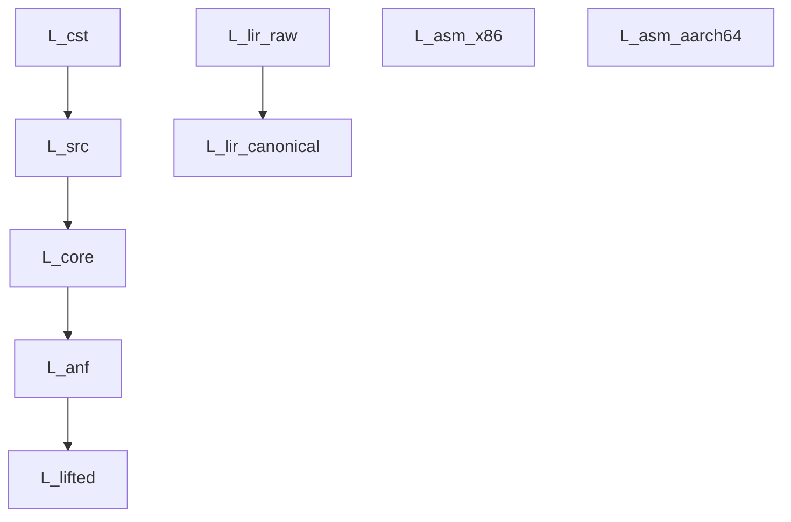

[ULisp トップ](../README.md) > [ドキュメント一覧](README.md) > **Nanopass Framework 言語仕様書**

---

# ULisp Nanopass Framework 言語仕様書 (Language Specifications)

本書は `ulisp/tools/generate_nanopass_docs.scm` により、登録済みの中間言語メタ情報から完全自動生成された仕様ドキュメントです。

- **関連仕様書**:
  - [パイプライン・Nanopass 詳細仕様書](spec_pipeline.md)
  - [低レベル IR (LIR) 正典仕様書](spec_lir.md)
  - [バックエンド & コード生成仕様書](spec_backend.md)
  - [テスト実行ガイド](guide_testing.md)

---

## 1. 言語継承・構文遷移図 (Language Derivation Graph)


```mermaid
graph TD
    L_cst["L_cst"]
    L_src["L_src"]
    L_cst --> L_src
    L_core["L_core"]
    L_src --> L_core
    L_anf["L_anf"]
    L_core --> L_anf
    L_lifted["L_lifted"]
    L_anf --> L_lifted
    L_lir_raw["L_lir_raw"]
    L_lir_canonical["L_lir_canonical"]
    L_lir_raw --> L_lir_canonical
    L_asm_x86["L_asm_x86"]
    L_asm_aarch64["L_asm_aarch64"]
```

## 2. 各言語の詳細定義 (Language Definitions)

### 言語: `L_cst`

- **親言語 (Parent)**: (ルート言語)
- **エントリ非終端記号 (Entry)**: `Program`
- **Nongenerative ID**: `#f`

#### 終端記号 (Terminals)

| 述語 (Predicate) | メタ変数パターン (Meta-Variables) |
| :--- | :--- |
| `symbol` | `(x lbl var)` |
| `constant` | `(c)` |

#### 非終端記号とプロダクション規則 (Nonterminals & Productions)

##### `Def` (d)

```scheme
  (define-library (x |...|) d |...|)
  (import d |...|)
  (export x |...|)
  (include c)
  (include-ci c)
  (define-syntax x e)
  (define-language x d |...|)
  (define-pass x d |...|)
  (define-picopass x d |...|)
  (define-femtopass x d |...|)
  (define-attopass x d |...|)
  (define x e)
  (define (x x1 |...|) e |...|)
  e
```

##### `Expr` (e)

```scheme
  x
  c
  (quote datum)
  (quasiquote datum)
  (let-syntax ((x e1) |...|) e |...|)
  (letrec-syntax ((x e1) |...|) e |...|)
  (syntax-rules (x |...|) (e1 e2) |...|)
  (if e1 e2 e3)
  (if e1 e2)
  (begin e |...|)
  (lambda (x |...|) e |...|)
  (set! x e)
  (let ((x e1) |...|) e |...|)
  (let x ((x1 e1) |...|) e |...|)
  (letrec ((x e1) |...|) e |...|)
  (letrec* ((x e1) |...|) e |...|)
  (let* ((x e1) |...|) e |...|)
  (do ((x e1 e2) |...|) (e_test e_res |...|) e_cmd |...|)
  (cond (e1 e2) |...| (else e_else))
  (cond-expand (e1 e2 |...|) |...|)
  (case key (dat e |...|) |...| (else e_else))
  (and e |...|)
  (or e |...|)
  (when e1 e2 |...|)
  (unless e1 e2 |...|)
  (delay e)
  (delay-force e)
  (list e |...|)
  (vector e |...|)
  (bytevector e |...|)
  (vector-append e |...|)
  (bytevector-append e |...|)
  (string-append e |...|)
  (guard (x c |...|) e |...|)
  (let-values (((x |...|) e1) |...|) e |...|)
  (let*-values (((x |...|) e1) |...|) e |...|)
  (parameterize ((x e1) |...|) e |...|)
  (define x e)
  (define (x x1 |...|) e |...|)
  (e0 e1 |...|)
```

##### `Program` (p)

```scheme
  (%program (d |...|) e)
  d
  e
```

---

### 言語: `L_src`

- **親言語 (Parent)**: `L_cst`
- **エントリ非終端記号 (Entry)**: `Program`
- **Nongenerative ID**: `L_cst->L_src`

#### 終端記号 (Terminals)

| 述語 (Predicate) | メタ変数パターン (Meta-Variables) |
| :--- | :--- |
| `symbol` | `(x lbl var)` |
| `constant` | `(c)` |

#### 非終端記号とプロダクション規則 (Nonterminals & Productions)

##### `Def` (d)

```scheme
  (define x e)
  (define (x x1 |...|) e |...|)
  e
```

##### `Expr` (e)

```scheme
  x
  c
  (quote datum)
  (quasiquote datum)
  (if e1 e2 e3)
  (if e1 e2)
  (begin e |...|)
  (lambda (x |...|) e |...|)
  (set! x e)
  (let ((x e1) |...|) e |...|)
  (let x ((x1 e1) |...|) e |...|)
  (letrec ((x e1) |...|) e |...|)
  (letrec* ((x e1) |...|) e |...|)
  (let* ((x e1) |...|) e |...|)
  (do ((x e1 e2) |...|) (e_test e_res |...|) e_cmd |...|)
  (cond (e1 e2) |...| (else e_else))
  (cond-expand (e1 e2 |...|) |...|)
  (case key (dat e |...|) |...| (else e_else))
  (and e |...|)
  (or e |...|)
  (when e1 e2 |...|)
  (unless e1 e2 |...|)
  (delay e)
  (delay-force e)
  (list e |...|)
  (vector e |...|)
  (bytevector e |...|)
  (vector-append e |...|)
  (bytevector-append e |...|)
  (string-append e |...|)
  (guard (x c |...|) e |...|)
  (let-values (((x |...|) e1) |...|) e |...|)
  (let*-values (((x |...|) e1) |...|) e |...|)
  (parameterize ((x e1) |...|) e |...|)
  (define x e)
  (define (x x1 |...|) e |...|)
  (e0 e1 |...|)
```

##### `Program` (p)

```scheme
  (%program (d |...|) e)
  d
  e
```

#### 削除・排除された不変条件 (Removed Invariants)

本言語では以下の構文が明示的に禁止・脱糖済みとして排除されています：

- `define-library`
- `import`
- `export`
- `include`
- `include-ci`
- `define-syntax`
- `define-language`
- `define-pass`
- `define-picopass`
- `define-femtopass`
- `define-attopass`
- `let-syntax`
- `letrec-syntax`
- `syntax-rules`

---

### 言語: `L_core`

- **親言語 (Parent)**: `L_src`
- **エントリ非終端記号 (Entry)**: `Program`
- **Nongenerative ID**: `L_src->L_core`

#### 終端記号 (Terminals)

| 述語 (Predicate) | メタ変数パターン (Meta-Variables) |
| :--- | :--- |
| `symbol` | `(x lbl var)` |
| `constant` | `(c)` |

#### 非終端記号とプロダクション規則 (Nonterminals & Productions)

##### `Def` (d)

```scheme
  (define x e)
  e
```

##### `Expr` (e)

```scheme
  x
  c
  (quote datum)
  (if e1 e2 e3)
  (if e1 e2)
  (begin e |...|)
  (lambda (x |...|) e |...|)
  (set! x e)
  (let ((x e1) |...|) e |...|)
  (letrec ((x e1) |...|) e |...|)
  (define x e)
  (e0 e1 |...|)
```

##### `Program` (p)

```scheme
  (%program (d |...|) e)
  d
  e
```

#### 削除・排除された不変条件 (Removed Invariants)

本言語では以下の構文が明示的に禁止・脱糖済みとして排除されています：

- `quasiquote`
- `letrec*`
- `let*`
- `do`
- `cond`
- `cond-expand`
- `case`
- `and`
- `or`
- `when`
- `unless`
- `delay`
- `delay-force`
- `list`
- `vector`
- `bytevector`
- `vector-append`
- `bytevector-append`
- `string-append`
- `guard`
- `let-values`
- `let*-values`
- `parameterize`
- `define-library`
- `import`
- `export`
- `include`
- `include-ci`
- `define-syntax`
- `define-language`
- `define-pass`
- `define-picopass`
- `define-femtopass`
- `define-attopass`
- `let-syntax`
- `letrec-syntax`
- `syntax-rules`

---

### 言語: `L_anf`

- **親言語 (Parent)**: `L_core`
- **エントリ非終端記号 (Entry)**: `Program`
- **Nongenerative ID**: `L_core->L_anf`

#### 終端記号 (Terminals)

| 述語 (Predicate) | メタ変数パターン (Meta-Variables) |
| :--- | :--- |
| `symbol` | `(x lbl var)` |
| `constant` | `(c)` |

#### 非終端記号とプロダクション規則 (Nonterminals & Productions)

##### `Def` (d)

```scheme
  (define x e)
  e
```

##### `Expr` (e)

```scheme
  (begin e |...|)
  (lambda (x |...|) e |...|)
  (set! x e)
  (let ((x e1) |...|) e |...|)
  (letrec ((x e1) |...|) e |...|)
  a
  (if a e1 e2)
  (if a e1)
  (%make-closure a1 a |...|)
  (%make-closure-env a1 a |...|)
  (%closure-ref a c)
  (%closure-set! a1 c a2)
  (%cont-fun x (x |...|) e1 e2)
  (%cont-call x a |...|)
  (%with-handler a1 a2)
  (%raw-call/cc a)
  (%call-with-values a1 a2)
  (%values a |...|)
  (%direct-call a1 a |...|)
  (%global-ref x)
  (%global-set! x e)
  (a0 a |...|)
```

##### `Program` (p)

```scheme
  (%program (d |...|) e)
  e
```

##### `Atom` (a)

```scheme
  x
  lbl
  var
  c
  (quote datum)
  (%closure-ref a c)
  (%global-ref x)
```

#### 削除・排除された不変条件 (Removed Invariants)

本言語では以下の構文が明示的に禁止・脱糖済みとして排除されています：

- `quasiquote`
- `letrec*`
- `let*`
- `do`
- `cond`
- `cond-expand`
- `case`
- `and`
- `or`
- `when`
- `unless`
- `delay`
- `delay-force`
- `list`
- `vector`
- `bytevector`
- `vector-append`
- `bytevector-append`
- `string-append`
- `guard`
- `let-values`
- `let*-values`
- `parameterize`
- `define-library`
- `import`
- `export`
- `include`
- `include-ci`
- `define-syntax`
- `define-language`
- `define-pass`
- `define-picopass`
- `define-femtopass`
- `define-attopass`
- `let-syntax`
- `letrec-syntax`
- `syntax-rules`

---

### 言語: `L_lifted`

- **親言語 (Parent)**: `L_anf`
- **エントリ非終端記号 (Entry)**: `Program`
- **Nongenerative ID**: `L_anf->L_lifted`

#### 終端記号 (Terminals)

| 述語 (Predicate) | メタ変数パターン (Meta-Variables) |
| :--- | :--- |
| `symbol` | `(x lbl var)` |
| `constant` | `(c)` |

#### 非終端記号とプロダクション規則 (Nonterminals & Productions)

##### `Def` (d)

```scheme
  (define x e)
  e
```

##### `Expr` (e)

```scheme
  (begin e |...|)
  (set! x e)
  (let ((x e1) |...|) e |...|)
  (letrec ((x e1) |...|) e |...|)
  a
  (if a e1 e2)
  (if a e1)
  (%make-closure a1 a |...|)
  (%make-closure-env a1 a |...|)
  (%closure-ref a c)
  (%closure-set! a1 c a2)
  (%cont-fun x (x |...|) e1 e2)
  (%cont-call x a |...|)
  (%with-handler a1 a2)
  (%raw-call/cc a)
  (%call-with-values a1 a2)
  (%values a |...|)
  (%direct-call a1 a |...|)
  (%global-ref x)
  (%global-set! x e)
  (a0 a |...|)
  (if e1 e2 e3)
  (if e1 e2)
  (%direct-call a1 e |...|)
  (annotate x e)
  (%stack-cons a1 a2)
  (%box-fixnum e)
  (%unbox-fixnum e)
  (e0 e1 |...|)
```

##### `Program` (p)

```scheme
  e
  (%program (fn |...|) e)
```

##### `Atom` (a)

```scheme
  x
  lbl
  var
  c
  (quote datum)
  (%closure-ref a c)
  (%global-ref x)
  (%unbox-fixnum a)
```

##### `FunctionDecl` (fn)

```scheme
  (%function x (x |...|) e)
```

#### 削除・排除された不変条件 (Removed Invariants)

本言語では以下の構文が明示的に禁止・脱糖済みとして排除されています：

- `lambda`
- `quasiquote`
- `letrec*`
- `let*`
- `do`
- `cond`
- `cond-expand`
- `case`
- `and`
- `or`
- `when`
- `unless`
- `delay`
- `delay-force`
- `list`
- `vector`
- `bytevector`
- `vector-append`
- `bytevector-append`
- `string-append`
- `guard`
- `let-values`
- `let*-values`
- `parameterize`
- `define-library`
- `import`
- `export`
- `include`
- `include-ci`
- `define-syntax`
- `define-language`
- `define-pass`
- `define-picopass`
- `define-femtopass`
- `define-attopass`
- `let-syntax`
- `letrec-syntax`
- `syntax-rules`

---

### 言語: `L_lir_raw`

- **親言語 (Parent)**: (ルート言語)
- **エントリ非終端記号 (Entry)**: `Program`
- **Nongenerative ID**: `#f`

#### 終端記号 (Terminals)

| 述語 (Predicate) | メタ変数パターン (Meta-Variables) |
| :--- | :--- |
| `symbol` | `(x lbl var cond_op sp_lbl)` |
| `integer` | `(n offset shift frame_size bytes tag si cnt bitmap line col)` |
| `string` | `(str fn_name)` |

#### 非終端記号とプロダクション規則 (Nonterminals & Productions)

##### `Register` (reg)

```scheme
  %rax
  %rbx
  %rcx
  %rdx
  %rsi
  %rdi
  %rbp
  %rsp
  %r8
  %r9
  %r10
  %r11
  %r12
  %r13
  %r14
  %r15
  %al
  (%reg x)
```

##### `StackSlot` (stk)

```scheme
  (%stack offset)
```

##### `MemRef` (mem)

```scheme
  (%mem reg offset)
  (%mem reg reg)
```

##### `LValue` (lval)

```scheme
  reg
  stk
  mem
```

##### `Operand` (opnd)

```scheme
  lval
  n
  lbl
```

##### `Inst` (inst)

```scheme
  (%nop)
  (%loc n line col)
  (%label lbl)
  (%block lbl (x |...|) inst |...|)
  (%jump lbl)
  (%jump lbl (opnd |...|))
  (%jump-if-false reg lbl)
  (%jump-if-false reg lbl (opnd |...|))
  (%jump-if reg lbl1 (opnd1 |...|) lbl2 (opnd2 |...|))
  (%jump-cond cond_op lbl)
  (%jump-cond str lbl)
  (%jump-if-zero lbl)
  (%direct-jump lbl)
  (%return)
  (%return opnd)
  (%c-call fn_name shift)
  (%call-closure shift)
  (%call-closure shift sp_lbl)
  (%call-closure shift str)
  (%direct-call lbl shift)
  (%direct-call lbl shift sp_lbl)
  (%direct-call lbl shift str)
  (%dispatch-consumer si1 si2 shift)
  (%mov lval opnd)
  (%load reg1 reg2 offset)
  (%store reg1 offset opnd)
  (%load-byte-zx reg1 reg2 offset)
  (%store-byte reg1 offset opnd)
  (%push reg)
  (%pop reg)
  (%code-ref reg lbl)
  (%str-ref reg lbl)
  (%global-ref reg var)
  (%global-set! var reg)
  (%add opnd1 opnd2)
  (%raw-add opnd1 opnd2)
  (%sub opnd1 opnd2)
  (%raw-sub opnd1 opnd2)
  (%imul opnd1 opnd2)
  (%raw-mul opnd1 opnd2)
  (%neg opnd)
  (%inc opnd)
  (%cqo)
  (%idiv opnd)
  (%shl opnd shift)
  (%shr opnd shift)
  (%sar opnd shift)
  (%bit-and opnd1 opnd2)
  (%bit-or opnd1 opnd2)
  (%bit-xor opnd1 opnd2)
  (%cmp opnd1 opnd2)
  (%raw-cmp opnd1 opnd2)
  (%set-boolean opnd cond_op)
  (%box-fixnum opnd1 opnd2)
  (%unbox-fixnum opnd1 opnd2)
  (%syscall)
  (%syscall si)
  (%memory-fence)
  (%atomic-cas! reg1 reg2 reg3)
  (%alloc opnd bytes tag)
  (%alloc opnd bytes tag si)
  (%alloc-stack opnd offset tag)
  (%capture-cc lbl si)
  (%push-handler lbl si1 si2)
  (%pop-handler si)
  (%raise)
  (%set-values-count cnt)
  (%store-values-buf si cnt)
```

##### `StringEntry` (se)

```scheme
  (lbl str)
  (str1 str2)
```

##### `SafepointEntry` (sm)

```scheme
  (lbl frame_size bitmap)
  (str frame_size bitmap)
```

##### `FunctionDecl` (f)

```scheme
  (%lir-function lbl (params (x |...|)) (frame-size frame_size) (body inst |...|))
```

##### `MainDecl` (m)

```scheme
  (%lir-main (frame-size frame_size) (body inst |...|))
```

##### `Program` (p)

```scheme
  (%lir-program (strings (se |...|)) (stackmaps (sm |...|)) (%lir-functions f |...|) m)
```

---

### 言語: `L_lir_canonical`

- **親言語 (Parent)**: `L_lir_raw`
- **エントリ非終端記号 (Entry)**: `Program`
- **Nongenerative ID**: `L_lir_raw->L_lir_canonical`

#### 終端記号 (Terminals)

| 述語 (Predicate) | メタ変数パターン (Meta-Variables) |
| :--- | :--- |
| `symbol` | `(x lbl var cond_op sp_lbl)` |
| `integer` | `(n offset shift frame_size bytes tag si cnt bitmap line col)` |
| `string` | `(str fn_name)` |

#### 非終端記号とプロダクション規則 (Nonterminals & Productions)

##### `Register` (reg)

```scheme
  %rax
  %rbx
  %rcx
  %rdx
  %rsi
  %rdi
  %rbp
  %rsp
  %r8
  %r9
  %r10
  %r11
  %r12
  %r13
  %r14
  %r15
  %al
  (%reg x)
```

##### `StackSlot` (stk)

```scheme
  (%stack offset)
```

##### `MemRef` (mem)

```scheme
  (%mem reg offset)
  (%mem reg reg)
```

##### `LValue` (lval)

```scheme
  reg
  stk
  mem
```

##### `Operand` (opnd)

```scheme
  lval
  n
  lbl
```

##### `Inst` (inst)

```scheme
  (%loc n line col)
  (%label lbl)
  (%block lbl (x |...|) inst |...|)
  (%jump lbl)
  (%jump lbl (opnd |...|))
  (%jump-if-false reg lbl)
  (%jump-if-false reg lbl (opnd |...|))
  (%jump-if reg lbl1 (opnd1 |...|) lbl2 (opnd2 |...|))
  (%jump-cond cond_op lbl)
  (%jump-cond str lbl)
  (%jump-if-zero lbl)
  (%direct-jump lbl)
  (%return)
  (%return opnd)
  (%c-call fn_name shift)
  (%call-closure shift)
  (%call-closure shift sp_lbl)
  (%call-closure shift str)
  (%direct-call lbl shift)
  (%direct-call lbl shift sp_lbl)
  (%direct-call lbl shift str)
  (%dispatch-consumer si1 si2 shift)
  (%mov lval opnd)
  (%load reg1 reg2 offset)
  (%store reg1 offset opnd)
  (%load-byte-zx reg1 reg2 offset)
  (%store-byte reg1 offset opnd)
  (%push reg)
  (%pop reg)
  (%code-ref reg lbl)
  (%str-ref reg lbl)
  (%global-ref reg var)
  (%global-set! var reg)
  (%add opnd1 opnd2)
  (%raw-add opnd1 opnd2)
  (%sub opnd1 opnd2)
  (%raw-sub opnd1 opnd2)
  (%imul opnd1 opnd2)
  (%raw-mul opnd1 opnd2)
  (%neg opnd)
  (%inc opnd)
  (%cqo)
  (%idiv opnd)
  (%shl opnd shift)
  (%shr opnd shift)
  (%sar opnd shift)
  (%bit-and opnd1 opnd2)
  (%bit-or opnd1 opnd2)
  (%bit-xor opnd1 opnd2)
  (%cmp opnd1 opnd2)
  (%raw-cmp opnd1 opnd2)
  (%set-boolean opnd cond_op)
  (%box-fixnum opnd1 opnd2)
  (%unbox-fixnum opnd1 opnd2)
  (%syscall)
  (%syscall si)
  (%memory-fence)
  (%atomic-cas! reg1 reg2 reg3)
  (%alloc opnd bytes tag)
  (%alloc opnd bytes tag si)
  (%alloc-stack opnd offset tag)
  (%capture-cc lbl si)
  (%push-handler lbl si1 si2)
  (%pop-handler si)
  (%raise)
  (%set-values-count cnt)
  (%store-values-buf si cnt)
```

##### `StringEntry` (se)

```scheme
  (lbl str)
  (str1 str2)
```

##### `SafepointEntry` (sm)

```scheme
  (lbl frame_size bitmap)
  (str frame_size bitmap)
```

##### `FunctionDecl` (f)

```scheme
  (%lir-function lbl (params (x |...|)) (frame-size frame_size) (body inst |...|))
```

##### `MainDecl` (m)

```scheme
  (%lir-main (frame-size frame_size) (body inst |...|))
```

##### `Program` (p)

```scheme
  (%lir-program (strings (se |...|)) (stackmaps (sm |...|)) (%lir-functions f |...|) m)
```

#### 削除・排除された不変条件 (Removed Invariants)

本言語では以下の構文が明示的に禁止・脱糖済みとして排除されています：

- `%nop`

---

### 言語: `L_asm_x86`

- **親言語 (Parent)**: (ルート言語)
- **エントリ非終端記号 (Entry)**: `Program`
- **Nongenerative ID**: `#f`

#### 終端記号 (Terminals)

| 述語 (Predicate) | メタ変数パターン (Meta-Variables) |
| :--- | :--- |
| `symbol` | `(lbl var op cc align)` |
| `integer` | `(n disp imm scale bitmap frame_size bytes)` |
| `string` | `(str)` |

#### 非終端記号とプロダクション規則 (Nonterminals & Productions)

##### `Register` (reg)

```scheme
  rax
  rbx
  rcx
  rdx
  rsi
  rdi
  rbp
  rsp
  r8
  r9
  r10
  r11
  r12
  r13
  r14
  r15
  al
  (%reg var)
```

##### `Memory` (mem)

```scheme
  (%disp disp reg)
  (%index reg reg scale disp)
  (%mem reg disp)
```

##### `Operand` (opnd)

```scheme
  reg
  mem
  (%imm imm)
  imm
  lbl
```

##### `Inst` (inst)

```scheme
  (%label lbl)
  (%p2align align)
  (%align align)
  (%raw-asm str)
  (mov opnd1 opnd2)
  (movzx opnd1 opnd2)
  (lea opnd1 opnd2)
  (add opnd1 opnd2)
  (sub opnd1 opnd2)
  (imul opnd1 opnd2)
  (and opnd1 opnd2)
  (or opnd1 opnd2)
  (xor opnd1 opnd2)
  (shl opnd1 opnd2)
  (shr opnd1 opnd2)
  (sar opnd1 opnd2)
  (neg opnd)
  (not opnd)
  (cmp opnd1 opnd2)
  (test opnd1 opnd2)
  (set cc opnd)
  (jmp lbl)
  (jcc cc lbl)
  (call opnd)
  (ret)
  (push opnd)
  (pop opnd)
  (cqo)
  (idiv opnd)
  (inc opnd)
  (syscall)
  (cld)
  (rep-movsb)
```

##### `StringEntry` (se)

```scheme
  (lbl str)
```

##### `SafepointEntry` (sm)

```scheme
  (lbl frame_size bitmap)
```

##### `FunctionDecl` (f)

```scheme
  (%asm-function lbl (frame-size n) (body inst |...|))
```

##### `MainDecl` (m)

```scheme
  (%asm-main (frame-size n) (body inst |...|))
```

##### `Program` (p)

```scheme
  (%asm-program (strings (se |...|)) (stackmaps (sm |...|)) (%asm-functions f |...|) m)
```

---

### 言語: `L_asm_aarch64`

- **親言語 (Parent)**: (ルート言語)
- **エントリ非終端記号 (Entry)**: `Program`
- **Nongenerative ID**: `#f`

#### 終端記号 (Terminals)

| 述語 (Predicate) | メタ変数パターン (Meta-Variables) |
| :--- | :--- |
| `symbol` | `(lbl var op cc align)` |
| `integer` | `(n disp imm shift bitmap frame_size bytes)` |
| `string` | `(str)` |

#### 非終端記号とプロダクション規則 (Nonterminals & Productions)

##### `Register` (reg)

```scheme
  x0
  x1
  x2
  x3
  x4
  x5
  x6
  x7
  x8
  x9
  x10
  x11
  x12
  x13
  x14
  x15
  x16
  x17
  x18
  x19
  x20
  x21
  x22
  x23
  x24
  x25
  x26
  x27
  x28
  x29
  x30
  sp
  xzr
  w0
  w1
  w2
  w3
  w4
  w5
  w6
  w7
  w8
  w9
  w10
  w11
  w12
  w13
  w14
  w15
  w16
  w17
  w18
  w19
  w20
  w21
  w22
  w23
  w24
  w25
  w26
  w27
  w28
  w29
  w30
  wzr
  (%reg var)
```

##### `Memory` (mem)

```scheme
  (%mem reg disp)
  (%mem reg reg)
  (%stack disp)
```

##### `Operand` (opnd)

```scheme
  reg
  mem
  (%imm imm)
  imm
  lbl
```

##### `Inst` (inst)

```scheme
  (%label lbl)
  (%p2align align)
  (%align align)
  (%raw-asm str)
  (mov opnd1 opnd2)
  (movz opnd1 opnd2)
  (movk opnd1 opnd2)
  (adr opnd1 lbl)
  (add opnd1 opnd2 opnd3)
  (sub opnd1 opnd2 opnd3)
  (mul opnd1 opnd2 opnd3)
  (sdiv opnd1 opnd2 opnd3)
  (msub opnd1 opnd2 opnd3 opnd4)
  (and opnd1 opnd2 opnd3)
  (orr opnd1 opnd2 opnd3)
  (eor opnd1 opnd2 opnd3)
  (lsl opnd1 opnd2 opnd3)
  (lsr opnd1 opnd2 opnd3)
  (asr opnd1 opnd2 opnd3)
  (neg opnd1 opnd2)
  (cmp opnd1 opnd2)
  (cset opnd cc)
  (b lbl)
  (b.cc cc lbl)
  (cbz opnd lbl)
  (cbnz opnd lbl)
  (bl lbl)
  (blr opnd)
  (ret)
  (stp opnd1 opnd2 mem)
  (ldp opnd1 opnd2 mem)
  (str opnd mem)
  (ldr opnd mem)
  (strb opnd mem)
  (ldrb opnd mem)
  (svc imm)
  (dmb op)
```

##### `StringEntry` (se)

```scheme
  (lbl str)
```

##### `SafepointEntry` (sm)

```scheme
  (lbl frame_size bitmap)
```

##### `FunctionDecl` (f)

```scheme
  (%asm-function lbl (frame-size n) (body inst |...|))
```

##### `MainDecl` (m)

```scheme
  (%asm-main (frame-size n) (body inst |...|))
```

##### `Program` (p)

```scheme
  (%asm-program (strings (se |...|)) (stackmaps (sm |...|)) (%asm-functions f |...|) m)
```

---

